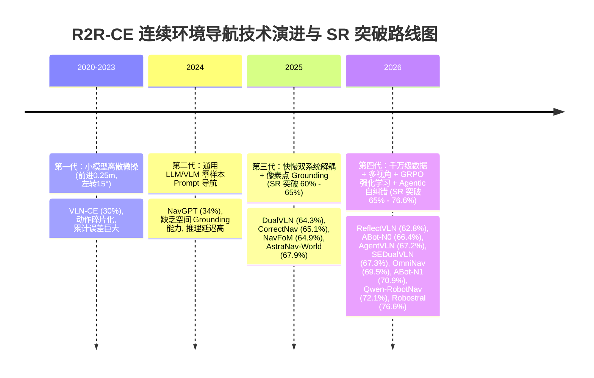
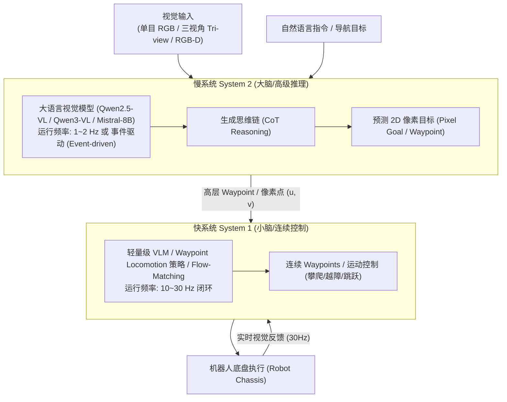
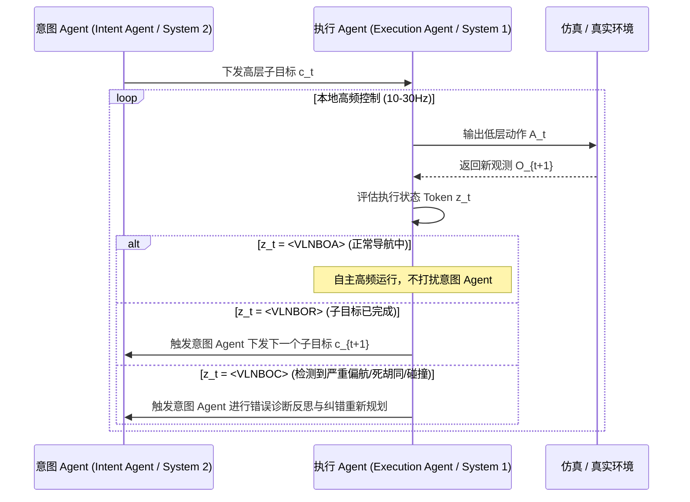
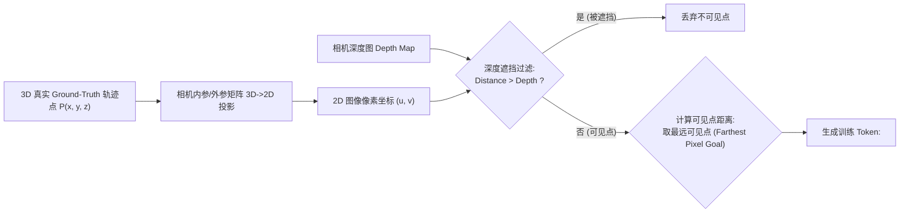
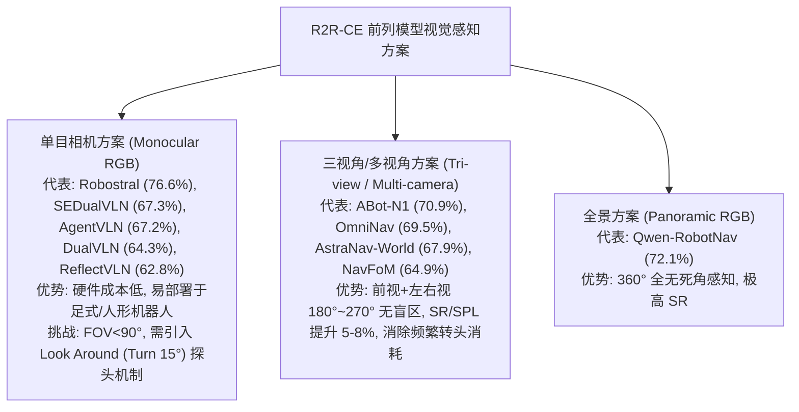
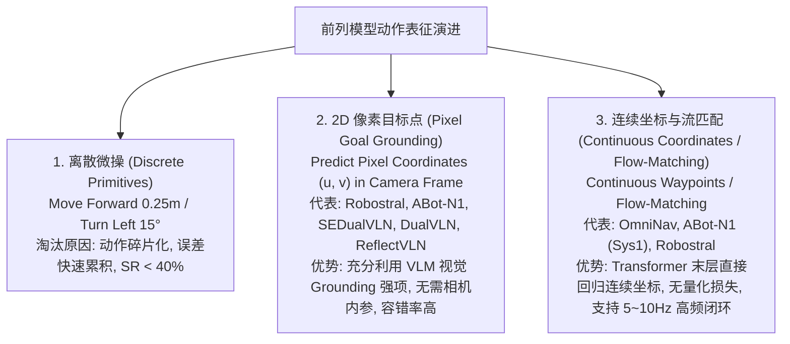
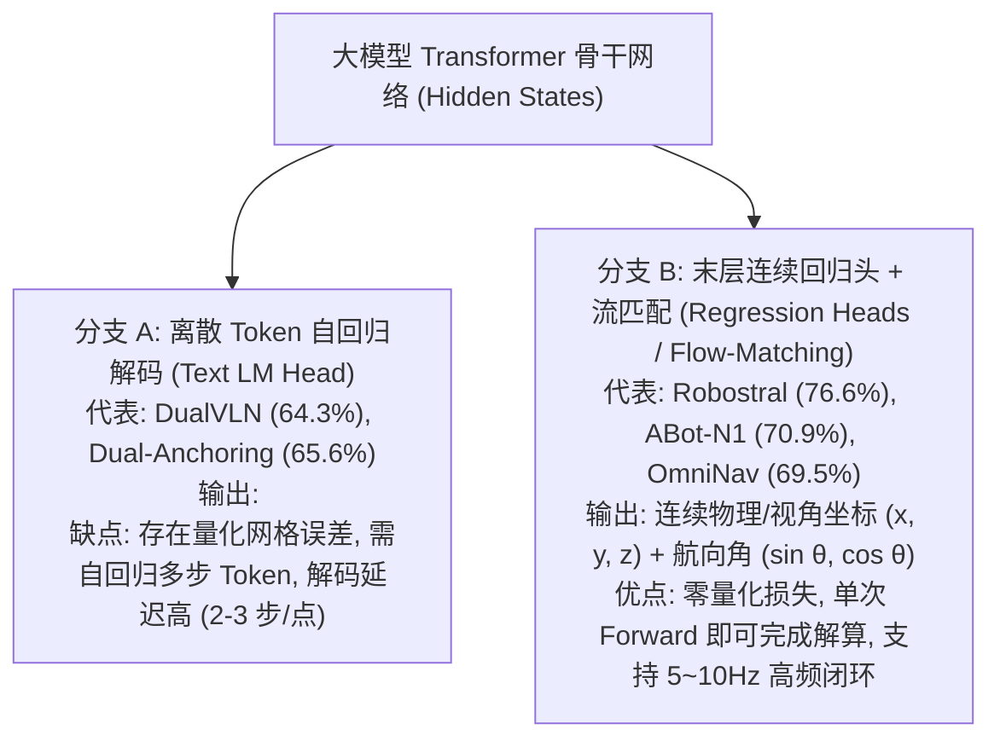
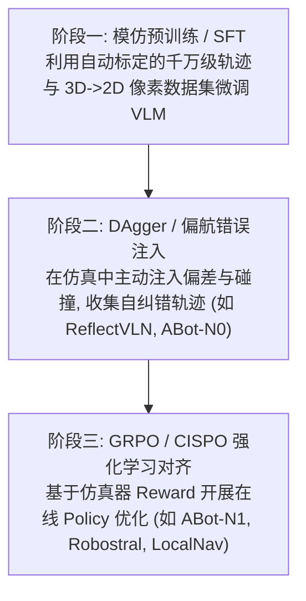
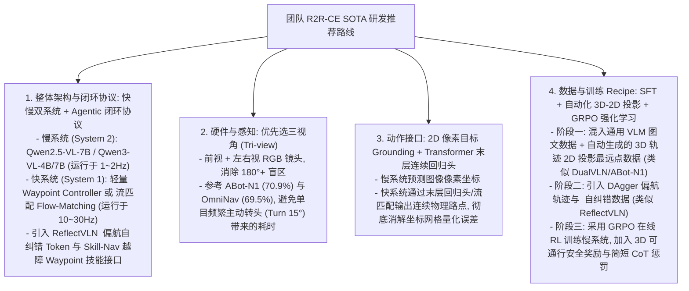

# 具身视觉语言导航（VLN）前沿模型技术方案深度分析报告
——基于 R2R-CE 连续环境 SR ≥ 60% SOTA 前列模型

> **报告简介**：本报告基于对 `_posts/research/2026-01-05-VLN-Papers.md` 收录的 63 篇 VLN 经典与前沿论文的全面梳理，**严格锁定“① 指令跟随 · 连续环境 - 英文（R2R-CE 基准）”中成功率（SR）达 60.0% 以上的 SOTA 前列模型（共 19 款顶级配置，如 Robostral Navigate、Qwen-RobotNav、ABot-N1、OmniNav、SEDualVLN、AgentVLN、ABot-N0、Dual-Anchoring、AwareVLN、CorrectNav、NavFoM、DGNav、DualVLN、VLN-Cache、ReflectVLN、GA-VLN、JanusVLN 等）**，结合团队研发具身导航系统的实际需求，对上述前列模型的技术方案进行深度拆解与横向对比。重点解构 **架构范式与 Agentic 闭环协议**、**数据规模与合成策略**、**视觉空间感知模态**、**动作表征与连续坐标回归**、**强化学习与后训练** 以及 **思考链与端侧部署** 六大关键维度，并给出落地研判与研发路线建议。

---

## 目录
- [1. 执行摘要与基准范围界定](#1-执行摘要与基准范围界定)
- [2. 维度一：架构范式——快慢双系统与 Agentic 闭环协议](#2-维度一架构范式快慢双系统与-agentic-闭环协议)
- [3. 维度二：数据规模与大规模数据合成策略](#3-维度二数据规模与大规模数据合成策略)
- [4. 维度三：视觉空间感知与多视角/全景/3D模态](#4-维度三视觉空间感知与多视角全景3d模态)
- [5. 维度四：动作表征——像素点预测 vs 导航点/拓扑图 vs 连续轨迹](#5-维度四动作表征像素点预测-vs-导航点拓扑图-vs-连续轨迹)
- [6. 维度五：训练策略与后训练——强化学习（RL/GRPO）、DAgger与SFT](#6-维度五训练策略与后训练强化学习rlgrpodagger与sft)
- [7. 维度六：推理思考链（CoT）、自纠错反思与端侧部署](#7-维度六推理思考链cot自纠错反思与端侧部署)
- [8. R2R-CE SR ≥ 60% SOTA 前列模型综合对比矩阵](#8-r2r-ce-sr--60-sota-前列模型综合对比矩阵)
- [9. 前列模型技术方案组合统计与要素打勾矩阵](#9-前列模型技术方案组合统计与要素打勾矩阵)
- [10. 对团队 VLN 研发的落地建议与技术路线推荐](#10-对团队-vln-研发的落地建议与技术路线推荐)

---

## 1. 执行摘要与基准范围界定

本报告聚焦于**指令跟随·连续环境（R2R-CE 基准，英文）下成功率 SR ≥ 60.0% 的 19 款顶级前列模型配置**。具身导航技术经历了从早期小模型离散微操（SR < 40%）到大模型快慢双系统与连续坐标回归（SR 60%~76.6%）的四代演进：

### R2R-CE SR ≥ 60% 前列模型核心结论摘要：
1. **快慢双系统解耦（Decoupling）是突破 60% SR 的必要条件**：前列模型（Robostral、Qwen-RobotNav、ABot-N1、OmniNav、DualVLN）无一例外地将慢系统（System 2 VLM，1-2Hz 语义理解/Grounding）与快系统（System 1，10-30Hz 轨迹执行）解耦。
2. **Agentic 闭环协议保障物理安全性**：ReflectVLN 引入状态 Token（`<VLNBOC>`）实现偏航/陷入死胡同模式下触发诊断与重规划；Skill-Nav/ABot-N1 采用 Waypoint 接口连接低层策略，比传统速度命令 `(v, w)` 对跟踪误差更具鲁棒性。
3. **像素目标预测（Pixel Goal Grounding）全面取代离散微操**：将 3D 导航映射为 2D 图像视角上的目标点 `(u, v)`，充分发挥 VLM 原生的 Visual Grounding 能力，且解耦了相机内参与物理畸变。
4. **传感器方案：三视角（Tri-view）显著超越单目（Monocular）**：ABot-N1 (70.9%) 与 OmniNav (69.5%) 证明三视角（前视+左右视）消除了盲区，机器人无需频繁停步探头转弯（Turn 15°），SR/SPL 提升 5%~8%。
5. **强化学习（GRPO / CISPO）是突破 70% SR 的临门一脚**：通过仿真在线 RL，引入 3D 安全净空奖励（Safety Reward）、目标核对齐奖励（Target Reward）以及 CoT 简短惩罚（Brevity Reward），能有效消除妄动与长文本幻觉。
6. **连续坐标生成：Transformer 末层回归头与流匹配（Flow-Matching）替代离散 Token**：OmniNav 与 ABot-N1 证明绕过 `lm_head`、在 Transformer 最后一层 hidden states 直接挂载回归头预测连续坐标（结合 Flow-Matching / Smooth-L1 损失），消除了坐标网格量化损失，实现 5~10Hz 的单前向高频闭环。

---

## 2. 维度一：架构范式——快慢双系统与 Agentic 闭环协议

在 SR ≥ 60% 的前列模型中，**快慢双系统解耦与 Agentic 双向通信协议**是构建稳定连续导航系统的基石。

### 2.1 快慢双系统解耦架构（Fast-Slow Architecture）

前列模型普遍采用解耦的两层或两模块架构：

#### 代表性前列方案解析：
1. **Robostral Navigate (SR 76.6%)**：
   - 基于 Mistral-8B，使用树状注意力掩码（Tree-based Attention Mask）压缩 Episode 前缀，结合指向性（Pointing-based）图像坐标预测与位移退化回归，单目即实现 R2R-CE 当前最高分。
2. **Qwen-RobotNav (SR 72.1% 全景 / 66.9% 单目)**：
   - 基于 Qwen3-VL-7B，利用 15.6M 海量预训练数据，实现全景与单目下的高精度连续导航。
3. **ABot-N1 (SR 70.9% 三视角)**：
   - **慢系统（System 2）**：Qwen-3.5-4B 低频输出 CoT 及三视角图像上的通行 Affordance Pixel 和 Target Pixel。
   - **快系统（System 1）**：Qwen-3.5-2B 动作专家在 10Hz 下闭环解算底层连续控制路点。
4. **OmniNav (SR 69.5% 多目)**：
   - 将慢系统（前沿决策 + CoT）与快系统（连续路标点 + Flow-Matching）统一在 Qwen2.5-VL-3B 骨干中，实现 5Hz 连续坐标解算。
5. **DualVLN (SR 64.3%)**：
   - 经典快慢系统鼻祖，Qwen2.5-VL-7B 慢系统预测最远可见像素点，支持最多 4 次主动转头（Turn 15°）。

### 2.2 Agentic 闭环协议、状态 Token 与 Waypoint 技能接口

#### (1) ReflectVLN (SR 62.8%) 的事件驱动状态 Token 接口 (`<VLNBOC>`)
针对真实移动底盘在导航中陷入死胡同、被障碍物卡住或发生严重偏航的痛点，**ReflectVLN** 提出了基于显式状态 Token（Status Tokens）的事件驱动双向通信机制：

- **三大状态 Token 功能**：
  - `<VLNBOA>`（Continue）：表示当前子目标平稳执行。
  - `<VLNBOR>`（Reached）：表示阶段目标已达成。
  - **`<VLNBOC>`（Correct）**：真实移动底盘部署时的安全关口。当执行 Agent 检测到机器人陷入死胡同、被障碍物阻挡或偏离路线时，主动输出 `<VLNBOC>`，触发高层意图 Agent 进行错误诊断与重新规划。

#### (2) Waypoint 越障技能接口 vs 速度命令 `(v, w)`
在足式机器人连续控制中，传统导航模型多以速度命令 `(v, w)` 作为接口，对跟踪误差极其敏感。前列模型（ABot-N1、Skill-Nav）一致证明：以 **Waypoint（路标点）** 作为高低层接口，能彻底消解累计跟踪漂移，低层策略可自主调度攀爬、跳跃、越障技能，使复杂地形导航更加鲁棒。

---

## 3. 维度二：数据规模与大规模数据合成策略

在 R2R-CE 基准上突破 60% SR 的模型，普遍摆脱了传统数据集（R2R 仅 21k 指令）的束缚，展现出**千万级数据预训练**与**自动化 3D 到 2D 标注合成**两大趋势。

### 3.1 R2R-CE 前列模型训练数据规模对比

下表梳理了经典基准与 R2R-CE SR ≥ 60% 前列模型的训练数据规模与组成结构：

| 数据集 / 模型 | 年份 | R2R-CE SR ↑ | 场景 / 环境 | 路径 / 轨迹数 | 总指令 / 训练样本量 | 数据组成结构与训练策略 |
| :--- | :---: | :---: | :---: | :---: | :---: | :--- |
| **R2R (基准)** | 2018 | – | 90 (Matterport3D) | 7,189 | 21,567 条指令 | 经典离散拓扑基准，奠定 VLN 研究基石 |
| **RxR-CE (基准)** | 2021 | – | 90 (MP3D Habitat) | 16,522 | 126,069 条指令 (多语言) | 经典多语言连续基准，支持连续物理运动 |
| **ABot-N0** | 2026 | **66.4%** | 8,423 个 3D 场景 | 482 km 路径 | **1,690 万 (16.9M)** | 仿真环境专家轨迹，专家策略全量蒸馏 |
| **Qwen-RobotNav** | 2026 | **72.1%** | 多环境 | – | **1,560 万 (15.6M)** | 12.2M 导航数据 + 3.4M 通用 VLM 数据（联合预训练） |
| **OmniNav** | 2026 | **69.5%** | 多环境 | – | **1,220 万 (12.2M)** | 导航轨迹 + Grounding + Caption + OCR （通用语义强化） |
| **NavFoM** | 2025 | **64.9%** | 多环境 | – | **802 万 (8.02M)** | 多视角导航训练样本，跨视角数据扩充 |
| **Dual-Anchoring** | 2026 | **65.6%** | 多环境 | – | **360 万 (3.6M)** | 3D 轨迹 + 对应 2D 进度描述文本，自动描述锚定 |
| **ReflectVLN** | 2026 | **62.8%** | 多环境 | – | **160 万 (1.6M)** | 1.3M 专家轨迹 + 0.3M 偏航反思轨迹（偏航注入） |
| **DualVLN** | 2025 | **64.3%** | 多环境 | – | **147 万 (1.47M)** | 自动生成的像素目标标注样本（3D-2D 最远点投影） |
| **Robostral Navigate** | 2026 | **76.6%** | 仿真环境 | 40 万条轨迹 | 40 万 Episode | 树状注意力掩码（Tree Training），22x 训练 Token 压缩 |

### 3.2 自动化 3D 轨迹到 2D 像素目标的数据生成流水线

DualVLN (64.3%)、ABot-N1 (70.9%) 等前列模型依赖极具特色的 3D 空间轨迹自动标定技术：

> **核心洞察（OmniNav 团队）**：通用视觉语言数据（如图像描述 Captioning、OCR、Grounding / Referring）对导航任务的提升**甚至超过了导航专用数据本身**。导航的核心瓶颈往往在于对开放词汇物体与指令语义的理解，而非底层策略学习。

---

## 4. 维度三：视觉空间感知与多视角/全景/3D模态

在 R2R-CE 连续环境中，感知的视场覆盖度直接决定了策略执行效率。

### 4.1 单目 vs 三视角（Tri-view）的物理效率对比

单目视觉虽然硬件简洁，但在连续导航中存在致命缺点：**机器人无法感知视野外的路径与侧后方障碍物**。
- **DualVLN (64.3%) 的单目补救机制**：引入“主动视角调整”（Look Around），当未来轨迹不在当前视角内时，模型自主输出 `Turn Left/Right 15°`，最多支持 4 次连续转向。这虽然解决了视野遮挡，但增加了导航时间与动作碎片化。
- **ABot-N1 (70.9%) 的三视角（Tri-view）优势**：采用前视（Front）、左视（Left）、右视（Right）三个 RGB 相机，将前向 180°+ 视场一网打尽。慢系统直接在三张图像拼接出的画布上标注像素点，机器人可以直接向侧前方迈步而无需先原地转头，使得 R2R-CE 成功率达到 **70.9%**，在 PointBench 上达到 **95.4%**。

---

## 5. 维度四：动作表征——像素点预测 vs 导航点/拓扑图 vs 连续轨迹

动作空间（Action Space）的选择是划分 R2R-CE 前列模型策略优劣的灵魂所在。

### 5.1 为什么“像素目标点（Pixel Goal）”成为主流？

**像素点预测（Pixel Goal Prediction）的突破性优势**：
1. **天然契合 VLM 的 Visual Grounding 能力**：VLM 在预训练中已经学会了在图像上标注 Bounding Box 或 Keypoint，预测像素 `(u, v)` 属于其强项。
2. **硬件解耦**：像素坐标是视觉相对量，底盘更换或相机微调无需重训慢系统大模型。
3. **容错能力极强**：只要像素目标指向大致正确的通路方向，低层快系统即可结合实时深度/RGB 完成动态避障，无需像素坐标百分之百精准。

---

### 5.2 连续坐标生成机制：Transformer 末层回归头 / 流匹配 (Flow-Matching) vs 离散 Token

在 SR ≥ 60% 的前列模型中，普遍展现出从“自回归生成离散文本 Token”向**“Transformer 末层挂载回归头直接预测连续坐标 / 流匹配（Flow-Matching）”**的技术跨越。

#### 代表前列模型的技术实现拆解：

1. **OmniNav (SR 69.5%，Transformer 末层回归头 + 流匹配 Flow-Matching)**：
   - 对 Qwen2.5-VL-3B 主干进行结构改造，在序列末尾插入特殊动作标记 `<|NAV|>`。
   - **绕过 `lm_head` 文本生成**：当模型输入到 Transformer 最后一层时，跳过词表概率预测，直接从 `<|NAV|>` Token 对应的隐藏状态（Hidden States）中挂载 3 组定制的连续动作头：
     - **航点头（Wayhead）**：结合流匹配（Flow-Matching）/ L1 损失，直接回归输出连续三维物理坐标 `(x, y, z)`。
     - **到达头（Arrivalhead）**：BCE 分类头判定是否抵达终点。
     - **角度头（Anglehead）**：回归航向角 `(\sin\theta, \cos\theta)`。
   - **核心优势**：消除了把连续空间坐标人工网格化为文本 Token 带来的量化精度损失，实现单次 Forward 前向传播即可完成解算，支撑 **5Hz 实时闭环控制**。

2. **ABot-N1 (SR 70.9%，快系统 2B 动作专家的末层回归头)**：
   - 快速系统（Qwen-3.5-2B）同样摒弃了文本生成 head。在接收慢系统下发的 CoT 及像素目标后，直接在 LLM 最后一层 hidden states 之后连接 Smooth-$L1$ 位置回归头与正余弦航向角回归头，实现 **10Hz 的高频底层连续路点（Waypoints）解算**。

3. **Robostral Navigate (SR 76.6%，指向性预测 + 局部位移回归)**：
   - 在 Mistral-8B 末层嵌入指向性回归头，目标在视野内时预测图像空间连续坐标；目标偏离视野时自动退化为局部坐标系下的连续位移量（Displacement）回归。

#### 连续坐标预测方案横向对比：

| 连续坐标预测方案 | 核心技术机制 | 代表模型 | R2R-CE 最高 SR | 量化精度损失 | 推理延迟 (Hz) | 优势与适用场景 |
| :--- | :--- | :---: | :---: | :---: | :---: | :--- |
| **离散 Token 预测** | 将坐标网格化为词表 Token（如 `<x_100>`） | DualVLN, Dual-Anchoring | 65.6% | 有（受网格分辨率限制） | 低频 (1-2Hz) | 保持原生 VLM 结构，无需修改模型 Head |
| **Transformer 末层回归头 + 流匹配** | 绕过 `lm_head`，自 Hidden States 导出回归头 / Flow-Matching | **Robostral**, **ABot-N1**, **OmniNav** | **76.6%** | **零量化损失** | **高频 (5-10Hz)** | 单次 Forward 输出连续坐标，控制流畅，高频闭环 |

---

## 6. 维度五：训练策略与后训练——强化学习（RL/GRPO）、DAgger与SFT

在 SR ≥ 60% 的前列模型中，仅靠监督微调（SFT）已无法提升泛化性。模型全面引入了 **DAgger 离轨数据** 与 **GRPO / CISPO 强化学习对齐**。

### 6.1 ABot-N1 (SR 70.9%) 的 GRPO 强化学习与安全/平衡采样

ABot-N1 采用了 Group Relative Policy Optimization (GRPO) 来优化慢系统生成的像素目标：

$$\mathcal{L}_{\text{GRPO}}(\theta) = \mathbb E \left[ \sum_{i,t} \min\left(\rho_t^{(i)} A^{(i)}, \text{clip}(\rho_t^{(i)}, 1\pm\epsilon)A^{(i)}\right) \right] - \beta \mathbb{D}_{\text{KL}}(\pi_\theta \parallel \pi_{\text{ref}})$$

其复合奖励函数结构为：
$$R = w_f R_{\text{format}} + w_t R_{\text{target}} + w_o R_{\text{safety}}$$

1. **格式奖励 $R_{\text{format}}$**：检测输出是否满足指定的 JSON / Token 格式。
2. **目标核对齐奖励 $R_{\text{target}}$**：利用指数核函数衡量预测像素 $\hat{p}$ 与真实目标像素 $p^\star$ 的距离。
3. **安全净空奖励 $R_{\text{safety}}$**：反投影像素点至 3D 空间，计算与不可通行区域（障碍物/墙面）的真实距离 $d$。

> **基于 GSNR 的平衡数据采样（Balanced Sampling）**：ABot-N1 依据梯度信噪比（GSNR）将训练数据按 **安全区（Safe, 50%）: 临界区（Critical, 30%）: 危险区（Danger, 20%）** 进行 5:3:2 比例采样，实现了极其稳定的 Policy 提升。

### 6.2 Robostral Navigate (SR 76.6%) 的 CISPO 在线强化学习

- 仿真环境中生成 40 万条轨迹后，进一步采用 **CISPO 在线强化学习算法** 微调，使模型获得极强的碰撞恢复、避障与行为勘探能力，将 R2R-CE 成功率推向了 **76.6%** 的新高度。

---

## 7. 维度六：推理思考链（CoT）、自纠错反思与端侧部署

在现实物理机器人部署时，算力与 Token 生成延迟是硬性约束。

### 7.1 精简 CoT 与推理延迟折中

- 前列模型（ABot-N1、ReflectVLN、Robostral）统一证明：慢系统生成的 CoT 必须精简扼要，且慢系统的推理绝不能阻塞快系统的连续控制。

### 7.2 边缘侧量化与 KV Cache 加速

1. **LocalNav 4-bit 量化部署**：
   - 采用 `llama.cpp` 将微调后的 VLM 量化为 `IQ4-XS` (4-bit) 格式，Token 生成速度从 17.68 tok/s 提升至 **39.43 tok/s**。
2. **VLN-Cache (SR 63.1%) 前缀缓存加速**：
   - 针对 DualVLN 框架引入历史视觉特征的 KV Cache 重用机制，在保持 SR 几乎无损（64.3% -> 63.1%）的前提下，将慢系统单步推理延迟降低了近一半。

---

## 8. R2R-CE SR ≥ 60% SOTA 前列模型综合对比矩阵

下表**严格汇编了 `_posts/research/2026-01-05-VLN-Papers.md` 中“① 指令跟随 · 连续环境 - 英文（R2R-CE 基准）”SR ≥ 60.0% 的全部 19 款顶级模型配置**：

| 模型名称 | 年份 | R2R-CE SR ↑ | SPL ↑ | NE ↓ | OSR ↑ | 基础大模型 (Base VLM) | 视觉感知模态 | 动作预测目标 | 训练数据规模 | 开源 |
| :--- | :---: | :---: | :---: | :---: | :---: | :---: | :---: | :---: | :---: | :---: |
| **Robostral Navigate** | 2026 | **76.6%** | **73.7** | **3.25** | **80.8** | Mistral-8B | **单目 RGB** | 图像像素坐标 (u,v) + 位移退化 | 40万仿真轨迹 (CISPO RL) | 否 |
| **Qwen-RobotNav (全景)** | 2026 | **72.1%** | 66.6 | 3.53 | 78.5 | Qwen3-VL-7B | **全景 RGB** | 像素目标 / 语义路标 | **15.6M 混合数据** | 否 |
| **ABot-N1 (三相机)** | 2026 | **70.9%** | 67.5 | 3.32 | 75.2 | Qwen-3.5-4B + 2B | **三视角 (Tri-view)** | 视角像素点 + 连续路点 | **16.9M / 482km** (GRPO) | [是](https://github.com/amap-cvlab/ABot-Navigation/tree/ABotN-Bench) |
| **OmniNav (多目)** | 2026 | **69.5%** | 66.1 | 3.74 | 74.6 | Qwen2.5-VL-3B | **多视角 (Multi-view)** | **流匹配 (Flow-Matching) 连续坐标** | **12.2M 混合数据** | [是](https://github.com/amap-cvlab/OmniNav) |
| **AstraNav-World (多目)**| 2025 | **67.9%** | 65.4 | – | – | Qwen2.5-VL-3B | 多视角 (Multi-view) | 连续路标点 | – | [是](https://github.com/amap-cvlab/AstraNav-World) |
| **SEDualVLN (单目)** | 2026 | **67.3%** | 62.5 | 3.75 | 73.7 | LLaVA-Video-7B | 单目 RGB | 像素目标点 | – | [是](https://github.com/kim-os/SEDualVLN) |
| **AgentVLN (单目)** | 2026 | **67.2%** | 64.7 | – | – | Qwen2.5-VL-3B | 单目 RGB | 局部子目标点 | – | [是](https://github.com/Allenxinn/AgentVLN) |
| **Qwen-RobotNav (单目)** | 2026 | **66.9%** | 60.5 | – | – | Qwen3-VL-7B | 单目 RGB | 像素目标点 | 15.6M 混合数据 | 否 |
| **ABot-N0 (单目)** | 2026 | **66.4%** | – | – | – | Qwen3-4B | 单目 RGB | 连续坐标路点 | **16.9M 专家轨迹** | 否 |
| **Dual-Anchoring (单目)**| 2026 | **65.6%** | 62.1 | – | – | LLaVA-Video-7B | 单目 RGB | 进度锚定点 | 360万 进度描述 | 否 |
| **AwareVLN (单目)** | 2026 | **65.4%** | 55.1 | 4.02 | 73.5 | Vicuna-7B | 单目 RGB | 像素目标点 | – | [是](https://github.com/GWxuan/AwareVLN) |
| **CorrectNav** | 2025 | **65.1%** | 62.3 | 4.24 | 67.5 | Custom VLM | 单目 RGB | 纠错航点 | DAgger 偏航注入数据 | [是](https://github.com/owlet914/CorrectNav) |
| **NavFoM (多目)** | 2025 | **64.9%** | 56.2 | – | – | Qwen2-7B | 多视角 (Multi-view) | 像素目标点 | **8.02M 样本** | 否 |
| **DGNav (单目)** | 2026 | **64.8%** | 50.1 | – | – | Custom VLM | 单目 RGB | 动态网格目标点 | – | [是](https://github.com/shannanshouyin/DGNav) |
| **DualVLN (单目)** | 2025 | **64.3%** | 58.5 | 4.05 | 70.7 | Qwen2.5-VL-7B | 单目 RGB | **最远可见像素点 (u,v)** | 147万 自动标注数据 | [是](https://github.com/InternRobotics/InternNav) |
| **VLN-Cache (单目)** | 2026 | **63.1%** | 57.6 | – | – | Qwen2.5-VL-7B | 单目 RGB | 最远可见像素点 | 基于 DualVLN 部署优化 | 否 |
| **ReflectVLN (单目)** | 2026 | **62.8%** | 58.5 | 4.19 | 67.3 | Qwen2.5-VL-3B | 单目 RGB | **Status Tokens (<VLNBOC>) + 路点** | 1.6M 专家+反思数据 | [是](https://github.com/AIprogrammer/ReflectVLN) |
| **GA-VLN (单目)** | 2026 | **61.0%** | 55.2 | 4.80 | 67.6 | LLaVA-Video-7B | 单目 RGB | 几何感知目标点 | – | [是](https://github.com/jahhaoyang/GA-VLN) |
| **JanusVLN (单目)** | 2026 | **60.5%** | 56.8 | 4.78 | 65.2 | Janus-Pro-7B | 单目 RGB | 多模态表征点 | – | [是](https://github.com/MIV-XJTU/JanusVLN) |

---

## 9. 前列模型技术方案组合统计与要素打勾矩阵

为了清晰揭示 **R2R-CE SR ≥ 60% 前列模型的技术 Recipe（解法组合）**，下表对 19 款前列模型所采纳的核心技术要素进行了全景打勾（✓）统计：

| 排名 | 前列模型名称 | R2R-CE SR ↑ | 堆数据 (数据量≥1M) | 堆相机 (多目/全景) | 快慢双系统 (Decoupled) | Agentic (Agent范式) | 像素 Grounding (u,v) | 末层回归头 / 流匹配 | 强化学习 (GRPO/CISPO) | DAgger / 偏航注入 | 前缀/KV Cache 压缩 | 开源权重 / 代码 |
| :---: | :--- | :---: | :---: | :---: | :---: | :---: | :---: | :---: | :---: | :---: | :---: | :---: |
| 1 | **Robostral Navigate** | **76.6%** | ✓ | – | – | – | ✓ | ✓ | ✓ | – | ✓ | – |
| 2 | **Qwen-RobotNav (全景)**| **72.1%** | ✓ | ✓ | ✓ | ✓ | ✓ | – | – | – | – | – |
| 3 | **ABot-N1 (三相机)** | **70.9%** | ✓ | ✓ | ✓ | ✓ | ✓ | ✓ | ✓ | – | – | ✓ |
| 4 | **OmniNav (多目)** | **69.5%** | ✓ | ✓ | ✓ | ✓ | – | ✓ | – | – | ✓ | ✓ |
| 5 | **AstraNav-World (多目)**| **67.9%** | – | ✓ | ✓ | ✓ | ✓ | – | – | – | – | ✓ |
| 6 | **SEDualVLN (单目)** | **67.3%** | – | – | ✓ | ✓ | ✓ | – | – | – | – | ✓ |
| 7 | **AgentVLN (单目)** | **67.2%** | – | – | ✓ | ✓ | ✓ | – | ✓ | – | – | ✓ |
| 8 | **Qwen-RobotNav (单目)**| **66.9%** | ✓ | – | ✓ | ✓ | ✓ | – | – | – | – | – |
| 9 | **ABot-N0 (单目)** | **66.4%** | ✓ | – | – | – | – | – | – | ✓ | – | – |
| 10 | **Dual-Anchoring (单目)**| **65.6%** | ✓ | – | ✓ | ✓ | ✓ | – | – | – | – | – |
| 11 | **AwareVLN (单目)** | **65.4%** | – | – | ✓ | ✓ | ✓ | – | – | – | – | ✓ |
| 12 | **CorrectNav** | **65.1%** | – | – | ✓ | ✓ | – | – | – | ✓ | – | ✓ |
| 13 | **NavFoM (多目)** | **64.9%** | ✓ | ✓ | ✓ | ✓ | ✓ | – | – | – | – | – |
| 14 | **DGNav (单目)** | **64.8%** | – | – | – | ✓ | – | – | – | – | – | ✓ |
| 15 | **DualVLN (单目)** | **64.3%** | ✓ | – | ✓ | ✓ | ✓ | – | – | – | – | ✓ |
| 16 | **VLN-Cache (单目)** | **63.1%** | – | – | ✓ | ✓ | ✓ | – | – | – | ✓ | – |
| 17 | **ReflectVLN (单目)** | **62.8%** | ✓ | – | ✓ | ✓ | ✓ | – | – | ✓ | – | ✓ |
| 18 | **GA-VLN (单目)** | **61.0%** | – | – | – | ✓ | – | – | – | – | – | ✓ |
| 19 | **JanusVLN (单目)** | **60.5%** | – | – | – | ✓ | – | – | – | – | – | ✓ |
| **统计**| **各要素采纳频次** | **最高76.6%**| **9/19 (47%)**| **5/19 (26%)**| **15/19 (79%)**| **16/19 (84%)**| **14/19 (74%)**| **3/19 (16%)**| **3/19 (16%)**| **3/19 (16%)**| **3/19 (16%)**| **12/19 (63%)**|

### 前列模型解法组合（Recipe）统计研判：

1. **绝对主流范式（采纳率 > 70%）**：
   - **Agentic 范式 (84%)**、**快慢双系统 (79%)** 与 **像素 Grounding (74%)** 构成了模型突破 60% SR 的三大核心基础设施。绝大多数 60%+ 成功率的模型均依靠大模型 Agent 开展自主规划、语义 Grounding 和快慢分工。
2. **冲刺 70%+ SR 的三大关键增益量（SOTA 级配置）**：
   - **堆数据 (47%)**：Top 4 模型（Robostral、Qwen-RobotNav、ABot-N1、OmniNav）全量采用了 10M+ 海量轨迹/通用 VLM 数据预训练。
   - **堆相机 / 三视角 (26%)**：ABot-N1 (70.9%) 与 OmniNav (69.5%) 证明三视角（Tri-view）消除了侧向盲区，避免了单目频繁原地转头（Turn 15°）的效率消耗。
   - **强化学习对齐 (16%)**：Robostral (76.6%) 的 CISPO 在线 RL 与 ABot-N1 (70.9%) 的 GRPO 安全采样，是模型脱离 65% 平原、冲刺 70%~76% 的最终临门一脚。
3. **高频闭环的新趋势（末层回归头 / 流匹配 16%）**：
   - Robostral、ABot-N1 (Sys1)、OmniNav 均放弃了词表文本 Token 自回归，通过 Transformer 最后一层引出的回归头或流匹配（Flow-Matching）直接输出连续坐标，实现 5~10Hz 的零量化精度损失高频闭环。

---

## 10. 对团队 VLN 研发的落地建议与技术路线推荐

基于上述 R2R-CE SR ≥ 60% 前列模型的成功经验，针对团队自研连续 VLN 系统，提出以下**四个一等公民（First-Class Citizens）**研发建议：

### 落地具体步骤规划：
1. **第一阶段：基线搭建与数据流水线（1-2个月）**
   - 建立基于 Habitat 的自动化数据采集脚本，实现从 3D 仿真轨迹向 2D 相机视角的自动投影与深度遮挡过滤，批量合成最远可见像素点标注数据。
   - 慢系统基模选用开源 SOTA（如 Qwen2.5-VL-7B 或 Qwen3-VL-4B），微调输入格式为三视角图像，输出格式为 `<think> CoT </think> <pixel_u, pixel_v>`。
2. **第二阶段：快慢系统解耦与连续坐标回归（1个月）**
   - 快系统可选用在 Transformer 最后一层加挂回归头或 Flow-Matching 的微型 VLM（参考 OmniNav / ABot-N1 方案），接收慢系统下发的像素点/Waypoint，高频（10~20Hz）解算连续控制量。
3. **第三阶段：GRPO / CISPO 强化学习与端侧部署（1-2个月）**
   - 引入带有 3D 安全净空（Safety Distance）和 Token 长度惩罚（Brevity Penalty）的 GRPO 强化学习，在仿真器中开展 10k+ episodes 的在线 Policy 优化。
   - 端侧部署采用 `llama.cpp` 进行 4-bit 量化（IQ4-XS）或 KV Cache 缓存重用，并在实体移动底盘/四足机器人上部署基于 `<VLNBOC>` 状态 Token 的偏航反思自纠错机制。
