# 1. 引言

视觉-语言-动作（Vision-Language-Action, VLA）模型代表了机器人技术的范式转变，将视觉感知、自然语言理解和动作控制统一在单一的端到端学习框架中。VLA模型使机器人能够直接从自然语言指令和视觉观察中学习操作策略，无需显式的中间表示或分离的感知-规划-控制模块。

自2023年Google DeepMind推出RT-2以来，VLA模型在机器人操作任务中展现出强大的泛化能力和零样本学习潜力。这一技术路线继承了大规模视觉-语言模型（VLM）在跨模态理解方面的优势，并将其扩展到具身智能领域，使机器人能够像理解图像和文本一样"理解"物理世界中的交互任务。

VLA模型在服务机器人、工业自动化、智能制造等领域有着广泛的应用前景。本文旨在系统梳理VLA领域的研究进展，为学习和研究VLA提供全面参考。

## 1.1 主要缩写

- **VLA**: Vision-Language-Action（视觉-语言-动作）
- **VLM**: Vision-Language Model（视觉-语言模型）
- **LLM**: Large Language Model（大语言模型）
- **CoT**: Chain-of-Thought（思维链）
- **MoE**: Mixture-of-Experts（专家混合）
- **RL**: Reinforcement Learning（强化学习）
- **RLHF**: Reinforcement Learning from Human Feedback（从人类反馈中强化学习）
- **DiT**: Diffusion Transformer（扩散Transformer）
- **DDPM**: Denoising Diffusion Probabilistic Model（去噪扩散概率模型）
- **SSM**: State Space Model（状态空间模型）
- **MPC**: Model Predictive Control（模型预测控制）
- **OXE**: Open X-Embodiment（开放跨具身数据集）
- **RLDS**: Reinforcement Learning Datasets（强化学习数据集格式）
- **CBF**: Control Barrier Function（控制屏障函数）
- **LoRA**: Low-Rank Adaptation（低秩适应）

## 1.2 VLA的应用场景

### 工业制造

VLA模型在工业自动化中展现出巨大潜力，能够处理多样化的生产任务。

**工业场景中的VLA应用**：

| 应用场景 | VLA能力需求 | 典型任务 |
|---------|------------|---------|
| **质量检测** | 视觉缺陷识别 + 自然语言标准理解 | "检查零件表面是否有划痕" |
| **柔性装配** | 视觉定位 + 精细操作 | "将A部件插入B部件的孔中" |
| **智能分拣** | 多物体识别 + 动态规划 | "将红色零件放入左侧托盘" |

**应用示例**：
- 智能装配线：基于语言指令调整装配流程
- 质量检测：结合视觉检测和操作反馈
- 柔性制造：快速适应产品变化

### 服务机器人

在家庭和商业服务场景中，VLA使机器人能够理解和执行多样化的用户指令。

典型应用领域：
- **家庭服务**：理解"帮我整理客厅"等开放式指令，执行物体重排列、清洁等复合任务（如π₀.5在新家庭环境中的10-15分钟长时程任务）
- **餐饮服务**：识别菜品 + 理解点餐指令 → 配送和上菜动作
- **医疗辅助**：理解医护人员指令 + 精确操作 → 递送医疗器械、协助护理

**关键技术**：开放世界泛化、人机交互、安全性保证

### 仓储物流

VLA模型使仓储机器人能够处理更复杂、更灵活的物流任务。

| 环节 | VLA优势 | 传统方案痛点 |
|------|---------|-------------|
| **智能拣选** | 自然语言订单理解 + 视觉识别 | 需要预定义所有SKU位置 |
| **动态码垛** | 理解"易碎品放上层"等约束 | 固定码垛模式，缺乏灵活性 |
| **异常处理** | 识别损坏物品并自主决策 | 需要人工介入 |

**商业价值**：减少人工标注成本，适应SKU快速变化，提升仓储自动化柔性

### 农业自动化与建筑施工

- **农业**：精准采摘（识别成熟果实）、植物护理（修剪、施肥）、自动化收获
- **建筑**：自动化砌砖、焊接作业、建筑材料搬运

---

# 2. VLA核心技术体系

## 2.1 什么是VLA？

VLA（Vision-Language-Action）模型是一类端到端的多模态学习模型，能够直接从视觉输入（相机图像）和语言指令中预测机器人的控制动作。与传统的模块化机器人系统不同，VLA将感知、推理和控制统一在单一的神经网络架构中。

<div align="center">
  
<figcaption>
VLA模型架构示意图（来源：OpenVLA）
</figcaption>
</div>

### VLA的核心特征

**1. 端到端学习**：直接从原始传感器数据到低层控制信号的映射，无需手工设计的中间表示。

**2. 多模态融合**：统一处理视觉、语言和动作三种模态，实现跨模态的语义对齐。

**3. 指令驱动**：通过自然语言指令指定任务目标，支持灵活的任务切换和零样本泛化。

**4. 大规模预训练**：继承视觉-语言模型的预训练知识，并在机器人演示数据上微调。

### VLA的发展里程碑：两年三次范式跃迁

**VLA研究时间线**：从模块化到端到端统一模型，再到强化学习的自我进化（2022-2026）

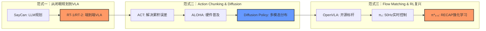

具身智能在短短两年内经历了三次核心的"范式跃迁"：
- **第一次跃迁（2022-2023初）——从语言规划到VLA**：早期如SayCan虽然能让LLM进行任务分解，但它是"闭着眼睛"做规划。直到RT-1、RT-2的出现，将视觉、语言和动作Token统一，第一次证明了VLM可以直接生成动作，实现了端到端的感知-控制。
- **第二次跃迁（2023）——Action Chunking与Diffusion Policy**：传统的单步动作预测容易产生累积误差（Compounding Error）。ACT（Action Chunking with Transformers）提出一次性预测一段动作序列（Chunk），解决了误差累积问题。结合成本不到2万美元的ALOHA开源双臂硬件，直接引爆了学界的具身研究。随后，Diffusion Policy用扩散模型替代了传统的CVAE，彻底解决了模型在面对多种合理运动路径时容易"取平均"导致失败的问题，天然且优雅地建模了动作的多模态分布。
- **第三次跃迁（2024-2025）——Flow Matching与RL重返舞台**：π₀将Diffusion Policy的弯曲去噪路径拉直（Flow Matching），推理速度提升5-7倍，实现了50Hz的高频连续控制（能玩扑克、折衣服）。更关键的是，π*₀.₆提出了RECAP（优势条件化）方法，巧妙绕过了Flow Matching难以计算对数概率的限制，让强化学习（RL）重新与VLA深度融合。这意味着机器人不再是出厂即定型的静态工具，而是能够通过真实部署收集数据实现"越用越好"的学习型智能体，真正转动了数据飞轮（Data Flywheel）。

## 2.2 VLA系统架构

一个完整的VLA系统包含三个核心组成部分：

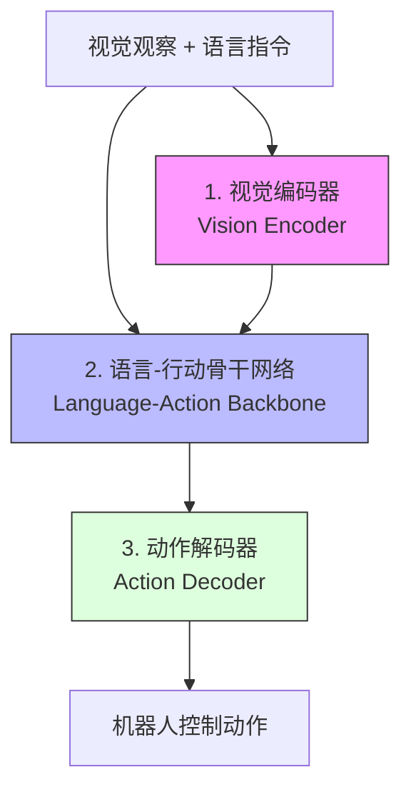

### 1. 视觉编码器（Vision Encoder）：从单眼到多眼
**功能**：从相机图像中提取视觉特征表示。

**主流架构演进**：
- **单编码器（早期/RT-2）**：使用单一 ViT 或 PaLI-X 处理所有信息，效率相对较低。
- **双编码器（OpenVLA 模式）**：
  - **DINOv2**：负责提取几何与空间特征（理解"在哪里"）。
  - **SigLIP**：负责提取语义与常识特征（理解"是什么"）。
- **多视角融合**：通过融合侧方、腕部等多摄像头输入，解决遮挡与深度感知问题。

### 2. 语言-行动骨干网络（Language-Action Backbone）：System 1 与 System 2 的融合
**功能**：作为"大脑"层，负责指令理解、推理与动作规划。

```mermaid
flowchart TD
    User[用户指令: "帮我洗杯子"] --> S2
    Obs[多视角视觉观察] --> S2
    Obs --> S1
    
    subgraph S2 ["System 2 (慢思考/脑): 高层规划器"]
        VLM[预训练 VLM] --> TaskDecomp[任务分解: 1.移动 2.抓取 3.清洗]
        TaskDecomp --> SubGoal[子目标生成: 3D 姿态/语义点]
    end
    
    SubGoal -- "低频指令 (~5Hz)" --> S1
    
    subgraph S1 ["System 1 (快思考/小脑): 动作专家"]
        Controller[Flow Matching/Diffusion] --> Motor[电机电流/扭矩控制]
        Motor --> Feedback[实时触觉/位姿反馈]
        Feedback --> Controller
    end
    
    Motor --> Act[物理动作执行]
    Feedback -.-> S2
    
    style S2 fill:#e1f5fe,stroke:#01579b
    style S1 fill:#fff3e0,stroke:#e65100
```

**主流架构**：
- **Transformer-based LLM**：如 Llama-2/3、Phi-3 等。
- **双系统架构（NVIDIA GR00T 范式）**：
  - **System 2 (慢思考)**：基于视觉语言模型负责理解环境、解读指令并作出长时序规划（~5Hz）。
  - **System 1 (快思考)**：基于扩散 Transformer (DiT) 或流匹配负责高频、精细的反射性动作（~50Hz）。

### 3. 动作解码器（Action Decoder）：从语言 Token 到高频连续轨迹
**功能**：将模型的高层决策转化为具体的机器人控制信号。

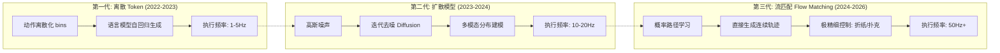

**主流范式比较**：
- **离散动作建模（RT-2/OpenVLA）**：将动作视为语言 Token 预测。优点是架构统一，缺点是难以生成连续流畅的高频动作。
- **连续动作建模（Diffusion Policy）**：使用扩散过程建模动作分布，能捕获多模态动作可能性，在精细操作中表现更优。
- **流匹配（Flow Matching, π₀）**：直接生成连续的关节轨迹，支持 **50Hz 高频控制**。这是实现"折纸、玩扑克牌"等极高精度任务的关键。

### 架构分类：端到端 vs 层级

VLA模型可以从架构层面分为两大类：端到端统一模型和层级架构模型。这种分类反映了不同的设计哲学和应用场景。

**End-to-End架构 vs Hierarchical架构对比**：

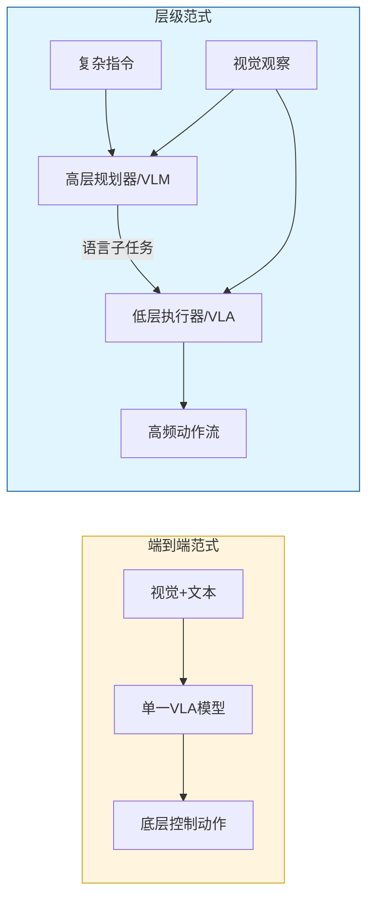

| 维度 | End-to-End | Hierarchical |
|------|------------|--------------|
| **设计理念** | 单一统一网络 | 分离规划与执行 |
| **推理方式** | 隐式端到端 | 显式分层推理 |
| **可解释性** | 低 | 高 |
| **适用场景** | 短时域任务 | 长时程复杂任务 |

**End-to-End Architecture 代表模型**：

| 模型 | 动作解码器 | 参数规模 | 特点 |
|------|-----------|---------|------|
| **OpenVLA** | 离散token化 | 7B | 首个开源大规模VLA（[详见第5章第8.9节](#8-9-openvla-2024)） |
| **π₀** | Flow Matching | 3B (VLM) + 860M (Action) | 50Hz实时控制（[详见第5章第8.10节](#8-10-pi0-2024)） |
| **Diffusion Policy** | DDPM | - | 多模态动作分布（[详见第5章第8.5节](#8-5-diffusion-policy-2023)） |
| **RDT-1B** | Diffusion Transformer | 1B | 大规模扩散VLA |

**Hierarchical Architecture 代表模型**：

| 模型 | 高层规划 | 低层执行 | 特点 |
|------|---------|---------|------|
| **π₀.5** | 增强推理VLM | Flow Matching | 多步骤推理链（[详见第5章第8.11节](#8-11-pi05-2025)） |
| **RT-H** | VLM子任务分解 | RT-1 | 层级任务执行 |
| **Hi Robot** | VLM规划器 | VLA执行器 | 两层显式分离 |
| **LoHoVLA** | 端到端学习的层级 | - | 隐式层级结构 |

最新研究表明，纯端到端和纯层级架构各有优劣，混合方法成为新趋势：ACoT-VLA在动作层面进行显式推理，保持统一架构（[详见第5章第8.13节](#8-13-acot-vla-2026)）。

## 2.3 VLA与传统机器人控制的区别

VLA代表了机器人控制范式的根本性转变：

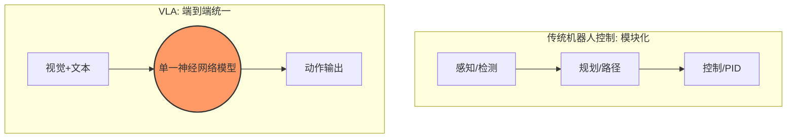

### 从模块化到端到端

**传统方法**：
- 感知模块：物体检测、位姿估计
- 规划模块：轨迹规划、路径优化
- 控制模块：PID控制、力控制
- 各模块独立设计和优化

**VLA方法**：
- 单一神经网络直接从像素到控制信号
- 联合优化所有组件
- 减少了模块间的信息损失

### 从任务特定到通用能力

**传统方法**：为每个任务设计专门的控制策略，难以泛化到新任务和新环境，需要大量的工程调试。

**VLA方法**：通过自然语言指令指定任务，零样本或少样本泛化到新任务，利用预训练知识处理未见场景。

### 从显式建模到隐式学习

**传统方法**：需要精确的环境模型和物体模型，依赖手工设计的特征和规则，对模型误差敏感。

**VLA方法**：从数据中隐式学习环境动力学，自动发现任务相关的特征，对感知噪声和模型不确定性更鲁棒。

### 从工程驱动到数据驱动

**传统方法**：依赖专家知识和人工调参，开发周期长，部署成本高，难以处理长尾场景。

**VLA方法**：基于大规模演示数据学习，通过数据增强提升泛化能力，持续学习和在线适应。

---

## 2.4 VLA任务分类

VLA模型可以应用于多种类型的机器人任务，以下从四个维度进行分类：

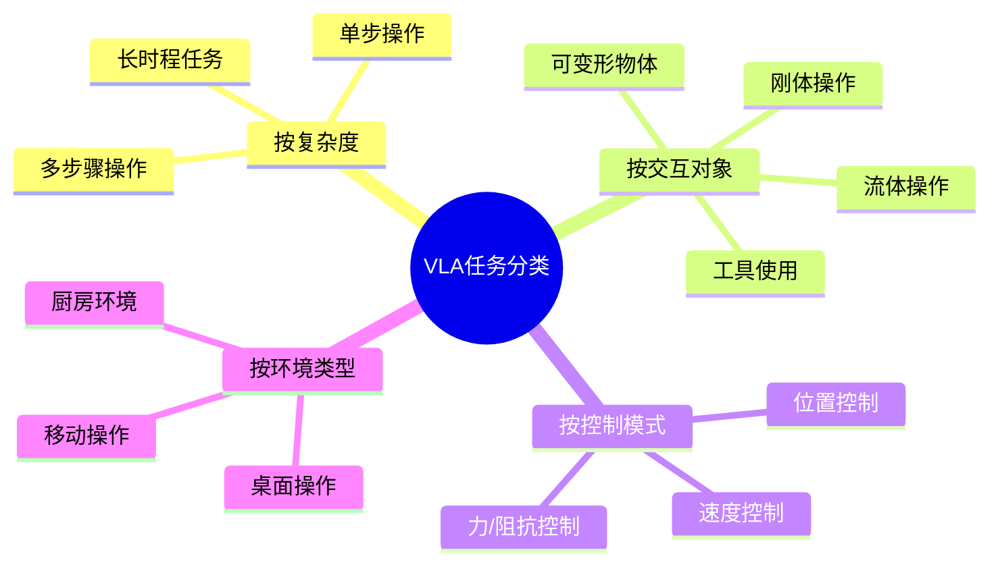

| 任务类型 | 典型输入 | 典型输出 | 代表方法 | 关键说明 |
|---------|---------|---------|---------|---------|
| **单步操作** | RGB图像 + 抓取指令 | 单次抓取动作 | RT-1, OpenVLA | 主要考察感知和控制精度，代表数据集：RLBench简单任务 |
| **多步骤操作** | 多帧图像 + 序列指令 | 有序动作序列 | CALVIN, LIBERO | 涉及子目标分解，需维护任务进度状态 |
| **长时程任务** | 多视角视频 + 目标描述 | 分层规划+执行 | π₀.5, ALFRED | 包含数十至上百步，需错误检测与恢复机制 |
| **刚体操作** | RGB/深度图 + 位置指令 | 6-DOF末端执行器 | RT-2, OpenVLA | 关注几何精度，是最基础的操作类型 |
| **可变形物体** | 多视角RGB + 形变状态 | 精细轨迹 | π₀（折衣服） | 物体状态高维，难以在仿真中准确建模 |
| **流体操作** | RGB + 任务描述 | 力矩控制序列 | 专用模型 | 需流体动力学建模，传感器限制明显 |
| **工具使用** | 场景图像 + 工具描述 | 工具-物体交互 | RT-2 | 需理解工具功能，是语义推理能力的体现 |
| **位置控制** | 视觉观测 | Δxyz + 四元数 | OpenVLA, RT-2 | 适合精确定位，7自由度机械臂标准输出 |
| **速度控制** | 连续帧图像 | dx/dy/dz速度 | 连续控制模型 | 轨迹更平滑，适合连续跟踪任务 |
| **力/阻抗控制** | 视觉+力传感 | 接触力指令 | 专用控制器 | 需力/扭矩传感器，适合组装和人机协作 |
| **桌面操作** | 固定视角图像 | 工作台范围动作 | 大多数VLA | 场景相对简单，是VLA的主要测试场景 |
| **厨房任务** | 多视角图像 | 复合操作序列 | π₀.5 | 多样物体和工具，应用于服务机器人 |
| **移动操作** | 导航+操作图像 | 移动+抓取动作 | π₀.5家庭任务 | 结合导航与操作，大范围工作空间 |

## 2.5 主流VLA模型横向对比汇总

为了直观展示各阶段代表性 VLA 模型的差异，下表汇总了其核心架构与技术指标：

| 模型 | 发布时间 | 参数规模 | 核心架构/特点 | 开源状态 | 备注 |
| :--- | :--- | :--- | :--- | :--- | :--- |
| **RT-1** | 2022.12 | 130M | Transformer + 离散 Token | ✅ 数据+代码 | 奠基之作 |
| **RT-2** | 2023.07 | 5B/55B | VLM 直接微调 | ❌ 闭源 | 首次验证 VLM 知识迁移 |
| **OpenVLA** | 2024.06 | 7B | **双编码器 (DINOv2+SigLIP)** | ✅ 权重+代码 | 目前最强开源 VLA 标杆 |
| **π₀** | 2024.10 | 3.8B | **Flow Matching (50Hz)** | ✅ 权重+代码 | 擅长折纸等精细操作 |
| **GR00T N1.6**| 2026.01 | 2.2B | **双系统 (System 1+2)** | ✅ 权重+代码 | 英伟达全栈生态绑定 |
| **Xiaomi-R0** | 2025.02 | 4.7B | MoT 架构（分离脑/小脑） | ✅ 权重+代码 | 中国力量，低延迟优化 |
| **LingBot-VLA**| 2025.02 | - | 跨形态泛化 (9种机器人) | ✅ 权重+代码 | 蚂蚁集团真机预训练 |
| **π₀.5** | 2025.04 | - | 异构任务协同训练 | ❌ 闭源 | 开放世界家庭长时程任务 |
| **ACoT-VLA** | 2026.01 | - | **动作空间推理** | 📄 仅论文 | 显著减少长时域误差累积 |

---

## 2.6 架构演进与发展趋势

### 架构演进时间线（2022-2026）

| 年份 | 里程碑 | 代表工作 | 技术突破 |
|------|--------|---------|---------|
| 2022 | 模块化阶段 | RT-1 | 大规模多任务Transformer，130k轨迹证明数据规模收益 |
| 2023初 | 语言规划探索 | SayCan, PaLM-E | LLM用于任务分解，但感知-控制分离 |
| 2023中 | 端到端VLA诞生 | RT-2, RT-X | VLM直接微调输出动作Token，涌现推理能力 |
| 2023下 | Action Chunking | ACT + ALOHA | 预测动作序列解决累积误差，低成本硬件普及 |
| 2023下 | 扩散策略 | Diffusion Policy | 多模态动作分布建模，精细操作突破 |
| 2024上 | 开源生态 | OpenVLA | 7B开源标杆，双编码器架构，OXE数据集 |
| 2024下 | Flow Matching | π₀ | 50Hz高频控制，折纸/折衣服等极精细任务 |
| 2025上 | 开放世界泛化 | π₀.5 | 未见家庭环境10-15分钟长时程任务 |
| 2025下 | RL重返舞台 | π*₀.₆ | RECAP优势条件化，数据飞轮转动 |
| 2026 | 动作空间推理 | ACoT-VLA | 动作CoT推理，长时域误差抗累积 |

从整体发展脉络来看，VLA研究经历了从模块化系统到端到端模型，再到端到端与层级混合的重要转变。

### 当前前沿方向：走向通用具身智能（2025-2026）

最新研究趋势表明，VLA正从单一操作任务向通用具身智能体演进，研究重点包括：
- 基于推理的VLA（Reasoning VLA）
- 多任务、多机器人的统一VLA
- VLA与世界模型的结合
- 从模仿学习到强化学习的转变

**基于世界模型的VLA**：世界模型被认为是机器人学习的"System 2"。如果VLA是"看到就做"的条件反射（System 1），世界模型则允许机器人在脑海中"想象"行动后果后再执行。近期，世界模型正逐渐成为合成数据的终极生成器，转动了VLA的"数据飞轮"：
- **UniSim**：首次证明可以将3D仿真、真实机器人数据和互联网视频混合训练出统一的世界模拟器
- **NVIDIA Cosmos**：为具身智能专门设计，能生成符合物理规律的视频轨迹
- **GIGA-star**：利用世界模型生成的合成数据训练VLA，效果提升可达30%

**中国力量**：中国在具身智能领域的参与正在从"跟跑"转向"参与定义规则"。

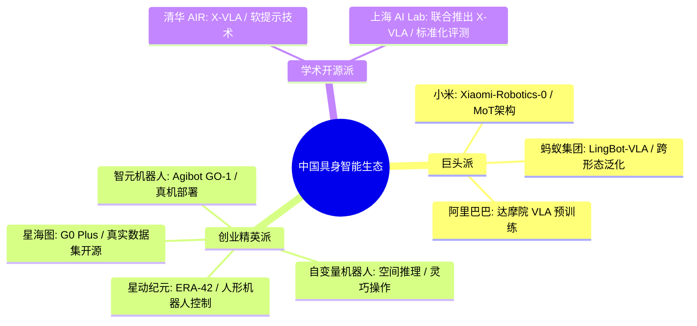

## 2.7 VLA开源生态

开源 VLA 的崛起并非单一模型的功劳，而是 **模型 + 数据 + 工具 + 硬件** 三层生态形成的"组合拳"效应，使其能够与谷歌、特斯拉等闭源巨头抗衡。

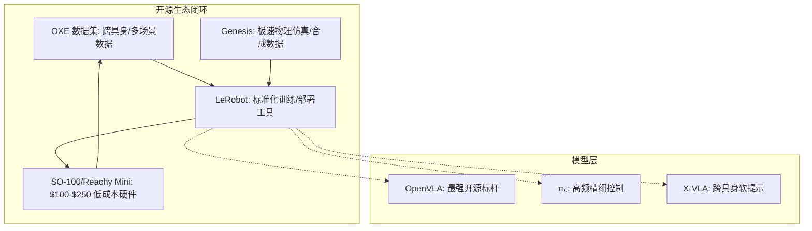

### 1. 数据层：Open X-Embodiment (OXE)
OXE 是开源阵营最宝贵的资源，它打破了实验室之间的数据孤岛：
- **跨平台多样性**：整合 22 种机器人形态，涵盖厨房、实验室、办公室等数百种场景。
- **涌现能力**：实验证明，即使模型规模不是最大，只要数据够多样（如引入 OXE），模型也能涌现出原有的空间推理能力（如理解 "on" 和 "near" 的空间语义差异）。
- **标准化贡献**：定义了统一的 RLDS 数据格式，解决了不同实验室数据格式不一的痛点。

### 2. 工具层：LeRobot 与 Genesis
- **LeRobot (Hugging Face)**：由前特斯拉工程师 Remi Cadene 打造，统一了数据格式并一键集成多种策略模型，打通了从采集、训练到部署的全流程。
- **Genesis (CMU)**：极速仿真工具，在一张 RTX 4090 上可实现每秒 4300 万帧的模拟速度（实时速度的 43 万倍），将"百万美元级别"的训练门槛降至数百美元。

### 3. 硬件层：低成本与标准化
- **Hugging Face 生态**：推出了 $100 的 SO-100 机械臂和 $250 的 Reachy Mini，极大降低了具身智能研究的门槛。
- **通用软件层**：如 OpenMind 平台，致力于构建跨厂商兼容的软件层，打破机器人系统的封闭性。

### 开源生态的三条核心启示

根据 2025-2026 年机器人行业的开源博弈，总结出以下三条核心技术与商业启示：

**1. 数据多样性重于单一规模**：实验（如 RT-2-X）证明，**轨迹的多样性（Diversity）比纯粹的数据量更关键**。引入 OXE 这种跨平台、跨场景的多样化数据，能让模型涌现出理解"空间语义（如 on vs near）"的能力，而单一机器人的海量重复数据则难以实现这种跨越。

**2. 模型、数据、工具的"生态联动"**：开源阵营之所以能挑战谷歌、特斯拉，靠的是 **OXE (数据) + LeRobot (工具链) + Genesis (极速仿真) + $100 硬件 (SO-100)** 形成的闭环。这种"组合拳"将具身智能的研究门槛从百万美元降低到了数百美元，让全球研究者能共同参与测试与改进。

**3. 开源与闭源的模糊边界**：RT-2-X 虽然是谷歌的闭源模型，但其训练依赖了 OXE 开源数据集；英伟达的 GR00T 介于开源与闭源之间（代码开放但深度绑定芯片生态）。这说明未来的博弈不在于单纯的代码是否公开，而在于**谁能定义机器人行业的基础设施标准**。

## 2.8 具身智能学习与入门路线

对于想要进入具身智能（特别是操作策略方向）的研究者或开发者，结合当前的开源生态，推荐以下四步递进式的学习路线：

### 第一步：动手实践（建立直觉）
- **不要上来就看论文**，先花数百美元买一个低成本开源机械臂（如 SO-100 或类 ALOHA 单臂）。
- **运行经典算法**：用几周时间跑通 ACT（Action Chunking）和 Diffusion Policy 的 Pipeline。不需要一开始就死磕数学原理，先建立起对"遥操作（Teleoperation）"、"数据采集"、"策略训练"和"真机部署推理"的物理体感。

### 第二步：跑通轻量级VLA（理解链路）
- **尝试小参数模型**：例如基于 Hugging Face 的 SmolVLA（450M参数），它能在单张消费级GPU上轻松运行。
- **理解数据流**：通过这个步骤理解"视觉 + 语言指令 -> 神经网络 -> 连续动作序列输出"的完整端到端链路是如何打通的。

### 第三步：体验SOTA模型（微调前沿基座）
- **微调 π₀ (Open Pi)**：基于 Physical Intelligence 开源的完整训练管线，收集 1-2 小时的特定任务数据，对 π₀ 进行微调。
- 这一步将让你对当前基于 Flow Matching 的 50Hz 高频精细控制能力有一个最前沿的直观认知。

### 第四步：真机项目落地（跨越Sim-to-Real）
- **必须走向真实物理世界**。在仿真（Simulation）中达到100%成功率并不代表模型具有强鲁棒性，因为仿真环境往往缺乏真实的传感器噪声、光照变化和物理机械的间隙误差。
- 在真机上能稳定达到 60% 以上的成功率，才是跨越了真正的工程瓶颈。

---

# 3. VLA核心挑战

本章采用**挑战驱动分类法**（Challenge-Centric Taxonomy），围绕VLA研究的五大核心瓶颈进行组织，而非传统的架构或任务分类。这种分类方式更好地反映了当前VLA领域亟需突破的关键问题。

**VLA研究的五大核心挑战体系**：

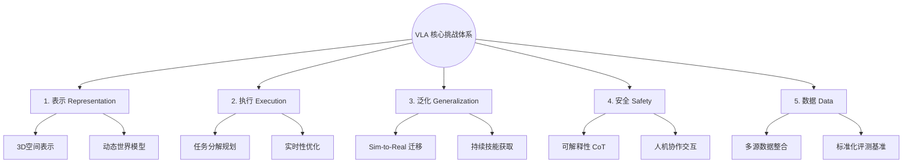

这五大挑战形成了VLA系统的完整开发路径：

> 💡 **核心链路概览**：
> 1. **表示 (Representation)**：建立多模态感知与物理世界的连接（2D → 3D/4D）
> 2. **执行 (Execution)**：实现指令理解、分层规划与 30Hz+ 实时控制
> 3. **泛化 (Generalization)**：从仿真迁移（Sim-to-Real）到开放世界持续进化
> 4. **安全 (Safety)**：确保动作的可解释性（CoT）与人类交互的可靠性
> 5. **数据 (Data)**：构建多源异构数据集（OXE）与标准化的评测基准（VLABench）

---

## 3.1 多模态对齐与物理世界建模

**核心问题**：弥合语义感知与物理交互之间的鸿沟，实现从2D图像到时空表示的跨越，并发展动态预测世界模型。

**多模态对齐与物理世界建模的三层架构**：
1. **基础对齐层**：语义到物理的接地（Vision-Language-Action对齐）
2. **时空表示层**：从2D图像到3D空间表示
3. **动态预测层**：世界模型与物理动力学建模

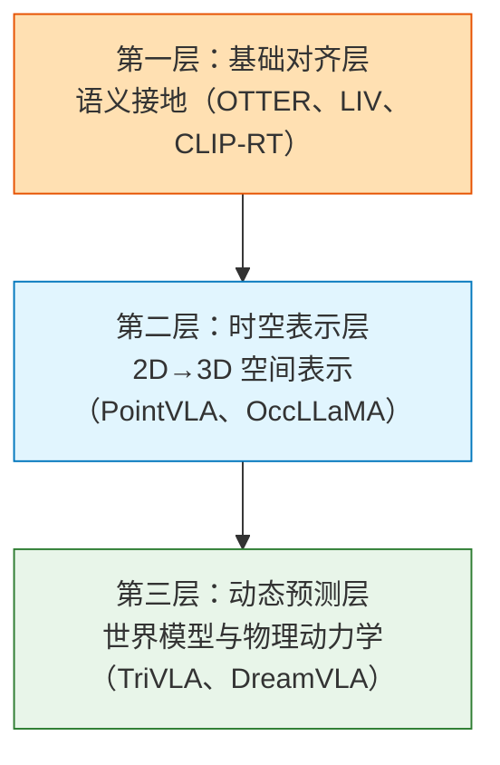

VLA模型需要将视觉-语言模型的语义理解能力转化为对物理世界的准确建模，这涉及三个层次的挑战：

#### 3.1.1 语义到物理的接地（Semantic-to-Physical Grounding）

**问题描述**：如何将抽象的语言描述（如"红色的杯子"）映射到物理世界中的具体对象和可执行动作。

**（1）Vision-Language Gap（视觉-语言鸿沟）**
- **问题**：RGB的高维感知空间与抽象符号语言之间的语义鸿沟
- **解决方案**：
  - **OTTER**：文本感知的特征提取机制
  - **LIV**：针对机器人控制数据的对比学习框架
  - **符号推理方式**：ACT-LLM, Look Leap等利用LLM进行高层符号推理

**（2）Vision-Language-Action Gap（视觉-语言-动作三元鸿沟）**
- **问题**：VLM的感知对齐能力如何转化为实际的物理动作执行
- **解决方案**：
  - **端到端微调**：RT-2, OpenVLA通过动作token化实现VLM到VLA的转化
  - **共享中间表示**：CLIP-RT, Humanoid-VLA在动作和感知间建立共享语义空间
  - **层级架构**：引入显式规划层作为语义-动作的桥梁
  - **VoxPoser**：LLM推理生成3D Affordance Map作为中间表示

**（3）多模态感觉融合（Sensory Fusion）**
- **问题**：如何整合触觉、力传感、音频等额外模态
- **解决方案**：
  - **专业编码器 + 对比学习**：TLA, OmniVTLA对齐多感觉模态
  - **融合策略**：深融合（Tactile-VLA）vs 模块化MoE融合（ForceVLA）
  - **生成式方案**：MultiGen在模拟器中生成多模态数据

**代表性工作**：
- **CLAP**：对齐视频视觉潜在空间与机器人动作空间
- **Point-VLA**：通过显式视觉提示（边界框）解决指代模糊
- **VoxPoser**：生成3D可供性图作为强中间表示
- **Tactile-VLA/ForceVLA**：整合触觉和力传感的多模态VLA

#### 3.1.2 2D到3D的空间表示（2D-to-3D Spatial Representations）

**问题描述**：从2D图像输入推断3D空间结构，理解深度、遮挡和空间关系。

**空间表示层次**：
- **2.5D深度地图**：Depth Helps, RoboFlamingo-Plus利用深度信息增强空间感知
- **点云表示**：PointVLA, GeoVLA, FP3直接操作3D点云进行操作规划
- **体素/占据栅格**：OccLLaMA, RoboMM使用体素化占据表示学习场景结构
- **4D表示（新方向）**：ARM4R预测3D点的时序运动轨迹，实现动态空间建模

**代表性工作**：
- **OccLLaMA**：基于占据网络的3D场景理解，学习体素化空间表示
- **TraceVLA**：3D轨迹追踪与预测，理解物体运动
- **PointVLA/GeoVLA**：直接在3D点云上进行操作推理
- **ARM4R**：预测3D点的运动轨迹，实现4D时空建模

#### 3.1.3 动态世界建模（Dynamic World Modeling）

**问题描述**：预测物体交互的动态变化，理解物理规律和因果关系。

**表示空间选择**：
- **观察空间预测（高保真）**：TriVLA, UP-VLA预测未来视觉观察；CoT-VLA, DreamVLA生成视觉子目标
- **潜在空间预测（高效）**：VLM-in-the-Loop在压缩潜在空间进行快速预测；MinD轻量级潜在动力学模型

**代表性工作**：
- **TriVLA**：三角形架构融合过去-现在-未来的视觉表示
- **VideoVLA**：视频条件的世界模型，预测动作后果
- **LUMOS**：显式世界模型进行长时程规划
- **DreamVLA**：在"梦境"中模拟和优化动作序列

**未来方向**：
- **混合潜在-物理-语义世界模型**：整合3D几何、物理动力学和语义属性
- **因果世界模型**：显式建模动作-结果的因果关系
- **可学习物理先验**：在神经网络中编码物理定律（守恒律、碰撞等）

---

## 3.2 指令跟随、规划与鲁棒实时执行

**核心问题**：解析复杂指令，进行分层任务分解，实现错误检测与自主恢复，并保证实时计算效率。

**指令跟随、规划与实时执行的完整流程**：
```
指令理解 → 任务分解与规划 → 动作执行 → 错误检测与恢复 → 实时性优化
```


#### 3.2.1 复杂指令解析与理解

**问题描述**：理解多样化、组合式的自然语言指令，处理模糊性和不完整性。

**开放式多模态指令**：
- **混合文本+图像+草图**：OE-VLA处理开放式混合模态指令；Interleave-VLA交错处理图像和文本序列

**模糊和欠指定指令**：
- **场景解析与验证**：ThinkAct场景分析和反馈验证机制；DeepThinkVLA因果CoT推理和结果驱动RL
- **空间推理**：InSpire显式空间推理提示，理解"左边"、"上面"等相对位置
- **主动澄清**：AskToAct模糊识别模块+主动请求用户澄清

**代表性工作**：
- **ThinkAct**：思考-行动架构，在执行前进行推理验证
- **InSpire**：空间推理增强的指令理解
- **AskToAct**：主动询问机制，处理模糊指令

#### 3.2.2 分层任务分解与规划

**问题描述**：将长时序复杂任务分解为可执行的子任务序列，并进行高层规划。

**三大规划范式**：

**（1）语言驱动规划**
- **单推理链方法**：π0.5在单一推理链中生成明确的语言子任务；OneTwoVLA在关键决策点进行结构化文本推理
- **层级方法**：Hi Robot两层架构（VLM规划 + VLA执行）；LoHoVLA端到端学习的层级范式

**（2）多模态中间表示规划**
- **视觉驱动规划**：CoT-VLA生成像素级视觉子目标；HiP三层架构（任务-子任务-动作）
- **Affordance驱动规划**：RT-Affordance预测可操作性；CoA-VLA的Chain-of-Affordance推理

**（3）技能库组合规划**
- **显式技能库**：VLP预定义技能的组合；RoboBrain大规模技能记忆库
- **隐式技能学习**：DexVLA billion参数的隐式技能表示；AgiBot World从大规模数据中自动发现技能

**代表性工作**：
- **π₀.5**：增强的推理能力，支持多步骤规划（详见[经典论文第8.11节](#8-11-pi05-2025)）
- **Hi Robot**：显式的两层层级架构
- **CoT-VLA**：视觉子目标作为思维链
- **ACoT-VLA**：动作空间推理（详见[经典论文第8.13节](#8-13-acot-vla-2026)）
- **DexVLA**：billion参数的灵巧操作专家

#### 3.2.3 错误检测与自主恢复

**问题描述**：实时检测执行失败，并自主生成恢复策略。

**关键技术**：
- **失败预测**：基于视觉反馈预测潜在失败
- **重规划机制**：动态调整执行计划
- **链式思考推理**：通过CoT进行故障诊断（如CoT-VLA）

**代表性工作**：
- **Fast-ThinkAct**：实时推理与失败恢复
- **CoT-VLA**：链式思考增强的VLA

#### 3.2.4 实时性与计算效率

**问题描述**：满足高频控制的实时性要求（30Hz+），同时保证推理准确性。

**四大优化方向**：

**（1）静态架构优化**
- **压缩量化**：BitVLA 1-bit量化；Evo-1 77M参数的超轻量模型
- **轻量级骨干网络**：NORA, TinyVLA专为实时控制设计
- **线性注意力机制**：SARA-RT, RoboMamba用Mamba/SSM替代Transformer的二次复杂度

**（2）动态优化解码过程**
- **动态推理路径**：MoLe-VLA跳层推理；CEED-VLA, DeeR-VLA提前退出机制
- **Token处理优化**：VLA-Cache自适应KV缓存；SpecPrune-VLA token级别剪枝
- **加速解码**：OpenVLA-OFT并行解码，25-50倍加速；Spec-VLA推测解码

**（3）动作表示和生成范式优化**
- **高效token化**：FAST频率空间动作序列token化，15倍加速；VQ-VLA向量量化动作表示
- **异步执行**：SmolVLA 450M参数实时运行；Real-Time Action Chunking动作块异步执行
- **加速扩散**：Time-Diffusion Policy时间条件加速；Discrete Diffusion VLA离散扩散加速

**（4）训练范式优化**
- **训练时推理，推断时跳过**：ECoT-Lite训练中使用推理，推断时直接输出
- **预测压缩表示**：V-JEPA 2预测语义压缩表示而非像素
- **双系统架构**：Fast-in-Slow快速System 1 + 慢速System 2

**代表性工作**：
- **SmolVLA**：450M参数实时运行
- **FAST**：动作tokenizer，15倍推理加速
- **OpenVLA-OFT**：优化微调，25-50倍加速
- **RoboMamba**：Mamba架构的线性复杂度
- **MoLe-VLA**：动态深度推理

**未来方向**：
- **自适应架构**：根据任务难度自动调整推理深度和模型规模
- **统一决策Token**：see-think-act的统一token流
- **硬件协同优化**：专用芯片加速VLA推理

---

## 3.3 从泛化到持续适应

**核心问题**：实现开放世界泛化，支持持续学习与增量技能获取，完成sim-to-real迁移，并启用在线强化学习。

**从泛化到持续适应的四层递进体系**：
1. **开放世界泛化**：未见环境/物体/任务的零样本能力
2. **持续学习**：增量技能获取，避免灾难性遗忘
3. **Sim-to-Real迁移**：缩小仿真与真实的差距
4. **在线强化学习**：从交互中自主学习和改进

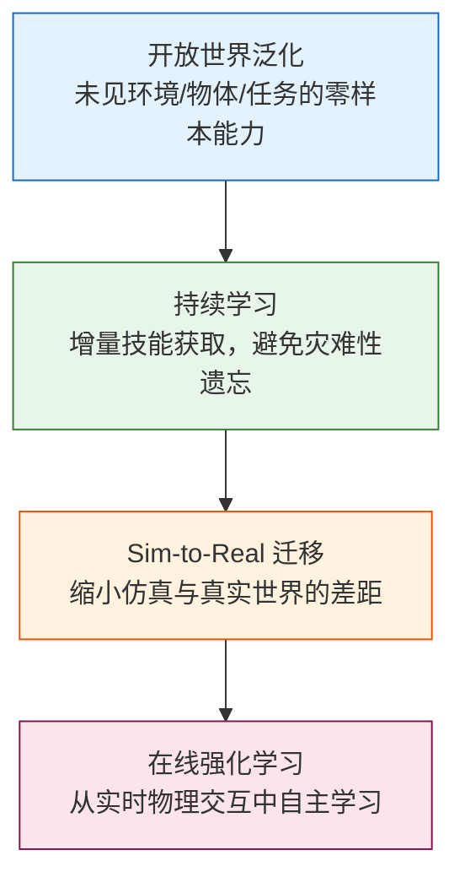

#### 3.3.1 开放世界泛化（Open-World Generalization）

**问题描述**：在未见环境、未见物体和未见任务组合上的零样本或少样本泛化。

**四大策略**：

**（1）知识迁移与利用**
- **多任务/多机器人预训练**：Octo在800k机器人轨迹上预训练；DexVLA billion参数扩散专家跨机器人形态预训练；EO-1在1.5M-EO-Data上预训练共享骨干
- **互联网/人类视频知识迁移**：R3M在Ego4D等人类第一人称视频上预训练视觉编码器；GR系列（GR-1, GR-2）从人类视角视频迁移物理和交互知识

**（2）范式级创新**
- **In-Context Learning**：ICIL从prompt中的少量演示推断任务，无需重新训练
- **概念泛化**：ObjectVLA联合训练机器人轨迹和box标注VL数据，实现零样本操作；LERF融合CLIP和3D NeRF实现自然语言定位和抓取
- **自适应范式**：Align-Then-Steer非侵入式适应；Robot Utility Models (RUM)零样本部署

**（3）增强数据多样性**
- **数据增强**：CACTI扩散修补技术生成多样化场景；GenAug文本到图像合成增强训练数据
- **语义增强**：ROSIE VLM知识蒸馏到机器人策略

**代表性工作**：
- **Octo**：800k轨迹预训练的通用策略
- **DexVLA**：billion参数跨形态专家
- **R3M/GR-2**：从人类视频迁移知识
- **ICIL**：上下文学习范式
- **ObjectVLA/LERF**：概念级泛化
- **Robot Utility Models**：零样本家庭部署

#### 3.3.2 持续学习与增量技能获取

**问题描述**：在不遗忘旧技能的前提下持续学习新技能。

**两大策略**：

**（1）参数隔离与扩展**
- **基于提示/码书学习**：新技能独立编码为提示或码书向量，保持核心参数不变
- **模块化MoE架构**：InstructVLA专家混合架构；iManip PerceiverIO架构实现模块化技能表示

**（2）回放知识巩固**
- **压缩经验回放**：ExpReS-VLA压缩体验回放，高效存储历史经验
- **时间回放策略**：iManip关键帧回放，保留重要状态转移

**代表性工作**：
- **InstructVLA**：MoE架构的终身学习
- **iManip**：模块化技能表示
- **ExpReS-VLA**：压缩经验回放

**评测基准**：
- **LIBERO**：首个终身机器人学习基准，评估技能保留和迁移

#### 3.3.3 Sim-to-Real迁移

**问题描述**：缩小仿真训练与真实部署之间的性能差距。

**两大策略**：

**（1）增强模拟保真度**
- **高保真仿真器**：ManiSkill3 GPU并行渲染+物理模拟，域随机化
- **稳定中间表示**：SLIM使用分割+深度等对光照不敏感的表示，减少视觉域差异

**（2）数据驱动模拟器**
- **生成增强**：GenAug无模拟器直接从文本生成训练数据
- **学习世界模型**：DreamGen从真实数据学习生成模型；RynnVLA-001神经模拟器

**（3）高效真实适应**
- **快速微调**：AdaWorld在少量真实数据上高效适应
- **鲁棒视觉表示**：学习对光照、纹理变化不敏感的特征；自监督预训练（DINOv2等）

**代表性工作**：
- **ManiSkill3**：新一代GPU并行仿真器
- **SLIM**：稳定中间表示减少域差距
- **GenAug**：生成式数据增强
- **AdaWorld**：高效sim-to-real适应

**未来方向**：
- **神经模拟器**：完全从数据学习的可微分模拟器
- **双向迁移**：real-to-sim用于改进仿真器

#### 3.3.4 在线强化学习

**问题描述**：通过与环境交互自主学习和改进策略。

**两大方向**：

**（1）优化学习过程**
- **知识迁移加速**：RLDG蒸馏预训练VLA知识到RL策略；Refined Policy Distillation MSE约束保持预训练能力；iRe-VLA阶段性冻结-解冻策略
- **算法内部优化**：CO-RFT分块时间差分学习，稳定训练

**（2）自动化奖励生成**
- **感知对齐奖励**：VLM-RMs用VLM作为奖励模型；RoboCLIP CLIP对齐的奖励信号
- **VLM批评**：RL-VLM-F GPT-4V比较不同轨迹；GRAPE VLM生成密集奖励信号
- **代码生成奖励**：Eureka LLM生成奖励函数代码；VLA-RL端到端VLA强化学习

**代表性工作**：
- **π*₀.₆**：从经验中学习，整合专家干预的RL（详见[经典论文第8.12节](#8-12-pi06-2025)）
- **SERL**：样本高效的机器人RL套件
- **Eureka**：LLM自动生成奖励函数
- **VLA-RL**：端到端VLA强化学习框架
- **RLDG**：知识蒸馏加速RL训练

**未来方向**：
- **形态无关表示**：跨具身形态的策略迁移
- **零样本跨具身迁移**：在一个机器人上学习，直接部署到另一个
- **自主开放式进化**：部署→发现→进化的闭环系统

---

## 3.4 安全性、可解释性与可靠交互

**核心问题**：确保可靠性保证，提升可解释性，实现可信的人机交互，并满足安全约束。

**安全性与可解释性的双层结构**：
- **第一层：可靠性保证**
  - 基于约束的安全（规则约束、内部化约束）
  - 学习对齐（值对齐、不确定性评估）
- **第二层：透明可信交互**
  - 增强过程可解释性（CoT、层级结构）
  - 行为可预测性（外化决策逻辑）

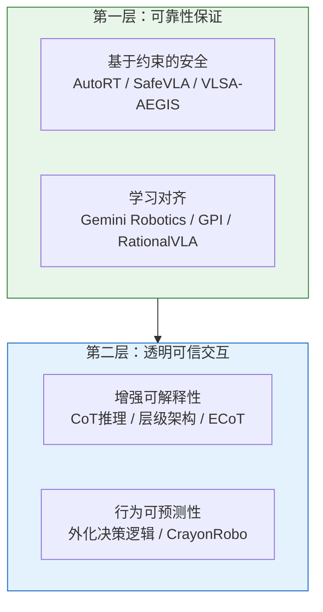

#### 3.4.1 可靠性保证

**三大范式**：

**（1）基于约束的安全范式**
- **规则约束**：AutoRT **宪法提示 (Constitutional Prompting)** 硬编码安全规则，为机器人建立底线行为准则。
- **区块链硬约束**：OpenMind 提出的前卫方案，将机器人安全规则写入以太坊区块链，防止机器人或恶意软件修改安全日志或绕过核心限制。

**（2）学习对齐范式**
- **值对齐**：Gemini Robotics使用 Constitutional AI 后训练，使机器人决策对齐人类价值观。
- **不确定性评估**：GPI置信度估计+回溯机制；RationalVLA可学习的拒绝token，主动拒绝不安全/无效指令。

**（3）即插即用安全层**
- **VLSA-AEGIS**：基于控制屏障函数（CBF）的安全层，无需修改 VLA 模型即可添加物理硬约束。

**代表性工作**：
- **SafeVLA**：约束MDP框架
- **RationalVLA**：学习拒绝危险指令
- **GPI**：不确定性感知的安全回溯

#### 3.4.2 可解释性与可信赖性

**两大方向**：

**（1）增强过程可解释性**
- **链式思维（CoT）**：Diffusion-VLA自然语言中间推理步骤；ECoT可编辑的推理链；CoT-VLA视觉子目标作为可视化推理链
- **层级结构天然可解释**：RT-H, HiRobot高层语言规划+低层执行；GraSP-VLA分层规划提供可追溯性
- **解码隐藏符号状态**：DIARC-OpenVLA线性探针解释内部表示

**（2）行为可预测性**
- **外化决策逻辑**：CrayonRobo视觉提示（箭头、高亮）外化决策过程
- **结构化任务切换**：SwitchVLA显式任务切换机制（回滚+平滑过渡）

**代表性工作**：
- **ECoT**：可编辑的链式思考推理
- **CoT-VLA**：视觉CoT增强可解释性
- **RT-H/HiRobot**：层级架构的天然可解释性
- **CrayonRobo**：视觉化决策过程

#### 3.4.3 安全约束与主动拒绝

**两大技术路线**：
- **插件式安全层**：VLSA-AEGIS基于控制屏障函数（CBF）的即插即用安全层，在不修改VLA模型的前提下添加硬约束
- **可学习拒绝机制**：RationalVLA学习拒绝不安全/无效指令，训练模型识别危险行为并主动拒绝

#### 3.4.4 人机协作交互

**关键能力**：

- **意图识别**：理解人类的隐含意图和目标；从不完整指令中推断完整任务
- **主动询问**：AskToAct检测模糊指令时主动请求澄清；OneTwoVLA关键决策点主动询问
- **从反馈学习**：Yell At Your Robot实时语言反馈纠正；π*₀.₆从专家干预中学习（详见[经典论文第8.12节](#8-12-pi06-2025)）
- **协作规划**：共享心智模型；预测人类动作在协作环境中避免冲突

**未来方向**：
- **预测式协作**：预测人类下一步动作，主动辅助
- **情境感知安全**：根据环境动态调整安全边界
- **自然多模态交互**：语言+手势+视觉指向的融合理解

---

## 3.5 数据构建与基准测试标准

**核心问题**：管理多源异构数据整合，建立标准化评测基准。

**数据构建与评测标准双轨体系**：
- **数据轨**：表示层统一对齐 → 数据层增强优化 → 标准化基准构建
- **评测轨**：全面性与标准化 → 任务广度与深度扩展 → 真实场景转仿真

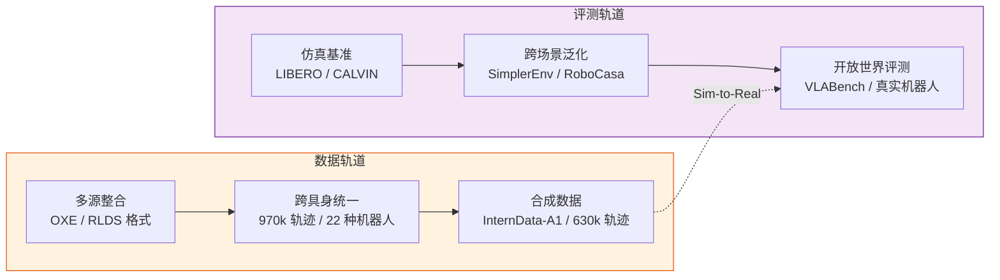

#### 3.5.1 多源异构数据整合

**三大层面**：

**（1）表示层统一对齐**
- **离散动作表示**：LAPA, Moto, UniVLA统一的动作token化方案；跨平台的动作空间标准化
- **共享语义空间**：RDT-1B扩散Transformer学习跨机器人表示；AgiBot World大规模统一语义空间；Scaling Cross-Embodied Learning形态无关表示
- **多模态对齐**：RT-1, GR-2视觉-动作对齐；ViSA-Flow视觉-空间-动作三元对齐；Humanoid-VLA全身控制的多模态对齐

**（2）数据层增强与优化**
- **生成增强**：CACTI扩散修补生成多样场景；GenAug文本到图像合成；ROSIE VLM知识蒸馏；Residual RL Data Generation通过残差RL生成数据
- **混合优化**：Re-Mix自适应采样权重平衡异构数据源

**（3）标准化与基准构建**
- **统一采集协议**：RH20T严格时间对齐的多模态数据（视觉+触觉+音频）；BridgeData V2标准化的桌面操作数据
- **跨域标准化**：Open X-Embodiment 60+数据集，970k轨迹，22种机器人；RoboMM多模态跨机器人数据
- **人类中心多视角**：Ego4D 3700小时第一人称视频；EPIC-KITCHENS厨房活动数据集；Ego-Exo4D同步的自我-外部视角

**代表性工作**：
- **Open X-Embodiment**：最大规模的跨机器人数据集
- **WALL-OSS**：聚合超过10000小时的自收集机器人轨迹
- **RH20T**：高质量多模态时间对齐数据
- **RDT-1B**：billion规模的扩散Transformer，统一表示

#### 3.5.2 评测基准与标准化指标

**三大方向**：

**（1）全面性与标准化**
- **统一评测框架**：Benchmarking VLAs统一输入/输出接口、标准化指标、多机器人支持
- **多维度评分**：EUQ (Evaluating Uncertainty and Quality)人类评估的多维评分，超越简单成功率
- **基础设施**：ManiSkill3 GPU并行，支持大规模评测；robosuite模块化仿真框架

**（2）任务广度与深度扩展**
- **长视距序列**：CALVIN连续多任务执行，评估长期规划；5个连续任务成功率作为核心指标
- **终身学习**：LIBERO 130个任务，4个套件（Spatial, Object, Goal, Long），评估技能保留和前向/后向迁移
- **多维对象/语言复杂度**：From Intention to Execution (VLABench)分离意图理解和执行能力；Intention Score + Progress Score双指标
- **零样本多语言**：SimplerEnv-Instruct 80个零样本任务，多语言指令

**（3）真实场景转仿真**
- **神经重建**：PolaRiS将真实视频转化为交互式仿真环境，提供可控的评测环境

**代表性工作**：
- **LIBERO**：首个终身机器人学习基准，130个任务
- **CALVIN**：长时序多任务基准
- **VLABench (Intention to Execution)**：分离意图和执行的评测
- **SimplerEnv**：标准化VLA评测平台，80个零样本任务
- **PolaRiS**：真实场景神经重建
- **ManiSkill3**：GPU并行高效评测

**未来方向**：
- **Simulation-First, Failure-Centric Paradigm**：以失败为核心的评测
- **Turn Failure into Signal**：将失败轨迹用于对比学习
- **Comprehensive Diagnostic Stress Testing**：超越二元成功率的细粒度诊断

#### 3.5.3 数据高效学习

**三大策略**：

**（1）数据增强**
- **视觉增强**：CACTI扩散修补生成多样化背景；GenAug文本到图像生成；颜色、光照、遮挡变化
- **轨迹增强**：时间插值、噪声注入；反向轨迹生成

**（2）主动学习**
- 不确定性采样；多样性采样；优先标注难例

**（3）迁移学习**
- **预训练知识利用**：VLM预训练（CLIP, SigLIP）；人类视频预训练（Ego4D, GR-2）；跨机器人迁移（Octo, RoboCat）
- **少样本微调**：适配器方法轻量化微调；LoRA, AdaLoRA等参数高效微调

**代表性工作**：
- **CACTI**：扩散增强数据生成
- **Octo**：10次演示实现新任务适应
- **ROSIE**：VLM知识蒸馏减少数据需求

**未来方向**：
- **自监督预训练**：利用大规模无标注视频
- **主动数据收集**：机器人自主选择探索策略
- **合成到真实**：完全在合成数据上训练，零样本迁移到真实

---

# 4. VLA主流数据集

VLA模型的性能高度依赖于高质量的训练数据。以下是VLA领域最具影响力的数据集：

## 4.1 大规模跨机器人数据集

### Open X-Embodiment Dataset

<div align="center">
  
<figcaption>
Open X-Embodiment: 22种机器人，60+数据集，970k轨迹的跨具身形态数据集（来源：<a href="https://robotics-transformer-x.github.io/">RT-X官网</a>）
</figcaption>
</div>

**基本信息：**
- **发布时间**：2023年10月
- **数据规模**：970k条真实机器人轨迹，60+个数据集
- **机器人平台**：22种不同的机器人（单臂、双臂、移动操作、人形等）
- **任务类型**：多样化的操作任务（抓取、放置、组装、厨房任务等）

**数据特点**：
- **跨机器人统一格式**：RLDS (Reinforcement Learning Datasets)标准
- **多模态观察**：RGB图像、深度图、本体感觉
- **语言标注**：自然语言任务描述
- **动作表示**：统一的动作空间定义
- **支持跨具身形态泛化研究**

**核心贡献**：
- 首个大规模跨机器人数据集
- 定义了机器人数据集的事实标准
- 催生了RT-X、OpenVLA等一系列跨机器人模型

**应用模型**：
- RT-X：在OXE上训练的跨机器人策略
- OpenVLA：7B参数开源VLA模型
- Octo：通用机器人策略
- DexVLA、RDT-1B等最新VLA模型

**获取方式**：https://robotics-transformer-x.github.io/

---

### EO-1 Dataset

**基本信息**：
- **数据规模**：1.5M轨迹（EO-Data）
- **特点**：超大规模预训练数据集
- **应用**：EO-1模型的预训练

---

### WALL-OSS Dataset

**基本信息**：
- **数据规模**：超过10,000小时自收集机器人轨迹
- **特点**：自主收集的大规模数据
- **应用**：大规模分层规划系统

---

### RT-1 Dataset

**基本信息：**
- **发布时间**：2022年12月
- **数据规模**：130k条真实机器人轨迹
- **机器人平台**：定制的移动操作机器人
- **任务类型**：700+种日常操作任务

**数据特点**：
- 高质量的专家演示
- 真实办公环境数据
- 丰富的语言指令多样性

**应用模型**：
- RT-1
- RT-2

---

## 4.2 模拟器数据集

### CALVIN (Composing Actions from Language and Vision)

**基本信息：**
- **发布时间**：2021年
- **环境**：PyBullet仿真器
- **任务类型**：长时序组合任务

**数据特点**：
- 多步骤任务链
- 语言条件的任务执行
- 评估长期规划能力

**评测指标**：
- 连续成功任务数
- 零样本泛化能力

**官网**：http://calvin.cs.uni-freiburg.de/

---

### LIBERO (Lifelong Benchmark for Robot Manipulation)

**基本信息：**
- **发布时间**：2023年
- **环境**：MuJoCo仿真器
- **任务数量**：130个多样化任务

**数据特点**：
- 4个任务套件，难度递增
- 评估持续学习和泛化能力
- 标准化的评测协议

**任务套件**：
1. LIBERO-Spatial：空间推理
2. LIBERO-Object：物体泛化
3. LIBERO-Goal：目标泛化
4. LIBERO-Long：长时序任务

**官网**：https://libero-project.github.io/

---

### RLBench

**基本信息：**
- **发布时间**：2019年
- **环境**：CoppeliaSim（V-REP）
- **任务数量**：100+任务

**数据特点**：
- 涵盖多种操作技能
- 提供视觉观察和状态信息
- 支持多种机器人平台

**任务类别**：
- 抓取和放置
- 工具使用
- 组装任务

**官网**：https://sites.google.com/view/rlbench

---

## 4.3 真实世界数据集

### Bridge Dataset (BridgeData V2)

**基本信息：**
- **发布时间**：2023年
- **数据规模**：60k条真实机器人轨迹
- **机器人平台**：WidowX 250机械臂
- **环境**：多样化的真实场景（办公室、厨房等）

**数据特点**：
- 多样化的桌面操作任务
- 真实办公和家庭场景
- 人类遥操作演示
- 高质量的标注和清洗

**V2更新**：
- 标准化采集流程
- 改进的数据质量控制
- 更丰富的场景多样性

**应用**：
- 模仿学习研究
- Sim-to-Real转移
- 包含在Open X-Embodiment中

**官网**：https://rail-berkeley.github.io/bridgedata/

---

### RH20T Dataset

**基本信息**：
- **发布时间**：2024年
- **特点**：严格时间对齐的多模态数据
- **模态**：视觉 + 触觉 + 音频 + 动作

**数据特点**：
- **微秒级时间同步**：所有传感器严格对齐
- **多模态融合**：RGB-D、触觉传感、音频
- **高频采集**：支持精细操作的高频数据

**应用**：
- 多模态VLA训练（Tactile-VLA, OmniVTLA等）
- 触觉感知研究

---

### DROID Dataset

**基本信息**：
- **发布时间**：2024年
- **数据规模**：76k条真实机器人操作轨迹
- **特点**：大规模in-the-wild数据

**应用**：
- 真实环境操作研究
- 鲁棒性评估

---

### Language-Table

**基本信息：**
- **发布时间**：2022年
- **数据类型**：真实桌面操作
- **任务类型**：语言条件的物体重排列

**数据特点**：
- 简化的二维操作任务
- 清晰的语言-动作对应
- 便于快速原型开发

**应用**：
- 语言理解研究
- 策略学习方法验证

---

## 4.4 人机交互数据集

### Ego4D

**基本信息：**
- **发布时间**：2022年
- **数据规模**：3,600小时第一人称视频
- **场景类型**：日常生活活动

**数据特点**：
- 人类操作演示
- 丰富的语言标注
- 多样化的交互场景

**VLA应用**：
- 从人类视频中学习操作策略
- 理解人类意图和目标

---

## 4.5 评测基准

### SIMPLER / SimplerEnv (Simulation Platform for Embodied Learning and Evaluation Research)

**基本信息**：
- **发布时间**：2024-2025年
- **目标**：标准化的VLA评测框架

**评测内容**：
- **SimplerEnv-Instruct**：80个零样本任务，多语言指令支持
- 跨任务泛化
- 跨环境泛化
- 鲁棒性测试

**特点**：
- 统一的输入输出接口
- 标准化的评测指标
- 支持多种机器人平台

**应用**：
- ICLR 2026等会议广泛使用
- 比较不同VLA模型的性能
- π0, OpenVLA等模型的官方评测平台

**官网**：https://simpler-env.github.io/

---

### VLABench (From Intention to Execution)

**基本信息**：
- **发布时间**：2025年
- **目标**：分离评测VLA的意图理解和执行能力

**核心指标**：
- **Intention Score (IS)**：评估指令理解的准确性
- **Progress Score (PS)**：评估任务执行进度
- 双指标分离意图和执行两个维度

**评测维度**：
- Seen objects (已见物体)
- Unseen objects (未见物体)
- Unseen colors (未见颜色)
- Unseen textures (未见纹理)
- Unseen scenes (未见场景)

**特点**：
- 细粒度诊断VLA能力边界
- 超越二元成功率的多维评估

**应用**：
- ACoT-VLA等最新模型的评测
- 识别模型的弱点和改进方向

---

### ManiSkill3

**基本信息**：
- **发布时间**：2024年
- **特点**：GPU并行高性能仿真器

**技术特点**：
- **GPU加速**：大规模并行仿真
- **域随机化**：自动生成多样化场景
- **物理精度**：高保真物理模拟
- **渲染质量**：逼真的视觉渲染

**应用**：
- 大规模数据生成
- 快速策略评估
- Sim-to-Real研究

**官网**：https://maniskill.ai/

---

### RoboCasa

**基本信息**：
- **发布时间**：2024年
- **环境**：标准化的家庭环境仿真

**特点**：
- 丰富的厨房场景
- 多样的家庭物品
- 标准化的任务定义

**应用**：
- 家庭机器人评测
- 长时程任务研究

---

# 5. 经典论文深度解析

为了帮助读者深入理解VLA领域的关键突破，本章精选11篇奠基性和前沿论文进行详细解读。这些论文代表了VLA研究从诞生（2022年RT-1）到快速发展（2026年最新工作）的完整脉络，涵盖了架构创新、训练范式、推理增强、开放世界泛化等核心方向。

**论文选择标准**：
- **奠基性工作**：开创新方向或范式（RT-1, RT-2, Diffusion Policy）
- **里程碑模型**：显著提升性能或开源影响力（OpenVLA, π₀系列）
- **前沿突破**：2025-2026年的最新进展（π*₀.₆, ACoT-VLA, VLM4VLA, TwinBrainVLA）
- **技术多样性**：覆盖不同架构、训练方法和应用场景

每篇论文的解读包括：**精华提炼**、**研究背景**、**核心方法**、**关键结果**和**局限性分析**，帮助读者快速把握要点并理解技术演进脉络。

---

## 8.1 RT-1 (2022) {#8-1-rt-1-2022}
Robotics Transformer for Real-World Control at Scale

📄 **Paper**: https://arxiv.org/abs/2212.06817

<div align="center">
  
<figcaption>
RT-1 架构图：基于 EfficientNet 视觉编码器和 Token Learner 的 Transformer 策略（来源：RT-1 Project）
</figcaption>
</div>

**精华**

RT-1 的核心贡献在于证明了 Transformer 架构结合大规模真实机器人数据可以在数百种任务上达到实用水平的性能。其关键设计哲学——"大规模数据 + 适度架构"——打破了当时"机器人需要精心设计专用网络"的固有认知。Token Learner 的引入将视觉 token 从 512 压缩到 8，实现了高效推理；动作离散化（256 bins）与自回归生成的组合为后续 VLA 研究奠定了动作建模范式。

---

**研究背景/问题**

2022 年以前的机器人控制方法普遍依赖小规模数据训练的专用网络，难以泛化到新任务和新场景。语言和视觉领域已验证 Transformer + 大规模数据的有效性，但能否将同样范式迁移到真实世界机器人控制尚未被证明。核心问题：**能否通过大规模多任务真实机器人数据训练单一 Transformer 网络，使其在数百种任务上达到高成功率并泛化到未见任务？**

---

**主要方法/创新点**

**架构设计**：

| 模块 | 设计 | 作用 |
|------|------|------|
| **视觉编码** | EfficientNet-B3 + Token Learner | 将图像压缩为 8 个视觉 token，高效提取语义特征 |
| **语言编码** | Universal Sentence Encoder (USE) | 将任务指令映射为固定长度嵌入 |
| **骨干网络** | Transformer（11层，38M 参数） | 融合视觉和语言 token，自回归生成动作 token |
| **动作建模** | 离散化（256 bins/维） | 11 维动作空间（7-DOF 臂 + 2 夹爪 + 终止标志）均匀量化 |

**数据规模**：在 Everyday Robots 机器人上采集 130k 条真实轨迹，覆盖 700+ 任务、多种物体和场景，历时 17 个月人工遥操作。

**推理效率**：Token Learner 将 EfficientNet 输出的 512 个空间 token 压缩为 8 个，使单步推理速度达到 3Hz，满足实时控制需求。

---

**核心结果/发现**

**已见任务（training distribution）**：
- 平均任务成功率 **97.0%**，显著超过 BC-Z（66.0%）和 SayCan（65.8%）
- 在 700+ 不同任务上保持稳定高性能，证明大规模多任务训练的有效性

**未见任务（zero-shot generalization）**：
- 未见任务成功率 **76.0%**，远超先前方法的 20-40% 水平
- 证明 Transformer 架构能从多任务训练中习得可迁移的底层技能

**数据规模消融**：
- 使用全量数据（130k）vs 1/3 数据：成功率从 97% 降至 68%
- 明确的数据规模收益曲线，验证"更多数据→更好性能"假设

---

**局限性**

- 语言指令仅用于任务选择（"pick up the apple"），缺乏真正的语义理解和推理能力
- 数据采集代价高昂（需要专业操作员和特定机器人硬件），难以复现
- 视觉编码器采用固定分辨率，不擅长细粒度精细操作
- 动作量化引入精度损失，在精细接触任务中性能下降明显
- 依赖单一固定机器人平台，不具备跨具身迁移能力

---

## 8.2 RT-2 (2023) {#8-2-rt-2-2023}
Vision-Language-Action Models Transfer Web Knowledge to Robotic Control

📄 **Paper**: https://arxiv.org/abs/2307.15818

<div align="center">
  
<figcaption>
RT-2 架构概述：直接微调预训练 VLM 输出动作 Token（来源：RT-2 Project）
</figcaption>
</div>

**精华**

RT-2 是 VLA 领域真正的范式突破：通过将机器人动作表示为语言 token，VLM 的 next-token prediction 能力被无缝扩展到动作生成，无需修改模型架构。最关键的发现是"涌现能力"（emergent capabilities）——RT-2 可以执行从未在机器人数据中出现过的新型推理任务（如"拿起可以灭火的物体"），这直接来自 VLM 的互联网知识。这一发现重新定义了机器人学习的可能性边界。

---

**研究背景/问题**

大型视觉-语言模型（VLM）已在跨模态理解和常识推理方面表现出色，但这些能力无法直接用于机器人控制。传统做法是将 VLM 用于高层规划，再配合低层控制器执行动作——这引入了模块间的信息损失和对齐误差。核心问题：**能否直接将 VLM 微调为能执行物理动作的 VLA 模型，同时保留预训练的语义理解和推理能力？**

---

**主要方法/创新点**

**核心创新：动作作为语言 token**

```
传统方式: 视觉 + 语言 → VLM → 文本规划 → 低层控制器 → 动作
RT-2方式: 视觉 + 语言 → VLA → 动作token序列（直接控制）
```

**架构**：
- 基础模型：PaLI-X（5B 参数）或 PaLM-E（55B 参数）
- 将 7-DOF 机器人动作（末端执行器位姿 + 夹爪）离散化为 256 个 bin，表示为整数字符串 token（如 "128 97 234 45 189 203 1"）
- 与视觉-语言数据联合微调（co-fine-tuning）：交替在机器人演示数据和互联网 VL 数据上训练，防止灾难性遗忘

**关键设计决策**：
- 机器人数据（约 100k 轨迹）与互联网 VL 数据（约 100B token）混合训练
- 动作 token 直接插入语言词表，利用自回归解码生成动作序列
- 支持 chain-of-thought reasoning：在生成动作前先生成推理文本

---

**核心结果/发现**

**基础性能**：
- 在已见任务上成功率 **62%**（RT-2, 5B），与 RT-1（71%）相近但模型参数增加了 38 倍
- RT-2-X（55B）在 Google 机器人评测上平均成功率 **78.3%**

**涌现推理能力（关键发现）**：
| 评估类型 | RT-2-X 成功率 | RT-1 成功率 |
|---------|-------------|-----------|
| 场景理解推理（"将最近的物体放到纸板上"） | **55%** | 22% |
| 符号推理（"执行加法后把结果数量的物体放入碗"） | **50%** | 10% |
| 常识知识（"拿起可以灭火的物体"） | **60%** | 25% |

**Chain-of-Thought 推理**：
- 在执行动作前先生成自然语言推理步骤，成功率在部分任务上提升 **13%**

---

**局限性**

- 55B 参数模型计算代价极高，无法在边缘设备部署，推理速度仅约 1-3Hz
- 完全闭源（Google 内部），外部研究者无法复现或微调，推动了后续开源工作（OpenVLA）
- 动作 token 化引入精度损失，难以执行需要亚毫米精度的精细操作
- co-fine-tuning 对数据混合比例敏感，调试复杂
- 在全新机器人平台上的跨具身迁移能力仍有限

---

## 8.3 RT-X / Open X-Embodiment Dataset (2023) {#8-3-rt-x-2023}
Scaling Up and Distilling Down: Language-Guided Robot Skill Acquisition

📄 **Paper**: https://arxiv.org/abs/2310.08864

<div align="center">
  
<figcaption>
Open X-Embodiment 数据集：涵盖 22 种机器人、60+ 数据集、970k 条轨迹的多样化分布（来源：RT-X Project）
</figcaption>
</div>

**精华**

OXE 和 RT-X 共同验证了一个重要假设：**来自不同机器人的数据可以相互增益**，跨具身训练不会因为形态差异而造成干扰，反而带来正迁移。这为机器人学习从"实验室孤岛"走向"共享数据生态"提供了关键证据，是 AgiBot World、InternData-A1 等后续大规模数据集建设的理论基础。

---

**研究背景/问题**

机器人学习数据极度碎片化：每个实验室独立采集数据，使用不同机器人、不同任务定义、不同存储格式，导致数据无法共享和复用。即便单个实验室拥有足够的数据，也只能训练适用于本实验室机器人的专用模型。核心问题：**能否将来自全球多个实验室、22 种不同机器人的数据统一整合，并证明联合训练的模型优于仅在单一机器人数据上训练的模型？**

---

**主要方法/创新点**

**Open X-Embodiment 数据集**：
- **规模**：970k 条机器人轨迹，22 种不同机器人平台，来自全球 21 个机构
- **统一格式**：采用 RLDS（Reinforcement Learning Datasets）格式标准化异构数据，包含 RGB 图像、语言指令、机器人关节角度/末端执行器动作
- **覆盖范围**：从 7-DOF 桌面机械臂（WidowX、Franka）到移动机器人（Hello Stretch），涵盖抓取、推拉、翻转等多种操作技能

**RT-X 训练策略**：
- 分别在 OXE 数据上训练 RT-1 骨干（RT-1-X）和 RT-2 骨干（RT-2-X）
- 跨具身共训：模型在推理时通过语言指令和视觉观察推断任务，无需机器人类型标识
- 针对不同数据集采用加权混合采样策略，平衡数据规模差异

---

**核心结果/发现**

**跨具身正迁移**（核心发现）：
- RT-1-X（130M）在 5/6 个评估机器人上**优于**仅在该机器人数据上训练的 RT-1
- RT-2-X（55B）在新型任务评估中成功率 **62%**，比原始 RT-2 的 55% 提升 **7%**

**迁移效率对比**：
| 模型 | 训练数据 | WidowX 成功率 | Google 机器人成功率 |
|------|---------|-------------|-----------------|
| RT-1（单机器人） | 仅 Everyday Robots | – | 71% |
| RT-1-X（OXE联合） | 22 种机器人 | +15% vs 单训 | +10% vs 单训 |
| RT-2-X | OXE + 互联网 | 显著提升 | 78.3% |

**数据格式标准化**：RLDS 格式成为此后机器人数据集的事实标准，被 AgiBot World、InternData-A1 等大规模数据集采用。

---

**局限性**

- 22 种机器人平台中数据量严重不均衡，长尾机器人的性能提升有限
- 原始数据质量参差不齐（不同实验室采集标准不同），引入噪声
- 未包含双臂、全身人形等新兴形态，覆盖面仍有局限
- RLDS 统一格式损失了部分传感器细节（如触觉、力传感数据）
- 评估协议不统一，不同实验室间的性能比较存在偏差

---

## 8.4 ACT (2023) {#8-4-act-2023}
Learning Fine-Grained Bimanual Manipulation with Low-Cost Hardware

📄 **Paper**: https://arxiv.org/abs/2304.13705

**精华**
ACT (Action Chunking with Transformers) 的核心贡献在于解决了模仿学习中的"累积误差"问题。传统的步进式预测容易产生漂移，而 ACT 通过一次性预测未来 $k$ 步的动作序列（Chunking），确保了轨迹的连贯性。配合开源的 ALOHA 硬件，它极大地降低了双臂具身研究的门槛。

---

**研究背景/问题**
精细的双臂操作（如系鞋带、炒菜）对实时性和精度要求极高。传统的模仿学习在处理高维动作空间时，容易因为每一步预测的微小偏差累积导致失败。

---

**主要方法/创新点**
- **Action Chunking**: 预测一段动作序列而非单步动作。
- **CVAE 建模**: 捕捉动作的多模态分布。
- **ALOHA 硬件**: 低成本高性能的双臂遥操作平台。

---

**核心结果/发现**
- 在复杂任务（系鞋带、挂T恤）上实现高成功率。
- 证明了 50 次左右示教即可习得长时程操作。

---

**局限性**
- CVAE 面对极复杂分布仍有"取平均"风险。
- 泛化到新场景能力受限。

---

## 8.5 Diffusion Policy (2023) {#8-5-diffusion-policy-2023}
Visuomotor Policy Learning via Action Diffusion

📄 **Paper**: https://arxiv.org/abs/2303.04137

<div align="center">
  
<figcaption>
Diffusion Policy：基于扩散过程的多模态动作建模（来源：Columbia University）
</figcaption>
</div>

**精华**

Diffusion Policy 的核心洞见是：机器人动作分布本质上是**多峰的**（同一任务有多种合理执行方式），而传统的均方误差损失函数会将这些模式平均掉，导致"平均动作"——既不像任何一种合理动作。扩散模型天然能够表达多峰分布，Action Chunking（一次预测多步动作）进一步提升了长时序任务的流畅性。这两个设计已成为后续 VLA 动作解码（π₀ 的 Flow Matching、ACoT-VLA 的动作推理）的共同基础。

---

**研究背景/问题**

模仿学习方法（如 BC-RNN、IBC）在精细操作任务上性能不稳定。核心问题在于机器人演示数据天然具有**多模态性**：同一任务，专家可以从左侧抓取也可以从右侧抓取，两种轨迹都是正确的。传统回归损失（MSE）会将两种模式平均，导致输出"模糊中间状态"动作而失败。核心问题：**如何为机器人策略学习建模多模态、高维的动作分布，使其能够可靠执行需要精细接触的复杂操作？**

---

**主要方法/创新点**

**扩散模型作为策略**：

```
传统策略: π(o_t) → a_t  （确定性映射）
扩散策略: a_t ~ p_θ(·|o_t)  （条件分布采样）
          通过迭代去噪: a^K → a^(K-1) → ... → a^0
```

**两种架构变体**：

| 架构 | 视觉骨干 | 去噪网络 | 推理速度 |
|------|---------|---------|---------|
| **CNN-Diffusion** | ResNet-18（时序堆叠） | 1D-UNet | 快（~20Hz） |
| **Transformer-Diffusion** | ViT + 位置编码 | Transformer | 稳定但较慢 |

**关键设计**：
- **Action Chunking**：一次预测 $T_p=16$ 步动作序列（而非单步），缓解 compounding error，提升长任务流畅性
- **DDIM 加速推理**：使用 DDIM 从原始 100 步 DDPM 压缩到 10 步，满足实时控制需求
- **Receding horizon 执行**：每次仅执行预测动作序列的前 $T_a=8$ 步，保持闭环反馈

**训练目标**：
$$\mathcal{L} = \mathbb{E}_{t, a_0, \epsilon}\left[\|\epsilon - \epsilon_\theta(a_t, t, o_t)\|^2\right]$$

---

**核心结果/发现**

**仿真基准**（与 BC-RNN、IBC 对比）：

| 任务 | Diffusion Policy（CNN） | Diffusion Policy（Trans） | BC-RNN |
|------|----------------------|------------------------|--------|
| Push-T（轨迹精度） | 91.5% | **95.0%** | 82.5% |
| Block Pushing | **99.0%** | 98.0% | 78.0% |
| Kitchen（多步序列） | 79.7% | **86.0%** | 66.1% |

**真实机器人实验（Franka 臂）**：
- 在 6 个精细操作任务（餐具摆放、罐头开盖、插头连接等）上平均成功率 **76.3%**
- 显著优于 BC-RNN（56.2%）和 IBC（51.0%）

**多峰性验证**：在"杯子放置"任务中，Diffusion Policy 稳定生成两种不同的合理轨迹（正面放/侧面放），而 BC-RNN 只能生成"中间状态"失败动作。

---

**局限性**

- 扩散推理需要多步迭代（即使用 DDIM 也需 10 步），与直接预测相比推理延迟更高，限制了超高频控制（>50Hz）
- 仅使用视觉和本体感知输入，没有语言指令跟随能力，无法处理多任务场景
- 在语义场景理解和任务泛化方面没有改善（专为低层动作建模设计）
- 对演示数据质量敏感，噪声或不一致的演示会影响分布建模质量
- 缺乏显式的任务推理机制，不适合需要长时程规划的复杂多步骤任务

---


---

## 8.6 UMI (2024) {#8-6-umi-2024}
Universal Manipulation Interface: In-The-Wild Learning with Handheld Grippers

📄 **Paper**: https://arxiv.org/abs/2402.10329

**精华**
UMI 打破了数据采集瓶颈，让研究员拿着带 GoPro 和 3D 打印夹爪的手持装置在现实中录像即可转化为训练数据。这种"在野学习"极大提升了数据多样性。

---

**研究背景/问题**
机器人遥操作速度慢、成本高。如何廉价且大规模地采集具有物理交互语义的数据？

---

**主要方法/创新点**
- **手持式采集接口**: GoPro + 机械夹爪。
- **视觉-动作对齐**: SLAM + 手眼标定映射运动。
- **跨平台迁移**: 适配不同型号机械臂。

---

**核心结果/发现**
- 10 小时数据即可学会复杂任务。
- RSS 2024 最佳系统论文候选。

---

**局限性**
- 夹爪的触觉反馈无法通过手持设备完美模拟。
- 高精度扭矩控制仍有损失。

---

## 8.7 DP3 (2024) {#8-7-dp3-2024}
3D Diffusion Policy

📄 **Paper**: https://arxiv.org/abs/2403.03954

**精华**
DP3 证明了 3D 点云比起 2D 图像能提供更本质的几何特征。它在避障、精细抓取和空间理解上展现了降维打击式的优势。

---

**研究背景/问题**
2D 视觉在处理遮挡和深度感知时非常吃力。如何将 3D 几何信息高效融入学习策略？

---

**主要方法/创新点**
- **3D 扩散建模**: 以点云特征为条件进行扩散。
- **稀疏点云表征**: 使用 PointNet 等高效网络。

---

**核心结果/发现**
- 真实世界任务性能比 2D 基线提升 20% 以上。
- 强遮挡环境下鲁棒性极高。

---

**局限性**
- 依赖深度相机。
- 计算开销相对较大。

---

## 8.8 UniSim (2024) {#8-8-unisim-2024}
Learning Interactive Real-World Simulators

📄 **Paper**: https://arxiv.org/abs/2310.06114

**精华**
UniSim 是通过大规模互联网数据训练出的"真实世界模拟器"，让机器人能像做梦一样在视频中"练习"并看到逼真后果。

---

**研究背景/问题**
传统仿真器建模复杂且不真实。能否直接从视频中学习可交互的物理环境？

---

**主要方法/创新点**
- **神经模拟器**: 利用生成式模型，以"动作"为指令生成视觉观察。
- **闭环模拟**: 允许策略在 UniSim 生成的环境中训练。

---

**核心结果/发现**
- 首次证明视频仿真可用于真实策略训练。
- CVPR 2024 Outstanding Paper。

---

**局限性**
- 长期生成存在漂移。
- 细微力反馈模拟不足。

---

## 8.9 OpenVLA (2024) {#8-9-openvla-2024}
———开源视觉-语言-动作模型

📄 **Paper**: https://arxiv.org/abs/2406.09246v3

**精华**

这篇论文展示了如何构建开源的大规模机器人控制模型,值得借鉴的核心思想包括:
1. 利用预训练的视觉-语言模型作为基础,通过将机器人动作视为语言token的方式实现端到端训练
2. 在大规模多样化机器人数据集(97万条轨迹)上训练可以显著提升泛化能力
3. 融合多个视觉编码器(SigLIP + DINOv2)能够同时捕获语义和空间信息,提升机器人控制性能
4. 参数高效微调(LoRA)和量化技术使得7B参数模型可以在消费级GPU上部署和微调
5. 完全开源模型、代码和训练流程为社区研究提供了重要基础设施

**研究背景/问题**

现有的机器人操作策略难以泛化到训练数据之外的物体、场景和任务。虽然视觉-语言基础模型在互联网规模数据上展现了强大的泛化能力,但现有的视觉-语言-动作模型(VLA)要么是闭源的,要么缺乏高效微调到新机器人设置的方法,阻碍了VLA在机器人领域的广泛应用。

**主要方法/创新点**

OpenVLA是一个7B参数的开源视觉-语言-动作模型,在Open X-Embodiment数据集的97万条机器人演示轨迹上训练。模型架构包含三个关键组件:

1. **融合视觉编码器（"三个臭皮匠"协作逻辑）**: 采用多骨干视觉编码策略，将视觉特征物理隔离并各自优化：
   - **DINOv2**: 提供强大的几何和空间特征（理解"在哪里"，擅长物体定位与深度感知）。
   - **SigLIP**: 提供强大的语义理解（理解"是什么"，擅长对齐自然语言指令）。
   - **CLIP/其他**: 提供互补的视觉特征。
   这种"组合拳"模式使得 7B 的模型在信息处理效率上击败了单一编码器的 55B 巨量模型。

2. **投影器**: 2层MLP将视觉特征投影到语言模型的输入空间。

3. **语言模型骨干（"诸葛亮"大脑）**: 基于Llama 2 7B，作为统一决策中心，融合空间信息与语义信息进行指令推理。

<div align="center">
  
<figcaption>
OpenVLA模型架构图：从图像观察和语言指令到7维机器人动作的端到端预测流程（来源：<a href="https://arxiv.org/abs/2406.09246">OpenVLA arXiv</a>）
</figcaption>
</div>

**训练策略**:
- 动作离散化:将连续动作的每个维度量化为256个bin,使用1-99分位数作为量化范围
- 使用Llama tokenizer中最少使用的256个token表示离散化动作
- 端到端微调所有参数(包括视觉编码器),在64个A100 GPU上训练14天
- 完成27个epoch,直到动作token准确率超过95%

**数据处理**:
- 从Open X-Embodiment筛选具有第三人称相机和单臂末端执行器控制的数据集
- 采用Octo的数据混合权重,对多样性高的数据集上采样
- 过滤Bridge数据集中的全零动作,提升模型性能

**OpenVLA训练流程**：在970k条机器人轨迹（Open X-Embodiment数据集）上微调预训练VLM（Llama-2 7B）以预测机器人动作，采用动作token化表示实现端到端学习。详见[论文Figure 2](https://arxiv.org/abs/2406.09246)。

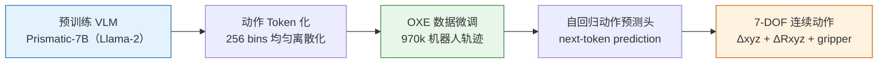

**微调和部署优化**:
- **LoRA微调**: rank=32的LoRA可以匹配全参数微调性能,仅需训练1.4%参数,单个A100 GPU即可完成
- **量化推理**: 4-bit量化将GPU内存需求从16.8GB降至7.0GB,性能无明显下降
- **推理速度**: 在RTX 4090上以6Hz运行(bfloat16),4-bit量化可进一步提升速度

**核心结果/发现**

1. **跨机器人泛化能力**:
   - 在BridgeData V2 WidowX机器人上,OpenVLA达到70.6%平均成功率,比RT-2-X(55B参数)高16.5%,参数量仅为其1/7
   - 在Google机器人上与RT-2-X性能相当(85.0% vs 78.3%)
   - 显著优于Octo(20.0%)和RT-1-X(18.5%)等开源方法

2. **多种泛化能力测试**:
   - 视觉泛化(未见背景、干扰物):52.0% vs RT-2-X 29.0%
   - 运动泛化(未见物体位置/方向):60.0% vs RT-2-X 25.0%
   - 物理泛化(未见物体尺寸/形状):55.0% vs RT-2-X 26.7%
   - 语义泛化(未见物体和概念):36.3% vs RT-2-X 38.8%
   - 语言grounding(多物体场景):85.0% vs RT-2-X 76.7%

**BridgeData V2评估结果**：OpenVLA在多种泛化任务上均优于现有方法（Octo、RT-2等），特别是在未见物体和场景的零样本泛化上表现突出。详见[论文Figure 3](https://arxiv.org/abs/2406.09246)。

| 任务类型 | OpenVLA | Octo | RT-2 |
|---------|---------|------|------|
| 已见任务 | ✅ 高 | ✅ 中 | ✅ 高 |
| 未见物体 | ✅ 高 | ⚠️ 低 | ✅ 中 |
| 未见场景 | ✅ 高 | ⚠️ 低 | ⚠️ 中 |

3. **数据高效适应**:
   - 在Franka机器人7个任务上(10-150条演示),OpenVLA微调后平均成功率63.8%
   - 在单指令任务上,Diffusion Policy表现更好(66.7% vs 53.5%)
   - 在多指令任务上,OpenVLA显著优于Diffusion Policy(91.7% vs 19.4%)
   - OpenVLA是唯一在所有任务上达到≥50%成功率的方法

**数据高效适应实验**：OpenVLA高度多样化多指令任务上表现最佳，仅需少量演示（10-50条）即可在新任务上实现高成功率，显著优于从头训练和其他预训练VLA模型。详见[论文Figure 4](https://arxiv.org/abs/2406.09246)。

4. **计算效率**:
   - LoRA微调(rank=32)匹配全参数微调性能,GPU内存需求从163.3GB降至59.7GB
   - 4-bit量化推理性能无下降(71.9% vs 71.3%),内存占用减半
   - 在消费级GPU上即可部署和微调

5. **开源影响**:
   - 首个开源的大规模VLA模型,包含完整训练代码和流程
   - 支持HuggingFace集成,提供微调notebook
   - 为社区研究VLA提供重要基础设施

**开发者快速开始 (OpenVLA 使用示例):**

```python
import torch
from transformers import AutoModelForVision2Seq, AutoProcessor

# 加载预训练模型
model_id = "openvla/openvla-7b"
processor = AutoProcessor.from_pretrained(model_id, trust_remote_code=True)
model = AutoModelForVision2Seq.from_pretrained(
    model_id, torch_dtype=torch.bfloat16, low_cpu_mem_usage=True, trust_remote_code=True
).to("cuda")

# 准备指令和图像
prompt = "In: What action should the robot take to pick up the red bowl?\nOut:"
inputs = processor(images=image, text=prompt, return_tensors="pt").to("cuda", dtype=torch.bfloat16)

# 生成动作
action = model.predict_action(**inputs, unnorm_key="bridge_orig")
print(f"Predicted Action: {action}")
```

**局限性**

模型目前仅支持单图像观察输入,不支持多相机视角、本体感知信息或观察历史。推理速度(6Hz)对于高频控制任务(如50Hz的ALOHA)仍不够快。虽然优于现有泛化策略,但在测试任务上的成功率通常<90%,可靠性还有提升空间。由于计算限制,许多VLA设计问题(如基础VLM规模、协同训练策略、最佳视觉特征等)尚未充分探索。


---


## 8.10 π₀ (2024) {#8-10-pi0-2024}
: A Vision-Language-Action Flow Model for General Robot Control 
———首个基于 Flow Matching 的通用机器人策略基础模型

📄 **Paper**: https://arxiv.org/abs/2410.24164

<div align="center">
  
<figcaption>
π₀ 架构：结合 PaliGemma 骨干与 Flow Matching 动作专家（来源：Physical Intelligence）
</figcaption>
</div>

**精华**

这篇论文展示了如何构建真正的通用机器人策略基础模型，值得借鉴的点包括：在预训练 VLM 之上通过 flow matching 添加连续动作输出能力、利用互联网规模的语义知识指导机器人控制、设计专门的注意力掩码处理视觉-语言-动作的异构 token、在多个机器人平台上联合训练实现跨平台泛化。这种方法论为构建能够快速适应新任务的通用机器人智能提供了清晰路径，特别是 flow matching 相比扩散模型在实时控制中的优势值得在其他具身 AI 系统中借鉴。

**研究背景/问题**

现有的机器人学习方法主要依赖针对特定任务和特定机器人平台的专门训练，难以实现跨任务和跨平台的泛化。虽然大规模视觉语言模型展示了强大的语义理解能力，但如何将其应用于需要实时、精确、连续动作输出的机器人控制仍是挑战。本文探索如何构建能够处理多样化任务的通用机器人策略基础模型。

**主要方法/创新点**

论文提出了 **π₀** (Pi-Zero)，一个基于 flow matching 的视觉-语言-动作 (VLA) 模型，用于通用机器人控制。

### 1. 整体架构设计

**预训练 VLM 骨干网络**:
- 使用 **PaliGemma** 作为基础，这是一个结合了 **SigLIP** (视觉编码器) 和 **Gemma** (语言编码器) 的 3B 参数 VLM
- 继承互联网规模的语义知识，理解自然语言指令和视觉场景

**Flow Matching 动作专家**:
- 在预训练 VLM 之上添加专门的动作生成模块
- 使用 flow matching 技术生成连续、平滑的动作轨迹
- 实现 **50Hz** 的实时控制频率，满足灵巧操作需求

### 2. Flow Matching 方法：从"迷宫"到"高速公路"

**核心数学原理**:
π₀ 放弃了 Diffusion Policy 中基于随机微分方程（SDE）的弯曲去噪路径，转而采用基于常微分方程（ODE）的 **Flow Matching** 技术。其核心直觉是将概率路径"拉直"：
$$x_t = (1 - t)x_0 + tx_1$$
其中 $x_0 \sim \mathcal{N}(0, I)$ 是高斯噪声，$x_1$ 是真实动作轨迹。模型学习的是一个时间相关的向量场 $v_t(x)$，它指向从噪声到动作的最短路径。

**为什么 π₀ 能实现 50Hz？**
- **采样步数骤减**: 扩散模型通常需要 10-50 步迭代来消除噪声，而流匹配的直线特性使得模型在 1-3 步内就能收敛到极高精度的动作序列。
- **计算开销对冲**: 尽管单步推理的 VLM 骨干很大（3B），但由于采样步数极少，总延迟反而低于多步采样的轻量级扩散模型。

**性能飞跃**:
- **极高精度**: 能够执行 **折纸、玩扑克牌、折叠衣物** 等 OpenVLA 和 Octo 难以胜任的灵巧任务。
- **动作连续性**: 生成一段长度约 1 秒（50 步）的平滑控制计划，大幅减少了机器人的抖动和迟滞。

### 3. 专门的注意力机制

**VLA vs VLM 的关键区别**:

| 特性 | VLM | VLA |
|------|-----|-----|
| 输入 | 图像、文本 | 图像、文本、**观察状态** |
| 输出 | 文本、嵌入 | **连续动作序列** |
| 注意力模式 | 标准因果 | **块稀疏因果** |

**Token 类型设计**:

1. **前缀 Token** (图像 + 文本指令):
   - 完全双向注意力，类似标准 Transformer
   - 编码场景理解和任务描述

2. **状态 Token** (机器人观察):
   - 可访问所有前缀 token
   - 与之前时间步的状态呈三角形因果关系
   - 编码当前机器人状态

3. **动作 Token** (电机命令):
   - 可访问所有非 padding 的 token
   - 完全可见的因果注意力
   - 生成具体的控制信号

**FlexAttention 优化**:
- 使用 PyTorch 的 FlexAttention 高效处理 VLA 的块稀疏注意力模式
- 相比 FlashAttention2（设计用于严格因果模式），FlexAttention 更适合不规则块掩码
- 提供纯 PyTorch 接口，易于定制和优化

### 4. 大规模多任务训练

**训练数据来源**:
- **Open X-Embodiment Dataset**: 开源机器人轨迹数据
- **互联网规模预训练**: 从 PaliGemma 继承的视觉语言知识
- **π Dataset**: Physical Intelligence 自己收集的多机器人数据

**多平台训练**:
- **7-8 个机器人平台**: 单臂（UR5e）、双臂（Franka）、移动操纵器
- **68 个独特任务**: 覆盖灵巧操作、物体取回、整理等多样场景
- 跨平台联合训练实现形态无关的通用策略

**数据整合策略**:
- 统一的观察-动作序列表示
- 处理不同机器人平台的动作空间差异
- 利用 VLM 的语义理解能力实现跨任务知识迁移

### 5. π₀-FAST：加速版本

**FAST (频率空间行动序列标记化)**:
- 将连续动作序列转换为离散 token，支持自回归生成
- 通过 DCT 变换到频域，保留低频重要系数
- 使用 BPE 编码频域系数，实现高效压缩

**FAST 优势**:
- 比基于扩散的 VLA **快 5 倍**
- 改进的动作表示减少冗余
- 更强的跨环境和机器人形态泛化
- 已在 100 万个动作序列上训练，支持多种机器人类型

主要创新包括：
- 首次将 flow matching 应用于大规模通用机器人策略
- 设计了适合 VLA 的块稀疏注意力机制
- 实现了真正的多平台、多任务联合训练
- 开源了模型权重和代码（openpi repository）

**核心结果/发现**

### 零样本性能（无任务特定微调）

在 5 个零样本评估任务上的平均成功率：

| 任务 | π₀ | OpenVLA | Octo |
|------|-----|---------|------|
| **Bussing Easy** (收拾桌子-简单) | **97.1%** | 34.3% | 4.3% |
| **Shirt Folding** (折叠衬衫) | **100%** | 0% | 0% |
| **Grocery Bagging** (装袋杂货) | **78.6%** | 0% | 0% |
| **Box Assembly** (组装盒子) | 高成功率 | - | - |
| **Object Retrieval** (物体取回) | 高成功率 | - | - |

**关键发现**:
- π₀ 在所有任务上显著优于开源模型 OpenVLA 和 Octo
- 即使在最简单的任务上，π₀ 也展示了 2-3 倍的性能优势
- 在复杂任务（如折叠衬衫、装袋杂货）上，其他模型完全失败而 π₀ 仍保持高成功率

### 微调性能（少量任务特定数据）

在相同微调数据下，与其他机器人学习方法对比：

| 模型 | Bowl Stacking (碗堆叠) | 平均跨任务成功率 |
|------|----------------------|-----------------|
| **π₀** | **~100%** | **~80%** |
| Diffusion Policy | ~55% | ~35% |
| ACT | ~45% | - |
| OpenVLA | <10% | - |
| Octo | <10% | - |

**关键观察**:
- π₀ 微调后在几乎所有任务上接近完美表现
- 相比专门的行为克隆方法（ACT、Diffusion Policy），性能提升超过 2 倍
- 预训练带来的零样本能力使微调更高效

### 消融实验

**VLM 预训练的价值**:
- π₀-small（无 VLM 预训练）vs 完整 π₀：性能差距超过 2 倍
- 证明了互联网规模语义知识对机器人控制的重要性

**Flow Matching vs 扩散模型**:
- 实时性：50Hz 控制频率，满足灵巧操作需求
- 平滑性：生成的动作轨迹更连续、更适合物理系统
- 效率：相比多步扩散采样，推理速度显著提升

### 真实世界长时运行

**部署验证**:
- 在真实家庭环境中折叠多种衣物（T恤、毛巾、裤子）
- 收拾真实餐桌，处理不同大小和形状的餐具
- 在超市场景中装袋杂货，处理软硬不同的物品
- 组装各种尺寸的纸箱，展示精细操作能力

**跨平台泛化**:
- 在未见过的机器人平台上通过少量微调实现高性能
- 展示了通用策略基础模型的实用价值

### 开源影响

- 2025 年 2 月开源代码和权重（GitHub: Physical-Intelligence/openpi）
- 集成到 Hugging Face LeRobot 框架
- FAST 标记器已集成到 Hugging Face Transformers

**局限性**

当前模型仍需要针对具体任务进行微调才能达到生产级别的可靠性，特别是在处理完全未见过的任务类型时。模型的成功依赖于高质量的训练数据，在数据分布外的长尾场景（如极端光照、复杂遮挡）下性能可能下降。50Hz 的控制频率虽然适合大多数操作任务，但对于需要更高频率反馈的动态任务（如接球、快速避障）可能不够。未来工作可以探索更大规模的预训练、主动学习策略和更高效的在线适应机制。

---

**Sources**:
- [arXiv paper](https://arxiv.org/abs/2410.24164)
- [Physical Intelligence blog](https://www.pi.website/blog/pi0)
- [Hugging Face blog post](https://huggingface.co/blog/pi0)
- [GitHub repository](https://github.com/Physical-Intelligence/openpi)
- [InfoQ coverage](https://www.infoq.com/news/2024/12/pi-zero-robot/)

## 8.11 π₀.5 (2025) {#8-11-pi05-2025}
**副标题**: A Vision-Language-Action Model with Open-World Generalization
**中文标题**: 具有开放世界泛化能力的视觉-语言-动作模型

📄 **Paper**: [arXiv:2504.16054](https://arxiv.org/abs/2504.16054)
🌐 **Blog**: [Physical Intelligence Blog](https://www.physicalintelligence.company/blog/pi05)

<div align="center">
  
<figcaption>
π₀.5 分层推理架构：高层语义子任务预测 + 低层动作块生成（来源：Physical Intelligence）
</figcaption>
</div>

**精华**

π₀.5是Physical Intelligence在π₀基础上的重大升级，首次实现了端到端学习机器人系统在全新家庭环境中执行长时程（10-15分钟）复杂任务的能力。其核心创新在于：通过异构任务协同训练（co-training）和知识隔离（knowledge insulation）技术实现开放世界泛化；整合多机器人数据、高层语义预测、网络数据等多源信息；使用混合多模态样本（图像观察、语言指令、物体检测、语义子任务预测和底层动作）进行训练。

**研究背景/问题**

现有的通用机器人策略模型虽然在特定环境下表现良好，但在完全未见过的新环境中执行长时程、多阶段的复杂任务时仍面临巨大挑战。特别是在家庭服务场景中，机器人需要在从未训练过的新房间里完成清洁厨房或卧室这样的复杂任务，这要求模型具备强大的开放世界泛化能力。

**主要方法/创新点**

**1. 异构任务协同训练（Heterogeneous Task Co-training）**
- 整合来自多个机器人平台、不同任务场景的数据
- 通过多任务学习提升模型的通用性和鲁棒性
- 利用任务间的知识迁移增强泛化能力

**2. 知识隔离（Knowledge Insulation）**
- 在训练过程中保护预训练知识不被特定任务数据污染
- 允许模型在学习新技能时保留已有的通用能力
- 实现更好的前向迁移和零样本泛化

**3. 混合多模态输入**
- **图像观察**: 来自多视角相机的RGB图像
- **语言指令**: 自然语言任务描述
- **物体检测**: 场景中关键物体的识别和定位
- **语义子任务预测**: 高层任务分解和规划
- **底层动作**: 具体的机器人控制信号

**4. 高层语义预测**
- 预测任务执行过程中的语义子目标
- 作为中间表示指导底层动作生成
- 提升长时程任务的规划能力

**核心结果/发现**

**开放世界家庭任务**：
- 能够在训练数据中从未见过的全新家庭环境中成功执行复杂任务
- 典型任务包括清洁厨房和整理卧室，持续时间10-15分钟
- 涉及多阶段行为：物体识别、导航、抓取、擦拭、放置等

**移动操作能力**：
- 控制移动机械臂机器人在新环境中自主导航
- 执行灵巧操作技能（如擦拭、抓取、整理）
- 展示了端到端学习系统的实用化潜力

**关键突破**：
- 首次证明端到端学习机器人可在完全未见的环境中执行长时程复杂任务
- 显著提升了对新场景、新物体的泛化能力
- 为家庭服务机器人的实际部署提供了可行路径

**局限性**

虽然π₀.5在开放世界泛化方面取得重大突破，但仍存在一些限制：模型在极端新颖场景或完全未知物体类别上可能表现不稳定；长时程任务的失败恢复机制仍需改进；计算资源需求较高，限制了在边缘设备上的实时部署。未来研究方向包括进一步提升样本效率、增强在线适应能力、以及在更广泛的机器人平台上验证。

---


## 8.12 π*₀.₆ (2025) {#8-12-pi06-2025}
**副标题**: A VLA That Learns From Experience
**中文标题**: 通过真实部署经验实现自我改进的视觉-语言-动作模型

📄 **Paper**: https://arxiv.org/abs/2511.14759

<div align="center">
  
<figcaption>
π*₀.₆ 自改进流程：通过优势条件化（RECAP）整合自主经验与人类纠正（来源：Physical Intelligence）
</figcaption>
</div>

**精华**

这篇论文展示了如何让通用机器人策略模型通过真实世界部署数据实现持续自我改进，值得借鉴的点包括：通过优势条件化（advantage conditioning）避免传统 RL 算法中复杂的梯度计算和对数似然估计问题、整合异构数据源（演示数据、自主收集数据、专家干预数据）到统一训练框架、使用 Knowledge Insulation 技术实现端到端 RL 训练而无需回传梯度到动作专家模块。这种方法论特别适合需要在真实环境中持续改进的具身 AI 系统，为 VLA 模型的实用化部署提供了可行路径。

**研究背景/问题**

现有的 Vision-Language-Action (VLA) 模型通常依赖离线数据集进行监督学习，难以通过真实世界的部署经验实现持续改进。虽然强化学习理论上可以实现在线优化，但传统 RL 算法（如 PPO）在大规模流匹配（flow-matching）动作模型上难以计算梯度和对数似然，限制了其在真实机器人系统中的应用。本文探索如何让 VLA 模型通过部署经验和专家纠正实现自我改进。

**主要方法/创新点**

论文提出了 **RECAP** (RL with Experience and Corrections via Advantage-conditioned Policies) 方法，核心思想是通过优势条件化策略实现强化学习训练。整个流程包含三个关键步骤：

1. **异构数据收集**:
   - 自主执行任务并记录结果（成功/失败）
   - 允许人类专家在执行过程中进行遥操作干预
   - 收集三类数据：初始演示、自主收集的在线数据、专家纠正数据

2. **价值函数训练**:
   - 训练一个多任务分布式价值函数 V(o,ℓ)，预测当前观察下完成任务 ℓ 还需要多少步
   - 使用 670M 参数的独立 VLM 作为价值函数网络
   - 基于任务成功/失败标签计算每个动作的优势（advantage）

3. **优势条件化策略提取 (Advantage Conditioning)**:
   - **核心数学公式**: $\hat{\pi}(a|o, \ell, I) \propto \pi_{\text{ref}}(a|o, \ell) \cdot \exp(\beta \cdot A(o, a, \ell))$
   - **原理**: 训练时引入二值化优势指示器 $I$。如果动作 $a$ 带来的回报超过基准，则 $I=1$；否则 $I=0$。
   - **推理优势**: 在部署时，强制设置 $I=1$。由于流匹配模型无法计算精确的 Log Prob 梯度，这种"条件生成"范式巧妙地绕过了数学限制，使模型能够自动过滤掉低质量轨迹，只学习和生成高优势（High Advantage）动作。

**模型架构 π*₀.₆**:
- 基于 Gemma 3 的 4B 参数 VLM 骨干网络
- 860M 参数的 flow-matching 动作专家模块
- **Knowledge Insulation (知识隔离)**: 冻结动作专家的梯度，仅训练 VLM 部分。这不仅保护了精细控制能力不被破坏，还使得 RL 训练更加稳定。

**数据整合策略**:
- **演示数据**: 在监督微调阶段，将优势固定为 "true"
- **自主收集数据**: 通过价值函数计算真实优势
- **专家干预数据**: 假设人类专家动作总是好的，强制优势为 "true"
- 所有数据统一通过优势条件化框架训练

主要创新包括：
- 首次将优势条件化方法应用于大规模 VLA 模型的在线 RL 训练
- 避免了传统策略梯度方法对可微分对数似然的依赖
- 充分利用所有数据而不需要对次优样本进行下采样或降权
- 支持人类专家实时干预并将其有效整合到训练过程

**核心结果/发现**

**与基线 π₀.₆ 的性能对比**:
- **任务吞吐量**: 在多样化的洗衣和咖啡任务上提升超过 2 倍
- **失败率**: 在困难任务上降低约 50%（降低约 2 倍）
- **成功率**: 经过单次迭代后，大多数任务达到 90%+ 成功率

**真实部署验证**:
- 在真实家庭环境中折叠各种衣物，连续运行超过 2 小时
- 使用专业咖啡机制作浓缩咖啡，连续运行 13 小时
- 可靠地组装纸箱，展示精细操作能力

**与其他 RL 算法对比**:
- 相比 PPO 和 AWR (Advantage Weighted Regression) 等基线方法，优势条件化方法：
  - 无需计算 flow-matching 模型的可微分对数似然
  - 能够充分利用所有数据，包括次优轨迹
  - 在大规模模型上训练效率更高

**消融实验**:
- 验证了 Knowledge Insulation 技术的有效性（端到端 RL 无需回传到动作专家）
- 证明了整合专家干预数据对性能提升的重要性
- 展示了多任务价值函数对跨任务泛化的贡献

**实际部署统计**:
- 论文展示了模型在无人监督情况下长时间稳定运行的能力
- 在复杂的真实世界环境中处理新颖物体（未见过的衣物款式等）

**局限性**

该方法目前仍依赖人类提供奖励标签（成功/失败判断）和场景重置，尚未实现完全自主的端到端 RL。探索策略依赖于策略的随机性和人类干预，而非主动探索机制。当前实现为迭代式离线更新而非完全在线的 RL，在大规模自主学习方面仍有提升空间。未来工作可以探索自动奖励标注、场景自动重置和更高效的探索策略。

---

**Sources**:
- [arXiv paper](https://arxiv.org/abs/2511.14759)
- [Physical Intelligence blog post](https://www.pi.website/blog/pistar06)
- [Paper HTML version](https://arxiv.org/html/2511.14759)


---


## 8.13 ACoT-VLA (2026) {#8-13-acot-vla-2026}
**副标题**: Action Chain-of-Thought for Vision-Language-Action Models
**中文标题**: 在动作空间中进行推理的视觉-语言-动作模型

📄 **Paper**: [arXiv:2601.11404](https://arxiv.org/abs/2601.11404)

<div align="center">
  
<figcaption>
ACoT-VLA：直接在动作空间进行思维链推理，生成粗粒度参考轨迹指导最终去噪动作（来源：ACoT-VLA Project）
</figcaption>
</div>

**精华**
这篇论文的核心创新在于将推理过程从语言/视觉空间转移到动作空间，值得借鉴的点包括：(1) 直接在动作空间进行推理，提供同质化的运动指导，弥合语义与运动学之间的鸿沟；(2) 显式推理器(EAR)与隐式推理器(IAR)的互补设计，同时提供轨迹级和语义级指导；(3) Teacher Forcing稳定化训练策略，避免推理模块对动作头的优化干扰；(4) 通过action-level guidance大幅提升长时域任务的鲁棒性和误差抗累积能力。
**不同CoT范式对比**：

| 范式 | 中间表示 | 优势 | 局限 |
|------|---------|------|------|
| **(a) 语言CoT** | 子任务描述 | 可解释性强 | 语义-动作鸿沟大 |
| **(b) 视觉CoT** | 目标图像 | 视觉直观 | 缺少运动学信息 |
| **(c) 动作CoT**（本文） | 粗粒度动作轨迹 | 同质化指导，直接可执行 | 需要额外推理模块 |

详见[ACoT-VLA论文Figure 1](https://arxiv.org/abs/2601.11404)

**研究背景/问题**
现有VLA模型主要在视觉-语言空间进行推理（如语言CoT预测子任务、视觉CoT合成目标图像），但这些推理形式对动作执行的指导是间接且次优的。VLM预训练主要聚焦语义理解而非物理动力学，世界模型虽能预测未来视觉状态但仍局限于视觉表征，两者都存在语义-运动学鸿沟（semantic-kinematic gap），难以为精确的低层动作生成提供充分的细粒度指导。

**主要方法/创新点**

本文提出 **Action Chain-of-Thought (ACoT)** 范式，将推理过程重新定义为结构化的动作意图序列，直接在动作空间进行deliberation。ACoT-VLA框架包含三个核心组件：


**ACoT-VLA整体架构**（三大核心模块）：

```
VLM特征 ────┬─→ EAR (Explicit Action Reasoner)
            │    ↓ 粗粒度参考轨迹 Z^ex
            │
noisy action├─→ IAR (Implicit Action Reasoner)
            │    ↓ 隐式动作先验 Z^im
            │
            └─→ AGP (Action-Guided Prediction)
                 ↓ 融合显式+隐式指导
              最终动作预测
```

**详细架构图**见[ACoT-VLA论文Figure 2](https://arxiv.org/abs/2601.11404)

**1. Explicit Action Reasoner (EAR)**
- 设计为轻量级Transformer，以noisy action sequence作为输入
- 通过self-attention捕获时序依赖，cross-attention从VLM的key-value cache注入多模态上下文
- 采用flow matching训练，自主生成粗粒度参考轨迹 $a^{ref}_{t:t+H^{ref}-1}$
- 参考轨迹编码后形成显式动作空间指导 $Z^{ex}$

**2. Implicit Action Reasoner (IAR)**
- 直接操作VLM的key-value cache，提取隐式运动线索
- 对每层VLM特征，使用可学习query矩阵 $Q_i$ 通过cross-attention提取动作相关信息
- 下采样策略降低计算开销：将KV cache降维至 $d' \ll d$
- 跨层聚合后形成隐式动作指导 $Z^{im}$，捕获visual affordances和action semantics

**3. Action-Guided Prediction (AGP)**
- 将noisy action embedding视为query $Q_{action}$，与 $Z^{ex}$ 和 $Z^{im}$ 进行dual cross-attention
- 通过self-attention融合显式与隐式指导：$\bar{h} = \text{Self-Attn}([S^{ex}; S^{im}])$
- 最终action head $\pi^{head}_\theta$ 基于聚合表征预测去噪动作序列

**训练策略**：
- Flow matching损失同时优化EAR和action head
- Teacher Forcing稳定化：训练时 $Z^{ex}$ 直接从ground-truth轨迹计算，推理时切换为自条件模式


**核心结果/发现**

**仿真实验**：
- LIBERO: 98.5%平均成功率（SOTA），相比π0.5提升1.6%，在LIBERO-Long（长时域）提升最显著（96.0% vs 92.4%）
- LIBERO-Plus: 84.1%，在鲁棒性测试中大幅超越，尤其在相机视角变化(+11.6%)、机器人初始状态扰动(+16.3%)、传感器噪声(+12.5%)上表现突出
- VLABench: Intention Score 63.5%、Progress Score 47.4%，在unseen-texture track上获得+12.6% IS和+7.2% PS的显著提升


**真实世界部署**：


- 在AgiBot G1机器人上平均成功率66.7%（vs π0.5的61.0%、π0的33.8%）
- 跨embodiment验证：在AgileX平台上同样有效，证明方法的通用性

**真实世界实验**：在AgiBot G1机器人上评估三项操作任务

| 任务 | 描述 | ACoT-VLA | π₀.5 | π₀ |
|------|------|----------|------|-----|
| **擦拭污渍** | 检测并擦除桌面污渍 | 70.0% | 65.0% | 38.0% |
| **倒水** | 抓取水瓶倒入杯中 | 66.7% | 60.0% | 32.0% |
| **开放集抓取** | 根据指令抓取未见物体 | 63.3% | 58.0% | 31.5% |
| **平均成功率** | - | **66.7%** | 61.0% | 33.8% |

**关键发现**：ACoT-VLA在跨具身平台（AgiBot G1、AgileX）上均表现优异，证明动作空间推理的通用性。

详见[ACoT-VLA论文Table 3-4](https://arxiv.org/abs/2601.11404)

**消融研究关键发现**：
- EAR单独使用提升1.4%（LIBERO），IAR单独提升1.2%
- EAR+IAR联合使用达到最优，证明显式与隐式指导的互补性
- 参考动作horizon在15-30时效果最佳，过长或过短均不利
- EAR参数量在300M时性能最优，过度参数化反而导致过拟合
- 推理延迟仅增加约20ms（91ms→112ms），性能-效率权衡优秀

**局限性**
该方法需要额外的推理模块，虽然计算开销相对较小但在资源受限平台上可能存在挑战。此外，当前动作表征仍采用action chunks（关节角度/末端执行器位姿），缺乏显式几何结构，未来可将动作表征扩展至几何可解释的3D空间，进一步释放ACoT的推理潜力。

---
---
## 8.14 VLM4VLA (2026) {#8-14-vlm4vla-2026}
**副标题**: Revisiting Vision-Language Models in Vision-Language-Action Models
**中文标题**: 重新审视视觉-语言-动作模型中的视觉-语言模型

📄 **Paper**: [arXiv:2601.03309](https://arxiv.org/abs/2601.03309)

<div align="center">
  
<figcaption>
VLM4VLA 最小化适配架构图：引入可学习的 Action Query Token 从冻结 VLM 中提取具身知识（来源：VLM4VLA Project）
</figcaption>
</div>

**精华**

这篇论文最值得借鉴的核心思想包括:通过最小化适配管道公平评估不同 VLM 对下游任务性能的影响;发现 VLM 的通用能力与具身控制性能并不强相关,挑战了常见假设;识别出视觉编码器(而非语言组件)是性能瓶颈,揭示了 VLM 预训练目标与具身动作规划需求之间存在领域差距;提出通过向视觉编码器注入控制相关监督信号可获得持续性能提升的策略。

**研究背景/问题**

当前 Vision-Language-Action (VLA) 模型研究主要关注网络架构、训练范式和动作解码方案的改进,但很少系统研究一个核心问题:底层 Vision-Language Model (VLM) 的选择和能力如何影响 VLA 策略的性能。现有工作缺乏公平的实验框架来评估不同 VLM 对下游机器人任务性能的贡献。

**主要方法/创新点**

论文提出了 **VLM4VLA** 框架,这是一个最小化适配管道,通过引入少于 1% 的新参数将通用 VLM 转换为 VLA 策略,确保公平高效的比较。

**VLM4VLA 框架概览**：最小化适配管道，公平评估不同VLM对VLA性能的影响

**评估流程**：
1. VLM骨干网络选择（Qwen2.5VL、Paligemma、Kosmos-2等9种）
2. 可选辅助具身任务微调（visual pointing、depth estimation等）
3. 下游控制任务评估（Calvin、SimplerEnv、Libero）
4. 系统性分析（通用能力相关性、模态级消融、训练策略影响）

详见[VLM4VLA论文Figure 1](https://arxiv.org/abs/2601.03309)

**核心架构设计**:

**VLM4VLA 网络架构**：

```
图像 + 语言指令
    ↓
[VLM Encoder] (冻结或微调)
    ↓
Action Query Token (可学习，<1%参数)
    ↓
[MLP Policy Head] (L1/L2 loss，非扩散)
    ↓
动作块输出
```

**设计原则**：最小化新增参数（<1%），使用简单MLP而非diffusion，确保公平比较。

详见[VLM4VLA论文Figure 2](https://arxiv.org/abs/2601.03309)

- 引入可学习的 **Action Query token** 从 VLM 中提取具身相关知识
- 使用简单的 **MLP-based policy head** 解码动作,避免 diffusion/flow-matching 引入的随机性
- 采用 **L1/L2 loss** 而非 diffusion loss,提高推理稳定性和评估鲁棒性
- 所有 VLM 参数(vision encoder、LLM、word embeddings)在下游任务微调时全部训练

**三维实验设计**:

1. **通用能力评估**: 比较 9 个开源 VLM(1B-30B 参数)作为 VLA 骨干网络的性能,包括 Qwen2.5VL/Qwen3VL 系列、Paligemma 系列、Kosmos-2
2. **具身特定能力评估**: 使用 7 种辅助具身任务(visual grounding、depth estimation、trajectory prediction 等)微调 VLM,测试对下游控制任务的影响
3. **模态级消融**: 独立冻结/微调视觉和语言编码器,并测试向 vision encoder 注入控制相关信息(FAST tokenizer)的效果

**评估基准**: 在三个模拟环境上测试
- **Calvin ABC-D**: 训练于 ABC 场景,测试于 D 场景(跨场景泛化)
- **SimplerEnv-Bridge**: 训练于真实 BridgeV2 数据,测试于仿真环境
- **Libero-Long**: 10 个长视距操作任务

**核心发现**:

**核心发现：VLM通用能力与VLA性能的相关性分析**

| 评测基准 | VLM能力相关系数 | 结论 |
|---------|----------------|------|
| **Calvin ABC-D** | r = 0.839 (强正相关) | VLM通用能力对跨场景泛化有帮助 |
| **SimplerEnv-Bridge** | r ≈ 0 (无相关) | VLM通用能力无法预测控制性能 |
| **Libero-Long** | r ≈ 0 (无相关) | VLM通用能力无法预测控制性能 |

**启示**：VLM预训练是必要但不充分的，通用VQA能力不等同于具身控制能力。

详见[VLM4VLA论文Figure 3](https://arxiv.org/abs/2601.03309)

1. **VLM 通用能力是必要但不充分的**: VLM 初始化相比从头训练提供一致性收益,但 VLM 的通用 VQA 能力无法预测其在具身控制任务上的表现
2. **辅助具身任务微调效果有限**: 在 visual pointing、spatial understanding、embodied VQA 等任务上微调 VLM 并未提升下游控制性能,甚至略有下降

**辅助具身任务微调效果**：令人意外的发现

| 辅助任务 | 理论预期 | 实际效果 |
|---------|---------|---------|
| Visual Pointing | ✅ 应该提升空间理解 | ❌ 性能略降 |
| Depth Estimation | ✅ 应该增强3D感知 | ❌ 性能略降 |
| Trajectory Prediction | ✅ 应该改善动作规划 | ❌ 性能略降 |
| Embodied VQA | ✅ 应该强化具身理解 | ❌ 性能略降 |

**结论**：辅助具身任务微调未能提升下游控制性能，甚至略有负面影响。这挑战了"具身预训练有益"的常见假设。

详见[VLM4VLA论文Figure 4](https://arxiv.org/abs/2601.03309)

3. **Vision encoder 是关键瓶颈**: 冻结视觉编码器导致显著性能下降(Calvin 上下降 1.0-3.0 分),而冻结 word embeddings 几乎无影响
4. **存在视觉-语言理解与低级控制的语义差距**: 通过向 vision encoder 注入动作 token 预测任务,即使冻结 encoder 也能获得 +18.1% 性能提升,证明 VLM 视觉特征与控制需求存在根本性不对齐

**VLM与VLA训练轨迹分歧**：

```
参数空间

VLM任务最优区域 ←──────┐
                      │ 分歧点
       共同起点 ──→ ○ ────┘
                      │
VLA任务最优区域 ←──────┘
```

**关键洞察**：
- VLM和VLA训练初期沿相同方向学习（共享视觉-语言理解）
- 但在某个时间点产生分歧，走向不同的最优区域
- 这解释了为何冻结vision encoder会导致性能下降
- 视觉-语言理解与低级控制存在本质差异

详见[VLM4VLA论文Figure 5](https://arxiv.org/abs/2601.03309)

**核心结果/发现**

- **Calvin ABC-D**: Qwen3VL-2B 达到最佳性能(平均完成 4.142 个任务),接近 SOTA VLA(pi0: 3.509)
- **SimplerEnv-Bridge**: 最小的 Kosmos-2 (1.7B) 达到最高成功率(60.4%),超越更大的 Qwen 系列模型
- **Libero-Long**: Qwen3VL-2B 和 Kosmos-2 均达到 55%+ 成功率,优于其他 VLM
- **从头训练性能崩溃**: 不使用 VLM 预训练的模型性能下降 60-70%,证明 VLM 预训练对 VLA 泛化至关重要
- **Real-to-Sim 差距非主因**: 在真实图像上微调 VLM 的动作预测任务后,冻结 vision encoder 仍导致性能下降,表明问题源于视觉-语言任务与低级控制任务的本质差异
- **Vision encoder 微调必要性**: 在 SimplerEnv-Bridge 任务上,解冻 vision encoder 并注入控制信息使性能从 27.6% 提升至 45.7%(+18.1%)

**局限性**

研究未在物理机器人上进行实验,主要受限于公平性和可重复性考虑。虽然分析表明 VLM-VLA 差距源于任务异质性而非简单的 sim-to-real 差距,但真实世界部署仍是最终目标。论文的全面模拟基准结果可为未来研究提供有价值的参考。


---
## 8.15 TwinBrainVLA (2026) {#8-15-twinbrain-vla-2026}
**副标题**: Unleashing VLM Potential in Embodied Tasks via Asymmetric Dual-Transformer Mixture
**中文标题**: 通过非对称双Transformer混合机制释放通用VLM在具身任务中的潜力

📄 **Paper**: [arXiv:2601.14133](https://arxiv.org/abs/2601.14133)

<div align="center">
  
<figcaption>
TwinBrainVLA：模拟左右脑分工的非对称双流架构， Left Brain 负责语义锚点，Right Brain 负责动作推理（来源：TwinBrainVLA Project）
</figcaption>
</div>

**精华**

这篇论文展示了如何通过结构化解耦来解决VLA模型中的灾难性遗忘问题,值得借鉴的核心思想包括:利用双流架构分离高层语义理解和低层运动控制、通过冻结"通才"分支保留预训练知识同时训练"专才"分支学习具身技能、采用非对称注意力机制实现知识迁移而不破坏原始能力、使用Flow-Matching生成连续动作而非离散token化。这种"左右脑"设计哲学为构建既有认知能力又有物理灵巧性的通用机器人提供了新范式。

**研究背景/问题**

当前的Vision-Language-Action (VLA)模型通常直接对预训练的Vision-Language Model (VLM)进行机器人控制任务的微调。然而,这种方法在维持高层语义理解和学习低层精细运动技能之间存在根本性冲突,导致"灾难性遗忘" (catastrophic forgetting)——模型为适应机器人操作而牺牲了原有的开放世界语言能力和视觉推理能力。

**主要方法/创新点**

**Vanilla VLA与TwinBrainVLA架构对比**：

| 架构 | VLM使用 | 灾难性遗忘 | 本体感知 | 性能 |
|------|---------|-----------|---------|------|
| **Vanilla VLA** | 单一VLM微调 | ✅ 严重 | ❌ 有限 | ⚠️ 中等 |
| **TwinBrainVLA** | 双VLM（冻结+可训练） | ❌ 避免 | ✅ 专门编码 | ✅ 优异 |

论文提出了 TwinBrainVLA,一个受大脑半球侧化 (hemispheric lateralization) 启发的双流VLA架构,通过协调"通才VLM"和"具身专才VLM"来实现联合机器人控制:

**1. 非对称双VLM骨干网络 (Asymmetric Dual-VLM Backbone)**

- **Left Brain (左脑 - 通才)**: 冻结的预训练VLM,保留开放世界知识和指令跟随能力。输入仅包含视觉和语言token: `H⁰_L = [V(I); T(T)]`

- **Right Brain (右脑 - 专才)**: 可训练的VLM,专门用于具身运动控制。输入融合视觉、语言和本体感受状态信息: `H⁰_R = [V(I); T(T); φ(s)]`,其中φ是将机器人状态s (关节角度、末端执行器位姿等) 投影到VLM嵌入空间的轻量级MLP State Encoder

**2. AsyMoT机制 (Asymmetric Mixture-of-Transformers)**

**TwinBrainVLA框架及AsyMoT机制**：

```
Left Brain (冻结通才VLM)          Right Brain (可训练专才VLM)
  [V; T]                           [V; T; φ(s)]
     ↓ 独立Self-Attn                    ↓ AsyMoT
  H_L (语义特征) ─────sg───→ [K_L; K_R] ← Q_R
                              [V_L; V_R]
                                   ↓
                            融合特征 H_R
                                   ↓
                          Flow-Matching Action Expert
                                   ↓
                              连续动作输出
```

**AsyMoT核心机制**：
1. Left Brain独立运行，保留预训练能力
2. Right Brain的Query attend到双分支的Key-Value（通过stop-gradient）
3. 实现知识迁移而不破坏原始语义锚点

详见[TwinBrainVLA论文Figure 2](https://arxiv.org/abs/2601.14133)

核心创新在于双流的交互方式:

- **Left Brain**: 保持冻结,独立运行自注意力机制以保留预训练能力
  ```
  H^(l+1)_L = Attn(Q^l_L, K^l_L, V^l_L) + FFN(H^l_L)
  ```

- **Right Brain**: 可训练,采用非对称联合注意力 (Asymmetric Joint Attention)——Query来自Right Brain,而Key和Value通过拼接两个分支构建:
  ```
  K_joint = [sg(K^l_L); K^l_R]
  V_joint = [sg(V^l_L); V^l_R]
  H^(l+1)_R = Softmax(Q^l_R(K_joint)^T / √d_k) V_joint + FFN(H^l_R)
  ```

  其中sg(·)表示stop-gradient操作,确保Left Brain作为稳定的"语义锚点"提供高层推理特征,而Right Brain动态融合这些语义与精细的本体感受线索来推理空间动作。

**3. Flow-Matching Action Expert**

- 采用Diffusion Transformer (DiT) 架构,通过flow matching训练策略生成高精度连续控制信号,超越离散token化范式

- 关键区别在于condition的来源:使用可训练Right Brain的空间丰富表征H_R通过交叉注意力注入DiT

- Flow-Matching损失函数:
  ```
  L_FM(ψ) = E_{t,a₀,a₁}[||v_ψ(a_t, t, H_R) - (a₁ - a₀)||²]
  ```

**4. 非对称训练策略**

- 训练目标: `L_total = L_FM(θ_R, ψ, φ; D_robot)`,仅使用机器人动作损失,不混合通用视觉-语言数据集

- 参数更新策略: 严格冻结Left Brain参数 `∇θ_L = 0`,梯度仅在Right Brain (θ_R)、Action Expert (ψ) 和State Encoder (φ) 中传播

- 在AsyMoT融合层,通过stop-gradient显式阻断来自Left Brain的梯度流,确保其作为稳定语义锚点不被机器人控制任务的高方差梯度扰动

主要创新总结:
- 首个通过非对称双流设计显式解耦通用语义理解和具身感知的VLA架构
- AsyMoT机制实现两个同构VLM路径的信息交互和联合训练
- 结构化免疫灾难性遗忘——Right Brain专注控制动力学,Left Brain隐式保护语言和语义先验

**核心结果/发现**

**SimplerEnv基准测试** (WidowX机器人):
- TwinBrainVLA + Qwen3-VL-4B-Instruct 达到 **62.0%** 平均成功率,超越最强基线Isaac-GR00T-N1.6 (57.1%) **+4.9%**
- TwinBrainVLA + Qwen2.5-VL-3B-Instruct 达到 **58.4%**,同样超越所有基线方法
- 在"Put Eggplant in Yellow Basket"任务上达到83.3%,展现强大的物体操作能力

**RoboCasa基准测试** (GR1机器人桌面操作,24项任务):
- TwinBrainVLA + Qwen3-VL-4B-Instruct 达到 **54.6%** 平均成功率,大幅超越:
  - Isaac-GR00T-N1.6 (47.6%) **+7.0%**
  - QwenGR00T (47.8%) **+6.8%**
  - QwenPI (43.9%) **+10.7%**
- 在复杂桌面场景中展现优异的精细操作技能,验证了解耦语义理解与具身感知的有效性

**关键发现**:
- 尽管未经过大规模机器人动作预训练,TwinBrainVLA在两个基准测试中均达到SOTA性能
- 双脑架构在不同VLM家族间展现强泛化性 (Qwen2.5-VL和Qwen3-VL)
- 显式保留预训练VLM的综合视觉理解能力,同时实现卓越的操作性能

**局限性**

当前实现要求Left Brain和Right Brain共享相同的模型架构以确保兼容的隐藏状态维度。未来研究方向包括:探索更解耦的模型架构 (如通过可学习投影层支持异构backbone)、整合专门的具身VLM checkpoints初始化Right Brain、扩展到完整OXE数据集训练以充分发挥双流架构容量、以及在更广泛基准和真实机器人场景中评估。


---

## 8.16 InternVLA-A1 (2026) {#8-16-internvla-a1-2026}
——Unifying Understanding, Generation and Action for Robotic Manipulation

📄 **Paper**: https://arxiv.org/abs/2601.02456

<div align="center">
  
<figcaption>
InternVLA-A1 架构图：基于 MoT 的统一理解、生成与动作架构（来源：InternVLA-A1 Project）
</figcaption>
</div>

**精华**

InternVLA-A1 的核心创新在于将语义理解、视觉预见（visual foresight）与动作执行统一到单一 Mixture-of-Transformers (MoT) 框架中，用"想象未来"来指导当前动作，特别适合动态场景。其层级数据金字塔（合成仿真数据 + 真实数据混合预训练）有效弥合了 sim-to-real gap，值得 VLA 研究者借鉴。Generation Expert 的引入通过联合训练视觉预测和动作预测目标，使模型内化了动作与环境动力学之间的因果关系，是提升动态鲁棒性的关键设计。Flow Matching 作为动作解码器既保留了 MLLM 语义理解能力，又获得了对多模态动作分布的精细建模。

---

**研究背景/问题**

主流 VLA 模型（如 π₀、GR00T N1.5）基于 MLLM 构建，具有强大的语义理解能力，但本质上缺乏对物理世界动态的推理能力——它们执行的是反应式感知到动作映射，而非预判状态将如何演变。现有引入 World Model 的视频预测方法（如 VPP、Genie Envisioner）虽然能预测未来观测，但语义接地弱且对预测误差敏感。本文的目标是构建一个能同时紧密耦合语义理解与动态预测的统一架构。

---

**主要方法/创新点**

<div align="center">
  
<figcaption>
InternVLA-A1 整体框架：理解专家、生成专家、动作专家三者协同工作，将语义推理与动力学预测融合以指导动作执行
</figcaption>
</div>

InternVLA-A1 采用 **Mixture-of-Transformers (MoT)** 架构，协调三个专家模块共同工作：

**（1）Understanding Expert（理解专家）**
直接复用现有 MLLM 架构（InternVL3-1B 或 Qwen3-VL-2.13B），通过 ViT 视觉编码器处理多视角观测 `o_t`，通过文本 Tokenizer 处理语言指令 `l`，将二者拼接为 prefix tokens `h_und`，为下游专家提供语义上下文。

**（2）Generation Expert（生成专家）**
受 Janus Pro 启发，采用**解耦视觉编码**策略——理解用 ViT（高层语义），生成用 VAE（像素级保真）。具体使用 Cosmos CI8×8 连续 VAE tokenizer 将输入图像编码为 latent features `z_t`，再经卷积层压缩空间维度至 4×4（每帧仅 16 个 tokens），对齐 Transformer 隐维度后送入生成专家。生成专家在历史帧 `z_{t-m}` 和当前帧 `z_t` 基础上，以 `h_und` 为条件，预测未来帧的 latent `ẑ_{t+m}`，最终经反卷积和 Cosmos decoder 重建预测图像。

<div align="center">
  
<figcaption>
InternVLA-A1 架构详图：三专家通过 Unified Masked Self-Attention 交互，理解专家输出语义上下文，生成专家预测未来视觉状态，动作专家基于两者产生控制指令
</figcaption>
</div>

**（3）Action Expert（动作专家）**
以语言目标 `l`、当前观测（经 `h_und`）、本体感知 `q_t` 和生成专家的预测 latent `ẑ_{t+m}` 为条件，使用 **Flow Matching** 目标预测动作块 `â_{t:t+k}`。采样时从高斯噪声出发，通过 Euler 迭代法解 ODE 得到目标动作。

**（4）Unified Masked Self-Attention**
实现三专家间信息流的分块注意力掩码：累积分段掩码确保信息流单向传递（理解 → 生成 → 动作）；前缀块（视觉+语言）完全双向；生成块完全双向且仅接收 Cosmos latent tokens；动作块分为状态 token（只关注自身和更早块）和动作 tokens（相互关注）。

**（5）优化目标**
联合优化两个目标：

- **视觉预见生成**：

$$\mathcal{L}_{\text{gen}} = \mathbb{E}\left[\|f_{\text{gen}}(z_{t-m}, z_t; h_{\text{und}}) - \text{sg}[z_{t+m}]\|^2\right]$$

- **Flow Matching 动作预测**：

$$\mathcal{L}_{\text{action}} = \mathbb{E}\left[\|v_\theta(l, \{o_i\}_{i=t-m}^t, q_t, a_{t:t+k}^\tau) - (a_{t:t+k} - \epsilon)\|^2\right]$$

- **总损失**（其中 $\lambda = 0.01$）：

$$\mathcal{L}_{\text{total}} = \lambda \cdot \mathcal{L}_{\text{gen}} + \mathcal{L}_{\text{action}}$$

**（6）层级数据金字塔**

<div align="center">
  
<figcaption>
层级数据金字塔：底层为大规模开源示范数据（AgiBot-World），中层为仿真合成数据（InternData-A1），顶层为专项真实数据
</figcaption>
</div>

预训练数据混合配方（共 533M+ 帧）：
- InternData-A1（ARX Lift-2）：96M 帧（18%）
- InternData-A1（AgileX）：122.5M 帧（23%）
- InternData-A1（Franka）：90.5M 帧（17%）
- InternData-A1（Genie-1）：16M 帧（3%）
- AgiBot-World（Beta）：208M 帧（39%）

预训练后，使用少量专项真实数据进行 post-training 微调，适配目标部署环境。

**（7）模型规模**
- InternVLA-A1（2B）：Understanding=InternVL3（0.94B）+ Gen/Act=Qwen2.5（各 0.36B），共 1.8B
- InternVLA-A1（3B）：Understanding=Qwen3-VL（2.13B）+ Gen/Act=Qwen3（各 0.44B），共 3.2B
- 推理速度：两者均约 13 Hz（NVIDIA RTX 4090）

---

**核心结果/发现**

**通用任务（10 个真实任务，Table 4）**：
- InternVLA-A1（3B）平均成功率 **75.1%**，比 π₀（3.3B）的 60.6% 提升 **14.5%**
- InternVLA-A1（2B）以 64.7% 超越更大的 π₀（3.3B）模型，凸显架构与数据质量优势
- 在精细操作任务（Make Sandwich: 93.3% vs 66.7%；Operate Oven: 86.7% vs 73.3%）表现尤为突出

**动态场景专项任务（Figure 6）**：

<div align="center">
  
<figcaption>
Express Sorting 和 In-motion Ingredient Picking 任务的成功率对比：InternVLA-A1（3B）以 80% 和 93.3% 大幅领先基线
</figcaption>
</div>

- Express Sorting：π₀ 仅 36.7%，GR00T N1.5 仅 40.0%，InternVLA-A1（3B）达 **80.0%**（+40%以上）
- In-motion Ingredient Picking：基线均仅 20.0%，InternVLA-A1（3B）达 **93.3%**（+73.3%）

**仿真基准（RoboTwin 2.0, 50 任务）**：InternVLA-A1（3B）Easy/Hard 分别为 65.0%/25.4%，超越 π₀ 的 54.5%/19.8%（+10.5%/+5.6%）

**消融实验**：
- 去除预训练：平均成功率从 77.0% 降至 25.4%（↓51.6%）
- 去除 Generation Expert：平均成功率从 77.0% 降至 57.6%（↓19.4%），11/12 个任务均退化

---

**局限性**

理解专家缺乏与多模态 VQA 数据集的联合训练，导致通用语义推理和复杂指令跟随能力有所退化；视觉预见模块为保证实时推理效率而牺牲了图像预测的保真度，生成未来帧的粒度有限。

---

## 8.17 InternData-A1 (2025) {#8-17-interndata-a1-2025}
**副标题**: Pioneering High-Fidelity Synthetic Data for Pre-training Generalist Policy

📄 **Paper**: https://arxiv.org/abs/2511.16651

<div align="center">
  
<figcaption>
InternData-A1：大规模高保真合成数据集生成 Pipeline（来源：InternData-A1 Project）
</figcaption>
</div>

**精华**

本文首次证明纯合成数据预训练的 VLA 模型可以匹配甚至超越使用真实机器人数据的最强基线（π-dataset），打破了"仿真数据无法替代真实数据"的固有认知。数据合成 pipeline 完全解耦（环境构建、技能组合、Domain Randomization、轨迹生成独立模块化），极大降低人工成本（每条 episode 低于 0.003 美元）。消融实验揭示**轨迹多样性**（articulation + long-horizon tasks）而非单一规模是有效 VLA 预训练的核心驱动力，这对数据采集策略有重要指导意义。大规模 domain randomization 使仿真与真实的视觉 gap 缩小到约 1:8 的仿真对真实数据等效比例，强调了渲染保真度和随机化的重要性。开源数据集和生成 pipeline 为 embodied AI 社区提供了可复现的大规模数据基础设施。

---

**研究背景/问题**

现有 VLA 模型已证明大规模真实机器人数据预训练的有效性，但合成数据单独能否达到相同效果尚未被系统验证。真实数据采集代价高昂，需要专业遥操作员、特殊硬件和大量人力，大多数研究机构难以复现；现有仿真数据集覆盖的技能集窄（主要是 pick-and-place）、仅涉及 rigid 物体，且未在大规模 VLA 预训练中验证有效性。

---

**主要方法/创新点**

InternData-A1 是一个包含 630k 轨迹、7,433 小时、覆盖 4 种机器人体态（AgiBot Genie-1、Franka Emika Panda、AgileX Split Aloha、ARX Lift-2）、18 种技能、70 个任务、227 个室内场景的大规模高保真合成数据集。

<div align="center">
  
<figcaption>
InternData-A1 数据统计概览：4 种体态、70 个任务、3185 个 rigid 物体、321 个 articulation 物体、20 件服装，共 630k episodes、401.4M 帧、7433.9 小时
</figcaption>
</div>

### 数据合成 Pipeline（4 阶段全自动）

<div align="center">
  
<figcaption>
InternData-A1 数据合成 pipeline，包含环境构建、技能组合、Domain Randomization 和轨迹生成与存储四个阶段
</figcaption>
</div>

**1. Environment Construction（环境构建）**
- **Embodiment**: 支持 4 种体态，均以 USD 格式定义，经过碰撞动力学验证
- **Scene Library**: 227 个室内场景（厨房、书房、餐厅、客厅）来自 GRScenes-100，每个场景标注了详细的操作区域元数据
- **Object Library**: 覆盖 rigid（3185 个，含自动 grasp pose 标注）、articulated（321 个，含关节轴和物理参数）、deformable（20 件真实扫描服装，用 Vertex Block Descent 模拟）、fluid（粒子系统 + isosurface 渲染）四类物体

**2. Skill Composition（技能组合）**
- 每个技能是模块化脚本策略，输入：物体状态、机器人状态、用户约束；输出：waypoints 序列（end-effector 6D pose）
- 包含 Pick、Place、Push 等 18 种原子技能，通过简单配置文件组合成完整任务
- 支持双臂并行和顺序执行，无需额外代码即可扩展到新物体、场景、体态
- 18 个 long-horizon 任务（每个涉及至少 3 个连续技能），共 124,789 条轨迹

**3. Domain Randomization（域随机化）**
- **视觉多样性**: 相机视角 ±5° 旋转、±5cm 平移；174 个环境光照图（随机光温和强度）；目标物体可从同类资产中替换
- **轨迹多样性**: 物体位姿在任务特定空间范围内随机采样；AnyGrasp 生成数百万 grasp 候选，最终随机选取 top-40 之一；articulated 和 deformable 物体的接触区域扩展为邻域

**4. Generation & Storage（生成与存储）**
- 使用 **CuRobo** 运动规划器在 waypoints 间插值密集关节空间动作
- 仅存储成功完成的轨迹（Isaac Sim 物理验证），转换为 **LeRobot** 格式
- 记录：物体元数据、语言指令、多视角 RGB、相机参数、机器人本体感知状态和动作标签

**5. Framework Optimization（框架优化）**
- **Stage Decoupling**: 轨迹规划（CPU-bound）与视觉渲染（GPU-bound）解耦为 pipeline 架构，规划失败不触发冗余渲染
- **Dynamic Resource Scheduling**: Planner 和 Renderer 内部均采用并行批处理策略 + 动态调度算法
- **Stack Render**: 堆叠渲染技术进一步提升 GPU 利用率
- **Cluster Stability**: Balancer 模块负载均衡 + Supervisor 模块监控，整体吞吐量提升 **2–3×**，生产成本低于 **$0.003/episode**

---

**核心结果/发现**

**与 π-dataset 对比（49 个仿真任务）**
- π₀(InternData-A1) vs 官方 π₀：Easy 模式 **60.0% vs 55.0%**（+5%），Hard 模式 **26.5% vs 20.0%**（+6.5%）
- 在 Hard 模式下的提升说明 InternData-A1 的大规模 domain randomization 提供的鲁棒性在下游 fine-tuning 中持续保留

**与 π-dataset 对比（9 个真实世界任务）**
<div align="center">
  
<figcaption>
InternData-A1 在 9 个真实世界任务上的性能对比，包括 5 个常规任务和 4 个灵巧任务，平均超越 π-dataset 6.2%
</figcaption>
</div>

- 在 5 个常规任务上平均超越 π-dataset **6.2%**（包括 Place Markpen、Pass Bottle、Heat Sandwich、Sort Rubbish、Sweep Trash）
- 在 4 个灵巧任务（Sort Parts、Unscrew Cap、Fold Clothes、Zip Bag）上性能与 π-dataset 相当，使用了全新体态 ARX AC One（训练数据中未见过）

**与开源数据集对比（49 个仿真 + 2 个真实任务）**
- InternData-A1 大幅领先：Easy **60.0%** vs OXE 32.5% / Agibot World 52.5% / RoboCasa 50.0%
- 真实任务 Sort Rubbish：**90.0%** vs OXE 40.0%；Pass Bottle：**60.0%** vs RoboCasa 13.3%

**Sim-to-Real 迁移**
<div align="center">
  
<figcaption>
6 个 sim-to-real 任务仅使用 500 条仿真 episodes 即可实现超过 50% 的成功率
</figcaption>
</div>

- 10 个任务中直接零样本迁移成功率超过 50%；仅需 500 条仿真数据即达到高成功率
- 对于基础技能任务（Sort Rubbish、Wipe Stain），200 条仿真 episodes ≈ 200 条真实数据
- 对于复杂任务（Flip Package、Instructional Pick），仿真对真实等效比约为 **8:1**

**消融实验（数据组成分析）**
- 去除 Base 或 Long-horizon 任务的性能下降 > 去除 PnP 任务，说明任务多样性比单一任务规模更重要
- 去除 Articulation 任务（仅 11.67%）导致显著下降，说明 articulated 操作能扩展 action space 多样性
- 核心结论：**轨迹多样性（Trajectory Diversity）是有效预训练的核心驱动**

## 8.18 Isaac GR00T (2025-2026) {#8-18-gr00t-2025}
Generalist Robot 00 Technology ———英伟达全栈具身智能生态

📄 **Paper**: [NVIDIA Isaac Blog](https://developer.nvidia.com/isaac-robotics)

<div align="center">
  
<figcaption>
GR00T N1.6 双系统架构图：System 2 (慢思考 VLM) + System 1 (快思考 DiT)（来源：NVIDIA Isaac Docs）
</figcaption>
</div>

**精华**

GR00T 代表了"模型开源 + 生态锁定"的典型范式。其核心贡献在于提出了 **System 1 (快思考) & System 2 (慢思考)** 的双系统架构：System 2 基于 VLM 负责语义理解和长程规划（约 5Hz）；System 1 基于 Diffusion Transformer 负责高频、精细的反射性动作（120Hz）。此外，英伟达通过打通 Isaac Sim（仿真）、Cosmos（视频生成）和 Jetson Thor（边缘芯片），构建了目前最完整的具身智能开发工具链。

---

**研究背景/问题**

人形机器人需要同时具备处理复杂语义指令的能力和在不确定环境中保持动态稳定性的精细控制能力。单一频率的端到端模型往往难以兼顾"深度思考"的计算延迟与"即时反应"的实时性需求。

---

**主要方法/创新点**

- **双系统架构**:
  - **System 2 (Cognitive)**: 处理多模态输入（语音、手势、视频），生成任务子目标。
  - **System 1 (Reactive)**: 将子目标实时转化为关节力矩，处理平衡和避障。
- **全栈生态联动**:
  - **Omniverse & Isaac Sim**: 提供超大规模合成数据生成能力。
  - **Cosmos**: 专门用于生成符合物理规律的视频轨迹，缓解真实数据稀缺。
  - **Jetson Thor**: 专用具身智能芯片，优化了 Transformer 的推理速度。

---

**核心结果/发现**

- 在多种人形机器人平台上实现了零样本迁移。
- 展示了极强的指令跟随能力，能够根据自然语言指令学习舞蹈、搬运等复杂动作。
- 证明了通过大规模仿真训练（Sim-to-Real）可以显著提升人形机器人的步态稳定性和操作灵巧度。

---

**局限性**

- **生态绑定**: 训练和部署深度依赖英伟达的 H100 集群和 Jetson 芯片，对于非 NVIDIA 硬件用户存在较高的迁移门槛。
- **闭源核心**: 虽然开源了部分模型权重，但完整的训练 Pipeline 和专有数据集仍处于闭源状态。

---

## 8.19 Xiaomi-Robotics-0 (2026) {#8-19-xiaomi-r0-2026}
MoT Architecture for Real-Time Bimanual Manipulation ———国产开源 VLA 的实时性标杆

📄 **Paper**: [小米机器人实验室](https://github.com/Xiaomi-Robotics)

<div align="center">
  
<figcaption>
Xiaomi-R0：基于 Mixture-of-Transformers (MoT) 的低延迟双臂操作架构（来源：Xiaomi Robotics）
</figcaption>
</div>

**精华**

Xiaomi-R0 针对 VLA 模型在实际部署中常见的推理延迟问题，提出了 **Mixture-of-Transformers (MoT)** 架构。通过将感知与控制模块进行解耦并行化处理，Xiaomi-R0 成功在消费级 GPU（如 RTX 4090）上实现了高频闭环控制。该模型在双臂灵巧操作（如拆解乐高、折叠毛巾）任务中表现优异，是国产开源阵营中工程化落地最快的代表作之一。

---

**研究背景/问题**

大型 VLA 模型（如 7B+ 参数）在进行实时推理时，往往难以达到机器人控制所需的 20Hz+ 频率，导致动作出现"卡顿"或由于视觉滞后导致的执行失败。

---

**主要方法/创新点**

- **MoT 架构**: 采用混合专家模式，将模型分为"推理专家"和"执行专家"。推理专家处理慢速语义，执行专家在高频视觉流下快速调整动作。
- **低延迟优化**: 针对动作 Token 生成路径进行了极致压缩，大幅缩短了从图像输入到信号输出的时间链路。
- **双臂协同增强**: 专门针对双臂操作中的时空一致性进行了数据增强，提升了左右手配合的流畅度。

---

**核心结果/发现**

- 在 LIBERO 等通用榜单上成功率达到 **98.7%**。
- 首次在开源领域展示了在未见物体上的实时、高动态双臂协同操作。
- 证明了通过合理的架构优化，即使是中等规模的 VLA 也能在实时性上挑战巨量闭源模型。

---

**局限性**

- 模型的长程逻辑推理能力相比 π₀.5 略显单薄。
- 对复杂光照和极端动态场景的鲁棒性仍有待提升。

---
## 8.20 X-VLA (2025) {#8-20-xvla-2025}
Scalable Cross-Embodied Learning with Soft Prompting ———学术界彻底开源的具身范本

📄 **Paper**: [Tsinghua AIR & Shanghai AI Lab](https://github.com/X-VLA)

<div align="center">
  
<figcaption>
X-VLA：基于软提示 (Soft Prompting) 的跨具身自适应架构，低成本适配异构硬件（来源：X-VLA Project）
</figcaption>
</div>

**精华**

X-VLA 是由清华 AIR 和上海 AI 实验室联合推出的彻底开源项目。其核心贡献在于通过 **Soft Prompting（软提示）** 技术解决了"一个大脑控制所有机器人"的难题。相比于传统的对每种硬件进行微调，X-VLA 仅需学习极小规模的机器人特定 Prompt，即可将通用的物理规律迁移到不同的机械臂和人形机器人上。该项目从代码、数据、权重到评估基准全量公开，是学术界最彻底的开源范本。

---

**研究背景/问题**

机器人硬件形态各异（关节数、臂长、自由度不同），如何用一个统一的预训练模型适配所有硬件而不产生性能冲突（负迁移）？

---

**主要方法/创新点**

- **Soft Prompting**: 在 VLM 输入层引入可学习的"硬件描述 Token"，自动对齐不同机器人的动作空间。
- **大规模跨域数据集**: 整合了包括操作、导航乃至部分自动驾驶在内的异构数据，验证了物理知识的跨域通用性。
- **开放评估基准**: 刷新了五大主流仿真基准，并提供了标准化的物理测试协议。

---

**核心结果/发现**

- 适配新硬件的成本降低了 90% 以上，仅需极少量新数据即可完成部署。
- 证明了"基础模型+硬件适配层"是实现通用具身智能的高效路径。

---

**局限性**

- 在需要极端精细力反馈的任务中，软提示的精度上限受限于骨干网络的感知分辨率。
- 目前主要聚焦于运动学对齐，对于复杂的接触动力学建模尚在早期阶段。

---

# 6. 总结与展望

Vision-Language-Action (VLA) 模型代表了机器人技术的重要范式转变，通过统一视觉、语言和行动三个模态，实现了从自然语言指令到机器人控制的端到端学习。自2022年RT-1和2023年RT-2开创这一方向以来，VLA研究取得了爆发式进展。

## 6.1 核心成就

**架构创新**：
- 从模块化系统演进到端到端统一模型
- 端到端与层级架构的混合趋势
- 动作表示从离散token到扩散模型再到Flow Matching的演进

**规模扩大**：
- 模型参数从130M (RT-1) 到7B (OpenVLA) 再到billion级 (DexVLA, RDT-1B)
- 数据规模从130k轨迹到970k (OXE) 再到1.5M+ (EO-Data)
- 支持的机器人从单一平台扩展到22+种形态

**能力提升**：
- 零样本泛化能力大幅提升（π₀.5开放世界泛化，[详见第8.11节](#8-11-pi05-2025)）
- 推理能力增强（CoT-VLA, [ACoT-VLA第8.13节](#8-13-acot-vla-2026), [π₀.5第8.11节](#8-11-pi05-2025)）
- 实时性改善（SmolVLA 450M, Evo-1 77M, FAST 15x加速）
- 多模态感知（触觉、力传感、3D空间表示）

**标准建立**：
- 数据集标准（RLDS, Open X-Embodiment）
- 评测基准（LIBERO, CALVIN, SimplerEnv, VLABench）
- 开源生态（OpenVLA, LeRobot, ManiSkill3）

## 6.2 五大核心挑战的进展与未来

**1. 表示（Representation）**

当前进展：多模态对齐方法日益成熟（对比学习、共享语义空间）；3D空间表示突破（点云、体素、4D轨迹）；世界模型快速发展（观察空间/潜在空间预测）

未来方向：原生多模态架构（所有模态统一token化）；混合潜在-物理-语义世界模型；因果世界模型显式建模动作-结果关系

**2. 执行（Execution）**

当前进展：推理增强VLA（CoT, ACoT）；层级规划方法成熟（语言/视觉/技能驱动）；实时性大幅提升（轻量模型、高效解码）

未来方向：自适应架构（根据任务难度动态调整）；统一决策Token（see-think-act一体化）；自主性闭环（自感知、自纠正、自改进）

**3. 泛化（Generalization）**

当前进展：跨机器人预训练成为标准；人类视频知识迁移有效；Sim-to-Real差距缩小；在线RL与VLA结合（π*0.6）

未来方向：形态无关表示（真正的跨具身迁移）；零样本跨形态部署；自主开放式进化（部署-发现-进化闭环）

**4. 安全（Safety）**

当前进展：基于约束和学习对齐的双范式；可学习拒绝机制（RationalVLA）；层级架构提供天然可解释性

未来方向：内在不确定性感知（System 2反思）；主动风险规避；交互式安全（可介入的透明性）；共享心智模型

**5. 数据与评测（Data & Evaluation）**

当前进展：大规模跨机器人数据集（OXE, EO-Data）；标准化评测框架（SimplerEnv, VLABench）；多维度评估指标

未来方向：Simulation-First范式（模拟为主要数据源）；Failure-Centric评测（失败作为信号）；细粒度诊断测试（超越二元成功率）

## 6.3 结语

VLA领域正处于快速发展期，ICLR 2026收录的164篇VLA论文标志着这一领域的爆发式增长。从[RT-1](#8-1-rt-1-2022)的模块化系统，到[RT-2](#8-2-rt-2-2023)的VLM转VLA，再到[OpenVLA](#8-9-openvla-2024)的开源生态，[π₀](#8-10-pi0-2024)的Flow Matching创新，[π*₀.₆](#8-12-pi06-2025)的在线学习突破，以及[ACoT-VLA](#8-13-acot-vla-2026)的动作空间推理，每一步都在推动具身智能向前发展。

随着大规模预训练模型、高质量机器人数据集、先进训练方法和标准化评测体系的不断完善，VLA模型有望成为下一代智能机器人的"大脑"。我们正站在通用具身智能的门槛上，未来的机器人将能够像人类一样理解世界、规划任务、精确执行，并在真实环境中持续学习和进化。

VLA不仅是技术突破，更代表了机器人研究范式的根本转变——从手工设计到数据驱动，从任务特定到通用能力，从离线学习到在线适应，从单一模态到多模态融合。这一转变正在重新定义机器人技术的未来。

---

**声明**：本文旨在为VLA领域的研究者和学习者提供全面的技术综述。由于该领域发展迅速，部分内容可能随时间推移而更新。欢迎读者在评论区讨论和补充最新进展。

---

# 7. 参考资料

## 7.1 综述与调研

### 学术综述

- **[An Anatomy of Vision-Language-Action Models (2512.11362v3)](https://arxiv.org/abs/2512.11362)** - IEEE TPAMI 2025，**本文的核心参考综述**，提出挑战驱动的分类法，系统梳理五大核心问题
- [VLA-Survey-Anatomy GitHub](https://github.com/SuyuZ1/VLA-Survey-Anatomy) - 上述综述的项目页面，持续更新
- [Vision-Language-Action Models for Robotics: A Review Towards Real-World Applications](https://vla-survey.github.io/) - 面向真实世界应用的系统性综述
- [Multimodal fusion with vision-language-action models for robotic manipulation: A systematic review](https://www.sciencedirect.com/science/article/pii/S1566253525011248) - ScienceDirect 2025年发表的系统综述
- [10 Open Challenges Steering the Future of Vision-Language-Action Models](https://arxiv.org/abs/2511.05936) - 未来十大开放挑战

### 会议分析

- [State of VLA Research at ICLR 2026](https://mbreuss.github.io/blog_post_iclr_26_vla.html) - 分析了164篇ICLR 2026的VLA论文
- [Muhayyuddin's VLA Repository](https://muhayyuddin.github.io/VLAs/) - 整合102个模型、26个数据集和12个仿真平台

## 7.2 开源模型与工具

### 主要VLA模型

**开源模型**：
- [OpenVLA](https://github.com/openvla/openvla) - 7B参数开源VLA模型（斯坦福大学）
- [π0 (openpi)](https://github.com/Physical-Intelligence/openpi) - Physical Intelligence的Flow Matching VLA
- [Octo](https://octo-models.github.io/) - 通用机器人策略
- [LeRobot](https://github.com/huggingface/lerobot) - Hugging Face的机器人学习库，整合多种VLA模型
- [Large VLM-based VLA for Robotic Manipulation](https://github.com/JiuTian-VL/Large-VLM-based-VLA-for-Robotic-Manipulation) - 大规模VLM-based VLA列表

**商业/闭源模型**：
- RT-2, RT-X - Google DeepMind
- π0.5, π*0.6 - Physical Intelligence
- Gemini Robotics - Google

### 工具与框架

- [RT-1 & RT-2](https://deepmind.google/blog/rt-2-new-model-translates-vision-and-language-into-action/) - Google DeepMind的VLA模型
- [Octo](https://octo-models.github.io/) - 开源通用机器人策略
- [π₀ (Pi-Zero)](https://www.physicalintelligence.company/blog/pi0) - Physical Intelligence的通用策略

## 7.3 数据集与基准

### 大规模数据集

- [Open X-Embodiment](https://robotics-transformer-x.github.io/) - 970k真实机器人轨迹，22种机器人
- [RT-1 Dataset](https://sites.google.com/view/rt1-robot) - 130k轨迹，700+任务
- [Bridge Dataset](https://rail-berkeley.github.io/bridgedata/) - 60k桌面操作轨迹

### 仿真基准

- [LIBERO](https://libero-project.github.io/) - 终身机器人学习基准
- [CALVIN](http://calvin.cs.uni-freiburg.de/) - 长时序组合任务
- [RLBench](https://sites.google.com/view/rlbench) - 100+仿真操作任务
- [SIMPLER](https://simpler-env.github.io/) - 标准化VLA评测平台

## 7.4 学习资源

### 教程与博客

- [Vision Language Action Models & Policies - LearnOpenCV](https://learnopencv.com/vision-language-action-models-lerobot-policy/)
- [VLA Models: The AI Brain Behind Next-Gen Robots](https://medium.com/@raktims2210/vision-language-action-vla-models-the-ai-brain-behind-the-next-generation-of-robots-physical-bced48e8ae94)
- [What are Vision Language Action Models? Complete Guide](https://www.articsledge.com/post/vision-language-action-vla-models)

### 视频课程

- [机器人学习课程](https://rail.eecs.berkeley.edu/deeprlcourse/) - UC Berkeley的深度强化学习课程
- [具身AI讲座系列](https://embodied-ai.org/) - 具身智能相关讲座

## 7.5 会议与研讨会

### 主要会议

- **CoRL** (Conference on Robot Learning) - 机器人学习顶会
- **RSS** (Robotics: Science and Systems) - 机器人系统顶会
- **ICRA** (International Conference on Robotics and Automation) - 机器人与自动化国际会议
- **IROS** (International Conference on Intelligent Robots and Systems) - 智能机器人与系统国际会议

### 专题研讨会

- [ICLR 2026 VLA Workshop](https://mbreuss.github.io/blog_post_iclr_26_vla.html)
- NeurIPS/CVPR/ICCV 的具身AI workshop

## 7.6 实验室与研究组

### 领先研究团队

- **Google DeepMind** - RT-1, RT-2, RT-X等
- **Stanford Vision and Learning Lab** - OpenVLA, LIBERO等
- **UC Berkeley RAIL** - Bridge, Octo等
- **Physical Intelligence** - π₀等商业化产品
- **Toyota Research Institute** - 具身AI研究

## 7.7 相关领域

### 扩展阅读

- **Vision-Language Models (VLM)**: CLIP, Flamingo, GPT-4V等
- **Diffusion Models for Robotics**: Diffusion Policy, 3D Diffuser Actor等
- **World Models**: Dreamer, Genie, VideoGPT等
- **Embodied AI**: Habitat, AI2-THOR, iGibson等平台

---
