# 引言

大语言模型（Large Language Model, LLM）的兴起标志着人工智能进入了新的发展阶段。从2018年BERT和GPT的出现，到2020年GPT-3展现出令人惊讶的少样本学习能力，再到2022年ChatGPT引爆全球对话式AI浪潮，大模型在短短几年间实现了质的飞跃。这些模型不仅在传统NLP任务上达到了接近人类的水平，更展现出了代码生成、数学推理、创意写作等广泛的能力。

## 为什么关注大模型训练？

训练是大模型能力的来源。一个高性能大模型的诞生，离不开：
- **海量高质量数据**：数万亿token的精心处理
- **大规模计算资源**：数千GPU并行训练数月
- **精巧的训练策略**：从预训练到对齐的完整pipeline
- **工程化的实现**：分布式训练、内存优化、稳定性保证

然而，大模型训练的知识和技术往往分散在各类论文、博客和代码库中，缺乏系统性的整理。本文旨在填补这一空白。

## 本文内容

本综述系统梳理大模型训练的核心技术，包括：

1. **三大训练阶段**：预训练、监督微调（SFT）、偏好对齐
2. **分布式训练技术**：数据并行、张量并行、流水线并行、ZeRO
3. **训练优化技术**：优化器选择、学习率调度、梯度处理
4. **数据工程**：数据采集、质量评估、去重、配比
5. **评估体系**：全面的基准测试和评测方法
6. **最新进展**：持续更新的前沿技术和论文

## 目标读者

- **研究人员**：了解大模型训练的完整技术栈
- **工程师**：掌握实际训练中的工程实践和优化技巧
- **学生**：建立对大模型训练的系统性认知
- **从业者**：跟踪最新技术进展和行业动态

本文力求在理论深度和实践指导之间取得平衡，既阐述核心原理，也提供可操作的技术细节。

---

## 📖 快速导航

本文共分为10个主要章节，建议根据需求选择性阅读：

| 章节 | 内容 | 适合读者 | 阅读时间 |
|------|------|---------|---------|
| **基础概述** | 大模型训练概念、演进历程 | 所有读者 | 10分钟 |
| **三大训练阶段** | 预训练、SFT、对齐详解 | 所有读者 ⭐必读 | 30分钟 |
| **分布式训练** | DP/TP/PP/ZeRO等并行技术 | 工程师、研究者 | 20分钟 |
| **训练优化** | 优化器、学习率、梯度处理 | 工程师 | 15分钟 |
| **数据工程** | 数据采集、清洗、去重、配比 | 工程师、研究者 | 25分钟 |
| **评估基准** | MMLU、GSM8K等评测体系 | 研究者、从业者 | 15分钟 |
| **实践指南** | 硬件配置、成本估算、监控调试 | 工程师 ⭐必读 | 30分钟 |
| **FAQ** | 常见问题快速解答 | 所有读者 ⭐推荐 | 20分钟 |
| **参考资源** | 论文、项目、学习路径 | 所有读者 | 15分钟 |
| **最新进展** | 前沿论文和技术 | 研究者 | 持续更新 |

> **💡 阅读建议**
>
> - **初学者**：重点阅读"基础概述" → "三大训练阶段" → "FAQ"
> - **工程师**：重点阅读"实践指南" → "分布式训练" → "数据工程"
> - **研究者**：重点阅读"三大训练阶段" → "评估基准" → "最新进展"
> - **全面学习**：按顺序完整阅读（约3小时）

---

# 大模型训练基础概述

## 什么是大模型训练？

大模型训练是指使用海量文本数据，通过深度学习算法训练具有数十亿甚至数万亿参数的神经网络模型的过程。这些模型通常基于Transformer架构，能够学习语言的统计规律和语义理解能力。

<div align="center">
  
<figcaption>
大模型训练流程示意图
</figcaption>
</div>

训练大模型的目标是让模型获得：
- **语言理解能力**：理解自然语言的语法、语义和上下文
- **知识储备**：从训练数据中学习世界知识
- **推理能力**：基于已有信息进行逻辑推理和问题解决
- **指令遵循**：准确理解并执行用户的各类指令

> **📌 核心概念**
>
> - **规模**：参数量从10亿到数万亿不等
> - **数据**：训练数据通常达到数万亿tokens
> - **时间**：完整训练周期从数周到数月
> - **成本**：中大型模型训练成本从数十万到数百万美元

## 大模型训练的演进历程

大模型训练经历了从小规模实验到工业化生产的重要转变：

### 1. 早期探索阶段（2018-2019）
- GPT-1、BERT等模型验证了预训练-微调范式的有效性
- 模型规模：百万到亿级参数
- 关键突破：自监督预训练、Transformer架构

### 2. 规模化阶段（2020-2021）
- GPT-3将模型规模扩展到1750亿参数
- 发现涌现能力（Emergent Abilities）
- 少样本学习能力显著提升

### 3. 对齐与应用阶段（2022-2023）
- InstructGPT和ChatGPT引入RLHF（基于人类反馈的强化学习）
- 从"能用"到"好用"的关键转变
- 大模型开始广泛应用于实际场景

### 4. 开源与民主化阶段（2024-至今）
- LLaMA、Mistral等开源模型快速发展
- 训练效率和成本持续优化
- 多模态、长上下文等能力不断增强

## 大模型训练的三大核心阶段

现代大模型训练遵循**预训练 → 监督微调 → 偏好对齐**的三阶段范式，这已成为GPT-4、Claude、Gemini、LLaMA等主流模型的标准流程。

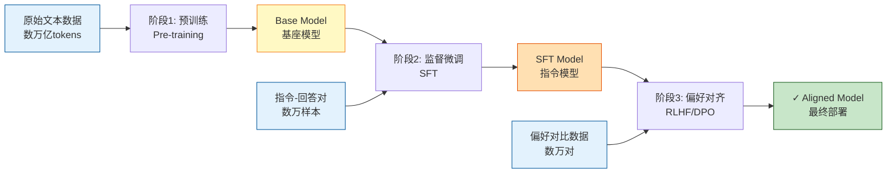

**关键对比**：预训练（数据T级、时间月级、成本80-90%）→ SFT（数据万级、时间天级、成本5-10%）→ 对齐（数据万级、时间天级、成本5-10%）

### 第一阶段：预训练（Pre-training）—— 构建语言基础

预训练是整个训练流程的**基石**，目标是让模型从海量文本中学习语言的统计规律、语法结构和世界知识。

#### 训练目标

**核心任务：Next Token Prediction（下一个词预测）**

给定前面的文本序列 $x_1, x_2, ..., x_{t-1}$，模型需要预测下一个token $x_t$。训练目标是最大化条件概率：

$$
\mathcal{L}_{\text{pretrain}} = -\sum_{t=1}^{T} \log P(x_t \mid x_1, x_2, \ldots, x_{t-1}; \theta)
$$

其中 $\theta$ 是模型参数，$T$ 是序列长度。

#### 训练数据

**数据规模**：
- **GPT-3**：约300B tokens（4100亿词）
- **LLaMA-2**：2T tokens（2万亿词）
- **LLaMA-3**：15T tokens（15万亿词）
- **训练时长**：在数千块A100 GPU上训练数周到数月

**数据来源配比示例（参考LLaMA）**：
- 网页数据（Common Crawl、C4）：~67%
- 书籍（Books3、BookCorpus）：~15%
- 代码（GitHub、Stack）：~10%
- 学术论文（arXiv、PubMed）：~5%
- 百科知识（Wikipedia）：~3%

#### 训练流程

```
原始数据采集
    ↓
质量过滤 + 去重 + 清洗
    ↓
Tokenization（分词）
    ↓
数据配比和采样
    ↓
分布式训练（3D并行）
    ↓
训练监控和checkpointing
    ↓
Base Model（基座模型）
```

#### 关键技术点

1. **学习率调度**：
   - Warmup阶段（0-2%训练步数）：从0线性增加到峰值
   - 稳定阶段（2-90%）：保持峰值或缓慢下降
   - Decay阶段（90-100%）：Cosine annealing降至峰值的10%

2. **批次大小策略**：
   - 起始：~2M tokens/batch
   - 逐步增大到：~4-8M tokens/batch
   - 使用梯度累积模拟大批次

3. **混合精度训练**：
   - 使用BF16（Brain Float16）进行前向和反向传播
   - 保持FP32的优化器状态
   - 提升训练速度同时保证稳定性

4. **Checkpointing策略**：
   - 每1000-5000步保存checkpoint
   - 保留最近N个checkpoint
   - 支持从任意checkpoint恢复训练

#### 输出产物

- **Base Model（基座模型）**：具备基础语言能力，但不擅长遵循指令
- **能力表现**：
  - ✅ 能够续写文本
  - ✅ 具备一定的知识储备
  - ✅ 理解基本语法和语义
  - ❌ 不擅长问答
  - ❌ 不理解对话格式
  - ❌ 输出可能不符合人类期望

---

### 第二阶段：监督微调（Supervised Fine-Tuning, SFT）—— 教会指令遵循

SFT阶段将Base Model转化为能够**理解指令、生成有用回答**的AI助手。

#### 训练目标

**核心任务：指令遵循（Instruction Following）**

给定一个指令 $x$ (prompt)，模型需要生成符合要求的回答 $y$ (response)。训练目标是最大化条件概率：

$$
\mathcal{L}_{\text{SFT}} = -\sum_{(x,y) \in \mathcal{D}_{\text{SFT}}} \log P(y \mid x; \theta)
$$

其中 $\mathcal{D}_{\text{SFT}}$ 是监督微调数据集，包含高质量的指令-回答对。

**关键区别**：
- 预训练：模型看到整个文档，预测每个token
- SFT：模型**只对回答部分计算loss**，不对指令部分计算loss

#### 训练数据

**数据规模**：
- **典型规模**：10k - 100k 高质量样本
- **LLaMA-2-Chat**：约27,540个样本
- **Vicuna**：约70k ShareGPT对话
- **远小于预训练**：数据质量 > 数据数量

**数据来源**：

1. **人工标注**（最高质量）：
   - 雇佣专业标注员
   - 给定指令，编写高质量回答
   - 多轮审核和质量控制
   - 成本高：$20-50/小时 × 数千小时

2. **模型蒸馏**（性价比高）：
   - 使用GPT-4等强模型生成训练数据
   - Self-Instruct、Evol-Instruct方法
   - 自动化生成 + 人工抽样审核
   - 代表：ShareGPT、UltraChat、OpenOrca

3. **开源数据集**：
   - FLAN、Dolly、OpenAssistant
   - 社区贡献的对话数据

**指令类型分布**：

**指令类型分布**：
- 开放式问答：30-40%
- 创意写作：15-20%
- 信息提取：10-15%
- 代码生成：10-15%
- 数学推理：5-10%
- 多轮对话：10-15%
- 其他任务：5-10%

#### 训练流程

```
Base Model（基座模型）
    ↓
准备SFT数据集（指令-回答对）
    ↓
格式化为统一模板
    ↓
    【System】You are a helpful assistant.
    【User】用户指令
    【Assistant】模型回答
    ↓
只对【Assistant】部分计算loss
    ↓
全参数微调 或 LoRA/QLoRA
    ↓
训练1-3个epoch
    ↓
SFT Model（指令微调模型）
```

#### 训练超参数

- **学习率**：1e-5 ~ 5e-5（远小于预训练的1e-4）
- **训练轮数**：1-3 epochs（过多会导致过拟合）
- **批次大小**：32-128（取决于显存）
- **序列长度**：2048-4096 tokens
- **优化器**：AdamW（β₁=0.9, β₂=0.95）
- **Warmup比例**：10-20%
- **权重衰减**：0.01-0.1

#### 高效微调技术

**LoRA（Low-Rank Adaptation）**：

在预训练权重 $W_0$ 的基础上，添加低秩分解的可训练矩阵：

$$
W = W_0 + \Delta W = W_0 + BA
$$

其中 $B \in \mathbb{R}^{d \times r}$，$A \in \mathbb{R}^{r \times k}$，秩 $r \ll \min(d,k)$。

**优势**：
- 只训练<1%的参数
- 显存占用大幅降低
- 训练速度提升2-3倍
- 可以合并回原模型

**QLoRA（Quantized LoRA）**：
- 将Base Model量化到4-bit
- 在量化模型上应用LoRA
- 单张24GB GPU即可微调65B模型

#### 输出产物

- **SFT Model（指令微调模型）**：能够理解和执行各类指令
- **能力表现**：
  - ✅ 理解对话格式和角色
  - ✅ 能够回答问题、完成任务
  - ✅ 输出更加结构化和有用
  - ⚠️ 可能仍有有害输出
  - ⚠️ 输出质量参差不齐
  - ⚠️ 需要进一步对齐

---

### 第三阶段：偏好对齐（Preference Alignment）—— 符合人类价值观

对齐阶段让模型的输出不仅"能用"，更要"好用"，符合人类的偏好、价值观和安全准则。

#### 训练目标

**核心任务：学习人类偏好（Human Preference Learning）**

给定同一个指令 $x$，模型生成的两个回答 $y_w$（更好）和 $y_l$（较差），训练目标是让模型更倾向于生成 $y_w$。

#### 方法一：RLHF（Reinforcement Learning from Human Feedback）

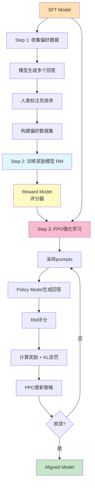

**RLHF三步流程**：

**Step 1: 收集偏好数据**
```
对于指令 x：
    模型生成多个回答：[y1, y2, y3, y4]
    人类标注员排序：y2 > y4 > y1 > y3
    构建偏好对：(x, y2, y4), (x, y2, y1), ...
```

**数据规模**：
- InstructGPT：约33k偏好对比
- Anthropic HH-RLHF：约160k对话偏好数据
- 成本：每个标注$0.5-2

**Step 2: 训练奖励模型（Reward Model, RM）**

输入：prompt $x$ + response $y$
输出：标量奖励分数 $r(x, y)$

损失函数（Bradley-Terry模型）：

$$
\mathcal{L}_{\text{RM}} = -\mathbb{E}_{(x,y_w,y_l)} \left[ \log \sigma(r(x, y_w) - r(x, y_l)) \right]
$$

其中 $y_w$ 是人类偏好的回答，$y_l$ 是被拒绝的回答，$\sigma$ 是sigmoid函数。

**RM架构**：
- 通常基于SFT Model初始化
- 去除最后的LM head
- 添加标量输出层
- 参数量：与Policy Model相同或稍小

**Step 3: PPO强化学习优化**

使用PPO（Proximal Policy Optimization）算法优化策略模型：

$$
\mathcal{L}_{\text{PPO}} = \mathbb{E}_{x,y} \left[ r(x, y) - \beta \cdot D_{\text{KL}}(\pi_\theta \| \pi_{\text{ref}}) \right]
$$

**解释**：
- 第一项：奖励模型评分，鼓励高质量输出
- 第二项：KL散度惩罚，防止偏离SFT模型过远（避免模式崩溃）
- $\beta$：KL惩罚系数（通常0.01-0.1）

**训练细节**：
- 每次迭代采样batch prompts
- 用当前策略生成回答
- 使用RM计算奖励
- PPO更新策略参数
- 重复数千到数万步

**RLHF的挑战**：
- ❌ 训练不稳定（需要同时运行4个模型）
- ❌ RM可能被exploit（reward hacking）
- ❌ 计算开销大（需要Policy、Reference、RM、Critic）
- ❌ 超参数敏感

#### 方法二：DPO（Direct Preference Optimization）

**核心创新**：绕过显式的Reward Model和RL训练，直接从偏好数据优化策略。

**DPO损失函数**：

$$
\mathcal{L}_{\text{DPO}} = -\mathbb{E}_{(x,y_w,y_l)} \left[ \log \sigma \left( \beta \log \frac{\pi_\theta(y_w \mid x)}{\pi_{\text{ref}}(y_w \mid x)} - \beta \log \frac{\pi_\theta(y_l \mid x)}{\pi_{\text{ref}}(y_l \mid x)} \right) \right]
$$

**直观理解**：
- 增加模型对 $y_w$（好回答）的概率
- 降低模型对 $y_l$（差回答）的概率
- 相对于参考模型 $\pi_{\text{ref}}$（通常是SFT模型）的变化受 $\beta$ 控制

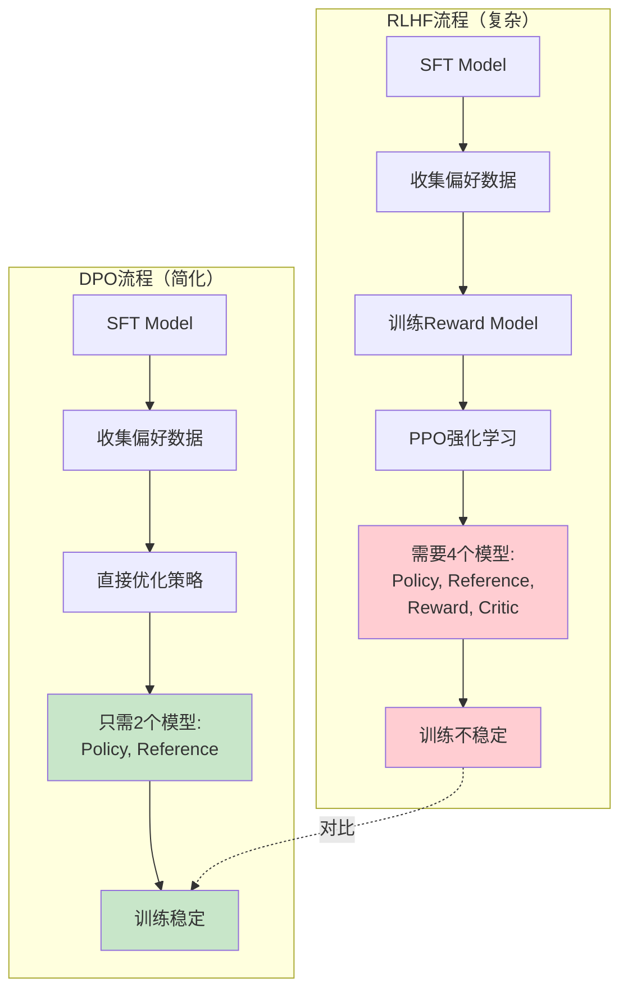

**DPO vs RLHF对比**：

| 维度 | RLHF | DPO |
|------|------|-----|
| **训练阶段** | 3步（数据→RM→PPO） | 2步（数据→直接优化） |
| **模型数量** | 4个（Policy/Ref/RM/Critic） | 2个（Policy/Ref） |
| **训练稳定性** | 较低（RL不稳定） | 高（监督学习） |
| **计算开销** | 大（4个模型） | 小（2个模型） |
| **实现复杂度** | 高（需要RL库） | 低（标准优化） |
| **Reward Hacking** | 容易发生 | 不易发生 |
| **效果** | 强 | 相当或更好 |

**DPO的优势**：
- ✅ 训练更稳定（只需训练一个模型）
- ✅ 无需训练RM（节省计算）
- ✅ 无需RL（更简单）
- ✅ 效果与RLHF相当或更好
- ✅ 超参数更鲁棒

**训练流程**：
```
SFT Model → 冻结作为参考模型 π_ref
    ↓
准备偏好数据 (x, y_w, y_l)
    ↓
直接优化策略模型 π_θ
    ↓
最小化 DPO loss
    ↓
Aligned Model（对齐模型）
```

**训练超参数**：
- **学习率**：5e-7 ~ 5e-6（更小）
- **β参数**：0.1 ~ 0.5
- **训练轮数**：1-3 epochs
- **批次大小**：16-64

#### 方法三：其他对齐技术

**RLAIF（RL from AI Feedback）**：
- 使用AI模型（如GPT-4）代替人类标注偏好
- 成本更低、可扩展性更强
- Constitutional AI的核心技术

**ORPO（Odds Ratio Preference Optimization）**：
- 将SFT和偏好优化合并为单阶段
- 无需reference model
- 进一步简化训练流程

**IPO、KTO等DPO变体**：
- 改进优化目标
- 减少length bias
- 更好的理论保证

#### 对齐后的效果

- **Aligned Model（对齐模型）**：最终可部署的模型
- **能力表现**：
  - ✅ 输出更有帮助、诚实、无害（HHH）
  - ✅ 符合人类偏好和价值观
  - ✅ 减少有害、偏见输出
  - ✅ 更好的对话体验
  - ✅ 拒绝不当请求

---

### 三阶段总结对比

| 阶段 | 预训练 | 监督微调 | 偏好对齐 |
|------|--------|----------|----------|
| **目标** | 学习语言基础 | 教会指令遵循 | 符合人类偏好 |
| **数据类型** | 无标注文本 | 指令-回答对 | 偏好对比数据 |
| **数据规模** | 数万亿tokens | 数万-数十万样本 | 数万-数十万对比 |
| **训练时长** | 数周-数月 | 数小时-数天 | 数小时-数天 |
| **计算需求** | 数千GPU | 数十-数百GPU | 数十-数百GPU |
| **成本占比** | ~80-90% | ~5-10% | ~5-10% |
| **学习率** | 1e-4 ~ 3e-4 | 1e-5 ~ 5e-5 | 5e-7 ~ 5e-6 |
| **Epoch数** | <1 epoch（太大） | 1-3 epochs | 1-3 epochs |
| **输出模型** | Base Model | SFT Model | Aligned Model |

**关键洞察**：
- 预训练是能力的来源（占成本90%）
- SFT是能力的激活（数据质量 > 数量）
- 对齐是体验的保证（必不可少）

## 大模型训练的核心组成要素

一个完整的大模型训练系统包含以下核心要素：

### 1. 数据（Data）
- **预训练数据**：网页、书籍、代码、学术论文等
- **微调数据**：指令-回答对、对话数据
- **偏好数据**：人类标注的偏好对比数据
- **数据处理流程**：清洗、去重、质量过滤、毒性检测

### 2. 模型架构（Model Architecture）
- **基础架构**：Transformer（Encoder、Decoder或Encoder-Decoder）
- **位置编码**：绝对位置编码、相对位置编码、RoPE、ALiBi
- **注意力机制**：Multi-Head Attention、Grouped-Query Attention、Multi-Query Attention
- **归一化方式**：LayerNorm、RMSNorm、Pre-Norm vs Post-Norm
- **激活函数**：GELU、SwiGLU、GeGLU

### 3. 优化器与训练策略（Optimization）
- **优化器**：AdamW、Adafactor、Lion
- **学习率调度**：Warmup、Cosine Decay、Constant
- **梯度处理**：Gradient Clipping、Gradient Accumulation
- **正则化**：Dropout、Weight Decay

### 4. 分布式训练框架（Distributed Training）
- **数据并行**：DDP（Distributed Data Parallel）
- **张量并行**：Megatron-LM Tensor Parallelism
- **流水线并行**：Pipeline Parallelism、1F1B Schedule
- **序列并行**：Sequence Parallelism
- **混合并行**：3D Parallelism（数据+张量+流水线）
- **优化器状态并行**：ZeRO-1/2/3（DeepSpeed）

### 5. 计算基础设施（Infrastructure）
- **硬件**：GPU集群（A100、H100等）、TPU、专用AI芯片
- **互联网络**：InfiniBand、NVLink、PCIe
- **存储系统**：高性能分布式存储
- **监控与日志**：TensorBoard、Weights & Biases、MLflow

---

# 大模型训练的主要挑战

> **⚠️ 挑战总览**
>
> 大模型训练是一项极具挑战性的系统工程，需要在计算资源、数据质量、训练稳定性、模型对齐等多个维度取得平衡。成功训练一个高性能大模型不仅需要技术实力，更需要工程经验的积累。

## 1. 计算资源与成本

训练大模型需要巨大的计算资源：
- GPT-3级别模型训练成本约数百万美元
- 需要数千块高端GPU并行训练数月
- 碳排放和能源消耗问题
- 如何降低训练成本成为关键挑战

## 2. 数据质量与规模

高质量训练数据是模型性能的基础：
- 网络数据存在噪声、偏见和有害内容
- 数据去重、清洗和质量控制的工程挑战
- 隐私和版权问题
- 高质量人工标注数据成本高昂

## 3. 训练稳定性

大规模训练面临稳定性挑战：
- Loss spike（损失突然上升）
- 梯度爆炸/消失
- 数值不稳定（Numerical Instability）
- 分布式训练中的同步问题

## 4. 模型对齐与安全

让模型行为符合人类期望：
- 如何准确捕捉人类偏好
- 避免有害、偏见或不准确的输出
- Reward Hacking问题（奖励函数被利用）
- 长期对齐的稳定性

## 5. 评估与基准测试

如何全面评估模型能力：
- 现有基准测试可能被"刷榜"
- 难以量化创造性和开放式能力
- 多语言、多模态评估的复杂性
- 真实应用场景下的表现差异

## 6. 涌现能力的不可预测性

模型规模扩大带来的未知：
- 某些能力只在特定规模后出现
- 难以提前预测模型行为
- 可能出现意外的能力或问题
- 如何系统性理解规模法则（Scaling Laws）

---

# 预训练阶段
————Pre-training

预训练是大模型训练的基石，目标是让模型从海量无标注文本中学习语言的统计规律和世界知识。

> **🎯 本章导读**
>
> 预训练是整个训练流程中**成本最高、时间最长、技术难度最大**的阶段，占总成本的80-90%。本章将详细介绍预训练的目标函数、数据处理、训练技巧和前沿技术，帮助读者理解如何从零开始训练一个基座模型。

## 预训练目标函数

### 1. 自回归语言建模（Autoregressive Language Modeling）
- **方法**：预测下一个token（Next Token Prediction）
- **代表模型**：GPT系列、LLaMA、PaLM
- **优势**：生成能力强，适合对话和创作任务
- **公式**：最大化条件概率 $P(x_t \mid x_1, x_2, \ldots, x_{t-1})$

### 2. 掩码语言建模（Masked Language Modeling）
- **方法**：预测被mask的token
- **代表模型**：BERT、RoBERTa
- **优势**：双向上下文理解
- **应用**：分类、信息抽取等理解任务

### 3. 混合目标
- **Encoder-Decoder架构**：T5、BART
- **Prefix Language Modeling**：UL2
- **Fill-in-the-Middle**：代码模型常用

## 预训练数据

### 数据来源
- **网页数据**：Common Crawl、C4（Colossal Clean Crawled Corpus）
- **书籍**：BookCorpus、Books3
- **代码**：GitHub、Stack Overflow
- **学术文献**：arXiv、PubMed
- **对话数据**：Reddit、社交媒体
- **百科知识**：Wikipedia、Wikidata

### 数据处理流程

#### 1. 数据采集
- 网页爬取与下载
- API数据获取
- 开源数据集整合

#### 2. 质量过滤
- 语言检测与过滤
- 内容质量评估（长度、重复性、可读性）
- 毒性和有害内容检测
- 个人信息删除（PII Removal）

#### 3. 去重
- **精确去重**：完全相同的文档
- **模糊去重**：MinHash、SimHash等算法
- **跨数据集去重**：避免测试集泄露

#### 4. Tokenization
- BPE（Byte Pair Encoding）
- WordPiece
- Unigram
- SentencePiece

### 数据配比（Data Mixture）
- 不同来源数据的采样比例
- 领域特定数据的权重调整
- 随训练进行的动态调整

## 预训练训练流程可视化

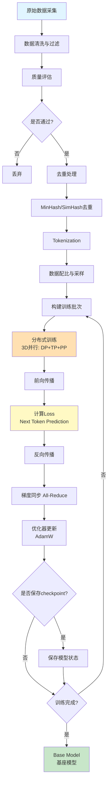

**流程说明**：
1. **数据准备阶段**（A-I）：占整体时间的20-30%
2. **训练迭代阶段**（J-S）：占整体时间的70-80%
3. **每1000-5000步保存一次checkpoint**
4. **总训练步数**：通常100k-500k步

## 预训练的关键技术

### 1. 学习率调度

**标准三阶段调度**：
```
Warmup → Peak Learning Rate → Cosine/Linear Decay
```

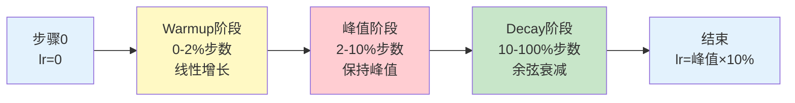

**关键参数**：
- **Warmup步数**：通常2,000-10,000步（占总步数的1-2%）
- **Peak Learning Rate**：根据模型规模调整
  - 小模型（<1B参数）：3e-4 ~ 1e-3
  - 中型模型（1-10B参数）：1e-4 ~ 3e-4
  - 大模型（10B+参数）：6e-5 ~ 2e-4
- **Decay策略**：Cosine Annealing最常用
- **最小学习率**：通常为峰值的10%

**Warmup的重要性**：
- 避免训练初期的梯度爆炸
- 让优化器状态（Adam的momentum）逐步稳定
- 大模型训练的必要技巧

**学习率与批次大小关系**（Linear Scaling Rule）：

$$
\text{lr}_{\text{new}} = \text{lr}_{\text{base}} \times \frac{\text{batch}_{\text{new}}}{\text{batch}_{\text{base}}}
$$

例如：基础配置 lr=1e-4, batch=256 → 扩展到 batch=2048 → lr=8e-4

### 2. 批次大小（Batch Size）
- **趋势**：随训练进行逐步增大
- **典型值**：从数百万到数千万tokens per batch
- **梯度累积**：模拟更大batch size

### 3. 上下文长度（Context Length）
- **起始**：通常从较短长度开始（如2048）
- **扩展**：Position Interpolation、YaRN等技术
- **长上下文训练**：渐进式扩展策略

### 4. 混合精度训练
- **BF16**（Brain Float16）：更稳定，适合大模型
- **FP16**：节省内存，需要Loss Scaling
- **FP8**：新一代硬件支持

### 5. Flash Attention
- 减少显存占用
- 加速注意力计算
- 支持更长上下文

## 预训练的前沿技术

### MoE（Mixture of Experts）架构

#### 核心思想
- 训练多个专家网络，每次只激活部分专家
- 增加模型容量的同时控制计算成本
- 稀疏激活机制

#### 代表模型
- **Mixtral 8x7B**：8个专家，每次激活2个，达到47B容量但计算成本仅相当于13B
- **Switch Transformer**：简化路由机制，扩展到1.6万亿参数
- **GPT-4**：据传使用MoE架构

#### 训练挑战
- Expert load balancing（专家负载均衡）
- 路由策略设计
- 通信开销优化

### 长上下文训练

#### 位置编码扩展技术
- **Position Interpolation**：直接插值RoPE，仅需少量训练
- **YaRN**：改进的插值+温度缩放，扩展到128k
- **ALiBi**：基于注意力偏置的位置编码

#### 长上下文注意力优化
- **Ring Attention**：分块+循环通信，支持数百万token
- **LongLoRA**：Shifted Sparse Attention，高效扩展到100k+
- **FlashAttention-2**：IO优化，支持更长序列

### 训练稳定性技术

#### Loss Spike问题解决
- **μ-Parameterization**：参数化方案使超参数可跨规模迁移
- **WSD Schedule**：Warmup-Stable-Decay三阶段学习率
- **Adaptive Gradient Clipping**：自适应梯度裁剪

#### 数值稳定性
- BF16训练（更稳定）
- 梯度累积与检查点
- 混合精度策略

### 高质量数据工程

#### 数据质量评估
- 基于困惑度的质量评分
- 启发式规则过滤
- 毒性和偏见检测

#### 数据去重策略
- MinHash：估计Jaccard相似度
- SimHash：快速近似去重
- 跨数据集去重（避免测试集泄露）

#### 数据配比优化
- 静态配比 vs 动态调整
- 课程学习（Curriculum Learning）
- 领域数据权重调整

---

# 监督微调阶段
————Supervised Fine-Tuning, SFT

SFT阶段将预训练模型转化为能够理解和执行指令的助手。

> **🎯 本章导读**
>
> SFT是**激活**模型能力的关键阶段，通过少量高质量的指令-回答数据，让Base Model学会遵循指令和对话交互。本章介绍SFT的数据构建、训练策略和高效微调技术（如LoRA、QLoRA），特别强调**数据质量远比数量重要**的核心理念。

## SFT的目标

- 让模型学会理解各类指令格式
- 生成结构化、有帮助的回答
- 适应对话交互模式
- 减少幻觉和错误输出

## SFT数据构建

### 1. 数据来源
- **人工标注**：雇佣标注员编写高质量指令-回答对
- **模型蒸馏**：使用强模型（如GPT-4）生成数据
- **开源数据集**：ShareGPT、OpenOrca、UltraChat等
- **合成数据**：使用模板和规则生成

### 2. 指令类型
- **信息查询**：事实性问答、知识检索
- **创作写作**：文章、故事、诗歌、代码
- **分析推理**：逻辑推理、数学解题
- **对话交互**：多轮对话、角色扮演
- **任务执行**：翻译、摘要、格式转换

### 3. 数据质量控制
- 多轮人工审核
- 自动化质量评估
- 多样性检查
- 难度分层

## SFT训练策略

### 1. 全参数微调（Full Fine-Tuning）
- 更新所有模型参数
- 效果最好但成本最高
- 适合有充足资源的场景

### 2. 参数高效微调（Parameter-Efficient Fine-Tuning, PEFT）

#### LoRA（Low-Rank Adaptation）
- 在预训练权重上添加低秩矩阵
- 只训练新增参数（通常<1%）
- 可合并回主模型

#### QLoRA
- 量化+LoRA
- 在量化模型上应用LoRA
- 显著降低显存需求

#### Prefix Tuning / P-Tuning
- 优化输入前缀
- 冻结主模型参数

#### Adapter Layers
- 在Transformer层间插入小型适配器模块
- 只训练adapter参数

### 3. 指令模板（Instruction Template）

设计统一的输入输出格式：
```
<|system|>
You are a helpful assistant.
<|user|>
What is the capital of France?
<|assistant|>
The capital of France is Paris.
```

### 4. 训练超参数
- 学习率：通常小于预训练（1e-5到5e-5）
- Epoch数：1-3个epoch
- Batch Size：根据资源调整
- Warmup比例：10-20%

## SFT的前沿技术

### 小数据、高质量训练

#### Phi系列的启示
- **Phi-1**：仅6B tokens训练出强大代码能力
- **Phi-3**：3.8B参数达到接近大模型性能
- **核心策略**：
  - 使用GPT-4生成"教科书式"高质量数据
  - 严格的质量过滤和多样性控制
  - 证明数据质量 > 数据规模

#### 课程学习策略
- 从简单到复杂逐步提升难度
- 分层次的指令数据组织
- 动态调整数据配比

### 合成数据生成

#### 模型蒸馏方法
- 使用强模型（GPT-4）生成训练数据
- 指令-回答对的自动生成
- 质量控制和多样性保证

#### Evol-Instruct方法
- **WizardLM**：自动提升指令复杂度
- 指令进化策略
- 大幅提升指令跟随能力

#### 推理过程数据
- **Orca系列**：生成详细的推理步骤
- 解释型数据增强
- 提升小模型的推理能力

### 量化微调技术

#### QLoRA
- 4-bit量化 + LoRA
- 在单张24GB GPU上微调65B模型
- Double Quantization技术
- NormalFloat（NF4）数据类型

#### 其他量化方法
- INT8训练
- GPTQ后训练量化
- AWQ激活感知量化

---

# 偏好对齐阶段
————Preference Alignment

对齐阶段让模型输出符合人类偏好、价值观和安全准则。

> **🎯 本章导读**
>
> 偏好对齐是从"能用"到"好用"的**关键一跃**，通过RLHF或DPO等技术让模型输出更有帮助、更安全、更符合人类价值观。本章详细对比RLHF和DPO的原理、优劣，并介绍最新的对齐技术进展。**推荐优先使用DPO**，因其更稳定、更简单、效果相当。

## RLHF
————Reinforcement Learning from Human Feedback

### 训练流程

#### 1. 收集偏好数据
- 采样多个模型输出
- 人工标注偏好排序
- 构建偏好对比数据集

#### 2. 训练奖励模型（Reward Model）
- 使用偏好数据训练打分模型
- 输入：prompt + response
- 输出：质量分数
- 目标：预测人类偏好排序

#### 3. PPO强化学习
- 使用PPO（Proximal Policy Optimization）优化策略
- 奖励：Reward Model评分
- KL散度约束：避免偏离SFT模型过远
- 平衡探索与利用

### RLHF的挑战
- Reward Model可能被利用（Reward Hacking）
- 训练不稳定
- 计算开销大（需同时运行多个模型）
- 人类偏好标注成本高

## DPO
————Direct Preference Optimization

### 核心思想
- 绕过显式的Reward Model
- 直接从偏好数据优化策略
- 更简单、更稳定

### 优势
- 训练过程更稳定
- 无需训练单独的RM
- 计算效率更高
- 效果与RLHF相当或更好

### DPO的变体
- IPO（Identity Policy Optimization）
- KTO（Kahneman-Tversky Optimization）
- RRHF（Rank Responses to align Human Feedback）

## RLAIF
————RL from AI Feedback

- 使用AI模型代替人类标注偏好
- 降低标注成本
- 可扩展性更强
- 质量接近RLHF

## Constitutional AI

- 明确定义模型的行为准则（Constitution）
- 自我批评和修正
- 减少有害输出
- 提升安全性和对齐度

## 对齐技术前沿

### DPO及其变体家族

#### DPO
————Direct Preference Optimization
- **核心思想**：绕过显式Reward Model，直接优化策略
- **优势**：更稳定、更简单、计算效率更高
- **适用场景**：成为RLHF的主要替代方案

#### ORPO（Odds Ratio Preference Optimization）
- 将SFT和偏好优化合并为单阶段
- 无需reference model
- 进一步降低训练成本

#### IPO（Identity Preference Optimization）
- 改进DPO的优化目标
- 减少length bias问题
- 更好的理论基础

#### KTO（Kahneman-Tversky Optimization）
- 基于前景理论的偏好优化
- 更符合人类决策心理
- 处理不对称偏好

### 自主对齐技术

#### Self-Rewarding Language Models
- 模型自己生成训练数据并评估
- 同时提升生成和评估能力
- 突破人类标注瓶颈
- 迭代式自我改进

#### RLAIF
————RL from AI Feedback
- 使用AI模型代替人类标注
- 可扩展性更强
- 降低标注成本
- 质量接近RLHF

#### Constitutional AI 2.0
- 更系统的价值观编码
- 多轮自我批评和修正
- 减少对人类反馈的依赖
- 提升长期对齐稳定性

### 推理时计算优化

#### Chain-of-Thought强化
- **STaR**：自举式推理训练
- **Self-Consistency**：多路径采样+投票
- **Tree-of-Thought**：搜索式推理

#### 过程监督
- **Process Reward Model**：对每步推理评分
- 显著优于结果奖励模型
- 提升复杂推理任务性能

#### O1式推理系统
- 使用RL优化推理过程
- 让模型学会"慢思考"
- 在数学、编程等任务接近人类专家水平
- 推理时间 vs 性能的权衡

---

# 分布式训练技术

大模型训练必须依赖分布式并行技术。

> **🎯 本章导读**
>
> 分布式训练是大模型训练的**核心工程技术**，没有分布式并行就无法训练超过单GPU显存容量的模型。本章介绍数据并行、张量并行、流水线并行、ZeRO等关键技术，以及如何选择合适的并行策略。**核心原则**：TP用于单层过大，PP用于层数过多，DP用于提升吞吐。

## 数据并行
————Data Parallelism

### 原理
- 每个GPU持有完整模型副本
- 不同GPU处理不同batch数据
- 梯度同步后更新参数

### 实现
- **DDP（PyTorch Distributed Data Parallel）**
- **All-Reduce梯度同步**
- **Ring-AllReduce优化通信**

### 局限
- 模型必须能装入单个GPU显存
- 不适用于超大模型

## 张量并行
————Tensor Parallelism

### 原理
- 将单个Transformer层的参数切分到多个GPU
- 前向和反向传播时进行通信
- Megatron-LM的核心技术

### 切分策略
- **列切分**：如将MLP的第一层按列切分
- **行切分**：如将MLP的第二层按行切分
- **注意力切分**：按attention head分配

### 适用场景
- 超大模型无法装入单GPU
- 需要细粒度并行

## 流水线并行
————Pipeline Parallelism

### 原理
- 将模型按层切分到多个GPU（设备）
- 数据按mini-batch流水执行
- 减少设备空闲时间

### 调度策略
- **GPipe**：F-then-B（先完成所有前向再反向）
- **1F1B**：交替前向和反向，减少显存占用
- **Virtual Pipeline**：减少bubble time

### 挑战
- 流水线bubble导致GPU利用率下降
- 通信开销
- 负载均衡

## 序列并行
————Sequence Parallelism

### 原理
- 将序列（sequence）维度切分
- 在非Tensor Parallel区域节省显存
- 与Tensor Parallel配合使用

### 优势
- 支持更长的序列
- 减少激活值显存占用

## ZeRO
————Zero Redundancy Optimizer

### ZeRO-1：优化器状态分片
- 将Adam状态（momentum、variance）切分到多个GPU
- 节省4x显存

### ZeRO-2：梯度分片
- 进一步切分梯度
- 节省8x显存

### ZeRO-3：参数分片
- 所有参数也分片存储
- 用时通信获取
- 最大化显存节省

### ZeRO-Offload
- 将部分数据offload到CPU内存
- 牺牲速度换取更大模型训练能力

### ZeRO-Infinity
- 利用NVMe存储
- 训练超大规模模型

## 混合并行
————3D Parallelism

结合数据并行、张量并行、流水线并行：

$$
\text{总GPU数} = \text{DP度} \times \text{TP度} \times \text{PP度}
$$

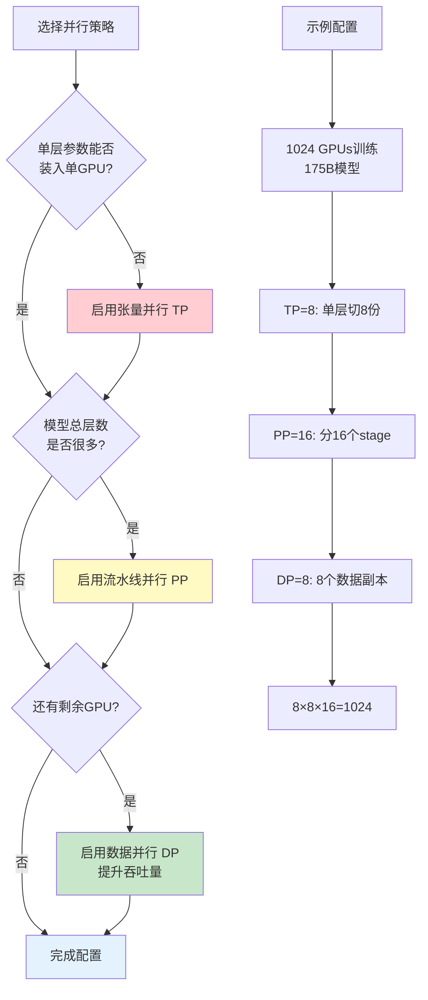

### 策略选择原则

**决策流程**：
1. **首先考虑TP（张量并行）**：
   - 当单层参数 > 单GPU显存时必须使用
   - 典型配置：TP=2/4/8（同节点内，NVLink通信）
   - 例如：单层12GB，单GPU 80GB → 不需要TP

2. **其次考虑PP（流水线并行）**：
   - 当模型总层数很多时使用
   - 典型配置：PP=2/4/8/16
   - 例如：96层模型，PP=16 → 每个stage 6层

3. **最后考虑DP（数据并行）**：
   - 使用剩余所有GPU
   - 提升训练吞吐量
   - 例如：1024 GPU，TP=8，PP=16 → DP=8

**实际案例**：

| 模型规模 | TP | PP | DP | 总GPU | 说明 |
|---------|----|----|----|----|------|
| **7B参数** | 1 | 1 | 64 | 64 | 小模型，纯DP即可 |
| **13B参数** | 2 | 1 | 32 | 64 | 需要少量TP |
| **70B参数** | 8 | 4 | 4 | 128 | 需要TP+PP |
| **175B参数** | 8 | 16 | 8 | 1024 | 大模型，3D并行 |
| **540B参数** | 8 | 32 | 16 | 4096 | 超大模型 |

**Trade-off考虑**：
- **TP增大**：层内通信增多，需要高速互联（NVLink）
- **PP增大**：Pipeline bubble增大，GPU利用率下降
- **DP增大**：梯度同步通信增多，但可用Ring-AllReduce优化


# 训练优化技术

## 优化器选择

### AdamW
- Adam + Weight Decay解耦
- 当前最主流
- 超参数：β1=0.9, β2=0.95-0.999

### Adafactor
- 节省优化器状态显存
- 适合资源受限场景
- T5等模型使用

### Lion
- 新型优化器
- 显存占用更少
- 部分场景优于AdamW

## 学习率策略

### Warmup
- 从小学习率逐步增加
- 避免训练初期不稳定
- 典型：2000-10000步

### Cosine Decay

学习率随训练步数按余弦曲线衰减：

$$
\text{lr}(t) = \text{lr}_{\min} + \frac{1}{2}(\text{lr}_{\max} - \text{lr}_{\min}) \left(1 + \cos\left(\frac{\pi t}{T}\right)\right)
$$

其中：
- $t$：当前训练步数
- $T$：总训练步数
- $\text{lr}_{\max}$：峰值学习率
- $\text{lr}_{\min}$：最小学习率（通常为峰值的10%）

### Linear Decay
- 线性降低学习率

### Constant Learning Rate
- 部分研究表明constant LR效果好
- 需要仔细调节

## 梯度处理

### Gradient Clipping
- 防止梯度爆炸
- 通常clip到1.0

### Gradient Accumulation
- 累积多个小batch梯度
- 模拟大batch训练
- 节省显存

### Gradient Checkpointing
- 重计算激活值而非存储
- 用计算换显存
- 训练更大模型

## 正则化技术

### Dropout
- 传统正则化
- 大模型中通常较小（0.1）或不用

### Weight Decay
- AdamW中使用
- 典型值：0.1

### Embedding Dropout
- 对token embedding应用dropout

---

# 数据工程

数据是大模型训练的基石。高质量的训练数据直接决定了模型的能力上限。本章系统介绍大模型训练中的数据工程技术。

> **🎯 本章导读**
>
> "Garbage in, garbage out"——数据质量直接决定模型上限。本章介绍数据采集、质量评估、去重、配比、Tokenization等完整数据处理流程。**核心理念**：高质量 > 大规模，多样性 > 单一来源。数据工程往往被低估，但它是训练成功的关键。

## 数据采集与来源

### 预训练数据来源

#### 网页数据
- **Common Crawl**：最大的开放网页爬取数据集，每月爬取数十亿网页，包含多语言、多领域内容
- **C4（Colossal Clean Crawled Corpus）**：基于Common Crawl清洗后的数据集，~750GB文本
- **RedPajama**：开源的LLaMA训练数据复现（1.2万亿token）

#### 代码数据
- **GitHub**：开源代码仓库（过滤星标、license）
- **Stack Overflow**：高质量代码问答
- **The Stack**：3TB源代码，30+编程语言

#### 学术与书籍
- **arXiv、PubMed**：学术论文
- **Books3、BookCorpus**：书籍数据集

#### 对话与社交媒体
- **Reddit**：高质量讨论和问答
- **Wikipedia**：结构化知识
- **StackExchange**：各领域专业问答

## 数据质量评估

### 启发式规则过滤

#### 文本长度与格式
- 最小/最大长度过滤
- 特殊字符、数字、标点比例控制
- 大写字母密度检测
- 语言检测（fastText、langdetect）

#### 重复内容检测
- 行级重复、段落重复
- 模板识别（网页模板、页眉页脚）

### 基于模型的质量评分

#### 困惑度（Perplexity）过滤
- 使用小型语言模型评分
- 过滤困惑度过高的文档（需谨慎）

#### 质量分类器
- 训练数据：人工标注高质量 vs 低质量样本
- 特征：文本流畅度、信息密度、语法正确性
- 模型：FastText、BERT分类器

#### 教育价值评分
- Phi系列的启发：评估"教科书质量"
- 使用GPT-4等强模型评分

### 毒性与有害内容检测

#### 毒性检测
- **Perspective API**：Google毒性评分API
- **Detoxify**：开源毒性检测模型

#### PII（个人身份信息）去除
- 姓名、地址、电话、邮箱
- 使用NER模型识别
- 密码、密钥：正则表达式匹配

## 数据去重

去重是最关键的数据处理步骤，可显著提升模型性能并减少记忆效应。

### 精确去重
- **文档级**：基于MD5/SHA256 hash
- **URL去重**：处理重定向和规范化

### 模糊去重

#### MinHash + LSH
- 估计Jaccard相似度
- 步骤：生成shingles → MinHash签名 → LSH找相似对
- 工具：datasketch库

#### SimHash
- 快速计算文档指纹
- 汉明距离判断相似度

#### Suffix Array
- 寻找最长公共子串
- CCNet方法

### 跨数据集去重

#### 训练集与测试集去重
- **至关重要**：避免数据泄露
- 13-gram重叠检测（GPT-3）
- 影响评测可信度

### 去重Trade-off
- 过度去重：损失多样性
- 欠去重：浪费资源、增加记忆风险
- 平衡点：根据任务调整

## 数据配比与采样

### 静态配比策略

**GPT-3配比示例**：

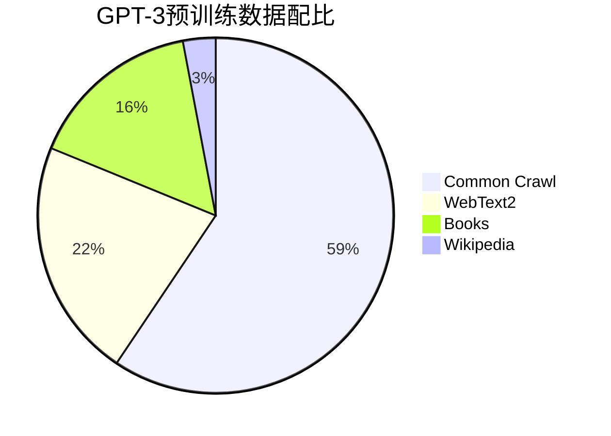

**LLaMA配比示例**（更新的配比策略）：

| 数据源 | 占比 | Token数量 | 说明 |
|--------|------|-----------|------|
| CommonCrawl | 67% | ~1.34T | 网页数据，多样性最高 |
| C4 | 15% | ~300B | 清洗后的网页数据 |
| GitHub | 4.5% | ~90B | 代码数据 |
| Wikipedia | 4.5% | ~90B | 高质量百科知识 |
| Books | 4.5% | ~90B | 长文本，叙事能力 |
| ArXiv | 2.5% | ~50B | 数学、科学推理 |
| StackExchange | 2% | ~40B | 专业问答 |

**配比原则**：
- **高质量数据提权**：Wikipedia、Books、ArXiv虽然占比小，但多次采样
- **代码数据单独控制**：10-20%，提升代码能力但不过度
- **对话数据少量但重要**：StackExchange等问答数据培养对话能力
- **多样性优先**：Common Crawl占主导，保证知识广度

### 动态配比策略

#### 训练阶段调整
- **早期（0-70%）**：均衡配比
- **中期（70-90%）**：提升高质量数据
- **后期（90-100%）**：专注专业数据

#### 基于损失的调整
- 监控不同数据源loss
- 动态再平衡

### 课程学习（Curriculum Learning）
- 从易到难：按困惑度排序
- 从通用到专业

### Temperature Sampling

采样概率计算公式：

$$
p_i = \frac{n_i^{\alpha}}{\sum_j n_j^{\alpha}}
$$

其中：
- $n_i$：数据源 $i$ 的原始样本数量
- $\alpha$：温度参数
- $\alpha < 1$：提升小数据源采样概率（up-sampling）
- $\alpha > 1$：降低小数据源采样概率（down-sampling）
- $\alpha = 1$：按原始比例采样

## Tokenization

### 算法选择

- **BPE（Byte Pair Encoding）**：GPT系列、LLaMA
  - 从字符开始迭代合并高频pair
  - 平衡词表大小和分词粒度
- **WordPiece**：BERT，基于最大似然
- **Unigram**：T5，从大词表剪枝
- **SentencePiece**：语言无关，多语言模型首选

### 词表大小
- 英语为主：32k - 50k
- 多语言：100k - 250k
- 代码模型：更大词表

**Trade-off**：
- 词表过小：序列长，训练慢
- 词表过大：embedding参数多，稀疏

### 特殊Token
- 标准：`<bos>`, `<eos>`, `<pad>`, `<unk>`
- 对话：`<|user|>`, `<|assistant|>`, `<|system|>`
- 多模态：`<image>`, `<video>`

### 最佳实践
- 预训练、微调、推理使用相同tokenizer
- 预先tokenize并缓存
- 使用fast tokenizer（Rust实现）
- 多语言平衡token数量


# 评估与基准测试

评估体系是衡量训练效果和指导训练方向的重要工具。本章介绍大模型训练中常用的评测基准。

## 语言理解与知识

### MMLU（Massive Multitask Language Understanding）
- **内容**：57个学科的多选题（数学、历史、法律、医学等）
- **规模**：~16,000道题目
- **评估维度**：知识广度、跨学科理解
- **难度**：大学到专业水平
- **意义**：衡量模型的通用知识储备

### HellaSwag
- **任务**：常识推理句子补全
- **方法**：从4个选项中选择最合理的句子结尾
- **特点**：对人类简单（~95%），对早期模型困难
- **评估**：常识理解和情境推理

### TruthfulQA
- **目标**：评估模型输出的真实性
- **设计**：包含常见误解和虚假信息的问题
- **评估维度**：
  - 模型是否会重复训练数据中的错误
  - 是否会产生幻觉（Hallucination）
- **重要性**：衡量模型可靠性

### ARC（AI2 Reasoning Challenge）
- **内容**：小学科学考试题
- **难度**：Easy和Challenge两个版本
- **评估**：科学推理和知识应用

## 推理能力

### GSM8K（Grade School Math 8K）
- **任务**：小学数学应用题
- **规模**：8,500道题
- **特点**：需要多步推理
- **评估方法**：
  - Direct答案评估
  - Chain-of-Thought推理过程评估
- **意义**：衡量基础数学推理能力

### MATH
- **难度**：高中到大学竞赛级别数学
- **规模**：12,500道题
- **学科**：代数、几何、概率、数论等
- **评估**：复杂数学推理和问题解决
- **挑战**：即使最强模型也难以达到高分

### HumanEval
- **任务**：Python函数实现
- **规模**：164个编程问题
- **评估方法**：单元测试通过率（pass@k）
- **特点**：
  - 独立函数，不涉及复杂系统
  - 明确的输入输出规范
- **变体**：HumanEval+（更严格测试）

### MBPP（Mostly Basic Python Problems）
- **规模**：1,000个Python编程问题
- **难度**：入门到中级
- **评估**：实用编程能力

### BigCodeBench
- **特点**：更复杂的真实世界编程任务
- **评估**：工具使用、API调用、复杂逻辑

## 多语言能力

### FLORES（Facebook Low Resource Translation）
- **任务**：机器翻译
- **覆盖**：200+语言对
- **评估**：跨语言理解和生成
- **重要性**：衡量多语言模型能力

### XNLI（Cross-lingual Natural Language Inference）
- **任务**：自然语言推理（蕴含、矛盾、中立）
- **语言**：15种语言
- **评估**：零样本跨语言迁移能力

### Belebele
- **任务**：阅读理解
- **覆盖**：122种语言
- **评估**：广泛的多语言理解

## 长文本能力

### RULER（Rule-based Evaluation of Long Context Understanding）
- **任务类型**：
  - 信息检索（Needle in a Haystack）
  - 多跳推理
  - 聚合统计
- **长度**：4k到128k+ tokens
- **评估**：长上下文建模能力

### LongBench
- **任务**：单文档/多文档QA、摘要、代码等
- **长度**：平均5-15k tokens
- **语言**：英文和中文
- **评估**：真实长文本应用场景

### Needle in a Haystack（大海捞针）
- **设计**：在长文本中插入关键信息
- **测试**：模型能否准确检索
- **变体**：
  - 单needle
  - 多needle
  - 不同位置和深度

## 安全性评估

### ToxiGen
- **目标**：检测有害内容生成倾向
- **方法**：对抗性prompt测试
- **评估维度**：
  - 毒性
  - 仇恨言论
  - 暴力内容

### BBQ（Bias Benchmark for QA）
- **任务**：检测社会偏见
- **维度**：
  - 性别
  - 种族
  - 宗教
  - 年龄
  - 性取向等
- **方法**：模糊和明确上下文对比

### SafetyBench
- **覆盖**：多类安全风险
- **语言**：中英文
- **评估**：拒绝回答不当请求的能力

## 对齐评估

### MT-Bench
- **任务**：多轮对话评估
- **评判**：使用GPT-4作为评委
- **维度**：
  - 写作
  - 角色扮演
  - 推理
  - 数学
  - 编程等

### AlpacaEval
- **方法**：与参考模型（如GPT-4）对比
- **评估**：指令跟随质量
- **输出**：胜率（Win Rate）

### Chatbot Arena
- **方法**：人类盲评，Elo评分
- **特点**：持续更新的实时排行榜
- **意义**：反映真实用户偏好

## 综合评测平台

### LM Evaluation Harness
- **维护**：Eleuther AI
- **特点**：
  - 统一接口
  - 支持几十个基准测试
  - 标准化评测流程
- **使用**：研究社区广泛采用

### HELM（Holistic Evaluation of Language Models）
- **维度**：
  - 准确性
  - 鲁棒性
  - 公平性
  - 偏见
  - 效率
- **特点**：多维度全面评估

### OpenCompass
- **维护**：上海AI Lab
- **特点**：
  - 中文优化
  - 支持大规模评测
  - 可视化排行榜

## 评测的最佳实践

### 避免数据泄露
- 训练数据与测试集严格去重
- 使用新发布的基准测试
- 定期更新评测集

### 多维度评估
- 不依赖单一指标
- 综合考虑性能、安全、效率
- 关注长尾能力和边界情况

### 评测与训练的关系
- 评测结果指导训练方向
- 避免过度针对基准优化（刷榜）
- 关注实际应用场景表现

---

# 实践指南与最佳实践

本章提供实际训练大模型的工程指导，包括硬件配置、成本估算、监控调试和代码示例。

## 硬件配置建议

### 不同规模模型的推荐配置

| 模型规模 | 参数量 | 推荐GPU | 数量 | 显存需求 | 互联网络 | 适用场景 |
|---------|--------|---------|------|---------|---------|---------|
| **小型** | 1-3B | RTX 4090 | 4-8 | 24GB | PCIe 4.0 | 研究、原型开发 |
| **中型** | 7-13B | A100 | 16-32 | 40GB/80GB | InfiniBand | 企业应用 |
| **大型** | 30-70B | A100/H100 | 64-256 | 80GB | InfiniBand | 生产级模型 |
| **超大型** | 175B+ | H100 | 512-4096 | 80GB | InfiniBand/NVLink | 前沿研究 |

### GPU选择指南

**训练场景**：
- **预算有限**：RTX 4090（24GB，性价比高，适合小模型和LoRA微调）
- **企业级训练**：A100（80GB，成熟稳定，生态完善）
- **最新旗舰**：H100（80GB，性能最强，FP8支持，适合大规模训练）
- **国产选择**：华为昇腾、寒武纪等（国产化需求）

**网络互联**：
- **节点内通信**：NVLink（900GB/s）> PCIe 5.0（128GB/s）
- **节点间通信**：InfiniBand（200-400Gb/s）> Ethernet（100Gb/s）

> **💡 选择建议**
>
> - **预训练**：必须使用InfiniBand，通信密集
> - **SFT/对齐**：普通Ethernet即可，通信较少
> - **LoRA微调**：单卡即可，无需分布式

## 训练成本估算

### 成本构成

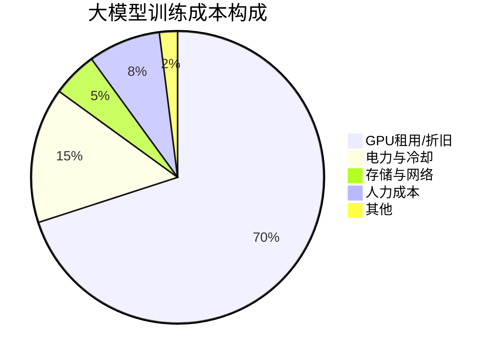

### 详细成本计算

#### 预训练成本估算

**公式**：

$$
\text{总成本} = \text{GPU成本} \times \text{数量} \times \text{训练时长} + \text{其他成本}
$$

**具体计算示例**：

**案例1：训练一个7B模型**
```
模型规模：7B参数
训练数据：1T tokens
GPU配置：64 × A100 (80GB)
训练时长：约2周（336小时）

成本估算：
- GPU成本：$2.5/小时/卡（云服务）
- GPU总成本：64 × $2.5 × 336 = $53,760
- 存储成本：10TB数据 × $0.02/GB/月 ≈ $200
- 网络成本：忽略不计
- 人力成本：1人 × 2周 × $5000/周 = $10,000
━━━━━━━━━━━━━━━━━━━━━━━━━━━━━━━
总成本：约 $64,000
```

**案例2：训练一个70B模型**
```
模型规模：70B参数
训练数据：2T tokens
GPU配置：512 × H100 (80GB)
训练时长：约6周（1008小时）

成本估算：
- GPU成本：$4/小时/卡（云服务H100）
- GPU总成本：512 × $4 × 1008 = $2,064,384
- 存储成本：50TB × $0.02/GB/月 × 1.5 ≈ $1,500
- 人力成本：3人 × 6周 × $5000/周 = $90,000
━━━━━━━━━━━━━━━━━━━━━━━━━━━━━━━
总成本：约 $2,160,000 (216万美元)
```

**案例3：微调（LoRA）成本**
```
基础模型：70B参数
微调方法：QLoRA
数据规模：50k样本
GPU配置：1 × A100 (80GB)
训练时长：约12小时

成本估算：
- GPU成本：$2.5/小时
- GPU总成本：1 × $2.5 × 12 = $30
- 数据标注：50k × $0.5 = $25,000
- 人力成本：$2,000
━━━━━━━━━━━━━━━━━━━━━━━━━━━━━━━
总成本：约 $27,030
```

### 成本优化策略

#### 1. 硬件优化
- 使用Spot/Preemptible实例（节省50-70%）
- 混合精度训练（BF16/FP8）
- Flash Attention减少显存

#### 2. 算法优化
- 梯度检查点（Gradient Checkpointing）
- 激活重计算（Activation Recomputation）
- ZeRO优化器（DeepSpeed）

#### 3. 数据优化
- 高质量数据 > 海量数据
- 提前进行数据清洗和去重
- 使用数据缓存和预处理

#### 4. 训练策略
- 从小模型开始验证（消融实验）
- 使用Learning Rate Finder
- 早期终止（Early Stopping）

> **⚠️ 成本陷阱**
>
> - **过度预训练**：收益递减，建议监控validation loss
> - **盲目扩大规模**：先验证小模型效果
> - **忽视数据质量**：垃圾数据浪费计算资源
> - **缺乏监控**：未及时发现训练异常导致浪费

## 训练监控与调试

### 关键监控指标

#### 1. 损失函数（Loss）

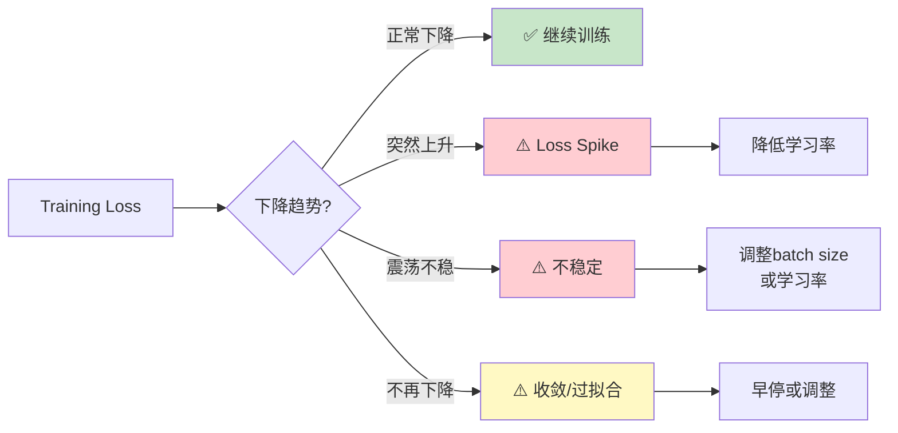

**正常Loss曲线特征**：
- 稳定下降，无剧烈波动
- 预训练loss：通常从8-10降至2-3
- Training loss < Validation loss（轻微过拟合正常）

**异常Loss模式**：

| 异常现象 | 可能原因 | 解决方案 |
|---------|---------|---------|
| **Loss Spike** | 坏数据、学习率过大、数值不稳定 | 回退checkpoint，降低LR，检查数据 |
| **Loss不下降** | 学习率过小、模型容量不足 | 增大LR，检查模型架构 |
| **Loss震荡** | Batch size过小、LR过大 | 增大batch或降低LR |
| **Loss=NaN** | 梯度爆炸、数值溢出 | 梯度裁剪、混合精度、检查数据 |

#### 2. 梯度相关指标

**监控指标**：
- **梯度范数**（Gradient Norm）：应在0.1-10之间
- **梯度裁剪比例**：<5%表示健康
- **参数更新比例**：更新量应为参数值的0.1-1%

```python
# 监控代码示例
def monitor_gradients(model):
    total_norm = 0
    for p in model.parameters():
        if p.grad is not None:
            param_norm = p.grad.data.norm(2)
            total_norm += param_norm.item() ** 2
    total_norm = total_norm ** 0.5
    return total_norm

# 每N步记录
if step % 100 == 0:
    grad_norm = monitor_gradients(model)
    logger.log({"gradient_norm": grad_norm})
```

#### 3. 学习率监控

```python
# 记录实际学习率
current_lr = optimizer.param_groups[0]['lr']
logger.log({"learning_rate": current_lr})
```

应看到：Warmup阶段上升 → 稳定期 → Decay阶段下降

#### 4. 性能指标

- **吞吐量**（Tokens/second）：衡量训练速度
- **GPU利用率**：应保持在80-95%
- **显存占用**：避免OOM，保留10-15%缓冲
- **通信时间占比**：<20%为佳

### 常见问题诊断与解决

#### 问题1：Out of Memory (OOM)

**症状**：`CUDA out of memory` 错误

**解决方案**：
```python
# 1. 启用梯度检查点
model.gradient_checkpointing_enable()

# 2. 减小batch size
per_device_batch_size = 1
gradient_accumulation_steps = 32  # 模拟大batch

# 3. 启用CPU offload
from deepspeed.ops.adam import DeepSpeedCPUAdam
optimizer = DeepSpeedCPUAdam(model.parameters())

# 4. 使用ZeRO-3
deepspeed_config = {
    "zero_optimization": {
        "stage": 3,
        "offload_optimizer": {"device": "cpu"},
        "offload_param": {"device": "cpu"}
    }
}
```

#### 问题2：训练速度慢

**诊断步骤**：
```bash
# 1. 检查GPU利用率
nvidia-smi dmon -s u

# 2. 分析性能瓶颈
python -m torch.utils.bottleneck train.py

# 3. 使用profiler
python -m torch.profiler train.py
```

**常见瓶颈及解决**：
- **数据加载慢**：增加`num_workers`，使用预处理
- **通信慢**：检查网络，使用NCCL优化
- **计算慢**：检查Flash Attention是否启用

#### 问题3：Loss Spike

**应对流程**：
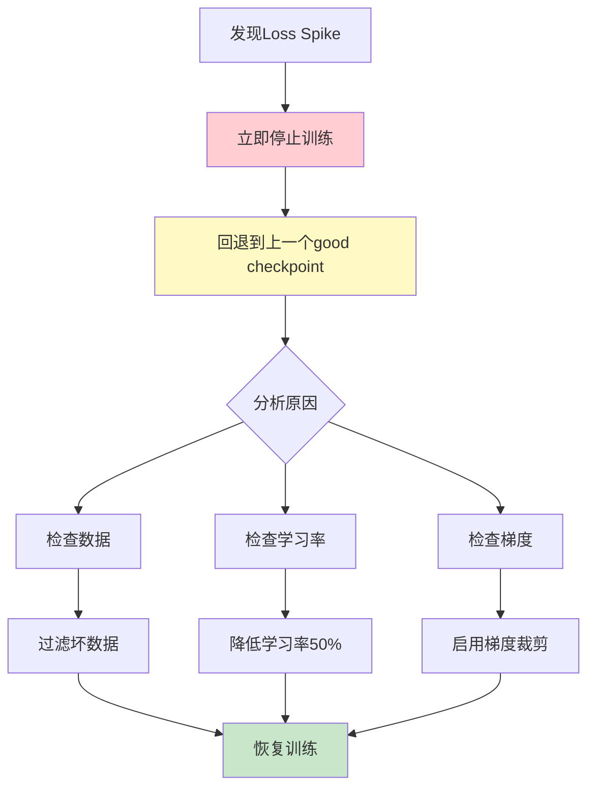

**预防措施**：
```python
# 1. 启用梯度裁剪
torch.nn.utils.clip_grad_norm_(model.parameters(), max_norm=1.0)

# 2. 使用更稳定的学习率调度
# WSD (Warmup-Stable-Decay)

# 3. 监控并自动应对
if current_loss > moving_avg_loss * 1.5:
    # 自动降低学习率
    for param_group in optimizer.param_groups:
        param_group['lr'] *= 0.5
```

### Checkpoint管理策略

#### 保存策略

```python
# 推荐的checkpoint保存配置
checkpoint_config = {
    "save_interval": 1000,           # 每1000步保存
    "save_total_limit": 5,           # 保留最近5个
    "save_on_each_node": False,      # 只在主节点保存
    "save_optimizer_state": True,    # 保存优化器状态
}

# 按loss保存最佳模型
if current_loss < best_loss:
    save_checkpoint(model, "best_model.pt")
    best_loss = current_loss
```

#### 恢复训练

```python
# 从checkpoint恢复
def resume_training(checkpoint_path):
    checkpoint = torch.load(checkpoint_path)

    model.load_state_dict(checkpoint['model_state_dict'])
    optimizer.load_state_dict(checkpoint['optimizer_state_dict'])

    start_step = checkpoint['step']
    start_epoch = checkpoint['epoch']

    # 恢复学习率调度器
    scheduler.load_state_dict(checkpoint['scheduler_state_dict'])

    # 恢复随机数种子
    torch.manual_seed(checkpoint['random_seed'])

    return start_step, start_epoch
```

> **💡 最佳实践**
>
> - 在训练开始前进行**小规模试运行**（100-1000步）
> - 设置**自动化监控告警**（Loss异常、GPU故障等）
> - 保留**多个历史checkpoint**，不要只保留最新的
> - 定期**手动检查**训练日志和可视化图表

## 代码示例

### 完整的预训练脚本（简化版）

```python
import torch
from torch.utils.data import DataLoader
from transformers import AutoModelForCausalLM, AutoTokenizer
from datasets import load_dataset
import wandb

# 1. 初始化
def setup_training():
    # 模型和tokenizer
    model = AutoModelForCausalLM.from_pretrained("meta-llama/Llama-3-8B")
    tokenizer = AutoTokenizer.from_pretrained("meta-llama/Llama-3-8B")

    # 数据集
    dataset = load_dataset("c4", "en", streaming=True)

    # 优化器
    optimizer = torch.optim.AdamW(
        model.parameters(),
        lr=3e-4,
        betas=(0.9, 0.95),
        weight_decay=0.1
    )

    # 学习率调度
    from transformers import get_cosine_schedule_with_warmup
    scheduler = get_cosine_schedule_with_warmup(
        optimizer,
        num_warmup_steps=2000,
        num_training_steps=100000
    )

    return model, tokenizer, dataset, optimizer, scheduler

# 2. 训练循环
def train(model, dataloader, optimizer, scheduler):
    model.train()

    for step, batch in enumerate(dataloader):
        # 前向传播
        outputs = model(**batch)
        loss = outputs.loss

        # 反向传播
        loss.backward()

        # 梯度裁剪
        torch.nn.utils.clip_grad_norm_(model.parameters(), max_norm=1.0)

        # 优化器更新
        optimizer.step()
        scheduler.step()
        optimizer.zero_grad()

        # 日志记录
        if step % 100 == 0:
            wandb.log({
                "loss": loss.item(),
                "learning_rate": scheduler.get_last_lr()[0],
                "step": step
            })

        # 保存checkpoint
        if step % 1000 == 0:
            save_checkpoint(model, optimizer, step)

# 3. 运行训练
if __name__ == "__main__":
    wandb.init(project="llm-pretraining")
    model, tokenizer, dataset, optimizer, scheduler = setup_training()

    # 分布式训练
    from torch.nn.parallel import DistributedDataParallel as DDP
    model = DDP(model)

    # 开始训练
    train(model, dataloader, optimizer, scheduler)
```

### LoRA微调脚本

```python
from peft import LoraConfig, get_peft_model, TaskType
from transformers import AutoModelForCausalLM, TrainingArguments, Trainer

# 1. 加载基础模型
model = AutoModelForCausalLM.from_pretrained(
    "meta-llama/Llama-3-8B",
    load_in_8bit=True,  # 8-bit量化
    device_map="auto"
)

# 2. 配置LoRA
lora_config = LoraConfig(
    task_type=TaskType.CAUSAL_LM,
    r=16,                    # LoRA秩
    lora_alpha=32,          # LoRA缩放因子
    lora_dropout=0.05,
    target_modules=["q_proj", "v_proj", "k_proj", "o_proj"],
    bias="none"
)

# 3. 应用LoRA
model = get_peft_model(model, lora_config)
model.print_trainable_parameters()
# 输出: trainable params: 4,194,304 || all params: 8,034,242,560 || trainable%: 0.05%

# 4. 训练配置
training_args = TrainingArguments(
    output_dir="./output",
    per_device_train_batch_size=4,
    gradient_accumulation_steps=4,
    learning_rate=2e-4,
    num_train_epochs=3,
    logging_steps=10,
    save_steps=100,
    fp16=True,
)

# 5. 训练
trainer = Trainer(
    model=model,
    args=training_args,
    train_dataset=train_dataset,
)

trainer.train()
```

### DeepSpeed配置示例

```json
{
  "train_batch_size": 32,
  "gradient_accumulation_steps": 1,
  "optimizer": {
    "type": "AdamW",
    "params": {
      "lr": 3e-4,
      "betas": [0.9, 0.95],
      "eps": 1e-8,
      "weight_decay": 0.1
    }
  },
  "scheduler": {
    "type": "WarmupDecayLR",
    "params": {
      "warmup_min_lr": 0,
      "warmup_max_lr": 3e-4,
      "warmup_num_steps": 2000,
      "total_num_steps": 100000
    }
  },
  "fp16": {
    "enabled": true,
    "loss_scale": 0,
    "initial_scale_power": 16,
    "loss_scale_window": 1000,
    "hysteresis": 2,
    "min_loss_scale": 1
  },
  "zero_optimization": {
    "stage": 2,
    "offload_optimizer": {
      "device": "cpu",
      "pin_memory": true
    },
    "allgather_partitions": true,
    "allgather_bucket_size": 2e8,
    "reduce_scatter": true,
    "reduce_bucket_size": 2e8,
    "overlap_comm": true,
    "contiguous_gradients": true
  },
  "activation_checkpointing": {
    "partition_activations": true,
    "cpu_checkpointing": true,
    "contiguous_memory_optimization": false,
    "number_checkpoints": null,
    "synchronize_checkpoint_boundary": false,
    "profile": false
  },
  "gradient_clipping": 1.0,
  "wall_clock_breakdown": false
}
```

---
# 常见问题
————FAQ

本章汇总大模型训练中最常遇到的问题及解答，帮助快速解决实践中的困惑。

## 预训练相关

### Q1: 需要多少数据才能训练一个有用的模型？

**A:** 取决于模型规模和目标：

- **小模型（1-3B）**：
  - 最少：10-50B tokens可得到基本能力
  - 推荐：100-300B tokens获得较好效果
  - 例如：Phi-1使用7B高质量tokens就很强

- **中型模型（7-13B）**：
  - 推荐：500B-1T tokens
  - LLaMA-1 7B使用1T tokens

- **大型模型（70B+）**：
  - 推荐：1.5-2T tokens
  - LLaMA-2 70B使用2T tokens

**关键洞察**：数据质量 > 数据量。Phi系列证明了高质量小数据可以打败低质量大数据。

---

### Q2: 如何判断预训练是否收敛？

**A:** 观察以下指标：

1. **Training Loss**：
   - 不再明显下降（变化<0.01/1000步）
   - 典型收敛值：2.0-3.0（取决于数据）

2. **Validation Loss**：
   - 与training loss趋势一致
   - 如果validation loss上升但training loss下降 → 过拟合

3. **下游任务性能**：
   - 在基准测试上的表现不再提升
   - 这是最终判断标准

4. **训练步数经验值**：
   - 7B模型：100-200k步
   - 70B模型：50-100k步
   - 规模越大，所需步数越少

**建议**：预训练通常**不追求完全收敛**，因为成本极高且收益递减。在loss曲线趋缓后即可停止。

---

### Q3: 出现Loss Spike怎么办？

**A:** Loss突然上升的应对流程：

**立即行动**：
```
1. 停止训练
2. 回退到spike前的checkpoint（通常回退2-3个checkpoint）
3. 分析spike原因
```

**常见原因及解决**：

| 原因 | 症状 | 解决方案 |
|------|------|----------|
| **坏数据** | 单次大幅上升 | 跳过该batch，增强数据过滤 |
| **学习率过大** | 逐步上升 | 降低LR至原来的50% |
| **数值不稳定** | 随机出现 | 启用BF16，增加梯度裁剪 |
| **梯度爆炸** | 伴随grad norm飙升 | 降低LR，启用gradient clipping |

**预防措施**：
```python
# 1. 自动检测与回退
if loss > moving_average * 2.0:
    load_checkpoint(previous_good_checkpoint)
    learning_rate *= 0.5

# 2. 梯度裁剪
torch.nn.utils.clip_grad_norm_(model.parameters(), max_norm=1.0)

# 3. 使用更稳定的优化器配置
optimizer = AdamW(lr=1e-4, betas=(0.9, 0.95), eps=1e-8)
```

---

### Q4: 预训练可以超过1个epoch吗？

**A:** **不推荐**，原因如下：

1. **记忆效应**：模型会记住训练数据，降低泛化能力
2. **收益递减**：第2个epoch的性能提升远小于成本
3. **行业惯例**：主流大模型（GPT-3、LLaMA等）都是<1 epoch

**例外情况**：
- 数据量极小（<10B tokens）时可以多epoch
- 领域专用模型（如医疗、法律）可以在少量高质量数据上多次训练
- 但即使如此，也很少超过3-5 epochs

**替代方案**：如果数据有限，优先考虑：
- 提升数据质量和多样性
- 增加模型容量
- 采用更好的数据配比策略

---

## 监督微调相关
————SFT

### Q5: LoRA和全参数微调如何选择？

**A:** 根据场景选择：

**全参数微调**（Full Fine-Tuning）：
- ✅ **适用场景**：
  - 有充足GPU资源
  - 需要最佳性能
  - 任务与预训练差异大
- ❌ **劣势**：
  - 显存需求大（需存储完整梯度和优化器状态）
  - 训练速度慢
  - 每个任务需要完整模型副本

**LoRA微调**：
- ✅ **适用场景**：
  - GPU资源有限
  - 需要训练多个任务adapter
  - 快速实验和迭代
- ❌ **劣势**：
  - 性能略低于全参数（通常差距<2%）
  - 需要调整额外超参数（r, alpha）

**性能对比**：
```
任务类型          全参数微调    LoRA (r=16)    差距
━━━━━━━━━━━━━━━━━━━━━━━━━━━━━━━━━━━━━━━
指令遵循          96.5%        95.8%         -0.7%
对话质量          92.3%        91.5%         -0.8%
代码生成          88.7%        87.2%         -1.5%
数学推理          76.4%        74.9%         -1.5%
```

**推荐策略**：
- 资源受限或快速实验 → **LoRA**
- 生产环境追求极致性能 → **全参数微调**
- 折中方案 → **QLoRA**（量化+LoRA）

---

### Q6: 需要多少SFT数据？

**A:** 远少于预训练，质量比数量重要：

**数据量指南**：

| 数据规模 | 效果 | 适用场景 |
|---------|------|----------|
| **1k-5k** | 基本遵循指令 | 快速原型、特定任务 |
| **10k-30k** | 良好对话能力 | 通用助手 |
| **50k-100k** | 优秀多任务能力 | 生产级模型 |
| **100k+** | 边际收益递减 | 追求极致性能 |

**真实案例**：
- **Alpaca**：52k合成数据，达到不错效果
- **Vicuna**：70k ShareGPT对话，接近ChatGPT
- **LLaMA-2-Chat**：27.5k数据，效果优异

**关键洞察**：
> 1000条高质量、多样化的数据 > 10000条低质量重复数据

**数据质量标准**：
- ✅ 指令清晰明确
- ✅ 回答准确、有帮助
- ✅ 覆盖多种任务类型
- ✅ 格式统一规范
- ❌ 避免模板化回答
- ❌ 避免错误信息
- ❌ 避免有害内容

---

### Q7: 如何避免微调时的过拟合？

**A:** 多种策略组合使用：

**1. 控制训练轮数**
```python
# 通常1-3个epoch足够
num_train_epochs = 2  # 推荐起点

# 监控validation loss，早停
early_stopping_patience = 3
```

**2. 使用较小学习率**
```python
# SFT学习率应远小于预训练
learning_rate = 2e-5  # 而不是3e-4
```

**3. 数据增强**
```python
# 释义改写
# 指令变化
# 回答风格多样化
```

**4. Dropout和正则化**
```python
model_config = {
    "dropout": 0.1,
    "attention_dropout": 0.1,
    "weight_decay": 0.01
}
```

**5. 混合训练数据**
```python
# 加入10-20%预训练数据
mixed_dataset = {
    "sft_data": 0.8,
    "pretrain_data": 0.2  # 防止灾难性遗忘
}
```

**过拟合的症状**：
- Training loss持续下降，但validation loss上升
- 在训练集上表现完美，但测试集表现差
- 模型开始"背诵"训练样本

**诊断命令**：
```python
# 定期评估
if step % eval_steps == 0:
    train_loss = evaluate(model, train_dataset)
    val_loss = evaluate(model, val_dataset)

    if val_loss > best_val_loss:
        patience_counter += 1
        if patience_counter >= early_stopping_patience:
            print("Early stopping triggered!")
            break
```

---

## 对齐相关
————RLHF/DPO

### Q8: RLHF和DPO如何选择？

**A:** DPO通常是更好的选择：

**DPO优势**（推荐）：
- ✅ 训练更稳定（无RL的探索-利用困境）
- ✅ 实现更简单（不需要PPO、Reward Model）
- ✅ 计算效率高（只需2个模型 vs 4个模型）
- ✅ 效果相当或更好
- ✅ 超参数更鲁棒

**RLHF优势**：
- ✅ 理论基础深厚
- ✅ 可以在线收集新数据
- ✅ 适合复杂奖励信号

**性能对比**：
```
评估维度         RLHF    DPO     备注
━━━━━━━━━━━━━━━━━━━━━━━━━━━━━━━━━━━━━
训练稳定性       ⭐⭐⭐   ⭐⭐⭐⭐⭐  DPO明显更稳定
实现复杂度       ⭐⭐     ⭐⭐⭐⭐⭐  DPO简单很多
计算效率         ⭐⭐     ⭐⭐⭐⭐⭐  DPO快2-3倍
最终效果         ⭐⭐⭐⭐  ⭐⭐⭐⭐   效果相当
```

**推荐策略**：
- **首选DPO**：适合绝大多数场景
- **考虑RLHF**：需要在线学习或复杂奖励函数
- **新方法**：ORPO、SimPO等DPO变体

---

### Q9: 偏好数据如何构建？

**A:** 三种主要方法：

**方法1：人工标注**（最高质量）
```
流程：
1. 采样prompts（从真实用户或构造）
2. 生成多个回答（通常4-8个）
3. 人工排序或对比标注
4. 构建偏好对：(prompt, chosen, rejected)

成本：$0.5-2/样本
规模：10k-50k偏好对
质量：⭐⭐⭐⭐⭐
```

**方法2：AI标注**（性价比高）
```python
# 使用GPT-4等强模型标注
prompt = f"""
Given the question: {question}

Response A: {response_a}
Response B: {response_b}

Which response is better? Consider helpfulness, accuracy, and safety.
Answer: A or B
"""

成本：$0.01-0.05/样本（API调用）
规模：可扩展到100k+
质量：⭐⭐⭐⭐（接近人类）
```

**方法3：合成构建**
```python
# 从SFT数据构建
chosen = high_quality_response
rejected = low_quality_response  # 可以是：
    # - 截断的回答
    # - 添加错误的回答
    # - 不符合指令的回答

成本：几乎免费
规模：无限
质量：⭐⭐⭐（有效但不如真实标注）
```

**混合策略**（推荐）：
```
核心数据(20%)：人工标注，确保高质量
扩展数据(60%)：AI标注，快速扩展规模
补充数据(20%)：合成数据，增加多样性
```

---

## 工程实践相关

### Q10: 如何选择合适的并行策略？

**A:** 遵循决策树：

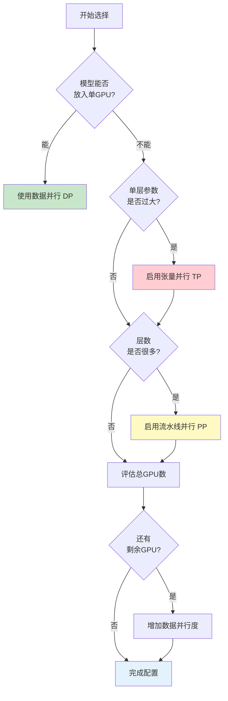

**实用配置表**：

| GPU总数 | 模型规模 | 推荐配置 | 说明 |
|---------|---------|---------|------|
| 8 | 7B | DP=8 | 纯数据并行 |
| 16 | 13B | TP=2, DP=8 | 轻量TP |
| 64 | 30B | TP=4, PP=2, DP=8 | 2D并行 |
| 128 | 70B | TP=8, PP=4, DP=4 | 3D并行 |
| 512 | 175B | TP=8, PP=16, DP=4 | 深度3D并行 |

**配置验证**：
```python
# 计算公式验证
total_gpus = DP * TP * PP

# 例如：128 GPUs
DP = 4
TP = 8
PP = 4
assert 4 * 8 * 4 == 128  ✓
```

---

### Q11: 显存不够怎么办？

**A:** 多层优化策略：

**Level 1：基础优化**（应该总是启用）
```python
# 1. 混合精度训练
use_fp16 = True  # 或 bf16

# 2. 梯度检查点
model.gradient_checkpointing_enable()

# 3. Flash Attention
use_flash_attention = True
```
节省：~30-40%

**Level 2：中级优化**
```python
# 4. 减小batch size + 梯度累积
per_device_batch_size = 1
gradient_accumulation_steps = 32

# 5. 启用ZeRO-2
zero_stage = 2
```
节省：额外30-40%

**Level 3：激进优化**
```python
# 6. ZeRO-3 + CPU offload
deepspeed_config = {
    "zero_optimization": {
        "stage": 3,
        "offload_optimizer": {"device": "cpu"},
        "offload_param": {"device": "cpu"}
    }
}

# 7. 激活值CPU offload
"activation_checkpointing": {
    "cpu_checkpointing": True
}
```
节省：额外40-50%

**Level 4：终极方案**
```python
# 8. 量化训练
————QLoRA
load_in_4bit = True

# 9. 使用更小的模型
# 从70B降到13B
```

**显存占用分解**：
```
总显存 = 模型参数 + 优化器状态 + 梯度 + 激活值

示例（70B模型，BF16）：
- 模型参数：70B × 2字节 = 140GB
- 优化器（Adam）：70B × 8字节 = 560GB
- 梯度：70B × 2字节 = 140GB
- 激活值：取决于batch size和序列长度
━━━━━━━━━━━━━━━━━━━━━━━━━━━━━━━━
总计：~840GB（未优化）

应用ZeRO-3 + Offload：
- 每个GPU只需：840GB / GPU数量
- 8×A100 (80GB)：每卡需105GB → 使用offload可行
```

---

### Q12: 训练中断如何恢复？

**A:** 完整的恢复流程：

**1. 自动恢复机制**
```python
def save_checkpoint(model, optimizer, scheduler, step, epoch):
    checkpoint = {
        'step': step,
        'epoch': epoch,
        'model_state_dict': model.state_dict(),
        'optimizer_state_dict': optimizer.state_dict(),
        'scheduler_state_dict': scheduler.state_dict(),
        'random_seed': torch.initial_seed(),
        'numpy_random_state': np.random.get_state(),
        'python_random_state': random.getstate(),
    }
    torch.save(checkpoint, f'checkpoint_step_{step}.pt')

def load_checkpoint(path, model, optimizer, scheduler):
    checkpoint = torch.load(path)

    model.load_state_dict(checkpoint['model_state_dict'])
    optimizer.load_state_dict(checkpoint['optimizer_state_dict'])
    scheduler.load_state_dict(checkpoint['scheduler_state_dict'])

    # 恢复随机数状态（重要！）
    torch.manual_seed(checkpoint['random_seed'])
    np.random.set_state(checkpoint['numpy_random_state'])
    random.setstate(checkpoint['python_random_state'])

    return checkpoint['step'], checkpoint['epoch']
```

**2. 训练脚本支持恢复**
```python
# 启动参数
--resume_from_checkpoint ./checkpoint_step_50000.pt

# 训练循环
if args.resume_from_checkpoint:
    start_step, start_epoch = load_checkpoint(...)
    print(f"Resuming from step {start_step}")
else:
    start_step, start_epoch = 0, 0

for step in range(start_step, total_steps):
    # 训练逻辑
    ...
```

**3. 验证恢复正确性**
```python
# 恢复后，loss曲线应该平滑衔接
# 不应该有突变或跳跃

# 检查清单：
✓ Loss值连续
✓ 学习率正确
✓ 随机数种子恢复（数据顺序一致）
✓ Step计数正确
```

**4. DeepSpeed恢复**
```python
# DeepSpeed自动处理恢复
model_engine, optimizer, _, _ = deepspeed.initialize(
    model=model,
    config=ds_config
)

# 恢复
_, client_sd = model_engine.load_checkpoint(checkpoint_dir)
step = client_sd['step']
```

> **⚠️ 注意事项**
>
> - 定期保存checkpoint（每1000-5000步）
> - 保留多个历史checkpoint（至少最近3-5个）
> - 恢复后先验证几步，确保loss正常
> - 记录每个checkpoint的验证指标

---

### Q13: 如何判断训练是否正常？

**A:** 多维度监控清单：

**✅ 健康训练的特征**：

1. **Loss曲线**
   - ✓ 平稳下降，无大幅波动
   - ✓ Training loss < Validation loss（轻微）
   - ✓ 下降速度符合预期

2. **梯度指标**
   - ✓ Gradient norm在0.1-10范围
   - ✓ 梯度裁剪率<5%
   - ✓ 无NaN或Inf

3. **性能指标**
   - ✓ GPU利用率>80%
   - ✓ 吞吐量稳定
   - ✓ 通信时间<20%

4. **学习率**
   - ✓ 按调度正常变化
   - ✓ Warmup期平稳上升

**❌ 异常训练的症状**：

| 症状 | 可能原因 | 检查项 |
|------|---------|--------|
| Loss不下降 | 学习率过小、数据问题 | 检查LR、查看数据样本 |
| Loss震荡 | 学习率过大、batch小 | 降低LR或增大batch |
| Loss=NaN | 梯度爆炸、数值溢出 | 启用梯度裁剪和混合精度 |
| GPU利用率低 | 数据加载慢、通信瓶颈 | 增加workers、检查网络 |

**监控仪表板示例**：
```python
# 使用Weights & Biases
wandb.log({
    "train/loss": loss,
    "train/grad_norm": grad_norm,
    "train/learning_rate": lr,
    "system/gpu_utilization": gpu_util,
    "system/tokens_per_second": throughput,
    "step": step
})
```

**告警设置**：
```python
# 自动告警条件
if loss > moving_avg * 1.5:
    send_alert("Loss spike detected!")

if gpu_util < 50:
    send_alert("GPU utilization too low!")

if grad_norm > 100:
    send_alert("Gradient explosion!")
```

---

---


# 最新进展

本章节收录大模型训练领域的最新论文和创新技术，按时间倒序排列，持续更新。

## 2024年

### [论文标题]
- **机构/作者**：
- **发表会议/期刊**：
- **论文链接**：
- **代码链接**：
- **核心创新**：
- **主要贡献**：
- **实验结果**：

---

## 2023年

### [论文标题]
- **机构/作者**：
- **发表会议/期刊**：
- **论文链接**：
- **代码链接**：
- **核心创新**：
- **主要贡献**：
- **实验结果**：

---

