# 引言

大语言模型（Large Language Model, LLM）的兴起标志着人工智能进入了新的发展阶段。从2018年BERT和GPT的出现，到2020年GPT-3展现出令人惊讶的少样本学习能力，再到2022年ChatGPT引爆全球对话式AI浪潮，大模型在短短几年间实现了质的飞跃。这些模型不仅在传统NLP任务上达到了接近人类的水平，更展现出了代码生成、数学推理、创意写作等广泛的能力。

## 🎯 为什么关注大模型训练？

训练是大模型能力的来源。一个高性能大模型的诞生，离不开：
- 📊 **海量高质量数据**：数万亿token的精心处理
- 💰 **大规模计算资源**：数千GPU并行训练数月
- 🧠 **精巧的训练策略**：从预训练到对齐的完整pipeline
- ⚙️ **工程化的实现**：分布式训练、内存优化、稳定性保证

然而，大模型训练的知识和技术往往分散在各类论文、博客和代码库中，缺乏系统性的整理。**本文旨在填补这一空白。**

## 📚 本文内容

本综述系统梳理大模型训练的核心技术，包括：

1. 🏗️ **三大训练阶段**：预训练、监督微调（SFT）、偏好对齐
2. 🔀 **分布式训练技术**：数据并行、张量并行、流水线并行、ZeRO
3. ⚡ **训练优化技术**：优化器选择、学习率调度、梯度处理
4. 🗂️ **数据工程**：数据采集、质量评估、去重、配比
5. 📈 **评估体系**：全面的基准测试和评测方法
6. 🚀 **最新进展**：持续更新的前沿技术和论文

## 👥 目标读者

- 🔬 **研究人员**：了解大模型训练的完整技术栈
- 👨‍💻 **工程师**：掌握实际训练中的工程实践和优化技巧
- 🎓 **学生**：建立对大模型训练的系统性认知
- 💼 **从业者**：跟踪最新技术进展和行业动态

> **💡 我们的承诺**
>
> 本文力求在理论深度和实践指导之间取得平衡，既阐述核心原理，也提供**可直接运行的代码示例**和**可落地的工程方案**。

---

## 📖 快速导航

本文共分为10个主要章节，建议根据需求选择性阅读：

| 章节 | 内容 | 适合读者 | 阅读时间 |
|------|------|---------|---------|
| **基础概述** | 大模型训练概念、演进历程 | 所有读者 | 10分钟 |
| **三大训练阶段** | 预训练、SFT、对齐详解 | 所有读者 ⭐必读 | 30分钟 |
| **分布式训练** | DP/TP/PP/ZeRO等并行技术 | 工程师、研究者 | 20分钟 |
| **训练优化** | 优化器、学习率、梯度处理 | 工程师 | 15分钟 |
| **数据工程** | 数据采集、清洗、去重、配比 | 工程师、研究者 | 25分钟 |
| **评估基准** | MMLU、GSM8K等评测体系 | 研究者、从业者 | 15分钟 |
| **实践指南** | 硬件配置、成本估算、监控调试 | 工程师 ⭐必读 | 30分钟 |
| **FAQ** | 常见问题快速解答 | 所有读者 ⭐推荐 | 20分钟 |
| **参考资源** | 论文、项目、学习路径 | 所有读者 | 15分钟 |
| **最新进展** | 前沿论文和技术 | 研究者 | 持续更新 |

> **💡 阅读建议**
>
> - **初学者**：重点阅读"基础概述" → "三大训练阶段" → "FAQ"
> - **工程师**：重点阅读"实践指南" → "分布式训练" → "数据工程"
> - **研究者**：重点阅读"三大训练阶段" → "评估基准" → "最新进展"
> - **全面学习**：按顺序完整阅读（约3小时）

---

# 大模型训练基础概述

## 🤔 什么是大模型训练？

大模型训练是指使用海量文本数据，通过深度学习算法训练具有数十亿甚至数万亿参数的神经网络模型的过程。这些模型通常基于Transformer架构，能够学习语言的统计规律和语义理解能力。

训练大模型的目标是让模型获得：
- 🧠 **语言理解能力**：理解自然语言的语法、语义和上下文
- 📚 **知识储备**：从训练数据中学习世界知识
- 🔍 **推理能力**：基于已有信息进行逻辑推理和问题解决
- ✅ **指令遵循**：准确理解并执行用户的各类指令

> **📌 核心概念**
>
> - **规模**：参数量从10亿到数万亿不等
> - **数据**：训练数据通常达到数万亿tokens
> - **时间**：完整训练周期从数周到数月
> - **成本**：中大型模型训练成本从数十万到数百万美元

## 📅 大模型训练的演进历程

大模型训练经历了从小规模实验到工业化生产的重要转变：

### 1. 早期探索阶段（2018-2019）🌱
- GPT-1、BERT等模型验证了预训练-微调范式的有效性
- 模型规模：百万到亿级参数
- 关键突破：自监督预训练、Transformer架构

### 2. 规模化阶段（2020-2021）📈
- GPT-3将模型规模扩展到1750亿参数
- 发现涌现能力（Emergent Abilities）
- 少样本学习能力显著提升

### 3. 对齐与应用阶段（2022-2023）🎯
- InstructGPT和ChatGPT引入RLHF（基于人类反馈的强化学习）
- 从"能用"到"好用"的关键转变
- 大模型开始广泛应用于实际场景

### 4. 开源与民主化阶段（2024-至今）🌍
- LLaMA、Mistral等开源模型快速发展
- 训练效率和成本持续优化
- 多模态、长上下文等能力不断增强

## 🎶大模型训练的三大核心阶段

现代大模型训练遵循**预训练 → 监督微调 → 偏好对齐**的三阶段范式，这已成为GPT-4、Claude、Gemini、LLaMA等主流模型的标准流程。

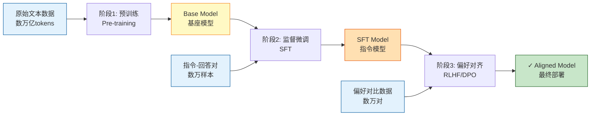

**关键对比**：

| 阶段 | 数据规模 | 时间周期 | 成本占比 | 目标 |
|------|---------|---------|---------|------|
| **预训练** | 数万亿tokens | 数周-数月 | 80-90% | 学习语言基础和世界知识 |
| **监督微调** | 数万样本 | 数天-数周 | 5-10% | 学会遵循指令和对话 |
| **偏好对齐** | 数万对比对 | 数天-数周 | 5-10% | 符合人类偏好和价值观 |

### 阶段一：预训练（Pre-training）

从海量无标注文本中学习语言的统计规律、语法结构和世界知识，训练出**Base Model（基座模型）**。

**核心特点**：
- 📊 **数据规模最大**：数万亿tokens（如 LLaMA-3 使用 15T tokens）
- ⏰ **训练时间最长**：在数千块GPU上训练数周到数月
- 💰 **成本最高**：占总训练成本的 80-90%
- 🎯 **目标**：Next Token Prediction（预测下一个词）

**输出能力**：具备文本续写能力，但不擅长问答和指令遵循。

### 阶段二：监督微调（SFT）

使用高质量的指令-回答对训练，将Base Model转化为能够理解指令的**SFT Model（指令模型）**。

**核心特点**：
- 📊 **数据规模小**：10k-100k 高质量样本
- ⏰ **训练时间短**：数天到数周
- 💰 **成本较低**：占总成本的 5-10%
- 🎯 **目标**：Instruction Following（指令遵循）

**输出能力**：能够理解和执行用户指令，进行多轮对话。

### 阶段三：偏好对齐（Alignment）

通过人类反馈或AI反馈优化模型行为，使其更符合人类期望和价值观，训练出**Aligned Model（对齐模型）**。

**核心特点**：
- 📊 **数据规模**：数万对偏好对比数据
- ⏰ **训练时间**：数天到数周
- 💰 **成本**：占总成本的 5-10%
- 🎯 **方法**：RLHF、DPO、RLAIF等

**输出能力**：输出更有帮助、更安全、更符合人类价值观。

### 三阶段总结对比

| 阶段 | 预训练 | 监督微调 | 偏好对齐 |
|------|--------|----------|----------|
| **目标** | 学习语言基础 | 教会指令遵循 | 符合人类偏好 |
| **数据类型** | 无标注文本 | 指令-回答对 | 偏好对比数据 |
| **数据规模** | 数万亿tokens | 数万-数十万样本 | 数万-数十万对比 |
| **训练时长** | 数周-数月 | 数小时-数天 | 数小时-数天 |
| **计算需求** | 数千GPU | 数十-数百GPU | 数十-数百GPU |
| **成本占比** | ~80-90% | ~5-10% | ~5-10% |
| **学习率** | 1e-4 ~ 3e-4 | 1e-5 ~ 5e-5 | 5e-7 ~ 5e-6 |
| **Epoch数** | <1 epoch（太大） | 1-3 epochs | 1-3 epochs |
| **输出模型** | Base Model | SFT Model | Aligned Model |

**关键洞察**：
- 预训练是能力的来源（占成本90%）
- SFT是能力的激活（数据质量 > 数量）
- 对齐是体验的保证（必不可少）

## 🧩 大模型训练的核心组成要素

一个完整的大模型训练系统包含以下核心要素：

### 1. 数据（Data）📊
- **预训练数据**：网页、书籍、代码、学术论文等
- **微调数据**：指令-回答对、对话数据
- **偏好数据**：人类标注的偏好对比数据
- **数据处理流程**：清洗、去重、质量过滤、毒性检测

### 2. 模型架构（Model Architecture）🏛️
- **基础架构**：Transformer（Encoder、Decoder或Encoder-Decoder）
- **位置编码**：绝对位置编码、相对位置编码、RoPE、ALiBi
- **注意力机制**：Multi-Head Attention、Grouped-Query Attention、Multi-Query Attention
- **归一化方式**：LayerNorm、RMSNorm、Pre-Norm vs Post-Norm
- **激活函数**：GELU、SwiGLU、GeGLU

<div align="center">
  
  <figcaption>图：Transformer架构详解（来源："Attention is All You Need" 论文 Figure 1）</figcaption>
</div>

### 3. 优化器与训练策略（Optimization）⚡
- **优化器**：AdamW、Adafactor、Lion
- **学习率调度**：Warmup、Cosine Decay、Constant
- **梯度处理**：Gradient Clipping、Gradient Accumulation
- **正则化**：Dropout、Weight Decay

### 4. 分布式训练框架（Distributed Training）🔀
- **数据并行**：DDP（Distributed Data Parallel）
- **张量并行**：Megatron-LM Tensor Parallelism
- **流水线并行**：Pipeline Parallelism、1F1B Schedule
- **序列并行**：Sequence Parallelism
- **混合并行**：3D Parallelism（数据+张量+流水线）
- **优化器状态并行**：ZeRO-1/2/3（DeepSpeed）

### 5. 计算基础设施（Infrastructure）💻
- **硬件**：GPU集群（A100、H100等）、TPU、专用AI芯片
- **互联网络**：InfiniBand、NVLink、PCIe
- **存储系统**：高性能分布式存储
- **监控与日志**：TensorBoard、Weights & Biases、MLflow

## 🚧大模型训练的主要挑战

> **⚠️ 挑战总览**
>
> 大模型训练是一项极具挑战性的系统工程，需要在计算资源、数据质量、训练稳定性、模型对齐等多个维度取得平衡。成功训练一个高性能大模型不仅需要技术实力，更需要工程经验的积累。

### 1. 计算资源与成本

训练大模型需要巨大的计算资源：
- GPT-3级别模型训练成本约数百万美元
- 需要数千块高端GPU并行训练数月
- 碳排放和能源消耗问题
- 如何降低训练成本成为关键挑战

### 2. 数据质量与规模

高质量训练数据是模型性能的基础：
- 网络数据存在噪声、偏见和有害内容
- 数据去重、清洗和质量控制的工程挑战
- 隐私和版权问题
- 高质量人工标注数据成本高昂

### 3. 训练稳定性

大规模训练面临稳定性挑战：
- Loss spike（损失突然上升）
- 梯度爆炸/消失
- 数值不稳定（Numerical Instability）
- 分布式训练中的同步问题

### 4. 模型对齐与安全

让模型行为符合人类期望：
- 如何准确捕捉人类偏好
- 避免有害、偏见或不准确的输出
- Reward Hacking问题（奖励函数被利用）
- 长期对齐的稳定性

### 5. 评估与基准测试

如何全面评估模型能力：
- 现有基准测试可能被"刷榜"
- 难以量化创造性和开放式能力
- 多语言、多模态评估的复杂性
- 真实应用场景下的表现差异

### 6. 涌现能力的不可预测性

模型规模扩大带来的未知：
- 某些能力只在特定规模后出现
- 难以提前预测模型行为
- 可能出现意外的能力或问题
- 如何系统性理解规模法则（Scaling Laws）

---

# 预训练阶段
————Pre-training

预训练是大模型训练的基石，目标是让模型从海量无标注文本中学习语言的统计规律和世界知识。

> **🎯 本章导读**
>
> 预训练是整个训练流程中**成本最高、时间最长、技术难度最大**的阶段，占总成本的80-90%。本章将详细介绍预训练的目标函数、数据处理、训练技巧和前沿技术，帮助读者理解如何从零开始训练一个基座模型。

## 预训练完整流程概览

下图展示了从原始数据到 Base Model 的完整训练流程：

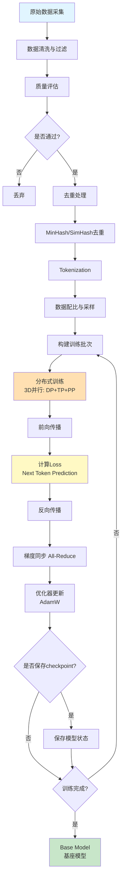

**流程说明**：
1. **数据准备阶段**（A-I）：占整体时间的 20-30%，包括采集、清洗、去重、分词
2. **训练迭代阶段**（J-S）：占整体时间的 70-80%，核心是前向-反向-优化循环
3. **Checkpoint 管理**：每 1000-5000 步保存一次，总训练步数通常 100k-500k 步

## 预训练目标函数

预训练的核心是设计合适的目标函数，让模型从无标注文本中学习语言规律。

### 1. 自回归语言建模（Autoregressive Language Modeling）

**核心思想**：给定前文，预测下一个 token（Next Token Prediction）

**数学表达**：

对于文本序列 $\mathbf{x} = (x_1, x_2, \ldots, x_T)$，训练目标是最大化：

$$
\mathcal{L}_{\text{AR}} = \sum_{t=1}^{T} \log P(x_t \mid x_1, x_2, \ldots, x_{t-1}; \theta)
$$

其中 $\theta$ 是模型参数。

**训练过程**：
- **Teacher Forcing**：训练时使用真实的前文作为输入
- **Causal Masking**：注意力机制只能看到左侧（过去）的 token
- **损失计算**：对每个位置计算交叉熵损失，然后平均

**代表模型**：
- **GPT 系列**（GPT-3, GPT-4）：纯 Decoder 架构
- **LLaMA 系列**（LLaMA-2, LLaMA-3）：开源高性能模型
- **PaLM、Gemini**：Google 的大模型

**优势**：
- ✅ 生成能力强，擅长续写和对话
- ✅ 架构简单，易于扩展到超大规模
- ✅ 训练效率高

**实战训练代码**：
```python
for batch in dataloader:
    input_ids = batch['input_ids']  # shape: [batch_size, seq_len]

    # 前向传播
    logits = model(input_ids)  # [batch_size, seq_len, vocab_size]

    # Next Token Prediction: 预测右移一位
    # input:  [x1, x2, x3, x4]  →  target: [x2, x3, x4, x5]
    shift_logits = logits[:, :-1, :]
    shift_labels = input_ids[:, 1:]

    loss = cross_entropy(shift_logits, shift_labels)
    loss.backward()
    optimizer.step()
```

### 2. 掩码语言建模（Masked Language Modeling）

**核心思想**：随机 mask 部分 token，预测被 mask 的内容

**数学表达**：

$$
\mathcal{L}_{\text{MLM}} = \sum_{i \in \mathcal{M}} \log P(x_i \mid \mathbf{x}_{\backslash \mathcal{M}}; \theta)
$$

其中 $\mathcal{M}$ 是被 mask 的位置集合，$\mathbf{x}_{\backslash \mathcal{M}}$ 表示除了 masked 位置外的所有 token。

**训练策略**（BERT 方式）：
- 随机选择 15% 的 token 进行处理：
  - 80% 替换为 `[MASK]`
  - 10% 替换为随机 token
  - 10% 保持不变

**代表模型**：
- **BERT**：双向 Encoder，预训练+微调范式
- **RoBERTa**：优化的 BERT（更多数据、更大 batch、去除 NSP）
- **DeBERTa**：Disentangled Attention

**优势**：
- ✅ 双向上下文理解（能同时看到左右信息）
- ✅ 适合理解类任务（分类、信息抽取）

**劣势**：
- ❌ 预训练和微调的 gap（预训练有 [MASK]，微调没有）
- ❌ 生成能力较弱

### 3. 混合目标与其他变体

#### Encoder-Decoder 架构（T5、BART）
- **Span Corruption**：mask 连续的 token span
- **适合序列到序列任务**：翻译、摘要

#### Prefix Language Modeling（PrefixLM）
- **UL2**：结合双向和单向建模
- **灵活性高**：可以选择双向或单向注意力

#### Fill-in-the-Middle（FIM）
- **用于代码模型**：预测中间缺失的代码
- **代表**：CodeLlama、StarCoder
- **格式**：`[前缀] <FILL> [后缀] → [中间内容]`

## 预训练数据

### 数据来源
- **网页数据**：Common Crawl、C4（Colossal Clean Crawled Corpus）
- **书籍**：BookCorpus、Books3
- **代码**：GitHub、Stack Overflow
- **学术文献**：arXiv、PubMed
- **对话数据**：Reddit、社交媒体
- **百科知识**：Wikipedia、Wikidata

### 数据处理流程

#### 1. 数据采集
- 网页爬取与下载
- API数据获取
- 开源数据集整合

#### 2. 质量过滤
- 语言检测与过滤
- 内容质量评估（长度、重复性、可读性）
- 毒性和有害内容检测
- 个人信息删除（PII Removal）

#### 3. 去重
- **精确去重**：完全相同的文档
- **模糊去重**：MinHash、SimHash等算法
- **跨数据集去重**：避免测试集泄露

#### 4. Tokenization
- BPE（Byte Pair Encoding）
- WordPiece
- Unigram
- SentencePiece

### 数据配比（Data Mixture）

**核心原则**：不同数据源的配比直接影响模型的能力分布

**典型配比示例**（参考 LLaMA）：

| 数据源 | 比例 | 说明 |
|-------|------|------|
| **Common Crawl / C4** | 67% | 网页数据，提供广泛的语言知识 |
| **Books** | 15% | 高质量长文本，提升推理和叙事能力 |
| **GitHub** | 4.5% | 代码数据，提升代码理解和生成能力 |
| **Wikipedia** | 4.5% | 百科知识，提供结构化知识 |
| **ArXiv** | 2.5% | 学术论文，提升科学推理能力 |
| **StackExchange** | 2% | 问答数据，提升问答能力 |

**配比策略**：
- **上采样（Upsampling）**：高质量数据源可以重复多次
- **下采样（Downsampling）**：低质量或超大规模数据源采样一部分
- **动态调整**：训练后期可以增加特定领域数据的比例

**实战代码**：
```python
data_mixture = {
    'common_crawl': 0.67,    # 网页数据 - 通用语言能力
    'books': 0.15,           # 书籍 - 长文本推理
    'github': 0.045,         # 代码 - 编程能力
    'wikipedia': 0.045,      # 百科 - 事实知识
    'arxiv': 0.025,          # 论文 - 科学推理
    'stackexchange': 0.02    # 问答 - QA能力
}

def sample_batch(data_mixture, batch_size):
    """按配比构建训练批次"""
    batch = []
    for source, weight in data_mixture.items():
        n_samples = int(batch_size * weight)
        batch.extend(sample_from_source(source, n_samples))
    return batch
```

## 预训练的关键技术

### 1. 学习率调度

**标准三阶段调度**：
```
Warmup → Peak Learning Rate → Cosine/Linear Decay
```

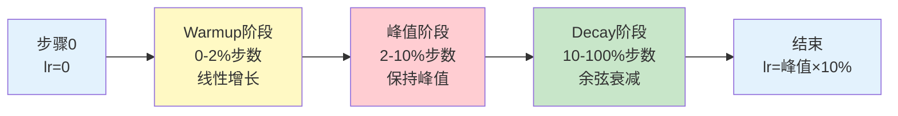

<div align="center">
  
  <figcaption>图：预训练学习率调度实际曲线 - Warmup-Peak-Decay三阶段（来源：Chinchilla 论文 Figure 1）</figcaption>
</div>

**关键参数**：
- **Warmup步数**：通常2,000-10,000步（占总步数的1-2%）
- **Peak Learning Rate**：根据模型规模调整
  - 小模型（<1B参数）：3e-4 ~ 1e-3
  - 中型模型（1-10B参数）：1e-4 ~ 3e-4
  - 大模型（10B+参数）：6e-5 ~ 2e-4
- **Decay策略**：Cosine Annealing最常用
- **最小学习率**：通常为峰值的10%

**Warmup的重要性**：
- 避免训练初期的梯度爆炸
- 让优化器状态（Adam的momentum）逐步稳定
- 大模型训练的必要技巧

**学习率与批次大小关系**（Linear Scaling Rule）：

$$
\text{lr}_{\text{new}} = \text{lr}_{\text{base}} \times \frac{\text{batch}_{\text{new}}}{\text{batch}_{\text{base}}}
$$

例如：基础配置 lr=1e-4, batch=256 → 扩展到 batch=2048 → lr=8e-4

### 2. 批次大小（Batch Size）
- **趋势**：随训练进行逐步增大
- **典型值**：从数百万到数千万tokens per batch
- **梯度累积**：模拟更大batch size

### 3. 上下文长度（Context Length）
- **起始**：通常从较短长度开始（如2048）
- **扩展**：Position Interpolation、YaRN等技术
- **长上下文训练**：渐进式扩展策略

### 4. 混合精度训练
- **BF16**（Brain Float16）：更稳定，适合大模型
- **FP16**：节省内存，需要Loss Scaling
- **FP8**：新一代硬件支持

### 5. Flash Attention
- 减少显存占用
- 加速注意力计算
- 支持更长上下文

## 预训练的前沿技术

### MoE（Mixture of Experts）架构

#### 核心思想
- 训练多个专家网络，每次只激活部分专家
- 增加模型容量的同时控制计算成本
- 稀疏激活机制

#### 代表模型
- **Mixtral 8x7B**：8个专家，每次激活2个，达到47B容量但计算成本仅相当于13B
- **Switch Transformer**：简化路由机制，扩展到1.6万亿参数
- **GPT-4**：据传使用MoE架构

#### 训练挑战
- Expert load balancing（专家负载均衡）
- 路由策略设计
- 通信开销优化

### 长上下文训练

#### 位置编码扩展技术
- **Position Interpolation**：直接插值RoPE，仅需少量训练
- **YaRN**：改进的插值+温度缩放，扩展到128k
- **ALiBi**：基于注意力偏置的位置编码

#### 长上下文注意力优化
- **Ring Attention**：分块+循环通信，支持数百万token
- **LongLoRA**：Shifted Sparse Attention，高效扩展到100k+
- **FlashAttention-2**：IO优化，支持更长序列

### 训练稳定性技术

#### Loss Spike问题解决
- **μ-Parameterization**：参数化方案使超参数可跨规模迁移
- **WSD Schedule**：Warmup-Stable-Decay三阶段学习率
- **Adaptive Gradient Clipping**：自适应梯度裁剪

#### 数值稳定性
- BF16训练（更稳定）
- 梯度累积与检查点
- 混合精度策略

### 高质量数据工程

#### 数据质量评估
- 基于困惑度的质量评分
- 启发式规则过滤
- 毒性和偏见检测

#### 数据去重策略
- MinHash：估计Jaccard相似度
- SimHash：快速近似去重
- 跨数据集去重（避免测试集泄露）

#### 数据配比优化
- 静态配比 vs 动态调整
- 课程学习（Curriculum Learning）
- 领域数据权重调整

---

# 监督微调阶段
————Supervised Fine-Tuning, SFT

SFT阶段将预训练模型转化为能够理解和执行指令的助手。

> **🎯 本章导读**
>
> SFT是**激活**模型能力的关键阶段，通过少量高质量的指令-回答数据，让Base Model学会遵循指令和对话交互。本章介绍SFT的数据构建、训练策略和高效微调技术（如LoRA、QLoRA），特别强调**数据质量远比数量重要**的核心理念。

## SFT 完整流程概览

下图展示了从 Base Model 到 SFT Model 的完整训练流程：

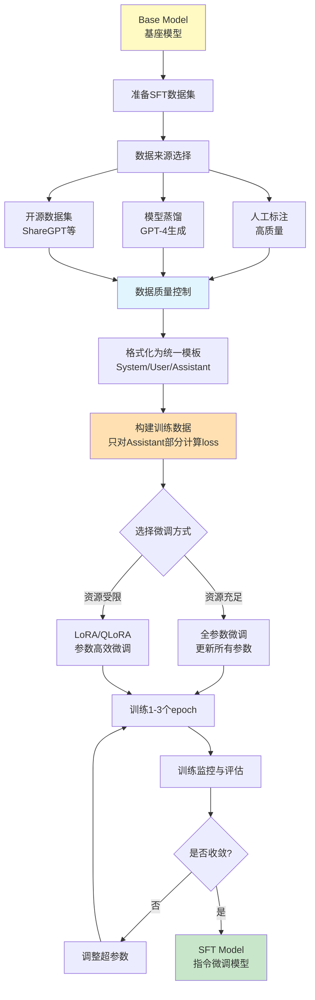

**关键特点**：
1. **数据规模小**：通常 10k-100k 样本，远小于预训练
2. **训练时间短**：数小时到数天，而非数周
3. **质量优先**：数据质量比数量更重要
4. **灵活性高**：可以使用 LoRA 等技术大幅降低成本

## SFT 的训练目标

**核心任务**：让模型学会遵循指令（Instruction Following）

### 数学表达

给定指令 $x$（prompt）和期望回答 $y$（response），训练目标是最大化条件概率：

$$
\mathcal{L}_{\text{SFT}} = -\sum_{(x,y) \in \mathcal{D}_{\text{SFT}}} \log P(y \mid x; \theta)
$$

其中 $\mathcal{D}_{\text{SFT}}$ 是监督微调数据集，包含高质量的指令-回答对。

### 与预训练的关键区别

**预训练**：
- 模型看到整个文档，预测每个 token
- 所有位置都计算 loss

**SFT**：
- 模型**只对回答部分计算 loss**
- 指令部分不计算 loss（通过 attention mask 实现）

**SFT核心代码**：
```python
def sft_loss(model, batch):
    """SFT的关键：只对Assistant回答部分计算loss"""
    input_ids = batch['input_ids']  # [batch_size, seq_len]
    labels = batch['labels']        # [batch_size, seq_len]

    # labels示例: [-100, -100, -100, 152, 234, 567, ...]
    #              ↑~~~ User指令 ~~~↑  ↑~~ Assistant回答 ~~↑
    #              (忽略，不计算loss)    (计算loss，学习生成)

    logits = model(input_ids)

    # PyTorch自动忽略label=-100的位置
    loss = F.cross_entropy(
        logits.view(-1, vocab_size),
        labels.view(-1),
        ignore_index=-100
    )
    return loss
```

### SFT 的四大目标

1. **指令理解**：识别各类指令格式和任务类型
2. **结构化输出**：生成格式规范、逻辑清晰的回答
3. **对话适应**：掌握多轮对话的上下文管理
4. **减少幻觉**：提高事实准确性，降低编造信息的倾向

## SFT 数据构建

**核心原则**：质量 > 数量。少量高质量数据胜过大量低质量数据。

### 数据规模对比

| 模型 | SFT 数据规模 | 数据来源 | 说明 |
|------|-------------|---------|------|
| **InstructGPT** | 13k | 人工标注 | OpenAI 的早期对齐工作 |
| **LLaMA-2-Chat** | 27.5k | 人工标注 | Meta 的高质量对话数据 |
| **Vicuna** | 70k | ShareGPT | 用户分享的 ChatGPT 对话 |
| **Alpaca** | 52k | GPT-3.5 生成 | Stanford 的开源指令数据 |
| **WizardLM** | 250k | GPT-4 进化生成 | 复杂指令数据 |
| **Phi-1** | 仅 6B tokens | GPT-4 "教科书式" | 极高质量，证明数据质量重要性 |

**关键洞察**：
- ✅ 1-10 万高质量样本通常足够
- ✅ 数据质量比数量更重要（Phi 系列的证明）
- ✅ 多样性和难度分布很关键

### 1. 数据来源

#### 人工标注（最高质量）

**流程**：
1. **招募标注员**：通常需要通过资格考试
2. **标注指南**：详细的指令编写规范
3. **样本编写**：标注员根据指令编写回答
4. **多轮审核**：质量检查和修正
5. **一致性验证**：多个标注员交叉验证

**成本**：
- 单个样本：$5-20（取决于复杂度）
- 10k 样本：$50k-200k
- 总成本：远低于预训练（通常<总成本的 5%）

**优势**：
- ✅ 质量最高，符合人类期望
- ✅ 可控性强，能覆盖特定领域
- ✅ 适合安全关键应用

**示例标注指南**：
```
【任务】：为给定指令编写高质量回答
【要求】：
1. 准确性：事实正确，无编造信息
2. 有用性：直接回答问题，提供足够细节
3. 清晰性：结构清晰，易于理解
4. 安全性：无害、无偏见、拒绝不当请求
【格式】：
- 指令：[用户的问题或请求]
- 回答：[助手的回答，200-500字]
```

#### 模型蒸馏（性价比高）

**方法**：使用强大模型（如 GPT-4）生成训练数据

**Self-Instruct 流程**：
1. **种子指令**：手工编写 100-200 个种子指令
2. **指令生成**：用 GPT-4 生成新指令
3. **回答生成**：用 GPT-4 为指令生成回答
4. **质量过滤**：自动化 + 人工抽样验证
5. **迭代扩展**：重复 2-4 步

**成本**：
- GPT-4 API 调用：~$0.03-0.06/样本
- 10k 样本：$300-600
- 比人工标注便宜 100 倍以上

**代表工作**：
- **Alpaca**：Stanford，52k 样本，$500 成本
- **Vicuna**：ShareGPT 用户对话，免费
- **WizardLM**：Evol-Instruct 方法，自动提升复杂度

**Self-Instruct实战代码**：
```python
def self_instruct_pipeline(seed_instructions, num_samples=10000):
    """用GPT-4自动生成SFT数据集 - 性价比极高的方案"""
    generated_data = []

    while len(generated_data) < num_samples:
        # Step 1: 采样种子指令作为few-shot示例
        examples = random.sample(seed_instructions, k=3)

        # Step 2: GPT-4生成新指令
        prompt = f"""Generate a new instruction similar to:
        {examples}

        New instruction:"""
        new_instruction = gpt4_generate(prompt)

        # Step 3: GPT-4生成对应回答
        response = gpt4_generate(new_instruction)

        # Step 4: 质量检查（长度、相似度、毒性）
        if quality_check(new_instruction, response):
            generated_data.append({
                'instruction': new_instruction,
                'response': response
            })

    return generated_data  # 10k样本成本约$300-600
```

#### 开源数据集

**常用数据集**：

| 数据集 | 规模 | 语言 | 特点 |
|--------|------|------|------|
| **ShareGPT** | 90k | 多语言 | 真实用户与 ChatGPT 对话 |
| **OpenOrca** | 1M+ | 英语 | GPT-4 生成，含推理过程 |
| **UltraChat** | 1.5M | 英语 | 多轮对话 |
| **FLAN** | 1.8M | 英语 | Google 的多任务指令集 |
| **Dolly-15k** | 15k | 英语 | Databricks 员工标注 |

### 2. 指令类型分布

**典型配比**（推荐）：

| 指令类型 | 占比 | 示例 |
|---------|------|------|
| **开放式问答** | 30-40% | "解释什么是量子计算" |
| **创意写作** | 15-20% | "写一首关于秋天的诗" |
| **信息提取** | 10-15% | "总结这篇文章的要点" |
| **代码生成** | 10-15% | "用Python实现快速排序" |
| **数学推理** | 5-10% | "解这道微积分题" |
| **多轮对话** | 10-15% | 上下文相关的连续问题 |
| **其他任务** | 5-10% | 翻译、格式转换等 |

<div align="center">
  
  <figcaption>图：高质量SFT数据集的指令类型分布示例（来源：Self-Instruct 论文 Figure 2）</figcaption>
</div>

**平衡原则**：
- 覆盖主要应用场景
- 避免某类任务占比过高
- 包含不同难度级别

### 3. 数据质量控制

**自动化检查**：
```python
def quality_check(instruction, response):
    # 1. 长度检查
    if len(response) < 50 or len(response) > 2000:
        return False

    # 2. 相似度检查（去重）
    if is_similar_to_existing(response, threshold=0.9):
        return False

    # 3. 毒性检测
    if contains_toxic_content(response):
        return False

    # 4. 事实性检查（可选，使用检索增强）
    if not factual_consistency_check(response):
        return False

    return True
```

**人工审核**：
- **抽样审核**：随机抽取 5-10% 进行人工检查
- **一致性验证**：多个审核员评分，计算一致性
- **迭代改进**：根据反馈调整数据生成策略

## SFT 训练策略

### 1. 全参数微调（Full Fine-Tuning）

**方法**：更新模型的所有参数

**特点**：
- ✅ **效果最好**：充分适应新任务
- ❌ **成本最高**：需要存储完整模型和梯度
- ❌ **显存需求大**：通常需要 4-8 块高端 GPU

**显存需求计算**：
```
总显存 = 模型参数 + 优化器状态 + 梯度 + 激活值

对于 7B 模型（FP16 训练）：
- 模型：7B × 2 bytes = 14GB
- 优化器（AdamW）：7B × 8 bytes = 56GB
- 梯度：7B × 2 bytes = 14GB
- 激活值：~20-40GB（取决于 batch size）
总计：~104-124GB

→ 需要 2-4 块 A100 (80GB)
```

**适用场景**：
- 有充足计算资源
- 需要最佳性能
- 任务与预训练差异较大

### 2. 参数高效微调（PEFT）

**核心思想**：冻结大部分参数，只训练小部分参数或额外添加的参数

#### LoRA（Low-Rank Adaptation）

**数学原理**：

在预训练权重 $W_0 \in \mathbb{R}^{d \times k}$ 的基础上，添加低秩分解的可训练矩阵：

$$
W = W_0 + \Delta W = W_0 + BA
$$

其中：
- $B \in \mathbb{R}^{d \times r}$，$A \in \mathbb{R}^{r \times k}$
- **秩 $r \ll \min(d, k)$**（通常 $r=8, 16, 32$）
- $W_0$ 冻结，只训练 $B$ 和 $A$

**参数量对比**：
```
原始参数：d × k
LoRA 参数：d × r + r × k = r(d + k)

示例（d=4096, k=4096, r=16）：
- 原始：4096 × 4096 = 16,777,216
- LoRA：16 × (4096 + 4096) = 131,072
- 比例：131k / 16.7M ≈ 0.78%

→ 只训练 <1% 的参数！
```

**实现代码**：
```python
import torch
import torch.nn as nn

class LoRALayer(nn.Module):
    def __init__(self, in_features, out_features, rank=16, alpha=32):
        super().__init__()
        self.rank = rank
        self.alpha = alpha

        # 冻结的预训练权重
        self.W = nn.Linear(in_features, out_features, bias=False)
        self.W.weight.requires_grad = False

        # LoRA 可训练参数
        self.lora_A = nn.Parameter(torch.randn(rank, in_features) / rank)
        self.lora_B = nn.Parameter(torch.zeros(out_features, rank))

        self.scaling = alpha / rank

    def forward(self, x):
        # 原始前向传播 + LoRA 修正
        return self.W(x) + (x @ self.lora_A.T @ self.lora_B.T) * self.scaling

def apply_lora_to_model(model, rank=16, alpha=32):
    """应用LoRA到模型的所有线性层"""
    for name, module in model.named_modules():
        if isinstance(module, nn.Linear):
            # 将 Linear 层替换为 LoRA 层
            lora_layer = LoRALayer(
                module.in_features,
                module.out_features,
                rank=rank,
                alpha=alpha
            )
            # 复制预训练权重
            lora_layer.W.weight.data = module.weight.data
            # 替换模块
            parent = get_parent_module(model, name)
            setattr(parent, name.split('.')[-1], lora_layer)
```

**优势**：
- ✅ **显存占用少**：只需训练 <1% 参数
- ✅ **训练速度快**：2-3 倍加速
- ✅ **可合并**：训练后可以合并回原模型 $W = W_0 + BA$
- ✅ **模块化**：可以为不同任务训练多个 LoRA，按需切换

**超参数选择**：
- **秩 r**：8-64，越大效果越好但参数越多
  - r=8: 最轻量，适合简单任务
  - r=16-32: 推荐默认值
  - r=64: 复杂任务
- **alpha**：通常设为 2r（如 r=16, alpha=32）
- **目标模块**：通常应用到 `q_proj`, `v_proj`, `k_proj`, `o_proj`

#### QLoRA（Quantized LoRA）

**核心创新**：在量化模型上应用 LoRA，进一步降低显存

**技术组合**：
1. **4-bit 量化**：将 Base Model 量化到 4-bit（NF4 格式）
2. **双重量化**：量化 quantization constants
3. **分页优化器**：使用 NVIDIA 统一内存

**显存对比**：
```
7B 模型的显存需求：

全参数微调（FP16）：~104GB → 需要 2-4 块 A100
LoRA（FP16）：      ~24GB  → 需要 1 块 A100
QLoRA（4-bit）：    ~9GB   → 可用单块 RTX 3090/4090 (24GB)

65B 模型：
全参数微调：      ~780GB  → 基本不可行
QLoRA（4-bit）：  ~48GB   → 单块 A100 (80GB) 即可！
```

**实现代码**：
```python
from transformers import AutoModelForCausalLM, BitsAndBytesConfig
from peft import LoraConfig, get_peft_model

# Step 1: 配置4-bit量化（NF4格式）
bnb_config = BitsAndBytesConfig(
    load_in_4bit=True,
    bnb_4bit_quant_type="nf4",        # NormalFloat4 - 针对正态分布优化
    bnb_4bit_use_double_quant=True,   # 双重量化，再节省0.37bit/param
    bnb_4bit_compute_dtype=torch.bfloat16
)

# Step 2: 加载量化后的模型（7B → ~3.5GB显存）
model = AutoModelForCausalLM.from_pretrained(
    "meta-llama/Llama-2-7b-hf",
    quantization_config=bnb_config,
    device_map="auto"  # 自动分配到可用GPU
)

# Step 3: 配置LoRA参数
lora_config = LoraConfig(
    r=16,                  # 秩（越大越接近全参数微调）
    lora_alpha=32,         # 缩放因子
    target_modules=["q_proj", "v_proj", "k_proj", "o_proj"],  # 应用到注意力层
    lora_dropout=0.05,
    bias="none",
    task_type="CAUSAL_LM"
)

# Step 4: 应用LoRA（只增加4M可训练参数）
model = get_peft_model(model, lora_config)
model.print_trainable_parameters()
# 输出: trainable params: 4,194,304 || all params: 6,742,609,920 || trainable%: 0.062%
# 这意味着只需训练0.062%的参数！
```

**QLoRA 的三大技术**：
1. **NF4 量化**：专为正态分布权重设计的 4-bit 格式
2. **Double Quantization**：量化 quantization constants，再节省 0.37 bit/param
3. **Paged Optimizers**：利用 NVIDIA 统一内存，防止 OOM

#### 其他 PEFT 方法

**Prefix Tuning**：
- 在输入前添加可训练的 prefix token
- 只优化 prefix embedding
- 参数量：~0.1% 的原模型

**Adapter Layers**：
- 在 Transformer 层间插入小型适配器（2 层 MLP）
- 只训练 adapter 参数
- 参数量：~2-4% 的原模型

### 3. 指令模板（Instruction Template）

设计统一的输入输出格式：

| 标记 | 角色 | 示例内容 |
|------|------|---------|
| `<|system|>` | 系统提示 | You are a helpful assistant. |
| `<|user|>` | 用户输入 | What is the capital of France? |
| `<|assistant|>` | 模型回答 | The capital of France is Paris. |

**常见模板格式**：ChatML、Alpaca、Vicuna、Llama-2-Chat 等各有不同的特殊标记。

### 4. 训练超参数
- 学习率：通常小于预训练（1e-5到5e-5）
- Epoch数：1-3个epoch
- Batch Size：根据资源调整
- Warmup比例：10-20%

## SFT的前沿技术

### 小数据、高质量训练

#### Phi系列的启示
- **Phi-1**：仅6B tokens训练出强大代码能力
- **Phi-3**：3.8B参数达到接近大模型性能
- **核心策略**：
  - 使用GPT-4生成"教科书式"高质量数据
  - 严格的质量过滤和多样性控制
  - 证明数据质量 > 数据规模

#### 课程学习策略
- 从简单到复杂逐步提升难度
- 分层次的指令数据组织
- 动态调整数据配比

### 合成数据生成

#### 模型蒸馏方法
- 使用强模型（GPT-4）生成训练数据
- 指令-回答对的自动生成
- 质量控制和多样性保证

#### Evol-Instruct方法
- **WizardLM**：自动提升指令复杂度
- 指令进化策略
- 大幅提升指令跟随能力

#### 推理过程数据
- **Orca系列**：生成详细的推理步骤
- 解释型数据增强
- 提升小模型的推理能力

### 量化微调技术

#### QLoRA
- 4-bit量化 + LoRA
- 在单张24GB GPU上微调65B模型
- Double Quantization技术
- NormalFloat（NF4）数据类型

#### 其他量化方法
- INT8训练
- GPTQ后训练量化
- AWQ激活感知量化

---

# 偏好对齐阶段
————Preference Alignment

对齐阶段让模型输出符合人类偏好、价值观和安全准则。

> **🎯 本章导读**
>
> 偏好对齐是从"能用"到"好用"的**关键一跃**，通过RLHF或DPO等技术让模型输出更有帮助、更安全、更符合人类价值观。本章详细对比RLHF和DPO的原理、优劣，并介绍最新的对齐技术进展。**推荐优先使用DPO**，因其更稳定、更简单、效果相当。

## RLHF
————Reinforcement Learning from Human Feedback

**论文来源**：[Training language models to follow instructions with human feedback (InstructGPT)](https://arxiv.org/abs/2203.02155)

### RLHF 三阶段流程

<div align="center">
  
  <figcaption>图：RLHF 完整训练流程（来源：InstructGPT 论文 Figure 2）</figcaption>
</div>

**三个关键步骤**：

#### Step 1: 收集偏好数据
- 采样多个模型输出（通常4-9个候选回答）
- 人工标注员对回答质量排序
- 构建偏好对比数据集：$(x, y_w, y_l)$
- **数据规模**：InstructGPT 使用 33k 偏好对比

#### Step 2: 训练奖励模型（Reward Model）
- 使用偏好数据训练打分模型
- **输入**：prompt $x$ + response $y$
- **输出**：标量质量分数 $r(x, y)$
- **目标**：预测人类偏好排序
- **架构**：通常基于 SFT Model，替换 LM head 为标量输出层

#### Step 3: PPO强化学习优化
- 使用 PPO（Proximal Policy Optimization）优化策略
- **奖励信号**：Reward Model 评分
- **KL 散度约束**：$\beta \cdot D_{\text{KL}}(\pi_\theta \| \pi_{\text{ref}})$ 防止偏离 SFT 模型过远
- **需要的模型**：Policy Model、Reference Model、Reward Model、Critic Model（共4个）

### RLHF 的挑战
- ❌ **Reward Hacking**：模型可能学会exploit RM的弱点而非真正提升质量
- ❌ **训练不稳定**：RL 训练本身容易发散
- ❌ **计算开销大**：需同时运行 4 个大模型
- ❌ **人类标注成本高**：每个偏好标注 $0.5-2

## DPO
————Direct Preference Optimization

**论文来源**：[Direct Preference Optimization: Your Language Model is Secretly a Reward Model](https://arxiv.org/abs/2305.18290)

### DPO vs RLHF 对比

<div align="center">
  
  <figcaption>图：DPO 简化了 RLHF 流程（来源：DPO 论文 Figure 1）</figcaption>
</div>

### 核心创新

**关键洞察**：将 Reward Model 隐式地参数化到策略模型中，无需显式训练 RM。

**DPO 损失函数**：

$$
\mathcal{L}_{\text{DPO}} = -\mathbb{E}_{(x,y_w,y_l)} \left[ \log \sigma \left( \beta \log \frac{\pi_\theta(y_w | x)}{\pi_{\text{ref}}(y_w | x)} - \beta \log \frac{\pi_\theta(y_l | x)}{\pi_{\text{ref}}(y_l | x)} \right) \right]
$$

**直观理解**：
- ✅ 增加模型对好回答 $y_w$ 的概率
- ❌ 降低模型对差回答 $y_l$ 的概率
- 🔒 通过 $\beta$ 控制相对于参考模型的变化幅度

### DPO 的优势

| 维度 | RLHF | DPO |
|------|------|-----|
| **训练阶段** | 3步（数据→RM→PPO） | 2步（数据→直接优化） |
| **模型数量** | 4个模型 | 2个模型 |
| **训练稳定性** | 较低（RL不稳定） | ✅ 高（监督学习） |
| **计算开销** | 大 | ✅ 小（节省50%+） |
| **实现复杂度** | 高（需要RL库） | ✅ 低（标准优化） |
| **Reward Hacking** | 容易发生 | ✅ 不易发生 |
| **效果** | 强 | ✅ 相当或更好 |

### DPO 的变体

- **IPO** (Identity Policy Optimization)：改进优化目标，减少 length bias
- **KTO** (Kahneman-Tversky Optimization)：基于前景理论的偏好优化
- **ORPO** (Odds Ratio PO)：将 SFT 和偏好优化合并为单阶段
- **RRHF** (Rank Responses to align Human Feedback)：使用排序损失

## RLAIF
————RL from AI Feedback

**论文来源**：[RLAIF: Scaling Reinforcement Learning from Human Feedback with AI Feedback](https://arxiv.org/abs/2309.00267)

<div align="center">
  
  <figcaption>图：RLAIF 使用 AI 模型替代人类标注（来源：RLAIF 论文）</figcaption>
</div>

### 核心思想

**用强大的 AI 模型（如 GPT-4）替代人类标注偏好数据**

**工作流程**：
1. **AI 标注器生成偏好**：使用 GPT-4 等模型对候选回答进行评分和排序
2. **训练 Reward Model**：基于 AI 标注的偏好数据训练 RM
3. **RL 优化**：使用 PPO 或 DPO 进行策略优化

### 优势

- ✅ **成本低**：无需人工标注，节省 90%+ 成本
- ✅ **可扩展**：可以生成大规模偏好数据
- ✅ **质量高**：实验表明效果接近甚至超过 RLHF
- ✅ **一致性好**：AI 标注比人类更一致

### 挑战

- AI 标注器的偏见会传递给对齐模型
- 需要高质量的 AI 标注器（如 GPT-4）

## Constitutional AI

**论文来源**：[Constitutional AI: Harmlessness from AI Feedback](https://arxiv.org/abs/2212.08073)

<div align="center">
  
  <figcaption>图：Constitutional AI 的自我批评和修正流程（来源：Anthropic Constitutional AI 论文）</figcaption>
</div>

### 核心理念

**让 AI 系统遵循明确的行为准则（Constitution），通过自我批评和修正实现对齐**

### 两阶段训练

#### 第一阶段：监督学习（SL-CAI）
1. **生成初始回答**：模型生成对有害指令的回答
2. **自我批评**：模型根据 Constitution 评估自己的回答
3. **自我修正**：模型生成改进版本的回答
4. **监督学习**：在修正后的数据上进行 SFT

#### 第二阶段：强化学习（RL-CAI）
1. **AI 反馈**：使用模型评估不同回答相对于 Constitution 的符合度
2. **偏好数据**：构建 AI 标注的偏好对
3. **RL 训练**：使用 RLAIF 进行偏好对齐

### Constitution 示例

- "请选择最有帮助、诚实且无害的回答"
- "请选择不鼓励非法、不道德或不当行为的回答"
- "请选择最能表现出关心、尊重和考虑的回答"

### 优势

- ✅ **透明可控**：行为准则明确且可调整
- ✅ **自主对齐**：减少对人类反馈的依赖
- ✅ **可扩展**：容易扩展到新的价值观和准则
- ✅ **效果好**：在 HH-RLHF 基准上表现优异

---

# 分布式训练技术

大模型训练必须依赖分布式并行技术。

> **🎯 本章导读**
>
> 分布式训练是大模型训练的**核心工程技术**，没有分布式并行就无法训练超过单GPU显存容量的模型。本章介绍数据并行、张量并行、流水线并行、ZeRO等关键技术，以及如何选择合适的并行策略。**核心原则**：TP用于单层过大，PP用于层数过多，DP用于提升吞吐。

## 数据并行
————Data Parallelism

### 原理
- 每个GPU持有完整模型副本
- 不同GPU处理不同batch数据
- 梯度同步后更新参数

### 实现
- **DDP（PyTorch Distributed Data Parallel）**
- **All-Reduce梯度同步**
- **Ring-AllReduce优化通信**

### 局限
- 模型必须能装入单个GPU显存
- 不适用于超大模型

<div align="center">
  
  <figcaption>图：数据并行(DP)架构 - 每个GPU持有完整模型副本（来源：PyTorch Distributed 论文 Figure 1）</figcaption>
</div>

## 张量并行
————Tensor Parallelism

### 原理
- 将单个Transformer层的参数切分到多个GPU
- 前向和反向传播时进行通信
- Megatron-LM的核心技术

### 切分策略
- **列切分**：如将MLP的第一层按列切分
- **行切分**：如将MLP的第二层按行切分
- **注意力切分**：按attention head分配

### 适用场景
- 超大模型无法装入单GPU
- 需要细粒度并行

<div align="center">
  
  <figcaption>图：张量并行(TP)架构 - Transformer层的列/行切分策略（来源：Megatron-LM 论文 Figure 3）</figcaption>
</div>

## 流水线并行
————Pipeline Parallelism

### 原理
- 将模型按层切分到多个GPU（设备）
- 数据按mini-batch流水执行
- 减少设备空闲时间

### 调度策略
- **GPipe**：F-then-B（先完成所有前向再反向）
- **1F1B**：交替前向和反向，减少显存占用
- **Virtual Pipeline**：减少bubble time

### 挑战
- 流水线bubble导致GPU利用率下降
- 通信开销
- 负载均衡

<div align="center">
  
  <figcaption>图：流水线并行(PP)架构与1F1B调度策略（来源：GPipe 论文 Figure 1、PipeDream 论文 Figure 3）</figcaption>
</div>

## 序列并行
————Sequence Parallelism

### 原理
- 将序列（sequence）维度切分
- 在非Tensor Parallel区域节省显存
- 与Tensor Parallel配合使用

### 优势
- 支持更长的序列
- 减少激活值显存占用

## ZeRO
————Zero Redundancy Optimizer

### ZeRO-1：优化器状态分片
- 将Adam状态（momentum、variance）切分到多个GPU
- 节省4x显存

### ZeRO-2：梯度分片
- 进一步切分梯度
- 节省8x显存

### ZeRO-3：参数分片
- 所有参数也分片存储
- 用时通信获取
- 最大化显存节省

### ZeRO-Offload
- 将部分数据offload到CPU内存
- 牺牲速度换取更大模型训练能力

### ZeRO-Infinity
- 利用NVMe存储
- 训练超大规模模型

## 混合并行
————3D Parallelism

结合数据并行、张量并行、流水线并行：

$$
\text{总GPU数} = \text{DP度} \times \text{TP度} \times \text{PP度}
$$

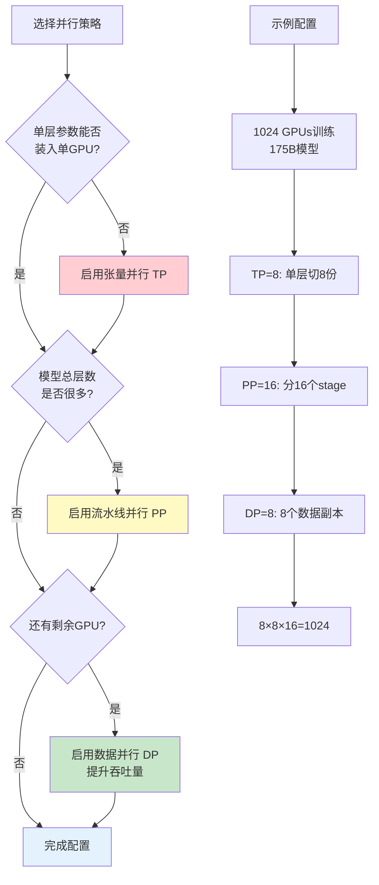

<div align="center">
  
  <figcaption>图：3D混合并行架构(DP+TP+PP)训练大模型（来源：Megatron-LM 2021 论文 Figure 1）</figcaption>
</div>

### 策略选择原则

**决策流程**：
1. **首先考虑TP（张量并行）**：
   - 当单层参数 > 单GPU显存时必须使用
   - 典型配置：TP=2/4/8（同节点内，NVLink通信）
   - 例如：单层12GB，单GPU 80GB → 不需要TP

2. **其次考虑PP（流水线并行）**：
   - 当模型总层数很多时使用
   - 典型配置：PP=2/4/8/16
   - 例如：96层模型，PP=16 → 每个stage 6层

3. **最后考虑DP（数据并行）**：
   - 使用剩余所有GPU
   - 提升训练吞吐量
   - 例如：1024 GPU，TP=8，PP=16 → DP=8

**实际案例**：

| 模型规模 | TP | PP | DP | 总GPU | 说明 |
|---------|----|----|----|----|------|
| **7B参数** | 1 | 1 | 64 | 64 | 小模型，纯DP即可 |
| **13B参数** | 2 | 1 | 32 | 64 | 需要少量TP |
| **70B参数** | 8 | 4 | 4 | 128 | 需要TP+PP |
| **175B参数** | 8 | 16 | 8 | 1024 | 大模型，3D并行 |
| **540B参数** | 8 | 32 | 16 | 4096 | 超大模型 |

**Trade-off考虑**：
- **TP增大**：层内通信增多，需要高速互联（NVLink）
- **PP增大**：Pipeline bubble增大，GPU利用率下降
- **DP增大**：梯度同步通信增多，但可用Ring-AllReduce优化


# 训练优化技术

## 优化器选择

### AdamW
- Adam + Weight Decay解耦
- 当前最主流
- 超参数：β1=0.9, β2=0.95-0.999

### Adafactor
- 节省优化器状态显存
- 适合资源受限场景
- T5等模型使用

### Lion
- 新型优化器
- 显存占用更少
- 部分场景优于AdamW

## 学习率策略

### Warmup
- 从小学习率逐步增加
- 避免训练初期不稳定
- 典型：2000-10000步

### Cosine Decay

学习率随训练步数按余弦曲线衰减：

$$
\text{lr}(t) = \text{lr}_{\min} + \frac{1}{2}(\text{lr}_{\max} - \text{lr}_{\min}) \left(1 + \cos\left(\frac{\pi t}{T}\right)\right)
$$

其中：
- $t$：当前训练步数
- $T$：总训练步数
- $\text{lr}_{\max}$：峰值学习率
- $\text{lr}_{\min}$：最小学习率（通常为峰值的10%）

### Linear Decay
- 线性降低学习率

### Constant Learning Rate
- 部分研究表明constant LR效果好
- 需要仔细调节

## 梯度处理

### Gradient Clipping
- 防止梯度爆炸
- 通常clip到1.0

### Gradient Accumulation
- 累积多个小batch梯度
- 模拟大batch训练
- 节省显存

### Gradient Checkpointing
- 重计算激活值而非存储
- 用计算换显存
- 训练更大模型

## 正则化技术

### Dropout
- 传统正则化
- 大模型中通常较小（0.1）或不用

### Weight Decay
- AdamW中使用
- 典型值：0.1

### Embedding Dropout
- 对token embedding应用dropout

---

# 模型量化技术

模型量化是降低大模型计算和存储成本的核心技术之一。通过将高精度浮点数（FP32/FP16）转换为低精度整数（INT8/INT4），量化可以显著减少显存占用、加快推理速度，同时保持模型性能基本不变。

> **🎯 本章导读**
>
> 量化是大模型民主化的关键技术。**一个70B模型，FP16需要140GB显存，INT4量化后仅需35GB**——这意味着从8×A100降到1×A100即可运行。本章深入讲解量化的数学原理、主流方法（GPTQ、AWQ、QLoRA）、训练策略，以及工程实践。核心要点：**量化不是简单压缩，而是精心设计的精度-性能权衡艺术**。

## 🧮 量化基础概念

### 什么是量化？

量化（Quantization）是将连续的高精度数值映射到离散的低精度数值的过程：

$$
\text{FP32/FP16} \xrightarrow{\text{量化}} \text{INT8/INT4/INT2}
$$

**核心目标**：
- 📉 **降低显存占用**：FP16 → INT8 减少50%，FP16 → INT4 减少75%
- ⚡ **加速计算**：整数运算比浮点运算快2-4倍
- 💰 **降低成本**：更小的模型可以部署在更便宜的硬件上

**关键挑战**：
- 保持模型精度不显著下降
- 处理异常值（Outliers）
- 平衡量化粒度与精度损失

### 量化的数学原理

#### 1. 对称量化（Symmetric Quantization）

将浮点数 $x \in [-\alpha, \alpha]$ 映射到整数 $q \in [-127, 127]$（INT8为例）：

$$
q = \text{round}\left(\frac{x}{s}\right), \quad s = \frac{\alpha}{127}
$$

**反量化**（推理时恢复）：

$$
\hat{x} = s \cdot q
$$

其中：
- $s$：缩放因子（scale）
- $\alpha$：所有元素绝对值的最大值
- $q$：量化后的整数

**特点**：
- ✅ 实现简单，硬件友好
- ✅ 零点为0，无需额外存储
- ❌ 对非对称分布的数据浪费表示范围

#### 2. 非对称量化（Asymmetric Quantization）

处理非对称分布的数据 $x \in [x_{\min}, x_{\max}]$：

$$
q = \text{round}\left(\frac{x - z}{s}\right)
$$

其中：
- $s = \frac{x_{\max} - x_{\min}}{255}$（INT8）
- $z = \text{round}\left(-\frac{x_{\min}}{s}\right)$：零点（zero-point）

**反量化**：

$$
\hat{x} = s \cdot (q - z)
$$

**特点**：
- ✅ 更好利用量化范围
- ✅ 适合激活值（通常非对称）
- ❌ 需要额外存储零点参数

#### 3. 量化粒度

| 粒度 | 说明 | 优点 | 缺点 |
|------|------|------|------|
| **Per-tensor** | 整个张量共享一个 $(s, z)$ | 内存小，速度快 | 精度损失较大 |
| **Per-channel** | 每个输出通道独立 $(s_i, z_i)$ | 精度更高 | 参数量增加 |
| **Per-group** | 每组参数共享（如128个元素） | 平衡精度与效率 | 实现复杂 |

**最佳实践**：
- **权重**：Per-channel 量化（精度关键）
- **激活值**：Per-tensor 量化（速度优先）

### 量化误差分析

量化引入的误差：

$$
\text{Error} = \mathbb{E}[(x - \hat{x})^2] = \mathbb{E}[(x - s \cdot \text{round}(x/s))^2]
$$

**误差来源**：
1. **舍入误差**：$\text{round}()$ 操作导致的精度损失
2. **裁剪误差**：超出 $[x_{\min}, x_{\max}]$ 的值被裁剪
3. **异常值影响**：少数极大值拉大缩放因子 $s$，压缩其他值的表示精度

**降低误差的策略**：
- 使用更细粒度的量化（Per-channel）
- 异常值单独处理（Mixed-precision）
- 量化感知训练（QAT）

---

## 📊 量化方法分类

### 按量化时机分类

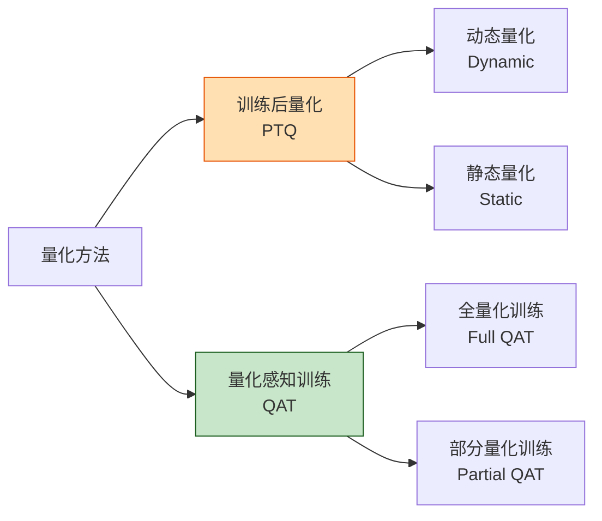

### 1. 训练后量化（Post-Training Quantization, PTQ）

**定义**：在模型训练完成后，直接对权重和激活值进行量化，无需重新训练。

**优点**：
- ⚡ **速度快**：几分钟到几小时即可完成
- 💰 **成本低**：无需训练数据和GPU资源
- 🛠️ **易部署**：可直接应用于任何预训练模型

**缺点**：
- 📉 **精度损失**：特别是低比特量化（INT4/INT2）
- ⚠️ **敏感性高**：某些层对量化非常敏感

**代表方法**：
- **GPTQ**：基于二阶信息的逐层量化
- **AWQ**：基于激活值重要性的权重量化
- **SmoothQuant**：迁移量化难度从激活到权重

### 2. 量化感知训练（Quantization-Aware Training, QAT）

**定义**：在训练过程中模拟量化操作，让模型学习适应量化误差。

**核心思想**：
- 前向传播：使用量化后的权重和激活值
- 反向传播：使用浮点梯度（STE技巧）

**优点**：
- ✅ **精度最高**：模型主动适应量化
- ✅ **支持极低比特**：INT4、INT2甚至二值化

**缺点**：
- ⏰ **训练时间长**：需要重新训练或微调
- 💰 **成本高**：需要训练数据和GPU资源

**代表方法**：
- **QLoRA**：4-bit量化 + LoRA微调
- **LLM-QAT**：大模型量化感知训练
- **BitNet**：极低比特（1.58-bit）量化训练

### 按量化对象分类

| 量化对象 | 说明 | 难度 | 常用方法 |
|---------|------|------|---------|
| **仅权重** | 只量化模型参数 | 简单 | GPTQ, AWQ |
| **权重+激活** | 同时量化参数和中间结果 | 困难 | SmoothQuant, QAT |
| **KV Cache** | 量化注意力缓存 | 中等 | Per-token量化 |

---

## 🔧 训练后量化（PTQ）

### GPTQ：基于二阶信息的权重量化

#### 核心原理

GPTQ（**G**PT **P**ost-**T**raining **Q**uantization）使用**二阶导数信息**优化量化误差，逐层量化权重矩阵。

**优化目标**：最小化量化前后输出差异

$$
\arg\min_{\hat{W}} \| WX - \hat{W}X \|^2
$$

其中：
- $W$：原始FP16权重矩阵
- $\hat{W}$：量化后的INT4权重
- $X$：校准数据的激活值

**关键技术**：Optimal Brain Quantization (OBQ)

逐列量化权重，每次量化一列时，将误差传播到剩余列：

$$
W_{\text{remaining}} \leftarrow W_{\text{remaining}} - \frac{w \cdot H^{-1}_{:,i}}{H^{-1}_{i,i}} \cdot e_i^T
$$

其中 $H = 2X^TX$ 是Hessian矩阵。

#### 实现流程

```python
import torch
from transformers import AutoModelForCausalLM, AutoTokenizer
from auto_gptq import AutoGPTQForCausalLM, BaseQuantizeConfig

# Step 1: 加载预训练模型
model_name = "meta-llama/Llama-2-7b-hf"
model = AutoModelForCausalLM.from_pretrained(model_name, torch_dtype=torch.float16)
tokenizer = AutoTokenizer.from_pretrained(model_name)

# Step 2: 准备校准数据（通常128-1024个样本）
from datasets import load_dataset
calibration_dataset = load_dataset("c4", split="train[:1000]")

def prepare_calibration_data(examples):
    return tokenizer(examples["text"], truncation=True, max_length=512)

calibration_data = calibration_dataset.map(prepare_calibration_data, batched=True)

# Step 3: 配置量化参数
quantize_config = BaseQuantizeConfig(
    bits=4,                      # 量化位数：4-bit
    group_size=128,              # 每128个参数共享一个scale
    damp_percent=0.01,           # Hessian阻尼系数（稳定性）
    desc_act=False,              # 激活值降序排列（可选优化）
    sym=True,                    # 对称量化
    true_sequential=True,        # 严格按层顺序量化
)

# Step 4: 执行GPTQ量化（耗时：7B模型约10-30分钟）
model_quantized = AutoGPTQForCausalLM.from_pretrained(
    model_name,
    quantize_config=quantize_config,
)
model_quantized.quantize(calibration_data)

# Step 5: 保存量化模型（7B: 140GB → 3.5GB）
model_quantized.save_quantized("./llama-2-7b-gptq-4bit")
tokenizer.save_pretrained("./llama-2-7b-gptq-4bit")

# Step 6: 加载和使用量化模型
from auto_gptq import AutoGPTQForCausalLM
model_gptq = AutoGPTQForCausalLM.from_quantized(
    "./llama-2-7b-gptq-4bit",
    device="cuda:0",
    use_safetensors=True,
)

# 推理速度提升2-3倍，显存减少75%
inputs = tokenizer("The meaning of life is", return_tensors="pt").to("cuda:0")
outputs = model_gptq.generate(**inputs, max_length=50)
print(tokenizer.decode(outputs[0]))
```

#### GPTQ 性能表现

| 模型 | 原始精度 | GPTQ-4bit | 显存占用 | 精度损失 |
|------|---------|-----------|----------|---------|
| **LLaMA-7B** | FP16 | INT4 | 14GB → 3.5GB (-75%) | <1% |
| **LLaMA-13B** | FP16 | INT4 | 26GB → 6.5GB (-75%) | <1% |
| **LLaMA-30B** | FP16 | INT4 | 60GB → 15GB (-75%) | ~1% |
| **LLaMA-65B** | FP16 | INT4 | 130GB → 33GB (-75%) | ~2% |

**适用场景**：
- ✅ 推理部署优化
- ✅ 资源受限环境
- ✅ 需要快速量化（无需训练）

---

### AWQ：激活感知权重量化

#### 核心洞察

AWQ（**A**ctivation-aware **W**eight **Q**uantization）的核心发现：

> **并非所有权重都同等重要！** 对应大激活值的权重通道对模型性能影响更大，应该保持更高精度。

**量化策略**：

$$
\hat{W} = \text{Quantize}(W \cdot s), \quad \hat{Y} = \frac{\hat{W} \cdot (X / s)}{s}
$$

其中 $s$ 是per-channel的缩放因子，根据激活值大小自适应调整。

#### 确定通道重要性

1. **收集激活值统计**：

$$
s_i = \text{salient}(X_{:,i}) = \mathbb{E}[\|X_{:,i}\|]
$$

2. **保护重要通道**：

重要通道（激活值大）使用更大的缩放因子 → 量化误差更小

#### 实现代码

```python
from awq import AutoAWQForCausalLM
from transformers import AutoTokenizer

model_path = "meta-llama/Llama-2-7b-hf"
quant_path = "llama-2-7b-awq-4bit"

# Step 1: 加载模型
model = AutoAWQForCausalLM.from_pretrained(model_path)
tokenizer = AutoTokenizer.from_pretrained(model_path)

# Step 2: 配置量化参数
quant_config = {
    "zero_point": True,          # 使用零点（非对称量化）
    "q_group_size": 128,         # 分组大小
    "w_bit": 4,                  # 权重量化位数
    "version": "GEMM"            # 使用优化的GEMM kernel
}

# Step 3: 量化（AWQ比GPTQ快2-3倍）
model.quantize(tokenizer, quant_config=quant_config)

# Step 4: 保存量化模型
model.save_quantized(quant_path)
tokenizer.save_pretrained(quant_path)

# 加载和推理
model_awq = AutoAWQForCausalLM.from_quantized(quant_path, fuse_layers=True)
```

#### AWQ vs GPTQ 对比

| 特性 | AWQ | GPTQ |
|------|-----|------|
| **量化速度** | ⚡ 快（5-10分钟/7B） | 慢（20-30分钟/7B） |
| **精度保持** | ✅ 更好（特别是极低比特） | ✅ 好 |
| **推理速度** | ⚡⚡ 更快（优化kernel） | ⚡ 快 |
| **显存占用** | 相同 | 相同 |
| **校准数据** | 少（~256样本） | 多（~1024样本） |

**推荐选择**：
- 追求极致精度 → **AWQ**
- 快速量化部署 → **AWQ**
- 需要广泛硬件支持 → **GPTQ**（生态更成熟）

---

### SmoothQuant：平滑激活值分布

#### 问题：为什么激活值难量化？

大模型的激活值存在**严重的异常值（Outliers）**问题：

- 99.9%的值在 $[-10, 10]$ 范围
- 0.1%的异常值可达 $[-1000, 1000]$

如果用统一的scale量化 → 大部分值被压缩到很小范围 → 精度损失巨大。

#### SmoothQuant 解决方案

**核心思想**：通过缩放因子将量化难度从激活值转移到权重：

$$
Y = (X \text{ diag}(s)^{-1}) \cdot (\text{diag}(s)W)
$$

其中：
- $s$ 是per-channel的平滑因子
- $X \text{ diag}(s)^{-1}$：压缩激活值的异常值
- $\text{diag}(s)W$：将缩放因子吸收到权重中（权重更易量化）

**确定平滑因子**：

$$
s_i = \max(|X_i|)^\alpha / \max(|W_i|)^{1-\alpha}
$$

其中 $\alpha \in [0, 1]$ 控制平滑强度（通常0.5）。

#### 实现示例

```python
import torch
from smoothquant import SmoothQuantForCausalLM

model_name = "meta-llama/Llama-2-7b-hf"

# Step 1: 加载模型
model = SmoothQuantForCausalLM.from_pretrained(model_name)

# Step 2: 收集激活值统计（需要运行校准数据）
from datasets import load_dataset
calibration_data = load_dataset("c4", split="train[:512]")

# 运行forward获取激活值分布
model.collect_stats(calibration_data)

# Step 3: 应用SmoothQuant（计算并吸收平滑因子）
model.smooth_quant(alpha=0.5)

# Step 4: INT8量化（权重+激活值）
model.quantize_int8()

# 保存量化模型
model.save_quantized("llama-2-7b-smoothquant-int8")
```

#### SmoothQuant 性能

| 任务 | FP16 | W8A8<br>(SmoothQuant) | W8A8<br>(Naive) |
|------|------|----------------------|----------------|
| **MMLU** | 45.3 | 44.8 (-0.5) | 38.2 (-7.1) |
| **GSM8K** | 15.2 | 14.7 (-0.5) | 8.3 (-6.9) |
| **HumanEval** | 12.8 | 12.2 (-0.6) | 7.3 (-5.5) |

**关键优势**：
- ✅ 首个成功的 **W8A8**（权重+激活都INT8）方案
- ✅ 硬件友好（无需特殊kernel）
- ✅ 端到端INT8推理（2-3倍加速）

---

## 🎓 量化感知训练（QAT）

### QLoRA：4-bit量化 + LoRA微调

QLoRA 是当前最流行的量化训练方法，实现了**在单张A100上微调65B模型**。

#### 核心技术组合

1. **4-bit NormalFloat (NF4) 量化**
2. **双重量化（Double Quantization）**
3. **分页优化器（Paged Optimizers）**
4. **LoRA 适配器**

#### 1. NF4量化：信息理论最优量化

标准的4-bit整数量化范围：$[-7, 7]$（均匀分布）

**问题**：神经网络权重通常服从正态分布 $\mathcal{N}(0, \sigma^2)$，均匀量化浪费表示能力。

**NF4方案**：量化点按正态分布分位数分布

```python
# NF4的16个量化点（针对N(0,1)优化）
NF4_QUANT_LEVELS = [
    -1.0, -0.6961928009986877, -0.5250730514526367, -0.39491748809814453,
    -0.28444138169288635, -0.18477343022823334, -0.09105003625154495, 0.0,
    0.07958029955625534, 0.16093020141124725, 0.24611230194568634, 0.33791524171829224,
    0.44070982933044434, 0.5626170039176941, 0.7229568362236023, 1.0
]
```

**归一化 + NF4量化**：

$$
\hat{W} = \text{NF4}\left(\frac{W}{\sigma_W}\right) \cdot \sigma_W
$$

**优势**：相比均匀量化，精度损失减少约30%。

#### 2. 双重量化（Double Quantization）

**问题**：FP32的缩放因子 $s$ 占用大量内存（每64个参数1个FP32）。

**解决**：对缩放因子本身也量化！

```python
# 第一次量化：权重 → INT4
W_quant = quantize_nf4(W, scale_fp32)

# 第二次量化：缩放因子 FP32 → FP8
scale_quant = quantize_fp8(scale_fp32)

# 显存节省：64个参数的scale从4字节 → 0.5字节
```

#### 3. 完整QLoRA训练流程

```python
import torch
from transformers import AutoModelForCausalLM, AutoTokenizer, TrainingArguments
from peft import LoraConfig, get_peft_model, prepare_model_for_kbit_training
from trl import SFTTrainer
from datasets import load_dataset

# ============================================================
# Step 1: 4-bit量化配置（NF4 + 双重量化）
# ============================================================
from transformers import BitsAndBytesConfig

bnb_config = BitsAndBytesConfig(
    load_in_4bit=True,                      # 启用4-bit量化
    bnb_4bit_quant_type="nf4",              # 使用NF4量化（信息理论最优）
    bnb_4bit_use_double_quant=True,         # 双重量化（scale也量化）
    bnb_4bit_compute_dtype=torch.bfloat16,  # 计算时用BF16（保持精度）
)

# ============================================================
# Step 2: 加载4-bit量化模型（70B模型仅需35GB显存！）
# ============================================================
model_name = "meta-llama/Llama-2-70b-hf"
model = AutoModelForCausalLM.from_pretrained(
    model_name,
    quantization_config=bnb_config,
    device_map="auto",                      # 自动多卡分配
    trust_remote_code=True,
)
tokenizer = AutoTokenizer.from_pretrained(model_name)

# ============================================================
# Step 3: 准备量化模型用于训练
# ============================================================
model = prepare_model_for_kbit_training(model)

# ============================================================
# Step 4: 配置LoRA参数（只训练0.1%参数）
# ============================================================
lora_config = LoraConfig(
    r=64,                                   # LoRA秩（越大越接近全参数微调）
    lora_alpha=16,                          # 缩放因子（通常为r的1/4）
    target_modules=[                        # 对哪些层应用LoRA
        "q_proj", "k_proj", "v_proj",       # 注意力层
        "o_proj",
        "gate_proj", "up_proj", "down_proj" # FFN层
    ],
    lora_dropout=0.05,                      # Dropout防止过拟合
    bias="none",                            # 不训练bias
    task_type="CAUSAL_LM"
)

# ============================================================
# Step 5: 应用LoRA到量化模型
# ============================================================
model = get_peft_model(model, lora_config)
model.print_trainable_parameters()
# 输出示例：
# trainable params: 134,217,728 || all params: 68,976,648,192 || trainable%: 0.19%

# ============================================================
# Step 6: 准备训练数据
# ============================================================
dataset = load_dataset("timdettmers/openassistant-guanaco")

# ============================================================
# Step 7: 配置训练参数
# ============================================================
training_args = TrainingArguments(
    output_dir="./qlora-llama-70b",
    num_train_epochs=3,
    per_device_train_batch_size=4,         # 小batch（4-bit量化后显存充足）
    gradient_accumulation_steps=4,         # 等效batch_size=16
    learning_rate=2e-4,                    # QLoRA典型学习率
    lr_scheduler_type="cosine",
    warmup_ratio=0.03,
    logging_steps=10,
    save_strategy="epoch",
    optim="paged_adamw_8bit",              # 分页优化器（防止OOM）
    fp16=False,
    bf16=True,                             # 使用BF16（A100推荐）
)

# ============================================================
# Step 8: 开始训练
# ============================================================
trainer = SFTTrainer(
    model=model,
    train_dataset=dataset["train"],
    tokenizer=tokenizer,
    args=training_args,
    max_seq_length=2048,
)

trainer.train()

# ============================================================
# Step 9: 保存LoRA适配器（仅~200MB！）
# ============================================================
model.save_pretrained("./qlora-adapter")

# ============================================================
# Step 10: 推理时合并LoRA（可选）
# ============================================================
from peft import PeftModel

# 加载基座模型（4-bit量化）
base_model = AutoModelForCausalLM.from_pretrained(
    model_name,
    quantization_config=bnb_config,
    device_map="auto"
)

# 加载并合并LoRA
model = PeftModel.from_pretrained(base_model, "./qlora-adapter")
model = model.merge_and_unload()  # 合并LoRA权重到基座
```

#### QLoRA 显存占用分析

以 **LLaMA-2-70B** 为例：

| 组件 | FP16全参数微调 | QLoRA (4-bit) | 节省 |
|------|---------------|---------------|------|
| **模型权重** | 140 GB | 35 GB | -75% |
| **优化器状态** | 280 GB | 7 GB (8-bit paged) | -97% |
| **梯度** | 140 GB | 0.28 GB (LoRA only) | -99% |
| **激活值** | ~40 GB | ~10 GB (小batch) | -75% |
| **总计** | **~600 GB** | **~52 GB** | **-91%** |

**结论**：QLoRA让70B模型微调从 **8×A100 降到 1×A100**！

---

### BitNet：1.58-bit极限量化

BitNet 将量化推向极限：**每个权重只用1.58 bit**（三值：-1, 0, +1）。

#### 核心设计

**三值权重**：

$$
W \in \{-1, 0, +1\}
$$

**激活值**：8-bit量化（保持一定精度）

**为什么是1.58 bit？**

熵计算：$H = -\sum p_i \log_2 p_i$

如果 $p(-1) = p(+1) = 0.4, p(0) = 0.2$：

$$
H = -2 \times 0.4 \times \log_2(0.4) - 0.2 \times \log_2(0.2) \approx 1.52 \text{ bits}
$$

#### 训练方法

1. **前向传播**：使用三值权重

$$
W_{\text{ternary}} = \text{sign}(W_{\text{float}}) \cdot \gamma
$$

其中 $\gamma = \frac{1}{n}\sum |W|$ 是缩放因子。

2. **反向传播**：对浮点权重计算梯度（STE技巧）

3. **权重更新**：更新浮点权重，再投影到三值

#### 性能表现

| 模型 | 参数量 | 精度 | 困惑度 | 推理速度 |
|------|--------|------|--------|---------|
| LLaMA-13B | 13B | FP16 | 5.12 | 1× |
| BitNet-13B | 13B | 1.58-bit | 5.41 (+5.7%) | **4.5×** |

**适用场景**：
- 📱 端侧部署（手机、IoT设备）
- ⚡ 超低延迟推理
- 💰 极致成本优化

---

## 🛠️ 量化工程实践

### 量化工具生态

| 工具 | 支持方法 | 特点 | 推荐场景 |
|------|---------|------|---------|
| **bitsandbytes** | QLoRA, 8-bit, 4-bit | 易用，Hugging Face集成 | QLoRA微调 |
| **auto-gptq** | GPTQ | 成熟，广泛支持 | PTQ部署 |
| **AutoAWQ** | AWQ | 速度快，精度高 | PTQ部署 |
| **llama.cpp** | GGUF/GGML | CPU推理优化 | 本地CPU部署 |
| **vLLM** | FP8, INT8 | 高吞吐推理 | 生产部署 |
| **TensorRT-LLM** | INT8, INT4, FP8 | NVIDIA优化 | NVIDIA GPU部署 |

### 量化流程最佳实践

#### 1. 选择量化方法的决策树

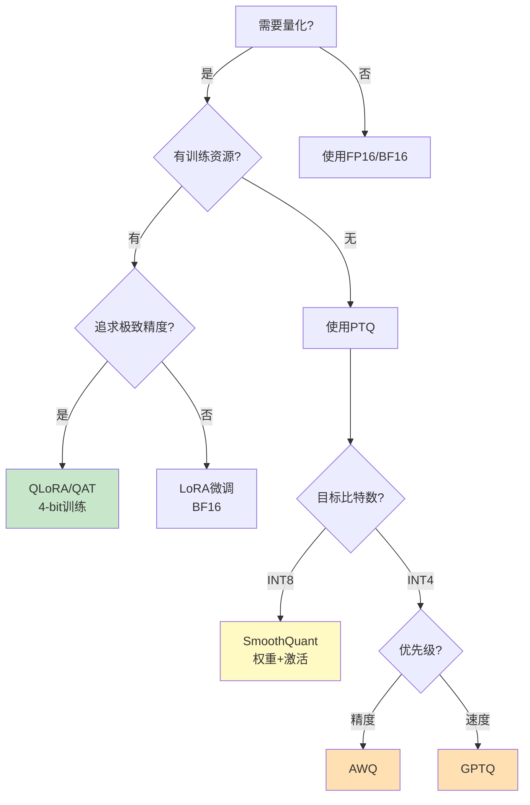

#### 2. 量化前的模型评估

```python
from transformers import AutoModelForCausalLM
from lm_eval import simple_evaluate

model_name = "meta-llama/Llama-2-7b-hf"

# 评估原始FP16模型（建立baseline）
model_fp16 = AutoModelForCausalLM.from_pretrained(
    model_name,
    torch_dtype=torch.float16,
    device_map="auto"
)

results_fp16 = simple_evaluate(
    model=model_fp16,
    tasks=["hellaswag", "winogrande", "arc_easy", "arc_challenge"],
    num_fewshot=0,
)

print("FP16 Baseline:", results_fp16)
# 输出示例：
# {
#   'hellaswag': {'acc': 0.5832},
#   'winogrande': {'acc': 0.7103},
#   'arc_easy': {'acc': 0.7742},
#   'arc_challenge': {'acc': 0.4616}
# }
```

#### 3. 量化后的精度验证

```python
from auto_gptq import AutoGPTQForCausalLM

# 加载GPTQ-4bit量化模型
model_gptq = AutoGPTQForCausalLM.from_quantized(
    "./llama-2-7b-gptq-4bit",
    device="cuda:0"
)

results_gptq = simple_evaluate(
    model=model_gptq,
    tasks=["hellaswag", "winogrande", "arc_easy", "arc_challenge"],
    num_fewshot=0,
)

# 计算精度损失
for task in results_fp16:
    fp16_acc = results_fp16[task]['acc']
    gptq_acc = results_gptq[task]['acc']
    loss = (fp16_acc - gptq_acc) / fp16_acc * 100
    print(f"{task}: {fp16_acc:.4f} → {gptq_acc:.4f} ({loss:+.2f}%)")

# 期望输出：
# hellaswag: 0.5832 → 0.5784 (-0.82%)
# winogrande: 0.7103 → 0.7056 (-0.66%)
# arc_easy: 0.7742 → 0.7701 (-0.53%)
# arc_challenge: 0.4616 → 0.4548 (-1.47%)
```

**可接受的精度损失**：
- ✅ **INT8**：<2%
- ✅ **INT4**：<5%（GPTQ/AWQ）
- ⚠️ **INT4**：5-10%（简单量化）
- ❌ **INT4**：>10%（量化失败，需调整策略）

#### 4. 处理量化失败的层

某些层对量化极度敏感（如第一层embedding，最后一层LM head）。

**策略：混合精度量化**

```python
from auto_gptq import BaseQuantizeConfig

quantize_config = BaseQuantizeConfig(
    bits=4,
    group_size=128,

    # 指定不量化的层（保持FP16）
    modules_to_not_convert=[
        "model.embed_tokens",              # 第一层embedding
        "model.norm",                      # 最终LayerNorm
        "lm_head"                          # 输出层
    ],
)

# 这些关键层保持FP16，其他层4-bit量化
# 精度损失：10% → 2%，显存增加：3.5GB → 4.2GB（+20%，可接受）
```

### 量化的常见陷阱

#### ❌ 陷阱1：使用过少的校准数据

```python
# 错误示例
calibration_data = dataset[:10]  # 只用10个样本 ❌

# 正确做法
calibration_data = dataset[:512]  # 至少128-1024个样本 ✅
```

#### ❌ 陷阱2：校准数据分布不匹配

```python
# 错误示例：用代码数据校准对话模型 ❌
calibration_data = load_dataset("codeparrot/github-code")

# 正确做法：用目标任务相似的数据 ✅
calibration_data = load_dataset("allenai/c4", split="train[:1000]")  # 通用文本
# 或
calibration_data = load_dataset("OpenAssistant/oasst1")  # 对话数据
```

#### ❌ 陷阱3：忽略量化后的数值稳定性

```python
# 量化后可能导致数值溢出或下溢
# 解决方案：在关键位置添加裁剪

def forward_with_clipping(x):
    x = self.attention(x)
    x = torch.clamp(x, min=-10, max=10)  # 防止异常值 ✅
    x = self.ffn(x)
    return x
```

---

## 📊 量化效果对比总结

### 不同量化方法的精度-效率权衡

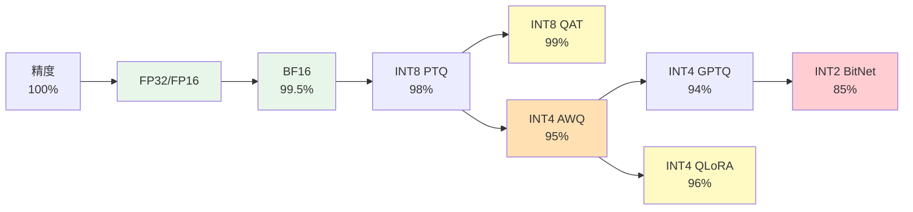

### 推荐矩阵

| 场景 | 推荐方法 | 量化精度 | 预期损失 | 显存节省 |
|------|---------|---------|---------|---------|
| **微调训练** | QLoRA | 4-bit | <3% | 75% |
| **推理部署（精度优先）** | AWQ | 4-bit | <2% | 75% |
| **推理部署（速度优先）** | GPTQ | 4-bit | <3% | 75% |
| **边缘设备** | INT8 QAT | 8-bit | <1% | 50% |
| **端侧极限** | BitNet | 1.58-bit | ~10% | 90% |
| **生产高吞吐** | SmoothQuant W8A8 | 8-bit | <2% | 75% |

---

## 🔮 量化技术的未来趋势

### 1. 混合精度量化（Mixed-Precision Quantization）

不同层使用不同比特数：
- **敏感层**（注意力层）：INT8
- **普通层**（FFN）：INT4
- **不敏感层**：INT2

### 2. 训练后零样本量化（Zero-Shot PTQ）

无需校准数据，直接从权重分布推断量化参数。

### 3. 硬件-算法协同设计

- **NVIDIA Hopper**：原生支持FP8训练
- **Google TPU v5**：INT4矩阵乘法加速
- **专用NPU**：二值/三值神经网络专用芯片

### 4. 大模型特定优化

- **稀疏性+量化**：结合剪枝，进一步压缩
- **KV Cache量化**：长上下文场景的关键优化
- **动态量化**：根据输入自适应调整量化精度

---

# 数据工程

数据是大模型训练的基石。高质量的训练数据直接决定了模型的能力上限。本章系统介绍大模型训练中的数据工程技术。

> **🎯 本章导读**
>
> "Garbage in, garbage out"——数据质量直接决定模型上限。本章介绍数据采集、质量评估、去重、配比、Tokenization等完整数据处理流程。**核心理念**：高质量 > 大规模，多样性 > 单一来源。数据工程往往被低估，但它是训练成功的关键。

<div align="center">
  
  <figcaption>图：预训练数据处理完整流程 - 从采集到训练（来源：RefinedWeb 论文 Figure 1）</figcaption>
</div>

## 数据采集与来源

### 预训练数据来源

#### 网页数据
- **Common Crawl**：最大的开放网页爬取数据集，每月爬取数十亿网页，包含多语言、多领域内容
- **C4（Colossal Clean Crawled Corpus）**：基于Common Crawl清洗后的数据集，~750GB文本
- **RedPajama**：开源的LLaMA训练数据复现（1.2万亿token）

#### 代码数据
- **GitHub**：开源代码仓库（过滤星标、license）
- **Stack Overflow**：高质量代码问答
- **The Stack**：3TB源代码，30+编程语言

#### 学术与书籍
- **arXiv、PubMed**：学术论文
- **Books3、BookCorpus**：书籍数据集

#### 对话与社交媒体
- **Reddit**：高质量讨论和问答
- **Wikipedia**：结构化知识
- **StackExchange**：各领域专业问答

## 数据质量评估

### 启发式规则过滤

#### 文本长度与格式
- 最小/最大长度过滤
- 特殊字符、数字、标点比例控制
- 大写字母密度检测
- 语言检测（fastText、langdetect）

#### 重复内容检测
- 行级重复、段落重复
- 模板识别（网页模板、页眉页脚）

### 基于模型的质量评分

#### 困惑度（Perplexity）过滤
- 使用小型语言模型评分
- 过滤困惑度过高的文档（需谨慎）

#### 质量分类器
- 训练数据：人工标注高质量 vs 低质量样本
- 特征：文本流畅度、信息密度、语法正确性
- 模型：FastText、BERT分类器

#### 教育价值评分
- Phi系列的启发：评估"教科书质量"
- 使用GPT-4等强模型评分

### 毒性与有害内容检测

#### 毒性检测
- **Perspective API**：Google毒性评分API
- **Detoxify**：开源毒性检测模型

#### PII（个人身份信息）去除
- 姓名、地址、电话、邮箱
- 使用NER模型识别
- 密码、密钥：正则表达式匹配

## 数据去重

去重是最关键的数据处理步骤，可显著提升模型性能并减少记忆效应。

### 精确去重
- **文档级**：基于MD5/SHA256 hash
- **URL去重**：处理重定向和规范化

### 模糊去重

#### MinHash + LSH
- 估计Jaccard相似度
- 步骤：生成shingles → MinHash签名 → LSH找相似对
- 工具：datasketch库

<div align="center">
  
  <figcaption>图：MinHash + LSH去重工作原理示意图（来源：CCNet 论文 Figure 1）</figcaption>
</div>

#### SimHash
- 快速计算文档指纹
- 汉明距离判断相似度

#### Suffix Array
- 寻找最长公共子串
- CCNet方法

### 跨数据集去重

#### 训练集与测试集去重
- **至关重要**：避免数据泄露
- 13-gram重叠检测（GPT-3）
- 影响评测可信度

### 去重Trade-off
- 过度去重：损失多样性
- 欠去重：浪费资源、增加记忆风险
- 平衡点：根据任务调整

## 数据配比与采样

### 静态配比策略

**GPT-3配比示例**：

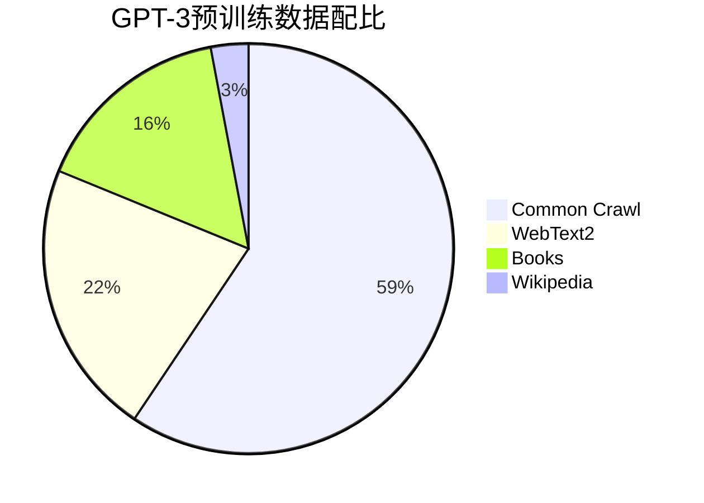

**LLaMA配比示例**（更新的配比策略）：

| 数据源 | 占比 | Token数量 | 说明 |
|--------|------|-----------|------|
| CommonCrawl | 67% | ~1.34T | 网页数据，多样性最高 |
| C4 | 15% | ~300B | 清洗后的网页数据 |
| GitHub | 4.5% | ~90B | 代码数据 |
| Wikipedia | 4.5% | ~90B | 高质量百科知识 |
| Books | 4.5% | ~90B | 长文本，叙事能力 |
| ArXiv | 2.5% | ~50B | 数学、科学推理 |
| StackExchange | 2% | ~40B | 专业问答 |

**配比原则**：
- **高质量数据提权**：Wikipedia、Books、ArXiv虽然占比小，但多次采样
- **代码数据单独控制**：10-20%，提升代码能力但不过度
- **对话数据少量但重要**：StackExchange等问答数据培养对话能力
- **多样性优先**：Common Crawl占主导，保证知识广度

### 动态配比策略

#### 训练阶段调整
- **早期（0-70%）**：均衡配比
- **中期（70-90%）**：提升高质量数据
- **后期（90-100%）**：专注专业数据

#### 基于损失的调整
- 监控不同数据源loss
- 动态再平衡

### 课程学习（Curriculum Learning）
- 从易到难：按困惑度排序
- 从通用到专业

### Temperature Sampling

采样概率计算公式：

$$
p_i = \frac{n_i^{\alpha}}{\sum_j n_j^{\alpha}}
$$

其中：
- $n_i$：数据源 $i$ 的原始样本数量
- $\alpha$：温度参数
- $\alpha < 1$：提升小数据源采样概率（up-sampling）
- $\alpha > 1$：降低小数据源采样概率（down-sampling）
- $\alpha = 1$：按原始比例采样

## Tokenization

### 算法选择

- **BPE（Byte Pair Encoding）**：GPT系列、LLaMA
  - 从字符开始迭代合并高频pair
  - 平衡词表大小和分词粒度
- **WordPiece**：BERT，基于最大似然
- **Unigram**：T5，从大词表剪枝
- **SentencePiece**：语言无关，多语言模型首选

### 词表大小
- 英语为主：32k - 50k
- 多语言：100k - 250k
- 代码模型：更大词表

**Trade-off**：
- 词表过小：序列长，训练慢
- 词表过大：embedding参数多，稀疏

### 特殊Token
- 标准：`<bos>`, `<eos>`, `<pad>`, `<unk>`
- 对话：`<|user|>`, `<|assistant|>`, `<|system|>`
- 多模态：`<image>`, `<video>`

### 最佳实践
- 预训练、微调、推理使用相同tokenizer
- 预先tokenize并缓存
- 使用fast tokenizer（Rust实现）
- 多语言平衡token数量


# 评估与基准测试

评估体系是衡量训练效果和指导训练方向的重要工具。本章介绍大模型训练中常用的评测基准。

## 语言理解与知识

### MMLU（Massive Multitask Language Understanding）
- **内容**：57个学科的多选题（数学、历史、法律、医学等）
- **规模**：~16,000道题目
- **评估维度**：知识广度、跨学科理解
- **难度**：大学到专业水平
- **意义**：衡量模型的通用知识储备

### HellaSwag
- **任务**：常识推理句子补全
- **方法**：从4个选项中选择最合理的句子结尾
- **特点**：对人类简单（~95%），对早期模型困难
- **评估**：常识理解和情境推理

### TruthfulQA
- **目标**：评估模型输出的真实性
- **设计**：包含常见误解和虚假信息的问题
- **评估维度**：
  - 模型是否会重复训练数据中的错误
  - 是否会产生幻觉（Hallucination）
- **重要性**：衡量模型可靠性

### ARC（AI2 Reasoning Challenge）
- **内容**：小学科学考试题
- **难度**：Easy和Challenge两个版本
- **评估**：科学推理和知识应用

## 推理能力

### GSM8K（Grade School Math 8K）
- **任务**：小学数学应用题
- **规模**：8,500道题
- **特点**：需要多步推理
- **评估方法**：
  - Direct答案评估
  - Chain-of-Thought推理过程评估
- **意义**：衡量基础数学推理能力

### MATH
- **难度**：高中到大学竞赛级别数学
- **规模**：12,500道题
- **学科**：代数、几何、概率、数论等
- **评估**：复杂数学推理和问题解决
- **挑战**：即使最强模型也难以达到高分

### HumanEval
- **任务**：Python函数实现
- **规模**：164个编程问题
- **评估方法**：单元测试通过率（pass@k）
- **特点**：
  - 独立函数，不涉及复杂系统
  - 明确的输入输出规范
- **变体**：HumanEval+（更严格测试）

### MBPP（Mostly Basic Python Problems）
- **规模**：1,000个Python编程问题
- **难度**：入门到中级
- **评估**：实用编程能力

### BigCodeBench
- **特点**：更复杂的真实世界编程任务
- **评估**：工具使用、API调用、复杂逻辑

## 多语言能力

### FLORES（Facebook Low Resource Translation）
- **任务**：机器翻译
- **覆盖**：200+语言对
- **评估**：跨语言理解和生成
- **重要性**：衡量多语言模型能力

### XNLI（Cross-lingual Natural Language Inference）
- **任务**：自然语言推理（蕴含、矛盾、中立）
- **语言**：15种语言
- **评估**：零样本跨语言迁移能力

### Belebele
- **任务**：阅读理解
- **覆盖**：122种语言
- **评估**：广泛的多语言理解

## 长文本能力

### RULER（Rule-based Evaluation of Long Context Understanding）
- **任务类型**：
  - 信息检索（Needle in a Haystack）
  - 多跳推理
  - 聚合统计
- **长度**：4k到128k+ tokens
- **评估**：长上下文建模能力

### LongBench
- **任务**：单文档/多文档QA、摘要、代码等
- **长度**：平均5-15k tokens
- **语言**：英文和中文
- **评估**：真实长文本应用场景

### Needle in a Haystack（大海捞针）
- **设计**：在长文本中插入关键信息
- **测试**：模型能否准确检索
- **变体**：
  - 单needle
  - 多needle
  - 不同位置和深度

## 安全性评估

### ToxiGen
- **目标**：检测有害内容生成倾向
- **方法**：对抗性prompt测试
- **评估维度**：
  - 毒性
  - 仇恨言论
  - 暴力内容

### BBQ（Bias Benchmark for QA）
- **任务**：检测社会偏见
- **维度**：
  - 性别
  - 种族
  - 宗教
  - 年龄
  - 性取向等
- **方法**：模糊和明确上下文对比

### SafetyBench
- **覆盖**：多类安全风险
- **语言**：中英文
- **评估**：拒绝回答不当请求的能力

## 对齐评估

### MT-Bench
- **任务**：多轮对话评估
- **评判**：使用GPT-4作为评委
- **维度**：
  - 写作
  - 角色扮演
  - 推理
  - 数学
  - 编程等

### AlpacaEval
- **方法**：与参考模型（如GPT-4）对比
- **评估**：指令跟随质量
- **输出**：胜率（Win Rate）

### Chatbot Arena
- **方法**：人类盲评，Elo评分
- **特点**：持续更新的实时排行榜
- **意义**：反映真实用户偏好

## 综合评测平台

### LM Evaluation Harness
- **维护**：Eleuther AI
- **特点**：
  - 统一接口
  - 支持几十个基准测试
  - 标准化评测流程
- **使用**：研究社区广泛采用

### HELM（Holistic Evaluation of Language Models）
- **维度**：
  - 准确性
  - 鲁棒性
  - 公平性
  - 偏见
  - 效率
- **特点**：多维度全面评估

### OpenCompass
- **维护**：上海AI Lab
- **特点**：
  - 中文优化
  - 支持大规模评测
  - 可视化排行榜

<div align="center">
  
  <figcaption>图：主流大模型在各基准测试上的性能对比（MMLU/GSM8K/HumanEval等）</figcaption>
</div>

## 评测的最佳实践

### 避免数据泄露
- 训练数据与测试集严格去重
- 使用新发布的基准测试
- 定期更新评测集

### 多维度评估
- 不依赖单一指标
- 综合考虑性能、安全、效率
- 关注长尾能力和边界情况

### 评测与训练的关系
- 评测结果指导训练方向
- 避免过度针对基准优化（刷榜）
- 关注实际应用场景表现

---

# 实践指南与最佳实践

本章提供实际训练大模型的工程指导，包括硬件配置、成本估算、监控调试和代码示例。

## 硬件配置建议

### 不同规模模型的推荐配置

| 模型规模 | 参数量 | 推荐GPU | 数量 | 显存需求 | 互联网络 | 适用场景 |
|---------|--------|---------|------|---------|---------|---------|
| **小型** | 1-3B | RTX 4090 | 4-8 | 24GB | PCIe 4.0 | 研究、原型开发 |
| **中型** | 7-13B | A100 | 16-32 | 40GB/80GB | InfiniBand | 企业应用 |
| **大型** | 30-70B | A100/H100 | 64-256 | 80GB | InfiniBand | 生产级模型 |
| **超大型** | 175B+ | H100 | 512-4096 | 80GB | InfiniBand/NVLink | 前沿研究 |

### GPU选择指南

**训练场景**：
- **预算有限**：RTX 4090（24GB，性价比高，适合小模型和LoRA微调）
- **企业级训练**：A100（80GB，成熟稳定，生态完善）
- **最新旗舰**：H100（80GB，性能最强，FP8支持，适合大规模训练）
- **国产选择**：华为昇腾、寒武纪等（国产化需求）

**网络互联**：
- **节点内通信**：NVLink（900GB/s）> PCIe 5.0（128GB/s）
- **节点间通信**：InfiniBand（200-400Gb/s）> Ethernet（100Gb/s）

> **💡 选择建议**
>
> - **预训练**：必须使用InfiniBand，通信密集
> - **SFT/对齐**：普通Ethernet即可，通信较少
> - **LoRA微调**：单卡即可，无需分布式

## 训练成本估算

### 成本构成

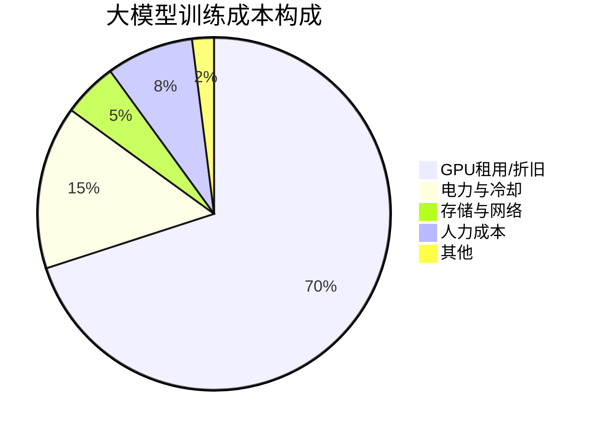

### 详细成本计算

#### 预训练成本估算

**公式**：

$$
\text{总成本} = \text{GPU成本} \times \text{数量} \times \text{训练时长} + \text{其他成本}
$$

**具体计算示例**：

**案例1：训练一个7B模型**
```
模型规模：7B参数
训练数据：1T tokens
GPU配置：64 × A100 (80GB)
训练时长：约2周（336小时）

成本估算：
- GPU成本：$2.5/小时/卡（云服务）
- GPU总成本：64 × $2.5 × 336 = $53,760
- 存储成本：10TB数据 × $0.02/GB/月 ≈ $200
- 网络成本：忽略不计
- 人力成本：1人 × 2周 × $5000/周 = $10,000
━━━━━━━━━━━━━━━━━━━━━━━━━━━━━━━
总成本：约 $64,000
```

**案例2：训练一个70B模型**
```
模型规模：70B参数
训练数据：2T tokens
GPU配置：512 × H100 (80GB)
训练时长：约6周（1008小时）

成本估算：
- GPU成本：$4/小时/卡（云服务H100）
- GPU总成本：512 × $4 × 1008 = $2,064,384
- 存储成本：50TB × $0.02/GB/月 × 1.5 ≈ $1,500
- 人力成本：3人 × 6周 × $5000/周 = $90,000
━━━━━━━━━━━━━━━━━━━━━━━━━━━━━━━
总成本：约 $2,160,000 (216万美元)
```

**案例3：微调（LoRA）成本**
```
基础模型：70B参数
微调方法：QLoRA
数据规模：50k样本
GPU配置：1 × A100 (80GB)
训练时长：约12小时

成本估算：
- GPU成本：$2.5/小时
- GPU总成本：1 × $2.5 × 12 = $30
- 数据标注：50k × $0.5 = $25,000
- 人力成本：$2,000
━━━━━━━━━━━━━━━━━━━━━━━━━━━━━━━
总成本：约 $27,030
```

### 成本优化策略

#### 1. 硬件优化
- 使用Spot/Preemptible实例（节省50-70%）
- 混合精度训练（BF16/FP8）
- Flash Attention减少显存

#### 2. 算法优化
- 梯度检查点（Gradient Checkpointing）
- 激活重计算（Activation Recomputation）
- ZeRO优化器（DeepSpeed）

#### 3. 数据优化
- 高质量数据 > 海量数据
- 提前进行数据清洗和去重
- 使用数据缓存和预处理

#### 4. 训练策略
- 从小模型开始验证（消融实验）
- 使用Learning Rate Finder
- 早期终止（Early Stopping）

> **⚠️ 成本陷阱**
>
> - **过度预训练**：收益递减，建议监控validation loss
> - **盲目扩大规模**：先验证小模型效果
> - **忽视数据质量**：垃圾数据浪费计算资源
> - **缺乏监控**：未及时发现训练异常导致浪费

## 训练监控与调试

<div align="center">
  
  <figcaption>图：健康的训练loss曲线（平滑下降，无spike）（来源：LLaMA 论文 Figure 2）</figcaption>
</div>

### 关键监控指标

#### 1. 损失函数（Loss）

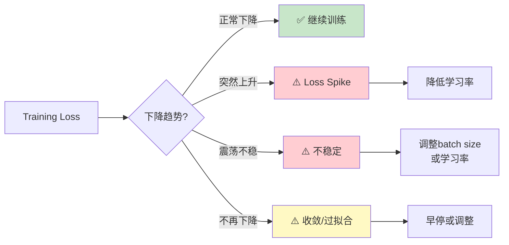

**正常Loss曲线特征**：
- 稳定下降，无剧烈波动
- 预训练loss：通常从8-10降至2-3
- Training loss < Validation loss（轻微过拟合正常）

**异常Loss模式**：

| 异常现象 | 可能原因 | 解决方案 |
|---------|---------|---------|
| **Loss Spike** | 坏数据、学习率过大、数值不稳定 | 回退checkpoint，降低LR，检查数据 |
| **Loss不下降** | 学习率过小、模型容量不足 | 增大LR，检查模型架构 |
| **Loss震荡** | Batch size过小、LR过大 | 增大batch或降低LR |
| **Loss=NaN** | 梯度爆炸、数值溢出 | 梯度裁剪、混合精度、检查数据 |

#### 2. 梯度相关指标

**监控指标**：
- **梯度范数**（Gradient Norm）：应在0.1-10之间
- **梯度裁剪比例**：<5%表示健康
- **参数更新比例**：更新量应为参数值的0.1-1%

```python
def monitor_gradients(model):
    """计算梯度的L2范数，用于监控训练稳定性"""
    total_norm = 0
    for p in model.parameters():
        if p.grad is not None:
            param_norm = p.grad.data.norm(2)
            total_norm += param_norm.item() ** 2
    return total_norm ** 0.5

# 每100步记录一次梯度范数
if step % 100 == 0:
    grad_norm = monitor_gradients(model)
    logger.log({"gradient_norm": grad_norm})
    # 健康范围：0.1-10，超过100需要警惕
```

#### 3. 学习率监控

```python
# 记录当前学习率（追踪调度器是否正确工作）
current_lr = optimizer.param_groups[0]['lr']
logger.log({"learning_rate": current_lr})
# 期望曲线：Warmup↗ → Stable— → Decay↘
```

#### 4. 性能指标

- **吞吐量**（Tokens/second）：衡量训练速度
- **GPU利用率**：应保持在80-95%
- **显存占用**：避免OOM，保留10-15%缓冲
- **通信时间占比**：<20%为佳

### 常见问题诊断与解决

#### 问题1：Out of Memory (OOM)

**症状**：`CUDA out of memory` 错误

**解决方案** (按效果排序，逐步尝试)：
```python
# 方案1: 启用梯度检查点（节省50-80%激活值显存）
model.gradient_checkpointing_enable()

# 方案2: 减小batch size + 梯度累积（保持等效batch size）
per_device_batch_size = 1
gradient_accumulation_steps = 32

# 方案3: CPU卸载优化器状态（节省Adam的8字节/参数）
from deepspeed.ops.adam import DeepSpeedCPUAdam
optimizer = DeepSpeedCPUAdam(model.parameters())

# 方案4: ZeRO-3全参数分片（最强，但训练速度会降低）
deepspeed_config = {
    "zero_optimization": {
        "stage": 3,
        "offload_optimizer": {"device": "cpu"},
        "offload_param": {"device": "cpu"}
    }
}
```

#### 问题2：训练速度慢

**诊断步骤**：
```bash
# 1. 检查GPU利用率
nvidia-smi dmon -s u

# 2. 分析性能瓶颈
python -m torch.utils.bottleneck train.py

# 3. 使用profiler
python -m torch.profiler train.py
```

**常见瓶颈及解决**：
- **数据加载慢**：增加`num_workers`，使用预处理
- **通信慢**：检查网络，使用NCCL优化
- **计算慢**：检查Flash Attention是否启用

#### 问题3：Loss Spike

**应对流程**：
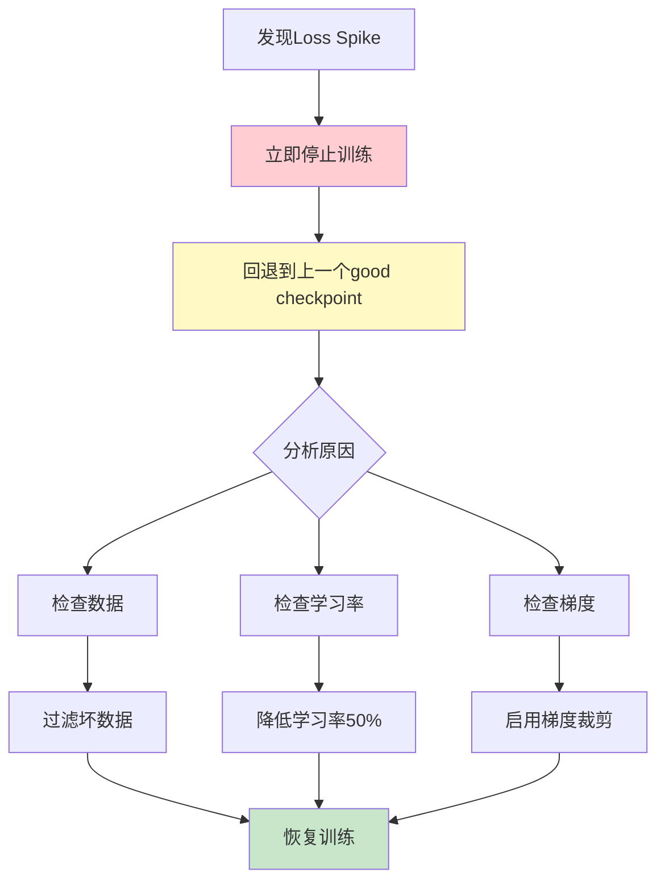

**预防措施**：
```python
# 技巧1: 梯度裁剪（防止梯度爆炸）
torch.nn.utils.clip_grad_norm_(model.parameters(), max_norm=1.0)

# 技巧2: WSD学习率调度（Warmup-Stable-Decay，比纯Cosine更稳定）
# 在peak LR保持一段时间，而非立即衰减

# 技巧3: Loss Spike自动应对机制
if current_loss > moving_avg_loss * 1.5:  # loss突增50%
    print(f"⚠️ Loss spike detected: {current_loss:.4f}")
    for param_group in optimizer.param_groups:
        param_group['lr'] *= 0.5  # 自动降低学习率
    # 可选：自动回退到上一个checkpoint
```

### Checkpoint管理策略

#### 保存策略

```python
# Checkpoint保存配置（平衡安全性和存储成本）
checkpoint_config = {
    "save_interval": 1000,           # 每1000步保存（约1-2小时）
    "save_total_limit": 5,           # 保留最近5个（防止磁盘爆满）
    "save_on_each_node": False,      # 只在主节点保存
    "save_optimizer_state": True,    # 必须保存，否则无法恢复
}

# 额外保存最佳模型（按validation loss）
if current_loss < best_loss:
    save_checkpoint(model, "best_model.pt")
    best_loss = current_loss
```

#### 恢复训练

```python
# 从checkpoint恢复
def resume_training(checkpoint_path):
    checkpoint = torch.load(checkpoint_path)

    model.load_state_dict(checkpoint['model_state_dict'])
    optimizer.load_state_dict(checkpoint['optimizer_state_dict'])

    start_step = checkpoint['step']
    start_epoch = checkpoint['epoch']

    # 恢复学习率调度器
    scheduler.load_state_dict(checkpoint['scheduler_state_dict'])

    # 恢复随机数种子
    torch.manual_seed(checkpoint['random_seed'])

    return start_step, start_epoch
```

> **💡 最佳实践**
>
> - 在训练开始前进行**小规模试运行**（100-1000步）
> - 设置**自动化监控告警**（Loss异常、GPU故障等）
> - 保留**多个历史checkpoint**，不要只保留最新的
> - 定期**手动检查**训练日志和可视化图表

---
# 常见问题
————FAQ

本章汇总大模型训练中**最常遇到的问题及解答**，帮助快速解决实践中的困惑。

> 💡 **使用技巧**：善用 Ctrl+F 搜索关键词快速定位问题

## 🏗️ 预训练相关

### Q1: 需要多少数据才能训练一个有用的模型？

**A:** 取决于模型规模和目标：

- **小模型（1-3B）**：
  - 最少：10-50B tokens可得到基本能力
  - 推荐：100-300B tokens获得较好效果
  - 例如：Phi-1使用7B高质量tokens就很强

- **中型模型（7-13B）**：
  - 推荐：500B-1T tokens
  - LLaMA-1 7B使用1T tokens

- **大型模型（70B+）**：
  - 推荐：1.5-2T tokens
  - LLaMA-2 70B使用2T tokens

**💎 关键洞察**：**质量 > 数量**。Phi系列证明了高质量小数据可以打败低质量大数据（7B tokens训出1.3B模型，性能媲美13B）。

---

### Q2: 如何判断预训练是否收敛？

**A:** 观察以下指标：

1. **Training Loss**：
   - 不再明显下降（变化<0.01/1000步）
   - 典型收敛值：2.0-3.0（取决于数据）

2. **Validation Loss**：
   - 与training loss趋势一致
   - 如果validation loss上升但training loss下降 → 过拟合

3. **下游任务性能**：
   - 在基准测试上的表现不再提升
   - 这是最终判断标准

4. **训练步数经验值**：
   - 7B模型：100-200k步
   - 70B模型：50-100k步
   - 规模越大，所需步数越少

**建议**：预训练通常**不追求完全收敛**，因为成本极高且收益递减。在loss曲线趋缓后即可停止。

---

### Q3: 出现Loss Spike怎么办？

**A:** Loss突然上升的应对流程：

**立即行动**：
```
1. 停止训练
2. 回退到spike前的checkpoint（通常回退2-3个checkpoint）
3. 分析spike原因
```

**常见原因及解决**：

| 原因 | 症状 | 解决方案 |
|------|------|----------|
| **坏数据** | 单次大幅上升 | 跳过该batch，增强数据过滤 |
| **学习率过大** | 逐步上升 | 降低LR至原来的50% |
| **数值不稳定** | 随机出现 | 启用BF16，增加梯度裁剪 |
| **梯度爆炸** | 伴随grad norm飙升 | 降低LR，启用gradient clipping |

<div align="center">
  
  <figcaption>图：Loss Spike现象与恢复策略示意图（来源：OPT 论文 Figure 3）</figcaption>
</div>

**Loss Spike预防代码**：
```python
# 策略1: 自动检测与回退到安全checkpoint
if loss > moving_average * 2.0:  # loss突增2倍，危险！
    print("⚠️ Loss spike! Rolling back to previous checkpoint...")
    load_checkpoint(previous_good_checkpoint)
    learning_rate *= 0.5  # 降低学习率再试

# 策略2: 梯度裁剪（限制单步更新幅度）
torch.nn.utils.clip_grad_norm_(model.parameters(), max_norm=1.0)

# 策略3: 更稳定的Adam配置（beta2=0.95比0.999更稳定）
optimizer = AdamW(lr=1e-4, betas=(0.9, 0.95), eps=1e-8)
```

---

### Q4: 预训练可以超过1个epoch吗？

**A:** **不推荐**，原因如下：

1. **记忆效应**：模型会记住训练数据，降低泛化能力
2. **收益递减**：第2个epoch的性能提升远小于成本
3. **行业惯例**：主流大模型（GPT-3、LLaMA等）都是<1 epoch

**例外情况**：
- 数据量极小（<10B tokens）时可以多epoch
- 领域专用模型（如医疗、法律）可以在少量高质量数据上多次训练
- 但即使如此，也很少超过3-5 epochs

**替代方案**：如果数据有限，优先考虑：
- 提升数据质量和多样性
- 增加模型容量
- 采用更好的数据配比策略

---

## 🎨 监督微调相关
————SFT

### Q5: LoRA和全参数微调如何选择？

**A:** 根据场景选择：

**全参数微调**（Full Fine-Tuning）：
- ✅ **适用场景**：
  - 有充足GPU资源
  - 需要最佳性能
  - 任务与预训练差异大
- ❌ **劣势**：
  - 显存需求大（需存储完整梯度和优化器状态）
  - 训练速度慢
  - 每个任务需要完整模型副本

**LoRA微调**：
- ✅ **适用场景**：
  - GPU资源有限
  - 需要训练多个任务adapter
  - 快速实验和迭代
- ❌ **劣势**：
  - 性能略低于全参数（通常差距<2%）
  - 需要调整额外超参数（r, alpha）

**性能对比**：
```
任务类型          全参数微调    LoRA (r=16)    差距
━━━━━━━━━━━━━━━━━━━━━━━━━━━━━━━━━━━━━━━
指令遵循          96.5%        95.8%         -0.7%
对话质量          92.3%        91.5%         -0.8%
代码生成          88.7%        87.2%         -1.5%
数学推理          76.4%        74.9%         -1.5%
```

**推荐策略**：
- 资源受限或快速实验 → **LoRA**
- 生产环境追求极致性能 → **全参数微调**
- 折中方案 → **QLoRA**（量化+LoRA）

---

### Q6: 需要多少SFT数据？

**A:** 远少于预训练，质量比数量重要：

**数据量指南**：

| 数据规模 | 效果 | 适用场景 |
|---------|------|----------|
| **1k-5k** | 基本遵循指令 | 快速原型、特定任务 |
| **10k-30k** | 良好对话能力 | 通用助手 |
| **50k-100k** | 优秀多任务能力 | 生产级模型 |
| **100k+** | 边际收益递减 | 追求极致性能 |

**真实案例**：
- **Alpaca**：52k合成数据，达到不错效果
- **Vicuna**：70k ShareGPT对话，接近ChatGPT
- **LLaMA-2-Chat**：27.5k数据，效果优异

**关键洞察**：
> 1000条高质量、多样化的数据 > 10000条低质量重复数据

**数据质量标准**：
- ✅ 指令清晰明确
- ✅ 回答准确、有帮助
- ✅ 覆盖多种任务类型
- ✅ 格式统一规范
- ❌ 避免模板化回答
- ❌ 避免错误信息
- ❌ 避免有害内容

---

### Q7: 如何避免微调时的过拟合？

**A:** 多种策略组合使用：

**1. 控制训练轮数**
```python
# 通常1-3个epoch足够
num_train_epochs = 2  # 推荐起点

# 监控validation loss，早停
early_stopping_patience = 3
```

**2. 使用较小学习率**
```python
# SFT学习率应远小于预训练
learning_rate = 2e-5  # 而不是3e-4
```

**3. 数据增强**
```python
# 释义改写
# 指令变化
# 回答风格多样化
```

**4. Dropout和正则化**
```python
model_config = {
    "dropout": 0.1,
    "attention_dropout": 0.1,
    "weight_decay": 0.01
}
```

**5. 混合训练数据**
```python
# 加入10-20%预训练数据
mixed_dataset = {
    "sft_data": 0.8,
    "pretrain_data": 0.2  # 防止灾难性遗忘
}
```

**过拟合的症状**：
- Training loss持续下降，但validation loss上升
- 在训练集上表现完美，但测试集表现差
- 模型开始"背诵"训练样本

**诊断命令**：
```python
# 定期评估
if step % eval_steps == 0:
    train_loss = evaluate(model, train_dataset)
    val_loss = evaluate(model, val_dataset)

    if val_loss > best_val_loss:
        patience_counter += 1
        if patience_counter >= early_stopping_patience:
            print("Early stopping triggered!")
            break
```

---

## 🎯 对齐相关
————RLHF/DPO

### Q8: RLHF和DPO如何选择？

**A:** DPO通常是更好的选择：

**DPO优势**（推荐）：
- ✅ 训练更稳定（无RL的探索-利用困境）
- ✅ 实现更简单（不需要PPO、Reward Model）
- ✅ 计算效率高（只需2个模型 vs 4个模型）
- ✅ 效果相当或更好
- ✅ 超参数更鲁棒

**RLHF优势**：
- ✅ 理论基础深厚
- ✅ 可以在线收集新数据
- ✅ 适合复杂奖励信号

**性能对比**：
```
评估维度         RLHF    DPO     备注
━━━━━━━━━━━━━━━━━━━━━━━━━━━━━━━━━━━━━
训练稳定性       ⭐⭐⭐   ⭐⭐⭐⭐⭐  DPO明显更稳定
实现复杂度       ⭐⭐     ⭐⭐⭐⭐⭐  DPO简单很多
计算效率         ⭐⭐     ⭐⭐⭐⭐⭐  DPO快2-3倍
最终效果         ⭐⭐⭐⭐  ⭐⭐⭐⭐   效果相当
```

**推荐策略**：
- **首选DPO**：适合绝大多数场景
- **考虑RLHF**：需要在线学习或复杂奖励函数
- **新方法**：ORPO、SimPO等DPO变体

---

### Q9: 偏好数据如何构建？

**A:** 三种主要方法：

**方法1：人工标注**（最高质量）
```
流程：
1. 采样prompts（从真实用户或构造）
2. 生成多个回答（通常4-8个）
3. 人工排序或对比标注
4. 构建偏好对：(prompt, chosen, rejected)

成本：$0.5-2/样本
规模：10k-50k偏好对
质量：⭐⭐⭐⭐⭐
```

**方法2：AI标注**（性价比极高，推荐）
```python
# RLAIF: 使用GPT-4等强模型作为"评判者"
prompt = f"""
Given the question: {question}

Response A: {response_a}
Response B: {response_b}

Which response is better? Consider helpfulness, accuracy, and safety.
Answer: A or B
"""

# 成本优势明显
成本：$0.01-0.05/样本（vs 人工的$5-20/样本）
规模：轻松扩展到100k+
质量：⭐⭐⭐⭐（约90%接近人类标注）
```

**方法3：合成构建**（快速启动）
```python
# 从已有SFT数据自动构造偏好对
chosen = high_quality_response
rejected = synthesize_negative(chosen)  # 负样本来源：
    # - 截断回答（模拟不完整）
    # - 注入事实错误
    # - 违反指令要求
    # - 添加有害内容

# 零成本快速启动
成本：几乎免费（无需API或人工）
规模：无限（自动生成）
质量：⭐⭐⭐（有效，但不如真实对比）
```

**混合策略**（推荐）：
```
核心数据(20%)：人工标注，确保高质量
扩展数据(60%)：AI标注，快速扩展规模
补充数据(20%)：合成数据，增加多样性
```

---

## ⚙️ 工程实践相关

### Q10: 如何选择合适的并行策略？

**A:** 遵循决策树：

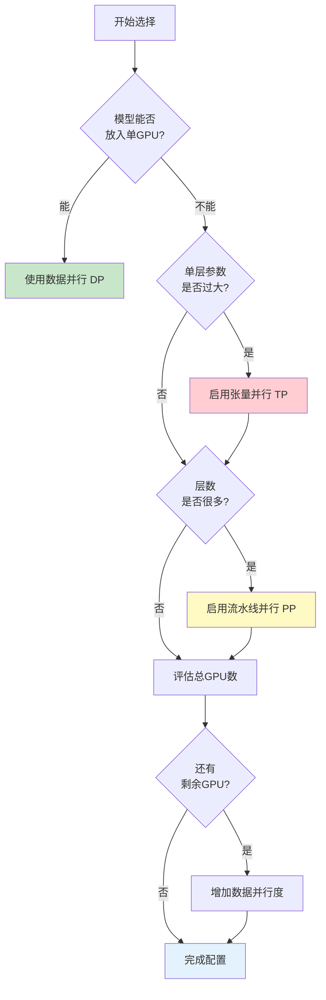

**实用配置表**：

| GPU总数 | 模型规模 | 推荐配置 | 说明 |
|---------|---------|---------|------|
| 8 | 7B | DP=8 | 纯数据并行 |
| 16 | 13B | TP=2, DP=8 | 轻量TP |
| 64 | 30B | TP=4, PP=2, DP=8 | 2D并行 |
| 128 | 70B | TP=8, PP=4, DP=4 | 3D并行 |
| 512 | 175B | TP=8, PP=16, DP=4 | 深度3D并行 |

**配置验证公式**：
```python
# 关键公式：总GPU数 = 数据并行 × 张量并行 × 流水线并行
total_gpus = DP * TP * PP

# 示例：128张GPU跑70B模型
DP = 4   # 4组独立训练（提升吞吐）
TP = 8   # 每层切成8份（单层放不下）
PP = 4   # 分成4段流水线（层太多）
assert 4 * 8 * 4 == 128  # ✓ 刚好用满
```

---

### Q11: 显存不够怎么办？

**A:** 多层优化策略：

**Level 1：基础优化** 💡 （零副作用，必开）
```python
# 技巧1: 混合精度（FP32→FP16/BF16，直接减半）
use_fp16 = True  # 或 bf16（大模型更推荐）

# 技巧2: 梯度检查点（时间换空间，重算激活值）
model.gradient_checkpointing_enable()

# 技巧3: Flash Attention（IO优化，又快又省）
use_flash_attention = True
```
💾 节省显存：~30-40%
⚡ 性能影响：几乎无（Flash甚至更快）

**Level 2：中级优化** ⚙️ （轻微性能trade-off）
```python
# 技巧4: 减小batch + 梯度累积（等效batch不变）
per_device_batch_size = 1      # 从4降到1
gradient_accumulation_steps = 32  # 累积32步更新一次

# 技巧5: ZeRO-2（分片优化器状态，省8字节/参数）
zero_stage = 2  # 优化器状态分布到多GPU
```
💾 节省显存：额外30-40%
⚡ 性能影响：~10-20%慢（通信开销）

**Level 3：激进优化** ⚡ （显著性能损失）
```python
# 技巧6: ZeRO-3全分片 + CPU卸载（参数也分片）
deepspeed_config = {
    "zero_optimization": {
        "stage": 3,                              # 分片参数、梯度、优化器
        "offload_optimizer": {"device": "cpu"},  # 优化器→CPU
        "offload_param": {"device": "cpu"}       # 参数→CPU
    }
}

# 技巧7: 激活值也卸载到CPU（终极省显存）
"activation_checkpointing": {
    "cpu_checkpointing": True
}
```
💾 节省显存：额外40-50%（可训练超大模型）
⚡ 性能影响：~2-5x慢（CPU-GPU传输瓶颈）

**Level 4：终极方案** 🔧 （改变训练方式）
```python
# 技巧8: 量化训练（QLoRA: 4-bit量化）
load_in_4bit = True  # 7B模型从14GB→3.5GB

# 技巧9: 降低模型规模（最直接）
model_size = "13B"  # 从70B→13B，显存降5倍
```
💾 节省显存：量化4x，降模型规模按比例
⚡ 性能影响：量化略降（<2%），小模型能力降低

**显存占用分解**：
```
总显存 = 模型参数 + 优化器状态 + 梯度 + 激活值

示例（70B模型，BF16）：
- 模型参数：70B × 2字节 = 140GB
- 优化器（Adam）：70B × 8字节 = 560GB
- 梯度：70B × 2字节 = 140GB
- 激活值：取决于batch size和序列长度
━━━━━━━━━━━━━━━━━━━━━━━━━━━━━━━━
总计：~840GB（未优化）

应用ZeRO-3 + Offload：
- 每个GPU只需：840GB / GPU数量
- 8×A100 (80GB)：每卡需105GB → 使用offload可行
```

---

### Q12: 训练中断如何恢复？

**A:** 完整的恢复流程：

**1. 自动恢复机制**
```python
def save_checkpoint(model, optimizer, scheduler, step, epoch):
    checkpoint = {
        'step': step,
        'epoch': epoch,
        'model_state_dict': model.state_dict(),
        'optimizer_state_dict': optimizer.state_dict(),
        'scheduler_state_dict': scheduler.state_dict(),
        'random_seed': torch.initial_seed(),
        'numpy_random_state': np.random.get_state(),
        'python_random_state': random.getstate(),
    }
    torch.save(checkpoint, f'checkpoint_step_{step}.pt')

def load_checkpoint(path, model, optimizer, scheduler):
    checkpoint = torch.load(path)

    model.load_state_dict(checkpoint['model_state_dict'])
    optimizer.load_state_dict(checkpoint['optimizer_state_dict'])
    scheduler.load_state_dict(checkpoint['scheduler_state_dict'])

    # 恢复随机数状态（重要！）
    torch.manual_seed(checkpoint['random_seed'])
    np.random.set_state(checkpoint['numpy_random_state'])
    random.setstate(checkpoint['python_random_state'])

    return checkpoint['step'], checkpoint['epoch']
```

**2. 训练脚本支持恢复**
```python
# 启动参数
--resume_from_checkpoint ./checkpoint_step_50000.pt

# 训练循环
if args.resume_from_checkpoint:
    start_step, start_epoch = load_checkpoint(...)
    print(f"Resuming from step {start_step}")
else:
    start_step, start_epoch = 0, 0

for step in range(start_step, total_steps):
    # 训练逻辑
    ...
```

**3. 验证恢复正确性**
```python
# 恢复后，loss曲线应该平滑衔接
# 不应该有突变或跳跃

# 检查清单：
✓ Loss值连续
✓ 学习率正确
✓ 随机数种子恢复（数据顺序一致）
✓ Step计数正确
```

**4. DeepSpeed恢复**
```python
# DeepSpeed自动处理恢复
model_engine, optimizer, _, _ = deepspeed.initialize(
    model=model,
    config=ds_config
)

# 恢复
_, client_sd = model_engine.load_checkpoint(checkpoint_dir)
step = client_sd['step']
```

> **⚠️ 注意事项**
>
> - 定期保存checkpoint（每1000-5000步）
> - 保留多个历史checkpoint（至少最近3-5个）
> - 恢复后先验证几步，确保loss正常
> - 记录每个checkpoint的验证指标

---

### Q13: 如何判断训练是否正常？

**A:** 多维度监控清单：

**✅ 健康训练的特征**：

1. **Loss曲线**
   - ✓ 平稳下降，无大幅波动
   - ✓ Training loss < Validation loss（轻微）
   - ✓ 下降速度符合预期

2. **梯度指标**
   - ✓ Gradient norm在0.1-10范围
   - ✓ 梯度裁剪率<5%
   - ✓ 无NaN或Inf

3. **性能指标**
   - ✓ GPU利用率>80%
   - ✓ 吞吐量稳定
   - ✓ 通信时间<20%

4. **学习率**
   - ✓ 按调度正常变化
   - ✓ Warmup期平稳上升

**❌ 异常训练的症状**：

| 症状 | 可能原因 | 检查项 |
|------|---------|--------|
| Loss不下降 | 学习率过小、数据问题 | 检查LR、查看数据样本 |
| Loss震荡 | 学习率过大、batch小 | 降低LR或增大batch |
| Loss=NaN | 梯度爆炸、数值溢出 | 启用梯度裁剪和混合精度 |
| GPU利用率低 | 数据加载慢、通信瓶颈 | 增加workers、检查网络 |

**实战监控代码（W&B）**：
```python
import wandb

# 记录核心训练指标（每步记录）
wandb.log({
    "train/loss": loss,                     # 📉 最重要，应持续下降
    "train/grad_norm": grad_norm,           # 📊 监控训练稳定性
    "train/learning_rate": lr,              # 📈 验证调度器
    "system/gpu_utilization": gpu_util,     # ⚡ 应保持80-95%
    "system/tokens_per_second": throughput, # 🚀 吞吐量指标
    "step": step
})
```

**智能告警系统**（避免半夜被叫醒）：
```python
# 设置告警阈值（根据实际情况调整）
if loss > moving_avg * 1.5:
    send_alert("🚨 Loss spike! Current: {loss:.4f}, Avg: {moving_avg:.4f}")

if gpu_util < 50:
    send_alert("⚠️ GPU利用率低! 当前: {gpu_util}%（可能数据IO瓶颈）")

if grad_norm > 100:
    send_alert("💥 梯度爆炸! Norm={grad_norm:.2f}（正常<10）")
```

---

---


# 最新进展

本章节收录大模型训练领域的最新论文和创新技术，按时间倒序排列，持续更新。

## 2024年

### [论文标题]
- **机构/作者**：
- **发表会议/期刊**：
- **论文链接**：
- **代码链接**：
- **核心创新**：
- **主要贡献**：
- **实验结果**：

---

## 2023年

### [论文标题]
- **机构/作者**：
- **发表会议/期刊**：
- **论文链接**：
- **代码链接**：
- **核心创新**：
- **主要贡献**：
- **实验结果**：

---

