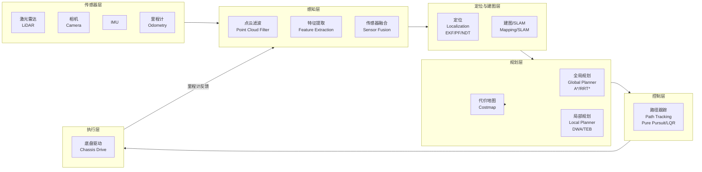
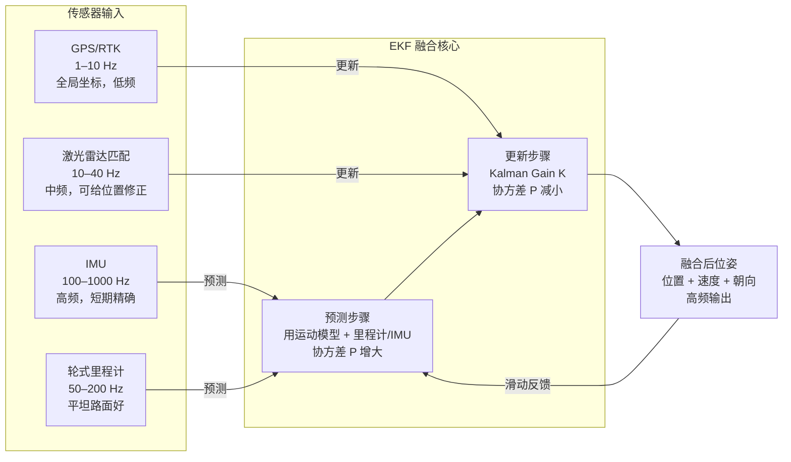
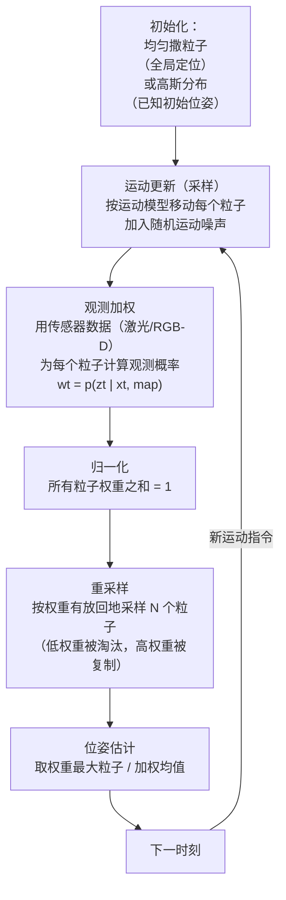
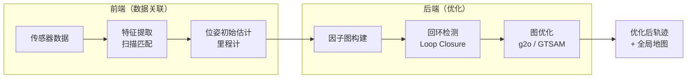
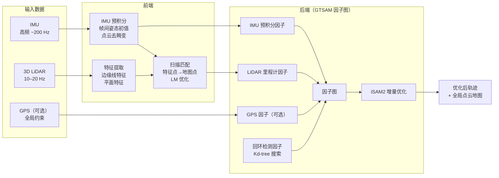
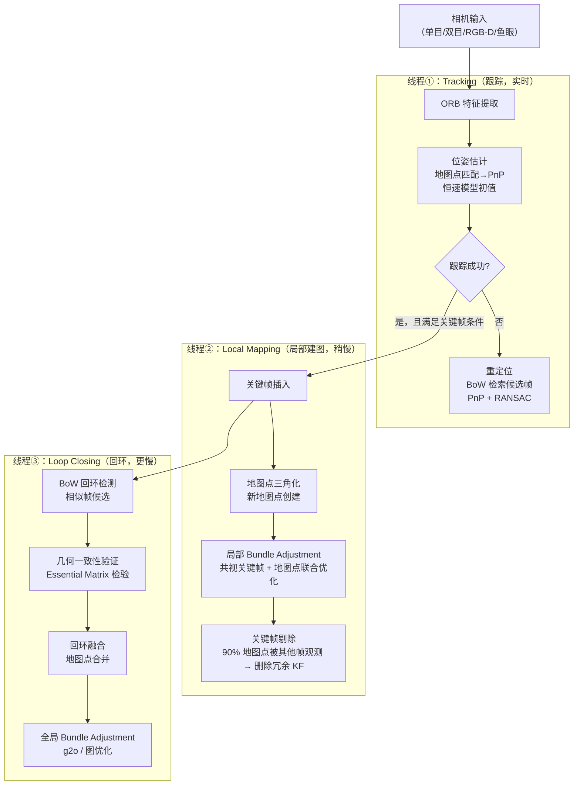
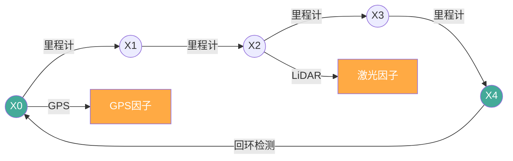
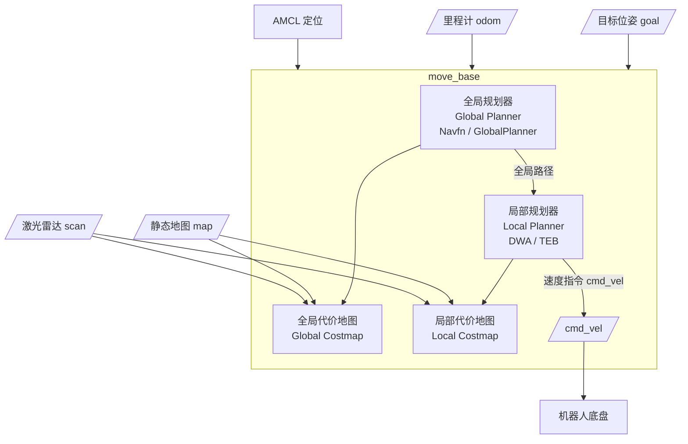
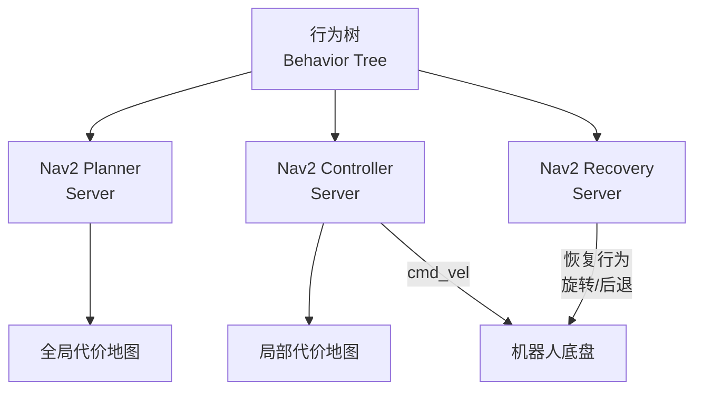

# 1. 引言

## 1.1 为什么需要自主导航？

想象一个仓库机器人——它需要在货架之间穿梭，精准取货，同时避开突然出现的叉车和行人。或者一辆无人驾驶汽车，需要在复杂交通中安全行驶数百公里。这些场景的背后，都依赖一套精心设计的**自主导航系统（Autonomous Navigation System）**。

自主导航解决的核心问题，可以简单概括为三个问题：

1. **我在哪？**（Localization，定位）
2. **周围有什么？**（Perception + Mapping，感知与建图）
3. **我该怎么走？**（Planning + Control，规划与控制）

这三个问题环环相扣，共同构成了机器人导航的完整闭环。

## 1.2 导航算法栈概览

一个完整的机器人导航系统，数据从传感器出发，经过层层处理，最终驱动执行器运动。下图展示了导航算法栈的整体数据流：

  
  <figcaption>图：传统机器人导航：基于传感器采集的数据进行建图与定位（SLAM），并在构建的环境地图中自动导航（规划+控制）</figcaption>

## 1.3 传统导航 vs. 学习型导航

在深度学习兴起之前，机器人导航主要依赖**模块化、可解释的传统算法栈**。每个模块职责清晰，可以独立调试和优化。本文将系统介绍这套算法栈的核心组件。

| 维度 | 传统导航 | 端到端深度学习导航 |
|------|---------|-----------------|
| 可解释性 | ✅ 强，每个模块可分析 | ❌ 弱，黑盒决策 |
| 泛化性 | ❌ 弱，依赖先验地图 | ✅ 较强，可迁移到新场景 |
| 语言理解 | ❌ 不支持自然语言指令 | ✅ 支持（VLN/VLA） |
| 调试难度 | ✅ 低，模块独立调试 | ❌ 高，端到端难追溯 |
| 计算需求 | ✅ 低，可在嵌入式运行 | ❌ 高，需要GPU |
| 安全可靠性 | ✅ 行为可预测 | ❌ 分布外泛化存在风险 |
| 动态障碍处理 | 局部规划模块可处理 | 依赖训练数据覆盖 |

> **本文聚焦传统算法栈**。如需了解端到端学习导航（VLN/VLA），请参考本站 [VLN综述](/VLN-Survey/) 系列。

---

# 2. 感知（Perception）

感知是导航系统的"眼睛"。传感器采集原始数据，经过处理后为定位、建图和规划提供可靠输入。

## 2.1 传感器类型与特性对比

| 传感器 | 输出数据 | 精度 | 抗光照 | 成本 | 典型频率 | 典型应用 |
|--------|---------|------|--------|------|---------|---------|
| **2D 激光雷达** | 极坐标点集 | 高（cm级） | ✅ 强 | 中 | 10–40 Hz | 室内移动机器人 |
| **3D 激光雷达** | 点云（xyz+强度） | 高 | ✅ 强 | 高 | 10–20 Hz | 自动驾驶 |
| **RGB-D 相机** | 彩色图+深度图 | 中（cm–dm级） | ❌ 弱（室外） | 低 | 30–90 Hz | 室内近距离 |
| **单目相机** | RGB 图像 | 低（需标定） | ❌ 弱 | 极低 | 30–120 Hz | 视觉里程计 |
| **双目相机** | 左右 RGB 图 | 中 | ❌ 弱 | 低–中 | 30–60 Hz | 视觉 SLAM |
| **IMU** | 角速度+线加速度 | 短期高 | ✅ 强 | 极低 | 100–1000 Hz | 姿态估计、融合 |
| **轮式里程计** | 编码器脉冲 | 中（易累积误差） | ✅ 强 | 极低 | 50–200 Hz | 短期位移估计 |
| **GPS/RTK** | 经纬度坐标 | 普通1–5m，RTK cm级 | ✅ 强 | 中–高 | 1–10 Hz | 室外全局定位 |

### 激光雷达（LiDAR）

激光雷达通过**发射激光脉冲并测量返回时间**（Time of Flight, ToF）来计算距离。它能在任意光照条件下工作，输出精确的空间点云（Point Cloud）。

**2D LiDAR**（如 Hokuyo UTM-30LX、SICK TiM）每次扫描输出一个平面上的极坐标点集，适合室内平坦环境。**3D LiDAR**（如 Velodyne VLP-16、Ouster OS1）通过多线旋转扫描，输出完整的三维点云，是自动驾驶感知的核心传感器。

### 深度相机（Depth Camera / RGB-D）

RGB-D 相机（如 Intel RealSense D435、Microsoft Kinect）通过**结构光**或**飞行时间（ToF）**原理，同时获取彩色图像和每个像素的深度值。主要局限在于：室外强光会干扰结构光，且探测距离有限（通常 0.3–6m）。

### IMU 与轮式里程计

**IMU（惯性测量单元）** 集成了陀螺仪（测角速度）和加速度计（测线加速度），输出频率高（100–1000 Hz），但误差会随时间**积分累积**（漂移）。

**轮式里程计** 通过车轮编码器计算位移，在平坦路面上精度良好，但在打滑或不平整路面上会产生**累积误差**。

两者的共同特点：短期精度高，长期使用需要与其他传感器融合校正。

## 2.2 感知数据处理

### 点云滤波

原始点云通常包含噪声和无关点，需要预处理：

**体素滤波（Voxel Grid Filter）**：将点云空间划分为规则的小立方体（体素），每个体素内的点用质心替代。这样既保留了点云的整体形状，又大幅降低了点云密度，提升后续处理速度。

  
  <figcaption>图：体素滤波效果——原始稠密点云（左）经体素降采样后得到均匀稀疏点云（右）</figcaption>

**半径滤波（Radius Outlier Removal）**：对每个点，检查其半径 r 范围内的邻近点数量。若邻近点数不足阈值，则认为该点是噪声并删除。适合去除孤立噪点。

  
  <figcaption>图：半径滤波效果——邻域点数不足的孤立点（红）被识别为噪声并删除</figcaption>

**直通滤波（Pass Through Filter）**：直接截取感兴趣区域的点云，例如只保留地面以上 0.1m 到 2m 高度范围内的点。

### 矩形拟合检测（Rectangle Fitting Detection）

基于激光雷达点云进行**障碍物框估计**：将聚类后的障碍物点云拟合为最小外接矩形（Minimum Bounding Rectangle），从而估计障碍物的长宽、朝向和中心位置。这是自动驾驶中障碍物感知的经典方法，常用于车辆检测。

  
  
  <figcaption>图：点云矩形拟合——聚类点云（左）拟合为最小外接矩形（右动图）</figcaption>

### 特征提取

在视觉 SLAM 和相机标定中，特征提取至关重要：

- **角点特征**（Corner）：如 **FAST**（速度极快）、**Harris**（经典）
- **描述子**（Descriptor）：如 **ORB**（旋转不变 + 二进制，速度快）、**SIFT**（尺度/旋转不变，精度高但慢）
- **线特征**（Line）：用于结构化室内环境（走廊、墙壁）

  
  <figcaption>图：角点特征检测——图像中的角点（交叉点）是视觉 SLAM 的关键匹配元素</figcaption>

## 2.3 传感器外参标定

当系统使用多个传感器时，必须知道它们之间的**相对位姿关系**（外参，Extrinsic Parameters），才能将不同传感器的数据转换到同一坐标系。

**基于 UKF 的外参估计**：利用**无迹卡尔曼滤波（UKF）** 对外参进行在线估计。与标定板离线标定相比，这种方法可以在机器人运动过程中动态估计并修正外参，适合传感器安装位置可能微小变化的场景。

  
  <figcaption>图：传感器在线自动标定过程——机器人运动中动态估计并修正传感器间外参</figcaption>

### 传感器时间同步

多传感器系统除了空间标定（外参）之外，**时间同步**同样至关重要。如果不同传感器的数据时间戳未对齐，会导致数据"不同步"——例如用 0.1 秒前的 IMU 姿态去处理当前帧激光点云，在机器人高速运动时误差不可忽略。

**硬件触发同步（Hardware Trigger）**：通过电路信号使所有传感器在同一时刻采样。例如 GPS 的 PPS（每秒脉冲）信号作为主时钟，触发相机快门和激光雷达扫描。这是精度最高的方法，时间误差可低至微秒级，但需要专用硬件电路支持。

**软件时间戳插值（Software Interpolation）**：当硬件触发不可行时，通过高精度系统时钟（如 NTP/PTP）为每个传感器数据包打时间戳，然后在软件层按时间戳对齐数据。常见做法是 IMU 数据按线性插值对齐至最近的激光帧时刻。

**时间戳不对齐对 SLAM 的影响**：激光雷达在一帧扫描期间（约 100 ms）机器人持续运动，若不使用 IMU 时间戳做**运动补偿（Motion Distortion Correction）**，扫描点云会出现**畸变（Distortion）**——前半帧和后半帧点云错位，严重影响扫描匹配精度。LIO-SAM 等紧耦合方案正是通过 IMU 预积分解决这一问题。

## 2.4 传感器融合

单一传感器往往存在局限，融合多个传感器可以取长补短。

**EKF（扩展卡尔曼滤波）融合**：将不同频率、不同误差特性的传感器数据（如 IMU 高频姿态 + GPS 低频位置 + 里程计位移）统一融合。EKF 通过**预测步骤**（用运动模型预测状态）和**更新步骤**（用传感器观测修正预测）交替进行。

**UKF（无迹卡尔曼滤波）融合**：EKF 用一阶线性化近似非线性系统，而 UKF 用**Sigma 点采样**更精确地近似非线性变换的均值和协方差，在高非线性场景下精度更高。

**EKF 传感器融合数据流**（以多传感器机器人为例）：

---

# 3. 定位（Localization）

定位解决的是"我在哪"的问题：给定一张地图，机器人需要实时估计自身在地图中的位置和朝向（即**位姿 Pose = 位置 + 朝向**）。

## 3.1 问题定义

定位问题可以分为两类：

- **全局定位（Global Localization）**：机器人不知道初始位置，需要从头确定自身位姿。难度最大，粒子滤波擅长处理这类问题。
- **位姿跟踪（Pose Tracking）**：已知近似初始位姿，在运动过程中持续修正。EKF/UKF 擅长处理这类问题。
- **绑架问题（Kidnapped Robot Problem）**：机器人在运动中被突然移动到陌生位置，需要重新定位。

## 3.2 EKF 定位

**直觉理解**：想象你蒙眼走路，靠步数和转弯角度估计自己的位置（这是"预测"）；每当你摘下眼罩瞥一眼地图上的路标，就用路标位置来修正你的估计（这是"更新"）。EKF（Extended Kalman Filter）做的就是这件事的数学版本。

**状态向量**：$\mathbf{x} = [x, y, \theta]^T$（位置 + 朝向）

**两步走**：

1. **预测步骤**（Predict）：利用运动模型（如里程计数据）预测下一时刻的位姿，同时误差协方差增大（不确定性增加）：

$$\hat{\mathbf{x}}_{t|t-1} = f(\mathbf{x}_{t-1}, \mathbf{u}_t)$$

2. **更新步骤**（Update）：利用传感器观测（如激光雷达看到路标）修正预测，误差协方差减小（不确定性降低）：

$$\mathbf{x}_t = \hat{\mathbf{x}}_{t|t-1} + \mathbf{K}_t (\mathbf{z}_t - h(\hat{\mathbf{x}}_{t|t-1}))$$

其中 $\mathbf{K}_t$ 是**卡尔曼增益**，决定了相信预测还是相信观测。

**卡尔曼增益 K 的直觉理解**：想象你朋友告诉你"你现在在图书馆门口"，但你的步数估计说你在图书馆里面。你该信谁？K 的大小决定了这个权衡：

- **K → 1（相信观测）**：传感器噪声低、预测不确定性大时 → 观测修正权重大
- **K → 0（相信预测）**：传感器噪声高时 → 少修正，主要靠运动模型

$$\mathbf{K}_t = \mathbf{P}_{t|t-1} \mathbf{H}^T (\mathbf{H} \mathbf{P}_{t|t-1} \mathbf{H}^T + \mathbf{R})^{-1}$$

其中 $\mathbf{P}$ 是预测不确定性（越大 → K 越大 → 越信传感器），$\mathbf{R}$ 是传感器噪声（越大 → K 越小 → 越信预测）。下图展示了不确定性椭圆在预测→更新过程中的变化：

  
  <figcaption>图：EKF 不确定性椭圆变化——预测步骤后椭圆增大（不确定性增加），更新步骤后椭圆收缩（传感器修正）</figcaption>

**适用场景**：已知地图、已知初始位置、低非线性系统。计算效率高，适合实时运行。

  
  <figcaption>图：EKF 定位仿真——机器人（蓝色）沿轨迹运动，绿色椭圆为不确定性估计，红色为 EKF 定位结果</figcaption>

## 3.3 UKF 定位

**与 EKF 的区别**：EKF 用泰勒展开对非线性函数做一阶线性化近似，在高非线性系统中误差较大。UKF（Unscented Kalman Filter）则通过精心选取的**Sigma 点集**来近似非线性变换后的概率分布，无需求导，精度更高。

**Sigma 点采样**：从当前均值和协方差中提取 $2n+1$ 个 Sigma 点，通过非线性函数传播后，重新计算均值和协方差。

✅ 比 EKF 精度高，尤其适合运动模型非线性较强的场景
❌ 计算量比 EKF 略大（约为 EKF 的 2–3 倍）

  
  <figcaption>图：EKF vs UKF 对比仿真——高非线性场景下 UKF（右）的位姿估计收敛更准确</figcaption>

## 3.4 粒子滤波定位（Particle Filter）

**直觉理解**：用成千上万个"粒子"（每个粒子代表一个可能的位姿假设）来表示机器人位置的概率分布。每个粒子都根据运动模型移动（加入随机噪声），然后根据传感器观测给每个粒子打分（权重），越接近真实观测的粒子权重越高。最后通过**重采样（Resampling）**淘汰权重低的粒子，复制权重高的粒子。

**AMCL（Adaptive Monte Carlo Localization）**：ROS 中广泛使用的粒子滤波定位包，支持自适应粒子数量（定位收敛后减少粒子节省计算）。

下图展示了 MCL 算法的三个核心阶段：

  
  <figcaption>图：粒子滤波（MCL）三阶段——① 运动更新后粒子扩散，② 观测加权（大粒子=高权重），③ 重采样后粒子集中于真实位置附近</figcaption>

**MCL 算法流程**：

**重采样细节**：朴素随机重采样会引入**粒子多样性损失**（同一粒子被多次复制）。**系统重采样（Systematic Resampling）** 通过在 $[0, 1/N]$ 内取一个随机起点，然后均匀间隔采样 N 次，保证每个区间恰好采样一次，有效避免多样性损失，计算复杂度仍为 $O(N)$。

**AMCL 自适应粒子数（KLD 采样）**：固定粒子数既浪费计算（定位收敛后粒子不需要那么多），又不安全（初始化时粒子太少可能漏掉真实位置）。**KLD 采样** 根据当前粒子集覆盖的状态空间体积，动态计算所需粒子数量：状态空间探索越充分（覆盖的网格越多），需要的粒子数越少。AMCL 中典型范围为 100–5000 个粒子。

✅ 支持**全局定位**（多假设并行，能处理绑架问题）
✅ 对非线性系统友好，不需要线性化
❌ 粒子数量多时计算开销大
❌ 在高维状态空间中效率下降（维度诅咒）

  
  <figcaption>图：粒子滤波定位仿真——初始粒子均匀分布（全局定位），随运动和观测逐步收敛到真实位置</figcaption>

## 3.5 基于扫描匹配的定位

扫描匹配是另一类定位思路：直接将当前激光雷达扫描与参考地图（或上一帧扫描）对齐，求解位姿变换。

### NDT（正态分布变换，Normal Distributions Transform）

**思路**：将参考点云空间划分为规则网格，每个格子内的点用**正态分布**（均值 + 协方差）来表示。当前扫描的点云在这些正态分布中的概率就是匹配得分，通过优化位姿使得匹配概率最大。

✅ 对点云密度变化鲁棒
✅ 计算效率高（尤其是三维场景）
✅ 是自动驾驶定位（HDMap-based Localization）的主流方法之一

  
  <figcaption>图：NDT 匹配原理——参考地图（网格+正态分布）与当前扫描点云对齐示意</figcaption>

### ICP（迭代最近点，Iterative Closest Point）

**思路**：将当前点云与目标点云中最近的点对匹配，计算最小化匹配点对距离的刚体变换（旋转 + 平移），然后迭代重复直到收敛。

✅ 简单直观，精度高（收敛后）
❌ 对初始位姿敏感，容易陷入局部最优
❌ 计算复杂度较高，实时性受点云密度影响
❌ 在重复结构（如走廊）中容易退化

  
  <figcaption>图：ICP 迭代过程——绿色当前帧点云逐步与红色参考点云对齐，每次迭代最近点对距离缩小</figcaption>

## 3.6 定位方法对比汇总

| 方法 | 适用场景 | 全局定位 | 计算开销 | 非线性处理 | ROS 支持 |
|------|---------|---------|---------|-----------|---------|
| **EKF** | 已知初始位姿，低非线性 | ❌ | 低 | 一阶近似 | `robot_localization` |
| **UKF** | 已知初始位姿，中高非线性 | ❌ | 中 | Sigma点近似 | `robot_localization` |
| **粒子滤波/AMCL** | 全局定位，未知初始位姿 | ✅ | 中–高 | 无近似 | `amcl` |
| **NDT** | 自动驾驶，高精地图定位 | 需初始化 | 中 | — | `ndt_cpu` |
| **ICP** | 精细配准，短距离匹配 | ❌ | 中–高 | — | `pcl_ros` |

  
  <figcaption>图：EKF / UKF / 粒子滤波三种定位方法对比仿真——同场景下精度与收敛速度对比</figcaption>

---

# 4. 建图（Mapping & SLAM）

**SLAM（同步定位与建图，Simultaneous Localization and Mapping）** 解决了一个"先有鸡还是先有蛋"的问题：定位需要地图，建图又需要知道位置。SLAM 的目标是在**没有先验地图**的情况下，同时完成定位和建图。

## 4.1 地图表示形式

不同场景需要不同的地图表示：

### 二值占据栅格地图（Binary Occupancy Grid Map）

将环境空间划分为等大小的方格（通常 5–20 cm/格），每格存储一个概率值，表示该格是否被占据（有障碍 = 1，可通行 = 0，未探索 = 0.5）。这是室内机器人导航中最常用的地图格式，ROS `map_server` 直接支持。

  
  
  <figcaption>图：二值占据栅格地图构建过程（左动图）与成品地图（右）——白色=可通行，黑色=障碍，灰色=未探索</figcaption>

### 代价地图（Costmap）

在占据栅格基础上，对障碍物周围区域**膨胀（Inflation）**出一层代价层：离障碍物越近，代价越高。这样路径规划时机器人会自动保持与障碍物的安全距离，无需额外碰撞检查。ROS Navigation Stack 的 `costmap_2d` 支持多层代价地图（静态层 + 障碍物层 + 膨胀层）。

  
  
  <figcaption>图：代价地图构建（左动图）与成品代价地图（右）——蓝色=低代价，红色=高代价（障碍附近）</figcaption>

### 势场地图（Potential Field Map）

将目标点视为"势能最低点"，障碍物视为"斥力源"，整个空间形成一个势能场。机器人沿梯度下降方向运动即可找到路径。直觉上类似于球在斜面上自然滚向最低点。主要缺点：容易陷入局部极小值（Local Minimum）。

  
  <figcaption>图：势场地图——目标（蓝色低谷）产生引力，障碍（红色高峰）产生斥力，梯度方向指向机器人运动方向</figcaption>

### NDT 地图（NDT Map）

前文提到的正态分布变换地图，适合高精度自动驾驶场景。每个格子存储点云的统计分布，而非原始点，大幅压缩存储空间同时保持定位精度。

## 4.2 SLAM 问题概述

SLAM 的输入是传感器数据流（激光扫描序列 / 图像序列 + 里程计），输出是：

1. **轨迹（Trajectory）**：机器人历史运动路径
2. **地图（Map）**：环境的空间表示

SLAM 系统通常分为**前端（Front-end）** 和**后端（Back-end）** 两部分：

## 4.3 激光 SLAM

### Cartographer（Google）

Google 开源的激光 SLAM 系统，支持 2D 和 3D 建图。核心思想：

- **子图（Submap）**：将扫描数据分段插入局部子图，每个子图维护自身的一致性
- **扫描匹配**：新扫描来了，先用 CSM（相关扫描匹配）给一个初始位姿，再用 Ceres Solver 做精细优化
- **回环检测**：当机器人回到之前探索区域时，通过暴力搜索匹配检测回环，消除累积误差

✅ 支持实时 2D/3D 建图
✅ 大规模室内场景效果优秀
✅ ROS 2 支持完善（`cartographer_ros`）

### GMapping

基于粒子滤波的 2D 激光 SLAM，每个粒子维护一个独立的栅格地图和位姿估计。使用**Rao-Blackwellized 粒子滤波**，将 SLAM 问题分解为条件独立的定位和建图两部分。

✅ 实现简单，适合室内小场景
✅ 实时性好
❌ 大场景粒子数需求大，内存开销高
❌ 不支持 3D 建图

### LOAM（LiDAR Odometry and Mapping）

Ji Zhang 等人于 2014 年提出，是 3D 激光 SLAM 的里程碑工作。核心思路：

- 从点云中提取**边缘线特征**（Edge）和**平面特征**（Planar）
- 利用这两类特征做**扫描匹配**，估计帧间位姿
- 分离出高频里程计（Odometry）和低频建图（Mapping）两个线程并行运行

### LeGO-LOAM

LOAM 的轻量化版本，专为**地面移动机器人**优化。利用地面分割，只使用地面点和非地面点中提取的特征，大幅降低计算量，可在嵌入式平台（如 Jetson）实时运行。

### LIO-SAM

**紧耦合**激光惯性里程计，将 LiDAR 和 IMU 数据在**因子图**框架下联合优化。通过 IMU 预积分提供点云去畸变和初始位姿估计，再用激光匹配修正，精度和鲁棒性均优于松耦合方案。

**LIO-SAM 紧耦合架构**（IMU 预积分 + LiDAR 因子图）：

## 4.4 视觉 SLAM

视觉 SLAM 使用相机代替激光雷达，成本更低但对光照更敏感。

### ORB-SLAM3

目前最成熟的视觉 SLAM 系统之一，支持**单目 / 双目 / RGB-D / 鱼眼相机 + IMU**。

**关键技术**：
- 特征提取：**ORB（Oriented FAST and Rotated BRIEF）** 描述子，快速且旋转不变
- 跟踪：当前帧与地图点匹配，用 PnP 求位姿
- 局部建图：维护一个局部地图，进行 Bundle Adjustment 优化
- 回环检测：基于**词袋模型（Bag of Words, BoW）** 的外观相似性检测

**ORB-SLAM3 三线程架构**：

**关键帧选择策略**：ORB-SLAM3 不是每帧都插入关键帧，而是按以下条件触发：① 距上一关键帧时间超过阈值；② 当前帧可以观测到的地图点数量下降到阈值以下（跟踪变弱）；③ 局部地图中不存在太多待处理的关键帧（避免积压）。这种策略确保关键帧在空间和时间上均匀分布，避免冗余。

**地图点管理**：每个地图点记录其被哪些关键帧观测到、在每帧中的 ORB 描述子（取均值作为代表描述子）。地图点分为**局部地图点**（近期关键帧所见）和**全局地图点**（完整历史）。跟踪时只使用局部地图点做匹配（速度快），BA 优化时只优化共视关键帧（局部 BA）。

**丢失跟踪后的重定位**：当连续帧跟踪失败时，系统进入**重定位模式**：① 用当前帧的 BoW 向量在关键帧数据库中检索相似帧；② 对候选帧用 PnP+RANSAC 验证几何一致性；③ 找到匹配帧后恢复位姿，重新初始化跟踪。BoW 检索速度极快（O(1) 量级），毫秒内可完成。

✅ 精度高，支持多种相机类型
✅ 大规模场景中的闭环检测能力强
❌ 纯视觉在弱光 / 快速运动下容易丢失跟踪

### VINS-Mono / VINS-Fusion

香港科技大学开源的**视觉惯性 SLAM** 系统。将相机和 IMU 紧耦合，通过**非线性优化（滑动窗口 BA）** 联合估计位姿。VINS-Fusion 进一步支持双目和 GPS 融合，是自动驾驶和无人机领域的常用方案。

✅ 紧耦合，精度高
✅ 对相机纯旋转、弱纹理场景鲁棒性更好
✅ 支持在线外参标定

### DSO（直接稀疏里程计）

**直接法**代表作，不提取特征点，直接最小化图像像素灰度的**光度误差（Photometric Error）**。

与**特征法**（ORB-SLAM3）的对比：

| 对比维度 | 特征法（ORB-SLAM3）| 直接法（DSO）|
|---------|---------------|-----------|
| 依赖纹理 | 需要角点特征 | 任意图像梯度 |
| 弱纹理场景 | ❌ 容易失败 | ✅ 相对更好 |
| 运动模糊 | ❌ 特征提取困难 | ❌ 也会退化 |
| 计算量 | 中等 | 较大 |
| 地图稠密度 | 稀疏点云 | 半稠密点云 |

## 4.5 SLAM 后端优化

SLAM 前端给出每帧的位姿初始估计，但由于噪声累积，长时间运行后误差会越来越大。后端优化的目标是全局一致性。

### Bundle Adjustment（BA）直觉理解

**Bundle Adjustment（光束平差法）** 是视觉 SLAM 后端优化的核心，目标是**同时调整相机位姿和三维地图点的位置**，使所有地图点在所有相机帧中的**重投影误差（Reprojection Error）最小**。

**直觉类比**：想象你有多张从不同角度拍摄同一场景的照片，以及场景中路标的初始3D坐标（有误差）。BA 就是同时微调每张照片的相机位置/朝向，以及每个路标的3D坐标，使得"按相机参数计算出来的路标投影点"与"实际在照片中看到的特征点位置"的偏差之和最小。

$$\min_{\{P_i\}, \{X_j\}} \sum_{i,j} \| u_{ij} - \pi(P_i, X_j) \|^2$$

其中 $P_i$ 是相机位姿，$X_j$ 是地图点3D坐标，$u_{ij}$ 是观测到的图像坐标，$\pi(\cdot)$ 是投影函数。

**Local BA vs. Global BA 的权衡**：
- **Local BA**（ORB-SLAM3 实时优化）：只优化最近的共视关键帧和它们观测到的地图点，计算量小，可实时运行（毫秒级）。缺点：全局漂移不能通过局部 BA 消除。
- **Global BA**（回环后触发）：优化整个地图的所有关键帧和地图点，全局一致性好。缺点：计算量与地图规模成正比，大场景可能需要数秒甚至数分钟，只能离线或在回环检测触发后执行一次。

### 因子图（Factor Graph）与图优化

将 SLAM 问题建模为**因子图**：节点（变量）表示机器人位姿和地图点，边（因子）表示传感器约束（如相邻帧之间的相对位姿、回环约束）。求解过程就是找到使所有约束误差之和最小的变量估计值。

### 回环检测（Loop Closure Detection）

回环检测的任务：判断机器人是否回到了之前探索过的地方，从而添加回环约束消除累积误差。

- **基于外观（Appearance-based）**：词袋模型（BoW）、神经网络特征，比较图像相似度
- **基于几何（Geometry-based）**：扫描匹配验证候选回环的几何一致性

### 主要后端优化库

- **g2o（General Graph Optimization）**：通用图优化库，ORB-SLAM2/3 使用
- **GTSAM（Georgia Tech Smoothing and Mapping）**：因子图优化库，LIO-SAM 使用
- **iSAM2（Incremental Smoothing and Mapping 2）**：GTSAM 中的增量式优化算法，支持实时更新而无需每次重新优化整个图

## 4.6 激光 vs. 视觉 SLAM 对比

| 对比维度 | 激光 SLAM | 视觉 SLAM |
|---------|---------|---------|
| 传感器成本 | 高（数百至数万元） | 低 |
| 精度 | 高（cm 级） | 中（取决于场景） |
| 光照依赖 | 无 | 有（弱光/过曝困难） |
| 地图类型 | 点云/占据栅格 | 稀疏点云/半稠密 |
| 动态障碍处理 | 一般 | 较难 |
| 长廊退化问题 | 容易（缺少几何约束） | 依赖纹理 |
| 代表算法 | Cartographer, LIO-SAM | ORB-SLAM3, VINS-Mono |
| 典型应用 | 室内机器人, 自动驾驶 | 无人机, 手持设备 |

## 4.7 SLAM 退化场景与实际部署挑战

SLAM 系统在实验室环境下往往表现良好，但在真实部署中会遭遇各种退化场景，导致定位失败或地图错误。理解这些场景并有针对性地选择算法，是工程化的关键。

### 4.7.1 几何退化（Geometric Degeneracy）

**长廊退化**（Corridor Degeneracy）：激光 SLAM 在长走廊中面临严峻挑战。走廊两侧墙壁高度对称，激光点云沿走廊方向的特征几乎一致，导致沿走廊方向的位移**无法被约束**（扫描匹配的法方向约束缺失）。表现为：沿走廊方向漂移，横向定位良好。

**对策**：
- 结合 IMU 或轮式里程计约束沿走廊方向运动
- 使用 3D LiDAR 利用天花板和地面结构补充约束
- LIO-SAM 的 IMU 预积分在退化方向提供约束

**开阔室外退化**：大型停车场、田野等缺少立体结构的环境，激光点云稀疏，NDT/ICP 收敛困难。**对策**：融合 GPS 全局约束。

### 4.7.2 动态环境挑战

SLAM 假设环境是静态的，但现实中行人、车辆、移动家具会产生动态干扰：

- **假地图点**：动态障碍物被错误地建入静态地图
- **跟踪失败**：大量动态物体导致扫描匹配失效
- **回环误检**：场景布局变化后 BoW 召回错误关键帧

**对策**：
- 点云动态物体滤除（基于运动一致性检测）
- 语义分割过滤动态类别（行人、车辆）的点云
- 视觉 SLAM 中使用运动分割（Motion Segmentation）

### 4.7.3 光照与天气影响（视觉 SLAM）

视觉 SLAM 对光照极为敏感：

| 场景 | 对特征法的影响 | 对直接法的影响 |
|------|------------|------------|
| 弱光（夜间） | ORB 特征提取失败 | 光度误差计算不稳定 |
| 过曝（逆光） | 特征描述子不稳定 | 饱和区域梯度为零 |
| 快速运动 | 运动模糊，特征模糊 | 光流假设违反 |
| 下雨/雾 | 特征被遮挡 | 能见度下降 |

**对策**：
- 视觉惯性 SLAM（VINS-Mono/ORB-SLAM3 IMU 模式）：IMU 在特征跟踪失败时维持短期定位
- HDR 相机或主动照明（结构光）适应光照变化
- 事件相机（Event Camera）对运动模糊免疫，是当前研究热点

### 4.7.4 长期地图维护与场景变化

长期部署面临地图老化问题：季节变化（落叶、积雪）、装修改造、家具移动等都会使原始地图失效。

**对策策略**：
- **增量式地图更新**：当传感器观测与现有地图不一致超过阈值时，触发局部地图更新
- **多地图管理**（ORB-SLAM3 支持）：在场景切换或跟踪丢失时创建新子地图，恢复后合并
- **语义地图**：用语义标签（门/墙/柱）替代原始点，语义特征比几何特征更稳定

### 4.7.5 嵌入式平台计算约束

机器人往往搭载算力有限的嵌入式平台（Jetson Nano / Xavier / Orin），而完整 SLAM 系统对算力要求较高：

| 组件 | CPU 算力需求 | GPU 加速可行性 |
|------|-----------|------------|
| ORB 特征提取 | 中（SIMD 可加速） | ✅（CUDA ORB） |
| LiDAR 扫描匹配（NDT/ICP）| 高 | 部分（PCL GPU） |
| Bundle Adjustment | 极高 | ✅（g2o CUDA） |
| 回环检测（BoW 检索） | 低 | 不必要 |
| 粒子滤波（AMCL 500 粒子）| 低 | 不必要 |

**实践建议**：
- 优先使用轻量化系统：LeGO-LOAM（嵌入式友好）、AMCL（低算力定位）
- 前端（特征提取、扫描匹配）尽量在 GPU 加速
- 后端优化可降频运行（10 Hz 前端 + 1–2 Hz 后端 BA）
- 使用 iSAM2 增量优化避免全图重优化

> **注**：视觉 SLAM 真实部署中的更多细节（与 TITS 2026 相关的场景适应性研究）将在后续补充。

## 4.8 常用数据集汇总

| 数据集 | 传感器 | 场景 | 主要用途 | 地址 |
|--------|-------|------|---------|------|
| **KITTI** | 激光雷达+双目+GPS/IMU | 室外道路 | 视觉/激光里程计, 3D目标检测 | kitti.is.tue.mpg.de |
| **TUM** | RGB-D | 室内 | RGB-D SLAM 评测 | vision.in.tum.de |
| **EuRoC** | 双目+IMU | 室内无人机 | VIO 评测 | rpg.ifi.uzh.ch |
| **nuScenes** | 6相机+激光+雷达+GPS/IMU | 室外道路 | 自动驾驶感知 | nuscenes.org |
| **Newer College** | 3D激光+IMU | 室外校园 | 3D LiDAR SLAM | ori.ox.ac.uk |
| **Hilti SLAM** | 多激光+相机+IMU | 建筑工地 | 多传感器 SLAM 评测 | hilti-challenge.com |

---

# 5. 路径规划（Path Planning）

路径规划解决"我该怎么走"的问题：在已知（或局部已知）的地图中，找到从起点到终点的无碰撞路径。

## 5.1 全局路径规划——搜索类

搜索类算法在**离散化的栅格地图**上搜索最优路径。

### Dijkstra 算法

**思路**：从起点出发，像涟漪扩散一样，按照**代价从小到大**的顺序逐步探索所有可达节点，直到找到终点。保证找到代价最小的路径（最优性）。

✅ 保证最优解
❌ 无方向性，在大地图上扩展节点数量大，效率低
❌ 时间复杂度 $O(V \log V + E)$，$V$ 为节点数，$E$ 为边数

  
  
  <figcaption>图：Dijkstra 搜索过程（左）与导航结果（右）——扩展节点呈同心圆扩散，无方向性</figcaption>

### A*（A-Star）算法

**思路**：在 Dijkstra 基础上加入**启发函数 h(n)**（估计当前节点到终点的代价，通常用欧几里得距离或曼哈顿距离），让搜索有明确的方向性，优先探索"看起来更接近终点"的节点。

$$f(n) = g(n) + h(n)$$

其中 $g(n)$ 是起点到节点 $n$ 的实际代价，$h(n)$ 是启发函数估计值。

✅ 保证最优解（当 $h(n)$ 不高估实际代价时）
✅ 比 Dijkstra 快得多（方向性搜索）
❌ 在高维空间（如3D）计算量仍然较大

**启发函数 h(n) 的选择**：不同的启发函数适用于不同的移动约束：

| 启发函数 | 公式 | 适用场景 | 性质 |
|---------|------|---------|------|
| **曼哈顿距离** | $\|dx\| + \|dy\|$ | 只允许 4 方向移动（上下左右） | 4方向下恰好可采纳 |
| **欧几里得距离** | $\sqrt{dx^2 + dy^2}$ | 允许任意方向移动 | 任何情况下均可采纳 |
| **Octile 距离** | $\max(\|dx\|,\|dy\|) + (\sqrt{2}-1)\min(\|dx\|,\|dy\|)$ | 允许 8 方向移动（含对角线） | 8方向下比欧氏更紧（搜索更快） |

> **可采纳（Admissible）**：$h(n)$ 永远不高估真实代价，保证 A* 找到最优解。若 $h(n) = 0$ 则退化为 Dijkstra（最慢最优），$h(n)$ 越大越快但可能过高估失去最优性。

下图展示了 A* 在 10×10 栅格上的搜索过程：

  
  <figcaption>图：A* 搜索示意——灰色（已评估关闭集）/ 橙色（待评估开放集）/ 绿色（最优路径），障碍物（深色）被绕过</figcaption>

  
  
  <figcaption>图：A* 搜索过程（左）与导航结果（右）——有方向性，扩展节点集中在目标方向</figcaption>

### 双向 A*（Bidirectional A*）

同时从起点和终点双向搜索，当两个搜索波前相遇时停止。平均搜索节点数约为单向 A* 的一半，适合起终点相距较远的情况。

  
  
  <figcaption>图：双向 A* 搜索（左，两端同时扩展）与导航结果（右）</figcaption>

### Hybrid A*（混合 A*）

**标准 A* 的问题**：在栅格上寻路，忽略了车辆的运动学约束。一辆汽车不能原地侧移，它有最小转弯半径。

**Hybrid A* 的改进**：将车辆的连续状态空间（$x, y, \theta$）离散化，每个节点扩展时考虑可执行的转向操作（如不同曲率的圆弧），确保生成的路径对非完整约束车辆（差速轮式/阿克曼）**实际可行**。

✅ 生成运动学可行路径
✅ 适合停车场景、狭窄通道
❌ 计算量比标准 A* 大
❌ 需要结合 Reeds-Shepp 曲线等后处理平滑

  
  
  <figcaption>图：Hybrid A* 搜索（左）与导航结果（右）——生成考虑车辆运动学约束的平滑可行路径</figcaption>

## 5.2 全局路径规划——采样类

采样类算法通过**随机采样**构建路径，不需要显式栅格化地图，适合高维空间和复杂几何约束场景。

### RRT（快速随机扩展树，Rapidly-exploring Random Tree）

**思路**：从起点生长一棵树，每次随机采一个点，找到树上最近的节点，向随机点方向延伸一小步，如果没有碰撞就加入树。当树的某个节点足够接近终点时，路径即找到。

✅ 天然处理高维空间（机械臂规划）
✅ 不需要栅格化
❌ **不保证最优性**（找到的路径通常较曲折）
❌ 最终路径需要额外平滑处理

  
  
  <figcaption>图：RRT 随机树扩展过程（左）与规划路径（右）——路径曲折，非最优</figcaption>

### RRT*

RRT 的改进版，加入了**重连（Rewiring）** 步骤：每次加入新节点时，检查其邻近节点是否能通过新节点降低代价，如果能就重连。随着采样点增多，路径**逐渐收敛到最优解（渐近最优）**。

✅ 渐近最优性（采样越多路径越好）
❌ 收敛速度慢，实时规划时可能采样时间不够

  
  
  <figcaption>图：RRT* 搜索过程（左，重连后路径持续优化）与规划路径（右）——比 RRT 更平滑</figcaption>

### 双向 RRT*（Bidirectional RRT*）

从起点和终点同时生长两棵树，两棵树相遇时合并路径。收敛速度比单向 RRT* 快约一个数量级。

  
  
  <figcaption>图：双向 RRT* 搜索（左，红蓝两棵树相遇）与规划路径（右）</figcaption>

### Informed RRT*

进一步改进：当找到一条初始解后，将采样限制在**椭圆区域**内（以起终点为焦点的椭圆，长轴等于当前最优路径长度）。这样所有后续采样点都有可能改善当前解，大幅提升收敛速度。

  
  
  <figcaption>图：Informed RRT* 搜索（左，椭圆采样区域随路径改善而收缩）与规划路径（右）</figcaption>

## 5.3 局部路径规划（动态避障）

全局规划假设地图是静态的，而现实中会有动态障碍物（行人、其他机器人）。局部规划在机器人运动过程中实时重新规划，处理动态障碍。

### DWA（动态窗口法，Dynamic Window Approach）

**思路**：在机器人当前速度周围的**可达速度窗口**（受加速度限制）中采样速度指令 $(v, \omega)$，用运动模型预测每条轨迹，根据**目标方向 + 速度 + 障碍物距离**综合打分，选择最优速度指令执行。

$$G(v, \omega) = \sigma(\alpha \cdot \text{heading} + \beta \cdot \text{dist} + \gamma \cdot \text{velocity})$$

✅ 计算快（ms 级），适合实时避障
✅ ROS `dwa_local_planner` 开箱即用
❌ 速度搜索空间有限，在狭窄通道中容易失败
❌ 只考虑短期轨迹，无法处理需要"绕路"的障碍

### TEB（时间弹性带，Timed Elastic Band）

**思路**：将路径视为一段"橡皮筋"，加入时间维度后变成"时间弹性带"。将路径优化问题建模为**多目标优化**（最短路径 + 避障 + 运动学约束 + 时间一致性），通过迭代调整路径上的路点（Way Point）来得到平滑、无碰撞的轨迹。

✅ 生成平滑、运动学可行的轨迹
✅ 支持动态障碍物
✅ 支持倒车
❌ 计算量比 DWA 大，约 50–200 ms
❌ 参数调优复杂

### 势场法（Potential Field Method）

最简单直观的局部避障方法：终点产生**引力**，障碍物产生**斥力**，机器人沿合力方向移动。

✅ 实现简单，计算极快
❌ **局部极小值问题**（机器人可能卡在引力和斥力平衡点）
❌ 狭窄通道中斥力可能过大导致无法通行

  
  <figcaption>图：势场法避障演示——机器人沿引力/斥力合力运动，遭遇局部极小值时可能停滞</figcaption>

## 5.4 代价地图（Costmap）层次结构

ROS `costmap_2d` 采用**分层代价地图**架构：

| 层名 | 功能 | 更新频率 |
|------|------|---------|
| **静态层** | 读取 SLAM 生成的静态地图 | 低（一次性） |
| **障碍物层** | 订阅传感器数据（激光/点云），标记动态障碍 | 高（实时） |
| **膨胀层** | 对障碍物区域按机器人半径膨胀出代价梯度 | 随障碍物层更新 |
| **自定义层** | 用户可扩展（如禁止区域、语义标注等） | 自定义 |

  
  <figcaption>图：代价地图三层结构——静态层（全局地图）+ 障碍物层（传感器实时更新）+ 膨胀层（代价梯度），三层叠加生成最终代价地图</figcaption>

**inflation_radius 与机器人尺寸的关系**：

膨胀层的核心参数 `inflation_radius`（膨胀半径）决定了障碍物周围代价梯度的扩展范围：

- **最小值**：至少设为机器人半径（$r_{robot}$），否则机器人可能与障碍物发生碰撞
- **推荐值**：$r_{robot}$ + 安全余量（如 0.1–0.3 m），余量根据定位精度和机器人速度决定
- **过大的影响**：狭窄通道被高代价区域填满，规划器无法找到路径（代价无限大路径不可通）

膨胀代价的计算公式（ROS `costmap_2d`）：

$$\text{cost}(d) = \text{INSCRIBED\_COST} \cdot e^{-\text{cost\_scaling\_factor} \cdot (d - r_{inscribed})}$$

其中 $d$ 是到最近障碍物的距离，$r_{inscribed}$ 是机器人的内切圆半径。`cost_scaling_factor` 越大，代价衰减越快（紧贴障碍物的代价梯度越陡）。

**全局代价地图**（Global Costmap）：大范围，更新慢，用于全局规划
**局部代价地图**（Local Costmap）：机器人周围小范围（如 5m），更新快，用于局部避障

## 5.5 规划算法对比汇总

| 算法 | 类型 | 最优性 | 完备性 | 计算速度 | 适用场景 |
|------|------|--------|--------|---------|---------|
| **Dijkstra** | 搜索（全局） | ✅ 最优 | ✅ | 慢 | 小规模栅格地图 |
| **A*** | 搜索（全局） | ✅ 最优 | ✅ | 中等 | 室内导航，自动驾驶 |
| **Hybrid A*** | 搜索（全局） | 近似 | ✅ | 中等 | 非完整约束车辆（自动驾驶停车） |
| **RRT** | 采样（全局） | ❌ | 概率完备 | 快 | 高维空间，机械臂 |
| **RRT*** | 采样（全局） | 渐近最优 | 概率完备 | 中等 | 高维空间 |
| **DWA** | 局部 | 局部最优 | ❌ | 极快 | 室内移动机器人实时避障 |
| **TEB** | 局部 | 局部最优 | ❌ | 中等 | 复杂局部环境，需平滑轨迹 |
| **势场法** | 局部 | ❌ | ❌ | 极快 | 简单场景，辅助引导 |

---

# 6. 路径跟踪（Path Tracking）

路径规划给出了一条理想路径，而**路径跟踪控制器**的任务是让机器人实际跟随这条路径运动。由于真实世界存在噪声、模型误差和外界干扰，控制器需要实时计算修正量。

## 6.1 纯追踪控制

纯追踪控制（Pure Pursuit）**直觉理解**：想象你开车，目光盯着前方一个固定距离（**预瞄距离 Look-ahead Distance $L_d$**）的目标点，不断调整方向盘朝它转。这就是 Pure Pursuit 的思路。

**核心公式**：

$$\delta = \arctan\left(\frac{2L\sin\alpha}{L_d}\right)$$

其中：
- $\delta$ = 前轮转角（控制量）
- $L$ = 轴距
- $\alpha$ = 目标点方向与车辆航向的夹角
- $L_d$ = 预瞄距离（通常取当前速度的 1–2 倍时间内行驶的距离）

  
  <figcaption>图：Pure Pursuit 几何关系——后轴中心为参考点，以预瞄距离 $L_d$ 为半径作圆，与参考路径交点为目标点 T，夹角 α 决定前轮转角 δ</figcaption>

✅ 实现极其简单
✅ 对路径噪声鲁棒（天然平滑效果）
❌ 预瞄距离需要人工调参
❌ 高速时跟踪误差大（纯几何控制，忽略动力学）

**预瞄距离 $L_d$ 调参实践建议**：

$L_d$ 是 Pure Pursuit 唯一需要调的关键参数，对性能影响极大：

| $L_d$ 设置 | 行为特点 | 适用场景 |
|-----------|---------|---------|
| **太小**（< 0.5m @ 1m/s）| 转向过于激进，频繁震荡 | — |
| **适中** | 平滑跟踪，轻微路径误差 | 一般导航 |
| **太大**（> 3m @ 1m/s）| 走"大弯"切角，直道效果好但转弯误差大 | 高速直道 |

**速度自适应调参**（Adaptive Pure Pursuit）：使用 $L_d = k \cdot v$，其中典型 $k$ 值为：
- 室内机器人（最高 1 m/s）：$k \approx 1.5$–$2.0$
- 仓储 AGV（最高 2 m/s）：$k \approx 1.0$–$1.5$
- 自动驾驶（最高 30 km/h）：$k \approx 0.5$–$1.0$

另一实践技巧：设置 $L_d$ 的**最小值**（如 0.3 m），避免低速时预瞄距离趋近于零导致震荡。

  
  <figcaption>图：Pure Pursuit 路径跟踪仿真——车辆目视前方预瞄点，平滑跟踪参考路径</figcaption>

## 6.2 自适应追踪控制

自适应追踪控制（Adaptive Pure Pursuit）将预瞄距离 $L_d$ 与速度**动态关联**：

$$L_d = k \cdot v$$

其中 $k$ 是比例系数，$v$ 是当前速度。速度快时预瞄远（稳定），速度慢时预瞄近（精确）。这解决了固定预瞄距离在不同速度下表现差异大的问题。

  
  <figcaption>图：自适应 Pure Pursuit 路径跟踪——预瞄距离随速度动态调整，各速度段均表现稳定</figcaption>

## 6.3 后轮反馈控制

后轮反馈控制（Rear Wheel Feedback）以车辆**后轴中点**为跟踪参考点（而非前轴或重心），直接消除后轮在参考路径上的横向误差和航向误差。后轮反馈控制（Rear Wheel Feedback）相比 Pure Pursuit 有更严格的数学收敛保证。

  
  <figcaption>图：后轮反馈控制路径跟踪仿真——以后轴为参考点，横向误差收敛更快</figcaption>

## 6.4 Stanley 控制器

斯坦福大学自动驾驶团队（用于 DARPA 挑战赛）提出的控制律，以**前轴中点**为参考：

$$\delta = \psi_e + \arctan\left(\frac{k \cdot e}{v}\right)$$

其中：
- $\psi_e$ = 航向误差
- $e$ = 前轴到路径的横向偏差
- $k$ = 增益系数
- $v$ = 当前速度

第一项修正航向偏差，第二项修正横向偏差。速度越快，横向误差修正量越小（避免高速急转）。

✅ 精度优于 Pure Pursuit
✅ 低速（停车）时的精度表现好
❌ 在极低速时 $\arctan(k \cdot e / v)$ 项趋于饱和，需要处理
❌ 不显式考虑路径曲率

  
  <figcaption>图：Stanley 控制器路径跟踪仿真——同时修正航向误差和横向偏差，转弯处精度更高</figcaption>

## 6.5 LQR 路径跟踪

**线性二次调节器路径跟踪（Linear Quadratic Regulator）思路**：将路径跟踪问题建模为**最优控制问题**。在车辆线性化模型下，LQR 求解最小化如下代价函数的最优控制律：

$$J = \sum_{t=0}^{\infty} \left( \mathbf{e}_t^T \mathbf{Q} \mathbf{e}_t + u_t^T \mathbf{R} u_t \right)$$

其中 $\mathbf{e}_t$ 是跟踪误差（横向偏差 + 航向误差），$u_t$ 是控制输入（转向角），$\mathbf{Q}$ 和 $\mathbf{R}$ 是权重矩阵（调参关键：$\mathbf{Q}$ 大表示"更重视减小误差"，$\mathbf{R}$ 大表示"更重视平稳控制"）。

✅ 理论上最优，精度高
✅ 系统响应平滑
❌ 依赖精确的线性化模型
❌ $\mathbf{Q}$、$\mathbf{R}$ 矩阵调参需要经验

  
  <figcaption>图：LQR 路径跟踪仿真——最优控制律使得跟踪误差最小化，响应平滑稳定</figcaption>

## 6.6 MPPI（模型预测路径积分）

**模型预测路径积分（Model Predictive Path Integral）思路**：属于**模型预测控制（MPC）** 的随机变体。在当前时刻，向前采样**大量随机控制序列**（通过 GPU 并行采样），用运动模型仿真每条轨迹的未来状态，根据轨迹代价（碰撞 + 偏离路径 + 控制平滑）计算**加权平均**作为当前控制输出，然后滑动时间窗口重复。

✅ 无需求解最优控制问题（只需前向仿真）
✅ 天然支持非线性系统和非凸代价函数
✅ GPU 并行采样，可处理复杂障碍物分布
❌ 需要相对精确的运动模型
❌ 计算量较大，需要 GPU

  
  <figcaption>图：MPPI 路径跟踪仿真——GPU 并行采样大量轨迹（半透明线），加权平均得到最优控制</figcaption>

## 6.7 控制器对比汇总

| 控制器 | 跟踪精度 | 计算量 | 参数数量 | 适用速度 | 典型应用 |
|--------|---------|--------|---------|---------|---------|
| **Pure Pursuit** | 低–中 | 极低 | 1（$L_d$） | 低–中 | 简单室内机器人 |
| **Adaptive Pure Pursuit** | 中 | 极低 | 1（$k$） | 全速域 | 一般移动机器人 |
| **Stanley** | 中–高 | 低 | 1（$k$） | 低–高 | 自动驾驶 |
| **后轮反馈** | 中–高 | 低 | 少 | 全速域 | 差速轮式机器人 |
| **LQR** | 高 | 中 | Q、R矩阵 | 全速域 | 高精度自动驾驶 |
| **MPPI** | 高 | 高（需GPU） | 多 | 全速域 | 越野无人车、高动态场景 |

---

# 7. 完整导航栈集成

## 7.1 ROS Navigation Stack 架构

ROS 1 的 `move_base` 提供了一套经典的导航栈集成方案：

**典型话题接口**：

| 话题 | 方向 | 说明 |
|------|------|------|
| `/move_base/goal` | 输入 | 导航目标位姿 |
| `/map` | 输入 | 静态地图 |
| `/scan` | 输入 | 激光雷达数据 |
| `/odom` | 输入 | 里程计 |
| `/amcl_pose` | 输入 | 定位结果 |
| `/cmd_vel` | 输出 | 速度指令（线速度 + 角速度） |

## 7.2 Nav2（ROS 2）架构

Nav2 是 ROS 2 的导航栈，相比 `move_base` 有以下重要改进：

- **行为树（Behavior Tree）** 替代状态机：导航行为（规划、恢复、重试）用 BT 灵活配置
- **生命周期节点（Lifecycle Nodes）**：支持优雅的启动/停止管理
- **插件化架构**：全局规划器、局部规划器、恢复行为均可作为插件替换
- **Smac Planner**：Nav2 内置的改进规划器，支持 Hybrid A* 和 State Lattice

## 7.3 参数调优要点

导航栈的调优是一个迭代过程，以下是几个关键参数：

**代价地图**：
- `inflation_radius`：障碍物膨胀半径，设为机器人半径 + 安全余量
- `cost_scaling_factor`：代价衰减速率，越大则"紧贴障碍物"的代价越高

**全局规划（A*）**：
- `default_tolerance`：允许终点偏差，解决终点在障碍物上的问题

**局部规划（DWA）**：
- `max_vel_x`、`max_rot_vel`：速度上限，根据机器人能力设置
- `sim_time`：轨迹仿真时间，越长越"有预见性"但计算量越大
- `path_distance_bias` / `goal_distance_bias`：路径偏好 vs 终点偏好的权衡

---

# 8. 传统导航 vs. 端到端深度学习导航

| 对比维度 | 传统导航栈（SLAM+A*+DWA）| 端到端深度学习（VLN/VLA）|
|---------|----------------------|----------------------|
| **地图依赖** | 需要预建地图（或实时 SLAM） | 无需先验地图 |
| **指令形式** | 坐标目标点（x, y, θ） | 自然语言（"去厨房"）|
| **泛化能力** | 弱（换环境需重新建图） | 强（跨场景泛化） |
| **可解释性** | ✅ 强（每个模块可追溯）| ❌ 弱（黑盒网络）|
| **计算资源** | 可在 CPU 运行 | 需要 GPU |
| **动态场景** | 局部规划处理（DWA/TEB）| 隐式学习（依赖训练数据）|
| **安全性保证** | ✅ 碰撞检测显式可控 | ❌ 安全边界难以保证 |
| **常识推理** | ❌ 无（纯几何） | ✅ 支持（如 LLM 推理）|
| **开发调试** | 各模块独立调试 | 端到端训练，难定位问题 |
| **长期稳定性** | ✅ 行为确定性强 | ❌ 分布外场景可能失效 |
| **典型代表** | ROS Nav Stack, Nav2 | VLN-BERT, NavGPT, VoxPoser |

**实践建议**：
- 工厂、仓储、医疗等**结构化、安全要求高**的场景 → 传统导航栈
- 家庭服务、跟随导览等**非结构化、需理解自然语言**的场景 → 学习型导航
- **混合架构**正成为趋势：用传统导航栈处理底层安全和精准控制，用 VLM/LLM 处理高层语义理解和任务分解

---

# 9. 常用开源工具与框架汇总

## 传感器驱动与处理

| 工具 | 功能 | 链接 |
|------|------|------|
| **PCL（Point Cloud Library）** | 点云处理算法库（滤波、分割、匹配、特征）| pcl.org |
| **Open3D** | 点云和 3D 数据处理，Python 友好 | open3d.org |
| **OpenCV** | 图像处理和特征提取 | opencv.org |

## 定位

| 工具 | 功能 | ROS 包 |
|------|------|--------|
| **robot_localization** | EKF / UKF 多传感器融合 | `robot_localization` |
| **AMCL** | 粒子滤波自适应蒙特卡洛定位 | `amcl` |
| **NDT_CPU** | NDT 扫描匹配 | `ndt_cpu` |

## SLAM

| 工具 | 类型 | 特点 |
|------|------|------|
| **Cartographer** | 激光 2D/3D | Google 出品，生产可用 |
| **GMapping** | 激光 2D | 轻量，室内适用 |
| **LIO-SAM** | 激光+IMU | 高精度，GTSAM 后端 |
| **LOAM / LeGO-LOAM** | 激光 3D | 经典，地面机器人优化版 |
| **ORB-SLAM3** | 视觉+IMU | 支持多种相机，精度高 |
| **VINS-Mono/Fusion** | 视觉+IMU | 无人机/手机导航 |
| **hdl_graph_slam** | 激光 3D | 图优化，支持 NDT/ICP |

## 路径规划

| 工具 | 功能 |
|------|------|
| **OMPL（Open Motion Planning Library）** | 采样类规划算法库（RRT*, PRM*等）|
| **Moveit!** | 机械臂运动规划（集成 OMPL）|
| **NavFn / GlobalPlanner** | ROS 全局规划（Dijkstra/A*）|
| **DWA Local Planner** | ROS 动态窗口法局部规划 |
| **TEB Local Planner** | ROS 时间弹性带局部规划 |
| **Smac Planner** | Nav2 内置 Hybrid A* 规划器 |

## 仿真

| 工具 | 功能 |
|------|------|
| **Gazebo** | ROS 默认物理仿真器，支持传感器仿真 |
| **Isaac Sim（NVIDIA）** | GPU 加速光线追踪仿真，合成数据生成 |
| **CARLA** | 自动驾驶专用仿真器，城市场景 |
| **Webots** | 跨平台开源机器人仿真 |

---

# 10. 小结与展望

## 本文回顾

本文系统梳理了传统机器人导航算法栈的五大核心模块：

1. **感知**：激光雷达 / 相机 / IMU 各有优劣，传感器融合（EKF/UKF）是提高鲁棒性的关键
2. **定位**：EKF/UKF 适合实时位姿跟踪，粒子滤波（AMCL）支持全局定位，NDT/ICP 提供精确扫描匹配
3. **建图/SLAM**：激光 SLAM（Cartographer、LIO-SAM）精度高、全天候可用；视觉 SLAM（ORB-SLAM3、VINS-Mono）成本低但对光照敏感；因子图后端优化是当前主流
4. **路径规划**：A* / Hybrid A* 用于全局规划，DWA / TEB 用于局部动态避障，代价地图是两者的"共同语言"
5. **路径跟踪**：Pure Pursuit / Stanley 实现简单，LQR / MPPI 精度更高，控制器选择取决于速度和场景复杂度

## 展望

传统导航算法栈经过数十年发展已相当成熟，但仍面临挑战：

- **长廊退化、动态场景、非结构化地形**：对 SLAM 鲁棒性提出更高要求
- **多机器人协同 SLAM**：分布式建图与通信效率的权衡
- **语义理解缺失**：传统算法缺乏"这是厨房"的语义能力，限制了在日常服务场景的应用

当前研究趋势是**"传统导航 + 大模型"的混合架构**：保留传统导航栈的安全性和可靠性，在任务规划和语义理解层引入 LLM/VLM，构建能够理解人类意图、在复杂现实世界中自主行动的下一代机器人系统。

> 关于视觉语言导航（VLN）和 VLA 大模型的内容，请参考我的博客 [VLN综述](/VLN-Survey/) 和 [VLA综述](/VLA-Survey/) 系列文章。

---

*参考资料：Thrun et al. "Probabilistic Robotics" (2005)；LaValle "Planning Algorithms" (2006)；ROS Navigation Wiki；Cartographer Paper (ICRA 2016)；LIO-SAM (IROS 2020)；ORB-SLAM3 (T-RO 2021)；VINS-Mono (T-RO 2018)；Hybrid A* (IJRR 2010)；TEB Local Planner (IROS 2013)*
