# 1. 引言

## 1.1 为什么需要自主导航？

想象一个仓库机器人——它需要在货架之间穿梭，精准取货，同时避开突然出现的叉车和行人。或者一辆无人驾驶汽车，需要在复杂交通中安全行驶数百公里。这些场景的背后，都依赖一套精心设计的**自主导航系统（Autonomous Navigation System）**。
<div align="center">
  
  <figcaption>图：机器人自主导航</figcaption>
</div>
自主导航解决的核心问题，可以简单概括为三个问题：

1. **我在哪？**（Localization，定位）
2. **周围有什么？**（Perception + Mapping，感知与建图）
3. **我该怎么走？**（Planning + Control，规划与控制）

这三个问题环环相扣，共同构成了机器人导航的完整闭环。

## 1.2 导航算法栈概览

一个完整的机器人导航系统，数据从传感器出发，经过层层处理，最终驱动执行器运动。下图展示了导航算法栈的整体数据流：

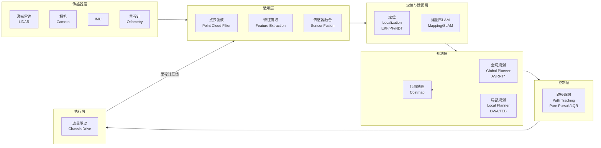
```mermaid
flowchart LR
    subgraph Sensors["传感器层"]
        L[激光雷达\nLiDAR]
        C[相机\nCamera]
        I[IMU]
        O[里程计\nOdometry]
    end

    subgraph Perception["感知层"]
        PF[点云滤波\nPoint Cloud Filter]
        FE[特征提取\nFeature Extraction]
        SF[传感器融合\nSensor Fusion]
    end

    subgraph LocalizationMapping["定位与建图层"]
        LOC[定位\nLocalization\nEKF/PF/NDT]
        MAP[建图/SLAM\nMapping/SLAM]
    end

    subgraph Planning["规划层"]
        GP[全局规划\nGlobal Planner\nA*/RRT*]
        LP[局部规划\nLocal Planner\nDWA/TEB]
        CM[代价地图\nCostmap]
    end

    subgraph Control["控制层"]
        PT[路径跟踪\nPath Tracking\nPure Pursuit/LQR]
    end

    subgraph Actuator["执行层"]
        ACT[底盘驱动\nChassis Drive]
    end

    Sensors --> Perception
    Perception --> LocalizationMapping
    LocalizationMapping --> Planning
    CM --> Planning
    Planning --> Control
    Control --> Actuator
    Actuator -->|里程计反馈| Perception
```

<div align="center">
  
  <figcaption>图：传统机器人导航流程图：基于传感器采集的数据进行建图与定位（SLAM），并在构建的环境地图中自动导航（规划+控制）</figcaption>
</div>


## 1.3 传统导航 vs. 学习型导航

在深度学习兴起之前，机器人导航主要依赖**模块化、可解释的传统算法栈**。每个模块职责清晰，可以独立调试和优化。本文将系统介绍这套算法栈的核心组件。

| 维度 | 传统导航 | 端到端深度学习导航 |
|------|---------|-----------------|
| 可解释性 | ✅ 强，每个模块可分析 | ❌ 弱，黑盒决策 |
| 泛化性 | ❌ 弱，依赖先验地图 | ✅ 较强，可迁移到新场景 |
| 语言理解 | ❌ 不支持自然语言指令 | ✅ 支持（VLN/VLA） |
| 调试难度 | ✅ 低，模块独立调试 | ❌ 高，端到端难追溯 |
| 计算需求 | ✅ 低，可在嵌入式运行 | ❌ 高，需要GPU |
| 安全可靠性 | ✅ 行为可预测 | ❌ 分布外泛化存在风险 |
| 动态障碍处理 | 局部规划模块可处理 | 依赖训练数据覆盖 |

> **本文聚焦传统算法栈**。如需了解端到端学习导航（VLN/VLA），请参考本站 [VLN综述](/VLN-Survey/) 系列。

---

# 2. 感知（Perception）

感知是导航系统的"眼睛"。传感器采集原始数据，经过处理后为定位、建图和规划提供可靠输入。

## 2.1 传感器类型与特性对比

| 传感器 | 输出数据 | 精度 | 抗光照 | 成本 | 典型频率 | 典型应用 |
|--------|---------|------|--------|------|---------|---------|
| **2D 激光雷达** | 极坐标点集 | 高（cm级） | ✅ 强 | 中 | 10–40 Hz | 室内移动机器人 |
| **3D 激光雷达** | 点云（xyz+强度） | 高 | ✅ 强 | 高 | 10–20 Hz | 自动驾驶 |
| **RGB-D 相机** | 彩色图+深度图 | 中（cm–dm级） | ❌ 弱（室外） | 低 | 30–90 Hz | 室内近距离 |
| **单目相机** | RGB 图像 | 低（需标定） | ❌ 弱 | 极低 | 30–120 Hz | 视觉里程计 |
| **双目相机** | 左右 RGB 图 | 中 | ❌ 弱 | 低–中 | 30–60 Hz | 视觉 SLAM |
| **IMU** | 角速度+线加速度 | 短期高 | ✅ 强 | 极低 | 100–1000 Hz | 姿态估计、融合 |
| **轮式里程计** | 编码器脉冲 | 中（易累积误差） | ✅ 强 | 极低 | 50–200 Hz | 短期位移估计 |
| **GPS/RTK** | 经纬度坐标 | 普通1–5m，RTK cm级 | ✅ 强 | 中–高 | 1–10 Hz | 室外全局定位 |

### 激光雷达（LiDAR）

激光雷达通过**发射激光脉冲并测量返回时间**（Time of Flight, ToF）来计算距离。它能在任意光照条件下工作，输出精确的空间点云（Point Cloud）。

**2D LiDAR**（如 Hokuyo UTM-30LX、SICK TiM）每次扫描输出一个平面上的极坐标点集，适合室内平坦环境。**3D LiDAR**（如 Velodyne VLP-16、Ouster OS1）通过多线旋转扫描，输出完整的三维点云，是自动驾驶感知的核心传感器。

### 深度相机（Depth Camera / RGB-D）

RGB-D 相机（如 Intel RealSense D435、Microsoft Kinect）通过**结构光**或**飞行时间（ToF）**原理，同时获取彩色图像和每个像素的深度值。主要局限在于：室外强光会干扰结构光，且探测距离有限（通常 0.3–6m）。

<div align="center">
  
  <figcaption>图：深度相机采集深度图可视化</figcaption>
</div>

### IMU 与轮式里程计

**IMU（惯性测量单元）** 集成了陀螺仪（测角速度）和加速度计（测线加速度），输出频率高（100–1000 Hz），但误差会随时间**积分累积**（漂移）。

<div align="center">
  
  <figcaption>图：IMU</figcaption>
</div>

**轮式里程计** 通过车轮编码器计算位移，在平坦路面上精度良好，但在打滑或不平整路面上会产生**累积误差**。

两者的共同特点：短期精度高，长期使用需要与其他传感器融合校正。


## 2.2 感知数据处理

### 点云滤波

原始点云通常包含噪声和无关点，需要预处理：

**体素滤波（Voxel Grid Filter）**：将点云空间划分为规则的小立方体（体素），每个体素内的点用质心替代。这样既保留了点云的整体形状，又大幅降低了点云密度，提升后续处理速度。

<div align="center">
  
  <figcaption>图：体素滤波效果——原始稠密点云（左）经体素降采样后得到均匀稀疏点云（右）</figcaption>
</div>

**半径滤波（Radius Outlier Removal）**：对每个点，检查其半径 r 范围内的邻近点数量。若邻近点数不足阈值，则认为该点是噪声并删除。适合去除孤立噪点。

<div align="center">
  
  <figcaption>图：半径滤波效果——邻域点数不足的孤立点（红）被识别为噪声并删除</figcaption>
</div>

**直通滤波（Pass Through Filter）**：直接截取感兴趣区域的点云，例如只保留地面以上 0.1m 到 2m 高度范围内的点。

### 矩形拟合检测（Rectangle Fitting Detection）

基于激光雷达点云进行**障碍物框估计**：将聚类后的障碍物点云拟合为最小外接矩形（Minimum Bounding Rectangle），从而估计障碍物的长宽、朝向和中心位置。这是自动驾驶中障碍物感知的经典方法，常用于车辆检测。

<div align="center">
  
  
  <figcaption>图：点云矩形拟合——聚类点云（左）拟合为最小外接矩形（右动图）</figcaption>
</div>

### 特征提取

在视觉 SLAM 和相机标定中，特征提取至关重要：

- **角点特征**（Corner）：如 **FAST**（速度极快）、**Harris**（经典）
- **描述子**（Descriptor）：如 **ORB**（旋转不变 + 二进制，速度快）、**SIFT**（尺度/旋转不变，精度高但慢）
- **线特征**（Line）：用于结构化室内环境（走廊、墙壁）

<div align="center">
  
  <figcaption>图：角点特征检测——图像中的角点（交叉点）是视觉 SLAM 的关键匹配元素</figcaption>
</div>

## 2.3 传感器外参标定

当系统使用多个传感器时，必须知道它们之间的**相对位姿关系**（外参，Extrinsic Parameters），才能将不同传感器的数据转换到同一坐标系。

**基于 UKF 的外参估计**：利用**无迹卡尔曼滤波（UKF）** 对外参进行在线估计。与标定板离线标定相比，这种方法可以在机器人运动过程中动态估计并修正外参，适合传感器安装位置可能微小变化的场景。

<div align="center">
  
  <figcaption>图：传感器在线自动标定过程——机器人运动中动态估计并修正传感器间外参</figcaption>
</div>

### 传感器时间同步

多传感器系统除了空间标定（外参）之外，**时间同步**同样至关重要。如果不同传感器的数据时间戳未对齐，会导致数据"不同步"——例如用 0.1 秒前的 IMU 姿态去处理当前帧激光点云，在机器人高速运动时误差不可忽略。

<div align="center">
  
  <figcaption>图：时间同步</figcaption>
</div>

**硬件触发同步（Hardware Trigger）**：通过电路信号使所有传感器在同一时刻采样。例如 GPS 的 PPS（每秒脉冲）信号作为主时钟，触发相机快门和激光雷达扫描。这是精度最高的方法，时间误差可低至微秒级，但需要专用硬件电路支持。

**软件时间戳插值（Software Interpolation）**：当硬件触发不可行时，通过高精度系统时钟（如 NTP/PTP）为每个传感器数据包打时间戳，然后在软件层按时间戳对齐数据。常见做法是 IMU 数据按线性插值对齐至最近的激光帧时刻。

**时间戳不对齐对 SLAM 的影响**：激光雷达在一帧扫描期间（约 100 ms）机器人持续运动，若不使用 IMU 时间戳做**运动补偿（Motion Distortion Correction）**，扫描点云会出现**畸变（Distortion）**——前半帧和后半帧点云错位，严重影响扫描匹配精度。LIO-SAM 等紧耦合方案正是通过 IMU 预积分解决这一问题。

## 2.4 传感器融合

单一传感器往往存在局限，融合多个传感器可以取长补短。

**EKF（扩展卡尔曼滤波）融合**：将不同频率、不同误差特性的传感器数据（如 IMU 高频姿态 + GPS 低频位置 + 里程计位移）统一融合。EKF 通过**预测步骤**（用运动模型预测状态）和**更新步骤**（用传感器观测修正预测）交替进行。

**UKF（无迹卡尔曼滤波）融合**：EKF 用一阶线性化近似非线性系统，而 UKF 用**Sigma 点采样**更精确地近似非线性变换的均值和协方差，在高非线性场景下精度更高。

**EKF 传感器融合数据流**（以多传感器机器人为例）：

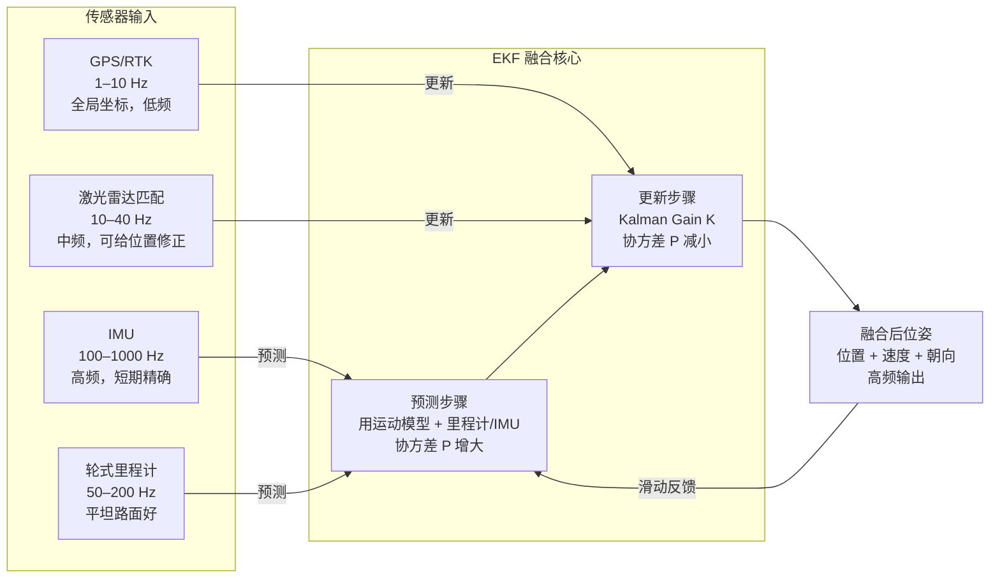
```mermaid
flowchart LR
    subgraph Sensors["传感器输入"]
        IMU["IMU\n100–1000 Hz\n高频，短期精确"]
        ODO["轮式里程计\n50–200 Hz\n平坦路面好"]
        GPS["GPS/RTK\n1–10 Hz\n全局坐标，低频"]
        LID["激光雷达匹配\n10–40 Hz\n中频，可给位置修正"]
    end

    subgraph EKF["EKF 融合核心"]
        P["预测步骤\n用运动模型 + 里程计/IMU\n协方差 P 增大"]
        U["更新步骤\nKalman Gain K\n协方差 P 减小"]
    end

    OUT["融合后位姿\n位置 + 速度 + 朝向\n高频输出"]

    IMU -->|预测| P
    ODO -->|预测| P
    GPS -->|更新| U
    LID -->|更新| U
    P --> U
    U --> OUT
    OUT -->|滑动反馈| P
```

---

# 3. 定位（Localization）

定位解决的是"我在哪"的问题：给定一张地图，机器人需要实时估计自身在地图中的位置和朝向（即**位姿 Pose = 位置 + 朝向**）。

## 3.1 问题定义

定位问题可以分为两类：

- **全局定位（Global Localization）**：机器人不知道初始位置，需要从头确定自身位姿。难度最大，粒子滤波擅长处理这类问题。
- **位姿跟踪（Pose Tracking）**：已知近似初始位姿，在运动过程中持续修正。EKF/UKF 擅长处理这类问题。
- **绑架问题（Kidnapped Robot Problem）**：机器人在运动中被突然移动到陌生位置，需要重新定位。

## 3.2 EKF 定位

**直觉理解**：想象你蒙眼走路，靠步数和转弯角度估计自己的位置（这是"预测"）；每当你摘下眼罩瞥一眼地图上的路标，就用路标位置来修正你的估计（这是"更新"）。EKF（Extended Kalman Filter）做的就是这件事的数学版本。

**状态向量**：$\mathbf{x} = [x, y, \theta]^T$（位置 + 朝向）

**两步走**：

1. **预测步骤**（Predict）：利用运动模型（如里程计数据）预测下一时刻的位姿，同时误差协方差增大（不确定性增加）：

$$\hat{\mathbf{x}}_{t|t-1} = f(\mathbf{x}_{t-1}, \mathbf{u}_t)$$

2. **更新步骤**（Update）：利用传感器观测（如激光雷达看到路标）修正预测，误差协方差减小（不确定性降低）：

$$\mathbf{x}_t = \hat{\mathbf{x}}_{t|t-1} + \mathbf{K}_t (\mathbf{z}_t - h(\hat{\mathbf{x}}_{t|t-1}))$$

其中 $\mathbf{K}_t$ 是**卡尔曼增益**，决定了相信预测还是相信观测。

**卡尔曼增益 K 的直觉理解**：想象你朋友告诉你"你现在在图书馆门口"，但你的步数估计说你在图书馆里面。你该信谁？K 的大小决定了这个权衡：

- **K → 1（相信观测）**：传感器噪声低、预测不确定性大时 → 观测修正权重大
- **K → 0（相信预测）**：传感器噪声高时 → 少修正，主要靠运动模型

$$\mathbf{K}_t = \mathbf{P}_{t|t-1} \mathbf{H}^T (\mathbf{H} \mathbf{P}_{t|t-1} \mathbf{H}^T + \mathbf{R})^{-1}$$

其中 $\mathbf{P}$ 是预测不确定性（越大 → K 越大 → 越信传感器），$\mathbf{R}$ 是传感器噪声（越大 → K 越小 → 越信预测）。下图展示了不确定性椭圆在预测→更新过程中的变化：

<div align="center">
  
  <figcaption>图：EKF 不确定性椭圆变化——预测步骤后椭圆增大（不确定性增加），更新步骤后椭圆收缩（传感器修正）</figcaption>
</div>

**适用场景**：已知地图、已知初始位置、低非线性系统。计算效率高，适合实时运行。

<div align="center">
  
  <figcaption>图：EKF 定位仿真——机器人（蓝色）沿轨迹运动，绿色椭圆为不确定性估计，红色为 EKF 定位结果</figcaption>
</div>

## 3.3 UKF 定位

**与 EKF 的区别**：EKF 用泰勒展开对非线性函数做一阶线性化近似，在高非线性系统中误差较大。UKF（Unscented Kalman Filter）则通过精心选取的**Sigma 点集**来近似非线性变换后的概率分布，无需求导，精度更高。

**Sigma 点采样**：从当前均值和协方差中提取 $2n+1$ 个 Sigma 点，通过非线性函数传播后，重新计算均值和协方差。

✅ 比 EKF 精度高，尤其适合运动模型非线性较强的场景
❌ 计算量比 EKF 略大（约为 EKF 的 2–3 倍）

<div align="center">
  
  <figcaption>图：EKF vs UKF 对比仿真——高非线性场景下 UKF（右）的位姿估计收敛更准确</figcaption>
</div>

## 3.4 粒子滤波定位（Particle Filter）

**直觉理解**：用成千上万个"粒子"（每个粒子代表一个可能的位姿假设）来表示机器人位置的概率分布。每个粒子都根据运动模型移动（加入随机噪声），然后根据传感器观测给每个粒子打分（权重），越接近真实观测的粒子权重越高。最后通过**重采样（Resampling）**淘汰权重低的粒子，复制权重高的粒子。

<div align="center">
  
  <figcaption>图：粒子滤波定位仿真——初始粒子均匀分布（全局定位），随运动和观测逐步收敛到真实位置</figcaption>
</div>

**AMCL（Adaptive Monte Carlo Localization）**：ROS 中广泛使用的粒子滤波定位包，支持自适应粒子数量（定位收敛后减少粒子节省计算）。

下图展示了 MCL 算法的三个核心阶段：

<div align="center">
  
  <figcaption>图：粒子滤波（MCL）三阶段——① 运动更新后粒子扩散，② 观测加权（大粒子=高权重），③ 重采样后粒子集中于真实位置附近</figcaption>
</div>

**MCL 算法流程**：

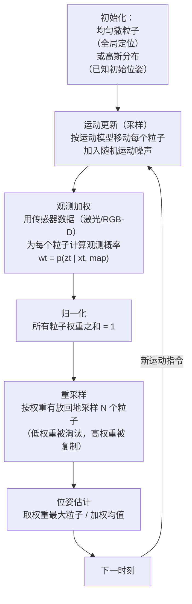
```mermaid
flowchart TD
    INIT["初始化：\n均匀撒粒子\n（全局定位）\n或高斯分布\n（已知初始位姿）"]
    MOTION["运动更新（采样）\n按运动模型移动每个粒子\n加入随机运动噪声"]
    OBS["观测加权\n用传感器数据（激光/RGB-D）\n为每个粒子计算观测概率\nwt = p(zt | xt, map)"]
    NORM["归一化\n所有粒子权重之和 = 1"]
    RESAMP["重采样\n按权重有放回地采样 N 个粒子\n（低权重被淘汰，高权重被复制）"]
    EST["位姿估计\n取权重最大粒子 / 加权均值"]
    NEXT["下一时刻"]

    INIT --> MOTION
    MOTION --> OBS
    OBS --> NORM
    NORM --> RESAMP
    RESAMP --> EST
    EST --> NEXT
    NEXT -->|新运动指令| MOTION
```

**重采样细节**：朴素随机重采样会引入**粒子多样性损失**（同一粒子被多次复制）。**系统重采样（Systematic Resampling）** 通过在 $[0, 1/N]$ 内取一个随机起点，然后均匀间隔采样 N 次，保证每个区间恰好采样一次，有效避免多样性损失，计算复杂度仍为 $O(N)$。

**AMCL 自适应粒子数（KLD 采样）**：固定粒子数既浪费计算（定位收敛后粒子不需要那么多），又不安全（初始化时粒子太少可能漏掉真实位置）。**KLD 采样** 根据当前粒子集覆盖的状态空间体积，动态计算所需粒子数量：状态空间探索越充分（覆盖的网格越多），需要的粒子数越少。AMCL 中典型范围为 100–5000 个粒子。

✅ 支持**全局定位**（多假设并行，能处理绑架问题）
✅ 对非线性系统友好，不需要线性化
❌ 粒子数量多时计算开销大
❌ 在高维状态空间中效率下降（维度诅咒）


## 3.5 基于扫描匹配的定位

扫描匹配是另一类定位思路：直接将当前激光雷达扫描与参考地图（或上一帧扫描）对齐，求解位姿变换。

### NDT（正态分布变换，Normal Distributions Transform）

**思路**：将参考点云空间划分为规则网格，每个格子内的点用**正态分布**（均值 + 协方差）来表示。当前扫描的点云在这些正态分布中的概率就是匹配得分，通过优化位姿使得匹配概率最大。

✅ 对点云密度变化鲁棒
✅ 计算效率高（尤其是三维场景）
✅ 是自动驾驶定位（HDMap-based Localization）的主流方法之一

<div align="center">
  
  <figcaption>图：NDT 匹配原理——参考地图（网格+正态分布）与当前扫描点云对齐示意</figcaption>
</div>

### ICP（迭代最近点，Iterative Closest Point）

**思路**：将当前点云与目标点云中最近的点对匹配，计算最小化匹配点对距离的刚体变换（旋转 + 平移），然后迭代重复直到收敛。

✅ 简单直观，精度高（收敛后）
❌ 对初始位姿敏感，容易陷入局部最优
❌ 计算复杂度较高，实时性受点云密度影响
❌ 在重复结构（如走廊）中容易退化

<div align="center">
  
  <figcaption>图：ICP 迭代过程——绿色当前帧点云逐步与红色参考点云对齐，每次迭代最近点对距离缩小</figcaption>
</div>

## 3.6 定位方法对比汇总

| 方法 | 适用场景 | 全局定位 | 计算开销 | 非线性处理 | ROS 支持 |
|------|---------|---------|---------|-----------|---------|
| **EKF** | 已知初始位姿，低非线性 | ❌ | 低 | 一阶近似 | `robot_localization` |
| **UKF** | 已知初始位姿，中高非线性 | ❌ | 中 | Sigma点近似 | `robot_localization` |
| **粒子滤波/AMCL** | 全局定位，未知初始位姿 | ✅ | 中–高 | 无近似 | `amcl` |
| **NDT** | 自动驾驶，高精地图定位 | 需初始化 | 中 | — | `ndt_cpu` |
| **ICP** | 精细配准，短距离匹配 | ❌ | 中–高 | — | `pcl_ros` |

<div align="center">
  
  <figcaption>图：EKF / UKF / 粒子滤波三种定位方法对比仿真——同场景下精度与收敛速度对比</figcaption>
</div>

---

# 4. 建图（Mapping & SLAM）

**SLAM（同步定位与建图，Simultaneous Localization and Mapping）** 解决了一个"先有鸡还是先有蛋"的问题：定位需要地图，建图又需要知道位置。SLAM 的目标是在**没有先验地图**的情况下，同时完成定位和建图。

## 4.1 地图表示形式

不同场景需要不同的地图表示：

### 二值占据栅格地图（Binary Occupancy Grid Map）

将环境空间划分为等大小的方格（通常 5–20 cm/格），每格存储一个概率值，表示该格是否被占据（有障碍 = 1，可通行 = 0，未探索 = 0.5）。这是室内机器人导航中最常用的地图格式，ROS `map_server` 直接支持。

<div align="center">
  
  <figcaption>图：二值占据栅格地图构建过程</figcaption>
</div>

<div align="center">
  
  <figcaption>图：成品地图——白色=可通行，黑色=障碍，灰色=未探索</figcaption>
</div>

### 代价地图（Costmap）

在占据栅格基础上，对障碍物周围区域**膨胀（Inflation）**出一层代价层：离障碍物越近，代价越高。这样路径规划时机器人会自动保持与障碍物的安全距离，无需额外碰撞检查。ROS Navigation Stack 的 `costmap_2d` 支持多层代价地图（静态层 + 障碍物层 + 膨胀层）。

<div align="center">
  
  <figcaption>图：代价地图构建</figcaption>
</div>

<div align="center">
  
  <figcaption>图：成品代价地图——蓝色=低代价，红色=高代价（障碍附近）</figcaption>
</div>

### 势场地图（Potential Field Map）

将目标点视为"势能最低点"，障碍物视为"斥力源"，整个空间形成一个势能场。机器人沿梯度下降方向运动即可找到路径。直觉上类似于球在斜面上自然滚向最低点。主要缺点：容易陷入局部极小值（Local Minimum）。

<div align="center">
  
  <figcaption>图：势场地图——目标（蓝色低谷）产生引力，障碍（红色高峰）产生斥力，梯度方向指向机器人运动方向</figcaption>
</div>

### NDT 地图（NDT Map）

前文提到的正态分布变换地图，适合高精度自动驾驶场景。每个格子存储点云的统计分布，而非原始点，大幅压缩存储空间同时保持定位精度。

<div align="center">
  
  <figcaption>图：EA-NDT 处理流程可视化：从语义分割点云到 H-Map 的中间阶段展示。</figcaption>
</div>

<div align="center">
  
  <figcaption>图：NDT地图构建</figcaption>
</div>

### OctoMap（八叉树三维地图）

**OctoMap** 是三维机器人建图的事实标准，ROS 中的 `octomap_server` 包直接支持。其核心思想：用**八叉树（Octree）**递归细分三维空间，每个叶节点代表一个体素（Voxel），存储该体素的**占据概率**。

**空间细分原理**：

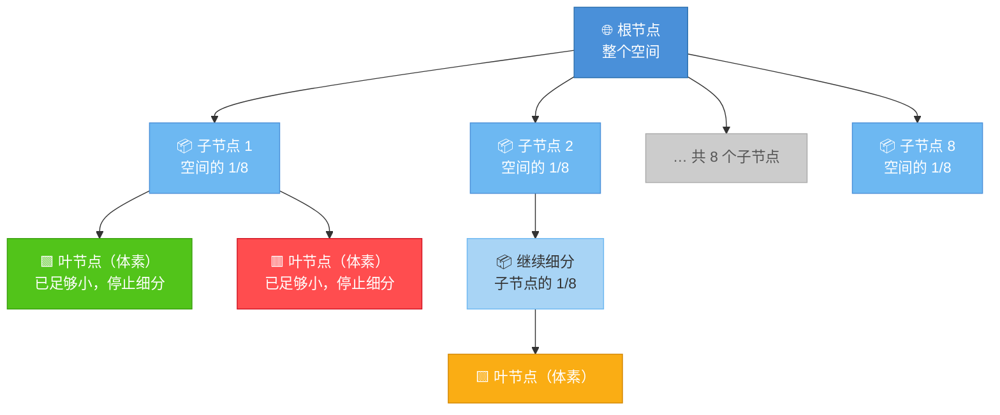
```mermaid
graph TD
    R["🌐 根节点<br/>整个空间"]
    R --> N1["📦 子节点 1<br/>空间的 1/8"]
    R --> N2["📦 子节点 2<br/>空间的 1/8"]
    R --> ND["… 共 8 个子节点"]
    R --> N8["📦 子节点 8<br/>空间的 1/8"]
    N1 --> L1["🟩 叶节点（体素）<br/>已足够小，停止细分"]
    N1 --> L2["🟥 叶节点（体素）<br/>已足够小，停止细分"]
    N2 --> N21["📦 继续细分<br/>子节点的 1/8"]
    N21 --> L3["🟨 叶节点（体素）"]

    style R fill:#4a90d9,color:#fff,stroke:#2c6fad
    style N1 fill:#6db8f2,color:#fff,stroke:#4a90d9
    style N2 fill:#6db8f2,color:#fff,stroke:#4a90d9
    style N8 fill:#6db8f2,color:#fff,stroke:#4a90d9
    style ND fill:#ccc,color:#555,stroke:#aaa
    style N21 fill:#a8d4f5,color:#333,stroke:#6db8f2
    style L1 fill:#52c41a,color:#fff,stroke:#389e0d
    style L2 fill:#ff4d4f,color:#fff,stroke:#cf1322
    style L3 fill:#faad14,color:#fff,stroke:#d48806
```

> 🟩 自由体素 　🟥 占据体素 　🟨 未知体素 　深色节点 = 仍可继续细分

体素大小（分辨率）通常设为 5–20 cm，可按需调整。

**占据概率更新**（Bayesian 更新）：每次激光/深度传感器的光线穿过一个体素时，更新该体素的占据对数概率（Log-Odds）：

$$L(n) = L(n-1) + \log\frac{P(\text{occ}|\text{hit})}{1 - P(\text{occ}|\text{hit})}$$

累积多次观测后，体素被分类为：**占据（occupied）**、**自由（free）**、**未知（unknown）**。

**内存效率**：OctoMap 只存储占据和自由节点，未知空间不占内存。大规模室内场景（200m²、10cm分辨率）通常只需几十 MB，远优于直接存储三维占据栅格。

| 特性 | OctoMap | 原始点云 |
|------|---------|---------|
| 内存 | 低（稀疏八叉树） | 高（每点 12–24 字节） |
| 概率更新 | ✅ | ❌ |
| 未知区域表示 | ✅ | ❌ |
| 多分辨率查询 | ✅ | ❌ |
| ROS 支持 | `octomap_server` | `sensor_msgs/PointCloud2` |

✅ 三维障碍物感知（无人机避障、机械臂抓取规划）
✅ 支持动态更新（障碍物移除后概率衰减）
❌ 不保留颜色/语义信息（需扩展为 ColorOctoMap / SemanticOctoMap）

### 拓扑地图（Topological Map）

前述所有地图（占据栅格、NDT、OctoMap）都是**度量地图（Metric Map）**——精确记录空间的几何信息。而**拓扑地图**完全不同：它将环境抽象为**节点（地点）+ 边（连通关系）**的图结构，不关心精确几何。

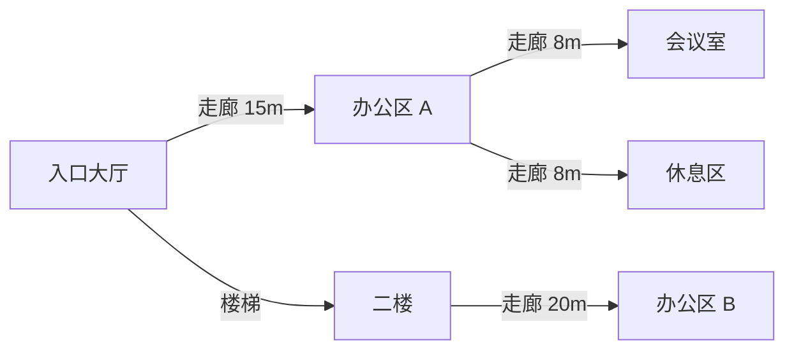
```mermaid
graph LR
    A["入口大厅"] -->|"走廊 15m"| B["办公区 A"]
    A -->|"楼梯"| C["二楼"]
    B -->|"走廊 8m"| D["会议室"]
    B -->|"走廊 8m"| E["休息区"]
    C -->|"走廊 20m"| F["办公区 B"]
```

**节点**通常对应语义地点（房间、门口、走廊交叉点），**边**记录相邻节点之间的可达关系（有时附距离/方向信息）。

| 对比维度 | 度量地图 | 拓扑地图 |
|---------|---------|---------|
| 表示粒度 | 厘米级精确坐标 | 节点/边（语义） |
| 存储开销 | 大（随面积线性增长） | 极小 |
| 路径规划 | 栅格搜索（A*） | 图搜索（Dijkstra） |
| 适用规模 | 室内小场景（<100m） | 大楼、多楼层、园区 |
| 定位精度 | 高 | 低（只能定位到节点粒度） |

**实际应用中的混合方案**：大多数实际系统采用**拓扑-度量混合地图（Hybrid Topological-Metric Map）**：拓扑层做跨房间的高层路径规划（选择经过哪些节点），度量层在每个节点附近做精细局部导航和避障。典型实现如 ROS 的 `topological_navigation` 包。

## 4.2 SLAM 问题概述

SLAM 的输入是传感器数据流（激光扫描序列 / 图像序列 + 里程计），输出是：

1. **轨迹（Trajectory）**：机器人历史运动路径
2. **地图（Map）**：环境的空间表示

SLAM 系统通常分为**前端（Front-end）** 和**后端（Back-end）** 两部分：

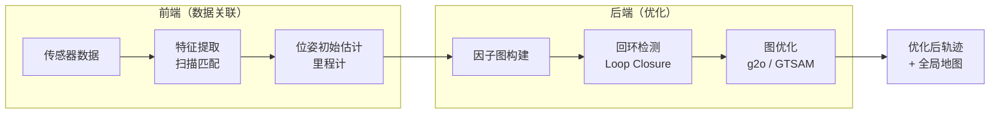
```mermaid
flowchart LR
    subgraph Frontend["前端（数据关联）"]
        A[传感器数据] --> B[特征提取\n扫描匹配]
        B --> C[位姿初始估计\n里程计]
    end

    subgraph Backend["后端（优化）"]
        C --> D[因子图构建]
        D --> E[回环检测\nLoop Closure]
        E --> F[图优化\ng2o / GTSAM]
    end

    F --> G[优化后轨迹\n+ 全局地图]
```

> **SLAM vs. 纯定位（Localization）**：SLAM 是"边建图边定位"，适用于**未知环境**的首次探索。一旦地图建好并保存，后续部署只需在已知地图上做**纯定位**——输入传感器数据，输出机器人在已知地图中的位姿，无需维护或更新地图。纯定位的计算量远低于 SLAM：激光方案用 **AMCL**（自适应蒙特卡洛定位，粒子滤波）或 **NDT 定位**，视觉方案用 **重定位（Relocalization）**。实际产品部署中，绝大多数机器人处于"纯定位模式"，SLAM 只在建图阶段或环境发生重大变化时才启动。

## 4.3 激光 SLAM

### Cartographer（Google）

[项目主页](https://github.com/cartographer-project/cartographer)

Google 开源的激光 SLAM 系统，支持 2D 和 3D 建图。核心思想：

- **子图（Submap）**：将扫描数据分段插入局部子图，每个子图维护自身的一致性
- **扫描匹配**：新扫描来了，先用 CSM（相关扫描匹配）给一个初始位姿，再用 Ceres Solver 做精细优化
- **回环检测**：当机器人回到之前探索区域时，通过暴力搜索匹配检测回环，消除累积误差

✅ 支持实时 2D/3D 建图
✅ 大规模室内场景效果优秀
✅ ROS 2 支持完善（`cartographer_ros`）

<div align="center">
  
  <figcaption>图：Cartographer地图构建流程图</figcaption>
</div>

### GMapping

[项目主页](https://github.com/ros-perception/slam_gmapping)

基于粒子滤波的 2D 激光 SLAM，每个粒子维护一个独立的栅格地图和位姿估计。使用**Rao-Blackwellized 粒子滤波**，将 SLAM 问题分解为条件独立的定位和建图两部分。

✅ 实现简单，适合室内小场景
✅ 实时性好
❌ 大场景粒子数需求大，内存开销高
❌ 不支持 3D 建图

<div align="center">
  
  <figcaption>图：GMapping地图构建</figcaption>
</div>


### LOAM（LiDAR Odometry and Mapping）

Ji Zhang 等人于 2014 年提出，是 3D 激光 SLAM 的里程碑工作。核心思路：

- 从点云中提取**边缘线特征**（Edge）和**平面特征**（Planar）
- 利用这两类特征做**扫描匹配**，估计帧间位姿
- 分离出高频里程计（Odometry）和低频建图（Mapping）两个线程并行运行

<div align="center">
  
  <figcaption>图：LOAM 软件系统</figcaption>
</div>

[作者项目主页](https://leijiezhang001.github.io/LOAM/)


### LeGO-LOAM

[项目主页](https://github.com/RobustFieldAutonomyLab/LeGO-LOAM)

LOAM 的轻量化版本，专为**地面移动机器人**优化。利用地面分割，只使用地面点和非地面点中提取的特征，大幅降低计算量，可在嵌入式平台（如 Jetson）实时运行。

<div align="center">
  
  <figcaption>图：LeGO-LOAM系统</figcaption>
</div>

### LIO-SAM

[项目主页](https://github.com/TixiaoShan/LIO-SAM)

**紧耦合**激光惯性里程计，将 LiDAR 和 IMU 数据在**因子图**框架下联合优化。通过 IMU 预积分提供点云去畸变和初始位姿估计，再用激光匹配修正，精度和鲁棒性均优于松耦合方案。

<div align="center">
  
  <figcaption>图：LIO-SAM系统</figcaption>
</div>

**LIO-SAM 紧耦合架构**（IMU 预积分 + LiDAR 因子图）：

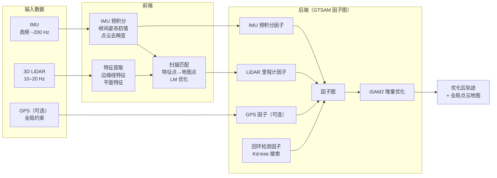
```mermaid
flowchart LR
    subgraph Input["输入数据"]
        IMU2["IMU\n高频 ~200 Hz"]
        LID2["3D LiDAR\n10–20 Hz"]
        GPS2["GPS（可选）\n全局约束"]
    end

    subgraph Frontend2["前端"]
        PREINT["IMU 预积分\n帧间姿态初值\n点云去畸变"]
        FEAT["特征提取\n边缘线特征\n平面特征"]
        SCAN["扫描匹配\n特征点→地图点\nLM 优化"]
    end

    subgraph Backend2["后端（GTSAM 因子图）"]
        FG["因子图"]
        IMUFac["IMU 预积分因子"]
        LIDFac["LiDAR 里程计因子"]
        GPSFac["GPS 因子（可选）"]
        LOOP2["回环检测因子\nKd-tree 搜索"]
        OPT2["iSAM2 增量优化"]
    end

    OUT2["优化后轨迹\n+ 全局点云地图"]

    IMU2 --> PREINT
    LID2 --> FEAT
    PREINT --> SCAN
    FEAT --> SCAN
    GPS2 --> GPSFac
    SCAN --> LIDFac
    PREINT --> IMUFac
    IMUFac --> FG
    LIDFac --> FG
    GPSFac --> FG
    LOOP2 --> FG
    FG --> OPT2
    OPT2 --> OUT2
```

## 4.4 视觉 SLAM

视觉 SLAM 使用相机代替激光雷达，成本更低但对光照更敏感。

### ORB-SLAM3

目前最成熟的视觉 SLAM 系统之一，支持**单目 / 双目 / RGB-D / 鱼眼相机 + IMU**。

[项目主页](https://github.com/UZ-SLAMLab/ORB_SLAM3)

**关键技术**：
- 特征提取：**ORB（Oriented FAST and Rotated BRIEF）** 描述子，快速且旋转不变
- 跟踪：当前帧与地图点匹配，用 PnP 求位姿
- 局部建图：维护一个局部地图，进行 Bundle Adjustment 优化
- 回环检测：基于**词袋模型（Bag of Words, BoW）** 的外观相似性检测

**ORB-SLAM3 三线程架构**：

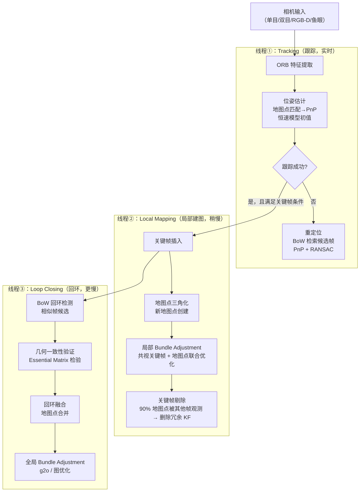
```mermaid
flowchart TB
    CAM["相机输入\n（单目/双目/RGB-D/鱼眼）"]

    subgraph T1["线程①：Tracking（跟踪，实时）"]
        ORB_EXT["ORB 特征提取"]
        POSE_EST["位姿估计\n地图点匹配→PnP\n恒速模型初值"]
        TRACK_ST{"跟踪成功?"}
        RELOC["重定位\nBoW 检索候选帧\nPnP + RANSAC"]
    end

    subgraph T2["线程②：Local Mapping（局部建图，稍慢）"]
        KF_INSERT["关键帧插入"]
        MAP_PT["地图点三角化\n新地图点创建"]
        LOCAL_BA["局部 Bundle Adjustment\n共视关键帧 + 地图点联合优化"]
        KF_CULL["关键帧剔除\n90% 地图点被其他帧观测 → 删除冗余 KF"]
    end

    subgraph T3["线程③：Loop Closing（回环，更慢）"]
        BOW_DETECT["BoW 回环检测\n相似帧候选"]
        GEOM_VERIFY["几何一致性验证\nEssential Matrix 检验"]
        LOOP_FUSE["回环融合\n地图点合并"]
        GLOBAL_BA["全局 Bundle Adjustment\ng2o / 图优化"]
    end

    CAM --> ORB_EXT
    ORB_EXT --> POSE_EST
    POSE_EST --> TRACK_ST
    TRACK_ST -->|"否"| RELOC
    TRACK_ST -->|"是，且满足关键帧条件"| KF_INSERT
    KF_INSERT --> MAP_PT
    MAP_PT --> LOCAL_BA
    LOCAL_BA --> KF_CULL
    KF_INSERT --> BOW_DETECT
    BOW_DETECT --> GEOM_VERIFY
    GEOM_VERIFY --> LOOP_FUSE
    LOOP_FUSE --> GLOBAL_BA
```

**关键帧选择策略**：ORB-SLAM3 不是每帧都插入关键帧，而是按以下条件触发：① 距上一关键帧时间超过阈值；② 当前帧可以观测到的地图点数量下降到阈值以下（跟踪变弱）；③ 局部地图中不存在太多待处理的关键帧（避免积压）。这种策略确保关键帧在空间和时间上均匀分布，避免冗余。

**地图点管理**：每个地图点记录其被哪些关键帧观测到、在每帧中的 ORB 描述子（取均值作为代表描述子）。地图点分为**局部地图点**（近期关键帧所见）和**全局地图点**（完整历史）。跟踪时只使用局部地图点做匹配（速度快），BA 优化时只优化共视关键帧（局部 BA）。

**丢失跟踪后的重定位**：当连续帧跟踪失败时，系统进入**重定位模式**：① 用当前帧的 BoW 向量在关键帧数据库中检索相似帧；② 对候选帧用 PnP+RANSAC 验证几何一致性；③ 找到匹配帧后恢复位姿，重新初始化跟踪。BoW 检索速度极快（O(1) 量级），毫秒内可完成。

✅ 精度高，支持多种相机类型
✅ 大规模场景中的闭环检测能力强
❌ 纯视觉在弱光 / 快速运动下容易丢失跟踪

### VINS-Mono / VINS-Fusion

[VINS-Mono](https://github.com/HKUST-Aerial-Robotics/VINS-Mono) | [VINS-Fusion](https://github.com/HKUST-Aerial-Robotics/VINS-Fusion)

香港科技大学开源的**视觉惯性 SLAM** 系统。将相机和 IMU 紧耦合，通过**非线性优化（滑动窗口 BA）** 联合估计位姿。VINS-Fusion 进一步支持双目和 GPS 融合，是自动驾驶和无人机领域的常用方案。

✅ 紧耦合，精度高
✅ 对相机纯旋转、弱纹理场景鲁棒性更好
✅ 支持在线外参标定

<div align="center">
  
  <figcaption>图：Visual Inertial System (VINS) with Stereo Vision</figcaption>
</div>


### DSO（直接稀疏里程计）

[项目主页](https://github.com/JakobEngel/dso)

**直接法**代表作，不提取特征点，直接最小化图像像素灰度的**光度误差（Photometric Error）**。

与**特征法**（ORB-SLAM3）的对比：

| 对比维度 | 特征法（ORB-SLAM3）| 直接法（DSO）|
|---------|---------------|-----------|
| 依赖纹理 | 需要角点特征 | 任意图像梯度 |
| 弱纹理场景 | ❌ 容易失败 | ✅ 相对更好 |
| 运动模糊 | ❌ 特征提取困难 | ❌ 也会退化 |
| 计算量 | 中等 | 较大 |
| 地图稠密度 | 稀疏点云 | 半稠密点云 |

### RTAB-Map（Real-Time Appearance-Based Mapping）

[项目主页](https://github.com/introlab/rtabmap)

由 IntRoLab 开源，是目前 ROS 生态中使用最广泛的**多模态图优化 SLAM** 系统，同时支持 RGB-D 相机、双目相机和 3D LiDAR 输入，输出占据栅格地图和稠密点云地图。

**核心设计：基于外观的记忆管理**

RTAB-Map 最独特之处在于其**在线记忆管理机制（Memory Management）**：系统将关键帧分为"工作记忆（Working Memory, WM）"和"长期记忆（Long-Term Memory, LTM）"。当 WM 中的节点数超过上限，最久未被访问的节点被转入 LTM（类似操作系统的内存换页）。回环检测时只在 WM 内搜索，保证实时性；检测到回环后从 LTM 中唤醒相关节点参与优化。这一机制使 RTAB-Map 能在大规模长时间建图中保持实时（>1 Hz）运行。

**关键技术模块**：

- **外观回环检测**：基于词袋模型（BoW）对关键帧提取 SURF/ORB 特征，计算帧间相似度；超过阈值则触发几何验证（PnP + RANSAC）
- **图优化后端**：使用 g2o / GTSAM 对位姿图进行全局优化，消除累积漂移
- **多传感器前端**：
  - RGB-D 模式：ICP 点云匹配 + 视觉里程计（VO）
  - 激光模式：ICP / NDT 扫描匹配
  - 双目模式：视差深度估计 + VO
- **输出地图**：2D 占据栅格地图（可直接用于 ROS Navigation Stack）+ 3D 彩色点云

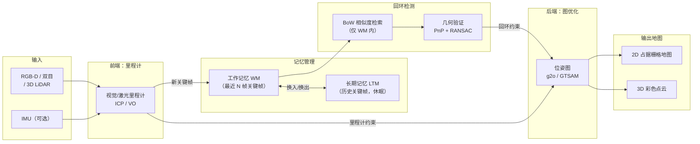
```mermaid
flowchart LR
    subgraph Input["输入"]
        RGBD["RGB-D / 双目\n/ 3D LiDAR"]
        IMU2["IMU（可选）"]
    end

    subgraph Frontend["前端：里程计"]
        VO["视觉/激光里程计\nICP / VO"]
    end

    subgraph Memory["记忆管理"]
        WM["工作记忆 WM\n（最近 N 帧关键帧）"]
        LTM["长期记忆 LTM\n（历史关键帧，休眠）"]
        WM <-->|"换入/换出"| LTM
    end

    subgraph Loop["回环检测"]
        BOW2["BoW 相似度检索\n（仅 WM 内）"]
        GEO["几何验证\nPnP + RANSAC"]
    end

    subgraph Backend["后端：图优化"]
        PG["位姿图\ng2o / GTSAM"]
    end

    subgraph Output["输出地图"]
        OCC["2D 占据栅格地图"]
        PC["3D 彩色点云"]
    end

    RGBD --> VO
    IMU2 --> VO
    VO -->|"新关键帧"| WM
    WM --> BOW2
    BOW2 --> GEO
    GEO -->|"回环约束"| PG
    VO -->|"里程计约束"| PG
    PG --> OCC
    PG --> PC
```

✅ 多传感器支持，RGB-D/双目/LiDAR 一套系统通吃
✅ 输出标准占据栅格地图，与 ROS Navigation Stack 无缝对接
✅ 在线记忆管理，适合长时间大规模建图
✅ 内置 3D 点云地图，可用于抓取、三维重建等下游任务
❌ 默认参数对大场景内存消耗较高，需调优 `Mem/STMSize` 等参数
❌ 纯视觉模式在弱纹理 / 弱光环境下可靠性下降

### 稠密视觉建图（Dense Visual Mapping）

ORB-SLAM3 和 DSO 输出的都是**稀疏/半稠密点云**，无法直接用于抓取规划、三维重建等下游任务。稠密建图系统输出完整的三维表面模型，代价是更高的计算量。

#### TSDF 地图表示

**截断符号距离函数（Truncated Signed Distance Function, TSDF）** 是稠密建图的核心地图表示。将空间划分为体素网格，每个体素存储：

- **SDF 值**：该体素到最近表面的有符号距离（正=表面外侧，负=内侧，零=表面）
- **权重**：累积观测的置信度

$$\text{TSDF}(v) = \text{clip}\left(\frac{d(v)}{\delta},\ -1,\ 1\right)$$

其中 $\delta$ 为截断距离，$d(v)$ 为体素中心到最近表面的距离。多帧深度图融合后，通过**Marching Cubes 算法**在 TSDF=0 处提取三角网格，即为重建的三维表面。

#### KinectFusion

微软研究院 2011 年提出，第一个基于 **RGB-D 相机实时稠密重建**的系统，完全在 GPU 上运行。

**流程**：


```mermaid
flowchart LR
    RGBD["RGB-D 帧"] --> ICP["ICP 位姿估计\n（点面 ICP，GPU）"]
    ICP --> TSDF_UPD["TSDF 体素更新\n（GPU 并行写入）"]
    TSDF_UPD --> MC["Marching Cubes\n表面提取"]
    MC --> MESH["三角网格"]
```

- **前端**：用 **GPU 点面 ICP** 实时估计相机位姿（无特征提取，直接对齐深度图点云）
- **建图**：将深度图沿光线方向投影，更新 TSDF 体素（GPU 并行，速度极快）
- **限制**：地图分辨率固定、场景大小受 GPU 显存限制（通常 3m³ 以内）；无回环检测，长时间漂移明显

#### ElasticFusion

ICCV 2015，在 KinectFusion 基础上加入**弹性形变（Elastic Deformation）** 机制，通过 **Surfel（有向面元）** 代替体素存储地图，并支持非刚性全局优化：

- **Surfel 地图**：每个 Surfel 存储位置、法向量、颜色、半径、置信度
- **弹性回环**：检测到回环后，不是刚性平移地图，而是对地图施加非刚性弹性形变，使历史帧平滑对齐
- **效果**：适用于中等规模室内场景（单个房间），重建质量远优于 KinectFusion

#### 稠密视觉建图对比

| 系统 | 地图表示 | 回环 | 场景规模 | 适用场景 |
|------|---------|------|---------|---------|
| KinectFusion | TSDF 体素 | ❌ | 小（3m³） | 桌面级重建 |
| ElasticFusion | Surfel | ✅（弹性） | 中（单房间） | 室内精细重建 |
| RTAB-Map | 点云 + 占据栅格 | ✅ | 大（多房间） | 导航 + 粗重建 |
| ORB-SLAM3 | 稀疏点云 | ✅ | 大 | 定位为主 |

### 神经隐式 SLAM（Neural Implicit SLAM）

2021 年以来，NeRF 和 3D Gaussian Splatting 引入 SLAM，带来了全新的地图表示范式——不再用离散体素或点云，而是用**神经网络隐式编码**场景的几何和外观。

#### NeRF 基础回顾

**神经辐射场（NeRF）** 用一个 MLP 将空间坐标和视角方向映射为颜色和体密度：

$$(\mathbf{c}, \sigma) = F_\theta(\mathbf{x}, \mathbf{d})$$

通过体渲染（Volume Rendering）积分得到像素颜色，与真实图像对比计算光度损失，反向传播优化网络权重。优化后的网络即为场景的"隐式地图"，可从任意视角渲染新视图。

#### iMAP（2021）

第一个将 NeRF 用于实时 SLAM 的系统。用单个 MLP 同时优化相机位姿和场景表示：

- **跟踪**：固定网络权重，优化当前帧位姿（最小化渲染误差）
- **建图**：固定位姿，优化网络权重（用历史关键帧更新隐式地图）
- **限制**：单个 MLP 容量有限，大场景细节丢失；速度慢，无法实时

#### NICE-SLAM（2022）

引入**多分辨率特征网格（Multi-Resolution Feature Grid）** 替代单一 MLP，解决 iMAP 的容量瓶颈：

- 粗、中、细三层特征网格，分别捕捉不同尺度的几何信息
- 局部更新：只更新当前观测到的网格区域，避免全局遗忘
- 速度比 iMAP 快，适用于中等规模室内场景（TUM、Replica 数据集）

#### 3D Gaussian Splatting SLAM（2023-2024）

**3DGS-SLAM** 用**三维高斯椭球（3D Gaussian）** 代替 NeRF 的体密度场，渲染速度提升 100 倍以上（实时渲染 >30 fps），催生了一批实时 SLAM 系统：

| 系统 | 地图表示 | 实时性 | 特点 |
|------|---------|-------|------|
| **MonoGS**（2024） | 3D Gaussian | ✅ | 单目相机，几何感知跟踪 |
| **SplaTAM**（2024） | 3D Gaussian | ✅ | RGB-D，显式密度控制 |
| **Gaussian-SLAM** | 3D Gaussian + 子地图 | ✅ | 大场景子图拼接 |

**NeRF/3DGS SLAM 与传统 SLAM 对比**：

| 维度 | 传统 SLAM（ORB-SLAM3） | NeRF-SLAM | 3DGS-SLAM |
|------|----------------------|-----------|-----------|
| 地图表示 | 稀疏点云 | 隐式 MLP | 3D 高斯椭球 |
| 新视角渲染 | ❌ | ✅（慢） | ✅（实时） |
| 定位精度 | 高 | 中 | 中 |
| 建图速度 | 实时 | 慢（离线） | 接近实时 |
| 内存 | 低 | 中 | 高（高斯数量多） |
| 下游任务 | 导航 | 视觉生成、仿真 | 视觉生成、仿真 |

> **展望**：神经隐式 SLAM 目前在定位精度和实时性上仍落后于传统 SLAM，但其输出的高质量可渲染地图对具身 AI（embodied AI）的视觉感知、仿真数据生成具有独特价值，是当前研究热点。

## 4.5 SLAM 后端优化

SLAM 前端给出每帧的位姿初始估计，但由于噪声累积，长时间运行后误差会越来越大。后端优化的目标是全局一致性。

### Bundle Adjustment（BA）直觉理解

**Bundle Adjustment（光束平差法）** 是视觉 SLAM 后端优化的核心，目标是**同时调整相机位姿和三维地图点的位置**，使所有地图点在所有相机帧中的**重投影误差（Reprojection Error）最小**。


<div align="center">
  
  <figcaption>图：光束平差法</figcaption>
</div>

**直觉类比**：想象你有多张从不同角度拍摄同一场景的照片，以及场景中路标的初始3D坐标（有误差）。BA 就是同时微调每张照片的相机位置/朝向，以及每个路标的3D坐标，使得"按相机参数计算出来的路标投影点"与"实际在照片中看到的特征点位置"的偏差之和最小。

$$\min_{\{P_i\}, \{X_j\}} \sum_{i,j} \| u_{ij} - \pi(P_i, X_j) \|^2$$

其中 $P_i$ 是相机位姿，$X_j$ 是地图点3D坐标，$u_{ij}$ 是观测到的图像坐标，$\pi(\cdot)$ 是投影函数。

**Local BA vs. Global BA 的权衡**：
- **Local BA**（ORB-SLAM3 实时优化）：只优化最近的共视关键帧和它们观测到的地图点，计算量小，可实时运行（毫秒级）。缺点：全局漂移不能通过局部 BA 消除。
- **Global BA**（回环后触发）：优化整个地图的所有关键帧和地图点，全局一致性好。缺点：计算量与地图规模成正比，大场景可能需要数秒甚至数分钟，只能离线或在回环检测触发后执行一次。

### 因子图（Factor Graph）与图优化

将 SLAM 问题建模为**因子图**：节点（变量）表示机器人位姿和地图点，边（因子）表示传感器约束（如相邻帧之间的相对位姿、回环约束）。求解过程就是找到使所有约束误差之和最小的变量估计值。

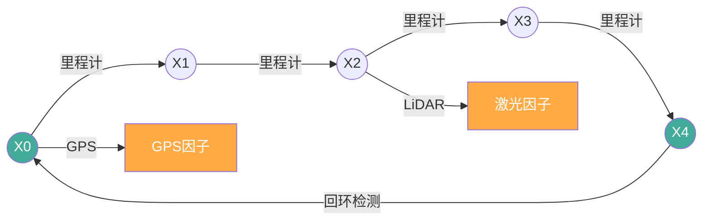
```mermaid
graph LR
    X0((X0)) -->|里程计| X1((X1))
    X1 -->|里程计| X2((X2))
    X2 -->|里程计| X3((X3))
    X3 -->|里程计| X4((X4))
    X4 -->|回环检测| X0
    X0 -->|GPS| G0[GPS因子]
    X2 -->|LiDAR| L0[激光因子]
    style X0 fill:#4a9,color:#fff
    style X4 fill:#4a9,color:#fff
    style G0 fill:#fa4,color:#fff
    style L0 fill:#fa4,color:#fff
```

### 回环检测（Loop Closure Detection）

回环检测的任务：判断机器人是否回到了之前探索过的地方，从而添加回环约束消除累积误差。整个流程分为两个阶段：**外观检索**（快速召回候选帧）和**几何验证**（剔除误召回）。

<div align="center">
  
  <figcaption>图：回环检测两阶段流程</figcaption>
</div>

<div align="center">
  
  <figcaption>图：回环检测效果图</figcaption>
</div>

#### 阶段一：外观检索 —— 词袋模型（Bag of Words）

视觉 SLAM 中最主流的回环检索方案，由 **DBoW2 / DBoW3** 库实现（ORB-SLAM 系列、RTAB-Map 均基于此）。

**（1）离线：构建视觉词典**

在大量图像上提取 ORB / BRIEF 描述子，用 **k-means 聚类**（通常为层次化 k 叉树）将高维描述子空间量化为 $K$ 个"视觉单词（visual word）"。词典一旦训练完成即固化，运行时无需更新。

```
原始描述子空间（128维浮点 or 256位二进制）
        ↓  层次化 k-means
视觉词典（树形结构，叶节点 = visual word）
```

**（2）在线：图像 → BoW 向量**

对每帧关键帧提取 ORB 描述子，将每个描述子**量化**到最近的视觉单词，统计词频，加权得到一个稀疏向量：

$$
v_i = \left[ \text{tf-idf}(w_1),\ \text{tf-idf}(w_2),\ \ldots,\ \text{tf-idf}(w_K) \right]$$

其中 TF-IDF 权重 $= \text{tf}(w, f) \times \log\frac{N}{n_w}$，$N$ 为数据库总帧数，$n_w$ 为包含单词 $w$ 的帧数。常见单词（如边缘角点）权重低，稀有单词（如独特纹理）权重高。

**（3）候选帧检索**

新关键帧到来时，用其 BoW 向量与数据库中所有帧做**余弦相似度**比较，取 Top-K 帧作为回环候选。由于向量稀疏且词典查表为 $O(1)$，检索速度极快（毫秒量级）。

> **关键限制**：BoW 是纯外观方法，相似的光照/场景会产生**误召回**（false positive），因此必须经过几何验证。

---

#### 阶段二：几何一致性验证 —— RANSAC

对 BoW 召回的每个候选帧，验证当前帧与候选帧之间的**3D几何是否自洽**。

**（1）特征点匹配**

对当前帧与候选帧，基于 ORB 描述子做**暴力匹配（Brute-Force Matching）**，得到一批对应点对 $\{(p_i, p_i')\}$。

**（2）RANSAC 估计本质矩阵 / 单应矩阵**

由于匹配点对中含有大量**外点（outlier）**（遮挡、重复纹理导致的误匹配），直接用所有点求解会得到错误的几何关系。RANSAC 的做法：

```
重复 N 次：
  1. 随机采样最小点集（本质矩阵需 5 点，单应矩阵需 4 点）
  2. 用最小点集求解 E 或 H 矩阵
  3. 统计满足 E/H 的内点（inlier）数量
返回内点数最多的解
```

**本质矩阵 $E$**（纯旋转+平移场景，无平面假设）满足对极约束：

$$p'^T E\, p = 0, \quad E = t^\wedge R$$

其中 $R$ 为旋转矩阵，$t^\wedge$ 为平移向量的反对称矩阵。

**（3）内点数阈值判断**

- 内点数 $\geq$ 阈值（如30）→ **确认回环**，计算当前帧相对候选帧的相对位姿 $T_{loop}$，将其作为约束加入位姿图
- 内点数不足 → **拒绝候选**，本次不产生回环

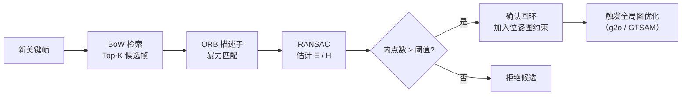
```mermaid
flowchart LR
    KF["新关键帧"] --> BOW["BoW 检索\nTop-K 候选帧"]
    BOW --> MATCH["ORB 描述子\n暴力匹配"]
    MATCH --> RANSAC["RANSAC\n估计 E / H"]
    RANSAC --> CHECK{"内点数 ≥ 阈值?"}
    CHECK -->|"是"| LOOP["确认回环\n加入位姿图约束"]
    CHECK -->|"否"| REJECT["拒绝候选"]
    LOOP --> OPT["触发全局图优化\n（g2o / GTSAM）"]
```

---

#### 激光 SLAM 的回环检测

激光 SLAM 没有图像，不能用 BoW，常用以下方案：

| 方法 | 原理 | 代表系统 |
|------|------|----------|
| **ICP 暴力搜索** | 遍历历史子图，ICP 验证匹配 | Cartographer |
| **Kd-tree 距离检索** | GPS/里程计先验约束搜索范围，再 ICP 验证 | LIO-SAM |
| **Scan Context** | 将点云编码为 2D 描述符（俯视极坐标直方图），快速检索 + 旋转不变 | SC-LIO-SAM |

**Scan Context** 是近年激光回环检测的主流方案：将3D点云投影到俯视极坐标格子，每个格子记录最大高度值，生成固定尺寸的2D矩阵作为"点云指纹"。两帧之间的相似度通过列移位搜索实现旋转不变性，检索速度远快于逐帧 ICP。

### 主要后端优化库

- **g2o（General Graph Optimization）**：通用图优化库，ORB-SLAM2/3 使用
- **GTSAM（Georgia Tech Smoothing and Mapping）**：因子图优化库，LIO-SAM 使用
- **iSAM2（Incremental Smoothing and Mapping 2）**：GTSAM 中的增量式优化算法，支持实时更新而无需每次重新优化整个图

## 4.6 激光 vs. 视觉 SLAM 对比

| 对比维度 | 激光 SLAM | 视觉 SLAM |
|---------|---------|---------|
| 传感器成本 | 高（数百至数万元） | 低 |
| 精度 | 高（cm 级） | 中（取决于场景） |
| 光照依赖 | 无 | 有（弱光/过曝困难） |
| 地图类型 | 点云/占据栅格 | 稀疏点云/半稠密 |
| 动态障碍处理 | 一般 | 较难 |
| 长廊退化问题 | 容易（缺少几何约束） | 依赖纹理 |
| 代表算法 | Cartographer, LIO-SAM | ORB-SLAM3, VINS-Mono |
| 典型应用 | 室内机器人, 自动驾驶 | 无人机, 手持设备 |

> **RTAB-Map** 横跨两列：支持激光和视觉双模态输入，精度和适用场景介于两者之间，是 ROS 生态中覆盖面最广的开箱即用方案。

## 4.7 SLAM 退化场景与实际部署挑战

SLAM 系统在实验室环境下往往表现良好，但在真实部署中会遭遇各种退化场景，导致定位失败或地图错误。理解这些场景并有针对性地选择算法，是工程化的关键。

<div align="center">
  
  <figcaption>图：棘手场景</figcaption>
</div>

### 4.7.1 几何退化（Geometric Degeneracy）

**长廊退化**（Corridor Degeneracy）：激光 SLAM 在长走廊中面临严峻挑战。走廊两侧墙壁高度对称，激光点云沿走廊方向的特征几乎一致，导致沿走廊方向的位移**无法被约束**（扫描匹配的法方向约束缺失）。表现为：沿走廊方向漂移，横向定位良好。

**对策**：
- 结合 IMU 或轮式里程计约束沿走廊方向运动
- 使用 3D LiDAR 利用天花板和地面结构补充约束
- LIO-SAM 的 IMU 预积分在退化方向提供约束

**开阔室外退化**：大型停车场、田野等缺少立体结构的环境，激光点云稀疏，NDT/ICP 收敛困难。**对策**：融合 GPS 全局约束。

### 4.7.2 动态环境挑战

SLAM 假设环境是静态的，但现实中行人、车辆、移动家具会产生动态干扰：

- **假地图点**：动态障碍物被错误地建入静态地图
- **跟踪失败**：大量动态物体导致扫描匹配失效
- **回环误检**：场景布局变化后 BoW 召回错误关键帧

**对策**：
- 点云动态物体滤除（基于运动一致性检测）
- 语义分割过滤动态类别（行人、车辆）的点云
- 视觉 SLAM 中使用运动分割（Motion Segmentation）

### 4.7.3 光照与天气影响（视觉 SLAM）

视觉 SLAM 对光照极为敏感：

| 场景 | 对特征法的影响 | 对直接法的影响 |
|------|------------|------------|
| 弱光（夜间） | ORB 特征提取失败 | 光度误差计算不稳定 |
| 过曝（逆光） | 特征描述子不稳定 | 饱和区域梯度为零 |
| 快速运动 | 运动模糊，特征模糊 | 光流假设违反 |
| 下雨/雾 | 特征被遮挡 | 能见度下降 |

**对策**：
- 视觉惯性 SLAM（VINS-Mono/ORB-SLAM3 IMU 模式）：IMU 在特征跟踪失败时维持短期定位
- HDR 相机或主动照明（结构光）适应光照变化
- 事件相机（Event Camera）对运动模糊免疫，是当前研究热点

### 4.7.4 长期地图维护与场景变化

长期部署面临地图老化问题：季节变化（落叶、积雪）、装修改造、家具移动等都会使原始地图失效。

**对策策略**：
- **增量式地图更新**：当传感器观测与现有地图不一致超过阈值时，触发局部地图更新
- **多地图管理**（ORB-SLAM3 支持）：在场景切换或跟踪丢失时创建新子地图，恢复后合并
- **语义地图**：用语义标签（门/墙/柱）替代原始点，语义特征比几何特征更稳定

### 4.7.5 嵌入式平台计算约束

机器人往往搭载算力有限的嵌入式平台（Jetson Nano / Xavier / Orin），而完整 SLAM 系统对算力要求较高：

| 组件 | CPU 算力需求 | GPU 加速可行性 |
|------|-----------|------------|
| ORB 特征提取 | 中（SIMD 可加速） | ✅（CUDA ORB） |
| LiDAR 扫描匹配（NDT/ICP）| 高 | 部分（PCL GPU） |
| Bundle Adjustment | 极高 | ✅（g2o CUDA） |
| 回环检测（BoW 检索） | 低 | 不必要 |
| 粒子滤波（AMCL 500 粒子）| 低 | 不必要 |

**实践建议**：
- 优先使用轻量化系统：LeGO-LOAM（嵌入式友好）、AMCL（低算力定位）
- 前端（特征提取、扫描匹配）尽量在 GPU 加速
- 后端优化可降频运行（10 Hz 前端 + 1–2 Hz 后端 BA）
- 使用 iSAM2 增量优化避免全图重优化

> **注**：视觉 SLAM 真实部署中的更多细节（与 TITS 2026 相关的场景适应性研究）将在后续补充。

## 4.8 常用数据集汇总

| 数据集 | 传感器 | 场景 | 主要用途 | 地址 |
|--------|-------|------|---------|------|
| **KITTI** | 激光雷达+双目+GPS/IMU | 室外道路 | 视觉/激光里程计, 3D目标检测 | kitti.is.tue.mpg.de |
| **TUM** | RGB-D | 室内 | RGB-D SLAM 评测 | vision.in.tum.de |
| **EuRoC** | 双目+IMU | 室内无人机 | VIO 评测 | rpg.ifi.uzh.ch |
| **nuScenes** | 6相机+激光+雷达+GPS/IMU | 室外道路 | 自动驾驶感知 | nuscenes.org |
| **Newer College** | 3D激光+IMU | 室外校园 | 3D LiDAR SLAM | ori.ox.ac.uk |
| **Hilti SLAM** | 多激光+相机+IMU | 建筑工地 | 多传感器 SLAM 评测 | hilti-challenge.com |

---

# 5. 路径规划（Path Planning）

路径规划解决"我该怎么走"的问题：在已知（或局部已知）的地图中，找到从起点到终点的无碰撞路径。

## 5.1 全局路径规划——搜索类

搜索类算法在**离散化的栅格地图**上搜索最优路径。

### Dijkstra 算法

**思路**：从起点出发，像涟漪扩散一样，按照**代价从小到大**的顺序逐步探索所有可达节点，直到找到终点。保证找到代价最小的路径（最优性）。

✅ 保证最优解
❌ 无方向性，在大地图上扩展节点数量大，效率低
❌ 时间复杂度 $O(V \log V + E)$，$V$ 为节点数，$E$ 为边数

<div align="center">
  
  
  <figcaption>图：Dijkstra 搜索过程（左）与导航结果（右）——扩展节点呈同心圆扩散，无方向性</figcaption>
</div>

### A*（A-Star）算法

**思路**：在 Dijkstra 基础上加入**启发函数 h(n)**（估计当前节点到终点的代价，通常用欧几里得距离或曼哈顿距离），让搜索有明确的方向性，优先探索"看起来更接近终点"的节点。

$$f(n) = g(n) + h(n)$$

其中 $g(n)$ 是起点到节点 $n$ 的实际代价，$h(n)$ 是启发函数估计值。

✅ 保证最优解（当 $h(n)$ 不高估实际代价时）
✅ 比 Dijkstra 快得多（方向性搜索）
❌ 在高维空间（如3D）计算量仍然较大

**启发函数 h(n) 的选择**：不同的启发函数适用于不同的移动约束：

| 启发函数 | 公式 | 适用场景 | 性质 |
|---------|------|---------|------|
| **曼哈顿距离** | $\|dx\| + \|dy\|$ | 只允许 4 方向移动（上下左右） | 4方向下恰好可采纳 |
| **欧几里得距离** | $\sqrt{dx^2 + dy^2}$ | 允许任意方向移动 | 任何情况下均可采纳 |
| **Octile 距离** | $\max(\|dx\|,\|dy\|) + (\sqrt{2}-1)\min(\|dx\|,\|dy\|)$ | 允许 8 方向移动（含对角线） | 8方向下比欧氏更紧（搜索更快） |

> **可采纳（Admissible）**：$h(n)$ 永远不高估真实代价，保证 A* 找到最优解。若 $h(n) = 0$ 则退化为 Dijkstra（最慢最优），$h(n)$ 越大越快但可能过高估失去最优性。

下图展示了 A* 在 10×10 栅格上的搜索过程：

<div align="center">
  
  <figcaption>图：A* 搜索示意——灰色（已评估关闭集）/ 橙色（待评估开放集）/ 绿色（最优路径），障碍物（深色）被绕过</figcaption>
</div>

<div align="center">
  
  
  <figcaption>图：A* 搜索过程（左）与导航结果（右）——有方向性，扩展节点集中在目标方向</figcaption>
</div>

### 双向 A*（Bidirectional A*）

同时从起点和终点双向搜索，当两个搜索波前相遇时停止。平均搜索节点数约为单向 A* 的一半，适合起终点相距较远的情况。

<div align="center">
  
  
  <figcaption>图：双向 A* 搜索（左，两端同时扩展）与导航结果（右）</figcaption>
</div>

### Hybrid A*（混合 A*）

**标准 A* 的问题**：在栅格上寻路，忽略了车辆的运动学约束。一辆汽车不能原地侧移，它有最小转弯半径。

**Hybrid A* 的改进**：将车辆的连续状态空间（$x, y, \theta$）离散化，每个节点扩展时考虑可执行的转向操作（如不同曲率的圆弧），确保生成的路径对非完整约束车辆（差速轮式/阿克曼）**实际可行**。

✅ 生成运动学可行路径
✅ 适合停车场景、狭窄通道
❌ 计算量比标准 A* 大
❌ 需要结合 Reeds-Shepp 曲线等后处理平滑

<div align="center">
  
  
  <figcaption>图：Hybrid A* 搜索（左）与导航结果（右）——生成考虑车辆运动学约束的平滑可行路径</figcaption>
</div>

### A* 算法工程优化

在实际工程落地（如自动驾驶或移动机器人）中，原始 A* 生成的路径往往存在节点冗余、拐角尖锐等问题。主流的优化策略包括：

1. **自适应启发函数权重**：
   引入动态权重系数 $\lambda$，使启发函数随位置变化：
   $$f(n) = g(n) + (1 + \lambda \cdot \frac{d_{to\_end}}{d_{total}})h(n)$$
   在靠近起点时增大权重以提升搜索速度（类似贪婪搜索）；在靠近终点时降低权重以保证路径的最优性。

2. **路径精简（Douglas-Peucker 算法）**：
   A* 产生的原始路径通常包含大量共线的冗余节点。利用 **Douglas-Peucker (DP)** 算法可以在保持路径拓扑特征的前提下，剔除不必要的中间点，极大地简化路径描述，提升后续轨迹平滑的效率。

3. **二次平滑（B-样条曲线）**：
   针对精简后的关键点，利用 **B-样条（B-Spline）** 或五次多项式进行拟合。这能将 A* 的折线路径转化为连续、高阶可导的平滑弧线，确保其符合底盘的动力学约束（如向心加速度限制）。

<div align="center">
  
  <figcaption>图：A* 路径优化流程——原始栅格路径（左）→ DP 精简关键点（中）→ B-样条平滑轨迹（右）</figcaption>
</div>


<div align="center">
  
  <figcaption>图：优化前的A*算法搜索点密集（图2a），路径拐点多；优化后不仅搜索点数量锐减（图2b），路径也更简洁平滑，搜索效率和路径质量实现双重提升。</figcaption>
</div>

## 5.2 全局路径规划——采样类

采样类算法通过**随机采样**构建路径，不需要显式栅格化地图，适合高维空间和复杂几何约束场景。

### RRT（快速随机扩展树，Rapidly-exploring Random Tree）

**思路**：从起点生长一棵树，每次随机采一个点，找到树上最近的节点，向随机点方向延伸一小步，如果没有碰撞就加入树。当树的某个节点足够接近终点时，路径即找到。

**核心步骤**：

1. 初始化：树 $\mathcal{T}$ 仅含起点 $x_{start}$
2. **随机采样** $x_{rand} \sim \mathcal{U}(\mathcal{X})$（有时以一定概率 $p_{goal} \approx 5\%$ 直接采终点，加速收敛）
3. **最近邻** $x_{near} = \arg\min_{x \in \mathcal{T}} \|x - x_{rand}\|$
4. **步进** $x_{new} = x_{near} + \delta \cdot \frac{x_{rand} - x_{near}}{\|x_{rand} - x_{near}\|}$，其中 $\delta$ 为步长（step_size）
5. **碰撞检测**：若 $x_{near} \to x_{new}$ 无障碍，则将 $x_{new}$ 加入树，边权为 $\delta$
6. 重复直到 $\|x_{new} - x_{goal}\| < \epsilon$

关键参数 `step_size`：过大则跨越障碍物失败，过小则收敛极慢，通常取地图对角线的 1%–5%。

✅ 天然处理高维空间（机械臂规划）
✅ 不需要栅格化
❌ **不保证最优性**（找到的路径通常较曲折）
❌ 最终路径需要额外平滑处理（常用 B-Spline 或 Shortcut 平滑）

<div align="center">
  
  
  <figcaption>图：RRT 随机树扩展过程（左）与规划路径（右）——路径曲折，非最优</figcaption>
</div>

### RRT*

RRT 的改进版，在标准 RRT 基础上增加了两个关键步骤：**近邻选父（Choose Parent）** 和 **重连（Rewiring）**。

**Choose Parent**：不再直接用最近邻作为父节点，而是在半径 $r$ 的近邻集合 $\mathcal{X}_{near}$ 中，选择**到起点代价最低**的节点作为父节点：

$$x_{parent} = \arg\min_{x \in \mathcal{X}_{near}} \left[ \text{cost}(x) + d(x, x_{new}) \right]$$

**Rewiring**：将 $x_{new}$ 加入树后，检查 $\mathcal{X}_{near}$ 中的每个节点 $x_{near}$：若经过 $x_{new}$ 能降低 $x_{near}$ 的路径代价，则断开 $x_{near}$ 的旧父边，改由 $x_{new}$ 作为父节点。

搜索半径 $r$ 随采样点数 $n$ 缩小：$r(n) = \gamma \left(\frac{\log n}{n}\right)^{1/d}$（$d$ 为空间维度），保证渐近最优的同时控制计算量。

✅ 渐近最优性（采样越多路径越好）
✅ 与 RRT 共享相同的采样框架，易于实现
❌ 每次新增节点需遍历近邻集合，单步时间复杂度 $O(\log n)$ 高于 RRT 的 $O(1)$
❌ 收敛速度慢，实时规划时可能采样时间不够

<div align="center">
  
  
  <figcaption>图：RRT* 搜索过程（左，重连后路径持续优化）与规划路径（右）——比 RRT 更平滑</figcaption>
</div>

### 双向 RRT*（Bidirectional RRT*）

从起点 $x_{start}$ 和终点 $x_{goal}$ 各生长一棵 RRT* 树（$\mathcal{T}_a$、$\mathcal{T}_b$），每次迭代交替扩展两棵树：

1. 对 $\mathcal{T}_a$ 执行一步 RRT* 扩展，得到新节点 $x_{new}$
2. 尝试将 $x_{new}$ 连接到 $\mathcal{T}_b$ 中距其最近且路径无碰撞的节点 $x_{b,near}$
3. 若连接成功，合并两条子路径得到候选完整路径；保留代价最小的完整路径
4. 两棵树角色互换（$\mathcal{T}_a \leftrightarrow \mathcal{T}_b$），继续迭代优化

**优势来源**：两棵树"对向生长"，有效避免了单向树在宽阔空间中的盲目扩散，搜索体积从 $O(r^d)$ 降为 $O(2 \cdot (r/2)^d)$，收敛速度比单向 RRT* 快约一个数量级。

<div align="center">
  
  
  <figcaption>图：双向 RRT* 搜索（左，红蓝两棵树相遇）与规划路径（右）</figcaption>
</div>

### Informed RRT*

进一步改进：当找到一条初始解 $c_{best}$ 后，将采样限制在**椭圆区域**内。该椭圆的两个焦点为 $x_{start}$ 和 $x_{goal}$，长半轴为 $a = c_{best}/2$，短半轴为：

$$b = \frac{1}{2}\sqrt{c_{best}^2 - \|x_{goal} - x_{start}\|^2}$$

**直觉**：只有椭圆内的点才可能使路径代价低于 $c_{best}$（椭圆的定义恰好是到两焦点距离之和 $\leq c_{best}$）。随着路径不断优化，$c_{best}$ 减小，椭圆持续收缩，采样越来越"精准"，避免在无效区域浪费采样。

采样时将标准圆内的均匀随机点 $x_{ball} \sim \mathcal{U}(\mathcal{B}^d)$ 通过仿射变换映射到椭圆坐标系：$x_{rand} = C \cdot L \cdot x_{ball} + x_{center}$，其中 $C$ 是旋转矩阵（使椭圆主轴对准 $x_{start} \to x_{goal}$ 方向），$L = \text{diag}(a, b, \ldots, b)$。

<div align="center">
  
  
  <figcaption>图：Informed RRT* 搜索（左，椭圆采样区域随路径改善而收缩）与规划路径（右）</figcaption>
</div>

## 5.3 局部路径规划（动态避障）

全局规划假设地图是静态的，而现实中会有动态障碍物（行人、其他机器人）。局部规划在机器人运动过程中实时重新规划，处理动态障碍。

### DWA（动态窗口法，Dynamic Window Approach）

**思路**：在机器人当前速度周围的**可达速度窗口**（受加速度限制）中采样速度指令 $(v, \omega)$，用运动模型预测每条轨迹，根据**目标方向 + 速度 + 障碍物距离**综合打分，选择最优速度指令执行。

**动态窗口的构造**：速度空间 $(v, \omega)$ 需同时满足三个约束，取交集：

- **速度限制**：$v \in [v_{min}, v_{max}]$，$\omega \in [\omega_{min}, \omega_{max}]$
- **动态窗口**（加速度限制）：$v \in [v_c - \dot{v}_{max} \cdot \Delta t,\ v_c + \dot{v}_{max} \cdot \Delta t]$，$\omega$ 类似
- **可达性约束**：轨迹上距离最近障碍物的距离 $> 0$（且机器人能在到达障碍物前制动）

**评分函数**：

$$G(v, \omega) = \sigma\bigl(\alpha \cdot \text{heading}(v,\omega) + \beta \cdot \text{dist}(v,\omega) + \gamma \cdot \text{velocity}(v,\omega)\bigr)$$

三个分量的含义：
- $\text{heading}$：轨迹终点朝向与目标点方向的夹角差（越小越好，鼓励机器人转向目标）
- $\text{dist}$：轨迹上离最近障碍物的最小距离（越大越好，鼓励远离障碍）
- $\text{velocity}$：线速度 $v$ 本身（越大越好，鼓励快速前进）
- $\sigma(\cdot)$ 为归一化函数，$\alpha, \beta, \gamma$ 为权重

✅ 计算快（ms 级），适合实时避障
✅ ROS `dwa_local_planner` 开箱即用
❌ 速度搜索空间有限，在狭窄通道中容易失败
❌ 只考虑短期轨迹（约 1–3 s），无法处理需要”绕路”的障碍

**改进变体：模糊 DWA (Fuzzy DWA)**  
传统 DWA 的评价权重（$\alpha, \beta, \gamma$）是固定的，难以兼顾”高速行驶”与”狭窄避障”。**模糊 DWA** 引入模糊推理机，以**目标距离**和**最近障碍物距离**为输入，动态调整采样权重。例如：当障碍物极近时，大幅提高 $\beta$（避障权重）并降低 $\gamma$（速度权重），使避障行为更丝滑、不生硬。

<div align="center">
  
  <figcaption>图：动态窗口法</figcaption>
</div>

### TEB（时间弹性带，Timed Elastic Band）

**思路**：将路径视为一段"橡皮筋"，加入时间维度后变成"时间弹性带"。TEB 将局部规划问题建模为一个**稀疏非线性最小二乘优化**：

**状态表示**：路径由一系列带时间戳的位姿序列表示 $\mathcal{B} = \{x_i, \Delta T_i\}_{i=1}^{n}$，其中 $x_i = (p_x, p_y, \theta)$，$\Delta T_i$ 是相邻路点间的时间间隔。

**优化目标**（多约束加权求和）：

$$\min_{\mathcal{B}} \sum_k \gamma_k f_k(\mathcal{B})$$

各约束项的含义：

| 约束项 | 含义 |
|--------|------|
| $f_{short}$ | 路径长度最短（路点间距之和最小） |
| $f_{obs}$ | 障碍物距离约束（所有路点离障碍物 $> d_{min}$） |
| $f_{kin}$ | 运动学可行性（非完整约束：曲率 $\leq \kappa_{max}$，即最小转弯半径） |
| $f_{vel}$ | 速度约束（$v \leq v_{max}$，$\omega \leq \omega_{max}$） |
| $f_{acc}$ | 加速度约束（$\|\dot{v}\| \leq a_{max}$，$\|\dot{\omega}\| \leq \alpha_{max}$） |

优化采用 **g2o 稀疏图优化框架**：每个路点为节点，每个约束为边，利用 Levenberg–Marquardt 或 Gauss-Newton 迭代求解，通常 10–30 次迭代即可收敛。

✅ 生成平滑、运动学可行的轨迹
✅ 支持动态障碍物（将障碍物也建模为图中的节点）
✅ 支持倒车（允许 $v < 0$）
❌ 计算量比 DWA 大，约 50–200 ms
❌ 参数调优复杂（约束权重 $\gamma_k$ 间相互影响）
❌ 对初始路径质量敏感，全局规划结果差时局部可能陷入局部最优

<div align="center">
  
  <figcaption>图：时间弹力带</figcaption>
</div>

### 势场法（Potential Field Method）

最简单直观的局部避障方法：终点产生**引力场**，障碍物产生**斥力场**，机器人沿势场梯度方向下降移动。

**引力势**（抛物线型，距目标越远引力越大）：

$$U_{att}(q) = \frac{1}{2} k_{att} \cdot d^2(q, q_{goal})$$

**斥力势**（当距障碍物 $d(q, O) < Q^*$ 时生效）：

$$U_{rep}(q) = \begin{cases} \dfrac{1}{2} k_{rep} \left(\dfrac{1}{d(q,O)} - \dfrac{1}{Q^*}\right)^2 & \text{if } d(q,O) \leq Q^* \\ 0 & \text{otherwise} \end{cases}$$

机器人受到的合力为负梯度：$F(q) = -\nabla U_{att}(q) - \nabla U_{rep}(q)$，沿合力方向移动。

**局部极小值**的成因：在障碍物密集区域，某点的引力方向与斥力恰好大小相等、方向相反，梯度为零，机器人陷入"假终点"。

**缓解方法**：随机扰动（Random Walk）、增加全局目标的势权重、结合全局规划引路等。

✅ 实现简单，计算极快（O(障碍物数量)）
✅ 可生成连续的力指令，适合与控制器直接耦合
❌ **局部极小值问题**（机器人可能卡在引力和斥力平衡点）
❌ 狭窄通道中障碍物两侧斥力叠加，合力垂直于通道方向，机器人无法通行
❌ 靠近目标时引力趋近零，若仍有斥力，机器人可能无法到达终点

<div align="center">
  
  <figcaption>图：势场法避障演示——机器人沿引力/斥力合力运动，遭遇局部极小值时可能停滞</figcaption>
</div>

### MPPI（模型预测路径积分）

**模型预测路径积分（Model Predictive Path Integral）思路**：属于**模型预测控制（MPC）** 的随机变体。在当前时刻，向前采样**大量随机控制序列**（通过 GPU 并行采样），用运动模型仿真每条轨迹的未来状态，根据轨迹代价计算**信息论加权平均**作为当前控制输出，然后滑动时间窗口重复。

**算法流程**：

1. 当前控制序列 $U = \{u_0, u_1, \ldots, u_{T-1}\}$，采样 $K$ 条扰动序列 $\epsilon^{(k)} \sim \mathcal{N}(0, \Sigma)$
2. 对每条轨迹 $k$，并行前向仿真 $T$ 步，计算代价：
   $$S^{(k)} = \sum_{t=0}^{T-1} \left[ c(x_t^{(k)}) + \lambda \, u_t^\top \Sigma^{-1} \epsilon_t^{(k)} \right] + \phi(x_T^{(k)})$$
   其中 $c(x_t)$ 为状态代价（碰撞惩罚、偏航偏差等），$\phi$ 为终端代价，$\lambda$ 为温度参数
3. 计算每条轨迹的**指数权重**（代价越低权重越大）：
   $$w^{(k)} = \frac{\exp\!\left(-\frac{1}{\lambda} S^{(k)}\right)}{\sum_{j=1}^K \exp\!\left(-\frac{1}{\lambda} S^{(j)}\right)}$$
4. 加权平均更新控制序列：$u_t \leftarrow u_t + \sum_k w^{(k)} \epsilon_t^{(k)}$
5. 执行 $u_0$，滑动窗口前移一步，重复

**温度参数 $\lambda$** 控制"探索-利用"权衡：$\lambda \to 0$ 时几乎只用代价最低的轨迹（贪婪），$\lambda \to \infty$ 时所有轨迹权重相等（纯随机）。

✅ 无需求解最优控制问题（只需前向仿真，无梯度）
✅ 天然支持非线性系统和非凸代价函数（如碰撞的阶跃代价）
✅ GPU 并行采样（$K$ 可达 $10^3$–$10^4$），可处理复杂障碍物分布
❌ 需要相对精确的运动模型（仿真误差积累会导致轨迹偏差）
❌ 计算量较大，通常需要 GPU 才能达到实时控制频率（$\geq 10$ Hz）

<div align="center">
  
  <figcaption>图：MPPI 路径跟踪仿真——GPU 并行采样大量轨迹（半透明线），加权平均得到最优控制</figcaption>
</div>

## 5.4 代价地图（Costmap）层次结构

ROS `costmap_2d` 采用**分层代价地图**架构：

| 层名 | 功能 | 更新频率 |
|------|------|---------|
| **静态层** | 读取 SLAM 生成的静态地图 | 低（一次性） |
| **障碍物层** | 订阅传感器数据（激光/点云），标记动态障碍 | 高（实时） |
| **膨胀层** | 对障碍物区域按机器人半径膨胀出代价梯度 | 随障碍物层更新 |
| **自定义层** | 用户可扩展（如禁止区域、语义标注等） | 自定义 |

<div align="center">
  
  <figcaption>图：代价地图三层结构——静态层（全局地图）+ 障碍物层（传感器实时更新）+ 膨胀层（代价梯度），三层叠加生成最终代价地图</figcaption>
</div>

**inflation_radius 与机器人尺寸的关系**：

膨胀层的核心参数 `inflation_radius`（膨胀半径）决定了障碍物周围代价梯度的扩展范围：

- **最小值**：至少设为机器人半径（$r_{robot}$），否则机器人可能与障碍物发生碰撞
- **推荐值**：$r_{robot}$ + 安全余量（如 0.1–0.3 m），余量根据定位精度和机器人速度决定
- **过大的影响**：狭窄通道被高代价区域填满，规划器无法找到路径（代价无限大路径不可通）

膨胀代价的计算公式（ROS `costmap_2d`）：

$$\text{cost}(d) = \text{INSCRIBED\_COST} \cdot e^{-\text{cost\_scaling\_factor} \cdot (d - r_{inscribed})}$$

其中 $d$ 是到最近障碍物的距离，$r_{inscribed}$ 是机器人的内切圆半径。`cost_scaling_factor` 越大，代价衰减越快（紧贴障碍物的代价梯度越陡）。

**全局代价地图**（Global Costmap）：大范围，更新慢，用于全局规划
**局部代价地图**（Local Costmap）：机器人周围小范围（如 5m），更新快，用于局部避障

## 5.5 规划算法对比汇总

| 算法 | 类型 | 最优性 | 完备性 | 计算速度 | 适用场景 |
|------|------|--------|--------|---------|---------|
| **Dijkstra** | 搜索（全局） | ✅ 最优 | ✅ | 慢 | 小规模栅格地图 |
| **A*** | 搜索（全局） | ✅ 最优 | ✅ | 中等 | 室内导航，自动驾驶 |
| **Hybrid A*** | 搜索（全局） | 近似 | ✅ | 中等 | 非完整约束车辆（自动驾驶停车） |
| **RRT** | 采样（全局） | ❌ | 概率完备 | 快 | 高维空间，机械臂 |
| **RRT*** | 采样（全局） | 渐近最优 | 概率完备 | 中等 | 高维空间 |
| **DWA** | 局部 | 局部最优 | ❌ | 极快 | 室内移动机器人实时避障 |
| **TEB** | 局部 | 局部最优 | ❌ | 中等 | 复杂局部环境，需平滑轨迹 |
| **势场法** | 局部 | ❌ | ❌ | 极快 | 简单场景，辅助引导 |
| **MPPI** | 采样（局部） | 渐近最优 | 概率完备 | 中等（GPU加速） | 非线性动力学，越野无人车，动态避障 |

---

# 6. 路径跟踪（Path Tracking）

路径规划给出了一条理想路径，而**路径跟踪控制器**的任务是让机器人实际跟随这条路径运动。由于真实世界存在噪声、模型误差和外界干扰，控制器需要实时计算修正量。

## 6.1 纯追踪控制

纯追踪控制（Pure Pursuit）**直觉理解**：想象你开车，目光盯着前方一个固定距离（**预瞄距离 Look-ahead Distance $L_d$**）的目标点，不断调整方向盘朝它转。这就是 Pure Pursuit 的思路。

**核心公式**：

$$\delta = \arctan\left(\frac{2L\sin\alpha}{L_d}\right)$$

其中：
- $\delta$ = 前轮转角（控制量）
- $L$ = 轴距
- $\alpha$ = 目标点方向与车辆航向的夹角
- $L_d$ = 预瞄距离（通常取当前速度的 1–2 倍时间内行驶的距离）

<div align="center">
  
  <figcaption>图：Pure Pursuit 几何关系——后轴中心为参考点，以预瞄距离 $L_d$ 为半径作圆，与参考路径交点为目标点 T，夹角 α 决定前轮转角 δ</figcaption>
</div>

✅ 实现极其简单
✅ 对路径噪声鲁棒（天然平滑效果）
❌ 预瞄距离需要人工调参
❌ 高速时跟踪误差大（纯几何控制，忽略动力学）

**预瞄距离 $L_d$ 调参实践建议**：

$L_d$ 是 Pure Pursuit 唯一需要调的关键参数，对性能影响极大：

| $L_d$ 设置 | 行为特点 | 适用场景 |
|-----------|---------|---------|
| **太小**（< 0.5m @ 1m/s）| 转向过于激进，频繁震荡 | — |
| **适中** | 平滑跟踪，轻微路径误差 | 一般导航 |
| **太大**（> 3m @ 1m/s）| 走"大弯"切角，直道效果好但转弯误差大 | 高速直道 |

**速度自适应调参**（Adaptive Pure Pursuit）：使用 $L_d = k \cdot v$，其中典型 $k$ 值为：
- 室内机器人（最高 1 m/s）：$k \approx 1.5$–$2.0$
- 仓储 AGV（最高 2 m/s）：$k \approx 1.0$–$1.5$
- 自动驾驶（最高 30 km/h）：$k \approx 0.5$–$1.0$

另一实践技巧：设置 $L_d$ 的**最小值**（如 0.3 m），避免低速时预瞄距离趋近于零导致震荡。

<div align="center">
  
  <figcaption>图：Pure Pursuit 路径跟踪仿真——车辆目视前方预瞄点，平滑跟踪参考路径</figcaption>
</div>

## 6.2 自适应追踪控制

自适应追踪控制（Adaptive Pure Pursuit）将预瞄距离 $L_d$ 与速度**动态关联**：

$$L_d = k \cdot v$$

其中 $k$ 是比例系数，$v$ 是当前速度。速度快时预瞄远（稳定），速度慢时预瞄近（精确）。这解决了固定预瞄距离在不同速度下表现差异大的问题。

<div align="center">
  
  <figcaption>图：自适应 Pure Pursuit 路径跟踪——预瞄距离随速度动态调整，各速度段均表现稳定</figcaption>
</div>

## 6.3 后轮反馈控制

后轮反馈控制（Rear Wheel Feedback）以车辆**后轴中点**为跟踪参考点（而非前轴或重心），直接消除后轮在参考路径上的横向误差和航向误差。后轮反馈控制（Rear Wheel Feedback）相比 Pure Pursuit 有更严格的数学收敛保证。

<div align="center">
  
  <figcaption>图：后轮反馈控制路径跟踪仿真——以后轴为参考点，横向误差收敛更快</figcaption>
</div>

## 6.4 Stanley 控制器

斯坦福大学自动驾驶团队（用于 DARPA 挑战赛）提出的控制律，以**前轴中点**为参考：

$$\delta = \psi_e + \arctan\left(\frac{k \cdot e}{v}\right)$$

其中：
- $\psi_e$ = 航向误差
- $e$ = 前轴到路径的横向偏差
- $k$ = 增益系数
- $v$ = 当前速度

第一项修正航向偏差，第二项修正横向偏差。速度越快，横向误差修正量越小（避免高速急转）。

✅ 精度优于 Pure Pursuit
✅ 低速（停车）时的精度表现好
❌ 在极低速时 $\arctan(k \cdot e / v)$ 项趋于饱和，需要处理
❌ 不显式考虑路径曲率

<div align="center">
  
  <figcaption>图：Stanley 控制器路径跟踪仿真——同时修正航向误差和横向偏差，转弯处精度更高</figcaption>
</div>

## 6.5 LQR 路径跟踪

**线性二次调节器（Linear Quadratic Regulator）**将路径跟踪问题建模为**最优控制问题**。在车辆线性化模型下，LQR 求解最小化如下代价函数的最优控制律：

$$J = \sum_{t=0}^{\infty} \left( \mathbf{e}_t^T \mathbf{Q} \mathbf{e}_t + u_t^T \mathbf{R} u_t \right)$$

其中 $\mathbf{e}_t$ 是跟踪误差（横向偏差 + 航向误差），$u_t$ 是控制输入（转向角），$\mathbf{Q}$ 和 $\mathbf{R}$ 是权重矩阵（调参关键：$\mathbf{Q}$ 大表示"更重视减小误差"，$\mathbf{R}$ 大表示"更重视平稳控制"）。

✅ 理论上最优，精度高
✅ 系统响应平滑
❌ 依赖精确的线性化模型
❌ $\mathbf{Q}$、$\mathbf{R}$ 矩阵调参需要经验

<div align="center">
  
  <figcaption>图：LQR 路径跟踪仿真——最优控制律使得跟踪误差最小化，响应平滑稳定</figcaption>
</div>

## 6.6 路径跟踪算法对比汇总

| 控制器 | 跟踪精度 | 计算量 | 参数数量 | 适用速度 | 典型应用 |
|--------|---------|--------|---------|---------|---------|
| **Pure Pursuit** | 低–中 | 极低 | 1（$L_d$） | 低–中 | 简单室内机器人 |
| **Adaptive Pure Pursuit** | 中 | 极低 | 1（$k$） | 全速域 | 一般移动机器人 |
| **Stanley** | 中–高 | 低 | 1（$k$） | 低–高 | 自动驾驶 |
| **后轮反馈** | 中–高 | 低 | 少 | 全速域 | 差速轮式机器人 |
| **LQR** | 高 | 中 | 2（$\mathbf{Q}$, $\mathbf{R}$） | 低–高 | 自动驾驶、高精度机器人 |

---

# 7. 机器人运动学模型（Kinematic Models）

路径规划和运动控制的所有算法，其速度约束、轨迹曲率、控制变量都建立在特定运动学模型之上。不同底盘结构对应截然不同的状态方程，直接决定了哪些规划/跟踪算法可用、约束如何建模。本章系统梳理三类主流模型。

---

## 7.1 差分驱动模型（Differential Drive）

### 机构特征

差分驱动底盘由两个独立驱动轮（左轮 $\omega_L$、右轮 $\omega_R$）和若干从动万向轮组成，通过两轮转速差实现转向。典型平台：TurtleBot、Husky、室内移动机器人。

<div align="center">
  
<figcaption>差分驱动底盘结构示意：左右轮独立驱动，$r$ 为轮半径，$2b$ 为轮距</figcaption>
</div>

### 运动学方程

设轮半径为 $r$，轮距（左右轮中心距）为 $2b$，则：

$$v = \frac{r(\omega_R + \omega_L)}{2}, \quad \omega = \frac{r(\omega_R - \omega_L)}{2b}$$

机器人在世界坐标系下的状态 $\mathbf{q} = [x, y, \theta]^\top$ 满足：

$$\dot{x} = v\cos\theta, \quad \dot{y} = v\sin\theta, \quad \dot{\theta} = \omega$$

写成矩阵形式：

$$\dot{\mathbf{q}} = \begin{bmatrix} \cos\theta & 0 \\ \sin\theta & 0 \\ 0 & 1 \end{bmatrix} \begin{bmatrix} v \\ \omega \end{bmatrix}$$

控制输入为线速度 $v$ 和角速度 $\omega$，通过逆运动学解算得到各轮转速：

$$\omega_R = \frac{v + b\omega}{r}, \quad \omega_L = \frac{v - b\omega}{r}$$

### 约束与特性

| 属性 | 说明 |
|------|------|
| **自由度** | 2（$v$, $\omega$），非完整约束（不能横向平移） |
| **转弯半径** | $R = v / \omega$，可取 $0$（原地旋转） |
| **瞬时旋转中心** | 位于两轮连线延长线上，$\omega_L = -\omega_R$ 时在轴心原地旋转 |
| **速度约束** | $\vert v \vert \le v_{\max}$，$\vert\omega\vert \le \omega_{\max}$，各轮转速不超硬件上限 |

### 对规划算法的影响

- **DWA**：速度采样空间为 $(v, \omega)$ 二维矩形，可支持原地旋转，无最小转弯半径约束。
- **TEB**：可直接约束 $v$、$\omega$ 及其导数（加速度），差分模型优化自由度高。
- **Pure Pursuit / LQR**：通常将 $\omega$ 作为控制输出，直接控制角速度即可。

---

## 7.2 阿克曼转向模型（Ackermann Steering）

### 机构特征

阿克曼底盘仿照汽车转向几何设计：后轮驱动，前轮转向；两前轮绕各自转向节转动，理想情况下四轮瞬时旋转中心共线，消除轮胎侧滑。典型平台：自动驾驶乘用车、AgileX Scout、Jackal（小型四轮差速/阿克曼混合）。

<div align="center">
  
<figcaption>阿克曼转向几何：四轮瞬时旋转中心共线，内外轮转角不同以消除侧滑</figcaption>
</div>

### 几何关系

设轴距（前后轴中心距）为 $L$，前轮等效转角为 $\delta$，则转弯半径为：

$$R = \frac{L}{\tan\delta}$$

内外侧实际前轮转角满足（完整阿克曼条件）：

$$\cot\delta_{out} - \cot\delta_{in} = \frac{W}{L}$$

其中 $W$ 为轮距。工程上通常用单一等效前轮角 $\delta$ 近似。

### 运动学方程（自行车模型近似）

将前后轮各合并为单轮，得到经典**自行车模型**：

<div align="center">
  
<figcaption>自行车模型简化：轴距 $L$，前轮转角 $\delta$，后轮为参考点</figcaption>
</div>

$$\dot{x} = v\cos\theta, \quad \dot{y} = v\sin\theta, \quad \dot{\theta} = \frac{v\tan\delta}{L}$$

控制输入为纵向速度 $v$ 和前轮转角 $\delta$，曲率 $\kappa = \tan\delta / L$。

离散化（前向欧拉，步长 $\Delta t$）：

$$\begin{aligned}
x_{k+1} &= x_k + v_k \cos\theta_k \cdot \Delta t \\
y_{k+1} &= y_k + v_k \sin\theta_k \cdot \Delta t \\
\theta_{k+1} &= \theta_k + \frac{v_k \tan\delta_k}{L} \cdot \Delta t
\end{aligned}$$

### 约束与特性

| 属性 | 说明 |
|------|------|
| **自由度** | 2（$v$, $\delta$），非完整约束 |
| **最小转弯半径** | $R_{\min} = L / \tan\delta_{\max}$，不能原地旋转 |
| **曲率连续性** | 转角变化率受转向执行器限制，路径需曲率连续（$C^1$） |
| **高速稳定性** | 高速时轮胎侧偏角不可忽略，需扩展为动力学模型 |

### 对规划算法的影响

- **Hybrid A\***：以 $(x, y, \theta)$ 为状态，用阿克曼运动方程展开节点，生成曲率连续路径，直接可跟踪。
- **TEB**：需开启阿克曼模式，约束 $|\delta| \le \delta_{\max}$ 和 $\dot{\delta}$ 上限，轨迹最小曲率半径有限。
- **Pure Pursuit / Stanley**：输出前轮转角 $\delta$，是为阿克曼车辆专门推导的跟踪控制律。
- **MPC**：以自行车模型为预测模型，约束 $\delta$ 和 $\dot{\delta}$，适合高速精确跟踪。

---

## 7.3 全向轮模型（Omnidirectional / Holonomic）

### 机构特征

全向底盘利用特殊轮结构（Mecanum 轮或全向轮）实现平面内任意方向的独立平移，无需旋转机身。典型结构：

| 构型 | 轮数 | 特点 |
|------|------|------|
| **三轮全向** | 3 | 轮子互成 120°，结构简洁，地面适应性好 |
| **四轮 Mecanum** | 4 | 辊子与轮轴成 45°，工业仓储最常用 |
| **四轮全向（90°辊）** | 4 | 辊子垂直轮轴，转向力矩弱于 Mecanum |

典型平台：仓储 AMR（亚马逊 Kiva 类）、实验室移动操作机器人（HSR、TIAGo）。

<div align="center">
  
<figcaption>四轮 Mecanum 底盘布局：辊子与轮轴成 45°，左前/右后同向，右前/左后反向</figcaption>
</div>

### 四轮 Mecanum 运动学方程

设四轮布局为矩形，半轴距 $l_x$（纵向）、$l_y$（横向），轮半径 $r$，辊子与轮轴夹角 $45°$，则逆运动学（机器人速度 → 轮速）：

$$\begin{bmatrix} \omega_1 \\ \omega_2 \\ \omega_3 \\ \omega_4 \end{bmatrix} = \frac{1}{r} \begin{bmatrix} 1 & -1 & -(l_x+l_y) \\ 1 & 1 & (l_x+l_y) \\ 1 & 1 & -(l_x+l_y) \\ 1 & -1 & (l_x+l_y) \end{bmatrix} \begin{bmatrix} v_x \\ v_y \\ \omega_z \end{bmatrix}$$

轮编号约定：$\omega_1$=左前，$\omega_2$=右前，$\omega_3$=左后，$\omega_4$=右后。

正运动学（轮速 → 机器人速度）取上矩阵伪逆（满秩时为 $\frac{1}{4}$ 倍转置）：

$$\begin{bmatrix} v_x \\ v_y \\ \omega_z \end{bmatrix} = \frac{r}{4} \begin{bmatrix} 1 & 1 & 1 & 1 \\ -1 & 1 & 1 & -1 \\ -\frac{1}{l_x+l_y} & \frac{1}{l_x+l_y} & -\frac{1}{l_x+l_y} & \frac{1}{l_x+l_y} \end{bmatrix} \begin{bmatrix} \omega_1 \\ \omega_2 \\ \omega_3 \\ \omega_4 \end{bmatrix}$$

世界坐标系下状态方程（含航向角 $\theta$）：

$$\dot{\mathbf{q}} = \begin{bmatrix} \cos\theta & -\sin\theta & 0 \\ \sin\theta & \cos\theta & 0 \\ 0 & 0 & 1 \end{bmatrix} \begin{bmatrix} v_x \\ v_y \\ \omega_z \end{bmatrix}$$

### 三轮全向运动学方程

<div align="center">
  
<figcaption>三轮全向底盘：三轮互成 120° 均匀分布，$d$ 为轮心到底盘中心距离</figcaption>
</div>

三轮互成 $120°$，设第 $i$ 轮安装角为 $\phi_i = 120°(i-1)$：

$$\omega_i = \frac{1}{r}\left(-\sin\phi_i \cdot v_x + \cos\phi_i \cdot v_y + d \cdot \omega_z\right), \quad i=1,2,3$$

其中 $d$ 为轮子到底盘中心的距离。逆解：

$$\begin{bmatrix} v_x \\ v_y \\ \omega_z \end{bmatrix} = \frac{2r}{3} \begin{bmatrix} -\sin\phi_1 & -\sin\phi_2 & -\sin\phi_3 \\ \cos\phi_1 & \cos\phi_2 & \cos\phi_3 \\ \frac{1}{2d} & \frac{1}{2d} & \frac{1}{2d} \end{bmatrix} \begin{bmatrix} \omega_1 \\ \omega_2 \\ \omega_3 \end{bmatrix}$$

### 约束与特性

| 属性 | 说明 |
|------|------|
| **自由度** | 3（$v_x$, $v_y$, $\omega_z$），完整约束（Holonomic） |
| **横向平移** | 可任意横移，无侧偏约束，路径规划自由度最高 |
| **地形适应性** | Mecanum 辊子接触地面，地面不平时打滑严重 |
| **里程计精度** | 辊子打滑导致轮式里程计误差显著，需融合 IMU/激光 |
| **承载能力** | 弱于差分/阿克曼，辊子接触应力集中 |

### 对规划算法的影响

- **全局规划**：可直接使用标准 A\* / Dijkstra 在栅格地图规划，路径无曲率约束，任意方向可达。
- **DWA**：速度空间扩展为 $(v_x, v_y, \omega_z)$ 三维，或等效为 $(v, \theta_{vel}, \omega_z)$，采样空间更大。
- **路径跟踪**：无需复杂跟踪控制律，可用简单 PID 分别控制 $x$、$y$、$\theta$ 三个通道，独立解耦。
- **MPC**：预测模型为线性（忽略打滑），约束为各轮转速上限，设计比阿克曼更简单。

---

## 7.4 三类模型综合对比

| 对比维度 | 差分驱动 | 阿克曼转向 | 全向轮（Mecanum） |
|----------|----------|------------|-------------------|
| **约束类型** | 非完整（2-DoF） | 非完整（2-DoF） | 完整（3-DoF） |
| **原地旋转** | 支持 | 不支持 | 支持 |
| **横向平移** | 不支持 | 不支持 | 支持 |
| **最小转弯半径** | 0 | $L/\tan\delta_{\max}$ | 0 |
| **路径曲率要求** | 低 | 需曲率连续 | 无约束 |
| **高速稳定性** | 中 | 高（汽车成熟方案） | 低（打滑） |
| **里程计精度** | 高 | 中（轮胎滑动） | 低（辊子打滑） |
| **适配规划算法** | DWA、TEB、Pure Pursuit | Hybrid A\*、TEB(Ackermann)、Stanley、MPC | A\*、DWA(3D)、PID解耦 |
| **典型应用场景** | 室内服务机器人 | 自动驾驶、室外车辆 | 仓储 AMR、移动操作 |

> **工程选型原则**：室内窄道优先差分（转弯灵活、成本低）；室外高速优先阿克曼（稳定性好、轮胎模型成熟）；需要横移的仓储/操作场景选全向轮（效率高，但需补偿打滑）。

---

# 8. 运动控制（Motion Control）

路径跟踪（第6章）解决的是"朝哪个方向走"的几何问题，而**运动控制**解决的是"如何精确执行这些指令"的动态问题——需要考虑系统模型、物理约束、扰动抑制和最优性。本章介绍机器人导航中常用的模型化控制方法。

## 8.1 PID 控制

PID（比例-积分-微分，Proportional-Integral-Derivative）是工程中应用最广泛的控制器，也是理解更复杂控制算法的基础。

**控制律**：

$$u(t) = K_p e(t) + K_i \int_0^t e(\tau)\,d\tau + K_d \frac{de(t)}{dt}$$

其中 $e(t)$ 是误差（如横向偏差或航向误差），三项分别：
- **P（比例）**：当前误差越大，修正力度越大；响应快但可能超调
- **I（积分）**：消除稳态误差（积累历史误差）；过大会振荡
- **D（微分）**：预测误差变化趋势，抑制超调；对噪声敏感

**离散形式**（实际代码中使用）：

$$u_k = K_p e_k + K_i \sum_{j=0}^{k} e_j \Delta t + K_d \frac{e_k - e_{k-1}}{\Delta t}$$

✅ 实现简单，调参直观
✅ 不需要系统模型（纯经验调参）
❌ 参数固定，难以适应非线性和时变系统
❌ 无法显式处理约束（如最大转速、最大转向角）

## 8.2 MPC（模型预测控制，Model Predictive Control）

MPC 是目前自动驾驶和高精度机器人控制中最受关注的方法之一。**核心思想**：在每个控制周期内，基于当前状态和系统模型，求解一个**有限时域优化问题**，输出一段最优控制序列，但只执行第一步，然后在下一周期重新求解——即"**滚动优化、反馈校正**"。

**优化问题形式**：

$$\min_{u_0, \ldots, u_{N-1}} \sum_{k=0}^{N-1} \left( \mathbf{x}_k^T \mathbf{Q} \mathbf{x}_k + u_k^T \mathbf{R} u_k \right) + \mathbf{x}_N^T \mathbf{P} \mathbf{x}_N$$

$$\text{s.t.} \quad \mathbf{x}_{k+1} = f(\mathbf{x}_k, u_k), \quad \mathbf{x}_k \in \mathcal{X}, \quad u_k \in \mathcal{U}$$

其中：
- $N$ = 预测时域（Prediction Horizon），典型值 10–30 步
- $\mathbf{x}_k$ = 状态向量（位置、速度、航向等）
- $u_k$ = 控制输入（加速度、转向角）
- $\mathcal{X}, \mathcal{U}$ = 状态约束和控制约束（如最大速度、最大转向角）
- $\mathbf{P}$ = 终端代价矩阵（保证稳定性）

**MPC 的关键优势**：

✅ **显式处理约束**：可直接在优化中加入速度上限、加速度限制等物理约束
✅ **多步前瞻**：通过预测未来 $N$ 步状态，在弯道前提前减速
✅ **统一框架**：路径跟踪、速度规划、软避障可同时在一个问题中处理
❌ 计算量大，实时性要求高（需要高效 QP/NLP 求解器）
❌ 依赖精确的系统模型，模型失配会影响性能
❌ 调参复杂（$N$、$\mathbf{Q}$、$\mathbf{R}$、约束边界）

**线性 MPC vs. 非线性 MPC（NMPC）**：

| 类型 | 模型 | 求解器 | 计算量 | 典型场景 |
|------|------|--------|--------|---------|
| **线性 MPC** | 线性化运动学模型 | QP（OSQP） | 中 | 低速 AGV、移动机器人 |
| **非线性 MPC** | 完整非线性模型 | NLP（CasADi+IPOPT） | 高 | 高速自动驾驶、无人机 |

## 8.3 模糊 PID 控制（Fuzzy PID）

在传统的 PID 控制基础上引入模糊推理机，实现 $K_p, K_i, K_d$ 参数的**在线自整定**。系统以横向/航向误差及误差变化率为输入，根据预设的模糊规则表实时修正参数。

✅ **鲁棒性强**：在处理非线性扰动和模型不确定性时，比传统 PID 更稳定，无超调
✅ **计算高效**：计算开销远小于 MPC，非常适合算力受限的嵌入式平台
❌ 依赖模糊规则的人工设计，缺乏 LQR 那样的严格最优性证明

## 8.4 控制器对比汇总

| 控制器 | 需要模型 | 处理约束 | 计算量 | 精度 | 典型应用 |
|--------|---------|---------|--------|------|---------|
| **PID** | 否 | 否 | 极低 | 中 | 嵌入式底盘、简单场景 |
| **模糊 PID** | 否 | 否 | 低 | 中–高 | 非线性扰动、嵌入式平台 |
| **LQR** | 是（线性） | 否（软约束） | 中 | 高 | 高精度路径跟踪 |
| **线性 MPC** | 是（线性） | 是 | 中–高 | 高 | 低速机器人、AGV |
| **非线性 MPC** | 是（非线性） | 是 | 高 | 极高 | 高速自动驾驶、无人机 |

---

# 9. 完整导航栈集成

## 9.1 坐标系与 TF 树

导航栈各模块（传感器、定位、规划、控制）之间的数据交换，都需要明确"这个位姿/点是相对哪个坐标系的"。ROS 用 **TF2** 库统一管理这棵变换树。

### 四个核心坐标系

| 坐标系 | ROS 帧名 | 语义 | 由谁发布 |
|--------|----------|------|---------|
| 世界/地图系 | `map` | 全局一致的固定系，原点通常为建图起始点 | SLAM / AMCL 定位节点 |
| 里程计系 | `odom` | 以启动点为原点，里程计积分得到，**连续但会漂移** | 轮式里程计 / IMU 融合节点 |
| 机器人本体系 | `base_link` | 固连于底盘中心 | 机器人驱动 / URDF |
| 传感器系 | `lidar_link` 等 | 固连于各传感器安装位置 | URDF 静态 TF |

**TF 树结构与各模块的关系**：

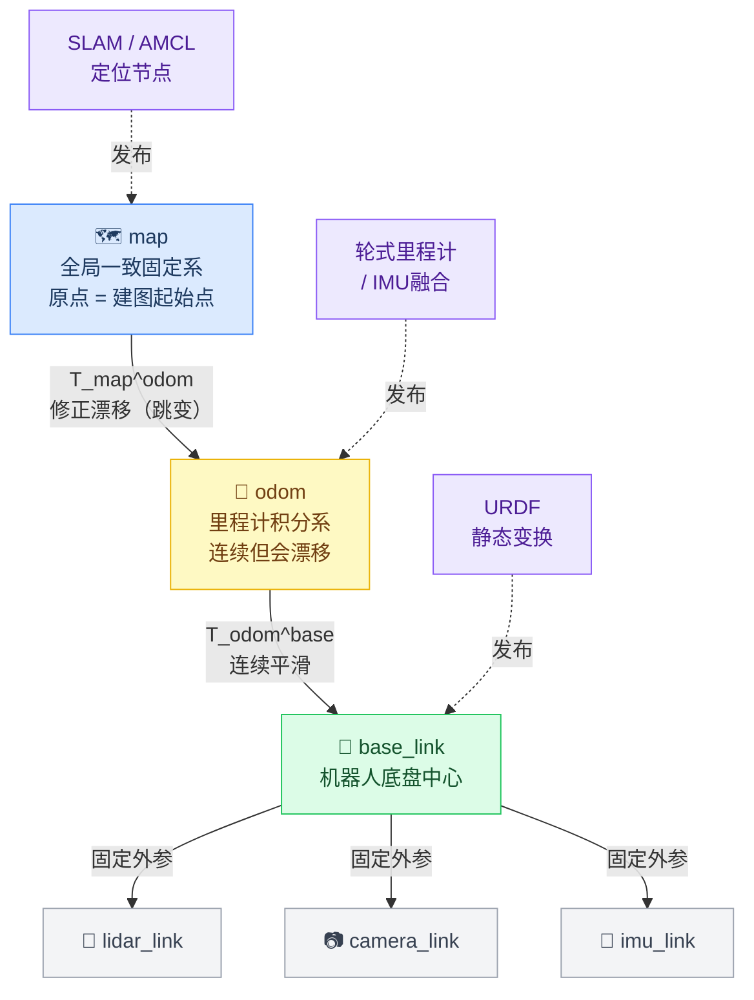
```mermaid
flowchart TB
    MAP["🗺️ map\n全局一致固定系\n原点 = 建图起始点"]
    ODOM["📍 odom\n里程计积分系\n连续但会漂移"]
    BASE["🤖 base_link\n机器人底盘中心"]
    LIDAR["📡 lidar_link"]
    CAM["📷 camera_link"]
    IMU["🔄 imu_link"]

    SLAM["SLAM / AMCL\n定位节点"]
    WHEEL["轮式里程计\n/ IMU融合"]
    URDF["URDF\n静态变换"]

    MAP -->|"T_map^odom\n修正漂移（跳变）"| ODOM
    ODOM -->|"T_odom^base\n连续平滑"| BASE
    BASE -->|"固定外参"| LIDAR
    BASE -->|"固定外参"| CAM
    BASE -->|"固定外参"| IMU

    SLAM -.->|发布| MAP
    WHEEL -.->|发布| ODOM
    URDF -.->|发布| BASE

    style MAP fill:#dbeafe,stroke:#3b82f6,color:#1e3a5f
    style ODOM fill:#fef9c3,stroke:#eab308,color:#713f12
    style BASE fill:#dcfce7,stroke:#22c55e,color:#14532d
    style LIDAR fill:#f3f4f6,stroke:#9ca3af,color:#374151
    style CAM fill:#f3f4f6,stroke:#9ca3af,color:#374151
    style IMU fill:#f3f4f6,stroke:#9ca3af,color:#374151
    style SLAM fill:#ede9fe,stroke:#8b5cf6,color:#4c1d95
    style WHEEL fill:#ede9fe,stroke:#8b5cf6,color:#4c1d95
    style URDF fill:#ede9fe,stroke:#8b5cf6,color:#4c1d95
```

### 为什么 `map` 和 `odom` 要分开？

- **`odom` 保证连续性**：里程计积分不会跳变，控制器能平滑跟踪
- **`map` 保证全局一致性**：SLAM 回环或 AMCL 修正会更新 `map→odom`，但不影响 `odom→base_link` 的连续性
- 若合并为一个系，每次定位修正都会使位姿瞬间跳变，导致控制器失稳

`map→odom` 这段变换正是**定位节点的输出**，它实时修正里程计的累积漂移。

### 齐次变换矩阵

坐标系间的变换用 $4\times4$ 齐次矩阵表示（$SE(3)$ 元素）：

$$T_{A}^{B} = \begin{bmatrix} R_{3\times3} & t_{3\times1} \\ \mathbf{0}^T & 1 \end{bmatrix}, \quad p^B = T_A^B \cdot p^A$$

**链式变换**：$T_{map}^{base} = T_{map}^{odom} \cdot T_{odom}^{base}$

**逆变换**：$T_B^A = \left(T_A^B\right)^{-1} = \begin{bmatrix} R^T & -R^T t \\ \mathbf{0}^T & 1 \end{bmatrix}$

平面导航退化为 $SE(2)$，位姿 $(x, y, \theta)$ 对应：

$$T = \begin{bmatrix} \cos\theta & -\sin\theta & x \\ \sin\theta & \cos\theta & y \\ 0 & 0 & 1 \end{bmatrix}$$

**调试技巧**：`ros2 run tf2_tools view_frames` 可导出当前 TF 树为 PDF；`ros2 run tf2_ros tf2_echo map base_link` 实时打印两帧间变换。

## 9.2 ROS1 Navigation Stack 架构

ROS 1 的 `move_base` 提供了一套经典的导航栈集成方案：

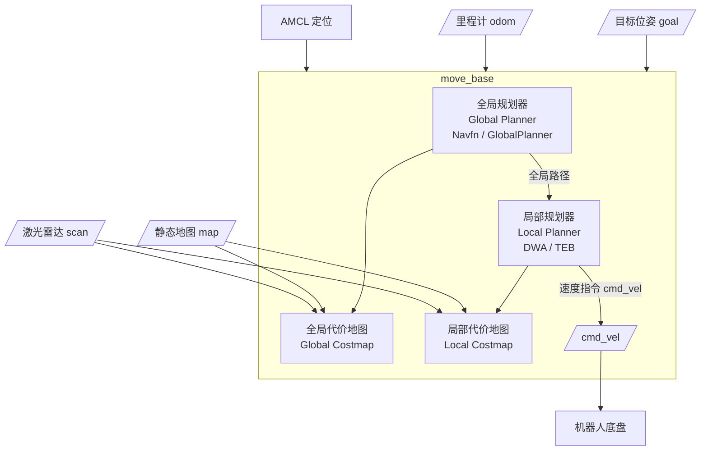
```mermaid
flowchart TB
    subgraph MoveBase["move_base"]
        GM[全局规划器\nGlobal Planner\nNavfn / GlobalPlanner] --> GCM[全局代价地图\nGlobal Costmap]
        LM[局部规划器\nLocal Planner\nDWA / TEB] --> LCM[局部代价地图\nLocal Costmap]
        GM -->|全局路径| LM
        LM -->|速度指令 cmd_vel| VEL
    end

    GOAL[/目标位姿 goal/] --> MoveBase
    MAP[/静态地图 map/] --> GCM
    MAP --> LCM
    SCAN[/激光雷达 scan/] --> GCM
    SCAN --> LCM
    ODOM[/里程计 odom/] --> MoveBase
    VEL[/cmd_vel/] --> Robot[机器人底盘]
    AMCL[AMCL 定位] --> MoveBase
```

**典型话题接口**：

| 话题 | 方向 | 说明 |
|------|------|------|
| `/move_base/goal` | 输入 | 导航目标位姿 |
| `/map` | 输入 | 静态地图 |
| `/scan` | 输入 | 激光雷达数据 |
| `/odom` | 输入 | 里程计 |
| `/amcl_pose` | 输入 | 定位结果 |
| `/cmd_vel` | 输出 | 速度指令（线速度 + 角速度） |

## 9.3 Nav2（ROS 2）架构

Nav2 是 ROS 2 的导航栈，相比 `move_base` 有以下重要改进：

- **行为树（Behavior Tree）** 替代状态机：导航行为（规划、恢复、重试）用 BT 灵活配置
- **生命周期节点（Lifecycle Nodes）**：支持优雅的启动/停止管理
- **插件化架构**：全局规划器、局部规划器、恢复行为均可作为插件替换
- **Smac Planner**：Nav2 内置的改进规划器，支持 Hybrid A* 和 State Lattice

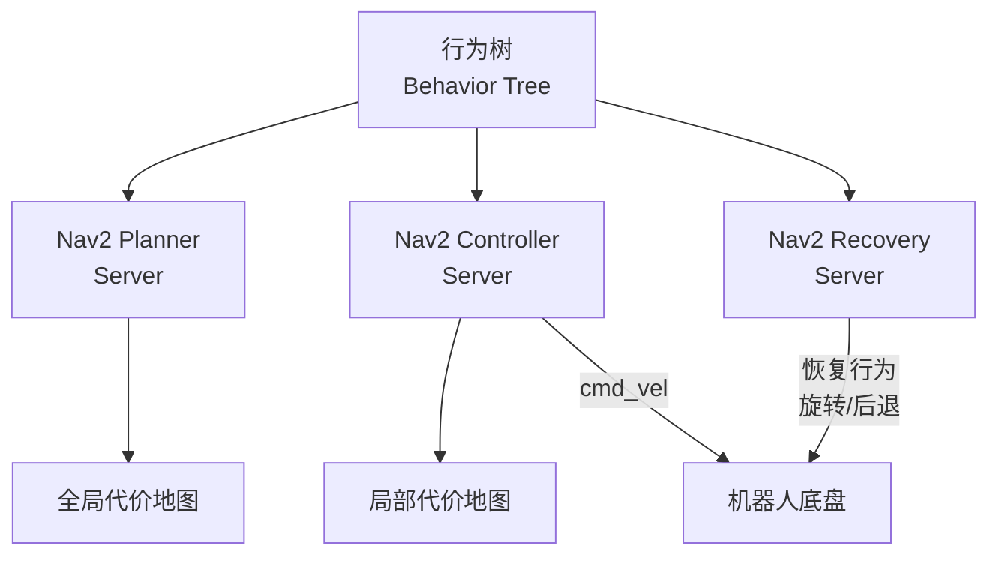
```mermaid
flowchart TB
    BT[行为树\nBehavior Tree] --> NP[Nav2 Planner\nServer]
    BT --> NC[Nav2 Controller\nServer]
    BT --> NR[Nav2 Recovery\nServer]
    NP --> GCM2[全局代价地图]
    NC --> LCM2[局部代价地图]
    NC -->|cmd_vel| Base[机器人底盘]
    NR -->|恢复行为\n旋转/后退| Base
```

## 9.4 参数调优要点

导航栈的调优是一个迭代过程，以下是几个关键参数：

**代价地图**：
- `inflation_radius`：障碍物膨胀半径，设为机器人半径 + 安全余量
- `cost_scaling_factor`：代价衰减速率，越大则"紧贴障碍物"的代价越高

**全局规划（A*）**：
- `default_tolerance`：允许终点偏差，解决终点在障碍物上的问题

**局部规划（DWA）**：
- `max_vel_x`、`max_rot_vel`：速度上限，根据机器人能力设置
- `sim_time`：轨迹仿真时间，越长越"有预见性"但计算量越大
- `path_distance_bias` / `goal_distance_bias`：路径偏好 vs 终点偏好的权衡

---

# 10. 传统导航 vs. 端到端深度学习导航

| 对比维度 | 传统导航栈（SLAM+A*+DWA）| 端到端深度学习（VLN/VLA）|
|---------|----------------------|----------------------|
| **地图依赖** | 需要预建地图（或实时 SLAM） | 无需先验地图 |
| **指令形式** | 坐标目标点（x, y, θ） | 自然语言（"去厨房"）|
| **泛化能力** | 弱（换环境需重新建图） | 强（跨场景泛化） |
| **可解释性** | ✅ 强（每个模块可追溯）| ❌ 弱（黑盒网络）|
| **计算资源** | 可在 CPU 运行 | 需要 GPU |
| **动态场景** | 局部规划处理（DWA/TEB）| 隐式学习（依赖训练数据）|
| **安全性保证** | ✅ 碰撞检测显式可控 | ❌ 安全边界难以保证 |
| **常识推理** | ❌ 无（纯几何） | ✅ 支持（如 LLM 推理）|
| **开发调试** | 各模块独立调试 | 端到端训练，难定位问题 |
| **长期稳定性** | ✅ 行为确定性强 | ❌ 分布外场景可能失效 |
| **典型代表** | ROS Nav Stack, Nav2 | VLN-BERT, NavGPT, VoxPoser |

**实践建议**：
- 工厂、仓储、医疗等**结构化、安全要求高**的场景 → 传统导航栈
- 家庭服务、跟随导览等**非结构化、需理解自然语言**的场景 → 学习型导航
- **混合架构**正成为趋势：用传统导航栈处理底层安全和精准控制，用 VLM/LLM 处理高层语义理解和任务分解

---

# 11. 常用开源工具与框架汇总

### 传感器驱动与处理

| 工具 | 功能 | 链接 |
|------|------|------|
| **PCL（Point Cloud Library）** | 点云处理算法库（滤波、分割、匹配、特征）| pcl.org |
| **Open3D** | 点云和 3D 数据处理，Python 友好 | open3d.org |
| **OpenCV** | 图像处理和特征提取 | opencv.org |

### 定位

| 工具 | 功能 | ROS 包 |
|------|------|--------|
| **robot_localization** | EKF / UKF 多传感器融合 | `robot_localization` |
| **AMCL** | 粒子滤波自适应蒙特卡洛定位 | `amcl` |
| **NDT_CPU** | NDT 扫描匹配 | `ndt_cpu` |

### SLAM

| 工具 | 类型 | 特点 |
|------|------|------|
| **Cartographer** | 激光 2D/3D | Google 出品，生产可用 |
| **GMapping** | 激光 2D | 轻量，室内适用 |
| **LIO-SAM** | 激光+IMU | 高精度，GTSAM 后端 |
| **LOAM / LeGO-LOAM** | 激光 3D | 经典，地面机器人优化版 |
| **ORB-SLAM3** | 视觉+IMU | 支持多种相机，精度高 |
| **VINS-Mono/Fusion** | 视觉+IMU | 无人机/手机导航 |
| **RTAB-Map** | RGB-D/双目/激光 | 多模态，ROS 开箱即用，内置记忆管理 |
| **hdl_graph_slam** | 激光 3D | 图优化，支持 NDT/ICP |

### 路径规划

| 工具 | 功能 |
|------|------|
| **OMPL（Open Motion Planning Library）** | 采样类规划算法库（RRT*, PRM*等）|
| **Moveit!** | 机械臂运动规划（集成 OMPL）|
| **NavFn / GlobalPlanner** | ROS 全局规划（Dijkstra/A*）|
| **DWA Local Planner** | ROS 动态窗口法局部规划 |
| **TEB Local Planner** | ROS 时间弹性带局部规划 |
| **Smac Planner** | Nav2 内置 Hybrid A* 规划器 |

### 仿真

| 工具 | 功能 |
|------|------|
| **Gazebo** | ROS 默认物理仿真器，支持传感器仿真 |
| **Isaac Sim（NVIDIA）** | GPU 加速光线追踪仿真，合成数据生成 |
| **CARLA** | 自动驾驶专用仿真器，城市场景 |
| **Webots** | 跨平台开源机器人仿真 |

---

# 12. 小结与展望

## 本文回顾

本文系统梳理了传统机器人导航算法栈的五大核心模块：

1. **感知**：激光雷达 / 相机 / IMU 各有优劣，传感器融合（EKF/UKF）是提高鲁棒性的关键
2. **定位**：EKF/UKF 适合实时位姿跟踪，粒子滤波（AMCL）支持全局定位，NDT/ICP 提供精确扫描匹配
3. **建图/SLAM**：激光 SLAM（Cartographer、LIO-SAM）精度高、全天候可用；视觉 SLAM（ORB-SLAM3、VINS-Mono）成本低但对光照敏感；RTAB-Map 横跨多模态、开箱即用；因子图后端优化是当前主流
4. **路径规划**：A* / Hybrid A* 用于全局规划，DWA / TEB 用于局部动态避障，代价地图是两者的"共同语言"
5. **路径跟踪**：Pure Pursuit / Stanley 是几何方法，实现简单，适合低速场景
6. **运动控制**：PID 是基础，LQR 提供最优线性控制，MPC 可显式处理约束与多步前瞻，模糊 PID 在非线性扰动下鲁棒性更强

## 展望

传统导航算法栈经过数十年发展已相当成熟，但仍面临挑战：

- **长廊退化、动态场景、非结构化地形**：对 SLAM 鲁棒性提出更高要求
- **多机器人协同 SLAM**：分布式建图与通信效率的权衡
- **语义理解缺失**：传统算法缺乏"这是厨房"的语义能力，限制了在日常服务场景的应用

当前研究趋势是**"传统导航 + 大模型"的混合架构**：保留传统导航栈的安全性和可靠性，在任务规划和语义理解层引入 LLM/VLM，构建能够理解人类意图、在复杂现实世界中自主行动的下一代机器人系统。

> 关于视觉语言导航（VLN）和 VLA 大模型的内容，请参考我的博客 [VLN综述](/VLN-Survey/) 和 [VLA综述](/VLA-Survey/) 系列文章。

---

*参考资料：Thrun et al. "Probabilistic Robotics" (2005)；LaValle "Planning Algorithms" (2006)；ROS Navigation Wiki；Cartographer Paper (ICRA 2016)；LIO-SAM (IROS 2020)；ORB-SLAM3 (T-RO 2021)；VINS-Mono (T-RO 2018)；Hybrid A* (IJRR 2010)；TEB Local Planner (IROS 2013)*;http://www.autolabor.cn/usedoc/m1/navigationKit/development/slamintro; https://github.com/ShisatoYano/AutonomousVehicleControlBeginnersGuide;具身智能研究社;
