# 1. 引言

## 1.1 为什么需要自主导航？

想象一个仓库机器人——它需要在货架之间穿梭，精准取货，同时避开突然出现的叉车和行人。或者一辆无人驾驶汽车，需要在复杂交通中安全行驶数百公里。这些场景的背后，都依赖一套精心设计的**自主导航系统（Autonomous Navigation System）**。
<div align="center">
  
  <figcaption>图：机器人自主导航</figcaption>
</div>
自主导航解决的核心问题，可以简单概括为三个问题：

1. **我在哪？**（Localization，定位）
2. **周围有什么？**（Perception + Mapping，感知与建图）
3. **我该怎么走？**（Planning + Control，规划与控制）

这三个问题环环相扣，共同构成了机器人导航的完整闭环。

## 1.2 导航算法栈概览

一个完整的机器人导航系统，数据从传感器出发，经过层层处理，最终驱动执行器运动。下图展示了导航算法栈的整体数据流：

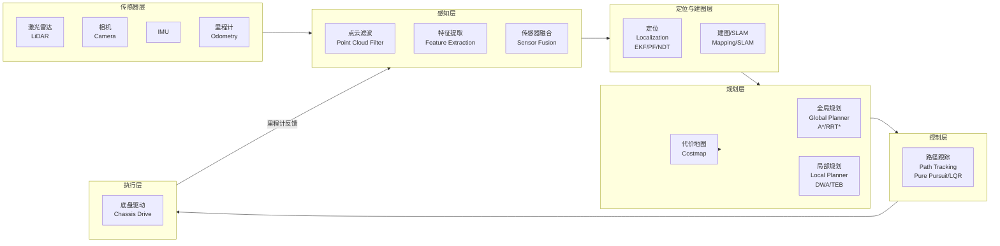
```mermaid
flowchart LR
    subgraph Sensors["传感器层"]
        L[激光雷达\nLiDAR]
        C[相机\nCamera]
        I[IMU]
        O[里程计\nOdometry]
    end

    subgraph Perception["感知层"]
        PF[点云滤波\nPoint Cloud Filter]
        FE[特征提取\nFeature Extraction]
        SF[传感器融合\nSensor Fusion]
    end

    subgraph LocalizationMapping["定位与建图层"]
        LOC[定位\nLocalization\nEKF/PF/NDT]
        MAP[建图/SLAM\nMapping/SLAM]
    end

    subgraph Planning["规划层"]
        GP[全局规划\nGlobal Planner\nA*/RRT*]
        LP[局部规划\nLocal Planner\nDWA/TEB]
        CM[代价地图\nCostmap]
    end

    subgraph Control["控制层"]
        PT[路径跟踪\nPath Tracking\nPure Pursuit/LQR]
    end

    subgraph Actuator["执行层"]
        ACT[底盘驱动\nChassis Drive]
    end

    Sensors --> Perception
    Perception --> LocalizationMapping
    LocalizationMapping --> Planning
    CM --> Planning
    Planning --> Control
    Control --> Actuator
    Actuator -->|里程计反馈| Perception
```

<div align="center">
  
  <figcaption>图：传统机器人导航流程图：基于传感器采集的数据进行建图与定位（SLAM），并在构建的环境地图中自动导航（规划+控制）</figcaption>
</div>


## 1.3 传统导航 vs. 学习型导航

在深度学习兴起之前，机器人导航主要依赖**模块化、可解释的传统算法栈**。每个模块职责清晰，可以独立调试和优化。本文将系统介绍这套算法栈的核心组件。

| 维度 | 传统导航 | 端到端深度学习导航 |
|------|---------|-----------------|
| 可解释性 | ✅ 强，每个模块可分析 | ❌ 弱，黑盒决策 |
| 泛化性 | ❌ 弱，依赖先验地图 | ✅ 较强，可迁移到新场景 |
| 语言理解 | ❌ 不支持自然语言指令 | ✅ 支持（VLN/VLA） |
| 调试难度 | ✅ 低，模块独立调试 | ❌ 高，端到端难追溯 |
| 计算需求 | ✅ 低，可在嵌入式运行 | ❌ 高，需要GPU |
| 安全可靠性 | ✅ 行为可预测 | ❌ 分布外泛化存在风险 |
| 动态障碍处理 | 局部规划模块可处理 | 依赖训练数据覆盖 |

> **本文聚焦传统算法栈**。如需了解端到端学习导航（VLN/VLA），请参考本站 [VLN综述](/VLN-Survey/) 系列。

---

# 2. 感知（Perception）

感知是导航系统的"眼睛"。传感器采集原始数据，经过处理后为定位、建图和规划提供可靠输入。

## 2.1 传感器类型与特性对比

| 传感器 | 输出数据 | 精度 | 抗光照 | 成本 | 典型频率 | 典型应用 |
|--------|---------|------|--------|------|---------|---------|
| **2D 激光雷达** | 极坐标点集 | 高（cm级） | ✅ 强 | 中 | 10–40 Hz | 室内移动机器人 |
| **3D 激光雷达** | 点云（xyz+强度） | 高 | ✅ 强 | 高 | 10–20 Hz | 自动驾驶 |
| **RGB-D 相机** | 彩色图+深度图 | 中（cm–dm级） | ❌ 弱（室外） | 低 | 30–90 Hz | 室内近距离 |
| **单目相机** | RGB 图像 | 低（需标定） | ❌ 弱 | 极低 | 30–120 Hz | 视觉里程计 |
| **双目相机** | 左右 RGB 图 | 中 | ❌ 弱 | 低–中 | 30–60 Hz | 视觉 SLAM |
| **IMU** | 角速度+线加速度 | 短期高 | ✅ 强 | 极低 | 100–1000 Hz | 姿态估计、融合 |
| **轮式里程计** | 编码器脉冲 | 中（易累积误差） | ✅ 强 | 极低 | 50–200 Hz | 短期位移估计 |
| **GPS/RTK** | 经纬度坐标 | 普通1–5m，RTK cm级 | ✅ 强 | 中–高 | 1–10 Hz | 室外全局定位 |

### 激光雷达（LiDAR）

激光雷达通过**发射激光脉冲并测量返回时间**（Time of Flight, ToF）来计算距离。它能在任意光照条件下工作，输出精确的空间点云（Point Cloud）。

**2D LiDAR**（如 Hokuyo UTM-30LX、SICK TiM）每次扫描输出一个平面上的极坐标点集，适合室内平坦环境。**3D LiDAR**（如 Velodyne VLP-16、Ouster OS1）通过多线旋转扫描，输出完整的三维点云，是自动驾驶感知的核心传感器。

### 深度相机（Depth Camera / RGB-D）

RGB-D 相机（如 Intel RealSense D435、Microsoft Kinect）通过**结构光**或**飞行时间（ToF）**原理，同时获取彩色图像和每个像素的深度值。主要局限在于：室外强光会干扰结构光，且探测距离有限（通常 0.3–6m）。

<div align="center">
  
  <figcaption>图：深度相机采集深度图可视化</figcaption>
</div>

### IMU 与轮式里程计

**IMU（惯性测量单元）** 集成了陀螺仪（测角速度）和加速度计（测线加速度），输出频率高（100–1000 Hz），但误差会随时间**积分累积**（漂移）。

<div align="center">
  
  <figcaption>图：IMU</figcaption>
</div>

**轮式里程计** 通过车轮编码器计算位移，在平坦路面上精度良好，但在打滑或不平整路面上会产生**累积误差**。

两者的共同特点：短期精度高，长期使用需要与其他传感器融合校正。


## 2.2 感知数据处理

### 点云滤波

原始点云通常包含噪声和无关点，需要预处理：

**体素滤波（Voxel Grid Filter）**：将点云空间划分为规则的小立方体（体素），每个体素内的点用质心替代。这样既保留了点云的整体形状，又大幅降低了点云密度，提升后续处理速度。

<div align="center">
  
  <figcaption>图：体素滤波效果——原始稠密点云（左）经体素降采样后得到均匀稀疏点云（右）</figcaption>
</div>

**半径滤波（Radius Outlier Removal）**：对每个点，检查其半径 r 范围内的邻近点数量。若邻近点数不足阈值，则认为该点是噪声并删除。适合去除孤立噪点。

<div align="center">
  
  <figcaption>图：半径滤波效果——邻域点数不足的孤立点（红）被识别为噪声并删除</figcaption>
</div>

**直通滤波（Pass Through Filter）**：直接截取感兴趣区域的点云，例如只保留地面以上 0.1m 到 2m 高度范围内的点。

### 矩形拟合检测（Rectangle Fitting Detection）

基于激光雷达点云进行**障碍物框估计**：将聚类后的障碍物点云拟合为最小外接矩形（Minimum Bounding Rectangle），从而估计障碍物的长宽、朝向和中心位置。这是自动驾驶中障碍物感知的经典方法，常用于车辆检测。

<div align="center">
  
  
  <figcaption>图：点云矩形拟合——聚类点云（左）拟合为最小外接矩形（右动图）</figcaption>
</div>

### 特征提取

在视觉 SLAM 和相机标定中，特征提取至关重要：

- **角点特征**（Corner）：如 **FAST**（速度极快）、**Harris**（经典）
- **描述子**（Descriptor）：如 **ORB**（旋转不变 + 二进制，速度快）、**SIFT**（尺度/旋转不变，精度高但慢）
- **线特征**（Line）：用于结构化室内环境（走廊、墙壁）

<div align="center">
  
  <figcaption>图：角点特征检测——图像中的角点（交叉点）是视觉 SLAM 的关键匹配元素</figcaption>
</div>

## 2.3 传感器外参标定

当系统使用多个传感器时，必须知道它们之间的**相对位姿关系**（外参，Extrinsic Parameters），才能将不同传感器的数据转换到同一坐标系。

**基于 UKF 的外参估计**：利用**无迹卡尔曼滤波（UKF）** 对外参进行在线估计。与标定板离线标定相比，这种方法可以在机器人运动过程中动态估计并修正外参，适合传感器安装位置可能微小变化的场景。

<div align="center">
  
  <figcaption>图：传感器在线自动标定过程——机器人运动中动态估计并修正传感器间外参</figcaption>
</div>

### 传感器时间同步

多传感器系统除了空间标定（外参）之外，**时间同步**同样至关重要。如果不同传感器的数据时间戳未对齐，会导致数据"不同步"——例如用 0.1 秒前的 IMU 姿态去处理当前帧激光点云，在机器人高速运动时误差不可忽略。

<div align="center">
  
  <figcaption>图：时间同步</figcaption>
</div>

**硬件触发同步（Hardware Trigger）**：通过电路信号使所有传感器在同一时刻采样。例如 GPS 的 PPS（每秒脉冲）信号作为主时钟，触发相机快门和激光雷达扫描。这是精度最高的方法，时间误差可低至微秒级，但需要专用硬件电路支持。

**软件时间戳插值（Software Interpolation）**：当硬件触发不可行时，通过高精度系统时钟（如 NTP/PTP）为每个传感器数据包打时间戳，然后在软件层按时间戳对齐数据。常见做法是 IMU 数据按线性插值对齐至最近的激光帧时刻。

**时间戳不对齐对 SLAM 的影响**：激光雷达在一帧扫描期间（约 100 ms）机器人持续运动，若不使用 IMU 时间戳做**运动补偿（Motion Distortion Correction）**，扫描点云会出现**畸变（Distortion）**——前半帧和后半帧点云错位，严重影响扫描匹配精度。LIO-SAM 等紧耦合方案正是通过 IMU 预积分解决这一问题。

## 2.4 传感器融合

单一传感器往往存在局限，融合多个传感器可以取长补短。

**EKF（扩展卡尔曼滤波）融合**：将不同频率、不同误差特性的传感器数据（如 IMU 高频姿态 + GPS 低频位置 + 里程计位移）统一融合。EKF 通过**预测步骤**（用运动模型预测状态）和**更新步骤**（用传感器观测修正预测）交替进行。

**UKF（无迹卡尔曼滤波）融合**：EKF 用一阶线性化近似非线性系统，而 UKF 用**Sigma 点采样**更精确地近似非线性变换的均值和协方差，在高非线性场景下精度更高。

**EKF 传感器融合数据流**（以多传感器机器人为例）：

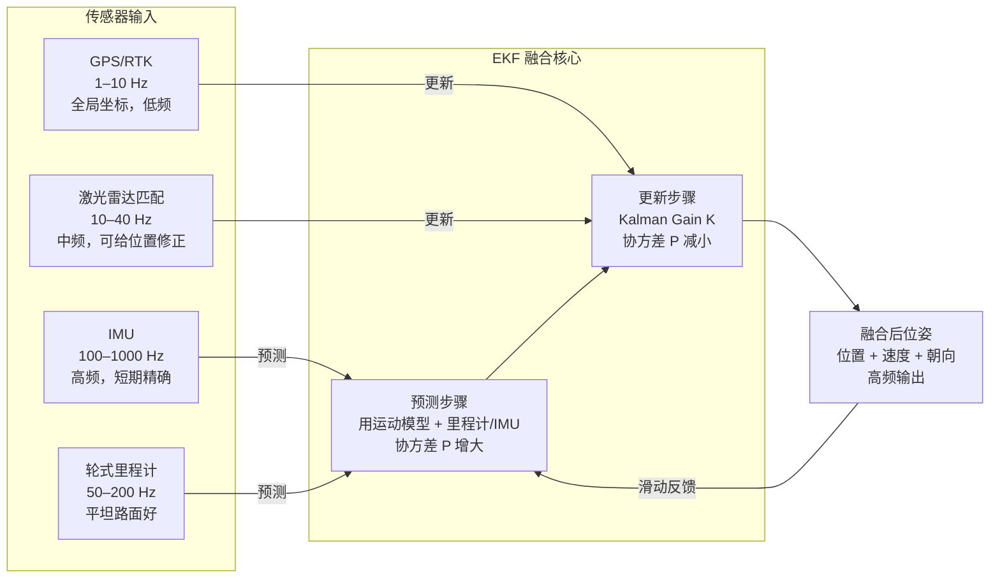
```mermaid
flowchart LR
    subgraph Sensors["传感器输入"]
        IMU["IMU\n100–1000 Hz\n高频，短期精确"]
        ODO["轮式里程计\n50–200 Hz\n平坦路面好"]
        GPS["GPS/RTK\n1–10 Hz\n全局坐标，低频"]
        LID["激光雷达匹配\n10–40 Hz\n中频，可给位置修正"]
    end

    subgraph EKF["EKF 融合核心"]
        P["预测步骤\n用运动模型 + 里程计/IMU\n协方差 P 增大"]
        U["更新步骤\nKalman Gain K\n协方差 P 减小"]
    end

    OUT["融合后位姿\n位置 + 速度 + 朝向\n高频输出"]

    IMU -->|预测| P
    ODO -->|预测| P
    GPS -->|更新| U
    LID -->|更新| U
    P --> U
    U --> OUT
    OUT -->|滑动反馈| P
```

---

# 3. 定位（Localization）

定位解决的是"我在哪"的问题：给定一张地图，机器人需要实时估计自身在地图中的位置和朝向（即**位姿 Pose = 位置 + 朝向**）。

## 3.1 问题定义

定位问题可以分为两类：

- **全局定位（Global Localization）**：机器人不知道初始位置，需要从头确定自身位姿。难度最大，粒子滤波擅长处理这类问题。
- **位姿跟踪（Pose Tracking）**：已知近似初始位姿，在运动过程中持续修正。EKF/UKF 擅长处理这类问题。
- **绑架问题（Kidnapped Robot Problem）**：机器人在运动中被突然移动到陌生位置，需要重新定位。

## 3.2 EKF 定位

**直觉理解**：想象你蒙眼走路，靠步数和转弯角度估计自己的位置（这是"预测"）；每当你摘下眼罩瞥一眼地图上的路标，就用路标位置来修正你的估计（这是"更新"）。EKF（Extended Kalman Filter）做的就是这件事的数学版本。

**状态向量**：$\mathbf{x} = [x, y, \theta]^T$（位置 + 朝向）

**两步走**：

1. **预测步骤**（Predict）：利用运动模型（如里程计数据）预测下一时刻的位姿，同时误差协方差增大（不确定性增加）：

$$\hat{\mathbf{x}}_{t|t-1} = f(\mathbf{x}_{t-1}, \mathbf{u}_t)$$

2. **更新步骤**（Update）：利用传感器观测（如激光雷达看到路标）修正预测，误差协方差减小（不确定性降低）：

$$\mathbf{x}_t = \hat{\mathbf{x}}_{t|t-1} + \mathbf{K}_t (\mathbf{z}_t - h(\hat{\mathbf{x}}_{t|t-1}))$$

其中 $\mathbf{K}_t$ 是**卡尔曼增益**，决定了相信预测还是相信观测。

**卡尔曼增益 K 的直觉理解**：想象你朋友告诉你"你现在在图书馆门口"，但你的步数估计说你在图书馆里面。你该信谁？K 的大小决定了这个权衡：

- **K → 1（相信观测）**：传感器噪声低、预测不确定性大时 → 观测修正权重大
- **K → 0（相信预测）**：传感器噪声高时 → 少修正，主要靠运动模型

$$\mathbf{K}_t = \mathbf{P}_{t|t-1} \mathbf{H}^T (\mathbf{H} \mathbf{P}_{t|t-1} \mathbf{H}^T + \mathbf{R})^{-1}$$

其中 $\mathbf{P}$ 是预测不确定性（越大 → K 越大 → 越信传感器），$\mathbf{R}$ 是传感器噪声（越大 → K 越小 → 越信预测）。下图展示了不确定性椭圆在预测→更新过程中的变化：

<div align="center">
  
  <figcaption>图：EKF 不确定性椭圆变化——预测步骤后椭圆增大（不确定性增加），更新步骤后椭圆收缩（传感器修正）</figcaption>
</div>

**适用场景**：已知地图、已知初始位置、低非线性系统。计算效率高，适合实时运行。

<div align="center">
  
  <figcaption>图：EKF 定位仿真——机器人（蓝色）沿轨迹运动，绿色椭圆为不确定性估计，红色为 EKF 定位结果</figcaption>
</div>

## 3.3 UKF 定位

**与 EKF 的区别**：EKF 用泰勒展开对非线性函数做一阶线性化近似，在高非线性系统中误差较大。UKF（Unscented Kalman Filter）则通过精心选取的**Sigma 点集**来近似非线性变换后的概率分布，无需求导，精度更高。

**Sigma 点采样**：从当前均值和协方差中提取 $2n+1$ 个 Sigma 点，通过非线性函数传播后，重新计算均值和协方差。

✅ 比 EKF 精度高，尤其适合运动模型非线性较强的场景
❌ 计算量比 EKF 略大（约为 EKF 的 2–3 倍）

<div align="center">
  
  <figcaption>图：EKF vs UKF 对比仿真——高非线性场景下 UKF（右）的位姿估计收敛更准确</figcaption>
</div>

## 3.4 粒子滤波定位（Particle Filter）

**直觉理解**：用成千上万个"粒子"（每个粒子代表一个可能的位姿假设）来表示机器人位置的概率分布。每个粒子都根据运动模型移动（加入随机噪声），然后根据传感器观测给每个粒子打分（权重），越接近真实观测的粒子权重越高。最后通过**重采样（Resampling）**淘汰权重低的粒子，复制权重高的粒子。

<div align="center">
  
  <figcaption>图：粒子滤波定位仿真——初始粒子均匀分布（全局定位），随运动和观测逐步收敛到真实位置</figcaption>
</div>

**AMCL（Adaptive Monte Carlo Localization）**：ROS 中广泛使用的粒子滤波定位包，支持自适应粒子数量（定位收敛后减少粒子节省计算）。

下图展示了 MCL 算法的三个核心阶段：

<div align="center">
  
  <figcaption>图：粒子滤波（MCL）三阶段——① 运动更新后粒子扩散，② 观测加权（大粒子=高权重），③ 重采样后粒子集中于真实位置附近</figcaption>
</div>

**MCL 算法流程**：

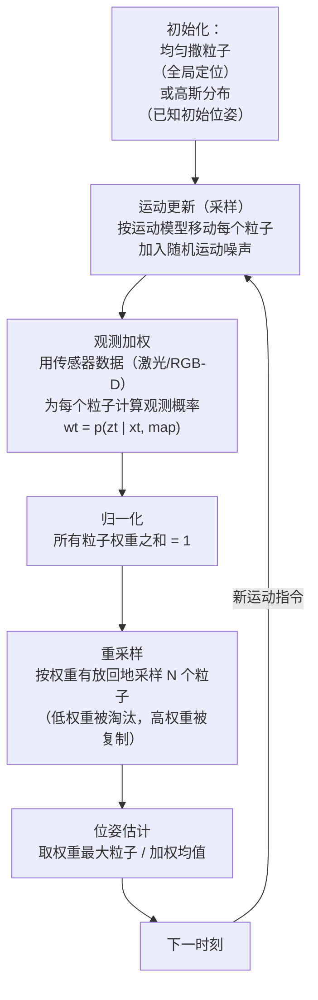
```mermaid
flowchart TD
    INIT["初始化：\n均匀撒粒子\n（全局定位）\n或高斯分布\n（已知初始位姿）"]
    MOTION["运动更新（采样）\n按运动模型移动每个粒子\n加入随机运动噪声"]
    OBS["观测加权\n用传感器数据（激光/RGB-D）\n为每个粒子计算观测概率\nwt = p(zt | xt, map)"]
    NORM["归一化\n所有粒子权重之和 = 1"]
    RESAMP["重采样\n按权重有放回地采样 N 个粒子\n（低权重被淘汰，高权重被复制）"]
    EST["位姿估计\n取权重最大粒子 / 加权均值"]
    NEXT["下一时刻"]

    INIT --> MOTION
    MOTION --> OBS
    OBS --> NORM
    NORM --> RESAMP
    RESAMP --> EST
    EST --> NEXT
    NEXT -->|新运动指令| MOTION
```

**重采样细节**：朴素随机重采样会引入**粒子多样性损失**（同一粒子被多次复制）。**系统重采样（Systematic Resampling）** 通过在 $[0, 1/N]$ 内取一个随机起点，然后均匀间隔采样 N 次，保证每个区间恰好采样一次，有效避免多样性损失，计算复杂度仍为 $O(N)$。

**AMCL 自适应粒子数（KLD 采样）**：固定粒子数既浪费计算（定位收敛后粒子不需要那么多），又不安全（初始化时粒子太少可能漏掉真实位置）。**KLD 采样** 根据当前粒子集覆盖的状态空间体积，动态计算所需粒子数量：状态空间探索越充分（覆盖的网格越多），需要的粒子数越少。AMCL 中典型范围为 100–5000 个粒子。

✅ 支持**全局定位**（多假设并行，能处理绑架问题）
✅ 对非线性系统友好，不需要线性化
❌ 粒子数量多时计算开销大
❌ 在高维状态空间中效率下降（维度诅咒）


## 3.5 基于扫描匹配的定位

扫描匹配是另一类定位思路：直接将当前激光雷达扫描与参考地图（或上一帧扫描）对齐，求解位姿变换。

### NDT（正态分布变换，Normal Distributions Transform）

**思路**：将参考点云空间划分为规则网格，每个格子内的点用**正态分布**（均值 + 协方差）来表示。当前扫描的点云在这些正态分布中的概率就是匹配得分，通过优化位姿使得匹配概率最大。

✅ 对点云密度变化鲁棒
✅ 计算效率高（尤其是三维场景）
✅ 是自动驾驶定位（HDMap-based Localization）的主流方法之一

<div align="center">
  
  <figcaption>图：NDT 匹配原理——参考地图（网格+正态分布）与当前扫描点云对齐示意</figcaption>
</div>

### ICP（迭代最近点，Iterative Closest Point）

**思路**：将当前点云与目标点云中最近的点对匹配，计算最小化匹配点对距离的刚体变换（旋转 + 平移），然后迭代重复直到收敛。

✅ 简单直观，精度高（收敛后）
❌ 对初始位姿敏感，容易陷入局部最优
❌ 计算复杂度较高，实时性受点云密度影响
❌ 在重复结构（如走廊）中容易退化

<div align="center">
  
  <figcaption>图：ICP 迭代过程——绿色当前帧点云逐步与红色参考点云对齐，每次迭代最近点对距离缩小</figcaption>
</div>

## 3.6 定位方法对比汇总

| 方法 | 适用场景 | 全局定位 | 计算开销 | 非线性处理 | ROS 支持 |
|------|---------|---------|---------|-----------|---------|
| **EKF** | 已知初始位姿，低非线性 | ❌ | 低 | 一阶近似 | `robot_localization` |
| **UKF** | 已知初始位姿，中高非线性 | ❌ | 中 | Sigma点近似 | `robot_localization` |
| **粒子滤波/AMCL** | 全局定位，未知初始位姿 | ✅ | 中–高 | 无近似 | `amcl` |
| **NDT** | 自动驾驶，高精地图定位 | 需初始化 | 中 | — | `ndt_cpu` |
| **ICP** | 精细配准，短距离匹配 | ❌ | 中–高 | — | `pcl_ros` |

<div align="center">
  
  <figcaption>图：EKF / UKF / 粒子滤波三种定位方法对比仿真——同场景下精度与收敛速度对比</figcaption>
</div>

---

# 4. 建图（Mapping & SLAM）

**SLAM（同步定位与建图，Simultaneous Localization and Mapping）** 解决了一个"先有鸡还是先有蛋"的问题：定位需要地图，建图又需要知道位置。SLAM 的目标是在**没有先验地图**的情况下，同时完成定位和建图。

## 4.1 地图表示形式

不同场景需要不同的地图表示：

### 二值占据栅格地图（Binary Occupancy Grid Map）

将环境空间划分为等大小的方格（通常 5–20 cm/格），每格存储一个概率值，表示该格是否被占据（有障碍 = 1，可通行 = 0，未探索 = 0.5）。这是室内机器人导航中最常用的地图格式，ROS `map_server` 直接支持。

<div align="center">
  
  <figcaption>图：二值占据栅格地图构建过程</figcaption>
</div>

<div align="center">
  
  <figcaption>图：成品地图——白色=可通行，黑色=障碍，灰色=未探索</figcaption>
</div>

### 代价地图（Costmap）

在占据栅格基础上，对障碍物周围区域**膨胀（Inflation）**出一层代价层：离障碍物越近，代价越高。这样路径规划时机器人会自动保持与障碍物的安全距离，无需额外碰撞检查。ROS Navigation Stack 的 `costmap_2d` 支持多层代价地图（静态层 + 障碍物层 + 膨胀层）。

<div align="center">
  
  <figcaption>图：代价地图构建</figcaption>
</div>

<div align="center">
  
  <figcaption>图：成品代价地图——蓝色=低代价，红色=高代价（障碍附近）</figcaption>
</div>

### 势场地图（Potential Field Map）

将目标点视为"势能最低点"，障碍物视为"斥力源"，整个空间形成一个势能场。机器人沿梯度下降方向运动即可找到路径。直觉上类似于球在斜面上自然滚向最低点。主要缺点：容易陷入局部极小值（Local Minimum）。

<div align="center">
  
  <figcaption>图：势场地图——目标（蓝色低谷）产生引力，障碍（红色高峰）产生斥力，梯度方向指向机器人运动方向</figcaption>
</div>

### NDT 地图（NDT Map）

前文提到的正态分布变换地图，适合高精度自动驾驶场景。每个格子存储点云的统计分布，而非原始点，大幅压缩存储空间同时保持定位精度。

<div align="center">
  
  <figcaption>图：EA-NDT 处理流程可视化：从语义分割点云到 H-Map 的中间阶段展示。</figcaption>
</div>

<div align="center">
  
  <figcaption>图：NDT地图构建</figcaption>
</div>

## 4.2 SLAM 问题概述

SLAM 的输入是传感器数据流（激光扫描序列 / 图像序列 + 里程计），输出是：

1. **轨迹（Trajectory）**：机器人历史运动路径
2. **地图（Map）**：环境的空间表示

SLAM 系统通常分为**前端（Front-end）** 和**后端（Back-end）** 两部分：

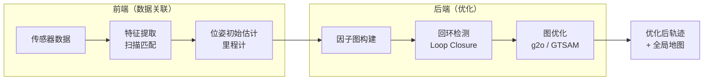
```mermaid
flowchart LR
    subgraph Frontend["前端（数据关联）"]
        A[传感器数据] --> B[特征提取\n扫描匹配]
        B --> C[位姿初始估计\n里程计]
    end

    subgraph Backend["后端（优化）"]
        C --> D[因子图构建]
        D --> E[回环检测\nLoop Closure]
        E --> F[图优化\ng2o / GTSAM]
    end

    F --> G[优化后轨迹\n+ 全局地图]
```

## 4.3 激光 SLAM

### Cartographer（Google）

Google 开源的激光 SLAM 系统，支持 2D 和 3D 建图。核心思想：

- **子图（Submap）**：将扫描数据分段插入局部子图，每个子图维护自身的一致性
- **扫描匹配**：新扫描来了，先用 CSM（相关扫描匹配）给一个初始位姿，再用 Ceres Solver 做精细优化
- **回环检测**：当机器人回到之前探索区域时，通过暴力搜索匹配检测回环，消除累积误差

✅ 支持实时 2D/3D 建图
✅ 大规模室内场景效果优秀
✅ ROS 2 支持完善（`cartographer_ros`）

<div align="center">
  
  <figcaption>图：Cartographer地图构建流程图</figcaption>
</div>

### GMapping

基于粒子滤波的 2D 激光 SLAM，每个粒子维护一个独立的栅格地图和位姿估计。使用**Rao-Blackwellized 粒子滤波**，将 SLAM 问题分解为条件独立的定位和建图两部分。

✅ 实现简单，适合室内小场景
✅ 实时性好
❌ 大场景粒子数需求大，内存开销高
❌ 不支持 3D 建图

<div align="center">
  
  <figcaption>图：GMapping地图构建</figcaption>
</div>


### LOAM（LiDAR Odometry and Mapping）

Ji Zhang 等人于 2014 年提出，是 3D 激光 SLAM 的里程碑工作。核心思路：

- 从点云中提取**边缘线特征**（Edge）和**平面特征**（Planar）
- 利用这两类特征做**扫描匹配**，估计帧间位姿
- 分离出高频里程计（Odometry）和低频建图（Mapping）两个线程并行运行

<div align="center">
  
  <figcaption>图：LOAM 软件系统</figcaption>
</div>

[作者项目主页](https://leijiezhang001.github.io/LOAM/)


### LeGO-LOAM

LOAM 的轻量化版本，专为**地面移动机器人**优化。利用地面分割，只使用地面点和非地面点中提取的特征，大幅降低计算量，可在嵌入式平台（如 Jetson）实时运行。

<div align="center">
  
  <figcaption>图：LeGO-LOAM系统</figcaption>
</div>

### LIO-SAM

**紧耦合**激光惯性里程计，将 LiDAR 和 IMU 数据在**因子图**框架下联合优化。通过 IMU 预积分提供点云去畸变和初始位姿估计，再用激光匹配修正，精度和鲁棒性均优于松耦合方案。

<div align="center">
  
  <figcaption>图：LIO-SAM系统</figcaption>
</div>

**LIO-SAM 紧耦合架构**（IMU 预积分 + LiDAR 因子图）：

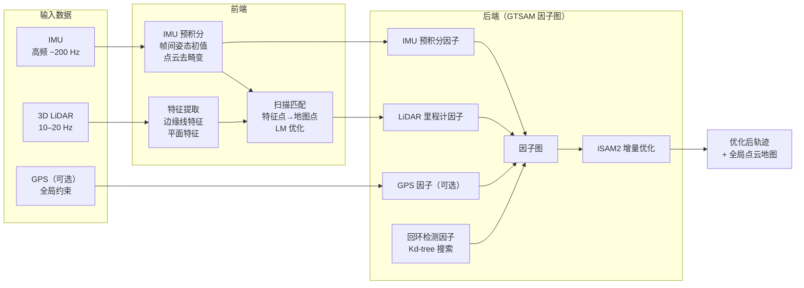
```mermaid
flowchart LR
    subgraph Input["输入数据"]
        IMU2["IMU\n高频 ~200 Hz"]
        LID2["3D LiDAR\n10–20 Hz"]
        GPS2["GPS（可选）\n全局约束"]
    end

    subgraph Frontend2["前端"]
        PREINT["IMU 预积分\n帧间姿态初值\n点云去畸变"]
        FEAT["特征提取\n边缘线特征\n平面特征"]
        SCAN["扫描匹配\n特征点→地图点\nLM 优化"]
    end

    subgraph Backend2["后端（GTSAM 因子图）"]
        FG["因子图"]
        IMUFac["IMU 预积分因子"]
        LIDFac["LiDAR 里程计因子"]
        GPSFac["GPS 因子（可选）"]
        LOOP2["回环检测因子\nKd-tree 搜索"]
        OPT2["iSAM2 增量优化"]
    end

    OUT2["优化后轨迹\n+ 全局点云地图"]

    IMU2 --> PREINT
    LID2 --> FEAT
    PREINT --> SCAN
    FEAT --> SCAN
    GPS2 --> GPSFac
    SCAN --> LIDFac
    PREINT --> IMUFac
    IMUFac --> FG
    LIDFac --> FG
    GPSFac --> FG
    LOOP2 --> FG
    FG --> OPT2
    OPT2 --> OUT2
```

## 4.4 视觉 SLAM

视觉 SLAM 使用相机代替激光雷达，成本更低但对光照更敏感。

### ORB-SLAM3

目前最成熟的视觉 SLAM 系统之一，支持**单目 / 双目 / RGB-D / 鱼眼相机 + IMU**。

[项目主页](https://github.com/UZ-SLAMLab/ORB_SLAM3)

**关键技术**：
- 特征提取：**ORB（Oriented FAST and Rotated BRIEF）** 描述子，快速且旋转不变
- 跟踪：当前帧与地图点匹配，用 PnP 求位姿
- 局部建图：维护一个局部地图，进行 Bundle Adjustment 优化
- 回环检测：基于**词袋模型（Bag of Words, BoW）** 的外观相似性检测

**ORB-SLAM3 三线程架构**：

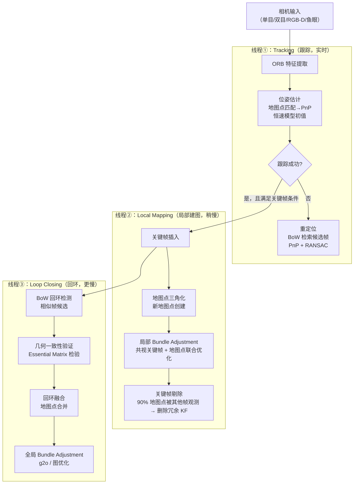
```mermaid
flowchart TB
    CAM["相机输入\n（单目/双目/RGB-D/鱼眼）"]

    subgraph T1["线程①：Tracking（跟踪，实时）"]
        ORB_EXT["ORB 特征提取"]
        POSE_EST["位姿估计\n地图点匹配→PnP\n恒速模型初值"]
        TRACK_ST{"跟踪成功?"}
        RELOC["重定位\nBoW 检索候选帧\nPnP + RANSAC"]
    end

    subgraph T2["线程②：Local Mapping（局部建图，稍慢）"]
        KF_INSERT["关键帧插入"]
        MAP_PT["地图点三角化\n新地图点创建"]
        LOCAL_BA["局部 Bundle Adjustment\n共视关键帧 + 地图点联合优化"]
        KF_CULL["关键帧剔除\n90% 地图点被其他帧观测 → 删除冗余 KF"]
    end

    subgraph T3["线程③：Loop Closing（回环，更慢）"]
        BOW_DETECT["BoW 回环检测\n相似帧候选"]
        GEOM_VERIFY["几何一致性验证\nEssential Matrix 检验"]
        LOOP_FUSE["回环融合\n地图点合并"]
        GLOBAL_BA["全局 Bundle Adjustment\ng2o / 图优化"]
    end

    CAM --> ORB_EXT
    ORB_EXT --> POSE_EST
    POSE_EST --> TRACK_ST
    TRACK_ST -->|"否"| RELOC
    TRACK_ST -->|"是，且满足关键帧条件"| KF_INSERT
    KF_INSERT --> MAP_PT
    MAP_PT --> LOCAL_BA
    LOCAL_BA --> KF_CULL
    KF_INSERT --> BOW_DETECT
    BOW_DETECT --> GEOM_VERIFY
    GEOM_VERIFY --> LOOP_FUSE
    LOOP_FUSE --> GLOBAL_BA
```

**关键帧选择策略**：ORB-SLAM3 不是每帧都插入关键帧，而是按以下条件触发：① 距上一关键帧时间超过阈值；② 当前帧可以观测到的地图点数量下降到阈值以下（跟踪变弱）；③ 局部地图中不存在太多待处理的关键帧（避免积压）。这种策略确保关键帧在空间和时间上均匀分布，避免冗余。

**地图点管理**：每个地图点记录其被哪些关键帧观测到、在每帧中的 ORB 描述子（取均值作为代表描述子）。地图点分为**局部地图点**（近期关键帧所见）和**全局地图点**（完整历史）。跟踪时只使用局部地图点做匹配（速度快），BA 优化时只优化共视关键帧（局部 BA）。

**丢失跟踪后的重定位**：当连续帧跟踪失败时，系统进入**重定位模式**：① 用当前帧的 BoW 向量在关键帧数据库中检索相似帧；② 对候选帧用 PnP+RANSAC 验证几何一致性；③ 找到匹配帧后恢复位姿，重新初始化跟踪。BoW 检索速度极快（O(1) 量级），毫秒内可完成。

✅ 精度高，支持多种相机类型
✅ 大规模场景中的闭环检测能力强
❌ 纯视觉在弱光 / 快速运动下容易丢失跟踪

### VINS-Mono / VINS-Fusion

香港科技大学开源的**视觉惯性 SLAM** 系统。将相机和 IMU 紧耦合，通过**非线性优化（滑动窗口 BA）** 联合估计位姿。VINS-Fusion 进一步支持双目和 GPS 融合，是自动驾驶和无人机领域的常用方案。

✅ 紧耦合，精度高
✅ 对相机纯旋转、弱纹理场景鲁棒性更好
✅ 支持在线外参标定

<div align="center">
  
  <figcaption>图：Visual Inertial System (VINS) with Stereo Vision</figcaption>
</div>


### DSO（直接稀疏里程计）

**直接法**代表作，不提取特征点，直接最小化图像像素灰度的**光度误差（Photometric Error）**。

与**特征法**（ORB-SLAM3）的对比：

| 对比维度 | 特征法（ORB-SLAM3）| 直接法（DSO）|
|---------|---------------|-----------|
| 依赖纹理 | 需要角点特征 | 任意图像梯度 |
| 弱纹理场景 | ❌ 容易失败 | ✅ 相对更好 |
| 运动模糊 | ❌ 特征提取困难 | ❌ 也会退化 |
| 计算量 | 中等 | 较大 |
| 地图稠密度 | 稀疏点云 | 半稠密点云 |

## 4.5 SLAM 后端优化

SLAM 前端给出每帧的位姿初始估计，但由于噪声累积，长时间运行后误差会越来越大。后端优化的目标是全局一致性。

### Bundle Adjustment（BA）直觉理解

**Bundle Adjustment（光束平差法）** 是视觉 SLAM 后端优化的核心，目标是**同时调整相机位姿和三维地图点的位置**，使所有地图点在所有相机帧中的**重投影误差（Reprojection Error）最小**。


<div align="center">
  
  <figcaption>图：光束平差法</figcaption>
</div>

**直觉类比**：想象你有多张从不同角度拍摄同一场景的照片，以及场景中路标的初始3D坐标（有误差）。BA 就是同时微调每张照片的相机位置/朝向，以及每个路标的3D坐标，使得"按相机参数计算出来的路标投影点"与"实际在照片中看到的特征点位置"的偏差之和最小。

$$\min_{\{P_i\}, \{X_j\}} \sum_{i,j} \| u_{ij} - \pi(P_i, X_j) \|^2$$

其中 $P_i$ 是相机位姿，$X_j$ 是地图点3D坐标，$u_{ij}$ 是观测到的图像坐标，$\pi(\cdot)$ 是投影函数。

**Local BA vs. Global BA 的权衡**：
- **Local BA**（ORB-SLAM3 实时优化）：只优化最近的共视关键帧和它们观测到的地图点，计算量小，可实时运行（毫秒级）。缺点：全局漂移不能通过局部 BA 消除。
- **Global BA**（回环后触发）：优化整个地图的所有关键帧和地图点，全局一致性好。缺点：计算量与地图规模成正比，大场景可能需要数秒甚至数分钟，只能离线或在回环检测触发后执行一次。

### 因子图（Factor Graph）与图优化

将 SLAM 问题建模为**因子图**：节点（变量）表示机器人位姿和地图点，边（因子）表示传感器约束（如相邻帧之间的相对位姿、回环约束）。求解过程就是找到使所有约束误差之和最小的变量估计值。

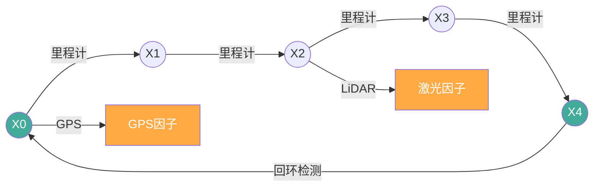
```mermaid
graph LR
    X0((X0)) -->|里程计| X1((X1))
    X1 -->|里程计| X2((X2))
    X2 -->|里程计| X3((X3))
    X3 -->|里程计| X4((X4))
    X4 -->|回环检测| X0
    X0 -->|GPS| G0[GPS因子]
    X2 -->|LiDAR| L0[激光因子]
    style X0 fill:#4a9,color:#fff
    style X4 fill:#4a9,color:#fff
    style G0 fill:#fa4,color:#fff
    style L0 fill:#fa4,color:#fff
```

### 回环检测（Loop Closure Detection）


回环检测的任务：判断机器人是否回到了之前探索过的地方，从而添加回环约束消除累积误差。

- **基于外观（Appearance-based）**：词袋模型（BoW）、神经网络特征，比较图像相似度
- **基于几何（Geometry-based）**：扫描匹配验证候选回环的几何一致性

<div align="center">
  
  <figcaption>图：回环检测算法流程</figcaption>
</div>

<div align="center">
  
  <figcaption>图：回环检测效果图</figcaption>
</div>

### 主要后端优化库

- **g2o（General Graph Optimization）**：通用图优化库，ORB-SLAM2/3 使用
- **GTSAM（Georgia Tech Smoothing and Mapping）**：因子图优化库，LIO-SAM 使用
- **iSAM2（Incremental Smoothing and Mapping 2）**：GTSAM 中的增量式优化算法，支持实时更新而无需每次重新优化整个图

## 4.6 激光 vs. 视觉 SLAM 对比

| 对比维度 | 激光 SLAM | 视觉 SLAM |
|---------|---------|---------|
| 传感器成本 | 高（数百至数万元） | 低 |
| 精度 | 高（cm 级） | 中（取决于场景） |
| 光照依赖 | 无 | 有（弱光/过曝困难） |
| 地图类型 | 点云/占据栅格 | 稀疏点云/半稠密 |
| 动态障碍处理 | 一般 | 较难 |
| 长廊退化问题 | 容易（缺少几何约束） | 依赖纹理 |
| 代表算法 | Cartographer, LIO-SAM | ORB-SLAM3, VINS-Mono |
| 典型应用 | 室内机器人, 自动驾驶 | 无人机, 手持设备 |

## 4.7 SLAM 退化场景与实际部署挑战

SLAM 系统在实验室环境下往往表现良好，但在真实部署中会遭遇各种退化场景，导致定位失败或地图错误。理解这些场景并有针对性地选择算法，是工程化的关键。

<div align="center">
  
  <figcaption>图：棘手场景</figcaption>
</div>

### 4.7.1 几何退化（Geometric Degeneracy）

**长廊退化**（Corridor Degeneracy）：激光 SLAM 在长走廊中面临严峻挑战。走廊两侧墙壁高度对称，激光点云沿走廊方向的特征几乎一致，导致沿走廊方向的位移**无法被约束**（扫描匹配的法方向约束缺失）。表现为：沿走廊方向漂移，横向定位良好。

**对策**：
- 结合 IMU 或轮式里程计约束沿走廊方向运动
- 使用 3D LiDAR 利用天花板和地面结构补充约束
- LIO-SAM 的 IMU 预积分在退化方向提供约束

**开阔室外退化**：大型停车场、田野等缺少立体结构的环境，激光点云稀疏，NDT/ICP 收敛困难。**对策**：融合 GPS 全局约束。

### 4.7.2 动态环境挑战

SLAM 假设环境是静态的，但现实中行人、车辆、移动家具会产生动态干扰：

- **假地图点**：动态障碍物被错误地建入静态地图
- **跟踪失败**：大量动态物体导致扫描匹配失效
- **回环误检**：场景布局变化后 BoW 召回错误关键帧

**对策**：
- 点云动态物体滤除（基于运动一致性检测）
- 语义分割过滤动态类别（行人、车辆）的点云
- 视觉 SLAM 中使用运动分割（Motion Segmentation）

### 4.7.3 光照与天气影响（视觉 SLAM）

视觉 SLAM 对光照极为敏感：

| 场景 | 对特征法的影响 | 对直接法的影响 |
|------|------------|------------|
| 弱光（夜间） | ORB 特征提取失败 | 光度误差计算不稳定 |
| 过曝（逆光） | 特征描述子不稳定 | 饱和区域梯度为零 |
| 快速运动 | 运动模糊，特征模糊 | 光流假设违反 |
| 下雨/雾 | 特征被遮挡 | 能见度下降 |

**对策**：
- 视觉惯性 SLAM（VINS-Mono/ORB-SLAM3 IMU 模式）：IMU 在特征跟踪失败时维持短期定位
- HDR 相机或主动照明（结构光）适应光照变化
- 事件相机（Event Camera）对运动模糊免疫，是当前研究热点

### 4.7.4 长期地图维护与场景变化

长期部署面临地图老化问题：季节变化（落叶、积雪）、装修改造、家具移动等都会使原始地图失效。

**对策策略**：
- **增量式地图更新**：当传感器观测与现有地图不一致超过阈值时，触发局部地图更新
- **多地图管理**（ORB-SLAM3 支持）：在场景切换或跟踪丢失时创建新子地图，恢复后合并
- **语义地图**：用语义标签（门/墙/柱）替代原始点，语义特征比几何特征更稳定

### 4.7.5 嵌入式平台计算约束

机器人往往搭载算力有限的嵌入式平台（Jetson Nano / Xavier / Orin），而完整 SLAM 系统对算力要求较高：

| 组件 | CPU 算力需求 | GPU 加速可行性 |
|------|-----------|------------|
| ORB 特征提取 | 中（SIMD 可加速） | ✅（CUDA ORB） |
| LiDAR 扫描匹配（NDT/ICP）| 高 | 部分（PCL GPU） |
| Bundle Adjustment | 极高 | ✅（g2o CUDA） |
| 回环检测（BoW 检索） | 低 | 不必要 |
| 粒子滤波（AMCL 500 粒子）| 低 | 不必要 |

**实践建议**：
- 优先使用轻量化系统：LeGO-LOAM（嵌入式友好）、AMCL（低算力定位）
- 前端（特征提取、扫描匹配）尽量在 GPU 加速
- 后端优化可降频运行（10 Hz 前端 + 1–2 Hz 后端 BA）
- 使用 iSAM2 增量优化避免全图重优化

> **注**：视觉 SLAM 真实部署中的更多细节（与 TITS 2026 相关的场景适应性研究）将在后续补充。

## 4.8 常用数据集汇总

| 数据集 | 传感器 | 场景 | 主要用途 | 地址 |
|--------|-------|------|---------|------|
| **KITTI** | 激光雷达+双目+GPS/IMU | 室外道路 | 视觉/激光里程计, 3D目标检测 | kitti.is.tue.mpg.de |
| **TUM** | RGB-D | 室内 | RGB-D SLAM 评测 | vision.in.tum.de |
| **EuRoC** | 双目+IMU | 室内无人机 | VIO 评测 | rpg.ifi.uzh.ch |
| **nuScenes** | 6相机+激光+雷达+GPS/IMU | 室外道路 | 自动驾驶感知 | nuscenes.org |
| **Newer College** | 3D激光+IMU | 室外校园 | 3D LiDAR SLAM | ori.ox.ac.uk |
| **Hilti SLAM** | 多激光+相机+IMU | 建筑工地 | 多传感器 SLAM 评测 | hilti-challenge.com |

---

# 5. 路径规划（Path Planning）

路径规划解决"我该怎么走"的问题：在已知（或局部已知）的地图中，找到从起点到终点的无碰撞路径。

## 5.1 全局路径规划——搜索类

搜索类算法在**离散化的栅格地图**上搜索最优路径。

### Dijkstra 算法

**思路**：从起点出发，像涟漪扩散一样，按照**代价从小到大**的顺序逐步探索所有可达节点，直到找到终点。保证找到代价最小的路径（最优性）。

✅ 保证最优解
❌ 无方向性，在大地图上扩展节点数量大，效率低
❌ 时间复杂度 $O(V \log V + E)$，$V$ 为节点数，$E$ 为边数

<div align="center">
  
  
  <figcaption>图：Dijkstra 搜索过程（左）与导航结果（右）——扩展节点呈同心圆扩散，无方向性</figcaption>
</div>

### A*（A-Star）算法

**思路**：在 Dijkstra 基础上加入**启发函数 h(n)**（估计当前节点到终点的代价，通常用欧几里得距离或曼哈顿距离），让搜索有明确的方向性，优先探索"看起来更接近终点"的节点。

$$f(n) = g(n) + h(n)$$

其中 $g(n)$ 是起点到节点 $n$ 的实际代价，$h(n)$ 是启发函数估计值。

✅ 保证最优解（当 $h(n)$ 不高估实际代价时）
✅ 比 Dijkstra 快得多（方向性搜索）
❌ 在高维空间（如3D）计算量仍然较大

**启发函数 h(n) 的选择**：不同的启发函数适用于不同的移动约束：

| 启发函数 | 公式 | 适用场景 | 性质 |
|---------|------|---------|------|
| **曼哈顿距离** | $\|dx\| + \|dy\|$ | 只允许 4 方向移动（上下左右） | 4方向下恰好可采纳 |
| **欧几里得距离** | $\sqrt{dx^2 + dy^2}$ | 允许任意方向移动 | 任何情况下均可采纳 |
| **Octile 距离** | $\max(\|dx\|,\|dy\|) + (\sqrt{2}-1)\min(\|dx\|,\|dy\|)$ | 允许 8 方向移动（含对角线） | 8方向下比欧氏更紧（搜索更快） |

> **可采纳（Admissible）**：$h(n)$ 永远不高估真实代价，保证 A* 找到最优解。若 $h(n) = 0$ 则退化为 Dijkstra（最慢最优），$h(n)$ 越大越快但可能过高估失去最优性。

下图展示了 A* 在 10×10 栅格上的搜索过程：

<div align="center">
  
  <figcaption>图：A* 搜索示意——灰色（已评估关闭集）/ 橙色（待评估开放集）/ 绿色（最优路径），障碍物（深色）被绕过</figcaption>
</div>

<div align="center">
  
  
  <figcaption>图：A* 搜索过程（左）与导航结果（右）——有方向性，扩展节点集中在目标方向</figcaption>
</div>

### 双向 A*（Bidirectional A*）

同时从起点和终点双向搜索，当两个搜索波前相遇时停止。平均搜索节点数约为单向 A* 的一半，适合起终点相距较远的情况。

<div align="center">
  
  
  <figcaption>图：双向 A* 搜索（左，两端同时扩展）与导航结果（右）</figcaption>
</div>

### Hybrid A*（混合 A*）

**标准 A* 的问题**：在栅格上寻路，忽略了车辆的运动学约束。一辆汽车不能原地侧移，它有最小转弯半径。

**Hybrid A* 的改进**：将车辆的连续状态空间（$x, y, \theta$）离散化，每个节点扩展时考虑可执行的转向操作（如不同曲率的圆弧），确保生成的路径对非完整约束车辆（差速轮式/阿克曼）**实际可行**。

✅ 生成运动学可行路径
✅ 适合停车场景、狭窄通道
❌ 计算量比标准 A* 大
❌ 需要结合 Reeds-Shepp 曲线等后处理平滑

<div align="center">
  
  
  <figcaption>图：Hybrid A* 搜索（左）与导航结果（右）——生成考虑车辆运动学约束的平滑可行路径</figcaption>
</div>

## 5.2 全局路径规划——采样类

采样类算法通过**随机采样**构建路径，不需要显式栅格化地图，适合高维空间和复杂几何约束场景。

### RRT（快速随机扩展树，Rapidly-exploring Random Tree）

**思路**：从起点生长一棵树，每次随机采一个点，找到树上最近的节点，向随机点方向延伸一小步，如果没有碰撞就加入树。当树的某个节点足够接近终点时，路径即找到。

✅ 天然处理高维空间（机械臂规划）
✅ 不需要栅格化
❌ **不保证最优性**（找到的路径通常较曲折）
❌ 最终路径需要额外平滑处理

<div align="center">
  
  
  <figcaption>图：RRT 随机树扩展过程（左）与规划路径（右）——路径曲折，非最优</figcaption>
</div>

### RRT*

RRT 的改进版，加入了**重连（Rewiring）** 步骤：每次加入新节点时，检查其邻近节点是否能通过新节点降低代价，如果能就重连。随着采样点增多，路径**逐渐收敛到最优解（渐近最优）**。

✅ 渐近最优性（采样越多路径越好）
❌ 收敛速度慢，实时规划时可能采样时间不够

<div align="center">
  
  
  <figcaption>图：RRT* 搜索过程（左，重连后路径持续优化）与规划路径（右）——比 RRT 更平滑</figcaption>
</div>

### 双向 RRT*（Bidirectional RRT*）

从起点和终点同时生长两棵树，两棵树相遇时合并路径。收敛速度比单向 RRT* 快约一个数量级。

<div align="center">
  
  
  <figcaption>图：双向 RRT* 搜索（左，红蓝两棵树相遇）与规划路径（右）</figcaption>
</div>

### Informed RRT*

进一步改进：当找到一条初始解后，将采样限制在**椭圆区域**内（以起终点为焦点的椭圆，长轴等于当前最优路径长度）。这样所有后续采样点都有可能改善当前解，大幅提升收敛速度。

<div align="center">
  
  
  <figcaption>图：Informed RRT* 搜索（左，椭圆采样区域随路径改善而收缩）与规划路径（右）</figcaption>
</div>

## 5.3 局部路径规划（动态避障）

全局规划假设地图是静态的，而现实中会有动态障碍物（行人、其他机器人）。局部规划在机器人运动过程中实时重新规划，处理动态障碍。

### DWA（动态窗口法，Dynamic Window Approach）

**思路**：在机器人当前速度周围的**可达速度窗口**（受加速度限制）中采样速度指令 $(v, \omega)$，用运动模型预测每条轨迹，根据**目标方向 + 速度 + 障碍物距离**综合打分，选择最优速度指令执行。

$$G(v, \omega) = \sigma(\alpha \cdot \text{heading} + \beta \cdot \text{dist} + \gamma \cdot \text{velocity})$$

✅ 计算快（ms 级），适合实时避障
✅ ROS `dwa_local_planner` 开箱即用
❌ 速度搜索空间有限，在狭窄通道中容易失败
❌ 只考虑短期轨迹，无法处理需要"绕路"的障碍

<div align="center">
  
  <figcaption>图：动态窗口法</figcaption>
</div>

### TEB（时间弹性带，Timed Elastic Band）

**思路**：将路径视为一段"橡皮筋"，加入时间维度后变成"时间弹性带"。将路径优化问题建模为**多目标优化**（最短路径 + 避障 + 运动学约束 + 时间一致性），通过迭代调整路径上的路点（Way Point）来得到平滑、无碰撞的轨迹。

✅ 生成平滑、运动学可行的轨迹
✅ 支持动态障碍物
✅ 支持倒车
❌ 计算量比 DWA 大，约 50–200 ms
❌ 参数调优复杂

<div align="center">
  
  <figcaption>图：时间弹力带</figcaption>
</div>

### 势场法（Potential Field Method）

最简单直观的局部避障方法：终点产生**引力**，障碍物产生**斥力**，机器人沿合力方向移动。

✅ 实现简单，计算极快
❌ **局部极小值问题**（机器人可能卡在引力和斥力平衡点）
❌ 狭窄通道中斥力可能过大导致无法通行

<div align="center">
  
  <figcaption>图：势场法避障演示——机器人沿引力/斥力合力运动，遭遇局部极小值时可能停滞</figcaption>
</div>

### MPPI（模型预测路径积分）

**模型预测路径积分（Model Predictive Path Integral）思路**：属于**模型预测控制（MPC）** 的随机变体。在当前时刻，向前采样**大量随机控制序列**（通过 GPU 并行采样），用运动模型仿真每条轨迹的未来状态，根据轨迹代价（碰撞 + 偏离路径 + 控制平滑）计算**加权平均**作为当前控制输出，然后滑动时间窗口重复。

✅ 无需求解最优控制问题（只需前向仿真）
✅ 天然支持非线性系统和非凸代价函数
✅ GPU 并行采样，可处理复杂障碍物分布
❌ 需要相对精确的运动模型
❌ 计算量较大，需要 GPU

<div align="center">
  
  <figcaption>图：MPPI 路径跟踪仿真——GPU 并行采样大量轨迹（半透明线），加权平均得到最优控制</figcaption>
</div>

## 5.4 代价地图（Costmap）层次结构

ROS `costmap_2d` 采用**分层代价地图**架构：

| 层名 | 功能 | 更新频率 |
|------|------|---------|
| **静态层** | 读取 SLAM 生成的静态地图 | 低（一次性） |
| **障碍物层** | 订阅传感器数据（激光/点云），标记动态障碍 | 高（实时） |
| **膨胀层** | 对障碍物区域按机器人半径膨胀出代价梯度 | 随障碍物层更新 |
| **自定义层** | 用户可扩展（如禁止区域、语义标注等） | 自定义 |

<div align="center">
  
  <figcaption>图：代价地图三层结构——静态层（全局地图）+ 障碍物层（传感器实时更新）+ 膨胀层（代价梯度），三层叠加生成最终代价地图</figcaption>
</div>

**inflation_radius 与机器人尺寸的关系**：

膨胀层的核心参数 `inflation_radius`（膨胀半径）决定了障碍物周围代价梯度的扩展范围：

- **最小值**：至少设为机器人半径（$r_{robot}$），否则机器人可能与障碍物发生碰撞
- **推荐值**：$r_{robot}$ + 安全余量（如 0.1–0.3 m），余量根据定位精度和机器人速度决定
- **过大的影响**：狭窄通道被高代价区域填满，规划器无法找到路径（代价无限大路径不可通）

膨胀代价的计算公式（ROS `costmap_2d`）：

$$\text{cost}(d) = \text{INSCRIBED\_COST} \cdot e^{-\text{cost\_scaling\_factor} \cdot (d - r_{inscribed})}$$

其中 $d$ 是到最近障碍物的距离，$r_{inscribed}$ 是机器人的内切圆半径。`cost_scaling_factor` 越大，代价衰减越快（紧贴障碍物的代价梯度越陡）。

**全局代价地图**（Global Costmap）：大范围，更新慢，用于全局规划
**局部代价地图**（Local Costmap）：机器人周围小范围（如 5m），更新快，用于局部避障

## 5.5 规划算法对比汇总

| 算法 | 类型 | 最优性 | 完备性 | 计算速度 | 适用场景 |
|------|------|--------|--------|---------|---------|
| **Dijkstra** | 搜索（全局） | ✅ 最优 | ✅ | 慢 | 小规模栅格地图 |
| **A*** | 搜索（全局） | ✅ 最优 | ✅ | 中等 | 室内导航，自动驾驶 |
| **Hybrid A*** | 搜索（全局） | 近似 | ✅ | 中等 | 非完整约束车辆（自动驾驶停车） |
| **RRT** | 采样（全局） | ❌ | 概率完备 | 快 | 高维空间，机械臂 |
| **RRT*** | 采样（全局） | 渐近最优 | 概率完备 | 中等 | 高维空间 |
| **DWA** | 局部 | 局部最优 | ❌ | 极快 | 室内移动机器人实时避障 |
| **TEB** | 局部 | 局部最优 | ❌ | 中等 | 复杂局部环境，需平滑轨迹 |
| **势场法** | 局部 | ❌ | ❌ | 极快 | 简单场景，辅助引导 |
| **MPPI** | 采样（局部） | 渐近最优 | 概率完备 | 中等（GPU加速） | 非线性动力学，越野无人车，动态避障 |

---

# 6. 路径跟踪（Path Tracking）

路径规划给出了一条理想路径，而**路径跟踪控制器**的任务是让机器人实际跟随这条路径运动。由于真实世界存在噪声、模型误差和外界干扰，控制器需要实时计算修正量。

## 6.1 纯追踪控制

纯追踪控制（Pure Pursuit）**直觉理解**：想象你开车，目光盯着前方一个固定距离（**预瞄距离 Look-ahead Distance $L_d$**）的目标点，不断调整方向盘朝它转。这就是 Pure Pursuit 的思路。

**核心公式**：

$$\delta = \arctan\left(\frac{2L\sin\alpha}{L_d}\right)$$

其中：
- $\delta$ = 前轮转角（控制量）
- $L$ = 轴距
- $\alpha$ = 目标点方向与车辆航向的夹角
- $L_d$ = 预瞄距离（通常取当前速度的 1–2 倍时间内行驶的距离）

<div align="center">
  
  <figcaption>图：Pure Pursuit 几何关系——后轴中心为参考点，以预瞄距离 $L_d$ 为半径作圆，与参考路径交点为目标点 T，夹角 α 决定前轮转角 δ</figcaption>
</div>

✅ 实现极其简单
✅ 对路径噪声鲁棒（天然平滑效果）
❌ 预瞄距离需要人工调参
❌ 高速时跟踪误差大（纯几何控制，忽略动力学）

**预瞄距离 $L_d$ 调参实践建议**：

$L_d$ 是 Pure Pursuit 唯一需要调的关键参数，对性能影响极大：

| $L_d$ 设置 | 行为特点 | 适用场景 |
|-----------|---------|---------|
| **太小**（< 0.5m @ 1m/s）| 转向过于激进，频繁震荡 | — |
| **适中** | 平滑跟踪，轻微路径误差 | 一般导航 |
| **太大**（> 3m @ 1m/s）| 走"大弯"切角，直道效果好但转弯误差大 | 高速直道 |

**速度自适应调参**（Adaptive Pure Pursuit）：使用 $L_d = k \cdot v$，其中典型 $k$ 值为：
- 室内机器人（最高 1 m/s）：$k \approx 1.5$–$2.0$
- 仓储 AGV（最高 2 m/s）：$k \approx 1.0$–$1.5$
- 自动驾驶（最高 30 km/h）：$k \approx 0.5$–$1.0$

另一实践技巧：设置 $L_d$ 的**最小值**（如 0.3 m），避免低速时预瞄距离趋近于零导致震荡。

<div align="center">
  
  <figcaption>图：Pure Pursuit 路径跟踪仿真——车辆目视前方预瞄点，平滑跟踪参考路径</figcaption>
</div>

## 6.2 自适应追踪控制

自适应追踪控制（Adaptive Pure Pursuit）将预瞄距离 $L_d$ 与速度**动态关联**：

$$L_d = k \cdot v$$

其中 $k$ 是比例系数，$v$ 是当前速度。速度快时预瞄远（稳定），速度慢时预瞄近（精确）。这解决了固定预瞄距离在不同速度下表现差异大的问题。

<div align="center">
  
  <figcaption>图：自适应 Pure Pursuit 路径跟踪——预瞄距离随速度动态调整，各速度段均表现稳定</figcaption>
</div>

## 6.3 后轮反馈控制

后轮反馈控制（Rear Wheel Feedback）以车辆**后轴中点**为跟踪参考点（而非前轴或重心），直接消除后轮在参考路径上的横向误差和航向误差。后轮反馈控制（Rear Wheel Feedback）相比 Pure Pursuit 有更严格的数学收敛保证。

<div align="center">
  
  <figcaption>图：后轮反馈控制路径跟踪仿真——以后轴为参考点，横向误差收敛更快</figcaption>
</div>

## 6.4 Stanley 控制器

斯坦福大学自动驾驶团队（用于 DARPA 挑战赛）提出的控制律，以**前轴中点**为参考：

$$\delta = \psi_e + \arctan\left(\frac{k \cdot e}{v}\right)$$

其中：
- $\psi_e$ = 航向误差
- $e$ = 前轴到路径的横向偏差
- $k$ = 增益系数
- $v$ = 当前速度

第一项修正航向偏差，第二项修正横向偏差。速度越快，横向误差修正量越小（避免高速急转）。

✅ 精度优于 Pure Pursuit
✅ 低速（停车）时的精度表现好
❌ 在极低速时 $\arctan(k \cdot e / v)$ 项趋于饱和，需要处理
❌ 不显式考虑路径曲率

<div align="center">
  
  <figcaption>图：Stanley 控制器路径跟踪仿真——同时修正航向误差和横向偏差，转弯处精度更高</figcaption>
</div>

## 6.5 LQR 路径跟踪

**线性二次调节器路径跟踪（Linear Quadratic Regulator）思路**：将路径跟踪问题建模为**最优控制问题**。在车辆线性化模型下，LQR 求解最小化如下代价函数的最优控制律：

$$J = \sum_{t=0}^{\infty} \left( \mathbf{e}_t^T \mathbf{Q} \mathbf{e}_t + u_t^T \mathbf{R} u_t \right)$$

其中 $\mathbf{e}_t$ 是跟踪误差（横向偏差 + 航向误差），$u_t$ 是控制输入（转向角），$\mathbf{Q}$ 和 $\mathbf{R}$ 是权重矩阵（调参关键：$\mathbf{Q}$ 大表示"更重视减小误差"，$\mathbf{R}$ 大表示"更重视平稳控制"）。

✅ 理论上最优，精度高
✅ 系统响应平滑
❌ 依赖精确的线性化模型
❌ $\mathbf{Q}$、$\mathbf{R}$ 矩阵调参需要经验

<div align="center">
  
  <figcaption>图：LQR 路径跟踪仿真——最优控制律使得跟踪误差最小化，响应平滑稳定</figcaption>
</div>

## 6.6 控制器对比汇总

| 控制器 | 跟踪精度 | 计算量 | 参数数量 | 适用速度 | 典型应用 |
|--------|---------|--------|---------|---------|---------|
| **Pure Pursuit** | 低–中 | 极低 | 1（$L_d$） | 低–中 | 简单室内机器人 |
| **Adaptive Pure Pursuit** | 中 | 极低 | 1（$k$） | 全速域 | 一般移动机器人 |
| **Stanley** | 中–高 | 低 | 1（$k$） | 低–高 | 自动驾驶 |
| **后轮反馈** | 中–高 | 低 | 少 | 全速域 | 差速轮式机器人 |
| **LQR** | 高 | 中 | Q、R矩阵 | 全速域 | 高精度自动驾驶 |
| **MPPI** | 高 | 高（需GPU） | 多 | 全速域 | 越野无人车、高动态场景 |

## 6.7 MPPI：基于采样的随机最优控制

**MPPI（Model Predictive Path Integral）** 是近年来在高动态场景（越野机器人、竞速无人车）中表现亮眼的随机最优控制方法：

**核心思想**：不用解析地求解最优控制，而是**大量采样随机轨迹**（可 GPU 并行），用车辆动力学模型仿真每条轨迹的未来状态，计算代价，再以代价的指数权重聚合出最优控制输入：

$$\mathbf{u}^* = \frac{\sum_{k=1}^{K} w_k \mathbf{U}_k}{\sum_{k=1}^{K} w_k}, \quad w_k = \exp\!\left(-\frac{1}{\lambda} C(\mathbf{U}_k)\right)$$

其中 $C(\mathbf{U}_k)$ 是第 $k$ 条轨迹的累积代价，$\lambda$ 是温度参数。

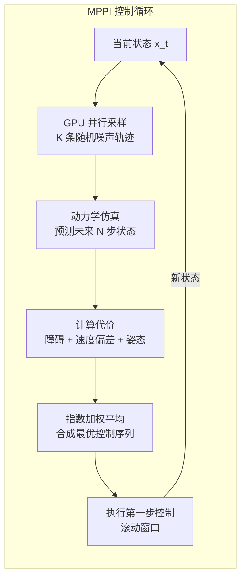
```mermaid
flowchart LR
    subgraph MPPI_Loop["MPPI 控制循环"]
        S["当前状态 x_t"] --> SAMP["GPU 并行采样\nK 条随机噪声轨迹"]
        SAMP --> SIM["动力学仿真\n预测未来 N 步状态"]
        SIM --> COST["计算代价\n障碍 + 速度偏差 + 姿态"]
        COST --> AGG["指数加权平均\n合成最优控制序列"]
        AGG --> EXEC["执行第一步控制\n滚动窗口"]
        EXEC -->|新状态| S
    end
```

✅ 可以直接使用非线性动力学模型（不需要线性化）
✅ GPU 并行采样，计算瓶颈可被硬件加速
✅ 天然处理多模态代价（可融入障碍物代价图）
❌ 依赖动力学模型精度，模型失配会导致性能下降
❌ GPU 计算需求高，嵌入式部署需优化

**典型应用**：MIT 的 [AutoRally](https://autorally.github.io/)、[MPPI-Generic](https://github.com/ACDSLab/MPPI-Generic)，在越野地形以 15+ m/s 实现实时避障控制。

---

## 6.8 路径跟踪作为 Agent 的控制原语

传统路径跟踪控制器在 Agent 时代并未被淘汰，而是成为 **Agent 可调用的底层技能（Skill）**：LLM Agent 负责语义推理和任务分解，路径跟踪控制器以 50–100 Hz 稳定地执行低层运动。

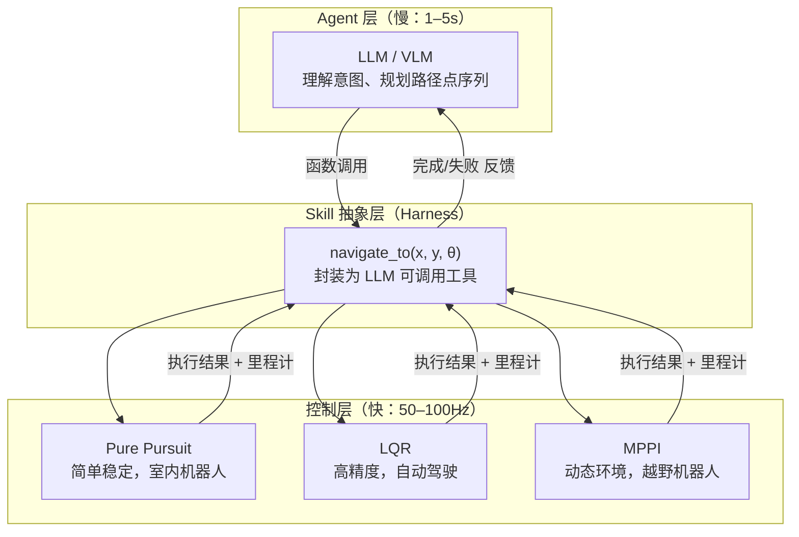
```mermaid
flowchart TB
    subgraph AgentLevel["Agent 层（慢：1–5s）"]
        LLM_A["LLM / VLM\n理解意图、规划路径点序列"]
    end

    subgraph SkillLayer["Skill 抽象层（Harness）"]
        SK_NAV["navigate_to(x, y, θ)\n封装为 LLM 可调用工具"]
    end

    subgraph ControlLevel["控制层（快：50–100Hz）"]
        PP2["Pure Pursuit\n简单稳定，室内机器人"]
        LQR2["LQR\n高精度，自动驾驶"]
        MPPI2["MPPI\n动态环境，越野机器人"]
    end

    LLM_A -->|函数调用| SK_NAV
    SK_NAV --> PP2
    SK_NAV --> LQR2
    SK_NAV --> MPPI2
    PP2 & LQR2 & MPPI2 -->|执行结果 + 里程计| SK_NAV
    SK_NAV -->|完成/失败 反馈| LLM_A
```

这种"慢思考驱动快动作"的解耦设计是现代 Agent-Robot 系统的核心架构原则，详见第 7 章。

---

# 7. Agent 如何驾驭机器人：Harness Engineering 全解析

## 7.1 从导航栈到 Agent 指挥的机器人

前六章描述的传统导航栈已经赋予机器人强大的底层自主能力：它能在未知环境中建图定位、规划无碰撞路径、精确跟踪轨迹。但面对"帮我去厨房拿瓶水"这样的日常指令，它依然无能为力——缺乏语义理解、常识推理和任务分解能力。

这正是 **AI Agent** 要填补的鸿沟。


```mermaid
flowchart TB
    subgraph Traditional["传统导航（可靠但缺乏语义）"]
        H1["人类输入\n坐标 (x=3.2, y=1.5)"] --> NS["Nav Stack\nSLAM + A* + DWA"]
        NS --> R1["机器人到达目标点"]
    end

    subgraph AgentDriven["Agent 驱动（语义 → 动作）"]
        H2["人类输入\n自然语言：去厨房拿水"] --> LLM_TOP["LLM Agent\n推理 + 规划"]
        LLM_TOP --> HAR["Harness\n技能抽象层"]
        HAR --> NS2["Nav Stack\nSLAM + A* + DWA"]
        NS2 --> R2["机器人完成任务"]
        NS2 -->|"传感器反馈"| HAR
        HAR -->|"执行结果"| LLM_TOP
    end
```

| 对比维度 | 传统导航栈 | Agent 驱动导航 |
|---------|----------|--------------||
| 指令形式 | 坐标/位姿目标 | 自然语言意图 |
| 任务分解 | 手动设计状态机 | LLM 动态推理 |
| 语义理解 | ❌ 无 | ✅ VLM/LLM |
| 异常处理 | 预设恢复行为 | Agent 自主推理重规划 |
| 典型输入 | `(3.2, 1.5, 0.0)` | "帮我去厨房拿水" |

---

## 7.2 Harness Engineering：让 Agent 能够"抓住"机器人

### 7.2.1 什么是 Harness？

**Harness（驾驭层）** 是位于 LLM/Agent 与物理机器人之间的软件中间件，负责将 LLM 的高层推理输出转化为机器人可执行的低层命令，同时将传感器状态反馈回 LLM 上下文。

> "Your agent needs a harness, not a framework. The framework defines *what* the agent does; the harness controls *when* and *how* it's allowed to act."
> — Inngest Engineering Blog (2025)

**三层架构**：

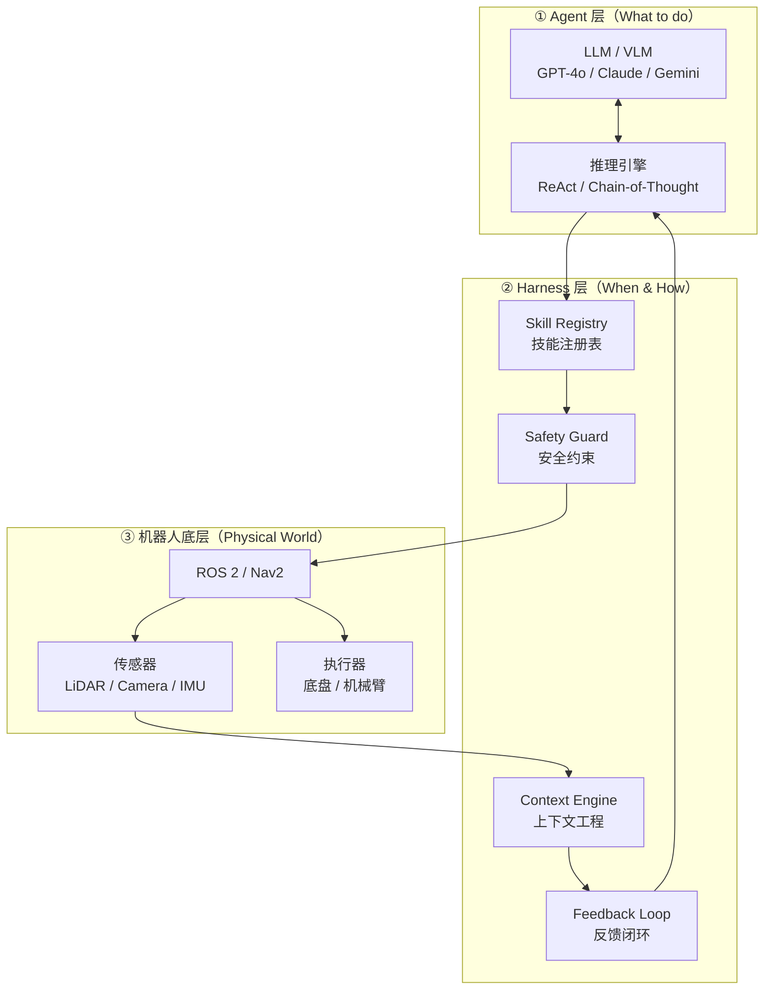
```mermaid
flowchart TB
    subgraph Layer1["① Agent 层（What to do）"]
        LLM_L["LLM / VLM\nGPT-4o / Claude / Gemini"]
        REASON["推理引擎\nReAct / Chain-of-Thought"]
    end

    subgraph Layer2["② Harness 层（When & How）"]
        SKILL_H["Skill Registry\n技能注册表"]
        CTX_H["Context Engine\n上下文工程"]
        SAFE_H["Safety Guard\n安全约束"]
        LOOP_H["Feedback Loop\n反馈闭环"]
    end

    subgraph Layer3["③ 机器人底层（Physical World）"]
        ROS_L["ROS 2 / Nav2"]
        SENSOR_L["传感器\nLiDAR / Camera / IMU"]
        ACT_L["执行器\n底盘 / 机械臂"]
    end

    LLM_L <--> REASON
    REASON --> SKILL_H
    SKILL_H --> SAFE_H
    SAFE_H --> ROS_L
    ROS_L --> SENSOR_L
    SENSOR_L --> CTX_H
    CTX_H --> LOOP_H
    LOOP_H --> REASON
    ROS_L --> ACT_L
```

| 层级 | 职责 | 关键组件 |
|------|------|---------|
| **Agent 层** | 理解意图、推理规划、决策 | LLM、ReAct、思维链 |
| **Harness 层** | 工具封装、上下文管理、安全过滤、反馈闭环 | Skill Registry、Context Engine、Safety Guard |
| **机器人底层** | 传感、定位、运动执行 | ROS 2、Nav2、驱动 |

### 7.2.2 Harness 的四大核心挑战

在机器人场景中，Harness 面临的挑战远比普通软件 Agent 更复杂：

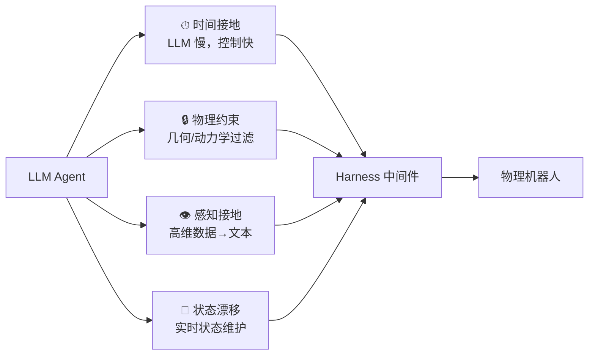
```mermaid
flowchart LR
    LLM_C["LLM Agent"] --> T_C["⏱ 时间接地\nLLM 慢，控制快"]
    LLM_C --> P_C["🔒 物理约束\n几何/动力学过滤"]
    LLM_C --> G_C["👁 感知接地\n高维数据→文本"]
    LLM_C --> D_C["🔄 状态漂移\n实时状态维护"]
    T_C & P_C & G_C & D_C --> HAR_C["Harness 中间件"] --> BOT_C["物理机器人"]
```

1. **时间接地**：LLM 推理需要 200ms–2s，机器人控制需要 50–100 Hz 实时响应，Harness 必须解决"慢思考驱动快动作"的时序问题。
2. **物理约束**：LLM 不理解"机器人半径 0.3m，无法穿过宽度 0.2m 的门缝"，必须在输出到执行器前过滤物理不可行动作。
3. **感知接地**：将激光点云、RGB 图像等高维数据转化为 LLM 可理解的文本/结构化描述。
4. **状态漂移**：机器人在 LLM 推理过程中持续运动，Harness 必须维护实时更新的状态快照。

---

## 7.3 Skill 抽象：将 ROS API 封装为 Agent 工具

将 ROS 原语封装为 **Skill（技能）** 是 Harness Engineering 的核心工作。每个 Skill 是可被 LLM 以**函数调用（Function Calling）** 方式调用的工具，内部对接 ROS Topic/Service/Action。

### ROS 原语 → Skill 映射

| ROS 原语 | Skill 名称 | LLM 调用描述 |
|---------|----------|------------|
| `move_base` Action | `navigate_to(x, y, θ)` | 导航到指定坐标 |
| `/cmd_vel` Topic | `drive(v_x, v_z)` | 以指定速度行驶 |
| `/scan` Topic | `get_scan_summary()` | 获取障碍物摘要 |
| SLAM 地图查询 | `query_map(landmark)` | 查询地标坐标 |
| 物体检测 | `detect_objects()` | 分析相机画面 |
| 机械臂 | `grasp(object_name)` | 抓取指定物体 |

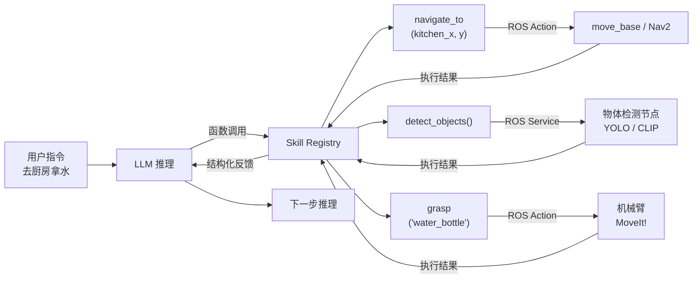
```mermaid
flowchart LR
    NL_SK["用户指令\n去厨房拿水"] --> LLM_SK["LLM 推理"]
    LLM_SK -->|"函数调用"| SREG["Skill Registry"]

    SREG --> SK1["navigate_to\n(kitchen_x, y)"]
    SREG --> SK2["detect_objects()"]
    SREG --> SK3["grasp\n('water_bottle')"]

    SK1 -->|"ROS Action"| MBA["move_base / Nav2"]
    SK2 -->|"ROS Service"| DET["物体检测节点\nYOLO / CLIP"]
    SK3 -->|"ROS Action"| ARM_SK["机械臂\nMoveIt!"]

    MBA & DET & ARM_SK -->|"执行结果"| SREG
    SREG -->|"结构化反馈"| LLM_SK
    LLM_SK --> NEXT_SK["下一步推理"]
```

### OpenClaw Skills 格式示例

OpenClaw 使用 `SKILL.md` 文件定义每个技能，是目前社区最广泛采用的 Skill 规范之一：

```markdown
---
name: navigate_to_landmark
description: 导航机器人到指定地标位置
parameters:
  - name: landmark
    type: string
    description: 目标地标（如 "kitchen", "door", "charging_station"）
---
# 技能实现
调用 ROS 2 Nav2 的 navigate_to_pose action，先通过语义地图查询
landmark 的世界坐标，然后发布导航目标并等待完成。
失败时返回结构化错误：{ "status": "failed", "reason": "path_blocked" }
```

---

## 7.4 感知接地：传感器数据如何进入 LLM

LLM 只能处理文本/图像，但机器人传感器输出激光点云、IMU 角速度、占据栅格等高维数据。**感知接地**是将这些数据转化为 LLM 可理解格式的工程核心。

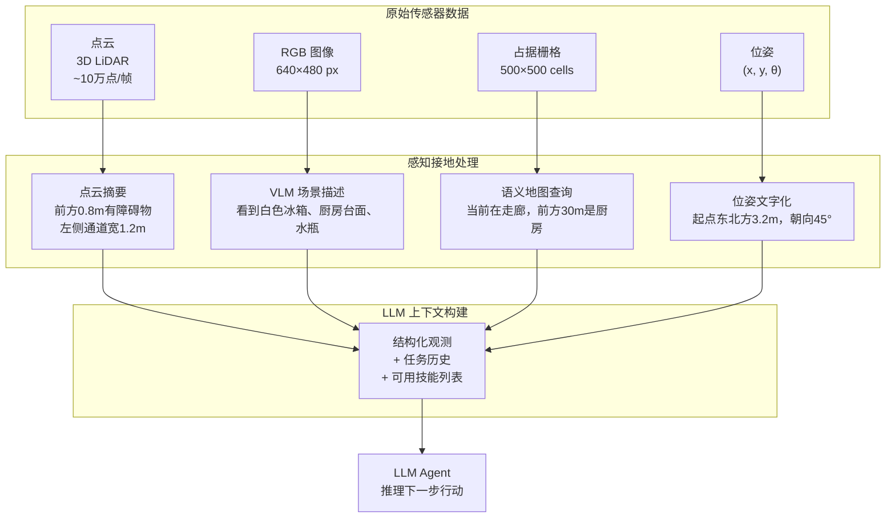
```mermaid
flowchart TB
    subgraph RawSensors["原始传感器数据"]
        PC_G["点云\n3D LiDAR\n~10万点/帧"]
        IMG_G["RGB 图像\n640×480 px"]
        OCC_G["占据栅格\n500×500 cells"]
        POSE_G["位姿\n(x, y, θ)"]
    end

    subgraph GroundingLayer["感知接地处理"]
        PC_G --> PG_G["点云摘要\n前方0.8m有障碍物\n左侧通道宽1.2m"]
        IMG_G --> VLM_G["VLM 场景描述\n看到白色冰箱、厨房台面、水瓶"]
        OCC_G --> MG_G["语义地图查询\n当前在走廊，前方30m是厨房"]
        POSE_G --> POS_G["位姿文字化\n起点东北方3.2m，朝向45°"]
    end

    subgraph ContextBuild["LLM 上下文构建"]
        PG_G & VLM_G & MG_G & POS_G --> CTX_G["结构化观测\n+ 任务历史\n+ 可用技能列表"]
    end

    CTX_G --> LLM_G["LLM Agent\n推理下一步行动"]
```

| 传感器数据 | 接地方法 | 工具/模型 |
|---------|---------|---------|
| RGB 图像 | VLM 场景描述 | GPT-4V、LLaVA、PaliGemma |
| LiDAR 点云 | 规则提取障碍物摘要 | PCL + 文本模板 |
| 占据地图 | 语义地图 API 查询 | 地图服务 |
| 位姿/速度 | 结构化文本序列化 | 自定义格式 |

---

## 7.5 代表性 Agent-Robot 系统演进

过去三年，Agent-Robot 系统经历了快速的代际演进：

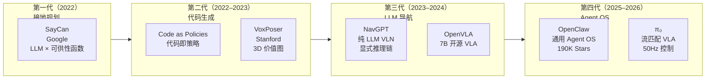
```mermaid
flowchart LR
    subgraph G1["第一代（2022）\n接地规划"]
        SC_E["SayCan\nGoogle\nLLM × 可供性函数"]
    end

    subgraph G2["第二代（2022–2023）\n代码生成"]
        CAP_E["Code as Policies\n代码即策略"]
        VP_E["VoxPoser\nStanford\n3D 价值图"]
    end

    subgraph G3["第三代（2023–2024）\nLLM 导航"]
        NGPT_E["NavGPT\n纯 LLM VLN\n显式推理链"]
        OVLA_E["OpenVLA\n7B 开源 VLA"]
    end

    subgraph G4["第四代（2025–2026）\nAgent OS"]
        OC_E["OpenClaw\n通用 Agent OS\n190K Stars"]
        P0_E["π₀\n流匹配 VLA\n50Hz 控制"]
    end

    G1 --> G2 --> G3 --> G4
```

### SayCan（Google，2022）

**核心思想**：LLM 生成候选动作序列，**可供性价值函数（Affordance Value Function）** 评估每个动作在当前物理状态下的可执行概率，两者联合打分：

$$\text{Score}(a \mid i, s) = P_{\text{LLM}}(a \mid i) \times V_{\text{afford}}(a \mid s)$$

- $P_{\text{LLM}}$：LLM 认为动作 $a$ 与指令 $i$ 的语义匹配概率
- $V_{\text{afford}}$：动作 $a$ 在当前机器人状态 $s$ 下的物理可执行性

**意义**：首次系统性地解决 LLM 输出与物理世界的"接地问题"——即使 LLM 说"飞到桌子上"，可供性函数也会给出接近 0 的得分，自动过滤物理不可行动作。

---

## 7.6 OpenClaw：通用 Agent OS 驾驭机器人（详解）

### 什么是 OpenClaw？

**OpenClaw** 是目前 GitHub 增长最快的开源 AI 项目之一，2025 年 11 月由奥地利开发者 Peter Steinberger 以 "Clawdbot" 命名创立，约 90 天内从 0 增长至 **190,000+ Stars**。2026 年 2 月，创始人加入 OpenAI 后，项目移交开源基金会继续维护。

OpenClaw 的定位是一个**自托管的 Agent 操作系统（Agent OS）**——并非专为机器人设计，但其 **Skills 架构**天然适合机器人控制：任何功能都可封装为 Skill，机器人的 ROS API 同样如此。

### OpenClaw 核心架构

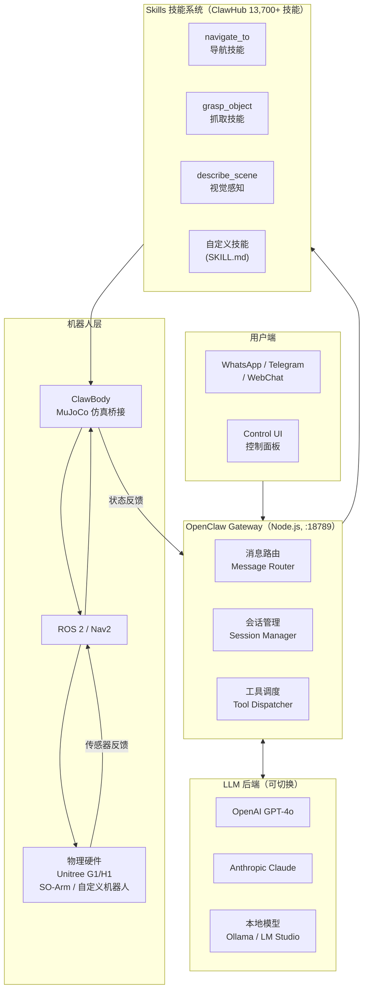
```mermaid
flowchart TB
    subgraph UserEnd["用户端"]
        WA_OC["WhatsApp / Telegram\n/ WebChat"]
        UI_OC["Control UI\n控制面板"]
    end

    subgraph Gateway["OpenClaw Gateway（Node.js, :18789）"]
        MSG_OC["消息路由\nMessage Router"]
        SESSION_OC["会话管理\nSession Manager"]
        TOOL_OC["工具调度\nTool Dispatcher"]
    end

    subgraph SkillsOC["Skills 技能系统（ClawHub 13,700+ 技能）"]
        NAV_OC["navigate_to\n导航技能"]
        GRASP_OC["grasp_object\n抓取技能"]
        VISION_OC["describe_scene\n视觉感知"]
        CUSTOM_OC["自定义技能\n(SKILL.md)"]
    end

    subgraph LLMBack["LLM 后端（可切换）"]
        OAI_OC["OpenAI GPT-4o"]
        ANT_OC["Anthropic Claude"]
        LOC_OC["本地模型\nOllama / LM Studio"]
    end

    subgraph RobotLayer["机器人层"]
        CB_OC["ClawBody\nMuJoCo 仿真桥接"]
        ROS_OC["ROS 2 / Nav2"]
        HW_OC["物理硬件\nUnitree G1/H1\nSO-Arm / 自定义机器人"]
    end

    UserEnd --> Gateway
    Gateway <--> LLMBack
    Gateway --> SkillsOC
    SkillsOC --> CB_OC
    CB_OC --> ROS_OC
    ROS_OC --> HW_OC
    HW_OC -->|"传感器反馈"| ROS_OC
    ROS_OC --> CB_OC
    CB_OC -->|"状态反馈"| Gateway
```

### OpenClaw 机器人生态

**ClawBody**：软件桥接层，将 OpenClaw 的高层语言推理转化为低延迟电机指令，支持 MuJoCo 物理仿真，实现"说'拿起杯子' → 精确电机字节码"的全链路。

**RoClaw**：一个 20 cm 立方体开源机器人，专为 OpenClaw 设计的"物理身体"。用户通过 WhatsApp 发送指令，VLM 输出原始电机字节码，实现**双脑架构**：OpenClaw 负责语义推理，本地专用模型负责低层控制。

| 集成案例 | 机器人平台 | 接口方式 | 典型用例 |
|---------|----------|---------|---------|
| ClawBody | MuJoCo 仿真 | Python API | 仿真开发与验证 |
| RoClaw | 自制 20cm 机器人 | WhatsApp 消息 | 桌面演示 |
| Unitree G1/H1 | 宇树人形机器人 | ROS 2 Skills | 人形机器人控制 |
| SO-Arm + Jetson Thor | 机械臂 | LeRobot 低层 | 桌面操作任务 |
| DeepMirror 集成 | 商业机器人 | Physical AI 栈 | 工业应用 |

### 为什么 OpenClaw 对 Harness Engineering 有启发性

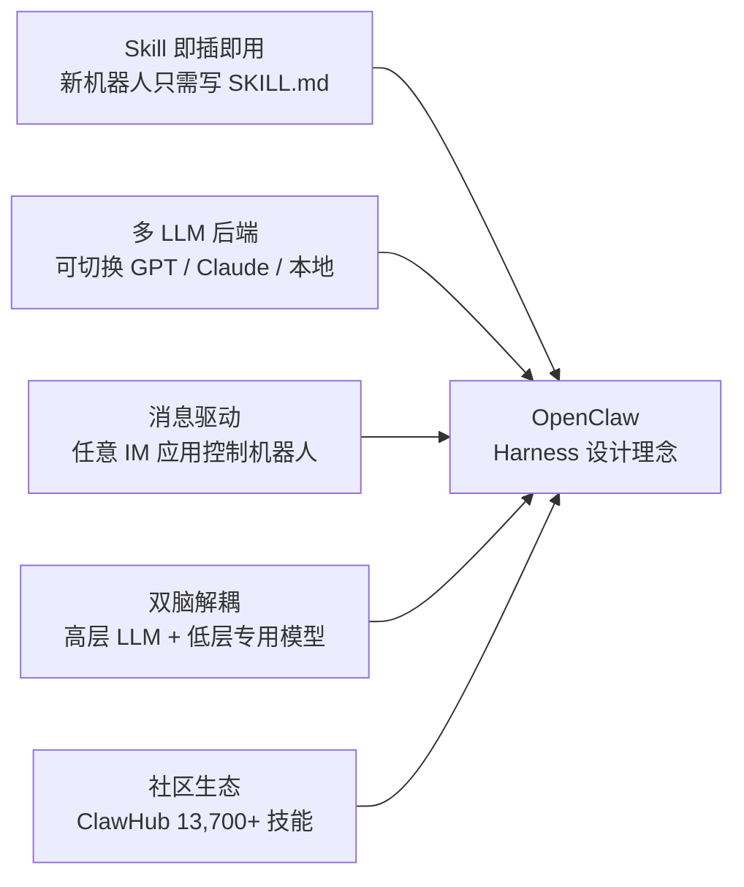
```mermaid
flowchart LR
    F1["Skill 即插即用\n新机器人只需写 SKILL.md"] --> OC_INS["OpenClaw\nHarness 设计理念"]
    F2["多 LLM 后端\n可切换 GPT / Claude / 本地"] --> OC_INS
    F3["消息驱动\n任意 IM 应用控制机器人"] --> OC_INS
    F4["双脑解耦\n高层 LLM + 低层专用模型"] --> OC_INS
    F5["社区生态\nClawHub 13,700+ 技能"] --> OC_INS
```

OpenClaw 最大的工程价值在于：它将 Harness 工程的复杂性**降低到"写一个 SKILL.md 文件"**的门槛，让机器人工程师无需深入 LLM 基础设施即可快速接入 Agent 能力。

---

## 7.7 NavGPT：LLM 驱动的视觉语言导航

**NavGPT**（AAAI 2024）是第一个将纯 LLM（GPT-4）用于**零样本视觉语言导航（Zero-shot VLN）**的系统，无需任何导航专项训练即可在室内环境导航：

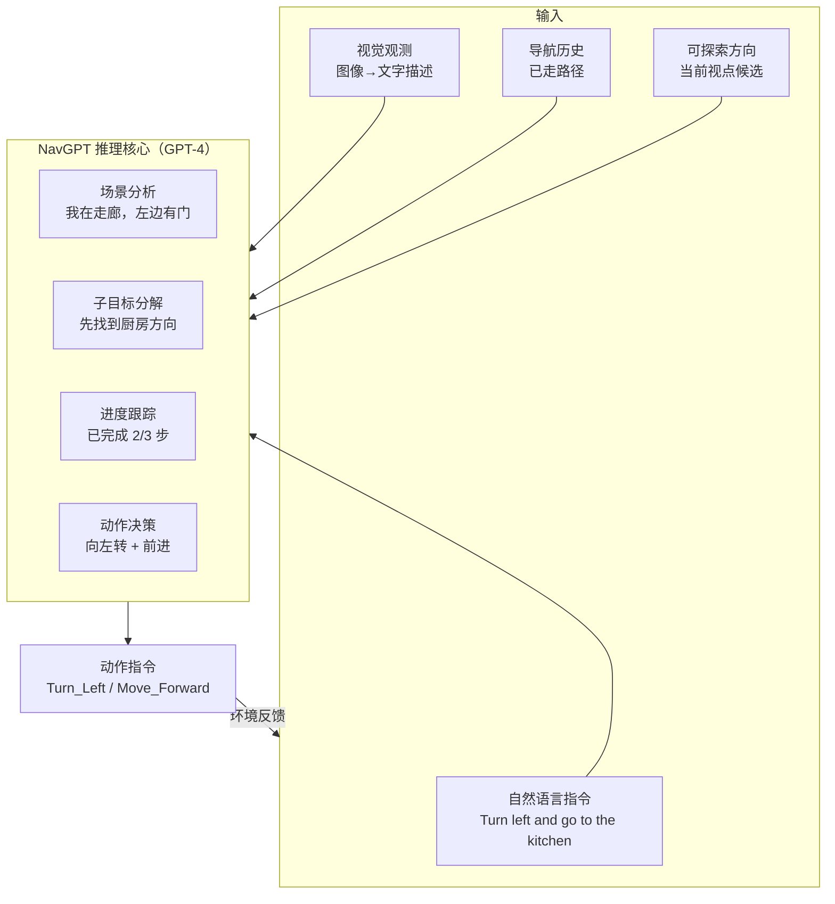
```mermaid
flowchart TB
    subgraph NavGPT_Input["输入"]
        NLI_NG["自然语言指令\nTurn left and go to the kitchen"]
        OBS_NG["视觉观测\n图像→文字描述"]
        HIST_NG["导航历史\n已走路径"]
        DIR_NG["可探索方向\n当前视点候选"]
    end

    subgraph NavGPT_Core["NavGPT 推理核心（GPT-4）"]
        SA_NG["场景分析\n我在走廊，左边有门"]
        SP_NG["子目标分解\n先找到厨房方向"]
        PM_NG["进度跟踪\n已完成 2/3 步"]
        AC_NG["动作决策\n向左转 + 前进"]
    end

    NLI_NG & OBS_NG & HIST_NG & DIR_NG --> NavGPT_Core
    NavGPT_Core --> ACT_NG["动作指令\nTurn_Left / Move_Forward"]
    ACT_NG -->|"环境反馈"| NavGPT_Input
```

**NavGPT 的显式推理链**（区别于端到端黑盒）是其核心优势：

> **输入**："去厨房找水"，当前观测"走廊，左转有门，右边是储藏室"
>
> **LLM 推理**：
> 1. 当前位置：走廊北端
> 2. 关键地标：左边门可能通向厨房
> 3. 历史追踪：已从起点向北走约 10m
> 4. 决策：向左转，穿过门
>
> **输出**：`Turn_Left, Move_Forward`

| 对比维度 | 传统 VLN（监督学习） | NavGPT（LLM 推理） |
|---------|------------------|-----------------||
| 训练数据 | 需要大量标注轨迹 | 零样本，无需导航训练 |
| 推理过程 | 端到端黑盒 | 显式推理链，可解释 |
| 指令泛化 | 依赖训练分布 | LLM 常识推理泛化 |
| 环境泛化 | 换环境性能下降 | 语义泛化能力强 |

---

## 7.8 VoxPoser：代码生成 × 3D 价值图

**VoxPoser**（NeurIPS 2023，斯坦福 / 谷歌）是将代码生成 Agent 用于机器人**零样本操作**的里程碑工作：

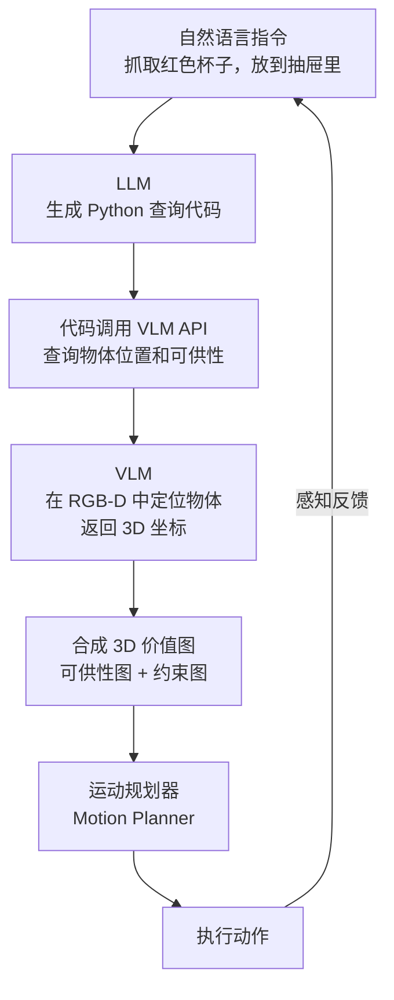
```mermaid
flowchart TB
    NLI_VP["自然语言指令\n抓取红色杯子，放到抽屉里"] --> LLM_VP["LLM\n生成 Python 查询代码"]
    LLM_VP --> CODE_VP["代码调用 VLM API\n查询物体位置和可供性"]
    CODE_VP --> VLM_VP["VLM\n在 RGB-D 中定位物体\n返回 3D 坐标"]
    VLM_VP --> MAPS_VP["合成 3D 价值图\n可供性图 + 约束图"]
    MAPS_VP --> MP_VP["运动规划器\nMotion Planner"]
    MP_VP --> EXEC_VP["执行动作"]
    EXEC_VP -->|"感知反馈"| NLI_VP
```

**三大核心创新**：

1. **组合式 3D 价值图**：将自然语言约束（"避开玻璃杯"、"从上方抓取"）转化为 3D 空间数值地图，运动规划器在这些地图上求解无碰撞轨迹。
2. **零样本**：不需要针对特定物体/任务的训练数据，直接从语言指令到动作。
3. **代码作为接口**：LLM 写代码调用感知 API，比直接输出坐标更灵活，能处理组合语义约束。

---

## 7.9 完整 Agent-Robot 系统：从语言指令到电机控制

综合以上技术，一个完整的 Agent-Robot 系统数据流如下：

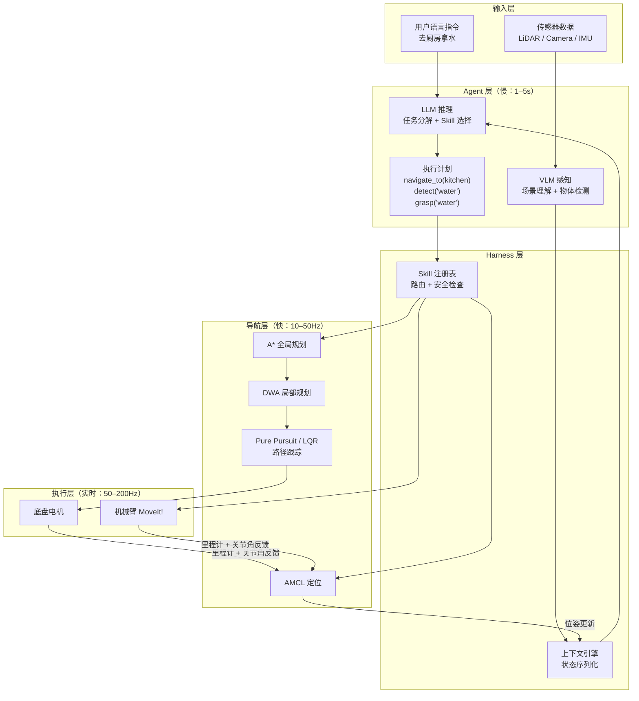
```mermaid
flowchart TB
    subgraph InputLayer["输入层"]
        USER_FULL["用户语言指令\n去厨房拿水"]
        SENSOR_FULL["传感器数据\nLiDAR / Camera / IMU"]
    end

    subgraph AgentFull["Agent 层（慢：1–5s）"]
        VLM_FULL["VLM 感知\n场景理解 + 物体检测"]
        LLM_FULL["LLM 推理\n任务分解 + Skill 选择"]
        PLAN_FULL["执行计划\nnavigate_to(kitchen)\ndetect('water')\ngrasp('water')"]
    end

    subgraph HarnessFull["Harness 层"]
        SKREG_FULL["Skill 注册表\n路由 + 安全检查"]
        CTX_FULL["上下文引擎\n状态序列化"]
    end

    subgraph NavFull["导航层（快：10–50Hz）"]
        AMCL_FULL["AMCL 定位"]
        ASTAR_FULL["A* 全局规划"]
        DWA_FULL["DWA 局部规划"]
        PP_FULL["Pure Pursuit / LQR\n路径跟踪"]
    end

    subgraph HWFull["执行层（实时：50–200Hz）"]
        MOTOR_FULL["底盘电机"]
        ARM_FULL["机械臂 MoveIt!"]
    end

    USER_FULL --> LLM_FULL
    SENSOR_FULL --> VLM_FULL
    VLM_FULL --> CTX_FULL
    CTX_FULL --> LLM_FULL
    LLM_FULL --> PLAN_FULL
    PLAN_FULL --> SKREG_FULL
    SKREG_FULL --> AMCL_FULL & ASTAR_FULL
    ASTAR_FULL --> DWA_FULL
    DWA_FULL --> PP_FULL
    PP_FULL --> MOTOR_FULL
    SKREG_FULL --> ARM_FULL
    MOTOR_FULL & ARM_FULL -->|"里程计 + 关节角反馈"| AMCL_FULL
    AMCL_FULL -->|"位姿更新"| CTX_FULL
```

**关键设计原则**：

| 原则 | 说明 |
|------|------|
| **速度解耦** | Agent 层（1–5s）与导航层（50Hz）异步解耦，LLM 延迟不影响底层控制 |
| **反馈闭环** | 机器人状态持续回传上下文引擎，LLM 每次推理基于最新物理状态 |
| **失败恢复** | Skill 执行失败时将错误结构化返回给 LLM，触发自主重规划 |
| **安全守卫** | 物理不可行动作在 Harness 层被过滤，不到达执行器 |

---

## 7.10 ROS Navigation Stack 与 Nav2 架构

以下是传统导航栈作为 Agent 底层基础设施的集成方案。

### ROS 1：move_base 架构

```mermaid
flowchart TB
    subgraph MoveBase["move_base"]
        GM[全局规划器\nGlobal Planner\nNavfn / GlobalPlanner] --> GCM[全局代价地图\nGlobal Costmap]
        LM[局部规划器\nLocal Planner\nDWA / TEB] --> LCM[局部代价地图\nLocal Costmap]
        GM -->|全局路径| LM
        LM -->|速度指令 cmd_vel| VEL
    end

    GOAL[/目标位姿 goal/] --> MoveBase
    MAP[/静态地图 map/] --> GCM
    MAP --> LCM
    SCAN[/激光雷达 scan/] --> GCM
    SCAN --> LCM
    ODOM[/里程计 odom/] --> MoveBase
    VEL[/cmd_vel/] --> Robot[机器人底盘]
    AMCL[AMCL 定位] --> MoveBase
```

| 话题 | 方向 | 说明 |
|------|------|------|
| `/move_base/goal` | 输入 | 导航目标位姿 |
| `/map` | 输入 | 静态地图 |
| `/scan` | 输入 | 激光雷达数据 |
| `/odom` | 输入 | 里程计 |
| `/amcl_pose` | 输入 | 定位结果 |
| `/cmd_vel` | 输出 | 速度指令（线速度 + 角速度） |

### Nav2（ROS 2）：行为树架构

Nav2 是 ROS 2 的导航栈，核心改进：
- **行为树（Behavior Tree）** 替代状态机：导航行为（规划、恢复、重试）用 BT 灵活配置
- **生命周期节点（Lifecycle Nodes）**：支持优雅的启动/停止管理
- **插件化架构**：全局规划器、局部规划器、恢复行为均可作为插件替换
- **Smac Planner**：内置 Hybrid A* 和 State Lattice 规划器

```mermaid
flowchart TB
    subgraph AgentIntegration["LLM Agent 集成层"]
        LAGENT_N["LLM Agent\nOpenClaw / ROS-LLM"]
        SKILL_N["Skill: navigate_to\nwrap Nav2 Action"]
    end

    subgraph Nav2Full["Nav2 导航栈"]
        BT_N[行为树\nBehavior Tree] --> NP_N[Nav2 Planner\nServer]
        BT_N --> NC_N[Nav2 Controller\nServer]
        BT_N --> NR_N[Nav2 Recovery\nServer]
        NP_N --> GCM_N[全局代价地图]
        NC_N --> LCM_N[局部代价地图]
        NC_N -->|cmd_vel| Base_N[机器人底盘]
        NR_N -->|恢复行为\n旋转/后退| Base_N
    end

    LAGENT_N --> SKILL_N
    SKILL_N -->|NavigateToPose Action| BT_N
    Base_N -->|里程计反馈| LAGENT_N
```

**Nav2 对 Agent 集成的优势**：BT 的可配置性使 Agent 可以更细粒度地干预导航行为——不仅能发送目标点，还能在 BT 节点中插入语义检查、动态重规划触发条件。

---

## 7.11 参数调优要点

**代价地图**：
- `inflation_radius`：障碍物膨胀半径，设为机器人半径 + 安全余量
- `cost_scaling_factor`：代价衰减速率，越大则"紧贴障碍物"的代价越高

**全局规划（A*）**：
- `default_tolerance`：允许终点偏差，解决终点在障碍物上的问题

**局部规划（DWA）**：
- `max_vel_x`、`max_rot_vel`：速度上限，根据机器人能力设置
- `sim_time`：轨迹仿真时间，越长越有预见性但计算量越大
- `path_distance_bias` / `goal_distance_bias`：路径偏好 vs 终点偏好的权衡

**Agent 层调优**：
- `skill_timeout`：单个 Skill 超时时间（建议 30–120s）
- `max_replanning`：失败重规划次数上限（建议 3 次）
- `context_window`：传入 LLM 的历史步数（平衡性能与 token 消耗）

---

# 8. 传统导航 vs. 端到端深度学习导航

| 对比维度 | 传统导航栈（SLAM+A*+DWA）| 端到端深度学习（VLN/VLA）|
|---------|----------------------|----------------------|
| **地图依赖** | 需要预建地图（或实时 SLAM） | 无需先验地图 |
| **指令形式** | 坐标目标点（x, y, θ） | 自然语言（"去厨房"）|
| **泛化能力** | 弱（换环境需重新建图） | 强（跨场景泛化） |
| **可解释性** | ✅ 强（每个模块可追溯）| ❌ 弱（黑盒网络）|
| **计算资源** | 可在 CPU 运行 | 需要 GPU |
| **动态场景** | 局部规划处理（DWA/TEB）| 隐式学习（依赖训练数据）|
| **安全性保证** | ✅ 碰撞检测显式可控 | ❌ 安全边界难以保证 |
| **常识推理** | ❌ 无（纯几何） | ✅ 支持（如 LLM 推理）|
| **开发调试** | 各模块独立调试 | 端到端训练，难定位问题 |
| **长期稳定性** | ✅ 行为确定性强 | ❌ 分布外场景可能失效 |
| **典型代表** | ROS Nav Stack, Nav2 | VLN-BERT, NavGPT, VoxPoser |

**实践建议**：
- 工厂、仓储、医疗等**结构化、安全要求高**的场景 → 传统导航栈
- 家庭服务、跟随导览等**非结构化、需理解自然语言**的场景 → 学习型导航
- **混合架构**正成为趋势：用传统导航栈处理底层安全和精准控制，用 VLM/LLM 处理高层语义理解和任务分解

---

# 9. 常用开源工具与框架汇总

### 传感器驱动与处理

| 工具 | 功能 | 链接 |
|------|------|------|
| **PCL（Point Cloud Library）** | 点云处理算法库（滤波、分割、匹配、特征）| pcl.org |
| **Open3D** | 点云和 3D 数据处理，Python 友好 | open3d.org |
| **OpenCV** | 图像处理和特征提取 | opencv.org |

### 定位

| 工具 | 功能 | ROS 包 |
|------|------|--------|
| **robot_localization** | EKF / UKF 多传感器融合 | `robot_localization` |
| **AMCL** | 粒子滤波自适应蒙特卡洛定位 | `amcl` |
| **NDT_CPU** | NDT 扫描匹配 | `ndt_cpu` |

### SLAM

| 工具 | 类型 | 特点 |
|------|------|------|
| **Cartographer** | 激光 2D/3D | Google 出品，生产可用 |
| **GMapping** | 激光 2D | 轻量，室内适用 |
| **LIO-SAM** | 激光+IMU | 高精度，GTSAM 后端 |
| **LOAM / LeGO-LOAM** | 激光 3D | 经典，地面机器人优化版 |
| **ORB-SLAM3** | 视觉+IMU | 支持多种相机，精度高 |
| **VINS-Mono/Fusion** | 视觉+IMU | 无人机/手机导航 |
| **hdl_graph_slam** | 激光 3D | 图优化，支持 NDT/ICP |

### 路径规划

| 工具 | 功能 |
|------|------|
| **OMPL（Open Motion Planning Library）** | 采样类规划算法库（RRT*, PRM*等）|
| **Moveit!** | 机械臂运动规划（集成 OMPL）|
| **NavFn / GlobalPlanner** | ROS 全局规划（Dijkstra/A*）|
| **DWA Local Planner** | ROS 动态窗口法局部规划 |
| **TEB Local Planner** | ROS 时间弹性带局部规划 |
| **Smac Planner** | Nav2 内置 Hybrid A* 规划器 |

### 仿真

| 工具 | 功能 |
|------|------|
| **Gazebo** | ROS 默认物理仿真器，支持传感器仿真 |
| **Isaac Sim（NVIDIA）** | GPU 加速光线追踪仿真，合成数据生成 |
| **CARLA** | 自动驾驶专用仿真器，城市场景 |
| **Webots** | 跨平台开源机器人仿真 |
| **MuJoCo** | 高性能物理仿真，机器人操作研究主流 |

### Agent-Robot 集成框架

| 工具 | 功能 | 链接 |
|------|------|------|
| **OpenClaw** | 通用自托管 Agent OS，Skills 架构支持机器人集成 | openclaw.ai |
| **ClawBody** | OpenClaw 与 MuJoCo/ROS 2 的桥接层，"语言 → 电机"全链路 | GitHub |
| **ROS-LLM** | ROS 原生 LLM 集成框架，自然语言 → ROS 话题/服务 | GitHub: Auromix/ROS-LLM |
| **Langroid** | "Harness LLMs with Multi-Agent Programming"，多 Agent 编排 | GitHub: langroid/langroid |
| **LeRobot** | HuggingFace 机器人学习框架，低层运动控制 | huggingface.co/lerobot |
| **OpenVLA** | Stanford 7B 开源视觉语言动作模型，支持 22 种机器人 | GitHub: openvla/openvla |

---

# 10. 小结与展望

## 本文回顾

本文以"**Agent 如何驾驭机器人**"为主线，从底层算法到顶层 Agent 构建了完整的技术图景：

1. **感知**（第2章）：LiDAR / 相机 / IMU 各有优劣，传感器融合（EKF/UKF）是提高鲁棒性的关键
2. **定位**（第3章）：EKF/UKF 适合实时位姿跟踪，粒子滤波（AMCL）支持全局定位，NDT/ICP 提供精确扫描匹配
3. **建图/SLAM**（第4章）：激光 SLAM（Cartographer、LIO-SAM）精度高；视觉 SLAM（ORB-SLAM3）成本低；因子图后端是当前主流
4. **路径规划**（第5章）：A* / Hybrid A* 用于全局规划，DWA / TEB 用于局部动态避障
5. **路径跟踪**（第6章）：Pure Pursuit / Stanley 实现简单，MPPI 适合高动态场景；路径跟踪控制器作为 Agent 的底层控制原语
6. **Harness Engineering**（第7章）：AI Agent 通过 Skill 抽象、感知接地、反馈闭环驾驭机器人；OpenClaw 作为通用 Agent OS 正在快速改变机器人集成范式

```mermaid
flowchart LR
    subgraph Foundation["底层基础（第2–6章）"]
        F_SENSE["感知\nLiDAR/Camera/IMU"]
        F_LOC["定位\nSLAM/AMCL"]
        F_MAP["建图\nCartographer/LIO-SAM"]
        F_PLAN["规划\nA*/DWA/TEB"]
        F_CTRL["控制\nPurePursuit/MPPI"]
    end

    subgraph AgentLayer2["Agent 层（第7章）"]
        A_SKILL["Skill 抽象\nROS API → LLM 工具"]
        A_CTX["感知接地\n传感器 → LLM 上下文"]
        A_LLM["LLM 推理\n任务分解 + 重规划"]
        A_OC["OpenClaw\nAgent OS"]
    end

    Foundation --> A_SKILL
    Foundation --> A_CTX
    A_SKILL & A_CTX --> A_LLM
    A_LLM --> A_OC
```

## 展望

**近期挑战**：
- **长廊退化、动态场景**：对 SLAM 鲁棒性提出更高要求
- **Harness 延迟优化**：LLM 推理延迟（1–5s）与实时控制（50Hz）的协同设计
- **技能泛化**：如何让 Skill 在不同机器人平台上零样本复用

**中期趋势**：
- **具身多模态 Agent**：不只导航，还能操作、对话、学习的通用机器人 Agent
- **社区驱动的 Skill 生态**：OpenClaw ClawHub 模式将催生更多开箱即用的机器人技能
- **端云协同**：边缘端运行轻量控制（Fast System），云端处理复杂推理（Slow System）

**长期愿景**：**"传统导航栈 + LLM/VLM Agent + Harness Engineering"的混合架构**将成为下一代通用服务机器人的主流范式——传统算法保证安全性和实时性，AI Agent 负责语义理解和任务规划，Harness 将两者无缝连接。

> 关于视觉语言导航（VLN）和 VLA 大模型的内容，请参考我的博客 [VLN综述](/VLN-Survey/) 和 [VLA综述](/VLA-Survey/) 系列文章。

---

*参考资料：Thrun et al. "Probabilistic Robotics" (2005)；LaValle "Planning Algorithms" (2006)；ROS Navigation Wiki；Cartographer Paper (ICRA 2016)；LIO-SAM (IROS 2020)；ORB-SLAM3 (T-RO 2021)；VINS-Mono (T-RO 2018)；Hybrid A* (IJRR 2010)；TEB Local Planner (IROS 2013)；SayCan (2022)；VoxPoser, NeurIPS 2023；NavGPT, AAAI 2024；OpenVLA (2024)；π₀ arXiv 2410.24164；OpenClaw (2025)；Inngest "Your Agent Needs a Harness" (2025)；Anthropic "Effective Harnesses for Long-Running Agents" (2025)*；http://www.autolabor.cn/usedoc/m1/navigationKit/development/slamintro；https://github.com/ShisatoYano/AutonomousVehicleControlBeginnersGuide
