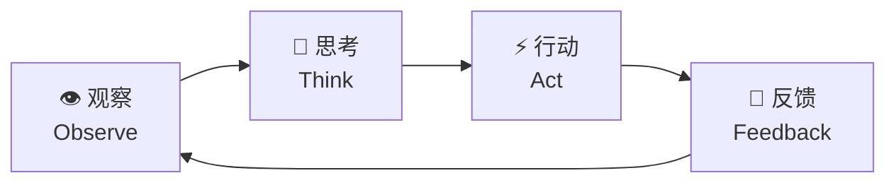
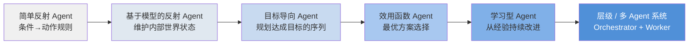
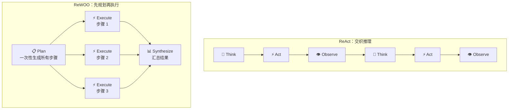
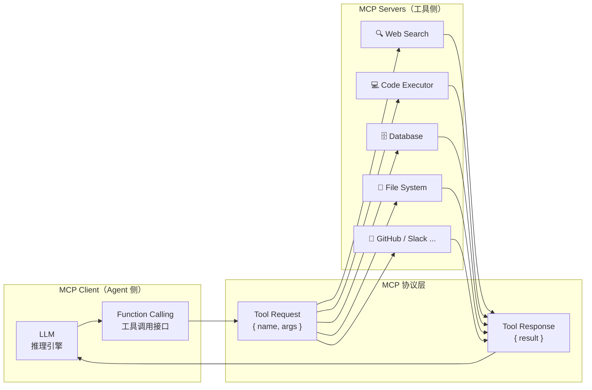
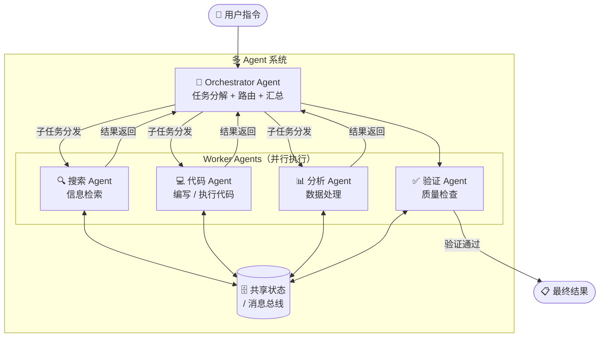
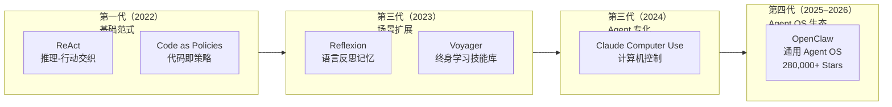
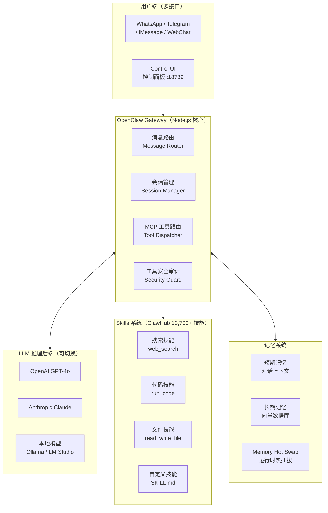
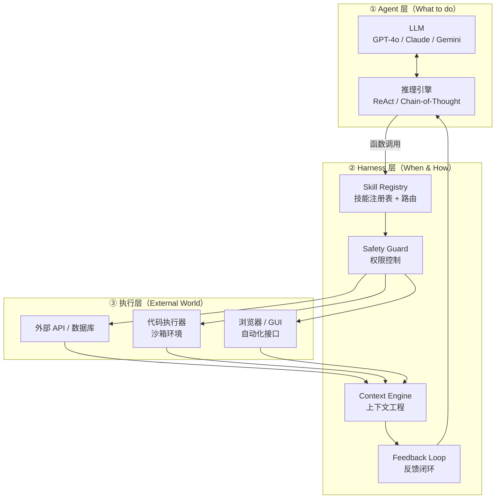
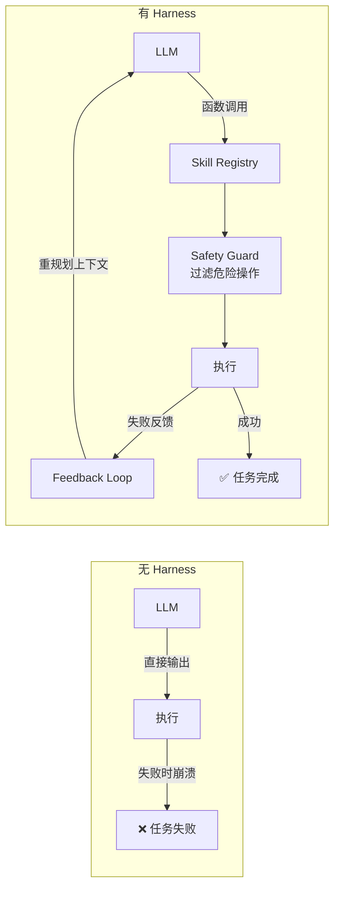

# 一、引言

2022 年以来，以 ChatGPT 为代表的大语言模型（LLM）使 AI 在文本生成和对话方面达到了接近人类的水平。然而，"对话"只是 AI 能力的冰山一角——真正改变生产力的，是 AI 能否**自主地完成任务**：搜索信息、调用 API、写代码并执行、操作浏览器、管理文件……这便催生了 AI 领域的下一个核心概念：**AI Agent（AI 智能体）**。

AI Agent 不是一个单一的模型，而是一种**系统架构**：以 LLM 为"大脑"，配备感知、记忆、工具调用和行动能力，形成一个能够在环境中持续循环推理-执行的自主系统。2025–2026 年，AI Agent 已从学术概念迅速走向产业爆发：

- **OpenClaw**（2025 年 11 月发布）在 72 小时内积累 60,000+ GitHub Stars，目前已突破 **280,000 Stars**，成为史上增速最快的开源项目之一；
- OpenAI 与 Anthropic 相继定义 **「Harness Engineering（Agent 工程化）」**，成为 2026 年工程界最热议的新范式；
- 代码 Agent 在 SWE-bench 上的成功率从 2024 年底的 55% 跃升至 2025 年底的 70%+，Agent 能力正在快速逼近真实工程任务的实用门槛。

本文聚焦软件端 AI Agent，系统梳理其核心架构、关键技术范式、代表性工作、评测基准与最新进展。


# 二、AI Agent 核心架构

## 1. 什么是 AI Agent？

**AI Agent** 是以大语言模型为核心推理引擎，能够**自主感知环境、制定计划、调用工具并执行多步骤任务**的 AI 系统。与传统问答式 AI（输入→输出，一问一答）不同，Agent 运行在一个**持续的感知-推理-行动循环**中：



Agent 的核心能力在于它不仅能"说"，还能"做"——通过调用外部工具（搜索引擎、代码执行器、API、浏览器等）影响真实世界，并根据执行结果动态调整后续计划。

## 2. Agent 与普通 LLM 的核心区别

| 维度 | 普通 LLM | AI Agent |
|:-----|:---------|:---------|
| 交互模式 | 单轮/多轮对话 | 持续循环，自主驱动 |
| 行动能力 | 仅输出文本 | 调用工具、执行代码、操控系统 |
| 记忆 | 仅限上下文窗口 | 外部记忆（向量数据库、文件等） |
| 规划 | 隐式（单次推理） | 显式多步骤任务分解 |
| 目标导向 | 回答当前问题 | 自主完成长程目标 |

## 3. 四大核心模块

Agent 架构通常由以下四个模块构成（来源：The Landscape of Emerging AI Agent Architectures, 2024）：

**感知模块（Perception）**：接收来自环境的输入，包括文本、图像、网页截图等多模态信息，形成对当前状态的语义理解。

**记忆模块（Memory）**：
- *工作记忆*：当前任务上下文，存于 LLM 的上下文窗口（Context Window）
- *长期记忆*：通过 RAG 或向量数据库存储历史经验、知识和技能

**规划模块（Planning）**：将高层目标分解为可执行子任务序列，核心技术包括思维链（CoT）、树形搜索（ToT）和反思（Reflection）。

**行动模块（Action）**：调用工具或执行器将规划转化为实际效果，工具类型涵盖：搜索引擎、代码执行器、外部 API、浏览器控制接口等。


## 4. Agent 分类体系

根据 IBM 和 AWS 的分类框架，AI Agent 按能力层次可分为以下几类：

| 类型 | 决策依据 | 典型场景 |
|------|---------|---------|
| **简单反射 Agent**（Simple Reflex） | 当前感知 → 条件-动作规则 | 规则触发的自动化脚本 |
| **基于模型的反射 Agent**（Model-based Reflex） | 维护内部世界状态，弥补感知局限 | 需记忆上下文的对话助手 |
| **目标导向 Agent**（Goal-based） | 搜索并规划达成目标的动作序列 | 多步骤任务规划、代码修复 |
| **效用函数 Agent**（Utility-based） | 在多个目标方案中选择期望效用最高的 | 资源调度优化、策略推荐 |
| **学习型 Agent**（Learning） | 从过去经验持续改进策略 | Voyager 技能积累、RLHF 微调 |
| **层级 Agent**（Hierarchical） | 上层 Agent 分解任务并委派给下层 Agent | Orchestrator + Worker 多 Agent 系统 |



能力逐层递进：越靠右的 Agent 越能处理复杂、不确定、长程的任务。现代 LLM-based Agent 通常同时具备目标导向、效用优化和学习能力，是上表后三类的混合体。

## 5. 主要挑战

**幻觉与可靠性**：LLM 可能生成看似合理但实际错误的计划，在自动化任务中可能产生难以察觉的错误。

**长程规划中的错误累积**：多步骤任务中任意一步失败可能导致整体崩溃，如何检测和恢复是核心难题。

**工具调用的泛化性**：Agent 需要理解何时调用哪个工具、如何解析返回结果，对推理能力要求极高。

**上下文管理**：长任务中如何在有限的上下文窗口内保留关键信息，是 Agent 工程化的重要挑战。

**安全边界**：具有执行能力的 Agent 可能误操作文件、发送消息或调用破坏性 API，需要严格的权限管理。

## 5. 研究发展时间线

```mermaid
flowchart LR
    subgraph G2022 ["2022 Agent 萌芽"]
        A["ReAct\n推理+行动"] --> B["Code as Policies\nLLM 写代码执行"]
    end
    B --> C
    subgraph G2023 ["2023 框架爆发"]
        C["LangChain\nAgent 框架"] --> D["AutoGPT\n自主 Agent"]
        D --> E["Reflexion\n反思与自我修正"]
        E --> F["Voyager\n终身学习 Agent"]
    end
    F --> G
    subgraph G2024 ["2024 能力跃升"]
        G["OpenAI Swarm\n多 Agent"] --> H["Claude Computer Use\n计算机控制"]
        H --> I["MCP 协议\n工具标准化"]
    end
    I --> J
    subgraph G2025 ["2025–2026 产业落地"]
        J["OpenClaw\n通用开源 Agent OS"] --> K["Manus\n通用自主 Agent"]
        K --> L["Claude Code / Codex\n编程 Agent 商用"]
        L --> M["Harness Engineering\nAgent 工程化"]
    end
```




# 三、关键技术范式

### ReAct：推理与行动交织

**ReAct**（Reasoning + Acting，2022）是定义现代 AI Agent 的核心范式之一。Agent 先生成自然语言形式的**思考（Thought）**，再产生结构化**行动（Action）**，观察执行结果后继续下一轮思考，形成闭环。

**2025 年演进：扩展推理（Extended Thinking）**。OpenAI o1/o3 系列和 Claude Extended Thinking 将 ReAct 的思考过程内化为模型本身的推理链，Agent 可根据任务复杂度自动分配"推理计算预算"。2025 年 4 月的 o3/o4-mini 是首批**推理+工具调用统一**的模型，推理过程中可原生调用外部工具。

**核心特点**：Thought-Action-Observation 三元组循环；推理过程可解释，便于调试；已成为现代 Agent 框架（LangChain、OpenClaw 等）的默认推理模式。

*代表性工作*：ReAct（Yao et al., Princeton/Google, 2022）、OpenAI o3 Extended Thinking（2025）

---

### ReWOO：先规划再执行

**ReWOO**（Reasoning Without Observation，2023）是对 ReAct 的重要补充。ReAct 在每次行动后都要等待观察结果再继续推理，而 ReWOO 的策略是**先一次性规划出完整的工具调用序列，再批量执行**，将规划阶段和执行阶段解耦。

```
ReAct：  Think → Act → Observe → Think → Act → Observe → ...（交织循环）
ReWOO：  Plan（一次性规划所有步骤）→ Execute（批量执行）→ Synthesize（汇总结果）
```

**核心优势**：减少 LLM 调用次数，降低 token 消耗；避免中间观察结果干扰规划，适合步骤相对确定的任务。**局限**：缺乏执行中的动态调整能力，对任务变化的适应性不如 ReAct。



两种范式在实践中常结合使用：外层用 ReWOO 做粗粒度规划，内层用 ReAct 处理需要动态反馈的子任务。

*代表性工作*：ReWOO（Xu et al., 2023）

---

### 工具调用（Tool Use）与 MCP 协议

工具调用是 Agent 区别于普通 LLM 的关键能力。通过定义**工具接口（Tool API）**，LLM 可在推理过程中主动触发外部功能，如网络搜索、代码执行、数据库查询等。

2024 年 11 月，Anthropic 发布 **Model Context Protocol（MCP）**——标准化 AI Agent 与外部工具连接的开放协议。MCP 迅速成为行业标准：2025 年 3 月 OpenAI 采纳，4 月 Google DeepMind 跟进，5 月微软 Build 2025 宣布 Windows 11 原生支持。MCP 服务器生态爆炸式增长（5800+ 服务器，覆盖 GitHub、Slack、Postgres 等主流系统）。

**核心特点**：工具以函数签名（Function Calling）形式定义；MCP 提供标准化 Client-Server 架构，支持跨语言互操作；任何外部服务均可封装为 MCP 工具，实现即插即用。



*代表性工作*：OpenAI Function Calling（2023）、Toolformer（Meta，2023）、MCP 协议（Anthropic，2024 年 11 月）

---

### 反思与自我修正（Reflection）

Agent 在执行失败后，通过分析错误信息自动调整策略并重试，而无需人类干预。Reflexion 框架引入语言形式的"反思记忆"，跨任务积累经验。

**核心特点**：将环境反馈（错误信息、执行结果）注入 LLM 上下文；与 ReAct 结合，构成"感知-推理-行动-反思"完整循环；适用于代码调试、网页操作等需要多次尝试的场景。

*代表性工作*：Reflexion（Shinn et al., 2023）

---

### 代码作为行动（Code as Action）

让 Agent **直接生成可执行代码**，而非输出自然语言动作序列。代码具有精确的逻辑表达能力，天然支持条件分支、循环和变量，特别适合数据处理、自动化脚本等任务。

**核心特点**：LLM 生成 Python/JavaScript 代码，由沙箱环境执行；支持对任意数量对象的通用操作；代码执行结果可直接反馈给 Agent 触发下一步推理。

*代表性工作*：Code as Policies（Google DeepMind，2022）、Voyager（NVIDIA，2023）

---

### 多 Agent 系统（Multi-Agent System）

复杂任务可分解给**多个专业化 Agent 协作完成**：规划 Agent 分解任务、执行 Agent 调用工具、验证 Agent 检查结果。多 Agent 架构支持并行执行，显著提升复杂任务的处理效率。

**核心特点**：Agent 间通过消息传递或共享状态协调；Orchestrator + Worker 模式使系统可扩展；支持异构 Agent 混合（不同模型、不同专长）。



*代表性工作*：AutoGen（Microsoft，2023）、AutoGen 0.4 异步事件驱动架构（2025 年 1 月）、OpenAI Swarm（2024）、OpenClaw Multi-Agent 路由（2025）

---

### Harness Engineering：Agent 工程化（2026 新范式）

2026 年的核心命题是：**如何让 Agent 可靠地工作**。「Harness Engineering」的核心洞察是——Agent 的成败，核心不在模型，而在**工程约束框架（Harness）**。

**Harness 的四个核心功能**：
1. **约束（Constrain）**：限制 Agent 的行动权限（文件访问、网络调用等）
2. **告知（Inform）**：通过结构化上下文、进度文件、工具文档让 Agent 理解任务状态
3. **验证（Verify）**：自动检查 Agent 输出的正确性（单元测试、lint、沙箱执行）
4. **纠正（Correct）**：检测到错误后触发重规划或回滚

一个关键发现：LangChain 的代码 Agent 在 Terminal Bench 2.0 上从 52.8% 提升到 66.5%，**不是因为换了模型，而是只改了 Harness**。详细工程实践见第七节。

*代表性工作*：「Harness Engineering」（OpenAI，2026 年 2 月）、「Effective Harnesses for Long-Running Agents」（Anthropic，2026）


# 四、代表性工作



---

### ReAct

ReAct（Princeton & Google，2022）首次将**推理（Reasoning）与行动（Acting）**显式交织在 LLM 的生成过程中。Agent 在每一步先输出自然语言形式的"思考"（Thought），再输出结构化"行动"（Action），并将行动的执行结果（Observation）作为下一步输入，形成持续循环。

**核心特点**：推理过程透明可解释，便于人类理解和调试；在 ALFWorld 和 WebShop 上显著优于纯推理（CoT）和纯行动基线；成为现代 Agent 框架的事实标准推理模式。

*代表性工作*：ReAct（Yao et al., 2022，Google Brain & Princeton）

---

### Reflexion

Reflexion（2023）在 ReAct 的基础上引入**语言形式的反思记忆**。Agent 执行失败后，不仅将错误信息注入当前上下文，还将"反思总结"写入长期记忆，供下次尝试时参考，实现了跨任务的经验积累。

**核心特点**：反思记忆以自然语言形式存储，LLM 可直接理解和利用；无需梯度更新即可"学习"；在编程（HumanEval）、决策（AlfWorld）等任务上大幅超越 ReAct 基线。

*代表性工作*：Reflexion（Shinn et al., 2023）

---

### Voyager

Voyager（NVIDIA，2023）是在 Minecraft 游戏环境中构建的**终身学习 AI Agent**，通过持续生成代码技能并将其存入技能库，实现了无需重新训练的持续能力积累。Agent 由三个组件驱动：自动课程（决定学什么）、技能库（存储已学技能）和迭代提示机制（持续改进代码质量）。

**核心特点**：首个在复杂开放世界中实现终身学习的 LLM Agent；技能库可跨任务复用，避免"遗忘"问题；"代码技能 + 自动课程"的架构对通用 Agent 设计有重要参考价值。

*代表性工作*：Voyager（Wang et al., NVIDIA, 2023）

---

### Claude Computer Use

Claude Computer Use（Anthropic，2024 年 10 月）是首个正式商用的**计算机控制 Agent**。Agent 通过截图感知当前屏幕状态，生成鼠标点击、键盘输入等操作，实现对任意 GUI 应用的自主控制，无需专用 API。

**核心特点**：仅通过像素级截图感知，无需应用开放接口；支持跨应用的复杂工作流（如"搜索 → 整理 → 发邮件"）；开创了"通用 GUI Agent"的新赛道，OSWorld 成为其标准评测基准。

*代表性工作*：Claude Computer Use（Anthropic，2024）、OpenAI CUA（2025）

---

### OpenClaw

OpenClaw（原名 Clawdbot，奥地利开发者 Peter Steinberger，2025 年 11 月发布）是目前全球增长最快的开源 AI Agent 框架，已超越 **280,000 GitHub Stars**，是史上增速最快的开源项目之一。

**定位**：OpenClaw 是一个**自托管的 Agent 操作系统（Agent OS）**——提供子 Agent 编排、MCP 工具路由、工具安全审计和插件系统，任何大模型（Claude、GPT-4o、DeepSeek 等）都可作为其"推理内核"。



**核心特性**：
- **Memory Hot Swapping**：在 Agent 运行时动态切换记忆模块，无需重启即可切换知识库
- **ACP Provenance（代理链溯源）**：v2026.3.8 起支持，在多 Agent 工作流中验证交互方身份，防止"Agent 伪装攻击"
- **Sub-Agent 编排**：内置 Orchestrator + Worker 架构，支持复杂任务的多 Agent 协作分解

*最新版本*：v2026.3.11（2026 年 3 月，持续活跃开发中）


# 五、主流评测基准

### ALFWorld

| 属性 | 内容 |
|------|------|
| 发布年份 | 2021 |
| 规模 | 3553 个训练任务，140 个评测任务 |
| 场景 | 文本游戏+3D 仿真（双模式） |
| 特点 | 语言指令驱动的多步骤任务，Agent 与环境文本交互 |

ALFWorld 是评测语言驱动 Agent 规划能力的标准基准，要求 Agent 进行多步骤推理和工具调用。ReAct 论文的核心评测场景。

---

### WebShop

| 属性 | 内容 |
|------|------|
| 发布年份 | 2022 |
| 规模 | 1.18 百万真实商品，12087 个任务 |
| 场景 | 模拟电商网站 |
| 特点 | Agent 需搜索、筛选、购买目标商品，评测工具调用和决策能力 |

WebShop 评测 Agent 在真实网页环境中的操作能力，是工具调用和信息检索 Agent 的重要基准。

---

### AgentBench

| 属性 | 内容 |
|------|------|
| 发布年份 | 2023 |
| 规模 | 8 种不同环境，覆盖网页、代码、游戏、操作系统等 |
| 场景 | 多样化实际任务环境 |
| 特点 | 首个系统评测 LLM-as-Agent 在多环境下综合能力的基准 |

AgentBench 是目前最全面的 Agent 能力综合评测框架，揭示了当前顶级 LLM 在 Agent 任务上与人类仍存在显著差距。

---

### GAIA（General AI Assistants）

| 属性 | 内容 |
|------|------|
| 发布年份 | 2023（NeurIPS） |
| 规模 | 三级难度，涵盖推理、检索、代码、工具调用 |
| 场景 | 通用助手能力评测 |
| 特点 | 多步骤推理+工具调用+信息整合，难度接近真实用户需求 |

GAIA 考察 Agent 作为通用助手的综合能力。2025 年，H2O.ai 的 h2oGPTe Agent 以 75% 准确率登顶 GAIA 排行榜，超越 OpenAI Deep Research。

---

### SWE-bench

| 属性 | 内容 |
|------|------|
| 发布年份 | 2023 |
| 规模 | SWE-bench Verified：500 个真实 GitHub Issue |
| 场景 | Python 开源仓库软件工程任务 |
| 特点 | Agent 需阅读代码、定位 Bug、生成并验证修复补丁 |

代码 Agent 的标准评测。顶级 Agent 成功率从 2024 年 12 月的 55% 快速提升至 2025 年底的 70%+，是 AI Agent 能力进步最快的基准之一。

---

### OSWorld

| 属性 | 内容 |
|------|------|
| 发布年份 | 2024（NeurIPS 2024） |
| 规模 | 369 个任务，覆盖 Ubuntu Linux 和 Windows |
| 场景 | 真实虚拟计算机环境（浏览器、文件管理器、代码编辑器等） |
| 特点 | 评测 Agent 在真实操作系统中完成复杂 GUI 任务的能力 |

计算机控制 Agent（Computer Use Agent）的核心基准，2025 年最优开源 Agent 在 50 步任务上达到 34.5%，接近 OpenAI CUA 的 32.6%。


# 六、应用场景

## 软件工程 Agent

Agent 驱动代码生成、Bug 修复、PR 提交全流程，是目前 AI Agent 商业化落地最成熟的场景。SWE-bench 成功率从 2024 年底的 55% 跃升至 2025 年底的 70%+，代码 Agent 正在从"有时候能用"走向"生产可用"。

典型工作流：Agent 读取 Issue → 定位相关代码 → 生成修复 → 运行测试 → 提交 PR，全程无需人工介入。

| 产品 | 发布方 | 定位 | 运行模式 |
|------|--------|------|---------|
| **Claude Code** | Anthropic | CLI 编程 Agent，深度集成 IDE | 本地终端，读写文件+执行命令 |
| **OpenAI Codex** | OpenAI | 云端异步编程 Agent | 云端沙箱，多任务并行 |
| **GitHub Copilot Workspace** | Microsoft/GitHub | PR 全流程 Agent | 网页 + VS Code 集成 |
| **Cursor** | Anysphere | AI-first 代码编辑器 | 编辑器内嵌 Agent |

## 计算机控制 Agent（Computer Use）

Agent 直接操作 GUI——点击按钮、填写表单、运行脚本，实现 RPA（机器人流程自动化）的智能化升级。与传统 RPA 不同，AI Agent 能处理动态页面和非结构化输入，泛化能力远超规则脚本。

代表产品：Claude Computer Use（Anthropic）、OpenAI CUA、微软 Windows Agent（Windows 11 原生集成）。

## 通用对话与任务助手

以 OpenClaw 为代表的通用 Agent OS，通过消息应用（WhatsApp、Telegram、iMessage 等）接收自然语言指令，自主调度工具和子 Agent 完成复杂任务，如"整理我的收件箱并生成周报"、"搜集竞品信息并制作对比表"。

## 消费级移动设备 Agent

**2026 年 3 月 6 日**，小米发布 **Xiaomi miclaw**——基于自研 MiMo 大模型的手机端 AI Agent，进入邀请制内测（支持小米 17 系列）。miclaw 可自主调用 50 余项系统功能和第三方应用，用户仅需给出模糊意图，miclaw 负责分解并执行全流程，无需逐步确认。标志着 Agent 能力向消费级移动设备的全面渗透。


# 七、最新进展（2025-2026）

## OpenClaw：从工具到 Agent OS 生态

2025 年 11 月至 2026 年 3 月，OpenClaw 完成了从"个人助手工具"到"开放 Agent 基础设施"的关键跨越。其 ClawHub 技能市场已收录 13,700+ 技能，覆盖搜索、代码执行、文件管理、数据库操作等主流工具类型。

**Sub-Agent 编排**是 OpenClaw 的核心能力：用户发出一条指令，Orchestrator Agent 自动将任务分解并路由给多个专业化 Worker Agent 并行处理，最终汇总结果。这一模式使 OpenClaw 能够处理传统单 Agent 架构无法完成的长程复杂任务。

**安全现状**：2026 年 1 月安全审计发现 512 个漏洞（其中 8 个严重级别），在消费和研究领域广泛使用，但暂不适合未加固的企业生产环境。

## Manus：通用自主 Agent 爆发

2025 年 3 月，Butterfly Effect 团队发布 **Manus**——一款无需人工逐步确认、能够独立完成复杂任务的通用 AI Agent。Manus 发布后因演示视频迅速在全球范围内刷屏，内测邀请码一码难求。

**核心能力**：Manus 不是聊天机器人，而是一个能够在隔离的云端虚拟环境中自主执行长程任务的 Agent——浏览网页、读写文件、执行代码、调用外部服务，并将结果以结构化报告返回用户。典型任务如"调研 A 公司竞品，输出 Excel 对比报告"，Manus 全程自主完成，无需用户干预。

**技术路线**：Manus 采用多 Agent 架构，一个 Orchestrator Agent 负责任务规划和分解，多个专业化 Worker Agent（浏览器操作、代码执行、文件管理等）并行执行子任务。底层 LLM 可动态切换（Claude、GPT-4o 等），工具层通过 MCP 协议标准化接入。

**局限**：高延迟（复杂任务需数分钟到数十分钟）、云端执行成本较高、对私有数据的访问存在隐私顾虑。

*发布时间*：2025 年 3 月（Butterfly Effect / Monica 团队）

---

## Claude Code 与 OpenAI Codex：编程 Agent 商用元年

**Claude Code**（Anthropic，2025 年 2 月正式发布）是面向开发者的 CLI 编程 Agent。它运行在本地终端，能够理解整个代码仓库的上下文，自主完成"读文件→写代码→运行测试→修复错误"的完整循环。Claude Code 的核心优势是深度的代码库理解能力和对复杂多文件重构任务的处理能力，同时支持 MCP 协议扩展工具。

**OpenAI Codex（新，2025 年 5 月）** 与早期的代码补全模型同名，但定位完全不同：它是一个**云端异步编程 Agent**，在隔离的沙箱环境中独立执行编程任务，支持多任务并行——用户提交多个 Issue，Codex 同时在多个隔离环境里处理，完成后通知用户审查。这种"fire and forget"的异步模式，是 Codex 与 Claude Code 最显著的差异。

| 对比维度 | Claude Code | OpenAI Codex（新） |
|---------|-------------|-------------------|
| 运行环境 | 本地终端 | 云端隔离沙箱 |
| 交互模式 | 同步对话式 | 异步任务提交 |
| 代码库访问 | 直接读写本地文件 | 连接 GitHub 仓库 |
| 多任务并行 | 单会话 | 支持多任务并行 |
| 数据隐私 | 代码留在本地 | 代码上传云端 |

*代表性工作*：Claude Code（Anthropic，2025 年 2 月）、OpenAI Codex Agent（2025 年 5 月）

---

## NVIDIA NemoClaw：企业级 Agent 平台

2026 年 3 月 10 日，NVIDIA 宣布将在 GTC 2026 上发布 **NemoClaw**——面向企业的开源 AI Agent 平台。NemoClaw 内置安全与隐私工具，支持硬件无关部署，已与 Salesforce、Cisco、Google、Adobe、CrowdStrike 等头部企业接洽合作。

NemoClaw 的战略目的明确：在 OpenClaw 因安全漏洞被企业望而却步之际，填补**企业级可信 Agent 基础设施**的空缺，定位为"企业的 OpenClaw"。

## Harness Engineering：Agent 工程化实践

2026 年初，OpenAI 和 Anthropic 相继发布关于 Agent 工程化的深度文章，标志着行业认知的重大转变。

> "Your agent needs a harness, not a framework. The framework defines *what* the agent does; the harness controls *when* and *how* it's allowed to act."
> — Inngest Engineering Blog (2025)

**Harness** 是位于 LLM/Agent 与外部世界之间的软件中间件层，它不是一个框架（Framework），而是包裹 Agent 的**工程基础设施**。

### Agent 三层架构



| 层级 | 职责 | 核心组件 |
|------|------|---------|
| **Agent 层** | 理解意图、推理规划、决策 | LLM、ReAct、思维链 |
| **Harness 层** | 工具封装、上下文管理、权限控制、反馈闭环 | Skill Registry、Safety Guard、Context Engine |
| **执行层** | 具体任务执行 | API、代码执行器、浏览器控制 |

### 五大核心组件

**① Skill Registry（技能注册表）**：将外部工具/API 封装为 LLM 可通过函数调用访问的"技能"。每个 Skill 有明确的输入输出 schema，Harness 负责路由调用、收集结果并格式化为 LLM 可读的反馈。

**② Context Engine（上下文引擎）**：管理 LLM 的上下文窗口——决定哪些历史信息、执行结果应该被包含在当前推理的 prompt 中。对长任务尤为关键，避免超出 context window 的同时保留关键信息。

**③ Safety Guard（安全守卫）**：在 LLM 输出到达执行器之前，过滤危险或不合法的操作，如误删文件、未授权的 API 调用等。

**④ Feedback Loop（反馈闭环）**：将执行结果（成功/失败/异常）结构化后返回 LLM，触发下一步推理或重规划。

**⑤ Replanning Mechanism（重规划机制）**：当 Skill 执行失败时，Harness 记录失败原因并注入新的上下文，引导 LLM 生成替代方案，而非直接崩溃。

### 核心洞见

OpenAI Codex 团队（百万行代码生产项目，3 名工程师、18 个月、1500+ PR）和 Anthropic 共同揭示：

> **一个设计良好的 Harness 能将 Agent 成功率提升 10–15 个百分点，效果超过换用更强的底层模型。**



## 小米 Xiaomi miclaw：消费级手机 Agent

2026 年 3 月 6 日，小米正式宣布 **Xiaomi miclaw**——基于自研 MiMo 大模型的手机端 AI Agent，进入邀请制内测（支持小米 17 系列）。用户仅需给出模糊意图（如"帮我订明天去上海的高铁并提醒我提前一小时出发"），miclaw 负责分解、执行全流程，无需逐步确认。用户数据不用于训练，采用边缘-云端私有化计算架构。


# 八、总结与展望

AI Agent 代表了人工智能从"理解"走向"行动"的核心范式转变。以 LLM 为大脑、工具调用为手脚、记忆模块为经验积累，Agent 系统正在将自然语言理解的能力延伸到真实世界的任务执行中。

从技术演进看：ReAct 定义了推理-行动的基本范式（2022），Reflexion 引入了语言反思记忆（2023），MCP 协议标准化了 Agent 与外部世界的接口（2024），OpenClaw 将通用 Agent 能力推向开放生态（2025），Harness Engineering 则标志着 Agent 从实验室走向生产的工程化拐点（2026）。

2026 年的核心议题正在从"Agent 能不能工作"转向"**如何让 Agent 可靠地工作**"。

未来研究的五大核心方向：
- **Harness 可靠性**：如何在开放环境中保证 Agent 行为的安全性和可预期性
- **长程任务规划**：如何在有限上下文窗口内完成跨越数小时的复杂任务
- **持续学习**：从每次任务执行中积累经验，技能库持续扩充，而非仅依赖训练时的权重
- **多 Agent 协作**：异构 Agent 团队如何高效分工、协调与通信
- **安全与可解释性**：具有执行能力的 Agent 如何保持安全边界，并让人类可以理解和干预其决策过程


# 参考资料

1. Yao, S., et al. "ReAct: Synergizing Reasoning and Acting in Language Models." *ICLR 2023*. Princeton & Google Brain.
2. Shinn, N., et al. "Reflexion: Language Agents with Verbal Reinforcement Learning." *NeurIPS 2023*.
3. Xu, B., et al. "ReWOO: Decoupling Reasoning from Observations for Efficient Augmented Language Models." *arXiv 2305.18323*, 2023.
4. Wang, G., et al. "Voyager: An Open-Ended Embodied Agent with Large Language Models." *NeurIPS 2023*. NVIDIA.
5. Liang, J., et al. "Code as Policies: Language Model Programs for Embodied Control." *ICRA 2023*. Google DeepMind.
6. Anthropic. "Model Context Protocol (MCP)." *anthropic.com*, November 2024.
7. OpenAI. "Harness Engineering for Long-Running Agents." *openai.com*, February 2026.
8. Anthropic. "Effective Harnesses for Long-Running Agents." *anthropic.com*, 2026.
9. IBM. "What are AI agents?" *ibm.com/think/topics/ai-agents*.
10. Google Cloud. "What are AI agents?" *cloud.google.com/discover/what-are-ai-agents*.
11. AWS. "What is an AI agent?" *aws.amazon.com/what-is/ai-agents*.
