# 一、引言

2022年以来，以ChatGPT为代表的大语言模型（Large Language Model, LLM）使AI在文本生成和对话方面达到了接近人类的水平。然而，"对话"只是AI能力的冰山一角——真正改变生产力的，是AI能否**自主地完成任务**：搜索信息、调用API、写代码并执行、操作浏览器、控制机器人……这便催生了AI领域的下一个核心概念：**AI Agent（AI智能体）**。

AI Agent不是一个单一的模型，而是一种**系统架构**：以LLM为"大脑"，配备感知、记忆、工具调用和行动能力，形成一个能够在环境中持续循环推理-执行的自主系统。2025-2026年，AI Agent已从学术概念迅速走向产业落地——开源框架**OpenClaw**在发布三个月内积累超40万用户，研究者开始将其部署到物理机器人平台；**Gemini Robotics 1.5**将Agent推理能力直接整合进机器人控制；**波士顿动力与Google DeepMind**在CES 2026宣布战略合作，将AI Agent基础模型引入人形机器人。

机器人是AI Agent最具挑战性也最令人期待的应用场景之一：Agent不仅要在语言空间推理，还要与物理世界交互，面对感知噪声、执行不确定性和实时性约束。本文旨在系统梳理AI Agent的研究进展与在机器人中的应用，为学习和研究AI Agent提供参考。

# 二、AI Agent基本概述

## 1. 什么是AI Agent？

**AI Agent** 是以大语言模型为核心推理引擎，能够**自主感知环境、制定计划、调用工具并执行多步骤任务**的AI系统。与传统的问答式AI（输入→输出，一问一答）不同，Agent运行在一个**持续的感知-推理-行动循环**中：

$$\text{观察（Observe）} \rightarrow \text{思考（Think）} \rightarrow \text{行动（Act）} \rightarrow \text{反馈（Feedback）} \rightarrow \text{循环}$$

Agent的核心能力在于它不仅能"说"，还能"做"——通过调用外部工具（搜索引擎、代码执行器、API、机器人控制器等）影响真实世界，并根据执行结果动态调整后续计划。

  
  <figcaption>图：AI Agent的核心循环——感知、思考、行动与反馈</figcaption>

## 2. Agent与普通LLM的核心区别

| 维度 | 普通LLM | AI Agent |
|:-----|:--------|:---------|
| 交互模式 | 单轮/多轮对话 | 持续循环，自主驱动 |
| 行动能力 | 仅输出文本 | 调用工具、执行代码、操控系统 |
| 记忆 | 仅限上下文窗口 | 外部记忆（向量数据库、文件等） |
| 规划 | 隐式（单次推理） | 显式多步骤任务分解 |
| 目标导向 | 回答当前问题 | 自主完成长程目标 |

## 3. Agent的四大核心模块

这里需要配图 使用flowchart
Agent架构通常由以下四个模块构成（来源：The Landscape of Emerging AI Agent Architectures, 2024）：

**感知模块（Perception）**：接收来自环境的输入，包括文本、图像、传感器数据等多模态信息，形成对当前状态的语义理解。

**记忆模块（Memory）**：
- *工作记忆*：当前任务上下文，存于LLM的上下文窗口（Context Window）
- *长期记忆*：通过RAG或向量数据库存储历史经验、知识和技能

**规划模块（Planning）**：将高层目标分解为可执行子任务序列，核心技术包括思维链（CoT）、树形搜索（ToT）和反思（Reflection）。

**行动模块（Action）**：调用工具或执行器将规划转化为实际效果，工具类型涵盖：信息检索工具、代码执行器、外部API、机器人控制接口等。

## 4. 主要挑战

**幻觉与可靠性**：LLM可能生成看似合理但实际错误的计划，在高风险的机器人应用中后果严重。

**长程规划中的错误累积**：多步骤任务中任意一步失败可能导致整体崩溃，如何检测和恢复是核心难题。

**工具调用的泛化性**：Agent需要理解何时调用哪个工具、如何解析返回结果，对推理能力要求极高。

**实时性约束**：机器人控制频率通常为10-100Hz，而LLM推理延迟在秒级，存在本质矛盾。

**安全边界**：具有执行能力的Agent可能误操作文件、发送消息或控制物理设备，需要严格的权限管理。

## 5. 研究发展时间线

```mermaid
flowchart LR
    subgraph G2022 ["2022 Agent萌芽"]
        A["ReAct\n推理+行动"] --> B["SayCan\nLLM+机器人"]
    end
    B --> C
    subgraph G2023 ["2023 框架爆发"]
        C["LangChain\nAgent框架"] --> D["AutoGPT\n自主Agent"]
        D --> E["Code as Policies\n代码规划"]
        E --> F["Voyager\n终身学习Agent"]
    end
    F --> G
    subgraph G2024 ["2024 能力跃升"]
        G["OpenAI Swarm\n多Agent"] --> H["Claude Computer Use\n计算机控制"]
        H --> I["OpenVLA\n开源机器人VLA"]
    end
    I --> J
    subgraph G2025 ["2025-2026 产业落地"]
        J["OpenClaw\n通用开源Agent"] --> K["Gemini Robotics 1.5\n机器人Agent"]
        K --> L["World Memory\n空间记忆Agent"]
    end
```

## 6. 关键技术方向

### ReAct：推理与行动交织

**ReAct**（Reasoning + Acting，2022）是定义现代AI Agent的核心范式之一。传统LLM要么纯推理（CoT思维链），要么直接行动。ReAct将二者交织：Agent先生成**思考（Thought）**，再产生**行动（Action）**，观察执行结果后继续下一轮思考，形成闭环。

**2026年演进：Adaptive Thinking**（自适应思考）。在OpenClaw 2026.3.1版本中，结合Claude 4.6模型，Agent可根据任务复杂度动态分配"思考预算"：简单任务快速反应，复杂任务（如精密组装）则进入深度推理模式。

**核心特点**：
- Thought-Action-Observation三元组循环
- 推理过程可解释，便于调试和干预
- 已成为现代Agent框架（LangChain、OpenClaw等）的默认推理模式

*代表性工作*：ReAct（Yao et al., Princeton/Google, 2022）、OpenClaw Adaptive Thinking（2026）

---

### 工具调用（Tool Use）

工具调用是Agent区别于普通LLM的关键能力。通过定义**工具接口（Tool API）**，LLM可以在推理过程中主动触发外部功能，如网络搜索、代码执行、数据库查询或机器人控制器调用。

**核心特点**：
- 工具以函数签名（Function Calling）形式定义，LLM学习何时及如何调用
- OpenAI Function Calling、Anthropic Tool Use等成为行业标准接口
- 机器人低层技能（抓取、移动等）可封装为Agent工具，Gemini Robotics-ER 1.5已实现原生支持。

*代表性工作*：OpenAI Function Calling（2023）、Toolformer（Meta，2023）、Claude Tool Use（Anthropic，2024）、Gemini Robotics-ER Tool Calling（2025）

---

### 反思与自我修正（Reflection）

Agent在执行失败后，通过分析错误信息自动调整策略并重试，而无需人类干预。这一能力对机器人任务尤为关键——执行失败是常态，快速从失败中恢复是长程任务成功的前提。

**核心特点**：
- 将环境反馈（错误信息、传感器读数变化）注入LLM上下文
- Reflexion框架引入语言形式的"反思记忆"，跨任务积累经验
- 与ReAct结合，构成"感知-推理-行动-反思"完整循环

*代表性工作*：Reflexion（Shinn et al., 2023）、Inner Monologue（Google，2023）

---

### 空间智能与长期记忆（World Memory）

2026年的重大突破。Agent不再仅仅处理瞬时感知数据，而是构建并维护环境的**语义地图（Semantic Map）**和**时间序列记忆**。

**核心特点**：
- **World Memory**：记录物体、人物的位置变化和状态（如"杯子刚才被移到了二层柜子"）。
- 支持长程任务中的物体找寻和因果推理。
- 解决"鱼的记忆"问题，使机器人具备跨越数小时的物理一致性认知。

*代表性工作*：Unitree × OpenClaw World Memory Demo（2026.3）

---

### 代码作为动作（Code as Action）

与其让Agent输出自然语言动作序列，不如让它**直接生成可执行代码**。代码具有精确的逻辑表达能力，天然支持条件分支、循环和变量，比平铺的步骤列表更灵活，特别适合机器人任务规划。

**核心特点**：
- LLM生成Python/JavaScript代码，由沙箱环境执行
- 支持对任意数量对象的通用操作（自然处理循环逻辑）
- Voyager将代码生成扩展为终身技能积累库

*代表性工作*：Code as Policies（Google DeepMind，2022）、Voyager（NVIDIA，2023）、OpenClaw Lobster工作流引擎（2025）

---

### 多Agent系统（Multi-Agent System）

单一Agent能力有限，复杂任务可以分解给**多个专业化Agent协作完成**：规划Agent分解任务、执行Agent调用工具、验证Agent检查结果。在机器人场景中，多Agent架构支持异构机器人团队协同作业。

**核心特点**：
- Agent间通过消息传递或共享状态协调
- 支持并行执行，显著提升效率
- 角色分工（Orchestrator + Worker模式）使系统可扩展

*代表性工作*：AutoGen（Microsoft，2023）、OpenAI Swarm（2024）、OpenClaw Multi-Agent路由（2025）

## 7. 未来研究方向

- **持续学习Agent**：从每次任务执行中积累经验，技能库持续扩充，而非仅依赖训练时的权重
- **物理世界感知**：将触觉、力觉、本体感觉深度融入Agent感知模块
- **安全与对齐**：具有执行能力的Agent如何在复杂环境中保持安全边界
- **轻量化推理**：专为实时控制设计的小参数Agent推理引擎（目标：<100ms延迟）
- **人Agent协作**：人类与Agent在同一任务流中灵活切换控制权

# 三、Agent在机器人中的应用分类

**1. 高层任务规划（High-Level Planning）**

利用LLM将开放式自然语言指令（"帮我准备早饭"）分解为机器人可执行的技能序列（移动→打开冰箱→取出食材→……）。机器人本身不需要理解语言，Agent负责翻译。

*代表性工作*：SayCan、Inner Monologue、Language Planner

---

**2. 代码驱动操作（Code-Driven Manipulation）**

Agent直接生成机器人控制代码，通过Python API或ROS接口驱动执行器。代码生成比自然语言步骤更精确，支持条件逻辑和循环操作。

*代表性工作*：Code as Policies、ProgPrompt、RobotGPT

---

**3. 闭环反馈规划（Closed-Loop Replanning）**

机器人执行过程中，Agent持续接收传感器反馈并动态调整计划：抓取失败→重新规划抓取姿态；路径阻塞→规划绕路方案。

*代表性工作*：Inner Monologue、Reflexion在机器人中的应用、FailSafe（OpenVLA成功率提升22.6%）

---

**4. 多模态感知Agent（Multimodal Perception Agent）**

Agent融合视觉（RGB相机）、语言（指令）、空间（深度/点云）等多模态输入，形成对环境的丰富语义理解，再输出动作规划。

*代表性工作*：Gemini Robotics-ER（视觉空间理解+任务规划）、OpenVLA（视觉语言动作端到端）

---

**5. 通用Agent框架集成机器人（General Agent + Robot）**

将OpenClaw、LangChain等通用AI Agent框架通过工具调用接口连接到机器人控制API，使机器人成为Agent可调用的一种"工具"，实现对话驱动的机器人控制。

*代表性工作*：OpenClaw部署机器人（2026）、LangChain + ROS集成

# 四、应用场景

**家庭服务机器人**：用户通过消息应用发送自然语言指令（如通过OpenClaw的Telegram接口），Agent理解意图、分解任务并控制家用机器人执行，实现真正的"对话驱动家政"。2026年3月，小米推出的**miclaw**系统已在米家生态开启内测。

**工业自动化**：Agent在产线上根据当前视觉状态动态规划拣选、组装路径。2026年3月，**波士顿动力Atlas集成Gemini 1.5**在现代汽车（Hyundai）工厂开始试点部署。

**科研实验室**：Agent驱动机械臂执行化学实验的标准操作流程（SOP），实现24小时无人值守实验室。

**搜救与特种作业**：多Agent机器人团队协作执行搜救任务，不同机器人承担感知、运输、通信等不同角色。

**人形机器人**：如Atlas（波士顿动力）集成Gemini Robotics基础模型，实现通过自然语言指令完成复杂物理任务。

# 五、主流评测基准

### ALFWorld

| 属性 | 内容 |
|------|------|
| 发布年份 | 2021 |
| 规模 | 3553个训练任务，140个评测任务 |
| 场景 | 文本游戏+3D仿真（双模式） |
| 特点 | 语言指令驱动的多步骤家务任务，Agent与环境文本交互 |

ALFWorld是评测语言驱动Agent规划能力的标准基准，任务包括找到并拿起某物、将物品放入特定容器等，要求Agent进行多步骤推理和工具调用。ReAct论文的核心评测场景。

---

### WebShop

| 属性 | 内容 |
|------|------|
| 发布年份 | 2022 |
| 规模 | 1.18百万真实商品，12087个任务 |
| 场景 | 模拟电商网站 |
| 特点 | Agent需搜索、筛选、购买目标商品，评测工具调用和决策能力 |

WebShop评测Agent在真实网页环境中的操作能力，是工具调用和信息检索Agent的重要基准。

---

### AgentBench

| 属性 | 内容 |
|------|------|
| 发布年份 | 2023 |
| 规模 | 8种不同环境，覆盖网页、代码、游戏、操作系统等 |
| 场景 | 多样化实际任务环境 |
| 特点 | 首个系统评测LLM-as-Agent在多环境下综合能力的基准 |

AgentBench是目前最全面的Agent能力综合评测框架，揭示了当前顶级LLM在Agent任务上与人类仍存在显著差距。

---

### RLBench / LIBERO（机器人专项）

| 属性 | 内容 |
|------|------|
| 发布年份 | 2020 / 2023 |
| 规模 | 100 / 130个操作任务 |
| 场景 | 仿真机器人操作 |
| 特点 | 评测Agent在物理操作任务中的规划与执行能力 |

专门用于评测具身Agent（Embodied Agent）在机器人操作任务中的表现，任务从简单抓取到多步骤长程操作，覆盖Agent与物理环境交互的全链路能力。

# 六、经典方法与代表性工作

### ReAct

ReAct（Princeton & Google，2022）首次将**推理（Reasoning）与行动（Acting）**显式交织在LLM的生成过程中。Agent在每一步先输出自然语言形式的"思考"（Thought），再输出结构化"行动"（Action），并将行动的执行结果（Observation）作为下一步输入，形成持续循环。

**核心特点**：
- 推理过程透明可解释，便于人类理解和调试
- 在ALFWorld和WebShop上显著优于纯推理（CoT）和纯行动基线
- 成为现代Agent框架的事实标准推理模式

*代表性工作*：ReAct（Yao et al., 2022，Google Brain & Princeton）

---

### SayCan

SayCan（Google Robotics，2022）是将LLM Agent与物理机器人结合的奠基性工作。其关键洞察是：**LLM能生成合理的计划，但不了解机器人当前的物理能力**。SayCan用每个低层技能的**可行性函数（Affordance Function）**对LLM输出进行约束，只执行当前状态下"语言上合理且物理上可行"的动作。

**核心特点**：
- LLM提供语义规划，可行性函数提供物理约束
- 支持在真实厨房环境中完成"给我拿一瓶苏打水"等多步骤任务
- 标志着AI Agent从虚拟环境向物理世界的正式延伸

*代表性工作*：SayCan（Ahn et al., Google Robotics, 2022）

---

### Code as Policies

Code as Policies（Google DeepMind，2022）让LLM直接生成**Python机器人控制代码**，而非自然语言步骤列表。代码天然具备逻辑表达能力——一个`for`循环可以处理任意数量的物体，而列举式的步骤无法泛化。

**核心特点**：
- 机器人API封装为Python函数，LLM学习如何组合调用
- 代码执行结果可直接作为Agent的反馈
- 扩展到感知代码生成：动态查询物体位置、颜色等属性

*代表性工作*：Code as Policies（Liang et al., Google DeepMind, 2022）

---

### Voyager

Voyager（NVIDIA，2023）是在Minecraft游戏环境中构建的**终身学习AI Agent**，通过持续生成代码技能并将其存入技能库，实现了无需重新训练的持续能力积累。Agent由三个组件驱动：自动课程（决定学什么）、技能库（存储已学技能）和迭代提示机制（持续改进代码质量）。

**核心特点**：
- 首个在复杂开放世界中实现终身学习的LLM Agent
- 技能库可跨任务复用，避免"遗忘"问题
- 为机器人持续学习提供了重要的架构参考

*代表性工作*：Voyager（Wang et al., NVIDIA, 2023）

---

### Inner Monologue

Inner Monologue（Google，2023）在机器人任务执行过程中，将场景描述、成功检测、人类反馈等多种环境信息以**自然语言形式**注入Agent的上下文，实现了无需专门设计反馈模块的闭环重规划。

**核心特点**：
- 自然语言作为感知、规划和反馈的统一接口
- 支持任务失败后的自动检测与重规划
- 展示了"语言反馈"比数值信号更易被LLM理解和利用

*代表性工作*：Inner Monologue（Huang et al., Google, 2023）

---

### OpenClaw

OpenClaw（原名Clawdbot，2025年11月发布）是目前全球最领先的开源AI Agent框架。

**2026.3.1 更新亮点**：
- **Adaptive Thinking**：结合Claude 4.6，实现动态推理成本控制。
- **Agent Swarm 运行时**：大幅优化了多Agent协作时的状态同步和路由效率。
- **OPC 协议**：制定了OpenClaw Protocol，推动了Agent与机器人硬件的标准化连接。

*代表性工作*：OpenClaw（Clawbot AI，2025/2026）

# 七、最新进展

## 1. OpenClaw: 从框架到生态

2026年3月，OpenClaw发布了2026.3.1版本，正式引入了**"World Memory"（空间记忆）**功能。在Unitree（宇树科技）人形机器人的实测中，Agent能够通过视觉感知建立长期的空间索引，记忆物体的移动轨迹和周围人员的动态，极大地提升了机器人在非结构化环境中的自主生存能力。

此外，**深圳市龙岗区**于2026年3月8日宣布拨付专款补贴OpenClaw生态建设：核心代码贡献者最高可获200万元奖励，初创项目可获千万级股权投资，这标志着OpenClaw已成为具身智能领域的"Linux"。

## 2. Gemini Robotics 1.5 & ER 1.5：具身推理正式商用

2025年底至2026年初，Google DeepMind 宣布 **Gemini Robotics-ER 1.5** 正式向开发者开放（GA）。该模型专注于**具身推理（Embodied Reasoning）**，能够分析物体的"可行性"（Affordance），并进行长程的时空规划。

新版本支持**原生代码执行**，机器人可以即时编写脚本来解决从未见过的几何或物理平衡问题。

## 3. 波士顿动力 × Google DeepMind：现代汽车工厂试点

2026年1月CES宣布合作后，3月双方披露了首批试点详情：集成Gemini 1.5的电动Atlas人形机器人已部署在**现代汽车（Hyundai）工厂**，负责复杂的质量检测和物料搬运。这些机器人能够理解"寻找并加固未对齐的支架"这类模糊指令，并通过"Thinking Budget"（思考预算）自主决定推理深度，确保工业生产的实时性与准确性。

## 4. NVIDIA Cosmos 与 硬件端侧化

NVIDIA 在 2026年初发布了 **Cosmos (Predict & Reason)** 系列模型，旨在为机器人提供更强的世界模型（World Model）预测能力。同时，Qualcomm（高通）推出的 **Dragonwing IQ10** 平台开始大规模出货，支持在机器人本地实时运行数十亿参数的VLA模型，彻底解决了云端推理的延迟痛点。

## 5. 性能指标的转向：自主续航力（Autonomous Endurance）

2026年，学术界和工业界对Robot Agent的评价标准发生了重大变化：从单纯的"任务成功率"转向 **"自主续航力"（Autonomous Endurance）**。该指标衡量机器人在无人类干预的情况下，在复杂环境（如繁忙工厂或多口之家）中能够持续自主运行的小时数。

## 6. 小米 miclaw：消费级 Agent 进场

2026年3月6日，小米宣布其基于MiMo大模型的移动Agent系统 **miclaw** 开启内测。miclaw 原生集成于米家（Mi Home）生态，用户可以通过手机语音或穿戴设备指挥清洁机器人、机械臂完成精细家务，标志着 Agent 机器人正式进入大规模消费市场。

# 八、总结

AI Agent代表了人工智能从"理解"走向"行动"的核心范式转变。以LLM为大脑、工具调用为手脚、记忆模块为经验积累，Agent系统正在将自然语言理解的能力延伸到真实世界的任务执行中。

在机器人领域，这一趋势尤为深刻：从SayCan的LLM任务规划、Code as Policies的代码驱动操作，到Gemini Robotics 1.5的推理-行动一体化，再到OpenClaw这类通用Agent框架向物理机器人的延伸，每一步都在缩短AI推理能力与物理世界执行之间的鸿沟。

未来，**实时推理效率**、**持续学习**、**多Agent协作**和**安全可解释性**将是机器人AI Agent研究的四大核心命题。随着通用Agent框架（如OpenClaw）与物理执行平台（如人形机器人）的深度融合，真正意义上的"自主机器人助手"正从科幻走向现实。