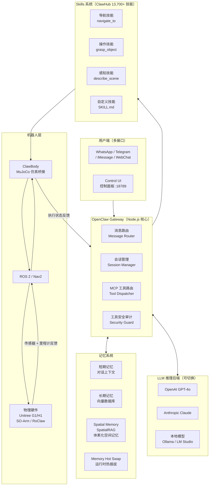
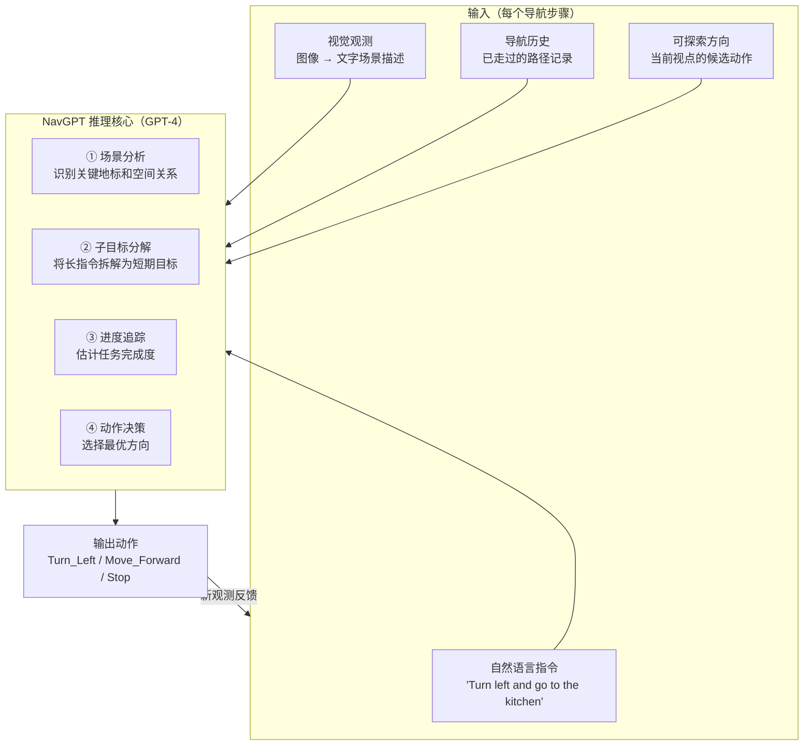
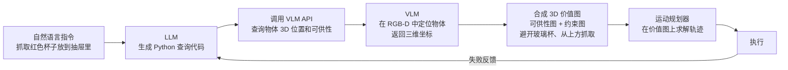
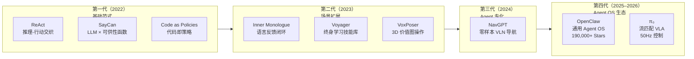
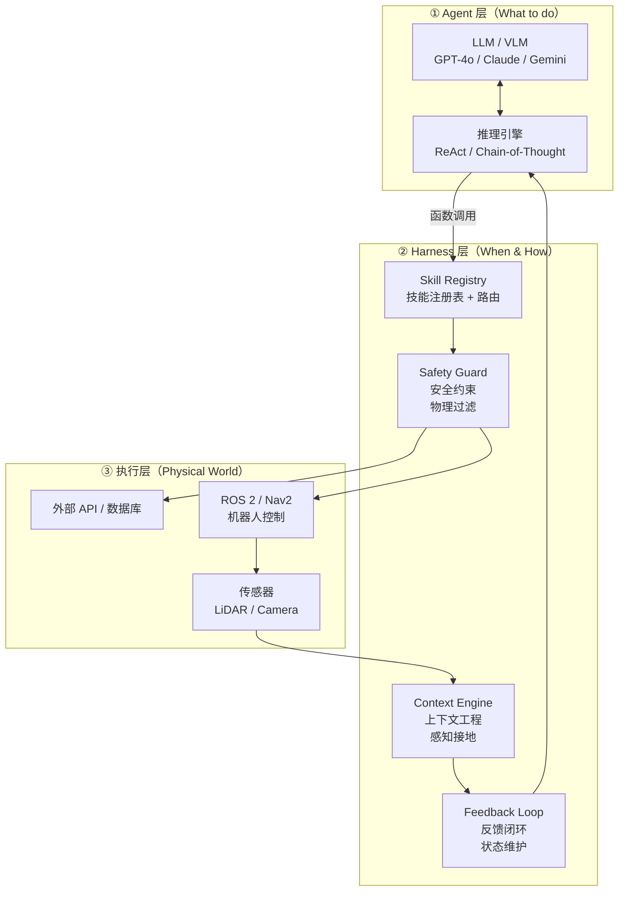
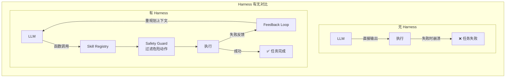
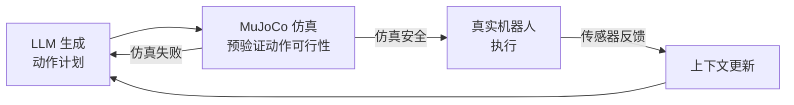

# 一、引言

2022年以来，以ChatGPT为代表的大语言模型（Large Language Model, LLM）使AI在文本生成和对话方面达到了接近人类的水平。然而，"对话"只是AI能力的冰山一角——真正改变生产力的，是AI能否**自主地完成任务**：搜索信息、调用API、写代码并执行、操作浏览器、控制机器人……这便催生了AI领域的下一个核心概念：**AI Agent（AI智能体）**。

  
  <figcaption>图：Agentic Robot的未来愿景</figcaption>

AI Agent不是一个单一的模型，而是一种**系统架构**：以LLM为"大脑"，配备感知、记忆、工具调用和行动能力，形成一个能够在环境中持续循环推理-执行的自主系统。2025-2026年，AI Agent已从学术概念迅速走向产业爆发——开源框架**OpenClaw**（前身Clawdbot，2025年11月发布）在72小时内积累60,000+ GitHub Stars，目前已突破**280,000 Stars**，用户数量估计达30-40万，研究者和工程师开始将其部署到Unitree人形机器人平台；2026年初，OpenAI和Anthropic相继发布文章定义**「Harness Engineering（Agent工程化）」**——如何为Agent构建可靠的生产级基础设施，成为2026年工程界最热议的范式；与此同时，**波士顿动力**在CES 2026宣布与Google DeepMind合作将Gemini Robotics基础模型引入新一代Atlas；**Gemini Robotics 1.5**于2025年9月向开发者开放，标志着具身AI正式进入商用。

机器人是AI Agent最具挑战性也最令人期待的应用场景之一：Agent不仅要在语言空间推理，还要与物理世界交互，面对感知噪声、执行不确定性和实时性约束。本文旨在系统梳理AI Agent的研究进展与在机器人中的应用，为学习和研究AI Agent提供参考。

# 二、AI Agent基本概述

## 1. 什么是AI Agent？

**AI Agent** 是以大语言模型为核心推理引擎，能够**自主感知环境、制定计划、调用工具并执行多步骤任务**的AI系统。与传统的问答式AI（输入→输出，一问一答）不同，Agent运行在一个**持续的感知-推理-行动循环**中：

$$\text{观察（Observe）} \rightarrow \text{思考（Think）} \rightarrow \text{行动（Act）} \rightarrow \text{反馈（Feedback）} \rightarrow \text{循环}$$

Agent的核心能力在于它不仅能"说"，还能"做"——通过调用外部工具（搜索引擎、代码执行器、API、机器人控制器等）影响真实世界，并根据执行结果动态调整后续计划。

  
  <figcaption>图：AI Agent的核心循环——感知、思考、行动与反馈</figcaption>

## 2. Agent与普通LLM的核心区别

| 维度 | 普通LLM | AI Agent |
|:-----|:--------|:---------|
| 交互模式 | 单轮/多轮对话 | 持续循环，自主驱动 |
| 行动能力 | 仅输出文本 | 调用工具、执行代码、操控系统 |
| 记忆 | 仅限上下文窗口 | 外部记忆（向量数据库、文件等） |
| 规划 | 隐式（单次推理） | 显式多步骤任务分解 |
| 目标导向 | 回答当前问题 | 自主完成长程目标 |

## 3. Agent的四大核心模块

Agent架构通常由以下四个模块构成（来源：The Landscape of Emerging AI Agent Architectures, 2024）：

**感知模块（Perception）**：接收来自环境的输入，包括文本、图像、传感器数据等多模态信息，形成对当前状态的语义理解。

**记忆模块（Memory）**：
- *工作记忆*：当前任务上下文，存于LLM的上下文窗口（Context Window）
- *长期记忆*：通过RAG或向量数据库存储历史经验、知识和技能

**规划模块（Planning）**：将高层目标分解为可执行子任务序列，核心技术包括思维链（CoT）、树形搜索（ToT）和反思（Reflection）。

**行动模块（Action）**：调用工具或执行器将规划转化为实际效果，工具类型涵盖：信息检索工具、代码执行器、外部API、机器人控制接口等。

## 4. 主要挑战

**幻觉与可靠性**：LLM可能生成看似合理但实际错误的计划，在高风险的机器人应用中后果严重。

**长程规划中的错误累积**：多步骤任务中任意一步失败可能导致整体崩溃，如何检测和恢复是核心难题。

**工具调用的泛化性**：Agent需要理解何时调用哪个工具、如何解析返回结果，对推理能力要求极高。

**实时性约束**：机器人控制频率通常为10-100Hz，而LLM推理延迟在秒级，存在本质矛盾。

**安全边界**：具有执行能力的Agent可能误操作文件、发送消息或控制物理设备，需要严格的权限管理。

## 5. 研究发展时间线

```mermaid
flowchart LR
    subgraph G2022 ["2022 Agent萌芽"]
        A["ReAct\n推理+行动"] --> B["SayCan\nLLM+机器人"]
    end
    B --> C
    subgraph G2023 ["2023 框架爆发"]
        C["LangChain\nAgent框架"] --> D["AutoGPT\n自主Agent"]
        D --> E["Code as Policies\n代码规划"]
        E --> F["Voyager\n终身学习Agent"]
    end
    F --> G
    subgraph G2024 ["2024 能力跃升"]
        G["OpenAI Swarm\n多Agent"] --> H["Claude Computer Use\n计算机控制"]
        H --> I["OpenVLA / π0\n机器人VLA"]
        I --> J["MCP协议\n工具标准化"]
    end
    J --> K
    subgraph G2025 ["2025-2026 产业落地"]
        K["OpenClaw\n通用开源Agent"] --> L["Gemini Robotics 1.5\n具身推理商用"]
        L --> M["Harness Engineering\nAgent工程化"]
        M --> N["NemoClaw\nNVIDIA企业Agent"]
    end
```

## 6. 关键技术方向

### ReAct：推理与行动交织

**ReAct**（Reasoning + Acting，2022）是定义现代AI Agent的核心范式之一。传统LLM要么纯推理（CoT思维链），要么直接行动。ReAct将二者交织：Agent先生成**思考（Thought）**，再产生**行动（Action）**，观察执行结果后继续下一轮思考，形成闭环。

**2025年演进：扩展推理（Extended Thinking）**。OpenAI o1/o3系列模型和Claude Extended Thinking将ReAct的思考过程内化为模型本身的推理链，Agent可以根据任务复杂度自动分配"推理计算预算"：简单任务快速反应，复杂任务（如精密组装规划）则进入深度推理模式。2025年4月的o3/o4-mini是首批**推理+工具调用统一**的模型，推理过程中可原生调用外部工具。

**核心特点**：
- Thought-Action-Observation三元组循环
- 推理过程可解释，便于调试和干预
- 已成为现代Agent框架（LangChain、OpenClaw等）的默认推理模式

*代表性工作*：ReAct（Yao et al., Princeton/Google, 2022）、OpenAI o3 Extended Thinking（2025）

---

### 工具调用（Tool Use）与MCP协议

工具调用是Agent区别于普通LLM的关键能力。通过定义**工具接口（Tool API）**，LLM可以在推理过程中主动触发外部功能，如网络搜索、代码执行、数据库查询或机器人控制器调用。

2024年11月，Anthropic发布**Model Context Protocol（MCP）**——标准化AI Agent与外部工具连接的开放协议。MCP迅速成为行业标准：2025年3月OpenAI采纳，4月Google DeepMind跟进，5月微软Build 2025宣布Windows 11原生支持。MCP服务器生态爆炸式增长（从10万次/月下载到超800万次），5800+服务器涵盖GitHub、Slack、Postgres等主流系统。OpenClaw也原生支持MCP，将其作为Agent与工具通信的核心协议。

**核心特点**：
- 工具以函数签名（Function Calling）形式定义，LLM学习何时及如何调用
- MCP提供标准化Client-Server架构，支持跨语言互操作
- 机器人低层技能（抓取、移动等）可封装为MCP工具，实现即插即用

*代表性工作*：OpenAI Function Calling（2023）、Toolformer（Meta，2023）、MCP协议（Anthropic，2024年11月）

---

### 反思与自我修正（Reflection）

Agent在执行失败后，通过分析错误信息自动调整策略并重试，而无需人类干预。这一能力对机器人任务尤为关键——执行失败是常态，快速从失败中恢复是长程任务成功的前提。

**核心特点**：
- 将环境反馈（错误信息、传感器读数变化）注入LLM上下文
- Reflexion框架引入语言形式的"反思记忆"，跨任务积累经验
- 与ReAct结合，构成"感知-推理-行动-反思"完整循环

*代表性工作*：Reflexion（Shinn et al., 2023）、Inner Monologue（Google，2023）

---

### 空间智能与长期记忆（World Memory）

Agent不再仅仅处理瞬时感知数据，而是构建并维护环境的**语义地图（Semantic Map）**和**时间序列记忆**。2026年，OpenClaw的Spatial Agent Memory将这一能力带到了物理机器人上。

**核心特点**：
- **Spatial RAG（空间检索增强）**：将LiDAR、立体相机、RGB图像、里程计数据融合，构建**体素化（Voxelized）世界模型**，每个体素标记空间向量嵌入和语义标签
- **多维查询**：支持跨物体、房间、语义、几何、时间、图像、点云等多维度查询，使机器人能回答"上周一谁来过我家"或"我的钥匙放在哪了"
- 解决"金鱼记忆"问题，使Agent具备跨越数小时甚至数天的物理一致性认知

*代表性工作*：OpenClaw Spatial Agent Memory + Unitree G1 Demo（2026.3）、SpatialRAG（OpenClaw）

---

### 代码作为动作（Code as Action）

与其让Agent输出自然语言动作序列，不如让它**直接生成可执行代码**。代码具有精确的逻辑表达能力，天然支持条件分支、循环和变量，比平铺的步骤列表更灵活，特别适合机器人任务规划。

**核心特点**：
- LLM生成Python/JavaScript代码，由沙箱环境执行
- 支持对任意数量对象的通用操作（自然处理循环逻辑）
- Voyager将代码生成扩展为终身技能积累库

*代表性工作*：Code as Policies（Google DeepMind，2022）、Voyager（NVIDIA，2023）

---

### Harness Engineering：Agent工程化（2026新范式）

2025年证明了AI Agent能够工作，2026年的核心命题是：**如何让Agent可靠地工作**。这正是「Harness Engineering（工程化约束）」的核心：Agent Harness不是Agent本身，而是**围绕Agent构建的基础设施**——约束它能做什么、告知它应该做什么、验证它做对了没有、在它出错时及时纠正。

OpenAI在构建Codex生产应用（百万行代码、1500+ PRs）的过程中归纳了Harness Engineering，Anthropic也独立发布了「Effective Harnesses for Long-Running Agents」工程实践。**一个关键发现**：LangChain的代码Agent在Terminal Bench 2.0上从52.8%提升到66.5%，**不是因为换了模型，而是只改了Harness**——说明工程化约束对Agent成功率的影响甚至超过了底层模型本身。

**Harness的四个核心功能**：
1. **约束（Constrain）**：限制Agent的行动权限（文件访问、网络调用等）
2. **告知（Inform）**：通过结构化上下文、进度文件、工具文档让Agent理解任务状态
3. **验证（Verify）**：自动检查Agent输出的正确性（单元测试、lint、沙箱执行）
4. **纠正（Correct）**：检测到错误后触发重规划或回滚

在机器人场景下，Harness Engineering尤为关键：机器人的每一步物理动作都不可逆，必须在执行前用仿真验证、执行中持续监控、执行后检测状态变化。

*代表性工作*：「Harness Engineering」（OpenAI，2026年2月）、「Effective Harnesses for Long-Running Agents」（Anthropic，2026）

---

### 多Agent系统（Multi-Agent System）

单一Agent能力有限，复杂任务可以分解给**多个专业化Agent协作完成**：规划Agent分解任务、执行Agent调用工具、验证Agent检查结果。在机器人场景中，多Agent架构支持异构机器人团队协同作业。

**核心特点**：
- Agent间通过消息传递或共享状态协调
- 支持并行执行，显著提升效率
- 角色分工（Orchestrator + Worker模式）使系统可扩展

*代表性工作*：AutoGen（Microsoft，2023）、AutoGen 0.4异步事件驱动架构（Microsoft，2025年1月）、OpenAI Swarm（2024）、OpenClaw Multi-Agent路由（2025）

## 7. 未来研究方向

- **持续学习Agent**：从每次任务执行中积累经验，技能库持续扩充，而非仅依赖训练时的权重
- **物理世界感知**：将触觉、力觉、本体感觉深度融入Agent感知模块
- **安全与对齐**：具有执行能力的Agent如何在复杂环境中保持安全边界
- **轻量化推理**：专为实时控制设计的小参数Agent推理引擎（目标：<100ms延迟）
- **人Agent协作**：人类与Agent在同一任务流中灵活切换控制权

# 三、Agent在机器人中的应用分类

**1. 高层任务规划（High-Level Planning）**

利用LLM将开放式自然语言指令（"帮我准备早饭"）分解为机器人可执行的技能序列（移动→打开冰箱→取出食材→……）。机器人本身不需要理解语言，Agent负责翻译。

*代表性工作*：SayCan、Inner Monologue、Language Planner

---

**2. 代码驱动操作（Code-Driven Manipulation）**

Agent直接生成机器人控制代码，通过Python API或ROS接口驱动执行器。代码生成比自然语言步骤更精确，支持条件逻辑和循环操作。

*代表性工作*：Code as Policies、ProgPrompt、RobotGPT

---

**3. 闭环反馈规划（Closed-Loop Replanning）**

机器人执行过程中，Agent持续接收传感器反馈并动态调整计划：抓取失败→重新规划抓取姿态；路径阻塞→规划绕路方案。

*代表性工作*：Inner Monologue、Reflexion在机器人中的应用

---

**4. 端到端VLA（Vision-Language-Action）**

直接将视觉输入、语言指令端到端映射为机器人动作。Physical Intelligence π0采用流匹配（Flow Matching）生成50Hz连续动作轨迹；OpenVLA（Stanford）基于Open X-Embodiment 970k数据预训练，以7B参数超越55B的RT-2-X。

*代表性工作*：OpenVLA（Stanford，2024）、π0（Physical Intelligence，2024）、Gemini Robotics 1.5（Google DeepMind，2025）

---

**5. 通用Agent框架集成机器人（General Agent + Robot）**

将OpenClaw、LangGraph等通用AI Agent框架通过**ClawBody桥接层**或MCP工具接口连接到机器人控制API，使机器人成为Agent可调用的一种"工具"。OpenClaw在Unitree G1上的集成（配合Intel RealSense深度相机和Qwen VLM）已实现视觉引导的"跟随目标人物"等演示，展示了通用Agent框架向物理世界延伸的可行路径。

*代表性工作*：OpenClaw + Unitree G1集成（2026）、ROSClaw（ROS与OpenClaw桥接，2026年2月）、LangChain + ROS集成

# 四、应用场景

**家庭服务机器人**：用户通过消息应用（WhatsApp、Discord等）向OpenClaw发送自然语言指令，Agent理解意图后通过ClawBody调用家用机器人执行。SwitchBot AI Hub于2026年2月底推出首款原生支持OpenClaw的本地家庭AI中枢，开启消费级AI Agent机器人的商用落地。Physical Intelligence π0.5已在真实家庭环境中演示跨场景泛化。

**工业自动化**：2026年1月CES，波士顿动力宣布新一代Atlas与Google DeepMind达成合作，将Gemini Robotics AI基础模型整合进Atlas。Atlas商业版将于2028年开始在现代汽车集团Metaplant America工厂（佐治亚州萨凡纳）正式部署，负责零件排序等任务，2026年全年产能已全部预订。

**科研实验室**：Agent驱动机械臂执行化学实验的标准操作流程（SOP），实现24小时无人值守实验室。

**搜救与特种作业**：多Agent机器人团队协作执行搜救任务，不同机器人承担感知、运输、通信等不同角色。

**智能手机Agent**：2026年3月6日，小米发布**Xiaomi miclaw**——基于MiMo大模型的手机端AI Agent，进入邀请制内测（支持小米17系列）。miclaw作为系统级工具，可自主调用50余项系统功能和第三方应用，无需用户逐步确认，标志着Agent能力向消费级移动设备的全面渗透。

# 五、主流评测基准

### ALFWorld

| 属性 | 内容 |
|------|------|
| 发布年份 | 2021 |
| 规模 | 3553个训练任务，140个评测任务 |
| 场景 | 文本游戏+3D仿真（双模式） |
| 特点 | 语言指令驱动的多步骤家务任务，Agent与环境文本交互 |

ALFWorld是评测语言驱动Agent规划能力的标准基准，任务包括找到并拿起某物、将物品放入特定容器等，要求Agent进行多步骤推理和工具调用。ReAct论文的核心评测场景。

---

### WebShop

| 属性 | 内容 |
|------|------|
| 发布年份 | 2022 |
| 规模 | 1.18百万真实商品，12087个任务 |
| 场景 | 模拟电商网站 |
| 特点 | Agent需搜索、筛选、购买目标商品，评测工具调用和决策能力 |

WebShop评测Agent在真实网页环境中的操作能力，是工具调用和信息检索Agent的重要基准。

---

### AgentBench

| 属性 | 内容 |
|------|------|
| 发布年份 | 2023 |
| 规模 | 8种不同环境，覆盖网页、代码、游戏、操作系统等 |
| 场景 | 多样化实际任务环境 |
| 特点 | 首个系统评测LLM-as-Agent在多环境下综合能力的基准 |

AgentBench是目前最全面的Agent能力综合评测框架，揭示了当前顶级LLM在Agent任务上与人类仍存在显著差距。

---

### GAIA（General AI Assistants）

| 属性 | 内容 |
|------|------|
| 发布年份 | 2023（NeurIPS） |
| 规模 | 三级难度，涵盖推理、检索、代码、工具调用 |
| 场景 | 通用助手能力评测 |
| 特点 | 多步骤推理+工具调用+信息整合，难度接近真实用户需求 |

GAIA考察Agent作为通用助手的综合能力。2025年，H2O.ai的h2oGPTe Agent以75%准确率登顶GAIA排行榜，超越OpenAI Deep Research。

---

### SWE-bench

| 属性 | 内容 |
|------|------|
| 发布年份 | 2023 |
| 规模 | SWE-bench Verified：500个真实GitHub Issue |
| 场景 | Python开源仓库软件工程任务 |
| 特点 | Agent需阅读代码、定位Bug、生成并验证修复补丁 |

代码Agent的标准评测。顶级Agent成功率从2024年12月的55%快速提升至2025年底的70%+，是AI Agent能力进步最快的基准之一。

---

### OSWorld

| 属性 | 内容 |
|------|------|
| 发布年份 | 2024（NeurIPS 2024） |
| 规模 | 369个任务，覆盖Ubuntu Linux和Windows |
| 场景 | 真实虚拟计算机环境（浏览器、文件管理器、代码编辑器等） |
| 特点 | 评测Agent在真实操作系统中完成复杂GUI任务的能力 |

计算机控制Agent（Computer Use Agent）的核心基准，2025年最优开源Agent在50步任务上达到34.5%，接近OpenAI CUA的32.6%。

---

### RLBench / LIBERO（机器人专项）

| 属性 | 内容 |
|------|------|
| 发布年份 | 2020 / 2023 |
| 规模 | 100 / 130个操作任务 |
| 场景 | 仿真机器人操作 |
| 特点 | 评测Agent在物理操作任务中的规划与执行能力 |

专门用于评测具身Agent（Embodied Agent）在机器人操作任务中的表现，任务从简单抓取到多步骤长程操作，覆盖Agent与物理环境交互的全链路能力。

# 六、经典方法与代表性工作

### ReAct

ReAct（Princeton & Google，2022）首次将**推理（Reasoning）与行动（Acting）**显式交织在LLM的生成过程中。Agent在每一步先输出自然语言形式的"思考"（Thought），再输出结构化"行动"（Action），并将行动的执行结果（Observation）作为下一步输入，形成持续循环。

**核心特点**：
- 推理过程透明可解释，便于人类理解和调试
- 在ALFWorld和WebShop上显著优于纯推理（CoT）和纯行动基线
- 成为现代Agent框架的事实标准推理模式

*代表性工作*：ReAct（Yao et al., 2022，Google Brain & Princeton）

---

### SayCan

SayCan（Google Robotics，2022）是将LLM Agent与物理机器人结合的奠基性工作。其关键洞察是：**LLM能生成合理的计划，但不了解机器人当前的物理能力**。SayCan用每个低层技能的**可行性函数（Affordance Function）**对LLM输出进行约束，只执行当前状态下"语言上合理且物理上可行"的动作。

**核心特点**：
- LLM提供语义规划，可行性函数提供物理约束
- 支持在真实厨房环境中完成"给我拿一瓶苏打水"等多步骤任务
- 标志着AI Agent从虚拟环境向物理世界的正式延伸

*代表性工作*：SayCan（Ahn et al., Google Robotics, 2022）

---

### Code as Policies

Code as Policies（Google DeepMind，2022）让LLM直接生成**Python机器人控制代码**，而非自然语言步骤列表。代码天然具备逻辑表达能力——一个`for`循环可以处理任意数量的物体，而列举式的步骤无法泛化。

**核心特点**：
- 机器人API封装为Python函数，LLM学习如何组合调用
- 代码执行结果可直接作为Agent的反馈
- 扩展到感知代码生成：动态查询物体位置、颜色等属性

*代表性工作*：Code as Policies（Liang et al., Google DeepMind, 2022）

---

### Voyager

Voyager（NVIDIA，2023）是在Minecraft游戏环境中构建的**终身学习AI Agent**，通过持续生成代码技能并将其存入技能库，实现了无需重新训练的持续能力积累。Agent由三个组件驱动：自动课程（决定学什么）、技能库（存储已学技能）和迭代提示机制（持续改进代码质量）。

**核心特点**：
- 首个在复杂开放世界中实现终身学习的LLM Agent
- 技能库可跨任务复用，避免"遗忘"问题
- 为机器人持续学习提供了重要的架构参考

*代表性工作*：Voyager（Wang et al., NVIDIA, 2023）

---

### Inner Monologue

Inner Monologue（Google，2023）在机器人任务执行过程中，将场景描述、成功检测、人类反馈等多种环境信息以**自然语言形式**注入Agent的上下文，实现了无需专门设计反馈模块的闭环重规划。

**核心特点**：
- 自然语言作为感知、规划和反馈的统一接口
- 支持任务失败后的自动检测与重规划
- 展示了"语言反馈"比数值信号更易被LLM理解和利用

*代表性工作*：Inner Monologue（Huang et al., Google, 2023）

---

### OpenClaw

OpenClaw（原名Clawdbot，奥地利开发者Peter Steinberger，2025年11月发布）是目前全球增长最快的开源AI Agent框架，已超越 **280,000 GitHub Stars**，用户规模达30-40万，是史上增速最快的开源项目之一（72小时内积累60,000+ Stars）。

**定位**：OpenClaw 不是传统意义上的 chatbot，而是一个**自托管的 Agent 操作系统（Agent OS）**——提供子 Agent 编排、MCP 工具路由、工具安全审计和插件系统，任何大模型（Claude、GPT-4o、DeepSeek 等）都可作为其"推理内核"。

#### OpenClaw 完整架构

#### 核心特性详解

**Memory Hot Swapping（记忆热插拔）**：允许在 Agent 运行时动态切换和更新记忆模块，无需重启 Agent 即可切换知识库——对长期运行的机器人 Agent 至关重要。

**ACP Provenance（代理链溯源）**：v2026.3.8 起支持。在多 Agent 工作流中，Agent 可验证交互方身份，防止"Agent 伪装攻击"（恶意 Agent 冒充合法 Agent 发出指令）。

**Spatial Agent Memory / SpatialRAG**：构建体素化世界模型，支持跨时间的空间语义查询，例如"上周四谁进过这个房间"或"我的充电器最后一次在哪里"——这是机器人首次获得"空间意义上的长期记忆"。

**ClawBody 桥接层**：将 OpenClaw 的高层语言推理转化为低延迟电机指令，集成 MuJoCo 物理仿真，支持 Unitree G1/H1 人形机器人和 SO-Arm 机械臂。

#### OpenClaw 机器人集成生态

| 集成案例 | 机器人平台 | 接口方式 | 典型用例 |
|---------|----------|---------|---------|
| ClawBody | MuJoCo 仿真 | Python API | 仿真开发验证 |
| RoClaw | 自制 20cm 机器人 | WhatsApp 消息 | 桌面演示 |
| Unitree G1/H1 | 宇树人形机器人 | ROS 2 Skills | 家庭/工业服务 |
| SO-Arm + Jetson Thor | 机械臂 | LeRobot 低层 | 桌面操作 |
| SwitchBot AI Hub | 家庭 IoT 设备 | 本地 Agent | 家庭自动化 |

**安全现状**：2026年1月安全审计发现512个漏洞（其中8个严重级别），目前在消费和研究领域广泛使用，但暂不适合未加固的企业生产环境（NVIDIA NemoClaw 正是针对此痛点而生）。

*最新版本*：v2026.3.11（2026年3月，持续活跃开发中）

---

### NavGPT

NavGPT（AAAI 2024，Princeton & 多所高校）是第一个将纯 LLM（GPT-4）用于**零样本视觉语言导航（Zero-shot VLN）**的 Agent 系统，无需任何导航专项训练数据：

**NavGPT 的显式推理链**是其核心价值——LLM 的每一步推理对人类完全透明可解释，便于调试，这与端到端黑盒模型形成鲜明对比。

| 对比维度 | 传统 VLN（监督学习） | NavGPT（LLM 零样本） |
|---------|------------------|--------------------|
| 训练数据 | 需要大量人工标注轨迹 | 零样本，无需导航训练 |
| 推理过程 | 端到端黑盒 | 显式思维链，可解释 |
| 指令泛化 | 依赖训练分布 | LLM 常识推理泛化 |
| 新环境适应 | 性能明显下降 | 语义泛化能力强 |

*代表性工作*：NavGPT（Zhou et al., AAAI 2024）；NavGPT-2（arXiv 2407.12366，引入视觉模态）

---

### VoxPoser

VoxPoser（NeurIPS 2023，斯坦福 / 谷歌）将代码生成 Agent 用于机器人**零样本操作**，是"LLM 写代码驱动机器人"路线的里程碑工作：

**三大核心创新**：
1. **组合式 3D 价值图**：将语言约束（"从上方抓"、"避开脆弱物品"）编码为 3D 空间数值场，运动规划器在其中求解无碰撞轨迹
2. **零样本泛化**：不需要任何物体/任务专属训练数据
3. **可组合性**：多个约束可逐层叠加，天然支持复杂指令

*代表性工作*：VoxPoser（Huang et al., NeurIPS 2023，arXiv 2307.05973）

---

### 六章小结：代表性工作演进脉络

# 七、最新进展（2025-2026）

## 1. OpenClaw：从框架到生态

2025年11月至2026年3月，OpenClaw完成了从"个人助手工具"到"具身AI基础设施"的关键跨越。其中最受关注的是**Unitree G1 + OpenClaw + World Memory**的集成演示：机器人配备LiDAR、立体相机和RGB摄像头，通过Spatial RAG实时构建体素化空间记忆，能够回答"上周四有谁进过这个房间"或"我的充电器最后一次出现在哪里"等跨越时间的空间推理问题——这被业界称为机器人"第一次获得了空间意义上的长期记忆"。

在消费级硬件方向，**SwitchBot AI Hub**于2026年2月底推出全球首款原生支持OpenClaw的本地家庭AI中枢，用户可通过WhatsApp、iMessage等50余款聊天应用直接与家中的AI Agent交互，控制SwitchBot生态设备。

## 2. Gemini Robotics 1.5：具身推理商用

2025年3月，Google DeepMind正式发布 **Gemini Robotics** 和 **Gemini Robotics-ER**（基于Gemini 2.0），是迄今规模最大的视觉-语言-动作模型家族之一。

**2025年9月25日**，**Gemini Robotics-ER 1.5** 正式向所有开发者开放（GA）——这是Gemini Robotics系列首款面向开发者商用的模型，在多项空间理解基准上达到SOTA，支持原生代码执行和工具调用，能够实时编写脚本解决从未见过的几何或物理平衡问题。**Gemini Robotics 1.5**（端到端VLA）同步发布，是目前性能最强的视觉-语言-动作模型，推理后再行动。

## 3. 波士顿动力 × Google DeepMind：CES 2026量产Atlas

2026年1月5日CES，波士顿动力发布**量产版新一代Atlas人形机器人**，同步宣布与Google DeepMind合作，将Gemini Robotics AI基础模型整合进Atlas认知系统。新版Atlas身高1.9m、体重90kg、臂展2.3m，手部具备指尖和掌心触觉感知，最大负载50kg。

量产Atlas的全部2026年产能已全部预订——第一批将分配给Hyundai Motor Group旗下工厂（Metaplant America，佐治亚州萨凡纳）和Google DeepMind研究用途，正式商业部署预计2028年开始。现代汽车集团还宣布了260亿美元的美国投资计划，包括建设年产3万台机器人的专用工厂。

## 4. NVIDIA NemoClaw：GTC 2026企业级Agent

2026年3月10日，NVIDIA宣布将在**GTC 2026**（3月16日Jensen Huang主题演讲）上发布**NemoClaw**——面向企业的开源AI Agent平台。NemoClaw内置安全与隐私工具，支持硬件无关部署（不限于NVIDIA芯片），已与Salesforce、Cisco、Google、Adobe、CrowdStrike等头部企业接洽合作。

NemoClaw的战略目的明确：在OpenClaw因安全漏洞（512个）被企业望而却步之际，填补**企业级可信Agent基础设施**的空缺，定位为"企业的OpenClaw"。

## 5. Harness Engineering：2026年最重要的工程范式

### 什么是 Harness？

2026年初，OpenAI 和 Anthropic 相继发布关于 Agent 工程化的深度文章，标志着行业认知的重大转变：**Agent 的成败，核心不在模型，而在 Harness（工程约束框架）**。

> "Your agent needs a harness, not a framework. The framework defines *what* the agent does; the harness controls *when* and *how* it's allowed to act."
> — Inngest Engineering Blog (2025)

**Harness** 是位于 LLM/Agent 与外部世界（工具、API、机器人）之间的软件中间件层，负责：将 LLM 的高层推理输出转化为可执行的低层命令；同时将外部状态反馈回 LLM 的上下文。它不是一个框架（Framework），而是包裹 Agent 的**工程基础设施**。

### Agent 三层架构

| 层级 | 职责 | 核心组件 |
|------|------|---------|
| **Agent 层** | 理解意图、推理规划、决策 | LLM、ReAct、思维链 |
| **Harness 层** | 工具封装、上下文管理、安全过滤、反馈闭环 | Skill Registry、Safety Guard、Context Engine |
| **执行层** | 具体任务执行、传感、运动 | API、ROS 2、传感器 |

### Harness 的五大核心组件

**① Skill Registry（技能注册表）**：将外部工具/API/机器人动作封装为 LLM 可通过函数调用（Function Calling）访问的"技能"。每个 Skill 有明确的输入输出 schema，Harness 负责路由调用、收集结果并格式化为 LLM 可读的反馈。

**② Context Engine（上下文引擎）**：管理 LLM 的上下文窗口——决定哪些历史信息、传感器数据、执行结果应该被包含在当前推理的 prompt 中。对长任务尤为关键（避免超出 context window 的同时保留关键信息）。

**③ Safety Guard（安全守卫）**：在 LLM 输出到达执行器之前，过滤物理上危险或逻辑上不合法的动作。机器人场景中，Safety Guard 通常包含：运动学可行性检查、工作空间边界检查、速度/力矩限幅。

**④ Feedback Loop（反馈闭环）**：将执行结果（成功/失败/异常）结构化后返回 LLM，触发下一步推理或重规划。

**⑤ Replanning Mechanism（重规划机制）**：当 Skill 执行失败时，Harness 记录失败原因并注入新的上下文，引导 LLM 生成替代方案，而非直接崩溃。

### Harness Engineering 的关键洞见

OpenAI Codex 团队（百万行代码生产项目，3 名工程师、18 个月、1500+ PR）和 Anthropic（《Effective Harnesses for Long-Running Agents》）共同揭示了核心规律：

> **一个设计良好的 Harness 能将 Agent 成功率提升 10–15 个百分点，效果超过换用更强的底层模型。**

### 机器人场景的 Harness 特殊挑战

对机器人 Agent 而言，Harness Engineering 的重要性远超软件 Agent：

| 挑战 | 软件 Agent | 机器人 Agent |
|------|-----------|------------|
| 动作可逆性 | ✅ 大多数操作可撤销 | ❌ 物理动作不可逆（碰撞、跌倒） |
| 执行延迟 | 毫秒级 | 控制需要 50–100 Hz 实时性 |
| 状态复杂度 | 结构化 API 响应 | 高维传感器数据（点云、图像） |
| 失败代价 | 重试成本低 | 可能损坏设备或伤人 |

**核心原则**：机器人 Harness 的"约束-验证-纠正"循环**必须在执行前通过仿真（MuJoCo 等）完成**，而非事后补救。

## 6. 小米 Xiaomi miclaw：消费级手机Agent

2026年3月6日，小米正式宣布**Xiaomi miclaw**——基于自研MiMo大模型的手机端AI Agent，进入邀请制内测（支持小米17系列）。miclaw作为系统级Agent，可自主调用50余项系统功能和第三方应用，用户仅需给出模糊意图（如"帮我订明天去上海的高铁并提醒我提前一小时出发"），miclaw负责分解、执行全流程，无需逐步确认。用户数据不用于训练，采用边缘-云端私有化计算架构。

# 八、总结

AI Agent代表了人工智能从"理解"走向"行动"的核心范式转变。以LLM为大脑、工具调用为手脚、记忆模块为经验积累，Agent系统正在将自然语言理解的能力延伸到真实世界的任务执行中。

在机器人领域，这一趋势尤为深刻：从SayCan的LLM任务规划、Code as Policies的代码驱动操作，到Physical Intelligence π0的通用机器人基础模型和Gemini Robotics 1.5的推理-行动一体化商用，再到OpenClaw Spatial Agent Memory赋予机器人跨时间的空间认知，每一步都在缩短AI推理能力与物理世界执行之间的鸿沟。

2026年的核心议题正在从"Agent能不能工作"转向"**如何让Agent可靠地工作**"——Harness Engineering的兴起，标志着AI Agent从实验室走向生产的关键工程化拐点。随着OpenClaw生态、Gemini Robotics、CES 2026 Atlas等多条线索加速收敛，真正意义上的"自主机器人助手"正从科幻走向现实。

未来，**Harness可靠性**、**实时推理效率**、**持续学习**、**多Agent协作**和**安全可解释性**将是机器人AI Agent研究的五大核心命题。
