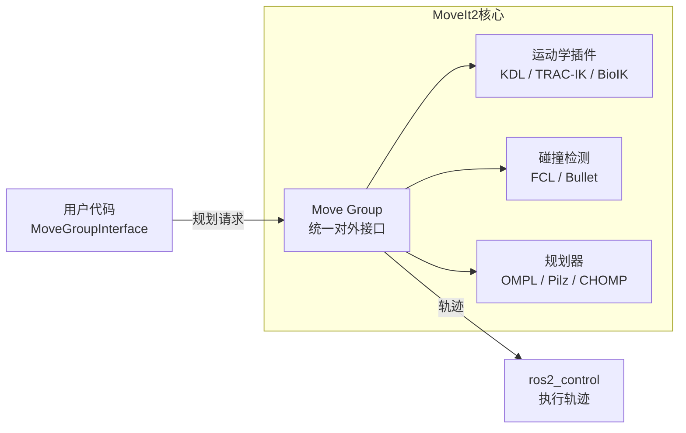

# 一、什么是 ROS 2？

**ROS**（Robot Operating System）并不是一个真正的操作系统，而是一套运行在 Linux/Windows/macOS 上的**机器人中间件框架**。它提供了节点通信、硬件抽象、工具链和生态库，让开发者专注于算法，而不是底层通信和驱动。

**ROS 2** 是在 ROS 1 基础上的彻底重构（非简单升级），核心目标是：
- **去中心化**：去除单点故障的 `roscore` Master
- **实时性**：支持实时控制需求
- **安全性**：内置 DDS 安全插件
- **跨平台**：原生支持 Linux / Windows / macOS / 嵌入式 RTOS

## ROS 1 vs ROS 2 架构对比

<div class="mermaid">
flowchart TB
    subgraph ROS1["ROS 1（中心化）"]
        direction TB
        Master["`**roscore / Master**
        单点故障`"]
        N1A[节点 A] -->|注册| Master
        N2A[节点 B] -->|注册| Master
        N3A[节点 C] -->|注册| Master
        Master -->|地址查询| N1A
        Master -->|地址查询| N2A
        style Master fill:#ff6b6b,color:#fff
    end

    subgraph ROS2["ROS 2（去中心化 DDS）"]
        direction TB
        N1B[节点 A]
        N2B[节点 B]
        N3B[节点 C]
        N1B <-->|"RTPS 自动发现"| N2B
        N2B <-->|"RTPS 自动发现"| N3B
        N1B <-->|"RTPS 自动发现"| N3B
        style N1B fill:#51cf66,color:#fff
        style N2B fill:#51cf66,color:#fff
        style N3B fill:#51cf66,color:#fff
    end
</div>

---

# 二、核心概念：ROS 2 的积木块

ROS 2 的世界由五种基本通信原语构成。理解它们是一切的基础。

<div class="mermaid">
mindmap
  root((ROS 2 核心原语))
    节点 Node
      最小运算单元
      可包含多个发布者/订阅者
    话题 Topic
      异步发布订阅
      一对多广播
    服务 Service
      同步请求响应
      一对一
    动作 Action
      长时任务
      带进度反馈
      可取消
    参数 Parameter
      节点配置
      运行时可修改
</div>

---

## 2.1 节点（Node）

### 概念

节点是 ROS 2 的**最小功能单元**。每个节点应只负责一件具体的事情（传感器读取、路径规划、电机控制等），节点之间通过话题、服务、动作和参数通信。

> **设计原则：一个节点，一件事（Single Responsibility）。**

一个完整的机器人系统由许多节点协同组成——摄像头驱动节点、目标检测节点、路径规划节点、底盘控制节点……它们共同构成 **ROS 2 图（ROS Graph）**：所有正在运行的 ROS 2 元素（节点、话题、服务、动作）及其连接关系的总和。

> **注意**：一个可执行文件（executable）可以包含多个节点；同一个节点类也可以被实例化多次，以不同名称运行。

<div class="mermaid">
flowchart LR
    subgraph ROS2Graph["ROS 2 图（运行时系统）"]
        Camera["camera_node\n发布图像"]
        Detect["detect_node\n目标检测"]
        Plan["plan_node\n路径规划"]
        Control["control_node\n底盘控制"]

        Camera -->|"/image_raw"| Detect
        Detect -->|"/objects"| Plan
        Plan -->|"/cmd_vel"| Control
    end
</div>

---

### CLI 工具

ROS 2 提供了一套完整的命令行工具，用于启动、查看和调试节点。

#### `ros2 run` — 启动节点

```bash
ros2 run <package_name> <executable_name>
```

从指定包中启动一个可执行文件。例如，启动 turtlesim 仿真器：

```bash
ros2 run turtlesim turtlesim_node
```

再开一个终端，启动键盘控制节点：

```bash
ros2 run turtlesim turtle_teleop_key
```

此时系统中同时存在两个节点，形成一个简单的 ROS 2 图。

#### `ros2 node list` — 列出所有节点

```bash
ros2 node list
```

输出当前所有正在运行的节点名称：

```
/turtlesim
/teleop_turtle
```

节点名称以 `/` 开头，属于 ROS 2 命名空间体系的一部分。

#### `ros2 node info` — 查看节点详情

```bash
ros2 node info <node_name>
```

例如：

```bash
ros2 node info /turtlesim
```

输出该节点的完整接口信息：

```
/turtlesim
  Subscribers:
    /turtle1/cmd_vel: geometry_msgs/msg/Twist
  Publishers:
    /parameter_events: rcl_interfaces/msg/ParameterEvent
    /rosout: rcl_interfaces/msg/Log
    /turtle1/color_sensor: turtlesim/msg/Color
    /turtle1/pose: turtlesim/msg/Pose
  Service Servers:
    /clear: std_srvs/srv/Empty
    /kill: turtlesim/srv/Kill
    /reset: std_srvs/srv/Empty
    /spawn: turtlesim/srv/Spawn
    /turtle1/set_pen: turtlesim/srv/SetPen
    /turtlesim/describe_parameters: rcl_interfaces/srv/DescribeParameters
    /turtlesim/get_parameters: rcl_interfaces/srv/GetParameters
    /turtlesim/list_parameters: rcl_interfaces/srv/ListParameters
    /turtlesim/set_parameters: rcl_interfaces/srv/SetParameters
  Action Servers:
    /turtle1/rotate_absolute: turtlesim/action/RotateAbsolute
```

通过 `node info` 可以快速了解一个节点对外暴露的所有接口——这是调试和集成陌生节点时最常用的命令。

<div class="mermaid">
flowchart TB
    subgraph node_info["ros2 node info /turtlesim 输出结构"]
        direction LR
        N["/turtlesim"]
        N --> Sub["Subscribers\n/turtle1/cmd_vel\n(geometry_msgs/Twist)"]
        N --> Pub["Publishers\n/turtle1/pose\n/turtle1/color_sensor\n/rosout ..."]
        N --> SrvS["Service Servers\n/spawn /kill /reset\n/turtle1/set_pen ..."]
        N --> ActS["Action Servers\n/turtle1/rotate_absolute"]
    end
</div>

#### 重映射（Remapping）

重映射允许在**不修改代码**的前提下，将节点的默认名称、话题名称等替换为自定义值。语法：

```bash
ros2 run <pkg> <exe> --ros-args --remap <原名>:=<新名>
```

**示例 1：重命名节点**

```bash
ros2 run turtlesim turtlesim_node --ros-args --remap __node:=my_turtle
```

此时 `ros2 node list` 将显示 `/my_turtle` 而非 `/turtlesim`，可以同时启动多个同类节点而不产生命名冲突。

**示例 2：重映射话题**

```bash
ros2 run turtlesim turtle_teleop_key --ros-args --remap /turtle1/cmd_vel:=/turtle2/cmd_vel
```

将键盘控制节点的输出从默认的 `/turtle1/cmd_vel` 重定向到 `/turtle2/cmd_vel`，从而控制另一只海龟。

---

### Python 节点代码结构

```python
import rclpy
from rclpy.node import Node

class MyNode(Node):
    def __init__(self):
        super().__init__('my_node')           # 设置节点名称
        self.get_logger().info('节点已启动！')

        # 典型接口声明（按需添加）
        # self.pub = self.create_publisher(MsgType, '/topic', 10)
        # self.sub = self.create_subscription(MsgType, '/topic', self.cb, 10)
        # self.timer = self.create_timer(1.0, self.timer_cb)  # 1 Hz 定时器

def main():
    rclpy.init()
    node = MyNode()
    rclpy.spin(node)        # 进入事件循环，阻塞直到 Ctrl+C
    rclpy.shutdown()

if __name__ == '__main__':
    main()
```

`rclpy.spin()` 让节点持续运行并处理回调（话题消息、定时器、服务请求等）。若只需处理一次，可用 `rclpy.spin_once(node)`。

---

## 2.2 话题（Topic）

话题是 ROS 2 最常用的通信方式，遵循**发布-订阅**模式：
- **Publisher（发布者）**：持续推送数据
- **Subscriber（订阅者）**：按需接收数据
- **松耦合**：发布者和订阅者互不知晓对方存在

<div class="mermaid">
flowchart LR
    P1["`**激光雷达驱动节点**
    Publisher`"]
    P2["`**IMU 驱动节点**
    Publisher`"]
    T1(["/scan\nLaserScan"])
    T2(["/imu/data\nImu"])
    S1["`**SLAM 节点**
    Subscriber`"]
    S2["`**避障节点**
    Subscriber`"]
    S3["`**RViz2 可视化**
    Subscriber`"]

    P1 -->|发布| T1
    P2 -->|发布| T2
    T1 -->|订阅| S1
    T1 -->|订阅| S2
    T1 -->|订阅| S3
    T2 -->|订阅| S1
</div>

**适用场景**：传感器数据流（摄像头、激光雷达、IMU）、控制指令（/cmd_vel）、状态信息

**Python 示例：**

```python
# 发布者
from std_msgs.msg import String

class TalkerNode(Node):
    def __init__(self):
        super().__init__('talker')
        self.pub = self.create_publisher(String, '/chatter', 10)
        self.timer = self.create_timer(1.0, self.callback)

    def callback(self):
        msg = String()
        msg.data = 'Hello ROS 2!'
        self.pub.publish(msg)

# 订阅者
class ListenerNode(Node):
    def __init__(self):
        super().__init__('listener')
        self.sub = self.create_subscription(
            String, '/chatter', self.callback, 10)

    def callback(self, msg):
        self.get_logger().info(f'收到: {msg.data}')
```

---

## 2.3 服务（Service）

服务适用于**需要明确返回值**的一次性操作：

<div class="mermaid">
sequenceDiagram
    participant C as 客户端 (Client)
    participant S as 服务端 (Server)

    C->>S: Request（请求参数）
    Note over C: 阻塞等待...
    S-->>C: Response（返回结果）
    Note over C: 继续执行
</div>

**适用场景**：获取地图、切换模式、查询状态、触发一次性动作（拍照、保存日志）

**Python 示例：**

```python
# 服务端
from std_srvs.srv import SetBool

class MyServiceServer(Node):
    def __init__(self):
        super().__init__('my_service_server')
        self.srv = self.create_service(
            SetBool, '/enable_motor', self.callback)

    def callback(self, request, response):
        if request.data:
            self.get_logger().info('电机已启动')
            response.success = True
            response.message = 'Motor enabled'
        else:
            response.success = True
            response.message = 'Motor disabled'
        return response

# 客户端（异步调用，不阻塞主线程）
class MyServiceClient(Node):
    def __init__(self):
        super().__init__('my_service_client')
        self.cli = self.create_client(SetBool, '/enable_motor')
        self.cli.wait_for_service()  # 等待服务上线

    def send_request(self, enable: bool):
        req = SetBool.Request()
        req.data = enable
        future = self.cli.call_async(req)   # 异步调用
        rclpy.spin_until_future_complete(self, future)
        return future.result()
```

> **注意**：服务是同步阻塞的。如果服务端处理时间过长，客户端线程会被卡住。长时任务应使用 **Action**。

---

## 2.4 动作（Action）

Action 是专为**耗时任务**设计的通信机制，解决了服务"要么阻塞、要么超时"的问题：

<div class="mermaid">
sequenceDiagram
    participant C as Action Client
    participant S as Action Server

    C->>S: SendGoal（发送目标）
    S-->>C: GoalAccepted ✅

    loop 任务执行中
        S-->>C: Feedback（进度反馈，如：已移动 2.3m / 5m）
    end

    C->>S: CancelGoal（可选：随时取消）
    S-->>C: Result（最终结果）
</div>

**适用场景**：底盘移动到目标点、机械臂执行抓取、执行长时间导航任务

**Action 的三要素：**

| 组件 | 说明 | 示例 |
|------|------|------|
| Goal | 客户端发送的任务目标 | 移动到坐标 (3.0, 2.0) |
| Feedback | 执行中的周期性进度 | 当前位置 (1.5, 1.0)，完成50% |
| Result | 任务完成后的最终结果 | 成功到达 / 路径被阻挡 |

**Python 示例：**

```python
# Action 定义（my_interfaces/action/MoveRobot.action）
# float64 target_x       # Goal
# float64 target_y
# ---
# bool success           # Result
# ---
# float64 current_x      # Feedback
# float64 current_y

# Action 服务端
from rclpy.action import ActionServer
from my_interfaces.action import MoveRobot

class MoveRobotServer(Node):
    def __init__(self):
        super().__init__('move_robot_server')
        self._action_server = ActionServer(
            self, MoveRobot, 'move_robot', self.execute_callback)

    async def execute_callback(self, goal_handle):
        self.get_logger().info(f'收到目标: ({goal_handle.request.target_x}, {goal_handle.request.target_y})')

        feedback_msg = MoveRobot.Feedback()

        # 模拟移动过程，周期性发送进度
        for i in range(10):
            feedback_msg.current_x = i * goal_handle.request.target_x / 10
            feedback_msg.current_y = i * goal_handle.request.target_y / 10
            goal_handle.publish_feedback(feedback_msg)
            await asyncio.sleep(0.5)

        goal_handle.succeed()
        result = MoveRobot.Result()
        result.success = True
        return result

# Action 客户端
from rclpy.action import ActionClient

class MoveRobotClient(Node):
    def __init__(self):
        super().__init__('move_robot_client')
        self._action_client = ActionClient(self, MoveRobot, 'move_robot')

    def send_goal(self, x, y):
        goal_msg = MoveRobot.Goal()
        goal_msg.target_x = x
        goal_msg.target_y = y

        self._action_client.wait_for_server()
        self._send_goal_future = self._action_client.send_goal_async(
            goal_msg,
            feedback_callback=self.feedback_callback)  # 注册进度回调

    def feedback_callback(self, feedback_msg):
        fb = feedback_msg.feedback
        self.get_logger().info(f'当前位置: ({fb.current_x:.2f}, {fb.current_y:.2f})')
```

---

## 2.5 QoS（服务质量策略）

QoS 是 ROS 2 相比 ROS 1 的重大新增功能，允许为每个话题/服务**精细配置通信可靠性**：

<div class="mermaid">
flowchart TB
    subgraph QoS关键策略
        R["`**Reliability（可靠性）**
        RELIABLE：丢包重传，保证送达
        BEST_EFFORT：尽力而为，不保证`"]
        D["`**Durability（持久性）**
        VOLATILE：只收当前数据
        TRANSIENT_LOCAL：可收历史最后一条`"]
        H["`**History（历史）**
        KEEP_LAST(N)：只保留最近N条
        KEEP_ALL：保留全部`"]
    end
</div>

**选型指南：**

| 场景 | Reliability | Durability | 原因 |
|------|-------------|------------|------|
| 高频摄像头图像 `/image_raw` | BEST_EFFORT | VOLATILE | 丢一帧无所谓，要低延迟 |
| 底盘控制指令 `/cmd_vel` | RELIABLE | VOLATILE | 指令必须可靠送达 |
| 静态地图 `/map` | RELIABLE | TRANSIENT_LOCAL | 后启动的节点也能拿到地图 |

> **发布者和订阅者的 QoS 必须兼容**，否则连接会静默失败。使用 `ros2 topic info -v /topic_name` 可以诊断。

---

# 三、ROS 2 中间件：DDS 深度解析

## DDS 是什么？

DDS（Data Distribution Service）是 ROS 2 的**通信底座**，由 OMG 标准化组织制定。ROS 2 通过 RMW（ROS Middleware）抽象层与具体的 DDS 实现解耦。

<div class="mermaid">
flowchart TB
    subgraph 应用层
        Node1[ROS 2 节点 A]
        Node2[ROS 2 节点 B]
    end

    subgraph ROS2层
        RCLCPP["rclcpp / rclpy\n（用户 API）"]
        RCL["rcl\n（C 核心库）"]
        RMW["RMW 抽象层\n（rmw interface）"]
    end

    subgraph DDS实现层
        FastDDS["FastDDS\n（默认，eProsima）"]
        CycloneDDS["CycloneDDS\n（Eclipse）"]
        ConnextDDS["Connext DDS\n（RTI，商业）"]
    end

    subgraph 传输层
        UDP["UDP/IP 组播"]
        SHM["共享内存 (SHM)"]
    end

    Node1 --> RCLCPP
    Node2 --> RCLCPP
    RCLCPP --> RCL --> RMW
    RMW --> FastDDS
    RMW --> CycloneDDS
    RMW --> ConnextDDS
    FastDDS --> UDP
    FastDDS --> SHM
    CycloneDDS --> UDP
</div>

## RMW 选型

```bash
# 切换 DDS 实现（无需重新编译，环境变量即可）
export RMW_IMPLEMENTATION=rmw_cyclonedds_cpp   # CycloneDDS
export RMW_IMPLEMENTATION=rmw_fastrtps_cpp      # FastDDS（默认）
```

| DDS 实现 | 特点 | 推荐场景 |
|----------|------|----------|
| FastDDS | 功能最全，默认选项，支持共享内存 | 通用开发 |
| CycloneDDS | Wi-Fi 环境稳定，延迟低 | 自动驾驶、无线场景 |
| Connext DDS | 商业支持，MISRA 认证 | 航空航天、医疗 |

## RTPS 自动发现机制

<div class="mermaid">
sequenceDiagram
    participant A as 节点 A（新启动）
    participant Net as 局域网组播
    participant B as 节点 B
    participant C as 节点 C

    A->>Net: 组播广播：我是节点A，我发布 /scan
    Net->>B: 转发发现消息
    Net->>C: 转发发现消息
    B->>A: 单播回复：我订阅 /scan，握手！
    Note over A,B: 建立点对点连接，开始传输数据
    C->>A: 单播回复：我不订阅 /scan，忽略
</div>

> `ROS_DOMAIN_ID`：通过设置 0~101 的整数，可以将不同机器人或团队的节点隔离在独立的通信域内，互不干扰。

---

# 四、工作空间（Workspace）

工作空间是 ROS 2 项目的**顶层容器**，所有源码、编译产物、安装文件都放在这里。

## 目录结构

```
ros2_ws/                        ← 工作空间根目录（名字随意）
├── src/                        ← 所有源码包放这里
│   ├── my_robot_bringup/       ← 启动包（launch 文件）
│   ├── my_robot_description/   ← 机器人描述（URDF/Xacro）
│   ├── my_robot_control/       ← 控制算法
│   └── my_interfaces/          ← 自定义消息/服务/动作定义
├── build/                      ← 编译中间产物（自动生成，勿手改）
├── install/                    ← 可执行文件和库（自动生成）
└── log/                        ← 编译日志（自动生成）
```

## 构建系统：colcon

```bash
# 创建工作空间并进入
mkdir -p ~/ros2_ws/src && cd ~/ros2_ws

# 构建整个工作空间
colcon build

# 只构建指定包（推荐，速度快）
colcon build --packages-select my_robot_control

# Python 包开发模式：修改代码后无需重新 build
colcon build --symlink-install

# 构建后必须 source，才能找到新包
source install/setup.bash

# 建议写入 ~/.bashrc，每次打开终端自动生效
echo "source ~/ros2_ws/install/setup.bash" >> ~/.bashrc
```

> **每开一个新终端都要 source**，否则 `ros2 run` 找不到你的包。这是 ROS 2 新手最常遇到的坑。

---

# 五、功能包（Package）

功能包是 ROS 2 的**基本代码组织单元**，相当于一个模块或库。每个包有独立的编译配置、依赖声明和可执行程序。

<div class="mermaid">
flowchart TB
    subgraph 一个典型 ROS 2 功能包
        PX[package.xml\n声明包名、版本、依赖]
        CM[CMakeLists.txt 或 setup.py\n编译规则]
        SRC[src/ 或 scripts/\n源代码]
        INC[include/\nC++ 头文件]
        LAU[launch/\nLaunch 启动文件]
        CFG[config/\nYAML 参数文件]
        MSG[msg/ srv/ action/\n自定义接口定义]
    end
</div>

## 5.1 创建功能包

ROS 2 支持两种构建类型：

| 构建类型 | 适用语言 | 构建文件 |
|----------|----------|----------|
| `ament_cmake` | C++（也可含 Python） | `CMakeLists.txt` + `package.xml` |
| `ament_python` | 纯 Python | `setup.py` + `setup.cfg` + `package.xml` |

```bash
# 进入工作空间 src 目录
cd ~/ros2_ws/src

# 创建 C++ 包（带常用依赖）
ros2 pkg create my_cpp_pkg \
    --build-type ament_cmake \
    --dependencies rclcpp std_msgs sensor_msgs

# 创建 Python 包
ros2 pkg create my_python_pkg \
    --build-type ament_python \
    --dependencies rclpy std_msgs

# 创建自定义接口包（专门定义 msg/srv/action）
ros2 pkg create my_interfaces \
    --build-type ament_cmake \
    --dependencies rosidl_default_generators
```

## 5.2 C++ 包结构详解

```
my_cpp_pkg/
├── CMakeLists.txt      ← 编译规则
├── package.xml         ← 包元信息与依赖
├── include/
│   └── my_cpp_pkg/
│       └── my_node.hpp
└── src/
    └── my_node.cpp
```

**package.xml**（依赖声明）：

```xml
<?xml version="1.0"?>
<package format="3">
  <name>my_cpp_pkg</name>
  <version>0.1.0</version>
  <description>My first ROS 2 C++ package</description>
  <maintainer email="you@example.com">Your Name</maintainer>
  <license>Apache-2.0</license>

  <!-- 编译时依赖 -->
  <depend>rclcpp</depend>
  <depend>std_msgs</depend>
  <depend>sensor_msgs</depend>

  <export>
    <build_type>ament_cmake</build_type>
  </export>
</package>
```

**CMakeLists.txt**（核心编译配置）：

```cmake
cmake_minimum_required(VERSION 3.8)
project(my_cpp_pkg)

# 查找依赖
find_package(ament_cmake REQUIRED)
find_package(rclcpp REQUIRED)
find_package(std_msgs REQUIRED)

# 编译可执行文件
add_executable(my_node src/my_node.cpp)
ament_target_dependencies(my_node rclcpp std_msgs)

# 安装到 install/ 目录
install(TARGETS my_node
  DESTINATION lib/${PROJECT_NAME})

ament_package()
```

## 5.3 Python 包结构详解

```
my_python_pkg/
├── package.xml
├── setup.py            ← 入口点注册
├── setup.cfg
└── my_python_pkg/
    ├── __init__.py
    └── my_node.py
```

**setup.py**（注册节点入口点）：

```python
from setuptools import setup

package_name = 'my_python_pkg'

setup(
    name=package_name,
    version='0.1.0',
    packages=[package_name],
    install_requires=['setuptools'],
    entry_points={
        'console_scripts': [
            # 格式：命令名 = 包名.模块名:函数名
            'my_node = my_python_pkg.my_node:main',
            'talker  = my_python_pkg.talker:main',
            'listener = my_python_pkg.listener:main',
        ],
    },
)
```

## 5.4 自定义接口包（msg / srv / action）

当标准消息类型不满足需求时，需要单独创建接口包：

```
my_interfaces/
├── CMakeLists.txt
├── package.xml
├── msg/
│   └── RobotStatus.msg     ← 自定义话题消息
├── srv/
│   └── SetMode.srv         ← 自定义服务
└── action/
    └── MoveRobot.action    ← 自定义动作
```

**消息定义语法：**

```
# msg/RobotStatus.msg
string robot_id        # 机器人 ID
float64 battery_level  # 电量 0.0~1.0
bool is_moving
geometry_msgs/Pose current_pose  # 可嵌套已有消息类型
```

```
# srv/SetMode.srv
string mode_name    # Request 部分
bool force
---                 # 用 --- 分隔 Request 和 Response
bool success        # Response 部分
string message
```

```
# action/MoveRobot.action
float64 target_x    # Goal
float64 target_y
---
bool success        # Result
string message
---
float64 current_x   # Feedback
float64 current_y
float64 progress    # 0.0~1.0
```

**CMakeLists.txt 中注册自定义接口：**

```cmake
find_package(rosidl_default_generators REQUIRED)

rosidl_generate_interfaces(${PROJECT_NAME}
  "msg/RobotStatus.msg"
  "srv/SetMode.srv"
  "action/MoveRobot.action"
  DEPENDENCIES geometry_msgs  # 如果消息中用到了其他包的类型
)
```

## 5.5 功能包的完整开发流程

<div class="mermaid">
flowchart TD
    A["`**① 创建包**
    ros2 pkg create`"]
    B["`**② 编写代码**
    src/ 或 scripts/`"]
    C["`**③ 配置编译**
    CMakeLists.txt / setup.py
    声明依赖和安装目标`"]
    D["`**④ 编译**
    colcon build --packages-select pkg_name`"]
    E{编译成功?}
    F["`**⑤ 加载环境**
    source install/setup.bash`"]
    G["`**⑥ 运行测试**
    ros2 run pkg_name node_name`"]
    H["`修复错误`"]

    A --> B --> C --> D --> E
    E -->|否| H --> D
    E -->|是| F --> G
</div>

---

# 六、坐标系与 TF2

## 为什么需要 TF？

机器人系统中有大量坐标系：世界坐标系、机器人底盘坐标系、相机坐标系、激光雷达坐标系……TF2 维护着这些坐标系之间的**变换关系树**，让任何数据都可以在任意坐标系间转换。

## 标准坐标系拓扑

<div class="mermaid">
flowchart TB
    map["`**map**
    全局静态地图坐标系`"]
    odom["`**odom**
    里程计坐标系（连续，有漂移）`"]
    base_link["`**base_link**
    机器人底盘中心`"]
    base_footprint["`**base_footprint**
    底盘在地面的投影`"]
    laser_link["`**laser_link**
    激光雷达`"]
    camera_link["`**camera_link**
    摄像头`"]
    imu_link["`**imu_link**
    IMU`"]

    map -->|"map->odom\n(SLAM/定位节点发布)"| odom
    odom -->|"odom->base_link\n(里程计节点发布)"| base_link
    base_link --> base_footprint
    base_link -->|"静态变换\n(robot_state_publisher)"| laser_link
    base_link -->|"静态变换"| camera_link
    base_link -->|"静态变换"| imu_link
</div>

## 常用 TF2 命令

```bash
# 查看当前 TF 树（生成 PDF）
ros2 run tf2_tools view_frames

# 查询两坐标系间的变换
ros2 run tf2_ros tf2_echo map base_link

# 诊断 TF 问题（最常用调试命令）
ros2 run tf2_ros tf2_monitor
```

**常见错误：** `Extrapolation Error` —— 通常是多机时间未同步，或 TF 广播频率过低（< 10Hz）导致插值失败。

---

# 七、机器人描述：URDF 与 Xacro

## URDF 基本结构

URDF（Unified Robot Description Format）用 XML 描述机器人的**物理结构**。核心元素：

<div class="mermaid">
flowchart LR
    subgraph URDF核心元素
        L["`**Link（连杆）**
        物理部件
        - visual: 外观
        - collision: 碰撞体
        - inertial: 惯性参数`"]
        J["`**Joint（关节）**
        连接两个Link
        - fixed: 固定
        - revolute: 转动
        - prismatic: 滑动
        - continuous: 连续转动`"]
        L --> J --> L
    end
</div>

```xml
<!-- 最简 URDF 示例 -->
<robot name="my_robot">
  <!-- 底盘连杆 -->
  <link name="base_link">
    <visual>
      <geometry><box size="0.5 0.3 0.1"/></geometry>
    </visual>
    <collision>
      <geometry><box size="0.5 0.3 0.1"/></geometry>
    </collision>
    <inertial>
      <mass value="10.0"/>
      <inertia ixx="0.1" iyy="0.1" izz="0.1" ixy="0" ixz="0" iyz="0"/>
    </inertial>
  </link>

  <!-- 激光雷达连杆 -->
  <link name="laser_link"/>

  <!-- 固定关节：将激光雷达安装在底盘上方 -->
  <joint name="laser_joint" type="fixed">
    <parent link="base_link"/>
    <child link="laser_link"/>
    <origin xyz="0.1 0 0.15" rpy="0 0 0"/>
  </joint>
</robot>
```

## Xacro：参数化宏

真实机器人有大量重复结构（4个轮子、多个关节），Xacro 用宏和变量大幅简化：

```xml
<!-- 定义轮子宏 -->
<xacro:macro name="wheel" params="name x_pos y_pos">
  <link name="${name}_wheel_link">
    <visual><geometry><cylinder radius="0.1" length="0.05"/></geometry></visual>
  </link>
  <joint name="${name}_wheel_joint" type="continuous">
    <parent link="base_link"/>
    <child link="${name}_wheel_link"/>
    <origin xyz="${x_pos} ${y_pos} -0.05"/>
    <axis xyz="0 1 0"/>
  </joint>
</xacro:macro>

<!-- 一行调用，生成4个轮子 -->
<xacro:wheel name="front_left"  x_pos=" 0.15" y_pos=" 0.18"/>
<xacro:wheel name="front_right" x_pos=" 0.15" y_pos="-0.18"/>
<xacro:wheel name="rear_left"   x_pos="-0.15" y_pos=" 0.18"/>
<xacro:wheel name="rear_right"  x_pos="-0.15" y_pos="-0.18"/>
```

---

# 八、仿真环境

## Gazebo + RViz2 的定位区别

<div class="mermaid">
flowchart LR
    subgraph Gazebo["Gazebo（物理仿真器）"]
        Physics["物理引擎\n碰撞/摩擦/重力"]
        Sensors["传感器仿真\nLiDAR / Camera / IMU"]
        Actuators["执行器仿真\n电机/关节"]
    end

    subgraph ROS2["ROS 2 话题"]
        scan["/scan"]
        image["/image_raw"]
        odom_t["/odom"]
        cmd["/cmd_vel"]
    end

    subgraph RViz2["RViz2（数据可视化）"]
        Viz["纯粹展示 ROS 话题数据\n不做任何物理计算"]
    end

    Gazebo -->|发布传感器数据| ROS2
    ROS2 -->|接收控制指令| Gazebo
    ROS2 --> RViz2
</div>

> **Gazebo** = 虚拟世界（有物理），**RViz2** = 数据看板（无物理）。两者通常同时使用。

## 关键参数 `use_sim_time`

在仿真中，必须让所有节点使用 Gazebo 的虚拟时间，而非系统时间：

```python
# launch 文件中设置
Node(
    package='my_pkg',
    executable='my_node',
    parameters=[{'use_sim_time': True}]  # 订阅 /clock 话题
)
```

---

# 九、Launch 文件：系统编排

实际项目中，一个机器人系统可能有几十个节点，Launch 文件负责统一启动、配置和编排。

## Python Launch 文件结构

```python
from launch import LaunchDescription
from launch_ros.actions import Node
from launch.actions import IncludeLaunchDescription
from launch.substitutions import LaunchConfiguration

def generate_launch_description():
    return LaunchDescription([
        # 启动节点
        Node(
            package='robot_description',
            executable='robot_state_publisher',
            parameters=[{
                'robot_description': open('urdf/robot.urdf').read(),
                'use_sim_time': True,
            }],
        ),

        # 启动另一个节点，重映射话题名
        Node(
            package='nav2_amcl',
            executable='amcl',
            remappings=[('/scan', '/lidar/scan')],  # 重映射话题
            parameters=['config/amcl.yaml'],        # 加载参数文件
        ),

        # 包含另一个 launch 文件
        IncludeLaunchDescription('gazebo.launch.py'),
    ])
```

---

# 十、进阶：生命周期节点与组件化

## 10.1 生命周期节点

对于需要**有序启动**的系统（如：必须等传感器初始化后才能启动规划器），普通节点无法保证顺序。生命周期节点（Lifecycle Node）引入了确定性状态机：

<div class="mermaid">
stateDiagram-v2
    [*] --> Unconfigured: 节点启动

    Unconfigured --> Inactive: configure()\n加载参数、初始化硬件

    Inactive --> Active: activate()\n开始执行主逻辑

    Active --> Inactive: deactivate()\n暂停，但保留配置

    Inactive --> Unconfigured: cleanup()\n释放资源

    Active --> Finalized: shutdown()
    Inactive --> Finalized: shutdown()
    Unconfigured --> Finalized: shutdown()

    Finalized --> [*]
</div>

Nav2 导航框架的所有核心节点都是生命周期节点，由 `lifecycle_manager` 统一管理启动顺序。

## 10.2 组件化与进程内通信（IPC）

<div class="mermaid">
flowchart TB
    subgraph 传统方式_跨进程通信
        P1[进程A\n感知节点] -->|"序列化 → 网络 → 反序列化\n（数据拷贝，CPU 开销大）"| P2[进程B\n规划节点]
    end

    subgraph 组件化_进程内通信IPC
        Container["ComponentContainer（单进程）"]
        C1["感知组件"] -->|"直接传递指针\n零拷贝！"| C2["规划组件"]
        C1 -.-> Container
        C2 -.-> Container
    end
</div>

```cpp
// C++ 开启进程内零拷贝通信
rclcpp::NodeOptions options;
options.use_intra_process_comms(true);
auto node = std::make_shared<MyNode>(options);

// 发布时传递独占指针，转移所有权，不发生数据拷贝
auto msg = std::make_unique<sensor_msgs::msg::PointCloud2>();
// ... 填充数据 ...
publisher_->publish(std::move(msg));
```

## 10.3 Executors（执行器）

Executor 决定了回调函数如何被调度执行：

<div class="mermaid">
flowchart LR
    subgraph SingleThreadedExecutor
        Q1[回调队列] --> T1[单线程\n顺序执行]
        note1["默认选项\n简单，无并发风险"]
    end

    subgraph MultiThreadedExecutor
        Q2[回调队列] --> T2[线程池\n并发执行]
        note2["需配合 CallbackGroup\n防止数据竞争"]
    end

    subgraph StaticSingleThreadedExecutor
        Q3[回调队列] --> T3[单线程\n启动时缓存所有实体]
        note3["生产推荐\n运行时开销最小\n延迟最低"]
    end
</div>

**回调组（Callback Groups）**用于在多线程执行器中精确控制并发：

```python
# 耗时服务调用 与 高频传感器回调 隔离
self.sensor_group = self.create_callback_group(
    CallbackGroupType.REENTRANT)       # 允许并发

self.critical_group = self.create_callback_group(
    CallbackGroupType.MUTUALLY_EXCLUSIVE)  # 互斥保护

self.create_subscription(LaserScan, '/scan',
    self.scan_callback, 10,
    callback_group=self.sensor_group)
```

---

# 十一、常用命令速查

## 节点

```bash
ros2 node list                              # 列出所有运行中的节点
ros2 node info /node_name                   # 查看节点的发布、订阅、服务、动作详情
```

## 话题

```bash
ros2 topic list                             # 列出所有话题
ros2 topic list -t                          # 同时显示消息类型
ros2 topic echo /topic_name                 # 实时打印话题数据
ros2 topic echo /topic_name --once          # 只打印一条后退出
ros2 topic hz /topic_name                   # 测量发布频率
ros2 topic bw /topic_name                   # 测量话题带宽（排查高负载）
ros2 topic delay /topic_name                # 测量消息延迟（需消息含 header.stamp）
ros2 topic info -v /topic_name              # 查看 QoS 配置（排查静默连接失败）
ros2 topic pub /cmd_vel geometry_msgs/msg/Twist "{linear: {x: 0.5}}" --rate 10
                                            # 以 10Hz 持续发布
ros2 topic pub /cmd_vel geometry_msgs/msg/Twist "{linear: {x: 0.5}}" --once
                                            # 只发一次
```

## 服务

```bash
ros2 service list                           # 列出所有服务
ros2 service list -t                        # 同时显示服务类型
ros2 service type /service_name             # 查看服务类型
ros2 service call /service_name std_srvs/srv/Empty {}
ros2 service call /set_bool std_srvs/srv/SetBool "{data: true}"
```

## 动作

```bash
ros2 action list                            # 列出所有动作
ros2 action list -t                         # 同时显示动作类型
ros2 action info /action_name               # 查看动作的客户端和服务端
ros2 action send_goal /navigate_to_pose nav2_msgs/action/NavigateToPose \
  "{pose: {header: {frame_id: map}, pose: {position: {x: 1.0, y: 2.0}}}}"
                                            # 发送目标（命令行测试用）
```

## 参数

```bash
ros2 param list                             # 列出所有节点的参数
ros2 param list /node_name                  # 列出指定节点的参数
ros2 param get /node_name param_key         # 读取参数值
ros2 param set /node_name param_key value   # 运行时修改参数
ros2 param dump /node_name                  # 导出参数为 YAML 文件
ros2 param load /node_name params.yaml      # 从 YAML 文件加载参数
```

## 包与接口

```bash
ros2 pkg list                               # 列出所有已安装的包
ros2 pkg prefix my_pkg                      # 查看包的安装路径
ros2 pkg executables my_pkg                 # 查看包内所有可执行程序

ros2 interface list                         # 列出所有接口（msg/srv/action）
ros2 interface show std_msgs/msg/String     # 查看消息字段定义
ros2 interface show nav2_msgs/action/NavigateToPose
ros2 interface proto sensor_msgs/msg/Image  # 生成填写模板（方便 topic pub）
```

## 启动与运行

```bash
ros2 run <pkg> <executable>                 # 运行单个节点
ros2 run <pkg> <executable> --ros-args -p param_name:=value
                                            # 运行时传入参数
ros2 launch <pkg> <launch_file.py>          # 启动 launch 文件
ros2 launch <pkg> <launch_file.py> use_sim_time:=true
                                            # 传入 launch 参数
```

## Rosbag 录制与回放

```bash
ros2 bag record -a                          # 录制所有话题
ros2 bag record /scan /odom /tf /tf_static  # 录制指定话题
ros2 bag record -a -x "(.*)image(.*)"       # 排除图像话题（减小文件体积）
ros2 bag record -a --max-bag-size 1073741824  # 自动分割，每段最大 1GB

ros2 bag play my_bag.db3                    # 回放（实时速度）
ros2 bag play my_bag.db3 --rate 0.5         # 0.5 倍速回放（慢放调试）
ros2 bag play my_bag.db3 --rate 2.0         # 2 倍速回放
ros2 bag play my_bag.db3 --topics /scan /odom
                                            # 只回放指定话题
ros2 bag play my_bag.db3 --loop             # 循环回放

ros2 bag info my_bag.db3                    # 查看录包元信息（时长/话题/消息数）
```

## 诊断与可视化

```bash
ros2 doctor                                 # 检查 ROS 2 环境健康状态（网络/依赖）
ros2 doctor --report                        # 输出详细诊断报告

ros2 run rqt_graph rqt_graph                # 可视化节点话题计算图
ros2 run rqt_console rqt_console            # 日志查看器（可过滤级别）
ros2 run rqt_plot rqt_plot                  # 实时绘制话题数值曲线

# TF 诊断
ros2 run tf2_tools view_frames              # 生成 TF 树 PDF
ros2 run tf2_ros tf2_echo map base_link     # 实时打印两坐标系间变换
ros2 run tf2_ros tf2_monitor                # 监控 TF 更新频率

# 依赖安装（新克隆仓库后使用）
rosdep install --from-paths src --ignore-src -r -y
```

---

# 十二、常用生态功能包

ROS 2 的强大之处在于其生态系统。以下是实际项目中最常用的功能包，开发者无需从零造轮子。

<div class="mermaid">
mindmap
  root((ROS 2 生态))
    导航
      Nav2
      slam_toolbox
      robot_localization
    运动规划
      MoveIt 2
    控制
      ros2_control
      ros2_controllers
    感知
      perception_pcl
      vision_opencv
      image_pipeline
    仿真
      gazebo_ros_pkgs
      ros2_gz_bridge
    嵌入式
      micro-ROS
</div>

---

## 12.1 Nav2 —— 移动机器人导航栈

Nav2 是 ROS 2 最重要的官方功能包之一，提供完整的**自主移动导航**能力，是移动机器人开发的标配。

<div class="mermaid">
flowchart TB
    subgraph Nav2架构
        BT["`**BehaviorTree（行为树）**
        任务编排与异常处理`"]

        subgraph 规划层
            GP["`**Global Planner**
            全局路径规划
            NavFn / Smac Planner`"]
        end

        subgraph 控制层
            LC["`**Local Controller**
            局部轨迹跟踪
            DWB / RPP / MPPI`"]
        end

        subgraph 恢复层
            RB["`**Recovery Behaviors**
            卡住时自动恢复
            旋转/后退/清除代价图`"]
        end

        CM["`**Costmap 2D**
        全局/局部代价图
        融合激光/深度/语义`"]

        AMCL["`**AMCL**
        粒子滤波定位
        基于已知地图`"]

        BT --> GP --> LC
        BT --> RB
        GP & LC --> CM
        AMCL --> CM
    end

    Map[/已知地图/] --> AMCL
    LiDAR[/激光雷达 /scan/] --> CM
    Goal[/目标点 /goal_pose/] --> BT
    LC -->|/cmd_vel| Robot[/底盘/]
</div>

**典型启动流程：**

```bash
# 安装 Nav2
sudo apt install ros-humble-navigation2 ros-humble-nav2-bringup

# 在仿真中启动（TurtleBot3 为例）
ros2 launch nav2_bringup tb3_simulation_launch.py

# 发送导航目标（命令行）
ros2 action send_goal /navigate_to_pose nav2_msgs/action/NavigateToPose \
  "{pose: {header: {frame_id: 'map'}, pose: {position: {x: 2.0, y: 1.0}}}}"
```

**Nav2 核心话题：**

| 话题 | 类型 | 说明 |
|------|------|------|
| `/goal_pose` | `geometry_msgs/PoseStamped` | RViz2 点击发送目标 |
| `/cmd_vel` | `geometry_msgs/Twist` | Nav2 输出的速度指令 |
| `/map` | `nav_msgs/OccupancyGrid` | 占据栅格地图 |
| `/global_costmap/costmap` | `nav_msgs/OccupancyGrid` | 全局代价图 |
| `/plan` | `nav_msgs/Path` | 当前全局规划路径 |

---

## 12.2 slam_toolbox —— 在线建图

slam_toolbox 是 ROS 2 官方推荐的 SLAM 方案，支持**在线建图**和**地图续建**。

```bash
sudo apt install ros-humble-slam-toolbox

# 在线建图模式
ros2 launch slam_toolbox online_async_launch.py

# 保存地图
ros2 run nav2_map_server map_saver_cli -f ~/my_map

# 加载已有地图（定位模式）
ros2 launch nav2_map_server map_server_launch.py map:=/path/to/my_map.yaml
```

<div class="mermaid">
flowchart LR
    LiDAR["/scan\nLaserScan"] --> SLAM["slam_toolbox"]
    Odom["/odom\nOdometry"] --> SLAM
    SLAM -->|发布| Map["/map\nOccupancyGrid"]
    SLAM -->|广播| TF["map → odom\nTF 变换"]
</div>

---

## 12.3 robot_localization —— 多传感器融合定位

当只靠里程计不够精准时，robot_localization 使用 **EKF（扩展卡尔曼滤波）** 融合多个传感器：

```bash
sudo apt install ros-humble-robot-localization
```

```yaml
# ekf.yaml 配置示例
ekf_filter_node:
  ros__parameters:
    frequency: 30.0
    map_frame: map
    odom_frame: odom
    base_link_frame: base_link

    # 融合 IMU 和轮式里程计
    odom0: /wheel/odometry
    odom0_config: [true, true, false,   # x, y, z
                   false, false, true,  # roll, pitch, yaw
                   false, false, false, # vx, vy, vz
                   false, false, false, false, false, false]

    imu0: /imu/data
    imu0_config: [false, false, false,
                  true,  true,  true,   # 融合姿态
                  false, false, false,
                  true,  true,  true,   # 融合角速度
                  true,  true,  false]  # 融合线加速度
```

---

## 12.4 MoveIt 2 —— 机械臂运动规划

MoveIt 2 是机械臂开发的标准框架，提供**运动学求解、碰撞检测、轨迹规划**。



```python
# MoveIt 2 Python 接口示例
from moveit.python_interface import MoveGroupInterface

move_group = MoveGroupInterface("panda_arm", "robot_description")

# 设置目标位姿
move_group.set_named_target("home")
move_group.go(wait=True)

# 设置关节角度目标
joint_goal = [0.0, -1.57, 0.0, -1.57, 0.0, 1.57, 0.0]
move_group.go(joint_goal, wait=True)
```

---

## 12.5 ros2_control —— 硬件抽象与控制

ros2_control 是 ROS 2 的**标准硬件抽象层**，将底层硬件驱动与上层控制算法完全解耦。

<div class="mermaid">
flowchart TB
    subgraph ros2_control架构
        CM2["`**Controller Manager**
        管理控制器生命周期`"]

        subgraph 控制器层
            JTC["`JointTrajectoryController
            轨迹跟踪`"]
            DVC["`DiffDriveController
            差速底盘`"]
            JPC["`JointPositionController
            位置控制`"]
        end

        subgraph 硬件接口层
            HRI["`**Hardware Resource Interface**
            统一的 state/command 接口`"]
            HW["`Hardware Plugin
            实际驱动代码`"]
        end
    end

    ROS["ROS 2 话题/动作"] --> CM2
    CM2 --> JTC & DVC & JPC
    JTC & DVC & JPC --> HRI --> HW --> Motor["电机/关节/底盘"]
    Motor -->|编码器反馈| HW --> HRI
</div>

```bash
sudo apt install ros-humble-ros2-control ros-humble-ros2-controllers

# 查看已加载的控制器
ros2 control list_controllers

# 切换控制器状态
ros2 control set_controller_state joint_trajectory_controller active
```

---

## 12.6 image_pipeline —— 相机图像处理

处理相机数据的标准工具链：

```bash
sudo apt install ros-humble-image-pipeline

# 相机标定
ros2 run camera_calibration cameracalibrator \
  --size 8x6 --square 0.025 \
  image:=/camera/image_raw camera:=/camera

# 图像压缩传输（减少带宽）
# compressed_image_transport 自动提供 /image/compressed 话题

# 深度图转点云
ros2 run depth_image_proc point_cloud_xyz_node \
  --ros-args -r image_rect:=/camera/depth/image_rect_raw \
             -r camera_info:=/camera/depth/camera_info
```

---

## 12.7 micro-ROS —— 嵌入式支持

micro-ROS 让 MCU（STM32、ESP32、Arduino）直接成为 ROS 2 节点，与主机通过串口/UDP通信：

<div class="mermaid">
flowchart LR
    subgraph 嵌入式端
        MCU["MCU\nSTM32 / ESP32"]
        uROS["micro-ROS 库\n发布传感器数据\n订阅控制指令"]
        MCU --- uROS
    end

    Agent["micro-ROS Agent\n运行在主机 ROS 2 节点"]
    ROS2NET["ROS 2 网络\n其他节点"]

    uROS <-->|"串口 / UDP"| Agent
    Agent <-->|"DDS"| ROS2NET
</div>

```bash
# 主机端启动 micro-ROS Agent（串口连接）
ros2 run micro_ros_agent micro_ros_agent serial --dev /dev/ttyUSB0
```

---

# 十三、工程实战：标准 SOP 工作流

<div class="mermaid">
flowchart TD
    S1["`**Step 1：接口定义**
    新建 \`my_interfaces\` 包
    定义 .msg / .srv / .action`"]

    S2["`**Step 2：URDF 建模**
    编写 xacro 文件
    ros2 launch urdf_tutorial display.launch.py`"]

    S3["`**Step 3：Gazebo 仿真验证**
    加载 gazebo_ros 插件
    验证运动学和传感器数据`"]

    S4["`**Step 4：算法开发（组件化）**
    继承 rclcpp::Node
    注册为 Component 方便 IPC`"]

    S5["`**Step 5：Launch 编排**
    Python Launch 文件
    ComposableNodeContainer
    注入 YAML 参数`"]

    S6["`**Step 6：Rosbag 数据闭环**
    实车/仿真录制 bag
    离线复现 bug`"]

    S7["`**Step 7：上车部署**
    ROS_DOMAIN_ID 隔离
    systemd 守护进程
    PTP 时间同步`"]

    S1 --> S2 --> S3 --> S4 --> S5 --> S6 --> S7
</div>

## 多机分布式部署检查清单

```bash
# 1. 同网段隔离（不同车/团队使用不同 DOMAIN_ID）
export ROS_DOMAIN_ID=42              # 范围 0~101

# 2. 时间同步（TF2 对时间极其敏感）
chronyc tracking                     # 检查时间同步状态

# 3. 网络缓冲区调优（多路摄像头/LiDAR 防丢包）
sudo sysctl -w net.core.rmem_max=268435456
sudo sysctl -w net.core.wmem_max=268435456

# 4. systemd 守护进程（开机自启 + 崩溃重启）
# /etc/systemd/system/ros2-robot.service
[Service]
ExecStart=/bin/bash -c "source /opt/ros/humble/setup.bash && ros2 launch my_bringup robot.launch.py"
Restart=on-failure
RestartSec=5
```

---

# 总结

<div class="mermaid">
mindmap
  root((ROS 2))
    通信机制
      话题 Topic
        异步广播
        传感器数据流
      服务 Service
        同步请求响应
        一次性操作
      动作 Action
        长时任务
        带反馈可取消
      QoS策略
        RELIABLE vs BEST_EFFORT
        TRANSIENT_LOCAL
    中间件
      DDS自动发现
      RMW抽象层
      域隔离 DOMAIN_ID
    机器人描述
      URDF 物理结构
      Xacro 宏定义
      TF2 坐标变换树
    仿真工具
      Gazebo 物理引擎
      RViz2 数据可视化
    工程进阶
      生命周期节点
      组件化 IPC零拷贝
      Executors并发调度
    工程实践
      colcon构建
      Launch编排
      Rosbag数据闭环
      systemd部署
</div>

ROS 2 的设计哲学是**模块化 + 标准化**：用统一的通信原语把传感器、算法、控制器粘合在一起，让工程师专注于机器人能力本身而非底层通信。从仿真到实车的工作流已经相当成熟，掌握本文的核心概念，就具备了开发工业级机器人系统的基础。

---

> **参考资料**
> - [ROS 2 官方文档](https://docs.ros.org/en/humble/)
> - [ROS 2 设计文档](https://design.ros2.org/)
> - [Nav2 导航框架](https://nav2.org/)
