# 一、引言

视觉-语言模型（Vision-Language Model, VLM）是一类能够同时理解图像和文本的多模态模型，是当前人工智能研究的核心方向之一。VLM的核心挑战在于：如何将视觉信号与语言信号有效地对齐和融合，使模型能够在两种模态之间自由地推理和生成。

从早期基于注意力机制的跨模态对齐，到CLIP提出的对比学习范式，再到以LLaVA、Flamingo为代表的"视觉编码器 + 语言模型"架构，VLM的技术路线不断演进。近年来，随着大语言模型能力的跃升，GPT-4V、Gemini、Qwen-VL等闭源或开源模型相继涌现，展现了强大的视觉理解与推理能力。

VLM在医疗图像分析、自动驾驶、机器人感知、内容审核等领域有着广泛的应用前景。视觉理解能力是VLA（视觉-语言-动作）模型和具身智能系统的基础，VLM研究的突破直接推动了下游具身任务的进步。

本文旨在系统梳理VLM领域的研究进展，重点关注实现多模态的核心技术方法，为学习和研究VLM提供参考。

## 1. 主要缩写

- **VLM**: Vision-Language Model（视觉-语言模型）
- **ViT**: Vision Transformer（视觉Transformer）
- **CLIP**: Contrastive Language-Image Pre-training（对比语言-图像预训练）
- **VQA**: Visual Question Answering（视觉问答）
- **ITM**: Image-Text Matching（图文匹配）
- **ITC**: Image-Text Contrastive（图文对比）
- **ITG**: Image-Text Generation（图文生成）
- **MLP**: Multi-Layer Perceptron（多层感知机）
- **Q-Former**: Querying Transformer（查询Transformer）
- **LMM**: Large Multimodal Model（大多模态模型）
- **SFT**: Supervised Fine-Tuning（监督微调）
- **RLHF**: Reinforcement Learning from Human Feedback（人类反馈强化学习）
- **LoRA**: Low-Rank Adaptation（低秩适应）

# 二、VLM基本概述

## 1. 什么是VLM？

视觉-语言模型（VLM）是指能够同时处理图像（或视频）与文本两种模态、在视觉和语言之间建立语义对齐的深度学习模型。广义的VLM涵盖从判别式（discriminative）任务到生成式（generative）任务的多种架构，核心目标是让模型"看懂"图像并用语言表达，或根据语言描述理解图像内容。

<div align="center">
  
  <figcaption>图：LLaVA视觉语言模型架构示意图（来源：HuggingFace Blog）</figcaption>
</div>

VLM通常需要解决以下核心问题：
1. **视觉编码**：将图像表示为高质量的特征向量或token序列
2. **模态对齐**：将视觉特征与语言语义空间对齐
3. **跨模态融合**：在推理过程中让视觉与语言信息相互交互
4. **多模态生成**（生成式模型）：基于视觉+语言输入生成连贯的文本输出

## 2. 核心要素

VLM的系统架构通常由三个核心模块构成：

**视觉编码器（Visual Encoder）**：负责从图像中提取特征。主流方案从早期的CNN（ResNet、EfficientNet）演进至基于Transformer的ViT，再到专门为跨模态对齐训练的CLIP视觉编码器。编码器输出的特征形式可以是全局向量、patch-level特征序列或混合表示。

**连接模块（Connector / Bridge）**：这是决定多模态融合策略的关键模块，不同方法在此处差异最大。主要形式包括：线性投影层、交叉注意力机制、Q-Former等。

**语言模型（Language Model）**：负责语言理解与生成，是整个系统的"推理大脑"。现代VLM通常直接复用预训练LLM。

## 3. 主要挑战

**模态对齐鸿沟**：视觉特征与文本token处于完全不同的语义空间，直接拼接效果不佳，需要精心设计的对齐机制。

**训练数据需求**：高质量的图文对数据稀缺，弱监督的网络爬取数据存在噪声，如何利用海量噪声数据仍是难题。

**细粒度视觉理解**：模型对物体空间关系、属性细节、文字（OCR）等细粒度信息的理解仍不稳定，存在"幻觉"（hallucination）现象。

**计算效率**：高分辨率图像需要大量视觉token，导致推理成本急剧上升；如何在精度与效率之间取得平衡是重要研究方向。

**视频理解扩展**：从图像扩展到视频涉及时序建模，如何高效处理长视频序列是当前挑战。

## 4. 研究发展趋势

```mermaid
flowchart LR
    subgraph G2019 ["2018-2020 预训练萌芽"]
        A["ViLBERT\n双流Transformer"] --> B["UNITER\n单流融合"]
    end

    B --> C

    subgraph G2021 ["2021 对比学习爆发"]
        C["CLIP\n大规模对比预训练"] --> D["ALIGN\n噪声数据规模化"]
        D --> E["DALL-E\n文本生成图像"]
    end

    E --> F

    subgraph G2022 ["2022 指令对齐"]
        F["Flamingo\n跨模态少样本"] --> G["BLIP\n统一预训练+微调"]
        G --> H["BLIP-2\nQ-Former桥接"]
    end

    H --> I

    subgraph G2023 ["2023 LLM集成"]
        I["LLaVA\n视觉指令微调"] --> J["InstructBLIP\n指令感知Q-Former"]
        J --> K["MiniGPT-4\n单层投影对齐"]
    end

    K --> L

    subgraph G2024 ["2024-2026 原生多模态"]
        L["LLaVA-1.5/NeXT\n高分辨率动态切片"] --> M["InternVL2\n原生多模态大模型"]
        M --> N["Qwen2.5-VL\n原生动态分辨率"]
    end

    style C fill:#f96,stroke:#333,stroke-width:2px
    style I fill:#69f,stroke:#333,stroke-width:2px
    style N fill:#6f9,stroke:#333,stroke-width:2px
```



# 三、实现多模态的核心方法

## 1. 对比学习范式

对比学习（Contrastive Learning）是目前最成功的视觉-语言预训练范式之一，核心思想是：让配对的图文样本在嵌入空间中相互靠近，让不匹配的样本相互远离。

**核心特点**：
- 不依赖人工标注，可直接利用互联网上的海量图文对
- 学习到的视觉特征具有优秀的语义性，可迁移到下游任务
- 训练目标简洁（InfoNCE loss），易于大规模扩展
- 推理时通过计算图文相似度完成零样本分类

*代表性工作*：**CLIP**（OpenAI, 2021）、**ALIGN**（Google, 2021）、**BLIP**（Salesforce, 2022）、**SigLIP**（Google, 2023）

### CLIP（Contrastive Language-Image Pre-training）

CLIP是对比学习范式的奠基性工作。OpenAI从互联网上收集了4亿个图文对（WIT数据集），分别训练图像编码器（ViT或ResNet）和文本编码器（Transformer），通过最大化正样本对相似度、最小化负样本对相似度来对齐视觉与语言空间。

$$\mathcal{L}_{CLIP} = -\frac{1}{N}\sum_{i=1}^{N}\log\frac{\exp(\text{sim}(v_i, t_i)/\tau)}{\sum_{j=1}^{N}\exp(\text{sim}(v_i, t_j)/\tau)}$$

CLIP最大的突破在于**零样本迁移**：通过将类别名嵌入为文本提示（如"a photo of a dog"），无需任何微调即可在ImageNet等基准上取得接近监督学习的性能。

<div align="center">
  
  <figcaption>图：CLIP对比预训练框架（来源：OpenAI）</figcaption>
</div>

**SigLIP**（Sigmoid Loss for Language-Image Pre-Training）对CLIP进行改进，将softmax对比损失替换为逐对sigmoid损失，消除了对全局batch负样本的依赖，更适合大规模分布式训练。

---

### BLIP（Bootstrapping Language-Image Pre-training）

BLIP提出了**多目标联合预训练**框架，同时优化三个目标：
- **ITC**（Image-Text Contrastive）：对比对齐，继承CLIP思路
- **ITM**（Image-Text Matching）：判断图文是否匹配（二分类）
- **ITG**（Image-grounded Text Generation）：以图像为条件生成文本

BLIP还引入了**CapFilt**（Caption Filtering）机制：用已有模型对噪声网络数据生成伪标题，再过滤低质量样本，从而实现数据自举（bootstrapping）——以较少的高质量数据提升超大规模噪声数据的效果。

---

## 2. 跨模态注意力融合

跨模态注意力（Cross-modal Attention）通过让文本token"关注"（attend to）视觉特征，或让视觉特征关注文本，实现两种模态的深度融合。这种方式允许模型在每一层推理时动态整合两种模态的信息。

**核心特点**：
- 深度融合，视觉与语言在每层特征提取时相互影响
- 对视觉细节的捕捉能力强，适合精细推理
- 参数量较大，但支持强大的多模态上下文建模
- 可扩展到少样本视觉语言学习

*代表性工作*：**Flamingo**（DeepMind, 2022）、**ViLBERT**（2019）、**UNITER**（2020）、**CoCa**（Google, 2022）

### Flamingo

Flamingo是将大规模语言模型成功扩展为强多模态模型的早期里程碑工作。其核心设计包含两个关键模块：

**Perceiver Resampler（感知重采样器）**：将任意数量、任意分辨率的图像特征压缩为固定数量（如64个）的视觉token，解决了可变长度视觉输入与固定格式语言模型之间的接口问题。

**Gated Cross-Attention（门控交叉注意力层）**：在冻结的LLM层之间插入新的交叉注意力层，使语言token可以关注视觉token。门控机制（tanh gating）确保在训练初期新插入的层不破坏原有LLM能力。

$$y = y_{LLM} + \tanh(\alpha) \cdot \text{CrossAttn}(y_{LLM}, X_{visual})$$

Flamingo冻结原始LLM参数，仅训练Perceiver Resampler和Cross-Attention层，实现了高效的多模态扩展，并在少样本（few-shot）视觉问答任务上取得了突破性性能。

<div align="center">
  
  <figcaption>图：Flamingo跨模态注意力架构（来源：DeepMind）</figcaption>
</div>

---

## 3. Q-Former桥接范式

Q-Former（Querying Transformer）是BLIP-2提出的创新性连接模块，通过一组可学习的**查询向量（Query Tokens）**作为视觉与语言之间的"信息瓶颈"，提取与语言最相关的视觉特征，再传递给语言模型。

**核心特点**：
- 以少量固定查询token（通常32个）提炼大量视觉patch特征
- 查询token通过self-attention互相交流，通过cross-attention提取视觉信息
- 可以同时连接任意视觉编码器和任意LLM，具有模块化优势
- 训练分两阶段，先对齐视觉-语言，再适配到生成式LLM

*代表性工作*：**BLIP-2**（Salesforce, 2023）、**InstructBLIP**（Salesforce, 2023）

### BLIP-2

BLIP-2将视觉编码器（冻结的ViT-G）和大语言模型（冻结的OPT或Flan-T5）通过Q-Former桥接，实现低成本的多模态对齐。Q-Former包含两个共享self-attention层的Transformer模块：一个与视觉编码器交互（image Transformer），另一个与语言目标交互（text Transformer）。

**两阶段训练**：
1. **视觉-语言表示学习**：联合优化ITC+ITM+ITG三个目标，使Q-Former学会从图像中提取与语言相关的视觉特征
2. **视觉-语言生成学习**：将Q-Former输出的视觉查询token投影后拼接到LLM输入，微调Q-Former使其与LLM语义空间对齐

Q-Former仅有188M参数，却能有效"压缩"复杂的视觉信息，大幅降低了视觉-语言联合微调的计算成本。

### InstructBLIP

InstructBLIP在BLIP-2基础上引入**指令感知（instruction-aware）**的Q-Former：将文本指令也输入Q-Former，使查询token能根据当前任务的指令动态地从图像中提取最相关的特征，而非提取固定的通用特征。这一改进显著提升了模型对不同任务指令的泛化能力。

---

## 4. 视觉指令微调

视觉指令微调（Visual Instruction Tuning）是2023年以来最具影响力的VLM训练范式，核心思想是：使用（图像、指令、回答）三元组格式的对话数据对视觉语言模型进行监督微调，使模型能够遵循多样化的视觉相关指令。

**核心特点**：
- 将图像理解任务统一为对话式问答格式
- 利用GPT-4等强语言模型自动构造高质量指令数据
- 简化了架构：通常仅用线性投影层（MLP）连接视觉编码器与LLM
- 开源生态繁荣，LLaVA系列引领了大量后续工作

*代表性工作*：**LLaVA**（2023）、**LLaVA-1.5**（2023）、**LLaVA-NeXT**（2024）、**MiniGPT-4**（2023）

### LLaVA（Large Language and Vision Assistant）

LLaVA提出了一套极简而有效的视觉指令微调框架：

1. **架构**：使用CLIP ViT-L/14作为视觉编码器，通过一个**线性投影矩阵W**将视觉特征映射到LLM（Vicuna/LLaMA）的词嵌入空间，视觉token与文本token直接拼接后输入LLM
2. **数据构建**：利用GPT-4（纯文本版本），基于图像的字幕和边界框信息生成多轮对话数据、详细描述和复杂推理题，构建了约158K条指令数据
3. **两阶段训练**：先预训练投影层（冻结编码器和LLM），再端到端微调投影层+LLM

$$H_v = W \cdot Z_v, \quad Z_v = f_{CLIP}(X_v)$$

<div align="center">
  
  <figcaption>图：LLaVA视觉指令微调框架（来源：LLaVA项目）</figcaption>
</div>

### LLaVA-1.5 与高分辨率扩展

LLaVA-1.5将线性投影升级为**两层MLP**，并引入更高分辨率的视觉编码器（CLIP ViT-L/14 @ 336px），在多个基准上大幅超越原始LLaVA，同时仍保持简洁的架构。

**LLaVA-NeXT（LLaVA-1.6）**进一步引入**动态高分辨率**技术：将高分辨率图像切分为多个小块（tiles），每块单独编码后拼接，同时保留低分辨率的整体视图，有效提升了对文字（OCR）、细节和图表的理解能力，且无需重新训练视觉编码器。

---

## 5. 统一生成模型

统一生成模型（Unified Generative Models）将图像理解与文本生成统一在同一个自回归框架下，图像和文本均以token形式处理，模型以下一token预测的方式完成所有多模态任务。

**核心特点**：
- 架构极致统一，图像token与文本token在同一序列中处理
- 需要高质量的图像tokenizer（如VQ-VAE或连续特征提取）
- 训练目标统一（next-token prediction），可同时处理理解和生成
- 原生支持图文交错输入，具备强大的上下文学习能力

*代表性工作*：**Gemini**（Google DeepMind, 2023）、**GPT-4V**（OpenAI, 2023）、**Qwen-VL/Qwen2.5-VL**（Alibaba, 2023-2024）、**InternVL2**（上海AI Lab, 2024）

### Gemini

Google DeepMind的Gemini系列是原生多模态模型的代表，从一开始就以多模态为核心设计目标，而非将LLM改造为多模态模型。Gemini能够无缝处理文本、图像、音频、视频和代码，每种模态都有专门的编码模块，通过统一的Transformer骨干进行联合建模。

Gemini 1.5引入了**百万token上下文窗口**，使其能够处理超长文档和长视频（可处理长达1小时的视频），在长上下文多模态理解上树立了新的里程碑。

### Qwen2.5-VL

Qwen2.5-VL是阿里巴巴推出的高性能开源VLM，在多模态处理技术上有若干创新：

**原生动态分辨率（Native Dynamic Resolution）**：不再将图像resize到固定尺寸，而是直接处理任意长宽比和分辨率的图像，通过2D-RoPE位置编码精确保留空间信息。

**窗口注意力（Window Attention）**：在视觉编码器中引入窗口注意力，减少大分辨率图像的计算量。

**时序感知视频理解**：对视频帧使用3D-RoPE编码（空间+时间），并动态采样帧率，在保证时序理解的同时降低token数量。

在文档理解、代码理解、数学推理和Agent任务上，Qwen2.5-VL-72B达到了接近GPT-4V的水平。

---

## 6. 高效多模态对齐方法

随着VLM参数量不断增大，如何以更低的计算成本实现高质量的多模态对齐成为重要研究方向。

**核心特点**：
- 冻结大部分预训练权重，仅微调少量参数
- 通过精心设计的对齐模块弥补视觉与语言之间的语义鸿沟
- 高效利用已有的视觉编码器和LLM的知识

*代表性工作*：**MiniGPT-4**（KAUST, 2023）、**mPLUG-Owl**（阿里达摩院, 2023）、**Otter**（南洋理工, 2023）

### MiniGPT-4

MiniGPT-4证明了极简对齐方案的可行性：仅用一个**线性投影层**连接冻结的BLIP-2视觉编码器（含Q-Former）和冻结的Vicuna（LLaMA微调版），通过两阶段训练——先大规模对齐预训练，再小量高质量数据指令微调——即可达到接近GPT-4的图像描述和视觉理解能力。MiniGPT-4揭示了Q-Former与LLM之间的语义鸿沟并非难以弥合，关键在于高质量的指令微调数据。

---

## 7. 视觉特征提取：ViT与视觉编码器的演进

实现高质量多模态融合的前提是强大的视觉表示。VLM中视觉编码器的设计经历了从CNN到Transformer的重大转变。

**核心演进路线**：
- **CNN时代**（2018-2020）：ResNet、EfficientNet提取区域特征，与文本编码器拼接
- **ViT时代**（2021-2022）：将图像切分为patch序列，用Transformer编码，与NLP架构统一
- **CLIP ViT时代**（2021至今）：针对图文对比学习训练的ViT，成为VLM的主流视觉编码器
- **高分辨率ViT时代**（2023至今）：支持任意分辨率、动态切片的视觉编码方案

### Vision Transformer（ViT）

ViT将图像分割为固定大小的patch（如16×16像素），每个patch线性嵌入后加上位置编码，作为Transformer的输入token序列。ViT在大规模图像数据上预训练后，可以提取丰富的全局语义特征，并与文本Transformer共享相似的架构，极大简化了视觉-语言的融合设计。

$$z_0 = [x_{cls}; x_1^p E; x_2^p E; \ldots; x_N^p E] + E_{pos}$$

主流VLM采用的视觉编码器通常是在CLIP目标或SigLIP目标下训练的ViT-L（307M参数）或ViT-G（1.8B参数）。

---

# 四、VLM任务类型

**1. 图像描述（Image Captioning）**

给定图像，生成自然语言描述。是最基础的视觉生成任务，也是VLM训练的常见预训练目标之一。

*代表性数据集*：COCO Captions、nocaps、Flickr30k

---

**2. 视觉问答（Visual Question Answering, VQA）**

给定图像和问题，输出答案。分为开放式（生成型）和闭集（分类型）两种形式。

*代表性数据集*：VQA v2、OK-VQA、GQA、ScienceQA

---

**3. 视觉推理（Visual Reasoning）**

要求模型对图像进行多步推理，如计数、空间关系判断、因果推断等。

*代表性数据集*：NLVR2、CLEVR、MMStar、MMBench

---

**4. 视觉定位（Visual Grounding / Referring Expression Comprehension）**

根据自然语言描述，在图像中定位目标区域（输出边界框）。

*代表性数据集*：RefCOCO、RefCOCO+、Visual7W

---

**5. 文档与图表理解（Document / Chart Understanding）**

理解包含文字、表格、图表的复杂文档图像，是近年VLM能力提升的重点方向。

*代表性数据集*：DocVQA、ChartQA、TextVQA、OCRBench

---

**6. 图文检索（Image-Text Retrieval）**

给定图像检索相关文本（或反之），是对比学习范式的核心应用场景。

*代表性数据集*：MSCOCO Retrieval、Flickr30k Retrieval

---

# 五、主流数据集与评测基准

### LAION-5B

| 属性 | 内容 |
|------|------|
| 发布年份 | 2022 |
| 规模 | 58.5亿图文对 |
| 场景 | 网络爬取（多语言） |
| 特点 | 目前最大规模的开源图文对数据集 |

LAION-5B由LAION非营利组织发布，从Common Crawl中筛选出图文对，利用CLIP相似度过滤低质量样本。Stable Diffusion、OpenCLIP等开源模型均在此数据集上训练。

---

### COCO（Common Objects in Context）

| 属性 | 内容 |
|------|------|
| 发布年份 | 2014（持续更新） |
| 规模 | 33万张图像，每张5条人工标注描述 |
| 场景 | 日常生活场景 |
| 特点 | VLM标准评测基准，覆盖描述、检索、VQA等多个任务 |

COCO是VLM领域最重要的综合评测数据集，几乎所有VLM论文都在COCO上报告图像描述（CIDEr分数）和图文检索（R@1分数）指标。

---

### VQA v2

| 属性 | 内容 |
|------|------|
| 发布年份 | 2017 |
| 规模 | 100万个问题，基于COCO图像 |
| 场景 | 日常图像 |
| 特点 | 平衡设计消除语言偏置，真正考验视觉理解 |

VQA v2针对VQA v1的语言偏置问题进行了平衡处理，确保模型必须真正理解图像才能回答正确。分为开放式问题（颜色、数量、是非等类别）。

---

### MMBench

| 属性 | 内容 |
|------|------|
| 发布年份 | 2023 |
| 规模 | 3000+题 |
| 场景 | 多样化能力评测 |
| 特点 | 系统性评测VLM在20+能力维度上的表现 |

MMBench将VLM能力分解为感知、推理等多个层次，每个层次下细分多个子能力（如属性识别、空间关系、动作识别等），是目前最全面的VLM评测基准之一。

---

### ScienceQA

| 属性 | 内容 |
|------|------|
| 发布年份 | 2022 |
| 规模 | 21208道科学题 |
| 场景 | K-12科学教育（多模态） |
| 特点 | 包含图文混合的多步推理题，附带解题过程注释 |

ScienceQA要求模型结合图像和文本进行科学领域的多步推理，是VLM推理能力评测的重要基准，LLaVA等模型在此基准上展示了接近人类水平的表现。

---

### TextVQA / OCRBench

| 属性 | 内容 |
|------|------|
| 发布年份 | 2019 / 2023 |
| 规模 | 28408 / 1000张图像 |
| 场景 | 包含文字的自然场景图像 |
| 特点 | 专门测试模型读取图像中文字的能力（OCR） |

图像中文字的理解（OCR）是VLM的重要能力，TextVQA要求模型读取图像中的文字来回答问题，OCRBench则更系统地测试多种OCR场景，是评测VLM文字理解能力的主流基准。

---

# 六、经典方法与代表性工作

> 本节按时间顺序梳理VLM领域的经典工作，每篇从架构设计、训练方案、关键结果三个维度详细展开。

## 1. ViLBERT（2019）

**论文**：ViLBERT: Pretraining Task-Agnostic Visiolinguistic Representations for Vision-and-Language Tasks
**机构**：Facebook AI Research
**发表**：NeurIPS 2019，作者：Jiasen Lu, Dhruv Batra, Devi Parikh, Stefan Lee

ViLBERT是最早将BERT扩展到视觉语言联合理解的里程碑工作，开创了"视觉语言预训练"研究方向。

> **精华**：ViLBERT 最值得借鉴的思想是**双流 + 协同注意力**设计——两个模态在各自的流中独立处理，仅通过协同注意力层有选择地交换信息，既保留了各模态的独立特性，又实现了深度跨模态交互，避免了过早融合导致的信息损失。其"大规模无标注图文对预训练 + 轻量级任务头微调"范式直接启发了后续几乎所有视觉-语言预训练工作。局限在于视觉特征依赖离线 Faster R-CNN 提取，推理速度慢，且双流架构参数量较大，难以规模化扩展。

### 架构设计：双流协同注意力

ViLBERT采用**双流（Two-Stream）**设计，两种模态在独立的流中处理，再通过协同注意力层相互交换信息：

- **语言流（Linguistic Stream）**：继承BERT-base的12层Transformer，768维隐层，12个注意力头
- **视觉流（Visual Stream）**：6层Transformer，1024维隐层，8个注意力头；以Faster R-CNN提取的图像区域特征（每张图像固定抽取36个region proposals）作为输入
- **协同注意力层（Co-Attentional Transformer Layer）**：两个流通过交换 Key 和 Value 矩阵来实现跨模态信息融合——视觉流的 Query 与语言流的 Key/Value 进行注意力计算（反之亦然），使每个流能够有选择地"关注"另一模态的内容

这种设计的核心优势在于：允许两个流保持各自的模态特性，同时在特定层次进行深度交互，避免了过早融合导致的信息损失。

<div align="center">
  
  <figcaption>图：ViLBERT 双流协同注意力架构——上方为语言流，下方为视觉流，Co-TRM 层负责跨模态信息交换（来源：论文原图）</figcaption>
</div>

### 预训练方案

在 **Conceptual Captions** 数据集（约330万图文对，来自网络爬取并自动过滤的图像描述）上进行预训练，使用三个目标：

1. **遮蔽语言模型（MLM）**：随机遮蔽15%的文本token，预测被遮蔽词
2. **遮蔽图像区域预测**：随机遮蔽15%的图像区域，预测该区域对应的语义类别分布（从Faster R-CNN检测头的softmax输出）
3. **图文对齐预测（Image-Text Alignment）**：将50%的图文对替换为随机不匹配的样本，训练模型判断图文是否语义匹配（二分类）

### 下游任务与结果

ViLBERT在预训练后通过轻量级微调适配多个下游任务，均取得当时的SOTA：

| 任务 | 数据集 | ViLBERT | 之前SOTA | 提升 |
|------|--------|---------|---------|------|
| 视觉问答 VQA test-dev | VQA v2 | 70.55% | 67.9% | +2.65% |
| 视觉问答 VQA test-std | VQA v2 | 70.92% | — | — |
| 视觉常识推理 Q→A | VCR | 73.3% | 62.8% | +10.5% |
| 视觉常识推理 QA→R | VCR | 74.6% | — | — |
| 视觉常识推理 Q→AR | VCR | 54.8% | — | — |
| 视觉定位 | RefCOCO+ | 72.34% | 64.5% | +7.8% |
| 图文检索（R@1） | Flickr30K | 58.20% | 54.0% | +4.2% |

**历史意义**：ViLBERT直接启发了VisualBERT、UNITER、OSCAR、VinVL等一系列视觉语言预训练工作，奠定了"通用视觉语言表示预训练 + 任务微调"的研究范式。

---

## 2. CLIP（2021）

**论文**：Learning Transferable Visual Models From Natural Language Supervision
**机构**：OpenAI
**发表**：ICML 2021，作者：Alec Radford, Jong Wook Kim, Chris Hallacy 等

CLIP是现代VLM体系的基石，其训练的视觉编码器至今仍是绝大多数VLM（LLaVA、BLIP-2、InternVL等）的标配视觉骨干。

> **精华**：CLIP 的革命性在于用**自然语言监督替代人工标注**——4亿网络图文对 + 对称 InfoNCE 损失，使视觉编码器学到了可直接迁移的语义特征。零样本迁移（通过 prompt engineering 将类别名嵌入文本）是其最具影响力的创新，打破了"必须在目标数据集上微调"的惯性思维。CLIP ViT-L/14 至今仍是绝大多数开源 VLM 的标配视觉骨干，说明预训练数据规模与目标设计的选择远比架构创新更关键。局限在于图文对之间的对比目标是"粗粒度"的——整张图对整段描述，难以捕捉细粒度的区域级语义对齐。

### 数据规模：WIT-400M

OpenAI从互联网上构建了 **WIT（WebImageText）** 数据集，通过搜索50万个常见词汇（Wikipedia词汇表）的同义词等方式筛选，最终获得 **4亿个图文对**，覆盖极为多样化的视觉概念，规模远超当时任何公开数据集（如ImageNet的128万张、Conceptual Captions的330万对）。

### 架构设计

CLIP包含两个独立的编码器，共享同一嵌入空间：

**图像编码器**：提供两个系列：
- ResNet系列：RN50、RN101、RN50x4（ResNet-50的约4倍计算量）、RN50x16、RN50x64
- ViT系列：ViT-B/32、ViT-B/16、ViT-L/14（307M参数，24层，1024维，14×14 patch）、ViT-L/14@336px

**文本编码器**：63M参数的Transformer，12层，512维，8个注意力头，最大序列长度76个token（BPE tokenization）；取 `[EOS]` token的最终隐层表示作为文本嵌入

两个编码器的输出分别经过**线性投影层**映射到同一维度的嵌入空间，通过余弦相似度衡量图文匹配程度。

<div align="center">
  
  <figcaption>图：CLIP 对比预训练框架——图像编码器与文本编码器共同学习对齐的嵌入空间（来源：OpenAI）</figcaption>
</div>

### 训练目标

对于一个包含 $N$ 个图文对的 batch，CLIP从 $N \times N$ 的可能配对矩阵中识别出 $N$ 个正确匹配。使用**对称 InfoNCE 损失**（同时对图像到文本和文本到图像两个方向计算）：

$$\mathcal{L} = -\frac{1}{2N}\left[\sum_{i=1}^{N}\log\frac{\exp(s_{ii}/\tau)}{\sum_{j=1}^{N}\exp(s_{ij}/\tau)} + \sum_{i=1}^{N}\log\frac{\exp(s_{ii}/\tau)}{\sum_{j=1}^{N}\exp(s_{ji}/\tau)}\right]$$

其中 $s_{ij} = \text{cos}(v_i, t_j)$ 为图像 $i$ 与文本 $j$ 的余弦相似度，$\tau$ 为**可学习的温度参数**（初始化为 0.07，训练过程中自动调整）。训练使用超大 batch size（**32,768**）以获得充足的负样本对，在256块 V100 GPU 上训练约32个epoch。

### 零样本迁移能力

CLIP最核心的贡献是其**零样本（Zero-Shot）迁移**能力：无需任何目标数据集的训练，仅通过将类别名称嵌入为文本提示（prompt engineering，如 "a photo of a {class name}"），即可通过计算图文相似度完成分类。

在 ImageNet 上的零样本 Top-1 精度：

| 模型 | 参数量 | ImageNet 零样本 Top-1 |
|------|--------|----------------------|
| RN50 | ~102M  | 59.6% |
| RN101 | ~119M | 62.4% |
| ViT-B/32 | ~150M | 63.3% |
| ViT-B/16 | ~150M | 68.3% |
| ViT-L/14 | ~428M | 75.3% |
| **ViT-L/14@336px** | ~428M | **76.2%** |

其中，**ViT-L/14@336px 的 76.2% 与有监督训练的 ResNet-50（76.1%）持平**，而后者需要全部128万张 ImageNet 训练数据。CLIP 在27个分类数据集上的零样本评测中，在16个数据集上超越了完全监督的 baseline。

### 对后续研究的深远影响

- **视觉骨干标准化**：LLaVA、BLIP-2、InstructBLIP 等几乎所有开源 VLM 均以 CLIP ViT-L/14 或 CLIP ViT-L/14@336px 作为视觉编码器
- **文生图基础**：DALL-E 2 使用 CLIP 图像嵌入作为扩散模型的条件；Stable Diffusion 使用 CLIP 文本编码器
- **开放词汇检测**：GLIP、Grounding DINO 利用 CLIP 将目标检测扩展到开放词汇设定
- **跨模态检索**：CLIP 嵌入成为图文检索引擎的核心表示

---

## 3. Flamingo（2022）

**论文**：Flamingo: a Visual Language Model for Few-Shot Learning
**机构**：DeepMind
**发表**：NeurIPS 2022，作者：Jean-Baptiste Alayrac, Jeff Donahue, Pauline Luc 等

Flamingo 是第一个成功将超大规模语言模型扩展为强多模态模型、实现强大少样本视觉语言推理的工作。其核心设计哲学是：**保持 LLM 不变，只添加最小化的视觉接口**。

> **精华**：Flamingo 的核心价值在于**冻结 LLM + 插入视觉接口**的设计哲学——用 Perceiver Resampler 将任意长度的视觉特征压缩为固定的64个 latent token，再通过门控交叉注意力层（tanh 门初始化为0）让语言模型"渐进式"地获得视觉感知能力，完全不破坏原有 LLM 的语言能力。交错图文训练数据使模型天然支持多图上下文（few-shot）输入，这一范式直接启发了后续 BLIP-2、LLaVA 等所有"冻结 LLM + 轻量对齐模块"的路线。局限在于 Perceiver Resampler 的信息压缩会丢失细粒度视觉细节，且闭源限制了其生态发展。

### 核心架构

Flamingo 在冻结的 Chinchilla LLM（70B）基础上插入两个新模块：

**① Perceiver Resampler（感知重采样器）**

图像特征通常包含数百至数千个空间位置（取决于分辨率），而 LLM 对输入长度非常敏感。Perceiver Resampler 通过**可学习的 latent 向量**将任意长度的视觉特征压缩为固定数量（**64个**）的视觉表示：

- 64个 latent 向量通过 **self-attention** 相互交流
- 通过 **cross-attention** 从图像特征（含位置编码的 2D patch 特征）提取信息
- 支持任意分辨率的图像输入和任意帧数的视频输入（不同帧的特征被拼接后一同压缩）

**② Gated Cross-Attention Dense（GXATTN）层**

在冻结 LLM 的每**两个** Transformer 层之间，插入一个新的跨模态注意力层：

- 语言 token 作为 Query，Perceiver Resampler 输出的64个视觉 latent 向量作为 Key/Value
- **门控机制**：$y = y_{\text{LLM}} + \tanh(\alpha) \cdot \text{CrossAttn}(y_{\text{LLM}}, X_{\text{visual}})$，其中 $\alpha$ 初始化为 **0**，确保训练初期新层对 LLM 输出无影响，避免破坏原有语言能力
- 仅 GXATTN 层和 Perceiver Resampler 的参数参与训练（原始 LLM 参数完全冻结）

<div align="center">
  
  <figcaption>图：Flamingo 整体架构——视觉编码器经 Perceiver Resampler 压缩后，通过门控交叉注意力层注入冻结的 LLM（来源：论文原图）</figcaption>
</div>

### 训练数据

三类数据混合训练：

| 数据集 | 规模 | 说明 |
|--------|------|------|
| ALIGN | 18亿图文对 | 网络爬取的图像描述 |
| MultiModal MassiveWeb（M3W）| 4300万网页 | 含图文交错内容，用于学习多图上下文 |
| 视频文本对 | 约2700万视频 | 与字幕配对的视频片段 |

**交错图文数据**是 Flamingo 能够处理多图输入（如对话历史中穿插多张图片）的关键。

### 少样本性能

Flamingo（80B）在6个视觉语言基准上以**少样本（Few-Shot）**方式评测（仅提供4-32个示例，无需梯度更新），全面超越当时所有专门微调的模型：

| 任务 | Flamingo 80B（4-shot） | 之前微调SOTA |
|------|----------------------|------------|
| VQAv2 | 56.3% | 80.0%（微调） |
| COCO Captioning（CIDEr）| 84.3 | 138.6（微调） |
| TextVQA | 54.1% | 71.8%（微调） |

> **注**：少样本设定与微调不可直接比较，但 Flamingo 展示了无需任何任务特定训练的强大泛化能力，在业界引发了广泛关注。

---

## 4. BLIP-2（2023）

**论文**：BLIP-2: Bootstrapping Language-Image Pre-training with Frozen Image Encoders and Large Language Models
**机构**：Salesforce Research
**发表**：ICML 2023，作者：Junnan Li, Dongxu Li, Silvio Savarese, Steven Hoi

BLIP-2 的核心问题是：在两个已经预训练好的"大模型"（冻结的视觉编码器 + 冻结的 LLM）之间，如何以最低的计算代价建立有效的语义桥梁？

> **精华**：BLIP-2 的核心创新是 **Q-Former 信息瓶颈**——32个可学习的 Query Token 通过 cross-attention 从 ViT-G（1.8B）中提取与语言最相关的视觉特征，整个 Q-Former 仅188M参数，却能驱动110B+的冻结 LLM 完成多模态生成任务，极大降低了多模态对齐的计算门槛。两阶段训练（先视觉-语言表示对齐，再生成式语言对齐）的渐进式策略同样值得借鉴。局限在于 Q-Former 固定的 Query Token 数量限制了其处理高分辨率精细图像的能力，且 Q-Former 与 LLM 之间的语义鸿沟需要后续工作（如 InstructBLIP）通过指令感知机制进一步弥合。

### Q-Former：轻量级信息瓶颈

Q-Former（Querying Transformer）是 BLIP-2 的核心创新。它包含两个共享 self-attention 权重的 Transformer 模块：

- **Image Transformer**：通过 cross-attention 从冻结的视觉编码器（ViT-G，1.8B参数）提取信息
- **Text Transformer**：处理文本输入，功能类似 BERT

两个模块共享同一套 self-attention 层，但 cross-attention 层仅存在于 Image Transformer 中。**32个可学习的 Query Token** 负责从 ViT 的视觉特征中提取与语言最相关的视觉信息，再通过一个线性投影层连接到 LLM 的输入空间。

Q-Former 整体仅有 **188M 参数**，而 ViT-G 有 1.8B、OPT-6.7B 有 6.7B、FlanT5-XXL 有 11B——Q-Former 以极小的可训练参数量，成为这些大模型之间的"翻译器"。

<div align="center">
  
  <figcaption>图：BLIP-2 整体框架——冻结的视觉编码器与冻结的 LLM 由 Q-Former 桥接（来源：论文原图）</figcaption>
</div>

<div align="center">
  
  <figcaption>图：Q-Former 内部架构——Image Transformer 与 Text Transformer 共享 Self-Attention 层，32个可学习 Query Token 通过 Cross-Attention 提取视觉特征（来源：论文原图）</figcaption>
</div>

### 两阶段训练

**第一阶段：视觉-语言表示学习**
冻结 ViT-G，解冻 Q-Former，联合优化三个目标：
- **ITC（Image-Text Contrastive）**：对齐 Query Token 提取的视觉特征与文本嵌入
- **ITM（Image-Text Matching）**：判断图文是否匹配（利用 bi-directional attention mask）
- **ITG（Image-grounded Text Generation）**：以视觉 Query Token 为条件，自回归生成对应的图像描述

**第二阶段：视觉-语言生成学习**
冻结 LLM（OPT-6.7B 或 FlanT5-XXL），将 Q-Former 输出的32个 Query Token 经线性投影后拼接到 LLM 的文本输入前缀，训练 Q-Former 使其产生的视觉软提示（visual soft prompt）能有效引导 LLM 执行多模态生成任务。

### 结果

BLIP-2 在视觉问答（VQAv2）上以更少的可训练参数量超越 Flamingo（80B）的零样本性能。在零样本 VQAv2 测试中，BLIP-2 FlanT5-XXL（11B LLM）超越 Flamingo-80B，而仅需训练约 188M 参数（Q-Former），其余均为冻结的预训练权重，大幅降低了对多模态训练计算资源的需求。

---

## 5. LLaVA（2023）

**论文**：Visual Instruction Tuning
**机构**：University of Wisconsin-Madison / Microsoft Research
**发表**：NeurIPS 2023，作者：Haotian Liu, Chunyuan Li, Qingyang Wu, Yong Jae Lee

LLaVA 以极简的架构和创新的指令数据构建方法，开创了开源多模态大模型的繁荣生态，发布后迅速成为最具影响力的开源 VLM 之一（截至2024年被引超万次）。

> **精华**：LLaVA 的价值在于证明了**极简架构 + 高质量指令数据**的组合可以超越复杂设计——一个线性投影层（后升级为两层 MLP）足以连接 CLIP 视觉编码器与 LLM，关键在于如何获得高质量的视觉指令数据。用 GPT-4 基于图像标题和边界框文本代理生成多轮对话数据的方法，是一种低成本构建指令数据的范式创新，无需直接人工标注图像。LLaVA-NeXT 引入的动态分辨率切片（tile-based high resolution）成为后续几乎所有开源 VLM 的标配。局限在于早期 LLaVA 的线性投影过于简单，存在视觉-语言语义鸿沟，且对高分辨率精细内容（OCR、小目标）的识别能力不足。

### 架构：三件套极简设计

```
图像 → [CLIP ViT-L/14] → 视觉特征 Z_v
                           ↓
                       线性投影 W
                           ↓
                       视觉 token H_v  ──→ [LLM: Vicuna-13B / LLaMA] → 回答
                                         ↑
                                       文本指令 H_q
```

$$H_v = W \cdot Z_v, \quad Z_v = f_{\text{CLIP}}(X_v)$$

仅用**一个线性投影矩阵 $W$** 将 CLIP ViT 输出的视觉特征映射到 LLM 的词嵌入空间。视觉 token 与文本指令直接拼接后输入 LLM，结构极为简洁。

<div align="center">
  
  <figcaption>图：LLaVA 架构——CLIP 视觉编码器通过线性投影层与 LLaMA 语言模型连接，实现视觉指令微调（来源：LLaVA 项目）</figcaption>
</div>

### 指令数据构建：GPT-4辅助生成

LLaVA 的关键创新在于**如何获得高质量的视觉指令数据**。由于直接标注大量图像多轮对话数据成本极高，LLaVA 采用了一个巧妙的方案：

利用 COCO 数据集中已有的**图像标题**（captions）和**边界框信息**（bounding boxes），将这些文本信息作为图像内容的"代理"，喂给纯文本版 GPT-4，让其生成三种类型的指令数据：

1. **对话式（Conversation）**：58K条，模拟用户就图像内容进行多轮问答
2. **详细描述（Detailed Description）**：23K条，对图像进行全面、详细的文字描述
3. **复杂推理（Complex Reasoning）**：77K条，需要结合图像内容进行逻辑推理

合计 **~158K** 条高质量指令数据，构建成本极低（无需人工标注图像），却实现了出色的视觉指令遵循能力。

### 两阶段训练

| 阶段 | 可训练参数 | 目标 | 数据 |
|------|-----------|------|------|
| 预训练（特征对齐） | 仅投影层 W | 对齐视觉特征与 LLM 词嵌入空间 | 595K CC图文对 |
| 微调（指令遵循） | 投影层 W + LLM | 端到端学习视觉指令遵循 | 158K 指令数据 |

### LLaVA-1.5：MLP升级

LLaVA-1.5（2023年底）将线性投影层升级为**两层 MLP**（含 GELU 激活），并将视觉编码器从 ViT-L/14 升级为 **CLIP ViT-L/14@336px**（更高分辨率），在 VQAv2、GQA、TextVQA 等多个基准上大幅超越原始 LLaVA，同时仍保持同等简洁的架构。

### LLaVA-NeXT：动态高分辨率

LLaVA-NeXT（2024年初，也称 LLaVA-1.6）引入**动态分辨率切片**技术：

- 根据图像的原始长宽比，将其切分为 2×2 或 1×3 等不同网格（最多4个小块）
- 每个小块单独用 CLIP ViT 编码（每块336×336），获得更细粒度的局部特征
- 保留一张低分辨率（336px）的整体图像（缩略图），提供全局上下文
- 所有块的特征拼接后送入 LLM

这一设计将有效输入分辨率提升到 **672×672** 或更高，在 TextVQA（OCR理解）、DocVQA（文档理解）和图表理解任务上有显著提升。

---

## 6. InternVL2（2024）

**论文**：InternVL: Scaling up Vision Foundation Models and Aligning for Generic Visual-Linguistic Tasks（原始版本，CVPR 2024 Oral）
**机构**：上海人工智能实验室（Shanghai AI Laboratory）
**发表**：CVPR 2024 Oral，作者：Zhe Chen, Jiannan Wu, Wenhai Wang 等

InternVL2 是截至 2024 年底开源 VLM 中综合性能最强的系列，在多个权威评测基准上超越或持平 GPT-4V。

> **精华**：InternVL2 的核心洞察是**扩大视觉编码器规模是提升多模态理解能力的关键杠杆**——InternViT-6B（5.9B参数）是 CLIP ViT-L（307M）的约19倍，能提取更丰富的细粒度视觉特征，在文档、图表、数学题图等精细理解任务上优势尤为明显。Pixel Shuffle 压缩（4:1）将高分辨率 tile 的 token 从1024压缩至256，高效降低 LLM 输入长度的同时保留视觉细节。提供从1B到76B的完整模型系列（共享同一视觉编码器，仅替换语言骨干）的策略，也是开源生态建设的典范。局限在于 InternViT-6B 推理成本较高，端侧部署需使用参数更少的 InternViT-300M 变体，性能有所折损。

### 核心：InternViT-6B 超大视觉编码器

InternVL2 的关键差异化在于使用了 **InternViT-6B**——目前参数量最大的开源视觉编码器（约 **5.9B 参数**，后在 V2.5 中精简至 5.5B）：

- **架构**：48层（后精简至45层）ViT，隐层维度 **3200**，patch size 14×14，输入分辨率 448×448
- **训练策略**：先用 OpenAI CLIP 的蒸馏目标初始化，再以对比学习和生成目标联合预训练，在图像分类（ImageNet 88.2%）、语义分割（ADE20K 58.9 mIoU）等纯视觉任务上均达到 SOTA
- **与 CLIP ViT-L 的对比**：CLIP ViT-L 仅有 307M 参数，InternViT-6B 参数量是其约19倍，能提取更丰富的细粒度视觉特征

<div align="center">
  
  <figcaption>图：InternVL2 模型家族概览——从1B到76B的完整系列，共享 InternViT 视觉编码器，替换不同规模的语言骨干（来源：InternVL 官方博客）</figcaption>
</div>

### 动态高分辨率处理

InternVL2 支持最高 **4K 分辨率**的图像输入，通过以下流程处理任意分辨率：

1. **自适应切片**：根据输入图像分辨率和长宽比，动态决定分割为最多 **6个 tile**（每个 448×448），同时保留1张整体缩略图，共最多7张子图
2. **独立编码**：每个子图通过 InternViT-6B 独立编码，产生 $(448/14)^2 = 1024$ 个 token
3. **Pixel Shuffle 压缩**：将2×2的4个相邻 token 合并为1个，将每张子图的 token 从1024压缩至 **256**（4:1压缩比），显著降低 LLM 的输入长度

### 模型规格与语言骨干

InternVL2 家族通过替换语言骨干，提供从端侧到服务器端的完整模型系列：

| 模型 | 视觉编码器 | 语言骨干 | 总参数 |
|------|-----------|---------|-------|
| InternVL2-1B | InternViT-300M | InternLM2-1.8B | 约1B |
| InternVL2-2B | InternViT-300M | InternLM2-1.8B | 约2B |
| InternVL2-4B | InternViT-300M | Phi-3-Mini-3.8B | 约4B |
| InternVL2-8B | InternViT-300M | InternLM2.5-7B | 约8B |
| InternVL2-26B | InternViT-6B | InternLM2-20B | 约26B |
| InternVL2-40B | InternViT-6B | Nous-Hermes-2-Yi-34B | 约40B |
| InternVL2-Llama3-76B | InternViT-6B | LLaMA-3-70B-Instruct | 约76B |

### 评测结果

InternVL2-76B 在多个权威多模态基准上的表现：

| 基准 | InternVL2-76B | GPT-4V | Gemini 1.5 Pro |
|------|--------------|--------|----------------|
| MMBench（EN） | **86.5** | 81.4 | 75.0 |
| MMStar | **67.1** | 56.0 | 59.0 |
| DocVQA | **94.1** | 88.4 | 93.1 |
| ChartQA | **88.4** | 78.5 | 81.3 |
| MathVista | **65.5** | 49.9 | 57.7 |

InternVL2 的成功验证了**扩大视觉编码器规模**（相较于 CLIP ViT-L）在提升多模态理解能力方面的有效性，尤其在需要细粒度视觉理解的任务（文档、图表、数学题图）上优势明显。

---

# 七、最新进展

## 1. 原生多模态与动态分辨率（2024-2025）

当前VLM研究的主流趋势是从"视觉编码器 + LLM"的双阶段架构，向**原生多模态（Native Multimodal）**架构演进。

**动态分辨率处理**成为标配：LLaVA-NeXT、InternVL2、Qwen2.5-VL均采用将图像切分为多个tile的策略，支持高达4K以上分辨率的图像输入，大幅提升了对精细内容（文字、图表、小目标）的识别能力。

**Qwen2.5-VL**引入**原生动态分辨率**（无需resize到固定尺寸），结合2D-RoPE，视觉特征的空间位置信息得以精确保留。在DocVQA、ChartQA等文档理解任务上，Qwen2.5-VL-72B达到业界领先水平。

---

## 2. 视觉推理与CoT增强（2024-2025）

受到语言模型思维链（Chain-of-Thought, CoT）推理成功的启发，VLM领域出现了大量探索**视觉推理链**的工作。

**LLaVA-CoT**（2024）构建了包含摘要-描述-推理-结论四阶段的结构化推理数据，通过SFT使模型在回答视觉问题前先进行显式推理步骤，在ScienceQA等需要多步推理的基准上取得显著提升。

**InternVL2-26B-MPO**通过混合偏好优化（MPO）和拒绝采样，减少VLM的幻觉（hallucination）现象，使模型输出更加可靠。

---

## 3. 视频理解的突破（2024-2025）

将VLM从图像扩展到视频是当前活跃方向。核心挑战是如何在不急剧增加token数量的前提下，有效处理长时序视觉信息。

**Qwen2.5-VL**支持通过3D-RoPE和动态帧率采样处理超长视频（数十分钟），在长视频问答基准Video-MME上表现出色。

**VideoLLaMA2**引入了时空感知的视觉特征聚合器，专门建模视频帧之间的时序关系，在时序推理任务上超越早期的帧级处理方案。

---

## 4. 高效小型VLM（2025）

随着端侧部署需求增长，轻量化高效VLM成为新的热点。

**SmolVLM**（HuggingFace, 2025）在2B参数以内实现了有竞争力的多模态理解能力，通过像素shuffle大幅压缩视觉token数量，推理效率大幅优于同类模型。

**MoE-LLaVA**引入**混合专家（MoE）**结构，以稀疏激活的方式在保持推理效率的同时扩大模型容量，在参数利用率上优于密集模型。

---

## 5. 多模态Agent能力（2025-2026）

VLM正在从被动的"视觉理解"工具演变为能够主动执行任务的**多模态Agent**。

**GPT-4o with Computer Use** 和 **Claude 3.7 Sonnet（Computer Use）** 展示了VLM直接理解屏幕截图、生成鼠标键盘操作的能力，使VLM成为GUI自动化的核心组件。

**UI-TARS**（字节跳动, 2025）专门针对GUI理解和操作任务进行训练，在ScreenSpot、OSWorld等Agent基准上超越GPT-4V，成为GUI Agent领域的重要开源工作。

---

# 八、总结

视觉-语言模型的核心技术演进可以归纳为三条主线：

1. **对齐方式的演进**：从基于区域特征的硬对齐（ViLBERT），到大规模对比学习的软对齐（CLIP），再到通过指令微调实现的语义对齐（LLaVA）

2. **连接模块的演进**：从简单线性投影（LLaVA），到Q-Former信息瓶颈（BLIP-2），再到深度交叉注意力（Flamingo），体现了在表达能力与计算效率之间的不同权衡

3. **规模与统一性的演进**：从图文双模态，到图文视频多模态统一，再到原生多模态大模型（Gemini、Qwen2.5-VL），视觉与语言的边界正在消融

当前VLM领域的主要挑战仍在于：减少幻觉、提升细粒度视觉推理能力、降低长视频处理成本，以及实现真正意义上的感知-推理-行动一体化。未来，VLM将成为具身智能、多模态Agent和人机交互系统的核心感知模块，持续推动人工智能的边界。
