# 1. 引言

视觉-语言模型（Vision-Language Model, VLM）是一类能够同时理解图像和文本的多模态模型，是当前人工智能研究的核心方向之一。VLM的核心挑战在于：如何将视觉信号与语言信号有效地对齐和融合，使模型能够在两种模态之间自由地推理和生成。

从早期基于注意力机制的跨模态对齐，到CLIP提出的对比学习范式，再到以LLaVA、Flamingo为代表的"视觉编码器 + 语言模型"架构，VLM的技术路线不断演进。近年来，随着大语言模型能力的跃升，GPT-4V、Gemini、Qwen-VL等闭源或开源模型相继涌现，展现了强大的视觉理解与推理能力。

VLM在医疗图像分析、自动驾驶、机器人感知、内容审核等领域有着广泛的应用前景。视觉理解能力是VLA（视觉-语言-动作）模型和具身智能系统的基础，VLM研究的突破直接推动了下游具身任务的进步。

本文旨在系统梳理VLM领域的研究进展，重点关注实现多模态的核心技术方法，为学习和研究VLM提供参考。

<!-- more -->

# 2. VLM基本概述

## 2.1 什么是VLM？

视觉-语言模型（VLM）是指能够同时处理图像（或视频）与文本两种模态、在视觉和语言之间建立语义对齐的深度学习模型。广义的VLM涵盖从判别式（discriminative）任务到生成式（generative）任务的多种架构，核心目标是让模型"看懂"图像并用语言表达，或根据语言描述理解图像内容。

<div align="center">
  
  <figcaption>图：LLaVA视觉语言模型架构示意图（来源：HuggingFace Blog）</figcaption>
</div>

VLM通常需要解决以下核心问题：
1. **视觉编码**：将图像表示为高质量的特征向量或token序列
2. **模态对齐**：将视觉特征与语言语义空间对齐
3. **跨模态融合**：在推理过程中让视觉与语言信息相互交互
4. **多模态生成**（生成式模型）：基于视觉+语言输入生成连贯的文本输出

## 2.2 核心要素

VLM的系统架构通常由三个核心模块构成：

| 模块 | 职责 | 主流实现方案 |
|------|------|------------|
| **视觉编码器**（Visual Encoder） | 从图像提取特征表示 | CNN（ResNet）→ ViT → CLIP ViT → InternViT |
| **连接模块**（Connector / Bridge） | 跨模态对齐与特征融合 | 线性投影（LLaVA）/ Q-Former（BLIP-2）/ 交叉注意力（Flamingo） |
| **语言模型**（Language Model） | 语言理解与文本生成 | OPT / Flan-T5 / LLaMA / Qwen / InternLM 等预训练LLM |

**视觉编码器（Visual Encoder）**：负责从图像中提取特征。主流方案从早期的CNN（ResNet、EfficientNet）演进至基于Transformer的ViT，再到专门为跨模态对齐训练的CLIP视觉编码器。编码器输出的特征形式可以是全局向量、patch-level特征序列或混合表示。

**连接模块（Connector / Bridge）**：这是决定多模态融合策略的关键模块，不同方法在此处差异最大。主要形式包括：线性投影层、交叉注意力机制、Q-Former等。

**语言模型（Language Model）**：负责语言理解与生成，是整个系统的"推理大脑"。现代VLM通常直接复用预训练LLM。

## 2.3 主要挑战

**模态对齐鸿沟**：视觉特征与文本token处于完全不同的语义空间，直接拼接效果不佳，需要精心设计的对齐机制。

**训练数据需求**：高质量的图文对数据稀缺，弱监督的网络爬取数据存在噪声，如何利用海量噪声数据仍是难题。

**细粒度视觉理解**：模型对物体空间关系、属性细节、文字（OCR）等细粒度信息的理解仍不稳定，存在"幻觉"（hallucination）现象。

**计算效率**：高分辨率图像需要大量视觉token，导致推理成本急剧上升；如何在精度与效率之间取得平衡是重要研究方向。

**视频理解扩展**：从图像扩展到视频涉及时序建模，如何高效处理长视频序列是当前挑战。

## 2.4 研究发展趋势

```mermaid
flowchart LR
    subgraph G2019 ["2018-2020 预训练萌芽"]
        A["ViLBERT\n双流Transformer"] --> B["UNITER\n单流融合"]
    end

    B --> C

    subgraph G2021 ["2021 对比学习爆发"]
        C["CLIP\n大规模对比预训练"] --> D["ALIGN\n噪声数据规模化"]
        D --> E["DALL-E\n文本生成图像"]
    end

    E --> F

    subgraph G2022 ["2022 指令对齐"]
        F["Flamingo\n跨模态少样本"] --> G["BLIP\n统一预训练+微调"]
        G --> H["BLIP-2\nQ-Former桥接"]
    end

    H --> I

    subgraph G2023 ["2023 LLM集成"]
        I["LLaVA\n视觉指令微调"] --> J["InstructBLIP\n指令感知Q-Former"]
        J --> K["MiniGPT-4\n单层投影对齐"]
    end

    K --> L

    subgraph G2024 ["2024-2025 原生多模态"]
        L["LLaVA-1.5/NeXT\n高分辨率动态切片"] --> M["InternVL2\n原生多模态大模型"]
        M --> N["Qwen2.5-VL\n原生动态分辨率"]
    end

    N --> O

    subgraph G2026 ["2025H2-2026 推理型多模态"]
        O["OpenAI o3\n视觉推理新基线"] --> P["Qwen3-VL\n256K上下文+MoE+推理增强"]
        P --> Q["Gemini 2.5 Pro\n全模态统一建模"]
    end

    style C fill:#f96,stroke:#333,stroke-width:2px
    style I fill:#69f,stroke:#333,stroke-width:2px
    style N fill:#6f9,stroke:#333,stroke-width:2px
    style P fill:#f6c,stroke:#333,stroke-width:2px
```



# 3. 实现多模态的核心方法

## 3.1 对比学习范式

对比学习（Contrastive Learning）是目前最成功的视觉-语言预训练范式之一，核心思想是：让配对的图文样本在嵌入空间中相互靠近，让不匹配的样本相互远离。

**核心特点**：
- 不依赖人工标注，可直接利用互联网上的海量图文对
- 学习到的视觉特征具有优秀的语义性，可迁移到下游任务
- 训练目标简洁（InfoNCE loss），易于大规模扩展
- 推理时通过计算图文相似度完成零样本分类

*代表性工作*：**CLIP**（OpenAI, 2021）、**ALIGN**（Google, 2021）、**BLIP**（Salesforce, 2022）、**SigLIP**（Google, 2023）

### CLIP（Contrastive Language-Image Pre-training）

CLIP是对比学习范式的奠基性工作。OpenAI从互联网上收集了4亿个图文对（WIT数据集），分别训练图像编码器（ViT或ResNet）和文本编码器（Transformer），通过最大化正样本对相似度、最小化负样本对相似度来对齐视觉与语言空间。

$$\mathcal{L}_{CLIP} = -\frac{1}{N}\sum_{i=1}^{N}\log\frac{\exp(\text{sim}(v_i, t_i)/\tau)}{\sum_{j=1}^{N}\exp(\text{sim}(v_i, t_j)/\tau)}$$

CLIP最大的突破在于**零样本迁移**：通过将类别名嵌入为文本提示（如"a photo of a dog"），无需任何微调即可在ImageNet等基准上取得接近监督学习的性能。

<div align="center">
  
  <figcaption>图：CLIP对比预训练框架（来源：OpenAI）</figcaption>
</div>

**SigLIP**（Sigmoid Loss for Language-Image Pre-Training）对CLIP进行改进，将softmax对比损失替换为逐对sigmoid损失，消除了对全局batch负样本的依赖，更适合大规模分布式训练。

---

### BLIP（Bootstrapping Language-Image Pre-training）

BLIP提出了**多目标联合预训练**框架，同时优化三个目标：
- **ITC**（Image-Text Contrastive）：对比对齐，继承CLIP思路
- **ITM**（Image-Text Matching）：判断图文是否匹配（二分类）
- **ITG**（Image-grounded Text Generation）：以图像为条件生成文本

BLIP还引入了**CapFilt**（Caption Filtering）机制：用已有模型对噪声网络数据生成伪标题，再过滤低质量样本，从而实现数据自举（bootstrapping）——以较少的高质量数据提升超大规模噪声数据的效果。

<div align="center">
  
  <figcaption>图：BLIP多目标预训练框架——ITC、ITM、ITG三个目标联合优化（来源：Salesforce Research）</figcaption>
</div>

---

## 3.2 跨模态注意力融合

跨模态注意力（Cross-modal Attention）通过让文本token"关注"（attend to）视觉特征，或让视觉特征关注文本，实现两种模态的深度融合。这种方式允许模型在每一层推理时动态整合两种模态的信息。

**核心特点**：
- 深度融合，视觉与语言在每层特征提取时相互影响
- 对视觉细节的捕捉能力强，适合精细推理
- 参数量较大，但支持强大的多模态上下文建模
- 可扩展到少样本视觉语言学习

*代表性工作*：**Flamingo**（DeepMind, 2022）、**ViLBERT**（2019）、**UNITER**（2020）、**CoCa**（Google, 2022）

### Flamingo

Flamingo是将大规模语言模型成功扩展为强多模态模型的早期里程碑工作。其核心设计包含两个关键模块：

**Perceiver Resampler（感知重采样器）**：将任意数量、任意分辨率的图像特征压缩为固定数量（如64个）的视觉token，解决了可变长度视觉输入与固定格式语言模型之间的接口问题。

**Gated Cross-Attention（门控交叉注意力层）**：在冻结的LLM层之间插入新的交叉注意力层，使语言token可以关注视觉token。门控机制（tanh gating）确保在训练初期新插入的层不破坏原有LLM能力。

$$y = y_{LLM} + \tanh(\alpha) \cdot \text{CrossAttn}(y_{LLM}, X_{visual})$$

Flamingo冻结原始LLM参数，仅训练Perceiver Resampler和Cross-Attention层，实现了高效的多模态扩展，并在少样本（few-shot）视觉问答任务上取得了突破性性能。

<div align="center">
  
  <figcaption>图：Flamingo跨模态注意力架构（来源：DeepMind）</figcaption>
</div>

---

## 3.3 Q-Former桥接范式

Q-Former（Querying Transformer）是BLIP-2提出的创新性连接模块，通过一组可学习的**查询向量（Query Tokens）**作为视觉与语言之间的"信息瓶颈"，提取与语言最相关的视觉特征，再传递给语言模型。

**核心特点**：
- 以少量固定查询token（通常32个）提炼大量视觉patch特征
- 查询token通过self-attention互相交流，通过cross-attention提取视觉信息
- 可以同时连接任意视觉编码器和任意LLM，具有模块化优势
- 训练分两阶段，先对齐视觉-语言，再适配到生成式LLM

*代表性工作*：**BLIP-2**（Salesforce, 2023）、**InstructBLIP**（Salesforce, 2023）

### BLIP-2

BLIP-2将视觉编码器（冻结的ViT-G）和大语言模型（冻结的OPT或Flan-T5）通过Q-Former桥接，实现低成本的多模态对齐。Q-Former包含两个共享self-attention层的Transformer模块：一个与视觉编码器交互（image Transformer），另一个与语言目标交互（text Transformer）。

**两阶段训练**：
1. **视觉-语言表示学习**：联合优化ITC+ITM+ITG三个目标，使Q-Former学会从图像中提取与语言相关的视觉特征
2. **视觉-语言生成学习**：将Q-Former输出的视觉查询token投影后拼接到LLM输入，微调Q-Former使其与LLM语义空间对齐

Q-Former仅有188M参数，却能有效"压缩"复杂的视觉信息，大幅降低了视觉-语言联合微调的计算成本。

<div align="center">
  
  <figcaption>图：BLIP-2整体架构——冻结的视觉编码器与LLM之间通过Q-Former桥接（来源：Salesforce Research）</figcaption>
</div>

### InstructBLIP

InstructBLIP在BLIP-2基础上引入**指令感知（instruction-aware）**的Q-Former：将文本指令也输入Q-Former，使查询token能根据当前任务的指令动态地从图像中提取最相关的特征，而非提取固定的通用特征。这一改进显著提升了模型对不同任务指令的泛化能力。

---

## 3.4 视觉指令微调

视觉指令微调（Visual Instruction Tuning）是2023年以来最具影响力的VLM训练范式，核心思想是：使用（图像、指令、回答）三元组格式的对话数据对视觉语言模型进行监督微调，使模型能够遵循多样化的视觉相关指令。

**核心特点**：
- 将图像理解任务统一为对话式问答格式
- 利用GPT-4等强语言模型自动构造高质量指令数据
- 简化了架构：通常仅用线性投影层（MLP）连接视觉编码器与LLM
- 开源生态繁荣，LLaVA系列引领了大量后续工作

*代表性工作*：**LLaVA**（2023）、**LLaVA-1.5**（2023）、**LLaVA-NeXT**（2024）、**MiniGPT-4**（2023）

### LLaVA（Large Language and Vision Assistant）

LLaVA提出了一套极简而有效的视觉指令微调框架：

1. **架构**：使用CLIP ViT-L/14作为视觉编码器，通过一个**线性投影矩阵W**将视觉特征映射到LLM（Vicuna/LLaMA）的词嵌入空间，视觉token与文本token直接拼接后输入LLM
2. **数据构建**：利用GPT-4（纯文本版本），基于图像的字幕和边界框信息生成多轮对话数据、详细描述和复杂推理题，构建了约158K条指令数据
3. **两阶段训练**：先预训练投影层（冻结编码器和LLM），再端到端微调投影层+LLM

$$H_v = W \cdot Z_v, \quad Z_v = f_{CLIP}(X_v)$$

<div align="center">
  
  <figcaption>图：LLaVA视觉指令微调框架（来源：LLaVA项目）</figcaption>
</div>

### LLaVA-1.5 与高分辨率扩展

LLaVA-1.5将线性投影升级为**两层MLP**，并引入更高分辨率的视觉编码器（CLIP ViT-L/14 @ 336px），在多个基准上大幅超越原始LLaVA，同时仍保持简洁的架构。

**LLaVA-NeXT（LLaVA-1.6）**进一步引入**动态高分辨率**技术：将高分辨率图像切分为多个小块（tiles），每块单独编码后拼接，同时保留低分辨率的整体视图，有效提升了对文字（OCR）、细节和图表的理解能力，且无需重新训练视觉编码器。

---

## 3.5 统一生成模型

统一生成模型（Unified Generative Models）将图像理解与文本生成统一在同一个自回归框架下，图像和文本均以token形式处理，模型以下一token预测的方式完成所有多模态任务。

**核心特点**：
- 架构极致统一，图像token与文本token在同一序列中处理
- 需要高质量的图像tokenizer（如VQ-VAE或连续特征提取）
- 训练目标统一（next-token prediction），可同时处理理解和生成
- 原生支持图文交错输入，具备强大的上下文学习能力

*代表性工作*：**Gemini**（Google DeepMind, 2023）、**GPT-4V**（OpenAI, 2023）、**Qwen-VL/Qwen2.5-VL**（Alibaba, 2023-2024）、**InternVL2**（上海AI Lab, 2024）

### Gemini

Google DeepMind的Gemini系列是原生多模态模型的代表，从一开始就以多模态为核心设计目标，而非将LLM改造为多模态模型。Gemini能够无缝处理文本、图像、音频、视频和代码，每种模态都有专门的编码模块，通过统一的Transformer骨干进行联合建模。

Gemini 1.5引入了**百万token上下文窗口**，使其能够处理超长文档和长视频（可处理长达1小时的视频），在长上下文多模态理解上树立了新的里程碑。

### Qwen2.5-VL

Qwen2.5-VL是阿里巴巴推出的高性能开源VLM，在多模态处理技术上有若干创新：

**原生动态分辨率（Native Dynamic Resolution）**：不再将图像resize到固定尺寸，而是直接处理任意长宽比和分辨率的图像，通过2D-RoPE位置编码精确保留空间信息。

**窗口注意力（Window Attention）**：在视觉编码器中引入窗口注意力，减少大分辨率图像的计算量。

**时序感知视频理解**：对视频帧使用3D-RoPE编码（空间+时间），并动态采样帧率，在保证时序理解的同时降低token数量。

在文档理解、代码理解、数学推理和Agent任务上，Qwen2.5-VL-72B达到了接近GPT-4V的水平。

---

## 3.6 高效多模态对齐方法

随着VLM参数量不断增大，如何以更低的计算成本实现高质量的多模态对齐成为重要研究方向。

**核心特点**：
- 冻结大部分预训练权重，仅微调少量参数
- 通过精心设计的对齐模块弥补视觉与语言之间的语义鸿沟
- 高效利用已有的视觉编码器和LLM的知识

*代表性工作*：**MiniGPT-4**（KAUST, 2023）、**mPLUG-Owl**（阿里达摩院, 2023）、**Otter**（南洋理工, 2023）

### MiniGPT-4

MiniGPT-4证明了极简对齐方案的可行性：仅用一个**线性投影层**连接冻结的BLIP-2视觉编码器（含Q-Former）和冻结的Vicuna（LLaMA微调版），通过两阶段训练——先大规模对齐预训练，再小量高质量数据指令微调——即可达到接近GPT-4的图像描述和视觉理解能力。MiniGPT-4揭示了Q-Former与LLM之间的语义鸿沟并非难以弥合，关键在于高质量的指令微调数据。

---

## 3.7 视觉特征提取：ViT与视觉编码器的演进

实现高质量多模态融合的前提是强大的视觉表示。VLM中视觉编码器的设计经历了从CNN到Transformer的重大转变。

**核心演进路线**：
- **CNN时代**（2018-2020）：ResNet、EfficientNet提取区域特征，与文本编码器拼接
- **ViT时代**（2021-2022）：将图像切分为patch序列，用Transformer编码，与NLP架构统一
- **CLIP ViT时代**（2021至今）：针对图文对比学习训练的ViT，成为VLM的主流视觉编码器
- **纯视觉自监督路线**（2021至今）：DINO→DINOv2，无语言监督，patch级密集特征更优，适合密集预测任务和 VLM 视觉骨干初始化
- **高分辨率ViT时代**（2023至今）：支持任意分辨率、动态切片的视觉编码方案

### Vision Transformer（ViT）

ViT将图像分割为固定大小的patch（如16×16像素），每个patch线性嵌入后加上位置编码，作为Transformer的输入token序列。ViT在大规模图像数据上预训练后，可以提取丰富的全局语义特征，并与文本Transformer共享相似的架构，极大简化了视觉-语言的融合设计。

$$z_0 = [x_{cls}; x_1^p E; x_2^p E; \ldots; x_N^p E] + E_{pos}$$

主流VLM采用的视觉编码器通常是在CLIP目标或SigLIP目标下训练的ViT-L（307M参数）或ViT-G（1.8B参数）。

### DINOv2：纯视觉自监督的另一条路线

**论文**：DINOv2: Learning Robust Visual Features without Supervision
**机构**：Meta AI Research
**发表**：TMLR 2024，作者：Maxime Oquab, Timothée Darcet, Théo Moutakanni 等

DINOv2 代表了与 CLIP/SigLIP 完全不同的视觉编码器训练路线——**全程无语言监督**，仅用图像自身的结构信息学习视觉表示。其 patch 级别的空间语义特征在密集预测任务（语义分割、深度估计）上显著优于同等规模的 CLIP ViT，并已被用于部分 VLM 的视觉编码器初始化。

> **精华**：DINOv2 的核心价值在于**摆脱语言偏置，提取纯视觉语义**。CLIP 的视觉特征是为了与语言嵌入对齐而优化的，天然带有语言标注所引入的语义粒度偏差；而 DINOv2 完全基于图像自监督，其 patch 特征具有更细腻的空间语义一致性——简单的线性探测就能精准分割物体，无需任何分割标注。这种能力来源于学生-教师自蒸馏的"局部-全局一致性"目标：网络被迫让局部 crop 与全局视图在语义上一致，从而习得强大的空间感知表示。局限在于 DINOv2 不含语言对齐，无法直接用于零样本图文检索或分类，必须配合语言模型才能发挥 VLM 能力。

#### 训练方法：学生-教师自蒸馏

DINOv2 使用**自蒸馏（Self-Distillation）**框架，无需任何标注数据：

**网络结构**：
- **学生网络（Student）**：参数由梯度下降更新
- **教师网络（Teacher）**：参数为学生网络的**指数移动平均（EMA）**，不接受梯度，充当"稳定的伪标签生成器"

$$\theta_{\text{teacher}} \leftarrow m \cdot \theta_{\text{teacher}} + (1 - m) \cdot \theta_{\text{student}}, \quad m \approx 0.996$$

**多尺度裁剪策略**：
- 每张图像随机裁剪出 **2 个全局视图**（global crops，覆盖原图 ≥50% 面积，分辨率 224×224）和 **多个局部视图**（local crops，覆盖原图 20%–50%，分辨率 96×96）
- 教师网络只处理全局视图，学生网络处理所有视图（全局 + 局部）
- 训练目标：学生网络从局部视图预测的表示，与教师网络从全局视图提取的表示保持一致

这一**局部-全局一致性**目标迫使网络习得"从局部 patch 推断整体语义"的能力，是 DINOv2 patch 特征空间一致性优异的根本原因。

#### 联合训练目标

DINOv2 在原始 DINO（2021）基础上，同时优化三个目标：

| 目标 | 作用 | 操作粒度 |
|------|------|---------|
| **DINO loss**（自蒸馏交叉熵） | [CLS] token 级别的表示对齐 | 图像级 |
| **iBOT loss**（在线 tokenizer 蒸馏） | 随机遮蔽 patch 的重建，学习 patch 级别语义 | Patch 级 |
| **SwAV 正则化**（聚类一致性） | 避免特征坍缩（collapse），保持特征多样性 | 批次级 |

其中 iBOT 目标是 DINOv2 patch 特征质量远超原版 DINO 的关键——网络必须通过上下文重建被遮蔽的 patch，从而学习每个 patch 的细粒度空间语义。

#### 数据策略：LVD-142M 精选数据集

数据质量对自监督学习至关重要。DINOv2 专门构建了 **LVD-142M**（Large-scale curated image dataset, 1.42亿图像）：

1. **去重**：对原始爬取数据进行 copy-detection，移除近似重复图像
2. **自监督过滤**：用已有自监督模型提取特征，基于特征近邻保留视觉内容多样的图像，剔除低质量样本
3. **领域平衡**：从 ImageNet-22K、Google Landmarks 等 curated 数据集中抽取种子图像，再用最近邻检索扩充相近风格的网络图像，保证内容分布均衡

> LVD-142M 无需任何人工标注，却比直接使用 400M 未筛选网络图像的效果更好——说明数据质量 > 数据规模。

#### 模型规格

| 模型 | 参数量 | 层数 | 隐层维度 | 注意力头 | Patch Size |
|------|--------|------|---------|---------|-----------|
| ViT-S/14 | 21M | 12 | 384 | 6 | 14×14 |
| ViT-B/14 | 86M | 12 | 768 | 12 | 14×14 |
| ViT-L/14 | 307M | 24 | 1024 | 16 | 14×14 |
| **ViT-g/14** | **1.1B** | 40 | 1536 | 24 | 14×14 |

所有变体均使用 patch size **14×14**（比 CLIP 常用的 32×32 或 16×16 更细），提供更高密度的 patch token，适合需要精细空间感知的任务。

#### 核心能力：密集预测的天然优势

DINOv2 的 patch 特征具有强大的空间语义一致性，直接用于密集预测任务时无需复杂解码头：

**语义分割（线性探测，ADE20K，mIoU）**：

| 模型 | 参数量 | 训练方式 | ADE20K mIoU |
|------|--------|---------|-------------|
| CLIP ViT-L/14 | 307M | 图文对比 | 39.9 |
| OpenCLIP ViT-G/14 | 1.8B | 图文对比 | 40.4 |
| DINOv2 ViT-L/14 | 307M | 纯视觉自监督 | **53.8** |
| DINOv2 ViT-g/14 | 1.1B | 纯视觉自监督 | **55.1** |

DINOv2 ViT-L（307M）在仅添加线性探测头（无卷积解码器）的情况下，mIoU 达到 **53.8**，比参数量是其6倍的 OpenCLIP ViT-G（40.4）高出约14个点，验证了语言监督在密集任务上的固有局限。

**单目深度估计（NYUd，δ1 精度）**：

| 方法 | 主干 | δ1（↑） | Rel（↓） |
|------|------|--------|--------|
| DPT + CLIP ViT-B/16 | 86M | 0.863 | 0.105 |
| DPT + DINOv2 ViT-B/14 | 86M | **0.935** | **0.069** |
| DPT + DINOv2 ViT-g/14 | 1.1B | **0.957** | **0.058** |

**无监督语义分割（Emergent Segmentation）**：

DINOv2 最令人印象深刻的涌现能力是**无需任何分割标注**即可产生语义一致的 patch 分组。对 patch 特征做简单的 PCA 或 k-means 聚类，就可以得到语义一致的物体分割结果：

<div align="center">
  
  <figcaption>图：DINOv2 的涌现分割能力——对 patch 特征做 PCA 可视化，第一主成分自然对应前景物体（来源：DINOv2 论文）</figcaption>
</div>

#### DINOv2 vs CLIP：两条路线的对比

| 维度 | CLIP ViT-L/14 | DINOv2 ViT-L/14 |
|------|--------------|----------------|
| 训练监督 | 图文对比（语言监督） | 纯图像自蒸馏（无语言） |
| 特征粒度 | 图像级对齐为主 | Patch 级语义更细腻 |
| 零样本分类 | 强（75.3% ImageNet Top-1） | 需配合分类头（82.1%，kNN） |
| 语义分割（线性探测） | 39.9 mIoU（ADE20K） | **53.8 mIoU** |
| 深度估计 | 一般 | 显著更优 |
| 图文检索 | 强（原生支持） | 不支持（无语言对齐） |
| 语言偏置 | 有（受标注语言分布影响） | 无 |
| VLM 中的角色 | 主流视觉骨干（直接用于图文对齐） | 初始化/密集任务增强（需配合语言对齐） |

**核心结论**：CLIP 的视觉特征为"语言可感知"的图像级语义而优化，适合图文检索和分类；DINOv2 的特征为"纯视觉"的 patch 级空间语义而优化，适合密集预测。两者并非竞争关系，而是互补——部分 VLM 研究（如 Cambrian-1）探索了将 DINOv2 与 CLIP 特征**融合**，同时获得语言对齐能力和密集空间感知能力。

#### 在 VLM 中的应用

尽管 DINOv2 本身不含语言模块，但已在 VLM 研究中发挥重要作用：

- **InternViT 初始化**：InternViT-6B 的预训练借鉴了 DINO 系自监督目标，在视觉编码器规模扩大的同时保持了 patch 特征的空间一致性
- **Cambrian-1**（NYU，2024）：提出空间视觉聚合器（Spatial Vision Aggregator），将 DINOv2 ViT-L（密集 patch 特征）与 SigLIP（语言对齐特征）融合，在 MMBench、Science-QA 等多个基准上超越单一视觉编码器方案
- **Dense VLM 任务**：在需要精细视觉定位的任务（Referring Expression Comprehension、视觉 Grounding、医学图像分析）中，以 DINOv2 特征作为额外输入可显著提升定位精度

---

# 4. VLM任务类型

### 1. 图像描述（Image Captioning）

给定图像，生成自然语言描述。是最基础的视觉生成任务，也是VLM训练的常见预训练目标之一。

*代表性数据集*：COCO Captions、nocaps、Flickr30k

### 2. 视觉问答（Visual Question Answering, VQA）

给定图像和问题，输出答案。分为开放式（生成型）和闭集（分类型）两种形式。

*代表性数据集*：VQA v2、OK-VQA、GQA、ScienceQA

### 3. 视觉推理（Visual Reasoning）

要求模型对图像进行多步推理，如计数、空间关系判断、因果推断等。

*代表性数据集*：NLVR2、CLEVR、MMStar、MMBench

### 4. 视觉定位（Visual Grounding / Referring Expression Comprehension）

根据自然语言描述，在图像中定位目标区域（输出边界框）。

*代表性数据集*：RefCOCO、RefCOCO+、Visual7W

### 5. 文档与图表理解（Document / Chart Understanding）

理解包含文字、表格、图表的复杂文档图像，是近年VLM能力提升的重点方向。

*代表性数据集*：DocVQA、ChartQA、TextVQA、OCRBench

### 6. 图文检索（Image-Text Retrieval）

给定图像检索相关文本（或反之），是对比学习范式的核心应用场景。

*代表性数据集*：MSCOCO Retrieval、Flickr30k Retrieval

# 5. 主流数据集与评测基准

### LAION-5B

| 属性 | 内容 |
|------|------|
| 发布年份 | 2022 |
| 规模 | 58.5亿图文对 |
| 场景 | 网络爬取（多语言） |
| 特点 | 目前最大规模的开源图文对数据集 |

LAION-5B由LAION非营利组织发布，从Common Crawl中筛选出图文对，利用CLIP相似度过滤低质量样本。Stable Diffusion、OpenCLIP等开源模型均在此数据集上训练。

---

### COCO（Common Objects in Context）

| 属性 | 内容 |
|------|------|
| 发布年份 | 2014（持续更新） |
| 规模 | 33万张图像，每张5条人工标注描述 |
| 场景 | 日常生活场景 |
| 特点 | VLM标准评测基准，覆盖描述、检索、VQA等多个任务 |

COCO是VLM领域最重要的综合评测数据集，几乎所有VLM论文都在COCO上报告图像描述（CIDEr分数）和图文检索（R@1分数）指标。

---

### VQA v2

| 属性 | 内容 |
|------|------|
| 发布年份 | 2017 |
| 规模 | 100万个问题，基于COCO图像 |
| 场景 | 日常图像 |
| 特点 | 平衡设计消除语言偏置，真正考验视觉理解 |

VQA v2针对VQA v1的语言偏置问题进行了平衡处理，确保模型必须真正理解图像才能回答正确。分为开放式问题（颜色、数量、是非等类别）。

---

### MMBench

| 属性 | 内容 |
|------|------|
| 发布年份 | 2023 |
| 规模 | 3000+题 |
| 场景 | 多样化能力评测 |
| 特点 | 系统性评测VLM在20+能力维度上的表现 |

MMBench将VLM能力分解为感知、推理等多个层次，每个层次下细分多个子能力（如属性识别、空间关系、动作识别等），是目前最全面的VLM评测基准之一。

---

### ScienceQA

| 属性 | 内容 |
|------|------|
| 发布年份 | 2022 |
| 规模 | 21208道科学题 |
| 场景 | K-12科学教育（多模态） |
| 特点 | 包含图文混合的多步推理题，附带解题过程注释 |

ScienceQA要求模型结合图像和文本进行科学领域的多步推理，是VLM推理能力评测的重要基准，LLaVA等模型在此基准上展示了接近人类水平的表现。

---

### TextVQA / OCRBench

| 属性 | 内容 |
|------|------|
| 发布年份 | 2019 / 2023 |
| 规模 | 28408 / 1000张图像 |
| 场景 | 包含文字的自然场景图像 |
| 特点 | 专门测试模型读取图像中文字的能力（OCR） |

图像中文字的理解（OCR）是VLM的重要能力，TextVQA要求模型读取图像中的文字来回答问题，OCRBench则更系统地测试多种OCR场景，是评测VLM文字理解能力的主流基准。

---

# 6. 经典方法与代表性工作

> 本节按时间顺序梳理VLM领域的经典工作，每篇从架构设计、训练方案、关键结果三个维度详细展开。

## 6.1 ViLBERT（2019）

**论文**：ViLBERT: Pretraining Task-Agnostic Visiolinguistic Representations for Vision-and-Language Tasks
**机构**：Facebook AI Research
**发表**：NeurIPS 2019，作者：Jiasen Lu, Dhruv Batra, Devi Parikh, Stefan Lee

ViLBERT是最早将BERT扩展到视觉语言联合理解的里程碑工作，开创了"视觉语言预训练"研究方向。

> **精华**：ViLBERT 最值得借鉴的思想是**双流 + 协同注意力**设计——两个模态在各自的流中独立处理，仅通过协同注意力层有选择地交换信息，既保留了各模态的独立特性，又实现了深度跨模态交互，避免了过早融合导致的信息损失。其"大规模无标注图文对预训练 + 轻量级任务头微调"范式直接启发了后续几乎所有视觉-语言预训练工作。局限在于视觉特征依赖离线 Faster R-CNN 提取，推理速度慢，且双流架构参数量较大，难以规模化扩展。

### 架构设计：双流协同注意力

ViLBERT采用**双流（Two-Stream）**设计，两种模态在独立的流中处理，再通过协同注意力层相互交换信息：

- **语言流（Linguistic Stream）**：继承BERT-base的12层Transformer，768维隐层，12个注意力头
- **视觉流（Visual Stream）**：6层Transformer，1024维隐层，8个注意力头；以Faster R-CNN提取的图像区域特征（每张图像固定抽取36个region proposals）作为输入
- **协同注意力层（Co-Attentional Transformer Layer）**：两个流通过交换 Key 和 Value 矩阵来实现跨模态信息融合——视觉流的 Query 与语言流的 Key/Value 进行注意力计算（反之亦然），使每个流能够有选择地"关注"另一模态的内容

这种设计的核心优势在于：允许两个流保持各自的模态特性，同时在特定层次进行深度交互，避免了过早融合导致的信息损失。

<div align="center">
  
  <figcaption>图：ViLBERT 双流协同注意力架构——上方为语言流，下方为视觉流，Co-TRM 层负责跨模态信息交换（来源：论文原图）</figcaption>
</div>

### 预训练方案

在 **Conceptual Captions** 数据集（约330万图文对，来自网络爬取并自动过滤的图像描述）上进行预训练，使用三个目标：

1. **遮蔽语言模型（MLM）**：随机遮蔽15%的文本token，预测被遮蔽词
2. **遮蔽图像区域预测**：随机遮蔽15%的图像区域，预测该区域对应的语义类别分布（从Faster R-CNN检测头的softmax输出）
3. **图文对齐预测（Image-Text Alignment）**：将50%的图文对替换为随机不匹配的样本，训练模型判断图文是否语义匹配（二分类）

### 下游任务与结果

ViLBERT在预训练后通过轻量级微调适配多个下游任务，均取得当时的SOTA：

| 任务 | 数据集 | ViLBERT | 之前SOTA | 提升 |
|------|--------|---------|---------|------|
| 视觉问答 VQA test-dev | VQA v2 | 70.55% | 67.9% | +2.65% |
| 视觉问答 VQA test-std | VQA v2 | 70.92% | — | — |
| 视觉常识推理 Q→A | VCR | 73.3% | 62.8% | +10.5% |
| 视觉常识推理 QA→R | VCR | 74.6% | — | — |
| 视觉常识推理 Q→AR | VCR | 54.8% | — | — |
| 视觉定位 | RefCOCO+ | 72.34% | 64.5% | +7.8% |
| 图文检索（R@1） | Flickr30K | 58.20% | 54.0% | +4.2% |

**历史意义**：ViLBERT直接启发了VisualBERT、UNITER、OSCAR、VinVL等一系列视觉语言预训练工作，奠定了"通用视觉语言表示预训练 + 任务微调"的研究范式。

---

## 6.2 CLIP（2021）

**论文**：Learning Transferable Visual Models From Natural Language Supervision
**机构**：OpenAI
**发表**：ICML 2021，作者：Alec Radford, Jong Wook Kim, Chris Hallacy 等

CLIP是现代VLM体系的基石，其训练的视觉编码器至今仍是绝大多数VLM（LLaVA、BLIP-2、InternVL等）的标配视觉骨干。

> **精华**：CLIP 的革命性在于用**自然语言监督替代人工标注**——4亿网络图文对 + 对称 InfoNCE 损失，使视觉编码器学到了可直接迁移的语义特征。零样本迁移（通过 prompt engineering 将类别名嵌入文本）是其最具影响力的创新，打破了"必须在目标数据集上微调"的惯性思维。CLIP ViT-L/14 至今仍是绝大多数开源 VLM 的标配视觉骨干，说明预训练数据规模与目标设计的选择远比架构创新更关键。局限在于图文对之间的对比目标是"粗粒度"的——整张图对整段描述，难以捕捉细粒度的区域级语义对齐。

### 数据规模：WIT-400M

OpenAI从互联网上构建了 **WIT（WebImageText）** 数据集，通过搜索50万个常见词汇（Wikipedia词汇表）的同义词等方式筛选，最终获得 **4亿个图文对**，覆盖极为多样化的视觉概念，规模远超当时任何公开数据集（如ImageNet的128万张、Conceptual Captions的330万对）。

### 架构设计

CLIP包含两个独立的编码器，共享同一嵌入空间：

**图像编码器**：提供两个系列：
- ResNet系列：RN50、RN101、RN50x4（ResNet-50的约4倍计算量）、RN50x16、RN50x64
- ViT系列：ViT-B/32、ViT-B/16、ViT-L/14（307M参数，24层，1024维，14×14 patch）、ViT-L/14@336px

**文本编码器**：63M参数的Transformer，12层，512维，8个注意力头，最大序列长度76个token（BPE tokenization）；取 `[EOS]` token的最终隐层表示作为文本嵌入

两个编码器的输出分别经过**线性投影层**映射到同一维度的嵌入空间，通过余弦相似度衡量图文匹配程度。

<div align="center">
  
  <figcaption>图：CLIP 对比预训练框架——图像编码器与文本编码器共同学习对齐的嵌入空间（来源：OpenAI）</figcaption>
</div>

### 训练目标

对于一个包含 $N$ 个图文对的 batch，CLIP从 $N \times N$ 的可能配对矩阵中识别出 $N$ 个正确匹配。使用**对称 InfoNCE 损失**（同时对图像到文本和文本到图像两个方向计算）：

$$\mathcal{L} = -\frac{1}{2N}\left[\sum_{i=1}^{N}\log\frac{\exp(s_{ii}/\tau)}{\sum_{j=1}^{N}\exp(s_{ij}/\tau)} + \sum_{i=1}^{N}\log\frac{\exp(s_{ii}/\tau)}{\sum_{j=1}^{N}\exp(s_{ji}/\tau)}\right]$$

其中 $s_{ij} = \text{cos}(v_i, t_j)$ 为图像 $i$ 与文本 $j$ 的余弦相似度，$\tau$ 为**可学习的温度参数**（初始化为 0.07，训练过程中自动调整）。训练使用超大 batch size（**32,768**）以获得充足的负样本对，在256块 V100 GPU 上训练约32个epoch。

### 零样本迁移能力

CLIP最核心的贡献是其**零样本（Zero-Shot）迁移**能力：无需任何目标数据集的训练，仅通过将类别名称嵌入为文本提示（prompt engineering，如 "a photo of a {class name}"），即可通过计算图文相似度完成分类。

在 ImageNet 上的零样本 Top-1 精度：

| 模型 | 参数量 | ImageNet 零样本 Top-1 |
|------|--------|----------------------|
| RN50 | ~102M  | 59.6% |
| RN101 | ~119M | 62.4% |
| ViT-B/32 | ~150M | 63.3% |
| ViT-B/16 | ~150M | 68.3% |
| ViT-L/14 | ~428M | 75.3% |
| **ViT-L/14@336px** | ~428M | **76.2%** |

其中，**ViT-L/14@336px 的 76.2% 与有监督训练的 ResNet-50（76.1%）持平**，而后者需要全部128万张 ImageNet 训练数据。CLIP 在27个分类数据集上的零样本评测中，在16个数据集上超越了完全监督的 baseline。

### 对后续研究的深远影响

- **视觉骨干标准化**：LLaVA、BLIP-2、InstructBLIP 等几乎所有开源 VLM 均以 CLIP ViT-L/14 或 CLIP ViT-L/14@336px 作为视觉编码器
- **文生图基础**：DALL-E 2 使用 CLIP 图像嵌入作为扩散模型的条件；Stable Diffusion 使用 CLIP 文本编码器
- **开放词汇检测**：GLIP、Grounding DINO 利用 CLIP 将目标检测扩展到开放词汇设定
- **跨模态检索**：CLIP 嵌入成为图文检索引擎的核心表示

---

## 6.3 Flamingo（2022）

**论文**：Flamingo: a Visual Language Model for Few-Shot Learning
**机构**：DeepMind
**发表**：NeurIPS 2022，作者：Jean-Baptiste Alayrac, Jeff Donahue, Pauline Luc 等

Flamingo 是第一个成功将超大规模语言模型扩展为强多模态模型、实现强大少样本视觉语言推理的工作。其核心设计哲学是：**保持 LLM 不变，只添加最小化的视觉接口**。

> **精华**：Flamingo 的核心价值在于**冻结 LLM + 插入视觉接口**的设计哲学——用 Perceiver Resampler 将任意长度的视觉特征压缩为固定的64个 latent token，再通过门控交叉注意力层（tanh 门初始化为0）让语言模型"渐进式"地获得视觉感知能力，完全不破坏原有 LLM 的语言能力。交错图文训练数据使模型天然支持多图上下文（few-shot）输入，这一范式直接启发了后续 BLIP-2、LLaVA 等所有"冻结 LLM + 轻量对齐模块"的路线。局限在于 Perceiver Resampler 的信息压缩会丢失细粒度视觉细节，且闭源限制了其生态发展。

### 核心架构

Flamingo 在冻结的 Chinchilla LLM（70B）基础上插入两个新模块：

**① Perceiver Resampler（感知重采样器）**

图像特征通常包含数百至数千个空间位置（取决于分辨率），而 LLM 对输入长度非常敏感。Perceiver Resampler 通过**可学习的 latent 向量**将任意长度的视觉特征压缩为固定数量（**64个**）的视觉表示：

- 64个 latent 向量通过 **self-attention** 相互交流
- 通过 **cross-attention** 从图像特征（含位置编码的 2D patch 特征）提取信息
- 支持任意分辨率的图像输入和任意帧数的视频输入（不同帧的特征被拼接后一同压缩）

**② Gated Cross-Attention Dense（GXATTN）层**

在冻结 LLM 的每**两个** Transformer 层之间，插入一个新的跨模态注意力层：

- 语言 token 作为 Query，Perceiver Resampler 输出的64个视觉 latent 向量作为 Key/Value
- **门控机制**：$y = y_{\text{LLM}} + \tanh(\alpha) \cdot \text{CrossAttn}(y_{\text{LLM}}, X_{\text{visual}})$，其中 $\alpha$ 初始化为 **0**，确保训练初期新层对 LLM 输出无影响，避免破坏原有语言能力
- 仅 GXATTN 层和 Perceiver Resampler 的参数参与训练（原始 LLM 参数完全冻结）

<div align="center">
  
  <figcaption>图：Flamingo 整体架构——视觉编码器经 Perceiver Resampler 压缩后，通过门控交叉注意力层注入冻结的 LLM（来源：论文原图）</figcaption>
</div>

### 训练数据

三类数据混合训练：

| 数据集 | 规模 | 说明 |
|--------|------|------|
| ALIGN | 18亿图文对 | 网络爬取的图像描述 |
| MultiModal MassiveWeb（M3W）| 4300万网页 | 含图文交错内容，用于学习多图上下文 |
| 视频文本对 | 约2700万视频 | 与字幕配对的视频片段 |

**交错图文数据**是 Flamingo 能够处理多图输入（如对话历史中穿插多张图片）的关键。

### 少样本性能

Flamingo（80B）在6个视觉语言基准上以**少样本（Few-Shot）**方式评测（仅提供4-32个示例，无需梯度更新），全面超越当时所有专门微调的模型：

| 任务 | Flamingo 80B（4-shot） | 之前微调SOTA |
|------|----------------------|------------|
| VQAv2 | 56.3% | 80.0%（微调） |
| COCO Captioning（CIDEr）| 84.3 | 138.6（微调） |
| TextVQA | 54.1% | 71.8%（微调） |

> **注**：少样本设定与微调不可直接比较，但 Flamingo 展示了无需任何任务特定训练的强大泛化能力，在业界引发了广泛关注。

---

## 6.4 BLIP-2（2023）

**论文**：BLIP-2: Bootstrapping Language-Image Pre-training with Frozen Image Encoders and Large Language Models
**机构**：Salesforce Research
**发表**：ICML 2023，作者：Junnan Li, Dongxu Li, Silvio Savarese, Steven Hoi

BLIP-2 的核心问题是：在两个已经预训练好的"大模型"（冻结的视觉编码器 + 冻结的 LLM）之间，如何以最低的计算代价建立有效的语义桥梁？

> **精华**：BLIP-2 的核心创新是 **Q-Former 信息瓶颈**——32个可学习的 Query Token 通过 cross-attention 从 ViT-G（1.8B）中提取与语言最相关的视觉特征，整个 Q-Former 仅188M参数，却能驱动110B+的冻结 LLM 完成多模态生成任务，极大降低了多模态对齐的计算门槛。两阶段训练（先视觉-语言表示对齐，再生成式语言对齐）的渐进式策略同样值得借鉴。局限在于 Q-Former 固定的 Query Token 数量限制了其处理高分辨率精细图像的能力，且 Q-Former 与 LLM 之间的语义鸿沟需要后续工作（如 InstructBLIP）通过指令感知机制进一步弥合。

### Q-Former：轻量级信息瓶颈

Q-Former（Querying Transformer）是 BLIP-2 的核心创新。它包含两个共享 self-attention 权重的 Transformer 模块：

- **Image Transformer**：通过 cross-attention 从冻结的视觉编码器（ViT-G，1.8B参数）提取信息
- **Text Transformer**：处理文本输入，功能类似 BERT

两个模块共享同一套 self-attention 层，但 cross-attention 层仅存在于 Image Transformer 中。**32个可学习的 Query Token** 负责从 ViT 的视觉特征中提取与语言最相关的视觉信息，再通过一个线性投影层连接到 LLM 的输入空间。

Q-Former 整体仅有 **188M 参数**，而 ViT-G 有 1.8B、OPT-6.7B 有 6.7B、FlanT5-XXL 有 11B——Q-Former 以极小的可训练参数量，成为这些大模型之间的"翻译器"。

<div align="center">
  
  <figcaption>图：BLIP-2 整体框架——冻结的视觉编码器与冻结的 LLM 由 Q-Former 桥接（来源：论文原图）</figcaption>
</div>

<div align="center">
  
  <figcaption>图：Q-Former 内部架构——Image Transformer 与 Text Transformer 共享 Self-Attention 层，32个可学习 Query Token 通过 Cross-Attention 提取视觉特征（来源：论文原图）</figcaption>
</div>

### 两阶段训练

**第一阶段：视觉-语言表示学习**
冻结 ViT-G，解冻 Q-Former，联合优化三个目标：
- **ITC（Image-Text Contrastive）**：对齐 Query Token 提取的视觉特征与文本嵌入
- **ITM（Image-Text Matching）**：判断图文是否匹配（利用 bi-directional attention mask）
- **ITG（Image-grounded Text Generation）**：以视觉 Query Token 为条件，自回归生成对应的图像描述

**第二阶段：视觉-语言生成学习**
冻结 LLM（OPT-6.7B 或 FlanT5-XXL），将 Q-Former 输出的32个 Query Token 经线性投影后拼接到 LLM 的文本输入前缀，训练 Q-Former 使其产生的视觉软提示（visual soft prompt）能有效引导 LLM 执行多模态生成任务。

### 结果

BLIP-2 在视觉问答（VQAv2）上以更少的可训练参数量超越 Flamingo（80B）的零样本性能。在零样本 VQAv2 测试中，BLIP-2 FlanT5-XXL（11B LLM）超越 Flamingo-80B，而仅需训练约 188M 参数（Q-Former），其余均为冻结的预训练权重，大幅降低了对多模态训练计算资源的需求。

---

## 6.5 LLaVA（2023）

**论文**：Visual Instruction Tuning
**机构**：University of Wisconsin-Madison / Microsoft Research
**发表**：NeurIPS 2023，作者：Haotian Liu, Chunyuan Li, Qingyang Wu, Yong Jae Lee

LLaVA 以极简的架构和创新的指令数据构建方法，开创了开源多模态大模型的繁荣生态，发布后迅速成为最具影响力的开源 VLM 之一（截至2024年被引超万次）。

> **精华**：LLaVA 的价值在于证明了**极简架构 + 高质量指令数据**的组合可以超越复杂设计——一个线性投影层（后升级为两层 MLP）足以连接 CLIP 视觉编码器与 LLM，关键在于如何获得高质量的视觉指令数据。用 GPT-4 基于图像标题和边界框文本代理生成多轮对话数据的方法，是一种低成本构建指令数据的范式创新，无需直接人工标注图像。LLaVA-NeXT 引入的动态分辨率切片（tile-based high resolution）成为后续几乎所有开源 VLM 的标配。局限在于早期 LLaVA 的线性投影过于简单，存在视觉-语言语义鸿沟，且对高分辨率精细内容（OCR、小目标）的识别能力不足。

### 架构：三件套极简设计

```
图像 → [CLIP ViT-L/14] → 视觉特征 Z_v
                           ↓
                       线性投影 W
                           ↓
                       视觉 token H_v  ──→ [LLM: Vicuna-13B / LLaMA] → 回答
                                         ↑
                                       文本指令 H_q
```

$$H_v = W \cdot Z_v, \quad Z_v = f_{\text{CLIP}}(X_v)$$

仅用**一个线性投影矩阵 $W$** 将 CLIP ViT 输出的视觉特征映射到 LLM 的词嵌入空间。视觉 token 与文本指令直接拼接后输入 LLM，结构极为简洁。

<div align="center">
  
  <figcaption>图：LLaVA 架构——CLIP 视觉编码器通过线性投影层与 LLaMA 语言模型连接，实现视觉指令微调（来源：LLaVA 项目）</figcaption>
</div>

### 指令数据构建：GPT-4辅助生成

LLaVA 的关键创新在于**如何获得高质量的视觉指令数据**。由于直接标注大量图像多轮对话数据成本极高，LLaVA 采用了一个巧妙的方案：

利用 COCO 数据集中已有的**图像标题**（captions）和**边界框信息**（bounding boxes），将这些文本信息作为图像内容的"代理"，喂给纯文本版 GPT-4，让其生成三种类型的指令数据：

1. **对话式（Conversation）**：58K条，模拟用户就图像内容进行多轮问答
2. **详细描述（Detailed Description）**：23K条，对图像进行全面、详细的文字描述
3. **复杂推理（Complex Reasoning）**：77K条，需要结合图像内容进行逻辑推理

合计 **~158K** 条高质量指令数据，构建成本极低（无需人工标注图像），却实现了出色的视觉指令遵循能力。

### 两阶段训练

| 阶段 | 可训练参数 | 目标 | 数据 |
|------|-----------|------|------|
| 预训练（特征对齐） | 仅投影层 W | 对齐视觉特征与 LLM 词嵌入空间 | 595K CC图文对 |
| 微调（指令遵循） | 投影层 W + LLM | 端到端学习视觉指令遵循 | 158K 指令数据 |

### LLaVA-1.5：MLP升级

LLaVA-1.5（2023年底）将线性投影层升级为**两层 MLP**（含 GELU 激活），并将视觉编码器从 ViT-L/14 升级为 **CLIP ViT-L/14@336px**（更高分辨率），在 VQAv2、GQA、TextVQA 等多个基准上大幅超越原始 LLaVA，同时仍保持同等简洁的架构。

### LLaVA-NeXT：动态高分辨率

LLaVA-NeXT（2024年初，也称 LLaVA-1.6）引入**动态分辨率切片**技术：

- 根据图像的原始长宽比，将其切分为 2×2 或 1×3 等不同网格（最多4个小块）
- 每个小块单独用 CLIP ViT 编码（每块336×336），获得更细粒度的局部特征
- 保留一张低分辨率（336px）的整体图像（缩略图），提供全局上下文
- 所有块的特征拼接后送入 LLM

这一设计将有效输入分辨率提升到 **672×672** 或更高，在 TextVQA（OCR理解）、DocVQA（文档理解）和图表理解任务上有显著提升。

---

## 6.6 SigLIP（2023）

**论文**：Sigmoid Loss for Language-Image Pre-Training
**机构**：Google DeepMind
**发表**：ICCV 2023，作者：Xiaohua Zhai, Basil Mustafa, Alexander Kolesnikov, Lucas Beyer

SigLIP 是对 CLIP 对比学习范式的关键改进，用逐对 sigmoid 损失替代 softmax 对比损失，消除了对全局 batch 负样本的依赖，已成为轻量 VLM（PaliGemma、SmolVLM、Qwen3-VL 等）的首选视觉编码器。

> **精华**：CLIP 的 softmax 对比损失要求在整个 batch 内归一化，batch 越大效果越好，但也意味着必须在少数超算节点上集中训练。SigLIP 将问题拆解为 $N^2$ 个独立的二元分类——每对图文是否匹配——用 sigmoid 激活函数独立计算损失，天然支持**分布式并行**（每台机器只需本地 batch 的负样本）。这一改动不仅让训练更易扩展，还使 SigLIP 在**小 batch size** 下也能取得与 CLIP 相当乃至更优的性能。SigLIP-SO/400M（4亿参数 ViT-SO，patch size 14，分辨率 224/384/512px）作为轻量视觉骨干被广泛采用；SigLIP-2（2025）进一步引入自监督蒸馏、掩码预测、多分辨率训练等改进，成为 Qwen3-VL 等旗舰模型的视觉编码器。

<div align="center">
  
  <figcaption>图：SigLIP 对比预训练框架——图像编码器与文本编码器学习共享嵌入空间（与 CLIP 框架相同），核心区别在于损失函数从 softmax InfoNCE 改为逐对 sigmoid，使训练无需依赖全局 batch 归一化（来源：论文原图）</figcaption>
</div>

### 核心：Sigmoid 损失替换 Softmax

**CLIP 的 softmax 对比损失**（对称 InfoNCE）：

$$\mathcal{L}_\text{CLIP} = -\frac{1}{2N}\left[\sum_{i}\log\frac{e^{s_{ii}/\tau}}{\sum_j e^{s_{ij}/\tau}} + \sum_{i}\log\frac{e^{s_{ii}/\tau}}{\sum_j e^{s_{ji}/\tau}}\right]$$

每个样本的归一化分母依赖 **整个 batch** 的所有负样本，要求全局 all-reduce 操作。

**SigLIP 的 sigmoid 损失**：

$$\mathcal{L}_\text{SigLIP} = -\frac{1}{N^2}\sum_{i,j} \log \sigma\!\left(z_{ij} \cdot (2 y_{ij} - 1)\right)$$

其中 $z_{ij} = t \cdot \langle v_i, t_j\rangle + b$（$t$ 为可学习温度，$b$ 为可学习偏置），$y_{ij} = 1$ 当 $i=j$（正对）否则 $0$，$\sigma$ 为 sigmoid 函数。每对 $(i,j)$ 的损失**独立计算**，无需跨设备的全局归一化，各机器仅需本地 batch 的数据。

### 实验结果

在 ImageNet 零样本分类（Top-1）上，SigLIP 以相近的训练成本超越 CLIP：

| 模型 | 参数量 | Batch Size | ImageNet ZS（Top-1） |
|------|--------|-----------|----------------------|
| CLIP ViT-L/16 | 307M | 32,768 | 75.3% |
| SigLIP ViT-L/16 | 307M | 32,768 | **76.3%** |
| SigLIP ViT-L/16 | 307M | 1,024（小 batch） | **75.9%** |
| SigLIP ViT-SO/14（400M） | ~400M | 32,768 | **82.0%** |

在小 batch size（1,024）下，SigLIP 的性能衰退极小（76.3% → 75.9%），而 CLIP 在同等小 batch 下会出现明显性能下降，验证了 sigmoid 损失的**分布式友好性**。

### 影响与后续

SigLIP 的影响远超其论文本身：

- **PaliGemma**（Google，2024）：直接以 SigLIP-SO/400M 作为视觉骨干，与 Gemma-2B 结合
- **SmolVLM**（HuggingFace，2024）：SigLIP 视觉编码器 + Pixel Shuffle 压缩，支持 256M/2B 端侧部署
- **Qwen3-VL**（阿里，2025）：升级至 **SigLIP-2**（引入自监督蒸馏、掩码图像预测、多分辨率训练），旗舰版使用 SigLIP2-SO-400M
- SigLIP-2（Tschannen et al., 2025）在 SigLIP 基础上加入类 MAE 的掩码预测目标、自监督蒸馏损失和多分辨率训练，进一步提升细粒度理解能力

---

## 6.7 InternVL2（2024）

**论文**：InternVL: Scaling up Vision Foundation Models and Aligning for Generic Visual-Linguistic Tasks（原始版本，CVPR 2024 Oral）
**机构**：上海人工智能实验室（Shanghai AI Laboratory）
**发表**：CVPR 2024 Oral，作者：Zhe Chen, Jiannan Wu, Wenhai Wang 等

InternVL2 是截至 2024 年底开源 VLM 中综合性能最强的系列，在多个权威评测基准上超越或持平 GPT-4V。

> **精华**：InternVL2 的核心洞察是**扩大视觉编码器规模是提升多模态理解能力的关键杠杆**——InternViT-6B（5.9B参数）是 CLIP ViT-L（307M）的约19倍，能提取更丰富的细粒度视觉特征，在文档、图表、数学题图等精细理解任务上优势尤为明显。Pixel Shuffle 压缩（4:1）将高分辨率 tile 的 token 从1024压缩至256，高效降低 LLM 输入长度的同时保留视觉细节。提供从1B到76B的完整模型系列（共享同一视觉编码器，仅替换语言骨干）的策略，也是开源生态建设的典范。局限在于 InternViT-6B 推理成本较高，端侧部署需使用参数更少的 InternViT-300M 变体，性能有所折损。

### 核心：InternViT-6B 超大视觉编码器

InternVL2 的关键差异化在于使用了 **InternViT-6B**——目前参数量最大的开源视觉编码器（约 **5.9B 参数**，后在 V2.5 中精简至 5.5B）：

- **架构**：48层（后精简至45层）ViT，隐层维度 **3200**，patch size 14×14，输入分辨率 448×448
- **训练策略**：先用 OpenAI CLIP 的蒸馏目标初始化，再以对比学习和生成目标联合预训练，在图像分类（ImageNet 88.2%）、语义分割（ADE20K 58.9 mIoU）等纯视觉任务上均达到 SOTA
- **与 CLIP ViT-L 的对比**：CLIP ViT-L 仅有 307M 参数，InternViT-6B 参数量是其约19倍，能提取更丰富的细粒度视觉特征

<div align="center">
  
  <figcaption>图：InternVL2 模型家族概览——从1B到76B的完整系列，共享 InternViT 视觉编码器，替换不同规模的语言骨干（来源：InternVL 官方博客）</figcaption>
</div>

### 动态高分辨率处理

InternVL2 支持最高 **4K 分辨率**的图像输入，通过以下流程处理任意分辨率：

1. **自适应切片**：根据输入图像分辨率和长宽比，动态决定分割为最多 **6个 tile**（每个 448×448），同时保留1张整体缩略图，共最多7张子图
2. **独立编码**：每个子图通过 InternViT-6B 独立编码，产生 $(448/14)^2 = 1024$ 个 token
3. **Pixel Shuffle 压缩**：将2×2的4个相邻 token 合并为1个，将每张子图的 token 从1024压缩至 **256**（4:1压缩比），显著降低 LLM 的输入长度

### 模型规格与语言骨干

InternVL2 家族通过替换语言骨干，提供从端侧到服务器端的完整模型系列：

| 模型 | 视觉编码器 | 语言骨干 | 总参数 |
|------|-----------|---------|-------|
| InternVL2-1B | InternViT-300M | InternLM2-1.8B | 约1B |
| InternVL2-2B | InternViT-300M | InternLM2-1.8B | 约2B |
| InternVL2-4B | InternViT-300M | Phi-3-Mini-3.8B | 约4B |
| InternVL2-8B | InternViT-300M | InternLM2.5-7B | 约8B |
| InternVL2-26B | InternViT-6B | InternLM2-20B | 约26B |
| InternVL2-40B | InternViT-6B | Nous-Hermes-2-Yi-34B | 约40B |
| InternVL2-Llama3-76B | InternViT-6B | LLaMA-3-70B-Instruct | 约76B |

### 评测结果

InternVL2-76B 在多个权威多模态基准上的表现：

| 基准 | InternVL2-76B | GPT-4V | Gemini 1.5 Pro |
|------|--------------|--------|----------------|
| MMBench（EN） | **86.5** | 81.4 | 75.0 |
| MMStar | **67.1** | 56.0 | 59.0 |
| DocVQA | **94.1** | 88.4 | 93.1 |
| ChartQA | **88.4** | 78.5 | 81.3 |
| MathVista | **65.5** | 49.9 | 57.7 |

InternVL2 的成功验证了**扩大视觉编码器规模**（相较于 CLIP ViT-L）在提升多模态理解能力方面的有效性，尤其在需要细粒度视觉理解的任务（文档、图表、数学题图）上优势明显。

---

# 7. 最新进展

## 7.1 原生多模态与动态分辨率（2024-2025）

### 趋势：从"视觉插件"到"原生多模态"

当前 VLM 研究的主流趋势是从"视觉编码器 + LLM"的双阶段架构，向**原生多模态（Native Multimodal）**架构演进，核心变化有两点：

1. **动态分辨率**：打破"将图像 resize 至固定尺寸"的限制，直接处理任意分辨率、任意长宽比的图像
2. **更强视觉编码器**：从 CLIP ViT-L（307M）向 InternViT-6B（5.9B）等更大规模视觉编码器迈进，提取更丰富的细粒度特征

### Qwen2.5-VL 技术细节

**Qwen2.5-VL**（阿里巴巴，2025）是目前综合性能最强的开源 VLM 之一，在原生多模态处理上有三项核心创新：

**① 原生动态分辨率（Native Dynamic Resolution）**

传统方法将图像 resize 至固定尺寸（如 336px 或 448px），会丢失细节并引入形变。Qwen2.5-VL 直接按图像原始分辨率处理，通过动态调整视觉 token 数量（分辨率越高，token 越多）精确保留空间细节，无需手动设定固定分辨率。

**② 2D-RoPE 位置编码**

对视觉 patch 引入**二维旋转位置编码（2D-RoPE）**，取代传统的学习式绝对位置嵌入，精确编码每个 patch 在图像中的空间坐标（行、列），解决了不同分辨率下位置泛化的问题。

**③ 时序感知视频建模（3D-RoPE）**

对视频帧使用 **3D-RoPE**（空间行、空间列、时间轴三维位置编码），并动态调整帧率以覆盖完整视频内容，实现真正时序感知的视频理解，无需额外的时序聚合模块。

**Qwen2.5-VL-72B 主要评测结果：**

| 基准 | Qwen2.5-VL-72B | GPT-4o | InternVL2-76B |
|------|----------------|--------|---------------|
| DocVQA | **96.4** | 92.8 | 94.1 |
| ChartQA | **89.5** | 85.7 | 88.4 |
| OCRBench | **877** | 736 | 794 |
| Video-MME（long） | 65.1 | **65.6** | 55.6 |
| MMBench（EN） | **88.0** | 83.4 | 86.5 |

### InternVL2.5（2024年底）

InternVL2.5 在 InternVL2 基础上引入**多阶段动态分辨率训练**策略——从低分辨率到高分辨率渐进训练，配合混合课程学习（Curriculum Learning）平衡不同难度的视觉任务。InternVL2.5-78B 在 MMBench、MathVista 等基准上全面超越 GPT-4V，成为 2024 年底开源 VLM 的综合性能标杆。

<div align="center">
  
  <figcaption>图：InternVL 模型家族演进——从 InternVL2 到 InternVL2.5，视觉编码器规模与语言骨干持续扩大（来源：InternVL 官方）</figcaption>
</div>

---

## 7.2 视觉推理与强化学习增强（2024-2025）

受大语言模型 o1/DeepSeek-R1 推理突破的启发，VLM 领域涌现出一批**视觉推理增强**工作，探索如何通过结构化思维链（CoT）和强化学习（RLVR）大幅提升 VLM 的数学、科学和复杂视觉推理能力。

### LLaVA-CoT：四阶段视觉推理链

**LLaVA-CoT**（Xu 等，2024）构建了专为视觉推理设计的四阶段结构化推理框架：

| 阶段 | 内容 |
|------|------|
| **摘要（Summary）** | 归纳问题和图像的关键信息 |
| **描述（Caption）** | 详细描述与问题相关的视觉内容 |
| **推理（Reasoning）** | 逐步进行逻辑推理（可多步） |
| **结论（Conclusion）** | 给出最终答案 |

通过在 GPT-4V 生成的结构化推理数据上进行 SFT，LLaVA-CoT-11B 在 ScienceQA 等推理基准上超越了参数量多10倍的 GPT-4V。LLaVA-CoT 还引入**测试时搜索（Best-of-N Sampling）**——并行采样多条推理链再取最优，进一步提升推理准确率。

### R1-V 与视觉 RLVR

**R1-V**（2025年初）将 DeepSeek-R1 的 GRPO（Group Relative Policy Optimization）强化学习框架引入 VLM，针对可验证的视觉推理任务（数学、几何、计数）设计奖励函数，让模型通过与任务环境交互自主习得推理策略，无需显式的 CoT 标注数据。R1-V-7B 在 MathVista 测试集上的准确率从基础模型的 ~35% 提升至 ~55%，超越同规模 SFT 方法。

**Visual-RFT**（清华大学，2025）将 RLVR 框架应用于细粒度视觉识别（目标检测、医学图像分析），通过 IoU 奖励函数优化视觉定位精度，在少样本场景下大幅超越 SFT 基线。

**InternVL2-MPO** 通过混合偏好优化（MPO）和拒绝采样（Rejection Sampling），显著减少 VLM 的幻觉（hallucination）现象，在幻觉评测基准 MMHal-Bench 和 POPE 上大幅领先基础版本。

### 视觉推理基准进展

| 基准 | 任务类型 | 顶尖开源模型 | 参考分数 |
|------|---------|------------|---------|
| MathVista（testmini） | 数学视觉推理 | InternVL2.5-78B | ~72% |
| MMStar | 综合多模态推理 | Qwen2.5-VL-72B | ~69% |
| ScienceQA（img） | 多学科科学推理 | LLaVA-CoT-11B | ~96% |
| MMMU（val） | 大学级多学科 | Qwen2.5-VL-72B | ~70% |

---

## 7.3 视频理解的突破（2024-2025）

视频理解要求模型同时处理**空间视觉内容**（每帧图像）和**时序动态信息**（帧间变化），是当前 VLM 能力扩展的重要前沿方向。

### 核心挑战

- **Token 爆炸**：一段10秒视频（3fps）约30帧，每帧256~1024个 token，总计数千至数万 token，远超 LLM 的高效处理范围
- **时序推理**：模型需理解动作顺序、因果关系、运动轨迹等跨帧语义
- **长视频理解**：数分钟甚至数小时的视频对记忆与检索机制提出极高要求

### 代表性工作

**VideoLLaMA2**（阿里达摩，2024）引入**时空卷积连接器（Spatiotemporal Convolution Connector）**：
- 对连续帧的 ViT 特征施加 3D 卷积（时间 × 高 × 宽），同时建模帧内空间结构与帧间时序变化
- 通过时序池化将视频 token 压缩为固定数量，支持长达1分钟的视频输入
- 在 MVBench（时序推理）和 EgoSchema（第一人称视角理解）上超越早期 Video-LLaVA 约10个百分点

**LongVA**（2024）探索**百万级 token 上下文**的长视频理解：直接利用长上下文 LLM（Yi-9B-200K），将视频帧稀疏采样后拼接为超长序列，无需专用时序模块，在 Video-MME 长视频子集上取得竞争性结果。

**Qwen2.5-VL** 通过 3D-RoPE 和动态帧率采样，支持处理数十分钟的超长视频，在长视频问答基准 Video-MME（long）上达到65.1，接近 GPT-4o（65.6）。

### 主流视频理解基准

| 基准 | 视频长度 | 主要任务 | 顶尖模型（分数） |
|------|---------|---------|----------------|
| Video-MME（short） | <2分钟 | 短视频综合理解 | Qwen2.5-VL-72B（71.6） |
| Video-MME（long） | >30分钟 | 长视频问答 | GPT-4o（65.6） |
| MVBench | <1分钟 | 时序动作推理 | VideoLLaMA2-7B（58.1） |
| EgoSchema | ~3分钟 | 第一人称视角 | GPT-4V（76.2） |
| ActivityNet-QA | ~3分钟 | 视频内容问答 | Qwen2.5-VL-72B（61.8） |

---

## 7.4 高效小型VLM（2025）

随着端侧部署（手机、边缘设备）需求快速增长，在极低参数量下实现有竞争力的多模态理解成为工业界和学术界的热点。

### 核心轻量化技术

**视觉 Token 压缩**是轻量化 VLM 的关键：

| 方法 | 原理 | 压缩比 | 代表模型 |
|------|------|--------|---------|
| Pixel Shuffle | 相邻4个 patch token 合并为1个 | 4:1 | InternVL2、SmolVLM |
| TokenPacker | 交叉注意力从密集特征中提取少量高语义 token | 可变 | TokenPacker（2024） |
| 平均池化 | 对相邻 token 取平均 | 可变 | LLaVA-HD |
| Q-Former | 固定32个 Query Token 提炼所有视觉信息 | 高倍 | BLIP-2、InstructBLIP |

**SigLIP 视觉编码器**（相比 CLIP 采用二元 sigmoid 损失，对小 batch 更友好）已成为轻量 VLM 的首选视觉编码器，被 PaliGemma、SmolVLM 等广泛采用。

### 代表性轻量模型

**Phi-3.5-Vision**（Microsoft，2024）在 **3.8B 总参数**内实现了出色的多模态理解能力，通过超高密度 SFT 数据（1.3T token 预训练 + 精选多模态微调数据），在 MathVista、TextVQA 等基准上超越同参数级所有模型，是微软 Phi 系列的多模态旗舰。

**SmolVLM**（HuggingFace，2024）提供 256M 和 2B 两个版本，专为内存受限场景设计：
- 使用 SigLIP 视觉编码器 + idefics3 架构
- 通过像素打乱（Pixel Shuffle）将每个 patch 的 token 从729压缩至64
- 2B 版本在 DocVQA 上达到81.7，优于同参数级 PaliGemma-3B（74.0）

**MobileVLM V2**（2024）专为手机端设计，通过知识蒸馏和轻量视觉连接器，在高通骁龙 8 Gen 3 上实现约20 token/s 的实时推理速度。

**moondream2**（2024）仅 1.86B 参数，专注图像描述与 VQA 任务，支持在 Raspberry Pi 4 等低功耗设备本地运行，是社区最活跃的超轻量 VLM。

**MoE-LLaVA**（2024）引入**混合专家（Mixture-of-Experts）**结构：以稀疏激活方式在保持推理效率的同时扩大模型容量，2.2B 激活参数下在多个基准上超越 3.5B 密集模型。

### 轻量VLM性能对比

| 模型 | 参数量 | TextVQA | DocVQA | 特点 |
|------|--------|---------|--------|------|
| SmolVLM-2B | 2B | 72.7 | 81.7 | 极低内存，HF生态 |
| Phi-3.5-Vision | 3.8B | 72.0 | 72.3 | 微软高密度SFT |
| PaliGemma-3B | 3B | 73.1 | 74.0 | Google多任务 |
| MoE-LLaVA-2.2B | 2.2B | 59.4 | — | 稀疏激活MoE |
| moondream2 | 1.86B | 70.5 | — | 树莓派可运行 |

---

## 7.5 多模态Agent能力（2025-2026）

VLM 正在从"被动理解"演化为"主动执行"——能够感知屏幕状态、规划操作序列、执行鼠标键盘动作，成为真正的**视觉-语言 Agent（GUI Agent）**。

### GUI自动化所需核心能力

| 能力 | 描述 |
|------|------|
| **精确视觉定位** | 在截图中精确识别并定位特定UI元素（按钮、输入框、图标） |
| **操作序列规划** | 将高层指令（"帮我订机票"）分解为具体的鼠标键盘操作步骤 |
| **状态追踪** | 理解当前界面状态，判断操作是否成功，实现错误恢复 |
| **跨应用协同** | 跨浏览器、文件管理器、应用程序协同完成复杂任务 |

### UI-TARS：当前最强开源GUI Agent

**UI-TARS**（字节跳动，2025）是目前性能最强的开源 GUI Agent 模型，核心贡献如下：

**① 超大规模 GUI 数据集**：覆盖网页截图、移动端 UI、桌面应用共数百万样本，包含元素识别、状态感知、操作预测三个层次的精细标注。

**② System 2 慢思考推理**：在执行操作前先生成详细"思考过程"（操作理由、预期效果、风险判断），大幅减少误操作，在需要多步规划的任务上优势尤为明显。

**③ 全面超越闭源基线：**

| 基准 | UI-TARS-7B | GPT-4V | Claude 3.5 Sonnet |
|------|-----------|--------|-------------------|
| ScreenSpot（定位精度） | **82.8%** | 44.8% | 70.7% |
| OSWorld（截图+动作） | **24.6%** | 11.8% | 22.0% |
| AndroidWorld | **46.6%** | — | 27.8% |

### 其他代表性工作

**SeeClick**（2024）专为 GUI 元素定位设计，通过大量"截图-坐标"对数据微调 VLM，在屏幕元素定位精度（Grounding Accuracy）上超越 GPT-4V，可作为轻量级 GUI 定位骨干。

**ShowUI**（2024）引入 **UI 连接图（UI-Graph）**建模 GUI 元素间的结构化关系（父子、相邻、对齐），通过选择性视觉 token 压缩（高密度保留关键 UI 区域）提升 GUI 理解效率，在少样本 GUI 导航任务上超越 GPT-4V。

**ScreenAgent**（2024）专注多步长程任务执行，将任务规划（Planner）、操作执行（Actor）和结果验证（Critic）分离为三个专用模块，通过迭代修正减少错误累积。

### 闭源模型进展

**GPT-4o**（OpenAI，2024年5月）将图像、音频、视频整合为统一的全模态（omni）模型，实现了实时多模态交互（视频通话中的实时视觉理解）以及大幅增强的视觉推理与定位能力。

**Claude 3.5 Sonnet with Computer Use**（Anthropic，2024年10月）率先开放 API 级别的电脑操作接口，支持通过截图-操作循环自动完成复杂桌面任务，成为 GUI Agent 领域的重要闭源基线。

**Gemini 2.0 Flash**（Google，2024年12月）引入原生工具调用和增强的空间推理能力，支持直接通过 API 操作 Chrome 浏览器和 Android 设备，将 GUI Agent 能力原生集成进模型服务。

---

## 7.6 新一代旗舰VLM（2025H2-2026初）

### Qwen3-VL：多代际全面升级

**Qwen3-VL**（阿里巴巴，2025年12月）是 Qwen 系列迄今最强的视觉-语言模型家族，官方将其定位为**"图像约束推理引擎、Agent 决策、多模态代码智能的基础模型"**。

**模型系列**

| 类型 | 规模 | 说明 |
|------|------|------|
| Dense | 2B / 4B / 8B / 32B | 标准密集模型，每个规模均提供 thinking/non-thinking 双变体 |
| MoE | 30B-A3B | 混合专家路由，3B 激活参数 |
| MoE | 235B-A22B | 旗舰规模，22B 激活参数，兼顾质量与延迟 |

**三大能力支柱（Three Core Pillars）：**

**① 更强纯文本理解**：文本骨干性能在多个基准上**反超同规模纯文本模型**（包括部分 Qwen3 text-only 版本），打破了"视觉模型文本能力必然弱于同规模纯 LLM"的惯例——通过平方根归一化的 per-token 损失，有效平衡文本与多模态数据的贡献。

**② 原生 256K 多模态长上下文**：对交错的文本-图像-视频序列原生支持 256K token 窗口，无需额外 patch 或 sliding window。核心受益场景：长文档+多图排版（学术论文、专利、财报）；多段视频跨段因果推理；Agent 场景下的长时间工作记忆。

**③ 进阶多模态推理**：在单图、多图、视频任务上展示领先的综合推理能力，MoE 版本在视觉-推理子任务上实现更清晰的专家分工，在相同 token 预算和延迟限制下均优于同代模型。

**三大架构升级（Three Key Architectural Upgrades）：**

**① Interleaved MRoPE（交错多模态旋转位置编码）**

Qwen2.5-VL 使用的 MRoPE 将 t（时间）、h（高）、w（宽）三个维度分配到嵌入向量的不同子空间，导致频谱不平衡，影响长视频理解。Qwen3-VL 将 t、h、w 均匀**交错分布**到所有嵌入维度，使空间-时间信息在低频和高频段均匀表示，显著改善长程位置建模能力。

**② DeepStack（深层视觉特征注入）**

Qwen3-VL 引入 DeepStack 机制：从视觉编码器的**三个不同层次**（低级、中级、高级）提取视觉 token，分别通过轻量 MLP 投影后，注入到 LLM 对应的前三层隐层状态中（残差相加）。这与 Qwen2.5-VL"只用最终层视觉特征"的方式根本不同，能保留从纹理细节到语义抽象的多层次视觉表示，显著收紧视觉-语言对齐。

**③ 显式文本时间戳（Explicit Video Timestamps）**

Qwen2.5-VL 用 T-RoPE 的绝对时间位置 ID 编码视频时间信息，会导致长视频中位置 ID 过大且稀疏。Qwen3-VL 改为在每个视频帧组前插入**文本格式的时间戳 token**（如 `<3.0 seconds>`），提供简洁直接的时序参考，既降低训练数据构建成本，也更自然地融入语言上下文。

**视觉编码器：SigLIP-2**

视觉编码器从 Qwen2.5-VL 的 CLIP ViT 升级为 **SigLIP-2**（Tschannen et al., 2025），支持动态输入分辨率：旗舰版（8B/32B/MoE）使用 SigLIP2-SO-400M，小型版（2B/4B）使用 SigLIP2-Large（300M）。视觉-语言连接器仍为两层 MLP，将 2×2 patch 的特征压缩为单个 token。

**Post-Training：Thinking/Non-Thinking 双变体**

后训练分为三个阶段：①SFT（长链式思维冷启动 + 标准指令数据）；②强到弱蒸馏（Strong-to-Weak Distillation，用纯文本数据微调 LLM 骨干）；③强化学习（Reasoning RL + General RL，使用 SAPO 算法）。所有规模模型均提供 **Instruct（non-thinking）** 和 **Thinking** 两个变体——Thinking 变体在复杂推理任务上显著占优，Instruct 变体在部分感知任务上更直接高效。

**旗舰模型（235B-A22B）真实评测结果（Table 2）：**

| 基准 | 类别 | Qwen3-VL-235B Thinking | Qwen3-VL-235B Instruct | Gemini 2.5 Pro Thinking |
|------|------|----------------------|----------------------|------------------------|
| MMMU | 综合多模态 | 80.6 | 78.7 | **81.3** |
| MathVista_mini | 视觉数学 | **85.8** | 84.9 | 82.7 |
| MathVision | 视觉数学 | **74.6** | 66.5 | 73.5 |
| MMBench-EN | 通用 VQA | 88.8 | **89.3** | 83.8 |
| RealWorldQA | 真实场景 | 81.3 | **79.2** | 82.8 |
| MMStar | 开放域 QA | **78.7** | 78.4 | 77.5 |
| DocVQA_test | 文档理解 | 96.5 | **97.1** | 94.0 |
| ChartQA_test | 图表理解 | **90.3** | 90.3 | 83.3 |
| OCRBench | OCR | 875 | **920** | 866 |
| Video-MME w/o sub | 视频理解 | 79.0 | — | **85.1** |
| OSWorld（Agent） | GUI Agent | **38.1** | 31.6 | — |
| AndroidWorld（Agent）| GUI Agent | **62.0** | 63.7 | — |

---

### OpenAI o3：推理型VLM新基线

**OpenAI o3**（2025年下半年）将"新一代推理模型"扩展到多模态领域，在数学、代码与视觉推理上设立新基线。视觉侧在 MMBench-EN-v1.1、MMStar、RealWorldQA、MMVet 等多模态基准上达到领先或接近领先水平，成为"推理型 VLM"与"通用型 VLM"对比研究的重要闭源参照。

o3 的多模态能力不依赖独立的视觉微调，而是将视觉推理视为通用推理能力的自然延伸——这与 Qwen3-VL 强调的"更强文本基座支撑多模态推理"在方向上高度一致，共同揭示了 2025-2026 年 VLM 的核心趋势：**推理能力是多模态理解的天花板，而非模态对齐技术本身**。

---

### Gemini 2.5 Pro 与 Gemma 3（Google，2025H2）

**Gemini 2.5 Pro** 作为 Google 当前最强多模态模型，统一处理文本、图像、音频、视频，在 Open LLM 多模态榜单名列前茅，长上下文多模态处理能力尤为突出，是评测 Qwen3-VL 时的重要闭源参照。

**Gemma 3**（开源，27B 主力版本）在人类偏好评测上超过部分更大体量模型，在 COCOcap、DocVQA、MMMU、VQAv2 等标准 VLM 基准上表现亮眼，是"轻量级强多模态开源基座"的代表，也证明了 Google 在开源多模态生态上的持续投入。

---

### Ovis2-34B：视觉编码器+指令LLM后贴合范式

**Ovis2-34B**（AIDC-AI）采用经典**"后贴合（post-hoc alignment）"**路线：aimv2-1B-patch14-448 视觉编码器 + Qwen2.5-32B-Instruct 语言模型，总规模34B，上下文长度32K。

Ovis2 与 Qwen3-VL 的"端到端统一训练"路线形成鲜明对比，代表了**"利用最强现有指令LLM + 精心对齐视觉编码器"**的工程路线——在无需从零联合训练的前提下，通过高质量对齐数据快速跟进最新 LLM，具备快速迭代优势，在资源受限场景中有实用价值。

---

### 中文多模态生态：GLM-4.5

**GLM-4.5**（智谱AI，2026年初）标志着中文多模态基座正式进入 4.x 代，核心特点如下：

- **架构**：延续 GLM 系列的 Prefix-LM 架构，视觉编码器对接 ViT，通过轻量对齐层将视觉 token 注入语言骨干
- **多模态能力**：在文档理解、图表问答、OCR 类任务上较 GLM-4V 有显著提升，重点优化中文文档与表格场景
- **Agent 能力**：内置 WebSearch、Code Interpreter、函数调用工具链，是智谱 AgentHub 平台的核心多模态基座
- **开放性**：提供 API 访问与部分权重开源，延续中文开源多模态生态建设

GLM-4.5 代表了"以工具调用和 Agent 能力为核心差异化"的中文 VLM 路线，与 Qwen3-VL 的"端到端推理"路线形成互补。

---

### 新一代旗舰VLM横向对比

以下对比表综合本节各模型在代表性基准上的公开表现（闭源模型数据来自各方官方报告，"-"表示未公开）：

| 模型 | 机构 | 规模 | MMMU | MathVista | DocVQA | OCRBench | 开源 |
|------|------|------|------|-----------|--------|----------|------|
| Qwen3-VL-235B (Thinking) | 阿里 | 235B-A22B | 80.6 | **85.8** | 96.5 | 875 | ✅ |
| Qwen3-VL-235B (Instruct) | 阿里 | 235B-A22B | 78.7 | 84.9 | **97.1** | **920** | ✅ |
| Gemini 2.5 Pro (Thinking) | Google | 闭源 | **81.3** | 82.7 | 94.0 | 866 | ❌ |
| OpenAI o3 | OpenAI | 闭源 | ~80+ | ~84+ | — | — | ❌ |
| Ovis2-34B | AIDC-AI | 34B | ~73 | ~67 | ~93 | — | ✅ |
| GLM-4.5 | 智谱AI | 未公开 | — | — | — | — | 部分 |

> 注：OpenAI o3 和 GLM-4.5 部分基准数据未完整公开，表中"-"或"~"估算值来自官方博客或第三方评测，仅供参考。

---

## 7.7 多语言多模态：新评测前沿（2025）

### MVL-SIB：205语言大规模多语言基准

**MVL-SIB**（ACL 2025 Findings）是目前覆盖语言最广的多模态 VLM 基准，在多语言评测领域实现了重要跨越：

| 属性 | 内容 |
|------|------|
| 语言覆盖 | **205 种语言**（远超 xMMMU 的9种、M3Exam 的几种） |
| 特色设计 | 同时提供"纯文本版本"，可精确对比"视觉输入对不同语言的增益" |
| 核心发现 | 低资源语言下，即使 GPT-4o 等顶级模型，图文对齐质量也显著下降 |
| 研究价值 | 揭示了多模态的"语言公平性"是尚未解决的关键瓶颈 |

MVL-SIB 的出现标志着 VLM 评测关注点的重要转变：从英语/中文主导的能力评测，向**多语言公平性与低资源语言覆盖**延伸。高性能 VLM 在英文基准上的领先，并不意味着对全球语言的均等服务能力。

### 评测趋势：从静态VQA向交互式、时序维度扩展

2025年下半年起，VLM 评测的另一重要趋势是**从静态图文 QA 向动态、交互式、时序维度扩展**：

- **Agent 导向评测**：将多模态任务与工具调用（截图+网页+代码）绑定，统一测试感知-规划-执行能力
- **时序知识新鲜度**：部分新基准专门构造训练截止后的新闻和稀有知识，测试 VLM 的"知识时效性"，强调与训练数据不重叠
- **空间与 3D 推理**：多视角场景问答、带空间约束的 3D QA 开始进入主流评测范畴

这些趋势共同推动 VLM 评测从"静态感知能力"向**"感知-推理-行动一体化"**演进。

---

# 8. 总结

视觉-语言模型的核心技术演进可以归纳为三条主线：

1. **对齐方式的演进**：从基于区域特征的硬对齐（ViLBERT），到大规模对比学习的软对齐（CLIP），再到通过指令微调实现的语义对齐（LLaVA）

2. **连接模块的演进**：从简单线性投影（LLaVA），到Q-Former信息瓶颈（BLIP-2），再到深度交叉注意力（Flamingo），体现了在表达能力与计算效率之间的不同权衡（此处按架构复杂度而非时间排列；时间上 Flamingo 2022 年最早，LLaVA 与 BLIP-2 均于 2023 年发布）

3. **规模与统一性的演进**：从图文双模态，到图文视频多模态统一，再到原生多模态大模型（Gemini、Qwen2.5-VL），视觉与语言的边界正在消融

截至2026年初，VLM领域的技术重心已从"如何有效对齐视觉与语言"转向"如何在多模态条件下实现强推理"。Qwen3-VL、OpenAI o3 等新一代模型表明：**更强的文本推理基座、更长的多模态上下文、以及强化学习驱动的推理增强**，是当前突破性能天花板的三条主线。

当前仍待解决的核心挑战：减少幻觉（尤其是细粒度定位类幻觉）、提升低资源语言的多模态公平性（MVL-SIB揭示的差距）、降低超长视频处理成本，以及真正实现感知-推理-行动的端到端一体化。

未来，VLM将成为具身智能、多模态Agent和人机交互系统的核心感知与推理模块，持续推动人工智能能力边界的扩展。
