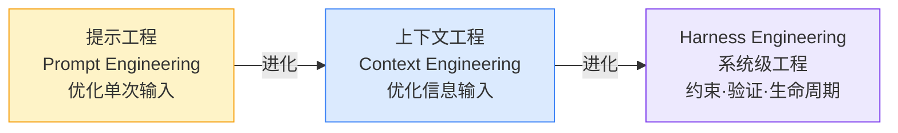
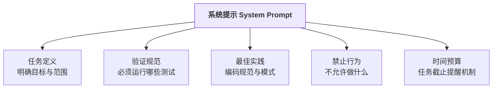
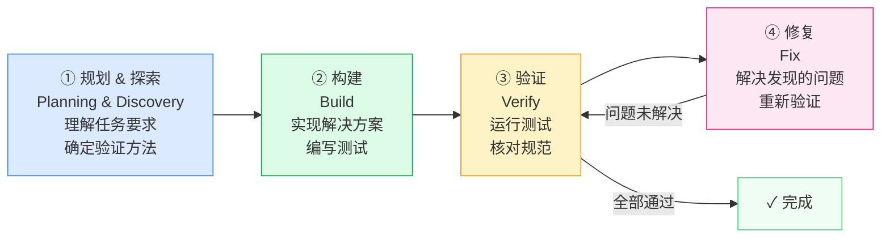
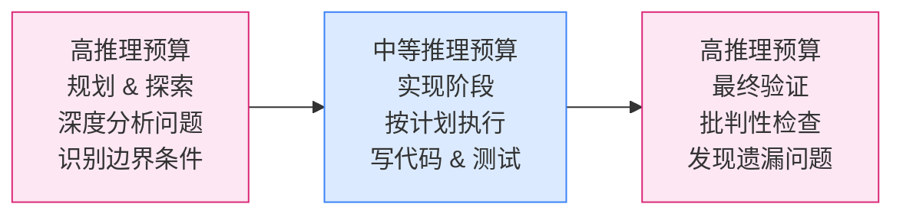
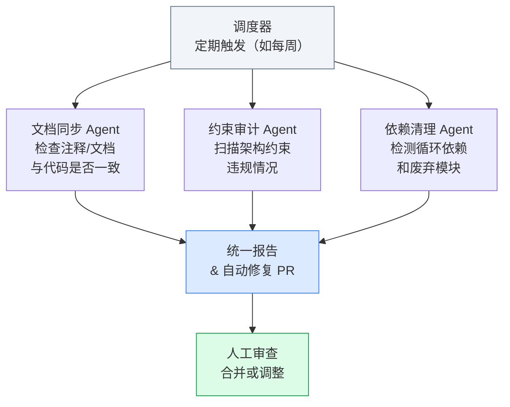
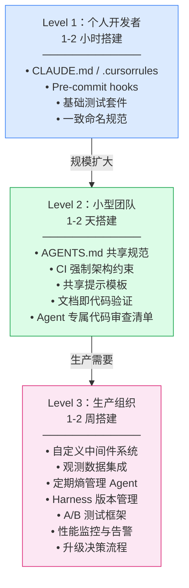

* 目录
{:toc}

# 一、引言

2022年以来，以ChatGPT为代表的大语言模型（Large Language Model, LLM）重塑了软件行业的生产方式。然而，仅仅"问AI问题"已经不够——越来越多的团队开始让AI Agent**自主完成代码编写、测试、提交乃至部署**的全流程任务。这带来了一个根本性问题：如何确保一个能够自主执行代码、操作文件系统乃至控制生产服务器的Agent，在数百万行代码规模下依然**可靠、可控、可维护**？

传统的软件工程答案是：更好的代码审查、更严格的测试。但当代码的主要生产者变成AI Agent时，这套答案已经不够用了。2026年初，OpenAI、Anthropic与LangChain相继发表文章，系统阐述了一个新范式：**Harness Engineering（Agent工程化，直译"驾驭工程"）**。

<div align="center">
<svg width="720" height="160" xmlns="http://www.w3.org/2000/svg" style="font-family:sans-serif">
  <!-- Background -->
  <rect width="720" height="160" rx="12" fill="#f8fafc" stroke="#e2e8f0" stroke-width="1.5"/>
  <!-- Horse metaphor -->
  <rect x="20" y="30" width="160" height="100" rx="10" fill="#fef3c7" stroke="#f59e0b" stroke-width="2"/>
  <text x="100" y="58" text-anchor="middle" font-size="13" font-weight="bold" fill="#92400e">AI 模型</text>
  <text x="100" y="78" text-anchor="middle" font-size="12" fill="#78350f">（"马"）</text>
  <text x="100" y="98" text-anchor="middle" font-size="11" fill="#78350f">强大但</text>
  <text x="100" y="114" text-anchor="middle" font-size="11" fill="#78350f">方向不定</text>
  <!-- Arrow -->
  <line x1="186" y1="80" x2="224" y2="80" stroke="#94a3b8" stroke-width="2" marker-end="url(#arr)"/>
  <defs><marker id="arr" markerWidth="8" markerHeight="8" refX="6" refY="3" orient="auto"><path d="M0,0 L0,6 L8,3 z" fill="#94a3b8"/></marker></defs>
  <!-- Harness -->
  <rect x="230" y="20" width="220" height="120" rx="10" fill="#ede9fe" stroke="#7c3aed" stroke-width="2"/>
  <text x="340" y="48" text-anchor="middle" font-size="13" font-weight="bold" fill="#4c1d95">Harness（驾驭系统）</text>
  <text x="340" y="68" text-anchor="middle" font-size="11" fill="#5b21b6">上下文工程 · 架构约束</text>
  <text x="340" y="86" text-anchor="middle" font-size="11" fill="#5b21b6">验证循环 · 熵管理</text>
  <text x="340" y="104" text-anchor="middle" font-size="11" fill="#5b21b6">观测 · 反馈 · 中间件</text>
  <text x="340" y="122" text-anchor="middle" font-size="11" fill="#5b21b6">工具调用 · 护栏</text>
  <!-- Arrow -->
  <line x1="456" y1="80" x2="494" y2="80" stroke="#94a3b8" stroke-width="2" marker-end="url(#arr)"/>
  <!-- Engineer -->
  <rect x="500" y="30" width="200" height="100" rx="10" fill="#dcfce7" stroke="#16a34a" stroke-width="2"/>
  <text x="600" y="58" text-anchor="middle" font-size="13" font-weight="bold" fill="#14532d">Harness 工程师</text>
  <text x="600" y="78" text-anchor="middle" font-size="12" fill="#166534">（"骑手"）</text>
  <text x="600" y="98" text-anchor="middle" font-size="11" fill="#166534">架构设计 · 方向把控</text>
  <text x="600" y="114" text-anchor="middle" font-size="11" fill="#166534">不再亲自写代码</text>
</svg>
<figcaption>图：Harness Engineering 的核心隐喻——AI 模型是"马"，Harness 是驾驭系统，工程师是掌握方向的"骑手"</figcaption>
</div>

Harness Engineering 的核心洞察是：**限制才能解放**。当你为 Agent 构建明确的上下文、边界和验证机制时，Agent 反而能更可靠、更高效地工作——就像给野马套上马具并非束缚，而是让其力量有了用武之地。

这是一个极新的领域：核心定义论文发表于2026年1月，但已有 OpenAI、Stripe 等公司在生产环境中验证了其有效性。本文旨在系统梳理 Harness Engineering 的核心概念、技术体系与工程实践，为学习和研究这一新范式提供参考。

---

# 二、Harness Engineering 基本概述

## 1. 什么是 Harness Engineering？

**Harness Engineering（Agent工程化）** 是指围绕 AI 模型/Agent 构建基础设施、约束体系和反馈循环，使 Agent 能够在生产规模下可靠地完成代码编写、测试和部署等软件工程任务的工程学科。

与**提示工程（Prompt Engineering）**关注"如何问出好答案"不同，Harness Engineering 关注的是**如何构建让 Agent 持续稳定工作的完整系统**。与**上下文工程（Context Engineering）**关注"给 Agent 喂什么信息"不同，Harness Engineering 是更上位的概念，涵盖环境、约束、反馈和生命周期管理的全貌。



三者的区别可以用一个比喻来理解：如果 AI 模型是一名新入职的程序员，提示工程是给他**布置一个任务**，上下文工程是给他**提供项目文档**，而 Harness Engineering 则是**设计整个工作环境**——包括 IDE 配置、代码规范、CI/CD 流水线、代码审查流程和团队协作规则。

## 2. 核心三大支柱

Harness Engineering 的实践体系围绕三个核心支柱构建：

<div align="center">
<svg width="720" height="280" xmlns="http://www.w3.org/2000/svg" style="font-family:sans-serif">
  <rect width="720" height="280" rx="12" fill="#f8fafc" stroke="#e2e8f0" stroke-width="1.5"/>
  <!-- Title -->
  <text x="360" y="30" text-anchor="middle" font-size="14" font-weight="bold" fill="#1e293b">Harness Engineering 三大支柱</text>
  <!-- Pillar 1 -->
  <rect x="30" y="50" width="200" height="210" rx="10" fill="#dbeafe" stroke="#3b82f6" stroke-width="2"/>
  <text x="130" y="80" text-anchor="middle" font-size="13" font-weight="bold" fill="#1e40af">① 上下文工程</text>
  <text x="130" y="97" text-anchor="middle" font-size="11" fill="#1d4ed8">Context Engineering</text>
  <line x1="50" y1="108" x2="210" y2="108" stroke="#93c5fd" stroke-width="1"/>
  <text x="130" y="128" text-anchor="middle" font-size="11" fill="#1e3a8a">• 架构文档内嵌代码库</text>
  <text x="130" y="148" text-anchor="middle" font-size="11" fill="#1e3a8a">• AGENTS.md / CLAUDE.md</text>
  <text x="130" y="168" text-anchor="middle" font-size="11" fill="#1e3a8a">• 动态注入观测数据</text>
  <text x="130" y="188" text-anchor="middle" font-size="11" fill="#1e3a8a">• API 契约 / 风格指南</text>
  <text x="130" y="208" text-anchor="middle" font-size="11" fill="#1e3a8a">• 仓库是唯一真相源</text>
  <text x="130" y="245" text-anchor="middle" font-size="10" fill="#3b82f6" font-style="italic">让 Agent 知道"应该做什么"</text>
  <!-- Pillar 2 -->
  <rect x="260" y="50" width="200" height="210" rx="10" fill="#dcfce7" stroke="#16a34a" stroke-width="2"/>
  <text x="360" y="80" text-anchor="middle" font-size="13" font-weight="bold" fill="#14532d">② 架构约束</text>
  <text x="360" y="97" text-anchor="middle" font-size="11" fill="#15803d">Architectural Constraints</text>
  <line x1="280" y1="108" x2="440" y2="108" stroke="#86efac" stroke-width="1"/>
  <text x="360" y="128" text-anchor="middle" font-size="11" fill="#14532d">• 确定性 Linter 规则</text>
  <text x="360" y="148" text-anchor="middle" font-size="11" fill="#14532d">• 依赖分层强制执行</text>
  <text x="360" y="168" text-anchor="middle" font-size="11" fill="#14532d">• LLM 代码审计器</text>
  <text x="360" y="188" text-anchor="middle" font-size="11" fill="#14532d">• 结构化测试 / 边界</text>
  <text x="360" y="208" text-anchor="middle" font-size="11" fill="#14532d">• Pre-commit Hooks</text>
  <text x="360" y="245" text-anchor="middle" font-size="10" fill="#16a34a" font-style="italic">让 Agent 知道"不能做什么"</text>
  <!-- Pillar 3 -->
  <rect x="490" y="50" width="200" height="210" rx="10" fill="#fce7f3" stroke="#db2777" stroke-width="2"/>
  <text x="590" y="80" text-anchor="middle" font-size="13" font-weight="bold" fill="#831843">③ 熵管理</text>
  <text x="590" y="97" text-anchor="middle" font-size="11" fill="#be185d">Entropy Management</text>
  <line x1="510" y1="108" x2="670" y2="108" stroke="#f9a8d4" stroke-width="1"/>
  <text x="590" y="128" text-anchor="middle" font-size="11" fill="#831843">• 定期文档一致性检查</text>
  <text x="590" y="148" text-anchor="middle" font-size="11" fill="#831843">• 约束违规自动检测</text>
  <text x="590" y="168" text-anchor="middle" font-size="11" fill="#831843">• 循环依赖清理</text>
  <text x="590" y="188" text-anchor="middle" font-size="11" fill="#831843">• 定期"垃圾回收" Agent</text>
  <text x="590" y="208" text-anchor="middle" font-size="11" fill="#831843">• 模式一致性巡检</text>
  <text x="590" y="245" text-anchor="middle" font-size="10" fill="#db2777" font-style="italic">让代码库"不腐烂"</text>
</svg>
<figcaption>图：Harness Engineering 三大支柱——上下文工程、架构约束与熵管理</figcaption>
</div>

## 3. 主要挑战

**Agent 的"第一个答案偏见"**：Agent 天然倾向于接受其生成的第一个解决方案，缺乏自我验证的动力。没有外部 Harness 施加压力，Agent 很少会主动运行测试或质疑自己的输出。

**代码库熵增**：Agent 快速生成大量代码，但如果没有约束机制，代码库将迅速积累技术债——文档过时、模块边界模糊、依赖关系混乱。

**上下文缺口（Context Gap）**：Agent 不了解当前项目的架构决策、编码规范和隐性知识。这些知识通常散落在工程师脑中、Slack 消息里和 Google 文档中，Agent 无法访问。

**模型升级的脆弱性**：为特定模型版本精调的 Harness 在模型升级后可能失效，需要持续维护和重新评估。

**静态设计的陷阱**：过度工程化的 Harness 会在模型能力提升后成为阻碍——当模型已经能够自行处理某类问题时，原有的强制约束反而降低了效率。

## 4. 研究发展时间线

```mermaid
flowchart LR
    subgraph G2022 ["2022 基础奠定"]
        A["ChatGPT 发布\n对话式 AI 普及"] --> B["GitHub Copilot\n代码补全普及"]
    end
    subgraph G2023 ["2023 Agent 探索"]
        C["AutoGPT\n自主 Agent 概念"] --> D["LangChain / LlamaIndex\nAgent 框架兴起"]
    end
    subgraph G2024 ["2024 工程化萌芽"]
        E["提示工程系统化\nDSPy / Guidance"] --> F["Context Engineering\n上下文管理成熟"]
    end
    subgraph G2025 ["2025 规模化尝试"]
        G["Codex / Claude Code\n生产级 Coding Agent"] --> H["Stripe Minions\n千级 PR/周 实践"]
    end
    subgraph G2026 ["2026 范式确立"]
        I["OpenAI 发布\nHarness Engineering 文章"] --> J["LangChain 验证\n52.8%→66.5% 突破"]
        J --> K["Harness Engineering\n成为行业新范式"]
    end
    B --> C
    D --> E
    F --> G
    H --> I
```



## 5. 关键技术方向

Harness Engineering 的技术体系可从四个维度理解：

- **输入侧**：上下文工程，决定 Agent 看到什么信息
- **执行侧**：中间件/Hooks，控制 Agent 如何行动
- **输出侧**：验证循环，确保 Agent 的结果是正确的
- **维护侧**：熵管理，保持代码库长期健康

## 6. 未来研究方向

- **跨模型 Harness 泛化**：当前大多数 Harness 针对特定模型（Codex、Claude、Gemini）调优，构建模型无关的通用 Harness 是重要方向
- **自适应 Harness**：Harness 能够根据 Agent 的行为模式自动调整约束强度
- **强化学习驱动的 Harness**：从 Agent 的执行 trace 中自动挖掘改进机会（RLM，Reinforcement Learning from Model traces）
- **多 Agent 协作的 Harness**：协调多个专业化 Agent 的 Harness 架构

---

# 三、核心技术体系

## 1. 系统提示工程（System Prompt Engineering）

**系统提示（System Prompt）** 是 Harness 最基础的控制手段。高质量的系统提示不仅告诉 Agent "做什么"，更重要的是指定**如何验证自己的工作**。



**关键原则**：

- **强调验证**：提示中应明确要求 Agent 在完成后运行测试，不能仅靠 Agent 的"自我感觉"
- **具体化禁止项**：不是"写好代码"，而是"不能修改 `config/` 目录下的文件"
- **情境化指令**：根据任务类型（新功能 vs Bug 修复 vs 重构）使用不同的提示模板

## 2. 上下文工程（Context Engineering）

上下文工程负责在正确的时间将正确的信息注入 Agent 的上下文窗口。关键实践包括：

<div align="center">
<svg width="700" height="320" xmlns="http://www.w3.org/2000/svg" style="font-family:sans-serif">
  <rect width="700" height="320" rx="12" fill="#f8fafc" stroke="#e2e8f0" stroke-width="1.5"/>
  <text x="350" y="28" text-anchor="middle" font-size="13" font-weight="bold" fill="#1e293b">上下文工程：信息来源与注入策略</text>
  <!-- Agent center -->
  <ellipse cx="350" cy="175" rx="70" ry="45" fill="#ede9fe" stroke="#7c3aed" stroke-width="2"/>
  <text x="350" y="170" text-anchor="middle" font-size="12" font-weight="bold" fill="#4c1d95">Agent</text>
  <text x="350" y="188" text-anchor="middle" font-size="11" fill="#5b21b6">上下文窗口</text>
  <!-- Source boxes -->
  <!-- Top -->
  <rect x="260" y="45" width="180" height="52" rx="8" fill="#dbeafe" stroke="#3b82f6" stroke-width="1.5"/>
  <text x="350" y="66" text-anchor="middle" font-size="11" font-weight="bold" fill="#1e40af">AGENTS.md / CLAUDE.md</text>
  <text x="350" y="84" text-anchor="middle" font-size="10" fill="#1d4ed8">架构决策 · 规范 · 禁止项</text>
  <!-- Left top -->
  <rect x="30" y="80" width="160" height="52" rx="8" fill="#dcfce7" stroke="#16a34a" stroke-width="1.5"/>
  <text x="110" y="101" text-anchor="middle" font-size="11" font-weight="bold" fill="#14532d">目录结构映射</text>
  <text x="110" y="119" text-anchor="middle" font-size="10" fill="#166534">文件树 · 模块关系</text>
  <!-- Left bottom -->
  <rect x="30" y="200" width="160" height="52" rx="8" fill="#fef3c7" stroke="#f59e0b" stroke-width="1.5"/>
  <text x="110" y="221" text-anchor="middle" font-size="11" font-weight="bold" fill="#92400e">动态观测数据</text>
  <text x="110" y="239" text-anchor="middle" font-size="10" fill="#78350f">日志 · CI 状态 · 指标</text>
  <!-- Right top -->
  <rect x="510" y="80" width="160" height="52" rx="8" fill="#fce7f3" stroke="#db2777" stroke-width="1.5"/>
  <text x="590" y="101" text-anchor="middle" font-size="11" font-weight="bold" fill="#831843">API 契约文档</text>
  <text x="590" y="119" text-anchor="middle" font-size="10" fill="#be185d">接口规范 · 类型定义</text>
  <!-- Right bottom -->
  <rect x="510" y="200" width="160" height="52" rx="8" fill="#f0fdf4" stroke="#4ade80" stroke-width="1.5"/>
  <text x="590" y="221" text-anchor="middle" font-size="11" font-weight="bold" fill="#166534">测试标准 & 边缘案例</text>
  <text x="590" y="239" text-anchor="middle" font-size="10" fill="#15803d">验收标准 · 测试模板</text>
  <!-- Bottom -->
  <rect x="270" y="265" width="160" height="42" rx="8" fill="#f1f5f9" stroke="#64748b" stroke-width="1.5"/>
  <text x="350" y="283" text-anchor="middle" font-size="11" font-weight="bold" fill="#334155">代码库历史 & 示例</text>
  <text x="350" y="299" text-anchor="middle" font-size="10" fill="#475569">类似实现 · 代码模式</text>
  <!-- Arrows (simplified, pointing to center) -->
  <line x1="350" y1="97" x2="350" y2="130" stroke="#7c3aed" stroke-width="1.5" stroke-dasharray="4"/>
  <line x1="190" y1="106" x2="280" y2="155" stroke="#7c3aed" stroke-width="1.5" stroke-dasharray="4"/>
  <line x1="190" y1="226" x2="280" y2="190" stroke="#7c3aed" stroke-width="1.5" stroke-dasharray="4"/>
  <line x1="510" y1="106" x2="420" y2="155" stroke="#7c3aed" stroke-width="1.5" stroke-dasharray="4"/>
  <line x1="510" y1="226" x2="420" y2="190" stroke="#7c3aed" stroke-width="1.5" stroke-dasharray="4"/>
  <line x1="350" y1="265" x2="350" y2="220" stroke="#7c3aed" stroke-width="1.5" stroke-dasharray="4"/>
</svg>
<figcaption>图：上下文工程的多维信息来源与注入策略</figcaption>
</div>

**关键原则**：**仓库是唯一真相源**（The repository must be the single source of truth）。所有架构决策、规范和隐性知识都必须以机器可读的形式存储在代码库中，而不是散落在 Google Docs、Slack 消息或工程师脑中。

**AGENTS.md / CLAUDE.md** 是实现这一原则的核心文件，包含：

- 项目架构概述与模块职责
- 代码风格和命名规范
- 禁止的模式和反模式
- 测试要求和验收标准
- 常用命令和环境配置

## 3. 构建-验证循环（Build-Verify Loop）

这是 Harness Engineering 中最重要的执行模式，将 Agent 的工作分为四个阶段：



**关键洞察**：Agent 天然倾向于"完成即交付"，缺乏回头验证的动力。Harness 必须**主动施压**（aggressive prompting），强制 Agent 在认为完成后继续执行测试，而不是立即宣告任务完成。

LangChain 的实验数据显示：仅通过在 Harness 中加入更激进的验证提示，deepagents-cli 在 Terminal Bench 2.0 上的得分从 **52.8% 提升至 66.5%**（提升 13.7 个百分点），排名从前 30 跃升至前 5，而底层模型没有任何改动。

## 4. 中间件与 Hooks（Middleware & Hooks）

中间件是介于 Agent 和工具调用之间的拦截层，能够：

<div align="center">
<svg width="680" height="240" xmlns="http://www.w3.org/2000/svg" style="font-family:sans-serif">
  <rect width="680" height="240" rx="12" fill="#f8fafc" stroke="#e2e8f0" stroke-width="1.5"/>
  <text x="340" y="28" text-anchor="middle" font-size="13" font-weight="bold" fill="#1e293b">Harness 中间件架构</text>
  <!-- Agent -->
  <rect x="20" y="80" width="120" height="80" rx="8" fill="#ede9fe" stroke="#7c3aed" stroke-width="2"/>
  <text x="80" y="115" text-anchor="middle" font-size="12" font-weight="bold" fill="#4c1d95">Agent</text>
  <text x="80" y="133" text-anchor="middle" font-size="11" fill="#5b21b6">推理 & 决策</text>
  <!-- Arrow -->
  <line x1="140" y1="120" x2="175" y2="120" stroke="#94a3b8" stroke-width="2" marker-end="url(#a2)"/>
  <defs><marker id="a2" markerWidth="8" markerHeight="8" refX="6" refY="3" orient="auto"><path d="M0,0 L0,6 L8,3 z" fill="#94a3b8"/></marker></defs>
  <!-- Middleware -->
  <rect x="180" y="50" width="310" height="140" rx="8" fill="#fff7ed" stroke="#ea580c" stroke-width="2"/>
  <text x="335" y="75" text-anchor="middle" font-size="12" font-weight="bold" fill="#9a3412">中间件 / Hooks 层</text>
  <!-- Middleware items -->
  <rect x="195" y="88" width="130" height="40" rx="5" fill="#fed7aa" stroke="#fb923c" stroke-width="1"/>
  <text x="260" y="104" text-anchor="middle" font-size="10" font-weight="bold" fill="#7c2d12">循环检测</text>
  <text x="260" y="120" text-anchor="middle" font-size="9" fill="#9a3412">N次重复后强制重考</text>
  <rect x="355" y="88" width="130" height="40" rx="5" fill="#fed7aa" stroke="#fb923c" stroke-width="1"/>
  <text x="420" y="104" text-anchor="middle" font-size="10" font-weight="bold" fill="#7c2d12">上下文注入</text>
  <text x="420" y="120" text-anchor="middle" font-size="9" fill="#9a3412">完成前注入验证提醒</text>
  <rect x="195" y="138" width="130" height="40" rx="5" fill="#fed7aa" stroke="#fb923c" stroke-width="1"/>
  <text x="260" y="154" text-anchor="middle" font-size="10" font-weight="bold" fill="#7c2d12">权限控制</text>
  <text x="260" y="170" text-anchor="middle" font-size="9" fill="#9a3412">文件/命令白名单</text>
  <rect x="355" y="138" width="130" height="40" rx="5" fill="#fed7aa" stroke="#fb923c" stroke-width="1"/>
  <text x="420" y="154" text-anchor="middle" font-size="10" font-weight="bold" fill="#7c2d12">验证检查点</text>
  <text x="420" y="170" text-anchor="middle" font-size="9" fill="#9a3412">关键步骤人工确认</text>
  <!-- Arrow -->
  <line x1="490" y1="120" x2="525" y2="120" stroke="#94a3b8" stroke-width="2" marker-end="url(#a2)"/>
  <!-- Tools -->
  <rect x="530" y="80" width="130" height="80" rx="8" fill="#dcfce7" stroke="#16a34a" stroke-width="2"/>
  <text x="595" y="115" text-anchor="middle" font-size="12" font-weight="bold" fill="#14532d">工具 / 环境</text>
  <text x="595" y="133" text-anchor="middle" font-size="11" fill="#166534">代码执行 / 文件系统</text>
  <!-- Labels -->
  <text x="157" y="145" text-anchor="middle" font-size="9" fill="#64748b" transform="rotate(-90,157,145)">拦截</text>
  <text x="514" y="145" text-anchor="middle" font-size="9" fill="#64748b" transform="rotate(-90,514,145)">放行</text>
</svg>
<figcaption>图：Harness 中间件架构——拦截 Agent 的工具调用并施加控制逻辑</figcaption>
</div>

**循环检测（Loop Detection）**：追踪 Agent 对相同文件的重复编辑次数，当超过阈值（如 3 次）时，注入提示建议 Agent 重新思考策略，而不是继续无效的循环修改。

**上下文提醒注入**：在 Agent 即将提交完成信号前，自动注入"请运行测试确认你的实现正确"的提醒，对抗 Agent 的"完成偏见"。

**时间预算感知**：在任务进行到一定时间后注入提醒，帮助 Agent 合理分配剩余计算预算。

## 5. 推理预算策略（Reasoning Budget）

不同阶段的任务对推理深度的要求不同，"推理三明治"（Reasoning Sandwich）模式：



这一策略既保证了关键阶段的推理质量，又避免了在简单执行阶段浪费计算资源。

## 6. 架构约束体系

架构约束将代码质量规则从"建议"升级为"强制执行"：

**依赖分层规则**（以典型 Web 应用为例）：

```
Types → Config → Repository → Service → Runtime → UI
```

每一层只能依赖其下方的层，不得跨层调用。Harness 通过自动化 Linter 在 CI/CD 中强制检查这一约束，违规的 Agent 生成代码将无法通过 Pull Request 审查。

**核心特点**：
- **确定性 Linter**：针对模式匹配的规则，零误报，快速执行
- **LLM 审计器**：用另一个 LLM 审查 Agent 生成的代码，捕捉语义层面的违规（如"这个函数做了太多事情"）
- **结构化测试**：测试模块边界是否被破坏，而不仅是功能是否正确

**关键悖论**：约束解放创造力。限制 Agent 的解决方案空间，减少了 Agent 在死胡同上浪费的 token，反而提升了整体产出质量和速度。

## 7. 熵管理（Entropy Management）

代码库熵增是 AI 辅助编程时代的独特挑战——Agent 快速生成大量代码，文档、注释和架构图往往无法同步更新，代码库随时间"腐烂"。

熵管理的解决方案是**定期巡检 Agent**（Garbage Collection Agents）：



---

# 四、Trace 分析与迭代优化

## 1. Trace 作为改进燃料

Harness Engineering 的改进方法论类似于机器学习中的**梯度提升（Boosting）**：持续分析失败案例，针对性地加固薄弱环节。

**自动化 Trace 分析流程**：

1. Agent 完成任务后，记录完整执行轨迹（Trace）
2. 专门的"Trace 分析 Agent"批量审查 Trace，识别模式：
   - 推理错误（Agent 误解了任务）
   - 指令不遵循（Agent 忽略了系统提示中的约束）
   - 验证缺失（Agent 没有运行足够的测试）
   - 时间管理失当（Agent 在次要任务上耗时过多）
3. 将识别出的问题映射到 Harness 的改进点（系统提示、中间件逻辑、文档）
4. 实施改进，重新评估

## 2. 可观测性设计

高质量的 Harness 需要完善的可观测性基础设施，使工程师能够理解 Agent 的行为：

| 观测维度 | 具体指标 | 用途 |
|:--------|:---------|:-----|
| 任务成功率 | 通过/失败/超时 | 衡量整体 Harness 效果 |
| 推理轨迹 | 每步决策过程 | 诊断失败原因 |
| 工具调用分布 | 各工具调用频次 | 优化工具设计 |
| Token 消耗 | 各阶段 token 用量 | 成本优化 |
| 循环次数 | Agent 重试次数 | 检测困难任务类型 |
| 验证覆盖率 | Agent 实际运行的测试 | 评估验证质量 |

---

# 五、工具与框架生态

## 1. 主流 Harness 工具

不同的 AI 编程工具对 Harness Engineering 的支持程度不同：

| 工具 | Harness 机制 | 配置文件 |
|:-----|:-------------|:---------|
| **Claude Code** | Hooks 系统、CLAUDE.md | `CLAUDE.md`、`.claude/hooks/` |
| **OpenAI Codex** | 内置架构约束系统 | `AGENTS.md` |
| **Cursor** | Rules 系统 | `.cursorrules` |
| **LangGraph** | 中间件组合 | 代码定义 |
| **GitHub Copilot** | 工作区指令 | `.github/copilot-instructions.md` |

## 2. 分层实施路线图

根据团队规模和需求，Harness Engineering 可以分三个层次逐步实施：



---

# 六、实践案例与评测基准

## 1. OpenAI 内部实践

**背景**：OpenAI 工程团队使用 Harness Engineering 构建内部系统。

**结果**：
- 在 **5 个月**内生产了超过 **100 万行**生产代码
- **零行代码由工程师手动编写**
- 完成速度约为传统方式的 **1/10**

**关键 Harness 设计**：

1. **迭代改进循环**：当 Agent 遭遇困难时，工程师不是直接修复代码，而是识别 Agent 失败的原因——缺少工具？缺少护栏？文档不足？——然后将解决方案反馈回代码库，由 AI 自己实现修复。

2. **代码库即 Harness**：技术规范、API 合同、风格指南都作为机器可读文档存储在代码库中，而非外部 Wiki 或文档系统。

3. **约束换可靠性**：牺牲"生成任何代码"的灵活性，换取"生成可维护代码"的可靠性。

**已知局限**：OpenAI 的 Harness 实现侧重内部代码质量和可维护性，对**功能正确性的外部验证**相对较弱，即缺乏明确的机制来验证代码是否真正满足用户需求。

## 2. LangChain deepagents-cli 实验

**背景**：LangChain 团队为 deepagents-cli 开发了 Harness，并在 Terminal Bench 2.0 基准上评估效果。

**Terminal Bench 2.0**：评估 AI 编程 Agent 完成实际软件工程任务的能力，包括代码编写、调试、测试和部署。

**改进过程**：

| 改进项目 | Harness 修改 | 效果 |
|:--------|:-------------|:-----|
| 环境探索 | 任务开始时自动注入目录结构和可用工具 | 减少"找不到文件"类错误 |
| 验证强化 | 系统提示中加入"激进验证"指令 | Agent 更主动地运行测试 |
| 循环检测 | 中间件追踪重复编辑，触发重考提示 | 减少无效循环 |
| 推理三明治 | 规划和验证阶段分配高推理预算 | 提升复杂任务成功率 |

**最终结果**：得分从 **52.8%** → **66.5%**（+13.7 个百分点），排名从前 30 提升到前 5，**底层模型未作任何改动**。

## 3. Stripe Minions

**背景**：Stripe 内部部署了名为"Minions"的 Agent 系统，专注于代码库维护任务。

**结果**：每周自动合并超过 **1,000 个 Pull Request**，主要处理：
- 技术债清理
- 依赖更新
- 代码风格修正
- 文档更新

**Harness 特点**：高度结构化的任务分配和严格的代码审查检查清单，确保 Agent 生成的 PR 符合 Stripe 的代码质量标准。

---

# 七、工程师角色的范式转变

Harness Engineering 不仅是一种工具，更是对软件工程师角色的重新定义：

<div align="center">
<svg width="700" height="260" xmlns="http://www.w3.org/2000/svg" style="font-family:sans-serif">
  <rect width="700" height="260" rx="12" fill="#f8fafc" stroke="#e2e8f0" stroke-width="1.5"/>
  <text x="350" y="28" text-anchor="middle" font-size="13" font-weight="bold" fill="#1e293b">工程师角色转变：传统 vs. Harness Engineering 时代</text>
  <!-- Headers -->
  <rect x="20" y="45" width="310" height="32" rx="6" fill="#fef3c7" stroke="#f59e0b" stroke-width="1.5"/>
  <text x="175" y="66" text-anchor="middle" font-size="12" font-weight="bold" fill="#92400e">传统软件工程师</text>
  <rect x="370" y="45" width="310" height="32" rx="6" fill="#dcfce7" stroke="#16a34a" stroke-width="1.5"/>
  <text x="525" y="66" text-anchor="middle" font-size="12" font-weight="bold" fill="#14532d">Harness 工程师</text>
  <!-- Row labels -->
  <text x="10" y="103" font-size="10" fill="#64748b">编码</text>
  <text x="10" y="133" font-size="10" fill="#64748b">架构</text>
  <text x="10" y="163" font-size="10" fill="#64748b">文档</text>
  <text x="10" y="193" font-size="10" fill="#64748b">测试</text>
  <text x="10" y="223" font-size="10" fill="#64748b">评审</text>
  <!-- Traditional -->
  <rect x="20" y="88" width="310" height="25" rx="4" fill="#fef9c3"/>
  <text x="175" y="105" text-anchor="middle" font-size="11" fill="#713f12">主要工作（直接写代码）</text>
  <rect x="20" y="118" width="310" height="25" rx="4" fill="#fef9c3"/>
  <text x="175" y="135" text-anchor="middle" font-size="11" fill="#713f12">次要工作（偶尔做架构设计）</text>
  <rect x="20" y="148" width="310" height="25" rx="4" fill="#fee2e2"/>
  <text x="175" y="165" text-anchor="middle" font-size="11" fill="#7f1d1d">事后补充（常被忽视）</text>
  <rect x="20" y="178" width="310" height="25" rx="4" fill="#fef9c3"/>
  <text x="175" y="195" text-anchor="middle" font-size="11" fill="#713f12">手动编写测试用例</text>
  <rect x="20" y="208" width="310" height="25" rx="4" fill="#fef9c3"/>
  <text x="175" y="225" text-anchor="middle" font-size="11" fill="#713f12">审查人工编写的代码</text>
  <!-- Harness -->
  <rect x="370" y="88" width="310" height="25" rx="4" fill="#f0fdf4"/>
  <text x="525" y="105" text-anchor="middle" font-size="11" fill="#14532d">从不亲自写（由 Agent 负责）</text>
  <rect x="370" y="118" width="310" height="25" rx="4" fill="#bbf7d0"/>
  <text x="525" y="135" text-anchor="middle" font-size="11" fill="#14532d">主要工作（设计可强制执行的边界）</text>
  <rect x="370" y="148" width="310" height="25" rx="4" fill="#bbf7d0"/>
  <text x="525" y="165" text-anchor="middle" font-size="11" fill="#14532d">关键基础设施（Agent 的真相源）</text>
  <rect x="370" y="178" width="310" height="25" rx="4" fill="#bbf7d0"/>
  <text x="525" y="195" text-anchor="middle" font-size="11" fill="#14532d">设计测试策略（Agent 执行）</text>
  <rect x="370" y="208" width="310" height="25" rx="4" fill="#bbf7d0"/>
  <text x="525" y="225" text-anchor="middle" font-size="11" fill="#14532d">审查 Agent 的 Harness 设计</text>
  <!-- VS -->
  <text x="345" y="165" text-anchor="middle" font-size="14" font-weight="bold" fill="#64748b">→</text>
</svg>
<figcaption>图：Harness Engineering 时代工程师职责的范式转变</figcaption>
</div>

## Harness 工程师的核心技能

1. **系统思维**：理解上下文、约束、文档与反馈循环之间的相互作用
2. **架构设计**：设计可强制执行且能提高生产力的边界
3. **规范写作**：精确表达意图，使 Agent 能够正确理解并执行
4. **可观测性**：设计能够揭示 Agent 行为模式的监控系统
5. **迭代速度**：快速测试、评估和改进 Harness 配置

---

# 八、常见陷阱与最佳实践

## 1. 过度工程化（Over-Engineering）

**问题**：当 Harness 包含大量复杂的控制流逻辑时，随着模型能力的提升，这些逻辑会逐渐变成阻碍。

**最佳实践**：设计**"可拆除"（Rippable）**的系统。每个 Harness 组件都应该有明确的拆除路径——当模型能力提升到不再需要某个护栏时，能够干净地移除，而不影响其他部分。

## 2. 静态 Harness 设计

**问题**：Harness 是为特定模型版本优化的，当模型更新后，Harness 失效甚至起反作用。

**最佳实践**：将模型更新视为 Harness 的评估触发点。每次重大模型发布后，重新运行基准评估，识别哪些约束仍然必要，哪些可以放宽。

## 3. 忽视文档基础设施

**问题**：文档仍然存放在 Notion、Confluence 或工程师脑中，Agent 无法访问。

**最佳实践**：所有 Harness 相关文档必须以纯文本/Markdown 形式存储在代码库中，与代码一起版本控制，与代码一起更新。

## 4. 缺乏反馈循环

**问题**：Agent 完成任务后，没有机制收集成功率数据和失败原因，Harness 无法持续改进。

**最佳实践**：从第一天起就建立可观测性基础设施，记录每个 Agent 任务的执行轨迹、成功/失败状态和关键指标。

## 5. 人工知识孤岛

**问题**：关键的架构决策以口头形式传递，新工程师（和 Agent）需要长时间"入职"才能了解。

**最佳实践**：实行"文档驱动架构"——任何没有写入 AGENTS.md 的架构决策，都不算真正做出决策。

---

# 九、总结

Harness Engineering 代表了 AI 辅助软件工程的成熟：从"让 AI 尝试"到"让 AI 可靠地工作"。其核心洞察——**通过上下文工程、架构约束与验证循环构建围绕 AI 的系统**——已经在 OpenAI（百万行零手写代码）、LangChain（+13.7% 基准提升）和 Stripe（千级周 PR）的生产实践中得到验证。

这一范式改变的不仅是工具，更是工程师的角色定位：从代码的**生产者**转变为 Agent 环境的**架构师**。未来的顶级工程师将以精心设计的 Harness 配置为荣，而不是以代码行数为傲。

Harness Engineering 目前仍处于早期阶段，关键开放问题包括：
- 如何构建**跨模型通用**的 Harness 标准？
- 如何在**自动化约束**与**Agent 创造力**之间找到最优平衡？
- **自适应 Harness**——能够根据 Agent 行为自动调整的系统——是否可行？

这些问题的答案，将定义未来数年软件工程的面貌。

---

**参考资料**

- OpenAI. *Harness Engineering*. 2026.
- Fowler, M. *Harness Engineering*. martinfowler.com, 2026.
- LangChain Blog. *Improving Deep Agents with Harness Engineering*. 2026.
- NxCode. *Harness Engineering: A Complete Guide for AI Agent Codex 2026*. 2026.
