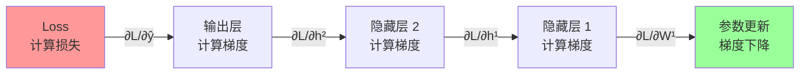
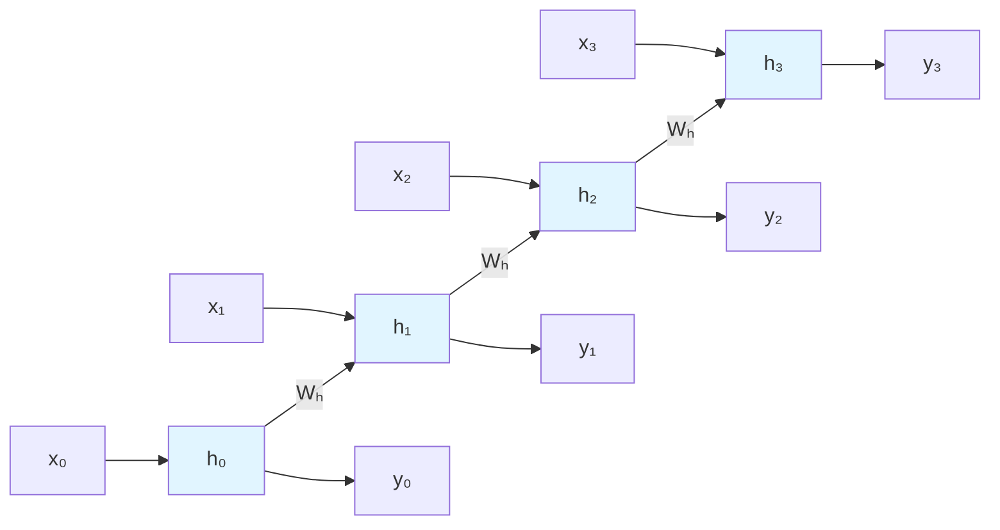
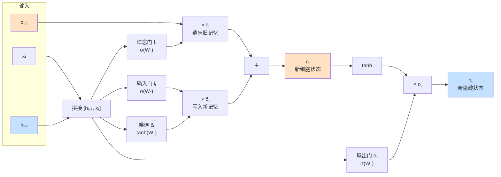
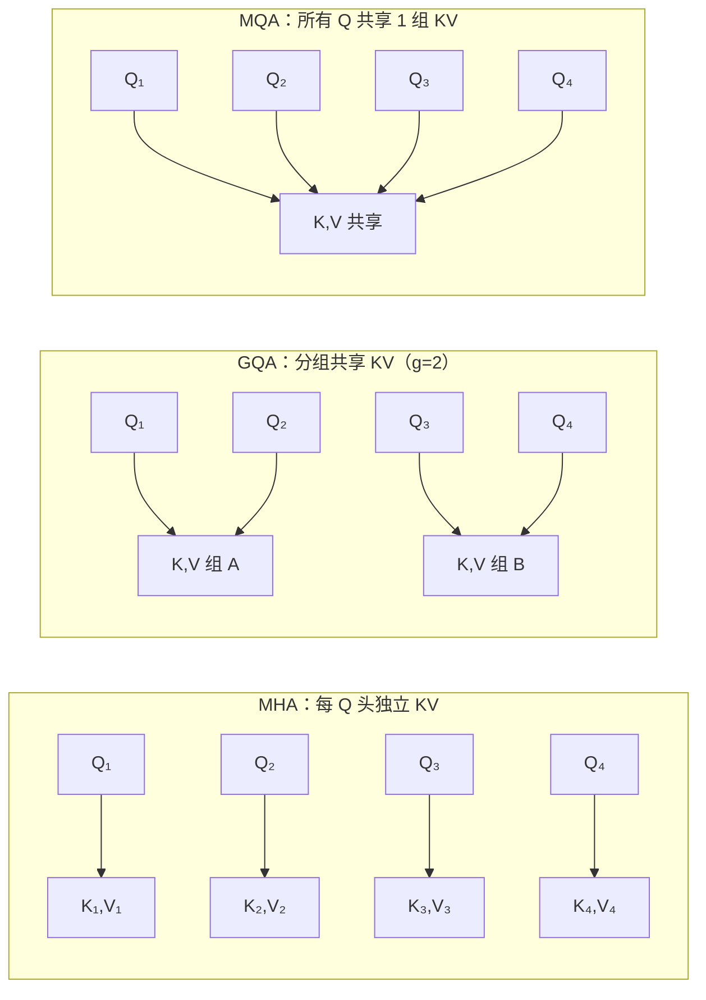
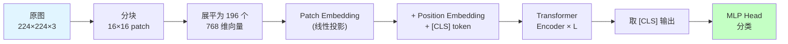
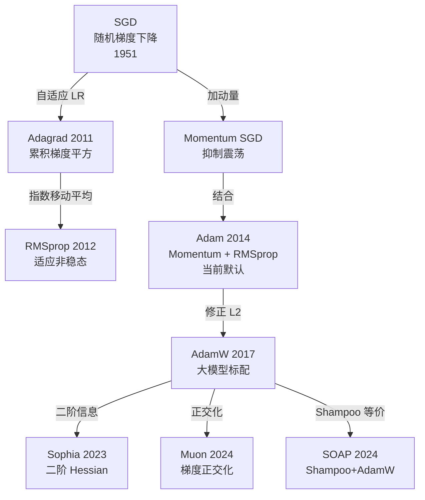
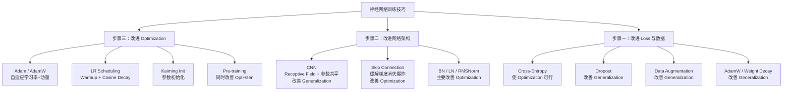
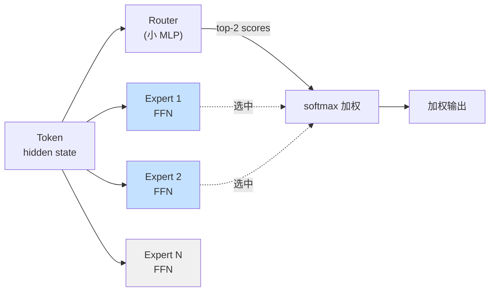
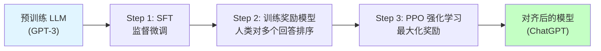
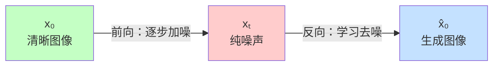

# 1. 引言

深度学习（Deep Learning）是以多层神经网络为核心的机器学习方法，自 2012 年 AlexNet 在 ImageNet 挑战赛上以巨大优势击败传统方法以来，深度学习席卷了计算机视觉、自然语言处理、语音识别等几乎所有人工智能领域。今天，GPT、BERT、Stable Diffusion、AlphaFold 等划时代系统，无一不建立在深度学习的基础之上。

深度学习之所以强大，在于它能够从原始数据（像素、词语、信号）中自动学习多层次的抽象特征表示，无需人工设计特征工程。然而，训练一个高性能的深层网络并非易事——梯度消失、过拟合、学习率调节等问题长期困扰着研究者，由此催生了一整套系统性的训练技巧。

理解深度学习，需要同时把握两个层面：**架构设计**（网络如何搭建）和**训练方法**（网络如何有效优化）。两者缺一不可。只知道搭积木式地堆叠网络层，而不理解每个训练技巧解决的是什么问题，往往会陷入"加了 Dropout 反而更差"或"换了 Adam 没有任何改善"的困境。

本文旨在系统梳理深度学习的核心原理与关键技术进展，为学习和研究深度学习提供参考。全文按以下脉络展开：

- **§2–3 基础**：机器学习三步骤框架、神经元与反向传播
- **§4 架构**：MLP → CNN → RNN/LSTM → Transformer 的演进主线
- **§5 训练优化**：优化器、学习率调度、初始化、归一化、残差连接
- **§6 损失与正则化**：各类 Loss 的选型、Dropout、数据增强、AdamW
- **§7 方法分类汇总**：将所有技巧映射到"三步骤 × 两目标"坐标系
- **§8 基准**：MNIST / CIFAR / ImageNet / GLUE / MMLU / HumanEval / 长上下文等经典评测
- **§9 最新进展**：混合精度、Flash Attention、MoE、LoRA/PEFT、量化、RLHF、知识蒸馏、扩散模型等现代大模型核心技术

---

# 2. 深度学习基础概述

## 2.1 什么是深度学习？

深度学习是机器学习的一个分支，以**人工神经网络（Artificial Neural Network，ANN）**为基本模型。"深度"指网络的层数多（通常超过 3 层），多层堆叠使网络能够逐层提取越来越抽象的特征。

一个神经网络的基本运算单元是**神经元（Neuron）**：

$$a = f\left(\sum_i w_i x_i + b\right)$$

其中 $x_i$ 是输入，$w_i$ 是权重，$b$ 是偏置，$f$ 是激活函数（Activation Function）。多个神经元堆叠成层（Layer），多层串联成深层网络，最终构成一个从输入到输出的复杂映射函数。

<div align="center">
  
  <figcaption>多层神经网络示意图：输入层（左）→ 隐藏层（中）→ 输出层（右）</figcaption>
</div>

### 通用近似定理（Universal Approximation Theorem）

神经网络能处理一切任务的理论基石是 **通用近似定理**（Cybenko 1989、Hornik 1991）：

> 只要隐藏层神经元数量足够多，一个**单隐层前馈网络**（配合任意非多项式激活函数）就能以任意精度逼近**定义在紧集上的任意连续函数**。

这一结论回答了"神经网络为什么能 work"的根本问题，但也有两层关键的限制必须澄清：

| 限制 | 含义 |
|:---|:---|
| **只保证存在性** | 定理只说"存在一组参数可以逼近"，不保证 SGD 能学到这组参数 |
| **宽度可能指数级增长** | 单隐层达到目标精度可能需要指数级神经元；**加深**比"加宽"更有效 |
| **只保证拟合，不保证泛化** | 训练集上完美拟合不等于验证集上表现好 — 这正是 Generalization 问题的由来 |

**深度的优势**：理论上（Telgarsky 2016）存在一类函数，深层网络用 $O(n)$ 个神经元即可表达，单隐层网络则需要 $O(2^n)$ 个神经元。**宽是够用的，深是高效的**——这是现代网络动辄几十上百层的理论动机。

### 深度学习爆发的三大驱动因素

| 因素 | 内容 | 代表事件 |
|:---|:---|:---|
| **算法突破** | ReLU 激活函数解决梯度消失；残差连接使百层网络可训练 | AlexNet 2012、ResNet 2015 |
| **数据爆炸** | 互联网产生海量标注数据；深度学习数据越多性能越好 | ImageNet 120 万张图像 |
| **算力革命** | GPU 并行计算将训练时间从数周压缩至数小时 | NVIDIA GPU + CUDA |

## 2.2 机器学习三步骤框架

任何机器学习方法都可拆解为三个步骤，理解这一框架是后续所有训练技巧的基础：

1. **步骤一——定义 Loss Function（损失函数）**：衡量模型输出与正确答案的差距，即"如何判断好坏"
2. **步骤二——确定函数搜索空间（Model Architecture）**：选择网络结构，划定候选函数的范围，即"在哪里搜索"
3. **步骤三——Optimization（优化）**：在搜索空间内找到使 Loss 最低的最优函数，即"如何高效搜索"

训练的最终目标是找到一个函数，它在**训练集（Training Set）**上 Loss 低，在**验证集（Validation Set）**上 Loss 同样低。前者称为 **Optimization** 问题，两者的差距称为 **Generalization** 问题。

## 2.3 两大核心目标

深度学习训练技巧按其解决的问题，分为两类：

| 目标 | 表现症状 | 含义 | 典型方法 |
|:---|:---|:---|:---|
| **Optimization** | 训练 Loss 降不下去 | 优化过程出问题 | Adam、Skip Connection、Batch Norm |
| **Generalization** | 训练 Loss 低，验证 Loss 高 | 过拟合（Overfitting） | Dropout、Data Augmentation、正则化 |

> **判断原则**：先看训练 Loss。若训练 Loss 本身降不下去，是 Optimization 问题，此时加 Dropout 或数据增强无效；若训练 Loss 够低但验证 Loss 高，才是 Generalization 问题。

## 2.4 发展时间线


## 2.5 主要缩写

- **ANN**: Artificial Neural Network（人工神经网络）
- **MLP**: Multi-Layer Perceptron（多层感知机）
- **CNN**: Convolutional Neural Network（卷积神经网络）
- **RNN**: Recurrent Neural Network（循环神经网络）
- **LSTM**: Long Short-Term Memory（长短期记忆网络）
- **SGD**: Stochastic Gradient Descent（随机梯度下降）
- **BN**: Batch Normalization（批归一化）
- **LN**: Layer Normalization（层归一化）
- **LR**: Learning Rate（学习率）
- **PEFT**: Parameter-Efficient Fine-Tuning（参数高效微调）
- **SFT**: Supervised Fine-Tuning（监督微调）
- **RLHF**: Reinforcement Learning from Human Feedback（人类反馈强化学习）

---

# 3. 神经网络基础

## 3.1 多层感知机

**多层感知机（Multi-Layer Perceptron，MLP）** 是最基础的神经网络形式，由输入层、若干隐藏层（Hidden Layer）和输出层构成，每层均为全连接（Fully Connected）：

$$h^{(l)} = f\left(W^{(l)} h^{(l-1)} + b^{(l)}\right)$$

全连接意味着第 $l$ 层的每个神经元与第 $l-1$ 层所有神经元相连，参数量为两层神经元数之积。当输入维度极大时（如 1000×1000 的彩色图像展开后有 300 万维），全连接的参数量将超过数十亿，不仅难以训练，还极易过拟合。CNN 等专用架构正是为了解决这一问题而提出的。

## 3.2 激活函数

激活函数为神经网络引入非线性，使其能够拟合复杂函数。若没有非线性激活，多层网络与单层线性模型等价。

| 激活函数 | 公式 | 输出范围 | 优点 | 缺点 | 适用场景 |
|:---|:---|:---:|:---|:---|:---|
| Sigmoid | $\frac{1}{1+e^{-x}}$ | (0, 1) | 输出可解释为概率 | 梯度消失；非零中心 | 二分类输出层 |
| Tanh | $\tanh(x)$ | (-1, 1) | 零中心输出 | 梯度消失仍存在 | RNN 隐藏层（较早期） |
| **ReLU** | $\max(0, x)$ | [0, ∞) | 计算简单；有效缓解梯度消失 | Dead Neuron 问题 | CNN/MLP 隐藏层（当前最常用） |
| Leaky ReLU | $\max(0.01x, x)$ | (-∞, ∞) | 解决 Dead Neuron | 斜率需调参 | ReLU 的改进替代 |
| GELU | $x \cdot \Phi(x)$ | (-∞, ∞) | 光滑；性能优 | 计算稍复杂 | Transformer（BERT、GPT）标配 |
| SiLU/Swish | $x \cdot \sigma(x)$ | (-∞, ∞) | 自门控；效果与 GELU 类似 | — | LLaMA、Qwen 等大语言模型 |

<div align="center">
  
  
  
  <figcaption>左：Sigmoid &nbsp;|&nbsp; 中：Tanh &nbsp;|&nbsp; 右：ReLU（当前最常用）</figcaption>
</div>

**ReLU（Rectified Linear Unit）** 的成功在于：正值区梯度恒为 1，有效缓解了深层网络的梯度消失问题，使几十甚至上百层的网络可以稳定训练。

## 3.3 反向传播算法

**反向传播（Backpropagation）** 是训练神经网络的核心算法，基于链式法则将 Loss 对每个参数的梯度从输出层逐层传递回输入层：

$$\frac{\partial \mathcal{L}}{\partial W^{(l)}} = \frac{\partial \mathcal{L}}{\partial h^{(l)}} \cdot \frac{\partial h^{(l)}}{\partial W^{(l)}}$$



计算图（Computation Graph）自动记录前向计算路径，反向传播时沿路径反向传递梯度。PyTorch 的 `autograd` 机制即基于此原理，使用者只需定义前向计算，框架自动完成梯度计算。

### 一个最小反向传播数值例子

考虑最简单的单隐层网络：$y = w_2 \cdot \sigma(w_1 \cdot x)$，损失 $\mathcal{L} = \frac{1}{2}(y - t)^2$。设 $x=1, w_1=0.5, w_2=0.8, t=0.5$，激活 $\sigma$ 取 Sigmoid。

**前向**：

$$z_1 = w_1 x = 0.5, \quad a_1 = \sigma(0.5) \approx 0.622, \quad y = w_2 a_1 \approx 0.498, \quad \mathcal{L} \approx 2\times 10^{-6}$$

**反向**（链式法则逐步回溯）：

$$\frac{\partial \mathcal{L}}{\partial y} = y - t \approx -0.002$$

$$\frac{\partial \mathcal{L}}{\partial w_2} = \frac{\partial \mathcal{L}}{\partial y} \cdot a_1 \approx -0.00124$$

$$\frac{\partial \mathcal{L}}{\partial a_1} = \frac{\partial \mathcal{L}}{\partial y} \cdot w_2 \approx -0.0016$$

$$\frac{\partial \mathcal{L}}{\partial z_1} = \frac{\partial \mathcal{L}}{\partial a_1} \cdot a_1(1-a_1) \approx -0.000376$$

$$\frac{\partial \mathcal{L}}{\partial w_1} = \frac{\partial \mathcal{L}}{\partial z_1} \cdot x \approx -0.000376$$

**观察**：靠近输出的梯度 $\partial \mathcal{L}/\partial w_2 \approx 10^{-3}$，靠近输入的梯度 $\partial \mathcal{L}/\partial w_1 \approx 10^{-4}$——即使只有 2 层，梯度已衰减 $\sim 3$ 倍。**深层网络中每多一层就多一次 $\sigma'(\cdot) \leq 0.25$ 的乘法**，这就是梯度消失的根源。

### 梯度下降的三种变体

根据每次更新使用的样本数，梯度下降有三种形式：

| 变体 | 每次更新使用样本数 | 优点 | 缺点 |
|:---|:---:|:---|:---|
| **Batch GD**（全批量） | 整个训练集 | 梯度准确，收敛轨迹稳定 | 一次迭代成本巨大，无法利用大数据 |
| **SGD**（随机）| 1 | 内存占用最小，梯度噪声可逃出 saddle point | 收敛震荡严重，硬件利用率低 |
| **Mini-batch SGD** | $B$（通常 32–4096）| 兼顾效率与稳定；契合 GPU 并行 | 需调 batch size 超参 |

**现代深度学习几乎全用 Mini-batch SGD**。业界口头说的"SGD"通常指 mini-batch 版本。Batch size 的选择直接影响训练稳定性、硬件利用率和最终泛化性——大 batch 收敛快但泛化略差（Keskar et al., 2017 "On Large-Batch Training"），是重要的调参维度。

---

# 4. 经典网络架构

## 4.1 卷积神经网络

**卷积神经网络（Convolutional Neural Network，CNN）** 是处理网格状数据（图像、时序信号）的标准架构。CNN 对 MLP 做了两项关键约束：

**Receptive Field（感受野）**：每个神经元只观察输入的局部区域（如 3×3 的 kernel），而非整张图像。图像中的局部模式（边缘、纹理）只需局部感知即可检测，无需全局视野。

**Parameter Sharing（参数共享）**：不同位置的同类神经元共享同一组参数（filter/卷积核）。同一模式（如水平边缘）出现在图像任何位置，应由相同的检测器处理——这一约束引入了**平移不变性（Translation Invariance）**。

### 卷积层的核心超参数

| 超参数 | 含义 | 典型取值 | 影响 |
|:---|:---|:---:|:---|
| **Kernel Size** $k$ | 卷积核空间尺寸 | 3×3（主流）、5×5、7×7 | 感受野大小；3×3 是 VGG 以来的标配 |
| **Stride** $s$ | 卷积滑动步长 | 1（常规）、2（下采样）| 步长大于 1 时空间尺寸缩小，替代池化 |
| **Padding** $p$ | 边缘填充像素 | "same" / "valid" | "same" 保持输出尺寸，"valid" 不填充 |
| **Dilation** $d$ | 空洞率 | 1（常规）、2、4 | 扩大感受野而不增加参数（DeepLab 语义分割）|
| **Channels** $C$ | 输出特征图数量 | 64/128/256/512 | 同层通道数决定特征多样性 |

**输出空间尺寸公式**：

$$\text{out} = \left\lfloor \frac{\text{in} + 2p - d(k-1) - 1}{s} \right\rfloor + 1$$

常规卷积（$d=1$）简化为 $\text{out} = \lfloor (\text{in} + 2p - k)/s \rfloor + 1$。

### 特殊卷积

| 类型 | 核心思想 | 代表模型 | 作用 |
|:---|:---|:---|:---|
| **1×1 卷积** | 逐点线性组合通道 | NiN、ResNet bottleneck | 改变通道数、降维升维、增加非线性 |
| **Depthwise Separable** | 深度卷积（逐通道）+ 1×1 逐点卷积 | MobileNet、EfficientNet | 参数量与计算量降至 $\sim 1/k^2$ |
| **Dilated / Atrous** | 卷积核带"空洞" | DeepLab | 不增参扩大感受野，适合稠密预测 |
| **Transposed Conv** | 反向卷积实现上采样 | FCN、GAN Generator | 用于分割、生成任务的上采样 |
| **Grouped Conv** | 通道分组独立卷积 | AlexNet、ResNeXt | 降低计算量，增强特征多样性 |

### 池化层（Pooling）

池化对特征图做**下采样**，降低空间尺寸、扩大感受野、提供一定平移不变性。池化层**无可学习参数**。

| 方法 | 操作 | 场景 |
|:---|:---|:---|
| **Max Pooling** | 取窗口内最大值 | 提取最显著特征，CNN 中层最常用 |
| **Average Pooling** | 取窗口内均值 | 平滑特征，早期网络常用 |
| **Global Average Pooling (GAP)** | 对整个 feature map 取均值 | **替代全连接层**，大幅减参（GoogLeNet、ResNet 末尾）|
| **Adaptive Pooling** | 指定输出尺寸自动计算 kernel | 适配不同输入分辨率 |

> **GAP 的意义**：VGG-16 的全连接层占掉 123M 参数（占总参数 89%）；改用 GAP 后可直接省掉这部分，这是 ResNet、EfficientNet 参数量远小于 VGG 的关键原因之一。

典型 CNN 由交替的卷积层（提取特征）和池化层（下采样）构成，最终接全连接层或 GAP 输出预测。以下是 CNN 奠基之作 LeNet-5（LeCun，1998）的结构：

<div align="center">
  
  <figcaption>LeNet-5 架构（LeCun et al., 1998）：卷积层 → 池化层 → 卷积层 → 池化层 → 全连接层</figcaption>
</div>

### CNN 架构演进对比

| 模型 | 年份 | 参数量 | ImageNet Top-1 | 关键创新 |
|:---|:---:|:---:|:---:|:---|
| LeNet-5 | 1998 | ~60K | — (MNIST) | CNN 奠基，卷积+池化结构 |
| AlexNet | 2012 | 60M | ~56.5% | GPU 训练、ReLU、Dropout |
| VGG-16 | 2014 | 138M | ~71.5% | 统一 3×3 卷积，网络更深 |
| GoogLeNet | 2014 | 6.8M | ~69.8% | Inception 模块，大幅减少参数 |
| ResNet-50 | 2015 | 25M | ~76.0% | 残差连接，使极深网络可训练 |
| ResNet-152 | 2015 | 60M | ~77.8% | **超越人类水平**（Top-5 3.57%）|
| SENet-154 | 2017 | ~115M | ~82.7% | 通道注意力（Squeeze-Excitation）|
| EfficientNet-B0 | 2019 | 5.3M | 77.1% | 复合缩放（NAS 搜索最优比例）|
| EfficientNet-B7 | 2019 | 66M | 84.4% | 参数效率最佳 |
| ViT-B/16 | 2020 | 86M | ~81.8% | 纯 Transformer 用于图像 |
| ConvNeXt-XL | 2022 | 350M | ~87.8% | CNN 吸收 Transformer 设计理念 |

> 关键洞察：**ResNet-50（25M 参数）性能超过 VGG-16（138M 参数）**，参数量仅 18%；**EfficientNet-B0（5.3M）达到 VGG 同等精度**，参数量仅 4%。更多参数 ≠ 更高性能，架构设计至关重要。

### ResNet 残差块结构

<div align="center">
  
  <figcaption>ResNet 残差块（He et al., 2016）：输出 = F(x) + x，恒等映射使梯度可直接流回浅层</figcaption>
</div>

---

## 4.2 循环神经网络与 LSTM

**循环神经网络（Recurrent Neural Network，RNN）** 专为处理序列数据设计，通过隐藏状态 $h_t$ 在时间步间传递信息：

$$h_t = f(W_h h_{t-1} + W_x x_t + b)$$

RNN 在每个时间步使用**同一组参数** $W_h, W_x$，使其天然适配变长序列。下图展示了 RNN 在时间维度上的"展开"：



然而，标准 RNN 面临严重的**长程依赖（Long-range Dependency）** 问题：梯度在时间维度上反向传播时需对矩阵 $W_h$ 连乘 $T$ 次，当 $W_h$ 的最大奇异值 $< 1$ 时梯度随序列长度指数衰减（**梯度消失**），$> 1$ 时指数爆炸（**梯度爆炸**），导致模型难以记忆距离较远的上下文。

**LSTM（Long Short-Term Memory，Hochreiter & Schmidhuber，1997）** 通过引入**门控机制（Gating Mechanism）** 解决这一问题：

<div align="center">
  
  <figcaption>LSTM 链式结构（Colah, 2015）：细胞状态（顶部水平线）贯穿整个序列，携带长期记忆</figcaption>
</div>

LSTM 维护两个状态：隐藏状态 $h_t$（短期记忆）和细胞状态 $c_t$（长期记忆）。

**单个 LSTM cell 的内部数据流**：



**细胞状态更新公式**：

$$c_t = f_t \odot c_{t-1} + i_t \odot \tilde{c}_t$$

| 组件 | 公式 | 作用 |
|:---|:---|:---|
| 遗忘门 $f_t$ | $\sigma(W_f [h_{t-1}, x_t] + b_f)$ | 决定遗忘多少历史细胞状态 |
| 输入门 $i_t$ | $\sigma(W_i [h_{t-1}, x_t] + b_i)$ | 决定写入多少新信息 |
| 候选值 $$\tilde{c}_t$$ | $\tanh(W_c [h_{t-1}, x_t] + b_c)$ | 计算待写入的新信息 |
| 输出门 $o_t$ | $\sigma(W_o [h_{t-1}, x_t] + b_o)$ | 决定以多少细胞状态作为输出 |

**为什么门控能缓解梯度消失？** 细胞状态更新 $c_t = f_t \odot c_{t-1} + \ldots$ 是一条**加性**路径（对比 RNN 的乘性递推 $h_t = f(Wh_{t-1} + \ldots)$）。当遗忘门 $f_t \approx 1$ 时，$c_{t-1}$ 几乎无衰减地传递到 $c_t$，梯度沿细胞状态反向传播时也能保持稳定——类似 ResNet 的 skip connection，只是发生在时间维度而非深度维度。

### GRU：LSTM 的简化版

**Gated Recurrent Unit（GRU，Cho et al., 2014）** 将 LSTM 的 3 个门精简为 2 个门，并合并细胞状态与隐藏状态：

$$r_t = \sigma(W_r [h_{t-1}, x_t]) \quad \text{（重置门）}$$

$$z_t = \sigma(W_z [h_{t-1}, x_t]) \quad \text{（更新门）}$$

$$\tilde{h}_t = \tanh(W_h [r_t \odot h_{t-1}, x_t])$$

$$h_t = (1-z_t) \odot h_{t-1} + z_t \odot \tilde{h}_t$$

| 维度 | LSTM | GRU |
|:---|:---:|:---:|
| 门控数量 | 3（f, i, o）| 2（r, z）|
| 状态数量 | 2（h, c） | 1（h） |
| 参数量（相同隐层维度）| 4 套权重 | 3 套权重 |
| 收敛速度 | 较慢 | 较快 |
| 长程依赖建模 | 更强（细胞状态保护）| 略弱但足够 |
| 工程场景 | 长序列、复杂任务 | 短序列、资源受限 |

**经验结论**：Chung et al., 2014 系统实验显示 GRU 与 LSTM 在多数任务上性能相当，GRU 因参数更少、训练更快，在中短序列任务（对话、情感分类）中更常用；LSTM 在需要严格长期记忆的任务（机器翻译长句、语音识别）中仍有优势。

*代表性工作*：GRU（2014，LSTM 的简化版）、Seq2Seq（2014）、Attention + LSTM（2015）、Bidirectional LSTM（2005 提出、BiLSTM-CRF 2016 广泛应用）

---

## 4.3 Transformer

**Transformer**（Vaswani et al.，2017）彻底改变了 NLP 乃至整个深度学习格局。它完全放弃了循环和卷积，仅通过**自注意力机制（Self-Attention）**直接建模序列中任意两个位置之间的全局依赖关系。

<div align="center">
  
  <figcaption>Self-Attention 架构：Query、Key、Value 经线性投影后，通过缩放点积计算注意力权重并加权求和得到输出</figcaption>
</div>

### 核心机制：缩放点积注意力

$$\text{Attention}(Q, K, V) = \text{softmax}\left(\frac{QK^T}{\sqrt{d_k}}\right)V$$

- **Query (Q)**：代表"我要找什么"（如当前词）。
- **Key (K)**：代表"我有什么特征"（用于与 Q 匹配）。
- **Value (V)**：代表"我要传递的信息"（匹配成功后的内容）。
- **$\sqrt{d_k}$ 缩放**：当维度很大时，点积结果可能极大，导致 softmax 进入梯度极小的区域。缩放可保持梯度稳定。

**一个具体例子：句子 "The cat sat on the mat"**

假设模型正在处理动词 "sat"，它需要找到"谁坐下"（主语）：

| Token | Q（在找什么？）| K（我是什么？）| V（我能提供什么？）|
|:---|:---|:---|:---|
| The | 限定词上下文 | 限定词 | 无实质信息 |
| **cat** | — | **名词、单数、生物** | **"cat" 语义向量** |
| **sat** | **找一个能做动作的单数名词主语** | 过去式动词 | "sit" 动作语义 |
| on | 位置介词补语 | 介词 | 位置关系 |
| the | 限定词上下文 | 限定词 | 无实质信息 |
| mat | 名词、单数、物体 | 名词、单数、物体 | "mat" 语义向量 |

- **sat 的 Q** 与 **cat 的 K** 点积最大（匹配"单数名词主语"），softmax 后 attention 权重 $\approx 0.7$
- **sat 的 Q** 与 **mat 的 K** 也有一定匹配（名词），但语义角色不对，权重 $\approx 0.15$
- 最终 sat 的输出 $\approx 0.7 \cdot V_\text{cat} + 0.15 \cdot V_\text{mat} + \ldots$ — **主要吸收了 cat 的语义**

这就是 Attention 的工作方式：**每个 token 广播一个"查询"，所有 token 回应"我匹配多少"，最后按匹配程度加权聚合信息**。Q/K/V 由三个不同的线性投影 $W_Q, W_K, W_V$ 从同一个输入生成，这种灵活性让模型可以学习各种复杂的信息路由模式。

### 多头注意力（Multi-Head Attention）

将输入映射到 $h$ 个不同的子空间分别计算注意力，再将结果拼接：
$$\text{MultiHead}(Q,K,V) = \text{Concat}(head_1, \ldots, head_h) W^O$$
**直觉理解**：不同的"头"可以同时关注不同的信息（如一个头关注语法关系，另一个头关注语义关联）。

### Attention 变体：MHA → MQA → GQA → MLA

随着大模型上下文变长，KV Cache（推理时缓存所有历史 token 的 K、V）的显存占用成为瓶颈。为此，Attention 的多头结构演进出多个变体，核心都是**减少 K/V 头数**以压缩 KV Cache：

| 变体 | 年份 | K/V 头数 | KV Cache 相对 MHA | 代表模型 |
|:---|:---:|:---:|:---:|:---|
| **MHA**（Multi-Head Attention）| 2017 | 每个 Q 头独立 K/V（共 $h$ 组）| 100% | 原始 Transformer、GPT-2 |
| **MQA**（Multi-Query Attention）| 2019 | 所有 Q 头共享 1 组 K/V | $1/h$ | PaLM、Falcon |
| **GQA**（Grouped-Query Attention）| 2023 | Q 头分组，组内共享 K/V（共 $g$ 组，$1 < g < h$）| $g/h$ | **LLaMA-2/3、Mixtral、Qwen** |
| **MLA**（Multi-head Latent Attention）| 2024 | K/V 低秩压缩到潜空间 | $\sim 5-13\%$ | DeepSeek-V2/V3 |



**为什么 GQA 成为主流**：MQA 过于激进（压到 1 组），质量损失明显；MHA 显存太重。GQA 在质量与显存间取得平衡——LLaMA-2 70B 用 8 组、64 Q 头，KV Cache 仅为 MHA 的 1/8，而性能几乎无损，是当前开源大模型的事实标准。

**MLA 的创新**：DeepSeek 将 K/V 用低秩矩阵压缩至 $\sim$128 维的 latent space，推理时只缓存 latent 向量，需要时再恢复完整 K/V。在极长上下文下显存优势显著。

### 关键组件

**1. 位置编码（Positional Encoding）**

**为什么需要位置编码？**
Transformer 的核心——自注意力机制是**置换不变的（Permutation Invariant）**。在计算 $O = \sum \alpha_i V_i$ 时，由于加法满足交换律，模型无法分辨输入顺序。如果没有位置信息，句子“你打我”和“我打你”在模型看来是完全一样的。因此，必须将位置信息注入 Input Embedding 中。

<div align="center">
  
  <figcaption>绝对位置编码</figcaption>
</div>

**绝对位置编码：Sinusoidal 设计**
原始 Transformer 采用预定义的正余弦函数构造位置向量：
$$PE_{(pos, 2i)} = \sin\left(\frac{pos}{10000^{2i/d_{model}}}\right)$$
$$PE_{(pos, 2i+1)} = \cos\left(\frac{pos}{10000^{2i/d_{model}}}\right)$$

<div align="center">
  
  <figcaption>位置编码方式</figcaption>
</div>

<div align="center">
  
  <figcaption>位置编码可视化：不同维度对应不同周期的正余弦波，构成独特的位置指纹</figcaption>
</div>

<div align="center">
  
  <figcaption>多频指针（一）：低维度对应高频指针（"秒针"），每几个 Token 就转完一圈</figcaption>
</div>

<div align="center">
  
  <figcaption>多频指针（二）：高维度对应低频指针（"时针"），共同构成精确定位的位置指纹</figcaption>
</div>

**直观理解：多频指针（Clock Hands）**
我们可以将每一对 $(\sin, \cos)$ 看作二维平面上的一个“指针”。
- **低维（$i$ 小）**：频率高，指针旋转极快。类似时钟的“秒针”，几个 Token 就会转完一圈。
- **高维（$i$ 大）**：频率低，指针旋转极慢。类似“时针”，可能需要上万个 Token 才转一圈。
Transformer 就像是在观察由几十个不同转速的指针构成的仪表盘，从而精确锁定当前 Token 在序列中的绝对位置。

**数学特性：建模相对位置**
作者选择正余弦函数的精妙之处在于，它允许模型通过线性变换表达**相对位置**。根据三角函数合角公式，存在一个仅与相对距离 $r$ 有关的变换矩阵 $M_r$，使得：
$$PE_{pos+r} = M_r \cdot PE_{pos}$$
这意味着模型在计算 Attention 时，可以更容易地捕捉到两个词之间的距离信息，而不仅仅是绝对坐标。

**RoPE位置编码：Rotary Position Embedding 设计**

绝对位置编码把位置信息加在 Input Embedding 上，间接影响 Attention；ALiBi 则在 Attention Score 上强行减去距离偏差。RoPE 选择了另一条路：**在 Q 与 K 做内积之前，直接把位置信息以旋转的方式编码进向量本身**。

<div align="center">
  
  <figcaption>RoPE位置编码：每两个维度为一组，根据位置 m 旋转 mθ 角度，将位置信息编码为旋转量</figcaption>
</div>

**核心思想：用旋转代替加法**

对向量的每两个维度（$d_0, d_1$），RoPE 将其视为二维平面上的一个向量，然后根据 token 所在位置 $m$ 旋转对应角度：

$$\text{K}^{(m)} = R(m\theta) \cdot \text{K}, \quad \text{Q}^{(m)} = R(m\theta) \cdot \text{Q}$$

其中旋转矩阵为标准二维旋转矩阵：

$$R(\alpha) = \begin{pmatrix} \cos\alpha & -\sin\alpha \\ \sin\alpha & \cos\alpha \end{pmatrix}$$

对于 $d$ 维向量，将所有维度两两分组，共 $d/2$ 组，每组使用不同的基础角度 $\theta_i$：

$$\theta_i = 10000^{-2i/d}, \quad i = 0, 1, \ldots, \frac{d}{2}-1$$

这个设计与 Sinusoidal PE 一脉相承——不同维度对应不同频率，低维度旋转快、高维度旋转慢，共同构成唯一的位置指纹。

**RoPE 如何天然编码相对位置？**

当 Q 在位置 $m$、K 在位置 $n$ 时，两者做内积：

$$\langle \text{Q}^{(m)}, \text{K}^{(n)} \rangle = \text{Q}^T \cdot R((m-n)\theta) \cdot \text{K}$$

内积结果**只依赖相对距离 $m-n$**，而非绝对坐标。这正是 RoPE 最精妙之处——无需像 Relative PE 那样显式建模相对距离，旋转的几何性质自动保证了这一点。

<div align="center">
  
  <figcaption>RoPE 的相对位置性质：Q、K 同步旋转，内积仅依赖相对距离 m-n，与绝对位置无关</figcaption>
</div>

**平移不变性的几何证明**

假设"猫"在位置 1，"鱼"在位置 3，算出 Attention 值 $A$。现在在前面插入 100 个无关 token，"猫"变到位置 101，"鱼"变到位置 103。二者**相对距离不变**（仍是 2），内积中的旋转角度 $(m-n)\theta$ 保持不变，所以 Attention 值仍等于 $A$。

几何上更直观：Q 旋转 $N\theta$，K 旋转 $N\theta$，二者同步旋转，内积（夹角的余弦）不变。

**与工程加速的兼容性**

RoPE 只修改了 Q 和 K 本身，Attention 的计算流程与原版完全相同，因此天然兼容所有 Attention 加速技术：
- **Flash Attention**：直接可用，无需修改算子；
- **KV Cache**：直接缓存已旋转的 $\text{K}^{(m)}$，读出即用，无需再次注入位置。

这也是 RoPE 最终胜出的关键工程原因之一——它不仅效果好，而且和整个工程生态完美兼容。

> **常见误解澄清**
>
> 很多人以为 RoPE 像 ALiBi 一样保证"Q 与 K 距离越远，Attention 越小"。**实际上 RoPE 并不保证这一点**——旋转会产生周期性的振荡模式，Attention 随距离呈锯齿状波动。
>
> 这反而是优势：RoPE 允许模型学习到"虽然距离远，但仍然高度相关"的 Attention 模式（例如长程依赖），而 ALiBi 则硬性压制了远距离的注意力。


**位置编码的演进**
| 方案 | 核心思想 | 特点 | 代表模型 |
|:---|:---|:---|:---|
| **Absolute PE** | 正余弦或可学习 Embedding | 简单，但外推性差（无法处理比训练更长的序列）| BERT、原始 Transformer |
| **Relative PE** | 建模 $i$ 和 $j$ 的相对距离 | 关注距离而非绝对坐标 | T5 |
| **ALiBi** | 在 Attention Score 上减去距离偏差 | 外推性极强，计算极其简单 | MPT、Bloom |
| **RoPE** | 将 $Q, K$ 旋转特定角度（旋转位置嵌入）| **当前 SOTA**，结合了绝对与相对的优点 | LLaMA、Qwen、Gemma |

**2. 逐点前馈网络（Point-wise FFN）**
在每个注意力层后，接一个全连接块（通常是 $d_{model} \to 4d_{model} \to d_{model}$），引入非线性变换：
$$\text{FFN}(x) = \text{max}(0, xW_1 + b_1)W_2 + b_2$$

**3. 残差连接与归一化（Add & Norm）**
每个子层均采用残差连接，并配合层归一化（LayerNorm）。目前存在两种主流布局：
- **Post-LN**（原始版）：先计算子层再加残差做 LN。性能好但深层难以训练。
- **Pre-LN**（现代大模型标配）：先做 LN 再计算子层。训练更稳定，无需复杂的 Warmup 策略（如 GPT-2/3、LLaMA）。

### Encoder 与 Decoder 的差异

Transformer 采用编码器-解码器架构，两者的核心区别在于**掩码（Masking）**：
- **Encoder**：双向注意力，每个词都能看到序列中的所有词。
- **Decoder**：采用 **Masked Self-Attention**，确保生成第 $t$ 个词时只能看到前 $t-1$ 个词（防止信息泄露）；同时包含 **Cross-Attention**，用于关注 Encoder 的输出。

<div align="center">
  
  <figcaption>Transformer 架构（Vaswani et al., 2017 "Attention Is All You Need"）</figcaption>
</div>

### RNN 与 Transformer 对比

| 维度 | RNN/LSTM | Transformer |
|:---|:---|:---|
| **计算方式** | 顺序递推，无法并行 | 全并行计算，硬件利用率极高 |
| **长程依赖** | 随距离指数衰减，难以捕获超长文本 | 任意两位置距离恒为 1，无信息损耗 |
| **上下文范围** | 局部上下文 | 全局上下文 |
| **归纳偏置** | 强（时序关联） | 弱（全连接性质），需要更多数据训练 |
| **显存复杂度** | $O(n \cdot d^2)$ | $O(n^2 \cdot d)$，长序列下显存压力大 |

*代表性工作*：BERT（2018，纯 Encoder）、GPT 系列（2018-至今，纯 Decoder）、T5（2019，Encoder-Decoder）、ViT（2020，将图像分块视为序列）。

### Vision Transformer（ViT）：Transformer 进入视觉领域

**ViT（Vision Transformer，Dosovitskiy et al., 2020）** 首次证明纯 Transformer 在足够数据下可以**直接击败 CNN** 处理图像任务，终结了 CNN 在视觉领域近十年的统治。

**核心设计**：把图像当作"句子"处理



**关键步骤**：

1. **Patch 切分**：将 $224 \times 224$ 图像切成 $14 \times 14 = 196$ 个 $16 \times 16$ 的 patch
2. **Patch Embedding**：每个 patch 展平为 $16 \times 16 \times 3 = 768$ 维向量，经线性投影得到 token
3. **[CLS] Token**：在序列前添加一个可学习的 "[CLS]" token，其最终输出用于分类
4. **Position Embedding**：添加可学习位置编码（ViT 使用可学习 PE 而非 Sinusoidal）
5. **Transformer Encoder**：标准 Transformer 堆叠，通常 12–32 层
6. **分类头**：取 [CLS] 输出接 MLP

### ViT 的归纳偏置与数据需求

| 对比维度 | CNN | ViT |
|:---|:---|:---|
| **归纳偏置** | 强（局部性、平移不变性） | 弱（几乎无先验假设） |
| **小数据表现** | 优（偏置帮助快速收敛） | 差（需要海量数据弥补） |
| **大数据表现** | 饱和较快 | 持续提升，最终超越 CNN |
| **感受野** | 浅层小、深层逐步扩大 | 第一层就是全局 |

**经验结论（ViT 原论文）**：
- 数据 < 1M（如 ImageNet-1k）：ViT 明显差于 ResNet
- 数据 ~14M（ImageNet-21k）：ViT 追平 ResNet
- 数据 ~300M（JFT-300M）：ViT 大幅超越

这验证了一条深度学习核心原则：**归纳偏置少 × 数据多 = 架构更灵活，上限更高**。

### ViT 的演进

| 模型 | 年份 | 关键创新 |
|:---|:---:|:---|
| **ViT** | 2020 | 纯 Transformer 处理图像的开山之作 |
| **DeiT** | 2020 | 蒸馏策略 + 数据增强，在 ImageNet-1k 上训练即可达到 SOTA |
| **Swin Transformer** | 2021 | 分层窗口注意力，重引入局部性归纳偏置；兼顾效率与泛化 |
| **MAE** | 2021 | 掩码自监督预训练（随机 mask 75% patch），ViT 预训练新范式 |
| **DINOv2** | 2023 | 自监督 ViT 达到通用视觉基础模型水平 |
| **SigLIP / CLIP** | 2021-2023 | ViT 作为图文对比学习的图像编码器，驱动多模态大模型 |

ViT 不仅取代 CNN 成为视觉主干，更重要的是**让图像与文本能共享同一套 Transformer 架构**——这是 CLIP、LLaVA、GPT-4V 等多模态大模型能以简洁方式统一视觉与语言的基础。

---

# 5. 训练优化技术

## 5.1 梯度下降与 Optimizer

标准**梯度下降**的更新公式为：

$$\theta_{t+1} = \theta_t - \eta \cdot g_t$$

其中 $\eta$ 为学习率，$g_t$ 为 Loss 对参数的梯度。这种方式所有参数共享同一学习率，而实际 loss surface 中不同方向梯度差异悬殊，固定学习率难以兼顾，由此催生了自适应优化器。

### 动量法：像小球一样滚下山

**Momentum**（Polyak 1964，深度学习中由 Sutskever et al., 2013 重新发扬）模仿物理中小球滚下山坡的惯性：

$$v_t = \beta \cdot v_{t-1} + g_t \quad \text{（速度累积）}$$

$$\theta_{t+1} = \theta_t - \eta \cdot v_t$$

其中 $\beta \in [0, 1)$ 为动量系数（典型值 $0.9$），$v_t$ 是梯度的**指数滑动平均**——相当于"惯性"。

**物理直觉**：

| 场景 | 普通 SGD | Momentum SGD |
|:---|:---|:---|
| **峡谷型 loss**（一侧陡、一侧平） | 在陡壁间来回震荡，前进极慢 | 震荡被累积抵消，只保留沿谷底的净移动，**加速前进** |
| **平坦区域**（小梯度） | 步进极小，几乎停滞 | 速度累积多步小梯度，**持续前进** |
| **Saddle Point**（鞍点） | 梯度近零时停滞 | 惯性带动**跳出** saddle |
| **尖锐局部最小值** | 易陷入 | 惯性有机会**冲过**浅局部最小值 |

**Nesterov Accelerated Gradient（NAG）** 是动量的改进版：先按当前动量"预走一步"，在预测位置计算梯度，使惯性对即将到来的坡度更敏感——"前瞻式动量"。

$$v_t = \beta \cdot v_{t-1} + \nabla \mathcal{L}(\theta_t - \eta\beta v_{t-1})$$

PyTorch 中通过 `torch.optim.SGD(momentum=0.9, nesterov=True)` 启用。

### 优化器演进



### 主流优化器对比

| 优化器 | 年份 | 动量 | 自适应 LR | 核心特点 | 适用场景 |
|:---|:---:|:---:|:---:|:---|:---|
| SGD | — | ✗ | ✗ | 简单、对 LR 敏感 | CV 精调（结合调度）|
| Momentum SGD | — | ✓ | ✗ | 抑制震荡，越过 saddle | CV 训练 |
| Adagrad | 2011 | ✗ | ✓ | 稀疏特征友好，LR 单调减 | NLP 稀疏场景 |
| RMSprop | 2012 | ✗ | ✓ | 指数移动平均，适应非稳态 | RNN 训练 |
| **Adam** | 2014 | ✓ | ✓ | Momentum + RMSprop | 绝大多数任务默认选择 |
| **AdamW** | 2017 | ✓ | ✓ | Adam + 正确 Weight Decay | 大语言模型预训练标配 |
| Sophia | 2023 | ✓ | ✓ | 二阶 Hessian 估计 | LLM 预训练（论文声明约 2× 加速）|
| Muon | 2024 | ✓ | ✗ | 梯度正交化 | 中小规模预训练 |
| SOAP | 2024 | ✓ | ✓ | Shampoo 等价 + AdamW | 大批量 LLM 训练 |

> 注：Sophia/Muon/SOAP 的加速比例来自原论文在特定设置下的实验结果，实际表现因模型规模、数据分布、超参调优差异较大，生产环境中 AdamW 仍是经验上最稳健的默认选择。

**Adam 的核心公式**（Kingma & Ba，2014）：

$$m_t = \beta_1 m_{t-1} + (1-\beta_1)g_t \quad \text{(一阶矩)}$$

$$v_t = \beta_2 v_{t-1} + (1-\beta_2)g_t^2 \quad \text{(二阶矩)}$$

$$\theta_{t+1} = \theta_t - \frac{\eta}{\sqrt{\hat{v}_t}+\epsilon}\hat{m}_t$$

标准超参数：$\beta_1=0.9$，$\beta_2=0.999$，$\epsilon=10^{-8}$。Adam 的 $m_t$ 负责方向（可越过 saddle point）；$v_t$ 负责大小（自适应调整各参数学习率）。两者互补，共同解决了梯度下降的两大核心难题。

## 5.2 学习率调度

固定学习率存在过大（震荡）和过小（过慢）的矛盾。大语言模型训练的标准方案：**Warmup + Cosine Decay**

| 训练阶段 | 相对 LR | 说明 |
|:---:|:---:|:---|
| 起点（step 0）| 0 | 从零开始线性升温 |
| Warmup 结束 | 1.0（峰值）| 达到目标学习率 |
| 训练中期 | ~0.5 | 余弦衰减通过半程 |
| 训练末期 | ~0.05 | 接近零，参数缓慢"着陆" |

| 阶段 | 描述 | 目的 |
|:---|:---|:---|
| **Warmup（预热）** | 前若干步 LR 从 0 线性增大到目标值 | 让 Adam 的 $m_t$/$v_t$ 积累准确统计量，避免初期不稳定 |
| **Cosine Decay（余弦衰减）** | LR 按余弦曲线降至接近 0 | 让参数缓慢"着陆"，避免在最优点附近持续震荡 |

### 其他常用调度器

| 调度器 | 曲线特征 | 适用场景 |
|:---|:---|:---|
| **StepLR** | 每 $k$ epoch 将 LR 乘以 $\gamma$（如 0.1）| CV 经典训练（ResNet 原论文 30/60/90 epoch 降 10×）|
| **MultiStepLR** | 在指定 epoch 列表阶梯下降 | StepLR 的手工版，精确控制 |
| **ExponentialLR** | $\eta_t = \eta_0 \cdot \gamma^t$，每步按比例衰减 | 需要平滑衰减的场景 |
| **ReduceLROnPlateau** | 验证集 Loss 停滞 $p$ 个 epoch 后降 LR | 自适应；不需要预先知道总 epoch |
| **Cosine Annealing Warm Restart** | 余弦衰减到 0 后"重启"回高 LR，周期递增（SGDR） | 逃出局部最优，集成多个 checkpoint |
| **1Cycle**（Leslie Smith, 2018） | 先升后降 + 动量反向同步变化 | CV 快速训练（FastAI 推崇）|
| **Warmup + Linear Decay** | 预热后线性衰减 | BERT 原论文、GLUE 微调常用 |
| **Warmup + Cosine**（当前主流）| 预热后余弦衰减 | **大语言模型预训练标配** |

**选择原则**：

- **从零训练 CNN**：StepLR 或 Cosine Annealing（长训练用 Warm Restart）
- **微调预训练模型**：Warmup + Linear / Cosine（低峰值 LR，通常 $1-5 \times 10^{-5}$）
- **LLM 预训练**：Warmup + Cosine（峰值 LR $\sim 3 \times 10^{-4}$，Warmup 占 0.5–2%）
- **验证集可用且不确定 epoch 数**：ReduceLROnPlateau
- **快速原型 / 比赛**：1Cycle（Smith 称可达"超收敛"效果）

## 5.3 参数初始化

不同的初始参数 $\theta_0$ 可能导致收敛到不同的局部最优解。

**Xavier 初始化**（Glorot & Bengio，2010，适用于 Sigmoid/Tanh 等对称激活）：

$$W \sim \mathcal{N}\left(0, \frac{2}{n_{in}+n_{out}}\right)$$

该方法兼顾前向激活与反向梯度的方差稳定，是对称激活函数的默认选择。

**Kaiming 初始化**（He et al.，2015，适用于 ReLU 激活）：

$$W \sim \mathcal{N}\left(0, \sqrt{\frac{2}{n_{in}}}\right)$$

ReLU 会把一半输入置零，Xavier 的方差假设不再成立，因此 Kaiming 将方差放大 2 倍以补偿。这一初始化使几十层的 ReLU 网络训练初期激活值方差保持稳定，避免爆炸或消失。

**选择原则**：Sigmoid/Tanh 用 Xavier，ReLU 及其变体用 Kaiming。现代主流架构以 ReLU/GELU 为主，Kaiming 是事实标准。

**预训练作为初始化（Pre-training）**：在大规模数据上先训练，再将参数迁移至目标任务。同时改善 Optimization（更好的起点）和 Generalization（学到通用特征）。

## 5.4 归一化方法

**归一化（Normalization）** 强制限制网络每一层的输出在合理范围内，使 loss surface 更平坦，学习率更易调节。

### 归一化方法对比

| 方法 | 年份 | 归一化维度 | 依赖 Batch | 适用场景 | 代表模型 |
|:---|:---:|:---|:---:|:---|:---|
| **Batch Norm (BN)** | 2015 | 跨样本、同特征维度 | ✓ | CNN 图像分类 | ResNet、EfficientNet |
| **Layer Norm (LN)** | 2016 | 单样本、所有特征 | ✗ | Transformer、序列模型 | BERT、GPT 系列 |
| Group Norm | 2018 | 单样本、分组特征 | ✗ | 小 batch CV（目标检测）| Mask R-CNN |
| Instance Norm | 2017 | 单样本、单通道 | ✗ | 图像风格迁移 | StyleGAN |
| **RMSNorm** | 2019 | 单样本（仅方差）| ✗ | LLM 高效训练 | LLaMA、Qwen、GPT-4 |

**Batch Normalization（BN，Ioffe & Szegedy，2015）**：

$$\hat{x} = \frac{x - \mu_{batch}}{\sqrt{\sigma_{batch}^2 + \epsilon}}, \quad y = \gamma\hat{x} + \beta$$

其中 $\gamma, \beta$ 为可学习的缩放与平移参数，赋予模型"取消归一化"的能力。

#### BN 训练与推理的关键差异

BN 在训练与推理时行为不同，这是工程实践最常踩的坑：

| 阶段 | $\mu, \sigma^2$ 来源 | 行为 |
|:---|:---|:---|
| **训练** | 当前 mini-batch 即时计算 | 每个 batch 的均值方差略有差异，引入噪声起正则作用；同时更新 `running_mean`/`running_var`（指数滑动平均）|
| **推理** | 训练累积的 `running_mean`/`running_var` | 与 batch 无关，保证相同输入得到相同输出 |

> **常见 bug**：PyTorch 中 `model.eval()` 切换到推理模式会自动启用 running stats；忘记调用则推理时仍用当前 batch 统计，导致 batch size=1 时输出随机化。

#### BN 的局限与 LN 的必要性

BN 有三个致命短板，恰好对应 Transformer 选择 LN 的三个理由：

| 问题 | BN 表现 | LN 表现 |
|:---|:---|:---|
| **Batch 太小** | batch=1 时方差为 0，完全失效 | 与 batch 无关，batch=1 也正常 |
| **序列长度变化** | 不同样本不同长度，padding 污染统计量 | 每个样本独立归一化 |
| **分布式训练** | 需跨设备同步 batch 统计（SyncBN）| 完全局部计算，无通信开销 |

**Layer Normalization（LN，Ba et al.，2016）**：

$$\hat{x}_i = \frac{x_i - \mu_{layer}}{\sqrt{\sigma_{layer}^2 + \epsilon}}$$

LN 在**每个样本的所有特征维度**上归一化，与 batch size、序列长度完全解耦——这正是它成为 Transformer 标配的原因。

**归一化维度对比直觉**（以形状为 [N, C, H, W] 的 4D 特征图为例）：

| 方法 | 归一化范围 | 跨样本？ | 跨通道？ |
|:---|:---|:---:|:---:|
| **BN** | 在 (N, H, W) 维度上，对每个 C 单独 | ✓ | ✗ |
| **LN** | 在 (C, H, W) 维度上，对每个 N 单独 | ✗ | ✓ |
| **Instance Norm** | 在 (H, W) 上，每个 (N, C) 单独 | ✗ | ✗ |
| **Group Norm** | 将 C 分组，组内归一化 | ✗ | 部分 |

**RMSNorm**（2019）：去掉均值归一化，只保留方差缩放：

$$\text{RMSNorm}(x) = \frac{x}{\sqrt{\frac{1}{d}\sum_i x_i^2 + \epsilon}} \cdot \gamma$$

计算量比 LN 少 $\sim 7\%$，且经验上质量几乎无损，被 LLaMA、Qwen、GPT-4 等主流大模型采用。

## 5.5 残差连接

深层网络（100+ 层）面临**梯度消失与梯度爆炸**的共存问题。**Skip Connection / Residual Connection**（He et al.，ResNet，2015）：

$$\text{output} = F(x) + x$$

即在原有变换 $F(x)$ 之上直接叠加输入 $x$（恒等映射）。即使 $F(x)$ 效果微弱，梯度依然可以通过恒等路径直接流回浅层，大幅缓解梯度消失，使 ResNet-152 等极深网络可以稳定训练。

Skip Connection 已成为现代深度学习中几乎所有架构（ResNet、Transformer、U-Net）的标配组件，改善的是 **Optimization**。

---

# 6. 损失函数与正则化

## 6.1 损失函数

损失函数（Loss Function）是机器学习三步骤框架的第一步，定义了"如何衡量模型好坏"。选择合适的损失函数对模型训练至关重要。

### 均方误差（MSE）

**均方误差（Mean Squared Error，MSE）** 适用于**回归任务**，衡量预测值与真实值的平方差均值：

$$\mathcal{L}_{MSE} = \frac{1}{N}\sum_{i=1}^N (y_i - \hat{y}_i)^2$$

- **优点**：处处可微，梯度计算简单；对较大误差惩罚更重（平方放大效应）
- **缺点**：对异常值（outlier）极度敏感；当预测误差较大时梯度可能爆炸

### 平均绝对误差（MAE）

$$\mathcal{L}_{MAE} = \frac{1}{N}\sum_{i=1}^N |y_i - \hat{y}_i|$$

- **优点**：对异常值更鲁棒（线性惩罚而非平方）
- **缺点**：在 $y_i = \hat{y}_i$ 处不可微（需用 Huber Loss 折中）

### Huber Loss

$$\mathcal{L}_{Huber} = \begin{cases} \frac{1}{2}(y-\hat{y})^2 & |y-\hat{y}| \leq \delta \\ \delta|y-\hat{y}| - \frac{1}{2}\delta^2 & |y-\hat{y}| > \delta \end{cases}$$

在误差小时用 MSE（平滑可微），在误差大时用 MAE（抗异常值），$\delta$ 控制切换阈值。常用于目标检测的回归分支。

### 交叉熵损失（Cross-Entropy）

**交叉熵损失（Cross-Entropy Loss）** 适用于**分类任务**，包括图像分类、语言模型（下一个 token 预测本质是多分类）。

**第一步**：将网络输出的 logits 经 **Softmax** 转换为概率分布：

$$p_i = \frac{e^{z_i}}{\sum_j e^{z_j}}$$

**第二步**：计算与真实标签的交叉熵（取真实类别的对数概率，加负号）：

$$\mathcal{L}_{CE} = -\sum_i \hat{p}_i \log p_i = -\log p_{y^*}$$

其中 $y^*$ 为真实类别，$\hat{p}_i$ 为 one-hot 标签。

> **为什么不用准确率（Accuracy）作为 Loss？** 准确率是阶跃函数，参数轻微变化时 Loss 几乎恒为零，梯度无法计算，Gradient Descent 无从进行。Cross-Entropy 处处可微，且值越小对应 Accuracy 越高。

**数值稳定性**：实际实现中将 Softmax 与 Cross-Entropy 合并（LogSoftmax + NLLLoss），避免 $e^{z_i}$ 数值溢出。

### Label Smoothing（标签平滑）

**Label Smoothing**（Szegedy et al., 2016，由 Inception-v3 与原始 Transformer 广泛推广）是 Cross-Entropy 的一个简单但强力的正则化技巧。

**动机**：one-hot 标签要求模型对正确类别预测 1.0、其他为 0——这迫使模型把 logit 推到无穷大才能完全拟合，导致 **过度自信**（overconfidence）、泛化差、蒸馏效果弱。

**做法**：将硬标签 $\hat{p}_i$ 软化为：

$$\hat{p}_i^{\text{LS}} = \begin{cases} 1 - \epsilon & i = y^* \\ \epsilon/(K-1) & i \neq y^* \end{cases}$$

其中 $K$ 为类别数，$\epsilon$ 为平滑系数（典型值 $0.1$）。正确类别期望概率降至 $0.9$，剩下 $0.1$ 均分给其他类。

**效果**：
- 抑制模型过度自信，**校准（calibration）更好**——即预测 90% 时实际准确率也接近 90%
- 轻微提升泛化（ImageNet 上 $\sim 0.2$–$0.5\%$ Top-1 提升）
- 改善知识蒸馏的教师软标签质量（软分布比 one-hot 承载更多信息）

**注意**：Label Smoothing 会损失少量 confidence 信息，在需要置信度选择的任务（主动学习、拒识）中需权衡。

### 二元交叉熵（Binary Cross-Entropy，BCE）

二分类任务（输出层用 Sigmoid）：

$$\mathcal{L}_{BCE} = -[y \log \hat{p} + (1-y)\log(1-\hat{p})]$$

### Focal Loss

**Focal Loss**（Lin et al., 2017，提出于 RetinaNet）专为**类别严重不平衡**场景设计——如目标检测中背景框远多于前景框（1:1000）、医学图像中阳性样本稀少。

标准 Cross-Entropy 对易分类样本（预测概率 $p \to 1$）仍给出不可忽略的 loss，大量易样本会"淹没"少量难样本的梯度。Focal Loss 在 CE 前乘一个**调制因子** $(1-p)^\gamma$：

$$\mathcal{L}_{Focal} = -\alpha(1-p)^\gamma \log p$$

- **$\gamma$（focusing parameter，典型值 2）**：当 $p \to 1$ 时 $(1-p)^\gamma \to 0$，几乎不产生梯度；当 $p \to 0$（难样本）时因子趋近 1，梯度正常
- **$\alpha$（class balancing，典型值 0.25）**：静态调节正负类权重

**效果**：RetinaNet 首次让单阶段检测器在精度上追平两阶段的 Faster R-CNN，Focal Loss 功不可没。此后广泛用于长尾分类、异常检测、医学图像分割。

### KL 散度

**KL 散度（Kullback-Leibler Divergence）** 衡量两个概率分布的差异，常用于知识蒸馏、变分自编码器（VAE）：

$$\mathcal{L}_{KL}(P \| Q) = \sum_i P(i) \log \frac{P(i)}{Q(i)}$$

### 损失函数选择速查

| 任务类型 | 推荐损失函数 | 说明 |
|:---|:---|:---|
| 回归（无异常值）| MSE | 梯度平滑，收敛快 |
| 回归（有异常值）| Huber Loss | 兼顾平滑与鲁棒性 |
| 二分类 | Binary Cross-Entropy | 配合 Sigmoid 输出层 |
| 多分类 | Cross-Entropy | 配合 Softmax 输出层 |
| 语言模型 | Cross-Entropy | 下一 token 预测 = 多分类 |
| 分布匹配 | KL 散度 | VAE、知识蒸馏 |
| 目标检测（框回归）| Smooth L1 / IoU Loss | 对齐检测任务特性 |
| 类别严重不平衡 | Focal Loss | 目标检测、长尾分类、医学图像 |

## 6.2 Dropout

**Dropout**（Srivastava et al.，2014）：训练时以概率 $p$ 随机将神经元输出置零，测试时关闭 Dropout、所有神经元激活并将输出乘以 $(1-p)$ 缩放。

<div align="center">
  
  <figcaption>Dropout 示意：训练时随机丢弃神经元（×），相当于对大量子网络取集成</figcaption>
</div>

直觉：迫使网络在部分神经元缺席的情况下仍能正确预测，防止神经元之间的过度共适性（Co-adaptation），相当于同时训练了大量不同结构的子网络并取集成效果。

**使用时机**：仅在观察到 Overfitting 后使用；训练 Loss 降不下去时，加 Dropout 只会更糟。

## 6.3 数据增强

**数据增强（Data Augmentation）** 通过对训练样本施加保持语义的变换人为扩充数据量：

| 方法 | 领域 | 核心思想 | 年份 |
|:---|:---:|:---|:---:|
| 翻转/裁剪/颜色抖动 | 图像 | 经典手工增强，保持语义不变 | — |
| **Mixup** | 通用 | 两样本按比例混合，标签同步混合 | 2018 |
| **CutMix** | 图像 | 剪切粘贴区域，按面积比例混合标签 | 2019 |
| **AutoAugment** | 图像 | 强化学习搜索最优增强策略 | 2019 |
| **RandAugment** | 图像 | 随机采样增强，仅 2 个超参数，AutoAugment 的简化版 | 2020 |
| **AugMix** | 图像 | 多链增强混合 + Jensen-Shannon 一致性损失，提升分布鲁棒性 | 2020 |
| Time Stretch / Pitch Shift | 语音 | 变速变调，保持内容不变 | — |
| 同义词替换 / 回译 | 文本 | 语义等价改写 | — |

**Mixup** 公式：$\tilde{x} = \lambda x_i + (1-\lambda)x_j$，$\tilde{y} = \lambda y_i + (1-\lambda)y_j$

**注意**：数据增强的变换必须保持标签语义。若任务是判断鸟头朝向，则不能做左右翻转；若任务是说话人识别，则不能做语者转换。

**使用时机**：仅在 Overfitting 时有效；Training Loss 降不下去时，增加数据反而使优化更困难。

## 6.4 L2 正则化与 AdamW

**L2 正则化（Weight Decay）** 在 Loss 中加入参数的 L2 范数惩罚，使优化偏向参数绝对值更小的解（更"简单"的函数）：

$$\mathcal{L}' = \mathcal{L}_{data} + \lambda \sum_i \theta_i^2$$

**AdamW**（Loshchilov & Hutter，2017）修正了在 Adam 中加 L2 正则化的常见错误：传统方式将正则化梯度与普通梯度合并后统一经 Adam 缩放，导致正则化效果被自适应学习率"稀释"。AdamW 改为先对参数直接做 Weight Decay，再进行 Adam 更新：

```
θ = θ × (1 - λ)           # Weight Decay 直接作用于参数
θ = θ - lr × Adam_update   # Adam 正常更新
```

AdamW 是当前大语言模型训练的标准优化器，通常搭配梯度裁剪（Gradient Clipping）使用。

## 6.5 半监督学习与自监督学习

真实场景中标注数据稀缺、无标注数据廉价。**半监督学习（Semi-supervised Learning）** 与 **自监督学习（Self-supervised Learning）** 正是利用无标注数据的两条主流路径。

### 核心思想

| 方法 | 代表工作 | 核心机制 |
|:---|:---|:---|
| **Entropy Minimization** | Grandvalet 2005 | 要求模型对无标注样本的预测尽量确定（低熵），隐含"类别边界应远离高密度区域"的假设 |
| **Pseudo-Labeling** | Lee 2013 | 用当前模型预测为无标注样本打伪标签，置信度高的纳入训练 |
| **一致性正则化** | Π-Model 2016、Mean Teacher 2017 | 同一样本施加不同扰动（增强、Dropout），要求输出一致 |
| **FixMatch** | Sohl-Dickstein 2020 | 弱增强预测作为伪标签，监督强增强预测；当前 SSL 主流范式 |
| **对比学习** | SimCLR 2020、MoCo 2020 | 拉近同一图像不同视图的表示，推远不同图像 |
| **掩码建模** | BERT 2018、MAE 2021 | 随机遮盖部分输入，要求模型预测被遮内容 |

### 与现代大模型的关系

大语言模型的预训练本质上是最大规模的自监督学习——在海量无标注文本上做"预测下一个 token"（Causal LM）或"预测被 mask 的 token"（Masked LM），再通过少量标注数据微调（SFT、RLHF）适配下游任务。**Pre-training + Fine-tuning** 范式的成功，使得"标注数据稀缺"不再是深度学习落地的主要瓶颈。

---

# 7. 方法分类汇总



各方法目标对照表：

| 方法 | 改进步骤 | 目标 | 备注 |
|:---|:---|:---|:---|
| Adagrad / RMSprop | 步骤三 | Optimization | 自适应学习率前身 |
| Adam | 步骤三 | Optimization | 当前默认优化器 |
| LR Scheduling | 步骤三 | Optimization | Warmup+Cosine 为大模型标配 |
| Kaiming Init | 步骤三 | Optimization | ReLU 网络的标准初始化 |
| Pre-training | 步骤三 | Opt + Gen | 两者同时改善，现代大模型核心 |
| CNN | 步骤二 | Generalization | 引入图像 Inductive Bias |
| Skip Connection | 步骤二 | Optimization | 使深层网络可训练 |
| Batch Norm | 步骤二 | Optimization（+Gen）| 依赖 batch 统计量 |
| Layer Norm | 步骤二 | Optimization（+Gen）| Transformer 标配 |
| Cross-Entropy | 步骤一 | 使 Opt 可行 | 分类/生成任务标准损失 |
| Dropout | 步骤三* | Generalization | 训练 Loss 会升高 |
| Data Augmentation | 步骤一 | Generalization | Overfitting 时才有效 |
| L2 Reg / AdamW | 步骤一/三 | Generalization | 偏好参数值更小的函数 |
| Semi-supervised | 步骤一 | Generalization | 利用无标注数据 |

---

# 8. 常用实验基准

## 8.1 计算机视觉基准

### MNIST

| 属性 | 内容 |
|------|------|
| 发布年份 | 1998 |
| 规模 | 70,000 张手写数字图像（28×28，灰度）|
| 类别数 | 10（数字 0-9）|
| SOTA 精度 | >99.8%（基本饱和）|
| 特点 | 最经典的入门基准，适合验证基础方法 |

### CIFAR-10 / CIFAR-100

| 属性 | CIFAR-10 | CIFAR-100 |
|------|------|------|
| 发布年份 | 2009 | 2009 |
| 规模 | 60,000 张彩色图像（32×32）| 60,000 张彩色图像（32×32）|
| 类别数 | 10 | 100 |
| 适用 | 正则化、数据增强、网络架构验证 | 细粒度分类 |

Dropout、Batch Normalization、ResNet、Data Augmentation 的效果均在此基准上得到广泛验证。

### ImageNet（ILSVRC）

| 属性 | 内容 |
|------|------|
| 发布年份 | 2010 |
| 规模 | 120 万张训练图像，5 万张验证图像 |
| 类别数 | 1,000 |
| 特点 | 深度学习工业级基准，CNN 发展史的主战场 |

**ImageNet Top-1 精度演进（见第四节表格）**：AlexNet（56.5%）→ VGG（71.5%）→ ResNet（76.0%）→ EfficientNet（84.4%）→ 当前 SOTA ≈ 91%，12 年内提升约 35 个百分点。

## 8.2 自然语言处理基准

### GLUE / SuperGLUE

| 基准 | 发布 | 任务数 | 用途 |
|:---|:---:|:---:|:---|
| GLUE | 2018 | 9 | 文本分类、推理、相似度等 NLU 任务综合评测 |
| SuperGLUE | 2019 | 8 | GLUE 饱和后的更难版，BERT 超越人类促成升级 |

BERT（2018）发布时在 GLUE 上大幅超越人类水平，直接推动了 SuperGLUE 的设立。

### MMLU（Massive Multitask Language Understanding）

| 属性 | 内容 |
|------|------|
| 发布年份 | 2021 |
| 规模 | 57 个学科、约 16,000 道选择题 |
| 涵盖 | 数学、法律、医学、历史、计算机科学等 |
| 用途 | 评测 LLM 的知识广度与推理能力 |
| 人类水平 | 约 89.8%（专家）|

GPT-4（2023）在 MMLU 上达到 86.4%，Claude 3 Opus 达到 88.7%（2024），接近专家人类水平。

### 语言模型困惑度（Perplexity）

Penn Treebank（PTB）/ WikiText 是传统语言模型的标准基准，评测指标为**困惑度（Perplexity，PPL）**——越低越好，表示模型对下一个 token 的预测越确定。现已被 MMLU、HumanEval 等综合 Benchmark 取代。

### 代码能力基准

评测 LLM 写代码能力，几乎所有前沿模型发布必报。

| 基准 | 发布 | 规模 | 任务形式 | 评测方式 |
|:---|:---:|:---|:---|:---|
| **HumanEval** | 2021 (OpenAI) | 164 题 | Python 函数补全 | 单元测试 pass@1 |
| **MBPP** | 2021 (Google) | 974 题 | Python 基础题 | 单元测试 |
| **HumanEval+** | 2023 | 扩展 HumanEval | 额外加 80× 测试用例 | 更严格的 pass@1 |
| **LiveCodeBench** | 2024 | 持续更新 | LeetCode 最新题 | 防训练数据污染 |
| **SWE-bench** | 2023 | 2294 题 | 真实 GitHub 仓库 bug 修复 | 运行测试套件 |
| **SWE-bench Verified** | 2024 | 500 题 | 人工验证子集 | 更可靠评测 |

**演进**：GPT-4（67%）→ Claude 3.5 Sonnet（92% HumanEval）→ 最新模型已接近饱和；SWE-bench 成为 2024 年之后的主战场（Claude Sonnet 4 / GPT-5 solve rate ~60–70%）。

### 数学推理基准

| 基准 | 发布 | 难度 | 特点 |
|:---|:---:|:---|:---|
| **GSM8K** | 2021 | 小学应用题 | 8.5K 题，考察多步算术推理 |
| **MATH** | 2021 | 竞赛级（AMC/AIME） | 12.5K 题，数学奥赛风格 |
| **AIME** | 每年更新 | 美国数学邀请赛 | 防训练污染，前沿模型主战场 |
| **Putnam** | — | 大学生数学竞赛 | 极端难度，测试顶尖推理 |

GSM8K 已被前沿模型基本攻克（>95%）；MATH 进入饱和期；AIME 成为 o1、DeepSeek-R1 等推理模型的主要评测场。

### 长上下文基准

随着上下文窗口从 2K→32K→128K→1M 扩展，单纯的 perplexity 已不能反映模型的长上下文能力，出现了专门基准：

| 基准 | 发布 | 评测形式 | 关注点 |
|:---|:---:|:---|:---|
| **Needle-in-a-Haystack** | 2023 | 在长文档中藏一句关键信息，要求模型召回 | 定位精度随位置与长度变化 |
| **LongBench** | 2023 | 21 个任务、6 大类（QA、摘要、代码等）| 多维度综合评测 |
| **RULER** | 2024 | 13 种合成任务，难度可控扩展 | **当前最严格的长上下文基准** |
| **∞BENCH** | 2024 | 平均 200K tokens | 测试真实超长场景 |
| **LOFT** | 2024 | 长文档 RAG、工具调用 | 真实 Agent 场景 |

**Needle-in-a-Haystack 的发现**：多数声称支持 128K 的模型在 90K+ 位置召回率显著下降；Claude、Gemini-1.5 Pro 等在 1M 上下文中仍能保持 >99% 召回，体现了长上下文工程的实际差异。

---

# 9. 最新进展

## 9.1 混合精度训练

现代 GPU 支持 FP16/BF16 运算。混合精度训练以低精度完成前向传播和梯度计算（节省显存 50%、加速计算 2-3×），以 FP32 执行参数更新（保证数值稳定）。

| 格式 | 指数位 | 尾数位 | 优点 | 劣势 |
|:---:|:---:|:---:|:---|:---|
| FP32 | 8 | 23 | 最稳定 | 显存占用大 |
| FP16 | 5 | 10 | 快 | 数值范围小，易溢出 |
| **BF16** | 8 | 7 | 数值范围同 FP32，稳定 | 精度略低于 FP16 |

**BF16**（Brain Float 16）因指数位更宽（8 位 vs FP16 的 5 位），数值范围更大，已成为大语言模型训练的首选低精度格式。

## 9.2 Gradient Clipping（梯度裁剪）

大模型训练中偶发的梯度爆炸（loss spike）会导致训练崩溃。梯度裁剪通过限制梯度 L2 范数的上界来防止这一问题：

$$g \leftarrow g \cdot \min\left(1, \frac{\tau}{\|g\|_2}\right)$$

通常阈值 $\tau = 1.0$，是 AdamW 的标准搭档。

## 9.3 梯度检查点（Gradient Checkpointing）

训练时，反向传播需要前向过程中所有中间激活值计算梯度——深层网络下，激活值显存占用可达参数本身的数倍，成为大模型训练显存的主要开销。

**梯度检查点**（Chen et al.，2016）只保存若干"检查点"层的激活值，反向传播时对未保存的中间层**重新前向计算**一次，以约 33% 的额外计算时间换取激活显存降至 $O(\sqrt{N})$ 量级。

| 项目 | 标准训练 | 梯度检查点 |
|:---|:---:|:---:|
| 激活显存 | $O(N)$ | $O(\sqrt{N})$ |
| 前向计算量 | 1× | 1× |
| 反向计算量 | 1× | ~2×（重算前向）|

梯度检查点与混合精度、ZeRO、张量并行组合使用，是千亿参数大模型训练的标准显存优化手段（HuggingFace Transformers 的 `gradient_checkpointing=True`、PyTorch 的 `torch.utils.checkpoint`）。

## 9.4 Flash Attention

**标准注意力**的瓶颈在于需要将 $N \times N$ 注意力矩阵写入 GPU HBM 显存，显存复杂度 $O(N^2)$，长序列时极其昂贵。

| 版本 | 年份 | 相对标准注意力加速 | 关键创新 |
|:---:|:---:|:---:|:---|
| Flash Attention 1 | 2022 | 2–4× | IO-aware 分块计算，显存 $O(N)$ |
| Flash Attention 2 | 2023 | 4–9× | 改进并行化与 warp 分区，达 70% A100 FLOP/s |
| Flash Attention 3 | 2024 | 6–18×（vs FA1）| 针对 H100 Hopper 架构；异步流水线；FP8 支持，达 75% H100 FLOP/s（约 1.2 PFLOP/s）|

Flash Attention 在保持**精确计算**（非近似）的同时大幅降低显存和加速计算，已成为所有主流大模型的标配。

## 9.5 混合专家模型（MoE）

**Mixture of Experts（MoE）** 的核心思想：把一个大 FFN 拆成 $N$ 个独立"专家"，由一个**路由器（Router / Gating Network）** 为每个 token 选择 top-$k$ 个专家进行计算。只激活部分专家意味着——**参数量巨大但每次前向只用其中一小部分**。



### 核心指标

| 指标 | 含义 | 示例（Mixtral 8×7B） |
|:---|:---|:---:|
| **总参数量** | 所有专家参数之和 | 47B |
| **激活参数量** | 每次前向实际计算的参数 | 13B |
| **专家总数** | $N$ | 8 |
| **Top-k** | 每 token 激活的专家数 | 2 |

### 代表性工作

| 模型 | 年份 | 总参数 | 激活参数 | 专家结构 |
|:---|:---:|:---:|:---:|:---|
| Switch Transformer | 2021 | 1.6T | — | top-1 路由 |
| GShard | 2020 | 600B | — | top-2 路由 |
| **Mixtral 8×7B** | 2023 | 47B | 13B | 8 专家、top-2 |
| **DeepSeek-V3** | 2024 | 671B | 37B | 256 共享专家 + 细粒度路由 |
| GPT-4（推测）| 2023 | $\sim$1.8T | $\sim$280B | MoE 架构（未官方公开）|

**关键挑战**：**负载均衡**（防止所有 token 涌向少数专家）——通常加入辅助损失惩罚极端路由分布。

## 9.6 参数高效微调（PEFT）

随着预训练模型参数量膨胀至百亿、千亿，**全参数微调（Full Fine-tuning）** 的显存与存储成本变得不可接受。**Parameter-Efficient Fine-Tuning（PEFT）** 只训练极少量额外参数（通常 <1%），即可逼近全参微调效果。

### 主流 PEFT 方法对比

| 方法 | 年份 | 可训练参数比例 | 核心思想 | 特点 |
|:---|:---:|:---:|:---|:---|
| **Adapter** | 2019 | ~3% | 每层插入小 bottleneck MLP | 推理时引入额外计算 |
| **Prefix Tuning** | 2021 | <1% | 在输入前添加可学习的"软 prompt" | 不改原模型；效果对任务敏感 |
| **Prompt Tuning** | 2021 | <0.1% | 仅在 Embedding 层加软 prompt | 最轻量；只在超大模型上效果好 |
| **LoRA** | 2021 | 0.1–1% | 对权重矩阵注入低秩更新 $\Delta W = BA$ | **当前 PEFT 事实标准** |
| **QLoRA** | 2023 | 与 LoRA 同 | 4bit 量化底模 + LoRA 微调 | 可在单张 24GB GPU 微调 65B 模型 |
| **DoRA** | 2024 | 与 LoRA 略多 | 将权重拆解为方向+幅度分别更新 | 在低秩设定下质量优于 LoRA |

### LoRA 核心公式

对于预训练权重 $W_0 \in \mathbb{R}^{d \times k}$，LoRA 冻结 $W_0$，只训练低秩分解 $B \in \mathbb{R}^{d \times r}, A \in \mathbb{R}^{r \times k}$（$r \ll \min(d,k)$，典型 $r=8, 16, 64$）：

$$W = W_0 + \Delta W = W_0 + BA$$

前向计算：$h = W_0 x + BAx$。

**优势**：
- **训练**：仅 $B, A$ 需要梯度和优化器状态，显存需求降至 $\sim 1/100$
- **存储**：一个任务只需保存 $BA$（MB 级），一套底模可加载数百个任务的 LoRA
- **推理**：可将 $BA$ 合并进 $W_0$，推理零开销
- **切换任务**：加载不同 LoRA 权重即可秒级切换场景

LoRA 与 QLoRA 几乎是当前所有开源大模型微调（SFT、DPO）的默认选择。

## 9.7 模型量化（Quantization）

**量化**将模型权重（和激活）从 FP16/BF16 压缩到 INT8/INT4 甚至更低位宽，以少量精度损失换取**模型大小降至 1/4~1/8、推理速度提升 2-4×**。

### 量化类型

| 类型 | 何时量化 | 代表方法 | 特点 |
|:---|:---|:---|:---|
| **PTQ**（Post-Training Quantization）| 训练完成后 | GPTQ、AWQ、SmoothQuant | 无需重训，几小时完成 |
| **QAT**（Quantization-Aware Training）| 训练时模拟量化 | LSQ、DoReFa | 精度最高，需重训 |
| **混合精度** | 关键层保留高精度 | 多数部署场景 | 工程折衷 |

### 现代量化方法

| 方法 | 年份 | 位宽 | 核心思想 |
|:---|:---:|:---:|:---|
| **GPTQ** | 2022 | INT4/INT3 | 逐层最小化量化误差（二阶方法）|
| **AWQ** | 2023 | INT4 | 激活感知：保护对输出影响大的权重不被量化 |
| **SmoothQuant** | 2023 | W8A8 | 将激活的离群值"迁移"到权重，降低量化难度 |
| **bitsandbytes** | 2022 | INT8/NF4 | HuggingFace 生态标准库，支持 QLoRA |
| **FP8** | 2022 | FP8 | H100 硬件原生支持，训练推理通用 |

**经验**：对 7B+ 规模的 LLM，INT4 量化通常带来 <1% 质量损失，但模型大小从 14GB 压至 4GB——可在消费级显卡（24GB）上运行 70B 模型。

## 9.8 人类反馈强化学习（RLHF）

**RLHF（Reinforcement Learning from Human Feedback）** 是 ChatGPT 成功的关键——将预训练大模型从"会说话"对齐到"听得懂指令、符合人类偏好"。



### 三阶段流程

| 阶段 | 数据 | 目标 |
|:---|:---|:---|
| **SFT**（Supervised Fine-Tuning）| 人工撰写的 (prompt, 优质回答) 对 | 教模型基础指令遵循能力 |
| **Reward Model 训练** | 人类对同一 prompt 的多个回答排序 | 学习一个能给回答打分的模型 |
| **PPO 强化学习** | 用 SFT 模型生成回答，RM 打分，PPO 优化策略 | 让模型输出最大化 RM 奖励 |

### RLHF 的替代方案

| 方法 | 年份 | 相对 RLHF |
|:---|:---:|:---|
| **DPO**（Direct Preference Optimization）| 2023 | 跳过 RM 与 PPO，直接在偏好数据上闭式优化；训练简单、稳定 |
| **IPO / KTO** | 2023 | DPO 变体，更鲁棒 |
| **RLAIF** | 2023 | 用 AI（如 Claude）代替人类标注偏好 |
| **Constitutional AI** | 2022 | Anthropic 提出，用一组"宪法"原则指导模型自我批评 |

> DPO 因训练稳定、无需 RM，已在开源社区取代 PPO 成为主流对齐方法。但前沿闭源模型（GPT-4o、Claude）仍多采用 PPO 或其改进版。

## 9.9 知识蒸馏（Knowledge Distillation）

**知识蒸馏**（Hinton et al., 2015）将一个大"教师"模型的能力迁移到小"学生"模型中，使部署时能用小模型达到接近大模型的性能。

### 核心思想：软标签比硬标签信息更丰富

one-hot 硬标签只告诉学生"这张图是猫"；而教师模型输出的**软概率分布**能告诉学生："这张图 90% 是猫、8% 是狗、1% 是狐狸、0% 是汽车"——这些类别间的相对关系（"狗比狐狸更接近猫"）蕴含了教师的知识。

**蒸馏损失**：

$$\mathcal{L}_{KD} = \alpha \cdot \mathcal{L}_{CE}(y^*, p_s) + (1-\alpha) \cdot T^2 \cdot \mathcal{L}_{KL}(p_t^{(T)} \| p_s^{(T)})$$

其中：
- $p_t^{(T)} = \text{softmax}(z_t / T)$ 是教师用温度 $T$ 软化的输出（$T > 1$ 时分布更平滑）
- $p_s^{(T)}$ 是学生对应的软化输出
- $\alpha$ 平衡硬标签监督与软标签蒸馏

### 蒸馏的三种范式

| 范式 | 迁移内容 | 代表工作 |
|:---|:---|:---|
| **Response-based**（输出蒸馏） | 最终 logits 分布 | Hinton 2015、DistilBERT |
| **Feature-based**（中间层蒸馏） | 隐藏层激活、注意力图 | FitNets、TinyBERT |
| **Relation-based**（关系蒸馏） | 样本间关系、层间关系 | RKD、CRD |

### 代表性工作

| 模型 | 年份 | 教师 → 学生 | 效果 |
|:---|:---:|:---|:---|
| **DistilBERT** | 2019 | BERT-base → 6 层 | 参数减 40%，保留 97% 性能 |
| **TinyBERT** | 2019 | BERT → 4 层 | 参数减 87%，速度 9× |
| **MobileBERT** | 2020 | BERT-large → 紧凑模型 | 移动端推理 |
| **Gemini Flash** | 2024 | Gemini Pro → 小模型 | 当前 LLM 蒸馏典型 |
| **Claude Haiku** | 2024 | Claude Opus → 小模型 | 快速推理、低成本 |

**当前 LLM 实践**：前沿厂商先训练最大的"旗舰"模型，再通过蒸馏（+ RLHF）得到更小、更快、更便宜的系列模型（如 Claude 3 Opus/Sonnet/Haiku）。蒸馏 + 量化 + MoE 是现代大模型部署优化的三驾马车。

## 9.10 扩散模型（Diffusion Models）

**扩散模型**是深度学习近年最成功的生成范式，驱动了 Stable Diffusion、DALL-E 3、Midjourney、Sora 等划时代工作，是深度生成建模与 Transformer 并列的另一大支柱。

### 核心思想：加噪与去噪



**前向过程（Forward / Diffusion）**：给真实数据逐步加高斯噪声，经过 $T$ 步（通常 1000）变为近似标准正态分布：

$$q(x_t | x_{t-1}) = \mathcal{N}(x_t; \sqrt{1-\beta_t} \cdot x_{t-1}, \beta_t I)$$

由于性质可推导，$x_t$ 可从 $x_0$ 一步得到：$$x_t = \sqrt{\bar{\alpha}_t} \cdot x_0 + \sqrt{1-\bar{\alpha}_t} \cdot \epsilon$$，其中 $$\bar{\alpha}_t = \prod_{s=1}^t (1-\beta_s)$$。

**反向过程（Reverse / Denoising）**：训练一个神经网络 $$\epsilon_\theta(x_t, t)$$ 预测每一步加入的噪声，训练损失即：

$$\mathcal{L} = \mathbb{E}_{t, x_0, \epsilon}\left[\|\epsilon - \epsilon_\theta(x_t, t)\|^2\right]$$

**推理时**，从标准正态分布采样 $x_T$，然后用 $$\epsilon_\theta$$ 逐步去噪，$T$ 步后得到生成样本。

### 为什么扩散模型比 GAN 成功？

| 维度 | GAN | Diffusion |
|:---|:---|:---|
| **训练稳定性** | 两网络博弈，易 mode collapse | 单网络回归，非常稳定 |
| **样本多样性** | 模式崩塌（只生成少数样本类型）| 覆盖数据分布完整 |
| **生成质量** | SOTA 较难保持 | 当前 SOTA |
| **推理速度** | 单次前向（快）| 多步迭代（慢）|
| **可控生成** | 条件控制较复杂 | 天然适配 Classifier-Free Guidance |

### 代表性工作

| 模型 | 年份 | 关键创新 |
|:---|:---:|:---|
| **DDPM** | 2020 | 扩散模型现代复兴，简洁训练目标 |
| **DDIM** | 2020 | 确定性采样，推理步数从 1000 → 50 |
| **Classifier-Free Guidance** | 2021 | 无需分类器即可实现条件控制 |
| **Latent Diffusion / Stable Diffusion** | 2022 | 在 VAE 潜空间扩散，算力降低 10× |
| **DALL-E 2** | 2022 | CLIP + Diffusion，文本到图像突破 |
| **Imagen** | 2022 | 大规模文本编码器 + 级联扩散 |
| **ControlNet** | 2023 | 精确姿态/边缘/深度控制 |
| **SDXL** | 2023 | 开源 SOTA 图像生成 |
| **Sora** | 2024 | 视频扩散模型，DiT 架构 |
| **Stable Diffusion 3 / Flux** | 2024 | Rectified Flow + MMDiT |

### 从 UNet 到 DiT：扩散网络的 Transformer 化

早期扩散模型用 **UNet**（带 skip connection 的编码-解码 CNN）作为去噪网络。2022 年后出现**DiT（Diffusion Transformer，Peebles & Xie, 2022）**，用 Transformer 替换 UNet——Sora、Stable Diffusion 3 均采用 DiT。这再次印证了 Transformer 统一多领域的趋势。

## 9.11 深度学习与大语言模型

深度学习（尤其是 Transformer）是大语言模型（LLM）的技术基础。本文专注于通用深度学习原理；若对 LLM 的预训练细节（Scaling Laws、混合并行、Flash Attention、KV Cache、GQA 等）感兴趣，请参阅：

> **[LLM 训练技术综述](https://tingdeliu.github.io/LLM-Training-Survey/)**

---

# 10. 总结

贯穿全文的主线只有一条：**机器学习三步骤框架（Loss → 架构 → 优化）× 两大核心目标（Optimization vs Generalization）**。每一项训练技巧都精确落在这张 3×2 坐标系上的某一格，详见第 7 节方法分类汇总表。

**核心结论**：

> 深度学习的训练技巧不是越多越好，而是要**对症下药**——先看训练 Loss：降不下去是 Optimization 问题，不要加 Dropout；训练 Loss 低而验证 Loss 高才是 Generalization 问题，此时才考虑数据增强与正则化。这是高效炼丹的基本功，也是本文反复强调的判别原则。