* 目录
{:toc}

# 一、引言

深度学习（Deep Learning）是以多层神经网络为核心的机器学习方法，自 2012 年 AlexNet 在 ImageNet 挑战赛上以巨大优势击败传统方法以来，深度学习席卷了计算机视觉、自然语言处理、语音识别等几乎所有人工智能领域。今天，GPT、BERT、Stable Diffusion、AlphaFold 等划时代系统，无一不建立在深度学习的基础之上。

深度学习之所以强大，在于它能够从原始数据（像素、词语、信号）中自动学习多层次的抽象特征表示，无需人工设计特征工程。然而，训练一个高性能的深层网络并非易事——梯度消失、过拟合、学习率调节等问题长期困扰着研究者，由此催生了一整套系统性的训练技巧。

理解深度学习，需要同时把握两个层面：**架构设计**（网络如何搭建）和**训练方法**（网络如何有效优化）。两者缺一不可。只知道搭积木式地堆叠网络层，而不理解每个训练技巧解决的是什么问题，往往会陷入"加了 Dropout 反而更差"或"换了 Adam 没有任何改善"的困境。

本文旨在系统梳理深度学习的核心原理与关键技术进展，为学习和研究深度学习提供参考。

---

# 二、深度学习基础概述

## 1. 什么是深度学习？

深度学习是机器学习的一个分支，以**人工神经网络（Artificial Neural Network，ANN）**为基本模型。"深度"指网络的层数多（通常超过 3 层），多层堆叠使网络能够逐层提取越来越抽象的特征。

一个神经网络的基本运算单元是**神经元（Neuron）**：

$$a = f\left(\sum_i w_i x_i + b\right)$$

其中 $x_i$ 是输入，$w_i$ 是权重，$b$ 是偏置，$f$ 是激活函数（Activation Function）。多个神经元堆叠成层（Layer），多层串联成深层网络，最终构成一个从输入到输出的复杂映射函数。

### 深度学习爆发的三大驱动因素

| 因素 | 内容 | 代表事件 |
|:---|:---|:---|
| **算法突破** | ReLU 激活函数解决梯度消失；残差连接使百层网络可训练 | AlexNet 2012、ResNet 2015 |
| **数据爆炸** | 互联网产生海量标注数据；深度学习数据越多性能越好 | ImageNet 120 万张图像 |
| **算力革命** | GPU 并行计算将训练时间从数周压缩至数小时 | NVIDIA GPU + CUDA |

## 2. 机器学习三步骤框架

任何机器学习方法都可拆解为三个步骤，理解这一框架是后续所有训练技巧的基础：

1. **步骤一——定义 Loss Function（损失函数）**：衡量模型输出与正确答案的差距，即"如何判断好坏"
2. **步骤二——确定函数搜索空间（Model Architecture）**：选择网络结构，划定候选函数的范围，即"在哪里搜索"
3. **步骤三——Optimization（优化）**：在搜索空间内找到使 Loss 最低的最优函数，即"如何高效搜索"

训练的最终目标是找到一个函数，它在**训练集（Training Set）**上 Loss 低，在**验证集（Validation Set）**上 Loss 同样低。前者称为 **Optimization** 问题，两者的差距称为 **Generalization** 问题。

## 3. 两大核心目标

深度学习训练技巧按其解决的问题，分为两类：

| 目标 | 表现症状 | 含义 | 典型方法 |
|:---|:---|:---|:---|
| **Optimization** | 训练 Loss 降不下去 | 优化过程出问题 | Adam、Skip Connection、Batch Norm |
| **Generalization** | 训练 Loss 低，验证 Loss 高 | 过拟合（Overfitting） | Dropout、Data Augmentation、正则化 |

> **判断原则**：先看训练 Loss。若训练 Loss 本身降不下去，是 Optimization 问题，此时加 Dropout 或数据增强无效；若训练 Loss 够低但验证 Loss 高，才是 Generalization 问题。

## 4. 发展时间线

```mermaid
flowchart LR
    subgraph G1990 ["1990s 奠基"]
        A["LeNet 1998\nCNN 奠基"] --> B["反向传播\n普及"]
    end
    subgraph G2012 ["2012-2014 爆发"]
        C["AlexNet 2012\nImageNet 突破"] --> D["Dropout 2014"]
        D --> E["Adam 2014"]
    end
    subgraph G2015 ["2015-2017 深化"]
        F["ResNet 2015\nSkip Connection"] --> G["BN 2015"]
        G --> H["AdamW 2017"]
    end
    subgraph G2018 ["2018-2022 预训练"]
        I["BERT/GPT 2018\n预训练范式"] --> J["Transformer\n主导"]
        J --> K["LoRA 2021\n参数高效微调"]
    end
    subgraph G2022 ["2022 至今 大模型"]
        L["Chinchilla\n2022 Scaling Laws"] --> M["ChatGPT 2022\nRLHF 对齐"]
        M --> N["Flash Attn 2/3\n2023-2024"]
    end
    B --> C
    E --> F
    H --> I
    K --> L
```

## 5. 主要缩写

- **ANN**: Artificial Neural Network（人工神经网络）
- **MLP**: Multi-Layer Perceptron（多层感知机）
- **CNN**: Convolutional Neural Network（卷积神经网络）
- **RNN**: Recurrent Neural Network（循环神经网络）
- **LSTM**: Long Short-Term Memory（长短期记忆网络）
- **SGD**: Stochastic Gradient Descent（随机梯度下降）
- **BN**: Batch Normalization（批归一化）
- **LN**: Layer Normalization（层归一化）
- **LR**: Learning Rate（学习率）
- **PEFT**: Parameter-Efficient Fine-Tuning（参数高效微调）
- **SFT**: Supervised Fine-Tuning（监督微调）
- **RLHF**: Reinforcement Learning from Human Feedback（人类反馈强化学习）

---

# 三、神经网络基础

## 1. 多层感知机

**多层感知机（Multi-Layer Perceptron，MLP）** 是最基础的神经网络形式，由输入层、若干隐藏层（Hidden Layer）和输出层构成，每层均为全连接（Fully Connected）：

$$h^{(l)} = f\left(W^{(l)} h^{(l-1)} + b^{(l)}\right)$$

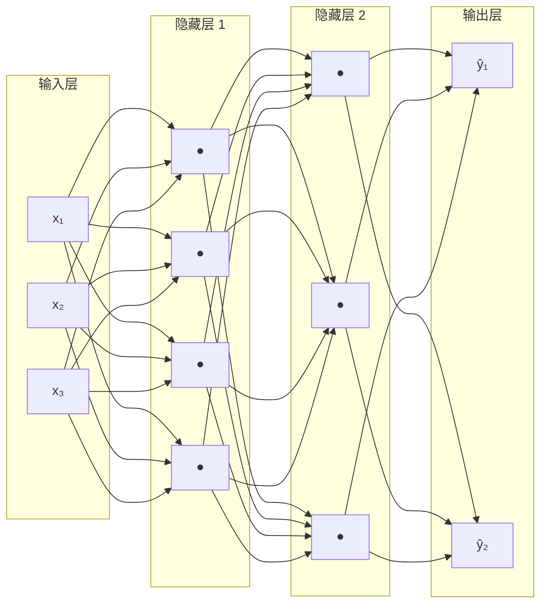

全连接意味着第 $l$ 层的每个神经元与第 $l-1$ 层所有神经元相连，参数量为两层神经元数之积。当输入维度极大时（如 1000×1000 的彩色图像展开后有 300 万维），全连接的参数量将超过数十亿，不仅难以训练，还极易过拟合。CNN 等专用架构正是为了解决这一问题而提出的。

## 2. 激活函数

激活函数为神经网络引入非线性，使其能够拟合复杂函数。若没有非线性激活，多层网络与单层线性模型等价。

| 激活函数 | 公式 | 输出范围 | 优点 | 缺点 | 适用场景 |
|:---|:---|:---:|:---|:---|:---|
| Sigmoid | $\frac{1}{1+e^{-x}}$ | (0, 1) | 输出可解释为概率 | 梯度消失；非零中心 | 二分类输出层 |
| Tanh | $\tanh(x)$ | (-1, 1) | 零中心输出 | 梯度消失仍存在 | RNN 隐藏层（较早期） |
| **ReLU** | $\max(0, x)$ | [0, ∞) | 计算简单；有效缓解梯度消失 | Dead Neuron 问题 | CNN/MLP 隐藏层（当前最常用） |
| Leaky ReLU | $\max(0.01x, x)$ | (-∞, ∞) | 解决 Dead Neuron | 斜率需调参 | ReLU 的改进替代 |
| GELU | $x \cdot \Phi(x)$ | (-∞, ∞) | 光滑；性能优 | 计算稍复杂 | Transformer（BERT、GPT）标配 |
| SiLU/Swish | $x \cdot \sigma(x)$ | (-∞, ∞) | 自门控；效果与 GELU 类似 | — | LLaMA、Qwen 等大语言模型 |

**ReLU（Rectified Linear Unit）** 的成功在于：正值区梯度恒为 1，有效缓解了深层网络的梯度消失问题，使几十甚至上百层的网络可以稳定训练。

## 3. 反向传播算法

**反向传播（Backpropagation）** 是训练神经网络的核心算法，基于链式法则将 Loss 对每个参数的梯度从输出层逐层传递回输入层：

$$\frac{\partial \mathcal{L}}{\partial W^{(l)}} = \frac{\partial \mathcal{L}}{\partial h^{(l)}} \cdot \frac{\partial h^{(l)}}{\partial W^{(l)}}$$

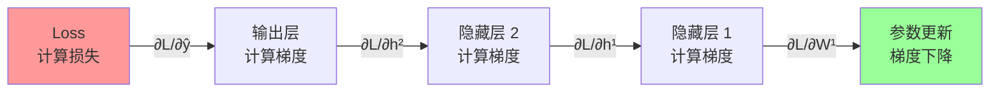

计算图（Computation Graph）自动记录前向计算路径，反向传播时沿路径反向传递梯度。PyTorch 的 `autograd` 机制即基于此原理，使用者只需定义前向计算，框架自动完成梯度计算。

---

# 四、经典网络架构

## 1. 卷积神经网络

**卷积神经网络（Convolutional Neural Network，CNN）** 是处理网格状数据（图像、时序信号）的标准架构。CNN 对 MLP 做了两项关键约束：

**Receptive Field（感受野）**：每个神经元只观察输入的局部区域（如 3×3 的 kernel），而非整张图像。图像中的局部模式（边缘、纹理）只需局部感知即可检测，无需全局视野。

**Parameter Sharing（参数共享）**：不同位置的同类神经元共享同一组参数（filter/卷积核）。同一模式（如水平边缘）出现在图像任何位置，应由相同的检测器处理——这一约束引入了**平移不变性（Translation Invariance）**。

典型 CNN 由交替的卷积层（提取特征）和池化层（下采样）构成，最终接全连接层输出预测：

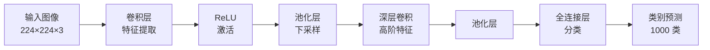

### CNN 架构演进对比

| 模型 | 年份 | 参数量 | ImageNet Top-1 | 关键创新 |
|:---|:---:|:---:|:---:|:---|
| LeNet-5 | 1998 | ~60K | — (MNIST) | CNN 奠基，卷积+池化结构 |
| AlexNet | 2012 | 60M | ~56.5% | GPU 训练、ReLU、Dropout |
| VGG-16 | 2014 | 138M | ~71.5% | 统一 3×3 卷积，网络更深 |
| GoogLeNet | 2014 | 6.8M | ~69.8% | Inception 模块，大幅减少参数 |
| ResNet-50 | 2015 | 25M | ~76.0% | 残差连接，使极深网络可训练 |
| ResNet-152 | 2015 | 60M | ~77.8% | **超越人类水平**（Top-5 3.57%）|
| SENet | 2017 | 145M | ~82.7% | 通道注意力（Squeeze-Excitation）|
| EfficientNet-B0 | 2019 | 5.3M | 77.1% | 复合缩放（NAS 搜索最优比例）|
| EfficientNet-B7 | 2019 | 66M | 84.4% | 参数效率最佳 |
| ViT-B/16 | 2020 | 86M | ~81.8% | 纯 Transformer 用于图像 |
| ConvNeXt-XL | 2022 | 350M | ~87.8% | CNN 吸收 Transformer 设计理念 |

> 关键洞察：**ResNet-50（25M 参数）性能超过 VGG-16（138M 参数）**，参数量仅 18%；**EfficientNet-B0（5.3M）达到 VGG 同等精度**，参数量仅 4%。更多参数 ≠ 更高性能，架构设计至关重要。

### ResNet 残差块结构

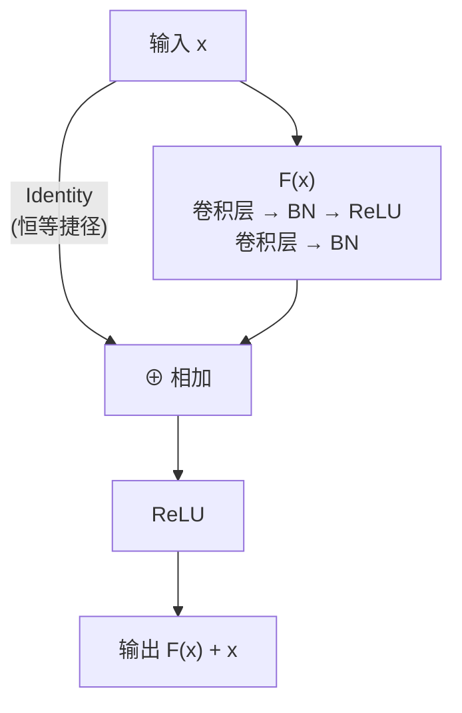

---

## 2. 循环神经网络与 LSTM

**循环神经网络（Recurrent Neural Network，RNN）** 专为处理序列数据设计，通过隐藏状态 $h_t$ 在时间步间传递信息：

$$h_t = f(W_h h_{t-1} + W_x x_t + b)$$

然而，标准 RNN 面临严重的**长程依赖（Long-range Dependency）** 问题：梯度在时间维度上反向传播时，随序列长度指数衰减（梯度消失）或爆炸，导致模型难以记忆距离较远的上下文。

**LSTM（Long Short-Term Memory，Hochreiter & Schmidhuber，1997）** 通过引入**门控机制（Gating Mechanism）** 解决这一问题：

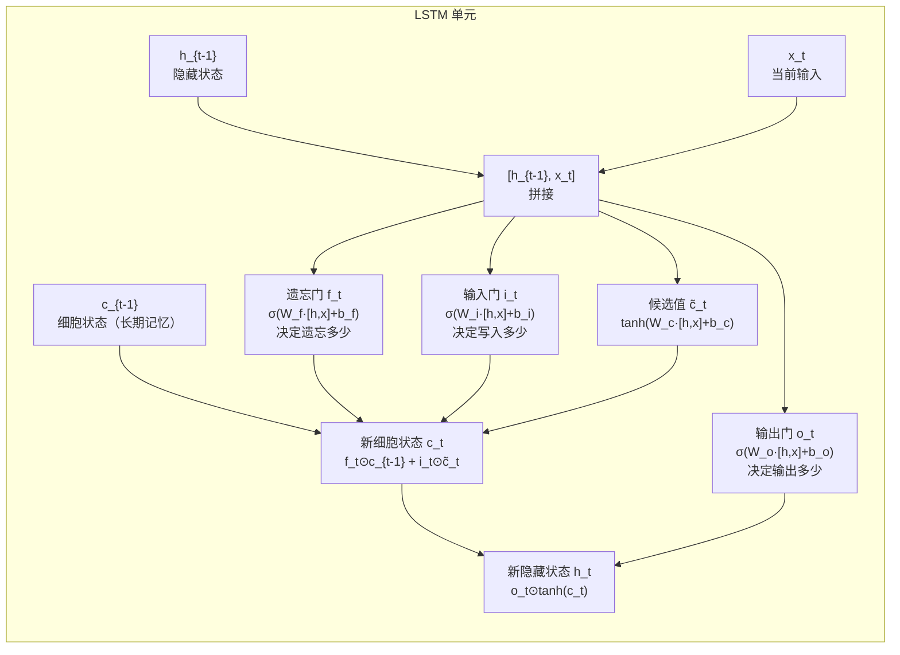

LSTM 维护两个状态：隐藏状态 $h_t$（短期记忆）和细胞状态 $c_t$（长期记忆），细胞状态更新：

$$c_t = f_t \odot c_{t-1} + i_t \odot \tilde{c}_t$$

| 组件 | 公式 | 作用 |
|:---|:---|:---|
| 遗忘门 $f_t$ | $\sigma(W_f [h_{t-1}, x_t] + b_f)$ | 决定遗忘多少历史细胞状态 |
| 输入门 $i_t$ | $\sigma(W_i [h_{t-1}, x_t] + b_i)$ | 决定写入多少新信息 |
| 候选值 $\tilde{c}_t$ | $\tanh(W_c [h_{t-1}, x_t] + b_c)$ | 计算待写入的新信息 |
| 输出门 $o_t$ | $\sigma(W_o [h_{t-1}, x_t] + b_o)$ | 决定以多少细胞状态作为输出 |

*代表性工作*：GRU（2014，LSTM 的简化版）、Seq2Seq（2014）、Attention + LSTM（2015）

---

## 3. Transformer

**Transformer**（Vaswani et al.，2017）彻底改变了 NLP 乃至整个深度学习格局。其核心是**自注意力机制（Self-Attention）**，能够直接建模序列中任意两个位置之间的依赖关系，无需逐步递推。

### 缩放点积注意力

$$\text{Attention}(Q, K, V) = \text{softmax}\left(\frac{QK^T}{\sqrt{d_k}}\right)V$$

其中 $Q, K, V$ 分别为 Query、Key、Value 矩阵，$\sqrt{d_k}$ 为缩放因子，防止点积过大导致 softmax 梯度消失。

**直觉理解**：注意力机制类似 Python 字典查询——Query 是要查找的问题，Key 是字典的键，Value 是对应的值；softmax 计算相似度权重，加权求和得到输出。

### 多头注意力

**多头注意力（Multi-Head Attention）** 将输入映射到多个子空间分别计算注意力，再拼接：

$$\text{MultiHead}(Q,K,V) = \text{Concat}(head_1, \ldots, head_h) W^O$$

### Transformer 编码器块结构

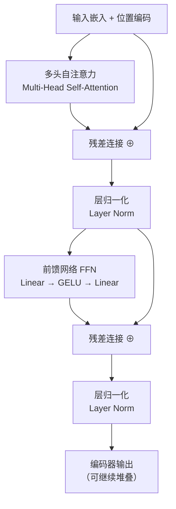

### RNN 与 Transformer 对比

| 维度 | RNN/LSTM | Transformer |
|:---|:---|:---|
| **计算方式** | 顺序递推，无法并行 | 全并行计算 |
| **长程依赖** | 梯度消失，难以捕获 | 任意两位置距离恒为 1 |
| **训练速度** | 慢（序列依赖） | 快（GPU 并行友好）|
| **序列长度** | 理论无限但实际有限 | 受 $O(n^2)$ 显存限制 |
| **适用场景** | 流式推理、轻量设备 | 大规模预训练模型 |

*代表性工作*：BERT（2018，编码器）、GPT 系列（2018-至今，解码器）、ViT（2020，图像 Transformer）

---

# 五、训练优化技术

## 1. 梯度下降与 Optimizer

标准**梯度下降**的更新公式为：

$$\theta_{t+1} = \theta_t - \eta \cdot g_t$$

其中 $\eta$ 为学习率，$g_t$ 为 Loss 对参数的梯度。这种方式所有参数共享同一学习率，而实际 loss surface 中不同方向梯度差异悬殊，固定学习率难以兼顾，由此催生了自适应优化器。

### 优化器演进

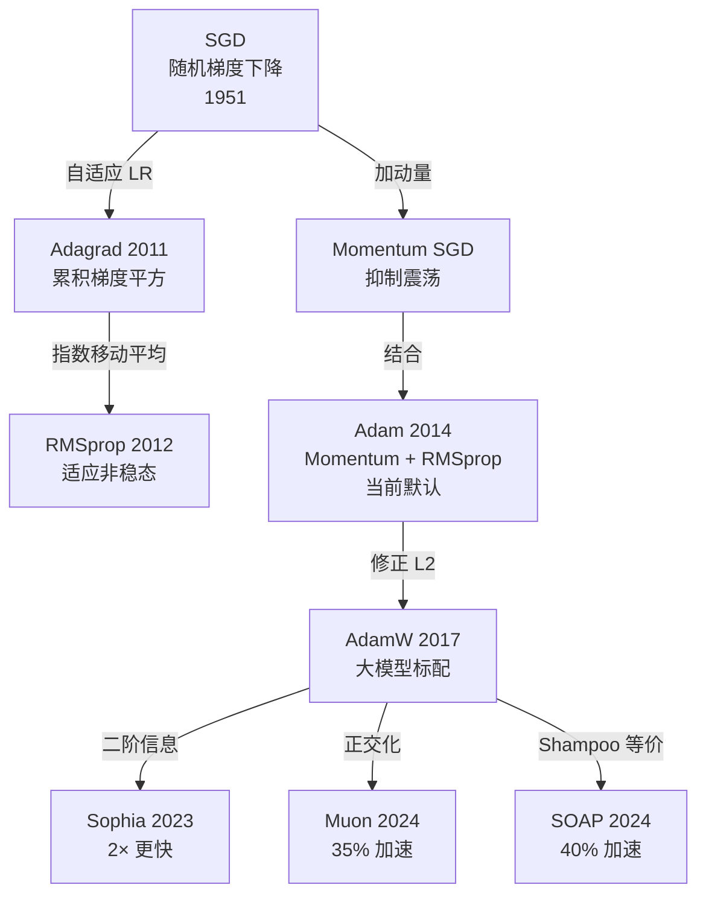

### 主流优化器对比

| 优化器 | 年份 | 动量 | 自适应 LR | 核心特点 | 适用场景 |
|:---|:---:|:---:|:---:|:---|:---|
| SGD | — | ✗ | ✗ | 简单、对 LR 敏感 | CV 精调（结合调度）|
| Momentum SGD | — | ✓ | ✗ | 抑制震荡，越过 saddle | CV 训练 |
| Adagrad | 2011 | ✗ | ✓ | 稀疏特征友好，LR 单调减 | NLP 稀疏场景 |
| RMSprop | 2012 | ✗ | ✓ | 指数移动平均，适应非稳态 | RNN 训练 |
| **Adam** | 2014 | ✓ | ✓ | Momentum + RMSprop | 绝大多数任务默认选择 |
| **AdamW** | 2017 | ✓ | ✓ | Adam + 正确 Weight Decay | 大语言模型预训练标配 |
| Sophia | 2023 | ✓ | ✓ | 二阶 Hessian 估计 | LLM 预训练（2× 加速）|
| Muon | 2024 | ✓ | ✗ | 梯度正交化 | 中小规模预训练 |
| SOAP | 2024 | ✓ | ✓ | Shampoo 等价 + AdamW | 大批量 LLM 训练（40% 加速）|

**Adam 的核心公式**（Kingma & Ba，2014）：

$$m_t = \beta_1 m_{t-1} + (1-\beta_1)g_t \quad \text{(一阶矩)}$$

$$v_t = \beta_2 v_{t-1} + (1-\beta_2)g_t^2 \quad \text{(二阶矩)}$$

$$\theta_{t+1} = \theta_t - \frac{\eta}{\sqrt{\hat{v}_t}+\epsilon}\hat{m}_t$$

标准超参数：$\beta_1=0.9$，$\beta_2=0.999$，$\epsilon=10^{-8}$。Adam 的 $m_t$ 负责方向（可越过 saddle point）；$v_t$ 负责大小（自适应调整各参数学习率）。两者互补，共同解决了梯度下降的两大核心难题。

## 2. 学习率调度

固定学习率存在过大（震荡）和过小（过慢）的矛盾。大语言模型训练的标准方案：**Warmup + Cosine Decay**

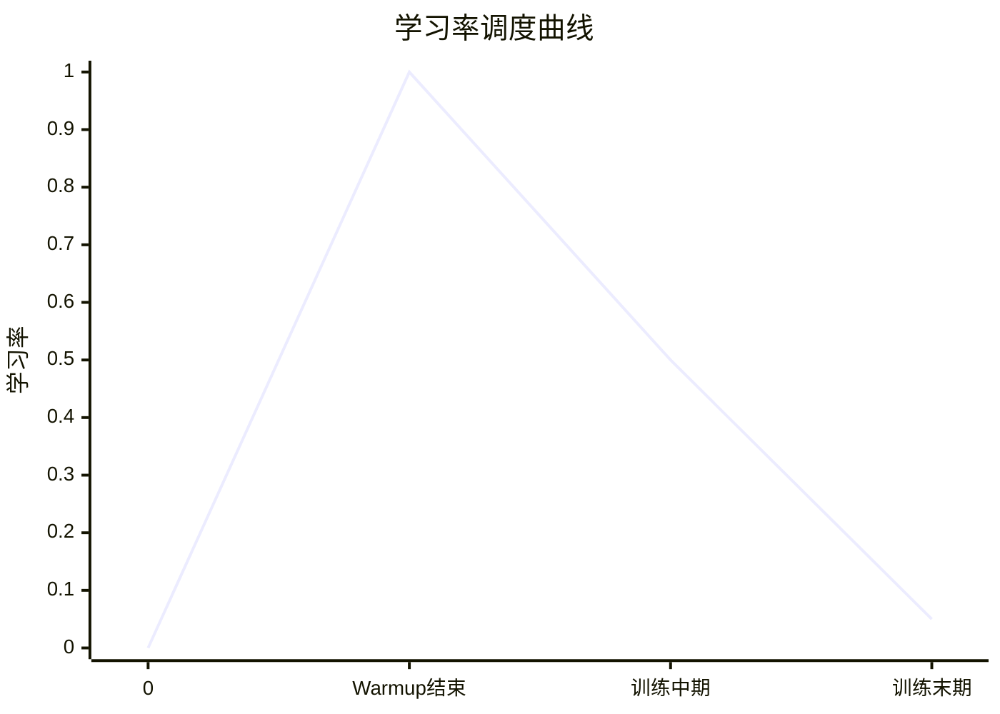

| 阶段 | 描述 | 目的 |
|:---|:---|:---|
| **Warmup（预热）** | 前若干步 LR 从 0 线性增大到目标值 | 让 Adam 的 $m_t$/$v_t$ 积累准确统计量，避免初期不稳定 |
| **Cosine Decay（余弦衰减）** | LR 按余弦曲线降至接近 0 | 让参数缓慢"着陆"，避免在最优点附近持续震荡 |

## 3. 参数初始化

不同的初始参数 $\theta_0$ 可能导致收敛到不同的局部最优解。

**Kaiming 初始化**（He et al.，2015，适用于 ReLU 激活）：

$$W \sim \mathcal{N}\left(0, \sqrt{\frac{2}{n_{in}}}\right)$$

该初始化保证每层激活值的方差在前向传播中保持稳定，防止深层网络训练初期激活值爆炸或消失。

**预训练作为初始化（Pre-training）**：在大规模数据上先训练，再将参数迁移至目标任务。同时改善 Optimization（更好的起点）和 Generalization（学到通用特征）。

## 4. 归一化方法

**归一化（Normalization）** 强制限制网络每一层的输出在合理范围内，使 loss surface 更平坦，学习率更易调节。

### 归一化方法对比

| 方法 | 年份 | 归一化维度 | 依赖 Batch | 适用场景 | 代表模型 |
|:---|:---:|:---|:---:|:---|:---|
| **Batch Norm (BN)** | 2015 | 跨样本、同特征维度 | ✓ | CNN 图像分类 | ResNet、EfficientNet |
| **Layer Norm (LN)** | 2016 | 单样本、所有特征 | ✗ | Transformer、序列模型 | BERT、GPT 系列 |
| Group Norm | 2018 | 单样本、分组特征 | ✗ | 小 batch CV（目标检测）| Mask R-CNN |
| Instance Norm | 2017 | 单样本、单通道 | ✗ | 图像风格迁移 | StyleGAN |
| **RMSNorm** | 2019 | 单样本（仅方差）| ✗ | LLM 高效训练 | LLaMA、Qwen、GPT-4 |

**Batch Normalization（BN，Ioffe & Szegedy，2015）**：

$$\hat{x} = \frac{x - \mu_{batch}}{\sqrt{\sigma_{batch}^2 + \epsilon}}, \quad y = \gamma\hat{x} + \beta$$

**Layer Normalization（LN，Ba et al.，2016）**：

$$\hat{x}_i = \frac{x_i - \mu_{layer}}{\sqrt{\sigma_{layer}^2 + \epsilon}}$$

**RMSNorm**（2019）：去掉均值归一化，只保留方差缩放，计算更高效，被 LLaMA、Qwen 等主流大模型采用。

## 5. 残差连接

深层网络（100+ 层）面临**梯度消失与梯度爆炸**的共存问题。**Skip Connection / Residual Connection**（He et al.，ResNet，2015）：

$$\text{output} = F(x) + x$$

即在原有变换 $F(x)$ 之上直接叠加输入 $x$（恒等映射）。即使 $F(x)$ 效果微弱，梯度依然可以通过恒等路径直接流回浅层，大幅缓解梯度消失，使 ResNet-152 等极深网络可以稳定训练。

Skip Connection 已成为现代深度学习中几乎所有架构（ResNet、Transformer、U-Net）的标配组件，改善的是 **Optimization**。

---

# 六、损失函数与正则化

## 1. 损失函数

**均方误差（Mean Squared Error，MSE）** 适用于回归任务：

$$\mathcal{L}_{MSE} = \frac{1}{N}\sum_i (y_i - \hat{y}_i)^2$$

**交叉熵损失（Cross-Entropy Loss）** 适用于分类任务，包括语言模型（下一个 token 预测本质是分类）。先将 logits 经 **Softmax** 转换为概率分布：

$$p_i = \frac{e^{y_i}}{\sum_j e^{y_j}}$$

再计算与真实标签的交叉熵：

$$\mathcal{L}_{CE} = -\sum_i \hat{p}_i \log p_i$$

> 为什么不直接用准确率（Accuracy）作为 Loss？准确率是阶跃函数，参数轻微变化时 Loss 几乎恒为零，梯度无法计算，Gradient Descent 无从进行。Cross-Entropy 处处可微，可直接用于梯度下降，且值越小对应 Accuracy 越高。

## 2. Dropout

**Dropout**（Srivastava et al.，2014）：训练时以概率 $p$ 随机将神经元输出置零，测试时关闭 Dropout、所有神经元激活并将输出乘以 $(1-p)$ 缩放。

直觉：迫使网络在部分神经元缺席的情况下仍能正确预测，防止神经元之间的过度共适性（Co-adaptation），相当于同时训练了大量不同结构的子网络并取集成效果。

**使用时机**：仅在观察到 Overfitting 后使用；训练 Loss 降不下去时，加 Dropout 只会更糟。

## 3. 数据增强

**数据增强（Data Augmentation）** 通过对训练样本施加保持语义的变换人为扩充数据量：

| 方法 | 领域 | 核心思想 | 年份 |
|:---|:---:|:---|:---:|
| 翻转/裁剪/颜色抖动 | 图像 | 经典手工增强，保持语义不变 | — |
| **Mixup** | 通用 | 两样本按比例混合，标签同步混合 | 2018 |
| **CutMix** | 图像 | 剪切粘贴区域，按面积比例混合标签 | 2019 |
| **AutoAugment** | 图像 | 强化学习搜索最优增强策略 | 2019 |
| **RandAugment** | 图像 | 随机采样增强，仅 2 个超参数，AutoAugment 的简化版 | 2020 |
| **AugMix** | 图像 | 多链增强混合 + Jensen-Shannon 一致性损失，提升分布鲁棒性 | 2020 |
| Time Stretch / Pitch Shift | 语音 | 变速变调，保持内容不变 | — |
| 同义词替换 / 回译 | 文本 | 语义等价改写 | — |

**Mixup** 公式：$\tilde{x} = \lambda x_i + (1-\lambda)x_j$，$\tilde{y} = \lambda y_i + (1-\lambda)y_j$

**注意**：数据增强的变换必须保持标签语义。若任务是判断鸟头朝向，则不能做左右翻转；若任务是说话人识别，则不能做语者转换。

**使用时机**：仅在 Overfitting 时有效；Training Loss 降不下去时，增加数据反而使优化更困难。

## 4. L2 正则化与 AdamW

**L2 正则化（Weight Decay）** 在 Loss 中加入参数的 L2 范数惩罚，使优化偏向参数绝对值更小的解（更"简单"的函数）：

$$\mathcal{L}' = \mathcal{L}_{data} + \lambda \sum_i \theta_i^2$$

**AdamW**（Loshchilov & Hutter，2017）修正了在 Adam 中加 L2 正则化的常见错误：传统方式将正则化梯度与普通梯度合并后统一经 Adam 缩放，导致正则化效果被自适应学习率"稀释"。AdamW 改为先对参数直接做 Weight Decay，再进行 Adam 更新：

```
θ = θ × (1 - λ)           # Weight Decay 直接作用于参数
θ = θ - lr × Adam_update   # Adam 正常更新
```

AdamW 是当前大语言模型训练的标准优化器，通常搭配梯度裁剪（Gradient Clipping）使用。

## 5. 半监督学习

**半监督学习（Semi-supervised Learning）** 利用无标注数据参与训练，在标注成本高时极具价值。

**Entropy Minimization**：要求模型对无标注样本的预测尽量确定（低熵），隐含"类别边界清晰"的假设。

**一致性正则化（Consistency Regularization）**：对同一无标注样本施加不同扰动，要求输出一致，是目前自监督与半监督学习的主流框架（如 SimCLR、MoCo）。

现代大模型的预训练本质上是最大规模的半监督学习：在海量无标注文本上训练语言模型，再通过少量标注数据微调适配下游任务。

---

# 七、微调与对齐

随着大型预训练模型（LLM、VLM）成为 AI 系统的基础，如何高效地将其适配到特定任务或使其与人类价值观对齐，成为重要研究方向。

## 1. 微调策略总览

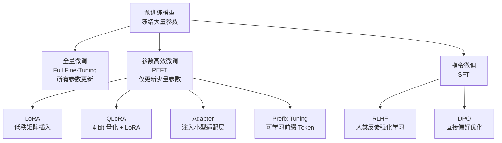

| 方法 | 可训练参数比例 | 显存需求 | 推理开销 | 适用场景 |
|:---|:---:|:---:|:---:|:---|
| 全量微调 | 100% | 极高 | 无 | 数据充足、资源不受限 |
| **LoRA** | 0.1%–1% | 低 | 无（可合并）| 大多数任务的首选 |
| **QLoRA** | 0.1%–1% | 极低 | 无 | 单卡微调 65B+ 模型 |
| Adapter | ~1%–5% | 低 | 略有（不可合并）| Transformer 注意力层间 |
| Prefix Tuning | < 1% | 低 | 有（前缀长度）| 生成任务 |
| Prompt Tuning | < 0.01% | 极低 | 有 | 超大模型、少样本 |

## 2. LoRA 低秩适应

**LoRA**（Low-Rank Adaptation，Hu et al.，2021）将参数更新量分解为两个低秩矩阵：

$$W' = W + \Delta W = W + AB, \quad A \in \mathbb{R}^{d \times r},\ B \in \mathbb{R}^{r \times k}$$

其中秩 $r \ll \min(d, k)$，只训练 $A, B$，冻结原始权重 $W$。

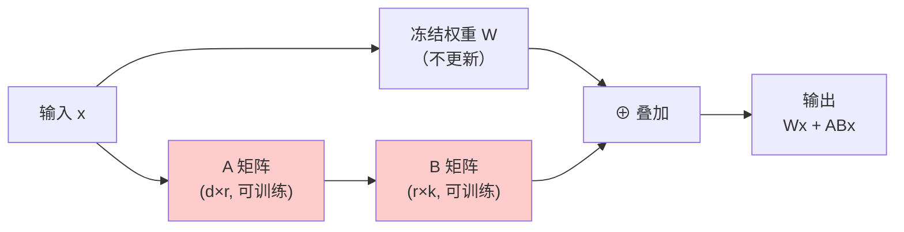

**优势**：可训练参数量降低至全量微调的 0.1%-1%，同时保持接近全量微调的效果；推理时可将 $AB$ 合并回 $W$，零推理开销。

**QLoRA**（Dettmers et al.，2023）在 LoRA 基础上引入 4-bit NormalFloat 量化，使在单张 48GB GPU 上微调 65B 模型成为可能。

**DoRA**（Liu et al.，2024，NVIDIA）将权重分解为幅度和方向两个分量，仅对方向分量应用 LoRA，一致性超越 LoRA，达到接近全量微调的效果。

## 3. 指令微调（SFT）

**指令微调（Instruction Tuning / Supervised Fine-Tuning，SFT）** 使用人工标注的"指令-回复"对训练模型，使其能够遵循用户指令：

| 数据组件 | 说明 | 示例 |
|:---|:---|:---|
| **Instruction** | 用户指令 | "写一个计算斐波那契数列的 Python 函数" |
| **Input** | 可选上下文 | （空，或具体约束）|
| **Output** | 期望的回复 | `def fib(n): ...` |

**指令掩码（Instruction Masking）**：训练时损失函数只计算回复部分的 token，忽略指令部分，使模型聚焦于生成高质量回复。

## 4. RLHF 与 DPO

预训练 + SFT 的模型可能仍然输出有害内容或不忠实回复。**对齐（Alignment）** 技术使模型行为与人类价值观一致。

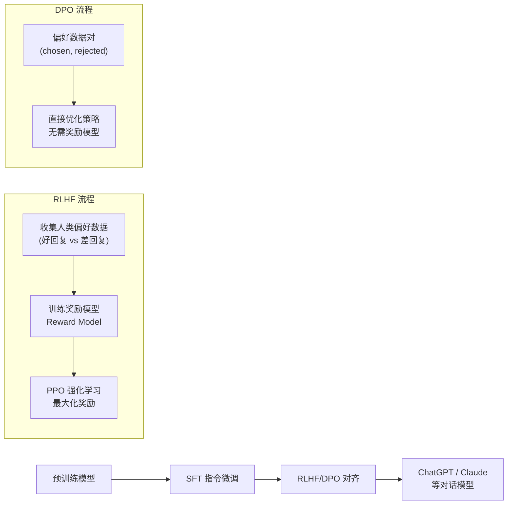

**RLHF（Reinforcement Learning from Human Feedback）**：
1. 收集人类对多个回复的偏好排序
2. 训练奖励模型（Reward Model）预测人类偏好得分
3. 用 PPO 强化学习算法对 LLM 进行优化，最大化奖励分

**DPO（Direct Preference Optimization，Rafailov et al.，2023）**：
- 直接在偏好数据对（好回复 vs 差回复）上优化策略，无需单独训练奖励模型
- 更简单、更稳定，正在成为 RLHF 的主流替代方案

---

# 八、方法分类汇总

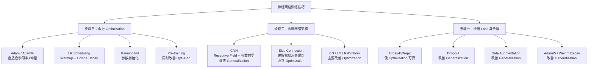

各方法目标对照表：

| 方法 | 改进步骤 | 目标 | 备注 |
|:---|:---:|:---:|:---|
| Adagrad / RMSprop | 步骤三 | Optimization | 自适应学习率前身 |
| Adam | 步骤三 | Optimization | 当前默认优化器 |
| LR Scheduling | 步骤三 | Optimization | Warmup+Cosine 为大模型标配 |
| Kaiming Init | 步骤三 | Optimization | ReLU 网络的标准初始化 |
| Pre-training | 步骤三 | Opt + Gen | 两者同时改善，现代大模型核心 |
| CNN | 步骤二 | Generalization | 引入图像 Inductive Bias |
| Skip Connection | 步骤二 | Optimization | 使深层网络可训练 |
| Batch Norm | 步骤二 | Optimization（+Gen）| 依赖 batch 统计量 |
| Layer Norm | 步骤二 | Optimization（+Gen）| Transformer 标配 |
| Cross-Entropy | 步骤一 | 使 Opt 可行 | 分类/生成任务标准损失 |
| Dropout | 步骤三* | Generalization | 训练 Loss 会升高 |
| Data Augmentation | 步骤一 | Generalization | Overfitting 时才有效 |
| L2 Reg / AdamW | 步骤一/三 | Generalization | 偏好参数值更小的函数 |
| Semi-supervised | 步骤一 | Generalization | 利用无标注数据 |
| LoRA / PEFT | 步骤三 | Opt + Gen | 大模型高效适配 |
| SFT + RLHF/DPO | 步骤一 | 对齐 | 使模型遵循指令与价值观 |

---

# 九、常用实验基准

## 计算机视觉基准

### MNIST

| 属性 | 内容 |
|------|------|
| 发布年份 | 1998 |
| 规模 | 70,000 张手写数字图像（28×28，灰度）|
| 类别数 | 10（数字 0-9）|
| SOTA 精度 | >99.8%（基本饱和）|
| 特点 | 最经典的入门基准，适合验证基础方法 |

### CIFAR-10 / CIFAR-100

| 属性 | CIFAR-10 | CIFAR-100 |
|------|------|------|
| 发布年份 | 2009 | 2009 |
| 规模 | 60,000 张彩色图像（32×32）| 60,000 张彩色图像（32×32）|
| 类别数 | 10 | 100 |
| 适用 | 正则化、数据增强、网络架构验证 | 细粒度分类 |

Dropout、Batch Normalization、ResNet、Data Augmentation 的效果均在此基准上得到广泛验证。

### ImageNet（ILSVRC）

| 属性 | 内容 |
|------|------|
| 发布年份 | 2010 |
| 规模 | 120 万张训练图像，5 万张验证图像 |
| 类别数 | 1,000 |
| 特点 | 深度学习工业级基准，CNN 发展史的主战场 |

**ImageNet Top-1 精度演进（见第四节表格）**：AlexNet（56.5%）→ VGG（71.5%）→ ResNet（76.0%）→ EfficientNet（84.4%）→ 当前 SOTA ≈ 91%，12 年内提升约 35 个百分点。

## 自然语言处理基准

### GLUE / SuperGLUE

| 基准 | 发布 | 任务数 | 用途 |
|:---|:---:|:---:|:---|
| GLUE | 2018 | 9 | 文本分类、推理、相似度等 NLU 任务综合评测 |
| SuperGLUE | 2019 | 8 | GLUE 饱和后的更难版，BERT 超越人类促成升级 |

BERT（2018）发布时在 GLUE 上大幅超越人类水平，直接推动了 SuperGLUE 的设立。

### MMLU（Massive Multitask Language Understanding）

| 属性 | 内容 |
|------|------|
| 发布年份 | 2021 |
| 规模 | 57 个学科、约 16,000 道选择题 |
| 涵盖 | 数学、法律、医学、历史、计算机科学等 |
| 用途 | 评测 LLM 的知识广度与推理能力 |
| 人类水平 | 约 89.8%（专家）|

GPT-4（2023）在 MMLU 上达到 86.4%，Claude 3 Opus 达到 88.7%（2024），接近专家人类水平。

### 语言模型困惑度（Perplexity）

Penn Treebank（PTB）/ WikiText 是传统语言模型的标准基准，评测指标为**困惑度（Perplexity，PPL）**——越低越好，表示模型对下一个 token 的预测越确定。现已被 MMLU、HumanEval 等综合 Benchmark 取代。

---

# 十、最新进展

## 1. 混合精度训练

现代 GPU 支持 FP16/BF16 运算。混合精度训练以低精度完成前向传播和梯度计算（节省显存 50%、加速计算 2-3×），以 FP32 执行参数更新（保证数值稳定）。

| 格式 | 指数位 | 尾数位 | 优点 | 劣势 |
|:---:|:---:|:---:|:---|:---|
| FP32 | 8 | 23 | 最稳定 | 显存占用大 |
| FP16 | 5 | 10 | 快 | 数值范围小，易溢出 |
| **BF16** | 8 | 7 | 数值范围同 FP32，稳定 | 精度略低于 FP16 |

**BF16**（Brain Float 16）因指数位更宽（8 位 vs FP16 的 5 位），数值范围更大，已成为大语言模型训练的首选低精度格式。

## 2. Gradient Clipping（梯度裁剪）

大模型训练中偶发的梯度爆炸（loss spike）会导致训练崩溃。梯度裁剪通过限制梯度 L2 范数的上界来防止这一问题：

$$g \leftarrow g \cdot \min\left(1, \frac{\tau}{\|g\|_2}\right)$$

通常阈值 $\tau = 1.0$，是 AdamW 的标准搭档。

## 3. Flash Attention

**标准注意力**的瓶颈在于需要将 $N \times N$ 注意力矩阵写入 GPU HBM 显存，显存复杂度 $O(N^2)$，长序列时极其昂贵。

| 版本 | 年份 | 相对标准注意力加速 | 关键创新 |
|:---:|:---:|:---:|:---|
| Flash Attention 1 | 2022 | 2–4× | IO-aware 分块计算，显存 $O(N)$ |
| Flash Attention 2 | 2023 | 4–9× | 改进并行化与 warp 分区，达 70% A100 FLOP/s |
| Flash Attention 3 | 2024 | 6–18×（vs FA1）| 针对 H100 Hopper 架构；异步流水线；FP8 支持，达 75% H100 FLOP/s（约 1.2 PFLOP/s）|

Flash Attention 在保持**精确计算**（非近似）的同时大幅降低显存和加速计算，已成为所有主流大模型的标配。

## 4. Scaling Laws 与 Chinchilla

**Scaling Laws**（Kaplan et al.，2020）揭示：LLM 性能随模型参数量 $N$、训练数据量 $D$、计算量 $C$ 的幂律关系提升，三者之间需要协调增长。

**Chinchilla 定律**（Hoffmann et al.，NeurIPS 2022）进一步精确化：

> **计算最优训练的 token 数应约为模型参数量的 20 倍。**

$$D_{optimal} \approx 20 \times N$$

| 模型 | 参数量 | 训练 Token | Token/参数比 | 备注 |
|:---|:---:|:---:|:---:|:---|
| GPT-3 | 175B | 300B | 1.7× | **严重欠训练** |
| Gopher | 280B | 300B | 1.1× | 严重欠训练 |
| **Chinchilla** | 70B | 1.4T | **20×** | 计算最优 |
| LLaMA-3 | 8B | 15T | 1875× | 推理效率优先，过度训练小模型 |

Chinchilla（70B）以更小的参数量、更多的训练数据，在大多数 Benchmark 上超越了 GPT-3（175B）、Gopher（280B），彻底改变了 LLM 训练的设计哲学。

> 启示：当计算预算固定时，训练一个**更小的模型更长时间**，往往比训练一个更大的模型更少步数效果更好。

## 5. 参数高效微调（PEFT）详见第七节

**LoRA**、**QLoRA**、**DoRA** 等方法（详见第七节）持续推进大模型高效适配的工程实践边界。

## 6. Transformer 架构的精细化

- **Flash Attention**（见第十节第 3 点）：IO-aware 分块计算，已成标配
- **Grouped Query Attention（GQA）**：多个 Query 头共享同一组 Key/Value，减少 KV Cache 显存占用，在 LLaMA-2/3 等模型中广泛使用
- **RoPE（旋转位置编码）**：相对位置编码方案，可外推到训练时未见过的更长序列，是目前最主流的位置编码方式（GPT-4、LLaMA 系列均采用）
- **MoE（Mixture of Experts）**：条件激活多专家网络，同等激活参数量下可扩展至更大模型容量（如 Mixtral 8×7B、GPT-4 据报道采用 MoE 架构）

---

# 十一、总结

本文系统梳理了深度学习的核心技术体系：

1. **理论基础**：机器学习三步骤框架和 Optimization vs Generalization 的两大核心目标，是理解所有训练技巧的坐标系。

2. **网络架构**：从 MLP 到 CNN（引入空间 Inductive Bias）、RNN/LSTM（处理序列长程依赖）再到 Transformer（自注意力机制，成为主流基础架构），每一次架构革新都针对前代的根本局限。

3. **训练优化**：优化器从 SGD 演进至 Adam→AdamW→Sophia/Muon/SOAP，配合 Warmup+Cosine Decay、梯度裁剪，构成当前大模型训练的标准流程；Skip Connection 和 Normalization 方法使极深网络可训练。

4. **正则化**：Dropout、数据增强（Mixup/CutMix/RandAugment）、Weight Decay 从不同角度抑制过拟合；Pre-training 则同时改善 Optimization 和 Generalization，是现代大模型成功的根本。

5. **微调与对齐**：LoRA/QLoRA 等 PEFT 方法大幅降低大模型适配成本；SFT + RLHF/DPO 构成从预训练模型到对话助手的完整对齐流程。

6. **最新趋势**：混合精度（BF16）、Flash Attention 2/3、Chinchilla Scaling Laws、GQA、RoPE、MoE 等技术持续推进大规模深度学习的工程实践边界。

**核心结论**：

> 深度学习的训练技巧不是越多越好，而是要**对症下药**——先诊断是 Optimization 问题还是 Generalization 问题，再选择对应的方法，是高效炼丹的基本功。大模型时代，还需额外关注**计算效率**（Flash Attention、混合精度）和**对齐质量**（SFT、RLHF/DPO），三者共同决定了一个大语言模型的最终表现。
