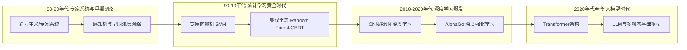

---

layout: post

title: "机器学习综述"

date: 2026-04-03

tags: [Machine Learning, Deep Learning, Algorithm, Foundation Models]

comments: true

author: Tingde Liu

toc: true

excerpt: "本文系统梳理了机器学习的核心范式、经典算法与代表性模型，从传统统计学习到现代深度学习与基础模型，为全面理解AI技术演进提供参考。"

---

# 1. 引言

人工智能（Artificial Intelligence, AI）作为计算机科学皇冠上的明珠，正以前所未有的速度重塑人类社会。而在这场波澜壮阔的技术革命中，**机器学习（Machine Learning, ML）** 无疑是最核心的驱动引擎。传统基于规则的专家系统受限于人类先验知识的边界，而机器学习则通过让计算机从海量数据中自主“学习”规律，实现了从“授人以鱼”到“授人以渔”的范式跃迁。

从早期以支持向量机（SVM）为代表的统计学习方法，到以随机森林（Random Forest）、XGBoost 为首的集成学习霸主，再到如今席卷全球的深度神经网络（DNN）和基于大语言模型（LLM）的基础模型，机器学习的边界在算力与数据的双重加持下不断拓展。

本文旨在系统梳理机器学习研究进展，为学习和研究机器学习提供参考。

<!-- more -->

# 2. 机器学习基本概述

## 2.1 什么是机器学习？

机器学习是一门多领域交叉学科，涉及概率论、统计学、逼近论、凸分析、算法复杂度理论等。其核心思想是：**让计算机通过算法解析数据、从中学习规律，并利用这些规律对真实世界中的未知事件做出预测和决策**。相比于传统的硬编码规则，机器学习模型能够随着数据的增加而自动优化其性能。

## 2.2 学习范式与分类体系

根据训练数据是否带有标签以及模型与环境的交互方式，机器学习主要分为以下四大范式：

### 2.2.1 监督学习 (Supervised Learning)

监督学习是最成熟、应用最广的范式。其训练数据由输入特征 $\mathbf{x}$ 和对应的标签（Ground Truth）$y$ 组成。模型的目标是学习一个映射函数 $f: \mathbf{x} \rightarrow y$。

- **核心任务**：分类（Classification，标签为离散类别）与回归（Regression，标签为连续数值）。

- **代表算法**：线性回归、逻辑回归、SVM、决策树、多数深度神经网络。

### 2.2.2 无监督学习 (Unsupervised Learning)

无监督学习的数据**没有标签**，模型需要自主发掘数据内部的潜在结构、模式或分布。

- **核心任务**：聚类（Clustering）、降维（Dimensionality Reduction）、异常检测（Anomaly Detection）。

- **代表算法**：K-Means、PCA、自编码器（Autoencoder）、高斯混合模型（GMM）。

### 2.2.3 强化学习 (Reinforcement Learning)

强化学习侧重于智能体（Agent）如何在环境（Environment）中采取动作（Action），以最大化累积奖励（Reward）。它没有立即的标注数据，而是通过”试错”（Trial and Error）和”延迟奖励”来进行学习。

- **核心概念**：状态（State）、动作（Action）、奖励（Reward）、策略（Policy）、价值函数（Value Function）。

- **代表算法**：Q-Learning、DQN、PPO、SAC。

  

  <figcaption>图：强化学习算法示意图</figcaption>

### 2.2.4 半监督与自监督学习 (Semi/Self-Supervised Learning)

- **半监督学习**：利用少量有标签数据和大量无标签数据进行训练，降低标注成本。

- **自监督学习**：一种特殊的无监督学习，通过数据本身自动构造伪标签（如预测句子中的下一个词，或图像的部分遮挡恢复），是目前预训练大语言模型（如 GPT）的核心范式。

## 2.3 核心要素与系统架构

一个完整的机器学习系统通常包含以下五个核心要素：

1. **数据 (Data)**：模型的燃料，决定了学习的上限。包括特征提取与预处理。

2. **特征工程 (Feature Engineering)**：将原始数据转化为模型可理解的特征向量，传统 ML 强依赖于此。

3. **模型假设 (Hypothesis Space)**：决定了模型能表达的函数集合（如线性组合、决策树边界或神经网络流形）。

4. **目标函数 (Objective Function)**：定义”好”与”坏”的度量标准，通常由损失函数（Loss Function）和正则化项（Regularization）组成。

5. **优化算法 (Optimization Algorithm)**：求解目标函数最小化（或最大化）参数的策略，如梯度下降（Gradient Descent）、Adam 等。

## 2.4 发展历程

机器学习的发展经历了从符号主义、统计学习到深度学习，再到如今大模型时代的演进过程：

## 2.5 主要挑战

尽管成果丰硕，机器学习在实际落地中仍面临诸多挑战：

- **过拟合与泛化 (Overfitting & Generalization)**：模型在训练集上表现优异，但在未见过的测试集上表现糟糕。

- **数据维度灾难 (Curse of Dimensionality)**：特征维度过高导致样本稀疏，计算复杂度呈指数级增长。

- **可解释性黑盒问题 (Interpretability)**：尤其是深度学习模型，往往难以解释其决策的具体逻辑，阻碍了其在医疗、金融等高风险领域的应用。

- **计算资源瓶颈**：大模型时代，训练和推理成本极高，对 GPU/TPU 集群提出了严苛要求。

## 2.6 关键技术方向与未来展望

机器学习在方法论和应用前沿上持续演进，以下是当前最具影响力的技术方向与未来趋势：

- **表示学习 (Representation Learning)**：自动学习数据的有效特征表示，取代人工特征工程，是深度学习成功的关键。

- **迁移学习 (Transfer Learning)**：将一个领域/任务学到的知识迁移到另一个相关领域/任务，极大缓解了数据稀缺问题。

- **元学习 (Meta-Learning)**：也称”学会学习”，旨在让模型具备快速适应新任务的能力（如 Few-shot Learning）。

- **通用人工智能 (AGI)**：跨越专用 AI 边界，具备全面认知、推理和执行能力的智能体。

- **可信与对齐 AI (Trustworthy & Aligned AI)**：确保 AI 系统的目标与人类价值观一致，具备安全性、公平性和透明度。

- **AI for Science**：利用机器学习解决物理、化学、生物（如 AlphaFold）等基础科学领域的复杂计算问题。

## 2.7 主流应用场景

机器学习目前已经深度渗透到数字世界与物理世界的方方面面：

### 2.7.1 计算机视觉 (CV)

- **核心任务**：图像分类、目标检测（如 YOLO 系列）、语义分割、图像生成。

- **应用**：人脸识别、医学影像分析、工业缺陷检测。

### 2.7.2 自然语言处理 (NLP)

- **核心任务**：机器翻译、文本摘要、情感分析、对话系统。

- **应用**：ChatGPT 等智能助手、智能客服、文档自动审核。

### 2.7.3 推荐系统与计算广告

- 互联网巨头的变现核心。通过协同过滤（Collaborative Filtering）、深度交叉网络等技术，挖掘用户历史行为与物品之间的匹配概率，实现精准推送。

### 2.7.4 机器人、自动驾驶与具身智能 (Embodied AI)

- 结合强化学习、视觉与大语言模型，让机器人在复杂的物理环境中实现感知、规划、导航与灵巧操作。这是当前 AI 从数字空间走向物理世界的最前沿阵地。

## 2.8 主流数据集、评测基准与框架

### 2.8.1 经典数据集与基准

| 数据集 | 领域 | 特点与历史意义 |
|:---|:---|:---|
| **ImageNet** | CV (分类) | 包含千万级标注图像，其 2012 年的比赛直接引爆了深度学习革命。 |
| **COCO** | CV (检测分割) | 微软发布，具有丰富的多目标、多上下文的复杂场景标注。 |
| **MNIST** | CV (入门) | 手写数字识别集，被誉为机器学习领域的 “Hello World”。 |
| **GLUE** | NLP | 评估自然语言理解模型的综合基准，推动了 BERT 时代的发展。 |

### 2.8.2 主流工具与开源框架

- **Scikit-learn**：Python 下的传统机器学习库，集成了几乎所有经典 ML 算法（SVM, RF, KNN等），API 设计极为优雅。

- **XGBoost / LightGBM**：处理表格数据不可或缺的梯度提升树框架。

- **TensorFlow**：Google 开源的深度学习框架，工业界部署生态完善。

- **PyTorch**：Meta 开源的深度学习框架，凭借动态计算图和极佳的易用性，已成为目前学术界绝对的主流，并逐渐统治工业界大模型训练底座。

- **HuggingFace**：大模型时代的开源基建，提供了海量的预训练模型权重与快捷的 `transformers` 库调用接口。

# 3. 经典算法与代表性模型

本章系统梳理从传统统计学习到现代深度学习的标志性算法。

## 3.1 核心算法分类概览

在深入探讨具体模型之前，下表梳理了机器学习中经典的算法分类及其代表性模型：

| 类别 | 代表性模型 / 技术 | 主要特点 | 应用场景 |
| :--- | :--- | :--- | :--- |
| **线性模型** | 线性回归、逻辑回归 | 简单易懂、计算量小、可解释性强 | 房价预测、点击率预估 (CTR) |
| **集成学习** | 随机森林、XGBoost、LightGBM | 鲁棒性强、处理表格数据效果极佳 | 金融风控、搜索排序 |
| **传统统计/概率** | SVM、KNN、朴素贝叶斯、HMM | 理论严谨、适合小样本任务 | 文本分类、语音识别、生物信息 |
| **聚类与降维** | K-Means、PCA、t-SNE | 无监督、发现数据潜在结构 | 用户画像、数据压缩、可视化 |
| **深度神经网络** | CNN、RNN、LSTM、MLP | 强大的非线性拟合与特征提取能力 | 图像识别、自然语言处理 |
| **大模型基石** | Transformer、BERT、GPT | 并行能力强、捕捉长距离依赖、涌现能力 | 聊天机器人、通用人工智能 |
| **生成式模型** | GAN、VAE、Diffusion Models | 学习数据分布、生成高质量新样本 | AI 绘画、视频生成、分子设计 |

## 3.2 线性回归与正则化

线性回归 (Linear Regression) 是回归分析中最基础的模型，假设目标变量与特征之间存在线性关系。其目标函数通常是最小化均方误差（MSE）。

- **数学表达式**：$y = \mathbf{w}^T \mathbf{x} + b$

- **优化方法**：可以通过最小二乘法直接求解闭式解（正规方程），也可以使用梯度下降法进行迭代优化。

- **正则化 (Regularization)**：为了防止在特征维度较高时发生过拟合，常在损失函数中引入正则化惩罚项：

  - **Ridge 回归（L2 正则化）**：增加 $\lambda \|\mathbf{w}\|_2^2$ 项，限制参数的平方和，使参数平滑，有效缓解多重共线性问题。

  - **Lasso 回归（L1 正则化）**：增加 $\lambda \|\mathbf{w}\|_1$ 项，限制参数的绝对值和。L1 正则化的几何特性使其容易产生稀疏解（即将部分权重压缩为0），因此自带特征选择功能。

  

  <figcaption>图：线性回归算法示意图</figcaption>

## 3.3 逻辑回归 (Logistic Regression)

虽然名为“回归”，但逻辑回归本质上是一个**二分类**算法。它在线性回归的基础上，引入了非线性的 Sigmoid 激活函数，将连续的线性输出映射到 $(0, 1)$ 区间，从而赋予其概率意义。

- **核心函数**：

$$P(y=1 \mid \mathbf{x}) = \sigma(\mathbf{w}^T \mathbf{x} + b) = \frac{1}{1 + e^{-(\mathbf{w}^T \mathbf{x} + b)}}$$

- **损失函数**：交叉熵损失（Cross-Entropy Loss），通过最大似然估计推导而来。

- **特点**：计算代价低，速度快，输出具有明确的概率解释，常用于金融风控中的信用评分卡、广告点击率（CTR）预估等基础场景。

  

  <figcaption>图：逻辑回归算法示意图</figcaption>

## 3.4 决策树 (Decision Tree)

决策树模仿人类基于规则判断的思维过程，通过树状结构对数据进行分类或回归。每个内部节点表示对某一特征的条件判断，分支代表判断结果，叶节点表示最终预测的类别或数值。

- **分裂准则**：

  - **ID3 算法**：基于**信息增益**（Information Gain）选择特征，倾向于选择取值较多的特征。

  - **C4.5 算法**：基于**信息增益率**（Gain Ratio）进行改进，克服了 ID3 的缺陷。

  - **CART 算法**：分类树使用**基尼指数**（Gini Impurity），回归树使用平方误差。CART 是一棵二叉树，是许多集成树模型的基础。

- **优缺点**：可解释性极强，不需要进行数据标准化，能处理缺失值；但极易产生过拟合，通常需要通过剪枝（Pruning）来控制树的复杂度。

  

  <figcaption>图：决策树结构示意图</figcaption>

## 3.5 随机森林 (Random Forest)

**Bagging（Bootstrap Aggregating）** 是一种并行的集成学习范式，核心思想是“三个臭皮匠，顶个诸葛亮”。随机森林是 Bagging 的代表作。

- **核心机制**：通过对训练样本进行有放回的随机采样（Bootstrap），构建多棵相互独立的决策树。同时，在每个节点分裂时，也只在随机子集的特征中选择最优划分特征。

- **结果输出**：分类任务通过多棵树投票产生最终结果，回归任务则取平均值。

- **特点**：极大地降低了单一决策树的方差（Variance），抗噪能力强，不容易过拟合，且能评估特征重要性。

  

  <figcaption>图：随机森林算法示意图</figcaption>

## 3.6 梯度提升树

**Boosting** 是一种串行的集成学习范式，核心思想是“不断纠错”。后续的模型重点关注前序模型预测错误的样本，将其加权累积。

- **GBDT (Gradient Boosting Decision Tree)**：以 CART 回归树为基分类器，每次迭代通过拟合上一步模型的**负梯度**（在平方损失下即为残差）来不断逼近真实值。

- **XGBoost (eXtreme Gradient Boosting)**：GBDT 的工程极致优化版。它不仅在目标函数中引入了二阶导数信息（泰勒展开）以加速收敛，还加入了 L1 和 L2 正则化项以控制模型复杂度。此外，支持缺失值自动处理和特征并行计算，曾在 Kaggle 竞赛中统治了表格数据的预测任务。

- **LightGBM**：微软推出的更高效的 Boosting 框架。通过引入基于直方图（Histogram）的决策树算法、单边梯度采样（GOSS）和互斥特征捆绑（EFB），在保证精度的前提下大幅降低了内存消耗和计算时间。

  

  <figcaption>图：梯度提升决策树 (GBDT) 示意图</figcaption>

## 3.7 K近邻算法 (KNN)

KNN 是一种典型的“懒惰学习（Lazy Learning）”算法，它在训练阶段几乎不进行任何计算，仅保存训练数据。

- **预测机制**：在预测时，计算测试样本与所有训练样本之间的距离（如欧氏距离、曼哈顿距离），寻找在特征空间中最近的 $K$ 个样本。

- **决策规则**：分类任务采取多数表决（Majority Voting），回归任务取均值。可引入距离加权机制，距离越近权重越大。

- **缺点**：预测时需要遍历所有数据，计算复杂度随数据量呈线性增长；对数据的尺度（Scale）敏感，使用前必须进行归一化处理；存在维度灾难问题。

  

  <figcaption>图：K近邻 (KNN) 算法示意图</figcaption>

## 3.8 朴素贝叶斯与隐马尔可夫模型

### 朴素贝叶斯 (Naive Bayes)

朴素贝叶斯是基于贝叶斯定理的分类算法，做出了一个极强但非常高效的”朴素”假设——**特征之间相互条件独立**。

- **贝叶斯定理**：给定样本特征 $\mathbf{x} = (x_1, x_2, \dots, x_n)$，后验概率为：

$$ P(y \mid \mathbf{x}) = \frac{P(\mathbf{x} \mid y) \cdot P(y)}{P(\mathbf{x})} $$

- **朴素假设**：假设各特征在给定类别下条件独立，将联合概率分解为各特征概率的乘积：

$$ P(\mathbf{x} \mid y) = \prod_{i=1}^n P(x_i \mid y) $$

- **分类决策**：选择使后验概率最大的类别，即：

$$\hat{y} = \arg\max_y P(y) \prod_{i=1}^n P(x_i \mid y)$$

- **特点**：尽管条件独立假设在现实中很少严格成立，但朴素贝叶斯在文本分类（垃圾邮件过滤、情感分析）中往往能取得惊人的效果，且训练速度极快，适合超大规模数据。

  

  <figcaption>图：朴素贝叶斯 (Naive Bayes) 分类器示意图</figcaption>

### 隐马尔可夫模型 (HMM)

HMM 是一种用于处理序列数据的概率图模型，包含一个不可见的隐藏状态序列和一个可见的观测序列。

- **两个核心假设**：

  - **马尔可夫假设**：当前隐状态 $s_t$ 只依赖于前一个隐状态 $s_{t-1}$，即 $P(s_t \mid s_1, \dots, s_{t-1}) = P(s_t \mid s_{t-1})$。

  - **观测独立假设**：当前观测 $o_t$ 只依赖于当前隐状态 $s_t$，即 $P(o_t \mid s_1, \dots, s_t) = P(o_t \mid s_t)$。

- **三个基本问题**：

  1. **评估问题**：给定模型参数，计算某观测序列的概率（前向-后向算法）。

  2. **解码问题**：给定观测序列，求最可能的隐状态序列（Viterbi 算法）。

  3. **学习问题**：从观测数据中估计模型参数（Baum-Welch / EM 算法）。

- **应用场景**：早期语音识别、词性标注（POS tagging）、基因序列分析。现已大量被深度序列模型（RNN/Transformer）替代。

  

  <figcaption>图：隐马尔可夫模型 (HMM) 状态转移示意图</figcaption>

## 3.9 支持向量机 (SVM)

在深度学习爆发之前，SVM（Support Vector Machines）被认为是机器学习中分类效果最好的算法之一。

- **核心思想**：试图在特征空间中找到一个超平面，使得不同类别的样本之间不仅被正确分开，而且**几何间隔（Margin）最大化**。这种“最大间隔”的追求赋予了 SVM 极强的泛化能力。

- **支持向量**：决定分类边界的仅仅是距离超平面最近的那些样本点，称为“支持向量”。

- **核技巧 (Kernel Trick)**：当数据在原始空间线性不可分时，SVM 通过核函数（如线性核、多项式核、高斯 RBF 核）巧妙地将低维特征隐式映射到高维（甚至是无限维）空间，使其变得线性可分，从而解决了非线性分类问题，且避免了高维计算的维度灾难。

  

  <figcaption>图：支持向量机 (SVM) 分类面与间隔示意图</figcaption>

## 3.10 K-Means 聚类

最经典、应用最广泛的无监督聚类算法。

- **算法流程**：

  1. 随机初始化 $K$ 个聚类中心（Centroids）。

  2. 遍历所有样本，将其分配给距离最近的聚类中心。

  3. 根据分配好的簇，重新计算每个簇的质心（即所有样本的均值），更新聚类中心。

  4. 重复步骤 2 和 3，直到聚类中心不再发生显著变化（收敛）或达到最大迭代次数。

- **优缺点**：算法简单高效，时间复杂度为 $O(nKt)$；但对初始值的选择和异常值敏感，且必须预先指定 $K$ 值，只能发现球形簇，难以处理复杂流形分布的数据。

  

  <figcaption>图：K-Means 聚类过程示意图</figcaption>

## 3.11 主成分分析 (PCA) 与 t-SNE

- **主成分分析 (PCA)**：一种经典的线性降维方法。核心思想是通过正交变换，将可能相关的原始高维特征投影到一个新的正交坐标系中，这些新的坐标轴（主成分）按照数据方差的大小排列。保留前几个方差最大的主成分，可以在损失最少信息的前提下实现降维、数据去相关性和压缩。

  

  <figcaption>图：主成分分析 (PCA) 降维示意图</figcaption>

- **t-SNE (t-Distributed Stochastic Neighbor Embedding)**：一种非线性降维算法，主要用于将高维数据映射到 2D 或 3D 空间进行可视化。它通过将数据点之间的欧氏距离转化为条件概率来表达相似度，并使用 t 分布缓解高维空间映射到低维时的“拥挤问题（Crowding Problem）”，能够非常出色地保持数据的局部流形结构和类内聚集特征。

  

  <figcaption>图：t-SNE 降维可视化示意图</figcaption>

## 3.12 多层感知机 (MLP) 与反向传播

深度学习（Deep Learning, DL）通过多层非线性变换提取数据的高阶特征。多层感知机（Multilayer Perceptron, MLP）是最基础的前馈神经网络（Feedforward Neural Network），也是理解所有深度网络的起点。

- **结构**：由输入层、一个或多个隐藏层以及输出层组成，层与层之间全连接。每个神经元接收上一层输出的加权和，并经过非线性激活函数处理。单层的计算可表示为：

$$ \mathbf{h} = \sigma(\mathbf{W}\mathbf{x} + \mathbf{b}) $$

  其中 $\mathbf{W}$ 为权重矩阵，$\mathbf{b}$ 为偏置，$\sigma$ 为激活函数。

- **激活函数**：引入非线性是深度网络的关键——没有激活函数，多层线性变换等价于单层。常见激活函数：

  - **Sigmoid**：$\sigma(x) = \frac{1}{1+e^{-x}}$，输出 $(0,1)$，易梯度消失。

  - **Tanh**：输出 $(-1,1)$，零中心化，但仍有梯度消失问题。

  - **ReLU**：$\text{ReLU}(x) = \max(0, x)$，计算简单，缓解梯度消失，是当前最广泛使用的激活函数。存在"神经元死亡"问题（输出恒为0），变体 Leaky ReLU、GELU 等进一步改进。

- **万能逼近定理（Universal Approximation Theorem）**：理论证明，只要隐藏层足够宽，单隐层 MLP 可以逼近任意连续函数。但实践中，增加深度（多隐层）比单纯增加宽度更高效，这也是"深度"学习的核心动机。

- **反向传播 (Backpropagation)**：神经网络训练的基石。

  1. **前向传播**：输入数据逐层计算，得到预测输出和损失 $\mathcal{L}$。

  2. **反向传播**：基于微积分的**链式法则**，从输出层反向逐层计算损失对每个参数的梯度。例如对权重 $W_{ij}$ 的梯度：$\frac{\partial \mathcal{L}}{\partial W_{ij}} = \frac{\partial \mathcal{L}}{\partial \hat{y}} \cdot \frac{\partial \hat{y}}{\partial h} \cdot \frac{\partial h}{\partial W_{ij}}$。

  3. **参数更新**：利用梯度下降算法更新参数，如 SGD：$\mathbf{W} \leftarrow \mathbf{W} - \eta \frac{\partial \mathcal{L}}{\partial \mathbf{W}}$。

- **常用优化器**：

  - **SGD + Momentum**：引入动量项加速收敛并跨越局部极小值。

  - **Adam**：自适应学习率优化器，结合了 Momentum 和 RMSProp 的优点，是当前最常用的默认优化器。

  

  <figcaption>图：典型深度神经网络结构示意图</figcaption>

## 3.13 卷积神经网络 (CNN)

CNN 是专门为处理网格状拓扑数据（如图像的 2D 像素网格）而设计的神经网络架构，是计算机视觉领域的基石。

- **核心机制**：

  - **局部感受野与卷积核**：利用小型滤波器（卷积核）在输入特征图上滑动，提取局部特征（如边缘、纹理），极大地减少了参数量。

  - **权重共享**：同一个卷积核遍历整张图像，使得模型具有平移等变性。

  - **池化层 (Pooling)**：如最大池化，用于下采样操作，降低特征图维度，增加平移不变性，扩大感受野。

- **经典架构**：LeNet-5 (早期手写数字识别)、AlexNet (引爆深度学习)、VGG (堆叠小卷积核)、ResNet (引入残差连接解决深层网络退化问题，深度可达上百层)。

  

  <figcaption>图：LeNet-5 经典卷积神经网络架构</figcaption>

## 3.14 循环神经网络 (RNN & LSTM/GRU)

RNN 专门用于处理诸如文本、语音、时间序列等变长序列数据。

- **隐状态机制**：RNN 在处理当前时间步的输入时，不仅依赖当前输入，还依赖前一个时间步的“隐状态（Hidden State）”，从而赋予了网络时间上的记忆功能。

- **梯度消失与爆炸**：由于在时间维度上的反向传播（BPTT）涉及权重的连续连乘，传统 RNN 难以学习长距离的依赖关系。

- **长短期记忆网络 (LSTM)**：通过引入巧妙的门控机制（遗忘门、输入门、输出门）和细胞状态（Cell State），LSTM 允许信息在较长时间内无损地流动，成功解决了长依赖问题。**GRU** 是 LSTM 的简化变体，计算更高效。

  

  <figcaption>图：RNN & LSTM/GRU结构图</figcaption>

## 3.15 Transformer 架构

Transformer（Vaswani et al., 2017, “Attention Is All You Need”）彻底抛弃了 RNN 和 CNN 的结构，完全基于注意力机制，是当前大模型时代的最底层基石架构。

- **自注意力机制 (Self-Attention)**：允许序列中的每一个元素都能”关注”到其他所有元素，计算出它们之间的关联权重，从而并行地捕捉全局长距离依赖。

  - 输入序列通过三个线性变换分别生成 **Query ($Q$)**、**Key ($K$)**、**Value ($V$)** 矩阵。

  - 注意力权重通过 $Q$ 和 $K$ 的点积计算，除以 $\sqrt{d_k}$ 防止梯度消失，再经 Softmax 归一化后加权 $V$：

$$ \text{Attention}(Q, K, V) = \text{softmax}\left(\frac{QK^T}{\sqrt{d_k}}\right)V $$

  - 直觉理解：$Q$ 是”我在找什么”，$K$ 是”我能提供什么”，$V$ 是”我的实际内容”。注意力分数衡量每对 token 之间的相关性。

- **多头注意力 (Multi-Head Attention)**：将 $Q, K, V$ 拆分为 $h$ 个头，每个头独立计算注意力后拼接。不同的头可以关注不同的语义子空间（如语法关系、语义关系、位置关系等）：

$$ \text{MultiHead}(Q, K, V) = \text{Concat}(\text{head}_1, \dots, \text{head}_h)W^O $$

- **Transformer Block 的完整结构**：每个 Block 包含两个子层，每个子层都使用**残差连接 + LayerNorm**：

  1. **多头自注意力层**：捕捉 token 间的依赖关系。

  2. **前馈网络 (FFN)**：两层线性变换夹一个激活函数，对每个位置独立做非线性变换：$\text{FFN}(x) = W_2 \cdot \text{ReLU}(W_1 x + b_1) + b_2$。

- **位置编码 (Positional Encoding)**：由于 Self-Attention 本身是置换不变的（对输入顺序不敏感），必须显式注入位置信息。原始方案使用正弦/余弦函数编码绝对位置；后续发展出旋转位置编码 RoPE（LLaMA 系列采用）、ALiBi 等相对位置编码方案。

- **Encoder-Decoder 架构**：

  - **Encoder**：由 $N$ 个 Block 堆叠，每个 Block 包含自注意力 + FFN。输入可以双向互相关注。

  - **Decoder**：同样 $N$ 个 Block，但自注意力层使用**因果掩码（Causal Mask）** 确保只能看到当前位置之前的 token（自回归约束）；并增加一个**交叉注意力层（Cross-Attention）**，$Q$ 来自 Decoder，$K, V$ 来自 Encoder 输出。

- **为什么 Transformer 能替代 RNN**：RNN 必须逐步处理序列（$O(n)$ 串行），而 Self-Attention 一次并行计算所有 token 对的关系，充分利用 GPU 并行能力。虽然计算复杂度为 $O(n^2 d)$，但在中等长度序列上训练效率远超 RNN。

  

  <figcaption>图：Transformer 模型架构（来源：Vaswani et al., 2017）</figcaption>

## 3.16 BERT 与 GPT 系列模型范式

基于 Transformer 架构，自然语言处理衍生出两大主流预训练范式，分别代表了”理解”和”生成”两条技术路线：

### BERT — 双向编码器范式

BERT（Bidirectional Encoder Representations from Transformers, Google 2018）采用 Transformer 的 **Encoder** 部分，核心创新在于双向上下文建模。

- **预训练任务**：

  - **掩码语言模型（MLM）**：随机将输入中 15% 的 token 替换为 `[MASK]`，让模型结合**双向**上下文预测被遮挡的词。这使得每个 token 的表示都融合了左右两侧的语境信息，优于 GPT 的单向可见性。

  - **下一句预测（NSP）**：判断两个句子是否为上下文连续关系，帮助模型学习句间语义。

- **使用范式 ——“预训练 + 微调”**：先在大规模无标注语料上预训练，然后在具体下游任务上用少量标注数据微调。BERT 在 GLUE、SQuAD 等基准上大幅刷新纪录，定义了 NLU 时代的标准范式。

- **局限**：MLM 的 `[MASK]` 标记在推理时不存在，导致预训练与推理之间存在分布不匹配（Pretrain-Finetune Discrepancy）；且 Encoder 架构不擅长文本生成任务。

- **后续发展**：RoBERTa（去掉 NSP、更大数据更长训练）、ALBERT（参数共享压缩）、DeBERTa（解耦注意力）等进一步优化。

### GPT — 自回归解码器范式

GPT（Generative Pre-trained Transformer, OpenAI）采用 Transformer 的 **Decoder** 部分，通过自回归方式逐 token 生成文本。

- **预训练任务 — 下一 token 预测**：给定前文 $x_1, x_2, \dots, x_{t-1}$，预测下一个 token $x_t$。训练目标是最大化序列的对数似然：

$$ \mathcal{L} = \sum_{t=1}^{T} \log P(x_t \mid x_1, \dots, x_{t-1}; \theta) $$

  通过因果掩码（Causal Mask）确保每个位置只能看到之前的 token，保证自回归约束。

- **Scaling Laws 与涌现能力**：随着模型参数量、数据量和计算量的指数级扩大，GPT 系列展现出了明确的幂律缩放关系（Kaplan et al., 2020）。当模型规模跨过某些临界点后，出现了小模型上不存在的**涌现能力（Emergent Abilities）**，如 In-context Learning、思维链推理（Chain-of-Thought）等。

- **演进路线**：

| 模型 | 参数量 | 关键突破 |
|:---|:---|:---|
| GPT-1 | 1.17 亿 | 验证了”无监督预训练 + 有监督微调”的可行性 |
| GPT-2 | 15 亿 | 展示零样本（Zero-shot）能力，文本生成质量引发社会关注 |
| GPT-3 | 1750 亿 | In-context Learning，少样本（Few-shot）能力惊艳，无需微调 |
| GPT-4 | 未公开 | 多模态（文本+图像输入）、RLHF 对齐、更强的推理能力 |
| o1/o3 系列 | 未公开 | 推理时计算扩展（Test-time Compute Scaling），深度思维链推理 |

- **对齐技术 — RLHF**：GPT-3.5/4 引入了基于人类反馈的强化学习（Reinforcement Learning from Human Feedback）：先训练奖励模型（Reward Model）学习人类偏好，再用 PPO 算法优化语言模型，使输出更安全、有用、诚实。后续 DPO（Direct Preference Optimization）等方法进一步简化了对齐流程。

### 两大范式对比

| 维度 | BERT（Encoder） | GPT（Decoder） |
|:---|:---|:---|
| 注意力方向 | 双向（完整上下文） | 单向（仅看前文） |
| 预训练任务 | 掩码语言模型（填空） | 下一 token 预测（续写） |
| 擅长任务 | 理解类（分类、抽取、匹配） | 生成类（对话、写作、推理） |
| 使用范式 | 预训练 + 微调 | 预训练 + Prompting / In-context Learning |
| 当前趋势 | 逐渐被 Decoder-only 架构统一 | 成为 LLM 的绝对主流架构 |

## 3.17 生成对抗网络 (GAN)

GAN（Generative Adversarial Network）开创了生成式 AI 的新纪元，其灵感来源于博弈论中的零和博弈。

- **架构**：包含两个相互对抗的神经网络——**生成器（Generator, G）** 和 **判别器（Discriminator, D）**。

- **核心思想**：生成器从随机噪声 $\mathbf{z} \sim p_z(z)$ 出发，试图生成逼真的假样本 $G(\mathbf{z})$；判别器则接收真实样本 $\mathbf{x}$ 和生成样本 $G(\mathbf{z})$，输出一个概率值 $D(\cdot) \in [0,1]$，表示”该样本为真”的置信度。两者在训练中不断博弈、共同进化。

- **目标函数（极小极大博弈）**：

$$ \min_G \max_D \; \mathbb{E}_{\mathbf{x} \sim p_{data}}[\log D(\mathbf{x})] + \mathbb{E}_{\mathbf{z} \sim p_z}[\log(1 - D(G(\mathbf{z})))] $$

  直觉理解：D 希望最大化该目标（真实样本给高分、假样本给低分）；G 则希望最小化该目标（让 D 对假样本也给高分）。**当训练达到纳什均衡时，$D(\cdot) = 0.5$**，即判别器完全无法区分真假，此时生成器已完美拟合真实数据分布 $p_G = p_{data}$。

- **训练流程**：

  1. 固定 G，训练 D 若干步：用真实样本（标签=1）和生成样本（标签=0）训练二分类器。

  2. 固定 D，训练 G 一步：生成假样本送入 D，用 D 的反馈梯度更新 G，使生成样本更逼真。

  3. 交替重复上述过程直到收敛。

- **常见问题与改进**：

  - **模式崩溃（Mode Collapse）**：G 只学会生成少数几种样本，丢失了数据的多样性。

  - **训练不稳定**：G 和 D 的能力需要保持平衡，否则梯度消失或爆炸。

  - **改进变体**：WGAN（用 Wasserstein 距离替代 JS 散度，缓解训练不稳定）、StyleGAN（引入风格控制，生成高分辨率人脸）、CycleGAN（无配对数据的图像风格迁移）。

- **应用场景**：图像生成、超分辨率重建（SRGAN）、图像修复（Inpainting）、风格迁移、数据增强。

  

  <figcaption>图：生成对抗网络 (GAN) 架构示意图</figcaption>

## 3.18 自编码器 (Autoencoder)

自编码器（Autoencoder, AE）是一种无监督学习的神经网络模型，核心目标是学习数据的压缩表示。

- **架构**：由**编码器（Encoder）** $f_\theta$ 和**解码器（Decoder）** $g_\phi$ 两部分组成。编码器将高维输入 $\mathbf{x} \in \mathbb{R}^n$ 压缩为低维潜在表示 $\mathbf{z} = f_\theta(\mathbf{x}) \in \mathbb{R}^d$（其中 $d \ll n$），然后解码器再将 $\mathbf{z}$ 映射回原始空间，生成重构 $\hat{\mathbf{x}} = g_\phi(\mathbf{z})$。

- **核心思想**：通过”瓶颈”结构（低维隐层）迫使网络学习数据中最本质的特征，丢弃冗余信息。可以类比为一种非线性的 PCA。

- **损失函数**：最小化重构误差，如均方误差：

$$ \mathcal{L} = \|\mathbf{x} - \hat{\mathbf{x}}\|^2 = \|\mathbf{x} - g_\phi(f_\theta(\mathbf{x}))\|^2 $$

- **主要变体**：

  - **去噪自编码器（Denoising AE, DAE）**：输入人为加噪的 $\tilde{\mathbf{x}}$，训练模型恢复出干净的 $\mathbf{x}$，迫使网络学习更鲁棒的特征。

  - **稀疏自编码器（Sparse AE）**：在隐层上施加稀疏约束（如 KL 散度惩罚），使得只有少数神经元被激活，得到可解释性更强的特征。

  - **收缩自编码器（Contractive AE）**：在损失中加入编码器雅可比矩阵的 Frobenius 范数惩罚，使隐层表示对输入微小扰动不敏感。

- **局限性**：AE 的潜在空间是不规则、不连续的——不同样本的编码可能在隐空间中分布散乱，无法对未见过的隐向量进行有意义的解码。因此 AE 擅长压缩和重构，但**不适合直接用于生成新样本**，这正是 VAE 要解决的问题。

- **应用场景**：非线性降维与特征学习、图像去噪、异常检测（正常数据重构误差低，异常数据重构误差高）。

  

  <figcaption>图：自编码器 (AE) 架构示意图</figcaption>

## 3.19 变分自编码器 (VAE)

变分自编码器（Variational Autoencoder, VAE）在 AE 的基础上引入概率建模，使潜在空间具备良好的数学结构，从而**既能压缩数据，又能生成新样本**。

- **核心思想**：AE 将输入编码为一个确定的隐向量点；而 VAE 将输入编码为隐空间中的一个**概率分布**（均值 $\boldsymbol{\mu}$ 和方差 $\boldsymbol{\sigma}^2$），再从该分布中采样得到隐向量 $\mathbf{z}$。这确保了隐空间是连续、平滑的——相邻的隐向量解码出语义上相近的样本。

- **编码器输出**：不再直接输出 $\mathbf{z}$，而是输出分布参数 $\boldsymbol{\mu}$ 和 $\log \boldsymbol{\sigma}^2$；通过**重参数化技巧（Reparameterization Trick）** $\mathbf{z} = \boldsymbol{\mu} + \boldsymbol{\sigma} \odot \boldsymbol{\epsilon}$（$\boldsymbol{\epsilon} \sim \mathcal{N}(0, I)$）实现可微采样，使梯度能够反向传播。

- **损失函数（ELBO）**：

$$ \mathcal{L} = \underbrace{\|\mathbf{x} - \hat{\mathbf{x}}\|^2}_{\text{重构损失}} + \underbrace{D_{KL}\big(q_\theta(\mathbf{z} \mid \mathbf{x}) \,\|\, p(\mathbf{z})\big)}_{\text{KL 散度正则化}} $$

  - **重构损失**：确保解码输出与原始输入尽量接近。

  - **KL 散度**：约束编码器输出的分布 $q_\theta(\mathbf{z} \mid \mathbf{x})$ 尽量接近先验分布 $p(\mathbf{z}) = \mathcal{N}(0, I)$，防止隐空间退化为离散点集。

- **生成新样本**：训练完成后，直接从标准正态分布 $\mathcal{N}(0, I)$ 采样 $\mathbf{z}$，送入解码器即可生成全新样本。由于隐空间的连续性，还可以通过在两个隐向量之间线性插值实现平滑的语义过渡（如人脸从微笑到大笑的渐变）。

- **与 AE 的关键区别**：AE 的隐空间无结构约束，只能用于重构；VAE 通过概率约束获得了规则的隐空间，兼具压缩与生成能力，但生成图像通常偏模糊（因为重构损失倾向于均值化）。

- **应用场景**：图像生成与插值、药物分子设计、异常检测、数据增强。

  

  <figcaption>图：变分自编码器 (VAE) 架构示意图</figcaption>

## 3.20 扩散模型 (Diffusion Models)

扩散模型（Diffusion Models）是近年来在图像和音频生成领域全面超越 GAN 的新一代生成模型（Stable Diffusion、Midjourney、DALL-E 系列均基于此构建）。其核心灵感来源于热力学中的扩散过程。

- **核心思想**：将”生成”问题转化为”去噪”问题。模型不直接学习如何从噪声一步生成图像，而是学习如何**一步一步地从纯噪声中恢复出清晰图像**。

- **前向扩散过程（加噪，Fixed）**：给定一张真实图像 $\mathbf{x}_0$，按照预定义的噪声调度 $\beta_1, \beta_2, \dots, \beta_T$，逐步叠加高斯噪声：

$$ q(\mathbf{x}_t | \mathbf{x}_{t-1}) = \mathcal{N}(\mathbf{x}_t; \sqrt{1-\beta_t}\,\mathbf{x}_{t-1}, \beta_t \mathbf{I}) $$

  经过 $T$ 步（通常 $T=1000$）后，$\mathbf{x}_T$ 近似变为纯高斯噪声 $\mathcal{N}(0, \mathbf{I})$。利用累积参数 $\bar{\alpha}_t = \prod_{s=1}^t (1-\beta_s)$，可以直接从 $\mathbf{x}_0$ 一步跳到任意时间步：

$$\mathbf{x}_t = \sqrt{\bar{\alpha}_t}\,\mathbf{x}_0 + \sqrt{1-\bar{\alpha}_t}\,\boldsymbol{\epsilon}$$

- **反向去噪过程（生成，Learned）**：训练一个噪声预测网络 $\boldsymbol{\epsilon}_\theta(\mathbf{x}_t, t)$（通常基于 U-Net 架构），学习在每个时间步 $t$ 预测所添加的噪声 $\boldsymbol{\epsilon}$。损失函数极其简洁：

$$ \mathcal{L} = \mathbb{E}_{t, \mathbf{x}_0, \boldsymbol{\epsilon}} \left[ \|\boldsymbol{\epsilon} - \boldsymbol{\epsilon}_\theta(\mathbf{x}_t, t)\|^2 \right] $$

  生成时，从 $\mathbf{x}_T \sim \mathcal{N}(0, \mathbf{I})$ 出发，反复调用网络预测并去除噪声，逐步还原出清晰图像 $\mathbf{x}_0$。

- **条件生成与引导**：

  - **Classifier-Free Guidance**：同时训练有条件和无条件的去噪模型，推理时通过调节引导强度 $w$ 控制生成结果与条件（如文本提示）的吻合程度。这是 Stable Diffusion 等文生图模型的关键技术。

  - **文本条件**：将文本通过 CLIP 等编码器转为向量，注入 U-Net 的交叉注意力层，实现”文字描述→图像生成”。

- **与 GAN/VAE 的对比**：

| 特性 | GAN | VAE | Diffusion |
|:---|:---|:---|:---|
| 训练稳定性 | 差（博弈不平衡） | 好 | **好** |
| 生成质量 | 高（但易模式崩溃） | 中（偏模糊） | **极高** |
| 多样性 | 中 | 高 | **极高** |
| 生成速度 | **快**（一次前向） | **快** | 慢（需多步迭代） |
| 可控性 | 弱 | 中 | **强**（条件引导） |

- **加速采样**：原始扩散模型需要数百步迭代，速度较慢。DDIM（去马尔可夫化，跳步采样）、DPM-Solver（高阶 ODE 求解器）等方法可将采样步数降至 20-50 步，大幅提升推理效率。

- **应用场景**：文本到图像生成（Stable Diffusion、DALL-E 3）、图像编辑与修复（Inpainting）、视频生成（Sora）、音频合成、3D 内容生成、蛋白质结构预测。

  

  <figcaption>图：扩散模型 (Diffusion Model) 前向与反向过程示意图</figcaption>

# 4. 总结

机器学习是一场关于数据与算法的演化史。从早期的专家规则，到严谨的统计概率模型，再到大力出奇迹的深度神经网络和基础大模型，其核心始终是**寻找更优的表示和更高效的优化路径**。

对于研究者和工程师而言，了解每一种算法的边界与假设至关重要：在海量非结构化数据（图、文、音）面前，深度学习与 Transformer 无可替代；但在中小规模的结构化表格数据中，XGBoost 等树模型依然具有极高的性价比和解释性。未来，随着算法、算力和数据的进一步交融，机器学习必将朝着通用性（AGI）和可信性稳步迈进。

# 参考资料
