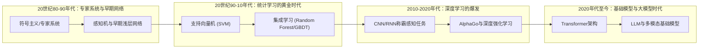

# 1. 引言

人工智能（Artificial Intelligence, AI）作为计算机科学皇冠上的明珠，正以前所未有的速度重塑人类社会。而在这场波澜壮阔的技术革命中，**机器学习（Machine Learning, ML）** 无疑是最核心的驱动引擎。传统基于规则的专家系统受限于人类先验知识的边界，而机器学习则通过让计算机从海量数据中自主“学习”规律，实现了从“授人以鱼”到“授人以渔”的范式跃迁。

从早期以支持向量机（SVM）为代表的统计学习方法，到以随机森林（Random Forest）、XGBoost 为首的集成学习霸主，再到如今席卷全球的深度神经网络（DNN）和基于大语言模型（LLM）的基础模型，机器学习的边界在算力与数据的双重加持下不断拓展。

本文旨在系统梳理机器学习研究进展，为学习和研究机器学习提供参考。

# 2. 机器学习基本概述

## 2.1 什么是机器学习？

机器学习是一门多领域交叉学科，涉及概率论、统计学、逼近论、凸分析、算法复杂度理论等。其核心思想是：**让计算机通过算法解析数据、从中学习规律，并利用这些规律对真实世界中的未知事件做出预测和决策**。相比于传统的硬编码规则，机器学习模型能够随着数据的增加er自动优化其性能。

## 2.2 核心要素与系统架构

一个完整的机器学习系统通常包含以下五个核心要素：
1. **数据 (Data)**：模型的燃料，决定了学习的上限。包括特征提取与预处理。
2. **特征工程 (Feature Engineering)**：将原始数据转化为模型可理解的特征向量，传统 ML 强依赖于此。
3. **模型假设 (Hypothesis Space)**：决定了模型能表达的函数集合（如线性组合、决策树边界或神经网络流形）。
4. **目标函数 (Objective Function)**：定义“好”与“坏”的度量标准，通常由损失函数（Loss Function）和正则化项（Regularization）组成。
5. **优化算法 (Optimization Algorithm)**：求解目标函数最小化（或最大化）参数的策略，如梯度下降（Gradient Descent）、Adam 等。

## 2.3 主要挑战

尽管成果丰硕，机器学习在实际落地中仍面临诸多挑战：
- **过拟合与泛化 (Overfitting & Generalization)**：模型在训练集上表现优异，但在未见过的测试集上表现糟糕。
- **数据维度灾难 (Curse of Dimensionality)**：特征维度过高导致样本稀疏，计算复杂度呈指数级增长。
- **可解释性黑盒问题 (Interpretability)**：尤其是深度学习模型，往往难以解释其决策的具体逻辑，阻碍了其在医疗、金融等高风险领域的应用。
- **计算资源瓶颈**：大模型时代，训练和推理成本极高，对 GPU/TPU 集群提出了严苛要求。

## 2.4 研究发展趋势

机器学习的发展经历了从符号主义、统计学习到深度学习，再到如今大模型时代的演进过程：

## 2.5 关键技术方向

- **表示学习 (Representation Learning)**：自动学习数据的有效特征表示，取代人工特征工程，是深度学习成功的关键。
- **迁移学习 (Transfer Learning)**：将一个领域/任务学到的知识迁移到另一个相关领域/任务，极大缓解了数据稀缺问题。
- **元学习 (Meta-Learning)**：也称“学会学习”，旨在让模型具备快速适应新任务的能力（如 Few-shot Learning）。

## 2.6 未来研究方向

未来机器学习的研究重点正逐渐向以下方向倾斜：
1. **通用人工智能 (AGI)**：跨越专用 AI 边界，具备全面认知、推理和执行能力的智能体。
2. **可信与对齐 AI (Trustworthy & Aligned AI)**：确保 AI 系统的目标与人类价值观一致，具备安全性、公平性和透明度。
3. **AI for Science**：利用机器学习解决物理、化学、生物（如 AlphaFold）等基础科学领域的复杂计算问题。

# 3. 学习范式与分类体系

根据训练数据是否带有标签以及模型与环境的交互方式，机器学习主要分为以下四大范式：

## 3.1 监督学习 (Supervised Learning)

监督学习是最成熟、应用最广的范式。其训练数据由输入特征 $\mathbf{x}$ 和对应的标签（Ground Truth）$y$ 组成。模型的目标是学习一个映射函数 $f: \mathbf{x} \rightarrow y$。
- **核心任务**：分类（Classification，标签为离散类别）与回归（Regression，标签为连续数值）。
- **代表算法**：线性回归、逻辑回归、SVM、决策树、多数深度神经网络。

## 3.2 无监督学习 (Unsupervised Learning)

无监督学习的数据**没有标签**，模型需要自主发掘数据内部的潜在结构、模式或分布。
- **核心任务**：聚类（Clustering）、降维（Dimensionality Reduction）、异常检测（Anomaly Detection）。
- **代表算法**：K-Means、PCA、自编码器（Autoencoder）、高斯混合模型（GMM）。

## 3.3 强化学习 (Reinforcement Learning)

强化学习侧重于智能体（Agent）如何在环境（Environment）中采取动作（Action），以最大化累积奖励（Reward）。它没有立即的标注数据，而是通过“试错”（Trial and Error）和“延迟奖励”来进行学习。
- **核心概念**：状态（State）、动作（Action）、奖励（Reward）、策略（Policy）、价值函数（Value Function）。
- **代表算法**：Q-Learning、DQN、PPO、SAC。

## 3.4 半监督与自监督学习 (Semi/Self-Supervised Learning)

- **半监督学习**：利用少量有标签数据和大量无标签数据进行训练，降低标注成本。
- **自监督学习**：一种特殊的无监督学习，通过数据本身自动构造伪标签（如预测句子中的下一个词，或图像的部分遮挡恢复），是目前预训练大语言模型（如 GPT）的核心范式。

# 4. 经典算法与代表性模型

本章系统梳理从传统统计学习到现代深度学习的标志性算法。

## 4.1 核心算法分类概览

在深入探讨具体模型之前，下表梳理了机器学习中经典的算法分类及其代表性模型：

| 类别 | 代表性模型 / 技术 | 主要特点 | 应用场景 |
| :--- | :--- | :--- | :--- |
| **线性模型** | 线性回归、逻辑回归 | 简单易懂、计算量小、可解释性强 | 房价预测、点击率预估 (CTR) |
| **集成学习** | 随机森林、XGBoost、LightGBM | 鲁棒性强、处理表格数据效果极佳 | 金融风控、搜索排序 |
| **传统统计/概率** | SVM、KNN、朴素贝叶斯、HMM | 理论严谨、适合小样本任务 | 文本分类、语音识别、生物信息 |
| **聚类与降维** | K-Means、PCA、t-SNE | 无监督、发现数据潜在结构 | 用户画像、数据压缩、可视化 |
| **深度神经网络** | CNN、RNN、LSTM、MLP | 强大的非线性拟合与特征提取能力 | 图像识别、自然语言处理 |
| **大模型基石** | Transformer、BERT、GPT | 并行能力强、捕捉长距离依赖、涌现能力 | 聊天机器人、通用人工智能 |
| **生成式模型** | GAN、VAE、Diffusion Models | 学习数据分布、生成高质量新样本 | AI 绘画、视频生成、分子设计 |

---

## 4.2 线性回归 (Linear Regression) 与 正则化

线性回归是回归分析中最基础的模型，假设目标变量与特征之间存在线性关系。其目标函数通常是最小化均方误差（MSE）。
- **数学表达式**：$y = \mathbf{w}^T \mathbf{x} + b$
- **优化方法**：可以通过最小二乘法直接求解闭式解（正规方程），也可以使用梯度下降法进行迭代优化。
- **正则化 (Regularization)**：为了防止在特征维度较高时发生过拟合，常在损失函数中引入正则化惩罚项：
  - **Ridge 回归（L2 正则化）**：增加 $\lambda \|\mathbf{w}\|_2^2$ 项，限制参数的平方和，使参数平滑，有效缓解多重共线性问题。
  - **Lasso 回归（L1 正则化）**：增加 $\lambda \|\mathbf{w}\|_1$ 项，限制参数的绝对值和。L1 正则化的几何特性使其容易产生稀疏解（即将部分权重压缩为0），因此自带特征选择功能。

  
  <figcaption>图：线性回归算法示意图</figcaption>

## 4.3 逻辑回归 (Logistic Regression)

虽然名为“回归”，但逻辑回归本质上是一个**二分类**算法。它在线性回归的基础上，引入了非线性的 Sigmoid 激活函数，将连续的线性输出映射到 $(0, 1)$ 区间，从而赋予其概率意义。
- **核心函数**：$P(y=1|\mathbf{x}) = \sigma(\mathbf{w}^T \mathbf{x} + b) = \frac{1}{1 + e^{-(\mathbf{w}^T \mathbf{x} + b)}}$
- **损失函数**：交叉熵损失（Cross-Entropy Loss），通过最大似然估计推导而来。
- **特点**：计算代价低，速度快，输出具有明确的概率解释，常用于金融风控中的信用评分卡、广告点击率（CTR）预估等基础场景。

  
  <figcaption>图：逻辑回归算法示意图</figcaption>

## 4.4 决策树 (Decision Tree)

决策树模仿人类基于规则判断的思维过程，通过树状结构对数据进行分类或回归。每个内部节点表示对某一特征的条件判断，分支代表判断结果，叶节点表示最终预测的类别或数值。
- **分裂准则**：
  - **ID3 算法**：基于**信息增益**（Information Gain）选择特征，倾向于选择取值较多的特征。
  - **C4.5 算法**：基于**信息增益率**（Gain Ratio）进行改进，克服了 ID3 的缺陷。
  - **CART 算法**：分类树使用**基尼指数**（Gini Impurity），回归树使用平方误差。CART 是一棵二叉树，是许多集成树模型的基础。
- **优缺点**：可解释性极强，不需要进行数据标准化，能处理缺失值；但极易产生过拟合，通常需要通过剪枝（Pruning）来控制树的复杂度。

  
  <figcaption>图：决策树结构示意图</figcaption>

## 4.5 随机森林 (Random Forest)

**Bagging（Bootstrap Aggregating）** 是一种并行的集成学习范式，核心思想是“三个臭皮匠，顶个诸葛亮”。随机森林是 Bagging 的代表作。
- **核心机制**：通过对训练样本进行有放回的随机采样（Bootstrap），构建多棵相互独立的决策树。同时，在每个节点分裂时，也只在随机子集的特征中选择最优划分特征。
- **结果输出**：分类任务通过多棵树投票产生最终结果，回归任务则取平均值。
- **特点**：极大地降低了单一决策树的方差（Variance），抗噪能力强，不容易过拟合，且能评估特征重要性。

  
  <figcaption>图：随机森林算法示意图</figcaption>

## 4.6 梯度提升树 (GBDT, XGBoost, LightGBM)

**Boosting** 是一种串行的集成学习范式，核心思想是“不断纠错”。后续的模型重点关注前序模型预测错误的样本，将其加权累积。
- **GBDT (Gradient Boosting Decision Tree)**：以 CART 回归树为基分类器，每次迭代通过拟合上一步模型的**负梯度**（在平方损失下即为残差）来不断逼近真实值。
- **XGBoost (eXtreme Gradient Boosting)**：GBDT 的工程极致优化版。它不仅在目标函数中引入了二阶导数信息（泰勒展开）以加速收敛，还加入了 L1 和 L2 正则化项以控制模型复杂度。此外，支持缺失值自动处理和特征并行计算，曾在 Kaggle 竞赛中统治了表格数据的预测任务。
- **LightGBM**：微软推出的更高效的 Boosting 框架。通过引入基于直方图（Histogram）的决策树算法、单边梯度采样（GOSS）和互斥特征捆绑（EFB），在保证精度的前提下大幅降低了内存消耗和计算时间。

  
  <figcaption>图：梯度提升决策树 (GBDT) 示意图</figcaption>

## 4.7 K近邻算法 (K-Nearest Neighbors, KNN)

KNN 是一种典型的“懒惰学习（Lazy Learning）”算法，它在训练阶段几乎不进行任何计算，仅保存训练数据。
- **预测机制**：在预测时，计算测试样本与所有训练样本之间的距离（如欧氏距离、曼哈顿距离），寻找在特征空间中最近的 $K$ 个样本。
- **决策规则**：分类任务采取多数表决（Majority Voting），回归任务取均值。可引入距离加权机制，距离越近权重越大。
- **缺点**：预测时需要遍历所有数据，计算复杂度随数据量呈线性增长；对数据的尺度（Scale）敏感，使用前必须进行归一化处理；存在维度灾难问题。

  
  <figcaption>图：K近邻 (KNN) 算法示意图</figcaption>

## 4.8 朴素贝叶斯 (Naive Bayes) 与 隐马尔可夫模型 (HMM)

- **朴素贝叶斯**：基于贝叶斯定理，并做出了一个极具破坏性但非常高效的“朴素”假设——**特征之间相互条件独立**。即 $P(\mathbf{x}|y) = \prod_{i=1}^n P(x_i|y)$。尽管该假设在现实中很少成立，但其在文本分类（如垃圾邮件过滤、情感分析）中往往能取得惊人的效果，且训练速度极快，适合超大规模数据。
- **隐马尔可夫模型 (HMM)**：一种用于处理序列数据的概率图模型。它包含一个隐藏状态序列（不可见）和一个观测序列（可见），假设当前状态只依赖于前一个状态（马尔可夫假设），且当前观测只依赖于当前状态。广泛用于早期的语音识别、自然语言处理中的词性标注（POS tagging）及生物信息学中的基因序列分析。

  
  <figcaption>图：朴素贝叶斯 (Naive Bayes) 分类器示意图</figcaption>

  
  <figcaption>图：隐马尔可夫模型 (HMM) 状态转移示意图</figcaption>

## 4.9 支持向量机 (Support Vector Machines, SVM)

在深度学习爆发之前，SVM 被认为是机器学习中分类效果最好的算法之一。
- **核心思想**：试图在特征空间中找到一个超平面，使得不同类别的样本之间不仅被正确分开，而且**几何间隔（Margin）最大化**。这种“最大间隔”的追求赋予了 SVM 极强的泛化能力。
- **支持向量**：决定分类边界的仅仅是距离超平面最近的那些样本点，称为“支持向量”。
- **核技巧 (Kernel Trick)**：当数据在原始空间线性不可分时，SVM 通过核函数（如线性核、多项式核、高斯 RBF 核）巧妙地将低维特征隐式映射到高维（甚至是无限维）空间，使其变得线性可分，从而解决了非线性分类问题，且避免了高维计算的维度灾难。

  
  <figcaption>图：支持向量机 (SVM) 分类面与间隔示意图</figcaption>

## 4.10 K-Means 聚类

最经典、应用最广泛的无监督聚类算法。
- **算法流程**：
  1. 随机初始化 $K$ 个聚类中心（Centroids）。
  2. 遍历所有样本，将其分配给距离最近的聚类中心。
  3. 根据分配好的簇，重新计算每个簇的质心（即所有样本的均值），更新聚类中心。
  4. 重复步骤 2 和 3，直到聚类中心不再发生显著变化（收敛）或达到最大迭代次数。
- **优缺点**：算法简单高效，时间复杂度为 $O(nKt)$；但对初始值的选择和异常值敏感，且必须预先指定 $K$ 值，只能发现球形簇，难以处理复杂流形分布的数据。

  
  <figcaption>图：K-Means 聚类过程示意图</figcaption>

## 4.11 主成分分析 (PCA) 与 t-SNE

- **主成分分析 (PCA)**：一种经典的线性降维方法。核心思想是通过正交变换，将可能相关的原始高维特征投影到一个新的正交坐标系中，这些新的坐标轴（主成分）按照数据方差的大小排列。保留前几个方差最大的主成分，可以在损失最少信息的前提下实现降维、数据去相关性和压缩。
- **t-SNE (t-Distributed Stochastic Neighbor Embedding)**：一种非线性降维算法，主要用于将高维数据映射到 2D 或 3D 空间进行可视化。它通过将数据点之间的欧氏距离转化为条件概率来表达相似度，并使用 t 分布缓解高维空间映射到低维时的“拥挤问题（Crowding Problem）”，能够非常出色地保持数据的局部流形结构和类内聚集特征。

  
  <figcaption>图：主成分分析 (PCA) 降维示意图</figcaption>

  
  <figcaption>图：t-SNE 降维可视化示意图</figcaption>

---

## 4.12 多层感知机 (MLP) 与 反向传播 (Backpropagation)

深度学习（Deep Learning, DL）通过多层非线性变换提取数据的高阶特征。多层感知机是最基础的前馈神经网络（Feedforward Neural Network）。
- **结构**：由输入层、一个或多个隐藏层以及输出层组成，层与层之间全连接。每个神经元接收上一层输出的加权和，并经过非线性激活函数（如 ReLU, Sigmoid, Tanh）处理。
- **反向传播 (BP) 算法**：神经网络训练的基石。在网络前向传播计算损失后，BP 算法基于微积分的**链式法则**，从输出层反向逐层计算损失函数对每个网络参数（权重和偏置）的梯度，随后利用梯度下降算法（如 SGD, Adam）更新参数。

  
  <figcaption>图：典型深度神经网络结构示意图</figcaption>

## 4.13 卷积神经网络 (CNN)

CNN 是专门为处理网格状拓扑数据（如图像的 2D 像素网格）而设计的神经网络架构，是计算机视觉领域的基石。
- **核心机制**：
  - **局部感受野与卷积核**：利用小型滤波器（卷积核）在输入特征图上滑动，提取局部特征（如边缘、纹理），极大地减少了参数量。
  - **权重共享**：同一个卷积核遍历整张图像，使得模型具有平移等变性。
  - **池化层 (Pooling)**：如最大池化，用于下采样操作，降低特征图维度，增加平移不变性，扩大感受野。
- **经典架构**：LeNet-5 (早期手写数字识别)、AlexNet (引爆深度学习)、VGG (堆叠小卷积核)、ResNet (引入残差连接解决深层网络退化问题，深度可达上百层)。

  
  <figcaption>图：LeNet-5 经典卷积神经网络架构</figcaption>

## 4.14 循环神经网络 (RNN & LSTM/GRU)

RNN 专门用于处理诸如文本、语音、时间序列等变长序列数据。
- **隐状态机制**：RNN 在处理当前时间步的输入时，不仅依赖当前输入，还依赖前一个时间步的“隐状态（Hidden State）”，从而赋予了网络时间上的记忆功能。
- **梯度消失与爆炸**：由于在时间维度上的反向传播（BPTT）涉及权重的连续连乘，传统 RNN 难以学习长距离的依赖关系。
- **长短期记忆网络 (LSTM)**：通过引入巧妙的门控机制（遗忘门、输入门、输出门）和细胞状态（Cell State），LSTM 允许信息在较长时间内无损地流动，成功解决了长依赖问题。**GRU** 是 LSTM 的简化变体，计算更高效。

  
  <figcaption>图：LSTM 链式结构图与门控机制</figcaption>

## 4.15 Transformer 架构 (Self-Attention)

Transformer 彻底抛弃了 RNN 和 CNN 的结构，完全基于注意力机制，是当前大模型时代的最底层基石架构。
- **自注意力机制 (Self-Attention)**：允许序列中的每一个元素都能“关注”到其他所有元素，计算出它们之间的关联权重，从而并行地捕捉全局长距离依赖。
- **核心公式**：
  $$ \text{Attention}(Q, K, V) = \text{softmax}\left(\frac{QK^T}{\sqrt{d_k}}\right)V $$
- **架构特点**：由于缺乏序列顺序信息，必须引入**位置编码 (Positional Encoding)**。模型高度可并行化，训练效率远超 RNN，极大地释放了 GPU 的算力潜力。

  
  <figcaption>图：Transformer 模型架构（来源：Vaswani et al., 2017）</figcaption>

## 4.16 BERT 与 GPT 系列模型范式

基于 Transformer 架构，自然语言处理衍生出两大主流预训练范式：
- **BERT (Bidirectional Encoder Representations from Transformers)**：
  - **架构**：Transformer 的 Encoder 部分。
  - **预训练任务**：掩码语言模型（Masked Language Model, MLM），即随机遮挡句子中的部分词汇，让模型结合双向上下文去预测它们。
  - **优势**：在文本分类、问答、命名实体识别等自然语言理解（NLU）任务上表现卓越，代表着“预训练 + 微调”范式的巅峰。
- **GPT (Generative Pre-trained Transformer)**：
  - **架构**：Transformer 的 Decoder 部分。
  - **预训练任务**：自回归语言建模（Autoregressive Next-token Prediction），即根据前文预测下一个词。它采用严格的单向可见性（因果掩码）。
  - **演进**：随着模型参数量和预训练数据量的指数级扩大（Scaling Laws），GPT-3 展现出了强大的 In-context Learning 和涌现能力（Emergent Abilities），而 GPT-4 则进一步融入了多模态能力和 RLHF 对齐技术，成为了当前通用人工智能（AGI）雏形的绝对主流范式。

## 4.17 生成对抗网络 (GAN)

GAN 开创了生成式 AI 的新纪元，其灵感来源于博弈论。
- **架构**：包含两个相互独立的神经网络——生成器（Generator）和判别器（Discriminator）。
- **博弈过程**：生成器试图从随机噪声中生成尽可能逼真的假样本以“骗过”判别器；而判别器则努力分辨输入的样本是来自真实数据集还是生成器造假。在不断的对抗训练中，两者共同进化，最终生成器能够拟合出极度逼真的真实数据分布。广泛应用于图像生成、图像修复、风格迁移等领域。

  
  <figcaption>图：生成对抗网络 (GAN) 架构示意图</figcaption>

## 4.18 变分自编码器 (VAE)

VAE 是一种基于严格概率图模型的生成模型。
- **核心机制**：传统的自编码器只是将数据压缩成一个隐向量，而 VAE 强制要求编码器（Encoder）将输入映射到一个标准的概率分布（通常是标准正态分布）。
- **生成过程**：解码器（Decoder）再从该概率分布中采样，解码重构出原始输入。由于隐空间具有连续和良好的数学性质，通过在分布中进行插值或随机采样，模型可以生成结构合理的全新样本。

  
  <figcaption>图：变分自编码器 (VAE) 架构示意图</figcaption>

## 4.19 扩散模型 (Diffusion Models)

扩散模型是近年来在图像和音频生成领域全面超越 GAN 的新晋王者（如 Stable Diffusion, Midjourney, DALL-E 系列均基于此构建）。
- **前向扩散过程（加噪）**：按照马尔可夫链，逐步向清晰的真实图像中添加高斯噪声，直至图像完全变成纯随机噪声。
- **反向去噪过程（生成）**：训练一个神经网络（通常是 U-Net），学习在每一步如何预测并去除所添加的噪声。
- **特点**：相比 GAN，扩散模型的训练过程更加稳定，不会出现模式崩溃（Mode Collapse），且生成的图像具有惊人的细节丰富度和多样性，是当前多模态 AIGC 的核心技术引擎。

# 5. 主流应用场景

机器学习目前已经深度渗透到数字世界与物理世界的方方面面：

## 5.1 计算机视觉 (CV)
- **核心任务**：图像分类、目标检测（如 YOLO 系列）、语义分割、图像生成。
- **应用**：人脸识别、医学影像分析、工业缺陷检测。

## 5.2 自然语言处理 (NLP)
- **核心任务**：机器翻译、文本摘要、情感分析、对话系统。
- **应用**：ChatGPT 等智能助手、智能客服、文档自动审核。

## 5.3 推荐系统与计算广告
- 互联网巨头的变现核心。通过协同过滤（Collaborative Filtering）、深度交叉网络等技术，挖掘用户历史行为与物品之间的匹配概率，实现精准推送。

## 5.4 机器人、自动驾驶与具身智能 (Embodied AI)
- 结合强化学习、视觉与大语言模型，让机器人在复杂的物理环境中实现感知、规划、导航与灵巧操作。这是当前 AI 从数字空间走向物理世界的最前沿阵地。

# 6. 主流数据集、评测基准与框架

## 6.1 经典数据集与基准

| 数据集 | 领域 | 特点与历史意义 |
|:---|:---|:---|
| **ImageNet** | CV (分类) | 包含千万级标注图像，其 2012 年的比赛直接引爆了深度学习革命。 |
| **COCO** | CV (检测分割) | 微软发布，具有丰富的多目标、多上下文的复杂场景标注。 |
| **MNIST** | CV (入门) | 手写数字识别集，被誉为机器学习领域的 "Hello World"。 |
| **GLUE** | NLP | 评估自然语言理解模型的综合基准，推动了 BERT 时代的发展。 |

## 6.2 主流工具与开源框架

- **Scikit-learn**：Python 下的传统机器学习库，集成了几乎所有经典 ML 算法（SVM, RF, KNN等），API 设计极为优雅。
- **XGBoost / LightGBM**：处理表格数据不可或缺的梯度提升树框架。
- **TensorFlow**：Google 开源的深度学习框架，工业界部署生态完善。
- **PyTorch**：Meta 开源的深度学习框架，凭借动态计算图和极佳的易用性，已成为目前学术界绝对的主流，并逐渐统治工业界大模型训练底座。
- **HuggingFace**：大模型时代的开源基建，提供了海量的预训练模型权重与快捷的 `transformers` 库调用接口。

# 7. 总结

机器学习是一场关于数据与算法的演化史。从早期的专家规则，到严谨的统计概率模型，再到大力出奇迹的深度神经网络和基础大模型，其核心始终是**寻找更优的表示和更高效的优化路径**。

对于研究者和工程师而言，了解每一种算法的边界与假设至关重要：在海量非结构化数据（图、文、音）面前，深度学习与 Transformer 无可替代；但在中小规模的结构化表格数据中，XGBoost 等树模型依然具有极高的性价比和解释性。未来，随着算法、算力和数据的进一步交融，机器学习必将朝着通用性（AGI）和可信性稳步迈进。

  
  <figcaption>图：扩散模型 (Diffusion Model) 前向与反向过程示意图</figcaption>

