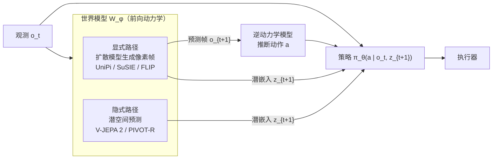
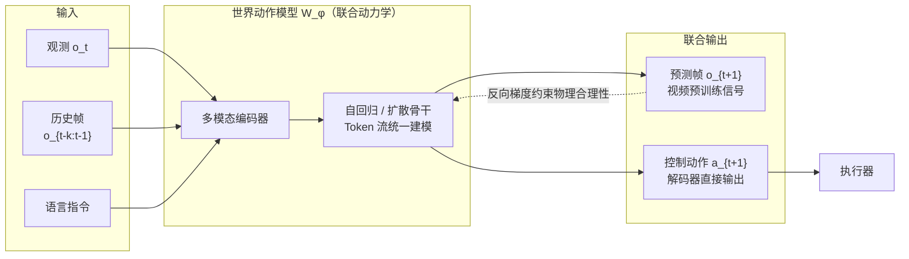
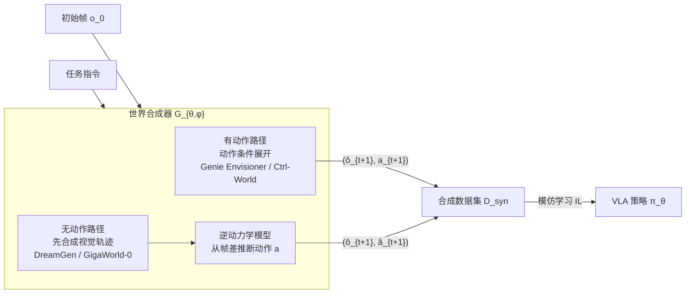
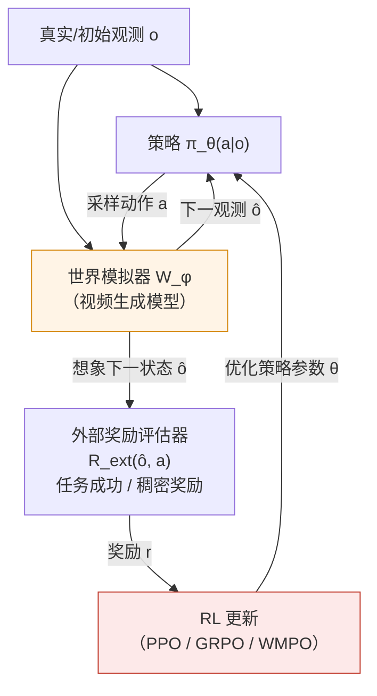
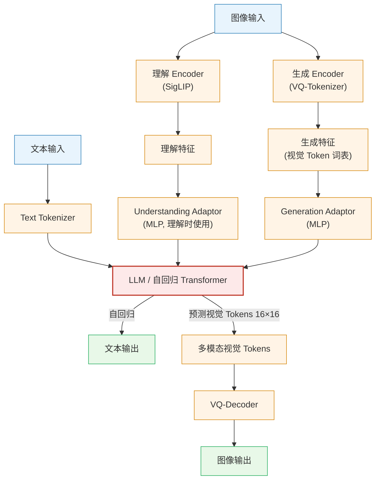

# 1. 引言

具身智能（Embodied AI）的终极目标是开发能够像人类一样在复杂现实世界中感知、推理并执行任务的通用智能体。近年来，视觉-语言-动作（Vision-Language-Action, VLA）模型的出现，标志着具身智能向通用化迈出了关键一步。VLA 模型利用大规模多模态预训练模型（如 LLMs/VLMs）的语义推理能力，将高层指令转化为底层的机器人控制指令。

然而，现有的 VLA 智能体在实际部署中仍面临三大核心挑战：
1. **物理幻觉（Physical Hallucination）**：生成的动作往往缺乏物理常识约束。
2. **计划验证缺失**：难以预见动作执行后的物理后果，导致无法在闭环中验证计划的可执行性。
3. **数据稀缺**：高质量的机器人交互数据获取成本极高，限制了模型的扩展性。

为了应对这些挑战，**世界模型（World Models）** 被引入具身智能领域，作为一种"未来预测器"，模拟环境的时间演变。通过预测未来状态，世界模型不仅为 VLA 提供了物理接地的引导，还成为了高效的数据引擎和虚拟仿真环境。

  
<figcaption>图1：具身智能世界模型总览。世界模型（交互性、未来预测、物理接地）与 VLA（通用策略、开放指令、VLM 推理）的结合，赋予智能体仿真、前瞻规划和数据生成三大核心能力。（图源：Tan et al., 2026）</figcaption>

本文基于同济大学 Tan et al.（2026）发布于 TechRxiv 的综述论文 *Towards Generalist Embodied AI: A Survey on World Models for VLA Agents*，系统梳理具身智能中世界模型的研究进展，为学习和研究该领域提供参考。

# 2. 具身智能世界模型基本概述

## 2.1 什么是具身智能世界模型？

  
<figcaption>
Cosmos WM 和 OpenVLA 
</figcaption>

在具身智能语境下，世界模型 $W_\phi$ 旨在通过近似状态转移分布 $$P(s_{t+1} \mid s_t, \cdot)$$ 来捕捉环境动力学。它通常采用生成式骨干网络（如 Diffusion 或 Transformer）来建模复杂场景的时空演化。

与传统的机器人仿真器不同，具身智能世界模型通常是从大规模多模态数据中"学习"物理规律，能够生成物理上一致的未来预测，从而辅助智能体进行闭环推理。

**与 VLA 的关键区别**：大型语言模型（LLMs）作为离散世界模型，擅长文本中心的推理，但难以捕捉连续物理动力学。具身世界模型通过预测连续的未来状态，填补了这一关键空白，将高层语义意图与低层物理执行连接起来。

## 2.2 核心要素与系统架构

世界模型与 VLA 智能体的集成通常包含以下核心能力：
- **交互性（Interactivity）**：响应动作输入并反馈环境变化。
- **未来预测（Future Prediction）**：预测像素级或潜空间级的未来状态。
- **物理接地（Physical Grounding）**：确保生成的轨迹符合物理常识。

其典型的系统架构可分为：
1. **感知编码器**：将视觉和语言输入转化为特征。
2. **动态模型（世界模型核心）**：预测未来的潜状态或图像序列。
3. **策略网络（VLA）**：根据预测的未来信息生成最终动作。

## 2.3 研究发展趋势

世界模型的研究从最初的简单动作预测，逐步演进为集感知、推理、生成于一体的复杂系统。下图展示了 2023 年至 2025 年四大范式的演化时间轴。

  
<figcaption>图2：VLA 世界模型分类时间线（2023–2025）。从 2023 年的探索期到 2025 年世界合成器和世界模拟器的爆发式增长，展现了该领域的快速发展。（图源：Tan et al., 2026）</figcaption>

**关键趋势**：
- **2023年**：UniPi、SuSIE 奠定视频生成驱动规划基础；GR-1 开创世界动作模型范式。
- **2024年**：PIVOT-R、3D-VLA 引入 3D 感知；GR-2 验证了大规模视频预训练的有效性。
- **2025年初**：UP-VLA、CoT-VLA 拓展推理增强方向；WorldGym 成为首批世界模拟器之一。
- **2025年中后期**：世界合成器（DreamGen、Ctrl-World、GigaWorld-0）和世界模拟器（VLA-RFT、RoboScape-R、NORA-1.5）爆发式增长，受益于生成式 AI 技术的快速进步。

# 3. 四大技术范式详解

  
<figcaption>图3：VLA 世界模型的四大技术范式。(a) 世界规划器：世界模型生成潜表示 z 引导 VLA；(b) 世界动作模型：将观察与动作联合建模；(c) 世界合成器：通过模仿学习（IL）构建合成数据集；(d) 世界模拟器：通过强化学习（RL）优化策略并获取外部奖励。（图源：Tan et al., 2026）</figcaption>

## 3.1 世界规划器 (World Planner)

  
<figcaption>图：InternVLA·N1 的端到端双系统架构（图源：Intern Robotics）</figcaption>

 

**定义**：该范式采用世界模型 $$\mathcal{W}_\phi$$ 作为前向动力学模型，以显式未来观测或隐式潜特征的形式合成前瞻引导，为策略 $$\pi_\theta$$ 提供语义条件：

$$
\max_\theta \mathbb{E}_{z_{t+1} \sim \mathcal{W}_\phi(\cdot|o_t)} \left[ \sum_t \log \pi_\theta(a_{t+1} | o_t, z_{t+1}) \right]
$$

世界规划器的核心思路是**预测先于行动**：先用世界模型预见未来（显式图像或隐式潜向量），再将该前瞻信号作为条件喂给策略，使动作决策具备物理接地的未来感知。两种主流路径的信息流如下：

**细粒度分类**（根据规划范式和引导信号）：

| 范式 | 引导信号 | 代表性方法 |
|:---|:---|:---|
| 显式（Explicit） | 预测图像 | UniPi, SuSIE, GR-MG, Vidar, 3D-VLA, FLIP |
| 隐式（Implicit） | 潜嵌入 | V-JEPA 2, PIVOT-R |
| 显式（Explicit） | 潜嵌入 | VPP, MinD, TriVLA, GO-1, Genie Envisioner |
| 混合（Hybrid） | 混合 | MoWM |

**演进路径**：UniPi、SuSIE、GR-MG、Vidar、3D-VLA、FLIP 等将规划视为高保真视频生成任务，通过扩散模型合成像素级未来状态，再经逆动力学模型导出动作。近期 V-JEPA 2 和 PIVOT-R 转向隐式规划，直接在潜空间预测未来状态，避免了动力学无关的视觉细节（如光照、纹理）的干扰，提升了引导信号的质量。MoWM 则融合多种动力学先验形成混合方案，进一步简化动作推导。

## 3.2 世界动作模型 (World Action Model)

**定义**：该范式采用生成式建模近似未来观测与动作的联合分布，预测视觉与控制的耦合动力学：

$$
\max_\phi \mathbb{E}_{\tau \sim \mathcal{D}} \left[ \sum_t \log \mathcal{W}_\phi(o_{t+1}, a_{t+1} | o_t) \right]
$$

与世界规划器"策略与预测分离"不同，世界动作模型将两者**统一在同一个网络中**联合优化：既要能预测未来帧（视频目标），又要能从中直接解码动作（控制目标）。下图展示了其核心数据流：

**细粒度分类**（根据建模范式和实现机制）：

| 范式 | 机制 | 代表性方法 |
|:---|:---|:---|
| 自回归（AR） | 视频预训练 | GR-1, HMA, UniVLA, GR-2 |
| 自回归（AR） | 统一序列建模 | WorldVLA, RynnVLA-002, UP-VLA |
| 自回归（AR） | 前瞻推理 | Seer, F1, GR-MG, PAR |
| 自回归（AR） | 推理增强 | FlowVLA, CoT-VLA, DreamVLA |
| 扩散（Diff.） | 离散值 | UD-VLA, dVLA |
| 扩散（Diff.） | 连续值 | DUST, FLARE |

**演进路径**：GR-1 开创视频预训练范式后，WorldVLA、RynnVLA-002 将动作与观测整合为统一 Token 流，实现端到端的具身一致性。推理增强方向（FlowVLA、CoT-VLA、DreamVLA）引入多模态思维链结构化决策过程。扩散范式中，UD-VLA 和 dVLA 通过离散扩散提升 Token 生成质量；DUST 和 FLARE 利用联合扩散机制实现高精度连续控制，有效缓解动作离散化带来的信息损失。

## 3.3 世界合成器 (World Synthesizer)

**定义**：该范式构建可扩展的数据引擎，通过联合生成器 $$\mathcal{G}_{\theta,\phi}$$ 合成交错的观测-动作轨迹 $$\tilde{\tau}$$ 支持模仿学习：

$$
\mathcal{D}_{syn} \triangleq \left\{ \tilde{\tau} \sim p(o_0) \prod_t \mathcal{G}_{\theta,\phi}(\hat{o}_{t+1}, a_{t+1} | \hat{o}_t) \right\}
$$

世界合成器充当**数据飞轮**：从少量真实数据出发，生成大量带标注的合成轨迹，再将其反哺 VLA 训练。关键在于有无动作标注的两条合成路径：

**细粒度分类**（根据合成范式和生成策略）：

| 范式 | 机制 | 代表性方法 |
|:---|:---|:---|
| 视角增强（View Aug.） | 腕部视角前瞻 | WristWorld |
| 生成数据（Gen. Data） | 动作条件生成 | Genie Envisioner, Ctrl-World |
| 生成数据（Gen. Data） | 无动作合成 | DreamGen, GigaWorld-0 |

**演进路径**：WristWorld 通过生成 4D 腕部视角数据进行视角增强，专注于改善自我中心前瞻。Genie Envisioner 和 Ctrl-World 采用动作条件世界模型，基于特定动作序列展开未来观测。DreamGen 和 GigaWorld-0 则首先合成视觉轨迹，再通过逆动力学推断动作——无需动作标注，为突破机器人数据长尾瓶颈提供了重要途径。

## 3.4 世界模拟器 (World Simulator)

**定义**：该范式将动作条件世界模型 $$\mathcal{W}_\phi$$ 作为虚拟仿真器，通过与外部奖励评估器集成，在想象结果上优化期望奖励：

$$
\max_\theta \mathbb{E}_{\substack{a \sim \pi_\theta(\cdot|o) \\ \hat{o} \sim \mathcal{W}_\phi(\cdot|o,a)}} \left[ \mathcal{R}_{ext}(\hat{o}, a) \right]
$$

世界模拟器将世界模型视为**虚拟物理环境**，策略在想象空间中通过 RL 优化，无需昂贵的真实机器人交互：

**细粒度分类**（根据仿真范式和实现机制）：

| 范式 | 机制 | 代表性方法 |
|:---|:---|:---|
| 评估（Eva.） | 任务成功率 | WorldGym, Genie Envisioner |
| 强化学习（RL） | 稀疏奖励 | World4RL, WMPO, Prophet |
| 强化学习（RL） | 稠密奖励 | World-Env, VLA-RFT, RoboScape-R, SRPO, NORA-1.5 |
| 测试时适应（TTA） | — | VLA-Reasoner, AdaPower |

**演进路径**：WorldGym 和 Genie Envisioner 将世界模型作为单纯的评估器来验证 VLA 性能。稀疏奖励 RL 方案（World4RL、WMPO、Prophet）引入合成反馈进行策略改进。稠密奖励方案（World-Env、VLA-RFT、RoboScape-R）进一步提供逐步奖励，显著降低对物理部署的依赖；NORA-1.5 融合 V-JEPA 2 特征提升对齐精度；VLA-Reasoner 和 AdaPower 则探索测试时适应，允许模型在线动态更新。

# 4. 经典代表性工作

本章节梳理了具身智能世界模型演进过程中的几项里程碑式研究。

## 4.1 NeRF (2020)
———Representing Scenes as Neural Radiance Fields for View Synthesis

📄 **Paper**: [https://arxiv.org/abs/2003.08934](https://arxiv.org/abs/2003.08934)

### 精华

NeRF 是神经渲染（Neural Rendering）领域的开创性工作，其核心贡献和启发包括：
1. **隐式场景表示**：不再使用显式的点云或网格，而是将 3D 场景编码为 MLP 网络的权重，实现极高精度的连续场景表示。
2. **5D 辐射场函数**：通过输入空间坐标 $(x, y, z)$ 和观测视角 $(\theta, \phi)$，输出颜色和体积密度，完美捕捉了与视图相关的材质光泽（如 Specular 效应）。
3. **位置编码（Positional Encoding）**：发现并解决了深度网络偏向学习低频信号的问题，通过傅里叶变换将坐标映射到高维空间，从而还原复杂的纹理细节。
4. **层次化体采样**：设计了 Coarse-to-Fine 的采样策略，通过两个 MLP 同时优化，将计算资源集中在场景中有内容的区域，显著提升了渲染效率和质量。
5. **端到端可微体渲染**：结合经典体渲染公式，使得整个管线仅需带位姿的 2D 图像即可进行端到端训练。

---

### 1. 研究背景/问题

视角合成（View Synthesis）是计算机图形学的长期难题。传统方法（如离散体素、多平面图像或网格渲染）在处理复杂几何边缘和非朗伯体（Non-Lambertian）反射材质时，往往存在存储成本高或渲染不自然的问题。NeRF 旨在通过连续的神经场表示，在仅使用稀疏 2D 图像作为输入的情况下，实现照片级真实感的 3D 场景重建和视角合成。

---

### 2. 主要方法/创新点

  
<figcaption>
NeRF 概览：从稀疏 2D 图像集中优化出连续的 5D 神经辐射场，并渲染出全新视角的图像。
</figcaption>

NeRF 的核心管线包含以下关键技术：

1. **5D 神经场景表示**：

  
<figcaption>
NeRF 网络架构：空间位置 $x$ 先经过 8 层 MLP 生成体积密度 $\sigma$ 和特征向量，再结合视角方向 $d$ 经过额外层输出视角相关的 RGB 颜色。
</figcaption>

通过限制体积密度仅取决于位置，而颜色取决于位置和方向，模型能够保证在不同视角下观察到的几何结构一致，同时捕捉到随视角变化的光影。

2. **可微渲染管线**：

  
<figcaption>
NeRF 训练管线：沿光线采样 -> 查询 MLP -> 体渲染合成像素 -> 与真值计算损失并反向传播。
</figcaption>

利用数值积分近似体渲染方程，使得像素颜色成为网络权重的可微函数。

3. **捕捉高频细节**：
引入了位置编码 $\gamma(p)$，将原始坐标映射为一系列正余弦函数：
$$\gamma(p) = \left( \sin(2^0\pi p), \cos(2^0\pi p), \dots, \sin(2^{L-1}\pi p), \cos(2^{L-1}\pi p) \right)$$
这使得 MLP 能够拟合高频变化的颜色和几何细节，避免了渲染结果过于平滑（Oversmoothed）。

---

### 3. 核心结果/发现

- **定量与定性超越**：在合成数据集（如 Lego, Drums）和真实场景中，NeRF 的 PSNR 和 SSIM 指标均大幅超越了当时的 SOTA（如 LLFF, SRN）。

  
<figcaption>
对比实验：NeRF 在恢复复杂几何（如乐高积木内部、显微镜网格）和非朗伯反射方面表现出显著优势。
</figcaption>

- **存储优势**：相比于需要数 GB 存储的体素网络，一个复杂的 NeRF 模型仅需约 5MB 的网络权重即可表示整个场景。

---

### 4. 局限性

NeRF 的主要局限在于训练和推理速度极慢（训练单个场景需一两天，渲染一张图需几十秒）。此外，原始 NeRF 仅适用于静态场景，无法处理动态物体或由于光照变化导致的一致性问题。

---

## 4.2 3D Gaussian Splatting (2023)
———Real-Time Radiance Field Rendering via Differentiable Gaussian Primitives

📄 **Paper**: https://repo-sam.inria.fr/fungraph/3d-gaussian-splatting/

### 精华

3DGS 证明了显式、非连续的场景表示（无需神经网络）同样可以达到 SOTA 的 novel view synthesis 质量，打破了 NeRF 系隐式连续表示是高质量渲染必须条件的固有认知。各向异性协方差（通过旋转矩阵 R 和缩放矩阵 S 分解 $$\Sigma = RSS^T R^T$$）使每个 Gaussian 能够自适应地拟合场景中任意形状的几何结构，是高质量紧凑表示的关键。自适应密度控制中的 Clone（欠重建）+ Split（过重建）策略提供了一个简洁有效的几何增殖机制，可迁移应用于其他点云优化场景。Tile-based GPU Radix sort 排序 + $$\alpha$$-blending 的渲染流水线完全可微，实现了无限制梯度回传，是实现实时渲染同时保持训练质量的工程核心。

---

### 1. 研究背景/问题

Neural Radiance Field（NeRF）方法通过体积光线投射实现了高质量 novel view synthesis，但需要大量采样查询，渲染速度极慢（Mip-NeRF360 仅 0.07 fps），训练时间长达 48 小时。现有快速方法（InstantNGP、Plenoxels）在速度上有所改进但质量存在妥协，且无法实现 1080p 分辨率下真正的实时渲染（≥30 fps）。

---

### 2. 主要方法/创新点

  
<figcaption>
3DGS 整体流水线：从 SfM 稀疏点云初始化 3D Gaussians，经投影和可微 Tile Rasterizer 渲染图像，梯度回传后通过自适应密度控制调整 Gaussian 数量
</figcaption>

**3D Gaussian 表示**

场景由一组 3D Gaussian 基元表示，每个 Gaussian 由以下参数描述：
- **位置（均值）** $$\mu \in \mathbb{R}^3$$
- **各向异性协方差** $$\Sigma = RSS^T R^T$$，其中 R 为旋转矩阵（四元数 q 参数化），S 为缩放矩阵（向量 s 参数化）
- **不透明度** $$\alpha \in [0,1]$$（sigmoid 激活）
- **球谐函数（SH）系数** 表示与视角相关的颜色外观（4 bands，共 48 个系数）

3D Gaussian 函数定义为：

$$G(x) = e^{-\frac{1}{2}x^T \Sigma^{-1} x}$$

**从 3D 投影到 2D**

渲染时将 3D Gaussian 投影到图像平面，利用仿射近似的 Jacobian J 计算相机坐标系下的 2D 协方差 $$\Sigma' = JW\Sigma W^T J^T$$（去掉第三行列后为 2×2 矩阵），从而支持高效的各向异性 splatting。

**可微 Tile-based Rasterizer**

  
<figcaption>
自适应 Gaussian 密度控制方案：欠重建区域（上）通过克隆小 Gaussian 填充细节；过重建区域（下）将大 Gaussian 分裂为两个更小的 Gaussian
</figcaption>

渲染器将图像分割为 16×16 的 Tile，对每个 Gaussian 计算其覆盖的 Tile 数量并分配 64-bit key（低 32 位为深度，高 32 位为 Tile ID），通过单次 GPU Radix Sort 全局排序后进行 front-to-back $$\alpha$$-blending：

$$C = \sum_{i \in \mathcal{N}} c_i \alpha_i \prod_{j=1}^{i-1}(1 - \alpha_j)$$

反向传播时通过从最后一个影响像素的点开始 back-to-front 遍历重建中间 $$\alpha$$ 值，无需显式存储每像素的混合列表，内存开销仅为常数级别。

**自适应密度控制**

每 100 次迭代执行一次密度控制：
- **欠重建**（位置梯度 $$\lVert \nabla_p L \rVert > \tau_{pos} = 0.0002$$，且 Gaussian 体积小）→ **Clone**：复制 Gaussian 并沿位置梯度方向移动
- **过重建**（位置梯度大，且 Gaussian 体积大）→ **Split**：替换为 2 个缩小 $$\phi=1.6$$ 倍的子 Gaussian
- 每 N=3000 次迭代将 $$\alpha < \epsilon_\alpha$$ 的 Gaussian 剪枝

训练损失结合 $$\mathcal{L}_1$$ 和 D-SSIM：

$$\mathcal{L} = (1-\lambda)\mathcal{L}_1 + \lambda \mathcal{L}_\text{D-SSIM}, \quad \lambda=0.2$$

---

### 3. 核心结果/发现

  
<figcaption>
3DGS 与主要基线方法的速度-质量对比：仅需 6min 训练即可达到与 InstantNGP 相当的质量，训练 51min 后质量超过 Mip-NeRF360（48h 训练），且渲染帧率达到 93-135 fps
</figcaption>

  
<figcaption>
在 Mip-NeRF360、Tanks&Temples、Deep Blending 多个数据集上的视觉质量对比，3DGS 在保留细节和减少伪影方面表现优异
</figcaption>

- **实时渲染**：1080p 分辨率下达到 93-135 fps，远超 Mip-NeRF360（0.07 fps）
- **训练效率**：7K 迭代（~6min）可媲美 InstantNGP，30K 迭代（~35-45min）超越 Mip-NeRF360（48h）
- **Mip-NeRF360 数据集**（30K iters）：PSNR 27.21，SSIM 0.815，LPIPS 0.214
- **Tanks&Temples**（30K iters）：PSNR 23.14，SSIM 0.841，LPIPS 0.183
- **消融实验**：各向异性协方差、Clone/Split 两种密度化策略、SH 表示均对最终 PSNR 有显著贡献（见 Table 3）
- **模型规模**：1-5M Gaussians 表示完整场景，内存占用 200-500 MB

---

### 4. 局限性

在场景观测不足的区域（如训练视角盲区、强反射/高光表面）可能产生伸长的"splotchy" Gaussian 伪影和深度排序跳变导致的 popping 现象；当前不对优化添加正则化，在非常大的场景（如城市级别）中可能需要降低学习率才能收敛。

---

# 5. Cosmos：物理AI世界基础模型平台 (2025–2026)
———World Simulation with Video Foundation Models for Physical AI

📄 **Cosmos-Predict1 (2025)**: [arxiv.org/abs/2501.03575](https://arxiv.org/abs/2501.03575)  
📄 **Cosmos-Predict2.5 (2026)**: [arxiv.org/abs/2511.00062](https://arxiv.org/abs/2511.00062)  
🔗 **代码**: [nvidia-cosmos](https://github.com/nvidia-cosmos)

Cosmos 是 NVIDIA 发布的**物理 AI 世界基础模型平台**。其核心目标是用生成式视频模型替代昂贵的真实世界数据采集与物理仿真器，为机器人、自动驾驶、具身智能等物理 AI 系统提供高质量、大规模、可控的"世界模拟"能力。

与单一视频生成模型不同，Cosmos 是一套**分层平台**：从数据策展基础设施，到多种预训练模型系列，再到面向具体场景的后训练（Post-training）工作流，构成一条完整的工具链。

  
<figcaption>Cosmos WFM 平台核心组件：视频数据策展流水线、多模态 Tokenizer、预训练 WFM 与后训练应用样例。</figcaption>

---

## 5.1 数据基础设施：Cosmos Video Curator

物理 AI 世界模型的训练瓶颈首先是**数据质量**，而非模型能力。Cosmos 开发了名为 **Cosmos Video Curator** 的大规模视频处理流水线，分七个阶段将原始视频转化为高质量训练数据：

1. **镜头感知切分（Shot-Aware Splitting）**：用高精度边界检测模型将长视频分段，剔除镜头切换片段；
2. **GPU 加速转码（Transcoding）**：GPU 加速转码、裁剪黑边，丢弃5秒以下片段；
3. **视频裁剪（Cropping）**：标准化分辨率与画幅比；
4. **多级过滤（Filtering）**：依次经过美学质量、运动检测、OCR 文字、感知质量（DOVER）、语义伪影（VTSS）、VLM 精筛六道过滤，最终仅约 **4%** 的片段通过；
5. **多粒度字幕（Captioning）**：每个片段切为5秒窗口，用 Qwen2.5-VL-7B 生成短/中/长三种粒度的事实性字幕；
6. **语义去重（Deduplication）**：基于嵌入相似度聚类，保留最高分辨率版本，支持增量在线去重；
7. **结构化分片（Sharding）**：按内容类型（26类）、分辨率、宽高比、长度四维度分片，支持课程学习（Curriculum Learning）与细粒度域平衡采样。

**规模**：Cosmos-Predict2.5 处理超过 2 亿条原始视频，筛选保留约 2 亿条高质量训练片段（Predict1 时代为 1000 万条）。底层基础设施支持 PB 级处理（Delta Lake 数据湖 + Milvus 向量库），具备 CPU/GPU 动态自动扩缩容能力。

**领域专属数据**：在通用数据之外，Cosmos 针对五个物理 AI 核心领域构建了专属数据集：

| 领域 | 特点 |
| --- | --- |
| 机器人操作 | 汇聚 AgiBot-Beta、GR00T、DROID、OpenX 等主流数据集，统一标注动作类型、运动部位与相机视角 |
| 自动驾驶 | ~310 万条 20 秒环视视频，7路相机同步（前宽/前长/左/右/后/后左/后右） |
| 智能空间 | 工厂、仓库、建筑工地等工业场景（~4 万条），VLM 语义验证后保留 |
| 人类动力学 | YOLOX 人体检测 + RTMPose 姿态估计过滤，聚焦人体动态行为 |
| 物理现象 | 覆盖经典力学、流体力学等可观测物理现象，系统化构建物理接地数据 |

---

## 5.2 模型体系：三大产品线

Cosmos 平台由三条功能互补的模型产品线构成，共同覆盖物理 AI 世界模拟的完整能力谱：

| 模型 | 核心能力 | 典型输入 | 典型输出 |
| --- | --- | --- | --- |
| **Cosmos-Predict** | 未来世界状态预测 | Text / Image / 历史视频 | 未来多秒视频 |
| **Cosmos-Transfer** | 结构化世界翻译（Sim2Real） | 边缘/深度/分割图 | 照片级真实视频 |
| **Cosmos-Reason** | 物理推理 VLM | 视频 + 文本问题 | 带 CoT 自然语言回答 |

### Cosmos-Predict：核心预测引擎

Cosmos-Predict 是平台的**世界前向动力学模型**——给定文本或图像/视频条件，生成未来的世界演化视频。其发展经历了两代：

**Cosmos-Predict1（2025）**：同时提供两种并行架构：

- **扩散模型（Diffusion WFM）**：基于 DiT + Elucidated Diffusion Model（EDM）、T5 文本编码器，擅长生成高视觉质量、3D 空间一致性强的视频。

  
<figcaption>Cosmos-Predict1 扩散模型架构：DiT 主干 + T5 文本编码器 + 3D RoPE 位置编码。</figcaption>

- **自回归模型（Autoregressive WFM）**：将视频视为离散 Token 序列，通过因果 Transformer 进行 Token 预测，适合长序列、交互式展开。

  
<figcaption>Cosmos-Predict1 自回归模型架构：因果 Transformer Token 预测。</figcaption>

两种模型共用 **Cosmos Tokenizer**——采用小波变换 + 因果 3D 卷积的编解码结构，支持连续表示（供扩散模型使用）和离散表示（供自回归模型使用），在极高压缩比下优于同期 SOTA（如 Video-MAGVIT2）。

  
<figcaption>Cosmos Tokenizer：基于小波变换的编解码结构，通过因果 3D 卷积捕获时间相关性，同时输出连续 token（供扩散模型）与离散 token（供自回归模型）。</figcaption>

**Cosmos-Predict2.5（2026）**：全面升级，核心改进包括：

- 将 Diffusion 和 Autoregressive 两条路线**统一为单一 Flow Matching 模型**（Text2World + Image2World + Video2World 三模共用同一套权重）；
- 视觉 Tokenizer 换用 **WAN2.1 VAE**（时间×高×宽方向 4×8×8 压缩，每次生成 93 帧约 5.8 秒）；
- 文本编码器从 T5 升级为 **Cosmos-Reason1**（跨多层激活拼接、投影至 1024 维），提供更细粒度语言接地；
- 移除绝对位置编码、保留相对 3D RoPE，增强对训练外分辨率与序列长度的泛化能力；
- 引入 **RL Post-training**（VideoAlign 奖励 + GRPO 算法），显著提升生成质量与指令对齐。

  
<figcaption>Cosmos 世界基础模型架构概览：Predict2.5 在潜空间中以自注意力、交叉注意力、前馈 MLP 的 DiT Block 堆叠预测去噪速度场，文本条件由 Cosmos-Reason1 编码后通过交叉注意力注入。</figcaption>

可用权重规模：**2B**（轻量部署）与 **14B**（最优质量），均提供 pre-trained / post-trained 两种检查点，以及针对机器人操纵、自动驾驶等场景的领域专属微调版本。

### Cosmos-Transfer：结构化世界翻译

Cosmos-Transfer 不是"凭空预测未来"，而是将**结构化世界表示**翻译成**感官真实的视频**——典型用途是将仿真器（Isaac Sim、CARLA 等）的几何/语义输出提升为照片级真实画面（Sim2Real）。

- **支持控制信号**：边缘图（Edge）、模糊图（Blur）、深度图（Depth）、语义分割图（Segmentation）四种模态，支持多模态混合控制；
- **架构**：Control-Net 风格，控制分支均匀插入主 DiT 分支（每 7 个 Block 插一个）；
- **Cosmos-Transfer2.5 vs Transfer1-7B**：在尺寸缩小 **3.5×** 的同时，PAIBench-Transfer 各项对齐指标与视觉质量评分均优于前代（Blur SSIM：0.90 vs 0.89；整体质量评分：9.75 vs 6.56）；
- **长视频稳定性**：提出 **RNDS**（Relative Normalized Dover Score）指标衡量长视频质量退化，Transfer2.5 在长程生成中累计误差显著低于 Transfer1。

### Cosmos-Reason：物理推理 VLM

Cosmos-Reason 是一个专为物理 AI 强化推理能力的视觉语言模型，输出带 **Chain-of-Thought** 的自然语言回答。其在平台内扮演三重角色：

- **裁判**：评估 Predict / Transfer 输出的物理合理性（自动化评估流水线）；
- **规划器**：作为机器人 / VLA 的高层任务分解与 Affordance 推理模块；
- **数据策展**：视频过滤中的 VLM 精筛层 + 字幕生成骨干（Predict2.5 将其直接用作文本编码器）。

---

## 5.3 训练范式：预训练 + 三阶段后训练

  
<figcaption>Cosmos 训练范式：通用物理知识大规模预训练 → 领域 SFT → 模型融合 → RL 后训练，最终微调适配各类下游 Physical AI 任务。</figcaption>

Cosmos-Predict2.5 采用**预训练 → SFT → 模型融合 → 强化学习**四阶段渐进范式：

**① 大规模预训练（Pre-training）** — 课程学习，逐步提升任务难度与分辨率：

| 阶段 | 任务 | 分辨率 | 帧数 |
| --- | --- | --- | --- |
| 1 | Text2Image | 256p（320×192） | 1 |
| 2 | Text2Image + Image/Video2World | 256p | 1 / 93 |
| 3 | Text2Image + Image/Video2World | 480p → 720p | 1 / 93 |
| 4 | 全部（含 Text2World） | 720p（1280×704） | 1 / 93 |

**② 领域 SFT（Supervised Fine-tuning）** — 在高质量领域数据上独立训练专域模型（每域 30K 步，batch size 256）：

| 领域 | 视频规模 |
| --- | --- |
| 物体持久性（Object Permanence） | 10.4M |
| 高动态（High Motion） | 1.0M |
| 复杂场景（Complex Scenes） | 1.6M |
| 驾驶（Driving） | 3.1M |
| 机器人操纵（Robotic Manipulation） | 730K |

**③ 模型融合（Model Merging）** — 将多个专域 SFT 模型通过参数插值（Model Soup、TIES、DARE-TIES 等）融合为单一模型，在保留专域能力的同时维持通用生成质量。人类偏好评测中，融合后模型在所有领域均优于任一单独 SFT 模型。

**④ 强化学习（RL Post-training）** — 以 **VideoAlign**（VLM-based 奖励，三维度：文本对齐 + 运动质量 + 视觉质量）为奖励信号，使用 **GRPO** 算法进行 RL 训练（256 步，batch size 32）。人类评测中 RL 后生成视频胜率较 RL 前提升约 20 个百分点。

**加速推理（Timestep Distillation）**：采用 rCM 混合蒸馏框架将推理步数压缩至 **4 步**，PAI-Bench 总分损失小于 0.005。

**训练规模**：4096 台 NVIDIA H100 GPU，2B 模型 MFU 约 36.5%，14B 模型约 33.1%；采用 FSDP2 混合并行 + Ulysses 上下文并行 + 选择性激活检查点（SAC）等多项系统优化。

---

## 5.4 典型应用场景

Cosmos 平台在六个物理 AI 场景上展示了多样的适用性：

**① 机器人策略视觉增强**：用 Cosmos-Transfer2.5 对机器人演示视频进行外观多样化（替换背景、更改物体颜色、添加干扰物），以合成数据增强策略训练。在对抗性视觉扰动（不可见背景、物体变化）评测中，Cosmos 增强数据训练的策略成功率显著高于仅用真实数据训练的基准。

**② 自动驾驶多视角仿真**：以世界场景图（HD map + 语义信息）为条件，驱动 Cosmos-Transfer2.5 生成 7 路时空同步的环视视频，覆盖多样天气、光照、交通密度，用于驾驶策略闭环训练与测试。

**③ 相机可控多视角生成**：对 Cosmos-Predict2.5 进行相机位姿条件化后训练，支持任意相机外参组合下的跨视角一致生成。

**④ VLA 合成训练数据**：以单张初始帧 + 动作条件驱动 Cosmos-Predict2.5 生成机器人操纵视频序列，配合 Cosmos-Reason1 自动打标与质量过滤，低成本构建大规模 VLA 训练数据集。

**⑤ 动作条件世界生成（Action-conditioned World Generation）**：对 Cosmos-Predict2.5 进行低级动作（关节角度 / 末端轨迹）条件化后训练，实现动作驱动的未来视频预测，可直接用于策略评估的闭环模拟。

  
<figcaption>物理场景仿真对比：通过受控实验（重力、碰撞等）验证 Cosmos WFM 对牛顿力学的遵循程度，其预测结果接近专用物理引擎。</figcaption>

---

## 5.5 开源生态：Cosmos Cookbook

官方仓库 [nvidia-cosmos/cosmos-cookbook](https://github.com/nvidia-cosmos/cosmos-cookbook) 提供端到端、可直接跑通的 recipes 集合：

- **推理脚本**：Predict（Text2World / Image2World / Video2World）、Transfer（多模态控制信号混合）、Reason 三产品线的最小可运行示例；
- **后训练模板**：相机控制、机器人操纵、自动驾驶下游任务的标准微调配置（含 LoRA / 全量微调策略与超参）；
- **数据策展**：Cosmos Video Curator 自定义数据集接入流程；
- **安全护栏（Guardrail）**：输入 prompt 到输出内容全链路安全检测调用示例；
- **部署工具链**：与 NVIDIA NeMo、Isaac Sim、TensorRT-LLM 的集成示例。

  
<figcaption>Cosmos Guardrail 架构：涵盖从输入 prompt 到输出内容的完整安全检测流程。</figcaption>

对具身 AI 研究者而言，Cosmos 的实用价值在于：**无需从头训练，可直接调用 Predict 做滚动仿真、Transfer 做大规模 Sim2Real 数据增强、Reason 做自动化物理合理性评估**，将科研原型到规模化应用的门槛大幅降低。

---

## 4.3 Lyra 2.0 (2026)
———Explorable Generative 3D Worlds at Scale

📄 **Paper**: [https://arxiv.org/abs/2604.13036](https://arxiv.org/abs/2604.13036)

### 精华

NVIDIA 推出的 Lyra 2.0 解决了长程（Long-horizon）3D 一致性场景生成的两大核心痛点，值得借鉴的点包括：
1. **解耦几何与外观（Decoupled Memory）**：将显式 3D 几何（点云缓存）仅用于信息路由和建立像素级对应关系，而将外观合成交给 Diffusion Model 的强生成先验，有效避免了渲染伪影的传播。
2. **空间记忆路由（Anti-forgetting）**：通过几何感知检索机制，即便在长距离移动或重新访问（Revisit）区域时，也能通过 3D 投影检索最相关的历史帧，克服了 Transformer 有限上下文导致的"空间遗忘"。
3. **自增强训练（Self-augmentation）**：在训练阶段引入带有自身预测偏差的损坏数据，使模型学会纠正自回归生成的漂移（Temporal Drifting），而非让误差无限累积。
4. **生成式重建（Generative Reconstruction）**：展示了如何通过视频生成模型合成高一致性的多视角序列，进而驱动 Feed-forward 3DGS 模型快速重建高质量 3D 场景资产。

---

### 1. 研究背景/问题

当前的视频生成模型在生成长视频时极易出现**空间遗忘（Spatial Forgetting）**和**时间漂移（Temporal Drifting）**。当相机移动超出模型的有限上下文窗口时，模型会丢失对早先场景的记忆，导致回看时场景结构崩溃；同时，自回归生成的微小误差会随时间累积，造成颜色偏移和几何扭曲。这限制了生成式 3D 场景重建向大规模、可探索环境的扩展。

---

### 2. 主要方法/创新点

  
<figcaption>
Lyra 2.0 能够从单张图像出发，支持长程、3D 一致的场景生成与探索，并能导出为高质量 3D 资产。
</figcaption>

Lyra 2.0 的核心是一个基于"检索-生成-更新"的自回归循环：

1. **抗遗忘机制（Anti-Forgetting）**：

  
<figcaption>
方法概览：左侧为交互式探索循环，右侧展示了如何从空间记忆中检索历史帧并注入到 DiT 注意力机制中。
</figcaption>

系统维护一个 3D 缓存（3D Cache），存储每帧的深度图和点云。在生成下一段视频时，系统会根据当前相机视角，通过投影计算可见度（Visibility Score），检索出最相关的历史帧。

2. **几何引导的上下文注入**：
检索到的历史帧不会直接作为 RGB 图像输入，而是通过**正则化坐标映射（Canonical Coordinate Warping）**建立像素级对应关系。这种方式将几何约束与外观生成分离，允许视频模型在不引入渲染噪声的前提下保持空间一致性。

3. **抗漂移训练（Anti-Drifting）**：
采用了**自增强训练策略（Self-augmentation Training）**。在训练时，模型不仅在完美的高清图像上训练，还会随机在自己生成的"损坏"潜变量（Latent）上进行去噪。这教导模型在推理过程中识别并修正微小的漂移误差，而非放大它们。

4. **实时交互与 3D 导出**：

  
<figcaption>
Lyra 2.0 应用：交互式 GUI 允许用户自定义轨迹，生成的场景可直接导入 NVIDIA Isaac Sim 进行具身智能仿真。
</figcaption>

---

### 3. 核心结果/发现

- **长程一致性**：实验表明，Lyra 2.0 在 800 帧以上的生成序列中仍能保持极其稳定的几何结构和风格一致性，显著优于 GEN3C 和 SPMem 等基线方法。

  
<figcaption>
视频生成对比：Lyra 2.0 在长程探索中展现了更强的真实感和更少的几何畸变。
</figcaption>

- **高质量 3D 重建**：生成的视频序列通过微调后的 feed-forward 3DGS 流程，可以生成几乎无伪影（Floater-free）的高质量 3D 高斯泼溅模型。

  
<figcaption>
3DGS 重建对比：Lyra 2.0 生成的视频驱动的重建结果在保真度和一致性上大幅领先。
</figcaption>

- **具身智能赋能**：

  
<figcaption>
野外场景生成：模型展现了极强的泛化能力，能够处理从室内书房到室外街道、沙漠和古建筑等多样化环境。
</figcaption>

---

### 4. 局限性

目前 Lyra 2.0 主要聚焦于静态场景的生成，尚未显式建模动态物体（如行人和车辆）。此外，模型生成的质量仍然受限于训练数据（如 DL3DV）中的光照变化和曝光差异。

---

## 4.4 Genie (2024)
———Generative Interactive Environments

📄 **Paper**: [arXiv:2402.15391](https://arxiv.org/abs/2402.15391)

### 精华

Genie 是首个仅通过无标注视频学习而成的生成式交互环境（Foundation World Model），其核心贡献在于：1) **无监督动作挖掘**：通过潜动作模型（LAM）从纯视频中自动挖掘可控动作空间，解决了世界模型对真实动作标签的依赖；2) **高效时空架构**：设计了基于 ST-Transformer 的计算架构，使显存占用随帧数线性增长，支持长序列视频生成；3) **具身智能底座**：不仅能将任意图像（素描、照片等）转化为可玩的游戏世界，还展现了在机器人操作和智能体训练方面的巨大潜力，为“通向通用智能体的路径”提供了海量仿真数据。

---

### 1. 研究背景/问题

当前的生成式 AI（如 ChatGPT, DALL-E）在文本和图像领域取得了巨大成功，但视频生成模型（如 Video Diffusion）大多缺乏细粒度的交互控制能力。传统的“世界模型”通常需要大量带有真实动作标签（Action Labels）的数据进行训练，这在互联网海量视频面前成了瓶颈。Genie 旨在通过 20 万小时的无标注互联网视频，学习一个能实时响应用户操作、具有物理常识且能无限生成的交互式环境。

---

### 2. 主要方法/创新点

Genie 是一个参数量达 110 亿的基础模型，其架构由三个深度集成的组件构成，全部基于改进的 **ST-Transformer**。

  
<figcaption>
Genie 整体训练框架：包含视频分词器、潜动作模型 (LAM) 和动力学模型
</figcaption>

#### 2.1 潜动作模型 (Latent Action Model, LAM)
这是 Genie 的灵魂所在。为了在没有动作标签的情况下实现控制，LAM 采用 VQ-VAE 结构：
- **编码器**：同时接收当前帧和下一帧，输出一个离散的潜动作 $\mathbf{a}_t$（通常限制在 8 个离散值以内，以模拟控制器按键）。
- **瓶颈机制**：由于解码器只能通过历史帧和 $\mathbf{a}_t$ 来预测下一帧，模型被迫将视频中最具语义一致性的变化（如人物的左右移动、跳跃）编码进这 8 个 Token 中。
- **一致性**：实验证明，即使在不同游戏中，相同的潜动作 Token 往往对应相同的物理语义（如 Action 0 始终代表左移）。

  
<figcaption>
潜动作模型 (LAM)：通过重构目标实现无监督动作挖掘
</figcaption>

#### 2.2 视频分词器 (Video Tokenizer)
Genie 提出了 **ST-ViViT** 架构：
- **时空压缩**：不同于常规只在空间维度压缩的分词器，ST-ViViT 在编码和解码时都引入了时间轴。
- **效率优化**：通过交替使用空间注意力和时间注意力，模型避免了计算量随时间呈平方级增长的问题，保证了在大规模数据集上的训练可行性。

#### 2.3 动力学模型 (Dynamics Model)
基于 **MaskGIT** 的掩码自回归模型：
- **输入**：接收当前视觉 Token 和用户选择的潜动作。
- **预测**：模型在隐空间内预测下一帧的 Token。通过海量数据的“喂养”，模型学习到了复杂的 2D 平台游戏规则，如碰撞、重力、敌人交互和屏幕卷轴滚动。

  
<figcaption>
ST-transformer：交替进行空间与时间层计算，实现线性复杂度
</figcaption>

---

### 3. 核心结果/发现

*   **“化腐朽为神奇”的生成能力**：用户可以上传一张手绘草图、真实的自然景观照片，甚至是通过文生图模型（如 Imagen）生成的图片，Genie 都能立即将其转化为一个可以“玩”的横版过关游戏环境。
*   **语义一致的操控感**：在 Platformers 数据集上，潜动作展现了极强的泛化性。用户点击对应的潜动作，角色会做出连贯的位移或跳跃，且这种操控在视觉风格迥异的环境中依然有效。
*   **机器人领域的潜力**：研究人员在 RT1 机器人数据集上验证了 Genie。模型不仅学会了控制机械臂，还学会了模拟复杂物体的物理形变（如挤压面包袋），这证明 Genie 能够捕捉真实的物理世界动态。
*   **作为强化学习的“母体”**：在 Genie 内部训练的智能体，可以极快地迁移到真实环境中。相比于从零开始训练，使用潜动作预训练的智能体在样本效率上提升了数倍。

  
<figcaption>
在机器人操作数据上学习到的具有语义意义的潜动作
</figcaption>

---

### 4. 局限性

*   **分辨率瓶颈**：受限于目前的计算资源，Genie 生成的视频分辨率较低（160x90），离高清沉浸式体验仍有距离。
*   **自回归发散**：由于是自回归生成，随着步数增加，视频内容可能会逐渐偏离物理真实或出现伪影。
*   **动作映射**：虽然挖掘出了潜动作，但将这些离散 Token 精确映射到人类直觉的复杂多级控制（如手柄的线性摇杆）仍需进一步研究。

---

## 4.5 VLA-World (2026)
———Learning Vision-Language-Action World Models for Autonomous Driving

📄 **Paper**: [https://vlaworld.github.io](https://vlaworld.github.io)

### 精华

VLA-World 的核心思想在于通过在单帧未来预测的基础上进行反思性推理，将世界模型的生成能力与 VLA 模型的推理能力相结合。最值得借鉴的设计是其“分步走”的流程：首先根据预测的动作生成一张未来图，再让模型去观察这张自己生成的图，从而识别潜在的碰撞风险并修正动作。这种“脑内模拟后二次评估”的机制（Think with Generated future）极大地增强了端到端驾驶系统的安全性和可解释性。

---

### 1. 研究背景/问题

现有的端到端自动驾驶模型（如 VLA）通常缺乏显式的时空建模，难以预测环境中其他交通参与者的演变。而纯世界模型虽然能生成连贯的未来场景，却往往缺乏推理能力，难以评估所生成未来的安全性或优劣。VLA-World 通过统一预测性想象与反思性推理，提升了驾驶前瞻性。

---

### 2. 主要方法/创新点

VLA-World 提出了一个结合了感知、动作衍生预测、图像生成、反思推理和规划的完整流程。

  
<figcaption>
VLA-World 三阶段训练与性能概览
</figcaption>

#### 三阶段训练策略
1. **阶段 1：视觉预训练**：在大规模图像-指令数据集上激活图像生成知识。
2. **阶段 2：监督微调 (SFT)**：通过 nuScenes-GR-20K 混合任务数据集，建立感知、未来生成与规划的逻辑链接。
3. **阶段 3：强化学习 (RL)**：利用 GRPO 算法探索类人推理，使模型能更深入地反思生成的未来是否安全。

  
<figcaption>
VLA、世界模型与 VLA-World 三种范式的对比
</figcaption>

#### 反思推理机制 (Think with Generated future)
模型首先输出一个 0.5 秒内的轨迹预测，并据此生成对应的未来图。随后，模型再次“审阅”这张自生成的图，识别重要物体和潜在风险，最终修正决策，输出最终的长程轨迹。这种机制类似于人类驾驶员遇到突发状况时的二次反思过程。

---

### 3. 核心结果/发现

- **性能表现**: 在 nuScenes 等基准测试中，VLA-World 达到了比现有 VLA 和世界模型更低的碰撞率（Collision Rate 从 1.09% 降至 0.94%）和更高的 FID 视频生成质量。
- **可解释性**: 通过让模型写下对“自己生成的未来”的推理过程（如识别某卡车的碰撞风险），系统的决策过程变得更加透明。

  
<figcaption>
VLA-World 在复杂场景下的多视角图像预测可视化
</figcaption>

---

### 4. 局限性

由于模型需要先生成图像再进行推理，系统的端到端延迟仍然是一个挑战。未来研究将聚焦于提高实时推理速度。

---

## 4.6 WorldVLA (2025)
———Towards Autoregressive Action World Model

📄 **Paper**: [https://arxiv.org/abs/2506.21539](https://arxiv.org/abs/2506.21539)

### 精华

这篇论文的核心亮点在于将 Vision-Language-Action (VLA) 模型与世界模型（World Model）统一在单个自回归框架中。值得借鉴的思想包括：利用世界模型预测未来图像的能力来学习环境底层物理规律，从而增强动作生成的准确性；反之，动作模型也辅助视觉理解，提升了图像生成的质量。此外，针对自回归动作序列生成中的误差累积问题，提出的动作注意力掩码策略（Action Attention Masking）能够显著提升动作块（Action Chunk）的生成性能。

---

### 1. 研究背景/问题

当前的 VLA 模型主要关注从图像和文本生成动作，但往往缺乏对动作深层次的理解，因为动作仅作为输出而未作为输入。相比之下，世界模型能够通过预测未来视觉状态来理解物理动力学，但通常无法直接生成动作。WorldVLA 旨在打破这一界限，通过统一架构实现动作与图像的协同理解与生成。

---

### 2. 主要方法/创新点

WorldVLA 采用自回归架构，集成了图像、文本和动作三种模态的 Tokenizer。

  
<figcaption>
WorldVLA 与传统动作模型、世界模型的对比
</figcaption>

#### 统一架构
模型初始化自 Chameleon，一个统一的图像理解与生成模型。它包含：
- **图像 Tokenizer**: VQ-GAN 模型，将图像离散化为 Token。
- **动作 Tokenizer**: 将 7 维机器人动作（位置、角度、夹具状态）离散化为 256 个 Bin 的 Token。
- **文本 Tokenizer**: 标准的 BPE Tokenizer。

  
<figcaption>
WorldVLA 整体架构图
</figcaption>

#### 训练策略
训练过程混合了动作模型数据和世界模型数据：
1. **动作预测 ($L_{action}$)**: 给定指令和多帧图像，预测后续动作。
2. **未来预测 ($L_{world}$)**: 给定当前观察和动作，预测下一帧图像。

#### 动作注意力掩码 (Action Attention Masking)
论文发现，由于预训练模型在动作域的泛化能力有限，传统的因果掩码会导致前一动作的错误迅速传播。为此，WorldVLA 设计了一种特殊的掩码：在生成当前动作块时，遮蔽之前的动作，使动作生成仅依赖于视觉和文本输入，从而支持并行生成动作块并减少误差累积。

  
<figcaption>
WorldVLA 的注意力掩码机制
</figcaption>

---

### 3. 核心结果/发现

- **LIBERO 基准测试**: WorldVLA 在 256x256 和 512x512 分辨率下均显著优于 OpenVLA。
- **协同效应**: 加入世界模型数据后，动作生成的成功率（SR）有明显提升（例如在 LIBERO-Goal 上从 67.3% 提升至 73.1%）；同时，动作模型也帮助降低了视频生成的 FVD 值。
- **动作块生成**: 采用新掩码策略后，动作块生成的鲁棒性大幅增强。

  
<figcaption>
动作模型可视化：WorldVLA 能在失败后多次尝试抓取
</figcaption>

  
<figcaption>
世界模型可视化：WorldVLA 生成的未来图像更符合物理逻辑
</figcaption>

---

### 4. 局限性

目前使用的离散图像 Tokenizer 在感知表现力上仍有局限。未来工作将探索更大规模的数据和模型，以及设计能够更平衡理解与生成的统一 Tokenizer。

---

## 4.7 WoVR (2026)
———World Models as Reliable Simulators for Post-Training VLA Policies with RL

📄 **Paper**: [https://arxiv.org/abs/2602.13977](https://arxiv.org/abs/2602.13977)

### 精华

WoVR 提出了一种基于世界模型的机器人强化学习（RL）框架，核心贡献在于解决了世界模型中的“幻觉（Hallucination）”问题对 RL 优化信号的干扰。值得借鉴的三个机制包括：**稳定的动作调节视频模型**（Stabilized Action-conditioned Video World Model）通过双通道动作注入提升稳定性；**关键帧初始化回放（Keyframe-Initialized Rollouts, KIR）**通过在任务关键点附近初始化轨迹，缩短了有效预测深度并限制误差累积；以及**世界模型与策略的协同演化策略（PACE）**，通过迭代精调世界模型来恢复策略更新带来的分布漂移，确保了在想象空间中 RL 训练的可靠性。

---

### 1. 研究背景/问题

利用学习到的世界模型作为仿真器进行强化学习是机器人领域的热门方向，但闭环想象中的“幻觉”——即模型生成的视觉序列与真实物理规律不符——会误导 RL 优化，使其利用模型的错误而非真实的任务进度。随着策略演化，动作分布发生漂移，进一步加剧了幻觉问题。

---

### 2. 主要方法/创新点

WoVR 并不假设世界模型是完美的，而是通过三个层面显式地调节 RL 与不完美模拟器的交互。

  
<figcaption>
世界模型中的幻觉问题及其对 RL 的干扰
</figcaption>

#### 稳定的世界模型架构
WoVR 引入了一种增强型 DiT（Diffusion Transformer）世界模型，通过双通道动作注入机制实现更稳定的动作控制，减少了长程漂移和结构崩溃。

#### 关键帧初始化回放 (KIR)
为了防止自回归生成的误差随时间累加，WoVR 采用了 Keyframe-Initialized Rollouts。它利用人类演示中的关键帧作为起始点，在这些状态附近进行短程想象探索。这种做法大大限制了有效预测深度，抑制了幻觉的积累。

  
<figcaption>
WoVR 核心三步走架构：稳定模型、关键帧初始化、协同演化
</figcaption>

#### 策略对齐协同演化 (PACE)
为了应对策略更新导致的动作分布漂移（Distribution Shift），PACE 策略会定期在当前演化策略生成的动作轨迹上对世界模型进行微调。这种协同演化机制使模拟器能够动态适应新的动作分布，保持了策略与模拟器的对齐。

---

### 3. 核心结果/发现

- **LIBERO 基准测试**: WoVR 将 LIBERO 的平均成功率从 39.95% 提升至 69.2%（+29.3个百分点）。
- **真机验证**: 在真实机器人操作任务中，成功率从 61.7% 提升至 91.7%。
- **生成效率**: WoVR 达到了 23 FPS 的生成速度，使其成为一种高效的训练模拟器。

  
<figcaption>
WoVR 在 LIBERO 任务上的想象生成与策略执行可视化
</figcaption>

---

### 4. 局限性

虽然 WoVR 缓解了幻觉，但对于极其复杂的多步长程任务，其稳定性仍有待提升。此外，协同演化过程中的计算开销也是一个需要优化的方向。

---

---

## 4.8 Janus-Pro (2025)
———Unified Multimodal Understanding and Generation with Data and Model Scaling

📄 **Paper**: https://arxiv.org/abs/2501.17811

### 精华

Janus-Pro 最值得借鉴的核心思想是**解耦视觉编码**：理解任务与生成任务对视觉表征的需求本质不同，强行共享编码器会造成任务冲突，解耦后两路可独立优化。此外，训练策略的精细化同样重要——Stage I 充分训练像素依赖建模、Stage II 去除低效的 ImageNet 预热、Stage III 调整多模态数据比例，每一步都针对已知痛点而非盲目堆量。合成数据（1:1 比例）对生成质量的稳定性提升至关重要，是解决真实数据噪声问题的实用路径。模型规模从 1.5B 扩展到 7B 验证了解耦编码方法的强可扩展性，为统一理解与生成框架的规模化提供了实证支撑。

---

### 1. 研究背景/问题

当前统一多模态理解与生成的模型通常共享同一视觉编码器处理两类任务，但理解与生成对视觉表征的需求存在本质冲突，导致多模态理解性能受损。前代模型 Janus 虽通过解耦视觉编码验证了该思路，但受限于训练数据量少和模型容量小，在短提示图像生成质量和生成稳定性上表现欠佳。

---

### 2. 主要方法/创新点

Janus-Pro 从三个维度对 Janus 进行系统性增强：训练策略优化、数据扩展和模型规模扩展。

**架构**（与 Janus 相同，解耦视觉编码）：

  
<figcaption>
Janus-Pro 整体架构：理解侧使用 SigLIP Understanding Encoder，生成侧使用 VQ Generation Encoder，共享同一个 Auto-Regressive Transformer
</figcaption>

为便于理解，下图是我对 Janus-Pro 架构的手绘版本整理（核心：自回归统一框架，图像侧解耦为理解与生成两条编码路径）：

整体框架基于统一的自回归 Transformer。对于多模态理解任务，使用 SigLIP-Large-Patch16-384 编码器提取高维语义特征，经 Understanding Adaptor（两层 MLP）映射到 LLM 输入空间；对于视觉生成任务，使用来自 **LlamaGen** 的 VQ tokenizer 将图像离散化为 ID 序列，经 Generation Adaptor 映射 codebook embedding 输入 LLM，最终通过 Image Decoder 输出 $384 \times 384$ 图像。

**三阶段训练流程**：

Janus 与 Janus-Pro 均采用三阶段训练范式，下图（取自原 Janus 论文）展示了每个阶段中各模块的冻结（❄️）与可训练（🔥）状态：

  
<figcaption>
Janus / JanusFlow 三阶段训练流程图：火焰标记代表可训练模块，雪花标记代表冻结模块。Janus-Pro 沿用该流程，但在 Stage 1 和 Stage 2 做出关键调整。
</figcaption>

- **Stage 1 — Adaptation（适配）**：目标是让新引入的模块与预训练组件协同工作。此阶段冻结 **LLM** 与 **图像理解编码器（Und. Enc.）**，仅训练将图像编码映射到 LLM 输入空间的 **Linear 映射层** 和 **图像生成头（Gen. Dec.）**。训练数据为 ImageNet（基于类别名提示生成图像）。**Janus-Pro 的改动：显著增加 Stage 1 的训练步数**，让模型在 LLM 参数固定的情况下更充分地建模像素依赖。

- **Stage 2 — Unified Pre-Training（统一预训练）**：在继续训练新模块的基础上，**解冻 LLM 及其文本预测头（Text De-Token）**，使其能够处理多模态嵌入序列。训练样本包括多模态理解、图像生成与纯文本数据三类。**Janus-Pro 的改动：完全移除 ImageNet 数据**，直接使用密集描述的真实文生图数据——原版 Janus 在此阶段以 ImageNet 开始并逐步提升文生图数据比例，Janus-Pro 则跳过该预热阶段，训练效率显著提升。此外，图像编码器的表征会与图像生成潜在输出做对齐，以增强生成过程的语义一致性。

- **Stage 3 — Supervised Fine-Tuning（监督微调）**：在指令微调数据（对话 + 高质量文生图样本）上进行 SFT。此阶段**图像理解编码器（Und. Enc.）也加入训练**，即除 VAE 编码器外的全部模块都被解冻。Janus-Pro 在此阶段与原版 Janus 流程一致。

**Stage 3 数据比例调整**：将多模态理解数据、纯文本数据、文生图数据的比例从原版 Janus 的 7:3:10 调整为 5:1:4，在保持生成能力的同时提升多模态理解性能。

**数据扩展**：

- **多模态理解**：参考 DeepSeek-VL2，增加约 9000 万样本（图像描述、表格、图表、文档理解等），Stage III 额外加入 MEME 理解、中文对话等数据；
- **视觉生成**：引入约 7200 万合成图像样本，将真实与合成数据比例调整为 1:1，有效解决原始真实数据噪声大、生成不稳定的问题。

**模型扩展**：

将基础 LLM 从 1.5B 扩展至 7B（使用 DeepSeek-LLM），形成 Janus-Pro-1B 和 Janus-Pro-7B 两个版本。实验表明更大规模 LLM 使两类任务的 loss 收敛速度均显著加快。

  
<figcaption>
Janus-Pro 在多模态理解（左，四个基准平均分 vs LLM 参数量）和文生图指令跟随（右，GenEval 和 DPG-Bench）上的性能对比，Janus-Pro-7B 在两类任务上均达到最优
</figcaption>

---

### 3. 核心结果/发现

**多模态理解**（Table 3）：
- Janus-Pro-7B 在 MMBench 上达到 79.2，超越同类统一模型 Janus（69.4）、TokenFlow-XL（68.9，13B）、MetaMorph（75.2，8B）
- MMMU 得分 50.0，GQA 62.0，全面领先统一理解+生成类模型

**文生图生成**（Table 4 & 5）：
- GenEval 整体得分 0.80，超越 Janus（0.61）、DALL-E 3（0.67）、SD3-Medium（0.74）
- DPG-Bench 得分 84.19，超越所有对比方法（含生成专用模型）

**定性结果**：

  
<figcaption>
Janus-Pro-7B 的多模态理解（图像描述、地标识别、通识问答、文字识别）和文生图生成定性结果，生成分辨率为 384×384
</figcaption>

---

### 4. 局限性

多模态理解输入分辨率限制在 $384 \times 384$，影响 OCR 等细粒度任务性能；VQ tokenizer 的重建损失导致生成图像中小面部区域等细节欠缺，提升分辨率是解决上述两个问题的主要方向。

---

## 4.9 Video Generation Models in Robotics (2026)
———Applications, Research Challenges, Future Directions

📄 **Paper**: [arXiv:2601.07823](https://arxiv.org/abs/2601.07823)

### 精华

1. **核心价值**：视频生成模型作为**高保真物理世界模拟器**，能克服物理仿真器的简化假设，为机器人提供精细的交互感知。
2. **具身世界模型**：视频模型不仅是视觉输出工具，更是能够预测时空演变的"具身世界模型"，支持策略学习与视觉规划。
3. **关键应用**：涵盖模仿学习（数据增强）、强化学习（动力学建模）、策略评估（免真实环境部署）和视觉规划。
4. **主要挑战**：包括违反物理规律的幻觉（Hallucinations）、指令遵循能力弱、长视频生成的连贯性以及极高的推理成本。
5. **未来方向**：整合物理先验（物理引擎作为约束）、不确定性量化、更高效的推理架构（如 DiT）以及长序列生成。

---

### 1. 研究背景/问题

传统的机器人研究依赖物理仿真器进行策略验证和训练，但仿真器通常需要复杂的参数调整且难以模拟柔性体或精细物理交互。与此同时，仅依赖语言抽象的大模型（LLMs）缺乏对物理世界细粒度时空动态的理解。视频生成模型（Video Generation Models）凭借其在互联网规模数据上学习到的丰富视觉和动作知识，展现出作为**具身世界模型（Embodied World Models）**的巨大潜力。

  
<figcaption>
图 1：视频生成模型在机器人领域的应用框架，包括策略学习、视觉规划和策略评估。
</figcaption>

---

### 2. 主要方法/创新点

论文系统地梳理了视频生成模型在机器人中的架构分类、应用范式及评估体系。

#### 核心分类学 (Taxonomy)
视频生成模型在机器人中的角色主要分为：
- **模仿学习中的数据生成器**：合成多样化的专家演示，缓解数据稀缺问题。
- **强化学习中的动力学/奖励模型**：预测未来状态并提供视觉反馈。
- **视觉规划器**：通过合成未来视频序列来辅助机器人进行任务分解和搜索。

  
<figcaption>
图 2：论文的组织架构，展示了背景、应用、评估及开放挑战的分类体系。
</figcaption>

#### 模型架构演进
从传统的基于 RNN/CNN 的预测模型演进到如今主流的基于 **Diffusion** 和 **Flow-matching** 的架构。
- **扩散模型 (Diffusion Models)**：利用逐步去噪过程合成高质量视频帧，结合 Transformer (DiT) 或 U-Net 实现条件控制。
- **联合嵌入预测架构 (JEPA)**：通过学习隐藏特征空间中的动态，实现更鲁棒的非像素级世界建模。

  
<figcaption>
图 3：基于扩散的视频模型架构示意图，展示了条件输入（文本、图像、动作）如何指导合成。
</figcaption>

#### 显式与隐式世界模型
- **隐式模型**：通过视觉像素或潜空间表示世界状态。
- **显式模型**：输出如点云（Point Cloud）、体素网格（Voxel Map）或 3D 高斯泼溅（3DGS）等显式 3D 表示，以增强物理一致性。

  
<figcaption>
图 4：具身世界模型的两种表示形式：隐式表示（如视频潜空间）与显式表示（如点云、3DGS）。
</figcaption>

---

### 3. 核心结果/发现

- **性能评估标准**：除了传统的视觉指标（PSNR, SSIM, FVD），机器人领域更关注物理一致性（Physics-IQ）、指令遵循度（VBench）和策略部署后的成功率。
- **跨模态优势**：视频模型能整合文本指令、参考图像和动作序列，生成的视频轨迹可直接用于训练 VLA（Vision-Language-Action）策略。
- **成本效益**：通过视频生成进行大规模策略评估，可减少对真实物理站点的依赖，降低硬件损耗和人工成本。

---

### 4. 局限性

- **Hallucinations**：生成的视频常出现物体凭空消失或违反重力等现象，限制了其在安全敏感场景的应用。
- **长序列漂移**：随着生成步数增加，视频的物理真实度和连贯性会迅速下降。
- **实时性瓶颈**：扩散模型的采样过程极其耗时，难以满足机器人闭环控制的需求。

---

## 4.10 AIM (2026)
———Intent-Aware Unified World Action Modeling with Spatial Value Maps

📄 **Paper**: https://arxiv.org/abs/2604.11135

### 精华

这篇论文最值得借鉴的是**用显式的空间价值图 (Spatial Value Map, ASVM) 作为 world model 和 action head 之间的中间接口**，把"未来视觉预测"与"动作解码"之间缺失的"在哪里交互、为什么交互"这一 manipulation intent 补齐，从而避免 action head 从 dense RGB 未来中隐式反推 inverse-dynamics。具体可迁移的设计包括：(1) **intent-causal attention**——通过显式 attention mask 强制 action 分支只能经由 value map 访问未来信息，而不能直接看未来 RGB tokens，形成结构化的信息瓶颈；(2) **mixture-of-transformers** 的共享 self-attention + 分支 FFN 让 video / value / action 三个 stream 既紧耦合又各自保留特征空间；(3) **self-distillation RL post-training**——冻结 video 和 value 分支，只用 projected value-map response 产生的 dense reward 训练 action head，相当于让预训练的价值头自监督动作头，无需额外人工标签。这种"把语义意图落成空间热图"的抽象在 VLA 领域具有很强的可迁移性。

---

### 1. 研究背景/问题

预训练视频生成模型为机器人控制提供了强大的视觉先验，但已有的 unified world-action 模型在不做大量机器人特定训练的情况下难以解码出可靠的动作。作者认为这不是统计问题，而是**结构性 mismatch**：视频模型捕获的是"场景如何演化"，而动作生成还需要显式推理"在哪里交互 (where)"以及"背后的操作意图 (intent)"；直接从 future RGB latents 解码动作会迫使模型从一个并非为控制优化的表征中隐式恢复 manipulation intent。

---

### 2. 主要方法/创新点

  
<figcaption>
典型 unified world action model（左）直接从共享的未来视觉表征解码动作；AIM（右）在 world-action model 和 action head 之间引入空间 value-map 接口，并通过 self-distillation 进一步优化动作
</figcaption>

**核心思路：显式空间接口 (Explicit Spatial Interface)。** AIM 不直接从未来视觉特征解码动作，而是联合预测 future RGB frames $X^+$ 和与之空间对齐的 Action-aligned Spatial Value Map $M^+ \in [0,1]^{H \times W \times 3}$；value map 高亮任务相关的交互区域（例如抓取的 grasp affordance 区域、放置的 placement contact 区域），作为 manipulation intent 的 control-oriented 抽象。条件分布被分解为：

$$p(X^+, M^+, A^+ \mid \mathcal H_t) = p(X^+, M^+ \mid \mathcal H_t)\, p(A^+ \mid \mathcal H_t, M^+).$$

动作生成**只通过预测出的 value map** 获取未来信息，而不直接访问未来 RGB tokens。

  
<figcaption>
AIM 整体框架：Stage I（SFT）联合训练 future frame、value map 与 action；intent-causal attention 把视觉预测中的任务意图传递到动作分支；Stage II（post-training）冻结 video / value 分支，仅用稀疏任务 reward + 基于 value map 的 dense reward 通过 GRPO 优化 action head
</figcaption>

**架构 (Architecture)。** 基于预训练视频生成模型 **Wan2.2-TI2V-5B** 初始化 video 分支，加入一个与之同深度但 hidden width 更小的 action head。采用 **mixture-of-transformers**：video / value / action 三个 stream 在每个 block 共享 self-attention sublayer，但各自拥有独立的 $W_{Q,s}^\ell, W_{K,s}^\ell, W_{V,s}^\ell$ 投影和独立的 feed-forward。T5 编码的指令只通过 cross-attention 注入 video 分支，保证 action head 仅经由共享的世界表征接收任务语义。Tokenization 上把三个视角（head-up / left / right wrist）拼成 T-pose canvas，并复用 Wan2.2 VAE 同时编码 RGB 观测 $z_t^o$ 和 value map $z_t^m$，使 value tokens 与 visual tokens 天然几何对齐。

**Intent-Causal Self-Attention。** 这是 AIM 的关键结构性创新，通过一个对 shared self-attention 的 visibility mask 实现：

$$\mathcal V_x = [z_t^o,\, z_{t-k:t-1}^o,\, z_{t-k:t-1}^a,\, z^\ell,\, z^x],$$

$$\mathcal V_m = [z_t^o,\, z_{t-k:t-1}^o,\, z^x,\, z^m],$$

$$\mathcal V_a = [z_t^o,\, z_{t-k:t-1}^a,\, z^o,\, z^a].$$

语义上：future video tokens 能看到当前观测、指令、历史观测动作，从而预测 task-conditioned 未来世界；future value tokens 能看到当前/历史观测与**未来 video tokens**，从而把 value prediction 锚定到预测出的未来状态；**action tokens 只能看到当前观测、历史动作和未来 value tokens，而看不到未来 RGB tokens**——这一 mask 的效果是把任务语义先经过 T5 cross-attention 进入 video → 再凝聚到 value stream → 最后才被 action head 读取，形成 "video → value → action" 的因果瓶颈。

**训练目标。** 整体损失是 RGB flow-matching、value-map flow-matching 和 action 的 inverse-dynamics 损失的加权和：

$$\mathcal L = \mathcal L_{rgb} + \lambda_m \mathcal L_{map} + \lambda_a \mathcal L_{act}.$$

Future RGB 和 future value-map tokens 由 video generation model 沿同一条 flow-matching 轨迹联合去噪，action tokens 由 action head 去噪为连续双臂控制向量 $\hat A^+$。推理时 AIM 自回归 chunk-wise rollout 并利用 KV cache 复用历史 tokens，显著提升 long-horizon 效率。

**Self-Distillation RL Post-Training。** 监督训练只能模仿 action 分布而不能直接优化闭环成功率。因此引入第二阶段：**冻结 video generator 和 value-map head，仅用 GRPO 更新 action head**。奖励由两部分组成：

$$r_t = \lambda_d r_t^{dense} + \lambda_s r_t^{sparse},\qquad r_t^{dense} = M_t(\Pi(p_t)),$$

其中 $r_t^{sparse}$ 是任务级稀疏信号，$p_t$ 是预测动作的 landing point 或末端目标，$\Pi(\cdot)$ 是相机投影，$M_t$ 是冻结 value head 预测的 value map。直观地，action head 被奖励去把动作投影到冻结 value head 预测的高价值交互区域——这是一种**用自己的 spatial value 预测作为 dense reward 的自蒸馏**，无需额外人工标签。GRPO 目标：

$$\mathcal L_{GRPO}(\phi) = \mathbb E_t\left[\min\!\Big(\rho_t(\phi)\hat A_t,\, \mathrm{clip}(\rho_t(\phi), 1-\epsilon, 1+\epsilon)\hat A_t\Big)\right].$$

**Value-Map 标注方案。** 对 pick 任务，在 gripper 与目标物建立有效抓取接触时记录接触表面点云，用校准投影矩阵投影到图像平面并做高斯平滑，得到 grasp affordance region；高斯核宽度按相机参数和投影点距离动态调整，保证在不同视角与距离下图像空间支持尺寸一致。对 place 任务，检测被操作物达到稳定构型（质心速度阈值）时的接触区域，得到 placement contact region。作者在 RoboTwin 2.0 上构建了 30K 轨迹的大规模仿真数据集，包含同步多视角视频、动作序列和 per-step value-map 标注。

---

### 3. 核心结果/发现

在 RoboTwin 2.0 的 50 个仿真任务上评测，Easy / Hard 分别用 SR 作为主指标：

- **平均 SR：AIM 达到 94.0% / 92.1%（Easy / Hard），平均 93.1%**，显著高于 $\pi_0$ (62.2%)、$\pi_{0.5}$ (79.8%)、X-VLA (72.8%)、Motus (87.8%)、Fast-WAM (91.8%)、Giga-World (86.0%)、LingBot-VA (92.2%) 等 baseline。
- **RL post-training 的增益明显。** Stage1（仅 SFT）已达 93.0% / 92.0%；RL 阶段再带来约 +1% 平均提升，且在 *Place Mouse Pad* (97%/95%)、*Scan Object* (100%/98%)、*Turn Switch* (100%/98%) 等 contact-sensitive / stage-dependent 任务上增益最大。
- **相对 Motus (同类 unified WAM) 平均 SR +5.3%/+5.0%；相对 $\pi_{0.5}$ 高达 +11.3%/+15.3%**。说明把 "spatial intent" 显式化带来的收益超过单纯扩大动作模型或世界模型。
- **定性：** 未来帧预测与操作阶段时序对齐，value map 聚焦于有语义的交互区域（而非一般 saliency），projected action 目标落在高价值区域内，表明性能提升来自预期中的"空间桥梁"而非 shortcut correlation。

  
<figcaption>
RoboTwin 2.0 上的代表性任务执行过程（place mouse pad / press stapler / scan object / turn switch / open laptop），左列为 Easy 设置，右列为 Hard 设置
</figcaption>

---

### 4. 局限性

论文工作仅在仿真（RoboTwin 2.0）中构建数据并评测，缺少真实机器人平台上的迁移验证；value-map 标注依赖仿真器的 contact detection API 和物理状态，不清楚在真实数据上如何获得同等质量的 grasp / placement affordance 标签。

---

# 6. 基础模型

世界模型的强大离不开底层生成式基础模型的支持。根据功能定位，可分为三大类别：

## 5.1 图像/视频生成模型

作为世界模型的"想象引擎"，建模文本、图像或动作条件下的未来视频演变，参数规模从 0.6B 到 2B 不等。

| 模型 | 参数量 | 代表应用 |
|:---|:---:|:---|
| iVideoGPT | 0.6B | VLA-RFT, VLA-Reasoner |
| NOVA | 0.6B | WMPO |
| OpenSora | 0.7B | WMPO |
| InstructPix2Pix | 1B | SuSIE, GR-MG |
| WAN2.1 | 1.3B | WristWorld, DreamGen |
| DynamiCrafter | 1.4B | MinD |
| Stable Video Diffusion | 1.5B | Ctrl-World, MoWM, HMA, VPP |
| Cosmos-Predict2 | 2B | AdaPower, Prophet |

## 5.2 统一理解与生成模型

在单一框架中整合感知与生成，原生支持图像生成，同时具备指令理解和视觉生成规划能力，为多模态任务提供端到端建模。

| 模型 | 参数量 | 代表应用 |
|:---|:---:|:---|
| Show-o | 1.3B | UP-VLA |
| VILA-U | 7B | CoT-VLA |
| Chameleon | 7B | WorldVLA, RynnVLA-002 |
| MMaDA | 8B | dVLA |
| Emu3 | 8.5B | FlowVLA, UniVLA, UD-VLA |

## 5.3 表示学习模型

将感觉输入编码为紧凑、可迁移的状态表示，而非直接生成像素。通过提取本质结构与时序特征，显著提升样本效率和鲁棒性。

| 模型 | 参数量 | 代表应用 |
|:---|:---:|:---|
| V-JEPA 2 | 1B | NORA-1.5, MoWM, SRPO |

V-JEPA 2 是目前最具代表性的具身表示学习基础模型，其自监督视频表示学习框架为预测性规划提供了高效的状态空间，被多个 SOTA 方法广泛采用。

# 7. 评测基准与指标

## 6.1 评测基准

具身智能世界模型的评测基准分为仿真环境和真实世界数据集两类。

**仿真环境基准**

| 基准 | 领域 | 长航程 | 平台 | 轨迹数 | 任务数 |
|:---|:---|:---:|:---|---:|---:|
| **LIBERO** | 桌面 | ✓ | Franka Panda | 6.5k | 130 |
| **CALVIN** | 桌面 | ✓ | Franka Panda | 24k | 34 |
| RLBench | 桌面 | ✓ | Franka Panda | 1.8k | 100 |
| ManiSkill 2 | 室内 | ✗ | Franka Panda | 30k+ | 20 |
| Meta-World | 桌面 | ✗ | Sawyer | 25k | 50 |
| RoboCasa | 室内 | ✓ | Franka Panda（移动） | 100k+ | 100 |
| SimplerEnv | 室内 | ✓ | Google Robot, Widow X | — | 8 |

**真实世界数据集**

| 数据集 | 领域 | 长航程 | 轨迹数 | 任务数 |
|:---|:---|:---:|---:|---:|
| BridgeData | 桌面 | ✗ | 60k | 13 |
| Droid | 室内 | ✓ | 76k | 86 |
| RT-1 | 室内 | ✓ | 130k | 744 |
| OXE | 混合 | ✓ | 1M+ | 160k+ |

**性能趋于饱和**：当前方法在 LIBERO 和 CALVIN ABC→D 上已接近饱和。SRPO（Online）在 LIBERO 达到 99.2% 平均成功率，DreamVLA 在 CALVIN 达到 4.44 平均序列长度。这表明现有仿真环境已不足以充分验证真实世界具身智能的复杂性。

## 6.2 基准性能对比

**LIBERO 基准（成功率 %，越高越好）**

| 方法 | Spatial | Object | Goal | Long | **Avg.** |
|:---|:---:|:---:|:---:|:---:|:---:|
| World-Env | 87.6 | 86.6 | 86.4 | 57.8 | 79.6 |
| VLA-Reasoner | 91.2 | 90.6 | 82.4 | 59.8 | 81.0 |
| CoT-VLA | 87.5 | 91.6 | 87.6 | 69.0 | 81.1 |
| WorldVLA | 87.6 | 96.2 | 83.4 | 60.0 | 81.8 |
| TriVLA | 91.2 | 93.8 | 89.8 | 73.2 | 87.0 |
| FlowVLA | 93.2 | 95.0 | 91.6 | 72.6 | 88.1 |
| VLA-RFT | 94.4 | 94.4 | 95.4 | 80.2 | 91.2 |
| SRPO（离线） | 92.5 | 96.8 | 92.0 | 88.7 | 92.5 |
| DreamVLA | 97.5 | 94.0 | 89.5 | 85.2 | 92.6 |
| UD-VLA | 94.1 | 95.7 | 91.2 | 89.6 | 92.7 |
| UniVLA | 95.4 | 98.8 | 93.6 | 94.0 | 95.5 |
| dVLA | 97.4 | 97.9 | 98.2 | 92.2 | 96.4 |
| RynnVLA-002 | **99.0** | 99.8 | 96.4 | 94.4 | 97.4 |
| **SRPO（在线）** | 98.8 | **100.0** | **99.4** | **98.6** | **99.2** |

**CALVIN ABC→D 基准（连续完成任务成功率 %，Avg. Len. 越高越好）**

| 方法 | 1 | 2 | 3 | 4 | 5 | **Avg. Len.↑** |
|:---|:---:|:---:|:---:|:---:|:---:|:---:|
| GR-1 | 85.4 | 71.2 | 59.6 | 49.7 | 40.1 | 3.06 |
| GR-MG | 96.8 | 89.3 | 81.5 | 72.7 | 64.4 | 4.04 |
| UP-VLA | 92.8 | 86.5 | 81.5 | 76.9 | 69.9 | 4.08 |
| MoWM | 94.3 | 87.3 | 81.2 | 75.0 | 67.5 | 4.10 |
| Seer | 96.3 | 91.6 | 86.1 | 80.3 | 74.0 | 4.28 |
| VPP | 95.7 | 91.2 | 86.3 | 81.0 | 75.0 | 4.29 |
| TriVLA | 96.8 | 92.4 | 86.8 | 83.2 | **81.8** | 4.37 |
| UniVLA | **98.9** | **94.8** | 89.0 | 82.8 | 75.1 | 4.41 |
| **DreamVLA** | 98.2 | 94.6 | **89.5** | **83.4** | 78.1 | **4.44** |

## 6.3 评估指标体系

**视频生成质量指标**

| 指标 | 缩写 | 趋势 | 描述 |
|:---|:---:|:---:|:---|
| 均方误差 | MSE | ↓低 | 计算均方像素误差评估重建保真度 |
| 峰值信噪比 | PSNR | ↑高 | 峰值信号与噪声的对数比 |
| 结构相似性 | SSIM | ↑高 | 亮度、对比度和结构的感知相似性 |
| 感知图像块相似度 | LPIPS | ↓低 | 深度特征距离评估感知相似性 |
| Fréchet 起始距离 | FID | ↓低 | 衡量图像分布间的 Fréchet 距离 |
| Fréchet 视频距离 | FVD | ↓低 | 衡量视频分布间的 Fréchet 距离 |

**光流精度与机器人任务指标**

| 指标 | 缩写 | 趋势 | 描述 |
|:---|:---:|:---:|:---|
| 平均距离误差 | ADE | ↓低 | 所有查询点的平均像素距离误差 |
| 小于 Delta 比率 | LTDR | ↑高 | 距离阈值内的点的百分比 |
| 端点误差 | EPE | ↓低 | 光流端点误差幅度 |
| 成功率 | SR | ↑高 | 达成目标的试验百分比 |
| 平均任务进度 | ATP | ↑高 | 子任务完成的平均进度（长航程任务） |

**专项综合基准**

| 基准 | 主要评估维度 | 代表方法 |
|:---|:---|:---|
| VBench | 时序质量、帧级质量、语义、风格、整体一致性 | Vidar |
| EWMBench | 场景、运动和语义质量（物理场景仿真） | Genie Envisioner |
| DreamGen Bench | 指令遵循与物理对齐（可控视频生成） | DreamGen, GigaWorld-0 |
| PAI-Bench (PBench) | 质量分和领域分（文本到世界生成） | GigaWorld-0 |
| 进度奖励基准 (PRBench) | 进度对齐（SC/Mono）和目标判别（MMD/JS/SMD） | SRPO |

# 8. 未来研究方向

尽管取得了显著进展，要实现可泛化的物理接地世界模型仍面临多项关键挑战：

## 7.1 物理一致性

当前模型在处理复杂物理场景时仍会产生幻觉和累积误差。需要将显式物理约束和长程因果推理整合到模型中。具体方向包括**可微物理先验**（将物理方程嵌入可微渲染管线）、**因果学习**（建模干预与结果的因果关系）以及**反事实推理**（评估"如果采取不同动作会发生什么"）。

## 7.2 时空 (4D) 感知

现有方法大多基于 2D 中心的控制范式，难以捕捉 3D 环境的精细几何变换。研究应聚焦于将控制信号与底层 3D 环境演变相互交织，探索**动态高斯泼溅（Dynamic Gaussian Splatting）**处理动态物体、**持久点跟踪（Persistent Point Tracking）**维持跨帧物体标识，以及**神经占据场（Neural Occupancy Fields）**表征 3D 空间结构。

## 7.3 安全性与可靠性

作为高保真仿真器，世界模型需在物理动作发生前预判潜在危险，同时提供可解释的推理过程。关键方向包括几何约束整合、不确定性量化（Uncertainty Quantification）和可解释性框架建设，确保系统在安全关键的机器人应用场景中可信赖。

## 7.4 长航程前瞻

在复杂多阶段任务中，模型需在扩展的推理过程中持续维持对物体属性、空间关系和任务目标的正确理解。潜在方案包括**层次化时序抽象**（分层建模不同时间尺度的动力学）、**子目标分解**（将长航程任务分解为可验证的子目标序列）和**记忆增强机制**（在长时间窗口内保持关键状态信息）。

## 7.5 失效感知动力学

现有方法主要从成功演示中学习，导致对成功分布的过拟合，在面对失败情形时泛化能力不足。需要引入**对比学习**（区分成功与失败轨迹）、**次优数据离线学习**（从不完美数据中提取有用信息）和**错误引导轨迹合成**（主动生成包含错误模式的训练数据）来增强模型的失效感知能力。

# 9. 总结

世界模型正在成为通向通用具身智能的关键桥梁。它不仅赋予了 VLA 智能体"预见未来"的能力，还通过数据合成和虚拟仿真解决了现实世界交互的高成本问题。

本文系统梳理了基于 Tan et al.（2026）综述的具身智能世界模型研究进展，涵盖：
- **四大技术范式**（第 3 章）：世界规划器（前向预测引导）、世界动作模型（联合分布建模）、世界合成器（数据引擎）、世界模拟器（虚拟训练环境）
- **经典代表性工作**（第 4 章）：NeRF、3DGS、Lyra 2.0、Genie、VLA-World、WorldVLA、WoVR、Janus-Pro、AIM 等里程碑研究
- **Cosmos 平台**（第 5 章）：NVIDIA 完整的物理 AI 世界基础模型生态（Predict / Transfer / Reason 三条产品线及 Cookbook）
- **底层基础模型生态**（第 6 章）：图像/视频生成模型、统一理解与生成模型、表示学习模型
- **评测体系**（第 7 章）：仿真与真实世界基准、视频生成质量、光流精度、机器人任务指标
- **五大未来方向**（第 8 章）：物理一致性、4D 时空感知、安全可靠性、长航程前瞻、失效感知动力学

尽管当前方法在 LIBERO 和 CALVIN 等基准上趋于饱和，在物理一致性、4D 时空感知、长航程推理和真实世界泛化等核心挑战上仍有广阔的探索空间。随着生成式 AI 技术的持续进步，基于世界模型的具身智能体有望在更多复杂的工业和家庭场景中落地，最终实现真正理解物理世界的具身通用人工智能。

# 10. 参考资料

1. Tan, Z., et al. (2026). *Towards Generalist Embodied AI: A Survey on World Models for VLA Agents*. TechRxiv.
2. *Video Generation Models in Robotics: Applications, Research Challenges, Future Directions* (2026). [arXiv:2601.07823](https://arxiv.org/abs/2601.07823)
3. Mildenhall, B., et al. (2020). *NeRF: Representing Scenes as Neural Radiance Fields for View Synthesis*. [arXiv:2003.08934](https://arxiv.org/abs/2003.08934)
4. Kerbl, B., et al. (2023). *3D Gaussian Splatting for Real-Time Radiance Field Rendering*. SIGGRAPH 2023. [项目主页](https://repo-sam.inria.fr/fungraph/3d-gaussian-splatting/)
5. NVIDIA. (2025). *Cosmos World Foundation Model Platform for Physical AI*. [arXiv:2501.03575](https://arxiv.org/abs/2501.03575)
6. NVIDIA. (2026). *Lyra 2.0: Explorable Generative 3D Worlds at Scale*. [arXiv:2604.13036](https://arxiv.org/abs/2604.13036)
7. Bruce, J., et al. (2024). *Genie: Generative Interactive Environments*. [arXiv:2402.15391](https://arxiv.org/abs/2402.15391)
8. *VLA-World: Learning Vision-Language-Action World Models for Autonomous Driving* (2026). [项目主页](https://vlaworld.github.io)
9. Cen, J., et al. (2025). *WorldVLA: Towards Autoregressive Action World Model*. [arXiv:2506.21539](https://arxiv.org/abs/2506.21539)
10. *WoVR: World Models as Reliable Simulators for Post-Training VLA Policies with RL* (2026). [arXiv:2602.13977](https://arxiv.org/abs/2602.13977)
11. Chen, X., et al. (2025). *Janus-Pro: Unified Multimodal Understanding and Generation with Data and Model Scaling*. [arXiv:2501.17811](https://arxiv.org/abs/2501.17811)
12. Du, Y., et al. (2023). *Learning Universal Policies via Text-Guided Video Generation (UniPi)*. NeurIPS 2023.
13. Black, K., et al. (2024). *Zero-Shot Robotic Manipulation with Pre-trained Image-Editing Diffusion Models (SuSIE)*. ICLR 2024.
14. Wu, H., et al. (2023). *Unleashing Large-Scale Video Generative Pre-training for Visual Robot Manipulation (GR-1)*. ICLR 2024.
15. Cheang, C., et al. (2024). *GR-2: A Generative Video-Language-Action Model with Web-Scale Knowledge*.
16. Li, H., et al. (2024). *GR-MG: Leveraging Partially-Annotated Data via Multi-Modal Goal-Conditioned Policy*.
17. Tian, R., et al. (2024). *Predictive Inverse Dynamics Models are Scalable Learners for Robotic Manipulation (Seer)*. ICLR 2025.
18. Assran, M., et al. (2025). *V-JEPA 2: Self-Supervised Video Models Enable Understanding, Prediction and Planning*. Meta AI.
19. Zhen, H., et al. (2024). *3D-VLA: A 3D Vision-Language-Action Generative World Model*. ICML 2024.
20. Gao, C., et al. (2024). *PIVOT-R: Primitive-Driven Waypoint-Aware World Model for Robotic Manipulation*.
21. Hu, Y., et al. (2024). *Video Prediction Policy (VPP): A Generalist Robot Policy with Predictive Visual Representations*.
22. Gao, X., et al. (2025). *FLIP: Flow-Centric Generative Planning as General-Purpose Manipulation World Model*. ICLR 2025.
23. Liu, J., et al. (2025). *CoT-VLA: Visual Chain-of-Thought Reasoning for Vision-Language-Action Models*.
24. Zhang, W., et al. (2025). *DreamVLA: A Vision-Language-Action Model Dreamed with Comprehensive World Knowledge*.
25. Zhang, Z., et al. (2025). *FlowVLA: Thinking in Flow for Vision-Language-Action Models*.
26. Bu, Q., et al. (2025). *UniVLA: Learning to Act Anywhere with Task-centric Latent Actions*.
27. Bu, Q., et al. (2025). *AgiBot World Colosseum: Large-Scale Manipulation Platform for Scalable and Intelligent Embodied Systems (GO-1)*.
28. Liao, Y., et al. (2025). *Genie Envisioner: A Unified World Foundation Platform for Robotic Manipulation*.
29. Zhao, J., et al. (2025). *DreamGen: Unlocking Generalization in Robot Learning through Neural Trajectories*. NVIDIA.
30. *GigaWorld-0: World Models as Data Engine to Empower VLA Models* (2025).
31. *WristWorld: Generating Wrist-Views via 4D World Models for Robotic Manipulation* (2025).
32. *Ctrl-World: A Controllable Generative Framework for Robotic Manipulation* (2025).
33. *VLA-RFT: Vision-Language-Action Reinforcement Fine-tuning with Verified Rewards in World Simulators* (2025).
34. *WMPO: World Model-based Policy Optimization for Vision-Language-Action Models* (2025).
35. *SRPO: Scaffolded Reinforcement Policy Optimization for Robotic Manipulation* (2025).
36. *NORA-1.5: A Small Open Vision-Language-Action Model for Embodied Tasks with Flow-Matching Action Expert* (2025).
37. *VLA-Reasoner: Empowering Vision-Language-Action Models for Complex Tasks with Future Imagination* (2025).
38. *AdaPower: Adaptive Test-Time Scaling for Vision-Language-Action Models* (2025).
39. Liu, B., et al. (2023). *LIBERO: Benchmarking Knowledge Transfer for Lifelong Robot Learning*. [项目主页](https://libero-project.github.io/)
40. Mees, O., et al. (2022). *CALVIN: A Benchmark for Language-Conditioned Policy Learning for Long-Horizon Robot Manipulation Tasks*. [代码仓库](https://github.com/mees/calvin)
41. James, S., et al. (2020). *RLBench: The Robot Learning Benchmark & Learning Environment*.
42. Gu, J., et al. (2023). *ManiSkill 2: A Unified Benchmark for Generalizable Manipulation Skills*.
43. Yu, T., et al. (2020). *Meta-World: A Benchmark and Evaluation for Multi-Task and Meta Reinforcement Learning*.
44. Nasiriany, S., et al. (2024). *RoboCasa: Large-Scale Simulation of Everyday Tasks for Generalist Robots*.
45. Li, X., et al. (2024). *SimplerEnv: Simulated Manipulation Policy Evaluation Environments for Real Robot Setups*.
46. Walke, H., et al. (2023). *BridgeData V2: A Dataset for Robot Learning at Scale*.
47. Khazatsky, A., et al. (2024). *DROID: A Large-Scale In-the-Wild Robot Manipulation Dataset*.
48. Brohan, A., et al. (2022). *RT-1: Robotics Transformer for Real-World Control at Scale*.
49. Open X-Embodiment Collaboration (2023). *Open X-Embodiment: Robotic Learning Datasets and RT-X Models*.
50. Huang, Z., et al. (2024). *VBench: Comprehensive Benchmark Suite for Video Generative Models*.
51. Team Chameleon (Meta AI). (2024). *Chameleon: Mixed-Modal Early-Fusion Foundation Models*.
52. Xie, J., et al. (2024). *Show-o: One Single Transformer to Unify Multimodal Understanding and Generation*.
53. Wu, Y., et al. (2024). *VILA-U: A Unified Foundation Model Integrating Visual Understanding and Generation*.
54. Wang, X., et al. (2024). *Emu3: Next-Token Prediction is All You Need*.
55. NVIDIA Cosmos 开源生态 — [nvidia-cosmos](https://github.com/nvidia-cosmos)；Cookbook：[cosmos-cookbook](https://github.com/nvidia-cosmos/cosmos-cookbook)；Isaac Sim：[developer.nvidia.com/isaac-sim](https://developer.nvidia.com/isaac-sim)。

本文所有示意图、架构图、实验对比图均来自上述论文或对应官方项目主页，版权归原作者所有，仅用于学术交流与学习整理。
