# 1. 引言

具身智能（Embodied AI）的终极目标是开发能够像人类一样在复杂现实世界中感知、推理并执行任务的通用智能体。近年来，视觉-语言-动作（Vision-Language-Action, VLA）模型的出现，标志着具身智能向通用化迈出了关键一步。VLA 模型利用大规模多模态预训练模型（如 LLMs/VLMs）的语义推理能力，将高层指令转化为底层的机器人控制指令。

然而，现有的 VLA 智能体在实际部署中仍面临三大核心挑战：
1. **物理幻觉（Physical Hallucination）**：生成的动作往往缺乏物理常识约束。
2. **计划验证缺失**：难以预见动作执行后的物理后果，导致无法在闭环中验证计划的可执行性。
3. **数据稀缺**：高质量的机器人交互数据获取成本极高，限制了模型的扩展性。

为了应对这些挑战，**世界模型（World Models）** 被引入具身智能领域，作为一种“未来预测器”，模拟环境的时间演变。通过预测未来状态，世界模型不仅为 VLA 提供了物理接地的引导，还成为了高效的数据引擎和虚拟仿真环境。

本文旨在系统梳理具身智能中世界模型的研究进展，为学习和研究该领域提供参考。

# 2. 具身智能世界模型基本概述

## 2.1 什么是具身智能世界模型？

在具身智能语境下，世界模型 $W_\phi$ 旨在通过近似状态转移分布 $P(s_{t+1} | s_t, \cdot)$ 来捕捉环境动力学。它通常采用生成式骨干网络（如 Diffusion 或 Transformer）来建模复杂场景的时空演化。

与传统的机器人仿真器不同，具身智能世界模型通常是从大规模多模态数据中“学习”物理规律，能够生成物理上一致的未来预测，从而辅助智能体进行闭环推理。

## 2.2 核心要素与系统架构

世界模型与 VLA 智能体的集成通常包含以下核心能力：
- **交互性（Interactivity）**：响应动作输入并反馈环境变化。
- **未来预测（Future Prediction）**：预测像素级或潜空间级的未来状态。
- **物理接地（Physical Grounding）**：确保生成的轨迹符合物理常识。

其典型的系统架构可分为：
1. **感知编码器**：将视觉和语言输入转化为特征。
2. **动态模型（世界模型核心）**：预测未来的潜状态或图像序列。
3. **策略网络（VLA）**：根据预测的未来信息生成最终动作。

## 2.3 研究发展趋势

世界模型的研究从最初的简单动作预测，逐步演进为集感知、推理、生成于一体的复杂系统。

```mermaid
flowchart LR
    subgraph G2020 ["2020: 隐式表示奠基"]
        NeRF["NeRF (Implicit Rendering)"]
    end

    NeRF --> UniPi

    subgraph G2023 ["2023: 探索期"]
        UniPi["UniPi (Diffusion Planner)"] --> SuSIE["SuSIE (Image Editing for Robot)"]
    end
    
    SuSIE --> VPP
    
    subgraph G2024 ["2024: 爆发期"]
        VPP["VPP (Video Prediction Policy)"] --> GR1["GR-1 (Video-based VLA)"]
        GR1 --> VJEPA2["V-JEPA 2 (Representation WM)"]
    end
    
    VJEPA2 --> Cosmos
    
    subgraph G2025 ["2025: 通用化与规模化"]
        Cosmos["Cosmos WFM (Physical AI Platform)"] --> Lyra2["Lyra 2.0 (Generative 3D Worlds)"]
        Lyra2 --> TriVLA["TriVLA (Triple System)"]
    end
```

# 3. 四大技术范式详解

## 3.1 世界规划器 (World Planner)

该范式旨在利用世界模型生成的“想象”轨迹来引导策略生成。
- **代表性工作**：UniPi, SuSIE, Vidar, 3D-VLA。
- **核心特点**：通过视频生成模型预测像素级未来状态，随后通过逆动力学模型导出动作。

## 3.2 世界动作模型 (World Action Model)

将未来观察与动作集成在统一的 Token 流中，实现端到端的序列建模。
- **代表性工作**：GR-1, WorldVLA, RynnVLA-002。
- **核心特点**：利用自回归或扩散模型建模观察与动作的联合分布，确保语义一致性与物理一致性。

## 3.3 世界合成器 (World Synthesizer)

构建可扩展的数据引擎，通过合成轨迹支持模仿学习。
- **代表性工作**：Genie Envisioner, Ctrl-World, DreamGen。
- **核心特点**：生成大规模高质量的交互视频数据，有效缓解具身智能中的“长尾”数据难题。

## 3.4 世界模拟器 (World Simulator)

作为虚拟环境支持闭环策略优化和验证。
- **代表性工作**：World-Env, VLA-RFT, RoboScape-R。
- **核心特点**：提供分步骤的奖励反馈，支持离线或在线强化学习（RL），显著降低物理部署成本。

# 4. 经典代表性工作

本章节梳理了具身智能世界模型演进过程中的几项里程碑式研究。

## 4.1 NeRF (2020)
———Representing Scenes as Neural Radiance Fields for View Synthesis

📄 **Paper**: [https://arxiv.org/abs/2003.08934](https://arxiv.org/abs/2003.08934)

### 精华

NeRF 是神经渲染（Neural Rendering）领域的开创性工作，其核心贡献和启发包括：
1. **隐式场景表示**：不再使用显式的点云或网格，而是将 3D 场景编码为 MLP 网络的权重，实现极高精度的连续场景表示。
2. **5D 辐射场函数**：通过输入空间坐标 $(x, y, z)$ 和观测视角 $(\theta, \phi)$，输出颜色和体积密度，完美捕捉了与视图相关的材质光泽（如 Specular 效应）。
3. **位置编码（Positional Encoding）**：发现并解决了深度网络偏向学习低频信号的问题，通过傅里叶变换将坐标映射到高维空间，从而还原复杂的纹理细节。
4. **层次化体采样**：设计了 Coarse-to-Fine 的采样策略，通过两个 MLP 同时优化，将计算资源集中在场景中有内容的区域，显著提升了渲染效率和质量。
5. **端到端可微体渲染**：结合经典体渲染公式，使得整个管线仅需带位姿的 2D 图像即可进行端到端训练。

---

### 1. 研究背景/问题

视角合成（View Synthesis）是计算机图形学的长期难题。传统方法（如离散体素、多平面图像或网格渲染）在处理复杂几何边缘和非朗伯体（Non-Lambertian）反射材质时，往往存在存储成本高或渲染不自然的问题。NeRF 旨在通过连续的神经场表示，在仅使用稀疏 2D 图像作为输入的情况下，实现照片级真实感的 3D 场景重建和视角合成。

---

### 2. 主要方法/创新点

  
<figcaption>
NeRF 概览：从稀疏 2D 图像集中优化出连续的 5D 神经辐射场，并渲染出全新视角的图像。
</figcaption>

NeRF 的核心管线包含以下关键技术：

1. **5D 神经场景表示**：

  
<figcaption>
NeRF 网络架构：空间位置 $x$ 先经过 8 层 MLP 生成体积密度 $\sigma$ 和特征向量，再结合视角方向 $d$ 经过额外层输出视角相关的 RGB 颜色。
</figcaption>

通过限制体积密度仅取决于位置，而颜色取决于位置和方向，模型能够保证在不同视角下观察到的几何结构一致，同时捕捉到随视角变化的光影。

2. **可微渲染管线**：

  
<figcaption>
NeRF 训练管线：沿光线采样 -> 查询 MLP -> 体渲染合成像素 -> 与真值计算损失并反向传播。
</figcaption>

利用数值积分近似体渲染方程，使得像素颜色成为网络权重的可微函数。

3. **捕捉高频细节**：
引入了位置编码 $\gamma(p)$，将原始坐标映射为一系列正余弦函数：
$$\gamma(p) = \left( \sin(2^0\pi p), \cos(2^0\pi p), \dots, \sin(2^{L-1}\pi p), \cos(2^{L-1}\pi p) \right)$$
这使得 MLP 能够拟合高频变化的颜色和几何细节，避免了渲染结果过于平滑（Oversmoothed）。

---

### 3. 核心结果/发现

- **定量与定性超越**：在合成数据集（如 Lego, Drums）和真实场景中，NeRF 的 PSNR 和 SSIM 指标均大幅超越了当时的 SOTA（如 LLFF, SRN）。

  
<figcaption>
对比实验：NeRF 在恢复复杂几何（如乐高积木内部、显微镜网格）和非朗伯反射方面表现出显著优势。
</figcaption>

- **存储优势**：相比于需要数 GB 存储的体素网络，一个复杂的 NeRF 模型仅需约 5MB 的网络权重即可表示整个场景。

---

### 4. 局限性

NeRF 的主要局限在于训练和推理速度极慢（训练单个场景需一两天，渲染一张图需几十秒）。此外，原始 NeRF 仅适用于静态场景，无法处理动态物体或由于光照变化导致的一致性问题。

---

## 4.2 Cosmos World Foundation Model (2025)
———NVIDIA Cosmos World Foundation Model Platform for Physical AI

📄 **Paper**: [https://arxiv.org/abs/2501.03575](https://arxiv.org/abs/2501.03575)

### 精华

NVIDIA 发布的 Cosmos 物理 AI 世界模型平台，展示了构建通用物理世界模拟器的完整路径，值得借鉴的点包括：
1. **数据策展流水线**：开发了名为 Cosmos Video Curator 的大规模自动视频处理流水线，从 2 亿小时视频中筛选出 1000 万个高质量片段，解决了物理 AI 数据规模化的核心难题。
2. **多模态 Tokenizer**：设计了能够同时处理连续和离散表示的视觉 Tokenizer，通过时空分解和因果 3D 卷积实现了极高的压缩比和重建质量。
3. **分层训练范式**：采用先进行通用物理规律的大规模预训练，再针对特定机器人任务进行后训练（Post-training）的范式，显著提升了跨任务泛化能力。
4. **物理对齐验证**：通过在模拟环境中构建物理场景（如倾斜平面、U型槽等）并对比真实物理引擎结果，量化评估了生成模型对牛顿力学的遵循程度。
5. **安全护栏系统**：内置了完整的 Guardrail 系统，确保生成的物理模拟内容安全合规。

---

### 1. 研究背景/问题

物理 AI（Physical AI）的发展面临核心瓶颈：缺乏像语言模型那样的大规模高质量交互数据。虽然视觉生成模型近年来取得了巨大进步，但要在机器人、自动驾驶等物理交互领域应用，模型必须不仅能生成视觉逼真的图像，还必须深刻理解物理规律。现有的世界模型通常局限于特定环境或小规模数据，难以作为通用的“数字孪生”环境供物理 AI 训练和测试。

---

### 2. 主要方法/创新点

  
<figcaption>
Cosmos 世界基础模型概览：包含扩散（Diffusion）和自回归（Autoregressive）两种架构。
</figcaption>

Cosmos 平台提供了一个完整的生态系统，用于构建和微调针对物理 AI 任务的世界基础模型（WFM）：

1. **平台组件**：

  
<figcaption>
Cosmos WFM 平台核心组件：视频策展、Tokenizers、预训练 WFM 和后训练样本。
</figcaption>

2. **Cosmos Tokenizer**：

  
<figcaption>
Cosmos Tokenizer 架构：采用基于小波变换的编码器-解码器结构，通过因果 3D 卷积捕获时间相关性。
</figcaption>

Tokenizer 是系统的基石，支持连续（用于扩散模型）和离散（用于自回归模型）两种表示。它在保持高压缩比的同时，显著优于现有的 SOTA 方法（如 Video-MAGVIT2）。

3. **预训练模型架构**：
   - **扩散模型（Diffusion WFM）**：基于 DiT 架构，擅长生成高视觉质量的 3D 一致性视频。

  
<figcaption>
Cosmos-Predict1 扩散模型整体架构：基于 DiT，整合了 T5 文本编码器和 3D RoPE。
</figcaption>

   - **自回归模型（Autoregressive WFM）**：将视频视为离散 Token 序列，擅长处理长序列预测和复杂的交互。

  
<figcaption>
Cosmos-Predict1 自回归模型架构：通过因果 Transformer 进行 Token 预测。
</figcaption>

4. **训练与微调范式**：

  
<figcaption>
预训练 WFM 作为通用物理学习器，通过后训练适应特定的物理 AI 任务。
</figcaption>

模型首先在大规模视频数据集上进行通用物理知识预训练，随后可以通过微调适应相机控制（Camera Control）、机器人操纵（Robotic Manipulation）和自动驾驶等任务。

---

### 3. 核心结果/发现

- **物理对齐能力**：通过构建受控的物理实验，验证了 Cosmos WFM 能够准确模拟物体在重力、碰撞下的运动轨迹，其预测精度接近专用物理引擎。

  
<figcaption>
物理场景仿真对比：展示了模型在模拟物理规律方面的能力。
</figcaption>

- **多任务泛化**：后训练后的模型在操纵、导航等任务上展示了极强的 Zero-shot 迁移能力，且生成质量优于 VideoLDM 等基准模型。
- **安全合规**：

  
<figcaption>
Cosmos Guardrail 架构：涵盖了从输入 prompt 到输出内容的完整安全检测流程。
</figcaption>

---

### 4. 局限性

虽然模型展现了强大的物理模拟能力，但在处理极小尺度物体的精细交互（如指尖触感）方面仍有提升空间。此外，在大规模场景生成时，模型偶尔会出现物体凭空消失或突然出现的异常。

---

## 4.3 Lyra 2.0 (2026)
———Explorable Generative 3D Worlds at Scale

📄 **Paper**: [https://arxiv.org/abs/2604.13036](https://arxiv.org/abs/2604.13036)

### 精华

NVIDIA 推出的 Lyra 2.0 解决了长程（Long-horizon）3D 一致性场景生成的两大核心痛点，值得借鉴的点包括：
1. **解耦几何与外观（Decoupled Memory）**：将显式 3D 几何（点云缓存）仅用于信息路由和建立像素级对应关系，而将外观合成交给 Diffusion Model 的强生成先验，有效避免了渲染伪影的传播。
2. **空间记忆路由（Anti-forgetting）**：通过几何感知检索机制，即便在长距离移动或重新访问（Revisit）区域时，也能通过 3D 投影检索最相关的历史帧，克服了 Transformer 有限上下文导致的“空间遗忘”。
3. **自增强训练（Self-augmentation）**：在训练阶段引入带有自身预测偏差的损坏数据，使模型学会纠正自回归生成的漂移（Temporal Drifting），而非让误差无限累积。
4. **生成式重建（Generative Reconstruction）**：展示了如何通过视频生成模型合成高一致性的多视角序列，进而驱动 Feed-forward 3DGS 模型快速重建高质量 3D 场景资产。

---

### 1. 研究背景/问题

当前的视频生成模型在生成长视频时极易出现**空间遗忘（Spatial Forgetting）**和**时间漂移（Temporal Drifting）**。当相机移动超出模型的有限上下文窗口时，模型会丢失对早先场景的记忆，导致回看时场景结构崩溃；同时，自回归生成的微小误差会随时间累积，造成颜色偏移和几何扭曲。这限制了生成式 3D 场景重建向大规模、可探索环境的扩展。

---

### 2. 主要方法/创新点

  
<figcaption>
Lyra 2.0 能够从单张图像出发，支持长程、3D 一致的场景生成与探索，并能导出为高质量 3D 资产。
</figcaption>

Lyra 2.0 的核心是一个基于“检索-生成-更新”的自回归循环：

1. **抗遗忘机制（Anti-Forgetting）**：

  
<figcaption>
方法概览：左侧为交互式探索循环，右侧展示了如何从空间记忆中检索历史帧并注入到 DiT 注意力机制中。
</figcaption>

系统维护一个 3D 缓存（3D Cache），存储每帧的深度图和点云。在生成下一段视频时，系统会根据当前相机视角，通过投影计算可见度（Visibility Score），检索出最相关的历史帧。

2. **几何引导的上下文注入**：
检索到的历史帧不会直接作为 RGB 图像输入，而是通过**正则化坐标映射（Canonical Coordinate Warping）**建立像素级对应关系。这种方式将几何约束与外观生成分离，允许视频模型在不引入渲染噪声的前提下保持空间一致性。

3. **抗漂移训练（Anti-Drifting）**：
采用了**自增强训练策略（Self-augmentation Training）**。在训练时，模型不仅在完美的高清图像上训练，还会随机在自己生成的“损坏”潜变量（Latent）上进行去噪。这教导模型在推理过程中识别并修正微小的漂移误差，而非放大它们。

4. **实时交互与 3D 导出**：

  
<figcaption>
Lyra 2.0 应用：交互式 GUI 允许用户自定义轨迹，生成的场景可直接导入 NVIDIA Isaac Sim 进行具身智能仿真。
</figcaption>

---

### 3. 核心结果/发现

- **长程一致性**：实验表明，Lyra 2.0 在 800 帧以上的生成序列中仍能保持极其稳定的几何结构和风格一致性，显著优于 GEN3C 和 SPMem 等基线方法。

  
<figcaption>
视频生成对比：Lyra 2.0 在长程探索中展现了更强的真实感和更少的几何畸变。
</figcaption>

- **高质量 3D 重建**：生成的视频序列通过微调后的 feed-forward 3DGS 流程，可以生成几乎无伪影（Floater-free）的高质量 3D 高斯泼溅模型。

  
<figcaption>
3DGS 重建对比：Lyra 2.0 生成的视频驱动的重建结果在保真度和一致性上大幅领先。
</figcaption>

- **具身智能赋能**：

  
<figcaption>
野外场景生成：模型展现了极强的泛化能力，能够处理从室内书房到室外街道、沙漠和古建筑等多样化环境。
</figcaption>

---

### 4. 局限性

目前 Lyra 2.0 主要聚焦于静态场景的生成，尚未显式建模动态物体（如行人和车辆）。此外，模型生成的质量仍然受限于训练数据（如 DL3DV）中的光照变化和曝光差异。

---

# 5. 基础模型支撑 (Foundation Models)

世界模型的强大离不开底层生成式基础模型的支持。

| 模型类型 | 代表性模型 (Params) | 应用场景 |
|:---|:---|:---|
| **图像/视频生成** | Stable Video Diffusion (1.5B), WAN2.1 (1.3B) | 想象未来演化、数据合成 |
| **统一理解与生成** | Emu3 (8.5B), Chameleon (7B) | 端到端 VLA 建模 |
| **表示学习模型** | V-JEPA 2 (1B) | 稳健的潜空间预测 |

# 6. 评测基准与指标

## 6.1 常用数据集

### LIBERO
| 属性 | 内容 |
|:---|:---|
| 发布年份 | 2023 |
| 规模 | 6.5k 轨迹 |
| 场景 | 桌面操作 |
| 特点 | 包含 130 个长航程任务，侧重于知识迁移能力评测 |

### CALVIN
| 属性 | 内容 |
|:---|:---|
| 发布年份 | 2022 |
| 规模 | 24k 轨迹 |
| 场景 | 室内桌面 |
| 特点 | 侧重于评估智能体按顺序完成多个指令的能力 |

## 6.2 评估指标体系

1. **视频生成质量**：MSE, PSNR, SSIM, FVD（评估物理一致性）。
2. **光流准确度**：ADE, EPE（评估运动精细度）。
3. **机器人任务指标**：成功率 (SR), 任务平均进度 (ATP)。

# 7. 总结

世界模型正在成为通向通用具身智能的关键桥梁。它不仅赋予了 VLA 智能体“预见未来”的能力，还通过数据合成和虚拟仿真解决了现实世界交互的高成本问题。尽管目前在长航程一致性和 4D 物理建模上仍有挑战，但随着生成式 AI 技术的进步，基于世界模型的具身智能体有望在更多复杂的工业和家庭场景中落地。

本文系统梳理了从 NeRF 到 Lyra 2.0 的技术演进过程，并深入剖析了四大技术范式。未来的研究将更加聚焦于物理规律的精准提取以及在大规模异构数据上的泛化能力，从而最终实现真正理解物理世界的具身通用人工智能。
