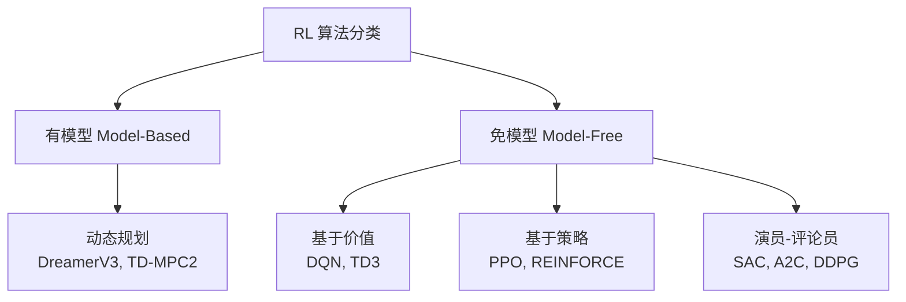
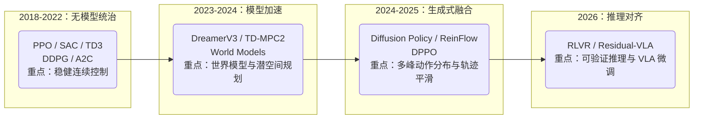
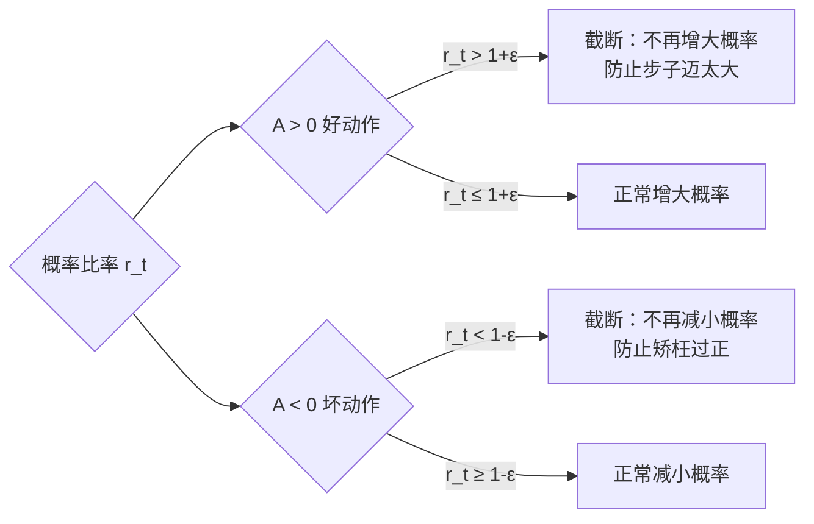
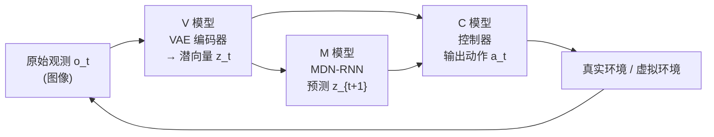
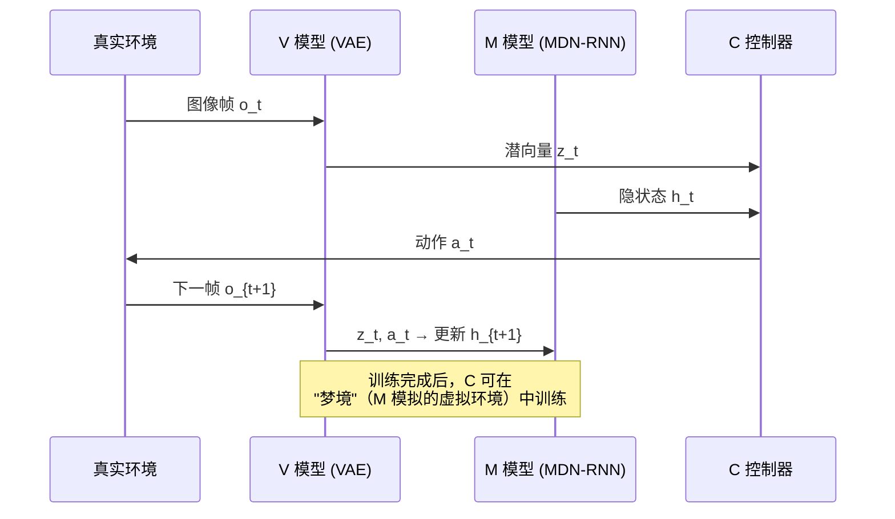
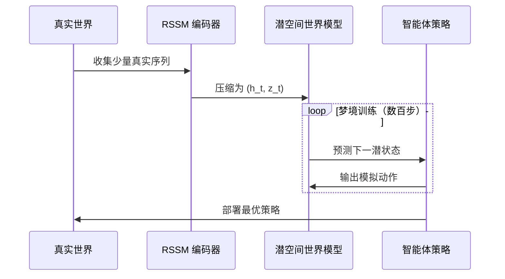
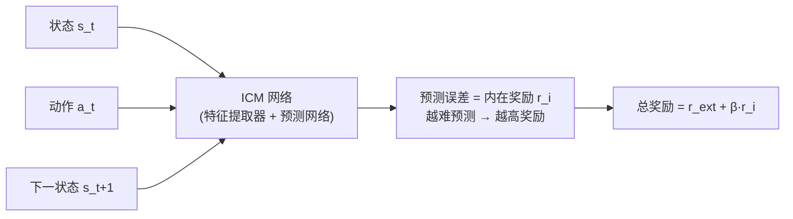
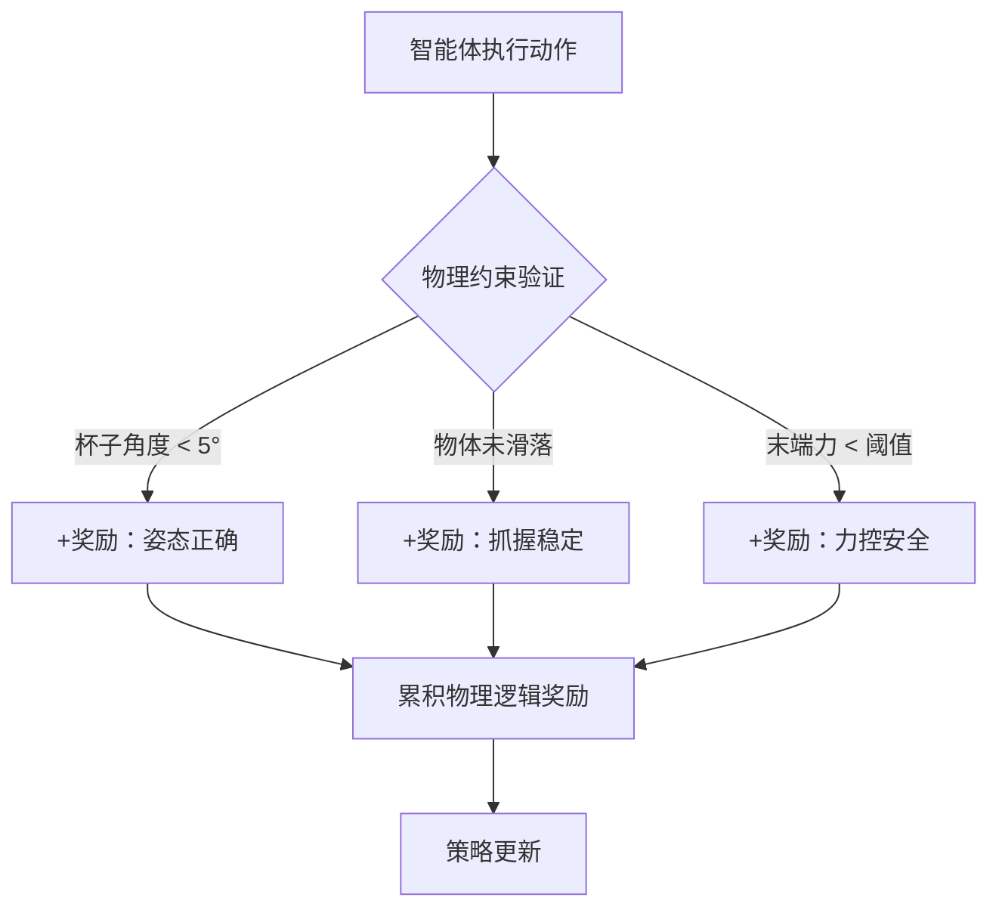
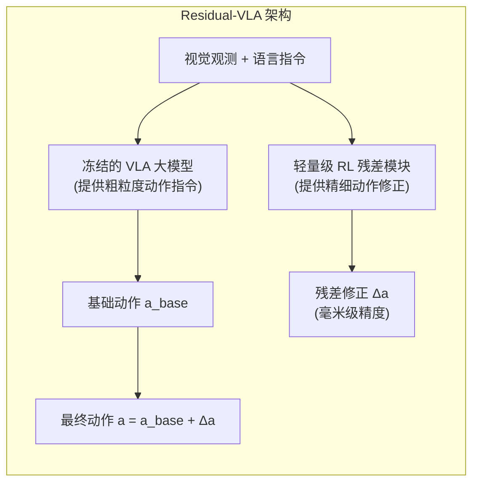
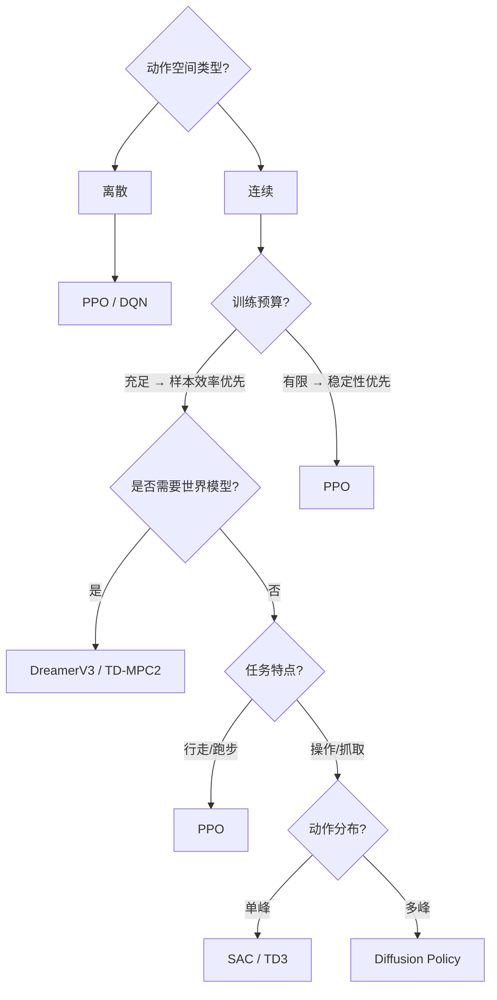

* 目录
{:toc}

---

# 1. 引言：具身智能的"神经中枢"

在通往 AGI 的征途中，**强化学习（Reinforcement Learning, RL）** 是机器人（Robot）实现物理世界自主决策的核心引擎。当 RL 遇见**具身智能（Embodied AI）**，它不再仅仅是处理数字信号、征服 Atari 游戏，而是要驱动一个拥有物理躯体的实体，在复杂的三维空间中感知、规划并完成任务。

> **核心命题**：传统 RL 关注"最大化分值"，具身 RL 必须同时兼顾**样本效率**、**动作平滑度**与**物理安全**三重约束。这使得算法的选择与工程权衡远比游戏场景复杂。

强化学习与监督学习有本质区别：

| 维度 | 监督学习 | 强化学习 |
| :--- | :--- | :--- |
| **数据来源** | 人工标注的独立同分布数据 | 智能体与环境交互产生的时序数据 |
| **反馈信号** | 即时的正确标签 | 延迟的稀疏奖励 |
| **上限** | 人类标注水平 | 可超越人类（如 AlphaGo） |
| **核心挑战** | 泛化性 | 探索-利用权衡、信用分配 |

本文将系统梳理具身智能中的核心 RL 算法，从数学基础到前沿方法，希望为读者构建完整的知识体系。

---

# 2. 理论基础：马尔可夫决策过程（MDP）

所有 RL 算法都建立在 **马尔可夫决策过程（Markov Decision Process, MDP）** 这一统一框架之上。

## 2.1 MDP 的四元组定义

一个 MDP 由四元组 $\langle S, A, P, R \rangle$ 定义：

- **状态空间 $S$**：所有可能状态的集合，如机器人的关节角度、位置等。
- **动作空间 $A$**：智能体可以执行的动作集合（离散或连续）。
- **状态转移概率 $P$**：在状态 $s$ 执行动作 $a$，转移到 $s'$ 的概率：

$$
P(s' | s, a) = p(s_{t+1} = s' \mid s_t = s, a_t = a)
$$

- **奖励函数 $R$**：在状态 $s$ 采取动作 $a$ 后获得的即时奖励：

$$
R(s, a) = \mathbb{E}[r_{t+1} \mid s_t = s, a_t = a]
$$

**马尔可夫性质**保证了"当前状态已包含所有历史信息"，即 $p(s_{t+1}|s_t, a_t) = p(s_{t+1}|s_0, a_0, \ldots, s_t, a_t)$。

## 2.2 策略、价值函数与 Bellman 方程

**策略（Policy）** $\pi(a|s)$ 是给定状态 $s$ 时，选择动作 $a$ 的概率分布。RL 的目标是找到最优策略 $\pi^*$，最大化期望累积奖励（回报）。

**折扣回报**定义为：

$$
G_t = r_{t+1} + \gamma r_{t+2} + \gamma^2 r_{t+3} + \cdots = \sum_{k=0}^{\infty} \gamma^k r_{t+k+1}
$$

其中 $\gamma \in [0, 1)$ 是折扣因子，表示对未来奖励打折扣。

**状态价值函数** $V_\pi(s)$ 是从状态 $s$ 出发，按策略 $\pi$ 执行所能获得的期望回报：

$$
V_\pi(s) = \mathbb{E}_\pi\left[G_t \mid s_t = s\right] = \mathbb{E}_\pi\left[\sum_{k=0}^{\infty} \gamma^k r_{t+k+1} \mid s_t = s\right]
$$

**动作价值函数（Q 函数）** $Q_\pi(s, a)$ 在状态 $s$ 执行动作 $a$ 后，再按策略 $\pi$ 的期望回报：

$$
Q_\pi(s, a) = \mathbb{E}_\pi\left[G_t \mid s_t = s, a_t = a\right]
$$

两者通过 **Bellman 方程** 递推：

$$
V_\pi(s) = \sum_a \pi(a|s) \sum_{s'} P(s'|s,a)\left[R(s,a) + \gamma V_\pi(s')\right]
$$

$$
Q_\pi(s, a) = \sum_{s'} P(s'|s,a)\left[R(s,a) + \gamma \sum_{a'} \pi(a'|s') Q_\pi(s', a')\right]
$$

## 2.3 两类核心问题：有模型 vs 免模型



- **有模型 RL**：智能体学习环境的状态转移模型 $P(s'|s,a)$，再利用该模型进行规划，**样本效率高**但依赖模型精度。
- **免模型 RL**：直接与真实环境交互学习策略，不显式建模环境，**更通用**但需要大量样本。

---

# 3. 算法演进全景图 🗺️

具身 RL 的算法演进可分为四个代际：



---

# 4. 策略梯度：算法的数学根基

## 4.1 策略梯度定理

所有基于策略的 RL 算法都源自同一个核心公式——**策略梯度定理**：

$$
\nabla \bar{R}_\theta = \mathbb{E}_{\tau \sim p_\theta(\tau)}\left[R(\tau) \nabla \log p_\theta(\tau)\right]
$$

其中 $$\bar{R}_\theta = \mathbb{E}_{\tau \sim p_\theta(\tau)}[R(\tau)]$$ 是期望累积奖励，$\tau = (s_1, a_1, s_2, a_2, \ldots)$ 是一条轨迹。

**直觉**：如果一条轨迹带来了高奖励，就增大它发生的概率；反之降低概率。

实际计算时，将梯度分解到每个时间步：

$$
\nabla \bar{R}_\theta \approx \frac{1}{N} \sum_{n=1}^N \sum_{t=1}^{T_n} \left(\sum_{t'=t}^{T_n} \gamma^{t'-t} r_{t'}^n - b\right) \nabla \log p_\theta(a_t^n | s_t^n)
$$

其中 $b$ 是基线（baseline），用于降低梯度估计的方差。一个自然的选择是用价值函数 $V_\pi(s)$ 作为基线，即引入**优势函数（Advantage Function）**：

$$
A(s_t, a_t) = Q_\pi(s_t, a_t) - V_\pi(s_t)
$$

优势函数衡量"在状态 $s_t$ 采取动作 $a_t$，比平均水平好多少"。实际中用 TD 残差近似：

$$
A(s_t, a_t) \approx r_t + \gamma V_\pi(s_{t+1}) - V_\pi(s_t)
$$

## 4.2 探索与利用的权衡

具身智能中，**探索-利用窘境（Exploration-Exploitation Dilemma）**尤为突出：

- **探索（Exploration）**：尝试未知动作，可能获得更大奖励，也可能损坏机器人。
- **利用（Exploitation）**：执行已知最优动作，但可能陷入局部最优。

常见探索策略：
- **$\varepsilon$-greedy**：以 $\varepsilon$ 概率随机动作，以 $1-\varepsilon$ 概率选最优动作。
- **熵正则化（Entropy Regularization）**：SAC 的核心思想，最大化策略熵以鼓励探索。
- **参数噪声（Parameter Noise）**：在网络参数中加入噪声（TD3/DDPG 使用动作噪声）。

---

# 5. 演员-评论员（Actor-Critic）框架

**演员-评论员（Actor-Critic, A-C）** 是现代具身 RL 算法的基础结构，融合了策略梯度（演员）和价值估计（评论员）。

```mermaid
graph TD
    subgraph "演员-评论员架构"
    A[环境 Environment] -->|观测 s_t| B[演员 Actor<br/>π_θ(a|s)]
    B -->|动作 a_t| A
    A -->|奖励 r_t, 下一状态 s_t+1| C[评论员 Critic<br/>V_w(s)]
    C -->|优势估计 A(s,a)| B
    end
```

**优势演员-评论员（A2C）** 的梯度更新：

$$
\nabla_\theta J(\theta) \approx \frac{1}{N}\sum_{n=1}^N \sum_t \left(r_t^n + \gamma V_w(s_{t+1}^n) - V_w(s_t^n)\right) \nabla_\theta \log \pi_\theta(a_t^n | s_t^n)
$$

评论员的损失函数（均方误差）：

$$
\mathcal{L}(w) = \mathbb{E}\left[\left(r_t + \gamma V_w(s_{t+1}) - V_w(s_t)\right)^2\right]
$$

**A3C（Asynchronous Advantage Actor-Critic）** 进一步使用多个并行工作进程异步更新全局网络，显著提升了样本效率和训练速度——类比《火影忍者》中鸣人用影分身同时修行的思路。

---

# 6. PPO：具身控制的基石算法 🛡️

**近端策略优化（Proximal Policy Optimization, PPO）** 是目前 OpenAI 默认的 RL 算法，也是 Isaac Lab 等具身仿真平台最常用的算法。其设计目标是在保持策略更新稳定性的同时，提升采样效率。

## 6.1 从同策略到异策略：重要性采样

策略梯度是**同策略（On-Policy）**算法——每次更新参数后必须重新采样数据，样本利用率极低。

**重要性采样（Importance Sampling）** 允许用旧策略 $$\pi_{\theta'}$$ 采集的数据训练新策略 $\pi_\theta$：

$$
\mathbb{E}_{x \sim p}[f(x)] = \mathbb{E}_{x \sim q}\left[f(x)\frac{p(x)}{q(x)}\right]
$$

将其应用到策略优化：

$$
J^{\theta'}(\theta) = \mathbb{E}_{(s_t, a_t) \sim \pi_{\theta'}}\left[\frac{p_\theta(a_t|s_t)}{p_{\theta'}(a_t|s_t)} A^{\theta'}(s_t, a_t)\right]
$$

其中 $$\frac{p_\theta(a_t|s_t)}{p_{\theta'}(a_t|s_t)}$$ 是**重要性权重（Importance Weight）**，修正了两个分布间的差异。

> **关键约束**：若 $\pi_\theta$ 与 $$\pi_{\theta'}$$ 差距过大，重要性权重方差爆炸，估计失准。这正是 PPO 要解决的问题。

## 6.2 TRPO：约束优化的前身

**信任区域策略优化（TRPO）** 将 KL 散度作为硬约束：

$$
\max_\theta \; J^{\theta'}(\theta), \quad \text{s.t.} \;\; \mathrm{KL}(\theta, \theta') < \delta
$$

TRPO 理论上保证了每次更新的策略改进，但求解带约束的优化问题计算代价高昂。

## 6.3 PPO-Penalty：自适应 KL 惩罚

**PPO-Penalty**（PPO1）将约束项合并进目标函数：

$$
J_{\mathrm{PPO}}^{\theta^k}(\theta) = J^{\theta^k}(\theta) - \beta \cdot \mathrm{KL}(\theta, \theta^k)
$$

并使用**自适应 $\beta$** 动态调节 KL 散度惩罚强度：

- 若 $$\mathrm{KL}(\theta, \theta^k) > \mathrm{KL}_{\max}$$：增大 $\beta$（惩罚过大更新）
- 若 $$\mathrm{KL}(\theta, \theta^k) < \mathrm{KL}_{\min}$$：减小 $\beta$（允许更大更新）

## 6.4 PPO-Clip：裁剪机制（最常用）

**PPO-Clip**（PPO2）更简洁，直接通过裁剪约束概率比率：

$$
J_{\mathrm{PPO2}}^{\theta^k}(\theta) \approx \sum_{(s_t, a_t)} \min\left(r_t(\theta) A^{\theta^k}(s_t, a_t),\; \mathrm{clip}(r_t(\theta),\, 1-\varepsilon,\, 1+\varepsilon) A^{\theta^k}(s_t, a_t)\right)
$$

其中 $$r_t(\theta) = \frac{p_\theta(a_t|s_t)}{p_{\theta^k}(a_t|s_t)}$$ 是概率比率，$\varepsilon$ 通常取 0.1 或 0.2。

**裁剪机制直觉**：



**为什么 PPO 适合具身控制？**

1. **稳定性高**：裁剪保证每次策略更新幅度有限，避免机械臂突然做出危险动作。
2. **并行友好**：Isaac Lab 等平台可以运行数千个并行仿真环境，PPO 的同策略特性与之天然契合。
3. **实现简单**：相较 TRPO，PPO 实现难度低，超参数少。

---

# 7. DDPG → TD3 → SAC：连续动作控制的演进

机器人控制通常涉及**连续动作空间**（如关节力矩、速度），DQN 等离散方法无法直接处理，因此催生了针对连续控制的系列算法。

## 7.1 DDPG：深度确定性策略梯度

**深度确定性策略梯度（DDPG）** 是将 DQN 扩展到连续动作空间的开创性工作，也是 TD3、SAC 的直接前身。

**核心设计**：

| 组件 | 名称 | 作用 |
| :--- | :--- | :--- |
| 演员 $\mu_\theta(s)$ | 策略网络 | 输出确定性连续动作 |
| 评论员 $Q_w(s, a)$ | Q 网络 | 评估演员输出动作的价值 |
| 目标网络 | Slow-updating targets | 稳定 Q-target 计算 |
| 经验回放 | Replay Buffer | 打破数据相关性，实现异策略训练 |

**演员更新**（最大化 Q 值）：

$$
\nabla_\theta J \approx \nabla_a Q_w(s, a)\big|_{a=\mu_\theta(s)} \cdot \nabla_\theta \mu_\theta(s)
$$

**评论员更新**（TD 误差最小化）：

$$
y = r + \gamma Q_{\bar{w}}(s', \mu_{\bar{\theta}}(s')), \quad \mathcal{L}(w) = \mathbb{E}\left[(Q_w(s,a) - y)^2\right]
$$

其中 $$Q_{\bar{w}}, \mu_{\bar{\theta}}$$ 是目标网络的参数，每 $C$ 步软更新：$\bar{w} \leftarrow \tau w + (1-\tau)\bar{w}$。

为了鼓励探索，训练时对动作添加噪声（如 OU 噪声或高斯噪声）。

**DDPG 的问题**：Q 值容易过高估计，导致策略被破坏，对超参数极度敏感。

## 7.2 TD3：三大关键改进

**双延迟深度确定性策略梯度（TD3）** 通过三个技巧系统性解决了 DDPG 的不稳定问题：

### 技巧一：截断双 Q 学习（Clipped Double Q-Learning）

学习两个独立的 Q 网络 $$Q_{\phi_1}, Q_{\phi_2}$$，计算 Q-target 时取最小值：

$$
y = r + \gamma (1-d) \min_{i=1,2} Q_{\phi_i,\mathrm{targ}}(s', a'_{\mathrm{TD3}})
$$

使用最小值而非最大值，系统性地抑制了 Q 值过高估计。

### 技巧二：延迟策略更新（Delayed Policy Updates）

评论员每更新 2 次，演员才更新 1 次。实验表明：Q 网络先收敛再更新策略，能显著提升稳定性。

### 技巧三：目标策略平滑（Target Policy Smoothing）

在目标动作中加入截断噪声：

$$
a'_{\mathrm{TD3}}(s') = \mathrm{clip}\left(\mu_{\bar{\theta}}(s') + \mathrm{clip}(\epsilon, -c, c),\; a_{\mathrm{low}},\; a_{\mathrm{high}}\right), \quad \epsilon \sim \mathcal{N}(0, \sigma)
$$

平滑 Q 函数对动作的响应曲面，降低策略对 Q 误差的敏感性。

**TD3 在灵巧手操作任务（Dexterous Manipulation）上表现优异**，是机械臂精细控制的常用基线。

## 7.3 SAC：最大熵强化学习 🎨

**软演员-评论员（Soft Actor-Critic, SAC）** 是目前连续控制领域最强的免模型算法之一，其核心在于**最大熵强化学习（Maximum Entropy RL）**框架。

### 最大熵目标

SAC 不仅最大化累积奖励，同时最大化策略的**熵（Entropy）**：

$$
\pi^* = \arg\max_\pi \mathbb{E}\left[\sum_t \gamma^t \left(r_t + \alpha \mathcal{H}(\pi(\cdot|s_t))\right)\right]
$$

其中 $\mathcal{H}(\pi(\cdot|s_t)) = -\mathbb{E}[\log \pi(a|s_t)]$ 是策略熵，$\alpha > 0$ 是温度参数，控制探索程度。

**熵最大化的好处**：
- **鼓励探索**：策略分布更均匀，避免过早收敛到局部最优。
- **鲁棒性强**：在多峰奖励环境中，能保持多种可行策略。
- **样本高效**：异策略训练 + 经验回放。

### SAC 的演员更新

演员目标是最大化 Q 值同时最大化熵：

$$
\mathcal{L}(\phi) = \mathbb{E}_{s_t, \tilde{a}_t \sim \pi_\phi}\left[\alpha \log \pi_\phi(\tilde{a}_t | s_t) - \min_{i=1,2} Q_{\theta_i}(s_t, \tilde{a}_t)\right]
$$

注意 SAC 使用双 Q 网络取最小值（同 TD3），有效抑制过估计。

### 自动温度调节

SAC 可以自动调节温度参数 $\alpha$，通过最小化：

$$
\mathcal{L}(\alpha) = \mathbb{E}_{\tilde{a}_t \sim \pi_t}\left[-\alpha \log \pi_t(\tilde{a}_t|s_t) - \alpha \bar{\mathcal{H}}\right]
$$

其中 $\bar{\mathcal{H}}$ 是目标熵（通常设为 $-\dim(A)$），无需手动调参。

### PPO vs SAC vs TD3 对比

| 特性 | PPO | SAC | TD3 |
| :--- | :---: | :---: | :---: |
| **策略类型** | 随机性 | 随机性 | 确定性 |
| **同/异策略** | 同策略 | 异策略 | 异策略 |
| **连续动作** | ✓ | ✓ | ✓ |
| **离散动作** | ✓ | △ | ✗ |
| **样本效率** | 中 | 高 | 高 |
| **超参敏感度** | 低 | 低 | 中 |
| **具身应用** | 行走/跑步 | 灵巧手操作 | 精细组装 |

---

# 8. 有模型 RL：潜空间的"预知梦" 🧠

无模型 RL 需要与真实环境反复交互，样本效率低。**有模型 RL（Model-Based RL）** 让智能体学习环境的内部模型，在"脑海中"模拟练习，大幅减少真实环境的交互次数。

## 8.1 世界模型（World Models）：V-M-C 三部曲

David Ha 和 Jürgen Schmidhuber 在 2018 年 NeurIPS 提出了经典的世界模型框架，由三个模块组成：



**V 模型（Variational Autoencoder）**：视觉感知模块，将高维图像压缩为低维潜向量 $z_t$，提取环境的本质特征。

**M 模型（MDN-RNN）**：记忆模块，根据当前潜向量 $z_t$、隐状态 $h_t$ 和动作 $a_t$ 预测下一时刻潜向量的概率分布：

$$
P(z_{t+1} | a_t, z_t, h_t)
$$

使用混合密度网络（MDN）输出多峰分布，捕捉环境的随机性。

**C 模型（Controller）**：控制器，将 $z_t$ 和 $h_t$ 拼接后直接映射为动作：

$$
a_t = W_c [z_t \; h_t] + b_c
$$

控制器参数少（线性层），用进化策略（CMA-ES）优化，避免反向传播穿越整个世界模型。

**运作流程**：



**关键洞察**：训练完成后，可以**完全在 M 模型构建的虚拟世界中训练 C 控制器**，无需与真实环境交互，大幅提升训练效率。

> **生成模型 ≠ 世界模型**。世界模型必须具备**动作条件下的未来状态预测能力**，即给定动作输入，能预测下一个状态。仅能生成图像的模型不满足此条件。

## 8.2 DreamerV3：潜空间的"梦境修炼"

**DreamerV3** 是目前最先进的世界模型之一，在具身 RL 中实现了显著的样本效率提升。

**核心机制**：

1. **RSSM（循环状态空间模型）**：将环境状态分解为确定性部分 $h_t$（LSTM 隐状态）和随机部分 $z_t$（VAE 潜向量）：

$$
h_t = f_\phi(h_{t-1}, z_{t-1}, a_{t-1})
$$

2. **梦境训练（Dreaming）**：在潜空间中展开完整轨迹，无需与真实环境交互：



3. **无量纲化奖励（Symlog）**：使用 $\mathrm{symlog}(x) = \mathrm{sign}(x) \cdot \ln(|x|+1)$ 处理奖励，支持跨任务迁移而无需任务特定超参。

**DreamerV3 的成就**：
- 首个单一超参设置，无需任何调参，在 Atari、DMC、Crafter、Minecraft 等 7 个领域同时达到 SOTA。
- 在 Minecraft 中首次从零学会挖钻石（需要 14 步连续决策）。

## 8.3 TD-MPC2：潜空间的模型预测控制

**TD-MPC2** 将**时序差分（TD）**与**模型预测控制（MPC）** 在潜空间中统一，尤其擅长**长程操作任务**。

**核心思路**：在潜空间中进行短视野的有限步规划，结合 TD 学习估计长远价值，兼顾规划深度与计算效率。适用场景：机器人从"抓取"到"组装"等多步骤操作任务。

---

# 9. 扩散策略：从"生图"到"生动作" 🌊

## 9.1 Diffusion Policy

**扩散策略（Diffusion Policy）** 将图像生成领域（Stable Diffusion）的核心思想迁移到机器人动作生成：将目标动作轨迹视为"从高斯噪声逐步去噪"的过程。

**为什么需要扩散策略？**

传统策略网络输出动作的均值，无法处理**多峰动作分布（Multi-Modal Distribution）**。例如：

- 桌上有两个可选的杯子，最优策略是"选左"或"选右"，均值策略会徘徊在中间——两个都拿不到。
- 扩散模型天然能表示多峰分布，可以果断选择其中一个。

**前向过程（加噪）**：

$$
q(x_k | x_{k-1}) = \mathcal{N}(x_k;\; \sqrt{1 - \beta_k}\, x_{k-1},\; \beta_k I)
$$

**反向过程（去噪，学习目标）**：

$$
p_\theta(x_{k-1} | x_k) = \mathcal{N}(x_{k-1};\; \mu_\theta(x_k, k),\; \Sigma_\theta(x_k, k))
$$

训练时，网络学习预测每步的噪声 $$\epsilon_\theta$$，推理时从随机噪声出发，迭代去噪得到平滑的动作轨迹。

**扩散策略的优势**：

| 维度 | 传统策略网络 | 扩散策略 |
| :--- | :--- | :--- |
| **分布表达** | 单峰高斯 | 任意多峰 |
| **轨迹平滑度** | 一般 | 极高（去噪过程天然平滑） |
| **推理速度** | 快（单次前向） | 慢（需 K 步迭代） |
| **适用场景** | 简单操作 | 复杂抓取、双臂协作 |

## 9.2 ReinFlow：扩散策略 + 强化学习

**ReinFlow** 在 Diffusion Policy 的基础上引入强化学习微调，解决了纯行为克隆（BC）泛化性不足的问题：

- 先用专家演示数据训练扩散策略（模仿学习阶段）
- 再用 RL 奖励信号对扩散策略进行微调（强化学习阶段）

这类似于 LLM 的 SFT → RLHF 两阶段训练范式，是当前机器人模仿学习的主流框架之一。

---

# 10. 稀疏奖励：具身 RL 的"死亡陷阱"

具身智能的奖励设计远比游戏环境困难。机器人大多数时间得不到任何奖励（如"拧螺丝"任务中，只有最终拧紧才有 +1 奖励），导致梯度消失、训练停滞。

## 10.1 奖励塑形（Reward Shaping）

人工设计**辅助奖励**来引导智能体行为，最常用但需要领域知识：

| 辅助奖励类型 | 具体例子 | 效果 |
| :--- | :--- | :--- |
| **接近性奖励** | 末端执行器距目标距离越近奖励越大 | 快速引导，但可能陷入局部解 |
| **接触力奖励** | 正确接触力范围内给奖励 | 适合精细操作 |
| **姿态正确性** | 物体朝向符合要求时给奖励 | 防止奇异构型 |
| **生存奖励** | 每步存活 +0.001 | 激励机器人持续探索 |

> **陷阱警告**：设计不当的奖励可能导致"奖励欺骗（Reward Hacking）"——智能体找到超出预期的捷径最大化奖励，而不是真正完成任务。

## 10.2 内在好奇心模块（ICM）

**好奇心驱动奖励**是一种与任务无关的内在奖励，鼓励智能体探索"难以预测"的新状态：



ICM 包含两个子网络：
1. **正向模型（Forward Model）**：给定 $(s_t, a_t)$ 预测 $$\hat{s}_{t+1}$$，预测误差作为内在奖励。
2. **逆向模型（Inverse Model）**：给定 $(s_t, s_{t+1})$ 预测动作 $$\hat{a}_t$$，用于训练特征提取器，过滤与智能体无关的噪声（如背景树叶飘动）。

## 10.3 课程学习（Curriculum Learning）

将任务从易到难递进式安排，让智能体逐步掌握复杂技能：


**逆向课程生成（Reverse Curriculum Generation）** 是一种自动化方法：从目标状态出发，逐步采样"距离目标 $k$ 步"的初始状态，自动构建难度递增的课程。

## 10.4 HER：后见之明的奖励重标记

**Hindsight Experience Replay（HER）** 是处理稀疏奖励的经典技术：即使一次任务失败（如机械臂没有放到指定位置），也可以将"机械臂实际到达的位置"作为假想目标，从失败轨迹中学习。

> **关键洞察**：失败的经验并非无用——用实际结果重新标记目标后，失败轨迹变成"成功经验"，有效缓解了奖励稀疏问题。

---

# 11. 2026 尖端：逻辑推理与残差学习 ⚡

## 11.1 RLVR：可验证奖励的强化学习

**RLVR（Reinforcement Learning from Verifiable Rewards）** 的核心思想：将**可形式化验证的物理常识**作为奖励信号，而非依赖稀疏的任务成功奖励。

**什么是"可验证奖励"？**

- 传统奖励："完成抓取任务" → 稀疏，延迟
- RLVR 奖励："杯子当前是否垂直（角度误差 < 5°）" → 可即时验证，密集



RLVR 的本质是让机器人掌握**物理推理能力**：不只是记住"怎么做"，而是理解"为什么这么做"。这对于长程多步骤任务（如"拿出冰箱里的牛奶倒入杯子"）尤为关键。

## 11.2 Residual-VLA：大模型 + 残差微调

**残差 VLA（Residual Vision-Language-Action）** 架构针对的是"如何高效将通用 VLA 大模型适配到特定机器人"的问题。

**问题背景**：
- VLA 大模型（如 RT-2、π0）拥有强大的常识和泛化能力，但动作精度不足。
- 全量微调代价高昂且可能破坏预训练知识。

**残差架构设计**：



- **VLA 大模型（冻结）**：提供任务理解和粗粒度动作规划，类比"大脑皮层"。
- **RL 残差模块（可训练）**：对大模型输出的动作进行实时精细修正，类比"小脑"。

**核心优势**：
1. 仅训练小型残差网络（参数量 << VLA），**极速适配**新场景（数小时 vs 数天）。
2. **保护预训练知识**：冻结大模型避免灾难性遗忘。
3. **通用性强**：同一 VLA 骨干可搭配不同残差模块适配不同机器人平台。

---

# 12. 开发者指南：算法选择矩阵 🛠️

如果你正在开发具身智能项目，可按以下维度进行算法选型：

| 任务类型 | 推荐算法 | 核心理由 | 难度系数 |
| :--- | :--- | :--- | :---: |
| **四足/双足行走** | **PPO** | 稳定性最高，无惧电机限制；Isaac Lab 原生支持 | ⭐⭐ |
| **机械臂精细组装** | **SAC / TD3** | 异策略 + 样本高效；SAC 自动调参更友好 | ⭐⭐⭐ |
| **灵巧手抓取** | **SAC** | 熵正则化鼓励多样动作，应对多峰操作分布 | ⭐⭐⭐⭐ |
| **长程导航与操作** | **TD-MPC2** | 潜空间规划适合多步序列决策 | ⭐⭐⭐⭐ |
| **多任务/泛化操作** | **Diffusion Policy + ReinFlow** | 动作轨迹自然平滑，能处理多目标冲突 | ⭐⭐⭐⭐⭐ |
| **VLA 大模型微调** | **Residual-RL** | 保护预训练知识的同时快速适配特定场景 | ⭐⭐⭐⭐ |
| **稀疏奖励环境** | **SAC + ICM / HER** | 内在奖励 + 经验重用缓解奖励稀疏 | ⭐⭐⭐⭐⭐ |

**选型决策树**：



---

# 13. 结语

强化学习在具身智能领域的演进，映射了整个 AI 发展的轨迹：

- **无模型时代（PPO/SAC/TD3）**：解决了"如何稳定学习连续控制"的核心问题。
- **世界模型时代（DreamerV3/TD-MPC2）**：解决了"如何在有限真实数据下高效学习"的问题。
- **生成式时代（Diffusion Policy）**：解决了"如何表达复杂的多峰动作分布"的问题。
- **推理对齐时代（RLVR/Residual-VLA）**：解决了"如何将通用大模型的推理能力融入物理决策"的问题。

每一代算法都在前人基础上攻克新的瓶颈，推动机器人从"会动"走向"会思考"，最终走向真正的物理世界自主智能体。

---

*本文由 Tingde Liu 整理撰写，参考 [EasyRL（Datawhale）](https://github.com/datawhalechina/easy-rl) 等资料，聚焦 2026 年具身智能前沿技术演进。*
