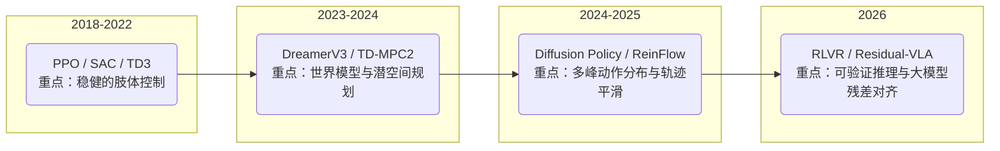
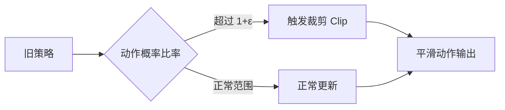
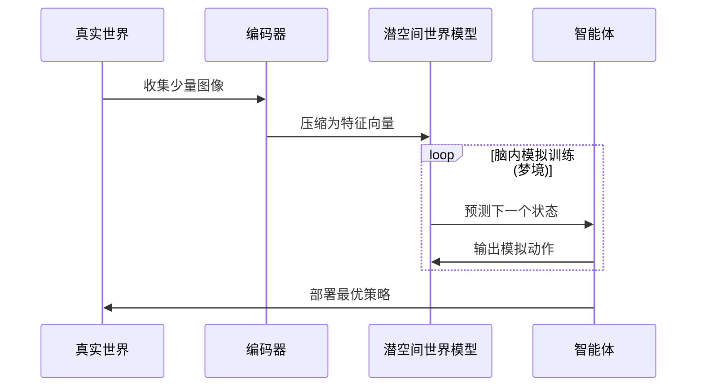

# 1. 引言：具身智能的“神经中枢”

在通往 AGI 的征途中，**强化学习（RL）** 是机器人（Robot）实现物理世界自主决策的核心。当 RL 遇见 **具身智能（Embodied AI）**，它不再仅仅是处理数字信号，而是要驱动物理实体在复杂的三维空间中完成任务。

> [!IMPORTANT]
> **核心命题**：传统的 RL 关注“分值最高”，具身 RL 则必须同时关注“样本效率”、“动作平滑度”与“物理安全”。

---

# 2. 算法演进全景图 🗺️

为了直观展现算法的代际更迭，我们将具身 RL 的演进分为四个阶段：

### 2.1 具身 RL 进化路径

---

# 3. 核心算法“四大家族”详解 ⚡

## 3.1 经典无模型 (Model-Free)：运动控制的基石
*解决“怎么动起来”的问题。*

### PPO (Proximal Policy Optimization) 🛡️
> **视觉比喻**：给机器人套上“安全带”，像一位**谨慎的登山者**，防止动作更新过猛导致跌入深渊。

*   **核心机制**：
    PPO 是一种**同策略 (On-Policy)** 的 Actor-Critic 算法。为了防止策略更新时“步子迈得太大”，PPO 引入了**裁剪 (Clipping) 机制**。
    它的核心目标函数包含：$\min(r_t(\theta) \hat{A}_t, \text{clip}(r_t(\theta), 1-\epsilon, 1+\epsilon) \hat{A}_t)$
    这确保了新策略 $\pi_{new}$ 不会偏离旧策略 $\pi_{old}$ 太多，保障了物理机器人的安全。
*   **最佳场景**：**Humanoid Locomotion**（四足/人形机器人行走）。
    

### SAC (Soft Actor-Critic) 🎨
> **视觉比喻**：不仅要求“拿到杯子”，还奖励“用不同的新奇姿势去碰杯子”。

*   **核心机制**：
    SAC 是**异策略 (Off-Policy)** 的巅峰，核心在于**最大化带熵正则化的目标**：
    $\mathcal{L}(\pi) = \mathbb{E} \left[ \alpha \log \pi(\tilde{a}|s) - \min_{i=1, 2} Q_i(s, \tilde{a}) \right]$
    它巧妙使用了**双Q网络**来防止值过高估计。通过引入“熵 (Entropy)”，它强制机器人在保证任务成功的同时，尽可能多地探索不同的动作组合。
*   **最佳场景**：**Dexterous Manipulation**（灵巧手抓取）。

---

## 3.2 有模型 (Model-Based)：潜空间的“预知梦”
*解决“在脑子里练习”的问题，减少真实机器人的磨损。*

### DreamerV3 🧠
> **视觉比喻**：机器人在睡眠中，脑海里不断闪过压缩后的几何世界（潜空间），并在梦境中完成十万次试错。

*   **原理**：机器人不再盯着图像看，而是将环境抽象为一串“代码”（潜空间），并在这些代码中模拟未来。
*   **价值**：极大提升了样本效率，实现了从“千万次尝试”到“万次尝试”的飞跃。

---

## 3.3 扩散策略融合 (Diffusion-RL)：丝滑的动作生成
*解决“动作太僵硬、死板”的问题。*

### Diffusion Policy / ReinFlow 🌊
> **视觉比喻**：将粗糙跳跃的轨迹线，像熨衣服一样，慢慢抚平（去噪），变成一条完美的S型曲线。

*   **原理**：借鉴图像生成（如 Stable Diffusion）的原理，将动作轨迹看作一个“从噪声中去噪”的过程。
*   **优势**：能够完美处理**多峰分布**（比如桌上有两个杯子，机器人能果断选择其一，而不是徘徊在中间），动作异常平滑。

---

## 3.4 2026 尖端：逻辑推理与残差学习 (RLVR & Residual)
*解决“长程任务与通用适配”的问题。*

### RLVR (Verifiable Rewards) ⚖️
*   **核心**：将物理常识（如：杯子必须垂直才能倒水）作为可验证的约束，指导 RL 进化，使机器人具备多步骤任务的“思考力”。

### Residual-VLA 🧩
> **视觉比喻**：一个巨大的蓝色大脑（VLA 大模型）输出粗调的指令，旁边一个小型的金色神经网络（RL 分支）对其进行几毫米的精准修正。

*   **原理**：通用大模型提供“常识”，冷冻其参数；RL 残差分支提供“肌肉微操”。这让机器人在新环境中实现极速的微调适配。

---

# 4. 开发者指南：算法选择矩阵 🛠️

如果你正在开发一个具身智能项目，可以参考下表进行算法选型：

| 任务类型 | 推荐算法 | 核心理由 | 难度系数 |
| :--- | :--- | :--- | :--- |
| **四足/双足行走** | **PPO** | 稳定性最高，无惧电机限制（如 Isaac Lab） | ⭐⭐ |
| **机械臂精细组装** | **SAC / TD3** | 样本效率极高，对接触力敏感 | ⭐⭐⭐ |
| **长程导航与操作** | **TD-MPC2** | 潜空间规划能力强，适应长序列决策 | ⭐⭐⭐⭐ |
| **复杂环境多任务** | **Diffusion-RL** | 动作轨迹自然，能处理多目标冲突 | ⭐⭐⭐⭐⭐ |
| **VLA 大模型微调** | **Residual-RL** | 保护预训练知识的同时，快速适配特定场景 | ⭐⭐⭐⭐ |

---

# 5. 结语

强化学习不再是那个只会玩 Atari 游戏的算法，它已进化为具身智能的“运动小脑”与“逻辑中枢”。从 PPO 的稳健步态，到扩散策略的优雅轨迹，再到 RLVR 的物理推理，RL 正在赋予冷冰冰的钢铁躯体真正的“生命感”。

---
*本文由 Tingde Liu 整理撰写，聚焦 2026 年具身智能前沿技术演进。*
