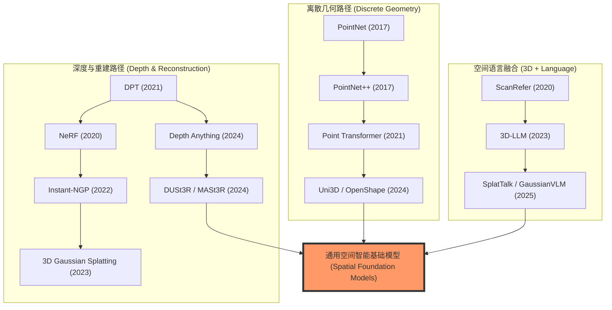

# 1. 引言

<div align="center">
  
<figcaption> 空间智能 </figcaption>
</div>

空间智能（Spatial Intelligence）是指 AI 系统感知、理解、推理和交互三维物理世界的综合能力。与人类从婴幼儿期便开始发展的空间认知类似，空间智能涵盖了对物体形状、场景布局、三维空间关系以及动态变化的全面理解。作为具身智能（Embodied AI）的核心基础，空间智能的研究近年来随着深度学习、神经渲染以及大型多模态模型的飞速发展而进入了全新阶段。

从应用价值来看，空间智能横跨多个高价值领域：在**自动驾驶**中，精确的三维感知与动态目标检测是安全行驶的前提；在**机器人操控**中，六自由度的空间理解决定了机械臂的抓取成功率；在**增强现实与虚拟现实（AR/VR）**中，实时高质量的三维重建与空间锚定是沉浸式体验的关键；在**具身 AI 智能体**中，空间记忆与三维场景图是任务规划与导航的基础。

研究空间智能面临的核心挑战来自三维数据的内在复杂性：三维标注数据的稀缺与昂贵、点云/体素/隐式表达之间的表示多样性、真实世界动态场景的时变性，以及三维几何与语义理解的跨模态融合难题。近年来，从 NeRF 到三维高斯溅射（3D Gaussian Splatting，3DGS），从 PointNet 到 Point Transformer，从单目深度估计到空间推理 VLM，空间智能领域正经历着技术范式的快速迭代。

本文旨在系统梳理空间智能研究进展，为学习和研究空间智能提供参考。

# 2. 空间智能基本概述

## 2.1 什么是空间智能？

空间智能是一个多层次的能力体系，从低层几何感知到高层空间推理，可划分为以下四个层次：

1. **空间感知（Spatial Perception）**：获取三维几何信息，包括深度估计、点云获取与处理、三维形状重建。
2. **空间重建（Spatial Reconstruction）**：从多视角图像或传感器数据建立场景的三维模型，包括 SLAM、MVS、NeRF、3DGS 等技术。
3. **空间理解（Spatial Understanding）**：对三维场景进行语义解析，包括三维目标检测、三维实例分割、场景图生成与视觉定位。
4. **空间推理（Spatial Reasoning）**：在三维空间中进行高阶认知，包括空间关系判断（物体 A 是否在 B 的左侧？）、视角变换推理，以及语言引导的三维交互。

这四个层次构成了空间智能的完整能力栈：感知为重建提供原始数据，重建为理解提供几何基础，理解为推理提供语义上下文。

## 2.2 感知硬件基础

空间智能的源头是多样的传感器，硬件特性直接决定了算法的选择与感知上限：

| 传感器类型 | 原理 | 优势 | 局限 | 应用场景 |
|:-----------|:-----|:-----|:-----|:---------|
| **激光雷达 (LiDAR)** | 激光飞行时间 (ToF) | 精度极高、抗光照干扰、直接 3D | 成本高、点云稀疏、无颜色 | 自动驾驶、地形测绘 |
| **RGB-D 相机** | 结构光 / 局域 ToF | 像素级对齐、室内精度高 | 室外易受干扰、量程有限 | 机器人导航、AR/VR |
| **立体视觉 (Stereo)** | 双目视差计算 | 成本低、室内外通用 | 依赖纹理、弱光表现差 | 工业视觉、避障 |
| **单目相机** | 透视投影 | 极其廉价、部署便捷 | 存在尺度歧义、需学习先验 | 消费级电子、广域监控 |
| **事件相机** | 像素级亮度变化 | 极高动态范围、低延迟 | 空间分辨率低、输出异构 | 高速运动捕捉、无人机 |

## 2.3 核心要素与技术体系

空间智能的技术体系围绕**三维表示**展开，主流形式对比如下：

| 表示形式 | 特点 | 硬件适配 | 代表技术 |
|:---------|:-----|:---------|:---------|
| 点云 (Point Cloud) | 稀疏、无序、直接采集 | LiDAR、RGB-D | PointNet, Point Transformer |
| 体素 (Voxel Grid) | 规则、密集、内存开销大 | 全局建模 | VoxNet, OccNet |
| 网格 (Mesh) | 面片表示、适合渲染 | 3D 扫描 | Marching Cubes |
| 隐式场 (Implicit Field) | 连续、可微、内存高效 | 多视角图像 | NeRF, SDF |
| 三维高斯 (3D Gaussian) | 显式、快速渲染、可优化 | 多视角图像 | 3DGS |
| 深度图 (Depth Map) | 像素对齐、计算友好 | 单目/双目 | Monocular Depth Estimation |

## 2.4 评价指标速查表

| 维度 | 指标 | 含义 | 适用任务 |
|:-----|:-----|:-----|:---------|
| **几何精度** | CD (Chamfer Distance) | 点集间的平均欧氏距离 | 点云配准、形状重建 |
| | EMD (Earth Mover's Distance) | 两个分布间的推土机距离 | 形状生成、点云生成 |
| | AbsRel / RMSE | 深度预测的绝对误差与均方根误差 | 深度估计 |
| **理解精度** | mIoU (Mean IoU) | 预测框与真值的交并比均值 | 语义/实例分割、检测 |
| | mAP (Mean Average Precision) | 平均精度均值（多阈值下的召回/精确度） | 三维目标检测 |
| **推理/对话** | CIDEr / BLEU-4 | 生成文本与参考答案的共现相似度 | 3D Captioning / 3D VQA |
| | EM (Exact Match) | 答案完全匹配的比例 | 3D 视觉问答 |
| **重建质量** | PSNR / SSIM | 渲染图像的峰值信噪比与结构相似度 | 视角合成 (NeRF/3DGS) |

## 2.5 主要挑战

- **数据稀缺性**：三维标注数据（如逐点语义标签、精确位姿）的获取成本远高于二维图像，导致有标注数据集规模受限。
- **计算复杂度**：三维数据量通常远大于二维图像，点云处理与体积渲染对 GPU 内存与计算效率提出更高要求。
- **动态场景处理**：现实场景中存在运动物体与光照变化，静态场景假设难以满足实际需求。
- **跨模态对齐**：将视觉、语言与三维几何进行语义对齐，面临模态间的语义鸿沟。
- **泛化能力**：在特定场景训练的模型往往难以泛化到新场景，零样本三维感知仍是开放问题。

## 2.6 研究发展趋势



**关键里程碑**：
- **2015–2017**：PointNet 奠定了直接在无序点云上进行深度学习的基础，开启了三维深度学习新纪元。
- **2018–2020**：VoxelNet、PointPillars 推动了自动驾驶 LiDAR 感知商业化；NeRF 的提出彻底改变了三维重建技术范式。
- **2021–2022**：Transformer 架构被引入三维感知（Point Transformer、DETR3D、BEVFormer），性能大幅提升；Instant-NGP 将 NeRF 训练时间压缩至秒级。
- **2023**：3D Gaussian Splatting 实现实时高质量渲染；3D-LLM、EmbodiedScan 将语言模型与三维场景理解结合。
- **2024–2025**：Depth Anything、SpatialVLM、DUSt3R、Uni3D 等工作推动空间感知基础模型形成，空间智能进入"大模型驱动"新阶段。

## 2.7 未来研究方向

- **统一三维基础模型**：类比 SAM 在二维视觉中的地位，构建统一的三维感知基础模型，支持跨场景、跨任务零样本三维理解。
- **动态场景建模**：超越静态场景假设，实现对动态物体、人体运动和场景变化的实时建模。
- **物理感知空间智能与世界模型**：将物理引擎与神经表示结合，支持物理合理的交互预测。未来的空间智能将成为“世界模型”的几何骨架，不仅理解“是什么”，更能通过物理推理预测“会发生什么”。
- **语言-几何联合推理**：提升 VLM 在精确三维空间推理（距离、方位、体积估计）方面的能力，填补当前 VLM 的空间推理短板。
- **高效三维学习**：研究数据高效、计算高效的三维表示与学习方法，降低大规模三维感知系统的部署成本。

# 3. 任务分类体系

**1. 几何感知类**

以获取和处理三维几何信息为核心。典型任务包括单目/双目**深度估计**、**点云配准**（ICP、RANSAC）、**法向量估计**等。这类任务直接输出场景的低层几何属性，是上层理解任务的数据基础。

*代表性数据集*：NYU Depth V2、KITTI、ETH3D

---

**2. 三维重建类**

从图像序列或传感器数据恢复场景的三维结构。包括**运动恢复结构（SfM）**、**多视角立体重建（MVS）**、**即时定位与建图（SLAM）**、**神经隐式重建（NeRF、3DGS）**等。重建质量（精度、完整性、渲染真实感）是该类任务的核心指标。

*代表性数据集*：DTU、Tanks and Temples、ScanNet

---

**3. 三维检测与识别类**

在三维空间中定位并分类物体。包括**三维目标检测**（输出三维边界框）、**三维实例/语义分割**（逐点分类）、**三维场景图生成**。按传感器模态分为 LiDAR 点云检测（自动驾驶）和 RGB-D/纯图像 3D 检测（室内场景）。

*代表性数据集*：KITTI、nuScenes、Waymo Open Dataset、SUN RGB-D、ScanNet

---

**4. 空间理解与推理类**

在三维语义层面建立高层理解。包括**三维视觉定位（3D Visual Grounding）**（根据语言描述定位三维目标）、**三维视觉问答（3D VQA）**（回答关于三维场景的问题）、**空间关系推理**（判断物体间的空间关系）。

*代表性数据集*：ScanRefer、Nr3D/Sr3D、ScanQA、EmbodiedScan

---

**5. 具身空间导航类**

在智能体主动探索的背景下使用空间智能。包括**目标驱动导航**、**三维语义地图构建**、**空间记忆网络**、**具身三维感知**。该类任务强调实时性、增量性与智能体-环境的交互性。

*代表性数据集*：Matterport3D（HM3D）、Gibson、AI2Thor

---

# 4. 空间智能技术演进范式

空间智能的研究已从零散的任务解决转向统一的技术范式。本章按照技术演进逻辑，重新梳理核心代表性工作。

## 4.1 离散几何表示与点云学习

点云是三维空间中最直接的离散表示，早期工作集中于如何有效处理无序、非均匀的点集。

### PointNet 系列：开创性范式
- **PointNet (2017)**：奠定了直接处理原始点云的“点独立处理 + 对称聚合”范式。
- **PointNet++ (2017)**：引入层级化结构（采样+分组+聚合），解决了局部几何感知不足的问题。

<div align="center">
  
  
<figcaption>左：PointNet 架构；右：PointNet++ 层级化学习机制。</figcaption>
</div>

### 图卷积与 Transformer 演进
- **DGCNN (2019)**：提出 **EdgeConv**，通过在特征空间动态构建图结构，捕捉非局部语义关联。
- **Point Transformer (2021)**：将向量自注意力引入点云，极大地提升了细粒度特征表达能力。
- **Uni3D / OpenShape (2023-2024)**：最新的点云基础模型，通过大规模对比预训练实现了跨模态对齐。

<div align="center">
  
  
<figcaption>左：DGCNN 动态图；右：Point Transformer 向量自注意力。</figcaption>
</div>

## 4.2 密集几何感知与深度估计

从单张图像恢复场景尺度和深度是空间感知的基础，近年来的趋势是从“任务特定模型”转向“大模型驱动的基础模型”。

- **DPT (2021)**：率先将 ViT 引入密集深度预测，利用全局感受野捕捉宏观场景结构。
- **Depth Anything 系列 (2024)**：目前最强的单目深度估计基础模型，利用 6200 万无标注数据强制泛化，解决了真实场景下的尺度歧义问题。
- **Marigold (2024)**：利用 Stable Diffusion 的生成式先验，生成的深度图具有极高的边界清晰度。

<div align="center">
  
<figcaption>Depth Anything 的大规模半监督训练引擎。</figcaption>
</div>

## 4.3 神经三维重建：从隐式到显式

三维重建技术在 2020-2024 年经历了从全隐式神经网络到显式高斯基元的范式革命。

- **NeRF (2020)**：开创了隐式辐射场时代，通过 5D 函数表示场景，实现了照片级渲染，但训练和推理速度是瓶颈。
- **Instant-NGP (2022)**：引入哈希编码，将重建时间压缩至秒级。
- **3D Gaussian Splatting (2023)**：最新的主流范式，利用显式高斯点云和 Tile-based 渲染实现了**实时（>100 FPS）**高质量合成，成为当前空间智能研究的核心表示。
- **DUSt3R (2024)**：彻底改变了多视角重建流程，直接通过前馈网络预测稠密点图，无需复杂的 SfM 优化。

<div align="center">
  
  
<figcaption>左：NeRF 采样积分；右：3DGS 显式投影渲染。</figcaption>
</div>

## 4.4 自动驾驶中的空间理解：BEV 与占用预测

自动驾驶是空间智能最成熟的应用领域，其核心是从多相机视角转换到统一的三维物理空间。

- **VoxelNet / PointPillars (2018-2019)**：早期的 LiDAR 基线，解决了点云体素化的计算效率问题。
- **BEVFormer (2022)**：开启了纯视觉 BEV 时代，通过 Transformer 查询将多视角特征融合到鸟瞰图平面。
- **TPVFormer / SurroundOcc (2023-2024)**：将感知从“预测框”升级到“语义占用（Occupancy）”，能处理任意形状的物体和长尾目标，标志着自动驾驶向精细空间建模的跨越。

<div align="center">
  
  
<figcaption>左：PointPillars 柱状编码；右：BEVFormer 空间交叉注意力。</figcaption>
</div>

## 4.5 空间感知语言模型（3D-LLM）

将空间几何与语言常识结合，是实现高阶空间推理（Spatial Reasoning）的关键。

- **ScanRefer / ScanQA (2020-2022)**：定义了 3D 视觉定位与问答的基础数据集。
- **3D-LLM (2023)**：首个将 3D 点云特征注入 LLM 的工作，支持跨模态的场景对话。
- **SpatialVLM (2024)**：专项强化了 VLM 对距离、方位等**定量空间关系**的推理能力。
- **语言高斯（SplatTalk / LangSplat / GaussianVLM, 2024-2025）**：目前的最新前沿。将语义特征直接喷涂在 3DGS 基元上，实现“即看即问即推”的实时三维多模态理解，且无需物体检测器辅助。

<div align="center">
  
  
<figcaption>左：3D-LLM 特征注入；右：GaussianVLM 场景中心稀疏化架构。</figcaption>
</div>

# 5. 主流数据集与评测基准

### ShapeNet & ModelNet
早期的合成数据集，主要用于评测**点云分类**与**部件分割**。

### ScanNet
真实室内扫描的核心基准，提供 RGB-D 流和精细语义标注，是 **3D 语义分割**与 **3D 视觉定位**的首选。

### nuScenes
**自动驾驶**多模态感知（LiDAR + Camera + Radar）的标准数据集，BEV 算法的试金石。

### Matterport3D / HM3D
大规模室内建筑扫描，支持**具身导航（VLN/EQA）**研究。

---

# 6. 经典论文深度解析


## 6.1 NeRF (2020)
———Representing Scenes as Neural Radiance Fields for View Synthesis

📄 **Paper**: [https://arxiv.org/abs/2003.08934](https://arxiv.org/abs/2003.08934)

### 精华

NeRF 是神经渲染（Neural Rendering）领域的开创性工作，其核心贡献和启发包括：
1. **隐式场景表示**：不再使用显式的点云或网格，而是将 3D 场景编码为 MLP 网络的权重，实现极高精度的连续场景表示。
2. **5D 辐射场函数**：通过输入空间坐标 $(x, y, z)$ 和观测视角 $(\theta, \phi)$，输出颜色和体积密度，完美捕捉了与视图相关的材质光泽（如 Specular 效应）。
3. **位置编码（Positional Encoding）**：发现并解决了深度网络偏向学习低频信号的问题，通过傅里叶变换将坐标映射到高维空间，从而还原复杂的纹理细节。
4. **层次化体采样**：设计了 Coarse-to-Fine 的采样策略，通过两个 MLP 同时优化，将计算资源集中在场景中有内容的区域，显著提升了渲染效率和质量。
5. **端到端可微体渲染**：结合经典体渲染公式，使得整个管线仅需带位姿的 2D 图像即可进行端到端训练。

---

### 1. 研究背景/问题

视角合成（View Synthesis）是计算机图形学的长期难题。传统方法（如离散体素、多平面图像或网格渲染）在处理复杂几何边缘和非朗伯体（Non-Lambertian）反射材质时，往往存在存储成本高或渲染不自然的问题。NeRF 旨在通过连续的神经场表示，在仅使用稀疏 2D 图像作为输入的情况下，实现照片级真实感的 3D 场景重建和视角合成。

---

### 2. 主要方法/创新点

<div align="center">
  
<figcaption>
NeRF 概览：从稀疏 2D 图像集中优化出连续的 5D 神经辐射场，并渲染出全新视角的图像。
</figcaption>
</div>

NeRF 的核心管线包含以下关键技术：

1. **5D 神经场景表示**：
<div align="center">
  
<figcaption>
NeRF 网络架构：空间位置 $x$ 先经过 8 层 MLP 生成体积密度 $\sigma$ 和特征向量，再结合视角方向 $d$ 经过额外层输出视角相关的 RGB 颜色。
</figcaption>
</div>
通过限制体积密度仅取决于位置，而颜色取决于位置和方向，模型能够保证在不同视角下观察到的几何结构一致，同时捕捉到随视角变化的光影。

2. **可微渲染管线**：
<div align="center">
  
<figcaption>
NeRF 训练管线：沿光线采样 -> 查询 MLP -> 体渲染合成像素 -> 与真值计算损失并反向传播。
</figcaption>
</div>
利用数值积分近似体渲染方程，使得像素颜色成为网络权重的可微函数。

3. **捕捉高频细节**：
引入了位置编码 $\gamma(p)$，将原始坐标映射为一系列正余弦函数：
$$\gamma(p) = \left( \sin(2^0\pi p), \cos(2^0\pi p), \dots, \sin(2^{L-1}\pi p), \cos(2^{L-1}\pi p) \right)$$
这使得 MLP 能够拟合高频变化的颜色和几何细节，避免了渲染结果过于平滑（Oversmoothed）。

---

### 3. 核心结果/发现

- **定量与定性超越**：在合成数据集（如 Lego, Drums）和真实场景中，NeRF 的 PSNR 和 SSIM 指标均大幅超越了当时的 SOTA（如 LLFF, SRN）。
<div align="center">
  
<figcaption>
对比实验：NeRF 在恢复复杂几何（如乐高积木内部、显微镜网格）和非朗伯反射方面表现出显著优势。
</figcaption>
</div>

- **存储优势**：相比于需要数 GB 存储的体素网络，一个复杂的 NeRF 模型仅需约 5MB 的网络权重即可表示整个场景。

---

### 4. 局限性

NeRF 的主要局限在于训练和推理速度极慢（训练单个场景需一两天，渲染一张图需几十秒）。此外，原始 NeRF 仅适用于静态场景，无法处理动态物体或由于光照变化导致的一致性问题。

---

## 6.2 3D Gaussian Splatting (2023)
———Real-Time Radiance Field Rendering via Differentiable Gaussian Primitives

📄 **Paper**: https://repo-sam.inria.fr/fungraph/3d-gaussian-splatting/

### 精华

3DGS 证明了显式、非连续的场景表示（无需神经网络）同样可以达到 SOTA 的 novel view synthesis 质量，打破了 NeRF 系隐式连续表示是高质量渲染必须条件的固有认知。各向异性协方差（通过旋转矩阵 R 和缩放矩阵 S 分解 $$\Sigma = RSS^T R^T$$）使每个 Gaussian 能够自适应地拟合场景中任意形状的几何结构，是高质量紧凑表示的关键。自适应密度控制中的 Clone（欠重建）+ Split（过重建）策略提供了一个简洁有效的几何增殖机制，可迁移应用于其他点云优化场景。Tile-based GPU Radix sort 排序 + $$\alpha$$-blending 的渲染流水线完全可微，实现了无限制梯度回传，是实现实时渲染同时保持训练质量的工程核心。

---

### 1. 研究背景/问题

Neural Radiance Field（NeRF）方法通过体积光线投射实现了高质量 novel view synthesis，但需要大量采样查询，渲染速度极慢（Mip-NeRF360 仅 0.07 fps），训练时间长达 48 小时。现有快速方法（InstantNGP、Plenoxels）在速度上有所改进但质量存在妥协，且无法实现 1080p 分辨率下真正的实时渲染（≥30 fps）。

---

### 2. 主要方法/创新点

<div align="center">
  
<figcaption>
3DGS 整体流水线：从 SfM 稀疏点云初始化 3D Gaussians，经投影和可微 Tile Rasterizer 渲染图像，梯度回传后通过自适应密度控制调整 Gaussian 数量
</figcaption>
</div>

**3D Gaussian 表示**

场景由一组 3D Gaussian 基元表示，每个 Gaussian 由以下参数描述：
- **位置（均值）** $$\mu \in \mathbb{R}^3$$
- **各向异性协方差** $$\Sigma = RSS^T R^T$$，其中 R 为旋转矩阵（四元数 q 参数化），S 为缩放矩阵（向量 s 参数化）
- **不透明度** $$\alpha \in [0,1]$$（sigmoid 激活）
- **球谐函数（SH）系数** 表示与视角相关的颜色外观（4 bands，共 48 个系数）

3D Gaussian 函数定义为：

$$G(x) = e^{-\frac{1}{2}x^T \Sigma^{-1} x}$$

**从 3D 投影到 2D**

渲染时将 3D Gaussian 投影到图像平面，利用仿射近似的 Jacobian J 计算相机坐标系下的 2D 协方差 $$\Sigma' = JW\Sigma W^T J^T$$（去掉第三行列后为 2×2 矩阵），从而支持高效的各向异性 splatting。

**可微 Tile-based Rasterizer**

<div align="center">
  
<figcaption>
自适应 Gaussian 密度控制方案：欠重建区域（上）通过克隆小 Gaussian 填充细节；过重建区域（下）将大 Gaussian 分裂为两个更小的 Gaussian
</figcaption>
</div>

渲染器将图像分割为 16×16 的 Tile，对每个 Gaussian 计算其覆盖的 Tile 数量并分配 64-bit key（低 32 位为深度，高 32 位为 Tile ID），通过单次 GPU Radix Sort 全局排序后进行 front-to-back $$\alpha$$-blending：

$$C = \sum_{i \in \mathcal{N}} c_i \alpha_i \prod_{j=1}^{i-1}(1 - \alpha_j)$$

反向传播时通过从最后一个影响像素的点开始 back-to-front 遍历重建中间 $$\alpha$$ 值，无需显式存储每像素的混合列表，内存开销仅为常数级别。

**自适应密度控制**

每 100 次迭代执行一次密度控制：
- **欠重建**（位置梯度 $$\lVert \nabla_p L \rVert > \tau_{pos} = 0.0002$$，且 Gaussian 体积小）→ **Clone**：复制 Gaussian 并沿位置梯度方向移动
- **过重建**（位置梯度大，且 Gaussian 体积大）→ **Split**：替换为 2 个缩小 $$\phi=1.6$$ 倍的子 Gaussian
- 每 N=3000 次迭代将 $$\alpha < \epsilon_\alpha$$ 的 Gaussian 剪枝

训练损失结合 $$\mathcal{L}_1$$ 和 D-SSIM：

$$\mathcal{L} = (1-\lambda)\mathcal{L}_1 + \lambda \mathcal{L}_\text{D-SSIM}, \quad \lambda=0.2$$

---

### 3. 核心结果/发现

<div align="center">
  
<figcaption>
3DGS 与主要基线方法的速度-质量对比：仅需 6min 训练即可达到与 InstantNGP 相当的质量，训练 51min 后质量超过 Mip-NeRF360（48h 训练），且渲染帧率达到 93-135 fps
</figcaption>
</div>

<div align="center">
  
<figcaption>
在 Mip-NeRF360、Tanks&Temples、Deep Blending 多个数据集上的视觉质量对比，3DGS 在保留细节和减少伪影方面表现优异
</figcaption>
</div>

- **实时渲染**：1080p 分辨率下达到 93-135 fps，远超 Mip-NeRF360（0.07 fps）
- **训练效率**：7K 迭代（~6min）可媲美 InstantNGP，30K 迭代（~35-45min）超越 Mip-NeRF360（48h）
- **Mip-NeRF360 数据集**（30K iters）：PSNR 27.21，SSIM 0.815，LPIPS 0.214
- **Tanks&Temples**（30K iters）：PSNR 23.14，SSIM 0.841，LPIPS 0.183
- **消融实验**：各向异性协方差、Clone/Split 两种密度化策略、SH 表示均对最终 PSNR 有显著贡献（见 Table 3）
- **模型规模**：1-5M Gaussians 表示完整场景，内存占用 200-500 MB

---

### 4. 局限性

在场景观测不足的区域（如训练视角盲区、强反射/高光表面）可能产生伸长的"splotchy" Gaussian 伪影和深度排序跳变导致的 popping 现象；当前不对优化添加正则化，在非常大的场景（如城市级别）中可能需要降低学习率才能收敛。

---

**SplatTalk、LangSplatV2、4D LangSplat、GaussianVLM** 共同开辟了**语言高斯溅射（Language Gaussian Splatting）**这一新兴方向：将语义特征"喷涂"到 3DGS 高斯基元上，再通过多视角渲染蒸馏，使三维场景兼具几何精度与语义可查询性。其本质是将 PointPainting 思路迁移至 3DGS——将语言特征 attach 到高斯球上再渲染蒸馏；3DGS 在此扮演**空间记忆（Spatial Memory）**的角色，聚合多视角信息，支持下游语言推理，而非仅用于新视角合成。

## 6.3 SplatTalk (2025)
———用 3D Gaussian Splatting 做零样本 3D 视觉问答

📄 **Paper**: [arXiv:2503.06271](https://arxiv.org/abs/2503.06271)

---

### 精华

将语言特征嵌入 3D Gaussian 表示，可以绕开点云、深度图等显式 3D 输入，仅凭多视角 RGB 图完成 3D 空间推理。用 LLaVA-OV projector 后的 visual token（而非原始图像特征）作为伪真值，使 Gaussian 语义特征天然与 LLM 隐空间对齐。对高维稀疏 LLM 特征先训练一个统一 autoencoder 压缩至 256 维紧致超球面，再联合优化 RGB 和语义两路渲染，同时保持泛化性。推理时从 3D Gaussian 均值直接读取语言特征，以熵自适应采样选出信息量最大的 token 集合，无须额外训练即可提升性能。方法对比 2D LMM 基线（LLaVA-OV）在 ScanQA 上 CIDEr 提升 23%，并与需要点云输入的 3D LMM 达到竞争水平。

---

### 1. 研究背景/问题

3D VQA 要求模型理解场景内物体的空间位置与关系，但现有 3D LMM 依赖点云、深度图等昂贵 3D 输入，而纯 2D LMM 缺乏显式 3D 表示，难以回答跨物体的空间关系问题（如"桌子旁边是什么？"）。如何仅凭多视角 RGB 图像构建一个可被 LLM 直接查询的 3D 语言场，是本文解决的核心问题。

---

### 2. 主要方法/创新点

SplatTalk 的流水线分三阶段：特征 autoencoder 训练、自监督 3D-Language Gaussian Splatting 训练、3D VQA 推理。

<div align="center">
  
<figcaption>图1：SplatTalk 整体流水线。多视角 RGB 图经预训练 2D VLM 编码为 Visual-Language Feature Map，再通过前馈 3D Gaussian Splatting 模型构建 3D-Language Gaussian Field；推理时直接将 Gaussian 语言特征送入 LLM 完成 3D VQA。</figcaption>
</div>

<div align="center">
  
<figcaption>图2：SplatTalk 详细架构。左侧训练 feature autoencoder 将 LLaVA-OV 高维 visual token 压缩至 256 维紧致超球面；中间联合训练 RGB 渲染与语言特征渲染（共享 Gaussian 参数）；右侧推理时从 3D Gaussian 提取语言特征并采样后送入 LLM。</figcaption>
</div>

**Visual Tokens 作为伪真值特征**：从 LLaVA-OV 的 multimodal projector 之后提取 visual token，而非图像编码器原始输出。这样特征已与 LLM 隐空间对齐，Gaussian 学到的语义特征可直接被 LLM 解读。

**特征降维**：将 3584 维稀疏 LLM 特征通过单一全局 autoencoder 压缩至 256 维超球面（归一化约束），显著优于先前工作压缩至 3–16 维的有损方案，同时避免高维特征在 CUDA 可微渲染中的不稳定性。Encoder/Decoder 结构均为多层线性 + BatchNorm + GeLU。

**联合训练 RGB 与语言**：在 FreeSplat 前馈框架基础上，Gaussian decoder 新增一个语义特征预测头，与 RGB 渲染参数共同优化。训练损失为光度损失（MSE + LPIPS）与语义损失（MSE + cosine distance）之和：$$\mathcal{L} = \lVert I - \hat{I} \rVert^2 + 0.05 \cdot \text{LPIPS} + \lVert F - \hat{F} \rVert^2 + 1 - \cos(F, \hat{F})$$

**均值特征提取（EM 对应）**：推理时每个 Gaussian 的语义特征 $$f_i^*$$ 定义为其对所有视图渲染贡献的加权平均，与 EM 算法的 E-step 对应，理论上保证场景语义被全局捕获而非局部点。

**熵自适应采样**：对每个 Gaussian 计算语言特征熵，优先选择熵最高（信息量最大）的 top-k Gaussians 送入 LLM，无需额外训练即可提升空间推理质量（对比随机采样、点密度采样、FPS 均有优势）。

---

### 3. 核心结果/发现

<div align="center">
  
<figcaption>图3：ScanQA 定性对比（SplatTalk vs LLaVA-OV vs Ground Truth）。SplatTalk 正确识别了跨越大距离的物体空间关系（如门与窗的相对位置），而 LLaVA-OV 在这类问题上频繁出错。</figcaption>
</div>

**ScanQA（3D 室内 QA）**：SplatTalk 零样本 CIDEr 61.7（vs LLaVA-OV 50.0）；微调后 SplatTalk-3DVQA-FT 达到 77.5 CIDEr / EM@1 22.4 / EM@1-R 38.3，超越所有 Specialist 和 Generalist 3D LMM 基线（包括依赖点云的 LEO、Chat-Scene 等）。

**SQA3D（具身 agent 状态问答）**：零样本 EM@1-R 32.2，微调后 SplatTalk-3DVQA-FT 为 41.3，达到 SOTA 2D LMM 水平，并接近点云 3D LMM。

**MSR3D（多模态情境推理）**：零样本 Overall 41.8，约为 LLaVA-OV（24.0）的 1.7 倍，Spatial 类问题 35.8（vs LLaVA-OV 19.5），全面领先。

**消融**：熵采样在所有指标上优于随机/FPS/点密度采样；增大 visual context（从 729 token 到 32,076 token）在 MSR3D 上 EM@1 几乎翻倍，说明空间推理从更多场景上下文中显著受益。

---

### 4. 局限性

方法依赖 FreeSplat 的多视角前馈推断，对视角数量和覆盖范围有一定要求，单视图场景不适用。计数类任务（Counting）仍是短板，可能受限于 Gaussian 表示的物体粒度与 LLM 计数能力。


## 6.4 LangSplatV2 (2025)
——— 彻底告别解码器：基于稀疏系数场的超高速 3D 语言场

📄 **Paper**: [arXiv:2507.07136](https://arxiv.org/abs/2507.07136)

### 精华
LangSplatV2 解决了 3D 语言场在高分辨率下推理慢的核心痛点。其关键突破在于将 3D 高斯点表示为“全局码本”的“稀疏系数组合”，从而完全去除了沉重的 MLP 解码器。配合 CUDA 优化的稀疏 Splatting 技术，该方法在 A100 上实现了惊人的 450+ FPS 渲染速度（比 LangSplat 快约 42 倍），且在 3D 定位和语义分割精度上均有提升，真正实现了超高分辨率下的实时开放词汇查询。

---

### 1. 研究背景/问题
尽管 LangSplat 相比之前的 NeRF 方法大幅提升了速度，但在处理高分辨率图像时，其推理速度仅为 8.2 FPS（A100），远未达到实时性要求。分析发现，其瓶颈在于必须使用一个重量级的 **MLP 解码器**，将渲染出的低维潜变量还原为高维 CLIP 特征。直接渲染高维特征又会导致内存崩溃和渲染效率直线下降，这种“精度与速度”的矛盾限制了 3D 语言场在实时机器人交互中的应用。

<div align="center">
  
<figcaption>LangSplat 渲染耗时随特征维度增加而剧增，且低端显卡难以承受高维特征带来的内存开销</figcaption>
</div>

---

### 2. 主要方法/创新点
LangSplatV2 的核心思想是利用语义分布的**稀疏性**（一个场景中的唯一语义远少于高斯点数量）。

*   **3D 稀疏系数场 (3D Sparse Coefficient Field)**：不再为每个高斯点学习完整的高维特征，而是学习一个共享的**全局码本 (Global Codebook)** 和每个点的**稀疏系数 (Sparse Coefficients)**。每个高斯点仅由码本中 $K$ 个基向量线性组合而成（实验中 $K=4, L=64$），完全绕过了 MLP 解码器。
*   **高效稀疏 Splatting (Efficient Sparse Splatting)**：开发了专门的 CUDA 内核，利用系数的稀疏性，仅对非零通道进行 Alpha-blending。这使得渲染 1536 维特征图的成本等同于渲染极低维特征，极大地降低了计算复杂度。

<div align="center">
  
<figcaption>LangSplatV2 架构：通过学习稀疏系数和全局码本，将高维特征渲染转化为低维系数渲染 + 矩阵乘法</figcaption>
</div>

<div align="center">
  
<figcaption>高效稀疏 Splatting 原理：仅对 Top-K 非零系数进行混合计算</figcaption>
</div>

```
============================== 阶段 1: 离线预处理 (Data Prep) ==============================

[ 输入图像 I ] ----> ( SAM 分割 ) ----> [ 掩码 Masks ]
(H, W, 3)                                (H, W, 1) x M个物体
                                            |
                                            v
[ 输入图像 I ] ----> ( CLIP 编码 ) ----> [ 语义特征 F_gt ]
                                         (H, W, D)  <-- D=512 (真值“靶子”)

============================== 阶段 2: 3D 空间建模 (Modeling) ==============================

1. 全局资源 (Global):
   [ Codebook B ] 维度: (L, D)  <-- 场景共享的“语义字典”，L=512, D=512

2. 每个 3D 高斯点 i 存储的参数 (Point-wise):
   [ 查询向量 q_i ] 维度: (1, d)  <-- 用于寻找索引，d 通常较小 (如 32)
   [ 其它参数 ]     维度: (1, 11) <-- 位置、旋转、缩放、不透明度

============================== 阶段 3: 训练迭代 (Training Loop) ==============================

步骤 A: 索引与权重生成 (Sparse Coding)
--------------------------------------
[ q_i (1,d) ] x [ B (d,L) ]  -->  [ 得分 S (1,L) ]  (计算该点与字典各基准的相关性)
                                      |
                                      v (取 Top-K, 常用 K=3)
[ 索引 Idx (1,K) ] <----------- [ Top-K 操作 ] -----------> [ 原始权重 W (1,K) ]
(选出的 K 个基向量编号)                                        | (Softmax 归一化)
                                                            v
                                                     [ 概率 P (1,K) ] (和为 1)

步骤 B: 特征合成 (Feature Composition)
--------------------------------------
[ P_i (1,K) ] ⊙ [ B[Idx_i] (K,D) ]  -->  [ 合成特征 F_i (1,D) ]
(概率点乘对应的基向量)                     (该 3D 高斯点的最终语义特征)

步骤 C: 微分渲染 (Differentiable Rendering)
------------------------------------------
[ 所有 F_i (N,D) ] + [ 几何参数 ] --(3DGS 渲染器)--> [ 渲染语义图 S_render (H,W,D) ]

步骤 D: 损失计算与回传 (Loss & Backprop)
---------------------------------------
计算误差: Loss = || S_render - S_gt ||
    |
    v (梯度反向传播)
1. 更新 Codebook B  ------> 优化字典里的“词汇”
2. 更新查询向量 q_i ------> 改变该点“倾向于”选哪几个基向量 (即更新索引)
3. 更新其它几何参数 ------> 优化物体的形状和位置

============================== 阶段 4: 推理查询 (Inference) ==============================

用户输入: "红色椅子" --> CLIP 编码 --> [ 文本特征 T (1,D) ]
                                            |
[ S_render (H,W,D) ] <---(相似度计算)--- [ T (1,D) ]
          |
          v
[ 语义热力图 (H,W,1) ] --> 瞬间定位目标物体！

```
---

### 3. 核心结果/发现
*   **速度突破**：在 LERF 数据集上，特征渲染达到 476.2 FPS，开放词汇文本查询达到 384.6 FPS，分别比 LangSplat 提升了 **42 倍**和 **47 倍**。
*   **精度提升**：由于直接在 CLIP 空间建模而无编解码损失，在 LERF 上的 3D 物体定位精度提升至 84.1%，语义分割 IoU 提升至 59.9%，显著优于 LangSplat 和 LEGaussian 等 baseline。
*   **显存友好**：成功在 RTX 3090/4090 等消费级显卡上运行高维 3D 语言场建模。

<div align="center">
  
<figcaption>在 LERF 数据集上的 3D 物体定位效果对比，LangSplatV2 的预测点更精准且边界更清晰</figcaption>
</div>

<div align="center">
  
<figcaption>语义分割定性对比：LangSplatV2 生成的掩码噪声更少，物体轮廓更准确</figcaption>
</div>

---

### 4. 局限性
*   **训练成本**：虽然推理极快，但由于需要构建和优化稀疏语义场，训练时间（约 3 小时）和训练显存（约 21.2 GB）略高于原始 LangSplat。
*   **语义源限制**：其性能上限仍受限于预训练 CLIP 模型的表示能力及其内在偏见。

---

## 6.5 4D LangSplat (2025)
———4D Language Gaussian Splatting via Multimodal Large Language Models

📄 **Paper**: https://arxiv.org/abs/2503.10437

---

### 精华

1. 用 MLLM（Qwen2-VL）生成逐帧、逐对象的文本描述，绕过 CLIP 对动态语义理解的限制——"用语言描述视觉变化"比"用视觉模型建模变化"更鲁棒，是处理时序语义的关键思路转换。
2. Status Deformable Network 将语义特征约束为 $K$ 个状态原型的线性组合，强制语义在有限状态间平滑过渡，避免了无约束形变场的时序不一致问题——用"状态空间投影"替代"任意形变"是设计上的核心 insight。
3. 同时维护 time-agnostic（时不变）和 time-varying（时变）两个语义场，将"这是什么"与"现在处于什么状态"解耦，分别服务不同类型的 open-vocabulary 查询。
4. 视觉 prompt 三件套（轮廓高亮 + 背景灰化 + 模糊）有效引导 MLLM 聚焦目标对象；全局运动描述 $\mathcal D_i$ 作为时序 context 可提升逐帧 caption 的一致性——这套 prompt 工程设计对其他多模态视频理解任务同样可迁移。
5. 先用时不变场确定空间位置（"哪个对象"），再用时变场确定时间位置（"哪些帧"），两场解耦的查询策略使 time-sensitive 查询精度大幅超越纯 CLIP 方法。

---

### 1. 研究背景/问题

LangSplat 通过将 CLIP 特征 splatting 到 3D Gaussian 上实现了精确的静态场景 open-vocabulary 查询，但无法处理动态场景中物体状态随时间变化的情形（如"正在奔跑的狗"vs"静止的狗"）。CLIP 设计用于静态图文匹配，难以捕捉视频中的时序语义变化；直接将 4D-GS 扩展为语义场又面临"如何获得像素对齐的 object-level 时序特征"的困难——现有视觉模型主要提取 global video-level 特征，裁剪后带背景噪声，不足以支持精确的时空查询。

---

### 2. 主要方法/创新点

<div align="center">
  
<figcaption>图1：4D LangSplat 学到的时变语义场可视化。上半部分展示咖啡逐渐扩散（颜色随时间变化），下半部分展示鸡肉盒在开/关状态之间切换，时不变对象（桌面、杯子）的颜色始终稳定。</figcaption>
</div>

<div align="center">
  
<figcaption>图2：4D LangSplat 整体框架。上半部分为 Multimodal Object-Wise Video Prompting 流程（SAM 分割 → MLLM 生成 caption → LLM 提取嵌入作为 2D 监督）；下半部分为 Status Deformable Network（HexPlane 时空特征 → MLP 预测状态权重 → 线性组合状态原型 → Splatting 监督）。</figcaption>
</div>

**① 整体框架概述**

4D LangSplat 由三个核心模块构成：**Multimodal Object-Wise Video Prompting** 模块从视频中提取像素对齐的逐对象语言特征；**时不变语义场**（继承 LangSplat 的 CLIP 三级语义）捕获不随时间变化的语义；**Status Deformable Network** 建模时变语义场，三者共同支持 time-agnostic 和 time-sensitive 两类 open-vocabulary 查询。

**② 逐模块讲解**

**Multimodal Object-Wise Video Prompting**

- **输入**：视频帧序列 $V = \{I_1, \ldots, I_T\}$
- **处理**：① 用 SAM + DEVA 追踪获得各帧中 $n$ 个对象的一致分割掩码 $\{M_1, \ldots, M_n\}$；② 构建视觉 prompt

$$\mathcal P_{i,t} = \text{Contour}(M_{i,t}) \cup \text{Gray}(M_{i,t}) \cup \text{Blur}(M_{i,t})$$

用红色轮廓高亮目标、灰化非目标区域、模糊背景像素，保留背景参考同时聚焦目标；③ 先提示 MLLM 生成对象 $i$ 的全局运动描述 $\mathcal D_i$，再以此为时序 context 逐帧生成 caption

$$C_{i,t} = \text{MLLM}(\mathcal D_i, \mathcal P_{i,t}, \mathcal T_{frame}, V_t)$$

④ 用微调后的 e5-mistral-7b 提取句子嵌入，作为每像素的 2D 监督信号 $\mathbf F_{x,y,t} = \mathbf e_{i,t}$

- **输出**：像素对齐的、时序一致的 object-level 语言嵌入，作为时变语义场的训练标签
- **设计动机**：CLIP 无法区分动态语义状态，而 MLLM 天然理解 action、物体条件与时序变化；text 特征比 vision 特征更善于捕捉"液体变暗"、"容器开/关"等动态语义

**Status Deformable Network**

- **输入**：HexPlane 编码的时空特征（来自 $(x, y, z, t)$），以及 $K$ 个可学习的状态原型 $\{\mathbf S_{i,1}, \ldots, \mathbf S_{i,K}\}$
- **处理**：MLP 解码器 $\phi$ 预测每个 Gaussian 点 $i$ 在时刻 $t$ 的权重系数 $w_{i,t,k}$（满足 $\sum_{k=1}^K w_{i,t,k} = 1$），语义特征为

$$\mathbf f_{i,t} = \sum_{k=1}^{K} w_{i,t,k} \mathbf S_{i,k}$$

MLP 与状态原型联合训练，同时利用 HexPlane 的空间和时间维度，确保权重随时空上下文自适应调整。

- **输出**：在有限状态空间内平滑过渡的时变语义特征，用于语义场的 Splatting 渲染
- **设计动机**：直接学习无约束的语义形变场 $\Delta \mathbf f$ 会导致复杂度爆炸且时序不一致；将语义约束在 $K$ 个原型之间，建模"状态机式"的平滑过渡，既降低学习难度又提升时序一致性

**③ 端到端数据流**

视频输入 → SAM+DEVA 分割追踪 → 视觉 prompt 构建 → Qwen2-VL-7B 生成逐帧逐对象 caption → e5-mistral-7b 提取嵌入作为 2D 监督 → 4D-GS 预训练 RGB 重建（固定） → 在 Deformable Gaussian 上联合训练时不变场（CLIP 三级语义）与 Status Deformable Network（时变语义场）。

**④ 训练目标**

- 时不变语义场：渲染特征与 CLIP 特征的 L2 损失（三个语义粒度各自独立）
- 时变语义场：渲染特征与 e5-mistral-7b caption 嵌入的 L2 损失
- CLIP 特征和 text 特征分别通过 autoencoder 压缩至 3 维和 6 维以降低显存开销

**⑤ 推理 / 查询**

- **time-agnostic 查询**：仅使用时不变语义场，渲染特征图后计算与文字 query 的 relevance score，按 LangSplat 后处理策略得到各帧分割掩码
- **time-sensitive 查询**：① 先用时不变场对全帧生成候选空间掩码（确定"哪个对象"）；② 在掩码区域内逐帧计算时变特征与 query 的余弦相似度；③ 取均值相似度超过全视频均值阈值的帧段作为相关时间区间，并以时不变掩码作为最终空间分割结果

---

### 3. 核心结果/发现

<div align="center">
  
<figcaption>图3：time-sensitive 查询的帧级相似度曲线对比。4D LangSplat（橙色）能精准识别状态切换时刻，而 Deformable CLIP（蓝色）的相似度曲线平坦甚至错位，无法可靠定位相关帧段。</figcaption>
</div>

<div align="center">
  
<figcaption>图4：time-sensitive 查询掩码对比。针对"complete cookie"和"empty glass cup"查询，Deformable CLIP 在状态过渡帧处出现大量误判（尤其边界处），4D LangSplat 的掩码与 GT 高度吻合。</figcaption>
</div>

**time-sensitive querying**（HyperNeRF 数据集）：

| 方法 | Acc (%) | vIoU (%) |
|------|---------|----------|
| LangSplat | 54.01 | 22.65 |
| Deformable CLIP | 61.80 | 44.72 |
| Non-Status Field | 87.58 | 68.57 |
| **4D LangSplat (Ours)** | **90.83** | **72.26** |

**time-agnostic querying**（HyperNeRF / Neu3D）：

| 方法 | HyperNeRF mIoU | HyperNeRF mAcc | Neu3D mIoU | Neu3D mAcc |
|------|----------------|----------------|------------|------------|
| Feature-3DGS | 36.63 | 74.02 | 34.96 | 87.12 |
| Gaussian Grouping | 50.49 | 80.92 | 49.93 | 95.05 |
| LangSplat | 74.92 | 97.72 | 61.49 | 91.89 |
| **4D LangSplat (Ours)** | **82.48** | **98.01** | **85.11** | **98.32** |

**消融关键发现**：三种视觉 prompt 全部使用时 $\Delta_{sim}=3.32$ 最高；加入视频级运动描述 $\mathcal D_i$ 相比纯 image prompt 提升 +0.87 $\Delta_{sim}$；状态数 $K=3$ 达最优，过大或过小均导致性能下降。

---

### 4. 局限性

方法依赖 SAM+DEVA 的对象追踪质量，追踪失败时 caption 特征会出现时序错位，影响时变语义场的精度。Qwen2-VL-7B 的视频推理和 e5-mistral-7b 的嵌入提取引入显著的训练前预处理开销，整体计算成本高于纯视觉特征方法。


## 6.6 GaussianVLM (2025)
———Scene-centric 3D VLM using Language-aligned Gaussian Splats for Embodied Reasoning

📄 **Paper**: https://arxiv.org/abs/2507.00886

---

### 精华

- 将语言特征直接嵌入每个 3D Gaussian 基元（而非先检测物体再编码），实现 early modality alignment，彻底摆脱物体检测器依赖。
- 双稀疏化器将 40k 密集 token 压缩为 128 个任务感知 scene token + 4 个 ROI token，使冻结的 LLM 可以高效处理密集 3D 表示。
- Scene-centric 设计的核心价值：保留全局空间上下文，使模型在需要多物体推理的 embodied 任务（对话、规划）中大幅超越 object-centric 方法。
- Gaussian Splat 天然融合几何与外观（颜色、纹理），赋予模型识别细粒度视觉属性的能力，点云表示缺乏这类信息。
- 使用 RGB 图像驱动的 3DGS pipeline 打通了易获取数据→3D VLM 的路径，在 out-of-domain ScanNet++ 场景中相较点云方法 LL3DA 精度提升 **474%**。

---

### 1. 研究背景/问题

当前 3D VLM 主流方法依赖物体检测器提取 object-centric tokens，这引入了检测瓶颈、限制了开放词汇泛化，并忽略了全局空间上下文与多物体关系——而这恰恰是 embodied reasoning（situated QA、规划、多轮对话）的核心需求。此外，每个场景的 Gaussian Splat 包含数万个基元，将全部密集语言特征送入 LLM 面临巨大计算压力，需要高效的任务感知压缩机制。

---

### 2. 主要方法/创新点

<div align="center">
  
<figcaption>GaussianVLM 支持的六类任务：Embodied Reasoning、Embodied Planning、Embodied Dialogue、Scene Captioning、Question Answering、Object Captioning，覆盖场景级与物体级理解。</figcaption>
</div>

**① 整体框架概述**

GaussianVLM 由三个核心模块构成：**(A) Language-aligned Gaussian Backbone**（SceneSplat）将 3D 场景编码为 40k 密集语言特征；**(B) Dual Sparsifier**（位置引导 + 任务引导）将密集表示压缩为稀疏 token；**(C) LLM**（OPT-1.3B + LoRA）接收稀疏 token 与任务文本并生成回复。

<div align="center">
  
<figcaption>GaussianVLM 完整架构：左侧为整体数据流（3D场景→SceneSplat→双稀疏化器→LLM），右侧分别展示位置引导稀疏化（A）和任务引导稀疏化（B）的内部结构。</figcaption>
</div>

**② 逐模块讲解**

**SceneSplat Backbone（3D Vision Module）**
- **输入**：从场景中随机采样的 40k 个 Gaussian Splat（含位置、颜色、不透明度、协方差等属性）
- **处理**：Transformer 编码器 + 解码器；不同解码器 block 的隐状态分别携带粗粒度（block 589）到细粒度（block 40k）的特征
- **输出**：每个 Gaussian 对应一个 SigLIP2 空间的语言特征向量，密集特征序列长度为 40k
- **动机**：直接在几何-外观联合表示上预测语言特征，实现语言与 3D 结构的 early alignment，无需检测器中介

**Location-Guided Sparsifier（位置引导稀疏化，图A）**
- **输入**：40k 密集语言特征 + 任务 prompt 中提取的位置坐标 `<xyz>`
- **处理**：以 `<xyz>` 为中心做半径搜索（初始 15cm，若为空则递增 15cm 直至非空），对选中 Gaussian 的语言特征做 Attention Pooling
- **输出**：4 个 ROI token，聚合局部区域信息
- **动机**：为物体级任务（captioning、grounding）提供局部细粒度信息，补充全局 scene token 的不足；无需显式检测器即可实现位置敏感的特征提取

**Task-Guided Sparsifier（任务引导稀疏化，图B）**
- **输入**：每个 SceneSplat decoder 层输出的 per-Gaussian 特征（589 / 2.4k / 40k token）+ 任务 token（由用户 prompt 经 SigLIP2 tokenizer 编码并 Attention Pooling 得到）
- **处理**：
  1. **Uniform Downsampling**：将每层特征均匀下采样至 512 token
  2. **Depth-wise Cross-Attention**：对每个下采样后的 decoder 层，以任务 token 为 query 对视觉 token 做 cross-attention，依次聚焦任务相关区域
  3. **位置编码注入**：在最终层将 512 个 Gaussian 的中心坐标用可学习 Fourier 嵌入编码后加入，赋予 token 位置感知能力
- **输出**：128 个任务感知 scene token（从三层 decoder 特征动态蒸馏而来）
- **动机**：固定粒度的 region-based tokenization 无法动态聚焦任务相关区域；depth-wise CA 使不同层级的语义（全局布局 vs 实例细节）均能参与稀疏化

**LLM（OPT-1.3B + LoRA）**
- **输入**：4 ROI token + 128 scene token（经线性投影到 LLM 空间）+ 任务文本 token
- **处理**：自回归生成，LoRA 微调，其余参数冻结
- **输出**：自然语言回复（caption、answer、plan 等）

**③ 端到端数据流**

给定任务 prompt（如"What is at <x,y,z>?"）和 40k Gaussian 场景：SceneSplat 编码器提取 per-Gaussian 语言特征 → 解码器逐层精化（589→2.4k→40k token）→ 位置引导稀疏化在 `<xyz>` 周围提取 4 个 ROI token → 任务引导稀疏化对三层 decoder 输出逐层 cross-attend 压缩至 128 scene token → 两路 token 与任务 token 拼接送入 LLM → LLM 自回归生成回复。

**④ 训练目标 / 损失函数**

主要训练目标为 prefix language modeling（以任务 prompt 与视觉 token 为前缀，自回归预测回复序列）：

$$\mathcal{L}(\theta, \mathcal{B}) = -\sum_{\{s_\text{prefix},\, s_p\} \in B} \sum_{t=1}^{|s_\mu|} \log p_\theta\!\left(s_\text{gt}^{(t)} \mid s_\text{gt}^{(<t)},\, s_\text{prefix}\right)$$

两阶段训练：**Alignment 阶段**冻结 3D backbone 和 LLM tokenizer，训练 sparsifier 与 transformer 实现跨模态对齐；**Fine-tuning 阶段**用 LoRA 适配 LLM 并在多任务数据上联合训练。

任务引导稀疏化器预训练使用对比损失，鼓励 sparsifier 输出 $s_i$ 匹配对应标签的 SigLIP2 嵌入 $l_i$：

$$\mathcal{L}_\text{contrast} = -\log \frac{\exp(s_i^\top l_i / \tau)}{\sum_{j=1}^{N} \exp(s_i^\top l_j / \tau)}$$

其中温度超参数 $\tau = 0.07$。

---

### 3. 核心结果/发现

**场景级任务（LL3DA 协议，ScanNet）**

| 任务 | GaussianVLM | LL3DA | 提升 |
|---|---|---|---|
| Embodied Dialogue CIDEr | **270.1** | 145.9 | +124.2 |
| Embodied Planning CIDEr | **220.4** | 65.1 | +155.3 |
| Scene Captioning CIDEr | 65.8 | **66.4** | 相当 |

**场景级任务（LEO 协议，SQA3D）**

| 方法 | EM1 | CIDEr |
|---|---|---|
| LEO | 47.0 | 124.7 |
| **GaussianVLM** | **49.4** | **129.6** |

**物体级任务（LL3DA 协议）**：ScanRefer Sim 59.1（LL3DA: 55.9），Nr3D METEOR 20.8（LL3DA: 5.8）。无检测器的 GaussianVLM 在物体级任务上同样有竞争力。

**Out-of-domain 泛化（ScanNet++，RGB 图像生成 3DGS）**：GaussianVLM 准确率 24.1% vs LL3DA 4.2%，**提升 474%**，验证了 Gaussian Splat 表示相较点云在真实世界场景中的泛化优势。

消融研究表明：去除任务引导 sparsifier（改用无文本指导的可学习 query）或去除 depth-wise cross-attention（仅用最终解码器输出）均导致性能大幅下降，证明这两个设计是性能增益的主要来源。

<div align="center">
  
<figcaption>场景级任务定性结果对比：GaussianVLM（左）与 LEO/LL3DA 基线（右）。GaussianVLM 在 Situated QA、Embodied Planning、Dialogue 和 Scene Captioning 四类任务上均生成更准确、语义更丰富的回复，体现了 scene-centric 全局上下文理解的优势。</figcaption>
</div>

---

### 4. 局限性

GaussianVLM 依赖 3DGS pipeline 重建场景，在光照不均或反射材质场景中 Gaussian 质量可能下降，影响语言特征的准确性。此外，对于需要精确位置查询的任务（SQA3D "Where" 类），仍弱于内置物体检测器的 LL3DA，这是位置引导稀疏化半径搜索的局限。


---

**四项工作演进脉络**：

| 论文 | 核心任务 | 关键创新 | 密集-稀疏问题解法 |
|:-----|:--------|:--------|:----------------|
| SplatTalk | 3D VQA（静态） | 2D VLM 特征提升至 3DGS | 特征自动编码器 |
| LangSplatV2 | 实时语言查询（静态） | 解决推理速度瓶颈 | 稀疏编码 + 全局字典 |
| 4D LangSplat | 动态场景查询（4D） | MLLM 生成时序文本监督 | 双语言场 + 状态可变形网络 |
| GaussianVLM | 场景中心 VQA（静态） | 避免检测器依赖 | 双路径稀疏化器（任务/位置引导） |

## 6.7 3D-LLM: Injecting the 3D World into Large Language Models (2023)
——— 将 3D 物理世界注入大语言模型

📄 **Paper**: [https://vis-www.cs.umass.edu/3dllm/](https://vis-www.cs.umass.edu/3dllm/)

### 精华
3D-LLM 提出了一套将 3D 世界注入大语言模型（LLMs）的完整范式。其核心在于利用 2D 预训练 VLMs 的强大理解能力，通过 2D-3D 特征对齐和位置编码实现 3D 空间感知。通过设计三套自动数据生成管线，构建了包含 300k+ 样本的 3D-语言数据集，使模型能够处理从 3D 描述到具身导航的多样化任务。

---

### 1. 研究背景/问题
现有的 LLMs 和 2D VLMs 虽然具备强大的常识推理能力，但由于缺乏对 3D 物理世界的直接建模，难以理解复杂的 3D 空间关系（如方位、距离）、物体物理属性和环境布局。这限制了它们在机器人具身智能和真实感 3D 交互中的应用。

---

### 2. 主要方法/创新点

3D-LLM 的核心思想是：不从头训练 3D 模型，而是将 3D 特征映射到 2D 预训练 VLMs 的对齐特征空间中，并引入 3D 定位机制。

#### ① 3D-语言数据生成管线
为了解决 3D-语言数据稀缺的问题，作者设计了三种基于 GPT 的数据生成方式：
- **Box-Demonstration-Instruction based Prompting**: 输入房间内物体的 AABB 框及其语义信息，让 GPT 生成任务分解和对话。
- **ChatCaptioner based Prompting**: 利用多视图 BLIP-2 对 3D 场景进行问答，汇总信息后由 GPT 生成详细描述。
- **Revision based Prompting**: 将已有的粗略 3D 描述进行重写和优化，提升语义丰富度。

<div align="center">
  
<figcaption>图 1：三种 3D-语言数据生成管线</figcaption>
</div>

#### ② 3D 特征提取与对齐
系统首先从 3D 场景渲染多视图图像，利用预训练 2D 编码器（如 CLIP）提取特征。随后通过三种方式将 2D 特征映射回 3D 空间：
- **Direct Reconstruction**: 基于相机参数直接映射到点云。
- **Feature Fusion**: 使用 gradSLAM 等工具将特征融合到 3D 映射中。
- **Neural Field**: 利用类似 Neural Voxel Field 的方法构建紧凑的 3D 表示。

#### ③ 3D-LLM 架构设计
- **底座模型**: 采用 Flamingo 或 BLIP-2 等成熟的 2D VLM，冻结其视觉编码器和 LLM 部分。
- **特征聚合**: 引入 Perceiver Resampler，将变长的 3D 特征映射为固定数量的 visual tokens。
- **3D 定位机制 (3D Localization)**:
  - **位置编码**: 为 3D 特征点添加 sin/cos 位置编码。
  - **位置 Token**: 在词表中增加数个离散的位置 token（如 `<loc123>`），表示 AABB 框的坐标。LLM 通过输出这些 token 实现物体的定位（Grounding）。

<div align="center">
  
<figcaption>图 2：3D-LLM 整体架构，包括特征提取和对齐流程</figcaption>
</div>

#### ④ 多任务能力展示
生成的 300k+ 数据涵盖了 3D Captioning, Grounding, QA, Task Decomposition, 3D-Assisted Dialog 以及导航等。

<div align="center">
  
<figcaption>图 3：3D-LLM 生成的数据涵盖的多样化 3D 相关任务</figcaption>
</div>

---

### 3. 核心结果/发现
- **ScanQA 性能**: 在 ScanQA 基线测试中，3D-LLM 显著优于仅使用 2D 视图或显式物体表示的方法（BLEU-1 在验证集上提升了约 9%）。
- **多任务泛化**: 模型在未见过的 3D Captioning 和 任务分解任务上表现出色，证明了 3D 特征对齐的有效性。
- **定性分析**: 模型能够根据 3D 场景提供合理的导航路径建议 和 任务执行步骤，展现出初步的具身智能潜力。

<div align="center">
  
<figcaption>图 4：3D-LLM 在 3D 问答和场景描述任务中的定性预测结果</figcaption>
</div>

---

### 4. 局限性
- **计算开销**: 3D 特征提取器依赖于多视图渲染，这在训练阶段会产生较大的计算负担。
- **特征融合瓶颈**: 现有的特征映射方法在处理极大规模或极细碎的 3D 场景时，特征的紧凑性和完整性仍有待优化。

---

## 6.8 PointLLM-V2 (2025)
———赋能大语言模型更好地理解点云

📄 **Paper**: [https://github.com/OpenRobotLab/PointLLM](https://github.com/OpenRobotLab/PointLLM) (TPAMI 2025)

### 精华
PointLLM-V2 通过引入首个自动化的点云指令微调数据生成流水线，解决了 3D 领域指令数据匮乏的问题。它利用多视图投影和 GPT-4o 的强大视觉能力，生成了约 1.8M 条高质量的点云-文本对，涵盖了物体属性、几何特征及精细的局部坐标感知。模型架构上采用简洁的 Tokenizer-Projector-LLM 范式，在物体分类和描述任务上显著超越了现有 2D 和 3D 基线，甚至在描述任务中超过了人类标注员的表现。

---

### 1. 研究背景/问题
尽管大语言模型（LLM）在文本和图像领域取得了巨大成功，但在 3D 点云理解方面仍处于起步阶段。核心瓶颈在于：1）缺乏大规模、高质量的点云-指令对齐数据；2）缺乏能够评估 3D 多模态模型生成能力的基准测试。现有 3D 基础模型多依赖于合成数据的文本描述，难以捕捉点云中丰富的几何和外观细节。

---

### 2. 主要方法/创新点

#### ① 整体概览
PointLLM-V2 是一个能够理解彩色点云的多模态大语言模型，具有强大的物体类别、几何形状、外观特征理解能力，并支持精细的局部坐标感知。

<div align="center">
  
<figcaption>图 1：PointLLM-V2 能力概览</figcaption>
</div>

#### ② 自动化数据生成流水线（Data Generation Pipeline）
作者提出了一种创新的数据生成流程，将 3D 点云转化为 LLM 可理解的指令数据。

<div align="center">
  
<figcaption>图 2：自动化数据生成流水线流程图</figcaption>
</div>

**流程详情：**
- **多视图投影**：从 20 个不同视角对 3D 物体进行投影，生成渲染图。
- **锚点视图采样与标注**：利用 SAM (Segment Anything Model) 生成掩码，并选择具有代表性的点作为锚点。
- **点云传播（Point Propagation）**：利用相机参数将锚点投影回 3D 空间，并进一步传播到所有 20 个视图中，实现 3D 坐标与多视图像素的精确对应。
- **GPT-4o 提问与过滤**：将渲染图输入 GPT-4o，结合点云对应的局部描述生成问答对。通过专门的过滤机制剔除幻觉内容，确保数据质量。

#### ② 模型架构（Architecture）
PointLLM-V2 采用了典型的端到端训练架构。

<div align="center">
  
<figcaption>图 3：PointLLM-V2 整体架构图</figcaption>
</div>

- **输入**：包含 $N$ 个点的彩色点云 $P \in \mathbb{R}^{N \times 6}$。
- **Point Encoder**：采用预训练的点云编码器（如 Point-BERT），将点云转换为特征向量。
- **Projector**：一个简单的 MLP，将点云特征映射到 LLM 的特征空间。
- **LLM Backbone**：采用 Llama-3-8B-Instruct 作为核心推理引擎，接收点云 token 和用户指令 token，输出文本响应。

#### ③ 训练策略
采用两阶段训练方案：
1. **特征对齐阶段**：冻结点云编码器和 LLM，只训练 Projector，使模型学会将点云特征与语言空间对齐。
2. **指令微调阶段**：联合微调 Projector 和 LLM，使其能够遵循复杂的人类指令进行交互。

---

### 3. 核心结果/发现

<div align="center">
  
<figcaption>图 4：评估框架概览</figcaption>
</div>

- **性能飞跃**：在 Generative 3D Object Classification 和 3D Object Captioning 两个新提出的基准上，PointLLM-V2 均取得了 SOTA 性能。
- **超越人类标注**：在物体描述（Captioning）任务中，GPT-4o 评估结果显示 PointLLM-V2 的描述质量在 50% 以上的样本中优于人类标注。
- **幻觉降低**：通过高质量的数据对齐 和 过滤，模型在描述中的幻觉显著减少，得分（Hallucination Score）优于 3D-LLM 等竞争对手。

---

### 4. 局限性
1. **场景理解受限**：目前训练数据主要集中在物体级（Object-level）点云，对复杂室内/室外大场景（Scene-level）的理解仍有提升空间。
2. **计算效率**：随着点云规模增加（如超过 8192 个点），计算开销 和 内存占用会显著增长。

---


# 7. 总结与展望

空间智能是迈向具身通用人工智能的核心能力之一。本文系统梳理了从基础离散几何学习到最新的大模型驱动空间推理的技术路径。

### 空间智能与世界模型 (World Models)
在 2025-2026 年的语境下，空间智能不再仅仅是机器人或自动驾驶的一个组件，它正在成为 **“物理世界模型”** 的几何骨架。未来的挑战在于 **“物理推理（Physical Reasoning）”**：
- **因果关系预测**：理解物体间的物理约束（如：如果撤掉底部的积木，上方的积木会如何塌陷？）。
- **具身常识推理**：在交互过程中理解物体的材质、质量与摩擦力。

### 未来趋势
1. **统一 3D 基础模型 (Spatial Foundation Models)**：超越特定任务，构建能处理任意 3D 场景并与语言深度融合的通用感知模型。
2. **动态与时序空间智能**：从静态重建转向 4D 动态感知，实时捕捉物理世界的演变。
3. **闭环具身交互**：将空间推理直接转化为动作指令，缩短从感知到操控的闭环。

空间智能的发展将为通用人工智能（AGI）打通感知物理世界的“任督二脉”，推动 AI 从虚拟数字空间真正步入三维物理现实。
