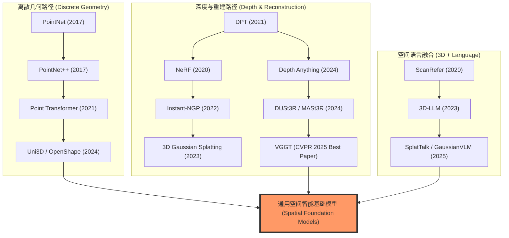
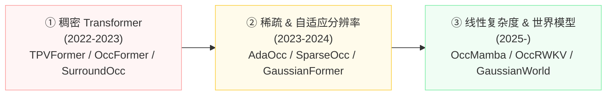
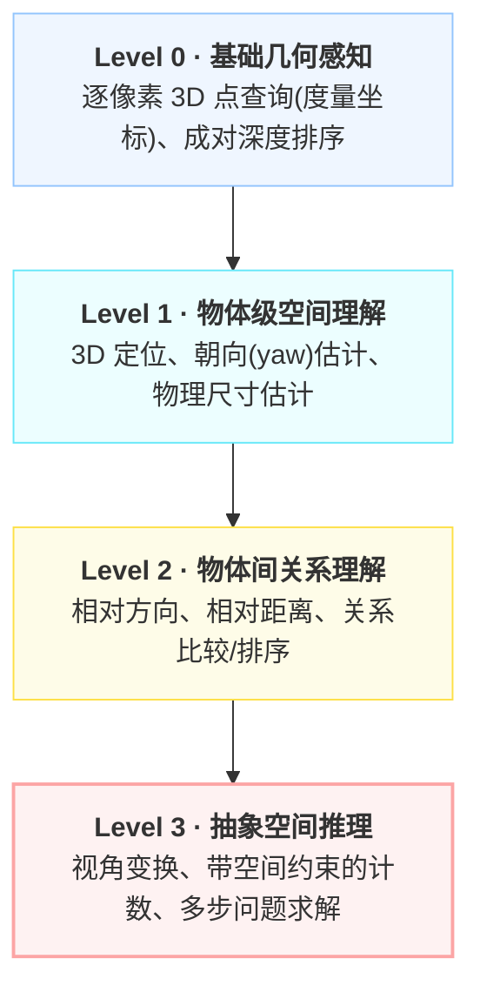

# 1. 引言

<div align="center">
  
<figcaption>  </figcaption>
</div>

空间智能（Spatial Intelligence）是指 AI 系统感知、理解、推理和交互三维物理世界的综合能力。与人类从婴幼儿期便开始发展的空间认知类似，空间智能涵盖了对物体形状、场景布局、三维空间关系以及动态变化的全面理解。作为具身智能（Embodied AI）的核心基础，空间智能的研究近年来随着深度学习、神经渲染以及大型多模态模型的飞速发展而进入了全新阶段。

从应用价值来看，空间智能横跨多个高价值领域：在**自动驾驶**中，精确的三维感知与动态目标检测是安全行驶的前提；在**机器人操控**中，六自由度的空间理解决定了机械臂的抓取成功率；在**增强现实与虚拟现实（AR/VR）**中，实时高质量的三维重建与空间锚定是沉浸式体验的关键；在**具身 AI 智能体**中，空间记忆与三维场景图是任务规划与导航的基础。

研究空间智能面临的核心挑战来自三维数据的内在复杂性：三维标注数据的稀缺与昂贵、点云/体素/隐式表达之间的表示多样性、真实世界动态场景的时变性，以及三维几何与语义理解的跨模态融合难题。近年来，从 NeRF 到三维高斯溅射（3D Gaussian Splatting，3DGS），从 PointNet 到 Point Transformer，从单目深度估计到空间推理 VLM，空间智能领域正经历着技术范式的快速迭代。

本文旨在系统梳理空间智能研究进展，为学习和研究空间智能提供参考。

# 2. 空间智能基本概述

## 2.1 什么是空间智能？

空间智能是一个多层次的能力体系，从低层几何感知到高层空间推理，可划分为以下四个层次：

1. **空间感知（Spatial Perception）**：获取三维几何信息，包括深度估计、点云获取与处理、三维形状重建。
2. **空间重建（Spatial Reconstruction）**：从多视角图像或传感器数据建立场景的三维模型，包括 SLAM、MVS、NeRF、3DGS 等技术。
3. **空间理解（Spatial Understanding）**：对三维场景进行语义解析，包括三维目标检测、三维实例分割、场景图生成与视觉定位。
4. **空间推理（Spatial Reasoning）**：在三维空间中进行高阶认知，包括空间关系判断（物体 A 是否在 B 的左侧？）、视角变换推理，以及语言引导的三维交互。

这四个层次构成了空间智能的完整能力栈：感知为重建提供原始数据，重建为理解提供几何基础，理解为推理提供语义上下文。

## 2.2 感知硬件基础

空间智能的源头是多样的传感器，硬件特性直接决定了算法的选择与感知上限：

| 传感器类型 | 原理 | 优势 | 局限 | 应用场景 |
|:-----------|:-----|:-----|:-----|:---------|
| **激光雷达 (LiDAR)** | 激光飞行时间 (ToF) | 精度极高、抗光照干扰、直接 3D | 成本高、点云稀疏、无颜色 | 自动驾驶、地形测绘 |
| **RGB-D 相机** | 结构光 / 局域 ToF | 像素级对齐、室内精度高 | 室外易受干扰、量程有限 | 机器人导航、AR/VR |
| **立体视觉 (Stereo)** | 双目视差计算 | 成本低、室内外通用 | 依赖纹理、弱光表现差 | 工业视觉、避障 |
| **单目相机** | 透视投影 | 极其廉价、部署便捷 | 存在尺度歧义、需学习先验 | 消费级电子、广域监控 |
| **事件相机** | 像素级亮度变化 | 极高动态范围、低延迟 | 空间分辨率低、输出异构 | 高速运动捕捉、无人机 |

## 2.3 核心要素与技术体系

空间智能的技术体系围绕**三维表示**展开，主流形式对比如下：

| 表示形式 | 特点 | 硬件适配 | 代表技术 |
|:---------|:-----|:---------|:---------|
| 点云 (Point Cloud) | 稀疏、无序、直接采集 | LiDAR、RGB-D | PointNet, Point Transformer |
| 体素 (Voxel Grid) | 规则、密集、内存开销大 | 全局建模 | VoxNet, OccNet |
| 网格 (Mesh) | 面片表示、适合渲染 | 3D 扫描 | Marching Cubes |
| 隐式场 (Implicit Field) | 连续、可微、内存高效 | 多视角图像 | NeRF, SDF |
| 三维高斯 (3D Gaussian) | 显式、快速渲染、可优化 | 多视角图像 | 3DGS |
| 深度图 (Depth Map) | 像素对齐、计算友好 | 单目/双目 | Monocular Depth Estimation |

## 2.4 评价指标速查表

| 维度 | 指标 | 含义 | 适用任务 |
|:-----|:-----|:-----|:---------|
| **几何精度** | CD (Chamfer Distance) | 点集间的平均欧氏距离 | 点云配准、形状重建 |
| | EMD (Earth Mover's Distance) | 两个分布间的推土机距离 | 形状生成、点云生成 |
| | AbsRel / RMSE | 深度预测的绝对误差与均方根误差 | 深度估计 |
| **理解精度** | mIoU (Mean IoU) | 预测框与真值的交并比均值 | 语义/实例分割、检测 |
| | mAP (Mean Average Precision) | 平均精度均值（多阈值下的召回/精确度） | 三维目标检测 |
| **推理/对话** | CIDEr / BLEU-4 | 生成文本与参考答案的共现相似度 | 3D Captioning / 3D VQA |
| | EM (Exact Match) | 答案完全匹配的比例 | 3D 视觉问答 |
| **重建质量** | PSNR / SSIM | 渲染图像的峰值信噪比与结构相似度 | 视角合成 (NeRF/3DGS) |

## 2.5 研究趋势与汇聚路径



**关键里程碑**：
- **2015–2017**：PointNet 奠定了直接在无序点云上进行深度学习的基础，开启了三维深度学习新纪元。
- **2018–2020**：VoxelNet、SECOND、PointPillars 推动了自动驾驶 LiDAR 感知商业化；NeRF 的提出彻底改变了三维重建技术范式。
- **2021–2022**：Transformer 架构被引入三维感知（Point Transformer、DETR3D、BEVFormer），性能大幅提升；Instant-NGP 将 NeRF 训练时间压缩至秒级。
- **2023**：3D Gaussian Splatting 实现实时高质量渲染；3D-LLM、EmbodiedScan 将语言模型与三维场景理解结合。
- **2024–2025**：Depth Anything、SpatialVLM、DUSt3R、Uni3D 等工作推动空间感知基础模型形成；VGGT（CVPR 2025 Best Paper）以单次前馈同时输出相机参数、深度、点图与点轨迹，标志空间智能正式进入"前馈三维基础模型"新阶段。

## 2.6 相机模型与投影几何基础

空间智能的数学基础之一是**针孔相机模型（Pinhole Camera Model）**，它精确描述了三维世界中的点如何透过镜头中心投影到二维图像平面。理解相机投影是理解 SfM、立体视觉、NeRF 位姿输入以及 VGGT 相机参数输出的必要前提。

<div align="center"><figcaption>图：相机投影矩阵的分解 P = K · R<sup>T</sup> · [Id | -X₀]，将外参（旋转 R、投影中心 X₀）与内参矩阵 K 显式分离。（图源：作者 LUH Photogrammetric Computer Vision 课程课件）</figcaption></div>

### 针孔相机投影

给定世界坐标系中的齐次点 $\widetilde{\mathbf{X}}_w = (X, Y, Z, 1)^T$，其图像齐次坐标 $\widetilde{\mathbf{x}} = (u, v, 1)^T$ 由完整投影矩阵 $P \in \mathbb{R}^{3\times4}$ 给出：

$$\lambda \begin{pmatrix} u \\ v \\ 1 \end{pmatrix} = P \, \widetilde{\mathbf{X}}_w = K [R \mid \mathbf{t}] \begin{pmatrix} X \\ Y \\ Z \\ 1 \end{pmatrix}$$

其中 $\lambda$ 为尺度因子（深度），$K$ 为内参矩阵，$[R \mid \mathbf{t}]$ 为外参（旋转+平移）。

**内参矩阵（Intrinsic Matrix）** $K$ 描述相机的光学与几何特性：

$$K = \begin{pmatrix} f_x & s & c_x \\ 0 & f_y & c_y \\ 0 & 0 & 1 \end{pmatrix}$$

- $f_x, f_y$：水平/垂直方向焦距（以像素为单位），对于方形像素 $f_x = f_y = f$
- $(c_x, c_y)$：主点（principal point），即光轴与像平面的交点
- $s$：像素倾斜系数（现代相机通常为零）

**外参（Extrinsic Parameters）** $[R \mid \mathbf{t}]$：旋转矩阵 $R \in SO(3)$ 和平移向量 $\mathbf{t} \in \mathbb{R}^3$ 描述相机坐标系相对于世界坐标系的位姿。

### 镜头畸变模型

真实镜头存在非线性畸变，在投影后需校正。最常用的**径向畸变（Radial Distortion）**：

$$\begin{cases} x_d = x(1 + k_1 r^2 + k_2 r^4 + k_3 r^6) \\ y_d = y(1 + k_1 r^2 + k_2 r^4 + k_3 r^6) \end{cases}, \quad r^2 = x^2 + y^2$$

其中 $(x, y)$ 为归一化相机坐标，$k_1, k_2, k_3$ 为径向畸变系数（负值产生桶形畸变，正值产生枕形畸变）。**切向畸变**由镜头安装偏心引起，额外引入参数 $p_1, p_2$。

### 相机标定

**相机标定**的目标是从已知三维—二维对应点中估计 $K$ 和畸变参数。

- **直接线性变换（DLT）**：将 $P\widetilde{\mathbf{X}} = \lambda\widetilde{\mathbf{x}}$ 线性化为 $A\mathbf{p} = 0$，通过 SVD 求解 $P$ 的 11 个自由度，至少需要 6 个点对，是最基础的标定方法。
- **Zhang 标定法**（Zhang, TPAMI 2000）：使用多姿态平面棋盘格，先估计各姿态下的单应矩阵 $H$，再利用多个 $H$ 的约束分解内参 $K$，最后以 Levenberg-Marquardt 非线性优化联合精化内外参与畸变系数。已集成于 OpenCV `calibrateCamera()`，是目前最主流的实用标定方法。

---

## 2.7 旋转表示

三维旋转是空间智能的核心数学工具，从 NeRF/3DGS 的相机位姿到机器人末端执行器的朝向，旋转无处不在。**李群 $SO(3)$**（Special Orthogonal Group）是旋转的代数结构，不同的参数化方式各有权衡：

| 表示 | 参数数 | 自由度 | 优点 | 局限 |
|:-----|:------|:------|:-----|:-----|
| 旋转矩阵 $R \in SO(3)$ | 9 | 3 | 运算直接，组合简单 | 需满足正交约束 $RR^T=I,\det R=1$；冗余 |
| 欧拉角 $(\phi,\theta,\psi)$ | 3 | 3 | 直观，便于人工设定 | **万向节锁（Gimbal Lock）**问题，插值不稳定 |
| 轴角 $(\mathbf{n}, \theta)$ | 4 | 3 | 物理含义清晰（绕轴旋转） | 不适合梯度优化；$\theta$ 接近 0 时奇异 |
| 四元数 $\mathbf{q}=(w,x,y,z)$ | 4 | 3 | 插值平滑（SLERP）、无奇异性、数值稳定 | 存在双覆盖（$\mathbf{q}$ 与 $-\mathbf{q}$ 表示同一旋转） |

**万向节锁**：欧拉角在特定配置（如俯仰角 $\theta=\pm 90°$）下，两个旋转轴重合，导致丢失一个自由度。这是 3D 动画和机器人控制中必须避免使用欧拉角插值的主要原因。

**单位四元数旋转**：$\|\mathbf{q}\|=1$ 的四元数 $\mathbf{q} = w + x\mathbf{i} + y\mathbf{j} + z\mathbf{k}$ 对应唯一旋转，旋转点 $\mathbf{p}$：
$$\mathbf{p}' = \mathbf{q} \otimes \mathbf{p} \otimes \mathbf{q}^{-1}$$

3DGS 中每个高斯椭球的朝向用四元数参数化（确保梯度优化在旋转流形上的连续性），VGGT 输出的相机外参也使用四元数表示。**Rodrigues 公式**提供了旋转矩阵与轴角之间的转换桥梁，是 SfM 和 Bundle Adjustment 中常用的微分工具：
$$R = I + \sin\theta [\mathbf{n}]_\times + (1-\cos\theta) [\mathbf{n}]_\times^2$$

其中 $[\mathbf{n}]_\times$ 为旋转轴 $\mathbf{n}$ 的反对称矩阵。

---

# 3. 任务分类体系

**1. 几何感知类**：以获取和处理三维几何信息为核心。典型任务包括单目/双目**深度估计**、**点云配准**（ICP、RANSAC）、**法向量估计**等。

**2. 三维重建类**：从图像序列或传感器数据恢复场景的三维结构。包括** SfM**、**MVS**、**SLAM**、**神经隐式重建（NeRF、3DGS）**等。

**3. 三维检测与识别类**：在三维空间中定位并分类物体。包括**三维目标检测**、**三维实例/语义分割**、**三维场景图生成**。

**4. 空间理解与推理类**：在三维语义层面建立高层理解。包括**三维视觉定位**、**三维视觉问答**、**空间关系推理**。

**5. 具身空间导航类**：在智能体主动探索的背景下使用空间智能。包括**目标驱动导航**、**三维语义地图构建**、**空间记忆网络**。

---

# 4. 空间智能技术演进范式

## 4.1 离散几何表示与点云处理

### PointNet
**PointNet**（Qi et al., CVPR 2017）是第一个直接在无序三维点云上端到端学习的深度神经网络，彻底改变了三维深度学习的研究范式。其核心设计思想是：对点集的任意排列保持**置换不变性**，对刚体变换保持**变换不变性**。

**核心设计**：
- 对每个点独立应用共享 MLP，将点坐标映射到高维特征空间。
- 使用**对称函数（max pooling）**聚合全局特征，自然解决无序问题。
- T-Net（Transformer Network）学习输入点云的对齐变换（$3\times3$）和特征对齐变换（$64\times64$），提升旋转鲁棒性。

**核心特点**：
- 无需体素化，直接处理原始点云，计算高效。
- 可用于分类、部分分割、语义分割三类任务。
- 奠定了点云深度学习"点独立处理+对称聚合"的基本范式。

<div align="center">
  
<figcaption>PointNet 网络架构：对每个点独立应用共享 MLP 提取特征，通过 Max Pooling 对称聚合得到全局特征向量，T-Net 分别对输入点坐标（3×3）和特征空间（64×64）学习对齐变换。</figcaption>
</div>

---

### PointNet++
**PointNet++**（Qi et al., NeurIPS 2017）针对 PointNet 无法捕捉局部几何结构的缺陷，引入层级化的局部特征学习机制。

**核心设计**：
- **最远点采样（FPS）**：递归选取与已选点集距离最远的点，得到空间均匀分布的采样子集。
- **Ball Query 分组**：以采样点为中心，在球形邻域内收集局部点集。
- **层级化 PointNet**：在局部点集上应用 PointNet 提取局部特征，再在更高层的局部区域上再次聚合，类比 CNN 的感受野逐层扩大。
- **多尺度分组（MSG）**：在不同半径球域内聚合特征，增强对点云密度变化的鲁棒性。

**核心特点**：
- 解决了 PointNet 对局部几何信息感知不足的问题。
- 自适应处理非均匀点云密度。
- 奠定了"采样+分组+聚合"的点云学习标准范式，后续工作（DGCNN、Point Transformer 等）均在此框架下扩展。

<div align="center">
  
<figcaption>PointNet++ 层级化特征学习：通过 FPS 采样 → Ball Query 分组 → PointNet 局部特征提取的反复堆叠，逐层扩大感受野；分割任务额外使用插值上采样将特征传回原始点集。</figcaption>
</div>

---

### DGCNN
**DGCNN**（Dynamic Graph CNN，Wang et al., TOG 2019）将图神经网络（GNN）引入点云处理。不同于在欧氏空间中构建固定 k 近邻图，DGCNN 在**特征空间**中动态更新 k-NN 图，捕捉语义上相近但空间上未必相邻的点对关系。

**EdgeConv** 操作计算每个点与其 k 近邻之间的边特征：
$$e_{ij} = h_\Theta(x_i,\ x_j - x_i)$$
通过聚合边特征获得节点新特征。每层 EdgeConv 后，图结构在特征空间重新计算（动态更新），使网络同时保留局部和非局部几何信息。

**核心特点**：
- 动态图结构能捕捉语义关联，而非仅依赖空间邻近性。
- EdgeConv 操作简洁高效，易于集成至各类点云架构。

<div align="center">
  
<figcaption>DGCNN 架构与 EdgeConv 操作：在特征空间动态构建 k-NN 图（每层重新计算），计算中心点与邻居的边特征后聚合；多层 EdgeConv 堆叠后接 Max Pooling 得到全局描述符。</figcaption>
</div>

---

### Point Transformer
**Point Transformer v1**（Zhao et al., ICCV 2021）将自注意力机制引入点云处理。其**向量自注意力**为每个特征维度分配独立的注意力权重（区别于标量注意力），并引入位置编码捕捉局部几何关系：
$$y_i = \sum_{x_j \in \mathcal{N}(x_i)} \rho\!\left(\gamma\!\left(\phi(x_i) - \psi(x_j) + \delta\right)\right) \odot \left(\alpha(x_j) + \delta\right)$$
其中 $\delta$ 为点位置编码，$\rho$ 为 softmax 归一化，$\gamma$ 为关系网络。**Point Transformer v2**（Wu et al., NeurIPS 2022）引入分组向量注意力与多头机制，在 ScanNet 语义分割等基准上达到当时的最优性能。

**核心特点**：
- 基于 Transformer 的局部自注意力，捕捉细粒度局部几何特征。
- 位置编码设计使网络对点云几何结构具有明确的感知能力。
- 确立了点云 Transformer 的标准架构，后续 Point Transformer v3（2024）进一步在大规模数据上预训练。

<div align="center">
  
<figcaption>Point Transformer 向量自注意力：为每个特征维度分配独立注意力权重（区别于标量注意力），位置编码 δ 基于近邻点坐标差学习，同时注入注意力权重和值向量，捕捉局部几何关系。</figcaption>
</div>

---

### 三维感知基础模型 (2024-2025 最新进展)
**Uni3D**（Zhou et al., ICLR 2024）是首个大规模统一三维感知基础模型。通过在 1000 万以上三维对象上进行对比预训练，Uni3D 学习到跨类别、跨数据集的通用三维点云特征，在零样本三维理解和跨模态检索（点云↔图像↔文本）等任务上取得突破性进展。

**OpenShape**（Liu et al., NeurIPS 2023）利用文本-三维形状对进行大规模多模态对比学习，将 CLIP 的开放词汇理解能力迁移至三维领域，支持零样本三维分类（ModelNet40 上约 85% top-1 准确率，无需三维训练数据）。

**Point-BERT**（Yu et al., CVPR 2022）和 **Point-MAE**（Pang et al., ECCV 2022）将 BERT/MAE 自监督预训练引入点云领域，推动三维感知基础模型的形成。

---

## 4.2 密集几何感知与深度估计

### DPT
**DPT**（Dense Prediction Transformer，Ranftl et al., ICCV 2021）将视觉 Transformer（ViT）引入密集预测任务（深度估计与语义分割），将 ViT 各层 patch token 特征图融合进解码器，实现高分辨率密集输出。

DPT 训练采用**尺度不变损失（Scale-Invariant Loss）**：
$$\mathcal{L}_{si} = \frac{1}{n}\sum_i d_i^2 - \frac{\lambda}{n^2}\left(\sum_i d_i\right)^2$$
其中 $$d_i = \log \hat{y}_i - \log y_i$$ 为预测值与真实值对数之差，$\lambda$ 控制全局尺度惩罚项的权重。该损失对绝对尺度不敏感，适用于单目深度估计的固有尺度歧义性。

**核心特点**：
- 首次在深度估计中使用纯 ViT 特征提取，利用大感受野捕捉全局场景结构。
- 多尺度特征融合，从粗到细捕捉不同层次的深度信息。
- 在相对深度零样本迁移中具有很强的跨数据集泛化性。

<div align="center">
  
<figcaption>DPT 架构：以 ViT 为骨干提取多层 patch token，通过 Reassemble 操作恢复空间分辨率得到多尺度特征图，再经 Fusion 解码器逐步上采样融合，输出高分辨率密集深度预测。</figcaption>
</div>

---

### Depth Anything 系列
**Depth Anything**（Yang et al., CVPR 2024）是迄今最具代表性的单目深度估计基础模型。其核心创新在于大规模**半监督数据引擎**：以 150 万张有标注图像为种子，利用教师模型为 6200 万张无标注图像生成伪标签，再以强数据增强对学生模型进行强制泛化训练，突破了标注数据瓶颈。

**Depth Anything V2**（NeurIPS 2024）进一步引入高质量合成数据（Hypersim、Virtual KITTI）改善细粒度深度预测，并提供绝对尺度（Metric Depth）版本，适用于机器人导航等需要真实深度值的应用场景。

**核心特点**：
- DINOv2 作为骨干网络提供强大的语义先验。
- 零样本泛化能力显著优于前代模型，在未见场景上表现稳定。
- V2 版本的细节质量（边缘清晰度、薄结构）得到显著改善。

<div align="center">
  
<figcaption>Depth Anything 半监督数据引擎：以 150 万有标注图像训练教师模型，对 6200 万无标注图像生成伪标签，再以强数据增强（色彩畸变、CutMix 等）训练学生模型，强迫其学习更鲁棒的深度先验。</figcaption>
</div>

---

### Marigold
**Marigold**（Ke et al., CVPR 2024）将扩散模型（Diffusion Model）引入深度估计，利用 Stable Diffusion 中蕴含的图像先验，通过在少量真实深度数据上微调实现强大的零样本深度估计。其核心洞察是：预训练扩散模型中编码了丰富的场景几何先验，可高效迁移至深度估计任务而无需大规模重新训练。

**核心特点**：
- 基于扩散模型的生成式深度估计框架，通过多步去噪生成深度图。
- 仅需在少量有标注数据上微调即可达到 SOTA 性能。
- 生成的深度图具有丰富的细节和清晰的边界，在弱纹理/重复纹理区域表现尤为突出。

<div align="center">
  
<figcaption>Marigold 推理流程：将 RGB 图像编码至 Stable Diffusion 潜在空间，通过迭代去噪步骤生成深度图潜变量，最后解码为相对深度图。</figcaption>
</div>

---

## 4.2.5 经典立体视觉与密集匹配

在深度学习方法出现之前，**立体视觉（Stereo Vision）**是从图像中恢复深度的主流手段。理解其原理有助于把握 Depth Anything、Marigold 等方法究竟解决了哪些经典痛点。

### 对极几何

**对极几何（Epipolar Geometry）**描述同一场景在两张图像中的几何约束关系，是立体匹配的理论基础。给定两幅图像中的对应点 $\mathbf{x}_1$ 和 $\mathbf{x}_2$（齐次坐标），它们满足：

$$\mathbf{x}_2^T F \mathbf{x}_1 = 0$$

其中 $F \in \mathbb{R}^{3 \times 3}$（秩为 2）为**基础矩阵（Fundamental Matrix）**，包含两相机的相对位姿与内参信息。若已知两相机内参 $K_1, K_2$，则对应的**本质矩阵（Essential Matrix）**：

$$E = K_2^T F K_1 = [\mathbf{t}]_\times R$$

$E$ 仅编码外参旋转 $R$ 和（归一化）平移方向 $\mathbf{t}$，可通过 SVD 分解恢复相对位姿。对极约束将二维搜索空间降至**对极线（Epipolar Line）**上的一维搜索，是所有立体匹配算法的核心加速手段。

<div align="center"><figcaption>图：对极几何。投影中心 X₀′、X₀″ 与物点 X 张成对极平面，与两像平面相交得对极线 k′、k″，所有对极线交于对极点 e′、e″。（图源：作者 LUH Photogrammetric Computer Vision 课程课件）</figcaption></div>

### 立体纠正与视差深度

对图像对进行**立体纠正（Stereo Rectification）**后，两相机光轴平行，对极线变为水平扫描线，对应点仅在水平方向存在位移——**视差（Disparity）** $d = u_L - u_R$。由相似三角形：

$$Z = \frac{f \cdot B}{d}$$

其中 $f$ 为焦距，$B$ 为**基线（Baseline）**（双目间距），$Z$ 为深度。视差越大，距离越近；视差趋向零，深度趋向无穷——这正是单目深度估计存在**尺度歧义**的几何本质。

<div align="center"><figcaption>图：极线影像生成（立体纠正）。通过两个单应变换 H′、H″ 将原始像平面重投影到与基线平行的公共平面，使对极线对齐为水平扫描线。（图源：作者 LUH Photogrammetric Computer Vision 课程课件）</figcaption></div>

### 半全局匹配（SGM）

**SGM**（Semi-Global Matching，Hirschmüller, TPAMI 2008）是经典密集视差估计的代表算法，至今仍是自动驾驶和航测领域的工业基线。其核心思路是将逐像素代价最小化问题近似为沿多方向一维路径积分，融合局部匹配代价与全局平滑约束：

$$E(D) = \sum_{\mathbf{p}} \left( C(\mathbf{p}, D_\mathbf{p}) + \sum_{\mathbf{q} \in N_\mathbf{p}} P_1 T[|D_\mathbf{p} - D_\mathbf{q}| = 1] + P_2 T[|D_\mathbf{p} - D_\mathbf{q}| > 1] \right)$$

其中 $C(\mathbf{p}, d)$ 为像素 $\mathbf{p}$ 在视差 $d$ 下的匹配代价，$P_1, P_2$ 分别为小/大视差跳变的惩罚项。SGM 通过 8 个方向的路径累积（Left/Right/Top/Bottom 及对角线），以接近 $O(WH)$ 的线性复杂度逼近全局能量最小化。

<div align="center"><figcaption>图：SGM 代价聚合能量函数（Hirschmüller, PAMI 2008）。第一项为逐像素匹配代价，第二、三项分别对小幅（1 像素）与大幅视差跳变施加惩罚 P₁、P₂，实现局部平滑约束。（图源：作者 LUH Photogrammetric Computer Vision 课程课件）</figcaption></div>

**Census 变换**是 SGM 常用的匹配代价，将像素邻域中每个位置与中心像素的大小关系编码为二进制串，再以汉明距离度量相似性——对光照变化具有天然的鲁棒性，避免了直接使用像素灰度差（SAD/SSD）时对绝对亮度敏感的缺陷。

**SGM 的局限性**正是推动深度学习方法（如 Depth Anything、Marigold）兴起的原因：
- 无纹理区域（白墙、均匀地面）匹配代价退化，产生大片"空洞"；
- 透明/反射物体违反朗伯体假设，经典代价函数失效；
- 参数（$P_1, P_2$）需针对场景手工调节，泛化性弱；
- 立体方法必须依赖已标定的双目相机，单目场景无法使用。

---

## 4.3 神经三维重建：从隐式到显式

### 4.3.0 经典 SfM/MVS 管线

在神经渲染出现之前，**运动恢复结构（Structure from Motion, SfM）**是从无约束图像集中重建三维场景的标准框架。理解经典管线是理解 DUSt3R、VGGT 等端到端前馈方法"革命性"的前提。

**经典 SfM 流程**：

1. **特征提取**：**SIFT**（Scale-Invariant Feature Transform，Lowe, IJCV 2004）通过高斯差分（DoG）检测尺度空间极值点，提取 128 维方向梯度直方图（HOG）描述子，实现尺度、旋转与光照不变性，是两十年来最稳健的图像匹配特征。
2. **特征匹配 + RANSAC**：对图像对进行描述子最近邻匹配，使用 **RANSAC（Random Sample Consensus）** 鲁棒估计基础矩阵 $F$，以迭代随机采样的方式自动剔除误匹配（outliers）。
3. **相对位姿估计**：从本质矩阵 $E = [\mathbf{t}]_\times R$ 通过 SVD 分解恢复两相机间的旋转 $R$ 和平移方向 $\mathbf{t}$（4个候选解，通过正深度约束确定唯一解）。
4. **三角化（Triangulation）**：已知两相机位姿后，对匹配点对用线性最小二乘（DLT）恢复 3D 点坐标 $\mathbf{X}$，解方程组 $\mathbf{x}_i \times (P_i \mathbf{X}) = 0$。
5. **增量式重建**：以最佳匹配图像对为种子，通过 PnP+RANSAC 将新图像注册进已重建的点云，持续扩展稀疏 3D 结构。
6. **光束法平差（Bundle Adjustment, BA）**：联合优化所有相机位姿 $\{R_i, \mathbf{t}_i\}$ 与 3D 点坐标 $\{X_j\}$，最小化**重投影误差**：
$$\min_{\{R_i,\mathbf{t}_i\},\{X_j\}} \sum_{i,j} \rho\!\left(\left\|\mathbf{x}_{ij} - \pi(R_i X_j + \mathbf{t}_i)\right\|^2\right)$$
其中 $\pi(\cdot)$ 为透视投影，$\rho(\cdot)$ 为鲁棒核函数（Huber）。BA 是 SfM 精度的核心，通常用 Ceres Solver 实现。
7. **稠密重建（MVS）**：在稀疏 SfM 位姿基础上，通过 **PatchMatch MVS** 等算法逐像素恢复稠密深度图，再融合为稠密点云或体素。

**COLMAP**（Schönberger & Frahm, CVPR 2016）是目前最主流的开源 SfM+MVS 系统，集成了上述全流程，DUSt3R、VGGT 等工作均以 COLMAP 重建结果作为位姿精度评测基准（AUC@5°/10°/20°）。

**经典 SfM 的核心局限**——正是推动神经渲染革命的根本动因：
- **速度极慢**：大场景 BA 耗时数小时乃至数天；
- **稀疏输出**：最终点云稀疏，需再跑 MVS 才能得到稠密结果；
- **弱纹理失败**：SIFT 特征在低纹理区域（白墙、天空）匹配稀疏；
- **无语义**：纯几何管线，无法感知物体类别与语义关系；
- **场景独立**：无法跨场景泛化，每个新场景需重新运行完整管线。

---

### NeRF
**NeRF**（Neural Radiance Fields，Mildenhall et al., ECCV 2020）是近年来三维视觉领域最具影响力的工作之一。NeRF 用一个全连接网络 $F_\Theta: (\mathbf{x}, \mathbf{d}) \to (\mathbf{c}, \sigma)$ 将三维坐标 $\mathbf{x}$ 和视角方向 $\mathbf{d}$ 映射为颜色 $\mathbf{c}$ 和体积密度 $\sigma$，通过可微体积渲染方程合成图像：
$$\hat{C}(\mathbf{r}) = \int_{t_n}^{t_f} T(t)\,\sigma\!\left(\mathbf{r}(t)\right)\mathbf{c}\!\left(\mathbf{r}(t),\mathbf{d}\right)\mathrm{d}t$$
其中 $T(t) = \exp\!\bigl(-\int_{t_n}^{t}\sigma(\mathbf{r}(s))\,\mathrm{d}s\bigr)$ 为沿光线的累积透射率。以重建图像与真实图像的光度损失（MSE/SSIM）监督网络训练。

**核心特点**：
- 全隐式连续表示，内存高效，可渲染任意分辨率。
- 可微渲染支持端到端优化，无需显式三维监督。
- 高质量新视角合成，擅长细节纹理与镜面反射。
- 局限：训练缓慢（数小时/场景）、仅表示静态场景、不同场景间无泛化性。

<div align="center">
  
<figcaption>NeRF 渲染原理：沿相机光线均匀采样后用 Coarse MLP 估计密度分布，再对高密度区域重要性采样后送入 Fine MLP，最终通过体积渲染方程积分得到像素颜色，与真实图像的光度损失反向传播优化网络权重。</figcaption>
</div>

**重要扩展**：Mip-NeRF（处理混叠）、Mip-NeRF 360（无界场景）、Instant-NGP（哈希编码，加速至秒级）、Block-NeRF（大规模城市场景）。

---

### 3D Gaussian Splatting
**3D Gaussian Splatting**（Kerbl et al., SIGGRAPH 2023）是 2023 年三维重建领域最重要的突破，以**实时高质量**渲染彻底改变了神经渲染领域格局。

3DGS 用一组各向异性三维高斯基元显式表示场景，每个高斯由以下参数描述：
- 位置（均值）$\mu \in \mathbb{R}^3$
- 协方差矩阵，通过旋转矩阵 $R$ 和缩放向量 $s$ 分解：$\Sigma = RSS^TR^T$
- 不透明度 $\alpha$
- 球谐函数（SH）系数，描述视角相关外观

渲染时将三维高斯投影到图像平面（Splatting），按深度排序后进行 $\alpha$-混合，得到最终像素颜色。自适应密度控制机制根据梯度信息自动克隆或删除高斯基元，实现几何细节的自动校准。

**核心特点**：
- 显式表示，避免 NeRF 的体积渲染开销，实现实时渲染（>30 FPS @ 1080p）。
- 可微分，支持端到端梯度优化。
- 训练速度远快于 NeRF（分钟级），且渲染质量更高。
- 局限：高斯基元数量庞大（数百万），存储开销较大；对无纹理平滑区域建模较弱。

<div align="center">
  
<figcaption>3D Gaussian Splatting 概览：从 SfM 稀疏点云初始化高斯基元，将三维高斯投影至图像平面后按深度排序进行 α-混合渲染，梯度驱动的自适应密度控制（Clone/Split）自动增殖或修剪高斯。</figcaption>
</div>

---

### 端到端稠密三维重建 (2024-2025)

**DUSt3R**（Wang et al., CVPR 2024）提出端到端稠密三维重建新范式，将传统 SfM 管线（特征匹配→位姿估计→密集重建）统一为单一 Transformer 网络：输入任意图像对（无需已知相机参数），直接预测稠密点图（Pointmap），再通过全局优化融合多图。DUSt3R 突破了传统方法对高重叠度图像对的依赖，在极端视角变换下依然稳健。

**MASt3R**（Leroy et al., 2024）在 DUSt3R 基础上增加局部特征匹配能力，进一步提升多视角三维重建的鲁棒性与精度，同时支持稀疏匹配任务。两者共同代表了三维重建向"前馈基础模型"方向的重要转变。

---

### VGGT：通用三维视觉基础模型 (2025)

**VGGT**（Visual Geometry Grounded Transformer，Wang et al., **CVPR 2025 Best Paper**，arXiv:2503.11651）是 DUSt3R/MASt3R 路线的集大成者，也是首个真正意义上的"通用三维视觉基础模型"。其核心突破是用**单个前馈 Transformer** 在亚秒级一次推理中，同时预测一组图像（从单张到数百张）所对应的**全部关键三维属性**：

- 相机内参与外参（intrinsics + extrinsics）
- 每帧度量深度图（metric depth）
- 全场景一致的稠密点图（Pointmap）
- 跨帧的 3D 点轨迹（point tracks）

**前馈范式的演进**：从传统 SfM/MVS 多阶段几何流水线，到 DUSt3R/MASt3R 的成对前馈+全局对齐，再到 VGGT 的统一前馈，三维重建的"阶段数"在逐步收敛——下图直观对比三种范式：


**核心设计**：

- **统一前馈架构**：彻底抛弃了 DUSt3R 路线中仍依赖的全局对齐优化、bundle adjustment 等几何后处理步骤——所有几何量都直接由网络一次性输出，无需任何测试时优化。
- **交替注意力（Alternating Attention）**：网络主体由"逐帧自注意力（frame-wise self-attention）"与"跨帧全局自注意力（global self-attention）"层交替堆叠组成。前者提取单图局部细节，后者建立多视角间的几何一致性，避免了 DUSt3R 显式构造图像对带来的 $O(N^2)$ 复杂度，可平滑扩展到数百张输入视图。
- **多任务联合监督**：通过多个轻量预测头同时回归相机参数、深度、点图与轨迹，并采用置信度（confidence）加权损失自适应处理动态物体与遮挡区域。
- **大规模混合训练**：在多种真实与合成 3D-annotated 数据集（包含 ScanNet、CO3D、ARKitScenes、MegaDepth、BlendedMVS 等）上联合预训练，吸收跨域几何先验。

<div align="center">
  
<figcaption>VGGT 架构概览（图源：Wang et al., CVPR 2025, Fig. 2）：DINO 将各帧图像 Patchify 为视觉 token，并附加可学习的相机 token；网络主体由全局自注意力（Global Attention）与逐帧自注意力（Frame Attention）交替堆叠 L 次组成；最终 Camera Head 输出相机内外参，DPT Head 输出每帧深度图、稠密点图与跟踪特征——所有几何量在一次前馈中并行得到，无需 Bundle Adjustment 等后处理。</figcaption>
</div>

**核心结果**：

- 在**相机位姿估计、多视角深度估计、稠密点云重建、3D 点跟踪**等多个基准上**同时**达到 SOTA，全面超越仍依赖测试时优化的 DUSt3R / MASt3R / MonST3R 等方法。
- 推理速度达到秒级（典型几十张图像 < 1s），相比传统 SfM/MVS 与基于优化的前馈方法快 1–2 个数量级。
- 输出可直接作为下游任务（新视角合成、动态点跟踪、3DGS 初始化、视觉 SLAM、机器人空间感知）的高质量先验，验证了其作为通用"三维基础模型"的可迁移性。

**意义与影响**：

- 标志着三维重建正式从"先估位姿—再三角化—再稠密化"的多阶段几何管线，转向"前馈基础模型一步出几何"的新范式，与 NLP/2D 视觉的发展轨迹高度对应。
- 推动了 **Fast3R**、**CUT3R** 等多视角/流式前馈三维重建工作的快速涌现，形成了围绕 DUSt3R → VGGT 的"3D Foundation Model"研究热潮。
- 对具身智能与世界模型而言，VGGT 提供了一个可即插即用的统一几何先验，显著降低了空间感知模块的工程复杂度。

---

### 三维生成与单图重建

**Zero-1-to-3**（Liu et al., ICCV 2023）利用扩散模型从单张 RGB 图像生成任意视角下的新视角图像，为单图三维重建提供了新思路。**Zero123++**（Shi et al., 2023）、**One-2-3-45**（Liu et al., 2024）进一步提升了多视角一致性和生成速度。

**LRM**（Large Reconstruction Model，Hong et al., ICLR 2024）基于大型 Transformer 的前馈三维重建模型，从单张图像在数秒内生成三维 NeRF，代表了三维重建从基于优化到**前馈推理**的范式转变。**CAT3D**（Google DeepMind，2024）利用扩散模型从极少量输入图像（1–3 张）生成多视角一致的三维场景，进一步放宽了对输入数量的要求。

---

### 动态场景建模 (4D)

静态 3DGS 在动态场景建模上存在局限。**Dynamic 3D Gaussians**（Luiten et al., 3DV 2024）为每个高斯引入时间轨迹，追踪多帧场景中粒子的动态运动；**4D Gaussian Splatting**（Wu et al., CVPR 2024）通过时间维度的高斯变形场实现动态场景实时渲染；**Deformable 3D Gaussians**（Yang et al., CVPR 2024）则专注于非刚体形变建模，为机器人交互场景动态建模打开了新方向。

---

## 4.4 三维目标检测与场景理解

### VoxelNet, SECOND 与 PointPillars
**VoxelNet**（Zhou & Tuzel, CVPR 2018）是第一个端到端直接从激光雷达点云学习三维目标检测的框架。它将点云体素化，在每个非空体素内用 VFE（Voxel Feature Encoding）层提取局部特征，再通过三维卷积骨干网络和 RPN 完成检测，消除了人工特征工程。然而，由于使用常规稠密三维卷积，其计算与显存开销极大，限制了其实时性。

<div align="center">
  
<figcaption>VoxelNet 架构 </figcaption>
</div>

**SECOND**（Sparsely Embedded Convolutional Detection，Yan et al., Sensors 2018）针对 VoxelNet 常规三维卷积的高昂开销，引入了**稀疏卷积（Sparse Convolution）**与流形稀疏卷积（Submanifold Sparse Convolution），仅在非空体素上进行卷积计算，大幅提升了训练和推理速度，并改进了角度回归损失函数，使基于体素的方法真正具备了实用价值。

<div align="center">
  
<figcaption>SECOND 架构 </figcaption>
</div>

**PointPillars**（Lang et al., CVPR 2019）则更进一步，将体素化简化为"柱状（Pillar）"编码——沿高度方向将点云压缩为二维伪图像，从而用高效的 2D CNN 代替了 3D 卷积（无论是稠密还是稀疏），推理速度提升至 62 FPS（GPU）。PointPillars 在速度与精度之间取得了极佳的工程平衡，成为自动驾驶 LiDAR 感知领域经典的工业界基线。

**核心特点**：
- 体素/柱状编码将无序点云转化为规则特征图，兼容成熟的 2D/3D CNN 框架。
- PointPillars 推动了三维检测系统在嵌入式硬件上的实时部署。

<div align="center">
  
<figcaption>PointPillars 架构：将点云沿高度方向压缩为柱状（Pillar）伪图像，经 PointNet 提取柱特征后散射回 2D BEV 特征图，再通过 2D CNN 骨干网络和 SSD 检测头输出三维边界框。</figcaption>
</div>

---

### BEVFormer
**BEVFormer**（Li et al., ECCV 2022）是纯视觉（无 LiDAR）三维感知的里程碑工作。其核心思路是通过**可变形注意力（Deformable Attention）**将多相机图像特征查询到统一的**鸟瞰图（Bird's Eye View, BEV）**空间，并引入**时序 BEV 特征融合**捕捉运动信息。

**核心设计**：
- BEV 平面上预设 Query，通过空间交叉注意力从多视角图像中采样特征（避免稠密特征变换的计算开销）。
- 时间自注意力将历史 BEV 特征与当前帧对齐，隐式编码速度和运动信息。
- 在 nuScenes 数据集上显著超越前代纯视觉方法，触发了"纯视觉自动驾驶感知"研究热潮。

**核心特点**：
- 无需昂贵 LiDAR，仅用摄像头实现接近 LiDAR 水平的 3D 感知。
- BEV 统一表示支持检测、跟踪、地图分割等多任务联合训练。

<div align="center">
  
<figcaption>BEVFormer 架构：在 BEV 平面预设网格 Query，通过空间交叉注意力从多相机图像中采样特征投影到 BEV 空间，再以时间自注意力融合历史 BEV 帧隐式编码运动信息，最终送入检测/分割头。</figcaption>
</div>

---

### 语义占用预测与表示演进
**语义占用预测（Semantic Occupancy Prediction）**近年在自动驾驶中受到广泛关注。与 3D 目标检测输出有限数量的边界框不同，占用预测为场景中每个区域（体素）分配语义标签，能更自然地处理任意形状的异型障碍物与长尾目标（如倒地的纸箱、施工护栏、悬挂的线缆），因而被视为通往"通用障碍物感知"的关键路径。然而，稠密体素表示天然面临 $O(N^3)$ 的内存与计算爆炸问题，整个领域的技术演进，本质上是一条不断逼近"高分辨率 × 低算力 × 时序一致"三角约束的优化轨迹：



**1）稠密 Transformer 范式（2022–2023）**：**TPVFormer**（Huang et al., CVPR 2023）将 BEV 扩展为三平面（Tri-Perspective View, TPV）表示，用三个正交平面而非完整体素网格近似 3D 空间，在计算效率与感知完整性之间取得平衡；**OccFormer**、**SurroundOcc** 则通过 3D / 双路注意力进一步提升重建质量。这一阶段确立了"环视图像 → 3D 体素语义"的端到端范式，但稠密注意力带来的显存与延迟开销，成为车端实时部署的主要瓶颈。

**2）稀疏与自适应分辨率表示（2023–2024）**：核心思想是"好钢用在刀刃上"，不再对所有体素一视同仁地计算。**AdaOcc**（Adaptive-Resolution Occupancy Prediction）引入自适应分辨率机制——在近处、复杂障碍物等安全关键的兴趣区域（ROI）使用高分辨率，在远处空旷区域使用低分辨率，打破效率与精度的 Trade-off；**SparseOcc / Fully Sparse Occupancy** 将稀疏性推向极致，在整条流水线中仅对非空区域进行计算，大幅压缩延迟；甚至有工作（**Occupancy as Set of Points**）彻底摒弃规则体素网格，改用点集灵活表示占用，对薄结构与边缘有更好的刻画。受 3DGS 启发，**GaussianFormer**（Wang et al., ECCV 2024）/ **GaussianFormer-2**（CVPR 2025）则用一组 3D 高斯体替代稠密体素，以"概率叠加"建模占用，在显著压缩内存的同时保留细粒度几何。

**3）线性复杂度架构与时序世界模型（2025–）**：Transformer 的二次复杂度在高分辨率 3D 空间中成为致命弱点，新一代工作转向线性复杂度骨干。**OccMamba**（CVPR 2025）是首个将状态空间模型（SSM / Mamba）引入占用预测的网络，通过希尔伯特曲线等 3D-to-1D 展开保持空间局部性，配合层次化 Mamba 模块实现 $O(N)$ 复杂度；**OccRWKV** 则借助线性 RNN 架构探索端侧实时部署。与此同时，占用预测正从"单帧感知"迈向"时序世界模型"：**GaussianWorld**（CVPR 2025）在流式输入中不仅预测当前占用状态，更预测未来的 3D 占用演变，强调时序一致性；面向遮挡难题，**Collaborative Semantic Occupancy Prediction** 通过车路 / 车车协同（V2V）融合多视角特征"看透"遮挡，显著提升 IoU。

> **演进脉络小结**：占用预测沿"稠密计算 → 自适应 / 稀疏表示 → 线性复杂度 → 时序世界模型"逐级演进，背后是同一条主线——在有限车端算力下，把感知分辨率、计算效率与时序预测能力推向新的帕累托前沿。

**三维场景图（3D Scene Graph）**则从另一视角组织空间语义：将场景表示为图结构，节点表示物体实例，边表示空间关系（上方 / 下方、左侧 / 右侧、支撑等），支持语言查询与逻辑推理。**3DSSG**（Wald et al., CVPR 2020）是该方向的代表性数据集与基线工作。占用预测提供"稠密几何 + 语义"，场景图提供"稀疏结构 + 关系"，二者在具身导航与任务规划中常互为补充。

---

## 4.5 空间感知语言模型

### ScanRefer & ScanQA
**ScanRefer**（Chen et al., ECCV 2020）提出了**三维视觉定位（3D Visual Grounding）**任务：给定自然语言描述（如"靠近门口的那张棕色椅子"），在三维点云场景中定位目标物体（输出三维边界框）。ScanRefer 数据集包含 51,583 条对 ScanNet 扫描中物体的语言描述，是三维语言定位方向的核心基准。ScanRefer 之后，**Nr3D/Sr3D**（Achlioptas et al., 2020）和 **ScanQA**（Azuma et al., CVPR 2022）进一步扩展了三维语言理解的评测维度。

<div align="center">
  
<figcaption>ScanRefer 三维视觉定位示例：给定自然语言描述（如"靠近门口的棕色椅子"），模型在三维点云场景中定位目标并输出三维边界框，需同时理解语言中的空间关系线索并在点云中消解歧义。</figcaption>
</div>

---

### 3D-LLM
**3D-LLM**（Hong et al., NeurIPS 2023）首次将大型语言模型（LLM）扩展至三维感知任务。通过将三维点云特征注入 LLM 的上下文（使用基于扩散模型的三维特征提取器，将点云映射为 token 序列），3D-LLM 支持三维场景问答、三维视觉定位、三维对话等多类任务，无需为每个任务设计专用模块。

**核心特点**：
- 将 LLM 的开放式语言理解能力迁移到三维场景感知，赋予模型三维感知能力。
- 支持多样化三维-语言任务，展示了统一框架的可行性。
- 为后续三维多模态大模型（3D MLLM）奠定基础。

<div align="center">
  
<figcaption>3D-LLM 框架：利用基于扩散模型的三维特征提取器将点云场景映射为 token 序列，注入 LLM 的上下文窗口，支持场景问答、视觉定位与多轮对话等任务。</figcaption>
</div>

---

### SpatialVLM
**SpatialVLM**（Chen et al., CVPR 2024）专门针对视觉语言模型（VLM）的空间推理短板而设计。现有 VLM（如 GPT-4V）在"物体 A 距离物体 B 有多远？"此类定量空间推理问题上表现较差。SpatialVLM 通过构建大规模**空间推理问答数据集**——利用三维传感器自动生成涵盖距离估计、方位判断、大小比较等类型的定量标注问答对——对 VLM 进行空间推理专项微调。

**核心特点**：
- 首个系统性提升 VLM 定量空间推理能力的工作。
- 自动化数据生成管线可扩展至大规模，不依赖人工标注。
- 在机器人操控等空间推理密集型下游任务中显著提升性能。

<div align="center">
  
<figcaption>SpatialVLM 数据生成管线：利用三维传感器数据自动生成距离估计、方位判断、大小比较等定量空间推理问答对，对 VLM 进行空间推理专项微调，显著提升模型在定量空间问题上的准确率。</figcaption>
</div>

---

### EmbodiedScan
**EmbodiedScan**（Wang et al., CVPR 2024）提出了全面的具身三维场景理解基准，覆盖三维目标检测、三维视觉定位、三维问答等多任务，强调从智能体的**主动探索视角**理解三维场景（第一人称视角的 RGB-D 流输入），而非离线的完整点云扫描。EmbodiedScan 包含 5000+ 场景、146 万+ 实例标注，是当前规模最大的具身三维场景理解数据集之一。

**核心特点**：
- 统一的多任务具身三维理解框架，贴近真实机器人部署的感知模式。
- 强调实时、增量式的三维场景理解，而非离线离线处理完整点云。
- 引入多粒度空间语言对齐，支持细粒度物体级和场景级描述。

<div align="center">
  
<figcaption>EmbodiedScan 框架概览：以智能体主动探索的第一人称 RGB-D 视角流为输入，统一支持三维目标检测、三维视觉定位和场景问答等多任务评测。</figcaption>
</div>

---

### 空间智能大模型进展 (2024-2025)

**SpatialBot**（Cai et al., 2024）专门针对机器人空间理解任务，整合深度图与 RGB 图像，增强 VLM 在物体空间布局与距离估计等任务上的能力，并构建了相应的评测基准。**RoboSpatial**（2024）提出面向机器人操控的空间理解数据集与模型，系统研究了 VLM 空间推理能力与机器人任务成功率之间的关联。**Chat-3D v2**（Wang et al., 2024）通过对象感知的三维特征注入，支持多轮对话式三维场景理解，可回答"帮我找一把椅子放在桌子旁边"等具身交互指令。

近期对 **Gemini 1.5 Pro** 和 **GPT-4V** 的系统评测表明，当前通用 VLM 在定量空间推理任务（度量距离、方向估计、体积比较）上仍存在明显缺口，与人类空间认知能力相比存在系统性偏差，这成为空间智能基础模型研究的重要驱动力。

---

### 多视角图像驱动的 3D 场景 MLLM 与重建式监督

前述 3D-LLM（[§6.7](#sec-6-7)）、PointLLM-V2（[§6.8](#sec-6-8)）以**点云**为输入，GaussianVLM（[§6.6](#sec-6-6)）、SplatTalk（[§6.3](#sec-6-3)）以**3DGS**为载体。但这两类都依赖额外的三维重建或扫描预处理。另一条更贴近实际部署的路线是**直接复用为 2D 内容设计的大型多模态模型（LMM），仅以带位姿的多视角图像／视频帧为输入**，把三维感知作为隐式能力注入，从而无需显式点云。**LLaVA-3D**（2024）将 2D patch 特征按相机位姿"提升"为 3D patch，**Video-3D LLM**（2025）则把视频帧与三维位置编码绑定，二者均验证了"视频帧 + 位姿"即可支撑 ScanQA、SQA3D 等三维问答任务。

**Ross3D**（Reconstructive Visual Instruction Tuning with 3D-Awareness，Wang et al., 2025，arXiv:2504.01901）在这条路线上给出了一个独特的**自监督视角**。它指出适配 2D LMM 到三维场景的最大障碍是大规模三维视觉-语言数据的稀缺，于是不去堆叠三维标注，而是在指令微调中额外引入**两类 3D 感知重建目标**：

- **跨视角重建（Cross-view Reconstruction）**：随机掩码部分视角，强迫模型聚合相互重叠的其他视角信息来恢复被掩码视图，从而学会跨帧几何对应关系；
- **全局视角重建（Global-view Reconstruction）**：聚合全部可用视角，重建出场景的鸟瞰图（BEV），迫使模型形成全局一致的空间布局表征。

这两个重建头与文本监督联合训练，使模型在不改变输入形态（仍是视频帧 + 指令）的前提下获得三维感知能力。Ross3D 在多个三维场景理解基准上取得当时的 SOTA；更关键的是其**半监督实验**表明，借助大量"纯视觉、无语言标注"的三维数据即可显著提升性能——这为缓解三维视觉-语言数据瓶颈提供了一条可扩展的路径，与 Depth Anything（§4.2）"用海量无标注数据驱动基础模型"的思路一脉相承。

<div align="center">
  
<figcaption>Ross3D 的两类 3D 感知重建目标（图源：Ross3D 官方仓库 Haochen-Wang409/ross3d）。左：跨视角重建——掩码部分视频帧后，由 LLM 聚合重叠视角恢复被掩码视图；右：全局视角重建——聚合全部视角重建场景鸟瞰图（BEV）。两路重建均与文本监督联合训练，将三维感知隐式注入为 2D 内容设计的多模态大模型。</figcaption>
</div>

---

### HiSpatial：分层式三维空间理解 (CVPR 2026)

**HiSpatial**（Microsoft，**CVPR 2026**，arXiv:2603.25411）是当前 VLM 空间推理方向最系统的标杆工作。其核心主张是：三维空间理解应像人类认知发育一样**逐级搭建**——缺乏底层几何与度量基础，高阶抽象推理几乎无法习得。为此它将空间理解显式拆解为 Level 0（基础几何感知）→ Level 1（物体级理解）→ Level 2（物体间关系）→ Level 3（抽象推理）四个层层依赖的层级，配合无人工标注的自动化数据引擎（约 500 万图像 / 20 亿 QA）与注入**度量尺度点图**的 RGB-D VLM，以仅 3B 参数在 SpatialRGPT、QSpatial、RoboSpatial 等多个基准上超越 Gemini-2.5-Pro、GPT-5。作为本综述"具身 / VLM 空间推理"主线的代表性工作，**完整解析详见 [§6.10](#sec-6-10)**。

---

### 语言高斯溅射 (Language Gaussian Splatting)
这是 2025 年最新的研究前沿，将语义特征"喷涂"到 3DGS 高斯基元上，使三维场景兼具几何精度与语义可查询性。代表作包括 **SplatTalk (2025)**、**LangSplatV2 (2025)**、**4D LangSplat (2025)** 和 **GaussianVLM (2025)**。这些工作共同推动了三维场景表示与语言交互的深度融合。

---

# 5. 主流数据集与评测基准

本节按任务与应用维度对常用数据集与评测基准进行整理，并指出每类数据集的适用场景、常用评价指标与使用注意事项，便于选型与横向比较。

## 5.1 按任务分类的数据集概览

- 形状与合成三维数据（用于三维生成、形状检索、点云分类）
  - ShapeNet：大规模 CAD 模型库，类别丰富（~55 类），常用于形状重建、生成与分类基线测试。优点是样本整洁、无噪声；缺点是与真实感知场景分布有域差异。
  - ModelNet（ModelNet10 / ModelNet40）：经典三维分类基准，ModelNet40 常用于点云分类的基线验证与 ablation。

- 室内扫描与语义理解（用于语义分割、实例分割、3D 帧跟踪、场景图）
  - ScanNet v2：真实室内 RGB-D 扫描，提供逐帧 RGB、深度、相机位姿、全景点云与语义/实例标注。适合三维语义分割、场景重建与ScanRefer 等语言对齐任务。
  - Matterport3D / HM3D：高质量室内重建，尺度大、场景复杂，常用于视觉导航、语义地图和 VLM 对齐任务。
  - S3DIS：室内点云语义分割基准，面向屋内大场景的语义重建与分割评测。

- 深度估计与稠密几何（用于单目/双目深度、重建质量评估）
  - NYU Depth V2：室内 RGB-D 深度图与语义标注，长期作为单目深度估计与室内重建的标准数据集。
  - KITTI Depth / Eigen split：用于室外单目深度估计和立体匹配评测（驾驶场景）。
  - DTU / Tanks and Temples / BlendedMVS / Mip-NeRF360：传统与神经渲染领域用于新视角合成与多视图重建的评测集。

- 自动驾驶与户外三维感知（检测、跟踪、BEV、占用预测）
  - KITTI 3D / KITTI Odometry：早期自动驾驶基准，包含 LiDAR、立体/单目图像与位姿；适用于三维检测与里程计评测。
  - nuScenes：多传感器（LiDAR + 多相机 + radar）大规模数据集，支持检测、跟踪、场景分割与行为分析，常用于 BEV 任务评测。
  - Waymo Open Dataset：更加规模化的自动驾驶基准，提供高密度标签、长尾物体类别与丰富场景分布。
  - Argoverse / Lyft Level 5：行业级别别的补充基准，侧重地图级任务与轨迹预测。

- 具身智能与导航（用于模拟器训练、长期交互与导航评测）
  - Gibson / Habitat / Replica：提供与真实场景对齐的 3D 环境与物理交互接口，常用于导航、视觉导航（VLN）、目标驱动探索的训练与评测。
  - Habitat-Matterport / Habitat-Geo：用于大规模具身代理的长期导航与语义任务。

- 三维-语言与问答（用于三维定位、3D VQA、三维描述）
  - ScanRefer：点云+语言定位基准，含三维边界框与语言描述，常用于 3D Visual Grounding。
  - Nr3D / Sr3D：Nr3D（自然语言）与 Sr3D（模板化语言）用于 3D 指称与定位评测。
  - ScanQA / MSR3D / SQA3D：针对三维视觉问答与具身场景问答的扩展基准。

- 三维生成与合成渲染（用于 NeRF / 3DGS 等新视角合成）
  - Synthetic-NeRF / Blender scenes：用于渲染与新视角合成的合成数据集，方便复现并量化 PSNR/SSIM/LPIPS 指标。
  - Tanks and Temples / DTU：用于传统 MVS 与新视角合成的高质量真实场景基准。

## 5.2 常用评测指标（按任务）

- 形状重建 / 生成：Chamfer Distance (CD), Earth Mover's Distance (EMD)
- 点云 / 语义分割：mean IoU (mIoU), per-class IoU, mAcc
- 三维目标检测：mAP (IoU thresholds), Average Translation Error, BEV mAP
- 深度估计与重建：AbsRel, RMSE, SILog（尺度不变误差），PSNR/SSIM/LPIPS（视图合成）
- 文本生成与问答：CIDEr, BLEU, ROUGE, Exact Match (EM)
- 具身导航：Success Rate (SR), Success weighted by Path Length (SPL), Coverage

## 5.3 选型建议与常见陷阱

- 数据域匹配：合成 CAD 数据（ShapeNet / ModelNet）适合算法设计与快速迭代，但与真实传感器噪声和遮挡差距大；研究真实感知能力请优先选择 ScanNet / Matterport3D / HM3D 等真实扫描集。
- 任务对齐：若目标是自动驾驶感知（BEV、跟踪），优先使用 nuScenes / Waymo / KITTI；若目标是室内语言理解与具身交互，优先选用 ScanRefer / ScanQA / Gibson / Habitat 数据。
- 标注一致性：不同数据集对类别定义、坐标系、度量单位可能不同（例如 Metric depth 的尺度），实验前需对数据预处理（坐标变换、分辨率、语义类映射）做严格统一。
- 训练/测试泄露：使用大规模预训练（3D/2D）模型时，注意数据集交叉包含的场景/对象可能导致评测偏高，应采用严格的场景分割（scene-level split）。

## 5.4 推荐基准组合（研究者/工程师视角）

- 原型研究（快速验证算法想法）：ModelNet / ShapeNet（小样本、合成、训练快）
- 室内三维感知与语义：ScanNet v2 + S3DIS + ScanRefer（语义+定位）
- 新视角合成与神经渲染：DTU + Tanks&Temples + Mip-NeRF360（涵盖合成与真实场景）
- 自动驾驶端到端：nuScenes + Waymo（多传感器、场景多样、长尾）
- 具身智能与导航：Habitat/Gibson + Matterport3D（与实际部署场景更贴近）

## 5.5 结语与未来展望

近年来随着多模态与大模型的发展，三维数据集逐渐从孤立任务基准向**多任务、跨模态、具身交互**的综合基准演化（如 EmbodiedScan、HM3D 扩展集）。未来优先方向包括：
- 标注尺度化（更细粒度的物体属性、物理状态与关系标注）；
- 动态场景与时序标注（4D 数据集、动作/状态标注）；
- 开放词汇/长尾语义覆盖（结合大模型自动标注管线的弱监督数据扩充）；
- 标注互操作性（统一坐标系、语义词表与评测套件），以便可重复、可比较的跨工作评测。

---

# 6. 经典论文深度解析


## 6.1 NeRF (2020)
———Representing Scenes as Neural Radiance Fields for View Synthesis

📄 **Paper**: [https://arxiv.org/abs/2003.08934](https://arxiv.org/abs/2003.08934)

### 精华

NeRF 是神经渲染（Neural Rendering）领域的开创性工作，其核心贡献和启发包括：
1. **隐式场景表示**：不再使用显式的点云或网格，而是将 3D 场景编码为 MLP 网络的权重，实现极高精度的连续场景表示。
2. **5D 辐射场函数**：通过输入空间坐标 $(x, y, z)$ 和观测视角 $(\theta, \phi)$，输出颜色和体积密度，完美捕捉了与视图相关的材质光泽（如 Specular 效应）。
3. **位置编码（Positional Encoding）**：发现并解决了深度网络偏向学习低频信号的问题，通过傅里叶变换将坐标映射到高维空间，从而还原复杂的纹理细节。
4. **层次化体采样**：设计了 Coarse-to-Fine 的采样策略，通过两个 MLP 同时优化，将计算资源集中在场景中有内容的区域，显著提升了渲染效率和质量。
5. **端到端可微体渲染**：结合经典体渲染公式，使得整个管线仅需带位姿的 2D 图像即可进行端到端训练。

---

### 1. 研究背景/问题

视角合成（View Synthesis）是计算机图形学的长期难题。传统方法（如离散体素、多平面图像或网格渲染）在处理复杂几何边缘和非朗伯体（Non-Lambertian）反射材质时，往往存在存储成本高或渲染不自然的问题。NeRF 旨在通过连续的神经场表示，在仅使用稀疏 2D 图像作为输入的情况下，实现照片级真实感的 3D 场景重建和视角合成。

---

### 2. 主要方法/创新点

<div align="center">
  
<figcaption>
NeRF 概览：从稀疏 2D 图像集中优化出连续的 5D 神经辐射场，并渲染出全新视角的图像。
</figcaption>
</div>

NeRF 的核心管线包含以下关键技术：

1. **5D 神经场景表示**：
<div align="center">
  
<figcaption>
NeRF 网络架构：空间位置 $x$ 先经过 8 层 MLP 生成体积密度 $\sigma$ 和特征向量，再结合视角方向 $d$ 经过额外层输出视角相关的 RGB 颜色。
</figcaption>
</div>
通过限制体积密度仅取决于位置，而颜色取决于位置和方向，模型能够保证在不同视角下观察到的几何结构一致，同时捕捉到随视角变化的光影。

2. **可微渲染管线**：
<div align="center">
  
<figcaption>
NeRF 训练管线：沿光线采样 -> 查询 MLP -> 体渲染合成像素 -> 与真值计算损失并反向传播。
</figcaption>
</div>
利用数值积分近似体渲染方程，使得像素颜色成为网络权重的可微函数。

3. **捕捉高频细节**：
引入了位置编码 $\gamma(p)$，将原始坐标映射为一系列正余弦函数：
$$\gamma(p) = \left( \sin(2^0\pi p), \cos(2^0\pi p), \dots, \sin(2^{L-1}\pi p), \cos(2^{L-1}\pi p) \right)$$
这使得 MLP 能够拟合高频变化的颜色和几何细节，避免了渲染结果过于平滑（Oversmoothed）。

---

### 3. 核心结果/发现

- **定量与定性超越**：在合成数据集（如 Lego, Drums）和真实场景中，NeRF 的 PSNR 和 SSIM 指标均大幅超越了当时的 SOTA（如 LLFF, SRN）。
<div align="center">
  
<figcaption>
对比实验：NeRF 在恢复复杂几何（如乐高积木内部、显微镜网格）和非朗伯反射方面表现出显著优势。
</figcaption>
</div>

- **存储优势**：相比于需要数 GB 存储的体素网络，一个复杂的 NeRF 模型仅需约 5MB 的网络权重即可表示整个场景。

---

### 4. 局限性

NeRF 的主要局限在于训练和推理速度极慢（训练单个场景需一两天，渲染一张图需几十秒）。此外，原始 NeRF 仅适用于静态场景，无法处理动态物体或由于光照变化导致的一致性问题。

---

## 6.2 3D Gaussian Splatting (2023)
———Real-Time Radiance Field Rendering via Differentiable Gaussian Primitives

📄 **Paper**: https://repo-sam.inria.fr/fungraph/3d-gaussian-splatting/

### 精华

3DGS 证明了显式、非连续的场景表示（无需神经网络）同样可以达到 SOTA 的 novel view synthesis 质量，打破了 NeRF 系隐式连续表示是高质量渲染必须条件的固有认知。各向异性协方差（通过旋转矩阵 R 和缩放矩阵 S 分解 $$\Sigma = RSS^T R^T$$）使每个 Gaussian 能够自适应地拟合场景中任意形状的几何结构，是高质量紧凑表示的关键。自适应密度控制中的 Clone（欠重建）+ Split（过重建）策略提供了一个简洁有效的几何增殖机制，可迁移应用于其他点云优化场景。Tile-based GPU Radix sort 排序 + $$\alpha$$-blending 的渲染流水线完全可微，实现了无限制梯度回传，是实现实时渲染同时保持训练质量的工程核心。

---

### 1. 研究背景/问题

Neural Radiance Field（NeRF）方法通过体积光线投射实现了高质量 novel view synthesis，但需要大量采样查询，渲染速度极慢（Mip-NeRF360 仅 0.07 fps），训练时间长达 48 小时。现有快速方法（InstantNGP、Plenoxels）在速度上有所改进但质量存在妥协，且无法实现 1080p 分辨率下真正的实时渲染（≥30 fps）。

---

### 2. 主要方法/创新点

<div align="center">
  
<figcaption>
3DGS 整体流水线：从 SfM 稀疏点云初始化 3D Gaussians，经投影和可微 Tile Rasterizer 渲染图像，梯度回传后通过自适应密度控制调整 Gaussian 数量
</figcaption>
</div>

**3D Gaussian 表示**

场景由一组 3D Gaussian 基元表示，每个 Gaussian 由以下参数描述：
- **位置（均值）** $$\mu \in \mathbb{R}^3$$
- **各向异性协方差** $$\Sigma = RSS^T R^T$$，其中 R 为旋转矩阵（四元数 q 参数化），S 为缩放矩阵（向量 s 参数化）
- **不透明度** $$\alpha \in [0,1]$$（sigmoid 激活）
- **球谐函数（SH）系数** 表示与视角相关的颜色外观（4 bands，共 48 个系数）

3D Gaussian 函数定义为：

$$G(x) = e^{-\frac{1}{2}x^T \Sigma^{-1} x}$$

**从 3D 投影到 2D**

渲染时将 3D Gaussian 投影到图像平面，利用仿射近似的 Jacobian J 计算相机坐标系下的 2D 协方差 $$\Sigma' = JW\Sigma W^T J^T$$（去掉第三行列后为 2×2 矩阵），从而支持高效的各向异性 splatting。

**可微 Tile-based Rasterizer**

<div align="center">
  
<figcaption>
自适应 Gaussian 密度控制方案：欠重建区域（上）通过克隆小 Gaussian 填充细节；过重建区域（下）将大 Gaussian 分裂为两个更小的 Gaussian
</figcaption>
</div>

渲染器将图像分割为 16×16 的 Tile，对每个 Gaussian 计算其覆盖的 Tile 数量并分配 64-bit key（低 32 位为深度，高 32 位为 Tile ID），通过单次 GPU Radix Sort 全局排序后进行 front-to-back $$\alpha$$-blending：

$$C = \sum_{i \in \mathcal{N}} c_i \alpha_i \prod_{j=1}^{i-1}(1 - \alpha_j)$$

反向传播时通过从最后一个影响像素的点开始 back-to-front 遍历重建中间 $$\alpha$$ 值，无需显式存储每像素的混合列表，内存开销仅为常数级别。

**自适应密度控制**

每 100 次迭代执行一次密度控制：
- **欠重建**（位置梯度 $$\lVert \nabla_p L \rVert > \tau_{pos} = 0.0002$$，且 Gaussian 体积小）→ **Clone**：复制 Gaussian 并沿位置梯度方向移动
- **过重建**（位置梯度大，且 Gaussian 体积大）→ **Split**：替换为 2 个缩小 $$\phi=1.6$$ 倍的子 Gaussian
- 每 N=3000 次迭代将 $$\alpha < \epsilon_\alpha$$ 的 Gaussian 剪枝

训练损失结合 $$\mathcal{L}_1$$ 和 D-SSIM：

$$\mathcal{L} = (1-\lambda)\mathcal{L}_1 + \lambda \mathcal{L}_\text{D-SSIM}, \quad \lambda=0.2$$

---

### 3. 核心结果/发现

<div align="center">
  
<figcaption>
3DGS 与主要基线方法的速度-质量对比：仅需 6min 训练即可达到与 InstantNGP 相当的质量，训练 51min 后质量超过 Mip-NeRF360（48h 训练），且渲染帧率达到 93-135 fps
</figcaption>
</div>

<div align="center">
  
<figcaption>
在 Mip-NeRF360、Tanks&Temples、Deep Blending 多个数据集上的视觉质量对比，3DGS 在保留细节和减少伪影方面表现优异
</figcaption>
</div>

- **实时渲染**：1080p 分辨率下达到 93-135 fps，远超 Mip-NeRF360（0.07 fps）
- **训练效率**：7K 迭代（~6min）可媲美 InstantNGP，30K 迭代（~35-45min）超越 Mip-NeRF360（48h）
- **Mip-NeRF360 数据集**（30K iters）：PSNR 27.21，SSIM 0.815，LPIPS 0.214
- **Tanks&Temples**（30K iters）：PSNR 23.14，SSIM 0.841，LPIPS 0.183
- **消融实验**：各向异性协方差、Clone/Split 两种密度化策略、SH 表示均对最终 PSNR 有显著贡献（见 Table 3）
- **模型规模**：1-5M Gaussians 表示完整场景，内存占用 200-500 MB

---

### 4. 局限性

在场景观测不足的区域（如训练视角盲区、强反射/高光表面）可能产生伸长的"splotchy" Gaussian 伪影和深度排序跳变导致的 popping 现象；当前不对优化添加正则化，在非常大的场景（如城市级别）中可能需要降低学习率才能收敛。

---

**SplatTalk、LangSplatV2、4D LangSplat、GaussianVLM** 共同开辟了**语言高斯溅射（Language Gaussian Splatting）**这一新兴方向：将语义特征"喷涂"到 3DGS 高斯基元上，再通过多视角渲染蒸馏，使三维场景兼具几何精度与语义可查询性。其本质是将 PointPainting 思路迁移至 3DGS——将语言特征 attach 到高斯球上再渲染蒸馏；3DGS 在此扮演**空间记忆（Spatial Memory）**的角色，聚合多视角信息，支持下游语言推理，而非仅用于新视角合成。

## 6.3 SplatTalk (2025)
{:#sec-6-3}
———用 3D Gaussian Splatting 做零样本 3D 视觉问答

📄 **Paper**: [arXiv:2503.06271](https://arxiv.org/abs/2503.06271)

---

### 精华

将语言特征嵌入 3D Gaussian 表示，可以绕开点云、深度图等显式 3D 输入，仅凭多视角 RGB 图完成 3D 空间推理。用 LLaVA-OV projector 后的 visual token（而非原始图像特征）作为伪真值，使 Gaussian 语义特征天然与 LLM 隐空间对齐。对高维稀疏 LLM 特征先训练一个统一 autoencoder 压缩至 256 维紧致超球面，再联合优化 RGB 和语义两路渲染，同时保持泛化性。推理时从 3D Gaussian 均值直接读取语言特征，以熵自适应采样选出信息量最大的 token 集合，无须额外训练即可提升性能。方法对比 2D LMM 基线（LLaVA-OV）在 ScanQA 上 CIDEr 提升 23%，并与需要点云输入的 3D LMM 达到竞争水平。

---

### 1. 研究背景/问题

3D VQA 要求模型理解场景内物体的空间位置与关系，但现有 3D LMM 依赖点云、深度图等昂贵 3D 输入，而纯 2D LMM 缺乏显式 3D 表示，难以回答跨物体的空间关系问题（如"桌子旁边是什么？"）。如何仅凭多视角 RGB 图像构建一个可被 LLM 直接查询的 3D 语言场，是本文解决的核心问题。

---

### 2. 主要方法/创新点

SplatTalk 的流水线分三阶段：特征 autoencoder 训练、自监督 3D-Language Gaussian Splatting 训练、3D VQA 推理。

<div align="center">
  
<figcaption>图1：SplatTalk 整体流水线。多视角 RGB 图经预训练 2D VLM 编码为 Visual-Language Feature Map，再通过前馈 3D Gaussian Splatting 模型构建 3D-Language Gaussian Field；推理时直接将 Gaussian 语言特征送入 LLM 完成 3D VQA。</figcaption>
</div>

<div align="center">
  
<figcaption>图2：SplatTalk 详细架构。左侧训练 feature autoencoder 将 LLaVA-OV 高维 visual token 压缩至 256 维紧致超球面；中间联合训练 RGB 渲染与语言特征渲染（共享 Gaussian 参数）；右侧推理时从 3D Gaussian 提取语言特征并采样后送入 LLM。</figcaption>
</div>

**Visual Tokens 作为伪真值特征**：从 LLaVA-OV 的 multimodal projector 之后提取 visual token，而非图像编码器原始输出。这样特征已与 LLM 隐空间对齐，Gaussian 学到的语义特征可直接被 LLM 解读。

**特征降维**：将 3584 维稀疏 LLM 特征通过单一全局 autoencoder 压缩至 256 维超球面（归一化约束），显著优于先前工作压缩至 3–16 维的有损方案，同时避免高维特征在 CUDA 可微渲染中的不稳定性。Encoder/Decoder 结构均为多层线性 + BatchNorm + GeLU。

**联合训练 RGB 与语言**：在 FreeSplat 前馈框架基础上，Gaussian decoder 新增一个语义特征预测头，与 RGB 渲染参数共同优化。训练损失为光度损失（MSE + LPIPS）与语义损失（MSE + cosine distance）之和：$$\mathcal{L} = \lVert I - \hat{I} \rVert^2 + 0.05 \cdot \text{LPIPS} + \lVert F - \hat{F} \rVert^2 + 1 - \cos(F, \hat{F})$$

**均值特征提取（EM 对应）**：推理时每个 Gaussian 的语义特征 $$f_i^*$$ 定义为其对所有视图渲染贡献的加权平均，与 EM 算法的 E-step 对应，理论上保证场景语义被全局捕获而非局部点。

**熵自适应采样**：对每个 Gaussian 计算语言特征熵，优先选择熵最高（信息量最大）的 top-k Gaussians 送入 LLM，无需额外训练即可提升空间推理质量（对比随机采样、点密度采样、FPS 均有优势）。

---

### 3. 核心结果/发现

<div align="center">
  
<figcaption>图3：ScanQA 定性对比（SplatTalk vs LLaVA-OV vs Ground Truth）。SplatTalk 正确识别了跨越大距离的物体空间关系（如门与窗的相对位置），而 LLaVA-OV 在这类问题上频繁出错。</figcaption>
</div>

**ScanQA（3D 室内 QA）**：SplatTalk 零样本 CIDEr 61.7（vs LLaVA-OV 50.0）；微调后 SplatTalk-3DVQA-FT 达到 77.5 CIDEr / EM@1 22.4 / EM@1-R 38.3，超越所有 Specialist 和 Generalist 3D LMM 基线（包括依赖点云的 LEO、Chat-Scene 等）。

**SQA3D（具身 agent 状态问答）**：零样本 EM@1-R 32.2，微调后 SplatTalk-3DVQA-FT 为 41.3，达到 SOTA 2D LMM 水平，并接近点云 3D LMM。

**MSR3D（多模态情境推理）**：零样本 Overall 41.8，约为 LLaVA-OV（24.0）的 1.7 倍，Spatial 类问题 35.8（vs LLaVA-OV 19.5），全面领先。

**消融**：熵采样在所有指标上优于随机/FPS/点密度采样；增大 visual context（从 729 token 到 32,076 token）在 MSR3D 上 EM@1 几乎翻倍，说明空间推理从更多场景上下文中显著受益。

---

### 4. 局限性

方法依赖 FreeSplat 的多视角前馈推断，对视角数量和覆盖范围有一定要求，单视图场景不适用。计数类任务（Counting）仍是短板，可能受限于 Gaussian 表示的物体粒度与 LLM 计数能力。


## 6.4 LangSplatV2 (2025)
——— 彻底告别解码器：基于稀疏系数场的超高速 3D 语言场

📄 **Paper**: [arXiv:2507.07136](https://arxiv.org/abs/2507.07136)

### 精华
LangSplatV2 解决了 3D 语言场在高分辨率下推理慢的核心痛点。其关键突破在于将 3D 高斯点表示为“全局码本”的“稀疏系数组合”，从而完全去除了沉重的 MLP 解码器。配合 CUDA 优化的稀疏 Splatting 技术，该方法在 A100 上实现了惊人的 450+ FPS 渲染速度（比 LangSplat 快约 42 倍），且在 3D 定位和语义分割精度上均有提升，真正实现了超高分辨率下的实时开放词汇查询。

---

### 1. 研究背景/问题
尽管 LangSplat 相比之前的 NeRF 方法大幅提升了速度，但在处理高分辨率图像时，其推理速度仅为 8.2 FPS（A100），远未达到实时性要求。分析发现，其瓶颈在于必须使用一个重量级的 **MLP 解码器**，将渲染出的低维潜变量还原为高维 CLIP 特征。直接渲染高维特征又会导致内存崩溃和渲染效率直线下降，这种“精度与速度”的矛盾限制了 3D 语言场在实时机器人交互中的应用。

<div align="center">
  
<figcaption>LangSplat 渲染耗时随特征维度增加而剧增，且低端显卡难以承受高维特征带来的内存开销</figcaption>
</div>

---

### 2. 主要方法/创新点
LangSplatV2 的核心思想是利用语义分布的**稀疏性**（一个场景中的唯一语义远少于高斯点数量）。

*   **3D 稀疏系数场 (3D Sparse Coefficient Field)**：不再为每个高斯点学习完整的高维特征，而是学习一个共享的**全局码本 (Global Codebook)** 和每个点的**稀疏系数 (Sparse Coefficients)**。每个高斯点仅由码本中 $K$ 个基向量线性组合而成（实验中 $K=4, L=64$），完全绕过了 MLP 解码器。
*   **高效稀疏 Splatting (Efficient Sparse Splatting)**：开发了专门的 CUDA 内核，利用系数的稀疏性，仅对非零通道进行 Alpha-blending。这使得渲染 1536 维特征图的成本等同于渲染极低维特征，极大地降低了计算复杂度。

<div align="center">
  
<figcaption>LangSplatV2 架构：通过学习稀疏系数和全局码本，将高维特征渲染转化为低维系数渲染 + 矩阵乘法</figcaption>
</div>

<div align="center">
  
<figcaption>高效稀疏 Splatting 原理：仅对 Top-K 非零系数进行混合计算</figcaption>
</div>

```
============================== 阶段 1: 离线预处理 (Data Prep) ==============================

[ 输入图像 I ] ----> ( SAM 分割 ) ----> [ 掩码 Masks ]
(H, W, 3)                                (H, W, 1) x M个物体
                                            |
                                            v
[ 输入图像 I ] ----> ( CLIP 编码 ) ----> [ 语义特征 F_gt ]
                                         (H, W, D)  <-- D=512 (真值“靶子”)

============================== 阶段 2: 3D 空间建模 (Modeling) ==============================

1. 全局资源 (Global):
   [ Codebook B ] 维度: (L, D)  <-- 场景共享的“语义字典”，L=512, D=512

2. 每个 3D 高斯点 i 存储的参数 (Point-wise):
   [ 查询向量 q_i ] 维度: (1, d)  <-- 用于寻找索引，d 通常较小 (如 32)
   [ 其它参数 ]     维度: (1, 11) <-- 位置、旋转、缩放、不透明度

============================== 阶段 3: 训练迭代 (Training Loop) ==============================

步骤 A: 索引与权重生成 (Sparse Coding)
--------------------------------------
[ q_i (1,d) ] x [ B (d,L) ]  -->  [ 得分 S (1,L) ]  (计算该点与字典各基准的相关性)
                                      |
                                      v (取 Top-K, 常用 K=3)
[ 索引 Idx (1,K) ] <----------- [ Top-K 操作 ] -----------> [ 原始权重 W (1,K) ]
(选出的 K 个基向量编号)                                        | (Softmax 归一化)
                                                            v
                                                     [ 概率 P (1,K) ] (和为 1)

步骤 B: 特征合成 (Feature Composition)
--------------------------------------
[ P_i (1,K) ] ⊙ [ B[Idx_i] (K,D) ]  -->  [ 合成特征 F_i (1,D) ]
(概率点乘对应的基向量)                     (该 3D 高斯点的最终语义特征)

步骤 C: 微分渲染 (Differentiable Rendering)
------------------------------------------
[ 所有 F_i (N,D) ] + [ 几何参数 ] --(3DGS 渲染器)--> [ 渲染语义图 S_render (H,W,D) ]

步骤 D: 损失计算与回传 (Loss & Backprop)
---------------------------------------
计算误差: Loss = || S_render - S_gt ||
    |
    v (梯度反向传播)
1. 更新 Codebook B  ------> 优化字典里的“词汇”
2. 更新查询向量 q_i ------> 改变该点“倾向于”选哪几个基向量 (即更新索引)
3. 更新其它几何参数 ------> 优化物体的形状和位置

============================== 阶段 4: 推理查询 (Inference) ==============================

用户输入: "红色椅子" --> CLIP 编码 --> [ 文本特征 T (1,D) ]
                                            |
[ S_render (H,W,D) ] <---(相似度计算)--- [ T (1,D) ]
          |
          v
[ 语义热力图 (H,W,1) ] --> 瞬间定位目标物体！

```
---

### 3. 核心结果/发现
*   **速度突破**：在 LERF 数据集上，特征渲染达到 476.2 FPS，开放词汇文本查询达到 384.6 FPS，分别比 LangSplat 提升了 **42 倍**和 **47 倍**。
*   **精度提升**：由于直接在 CLIP 空间建模而无编解码损失，在 LERF 上的 3D 物体定位精度提升至 84.1%，语义分割 IoU 提升至 59.9%，显著优于 LangSplat 和 LEGaussian 等 baseline。
*   **显存友好**：成功在 RTX 3090/4090 等消费级显卡上运行高维 3D 语言场建模。

<div align="center">
  
<figcaption>在 LERF 数据集上的 3D 物体定位效果对比，LangSplatV2 的预测点更精准且边界更清晰</figcaption>
</div>

<div align="center">
  
<figcaption>语义分割定性对比：LangSplatV2 生成的掩码噪声更少，物体轮廓更准确</figcaption>
</div>

---

### 4. 局限性
*   **训练成本**：虽然推理极快，但由于需要构建和优化稀疏语义场，训练时间（约 3 小时）和训练显存（约 21.2 GB）略高于原始 LangSplat。
*   **语义源限制**：其性能上限仍受限于预训练 CLIP 模型的表示能力及其内在偏见。

---

## 6.5 4D LangSplat (2025)
———4D Language Gaussian Splatting via Multimodal Large Language Models

📄 **Paper**: https://arxiv.org/abs/2503.10437

---

### 精华

1. 用 MLLM（Qwen2-VL）生成逐帧、逐对象的文本描述，绕过 CLIP 对动态语义理解的限制——"用语言描述视觉变化"比"用视觉模型建模变化"更鲁棒，是处理时序语义的关键思路转换。
2. Status Deformable Network 将语义特征约束为 $K$ 个状态原型的线性组合，强制语义在有限状态间平滑过渡，避免了无约束形变场的时序不一致问题——用"状态空间投影"替代"任意形变"是设计上的核心 insight。
3. 同时维护 time-agnostic（时不变）和 time-varying（时变）两个语义场，将"这是什么"与"现在处于什么状态"解耦，分别服务不同类型的 open-vocabulary 查询。
4. 视觉 prompt 三件套（轮廓高亮 + 背景灰化 + 模糊）有效引导 MLLM 聚焦目标对象；全局运动描述 $\mathcal D_i$ 作为时序 context 可提升逐帧 caption 的一致性——这套 prompt 工程设计对其他多模态视频理解任务同样可迁移。
5. 先用时不变场确定空间位置（"哪个对象"），再用时变场确定时间位置（"哪些帧"），两场解耦的查询策略使 time-sensitive 查询精度大幅超越纯 CLIP 方法。

---

### 1. 研究背景/问题

LangSplat 通过将 CLIP 特征 splatting 到 3D Gaussian 上实现了精确的静态场景 open-vocabulary 查询，但无法处理动态场景中物体状态随时间变化的情形（如"正在奔跑的狗"vs"静止的狗"）。CLIP 设计用于静态图文匹配，难以捕捉视频中的时序语义变化；直接将 4D-GS 扩展为语义场又面临"如何获得像素对齐的 object-level 时序特征"的困难——现有视觉模型主要提取 global video-level 特征，裁剪后带背景噪声，不足以支持精确的时空查询。

---

### 2. 主要方法/创新点

<div align="center">
  
<figcaption>图1：4D LangSplat 学到的时变语义场可视化。上半部分展示咖啡逐渐扩散（颜色随时间变化），下半部分展示鸡肉盒在开/关状态之间切换，时不变对象（桌面、杯子）的颜色始终稳定。</figcaption>
</div>

<div align="center">
  
<figcaption>图2：4D LangSplat 整体框架。上半部分为 Multimodal Object-Wise Video Prompting 流程（SAM 分割 → MLLM 生成 caption → LLM 提取嵌入作为 2D 监督）；下半部分为 Status Deformable Network（HexPlane 时空特征 → MLP 预测状态权重 → 线性组合状态原型 → Splatting 监督）。</figcaption>
</div>

**① 整体框架概述**

4D LangSplat 由三个核心模块构成：**Multimodal Object-Wise Video Prompting** 模块从视频中提取像素对齐的逐对象语言特征；**时不变语义场**（继承 LangSplat 的 CLIP 三级语义）捕获不随时间变化的语义；**Status Deformable Network** 建模时变语义场，三者共同支持 time-agnostic 和 time-sensitive 两类 open-vocabulary 查询。

**② 逐模块讲解**

**Multimodal Object-Wise Video Prompting**

- **输入**：视频帧序列 $V = \{I_1, \ldots, I_T\}$
- **处理**：① 用 SAM + DEVA 追踪获得各帧中 $n$ 个对象的一致分割掩码 $\{M_1, \ldots, M_n\}$；② 构建视觉 prompt

$$\mathcal P_{i,t} = \text{Contour}(M_{i,t}) \cup \text{Gray}(M_{i,t}) \cup \text{Blur}(M_{i,t})$$

用红色轮廓高亮目标、灰化非目标区域、模糊背景像素，保留背景参考同时聚焦目标；③ 先提示 MLLM 生成对象 $i$ 的全局运动描述 $\mathcal D_i$，再以此为时序 context 逐帧生成 caption

$$C_{i,t} = \text{MLLM}(\mathcal D_i, \mathcal P_{i,t}, \mathcal T_{frame}, V_t)$$

④ 用微调后的 e5-mistral-7b 提取句子嵌入，作为每像素的 2D 监督信号 $\mathbf F_{x,y,t} = \mathbf e_{i,t}$

- **输出**：像素对齐的、时序一致的 object-level 语言嵌入，作为时变语义场的训练标签
- **设计动机**：CLIP 无法区分动态语义状态，而 MLLM 天然理解 action、物体条件与时序变化；text 特征比 vision 特征更善于捕捉"液体变暗"、"容器开/关"等动态语义

**Status Deformable Network**

- **输入**：HexPlane 编码的时空特征（来自 $(x, y, z, t)$），以及 $K$ 个可学习的状态原型 $\{\mathbf S_{i,1}, \ldots, \mathbf S_{i,K}\}$
- **处理**：MLP 解码器 $\phi$ 预测每个 Gaussian 点 $i$ 在时刻 $t$ 的权重系数 $w_{i,t,k}$（满足 $\sum_{k=1}^K w_{i,t,k} = 1$），语义特征为

$$\mathbf f_{i,t} = \sum_{k=1}^{K} w_{i,t,k} \mathbf S_{i,k}$$

MLP 与状态原型联合训练，同时利用 HexPlane 的空间和时间维度，确保权重随时空上下文自适应调整。

- **输出**：在有限状态空间内平滑过渡的时变语义特征，用于语义场的 Splatting 渲染
- **设计动机**：直接学习无约束的语义形变场 $\Delta \mathbf f$ 会导致复杂度爆炸且时序不一致；将语义约束在 $K$ 个原型之间，建模"状态机式"的平滑过渡，既降低学习难度又提升时序一致性

**③ 端到端数据流**

视频输入 → SAM+DEVA 分割追踪 → 视觉 prompt 构建 → Qwen2-VL-7B 生成逐帧逐对象 caption → e5-mistral-7b 提取嵌入作为 2D 监督 → 4D-GS 预训练 RGB 重建（固定） → 在 Deformable Gaussian 上联合训练时不变场（CLIP 三级语义）与 Status Deformable Network（时变语义场）。

**④ 训练目标**

- 时不变语义场：渲染特征与 CLIP 特征的 L2 损失（三个语义粒度各自独立）
- 时变语义场：渲染特征与 e5-mistral-7b caption 嵌入的 L2 损失
- CLIP 特征和 text 特征分别通过 autoencoder 压缩至 3 维和 6 维以降低显存开销

**⑤ 推理 / 查询**

- **time-agnostic 查询**：仅使用时不变语义场，渲染特征图后计算与文字 query 的 relevance score，按 LangSplat 后处理策略得到各帧分割掩码
- **time-sensitive 查询**：① 先用时不变场对全帧生成候选空间掩码（确定"哪个对象"）；② 在掩码区域内逐帧计算时变特征与 query 的余弦相似度；③ 取均值相似度超过全视频均值阈值的帧段作为相关时间区间，并以时不变掩码作为最终空间分割结果

---

### 3. 核心结果/发现

<div align="center">
  
<figcaption>图3：time-sensitive 查询的帧级相似度曲线对比。4D LangSplat（橙色）能精准识别状态切换时刻，而 Deformable CLIP（蓝色）的相似度曲线平坦甚至错位，无法可靠定位相关帧段。</figcaption>
</div>

<div align="center">
  
<figcaption>图4：time-sensitive 查询掩码对比。针对"complete cookie"和"empty glass cup"查询，Deformable CLIP 在状态过渡帧处出现大量误判（尤其边界处），4D LangSplat 的掩码与 GT 高度吻合。</figcaption>
</div>

**time-sensitive querying**（HyperNeRF 数据集）：

| 方法 | Acc (%) | vIoU (%) |
|------|---------|----------|
| LangSplat | 54.01 | 22.65 |
| Deformable CLIP | 61.80 | 44.72 |
| Non-Status Field | 87.58 | 68.57 |
| **4D LangSplat (Ours)** | **90.83** | **72.26** |

**time-agnostic querying**（HyperNeRF / Neu3D）：

| 方法 | HyperNeRF mIoU | HyperNeRF mAcc | Neu3D mIoU | Neu3D mAcc |
|------|----------------|----------------|------------|------------|
| Feature-3DGS | 36.63 | 74.02 | 34.96 | 87.12 |
| Gaussian Grouping | 50.49 | 80.92 | 49.93 | 95.05 |
| LangSplat | 74.92 | 97.72 | 61.49 | 91.89 |
| **4D LangSplat (Ours)** | **82.48** | **98.01** | **85.11** | **98.32** |

**消融关键发现**：三种视觉 prompt 全部使用时 $\Delta_{sim}=3.32$ 最高；加入视频级运动描述 $\mathcal D_i$ 相比纯 image prompt 提升 +0.87 $\Delta_{sim}$；状态数 $K=3$ 达最优，过大或过小均导致性能下降。

---

### 4. 局限性

方法依赖 SAM+DEVA 的对象追踪质量，追踪失败时 caption 特征会出现时序错位，影响时变语义场的精度。Qwen2-VL-7B 的视频推理和 e5-mistral-7b 的嵌入提取引入显著的训练前预处理开销，整体计算成本高于纯视觉特征方法。


## 6.6 GaussianVLM (2025)
{:#sec-6-6}
———Scene-centric 3D VLM using Language-aligned Gaussian Splats for Embodied Reasoning

📄 **Paper**: https://arxiv.org/abs/2507.00886

---

### 精华

- 将语言特征直接嵌入每个 3D Gaussian 基元（而非先检测物体再编码），实现 early modality alignment，彻底摆脱物体检测器依赖。
- 双稀疏化器将 40k 密集 token 压缩为 128 个任务感知 scene token + 4 个 ROI token，使冻结的 LLM 可以高效处理密集 3D 表示。
- Scene-centric 设计的核心价值：保留全局空间上下文，使模型在需要多物体推理的 embodied 任务（对话、规划）中大幅超越 object-centric 方法。
- Gaussian Splat 天然融合几何与外观（颜色、纹理），赋予模型识别细粒度视觉属性的能力，点云表示缺乏这类信息。
- 使用 RGB 图像驱动的 3DGS pipeline 打通了易获取数据→3D VLM 的路径，在 out-of-domain ScanNet++ 场景中相较点云方法 LL3DA 精度提升 **474%**。

---

### 1. 研究背景/问题

当前 3D VLM 主流方法依赖物体检测器提取 object-centric tokens，这引入了检测瓶颈、限制了开放词汇泛化，并忽略了全局空间上下文与多物体关系——而这恰恰是 embodied reasoning（situated QA、规划、多轮对话）的核心需求。此外，每个场景的 Gaussian Splat 包含数万个基元，将全部密集语言特征送入 LLM 面临巨大计算压力，需要高效的任务感知压缩机制。

---

### 2. 主要方法/创新点

<div align="center">
  
<figcaption>GaussianVLM 支持的六类任务：Embodied Reasoning、Embodied Planning、Embodied Dialogue、Scene Captioning、Question Answering、Object Captioning，覆盖场景级与物体级理解。</figcaption>
</div>

**① 整体框架概述**

GaussianVLM 由三个核心模块构成：**(A) Language-aligned Gaussian Backbone**（SceneSplat）将 3D 场景编码为 40k 密集语言特征；**(B) Dual Sparsifier**（位置引导 + 任务引导）将密集表示压缩为稀疏 token；**(C) LLM**（OPT-1.3B + LoRA）接收稀疏 token 与任务文本并生成回复。

<div align="center">
  
<figcaption>GaussianVLM 完整架构：左侧为整体数据流（3D场景→SceneSplat→双稀疏化器→LLM），右侧分别展示位置引导稀疏化（A）和任务引导稀疏化（B）的内部结构。</figcaption>
</div>

**② 逐模块讲解**

**SceneSplat Backbone（3D Vision Module）**
- **输入**：从场景中随机采样的 40k 个 Gaussian Splat（含位置、颜色、不透明度、协方差等属性）
- **处理**：Transformer 编码器 + 解码器；不同解码器 block 的隐状态分别携带粗粒度（block 589）到细粒度（block 40k）的特征
- **输出**：每个 Gaussian 对应一个 SigLIP2 空间的语言特征向量，密集特征序列长度为 40k
- **动机**：直接在几何-外观联合表示上预测语言特征，实现语言与 3D 结构的 early alignment，无需检测器中介

**Location-Guided Sparsifier（位置引导稀疏化，图A）**
- **输入**：40k 密集语言特征 + 任务 prompt 中提取的位置坐标 `<xyz>`
- **处理**：以 `<xyz>` 为中心做半径搜索（初始 15cm，若为空则递增 15cm 直至非空），对选中 Gaussian 的语言特征做 Attention Pooling
- **输出**：4 个 ROI token，聚合局部区域信息
- **动机**：为物体级任务（captioning、grounding）提供局部细粒度信息，补充全局 scene token 的不足；无需显式检测器即可实现位置敏感的特征提取

**Task-Guided Sparsifier（任务引导稀疏化，图B）**
- **输入**：每个 SceneSplat decoder 层输出 of per-Gaussian 特征（589 / 2.4k / 40k token）+ 任务 token（由用户 prompt 经 SigLIP2 tokenizer 编码并 Attention Pooling 得到）
- **处理**：
  1. **Uniform Downsampling**：将每层特征均匀下采样至 512 token
  2. **Depth-wise Cross-Attention**：对每个下采样后的 decoder 层，以任务 token 为 query 对视觉 token 做 cross-attention，依次聚焦任务相关区域
  3. **位置编码注入**：在最终层将 512 个 Gaussian 的中心坐标用可学习 Fourier 嵌入编码后加入，赋予 token 位置感知能力
- **输出**：128 个任务感知 scene token（从三层 decoder 特征动态蒸馏而来）
- **动机**：固定粒度的 region-based tokenization 无法动态聚焦任务相关区域；depth-wise CA 使不同层级的语义（全局布局 vs 实例细节）均能参与稀疏化

**LLM（OPT-1.3B + LoRA）**
- **输入**：4 ROI token + 128 scene token（经线性投影到 LLM 空间）+ 任务文本 token
- **处理**：自回归生成，LoRA 微调，其余参数冻结
- **输出**：自然语言回复（caption、answer、plan 等）

**③ 端到端数据流**

给定任务 prompt（如"What is at <x,y,z>?"） and 40k Gaussian 场景：SceneSplat 编码器提取 per-Gaussian 语言特征 → 解码器逐层精化（589→2.4k→40k token）→ 位置引导稀疏化在 `<xyz>` 周围提取 4 个 ROI token → 任务引导稀疏化对三层 decoder 输出逐层 cross-attend 压缩至 128 scene token → 两路 token 与任务 token 拼接送入 LLM → LLM 自回归生成回复。

**④ 训练目标 / 损失函数**

主要训练目标为 prefix language modeling（以任务 prompt 与视觉 token 为前缀，自回归预测回复序列）：

$$\mathcal{L}(\theta, \mathcal{B}) = -\sum_{\{s_\text{prefix},\, s_p\} \in B} \sum_{t=1}^{|s_\mu|} \log p_\theta\!\left(s_\text{gt}^{(t)} \mid s_\text{gt}^{(<t)},\, s_\text{prefix}\right)$$

两阶段训练：**Alignment 阶段**冻结 3D backbone 和 LLM tokenizer，训练 sparsifier 与 transformer 实现跨模态对齐；**Fine-tuning 阶段**用 LoRA 适配 LLM 并在多任务数据上联合训练。

任务引导稀疏化器预训练使用对比损失，鼓励 sparsifier 输出 $s_i$ 匹配对应标签的 SigLIP2 嵌入 $l_i$：

$$\mathcal{L}_\text{contrast} = -\log \frac{\exp(s_i^\top l_i / \tau)}{\sum_{j=1}^{N} \exp(s_i^\top l_j / \tau)}$$

其中温度超参数 $\tau = 0.07$。

---

### 3. 核心结果/发现

**场景级任务（LL3DA 协议，ScanNet）**

| 任务 | GaussianVLM | LL3DA | 提升 |
|---|---|---|---|
| Embodied Dialogue CIDEr | **270.1** | 145.9 | +124.2 |
| Embodied Planning CIDEr | **220.4** | 65.1 | +155.3 |
| Scene Captioning CIDEr | 65.8 | **66.4** | 相当 |

**场景级任务（LEO 协议，SQA3D）**

| 方法 | EM1 | CIDEr |
|---|---|---|
| LEO | 47.0 | 124.7 |
| **GaussianVLM** | **49.4** | **129.6** |

**物体级任务（LL3DA 协议）**：ScanRefer Sim 59.1（LL3DA: 55.9），Nr3D METEOR 20.8（LL3DA: 5.8）。无检测器的 GaussianVLM 在物体级任务上同样有竞争力。

**Out-of-domain 泛化（ScanNet++，RGB 图像生成 3DGS）**：GaussianVLM 准确率 24.1% vs LL3DA 4.2%，**提升 474%**，验证了 Gaussian Splat 表示相较点云在真实世界场景中的泛化优势。

消融研究表明：去除任务引导 sparsifier（改用无文本指导的可学习 query）或去除 depth-wise cross-attention（仅用最终解码器输出）均导致性能大幅下降，证明这两个设计是性能增益的主要来源。

<div align="center">
  
<figcaption>场景级任务定性结果对比：GaussianVLM（左）与 LEO/LL3DA 基线（右）。GaussianVLM 在 Situated QA、Embodied Planning、Dialogue 和 Scene Captioning 四类任务上均生成更准确、语义更丰富的回复，体现了 scene-centric 全局上下文理解的优势。</figcaption>
</div>

---

### 4. 局限性

GaussianVLM 依赖 3DGS pipeline 重建场景，在光照不均或反射材质场景中 Gaussian 质量可能下降，影响语言特征的准确性。此外，对于需要精确位置查询的任务（SQA3D "Where" 类），仍弱于内置物体检测器的 LL3DA，这是位置引导稀疏化半径搜索的局限。


---

**四项工作演进脉络**：

| 论文 | 核心任务 | 关键创新 | 密集-稀疏问题解法 |
|:-----|:--------|:--------|:----------------|
| SplatTalk | 3D VQA（静态） | 2D VLM 特征提升至 3DGS | 特征自动编码器 |
| LangSplatV2 | 实时语言查询（静态） | 解决推理速度瓶颈 | 稀疏编码 + 全局字典 |
| 4D LangSplat | 动态场景查询（4D） | MLLM 生成时序文本监督 | 双语言场 + 状态可变形网络 |
| GaussianVLM | 场景中心 VQA（静态） | 避免检测器依赖 | 双路径稀疏化器（任务/位置引导） |

## 6.7 3D-LLM: Injecting the 3D World into Large Language Models (2023)
{:#sec-6-7}
——— 将 3D 物理世界注入大语言模型

📄 **Paper**: [https://vis-www.cs.umass.edu/3dllm/](https://vis-www.cs.umass.edu/3dllm/)

### 精华
3D-LLM 提出了一套将 3D 世界注入大语言模型（LLMs）的完整范式。其核心在于利用 2D 预训练 VLMs 的强大理解能力，通过 2D-3D 特征对齐和位置编码实现 3D 空间感知。通过设计三套自动数据生成管线，构建了包含 300k+ 样本的 3D-语言数据集，使模型能够处理从 3D 描述到具身导航的多样化任务。

---

### 1. 研究背景/问题
现有的 LLMs 和 2D VLMs 虽然具备强大的常识推理能力，但由于缺乏对 3D 物理世界的直接建模，难以理解复杂的 3D 空间关系（如方位、距离）、物体物理属性和环境布局。这限制了它们在机器人具身智能和真实感 3D 交互中的应用。

---

### 2. 主要方法/创新点

3D-LLM 的核心思想是：不从头训练 3D 模型，而是将 3D 特征映射到 2D 预训练 VLMs 的对齐特征空间中，并引入 3D 定位机制。

#### ① 3D-语言数据生成管线
为了解决 3D-语言数据稀缺的问题，作者设计了三种基于 GPT 的数据生成方式：
- **Box-Demonstration-Instruction based Prompting**: 输入房间内物体的 AABB 框及其语义信息，让 GPT 生成任务分解和对话。
- **ChatCaptioner based Prompting**: 利用多视图 BLIP-2 对 3D 场景进行问答，汇总信息后由 GPT 生成详细描述。
- **Revision based Prompting**: 将已有的粗略 3D 描述进行重写和优化，提升语义丰富度。

<div align="center">
  
<figcaption>图 1：三种 3D-语言数据生成管线</figcaption>
</div>

#### ② 3D 特征提取与对齐
系统首先从 3D 场景渲染多视图图像，利用预训练 2D 编码器（如 CLIP）提取特征。随后通过三种方式将 2D 特征映射回 3D 空间：
- **Direct Reconstruction**: 基于相机参数直接映射到点云。
- **Feature Fusion**: 使用 gradSLAM 等工具将特征融合到 3D 映射中。
- **Neural Field**: 利用类似 Neural Voxel Field 的方法构建紧凑的 3D 表示。

#### ③ 3D-LLM 架构设计
- **底座模型**: 采用 Flamingo 或 BLIP-2 等成熟的 2D VLM，冻结其视觉编码器和 LLM 部分。
- **特征聚合**: 引入 Perceiver Resampler，将变长的 3D 特征映射为固定数量的 visual tokens。
- **3D 定位机制 (3D Localization)**:
  - **位置编码**: 为 3D 特征点添加 sin/cos 位置编码。
  - **位置 Token**: 在词表中增加数个离散的位置 token（如 `<loc123>`），表示 AABB 框的坐标。LLM 通过输出这些 token 实现物体的定位（Grounding）。

<div align="center">
  
<figcaption>图 2：3D-LLM 整体架构，包括特征提取和对齐流程</figcaption>
</div>

#### ④ 多任务能力展示
生成的 300k+ 数据涵盖了 3D Captioning, Grounding, QA, Task Decomposition, 3D-Assisted Dialog 以及导航等。

<div align="center">
  
<figcaption>图 3：3D-LLM 生成的数据涵盖的多样化 3D 相关任务</figcaption>
</div>

---

### 3. 核心结果/发现
- **ScanQA 性能**: 在 ScanQA 基线测试中，3D-LLM 显著优于仅使用 2D 视图或显式物体表示的方法（BLEU-1 在验证集上提升了约 9%）。
- **多任务泛化**: 模型在未见过的 3D Captioning 和 任务分解任务上表现出色，证明了 3D 特征对齐的有效性。
- **定性分析**: 模型能够根据 3D 场景提供合理的导航路径建议 和 任务执行步骤，展现出初步的具身智能潜力。

<div align="center">
  
<figcaption>图 4：3D-LLM 在 3D 问答和场景描述任务中的定性预测结果</figcaption>
</div>

---

### 4. 局限性
- **计算开销**: 3D 特征提取器依赖于多视图渲染，这在训练阶段会产生较大的计算负担。
- **特征融合瓶颈**: 现有的特征映射方法在处理极大规模或极细碎的 3D 场景时，特征的紧凑性和完整性仍有待优化。

---

## 6.8 PointLLM-V2 (2025)
{:#sec-6-8}
———赋能大语言模型更好地理解点云

📄 **Paper**: [https://github.com/OpenRobotLab/PointLLM](https://github.com/OpenRobotLab/PointLLM) (TPAMI 2025)

### 精华
PointLLM-V2 通过引入首个自动化的点云指令微调数据生成流水线，解决了 3D 领域指令数据匮乏的问题。它利用多视图投影和 GPT-4o 的强大视觉能力，生成了约 1.8M 条高质量的点云-文本对，涵盖了物体属性、几何特征及精细的局部坐标感知。模型架构上采用简洁的 Tokenizer-Projector-LLM 范式，在物体分类和描述任务上显著超越了现有 2D 和 3D 基线，甚至在描述任务中超过了人类标注员的表现。

---

### 1. 研究背景/问题
尽管大语言模型（LLM）在文本和图像领域取得了巨大成功，但在 3D 点云理解方面仍处于起步阶段。核心瓶颈在于：1）缺乏大规模、高质量的点云-指令对齐数据；2）缺乏能够评估 3D 多模态模型生成能力的基准测试。现有 3D 基础模型多依赖于合成数据的文本描述，难以捕捉点云中丰富的几何和外观细节。

---

### 2. 主要方法/创新点

#### ① 整体概览
PointLLM-V2 是一个能够理解彩色点云的多模态大语言模型，具有强大的物体类别、几何形状、外观特征理解能力，并支持精细的局部坐标感知。

<div align="center">
  
<figcaption>图 1：PointLLM-V2 能力概览</figcaption>
</div>

#### ② 自动化数据生成流水线（Data Generation Pipeline）
作者提出了一种创新的数据生成流程，将 3D 点云转化为 LLM 可理解的指令数据。

<div align="center">
  
<figcaption>图 2：自动化数据生成流水线流程图</figcaption>
</div>

**流程详情：**
- **多视图投影**：从 20 个不同视角对 3D 物体进行投影，生成渲染图。
- **锚点视图采样与标注**：利用 SAM (Segment Anything Model) 生成掩码，并选择具有代表性的点作为锚点。
- **点云传播（Point Propagation）**：利用相机参数将锚点投影回 3D 空间，并进一步传播到所有 20 个视图中，实现 3D 坐标与多视图像素的精确对应。
- **GPT-4o 提问与过滤**：将渲染图输入 GPT-4o，结合点云对应的局部描述生成问答对。通过专门的过滤机制剔除幻觉内容，确保数据质量。

#### ② 模型架构（Architecture）
PointLLM-V2 采用了典型的端到端训练架构。

<div align="center">
  
<figcaption>图 3：PointLLM-V2 整体架构图</figcaption>
</div>

- **输入**：包含 $N$ 个点的彩色点云 $P \in \mathbb{R}^{N \times 6}$。
- **Point Encoder**：采用预训练的点云编码器（如 Point-BERT），将点云转换为特征向量。
- **Projector**：一个简单的 MLP，将点云特征映射到 LLM 的特征空间。
- **LLM Backbone**：采用 Llama-3-8B-Instruct 作为核心推理引擎，接收点云 token 和用户指令 token，输出文本响应。

#### ③ 训练策略
采用两阶段训练方案：
1. **特征对齐阶段**：冻结点云编码器和 LLM，只训练 Projector，使模型学会将点云特征与语言空间对齐。
2. **指令微调阶段**：联合微调 Projector 和 LLM，使其能够遵循复杂的人类指令进行交互。

---

### 3. 核心结果/发现

<div align="center">
  
<figcaption>图 4：评估框架概览</figcaption>
</div>

- **性能飞跃**：在 Generative 3D Object Classification 和 3D Object Captioning 两个新提出的基准上，PointLLM-V2 均取得了 SOTA 性能。
- **超越人类标注**：在物体描述（Captioning）任务中，GPT-4o 评估结果显示 PointLLM-V2 的描述质量在 50% 以上的样本中优于人类标注。
- **幻觉降低**：通过高质量的数据对齐 and 过滤，模型在描述中的幻觉显著减少，得分（Hallucination Score）优于 3D-LLM 等竞争对手。

---

### 4. 局限性
1. **场景理解受限**：目前训练数据主要集中在物体级（Object-level）点云，对复杂室内/室外大场景（Scene-level）的理解仍有提升空间。
2. **计算效率**：随着点云规模增加（如超过 8192 个点），计算开销 and 内存占用会显著增长。

---

## 6.9 OpenGaussian (2024)
———迈向点云级 3D Gaussian 开放词汇理解

📄 **Paper**: [arXiv:2406.02058](https://arxiv.org/abs/2406.02058)

### 精华
1. **点云级理解**：不同于以往将 3D 特征渲染到 2D 像素进行理解的方法，OpenGaussian 实现了真正的 3D 点云级开放词汇理解。
2. **3D 一致性特征学习**：利用视角无关的 SAM 掩码作为监督，通过内部平滑和间对比损失，训练出具有 3D 空间一致性的实例特征。
3. **两级量化码本**：引入 coarse-to-fine 的两级码本，coarse 级结合位置信息解决远端物体特征冲突，fine 级精细化特征，显著提升特征判别式。
4. **无深度测试的关联**：提出一种基于 IoU 和特征相似度的 3D-2D 关联方法，无需深度测试即可将 2D CLIP 特征无损关联至 3D 高斯点。
5. **高效且无损**：不需要额外的特征降维或蒸馏网络，保留了原始 CLIP 特征的强大泛化能力。

---

### 1. 研究背景/问题
现有的基于 3D Gaussian Splatting (3DGS) 的开放词汇方法（如 LangSplat、LEGaussians）主要侧重于 **2D 像素级** 的解析，即通过渲染特征图并在 2D 空间进行匹配。这种方法在处理 3D 点云级任务（如物体定位、交互）时存在以下局限：
1. **特征表现力弱**：受限于显存和速度，高维语言特征往往需要降维或量化，导致区分度下降。
2. **2D-3D 对应不准确**：Alpha-blending 渲染过程累积了多个点的值，无法建立 3D 点与 2D 像素之间的一对一准确映射。
3. **无法处理遮挡**：仅靠 2D 渲染难以识别被遮挡的物体部分。

---

### 2. 主要方法/创新点

<div align="center">
  
<figcaption>OpenGaussian 整体流程：(a) 实例特征学习，(b) 两级码本离散化，(c) 3D-2D 特征关联</figcaption>
</div>

#### ① 整体框架概述
OpenGaussian 放弃了直接在 3D 空间训练高维 CLIP 特征的思路。它首先训练低维的、具有 3D 一致性的**实例特征**，然后通过**两级码本**对其进行离散化，最后通过一种新颖的**关联机制**将 2D CLIP 特征映射到 3D 实例上，从而实现点云级的开放词汇查询。

#### ② 3D 一致性实例特征学习 (Sec 3.1)
为了让 3D 点在不同视角下表现出一致的物体属性，作者为每个高斯点增加了低维特征 $f \in \mathbb{R}^6$。
- **输入**：RGB 图像和由 SAM 生成的视角无关布尔掩码（Boolean Mask）。
- **处理**：将 3D 特征渲染成 2D 特征图 $M$，并利用掩码 $B_i$ 计算：
  - **Intra-mask smoothing loss ($L_s$)**：强制同一掩码内的像素特征接近其均值，保证物体内部一致性。
  - **Inter-mask contrastive loss ($L_c$)**：增大不同掩码均值特征之间的距离，保证物体间判别性。
- **输出**：具有 3D 空间一致性和判别性的连续实例特征。

#### ③ 两级离散化码本 (Sec 3.2)
连续特征在大型场景中容易出现噪声和远端物体特征重合。
- **Coarse Level**：将特征 $F$ 与 3D 坐标 $X$ 拼接进行聚类。通过引入位置信息，确保空间上相距较远的物体（即使特征相似）也被分到不同簇。
- **Fine Level**：在每个 coarse 簇内，仅根据特征进一步精细化聚类。
- **效果**：确保了同一个实例内的高斯点具有**完全相同**（而非仅仅相似）的特征，极大地提高了交互式分割和定位的鲁棒性。

#### ④ 实例级 3D-2D 特征关联 (Sec 3.3)

<div align="center">
  
<figcaption>基于 IoU 和特征相似度的 3D-2D 关联机制</figcaption>
</div>

为了将 CLIP 特征赋予 3D 点，作者提出了一种无需深度测试（Depth Test）的关联方法：
1. **渲染单实例图**：将某个 3D 实例 $i$ 的点单独渲染到当前视角，得到 $M_i$。
2. **计算匹配分 $S_{ij}$**：结合渲染掩码与原始 SAM 掩码 $B_j$ 的 **IoU**，以及 3D 特征与预提取的 2D 掩码特征的**距离**。
3. **多视角聚合**：将匹配得分最高的 2D CLIP 特征关联至该 3D 实例。这种方法绕过了复杂的遮挡处理，实现了特征的无损传递。

---

### 3. 核心结果/发现

<div align="center">
  
<figcaption>在 LERF 数据集上的定性对比。OpenGaussian 在 3D 空间选择物体的准确度远超 LangSplat 和 LEGaussians</figcaption>
</div>

1. **SOTA 性能**：在 LERF 评估中，mIoU 达到 38.36%，准确率 mAcc 达到 51.43%，相比 LangSplat（9.66% / 12.41%）有质的飞跃。
2. **特征区分度**：通过可视化发现，OpenGaussian 的 3D 特征具有极高的边界清晰度和语义一致性，能够精确区分细小物体。

<div align="center">
  
<figcaption>3D 特征可视化对比：展现了 OpenGaussian 更细的粒度和更高的判别性</figcaption>
</div>

---

### 4. 局限性
1. **几何固定**：目前特征学习不改变高斯点的几何属性（位置、缩放等），未来可考虑联合优化。
2. **码本超参数**：簇数量 $k$ 仍需根据经验设定，缺乏自适应性。
3. **动态场景**：尚未考虑 4D 动态因素，与 4DGS 的结合是未来的方向。

---

## 6.10 HiSpatial (2026)
{:#sec-6-10}
———Taming Hierarchical 3D Spatial Understanding in Vision-Language Models

📄 **Paper**: [arXiv:2603.25411](https://arxiv.org/abs/2603.25411) ｜ **Code**: [github.com/microsoft/HiSpatial](https://github.com/microsoft/HiSpatial)（CVPR 2026）

### 精华

1. **把"空间智能"做成可检验的能力分层**：将三维空间理解拆解为 Level 0（几何感知）→ Level 1（物体级）→ Level 2（物体间关系）→ Level 3（抽象推理）四级，并用消融实验证明"层级依赖"——去除低层任务会使高层性能下降最多 **14.51%**。这给"为什么通用 VLM 不会做定量空间推理"一个结构性答案：缺的不是参数，而是底层的几何与度量地基。
2. **度量尺度点图作为辅助模态**：区别于以往只用相对深度的工作，HiSpatial 把 metric-scale point map（真实尺度 XYZ）注入 VLM，让模型直接拿到"以米为单位"的 3D 信息，而非仅靠 RGB 隐式推断。
3. **可规模化的数据飞轮**：用一条全自动、无人工标注的流水线，从约 500 万图像 / 4500 万物体生成 **20 亿+** 条空间 VQA，并开源 120 万图像子集——把"空间 SFT"从手工标注瓶颈中解放出来。
4. **小模型打大模型**：仅 3B 参数即在多个空间基准上超越 GPT-5、Gemini-2.5-Pro，印证了空间推理更多是"数据与训练范式"问题，而非"参数规模"问题。

<div align="center">
  
<figcaption>图1（论文 Fig. 1）：HiSpatial 总览。左侧自上而下展示 Level 0→3 四级空间能力（几何感知 / 物体级 / 物体间关系 / 抽象推理）及其真实场景问答示例；右上为多基准性能雷达图（HiSpatial-3B 显著外扩于 Gemini-2.5-Pro、GPT-5），右下为"层级依赖"消融——去除低层训练任务会使 Level 2/3 性能明显下滑。</figcaption>
</div>

---

### 1. 研究背景/问题

通用 VLM（GPT-4V/5、Gemini）在"物体 A 距 B 多远""从门口看冰箱在左还是右"这类**定量 / 自我中心空间推理**上系统性偏弱。已有改进（SpatialVLM、SpatialRGPT、RoboRefer）大多沿"自动生成空间 QA → 微调 VLM"思路，但普遍把"判断方位"和"多步空间问题求解"**混在同一难度层级直接训练**，导致模型在简单感知与复杂推理之间顾此失彼。HiSpatial 的出发点是：空间认知本质上是**分层**的，应当先打牢几何与度量的地基，再逐级构建关系理解与抽象推理。

---

### 2. 主要方法/创新点

**（1）四层级能力体系**：HiSpatial 将空间理解显式组织为由易到难、层层依赖的四级，每级又细分为若干原子任务：



**（2）全自动数据引擎**：无需人工标注，从约 **500 万图像 / 4500 万+ 物体**（KosMos-2、Objects365、CA-1M）自动合成 **20 亿+** 条空间 VQA，覆盖自由问答、选择题、判断题三种形式（Level 3 的问题求解改用 GPT 生成而非模板）。流水线分三步：先用 MoGe-2 估计逐像素点图、RAM/GroundingDINO/SAM 完成检测分割、OrientAnything-v2 估朝向、Perspective Fields 建立重力对齐世界坐标，得到结构化空间信息；再由 Describe Anything + Qwen2.5/3-VL 生成带 VLM 校验的文本引用；最后按各层级任务模板合成 QA：

<div align="center">
  
<figcaption>图2（论文 Fig. 2）：左为空间 VQA 构建流水线——从现有带 3D 标注的数据自动估计空间信息、生成文本引用并合成海量 QA；右为三维空间理解的分层任务体系，逐级列出 Level 0（点查询 / 深度排序）、Level 1（定位 / 朝向 / 尺寸）、Level 2（相对方向 / 距离 / 比较）、Level 3（视角变换 / 空间计数 / 问题求解）的代表性问答示例。</figcaption>
</div>

**（3）注入度量点图的 RGB-D VLM**：以 PaliGemma-2（SigLIP 视觉编码器 + Gemma-2，约 3B 参数）为底座。除 RGB 外，额外输入一张**度量尺度 3D 点图**（$H\times W\times4$：XYZ 坐标 + 有效性掩码，由 MoGe-2 估计或深度传感器提供），经正弦位置编码与可学习 Conv2D patchify 后得到与图像 patch 对齐的特征，与 RGB token 拼接、投影为融合 token 送入 LLM。关键区别在于使用**度量尺度**而非相对深度，从而提供绝对距离、真实物体尺寸等量纲信息。

<div align="center">
  
<figcaption>图3（论文 Fig. 3）：RGB-D VLM 架构。度量尺度点图（估计或真值）经正弦位置编码与 Patch Embedding 编码，RGB 图经视觉编码器编码，两路特征拼接后经线性投影送入语言模型；模型据此回答"电视与门哪个离相机更近"等需要绝对 3D 信息的空间问题。</figcaption>
</div>

---

### 3. 核心结果/发现

仅 3B 参数的 HiSpatial 在多个空间理解与推理基准上全面领先大型闭源系统：

| 基准 | 任务层级 | HiSpatial-3B | Gemini-2.5-Pro | GPT-5 |
|:-----|:--------|:------------:|:--------------:|:-----:|
| SpatialRGPT | L1–L2（定量） | **79.28%** | 26.57% | 40.47% |
| QSpatial | L1–L2（定量） | **85.16%** | — | 68.45% |
| EmbSpatial | L1–L3 | **80.71%** | 76.67% | — |
| RoboSpatial | L1–L3 | **86.18%** | 77.24% | — |
| CV-Bench-3D | L1–L2 | **97.58%** | 90.80% | — |
| 3DSRBench | L1–L3 | **63.81%** | 48.47% | — |

- **层级依赖被实证**：移除低层（Level 0–2）训练任务后，高层任务性能下降最多 **14.51%**——没有几何与度量地基，抽象推理（Level 3）几乎无法掌握。这是全文最有价值的结论，把"分层"从叙事变成可检验的假设。
- **不牺牲通用能力**：在 MMBench 等通用 VQA 上不退反升（69.67% vs 基座 PaliGemma-2 的 49.86%），说明空间专项训练未损伤底座的通用多模态能力。
- **难任务上的优势更明显**：在多步空间问题求解上达到 47.44%（vs RoboRefer 的 26.92%），抽象推理层的提升幅度最大。

---

### 4. 局限性

1. **依赖单目几何估计**：整条链路建立在 MoGe-2 点图质量之上，几何 / 度量估计的误差会向上传导至关系理解与抽象推理，论文对此讨论较简略。
2. **静态图像、缺时序**：仅处理单帧图像输入，未覆盖视频 / 4D 动态空间推理（如运动物体的轨迹与碰撞预测）。
3. **基准的"主场"成分**：多数评测格式与其数据引擎同源，对未在此类格式上对齐过的闭源模型（GPT-5、Gemini）并不完全公平，79% vs 27% 这类悬殊数字宜打折看待。
4. **方法论增量偏工程**：核心是"分层数据体系 + 度量点图 + 大规模 SFT"，每一块均非首创，更多是 scaling 与系统工程的胜利，而非范式级突破——但它确实为"如何系统训练 VLM 空间智能"提供了可复现、可扩展的蓝本。

---

## 6.11 LLaVA-3D (2024)
——— 简单高效地为多模态大模型赋予三维空间感知能力

📄 **Paper**: [arXiv:2409.18125](https://arxiv.org/abs/2409.18125)

### 精华
- 证明了直接在成熟的 2D 多模态大模型上通过添加 3D 位置编码与联合微调，即可高效实现强大的 3D 场景理解，无需从头训练 3D 编码器。
- 巧妙利用 RGB-D 深度图与相机内外参，将 2D视觉特征（CLIP Patches）与 3D 空间绝对坐标进行加法融合，构建极简的 “3D Patches” 表征。
- 验证了视频预训练多模态大模型（如 LLaVA-Video）在多视图 3D 表征上的天然亲和力，使其在收敛速度和 3D 问答上表现出卓越性能。
- 设计了轻量级的 Grounding Decoder 结构，解耦了高阶语义推理与低阶几何框预测，成功避开了 LLM 不擅长生成精确坐标文本的问题。
- 采用 2D 与 3D 数据的联合微调策略，在显著提升 3D 空间智能的同时，完全保留了原始模型优异 2D 理解与对话能力。

---

### 1. 研究背景/问题
- **核心问题**：现有的 3D 多模态大模型（3D LMMs）发展受限于大规模 3D 视觉-语言数据集的稀缺，以及缺乏类似 2D CLIP 那样强大且通用的 3D 点云预训练编码器。
- **研究动机**：现实世界的具身智能体主要依赖多视角图像（Ego-centric images）进行观测，但现有的 3D LMM 通常依赖复杂的离线 3D 实例分割来提取物体特征，流程繁琐且难以端到端应用。作者旨在利用 2D LMM 的强语义先验，以极简且高效的方式赋予模型 3D 空间智能。

---

### 2. 主要方法/创新点

<div align="center">
  
<figcaption>LLaVA-3D 框架概览，实现高效的 3D 场景理解、更快的收敛速度和推理效率</figcaption>
</div>

<div align="center">
  
<figcaption>LLaVA-3D 架构设计，包含 3D Patch 的构建、池化、以及 3D 坐标编解码与 Grounding Decoder</figcaption>
</div>

**① 整体框架概述**
LLaVA-3D 框架基于 LLaVA-Video 改进，由 CLIP 图像编码器、2D-to-3D 投影与可学习 3D 位置编码层、免训练的 Token 压缩池化层、LLM 主干网络以及专门的 Grounding Decoder 组成。通过多视图特征与 3D 坐标编码的融合，将 2D 视觉 Token 升级为 3D Patches，在输入 LLM 进行语义推理的同时，使用 Grounding Decoder 解码出高精度的 3D 边界框。

**② 逐模块讲解**
- **3D Patch 的构建**：
  - **输入**：多视角 RGB-D 图像及相机内外参。
  - **处理**：基座模型（LLaVA-Video）使用 CLIP 视觉编码器提取各帧/视图的 2D Patch 特征，并通过线性层投影到 LLM 嵌入空间。同时，根据对应的深度图和相机参数，将每个 2D 像素 Patch 投影到 3D 空间，得到其 3D 世界坐标 $P \in \mathbb{R}^{V \times 3 \times w \times h}$。接着，使用一个由两层 MLP 构成的可学习 3D 位置编码层，将 3D 坐标转换为 3D 位置嵌入 $P' \in \mathbb{R}^{V \times d \times w \times h}$。最后，将 3D 位置嵌入与投影后的 2D 视觉 Token 直接相加，输出 3D Patches $X'_{3D} = X'_p + P'$。
  - **设计动机**：在保留 2D CLIP 强视觉-语义对齐特性的同时，赋予其显式的 3D 空间几何信息，避免了构建繁重的三维点云或体素网格的开销。
- **3D Patch Pooling 机制**：
  - **输入**：多视角图像生成的高密度 3D Patches（其数量随视图数线性增长）。
  - **处理**：为了降低输入 LLM 的 Token 数量，引入了两种免训练的池化策略：
    1. **体素化池化（Voxelization Pooling）**：将 3D 空间离散化为三维网格，将落在同一占用体素内的 3D Patches 进行均值池化，仅保留被占用体素的 Token。
    2. **最远点采样池化（FPS Pooling）**：使用最远点采样算法，从所有 3D Patches 中均匀采样固定数量（如 $N$ 个）的代表性 Token。
  - **设计动机**：有效降低 LLM 上下文长度，保障计算效率，同时通过 3D 空间分布规律最大程度地保留场景的几何和空间结构。
- **3D 坐标的编码与解码**：
  - **输入**：用户指令中包含的 3D 坐标（如密集物体描述任务），或 LLM 用于指导预测的隐状态。
  - **处理**：
    - **编码端**：用户指令中的 3D 坐标通过 3D 位置编码层转化为 3D Coordinate Token，与 text tokens、3D patch tokens 共同输入 LLM，协助空间敏感的文本生成。
    - **解码端（Grounding Decoder）**：直接让 LLM 输出 3D 边界框文本坐标极其困难。因此，LLaVA-3D 设计了 Grounding Decoder。首先从 3D Patches 中通过 FPS 采样一组 Instance Queries。在每个 Decoder 层中，Instance Queries 与 3D Patch 特征进行 Cross-Attention，并使用多尺度 3D k-NN 注意力和相对位置编码建模局部几何。随后，更新后的 Queries 与 LLM 提取的 Location Token 拼接，利用距离自适应自注意力（Distance-adaptive Self-Attention）捕获相对位置，最终输入 Grounding Head 预测 3D 边界框。
  - **设计动机**：解耦高级语义理解与低级边界框预测，让 LLM 专注文本推理，Decoder 专注三维几何预测，解决 LLM 直接预测坐标时精度低下的难题。

**③ 端到端数据流**
输入的多个视角 RGB 帧及其深度图首先输入视觉模块，结合相机投影几何提取出对应的 3D Patches。接着，根据需要执行 3D Patch Pooling 以压缩序列长度。将压缩后的 3D 视觉 Token 与文本 Token 拼接，输入 LLM 进行自回归语言推理。若当前任务包含 3D 定位输出，LLM 输出的特定位置隐状态将与 3D Patches 共同被送入 Grounding Decoder，并最终解码出 3D 边界框。

**④ 训练目标 / 损失函数**
- 训练分为两阶段：
  - **第一阶段：多任务联合微调（Multi-Task Instruction Tuning）**：混合 3D QA、3D Captioning 等 3D 数据（LLaVA-3D-Instruct-86K）与原 LLaVA-Video 的 2D 视频微调数据。整体损失包含文本自回归损失 $\mathcal{L}_{text}$ 以及 3D 边界框预测损失（GIoU 损失与 $L_1$ 框回归损失之和 $\mathcal{L}_{box}$）：
    $$\mathcal{L} = \mathcal{L}_{text} + \lambda \mathcal{L}_{box}$$
  - **第二阶段：仅微调解码器（Decoder-only Fine-tuning）**：冻结 LLM 和位置编码层，仅在 3D 视觉定位数据上继续训练 Grounding Decoder 几个 epoch，以加速边界框预测部分的收敛。

**⑤ 推理流程**
推理时除了支持标准的文本和图像问答外，模型还支持交互式理解。用户可在 2D 图像或视频帧中点击特定像素，点击位置通过相机几何投影至 3D 空间生成 3D Coordinate Token，指导模型对特定物体生成 3D 边界框及详细的描述文本。

<div align="center">
  
<figcaption>LLaVA-3D-Instruct-86K 混合 3D 语料的数据分布与细节</figcaption>
</div>

<div align="center">
  
<figcaption>LLaVA-3D 支持的点击式（Click-based）三维问答和描述交互示例</figcaption>
</div>

---

### 3. 核心结果/发现
- **极快的训练收敛速度**：相比于从头训练 3D 编码器并进行对齐的 3D LMM，得益于强大的 2D 大模型先验，LLaVA-3D 在 3D 数据集上的收敛速度提升了 **3.5 倍**。
- **各项 3D 任务显著超越 SOTA**：
  - 在 3D QA 上，**ScanQA** (103.1 CIDEr)、**SQA3D** (60.1 EM@1) 分别创造了全新纪录，显著优于 LEO (101.4/50.0) 和 LL3DA (76.8/-).
  - 在 3D Dense Captioning 上，**Scan2Cap** (84.1 C@0.5) 和 **MMScan Captioning** (78.8 Overall) 达到最先进水平，其中在颜色和设计维度的描述精度分别提升了 49.5% 和 43.3%。
  - 在 3D 视觉定位上，单阶段模式的 **ScanRefer** (50.1 Acc@0.25) 和 **Multi3DRefer** (49.8 Acc@0.25) 表现极为优异，逼近复杂的两阶段模型。
- **保留原始 2D 理解能力**：联合训练使模型在 MVBench (58.1 vs. 58.6) 和 VideoMME (62.8 vs. 63.3) 2D 视频测试中几乎与 LLaVA-Video 保持一致，有效避免了严重遗忘。

---

### 4. 局限性
- 高度依赖高质量的 RGB-D 深度图以及精确的相机标定参数。在复杂未知的现实场景中，深度估计的累积误差或粗糙的标定会导致 3D Coordinate 映射偏移，进而影响 3D Patches 构建的准确度。
- Grounding Decoder 的收敛无法在第一阶段单 epoch 训练中完美解决，当前仍需要分阶段的独立微调步骤。

---

## 6.12 LLaVA-Video (2024, TMLR 2025)
———用高质量合成数据做视频指令微调：LLaVA-Video-178K 数据集 + SlowFast 视频表示

📄 **Paper**: [arXiv:2410.02713](https://arxiv.org/abs/2410.02713)

---

### 精华

1. **数据质量 > 数据数量**：178K 高动态、未剪辑视频的密集标注，胜过 900K 静态视频的稀疏标注——训练视频 LMM 时，选"剧情完整、时序动态强"的视频源比堆量更关键。
2. **递归式分层字幕生成**是为任意长度视频做密集描述的可迁移范式：以 10s/30s/全片三个时间粒度递归生成，每层都以历史描述为上下文，保证跨时段的人物与事件指代一致。
3. **密集采样（1 FPS）喂给标注模型**：稀疏采样（如 0.008–0.15 FPS）的字幕只能描述大场景、丢失细微动作，是下游模型幻觉的根源之一。
4. **SlowFast token 分配**：对视频帧分组施加不同空间池化率（slow 帧多 token、fast 帧少 token），在固定 LLM 上下文/显存预算内塞进最多 3 倍帧数，是"帧数 vs 每帧 token 数"权衡的简洁解法。
5. 用 16 类问题模板引导 GPT-4o 生成 QA 对，可系统性覆盖时序、因果、计数、相机方向等真实查询分布，避免模板 QA 的低质重复。

---

### 1. 研究背景/问题

视频 LMM 的发展受限于高质量视频-语言指令数据的匮乏：现有数据集（LLaVA-Hound、ShareGPT4Video 等）的视频源大多静态、按场景切分成短片段导致剧情简化，且标注时帧采样极稀（平均 0.008–0.15 FPS），无法捕捉细微动作变化，导致模型在需要细节描述时产生幻觉。本文走"合成数据"路线，用 GPT-4o + 人工流程构建高质量视频指令微调数据集，并探索在有限显存下最大化帧数的视频表示。

---

### 2. 主要方法/创新点

#### 2.1 LLaVA-Video-178K 数据集构建

整个数据合成 pipeline 由三个环节构成：**动态视频筛选**（从 10 大视频源选取高动态、未剪辑视频）、**递归式三层详细字幕生成**（1 FPS 密集采样 + GPT-4o）、**16 类问题引导的 QA 生成**（开放式 + 多选）。最终得到 178K 视频、1.3M 指令样本（178K 字幕、960K 开放式 QA、196K 多选 QA）。

**① 视频源与动态筛选**

<div align="center">
  
<figcaption>左：40 余个现有视频-语言数据集实际上主要源自 10 个视频源；右：动态视频的过滤逻辑</figcaption>
</div>

- **输入**：调研 40+ 视频-语言数据集后归纳出的 10 大视频源（HD-VILA-100M、InternVid-10M、VidOR、VIDAL/YouTube Shorts、YouCook2、Charades、ActivityNet、Kinetics-700、Sth-sth v2、Ego4D），覆盖活动、烹饪、TV、第一视角等领域。
- **处理**：用 PySceneDetect 统计场景数作为"动态程度"指标，过滤逻辑包括：按播放量排序、场景数 > 2、时长 5–180s、场景数/时长 ≤ 0.5（剔除 PPT 式幻灯片视频）、分辨率 > 480p、每类别采样 50 条。
- **设计动机**：除 YouCook2 和 Kinetics-700 外全部使用**未剪辑原始视频**——切片会破坏剧情连续性，而完整剧情正是视频理解区别于图像理解的核心价值。

**② 递归式三层详细字幕生成**

<div align="center">
  
<figcaption>三层递归字幕生成 pipeline：level-1 每 10s、level-2 每 30s、level-3 全片，每层均以历史描述为条件</figcaption>
</div>

以 1 FPS 密集采样帧，按三个时间粒度递归调用 GPT-4o：

- **Level-1（每 10s）**：输入当前片段的帧 + 历史上下文（尚未被汇总的近期 level-1 描述 + 最新 level-2 描述），输出该 10s 片段的事件描述；
- **Level-2（每 30s）**：输入最近三条 level-1 描述 + 上一条 level-2 描述，输出到当前为止的剧情摘要；
- **Level-3（视频结束时）**：输入最新 level-2 描述 + 尚未汇总的 level-1 描述，输出整段视频的完整描述。

**设计动机**：与 Video ReCap 等先逐段独立描述再汇总的方案不同，这里每条 level-1 描述生成时就携带历史上下文，保证时间线上前后事件的关联（如跨时段识别同一人物）。下图消融展示了历史上下文的作用：

<div align="center">
  
<figcaption>有/无历史上下文的字幕对比：有历史上下文时能正确将不同时段出现的人物识别为同一人</figcaption>
</div>

**③ 16 类问题引导的 QA 生成**

<div align="center">
  
<figcaption>参考公开视频 QA 基准定义的 16 类问题类型及示例</figcaption>
</div>

- **输入**：每个视频的详细描述（level-3）+ 当前问题类型的任务定义 + 3 个同类型 in-context 示例。
- **处理**：GPT-4o 对每种类型最多生成一个 QA 对，无法生成则返回 None；随后用 sentence-transformer 去重，并丢弃以 "does not specify/mention/show" 等开头的无效答案。
- **设计动机**：16 类问题（时序、空间、因果、计数、属性变化、相机方向等）参考公开视频 QA 基准定义，确保覆盖真实用户查询分布，避免模板生成 QA 的低质与单一。

一条视频数据最终包含三种标注：

<div align="center">
  
<figcaption>数据样例：详细描述、开放式 QA、多选 QA 三类标注</figcaption>
</div>

与同类合成数据集相比：LLaVA-Hound 900K 视频但 44% 来自静态的 WebVid 且仅 0.008 FPS 标注；ShareGPT4Video 40K 视频多为剪辑短片且 0.15 FPS；LLaVA-Video-178K 以 1 FPS 标注 178K 动态未剪辑视频，且同时覆盖字幕、开放式 QA、多选 QA 三种任务。

#### 2.2 LLaVA-Video 模型与 SlowFast 视频表示

模型沿用 LLaVA-OneVision 架构：SigLIP 视觉编码器 + 两层 MLP projector + Qwen2 LLM，从 LLaVA-OneVision 单图（SI）阶段 checkpoint 出发微调。核心问题是 token 预算：T=100 帧、每帧 M=729 token 时共 67,600 个视觉 token，72B 模型在 128 张 H100 上也只能塞 8 帧。

<div align="center">
  
<figcaption>SlowFast 视频表示：slow 帧（每 s 帧取一帧）用较小池化保留更多 token，fast 帧用较大池化压缩，交错排列</figcaption>
</div>

- **输入**：最多 T 帧的视频序列，每帧经 SigLIP + MLP 得到 M 个视觉 token。
- **处理**：按 stride $s$ 将帧分为两组——每隔 $s$ 帧均匀选出的帧构成 **slow 组**，施加 $p \times p$ 平均池化；其余帧构成 **fast 组**，施加 $2p \times 2p$ 池化（token 数为 slow 的 1/4）。slow 与 fast 帧按原时间顺序交错排列。$s = 1$ 时退化为所有帧等量 token 的普通表示。
- **输出**：视频表示由四元组 $V = (T, M, s, p)$ 参数化，总 token 数为

$$
\#\text{tokens} = \lfloor T/s \rfloor \times \frac{M}{p^2} + \left( T - \lfloor T/s \rfloor \right) \times \frac{M}{4p^2}
$$

- **设计动机**：与 LITA、SlowFast-LLaVA 先把所有帧压成极少 token 再对部分帧补充细粒度 token（导致部分帧被表示两次）不同，本文每帧只属于一组、不重复表示；相比所有帧等量分配 token，可在同等预算下纳入最多 3 倍帧数。LLaVA-Video-7B 用 $V = (64, 679, 1, 2)$，72B 用 $V = (64, 679, 3, 2)$。

**训练**：在 LLaVA-Video-178K + 四个公开数据集（ActivityNet-QA、NExT-QA、PerceptionTest、LLaVA-Hound-255K，只取 <3 分钟视频）共 1.6M 视频-语言样本上，联合 1.1M LLaVA-OneVision 图像数据微调；其中 92.2% 字幕、77.4% 开放式 QA、90.9% 多选 QA 为新标注。

---

### 3. 核心结果/发现

- **总体性能**：在 11 个视频基准上，LLaVA-Video-7B 在 10 个数据集中的 7 个超越此前最强开源 LLaVA-OV-7B；LLaVA-Video-72B 达到与商用 Gemini-1.5-Flash 相当的水平（VideoMME 70.5/76.9 w-subs，MLVU 74.4，NExT-QA 85.4）。
- **数据集消融**：在 LLaVA-Hound 基线上加入 LLaVA-Video-178K，NExT-QA 提升 31.9 点（64.4→80.1）、VideoMME 提升 9.1 点（54.1→63.2），zero-shot 任务同样显著受益。
- **质量 vs 数量**：等量对比下（900K 开放式 QA），178K 视频的 LLaVA-Video-178K 全面超过 900K 视频的 LLaVA-Hound（NExT-QA 73.2 vs 39.8），印证视频指令数据质量比数量更重要；与 ShareGPT4Video 的 40K 等量对比同样占优。
- 改进幅度与基准的视频来源相关：MLVU、LongVideoBench、VideoMME 等 YouTube 系基准提升明显；ActivityNet-QA 提升小（其问题多数看单帧即可回答）。

---

### 4. 局限性

视频源自多个平台，继承了来源平台的固有偏差；QA 对由 GPT-4o 生成，可能受标注者（prompt 设计者）视角影响而产生分布偏斜。

---

### 参考

- Paper: [LLaVA-Video: Video Instruction Tuning With Synthetic Data (TMLR 2025)](https://arxiv.org/abs/2410.02713)
- OpenReview: [https://openreview.net/forum?id=EElFGvt39K](https://openreview.net/forum?id=EElFGvt39K)

---

## 6.13 ROSS3D (2025)
———用"重建视觉信号"取代"堆3D输入"，给2D LMM注入真正的3D空间感

📄 **Paper**: [arXiv:2504.01901](https://arxiv.org/abs/2504.01901)

---

### 精华

1. 3D LMM 的瓶颈不在"输入里塞多少3D信息"，而在缺乏让模型真正学会3D空间关系的训练信号——这是本文最值得迁移的论点。
2. 解法是把"视觉输出"也纳入监督：用一个轻量去噪网络，让 LMM 的视觉 token 学会重建被遮挡视角（cross-view）和俯视图（global-view），而不只是预测文本。
3. 两个重建任务分管不同能力——cross-view 重建强化细粒度跨视角对齐（利于 visual grounding），global-view 重建强化全局布局理解（利于 QA），两者叠加效果可叠加增强。
4. 该视觉监督信号不需要文本标注，因此可以直接用在无标注的3D视频数据上做半监督训练，且效果能超过全量文本监督的上界，说明这是一条低成本扩大3D数据规模的路径。
5. 这种"reconstructive supervision"思路具有通用性：把2D下的 Reconstructive Visual Instruction Tuning（ROSS, ICLR 2025）的目标函数，针对任务特性重新设计输入/输出变换，就能迁移到新模态（3D场景）。

---

### 1. 研究背景/问题

3D LMM 想要让2D视觉语言模型理解3D场景，但高质量3D视觉-语言配对数据极度稀缺，也没有像CLIP那样强大的预训练3D点云编码器。已有方法（点云特征融合、3D patch pooling、多视角当视频处理）都只是在**输入层面**做3D感知设计，本质上仍然只用文本交叉熵监督视觉输出，导致模型对2D数据的归纳偏置难以纠正，3D空间理解依然不充分。

---

### 2. 主要方法/创新点

**① 整体框架概述**

ROSS3D 由三部分构成：视频编码器 $\mathcal E_\phi$（提取多视角视频帧特征）、大语言模型 $\mathcal P_\theta$（处理视觉token+文本指令，自回归输出）、去噪器 $\mathcal J_\pi$（一个轻量的基于 DiT 的去噪网络，负责把 LMM 的视觉输出"翻译"回图像潜在空间，从而对视觉输出施加监督）。三者协作：视频编码器产生视觉前缀 token 输入 LLM，LLM 在生成文本的同时也输出一段"视觉token"，去噪器以这些视觉token为条件，去噪重建出指定的目标图像（被遮挡视角或BEV图）。

<div align="center">
  
<figcaption>与已有3D LMM范式的对比。(a)(b)(c)是输入层面的3D感知设计（点云特征融合、3D patch pooling、多视角当视频处理），(d)是ROSS3D的核心思路——通过cross-view重建（左）和global-view重建（右）两种视觉重建任务，把3D感知信号注入到视觉输出的监督中。</figcaption>
</div>

**② 逐模块讲解**

- **Cross-view 重建（细粒度跨视角建模）**
  - **输入**：把多视角视频帧 $I \in \mathbb R^{M\times H\times W\times 3}$ 按比例 $\gamma$（默认25%）随机mask掉一部分视角，被mask的视角特征替换成可学习的mask token。
  - **处理**：LLM 正常自回归处理所有视觉token（包括mask token位置），去噪器以"masked位置对应的视觉输出"为条件，去噪恢复这些视角原始图像的VAE潜在编码。
  - **输出**：被mask视角的重建潜在表示，用扩散损失 $\mathcal L_{3D}^{cross}$ 监督。
  - **设计动机**：迫使模型学会从其它视角的重叠信息推断某一视角内容，直接对应3D visual grounding等需要跨视角精确对齐的任务。

- **Global-view 重建（全局布局理解）**
  - **输入**：同样使用cross-view mask后的视频帧作为输入（$\mathcal T_i$相同）。
  - **处理**：用3D重建技术（结合相机外参、内参、深度）把全部视角的视觉信息聚合，渲染出一张俯视BEV图像作为重建目标，去噪器同样以LLM视觉输出为条件去噪重建这张BEV图（稀疏点云渲染产生的黑色空白区域会被过滤掉，不计入损失）。
  - **输出**：BEV图像的重建潜在表示，用扩散损失 $\mathcal L_{3D}^{global}$ 监督。
  - **设计动机**：BEV图天然汇聚了整个场景的空间布局，能强化模型对全场景整体结构的理解，对3D QA等需要综合场景信息的任务最有效。

- **去噪器 $\mathcal J_\pi$（共享架构，基于DiT）**
  - **输入**：噪声token $z_t$、LLM输出的视觉条件 $x_{i\le N}$、时间步 $t$。
  - **处理**：可学习查询 $q$ 与视觉输出 $x_{i\le N}$、时间步嵌入通过cross-attention融合得到条件 $c$，再经过 N 个 DiT block、LayerNorm、Linear层预测噪声 $\epsilon_t$。
  - **输出**：预测的噪声，用于和真实噪声计算 MSE，从而反传梯度优化LLM的视觉输出。

<div align="center">
  
<figcaption>(a) ROSS3D整体流程——视频帧经过masking输入LLM，去噪器以视觉输出为条件分别重建masked视角和BEV图像；(b) 去噪器内部结构，基于DiT，通过cross-attention融合可学习查询、视觉输出与时间步信息。</figcaption>
</div>

**③ 端到端数据流**

一个3D场景的32帧视频先按25%比例随机mask部分视角，连同深度图编码成position-aware的视觉token输入视频编码器+projector，前缀给LLM；LLM自回归生成（部分位置对应文本指令的回答，部分位置对应视觉输出）；视觉输出位置每隔 $\Delta t=4$ 步被取出，分别送入共享权重的去噪器，一路重建被mask掉的原始视角，一路重建整个场景的BEV俯视图；文本输出位置正常用交叉熵监督。三个损失（文本交叉熵 + cross-view重建 + global-view重建）联合训练同一组LLM参数。

**④ 训练目标 / 损失函数**

$$\mathcal L_{text} = -\frac{1}{T-N}\sum_{i=N+1}^{T} \log p_\Theta(x_i \vert x_{<i}, v)$$ 标准文本交叉熵，仅监督文本token。

$$\mathcal L_{3D}^{cross} = \frac{1}{\gamma M}\sum_{j=1}^{M}(1-M_j)\cdot \mathcal D(\mathcal J_\pi \circ \mathcal P_\theta(v), \mathcal F(I_j))$$ 仅对被mask的视角计算重建损失。

$$\mathcal L_{3D}^{global} = \mathcal D(\mathcal J_\pi \circ \mathcal P_\theta(v), \mathcal F(I_{BEV}))$$ 对BEV重建目标计算损失。

距离度量 $\mathcal D$ 默认采用扩散去噪过程：$$\mathcal D = \mathbb E_{t,\epsilon}\left[\Vert \mathcal J_\pi(z_t \vert \mathcal P_\theta(v), t) - \epsilon \Vert^2\right]$$，其中 $z_t = \sqrt{\bar\alpha_t} z_0 + \sqrt{1-\bar\alpha_t}\,\epsilon$，$z_0$ 由FLUX提供的连续VAE（KL正则）编码得到。3D visual grounding任务额外使用InfoNCE grounding损失（基于物体级特征与`<ground>` token的相似度）。

**⑤ 推理流程**

推理时不再进行masking或重建，去噪器不参与，LLM直接根据完整多视角视频输入自回归生成文本答案（QA/captioning用greedy decoding；grounding任务通过`<ground>` token隐状态与候选物体特征的相似度选择/排序候选框）。

---

### 3. 核心结果/发现

ROSS3D 基于 LLaVA-Video-7B 微调，在五个ScanNet系3D基准上全面超越此前SOTA Video-3D-LLM：SQA3D达63.0 EM（+4.4）、ScanQA达107.0 CIDEr（+4.9）、Scan2Cap达66.9 ROUGE（+4.6）、ScanRefer达61.1 Acc@0.25（+3.0）、Multi3DRefer达59.6 F1@0.25（+1.6）。消融实验证实：无3D感知的"vanilla重建"几乎无收益，而cross-view和global-view重建分别有效且能叠加增强，二者还能迁移到不同输入表示（点云特征 3D-LLM、视频特征 Video-3D-LLM）上均有效。额外训练成本很小（速度仅增加1.12×，显存增加1.02×）。更重要的是，半监督实验显示：50%文本数据 + 50%无标注数据上应用 $\mathcal L_{3D}$，效果超过100%全量文本监督基线（ScanQA上103.2 vs 102.1 CIDEr），证明该视觉监督信号能有效从无标注3D视觉数据中学习。

---

### 4. 局限性

论文未专门讨论局限性章节，但从设计看：(1) global-view重建依赖额外的3D重建/渲染流程（生成BEV图需要深度、外参、内参及点云渲染），增加了数据预处理复杂度；(2) masking机制存在训练/测试不一致的问题，需要通过较小mask比例（25%）和较大重建间隔（每4步一次）来缓解，调参敏感性仍需权衡。

---

### 参考

- Paper: [ROSS3D: Reconstructive Visual Instruction Tuning with 3D-Awareness](https://arxiv.org/abs/2504.01901)
- Project Page: [haochen-wang409.github.io/ross3d](https://haochen-wang409.github.io/ross3d)

---

# 7. 总结与展望

空间智能是迈向具身通用人工智能的核心能力之一。本文系统梳理了从基础离散几何学习到最新的大模型驱动空间推理的技术路径。

### 空间智能与世界模型 (World Models)
在 2025-2026 年的语境下，空间智能不再仅仅是机器人或自动驾驶的一个组件，它正在成为 **“物理世界模型”** 的几何骨架。目前的 SOTA 模型如 GaussianVLM 已能处理复杂的空间问答，但真正的挑战在于 **“物理推理（Physical Reasoning）”**：
- **因果关系预测**：理解物体间的物理约束（如：如果撤掉底部的积木，上方的积木会如何塌陷？）。
- **具身常识推理**：在交互过程中理解物体的材质、质量与摩擦力。

### 未来趋势
1. **统一 3D 基础模型 (Spatial Foundation Models)**：超越特定任务，构建能处理任意 3D 场景并与语言深度融合的通用感知模型。
2. **动态与时序空间智能**：从静态重建转向 4D 动态感知，实时捕捉物理世界的演变。
3. **闭环具身交互**：将空间推理直接转化为动作指令，缩短从感知到操控的闭环。

空间智能的发展将为通用人工智能（AGI）打通感知物理世界的“任督二脉”，推动 AI 从虚拟数字空间真正步入三维物理现实。
