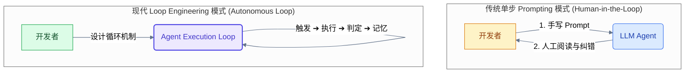
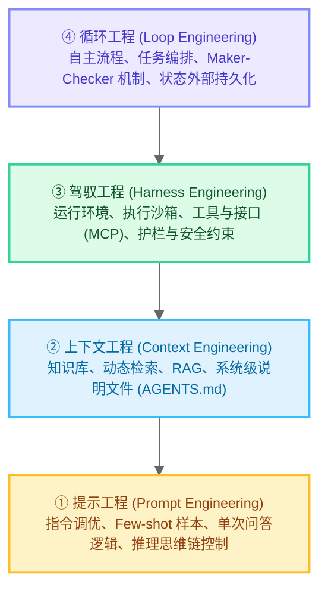
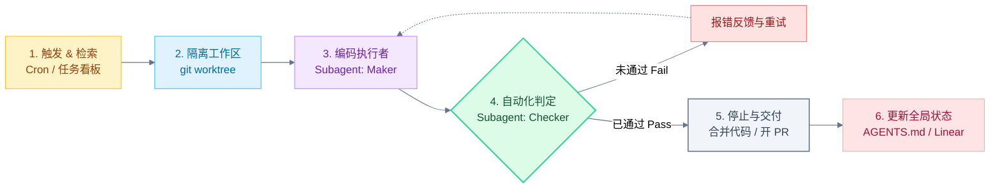

# 1. 引言：从“手写 Prompt”到“设计系统”的认知跃迁

在过去两年的 AI 辅助开发中，我们绝大多数人与 AI 编码助手的交互方式都可以总结为一种**“单步对话”模式**：你写一段 Prompt 并共享相关代码，点击发送，阅读返回的代码，发现有 Bug 或遗漏，然后再写一段 Prompt 告诉它如何修改。在这个过程中，AI 是一个被动的工具，而你则是高强度的键盘操作者，需要在每一个回合中手动监督、判断和推进。

但这套手工作业模式的上限非常明显。软件开发本质上是一个高度迭代、容错性低、多步骤交织的复杂过程。人类工程师在写代码时也会犯错，但我们会通过“编译 -> 运行测试 -> 观察报错 -> 修改 -> 再次测试”的闭环自行纠错。普通的单步 Prompting 剥夺了 AI 的“闭环纠错能力”，使其极易在复杂任务中“一错到底”。

正如 Anthropic 的 Claude Code 负责人 Boris Cherny 所说：
> **“我不再直接 Prompt Claude 了。我有专门运行的循环（loops）去 Prompt Claude 并弄清楚下一步该做什么。我的工作是编写这些循环。”**

独立开发者 Peter Steinberger 也指出：
> **“你不应该再亲自去 Prompt 编码智能体，而是应当设计一套‘替你 Prompt 智能体’的系统。”**

这种将智能体置于自主、迭代式的执行周期中，使其能够自我决策、自我纠错并逐步逼近目标的系统性设计方法，被称为 **Loop Engineering（循环工程）**。

<figcaption>图 1：Loop Engineering 核心概念——从“手动 Prompt”转向“为 Agent 编写自动化闭环系统”</figcaption>

<!-- more -->

### 线性链（Chain）与自主循环（Loop）的本质区别

在 Agentic Workflow（智能体工作流）中，我们通常会区分“链”与“循环”：
* **线性链 (Chain)**：是静态且预设的。步骤 A 执行完直接进入步骤 B，再进入步骤 C（例如 `Step A -> Step B -> Step C`）。它适合结构高度固定、路径完全确定的流水线任务，但在面对动态变化的运行期报错时极易折断。
* **自主循环 (Loop)**：是动态且自适应的（`Reason -> Act -> Observe -> Adapt -> Repeat`）。Agent 在每一个周期执行动作，观测环境反馈，并在遇到阻碍时自主调适策略，重新尝试，直到达成最终的“终止条件”（Termination Condition）。

<figcaption>图 2：单步交互与 Loop Engineering 的对比示意图</figcaption>

---

# 2. AI Agent 的层级栈：Loop 处于哪一层？

为了精确给 Loop Engineering 定位，我们必须了解现代 AI 智能体开发的技术层级栈（The Agentic Stack）。在工业界，开发者通常将整个 Agent 系统划分为四个核心层级：

<figcaption>图 3：现代 AI Agent 架构层级栈</figcaption>

1. **提示工程 (Prompt Engineering)**：研究如何优化单次向大模型输入的信息结构，以获得更准确的瞬时推理（如 Chain-of-Thought, ReAct 元指令设计）。
2. **上下文工程 (Context Engineering)**：关注如何动态提取、缓存与更新模型在解决特定问题时所需的相关信息（例如在 IDE 中动态检索相关定义、代码片段等）。
3. **驾驭工程 (Harness Engineering)**：为 Agent 搭建安全的执行“疆界”。它设计 Agent 所处的沙箱环境（Sandbox）、系统 API 权限、终端运行工具以及安全限制护栏。
4. **循环工程 (Loop Engineering)**：**层级最高，起编排作用。** 它负责在 Harness 之上构建随时间推移自动运行的驱动周期——包括设定调度触发、并行隔离逻辑、判定任务通过的 Checker 守护机制，以及全局持久化记忆管理。

如果把 Harness 比作 Agent 在其中工作的一个具有完善防爆护栏和工具的**生产实验室**，那么 Loop 就是实验室之上的**自动化生产调度流水线**。

---

# 3. Loop Engineering 的四种核心循环模式

根据任务的复杂程度与环境反馈类型的不同，Loop Engineering 通常有以下四种典型模式：

### ① 重试循环 (The Retry Loop)
* **核心机制**：最简单直观的 pass/fail 模式。Agent 尝试执行一个任务（例如编写一段满足单元测试的单体函数），随后运行断言工具。若失败，将报错原样喂回，直接重试。
* **适用场景**：原子化、边界清晰、拥有明确 Boolean 类型测试反馈的子任务。
* **设计陷阱**：如果不提供策略变化，极易陷入“使用同样错误逻辑反复重试”的自旋中。

### ② 计划-执行-校验循环 (The Plan-Execute-Verify Loop)
* **核心机制**：在执行前，智能体首先进行高层级的任务拆解并生成 Plan，随后逐个步骤执行。在每个步骤结束时，由专用的验证子代理（Checker）对修改进行单步判定。若发现偏差，则动态调整计划（Plan Re-routing）而非盲目推进。
* **适用场景**：涉及多个组件重构、API 跨文件调用等长周期、多依赖的复杂工程任务。
* **优势**：防止早期微小错误在后期的累积与放大。

### ③ 探索-收敛循环 (The Explore-Narrow Loop)
* **核心机制**：面对未知错误时，智能体并行或串行地去尝试多种不同的解决通路（比如尝试方案 A 修改配置，尝试方案 B 修改代码结构），收集运行反馈，评估不同通路的成效，最终选择收敛至最优解。
* **适用场景**：疑难 Bug 排查、未知第三方库 API 的探索性调用、性能调优等无法一步到位确定方案的场景。

### ④ 人机协同循环 (Human-in-the-Loop)
* **核心机制**：并非所有的自主循环都是越脱离人类越好。在该模式下，Agent 在遇到高度模糊的需求、缺失关键秘钥，或面临高风险操作（如合并至主分支、执行 destructive 的数据库变更）时，会主动暂停循环，将上下文提报给人类，由人类提供精准决策或授权后再恢复执行。

---

# 4. Loop Engineering 的五大核心原语 (Primitives) 与 记忆 (State)

要把一个手动的 Agent 会话，转化为自运行的“循环”，我们需要借助**五大基础工程原语（Primitives）**以及**一个核心状态外部化机制（State）**。这些在当前的 Codex App 与 Claude Code 等一线开发者工具中，都已作为核心产品组件得到高度映射：

| 原语组件 (Primitive) | 核心职责 | Codex App 落地细节 | Claude Code 落地细节 |
| :--- | :--- | :--- | :--- |
| **1. 自动触发器 (Automations)** | 发现与分发任务，确定循环节奏 | Automations 面板（周期配置、测试沙箱、`/goal` 指令） | Scheduled tasks（Cron 运行、Git 提交 Hooks、`/goal` 守护） |
| **2. 分支工作区 (Worktrees)** | 隔离并发任务，防止文件写入冲突 | 内部自动分配 Thread-level 独立分支 | `git worktree` 支持、`isolation: worktree` 配置 |
| **3. 项目技能库 (Skills)** | 固化项目工程规范，规避“意图债” | `SKILL.md`（定义构建、格式和设计规约） | `SKILL.md`（定义在指定目录下，运行时自动挂载） |
| **4. 外部连接器 (Connectors)** | 将 Agent 接入外部生产力工具 | MCP Connectors（支持 Linear, GitHub, Slack 等） | MCP 协议服务器、外部 API 工具集成扩展 |
| **5. 多代理体系 (Sub-agents)** | 实施“ Maker-Checker ”对抗审查 | `.codex/agents/` 下定义的子角色（TOML 格式） | `.claude/agents/` 下定义的子代理（Markdown/JSON 配置） |

### ① 自动触发器 (Automations)
自动触发器是 Loop 的“心脏搏动”。它通常是一个定时任务（Cron）或一个事件订阅者。例如，每天清晨，触发器扫描 CI 失败日志、Linear 未决 Bug 看板和 GitHub 社区 Issues。一旦捕获到需要修复的任务，它就启动循环。在会话内部，这对应了 `/goal` 这种“直到达成某种特定判定状态前，持续自我纠正运行”的原语。

### ② 分支工作区 (Worktrees)
当我们让多个 Agent 并行处理不同任务时，代码文件的写冲突是致命的。如果两个 Agent 都在直接改工作目录下的同一个接口文件，就会出现类似“多人共同操作一块黑板”的灾难。Loop Engineering 引入了 `git worktree` 级的隔离：每个 sub-agent 的每一个修复尝试，都在独立的 branch 工作区运行，互不干扰，在验证成功后再以 PR 形式汇入主干。这极大地降低了多 Agent 并行时的“协调成本”（Orchestration Tax）。

### ③ 项目技能库 (Skills) 与 意图债 (Intent Debt)
Agent 在启动循环时是“失忆”的。如果完全不加引导，它很容易凭感觉去“盲猜”你们团队的编码规范、打包逻辑或者特殊架构规约，产生巨大的“意图债”。这就是为什么我们需要在仓库中固化 `SKILL.md`（或打包成 Skills 插件）。
它作为一套外置的、可复用的“意图载体”，每次循环开始时都会被自动加载。通过 Skills，我们可以告诉 Agent：“不要使用传统的 X 库，我们公司统一在 utils/ 中封装了 Y 工具；所有提交必须先经过 pnpm lint。”

### ④ 外部连接器 (Connectors)
Loop 不能是一座只能操作本地文件系统的孤岛。通过 Model Context Protocol (MCP) 建立的 Connectors，使循环能够拥有对外交互的“感官与肢体”：
* 在 issue 看板检索最新 Bug 描述（输入通道）。
* 提交 PR 到 GitHub（输出通道）。
* 在 Slack 通报“已自动修复第 #382 号崩溃 Bug，等待 review”（通知机制）。

### ⑤ 多代理体系 (Sub-agents) 与“ Maker-Checker ”对抗审查
**这是 Loop 能够摆脱人工作业的关键所在。** 在人类开发中，我们绝不会允许一个人编写了所有代码，然后自己做 Code Review 批准并发布。LLM 同样如此——写代码的 Agent（Maker）往往会对自己写出的逻辑产生严重的“认知盲区”，倾向于给出全是 OK 的报告。
Loop Engineering 提倡在循环中实施**“对抗性代码评审” (Adversarial Code Review)**。我们会实例化两个或多个 Sub-agents，例如：
* **Coder Sub-agent（Maker）**：追求速度，快速生成多份修复草案。
* **Reviewer Sub-agent（Checker）**：拥有最严格的安全与合规 Prompt，甚至使用 reasoning 努力程度更高的模型，对 Maker 生成的差异（Diff）进行挑剔式的安全审查与断言校验。

---

### 第六要素：全局记忆外部化 (State)

在传统的 LLM 会话中，记忆全靠 context 窗口，但随着循环次数增加，context 会急剧膨胀，并且一旦会话结束或超出限额，记忆就会丢失。

Loop Engineering 倡导**“记忆必须留在磁盘/外部数据库，而不是大模型脑子里”**。我们会专门指定一个在仓库中跟踪的 Markdown 文件（例如 `AGENTS.md`）或连接一个 Linear 数据库。当循环迭代时，它会将每次尝试过的动作、失败的编译器日志、已经通过的单元测试项实时写入该文件。
即使在第 15 次循环时因为网络中断发生重启，Agent 只要重新读取 `AGENTS.md`，就能瞬间恢复“我已经做过什么，接下来需要尝试什么”的全局认知，**Repo 本身成了唯一的真相源（Single Source of Truth）**。

---

# 5. 一个典型的 Agent 循环运行图解 (The Loop Architecture)

在实际工程中，这五大原语与外部状态是如何联动工作的呢？我们可以看一看下面这个典型的**自动化 Bug 修复与验证循环**：

<figcaption>图 4：Loop Engineering 典型自主执行闭环流程图</figcaption>

1. **触发 & 检索 (Trigger & Retrieval)**：事件监听发现有未结任务，触发 Loop。系统拉取对应上下文，并挂载 `SKILL.md`，使 Agent 系统掌握项目规范底盘。
2. **工作区隔离 (Worktree Isolation)**：在本地生成临时的 `git worktree` 与新分支，以保护生产主分支代码。
3. **编码执行 (Execution)**：Maker 子代理开始基于 Bug 报错和现有代码生成修复方案。
4. **自动化判定 (Verification)**：运行测试套件和 Linter，Checker 子代理对修改的代码逻辑及测试通过率进行综合质检：
   * **未通过（Fail）**：把执行错误、断言失败等 Traceback 信息写回 `AGENTS.md`，重新反馈给 Maker 子代理，进入自我纠错的分支闭环。
   * **已通过（Pass）**：在本地完成交付提交，打破当前的迭代，迈向停止条件。
5. **停止与交付 (Termination & PR)**：自动清除本地隔离工作区，向 GitHub 仓库发起包含详细修复说明的 PR。
6. **状态同步 (State Update)**：同步标记外置记忆看板，并在团队 Slack 频道留言，提示人类工程师进入 Review。

---

# 6. 专业 Agent 工程师的设计守则与挑战

尽管 Loop Engineering 看起来无比美妙，但当系统从单步交互进化到完全自治的 Loop 时，以下三个挑战将变得极其尖锐，需要我们在设计时严格遵守相应的工程法则：

### 1. 验证盲区 (Verification Deficit) —— 不要把“声明”当成“证词”
在闭环中，最难设计的永远是**停止规则（Stop Condition）**。LLM 对“我已经完成了任务”的自信度与代码的实际质量通常是完全脱钩的。如果仅靠 Agent 自己的口头陈述（如“我觉得改好了”）来作为循环终止条件，这个系统大概率会以各种诡异的手段蒙混过关，甚至隐藏报错。
* **工程法则**：停止条件必须依托**具备强确定性的工具/代码反馈（Programmatic Verification）**，而非大模型的文本陈述。你必须强制闭环对准硬性考核指标，例如：“必须通过 `npm run test:unit`，同时 ESLint 报错数为 0，且新生成的代码测试覆盖率不低于 80%”。

### 2. 理解 rot 与认知投降 (Cognitive Surrender) —— 警惕“理解债”的累积
当闭环系统运行得足够流畅，每天早上你都能收到 10 个自动生成的 PR 时，人性的弱点就会暴露出来——你变得越来越倾向于无条件相信机器。你不再细致审查每一行 Diff，而是简单地点下 Merge 键。这种现象被称为**“认知投降” (Cognitive Surrender)**。
这会带来极高昂的**“理解债” (Comprehension Debt)**。软件系统是持续变动的，当你在一个月后需要重构某个核心模块时，你会突然绝望地发现，系统里一大半核心逻辑都是你从未深入看过的，而这时候写代码的那些 Agent 早就丢弃了当初的上下文。
* **工程法则**：即使 Loop 再完美，人类依然是质量的最后一道闸门。Loop 的初衷是为了节约繁琐的打字和调试时间，好让工程师腾出精力进行高阶的架构决策和深度 Code Review。理解是不能外包给 Agent 的。

### 3. Token 成本控制 (Token Governance) —— 规避循环内的“自循环死亡螺旋”
当 Maker 写出的代码有 Bug，Checker 反馈了报错，Maker 在尝试修复时又引入了新的 Bug……如果你的纠错策略不够稳健（例如每次重试都只是发送完全相同的“请修复此报错”），系统极易陷入**死循环陷阱（Death Spiral）**。在这个螺旋里，Agent 在几分钟内就能刷掉上千万的 Token，给公司账单带来灾难。
* **工程法则**：每一个 Loop 都必须设计“最高预算护栏”：
  * **最大尝试次数上限**：限制 `MaxAttempts = 5`，超过则强制挂起。
  * **退避与策略衰减**：若连续 2 次重试遇到的报错完全一致，必须强制更改 Prompt 提示方向（如要求其使用替代方案、回滚或求助人类）。
  * **会话 Token 预算熔断**：配置软、硬护栏，一旦单次循环消费超过设定额度（如 10 USD），自动暂停并向 Slack 通告人类介入。

---

# 7. 结语：构建循环，保持思考

Loop Engineering 不仅是技术上的变革，更是软件工程研发范式的深刻变迁。它让我们认识到，在 LLM 时代：
* 优秀的程序员擅长**编写高质量的代码**。
* 优秀的 AI 辅助程序员擅长**撰写高质量的 Prompt**。
* 而下一代的 **Agent 工程师，则擅长设计让 Prompt 与代码自我运转、自我纠错并不断收敛的系统循环**。

但在这个机器可以跑在最前面不知疲倦迭代时，最不可替代的，依然是站在循环终点、冷眼旁观并进行终极把关的——**你自己的审慎思维**。

构建你的循环，但不要沦为循环的客体。保持你作为工程师的灵魂。
