* 目录
{:toc}

# 1. 引言：从“单一循环”到“图拓扑编排”的演进

在 2026 年上半年，**Loop Engineering（循环工程）** 的理念彻底颠覆了传统的单步 Prompting 交互。我们不再是手写 Prompt 的打字员，而是为 Agent 编写自动化闭环系统（如重试循环、计划-执行-校验循环等）的架构师。通过引入闭环，智能体在软件开发、自动化测试等长周期任务中的纠错能力和成功率得到了显著提升。

然而，随着智能体应用在工业界的深入，单一的、线性的 Loop 逐渐撞上了墙角。当我们需要处理以下场景时，简单的“Act-Observe-Verify”闭环就显得力不从心：
1. **多代理分工协同**：一个复杂的任务需要文案策划、代码开发、安全审计、性能压测等多个“各司其职”的异构子智能体（Sub-agents）协同完成，各个智能体之间的交接关系错综复杂。
2. **复杂的逻辑分支与条件判断**：任务流并不是单线往复的，而是根据中间结果进行动态路由。例如，如果代码编译失败，路由到修复节点；如果测试失败且是环境配置问题，路由到环境重建节点；如果是业务逻辑不满足，路由到重构节点。
3. **确定性控制与非确定性推理的混血**：智能体开发中，完全依赖大模型的非确定性决策会带来失控，而完全依赖传统代码又会失去灵活性。如何将业务逻辑中“铁律一般”的业务流约束（如“必须先经过安全审计才能发布”）强制固化下来？
4. **长上下文的管理瓶颈**：随着对话轮次增加，如果只是把所有的历史记录作为 prompt 喂给模型，会导致上下文无限暴涨，引发“Token 螺旋”并降低模型推理精度。

为了应对这些挑战，**Graph Engineering（图智能体工程）** 在 2026 年中后期迅速崛起。它继承了 Loop Engineering 的自动化闭环思想，但将视野放大到了整个系统的**逻辑拓扑结构**。Graph Engineering 主张：**将 AI 智能体的交互、规划、执行与协作逻辑建模为显式的有向状态图（State Graph），用强确定性的图拓扑结构去规范非确定性大模型的行为疆界。**

<div align="center">

<figcaption>图 1：Graph Engineering 核心概念——将 AI 智能体编排建模为受控的有向状态图</figcaption>
</div>

<!-- more -->

### 范式演进的时间线

回望过去三年，Agent 工程的抽象层级几乎每半年抬升一级，而每一次抬升的驱动力都是同一个：**上一代范式的失控边界**。

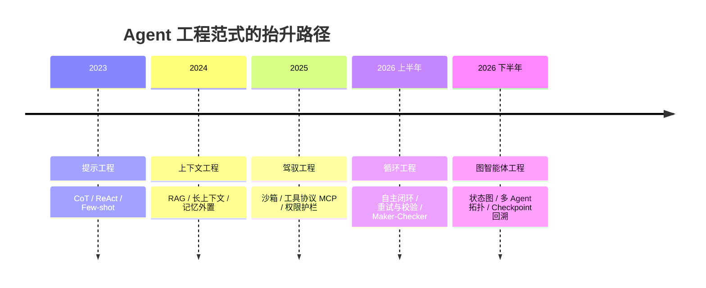
<div align="center"><figcaption>图 2：从 Prompt 到 Graph 的范式演进时间线</figcaption></div>

### 链、循环与图：三种控制结构的本质区别

理解 Graph Engineering 最快的方式，是把它和前两代控制结构摆在一起对比。

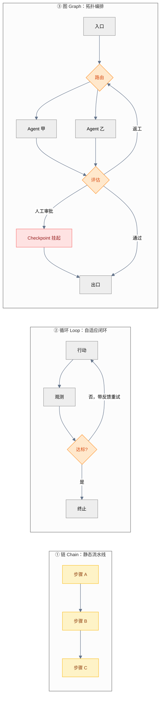
<div align="center"><figcaption>图 3：链 / 循环 / 图三种控制结构的拓扑对比</figcaption></div>

| 维度 | ① 链 (Chain) | ② 循环 (Loop) | ③ 图 (Graph) |
| :--- | :--- | :--- | :--- |
| **控制结构** | 有向无环、单路径 | 单主体的自反馈环 | 有向可循环、多路径多主体 |
| **状态载体** | 参数在步骤间透传 | Agent 的滚动上下文 | 全局类型化 State 对象 |
| **失败恢复** | 断则重跑全流程 | 循环内重试 | 从任意 Checkpoint 恢复/分叉 |
| **并发能力** | 无 | 弱（多为串行反思） | 原生并行分支 + Reducer 归并 |
| **可观测性** | 步骤日志 | 轨迹日志 | 每步状态快照可回放 |
| **适合场景** | 固定流水线 | 单任务自愈 | 多角色、强约束、高风险业务流 |

---

# 2. AI Agent 核心技术层级栈的跃迁

回顾整个 AI Agent 领域的发展，开发者的关注点在不断向上层抽象。我们可以将现代智能体开发的技术栈划分为五个核心层级：

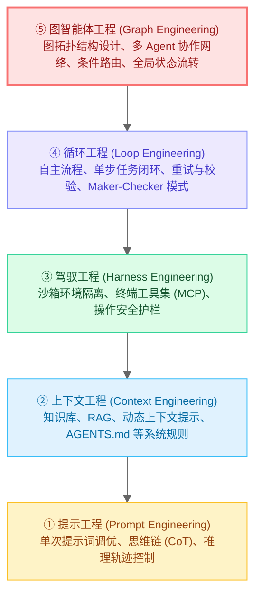
<div align="center"><figcaption>图 4：AI Agent 技术层级栈演进图（2026版）</figcaption></div>

* **提示工程 (Prompt Engineering)**：研究单次大模型调用的最优输入。
* **上下文工程 (Context Engineering)**：决定哪些信息应该在何时进入模型的上下文。
* **驾驭工程 (Harness Engineering)**：为智能体提供执行任务的安全沙箱和工具接口（如 MCP 协议）。详见前作 [Harness Engineering](/Harness-Engineering/)。
* **循环工程 (Loop Engineering)**：控制单个 Agent 周期性的“思考-行动-观测”环路，解决自愈与微观纠错。详见前作 [Loop Engineering](/loop-engineering/)。
* **图智能体工程 (Graph Engineering)**：**居于最顶层，起宏观编排作用。** 它超越了单一的循环，定义了由多个循环、多类工具和多个异构智能体构成的整体拓扑网络，是支撑企业级、复杂业务场景 Agent 落地的主力范式。

> 一个便于记忆的类比：如果 Harness 是 Agent 工作的**带护栏的实验室**，Loop 是实验室里的**自动化流水线**，那么 Graph 就是统管整个园区的 **MES 生产调度系统**——它决定哪条流水线开工、什么时候并线、谁来质检、以及出了问题回滚到哪一道工序。

---

# 3. Graph Engineering 的三大核心原语

在 Graph Engineering 中，一切工作流都是一张图（Graph），而构建这张图仅需要三个最基本的工程原语（Primitives）：

### ① 节点 (Nodes)：原子的执行单元

节点代表图中的一个执行步骤。每个节点可以是一段普通代码、一次 LLM 提示词调用、一个外部工具执行、甚至是一个由 Loop Engineering 驱动的独立子 Agent。

节点最关键的设计约定是它的 **I/O 契约**：节点接收当前图的**全局状态快照**，但**只返回自己改动的那部分状态增量（Delta）**，而不是返回整个状态。这条约定是后面所有并发、合并、回放能力的基础。

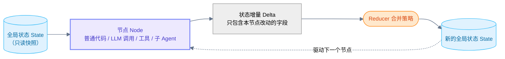
<div align="center"><figcaption>图 5：节点的 I/O 契约——读快照、返增量、由 Reducer 合并</figcaption></div>

### ② 边与条件路由 (Edges & Conditional Routing)：逻辑流转的通道

边定义了节点之间的连接关系，决定了下一步该走向哪里。
* **普通边 (Normal Edges)**：确定性的单向连接。例如，节点 A 执行完毕后，必须无条件进入节点 B。
* **条件边 (Conditional Edges)**：非确定性的路由分支。通常由一个决策节点（可以是 LLM 进行分类，也可以是代码逻辑判断）基于当前的全局状态进行判定，动态决定下一阶段走向哪个节点。这实现了“非确定性推理”与“确定性分支”的解耦。

这里有一个容易被忽视的工程要点：**路由函数应当返回“有限枚举值”，而不是让 LLM 自由生成下一个节点名。** 前者的错误上界是“选错分支”（可观测、可兜底），后者的错误上界是“跳进不存在的节点”（直接崩图）。

### ③ 全局状态 (State)：唯一的真理来源

这是 Graph Engineering 区别于传统链式（Chain）流调用的关键。在 Graph 中，整个生命周期维护着一个全局共享的、类型化的状态对象（如 Python 中的 Pydantic Model 或 TypedDict）。

* 节点不直接进行复杂的参数透传，而是通过“读取全局状态 → 执行操作 → 写入增量”的方式与图进行交互。
* **状态的增量合并**：通常支持为指定字段声明 `reducer` 逻辑。例如状态中有一个 `messages` 列表，每当有节点返回消息时，图引擎会自动将新消息追加（append）到该列表中，而不会覆盖旧有消息。

**Reducer 是整个 Graph Engineering 里最容易出事故、也最容易被新手跳过的一环。** 它的默认行为是“后写覆盖先写（LastValue）”，一旦出现并行分支，静默丢数据几乎是必然的：

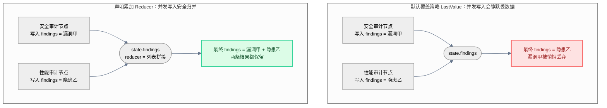
<div align="center"><figcaption>图 6：Reducer 的两种合并语义——覆盖 vs 累加</figcaption></div>

下面是一份最小可运行的状态图骨架，把三大原语一次串起来（以 LangGraph 为例）：

```python
from typing import Annotated, Literal
from typing_extensions import TypedDict
import operator

from langgraph.graph import StateGraph, START, END
from langgraph.checkpoint.memory import InMemorySaver

# ① 状态：用 Annotated 为字段声明合并策略（reducer）
class ReviewState(TypedDict):
    diff: str                                # 无 reducer -> 后写覆盖先写
    findings: Annotated[list, operator.add]  # 有 reducer -> 并发写入自动拼接
    verdict: str

# ② 节点：入参是状态快照，返回值只包含改动的字段
def security_audit(state: ReviewState) -> dict:
    issues = llm_scan(state["diff"], focus="security")
    return {"findings": issues}              # 注意：不返回整个 state

def judge(state: ReviewState) -> dict:
    blocking = [f for f in state["findings"] if f["level"] == "blocking"]
    return {"verdict": "reject" if blocking else "approve"}

# ③ 边：把节点连成图
builder = StateGraph(ReviewState)
builder.add_node("security_audit", security_audit)
builder.add_node("judge", judge)
builder.add_edge(START, "security_audit")
builder.add_edge("security_audit", "judge")
builder.add_edge("judge", END)

# 编译：绑定 checkpointer 后，图才具备持久化、恢复与时空穿梭能力
graph = builder.compile(checkpointer=InMemorySaver())

result = graph.invoke(
    {"diff": patch, "findings": [], "verdict": ""},
    config={"configurable": {"thread_id": "pr-1024"}, "recursion_limit": 50},
)
```

### 隐藏的第四原语：超步 (Superstep)

前三个原语是写代码时看得见的，而**超步**是运行时看不见但决定行为的那一个。图引擎并非“一个节点跑完再跑下一个”，而是借鉴了 Pregel 的批量同步并行（BSP）模型：**同一超步内被激活的所有节点并发执行，全部返回后统一按 reducer 合并状态，然后写入一个 Checkpoint，再进入下一超步。**

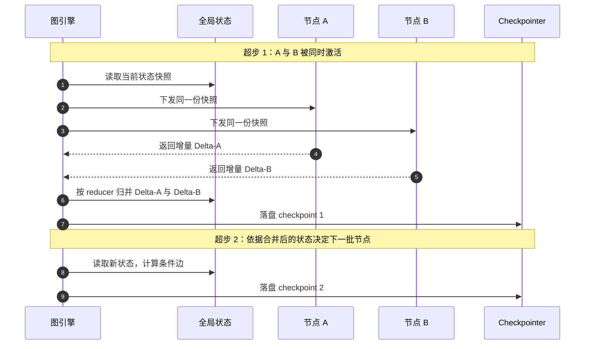
<div align="center"><figcaption>图 7：超步执行模型——并发执行、统一归并、逐步落盘</figcaption></div>

理解超步能直接解释三个常见困惑：
1. **为什么并行节点看到的是同一份旧状态？** 因为它们在同一超步内，看到的是超步开始时的快照，彼此互不可见。
2. **为什么 `recursion_limit` 报错时步数比我画的节点数少？** 因为限制的单位是超步，不是节点——一个超步可能同时跑了 5 个节点。
3. **为什么恢复运行时不会重复执行已完成的节点？** 因为 Checkpoint 是以超步为粒度落盘的，恢复即从超步边界重放。

---

# 4. 四种经典图拓扑设计模式

根据不同复杂度的业务逻辑，Graph Engineering 沉淀出了四种高频使用的经典拓扑模式。在展开之前，先给一张选型决策树——**绝大多数“架构过度设计”都来自跳过了这一步**：

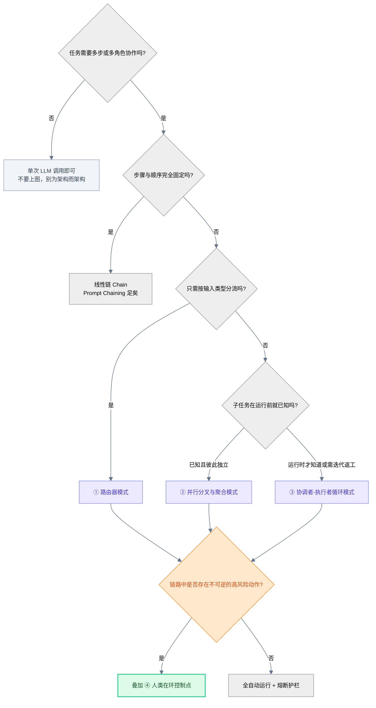
<div align="center"><figcaption>图 8：拓扑模式选型决策树</figcaption></div>

### ① 路由器模式 (The Router Pattern)

最基础的控制分流模式。LLM 或规则代码作为一个分类器（Router），决定接下来将任务派发给哪个特定的专用节点。

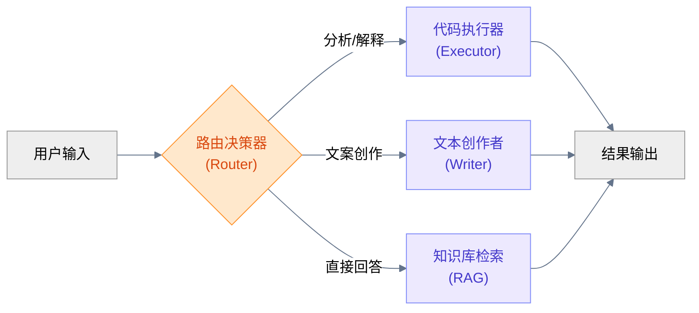
<div align="center"><figcaption>图 9：路由器模式拓扑结构</figcaption></div>

```python
# 路由函数返回“有限枚举”，而不是让 LLM 自由生成节点名
def route(state: ReviewState) -> Literal["fast_path", "full_audit", "security_deep_dive"]:
    risk = classify_risk(state["diff"])            # 可以是 LLM，也可以是规则
    if risk == "trivial":
        return "fast_path"
    return "security_deep_dive" if risk == "high" else "full_audit"

builder.add_conditional_edges("intake", route)
```

| 何时使用 | 代价 | 典型坑 |
| :--- | :--- | :--- |
| 输入类型多样、各类型处理逻辑差异大 | 多一次分类调用的延迟与成本 | 分类粒度过细导致分支爆炸；缺少 `default` 兜底分支 |

### ② 并行分叉与聚合模式 (Map-Reduce Pattern)

面对需要多维度分析的任务，主图会分叉（Fork）出多个并行的节点分支，每个分支执行不同的分析，最后通过一个聚合（Reduce）节点对所有分支的状态结果进行汇总提炼。

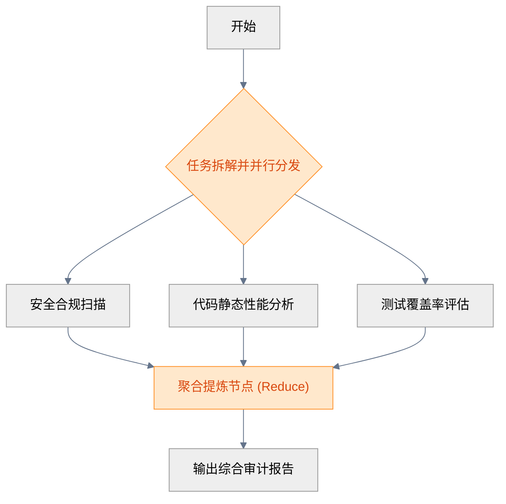
<div align="center"><figcaption>图 10：并行分叉与聚合模式拓扑结构</figcaption></div>

这里有一个关键区分：**分支数量是编译期已知，还是运行期才知道？**
* 编译期已知（如固定的“安全/性能/测试”三路）：直接从一个节点画三条普通边即可，它们会在同一超步并发执行。
* 运行期才知道（如“每个受影响文件派一个审计实例”）：需要动态扇出原语，LangGraph 中即 `Send` API。

```python
from langgraph.types import Send

def fan_out(state: ReviewState):
    # 分支数在运行时才确定：每个受影响文件派发一个 audit_file 实例
    return [Send("audit_file", {"file": f, "diff": state["diff"]})
            for f in state["changed_files"]]

builder.add_conditional_edges("plan", fan_out, ["audit_file"])
```

> ⚠️ **使用该模式的前提**：聚合字段必须声明累加型 reducer（见图 6），否则并行分支的结果会互相覆盖，这是生产环境中最高频的“结果莫名其妙少了一半”事故。

| 何时使用 | 代价 | 典型坑 |
| :--- | :--- | :--- |
| 子任务彼此独立、可同时进行、需要合并视角 | 并发放大 Token 与限流压力 | 忘记声明 reducer；扇出数量无上限导致成本爆炸；聚合节点上下文超长 |

### ③ 协调者-执行者循环模式 (Orchestrator-Workers with Feedback)

在这个模式中，一个高水平的**协调节点（Orchestrator）** 负责理解大局、进行任务拆解与子任务分发，多个**执行节点（Workers）** 并行或串行地去执行子任务并返回结果。协调节点会评估这些结果，如果发现问题，会带上反馈重新指派（Feedback Loop）给相应的 Worker，直到整体任务全部达标。

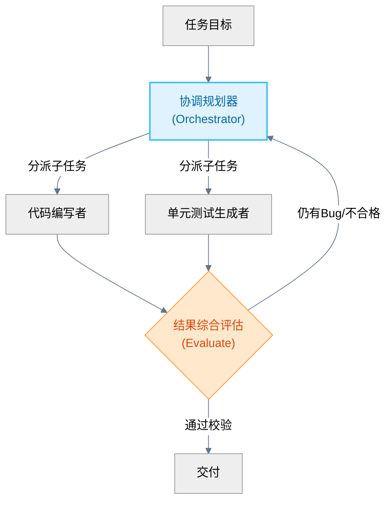
<div align="center"><figcaption>图 11：协调者-执行者循环模式拓扑结构</figcaption></div>

它与 Map-Reduce 的本质差别在于：**Map-Reduce 的子任务是预先定义好的，而 Orchestrator 的子任务是由模型根据具体输入现场决定的**，因此它自带一条“评估不通过就返工”的反馈边，这也让它成为最容易写出死循环的模式。工程上通常用“状态更新 + 跳转”合一的原语来表达这条反馈边，并在状态里显式记录轮次：

```python
from langgraph.types import Command

def orchestrator(state: ReviewState) -> Command[Literal["worker", "finalize"]]:
    if state["verdict"] == "reject" and state["round"] < 3:      # 轮次硬上限
        return Command(update={"round": state["round"] + 1}, goto="worker")
    return Command(goto="finalize")
```

| 何时使用 | 代价 | 典型坑 |
| :--- | :--- | :--- |
| 子任务无法预先枚举、需要多轮迭代收敛 | 协调者成为单点瓶颈与 Token 大头 | 缺少轮次上限导致 Maker-Checker 无限拉锯；评估标准模糊导致“永远差一点” |

### ④ 人类在环控制点模式 (Human-in-the-loop Checkpoints)

并不是所有步骤都应该全自动执行。在 Graph Engineering 中，我们可以定义一个特别的节点为“控制点”。图引擎运行到该节点时会强制暂停，将当前图的全局状态持久化到数据库中（创建 Checkpoint），并发出通知。只有在人类输入决策、点击批准或手动编辑了状态数据后，图引擎才读取 Checkpoint 并恢复（Resume）运行。

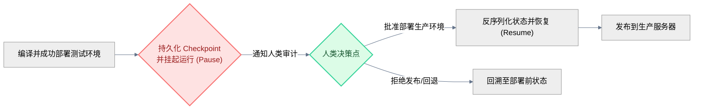
<div align="center"><figcaption>图 12：人类在环控制点模式拓扑结构</figcaption></div>

这个模式最容易被误解的一点是：**挂起不等于“进程原地阻塞等待”。** 状态一旦落盘，运行图的进程完全可以退出，几小时后由另一台机器上的另一个进程读取同一个 `thread_id` 继续跑完剩下的节点——这正是“持久化执行（Durable Execution）”的价值所在。

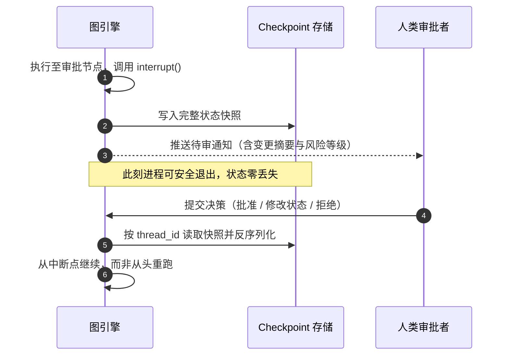
<div align="center"><figcaption>图 13：人类在环的挂起与恢复时序</figcaption></div>

```python
from langgraph.types import interrupt, Command

def human_gate(state: ReviewState) -> dict:
    # 执行到这里会挂起并落盘，函数不会继续往下走
    decision = interrupt({"summary": state["report"], "risk": "high"})
    return {"approved": decision["approved"], "note": decision.get("note", "")}

# 人类给出决策后，用同一个 thread_id 恢复运行
graph.invoke(Command(resume={"approved": True, "note": "已复核"}), config=config)
```

| 何时使用 | 代价 | 典型坑 |
| :--- | :--- | :--- |
| 不可逆动作：发布、转账、删库、对外发文 | 引入人等机器的等待时延 | 审批点过多导致人被淹没；推送的上下文不足以支撑决策；缺少超时兜底策略 |

### 模式不是四选一，而是嵌套组合

真实生产系统几乎不存在“纯粹的某一种模式”。典型形态是：**外层用路由器分流，中层用 Map-Reduce 并行收集证据，内层用协调者-执行者迭代收敛，出口处用人类在环把关**——四者通过子图（Subgraph）嵌套在一张主图里，第 9 节的实战案例会完整展示这一点。

---

# 5. 状态的一生：Checkpoint、持久化与时空穿梭

Graph Engineering 相较于前几代范式最具工程价值的能力，其实不在拓扑本身，而在**状态被逐步落盘之后所解锁的一切**：崩溃恢复、人类在环、以及调试时的时空穿梭。

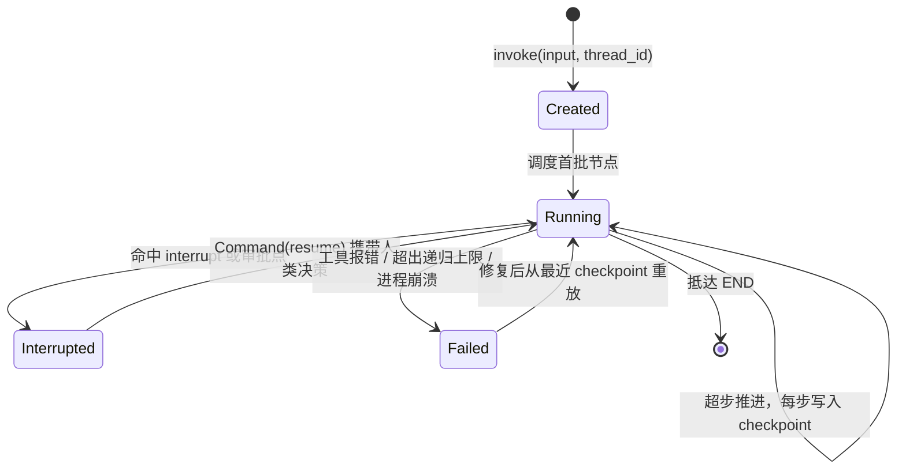
<div align="center"><figcaption>图 14：图运行实例的状态生命周期</figcaption></div>

调试一个跑了几十步才报错的图非常痛苦：从头重跑不仅费时，而且大模型的随机性会让 Bug 无法稳定复现。Checkpoint 机制把这件事变成了“从任意历史节点分叉重放”：

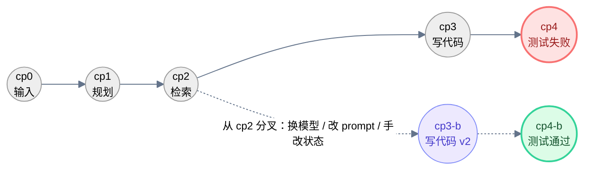
<div align="center"><figcaption>图 15：Checkpoint 时间线与分叉重放（Time Travel）</figcaption></div>

```python
# 列出该 thread 的全部历史检查点（从新到旧）
history = list(graph.get_state_history(config))
target = history[3]                          # 定位到想要回溯的那一步

# 在该快照上修改状态，产生一条新的分支，然后仅重放后续节点
forked = graph.update_state(target.config, {"verdict": "", "round": 0})
graph.invoke(None, forked)
```

这项能力带来的直接工程收益是：**多智能体系统第一次变得像普通软件一样可测试**——你可以把线上失败的那次运行的 checkpoint 当成一条测试夹具（fixture），在本地反复分叉验证修复方案，而不必祈祷模型重现同一个错误。

| 持久化后解锁的能力 | 没有 Checkpoint 时的窘境 |
| :--- | :--- |
| 崩溃/超时后从断点续跑 | 从第一步重跑，前面的 Token 全部白烧 |
| 人类审批可跨小时甚至跨天 | 进程必须常驻内存阻塞等待 |
| 失败用例可回放、可分叉对比 | 靠日志猜现场，Bug 无法稳定复现 |
| 状态可被人手工编辑后继续 | 只能整轮推翻重来 |
| 多轮会话的长期记忆 | 每轮把全部历史塞回 prompt，上下文暴涨 |

---

# 6. 核心工程挑战与实战技巧

在实践中构建图智能体时，往往会遇到以下棘手的工程问题，这需要开发者运用专门的图工程守则进行规避：

### ① 状态污染与 Reducer 优化

当有多个节点并发读写全局状态时，极易发生状态覆盖或状态混乱。

* **实战技巧**：保持状态 Schema 尽可能扁平且职责单一。对于并发写入的字段，必须定义清晰的 `reducer` 累加函数，确保数据是以“只追加”或“按键合并”的方式更新，避免无意中的覆盖。同时避免把整个大对象塞进状态——状态每一步都要序列化落盘，字段越臃肿，Checkpoint 越慢、存储成本越高。大文件应存对象存储，状态里只放引用。

### ② 循环深度上限与死循环预防

因为图是有向的，而且通常包含条件路由与重试的循环边，一旦大模型陷入某种“逻辑幻觉”或者外部工具接口持续报错，图可能会无限循环运行，迅速耗尽 Token 和额度。

* **实战技巧**：在图的编译器或运行时中，**强制设置最大递归步数限制（Recursion Limit）**。LangGraph 的默认值是 25 个超步，复杂图务必显式调高并配合熔断；一旦超过上限，图引擎会抛出 `GraphRecursionError`，此时最近一次 Checkpoint 仍然可用于诊断现场。

### ③ 时空穿梭与回溯测试 (Time Travel & Rollback)

调试一个运行了数十个步骤后报错的图非常痛苦。如果必须从头运行，不仅费时而且大模型的随机性会导致无法稳定复现 Bug。

* **实战技巧**：利用图引擎的持久化 Checkpoint 机制（详见第 5 节）。调试时直接指定恢复到第 N 步的状态，修改该节点的代码或输入，然后仅运行后续的节点。这极大提升了多智能体系统的可测试性。

### ④ 动态拓扑的克制使用

有些框架允许智能体在运行期动态地“修改图的结构”（增加节点或改变连接）。虽然这听起来很灵活，但在大规模生产中，动态拓扑会导致系统轨迹不可追踪、无法复现和极难调试。

* **最佳实践**：**克制使用动态拓扑，坚持“静态编译，动态执行”**。在编译期定义好所有可能的逻辑节点与条件路由（即静态图结构），而在运行期让 LLM 通过全局状态来驱动不同的执行路径（即动态执行路径）。

### 多智能体系统的五类高频故障速查表

社区在 2025–2026 年的生产事故复盘中，反复出现同样的五类故障。把它们和图原语对应起来，就得到一份可直接落地的护栏清单：

| 故障模式 | 典型症状 | 根因 | 图工程护栏 |
| :--- | :--- | :--- | :--- |
| **循环套循环** | 运行数小时不收敛，日志里同样几步反复出现 | 子图内的 Loop 嵌进主图的 Loop，两层各自都没到终止条件 | 全局超步上限 + 每个子图独立轮次计数写入状态 |
| **归属含混** | 两个 Agent 都以为对方会处理，任务静默丢失 | 拓扑里没有唯一的责任节点 | 每条边的下游必须唯一确定；用 `default` 兜底分支消灭“无人接手” |
| **共享状态竞争** | 并行分支的结果莫名其妙少了一半 | 并发写入同一字段但用了默认覆盖语义 | 为所有并发写入字段声明累加型 reducer |
| **交接乒乓** | 两个 Agent 互相把任务踢来踢去 | 路由条件互补性不足，形成环 | 状态中记录 `handoff_count`，超阈值强制升级到人类 |
| **成本失控** | 账单在无人值守的夜里翻了几十倍 | 扇出无上限 + 循环无上限 + 无预算熔断 | 三道闸：步数上限、扇出数量上限、单次运行 Token 预算上限 |

> 一个真实教训是：**成本护栏必须写在图引擎层，而不是写在 Prompt 里**。“请你不要重试太多次”对模型是建议，`recursion_limit` 对引擎是硬约束。

---

# 7. 可观测性：让图从“黑盒”变成可调试的系统

图拓扑本身就是最好的观测骨架——因为每一次状态流转都天然对应一个可记录的事件。生产级 Graph 系统建议对每个节点至少记录以下字段：

| 记录维度 | 具体字段 | 排障时回答的问题 |
| :--- | :--- | :--- |
| **身份** | `thread_id` / `checkpoint_id` / 节点名 / 超步序号 | 这是哪一次运行的哪一步？ |
| **路由** | 条件边的判定输入与选中的分支 | 为什么走到了这个分支而不是那个？ |
| **状态** | 入参状态摘要、返回的增量、合并后状态 | 是谁把这个字段改坏的？ |
| **模型** | 模型名与版本、温度、Prompt 版本号 | 换模型后行为变化是否由此引起？ |
| **成本** | 输入/输出 Token、耗时、重试次数 | 钱和时间烧在了哪个节点？ |
| **结果** | 工具调用与返回、异常与堆栈 | 失败发生在推理还是在外部依赖？ |

有了这套记录，“某个 PR 审查为什么误判”就从一次玄学讨论，变成一次沿着图边回放的确定性排查：定位 `thread_id` → 拉出该次运行的 checkpoint 序列 → 找到判定翻转的那个超步 → 分叉重放验证修复。

---

# 8. 主流 Graph Engineering 框架深度对比

目前在开源与工业界，支持图智能体工程的核心框架主要以 **LangGraph** 和 **LlamaIndex Workflows** 为代表。

| 维度 / 特征 | LangGraph (LangChain 体系) | LlamaIndex Workflows |
| :--- | :--- | :--- |
| **设计核心理念** | 状态图驱动 (Stateful Graph) | 事件驱动 (Event-driven Flow) |
| **状态流转机制** | 全局集中式 State 对象，可为字段定义 reducer | 节点间通过发布 (Publish) 与订阅 (Subscribe) 事件传递数据 |
| **并发模型** | 超步 (Superstep) 批量同步并行 + Reducer 归并 | async 事件循环，步骤按事件类型自然并发 |
| **循环表达能力** | 极其自然，通过普通边与条件边实现任意循环 | 支持，通过在步骤间发布特定回退/重试事件实现 |
| **时空穿梭/持久化** | 第一类公民 (First-class Checkpointers)，原生支持时间旅行 | 需开发者自行处理事件日志与状态的持久化序列化 |
| **多 Agent 协同** | 原生支持子图（Subgraph）嵌套，多 Actor 设计优雅 | 支持，但需通过事件总线路由进行隔离 |
| **上手与调试门槛** | 相对较高，需要理解图的编译 (Compile) 与状态合并逻辑 | 较低，接近传统的异步函数与事件编程风格 |

两者的编程手感差异，从最小代码就能看出来。LlamaIndex Workflows 里没有“画边”这一步——**边是由事件类型隐式推导出来的**：

```python
from llama_index.core.workflow import Workflow, step, Event, StartEvent, StopEvent

class AuditDone(Event):
    findings: list

class ReviewFlow(Workflow):
    @step
    async def audit(self, ev: StartEvent) -> AuditDone:      # 消费 StartEvent，产出 AuditDone
        return AuditDone(findings=await scan(ev.diff))

    @step
    async def judge(self, ev: AuditDone) -> StopEvent:       # 订阅 AuditDone，隐式形成边
        return StopEvent(result="reject" if ev.findings else "approve")
```

这带来一组清晰的取舍：**显式画边（LangGraph）让拓扑一眼可见、便于审计与可视化，代价是样板代码多；隐式连边（Workflows）写起来轻快，代价是图的全貌散落在类型签名里，规模变大后需要额外工具才能看清。**

放到更大的生态里，选型可以按“核心诉求”一步定位：

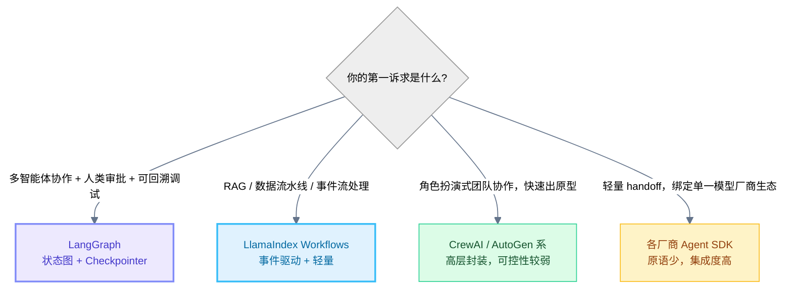
<div align="center"><figcaption>图 16：编排框架选型路径</figcaption></div>

> **建议**：如果是构建具有复杂多智能体对抗、需要人类频繁干预审批、且对调试回溯要求极高的企业级业务系统，**LangGraph** 是当之无愧的首选；如果是处理数据流水线、RAG 检索增强、事件流处理等偏向数据通道的任务，**LlamaIndex Workflows** 的事件订阅模式会更加轻量和直观。生产系统中两者混用也很常见：用 LlamaIndex 承担检索层，用 LangGraph 承担编排层。
>
> 需要提醒的是，Anthropic 在《Building Effective AI Agents》中给出的结论至今有效：**最成功的实现往往不是靠复杂框架，而是靠简单、可组合的模式。** 框架是为了让拓扑可见、让状态可回放，而不是为了替你决定拓扑。

---

# 9. 端到端实战：自动化 PR 审查与发布流水线

把前面所有原语与模式串起来，来看一个真实可落地的场景——**自动化的 Pull Request 审查与合并流水线**。它同时用到了四种拓扑模式：

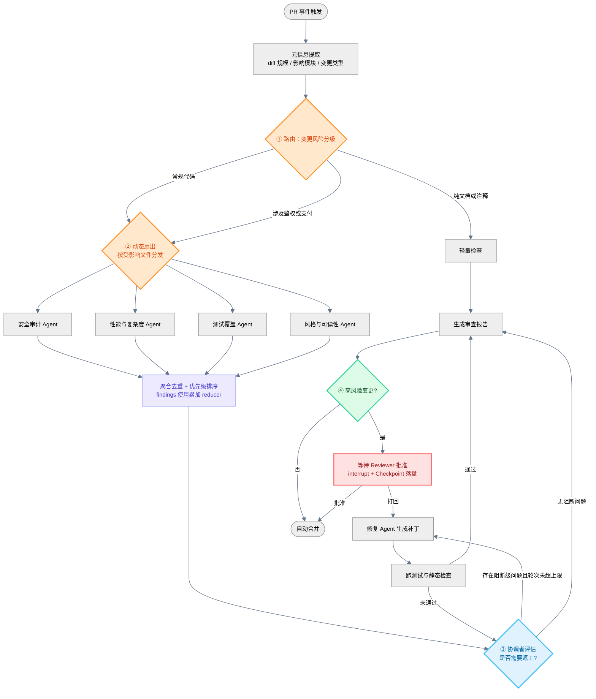
<div align="center"><figcaption>图 17：四种拓扑模式组合而成的 PR 审查流水线</figcaption></div>

对应的状态 Schema 设计，体现了前文所有守则——**扁平、职责单一、并发字段带 reducer、循环字段带计数、大对象只存引用**：

```python
class PRState(TypedDict):
    # —— 输入（全程只读）——
    pr_id: str
    changed_files: list[str]
    diff_ref: str                                # 只存对象存储引用，不塞进状态

    # —— 并发写入：必须声明累加 reducer ——
    findings: Annotated[list, operator.add]      # 四个审计 Agent 并发追加
    messages: Annotated[list, add_messages]      # 对话轨迹自动追加

    # —— 循环控制：显式记录轮次，配合硬上限 ——
    round: int
    handoff_count: int

    # —— 决策结果：单点写入，覆盖语义即可 ——
    risk_level: str                              # trivial / normal / high
    verdict: str                                 # approve / reject
    approved_by: str
```

这个案例里，每一条工程守则都能找到落点：

| 环节 | 用到的模式/原语 | 对应的护栏 |
| :--- | :--- | :--- |
| 风险分级 | 条件边 + 有限枚举路由 | 必须存在 `default` 分支兜底 |
| 多维审计 | `Send` 动态扇出 | 扇出数量上限，防止超大 PR 拖垮限流 |
| 结果汇总 | 累加型 reducer | 杜绝并发覆盖导致漏报 |
| 修复返工 | Orchestrator + Command 跳转 | `round` 硬上限，超限即转人工 |
| 发布放行 | `interrupt` + Checkpoint | 进程可退出，审批可跨天；超时自动打回 |
| 全局兜底 | `recursion_limit` + Token 预算 | 引擎级熔断，而非 Prompt 级请求 |

---

# 10. 结语：迈向更加确定、可控的 Agentic Era

从单次 Prompt 的探索，到 Harness / Loop Engineering 的局部优化，再到如今 **Graph Engineering** 对全局拓扑的掌控，智能体工程化（AI Engineering）的路径已经清晰：**我们正在用传统软件工程中沉淀了几十年的、确定性的结构（图、状态机、事件驱动），来驯服和驾驭非确定性大模型所带来的认知生产力。**

Graph Engineering 并不是消灭大模型的灵活性，而是为它提供一条安全的轨道。在这条轨道上，大模型可以自由地进行推理、编写代码、调用工具，而一旦超出轨道，图的拓扑约束与状态检查机制会立刻将其拉回。只有在这种强确定性的约束框架下，AI Agent 才能真正从“玩具”走向能够支撑起核心业务流程的“生产力工具”。

如果只能带走三句话，我希望是这三句：

1. **状态是唯一真理，节点只返回增量**——所有并发、回放、恢复能力都建立在这条约定之上。
2. **拓扑要静态编译，路径才动态执行**——把不确定性关进确定性的边界里，而不是反过来。
3. **护栏写在引擎层，而不是 Prompt 里**——步数上限、扇出上限、预算上限，是模型无法违背的物理法则。

---

*参考资料*：

1. Anthropic. [Building Effective AI Agents](https://www.anthropic.com/research/building-effective-agents) — 提示链、路由、并行化、协调者-执行者、评估者-优化者五种基础工作流模式的权威论述。
2. LangChain. [Use the Graph API (LangGraph Docs)](https://docs.langchain.com/oss/python/langgraph/use-graph-api) — StateGraph、Annotated reducer、条件边、`Send` API、`Command` 的官方用法。
3. LangChain. [GRAPH_RECURSION_LIMIT 错误说明](https://docs.langchain.com/oss/python/langgraph/errors/GRAPH_RECURSION_LIMIT) — 递归上限的默认值与调整方式。
4. LangChain Academy. [Map-Reduce Pattern with the Send API](https://deepwiki.com/langchain-ai/langchain-academy/7.1-map-reduce-pattern) — 运行期动态扇出与 Reducer 归并的完整示例。
5. LlamaIndex. [Workflows 模块指南](https://docs.llamaindex.ai/en/stable/module_guides/workflow/) — 事件驱动编排的步骤定义、事件订阅与 Context API。
6. LangChain. [The Best AI Agent Frameworks in 2026](https://www.langchain.com/resources/ai-agent-frameworks) — 主流编排框架的能力矩阵与选型参考。
7. Gabriel Anhaia. [The 5 Failure Modes of Multi-Agent Systems Nobody Warns You About](https://dev.to/gabrielanhaia/the-5-failure-modes-of-multi-agent-systems-nobody-warns-you-about-2fml) — 循环套循环、归属含混、状态竞争、交接乒乓、成本失控的生产复盘。
8. 本站前作：[Harness Engineering](/Harness-Engineering/) 与 [Loop Engineering](/loop-engineering/) — Graph Engineering 的两块基石。
