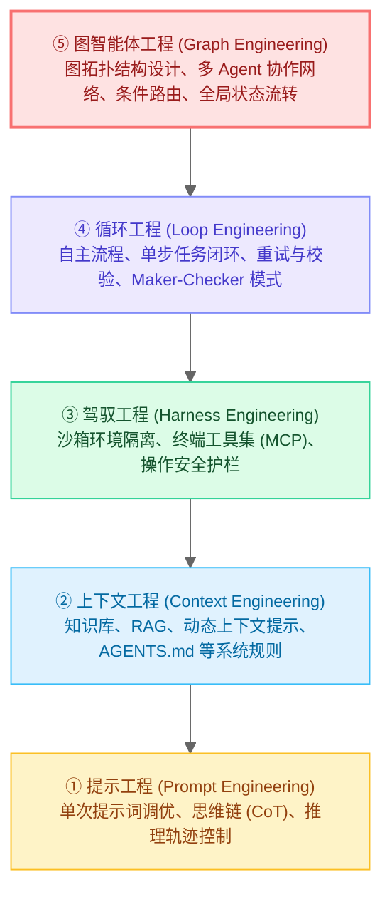
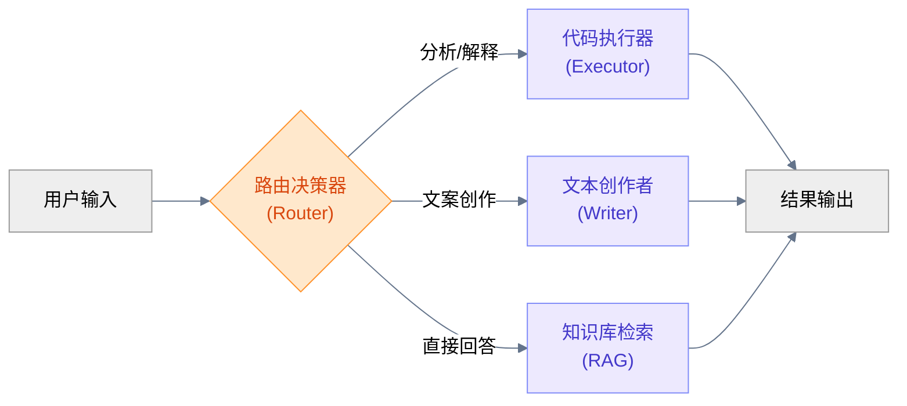
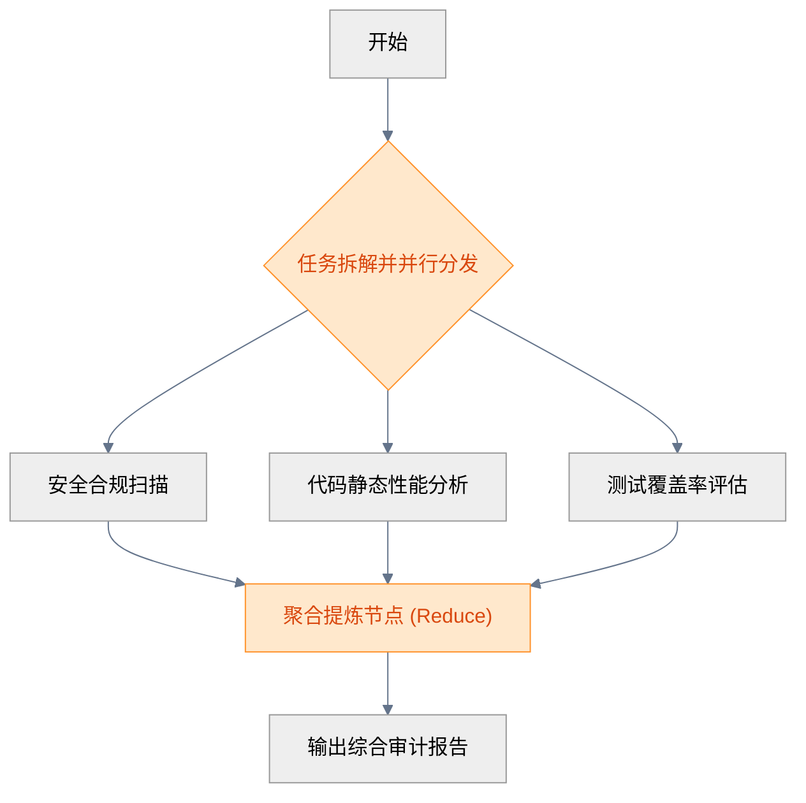
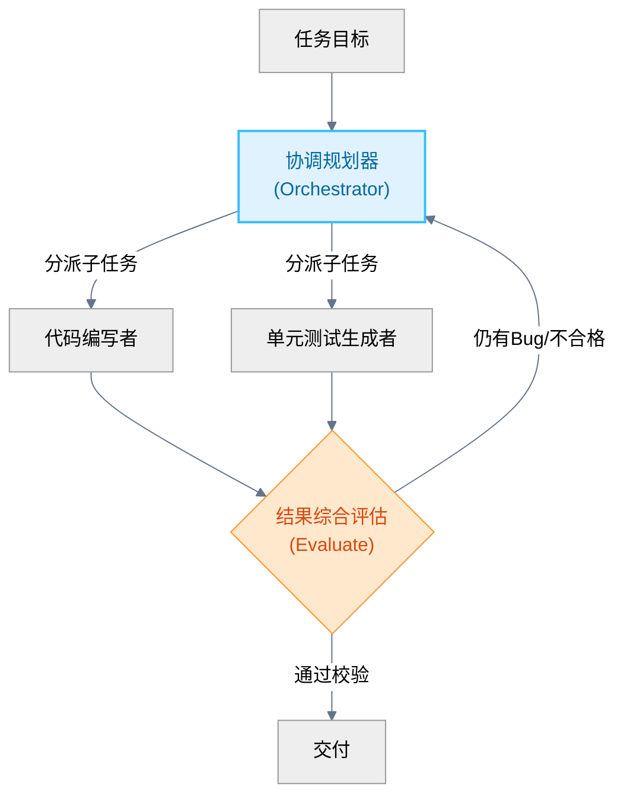
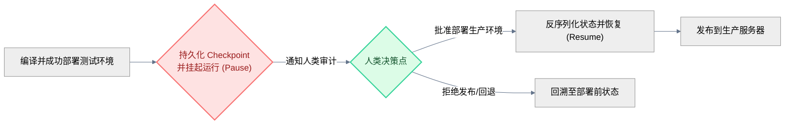

* 目录
{:toc}

# 1. 引言：从“单一循环”到“图拓扑编排”的演进

在 2026 年上半年，**Loop Engineering（循环工程）** 的理念彻底颠覆了传统的单步 Prompting 交互。我们不再是手写 Prompt 的打字员，而是为 Agent 编写自动化闭环系统（如重试循环、计划-执行-校验循环等）的架构师。通过引入闭环，智能体在软件开发、自动化测试等长周期任务中的纠错能力和成功率得到了显著提升。

然而，随着智能体应用在工业界的深入，单一的、线性的 Loop 逐渐撞上了墙角。当我们需要处理以下场景时，简单的“Act-Observe-Verify”闭环就显得力不从心：
1. **多代理分工协同**：一个复杂的任务需要文案策划、代码开发、安全审计、性能压测等多个“各司其职”的异构子智能体（Sub-agents）协同完成，各个智能体之间的交接关系错综复杂。
2. **复杂的逻辑分支与条件判断**：任务流并不是单线往复的，而是根据中间结果进行动态路由。例如，如果代码编译失败，路由到修复节点；如果测试失败且是环境配置问题，路由到环境重建节点；如果是业务逻辑不满足，路由到重构节点。
3. **确定性控制与非确定性推理的混血**：智能体开发中，完全依赖大模型的非确定性决策会带来失控，而完全依赖传统代码又会失去灵活性。如何将业务逻辑中“铁律一般”的业务流约束（如“必须先经过安全审计才能发布”）强制固化下来？
4. **长上下文的管理瓶颈**：随着对话轮次增加，如果只是把所有的历史记录作为 prompt 喂给模型，会导致上下文无限暴涨，引发“Token 螺旋”并降低模型推理精度。

为了应对这些挑战，**Graph Engineering（图智能体工程）** 在 2026 年中后期迅速崛起。它继承了 Loop Engineering 的自动化闭环思想，但将视野放大到了整个系统的**逻辑拓扑结构**。Graph Engineering 主张：**将 AI 智能体的交互、规划、执行与协作逻辑建模为显式的有向状态图（State Graph），用强确定性的图拓扑结构去规范非确定性大模型的行为疆界。**

<figcaption>图 1：Graph Engineering 核心概念——将 AI 智能体编排建模为受控的有向状态图</figcaption>

<!-- more -->

---

# 2. AI Agent 核心技术层级栈的跃迁

回顾整个 AI Agent 领域的发展，开发者的关注点在不断向上层抽象。我们可以将现代智能体开发的技术栈划分为五个核心层级：

<figcaption>图 2：AI Agent 技术层级栈演进图（2026版）</figcaption>

* **提示工程 (Prompt Engineering)**：研究单次大模型调用的最优输入。
* **上下文工程 (Context Engineering)**：决定哪些信息应该在何时进入模型的上下文。
* **驾驭工程 (Harness Engineering)**：为智能体提供执行任务的安全沙箱和工具接口（如 MCP 协议）。
* **循环工程 (Loop Engineering)**：控制单个 Agent 周期性的“思考-行动-观测”环路，解决自愈与微观纠错。
* **图智能体工程 (Graph Engineering)**：**居于最顶层，起宏观编排作用。** 它超越了单一的循环，定义了由多个循环、多类工具和多个异构智能体构成的整体拓扑网络，是支撑企业级、复杂业务场景 Agent 落地的主力范式。

---

# 3. Graph Engineering 的三大核心原语

在 Graph Engineering 中，一切工作流都是一张图（Graph），而构建这张图仅需要三个最基本的工程原语（Primitives）：

### ① 节点 (Nodes)：原子的执行单元
节点代表图中的一个执行步骤。每个节点可以是一段普通代码、一次 LLM 提示词调用、一个外部工具执行、甚至是一个由 Loop Engineering 驱动的独立子 Agent。
每个节点在被激活时，都会接收当前图的**全局状态**，执行特定的计算或推理，然后输出更新后的状态片段。

### ② 边与条件路由 (Edges & Conditional Routing)：逻辑流转的通道
边定义了节点之间的连接关系，决定了下一步该走向哪里。
* **普通边 (Normal Edges)**：确定性的单向连接。例如，节点 A 执行完毕后，必须无条件进入节点 B。
* **条件边 (Conditional Edges)**：非确定性的路由分支。通常由一个决策节点（可以是 LLM 进行分类，也可以是代码逻辑判断）基于当前的全局状态进行判定，动态决定下一阶段走向哪个节点。这实现了“非确定性推理”与“确定性分支”的解耦。

### ③ 全局状态 (State)：唯一的真理来源
这是 Graph Engineering 区别于传统链式（Chain）流调用的关键。在 Graph 中，整个生命周期维护着一个全局共享的、类型化的状态对象（如 Python 中的 Pydantic Model 或 TypedDict）。
* 节点不直接进行复杂的参数透传，而是通过“读取全局状态 -> 执行操作 -> 写入/增量更新状态”的方式与图进行交互。
* **状态的增量合并**：通常支持指定字段的 `reducer` 逻辑。例如，状态中有一个 `messages` 列表，每当有节点返回消息时，图引擎会自动将新消息追加（append）到该列表中，而不会覆盖旧有消息。这极大简化了记忆与上下文管理的复杂度。

---

# 4. 四种经典图拓扑设计模式

根据不同复杂度的业务逻辑，Graph Engineering 沉淀出了四种高频使用的经典拓扑模式：

### ① 路由器模式 (The Router Pattern)
最基础的控制分流模式。LLM 或规则代码作为一个分类器（Router），决定接下来将任务派发给哪个特定的专用节点。

<figcaption>图 3：路由器模式拓扑结构</figcaption>

### ② 并行分叉与聚合模式 (Map-Reduce Pattern)
面对需要多维度分析的任务，主图会分叉（Fork）出多个并行的节点分支，每个分支执行不同的分析，最后通过一个聚合（Reduce）节点对所有分支的状态结果进行汇总提炼。

<figcaption>图 4：并行分叉与聚合模式拓扑结构</figcaption>

### ③ 协调者-执行者循环模式 (Orchestrator-Workers with Feedback)
在这个模式中，一个高水平的**协调节点（Orchestrator）**负责理解大局、进行任务拆解与子任务分发，多个**执行节点（Workers）**并行或串行地去执行子任务并返回结果。协调节点会评估这些结果，如果发现问题，会带上反馈重新指派（Feedback Loop）给相应的 Worker，直到整体任务全部达标。

<figcaption>图 5：协调者-执行者循环模式拓扑结构</figcaption>

### ④ 人类在环控制点模式 (Human-in-the-loop Checkpoints)
并不是所有步骤都应该全自动执行。在 Graph Engineering 中，我们可以定义一个特别的节点为“控制点”。图引擎在运行到该节点前的边时会强制暂停，将当前图的全局状态持久化到数据库中（创建 Checkpoint），并发出通知。只有在人类输入决策、点击批准或手动编辑了状态数据后，图引擎才读取 Checkpoint 并恢复（Resume）运行。

<figcaption>图 6：人类在环控制点模式拓扑结构</figcaption>

---

# 5. Graph Engineering 的核心工程挑战与实战技巧

在实践中构建图智能体时，往往会遇到以下棘手的工程问题，这需要开发者运用专门的图工程守则进行规避：

### ① 状态污染与 Reducer 优化
当有多个节点并发读写全局状态时，极易发生状态覆盖或状态混乱。
* **实战技巧**：保持状态 Schema 尽可能扁平且职责单一。对于并发写入的字段，必须定义清晰的 `reducer` 累加函数，确保数据是以“只追加”或“按键合并”的方式更新，避免无意中的覆盖。

### ② 循环深度上限与死循环预防
因为图是有向的，而且通常包含条件路由与重试的循环边，一旦大模型陷入某种“逻辑幻觉”或者外部工具接口持续报错，图可能会无限循环运行，迅速耗尽 Token 和额度。
* **实战技巧**：在图的编译器或运行时中，**强制设置最大递归步数限制（Recursion Limit）**（例如最大允许流转 50 步）。一旦超过上限，图引擎自动触发熔断，保存当前状态并抛出异常。

### ③ 时空穿梭与回溯测试 (Time Travel & Rollback)
调试一个运行了数十个步骤后报错的图非常痛苦。如果你必须从头运行，不仅费时而且大模型的随机性会导致无法稳定复现 Bug。
* **实战技巧**：利用图引擎的持久化 Checkpoint 机制。图引擎在每一步流转时都会为 State 保存一个带有时间戳的版本。调试时，可以直接指定恢复到第 15 步的状态（即“时空穿梭”），修改该节点的代码或输入，然后仅运行后续的节点。这极大提升了多智能体系统的可测试性。

### ④ 动态拓扑的克制使用
有些框架允许智能体在运行期动态地“修改图的结构”（增加节点或改变连接）。虽然这听起来很灵活，但在大规模生产中，动态拓扑会导致系统轨迹不可追踪、无法复现和极难调试。
* **最佳实践**：**克制使用动态拓扑，坚持“静态编译，动态执行”**。在编译期定义好所有可能的逻辑节点与条件路由（即静态图结构），而在运行期让 LLM 通过全局状态来驱动不同的执行路径（即动态执行路径）。

---

# 6. 主流 Graph Engineering 框架深度对比

目前在开源与工业界，支持图智能体工程的核心框架主要以 **LangGraph** 和 **LlamaIndex Workflows** 为代表。

| 维度 / 特征 | LangGraph (LangChain 体系) | LlamaIndex Workflows |
| :--- | :--- | :--- |
| **设计核心理念** | 状态图驱动 (Stateful Graph) | 事件驱动 (Event-driven Flow) |
| **状态流转机制** | 全局集中式 State 对象，定义 reducer 属性 | 节点间通过发布 (Publish) 和订阅 (Subscribe) 事件传递数据 |
| **循环表达能力** | 极其自然，通过普通边与条件边实现任意循环 | 支持，通过在节点间发布特定回退/重试事件实现 |
| **时空穿梭/持久化** | 第一类公民 (First-class Checkpointers)，原生支持时间旅行 | 需开发者自行处理事件日志与状态的持久化序列化 |
| **多 Agent 协同** | 原生支持子图（Subgraph）嵌套，多 Actor 设计极其优雅 | 支持，但需通过复杂的事件总线路由进行隔离 |
| **上手与调试门槛** | 相对较高，需要理解图的编译 (Compile) 与状态合并逻辑 | 较低，接近传统的异步函数与事件编程风格 |

> **建议**：如果是构建具有复杂多智能体对抗、需要人类频繁干预审批、且对调试回溯要求极高的企业级业务系统，**LangGraph** 是当之无首选；如果是处理数据流水线、RAG 检索增强、事件流处理等偏向数据通道的任务，**LlamaIndex Workflows** 的事件订阅模式会更加轻量和直观。

---

# 7. 结语：迈向更加确定、可控的 Agentic Era

从单次 Prompt 的探索，到 Harness / Loop Engineering 的局部优化，再到如今 **Graph Engineering** 对全局拓扑的掌控，智能体工程化（AI Engineering）的路径已经清晰：**我们正在用传统软件工程中沉淀了几十年的、确定性的结构（图、状态机、事件驱动），来驯服和驾驭非确定性大模型所带来的认知生产力。**

Graph Engineering 并不是消灭大模型的灵活性，而是为它提供一条安全的轨道。在这条轨道上，大模型可以自由地进行推理、编写代码、调用工具，而一旦超出轨道，图的拓扑约束与状态检查机制会立刻将其拉回。只有在这种强确定性的约束框架下，AI Agent 才能真正从“玩具”走向能够支撑起核心业务流程的“生产力工具”。

---

*参考资料*：
1. LangGraph Documentation: Stateful Multi-Agent Orchestration (LangChain, 2026)
2. LlamaIndex Workflows: Building Event-Driven Agentic Pipelines (LlamaIndex, 2026)
3. OpenAI Research: Harnessing LLMs for Controlled Workflow Graphs (2026)
