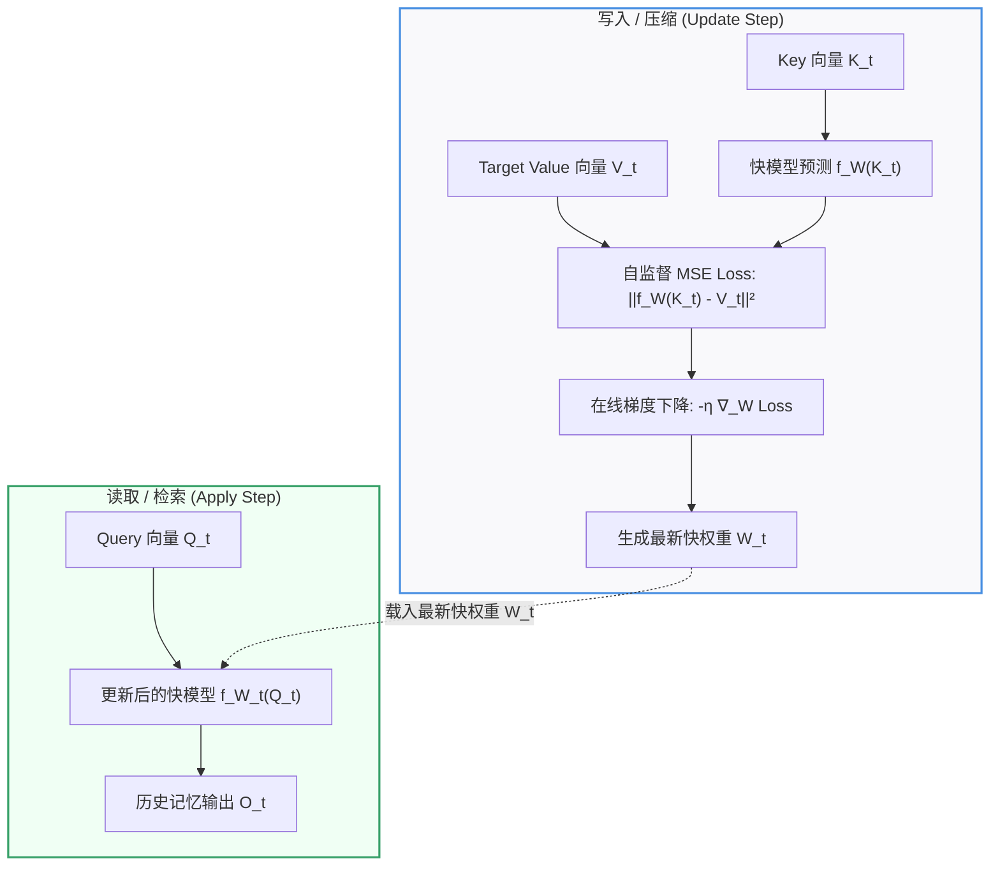
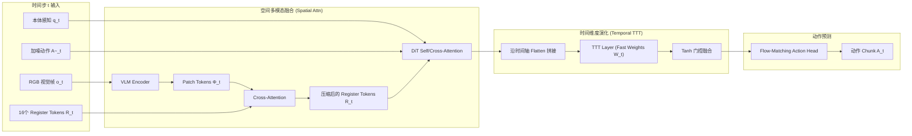
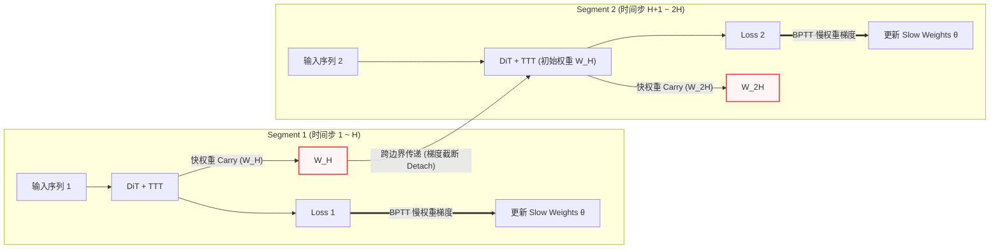
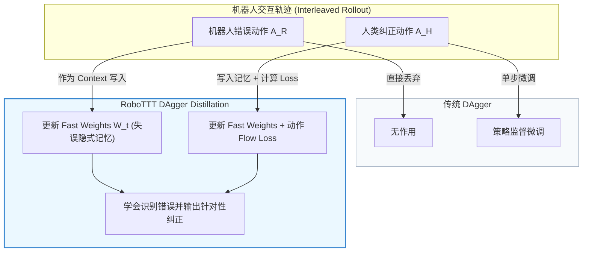

## 1. 引言与背景：具身智能的“长上下文瓶颈”

在近年的大语言模型（LLM）发展中，**上下文长度（Context Length）**已经成为继参数量和数据量之后的第三个核心 Scaling 维度。从早期的 2K、8K 到如今百万 Token 的长上下文，模型展现出了在庞大的上下文资料中实时进行复杂推理、单样本学习（In-Context Learning）与长程分析的惊人能力。

然而，在机器人具身智能（Embodied AI）与视觉-语言-动作（VLA）策略领域，绝大多数 SOTA 模型（如 OpenVLA、GR00T-N1.7、Octo 等）依然严重受限于**单帧**或**极短历史帧（通常仅 2–8 帧）**的视觉操控上下文。

  
<figcaption>RoboTTT 整体架构、序列训练与推理流程</figcaption>

这种“短视”的策略在应对简单、短时程的操控任务时或许尚能应付，但一旦遇到以下场景，缺陷便暴露无遗：
1. **多阶段长程组装（Long-Horizon Tasks）**：如持续数分钟、包含十几个步骤的复杂零部件装配，策略极易忘记前面已完成的阶段或陷入死循环；
2. **在线自适应纠错（On-the-Fly Failure Recovery）**：当机械臂在某一步抓握滑落或定位偏移时，仅看当前单帧往往无法识别“刚刚发生了什么错误”，从而无法做出有针对性的补救；
3. **单样本视频示范模仿（One-Shot Video Imitation）**：无法在推断时直接“看”一段长达数分钟的人类演示视频并将其作为条件上下文来指导操控。

NVIDIA GEAR 实验室最新提出的 **RoboTTT**（Test-Time-Training Robot Policies），将历史交互上下文扩展至 **8K timesteps**（超 4 分钟高帧率连续操控），较传统 VLA 策略提升了 **3000 倍以上**。

RoboTTT 的核心秘密，在于其引入了**测试时训练（Test-Time Training, TTT）**模块——通过在测试部署阶段利用梯度下降在线将多步交互历史（History）动态“压缩”写入小神经网络的**快权重（Fast Weights）**参数空间中。

本文将深入拆解 TTT 模块的底层数学原理、架构设计及其在 RoboTTT 中如何实现长时程历史的高密存储与常数阶实时检索。

---

## 2. 范式革新：传统记忆机制的困境与 TTT 的破解思路

要在机器人闭环操控中建立长达数千步的视觉-动作历史记忆，现有的主流长序列建模方案主要面临以下瓶颈：

### 2.1 方案一：Full Attention 与 KV Cache 的“显存与延迟魔咒”
在标准 Transformer 架构中，长上下文依赖于维护所有历史步的 Key-Value 缓存（KV Cache）：
* **计算复杂度**：随着序列长度 $$T$$ 的增长，Attention 的计算复杂度呈 $$O(T^2)$$ 增长；
* **显存占用**：KV Cache 随时间步线性增加（$$O(T)$$）。在 10–30Hz 的高频机器人控制下，8K 帧的高维视觉特征会直接导致 GPU 显存爆满（OOM），且每一步的推理延迟会越来越高，根本无法满足实时闭环控制要求。

### 2.2 方案二：Linear Recurrent States (Mamba, Gated DeltaNet) 的“表达能力瓶颈”
为了实现 $$O(1)$$ 延迟的常数级推断，另一类思路是采用线性循环状态（Linear Recurrent State），如 Mamba、RWKV 或 Gated DeltaNet。它们通过线性关联矩阵 $$\mathbf{S}_t = \mathbf{S}_{t-1} + \mathbf{K}_t \mathbf{V}_t^\top$$ 压缩历史：
* **局限性**：更新规则为固定的线性外积/累加，缺少梯度下降带来的非线性拟合能力。在面对连续数千步的高维高频机器人视觉-动作流时，线性记忆容量极其有限，容易产生严重的信息丢失和虚假相关（Spurious Correlation）。

### 2.3 方案三：Test-Time Training (TTT) —— 隐状态的“升维”
TTT（Yu Sun et al., 2024）提出了一个颠覆性的视角：**为什么要把循环隐状态（Hidden State）局限为一个固定维度的向量或矩阵？为什么不将隐状态本身升维为一个小型神经网络的参数空间？**

| 维度对比 | Full Attention (KV Cache) | Linear RNN (Gated DeltaNet) | Test-Time Training (TTT) |
| :--- | :--- | :--- | :--- |
| **隐状态表达** | 显式历史 KV 缓存序列 | 固定大小的线性关联矩阵 | **小型神经网络的参数空间（Fast Weights）** |
| **推理计算复杂度** | $$O(T^2)$$（随时间剧增） | $$O(1)$$（常数阶） | **$$O(1)$$（常数阶）** |
| **显存占用** | $$O(T)$$（随时间线性增加） | $$O(1)$$（固定大小） | **$$O(1)$$（固定大小）** |
| **记忆更新机制** | 拼接保留 | 线性累加/加权衰减 | **测试时梯度下降（Test-Time Gradient Descent）** |
| **高维流拟合能力** | 无损（但耗资源） | 较弱（线性受限） | **极强（非线性高高密度压缩）** |

在 TTT 中，历史观测不再保存在显存缓存中，而是在推断过程中通过自监督损失和**测试时梯度下降**，动态地“微调”写入快模型（Fast Model）的权重 $$W_t$$ 中。在检索时，只需将 Query 输入更新后的快模型，即可在常数阶时间内提取出所需的历史特征。

---

## 3. 核心机制拆解：TTT 模块如何将 History 压缩进 Fast Weights

### 3.1 概念区分：Slow Weights（慢权重）与 Fast Weights（快权重）

RoboTTT 架构中存在两套分工明确的权重体系：
* **Slow Weights（慢权重 $$\theta$$）**：包含 VLM 编码器、DiT 的 Attention/MLP 图层、投影矩阵 $$\theta_Q, \theta_K, \theta_V$$ 以及快权重的初始化 $$\mathbf{W}_0$$。**仅在离线训练阶段更新**，推断部署时完全冻结。
* **Fast Weights（快权重 $$\mathbf{W}_t$$）**：嵌入在 DiT 每层后面的小型神经网络（RoboTTT 中采用 2 层 MLP $$f_{\mathbf{W}}$$）的参数。**在训练和测试部署阶段，随每个时间步 $$t$$ 的新数据流入在线实时更新**。

### 3.2 写入/压缩（Update Step）：梯度下降作为在线自监督压缩器

在时间步 $$t$$，策略接收到由前级图层投影产生的 Key 向量 $$\mathbf{K}_t$$ 和 Target Value 向量 $$\mathbf{V}_t$$。TTT 模块通过计算快模型预测值与目标值之间的自监督均方误差损失（MSE Loss）：

$$\mathcal{L}_{\text{FW}}(f_{\mathbf{W}_{t-1}}(\mathbf{K}_t), \mathbf{V}_t) = \lVert f_{\mathbf{W}_{t-1}}(\mathbf{K}_t) - \mathbf{V}_t \rVert^2$$

接着，利用梯度下降（Gradient Descent）在线更新快权重：

$$\mathbf{W}_t = \mathbf{W}_{t-1} - \eta \nabla_{\mathbf{W}} \mathcal{L}_{\text{FW}}(f_{\mathbf{W}_{t-1}}(\mathbf{K}_t), \mathbf{V}_t)$$

其中 $$\eta$$ 为可学习的快学习率（Learnable Learning Rate）。

> **💡 直观理解**：这一步的本质是把全新的键值关联 $$(\mathbf{K}_t, \mathbf{V}_t)$$ 当作一个训练样本，对快模型 $$f_{\mathbf{W}}$$ 运行一次在线梯度更新。随着时间步 $$t=1, 2, \dots, T$$ 的推进，快权重 $$\mathbf{W}_t$$ 像一块海绵一样，将过往所有时间步的交互轨迹模式“训练”并高密度压缩进了自身的 MLP 参数空间中。

### 3.3 读取/检索（Apply Step）：用 Query 快速查询隐式记忆

在更新完快权重生成最新的 $$\mathbf{W}_t$$ 之后，TTT 模块执行 Apply 步骤：将当前时间步的 Query 向量 $$\mathbf{Q}_t$$ 输入到更新后的快模型 $$f_{\mathbf{W}_t}$$ 中：

$$O_t = f_{\mathbf{W}_t}(\mathbf{Q}_t)$$

这一步的本质，相当于用当前的决策提问 $$\mathbf{Q}_t$$ 向快神经网络询问：“根据你在过去数千步交互中内化压缩的所有经验，此时此刻我应该提取什么样的历史关联特征？”

为了更直观地理解这一双重逻辑，我们可以通过下图清晰看出 TTT 在单个时间步内“写入”与“读取”数据流的分工：

由于快模型只是一个极小型的 2 层 MLP，前向传播耗时极短且完全固定，因此**无论历史交互长达 100 步还是 8000 步，检索计算延迟始终恒定在毫秒级**。

### 3.4 为什么非线性 MLP 快模型（TTT-MLP）优于线性快模型（TTT-Linear）？

RoboTTT 在消融实验中对比了将快模型设计为线性层（TTT-Linear）与 2 层非线性 MLP（TTT-MLP）的性能差异：

  
<figcaption>预训练上下文长度 Scaling 曲线及长程组装任务基准对比</figcaption>

实验表明，TTT-Linear 比 TTT-MLP 性能低 **27%**。这是因为：
连续的机器人运动与视觉流充满了非线性的几何变换与多模态重叠特征，线性快模型无法在参数空间中解纠缠（Disentangle）复杂的时间依赖关系；而带有激活函数的非线性 MLP 快模型配合测试时梯度下降，可以在重叠的高维连续状态空间中建立高密度的非线性关联映射。

---

## 4. RoboTTT 的具身 VLA 专属架构设计

在将 TTT 模块集成至高维多模态 VLA 策略（如 GR00T-N1.7）时，直接套用语言模型的 TTT 会遇到严重的技术阻碍。RoboTTT 针对性地设计了三大核心机制：

### 4.1 Register Tokens：解决多模态 Patch Token 爆炸的桥接机制
* **痛点**：VLM Encoder 输出的视觉-语言 Token $$\Phi_t$$ 数量极其庞大（每帧包含数百个视觉 Patch Tokens）。若将所有 $$\Phi_t$$ 直接送入 TTT 图层，梯度计算开销将不堪重负。
* **解法**：RoboTTT 在每个时间步引入 $$N=16$$ 个可学习的 **Register Tokens ($$R_t$$)**。
  1. 在单步 DiT 内部，Register Tokens 先与高维视觉语言 Token $$\Phi_t$$ 执行 Cross-Attention，将复杂的空间与语义上下文集中压缩至 16 个 Token 中；
  2. 仅将 Register Tokens $$R_t$$、本体感知 Token $$q_t$$ 以及加噪动作 Token $$\tilde{A}_t$$ 压平（Flatten）送入 TTT 图层进行跨时间步的快权重更新。

### 4.2 空间-时间解耦（Attn in Space, TTT in Time）
RoboTTT 将空间跨模态融合与时间维度演化进行明确分工：
* **空间轴（Spatial Dimension）**：DiT 内部的 Self/Cross-Attention 仅在单时间步 $$t$$ 内运行，负责视觉、语言、机械臂关节角与动作噪声之间的跨模态交互；
* **时间轴（Temporal Dimension）**：注意力层输出的 Token 沿时间轴拼接，完全交由 TTT Layer 进行 Fast Weights 的跨步滑动更新。

下图展现了单个时间步多模态数据输入经由 Register Tokens 压缩，再到空间与时间解耦处理的完整流向：

### 4.3 Tanh 门控机制：保护预训练 VLA 的基础能力
为防止从头初始化的 TTT 图层在训练初期破坏预训练 VLA（如 GR00T-N1.7）已有的强泛化操控能力，RoboTTT 在 DiT 每层 TTT 输出端设计了可学习的 Tanh 门控：

$$O = \tanh(\alpha) \odot O_{\text{TTT}} + O_{\text{attn}}$$

其中 $$\alpha$$ 初始化为极小值（$$\approx 0.001$$）。在训练初始阶段，$$\tanh(\alpha) \to 0$$，系统完全由预训练 Attention 驱动；随着训练推进，$$\alpha$$ 自适应增长，模型平滑地将长上下文记忆引入决策回路中。

---

## 5. 长序列 Scaling 训练两大核心支撑

将训练上下文扩展至 8K timesteps（超 8000 帧连续序列）极易引发训练不稳定性与 GPU 显存爆炸。RoboTTT 提出了两大训练支撑方案：

### 5.1 Sequence Action Forcing（序列动作强迫）
RoboTTT 的动作头基于流匹配（Flow-Matching）生成连续动作。如果在长序列训练时整条 8K 序列共享同一个 Flow-Matching 噪声水平，会导致闭环推断时动作生成与历史上下文的噪声分布严重失配。

**解法**：在序列训练期间，为每个时间步的 Action Chunk $$A_t$$ **独立采样**不同的 Flow-Matching 噪声水平 $$u_t \sim \text{Beta}(1.5, 1)$$。消融实验证实，去除 Sequence Action Forcing 会导致闭环性能出现崩溃性下降。

### 5.2 TBPTT (Truncated Backpropagation Through Time)
如果对 8K 帧的长序列执行完整的 BPTT，GPU 需要保存全部 8000 步的前向激活值，显存会瞬间 OOM。

**解法**：RoboTTT 引入截断反向传播（TBPTT）：
1. 将 8K 序列分割为多个较短的 Segment（如长 128 或 256）；
2. 在 Segment 边界处，**截断慢权重（Slow Weights $$\theta$$）的梯度**；
3. **关键点：快权重 $$\mathbf{W}_t$$ 保持跨 Segment 的连续传递！**

通过这种设计，慢权重的梯度计算与显存开销仅取决于单个短 Segment 的长度，而快权重则可以在整个 8K 超长序列中持续演化更新，彻底打破了显存对上下文长度的限制。

---

## 6. 从隐式记忆到高级具身能力：涌现智能解析

凭借基于 Fast Weights 的超长上下文存储与检索能力，RoboTTT 涌现出了传统短上下文策略无法具备的高级具身智能：

  
<figcaption>DAgger Distillation 与长上下文自适应纠错机制</figcaption>

### 6.1 DAgger Distillation：把“自适应纠错”蒸馏进快权重的梯度更新里
在传统 DAgger 训练中，收集到的机器人错误动作被简单丢弃，仅使用人类纠正动作进行单步微调。

RoboTTT 提出了 **DAgger Distillation**：
* 训练时，将机器人错误动作 $$A_t^{\text{R}}$$ 与人类纠正动作 $$A_t^{\text{H}}$$ 构成的完整交互轨迹输入网络；
* **错误动作 $$A_t^{\text{R}}$$ 同样参与快权重 $$\mathbf{W}_t$$ 的更新（写入快权重的隐式记忆中），但 Flow-Matching 动作 Loss 仅在人类纠正动作 $$A_t^{\text{H}}$$ 上计算**。

这种不对称的设计，成功将“识别出过往轨迹中的失误 $$\to$$ 检索并输出正确的纠正动作”这一映射逻辑蒸馏进了快权重的参数演化轨迹中。在推断时，当机器人自身发生误操作（如螺丝没对准或零件滑落），过往的失误动作自动进入快权重，触发快模型的在线自适应纠错（实机恢复成功率高达 83%）。

### 6.2 One-Shot Video Imitation：单样本视频示范模仿
传统的单样本模仿往往需要重新微调策略或依赖复杂的元学习架构。在 RoboTTT 中：
* 人类示范视频帧与机器人执行轨迹被拼接为同一个 8K 序列；
* 视频帧的动作 Loss 被 Mask 掉，仅用于更新快权重 $$\mathbf{W}_t$$。
* 在部署时，策略只需在前置上下文中“阅读”一段 1 分钟的人类示范视频，快权重便会自动记录并检索出目标组件的排列空间特征，实现 **60% 以上的完全成功单样本泛化**（而对比基线 GDN 完全失败，得分 0%）。

---

## 7. 总结与展望

NVIDIA RoboTTT 的成功，为具身智能大模型（Embodied Foundation Models）指明了一个全新的发展方向：**上下文长度（Context Length）是提升操控鲁棒性与长程泛化能力的全新 Scaling 轴线**。

通过将测试时训练（TTT）与 Fast Weights 引入 VLA 策略，RoboTTT 巧妙地解耦了记忆表达能力与推理延迟之间的矛盾：
1. **表达高密**：利用梯度下降与非线性快模型，将数千步高维视觉-动作连续流在线压缩进参数空间；
2. **检索实时**：推理时仅需常数阶 $$O(1)$$ 的前向计算即可提取历史依赖，完美适配高频闭环控制；
3. **能力涌现**：解锁了单样本视频模仿、在线自适应纠错与超长程（5 分钟 10 阶段）复杂组装能力。

随着计算资源与具身长序列预训练数据的进一步丰富，基于 Fast Weights 的长上下文具身策略必将在未来的通用机器人部署中发挥愈发核心的作用。
