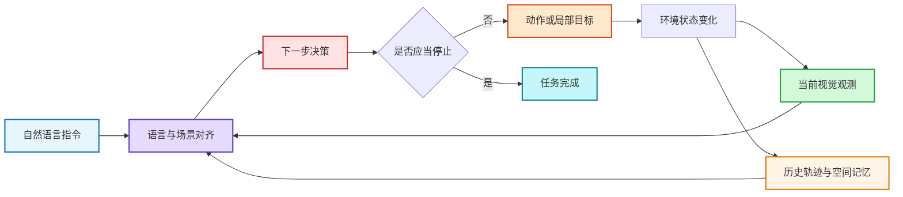
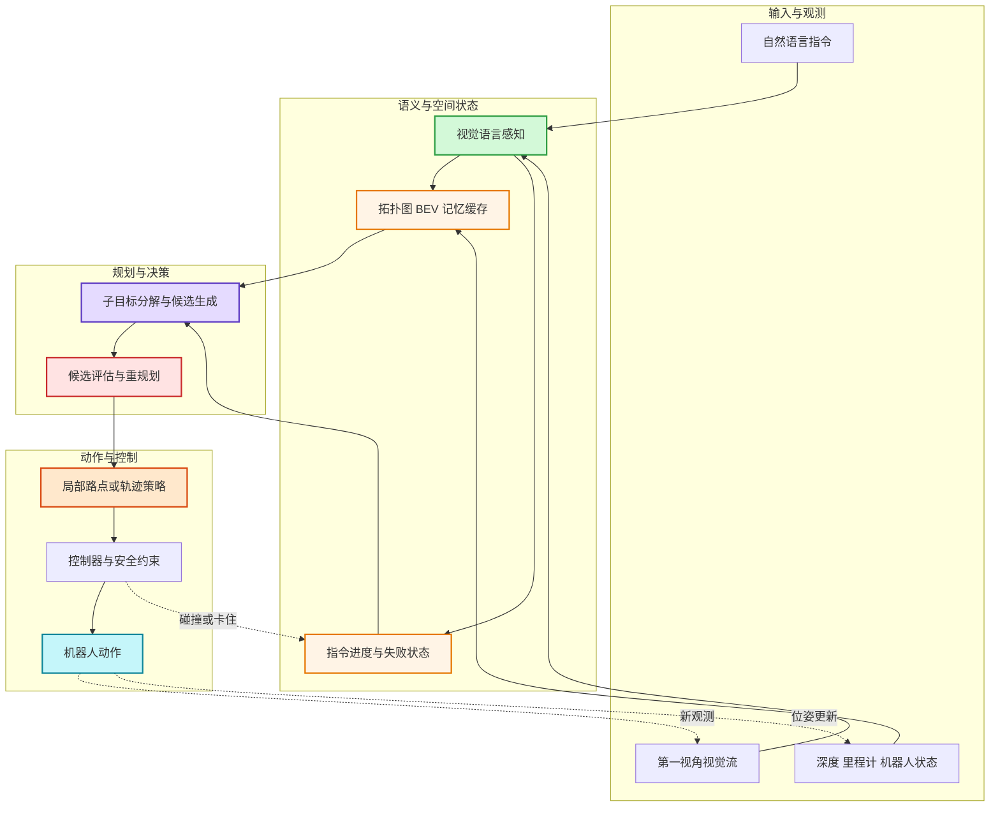
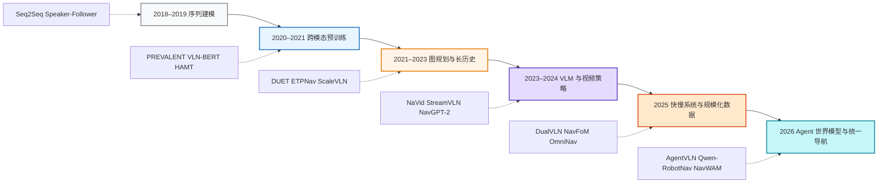
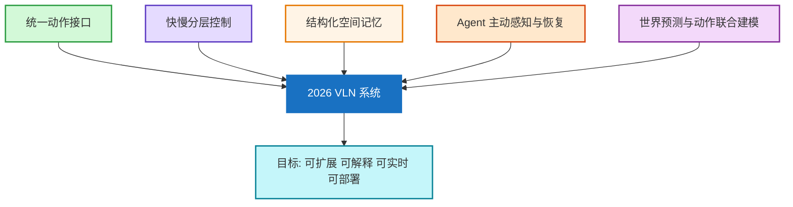
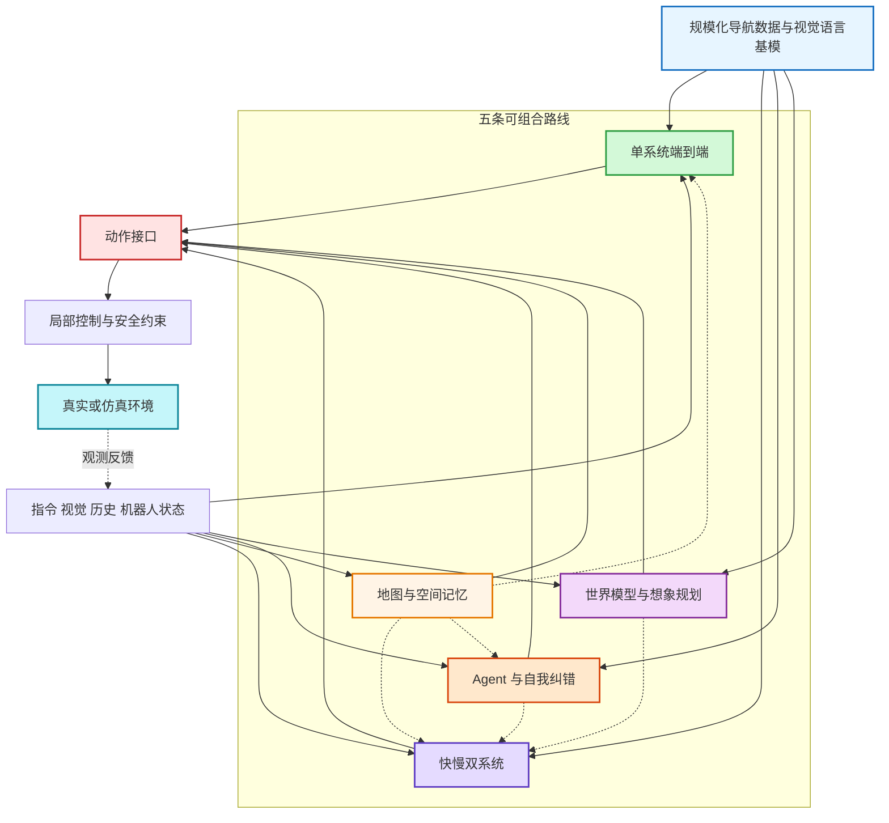
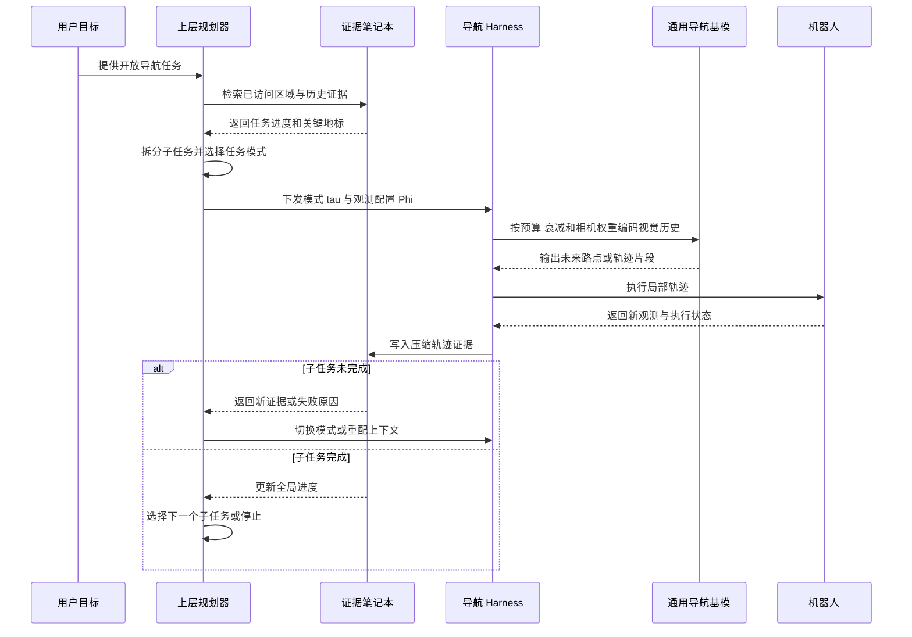
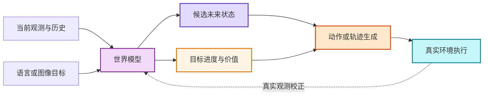

> **2026 年 7 月重构说明**：本文不再按论文逐篇罗列，而是围绕“任务设定—系统架构—训练数据—真实部署”四条主线组织内容。最新模型成绩与论文精读统一维护在配套文章 [VLN 经典论文](/VLN-Papers/) 中，避免综述正文因榜单快速变化而失效。


## 阅读导航

- **第一次接触 VLN**：先读第 1–2 节，建立任务边界与核心问题。
- **做模型研究**：重点读第 3 节的方法谱系，以及第 8 节的评测口径。
- **准备实验**：从第 6–7 节选择数据集与模拟器，不要跨任务设定直接比较 SR / SPL。
- **追踪最新工作**：查看 [VLN 经典论文与性能排行榜](/VLN-Papers/)，其中按连续环境、离散全景和目标导航分别维护结果。

# 1. 引言

视觉语言导航（Vision-Language Navigation, VLN）研究的是：智能体如何依据自然语言，在持续变化的第一视角观测中完成空间定位、路径决策与动作执行。它不是简单的“看图选方向”，而是一个典型的部分可观测长时序问题：智能体必须记住已经走过的区域，判断指令执行进度，在局部观测与全局目标之间反复对齐，并在偏航、遮挡或碰撞后恢复。

2018 年 R2R 奠定了“自然语言指令 + 真实扫描室内环境 + 未见场景泛化”的经典任务。此后，研究对象从离散全景导航扩展到连续控制、多语言指令、目标搜索、对话协作、动态人群、空中导航和真实机器人。2024 年以后，VLM/VLA 基础模型进一步改变了研究重心：问题不再只是如何设计一个任务专用策略，而是如何把通用视觉语言知识、空间记忆、高层推理和低层控制组织成一个可实时运行的具身系统。

截至 2026 年，更准确的判断不是“端到端模型已经取代模块化系统”，而是两者正在融合：统一模型负责获得可扩展的通用能力，结构化地图、快慢分层、技能调用和安全控制则为长时序可靠性提供约束。本文据此重新梳理 VLN 的概念边界、方法演进、基准体系与仍未解决的问题。

<div align="center">
  
  <figcaption>图 1.1：视觉语言导航（VLN）指令接地、空间记忆、拓扑建图与闭环动作决策全景示意图</figcaption>
</div>

# 2. VLN 基本概述

VLN 的核心不是“看懂一句话”，而是在部分可观测环境中持续完成 **语言落地、空间定位、历史记忆、动作决策和停止判断**。智能体每移动一步，视觉输入和指令进度都会变化，因此导航是一个闭环过程，而不是一次性的视觉问答。

## 2.1 任务定义：语言如何变成一条可执行轨迹

给定自然语言指令 $I$，智能体在时刻 $t$ 接收当前观测 $o_t$，并结合历史状态 $h_t$ 预测动作 $a_t$：

$
a_t \sim \pi(a_t \mid I, o_t, h_t)
$



离散环境通常输出相邻视点或 `STOP`；连续环境则可能输出前进/转向动作、二维路点、轨迹片段或底层控制量。动作接口不同会改变感知范围、控制难度和成功条件，因此不能仅凭“都使用 R2R 指令”就直接比较结果。

## 2.2 看懂一个 VLN 基准：五个必要维度

| 维度 | 需要确认的问题 | 常见设定 | 对结果的影响 |
|:---|:---|:---|:---|
| **目标表达** | 智能体究竟要理解什么？ | 路线指令、目标类别、目标图像、场景描述、对话 | 决定是否需要逐步语言落地或开放词汇搜索 |
| **观测配置** | 智能体能看到什么？ | 全景、单目、多目、RGB、RGB-D、里程计 | 决定可见范围与几何先验强度 |
| **动作空间** | 智能体如何移动？ | 离散视点、低层动作、路点、速度、轨迹 | 决定是否真正考察避障与控制 |
| **环境模型** | 环境是否具有物理约束？ | 导航图、可导航表面、刚体碰撞、机器人动力学 | 决定是否会碰撞、跌倒或卡住 |
| **交互协议** | 指令能否被澄清或修正？ | 单轮、对话、主动问询、人类反馈 | 决定智能体能否消解歧义和请求帮助 |

### 2.2.1 VLN、ObjectNav 与通用 VLA 的边界

| 范式 | 主要输入 | 主要考察能力 | 典型输出 |
|:---|:---|:---|:---|
| **指令跟随 VLN** | 路线级自然语言指令 | 指令进度、地标对齐、路径忠实度 | 视点、动作或路点 |
| **ObjectNav / ImageNav** | 目标类别或目标图像 | 开放词汇搜索、探索效率、目标定位 | 探索方向或局部目标 |
| **通用 VLA** | 图像/视频、语言目标、机器人状态 | 多任务迁移与动作生成 | 动作 token、轨迹或控制量 |

ObjectNav 可以为 VLN 提供语义探索模块，VLA 也可以成为 VLN 的策略底座，但它们的成绩不能自动并入标准 VLN 榜单。公平比较必须固定任务输入、传感器、动作接口、数据划分与额外训练数据。

## 2.3 一个现代 VLN 系统如何工作

早期模型常把 VLN 描述为“视觉编码器 + 语言编码器 + 动作分类器”。2026 年更实用的系统视图是：**感知提供语义与几何证据，状态层维护指令进度和空间记忆，规划层选择子目标，执行层将子目标转化为安全动作，并由真实观测持续纠偏。**



这张图不是要求所有方法都显式实现每个模块。端到端模型会把多个方框折叠进统一网络；双系统、地图方法和 Agent 方法则会把部分接口显式化。判断架构时，应看信息流和训练目标，而不是只看论文使用了哪个名称。

## 2.4 VLN 的核心难点

| 难点 | 典型失败 | 为什么难 | 需要观察的证据 |
|:---|:---|:---|:---|
| **动态语言落地** | 把后半句地标提前执行，或错过转向点 | 指令进度随位移变化 | 细粒度轨迹对齐、错误指令测试 |
| **部分可观测与长记忆** | 重复探索、忘记已访问区域、无法回退 | 单帧看不到全局结构 | 长路径表现、回溯和记忆消融 |
| **语义推理与几何可达性** | VLM 选择语义正确但不可到达的目标 | 互联网知识不等于三维几何 | 深度/地图消融、可达性验证 |
| **高层规划与低层控制** | 子目标正确但轨迹碰撞或振荡 | 两个时间尺度和接口误差叠加 | 控制频率、延迟、碰撞与重规划次数 |
| **开放世界与真实部署** | 仿真成功、真机失效 | 视角、传感器、动力学和场景分布变化 | 跨场景、跨构型和真实机器人评测 |
| **失败检测与恢复** | 到过目标附近却没有停下，偏航后持续累积错误 | 模型缺少不确定性和自我诊断 | OSR–SR 差距、恢复成功率、人工介入次数 |

## 2.5 从任务专用模型到导航基础模型



这条演进线不是简单的“新模型替代旧模型”。预训练解决语义泛化，地图与记忆解决空间一致性，快慢系统解决推理和控制的时间尺度冲突，Agent 与世界模型则尝试提高主动感知、恢复和前瞻规划能力。它们正在汇合，而不是互相淘汰。

## 2.6 研究问题地图

| 研究层 | 当前常用方案 | 仍缺少的关键证据 |
|:---|:---|:---|
| 表征 | VLM 预训练、视频上下文、三维 token | 是否真正理解沿途约束，而不是只预测终点？ |
| 状态 | 拓扑图、BEV、3D Gaussian、缓存与检索记忆 | 记忆错误何时发生，如何遗忘与修正？ |
| 规划 | 子目标分解、CoT、候选轨迹打分 | 更长的推理是否稳定改善闭环控制？ |
| 执行 | 路点策略、动作块、扩散轨迹、MPC | 不同机器人形态和控制频率下能否迁移？ |
| 数据 | 合成轨迹、多任务联合训练、自动进度描述 | 数据量、场景多样性和标注质量谁更关键？ |
| 部署 | 量化、缓存、边缘推理、安全控制器 | 仿真 SR / SPL 能否预测真实可靠性？ |

## 2.7 2026 年的五个明显变化



当前最值得关注的不是“某一种架构统治 VLN”，而是统一预训练、结构化状态、分层控制和失败恢复之间能否形成稳定、可复现的接口。

# 3. 主流 VLN 研究路线

VLN 方法不应再被简单分成“端到端”和“模块化”。更有解释力的三个观察轴是：**策略是否统一训练、空间状态是否显式维护、决策与控制是否按时间尺度分层**。据此，2025–2026 年的工作可以归纳为五条可组合路线。



## 3.1 方法演进：真正变化的是状态、接口与训练数据

| 阶段 | 模型内部状态 | 典型动作接口 | 训练信号 | 代表方法 |
|:---|:---|:---|:---|:---|
| **序列策略** | RNN 隐状态 | 离散视点 / 动作 | 行为克隆、强化学习 | Seq2Seq、Speaker-Follower |
| **预训练 Transformer** | 跨模态 token 与历史特征 | 离散候选点 | 掩码建模、指令—轨迹对齐 | PREVALENT、VLN-BERT、HAMT |
| **图规划与显式记忆** | 拓扑图、语义图、局部地图 | 全局节点 + 局部动作 | 图监督、路径与进度目标 | DUET、ETPNav、MapNav |
| **视频 VLM / VLA** | 视频上下文、KV cache、动作 token | 离散动作、路点或动作块 | 视觉语言数据 + 导航轨迹 | NaVid、StreamVLN、NavFoM |
| **导航基础模型** | 多任务上下文、可配置观测、统一空间表征 | 多任务模式与参数化接口 | 大规模联合训练、指令微调 | OmniNav、OneVLA、Qwen-RobotNav |
| **Agent / 世界动作模型** | 经验记忆、技能状态、预测未来 | 技能、子任务、未来观测与动作联合序列 | 反思数据、在线 RL、世界预测 | AgentVLN、EvoMemNav、NavWAM |

现代模型的提升往往同时来自更大的基模、更多轨迹、额外深度或地图先验以及新的系统接口。阅读论文时，应把“架构创新”和“资源增加”分开归因。

## 3.2 单系统端到端：把导航变成连续的多模态生成

单系统方法把指令、视觉历史和动作历史放入统一模型，直接预测下一步动作、路点或动作块。它的优势是训练目标统一、数据扩展直接；瓶颈则是长上下文成本、空间漂移和失败难以解释。

<div align="center">
  
<figcaption>StreamVLN：以交错视觉—动作序列实现流式端到端导航</figcaption>
</div>

| 关键设计 | 解决的问题 | 代表工作 |
|:---|:---|:---|
| 观测—动作交错生成 | 避免把整段视频压缩成一次静态判断 | [StreamVLN](/VLN-Papers/#streamvln)、[SparseVideoNav](/VLN-Papers/#sparsevideonav) |
| 多任务共享策略 | 让指令跟随、目标搜索和探索共享空间能力 | [NavFoM](/VLN-Papers/#navfom)、[OneVLA](/VLN-Papers/#onevla-a-unified-framework-for-embodied-tasks) |
| 可配置观测接口 | 推理时调整历史长度、相机权重和任务模式 | [Qwen-RobotNav](/VLN-Papers/#qwen-robotnav) |
| 量化与边缘部署 | 降低大模型闭环推理延迟 | [LocalNav](/VLN-Papers/#localnav) |

**适用场景**：数据规模充足、接口相对统一、强调端到端训练和部署简洁性。若任务涉及长程回溯、动态重规划或严格安全约束，通常仍需要外部记忆或控制模块。

## 3.3 快慢双系统：高层语义推理与高频执行解耦

快慢系统按时间尺度分工：慢系统低频理解指令、检查进度并产生子目标；快系统持续把子目标转化为路点或轨迹。它并不等价于“使用两个模型”，关键在于两层之间是否具有稳定、可校验的接口。

<div align="center">
  
<figcaption>DualVLN：慢系统产生语义目标，快系统生成实时轨迹</figcaption>
</div>


| 系统接口 | 优点 | 主要风险 | 代表工作 |
|:---|:---|:---|:---|
| 像素目标 | 直观、便于视觉落地 | 深度歧义与可达性不确定 | [DualVLN](/VLN-Papers/#dualvln)、[Goal2Pixel](/VLN-Papers/#goal2pixel) |
| 前沿或拓扑路点 | 适合全局探索与回溯 | 依赖地图质量 | [OmniNav](/VLN-Papers/#omninav)、[SEDualVLN](/VLN-Papers/#sedualvln) |
| 共享潜在特征 | 信息密度高、可联合优化 | 可解释性和跨模型兼容性弱 | [Hydra-Nav](/VLN-Papers/#hydra-nav) |
| 指向或候选验证 | 可以结合在线强化学习 | 训练与推理系统更复杂 | [Robostral Navigate](/VLN-Papers/#robostral-navigate) |

## 3.4 地图与空间记忆：让历史变成可查询的环境状态

VLM 能识别“厨房”和“沙发”，却不天然知道它们在三维空间中的稳定位置。地图与记忆路线把历史观测组织成拓扑图、BEV、3D Gaussian、分层场景图或混合检索库，为长程规划、回溯和错误诊断提供外部状态。

<div align="center">
  
<figcaption>HSGM：分层场景图同时维护局部观测、对象关系与全局路径状态</figcaption>
</div>

| 表示 | 擅长解决 | 典型局限 | 代表工作 |
|:---|:---|:---|:---|
| 拓扑图 | 长距离连通关系与回溯 | 节点语义粗、依赖路点质量 | DUET、ETPNav、[TopoGraph-VLN](/VLN-Papers/#topograph-vln) |
| BEV / 语义地图 | 几何可达性与局部规划 | 位姿误差会持续累积 | [MapNav](/VLN-Papers/#mapnav)、[GA-VLN](/VLN-Papers/#ga-vln) |
| 3D Gaussian 记忆 | 可渲染的连续三维语义 | 建图成本与动态更新复杂 | [3DGSNav](/VLN-Papers/#3dgsnav)、[GSMem](/VLN-Papers/#gsmem) |
| 分层场景图 | 房间—对象—路径的多尺度推理 | 图构建和关系更新依赖感知质量 | [HSGM](/VLN-Papers/#hsgm) |
| 检索式经验记忆 | 复用历史成功与失败经验 | 错误检索可能放大偏差 | [VLN-Cache](/VLN-Papers/#vln-cache)、[EvoMemNav](/VLN-Papers/#evomemnav) |

地图不是天然正确的“真值”。优秀系统必须同时回答如何写入、何时更新、如何处理冲突，以及何时遗忘过时信息。

## 3.5 通用导航 Agent：上层规划器如何编排一个共享导航基模

Agentic Navigation 不只是“让 VLM 调用几个技能”。参考 [Qwen-RobotNav](https://arxiv.org/abs/2606.18112) 的系统设计，更完整的通用导航 Agent 包含两个不同时间尺度：**上层 Agent 维护全局任务并决定当前应该执行哪种导航行为；下层导航基模消费视觉历史并持续输出局部轨迹。** 二者之间通过任务模式、观测参数和压缩后的轨迹证据通信。

> **关键边界**：Qwen-RobotNav 本身是可重配置的通用导航基模，而不是完整 Agent。只有当上层规划器、导航 Harness、证据笔记本与机器人闭环组合起来时，系统才具备任务分解、模式切换、长期记忆和跨回合恢复能力。

<div align="center">
  
<figcaption>Qwen-RobotNav 通用导航 Agent：上层规划器动态配置导航模式与视觉上下文，执行结果被压缩为轨迹证据</figcaption>
</div>

### 3.5.1 通用导航 Agent 的五层结构

| 层级 | 输入与职责 | 输出接口 | Qwen-RobotNav 中的对应设计 |
|:---|:---|:---|:---|
| **任务规划器** | 理解开放目标，拆分当前子任务，决定何时切换行为 | 任务模式 $$\tau_i$$ 与观测配置 $$\Phi_i$$ | 上层规划器在指令跟随、目标搜索、主动追踪等模式间切换 |
| **参数化导航工具** | 将上层意图转成导航基模可以执行的调用 | Token 预算 $B$、时间衰减 $\gamma$、相机权重 $$w_c$$ | 推理期改变视觉历史的时间跨度、分辨率与视角优先级 |
| **共享导航基模** | 融合指令、多视角历史和机器人状态 | 未来路点或轨迹片段 | 单个 Qwen-RobotNav 跨任务复用同一感知—规划底座 |
| **导航 Harness** | 执行轨迹、收集显著地标和目标状态、判断工具调用结果 | 紧凑轨迹证据 | 避免把完整视频反复回灌给上层大模型 |
| **证据笔记本** | 跨回合保存已访问区域、关键发现、失败原因与子任务进度 | 全局任务记忆 | 为下一轮规划提供长期状态和恢复依据 |

这里最重要的变化是：上层 Agent 不再直接逐帧输出机器人动作，而是**配置和调用一个可泛化的导航工具**。这既降低了长视频上下文成本，也允许同一底座在长程搜索时保留更多历史、在目标追踪时强调最新画面。

### 3.5.2 Qwen-RobotNav 式 Agentic 导航闭环



### 3.5.3 三类 Agentic VLN 设计

| 范式 | Agent 控制什么 | 专用模块如何使用 | 代表工作 |
|:---|:---|:---|:---|
| **VLM-as-Brain** | 直接选择感知、建图、规划和纠错技能 | 技能库向 VLM 返回结构化空间证据 | [AgentVLN](/VLN-Papers/#agentvln)、[Skill-Nav](/VLN-Papers/#skill-nav)、[SysNav](/VLN-Papers/#sysnav) |
| **Planner + Generalist Navigator** | 选择子任务、导航模式和上下文消费策略 | 单一通用导航基模作为高频工具反复调用 | [Qwen-RobotNav](/VLN-Papers/#qwen-robotnav)、[OmniNav](/VLN-Papers/#omninav) |
| **Memory-augmented Agent** | 决定何时检索、写入、回退和重新规划 | 情景记忆与空间记忆持续更新 | [VLN-Cache](/VLN-Papers/#vln-cache)、[EvoMemNav](/VLN-Papers/#evomemnav) |

评价通用导航 Agent 时，除 SR / SPL 外，还应报告子任务完成率、模式切换次数、证据压缩率、Token 消耗、恢复成功率、控制频率和人工介入次数。否则很难判断性能来自真正的 Agent 协作，还是来自更大的底层导航模型。

## 3.6 世界模型与世界动作模型：从预测未来到利用未来

世界模型路线希望在真正执行之前预测“采取某个动作后会看到什么”。早期方法把未来视觉生成作为外部预测器；新的世界动作模型则联合建模未来观测、目标进度、价值和动作，使预测结果直接参与闭环控制。

<div align="center">
  
<figcaption>AstraNav-World：在统一框架中联合更新未来视觉状态与动作序列</figcaption>
</div>



| 方向 | 关键变化 | 代表工作 |
|:---|:---|:---|
| 视觉想象辅助策略 | 生成候选未来视觉，为现有策略提供额外证据 | [VLN-Imagine](/VLN-Papers/#vln-imagine)、Navigation World Models |
| 语言规划 + 预测 | 让指令分解约束短期与长期预测 | NavForesee、[WorldVLN](/VLN-Papers/#worldvln) |
| 视觉—动作联合生成 | 同步生成未来状态与动作，减少两阶段漂移 | [AstraNav-World](/VLN-Papers/#astranav-world) |
| 世界动作模型 | 在共享潜在序列中联合未来观测、价值和动作块 | [NavWAM](/VLN-Papers/#navwam)、[WAM-Nav](/VLN-Papers/#wam-nav) |

这一方向最容易被视觉效果误导。真正有意义的证据不是生成帧“看起来合理”，而是闭环 SR / SPL、碰撞率和真实机器人控制是否改善，以及预测误差能否被新观测及时纠正。

## 3.7 五条路线如何选择

| 研究目标 | 优先路线 | 建议组合 | 重点报告 |
|:---|:---|:---|:---|
| 大规模统一训练 | 单系统端到端 | + 轻量缓存或隐式记忆 | 数据规模、参数量、延迟、跨任务迁移 |
| 真实机器人流畅控制 | 快慢双系统 | + 安全控制器 + 局部地图 | 控制频率、碰撞、重规划、真机成功率 |
| 长程导航与回溯 | 地图与空间记忆 | + VLM 高层规划 | 地图误差、回溯收益、长路径指标 |
| 开放任务与自主恢复 | Agent 导航 | + 结构化记忆 + 技能库 | 调用成本、恢复率、人工介入、幻觉 |
| 前瞻规划与低试错 | 世界模型 | + 快慢系统或价值模型 | 预测误差、闭环收益、推理成本 |

### 3.7.1 阅读最新论文时的四个检查项

1. **协议是否一致**：传感器、动作空间、数据划分和成功阈值是否相同？
2. **资源是否一致**：收益来自架构，还是更大的基模、更多数据或额外深度/地图？
3. **闭环是否受益**：推理、记忆或想象模块是否真正改善导航，而不只是离线指标？
4. **部署代价是否透明**：是否报告延迟、显存、控制频率和真实机器人测试？

配套文章 [VLN 经典论文与性能排行榜](/VLN-Papers/) 按连续环境、离散全景和目标导航分别维护结果，适合用于进一步核对同设定性能。


# 4. VLN 任务类型

任务名称相近并不意味着结果可比。理解 VLN 基准时，至少需要同时标注 **目标表达、动作空间、观测配置、交互方式和物理模型** 五个维度。

| 维度 | 常见设定 | 对难度的主要影响 |
|:---|:---|:---|
| **目标表达** | 路线指令、目标类别、目标图像、场景描述、对话 | 决定是否需要逐步语言落地或开放词汇搜索 |
| **动作空间** | 离散视点、离散低层动作、连续速度/路点/轨迹 | 决定是否需要避障、控制与停止判断 |
| **观测配置** | 全景、单目、多目、RGB、RGB-D、里程计 | 直接影响可见范围与几何信息强度 |
| **交互方式** | 单轮指令、多轮对话、主动问询、人类反馈 | 决定智能体能否消解歧义或请求帮助 |
| **具身与物理** | 无动力学、轮式、四足、人形、无人机 | 决定碰撞、跌倒、卡住和 6-DoF 控制难度 |

## 4.1 按推理与决策复杂度划分

**1. 指令跟随型 VLN（Instruction-Following VLN）**

该类任务要求智能体根据给定的自然语言指令，在环境中完成从起点到目标位置的导航，通常不涉及显式目标搜索或复杂语义推理。此类任务主要用于评估模型的语言理解能力和基本导航能力。

*代表性数据集*：Room-to-Room（R2R）、Room-for-Room（R4R）

---

**2. 语义推理驱动的 VLN（Reasoning-Oriented VLN）**

该类任务在导航过程中引入目标物体搜索或语义约束，智能体需要将语言指令与环境中的语义信息进行推理匹配，从而完成导航与定位任务。

*代表性数据集*：REVERIE、SOON

---

**3. 长时序与组合式 VLN（Long-Horizon VLN）**

该类任务强调长距离导航和复杂指令组合，要求智能体具备长期规划、记忆和错误恢复能力，是评估 VLN 系统长期决策能力的重要设定。

*代表性数据集*：LHPR-VLN，以及 R4R / RxR 中的长路径设定

---

## 4.2 按交互方式划分

**1. 非交互式 VLN**

智能体在接收到初始指令后独立完成导航任务，过程中不与用户进行额外交互。这是当前最常见的 VLN 评测设定。

---

**2. 交互式与对话式 VLN**

该类任务允许智能体在导航过程中与用户进行多轮交互，通过提问或反馈不断优化导航目标，更接近真实人机协作场景。

*代表性数据集*：CVDN

## 4.3 按动作与物理真实性划分

**1. 离散全景导航**

智能体在预定义的可通行视点图上移动，通常每个节点提供 360° 全景特征。该设定弱化了局部控制与碰撞问题，适合研究语言—地标对齐、全局规划和历史建模。

*代表性基准*：R2R、R4R、RxR、REVERIE

**2. 连续环境导航**

智能体通过前进、转向或局部路点在可导航表面运动，不再沿人工导航图“瞬移”。连续设定引入相机视角限制、累计位姿误差、碰撞和停止控制。

*代表性基准*：R2R-CE、RxR-CE、REVERIE-CE

**3. 物理具身导航**

机器人受动力学、形态和控制频率约束，需要处理跌倒、打滑、卡住与不同相机安装位置。此类任务更接近部署，但也更难与经典 VLN 结果对齐。

*代表性基准*：VLN-PE、VLNVerse，以及真实机器人评测

> **比较原则**：R2R、R2R-CE、RxR-CE、ObjectNav 与真实机器人测试必须分表报告。即使都使用 SR / SPL，它们的输入、动作空间和成功条件也可能不同。

---


# 5. VLN的应用场景

## 5.1 室内场景

室内VLN主要关注家庭或办公环境内的导航。环境通常较为复杂，包含多个房间和各种家具，对智能体的空间理解能力要求较高。

<div align="center">
  
<figcaption>室内 VLN：自然语言指令、第一视角观测与全局轨迹之间的关系</figcaption>
</div>

**应用示例**：
- 家庭服务机器人
- 室内物流配送
- 智能导览系统

## 5.2 室外场景

室外VLN面临更大的环境复杂度，需要处理动态障碍物、天气变化等因素。

<div align="center">
  
<figcaption>
室外VLN示例
</figcaption>
</div>

**应用示例**：
- 自动驾驶
- 户外服务机器人
- 城市导航系统

## 5.3 空中场景

空中VLN涉及无人机等飞行器的导航控制。

<div align="center">
  
<figcaption>
室外VLN示例
</figcaption>
</div>
**应用示例**：
- 无人机巡检
- 空中搜救
- 航拍导航


# 6. VLN主流数据集

VLN研究依赖高质量的数据集来训练和评估导航模型。以下是VLN领域最具影响力的主流数据集（含最新进展）：

在查看规模之前，应先按研究问题选择基准：

| 研究问题 | 优先基准 | 建议主要指标 |
|:---|:---|:---|
| 语言—地标对齐与历史建模 | R2R / RxR | SR、SPL、nDTW / SDTW |
| 连续控制与真实视角 | R2R-CE / RxR-CE | SR、SPL、NE、碰撞相关指标 |
| 目标指代与语义搜索 | REVERIE / SOON | SR、SPL、目标定位指标 |
| 长时序规划与记忆 | R4R / LHPR-VLN | CLS、nDTW、SR、恢复表现 |
| 对话与人机协作 | CVDN / TEACh | 任务成功、交互效率、对话质量 |
| 动态人群与社交安全 | HA-VLN | SR / SPL + 人体碰撞与社交约束指标 |
| 具身动力学与真实部署 | VLN-PE / 真实机器人 | SR / SPL + 跌倒、卡住、碰撞、延迟 |
| 空中 6-DoF 导航 | AerialVLN / CityNav / OpenFly | 成功率、路径效率、三维轨迹误差 |

训练数据集与评测数据集也应分开看。ScaleVLN、InternData 等大规模数据主要用于预训练或联合训练；它们扩大了覆盖范围，但不能替代在标准未见场景划分上的公平评测。

---

## 6.1 数据集对比总览

随着具身智能与大模型技术的发展，VLN数据集的演进呈现出以下三大核心趋势：

1. **动作与环境的物理保真度提升**：从早期的离散拓扑图瞬间移动（Discrete Topo-Graph），到基于连续动作控制的物理避障（Continuous Environment），再到支持人形/四足/轮式机器人等多具身动力学的真实物理仿真（Physically Realistic Dynamics），评估指标也从纯粹的成功率扩展到跌倒率（FR）和卡住率（StR）。
2. **任务与交互逻辑的语义复杂度提升**：从单向的静态文字指令跟随，到多轮的人机协同对话（Dialog-based）与主动问询，再到根据抽象的人类需求（Demand-driven）进行具身常识推理，任务的难度正逐步向开放世界与高层认知迈进。
3. **空间尺度与视角的跨越**：从室内单房间/单楼层的近场导航（Indoor Navigation），拓展至长程多阶段（Long-Horizon）复杂任务，并进一步跨越到三维空中（UAVs）乃至真实城市尺度（Cambridge/Birmingham）的航拍地标导航。

以下是VLN领域主流数据集的详细对比总览：

| 数据集 | 年份 | 场景数 | 环境/模拟器 | 动作空间 | 轨迹数 / Episodes | 指令数 / 对话数 | 任务类别 | 核心特征与创新点 |
| :--- | :---: | :---: | :--- | :---: | :---: | :---: | :---: | :--- |
| **R2R** | 2018 | 90 | Matterport3D | 离散拓扑图 | 7,189 | 21,567 | 指令导航 | 首个真实扫描室内三维导航数据集，奠定VLN研究基石 |
| **R4R** | 2019 | 90 | Matterport3D | 离散拓扑图 | 13,607 | 278,692 | 指令导航 | 拼接R2R长路径，侧重于评估路径遵循的忠诚度 (CLS指标) |
| **CVDN** | 2019 | 83 | Matterport3D | 离散拓扑图 | 7,490 | 2,050 (对话) | 对话导航 | 引入人机协作多轮对话机制，智能体可向Oracle主动提问 |
| **RxR** | 2020 | 90 | Matterport3D | 离散拓扑图 | 16,522 | 126,069 | 多语言导航 | 多语言支持（英/印地/泰卢固），提供词-视点细粒度对齐 (Pose Trace) |
| **VLN-CE** | 2020 | 90 | Matterport3D (Habitat) | 连续动作 | 7,844 | 21,567 | 连续导航 | 移除离散导航图，使用前进/转向等物理控制指令，消除瞬移假设 |
| **RxR-CE** | 2021 | 90 | Matterport3D (Habitat) | 连续动作 | 16,522 | 126,069 (多语言) | 连续导航 | 大规模多语言RxR数据集移植至Habitat，支持连续物理运动与细粒度对齐 |
| **REVERIE** | 2020 | 90 | Matterport3D | 离散拓扑图 | 2,783 | 21,702 | 目标指代导航 | 融合导航与指代消解 (RefExp)，需在房间内识别并定位目标物体 |
| **REVERIE-CE** | 2022 | 90 | Matterport3D (Habitat) | 连续动作 | 2,783 | 21,702 | 目标指代连续 | 在连续环境中进行指代消解与物理导航，需在终点识别并定位物体 |
| **SOON** | 2021 | 90 | Matterport3D | 离散/连续 | 3,060 | 3,848 | 场景描述导航 | 无逐步指令，仅提供抽象场景关系描述，支持任意起点物体导航 |
| **TEACh** | 2022 | 120 | AI2-THOR | 连续+操作 | 3,000+ | 3,000+ (对话) | 交互对话导航 | 引入20+种家政物体交互动作，支持物品状态改变（如煮咖啡、切菜） |
| **AerialVLN** | 2023 | 25 | 3D City Simulator | 3D连续 | 8,446 | 8,446 | 空中无人机 | 首个三维空中导航数据集，结合高度控制，覆盖870+种地标物体 |
| **ScaleVLN** | 2023 | 1,200+ | HM3D / Gibson | 离散拓扑图 | 4.94M (R2R) / 830k (REVERIE) | 4.94M / 830k (合成) | 导航与指代定位预训练 | 超大规模合成数据集，包含R2R式路径跟随与REVERIE式物体定位，解决泛化性问题 |
| **DDN** | 2023-24 | 1,692 | ProcThor (AI2-THOR) | 连续动作 | 1,692 | 1,692 | 需求导向导航 | 依据抽象人类需求（如“我需要清洁”）推理目标，结合常识寻找物体 |
| **LHPR-VLN** | 2025 | 216 | Habitat-Sim | 连续动作 | 3,260 | 3,260 | 长程多阶段 | 动作长度超150步的长时序导航，要求智能体具备多阶段规划记忆 |
| **HA-VLN 2.0**| 2025 | 90+ | Matterport3D / Habitat | 离散/连续 | 16,844 | 16,844 | 社交感知导航 | 引入动态人群和个人空间约束，评估机器人在有人环境下的社交安全 |
| **VLN-PE** | 2025 | 101 | GRUTopia (Isaac Sim) | 真实物理动力学 | 12,000+ | 12,000+ | 真实物理导航 | 首个物理动力学平台，支持人形/四足/轮式机器人，带跌倒/卡住评估 |
| **VLNVerse**| 2025 | 263 | 3D Scenes (263 scenes) | 全运动学连续控制 | 35,000+ | 35,000+ (三种风格) | 物理多任务导航 | 统一多种导航任务，引入物理刚体碰撞检测与全运动学约束 |
| **CityNav** | 2025 | 2个城市 | 真实城市航拍 | 3D连续 | 32,637 | 32,637 | 空中航拍导航 | 使用真实剑桥/伯明翰航拍图像，融入地理语义地图与GPS坐标 |
| **OpenFly** | 2025 | 18 | UE5 / GTA5 / Google Earth | 3D连续 | 100,000 | 100,000 | 大规模空中 | 规模最大的空中导航数据集，GPT-4o生成指令，倡导关键帧感知 |
| **InternData**| 2025 | 1,000+ | Habitat / Isaac Sim | 连续动作 | 240,000+ | 830,000+ | 导航大模型预训练 | 包含50M+图像 and 4,800+公里导航里程，用于多模态导航大模型预训练 |

---

## 6.2 指令导向与连续导航数据集

指令导向任务（Instruction-guided）与连续环境导航（Continuous Environments）是整个VLN领域的基石。其重点在于如何将视觉输入与复杂的自然语言指令进行多模态对齐，并在不同精度的运动模拟器中输出动作序列。

---

### 6.2.1 R2R (Room-to-Room)

* **发布时间**：2018 (CVPR)
* **环境表示**：**离散拓扑图 (Discrete Graph)**。基于 Matterport3D 扫描的真实场景。
* **核心挑战**：跨模态对齐（Cross-modal Alignment），要求智能体在复杂的真实图像中识别指令提及的地标。

**[数据集目录结构]**

```text
R2R/
├── data/
│   ├── R2R_train.json          # 训练集：14,025 条指令
│   ├── R2R_val_seen.json       # 已见环境：与训练集场景重合，考量记忆力
│   ├── R2R_val_unseen.json     # 未见环境：全新场景，考量泛化性 (最关键指标)
│   └── R2R_test.json           # 测试集：榜单评测专用，隐藏 GT 路径
├── connectivity/               # 拓扑连接图 (定义 Agent 可移动的范围)
│   └── <Scan_ID>_connectivity.json 
└── img_features/               # 视觉特征 (主流采用 ViT-B/16 或 ResNet 离线提取)
    └── <Scan_ID>.tsv           # 存储各视点 (viewpoint) 的全景特征向量

```

**[数据条目与底层逻辑解析]**
R2R 的 JSON 不仅仅是文本，它包含了导航初始化的关键位姿信息：

```json
{
  "scan": "2n8P_example",          // 场景 ID (对应 Matterport3D 中的房屋)
  "path": ["vp_1", "vp_2", "vp_3"],// 离散路径节点序列 (Ground Truth)
  "heading": 1.57,                 // 初始水平偏航角 (Radians)，决定 Agent 第一眼看哪
  "instructions": [                // 每条路径对应的 3 条独立人类标注 (多样性)
    "Leave the bedroom and go into the hallway...",
    "Walk past the bathroom and stop near the stairs.",
    "Go through the door and walk to the end of the hall."
  ],
  "instr_id": "1234_0"             // 格式：{path_id}_{instruction_index}
}

```

**[关键技术细节：拓扑连接文件]**
这是离散 VLN 的核心，`connectivity.json` 定义了智能体在每个点位可以看到的邻居节点：

```json
// <Scan_ID>_connectivity.json 内部逻辑示例
{
  "image_id": "vp_1",
  "rel_heading": 0.52,             // 目标点相对于当前的水平夹角
  "rel_elevation": 0.1,            // 目标点相对于当前的俯仰角
  "distance": 2.1,                 // 节点间欧氏距离 (米)
  "unobstructed": true             // 路径是否通畅 (无墙壁阻隔)
}

```

**[核心评估指标 (Metrics)]**
在整理 R2R 时，必须包含这四个核心指标：

* **NE (Navigation Error)**: 预测终点与真值终点的平均距离 (m)，越低越好。
* **SR (Success Rate)**: 终点误差小于 3m 的比例，越高越好。
* **SPL (Success weighted by Path Length)**: **核心指标**。权衡导航效率与准确度，避免智能体通过“乱绕路”碰巧到达终点。
* **OSR (Oracle Success Rate)**: 路径中任意一点靠近过目标的比例，衡量模型是否曾“经过”正确答案。


---

### 6.2.2 R4R (Room-for-Room)

* **发布时间**：2019 (EMNLP)
* **核心特点**：通过拼接 R2R 路径形成更长的轨迹。
* **技术突破**：引入了 **CLS (Coverage weighted by Length Score)** 指标，要求模型必须“严格遵循指令路径”而不仅仅是到达终点。

**[数据格式差异]**

* **路径构成**：将两条 R2R 路径首尾相连，平均路径步数从 4-6 步增加到 10-15 步。
* **JSON 补充**：增加了 `path_id` 追踪原始 R2R 路径来源。

---

### 6.2.3 RxR (Room-across-Room)

* **发布时间**：2020 (EMNLP)
* **核心特点**：多语言支持（英语、印地语、泰卢固语）及**细粒度对齐**。

**[数据集目录结构]**

```text
RxR/
├── annotations/
│   ├── en-US/                  # 英语指令文件夹
│   ├── hi-IN/                  # 印地语指令文件夹
│   └── te-IN/                  # 泰卢固语指令文件夹
├── poses/                      # 指令与视点的细粒度对齐数据 (Pose Trace)
└── rxr_train_guide.json        # 训练引导文件

```

**[关键技术点：Pose Trace]**

* **对齐数据**：RxR 不仅提供指令，还记录了标注员在写指令时视线停留的时间戳。
* **JSON 字段**：包含 `pose_trace` 数组，记录了 `(time, view_index)`，允许进行多模态的时间序列对齐训练。

---

### 6.2.4 VLN-CE (连续环境导航)
————Beyond the Nav-Graph: Vision-and-Language Navigation in Continuous Environments

* **发布时间**：2020 (ECCV)
* **环境表示**：**连续环境 (Continuous Environment)**。基于 Habitat 模拟器渲染 Matterport3D 场景，使用低层动作控制（0.25m 前进，15° 转向）。
* **核心特点**：将离散拓扑图导航转换为连续空间导航，移除了预先构建导航图、完美定位和瞬移假设，更贴近真实机器人场景。

📄 **Paper**: https://arxiv.org/abs/2004.02857

<div align="center">
  
<figcaption>
VLN 与 VLN-CE 的对比: VLN 基于固定拓扑的全景图节点(左)，而 VLN-CE 在连续环境中使用低层动作(右)
</figcaption>
</div>

**[数据集目录结构]**

```text
data/
├── datasets/
│   ├── R2R_VLNCE_v1-3/              # R2R 数据集转换版本
│   │   ├── train/
│   │   │   └── train.json.gz        # 训练集（4,475 条轨迹）
│   │   ├── val_seen/
│   │   │   └── val_seen.json.gz     # 已见环境验证集
│   │   └── val_unseen/
│   │       └── val_unseen.json.gz   # 未见环境验证集
│   │
│   ├── RxR_VLNCE_v0/                # RxR 多语言版本
│   │   ├── train/
│   │   │   ├── train_guide.json.gz           # Guide 轨迹
│   │   │   ├── train_guide_gt.json.gz        # Ground Truth
│   │   │   ├── train_follower.json.gz        # Follower 轨迹
│   │   │   └── train_follower_gt.json.gz
│   │   ├── val_seen/
│   │   ├── val_unseen/
│   │   └── text_features/                    # BERT 预编码特征
│   │
├── scene_datasets/
│   └── mp3d/                        # Matterport3D 场景资源
│       ├── <scan_id>.glb            # 场景网格模型
│       └── <scan_id>.navmesh        # 可导航网格
│
└── ddppo-models/                    # 预训练强化学习模型
```

**[数据格式示例]**

VLN-CE 保留 R2R 的指令和路径信息，但将离散节点路径转换为连续轨迹：

```json
{
  "episode_id": 1234,
  "scene_id": "2n8kARJN3HM",
  "trajectory_id": "4321",
  "instruction": {
    "instruction_text": "Walk past the bathroom and stop near the stairs.",
    "instruction_tokens": ["walk", "past", "the", "bathroom", ...]
  },
  "reference_path": [              // 离散参考路径（来自 R2R）
    "viewpoint_1",
    "viewpoint_2",
    "viewpoint_3"
  ],
  "start_position": [1.2, 0.15, 3.4],  // 连续空间起始坐标 (x, y, z)
  "start_rotation": [0, 1.57, 0, 0],   // 四元数表示的初始朝向
  "goals": [                           // 目标位置（可能有多个）
    {
      "position": [5.6, 0.15, 8.2],
      "radius": 3.0                    // 成功判定半径（米）
    }
  ],
  "shortest_paths": [                  // 预计算的最短路径动作序列
    [
      {"action": "MOVE_FORWARD", "rotation": 0},
      {"action": "TURN_LEFT", "rotation": 15},
      {"action": "MOVE_FORWARD", "rotation": 0},
      ...
    ]
  ],
  "info": {
    "geodesic_distance": 9.89,         // 最短路径长度（米）
    "euclidean_distance": 7.32
  }
}
```

**[关键技术特性]**

* **轨迹转换方法**：通过射线投射和 A* 路径验证，将 77% 的 R2R 离散路径成功转换为连续环境轨迹
* **动作空间**：`MOVE_FORWARD (0.25m)`, `TURN_LEFT (15°)`, `TURN_RIGHT (15°)`, `STOP`
* **观测空间**：RGB (480×640) + Depth (480×640)，视场角 (FoV) 79°
* **物理约束**：支持碰撞检测、可导航网格 (NavMesh)、Agent 高度 1.5m
* **Habitat 集成**：利用 Habitat-Sim 高性能渲染（1000+ FPS），支持分布式训练

**[核心评估指标]**

VLN-CE 采用与 R2R 一致的评估指标，但在连续空间中重新定义：

* **NE (Navigation Error)**: 最终位置与目标的欧式距离（米），越低越好
* **SR (Success Rate)**: 终点误差 < 3m 的轨迹比例，越高越好
* **SPL (Success weighted by Path Length)**: 路径效率加权成功率 = SR × (最短路径长度 / 实际路径长度)
* **OSR (Oracle Success Rate)**: 轨迹中任意位置曾接近目标（< 3m）的比例

**[性能基准]**

| 模型 | Val Unseen SR | Val Unseen SPL | 备注 |
|------|--------------|----------------|------|
| Seq2Seq | 18% | 0.16 | 基础模型 |
| CMA (Cross-Modal Attention) | 32% | 0.30 | 最佳基线 |
| 无深度输入 | ≤1% | - | 性能崩溃 |
| 无指令输入 | 17% | - | 单模态基线 |

**核心发现**：深度信息对 VLN-CE 至关重要，移除深度导致性能崩溃；平均轨迹长度从 VLN 的 4-6 步增加到 55.88 步。

---

### 6.2.5 RxR-CE (多语言连续环境导航)
————Room-Across-Room in Continuous Environments

* **发布时间**：2021 (基于 Habitat-Sim 仿真平台)
* **环境表示**：**连续三维环境 (Continuous Environment)**。基于 Habitat-Sim 模拟器渲染 Matterport3D 场景，使用低层动作控制。
* **核心挑战**：多语言指令对齐（英语、印地语、泰卢固语）与长路径连续动作生成的协同。

**[数据集特征与格式]**
* **路径与指令**：延续了 RxR 拥有的 **16,522 条路径**和 **126,069 条多语言指令**。
* **轨迹特征**：平均连续控制动作步长远超 R2R-CE，轨迹长度更长、路线更迂回，对智能体的局部定位和长时序状态追踪提出了更高的要求。
* **对齐标注**：保留了原 RxR 数据集中细粒度的“单词-相机视点时间戳对齐 (Pose Trace)”，为智能体在连续位移过程中进行时空跨模态对齐提供了高质量监督信号。

---

### 6.2.6 VLN-PE (真实物理具身导航)
————Rethinking the Embodied Gap: Physical and Visual Disparities in VLN

* **发布时间**：2025 (ICCV)
* **环境表示**：**物理真实连续环境 (Physically Realistic Environment)**。基于 GRUTopia 物理模拟器 (Isaac Sim)，支持真实的运动动力学和物理交互。
* **核心特点**：首个支持多种机器人具身（人形/四足/轮式）的 VLN 平台，引入物理控制器和真机部署验证，揭示了仿真到真实的具身化差距。

📄 **Paper**: https://arxiv.org/abs/2507.13019v2

<div align="center">
  
<figcaption>
VLN 任务的演进: 从 oracle-based 导航(2018)到 VLN-CE 连续导航(2020)，再到 VLN-PE 物理真实导航(2025)
</figcaption>
</div>

**[数据集目录结构]**

```text
VLN-PE/
├── datasets/
│   ├── R2R-filtered/                # 过滤楼梯场景的 R2R
│   │   ├── train/                   # 8,679 个 episodes
│   │   ├── val_seen/                # 658 个 episodes
│   │   └── val_unseen/              # 1,347 个 episodes
│   │
│   ├── GRU-VLN10/                   # 新增合成家居场景
│   │   ├── train/                   # 441 个 episodes
│   │   ├── val_seen/                # 111 个 episodes
│   │   └── val_unseen/              # 1,287 个 episodes
│   │
│   └── 3DGS-Lab-VLN/                # 3D Gaussian Splatting 渲染实验室
│       ├── train/                   # 160 个 episodes
│       └── val/                     # 640 个 episodes
│
├── scenes/
│   ├── mp3d/                        # 90 个 Matterport3D 场景
│   ├── GRScenes/                    # 10 个高质量合成场景
│   └── 3DGS/                        # 3DGS 在线渲染场景
│
├── robots/
│   ├── humanoid/                    # 人形机器人配置
│   │   ├── unitree_h1/              # Unitree H1 (相机高度 ~1.5m)
│   │   └── unitree_g1/              # Unitree G1
│   ├── quadruped/                   # 四足机器人
│   │   └── unitree_aliengo/         # Unitree Aliengo (相机高度 ~0.5m)
│   └── wheeled/                     # 轮式机器人
│       └── jetbot/                  # NVIDIA Jetbot
│
└── controllers/
    ├── physical_controller/         # RL-based 物理控制器
    └── simple_controller/           # 简化运动控制器
```

**[数据格式特点]**

VLN-PE 扩展了 VLN-CE 数据格式，新增机器人具身和物理状态信息：

```json
{
  "episode_id": 5678,
  "scene_id": "GRScene_001",
  "instruction": "Walk to the living room and find the red pillow.",
  "robot_type": "humanoid_h1",           // 机器人类型
  "controller_type": "physical",         // 控制器类型
  "camera_height": 1.5,                  // 相机高度（米）
  "start_position": [2.3, 0.0, 4.1],
  "start_rotation": [0, 0.785, 0, 0],
  "goal_position": [8.7, 0.0, 9.2],
  "goal_radius": 3.0,
  "lighting_condition": "normal",        // 光照条件: normal/low/high
  "sensor_config": {
    "rgb": true,
    "depth": true,                       // 是否包含深度
    "resolution": [270, 480]
  }
}
```

**[关键技术特性]**

* **跨具身支持**：统一接口支持人形（H1, G1）、四足（Aliengo）和轮式（Jetbot）机器人，各具身可独立训练或联合训练
* **物理控制器**：基于 RL 训练的低层控制器，模拟真实运动动力学（步态、平衡、碰撞响应）
* **多场景融合**：101 个场景（90 MP3D + 10 GRScene + 1 定制），支持光照变化和 3DGS 渲染
* **真机验证**：在 Unitree Go2 四足机器人上进行 14 个室内场景的实际部署测试
* **标准化格式**：兼容 LeRobot v2.1 格式（InternData-N1），便于跨平台使用

**[核心评估指标]**

VLN-PE 保留传统指标并新增物理真实性指标：

* **TL (Trajectory Length)**: 轨迹总长度（米）
* **NE (Navigation Error)**: 最终距离目标的误差（米）
* **SR (Success Rate)**: 成功率（< 3m）
* **SPL (Success weighted by Path Length)**: 路径效率加权成功率
* **OSR (Oracle Success Rate)**: 曾接近目标的比例
* **FR (Fall Rate)**: 机器人跌倒的比例（物理真实性指标）⭐
* **StR (Stuck Rate)**: 机器人卡住的比例（碰撞/动力学失败）⭐

**[性能基准 - Humanoid H1 on R2R-filtered Val Unseen]**

| 模型 | 参数量 | SR (%) | SPL | FR (%) | StR (%) | 备注 |
|------|--------|--------|-----|--------|---------|------|
| Seq2Seq-Full (VLN-CE) | 36M | 15.2 | 0.13 | 8.3 | 12.1 | 零样本迁移 |
| CMA-Full (VLN-CE) | 36M | 18.7 | 0.16 | 7.5 | 10.8 | 零样本迁移 |
| NaVid (零样本) | 7B | 22.4 | 0.19 | 6.2 | 9.3 | 大模型 |
| CMA (VLN-PE 训练) | 36M | 25.8 | 0.22 | 3.8 | 5.2 | 域内训练 |
| RDP (Diffusion Policy) | 6M | 27.1 | 0.23 | 2.9 | 4.7 | 新方法 |
| CMA+ (跨具身训练) | 36M | **28.7** | **0.24** | **2.1** | **3.9** | 最佳性能 |

**核心发现**：
1. **零样本迁移失败**：VLN-CE 模型迁移到 VLN-PE 时 SR 相对下降 34%
2. **跨具身泛化**：联合训练单一模型可在所有机器人类型上达到 SOTA
3. **多模态鲁棒性**：RGB+Depth 在低光照下性能下降仅 1-2%，而纯 RGB 下降 12.47%
4. **真机验证成功**：VLN-PE 训练模型在真实 Unitree Go2 上 SR 达到 28.57%


---

### 6.2.7 ScaleVLN (超大规模导航预训练增强数据集)
————Scaling Data Generation in Vision-and-Language Navigation

* **发布时间**：2023 (CVPR / ICCV)
* **环境表示**：**离散拓扑图 (Discrete Graph)**。基于 HM3D 和 Gibson 扫描的真实室内场景。
* **核心挑战**：克服人工标注数据稀缺问题，提升导航智能体在未见环境中的零样本/少样本泛化性能。

**[数据集规模与构成]**
* **总规模**：总共生成约 **4.94 Million (4,941,710)** 条轨迹-指令对，在 HM3D 与 Gibson 上分别采样生成。针对不同下游任务，其具体构成如下：
  * **R2R/CVDN 样式（路径跟随导航）**：共 **4,941,710** 条轨迹-指令对（包含来自 HM3D 的 **2,890,267** 条和来自 Gibson 的 **2,051,443** 条），是传统 R2R 训练集的 352 倍以上。
  * **REVERIE 样式（远程物体指代定位）**：共 **830,209** 条轨迹-指令对（包含来自 HM3D 的 **518,233** 条和来自 Gibson 的 **311,976** 条），主要用于物体级跨模态定位（Object Grounding）预训练，其规模约为原始 REVERIE 训练集的 38 倍。
* **场景环境**：涵盖 1,200+ 个来自 HM3D (800 个) 和 Gibson (491 个) 的高保真三维真实室内扫描场景，总可导航面积超过 15 万平方米（约为 Matterport3D 的 7.5 倍）。
* **生成机制**：通过在无标注的 3D 扫描网格上采样 viewpoints 并使用凝聚聚类（Agglomerative Clustering）构建三维导航拓扑图，设计无冲突的物理路径，再使用预训练的 Speaker 模型（如 EnvDrop Speaker）及微调的 GPT-2 生成对应风格的自然语言指令。

**[核心技术突破]**
* **预训练范式变革**：为大模型时代的多模态导航智能体 (VLA/VLM Agent) 提供了海量且高质量的弱监督预训练语料，降低了模型在下游任务 (如 R2R, REVERIE, CVDN) 上微调的泛化误差。
* **三维路径采样策略**：设计了能够覆盖各种房屋结构、连通关系和长短距离的全局路径规划采样算法，确保了合成轨迹的空间多样性。
* **Speak-to-Navigate 闭环**：通过高质量的 Speaker 将轨迹转化为富含地标和动作的描述，提高了语言-视觉-动作 (Vision-Language-Action) 的深层对齐。

---

### 6.2.8 InternData (VLN-N1 导航预训练数据)
————Synthetic Data for InternVLA-N1

* **发布时间**：2025
* **环境表示**：**连续环境 (Continuous Environment)**。基于 VLN-CE 等导航数据集转换，采用统一的 LeRobotDataset 格式。
* **核心特点**：标准化的机器人学习数据格式，支持视频、指令、动作和元数据的结构化存储，兼容多种导航基准测试。

### 6.2.8.1 数据集组成与特性分析

本项目采用的多模态数据集涵盖了从大规模真实扫描到高质量人工合成的多种室内场景。每个数据集均提供 **d435i**（主动红外立体）与 **zed**（被动双目）两种传感器仿真配置，以适配不同的硬件特性。

---

#### 1. 真实世界扫描类 (Real-world Scanned Scenes)
*重点用于验证算法在真实物理环境噪声下的鲁棒性。*

* **HM3D (Habitat-Matterport 3D)**
    * **定位：** 目前规模最大、精细度最高的 3D 扫描数据集。
    * **价值：** 包含 1000 个超高分辨率场景，是训练长距离导航与具身智能（Embodied AI）的主流基准。
* **Matterport3D / MP3D**
    * **定位：** 视觉导航领域的基石数据集。
    * **价值：** 涵盖 90 个大型建筑的完整扫描，常用于全景视觉处理及跨层区域的复杂导航任务。
* **ScanNet**
    * **定位：** 侧重于语义标注的室内房间集合。
    * **价值：** 包含 1500+ 扫描房间，拥有密集的语义分割与物体实例标注，适合感知层的算法训练。
* **Replica**
    * **定位：** 极致精细的少样本数据集。
    * **价值：** 虽然仅 18 个场景，但其网格密度与重建质量极高，是测试 **高精度 SLAM** 轨迹误差的黄金标准。
* **Gibson**
    * **定位：** 机器人导航的经典验证环境。
    * **价值：** 经过广泛验证的真实建筑扫描数据，便于与现有 SOTA（领域最优）算法进行性能对标。

#### 2. 程序化合成类 (Synthetic & Procedural Scenes)
*重点用于空间布局理解及逻辑泛化能力的提升。*

* **HSSD (Habitat Synthetic Scene Dataset)**
    * **定位：** Meta 开发的高质量合成数据集。
    * **价值：** 场景布局遵循真实的居家逻辑（如家具对齐与功能分区），能有效提升算法在复杂布局下的泛化性。
* **3D-FRONT**
    * **定位：** 基于专业室内设计的合成数据集。
    * **价值：** 包含大量多样化的家具组合与布局变体，是物体识别与空间拓扑关系训练的理想来源。

---

> **📌 传感器说明：** > * **_d435i 系列**：模拟主动红外立体视觉，适合对接 Gemini 336L 等相似原理硬件。
> * **_zed 系列**：模拟被动双目视觉，侧重于光照充足环境下的视觉特征提取。
>


**[数据合成流程]**

| 阶段 | 流程名称 | 核心操作与技术实现 |
| :--- | :--- | :--- |
| **01** | **轨迹数据渲染合成** | 基于场景资产、全局地图和本体信息，利用传统运动控制方法（Motion Control）设置规则，自动化合成机器人移动轨迹。 |
| **02** | **语料标注与改写** | 利用大语言模型（LLM）对轨迹视频进行语义解析，生成初版导航指令；随后根据特定任务需求进行指令微调与润色。 |
| **03** | **数据质量筛选** | 基于轨迹中包含的有意义语义信息及物体数量进行分档打分，强制滤除 0 分数据。 |

---

**详细阶段说明**

**（1）轨迹数据渲染合成 (Trajectory Rendering)**
* **输入支撑**：场景资产 (Assets)、全局地图 (Global Map)、机器人本体参数 (Robot Configuration)。
* **合成逻辑**：通过预设规则的运动控制算法，在仿真环境中生成符合物理规律的导航路径。
* **自定义建议**：在此阶段可配置自定义相机内参（如 $f_x, f_y, c_x, c_y$）以匹配实际硬件。

**（2）语料标注和改写 (Instruction Generation)**
* **描述生成**：调用 LLM 对合成的轨迹视频进行“视觉到语言”的转换，形成初始自然语言指令。
* **指令优化**：针对复杂场景进行语言改写，提升指令的丰富度与对环境特征的覆盖率。

**（3）数据筛选 (Data Filtering & Quality Control)**
* **量化评分**：
  - 依据轨迹内涉及的有效语义信息、地标物体数量进行打分。
  - 评分体系分为三档，设定阈值过滤无效样本。
* **成效总结**：
  - **效率提升**：最终滤除 23% 的低质量数据，显著降低训练成本。
  - **性能表现**：筛选后的高质量、多元化场景数据确保了模型性能的可扩展性（Scalability）。


**[数据集目录结构]**

```text
<datasets_root>/
│
├── <sub_dataset_1>/              # 环境级数据集 (如 3dfront_zed)
│   ├── <scene_dataset_1>/        # 场景级数据集
│   │   ├── <traj_dataset_1>/     # 轨迹级数据集
│   │   │   ├── data/             # 结构化 episode 数据 (.parquet)
│   │   │   │   └── chunk-000/
│   │   │   │       └── episode_000000.parquet
│   │   │   │
│   │   │   ├── meta/             # 元数据与统计信息
│   │   │   │   ├── episodes_stats.jsonl  # 每个 episode 的特征统计
│   │   │   │   ├── episodes.jsonl        # Episode 元数据 (任务、指令等)
│   │   │   │   ├── info.json             # 数据集级别配置信息
│   │   │   │   └── tasks.jsonl           # 任务定义
│   │   │   │
│   │   │   └── videos/           # 观测视频
│   │   │       └── chunk-000/
│   │   │           ├── observation.images.depth/    # 深度图序列
│   │   │           │   ├── 0.png
│   │   │           │   ├── 1.png
│   │   │           │   └── ...
│   │   │           ├── observation.images.rgb/      # RGB 图像序列
│   │   │           │   ├── 0.jpg
│   │   │           │   ├── 1.jpg
│   │   │           │   └── ...
│   │   │           ├── observation.video.depth/     # 深度视频
│   │   │           │   └── episode_000000.mp4
│   │   │           └── observation.video.trajectory/# RGB 轨迹视频
│   │   │               └── episode_000000.mp4
│   │   │
│   │   ├── <traj_dataset_2>/
│   │   └── ...
│   │
│   ├── <scene_dataset_2>/
│   └── ...
│
├── <sub_dataset_2>/
└── ...
```

**[核心元数据文件解析]**

**1. episodes_stats.jsonl** - 每个 episode 的特征统计

```json
{
  "episode_index": 0,
  "stats": {
    "observation.images.rgb": {
      "min": [[[x]], [[x]], [[x]]],      // 最小像素值
      "max": [[[x]], [[x]], [[x]]],      // 最大像素值
      "mean": [[[x]], [[x]], [[x]]],     // 平均值
      "std": [[[x]], [[x]], [[x]]],      // 标准差
      "count": [300]                      // 帧数
    },
    "observation.images.depth": {...},
    "action": {...}
  }
}
```

**2. episodes.jsonl** - Episode 索引与任务描述

```json
{
  "episode_index": 0,
  "tasks": [
    "Go straight down the hall and up the stairs. When you reach the door to the gym, go left into the gym and stop..."
  ],
  "length": 57                           // 该 episode 的总帧数
}
```

**3. info.json** - 数据集全局配置

```json
{
  "codebase_version": "v2.1",            // LeRobot 格式版本
  "robot_type": "unknown",               // 机器人平台类型
  "total_episodes": 1,
  "total_frames": 152,
  "fps": 30,                             // 视频与状态采集帧率
  "splits": {"train": "0:503"},          // 数据集划分
  "features": {                          // 特征模式定义
    "observation.images.rgb": {
      "dtype": "image",
      "shape": [270, 480, 3],            // [height, width, channels]
      "names": ["height", "width", "channel"]
    },
    "observation.camera_intrinsic": {    // 相机内参矩阵 (3×3)
      "dtype": "float32",
      "shape": [3, 3]
    },
    "observation.path_points": {         // 轨迹点云 (N×3)
      "dtype": "float64",
      "shape": [36555, 3],
      "names": ["x", "y", "z"]
    },
    "action": {                          // 动作变换矩阵 (4×4)
      "dtype": "float32",
      "shape": [4, 4]
    }
  }
}
```

**4. tasks.jsonl** - 任务自然语言描述

```json
{
  "task_index": 0,
  "task": "Go straight to the hallway and then turn left. Go past the bed. Veer to the right and go through the white door. Stop when you're in the doorway."
}
```

**[关键技术特性]**

* **格式统一化**：将离散节点路径转换为连续的相机轨迹 + 动作序列
* **多模态融合**：同时存储 RGB、深度图、点云、相机参数
* **高效存储**：Parquet 格式支持快速索引，MP4 视频便于可视化
* **扩展性强**：通过继承 `NavDataset` 和 `NavDatasetMetadata` 类适配导航任务特性

**[核心评估指标]**

InternNav 保留 VLN-CE 的标准指标，同时支持 LeRobot 框架的训练评估：

* **SR (Success Rate)**: 终点误差 < 3m 的成功率
* **SPL (Success weighted by Path Length)**: 路径效率加权成功率
* **Oracle Success Rate**: 轨迹中任意点接近目标的比例
* **DtG (Distance to Goal)**: 最终距离目标的平均距离
* 

---

### 6.2.9 VLNVerse (物理多任务统一导航基准)
————VLNVerse: A Benchmark for Vision-Language Navigation with Versatile, Embodied, Realistic Simulation and Evaluation

* **发布时间**：2025 (arXiv 2512.19021)
* **环境表示**：**高精度三维连续环境 (High-Fidelity Continuous Environment)**。基于高真实感的 263 个独特 3D 真实室内重建场景。
* **核心挑战**：克服传统“幽灵式（Ghost-style）”无碰撞体、无物理动力学的导航简化假设，实现多任务统一与全运动学物理约束导航。

**[任务分类与数据规模]**
* **任务大一统**：首次将分散的 VLN 任务整合在一个大模型统一框架中，包括：
  * **细粒度导航 (Fine-grained)**：3,963 训练 / 423 验证 / 825 测试
  * **长程规划导航 (Long-horizon)**：11,946 训练 / 1,329 验证 / 2,475 测试
  * **对话导航 (Dialogue)**：11,895 训练 / 1,269 验证 / 2,505 测试
* **语言风格多样性**：在粗粒度指令中引入了三种语言风格——**正式（Formal）、自然（Natural）与休闲（Casual）**，显着增强了指令描述的语义多样性。

**[核心技术突破与物理刚体仿真]**
* **全运动学仿真评估**：在仿真中引入完整的智能体刚体碰撞体积，当智能体在连续空间中发生碰撞、跌落或卡住时会收到真实的物理动力学反馈，对评估 Sim2Real 物理部署具有重要价值。
* **多模态数据闭环**：提供标准化的全运动学视频、指令、深度、语义及雷达输入，支持构建通用导航大模型（VLM/VLA）。

---

## 6.3 目标导向与长程规划数据集

目标导向任务（Object-grounded）及长程规划（Long-Horizon）在路径导航的基础上，增加了物体定位、属性理解、语义关系推理的要求，更接近真实的智能体应用场景。

### 6.3.1 REVERIE (Remote Embodied Visual Referring Expression in Real Indoor Environments)

* **发布时间**：2020 (CVPR)
* **环境表示**：基于 Matterport3D 的离散拓扑图
* **核心挑战**：远程物体定位 + 跨模态指代消解（Referring Expression + Navigation）

**[任务定义与创新点]**

REVERIE 是 VLN 领域首个将 **导航** 与 **物体定位** 深度融合的数据集，智能体需要：
1. 根据自然语言指令导航到目标房间
2. 在全景视图中识别并定位指令中提及的远程目标物体（目标物体在初始位置不可见）
3. 物体候选来自所有可能视点的全景图像，而非单张图片

**[数据集目录结构]**

```text
REVERIE/
├── data/
│   ├── REVERIE_train.json       # 10,466 条训练指令
│   ├── REVERIE_val_seen.json    # 已见环境验证集
│   └── REVERIE_val_unseen.json  # 未见环境验证集
├── annotations/
│   └── bbox/                     # Matterport3D 物体边界框标注
│       └── <Scan_ID>_bbox.json  # 每个场景的物体实例信息
└── img_features/                # 物体区域特征（Faster R-CNN 提取）
    └── <Scan_ID>_obj.tsv

```

**[核心数据解析]**

REVERIE 在 R2R 基础上扩展了物体接地（grounding）标注：

```json
{
  "id": 1234,
  "scan": "2n8P_example",
  "path": ["vp_1", "vp_2", "vp_3"],       // 导航路径（与 R2R 相同）
  "heading": 1.57,
  "instructions": [
    "Walk to the living room and find the red pillow on the couch."
  ],
  "objId": 78,                            // 目标物体 ID（关键新增字段）
  "obj_name": "pillow",                   // 物体类别名称
  "viewpoint": "vp_3",                    // 目标物体所在的最佳观测视点
  "bbox": {                               // 物体边界框（像素坐标）
    "image_id": "vp_3_idx_12",            // 全景图中的视角索引
    "x": 120, "y": 200, "w": 50, "h": 60
  }
}

```

**[关键技术点：物体标注机制]**

* **物体库**：每个 Matterport3D 场景包含预标注的物体实例（来自 Matterport3D Object Annotations），共涉及 4,140 个不同物体实例，21,702 条指令。
* **全景视图挑战**：与传统 RefExp 任务在单张图片中选择不同，REVERIE 要求从 **所有可能视点的 36 个方向** 中定位物体。
* **视点依赖性**：同一物体从不同视点观察外观会显著变化（遮挡、光照、角度），增加了视觉识别难度。

**[核心评估指标]**

REVERIE 使用 **三级评估体系**：

* **RGS (Remote Grounding Success)**：**核心指标**。同时满足两个条件：
  1. 导航成功（终点与目标视点距离 < 3m）
  2. 物体定位成功（预测物体 ID 与真实 objId 一致）
* **RGSPL (RGS weighted by Path Length)**：在 RGS 基础上加入路径效率惩罚。
* **SR (Success Rate)**：仅评估导航部分，与 R2R 中的 SR 定义相同（终点误差 < 3m）。

**[技术难点]**

1. **长距离指代消解**：物体在初始位置不可见，需要结合语言推理和空间记忆。
2. **多模态对齐**：需要同时理解"房间级导航指令"（如"去客厅"）和"物体级描述"（如"沙发上的红色枕头"）。
3. **视点选择**：智能体需要学会在目标房间选择最佳观测角度来识别物体。

---

### 6.3.2 REVERIE-CE (目标指代连续动作导航)
————REVERIE in Continuous Environments

* **发布时间**：2022 (基于 Habitat-Sim 仿真平台)
* **环境表示**：**连续三维环境 (Continuous Environment)**。基于 Habitat-Sim 模拟器渲染 Matterport3D 场景，使用低层动作控制。
* **核心挑战**：在连续环境物理导航的同时，克服视野遮挡和动态视角变化，在终点精确定位指代物体（目标定位成功率要求较高）。

**[任务特征与对比]**
* **任务继承**：保留了 REVERIE 的 **2,783 条路径**、**21,702 条指令**以及 **4,140 个目标物体**。
* **动作连续化**：将原本在离散节点图上的宏观跳跃转换为真实的低层步进控制（前进/旋转），由于引入了碰撞体和避障，远程指代消解的寻路阶段难度呈指数级增加。
* **定位精度**：智能体到达终点后，需要预测包围框 (Bounding Box) 或输出相应的多全景图像候选集中的物体 ID 来完成 Grounding 任务，极大考验了连续场景中主动视觉搜寻与目标指代对齐的能力。

---

### 6.3.3 SOON (Scenario Oriented Object Navigation)

* **发布时间**：2021 (CVPR)
* **环境表示**：基于 Matterport3D 的连续 3D 环境
* **核心挑战**：场景级描述理解 + 任意起点导航（From Anywhere to Object）

**[任务定义与创新点]**

SOON 突破了传统 ObjectNav 固定起点的限制，提出了更贴近真实场景的任务设定：
* **场景描述导航**：不提供逐步指令，仅给出目标物体及其周围环境的语义描述（如"客厅角落的书架旁边有一个蓝色花瓶"）
* **任意起点**：智能体可以从场景中的任意位置开始导航，而非固定起点
* **零样本泛化**：强调对未见过的物体类别和场景布局的理解能力

**[数据集目录结构]**

```text
SOON/
├── data/
│   └── FAO/                      # From Anywhere to Object 数据集
│       ├── train.json            # 训练集
│       ├── val_seen.json         # 已见场景验证集
│       └── val_unseen.json       # 未见场景验证集
├── scene_datasets/               # Matterport3D 场景文件
└── semantic_annotations/         # 语义场景图标注
    └── <Scan_ID>_semantic.json  # 物体关系与属性标注

```

**[核心数据解析]**

SOON 引入了富含语义信息的场景描述，避免目标歧义：

```json
{
  "episode_id": "FAO_001",
  "scene_id": "17DRP5sb8fy",
  "target_object": {
    "object_id": "obj_42",
    "category": "vase",
    "attributes": "blue, ceramic"          // 物体属性
  },
  "scene_description": "In the corner of the living room, next to the bookshelf, there is a blue ceramic vase on a small round table.",
  "description_components": {               // 结构化描述
    "object_attribute": "blue ceramic vase",
    "object_relationship": "next to the bookshelf",
    "region_description": "corner of the living room",
    "nearby_region": "near the fireplace"
  },
  "start_position": [x, y, z],              // 任意起点（非固定）
  "start_rotation": [qw, qx, qy, qz]
}

```

**[关键技术点：语义场景图]**

* **四级描述体系**：
  1. **物体属性**（Object Attribute）：颜色、材质、尺寸等
  2. **物体关系**（Object Relationship）：空间关系（旁边、上方、里面）
  3. **区域描述**（Region Description）：所在房间或区域
  4. **邻近区域**（Nearby Region）：周围地标或参考物

* **FAO 数据集规模**：3,848 条指令，词汇量 1,649 个单词，覆盖多种物体类别和场景配置。

**[核心评估指标]**

* **Success Rate (SR)**：智能体到达目标物体 1m 范围内的成功率。
* **SPL (Success weighted by Path Length)**：结合路径效率的成功率。
* **DTS (Distance To Success)**：失败案例中，终点与目标的平均距离。
* **Zero-shot Generalization**：在未见物体类别上的成功率，评估语义理解能力。

**[技术难点]**

1. **语义推理**：需要理解物体属性、空间关系等高层语义概念。
2. **场景记忆**：由于起点不固定，智能体需要快速建立场景的全局认知。
3. **描述消歧**：在包含多个相似物体的场景中，精确定位符合描述的目标。

---

### 6.3.4 LHPR-VLN (Long-Horizon Planning and Reasoning in VLN)

* **发布时间**：2025 (CVPR)
* **环境表示**：Habitat Simulator + 连续 3D 环境（216 个复杂场景）
* **核心挑战**：超长程规划（150步） + 多阶段任务分解 + 决策一致性

**[任务定义与创新点]**

LHPR-VLN 是首个专门针对 **长视距导航** 设计的数据集，填补了 VLN 领域在长程规划研究上的空白：
* **超长路径**：平均 150 个动作步（相比 R2R 的 4-6 步，增长 25 倍）
* **多阶段任务**：指令包含多个连贯的子任务（如"先去厨房拿杯子，然后去客厅，最后到卧室"）
* **决策一致性**：要求智能体在长时间导航过程中保持对任务目标的记忆和理解

**[数据集目录结构]**

```text
LHPR-VLN/
├── episodes/
│   ├── train/                   # 3,260 个长视距任务
│   │   └── episode_*.json.gz
│   ├── val_seen/
│   └── val_unseen/
├── scenes/                      # 216 个复杂 3D 场景
│   └── <Scene_ID>/
│       ├── mesh.ply             # 场景网格
│       └── semantic.ply         # 语义标注
└── data_generation/             # NavGen 自动生成平台配置
    └── config.yaml

```

**[核心数据解析]**

LHPR-VLN 引入了多阶段任务结构和细粒度步骤标注：

```json
{
  "episode_id": "LHPR_001",
  "scene_id": "scene_complex_42",
  "instruction": "First, go to the kitchen and pick up a cup from the counter. Then, walk to the living room and place it on the coffee table. Finally, head to the bedroom and sit on the bed.",
  "instruction_length": 18.17,              // 平均指令长度（单词数）
  "num_steps": 152,                         // 总步数（平均 150 步）
  "sub_tasks": [                            // 多阶段任务分解
    {
      "task_id": 1,
      "description": "Go to kitchen, pick up cup",
      "start_step": 0,
      "end_step": 45,
      "goal_position": [x1, y1, z1]
    },
    {
      "task_id": 2,
      "description": "Walk to living room, place cup",
      "start_step": 46,
      "end_step": 98,
      "goal_position": [x2, y2, z2]
    },
    {
      "task_id": 3,
      "description": "Head to bedroom, sit on bed",
      "start_step": 99,
      "end_step": 152,
      "goal_position": [x3, y3, z3]
    }
  ],
  "start_position": [x0, y0, z0],
  "start_rotation": [qw, qx, qy, qz],
  "action_sequence": [                      // 完整的动作序列
    "MOVE_FORWARD", "TURN_LEFT", ...        // 150 个动作
  ]
}

```

**[关键技术点：NavGen 数据生成平台]**

* **双向生成**：结合 top-down（从场景语义生成任务）和 bottom-up（从路径生成指令）两种策略
* **多粒度标注**：包含任务级、子任务级、步骤级三层标注
* **复杂场景构建**：216 个场景专门设计为包含多个房间和复杂空间结构

**[核心评估指标]**

* **SR (Success Rate)**：完成所有子任务并到达最终目标的成功率（< 3m）
* **PSPL (Progressive Success weighted by Path Length)**：**新指标**。评估每个子任务的完成情况和路径效率
* **Task Completion Rate (TCR)**：完成的子任务占总子任务的比例
* **Decision Consistency Score (DCS)**：衡量智能体在长程导航中是否保持对目标的一致理解

**[技术难点]**

1. **记忆管理**：在 150 步的导航过程中保持对初始指令和中间目标的记忆
2. **层次化规划**：需要将长指令分解为多个子目标，并协调执行
3. **累积误差**：长路径中的小错误会累积，导致偏离正确轨迹
4. **计算资源**：训练和推理成本显著高于短路径任务

---

## 6.4 对话式与社交感知导航数据集

对话式与社交感知导航数据集（Dialog-based & Social-Aware Navigation）探索更贴近现实人机协作与动态复杂环境的导航任务。智能体需要通过主动对话交互消除指令歧义，或在包含动态行人的环境（Social Navigation）中遵守人类社交礼仪进行安全移动。

---

### 6.4.1 CVDN (Cooperative Vision-and-Dialog Navigation)

* **发布时间**：2019 (CoRL - Conference on Robot Learning)
* **环境表示**：Matterport3D 离散拓扑图（基于 R2R 环境）
* **核心挑战**：主动问询 + 对话历史建模 + 不确定性下的导航决策

**[任务定义与创新点]**

CVDN 引入了 **人机协作** 的导航范式，智能体（Navigator）可以在导航过程中向 Oracle 提问：
* **Navigator**：只能看到当前视觉观测，需要通过提问获取导航帮助
* **Oracle**：拥有最短路径的特权信息，但不能主动提供，只能回答 Navigator 的问题
* **对话交互**：平均 4.5 轮对话，Navigator 需要学会何时提问、问什么问题

**[数据集目录结构]**

```text
CVDN/
├── data/
│   ├── train/
│   │   ├── dialogs.json         # 2,050+ 条人类对话标注
│   │   └── navigation.json      # 对应的导航路径
│   ├── val_seen/
│   └── val_unseen/
├── tasks/
│   └── NDH/                      # Navigation from Dialog History 任务
│       ├── train.json            # 基于对话历史的导航数据
│       └── val.json
└── pretrained/
    └── oracle_model/             # 预训练的 Oracle 模型

```

**[核心数据解析]**

CVDN 数据包含 **完整的对话过程** 和 **导航轨迹**：

```json
{
  "dialog_id": "CVDN_001",
  "scan": "2n8P_example",
  "target": {
    "object": "blue chair",
    "viewpoint": "vp_final"
  },
  "start_viewpoint": "vp_1",
  "start_heading": 0.0,
  "dialog_history": [              // 人类标注的对话过程
    {
      "turn": 1,
      "message": "I'm in a bedroom. Where should I go?",
      "speaker": "navigator",
      "viewpoint_at_turn": "vp_1"
    },
    {
      "turn": 2,
      "message": "Go through the door and turn right.",
      "speaker": "oracle",
      "oracle_action": "vp_2"       // Oracle 知道的最佳下一步
    },
    {
      "turn": 3,
      "message": "I see a hallway. Am I close?",
      "speaker": "navigator",
      "viewpoint_at_turn": "vp_2"
    },
    {
      "turn": 4,
      "message": "Yes, the chair is in the next room on your left.",
      "speaker": "oracle",
      "oracle_action": "vp_final"
    }
  ],
  "trajectory": ["vp_1", "vp_2", "vp_final"],
  "success": true
}

```

**[关键技术点：NDH 任务]**

CVDN 提出了 **Navigation from Dialog History (NDH)** 子任务：
* 给定目标物体和人类对话历史
* 智能体需要理解对话内容，推断目标位置
* 在未探索的环境中执行导航
* 核心难点：对话指代消解（"那个房间"、"左边"等指代如何映射到环境）

**[核心评估指标]**

* **Goal Progress (GP)**：智能体是否向目标位置移动（距离减少）
* **SR (Success Rate)**：到达目标 3m 范围内的成功率
* **SPL (Success weighted by Path Length)**：路径效率惩罚的成功率
* **Dialog Efficiency**：平均需要多少轮对话才能成功导航（越少越好）
* **Question Quality**：提问是否有效（是否获得了有用信息）

**[技术难点]**

1. **主动学习**：智能体需要学会在何时提问（不确定性高时）以及提问策略
2. **对话历史建模**：需要记忆和理解多轮对话的上下文
3. **指代消解**：对话中的"这里"、"那边"等指代需要映射到视觉环境
4. **Oracle 建模**：训练时需要模拟 Oracle 的回答策略

---

### 6.4.2 TEACh (Task-driven Embodied Agents that Chat)

* **发布时间**：2022 (AAAI)（arXiv 首次发布于 2021 年 10 月）
* **环境表示**：AI2-THOR 模拟器 + 可交互家居环境
* **核心挑战**：任务级对话 + 物体交互 + 状态变化（如切菜、煮咖啡）

**[任务定义与创新点]**

TEACh 是首个支持 **物体交互和状态变化** 的对话式导航数据集：
* **Commander（指挥者）**：拥有任务的完整信息，通过对话指导 Follower
* **Follower（执行者）**：从第一人称视角观察环境，执行导航和物体操作动作
* **任务复杂度**：从简单的"煮咖啡"到复杂的"准备早餐"（包含多个子任务）
* **物体交互**：支持拾取（PickUp）、放置（Place）、切片（Slice）、加热（Heat）等 20+ 种动作

**[数据集目录结构]**

```text
TEACh/
├── data/
│   ├── train/                   # 3,000+ 人类对话任务
│   │   ├── edh_instances/       # Execution from Dialog History
│   │   └── tfd_instances/       # Talk-through, then Follow-through Demonstration
│   ├── valid_seen/
│   └── valid_unseen/
├── images/                      # 第一人称视角图像序列
│   └── <episode_id>/
│       └── frame_*.jpg
├── object_states/               # 物体状态变化追踪
│   └── <episode_id>.json
└── evaluation/
    └── metrics/                 # 任务完成度评估脚本

```

**[核心数据解析]**

TEACh 数据包含 **完整的任务执行过程** 和 **对话交互**：

```json
{
  "instance_id": "TEACh_train_001",
  "task_type": "Coffee",                   // 任务类型
  "task_description": "Make a cup of coffee and place it on the dining table.",
  "scene_id": "FloorPlan1",
  "dialog": [
    {
      "turn": 1,
      "utterance": "First, go to the coffee machine on the counter.",
      "speaker": "commander",
      "timestamp": 0.0
    },
    {
      "turn": 2,
      "utterance": "I see the coffee machine. Should I press the button?",
      "speaker": "follower",
      "timestamp": 5.2
    },
    {
      "turn": 3,
      "utterance": "Yes, fill the mug with coffee, then take it to the table.",
      "speaker": "commander",
      "timestamp": 7.5
    }
  ],
  "actions": [                             // 执行的动作序列
    {
      "action": "MoveAhead",
      "success": true,
      "position": [x, y, z],
      "rotation": [rx, ry, rz],
      "frame": "frame_001.jpg"
    },
    {
      "action": "PickupObject",
      "object_id": "Mug_001",
      "success": true,
      "frame": "frame_015.jpg"
    },
    {
      "action": "PourInto",                // 状态变化动作
      "object_id": "Mug_001",
      "receptacle": "CoffeeMachine_001",
      "success": true,
      "frame": "frame_032.jpg"
    },
    {
      "action": "PutObject",
      "object_id": "Mug_001",
      "receptacle": "DiningTable_001",
      "success": true,
      "frame": "frame_078.jpg"
    }
  ],
  "initial_state": {                       // 初始环境状态
    "Mug_001": {"isFilled": false, "isHot": false, "position": [x1, y1, z1]}
  },
  "goal_state": {                          // 目标状态
    "Mug_001": {"isFilled": true, "isHot": true, "receptacle": "DiningTable_001"}
  }
}

```

**[关键技术点：EDH 与 TFD 任务]**

* **EDH (Execution from Dialog History)**：
  * 给定 Commander 和 Follower 的对话历史
  * Follower 需要理解对话并执行任务
  * 类似于 CVDN 的 NDH 任务，但增加了物体交互

* **TFD (Two-stage Task)**：
  1. **Talk-through**：Commander 先演示任务，边做边讲解
  2. **Follow-through**：Follower 根据之前的讲解在新场景中执行相同任务
  * 测试从演示中学习的能力

**[核心评估指标]**

* **GC (Goal-Condition Success Rate)**：**核心指标**。所有目标状态是否达成：
  * 正确的物体被放置在正确的位置
  * 物体状态正确（如咖啡是热的、面包被切片）
* **Task Success Rate (TSR)**：主要任务目标是否完成
* **Dialog Score**：对话质量和效率
* **Action Efficiency**：完成任务所需的动作步数
* **State Change Accuracy**：物体状态变化的准确性

**[技术难点]**

1. **长期依赖**：任务平均包含 50+ 个动作步骤，需要长期规划
2. **状态追踪**：需要记忆物体的当前状态（杯子是否装满、炉子是否开启等）
3. **多模态融合**：结合对话、视觉、动作历史做决策
4. **任务泛化**：在未见过的场景和物体配置上执行相同任务类型

---

### 6.4.3 HA-VLN 2.0 (Human-Aware Vision-Language Navigation)

* **发布时间**：2025 (NeurIPS 2024 Datasets and Benchmarks Track, HA-VLN 2.0 发布于 2025年3月)
* **环境表示**：离散（Matterport3D）+ 连续（Habitat）双模式支持
* **核心挑战**：社交感知导航 + 人群避让 + 个人空间保护 + Sim2Real 迁移

**[任务定义与创新点]**

HA-VLN 是首个将 **人类社交行为约束** 引入 VLN 的数据集：
* **社交感知**：智能体需要尊重人类的个人空间（personal space），避免碰撞和过近接触
* **动态人群**：环境中包含移动的人类，执行各种日常活动（walking, sitting, talking）
* **真实验证**：包含真实机器人实验数据，验证 Sim2Real 迁移能力
* **统一基准**：同时支持离散和连续环境，便于不同方法对比

**[数据集目录结构]**

```text
HA-VLN/
├── data/
│   ├── HAPS_2.0/                # Human Activity Pose Sequences 2.0
│   │   ├── motion_sequences/    # 172 种活动的 3D 人体运动序列
│   │   │   └── activity_*/
│   │   │       ├── frames/      # 58,320 帧精确对齐的姿态
│   │   │       └── annotations.json
│   │   └── descriptions/        # 486 个详细的动作描述
│   ├── episodes/
│   │   ├── discrete/            # 离散环境（Matterport3D）
│   │   │   ├── train.json       # 16,844 条社交导航指令
│   │   │   └── val_*.json
│   │   └── continuous/          # 连续环境（Habitat）
│   │       └── episodes.json.gz
│   └── real_world/              # 真实机器人实验数据
│       ├── robot_trajectories/
│       └── human_tracking/
└── simulators/
    ├── HA3D_discrete/           # 离散环境模拟器
    └── HA3D_continuous/         # 连续环境模拟器

```

**[核心数据解析]**

HA-VLN 在导航指令中增加了 **社交约束** 和 **人群信息**：

```json
{
  "episode_id": "HA-VLN_001",
  "scan": "2n8P_example",
  "instruction": "Walk through the living room to the kitchen, but avoid getting too close to the person sitting on the couch.",
  "path": ["vp_1", "vp_2", "vp_3"],
  "humans": [                              // 动态人类信息
    {
      "human_id": "person_01",
      "activity": "sitting on couch",      // 当前活动
      "motion_sequence": "HAPS_sitting_01", // 对应的运动序列
      "trajectory": [                      // 时空轨迹
        {"time": 0.0, "position": [x1, y1, z1], "orientation": [r1]},
        {"time": 1.0, "position": [x2, y2, z2], "orientation": [r2]},
        ...
      ],
      "personal_space_radius": 1.2         // 个人空间半径（米）
    },
    {
      "human_id": "person_02",
      "activity": "walking to kitchen",
      "motion_sequence": "HAPS_walking_03",
      "trajectory": [...]
    }
  ],
  "social_constraints": {                  // 社交约束
    "min_distance_to_humans": 1.0,         // 最小保持距离
    "avoid_blocking_paths": true,          // 避免阻挡他人路径
    "priority_to_humans": true             // 人类优先通行
  }
}

```

**[关键技术点：HAPS 2.0 数据集]**

* **活动类别**：172 种日常活动（walking, sitting, reaching, talking, reading 等）
* **精确对齐**：486 个高质量 3D 人体运动模型，经过人工验证确保动作-描述对齐
* **时空标注**：58,320 帧姿态数据，包含精确的时间戳和空间坐标
* **多人交互**：支持多人协同活动（如对话、传递物品）

**[核心评估指标]**

HA-VLN 2.0 引入了 **社交感知评估体系**：

* **SA-SR (Social-Aware Success Rate)**：**核心新指标**。同时满足：
  1. 导航成功（到达目标 < 3m）
  2. 无社交违规（未进入他人个人空间）
  3. 无碰撞（与人类保持安全距离）

* **Personal Space Violation Rate (PSVR)**：违反个人空间的频率
* **Collision Rate (CR)**：与人类发生碰撞的次数
* **Path Efficiency with Social Cost (PESC)**：结合路径长度和社交代价的综合指标
* **Sim2Real Transfer Success**：真实机器人实验的成功率

**[技术难点]**

1. **动态预测**：需要预测人类未来的移动轨迹，提前规划避让路径
2. **社交规范建模**：不同文化和场景下的个人空间定义可能不同
3. **实时性**：需要在运动的人群中快速做出导航决策
4. **Sim2Real Gap**：模拟器中的人类行为与真实世界存在差异
6. **多目标优化**：在导航效率和社交安全之间权衡

**[真实世界验证]**

HA-VLN 2.0 包含真实机器人实验：
* 在实际室内环境部署导航机器人
* 与真实人类交互，验证算法的安全性和有效性
* 提供了宝贵的 Sim2Real 迁移数据

---

## 6.5 需求导向与常识推理数据集

需求导向导航（Demand-driven Navigation）将传统的显式“地标指令跟随”提升为高层语义“需求消解”。智能体不再接收具体的寻找指令，而是被赋予抽象的人类日常需求（如“我需要洗手”），要求其通过整合具身常识，推理并寻找可满足功能的对应实体目标。

---

### 6.5.1 DDN (Demand-driven Navigation)

* **发布时间**：2023-2024（基于 ProcThor 数据集）
* **环境表示**：AI2-THOR + ProcThor 程序化生成的室内环境
* **核心挑战**：需求理解 + 常识推理 + 物体功能性映射

**[任务定义与创新点]**

DDN 突破了传统"明确物体导航"的限制，模拟真实场景中的高层需求：
* **抽象需求输入**：用户不说"找到咖啡机"，而是说"我想喝咖啡"或"我需要清洁工具"
* **物体功能推理**：智能体需要理解哪些物体可以满足需求（咖啡机、速溶咖啡、法式压壶都能满足"喝咖啡"的需求）
* **常识知识**：需要丰富的常识知识库（如"咖啡机通常在厨房""清洁工具可能在储藏室"）

**[数据集目录结构]**

```text
DDN/
├── data/
│   ├── train.json               # 1,692 条需求导向指令
│   ├── val.json                 # 241 条验证指令
│   └── test.json                # 485 条测试指令
├── scenes/
│   ├── train/                   # 600 个场景（200个/split）
│   │   └── <Scene_ID>.json      # ProcThor 场景配置
│   ├── val/
│   └── test/
├── demand_ontology/             # 需求本体（知识图谱）
│   ├── demand_categories.json   # 需求分类（饮食、清洁、娱乐等）
│   └── object_functions.json    # 物体-功能映射表
└── object_categories/           # 109 个物体类别定义
    └── category_definitions.json

```

**[核心数据解析]**

DDN 数据强调 **需求到物体的映射**：

```json
{
  "episode_id": "DDN_001",
  "scene_id": "ProcThor_train_042",
  "demand": "I want to make coffee.",        // 用户需求（自然语言）
  "demand_category": "food_beverage",        // 需求类别
  "acceptable_objects": [                    // 可接受的目标物体（多个）
    "CoffeeMachine",
    "InstantCoffee",
    "FrenchPress"
  ],
  "preferred_object": "CoffeeMachine",       // 首选物体
  "required_properties": {                   // 物体需满足的属性
    "functional": true,                      // 必须可用
    "accessible": true                       // 必须可触及
  },
  "common_locations": [                      // 常见位置（常识）
    "Kitchen",
    "DiningRoom"
  ],
  "start_position": [x, y, z],
  "start_rotation": [rx, ry, rz],
  "ground_truth_path": [...]                 // 参考路径（到首选物体）
}

```

**[关键技术点：需求本体]**

* **需求分类体系**：
  * 饮食需求（Food & Beverage）：喝咖啡、吃饭、切菜
  * 清洁需求（Cleaning）：打扫、擦地、洗碗
  * 娱乐需求（Entertainment）：看电视、读书
  * 工作需求（Work）：打电话、使用电脑

* **物体-功能映射**：
  ```json
  {
    "demand": "clean floor",
    "objects": [
      {"name": "VacuumCleaner", "priority": 1, "effectiveness": 0.9},
      {"name": "Mop", "priority": 2, "effectiveness": 0.7},
      {"name": "Broom", "priority": 3, "effectiveness": 0.5}
    ]
  }
  ```

* **常识推理链**：
  * 需求："我想喝咖啡" → 物体推理："需要咖啡机或速溶咖啡" → 位置推理："通常在厨房" → 导航规划

**[核心评估指标]**

* **DSR (Demand Success Rate)**：**核心指标**。找到任意可满足需求的物体（< 1m）
* **PSR (Preferred Success Rate)**：找到首选物体的成功率
* **Reasoning Accuracy**：需求→物体映射的准确性
* **Location Prediction Accuracy**：预测物体位置的准确性
* **SPL (Success weighted by Path Length)**：结合路径效率

**[技术难点]**

1. **需求歧义消解**：同一需求可能对应多个物体，需要根据场景选择最合适的
2. **常识知识集成**：需要大量常识知识（物体功能、常见位置、使用场景）
3. **零样本泛化**：对未见过的需求类型进行推理
4. **多目标决策**：当多个物体都可满足需求时，如何选择最优目标
6. **知识库构建**：如何构建和维护需求-物体-位置的知识图谱

**[与 VLN 的区别]**

| 维度 | 传统 VLN | DDN |
|------|----------|-----|
| 输入 | "去厨房找咖啡机" | "我想喝咖啡" |
| 目标 | 明确的物体/位置 | 抽象的需求 |
| 推理 | 语言→路径映射 | 需求→物体→路径多级映射 |
| 知识 | 视觉-语言对齐 | 常识知识 + 物体功能性 |

---

## 6.6 空中航拍与特殊场景数据集

随着VLN应用空间的拓展，研究界开始打破室内地面二维平面导航的限制，推出了面向无人机（UAVs）三维控制的空中视觉导航数据集，以及针对大型城市场景乃至真实高分辨率航拍数据的宏观尺度导航基准。

---

### 6.6.1 AerialVLN (Vision-and-Language Navigation for UAVs)

* **发布时间**：2023 (ICCV)
* **环境表示**：3D 模拟器 + 近真实感城市场景渲染（25 个城市场景）
* **核心挑战**：三维空间推理 + 高度控制 + 城市地标识别

**[任务定义与创新点]**

AerialVLN 是首个专为 **无人机（UAV）** 设计的 VLN 数据集：
* **三维导航**：需要同时控制水平位置和飞行高度
* **空中视角**：俯视和斜视视角与地面导航完全不同
* **城市环境**：包含建筑物、道路、公园、工厂等多样化城市场景
* **高密度物体**：870+ 种不同物体类别，远超室内数据集

**[数据集目录结构]**

```text
AerialVLN/
├── data/
│   ├── AerialVLN-S/             # AerialVLN-Simulator 数据集
│   │   ├── train.json           # 8,446 条飞行轨迹
│   │   ├── val_seen.json
│   │   └── val_unseen.json
│   └── trajectories/
│       └── <Episode_ID>/
│           ├── waypoints.json   # 轨迹关键点
│           └── actions.json     # 飞行动作序列
├── scenes/
│   ├── downtown/                # 市中心场景
│   ├── factory/                 # 工厂区场景
│   ├── park/                    # 公园场景
│   └── village/                 # 乡村场景
├── annotations/
│   ├── landmarks/               # 地标标注（建筑名称、特征）
│   └── objects/                 # 870+ 物体类别标注
└── pilot_data/                  # AOPA 持证飞行员标注数据
    └── human_trajectories.json

```

**[核心数据解析]**

AerialVLN 需要处理 **三维空间的飞行路径**：

```json
{
  "episode_id": "AerialVLN_001",
  "scene_id": "downtown_city_01",
  "instruction": "Fly over the blue rooftop building, then descend to 15 meters and head towards the park with the fountain.",
  "instruction_length": 22,
  "trajectory": [                          // 三维轨迹
    {
      "waypoint_id": 0,
      "position": [x0, y0, z0],            // z 轴为高度
      "heading": 90.0,                     // 水平朝向（度）
      "pitch": -15.0,                      // 俯仰角（负值为向下看）
      "altitude": 30.0,                    // 海拔高度（米）
      "timestamp": 0.0
    },
    {
      "waypoint_id": 1,
      "position": [x1, y1, z1],
      "heading": 120.0,
      "pitch": -20.0,
      "altitude": 25.0,
      "timestamp": 5.3
    },
    ...
  ],
  "landmarks_mentioned": [                 // 指令中提及的地标
    {
      "name": "blue rooftop building",
      "category": "building",
      "position": [xb, yb, zb],
      "visibility_range": 50.0             // 可见距离（米）
    },
    {
      "name": "park with fountain",
      "category": "outdoor_area",
      "position": [xp, yp, zp]
    }
  ],
  "action_space": {                        // 飞行动作空间
    "horizontal": ["MOVE_FORWARD", "TURN_LEFT", "TURN_RIGHT", "HOVER"],
    "vertical": ["ASCEND", "DESCEND", "MAINTAIN_ALTITUDE"]
  },
  "pilot_certified": true                  // 是否由持证飞行员标注
}

```

**[关键技术点：AOPA 认证飞行员标注]**

* **专业性**：所有轨迹由 AOPA（Aircraft Owners and Pilots Association）持证飞行员记录
* **安全性**：轨迹符合飞行安全规范（避障、高度控制、速度限制）
* **真实性**：飞行模式符合真实无人机的物理特性

**[多样化场景类型]**

* **Downtown（市中心）**：高楼林立，需要在建筑间导航
* **Factory（工厂区）**：大型工业设施，烟囱、仓库等地标
* **Park（公园）**：开阔区域，树木、池塘、雕塑等自然地标
* **Village（乡村）**：低密度建筑，农田、道路等特征

**[核心评估指标]**

* **SR (Success Rate)**：到达目标位置的成功率（3D 欧氏距离 < 5m）
* **ALT-E (Altitude Error)**：**新指标**。高度控制误差（米）
* **SPL (Success weighted by Path Length)**：3D 路径长度惩罚
* **Landmark Recognition Accuracy**：地标识别准确率
* **Collision Rate**：与建筑物或障碍物的碰撞率

**[技术难点]**

1. **三维空间推理**：需要同时理解"向前飞"和"上升/下降"的空间关系
2. **视角变化**：不同高度和俯仰角下，同一地标的外观差异巨大
3. **地标消歧**：城市中可能有多个相似的建筑物（如多个蓝色屋顶）
4. **安全约束**：需要避免碰撞、保持安全高度、遵守飞行限制区域
6. **长距离导航**：城市环境尺度大，导航距离远超室内场景

**[与室内 VLN 的对比]**

| 维度 | 室内 VLN (R2R) | AerialVLN |
|------|----------------|-----------|
| 空间维度 | 2D（平面移动） | 3D（含高度） |
| 视角 | 第一人称水平视角 | 俯视 + 斜视 |
| 地标密度 | 稀疏（房间、家具） | 密集（870+ 物体） |
| 场景尺度 | 小（单个建筑） | 大（城市街区） |
| 动作空间 | 前进 + 旋转 | 前进 + 旋转 + 升降 |

---

### 6.6.2 CityNav (Language-Goal Aerial Navigation Dataset with Geographic Information)

* **发布时间**：2025 (ICCV)（arXiv 于 2024 年 6 月首次发布）
* **环境表示**：真实城市航拍图像 + 地理语义地图（GSM）
* **核心挑战**：真实世界泛化 + 地标空间关系理解 + 地理信息融合

**[任务定义与创新点]**

CityNav 是首个基于 **真实城市** 的大规模空中 VLN 数据集：
* **真实场景**：覆盖 4.65 km² 实际城市区域（英国剑桥和伯明翰）
* **人类演示**：32,637 条人类飞行员标注的真实轨迹
* **地理语义地图（GSM）**：结合地理信息（地标位置、道路网络）辅助导航
* **零样本挑战**：需要在真实世界的复杂性和不确定性下导航

**[数据集目录结构]**

```text
CityNav/
├── data/
│   ├── trajectories/
│   │   ├── cambridge/           # 剑桥市轨迹（16,000+ 条）
│   │   │   ├── train.json
│   │   │   ├── val.json
│   │   │   └── test.json
│   │   └── birmingham/          # 伯明翰市轨迹（16,000+ 条）
│   │       └── ...
│   └── geographic_maps/
│       ├── GSM_cambridge.json   # 剑桥地理语义地图
│       └── GSM_birmingham.json  # 伯明翰地理语义地图
├── aerial_images/               # 真实航拍图像序列
│   └── <Episode_ID>/
│       ├── frame_*.jpg          # 第一人称视角航拍图像
│       └── metadata.json        # GPS 坐标、时间戳
├── landmarks/                   # 城市地标数据库
│   ├── landmark_database.json   # 地标名称、类别、GPS 坐标
│   └── landmark_images/         # 地标参考图像
└── annotations/
    ├── spatial_relations.json   # 地标间的空间关系标注
    └── instruction_annotations.json

```

**[核心数据解析]**

CityNav 结合了 **真实航拍图像** 和 **地理信息**：

```json
{
  "episode_id": "CityNav_Cambridge_001",
  "city": "Cambridge",
  "instruction": "Fly from the market square towards King's College Chapel, then turn left at the River Cam and follow it northward.",
  "instruction_length": 25,
  "trajectory": [
    {
      "waypoint_id": 0,
      "gps": {"lat": 52.2053, "lon": 0.1218, "alt": 50.0},  // GPS 坐标
      "heading": 45.0,
      "image": "frame_000.jpg",
      "timestamp": "2024-06-15T10:30:00Z"
    },
    {
      "waypoint_id": 1,
      "gps": {"lat": 52.2042, "lon": 0.1167, "alt": 48.0},
      "heading": 38.0,
      "image": "frame_015.jpg",
      "timestamp": "2024-06-15T10:30:23Z"
    },
    ...
  ],
  "landmarks_in_instruction": [            // 指令中的地标
    {
      "name": "Market Square",
      "type": "public_space",
      "gps": {"lat": 52.2054, "lon": 0.1190},
      "osm_id": "way/123456789"            // OpenStreetMap ID
    },
    {
      "name": "King's College Chapel",
      "type": "historic_building",
      "gps": {"lat": 52.2042, "lon": 0.1165},
      "osm_id": "way/987654321"
    },
    {
      "name": "River Cam",
      "type": "waterway",
      "gps": {"lat": 52.2035, "lon": 0.1180},  // 中心线坐标
      "osm_id": "way/111222333"
    }
  ],
  "geographic_semantic_map": {             // 地理语义地图信息
    "landmark_locations": [...],           // 地标位置列表
    "road_network": [...],                 // 道路网络拓扑
    "spatial_relations": [                 // 地标间的空间关系
      {
        "landmark_1": "Market Square",
        "landmark_2": "King's College Chapel",
        "relation": "southwest_of",
        "distance": 580.0                  // 米
      },
      {
        "landmark_1": "King's College Chapel",
        "landmark_2": "River Cam",
        "relation": "east_of",
        "distance": 120.0
      }
    ]
  }
}

```

**[关键技术点：地理语义地图（GSM）]**

* **地标定位**：提供城市中所有主要地标的精确 GPS 坐标
* **空间关系**：预计算的地标间方位关系（north_of, southwest_of 等）
* **道路网络**：城市道路的拓扑结构，辅助路径规划
* **多模态输入**：GSM 可作为额外的输入模态，与视觉观测结合

**[GSM 的作用]**

```json
// GSM 提供的辅助信息示例
{
  "query": "Where is King's College Chapel relative to Market Square?",
  "gsm_response": {
    "direction": "southwest",
    "distance": 580.0,
    "intermediate_landmarks": ["Senate House", "Great St Mary's Church"]
  }
}
```

**[核心评估指标]**

* **SR (Success Rate)**：到达目标区域的成功率（GPS 误差 < 10m）
* **GPS-DTG (GPS Distance To Goal)**：终点与目标的 GPS 距离（米）
* **SPL (Success weighted by Path Length)**：基于 GPS 路径长度的 SPL
* **Landmark Recognition Accuracy**：正确识别指令中地标的准确率
* **Spatial Relation Understanding**：理解地标间空间关系的准确率

**[技术难点]**

1. **真实世界复杂性**：
   * 天气变化（阴天、晴天、雨天）
   * 光照变化（不同时间、季节）
   * 遮挡（树木、云层、建筑阴影）

2. **地标歧义**：
   * 城市中可能有多个相似建筑
   * 地标外观随视角变化显著

3. **长距离导航**：
   * 覆盖 4.65 km²，导航距离可达数千米
   * 需要全局路径规划能力

4. **跨城市泛化**：
   * 不同城市的建筑风格、道路布局差异大
   * 需要泛化到未见过的城市

6. **多模态融合**：
   * 如何有效融合视觉观测和地理语义地图
   * 在 GPS 不可用时如何纯视觉导航

**[CityNav vs AerialVLN]**

| 维度 | AerialVLN | CityNav |
|------|-----------|---------|
| 场景 | 模拟场景（近真实感） | 真实城市航拍 |
| 规模 | 25 个场景, 8,446 轨迹 | 2 个城市, 32,637 轨迹 |
| 覆盖面积 | 相对较小 | 4.65 km² |
| 地理信息 | 无 | GSM（地标、道路网络） |
| 挑战重点 | 三维空间推理 | 真实世界泛化 |
| 数据来源 | 持证飞行员标注 | 真实飞行数据 |

**[应用场景]**

* 城市无人机配送导航
* 无人机巡检（基础设施、建筑）
* 搜索救援任务（根据语言描述的位置快速定位）
* 航空摄影（根据拍摄需求规划飞行路径）

---

### 6.6.3 OpenFly (A Comprehensive Platform for Aerial Vision-Language Navigation)

* **发布时间**：2025 (arXiv 首次发布于 2025 年 2 月)
* **环境表示**：多引擎集成（Unreal Engine + GTA V + Google Earth + 3D Gaussian Splatting）
* **核心挑战**：大规模数据 + 多样化场景 + 自动化工具链 + 关键帧感知

**[任务定义与创新点]**

OpenFly 是迄今为止 **最大规模** 的空中 VLN 平台：
* **海量数据**：100,000 条飞行轨迹，是 AerialVLN 和 CityNav 总和的 3 倍
* **多引擎支持**：整合 4 种不同的渲染引擎，覆盖从游戏级到照片级的真实感
* **自动化工具链**：高度自动化的数据采集、场景分割、轨迹生成、指令标注流程
* **18 个场景**：覆盖城市、乡村、山区、海岸等多种地形
* **多样化高度和长度**：轨迹高度从 10m 到 200m，长度从 50m 到 5km

**[数据集目录结构]**

```text
OpenFly/
├── data/
│   ├── trajectories/
│   │   ├── unreal_engine/       # Unreal Engine 渲染场景（30,000 条）
│   │   ├── gta_v/               # GTA V 场景（25,000 条）
│   │   ├── google_earth/        # Google Earth 真实场景（25,000 条）
│   │   └── 3d_gaussian/         # 3D Gaussian Splatting 场景（20,000 条）
│   └── split/
│       ├── train.json           # 训练集（80,000 条）
│       ├── val.json             # 验证集（10,000 条）
│       └── test.json            # 测试集（10,000 条）
├── scenes/                      # 18 个多样化场景
│   ├── urban_downtown/
│   ├── suburban_residential/
│   ├── rural_countryside/
│   ├── mountain_region/
│   ├── coastal_area/
│   └── ...
├── toolchain/                   # 自动化数据生成工具链
│   ├── point_cloud_processor/   # 点云获取与处理
│   ├── semantic_segmentation/   # 场景语义分割
│   ├── trajectory_generator/    # 飞行轨迹创建
│   └── instruction_generator/   # GPT-4o 指令生成
├── keyframe_annotations/        # 关键帧标注
│   └── <Episode_ID>_keyframes.json
└── openfly_agent/               # OpenFly-Agent 模型代码
    ├── model/
    └── configs/

```

**[核心数据解析]**

OpenFly 引入了 **关键帧（Keyframe）** 的概念：

```json
{
  "episode_id": "OpenFly_UE_12345",
  "engine": "unreal_engine",            // 渲染引擎
  "scene": "urban_downtown_02",
  "instruction": "Take off from the parking lot, fly north along Main Street, ascend to 50 meters when you reach the clock tower, then circle around the stadium and land on the rooftop helipad.",
  "instruction_source": "GPT-4o",       // 指令由 GPT-4o 生成
  "trajectory_stats": {
    "length_meters": 1250.0,
    "duration_seconds": 180.0,
    "max_altitude": 52.0,
    "min_altitude": 5.0,
    "num_waypoints": 85
  },
  "keyframes": [                        // 关键帧（重点观测点）
    {
      "keyframe_id": 0,
      "waypoint_id": 0,
      "description": "parking lot - takeoff point",
      "importance": 0.95,               // 重要性评分（0-1）
      "reason": "navigation_start",
      "position": [x0, y0, z0],
      "image": "frame_000.jpg"
    },
    {
      "keyframe_id": 1,
      "waypoint_id": 22,
      "description": "clock tower - altitude reference",
      "importance": 0.88,
      "reason": "landmark_mentioned",   // 指令中提及的地标
      "position": [x1, y1, z1],
      "image": "frame_022.jpg"
    },
    {
      "keyframe_id": 2,
      "waypoint_id": 57,
      "description": "stadium - circling point",
      "importance": 0.92,
      "reason": "action_change",        // 动作模式变化（直飞→盘旋）
      "position": [x2, y2, z2],
      "image": "frame_057.jpg"
    },
    {
      "keyframe_id": 3,
      "waypoint_id": 84,
      "description": "rooftop helipad - landing zone",
      "importance": 0.98,
      "reason": "navigation_goal",
      "position": [x3, y3, z3],
      "image": "frame_084.jpg"
    }
  ],
  "full_trajectory": [
    {"waypoint_id": 0, "position": [x0, y0, z0], ...},
    {"waypoint_id": 1, "position": [...], ...},
    ...
    {"waypoint_id": 84, "position": [x84, y84, z84], ...}
  ],
  "engine_metadata": {
    "rendering_quality": "high",
    "weather": "clear",
    "time_of_day": "noon"
  }
}

```

**[关键技术点：自动化工具链]**

OpenFly 的核心创新是 **高度自动化** 的数据生成流程：

1. **点云获取（Point Cloud Acquisition）**：
   * 从不同引擎提取 3D 场景点云
   * 支持多种格式（.pcd, .ply, .las）

2. **场景语义分割（Semantic Segmentation）**：
   * 自动识别建筑物、道路、树木、水体等类别
   * 生成语义标签用于地标识别

3. **飞行轨迹创建（Trajectory Generation）**：
   * 基于场景拓扑自动生成可行飞行路径
   * 考虑安全高度、避障、平滑度等约束

4. **指令生成（Instruction Generation）**：
   * 将轨迹和第一人称图像输入 GPT-4o
   * 生成自然语言描述："从...起飞，沿着...飞行，到达..."
   * 确保指令与视觉观测一致

**[OpenFly-Agent：关键帧感知模型]**

OpenFly 提出了 **关键帧感知（Keyframe-Aware）** 的 VLN 模型：
* **动机**：长轨迹中并非所有帧都同等重要，关键帧包含更多导航信息
* **方法**：
  * 自动识别关键观测帧（地标出现、动作变化、导航节点）
  * 对关键帧赋予更高的注意力权重
  * 减少计算开销（只处理关键帧而非所有帧）

**[多引擎对比]**

| 引擎 | 真实感 | 物理准确性 | 场景多样性 | 数据量 |
|------|--------|-----------|-----------|--------|
| Unreal Engine | 高 | 高 | 中 | 30,000 |
| GTA V | 中-高 | 中 | 高（城市） | 25,000 |
| Google Earth | 照片级 | 低（静态） | 最高（全球） | 25,000 |
| 3D Gaussian | 照片级 | 低 | 中 | 20,000 |

**[核心评估指标]**

* **SR (Success Rate)**：标准成功率（< 5m）
* **KF-SR (Keyframe Success Rate)**：**新指标**。在关键帧位置的导航准确性
* **SPL (Success weighted by Path Length)**：路径效率
* **Keyframe Attention Score**：模型对关键帧的注意力分配准确性
* **Cross-Engine Generalization**：跨引擎泛化能力（在一个引擎训练，在另一个测试）

**[技术难点]**

1. **跨引擎泛化**：
   * 不同引擎的渲染风格、物理特性差异大
   * 需要学习引擎无关的导航策略

2. **关键帧识别**：
   * 如何自动识别哪些帧是关键帧
   * 关键帧的重要性如何量化

3. **长距离规划**：
   * 轨迹长度跨度大（50m - 5km）
   * 需要多尺度的规划策略

4. **指令质量控制**：
   * GPT-4o 生成的指令可能包含幻觉或不一致
   * 需要自动化验证和过滤机制

6. **计算效率**：
   * 100,000 条轨迹的训练规模巨大
   * 需要高效的数据加载和模型训练策略

**[OpenFly 的独特价值]**

* **规模最大**：100k 轨迹是目前空中 VLN 数据集中最大的
* **工具开源**：提供完整的数据生成工具链，便于社区扩展
* **多引擎支持**：可以研究跨领域迁移和鲁棒性
* **关键帧创新**：引入新的建模思路，提高长轨迹导航效率

# 7. VLN主流模拟器

VLN研究需要高质量的3D仿真环境来训练和测试导航模型。以下是VLN领域最常用的主流模拟器（含最新更新和趋势）：

## 7.1 Matterport3D Simulator

**基本信息：**
- **开发者**：Peter Anderson et al.
- **发布时间**：2018年
- **开源地址**：[GitHub](https://github.com/peteanderson80/Matterport3DSimulator)

<div align="center">
  
  <figcaption>图 7.1：Matterport3D Simulator 真实室内场景 3D 网格扫描与离散全景视点导航图结构</figcaption>
</div>

**核心特点：**
- **真实场景扫描**：基于Matterport3D数据集，包含90个真实室内环境的高精度3D扫描
- **全景视图**：提供360度全景RGB-D图像
- **离散导航**：采用预定义的导航图，智能体在固定视点间移动
- **高效渲染**：优化的渲染引擎，支持快速视觉观测生成
- **经典基准**：R2R、R4R等经典数据集的官方模拟器

**应用场景：**
- 指令导向的室内导航任务（R2R、R4R）
- 离散动作空间的VLN研究
- 基于真实场景的导航模型训练

**优势：**
- 真实感强，场景来自实际建筑扫描
- 与经典VLN数据集无缝集成
- 社区支持完善，大量研究基于此平台

**局限性：**
- 仅支持离散导航，灵活性受限
- 物理交互能力有限
- 场景数量相对较少（90个环境）

---

## 7.2 Habitat

**基本信息：**
- **开发者**：Facebook AI Research (FAIR)
- **发布时间**：2019年（最新3.1版本2024–2025年更新）
- **开源地址**：[GitHub](https://github.com/facebookresearch/habitat-lab)

<div align="center">
  
  <figcaption>图 7.2：AI Habitat 高性能具身智能仿真平台（支持多传感器渲染、连续物理动作与人机协同交互）</figcaption>
</div>

**核心特点：**
- **高性能仿真**：超快速渲染（10,000+ FPS）
- **连续环境**：支持连续动作空间和自由移动
- **多数据集支持**：兼容Matterport3D、Gibson、HM3D、LHPR-VLN等
- **模块化设计**：灵活的任务定义和传感器配置
- **Sim2Real支持**：提供真实机器人部署工具链
- **新特性**：
  - 动态环境支持（移动物体/人群）
  - 空中和户外环境支持
  - 长程任务和复杂子任务支持

**应用场景：**
- 连续动作空间导航研究（VLN-CE）
- 长视距任务（LHPR-VLN）
- 目标导航（ObjectNav）、语义导航（SemanticNav）
- 具身AI和Sim2Real研究

**优势：**
- 仿真速度极快，训练效率高
- 支持连续导航，更贴近真实机器人控制
- 大规模数据集（HM3D 800+场景）
- 动态场景、空中任务支持
- 强大的扩展性和社区生态

**局限性：**
- 配置复杂，学习曲线陡
- 对硬件要求较高（GPU加速）

---

## 7.3 Isaac Sim / Isaac Lab

**基本信息：**
- **开发者**：NVIDIA
- **核心组件**：
  - **Isaac Sim**：基于 NVIDIA Omniverse 的高保真机器人仿真环境
  - **Isaac Lab**：基于 Isaac Sim 的模块化机器人学习与强化学习框架（GPU 加速）
- **开源地址**：
  - [Isaac Sim 官网](https://developer.nvidia.com/isaac-sim)
  - [Isaac Lab 文档与开源代码](https://isaac-sim.github.io/IsaacLab/main/index.html)

<div align="center">
  
  <figcaption>图 7.3：NVIDIA Isaac Sim / Isaac Lab 基于 RTX 光线追踪与 GPU 并行加速的高保真具身动力学仿真平台</figcaption>
</div>

**核心特点：**
- **高保真物理与渲染**：基于 RTX 光线追踪加速的 PhysX 物理引擎与照片级真实感渲染，可高精度模拟刚体碰撞、复杂接触摩擦与多传感器物理噪声
- **机器人学习集成**：Isaac Lab 提供强化学习、模仿学习与端到端策略训练工作流，支持数千个 GPU 并行环境的大规模采样
- **跨形态机器人资产库**：涵盖双足人形机器人（如 Unitree H1/G1）、四足机械狗、差分/阿克曼轮式底盘及机械臂等多样化平台
- **导航与控制支持**：
  - 深度支持 ROS 2 与 Nav2 机器人导航技术栈，实现实时建图、全局路径规划与多机器人协同仿真
  - 支撑高低层解耦导航框架（如 HumanoidVLN、VLN-PE），评估真实运动学与步态动态约束下的视觉导航策略
- **数据生成与 Sim-to-Real**：结合 Omniverse Replicator，支持自动化生成域随机化多模态合成数据，大幅缩小仿真与真机鸿沟

**应用场景：**
- 连续控制与导航策略训练（强化学习 / 模仿学习）
- 双足人形与四足机器人物理接地导航（解决传送瞬移隐患）
- 多传感器融合 SLAM、视觉感知与导航策略端到端评估
- 多机器人协同与动态环境测试
- 合成数据生成与 Sim-to-Real 迁移验证

**优势：**
- **极高渲染与物理保真度**：提供目前最接近真实物理光照与动力学行为的仿真环境
- **大并发训练支持**：Isaac Lab 原生 GPU 加速，支持大规模并行强化学习采样
- **生态链路完整**：与 Omniverse、ROS 2、Cosmos 基础模型以及英伟达端侧计算芯片紧密联动

**局限性：**
- **上手门槛高**：配置较为复杂，对开发者掌握 Omniverse / USD 工作流的要求高
- **硬件资源开销大**：依赖高性能 NVIDIA RTX GPU 方能流畅运行高保真多传感器推演
- **传统离散 VLN 数据集支持较少**：相比 Habitat 与 Matterport3D，社区标准 VLN 基准测试集尚处于早期接入阶段

---

## 7.4 MuJoCo / MJX

**基本信息：**
- **开发者**：Google DeepMind（原由 Emo Todorov / Roboti LLC 开发，2021 年开源并由 DeepMind 长期维护）
- **核心组件**：
  - **MuJoCo (Multi-Joint dynamics with Contact)**：高精度多刚体接触动力学物理引擎
  - **MJX (MuJoCo XLA)**：基于 JAX 的硬件加速（GPU/TPU）物理仿真实现，支持大规模端到端并行推演
  - **MuJoCo Menagerie**：官方维护的标准机器人资产库（包含宇树 H1/G1、ANYmal、Spot、Go2、Franka Panda 等经过真机物理标定的模型）
  - **MuJoCo MPC (MJPC)**：实时交互式预测控制与在线轨迹优化工具
- **开源地址**：
  - [MuJoCo GitHub 代码库](https://github.com/google-deepmind/mujoco)
  - [MJX 官方文档](https://mujoco.readthedocs.io/en/latest/mjx.html)
  - [MuJoCo Menagerie 资产库](https://github.com/google-deepmind/mujoco_menagerie)

<div align="center">
  
  <figcaption>图 7.4：MuJoCo / MJX 高精度接触动力学引擎与 Menagerie 标准化足式/人形机器人模型库</figcaption>
</div>

**核心特点：**
- **极高精度的接触动力学**：采用基于现代凸优化数学理论的连续多接触约束求解器，在复杂碰撞接触、微滑移摩擦锥和闭链多关节动力学上计算极其精确稳定，是足式移动控制（Locomotion）的公认黄金物理基准
- **MJX 极致 GPU/TPU 并发吞吐**：通过 JAX JIT 纯函数式原语编译，单张消费级 GPU（如 RTX 4090）即可并发推演数万至数十万个仿真环境，单卡吞吐量达每秒数百万物理步，将传统底层运动策略训练周期从数天缩短至数十分钟
- **工业级机器人资产即插即用**：Menagerie 资产库提供了经严格实测标定的四足狗、双足人形机器人、轮足底盘和灵巧机械手 MJCF/URDF 模型，结构参数与关节力矩极限高度保真
- **架构轻量、依赖极简**：底层 C/C++ 核心代码精简无冗余依赖，原生支持 Python 绑定，并已深度融入 Brax、Gymnasium、RoboHive、Orbit 等机器人强化学习框架

**在 VLN 与具身导航中的应用场景：**
- **高低层解耦具身导航架构的底层步态控制（Locomotion Tracking）**：高层 VLM/VLA 负责语义场景理解与局部路点（Waypoints）决策，底层 MuJoCo/MJX 负责全动力学步态跟踪，解决传统无物理传送造成的滑步、卡顿与跌倒失稳
- **足式与轮足机器人复杂地形越障导航**：在碎石地面、楼梯、斜坡与突发外力扰动场景下的高频自平衡抗倾覆与避障控制
- **复合移动操作任务（Mobile Manipulation）**：移动底盘导航与机械臂末端精细交互（如开门、推车、抓取搬运）的统一动力学协同演练

**优势：**
- **接触力学严谨精准**：数学求解器极度稳健，极少发生穿模、物体虚假弹飞或数值积分崩溃
- **MJX 超高训练效率**：端到端 GPU/TPU 加速显著缩短强化学习迭代耗时，极大降低算力实验门槛
- **轻量透明，易于部署**：跨平台兼容性优异，容器化（Docker）与服务器无头环境（Headless）运行极其轻便

**局限性：**
- **视觉渲染逼真度相对基础**：原生渲染器基于基础 OpenGL，缺乏类似 UE5 或 Omniverse 的光线追踪与真实感 PBR 材质
- **缺乏内置的大规模真实室内 3D 扫描场景**：区别于 Habitat 自带的 HM3D / Matterport3D 等大体量真实建筑场景，通常需单独导入网格或与外部视觉引擎混合驱动

---

## 7.5 AI2-THOR

**基本信息：**
- **开发者**：Allen Institute for AI
- **发布时间**：2017年（持续更新，最新4.0版本）
- **开源地址**：[官网](https://ai2thor.allenai.org/)

<div align="center">
  
  <figcaption>图 7.5：AI2-THOR 基于 Unity 引擎的可交互 3D 室内环境（支持物体状态改变与精细物理交互）</figcaption>
</div>

**核心特点：**
- **物理交互**：基于Unity3D，支持完整物理模拟
- **可交互对象**：环境中的物体可抓取、移动、操作
- **多样化场景**：厨房、卧室、客厅、浴室等200+场景
- **语义分割**：内置语义标注和实例分割
- **多智能体支持**：支持同时多个智能体任务
- **新特性**：
  - 多智能体协作
  - 可定制动作和交互
  - 可与VLN-CE、TEACh、EQA数据集结合

**应用场景：**
- 具身问答（EQA）
- 视觉语言导航+操作任务
- 家庭服务机器人研究

**优势：**
- 强大的物理引擎和真实物体交互
- 可多模态任务训练
- API友好，易上手

**局限性：**
- 渲染速度较慢
- 场景规模相对较小
- 资源消耗大

---

## 7.6 Gibson / iGibson

**基本信息：**
- **开发者**：Stanford University
- **Gibson发布时间**：2018年
- **iGibson发布时间**：2021–2024（最新3.0版本）
- **开源地址**：[iGibson GitHub](https://github.com/StanfordVL/iGibson)

<div align="center">
  
  <figcaption>图 7.6：Stanford iGibson 具身家庭环境物理模拟与真实光照 PBR 渲染</figcaption>
</div>

**核心特点：**

**Gibson 1.0**：
- 基于真实建筑扫描（1000+）
- 快速光栅化渲染
- 支持基础物理模拟

**iGibson 3.0**：
- **交互式场景**：完整物理交互和对象操作
- **逼真渲染**：PBR物理渲染
- **语义信息**：丰富的语义标注和物体属性
- **大规模场景**：完整房屋、办公楼等
- **任务多样性**：导航、操作、家务任务
- **新特性**：
  - 动态物体与人群模拟
  - 多智能体与社交导航约束
  - Sim2Real优化

**应用场景：**
- 大规模室内导航
- 导航+操作任务
- Sim2Real迁移研究
- 家庭服务机器人仿真

**优势：**
- 场景数量多，环境多样性高
- 真实感强，基于实际建筑扫描
- iGibson 3.0功能全面，支持复杂交互

**局限性：**
- 安装复杂
- 部分场景质量参差不齐

---

## 7.7 AirSim

**基本信息：**
- **开发者**：Microsoft
- **发布时间**：2017年（持续更新）
- **开源地址**：[GitHub](https://github.com/microsoft/AirSim)

<div align="center">
  
  <figcaption>图 7.7：Microsoft AirSim 基于虚幻引擎（Unreal Engine）的高保真飞行器与室外场景物理仿真环境</figcaption>
</div>

**核心特点：**
- **无人机/车辆仿真**：面向飞行器和地面车辆
- **高保真物理**：基于Unreal或Unity
- **多传感器支持**：相机、LiDAR、IMU、GPS
- **新特性**：
  - 城市大规模航拍场景
  - 长航程导航、多机协作
  - 与CityNav/OpenFly数据集配合

**应用场景：**
- 空中VLN（AerialVLN）
- 无人机导航与控制
- 自动驾驶与户外导航任务

**优势：**
- 专业飞行器仿真平台
- 高精度物理模拟
- 支持大规模户外环境

**局限性：**
- 室内导航支持有限
- 配置复杂，对硬件要求高

---

## 7.8 InternUtopia

**基本信息：**
- **开发者**：Shanghai AI Laboratory (上海人工智能实验室)
- **发布时间**：2024年
- **开源地址**：[GitHub](https://github.com/OpenGVLab/InternUtopia)

<div align="center">
  
  <figcaption>图 7.8：InternUtopia / GRUTopia 面向开放世界超大规模城市级具身多智能体协同导航平台</figcaption>
</div>

**核心特点：**
- **大规模开放世界**：支持超大规模城市场景模拟（10+ km²）
- **高保真渲染**：基于Unreal Engine 5的照片级真实感渲染
- **物理交互**：完整的物理引擎，支持动态物体和环境交互
- **多智能体支持**：支持多智能体协同导航和交互任务
- **丰富的动态元素**：包含动态交通流、行人、天气变化等
- **语义信息**：提供详细的场景语义标注和3D边界框
- **多模态感知**：支持RGB、深度、语义分割、LiDAR等多种传感器
- **新特性**：
  - 大规模城市场景的自动生成
  - 实时物理模拟与照片级渲染
  - 支持VLN、具身智能、自动驾驶等多种任务
  - 可扩展的任务定义框架

**应用场景：**
- 大规模城市导航任务
- 开放世界具身智能研究
- 多智能体协作与社交导航
- 自动驾驶与户外导航
- 长距离导航规划

**优势：**
- 超大规模场景支持，适合长程导航研究
- 高保真视觉渲染，接近真实世界
- 动态环境模拟，更贴近实际应用
- 灵活的任务定义和可扩展性
- 多模态传感器支持

**局限性：**
- 计算资源需求极高（需要高性能GPU）
- 配置和使用复杂度较高
- 社区生态相对较新，文档和资源仍在完善

---

## 7.9 模拟器对比

| 模拟器 | 环境类型 | 动作空间 | 物理交互 | 渲染速度 | 主要应用 | 场景数量 | 新增特性 (2024–2026) |
|--------|----------|----------|----------|----------|----------|----------|---------------------|
| Matterport3D | 室内 | 离散 | 有限 | 快 | R2R/R4R | 90 | 保持经典基准 |
| Habitat 3.1 | 室内/空中/户外 | 连续 | 基础 | 极快 | VLN-CE, LHPR-VLN | 800+ (HM3D) | 动态物体、空中/长程导航、Sim2Real强化 |
| Isaac Sim / Lab | 室内/室外/空中 | 连续 | 强 | 高 | 强化学习、连续VLN、物理接地人形 | 可定制 | 高保真物理、动态环境、多机协作、Sim2Real |
| MuJoCo / MJX | 室内/复杂地形 | 连续力矩/速度 | 极强（精准接触动力学） | 极快（MJX GPU/TPU并发） | 腿足运动控制、物理底层导航、移动操作 | 可定制/Menagerie | MJX 极速并行、Menagerie 标准化资产、MJPC 预测控制 |
| AI2-THOR 4.0 | 室内 | 离散/连续 | 强 | 中等 | 交互任务 | 200+ | 多智能体、可定制交互、家庭场景扩大 |
| iGibson 3.0 | 室内 | 连续 | 强 | 快 | 综合任务 | 1000+ | 动态人群、社交导航、Sim2Real强化 |
| AirSim | 室内外 | 连续 | 强 | 中等 | 无人机/车辆 | 可定制 | 城市航拍、大规模航程、多机协作 |
| InternUtopia | 开放世界/城市 | 连续 | 强 | 中等 | 大规模城市导航 | 可定制 | 超大规模场景、照片级渲染、动态环境 |
| iThorAir / Aerial Sim | 室外/空中 | 连续 | 基础 | 中等 | 空中VLN | 可定制 | 多机协作、长程规划、动态障碍物 |

---

## 7.10 选择建议

- **经典VLN基准（R2R/R4R）**：Matterport3D Simulator
- **连续环境与长程任务**：Habitat 3.1
- **高保真照片级渲染与大并发物理仿真**：Isaac Sim / Isaac Lab
- **足式机器人/精准接触动力学与超大规模 RL 并行加速**：MuJoCo / MJX（结合 Menagerie 标准化模型与 GPU 加速，是分层具身导航底层步态物理执行的首选）
- **需要物理交互任务（家务/操作）**：AI2-THOR 4.0 / iGibson 3.0
- **无人机/空中导航**：AirSim / Isaac Sim
- **大规模场景训练**：Gibson/iGibson 或 Habitat + HM3D
- **大规模城市/开放世界导航**：InternUtopia
- **Sim-to-Real部署**：Habitat 3.1 / iGibson 3.0 / Isaac Sim / MuJoCo


# 8. 评估指标

VLN 评测至少要回答四个问题：**是否到达、是否高效、是否遵循指令路径、是否安全稳定**。单独报告 SR 容易奖励绕路探索，单独报告 SPL 又无法判断智能体是否真正沿语言描述的路线前进，因此标准实验通常需要组合指标。

> **先统一协议，再比较数字**：必须同时注明数据划分、成功阈值、动作空间、相机配置、是否使用深度/地图/里程计、额外训练数据和测试时大模型。配套论文页已将离散全景、连续环境与目标导航分表维护。

## 8.1 导航精度指标

### 8.1.1 Success Rate (SR)

**定义：**
成功到达目标位置的episode比例。

**计算方法：**
$$
SR = \frac{1}{N} \sum_{i=1}^{N} \mathbb{1}[d_i < \tau]
$$

其中：
- $N$ 是测试episode的总数
- $d_i$ 是第 $i$ 个episode结束时智能体与目标位置的距离
- $\tau$ 是成功阈值（通常设为3米）
- $\mathbb{1}[\cdot]$ 是指示函数，条件满足时为1，否则为0

**取值范围：**
- 0 到 1（或0%到100%）
- 越高越好

**优点：**
- 直观易懂，反映任务完成率
- 最常用的主要评估指标

**缺点：**
- 忽略了导航效率（路径长度）
- 对成功阈值敏感

### 8.1.2 Navigation Error (NE)

**定义：**
智能体停止时与目标位置的平均距离误差（米）。

**计算方法：**
$$
NE = \frac{1}{N} \sum_{i=1}^{N} d_i
$$

其中：
- $d_i$ 是第 $i$ 个episode结束时智能体与目标的欧氏距离

**取值范围：**
- $[0, +\infty)$ 米
- 越低越好

**优点：**
- 提供连续的性能度量
- 不依赖成功阈值的设定

**缺点：**
- 受场景规模影响较大
- 难以跨数据集比较

### 8.1.3 Oracle Success Rate (OSR)

**定义：**
在整个导航轨迹中，智能体曾经距离目标最近的位置是否满足成功条件。

**计算方法：**
$$
OSR = \frac{1}{N} \sum_{i=1}^{N} \mathbb{1}[\min_{t} d_i^{(t)} < \tau]
$$

其中：
- $d_i^{(t)}$ 是第 $i$ 个episode在时间步 $t$ 时智能体与目标的距离
- $\min_{t} d_i^{(t)}$ 是整个轨迹中与目标的最小距离

**取值范围：**
- 0 到 1（或0%到100%）
- 越高越好

**优点：**
- 评估智能体是否"到过"目标附近
- 反映路径规划的潜在能力
- 有助于区分"到达但没停"和"从未到达"两种失败情况

**缺点：**
- 不能反映最终导航结果
- 通常作为辅助指标使用

## 8.2 导航效率指标

### 8.2.1 Success weighted by Path Length (SPL)

**定义：**
考虑路径效率的成功率，同时衡量成功率和路径长度。

**计算方法：**
$$
SPL = \frac{1}{N} \sum_{i=1}^{N} S_i \frac{l_i^*}{\max(p_i, l_i^*)}
$$

其中：
- $S_i$ 是成功指示符（到达目标为1，否则为0）
- $l_i^*$ 是最短路径长度（从起点到终点的理论最短距离）
- $p_i$ 是智能体实际走过的路径长度
- $\max(p_i, l_i^*)$ 确保分母不小于最短路径

**取值范围：**
- 0 到 1
- 越高越好
- SPL = 1 表示以最短路径成功到达目标

**优点：**
- **最重要的综合指标**，同时考虑成功率和效率
- 惩罚绕路行为，鼓励高效导航
- 被广泛用作主要性能指标（与SR并列）

**缺点：**
- 需要计算最短路径（需要环境图信息）
- 对失败的episode惩罚较重（直接计为0）

### 8.2.2 Coverage weighted by Length Score (CLS)

**定义：**
衡量预测轨迹对参考路径的覆盖程度，并用长度一致性抑制过度绕行。CLS 不是简单的“经过参考节点比例”，而是由软路径覆盖率 PC 与长度分数 LS 共同构成。

**计算方法：**
$$
PC(P,R) = \frac{1}{|R|}\sum_{r \in R}\exp\left(-\frac{d(r,P)}{d_{th}}\right)
$$

$$
EPL(P,R)=PC(P,R)\cdot PL(R)
$$

$$
LS(P,R)=\frac{EPL(P,R)}{EPL(P,R)+|EPL(P,R)-PL(P)|}
$$

$$
CLS(P,R)=PC(P,R)\cdot LS(P,R)
$$

其中 $P$ 为预测路径，$R$ 为参考路径，$d(r,P)$ 表示参考节点 $r$ 到预测路径的最短距离，$$d_{th}$$ 为距离阈值，$$PL(\cdot)$$ 为路径长度。

**取值范围：**
- 0 到 1
- 越高越好

**优点：**
- 评估轨迹与参考路径的匹配度
- 适合评估指令跟随能力

**缺点：**
- 依赖参考路径的质量
- 计算相对复杂

## 8.3 轨迹质量指标

### 8.3.1 normalized Dynamic Time Warping (nDTW)

**定义：**
衡量智能体轨迹与参考路径之间的相似度，使用动态时间规整算法。

**计算方法：**
$$
nDTW = e^{-\frac{DTW(\mathcal{P}_{agent}, \mathcal{P}_{ref})}{\sigma}}
$$

其中：
- $DTW(\cdot, \cdot)$ 是动态时间规整距离
- $\mathcal{P}_{agent}$ 是智能体的实际轨迹
- $\mathcal{P}_{ref}$ 是参考路径
- 标准 VLN 定义中，归一化项通常取参考路径长度与成功阈值的乘积，即 $$\sigma=|\mathcal{P}_{ref}|\,d_{th}$$

**取值范围：**
- 0 到 1
- 越高越好
- nDTW = 1 表示轨迹完全匹配

**优点：**
- 评估轨迹的时序一致性
- 对轨迹的局部偏差容忍度高
- 考虑了路径的整体形状

**缺点：**
- 计算复杂度较高
- 需要时序对齐，计算开销大

### 8.3.2 Success weighted by normalized Dynamic Time Warping (SDTW)

**定义：**
结合成功率和轨迹相似度的综合指标。

**计算方法：**
$$
SDTW = \frac{1}{N} \sum_{i=1}^{N} S_i \cdot nDTW_i
$$

**优点：**
- 同时考虑成功率和轨迹质量
- 更全面的性能评估

## 8.4 其他辅助指标

### 8.4.1 Trajectory Length (TL)

**定义：**
智能体实际走过的平均路径长度。

**用途：**
- 分析导航效率
- 检测模型是否过度探索或原地打转

### 8.4.2 Steps Taken

**定义：**
智能体完成任务所需的平均步数。

**用途：**
- 评估导航速度
- 分析决策效率

### 8.4.3 Collision Rate

**定义：**
发生碰撞的步数占总步数的比例。

**用途：**
- 评估导航安全性（在连续环境中）
- 检测路径规划质量

### 8.4.4 Human Collision Rate

**定义：**
与动态行人发生碰撞的次数（用于社交导航）。

**用途：**
- 评估社交导航能力
- 测试动态避障性能

## 8.5 评估指标速查表

### 8.5.1 核心指标总览

| 指标 | 英文全称 | 定义 | 取值范围 | 方向 | 首次提出 | 备注 |
|:----:|:---------|:-----|:--------:|:----:|:--------:|:-----|
| **SR** | **Success Rate** | **终点距目标≤3m的任务比例** | **0-100%** | **↑** | **Anderson et al., 2018** | **最核心指标，反映任务完成率** |
| **SPL** | **Success weighted by Path Length** | **SR × (最短路径/实际路径)** | **0-100%** | **↑** | **Anderson et al., 2018** | **综合成功率和路径效率** |
| **NE** | **Navigation Error** | **智能体终点与目标点的距离（米）** | **0-∞** | **↓** | **Anderson et al., 2018** | **衡量定位精度** |
| **OSR** | **Oracle Success Rate** | **轨迹中任意点距目标≤3m的比例** | 0-100% | ↑ | Anderson et al., 2018 | 评估是否路过正确位置 |
| nDTW | normalized Dynamic Time Warping | 预测轨迹与真实轨迹的归一化对齐距离 | 0-1 | ↑ | Ilharco et al., 2019 | 评估轨迹相似度 |
| SDTW | Success weighted by normalized DTW | nDTW × 成功指示 | 0-1 | ↑ | Ilharco et al., 2019 | 同时考虑成功和轨迹质量 |
| CLS | Coverage weighted by Length Score | 指令覆盖率 × 路径效率 | 0-100% | ↑ | Jain et al., 2019 | 评估指令跟随细粒度 |
| TL | Trajectory Length | 实际行走的路径长度（米） | 0-∞ | - | - | 分析路径效率 |
| **CR** | **Collision Rate** | **发生碰撞的任务比例** | **0-100%** | **↓** | **Krantz et al., 2020** | **VLN-CE核心安全指标** |
| **HCR** | **Human Collision Rate** | **与人类碰撞的任务比例** | **0-100%** | **↓** | **Wei et al., 2025** | **Social-VLN关键指标** |
| FR | Fall Rate | 机器人跌倒的任务比例 | 0-100% | ↓ | Wang et al., 2025 | VLN-PE物理仿真指标 |
| StR | Stuck Rate | 机器人卡住无法移动的比例 | 0-100% | ↓ | Wang et al., 2025 | VLN-PE鲁棒性指标 |

---

### 8.5.2 指标选择速查

**标准评估（必须报告）：**
- **SR + SPL**（所有VLN任务）
- **NE**（定位精度要求高时）

**特定场景补充：**
- **连续环境（VLN-CE）**：+ CR
- **物理仿真（VLN-PE）**：+ FR + StR + TL
- **社交导航（Social-VLN）**：+ HCR
- **轨迹质量研究**：+ nDTW / SDTW
- **指令跟随研究**：+ CLS

---

### 8.5.3 指标权衡关系

**常见矛盾：**
- **SR ↑ vs SPL ↑**：高成功率可能伴随低效路径
- **SR ↑ vs CR ↓**：激进策略提高成功率但增加碰撞
- **SR ↑ vs FR/StR ↓**：探索更多区域增加失败风险

不存在跨基准通用的“理想阈值”。更可靠的做法是在同一协议下比较 SR 与 SPL 的差距、OSR 与 SR 的差距，以及安全指标变化：较大的 OSR–SR 差距通常意味着停止判断或最终定位存在问题，较大的 SR–SPL 差距则提示绕路较多。

---

### 8.5.4 评估最佳实践

**报告规范：**

```markdown
1. 必须分别报告 Val-Seen 和 Val-Unseen
2. 标注成功阈值（默认3m，如有不同需说明）
3. 说明是否使用 ground truth 路径（OSR计算）
4. 标注传感器配置（RGB-only / RGB-D / Panoramic）
```

**公平对比检查清单：**
- ✅ 相同数据集划分
- ✅ 相同成功阈值
- ✅ 相同传感器输入
- ✅ 相同评估环境（Habitat / 真实世界）

---

### 8.5.5 历史演进

| 阶段 | 年份 | 代表工作 | 核心指标 | 新增关注点 |
|:----:|:----:|:---------|:---------|:-----------|
| 1.0 | 2018–2019 | R2R、R4R | SR、SPL、NE、CLS | 到达目标与路径忠实度 |
| 2.0 | 2019–2021 | nDTW、RxR、VLN-CE | + nDTW / SDTW、碰撞统计 | 多语言、轨迹质量与连续环境 |
| 3.0 | 2022–2024 | REVERIE-CE、HA-VLN | + 目标定位与社交安全指标 | 目标指代、交互与动态人群 |
| 4.0 | 2025–2026 | VLN-PE、VLNVerse、真实机器人测试 | + FR、StR、延迟与控制频率 | 物理具身、系统效率与真实可靠性 |

**未来趋势：**
- 真实世界部署指标（能耗、时间）
- 长期任务鲁棒性评估
- 人机交互质量指标

---

# 9. 学习资源与框架

建议按“经典任务 → 连续环境 → 基础模型 → 真实部署”的顺序学习：先复现 R2R / VLN-CE 基线，熟悉 Habitat 的 episode、传感器与指标；再阅读流式 VLA、快慢系统和空间记忆方法；最后再进入 Agent、世界模型和真实机器人部署。直接从最新大模型开始，往往会掩盖数据协议和动作接口带来的差异。

**站内配套资源：**

- [VLN 经典论文与性能排行榜](/VLN-Papers/)：按任务设定维护论文精读、性能和开源状态。
- [空间智能综述](/Spatial-Intelligence-Survey/)：补充 3D 表征、地图与空间推理基础。
- [世界模型综述]()：补充预测模型、世界动作模型与数据引擎。

**[VLN-Survey-with-Foundation-Models](https://github.com/zhangyuejoslin/VLN-Survey-with-Foundation-Models)** ⭐⭐⭐⭐⭐
- **类型**：GitHub资源仓库
- **重点**：专注于LLM/VLM时代的VLN方法（2023-至今），持续更新最新论文
- **适合**：想了解大模型如何革新VLN领域的研究者

**[Awesome-Embodied-AI](https://github.com/jonyzhang2023/awesome-embodied-vla-va-vln)** ⭐⭐⭐⭐⭐
- **类型**：全栈资源合集
- **重点**：涵盖VLN、VLA、机器人操作等完整具身智能技术栈
- **适合**：系统学习具身AI全貌的研究者

**[Embodied-AI-Guide](https://github.com/TianxingChen/Embodied-AI-Guide)** ⭐⭐⭐⭐⭐
- **类型**：入门教程 + 实践指南
- **重点**：提供代码实践、论文解读、学习路径规划
- **适合**：零基础入门或需要结构化学习路径的新人

**[Vision-and-Language Navigation: A Survey](https://arxiv.org/abs/2203.12667)** ⭐⭐⭐⭐
- **类型**：综述论文（IJCV 2023）
- **重点**：系统梳理VLN发展脉络，截至2022年的方法总结
- **适合**：需要全面了解VLN历史演进的研究者

---


## 9.1 重要会议与研讨会

**具身智能专项会议：**
- **[Embodied AI Workshop](https://embodied-ai.org/)** - CVPR官方Workshop，最新趋势和挑战赛发布地
- **[CoRL](https://www.corl.org/)** (Conference on Robot Learning) - VLN向真实机器人迁移的主要阵地
- **[RSS](https://roboticsconference.org/)** (Robotics: Science and Systems) - 顶级机器人会议，强调Sim-to-Real

**主流会议分布：**

| 会议 | 常见侧重点 |
|:----:|:-----------|
| **CVPR / ICCV / ECCV** | 视觉语言建模、空间表征、数据集与基准 |
| **NeurIPS / ICLR** | 基础模型、强化学习、生成模型与规模化训练 |
| **CoRL / RSS** | 机器人学习、真实部署与跨具身泛化 |
| **ICRA / IROS** | 导航系统、控制、仿真平台与工程验证 |

---

# 10. 参考资料

> **论文精读**：经典论文与基石论文详见 [VLN经典论文与基石论文](/VLN-Papers/)

---

## 10.1 数据集与基准

### 10.1.1 指令导向数据集

1. **R2R** — Anderson et al., *Vision-and-Language Navigation: Interpreting Visually-Grounded Navigation Instructions in Real Environments*, CVPR 2018.

2. **R4R** — Jain et al., *Stay on the Path: Instruction Fidelity in Vision-and-Language Navigation*, ACL 2019.

3. **RxR** — Anderson et al., *RxR: Multilingual Vision-and-Language Navigation Beyond English*, EMNLP 2020.

4. **VLN-CE** — Krantz et al., *Beyond the Nav-Graph: Vision-and-Language Navigation in Continuous Environments*, ECCV 2020. [[Paper]](https://arxiv.org/abs/2004.02857)

5. **RxR-CE** — *Room-Across-Room in Continuous Environments*, continuous navigation adaptation of RxR in Habitat-Sim.

6. **VLN-PE** — Wang et al., *Rethinking the Embodied Gap: Physical and Visual Disparities in VLN*, ICCV 2025. [[Paper]](https://arxiv.org/abs/2507.13019v2)

7. **ScaleVLN** — Wang et al., *Scaling Data Generation in Vision-and-Language Navigation*, ICCV 2023. [[Paper]](https://arxiv.org/abs/2307.12335)

8. **VLNVerse** — Lin et al., *VLNVerse: A Benchmark for Vision-Language Navigation with Versatile, Embodied, Realistic Simulation and Evaluation*, arXiv 2025. [[Paper]](https://arxiv.org/abs/2512.19021)

### 10.1.2 目标导向数据集

9. **REVERIE** — Qi et al., *REVERIE: Remote Embodied Visual Referring Expression in Real Indoor Environments*, CVPR 2020.

10. **REVERIE-CE** — *REVERIE in Continuous Environments*, continuous navigation and remote object grounding adaptation of REVERIE in Habitat-Sim.

11. **SOON** — Zhu et al., *SOON: Scenario Oriented Object Navigation with Graph-based Exploration*, CVPR 2021.

12. **LHPR-VLN** — *Long-Horizon Planning and Reasoning in Vision-Language Navigation*, CVPR 2025.

### 10.1.3 对话式导航数据集

13. **CVDN** — Thomason et al., *Vision-and-Dialog Navigation*, CoRL 2019.

14. **TEACh** — Padmakumar et al., *TEACh: Task-driven Embodied Agents that Chat*, AAAI 2022.

15. **HA-VLN** — Wei et al., *Human-Aware Vision-Language Navigation*, NeurIPS 2024 Datasets and Benchmarks Track.

### 10.1.4 需求导向与特殊场景数据集

16. **DDN** — *Demand-driven Navigation*, AI2-THOR + ProcThor, 2023–2024.

17. **AerialVLN** — *Vision-and-Language Navigation for UAVs*, ICCV 2023.

18. **CityNav** — *Language-Goal Aerial Navigation Dataset with Geographic Information*, ICCV 2025.

19. **OpenFly** — *A Comprehensive Platform for Aerial Vision-Language Navigation*, arXiv 2025.

---

## 10.2 核心模型与方法

### 10.2.1 跨模态对齐基线

20. **VLN-BERT** — Majumdar et al., *Improving Vision-and-Language Navigation with Image-Text Pairs from the Web*, ECCV 2020.

21. **Recurrent VLN-BERT** — Hong et al., *A Recurrent Vision-and-Language BERT for Navigation*, CVPR 2021.

22. **PREVALENT** — Hao et al., *Towards Learning a Generic Agent for Vision-and-Language Navigation via Pre-training*, CVPR 2020.

### 10.2.2 语义地图与拓扑规划

23. **DUET** — Chen et al., *Think Global, Act Local: Dual-scale Graph Transformer for Vision-and-Language Navigation*, CVPR 2022.

24. **ETPNav** — An et al., *ETPNav: Evolving Topological Planning for Vision-Language Navigation in Continuous Environments*, IEEE TPAMI 2024.

25. **LagMemo** — *Language-grounded Memory for Vision-and-Language Navigation*, 2024.

### 10.2.3 双系统架构

26. **DualVLN** — Wei et al., *Ground Slow, Move Fast: A Dual-System Foundation Model for Generalizable Vision-and-Language Navigation*, 2025. [[Paper]](https://arxiv.org/abs/2512.08186)

27. **NaVILA** — *NaVILA: Legged Robot Vision-Language-Action Model for Navigation*, CVPR 2025.

28. **NavDP** — *NavDP: Navigation with Diffusion Policy*, 2025.

29. **InternVLA-N1** — Shanghai AI Laboratory, *InternVLA-N1*, 2025.

### 10.2.4 端到端方法

30. **CMA** — Krantz et al., *Waypoint Models for Instruction-guided Navigation in Continuous Environments*, ICCV 2021.

31. **StreamVLN** — *StreamVLN: Streaming Vision-Language Navigation via Interleaved Multimodal Sequence Modeling*, NeurIPS 2024.

32. **NaVid** — Zhang et al., *NaVid: Video-based VLM Plans the Next Step for Vision-and-Language Navigation*, RSS 2024.

### 10.2.5 底层视觉导航策略

33. **DD-PPO** — Wijmans et al., *DD-PPO: Learning Near-Perfect PointGoal Navigators from 2.5 Billion Frames*, ICLR 2020.

34. **GNM** — Shah et al., *GNM: A General Navigation Model to Drive Any Robot*, CoRL 2023.

35. **ViNT** — Shah et al., *ViNT: A Foundation Model for Visual Navigation*, CoRL 2023.

36. **NoMad** — Sridhar et al., *NoMaD: Goal Masked Diffusion Policies for Navigation and Exploration*, ICRA 2024.

37. **ViPlanner** — Roth et al., *ViPlanner: Visual Semantic Imperative Learning for Local Navigation*, ICRA 2024.

### 10.2.6 生成式世界模型

38. **Dynam3D** — *Dynam3D: Dynamic 3D World Models for Vision-Language Navigation*, NeurIPS 2025 Oral. [[Paper]](https://openreview.net/forum?id=s6k9l5yX8e)

39. **Navigation World Models (NWM)** — Bar et al., *Navigation World Models*, CVPR 2025 (Best Paper Honorable Mention), Meta AI. [[Project]](https://www.amirbar.net/nwm/)

40. **DreamVLA** — Zhang et al., *DreamVLA: Dreaming Visual-Language-Action Models for Robot Manipulation*, NeurIPS 2025. [[Project]](https://zhangwenyao1.github.io/DreamVLA/)

41. **WMNav** — *WMNav: Integrating Vision Language Models into World Models for Object Goal Navigation*, IROS 2025 Oral. [[Project]](https://b0b8k1ng.github.io/WMNav/)

42. **InternVLA-A1** — Shanghai AI Lab, *InternVLA-A1: Reasoning World Model for Embodied Intelligence*, 2025. [[Project]](https://internvla.github.io/)

43. **NVIDIA Cosmos** — NVIDIA, *Cosmos World Foundation Model Platform for Physical AI*, 2025. [[Project]](https://www.nvidia.com/en-us/ai/cosmos/)

### 10.2.7 自我进化与通用 VLA

42. **SE-VLN** — Dong et al., *SE-VLN: A Self-Evolving Vision-Language Navigation Framework Based on Multimodal Large Language Models*, arXiv 2025. [[Paper]](https://arxiv.org/abs/2507.13152)

43. **OpenVLA** — Kim et al., *OpenVLA: An Open-Source Vision-Language-Action Model*, arXiv 2024.

44. **RT-2** — Brohan et al., *RT-2: Vision-Language-Action Models Transfer Web Knowledge to Robotic Control*, CoRL 2023.

### 10.2.8 2025–2026 导航基础模型与系统

- **OmniNav** — Xue et al., *OmniNav: A Unified Framework for Prospective Exploration and Visual-Language Navigation*, 2025. [[Paper]](https://arxiv.org/abs/2509.25687)

- **AstraNav-World** — Hu et al., *AstraNav-World: World Model for Foresight Control and Consistency*, 2025. [[Paper]](https://arxiv.org/abs/2512.21714)

- **AgentVLN** — Xin et al., *AgentVLN: Towards Agentic Vision-and-Language Navigation*, 2026. [[Paper]](https://arxiv.org/abs/2603.17670) [[Code]](https://github.com/Allenxinn/AgentVLN)

- **NavWAM** — Azuma et al., *NavWAM: A Navigation World Action Model for Goal-Conditioned Visual Navigation*, 2026. [[Paper]](https://arxiv.org/abs/2606.13494)

- **Qwen-RobotNav** — Zhang et al., *Qwen-RobotNav Technical Report: A Scalable Navigation Model Designed for an Agentic Navigation System*, 2026. [[Paper]](https://arxiv.org/abs/2606.18112)

> 上述条目以预印本为主，发表状态和榜单数字可能继续变化；最新状态以论文主页及 [配套论文页](/VLN-Papers/) 为准。

---

## 10.3 模拟器

45. **Matterport3D Simulator** — Anderson et al., CVPR 2018. [[GitHub]](https://github.com/peteanderson80/Matterport3DSimulator)

46. **Habitat** — Savva et al., *Habitat: A Platform for Embodied AI Research*, ICCV 2019. [[GitHub]](https://github.com/facebookresearch/habitat-lab)

47. **AI2-THOR** — Kolve et al., *AI2-THOR: An Interactive 3D Environment for Visual AI*, arXiv 2017. [[Website]](https://ai2thor.allenai.org/)

48. **iGibson** — Shen et al., *iGibson 2.0: Object-Centric Simulation for Robot Learning of Everyday Household Tasks*, CoRL 2021. [[GitHub]](https://github.com/StanfordVL/iGibson)

49. **AirSim** — Shah et al., *AirSim: High-Fidelity Visual and Physical Simulation for Autonomous Vehicles*, 2018. [[GitHub]](https://github.com/microsoft/AirSim)

50. **Isaac Sim / Isaac Lab** — NVIDIA, 2024. [[Docs]](https://isaac-sim.github.io/IsaacLab/main/index.html)

51. **MuJoCo / MJX** — Todorov et al. (IROS 2012) / Google DeepMind, 2024. [[GitHub]](https://github.com/google-deepmind/mujoco) / [[Docs]](https://mujoco.readthedocs.io/)

52. **InternUtopia** — Shanghai AI Laboratory, 2024. [[GitHub]](https://github.com/OpenGVLab/InternUtopia)

---

## 10.4 综述论文

53. **VLN Survey** — Gu et al., *Vision-and-Language Navigation: A Survey of Tasks, Methods, and Future Directions*, ACL 2022.

54. **VLN Survey (IJCV)** — *Vision-and-Language Navigation: A Survey*, International Journal of Computer Vision 2023. [[Paper]](https://arxiv.org/abs/2203.12667)

55. **Thinking-VLN** — *Thinking Before Acting: Unified Human-Embodied Alignment for VLN*, 2025.

---

## 10.5 学习资源与代码库

56. **VLN-Survey-with-Foundation-Models** — 专注 LLM/VLM 时代 VLN 方法的 GitHub 资源仓库（持续更新）. [[GitHub]](https://github.com/zhangyuejoslin/VLN-Survey-with-Foundation-Models)

57. **Awesome-Embodied-AI** — 涵盖 VLN、VLA、机器人操作的全栈具身智能资源. [[GitHub]](https://github.com/jonyzhang2023/awesome-embodied-vla-va-vln)

58. **Embodied-AI-Guide** — 具身 AI 入门教程与实践指南. [[GitHub]](https://github.com/TianxingChen/Embodied-AI-Guide)

---

## 10.6 重要会议与研讨会

| 会议 / 研讨会 | 侧重点 |
|:---|:---|
| **CVPR / ICCV / ECCV** | 视觉-语言方法创新 |
| **NeurIPS / ICLR** | 基础模型、强化学习与理论创新 |
| **CoRL** (Conference on Robot Learning) | VLN 向真实机器人迁移 |
| **ICRA / IROS** | 导航算法工程化与真实部署 |
| **[Embodied AI Workshop @ CVPR](https://embodied-ai.org/)** | 最新趋势与挑战赛发布 |
