> **修订于 2026-09-26**：本文围绕任务、机制、训练与评测组织内容；关键规模和协议链接至原始来源，跨论文分析注明证据边界。详细论文解读见 [VLN 经典论文](/VLN-Papers/)与[扩展篇](/VLN-Papers-Extended/)，覆盖范围见[第 9.4 节](#survey-scope)。


## 阅读导航

**本文回答三个问题：VLN 在解决什么任务，模型靠什么完成导航，以及怎样证明改进有效。** 阅读时可沿着“任务设定 → 状态与动作接口 → 训练信号 → 闭环评测”这条线展开；数据集目录和模拟器细节适合在确定实验目标后按需查阅。

| 你现在的问题 | 本文入口 | 配套论文阅读 |
|:---|:---|:---|
| 指令如何变成机器人动作？ | [任务与系统闭环](#survey-basics) | [StreamVLN](/VLN-Papers/#streamvln)、[DualVLN](/VLN-Papers/#dualvln) |
| 长历史应该留在上下文还是写进地图？ | [地图与空间记忆](#survey-memory) | [MapNav](/VLN-Papers/#mapnav)、[MemVLN](/VLN-Papers/#memvln) |
| 架构之外，还能怎样训练策略？ | [数据与训练范式](#survey-training) | [StreamVLN](/VLN-Papers/#streamvln)、[ReflectVLN](/VLN-Papers/#reflectvln) |
| 应该选什么数据与实验环境？ | [数据集](#survey-datasets)、[模拟器](#survey-simulators) | 先确定观测、动作和划分，再查同设定结果 |
| SR 提高是否意味着导航更好？ | [评测体系](#survey-evaluation) | [分任务性能表](/VLN-Papers/)与原论文实验协议 |
| 方法之间的真正差异是什么？ | [跨论文比较](#survey-comparison) | 按状态、接口和预算比较机制 |
| 哪些问题仍未解决？ | [证据与开放问题](#survey-open-questions) | 区分论文结论和本文研究建议 |
| 怎样从论文走到可复现实验？ | [实验与部署流程](#survey-practice) | 按论文版本固定代码、权重和数据配置 |

**先记住四点**：到达终点与遵循沿途指令是两种能力；连续环境与完整机器人动力学是两个层次；缓存计算状态与记忆空间经验有不同用途；模型的推理速度需要放到完整控制闭环中评估。


# 1. 引言

视觉语言导航（Vision-Language Navigation, VLN）研究的是：智能体如何依据自然语言，在持续变化的第一视角观测中完成空间定位、路径决策与动作执行。它不是简单的“看图选方向”，而是一个典型的部分可观测长时序问题：智能体必须记住已经走过的区域，判断指令执行进度，在局部观测与全局目标之间反复对齐，并在偏航、遮挡或碰撞后恢复。

2018 年 R2R 奠定了“自然语言指令 + 真实扫描室内环境 + 未见场景泛化”的经典任务。此后，研究对象从离散全景导航扩展到连续控制、多语言指令、目标搜索、对话协作、动态人群、空中导航和真实机器人。2024 年以后，VLM/VLA 基础模型进一步改变了研究重心：问题不再只是如何设计一个任务专用策略，而是如何把通用视觉语言知识、空间记忆、高层推理和低层控制组织成一个可实时运行的具身系统。

截至 2026 年，更准确的判断不是“端到端模型已经取代模块化系统”，而是两者正在融合：统一模型负责获得可扩展的通用能力，结构化地图、快慢分层、技能调用和安全控制则为长时序可靠性提供约束。本文据此重新梳理 VLN 的概念边界、方法演进、基准体系与仍未解决的问题。

<div align="center">
  
  <figcaption>图 1.1：视觉语言导航（VLN）指令接地、空间记忆、拓扑建图与闭环动作决策全景示意图</figcaption>
</div>

<a id="survey-basics"></a>

# 2. VLN 基本概述

VLN 的核心不是“看懂一句话”，而是在部分可观测环境中持续完成 **语言落地、空间定位、历史记忆、动作决策和停止判断**。智能体每移动一步，视觉输入和指令进度都会变化，因此导航是一个闭环过程，而不是一次性的视觉问答。

## 2.1 任务定义：语言如何变成一条可执行轨迹

给定自然语言指令 $I$，智能体在时刻 $t$ 接收当前观测 $o_t$，并结合历史状态 $h_t$ 预测动作 $a_t$：

$$
a_t \sim \pi(a_t \mid I, o_t, h_t)
$$

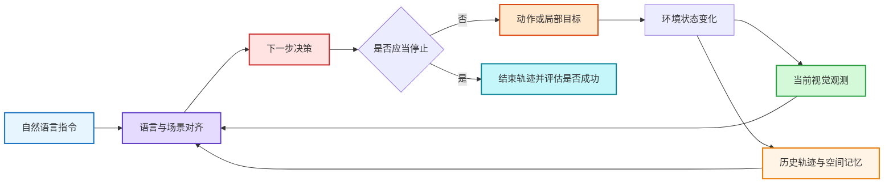

离散环境通常输出相邻视点或 `STOP`；连续环境则可能输出前进/转向动作、二维路点、轨迹片段或底层控制量。动作接口不同会改变感知范围、控制难度和成功条件，因此不能仅凭“都使用 R2R 指令”就直接比较结果。

## 2.2 看懂一个 VLN 基准：五个必要维度

| 维度 | 需要确认的问题 | 常见设定 | 对结果的影响 |
|:---|:---|:---|:---|
| **目标表达** | 智能体究竟要理解什么？ | 路线指令、目标类别、目标图像、场景描述、对话 | 决定是否需要逐步语言落地或开放词汇搜索 |
| **观测配置** | 智能体能看到什么？ | 全景、单目、多目、RGB、RGB-D、里程计 | 决定可见范围与几何先验强度 |
| **动作空间** | 智能体如何移动？ | 离散视点、低层动作、路点、速度、轨迹 | 决定是否真正考察避障与控制 |
| **环境模型** | 环境是否具有物理约束？ | 导航图、可导航表面、刚体碰撞、机器人动力学 | 决定是否会碰撞、跌倒或卡住 |
| **交互协议** | 指令能否被澄清或修正？ | 单轮、对话、主动问询、人类反馈 | 决定智能体能否消解歧义和请求帮助 |

### 2.2.1 VLN、ObjectNav 与通用 VLA 的边界

| 范式 | 主要输入 | 主要考察能力 | 典型输出 |
|:---|:---|:---|:---|
| **指令跟随 VLN** | 路线级自然语言指令 | 指令进度、地标对齐、路径忠实度 | 视点、动作或路点 |
| **ObjectNav / ImageNav** | 目标类别或目标图像 | 目标搜索、探索效率、目标定位（是否开放词汇依协议而定） | 探索方向或局部目标 |
| **通用 VLA** | 图像/视频、语言目标、机器人状态 | 多任务迁移与动作生成 | 动作 token、轨迹或控制量 |

ObjectNav 可以为 VLN 提供语义探索模块，VLA 也可以成为 VLN 的策略底座，但它们的成绩不能自动并入标准 VLN 榜单。公平比较必须固定任务输入、传感器、动作接口、数据划分与额外训练数据。

## 2.3 一个现代 VLN 系统如何工作

早期模型常把 VLN 描述为“视觉编码器 + 语言编码器 + 动作分类器”。2026 年更实用的系统视图是：**感知提供语义与几何证据，状态层维护指令进度和空间记忆，规划层选择子目标，执行层将子目标转化为安全动作，并由真实观测持续纠偏。**

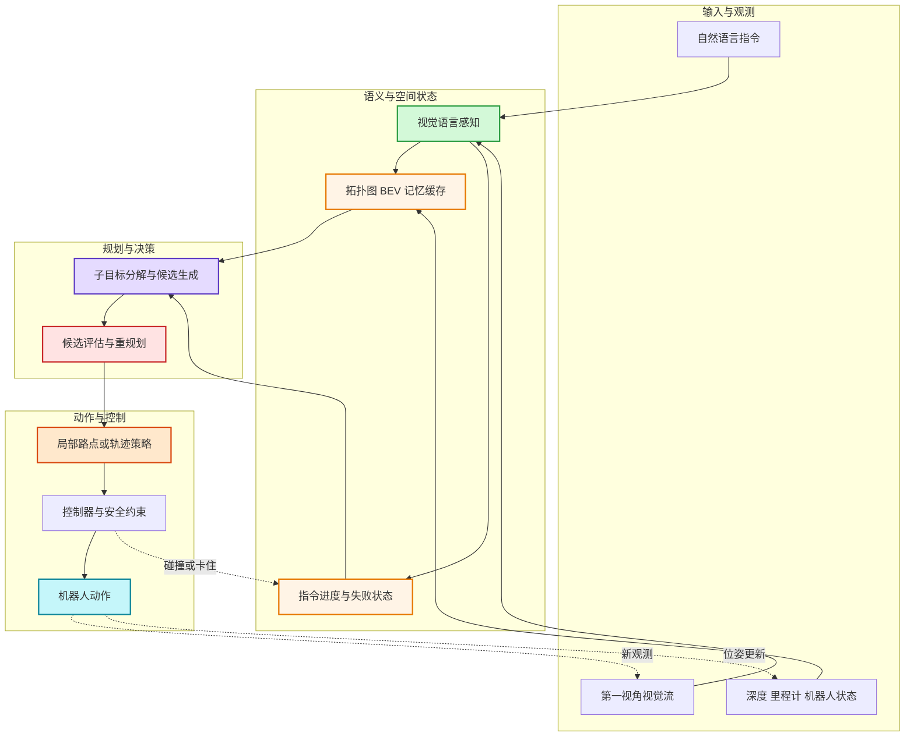

这张图不是要求所有方法都显式实现每个模块。端到端模型会把多个方框折叠进统一网络；双系统、地图方法和 Agent 方法则会把部分接口显式化。判断架构时，应看信息流和训练目标，而不是只看论文使用了哪个名称。

## 2.4 VLN 的核心难点

| 难点 | 典型失败 | 为什么难 | 需要观察的证据 |
|:---|:---|:---|:---|
| **动态语言落地** | 把后半句地标提前执行，或错过转向点 | 指令进度随位移变化 | 细粒度轨迹对齐、错误指令测试 |
| **部分可观测与长记忆** | 重复探索、忘记已访问区域、无法回退 | 单帧看不到全局结构 | 长路径表现、回溯和记忆消融 |
| **语义推理与几何可达性** | VLM 选择语义正确但不可到达的目标 | 互联网知识不等于三维几何 | 深度/地图消融、可达性验证 |
| **高层规划与低层控制** | 子目标正确但轨迹碰撞或振荡 | 两个时间尺度和接口误差叠加 | 控制频率、延迟、碰撞与重规划次数 |
| **开放世界与真实部署** | 仿真成功、真机失效 | 视角、传感器、动力学和场景分布变化 | 跨场景、跨构型和真实机器人评测 |
| **失败检测与恢复** | 到过目标附近却没有停下，偏航后持续累积错误 | 模型缺少不确定性和自我诊断 | OSR–SR 差距、恢复成功率、人工介入次数 |

## 2.5 从任务专用模型到导航基础模型

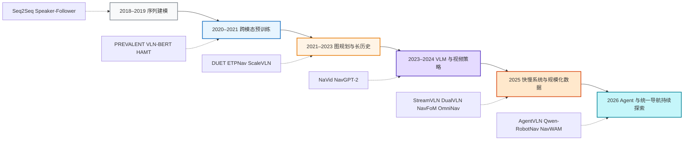

这条演进线不是简单的“新模型替代旧模型”。预训练解决语义泛化，地图与记忆解决空间一致性，快慢系统解决推理和控制的时间尺度冲突，Agent 与世界模型则尝试提高主动感知、恢复和前瞻规划能力。它们正在汇合，而不是互相淘汰。

## 2.6 研究问题地图

| 研究层 | 当前常用方案 | 仍缺少的关键证据 |
|:---|:---|:---|
| 表征 | VLM 预训练、视频上下文、三维 token | 是否真正理解沿途约束，而不是只预测终点？ |
| 状态 | 拓扑图、BEV、3D Gaussian、缓存与检索记忆 | 记忆错误何时发生，如何遗忘与修正？ |
| 规划 | 子目标分解、CoT、候选轨迹打分 | 更长的推理是否稳定改善闭环控制？ |
| 执行 | 路点策略、动作块、扩散轨迹、MPC | 不同机器人形态和控制频率下能否迁移？ |
| 数据 | 合成轨迹、多任务联合训练、自动进度描述 | 数据量、场景多样性和标注质量谁更关键？ |
| 部署 | 量化、缓存、边缘推理、安全控制器 | 仿真 SR / SPL 能否预测真实可靠性？ |

<a id="27-2026-年的五个明显变化"></a>

## 2.7 近期研究的交汇点

本文将近期工作归纳为五个可组合方向：统一策略、分层控制、空间记忆、Agent 编排与未来预测。这是帮助比较机制的分析框架，不是五个互斥类别，也不意味着这些思想都始于 2026 年。具体设计见第 3 节，证据边界见第 9.3 节。

# 3. 主流 VLN 研究路线

VLN 方法不应再被简单分成“端到端”和“模块化”。更有解释力的三个观察轴是：**策略是否统一训练、空间状态是否显式维护、决策与控制是否按时间尺度分层**。据此，2025–2026 年的工作可以归纳为五条可组合路线。

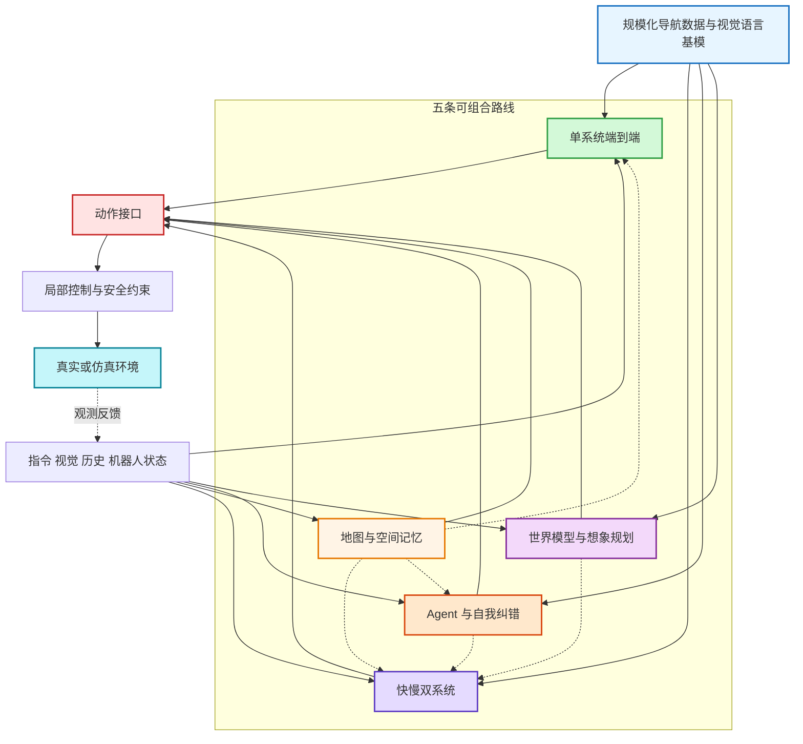

## 3.1 方法演进：真正变化的是状态、接口与训练数据

| 阶段 | 模型内部状态 | 典型动作接口 | 训练信号 | 代表方法 |
|:---|:---|:---|:---|:---|
| **序列策略** | RNN 隐状态 | 离散视点 / 动作 | 行为克隆、强化学习 | Seq2Seq、Speaker-Follower |
| **预训练 Transformer** | 跨模态 token 与历史特征 | 离散候选点 | 掩码建模、指令—轨迹对齐 | PREVALENT、VLN-BERT、HAMT |
| **图规划与显式记忆** | 拓扑图、语义图、局部地图 | 全局节点 + 局部动作 | 图监督、路径与进度目标 | DUET、ETPNav、MapNav |
| **视频 VLM / VLA** | 视频上下文、KV cache、动作 token | 离散动作、路点或动作块 | 视觉语言数据 + 导航轨迹 | NaVid、StreamVLN、NavFoM |
| **导航基础模型** | 多任务上下文、可配置观测、统一空间表征 | 多任务模式与参数化接口 | 大规模联合训练、指令微调 | OmniNav、OneVLA、Qwen-RobotNav |
| **Agent 编排** | 任务进度、技能返回与经验状态 | 工具调用或子任务 | 依实现使用监督、提示或环境反馈，不必在线训练 | AgentVLN、Qwen-RobotNav 系统 |
| **世界动作模型** | 未来观测与动作的联合表示 | 轨迹或动作块 | 世界预测、动作及可选的进度监督 | AstraNav-World、NavWAM（图像目标导航） |

现代模型的提升往往同时来自更大的基模、更多轨迹、额外深度或地图先验以及新的系统接口。阅读论文时，应把“架构创新”和“资源增加”分开归因。

## 3.2 单系统端到端：把导航变成连续的多模态生成

单系统方法把指令、视觉历史和动作历史放入统一模型，直接预测下一步动作、路点或动作块。它的优势是训练目标统一、数据扩展直接；瓶颈则是长上下文成本、空间漂移和失败难以解释。

<div align="center">
  
<figcaption>StreamVLN：以交错视觉—动作序列实现流式导航，参见<a href="https://arxiv.org/abs/2507.05240v2">原论文 v2</a>。</figcaption>
</div>

| 关键设计 | 解决的问题 | 代表工作 |
|:---|:---|:---|
| 观测—动作交错生成 | 避免把整段视频压缩成一次静态判断 | [StreamVLN](/VLN-Papers/#streamvln)、[SparseVideoNav](/VLN-Papers-Extended/#sparsevideonav) |
| 多任务共享策略 | 让指令跟随、目标搜索和探索共享空间能力 | [NavFoM](/VLN-Papers/#navfom)、[OneVLA](/VLN-Papers/#onevla-a-unified-framework-for-embodied-tasks) |
| 可配置观测接口 | 推理时调整历史长度、相机权重和任务模式 | [Qwen-RobotNav](/VLN-Papers/#qwen-robotnav) |
| 量化与边缘部署 | 降低大模型闭环推理延迟 | [LocalNav](/VLN-Papers/#localnav) |

**本文选型建议**：数据规模充足、接口相对统一、强调端到端训练和部署简洁性。若任务涉及长程回溯、动态重规划或严格安全约束，通常仍需要外部记忆或控制模块。

## 3.3 快慢双系统：高层语义推理与高频执行解耦

快慢系统按时间尺度分工：慢系统低频理解指令、检查进度并产生子目标；快系统持续把子目标转化为路点或轨迹。它并不等价于“使用两个模型”，关键在于两层之间是否具有稳定、可校验的接口。

<div align="center">
  
<figcaption>DualVLN：慢系统提供目标与特征，快系统生成轨迹，参见<a href="https://arxiv.org/abs/2512.08186v1">原论文</a>。</figcaption>
</div>


| 系统接口 | 优点 | 主要风险 | 代表工作 |
|:---|:---|:---|:---|
| 像素目标（可结合潜在特征） | 直观、便于视觉落地 | 深度歧义与可达性不确定 | [DualVLN](/VLN-Papers/#dualvln)、[Goal2Pixel](/VLN-Papers/#goal2pixel) |
| 前沿或拓扑路点 | 适合全局探索与回溯 | 依赖地图质量 | [OmniNav](/VLN-Papers/#omninav)、[SEDualVLN](/VLN-Papers/#sedualvln) |
| 共享潜在特征 | 信息密度高、可联合优化 | 可解释性和跨模型兼容性弱 | [Hydra-Nav](/VLN-Papers/#hydra-nav) |
| 指向或候选验证 | 可以结合在线强化学习 | 训练与推理系统更复杂 | [Robostral Navigate](/VLN-Papers/#robostral-navigate) |

<a id="survey-memory"></a>

## 3.4 地图与空间记忆：让历史变成可查询的环境状态

VLM 能识别“厨房”和“沙发”，却不天然知道它们在三维空间中的稳定位置。地图与记忆路线把历史观测组织成拓扑图、BEV、3D Gaussian、分层场景图或混合检索库，为长程规划、回溯和错误诊断提供外部状态。

<div align="center">
  
<figcaption>HSGM：分层场景图同时维护局部观测、对象关系与全局路径状态</figcaption>
</div>

| 表示 | 擅长解决 | 典型局限 | 代表工作 |
|:---|:---|:---|:---|
| 拓扑图 | 长距离连通关系与回溯 | 节点语义粗、依赖路点质量 | DUET、ETPNav |
| BEV / 语义地图 | 几何可达性与局部规划 | 位姿误差会持续累积 | [MapNav](/VLN-Papers/#mapnav)、[GA-VLN](/VLN-Papers/#ga-vln) |
| 3D Gaussian 记忆 | 可渲染的连续三维语义 | 建图成本与动态更新复杂 | [3DGSNav](/VLN-Papers/#nav-3dgs)、[GSMem](/VLN-Papers-Extended/#gsmem) |
| 分层场景图 | 房间—对象—路径的多尺度推理 | 图构建和关系更新依赖感知质量 | [HSGM](/VLN-Papers/#hsgm) |
| 经验与图先验记忆 | 利用历史访问结果调整探索与决策 | 过时或错误经验可能放大偏差 | [EvoMemNav](/VLN-Papers/#evomemnav)（目标导航与多模态目标设定） |

**计算缓存与任务记忆需要区分。** [VLN-Cache](https://arxiv.org/abs/2603.07080) 通过跨帧复用 token 计算降低推理成本，并处理视角移动与任务阶段变化造成的缓存失效；它不等同于保存成功/失败经验的检索库。评估前者应观察加速与精度损失，评估后者应观察长程决策、回溯和恢复收益。

地图不是天然正确的“真值”。优秀系统必须同时回答如何写入、何时更新、如何处理冲突，以及何时遗忘过时信息。

<a id="35-通用导航-agent上层规划器如何编排一个共享导航基模"></a>

## 3.5 通用导航 Agent：任务编排与可调用的导航能力

Agent 路线关注的核心是**谁维护任务状态、谁选择下一项能力、执行反馈如何改变后续决策**。它与快慢控制可以共存，但高层生成一段推理文本，并不足以说明系统能够编排工具或从失败中恢复。

| 组织方式 | 代表设计 | 与其他路线的关系 | 应单独验证什么 |
|:---|:---|:---|:---|
| VLM 调用感知与规划技能 | [AgentVLN](https://arxiv.org/abs/2603.17670) 将高层语义推理与技能库解耦 | 可以使用拓扑记忆与局部控制 | 工具选择和纠错的收益，是否超出技能本身的收益 |
| 上层规划器调用共享导航基模 | [Qwen-RobotNav](https://arxiv.org/abs/2606.18112v3) 提供任务模式、token 预算和相机权重等可配置接口 | 共享策略承担具体导航，上层选择模式与观测配置 | 动态配置是否优于固定配置，调用代价是否可接受 |
| 用访问反馈更新空间经验 | [EvoMemNav](/VLN-Papers/#evomemnav) 提供相邻目标导航任务中的设计参考 | 显式记忆参与探索与后续选择 | 经验有效期、错误写入、跨回合信息是否符合评测协议 |

<a id="351-通用导航-agent-的五层结构"></a>

### 3.5.1 基模能力与 Agent 能力分别评测

Qwen-RobotNav 是可用于 Agent 系统的导航模型。评价时应区分底层导航成绩与加入上层编排后的系统成绩：前者反映模型及其输入配置，后者还包含任务分解、模式切换和运行时反馈。不能把整个系统的收益全部记在基模或规划器任一方上。

<div align="center">
  
<figcaption>Qwen-RobotNav 系统示例：导航模型通过可配置接口参与上层任务编排。具体实现见<a href="https://arxiv.org/abs/2606.18112v3">技术报告</a>。</figcaption>
</div>

<a id="352-qwen-robotnav-式-agentic-导航闭环"></a>

### 3.5.2 一个可检查的 Agent 闭环

本文采用的通用分析框架是：任务状态 → 选择子任务与工具 → 执行 → 读取结果 → 更新任务状态。每个转换都应能在日志中检查：工具失败是否被识别、是否换了策略、是否重复调用无效动作、何时终止。这个框架是对系统职责的归纳，不是要求所有论文采用同一套模块。

下图是用于分析系统的通用闭环示意，不要求所有论文采用同名模块。关键区别在于：导航工具返回执行证据后，上层是否更新任务状态，以及失败后是否真的改变决策。

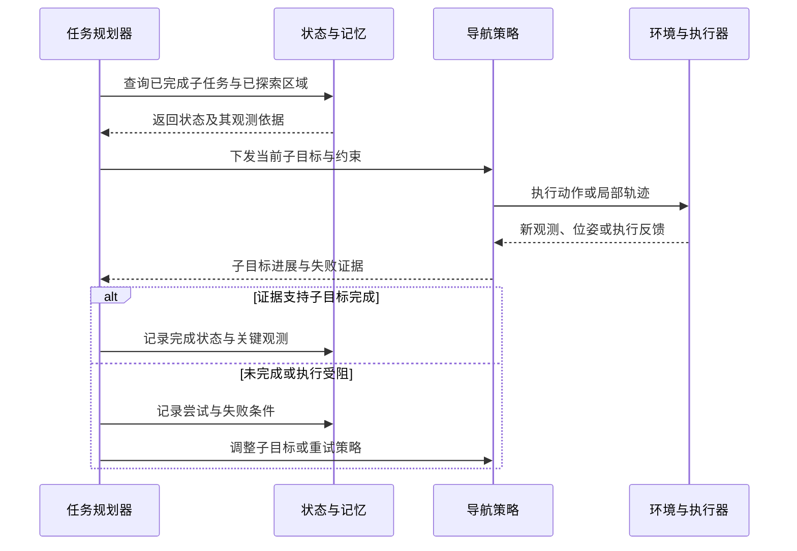

例如，“穿过走廊去厨房找杯子”至少包含到达厨房与确认杯子两个判定。检测到一个杯子不能证明房间条件已满足；输出“重新规划”也不能证明恢复有效。日志需要对应到实际观测、工具调用及之后的轨迹，才能分析失败发生在任务拆解、空间记忆还是执行层。

<a id="353-三类-agentic-vln-设计"></a>

### 3.5.3 恢复能力的证据边界

建议在相同底层技能、模型和预算下，比较固定执行流程与自适应编排，并分别统计任务成功、恢复率、工具调用、延迟及人工介入。若系统以更多重试换来更高成功率，这也是有用结果，但需要同时呈现成本，才能判断是否适合部署。


## 3.6 世界模型与世界动作模型：从预测未来到利用未来

世界模型路线希望在执行前预测动作的后果。有的方法将预测交给外部规划器，有的方法将预测与动作联合学习，部分方法还加入目标进度或价值监督。下面的图是功能归纳，不表示每篇论文都实现了其中全部模块。

<div align="center">
  
<figcaption>AstraNav-World：联合更新未来视觉状态与动作序列，参见<a href="https://arxiv.org/abs/2512.21714v2">原论文 v2</a>。</figcaption>
</div>

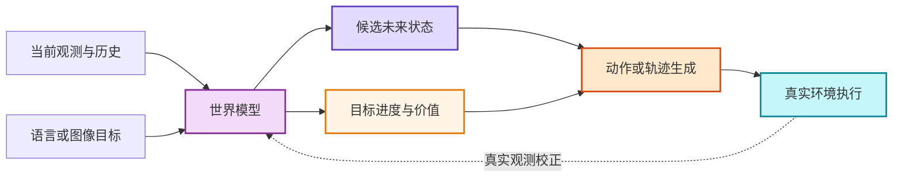

| 方向 | 关键变化 | 代表工作 |
|:---|:---|:---|
| 视觉想象辅助策略 | 生成候选未来视觉，为现有策略提供额外证据 | [VLN-Imagine](/VLN-Papers/#vln-imagine)、Navigation World Models |
| 语言规划 + 预测 | 让指令分解约束短期与长期预测 | NavForesee、[WorldVLN](/VLN-Papers-Extended/#worldvln) |
| 视觉—动作联合生成 | 同步生成未来状态与动作，减少两阶段漂移 | [AstraNav-World](/VLN-Papers/#astranav-world) |
| 世界动作模型 | 在共享潜在序列中联合未来观测、价值和动作块 | [NavWAM](/VLN-Papers-Extended/#navwam)、[WAM-Nav](/VLN-Papers/#wam-nav) |

这一方向最容易被视觉效果误导。真正有意义的证据不是生成帧“看起来合理”，而是闭环 SR / SPL、碰撞率和真实机器人控制是否改善，以及预测误差能否被新观测及时纠正。

**任务边界**：[NavWAM](https://arxiv.org/abs/2606.13494)评估的是图像目标导航。它为预测与控制结合提供参考，不能将其结果直接并入路线指令 VLN 榜单。NWM 等视觉导航世界模型也应先核对目标条件，再讨论与语言导航的联系。

## 3.7 五条路线如何选择

以下是基于系统职责的选型建议，不是统一条件下的性能排名。

| 研究目标 | 优先路线 | 建议组合 | 重点报告 |
|:---|:---|:---|:---|
| 大规模统一训练 | 单系统端到端 | + 轻量缓存或隐式记忆 | 数据规模、参数量、延迟、跨任务迁移 |
| 真实机器人流畅控制 | 快慢双系统 | + 安全控制器 + 局部地图 | 控制频率、碰撞、重规划、真机成功率 |
| 长程导航与回溯 | 地图与空间记忆 | + VLM 高层规划 | 地图误差、回溯收益、长路径指标 |
| 开放任务与自主恢复 | Agent 导航 | + 结构化记忆 + 技能库 | 调用成本、恢复率、人工介入、幻觉 |
| 前瞻规划与低试错 | 世界模型 | + 快慢系统或价值模型 | 预测误差、闭环收益、推理成本 |

### 3.7.1 阅读最新论文时的四个检查项

1. **协议是否一致**：传感器、动作空间、数据划分和成功阈值是否相同？
2. **资源是否一致**：收益来自架构，还是更大的基模、更多数据或额外深度/地图？
3. **闭环是否受益**：推理、记忆或想象模块是否真正改善导航，而不只是离线指标？
4. **部署代价是否透明**：是否报告延迟、显存、控制频率和真实机器人测试？

配套文章 [VLN 经典论文与性能排行榜](/VLN-Papers/) 按连续环境、离散全景和目标导航分别维护结果，适合用于进一步核对同设定性能。


<a id="survey-training"></a>

## 3.8 数据与训练范式：策略如何学会导航与纠错

前面的五条路线描述系统如何组织信息，训练范式则决定模型从什么反馈中学习。两者是独立的选择：单系统和快慢系统都可以使用模仿学习、数据增强或强化学习；使用反思文本也不意味着模型在部署时会更新权重。

| 训练方式 | 学习信号 | 主要用途 | 需要单独验证的风险 |
|:---|:---|:---|:---|
| 行为克隆 / 监督微调 | 专家轨迹中的观测—动作配对 | 建立指令与动作之间的基础映射 | 专家状态上的预测准确率不能说明偏航后能恢复 |
| 策略采样与纠错数据 | 模型实际访问状态上的专家纠正或恢复轨迹 | 覆盖训练轨迹之外的状态 | 专家是否使用部署时不可获得的地图或目标信息 |
| 跨模态预训练与联合训练 | 图文、视频、指令—轨迹及多任务数据 | 迁移语义知识与共享空间表征 | 数据增加与架构改动的收益是否分开比较 |
| 合成指令与场景扩展 | 自动生成的路径、描述和任务 | 扩大语言、场景与路径覆盖 | 指令是否可执行，是否包含歧义或场景泄漏 |
| 强化学习 | 到达、进度、路径成本等环境反馈 | 优化闭环行为与长期收益 | 奖励是否鼓励捷径、反复探索或不合理停止 |
| 辅助预测与反思监督 | 进度、几何、未来状态或错误解释 | 为策略提供中间学习信号 | 辅助任务更准是否真的带来导航改善 |

可结合 [StreamVLN](/VLN-Papers/#streamvln) 的训练数据组织、[ReflectVLN](/VLN-Papers/#reflectvln) 的反思数据构建阅读本节；具体训练阶段、数据配比和监督形式以各自论文为准。

**一个贯穿训练与评测的例子**：指令要求“经过沙发后左转，在第二扇门前停下”。成功轨迹可以教会模型顺序和动作，但不足以覆盖“错过左转路口”的状态。要验证纠错能力，可以在固定位置引入同等程度的偏航，检查策略能否发现进度不符、返回正确路口并继续任务，同时报告额外路径、恢复率与最终成功率。只增加成功示范或更长的推理文本，并不能直接证明这种能力。

建议用三个层次组织消融：先固定数据和基模比较模块，再固定架构比较数据，最后在相同硬件和推理预算下比较完整系统。若无法控制某项条件，应明确说明差异，避免把所有提升归因于一种设计。

<a id="survey-comparison"></a>

## 3.9 跨论文比较：相似名称背后的不同设计

以下比较依据原论文中的机制描述；“需要验证”一栏是本文提出的实验建议，不是这些论文已经完成的统一对照实验。各论文的训练数据、传感器和控制接口不同，因此本表不做总排名。

| 工作 | 核心设计事实 | 与其他方法比较时的关键区别 | 需要验证的边界 |
|:---|:---|:---|:---|
| [DUET](https://arxiv.org/abs/2202.11742) | 联合全局拓扑与局部观测决策 | 全局/局部空间尺度不等于高低频机器人控制 | 离散导航图上的收益能否迁移到自建图和连续执行 |
| [ETPNav](https://arxiv.org/abs/2304.03047v3) | 在线路点拓扑建图、高层规划与避障控制 | 将图规划和连续环境执行结合 | 路点误差、地图更新与控制器分别贡献多少 |
| [StreamVLN](https://arxiv.org/abs/2507.05240v2) | 流式上下文、慢更新记忆及缓存复用 | SlowFast 主要描述上下文更新机制 | 相同历史和计算预算下，压缩是否保留关键地标 |
| [DualVLN](https://arxiv.org/abs/2512.08186v1) | VLM 产生中期目标，轻量策略利用像素目标及潜在特征生成轨迹 | 快慢分工发生在语义规划与动作执行之间 | 上层目标偏差和延迟能否被下层吸收 |
| [AgentVLN](https://arxiv.org/abs/2603.17670) | VLM 与技能库协作，并加入纠错与探索 | 显式编排感知和规划能力 | 固定技能库后，自适应编排还有多少收益 |
| [NWM](https://arxiv.org/abs/2412.03572v2) | 用动作条件的未来视觉预测支持轨迹规划或排序 | 是视觉导航世界模型，并非标准 VLN 路线指令评测的同义词 | 未来预测如何转化为语言约束下的闭环收益 |

**比较一：上下文管理与控制分层解决不同瓶颈。** StreamVLN 的快慢上下文主要处理历史信息与计算成本；DualVLN 的快慢系统把语义决策和局部轨迹执行分开。二者都涉及时间尺度，但并非同一个架构轴。一个系统原则上可以同时采用流式记忆与分层控制；是否值得组合，要以同预算消融验证。

**比较二：地图把历史组织为空间结构，同时引入新的误差来源。** DUET 与 ETPNav 提供了全局状态参与决策的实例；从已知离散图到在线建图时，可达性与连接关系本身需要估计。因此，地图路线与隐式记忆的比较应同时报告地图输入权限和建图代价，不能把高质量深度、位姿带来的收益全部归因于表示形式。

**比较三：生成未来与选择好动作之间仍隔着一个决策问题。** NWM 的预测用于规划或候选排序，而 [AstraNav-World](https://arxiv.org/abs/2512.21714v2)探索视觉与动作联合更新。本文的判断是：这两类设计都需要证明，在固定计算预算时，预测模块比增加候选搜索或加强直接策略更有用；视觉生成质量只能作为辅助证据。

**比较四：大规模数据会改变架构比较的起点。** ScaleVLN 展示了扩展训练环境与监督对既有模型的作用。因此，比较新旧方法至少要拆开“同数据的机制改进”和“完整资源条件下的系统改进”。后者也有研究价值，但支持的是系统结论，不能单独证明某个模块更优。


# 4. VLN 任务类型

任务名称相近并不意味着结果可比。第 2.2 节已经给出理解一个 VLN 基准所需的五个维度（目标表达、观测配置、动作空间、环境模型、交互协议），本节在此基础上从 **推理复杂度、交互方式、动作与物理真实性** 三个角度给出常用的任务分类，并标出每类的代表性基准。需要特别留意具身形态：无动力学的虚拟智能体、轮式、四足、人形与无人机在碰撞、跌倒、卡住和 6-DoF 控制上的难度完全不同，同名任务在不同具身下的结果也不应直接比较。

## 4.1 按推理与决策复杂度划分

**1. 指令跟随型 VLN（Instruction-Following VLN）**

该类任务要求智能体根据给定的自然语言指令，在环境中完成从起点到目标位置的导航，不必额外执行开放目标搜索，但仍可能要求地标消歧、顺序推理与长期记忆。此类任务的重点是把沿途语言约束落到轨迹上。

*代表性数据集*：Room-to-Room（R2R）、Room-for-Room（R4R）

---

**2. 语义推理驱动的 VLN（Reasoning-Oriented VLN）**

该类任务在导航过程中引入目标物体搜索或语义约束，智能体需要将语言指令与环境中的语义信息进行推理匹配，从而完成导航与定位任务。

*代表性数据集*：REVERIE、SOON

---

**3. 长时序与组合式 VLN（Long-Horizon VLN）**

该类任务强调长距离导航和复杂指令组合，要求智能体具备长期规划、记忆和错误恢复能力，是评估 VLN 系统长期决策能力的重要设定。

*代表性数据集*：LHPR-VLN，以及 R4R / RxR 中的长路径设定

---

## 4.2 按交互方式划分

**1. 非交互式 VLN**

智能体在接收到初始指令后独立完成导航任务，过程中不与用户进行额外交互。这是当前最常见的 VLN 评测设定。

---

**2. 交互式与对话式 VLN**

该类任务允许智能体在导航过程中与用户进行多轮交互，通过提问或反馈不断优化导航目标，更接近真实人机协作场景。

*代表性数据集*：CVDN（须区分已有对话历史与在线问询协议）

## 4.3 按动作与物理真实性划分

**1. 离散全景导航**

智能体在预定义的可通行视点图上移动，通常每个节点提供 360° 全景特征。该设定弱化了局部控制与碰撞问题，适合研究语言—地标对齐、全局规划和历史建模。

*代表性基准*：R2R、R4R、RxR、REVERIE

**2. 连续环境导航**

智能体通过前进、转向或局部路点在可导航表面运动，不再沿人工导航图“瞬移”。连续设定需要处理可通行空间和停止控制；视角限制、定位噪声与动力学是否启用，取决于具体配置。

*代表性基准*：R2R-CE、RxR-CE；其他移植设定须注明具体实现

**3. 物理具身导航**

机器人受动力学、形态和控制频率约束，需要处理跌倒、打滑、卡住与不同相机安装位置。此类任务更接近部署，但也更难与经典 VLN 结果对齐。

*代表性基准*：VLN-PE、VLNVerse，以及真实机器人评测

> **比较原则**：R2R、R2R-CE、RxR-CE、ObjectNav 与真实机器人测试必须分表报告。即使都使用 SR / SPL，它们的输入、动作空间和成功条件也可能不同。

---


# 5. VLN 的应用场景

应用场景决定了传感器配置、动作空间、地图先验与安全约束，也决定了应选用哪一类数据集与模拟器。下表先给出三类场景的整体对照，随后分别展开。

| 场景 | 典型平台 | 主要观测与先验 | 核心难点 | 代表基准 | 常用模拟器 |
|:---|:---|:---|:---|:---|:---|
| **室内** | 轮式 / 四足 / 人形机器人 | 单目或全景 RGB-D、里程计 | 多房间拓扑、遮挡、家具级语义、精确停止 | R2R / RxR / VLN-CE / REVERIE / VLN-PE | Matterport3D Simulator、Habitat、Isaac Sim |
| **室外街景** | 轮式配送机器人、辅助出行设备 | 街景全景、GPS、OpenStreetMap 地图 | 尺度大、地标稀疏且相似、动态交通与天气 | Touchdown / StreetLearn / map2seq | Street View 图节点环境、CARLA（语言条件驾驶） |
| **空中** | 多旋翼无人机 | 斜视 / 俯视 RGB、高度计、GPS | 三维运动、高度与视角变化、地标消歧、飞行安全约束 | AerialVLN / CityNav / OpenFly | AirSim、Unreal Engine、Isaac Sim |

## 5.1 室内场景

室内 VLN 主要关注家庭、办公与公共建筑内部的导航。环境由多个房间和大量家具构成，指令通常以房间与物体作为地标（"穿过厨房，在沙发旁停下"），因此对房间级拓扑理解、物体级语义落地与精确停止能力的要求最高。室内也是数据与基准最成熟的场景：第 6 节中绝大多数数据集都建立在 Matterport3D、HM3D 等真实扫描或 ProcTHOR、GRScenes 等合成场景之上。

<div align="center">
  
<figcaption>室内 VLN：自然语言指令、第一视角观测与全局轨迹之间的关系</figcaption>
</div>

**应用示例**：家庭服务机器人、室内物流配送、医院与商场导览、四足 / 人形机器人巡检。

## 5.2 室外场景

室外 VLN 面临更大的空间尺度与更强的环境不确定性：地标在数百米尺度上稀疏分布且外观相似，光照、天气和动态交通持续变化，GPS 与地图先验的可用性也因场景而异。Touchdown（Chen et al., CVPR 2019）研究街景中的语言导航与空间定位；StreetLearn 提供街景学习环境，本身不应等同于路线指令数据集；map2seq 则涉及地图辅助的导航指令。这一分支正与自动驾驶中的语言条件规划、户外服务机器人的语义导航逐步汇合。

<div align="center">
  
<figcaption>室外街景 VLN 示例：智能体在街景全景图节点之间依据指令移动</figcaption>
</div>

**应用示例**：园区与城市配送机器人、导盲与辅助出行、语言条件的自动驾驶规划。

## 5.3 空中场景

空中 VLN 面向多旋翼无人机等飞行平台。与地面导航相比，它需要同时控制水平位置与高度，观测视角在俯视与斜视之间连续变化，同一地标在不同高度下的外观差异极大；飞行安全约束（禁飞区、最低高度、避障）也必须在动作层显式处理。第 6.6 节的 AerialVLN、CityNav 与 OpenFly 分别代表了仿真城市、真实航拍与多引擎大规模数据三条路线。

<div align="center">
  
<figcaption>空中 VLN 示例：无人机依据自然语言指令在三维城市场景中导航</figcaption>
</div>

**应用示例**：无人机巡检与测绘、空中搜救、城市低空物流、语言指挥的航拍取景。


<a id="survey-datasets"></a>

# 6. VLN 主流数据集

选择基准时先确定要验证的能力，再看规模。**场景资产、任务数据、训练增强数据是三种不同对象**：Matterport3D 提供环境，R2R 提供指令与路径，ScaleVLN 提供合成训练样本。共享环境不代表共享动作接口或评测协议。

## 6.1 数据集对比总览

| 研究问题 | 代表基准 | 必须区分的设定 | 主要评测维度 |
|:---|:---|:---|:---|
| 路线指令跟随 | R2R / R4R / RxR | 短路径、组合路径、多语言 | 到达、效率、路径忠实度 |
| 连续环境执行 | R2R-CE / RxR-CE | 观测视场、低层动作或路点、滑动设置 | 到达、停止、实际行走路径 |
| 目标指代与搜索 | REVERIE / SOON | 到达目标附近与正确识别目标 | 导航成功 + 目标定位 |
| 长时序多子任务 | LHPR-VLN | 独立子任务成功与连续执行成功 | 子任务完成、错误传播 |
| 对话协作 | CVDN / TEACh | 对话历史输入与在线问答；导航与操作 | 任务进度、交互与执行 |
| 社交与物理约束 | HA-VLN 2.0 / VLN-PE / VLNVerse | 人群、形态、动力学及任务子集 | 到达 + 社交或具身失败 |
| 需求推理 | DDN | 需求满足与固定类别搜索 | 找到满足需求的物体 |
| 空中语言导航 | AerialVLN / CityNav / OpenFly | 地图输入、飞行自由度、环境来源 | 到达、三维路径、执行约束 |

下表仅列有明确计数对象的规模。年份采用首次公开年份；会议年份另注。**路径、指令、对话与 episode 不能互换**，转换到连续环境后的样本数也不能直接照搬离散版本。

| 数据资源 | 可核对的规模 | 统计口径与来源 |
|:---|:---|:---|
| R2R（2018） | 7,189 条路径，21,567 条指令 | 每条路径 3 条指令；[原论文](https://arxiv.org/abs/1711.07280) |
| RxR（2020） | 约 126k 条指令及约 126k 条跟随示范 | 英语、印地语、泰卢固语；Guide 与 Follower 分开发布；[官方数据仓库](https://github.com/google-research-datasets/RxR) |
| CVDN（2019） | 2,000 余段对话 | 对话数不是从历史切出的导航实例数；[原论文](https://arxiv.org/abs/1907.04957) |
| TEACh（2021；AAAI 2022） | 3,000 余段对话 | 家务任务交互对话，派生评测实例另计；[论文 v3](https://arxiv.org/abs/2110.00534v3) |
| AerialVLN（2023） | 25 个场景，8,446 条路径，25,338 条指令 | 标准版本每路径 3 条指令；[原论文表 1](https://arxiv.org/html/2308.06735v1) |
| ScaleVLN（2023） | 1,200 余环境，约 490 万指令—轨迹对 | 合成训练增强数据；[论文 v2](https://arxiv.org/abs/2307.15644v2) |
| LHPR-VLN（2024；CVPR 2025） | 3,260 个任务，平均约 150 个任务步 | “平均”不能写成所有任务的最小长度；[论文 v3](https://arxiv.org/abs/2412.09082v3) |
| CityNav（2024；ICCV 2025） | 32,637 条人类示范轨迹 | 覆盖 Cambridge / Birmingham 两座城市；[论文 v3](https://arxiv.org/abs/2406.14240v3) |
| OpenFly（2025；ICLR 2026） | 18 个场景，100k 条轨迹 | 多引擎数据，不能由轨迹量推出语言多样性；[论文 v7](https://arxiv.org/abs/2502.18041v7) |
| HA-VLN 2.0（2025；IROS 2026） | 16,844 条社交情境指令 | 以版本化协议确认离散/连续子集；[论文 v5](https://arxiv.org/abs/2503.14229v5) |
| InternData-N1 | 240k 余轨迹、3,000 余场景 | 数据卡汇总口径，包含多个子集；[官方数据卡](https://huggingface.co/datasets/InternRobotics/InternData-N1)，查阅于 2026-09-26 |

## 6.2 指令导向与连续导航数据集

### 6.2.1 R2R (Room-to-Room)

R2R 在 Matterport3D 扫描环境的导航图上，将自然语言与起终点间的参考路径配对。它适合研究地标对齐与跨场景泛化；图上的可通行边已经简化了局部避障问题，因而不能用 R2R 成功率代表机器人控制能力。参见 [原论文](https://arxiv.org/abs/1711.07280) 与 [官方模拟器](https://github.com/peteanderson80/Matterport3DSimulator)。

**如何理解一个样本**：指令描述沿途地标和转向，参考路径由离散视点组成。智能体从初始视点与朝向出发，逐步选择相邻可达视点，最终决定停止。路径本身不是逐帧视频，同一路径的不同指令也不能当成不同建筑中的独立样本。

**研究价值与局限**：R2R 适合作为语言对齐和规划方法的共同起点。解释 Val-Unseen 成绩时，应检查训练视觉特征和额外数据是否涉及测试环境；解释真实部署能力时，则需要另外验证窄视场观测、定位误差和低层执行。

<details markdown="1">
<summary>展开：R2R 原始字段与数据读取要点</summary>

以下是原始任务数据中常见字段的阅读指南，具体格式以 [R2R 官方任务目录](https://github.com/peteanderson80/Matterport3DSimulator/tree/master/tasks/R2R) 为准。

| 字段 | 含义 | 读取时容易混淆的地方 |
|:---|:---|:---|
| `scan` | 场景标识 | 场景资产需另行获取 |
| `path_id` | 参考路径标识 | 不是单条语言指令的唯一标识 |
| `path` | 有序视点 ID 列表 | 不是三维坐标列表 |
| `heading` | 初始朝向 | 保留原始单位和坐标约定 |
| `instructions` | 同一路径的指令列表 | 训练器可能将列表展开为多个实例 |

连通关系来自独立的 connectivity 数据；图像特征也是另一层输入。复现时分别固定任务标注、连通图与视觉特征版本，不应把某个模型整理后的缓存目录当成 R2R 的统一标准。

</details>

### 6.2.2 R4R (Room-for-Room)

R4R 拼接 R2R 路径与指令，使“按描述走完路线”和“直接到达终点”的差异更加明显。适合研究沿途约束与长路径跟随，需结合 CLS / nDTW，而不能仅报告 SR。[原论文](https://arxiv.org/abs/1905.12255)同时提出了 CLS。

**为什么需要更长的参考路线**：教学示例中，指令要求“经过餐厅，再绕回客厅”，终点却离起点很近。直接走到客厅可能获得很高的终点成功率，却没有遵循中间约束。R4R 把这种矛盾显式化：最短到达路径与语言要求的路线不一定相同。

分析结果时可同时记录终点成功、沿途覆盖和访问顺序。长路径还会放大错误积累，但仅增加历史窗口不足以证明模型能处理任务状态；需要观察它是否知道哪些路段已完成、哪些地标尚未经过。

### 6.2.3 RxR (Room-across-Room)

RxR 提供多语言指令及与观测关联的时空标注。复现时应明确语言子集、Guide / Follower 使用方式及测试划分；只在英语子集上评测，不能称为验证了多语言能力。[官方数据与字段说明](https://github.com/google-research-datasets/RxR)。

**标注机制**：Guide 描述路线，Follower 根据描述实际跟随。两者轨迹可能不同，这使数据不仅能用于模仿参考路径，也能用于分析语言歧义及人类跟随误差。词语时间信息与相机姿态提供了更细的视觉—语言对齐线索。[官方标注说明](https://github.com/google-research-datasets/RxR)。

<details markdown="1">
<summary>展开：RxR 四类数据、关联键与对齐边界</summary>

| 组成 | 主要用途 | 关联与检查 |
|:---|:---|:---|
| Guide annotations | 指令与参考路径 | `instruction_id`、`language`、`path` |
| Follower annotations | 实际跟随示范 | `demonstration_id`；用 `instruction_id` 关联 Guide |
| Pose traces | 相机姿态和时间序列 | 区分 Guide 与 Follower，核对时间基准 |
| Text features | 预计算语言表示 | 核对语言、分词器及特征版本 |

`timed_instruction` 记录词语及时间区间，但少量词没有起止时间，不能假设每个词都能直接配到图像帧。基础导航实验可只使用 Guide 标注；一旦加入 Follower、稠密对齐或合成指令，应在训练数据说明中列出。

</details>

### 6.2.4 VLN-CE (连续环境导航)

VLN-CE 将指令导航移到 Habitat 的可导航空间中，取消沿导航图边移动的限制。**连续的是环境位置，策略动作仍可采用有限集合**，例如前进和转向。它增加执行难度，但并不自动包含腿足动力学。[原论文](https://arxiv.org/abs/2004.02857)。

原始基线仓库推荐 `R2R_VLNCE_v1-3`，并固定了对应 Habitat 版本。论文模型若使用不同传感器、路点控制器或修改过的模拟器，必须重新检查协议；数据名称相同不足以证明实验可比。[官方实现与版本说明](https://github.com/jacobkrantz/VLN-CE)。

<div align="center">
  
<figcaption>离散导航在图视点间选择下一步；VLN-CE 需要在连续空间中执行移动。两者的动作与碰撞条件不同。</figcaption>
</div>

**从“选对节点”到“走到位置”**：在离散图上，一个合法邻接节点通常意味着可以直接转移；在连续环境中，即使高层选对门口，局部执行仍可能偏航、卡住或越过停止位置。因此，路点预测器、控制器和导航策略应分别记录，不能把整条系统的提升都归因于语言模型。

| 层面 | 离散图导航 | VLN-CE 常见设置 |
|:---|:---|:---|
| 位置表示 | 预定义视点 ID | 场景中的位置与朝向 |
| 可行动作 | 邻接节点选择、停止 | 前进、转向、停止，或经控制器执行路点 |
| 可通行性 | 导航图预先约束 | 受可导航表面、碰撞与滑动配置影响 |
| 典型额外失败 | 选错路径或停止点 | 窄门执行、局部偏差、连续动作累积误差 |

<details markdown="1">
<summary>展开：R2R_VLNCE_v1-3 的划分与字段示意</summary>

[官方数据页](https://jacobkrantz.github.io/vlnce/data)列出的 v1-3 基础划分为 train 10,819、val_seen 778、val_unseen 1,839、test 3,408 个 episode。预处理包中的 EnvDrop 增强集另计。v1-3 修正了初始朝向，不能仅根据同名任务混用旧版本缓存。

以下为**字段类型示意**：场景名、文本及坐标均为教学占位值，省略词表与部分字段，不能作为可运行 episode。旋转采用该格式的 `[x, y, z, w]` 四元数表示，示例为单位旋转。

```json
{
  "episode_id": 1,
  "trajectory_id": 4,
  "scene_id": "mp3d/SCENE/SCENE.glb",
  "instruction": {"instruction_text": "Walk forward to the doorway."},
  "start_position": [0.0, 0.0, 0.0],
  "start_rotation": [0.0, 0.0, 0.0, 1.0],
  "goals": [{"position": [0.0, 0.0, -4.0], "radius": 3.0}],
  "reference_path": [[0.0, 0.0, 0.0], [0.0, 0.0, -4.0]]
}
```

`reference_path` 是三维点列表；训练/验证包的 `{split}_gt.json.gz` 另存动作和位置监督。测试集隐藏目标与参考真值，不能按训练样本的可见字段假定测试输入。`goals.radius` 也不能代替对实际成功评测器的检查。

</details>

### 6.2.5 RxR-CE (多语言连续环境导航)

RxR 的连续环境移植随 VLN-CE 发布。RxR-Habitat 挑战赛对 RGB-D 观测和动作步长、转角作了明确限制，采用全景观测的结果不能直接当作同一挑战赛成绩。[官方挑战赛配置说明](https://github.com/jacobkrantz/VLN-CE#required-task-configurations)。

**多语言与执行误差需要分开看**：某语言上的下降可能来自语义理解，也可能来自较长路径引发的动作误差。本文建议按语言、路径长度和终点误差分组，并在相同相机与控制器下比较。若加入机器翻译或额外文本特征，应说明模型直接理解原语言，还是借助翻译系统完成导航。

### 6.2.6 VLN-PE (真实物理具身导航)

VLN-PE 支持人形、四足和轮式机器人，研究相机视角、光照、碰撞和跌倒等因素造成的具身差距。这里的“真实物理”指更接近机器人约束的仿真评测，并不表示全部数据来自真机。应按机器人形态和控制器分别报告结果。[论文 v2](https://arxiv.org/abs/2507.13019v2)。

<div align="center">
  
<figcaption>任务约束逐步扩展：图上的决策、连续空间执行与带机器人形态的物理评测。更丰富的仿真约束仍需真机实验验证迁移效果。</figcaption>
</div>

**物理具身带来的新变量**：相同语义子目标不保证对所有机器人都可执行。相机高度会改变可见地标，机身尺寸会改变门口通过条件，运动控制器则影响跟踪和稳定性。分析时应将“理解了目的地但没有走过去”与“目标理解错误”分开。

本文建议保留三层日志：高层目标与路点、低层实际轨迹、碰撞或姿态异常。跨机器人比较除 SR 外，还应报告所用控制器与失效类别；若同时换了相机、控制器和策略，结果不能单独解释为形态泛化。

### 6.2.7 ScaleVLN (超大规模导航预训练增强数据集)

ScaleVLN 的作用是扩充训练覆盖，而非提供一个可与 R2R 并列排名的新任务。其结果说明扩大环境与合成监督可能显著改变既有模型表现；比较架构时需列明是否用了此类额外数据。[原论文](https://arxiv.org/abs/2307.15644)。

**数据扩容改变了什么**：更多场景有助于扩大视觉和几何覆盖，更多合成指令则增加监督样本，两种作用应分别讨论。合成语言也可能重复模板，路径采样可能偏向容易走的区域，因此“样本更多”不自动等于“任务更丰富”。

本文建议用相同模型比较原始数据、增加场景、增加指令和完整增强四种条件；同时报告训练步数或算力预算。这样才能判断增益主要来自数据覆盖、语言变化还是更多优化计算。

### 6.2.8 InternData-N1 (InternVLA-N1 导航预训练数据)

InternData-N1 将 VLN-CE、VLN-PE、VLN-N1 子集统一为 LeRobot 格式。统一存储格式便于训练，但不会消除原任务的观测、动作和成功标准差异；取用时需记录子集、筛选和采样配比。[官方数据卡](https://huggingface.co/datasets/InternRobotics/InternData-N1)。

**统一格式之后仍需统一语义**：视频、状态与动作可以共享存储接口，但不同子集的动作尺度、相机设置和机器人状态未必相同。混合训练应明确如何归一化动作、如何编码任务条件，以及如何避免大子集在采样时压过小子集。

<details markdown="1">
<summary>展开：InternData-N1 子集目录与数据版本记录</summary>

下图概括[官方数据卡](https://huggingface.co/datasets/InternRobotics/InternData-N1)中的 CE 轨迹目录，省略场景级压缩包与其他子集，不是所有版本共有的完整清单。下载前固定分支或 revision；数据卡列有 full / mini 等版本。

```text
vln_ce/
├── raw_data/                 # 原任务标注
└── traj_data/
    └── <场景数据集>/<场景>/
        ├── data/chunk-000/   # episode 的 Parquet 数据
        ├── meta/            # info、tasks、episodes 等元数据
        └── videos/          # 按相机和模态组织的观测
```

取一个 episode，先核对表格时间索引、视频帧、相机名称与动作字段能否对应，再开始批量训练。目录能读取不代表动作已被正确解释；应将一次动作解码和轨迹回放纳入数据接入检查。VLN-PE、VLN-N1 的内容与目录以各自子集说明为准。

</details>

### 6.2.9 VLNVerse (物理多任务统一导航基准)

VLNVerse 将多种任务、具身仿真和评测置于统一框架。它适合检查跨任务能力，但“使用同一平台”仍不等于“所有任务可合成一个 SR”。应展开各任务及各具身设置，而不是仅给总体均值。[原论文](https://arxiv.org/abs/2512.19021)。

**统一基准应怎样读**：共同平台便于复用传感器和执行器，但任务成功可能分别指到达、目标确认或多阶段完成。本文建议同时给出“任务 × 具身设置”的结果矩阵，标明哪些模型共享权重、哪些进行了任务微调。仅有综合均值时，很难判断系统是否在部分任务上失效。

## 6.3 目标导向与长程规划数据集

### 6.3.1 REVERIE (Remote Embodied Visual Referring Expression in Real Indoor Environments)

REVERIE 要求依据高层描述导航并识别目标物体。到达可见目标的位置与正确完成物体指代是不同结果，因此需区分导航指标与远程指代定位指标。[原论文](https://arxiv.org/abs/1904.10151)。

原论文统计为 90 栋建筑中的 10,567 个全景视点、4,140 个目标物体和 21,702 条众包指令（平均 18 词）；指令通常只描述目标所在区域和物体，不逐段描述路线。导航成功要求停在能观察到目标物体的视点（物体在 3 m 内视为可见）。原论文附录用输出框与真值框 IoU ≥ 0.5 判定指代成功；后续工作通常在给定物体候选中做选择，并报告 **RGS**（Remote Grounding Success，选中正确目标的比例）与按路径长度加权的 **RGSPL**。比较 REVERIE 结果时，应确认使用的是哪种定位判据和候选来源。

**两个阶段、两类错误**：以“去楼上卧室找到窗边的台灯”为教学例子，智能体先要探索到能够观察目标的位置，再从候选物体中选择符合描述的实例。抵达正确房间但选错台灯，是指代错误；一直未进入可观察区域，则需要检查搜索与导航。

这也解释了为什么目标检测器、候选框与物体特征属于实验设置的一部分。比较导航策略时，如果一方获得更好的目标候选，不能把最终指代成功率的全部差异都归于规划能力。

### 6.3.2 REVERIE-CE (目标指代连续动作导航)

REVERIE-CE 是一类连续环境移植设定的统称，目前没有找到像 VLN-CE 那样由原作者维护、固定版本与规模的统一官方协议，因此本文不给出发布年份和样本数。引用此类结果时，应直接给出论文、转换脚本、样本过滤和物体成功判据，不沿用离散 REVERIE 的统计数。

连续移植至少涉及三项额外工作：将离散目标映射到连续场景、明确可观察目标的位置集合、定义停止后如何提交物体预测。本文建议报告过滤了多少原始样本，以及过滤原因。未经核对的转换不能默认保持原基准的难度和目标分布。

### 6.3.3 SOON (Scenario Oriented Object Navigation)

SOON 根据目标及周围场景描述，从不同起点搜索并定位目标。它将路径级指令跟随转为场景条件下的探索，适合研究语义搜索与图规划；所用 FAO 数据中的描述、目标与起点组合不应混算成一种样本数。[原论文](https://arxiv.org/abs/2103.17138)。

**与路线跟随的不同**：路线指令告诉智能体“怎么走”，场景描述更多告诉它“去哪里找什么”。缺少逐段路线监督时，系统必须决定先搜索哪些区域、什么时候放弃一个假设，以及如何依据新观测更新搜索方向。

本文建议将未找到目标区域、目标已可见但未识别、识别后停止失败分别统计。这样能区分语义先验是否有效，以及探索预算究竟花在了哪些区域。

### 6.3.4 LHPR-VLN (Long-Horizon Planning and Reasoning in VLN)

LHPR-VLN 关注连续子任务中的规划一致性。除总体完成情况，还使用 ISR、CSR、CGT 等指标分析子任务成功与前序失败的影响。与 R4R 的区别在于，多阶段执行需要跟踪任务状态，不能只用总路径长度刻画难度。[论文 v3](https://arxiv.org/abs/2412.09082v3)。

**长程失败会传播**：若前一阶段停在错误位置，下一阶段就不再从预设状态开始；单独重置后测试每个子任务，会掩盖这种累积效应。本文建议同时保留独立子任务评测和连续执行评测，记录首次失败阶段、已完成进度与恢复开销。

记忆机制也应围绕任务状态验证：模型是否记住已经完成的目标，是否重复访问已排除区域，执行失败后是否错误地把子任务标为完成。这些证据比单纯展示更长的上下文窗口更能说明长程能力。

## 6.4 对话式与社交感知导航数据集

### 6.4.1 CVDN (Cooperative Vision-and-Dialog Navigation)

CVDN 的人类数据采集包含 Navigator 与 Oracle 对话；其 Navigation from Dialog History 任务是依据已有对话历史继续导航。**使用对话历史不等于允许模型在线向人求助**，评测主动提问能力须另行明确交互协议。[原论文](https://arxiv.org/abs/1907.04957)。

**历史理解与主动交互是两个问题**：给定“刚才那个门口左转”的历史回复，模型需要把它与已走路径对齐；允许实时询问“是红色门还是白色门”，还需要设计何时提问、如何使用回答及交互代价。两种设置的输入信息不同，应分别报告结果。

若研究主动求助，本文建议增加提问次数、有效回答比例与每次交互后的导航改善；若只做 NDH，则重点分析历史长度、指代消解与下一段路径的完成情况。

### 6.4.2 TEACh (Task-driven Embodied Agents that Chat)

TEACh 包含对话、导航和物体交互，属于更广义的具身任务。其 EDH 等派生任务有不同输入和完成条件，应与纯导航基准分开讨论。[论文 v3](https://arxiv.org/abs/2110.00534v3)还说明了测试集评估对象的修订。

**为什么不能只看走到哪里**：教学例子“拿一个干净的杯子放到桌上”涉及物体定位、状态判断和操作后条件。智能体即使走到杯子附近，也没有完成任务。

EDH（Execution from Dialog History）研究从给定交互历史继续执行，TfD（Trajectory from Dialog）则依据对话推断并执行任务轨迹；两者的起始信息不同。阅读论文时要先确定评测任务，再比较任务成功与目标条件完成情况。[TEACh 论文](https://arxiv.org/abs/2110.00534v3)。

### 6.4.3 HA-VLN 2.0 (Human-Aware Vision-Language Navigation)

HA-VLN 2.0 将动态多人交互与个人空间约束纳入导航评测。到达与社交合规需要同时观察，并固定人群行为及运行种子；单次成功视频不能反映多次遇人情况下的稳定性。[论文 v5](https://arxiv.org/abs/2503.14229v5)。

**动态环境下的成功有条件**：遇到行人时，等待、绕行与紧贴人群穿过可能都到达同一目标，却具有不同的社交后果。仅用 SPL 可能把合理等待或绕行表现为效率下降，因此需要与碰撞、个人空间侵犯及任务时限共同解释。

本文建议固定或配对运行种子，重复测试不同人群交互情形；报告成功样本中的社交违规，以及失败样本是否因超时、碰撞或迷路结束。不要仅展示最顺利的一次轨迹。

## 6.5 需求导向与常识推理数据集

### 6.5.1 DDN (Demand-driven Navigation)

DDN 从用户需求推断满足需求的物体，例如将“我需要清洁”映射为具有合适用途的目标。原工作在 AI2-THOR / ProcTHOR 上研究这一问题，属于需求条件的目标导航；它不要求逐段遵循路线描述。[原论文](https://arxiv.org/abs/2309.08138)。

**需求到目标存在多解**：同一需求可能由多个物体满足，但可接受答案取决于任务标注和场景。教学例子“我想坐下休息”可能引出椅子或沙发，不能只凭语言常识就判定任意候选都成功。

本文建议把需求推断与空间搜索分开诊断：模型是否提出了可接受目标，目标是否在当前环境可用，随后是否找到并正确停止。将需求预先改写成固定物体类别再导航时，也应说明这一步使用了什么额外模型或监督。

## 6.6 空中航拍与特殊场景数据集

### 6.6.1 AerialVLN (Vision-and-Language Navigation for UAVs)

AerialVLN 使用 UE4 / AirSim 城市场景，增加高度和空间关系推理。原论文表 1 将标准任务列为 **4 DoF**，不应笼统称为完整 6-DoF 飞控。[原论文](https://arxiv.org/html/2308.06735v1)。

**高度改变语言参照**：“绕过楼顶再下降”同时包含水平路径和垂直关系；俯视观测中的地标尺度也随高度变化。分析模型时应说明可控自由度、相机方向和飞行步长，并检查是否依赖训练城市中特定建筑外观。

本文建议分开记录水平偏差、高度偏差和停止位置，不能仅凭二维地图上的投影接近目标就判断三维导航成功。

### 6.6.2 CityNav (Language-Goal Aerial Navigation Dataset with Geographic Information)

CityNav 使用真实城市地理环境及语言配对的人类示范，研究视觉与地理信息结合的空中导航。“真实城市数据”不能直接等同于真实无人机的自主飞行测试；比较时还需说明地理信息和地图是否可用。[论文 v3](https://arxiv.org/abs/2406.14240v3)。

**地图信息是一种额外输入**：地理坐标、地图或先验位置可能显著改变搜索问题。本文建议对比视觉与语言输入、加入地理信息、加入地图的不同条件，并报告城市划分。跨城市评测更能检验空间语义能否迁移，但也需控制资产和数据重叠。

### 6.6.3 OpenFly (A Comprehensive Platform for Aerial Vision-Language Navigation)

OpenFly 将多种渲染引擎、自动采集工具链与空中导航基准结合。研究价值在于数据生产和环境覆盖；跨引擎泛化仍需要隔离训练与测试引擎、场景和资产来验证。[论文 v7](https://arxiv.org/abs/2502.18041v7)。

**跨引擎不只是换画面风格**：渲染、坐标系、深度定义和动作执行都可能变化。本文建议先对齐这些接口，再区分同场景换渲染、同引擎换场景和跨引擎跨场景三类实验。自动生成大量轨迹后，还应抽查语言是否描述了实际可见地标及真正执行的路线。

## 6.7 复现时需要记录的数据口径

保留原始数据版本、场景清单、episode 数与唯一指令数、语言子集、Guide/Follower 类型，以及丢弃样本的规则。说明额外训练数据是否接触测试建筑或其衍生资产。对私有预训练数据无法确认的重叠，应标注“未披露”，不能自动视为无重叠。

上文将数据字段与目录说明折叠在对应基准下，方便按需查阅。下面补充跨数据集的实验记录模板；官方格式、本文示意与实际运行配置应分开保存。下载和安装命令以所用版本的官方仓库为准。

<details markdown="1">
<summary>展开：实验数据与评测配置记录模板</summary>

这是**本文建议的记录模板**，不是 Habitat、LeRobot 或任何基准可直接加载的配置。`null` 表示待填写，不能作为实验默认值。

```yaml
dataset:
  name: null
  revision: null
  split: null
  episode_count_after_filtering: null
  scene_list_hash: null
  languages: []
  extra_training_sources: []
environment:
  simulator_commit: null
  scene_assets_version: null
  robot_and_controller: null
  camera_modalities_and_fov: null
  action_space_and_units: null
  collision_and_sliding: null
evaluation:
  evaluator_commit: null
  distance_definition: null
  success_threshold_and_stop_rule: null
  max_steps_or_time: null
  trajectory_sampling: null
  seeds: []
```

保存过滤前后数量及原因，避免把“不支持加载”“没有可行路径”“模型执行失败”混成同一类丢弃。评测失败的 episode 应按协议计入统计，不能从结果文件中静默删除。

</details>

<a id="survey-simulators"></a>

# 7. VLN 主流模拟器

模拟器决定观测如何生成、动作怎样执行和成功如何判定。比较时应分别考虑**渲染、碰撞、动力学、任务实现和数据资产**；画面逼真或物理引擎功能丰富，都不能单独证明某个 VLN 协议更接近真实部署。

## 7.1 Matterport3D Simulator

以扫描全景和导航图为核心，适合复现 R2R、R4R、RxR 等离散任务。图节点之间的合法连接为策略提供了可通行性约束，不能据此评价真实机器人避障。环境安装与图像资产获取分别遵循 [官方仓库](https://github.com/peteanderson80/Matterport3DSimulator)及数据许可。

**工作机制与优势**：策略在扫描视点构成的图上观察和移动，便于固定视觉输入并复用经典基准。预计算视觉特征能将研究重点集中到语言对齐、历史建模和图搜索。

**局限与选型**：视点间的转移隐藏了中间路段的控制过程；高层规划成功不代表机器人能穿过窄门或处理碰撞。若研究问题主要是离散规划，可以先用它建立基线；若关心动作误差，应在连续环境中另外验证。

<div align="center">
  
<figcaption>Matterport3D Simulator 平台示例配图，用于辅助理解平台形态；具体功能、界面及实验配置以相应官方版本为准。</figcaption>
</div>

## 7.2 Habitat

Habitat-Sim 提供仿真后端，Habitat-Lab 组织任务、传感器、动作和评测。经典 VLN-CE 使用其中的导航配置；平台后来支持的交互、物理或人机共存功能，并不自动存在于旧基准中。参见 [Habitat-Sim](https://github.com/facebookresearch/habitat-sim) 与 [Habitat-Lab](https://github.com/facebookresearch/habitat-lab)。

复现论文优先匹配它指定的版本。升级引擎可能改变碰撞与滑动行为；应先确认基线结果，再将升级后的实验作为单独配置报告。

**工作机制与优势**：通过传感器观测、导航空间和任务评测器组成实验闭环，适合研究 RGB-D 输入、局部路点和连续空间中的指令执行。场景资产、导航网格与任务代码需要共同固定。

**局限与选型**：默认导航代理不等同于完整动力学机器人。相机高度、视场、转角、步长与滑动行为会改变结果；先对齐论文配置，再讨论模型差异。新增物理或交互功能后，应把它视为新的实验条件。

<div align="center">
  
<figcaption>Habitat 平台示例配图，用于辅助理解平台形态；具体功能、界面及实验配置以相应官方版本为准。</figcaption>
</div>

## 7.3 Isaac Sim / Isaac Lab

Isaac Sim 提供机器人仿真与传感器环境，Isaac Lab 在其上提供机器人学习工作流。适合显式研究机器人形态、接触和控制，但需额外实现或接入 VLN 数据与任务。官方提供 Windows / Linux 安装路径；Python、驱动与 Isaac Sim 版本须配套。[官方安装文档](https://isaac-sim.github.io/IsaacLab/main/source/setup/installation/index.html)。

**工作机制与优势**：机器人本体、关节、接触、传感器与控制器共同决定执行结果，适合研究从导航目标到真实运动约束的衔接。可以把高层导航与底层运动控制分层分析。

**局限与选型**：资产导入、碰撞体、惯性参数和控制接口都会影响结果；高质量渲染也会增加资源开销。先验证一个机器人在一个场景中的观测与动作闭环，再扩大并行环境数量；不要把物理步吞吐当作多模态系统吞吐。

<div align="center">
  
<figcaption>Isaac Sim / Isaac Lab 平台示例配图，用于辅助理解平台形态；具体功能、界面及实验配置以相应官方版本为准。</figcaption>
</div>

## 7.4 MuJoCo / MJX

MuJoCo 适合接触动力学和控制研究；MJX 提供加速器上的批量物理计算。它们可以承载 VLN 系统的运动执行层，但不会自动提供语言指令、室内资产和导航评测器。批量物理步吞吐与包含图像渲染、VLM 推理的训练吞吐应分开测量。[MuJoCo / MJX 文档](https://mujoco.readthedocs.io/en/stable/mjx.html)。

**工作机制与优势**：显式建模运动状态和接触，适合检验局部控制器、轨迹跟踪及稳定性。对于分层 VLN，可将上层输出的目标或速度交给运动层执行，再把实际到达误差反馈给上层。

**局限与选型**：要构成视觉语言导航实验，还需要场景资产、语言任务、相机观测及评测器。MJX 的批量计算收益受模型和硬件配置影响；需要单独测量物理、渲染和策略推理各部分耗时。

<div align="center">
  
<figcaption>MuJoCo 平台示例配图，用于辅助理解平台形态；具体功能、界面及实验配置以相应官方版本为准。</figcaption>
</div>

## 7.5 AI2-THOR

AI2-THOR 的重点是可交互物体和环境状态变化，适合导航与操作结合的任务。其官方 README 列出的系统要求为 macOS / Ubuntu，**不能从底层 Unity 可跨平台推出 Python 仿真栈原生支持 Windows**。部署以目标版本的构建与渲染后端要求为准。[官方仓库](https://github.com/allenai/ai2thor#requirements)。

**工作机制与优势**：可交互对象及其状态使“走到物体旁”和“完成操作条件”能够在同一环境中衔接。适合讨论导航、物体搜索与任务执行之间的关系。

**局限与选型**：可见、可达和可交互是不同状态；靠近物体不一定满足交互前提。分析 TEACh 等任务时，应同时记录导航失败和操作失败，并固定对象状态与任务初始化，避免只用终点距离评价整个任务。

<div align="center">
  
<figcaption>AI2-THOR 平台示例配图，用于辅助理解平台形态；具体功能、界面及实验配置以相应官方版本为准。</figcaption>
</div>

## 7.6 Gibson / iGibson

Gibson、iGibson 与 OmniGibson 相关但不等同：使用扫描场景资产与使用交互式物理平台是不同选择。涉及家务任务和对象状态时，应确认使用的具体平台、资产版本与行为定义；OmniGibson 的入口现位于 [BEHAVIOR-1K 项目](https://github.com/StanfordVL/BEHAVIOR-1K)，iGibson 另见 [官方仓库](https://github.com/StanfordVL/iGibson)。

**工作机制与优势**：交互式环境允许把家具、物体和机器人接触纳入任务，适合研究导航与家务操作的联动。具体可用能力取决于使用的是 Gibson、iGibson 还是 OmniGibson。

**局限与选型**：这些项目的资产、依赖和任务定义不能直接互换。先确认论文所依赖的平台，再验证物体状态与成功条件；从另一平台迁移场景时，需要重新检查碰撞和交互语义。

<div align="center">
  
<figcaption>iGibson 平台示例配图，用于辅助理解平台形态；具体功能、界面及实验配置以相应官方版本为准。</figcaption>
</div>

## 7.7 AirSim

AirSim 用于无人机与车辆仿真，也是部分空中 VLN 项目的底层依赖。复现时固定 Unreal / AirSim 及项目场景版本；迁移到社区分支后，需要重新验证控制接口和评测行为，不能默认为同一环境。[原始仓库](https://github.com/microsoft/AirSim)。

**工作机制与优势**：飞行状态、相机观测与动作接口能支持空中路线执行，便于检查高度变化和城市尺度导航。用于 VLN 时，语言数据和成功评测通常由上层研究工程提供。

**局限与选型**：调用位姿或路点接口，与在底层控制约束下飞行，是不同难度的任务。复现时应写清是否存在瞬移、速度限制、碰撞终止及超时条件，同时固定场景地图和引擎版本。

<div align="center">
  
<figcaption>AirSim 平台示例配图，用于辅助理解平台形态；具体功能、界面及实验配置以相应官方版本为准。</figcaption>
</div>

## 7.8 InternUtopia

InternUtopia 在 Isaac Sim 上组织场景、机器人与具身任务。查阅时，官方安装前提列出 Ubuntu 20.04 / 22.04 与 Isaac Sim 4.5.0；因此不能沿用 Isaac Sim 的跨平台说明，直接宣称整套 InternUtopia 支持 Windows。具体要求见 [官方安装前提](https://github.com/InternRobotics/InternUtopia#prerequisites)（查阅于 2026-09-26）。

**工作机制与优势**：在统一环境组织中接入场景、机器人与不同任务，有利于比较高层能力在多种具身设置下的表现。具体实验仍由所选任务配置与机器人控制器决定。

**局限与选型**：框架支持某类任务，不表示任意机器人和场景组合都已完成评测。本文建议先运行官方最小示例，确认任务重置、观测、执行和成功判定，再移植自己的导航策略。

<div align="center">
  
<figcaption>InternUtopia 平台示例配图，用于辅助理解平台形态；具体功能、界面及实验配置以相应官方版本为准。</figcaption>
</div>

## 7.9 模拟器对比

| 目标 | 常见入口 | 还需补齐的部分 |
|:---|:---|:---|
| 复现离散语言导航 | Matterport3D Simulator | 指令划分、图连接与特征版本 |
| 复现连续 VLN | Habitat + 对应 VLN-CE 实现 | 相机、动作、滑动与停止协议 |
| 研究多具身执行 | Isaac Sim / Isaac Lab / InternUtopia | 机器人控制器、形态参数、VLN 任务 |
| 研究局部运动与接触 | MuJoCo / MJX | 视觉环境、上层策略、语言评测 |
| 研究导航与操作 | AI2-THOR / iGibson / OmniGibson | 对象状态、任务完成条件与交互成本 |
| 复现空中 VLN | 论文指定 AirSim 或其他引擎 | 飞行接口、城市资产、地理输入和划分 |

## 7.10 平台系统与选型建议

### 7.10.1 按开发宿主操作系统（Windows vs. Linux）选型

先核对**完整论文工程**的支持平台，再核对底层引擎。Windows 用户可选择原生提供支持的 Isaac Sim / Isaac Lab；其他工程应按官方配置使用 Linux 主机、容器或经过验证的 WSL 环境。WSL 能运行 Linux 程序并不保证 EGL、Vulkan、CUDA、窗口系统和仿真资产均可直接工作。

### 7.10.2 按研究任务类型选型

本文建议：复现已有结果时使用原任务环境；研究动力学时才增加机器人形态和接触模型；研究交互时增加可操作对象。每多一层仿真能力，都应明确它对应哪个研究问题，并为新增变量建立基线。不要用跨硬件、跨场景的“快/慢”标签排列平台优劣。

<details markdown="1">
<summary>展开：开始大规模实验前的最小仿真检查</summary>

| 检查项 | 建议保存的证据 | 能排除的问题 |
|:---|:---|:---|
| 加载一个固定场景 | 场景版本与加载日志 | 资产缺失、路径错误 |
| 获取一帧观测 | RGB / 深度样本和相机参数 | 相机朝向、深度单位或视场不一致 |
| 执行一次前进和转向 | 动作前后位姿 | 坐标轴、角度单位或动作尺度错误 |
| 在障碍前执行动作 | 碰撞与实际位移记录 | 滑动、穿透或接触行为不一致 |
| 执行一次停止 | 停止标志与评测器输出 | 将超时或接近目标误当成功 |
| 固定种子重复运行 | 轨迹与结果差异 | 未控制的环境或策略随机性 |

吞吐测试记录硬件、并行环境数、图像分辨率、传感器数量和是否包含策略推理。实时部署还应报告端到端延迟及尾部延迟，不能用单独渲染 FPS 代替。

</details>

<a id="survey-evaluation"></a>

# 8. 评估指标与评测体系

一次导航至少有四个评价维度：**是否完成目标、付出了多少路径成本、是否遵循指令、执行是否可靠**。前三者在经典 VLN 中已有常用指标，最后一项需要结合机器人与场景补充定义。不存在一个能够替代全部维度的通用分数。

只盯住一个维度，策略就可能用另一个维度的退化来换分：只看 SR，可能靠大范围试探“碰”到终点；只看 SPL，可能忽略指令要求的绕行而走最短路；只看途中是否接近目标，会掩盖不会停下的问题；只在无接触仿真中评测，则看不到碰撞、跌倒与卡住。因此下面的指标应按维度成组报告。

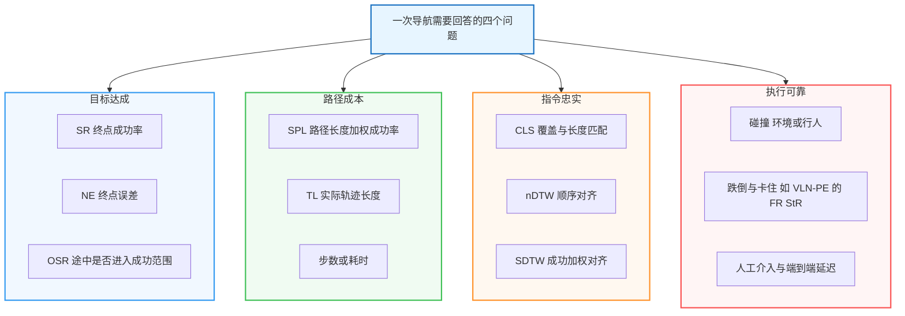

前三组指标的定义在各基准间较为统一；第四组的计数单位、阈值和是否中断 episode 依基准而定，见第 8.4 节。

<a id="81-评测体系总览与设计哲学"></a>

## 8.1 先固定评测协议，再解释指标

记录任务与划分、传感器和视场、深度/位姿/地图权限、动作接口、停止与超时规则、距离函数、成功阈值、额外训练数据以及推理预算。R2R 的导航图、Habitat 的可导航表面与空中场景不是同一种距离空间。

| 想证明什么 | 至少报告 | 不能由此直接推出 |
|:---|:---|:---|
| 更容易到达目标 | SR、NE、OSR | 是否遵循了沿途指令 |
| 行走更高效 | SR、SPL、实际路径长度 | 推理更快或能耗更低 |
| 更忠实地执行指令 | nDTW / SDTW，必要时 CLS | 语言理解的全部能力 |
| 更准确地找到物体 | 导航指标 + 对应目标定位指标 | 一般 ObjectNav 与指代导航同等困难 |
| 更适合真实机器人 | 真机完成率、碰撞、介入、延迟与失败类型 | 在其他机器人和环境同样可靠 |

### 8.1.1 典型轨迹形态与多维指标响应矩阵

以下是用于理解指标的示意，不是某篇论文的实验结果。设指令要求经过地标后再到终点：

| 执行情况 | SR | SPL | nDTW / CLS | 应如何解读 |
|:---|:---|:---|:---|:---|
| 按指令到达并正确结束 | 成功 | 取决于与最短路的差异 | 通常较高 | 完成了路径与终点要求 |
| 绕开地标，走捷径到达 | 仍可能成功 | 可能较高 | 通常下降 | 到达不等于路径忠实 |
| 反复进出多个房间后才到达 | 仍可能成功 | 明显偏低 | 通常下降 | 成功可能由过量探索换来，需结合 TL 看代价 |
| 遵循大部分路线但终点失败 | 失败 | 为 0 | 仍可能较高 | 路径相似不等于完成；SDTW 为 0 |
| 路过目标后继续远离 | 可能失败 | 失败时为 0 | 依轨迹而定 | OSR 与 SR 的差距提示检查停止与执行 |

<a id="812-场景化指标选型决策树"></a>

### 8.1.2 场景化指标选型

路线跟随优先同时看终点和路径；目标搜索优先看搜索成功与目标验证；对话任务还需说明是否允许主动提问；物理机器人需额外报告执行失败。不同任务的成功判据应沿用各自官方定义，不能把“离终点 3 米”套用于全部 VLN。

下图帮助确定指标组合。分支可以同时成立，例如物理环境中的指代导航既需要目标识别，也需要执行安全评测。

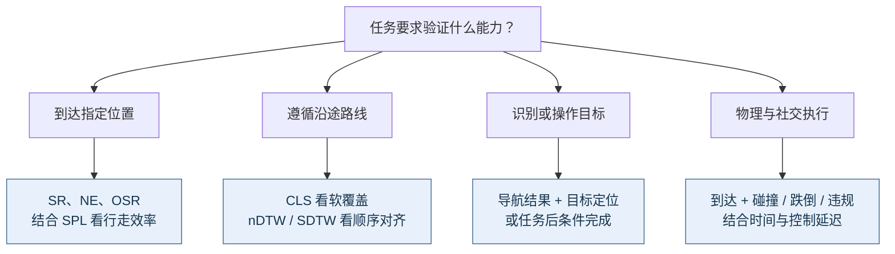

选完指标后，还要保存逐 episode 结果。总体均值可能掩盖长路径、多语言、特定机器人或特定失败条件下的显著退化。

### 8.1.3 核心评估指标全景矩阵

| 指标 | 主要问题 | 方向 | 关键限制 |
|:---|:---|:---|:---|
| SR | 最终是否成功 | ↑ | 成功条件依任务而定 |
| NE | 停止时距离目标多远 | ↓，通常为米 | 必须说明距离函数 |
| OSR | 途中是否曾进入目标成功范围 | ↑ | 是到达机会的诊断量，不是可实现策略的保证 |
| SPL | 成功时路径是否高效 | ↑，0–1 或百分数 | 最短路效率不等于指令忠实度 |
| CLS | 对参考路径的覆盖与长度匹配如何 | ↑，0–1 或百分数 | 不显式做顺序对齐 |
| nDTW | 轨迹在顺序约束下多接近参考路线 | ↑，0–1 或百分数 | 受采样、距离函数与参考标注影响 |
| SDTW | 是否成功且与参考路线接近 | ↑，0–1 或百分数 | 失败轨迹记 0，需搭配 nDTW 分析 |
| TL | 实际走了多长 | 无固定优劣方向，通常为米 | 需结合 SR 与参考路径长度解读，过短可能是过早停止 |
| RGS / RGSPL | 是否选中了指令所指的目标物体 | ↑ | REVERIE 类任务专用；需说明候选物体来源与判定方式 |

### 8.1.4 常见指标反差与排查方向

| 观察 | 可能原因 | 用什么验证 |
|:---|:---|:---|
| OSR 明显高于 SR | 停止判断、目标验证、控制漂移、超时 | 回放首次进入成功范围后的行为 |
| SR 提升但 SPL 下降 | 更充分的探索换来更长路径 | 配对比较成功集合与实际路径长度 |
| SPL 高而 nDTW 低 | 捷径或沿途地标被忽略 | 查看参考路径是否故意偏离最短路 |
| Seen 与 Unseen 差距大 | 场景过拟合或任务分布差异 | 按路径长度、指令类型和场景难度分组 |
| 仿真好、真机差 | 感知、时间同步、动力学或环境偏移 | 分层测量感知、规划与执行误差 |

这些是待验证的解释。某个指标反差可以由多个机制产生，不应直接给模型下“缺乏推理”或“只会记忆”的结论。

## 8.2 目标达成与定位精度指标

### 8.2.1 Success Rate (SR)

设第 $i$ 个 episode 的官方成功指示为 $S_i\in\{0,1\}$，共 $N$ 条评测轨迹：

$$
\mathrm{SR}=\frac{1}{N}\sum_{i=1}^{N}S_i.
$$

成功条件可能包含终点距离、主动停止、目标可见性或物体识别。报告时保留这些条件；被超时截断是否算成功，也由评测器决定。

### 8.2.2 Navigation Error (NE)

设 $x_i^{\mathrm{end}}$ 为终止位置，$g_i$ 为目标，$d$ 为基准的距离函数：

$$
\mathrm{NE}=\frac{1}{N}\sum_{i=1}^{N}d(x_i^{\mathrm{end}},g_i).
$$

经典图导航一般采用最短图距离，连续导航的目标距离通常采用可导航表面的测地距离，不能统一改写成欧氏距离。存在多个有效目标位置时，还须说明目标集合的处理方式。[RxR 官方指标说明](https://github.com/google-research-datasets/RxR)。

### 8.2.3 Oracle Success Rate (OSR)

对于使用目标距离阈值 $\tau$ 的任务，OSR 检查轨迹中是否曾进入成功范围：

$$
\mathrm{OSR}=\frac{1}{N}\sum_{i=1}^{N}\mathbb{1}\!\left[\min_t d(x_i^t,g_i)<\tau\right].
$$

严格或非严格阈值遵循官方实现。OSR 不能替代真实停止策略：途中偶然经过终点也可能提高 OSR。SR 与 OSR 的距离与采样口径一致时，两者差距可用于定位停止相关问题。

**教学示例：路过目标与正确停止不同。** 下图假设成功只取决于停止时到目标的距离，阈值为 3 m；所有距离采用同一评测定义。

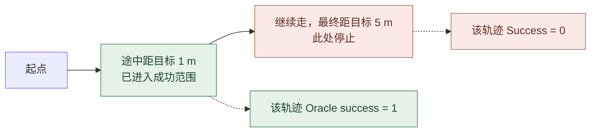

这个差距提示检查停止判断、目标识别和路径回退，但不能仅凭 OSR 高就断言模型“定位准确”。轨迹可能偶然路过目标，或者模型根本没有意识到目标已被看到。

## 8.3 路径效率与指令保真度指标

### 8.3.1 Success weighted by Path Length (SPL)

设 $l_i$ 为起点到目标的最短可行路径长度，$p_i$ 为实际行走长度，则：

$$
\mathrm{SPL}=\frac{1}{N}\sum_{i=1}^{N}S_i\frac{l_i}{\max(l_i,p_i)}.
$$

分数逐轨迹计算后平均，不能写成 SR 乘以全体轨迹的平均效率。零长度等退化情况遵循基准实现。[SPL 原始评测建议](https://arxiv.org/abs/1807.06757)。

例如两条轨迹中，一条成功且效率为 0.5，另一条失败，则 SR 为 0.5、SPL 为 0.25。SPL 衡量行走效率，额外生成 token、网络等待或原地计算时间不会自动进入它的分母。

**四类轨迹的计算例子**：设同一直走廊中，起点到精确目标的最短距离为 10 m，成功阈值为 3 m，均主动停止。下图表示行为类别，不按空间比例绘制。

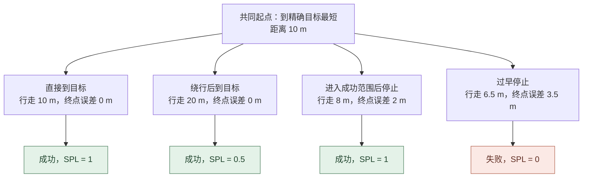

| 行为 | $S_i$ | 效率项 $l_i / \max(l_i,p_i)$ | 单条 SPL |
|:---|:---:|:---:|:---:|
| 直接到达 | 1 | $10/10=1$ | 1 |
| 绕行到达 | 1 | $10/20=0.5$ | 0.5 |
| 在目标前 2 m 停止 | 1 | $10/10=1$ | 1 |
| 在目标前 3.5 m 停止 | 0 | $10/10=1$ | 0 |

四条一起评测时，SR 为 0.75，SPL 为 0.625。第三条的行走长度小于到**精确目标**的最短距离，是因为在成功范围内提前停止，不是走出了比同一几何中的最短路径更短的路线；`max` 将效率上限限制为 1。若基准把 $l_i$ 定义到目标区域，应按其实现重新计算。

SPL 对失败轨迹直接计零，对成功但过长的路径施加反比惩罚。它不要求遵循指令的所有中间地标：当指令要求绕行时，忠实执行可能反而降低 SPL，因此还需路径保真度指标。

### 8.3.2 Coverage weighted by Length Score (CLS)

给定参考路径 $R$ 和预测路径 $P$，定义节点到路径的距离 $d(r,P)=\min_{p\in P}d(r,p)$。CLS 结合软覆盖与长度匹配：

$$
\mathrm{PC}=\frac{1}{|R|}\sum_{r\in R}\exp\!\left(-\frac{d(r,P)}{d_{th}}\right),\qquad
\mathrm{EPL}=\mathrm{PC}\cdot L(R),
$$

$$
\mathrm{CLS}=\mathrm{PC}\cdot\frac{\mathrm{EPL}}{\mathrm{EPL}+|\mathrm{EPL}-L(P)|}.
$$

其中 $L$ 表示路径长度，$d_{th}$ 是距离尺度。它鼓励覆盖沿途节点，但没有显式约束访问顺序；评估先后次序时还需看 nDTW。[CLS 原论文](https://arxiv.org/abs/1905.12255)。

**把公式拆成两步**：PC 问“参考路线各处离实际走过的地方有多远”，长度项 LS 问“实际长度是否与已覆盖部分相称”。节点到路径取最小距离，因此仅靠 PC 不会检查访问顺序。

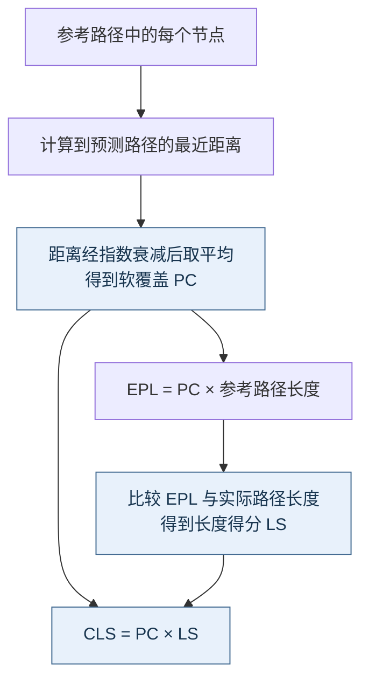

| 教学算例：$L(R)=20$ m | 假设 PC | $L(P)$ | EPL | LS | CLS |
|:---|:---:|:---:|:---:|:---:|:---:|
| 完整覆盖且长度匹配 | 1 | 20 m | 20 m | 1 | 1 |
| 完整覆盖但有额外绕行 | 1 | 30 m | 20 m | $2/3$ | $2/3$ |
| 软覆盖不足但长度与 EPL 匹配 | 0.5 | 10 m | 10 m | 1 | 0.5 |

表中 PC 为便于演算设定的值，不是从某张路线图测得，也不表示“恰好走了半数节点”。即使每个参考点都在距离尺度 $d_{th}$ 内，PC 也不必接近 1：距离恰好为 $d_{th}$ 的点，其贡献只有 $e^{-1}\approx0.368$。

CLS 可以揭示“到达终点却漏掉沿途路线”，但相同覆盖集合仍可能对应不同访问顺序；这正是下面引入 DTW 对齐的原因。

### 8.3.3 normalized Dynamic Time Warping (nDTW & SDTW)

DTW 寻找满足顺序约束的路径对齐，允许两条轨迹具有不同采样点数。常见归一化与成功加权形式为：

$$
\mathrm{nDTW}(R,P)=\exp\!\left(-\frac{\mathrm{DTW}(R,P)}{|R|d_{th}}\right),\qquad
\mathrm{SDTW}=\frac{1}{N}\sum_{i=1}^{N}S_i\,\mathrm{nDTW}(R_i,P_i).
$$

数据集 nDTW 同样逐 episode 计算后平均。其顺序对齐比单纯路径覆盖更适合检查沿途约束，但仍依赖参考轨迹质量。[nDTW 原论文](https://arxiv.org/abs/1907.05446)。

**实现边界**：用于 NE 的目标距离与 DTW 的点对距离不应想当然地视为相同。连续环境实现还涉及轨迹采样、去重、近似 DTW 等选择；复现应固定评测代码，而非只复制公式。参见 [VLN-CE 指标实现](https://github.com/jacobkrantz/VLN-CE/blob/master/habitat_extensions/measures.py)。

**为什么不直接逐步相减**：参考序列为 A→B→C，预测序列为 A→A→B→C。若按相同下标比较，第二步会把 B 与 A 错配；DTW 允许在保持顺序的前提下，让多个采样点对应同一个参考点。

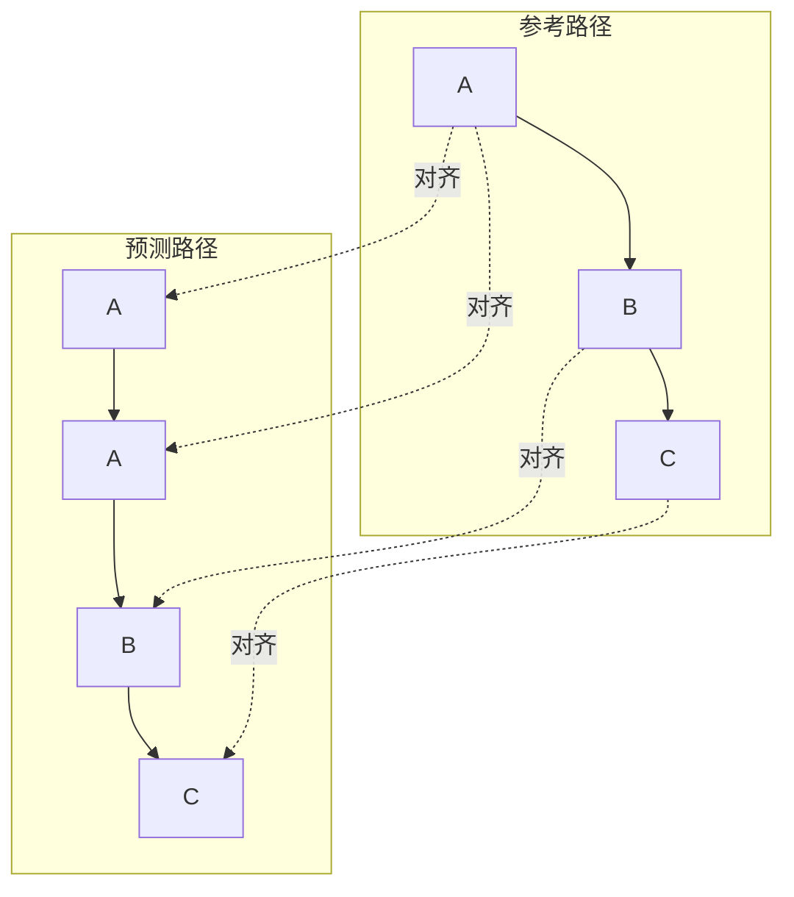

在这个重复位置完全相同的教学例子中，对齐代价可以为零；真实轨迹中的位移、采样方式和噪声仍会改变 DTW，不能泛化为“对速度与采样完全不敏感”。如果改走 A→C→B→C，即使访问过同样地标，也通常无法获得同样的零代价顺序对齐。

DTW 累积代价可以写为下列递推，其中 $D(a,b)$ 是两条路径前缀的最小对齐代价，边界按标准 DTW 初始化：

$$
D(a,b)=d(r_a,p_b)+\min\{D(a-1,b),D(a,b-1),D(a-1,b-1)\}.
$$

例如 $|R|=4$、$d_{th}=3$ m、DTW 为 6 m，则 nDTW 为 $e^{-0.5}\approx0.607$；若最终失败，该条 SDTW 为 0。另一条成功且 nDTW 为 0.8 时，两条轨迹的平均 nDTW 约 0.704，而 SDTW 为 0.4。成功加权必须先作用于每条轨迹，不能用总体 SR 乘总体 nDTW 替代。

## 8.4 具身安全、物理交互与部署级指标

### 8.4.1 几何避障与社交安全指标

碰撞可以按动作步、接触事件或 episode 计数，三者分母不同。报告 Collision Rate / Human Collision Rate 时写出定义，并同时给出任务完成情况，避免“原地不动所以碰撞少”的误读。个人空间侵犯也不能简化为身体接触。

### 8.4.2 动力学稳定性与不可逆故障指标

跌倒、卡住、急停与人工复位应分别记录。需要给出姿态或时间阈值、恢复预算，以及复位是否中断 episode。不同机器人形态的失败模式不同，不能合并为一个不带条件的具身成功率。

### 8.4.3 系统级效率与控制实时性指标

报告相机到动作执行的端到端延迟，注明均值与尾部延迟、硬件、批大小、输入分辨率、历史长度和模型调用方式。另列控制频率、显存、调用/token 成本、任务耗时与人工介入。模型单次前向 FPS 不等于机器人的有效控制频率。

## 8.5 评测协议规范与演进趋势

### 8.5.1 Val-Seen 与 Val-Unseen 的划分与边界

Seen / Unseen 通常按基准场景划分，衡量同一任务内的场景泛化。它不自动保证大规模预训练时从未见过同源建筑、图像或衍生资产，也不等价于跨机器人、跨语言或真机泛化。

### 8.5.2 公平对比检查清单 (Fair Comparison Checklist)

- **输入相同**：相机数量、视场、深度、位姿与地图权限。
- **任务相同**：数据版本、语言子集、episode、目标与停止判据。
- **执行相同**：动作空间、控制器、步数与时间预算、滑动和碰撞配置。
- **资源透明**：额外训练数据、基模、工具调用、搜索/重试次数与计算预算。
- **统计可检查**：报告成功数与总数；随机任务给出多次运行或置信区间，并说明采样方法。

<a id="853-评测体系的历史演进与代际跃迁"></a>

### 8.5.3 从榜单成绩到可复现证据

先确认结果属于论文哪个版本和哪张表，再核对官方评测器。VLN-CE 官方仓库曾明确说明，同一基线在论文与榜单上的 SPL 差异与硬件和 Habitat 构建有关；这说明协议与实现本身也是实验的一部分。[官方复现说明](https://github.com/jacobkrantz/VLN-CE#baseline-performance)。

配套[论文篇](/VLN-Papers/)用于检索候选方法和原始结果。跨文章、跨版本的成绩在完成上述核对前，只能作为阅读索引，不能直接用于架构优劣的因果结论。


# 9. 学习资源与框架

建议按“经典任务 → 连续环境 → 基础模型 → 真实部署”的顺序学习：先复现 R2R / VLN-CE 基线，熟悉 Habitat 的 episode、传感器与指标；再阅读流式 VLA、快慢系统和空间记忆方法；最后再进入 Agent、世界模型和真实机器人部署。直接从最新大模型开始，往往会掩盖数据协议和动作接口带来的差异。

**站内配套资源：**

- [VLN 经典论文与性能排行榜](/VLN-Papers/)：按任务设定维护论文精读、性能和开源状态。
- [空间智能综述](/Spatial-Intelligence-Survey/)：补充 3D 表征、地图与空间推理基础。
- [世界模型综述](/World-Models-Survey/)：补充预测模型、世界动作模型与数据引擎。
- [传统机器人导航算法综述](/Robot-Navigation-Survey/)：补充 SLAM、全局 / 局部规划与控制器基础，对应第 3.3 节的快系统与第 8.4 节的部署指标。
- [VLA 综述](/VLA-Survey/)：补充视觉-语言-动作模型的训练范式与动作接口设计。

**[VLN-Survey-with-Foundation-Models](https://github.com/zhangyuejoslin/VLN-Survey-with-Foundation-Models)**
- **类型**：GitHub 资源仓库
- **重点**：专注于 LLM/VLM 时代的 VLN 方法（2023-至今），持续更新最新论文
- **适合**：想了解大模型如何革新 VLN 领域的研究者

**[Awesome-Embodied-AI](https://github.com/jonyzhang2023/awesome-embodied-vla-va-vln)**
- **类型**：全栈资源合集
- **重点**：涵盖 VLN、VLA、机器人操作等完整具身智能技术栈
- **适合**：系统学习具身 AI 全貌的研究者

**[Embodied-AI-Guide](https://github.com/TianxingChen/Embodied-AI-Guide)**
- **类型**：入门教程 + 实践指南
- **重点**：提供代码实践、论文解读、学习路径规划
- **适合**：零基础入门或需要结构化学习路径的新人

**[Vision-and-Language Navigation: A Survey of Tasks, Methods, and Future Directions](https://arxiv.org/abs/2203.12667)**
- **类型**：综述论文（Gu et al., ACL 2022）
- **重点**：系统梳理 VLN 发展脉络，覆盖 2018–2022 年的任务、方法与评测
- **适合**：需要全面了解 VLN 历史演进的研究者

**[Vision-and-Language Navigation Today and Tomorrow: A Survey in the Era of Foundation Models](https://arxiv.org/abs/2407.07035)**
- **类型**：综述论文（Zhang et al., 2024，与上方 VLN-Survey-with-Foundation-Models 仓库配套）
- **重点**：以基础模型为主线重新组织 VLN 方法，讨论世界模型、人类模型与 VLA 的交汇
- **适合**：从大模型视角切入 VLN 的研究者

---


## 9.1 重要会议与研讨会

**具身智能专项会议：**
- **[Embodied AI Workshop](https://embodied-ai.org/)** - CVPR 官方 Workshop，最新趋势和挑战赛发布地
- **[CoRL](https://www.corl.org/)** (Conference on Robot Learning) - VLN 向真实机器人迁移的主要阵地
- **[RSS](https://roboticsconference.org/)** (Robotics: Science and Systems) - 顶级机器人会议，强调 Sim-to-Real

**主流会议分布：**

| 会议 | 常见侧重点 |
|:----:|:-----------|
| **CVPR / ICCV / ECCV** | 视觉语言建模、空间表征、数据集与基准 |
| **NeurIPS / ICLR** | 基础模型、强化学习、生成模型与规模化训练 |
| **CoRL / RSS** | 机器人学习、真实部署与跨具身泛化 |
| **ICRA / IROS** | 导航系统、控制、仿真平台与工程验证 |

---

<a id="survey-practice"></a>

## 9.2 从论文到实验：一条可复现的实施路径

以下流程是本文的实验组织建议，适合将配套论文中的方法落实为可比较的系统。

| 阶段 | 先完成什么 | 应留下的可检查产物 |
|:---|:---|:---|
| 固定任务 | 确定指令类型、观测、动作接口、具身形态与成功条件 | 配置表，包含数据版本、划分、传感器与停止规则 |
| 跑通基线 | 使用论文对应版本的代码和权重，复现标准验证集 | 逐 episode 结果、配置、代码版本与汇总指标 |
| 定位短板 | 回看失败轨迹，区分理解、记忆、规划、执行和停止错误 | 失败分类及代表轨迹，避免只记录平均 SR |
| 验证改动 | 每次控制一个变量；保持 episode 集合与预算一致 | 配对结果、模块消融、不同运行种子下的波动 |
| 检查泛化 | 在未见场景与明确指定的扰动条件下评测 | 分场景、分路径长度及分扰动类型的结果 |
| 接入机器人 | 检查坐标系、时间戳、动作尺度、轨迹有效期与执行反馈 | 端到端延迟、碰撞、恢复、介入次数及真机失败记录 |

**推理完成不等于动作仍然有效。** 相机采集、编码、模型生成、通信和控制执行共同决定闭环延迟。慢系统返回子目标时，机器人可能已经离开对应视点，因此需要明确旧目标何时失效、何时重新规划，以及快系统在等待期间采取什么行为。报告模型 FPS 时，应同时说明测量边界、硬件、批大小与控制频率。

**选择研究切入点时，从失败证据反推方法。** 长路径上反复访问同一区域，适合检查记忆与地图更新；到过目标附近却未成功，适合检查停止判定与目标验证；语义目标正确却经常碰撞，适合检查可达性、动作接口和控制器。指标差距只提供线索，最终仍要用轨迹回放和受控实验验证原因。

<a id="survey-open-questions"></a>

## 9.3 已有证据、开放问题与研究判断

从本文讨论的工作可以得到几条**有明确适用范围的结论**：R4R 与路径指标说明到达和指令忠实度需要分别衡量；ETPNav、DualVLN 展示了规划与执行分工的具体实现；ScaleVLN 说明训练资源是解释性能的重要变量；VLN-PE 则提供了视觉与物理差距会影响导航表现的实验证据。这些结论分别来自[路径跟随研究](https://arxiv.org/abs/1905.12255)、[连续图规划](https://arxiv.org/abs/2304.03047)、[双系统设计](https://arxiv.org/abs/2512.08186)、[数据扩展](https://arxiv.org/abs/2307.15644)和[物理具身评测](https://arxiv.org/abs/2507.13019)，尚不足以推出一种通用于所有任务的最优架构。

下表是本文据此归纳的开放问题与建议验证方式，**属于研究判断，不是领域已形成的统一结论**。

| 开放问题 | 为什么现有结果还不足 | 更有区分力的验证 |
|:---|:---|:---|
| 何时值得显式建图？ | 地图模型与隐式模型常使用不同传感器和位姿先验 | 固定输入，在路径长度、遮挡、位姿噪声上分组比较 |
| 模型究竟使用了哪些语言信息？ | 高 SR 可能主要来自终点线索 | 保持目标不变，改动沿途顺序、否定和转向约束，检查轨迹响应 |
| 记忆能否修正自身错误？ | 静态环境上的长期保存不代表动态更新能力 | 移动物体、阻断通路、注入错误观测，检查纠正与遗忘 |
| 反思是否带来可靠恢复？ | 更长推理和更多重试可能同时增加成功率 | 固定调用预算和失败注入，比较恢复率、额外路径及失败升级 |
| 世界模型何时优于直接策略？ | 生成质量和真实执行收益不等价 | 同预算比较无预测、候选排序和联合生成，报告长滚动失真 |
| “通用”能力能迁移多远？ | 同一平台的多任务成绩不代表跨形态迁移 | 留出语言、资产、机器人与控制接口，分别报告适配量 |
| 仿真进步能否预测部署收益？ | 真机试验环境和介入规则常不统一 | 固定任务集、起点与恢复预算，公开失败轨迹和介入记录 |

**本文的研究建议**是优先建立可回放、可归因的失败分析，再选择模型改动。若已有系统主要失败于局部执行，扩大语言模型未必是最直接的路径；若停止和沿途约束是主要问题，单看平均 SR 又可能遮蔽有效改进。值得追求的进展，是能够说明“在什么条件下、解决了哪类失败、付出了多少代价”。

<a id="survey-scope"></a>

## 9.4 本文覆盖范围与维护方式

本文是按问题组织的叙述性综述，覆盖路线指令导航及与之相关的目标导航、交互和具身控制工作，不是具有穷尽检索与排除流程的系统综述。不同任务作为机制参考时已注明边界；通用 VLA 与操作论文不作为标准 VLN 的直接性能证据。

最近一次核验日期为 **2026-09-26**，重点核对数据口径、平台支持、核心指标和跨论文设计差异。正文为易变数据注明论文版本或数据卡来源；无法确认独立协议的条目保留不确定性说明。其余工作通过配套论文篇供进一步阅读，本文不声称已独立复现所有实验或验证全部排行榜结果。


# 10. 参考资料

> **论文精读**：经典论文与基石论文详见 [VLN 经典论文](/VLN-Papers/) 与 [VLN 论文精读（扩展篇）](/VLN-Papers-Extended/)。本节只收录正文直接涉及的数据集、方法、模拟器与综述，按主题分组、全文连续编号；预印本的发表状态与榜单数字以论文主页及配套论文页为准。

---

## 10.1 数据集与基准

### 10.1.1 指令导向与连续环境数据集

1. **R2R** — Anderson et al., *Vision-and-Language Navigation: Interpreting Visually-Grounded Navigation Instructions in Real Environments*, CVPR 2018. [[Paper]](https://arxiv.org/abs/1711.07280)
2. **R4R** — Jain et al., *Stay on the Path: Instruction Fidelity in Vision-and-Language Navigation*, ACL 2019. [[Paper]](https://arxiv.org/abs/1905.12255)
3. **RxR** — Ku et al., *Room-Across-Room: Multilingual Vision-and-Language Navigation with Dense Spatiotemporal Grounding*, EMNLP 2020. [[Paper]](https://arxiv.org/abs/2010.07954)
4. **VLN-CE** — Krantz et al., *Beyond the Nav-Graph: Vision-and-Language Navigation in Continuous Environments*, ECCV 2020. [[Paper]](https://arxiv.org/abs/2004.02857)
5. **RxR-CE** — RxR 在 Habitat 连续环境中的移植，随 VLN-CE 代码库发布，用于 RxR-Habitat 挑战赛（CVPR Embodied AI Workshop）。[[Code]](https://github.com/jacobkrantz/VLN-CE)
6. **ScaleVLN** — Wang et al., *Scaling Data Generation in Vision-and-Language Navigation*, ICCV 2023. [[Paper]](https://arxiv.org/abs/2307.15644)
7. **VLN-PE** — Wang et al., *Rethinking the Embodied Gap in Vision-and-Language Navigation: A Holistic Study of Physical and Visual Disparities*, ICCV 2025. [[Paper]](https://arxiv.org/abs/2507.13019)
8. **InternData-N1** — InternRobotics（上海人工智能实验室），面向 InternVLA-N1 的大规模合成导航数据（LeRobot 格式），2025. [[Dataset]](https://huggingface.co/datasets/InternRobotics/InternData-N1) [[Code]](https://github.com/InternRobotics/InternNav)
9. **VLNVerse** — Lin et al., *VLNVerse: A Benchmark for Vision-Language Navigation with Versatile, Embodied, Realistic Simulation and Evaluation*, arXiv 2025. [[Paper]](https://arxiv.org/abs/2512.19021)

### 10.1.2 目标导向与长程规划数据集

10. **REVERIE** — Qi et al., *REVERIE: Remote Embodied Visual Referring Expression in Real Indoor Environments*, CVPR 2020. [[Paper]](https://arxiv.org/abs/1904.10151)
11. **REVERIE-CE** — 连续环境移植设定的统称，尚无统一官方协议；引用时以具体论文的转换实现为准，参见第 6.3.2 节。
12. **SOON** — Zhu et al., *SOON: Scenario Oriented Object Navigation with Graph-based Exploration*, CVPR 2021. [[Paper]](https://arxiv.org/abs/2103.17138)
13. **LHPR-VLN** — Song et al., *Towards Long-Horizon Vision-Language Navigation: Platform, Benchmark and Method*, CVPR 2025. [[Paper]](https://arxiv.org/abs/2412.09082)

### 10.1.3 对话式与社交感知数据集

14. **CVDN** — Thomason et al., *Vision-and-Dialog Navigation*, CoRL 2019. [[Paper]](https://arxiv.org/abs/1907.04957)
15. **TEACh** — Padmakumar et al., *TEACh: Task-driven Embodied Agents that Chat*, AAAI 2022. [[Paper]](https://arxiv.org/abs/2110.00534)
16. **HA-VLN** — Li et al., *Human-Aware Vision-and-Language Navigation: Bridging Simulation to Reality with Dynamic Human Interactions*, NeurIPS 2024 Datasets and Benchmarks Track. [[Paper]](https://arxiv.org/abs/2406.19236)
17. **HA-VLN 2.0** — Dong et al., *HA-VLN 2.0: An Open Benchmark and Leaderboard for Human-Aware Navigation in Discrete and Continuous Environments*, IROS 2026（arXiv 首发 2025；核对 v5）. [[Paper]](https://arxiv.org/abs/2503.14229v5)

### 10.1.4 需求导向、室外街景与空中数据集

18. **DDN** — Wang et al., *Find What You Want: Learning Demand-conditioned Object Attribute Space for Demand-driven Navigation*, NeurIPS 2023. [[Paper]](https://arxiv.org/abs/2309.08138)
19. **Touchdown** — Chen et al., *Touchdown: Natural Language Navigation and Spatial Reasoning in Visual Street Environments*, CVPR 2019. [[Paper]](https://arxiv.org/abs/1811.12354)
20. **StreetLearn** — Mirowski et al., *The StreetLearn Environment and Dataset*, arXiv 2019. [[Paper]](https://arxiv.org/abs/1903.01292)
21. **AerialVLN** — Liu et al., *AerialVLN: Vision-and-Language Navigation for UAVs*, ICCV 2023. [[Paper]](https://arxiv.org/abs/2308.06735)
22. **CityNav** — Lee et al., *CityNav: A Large-Scale Dataset for Real-World Aerial Navigation*, ICCV 2025（arXiv 2024）. [[Paper]](https://arxiv.org/abs/2406.14240)
23. **OpenFly** — Gao et al., *OpenFly: A Comprehensive Platform for Aerial Vision-Language Navigation*, ICLR 2026（arXiv 首发 2025；核对 v7）. [[Paper]](https://arxiv.org/abs/2502.18041v7)

---

## 10.2 核心模型与方法

### 10.2.1 跨模态对齐与预训练

24. **PREVALENT** — Hao et al., *Towards Learning a Generic Agent for Vision-and-Language Navigation via Pre-training*, CVPR 2020. [[Paper]](https://arxiv.org/abs/2002.10638)
25. **VLN-BERT** — Majumdar et al., *Improving Vision-and-Language Navigation with Image-Text Pairs from the Web*, ECCV 2020. [[Paper]](https://arxiv.org/abs/2004.14973)
26. **Recurrent VLN-BERT** — Hong et al., *A Recurrent Vision-and-Language BERT for Navigation*, CVPR 2021. [[Paper]](https://arxiv.org/abs/2011.13922)
27. **HAMT** — Chen et al., *History Aware Multimodal Transformer for Vision-and-Language Navigation*, NeurIPS 2021. [[Paper]](https://arxiv.org/abs/2110.13309)

### 10.2.2 拓扑图、语义地图与空间记忆

28. **DUET** — Chen et al., *Think Global, Act Local: Dual-scale Graph Transformer for Vision-and-Language Navigation*, CVPR 2022. [[Paper]](https://arxiv.org/abs/2202.11742)
29. **ETPNav** — An et al., *ETPNav: Evolving Topological Planning for Vision-Language Navigation in Continuous Environments*, IEEE TPAMI 2024. [[Paper]](https://arxiv.org/abs/2304.03047)
30. **LagMemo** — Zhou et al., *LagMemo: Language 3D Gaussian Splatting Memory for Multi-modal Open-vocabulary Multi-goal Visual Navigation*, arXiv 2025. [[Paper]](https://arxiv.org/abs/2510.24118)

### 10.2.3 快慢双系统与导航基础模型

31. **DualVLN** — Wei et al., *Ground Slow, Move Fast: A Dual-System Foundation Model for Generalizable Vision-and-Language Navigation*, arXiv 2025. [[Paper]](https://arxiv.org/abs/2512.08186)
32. **NaVILA** — Cheng et al., *NaVILA: Legged Robot Vision-Language-Action Model for Navigation*, RSS 2025. [[Paper]](https://arxiv.org/abs/2412.04453)
33. **NavDP** — Cai et al., *NavDP: Learning Sim-to-Real Navigation Diffusion Policy with Privileged Information Guidance*, arXiv 2025. [[Paper]](https://arxiv.org/abs/2505.08712)
34. **InternVLA-N1** — InternRobotics（上海人工智能实验室），*InternVLA-N1: An Open Dual-System Vision-Language Navigation Foundation Model with Learned Latent Plans*, 2025. [[Code]](https://github.com/InternRobotics/InternNav)
35. **OmniNav** — Xue et al., *OmniNav: A Unified Framework for Prospective Exploration and Visual-Language Navigation*, arXiv 2025. [[Paper]](https://arxiv.org/abs/2509.25687)
36. **Qwen-RobotNav** — Zhang et al., *Qwen-RobotNav Technical Report: A Scalable Navigation Model Designed for an Agentic Navigation System*, arXiv 2026. [[Paper]](https://arxiv.org/abs/2606.18112)

### 10.2.4 端到端视频 VLM 与连续环境策略

37. **Waypoint Models** — Krantz et al., *Waypoint Models for Instruction-guided Navigation in Continuous Environments*, ICCV 2021. [[Paper]](https://arxiv.org/abs/2110.02207)
38. **NaVid** — Zhang et al., *NaVid: Video-based VLM Plans the Next Step for Vision-and-Language Navigation*, RSS 2024. [[Paper]](https://arxiv.org/abs/2402.15852)
39. **StreamVLN** — Wei et al., *StreamVLN: Streaming Vision-and-Language Navigation via SlowFast Context Modeling*, ICRA 2026（arXiv 首发 2025；核对 v2）. [[Paper]](https://arxiv.org/abs/2507.05240v2)

### 10.2.5 底层视觉导航策略

40. **DD-PPO** — Wijmans et al., *DD-PPO: Learning Near-Perfect PointGoal Navigators from 2.5 Billion Frames*, ICLR 2020. [[Paper]](https://arxiv.org/abs/1911.00357)
41. **GNM** — Shah et al., *GNM: A General Navigation Model to Drive Any Robot*, ICRA 2023. [[Paper]](https://arxiv.org/abs/2210.03370)
42. **ViNT** — Shah et al., *ViNT: A Foundation Model for Visual Navigation*, CoRL 2023. [[Paper]](https://arxiv.org/abs/2306.14846)
43. **NoMaD** — Sridhar et al., *NoMaD: Goal Masked Diffusion Policies for Navigation and Exploration*, ICRA 2024. [[Paper]](https://arxiv.org/abs/2310.07896)
44. **ViPlanner** — Roth et al., *ViPlanner: Visual Semantic Imperative Learning for Local Navigation*, ICRA 2024. [[Paper]](https://arxiv.org/abs/2310.00982)

### 10.2.6 世界模型与世界动作模型

45. **Navigation World Models (NWM)** — Bar et al., *Navigation World Models*, CVPR 2025. [[Paper]](https://arxiv.org/abs/2412.03572) [[Project]](https://www.amirbar.net/nwm/)
46. **Dynam3D** — Wang et al., *Dynam3D: Dynamic Layered 3D Tokens Empower VLM for Vision-and-Language Navigation*, NeurIPS 2025. [[Paper]](https://arxiv.org/abs/2505.11383)
47. **WMNav** — Nie et al., *WMNav: Integrating Vision-Language Models into World Models for Object Goal Navigation*, IROS 2025. [[Paper]](https://arxiv.org/abs/2503.02247) [[Project]](https://b0b8k1ng.github.io/WMNav/)
48. **AstraNav-World** — Chen et al., *AstraNav-World: World Model for Foresight Control and Consistency*, arXiv 2025. [[Paper]](https://arxiv.org/abs/2512.21714)
49. **NavWAM** — Azuma et al., *NavWAM: A Navigation World Action Model for Goal-Conditioned Visual Navigation*, arXiv 2026. [[Paper]](https://arxiv.org/abs/2606.13494)
50. **DreamVLA** — Zhang et al., *DreamVLA: A Vision-Language-Action Model Dreamed with Comprehensive World Knowledge*, NeurIPS 2025. [[Paper]](https://arxiv.org/abs/2507.04447) [[Project]](https://zhangwenyao1.github.io/DreamVLA/)
51. **NVIDIA Cosmos** — NVIDIA, *Cosmos World Foundation Model Platform for Physical AI*, arXiv 2025. [[Paper]](https://arxiv.org/abs/2501.03575) [[Project]](https://www.nvidia.com/en-us/ai/cosmos/)

### 10.2.7 Agent、自我进化与通用 VLA

52. **AgentVLN** — Xin et al., *AgentVLN: Towards Agentic Vision-and-Language Navigation*, arXiv 2026. [[Paper]](https://arxiv.org/abs/2603.17670) [[Code]](https://github.com/Allenxinn/AgentVLN)
53. **SE-VLN** — Dong et al., *SE-VLN: A Self-Evolving Vision-Language Navigation Framework Based on Multimodal Large Language Models*, arXiv 2025. [[Paper]](https://arxiv.org/abs/2507.13152)
54. **RT-2** — Brohan et al., *RT-2: Vision-Language-Action Models Transfer Web Knowledge to Robotic Control*, CoRL 2023. [[Paper]](https://arxiv.org/abs/2307.15818)
55. **OpenVLA** — Kim et al., *OpenVLA: An Open-Source Vision-Language-Action Model*, CoRL 2024. [[Paper]](https://arxiv.org/abs/2406.09246)

---

## 10.3 模拟器与场景资产

56. **Matterport3D Simulator** — Anderson et al., CVPR 2018（随 R2R 发布）. [[GitHub]](https://github.com/peteanderson80/Matterport3DSimulator)
57. **Habitat** — Savva et al., *Habitat: A Platform for Embodied AI Research*, ICCV 2019 [[Paper]](https://arxiv.org/abs/1904.01201)；Szot et al., *Habitat 2.0: Training Home Assistants to Rearrange their Habitat*, NeurIPS 2021 [[Paper]](https://arxiv.org/abs/2106.14405)；Puig et al., *Habitat 3.0: A Co-Habitat for Humans, Avatars and Robots*, ICLR 2024 [[Paper]](https://arxiv.org/abs/2310.13724). [[GitHub]](https://github.com/facebookresearch/habitat-lab)
58. **AI2-THOR / ProcTHOR** — Kolve et al., *AI2-THOR: An Interactive 3D Environment for Visual AI*, arXiv 2017 [[Paper]](https://arxiv.org/abs/1712.05474)；Deitke et al., *ProcTHOR: Large-Scale Embodied AI Using Procedural Generation*, NeurIPS 2022 [[Paper]](https://arxiv.org/abs/2206.06994). [[Website]](https://ai2thor.allenai.org/)
59. **Gibson / iGibson / OmniGibson** — Xia et al., *Gibson Env: Real-World Perception for Embodied Agents*, CVPR 2018 [[Paper]](https://arxiv.org/abs/1808.10654)；Li et al., *iGibson 2.0: Object-Centric Simulation for Robot Learning of Everyday Household Tasks*, CoRL 2021 [[Paper]](https://arxiv.org/abs/2108.03272)；Li et al., *BEHAVIOR-1K*, CoRL 2022（arXiv 2024 扩展版）[[Paper]](https://arxiv.org/abs/2403.09227). [[GitHub]](https://github.com/StanfordVL/iGibson)
60. **AirSim** — Shah et al., *AirSim: High-Fidelity Visual and Physical Simulation for Autonomous Vehicles*, FSR 2017. [[GitHub]](https://github.com/microsoft/AirSim)（维护与兼容性以仓库说明为准）/ [[Colosseum]](https://github.com/CodexLabsLLC/Colosseum)
61. **Isaac Sim / Isaac Lab** — NVIDIA；Mittal et al., *Orbit: A Unified Simulation Framework for Interactive Robot Learning Environments*（Isaac Lab 前身）, IEEE RA-L 2023 [[Paper]](https://arxiv.org/abs/2301.04195). [[Docs]](https://isaac-sim.github.io/IsaacLab/main/index.html)
62. **MuJoCo / MJX** — Todorov et al., *MuJoCo: A Physics Engine for Model-based Control*, IROS 2012；Google DeepMind 维护. [[GitHub]](https://github.com/google-deepmind/mujoco) / [[Docs]](https://mujoco.readthedocs.io/)
63. **InternUtopia (GRUtopia)** — Wang et al., *GRUtopia: Dream General Robots in a City at Scale*, arXiv 2024. [[Paper]](https://arxiv.org/abs/2407.10943) [[GitHub]](https://github.com/InternRobotics/InternUtopia)

---

## 10.4 综述论文

64. Gu et al., *Vision-and-Language Navigation: A Survey of Tasks, Methods, and Future Directions*, ACL 2022. [[Paper]](https://arxiv.org/abs/2203.12667)
65. Zhang et al., *Vision-and-Language Navigation Today and Tomorrow: A Survey in the Era of Foundation Models*, arXiv 2024. [[Paper]](https://arxiv.org/abs/2407.07035) [[GitHub]](https://github.com/zhangyuejoslin/VLN-Survey-with-Foundation-Models)
