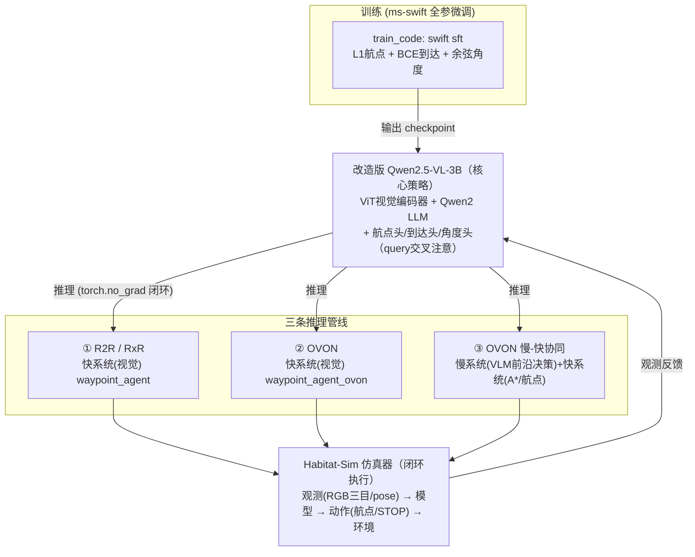
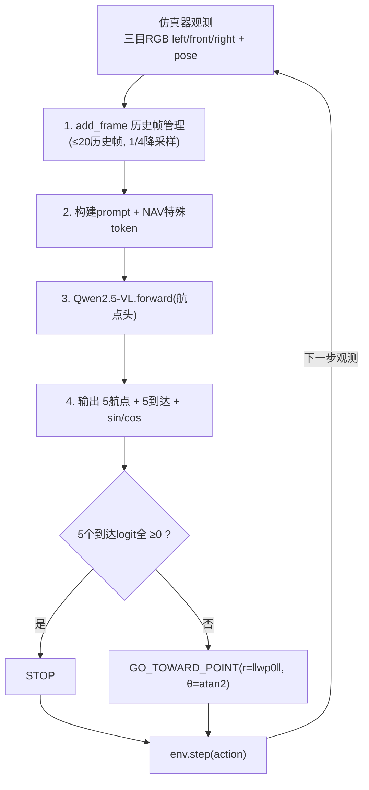
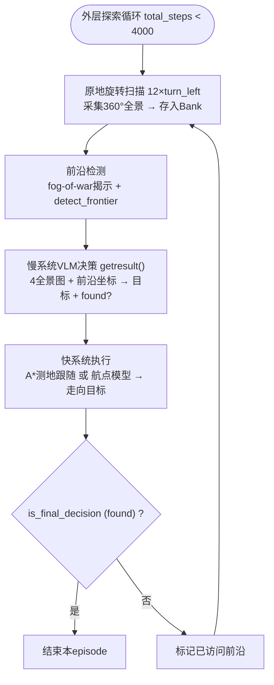
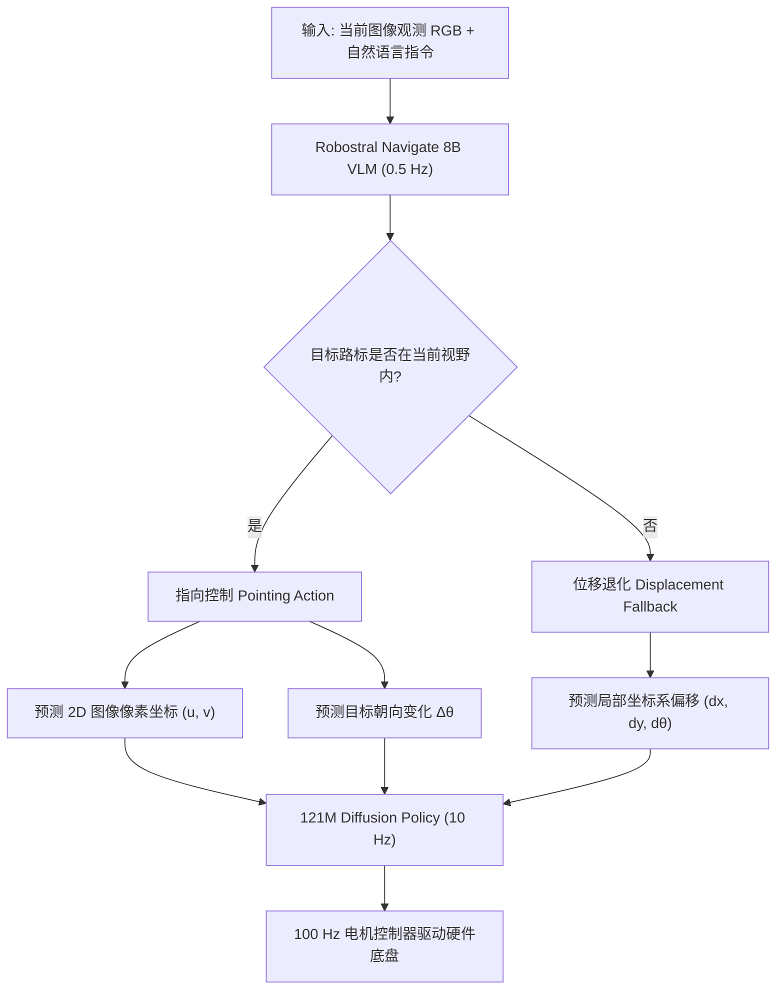
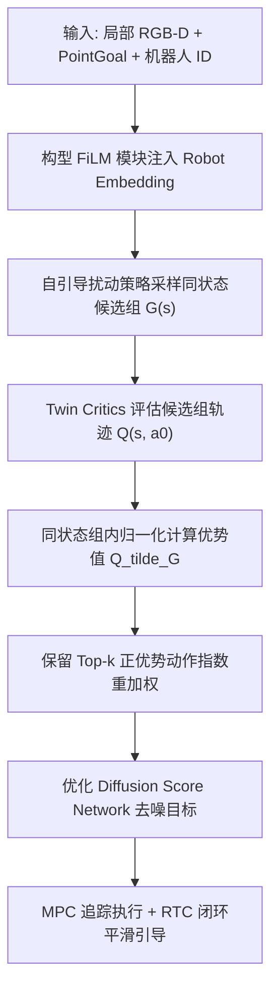

> 本文是 [VLN综述：基于视觉语言的导航](/VLN-Survey/) 的配套论文精读，收录 VLN 经典论文与依赖基础工作。

<div id="paper-filter-bar" class="paper-filter-bar"></div>

# VLN 模型性能排行榜

> ⚠️ **不同基准不可直接混比**：本文论文覆盖三类任务设定——指令跟随·连续环境（分为单语言 R2R-CE 与多语言 RxR-CE，机器人第一视角逐步控制）、指令跟随·离散全景（R2R / REVERIE，DUET / HAMT 体系全景 RGB-D）、目标导航（ObjectNav / 实例图像导航，HM3D / MP3D / Gibson 等）。它们任务定义或基准不同，SR 数值不可跨表比较，故分表列出。NE / OSR 仅在 R2R 系列基准中定义。

## ① 指令跟随 · 连续环境 - 英文

| 模型 | 年份 | 基准 | 基模 | SR ↑ | SPL ↑ | NE ↓ | OSR ↑ | 开源 |
|:-----|:----:|:----:| :--------: |:----:|:-----:|:----:|:-----:|:----:|
 | [Robostral Navigate(单目)](#robostral-navigate) | 2026 | R2R-CE | Mistral-8B | **77.4** | **74.2** | **3.20** | **81.3** | 否 |
 | [Qwen-RobotNav(全景)](#qwen-robotnav) | 2026 | R2R-CE | Qwen3-VL-7B | 72.1 | 66.6 | 3.53 | 78.5 | 否 |
| [ABot-N1(三相机)](#abot-n1) | 2026 | R2R-CE | Qwen-3.5-4B + 2B | 70.9 | 67.5 | 3.32 | 75.2 | [是](https://github.com/amap-cvlab/ABot-Navigation/tree/ABotN-Bench) |
 | [OmniNav(多目)](#omninav) | 2026 | R2R-CE | Qwen2.5-VL-3B | 69.5 | 66.1 | 3.74 | 74.6 | [是](https://github.com/amap-cvlab/OmniNav) |
 | [AstraNav-World(多目)](#astranav-world) | 2025 | R2R-CE | Qwen2.5-VL-3B | 67.9 | 65.4 | – | – | [是](https://github.com/amap-cvlab/AstraNav-World) |
 | [SEDualVLN(单目)](#sedualvln) | 2026 | R2R-CE | LLaVA-Video-7B | 67.3 | 62.5 | 3.75 | 73.7 | [是](https://github.com/kim-os/SEDualVLN) |
 | [AgentVLN(单目)](#agentvln) | 2026 | R2R-CE | Qwen2.5-VL-3B | 67.2 | 64.7 | – | – | [是](https://github.com/Allenxinn/AgentVLN) |
 | [Qwen-RobotNav(单目)](#qwen-robotnav) | 2026 | R2R-CE | Qwen3-VL-7B | 66.9 | 60.5 | – | – | 否 |
 | [Dual-Anchoring(单目)](#dual-anchoring) | 2026 | R2R-CE | LLaVA-Video-7B | 65.6 | 62.1 | – | – | 否 |
 | [AwareVLN(单目)](#awarevln) | 2026 | R2R-CE | Vicuna-7B | 65.4 | 55.1 | 4.02 | 73.5 | [是](https://github.com/GWxuan/AwareVLN) |
| [CorrectNav](#correctnav) | 2025 | R2R-CE | – | 65.1 | 62.3 | 4.24 | 67.5 | [是](https://github.com/owlet914/CorrectNav) |
 | [NavFoM(多目)](#navfom) | 2025 | R2R-CE | Qwen2-7B | 64.9 | 56.2 | – | – | 否 |
 | [DGNav(单目)](#dgnav) | 2026 | R2R-CE | – | 64.82 | 50.08 | – | – | [是](https://github.com/shannanshouyin/DGNav) |
 | [DualVLN(单目)](#dualvln) | 2025 | R2R-CE | Qwen2.5-VL-7B | 64.3 | 58.5 | 4.05 | 70.7 | [是](https://github.com/InternRobotics/InternNav) |
 | [VLN-Cache(单目)](#vln-cache) | 2026 | R2R-CE | Qwen2.5-VL-7B | 63.1 | 57.6 | – | – | 否 |
| [ReflectVLN(单目)](#reflectvln) | 2026 | R2R-CE | Qwen2.5-VL-3B | 62.8 | 58.5 | 4.19 | 67.3 | [是](https://github.com/AIprogrammer/ReflectVLN) |
 | [GA-VLN(单目)](#ga-vln) | 2026 | R2R-CE | LLaVA-Video-7B | 61.0 | 55.2 | 4.80 | 67.6 | [是](https://github.com/jahhaoyang/GA-VLN) |
 | [JanusVLN(单目)](#janusvln) | 2026 | R2R-CE | Janus-Pro-7B | 60.5 | 56.8 | 4.78 | 65.2 | [是](https://github.com/MIV-XJTU/JanusVLN) |
| [MemVLN-8B(单目)](#memvln) | 2026 | R2R-CE | Qwen3-VL-8B | 58.4 | 51.2 | 4.98 | 65.3 | 否 |
 | [BudVLN(单目)](#budvln) | 2026 | R2R-CE | LLaVA-1.5-7B | 57.6 | 51.1 | – | – | [是](https://github.com/Beat992/CDC2F) |
 | [StreamVLN(单目)](#streamvln) | 2025 | R2R-CE | LLaVA-Video-7B | 56.9 | 51.9 | 4.98 | 64.2 | [是](https://github.com/OpenRobotLab/StreamVLN) |
| [AgenticNav](#agenticnav) | 2026 | R2R-CE | – | 55.0 | 48.41 | – | – | 否 |
 | [Goal2Pixel(单目)](#goal2pixel) | 2025 | R2R-CE | LLaVA-1.5-7B | 54.1 | 52.5 | 4.85 | 59.9 | 否 |
 | [MapNav(单目)](#mapnav) | 2025 | R2R-CE | LLaVA-Onevision-7B | 53.0 | 39.7 | – | – | [是](https://github.com/linglingxiansen/MapNav) |
 | [HSGM(单目)](#hsgm) | 2026 | R2R-CE | – | 47.9 | 32.8 | 5.42 | 58.7 | [是](https://github.com/Teacher-Tom/HSGM_public) |
| [NaVid](#navid) | 2024 | R2R-CE | – | 37.4 | 35.9 | – | – | 否 |
 | [VLN-R1(单目)](#vln-r1) | 2025 | R2R-CE | Qwen2-VL-7B | 30.2 | 21.8 | 7.0 | 41.2 | [是](https://github.com/Qi-Zhangyang/GPT4Scene-and-VLN-R1) |
 | [VLN-R1(单目)](#vln-r1) | 2025 | R2R-CE | Qwen2-VL-2B | 25.6 | 20.5 | 10.2 | 37.5 | [是](https://github.com/Qi-Zhangyang/GPT4Scene-and-VLN-R1) |
 | [OneVLA(单目)](#onevla-a-unified-framework-for-embodied-tasks) | 2026 | R2R-CE | Qwen2.5-VL-3B | – | – | – | 68.6 | [是](https://github.com/linglingxiansen/OneVLA) |

注：NavFoM 为单视角 VLN-CE R2R 结果；DualVLN 与 StreamVLN 为同口径单视角对比；VLN-Cache 为对 DualVLN 的加速方案，几乎无损（基线 64.3 / 58.5）。

## ② 指令跟随 · 连续环境 - 多语言

| 模型 | 年份 | 基准 | 基模 | SR ↑ | SPL ↑ | NE ↓ | OSR ↑ | 开源 |
|:-----|:----:|:----:| :--------: |:----:|:-----:|:----:|:-----:|:----:|
 | [Qwen-RobotNav (全景)](#qwen-robotnav) | 2026 | RxR-CE | Qwen3-VL-7B | **76.5** | **65.7** | 3.58 | – | 否 |
| [ABot-N1(三相机)](#abot-n1) | 2026 | RxR-CE | Qwen-3.5-4B + 2B | 73.9 | 63.9 | **3.13** | – | [是](https://github.com/amap-cvlab/ABot-Navigation/tree/ABotN-Bench) |
 | [OmniNav (多目)](#omninav) | 2026 | RxR-CE | Qwen2.5-VL-3B | 73.6 | 62.0 | 3.77 | – | [是](https://github.com/amap-cvlab/OmniNav) |
 | [Qwen-RobotNav (单目)](#qwen-robotnav) | 2026 | RxR-CE | Qwen3-VL-7B | 73.4 | 63.5 | – | – | 否 |
 | [AstraNav-World (多目)](#astranav-world) | 2025 | RxR-CE | Qwen2.5-VL-3B | 72.9 | – | – | – | [是](https://github.com/amap-cvlab/AstraNav-World) |
| [CorrectNav](#correctnav) | 2025 | RxR-CE | – | 69.3 | 63.3 | 4.09 | – | [是](https://github.com/owlet914/CorrectNav) |
 | [AwareVLN (单目)](#awarevln) | 2026 | RxR-CE | Vicuna-7B | 67.6 | 56.1 | 3.95 | – | [是](https://github.com/GWxuan/AwareVLN) |
| [MemVLN-4B (单目)](#memvln) | 2026 | RxR-CE | Qwen3-VL-4B | 66.5 | 57.4 | 4.22 | – | 否 |
| [ReflectVLN(单目)](#reflectvln) | 2026 | RxR-CE | Qwen2.5-VL-3B | 66.0 | 57.2 | 3.98 | – | [是](https://github.com/AIprogrammer/ReflectVLN) |
 | [SEDualVLN (单目)](#sedualvln) | 2026 | RxR-CE | LLaVA-Video-7B | 63.9 | 52.4 | 4.12 | – | [是](https://github.com/kim-os/SEDualVLN) |
 | [Dual-Anchoring (单目)](#dual-anchoring) | 2026 | RxR-CE | LLaVA-Video-7B | 61.7 | 53.3 | – | – | 否 |
 | [DualVLN (单目)](#dualvln) | 2025 | RxR-CE | Qwen2.5-VL-7B | 61.4 | 51.8 | 4.58 | – | [是](https://github.com/InternRobotics/InternNav) |
 | [JanusVLN (单目)](#janusvln) | 2026 | RxR-CE | Janus-Pro-7B | 56.2 | 47.5 | 6.06 | – | [是](https://github.com/MIV-XJTU/JanusVLN) |
 | [RynnBrain-Nav (单目)](#rynnbrain) | 2026 | RxR-CE | – | 56.1 | – | 4.92 | – | [是](https://github.com/alibaba-damo-academy/RynnBrain) |
 | [GA-VLN (单目)](#ga-vln) | 2026 | RxR-CE | LLaVA-Video-7B | 55.4 | 45.2 | 5.88 | 67.0 | [是](https://github.com/jahhaoyang/GA-VLN) |
 | [StreamVLN (单目)](#streamvln) | 2025 | RxR-CE | LLaVA-Video-7B | 52.9 | 46.0 | 6.22 | – | [是](https://github.com/OpenRobotLab/StreamVLN) |
 | [Goal2Pixel (单目)](#goal2pixel) | 2025 | RxR-CE | LLaVA-1.5-7B | 43.8 | 40.4 | 7.50 | – | 否 |
 | [HSGM (单目)](#hsgm) | 2026 | RxR-CE | – | 41.8 | 25.1 | 7.43 | – | [是](https://github.com/Teacher-Tom/HSGM_public) |
| [NaVid](#navid) | 2024 | RxR-CE | – | 23.8 | 21.2 | – | – | 否 |
 | [VLN-R1 (单目)](#vln-r1) | 2025 | RxR-CE | Qwen2-VL-7B | 22.7 | 17.6 | 9.1 | 30.4 | [是](https://github.com/Qi-Zhangyang/GPT4Scene-and-VLN-R1) |
 | [VLN-R1 (单目)](#vln-r1) | 2025 | RxR-CE | Qwen2-VL-2B | 20.7 | 16.9 | 10.2 | 30.1 | [是](https://github.com/Qi-Zhangyang/GPT4Scene-and-VLN-R1) |
 | [OneVLA (单目)](#onevla-a-unified-framework-for-embodied-tasks) | 2026 | RxR-CE | Qwen2.5-VL-3B | – | – | – | 58.2 | [是](https://github.com/linglingxiansen/OneVLA) |

注：RynnBrain-Nav-8B 指标来自 RxR-CE（R2R 结果未详述）；Dual-Anchoring 与 StreamVLN 基线（52.9%）对比来自 Dual-Anchoring 原文。

## ③ 指令跟随 · 离散全景

| 模型 | 年份 | 基准 | 基模 | SR ↑ | SPL ↑ | NE ↓ | OSR ↑ | 开源 |
|:-----|:----:|:----:| :--------: |:----:|:-----:|:----:|:-----:|:----:|
 | [VLN-Imagine (DUET) (全景)](#vln-imagine) | 2025 | R2R | – | **≈80.9** | **≈74.3** | – | – | [是](https://github.com/akhilperincherry/VLN-Imagine) |
 | [UAGM (全景)](#uncertainty-aware-gaussian-map) | 2026 | R2R | – | 78.3 | 66 | – | – | [是](https://github.com/Gaozzzz/Uncertainty-Aware-VLN) |
 | [R³ (全景)](#r3) | 2026 | R2R | GPT-4o | 77 | 66 | **2.76** | – | [是](https://github.com/IAII-CAS/navigation-R3) |
 | [CA-VLN (全景)](#ca-vln) | 2026 | R2R | LLaVA-7B | 73.3 | 62.0 | 3.03 | – | [是](https://github.com/ankursikarwar/Cosmic) |
 | [NavGPT-2 (全景)](#navgpt-2) | 2024 | R2R | Vicuna-7B | 71 | 60 | 3.18 | 80 | [是](https://github.com/GengzeZhou/NavGPT-2) |
 | [Slow4fast-VLN (全景)](#slow4fast-vln) | 2026 | GSA-R2R (ID) | – | 70.8 | 65.0 | 2.9 | – | 否 |
 | GR-DUET (全景) | 2024 | GSA-R2R (ID) | – | 69.3 | 64.3 | 3.1 | – | [是](https://github.com/cshizhe/VLN-DUET) |
| [DUET](#duet) | 2022 | R2R (Test-Unseen) | – | 69.0 | 60.0 | – | – | 否 |
 | [Slow4fast-VLN (全景)](#slow4fast-vln) | 2026 | GSA-R2R (OOD) | – | 58.4 | 52.9 | 4.2 | – | 否 |
 | GR-DUET (全景) | 2024 | GSA-R2R (OOD) | – | 56.6 | 51.5 | 4.4 | – | [是](https://github.com/cshizhe/VLN-DUET) |
| [DUET](#duet) | 2022 | REVERIE (Test-Unseen) | – | 51.14 | 33.73 | – | – | 否 |
 | [CA-VLN (全景)](#ca-vln) | 2026 | REVERIE | LLaVA-7B | 51.0 | 35.5 | – | 56.3 | [是](https://github.com/ankursikarwar/Cosmic) |
| [R2R](#r2r) | 2018 | R2R (Test-Unseen) | – | 20.4 | 18.0 | 7.85 | 26.6 | 否 |

注：VLN-Imagine 在 DUET（基线 79.9 / 73.75）基础上于 val-unseen 约 +1.0 SR / +0.5 SPL，绝对值为估算。GSA-R2R 区分住宅（ID，Test-R-Basic）与非住宅（OOD，Test-N-Basic）场景，Slow4fast-VLN 相对 GR-DUET 性能有所提升。REVERIE 基准另用 RGS / RGSPL 指标：R³ 为 53.76 / 42.14 / 37.94 / 29.86（SR/SPL/RGS/RGSPL），Uncertainty-Aware Gaussian Map 的 RGS / RGSPL 为 37.65 / 27.01。

## ④ 目标导航 / 实例图像导航

| 模型 | 年份 | 基准 | 基模 | SR ↑ | SPL ↑ | 开源 |
|:-----|:----:|:----:| :--------: |:----:|:-----:|:----:|
| [ABot-N1(三相机)](#abot-n1) | 2026 | ABotN-PointBench (Indoor) | Qwen-3.5-4B + 2B | **95.4** | **93.7** | [是](https://github.com/amap-cvlab/ABot-Navigation/tree/ABotN-Bench) |
| [ABot-N1(三相机)](#abot-n1) | 2026 | ABotN-PointBench (Outdoor) | Qwen-3.5-4B + 2B | 92.9 | 91.4 | [是](https://github.com/amap-cvlab/ABot-Navigation/tree/ABotN-Bench) |
| [ABot-N1(三相机)](#abot-n1) | 2026 | Short-Horizon OVON | Qwen-3.5-4B + 2B | 84.9 | 51.8 | [是](https://github.com/amap-cvlab/ABot-Navigation/tree/ABotN-Bench) |
 | [Hydra-Nav (单目)](#hydra-nav) | 2026 | HM3D | Qwen2.5-VL-7B | 84.8 | 28.8 | 否 |
| [X-NavDP](#x-navdp) | 2026 | IsaacLab 40-Scenes (Point-Goal) | – | 84.28 | 77.19 | [是](https://github.com/InternRobotics/NavDP) |
 | [VLFM (单目)](#vlfm) | 2023 | Gibson | – | 84.0 | 52.2 | [是](https://github.com/rai-opensource/vlfm) |
 | [VLingNav (单目)](#vlingnav) | 2026 | HM3D-v2 | LLaVA-Video-7B | 83.0 | 40.5 | [是](https://github.com/wsakobe/VLingNav-web) |
 | [SysNav (单目)](#sysnav) | 2026 | HM3D-v2 | Gemini-2.5-Flash | 80.8 | 37.2 | 否 |
 | [WAM-Nav (单目)](#wam-nav) | 2026 | Clutter/Intern (Point-Goal) | – | 80.4 | 78.0 | 否 |
 | [3DGSNav (单目)](#3dgsnav) | 2026 | HM3D-v1 | GPT-4o | 80.0 | 51.8 | 否 |
 | [VLingNav (单目)](#vlingnav) | 2026 | HM3D-v1 | LLaVA-Video-7B | 79.1 | 42.9 | [是](https://github.com/wsakobe/VLingNav-web) |
 | [NavDP (单目)](#navdp) | 2025 | Clutter/Intern (Point-Goal) | – | 77.8 | 74.8 | [是](https://github.com/InternRobotics/NavDP) |
| [ABot-N1](#abot-n1) | 2026 | ABotN-POIBench | Qwen-3.5-4B + 2B | 77.3 | 72.6 | [是](https://github.com/amap-cvlab/ABot-Navigation/tree/ABotN-Bench) |
 | [Qwen-RobotNav (单目)](#qwen-robotnav) | 2026 | HM3Dv2 | Qwen3-VL-2B | 75.6 | 30.6 | 否 |
 | [3DGSNav (单目)](#3dgsnav) | 2026 | HM3D-v2 | GPT-4o | 75.0 | 44.2 | 否 |
 | [GaussNav (单目)](#gaussnav) | 2025 | HM3D（实例图像） | – | 72.5 | 57.8 | [是](https://github.com/XiaohanLei/GaussNav) |
 | [Qwen-RobotNav (单目)](#qwen-robotnav) | 2026 | HM3Dv2 | Qwen3-VL-7B | 71.2 | 33.0 | 否 |
 | [GSMem (单目)](#gsmem) | 2025 | GOAT-Bench | GPT-4o | 67.2 | 46.9 | [是](https://github.com/vulab-AI/GSMem) |
 | [EvoMemNav (单目)](#evomemnav) | 2026 | HM3D-v2 | Qwen-8B | 63.8 | 39.4 | 否 |
 | [VLingNav (单目)](#vlingnav) | 2026 | HM3D (实例图像) | LLaVA-Video-7B | 60.8 | 37.4 | [是](https://github.com/wsakobe/VLingNav-web) |
 | [EvoMemNav (单目)](#evomemnav) | 2026 | GOAT-Bench | Qwen-8B | 59.6 | 38.9 | 否 |
 | [EvoMemNav (单目)](#evomemnav) | 2026 | HM3D-v1 | Qwen-8B | 59.2 | 33.6 | 否 |
 | [OmniNav (多目)](#omninav) | 2026 | HM3D-OVON (Object-Goal) | Qwen2.5-VL-3B | 59.2 | 33.2 | [是](https://github.com/amap-cvlab/OmniNav) |
 | [VLingNav (单目)](#vlingnav) | 2026 | MP3D | LLaVA-Video-7B | 58.9 | 26.5 | [是](https://github.com/wsakobe/VLingNav-web) |
 | [Qwen-RobotNav (单目)](#qwen-robotnav) | 2026 | HM3D-OVON | Qwen3-VL-2B | 53.1 | 20.9 | 否 |
 | [VLFM (单目)](#vlfm) | 2023 | HM3D | – | 52.5 | 30.4 | [是](https://github.com/rai-opensource/vlfm) |
 | [Qwen-RobotNav (单目)](#qwen-robotnav) | 2026 | HM3D-OVON | Qwen3-VL-7B | 51.2 | 24.0 | 否 |
 | [WAM-Nav (单目)](#wam-nav) | 2026 | Clutter/Intern (Image-Goal) | – | 50.2 | 48.2 | 否 |
 | [VLingNav (单目)](#vlingnav) | 2026 | HM3D-OVON | LLaVA-Video-7B | 50.1 | 24.6 | [是](https://github.com/wsakobe/VLingNav-web) |
 | [AstraNav-World (多目)](#astranav-world) | 2025 | HM3D-OVON | Qwen2.5-VL-3B | 45.7 | – | 否 |
 | [NavFoM (多目)](#navfom) | 2025 | HM3D-OVON | Qwen2-7B | 45.2 | – | 否 |
 | [JanusVLN (单目)](#janusvln) | 2026 | HM3D-OVON | Janus-Pro-7B | 44.9 | 31.7 | [是](https://github.com/MIV-XJTU/JanusVLN) |
 | [3DGSNav (单目)](#3dgsnav) | 2026 | MP3D | GPT-4o | 43.6 | 21.3 | 否 |
 | [PanoNav (全景)](#panonav) | 2025 | HM3D | LLaVA-1.5-7B | 43.5 | 23.7 | 否 |
 | [NavDP (单目)](#navdp) | 2025 | Clutter/Intern (Image-Goal) | – | 43.4 | 41.4 | [是](https://github.com/InternRobotics/NavDP) |
| [LocalNav (Claude) (单目)](#localnav) | 2026 | HM3D-OVON | Claude 3.5 Sonnet | 39.7 | 19.7 | 否 |
| [LocalNav (Qwen) (单目)](#localnav) | 2026 | HM3D-OVON | Qwen3.5-4B | 34.5 | 17.2 | 否 |

注：各行基准数据集 / 任务及物理模型不同（HM3D-v1与v2、Gibson、OVON、GOAT、实例图像导航IIN、以及IsaacSim下的Clutter/Intern等口径各异），SR不可直接横比；ObjectNav系列不定义NE/OSR。GSMem的GOAT-Bench为多模态长程导航；WAM-Nav与NavDP的Clutter/Intern包含Image-Goal与Point-Goal两类任务，采用端到端扩散/世界模型高频输出轨迹控制动作。SysNav同时报告HM3D-v1（63.7/30.5）、MP3D（50.7/18.1）、HM3D-OVON（54.9/26.1）；VLFM另有MP3D（36.4/17.5）。

> **说明**：以下论文因评测于真实世界 / 自建或非标准基准（如 Open-Nav、SparseVideoNav、CausalNav、VL-Nav 等），或属运动控制 / 操作 / 生成等非导航指标任务（Skill-Nav、RoboClaw、ABot-Claw 等），或为依赖性基础工作，未列入上述指标表。详见各自章节。

# 前列模型技术方案组合统计与要素打勾矩阵

为了清晰揭示 **R2R-CE SR ≥ 60% 前列模型的技术 Recipe（解法组合）**，下表对 19 款前列模型所采纳的核心技术要素进行了全景打勾（✓）统计：

| 排名 | 前列模型名称 | R2R-CE SR ↑ | 堆数据 (数据量≥1M) | 堆相机 (多目/全景) | 快慢双系统 (Decoupled) | Agentic (Agent范式) | 像素 Grounding (u,v) | 末层回归头 / 流匹配 | 强化学习 (GRPO/CISPO) | DAgger / 偏航注入 | 前缀/KV Cache 压缩 | 开源权重 / 代码 |
| :---: | :--- | :---: | :---: | :---: | :---: | :---: | :---: | :---: | :---: | :---: | :---: | :---: |
| 1 | **Robostral Navigate** | **77.4%** | ✓ | – | – | – | ✓ | ✓ | ✓ | – | ✓ | – |
| 2 | **Qwen-RobotNav (全景)**| **72.1%** | ✓ | ✓ | ✓ | ✓ | ✓ | – | – | – | – | – |
| 3 | **ABot-N1 (三相机)** | **70.9%** | ✓ | ✓ | ✓ | ✓ | ✓ | ✓ | ✓ | – | – | ✓ |
| 4 | **OmniNav (多目)** | **69.5%** | ✓ | ✓ | ✓ | ✓ | – | ✓ | – | – | ✓ | ✓ |
| 5 | **AstraNav-World (多目)**| **67.9%** | – | ✓ | ✓ | ✓ | ✓ | – | – | – | – | ✓ |
| 6 | **SEDualVLN (单目)** | **67.3%** | – | – | ✓ | ✓ | ✓ | – | – | – | – | ✓ |
| 7 | **AgentVLN (单目)** | **67.2%** | – | – | ✓ | ✓ | ✓ | – | ✓ | – | – | ✓ |
| 8 | **Qwen-RobotNav (单目)**| **66.9%** | ✓ | – | ✓ | ✓ | ✓ | – | – | – | – | – |
| 9 | **ABot-N0 (单目)** | **66.4%** | ✓ | – | – | – | – | – | – | ✓ | – | – |
| 10 | **Dual-Anchoring (单目)**| **65.6%** | ✓ | – | ✓ | ✓ | ✓ | – | – | – | – | – |
| 11 | **AwareVLN (单目)** | **65.4%** | – | – | ✓ | ✓ | ✓ | – | – | – | – | ✓ |
| 12 | **CorrectNav** | **65.1%** | – | – | ✓ | ✓ | – | – | – | ✓ | – | ✓ |
| 13 | **NavFoM (多目)** | **64.9%** | ✓ | ✓ | ✓ | ✓ | ✓ | – | – | – | – | – |
| 14 | **DGNav (单目)** | **64.8%** | – | – | – | ✓ | – | – | – | – | – | ✓ |
| 15 | **DualVLN (单目)** | **64.3%** | ✓ | – | ✓ | ✓ | ✓ | – | – | – | – | ✓ |
| 16 | **VLN-Cache (单目)** | **63.1%** | – | – | ✓ | ✓ | ✓ | – | – | – | ✓ | – |
| 17 | **ReflectVLN (单目)** | **62.8%** | ✓ | – | ✓ | ✓ | ✓ | – | – | ✓ | – | ✓ |
| 18 | **GA-VLN (单目)** | **61.0%** | – | – | – | ✓ | – | – | – | – | – | ✓ |
| 19 | **JanusVLN (单目)** | **60.5%** | – | – | – | ✓ | – | – | – | – | – | ✓ |
| **统计**| **各要素采纳频次** | **最高76.6%**| **9/19 (47%)**| **5/19 (26%)**| **15/19 (79%)**| **16/19 (84%)**| **14/19 (74%)**| **3/19 (16%)**| **3/19 (16%)**| **3/19 (16%)**| **3/19 (16%)**| **12/19 (63%)**|

## 前列模型解法组合（Recipe）统计研判

1. **绝对主流范式（采纳率 > 70%）**：
   - **Agentic 范式 (84%)**、**快慢双系统 (79%)** 与 **像素 Grounding (74%)** 构成了模型突破 60% SR 的三大核心基础设施。绝大多数 60%+ 成功率的模型均依靠大模型 Agent 开展自主规划、语义 Grounding 和快慢分工。
2. **冲刺 70%+ SR 的三大关键增益量（SOTA 级配置）**：
   - **堆数据 (47%)**：Top 4 模型（Robostral、Qwen-RobotNav、ABot-N1、OmniNav）全量采用了 10M+ 海量轨迹/通用 VLM 数据预训练。
   - **堆相机 / 三视角 (26%)**：ABot-N1 (70.9%) 与 OmniNav (69.5%) 证明三视角（Tri-view）消除了侧向盲区，避免了单目频繁原地转头（Turn 15°）的效率消耗。
   - **强化学习对齐 (16%)**：Robostral (76.6%) 的 CISPO 在线 RL 与 ABot-N1 (70.9%) 的 GRPO 安全采样，是模型脱离 65% 平原、冲刺 70%~76% 的最终临门一脚。
3. **高频闭环的新趋势（末层回归头 / 流匹配 16%）**：
   - Robostral、ABot-N1 (Sys1)、OmniNav 均放弃了词表文本 Token 自回归，通过 Transformer 最后一层引出的回归头或流匹配（Flow-Matching）直接输出连续坐标，实现 5~10Hz 的零量化精度损失高频闭环。

---

# 具身导航经典论文


## 1. R2R (2018) {#r2r}

📄 **Paper**: [arXiv:1711.07280](https://arxiv.org/abs/1711.07280) · 🏛️ **CVPR 2018 (Spotlight)**

### 精华

* 提出了**视觉-语言导航（Vision-and-Language Navigation, VLN）**任务，要求智能体在真实 3D 室内环境中根据自然语言指令进行多步视觉连续导航。
* 基于 Matterport3D 数据集构建了第一个真实场景大规模 VLN 基准 **Room-to-Room (R2R)**，包含 21,567 条众包人类自然语言指令与高精度 3D 视点导航图。
* 提出了基于注意力机制的 **Sequence-to-Sequence (Seq2Seq)** Baseline 模型，实现语言指令与视觉观察之间的动态对齐。
* 比较了 Teacher-forcing 与 Student-forcing（在线采样/DAgger 变体）两种训练机制，证明 Student-forcing 能有效缓解分布偏移并提升鲁棒性。
* 揭示了 VLN 模型在未见（Unseen）场景中的严重泛化瓶颈，为后续具身导航研究指明了泛化性与表征学习的核心方向。

---

### 1. 研究背景/问题

将自然语言理解与物理世界视觉感知相结合的**具身视觉导航（Embodied Navigation）**，是智能体在真实人居环境中执行复杂任务的核心前提。在此之前，相关研究存在以下两大局限：

1. **任务设定局限**：传统导航研究主要基于人工合成环境或仅依赖结构化目标点坐标（如 PointGoal），而视觉问答（VQA）与图像描述（Image Captioning）仅针对静态单张图像，缺乏具身交互与连续多步决策。
2. **基准与模拟器缺失**：缺乏兼具高真实度 3D 视觉场景、自然语言指令以及交互式导航物理拓扑图的大规模开源平台。

为了填补这一空白，本文提出了 Vision-and-Language Navigation (VLN) 任务，并配套开发了 **Matterport3D 模拟器** 与 **Room-to-Room (R2R)** 数据集。

---

### 2. 主要方法/创新点

<div align="center">
  
<figcaption>Room-to-Room (R2R) 视觉-语言导航任务示意图。智能体根据自然语言指令从起点开始，在 3D 模拟器中选择多步动作到达目标视点。</figcaption>
</div>

#### ① 整体框架概述

VLN 任务要求智能体在无先验全局地图的 3D 环境中，仅依靠局部 RGB 视觉观察 $o_t$ 和自然语言指令 $\bar{x}$，生成一系列离散导航动作到达目标位置。模型整体由 **语言指令编码器（Instruction Encoder）**、**视觉与动作特征嵌入模块（Image & Action Embeddings）**、**带注意力机制的解码器 LSTM（Decoder LSTM with Attention）** 以及 **动作预测分布产生器** 四大核心组件构成。

<div align="center">
  
<figcaption>Matterport3D 模拟器导航图拓扑结构示例。节点代表 360° 全景视点，边代表视点间可通达路径。</figcaption>
</div>

#### ② 逐模块讲解

* **语言指令编码器 (Language Instruction Encoder)**：
  * **输入**：自然语言指令 token 序列 $\bar{x} = \langle x_1, x_2, \dots, x_L \rangle$。
  * **处理**：将词嵌入向量逆序（Reverse order）依次送入单层编码器 LSTM，计算隐状态 $h_i = \text{LSTM}_{\text{enc}}(x_i, h_{i-1})$。
  * **输出**：生成编码上下文序列 $\bar{h} = \{h_1, h_2, \dots, h_L\}$，供后续注意力机制对齐。
  * **设计动机**：逆序输入语言序列能在处理序列开头时保持较短的记忆梯度距离，提升早期导航决策质量。

* **视觉与动作特征嵌入 (Image and Action Embedding)**：
  * **输入**：当前时刻全景图像观察 $o_t$ 与上一时刻采取的动作 $a_{t-1}$。
  * **处理**：利用预训练的 ResNet-152 CNN 提取 $o_t$ 的均值池化特征向量，与可学习的动作嵌入向量拼接，得到综合状态向量 $q_t$。
  * **输出**：将 $q_t$ 送入解码器 LSTM 更新隐状态：
    $$h'_t = \text{LSTM}_{\text{dec}}(q_t, h'_{t-1})$$
  * **设计动机**：使解码器 LSTM 维持对智能体历史轨迹与视觉观察的全程内部记忆，适应部分可观察环境（POMDP）。

* **注意力机制与动作预测 (Attention & Action Prediction)**：
  * **输入**：解码器隐状态 $h'_t$ 与语言编码上下文 $\bar{h}$。
  * **处理**：使用 Luong 全局注意力计算文本上下文向量 $c_t = f(h'_t, \bar{h})$，进而合成注意力隐状态：
    $$\tilde{h}_t = \tanh(W_c [c_t; h'_t])$$
  * **输出**：通过 Softmax 预测离散动作分布 $a_t = \text{softmax}(\tilde{h}_t)$。
  * **动作空间**：在简化模型中包含 6 种离散动作：`left`（左转 30°）、`right`（右转 30°）、`up`（仰角 +30°）、`down`（俯角 -30°）、`forward`（沿视角中央最近相邻视点前进）与 `stop`（终止导航）。

#### ③ 训练目标与损失函数

训练采用多步交叉熵损失（Cross-Entropy Loss），最大化真值动作序列的似然度：

$$L = -\sum_{t=1}^T \log P(a_t^* \mid s_0, a_0, \dots, s_t)$$

其中真值目标动作 $a_t^*$ 为智能体当前状态 $s_t = \langle v_t, \psi_t, \theta_t \rangle$ 到目标视点 $v^*$ 在拓扑图 $G$ 上的最短路径下一步动作。

#### ④ 训练范式对比 (Teacher-Forcing vs. Student-Forcing)

<div align="center">
  
<figcaption>训练过程中验证集损失、导航误差与成功率变化曲线。模型在已见场景（Seen）持续提升，但在未见场景（Unseen）迅速过拟合。</figcaption>
</div>

* **Teacher-forcing**：在训练阶段每一步强行使用真值动作 $a_t^*$ 作为下一步输入。模型仅能在真值最短路径状态上训练，一旦推理中偏离路径即产生暴露偏差（Exposure Bias）。
* **Student-forcing**（在线采样 / DAgger 变体）：训练阶段从模型预测的分布中采样动作 $a_t$ 并让智能体实际移动。若偏离原路径，系统在线重新计算当前位置到目标的最新最短路径动作作为 $a_t^*$ 继续监督。实验表明该范式能显著提升模型对导航偏差的自愈能力。

---

### 3. 核心结果/发现

本文在 R2R 数据集上评估了不同 Baseline 与 Seq2Seq 模型的导航性能：

| 模型 / 评估设定 | 轨迹长度 (m) | 导航误差 (m) | 成功率 (%) | Oracle 成功率 (%) |
| :--- | :---: | :---: | :---: | :---: |
| **Val Seen (已见验证集)** | | | | |
| RANDOM Baseline | 9.58 | 9.45 | 15.9 | 21.4 |
| Teacher-forcing | 10.95 | 8.01 | 27.1 | 36.7 |
| **Student-forcing** | **11.33** | **6.01** | **38.6** | **52.9** |
| **Val Unseen (未见验证集)** | | | | |
| RANDOM Baseline | 9.77 | 9.23 | 16.3 | 22.0 |
| Teacher-forcing | 10.67 | 8.61 | 19.6 | 29.1 |
| **Student-forcing** | **8.39** | **7.81** | **21.8** | **28.4** |
| **Test Unseen (未见测试集)** | | | | |
| Human (人类测试) | 11.90 | 1.61 | **86.4** | 90.2 |
| **Student-forcing** | **8.13** | **7.85** | **20.4** | **26.6** |

**核心发现**：
1. **Student-forcing 优势显著**：在 Val Seen 上成功率达到 38.6%，在 Test Unseen 上达到 20.4%，均大幅超越随机基线 (13.2%) 和 Teacher-forcing。
2. **泛化瓶颈巨大**：模型在已见环境（Val Seen 38.6%）与未见环境（Val Unseen 21.8%）存在巨大差距。如图 7 所示，即便添加 Dropout 与 Weight Decay 正则化，模型仍会快速过拟合于已见房间的特定视觉特征。
3. **人机差距显著**：人类测试者达到了 86.4% 的成功率与 1.61m 的低误差，说明数据集指令清晰有效，但机器在跨场景泛化与指令-视觉精准对齐上仍面临重大挑战。

---

### 4. 局限性

1. **视点拓扑限制**：依赖预先连线的离散 3D 视点图（Navigation Graph），而非真实连续物理空间的自由碰撞与平滑控制。
2. **跨场景泛化能力弱**：标准 Seq2Seq + ResNet 特征难以建立泛化性强的视觉-语言底层语义关联，易过拟合特定场景纹理。
3. **动作空间离散简化**：将转向与前进离散化为 6 个固定动作，无法直接无缝部署于物理机器人的低层控制接口。

---


## 2. VLN-CE (2020) {#vln-ce}
——Beyond the Nav-Graph: 在连续环境中的视觉-语言导航

📄 **Paper**: [arXiv:2004.02857](https://arxiv.org/abs/2004.02857) · 🏛️ **ECCV 2020**

**精华**

这篇论文通过将 VLN 任务从离散导航图迁移到连续 3D 环境,揭示了基于导航图的设定中隐含的强假设对性能的巨大影响。值得借鉴的核心思想包括:批判性地审视任务设定中的隐含假设、通过消除不现实的简化来提高任务的实际应用价值、深度信息在具身导航中的关键作用、以及端到端学习与低层控制结合的必要性。这种"去简化"的研究思路对构建更接近真实机器人应用的 AI 系统具有重要指导意义。

**研究背景/问题**

现有的 Vision-and-Language Navigation (VLN) 任务基于导航图 (nav-graph) 表示,引入了三个不现实的假设:已知环境拓扑、短距离 oracle 导航、以及完美的智能体定位。这些假设使得任务本质上退化为视觉引导的图搜索问题,与真实机器人导航场景存在巨大差距,限制了向实际机器人平台迁移的可能性。

**主要方法/创新点**

<div align="center">
  
<figcaption>
VLN 与 VLN-CE 的对比:VLN 基于固定拓扑的全景图节点(左),而 VLN-CE 在连续环境中使用低层动作(右)
</figcaption>
</div>

论文提出了 Vision-and-Language Navigation in Continuous Environments (VLN-CE) 任务,在 Habitat 模拟器中实例化连续的 Matterport3D 环境。主要创新包括:

1. **连续环境设定**:智能体通过低层动作(前进 0.25m、左转/右转 15°、停止)在连续 3D 空间中自由导航,而非在固定节点间传送。

2. **轨迹迁移方法**:设计了将 Room-to-Room (R2R) 数据集的导航图轨迹转换为连续环境路径的算法。通过向下投射射线找到最近的可导航点,并使用 A* 算法验证路径可达性,成功转换了 77% 的 R2R 轨迹(4475 条)。

3. **模型架构**:
   - **Seq2Seq Baseline**: 使用 GRU 处理 RGB 和 Depth 观察的均值池化特征以及 LSTM 编码的指令
   - **Cross-Modal Attention Model**: 采用双 GRU 架构,一个处理视觉观察,另一个基于注意力机制融合指令和视觉特征进行决策。使用预训练的 ResNet50 (ImageNet) 提取 RGB 特征,使用预训练的 ResNet50 (Point-Goal Navigation) 提取深度特征。

4. **训练策略**:
   - 基础模仿学习 with inflection weighting
   - DAgger 应对 exposure bias
   - Progress Monitor 辅助损失
   - Speaker 模型生成的合成数据增强(~150k 条轨迹)

**核心结果/发现**

1. **任务难度显著增加**:VLN-CE 中平均轨迹长度为 55.88 个动作,而 VLN 仅需 4-6 个节点跳转。最佳模型在 val-unseen 上达到 32% 成功率 (SR) 和 0.30 SPL,显著低于 VLN 中的表现。

2. **深度信息至关重要**:移除深度输入导致模型性能崩溃(成功率 ≤1%),而移除 RGB 或指令的影响相对较小。深度使智能体能够快速学会有效遍历环境(避免碰撞),是引导学习的关键信号。

3. **训练技术的混合效果**:Cross-Modal Attention 优于 Seq2Seq;DAgger 带来 3-5% SPL 提升;但 Progress Monitor 和数据增强单独使用时效果不佳,需要组合使用(预训练 + DAgger 微调)才能达到最佳性能。

4. **导航图的强先验**:将 VLN-CE 训练的智能体路径转换回导航图并在 VLN 测试集上评估,SPL 为 0.21,远低于利用导航图训练的 SOTA 方法(0.47 SPL)。这表明现有 VLN 结果可能因导航图的强先验而被高估。

5. **单模态消融**:无指令模型达到 17% SR,无图像模型也达到 17% SR,表明轨迹存在共同的规律性;但完整多模态模型(20% SR)仍明显优于单模态基线。

**局限性**

约 23% 的 R2R 轨迹无法在连续环境中导航(环境重建的不连续性、物体移动等)。当前端到端方法的绝对性能仍较低,未来需要探索模块化方法,如将学习到的智能体与运动控制器集成。论文未详细探索所有可能改善 VLN-CE 性能的技术(如更多应对 exposure bias 和数据稀疏性的方法)。

---


## 3. DUET (2022) {#duet}

📄 **Paper**: [arXiv:2202.11742](https://arxiv.org/abs/2202.11742) · 🏛️ **CVPR 2022**

### 精华

1. 针对视觉语言导航（VLN）中“细尺度局部决策缺乏全局视角易困在局部”与“粗尺度地图决策缺乏细粒度物体基元”的矛盾，提出了双尺度拓扑图 Transformer 框架（DUET）。
2. 在粗尺度拓扑地图上引入图感知自注意力机制（GASA），将图拓扑测地线距离显示注入 Transformer 注意力计算，高效规划全局航向与回溯节点。
3. 提出粗/细尺度动态融合策略（Dynamic Fusion），基于当前状态自适应平衡全局探索与细粒度视觉/目标定位。
4. 引入伪交互演示器（PID）解决行为克隆中的分布偏移（Exposure Bias），在 REVERIE、SOON 和 R2R 等数据集上实现 SOTA 导航与目标定位性能。

---

### 1. 研究背景/问题

在视觉与语言导航（VLN）任务中，智能体需要根据自然语言指令在未见的真实三维环境中导航到目标位置（如 REVERIE 任务中还需要定位特定物体）。传统方法主要面临两大瓶颈：

1. **细尺度与粗尺度表示的天然矛盾**：基于一步一预测的细尺度（fine-scale）局部方法只能感知当前视点周边的局域环境，缺乏全局地图表示，遇到死胡同或偏离路线时极难高效回溯；而现有的粗尺度（coarse-scale）拓扑地图方法虽然记录了历史轨迹与未探索边界节点，但由于映射抽象度高，缺失细粒度的视觉图像与目标物体特征，难以完成需精确定位具体物体的复杂指令。
2. **训练中的分布偏移（Distribution Shift）**：纯行为克隆（Behavior Cloning）仅在专家示范路径上训练，推理阶段一旦偏离路线就会产生严重的累积误差。

针对上述难题，DUET 提出了联合粗尺度拓扑图与细尺度局部视点的双尺度 Transformer 架构，并利用图拓扑距离引导全局规划与伪交互演示算法进行策略学习。

---

### 2. 主要方法/创新点

<div align="center">
  
<figcaption>图 1：DUET 智能体在未见室内环境中根据自然语言指令构建在线拓扑地图并执行双尺度导航决策</figcaption>
</div>

<div align="center">
  
<figcaption>图 2：不同导航记忆机制对比（局部动作 vs 粗尺度地图 vs DUET 双尺度融合）</figcaption>
</div>

#### ① 整体框架概述

DUET 架构由四大核心模块构成：
- **在线拓扑地图构建模块（Topological Mapping）**：增量式维护粗尺度拓扑图 $$G_t$$ 和当前全景细尺度视觉/物体表征。
- **粗尺度跨模态编码器（Coarse-scale Cross-modal Encoder）**：利用图感知自注意力在全局拓扑图上推理探索与回溯候选节点。
- **细尺度跨模态编码器（Fine-scale Cross-modal Encoder）**：聚焦当前视点视线范围内的图像与物体，完成细粒度语言-视觉关联与目标定位。
- **动态融合预测模块（Dynamic Fusion）**：自适应融合全局与局部动作预测得分，输出全局动作空间上的下一步决策。

<div align="center">
  
<figcaption>图 4：DUET 的整体网络架构，左侧为在线拓扑地图构建，右侧为粗/细尺度 Transformer 编码与动态融合预测</figcaption>
</div>

#### ② 拓扑地图构建与图更新

在线拓扑图定义为 $$G_t = (V_t, E_t)$$。节点集合包含已访问节点（保存了历史全景特征与访问时间步 $$t$$）与可导航的未探索边界节点（Frontier Nodes）。此外，在图中显式加入一个特殊的“停止”节点 $$v_0$$，并与所有节点相连。

<div align="center">
  
<figcaption>图 3：时间步 t 时的拓扑图更新过程（融合历史访问节点与最新可达的边界节点）</figcaption>
</div>

#### ③ 粗尺度跨模态编码器与图感知自注意力（GASA）

粗尺度编码器接收拓扑图 $$G_t$$ 和文本指令编码 $$\hat{W}$$。节点视觉特征结合了以自我为中心的相对位置编码（方位角、仰角和距离）以及最近访问时间步编码。

为了让 Transformer 能够感知图的拓扑空间结构，提出了**图感知自注意力（Graph-Aware Self-Attention, GASA）**：
$$ \text{GASA}(X) = \text{Softmax}\left( \frac{X W_q (X W_k)^T}{\sqrt{d}} + M \right) X W_v $$
其中 $$M = E W_e + b_e$$，$$E$$ 为节点间的最短路径测地线距离矩阵，$$W_e, b_e$$ 为可学习参数。粗尺度编码器为全局图中所有可导航边界节点和停止节点输出全局动作得分 $$s_i^c$$。

#### ④ 细尺度跨模态编码器

细尺度编码器仅对当前视点 $$V_t$$ 的全景图像块 $$R_t$$ 和检测到的候选物体 $$O_t$$ 进行交叉注意力编码，引入全局坐标与局部相对方位编码。输出当前视点局部邻近节点 $$N(V_t)$$ 的局部动作得分 $$s_i^f$$ 以及候选物体的预测定位得分。

#### ⑤ 粗细尺度动态融合（Dynamic Fusion）

由于细尺度动作空间限制在局部邻居节点 $$N(V_t)$$，无法直接与全局节点评分比对。DUET 将非邻居节点的细尺度得分统一映射为回溯得分 $$s_{\text{back}} = \sum_{v \in N(V_t)} s_v^f$$，将其转换为全局动作空间下的评分 $$s_i'^f$$。

系统拼接粗尺度停止节点嵌入 $$\hat{v}_0$$ 和细尺度停止节点嵌入 $$\hat{r}_0$$，通过 FFN 计算自适应融合权重：
$$ \sigma_t = \text{Sigmoid}(\text{FFN}([\hat{v}_0; \hat{r}_0])) $$
最终各节点的选择概率评分为：
$$ s_i = \sigma_t s_i^c + (1 - \sigma_t) s_i'^f $$

#### ⑥ 训练目标与伪交互演示器（PID）

- **预训练阶段**：使用专家示范轨迹，联合优化单步动作预测损失 $$L_{\text{SAP}}$$、目标定位损失 $$L_{\text{OG}}$$、掩码语言建模 $$L_{\text{MLM}}$$ 与掩码区域分类 $$L_{\text{MRC}}$$：
  $$ L_{\text{SAP}} = \sum_{t=1}^T -\log p(a_t^* \mid W, P_{<t}^*) $$
  $$ L_{\text{OG}} = -\log p(o^* \mid W, P_T) $$
- **策略微调阶段（PID）**：在完整地图图结构已知的前提下，构造伪交互演示器（Pseudo Interactive Demonstrator, PID）$$\pi^*$$。在智能体自采样轨迹 $$P$$ 上，PID 根据当前拓扑图计算到达终点的最短路径节点作为伪专家监督标签，通过 DAgger 范式微调策略：
  $$ L_{\text{PID}} = \sum_{t=1}^T -\log p(a_t^{\pi^*} \mid W, P_{<t}) $$

---

### 3. 核心结果/发现

DUET 在 REVERIE、SOON 和 R2R 三大视觉语言导航基准上均刷新了 SOTA 记录：

1. **REVERIE 远距离物体导航**：
   - 在 Val Unseen 分割上，成功率 SR 达到 **46.98%**，SPL 达到 **33.73%**，遥遥领先之前的 SOTA 模型 HAMT（SR 32.95%, SPL 30.20%）。
   - 在 Test Unseen 分割上，SR 达到 **51.14%**，相比 HAMT 提升了 **22.11%**。
2. **SOON 复杂目标导航**：
   - 在 Test Unseen 分割上，SR 达到 **33.44%**，SPL 达到 **21.42%**，显著优于传统的图搜索 baseline GBE（SR 12.90%, SPL 9.23%）。
3. **R2R 细粒度指令导航**：
   - 在 Val Unseen 和 Test Unseen 分割上的 SR 分别达到 **72%** 和 **69%**（领先 HAMT 6% 和 4%）。
4. **消融实验关键结论**：
   - 单独粗尺度模型具备高探索能力（High OSR），但缺乏目标定位精度；单独细尺度模型容易陷于局部；双尺度动态融合（Dynamic Fusion）取得了最优的综合表现（SPL 提升 1.79%）。
   - 引入 GASA 图拓扑距离显著优化了导航路径长度（SPL 提升）。
   - PID 相比传统 RL 微调更高效地缓解了偏离轨迹时的分布偏移问题。

<div align="center">
  
<figcaption>图 5：DUET 与 HAMT 的导航轨迹定性对比（DUET 具备高效探索与修正历史决策的能力）</figcaption>
</div>

---

### 4. 局限性

1. **未见环境泛化差距**：在已见环境（Seen）与未见环境（Unseen）之间仍存在一定性能差距，提示模型对未见场景泛化能力仍有提升空间。
2. **仅限于离散拓扑图**：当前 DUET 依赖离散拓扑导航图（如 Matterport3D 模拟器中的离散节点与边），难以直接无缝迁移到连续无拓扑先验的真实物理机器人导航环境中。
3. **隐私与安全考量**：在真实室内部署时需考虑视觉采集与实时建图带来的隐私泄漏及碰撞安全风险。

---


## 4. NoMaD (2023) {#nomad}
——目标掩码扩散策略实现统一导航

📄 **Paper**: [arXiv:2310.07896](https://arxiv.org/abs/2310.07896) · 🏛️ **ICRA 2024**

**研究背景/问题**

传统机器人导航系统通常为探索（exploration）和目标导航（goal-conditioned navigation）分别训练独立的策略模型，这不仅增加了系统复杂度，也限制了跨任务的知识共享和泛化能力。NoMaD（Nomadic Multi-task Agent with Diffusion，伯克利，ICRA2024 Best Paper）提出通过统一的扩散策略框架，使用目标掩码机制同时建模任务特定行为（目标导向）和任务无关行为（探索），实现单一策略胜任多种导航任务。

**主要方法/创新点**

<div align="center">
  
<figcaption>
NoMaD目标掩码扩散策略框架
</figcaption>
</div>

### 核心思路

通过统一的扩散策略，同时建模任务特定和任务无关行为

### 两个关键组件

**目标掩码（Goal Masking）**
- 通过二值掩码控制策略是否关注目标图像，实现任务条件的灵活切换
- **训练时**：目标掩码以50%概率随机设置，使模型同时学习目标导向行为和探索行为
- **推理时**：根据任务需要设置掩码（探索时掩盖目标，导航时提供目标）

**扩散策略（Diffusion Policy）**
- 利用扩散模型生成多模态、无碰撞的动作序列
- 从随机噪声逐步迭代生成预测动作序列
- 动作分布既可在无目标条件下表达探索行为，也可在提供目标条件下收敛到目标导向行为

### 统一框架设计

- 通过Transformer编码视觉观测并结合扩散模型生成未来动作序列
- 同时支持任务特定行为（目标导向）和任务无关行为（探索）
- 使用大规模多样化数据集（GNM和SACSoN）进行端到端监督训练

<!-- <div align="center">
  
<figcaption>
NoMaD目标掩码机制示意图
</figcaption>
</div> -->

**核心结果/发现**

- **探索未知环境**：成功率达到98%，平均碰撞数仅0.2，超过最优基线Subgoal Diffusion约25%，且参数量仅为其1/15
- **目标导航**：在已知环境的目标导航任务中，成功率与最优基线相当，但计算资源需求更少
- **计算效率**：比现有方法计算效率提升约15倍，是首个成功在物理机器人上部署的目标条件动作扩散模型
- **统一策略优势**：联合训练能够学习共享表示和环境可操作性，单一策略即可胜任多种行为
- **编码器选择**：ViNT编码器配合注意力目标掩码效果最佳，成功率98%，碰撞数最少
- **多场景验证**：在6个复杂的室内外环境中表现优异

**局限性**

NoMaD的视觉编码器选择对性能影响较大，需要仔细调优以达到最佳效果。虽然ViT编码器具有更大的容量和表达能力，但其训练优化难度较高，收敛速度相对较慢。此外，目标掩码机制的随机采样比例（训练时50%）是一个关键超参数，在不同场景下可能需要针对性调整。尽管在多个室内外环境中表现优异，但在极端复杂、高度动态的场景（如密集人流、快速变化的障碍物）下的鲁棒性仍有进一步提升空间。

---


## 5. VLFM (2023) {#vlfm}
——Vision-Language Frontier Maps for Zero-Shot Semantic Navigation

📄 **Paper**: [arXiv:2312.03275](https://arxiv.org/abs/2312.03275) · 🏛️ **ICRA 2024**

**研究背景/问题**
零样本语义导航要求机器人在未见环境中高效定位目标对象，现有方法（如ESC、SemUtil）依赖物体检测器将视觉线索转化为文本后再用LLM/BERT进行语义推理，存在计算瓶颈且无法充分利用视觉-语言联合表征。如何直接从RGB观测中提取语义价值以指导前沿探索成为关键挑战。

**主要方法/创新点**

VLFM提出语言驱动的前沿价值图框架，实现端到端视觉-语义推理：

<div align="center">
  
<figcaption>
VLFM系统架构：初始化、语义前沿探索、目标导航三阶段流程
</figcaption>
</div>

**核心机制：**

1. **前沿航点生成（Frontier Waypoint Generation）**
   - 利用深度和里程计构建2D占用地图，识别已探索与未探索区域边界作为前沿候选点
   - 每个前沿中点作为潜在导航航点

2. **价值图生成（Value Map Generation）**
   - 使用预训练BLIP-2视觉-语言模型直接从RGB图像计算语义价值分数
   - 文本提示："Seems like there is a <target object> ahead"
   - 输出余弦相似度分数并投影到俯视图价值图（双通道：语义分数+置信度分数）

<div align="center">
  
<figcaption>
价值图生成流程：BLIP-2计算语义分数并投影到俯视图
</figcaption>
</div>

1. **置信度加权更新（Confidence-Weighted Averaging）**
   - 置信度分数基于像素相对光轴位置：$c_{i,j} = \cos^2(\theta/(\theta_{fov}/2) \times \pi/2)$
   - 重叠区域的语义值更新：$v_{i,j}^{new} = (c_{i,j}^{curr}v_{i,j}^{curr} + c_{i,j}^{prev}v_{i,j}^{prev})/(c_{i,j}^{curr} + c_{i,j}^{prev})$
   - 置信度更新偏向高置信值：$c_{i,j}^{new} = ((c_{i,j}^{curr})^2 + (c_{i,j}^{prev})^2)/(c_{i,j}^{curr} + c_{i,j}^{prev})$

<div align="center">
  
<figcaption>
置信度评分机制：光轴附近像素置信度最高，边缘递减
</figcaption>
</div>

1. **物体检测与导航**
   - YOLOv7用于COCO类别，Grounding-DINO用于开放词汇检测
   - Mobile-SAM提取目标轮廓，确定最近点作为目标航点
   - 使用VER训练的PointNav策略执行航点导航（纯几何理解，不依赖语义）

**关键创新：**
- 直接视觉-语义推理：绕过物体检测器，BLIP-2直接从RGB生成语义分数
- 空间化价值表征：将语义价值映射到俯视图网格，支持前沿选择
- 置信度驱动融合：动态平衡当前观测与历史信息

**核心结果/发现**
- **基准测试表现**：在Gibson、HM3D、MP3D三个数据集上均达到SOTA零样本性能
  - Gibson：SPL 52.2%、SR 84.0%（相比SemUtil提升+11.7% SPL、+14.7% SR）
  - HM3D：SPL 30.4%、SR 52.5%（相比ESC提升+8.1% SPL、+13.3% SR）
  - MP3D：SPL 17.5%、SR 36.4%（相比ESC提升+3.3% SPL、+7.7% SR）
- 超越部分有监督方法：在Gibson和MP3D数据集上优于SemExp、PONI等ObjectNav训练方法
- **消融实验**：置信度加权平均（Weighted avg.）在所有数据集上均优于简单替换（Replacement）和无权平均（Unweighted avg.）
- **真实世界部署**：成功在Boston Dynamics Spot机器人上部署，在办公楼环境中高效导航至未见目标对象，所有模型（BLIP-2、GroundingDINO、MobileSAM、ZoeDepth）实时运行于RTX 4090 MaxQ笔记本

**局限性**
仅支持单层楼导航（缺少z坐标里程计导致价值图重置困难），HM3D和MP3D中14.6%和9.6%的跨楼层任务失败；假定目标物体在默认相机高度可见，未来可探索主动相机控制、操作式搜索（如打开抽屉）及可复用的语义地图表征以支持长时程多任务规划。


## 6. R2RIE-CE & IEDL (2024) {#r2rie-ce-iedl}
——— 首个连续导航指令错误基准测试，以及结合指令-轨迹兼容性的多模态错误检测与定位框架

📄 **Paper**: [arXiv:2403.10700](https://arxiv.org/abs/2403.10700) · [Project Page](https://intelligolabs.github.io/R2RIE-CE/) · 🏛️ **ROMAN 2024**

### 精华
1. **指令容错新视角**：首次指出现有 Vision-and-Language Navigation (VLN-CE) 研究默认指令完全正确的假设在现实中极易失效，人类常因记忆模糊或混淆给出带错指令。
2. **基准测试构建**：构建了首个包含指令错误的连续导航基准测试 R2RIE-CE，涵盖方向、房间、物体、复合及全错误五类扰动。
3. **脆弱性验证**：实验表明，指令中仅注入至多3个错误就会导致 SOTA 导航模型的 Success Rate (SR) 发生高达 25%–30.64% 的断崖式下跌。
4. **定位与检测框架**：提出 IEDL 框架，通过跨模态 Transformer 融合视觉轨迹与文本指令特征，实现高效的错误检测（AUC 0.79）与词级定位。
5. **标注纠错价值**：作为半自动数据清洗工具，成功在经典的 R2R-CE 和 RxR-CE 验证集中筛查出 8 个 and 10 个存在真值标注错误或歧义的路径样本。

---

### 1. 研究背景/问题
现有的视觉语言导航（VLN）方法均建立在“人类给出的指令是 100% 正确”的理想假设之上。然而在实际的人机交互中，由于人类记忆不精确、空间概念混淆（如左右不分）或认知障碍，给出的导航指令往往包含错误。

如果在这种情况下智能体盲目服从指令，会导致严重的导航失败。目前缺乏在连续三维环境（VLN-CE）下评估智能体对“错误指令”鲁棒性的基准测试。因此，本文提出了以下核心问题：
1. 现有的 SOTA 导航模型在面对带有错误的人类指令时有多脆弱？
2. 如何有效地检测输入指令中是否包含错误，并精确定位错误发生的单词位置，以便后续采取容错或澄清机制？

---

### 2. 主要方法/创新点

#### A. R2RIE-CE 基准测试构建
本文基于 R2R-CE 验证集（Val Unseen），通过人工引入具有常识先验和人类混淆特征的错误，构建了 **R2RIE-CE** (R2R with Instruction Errors in Continuous Environments) 基准测试。

<div align="center">
  
    <figcaption>图1：指令错误导航示例。在自然语言指令中，仅将“向右转 (right)”替换为“向左转 (left)”，就会导致智能体偏离正确路径并在错误的位置终止探索（黄色箭头处）。</figcaption>
</div>

错误类型分为以下五类：
1. **Direction Error (方向错误)**：将高频方向词（如 left/right、go down/go up、forward/backward 等）替换为其反义词。
2. **Object Error (物体错误)**：考虑常识共现性，将指令中的物体词（如 sofa）随机替换为通常在同个房间共现的另一物体（如 chair）。
3. **Room Error (房间错误)**：根据房间邻接先验，将目标房间（如 bathroom）随机替换为相邻的房间类型（如 bedroom）。
4. **Room & Object Error (房间与物体双重错误)**：在指令中同时注入房间错误和物体错误。
5. **All Error (全类型错误)**：在指令中同时引入方向、房间和物体三类错误（平均每个样本包含3个错误）。

<div align="center">
  
    <figcaption>表1：R2RIE-CE 基准测试在不同错误类型下的样本统计信息。</figcaption>
</div>

#### B. IEDL 错误检测与定位框架
为了解决上述挑战，本文提出了 **IEDL** (Instruction Error Detector & Localizer) 框架。该框架是一个与底层导航策略解耦的模块，其核心思路是通过对比智能体执行导航后的“轨迹视觉特征”与“输入文本指令”的语义兼容性来捕捉不一致的错误。

<div align="center">
  
    <figcaption>图2：IEDL 模型整体架构。冻结的导航策略 $\pi$ 输出的轨迹视觉特征 $\Gamma$ 与指令编码嵌入 $\Upsilon$ 送入多层跨模态 Transformer 进行特征对齐融合，最后由分类头分别进行错误检测（$f_d$）与词级错误定位（$f_l$）。</figcaption>
</div>

1. **整体框架概述**：
   IEDL 模型由指令编码器、全景轨迹编码器、跨模态融合 Transformer，以及两个并行的分类预测头构成。它利用智能体的动作历史和视觉观测序列作为真值轨迹，去检验指令的语义是否与其吻合。

2. **逐模块讲解**：
   - **指令编码器 (Language Encoder)**：接收包含 $W$ ($W=80$) 个词的自然语言指令 $\mathcal{I}$。利用分词与填充后，送入预训练的 BERT 模型提取其词嵌入特征 $\Upsilon \in \mathbb{R}^{W \times D}$。
   - **轨迹编码器 (Trajectory Encoder)**：导航智能体基于某策略 $\pi$ 在环境中导航 $T$ 步，得到图像观测序列 $\mathcal{O} = \{O_1, ..., O_T\}$。每个 $O_t$ 提取 ViT-B/16-CLIP 全景特征，再经过 Panoramic Encoder 进行时空建模，得到轨迹表示 $\Gamma = \{V_1, ..., V_T\} \in \mathbb{R}^{T \times D}$。为了引入轨迹时序，对 $\Gamma$ 加入 sine/cosine 位置编码，并在其头部拼接一个可学习的 `[CLS]` embedding。
   - **跨模态多层 Transformer (Cross-Modal Transformer)**：包含 $k$ ($k=4$) 个堆叠层。在每一层，轨迹特征 $\Gamma$ 作为 Query ($Q$)，文本指令嵌入 $\Upsilon$ 作为 Key-Value ($KV$) 进行交叉注意力 (cross-attention) 计算，将视觉特征对齐到文本；接着用 Self-Attention 和 FFN 充分交互以融合多模态特征。
   - **轨迹-指令匹配预测头 (Trajectory-Instruction Matching Head, $f_d$)**：输入融合后的 `[CLS]` token，通过一个多层感知机（MLP，由 $\mathbb{R}^D \to \mathbb{R}$）和 Sigmoid 函数输出匹配概率 $$d_{\pi} \in [0, 1]$$，用以识别当前指令是否包含错误。
   - **错误定位预测头 (Error Localization Head, $f_l$)**：输入融合后的文本 token 序列，利用独立的 MLP（由 $\mathbb{R}^D \to \mathbb{R}^W$）预测每一个 token 为错误词的概率，实现细粒度的错误词定位。

3. **训练目标 / 损失函数**：
   采用多任务联合训练，损失函数由匹配分类损失 $\mathcal{L}_d$（采用二元交叉熵损失）与词级定位损失 $\mathcal{L}_l$（对指令中每个 token 计算标准交叉熵并求和）加权组成：
   $$\mathcal{L} = \lambda_1 \mathcal{L}_d + \frac{\lambda_2}{E} \sum_{i=1}^{E} \mathcal{L}_l$$
   其中 $E$ 是指令中实际含有的错误词数量，$\lambda_1$ 和 $\lambda_2$ 为平衡权重参数（实验中均设为 1）。

---

### 3. 核心结果/发现

#### A. 现有导航模型在错误指令下的脆弱性
研究人员在 R2RIE-CE 基准上测试了六种主流 VLN-CE 模型（包括 BEVBert, ETPNav 等 SOTA 算法）。

<div align="center">
  
    <figcaption>图3：主流导航模型在 R2R-CE Val Unseen 原始验证集（绿色）与带错误验证集（红色）下的 Success Rate (SR) 对比。</figcaption>
</div>

- **性能大跌**：当指令中混入错误时，所有模型的 Success Rate (SR) 均有明显的断崖式下降。在 Room & Object 错误类型下，各模型表现平均下降约 11.47%；在包含所有错误的 All 模式下，SR 下降达到 **30.64%**。
- **错误类型敏感度差异**：方向错误 (Direction) 对导航的负面影响最大，会导致 SR 平均相对大跌 **18.64%**。智能体对方向词（如 left/right）极度依赖，一旦方向写反，智能体会迅速走偏并提前终止。

#### B. IEDL 的检测与定位表现
作者将 IEDL 与 Random (随机预测) 和 CLIP Alignment (基于词组匹配的零样本对齐基准) 进行了比较：

<div align="center">
  
    <figcaption>表2：在不同错误类型下，Random、CLIP Alignment 与 IEDL 的错误检测 (AUC) 与定位 (ATD) 指标对比。</figcaption>
</div>

- **SOTA 级的检测与定位**：在所有类型下，IEDL 均显著优于基线模型。尤其在全类型错误 (All) 下，IEDL 的检测 AUC 达到了 **0.94**，平均定位距离 (ATD) 缩短至 **6.14** 个 token。
- **数据集纠错的实用价值**：作者将训练好的 IEDL 应用于经典的 R2R-CE 和 RxR-CE 原始验证集，在分类置信度超过 0.99 的样本中，通过人工复核成功识别出 **8个 R2R-CE 样本** 和 **10个 RxR-CE 样本** 的地面真值（Ground-Truth）指令本身就存在明显的人类标注错误。

---

### 4. 局限性
1. **离线检测限制**：目前 IEDL 属于离线（Post-hoc）检测器，即必须等到智能体导航策略执行完毕、生成完整轨迹后才能进行错误检测。未来需要探索如何在导航执行过程中进行在线（Online）实时错误识别与纠偏。
2. **纠错后的闭环策略缺失**：论文主要聚焦于“检测”与“定位”错误，但未详细构建智能体发现错误后，如何主动向人类用户发起交互澄清或自主尝试重新规划路线的闭环控制策略。

---


## 7. NAVCON (2024) {#navcon}
——— 认知启发与语言落地的首个大规模 Vision-Language Navigation 概念数据集

📄 **Paper**: [arXiv:2412.13026](https://arxiv.org/abs/2412.13026)

### 精华

1. 提出了首个基于认知科学与语言学理论的视觉语言导航（VLN）概念数据集 NAVCON，包含对 R2R 和 RxR 约 30,000 条指令的 23.6 万个高层导航概念标注。
2. 定义了四种核心导航概念：定位自身（SIT）、移动路径（MOVE）、改变方向（CD）和改变区域（CR），构成了完备的导航语言原语。
3. 利用 RxR 的时间戳信息，通过 Habitat 模拟器实现了 270 万帧图像/视频片段与导航概念词组的跨模态时间对齐。
4. 基于该语料库微调的轻量级序列标注模型 NCC，达到了 96.53% 的概念和文本跨度预测准确率，展现出极强的泛化与落地潜力。
5. 这一工作为打破 VLN 端到端黑盒设计提供了结构化的语义解析工具，有助于提高跨模态对齐的可解释性与实时运行效率。

---

### 1. 研究背景/问题

传统的视觉语言导航（VLN）模型多采用黑盒端到端架构，存在视觉与文本 token 对齐不平衡、缺乏可解释性等问题。此外，现有的句法解析方法过于依赖外部嘈杂的依存句法分析器，导致在下游机器人导航任务中泛化性能差、可解释性低。因此，如何定义完备的导航概念并实现低成本、高精度的细粒度文本-视频对齐，是实现可信、透明且高效的具身智能体导航的关键瓶颈。

---

### 2. 主要方法/创新点

NAVCON 提出了一套完整的视觉-语言导航概念自动化构建与标注流水线，实现了自然语言指令到核心导航概念（标签 + 文本跨度）以及视频片段的端到端对齐。

<div align="center">
  
<figcaption>NAVCON 导航概念和视频剪辑生成的处理步骤总览</figcaption>
</div>

#### ① 整体框架概述
整个构建框架由**导航概念定义**、**语言概念提取与人工评估**以及**视频剪辑对齐与时序窗口微调**三个核心阶段组成。它通过自然语言处理管线提取指令中的动作谓词及修饰词组，并与 Habitat 模拟器导出的智能体第一视角视频流进行多模态时序关联。

#### ② 逐模块讲解
- **导航概念定义模块**：
  - **输入**：无标注的导航指令文本。
  - **处理**：基于动物与人类大脑空间建图的认知科学研究（如海马区位置细胞、边缘系统头部方向细胞、内嗅皮层边界细胞和自主运动系统），系统定义了四种核心导航概念：
    - **定位自身（Situate Yourself, SIT）**：标识当前所处的位置与环境特征（如 "standing in front of that pillar"）。
    - **移动路径（Move along a Path, MOVE）**：表示沿特定物理通道的位移（如 "step into this area with a large pool"）。
    - **改变方向（Change Direction, CD）**：描述朝向的转动（如 "turn around from the bench"）。
    - **改变区域（Change Region, CR）**：刻画越过物理边界进入新空间的动作（如 "enter the room that is in front of you"）。
  - **输出**：导航概念的分类体系。
  - **设计动机**：提供符合认知科学、且覆盖主流 VLN 指令所需的完备导航语言原语。

- **语言概念提取管线**：
  - **输入**：来自 R2R 和 RxR 数据集的 30,815 条训练指令。
  - **处理**：利用 Stanza constituency parser 等 NLP 工具进行分词、词干化、词性标注与句法分析。首先检索出 348 个候选根动词，通过人工筛选保留 81 个无歧义映射到上述四大概念的导航根动词；然后提取这 81 个根动词的所有句法子节点，形成代表导航概念的完整谓词短语。
  - **输出**：236,316 个自动生成的“银标（silver）”导航概念短语标注（包含概念类别与对应的文本跨度）。
  - **设计动机**：降低人工标注的成本，同时利用 constituency trees 保证提取出的概念词组的句法完整性（包含修饰语和地标名词）。

- **视频剪辑对齐与微调模块**：
  - **输入**：带有单词级时间戳的 RxR 导航指令、 Matterport 3D 场景以及智能体运动轨迹姿态（pose traces）。
  - **处理**：利用 Habitat 模拟器以 10 倍下采样率渲染智能体视角图像（320x240 像素），提取了 760 万帧图像。通过 RxR 词级时间戳，将提取的语言概念短语在时序上投影到对应的智能体运动视频剪辑中。针对 RxR 部分单词时间戳不准导致动作未开始或已结束的对齐偏移问题，引入了时序窗口微调策略：将每个剪辑的提取时间窗口向后延伸视频总长度的 5%。
  - **输出**：270 万帧已实现概念-视频对齐的图像数据，覆盖 19,074 条指令。
  - **设计动机**：解决跨模态细粒度对齐的时间错位问题，提供大规模的高质量视频-语言导航原语对齐数据。

<div align="center">
  
<figcaption>NAVCON 概念与视频剪辑对齐示例（时间从左至右推移）</figcaption>
</div>

#### ③ 训练目标与分类器
基于生成的银标数据集，论文训练了一个**导航概念分类器 (Navigation Concept Classifier, NCC)**。模型基于轻量级的 `distilbert-base-uncased`，在输入端接收分词后的指令，在输出端使用 BIO 格式进行 Token 级别分类（共 5 类：SIT、MOVE、CD、CR 的 B/I 标记，以及 O 外部词）。训练采用标准的交叉熵损失函数进行序列标注：
$$\mathcal{L} = -\sum_{i=1}^{N} \sum_{j=1}^{C} y_{i,j} \log p_{i,j}$$
其中 $N$ 为序列长度，$C$ 为分类类别数（$C=9$，包括 B- 和 I- 标记及 O），$y_{i,j}$ 为真实标签，$p_{i,j}$ 为预测概率。

---

### 3. 核心结果/发现

- **数据集特征**：NAVCON 概念分布中，MOVE（移动路径）占比最大，达 42%；SIT（定位自身）占 28%；CD（改变方向）占 22%；CR（改变区域）占 9%。

<div align="center">
  
<figcaption>NAVCON 数据集中导航概念的分布统计情况</figcaption>
</div>

- **标注质量评估**：人工评估表明，银标概念分类正确率达 95.82%，对应的文本跨度覆盖正确率达 95.49%，漏检率低于 4%。在引入时序窗口延伸 5% 后，视频剪辑的精确对齐率从 73.63% 大幅提升至 88.62%。
- **NCC 分类器表现**：NCC 分类器在 unseen 测试集上表现极佳，实现概念类别与文本跨度 100% 完美匹配（Exact Match）的比例高达 96.53%。
- **LLM 少样本泛化能力**：使用 GPT-4o 进行 3-shot 上下文学习（In-Context Learning）进行概念提取，在 unseen 数据上实现了 82.12% 的 Exact Match，说明该导航概念对 LLM 具有高度的可学习性与泛化性。

---

### 4. 局限性

1. **解析器依赖性**：对语言概念的提取极度依赖 Stanza constituency parser 的句法解析准确率，句法树错误会直接导致概念跨度提取不完整。
2. **多模态对齐误差**：视频-文本对齐质量受限于原始 RxR 数据集 word-timestamp 标注的准确性，尽管采用了窗口延展，仍有约 11% 的视频片段对齐不完整。

---


## 8. NaVid (2024) {#navid}

📄 **Paper**: [arXiv:2402.15852](https://arxiv.org/abs/2402.15852) · 🏛️ **RSS 2024** · [Project Page](https://pku-epic.github.io/NaVid/)

---

### 精华

1. **免地图与传感器噪声依赖的新范式**：NaVid 是首个仅依赖单目 RGB 视频流、无需深度图、拓扑/度量地图或里程计输入的视觉语言导航（VLN）大模型，从根本上消除了里程计漂移与 Sim-to-Real 传感器鸿沟。
2. **动态时空 Token 编码**：基于 LLaMA-VID 架构，当前帧分配 64 个指令无关 token 以保留高分辨率几何结构，历史帧大幅压缩至 4 个 token，结合特殊标识符 `<HIS>`、`<OBS>`、`<NAV>` 高效表征长时间序列上下文。
3. **混合导航数据与指令推理协同训练**：结合 320k Oracle 轨迹、180k Dagger 非 Oracle 探索轨迹与 10k 路径指令推理数据，并与 763k 大规模 Web 多模态数据联合微调，保持大模型泛化能力的同时注入机器人控制能力。
4. **卓越的跨数据集与真实机器人部署表现**：在 RxR 零样本迁移测试中，SPL 指标超越现有 SOTA 方法 236.5%（自 6.3% 提升至 21.2%）；在真实场景实车测试中实现了 84% 的简单指令与 48% 的复杂指令导航成功率。

---

### 1. 研究背景/问题

连续环境视觉语言导航（VLN-CE）要求智能体在未知的真实物理世界中根据自然语言指令进行低层级动作控制。现有方法主要存在两大瓶颈：
- **传感器与地图依赖性**：绝大多数传统及基于 LLM 的导航系统依赖拓扑/度量地图构建、深度相机点云或精确里程计姿态估计。在真实世界部署时，传感器噪声、点云缺失和里程计累计漂移会导致系统迅速失效。
- **Sim-to-Real 跨域泛化差**：仿真环境中的完美深度图与无误差定位在真实世界中难以复现，极大地阻碍了导航策略从仿真向实车的迁移。

NaVid 的核心动机在于模仿人类导航的本能——人类导航仅依靠眼前的单目视觉流和大脑中的历史记忆即可完成路径推理。因此，NaVid 探索纯单目 RGB 视频流驱动的 VLM 端到端导航范式。

---

### 2. 主要方法/创新点

<div align="center">
  
<figcaption>NaVid 整体模型架构与时空 Token 编码流程</figcaption>
</div>

#### ① 整体框架概述
NaVid 建立在通用视频语言大模型 LLaMA-VID 框架之上，由**视觉编码器（EVA-CLIP）**、**查询生成器（Q-Former-based Query Generator）**、**双模态投影器**以及**大语言模型骨干（LLM, 如 Vicuna-7B）**组成。系统接收机器人的历史观察视频流与当前单目 RGB 图像，经过指令相关与指令无关的双路 Token 编码后，直接生成包含动作类型及定量参数（如前进距离、旋转角度）的文本动作指令。

#### ② 逐模块讲解

- **视觉编码器与双路 Observation Token 编码**
  - **输入**：从起始时刻 $0$ 到当前时刻 $t$ 的单目 RGB 视频帧序列 $\mathcal{O}_t = \{x_0, x_1, \dots, x_t\}$。每帧输入视觉编码器 EVA-CLIP 提取 patch 嵌入 $X_t \in \mathbb{R}^{N_x \times C}$（其中 $N_x = 256$）。
  - **处理过程**：
    1. **指令相关 Token（Instruction-Queried Tokens $E_t^Q$）**：利用 Q-Former 查询生成器 $G_Q$ 结合文本指令 $I$ 与图像特征 $X_t$ 生成指令感知 Query $Q_t$，通过 Cross-Attention 交叉注意力与均值池化（Pool）压缩为单 token 表达 $E_t^Q \in \mathbb{R}^{1 \times C}$。
    2. **指令无关 Token（Instruction-Agnostic Tokens $E_t^V$）**：对图像特征 $X_t$ 执行 Grid Pooling 网格池化，将 $N_x$ 个特征压缩为 $N_v$ 个几何 token。为了兼顾计算效率与空间几何保留，当前帧 $x_t$ 设置 $N_v = 64$，而历史帧 $x_{0..t-1}$ 大幅压缩至每帧 $N_v = 4$。
  - **输出**：当前帧与历史帧的多模态视觉 Token 序列。
  - **设计动机**：当前帧需要高密度的几何细节来预测精确的动作定量参数（移动距离/旋转角度），而历史帧主要提供时空轨迹上下文，低密度 Token 既减轻了大模型的长上下文负担，又保留了关键轨迹记忆。

- **特殊标识符与 Token 格式化（Special Token Formatting）**
  - **输入**：历史帧 Token 序列、当前帧 Token 序列、语言指令 Token 序列。
  - **处理过程**：引入专用界定标识符 `<HIS>`/`</HIS>`（界定历史观察）、`<OBS>`/`</OBS>`（界定当前观察）以及 `<NAV>`（触发导航动作预测）。
  - **输出格式**：
    $$\text{Input}: \text{<HIS>} \{\text{historical frames}\} \text{</HIS>} \text{<OBS>} \{\text{current frame}\} \text{</OBS>} \text{<NAV>} \{\text{instruction content}\}$$
    $$\text{Output}: \{\text{action reasoning \& text action}\}$$
  - **设计动机**：显式区分动作推理所需的不同模态与时空属性，引导 LLM 正确区分导航历史记忆与当前决策环境。

- **定量动作预测（Quantitative Action Planning）**
  - **输出格式**：NaVid 采用离散动作类型 + 连续定量参数的文本组合输出，动作集合 $\mathcal{A} \in \{\text{FORWARD}, \text{TURN-LEFT}, \text{TURN-RIGHT}, \text{STOP}\}$。例如：`The next action is move forward 75 cm` 或 `turn left 30 degrees`。
  - **解析机制**：推理阶段通过正则匹配解析器（Regular Expression Parser）直接提取动作类型与数值参数并发送至机器人底盘执行。

<div align="center">
  
<figcaption>NaVid 导航训练样本构造（动作规划与指令推理）</figcaption>
</div>

#### ③ 混合训练策略与辅助任务（Hybrid Training Strategy）
1. **Non-Oracle 轨迹采集（Dagger-like Trajectory Collection）**：首先在 61 个 MP3D 室内场景中基于 Oracle 轨迹生成 320k 步骤样本；随后将初始模型部署到 VLN-CE 环境中，采集偏离正确路径的 180k 步骤非 Oracle 探索轨迹，大幅增强模型的自我纠错与鲁棒性。
2. **多任务协同微调（Co-training of VLN-CE & Auxiliary Tasks）**：
   - **动作规划（Action Planning）**：500k 步级导航动作预测样本。
   - **指令推理（Instruction Reasoning）**：10k 路径反向描述样本，输入历史视频序列，要求模型反推对应的自然语言导航指令，增强图文对齐。
   - **Web 大规模数据预训练**：融合 763k 来自 LLaMA-VID 的通用 Video-QA / Image-QA Web 数据，保持通用 VLM 的常识与推理能力，防止灾难性遗忘。

#### ④ 训练目标 / 损失函数
NaVid 采用标准自回归交叉熵损失（Autoregressive Cross-Entropy Loss）进行端到端微调：
$$\mathcal{L}_{CE} = -\sum_{i=1}^N \log P\left(y_i \mid y_{<i}, \mathbf{X}_{obs}, \mathbf{X}_{inst}\right)$$
其中 $y_i$ 表示输出文本序列（包含推理过程与定量动作命令）的第 $i$ 个 token，$\mathbf{X}_{obs}$ 为编码后的视频观察 token，$\mathbf{X}_{inst}$ 为指令 token。

#### ⑤ 推理流程
在在线导航过程中，机器人单目 RGB 相机实时采集视频流。系统维护滑动观察缓冲区，抽取历史帧（每帧 4 token）与当前帧（64 token），拼接文本指令后送入 NaVid。大模型自回归解码输出动作文本，经正则解析器直接转化为底层控制命令（如前进 75cm），无需构建任何显式地图。

---

### 3. 核心结果/发现

<div align="center">
  
<figcaption>NaVid 在真实物理环境中的视觉语言导航执行效果</figcaption>
</div>

1. **仿真环境 SOTA 表现（VLN-CE R2R & RxR）**：
   - 在 R2R Val-Unseen 验证集上，NaVid 取得 **37.4%** 的成功率（SR）与 **35.9%** 的路径长度加权成功率（SPL），显著超越现有的纯视觉与深度图基线。
   - 在 RxR Val-Unseen 零样本跨数据集测试中（未在 RxR 上训练），NaVid 的 SR 达到 **23.8%**，SPL 达到 **21.2%**，相比此前 SOTA 方法 A2Nav（SR 16.8%, SPL 6.3%）在 SPL 上提升了 **236.5%**。

2. **基座大模型对比（LLM Baseline Comparison）**：
   - 在 100 个随机采样的 R2R Val-Unseen 子集测试中，未针对导航数据微调的 GPT-4V 仅达到 5.0% 的 SR，且频繁输出与动作无关的描述文本；而经过导航微调的 NaVid 成功率达到 **38.0%**（SPL **35.4%**）。

3. **历史轨迹表示消融（History Representation Ablation）**：
   - 相比于纯文本历史描述（Text-based, SPL 0.0%）、俯视 2D 地图+文本（Map-text, SPL 8.97%）以及第一视角图像+文本（Ego-view-text, SPL 20.8%），NaVid 的纯 Video-based 视频流表征实现了最高的 SPL（**35.9%**），且推理延迟显著降低（无需频繁调用额外的 Captioning 模型）。

4. **真实物理世界部署（Real-World Sim-to-Real Transfer）**：
   - 在会议室（Meeting Room）、办公室（Office）、实验室（Lab）和休息室（Lounge）四个真实物理场景下，NaVid 在简单指令上的平均完成率达到 **84%**，在需要避开混淆物（如类似椅子）的复杂多步指令上达到 **48%**，远超 Seq2Seq（0%）、CMA（2%）及基于语义地图的 WS-MGMap（20%-32%）。

---

### 4. 局限性

1. **长距离导航计算开销**：随着导航步数增加，历史视频帧数量积累会增加大模型上下文长度。虽然历史帧已压缩至 4 token/帧，但在上百步的长路径中仍会增加显存与推理耗时。
2. **缺乏显式回溯能力**：由于采用纯自回归文本动作预测且无显式拓扑/度量地图记录，智能体在陷入死胡同或误入歧途时，难以像显式建图方法那样进行精确的全局路径重规划（Re-planning）。

---


## 9. NavGPT-2 (2024) {#navgpt-2}
——释放大型视觉语言模型的导航推理能力

📄 **Paper**: [arXiv:2407.12366](https://arxiv.org/abs/2407.12366) · 🏛️ **ECCV 2024**

**研究背景/问题**

虽然有将LLMs集成到VLN任务的努力,但存在两个极端方法的局限:(1)零样本方法依赖复杂的提示工程,存在信息损失且性能差距大(约40% SR);(2)微调方法虽然使用大规模LLMs,但性能仍落后于VLN专用模型,且丧失了LLMs的语言能力和可解释性。研究目标是在保持LLMs解释能力的同时,消除LLM-based agents与SOTA VLN专用模型之间的性能差距。

**主要方法/创新点**

NavGPT-2采用**冻结LLM + 导航策略网络**的混合架构,分两阶段训练:

<div align="center">
  
<figcaption>
NavGPT-2模型架构
</figcaption>
</div>

**阶段一:视觉指令调优(Visual Instruction Tuning)**
- 基于InstructBLIP架构,使用Q-former将多视图图像编码为固定长度的视觉tokens
- 使用GPT-4V自动生成10K导航推理数据
- 仅微调Q-former和投影层,保持LLM和视觉编码器(EVA-CLIP ViT-g/14)冻结

<div align="center">
  
<figcaption>
GPT-4V导航推理数据生成流程
</figcaption>
</div>

**阶段二:图基础导航策略学习**
- 提取LLM隐藏层表示作为视觉-语言表征
- 采用拓扑图导航策略网络(源自DUET),包含:
  - 节点嵌入(Node Embedding):整合视觉特征、方向嵌入、步数嵌入
  - 跨模态编码(Cross-Modal Encoding):图感知自注意力(GASA)机制
  - 全局动作预测(Global Action Prediction):从整个构建的图中选择下一步
- 使用DAgger损失训练,保持VLM冻结

关键创新点:
1. **VLM隐表示作为视觉-语言表征**:将视觉特征投影到LLM的语言空间,实现更强的跨环境对齐
2. **数据高效**:利用LLM预训练权重,在50%数据量下即可达到DUET全量数据的性能
3. **保留语言能力**:冻结LLM使其保持生成导航推理和与人类交互的能力

**核心结果/发现**

在R2R数据集上的性能(NavGPT-2FlanT5-XXL, 5B参数):

| Split | SR | SPL | NE | OSR |
|-------|----|----|-----|-----|
| Val Unseen | 71% | 60% | 3.18 | 80% |
| Test Unseen | 72% | 60% | 3.33 | 80% |

主要发现:
- **消除性能差距**:在相同训练规模下,超越所有LLM-based方法,与DUET(SOTA VLN专用模型)性能相当
- **数据效率**:使用50% R2R数据即可达到DUET使用全量数据的性能
- **泛化能力**:
  - RxR数据集(细粒度指令):SR提升3.67%
  - HM3D数据集(未见环境):SR提升21.6%(47.2% vs 25.6%)
- **可解释性**:能够生成描述周围环境、识别导航进度、规划下一步的自然语言推理

<div align="center">
  
<figcaption>
NavGPT-2生成的导航推理示例
</figcaption>
</div>

消融实验表明:
- 移除导航策略网络后性能大幅下降(SR从68%降至21%)
- FlanT5系列模型优于Vicuna系列(编码器-解码器架构优于纯解码器架构)
- 更强的视觉编码器对性能提升有限,主要增益来自LLM隐表示

**局限性**

(1)导航推理基于局部观察,未在VLM中建模历史,一致性有待提高;(2)推理与动作预测未严格同步;(3)存在幻觉问题(识别不存在的物体或误判方向);(4)交互能力未经充分评估。未来工作应聚焦于推理-动作同步机制、历史建模以及交互导航能力的开发。

### 系列对比总结

| 维度 | NavGPT (AAAI-2024) | NavGPT-2 (ECCV-2024) |
|------|-------------------|---------------------|
| **核心思路** | 纯LLM零样本导航 | 冻结LLM + 微调导航策略 |
| **训练方式** | 无需训练(零样本) | 两阶段训练(VLM微调+策略学习) |
| **性能(R2R SR)** | 34% | 72% (test unseen) |
| **推理能力** | 显式,基于提示工程 | 显式,基于指令调优 |
| **主要贡献** | 揭示LLM导航推理能力 | 消除LLM-agent与SOTA的性能差距 |
| **局限** | 性能差距大,信息损失严重 | 推理-动作同步不足,存在幻觉 |

两篇工作共同展示了LLMs在具身导航中的巨大潜力,从探索性的零样本方法发展到实用的混合架构,为构建可解释、可交互的通用导航智能体指明了方向。


---


## 10. DualVLN/InternVLN (2025) {#dualvln}
——Ground Slow, Move Fast

📄 **Paper**: [arXiv:2512.08186](https://arxiv.org/abs/2512.08186)

<div align="center">
  
<figcaption>
DualVLN双系统框架总览
</figcaption>
</div>

**研究背景/问题**

VLN领域存在基本矛盾：强大的推理能力需要"慢思考"，而流畅的导航行动需要"快反应"。传统端到端模型存在三大瓶颈：
- **动作碎片化**：每一步都需调用大模型，产生离散的短视野动作（如"前进0.25m"）
- **响应延迟高**：无法实现高频控制（30Hz+），导致运动不自然
- **缺乏层次协调**：语义理解、全局规划和局部避障耦合在一起，难以应对动态障碍物

**主要方法/创新点**


DualVLN提出**首个双系统VLN基础模型**，将高级语义理解与低级轨迹执行解耦，形成互补的快慢系统：

<div align="center">
  
<figcaption>
DualVLN双系统框架架构
</figcaption>
</div>

### 系统2（慢思考的"大脑"）

**核心功能**：
- **全局规划器**：基于Qwen-VL-2.5（7B参数），以约2 Hz频率运行
- **像素级目标预测**：将3D导航任务转化为2D像素级目标定位问题
- **自动生成训练数据**：
  - 通过3D→2D投影，将未来轨迹点投影到当前视角
  - 利用深度图过滤遮挡点（距离>深度值的点被视为不可见）
  - 选择最远可见点作为"像素目标"（farthest pixel goal）
- **智能视角调整**：
  - 当未来轨迹无法投影到当前视角时（如连续转弯动作的起点）
  - 自主预测视角调整动作（Turn Left/Right 15°, Look Up/Down 15°）
  - 最多支持4次连续视角调整，模仿人类"环顾四周、低头看路"的行为

**设计动机：为什么是"最远可见路点" + "最多 4 次连续转向"**

这两个看似不起眼的取舍，恰恰决定了双系统能否高效协同：

- **为什么选"最远"的路点**：在仍然可见（未被遮挡）的前提下取最远的投影点，等于给系统1**尽可能长的前瞻目标**——horizon 越长，系统2的高层调用越稀疏（2Hz 即够用），系统1也能跟踪更长、更稳定的轨迹段，减少频繁急停急转。
- **为什么强制"可见"**：用深度图过滤掉"距离 > 深度值"的被遮挡点，保证像素目标始终落在**当前可观测的自由空间**内，不会把目标放到墙后/障碍后的点上（否则反投影到世界坐标会产生严重的深度歧义）。
- **两端的权衡**：目标取得太远 → 易被遮挡、且把地板点人为抬高会引入深度歧义；取得太近 → 系统2调用过频、退化为"一步一问"。"最远可见"正是 horizon 与可达性之间的平衡点。
- **为什么转向要"分块且封顶 4 次"**：当下一路点落在视野（FOV）之外时（急转弯/连续转向起点），系统2先输出转向动作再 ground 像素目标。这里沿用了 StreamVLN 的**动作分块（action chunk）**设计——一次 `model.generate()` 产出一个 chunk 的动作，"4 个一组"在推理成本（StreamVLN 实测 4 动作仅 ~0.27s/次）与规划粒度之间取得平衡；4×15°=60° 已足以把多数下一路点重新转入视野。
- **为什么要封顶**：限制单 chunk 最多转 60°，是为了避免**开环过度旋转 / 原地打转**——转够 60° 后必须**重新观测、用新视觉证据再决策**，而不是盲目地一口气转 180°，这与"看一眼→微调朝向→再确认"的人类行为一致。

**训练策略（Stage 1：监督微调 Qwen-VL-2.5）**：

系统2被训练为根据"历史观测 + 当前帧 + 语言指令"自回归地输出**三类动作**，三者在同一段对话序列里统一建模：

| 输出类型 | 触发条件 | 监督信号 |
|:--|:--|:--|
| **视角调整**（View Adjustment） | 未来轨迹无法投影到当前视角（如连续转弯的起点） | 离散转向动作序列（Turn Left/Right 15°、Look Up/Down 15°），每个 chunk 最多预测 4 个连续转向 |
| **像素目标**（Pixel-Goal Grounding） | 当前视角中至少有一个未来路点可见 | 监督模型输出**最远可见路点**的像素坐标文本（如 `234 447`） |
| **STOP** | 任务完成 | 对话序列的最后一步监督输出 `STOP` |

**对话模板（监督格式，见原文附录 A.1）**——三类输出被统一在同一段多轮对话里监督，模型自行决定每一步该"转头看"还是"给目标"还是"停"：

```text
User: You are an autonomous navigation assistant. Your task is <instruction>.
      ... These are your historical observations: <history>.
      Your current observation is <image>.
Assistant: → → → →     # ① 视角调整：4 个箭头 = Turn right 60°（未来路点不可见时先转头）
Assistant: 234 447      # ② 像素目标：最远可见路点的像素坐标文本
Assistant: STOP         # ③ 终止：判定任务完成
```

- **离散真值动作集**：`0: STOP`、`1: Move forward 25cm`、`2: Turn left 15°`、`3: Turn right 15°`；像素目标样本由 3D→2D 投影 + 深度可见性过滤后，从原始 VLN-CE 轨迹切分得到
- **全量微调**：视觉编码器与 LLM 骨干**全部解冻**，训练 **1 个 epoch**
- **优化器**：AdamW，初始学习率 **2e-5**，批量大小 **128**（对话样本），共 **14,000 步**

**数据配方（沿用 StreamVLN 的协同训练配方 Co-Training Recipe）**：系统2并非只喂导航数据，而是按 **VLA 导航数据 67% : 通用多模态数据 33%** 的比例**协同训练**，后者用于保住预训练 Video-LLM 的通用推理能力、防止灾难性遗忘。总量约 **147 万**样本，构成如下：

| 大类 | 子集 | 占比 | 规模 | 来源 / 作用 |
|:--|:--|:--:|:--:|:--|
| **VLA 导航**（67%） | MP3D | 31% | 450K | R2R / R2R-EnvDrop / RxR，60 个 Matterport3D 场景 |
| | HM3D | 20% | 300K | ScaleVLN 子集，700 个 HM3D 场景（提升场景多样性） |
| | DAgger | 16% | 240K | 用 Habitat 最短路径专家在模型 rollout 上采集的**纠错示范**（增强误差恢复与泛化） |
| **通用多模态**（33%） | VQA | 17% | 248K | LLaVA-Video-178K + ScanQA（视频问答 + 3D 场景理解，强化时空/几何推理） |
| | MMC4 | 16% | 230K | 图文交错样本（强化多轮视觉-语言交互） |

> 注：上述比例与规模是 **StreamVLN** 的原始配方；DualVLN 直接沿用，区别在于把其中的 VLN-CE 轨迹**重新切分为"最远像素目标 grounding + 视角调整 + STOP"的对话样本**用于系统2监督。

### 系统1（快行动的"小脑"）


**核心功能**：
- **高频轨迹生成**：轻量级扩散Transformer策略，以30 Hz频率运行
- **多模态条件扩散**：
  - **显式像素目标**：提供可解释的空间引导
  - **隐式潜在目标**：从系统2的隐藏状态中提取丰富的任务相关语义
- **语义特征提取**：
  - 在像素目标文本后追加4个可学习的特殊token `<TRAJ>`
  - 通过prompt tuning优化这些潜在查询向量
  - 从冻结的VLM最后一层隐藏状态中提取紧凑特征
- **双时间步RGB融合**：
  - 编码系统2最后一帧（时间t）和当前帧（时间t+k）
  - 通过自注意力融合两个时间步的ViT特征
  - 用Q-Former压缩为32个token，作为高频视觉条件
- **Flow Matching训练**：
  - 噪声轨迹：$X_u = \alpha_u X_0 + \sigma_u \epsilon$
  - 速度预测：$\hat{\dot{X}}_u = f_\theta(X_u, u, Z' \oplus F)$
  - 损失函数：$\mathcal{L}_{flow} = \mathbb{E}_{u,X_0,\epsilon}[\|\hat{\dot{X}}_u - \dot{X}_u\|_2^2]$

**架构细节**：
- RGB编码器：DepthAnythingV2-Small的ViT骨干
- DiT设计：隐藏维度384，12层Transformer，6个注意力头
- 潜在嵌入：从3584维线性投影到768维后进行交叉注意力
- 输出：32个密集路径点的平滑轨迹

**训练策略（Stage 2：参数高效地训练扩散策略）**：

**冻结整个系统2（Qwen-VL）**，端到端地只训练"潜在查询 + DiT 扩散策略"两个轻量模块，以 Flow Matching 目标监督轨迹生成：

| 可训练模块 | 作用 |
|:--|:--|
| **潜在查询**（4 个 `<TRAJ>` token 对应的可学习嵌入） | 从冻结 VLM 的最后一层隐藏状态中提取紧凑的潜在目标表征 |
| **DiT 扩散策略** | 以潜在目标 + 高频 RGB 为条件，生成平滑、避障的世界坐标轨迹 |

**潜在目标的提取机制（见原文附录 A.2）**：在像素目标文本末尾追加 4 个 `<TRAJ>` 特殊 token，把它们的词嵌入替换为可学习的 latent queries，再过一遍**冻结的** QwenVL；取**最后一层、末尾 4 个 token 位置**的隐藏状态作为 `pixel_goal_latents`，条件化 DiT：

```python
inputs_embeds = QwenVL.embed_tokens(input_ids)
traj_idx = (input_ids == TRAJ_TOKEN)            # 定位 4 个 <TRAJ>
inputs_embeds[traj_idx] = latent_queries        # 替换为可学习查询（prompt tuning）
hidden = QwenVL.forward(inputs_embeds)
pixel_goal_latents = hidden[-1][:, -4:, :]      # 最后一层、末尾 4 个位置
noise_pred = DiT(traj_encoder(gt_rel_poses), timestep, pixel_goal_latents)
```

这样系统1的梯度只回传到 latent queries 与 DiT，VLM 本体保持冻结，是一种**参数高效**的端到端训练。

- **轨迹标签预处理**：将离散动作路点通过插值重采样为 **32 个等间隔的平滑路点**，作为扩散策略的监督目标
- **关键设计**：**仅使用像素目标 grounding 样本**进行轨迹监督（**不含视角调整样本**），使扩散策略学到的是"朝目标平滑前进"而非离散转向
- **优化器**：AdamW，初始学习率 **1e-4**，批量大小 **128**（轨迹样本），共 **15,000 步**

<div align="center">
  
<figcaption>
系统1的高频轨迹生成
</figcaption>
</div>

### 协同机制

**异步推理流水线**：
- 系统2（2Hz）：每0.5秒生成新的像素目标和潜在特征
- 系统1（30Hz）：每0.03秒基于最新RGB和缓存的潜在特征更新轨迹
- 低级控制器（200Hz）：MPC控制器跟踪系统1生成的轨迹
- **关键优势**：利用KV-cache复用，将系统2推理时间从1.1s降至0.7s；系统1用TensorRT并行生成32个轨迹点仅需0.03s

### 训练范式：两阶段渐进式解耦训练

DualVLN 的核心训练理念是**解耦的、渐进式两阶段训练（progressive two-stage decoupled training）**，而非把两个系统端到端联合优化。整体流程为：

1. **Stage 1 — 训练系统2**：以"最远像素目标 grounding"任务全量微调 Qwen-VL-2.5（同时学会视角调整与 STOP），得到一个泛化能力强的高层规划器；
2. **Stage 2 — 冻结系统2、训练系统1**：固定系统2权重，引入可学习潜在查询并通过 prompt tuning 优化，再以 Flow Matching 训练 DiT 扩散策略，把像素/潜在目标翻译为连续轨迹。

**为什么要解耦顺序训练？**
- **各司其职、按需扩展**：系统2是"数据饥饿"的 VLM，可随大规模、多源推理数据持续扩展；系统1只需少量低级目标到达数据即可快速饱和（消融显示仅用系统2约 **10%** 的轨迹数据，系统1性能就已接近上限）
- **保住 VLM 泛化**：若改为联合端到端训练，VLM 的泛化能力会严重退化、扩散策略也收敛缓慢（消融中 *w/o Sys.2 Train* 掉 **9.1% SR**）；解耦训练用显式像素目标作为中间监督，既保住 VLM 先验，又让低级策略训练高效
- **解耦控制频率**：系统1独立享有高频 RGB 输入与异步推理，从而在动态场景下实现 30Hz 控制

**为什么显式像素目标 + 隐式潜在目标缺一不可？**
- 仅用显式 2D 像素目标，会把双系统退化为浅层耦合的"模块化管线"，无法利用 VLM 丰富的隐藏特征
- 显式像素目标先提升系统2的可解释性与泛化；在此之上，隐式潜在特征再为系统1提供更丰富、可自适应的引导，使其主动从 VLM 的异构隐藏状态中抽取任务相关表征

**核心结果/发现**

### 1. 仿真基准测试（VLN-CE）

#### R2R Val-Unseen（仅单视角RGB输入）

| 方法 | SR ↑ | SPL ↑ | NE ↓ | OS ↑ |
|:------:|:------:|:-------:|:------:|:------:|
| StreamVLN（前SOTA） | 56.9% | 51.9% | 4.98m | 64.2% |
| **DualVLN** | **64.3%** | **58.5%** | **4.05m** | **70.7%** |
| **提升幅度** | **+7.4%** | **+6.6%** | **-0.93m** | **+6.5%** |

#### RxR Val-Unseen（多语言指令）

| 方法 | SR ↑ | SPL ↑ | NE ↓ | nDTW ↑ |
|:------:|:------:|:-------:|:------:|:--------:|
| NaVILA（前SOTA） | 49.3% | 44.0% | 6.77m | 58.8% |
| **DualVLN** | **61.4%** | **51.8%** | **4.58m** | **70.0%** |
| **提升幅度** | **+12.1%** | **+7.8%** | **-2.19m** | **+11.2%** |

**关键观察**：
- 在RxR基准上，DualVLN的优势更明显（+12.1% SR），说明双系统设计对复杂多语言指令有更好的泛化能力
- 与使用全景RGB+深度+里程计的多传感器方法（如ETPNav）相比，DualVLN仅用单视角RGB即达到更高的64.3% SR（ETPNav仅57.0%）

### 2. 物理仿真基准（VLN-PE）

#### R2R Val-Unseen（Humanoid H1机器人）

| 方法 | SR ↑ | SPL ↑ | NE ↓ | FR ↓ | StR ↓ |
|:------:|:------:|:-------:|:------:|:------:|:-------:|
| NaVid（零样本迁移） | 22.42% | 18.58% | 5.94m | 8.61% | 0.45% |
| RDP（在VLN-PE上训练） | 25.24% | 17.73% | 6.72m | 24.57% | 3.11% |
| **DualVLN（零样本迁移）** | **51.60%** | **42.49%** | **4.66m** | **12.32%** | **2.23%** |

**关键发现**：
- 尽管DualVLN未在VLN-PE上微调，但仍大幅超越所有基线（包括在VLN-PE上训练的方法）
- 成功率提升超过2倍（51.60% vs 22.42%），证明双系统设计对物理真实环境有更强的泛化能力
- 跌倒率（FR）虽高于NaVid，但成功率显著提升，表明DualVLN在探索效率和安全性之间取得了更好的平衡

### 3. Social-VLN基准（动态障碍物）

**新基准设计**：
- 在R2R-CE基础上，沿ground-truth轨迹放置动态人形机器人（Habitat 3.0）
- 引入Human Collision Rate（HCR）指标，量化与行人的不安全交互
- 收集763K社交导航样本（60个MP3D场景），用改进的A*算法生成避障轨迹

**性能对比（R2R Val-Unseen）**：

| 方法 | 静态VLN SR | Social-VLN SR | SR下降 | HCR |
|:------:|:------------:|:---------------:|:--------:|:-----:|
| StreamVLN | 56.9% | 31.4% | -25.5% | 36.4% |
| DualVLN | 64.3% | 37.2% | -27.1% | 35.4% |

**关键观察**：
- 两种方法的成功率都大幅下降（~26%），说明Social-VLN极具挑战性
- DualVLN在动态场景中仍保持6%的绝对优势，HCR略低于StreamVLN
- **改进空间**：尽管DualVLN表现最佳，但仍有很大提升空间（37.2% SR远低于静态场景的64.3%）

### 4. 真实世界跨具身实验

**实验设置**：
- **机器人平台**：轮式（Turtlebot4）、四足（Unitree Go2）、人形（Unitree G1）
- **传感器配置**：Intel RealSense D455（不同安装高度，下倾15°）
- **推理硬件**：远程服务器（RTX 4090 GPU，占用20GB显存）
- **控制流程**：机器人流式传输RGB-D图像 → 服务器异步推理（输出连续轨迹或离散视角调整动作）→ 经里程计转换为世界坐标 → MPC控制器跟踪
- **评测协议**：3 种难度场景，**每个场景每个模型 20 次试验**，以 SR 与 NE 度量；基线为输出离散动作的 CMA 及 VLM 方法 NaVid / NaVILA / StreamVLN

**定量评估（3种场景难度）**：
- **走廊（简单）**：DualVLN SR 100% vs 基线25%-80%
- **单卧室（中等）**：DualVLN SR 100% vs 基线0%-70%
- **R2R办公室（困难，跨房间）**：DualVLN SR 85% vs 基线0%-60%

**导航误差对比**：

| 场景 | CMA | NaVid | NaVILA | StreamVLN | DualVLN |
|:------:|:-----:|:-------:|:--------:|:-----------:|---------:|
| 走廊 | 3.2m | 0.9m | 0.3m | 0.2m | **0.2m** |
| 卧室 | 5.3m | 2.5m | 0.6m | 0.3m | **0.3m** |
| 办公室 | 15.4m | 10.1m | 2.2m | 0.5m | **0.4m** |

**各基线的典型失败模式（Figure 6 实拍分析）**：
- **NaVid**：难以应对复杂、长指令任务，易中途碰撞或迷失方向
- **NaVILA**：能跟随长程指令，但在办公室跨房间场景中**常错失最终目标**（miss goal）
- **StreamVLN**：低动作延迟使其部分情况下能避障，但以**牺牲任务完成**为代价（偏离轨迹或提前停止）
- **DualVLN**：在静态与动态场景下都同时保持**高 SR、低 NE**，是唯一稳定完成跨房间困难任务的方法

**定性分析（见补充视频）**：
- **场景多样性**：办公室、食堂、街道、便利店，零样本设置（无场景特定微调）
- **像素目标精准**：准确选择安全、可达的像素目标
- **轨迹流畅性**：生成平滑、避障的连续轨迹，避免频繁停止或转向
- **地形适应性**：成功处理楼梯、斜坡、门槛等复杂地形
- **动态避障**：实时躲避行走的行人，保持任务轨迹
- **跨平台鲁棒性**：在不同相机高度、振动、跟踪精度下表现稳定

### 5. 消融实验

#### 5.1 目标表征的作用

**实验设计**（R2R Val-Unseen）：
- **w/o Sys.2 Train**：系统1和系统2联合端到端训练，不使用显式像素目标
- **w/o Pixel Goal**：训练系统1时，移除像素目标文本（潜在查询无法关注显式目标）
- **w/o Latent Goal**：仅使用冻结VLM的像素目标文本的最后一层隐藏状态

**结果对比**：

| 配置 | SR | SPL | OS | NE |
|:------:|:-----:|:-----:|:-----:|:-----:|
| DualVLN（完整） | 64.3% | 58.5% | 70.7% | 4.05m |
| w/o Sys.2 Train | 55.2% | 51.5% | 60.9% | 4.98m |
| w/o Pixel Goal | 62.2% | 55.8% | 68.0% | 4.22m |
| w/o Latent Goal | 60.9% | 55.1% | 67.7% | 4.26m |

**关键发现**：
1. **解耦训练至关重要**（w/o Sys.2 Train -9.1% SR）：
   - 联合训练导致扩散策略收敛缓慢
   - 系统2的泛化能力严重退化
   - 证明了显式像素目标作为中间监督的必要性

2. **显式像素目标增强可解释性**（w/o Pixel Goal -2.1% SR）：
   - 为扩散策略提供明确的空间引导
   - 提升系统2的可解释性和泛化能力
   - 仅依赖隐式特征会损失部分性能

3. **隐式潜在目标提供丰富语义**（w/o Latent Goal -3.4% SR）：
   - 被动使用固定VLM特征限制了信息流
   - 可学习的潜在查询能主动提取任务相关表征
   - 两种目标表征互补，缺一不可

#### 5.2 与SOTA点目标导航策略对比

**实验设计**（VLN-PE R2R，flash controller）：
- 移除隐式潜在目标，并借助**额外的 oracle 深度**把显式像素目标投影成点目标
- 用SOTA点目标导航策略替换系统1：
  - **iPlanner**：命令式路径规划（Yang et al., 2023）
  - **NavDP**：导航扩散策略（Cai et al., 2025）

**结果对比**（即便给点目标方法喂 oracle 深度，模块化管线仍全面落后）：

| 局部规划器 | Seen SR | Seen SPL | Unseen SR | Unseen SPL | Unseen NE |
|:--:|:--:|:--:|:--:|:--:|:--:|
| iPlanner | 58.66% | 49.43% | 47.07% | 41.09% | 4.91m |
| NavDP | 66.11% | 56.26% | 58.72% | 50.98% | 4.22m |
| System 1（完整） | **73.25%** | **64.00%** | **63.62%** | **56.49%** | **3.90m** |

**性能差距分析**：
1. **轨迹分布不匹配**：
   - 点目标规划器生成的轨迹与系统2训练数据分布不同
   - 导致系统2的像素目标预测质量下降

2. **像素目标误差的鲁棒性差异**：
   - **系统1**：对方向正确但位置偏差的像素目标具有鲁棒性，能通过实时RGB修正轨迹
   - **点目标方法**：直接将像素投影到世界坐标，对微小像素误差高度敏感
   - **特例**：当像素目标语义错误（如目标在障碍物上）或机器人靠近障碍物时，系统1的鲁棒性也会失效

3. **避障能力**：
   - 系统1展现出强大的视觉避障行为（基于高频RGB输入）
   - 点目标方法更依赖精确的几何信息，对传感器噪声更敏感

#### 5.3 系统1的数据缩放规律

**实验设计**：
- 使用系统2轨迹数据的不同比例训练系统1：1%, 5%, 10%, 30%, 50%
- 评估SR和SPL在R2R Val-Unseen上的变化

**结果曲线**：
- **1%**：SR ~54%, SPL ~54%（已具备竞争力）
- **10%**：SR ~62%, SPL ~58%（接近饱和）
- **50%**：SR ~64%, SPL ~58.5%（边际收益递减）

**关键洞察**：
1. **系统1是轻量级的**：
   - 设计为快速、简单的轨迹生成器
   - 目标跟踪任务本质上比语义理解简单

2. **与系统2的数据缩放对比**：
   - 系统2遵循VLM的数据饥饿特性（更多多样化数据→更好泛化）
   - 系统1快速饱和，表明其性能上限取决于系统2的质量

3. **训练效率**：
   - 仅需系统2数据的10%即可训练出高性能系统1
   - 进一步证明了解耦训练的优势

#### 5.4 像素目标与轨迹的一致性分析

**实验设计**：
- 随机采样1000个样本，来自不同成功率的DualVLN模型（64.3%, 60.9%, 58.2%, 56.8%）
- 将预测轨迹投影到图像平面，计算与像素目标的：
  - **像素距离**：投影轨迹点到像素目标的欧氏距离
  - **角度偏差**：轨迹方向与像素目标方向的夹角

**可视化结果**（见Figure 10）：
- **密度集中在左下角**：大多数点的像素距离和角度偏差都很小
- **趋势一致**：所有成功率模型都显示轨迹朝向像素目标并到达其附近区域
- **性能相关性**：成功率越高的模型，密度集中度越高（轨迹-目标一致性越强）

**结论**：
- 系统1的轨迹预测强烈受像素目标引导
- 验证了双系统设计的有效性：系统2提供明确目标，系统1忠实执行

### 6. 注意力机制分析

**可视化方法**（见Supplementary Material Figure 11）：
- 提取Qwen-VL不同层（第6、15、24层）的注意力图
- 关注两个模态：语言指令token 和 视觉token（历史帧+当前观察）

**层级分析**：
1. **浅层（Layer 6）**：
   - 注意力分散在整个场景和指令的多个词汇
   - 关注通用的上下文和空间线索（如物体、场景布局、方向词）

2. **中层（Layer 15）**：
   - 注意力开始聚焦到目标相关区域
   - 指令中的关键词（如"table", "bridge"）获得更高权重

3. **深层（Layer 24）**：
   - 注意力高度集中在精确的像素目标区域
   - 同时对STOP token分配显著权重（用于任务完成判断）
   - 证明模型在最后阶段整合视觉和语言线索进行最终决策

**关键发现**：
- **逐层精化**：从广泛的语义理解 → 逐步精确的空间定位
- **多模态融合**：深层同时关注视觉目标和语言指令（特别是STOP信号）
- **任务完成感知**：模型能自主判断何时到达目标（通过STOP token的注意力）

### 7. 推理效率分析

**系统2优化**：
- **KV-cache复用**：将轨迹token推理时间从1.1s降至0.7s（提速36%）
- **视角调整缓存**：连续视角调整时重用已编码的历史图像特征

**系统1优化**：
- **TensorRT加速**：并行生成32个轨迹点仅需0.03s
- **异步推理**：系统1持续运行在30Hz，不等待系统2更新

**端到端延迟**：
- 系统2更新周期：0.5s（2Hz）
- 系统1更新周期：0.033s（30Hz）
- 控制器频率：200Hz（MPC跟踪）
- **实际效果**：机器人始终有最新轨迹可用，实现近实时、流畅的导航

**局限性与未来方向**

1. **极端扰动鲁棒性**：
   - 在强烈相机抖动、光照剧变、遮挡等极端情况下性能下降
   - 未来可引入更鲁棒的视觉编码器（如事件相机、多模态传感器融合）

2. **Sim-to-Real迁移效率**：
   - 虽然DualVLN展现出强大的零样本泛化能力，但仿真到真实的域差距仍存在
   - 可探索域随机化、域自适应等技术进一步缩小差距

3. **跨层表征对齐**：
   - 当前的潜在查询机制是单向的（系统2 → 系统1）
   - 未来可探索双向反馈机制，让系统1的执行结果反馈到系统2的规划

4. **Social-VLN性能**：
   - 在动态场景中成功率仍有很大提升空间（37.2% vs 静态64.3%）
   - 需要更多社交导航数据和显式的人-机器人交互建模

5. **长视程泛化**：
   - 论文未详细评估超长指令（如跨楼层导航）的性能
   - 未来可扩展到更大规模环境（如整栋建筑、园区级导航）

6. **计算资源需求**：
   - 系统2（7B VLM）需要20GB显存，限制了边缘设备部署
   - 可探索模型压缩、量化、知识蒸馏等技术实现轻量化

**方法论贡献总结**

1. **首个双系统VLN基础模型**：将认知科学的"双过程理论"引入具身导航
2. **解耦训练范式**：保留VLM泛化能力的同时，高效训练低级策略
3. **显隐式目标协同**：兼顾可解释性（像素目标）和表征丰富性（潜在特征）
4. **异步推理架构**：实现高频控制（30Hz）的同时保持低级别的感知-行动延迟
5. **Social-VLN基准**：填补了VLN领域在动态场景评估上的空白

---


## 11. NavDP (2025) {#navdp}
——只用仿真数据训练，零样本迁移到真实机器人的导航扩散策略

📄 **Paper**: [arXiv:2505.08712](https://arxiv.org/abs/2505.08712)

> 一句话概括：NavDP 用**纯仿真数据**训练一个端到端导航网络，靠"**扩散模型生成多条候选轨迹 + Critic 打分选最安全的一条**"这一组合，做到**零样本 sim-to-real**、并能直接换装到 TurtleBot / Unitree Go2 / G1 / Galaxea R1 等不同形态的机器人上，全程不需要地图、不需要任何真机训练数据。

**研究背景/问题**

机器人要在动态、非结构化的开放世界里导航，理想状态是"换个机器人、换个场景都能直接用"。但现有两条路线都有硬伤：

- **传统模块化方法**（感知 → 建图 → 定位 → 规划）：系统延迟大、模块间误差层层累积，且要反复手调超参数；
- **学习型方法**：受限于真实数据稀缺。靠真机遥操作采数据又慢又贵，难以 scale up。

NavDP（上海 AI Lab）的破题思路是**全面拥抱仿真数据**——仿真场景可以无限生成、自带"上帝视角"的特权信息（全局最优路径、全局 ESDF 距离场）。导航任务的物理交互远少于机械臂操作（manipulation），sim-to-real gap 本就更小，配合域随机化与高真实感渲染就能进一步弥合。问题随之变成两点：(1) 如何把仿真里的特权信息有效"蒸馏"进策略？(2) 如何保证策略在没见过的真实场景里**安全**？NavDP 的答案分别是**模仿学习生成轨迹**和**对比式 Critic 评估轨迹**。

**NavDP 在双系统框架中的定位**：NavDP 扮演快慢双系统（Fast-Slow System）里的 **System 1**——负责高频、实时的局部避障与路径规划，可无缝挂到 VLM 驱动的 System 2（负责语义理解、任务分解、长期记忆）之下，构成完整的开放世界导航能力。本文专注 System 1。

<div align="center">
  
<figcaption>NavDP 全貌：左上的可扩展数据引擎（海量仿真场景 + 按本体规划 + 域随机化 + 并行渲染）产出训练数据 → 中间的导航扩散策略（无任何真机数据，同时学"生成轨迹"与"评估轨迹"）→ 右侧推理时先生成多条候选再选出安全轨迹 → 底部展示零样本迁移到多种真实机器人。</figcaption>
</div>

**主要方法/创新点**

NavDP 由两大支柱组成：**(A) 可扩展的仿真数据引擎**，负责高效造数据；**(B) 统一的策略 Transformer**，在一个共享网络里同时学"生成轨迹"（Actor 头）和"评估轨迹安全性"（Critic 头）。下面逐一拆解。

**(A) 可扩展仿真数据引擎（DataEngine）**

目标是把"造导航数据"做到又快又多样。流程是：

1. **场景与本体建模**：机器人简化为半径 $r_b=0.25\text{m}$ 的圆柱 + 两轮差速模型；为模拟不同机器人，**随机化机器人高度**（0.25–1.25 m）与**相机俯仰角**（−30°–0°），并提供两套相机 FOV（RealSense D435i 与 Zed 2）。高于相机配置高度的物体不计为障碍——这让"矮机器人能钻、高机器人要绕"成为数据里天然存在的常识。
2. **生成无碰撞轨迹**：把场景网格体素化（0.05 m）算出可通行区的 **ESDF（欧氏符号距离场）**；A\* 规划初始路径后，对每个路径点在局部做贪心搜索**把它推离障碍更远**，最后用三次样条插值平滑成连续轨迹。
3. **域随机化 + 并行渲染**：用 BlenderProc 渲染照片级 RGB-D，并施加**光照 / 纹理 / 视角**三类随机化提升多样性。

效率上达到 **2500 条轨迹 / GPU / 天**，比真机采集快约 **20×**；最终数据集覆盖 **3154 个场景、约 1627 km、452 小时、4000 万张图片**（见论文 Table I），在规模与多样性上全面超越以往导航数据集。

**(B) 统一策略 Transformer（一个网络，两个任务）**

<div align="center">
  
<figcaption>网络架构：多模态 RGB-D 融合 + 目标编码作为 Key/Value，轨迹经 Action Encoding 作为 Query，送入共享的 Transformer Decoder，再分出 Actor 头（预测扩散噪声 = 生成轨迹）与 Critic 头（预测安全分 = 评估轨迹）。两个任务**共享全部权重**，仅靠不同的 Query 与注意力掩码区分。</figcaption>
</div>

**① 多模态编码（输入怎么进网络）**
- **RGB**：取最近 $N=8$ 帧，用预训练并**冻结**的 DepthAnything 编码器，每帧抽 256 个 patch token（带入时序信息）。
- **深度**：只取**单帧**深度，用一个**从零训练**的 ViT 编码（为对齐绝对物理尺度，利于轨迹生成）；因深度图有 sim-to-real gap，只保留 (0.1 m, 5 m) 范围。
- **融合压缩**：用带可学习 query 的轻量 transformer decoder，把 $(N+1)\times 256$ 个 token 压缩成 $N\times 16$ 个紧凑 token，降低后续计算量。
- **目标编码**：遵循 PointGoal 定义，目标是相对当前位姿的 2D 坐标 $(x_g, y_g)$，经 MLP 投影到同一维度；**无目标（NoGoal）探索任务**则用全零张量当目标嵌入。

**② Actor 头——扩散式轨迹生成**
把专家轨迹按 DDPM 加噪，网络学习**预测被注入的噪声**，推理时从高斯噪声反复去噪得到一条由 $M=24$ 个密集路径点构成的轨迹。扩散过程天然能建模专家演示的**多模态分布**（同一处可能有"左绕"和"右绕"两条都对的路）。训练同时覆盖 PointGoal 与 NoGoal 两种目标，损失为两者噪声预测 MSE 的加权和（默认各 0.5）。

**③ Critic 头——对比式轨迹评估（本文最关键创新）**
这是 NavDP 区别于普通扩散策略的灵魂。纯模仿学习只见过"正确轨迹"，无法判断一条轨迹有多危险。NavDP 借用强化学习里的 **Critic 价值函数**思想：利用仿真里现成的全局 ESDF，给任意轨迹打一个"安全分"。具体地，对增广后的轨迹 $\hat\tau$，其在第 $m$ 个路径点上的 ESDF 值记作 $$d_{\hat\tau}^{m}$$，标签价值定义为：

$$V(\hat\tau) = \gamma \cdot \sum_{m=0}^{M}(d_{\hat\tau}^{m+1} - d_{\hat\tau}^{m}) + \lambda \cdot \frac{1}{M}\sum_{m=0}^{M}\mathbb{I}(d_{\hat\tau}^{m} < d_{safe})$$

直观理解：第一项奖励"越走离障碍越远"的趋势，第二项惩罚"靠得太近（小于安全阈值 $d_{safe}=0.5\text{m}$）"的路径点。训练时把专家轨迹做**随机旋转增广**，人为造出"碰撞 / 不碰撞"的对比样本喂给 Critic，让它学会区分安全与危险行为。

> **关键 insight**：仿真专家轨迹因超参难调，常有轻微"贴边"现象。Critic 的真正价值不只是过滤碰撞，而是从一批候选里挑出**安全裕度最大**的那条，从而系统性提升 sim-to-real 的鲁棒性。

**④ 推理流程：先生成、再选择**
推理时 NavDP 先用 Actor 头**一次性生成一批候选轨迹**，再用 Critic 头给每条打分，**选出价值最高（最安全）的一条**执行。这就是"扩散生成多样性 + Critic 把关安全性"的两阶段闭环。下图把预测轨迹投影回图像、按 Critic 分值上色，蓝色=危险、红色=安全，直观展示 Critic 学到的空间常识：

<div align="center">
  
<figcaption>不同机器人（Unitree G1 / Go2 / Galaxea R1）上的候选轨迹可视化：颜色由 Critic 价值决定，越蓝风险越高、越红越安全。即使存在行人干扰、运动模糊、光照变化，NavDP 仍能选出安全路径。</figcaption>
</div>

**训练配置**：整个网络**单阶段联合训练** Actor + Critic 两个损失之和；扩散步数 10、预测路径点 $M=24$、RGB 历史 $N=8$、安全阈值 0.5 m，用 32 张 A100、batch 2048 训练。

**核心结果/发现**

- **PointGoal 点目标导航**：仿真中 SR 67.2 / SPL 62.6，比此前最强的 ViPlanner（60.9 / 58.6）高 **+6.3% SR**；真机跨本体平均 SR 76.7%，比 ViPlanner（53.3%）高 **+23.4%**，在 TurtleBot 9/10、Go2 7/10、G1 7/10 上全面领先。
- **NoGoal 无目标探索**：仿真平均无碰撞时长是 NoMaD 的 **2.9×**、探索面积 **3.1×**；真机探索时长达 **3.8×**，展现极强的零样本泛化与避障一致性。
- **三类失败模式对比**（Fig. 4）：iPlanner/ViPlanner 用单帧输入导致**时序不一致**（相机过了障碍但机体没过，路径突变引发碰撞）、对**深度噪声敏感**、被**带洞的不规则障碍几何"骗"**而试图穿墙；NavDP 凭多帧时序 + Critic 把关都能稳健处理。
- **消融实验**（Table V，验证三组因素）：
  - **RGB-D 融合不可或缺**：去掉深度 −10.3% SR，去掉 RGB −5.1% SR，单帧替代多帧 −2.8% SR。
  - **Critic 是安全性的关键**：同权重下改用随机选轨迹（去掉 Critic 选择）−7.8% SR；去掉对比轨迹增广 −3.0% SR（家居场景）。
  - **NoGoal 是有用的辅助任务**：联合训练 NoGoal 让 PointGoal 反而 +2.1% SR / +1.8% SPL。
- **域随机化对跨本体至关重要**（Q5 / Fig. 6）：若只用矮机器人（< 0.5 m）数据训练，高个子 Galaxea R1 学不会"绕开桌子"的策略，成功率从 **90% 暴跌到 20%**（−70%），而矮个子 Go2 基本不受影响——证明**跨本体数据的多样性**才是泛化的根本。

<div align="center">
  
<figcaption>跨本体数据消融：场景 B 中矮机器人 Go2 可"钻桌底"、高机器人 Galaxea R1 必须"绕行"。缺少跨本体训练数据时，R1 学不到绕行策略，成功率从 90% 跌到 20%。</figcaption>
</div>

**局限性与未来方向**

NavDP 性能高度依赖高质量仿真数据；扩散模型多步去噪虽带来轨迹多样性，但相比直接回归计算开销更大。作者点明三个未来方向：

1. **显式本体信息编码**：当前仅从数据分布隐式学习运动约束，无法明确感知自身体型；理想系统应能判断"这条缝我过不去"，即把机器人几何参数作为显式条件引入决策。
2. **运动技能与路径规划联合设计**：当前避障默认"只能行走绕行"；在极端地形（需跳跃 / 跨越）下，规划器应结合自身运动能力上限做更合理的通过 / 绕行决策。
3. **高效后训练 + 语言目标 + 全局记忆**：探索后训练策略提升真机表现，把目标扩展到自然语言指令，并引入全局记忆支持长时探索。

---


## 12. ODYSSEY (2025) {#odyssey}
——Open-World Quadrupeds Exploration and Manipulation for Long-Horizon Tasks

📄 **Paper**: [arXiv:2508.08240](https://arxiv.org/abs/2508.08240) · 🏛️ **AAAI 2026**

**研究背景/问题**

在动态、非结构化环境中，机器人需要将移动性、操作和实时感知紧密结合才能执行复杂任务。现有研究大多局限于桌面场景，未能解决移动平台特有的感知受限和执行器范围有限的问题，且在开放世界环境中的泛化能力不足。

**主要方法/创新点**

ODYSSEY提出了一个统一的移动操作框架，包含分层规划和全身控制两大核心模块：

<div align="center">
  
<figcaption>
ODYSSEY框架整体架构
</figcaption>
</div>

**长期任务规划器：**
- **全局任务级规划**：融合RGB和LiDAR流构建场景的空-语义表示，利用预训练基础模型将实例图映射到场景中
- 使用GPT-4.1将自然语言指令分解为原子动作序列（导航、抓取、放置等），并输出粗略目标航路点
- 航路点投影到2D占用图，通过局部搜索确定无碰撞目标姿态

**局部操作：**
- 使用腕部安装的深度观测数据指导视觉-语言模型生成精确末端执行器姿态
- Qwen2.5-VL-72B-Instruct模型根据RGB观测和文本描述推断任务相关接触点
- 根据目标物体主轴和表面法线施加几何约束，确定末端执行器朝向

<div align="center">
  
<figcaption>
两阶段全身控制策略训练流程
</figcaption>
</div>

**全身控制策略：**
- 单一网络将观测向量（运动指令、末端执行器目标、地面高度图、重力向量、本体感知状态等）映射到目标动作
- **两阶段训练**：第一阶段固定机械臂关节训练运动；第二阶段控制全部18个关节，采用地形不变末端执行器采样策略
- 引入步态奖励、频率奖励和末端执行器跟踪项，运用领域随机化增强适应性

**模拟基准测试：**
- 构建包含50个刚体物体、15个容器、30个关节结构、10个可拖动物体的多样化资产库
- 基准测试包括10个真实场景（室内家居、超市、餐厅、室外庭院等）
- 长期任务包含246个室内和58个室外变化，涉及抓取、重新定向、容器放置、关节操作等多种技能

<!-- <div align="center">
  
<figcaption>
与基线方法的性能对比
</figcaption>
</div> -->

**核心结果/发现**

- **短期任务**：在ARNOLD基准测试上优于PerAct基线，仅依赖单个自我中心摄像头实现更强的泛化能力，在未见数据集上性能保持稳定
- **长期任务**：在8个长期移动操作任务上实现40%以上整体成功率，每个原子技能类别保持60%以上成功率，展现出可靠的协调能力
- **低层策略**：在基座速度跟踪方面优于RoboDuet基线，末端执行器姿态跟踪性能相当，且在不同地形上具有更强的适应性
- **Sim-to-Real迁移**：成功在Unitree Go2+Arx5平台上实现现实世界部署，在"导航到抓取"和"抓取和放置"任务中验证了框架的实用性

**局限性**

模型在物体几何形状的空间推理方面存在局限，导致夹爪对齐不佳和细长手柄或部分遮挡物品的定位不准确。此外，抓取小物体时偶尔失败，主要由于末端执行器跟踪和视觉感知精度不足。

---


## 13. PanoNav (2025) {#panonav}
——Mapless Zero-Shot Object Navigation

📄 **Paper**: [arXiv:2511.06840](https://arxiv.org/abs/2511.06840) · 🏛️ **AAAI 2026 (Poster)**

**研究背景/问题**

现有目标导航方法大多依赖深度传感器或预建地图来构建2.5D场景表示，限制了在真实环境中的适用性和泛化能力。零样本目标导航要求机器人识别和导航到超出预定义类别范围的对象，现有方法在开放词汇场景中表现有限。无地图方法通常只基于当前观测进行决策，忽略历史轨迹信息，容易陷入局部死锁。

**主要方法/创新点**

PanoNav是一个无地图、仅使用RGB图像的零样本目标导航框架，包含两个核心模块：

<div align="center">
  
<figcaption>
PanoNav框架整体架构
</figcaption>
</div>

**全景场景解析（Panoramic Scene Parsing）：**

*局部方向解析：*
- **点阵图像增强**：将每个RGB图像转换为点阵图像，通过Scaffold方法增强平面位置理解，与RGB图像共同作为MLLM输入
- **空间关系图构建**：MLLM利用几何距离关系和平面位置关系，构建空间关系图，生成每个方向的详细描述（物体存在、空间关系、房间类型等）

<div align="center">
  
<figcaption>
全景场景解析模块：从RGB输入到局部方向描述
</figcaption>
</div>

*全局全景总结：*
- **环境整体感知**：对机器人周围环境进行整体分析，识别环境中存在的物体类型和当前房间类型（如厨房、走廊）
- **隐式自我定位**：通过全局总结提供隐式自我定位信息，帮助机器人理解其在更大环境中的位置

**动态记忆引导决策（Dynamic Memory-guided Decision-Making）：**

- **动态有界记忆队列**：存储最近的全局场景总结，队列长度固定，当队列满时新元素加入会移除最旧元素
- **决策过程**：
  - 记忆队列未满时：决策仅基于当前的局部描述和全局总结
  - 记忆队列满时：决策结合当前信息和历史记忆信息，避免重复探索已访问区域
- **动作选择**：决策结果包括导航方向和是否找到目标的标志，由运动控制器执行相应动作

<div align="center">
  
<figcaption>
动态记忆引导决策机制
</figcaption>
</div>

**任务设置：**
- **观测数据**：每个时间步获取六个方向的RGB图像（间隔60度），形成全景视图，不依赖深度传感器或GPS
- **动作空间**：停止、前进（0.25米）、左转/右转（30度）、抬头/低头
- **任务目标**：在未见过的环境中根据语言指令找到目标对象，并导航至目标位置

**核心结果/发现**

- **性能优势**：在HM3D数据集上，PanoNav的成功率（SR）达到43.5%，SPL达到23.7%，显著优于PixNav（SR=37.9%，SPL=20.5%）和ZSON（SR=25.5%，SPL=12.6%），甚至超过部分依赖地图和闭词汇表的方法
- **死锁避免**：在高度欺骗性环境中，通过动态记忆机制实现48.0%成功率和19.2% SPL，逃离局部区域的逃逸率达82.0%
- **消融实验验证**：
  - 全景视图的重要性：仅使用三视图时性能显著下降（SR=19.5%，SPL=9.97%）
  - 解耦解析与决策的优势：解耦方法（SR=43.5%，SPL=23.7%）优于直接从MLLM输出决策（SR=38.5%，SPL=22.57%）
  - 动态记忆的关键作用：移除动态记忆后性能大幅下降（SR=38.5%，SPL=22.57%）

**局限性**

虽然PanoNav显著提升了无地图零样本导航性能，但未来仍需探索利用多模态信息（如语音、手势等）构建更强大的记忆队列，以进一步提高无地图目标导航的鲁棒性和泛化能力。

---


## 14. VLN-R1 (2025) {#vln-r1}
——基于GRPO与Time-Decayed Reward的端到端导航

📄 **Paper**: [arXiv:2506.17221](https://arxiv.org/abs/2506.17221)

**研究背景/问题**

VLN是具身人工智能领域的一项核心挑战，要求智能体根据自然语言指令在真实世界环境中进行导航。传统的导航方法通常依赖离散的拓扑图和预定义的节点连接，限制了智能体在连续环境中的泛化能力。

**主要方法/创新点**

VLN-R1提出了一种创新的端到端框架，利用大型视觉-语言模型（LVLM）直接处理自我中心视频流，生成连续的导航动作。

<div align="center">
  
<figcaption>
VLN-R1端到端框架整体架构
</figcaption>
</div>

**核心设计理念：**
- 构建能够实时处理自我中心视频流并生成连续导航动作的端到端框架
- 与传统方法依赖导航图或额外传感器不同，VLN-R1直接将视觉输入和自然语言指令转化为动作输出
- 提高系统通用性，增强在未见过环境中的适应能力

**主要组件：**

*VLN-Ego数据集：*
- **数据生成**：通过Habitat模拟器生成，包含自我中心视频流与未来动作预测的配对数据
- **三部分文本注释**：
  - 指令部分：自然语言导航指令（如"走到客厅的沙发旁"）
  - 视觉部分：包括历史帧和当前观察，提供自我中心的视觉信息
  - 动作部分：未来动作选择（前进、左转、右转、停止四种基本动作）
- **数据规模**：
  - 从Room-to-Room生成了60K个训练样本
  - 从Room-Across-Room生成了1.2M个训练样本
  - 覆盖了61个训练场景

<div align="center">
  
<figcaption>
VLN-Ego数据集构建流程
</figcaption>
</div>

*长短期记忆采样：*
- 新颖的视频输入处理策略，用于动态平衡历史帧的重要性与当前观察的实时性
- 确保模型既能利用历史信息，又能快速响应当前环境变化
- 相比单一动作预测，多步动作预测结合历史上下文显著提升性能

**两阶段训练策略：**

<div align="center">
  
<figcaption>
VLN-R1两阶段训练流程
</figcaption>
</div>

*监督微调（SFT）阶段：*
- 模型的动作序列预测与专家演示对齐，通过监督学习优化输出文本
- 模型生成的多步动作序列文本与地面真值对齐，通过交叉熵损失进行优化
- 给定历史观察序列H_t、指令Z和当前观察O_t，模型预测n步未来动作序列

*强化微调（RFT）阶段：*
- 引入基于GRPO（Group Relative Policy Optimization）的强化学习方法
- 结合时间衰减奖励机制（TDR），进一步优化模型在长时程导航中的性能
- 超参数经过消融实验确定，生成次数选择8作为默认值

**时间衰减奖励机制（TDR）：**
- **核心思想**：通过引入衰减因子，平衡短期和长期奖励
- **作用机制**：使模型能够更关注近期的动作，同时考虑长期目标
- **优势**：用于评估多步动作预测的长期效果，优化长时程导航性能

<!-- <div align="center">
  
<figcaption>
时间衰减奖励（TDR）机制示意图
</figcaption>
</div> -->

**模型架构：**
- **输入**：自我中心视频流和指令
- **输出**：多步未来动作序列
- **端到端设计**：消除了对导航图的依赖，使其在连续环境中表现出色

**核心结果/发现**

VLN-R1在VLN-CE（视觉-语言导航连续环境）基准上进行了全面测试：

**测试平台：**
- **Room-to-Room（R2R）**：要求智能体在单个房间内导航
- **Room-Across-Room（R4R）**：要求智能体跨房间导航，任务更具挑战性

**性能表现：**
- **R2R数据集**：展现了高效的导航能力和准确的任务完成率
- **R4R数据集**：通过强化微调显著提升了跨域适应性，小型2B模型的性能甚至接近7B模型
- **模型可扩展性**：证明了端到端框架在不同模型规模下的有效性

**消融实验验证：**
- **长短期记忆采样**：多步动作预测结合历史上下文显著提升性能，优于单一动作预测
- **TDR机制**：与传统奖励函数相比，TDR显著提高了长时程任务的成功率
- **生成次数**：从6增加到8时性能提升有限，因此选择8作为默认值

**技术优势：**
- 端到端设计实现了实时导航
- 结合LVLM的视觉-语言理解能力和强化学习的优化策略
- 展示了在任务特定推理中的潜力

**局限性**

论文内容相对简短，未详细说明具体的性能指标数值（如SR、SPL等）和与其他SOTA方法的详细对比。此外，对于Real-world部署的讨论较少，主要集中在仿真环境（Habitat）测试，缺乏真实机器人平台上的验证实验。

---


## 15. GaussNav (2025) {#gaussnav}
——Gaussian Splatting for Visual Navigation

📄 **Paper**: [arXiv:2403.11625](https://arxiv.org/abs/2403.11625) · 🏛️ **IEEE TPAMI 2025**

**研究背景/问题**

Instance ImageGoal Navigation (IIN)要求智能体在未探索环境中定位并导航至目标图像所描绘的特定对象实例，需要跨视角识别目标对象同时忽略干扰物。现有基于BEV地图的导航方法缺乏详细纹理表示，难以胜任实例级任务，无法保留场景的实例感知特征，不足以区分同类别的多个对象。

**主要方法/创新点**

GaussNav首次将3D Gaussian Splatting（3DGS）引入具身视觉导航，提出语义高斯地图表示：

<div align="center">
  
<figcaption>
GaussNav整体框架：前沿探索→语义高斯构建→高斯导航
</figcaption>
</div>

**前沿探索（Frontier Exploration）：**
- 智能体同时维护探索地图和障碍地图，探索地图标记已探索区域，障碍地图标记场景中的障碍物
- 检测探索地图轮廓并排除障碍地图区域，将最近的前沿点设为路径点，迭代覆盖整个环境

**语义高斯构建（Semantic Gaussian Construction）：**

*几何重建：*
- **3DGS简化表示**：每个高斯由9个参数特征化：RGB颜色向量c、质心µ∈R³、半径r、不透明度o∈[0,1]、类别标签l
- **可微渲染**：通过alpha合成渲染RGB、深度和轮廓图像，支持新视角合成（NVS）
- **关键帧检索机制**：针对导航场景帧间重叠有限问题，存储历史帧并周期性渲染评估PSNR，优先优化低保真帧，采用两阶段优化（p1=30迭代新视点，p2=60迭代关键帧视点）

<div align="center">
  
<figcaption>
语义高斯构建流程：高斯密集化与语义高斯更新交替进行
</figcaption>
</div>

*语义特征注入：*
- **实例分割**：使用Mask-RCNN为每个高斯分配语义标签
- **特征优化**：通过特征splatting渲染逐像素语义特征，优化特征损失以鼓励实例内一致性和实例间可分性
- **高斯聚类**：基于语义标签和3D位置聚类高斯，将场景中的对象分割为不同语义类别下的不同实例

**高斯导航（Gaussian Navigation）：**

<div align="center">
  
<figcaption>
高斯导航流程：分类器→渲染描述性图像→匹配与定位→路径规划
</figcaption>
</div>

- **分类器**：使用ResNet50对目标图像分类预测语义标签ˆlg，显著缩小搜索空间（如场景CrMo8WxCyVb从648个潜在观测减少到33个）
- **匹配与定位**：
  - 为每个候选实例通过NVS生成描述性图像（nv=1/3/5，θ=±15°/±30°水平和垂直旋转）
  - 使用DISK提取关键点和特征描述符，通过LightGlue匹配，选择匹配关键点数最多的候选对象
  - 使用DBSCAN聚类去除语义分割误差导致的离群点，精确定位目标实例
- **路径规划**：将语义高斯转换为点云并体素化投影到2D BEV网格，使用FMM生成最短距离场并规划路径

**创新要点：**
- 统一几何、语义和实例感知特征的地图表示，首次将3DGS应用于具身视觉导航
- 通过渲染描述性图像直接定位目标对象，无需额外探索或验证步骤
- 关键帧检索机制有效缓解导航场景中的遗忘和表面空洞问题

**核心结果/发现**

- **HM3D数据集性能**：SPL从0.347大幅提升至0.578（提升66.6%），成功率达72.5%，显著超越所有基线方法
- **效率优势**：运行帧率超过20 FPS，在模块化方法中效率最高，搜索空间优化显著（如CrMo8WxCyVb场景从648个观测点减少至33个）
- **消融实验验证**：
  - 移除分类器导致Success降至37.5%，SPL降至29.1%，但使用分类器后匹配时间减少2.5倍
  - 移除匹配模块Success降至44.4%，SPL降至35.3%
  - NVS对识别成功率有益，GT NVS可进一步提升性能（Success从72.3%升至74.7%）
  - 使用GT匹配模块Success提升至85.0%，GT目标定位Success达94.6%
- **渲染质量分析**：在HM3D验证集上PSNR最高可达40，深度渲染误差接近零，但部分高纹理场景重建质量欠佳
- **跨场景泛化**：在36个验证场景中表现稳定，语义高斯可视化展示了对多种场景复杂度和对象组成的鲁棒性

**局限性**

当前方法在高纹理环境中重建质量欠佳，导致NVS可能产生孔洞等伪影。错误源分析显示匹配失败和目标定位不准确仍有改进空间。语义高斯不适合直接路径规划，需转换为2D BEV网格，增加了计算开销。

---


## 16. LoGoPlanner (2025) {#logoplanner}
——定位接地的端到端导航策略：把度量尺度的视觉几何"植入"规划

📄 **Paper**: [arXiv:2512.19629](https://arxiv.org/abs/2512.19629)

**研究背景/问题**

现有"端到端"导航虽把感知、建图、规划合并，**却仍依赖独立的定位模块（SLAM / 视觉里程计）做自状态估计**，而定位模块需要精确的相机-底盘外参标定，泛化性差、在足式机器人抖动场景尤其不稳定。根因在于这些规划器大多只处理单帧或短片段，缺乏对长时序历史的总结能力，短期估计会随时间累积漂移；单帧感知也缺乏稳健度量推理所需的几何记忆，重建往往是局部或尺度模糊的。本文目标：仅用 RGB-D 观测，实现**无需任何外部定位模块**的点目标（point-goal）导航。

<div align="center">
  
<figcaption>三种规划范式对比：(a) 传统模块化逐模块分解引入级联误差；(b) 现有端到端仍依赖显式定位模块；(c) LoGoPlanner 把隐式状态估计与度量感知几何整合进策略，实现完全端到端规划。</figcaption>
</div>

**主要方法/创新点**

LoGoPlanner 在一个统一网络里端到端协同三大部分：**(A) 度量感知视觉几何学习**——以预训练视频几何骨干 VGGT 为底，注入深度尺度先验，通过局部点 / 相机位姿两个 auxiliary head 产生世界点嵌入；**(B) 定位接地的导航策略**——解耦相机与底盘位姿，用 state query / geometric query 通过 cross-attention 把隐式状态与几何聚合成统一规划上下文；**(C) Diffusion 策略头**——以规划上下文为条件对噪声动作迭代去噪，输出无碰撞轨迹。整条链路把"定位"和"建图"从显式模块降格为网络内部的隐式特征，规划误差是唯一最终优化目标。

<div align="center">
  
<figcaption>整体架构：ViT 对图像 patch 注入尺度先验后送入视频几何骨干，微调出度量尺度预测；query-based 设计让自状态与环境几何分别由 state/geometric query 隐式聚合；末端挂一个被 detach 的 diffusion 策略头生成可行、无碰撞轨迹。</figcaption>
</div>

1. **度量尺度注入（Metric-aware Geometry）**：VGGT 原生只给相对尺度重建，无法对齐规划轨迹。作者用一个轻量 ViT 把深度图编码成几何 token，在 patch 级与语义 token 融合，经带 RoPE 的 transformer decoder 得到带度量尺度的逐帧特征：

   $$t_i^{metric} = \text{Attention}_{\text{RoPE}}((t_i^I, t_i^D), pos)$$

   再分支到**局部点 head**（由针孔模型监督相机系 3D 点）与**相机位姿 head**（解码相机到世界变换，世界系定义在最后一帧底盘系）。两个 head 的中间特征拼接后经 context fusion 与点云解码器，输出**以机器人当前位置为原点的稠密度量尺度点云**，覆盖被遮挡与后视区域。

2. **相机/底盘外参解耦**：感知绑定相机视角、控制执行在底盘坐标系。把相机位姿与底盘位姿拆成两个独立预测任务，假设相机相对底盘无 yaw 旋转，由位姿特征额外预测底盘位姿与当前帧相对目标，相机位姿经固定外参 $$T_{b,i}=T_{c,i}\cdot T_{ext}$$ 换算。训练时在任意相机高度（0.25–1.25 m）与俯仰角（0°–30°）下构造数据，赋予跨本体鲁棒性。

3. **Query-based 隐式聚合（借鉴 UniAD）**：state query 从位姿 token 抽自状态、geometric query 从世界点 token 抽环境几何，与目标 embedding 拼接送 transformer decoder 得规划上下文 query $$Q_P$$。**关键**：不把上游预测的外参/点云显式喂下游，避免级联误差，最终优化目标始终是轨迹规划误差。

4. **Diffusion 策略头**：以 $$Q_P$$ 为条件，从高斯噪声对动作块 $$\{(\Delta x_t,\Delta y_t,\Delta\theta_t)\}$$ 迭代去噪，生成可行、无碰撞轨迹。

训练采用**两阶段**：阶段一微调几何模型 decoder 与 task head（注入深度尺度先验，监督度量点云与外参）；阶段二冻结骨干 decoder，联合训练 diffusion head 与 task head。

**核心结果/发现**

- **仿真（InternScenes 40 个未见场景）**：在**完全无外部定位**条件下，Home SR 57.3 / SPL 52.4、Commercial SR 67.1 / SPL 63.9，**超过使用 oracle 定位的 ViPlanner**——相对 ViPlanner，Home SR 提升 27.3 个百分点、SPL 提升 21.3%。
- **真实世界（3 平台 × 各 20 条轨迹，免 VO/SLAM 直接部署）**：TurtleBot（办公）SR 85% (17/20)、Unitree Go2（家居）70% (14/20)、Unitree G1（工业）50% (10/20)，全面优于 iPlanner（10/15/0%）与 ViPlanner（50/45/0%）；四足平台相机抖动下仍能准确自定位并避障。

<div align="center">
  
<figcaption>办公 / 家居 / 工业三类真实场景、不同机器人平台上的可视化。绿色曲线为规划轨迹，蓝色与灰色点云分别为当前帧与上一帧的障碍物。</figcaption>
</div>

- **消融（关键模块）**：Odometry / Goal / Point Cloud 三个 auxiliary task 逐项叠加，Home SR 从纯端到端的 49.5 提升到 51.3 → 52.4 → 57.3，证明点云监督带来超出 2D 语义的空间关系、显著提升避障。
- **消融（几何骨干）**：DepthAnything（单帧）→ Video DepthAnything → VGGT†（无度量尺度）→ VGGT（注入尺度先验）逐级提升；注入尺度先验后 PE 从 0.87 降到 0.55（Home），说明**度量尺度监督对真实部署是必需的**。

<div align="center">
  
<figcaption>重建结果可视化：第一行为真值场景点云，第二行为预测点云；点云以最后一帧底盘为坐标原点、按度量尺度预测。</figcaption>
</div>

**关键创新：**
1. **把"定位"吸收进网络**：用长时序视觉几何骨干做隐式自状态估计，免标定、免外部 SLAM/VO，跨本体跨视角直接部署。
2. **相对尺度→绝对度量尺度**：注入深度先验校正 VGGT 的尺度模糊，得到可对齐规划坐标系的稠密点云。
3. **隐式特征条件化而非显式传递**：用 auxiliary task 把几何/位姿能力蒸馏成隐式特征供 diffusion 头条件化，切断级联误差，以规划误差为唯一优化目标。

**局限性**

受限于可用导航场景数量较少（约 2k），真实环境下的重建质量仍不理想；作者正在度量尺度的真实世界数据集上继续训练，以提升实际部署性能。

---


## 17. VL-Nav (2025) {#vl-nav}
——实时零样本 Vision-Language 导航系统，融合像素级视觉-语言特征与启发式空间推理

📄 **Paper**: [arXiv:2502.00931](https://arxiv.org/abs/2502.00931)

**精华**

这篇论文展示了如何将像素级 vision-language 特征与启发式探索策略结合，实现高效的零样本导航。值得借鉴的核心思想包括：(1) 使用 Gaussian 混合模型将像素级 VL 特征转换为空间分布，而非依赖单一图像级相似度分数；(2) 引入 instance-based target points 模拟人类搜索行为，允许机器人接近并验证潜在目标；(3) 通过 rolling occupancy grid 和 partial frontier detection 优化计算开销，使系统能在低功耗平台上实时运行；(4) 结合 distance weighting 和 unknown-area heuristic 避免反复移动，提升大规模环境中的导航效率；(5) 证明了模块化方法在真实世界中的泛化能力优于端到端学习方法。

**研究背景/问题**

当前的 vision-language navigation 系统面临三大挑战：难以解释像素级 vision-language 特征、在不同环境中泛化能力差、无法在低功耗平台上实时运行。现有方法如 VLFM 依赖计算密集型模型且仅使用单一图像级相似度分数进行目标选择，限制了其利用细粒度 vision-language 线索的能力。

**主要方法/创新点**

<div align="center">
  
<figcaption>
VL-Nav 系统架构总览：整合了 VL 模块、地图模块和 HVL 空间推理
</figcaption>
</div>

VL-Nav 提出了一个针对低功耗机器人优化的 vision-language navigation 框架，在 Jetson Orin NX 上实现 30 Hz 实时性能。核心创新在于 **Heuristic-Vision-Language (HVL) 空间推理**，将像素级 vision-language 特征与启发式探索策略相结合。

**Rolling Occupancy Map**：系统维护一个动态 2D 占用栅格地图，每个单元格标记为 free (0)、unknown (-1) 或 occupied (100)。与传统固定大小全局栅格不同，VL-Nav 采用 rolling grid，仅在新传感器数据需要时动态扩展，降低内存使用和 BFS/cluster 计算开销。更新过程包括：(1) 根据需要扩展地图；(2) 清除前向 FOV 内的过时障碍物；(3) 膨胀新障碍物；(4) 使用 raycasting 将 unknown cells 标记为 free。

**Frontier-based 与 Instance-based Target Points**：系统生成两类候选目标点。Frontier-based points 通过 partial frontier detection 在前向楔形区域内识别，仅测试满足角度和距离约束的单元格，并使用 BFS 聚类。Instance-based target points (IBTP) 来自 vision-language 检测器周期性报告的候选实例中心，保留置信度高于阈值 τdet 的检测结果。IBTP 模拟人类搜索行为：看到可能匹配的目标时会靠近确认，而非忽略中间检测结果。

<div align="center">
  
<figcaption>
VL Scoring 示意图：像素级开放词汇检测结果通过 Gaussian 混合模型和 FOV 加权转换为空间分布
</figcaption>
</div>

**HVL 空间推理**：这是 VL-Nav 的核心创新。对每个候选目标 g，系统计算 HVL score。VL Score 使用 Gaussian 混合模型将像素级 vision-language 特征转换为机器人水平 FOV 上的分布。假设开放词汇检测模型识别出 K 个可能方向，每个由 (μk, σk, αk) 参数化，其中 μk 表示 FOV 内的平均偏移角度，σk 编码检测的角度不确定性（固定为 0.1），αk 是基于置信度的权重。VL score 计算为：

S_VL(g) = Σ(k=1 to K) αk * exp(-1/2 * ((Δθ - μk)/σk)²) * C(Δθ)

其中 C(Δθ) = cos²(Δθ/(θ_fov/2) * π/2) 是视野置信度项，降低大角度偏移检测的权重。

Heuristic Cues 包括两个启发式项：(1) Distance Weighting: S_dist(g) = 1/(1+d(xr,g))，使较近目标获得更高分数，减少能量消耗和不必要的徘徊；(2) Unknown-Area Weighting: S_unknown(g) = 1 - exp(-k*ratio(g))，其中 ratio(g) 是局部 BFS 中 unknown cells 与可达 cells 的比率，鼓励探索可能揭示大量未知空间的目标。

最终 HVL score 为：S_HVL(g) = w_dist * S_dist(g) + w_VL * S_VL(g) * S_unknown(g)。系统优先选择 instance-based goals（基于 VL score），若无则选择得分最高的 frontier goal（基于 HVL score）。

**Path Planning**：选定 HVL goal 后，系统使用 FAR Planner 进行 point-goal 路径规划，以多边形表示障碍物并实时更新可见性图，支持部分未知环境中的高效重规划。局部规划器将 FAR Planner 的路径点细化为短时域速度命令，确保对新障碍物的快速反应。
<div align="center">
  
<figcaption>
四种不同规模和语义复杂度的真实世界实验环境
</figcaption>
</div>

**核心结果/发现**

<div align="center">
  
<figcaption>
不同环境中的轨迹对比和检测结果，展示 VL-Nav 相比 Classical 和 VLFM 方法的优势
</figcaption>
</div>

VL-Nav 在四个真实世界环境（Hallway、Office、Apartment、Outdoor）上进行了全面评估，每个环境具有不同的语义复杂度（High、Medium、Low）和规模（Big、Mid、Small）。主要发现包括：

- **整体性能**：VL-Nav 达到 86.3% 的总体成功率 (SR)，比先前方法提升 44.15%。在所有四个环境中，VL-Nav 的 SR 和 SPL（Success weighted by Path Length）均为最高。
- **Instance-based Target Points 的影响**：去除 IBTP 后性能显著下降，特别是在复杂环境（Apartment 和 Office）中，证明了允许机器人接近并验证潜在检测结果的重要性。
- **Heuristics 的贡献**：去除启发式项后 SR 和 SPL 均下降，特别是在大规模环境中，表明 distance weighting 和 unknown-area heuristic 对提升效率至关重要。
- **相比 VLFM**：VL-Nav 在所有环境中均超越 VLFM，特别是在语义复杂（Apartment）和开放区域（Outdoor）环境中，优势更加明显，证明了像素级 VL 特征和 HVL 空间推理的有效性。
- **环境规模影响**：经典 Frontier Exploration 在大规模环境中性能急剧下降（Big 环境中 SR 仅 36.7%），而 VL-Nav 保持鲁棒（82.3% SR），证明了其在各种规模环境中的适应能力。
- **语义复杂度影响**：所有方法在语义更丰富的环境中表现更好，因为结构化室内空间提供了更强的检测和分割线索。VL-Nav 能够充分利用语义上下文，在高复杂度环境中获得更显著的优势。
- **实时性能**：VL-Nav 在 Jetson Orin NX 上以 30 Hz 运行，通过选择高效的 YOLO-World 模型变体（256×320 输入，标准 GPU runtime）和 rolling occupancy grid 实现了真实世界部署的可行性。

**局限性**

系统在处理包含隐藏对象引用和特定文本注释的复杂语言描述时存在困难。此外，系统依赖于手动定义的阈值（如光照条件等），这些阈值可能无法在不同环境和场景中很好地泛化，需要进一步研究自适应或基于学习的阈值调整方法。

---


## 18. StreamVLN (2025) {#streamvln}

——— 通过慢-快上下文建模实现流式视觉-语言导航

📄 **Paper**: [arXiv:2507.05240](https://arxiv.org/abs/2507.05240) · 🏛️ **ICRA 2026**

**精华**

这篇论文提出了一个适用于真实世界部署的流式 VLN 框架，值得借鉴的核心思想包括：(1) 采用慢-快双通道上下文建模策略，平衡全局场景理解和实时响应能力；(2) 利用 3D 几何信息进行智能 token 剪枝，在保持性能的同时显著降低计算开销；(3) 通过 KV cache 复用机制利用时间连贯性，支持长视频流的高效推理；(4) 将上下文大小和推理成本控制在有界范围内，为 embodied AI 的实际部署提供了可行方案；(5) 采用多源数据联合训练策略（VLA数据+通用VL数据+DAgger数据），同时保持通用推理能力和导航专业性能。这些设计思路可以迁移到其他需要处理长序列多模态输入的具身智能任务中。

**研究背景/问题**

现有的 Vision-and-Language Navigation 方法在处理真实世界连续环境时面临关键挑战：如何在长视频流中高效进行多模态推理，同时保持低延迟以支持实时交互。现有 Video-LLM 基于的 VLN 方法往往在细粒度视觉理解、长期上下文建模和计算效率之间存在权衡。本文旨在设计一个既能捕捉全局场景理解，又能快速响应的流式导航框架。

<div align="center">
  
<figcaption>
StreamVLN 整体框架：输入包括语言指令和 RGB 图像流，每个导航episode 被建模为多轮对话，智能体持续查询下一步动作。采用固定大小的滑动窗口保留最近的对话历史，通过 token 剪枝更新非活跃窗口的上下文以减少内存开销。
</figcaption>
</div>

**主要方法/创新点**

论文提出了 StreamVLN，一个基于慢-快上下文建模的流式视觉-语言导航框架，将 Video-LLM 扩展为交错的 vision-language-action 模型。


**1. 连续多轮自回归生成**

VLN 的多轮对话会话由一系列交错的观测和动作组成。在每个对话 $d_i = (o_i, a_i)$ 中，VLN 模型接收新观测 $o_i$ 并生成动作响应 $a_i$，条件于当前输入和对话历史。完整输入序列构造为：$o_1a_1o_2a_2...o_{i-1}a_{i-1}$。Transformer 基于 LLM 首先执行 **prefill 阶段**（预填充阶段）编码输入 token 并缓存 key/value（KV）状态，然后在 **decoding 阶段**使用缓存的 KV 对生成新 token。

**2. 快速流式对话上下文 (Fast-Streaming Dialogue Context)**

虽然跨轮次复用 KV cache 可以消除超过 99% 的 prefilling 时间，但会引入巨大的内存开销。随着对话数量增加，KV cache 呈线性增长（例如 2K token 可能消耗约 5GB 内存），使长会话变得不切实际。此外，现有 Video-LLM 在处理过长上下文时推理性能会下降。

StreamVLN 采用 **滑动窗口 KV cache** 管理对话上下文，保留固定数量 $N$ 的最近对话在活跃窗口中：$W_j = [o_{(i-N+1)}a_{(i-N+1)}...o_ia_i]$。当窗口达到容量时，key/value 状态从 LLM 中卸载，非观测对话 token（如提示词和生成的动作）的状态立即丢弃。对于新的滑动窗口，来自过去窗口的 token 状态被处理为记忆 token 状态 $\{M_0, ..., M_j\}$。

<div align="center">
  
<figcaption>
StreamVLN 的联合训练数据配方：67% VLA 导航数据（包括 MP3D 31%、HM3D 20%、DAgger 16%）+ 33% 通用多模态数据（VQA 17% + MMC4 16%），确保在保持导航性能的同时维持通用视觉-语言推理能力。
</figcaption>
</div>

**3. 慢速更新记忆上下文 (Slow-Updating Memory Context)**

在有限的上下文长度内平衡时间分辨率和细粒度空间感知仍然是 Video-LLM 的关键挑战。StreamVLN 不在特征层面压缩视频 token（如通过平均池化），而是保留高图像分辨率的同时选择性地丢弃空间和时间冗余 token，以更好地保持 Video-LLM 的可迁移性。

- **时间采样**: 采用简单的固定数量采样策略，避免不同长度的记忆 token 引入时间持续偏差
- **体素化空间剪枝 (Voxel-based Spatial Pruning)**: 使用深度信息将视频流中的 2D 图像patches 反投影到共享 3D 空间，离散化为均匀体素。通过跟踪 patch token 在时间上的体素索引，如果给定时长内的多个 token 投影到同一体素，仅保留最新观测的 token。该剪枝掩码用于选择保留的 token 状态（详见 Algorithm 1）。

**4. 多源数据联合训练**

- **Vision-Language Action (VLA) 数据**:
  - 使用 Habitat 模拟器收集 450K 样本（来自 60 个 Matterport3D 环境的 R2R、R2R-EnvDrop 和 RxR 数据集）
  - 额外 300K 样本来自 ScaleVLN（涵盖 700 个 HM3D 场景）以提高场景多样性
  - 采用 DAgger 算法收集 240K 纠正示范样本以增强鲁棒性和错误恢复能力

- **通用Vision-Language数据**: 为保持预训练 Video-LLM 的通用推理能力，引入：
  - 248K 视频基础 VQA 样本（来自 LLaVA-Video-178K 和 ScanQA）
  - 230K 交错图像-文本样本（来自 MMC4）以增强多轮视觉-语言交互能力

**主要创新点**：
- 首次提出针对实时 VLN 的慢-快上下文建模策略
- 设计了基于 3D 几何的智能 token 剪枝方法，优于通用的均匀剪枝
- 实现了低延迟、可扩展的流式多模态推理框架，支持 KV cache 高效复用
- 通过交错 vision-language-action 建模支持连贯的多轮对话
- 有界的上下文大小和推理成本，适合长视频流处理

**核心结果/发现**

<div align="center">
  
<figcaption>
StreamVLN 的视觉推理能力迁移：模型能够通过 VQA 对话正确识别画面内容（如蒙娜丽莎画像），并将这种推理能力迁移到理解导航指令中，展示了强大的跨模态理解能力。
</figcaption>
</div>

- **VLN-CE 基准测试上取得 state-of-the-art 性能**：
  - R2R Val-Unseen: SR 56.9%, SPL 51.9%（无额外数据）
  - RxR Val-Unseen: SR 52.9%, SPL 46.0%, nDTW 61.9%
  - 性能与 ETPNav 相当，但不依赖全景视图或航点监督

- **ScanQA 3D 问答基准测试**：超越 NaVILA 和 NaviLLM，Exact Match达到 28.8%

- **真实世界部署验证**：
  - 在 Unitree Go2 机器狗上成功部署
  - 平均推理延迟 0.27s（4个动作）+ 通信延迟 0.2s（室内）/ 1.0s（室外）
  - 支持实时物理部署

<div align="center">
  
<figcaption>
StreamVLN 在多个真实世界环境中的定性结果（从上到下：Home、Workspace、Mall、Outdoor）。模型能够准确遵循包含多个地标的复杂指令，并处理真实世界中的干扰和变化。
</figcaption>
</div>

- **关键消融实验发现**：
  - KV cache 复用在多轮对话中消除超过 99% 的 prefilling 时间
  - 滑动窗口大小为 8 个对话轮次时实现最佳平衡
  - 记忆上下文大小从 2×196 增加到 8×196 tokens 时，SR 从 37.3% 提升到 45.5%
  - 体素化空间剪枝减少约 20% 的输入 token，同时提升性能（R2R +1.2% SR，RxR +1.1% SR）
  - DAgger 数据对性能提升至关重要（+5.5% SR / +3.8% SPL）
  - 通用 VL 数据（VideoQA + MMC4）的联合训练带来显著增益（+7.3% SR / +5.6% SPL）

<div align="center">
  
<figcaption>
KV cache 复用对多轮对话解码延迟的影响：全轮次 KV cache 保持最低延迟；滑动窗口 KV cache 在窗口切换时有轻微延迟增加；单轮 KV cache（先前工作）的延迟随轮次线性增长。
</figcaption>
</div>

**局限性**

1. 直接从原始视觉观测生成低级动作对视点和遮挡变化的鲁棒性较弱，在真实世界环境中可能导致次优控制
2. 当前的混合上下文建模策略在更长视野的导航场景中仍然面临挑战，保持扩展序列上的一致推理较为困难
3. 依赖显式动作历史作为对话上下文的一部分，为异步推理和部署带来额外复杂性，需要同步过去的动作以保持对话连贯性


---


## 19. NavFoM (2025) {#navfom}
——Embodied Navigation Foundation Model

📄 **Paper**: [arXiv:2509.12129](https://arxiv.org/abs/2509.12129) · 🏛️ **ICLR 2026**

**精华**

这篇论文展示了如何构建跨任务、跨具身体的导航基础模型,值得借鉴的核心思想包括:(1) 引入 Temporal-Viewpoint Indicator (TVI) tokens 来统一编码不同相机配置和时间信息,使模型能够处理多视角输入;(2) 提出 Budget-Aware Temporal Sampling (BATS) 策略,通过遗忘曲线动态采样历史帧,平衡性能和推理速度;(3) 在 8.02M 导航样本(包括四足机器人、无人机、轮式机器人、汽车等多种具身体)上联合训练,展示了大规模多任务训练对泛化能力的提升;(4) 采用视觉特征缓存机制加速训练 2.9 倍;(5) 证明了无需针对特定任务微调即可在多个基准测试上达到 SOTA 或竞争性能。

**研究背景/问题**

当前导航系统主要聚焦于特定任务设定和具身体架构,缺乏跨任务和跨具身体的泛化能力。现有 VLM 虽然在零样本任务上表现出色,但导航任务仍然局限于狭窄的任务领域、固定的相机配置和特定的具身体平台。本文旨在构建一个统一的导航基础模型,能够处理来自不同具身体(四足机器人、无人机、轮式机器人、汽车)的多视角输入,并跨越多个导航任务(VLN、目标搜索、目标追踪、自动驾驶)。

**主要方法/创新点**

<div align="center">
  
<figcaption>
NavFoM 整体架构:统一框架处理 Image QA、Video QA 和导航任务
</figcaption>
</div>

NavFoM 基于 Vision-Language Model 架构,扩展为双分支系统:一个用于导航,一个用于问答。核心创新包括:

**1. Temporal-Viewpoint Indicator (TVI) Tokens**
- 引入特殊 indicator tokens 来编码相机视角和时间信息,每个 TVI token 由三部分组成:
  - **可学习的 base embedding** (E_Base)
  - **时间编码** (Time PE): 使用正弦位置编码标识帧的时间顺序
  - **视角编码** (Angle PE): 使用正弦/余弦编码保持方位角的循环连续性
- 对于导航任务,使用: E_TVI = E_Base + Time PE + Angle PE
- 对于 Video QA,仅使用时间信息;对于 Image QA,仅使用 base embedding
- TVI tokens 使 LLM 能够区分不同时间步和不同视角的 tokens,实现多视角导航

**2. Budget-Aware Temporal Sampling (BATS)**
- 解决在线导航时视觉 tokens 数量激增的问题
- 基于遗忘曲线(exponential decay)的采样概率: P(t) = (1 - ε)e^(k(t-T)/T) + ε
- 动态调整历史帧采样,越近的帧采样概率越高
- 在 token budget 约束下,平衡短期上下文和长期历史信息
- 相比 Uniform Sampling,BATS 在保持性能的同时显著降低推理时间

**3. 观测编码**
- 使用预训练 vision encoders (DINOv2, SigLIP) 提取视觉特征
- 采用 Grid Average Pooling 策略生成两种分辨率的视觉 tokens:
  - **Fine-grained** (64×C): 用于当前最新观测和 Image QA
  - **Coarse-grained** (4×C): 用于导航历史和 Video QA
- 通过 cross-modality projector 将视觉特征映射到 LLM latent space

**4. Token 组织策略**
- 不同任务采用不同的 token 组织方式:
  - **Image QA**: fine-grained visual tokens + base TVI embedding
  - **Video QA**: coarse-grained visual tokens + base + time embedding
  - **Navigation**: coarse-grained + fine-grained tokens + base + time + angle embedding
- 这种设计实现了导航和 QA 数据的联合训练

**5. 轨迹预测**
- 使用三层 MLP 作为 planning head 从 LLM 隐藏状态预测轨迹
- 轨迹归一化到 [-1, 1] 分布,针对不同具身体(室内导航 vs 户外驾驶)采用不同的 scaling factor
- 对于室内机器人,预测 8 个航点;对于汽车和无人机,预测更长的轨迹

**6. 数据规模与来源**
- **导航数据** (8.02M): VLN-CE R2R/RxR (2.94M), OpenUAV (429K), 目标导航 (1.02M), 主动视觉追踪 (897K), 自动驾驶 (681K), Web 导航伪标签 (2.03M)
- **QA 数据** (4.76M): Image QA (3.15M) + Video QA (1.61M)
- 总计 12.7M 训练样本,覆盖四足机器人、无人机、轮式机器人、汽车等多种具身体

**7. 训练优化**
- 视觉特征缓存: 预先计算并缓存 coarse-grained visual tokens,训练加速 2.9 倍,GPU 内存减少 1.8 倍
- 使用 Qwen2-7B 作为 LLM backbone
- 单次训练所有参数(仅 designated trainable parameters),无需多阶段训练

**核心结果/发现**

**VLN 性能**:
- **VLN-CE R2R** (single-view): SR 5.01% → 64.9%, SPL 56.2%,无需任务特定微调即达到 SOTA
- **VLN-CE RxR** (four-view): SR 5.51% → 57.4%, SPL 49.4%,超越所有基线方法
- **OpenUAV** (四视角,UM split): SR 6.38% → 14.05%, OSRL 5.68% → 18.65%,显著优于 TravelUAV

**目标搜索**:
- **HM3D-OVON** (zero-shot): VAL SEEN SR 55.0%, VAL UNSEEN SR 45.2%,超越 MTU3D baseline

**主动视觉追踪**:
- **EVT-Bench** (four-view, zero-shot): Single Target SR 85.1%/TR 80.5%, Distracted Target SR 62.0%/TR 67.9%

**自动驾驶**:
- **NAVSIM** (eight-view): PDMS 84.3%, 与 SOTA 方法竞争性能
- **nuScenes** (six-view): CR 93%, 接近 SOTA

**Ablation 研究**:
- 多任务训练带来显著增益:联合训练使 VLN SR 从 57.3% 提升到 64.4%
- 相机数量对性能的影响:从单视角到四视角,SR 从 58.3% 提升到 65.8%,但增加到六视角略有下降
- BATS 相比 Uniform Sampling,在 RxR 上 nDTW 仅下降 1.4%,但保持稳定推理速度
- TVI tokens 相比其他替代方案(learned special tokens, handcraft tokens)显著提升性能

**实际部署**:
- 在 110 个真实世界测试场景(50 VLN + 30 搜索 + 30 追踪)中验证,成功率达到 72%~93%
- 支持跨具身体部署:四足机器人(Unitree Go2)、类人机器人、无人机、轮式机器人
- 0.5 秒内生成 8 航点轨迹(1600 token budget)

**局限性**

该方法在训练时需要大量计算资源(56 NVIDIA H100 GPUs,72 小时)。尽管引入了视觉特征缓存等优化策略,大规模训练仍然是资源密集型任务。此外,在需要遍历 300 米复杂邻域的 Unseen-Map 场景中表现较差,表明模型在大规模环境探索和长距离规划方面仍有改进空间。作者也指出 NavFoM 只是一个起点,未来需要更高质量的数据、更先进的技术以及新一代基准测试来推动泛化导航研究的发展。


---


## 20. MapNav (2025) {#mapnav}
———A Novel Memory Representation via Annotated Semantic Maps for Vision-and-Language Navigation

📄 **Paper**: [arXiv:2502.13451](https://arxiv.org/abs/2502.13451) · 🏛️ **ACL 2025**

---

**精华**

MapNav 的核心创新在于用轻量级的 Annotated Semantic Map (ASM) 替代传统的历史 RGB 帧序列作为记忆表示，实现了恒定 0.17MB 的内存占用（与步数无关），推理速度提升 79.5%。值得借鉴的关键思想：将语义地图与自然语言标注相结合，使 VLM 能够直接理解空间信息，而无需额外的解码器；用结构化的 top-down 地图取代时序帧，把"历史信息"从时间维度转移到空间维度，大幅降低计算开销。这种"语言化地图"的思路为 VLM 赋能导航提供了一个清晰且高效的范式。

---

**研究背景/问题**

Vision-and-Language Navigation (VLN-CE) 要求 agent 在连续三维环境中跟随自然语言指令导航。现有方法大量依赖历史 RGB 帧作为时序上下文，导致内存随轨迹长度线性增长（Navid 在 300 步时高达 276MB），且无法充分利用 VLM 对语言的理解能力。设计一种高效的记忆表示以替代历史帧，成为本工作的核心动机。

---

**主要方法/创新点**

MapNav 提出一个端到端的 VLM-based VLN 框架，核心组件是在线更新的 Annotated Semantic Map (ASM)。

<div align="center">
  
<figcaption>
MapNav 整体框架：ASM 与当前 RGB 观测、指令一起输入 VLM，直接生成导航动作
</figcaption>
</div>

**ASM 生成流程**

<div align="center">
  
<figcaption>
ASM 生成过程：RGB-D → 点云 → 语义地图 → 文字标注地图
</figcaption>
</div>

ASM 是一个多通道张量 **M**（维度 $C \times W \times H$，$C = C_n + 4$），其中：
- **基础通道（1-4）**：编码障碍物分布、已探索区域、agent 当前位置、历史轨迹
- **语义通道（n个）**：存储各目标物体的空间分布

生成流程：
1. 用 Mask2Former 对当前 RGB 帧做语义分割，提取目标 mask
2. 结合深度图将 3D 点云投影到 2D 俯视平面，对齐语义 mask
3. 对每个语义区域做连通分量分析，计算区域质心并在地图上添加文字标签（如 "chair"、"potted plant"）
4. 生成最终 ASM，包含物体位置、轨迹、障碍物等结构化信息

**为什么 ASM 优于普通语义地图？**

<div align="center">
  
<figcaption>
不同地图格式的 VLM 理解对比：ASM 的文字标注使 VLM 能精确识别物体位置和语义
</figcaption>
</div>

实验证明，VLM（GPT-4o 和 MapNav）处理 ASM 时表现出对物体位置的精准理解（注意力峰值 > 0.8），而处理原始 top-down 地图（峰值 < 0.3）或语义地图（峰值 < 0.4）时注意力极为分散。ASM 通过显式文字标注将抽象语义转化为语言基础，充分激活 VLM 预训练的语言理解能力。

**双流编码器架构**

MapNav 基于 LLaVA-Onevision 框架，使用 SigLIP-so400m 视觉编码器：

$$\mathbf{F}_t = \Phi_{spatial}(\mathbf{X}_t, \mathcal{G}), \quad \mathbf{F}_t^M = \Phi_{spatial}(\mathbf{X}_t^M, \mathcal{G})$$

两路特征分别通过 MLP 投影对齐到语言空间，最终拼接为统一表示：

$$\mathbf{V}_t = [\text{TASK}; \mathbf{E}_t; \text{OBS}; \mathbf{E}_t^M; \text{MAP}]$$

**动作预测**

VLM 直接输出自然语言动作，通过正则表达式匹配解析为 {前进, 左转, 右转, 停止} 四类动作，无需额外动作解码器。

**训练数据（~1M 样本）**

三阶段数据收集：
- Phase I：来自 R2R + RxR 的 GT 轨迹（~300k × 2）
- Phase II：DAgger 在线交互采集（~200k × 2）
- Phase III：碰撞恢复专项数据（~25k × 2）

**历史帧数量的消融**

<div align="center">
  
<figcaption>
不同历史帧数量对性能的影响：加入 ASM 的提升远大于增加历史帧数量
</figcaption>
</div>

加入 ASM 后，SR 从 27% 提升至 36%，SPL 从 23% 提升至 34%；继续增加历史 RGB 帧带来的提升则相当有限，说明核心增益来自 ASM 的空间表示能力，而非时序帧累积。

---

**核心结果/发现**

**模拟环境（R2R-CE & RxR-CE Val-Unseen）**

| 方法 | R2R SR↑ | R2R SPL↑ | RxR SR↑ | RxR SPL↑ |
|------|---------|----------|---------|----------|
| NaVid (All RGB Frames) | 49.1 | 37.4 | 23.8 | 21.2 |
| MapNav (w/o ASM + Cur. RGB) | 41.2 | 27.1 | 15.6 | 12.2 |
| **MapNav (w/ ASM + Cur. RGB)** | **50.3** | **36.5** | **22.1** | **20.2** |
| MapNav (w/ ASM + Cur. + 2 His. RGB) | 53.0 | 39.7 | 32.6 | 27.7 |

- 仅用 ASM + 单帧 RGB，性能即可媲美使用全部历史帧的 NaVid
- 加入 2 帧历史 RGB 后超越所有 SOTA，R2R SPL 提升 1.3%，RxR SPL 提升 6.5%

**效率对比（关键优势）**

| 方法 | 1步 | 10步 | 100步 | 300步 | 平均推理时间 |
|------|-----|------|-------|-------|------------|
| Navid | 0.92MB | 9.2MB | 92MB | **276MB** | 1.22s |
| **MapNav** | **0.17MB** | **0.17MB** | **0.17MB** | **0.17MB** | **0.25s** |

- 内存占用恒定 0.17MB，与轨迹长度完全解耦
- 推理速度提升 **79.5%**（1.22s → 0.25s）

**真实世界（5种室内场景）**

在 Office、Meeting Room、Lecture Hall、Tea Room、Living Room 中，MapNav 在简单指令和语义指令下均全面超越 WS-MGMAP 和 Navid，SR 提升最高达 30%。

---

**局限性**

语义分割模块在遮挡或光照变化等复杂条件下可能产生不准确的物体标签，从而影响 ASM 质量。未来计划扩展到更复杂的具身 AI 任务（如交互导航和操作），需将物体可供性和物理交互能力整合进 ASM 表示。


---


## 21. Open-Nav (2025) {#open-nav}
———Zero-Shot VLN in Continuous Environment with Open-Source LLMs

📄 **Paper**: [arXiv:2409.18794](https://arxiv.org/abs/2409.18794) · 🏛️ **ICRA 2025**

### 精华

Open-Nav 的核心贡献在于将昂贵的 GPT-4 API 替换为本地部署的开源 LLM，同时维持竞争力性能，这对隐私敏感的真实场景机器人部署有重要意义。论文设计的三阶段空间-时序 CoT（指令理解 → 进度估计 → 决策制定）是一种可复用的 LLM 导航推理框架，值得借鉴。用 SpatialBot + RAM 联合增强视觉感知的思路——一个负责空间关系理解，一个负责细粒度目标识别——有效弥补了开源 LLM 相比 GPT-4 在视觉感知上的差距。真实世界评估结果显示，无训练的 Open-Nav 甚至超越了有监督训练的 SOTA 方法，说明 LLM 的泛化能力在分布外场景中优势显著。

---

### 1. 研究背景/问题

Vision-and-Language Navigation in Continuous Environments (VLN-CE) 要求 agent 在未见过的 3D 室内环境中，根据自然语言指令进行导航。现有基于 LLM 的零样本方法（如 NavGPT、DiscussNav）严重依赖 GPT-4 API，存在高昂 token 费用和用户环境数据隐私泄露风险，且主要在离散环境中验证，难以直接应用于连续真实场景。

---

### 2. 主要方法/创新点

<div align="center">
  
<figcaption>
GPT-based Navigator 与 Open-Source LLM-based Navigator 的对比：后者无需 API 费用，且环境数据不离开本地设备，保护用户隐私。
</figcaption>
</div>

Open-Nav 框架由三个核心模块组成：

**1. Waypoint Prediction 模块**

使用基于 Transformer 的路径点预测模型，融合 RGB 和深度图像特征（两个专用 ResNet50 分支）：

$$v_i^{rgbd} = W_m(f_{\text{ResNet-RGB}}(I_i^{rgb}) \| f_{\text{ResNet-Depth}}(I_i^d))$$

经 Transformer 处理后生成候选路径点热力图，再通过 NMS 筛选出 K 个候选方向点 $\Delta W = \{\Delta w_i\}_{i=1}^K$，每个候选点由角度和距离表示。

**2. Scene Perception 模块**

针对连续环境中需要精确空间理解的挑战，使用两个互补模型增强场景描述：

- **SpatialBot**：空间理解 VLM，输入 RGB+深度图，输出包含物体间距离和空间关系的文本描述
- **RAM**（Recognize Anything Model）：细粒度目标检测，识别场景中所有物体的类别和三维位置

两者输出合并为统一的文本化场景观测 $O_{text} = \langle D_{spatial}, \{o_i\}\rangle$，为 LLM 提供丰富的空间语境。

<div align="center">
  
<figcaption>
Open-Nav 整体架构：Waypoint Prediction 模块识别候选导航点，Scene Perception 模块（RAM + SpatialBot）提取物体位置和空间关系，LLM Navigator 执行三阶段 CoT 推理并输出动作。
</figcaption>
</div>

**3. LLM Navigator：三阶段空间-时序 Chain-of-Thought**

这是 Open-Nav 的核心创新。每个导航步骤，LLM 按顺序完成三个推理阶段：

- **指令理解（Instruction Comprehension）**：将导航指令分解为动作序列和地标列表，使用专用 prompt 提取结构化信息
- **进度估计（Progress Estimation）**：综合历史轨迹和当前观测，通过地标验证、方向分析、动作完成度评估四步判断已完成哪些子任务
- **决策制定（Decision Making）**：整合当前候选路径点的空间描述、历史轨迹摘要和进度估计结果，生成推理过程并选择最优方向点

框架通过 [Ollama](https://ollama.ai/) 在本地部署四种开源 LLM：Llama3.1-70B、Qwen2-72B、Gemma2-27B、Phi3-14B。

---

### 3. 核心结果/发现

**模拟环境（R2R-CE 数据集）**：

| 方法 | SR↑ | SPL↑ | nDTW↑ |
|------|-----|------|--------|
| DiscussNav-GPT4 | 15 | 10.51 | 42.87 |
| Open-Nav-Llama3.1（本文）| **16** | **12.90** | **44.99** |
| Open-Nav-GPT4（本文）| 19 | 16.10 | 45.79 |

Open-Nav 使用开源 LLM 在 SR 和 SPL 上均超过 DiscussNav-GPT4，证明开源 LLM 配合良好的感知增强可媲美闭源方案。

**真实世界环境（Office / Lab / Game Room）**：

<div align="center">
  
<figcaption>
真实世界测试环境：办公室、实验室、游戏室，每个场景各标注 20 条指令（含简单和复杂指令）。
</figcaption>
</div>

<div align="center">
  
<figcaption>
Open-Nav 在真实环境中的导航过程可视化，右侧显示 LLM Navigator 的逐步推理过程，体现 CoT 思维链的可解释性。
</figcaption>
</div>

在全部真实场景中：Open-Nav-Llama3.1 达到 **SR=35, NE=2.39**，超越有监督训练的 CMA（SR=23）、RecBERT（SR=27）、BEVBert（SR=20），验证了 LLM 泛化能力在分布外场景的优越性。

**不同开源 LLM 对比（模拟环境导航性能）**：

<div align="center">
  
<figcaption>
四种开源 LLM 在动作分解任务上的性能对比（SPICE/BLEU/METEOR/ROUGE）。
</figcaption>
</div>

<div align="center">
  
<figcaption>
四种开源 LLM 在地标提取任务上的性能对比。Llama3.1-70B 在地标提取上表现最佳，Qwen2-72B 在动作分解上得分最高，但 Llama3.1-70B 在最终导航性能（SR=16, SPL=12.90）上综合最优。
</figcaption>
</div>

---

### 4. 局限性

当前开源 LLM 的推理速度较慢，在真实环境中计算效率仍有待提升；论文未探索针对导航任务微调开源 LLM 的潜力，未来可进一步缩小与 GPT-4 的性能差距。

---


## 22. Skill-Nav (2025) {#skill-nav}
———Enhanced Navigation with Versatile Quadrupedal Locomotion via Waypoint Interface

📄 **Paper**: [arXiv:2506.21853](https://arxiv.org/abs/2506.21853) · 🏛️ **Vicinagearth (Springer) 2025**

### 精华

Skill-Nav 的核心贡献在于用 **waypoint（路标点）** 作为高层规划器与低层运动控制器之间的接口，相比速度命令接口，waypoint 对追踪误差更不敏感，且天然兼容 LLM 和经典路径规划算法。两阶段训练策略（WP-Fixed 先学技能、WP-Random 再强化泛化）解决了单阶段训练的跌步或过度跳跃问题，值得在其他层级化机器人控制任务中借鉴。Teacher-Student 蒸馏架构通过在 Student 训练时引入膨胀虚拟障碍（inflated virtual obstacles），使 Student 策略在不接触特权信息的条件下保持安全导航能力。

---

### 1. 研究背景/问题

四足机器人通过 RL 已能完成极限 parkour 等高难度运动，但将丰富的运动技能集成到长距离导航任务中仍未充分探索。现有方法大多以速度命令为接口，高层规划器难以精确跟踪，且与多样化通用规划工具（LLM、A\*）耦合困难。

---

### 2. 主要方法/创新点

<div align="center">
  
<figcaption>
Skill-Nav 整体架构：高层规划器（经典方法或 LLM）生成 waypoint 序列，低层运动策略执行跳跃、攀爬、绕行等多样运动技能
</figcaption>
</div>

**Waypoint 接口设计**

Skill-Nav 以 2D 相对位置（相对于机器人 base frame 的坐标）作为 waypoint 命令替代速度命令。高层规划器通过 $\mathcal{W} = \mathcal{H}(\mathbf{M}, p_e, p_s)$ 生成从起点到终点的 waypoint 序列，$\mathcal{H}$ 可以是 A\* 算法或 LLM，$\mathbf{M}$ 为粗粒度环境信息（如占用地图或房间布局）。

**两阶段训练策略**

<div align="center">
  
<figcaption>
训练流程：Teacher 策略依次在 WP-Fixed 和 WP-Random 场景训练，利用特权信息（地形扫描点、深度图等）；Student 策略通过行为蒸馏从 Teacher 中学习，仅使用历史本体感知和深度图
</figcaption>
</div>

- **WP-Fixed 场景**（技能学习）：障碍物按行排列，waypoint 预置。策略从零开始学习攀爬箱体、跨越间隙、越过护栏等基础运动技能。设计 $r_{\text{reach}} = n_p/(t + \epsilon)$ 鼓励机器人快速到达更多 waypoint，同时引入 $r_{\text{stay}}$ 使机器人在到达 waypoint 后等待下一条指令。

- **WP-Random 场景**（泛化增强）：障碍物以矩阵形式随机分布，waypoint 根据机器人位置和偏航角动态选取。引入修改后的 $r_{\text{track}}$，当速度方向与 waypoint 方向余弦相似度 $< 0.1$ 时给予 $-1$ 惩罚，鼓励机器人向目标前进。Student 训练时在深度图中加入虚拟膨胀障碍，使学生策略保持安全距离。

**双规划器高层架构**

- **经典规划（A\*）**：输入仅含墙体标注的占用地图，输出连续路径点序列，以 0.5–3m 间隔采样为 waypoint 输入低层控制器。
- **LLM 规划**：向 LLM 提供任务描述、粗粒度地形图、机器人运动能力（最高攀爬 0.45m、最大跨越 0.7m 间隙）等信息，由 LLM 生成 waypoint 索引序列（以 GPT-4 验证）。

---

### 3. 核心结果/发现

<div align="center">
  
<figcaption>
Omni-traverse 任务中各方法的位置访问热图：本方法（Ours）覆盖更广的区域，展现出更强的多方向运动能力
</figcaption>
</div>

<div align="center">
  
<figcaption>
仿真（LLM 规划）和真实世界（A* 规划）中机器人导航快照，成功穿越复杂地形
</figcaption>
</div>

- **Single-traverse 任务**：在有无高障碍物场景中，Skill-Nav 均达到 SR=1.00、ATD=15.8m，是唯一在两种条件下均成功的方法。
- **Omni-traverse 任务**：SR=0.89、ATD=8.2m，超越所有对比方法（RMA SR=0.00，Extreme Parkour SR=0.44/0.28）。
- **消融分析**：仅 WP-Fixed 训练（Ours-s1）因 waypoint 分布规则，泛化能力差；仅 WP-Random 训练（Ours-s2）导致过度跳跃步态，实际部署困难；两阶段结合效果最优。
- **真实机器人部署**：在 Unitree AlienGo 上成功验证，可应对深度相机未检测到的低矮障碍，并在受到外力干扰后恢复平衡继续导航。

---

### 4. 局限性

高层规划器（尤其是 LLM）可能生成位于间隙中央或箱体边缘等异常 waypoint，低层控制器难以从这类极端位置恢复；未来工作将设计边缘无碰撞低层控制器，并探索运动与导航的端到端统一策略。


## 23. VLN-Imagine (2025) {#vln-imagine}
———用文本生成图像模型为导航智能体构建"视觉想象"

📄 **Paper**: [arXiv:2503.16394](https://arxiv.org/abs/2503.16394) · 🏛️ **CVPR 2025**

### 精华

1. 利用现成的 text-to-image 扩散模型（SDXL）为导航指令中的地标名词短语生成"视觉想象"，将跨模态对齐从隐式学习转化为显式的图像-图像匹配，思路简洁且可迁移。
2. 方法设计为 model-agnostic：通过独立的 imagination encoder + 辅助对齐损失即可嵌入任意 VLN 模型，无需修改原有架构。
3. 子指令过滤策略（FG-R2R 分割 + 名词短语黑名单）有效控制了生成图像的质量与相关性，是低成本数据增强的好范例。
4. 实验表明 imagination 在训练和推理阶段均有增益，且训练阶段的正则化效应独立于推理时的输入增益，说明多模态辅助信号可提升模型泛化。
5. cosine similarity 辅助损失足以对齐 imagination 与指令表征，无需更复杂的对比损失（InfoNCE），体现了"够用即可"的工程哲学。

---

### 1. 研究背景/问题

Vision-and-Language Navigation（VLN）任务中，智能体需要根据自然语言指令在未见过的环境中导航。指令常引用视觉地标（如"pool table""kitchen"），但现有方法依赖隐式跨模态对齐来关联名词短语与实际观察。本文探索是否可以在导航前先用 text-to-image 模型为地标生成"视觉想象"，将语言-视觉对齐转化为更容易的图像-图像匹配任务。

---

### 2. 主要方法/创新点

#### 2.1 Visual Imagination 生成管线

<div align="center">
  
<figcaption>
指令分割、过滤与图像生成流程：使用 FG-R2R 将指令分割为子指令，过滤掉不含视觉地标的部分，再通过 SDXL 生成想象图像
</figcaption>
</div>

- **指令分割**：使用 FG-R2R 将完整导航指令分割为子指令序列 $S = (S_0, \cdots, S_m)$，R2R 训练集平均每条指令 3.66 个子指令。
- **子指令过滤**：通过 SpaCy 过滤无名词短语的子指令，再用黑名单排除非视觉名词（如计数词、方向词、代词），保留有效子指令集 $S' \subset S$。
- **图像生成**：使用 SDXL 扩散模型，以正向提示词（indoor, house, realistic, real estate）和负向提示词（outdoor, text, humans 等）引导生成室内场景图像。最终构建 R2R-Imagine 数据集，包含超过 41k 张 1024×1024 想象图像。

#### 2.2 Model-Agnostic 集成方法

<div align="center">
  
<figcaption>
方法总览：（左）想象图像经 ViT 编码后通过 MLP 生成 imagination embedding；（右）与指令 token 拼接后送入跨模态策略网络
</figcaption>
</div>

- **Imagination Encoder**：使用预训练 ViT-B/16 编码想象图像，加上 imagination modality 的类型嵌入 $t_{Im}$，再通过三层 MLP（768→512→768，ReLU + Dropout 0.15）得到 imagination embedding $h_i = \text{MLP}(\text{ViT}(Z_i) + t_{Im})$。
- **模态融合**：imagination embedding 与指令的文本编码拼接后，一起送入 VLN 智能体的跨模态编码器。本文在 HAMT 和 DUET 两个代表性模型上验证了该方法。
- **辅助对齐损失**：计算 imagination embedding $h_i$ 与对应子指令名词短语的平均文本嵌入 $\bar{S}_i$ 之间的 cosine similarity 损失 $\mathcal L_{cos}$，总损失为 $\mathcal L_{\text{base}} + \lambda \mathcal L_{cos}$（$\lambda=0.5$）。
- **三阶段微调**：为缓解灾难性遗忘，先训练 MLP + 类型嵌入（25% 迭代）→ 联合训练所有模块（25%）→ 统一学习率训练（50%），总计 100k 迭代。

<div align="center">
  
<figcaption>
视觉想象示例：导航指令中的子目标（pool table、kitchen、bedroom）被生成为对应的室内场景图像
</figcaption>
</div>

---

### 3. 核心结果/发现

- **R2R 数据集**：在 HAMT 和 DUET 基础上，VLN-Imagine 在 val-unseen 上分别提升约 1.0 SR 和 0.5 SPL（HAMT: 67.26 SR / 62.02 SPL；DUET: 79.9 SR / 73.75 SPL）。DUET 在 test split 上 SR 提升 2 个点。
- **REVERIE 数据集**：DUET-Imagine 在粗粒度指令设置下 SR 提升 1.3 点，RGS 提升 0.82 点，说明想象对目标定位也有帮助。
- **训练与推理双重增益**：即使在推理时 nullify imagination（置零注意力掩码），模型仍优于 baseline，暗示 imagination-based 训练具有正则化效果。
- **对齐是关键**：随机 imagination 反而降低性能；正确对齐的 imagination 才能带来提升。
- **视觉优于文本**：用子指令文本嵌入代替 imagination embedding 效果不如视觉想象，说明视觉表征与语言起互补作用。
- **Imagination 高保真度**：通过 LangSAM 开放词汇检测器验证，98.78% 的子指令至少有一个名词短语被检测到。

---

### 4. 局限性

生成和编码想象图像增加了计算开销，对实际机器人部署尤为不利（H100 上单张 3.2 秒，微调需 V100 约 1.5 天）。此外，想象图像无法捕捉环境中物体和位置的个性化命名，终身学习的持久化视觉 grounding 仍是开放问题。

---


## 24. WorldVLN (2025) {#worldvln}
———Autoregressive World Action Model for Aerial Vision-Language Navigation

📄 **Paper**: [arXiv:2605.15964](https://arxiv.org/abs/2605.15964)

---

### 精华

WorldVLN 将航空 VLN 重新定义为"预测驱动的世界-动作"问题：Agent 不直接从观测映射到动作，而是先在隐空间预测世界状态演化，再从预测的隐表示解码出可执行路径点。其核心启发是：**空间导航本质上是预期性的**，如同人脑预测移动后的状态变化。将视频生成模型的时序先验迁移至导航，并通过 Action-aware GRPO 强化学习直接优化动作后果而非视觉合成质量，这两个设计使 WAM 范式在有限训练步数下超越 VLA 基线 12+ 个百分点。闭环自回归更新（用真实观测替换模型生成的隐状态）解决了长程隐预测的漂移问题。零样本迁移到真实无人机验证了隐式预测架构的潜在泛化能力。

---

### 1. 研究背景/问题

现有 VLA 模型将 VLN 视为从指令和观测到动作的条件映射，虽具备语义理解能力，但缺乏对"Agent 自身动作如何改变世界状态"的显式时序因果建模，导致在空间推理和几何精度上存在明显短板。视频生成模型虽拥有强大的时空先验，但其生成目标（视觉真实性）与 VLN 目标（动作导向的状态预测）之间存在结构性错配：大多数视频骨干以双向方式生成整段视频，而 VLN 需要因果性的"观测—行动—更新"闭环；此外，生成模型的隐表示未被优化为可动作解码的形式。

---

### 2. 主要方法/创新点

**整体框架：** WorldVLN 由三大模块构成——（1）潜空间时空自回归 Transformer（世界骨干）负责预测短时域世界状态转变；（2）动作解码器（Action Decoder）将隐状态转变解码为可执行路径点；（3）两阶段训练框架，先通过监督学习对齐视频先验与导航动态，再通过 Action-aware GRPO 强化学习优化动作后果。

<div align="center">
  
<figcaption>图1：WorldVLN 整体架构。模型从指令和历史观测预测短时域隐状态转变，解码为路径点动作，执行后将真实观测编码回自回归上下文。</figcaption>
</div>

**① 世界骨干（Latent Autoregressive Video Transformer）**

- **输入**：文本编码器输出指令嵌入 $e_\ell = \psi(\ell)$，以及历史真实自中心观测编码后的隐状态序列 $z_{\leq t}$
- **处理**：时空自回归 Transformer 按从粗到细的尺度预测多尺度 token 块（先全局低分辨率，再局部高分辨率），并沿时间维度按片段顺序自回归生成
- **输出**：短时域隐状态预测 $\hat{z}_{t+1:t+K} \sim p_\theta(\cdot \mid e_\ell, z_{\leq t})$
- **设计动机**：借用视频生成模型的时序先验而非从头学习，同时将生成架构改造为因果自回归以支持闭环

<div align="center">
  
<figcaption>图6：潜空间时空自回归世界骨干架构。输入图像或历史视频被编码为已知视觉金字塔条件，预测未来目标片段金字塔，多尺度 token 块聚合为输出隐表示。</figcaption>
</div>

**② 动作解码器（Action Decoder）**

- **输入**：世界骨干输出的未来隐表示 $\hat{z}_{t+1:t+K}$（紧凑时空表示，编码了视角变化、空间结构变化和运动趋势）
- **处理**：Vision Embedding 模块将隐表示转换为时空嵌入 token；多层 Transformer Block 采用分解时空注意力——时间注意力捕捉跨帧运动演化，空间注意力建模每帧内的几何结构；MLP 动作头将聚合特征回归到连续动作向量
- **输出**：连续路径点动作 $a_{t:t+K-1} = D_\phi(\hat{z}_{t+1:t+K})$，对应 UAV 的相对 3D 位移和偏航角变化
- **设计动机**：避免将隐状态解码为视频帧再估计运动（有误差累积），直接从隐表示推理动作更简洁高效

<div align="center">
  
<figcaption>图7：动作解码器架构。世界模型输出隐表示经视觉嵌入转换为时空 token，多层分解时空注意力 Transformer Block 建模动作相关特征，最终由 MLP 回归为连续 UAV 导航动作。</figcaption>
</div>

**③ 闭环自回归更新**

完整推理循环为：
$$
(e_\ell, z_0) \to \hat{z}_{1:K} \to a_{0:K-1} \to o_{1:K} \to z_{1:K} \to \hat{z}_{K+1:2K} \to \cdots
$$
关键在于执行动作后，将**真实观测**重新编码 $z_{t+1:t+K} = E_\text{vid}(o_{t+1:t+K})$ 替换模型预测的隐状态，防止隐预测漂移积累。

**④ 两阶段训练框架**

<div align="center">
  
<figcaption>图2：两阶段训练框架。Stage 1 用指令-视频对监督世界骨干，用视频-轨迹对监督动作解码器。Stage 2 采样多条在线轨迹，用轨迹精度、任务进度和参考策略正则化分配 Segment 级奖励，通过 Action-aware GRPO 更新 WorldVLN。</figcaption>
</div>

**Stage 1 — 监督训练（世界先验对齐）**

世界骨干目标：
$$
\mathcal L_\text{wm} = -\sum \log p_\theta(z_{t+1:t+K} \mid e_\ell, z_{\leq t})
$$

动作解码器目标（通过视频-动作教师模型蒸馏初始化）：
$$
\mathcal L_\text{act} = \sum \lVert D_\phi(E_\text{vid}(o_{t+1:t+K})) - a^*_{t:t+K-1} \rVert
$$

**Stage 2 — Action-aware GRPO（动作后果对齐）**

对每条导航案例采样 $G$ 条在线轨迹，每条包含 $n$ 个自回归决策段，对第 $j$ 段分配奖励：

$$
r^{(i)}_j = \gamma^{j-1}\left(\lambda_\text{traj} r^{(i)}_{\text{traj},j} + \lambda_\text{task} r^{(i)}_{\text{task},j} + \lambda_\text{ref} r^{(i)}_{\text{ref},j}\right)
$$

- **轨迹奖励** $r_\text{traj}$：局部几何监督，衡量预测动作与专家动作的接近程度
- **任务奖励** $r_\text{task}$：全局终点评估，衡量轨迹终点与目标的距离
- **参考奖励** $r_\text{ref}$：KL 正则化，保持更新策略与参考策略（Stage 1 产物）的一致性，防止世界先验退化
- **时序衰减** $\gamma^{j-1}$（$\gamma=0.9$）：早期决策权重更大，因其影响后续更长的动作链

优势归一化后以 GRPO 截断目标更新策略。

---

### 3. 核心结果/发现

**UAV-Flow-Sim（室外）**：WorldVLN 达到 79.12% / 78.02% 平均 SR（固定/开放语言模板），分别比最强基线提升 **13.51 / 12.24 个百分点**。在 Approach（97.62%）、Land（98.15%）、Move（100%）等精细动作上表现尤为突出。

**IndoorUAV-VLA（室内）**：Full-set SR 达 **41.76%**，比最强基线（π0，27.16%）提升 **14.60 个百分点**；Hard 难度下 SR 从 7.55% 提升至 **41.19%**，显示对复杂多步动作组合的强适应能力。

**消融分析**：
- 与 OpenVLA 对比：相同步数下，Stage 1 后的 WorldVLN 已超越 OpenVLA-SFT，表明 WAM 范式学习效率更高
- 自回归 vs 全序列预测：自回归提升 SR 5.7+ 个百分点，隐预测可视化显示全序列预测存在语义漂移，而自回归因持续融合真实观测保持了连贯的视觉空间表示
- Action-aware GRPO：在 Stage 1 接近饱和后额外提升 10+ 个百分点，轨迹可视化显示 RL 后模型能正确执行"环绕"等几何精确动作

**零样本真实机器部署**：在仅用仿真数据训练的情况下，WorldVLN 在 250 mm 轴距四旋翼无人机上实现室内和室外的语言指令跟随，机载 Jetson Orin NX + 远程服务器推理架构验证了实际可部署性。

---

### 4. 局限性

当前实验主要针对短程低时域导航，长距离多阶段 VLN 尚未充分验证；受骨干计算量限制，真实部署仍依赖服务器端推理，无法完全机载运行。

---


## 25. VLN-PE (2025) {#vln-pe}
———重新思考视觉-语言导航中的具身化差距:物理和视觉差异的全面研究

📄 **Paper**: [arXiv:2507.13019](https://arxiv.org/abs/2507.13019v2) · 🏛️ **ICCV 2025**

**精华**

这篇论文通过构建物理真实的VLN平台,系统性地揭示了理想化仿真与物理部署之间的巨大差距。核心启示包括:(1) 跨具身数据融合训练可以显著提升模型泛化能力,为统一的跨机器人导航模型奠定基础;(2) 多模态感知(RGB+Depth)比单一RGB更鲁棒,尤其在光照变化环境下;(3) 物理控制器的引入对于腿足机器人至关重要,训练和评估阶段的控制器一致性直接影响性能;(4) 现有MP3D风格数据集的泛化能力有限,小规模域内数据微调即可超越大模型零样本性能;(5) diffusion policy作为连续路径点预测的新范式在VLN任务中展现潜力。

**研究背景/问题**

现有的VLN方法在理想化仿真环境中表现优异,但在部署到真实物理机器人时面临巨大挑战。主要问题包括:当前VLN平台忽视了机器人的物理具身特性(如视点高度、运动动力学、碰撞和跌倒等),并且缺乏对不同机器人类型(轮式、人形、四足)的跨具身支持。研究核心问题是:物理具身约束和视觉环境变化对现有VLN方法的性能影响究竟有多大?

**主要方法/创新点**

<div align="center">
  
<figcaption>
VLN任务的演进:从oracle-based导航(2018)到VLN-CE连续导航(2020),再到VLN-PE物理真实导航(2025)
</figcaption>
</div>

论文提出了**VLN-PE平台**,一个基于GRUTopia构建的物理真实VLN基准测试平台,具有以下核心特性:

1. **跨具身支持**:支持人形机器人(Unitree H1, G1)、四足机器人(Unitree Aliengo)和轮式机器人(Jetbot),并提供基于RL的物理控制器API,实现真实的运动动力学模拟

2. **场景多样性**:除了90个MP3D场景外,新增10个高质量合成家居场景(GRScenes)和3DGS在线渲染实验室场景,支持无缝集成更多环境

<div align="center">
  
<figcaption>
VLN-PE平台概览:支持多种机器人具身、场景类型、光照条件和控制器模式
</figcaption>
</div>

3. **系统性评估框架**:评估三类ego-centric VLN方法
   - **单步端到端方法**:Seq2Seq、CMA(约36M参数)和NaVid(7B参数的视频MLLM)
   - **多步端到端方法**:首次提出RDP(Recurrent Diffusion Policy),使用transformer-based diffusion模块预测连续轨迹路径点
   - **地图基零样本方法**:改进的VLMaps,结合LLM和语义地图进行路径规划

<div align="center">
  
<figcaption>
RDP(循环扩散策略)框架:使用GRU维护历史信息,交叉注意力融合视觉-语言特征,Transformer扩散模块预测连续动作序列
</figcaption>
</div>

4. **新数据集**:
   - **R2R-filtered**:过滤楼梯场景后保留8,679/658/1,347个训练/val-seen/val-unseen episodes
   - **GRU-VLN10**:10个合成场景,441/111/1,287个episodes
   - **3DGS-Lab-VLN**:3DGS渲染实验室环境,160训练/640评估episodes

5. **新评估指标**:除了传统的TL、NE、SR、OS、SPL外,新增Fall Rate (FR)和Stuck Rate (StR)来衡量物理真实性挑战

**核心结果/发现**

<div align="center">
  
<figcaption>
使用人形机器人Unitree H1在R2R数据集上的主要实验结果对比
</figcaption>
</div>

**零样本迁移性能大幅下降**:
- VLN-CE模型直接迁移到VLN-PE时,SR相对下降约34%
- Seq2Seq-Full、CMA-Full和NaVid的SR分别下降10%、16%和18%
- 这表明现有模型严重过拟合特定仿真平台

**域内微调显著提升**:
- 在VLN-PE上从头训练的CMA(无数据增强)超越了使用175K增强数据训练的CMA-Full
- 小模型CMA+经过微调后,在val-seen上达到SR 28.72,SPL 24.24,超越NaVid的零样本性能

**跨具身敏感性**:
- 四足机器人(相机高度约0.5m)在迁移时几乎完全失败
- 调整相机高度到1.8m可改善人形机器人的迁移性能
- 跨具身联合训练使单一模型在所有机器人类型上达到SoTA性能

**物理控制器的重要性**:
- 训练和评估使用相同控制器时性能最佳
- 使用物理控制器收集数据可降低Fall Rate和Stuck Rate

**多模态鲁棒性**:
- 仅RGB的NaVid在低光照下SR下降12.47%
- RGB+Depth的CMA和RDP受光照影响较小(下降约1-2%)

**MP3D数据集泛化能力有限**:
- 在GRU-VLN10上,RDP用6M参数仅441个训练样本,零样本超越NaVid大模型
- 在3DGS-Lab-VLN上,NaVid完全失败(SR仅5.81),可能是3DGS渲染噪声导致

**扩散策略的潜力**:
- RDP作为首个VLN扩散策略基线,在从头训练时优于Seq2Seq和CMA
- 预测连续密集路径点,可与MPC等控制理论方法结合

**真机实验验证**:
- 使用Unitree Go2机器人进行14个室内场景测试
- VLN-PE微调模型在真实环境中OS达到57.14,SR达到28.57,显著优于VLN-CE训练模型

**局限性**

当前RL-based运动控制器无法可靠处理复杂环境中的楼梯导航,需要过滤相关场景。论文主要聚焦ego-centric视角,未评估panoramic VLN方法。MLLM在精确目标识别和停止决策上仍存在挑战。3DGS渲染引入的像素级噪声可能干扰纯RGB模型,需要进一步研究图像扰动的鲁棒性。

---


## 26. Goal2Pixel (2025) {#goal2pixel}
———将导航目标接地到图像像素，以像素预测统一 VLN-CE 的决策空间

📄 **Paper**: [arXiv:2606.01621](https://arxiv.org/abs/2606.01621)

### 精华

1. **图像平面即决策空间**：将 VLN-CE 的高层决策从离散动作预测重新定义为像素预测——VLM 只需输出一个像素坐标，消除了动作标签的歧义性，并与 VLM 的原生输出空间对齐。
2. **辅助指令区域设计**：将转向/停止等非前进动作编码为图像平面扩展区域中的像素，使所有决策在同一坐标空间内统一处理，无需两阶段切换。
3. **ViKeyMem 以可见性驱动关键帧**：以"未来路点可见性变化"为关键帧选取标准，仅需 3–4 帧即可编码 100+ 步轨迹，训练成本从 156 降至 70 H100 GPU 小时。
4. **减少 VLM 调用次数**：像素预测粒度更粗（一次预测对应 5 步低层动作），使 VLM 调用次数从 46.62 降至 7.75，同时性能从 32.9% SR 提升至 54.1% SR。
5. **跨平台可迁移性**：像素输出将高层 VLM 推理与机器人底层控制器解耦，同一模型可跨不同硬件平台复用。

---

### 1. 研究背景/问题

VLN-CE（连续环境视觉语言导航）中，现有 VLM-based 方法多以低层动作预测（前进/左转/右转/停止）为输出接口，存在三个缺陷：监督信号模糊（同一空间目标对应多个合法动作序列）、决策视野短（每步只移动 25cm）、VLM 调用次数过多（每集需 30–47 次）。如何为 VLM 推理与机器人执行之间找到更合适的接口，成为核心问题。

---

### 2. 主要方法/创新点

<div align="center">
  
<figcaption>Figure 1：Goal2Pixel 整体框架。上：三阶段执行流水线——VLM 预测目标像素 (u,v)，经相机几何反投影为 3D 路径点，本地规划器转化为低层动作；辅助指令区域（图像左/右/下扩展区）分别对应 Turn_Left/Turn_Right/Stop。下：VLM 以语言指令、填充后的当前 RGB 图像和 ViKeyMem 历史记忆为输入，输出坐标字符串 "XXX,YYY"；视觉语义嵌入与坐标感知损失辅助适配。</figcaption>
</div>

**① 整体框架概述**

Goal2Pixel 由三个核心部分构成：**像素预测 VLM**（InternVL3 微调）、**几何反投影模块**、**本地规划器**。VLM 输出坐标字符串 → 反投影为 3D 路径点 → 规划器执行至多 5 步低层动作后再次查询 VLM，形成闭环。

**② 纯像素输出接口（Pure Pixel Paradigm）**

- **输入**：正方形填充的当前 RGB 图像（含三侧辅助指令区域）+ 语言指令 + ViKeyMem 历史（最多 8 帧）
- **处理**：VLM 自回归生成 "XXX,YYY" 格式坐标字符串，坐标归一化至 [000, 999]
- **输出判断**：坐标落在 RGB 区域 → 经相机内参反投影为 3D 路径点，由本地规划器跟踪执行；坐标落在辅助区域 → 直接执行 Turn_Left / Turn_Right / Stop
- **设计动机**：像素坐标是 VLM 的原生输出空间，监督信号更明确；所有决策统一在同一接口，无需两阶段 action-then-pixel 切换

**辅助指令区域规则**：
- 底部区域 → Stop（距终点 ≤1m 时，GT 像素指向此区域）
- 左/右区域 → Turn_Left / Turn_Right（当前进路点不可见时，根据接下来 5 个路点的平均自中心方向决定）

**GT 像素定义**：沿 oracle 轨迹，当前帧中**最远可见可行驶像素**——鼓励更长视野决策，去除短程动作的模糊歧义。

**③ ViKeyMem 关键帧历史记忆**

<div align="center">
  
<figcaption>Figure 4：ViKeyMem 可视化。每行为一个独立轨迹（长度 90–123 步），关键帧从左至右按时间排列，最右列为鸟瞰地图。蓝色轨迹点叠加于历史帧，提供紧凑的过去运动线索；100+ 步轨迹通常仅需 3–4 关键帧即可完整覆盖关键视角转换。</figcaption>
</div>

ViKeyMem 以**未来路点可见性变化**为关键帧选取标准，候选帧满足以下三个条件时加入关键帧集合：
1. 候选帧视点不再被最近关键帧覆盖（核心可见性条件）
2. 候选帧自中心图像中至少有一个后续路点可见
3. 至少两个不同后续路点落在候选帧 45° 前向视场内

每个选取的关键帧上叠加蓝色轨迹点（trajectory overlay），提供轻量级过去运动提示。R2R-CE 上平均每 100 步仅选 3–4 帧，推理时间从 0.224s 降至 0.121s，训练时间从 156 H100 小时降至 70 小时。

**④ 视觉语义嵌入（Visual Semantic Embeddings）**

预训练 VLM 对导航特有的视觉模式（辅助指令区域、轨迹叠加点）识别能力不足，因此引入两类可学习嵌入：
- **指令区域嵌入（directive embedding）**：叠加在与辅助指令区域重叠的当前帧 visual token 上
- **轨迹嵌入（trajectory embedding）**：叠加在含蓝色轨迹点的历史帧 visual token 上
- 普通 RGB token 保持不变，参数量极小

**⑤ 训练目标与坐标感知损失**

$$\mathcal{L} = \mathcal{L}_{CE} + \lambda_{num}\mathcal{L}_{num} + \lambda_{ang}\mathcal{L}_{ang}$$

- $$\mathcal{L}_{CE}$$：标准 token 级交叉熵，主要监督信号；$$\lambda_{CE}=1$$
- $$\mathcal{L}_{num}$$：数值损失，通过 softmax logits 推导可微 soft 坐标，鼓励预测数值接近 GT；$$\lambda_{num}=0.3$$
- $$\mathcal{L}_{ang}$$：角度损失，鼓励预测像素保持与 GT 相同的自中心方向；$$\lambda_{ang}=0.03$$

**⑥ 推理流程**

每次 VLM 调用后，本地规划器最多执行 t=5 步低层动作；若出现连续 20 步左右震荡，自动 fallback 到固定前进像素 (500,970) 以脱困。

---

### 3. 核心结果/发现

<div align="center">
  
<figcaption>Figure 5：R2R-CE Val-Unseen SR 与训练成本对比（x 轴对数坐标，标记大小对应模型规模）。Goal2Pixel (2B) 以 80 H100 小时实现 54.1% SR，训练成本远低于同等性能的其他方法。</figcaption>
</div>

<div align="center">
  
<figcaption>Figure 7：Goal2Pixel 在 R2R-CE 上的定性结果。每行为一个导航集，红点为 VLM 每步预测的目标像素，最右列为鸟瞰执行轨迹。</figcaption>
</div>

**R2R-CE Val-Unseen 主要结果**（2B 模型，零外部数据）：
- **SR 54.1%，SPL 52.5%**，每集仅需 **7.75 次 VLM 调用**
- 直接动作预测：SR 32.9%，需 46.62 次调用（SR 差 21.2 点，调用多 6×）
- 与 JanusVLN 7B（SR 52.8%）相比，2B Goal2Pixel SR 高 1.3 点，参数规模仅 2/7

**输出范式消融**（Table 2）：

| 输出范式 | SR | SPL | # VLM Calls |
|---------|-----|-----|-------------|
| 1 动作预测 | 32.9% | 31.5% | 46.62 |
| 4 动作预测 | 37.0% | 36.0% | 15.77 |
| 混合 Action-Pixel (Seq) | 43.7% | — | ~10 |
| **纯 Pixel（本文）** | **54.1%** | **52.5%** | **7.55** |

**ViKeyMem 消融**（Table 3a）：
- 对比 5-step 固定间隔采样：SR/SPL +8.0/+7.4（R2R），+5.1/+5.0（RxR）
- 推理时间：0.243s → 0.121s（−50%）；训练时间：173h → 70h（−60%）

**RxR-CE Val-Unseen**（2B）：SR 43.8%，SPL 40.4%，nDTW 61.1%

**实物机器人**：16 次室内导航测试，Goal2Pixel 能将语言指令（门、沙发、冰箱、楼梯等）接地到有意义的像素目标，并通过本地控制器完成实际导航。

---

### 4. 局限性

ViKeyMem 以可见性为标准可能遗漏短暂出现或远距低分辨率的细粒度地标；soft 坐标期望值在多峰数字分布下可靠性有限（但主监督仍为 token 级 CE loss，已起缓解作用）。

---


## 27. AstraNav-World (2025) {#astranav-world}
———将"想象未来"与"规划未来"统一进同一个生成式概率框架

📄 **Paper**: [arXiv:2512.21714](https://arxiv.org/abs/2512.21714)

### 精华

- 把"先想象未来场景、再据此规划动作"的松耦合 envision-then-plan 范式，改造为视觉预测与动作生成在同一概率框架内联合建模、同步 rollout 的紧耦合范式，从根本上抑制误差累积。
- VLM 不再只做语言理解，而是同时作为视频生成器和动作策略头的统一条件编码器，用同一份"语言-视觉嵌入"驱动两条分支。
- 双向约束是关键：动作要以可执行的未来视觉证据为依据，预测的未来画面也要被动作意图反向约束，两者互相校正而不是单向传递误差。
- 引入 Sparse Foresight Scheduling，按固定间隔而非逐帧触发"视觉预测+动作生成"的联合推理，在几乎不掉点的情况下把推理速度提升一个数量级。
- 消融证明：性能提升主要来自世界模型的双向约束机制，而非单纯堆参数量（3B 联合模型优于纯放大到 7B 的 VLA-only 基线）。

---

### 1. 研究背景/问题

具身导航失败的一个核心原因是模型缺乏对物理规律和时间动态的建模：微小的预测偏差会随时间累积，最终破坏全局规划的有效性。现有方法通常把"想象未来"（world model 生成未来画面）和"规划未来"（VLA 输出动作）做成两个松耦合的串行模块，这种 envision-then-plan 流水线会放大物理不确定性和因果歧义，导致视觉预测和实际动作彼此不一致。

---

### 2. 主要方法/创新点

<div align="center">
  
<figcaption>AstraNav-World 整体架构：VLM 规划器统一驱动两种策略头变体（a）Action Former 直接预测动作；（b）Diffusion Policy 通过 MMFCA 与视频生成器双向交互</figcaption>
</div>

**① 整体框架概述**：AstraNav-World 由三个核心模块构成——VLM 规划器（高层语义推理）、基于 DiT 的视频生成器（预测未来视觉观测）、动作策略头（生成未来动作序列，有 Action Former 和 Diffusion Policy 两种实现）。VLM 编码指令和历史/当前多视角观测，生成统一的视觉-语言嵌入，同时作为视频生成器和策略头的条件输入，取代了传统视频扩散模型里的文本编码器。

**② 逐模块讲解**

- **VLM 规划器（τθ）**：输入是自然语言指令 I 和历史观测序列 O_hist；内部用 Qwen2.5-VL-3B 做全参数微调；输出是 C ∈ R^(L×D)（D=2048）的视觉-语言嵌入，同时包含"目标导向语义特征"（指令编码）和"空间上下文特征"（历史/当前视觉语义与空间信息）。这一表示让模型既能保持对长时序任务的整体理解，又能灵活响应环境的即时变化。
- **VLM 条件视频生成器**：基础架构是 Wan2.2-TI2V-5B（ST-VAE + 30 层 DiT），用 LoRA（rank=128）微调。把 VLM 的视觉-语言嵌入通过 cross-attention 注入 DiT，替代原本的 umT5 文本编码器，使生成的未来帧在语义上与 VLM 的高层规划保持一致。训练时对历史/当前帧加极小噪声（σ_obs≈0.05）当作"干净"条件，对未来帧用 Flow Matching 方式加噪并学习速度场 u_t=ϵ−z_future，损失只在未来帧上计算（L_VG，式 4）。
- **3D-RoPE 重排**：为了把当前时刻的 left/front/right 三个视角和历史帧统一编码进同一套 3D 旋转位置编码，作者把三个视角沿宽度轴"虚拟拼接"——front 保持原坐标，right 在宽度上偏移 W，left 偏移 2W，同时共享相同的时间和高度索引（式 1–3），从而显式编码多视角间的空间-时间关系，而不打乱时序对齐。
- **动作策略头（两种实现）**：
  - **Action Former**：用一组可学习 query 向量通过若干层 Transformer 与 VLM 嵌入交互，再经 MLP 输出确定性动作序列 A=(X,Y,cosθ,sinθ,α)，分别用 L1 位置损失、余弦角度损失、二元到达损失加权组合（式 5–8）。
  - **Diffusion Policy**：用 Flow Matching 在噪声动作序列上做去噪生成，提供概率化的动作预测。关键创新是 **Multimodal Fusion Cross-Attention（MMFCA）**：在 Diffusion Policy 和视频生成器最后 8 个重叠的 DiT 块之间引入双向 cross-attention——动作表征作 query 去 attend 视频隐表征（确保动作以可信的未来视觉为依据），同时视频隐表征也作 query 去 attend 动作表征（确保生成画面与已规划动作保持因果一致）。MMFCA 受二元开关 γ 控制：γ=1 时两路双向融合、同步 rollout；γ=0 时两路独立运行，推理时甚至可以完全跳过视频生成器只跑策略头，大幅降低算力开销。
- **设计动机**：核心 gap 是松耦合流水线里视觉预测和动作规划互不感知，容易各自漂移。MMFCA 和共享 VLM 条件正是为了让两条分支在训练和推理阶段都能"互相看见对方"，把误差互相校正而不是单向累积。

**③ 端到端数据流**：一条样本先经 VLM 编码指令+历史/当前三视角观测得到统一嵌入；该嵌入同时条件化视频生成器（预测未来 N 步前视帧）和策略头（预测未来 N 步动作）；若启用 MMFCA，两路在重叠 DiT 块内做双向 cross-attention 实现同步 rollout；最终输出未来视觉帧序列和对应的动作（路径点）序列。

**④ 训练目标**：总损失 L_Total = L_VG + λ·L_PH（λ=1.0，式 10），L_VG 是视频生成的 Flow Matching 损失（式 4），L_PH 根据策略头类型为式 8（Action Former 的位置+角度+到达损失组合）或式 9（Diffusion Policy 的 Flow Matching 损失）。训练分两阶段：**Stage 1** 冻结 VLM，先独立预训练视频生成器（L_VG）、再独立预训练策略头（L_PH），避免两个模块过早互相干扰；**Stage 2** 解冻全部组件用 L_Total 联合微调，对 Diffusion Policy 以 50% 概率随机启用 MMFCA，防止策略头过度依赖视觉反馈，保证视频生成器关闭时策略头仍能独立工作。

**⑤ 推理流程（Sparse Foresight Scheduling, SFS）**：视频生成是推理速度的瓶颈，因此不在每一步都联合生成"未来帧+动作"，而是按固定间隔触发联合生成——大量导航场景里直行等简单一致行为并不需要逐帧更新世界模型。使用 Action Former 时，推理阶段直接完全关闭视频生成器，只用 query Transformer 出动作；使用 Diffusion Policy 时，视频生成器仅在固定间隔步（实现中每 10 步）激活一次，中间步骤保持关闭，在预测精度和推理速度间取得最优折中。

---

### 3. 核心结果/发现

<div align="center">
  
<figcaption>定性结果：模型同时预测未来 5 帧视觉观测和对应的 5 步路径点，生成画面与按预测路径点渲染的场景高度一致</figcaption>
</div>

- 在 R2R-CE / RxR-CE Val-Unseen 上，AstraNav-World 全面超越此前 SOTA：Action Former 版本相对此前最佳方法 SR 绝对提升 2.1%（R2R-CE）/1.1%（RxR-CE）；Diffusion Policy + MMFCA 版本进一步在 Action Former 基础上再提升 0.7%（R2R-CE）/2.5%（RxR-CE），最终 R2R-CE SR=67.9%、SPL=65.4%，RxR-CE SR=72.9%。
- 在 HM3D-OVON 开放词表物体导航上，Diffusion Policy 相对此前最佳 MTU3D 提升 SR 4.9% 绝对值（45.7% vs 40.8%）。

<div align="center">
  
<figcaption>消融实验：(a) 去掉视频生成器分支在三个数据集上均导致 SR 下降；(b) SFS 间隔越大推理越快（最高 6.7×），SR 几乎不掉；(c) 生成视觉序列与真实路径点的姿态一致性随角度阈值放宽迅速逼近 100%</figcaption>
</div>

- **去掉视频生成器分支**会在 R2R、RxR、OVON 三个数据集上一致地降低 SR，证明显式预测未来观测确实为规划提供了关键的视觉引导，并非冗余分支。
- **缩放 vs. 世界建模**：把 VLA-only（无视频生成）基线的 VLM 从 3B 放大到 7B，R2R-CE SR 几乎不变（66.5%→66.6%），已触及参数缩放的天花板；而 3B 模型加上视频生成分支（L_VG 正则化）就能把 SR 推到 67.9%，说明性能增益主要来自世界模型的双向约束机制，而不是单纯堆参数。
- **一致性分析**：用开源 VGGT 模型估计生成图像序列的相对相机位姿变化，与仿真器真实渲染的相对位姿对比，角度差 δ_a 的分布显示生成的未来视觉预测与规划动作具有很高的几何一致性。
- **真实世界零样本迁移**：未做任何真实世界数据微调，AstraNav-World 直接部署在物理机器人上完成自然语言指令导航任务，在过门、转角等关键过渡场景上表现出对未来场景的预判能力，显著优于通常需要域适应的现有方法，验证了世界模型学到的是可迁移的物理/导航规律而非仅过拟合仿真数据分布。

---

### 4. 局限性

视频生成本身的推理延迟和复杂场景下的算力开销仍是瓶颈（尽管 SFS 已大幅缓解）；论文也指出未来工作需要扩展到更长时间跨度和更难的任务，进一步加强物理与因果一致性建模，并提升闭环一致性与实时推理/规划能力。

---


## 28. CorrectNav (2025)
——— 自纠错飞轮赋能的单目 RGB 视觉-语言-动作导航模型

📄 **Paper**: [arXiv:2508.10416](https://arxiv.org/abs/2508.10416) · [Code](https://github.com/owlet914/CorrectNav) · [Project Page](https://correctnav.github.io)

---

### 精华

1. **变废为宝的数据范式**：不同于传统方法将模型在训练集上的预测偏差视为无效错误，CorrectNav 提出**自纠错飞轮**（Self-correction Flywheel）后训练范式，将模型评估产生的偏离轨迹转化为极具价值的自纠错训练数据。
2. **感知与动作双重隐式纠错**：联合构建**动作纠错轨迹**（通过轨迹规划器 $\Gamma$ 重新打通至终点的路径）与基于多模态大模型的**关键帧感知分析**（描述地标与生成细节 QA），无需增加额外的推理模块或引入极耗时的思维链（CoT），将自纠错能力直接隐式内化于模型参数中。
3. **闭环飞轮多轮迭代**：采用"模型评估 ➔ 偏离检测 ➔ 动作/感知自纠错数据自动生成 ➔ 持续训练"的闭环机制。训练后新模型产生的偏离模式会触发下一轮飞轮，性能随迭代轮次提升显著。
4. **单目 RGB 端到端 SOTA**：仅依赖单目 RGB 视频输入与语言指令，在 R2R-CE 和 RxR-CE Val-Unseen 连续环境基准上成功率分别达到 **65.1%** 和 **69.3%**，大幅超越 prior SOTA 导航大模型 StreamVLN（+8.2% 与 +16.4%）。
5. **强鲁棒的实机落地**：结合域随机化与通用多模态数据回放防遗忘策略，在 AgiBot 灵汐 D1 四足机器人上实现了室内外复杂场景、长指令跟随与动态避障自纠正的高成功率部署。

---

### 1. 研究背景/问题

在视觉-语言导航（Vision-and-Language Navigation, VLN）任务中，机器人需要根据自然语言指令在未探索的连续环境中进行路径探索。然而，现有的视觉-语言-动作（VLA）导航模型在执行指令时，不可避免地会由于感知失误或指令理解偏差产生单步预测错误。

这种单步错误在连续空间中会迅速累积，导致机器人严重偏离预定路线（如指令要求"向前走并右转进客厅"，若提前右转则会误入厨房）。传统模型由于缺乏**自纠错（Self-correction）与自恢复能力**，一旦偏离路径便无法重新定位，导致导航失败。先前部分研究（如 SmartWay、EnvolveNav）尝试引入闭源大模型进行回溯反思或生成长思维链，但这引入了巨大的推理延迟与复杂的外部模块，难以满足实机导航的实时性要求。

---

### 2. 主要方法/创新点

CorrectNav 构建了一个基于单目 RGB 图像输入的 VLA 导航模型，并通过**自纠错飞轮后训练范式**隐式内化了高效的路径偏离纠正能力。

<div align="center">
  
<figcaption>CorrectNav 具身导航多样化能力示意图（涵盖跨房间指令导航、地标状态变更感知、错误纠偏、漂移纠正及行人/密集障碍物避让）</figcaption>
</div>

#### ① 整体框架概述

CorrectNav 系统由 **Vision Encoder**（SigLIP）、**Projector**（2层 MLP）与 **Large Language Model Backbone**（Qwen2 7B，初始化自 LLaVA-Video 7B）三个模块构成。Vision Encoder 负责抽取输入 RGB 视频多帧的视觉特征 $Z_v$，Projector 将视觉特征映射至 LLM 语义空间 $H_v$，LLM 结合语言指令文本 token 自回归预测长度为 $m=4$ 的动作块（Action Chunk $\{a_{t+1}, \dots, a_{t+m}\}$）。

<div align="center">
  
<figcaption>CorrectNav 整体架构与自纠错飞轮后训练范式示意图（左：导航微调与域随机化；右：自纠错飞轮 4 步循环闭环）</figcaption>
</div>

#### ② 基础导航微调（Navigation Fine-tuning）与三大数据策略

在开启自纠错飞轮前，CorrectNav 首先在标准导航任务上进行多任务微调：
- **动作预测任务（Action Prediction）**：基于 MP3D 场景提取的 R2R-CE（527K）和 RxR-CE（1.58M）共计 210 万+ 步级标准轨迹进行动作预测训练。为了大幅提升视觉鲁棒性，引入了**域随机化策略**（涵盖随机相机高度、视场角 FoV、分辨率缩放与光照条件变换）。
- **轨迹逆向指令生成（Instruction Generation）**：利用 30K 条完整 oracle 轨迹，训练 CorrectNav 根据观测历史生成对应的导航语言指令，强化跨模态表达能力。
- **通用多模态数据回放（General Multimodal Data Recall）**：为防止在专用导航数据集上连续训练导致通用多模态理解能力退化（Catastrophic Forgetting），按比例混入 240K 来自 LLaVA-Video（ActivityNet-QA 和 NextQA）的视频 QA 数据，保持时空感知能力。

#### ③ 自纠错飞轮后训练范式（Self-correction Flywheel Post-training）

为了使 CorrectNav 具备自恢复能力，作者设计了四步闭环飞轮：

1. **Step 1: 训练集评估与偏离轨迹采集**  
   虽然 CorrectNav 已在训练集上接受过监督训练，但在训练集上重新评估模型时，模型依然会产生导航错误轨迹 $T_m = (M_1, M_2, \dots, M_m)$。这些包含错误的轨迹正是最宝贵的自纠错训练数据来源。

2. **Step 2: 轨迹偏离检测（Deviation Detection）**  
   对真实参考轨迹 $T_g$ 进行均匀插值得到 $T'_g$。计算机器人位置 $M_i$ 到参考轨迹的垂距：
   $$h_i = \min_{x \in T'_g} \lVert M_i - x \rVert_2$$
   对应在 $T'_g$ 上的垂足定位为：
   $$P_i = \arg\min_{P \in T'_g} \lVert M_i - P \rVert_2$$
   当存在时间步 $t$ 满足垂距超过距离阈值 $S$（即 $h_t > S$，且之前步骤 $h_i \le S, \forall i < t$），则判定模型在 $M_t$ 处发生了偏离，并将 $M_t$ 附近的观测帧标记为纠错关键帧。

3. **Step 3: 动作与感知自纠错数据构建**  
   - **动作纠错轨迹（Action Correction Trajectory）**：若垂足 $P_t$ 位于参考线段 $G_k G_{k+1}$ 上，说明机器人正确经过了 $G_k$，但在前往 $G_{k+1}$ 时发生偏离。调用轨迹规划器 $\Gamma$ 重新生成一条从偏离点 $M_t$ 出发、经过后续参考点并最终到达终点的修补轨迹 $$T_e = (M_t, G_{k+1}, \dots, G_n)$$。在训练时，偏离点前的历史只提供观测上下文，仅在 $T_e$ 上计算动作预测损失。
   - **关键帧感知分析（Keyframe Perception Analysis）**：抽取偏离点 $M_t$ 及其前后关键帧 $\{K_1, K_2, K_3\}$，利用多模态大模型 Qwen-VL-Plus 自动生成两类感知数据：
     1. **地标描述** $$C_i = \text{MLLM}(K_i, L_{\text{cap}})$$：描述图像中出现的家具、建筑结构等关键地标；
     2. **细节 QA 对** $$\{(Q_j, A_j)\}_{j=1}^x = \text{MLLM}(K_i, L_{\text{qa}})$$：聚焦于物体相对位置、颜色及机器人当前朝向等关键视觉元素。通过感知数据训练，引导模型不仅知晓"怎么纠偏"，更理解"为何偏离"。

4. **Step 4: 模型持续训练与多轮飞轮迭代（Continued Training & Multi-Round Iteration）**  
   按比例采样 $50\%$ 的自纠错轨迹/感知数据与 $25\%$ 的原始标准轨迹组合进行持续训练。当经过一轮纠错训练的模型再次在训练集上评估时，又会暴露新的偏离模式，从而驱动飞轮开启下一轮（Loop）。随着多轮迭代推进，模型的自纠错能力持续攀升。

<div align="center">
  
<figcaption>CorrectNav 纠错能力对比示意图（上：在走错路径失焦后迅速掉头返回正确路径；下：进入错误前门发现无目标步骤后折返并进入正确的侧门）</figcaption>
</div>

---

### 3. 核心结果/发现

#### ① VLN-CE 连续基准定量对比

在 Habitat 3.0 仿真器中，对 R2R-CE 和 RxR-CE 的 Val-Unseen 拆分集进行了全面评估（仅输入单目 RGB）：

| 模型 | 输入模态 | R2R-CE NE↓ | R2R-CE SR↑ | R2R-CE SPL↑ | RxR-CE NE↓ | RxR-CE SR↑ | RxR-CE SPL↑ | RxR-CE nDTW↑ |
| :--- | :---: | :---: | :---: | :---: | :---: | :---: | :---: | :---: |
| BEVBert | RGB-D + Pano | 4.57 | 59.0% | 50.0% | - | - | - | - |
| ETPNav | RGB-D + Pano | 4.71 | 57.0% | 49.0% | 5.64 | 54.7% | 44.8% | 61.9% |
| HNR | RGB-D + Pano | 4.42 | 61.0% | 51.0% | 5.50 | 56.3% | 46.7% | 63.5% |
| NaVid | 单目 RGB | 5.47 | 37.0% | 35.0% | - | - | - | - |
| Uni-NaVid | 单目 RGB | 5.58 | 47.0% | 42.7% | 6.24 | 48.7% | 40.9% | - |
| NaVILA | 单目 RGB | 5.22 | 54.0% | 49.0% | 6.77 | 49.3% | 44.0% | 58.8% |
| StreamVLN | 单目 RGB | 4.98 | 56.9% | 51.9% | 6.22 | 52.9% | 46.0% | 61.9% |
| **CorrectNav (Ours)** | **单目 RGB** | **4.24** | **65.1%** | **62.3%** | **4.09** | **69.3%** | **63.3%** | **75.2%** |

CorrectNav 在仅使用单目 RGB 的前提下，不仅刷新了单目 VLA 模型的最高纪录（R2R-CE SR 65.1%，RxR-CE SR 69.3%），甚至全面超越了依赖深度图（Depth）、全景图（Pano）和路点预测器（Waypoint Predictor）的传统拓扑地图方法（如 HNR、ETPNav）。

#### ② 飞轮迭代与消融实验

<div align="center">
  
<figcaption>CorrectNav 性能随自纠错飞轮迭代轮次的变化趋势</figcaption>
</div>

- **飞轮迭代效应**：随着自纠错飞轮迭代从 Iter 0 推进至 Iter 3，R2R-CE 和 RxR-CE 的成功率均表现出持续的增长，证明了自纠错数据闭环迭代的有效性。在第 4 轮出现轻微回落时止盈。
- **关键模块消融**：移除动作纠错轨迹生成会导致成功率最显著的下降（R2R 降至 59.2%）；移除关键帧感知分析则导致成功率降至 60.1%，验证了感知引导纠错的必要性。

#### ③ 真实机器人实测（AgiBot 灵汐 D1 四足机器人）

在 AgiBot 灵汐 D1 四足机器人平台（配备单目 RGB 摄像头及 remote A100 GPU）上进行了 Office、Home、Campus 三大场景的定量测试：

<div align="center">
  
<figcaption>CorrectNav 在室内外多场景（办公区、住宅、校园）实机部署的定性结果（涵盖动态避障、长时间跨度指令与路径偏离恢复）</figcaption>
</div>

- 在复杂的室内外长指令测试中，CorrectNav 的成功率（SR）显著优于 Baseline（如在 Office Complex 指令下 SR 达 **75%**，而 NaVid 仅为 30%，NaVILA 为 20%）。
- 具备强劲的动态避障（动态避让行人与黄色箱子）以及偏离后自折返恢复能力。

---

### 4. 局限性

1. **几何相对位置感知精度有限**：单目 RGB 缺乏精确深度信息，模型对机器人本体与周围障碍物之间的相对空间物理距离感知尚不够精确。
2. **机体碰撞擦碰风险**：在四足机器人等具有复杂几何轮廓的平台上，当贴紧障碍物转弯时，机器人的后腿可能存在轻微擦碰障碍物的风险。作者指出未来需将机器人本体尺寸与状态先验融合入推理模型中。

---


## 29. VLingNav (2026) {#vlingnav}
——Embodied Navigation with Adaptive Reasoning and Visual-Assisted Linguistic Memory

📄 **Paper**: [arXiv:2601.08665](https://arxiv.org/abs/2601.08665)
<div align="center">
  
<figcaption>
VLingNav 整体架构概述，展示了AdaCoT推理和VLingMem记忆模块。
</figcaption>
</div>

**精华**

该论文提出了VLingNav框架，通过自适应链式思考（AdaCoT）和视觉辅助语言记忆（VLingMem）赋予具身智能体认知能力，实现了高效且可解释的具身导航。其核心亮点在于动态推理机制和跨模态记忆，使其在各种具身导航基准测试中达到SOTA性能，并展示了强大的零样本迁移能力和跨任务泛化能力，为资源受限机器人平台上的智能导航提供了启发。

**研究背景/问题**

当前的具身导航VLA模型在复杂、长周期任务中缺乏明确的推理能力和持久性记忆，难以泛化到不同环境和任务变体。现有模型多为被动式系统，缺少自适应推理机制，并且依赖有限的上下文窗口，导致在复杂场景下无法有效规划和避免重复探索。

**主要方法/创新点**

本文提出了VLingNav，一个以语言驱动的VLA框架，旨在通过两个核心组件赋予具身智能体认知能力：

<div align="center">
  
<figcaption>
VLingNav 整体架构。
</figcaption>
</div>

1.  **自适应链式思考 (Adaptive Chain-of-Thought, AdaCoT)**：
受人类双进程理论启发，AdaCoT机制在必要时动态触发显式推理，使智能体能够根据任务复杂性在快速、直观执行和缓慢、深思熟虑的规划之间灵活切换。这解决了现有CoT方法中推理频率固定导致效率低下的问题。

<div align="center">
  
<figcaption>
VLingNav的自适应CoT标注流程图。
</figcaption>
</div>

2.  **视觉辅助语言记忆 (Visual-Assisted Linguistic Memory, VLingMem)**：
为了处理长周期的空间依赖性，VLingMem构建了一个持久的、跨模态的语义记忆，使智能体能够回忆过去的观察结果，防止重复探索，并推断动态环境中的移动趋势，从而确保在长时间交互中的连贯决策。


**训练数据和策略**：
- **Nav-AdaCoT-2.9M数据集**：构建了目前最大的具身导航数据集，包含推理标注和自适应CoT标注。
- **在线专家引导强化学习 (Online Expert-guided RL)**：在模仿学习（SFT）之后引入了在线专家引导RL阶段，使模型能够获得更鲁棒、自探索的导航行为，超越监督演示的局限性。

<div align="center">
  
<figcaption>
在线后训练的混合rollout过程。
</figcaption>
</div>

**核心结果/发现**
- VLingNav在多项具身导航基准测试（如ObjectNav, EVT, ImageNav）上实现了最先进的性能。
- 在HM3Dv1 ObjectNav上，SR和SPL显著优于Uni-NaVid，展现了强大的探索和记忆能力。
- 在HM3D OVON上，VLingNav在所有测试拆分中均表现最佳，证明了其强大的跨领域泛化能力。
- 在EVT-Bench上，VLingNav在单目标跟踪和分心跟踪任务中均达到SOTA性能，尤其在复杂混乱场景中优势明显。
- 在Image Goal Navigation上，VLingNav的成功率和导航效率显著高于UniGoal，表明其先进的推理和规划能力。
- 在真实世界机器人平台上实现了零样本迁移，成功执行了未见过的导航任务，展示了强大的真实世界泛化和实用性。

**局限性**
- 当前模型主要依赖单目自我中心观测，这限制了其感知能力。未来工作可以探索多视角观测以提高导航效率。
- 模型采用单系统架构，限制了预测频率，可能影响在高度动态环境中的快速决策和障碍物处理。未来可升级为双系统结构以支持高频动作输出。
- 当前方法仅使用基于MPC的路点控制器，缺乏更灵活的运动模型，未来可集成更多运动能力。


---


## 30. Slow4fast-VLN (2026) {#slow4fast-vln}
——General Vision-Language Navigation via Fast-Slow Interactive Reasoning

📄 **Paper**: [arXiv:2601.09111](https://arxiv.org/abs/2601.09111v1) · 🏛️ **CVPR 2026**

### 精华 
这篇论文的核心借鉴价值在于其提出的动态交互式快慢脑（Fast-Slow Interactive Reasoning）导航框架。它通过模拟人类的“快思考”（直觉决策）和“慢思考”（深度反思），实现导航策略的持续优化。其亮点在于，慢脑系统能够从历史经验中提炼出可泛化的“导航知识”，并用其“赋能”快脑，从而有效提升了智能体在未知环境（OOD场景）中的泛化能力和决策效率，解决了传统方法中快慢系统割裂、经验无法沉淀的问题。

### 1. 研究背景/问题 
传统的视觉-语言导航（VLN）方法在封闭环境下表现良好，但在面对环境和指令风格多变的开放世界时，其泛化能力严重不足。GSA-VLN任务通过引入多样化的场景和指令，对模型的场景适应性提出了更高要求。当前方法的主要挑战在于如何让智能体在导航过程中动态生成可泛化的策略，以应对前所未见的场景和指令。

### 2. 主要方法/创新点 (Core content, most detailed)
论文提出了一个名为 **slow4fast-VLN** 的动态交互式快慢推理框架，以应对开放环境下的视觉语言导航挑战。该框架包含快慢两个核心模块：

*   **快推理模块 (Fast Reasoning)**：这是一个端到端的策略网络（基于DUET），负责根据实时的视觉和指令输入，快速生成导航动作。同时，它会记录导航过程中的所有执行记录（如观测、动作、度量等），形成历史记忆（History Repository）。

*   **慢推理模块 (Slow Reasoning)**：该模块是整个框架的核心创新点。它利用大语言模型（LLM）对快推理模块产生的历史记忆进行深度“反思”（Reflection），从中提取出结构化、可泛化的导航经验（Structured Experience），并存入一个经验库（Experience Library）。这些经验包含了场景类型、空间上下文、空间规则、导航策略等关键信息。

*   **快慢交互机制 (Interaction)**：这是区别于以往工作的关键。在导航决策时，快推理模块会从经验库中检索与当前场景最相关的经验，并将这些经验特征与实时视觉特征进行融合（通过Attention机制），从而“赋能”快脑，使其做出更精准、更泛化的决策。这种交互使得慢脑提炼的经验能够持续优化快脑的性能。

*   **指令风格转换 (Instruction Style Conversion)**：为了应对多样的指令风格（如场景化、用户个性化），论文还设计了一个基于LLM的指令转换模块，通过CoT提示工程，将不同风格的指令实时转换为统一的“基础风格”指令，降低了模型对指令变化的敏感度。

<div align="center">
  
<figcaption>
图1: slow4fast-VLN 框架概览，展示了快慢推理模块如何通过历史记忆和泛化经验进行交互，以适应不同环境。
</figcaption>
</div>

<div align="center">
  
<figcaption>
图2: 方法概览。策略网络（快推理）处理实时输入并存储历史，LLM（慢推理）反思历史并生成经验，这些经验反过来指导策略网络。
</figcaption>
</div>

### 3. 核心结果/发现 (Key findings)
*   **环境适应性**：在GSA-R2R数据集上，使用基础指令进行测试时，slow4fast-VLN在住宅（ID）和非住宅（OOD）场景中的成功率（SR）分别比基线方法GR-DUET提升了1.5%和2.2%，证明了快慢交互框架对于提升场景泛化能力的有效性。
*   **指令适应性**：在面对用户个性化指令和场景化指令时，该方法同样全面优于基线。例如，在用户指令测试中，其SR和SPL指标在多种角色（如Child, Keith, Moira等）下均达到SOTA水平。这得益于其指令风格转换模块和动态经验反馈循环。
*   **消融实验**：实验证明，快慢推理（FSR）框架和指令风格转换（ISC）模块都是有效的。当两者协同工作时，模型在最具挑战的Test-N-Scene任务上达到了最佳性能。
*   **案例研究**：通过可视化导航轨迹，论文展示了在引入慢脑反思后，智能体能够修正初始的错误路径，并基于经验（如“寻找蓝色画作”作为线索）更高效、更准确地完成导航任务，避免了不必要的探索。

<div align="center">
  
<figcaption>
图3: 案例研究。左图为仅使用快推理的轨迹，右图为经过慢推理优化后的轨迹，显示出路径更优，定位更准。
</figcaption>
</div>

### 4. 局限性 (Brief, 1-2 sentences)
论文指出的一个局限是，慢脑推理产生的知识是隐式地编码在策略网络的权重中，这种“黑盒”形式使得学习到的经验难以解释和直接干预。未来的一个研究方向是让慢脑生成显式的、结构化的知识库（如语义地图或知识图谱），以供快脑在导航时直接查询。


---


## 31. FantasyVLN (2026) {#fantasyvln}
———统一多模态Chain-of-Thought推理用于视觉-语言导航

📄 **Paper**: [arXiv:2601.13976](https://arxiv.org/abs/2601.13976)

**精华**
这篇论文展示了如何通过统一框架整合文本、视觉和多模态CoT推理模式,值得借鉴的点包括:(1) 训练时使用CoT监督、推理时直接预测的隐式推理范式,避免了显式CoT的token膨胀问题;(2) 使用预训练VAR模型将想象的视觉观测压缩到紧凑潜在空间,大幅降低序列长度;(3) 通过跨模态对齐约束统一不同推理模式,学习模态不变的推理表示;(4) 门控机制实现单一模型灵活切换多种推理模式。这种设计在保持推理能力的同时实现了实时导航,为具身智能任务提供了实用的解决方案。

**研究背景/问题**
现有VLN方法面临关键挑战:纯文本CoT缺乏空间理解且容易过拟合稀疏标注;多模态CoT通过生成想象的视觉观测引入严重的token膨胀,导致推理延迟增加数个数量级,无法实现实时导航。这在长时域、多阶段导航场景中尤为突出。

<div align="center">
  
<figcaption>
FantasyVLN系统概览:整合文本和视觉CoT推理模式,联合建模语义规划和空间理解
</figcaption>
</div>

**主要方法/创新点**

FantasyVLN提出了统一的隐式推理框架,核心创新包括:

**1. Compact Visual CoT (CompV-CoT)**
- 使用预训练的Visual AutoRegressor (VAR)模型将想象的视觉观测编码到紧凑潜在空间
- VAR采用next-scale预测范式,256×256图像仅需30个视觉token即可精确重建,压缩比达1/2185
- 训练时VLM直接生成VAR潜在表示,推理时无需显式VAR解码,大幅提升效率

**2. 统一多模态CoT (UM-CoT)框架**
- 通过二元门控信号 gT 和 gV 控制文本和视觉推理的激活
- 四种推理模式:(a) Non-CoT (gT=0, gV=0) 直接预测动作;(b) T-CoT (gT=1, gV=0) 生成文本推理步骤;(c) V-CoT (gT=0, gV=1) 生成压缩视觉想象;(d) MM-CoT (gT=1, gV=1) 联合生成文本-视觉推理
- 单一模型共享参数,通过数据混合实现端到端联合训练

<div align="center">
  
<figcaption>
统一多模态CoT推理框架:支持四种推理模式,训练时使用CoT监督,推理时直接动作预测
</figcaption>
</div>

**3. 跨模态对齐约束 (Cross-Mode Alignment)**
- 将Non-CoT模式的动作预测作为软监督信号,对齐所有CoT变体的动作输出
- 交替优化Non-CoT目标和跨模态对齐的联合目标,嵌入多样化推理模式到统一潜在策略
- 防止不同推理模式间的冲突,学习一致的模态不变表示

**4. 隐式推理机制**
- 训练时:联合学习文本、视觉和多模态CoT模式
- 推理时:采用Non-CoT模式直接指令到动作映射,无需生成显式CoT序列
- 借鉴Aux-Think的"train-with-CoT, infer-without-CoT"范式,模型隐式保留推理感知表示

**训练细节**
- 基础模型:Qwen2.5-VL (7B参数)
- 数据:LH-VLN训练集18,554个导航轨迹切片(每5步一个切片)
- T-CoT标注:使用Qwen-VL-Max生成,包含语义规划、视觉描述、动作规划和视觉想象四部分
- 优化:LoRA微调,AdamW优化器,学习率1e-4,64×H20 GPUs,DeepSpeed ZeRO-2

<div align="center">
  
<figcaption>
不同VAR scale对ISR性能的影响:scale 4达到最佳平衡
</figcaption>
</div>

<div align="center">
  
<figcaption>
VAR模型在不同scale下的图像重建质量对比:scale越高,重建质量越好,但token数量也越多
</figcaption>
</div>

**核心结果/发现**

**导航精度 (LH-VLN benchmark)**
- SR (成功率): 2.44% (所有基线中最佳)
- ISR (独立成功率): 11.01% (显著优于所有方法)
- CSR (条件成功率): 9.64%
- CGT (加权CSR): 8.99%
- 显著超越次优方法Aux-Think (仅T-CoT): SR提升3.75×,ISR提升3.5×

**推理效率**
- APS (每秒动作数): 1.03,与WorldVLA (1.02)和Aux-Think (0.97)相当
- 比显式CoT方法CoT-VLA (0.19 APS)快5.4×,推理延迟降低一个数量级
- 隐式推理每次预测仅解码单个token,而显式CoT需生成3k-5k个token

**训练效率**
- FantasyVLN在few thousand迭代内快速收敛,token预测准确率达到1.0
- WorldVLA (像素级V-CoT)需10k+迭代才能达到0.5准确率,且训练不稳定
- CompV-CoT通过潜在空间推理提供更强梯度信号和更稳定的学习动态

<div align="center">
  
<figcaption>
FantasyVLN与WorldVLA的训练效率对比:CompV-CoT快速收敛,像素级V-CoT训练缓慢且不稳定
</figcaption>
</div>

**消融实验**
- 各推理模式贡献:结合任何CoT模式与Non-CoT都能提升性能,四模式联合训练效果最佳
- VAR scale选择:scale 4最优(ISR 7.41%),更小scale信息不足,更大scale冗余
- 跨模态对齐:关键组件,移除后SR从2.44%降至0,ISR从11.01%降至2.39%
- 显式vs隐式推理:隐式推理在多模态设置下表现最佳(MM-CoT隐式:SR 2.44 vs 显式0.98)

**局限性**
该方法在LH-VLN这种小规模数据集(18k轨迹切片)上训练,显式CoT容易过拟合并产生累积误差;在更大规模数据集上的表现有待验证。此外,绝对成功率仍较低(SR 2.44%),表明长时域多阶段导航仍是极具挑战性的任务。


---


## 32. DGNav (2026) {#dgnav}
———动态拓扑感知：打破视觉-语言导航中的粒度刚性

📄 **Paper**: [arXiv:2601.21751](https://arxiv.org/abs/2601.21751)

### 精华

这篇论文解决了 VLN-CE 中的"粒度刚性"问题，值得借鉴的核心思想：

1. **自适应结构调整**：不仅调整模型参数，还动态调整数据结构本身（拓扑图的节点密度），实现"简单场景保效率、复杂场景保安全"的自适应平衡，这一思路可迁移到其他需要精度/效率权衡的规划任务（如 SLAM、点云处理）。
2. **条件干预设计**：引入"稳定性门槛"（中位数离散度 σ_med），只在高不确定性场景触发动态调整，而非全局自适应，有效避免了在简单场景引入不必要的噪声——这是一种极具工程实用性的设计思想。
3. **多模态软硬约束融合**：将几何硬约束（物理可达性）与视觉语义和语言指令软约束通过可学习权重动态融合，使图连接从"物理近邻关系"升级为"语义近邻关系"，为多约束优化提供了优雅解法。
4. **线性映射的理论优越性**：基于信息论论证了线性映射是保持最大熵属性的最优一阶近似，既优于 Sigmoid 的梯度饱和，又优于 Exponential 的保守偏差——理论驱动设计的典范。
5. **结构与训练解耦**：Scene-Aware Adaptive Strategy 仅在推理阶段激活，训练阶段使用固定阈值，实现了稳定的特征学习与灵活的测试时推理之间的解耦。

---

### 1. 研究背景/问题

VLN-CE（连续环境中的视觉-语言导航）中，现有拓扑规划方法（如 ETPNav）依赖固定的图构建阈值 γ 和静态欧式距离边权重，导致"粒度刚性"问题：在简单低不确定性区域产生大量冗余节点，在复杂高不确定性区域图过于稀疏导致导航失败。更严重的是，纯几何边权重使智能体优先连接物理距离近但语义无关的节点（"导航性近视" Navigational Myopia），无法遵从指令中的语义意图。

**主要方法/创新点**

论文提出 **DGNav (Dynamic Graph Navigation)** 框架，包含两大核心模块：

<div align="center">
  
<!-- RENAME: figure_01.png -> DGNav-overall-framework.png -->
<figcaption>
DGNav 整体框架。根据估计的场景复杂度 σ 动态调整导航策略：高复杂度场景构建更密集的拓扑图，简单环境则采用更稀疏的表示。图合并阈值 γ 控制图粒度，与 σ 呈反相关，实现导航安全性与效率的自适应权衡。
</figcaption>
</div>

**1. 场景感知自适应策略 (Scene-Aware Adaptive Strategy)**

针对物理结构层面的粒度刚性问题，提出动态调整图构建阈值的方法：

- **场景复杂度度量**：通过分析预测路径点的角度离散度 (angular dispersion) σ 来量化局部场景复杂度：
  ```
  σ_t = sqrt(1/N_c * Σ(θ_i - θ̄)²)
  ```
  其中 θ_i 是候选节点相对于智能体朝向的角度。高 σ 表示复杂决策边界（如交叉路口），低 σ 表示简单几何结构（如走廊）。

- **条件线性映射控制律**：基于统计校准的高斯分布特性，采用线性映射动态调整合并阈值 γ：
  ```
  γ_t = γ_fix                                        if σ_t ≤ σ_med
  γ_t = γ_fix - (σ_t - σ_med)/(σ_max - σ_med) * (γ_fix - γ_min)   if σ_t > σ_med
  ```
  
<div align="center">
  
<!-- RENAME: figure_02.png -> DGNav-adaptive-strategy.png -->
<figcaption>
场景感知自适应策略示意图。从深度图生成候选路径点后，根据候选节点的角度离散度 (σ) 动态调整合并阈值 γ。在简单环境中 (低 σ)，较大的 γ 产生稀疏图以提升效率；在复杂环境中 (高 σ)，较小的 γ 产生密集图以确保安全。
</figcaption>
</div>

- **理论依据**：选择线性映射而非 Sigmoid/指数映射的原因是线性变换保持高斯源分布的最大熵特性。非线性映射会在分布尾部引入饱和区域（梯度消失），导致高不确定状态的信息丢失。条件映射策略仅在 σ > σ_med 时激活自适应机制，在稳定场景中保持拓扑稳定性。

**2. 动态图 Transformer (Dynamic Graph Transformer)**

针对语义逻辑层面的导航近视问题，融合多模态线索动态重构图连接性：

<div align="center">
  
<!-- RENAME: figure_03.png -> DGNav-dynamic-edge-fusion.png -->
<figcaption>
多模态编码和动态边融合架构。视觉编码器和指令编码器分别提取节点特征 (V) 和词特征 (W)。动态边融合模块通过融合几何地图 (E_geo)、成对视觉相似度 (E_sem) 和指令相关性 (E_inst) 构建图连接性。生成的动态邻接矩阵 E_dynamic 指导 Graph Transformer 执行上下文感知的路径规划。
</figcaption>
</div>

#### 1.Scene-Aware Adaptive Strategy（场景感知自适应策略）

通过计算当前时刻候选节点的**角度离散度** $\sigma_t$ 来量化场景复杂度：

$$\sigma_t = \sqrt{\frac{1}{N_c} \sum_{i=1}^{N_c} (\theta_i - \bar{\theta})^2}$$

基于 $\sigma_t$，采用**条件线性映射**动态调整图合并阈值 $\gamma_t$：

$$\gamma_t = \begin{cases} \gamma_{fix} & \text{if } \sigma_t \leq \sigma_{med} \\ \gamma_{fix} - \dfrac{\sigma_t - \sigma_{med}}{\sigma_{max} - \sigma_{med}}(\gamma_{fix} - \gamma_{min}) & \text{if } \sigma_t > \sigma_{med} \end{cases}$$

- 简单场景（$\sigma_t \leq \sigma_{med}$）：$\gamma_t = \gamma_{fix} = 0.5\text{m}$，保持稀疏效率
- 复杂场景（$\sigma_t > \sigma_{med}$）：线性降低 $\gamma_t$（最低至 $\gamma_{min} = 0.1\text{m}$），生成密集拓扑

$\sigma_{med}$ 和 $\sigma_{max}$ 通过在 ETPNav 基线模型上统计推断得到（数据驱动校准），线性函数的选择基于信息论证明其是保最大熵的最优一阶近似。

#### 2.Dynamic Graph Transformer（动态图 Transformer）

**Dynamic Edge Fusion**：融合三种信息流构造动态邻接矩阵：

$$\mathbf{E}_{dynamic} = \mathbf{E}_{geo} + \omega_1 \cdot \mathbf{E}_{sem} + \omega_2 \cdot \mathbf{E}_{inst}$$

- $\mathbf{E}_{geo}$：归一化欧式距离（物理可达性硬约束）
- $\mathbf{E}_{sem}$：CLIP-ViT 提取的视觉特征通过 MLP 计算的成对相似度
- $\mathbf{E}_{inst}$：节点特征与全局指令 token $\mathbf{W}_L$ 的外积相关性分数，即 $w_i = \text{MLP}([v_i; \mathbf{W}_L])$，$E_{inst}^{(i,j)} = w_i \cdot w_j$

**Graph-Aware Self-Attention (GASA)**：

$$\text{GASA}(\mathbf{H}^l, \mathbf{E}_{dynamic}) = \text{Softmax}\!\left(\frac{(\mathbf{H}^l \mathbf{W}_Q)(\mathbf{H}^l \mathbf{W}_K)^\top}{\sqrt{d_k}} + \mathbf{E}_{dynamic}\right)\!(\mathbf{H}^l \mathbf{W}_V)$$

将 $\mathbf{E}_{dynamic}$ 直接叠加到注意力分数上，强制模型关注语义相关（$\omega_1 \cdot \mathbf{E}_{sem}$）且指令对齐（$\omega_2 \cdot \mathbf{E}_{inst}$）的节点，同时 $\mathbf{E}_{geo}$ 保证物理约束不被完全忽略，实现从纯几何到语义驱动的平滑过渡。

**训练策略**：采用两阶段训练，Adaptive Strategy 仅在推理阶段激活，训练阶段固定 $\gamma = 0.5\text{m}$ 确保稳定的特征学习。

---

### 3. 核心结果/发现

**R2R-CE 数据集**：
- Val-Unseen：SR **64.82%**，SPL **50.08%**，超越 ETPNav 基线（+4.66% SR，+2.21% SPL）
- Test-Unseen：SR 64%（+1% vs ETPNav），SPL 47%，NE 下降 0.2m
- 超越所有 End-to-End 方法和显式地图方法（含 GridMM, Safe-VLN, OVL-MAP）

**RxR-CE 数据集**（多语言，更长路径）：
- Val-Unseen：SR **53.78%**，nDTW **62.04%**（+0.55%），SDTW **44.49%**（+0.57%）
- 路径保真度指标全面超越 ETPNav，证明在长时域细粒度指令遵从上的优越性

**消融实验关键发现**：
- 条件线性映射 vs 全局线性映射：SR +1.52%（稳定性门槛机制的贡献）
- 动态 $\gamma$ vs 固定 $\gamma$（0.25/0.40/0.50m）：SR 最高提升 +1.63%，且计算开销仅增加 0.4 个节点
- 完整 $\mathbf{E}_{dynamic}$ vs 仅几何：SR 大幅提升，验证语义软约束的关键作用
- 定性分析（Fig.9）：在"绕过木质围栏"场景中，仅几何模型因物理距离过近而提前错误转向，DGNav 正确识别指令语义并忽略了几何干扰，成功到达目标

---

### 4. 局限性

自适应策略的核心参数（$\gamma_{fix}, \gamma_{min}, \sigma_{med}, \sigma_{max}$）通过在 R2R-CE 训练集上进行统计校准获得，在分布外场景（如户外环境、高度动态场景）中的泛化能力尚未验证；同时，随着导航轨迹增长，拓扑图规模持续膨胀，论文未讨论图压缩和历史节点管理策略，在超长路径任务中可能面临内存和计算的挑战。

---


## 33. Hydra-Nav (2026) {#hydra-nav}
——Object Navigation via Adaptive Dual-Process Reasoning

📄 **Paper**: [arXiv:2602.09972](https://arxiv.org/abs/2602.09972)

---

**精华**

Hydra-Nav 最值得借鉴的核心思想是：将"慢思考"（CoT 推理）与"快行动"（低级反应控制）统一在**单个 VLM** 内，避免了多模型架构的碎片化问题。其关键创新在于通过 **Iterative Rejection Fine-Tuning (IRFT)** 让模型自主学习"何时触发推理"，而非固定频率触发，从而在成功率与推理开销之间取得最优平衡。三阶段课程训练（空间-动作对齐 → 记忆-推理集成 → 自适应推理）的渐进式设计，为构建具身导航智能体提供了可复用的训练范式。新提出的 SOT 指标（Success weighted by Operation Time）将推理延迟纳入评估，比 SPL 更贴近实际部署需求，值得在其他具身任务中推广使用。

---

**研究背景/问题**

Object goal navigation 要求机器人仅凭自我中心感知在真实环境中主动探索并定位目标物体。当前 VLM-based 方法存在两大核心缺陷：（1）时空推理能力不足，导致对已探索区域的记忆维护失效，引发重复探索；（2）在每步推理（chain-of-thought）的做法带来大量不必要的计算开销，而在关键"停滞点"又未能及时触发推理。现有双系统架构（slow-fast paradigm）依赖独立模型，存在架构割裂和切换灵活性不足的问题。

---

**主要方法/创新点**

Hydra-Nav 将高层规划与低层元动作统一在**单一 VLM**（基于 Qwen2.5-VL-7B）内，通过输出特殊 transition token `obs` 自主触发从快系统到慢系统的切换。

<div align="center">
  
<figcaption>
Hydra-Nav 整体架构：慢系统负责全局时空推理与高层规划，快系统负责低级元动作的高效执行，通过特殊 token obs 自适应切换。
</figcaption>
</div>

**双过程系统（Dual-process System）**

- **慢系统（Slow system）**：接收目标指令、当前全景观测（4 张 90° 间隔 RGB 图）和结构化长期记忆，生成 CoT 推理文本与高层计划，随后输出第一个元动作。
- **快系统（Fast system）**：基于上一慢系统的对话历史，利用 KV-caching 仅编码最新自我中心帧，自回归解码低级原子动作（MoveAhead 0.25m、TurnLeft/Right 30°），避免重复处理完整历史上下文。
- **自适应切换机制**：当智能体完成子目标或当前观测与现有计划矛盾时，输出 `obs` 触发全景扫描，构建新的地标节点并更新长期记忆，随后重新进入慢系统。

<div align="center">
  
<figcaption>
推理期间的上下文组织方式：短期记忆为交错图像-动作对，遇到 obs token 时更新记忆并清空短期上下文。
</figcaption>
</div>

**三阶段课程训练（Curriculum Training Pipeline）**

**Stage 1 — 空间-动作对齐（Spatial-Action Alignment）**

使用 A* planner 在 HM3D、MP3D、OVON 训练集上生成 **500K 条轨迹**（20.1B tokens），训练 Qwen2.5-VL-7B 学习基本导航动作执行。每条轨迹格式化为多轮对话，通过单次前向-反向传播完成梯度计算。

**Stage 2 — 推理-记忆集成（Reasoning-Memory Integration）**

<div align="center">
  
<figcaption>
Stage 2 数据合成流程：左侧为启发式路点选择的轨迹生成策略，右侧为用 Qwen3-VL-235B-Thinking 合成高质量推理文本的流程。
</figcaption>
</div>

- 使用启发式路点选择策略生成包含探索行为的轨迹（而非仅最短路径），每条轨迹选取分数最高的两个探索路点。
- 将轨迹分段（固定长度 16 步），在每段开头插入长期记忆和推理文本，段尾插入 `obs` token。
- 推理文本合成：先用 Qwen3-VL-235B-Thinking 对历史图像进行记忆摘要，再结合当前视图与"未来正确视图"（信息泄漏防止）生成前瞻性规划文本。
- 共生成 **565K 条混合样本（8.3B tokens）**，同时混入 VQA 数据防止过拟合。

**Stage 3 — 自适应推理（Adaptive Reasoning via IRFT）**

定义两类**停滞点（Stagnation Points）**：
1. **重复探索**：智能体在过去 $T_{stag}=20$ 步内回到距离 $\delta_{stag}=0.5$m 内的位置。
2. **缺乏进展**：在随机时间窗口 $\Delta t \sim \mathcal{U}(20,35)$ 内到目标距离未缩短。

IRFT 流程：在快系统模式下运行，于停滞点触发慢系统；对失败轨迹（超时或目标误识别）进行"拒绝-修复"——找到干预时间戳 $t^*$，用 A* 最优路径替换后续轨迹，重新合成修正段的推理文本；使用最新 checkpoint 迭代执行，每轮生成约 60K 条轨迹（4.5B tokens）。

---

**核心结果/发现**

<div align="center">
  
<figcaption>
多轮 IRFT 训练过程中 SR 和 SOT 在 HM3D、MP3D、OVON Val-Unseen 上的提升曲线。
</figcaption>
</div>

**与 SOTA 对比（Table 2）：**

| Benchmark | 指标 | Hydra-Nav-IRFT | 第二名 | 提升 |
|-----------|------|----------------|--------|------|
| HM3D Val  | SR   | **84.8%**      | 73.7%  | +11.1% |
| MP3D Val  | SR   | **64.0%**      | 46.6%  | +17.4% |
| OVON Val-Unseen | SR | **66.3%** | 45.2%  | +21.1% |

**SOT 指标分析（Table 5）：**

- Hydra-Nav-IRFT 推理触发比例仅 **3.0%**（HM3D），而 VLMnav/Nav-R²/WMNav 均为 100%。
- SOT 得分：Hydra-Nav-IRFT **24.0**（HM3D）vs Nav-R² 1.9（最高 SR 竞争者），提升约 12×。
- 说明频繁推理虽提高 SR，但严重拖累效率；自适应推理是实际部署的关键。

**消融实验关键发现：**
- 记忆模块对 SPL 提升显著（无记忆 SPL=13.9 vs 有记忆 28.8），说明长期空间记忆是路径效率的核心。
- 探索性轨迹数据 vs 最短路径数据：SR 下降 25.4%（HM3D），说明探索能力对高成功率不可或缺。
- Co-training with VQA 防止导航专有数据过拟合，维持泛化性（SR: 69.1→72.9，HM3D）。

<div align="center">
  
<figcaption>
真实世界导航演示：机器人成功定位 Box、Trash Can、Oven，零样本迁移无需真实环境微调。
</figcaption>
</div>

---

**局限性**

评估仅在 Habitat 模拟器（HM3D/MP3D/OVON）中进行，缺乏在 Isaac Sim 等更高保真度仿真环境中的验证；当前框架专为 object navigation 设计，向移动操作等更复杂具身任务的扩展有待探索。


---


## 34. 3DGSNav (2026) {#3dgsnav}
———用主动 3DGS 记忆增强 VLM 空间推理，实现零样本目标导航

📄 **Paper**: [arXiv:2602.12159](https://arxiv.org/abs/2602.12159)

---

### 精华

3DGSNav 最值得借鉴的核心思想：
1. **将 3DGS 作为持久记忆**替代语义地图/文字描述，让 VLM 直接"看"到几何连续的场景，而非依赖中间抽象层，从而释放 VLM 本身的视觉空间推理能力。
2. **主动感知（Active Perception）+ 自由视角优化**：代理不被动旋转扫描，而是通过不透明度场（opacity field）主动定位视觉盲区，再利用 3DGS Novel View Synthesis 渲染最优视角——这种"按需生成观测"的模式可推广到其他需要视角控制的具身任务。
3. **结构化视觉提示（Structured Visual Prompts）+ CoT 融合**：在渲染图像上叠加注释（gaze point、未探索区域标注），配合 Chain-of-Thought，让 VLM 的长程规划推理能力得到充分激活，无需额外训练。
4. **实时检测 + VLM 重验证（Re-verification）**：先用轻量检测器初筛候选目标，再用 VLM 主动切换视角确认——分两阶段解耦效率与可靠性，是目标确认模块的通用设计范式。

---

### 研究背景/问题

现有零样本目标导航（ZSON）方法通常将环境转换为语义地图或文字描述，导致高层决策被低层感知精度所制约，VLM 的视觉空间推理能力无法充分发挥。如何让 VLM 直接基于高质量视觉观测进行空间推理，而非依赖降维后的语义抽象，是本文解决的核心问题。

---
div align="center">
  
<figcaption>
3DGSNav 整体架构：该系统通过主动感知，利用机器人位姿和 RGB-D 观测数据构建面向导航的环境表示。自由视角优化与结构化视觉提示引导基于 VLM（视觉语言模型）的零样本导航规划，而在线物体检测与视角重验证技术则实现了高效的目标定位。
</figcaption>
</div>

### 主要方法/创新点

3DGSNav 是一个基于 3D Gaussian Splatting 的 ZSON 框架，核心由三个模块组成：

### 1. 主动感知（Active Perception）模块
- 使用虚拟相机渲染全景不透明度场（panoramic opacity field），定量估计当前观测完整性
- 利用 **DBSCAN** 聚类低不透明度区域，识别视觉盲区，计算最优俯仰角 θ* 和偏航角 ϕ*，驱动真实相机主动补偿缺失视角
- 避免机械旋转带来的定位误差与冗余观测

### 2. 自由视角规划（Free-Viewpoint Planning）模块
- **前沿点提取与聚类**：在 3DGS 空间构建探索地图，提取 frontier points（已探索与未探索边界），通过距离场 + 分水岭分割（watershed segmentation）自适应聚类冗余前沿点，选代表性点降低 VLM 分析开销
- **引导轨迹（Guidance Trajectory）**：基于 Dijkstra + 指数惩罚障碍物距离的代价函数，为每个前沿点生成安全路径，作为自由视角优化的参考基准
- **虚拟视角初始化**：利用轨迹曲率 κ 和距离 d 加权得分选最优初始位置，确保既不过近（优化不稳定）也不过远（信息量低）
- **多约束视角优化**：最小化复合损失函数 ℒ = λ_opa·ℒ_opa + λ_vis·ℒ_vis + λ_cos·ℒ_cos + λ_traj·ℒ_traj，包含：
  - **Opacity Loss**：控制可见/不可见区域比例
  - **Ray Occlusion Loss**：确保虚拟相机视线直达前沿点（无遮挡）
  - **Cosine Loss**：约束视角方向与前沿点方向一致
  - **Trajectory Loss**：约束相机位置在轨迹附近

### 3. 结构化视觉提示 + VLM 推理
- 渲染 Bird's-Eye View（BEV）+ 多个前沿点的 First-Person Views（FPVs）
- 在图像上叠加结构化注释：注视点（gaze point）、未观测区域表示（unobserved region）
- 配合 **Chain-of-Thought（CoT）提示**，驱动 planner VLM（Gemini 3）对候选前沿点进行空间语义推理，选择最优探索目标

### 4. 实时检测 + VLM 主动重验证（Re-verification）
- 导航过程中使用轻量实时检测器（**YOLOE**）初步筛选候选目标
- 当检测置信度不足时，action-decision VLM（**GLM-4.1V-Thinking**）主动切换视角——将所选动作投影回 3DGS 渲染新视角，获取更具判别力的观测，完成目标二次确认
- 有效降低漏检率和误停率

---

### 核心结果/发现

div align="center">
  
<figcaption>
 Gemini3-Pro 与 Qwen3-235b-Thinking 在 ZSON 任务中的自我解释对比：
</figcaption>
</div>

- 在 **HM3D**、**MP3D**、**Gibson** 等多个 ObjectNav 标准 benchmark 上取得 SOTA 或竞争性性能
- 消融实验验证：自由视角优化、结构化注释、CoT、Re-verification 模块均对最终 Success Rate 有显著贡献
- 不同 VLM（Gemini 3、GPT-4V、GLM-4.1V 等）可灵活替换，框架具备良好兼容性
- 在四足机器人真实环境实验中成功复现（定位厕所等目标），验证了 sim-to-real 迁移能力
- Runtime 分析显示主动感知显著优于被动旋转扫描，探索效率更高

---

### 局限性

3DGS 的在线增量重建和自由视角优化带来一定计算开销，在计算资源受限的嵌入式平台上实时性仍有挑战；此外，真实场景的动态物体、运动模糊和视觉感知噪声会影响 3DGS 质量，进而影响导航可靠性。

---


## 35. BudVLN (2026) {#budvln}
———Nipping the Drift in the Bud: Retrospective Rectification for Robust Vision-Language Navigation

📄 **Paper**: [arXiv:2602.06356](https://arxiv.org/abs/2602.06356)

### 精华

1. **核心思想**：通过“回顾式纠偏”（Retrospective Rectification）解决 Vision-Language Navigation (VLN) 中的指令-状态不一致问题。
2. **训练范式**：引入了 **Adaptive Mutual Exclusion Strategy**，将样本动态分流为效率路径和鲁棒性路径，实现了精准训练。
3. **纠偏机制**：利用“回锚”机制合成语义一致的修正轨迹，避免了传统方法中强制回归导致的语义冲突。
4. **极致效率**：采用 GRPO 算法（借鉴自 DeepSeek-R1），无需价值网络，训练成本仅为传统 DAgger 的约 25%。
5. **性能卓越**：在 R2R-CE 和 RxR-CE 基准测试上刷新 SOTA，尤其在处理偏差和鲁棒性方面表现突出。

---

### 1. 研究背景/问题

当前的视觉-语言导航（VLN）系统面临严重的**曝光偏差（Exposure Bias）**问题：推理时的细微偏差会导致严重的累积误差。虽然 DAgger 类方法尝试通过纠正错误状态来缓解这一问题，但论文指出这些方法存在**指令-状态不一致（Instruction-State Misalignment）**的致命局限。如图 1 所示，强制智能体从离群状态回归往往会生成与其原始语言指令相冲突的监督信号（例如：指令要求直行，但为回归正轨必须掉头），这会损害智能体的指令遵循能力。

<div align="center">
  
<figcaption>
图 1：指令-状态不一致现象的图示，展示了传统 DAgger 如何产生语义冲突的监督。
</figcaption>
</div>

---

### 2. 主要方法/创新点

论文提出了 **BudVLN**，一个旨在通过统一的在线回顾式纠偏框架解决上述挑战的系统。

#### Adaptive Mutual Exclusion Strategy (自适应互斥策略)
BudVLN 并不对所有样本一视同仁，而是采用一种自适应策略进行动态路由：
- **Proficiency Pathway (效率路径)**：通过 Greedy Probe 评估。若智能体已能熟练完成任务，则利用 **GRPO (Group Relative Policy Optimization)** 进行组内相对优势学习，进一步优化路径效率。
- **Rectification Pathway (纠偏路径)**：若智能体在任务中失败，则触发**回顾式纠偏**。

<div align="center">
  
<figcaption>
图 2：BudVLN 训练框架概览，展示了 GRPO 路径与回顾式纠偏（SFT）路径的动态分流。
</figcaption>
</div>

#### Retrospective Rectification (回顾式纠偏)
针对失败样本，BudVLN 执行以下操作：
1. **回锚（Anchor Identification）**：将状态回溯到发生偏差前的最后一个有效路径点（Valid Anchor）。
2. **语义一致性合成**：利用 Oracle 合成从该锚点出发的正确轨迹，以此作为 SFT 的监督信号。
这种方法确保了监督信号与原始指令的语义一致性，彻底解决了 DAgger 的语义冲突问题。

#### GRPO 优化
受到大规模推理模型成功的启发，BudVLN 引入了 GRPO 算法。它通过在一个采样组内计算相对优势，摆脱了对昂贵价值网络（Value Network）的依赖，极大地降低了计算开销，同时提升了探索效率。

---

### 3. 核心结果/发现

- **SOTA 性能**：在 R2R-CE 和 RxR-CE 两个主流基准测试中，BudVLN 全面超越了现有模型。在 R2R-CE 上，成功率 (SR) 达到 **57.6%**，SPL 达到 **51.1%**。
- **训练效率**：得益于 GRPO 算法和高效的纠偏机制，BudVLN 仅需 **27 GPU 小时** 即可完成训练，相比 DAgger 的 114 小时，效率提升了近 4 倍。
- **消融研究**：实验证明，单独添加纠偏机制能显著提升 SR，而 GRPO 算法则对 SPL 的提升和训练效率的优化起到了关键作用。

<div align="center">
  
<figcaption>
表 1：BudVLN 与现有 VLN 模型在 R2R-CE 和 RxR-CE 测试集上的性能对比。
</figcaption>
</div>

---

### 4. 局限性

虽然 BudVLN 在离散和连续环境中均表现出色，但其鲁棒性目前仍受限于预定义 Oracle 的质量。在极度复杂的极端环境下，如何自主生成更高质量的“回顾性”知识仍是未来研究的方向。

---


## 36. CausalNav (2026) {#causalnav}
———First Scene Graph-based Semantic Navigation for Dynamic Outdoor Environments

📄 **Paper**: [arXiv:2601.01872](https://arxiv.org/abs/2601.01872) · 🏛️ **IEEE RA-L**

### 精华

CausalNav 的核心亮点在于将多层级场景图（Embodied Graph）与 RAG 机制深度结合，实现了支持开放词汇查询的长程语义导航——"图即知识库"的设计范式值得借鉴。其次，层次化 Embodied Graph 构建策略（从细粒度对象节点到粗粒度建筑物与聚类节点）展示了如何在多空间尺度上统一语义表示与检索。第三，基于时空走廊（Spatial-Temporal Corridor）的动态对象过滤机制，无需额外标注即可区分静态、准静态与动态障碍物，是处理室外动态场景的实用方案。第四，使用本地开源 LLM 替代商业 API 完成层次语义检索，证明了在自主平台上脱离云端仍可实现高质量语义推理。

---

### 1. 研究背景/问题

室外大规模动态环境中的自主语义导航面临三大挑战：开放词汇的语义理解、动态环境适应（行人、车辆等移动障碍物）以及长期稳定性。现有 VLN 研究主要聚焦于静态室内场景，依赖高精度地图或大规模训练数据，在真实室外动态场景中的长程导航鲁棒性未得到充分验证。

---

### 2. 主要方法/创新点

<div align="center">
  
<figcaption>
CausalNav 整体工作流：集成语义推理、动态环境适应和 Embodied Graph 规划三大模块
</figcaption>
</div>

CausalNav 提出了一个由三个核心模块构成的语义导航框架：

**模块一：开放词汇目标跟踪与自我运动估计**

使用 YOLO-World 从 RGB 图像中提取开放词汇的 2D 检测框和分割掩码，通过 ByteTrack 进行多目标跟踪。结合 LiDAR 点云将 2D 检测投影至 3D 空间，获得目标的 3D 姿态 $^w\mathbf{T}_{obj}$。自车运动通过 LiDAR-IMU 里程计（FAST-LIO2）估计，提供精确的定位与坐标变换基础。

**模块二：动态对象过滤与 Embodied Graph 构建**

<div align="center">
  
<figcaption>
CausalNav 三模块流水线架构：目标跟踪与自我运动估计 → 动态过滤与图构建 → 图更新与自然语言导航
</figcaption>
</div>

- **时空走廊过滤**：将每个目标的历史轨迹编码为时空走廊 $\mathcal{T} = \{^w\mathbf{T}^n_{obj}, \text{3DBBox}_i, t_i\}_{i=1}^n$。若目标在 $k$ 步内位移超过阈值，则认定为动态目标并从图中移除，有效消除运动引起的虚假节点。

- **Embodied Graph 层次构建**：静态环境由两类节点组成——建筑物节点 $\nu_i^{build}$ 来自离线地图，对象节点 $\nu_i^{obj}$ 来自实时感知。使用 LLM 对节点进行层次聚类（spatial-semantic similarity），形成多级抽象：对象层（Level $L-1$）→ 建筑物/Place 层（Level $L$）→ 聚类节点（Clustering Node）。每次自车移动超过距离阈值 $d$，新增自车节点 $\nu_i^l$ 记录历史轨迹。

- **RAG 语义检索**：基于 LLM 打分的层次化检索，结合空间相似性 $\kappa^{spatial}$ 和语义相似性 $\kappa^{semantic}$，在图中逐层选择最匹配查询的节点路径，支持开放词汇目标定位。

**模块三：Embodied Graph 动态更新与自然语言导航**

<div align="center">
  
<figcaption>
仿真环境中构建的 Embodied Graph：粗粒度建筑物节点与细粒度对象节点（消火栓、邮箱等）的多层次融合
</figcaption>
</div>

- **全局规划**：解析自然语言指令，通过 RAG 检索 Embodied Graph 推断目标位置，优先使用历史轨迹中的 Dijkstra 最短路径；若目标不可达，则调用离线地图或 Google Maps 生成粗粒度路线，结果表示为路点序列 $\mathcal{W} = \{w_1, w_2, \ldots, w_n\}$。

- **局部规划**：采用 RH-Map 进行实时动态局部地图构建，通过 Informed-RRT* 生成初始轨迹，再使用 NMPC-CBF（Nonlinear Model Predictive Control with Control Barrier Function）进行轨迹跟踪与动态避障，保证对移动行人/车辆的安全性。

---

### 3. 核心结果/发现

<div align="center">
  
<figcaption>
真实环境中不同距离尺度的导航实验：短程（130m 对象级指令）与长程（512m 建筑级指令）
</figcaption>
</div>

**仿真实验**（对比 ViNT、NoMaD、GNM、CityWalker）：
- Small 任务：SR 100%，SPL 88.9%，CC 0.2（所有方法中最优）
- Medium 任务：SR 92%，SPL 82.2%
- Large 任务：SR 80%，SPL 66.0%，CC 1.2，TL 141.82m

**真实世界实验**：
- 短程（130m）：ViNT 和 CausalNav 均成功，其他方法失败
- 长程（512m）：仅 CausalNav 成功完成任务，其他方法因碰撞失败
- CityWalker 在真实世界表现显著差于仿真，对光照变化和动态障碍物敏感

**消融实验**：
- 启用 Embodied Graph 动态更新：SR 从 78% 提升至 90%，SPL 从 54.7% 提升至 80.1%
- 最优超参数：$\alpha=\beta=0.5$，$\gamma=1.5$（空间-语义平衡点）
- 运行时延：105ms/cycle（10Hz），比 NoMaD 仅多 11% 开销

---

### 4. 局限性

CausalNav 在极端光照/天气条件下的鲁棒性有待提升，且长程图记忆的压缩与遗忘机制尚未完善，可能在超长时间运行后出现图膨胀和检索精度下降问题。


## 37. SparseVideoNav (2026) {#sparsevideonav}
———Sparse Video Generation Propels Real-World Beyond-the-View Vision-Language Navigation

📄 **Paper**: [arXiv:2602.05827](https://arxiv.org/abs/2602.05827)

### 精华

SparseVideoNav 最值得借鉴的核心思想：**视频生成模型（VGM）天然具备长视野预测能力**，可以替代 LLM 作为导航的"大脑"，彻底解决 LLM 短视野导致的短视行为。**稀疏化**（sparse video generation）是兼顾长预测视野与计算效率的关键设计——不需要预测连续帧，只需关键时间戳处的帧即可提供有效导航指引。**四阶段渐进式训练**（T2V→I2V→历史注入→扩散蒸馏→动作学习）将大规模预训练视频模型迁移到导航领域，是一套通用的 VGM 适配范式。**Diffusion Distillation** 将推理步数从 50 步压缩到 4 步（9.6× 加速），使实时部署成为可能。此外，**Q-Former + Video-Former** 的历史压缩策略解耦了推理延迟与历史长度的关系，保证了稳定的推理效率。

---

### 1. 研究背景/问题

现有视觉-语言导航（VLN）系统依赖 LLM，受限于短视野监督（4-8步），在 Beyond-the-View Navigation（BVN）任务中表现欠佳：智能体需要在没有逐步指引的情况下，仅凭高层语义指令（如"找一张桌子并停在旁边"）定位远处不可见目标，LLM-based 方法因此频繁出现意外转向和死路困陷。简单延长监督视野会破坏 LLM 训练稳定性，而视频生成模型天然对齐长视野语言理解，成为解决 BVN 的关键突破口。

---

### 2. 主要方法/创新点

<div align="center">
  
<figcaption>
SparseVideoNav 概览：视频生成模型提供稀疏预见（Sparse Video Foresight），相较 LLM-based 基线（StreamVLN、InternVLA-N1、UniNavid）在 BVN 任务上大幅领先，推理速度提升 27×
</figcaption>
</div>

**核心思路：** 利用视频生成模型（VGM）预测未来稀疏帧序列作为导航预见，将预测视野延伸到 20 秒（20s × 4FPS = 80帧），而非 LLM 仅能处理的 4-8 步。稀疏间隔设为 3 时（sparse interval = 3），在预测视野与视觉保真度之间取得最优平衡。

**整体架构：**

<div align="center">
  
<figcaption>
SparseVideoNav 整体架构（上）与四阶段训练流程（下）。VGM backbone 接收当前观测、历史帧和语言指令，生成稀疏视频 latents，DiT-based action head 基于生成的未来预见和语言指令预测连续动作
</figcaption>
</div>

架构由三个核心组件构成：
- **VGM Backbone**（Wan 2.1-1.3B）：接收当前帧、历史嵌入（h_T）和语言指令（umT5），输出未来稀疏视频 latents
- **Former 模块**：Q-Former 处理时间维度历史压缩，Video-Former 处理空间维度，联合生成固定维度的历史嵌入，使推理延迟不随历史长度增长
- **DiT Action Head**：以生成的稀疏未来 latents 和语言指令为条件，通过 cross-attention 预测连续动作序列（DDIM 重建）

**四阶段训练流程：**

1. **Stage 1 — T2V → I2V 适配**：保留 Wan 的 flow matching 目标，将文本到视频模型适配为图像条件的视频生成（Image-to-Video），引入稀疏帧监督，以稀疏 chunk latents `[c_{T+1}, c_{T+2}, c_{T+5}, c_{T+8}, ..., c_{T+20}]` 作为训练目标

2. **Stage 2 — 历史注入**：在 Wan backbone 每个 transformer block 中新增 cross-attention block，注入历史信息 h_T（Q-Former + Video-Former 编码）；新增层以零初始化保留预训练生成先验

3. **Stage 3 — Diffusion Distillation**：采用 PCM（Phased Consistency Models）进行蒸馏，以 history-injected I2V 模型为 teacher，训练结构相同的 student 模型，将推理步数从 N=50 压缩至 M=4，实现 9.6× 推理加速，同时保持视觉保真度

4. **Stage 4 — 动作学习**：冻结蒸馏后的 I2V 模型，采用逆动态范式（inverse dynamics paradigm），利用 DA3 对生成的稀疏未来帧重新标注动作标签，确保动作监督与合成动态精确对齐；训练 DiT action head 以去噪方式预测连续动作

**数据采集：** 使用手持 DJI Osmo Action 4（RockSteady+ 稳像）采集 140 小时真实室外导航视频，处理为约 13,000 条轨迹（均值 140 帧 × 4FPS），使用 DA3 估计相机位姿提取连续动作标签；语言指令由人工专家标注——构建了目前最大规模的真实世界 VLN 数据集。

---

### 3. 核心结果/发现

<div align="center">
  
<figcaption>
SparseVideoNav 在零样本 BVN 部署中的视频生成结果分析。模型从当前帧（T）预测未来稀疏帧序列至 T+20，跨室内（找桌子）、室外（找空调）、户外（找垃圾桶）多种场景
</figcaption>
</div>

<div align="center">
  
<figcaption>
消融研究：a) 数据扩展随规模持续提升 FVD；b) 稀疏设计带来 1.7× 推理加速；c) Diffusion Distillation 带来 9.6× 推理加速；d) Former 历史压缩保持稳定推理延迟（无 Former 时 +54.9% 随历史长度增长）
</figcaption>
</div>

**零样本真实世界性能：**
- SparseVideoNav 在 6 种真实场景（室内 Room/Lab、室外 Yard/Park、夜间 Square/Mountain）上全面超越所有 LLM-based 基线
- **IFN 任务**平均成功率 **50.0%**（vs StreamVLN 35.0%、UniNavid 10.0%）
- **BVN 任务**平均成功率 **25.0%**（vs 所有基线几乎为 0%，StreamVLN 仅 10.0%）
- 夜间场景成功率 **17.5%**（LLM 基线在夜间 BVN 全部失败）

**效率提升：**
- 推理延迟 **9.8s** vs 基线 **21.6s**（**27×** 加速对比未优化版本）
- Stage 1+2 训练时间 **32h** vs 从头训练 **64h**（**2×** 加速）
- 稀疏设计带来 **1.7×** 推理加速，Distillation 带来 **9.6×** 加速

**鲁棒性：** 在训练高度（1m）与部署高度（50cm）不一致时仍能正确导航，展示出对相机高度变化的强鲁棒性；能够动态规避行人障碍（emergent ability，非显式训练）。

---

### 4. 局限性

当前 140 小时数据集相较于网络规模数据仍然有限，数据扩展是进一步提升的关键方向；推理延迟（9.8s）仍略高于现有 LLM-based 导航范式（StreamVLN），加速蒸馏与 VGM 量化是未来研究的重要课题。

---


## 38. AgentVLN (2026) {#agentvln}
———Towards Agentic Vision-and-Language Navigation

📄 **Paper**: [arXiv:2603.17670](https://arxiv.org/abs/2603.17670)

### 精华

AgentVLN 最值得借鉴的思想是 **VLM-as-Brain** 范式：将 VLM 作为大脑纯做高层语义推理与技能调度，把感知、规划、控制等低层能力封装成模块化、即插即用的技能库，彻底解耦了认知与执行。跨空间表示映射（将 3D 拓扑路点反投影为像素对齐的 2D 视觉提示）是一个无需额外参数就能弥合 2D VLM 与 3D 物理世界之间鸿沟的精妙设计。QD-PCoT 展示了如何赋予模型元认知能力：当面对空间歧义时主动提问、调用感知技能获取深度信息，而非盲目输出坐标。3B 参数量在 R2R/RxR 双榜均超越 7B+ 的先前 SOTA，证明结构化分层推理远比暴力扩参数更高效。该框架可直接部署于 Jetson 嵌入式边缘平台，具备极强的落地价值。

---

### 1. 研究背景/问题

Vision-and-Language Navigation (VLN) 要求具身智能体将复杂自然语言指令转化为长时域、连续空间的导航行为。当前 VLN 系统面临三大核心瓶颈：VLM 固有的 2D 语义理解与 3D 几何感知之间的跨空间失配；单目 RGB 图像引起的尺度歧义导致局部目标定位失败；以及大参数量模型无法满足边缘设备实时推理需求。

---

### 2. 主要方法/创新点

<div align="center">
  
<figcaption>
AgentVLN 整体框架：VLM-as-Brain 范式将长时域导航分解为感知技能（Perception Skills）与规划技能（Planning Skills）的交替调用，辅以 QD-PCoT 处理空间歧义。
</figcaption>
</div>

**VLM-as-Brain 范式与 POSMDP 建模**

AgentVLN 将 VLN 任务形式化为 Partially Observable Semi-Markov Decision Process (POSMDP) $\mathcal{M} = \langle \mathcal{S}, \mathcal{O}, \mathcal{F}, \mathcal{T}, \mathcal{I}, \mathcal{H} \rangle$。VLM 作为中央控制器，在每个决策步 $t$ 基于历史上下文 $\mathcal{H}_t$、视觉观测 $o_t$ 和自然语言指令 $\mathcal{I}$ 生成技能调用指令：

$$c_k \sim \pi_\theta(f \mid \mathcal{H}_{t_k}, o_{t_k}, \mathcal{I}), \quad f \in \mathcal{F}$$

技能库 $\mathcal{F}$ 分为两类：**感知技能** $\mathcal F_{percep}$（$\tau=0$，无延时地从环境提取几何/语义特征，更新全局状态 $\mathcal{S}$）和**规划技能** $\mathcal F_{plan}$（$\tau>0$，执行多步物理动作序列）。具体包括：Back-Projection、Global Planning、Obstacle Avoidance、Incremental Exploration Map、Feasible Waypoints 等模块。这种分层设计使 VLM 完全不接触低层运动细节，专注高层语义-空间匹配。

**跨空间表示映射（Cross-Space Representation Mapping）**

为解决 VLM 无法直接感知 3D 几何的问题，AgentVLN 设计了一套逆透视投影机制。感知技能首先将 RGB-D 观测通过反投影构建全局占据栅格地图，生成三维路点 $\mathbf{P}^w_{path} = [X_{path}, Y_{path}, 0]^T$；随后通过相机内参矩阵 $K$ 和当前位姿 $T_t$ 将 3D 路点投影回像素坐标：

$$s \cdot \mathbf{p}^{img}_{path} = KR_t^{-1}(\mathbf{P}^w_{path} - \mathbf{t}_t)$$

这样 VLM 只需在 2D 像素空间中根据语义选择最匹配的路点，再由规划技能将其恢复为 3D 控制信号，实现了 2D 视觉语义与 3D 物理结构的无缝桥接。

**上下文感知的细粒度自校正与主动探索**

当当前观测 $o_t$ 中不存在满足指令语义的可行路点时（如遮挡、盲区、轨迹偏差），AgentVLN 不强制执行长距离盲位移，而是输出细粒度原子动作 $a_t \sim \pi_\theta(a \mid \mathcal{H}_t, o_t, \mathcal{I})$，$a \in \{\text{Forward, Left, Right}\}$，自主环顾恢复可见路点后切回宏观技能调用，有效抑制长轨迹误差累积。

**Query-Driven Perceptual Chain-of-Thought (QD-PCoT)**

<div align="center">
  
<figcaption>
AgentVLN-3B 在 RxR-CE Val-Unseen 上的参数量-成功率对比，以 3B 参数量超越所有 7B+ 的先前方法。
</figcaption>
</div>

针对局部目标定位阶段的单目尺度歧义，AgentVLN 引入 QD-PCoT 机制。当模型检测到空间歧义时，不盲目回归像素坐标，而是生成中间自然语言查询（如 *"How many meters is the chair in front of me?"*）并调用感知技能 $\mathcal F_{percep}$ 获取精确深度反馈。该反馈以增量文本提示形式注入上下文，引导模型最终输出准确的目标像素坐标 $\mathbf p_{target}^{img} = [u_{target}, v_{target}, 1]^T$，再经深度图反投影转换为 3D 目标坐标 $\mathbf{P}^w_{target}$，实现精准对接。

**AgentVLN-Instruct 数据集**

构建了大规模指令调优数据集 AgentVLN-Instruct（基于 Habitat 仿真器），包含四个关键组件：目标可见性驱动的动态阶段路由机制（模拟人类"先粗导航、再精定位"的认知模式）、可泛化技能调用标注、局部化推理数据，以及主动问答交互对。基础模型为 Qwen2.5-VL-3B，训练时冻结视觉编码器，以 AdamW 优化，使用 32 块 NVIDIA A100 GPU。

---

### 3. 核心结果/发现

<div align="center">
  
<figcaption>
AgentVLN 导航可视化：绿色点为感知技能生成的像素级视觉提示，红圈为规划技能选取的路点；遭遇视觉遮挡时自动切换为细粒度原子动作。
</figcaption>
</div>

- **R2R-CE Val-Unseen**: AgentVLN-3B 达到 SR=67.2%, SPL=64.7%，超越同类 SOTA InternVLA-N1-8.3B（SR+9.0%，SPL+10.7%），以不到一半的参数量实现全面超越
- **RxR-CE Val-Unseen**: SR=69.5%, SPL=61.3%, nDTW=74.6%，同样刷新 SOTA
- **消融分析**：仅引入 VLM-as-Brain + 跨空间映射，SR 从基线 38.6% 提升至 59.7%；加入 CDFG 细粒度自校正后达 65.6%；最终集成 QD-PCoT 达 67.2%
- **时序上下文**：最优历史帧数 K=8（SR=67.2%，SPL=64.7%），过短则短视，过长则注意力稀释
- **真实世界部署**：基于 Unitree Go2 四足机器人 + Intel RealSense D455，结合 RTAB-Map SLAM，在室内外场景均实现准确导航，支持 Jetson 边缘实时推理

---

### 4. 局限性

AgentVLN 当前依赖深度传感器（RGB-D）支持精确的 3D 反投影，在纯 RGB 单目场景下的尺度歧义处理能力仍受限；此外，技能库的扩展和维护需要一定的工程成本，对全新场景的零样本适配能力尚待系统评估。

---


## 39. VLN-Cache (2026) {#vln-cache}
———Enabling Token Caching for VLN Models with Visual/Semantic Dynamics Awareness

📄 **Paper**: [arXiv:2603.07080](https://arxiv.org/abs/2603.07080)

### 精华

VLN-Cache 的核心洞见是：现有 token caching 方案在 VLN 场景下失效的根本原因有两个相互独立的维度——视觉动态（视角偏移导致空间位置错配）和语义动态（任务阶段推进导致缓存 token 语义过时）。将 "视图对齐重映射" 与 "任务相关性语义门控" 分别针对这两种动态进行正交设计是本文最值得借鉴的思路：先用几何对应恢复可复用集合，再用语义相关性做一票否决，二者缺一不可。层自适应熵策略（layer-adaptive entropy policy）将每层的复用预算与注意力分布的不确定性挂钩，也为其他需要跨层差异化处理的 inference 优化工作提供了参考范式。整个框架训练自由、无需架构修改，可作为即插即用的推理加速包裹层，具有很强的实用价值。

---

### 1. 研究背景/问题

现代 VLN 系统依赖大型视觉-语言模型（VLM）作为规划器，每个导航步骤都需完整的前向推理，导致每步延迟成为实时部署的瓶颈。Token caching 是一种无需训练的推理加速策略，通过复用帧间稳定 token 的 KV 表示来跳过冗余计算；然而现有方法基于静态相机和固定语义的假设，在 Agent 连续平移旋转的 VLN 场景下会出现两类系统性失效：视角偏移导致位置对齐失效，任务阶段推进导致语义相关性突变，使得缓存 token 在视觉上"看起来稳定"但语义上已经过时。

---

### 2. 主要方法/创新点

<div align="center">
  
<figcaption>
VLN-Cache 框架总览：左侧展示视觉动态（位置对齐失败）和语义动态（任务阶段偏移）两类挑战；右侧为对应的两个解决方案模块
</figcaption>
</div>

VLN-Cache 是一个双感知 token caching 框架，针对视觉动态和语义动态分别设计了正交的处理机制：

**A. 视觉动态感知 Token Caching**

由于 Agent 连续移动，帧 t 中位置 i 的 token 对应的物理表面与帧 t-1 中同一位置 i 的表面完全不同。VLN-Cache 通过 **视图对齐重映射（View-Aligned Remapping）** 解决这一问题：
- 利用深度图将每个 token 中心 $u_t^{(i)}$ 反投影到 3D 空间，结合相机相对位姿变换矩阵 $T_{t \to t-1}$，重新投影到上一帧图像平面，得到对应位置 $\pi_t(i)$
- 通过 3×3 邻域细化（$\mathcal{N}$）处理连续坐标到离散 patch 索引的量化误差
- 仅当重映射后的 token 对余弦相似度超过阈值 $\tau_{vis}$ 且在有效视野内时才标记为可复用

**B. 语义动态感知 Token Caching**

即便两帧间 token 在几何上完美对齐、视觉上高度相似，若 Agent 已完成当前子目标并转向下一阶段，该区域的任务相关性可能已骤降，复用其缓存状态会向语言解码器注入过时的注意力模式。VLN-Cache 引入 **任务阶段显著性过滤器（Task-Stage Saliency Filter）**：
- 为每个 token 计算指令条件相关性分数 $s_t^{(i)}$（top-k 注意力集中区域的 Jaccard 距离衡量语义转变幅度 $D_t^{sem}$）
- 满足以下任一条件则强制刷新：当前相关性过高（$s_t^{(i)} > \tau_{abs}$，缓存版本无法代表该区域重要性）或相关性快速变化（$\lvert s_t^{(i)} - s_{t-1}^{(i)} \rvert > \tau_\Delta$，正在经历语义转变）
- 语义门控为 **一票否决（hard veto）**：视觉稳定性是复用的必要条件但不充分，语义过时则无条件刷新

**C. 双感知融合与层自适应缓存策略**

最终复用掩码采用乘法形式 $m_t^{(i)} = m_{vis,t}^{(i)} \cdot (1 - m_{sem,t}^{(i)})$，仅当几何稳定且无语义转变时才复用。

<div align="center">
  
<figcaption>
VLN-Cache 框架架构：左侧为视觉复用掩码（可见性+相似度检查），右侧为动态感知缓存的逐层复用预算分配
</figcaption>
</div>

对于 Transformer 不同层，早期层处理低层次视觉特征（变化较慢），深层编码任务相关表示（在指令转变时变化更剧烈）。VLN-Cache 通过 **层自适应熵策略** 调节每层复用预算：
$$\rho_t^\ell = \text{clip}(\rho_{max} - \alpha H_t^\ell, \rho_{min}, \rho_{max})$$
其中 $H_t^\ell$ 是从现有注意力 softmax 读取的层熵代理，高熵层（不确定层）分配更保守的复用预算，低熵层可更激进地复用。

<div align="center">
  
<figcaption>
VLN-Cache 系统实现流水线：视觉编码后通过 View/Sem 双门控生成掩码，复用 token 直接从缓存读取 KV，新 token 走标准前向计算
</figcaption>
</div>

在系统实现上，VLN-Cache 不修改模型权重或注意力核，作为 drop-in 包裹层集成到任意基于 Transformer 的 VLA backbone：复用 token 从视图对齐缓存位置 $\pi_t(i)$ 直接拼接 KV 状态，新 token 经标准投影；RoPE 位置编码仅对新 token 更新，复用 token 继承原有编码。每帧缓存占用约 85.8 MB（A100 VRAM 的 0.21%），无需 CPU 卸载。

---

### 3. 核心结果/发现

在 R2R-CE `val_unseen` 基准（1,839 个 episode，基于 InternVLA-N1 / QwenVL-2.5 7B backbone）上：

- **推理加速**：每步延迟从 637 ms 降至 419 ms，实现 **1.52× 步级加速**，episode 级别同样达到 **1.52× 加速**（114.7s → 75.5s）
- **导航精度保持**：SR = 63.1（vs. 基线 64.3），SPL = 57.6（vs. 基线 58.5），SR 下降仅 1.2%
- **Token 复用率**：平均每步 31% 的 VLA token 从缓存复用；83% 的帧完全绕过 ViT 视觉编码器
- **消融分析**：移除视图对齐重映射后 SR/SPL 显著下降（回退到位置对齐方案），移除语义门控后精度下降（视觉相似但语义过时的 token 被错误复用），二者均为不可或缺的正交贡献
- **效率-精度帕累托最优**：在所有 RGB-only VLN 方法（NaVid, MapNav, UniNaVid, NaVILA, StreamVLN, DualVLN）中，VLN-Cache 达到最低 NE（3.93）和最高 OS（71.4），同时具备最快推理速度

---

### 4. 局限性

VLN-Cache 目前仅针对 RGB-based 连续 VLN，不支持深度传感器或地图导航设置；四个超参数（$\tau_v, \tau_s, k, \rho_{max}$）缺乏自动调节方法，需在小型保留轨迹集上手动校准，自动超参确定方案留作未来工作。

---


## 40. SysNav (2026) {#sysnav}
———Multi-Level Systematic Cooperation Enables Real-World, Cross-Embodiment Object Navigation

📄 **Paper**: [arXiv:2603.06914](https://arxiv.org/abs/2603.06914)

### 精华

SysNav 将 ObjectNav 重新定义为系统级问题，将语义推理、导航规划、运动控制三层彻底解耦，值得借鉴。核心洞见是：VLM 不应被用于细粒度的 frontier 级别决策，而应限制在房间级别的高层规划，从而在推理能力与空间可靠性之间取得最佳平衡。三层场景图（Room→Viewpoint→Object）为 VLM 提供了结构化上下文，是 VLM 高效推理的关键基础设施。Early-stop 和 Room-query 两种 VLM 调用模式按需触发，有效避免了 VLM 的冗余调用。该系统在三种机器人平台上部署，验证了模块化设计对跨平台泛化的价值。

---

### 1. 研究背景/问题

Object Navigation（ObjectNav）要求机器人在未知室内环境中自主找到目标物体，需同时处理复杂空间结构、长程规划和语义理解。现有方法将 ObjectNav 作为单一策略学习问题，端到端模型难以兼顾多个子挑战；而过度依赖 VLM 进行 frontier 级别决策会因 VLM 缺乏精确 3D 空间理解而导致频繁回溯和低效行为。

---

### 2. 主要方法/创新点

<div align="center">
  
<figcaption>
SysNav 在多种真实环境和跨平台机器人上实现楼宇级别长程 ObjectNav
</figcaption>
</div>

SysNav 是一个三层解耦的 ObjectNav 系统，各层专注于不同粒度的子问题：

**高层——语义推理（Semantic Reasoning）**

构建三层场景图表示 $\mathcal{R}$：
- **Room Node** $v^r$：通过点云垂直分布拟合墙面并划分独立房间，每个节点存储房间类别、2D 顶视图和代表性 RGB 图像
- **Viewpoint Node** $v^v$：在覆盖范围发生显著变化时新增，存储位置、覆盖区域和全景图像，实现高效语义存储
- **Object Node** $v^o$：使用开放词汇检测（YOLOv8x + SAM2）实例化，每个节点存储类别、置信度、3D 点云、bounding box 及自属性

边类型包括：Room-Room（门道连通）、Room-Viewpoint（包含关系）、Room-Object（包含关系）、Viewpoint-Object（可见性）、Object-Object（空间约束，按需添加）。

VLM Reasoning 组件（Gemini-2.5-flash）基于上述场景图进行语义推理，提供房间级别导航指导。

**中层——基于房间的导航（Room-based Navigation）**

<div align="center">
  
<figcaption>
SysNav 系统架构：高层语义推理、中层房间导航、低层运动控制三层解耦
</figcaption>
</div>

将房间作为最小语义规划单元，在房间内使用高效经典探索算法，仅在房间切换时调用 VLM：

- **In-room Exploration**：两级规划（局部 + 全局），以覆盖分数 $w_{cov}(c_i) = \lvert \mathcal S_{cov}(c_i) \cap \hat{\mathcal S} \rvert$ 选取位姿候选，用 TSP 生成探索路径，滚动窗口机制协调局部与全局计划
- **Early-stop 模式**：进入新房间时，VLM 根据上下文信息 $\mathcal C_{es}$（房间属性、已观测物体、任务目标）判断是否提前终止当前房间探索并切换到新房间
- **Room-query 模式**：当前房间探索完毕仍未找到目标时，VLM 基于未探索房间信息 $\mathcal C_{rq}$ 推理最可能包含目标的下一个房间

**低层——基础自主（Base Autonomy）**

设计跨平台基础自主模块，将路径点转换为各平台（轮式机器人、四足 Unitree Go2、人形 Unitree G1）的具体运动控制指令，包含路径点跟随、碰撞回避和地形可通行性分析。

---

### 3. 核心结果/发现

<div align="center">
  
<figcaption>
SysNav 在轮式、四足、人形三种机器人平台上的真实环境定性结果
</figcaption>
</div>

**仿真基准**（4个benchmark，与 SOTA 对比）：
- HM3D-v1：SR **63.7%**，SPL **30.5%**（大幅领先次优 ApexNav 的 59.6%/33.0%）
- HM3D-v2：SR **80.8%**，SPL **37.2%**（次优 ApexNav 76.2%/38.0%）
- MP3D：SR **50.7%**，SPL **18.1%**
- HM3D-OVON：SR **54.9%**，SPL **26.1%**（次优 MTU3D 40.8%/12.1%，提升 14.1%/6.5%）

**真实环境**（190 次实验，对比 VLFM 和 InstructNav）：
- Hard 设置（目标在不同房间）：SR **97.5%**，SPT **71.8**，AT **67.6s**（Hard setting SR 较次优提升 61.1%，SPT 提升 51.1%，AT 减少 29.8s）
- 导航效率较现有 ObjectNav 基线提升 **4-5×**

---

### 4. 局限性

仿真中 SPL 提升幅度小于 SR，原因是面向真实场景设计的严格覆盖策略在仿真中会造成轻微过度覆盖；此外，多房间布局对系统的额外挑战有限，因为中等难度场景中障碍物更密集反而会降低速度。


---


## 41. R³: Run, Ruminate, and Regulate (2026) {#r3}
———一个面向视觉语言导航的双过程思考框架

📄 **Paper**: [arXiv:2511.14131](https://arxiv.org/abs/2511.14131) · [Code](https://github.com/IAIII-CAS/navigation_R3) · 🏛️ **AAAI 2026**

---

### 精华

- 将 Kahneman 双过程理论落到 VLN：**Runner（快系统）**处理常规导航，**Ruminator（慢系统）**处理异常情境，**Regulator**在两者间做监督切换——解决 "LLM 方法慢但泛化强 vs. 专家模型快但迁移差" 的取舍。
- Runner 用轻量级 transformer VLN 专家（~160 M 参数、沿用 GridMM）做反应式高频动作预测；Ruminator 用 GPT-4o + CoT 做感知-规划-预测三步推理；二者共享一个**grid-based topological memory bank**，使慢系统能直接继承快系统的历史上下文。
- Regulator 的切换信号来自三路**critical evaluation**（looping 视点重访阈值 + scoring GNN 对轨迹图做自监督打分 + ending 对 STOP 的校验），切换后进入**critical formulation**清空误导性历史，避免 LLM 被错误上下文污染。
- Scoring 的自监督标注策略值得借鉴：以"是否最终到达目的地 / 路径是否属于 GT 子集"作为二分类伪标签，GNN 用图注意力做消息传递，从而**无需人工标注**就能早期识别失败前兆。
- R³ 在 REVERIE Val-Unseen 上 SPL/RGSPL 比 SOTA 高 3.28 / 3.30，推理时间仅为其他 LLM-assisted 方法的 1/5（1.10 s vs. 5~11 s），展示了"大部分步数走快系统、异常步数才调 LLM"这一思路在效率与性能上的双赢。

---

### 1. 研究背景/问题

VLN 需要智能体根据自然语言指令在复杂 3D 环境中动态导航。两条主流路线各有短板：（1）**基于 BC 的 VLN 专家**（DUET、GridMM 等）效率高但常识缺失、对未见环境泛化差；（2）**LLM-assisted 零样本方法**（NavGPT、MapGPT、DiscussNav 等）泛化好但每步调 LLM 导致延迟高（5~11 s/step），且对空间几何与场景布局的理解不够精确。作者目标是把两者的长处糅合在同一框架下——而不是简单地把 LLM 插进每一步。

---

### 2. 主要方法/创新点

#### 2.1 整体思想：双过程思考

<div align="center">
  
<figcaption>图 1: R³ 双过程思考示意。工作流为 (i) Runner 执行常规导航 → (ii) Regulator 评估当前状态 → (iii-a) 情况正常则 Runner 继续；(iii-b) 检测到异常则切换到 Ruminator 介入。</figcaption>
</div>

R³ 由三个模块组成：

- **Runner（快系统）**：反应式 VLN 专家，常规步骤下主导。
- **Ruminator（慢系统）**：多模态 LLM + CoT，仅在检测到异常时激活，接管直到该异常消除或片段结束。
- **Regulator（监督者）**：每个时间步评估当前状态，决定是否切换到 Ruminator，并在切换时清洗历史。

#### 2.2 整体 Pipeline

<div align="center">
  
<figcaption>图 2: R³ 完整 pipeline。Regulator 接收 $V_t=\{H_t, I, O_t, D_t, R_t\}$，通过三条 critical evaluation（Looping / Scoring / Ending）判断是否异常；异常则进入 critical formulation 由 LLM 产生修正规划 $P_t$，送往 Ruminator；正常则走 Runner 直接输出 $A_t$。</figcaption>
</div>

**问题形式化**：VLN 建模为 POMDP，智能体在时刻 $t$ 观察到位姿 $R_t$ 与全景 $O_t=\{o_t^i\}_{i=1}^{36}$（36 个相对 heading/elevation 的透视图），从可导航视点集合中选一个作为动作 $A_t$。策略 $\pi(A_t \mid I, O_t, H_t; \Theta)$ 基于指令 $I$、历史 $H_t=\{O_0, A_0, ..., O_{t-1}, A_{t-1}\}$ 与当前观察预测动作，直到智能体输出 `[STOP]` 或超步数上限。

#### 2.3 Runner：轻量 transformer 快速响应

Runner 接收 RGB-D $O_t, D_t$ 与位姿 $R_t$，通过投影提取细粒度特征并写入**egocentric grid memory**；随后与指令嵌入一起走 cross-modal transformer encoder，最终由两层 FFN 预测动作。Runner 仅 160 M 参数，保证实时推理。其实现直接复用 GridMM 官方仓库。作者指出 Runner 的两类固有缺陷：（1）训练 teacher-forcing 分布有限导致未见场景下容易出现**短视决策**（aimless wandering / 重复徘徊）；（2）BC 学习使其**进入错误视点后难以自我纠错**——这正是 Ruminator 要补的。

#### 2.4 Ruminator：GPT-4o + CoT 三步慎思

Ruminator 的输入通过一段**结构化文本模板**拼接（论文 Fig. 4）：`Instruction` + 36 张全景 `Observation` + `Trajectory`（"你从 $id_0$ 出发看到 $M_0$；step 1 到 $id_1$ 看到 $M_1$..."）+ `Map`（视点连通关系）+ `Option`（候选动作）。这种系统化格式化让 LLM 能显式感知环境拓扑与历史。

Ruminator 以 GPT-4o 为底座，用 CoT 组织三步：

- **Perception**：根据指令 $I$ 与全景 $O_t$ 生成细粒度环境文字描述，突出指令涉及的对象。
- **Planning**：结合历史 $H_t$、上一步规划 $P_{t-1}$ 做长视野重规划，生成新 plan $P_t$。历史在 Ruminator 状态下以"**taken action + target destination**"形式表达——动作从 `{go forward to, turn left to, turn right to, turn back to}` 根据当前朝向与目标视点的夹角生成。
- **Prediction**：基于 $I, P_t, O'_t$（可导航视点的子集）从候选中选动作。执行后更新 $H_t$ 与相邻视点。

#### 2.5 Regulator：双阶段切换机制

**Stage 1 — Critical Evaluation（何时切换）** 三条互补准则：

- **Looping**：当任一视点的重访次数超过 $\tau_r$，或轨迹长度超过 $\tau_l$，判定为陷入循环。
- **Scoring**：用 **GNN**（两层 graph attention + edge encoding）给当前轨迹打分，输入是以"位置 / 最后到达时间戳 / 视觉 embedding"为节点特征、视点连通关系为边的拓扑图，未访问节点用邻居视觉嵌入均值近似。训练用**自监督伪标签**——成功到达或所有视点都属于 GT 路径的 $\mathcal T_t$ 标 0，否则标 1。推理时分数 $>\tau_g=0.35$ 触发切换。
- **Ending**：Runner 预测 `[STOP]` 时再由 GPT-4o 根据 $I, O_t$ 判断是否真的到达目的地，避免早停。

**Stage 2 — Critical Formulation（如何切换）** 切换到 Ruminator 前，Regulator 额外用 LLM 判断"从起点重启是否更可取"——这一步**重置 memory bank**以模拟真实部署；同时在其它触发下也会**剔除 Runner 积累的误导历史**，再让 Ruminator 重新推理，避免错误上下文污染 LLM。

#### 2.6 共享 Memory Bank

这是效率关键：Runner 的 grid-based topological memory 不仅服务快系统的长上下文决策，在切换时也**直接继承给 Ruminator**，使 LLM 无需从零重建历史（消融显示 w/o memory bank 时 SR 下降 0.87）。

---

### 3. 核心结果/发现

<div align="center">
  
<figcaption>图 4: R2R 与 REVERIE Val-Unseen 主要结果。R³ 在所有指标上同时超越 BC 专家、LLM 微调方法与 LLM-assisted 方法。</figcaption>
</div>

- **R2R Val-Unseen**：SR 77 / SPL 66，较最佳 BC 基线（GridMM 75 / 64、BEVBert 75 / 64）提升 2 / 1.5 个点；NE 2.76（最低）。
- **REVERIE Val-Unseen**：SR 53.76 / SPL 42.14 / RGS 37.94 / RGSPL 29.86，较次优方法（SUSA 51.75 / 38.86 / 35.02 / 26.56）分别 +2.01 / +3.28 / +2.92 / +3.30；REVERIE 上提升**显著大于 R2R**，表明 R³ 对高层语义理解与慎思分析要求更高的"粗粒度"指令更有优势。
- **效率（Fig. 1）**：R³ 1.10 s/step vs. 其他 LLM-assisted 方法 5~11 s，约 1/5；且 SR 77 远超所有 LLM-assisted 基线（最高 DiscussNav 40）。证明"异常步才调 LLM"的策略可同时获得效率与性能。

<div align="center">
  
<figcaption>图 5: REVERIE 可视化对比。GridMM 在起始区域长时间徘徊直至失败；R³ 由路径冗余触发 Ruminator，通过慎思识别正确路线并完成任务。</figcaption>
</div>

**消融要点**（Table 2/3，略图）：

- **Regulator 三准则互补**：去掉 Scoring 掉 SR 2.05 / SPL 2.76（最大降幅），说明 GNN 打分是主要的失败早期信号；去掉 Ending 掉 RGS 2.33 / RGSPL 4.01（RGS/RGSPL 最大降幅），对物体定位影响最大；去掉 Looping 与 Critical Formulation 也都有 0.37~0.39 的 SR 下降，全部非冗余。
- **LLM 能力 × 性能正相关**：GPT-4o > GPT-3.5 Turbo >> MiniGPT-4；有趣的是不接 Ruminator（w/o LLM）的 R³ 仍比接 MiniGPT-4 好 1.98 SR，说明**能力不足的 LLM 会破坏系统**，预示未来更强 LLM 可直接放大 R³ 收益。
- **共享 memory 的必要性**：w/o memory bank 时 SR 52.89（-0.87）、RGSPL 28.06（-1.80），说明 Ruminator 真的依赖 Runner 积累的上下文。

---

### 4. 局限性

- Ruminator 依赖 GPT-4o API，部署成本与网络延迟仍是瓶颈（Fig. 1 中 NavGPT-2 本地部署效率更好）；在真实机器人上需要等价的本地 MLLM。
- 仅在 Matterport3D（R2R / REVERIE）上评测，连续动作空间（R2R-CE、RxR-CE）与真实机器人泛化尚未验证。
- Scoring GNN 的自监督伪标签依赖"GT 路径子集"这一先验，迁移到无明确路径标注的任务（如 ObjectNav）可能需要重新设计。
  
---


## 42. Uncertainty-Aware Gaussian Map for VLN (2026) {#uncertainty-aware-gaussian-map}
———三类感知不确定性 × Semantic Gaussian Map，赋予 VLN 智能体可靠决策能力

📄 **Paper**: [github.com/Gaozzzz/Uncertainty-Aware-VLN](https://github.com/Gaozzzz/Uncertainty-Aware-VLN)

---

### 精华

- 将环境表征（3D Gaussian Map）与感知不确定性（几何/语义/外观）统一到同一空间，是比单纯 map-based 方法更稳健的设计范式。
- 几何不确定性用变分推断建模位置/尺度扰动，语义不确定性用语义属性扰动揭示歧义解释，外观不确定性用 Fisher Information 衡量渲染敏感度——三条路径正交互补，可迁移到其他 3DGS 场景表征任务。
- 用"3D Value Map"将不确定性从特征维度编码为可导航的 affordance / constraint，是将感知置信度转化为行动先验的优雅工程。
- 训练时让 SGM 的渲染损失和导航损失联合优化，使场景表征与决策策略协同提升，避免了两阶段分离设计的 representation gap。
- REVERIE RGS 提升 2.94%、R2R SR 提升 2% 的边际增益表明：当前 VLN 瓶颈已从"语言理解"转移到"感知可靠性"，不确定性建模是下一个值得深耕的方向。

---

### 1. 研究背景/问题

VLN 要求智能体在 3D 环境中依据自然语言指令导航。现有智能体在推理时普遍忽略感知不确定性（如相似门洞的视觉歧义、遮挡导致的路径可通行性不确定），训练目标迫使模型对每个 step 输出确定动作，无法表达"不确定"。这在遮挡多、结构重复的场景中易造成错误停止或路径偏移。

<div align="center">
  
<figcaption>图1：动机示意。左：视觉相似结构（多扇门）导致智能体证据不足而停错位置；右：遮挡使路径可通行性模糊，智能体选择次优路径。本文智能体通过显式建模不确定性（亮色=高不确定性）避免上述错误。</figcaption>
</div>

---

### 2. 主要方法/创新点

**整体框架**：SGM 构建 → 不确定性估计 → 3D Value Map → 多层 Transformer 预测动作。

<div align="center">
  
<figcaption>图2：整体 Pipeline。每步从全景 RGB-D 观测构建 SGM，估计三类不确定性并嵌入形成 3D Value Map，再与语言指令拼接输入 MLT 预测动作。</figcaption>
</div>

**3.1 Semantic Gaussian Map (SGM)**

每个导航点处，将多视角 RGB-D 观测反投影为稀疏伪激光点云，每个点初始化为一个可微 3D Gaussian primitive $$g_i$$，包含：均值 $$\boldsymbol{\mu}_i \in \mathbb{R}^3$$（位置）、协方差 $$\boldsymbol{\Sigma}_i$$（形状/尺度）、不透明度 $$\alpha_i$$、颜色球谐系数 $$c_i$$，以及语义属性 $$s_i$$（由 SAM2 分割区域 + CLIP 特征附加而来）。通过可微渲染优化使 SGM 与当前观测一致，并裁剪低尺度（$$\lVert e_i \rVert_2 < \tau_e$$）和低不透明度（$$\alpha_i < \tau_\alpha$$）的冗余 Gaussian。

**3.2 不确定性估计（三类）**

| 类型 | 建模方式 | 含义 |
|---|---|---|
| 几何不确定性 $$U^g$$ | 对位置/尺度施加变分扰动，最小化 ELBO，提取变分分布标准差 | 结构可靠性：Gaussian 是否在多种几何假设下保持稳定 |
| 语义不确定性 $$U^s$$ | 对语义属性施加可学习偏移，同样 ELBO 优化 | 语义歧义程度：同一区域的语义解释有多不稳定 |
| 外观不确定性 $$U^a$$ | 用 Fisher Information（渲染 Jacobian 的 log-determinant）近似 Hessian | 外观敏感性：纹理复杂/遮挡/光照变化是否导致渲染剧变 |

$$U_i^g = \lVert \mathcal{F}^{\text{std}}(q_{\phi^\mu}(\chi_i^\mu)) \rVert_2 + \lVert \mathcal{F}^{\text{std}}(q_{\phi^e}(\chi_i^e)) \rVert_2$$

$$U_i^a = \log \lvert \nabla_{\mathcal{G}} \hat{\mathcal{I}} \nabla_{\mathcal{G}} \hat{\mathcal{I}}^\top \rvert$$

**3.3 3D Value Map 与动作预测**

将 $$(U^g, U^s, U^a)$$ 附加到每个 Gaussian 的属性向量，扩展为 $$g_i \in \mathbb{R}^{20}$$。再通过非线性投影得到每个 Gaussian 的特征 $$F^{g_i} \in \mathbb{R}^{768}$$，聚合后与语言嵌入 $$X$$ 拼接，输入多层 Transformer $$\mathcal{F}^{\text{MLT}}$$ 预测候选 waypoint 的导航概率。

<div align="center">
  
<figcaption>图5：三类不确定性可视化。几何不确定性突出结构边界/不规则面，语义不确定性揭示对象级歧义区域，外观不确定性标记纹理复杂/遮挡/光照敏感区域。亮色=高不确定性。</figcaption>
</div>

---

### 3. 核心结果/发现

<div align="center">
  
<figcaption>图3：R2R 定性对比。左：面对多扇相似窗户，VER 误判后提前停止，本文方法正确到达；右：VER 被桌子阻挡而停止，本文方法绕行成功完成指令。</figcaption>
</div>

- **R2R val unseen**：SR 78%（vs VER 76%，+2%），SPL 66%（vs 65%，+1%）
- **RxR val unseen**：SR 65.2%（vs BEVBert 64.1%，+1.1%），nDTW 65.6%（vs 63.9%，+1.7%）
- **REVERIE val unseen**：RGS 37.65%（vs BEVBert 34.71%，+2.94%），RGSPL 27.01%（vs 24.44%，+2.57%）——远程目标定位能力显著提升
- 消融：SGM 单独带来结构理解增益（REVERIE RGS 32.15% → 35.48%），不确定性单独将 R2R SR 从 72.22% 提升至 74.20%，两者叠加达到最优 78.32%
- 三类不确定性均有独立贡献，全部使用时最优，几何+语义的提升幅度大于外观

---

### 4. 局限性

SGM 构建（尤其是 SAM2 语义抽取与不确定性估计）推理开销较大，训练阶段采用离线预计算缓解，但实时部署仍需轻量化替代（论文建议以轻量 SAM2 变体替换）；此外，框架在 Matterport3D 室内场景验证，对室外或动态环境的泛化性未知。

---


## 43. GSMem (2026) {#gsmem}
———3D Gaussian Splatting 作为具身探索与推理的持久空间记忆

📄 **Paper**: [arXiv:2603.19137](https://arxiv.org/abs/2603.19137)

---

### 精华

GSMem 的核心洞察是将 3D Gaussian Splatting（3DGS）作为一种具备"事后重新观察"能力（post-hoc re-observability）的持久空间记忆，使 agent 无需物理回访即可从任意最优视点重新渲染已探索区域，从根本上突破了离散检测失败导致记忆永久缺失的固有瓶颈。双层检索机制（对象级场景图 + 语义级 CLIP 语言场）互为补充：场景图提供结构化定位，语言场在检测缺失时兜底召回，两者共同驱动最优视点渲染为 VLM 提供高保真视觉证据。混合探索策略将 VLM 语义相关性与基于 Fisher 信息矩阵迹近似的 3DGS 几何信息增益动态结合，在任务导向探索与全局覆盖之间自适应切换，兼顾效率与鲁棒性。将连续辐射场引入具身导航记忆是一次重要范式转移，其"写入即可重渲染"的特性对长时导航任务尤为关键。

---

### 1. 研究背景/问题

具身导航要求 agent 在未知环境中主动探索并持续积累空间知识。现有方法依赖两类表示：离散的 3D 场景图（如 ConceptGraphs）因依赖检测模块，目标漏检将导致不可恢复的记忆空洞；基于视图快照的方法（如 3D-Mem）则因视角固定、稀疏，无法从最优视角重新观察已探索区域，给 VLM 推理提供的视觉证据质量受限。上述方法均缺乏 post-hoc re-observability：agent 被锁定在初始探索时的固定观测中，无法如人类一样"从新角度回忆"过去场景。

---

### 2. 主要方法/创新点

**整体框架概览**

GSMem 在主动探索过程中实时维护三个并行结构：3DGS 几何与外观地图、每个 Gaussian 附带的 CLIP 语言嵌入场、对象级场景图。查询到来时，多层检索-渲染机制定位相关区域并渲染最优视点图像，VLM 据此推理；当没有 frontier 提供足够语义线索时，切换至基于信息增益的几何探索。

<div align="center">
  
<figcaption>GSMem 系统概览：agent 在真实探索路径（黄线）之外，可通过 3DGS 记忆直接"事后重新观察"任意已探索区域（紫线），无需物理导航回访</figcaption>
</div>

**3DGS 建图与在线语言场**

每个 3D Gaussian $$g_i$$ 额外携带 32 维语言嵌入（由 768 维 CLIP 特征经自编码器压缩得到）。为避免高维语言特征的优化开销，提出"权重一致逆聚合"：forward 渲染中 2D 像素特征由 3D Gaussian alpha-blending 生成，逆向时以完全相同的混合权重将 2D CLIP 特征反向分配给各 Gaussian，实现零优化开销的在线语义更新：

$$\mathbf{f}_i^t = \frac{W_i^{t-1}\mathbf{f}_i^{t-1} + \sum_{k \in \mathcal{T}_t} \sum_p w_{i,p,k}^t \mathbf{f}_{p,k}^{2D}}{W_i^t}$$

同时维护对象级场景图（含 3D 位置、语义标签、最高置信度检测视角）、TSDF 地图和 frontier 地图。

**多层检索-渲染机制**

<div align="center">
  
<figcaption>多层检索-渲染机制：对象级检索（场景图）与语义级检索（3DGS 语言场）并行定位 ROI，随后通过最优视点选择与 3DGS 渲染为 VLM 提供高保真视觉证据</figcaption>
</div>

给定任务查询，同时触发两条互补检索路径：
- **对象级检索**：VLM 对场景图全部对象按语义相关性排序，选 top-$K_\text{obj}$ 候选作为 ROI
- **语义级检索**：将查询编码为 CLIP 嵌入，在语言场中以余弦相似度 $> \tau_\text{clip}$ 召回相关 Gaussian，经 KD-Tree 聚类后保留 top-$K_\text{cluster}$ 个空间连贯群组作为 ROI

对每个 ROI，在水平圆形轨迹上均匀采样 108 个候选视点（36 方位角 × 3 仰角），经两阶段打分筛选：Phase 1 以能见度分 $S_\text{vis}$（TSDF 光线投射）+ 投影面积分 $S_A$（高斯惩罚鼓励适当观察距离）选出 top-10；Phase 2 进一步以 3DGS 不透明度分 $S_\text{opa}$ 评估实际渲染质量，综合分 $S_\text{final} = S_\text{vis} + S_A + S_\text{opa}$ 选出最优视点。最终通过单步扩散模型提升渲染图像质量后送入 VLM 推理。

**混合探索策略**

<div align="center">
  
<figcaption>混合探索策略：当任一 frontier 的语义相关性超过阈值时优先导向任务目标；否则切换至基于 3DGS 信息增益（不确定性热力图）的几何覆盖探索</figcaption>
</div>

对每个候选 frontier 计算两类分数：
- **语义相关分** $s_i^\text{sem} \in [0,1]$：VLM 评估 frontier 观测图像与任务查询的相关程度
- **几何覆盖分** $s_i^\text{geo}$：基于 Fisher 信息矩阵（FIM）的信息增益，以 T-optimality 代理近似为 FIM 增量的迹 $$s_i^\text{geo} \approx \text{Tr}(\mathbf{I}_i)$$，可直接由渲染 Jacobian 计算，无需真值监督

探索决策规则：

$$i^* = \begin{cases} \arg\max_i \, s_i^\text{sem}, & \text{if } \max_i s_i^\text{sem} > \tau_s \\ \arg\max_i \, s_i^\text{geo}, & \text{otherwise} \end{cases}$$

---

### 3. 核心结果/发现

**Active Embodied QA (A-EQA) on OpenEQA**（63 个 HM3D 场景，184 问题，GPT-4o 作为 VLM）：

| 方法 | LLM-Match ↑ | LLM-Match SPL ↑ |
|------|------------|----------------|
| Explore-EQA | 46.9 | 23.4 |
| ConceptGraphs w/ Frontier | 47.2 | 33.3 |
| 3D-Mem | 52.6 | 42.0 |
| **GSMem (Ours)** | **55.4** | **43.8** |

**GOAT-Bench 多模态长时导航**（36 场景 val-unseen，2600+ subtasks）：

| 方法 | SR ↑ | SPL ↑ |
|------|------|-------|
| TANGO | 32.1 | 16.5 |
| MTU3D | 47.2 | 27.7 |
| 3D-Mem | 62.9 | 44.7 |
| **GSMem (Ours)** | **67.2** | **46.9** |

GSMem 在长时导航任务中的优势比 A-EQA 更显著（SR +4.3 vs LLM-Match +2.8），验证了持久记忆对长时累积任务的特殊价值。消融研究显示：去除 CLIP 语言场 −4.5 SR、去除最优视点选择 −2.7 SR、去除混合探索时 SPL 下降 −4.1，表明几何覆盖策略对探索效率贡献显著。

<div align="center">
  
<figcaption>案例对比（3D-Mem vs GSMem）：(a-c) 3D-Mem 因检测漏报（白色长袍、无花果树）或语义误检（白色门被识别为冰箱）导致错误，GSMem 通过语义场检索正确定位；(d) 视角受限时，GSMem 通过最优视点重渲染成功识别悬挂衣物</figcaption>
</div>

---

### 4. 局限性

当前系统依赖 RGB-D 输入，深度噪声或高遮挡场景将影响 3DGS 建图质量，进而降低检索与渲染精度；单步扩散增强引入额外推理延迟，实时部署（当前约 1.2 s/step）仍有优化空间。

---


## 44. AwareVLN (2026) {#awarevln}
———Reasoning with Self-awareness for Vision-Language Navigation

📄 **Paper**: [arXiv:2605.22816](https://arxiv.org/abs/2605.22816) · [Project Page](https://gwxuan.github.io/AwareVLN/) · 🏛️ **CVPR 2026**

---

### 精华

1. 现有 VLM-based VLN 方法把 VLM 当成"指令→动作"的端到端映射器，浪费了 VLM 本身的推理能力，导致导航过程不可解释、缺乏纠错能力。
2. AwareVLN 的核心思想是**自我感知（self-awareness）推理**：让 agent 在导航中显式分析"自己当前在哪、任务完成到哪、是否偏离了指令"，而不仅仅预测下一步动作。
3. 关键设计是**稀疏触发的结构化推理**——用一个 special token（`[REASON]`/`[ACT]`）让模型自主决定"何时该想一想"，只在子任务边界、路径偏离、停止误差这些关键节点触发推理，兼顾效率与有效性。
4. 推理采用固定的三元结构：**场景描述 → 进度评估 → 下一步规划**，并把上一次推理结果回灌给模型，形成因果链式的自我对话。
5. 配套一个**全自动数据引擎**：利用模拟器的房间级语义 + ground-truth 路点自动定位关键推理节点，再用通用 VLM（Qwen-VL-Max）生成结构化推理监督，无需人工标注即可规模化造数据。

---

### 1. 研究背景/问题

VLN（Vision-Language Navigation）要求 agent 在未知环境中跟随自然语言指令导航。传统方法依赖显式拓扑图 + SLAM/3D 传感器做规划，部署受限；近期端到端 VLM-based 方法（NaVid、NaVILA、StreamVLN 等）直接把指令和 RGB 观测映射为动作，摆脱了对深度/位姿的依赖。但这些方法只"驯化 VLM 去预测动作"，忽视了 VLM 的内在推理能力，导致导航过程像黑盒、缺乏自我感知，难以做精确的子任务规划和错误纠正。已有的 Nav-R1 虽尝试以固定间隔的双系统机制做推理，但其监督数据来自通用 VLM 对历史观测的泛化查询，缺乏真正的自我感知知识，推理只是文本输出而无法指导后续动作。核心问题是：**如何根据观测历史准确推理 agent 当前状态与任务进度，并让推理真正服务于行动？**

---

### 2. 主要方法/创新点

AwareVLN 在一个**统一的 VLM** 中同时承担动作预测与自反思推理。相比用两个独立模型，统一架构让"推理"和"行动"两个维度的知识在模型内部相互交互、彼此增强。

<div align="center">
  
<figcaption>图 1：AwareVLN 在关键导航节点选择性触发自我感知的结构化推理。agent 不再单纯依赖端到端动作预测，而是在真正需要时显式分析自己的空间状态、任务进度以及与指令的对齐情况，从而实现更鲁棒、可解释的指令跟随。</figcaption>
</div>

#### ① 整体框架概述

AwareVLN 由三大部分构成：**(a) 统一的 Reason-Act 框架**（一个 VLM 同时输出动作和推理）、**(b) 结构化的三元推理格式**（场景描述 / 进度评估 / 下一步规划）、以及 **(c) 稀疏触发机制**（由 special token 在关键节点决定是否推理）。视觉观测经 Vision Encoder & Projector 编码，与指令、上一次推理文本一起送入 LLM，模型先输出一个 special token 决定进入"行动模式"还是"推理模式"，再生成相应的文本。

<div align="center">
  
<figcaption>图 2：AwareVLN 框架。(a) 统一 VLM 同时具备动作预测与自反思推理，允许 agent 用过去的推理结果指导未来决策；(b) 推理过程是多维且因果的，依次完成场景描述、进度评估、下一步规划；(c) 如 BEV monitor 所示，推理仅在子任务边界等关键节点稀疏地、结构化地触发。</figcaption>
</div>

#### ② 逐模块讲解

**统一 Reason-Act 框架（Unified Reason-act Framework）**

- **输入**：导航指令 $I=\{w_1,\dots,w_l\}$、视觉观测序列 $O_t=\{x_0,\dots,x_t\}$（为效率均匀采样 8 帧），以及最近一次推理输出 $R$。
- **处理**：tokenizer $f_{tok}(\cdot)$ 把指令和上次推理转成 token，vision encoder $f_{vis}(\cdot)$ 提取视觉嵌入。一个关键细节是把"当前帧与上次推理帧之间的步数差"作为相对位置线索编码进去，与推理文本融合以提供显式的时间上下文：

$$R' = R \oplus (t - t_{prev})$$

  其中 $t_{prev}$ 是上一次推理输出的时间步。统一策略 $\pi_\theta$ 基于该上下文产生一个 logit $d$（决定 special token）和文本输出 $y_t$：

$$d, y_t = \pi_\theta\big(f_{tok}(I), f_{tok}(R'), f_{vis}(O_t)\big)$$

  special token 的选择规则为：当 $d_{[\text{REASON}]} > d_{[\text{ACT}]}$ 时取 `[REASON]`，否则取 `[ACT]`。
- **输出**：若为 `[REASON]`，模型进入推理模式，产生总结自身理解与进度的文本，并更新 $R$、记录 $t_{prev}$；若为 `[ACT]`，进入行动模式，生成动作命令（如"move forward 75 cm"），经 PARSE 解析为底层离散动作 $a_{t+1:t+k}$（动作集 $A=\{$FORWARD, TURN-LEFT, TURN-RIGHT, STOP$\}$）执行。
- **设计动机**：这种"语言驱动"的统一形式让感知、推理、控制无缝衔接；通过递归地以上一次推理和相对步数为条件，模型在长程导航中保持时间感知与自适应决策。

**结构化自我感知推理（Structural Reasoning for Self-awareness）**

- **触发时机（关键节点）**：不在每一步都推理，而只在三类关键状态触发——(i) **子任务完成**：检测到某条子指令（如"走到门口"）已完成时，总结进度、确认子目标、规划下一步；(ii) **路径偏离**：发现期望与观测的视觉线索不一致（地标缺失、空间错位）时，进入推理分析错误并提出纠正动作；(iii) **停止误差**：导航末段当前视觉上下文与目标描述不符时，触发推理分析偏差、调整后续计划以精确定位终点。
- **三元推理格式**：每次推理强制产出三个组件——**(1) Scene description**（对关键节点视觉上下文的简洁描述）、**(2) Progress assessment**（分析指令完成到哪、是否偏离）、**(3) Plan for the next step**（下一阶段的高层意图/策略）。这套结构在统一语言空间里把感知、推理、规划连成一体，为模型提供显式的自我感知。

#### ③ 自动数据引擎（Automatic Data Engine）

为规模化获得高质量推理监督且不依赖人工标注，AwareVLN 设计了一个全自动数据引擎。

<div align="center">
  
<figcaption>图 3：自动数据引擎。利用模拟器的房间级语义和 ground-truth 路点自动识别关键推理节点（子任务完成、路径偏离、错误停止），为每个节点抽取丰富的多模态上下文并喂给通用 VLM，自动生成结构化、因果化的推理监督，实现可规模化、免标注的高质量推理数据构建。</figcaption>
</div>

- **轨迹采集**：两种互补策略。其一是 **ground-truth following**（严格跟随参考轨迹，得到指令对齐的"正确推理"样本）；其二是 **DAgger-based collection**（用早期模型执行预测动作，一旦偏离 ground-truth 就纠正回下一个路点，产生含真实预测错误与纠正行为的轨迹，对训练"错误识别与恢复"推理尤为宝贵）。
- **关键节点识别**：利用模拟器场景语义 + 数据集标注路点自动定位。**子任务完成**通过轨迹上房间类别的变化判定（并把纠正过程的完成也当作子任务边界）；**路径偏离/停止误差**通过计算执行轨迹与 ground-truth 路点的空间偏差，超过阈值即标记为偏离节点并记录后续纠正观测。
- **推理监督生成**：用通用 VLM（**Qwen-VL-Max**）以多轮对话流水线把上下文转成结构化推理。第一轮输入完整 episode 观测序列 + 指令，让 VLM 建立全局理解；后续每个关键节点再输入节点类型、节点前的降采样观测、房间转移信息、估计的导航进度（已行进距离/总路径长度）；对偏离节点额外提供纠正过程观测，使 VLM 能推断"错误—恢复"的因果关系。最终为每个节点生成上述三元结构的推理文本。

#### ④ 训练与推理

- **训练**：分两阶段。**预训练**遵循 NaVILA，纳入常规导航数据 + 大规模 VQA 数据；**微调**使用数据引擎产出的"推理增强导航轨迹"，并混入无推理监督的人类视频以提升泛化。这使模型在获得自我感知推理能力的同时保留强视觉对齐与语言对齐。训练在 4 节点 NVIDIA H20 GPU 上完成。
- **推理**：见 Algorithm 1——循环中先融合相对步数与上次推理 $R' = R \oplus (t-t_{prev})$，再由 $\pi_\theta$ 输出首个 logit 与文本；据 special token 决定更新推理（`[REASON]`）还是解析并执行动作（`[ACT]`），然后追加新帧。单卡 NVIDIA RTX 4090 上推理速度约 1 FPS。

---

### 3. 核心结果/发现

- **仿真主结果**（R2R-CE / RxR-CE Val-Unseen，纯单目 RGB 输入）：AwareVLN 在 R2R-CE 上 SR **65.4**、SPL **55.1**、OS **73.5**、NE **4.02**；RxR-CE 上 SR **67.6**、SPL **56.1**、nDTW **65.7**，**全面超越所有不依赖模拟器预训练 waypoint predictor 的方法**（包括 NaVILA、StreamVLN、Uni-NaVid、OctoNav 等），甚至优于很多使用深度、全景、里程计等额外输入的方法。例如相比 StreamVLN，R2R-CE SR 从 56.9 提升到 65.4，OS 从 64.2 提升到 73.5。
- **真实世界评测**：在 Corridor / Home / Office 三类环境、简单与复杂任务共 18 条指令上，AwareVLN 的 NE 和 SR 一致优于 NaVid、NaVILA，复杂任务下优势尤为明显（多个复杂场景 SR 从 0.33 提升到 0.67–1.00），验证了自我感知推理对 sim-to-real 泛化的增益。
- **消融——数据引擎关键节点**（Table 3）：去掉任一节点都会掉点；去掉 **Subtask Completion** 掉点最严重（R2R SR 65.4→52.3），因为模型失去对整体指令进度的跟踪；去掉 Path Deviation 削弱纠错能力，去掉 Stopping Error 影响终点判定。
- **消融——架构与推理调度**（Table 4）：去掉 special token 强迫模型直接预测会掉点（结构化输出对任务分解很关键）；"每帧都密集推理 + 动作"（Reason with action densely）反而明显变差，证明**稀疏推理**既更有效又更高效（昂贵的推理只在必要时触发）。

<div align="center">
  
<figcaption>图 4：Habitat 仿真中的 rollout。左侧 agent 误转向后，通过自我感知推理识别偏差并自我纠正；右侧 agent 成功推理出导航进度并据此生成与指令对齐的恰当下一步规划，展示了结构化推理如何转化为鲁棒的导航行为。</figcaption>
</div>

---

### 4. 局限性

推理监督的质量受限于通用 VLM（Qwen-VL-Max）和模拟器语义/路点标注的准确性；关键节点的检测依赖房间级语义与阈值规则，迁移到无此类标注的开放环境时数据引擎的可用性有待验证。此外约 1 FPS 的推理速度对高动态实时场景仍有压力。

---


## 45. Dual-Anchoring (2026) {#dual-anchoring}
———用"指令进度"与"地标记忆"双重锚定，对抗 VLN 中的状态漂移（State Drift）

📄 **Paper**: [arXiv:2604.17473v2](https://arxiv.org/abs/2604.17473)

---

### 精华

- 提出 **State Drift（状态漂移）** 概念：基于 Video-LLM 的 VLN agent 在长程任务中，内部状态会逐渐脱离真实任务状态，表现为**进度漂移（Progress Drift，搞不清走到指令哪一步）**和**记忆漂移（Memory Drift，忘记已经过的地标）**。
- 核心洞见：纯 next-action prediction 是"结果导向"的弱监督，只保证局部动作正确，却不约束内部认知过程，长程下必然与物理现实解耦。解法是给内部状态加**显式锚点**。
- **双锚定框架**两条互补支路：① **指令进度锚定**——让 agent 在动作前先用结构化文本写出"已完成 vs 未完成"的子目标清单（语义稳定器）；② **记忆地标锚定**——用 Landmark-Centric World Model 回溯重建最近经过地标的 SAM 特征（视觉"后视镜"）。
- 方法论启发：用"语言化心智清单"显式表征任务进度，用"回溯式（hindsight）而非前瞻式（foresight）世界模型"锚定历史记忆——两者都是给隐状态加可监督的显式约束，且推理时可丢弃辅助头，零额外开销。
- 配套构建两个大规模数据集（360 万进度描述 + 93.7 万地标 SAM 特征），在 R2R-CE / RxR-CE 上达到 SOTA，长程轨迹 SPL 相对提升高达 +33.2%。

---

### 1. 研究背景/问题

VLN 要求 agent 在未见 3D 环境中按自然语言指令导航。主流 perception-to-action 流水线对短指令有效，但在**长、组合性指令**下脆弱：随导航推进，agent 的任务状态逐渐不可靠，丧失对"我在指令的哪一步"和"我去过哪里"的一致感知，即 **State Drift**。近期 Video-LLM 虽借助强预训练表征推进了 VLN，但其 next-action prediction 目标只约束局部动作、不约束内部状态，长程下内部表征不可避免地与物理现实解耦。作者将其归因为两种耦合的失败模式：**Progress Drift**（指令阶段误判，已完成/未完成边界模糊）与 **Memory Drift**（历史表征退化，丢失已访问地标）。

<div align="center">
  
<figcaption>图1：状态漂移（State Drift）挑战示意。随轨迹延长，agent 预测路径（红虚线）因内部状态解耦而偏离 GT（绿虚线），表现为进度漂移（"我在第几步？""S2 做完了吗？"）与记忆漂移（"我从哪来？""门过了吗？"）。</figcaption>
</div>

---

### 2. 主要方法/创新点

#### ① 整体框架概述

**Dual-Anchoring Framework** 以 StreamVLN（LLaVA-Video 为骨干的流式 Video-LLM）为 backbone，在标准动作预测之外，叠加两个**仅训练期生效**的辅助任务来正则化内部状态：**Instruction Progress Anchoring（指令进度锚定，作为 Co-Training 任务）** 负责语义对齐，**Memory Landmark Anchoring（记忆地标锚定，作为辅助头）** 负责视觉记忆锚定。两个辅助头在部署时被丢弃，**对推理零额外计算开销**。

<div align="center">
  
<figcaption>图2：Dual-Anchoring 框架总览。统一的 Video-LLM 骨干处理语言指令 + 流式第一视角观测，除标准动作预测（L_nav）外，额外生成结构化进度描述（L_prog）做语义对齐，并重建稠密 SAM 特征（L_WM）锚定视觉记忆。</figcaption>
</div>

#### ② 逐模块讲解

**模块一：Instruction Progress Anchoring（指令进度锚定）**

- **目标**：缓解 Progress Drift，让 agent 显式维护一份"已完成 vs 待完成"的心智清单（mental checklist），而非依赖隐式 attention 推断进度。
- **数据生成（Progress Annotation Generation）**：用 Qwen3-VL 作离线标注器，给定 GT 轨迹与指令，按四步流水线合成 **360 万**条进度描述：
  1. **Visual Kinematics Prompting**：把帧序号与已执行动作文本（如 "Turn Left 15°"）叠印到每帧左上角，弥合静态帧与动态导航的鸿沟，让标注器感知帧间运动学。
  2. **Interval Sampling**：以步长 n 沿轨迹间隔采样。
  3. **Dual-Step Reasoning**：先让模型对比视觉证据与指令做分析（CoT），再用原文措辞总结"已完成子目标"。
  4. **Instruction-Aligned Refinement**：把分析蒸馏成一句话，严格约束输出为指令的**逐字前缀（verbatim prefix）**，消除中间推理与幻觉。
- **输入 → 处理 → 输出**：输入指令 + 历史观测 → 模型先输出结构化进度文本，再输出动作序列。
- **训练（Instruction-Aware Co-training）**：把 GT 动作前缀以合成的进度描述，并在 Prompt 中加入"find out which part you have completed"。目标改为最大化 $$P(y^{prog}_t, a_t \mid \mathcal I, \mathcal H_t)$$，**强制 agent 在执行任何控制前先用语言articulate自身状态**。

**模块二：Memory Landmark Anchoring（记忆地标锚定）**

- **目标**：缓解 Memory Drift（遗忘地标、感知混淆 perceptual aliasing），强制 **Retrospective Grounding（回溯式接地）**。
- **数据生成（Landmark Frame Mining）**：两阶段挖掘 **93.7 万**条地标数据：
  1. **Decomposition**：用 Qwen3 把复杂指令拆成原子子目标 $$\mathcal S = \{s_1, \dots, s_K\}$$，每个 $$s_k$$ 含一个动作或地标。
  2. **Temporal Grounding**：把完整视频 + $$\mathcal S$$ 喂给 Qwen3-VL，定位每个地标首次出现的帧 $$t^{(k)}_{lm}$$；并施加**严格递增约束**（$$t^{(i)}_{lm} < t^{(j)}_{lm}$$ 对 $$i<j$$），违反时序逻辑的标注被过滤以消除幻觉。
  - 对任意导航时刻 $$t$$，可检索最近经过的地标帧 $$t^*$$（$$t^* \le t$$），用 **SAM** 抽取其高分辨率空间特征图 $$F_{SAM}(o_{t^*})$$ 作为回溯监督的 ground truth。
- **Landmark-Centric World Model（回溯式世界模型）**：用 **Learnable Spatial Query Decoder** 让 agent 重建最近经过地标的稠密空间特征。
  - **输入**：Video-LLM 在第 $$t$$ 步的输出序列 $$X_t \in \mathbb R^{N \times d_{llm}}$$（含历史与当前视觉语义）。
  - **处理**：先经线性层 + LayerNorm 投影到紧凑潜空间 $$\hat X_t = \text{LayerNorm}(X_t W_{in})$$；初始化一组可学习空间查询 $$Q_{spa}$$（每个 query 是对应 $$H\times W$$ 分辨率的像素级锚点），通过 cross-attention 从 $$\hat X_t$$ 检索局部空间线索：$$Z = \text{Softmax}(Q_{spa}\hat X_t^T / \sqrt{d_{attn}})\hat X_t$$；再线性投影到 $$d_{sam}$$ 维并 reshape 成 2D 特征图 $$F_t$$。
  - **输出**：预测特征图 $$F_t$$，与冻结的 SAM 特征做 MSE 对齐。
  - **设计动机**：充当"后视镜（rear-view mirror）"，逼迫内部状态保留过去轨迹的稠密、可区分的物体信息，防止记忆衰减；区别于 NWM 等**前瞻式（foresight）**像素级世界模型（计算昂贵、且忽视历史维护），本文是**回溯式（hindsight）**特征级，更适合实时 onboard 推理。

<div align="center">
  
<figcaption>图3：数据生成流水线。(a) Progress Annotation Generation：多模态 LLM 通过双步推理生成 360 万条与指令措辞严格对齐的进度描述；(b) Landmark Frame Mining：先把指令分解为原子子指令，再做时序地标定位，最后用 SAM 抽取 93.7 万条物体中心特征作为回溯 GT。</figcaption>
</div>

#### ③ 训练目标 / 损失函数

**Stage 1（导航数据预训练）** 的总损失是三项加权和：

$$\mathcal{L}_{Stage1} = \mathcal{L}_{nav} + \lambda_{prog}\mathcal{L}_{prog} + \lambda_{WM}\mathcal{L}_{WM}$$

- $$\mathcal L_{nav}$$：标准导航动作损失。
- $$\mathcal L_{prog}$$：进度描述生成损失。
- 世界模型 MSE 损失：$$\mathcal{L}_{WM} = \lVert F_t - F_{SAM}(o_{t^*}) \rVert_2^2$$。

#### ④ 两阶段训练与数据组成

- **数据组成**：Base Navigation（R2R/RxR/EnvDrop 180K + ScaleVLN HM3D 子集 155K）+ State Anchoring（360 万进度描述 + 93.7 万地标 SAM 特征）+ 240K DAgger rollouts + 400K VideoQA + 230K 图文对（MMC4，保留通用 VL 能力）。
- **Stage 1**：在导航数据 + 双锚定目标上预训练。
- **Stage 2（DAgger + Generalist Fine-tuning）**：用 Stage 1 策略采样轨迹、收集纠正性专家动作构成 ~240K DAgger 数据，混合导航数据与通用 VL 数据共训以缓解 exposure bias 并防灾难性遗忘；双锚定目标（$$\mathcal L_{prog}$$、$$\mathcal L_{WM}$$）在所有导航批次上保持激活。

---

### 3. 核心结果/发现

**仿真 SOTA（R2R-CE / RxR-CE val unseen）**：仅用单目 RGB（S-RGB），在 R2R-CE 上 SR 从 StreamVLN 基线的 56.9% → **65.6%**、SPL 51.9% → **62.1%**；RxR-CE 上 SR 52.9% → **61.7%**（绝对 +8.8%），SPL → **53.3%**。相比同期强方法 DualVLN，SR/SPL 多项指标领先。

**长程增益尤为显著**：按轨迹测地距离分 Short/Medium/Long 三档，基线随距离增大急剧退化；本文方法的相对增益随轨迹变长而扩大——SR 相对提升从 Short 的 +10.7% 升到 Long 的 **+24.7%**，SPL 相对提升从 +12.6% 升到 Long 的 **+33.2%**，验证显式状态锚定对长程导航的关键作用。

<div align="center">
  
<figcaption>图5：不同轨迹长度下的性能。(a) SR、(b) SPL 在 R2R-CE val unseen 的 Short/Medium/Long 三档对比。轨迹越长，本文方法相对提升越大（SPL 最高 +33.2%）。</figcaption>
</div>

**消融（Table 3）**：在两种数据规模下，IPA 单独把 SR 从 40.8%→45.4%（语义对齐有效）；MLA 单独显著提升 SPL 并降低 NE（6.49→6.01，回溯重建抑制轨迹漂移）；二者组合（双锚定）在所有设置下最优，证明两种正则互补且在数据扩展后依然有效。

**数据质量（Table 4，参考无关指标）**：Visual Kinematics Prompting 使进度描述的 Logical Consistency Score 从 1.71→4.26（+149%）、Hallucination Rate 8.13%→6.04%（-25.7%）；地标挖掘相对随机采样，Landmark Presence Rate 从 13.9%→75.6%（+444%）。

**定性与真机**：仿真中（图4）面对欺骗性开口，基线因 Progress Drift 提前左转失败，而本文 agent 的进度锚定明确指示"go straight 仍在进行"以抑制干扰动作，记忆锚定回溯重建出发"bathroom"特征接地当前位置。真机部署在 Unitree Go2 + RealSense D435i 上，**纯 Matterport3D 仿真训练、零微调直接迁移**，实时生成的进度描述准确反映完成状态。

---

### 4. 局限性

- 仍依赖**自采集合成数据**（Qwen3-VL/SAM 标注），其质量与覆盖度受标注器能力限制（进度描述仍有 ~6% 幻觉率）；地标锚定假设可从指令显式分解出离散地标，对缺乏明确地标的指令收益可能受限。

---


## 46. WAM-Nav (2026) {#wam-nav}
———非对称隐空间「世界-动作」联合建模，用一个 DiT 统一三类视觉导航

📄 **Paper**: [arXiv:2606.04907](https://arxiv.org/abs/2606.04907) — WAM-Nav: Asymmetric Latent World-Action Modeling for Unified Visual Navigation

### 精华

- 把"想象未来画面"与"生成动作"塞进**同一个共享 DiT** 里联合扩散，而不是先想象再用逆动力学解算动作的解耦式 pipeline，从根上消除了模块间的状态-动作错配与误差累积。
- 核心 insight 是**非对称视界（asymmetric horizon）**：动作用长视界（$H_{act}=24$）保证轨迹连续，视觉前瞻只用极短视界（$H_{vis}=1$）。因为导航的视角变化剧烈，长自回归视觉 rollout 既慢又容易误差爆炸，短视界恰好提供可靠的近未来几何约束。
- 视觉前瞻全部在 **Stable Diffusion VAE 的隐空间**里预测（不解码成像素），让"未来感知"以低成本反过来约束动作生成（视觉速度匹配损失惩罚动作-场景不一致）。
- **双流上下文条件（DSCC）**：视觉记忆流管空间避障，自我运动历史流管运动学动量（平滑性），用运动 token 去 query 视觉空间，兼顾几何安全与轨迹顺滑。
- **统一目标对齐**：把 Image-Goal / Point-Goal / No-Goal 都编码成"视觉语义查询 $g_V$ + 几何查询 $g_G$"两路互补 embedding，一个策略零样本支持三类任务且性能均衡，无需切换架构。

---

### 1. 研究背景/问题

视觉导航要在复杂几何与物理约束下生成平滑、无碰撞的轨迹。现有范式各有硬伤：**反应式端到端策略**（GNM/ViNT/NoMaD）直接把观测映射到动作，缺乏预测性推理，在杂乱环境里容易陷入局部最优和碰撞；**模块化解耦的世界模型方法**（先想象未来子目标，再用逆动力学/轨迹打分）虽有前瞻能力，但预测与决策分离训练，带来高延迟和累积误差。已有的「世界-动作模型」在机器人操作上验证了联合建模的价值，但其自回归生成范式在导航大视角变化下实时性差、误差累积严重。此外多数方法只支持单一目标类型，换任务就得重新设计训练；即便 NavDP 支持多目标，其单模态对齐也导致跨任务性能不均衡。

---

### 2. 主要方法/创新点

<div align="center">
  
<figcaption>图 1：WAM-Nav 范式与性能概览。(a) 与纯反应式映射（①）、解耦模块化 pipeline（②）相比，WAM-Nav（③ Joint Modeling）在统一框架内联合建模动作生成与隐空间视觉前瞻；(b) 在 Image-Goal / Point-Goal / No-Goal 三类任务上对比主流基线均取得领先。</figcaption>
</div>

**① 整体框架概述**

如图 2，WAM-Nav 由三个核心组件构成：(1) **统一目标对齐（Unified Goal Alignment）**，把异构目标投影到统一空间，产出视觉语义查询 $g_V$ 与几何查询 $g_G$；(2) **双流上下文条件（DSCC）**，分别编码序列视觉观测和自我运动历史，经目标调制后融合成紧凑条件上下文 $C$；(3) **非对称动作-前瞻生成（Asymmetric Action-Foresight Generation）**，以 $C$ 为条件，用一个共享 DiT 通过非对称去噪同时生成未来动作轨迹与隐空间视觉前瞻。

<div align="center">
  
<figcaption>图 2：WAM-Nav 整体架构。异构导航目标被显式路由为视觉语义查询 gV 与轨迹几何查询 gG，二者调制历史 RGB-D 序列与相对自我运动轨迹，合成紧凑条件上下文 C；共享 DiT 在 C 的条件下非对称联合生成未来控制动作与隐空间视觉前瞻。</figcaption>
</div>

**② 逐模块讲解**

**模块一：统一目标对齐（Unified Goal Alignment）**
- **输入**：一个目标 $g$，可能是目标图像（Image-Goal）、相对坐标（Point-Goal）或空目标（No-Goal）。
- **处理**：先用模态专属特征提取器 $E_\phi(\cdot)$ 把 $g$ 转成基础 embedding $e_g$（图像目标用从零训练的 ViT，相对坐标用正弦位置编码，无目标用 masked 零状态）；再通过两个可学习线性映射 $\psi_V,\psi_G$ 投到两路功能 token 空间：$g_V=\psi_V(e_g)$、$g_G=\psi_G(e_g)$。
- **输出**：视觉语义查询 $g_V$（用于视觉记忆检索）与几何查询 $g_G$（用于轨迹级方向引导）。
- **设计动机**：与 NavDP 等"把所有任务都重写成 point-goal"的做法不同，本设计**保留模态特异性信息**，又提供统一接口，从而在三类目标上性能均衡。

**模块二：双流上下文条件 DSCC（Dual-Stream Contextual Conditioning）**
仅靠视觉条件会因缺乏显式动量约束而生成抖动、运动学不一致的轨迹。DSCC 在 $t-k+1$ 到 $t$ 的滑动窗口上融合两条流：

- **目标调制视觉记忆流**：历史 RGB 观测 $O_t$ 经 DINOv2 编码成记忆张量 $V$；用视觉查询 $g_V$ 对每个 patch token 算缩放点积相关性分数 $$\alpha=\sigma\!\left(\tfrac{g_V V^\top}{\sqrt D}\right)$$，再残差强化与目标相关的空间 token：$$\tilde V = V + \alpha \odot V$$。输出：被目标"点亮"的视觉空间记忆。
- **轨迹感知运动历史流**：把执行过的位姿序列 $S_t$ 转成**坐标无关的相对位移与朝向变化** $$\tilde S_t=\{(\Delta x_i,\Delta y_i,\Delta\theta_i)\}$$（在当前自我中心坐标系下，见 Algorithm 1），经因果 Transformer 编码为 $H$；再用几何目标 $g_G$ 通过 cross-attention query 出一个浓缩的运动学向量 $$o_{kin}=\mathrm{CrossAttn}(g_G,H,H)$$。输出：相对目标方向的历史运动连续性摘要。
- **跨注意力条件融合**：用运动学 token $o_{kin}$ 去偏置一组可学习 query $Q_c$，再用多层 Transformer Decoder 让"运动动量"主动 query "目标调制后的视觉空间"：$$C=\mathrm{TransformerDecoder}\big(Q_c+\phi(o_{kin}),\,\tilde V,\,\tilde V\big)$$。输出：统一条件上下文 $C$，同时编码几何安全（避障）与执行平滑（动量）。

**模块三：非对称动作-前瞻生成（Asymmetric Action-Foresight Generation）**
这是全文最关键的设计。在 $C$ 条件下，模型联合建模：长视界动作轨迹 $A_t=\{a_t,\dots,a_{t+H_{act}-1}\}$ 与短视界隐空间视觉前瞻 $$Z_{t+1:t+H_{vis}}=\{z_{t+1},\dots,z_{t+H_{vis}}\}$$，其中 $H_{vis}\le H_{act}$。未来视觉状态 $z_i=\mathcal E(o_i)$ 由预训练 SD-VAE 压成 $N$ 个隐 patch 的紧凑网格。

- **训练用 flow-matching**：把高斯先验 $(A_0,Z_0)$ 到数据流形的概率路径建成直线，任意流时刻 $\tau$ 的插值态为 $A_\tau=(1-\tau)A_0+\tau A_1$、$Z_\tau=(1-\tau)Z_0+\tau Z_1$，目标速度场 $u_A=A_1-A_0$、$u_Z=Z_1-Z_0$。
- **共享 DiT**：$A_\tau$ 与 $Z_\tau$ 被 token 化后拼接，送入多层 DiT。每个 block 内两类异构 token 先做**共享 self-attention**（让动作路径与视觉表征逐层交换时空约束），再各自 cross-attend 到条件 $C$，时间步 $\tau$ 经 adaLN 注入，回归联合速度场 $\hat u_A,\hat u_Z=f_\theta(A_\tau,Z_\tau,\tau,C)$。共享参数让隐空间前瞻成为"感知接地"的约束，通过视觉速度匹配损失惩罚动作-场景不一致。
- **为何非对称**：操作类 WAM 的未来视觉变化局部、以物体为中心；而导航涉及大幅自我中心视角变化，长自回归视觉 rollout 会同时带来推理延迟和累积视觉误差，反而误导动作。故采用"动作长视界保连续 + 视觉短视界给可靠近未来几何约束"的非对称设计。

<div align="center">
  
<figcaption>图 5：共享 DiT block 结构（堆叠 N 次）。带噪动作 token 与隐空间视觉前瞻 token 各经独立 adaLN 分支调制，经共享 self-attention 早期耦合，再通过共享的 cross-attention 与 FFN（仅做流特异性调制）接地到条件上下文 C，最终投影出 û_A 与 û_Z。</figcaption>
</div>

**③ 端到端数据流**：单步样本流经路径为——目标 $g$ → 对齐成 $g_V,g_G$；历史观测 $O_t$、运动历史 $S_t$ → 经 DSCC 双流调制融合成 $C$；高斯噪声 $(A_0,Z_0)$ → 在 $C$ 条件下经共享 DiT 的 10 步 Euler 积分去噪 → 输出执行动作轨迹 $A_t$ 与隐空间未来观测 $Z_{t+1}$。

**④ 训练目标**：端到端最小化联合损失
$$\mathcal L_{total}=\mathbb E\big[\lVert\hat u_A-u_A\rVert_2^2+\lambda_{img}\lVert\hat u_Z-u_Z\rVert_2^2\big]+\lambda_{align}\mathcal L_{align}$$
其中第一项为动作流速度回归，第二项为视觉前瞻速度匹配（$\lambda_{img}=0.25$），第三项 $\mathcal L_{align}$ 为对称对比 InfoNCE 损失（$\lambda_{align}=0.1$），通过最大化跨空间投影的互信息保证多目标模态一致性。训练时 DINOv2 ViT-S/14 与 SD-VAE 冻结，目标图像编码器、融合解码器、因果运动编码器与共享 DiT 从零训练。

**⑤ 推理流程**：采用 receding-horizon 控制循环。与 NavDP 一致，每步在当前 $C$ 下采样 16 条候选轨迹，按 NoMaD 做法选第一条执行；flow-matching ODE 求解器跑 10 步 Euler 积分，平衡生成质量与实时性。

---

### 3. 核心结果/发现

**主结果（零样本，IsaacSim，ClutterScenes + InternScenes，6000 episodes）**：WAM-Nav 在三类任务上平均最优——Image-Goal 达 **50.2% SR / 48.2% SPL**（较 NavDP 提升 **15.7%** SR），Point-Goal **80.4% SR / 78.0% SPL**（提升 **3.3%**），No-Goal 探索面积 **171.1 m²**。

<div align="center">
  
<figcaption>图 3：Image-Goal 导航定性对比。相比 NavDP（红线，常在逼近障碍后才反应、轨迹突变），WAM-Nav（绿线）借短视界隐空间前瞻提前预判几何约束、轨迹更平滑且主动避障；其在压缩隐空间生成的视觉前瞻解码后仍与真值（GT）高度一致。</figcaption>
</div>

- **效率（Q3）**：推理延迟 0.26s，每决策仅 0.7 TFLOPs（NavDP 1.3、NWM 8.3），可训练参数与 NavDP 相当；避免了 NWM 那种 1.43s 的多候选视觉 rollout，满足实时导航。
- **消融（Q4）**：纯隐空间前瞻把 SR 从 42.1%→45.7%；纯运动轨迹在 ClutterScenes 有益但在语义更复杂的 InternScenes 反而下降；两者结合最佳（50.2% SR）——印证 DSCC 设计：运动历史稳定轨迹生成、隐空间前瞻提供安全所需几何约束。
- **非对称视界验证**：$H_{vis}=1$ 最佳（50.2 SR），随视觉视界拉长（4/8/24）性能单调下降（直至 30.4 SR），强力支撑"视觉前瞻应给近未来约束而非长自回归 rollout"的核心动机。
- **耦合架构**：完全共享 DiT 优于解耦/部分共享变体，说明隐空间前瞻在直接通过共享表征正则化动作生成时最有用。
- **跨本体 & 真实世界**：单策略零样本迁移到 Dingo 轮式、Unitree G1/H2 人形机器人均稳定领先 NavDP；真实部署（G1 + RealSense D455，会议室/仓库/大厅/停车场四场景）平均 **85% 成功率**，验证有效的 sim-to-real 零样本迁移。难度越高（长程）相对 NavDP 优势越大（Hard 子集 +7.6% SR）。

---

### 4. 局限性

真实部署发现两类失败：(1) 相机高度与视野受限，对近场低矮障碍感知弱，易漏看导致碰撞或避障延迟；(2) 当前策略未显式建模机器人本体形状，轨迹规划只保证相机能通过，导致身体与侧方障碍碰撞。未来方向：自适应视角控制、以及融入多形态本体的 embodiment-aware 训练。

---


## 47. JanusVLN (2026) {#janusvln}
——— 解耦语义与空间：使用双隐式神经内存的视觉语言导航

📄 **Paper**: [arXiv:2509.22548v2](https://arxiv.org/abs/2509.22548v2) · 🏛️ **ICLR 2026**

---

### 精华
1. **脑区分工启发**：首次将人类左右脑的语义理解和空间认知分工应用到具身智能导航中，解耦视觉语义与 3D 空间几何信息。
2. **双隐式神经内存**：抛弃显式文本认知地图或历史帧图片缓存，使用 Transformer 的深层 KV cache 缓存，并结合初始窗口（全局锚点）与滑动窗口（局部细节）进行混合增量更新。
3. **强大的 3D 几何特征**：引入在像素-3D 点云对上预训练的 3D 几何模型 VGGT，仅通过单目 RGB 输入即可推断隐式 3D 几何，极大地增强了纯 2D 模型的空间推理能力。
4. **低延迟与高效率**：增量内存更新方式规避了传统方法随时间增长的内存和计算复杂度膨胀，在测试中将单帧推理延迟从 268ms 大幅降低至最少 82ms。
5. **多基准 SOTA**：在 VLN-CE（R2R-CE, RxR-CE）和更复杂的 HM3D-OVON 开放词汇导航上均刷新了成功率与路径效率 of SOTA 记录。

---

### 1. 研究背景/问题
近年来，基于多模态大语言模型（MLLMs）的具身导航（VLN）系统取得了很大进展。然而，现有模型大多面临两大痛点：
1. **显式语义记忆的局限性**：许多方法通过构建基于文本的显式语义地图或直接保存历史观察帧来做决策。这不仅造成 3D 空间物理信息的丢失，而且会导致随着时间序列增长，模型出现严重的计算冗余和内存膨胀（Memory Bloat），在长程任务中推理效率低下。
2. **缺乏 3D 几何结构理解**：现有视觉语言动作模型（VLA）几乎完全继承了以 CLIP 为代表的 2D 图像-文本预训练视觉编码器。由于 2D 训练数据的性质，这些编码器非常擅长高层语义识别，但对三维空间物理结构、景深、透视以及遮挡关系的理解却极为匮乏。而这正是 3D 实地导航所必需的。

---

### 2. 主要方法/创新点

<div align="center">
  
    <figcaption>JanusVLN 概念示意图：通过双隐式内存解耦 2D 视觉语义和 3D 空间几何信息，实现增量更新并保留长期全局感知。</figcaption>
</div>

#### 整体框架概述
针对上述局限性，论文提出了 **JanusVLN** 框架。它利用双隐式神经内存，将 **3D 空间几何信息**（负责“在哪里，如何关联”）与 **2D 视觉语义信息**（负责“是什么”）进行分离编码，并使用混合增量策略对神经内存进行高效更新。系统主要由 2D 视觉语义编码器、3D 空间几何编码器、双隐式神经内存以及空间感知特征融合模块组成，最后将多模态表征输入大语言模型以预测离散动作。

<div align="center">
  
    <figcaption>JanusVLN 整体架构图：使用双编码器提取特征，并将 KV 缓存缓存于由初始和滑动窗口组成的多模态神经内存中，最后在 LLM 前进行注意力融合和动作预测。</figcaption>
</div>

#### 逐模块讲解

##### ① 2D 视觉语义编码器 (Visual-Semantic Encoder)
* **输入**：当前帧 RGB 图像 $x_t \in \mathbb{R}^{3 \times H \times W}$。
* **处理**：直接采用多模态大语言模型（Qwen2.5-VL）的原始视觉编码器，提取输入图像的二维语义特征。为了减少视觉标记（Tokens）带来的计算量，Qwen2.5-VL 将空间上相邻 of $2 \times 2$ 特征小块（Patches）进行级联融合，形成单个语义标记。
* **输出**：降采样后的 2D 视觉语义标记 $S'_t \in \mathbb{R}^{\lfloor \frac{H}{2p} \rfloor \times \lfloor \frac{W}{2p} \rfloor \times C}$，其中 $p$ 为 patch 大小。
* **设计动机**：负责提取场景中强有力的语义物体感知（例如床、台灯、拐角的位置与语义属性）。

##### ② 3D 空间几何编码器 (Spatial-Geometric Encoder)
* **输入**：当前帧 RGB 图像 $x_t$。
* **处理**：引入预训练的 3D 视觉几何基础模型 VGGT 的编码器部分。VGGT 在大量“像素-3D 点云”对上进行过训练，因此蕴含了极强的 3D 空间深度感知和三维布局先验。VGGT 将输入图像提取的初始特征与 3D 几何隐式内存中的历史 KV 缓存相结合，再输入到 Fusion Decoder 中进行跨帧交互处理。
* **输出**：包含了 3D 空间结构的几何 Token 序列 $G_t \in \mathbb{R}^{\lfloor \frac{H}{p} \rfloor \times \lfloor \frac{W}{p} \rfloor \times C}$。这些 Token 也可以用一个轻量级的小头部重建高保真的单目深度图和局部 3D 点云。
* **设计动机**：直接从纯 RGB 视频流中，以在线和流式（Online & Streaming）的方式获取 3D 深度、几何和空间关系，避免了对昂贵且难以获取的 3D 实地数据（如激光雷达、实时 RGB-D 相机）的硬件依赖。

<div align="center">
  
    <figcaption>3D 空间几何编码器中隐式内存的交互细节：通过交替进行的帧注意力（Frame Attention）与全局交叉注意力（Global Attention）来实现局部上下文提取和与历史缓存的融合更新。</figcaption>
</div>

##### ③ 双隐式神经内存 (Dual Implicit Neural Memory)
* **输入**：历史帧在语义编码器与几何编码器内的 Key-Value (KV) 缓存。
* **处理**：不再保存原始图像或冗余的多级地图，而是通过**混合增量更新策略**管理内存容量：
  - **滑动窗口队列 $M_{\text{sliding}}$**：一个固定容量为 $n$（如 48 帧）的先进先出（FIFO）队列，只保留最近 $n$ 帧的特征 KV 缓存。这保证了模型对近期局部环境细节的敏感性。
  - **初始窗口 $M_{\text{initial}}$**：永久保留导航任务开始前几帧的特征 KV 缓存。其充当“注意力汇（Attention Sinks）”，为长距离导航提供全局任务指引和恒定的地理起始锚点。
  对于新的输入帧，编码器通过注意力交互融合 $M_{\text{sliding}}$ 和 $M_{\text{initial}}$ 内的历史信息：
  $$G_t = \text{Decoder}(\text{CrossAttn}(\text{Encoder}(x_t), \{ M_{\text{initial}}, M_{\text{sliding}} \}))$$
* **输出**：更新后的当前帧几何 Token 和语义 Token。
* **设计动机**：实现定长、紧凑的特征存储，彻底消除记忆空间随着时间无限拉长而膨胀的问题，且只增量计算当前帧，避免了 reprocess 历史所有图像造成的计算开销。

##### ④ 空间感知特征融合 (Spatial-aware Feature Fusion)
* **输入**：语义标记 $S'_t$ 与 3D 几何标记 $G_t$。
* **处理**：
  1. **空间融合对齐**：对 VGGT 提取的几何特征 $G_t$ 实施相同的空间合并（Spatial Merging）降采样，将其 $2 \times 2$ 的特征区域拼接对齐，产生 $G'_t \in \mathbb{R}^{\lfloor \frac{H}{2p} \rfloor \times \lfloor \frac{W}{2p} \rfloor \times C}$。
  2. **加权残差融合**：利用轻量级的双层 MLP 投影层将两个域的特征融合成统一的、强空间感知的多模态视觉特征 $F_t$：
     $$F_t = S'_t + \lambda \cdot \text{MLP}(G'_t)$$
     其中 $\lambda$ 为几何特征的权重，设定为 0.2。
* **输出**：融合后的特征 $F_t$。
* **设计动机**：在保证大模型主要关注语义指令对齐的前提下，将隐式 3D 几何特征低成本地无缝整合进大语言模型输入中。

#### 训练目标与推理流程
* **训练目标**：系统使用模仿学习（Behavior Cloning）对智能体进行端到端优化，优化过程中将 2D 视觉语义编码器（Qwen2.5-VL 视觉部分）和 3D 空间几何编码器（VGGT）的参数全部冻结（Frozen），仅微调 LLM 主干（7B）以及特征融合投影层（MLP）。使用 DAgger 算法在连续模拟环境中通过人类或专家轨迹对策略进行微调，显著减轻“漂移”带来的误差累积。
* **推理流程**：每个时刻 $t$，智能体从 RGB 摄像头提取当前帧 $x_t$，通过双编码器与内存模块提取并更新隐式内存，融合成 $F_t$；接着将 $F_t$ 与自然语言指令嵌入 $\mathcal{I}$ 连接，直接由 LLM 的 KV cache 机制增量推理出下一个离散控制动作 $a_{t+1}$，直到输出 `Stop`。

<div align="center">
  
    <figcaption>空间几何 Token 的可视化分析：提取的空间几何 Token 可被进一步可视化为高保真的深度图和点云，证明其确实隐式编码了丰富的 3D 物理与几何特征，这对于空间推理（如寻找“最远”的椅子或“洗手池后”的椅子）至关重要。</figcaption>
</div>

---

### 3. 核心结果/发现
* **VLN-CE 基准表现（R2R-CE & RxR-CE）**：
  - 在 **R2R-CE** 未见场景测试集（Val-Unseen）中，JanusVLN 刷新了 SOTA 成绩，取得了 **成功率 (SR) 60.5%** 和 **路径长度加权成功率 (SPL) 56.8%** 的杰出表现，相比此前最好的模型 StreamVLN，SR 提升了 **3.6%**，SPL 提升了 **4.9%**。
  - 在不使用任何外部轨迹辅助训练的设置下（JanusVLN*），成功率依然达到 **52.8%**，超越了其他使用大量额外多模态数据的框架。
  - 在 **RxR-CE** 基准中，其表现同样刷新 SOTA，取得了 **SR 56.2%** 和 **SPL 47.5%** 的优异成绩。
* **HM3D-OVON 表现**：
  - 在面向开放词汇的目标导航测试（HM3D-OVON）中，JanusVLN 取得了 **SR 44.9%** 和 **SPL 31.7%**，遥遥领先于之前的算法（如 MTU3D 的 SR 40.8% 和 SPL 12.1%），展现出强劲的场景泛化力与指令理解力。
* **推理耗时对比**：
  - 引入了 Cached Memory 机制后，模型单帧的图像特征处理延迟（VGGT）被降至极低的 **82ms**（缓存 8 帧）与 **195ms**（缓存 48 帧），而如果不使用缓存、直接重计算全长序列特征，耗时则随着帧数呈指数级上升，很快会在 GPU 上发生内存溢出（OOM）。
* **消融实验关键结论**：
  - **3D 几何特征是路径规划的关键**：去掉 3D 空间几何隐式内存后，模型在 R2R-CE 上的 SPL 表现从 49.2 急剧下滑至 40.9。
  - **初始锚点不可或缺**：若从内存中去除初始窗口（w/o initial's KV），性能将下降近 2%，证明了 Attention Sinks 为导航任务提供全局参照的必要性。

---

### 4. 局限性
1. **偏差自纠错能力仍然脆弱**：统计表明，虽然系统利用 DAgger 算法收集了非最优路线数据进行微调，但当智能体在大范围、长程导航中严重偏离预设路线时，它依然很容易由于误差在时间上的逐步累积而彻底迷失，难以主动退回最优路径。
2. **缺乏真实尺度引起的提前停止**：由于 3D 几何编码器（VGGT）本身在没有真实物理标定的前提下仅提取隐式的相对几何特征，其输出在一定程度上缺乏真实的绝对尺度（Real-world Scale）。这导致智能体在距离目标物体还有一段距离（尚未到达 3 米判定半径）时，容易由于视觉上的“已看清目的地”而错误地提前停下来。

---


## 48. HSGM (2026) {#hsgm}
——— 层级式语义-几何地图，填补 VLM 2D 视觉与 3D 空间推理及运动规划的鸿沟

📄 **Paper**: [arXiv:2606.00095](https://arxiv.org/abs/2606.00095)

### 精华
- 针对大视觉语言模型（VLM）在连续环境导航（VLN-CE）中缺乏 3D 几何常识与底层运动规划能力（即语义-几何鸿沟）的问题，提出无须训练的层级式语义-几何地图（HSGM）。
- HSGM 在三维空间中维护层级场景表示，包含用于记录可通行性的几何地图、表征物体实例的语义地图以及用于采样航点与轨迹的决策地图。
- 通过将 3D 点云栅格化为 2D BEV 鸟瞰图，并在其上叠加可视化的离散航点标记，成功使 VLM 的 2D 视觉推理能够直接关联并操纵三维空间。
- 采用规划与控制解耦的设计，VLM 仅作为高层语义规划器选择离散的目标航点，而具体的无碰撞连续轨迹则交由经典的 A* 算法和底层 PID 控制器执行。
- 引入子任务管理机制将长程复杂指令解耦，并结合失败回溯（Backtracking）策略，显著降低了 VLM 的记忆与推理开销，大幅提升了导航的成功率。

---

### 1. 研究背景/问题
在连续三维环境中的视觉语言导航（VLN-CE）要求具身智能体基于第一人称视角（RGB-D）和相机位姿，按照复杂的自然语言指令运动并寻找目标物。尽管预训练的 VLM（如 GPT-5 等）具有强大的通用语义推理和 2D 视觉常识，但在将其应用于 VLN-CE 时，遇到了明显的 **“语义-几何鸿沟” (Semantic-Geometric Gap)**：
1. **三维几何理解贫瘠**：VLM 虽然可以识别图像中的物体，但由于仅在 2D 图文对上进行训练，它们很难跨多视角重建全局 3D 拓扑布局，无法理解复杂的 3D 空间相对关系。
2. **底层动作控制脱节**：将语义级的目标描述（例如“穿过走廊，在沙发旁停下”）转化为精确的厘米级底层连续运动指令（如左转 $15^\circ$，前进 $0.5\text{ m}$）非常困难，容易导致避障失败和过度碰撞。

---

### 2. 主要方法/创新点

HSGM 通过显式地在三维空间中构建层级语义-几何表征，并将高层语义决策与低层控制解耦，彻底解决了上述鸿沟。

<div align="center">
  
<figcaption>图 1. 提案的层级语义-几何地图 (HSGM) 结构。包含几何、语义、决策三个层级，并投影栅格化为 2D BEV 图和带可视提示的智能体视角图。</figcaption>
</div>

<div align="center">
  
<figcaption>图 2. HSGM 框架运行流程概览。首先对指令进行子任务分解，随后动态建图，将生成的 2D BEV 栅格和带有局部航点提示的视角图输入给 VLM，最后 VLM 航点决策与 A* 路径规划相配合实现解耦控制。</figcaption>
</div>

#### ① 整体框架概述
如图 2 所示，HSGM 框架包含三大支柱：首先利用大模型对复杂的长句导航指令进行子任务解耦（Subtask Management）；其次智能体在运行中动态构建层级语义-几何地图（HSGM）；最后，系统基于该地图将 VLM 的高层语义航点选择（High-Level Planning）与 A* 经典路径规划算法的低层运动控制（Low-Level Control）进行完全解耦。

#### ② 逐模块讲解

**A. 动态层级建图 (Hierarchical Mapping)**
HSGM 包含三个并行的层级，以维持高精度、长期稳定的 3D 环境模型：
- **几何地图 (Geometry Map, $M_{geo}$)**: 
  - **输入**：智能体采集的多视角 RGB-D 图像 $O_t$ 以及实时位姿 $\xi_t$。
  - **处理**：将图像像素通过对应的深度图与位姿反投影回 3D 空间，汇聚成场景点云 $P_{scene}$。点云中高于地面的部分识别为障碍物 $P_{obs}$，其余提取为初始可通行面 $P_{nav}^{init}$。针对可能遇到的跨楼层情况，通过法向量估计和倾斜面滤波专门提取楼梯区域点云 $P_{stair}$。
  - **输出**：最终的几何地图为两者并集：
    $$M_{geo} = P_{nav} \cup P_{obs}$$
    其中 $P_{nav} = P_{nav}^{init} \cup P_{stair}$。
- **语义地图 (Semantic Map, $M_{sem}$)**: 
  - **输入**：egocentric RGB 图像。
  - **处理**：利用 YOLO-E 进行 2D 目标检测与实例分割，提取物体的 2D Mask 和类别信息。随后利用深度图与相机位姿将 Mask 投影至 3D 空间生成物体点云。新生成的物体点云会根据 3D IoU 和类别标签的一致性，与已有物体特征相融合，并设定阈值剔除噪声点。
  - **输出**：包含 N 个语义物体的 3D 点云与标签集合：
    $$M_{sem} = \{(P_{obj, j}, c_j)\}_{j=1}^{N_{obj}}$$
- **决策地图 (Decision Map, $M_{dec}$)**:
  - **输入**：几何地图 $M_{geo}$、障碍点云 $P_{obs}$ 和智能体当前位置 $p_{agent}$。
  - **处理**：由两部分组成：全局航点图 $G = (V, E)$ 和局部航点集 $A_{curr}$。
    - **全局图 $G$**：对可通行点云进行下采样，通过柱状碰撞体检查（Cylindrical Occupancy Check，智能体高 $h$ 宽 $r$ 范围内无障碍点）确定安全节点。相邻节点如果在水平距离（$\le 1.0\text{ m}$）和高度差（$\le 0.3\text{ m}$，针对楼梯）内满足连通，则建立无碰撞边。
    - **局部航点集 $A_{curr}$**：在当前视野的可通行区域进行较粗粒度的采样，通过 cylindrical check 后，结合距离（$0.3\text{ m} \sim 3.0\text{ m}$）及语义接近度进行筛选，并过滤掉在全局图上与当前位置不可达的悬空或隔离点。
  - **输出**：当前可用的决策图表示：
    $$M_{dec} = \{G, A_{curr}\}$$

**B. 2D 栅格化与航点可视化投影 (2D Rasterization & Prompting)**
- **输入**：3D HSGM 各层信息。
- **处理**：将三维点云进行高度投影并栅格化为 Top-down 的 2D BEV 图像（几何通道标记障碍和路，语义通道以特定标记代表各类物体，状态通道包含轨迹线与子任务终点等）。同时，将 $A_{curr}$ 的三维坐标转化为带有编号的彩色圆圈（未访问为灰色，已访问为红色），直接投影到 top-down BEV 图和 egocentric 第一人称前向视图上。
- **输出**：直观的 2D 视觉提示图，将连续 3D 规划转化为 2D 离散的选择题。

**C. 高低层解耦规划与控制 (Decoupled Navigation)**
- **高层语义规划**：VLM 作为决策核心，其输入包括当前的 2D BEV 图像、第一人称视角图（二者均叠加密集航点提示）以及系统提示和历史 Chain-of-Thought (CoT) 轨迹。VLM 运用 CoT 依次分析先前的进度、当前的环境、当前的子目标与接下来的路线，最后输出要跳转的航点序号 $a_t \in A_{curr}$，或原地转弯的姿态，或触发子任务完成的 STOP 信号。
- **低层控制执行**：当 VLM 决策了目标航点后，经典的 A* 路径规划算法以欧几里得距离为代价函数，在全局航点图 $G$ 上检索出无碰撞的最短拓扑路径，再由 PID 控制器转化为一连串的“转弯 - 直行”物理动作指令驱使机器人移动。

#### ③ 训练与推理细节
- **训练**：本框架为 **完全零样本（Zero-shot）、免训练 (Training-free)** 架构。它不需要任何针对导航任务的大规模模仿学习或强化学习。
- **推理**：VLM 使用了 GPT-5 的多模态 API。子任务管理模块通过大模型预先将用户输入分解为若干语义独立的阶段，并利用双重确认（两轮连续 STOP）防止过早停止。同时，如果在单一子任务上耗费步数过多，会自动回退至子任务的起点，实现路径纠偏与回溯（Automatic Backtracking）。

---

### 3. 核心结果/发现

<div align="center">
  
<figcaption>表 1. HSGM 在 R2R-CE 和 RxR-CE 测试集上的导航表现对比。在零样本设置中取得 SOTA（加粗），并优于许多监督学习方法。</figcaption>
</div>

- **卓越的零样本性能**：
  在 R2R-CE（Val-Unseen）上，HSGM 取得了 **47.9%** 的成功率 (SR) 和 **32.8%** 的 SPL，优于当前最佳的零样本 baseline（DreamNav 32.8% SR，15.1% 领先）。更重要的是，它大幅打败了 CMA、NaVid (37.4% SR) 以及 MapNav (39.7% SR) 等使用了大量 Habitat 数据训练的监督学习模型。
  在长程、多语言的 RxR-CE（Val-Unseen）上，其表现更为明显，SR 达到 **41.8%**，相较于先前最佳的零样本方法 AO-Planner (22.4% SR) 直接实现翻倍，且衡量路径逼真度的 nDTW 达到 **54.9%** (远高于 33.1%)，这表明生成的轨迹极好地契合了人类指令。

<div align="center">
  
<figcaption>表 2. HSGM 栅格化地图层级对导航成功率 (SR) 和 SPL 的增量消融研究。</figcaption>
</div>

- **建图层级的增量消融**：
  如表 2 所示，在不提供 BEV 图的基线下成功率为 46.0%。逐步加入几何地图后，成功率提升至 47.3%；加入语义通道可辅助物体寻找，将成功率拉升至 49.2%；最后加入包含了历史轨迹和航点指示的决策层地图，使系统达到 51.0% (注：300 episode 子集)。证明了三层地图信息的互补性。

<div align="center">
  
<figcaption>表 3. 解耦导航机制及 CoT 提示词消融结果。</figcaption>
</div>

- **子任务与 CoT 推理的必要性**：
  - **去除子任务管理**：SR 骤跌 8.9%。说明长任务中极易发生进度遗忘，而将其切分为离散目标可降低 VLM 的长上下文记忆负荷。

<div align="center">
  
<figcaption>图 3. 子任务分解对不同长度指令成功率 (SR) 的影响分析。</figcaption>
</div>

  - **去除 A* 解耦规划（直线前进）**：SR 下降 6.7%。说明仅仅输出航点不够，若无经典几何规划避障，机器人在连续环境中极易因障碍物阻隔导致路线偏移或陷入局部极小。
  - **去除 Chain-of-Thought**：导航性能灾难性下滑（SR 下降 17%，跌至 34.0%），这表明长程三维导航是一个非常复杂的时空逻辑决策过程，需要显式的思维链过渡。

- **回溯机制的作用**：
  - 如表 4，在 R2R-CE 和 RxR-CE 中分别触发了 18.3% 与 19.0% 的自动回退，得益于此，分别挽救并纠正了其中 30.8% 和 26.8% 的失败回溯案例（Recovery SR），极大地提升了系统的运行鲁棒性。

<div align="center">
  
<figcaption>表 4. 自动回溯机制在不同数据集上的触发率与恢复成功率表现。</figcaption>
</div>

<div align="center">
  
<figcaption>图 4. 机器人在连续 Habitat 场景中的建图和导航演变案例。通过高层选择航点 (如第一步选 6) 以及子任务的分阶段 STOP，精准完成复杂流程。</figcaption>
</div>

---

### 4. 局限性
1. **传感器精度依赖度高**：3D 点云建图严重依赖深度相机的精度以及位姿传感器的估计。如果发生相机遮挡、剧烈抖动或黑暗导致 2D 目标检测器失效，则生成的语义-几何地图会出现漂移或穿模。
2. **高频推理与高昂延迟**：采用强大的 GPT-5 等 VLM 进行高频 API 交互推理，在线推理开销和通信延迟十分明显，在对实时动态避障要求极高的超高速机器人任务上难以直接应用。
3. **复杂动态场景适应性弱**：当前航点生成与 A* 碰撞检测针对的是静态环境下的三维障碍，面对移动障碍物（如行人、宠物等）时，其建图更新机制和航点更新率可能无法及时应对。

---


## 49. OneVLA (2026) {#onevla-a-unified-framework-for-embodied-tasks}
OneVLA: A Unified Framework for Embodied Tasks
———首个在单一网络与动作头下统一具身导航和操作的 VLA 模型

📄 **Paper**: [arXiv:2606.01241](https://arxiv.org/abs/2606.01241)

### 精华
1. 提出了 **OneVLA**，这是首个在单一网络架构与单个动作输出头（Action Head）下，同时解决具身导航（Navigation）与机械臂操作（Manipulation）任务的统一 VLA 框架，无需任何任务特定的模型变体。
2. 核心创新在于设计了 **11 维统一动作输出头**，创造性地将离散的导航命令分布与连续的 7-DOF 机械臂末端控制量进行拼接，并通过**任务特定维度掩码（task-specific weight masks）**解决了不同动作空间带来的梯度干扰问题。
3. 提出了**多阶段渐进式混合训练策略**（操作基础建立 $\rightarrow$ 导航能力融入 $\rightarrow$ 思维链 CoT 强化），使模型逐步掌握复杂的多模态知识，促进了跨任务域的表征学习和正向知识迁移。
4. 仿真与实物实验表明，3B 参数 of OneVLA 在 VLN-CE 和 SimplerEnv 等多项导航和操作基准上均达到了 SOTA 性能，显著超越了现有的 7B 跨任务模型（如 UniVLA）和专门的单任务模型（如 StreamVLN、π0-Fast）。
5. 提供了强有力的实证证据，证明**导航与操作这两类截然不同的具身任务进行混合联合训练，可以实现性能上的互惠与相互增强**（mutual reinforcement）。

---

### 1. 研究背景/问题
当前的具身智能机器人系统主要依赖专用的视觉-语言-动作（VLA）模型，通常局限于单一领域：
- **领域割裂**：模型要么专注于导航（如 NaVid、MapNav），要么专注于机械臂操作（如 OpenVLA、π0），导致无法构建通用型的机器人智能体。
- **架构依赖变体**：现有的跨任务 VLA 模型（如 UniVLA）虽然尝试同时处理两类任务，但仍需要为不同任务设计独立的动作头或特定任务的模型变体，无法实现真正的无缝切换。

本文旨在解决两个核心问题：
1. 是否能设计一个完全统一的 VLA 架构，在**没有任何任务特定变体**的情况下，同时生成导航与操作动作？
2. 导航和操作这两个根本不同的具身任务，在联合训练时能否**实现知识的正向迁移与性能的相互增强**？

---

### 2. 主要方法/创新点

<div align="center">
  
<figcaption>OneVLA 整体框架：在单个模型内输入多视角图像与文本指令，同时生成文本推理与机器人动作，实现导航和操作的统一。</figcaption>
</div>

#### ① 整体框架概述
OneVLA 在每个时间步 $t$ 接收包含多视角 RGB 图像（$o_t$）、自然语言指令（$l_t$）和可选的机器人状态（$r_t$）在内的多模态输入。在单个 Forward Pass 中，模型先以文本自回归方式输出对指令的推理理解（$y_t$），接着输出对应的动作序列（$a_{t:t+T}$）。整体流程公式化表示为：
$$OneVLA: (o_t, l_t, r_t) \rightarrow (y_t, a_{t:t+T})$$
动作输出会根据当前的任务自适应映射到离散导航命令或连续操作指令，而无需任何架构修改。

<div align="center">
  
<figcaption>OneVLA 详细架构：由统一的视觉-语言编码器（Qwen2.5-VL-3B）、支持 CoT 解码的 Tokenizer 和基于流匹配的 11 维统一动作头构成。</figcaption>
</div>

#### ② 逐模块讲解

**统一视觉-语言编码器（Unified Vision-Language Encoder）**
- **输入**：多视角观测 $o_t = \{I_1, I_2, ..., I_M\}$（$M$ 为摄像头视角数，如主相机与手眼相机）及文本指令 $l_t$。
- **处理**：
  - 每张图像 $I_i$ 被分割为 $14 \times 14$ 的图像块（Patches）。
  - 通过 32 层的 Vision Transformer（隐藏维度 $d_v = 1280$）提取特征，并使用空间合并（merge size = 2）来捕获分层视觉特征。
  - 通过线性投影层将提取的视觉特征映射到语言模型的隐藏空间（$d_h = 2048$）：
    $$V = \text{Proj}(\text{VisionEncoder}(o_t)) \in \mathbb{R}^{N_v \times d_h}$$
  - 文本指令 $l_t$ 被 Tokenizer 编码到相同的 $d_h$ 空间。
  - 将视觉 Token $V$ 与文本 Token $T$ 拼接后输入 36 层、具有 16 个注意力头的 Qwen2.5-VL-3B-Instruct 模型中进行深度跨模态融合。
- **输出**：生成上下文感知的高维多模态表征 $H \in \mathbb{R}^{(N_v + N_t) \times d_h}$。

**输出生成与 Token 解码（Output Generation）**
- **核心机制**：在词表中引入四种特殊 Token（`<text>`, `</text>`, `<action>`, `</action>`），在单次前向传播中显式分离文本推理和动作生成两个阶段：
  $$\text{sequence} = \langle\text{text}\rangle y_t \langle/\text{text}\rangle \langle\text{action}\rangle \hat{a}_{t:t+T} \langle/\text{action}\rangle$$
- 这种 Chain-of-Thought（CoT）式的设计允许模型先进行语言层面的物理推理与子目标规划，然后再条件化地生成执行动作，极大提升了多步任务下的可靠性与可解释性。

**统一动作头与掩码流匹配（Unified Action Head）**
- **11 维统一动作空间**：拼接两个任务的动作输出：
  $$a_{\text{unified}} = [a_{\text{navi}}, a_{\text{mani}}] \in \mathbb{R}^{11}$$
  - $a_{\text{navi}} \in \mathbb{R}^4$：对应 discrete 导航指令的概率分布 $[p_{\text{forward}}, p_{\text{turn-left}}, p_{\text{turn-right}}, p_{\text{stop}}]$。
  - $a_{\text{mani}} \in \mathbb{R}^7$：对应机械臂操作的 7-DOF 连续控制量 $[\Delta x, \Delta y, \Delta z, \Delta roll, \Delta pitch, \Delta yaw, g]$。
- **动作预测机制**：采用基于 Transformer 的扩散模型（DiT-B）和**流匹配（Flow Matching）**。在去噪过程中，模型接收高维表征 $H$、时间步 sinusoidal 编码以及动作噪声 $a_t$，通过 Euler 积分迭代 $N$ 步预测速度场 $v_\theta$，最终生成连续的动作序列。
- **任务特定权重掩码（Loss Masking）**：为了消除离散导航概率与连续操作姿态之间的相互梯度干扰，对样本 $i$ 设计了掩码 $w_{\tau_i} \in \{w_{\text{navi}}, w_{\text{mani}}\}$。对于导航任务，操作相关的 7 维 loss 权重设为 0，反之亦然。关键维度（如 Stop 命令）被分配更高权重以缓解类别不平衡。
  $$L_{\text{action}}^i = \text{mean}(w_{\tau_i} \odot (\hat{v}_{\theta}^i - v^i)^2)$$

<div align="center">
  
<figcaption>OneVLA 三阶段渐进式训练方案：从操作基础出发，逐步融入导航数据，最终配合 CoT 推理数据微调。</figcaption>
</div>

#### ③ 多阶段渐进式训练策略
为了使单一模型平滑掌握如此异构的动作与理解空间，OneVLA 设计了三阶段训练方案：
1. **Stage 1 (操作基础建立)**：仅在机械臂操作数据集和通用视觉问答（VQA）数据集上进行预训练，只更新操作相关维度。
2. **Stage 2 (导航能力融入)**：引入 VLN 导航数据进行跨任务联合训练。此时两个通道的损失同时计算（使用各自的任务特定 Mask 隔离），使得 Vision-Language 骨干网开始学习融合两者的共享表示。
3. **Stage 3 (思维链 CoT 强化)**：最后阶段加入 Chain-of-Thought（CoT）推理数据，对语言和动作头进行端到端的联合微调，以极大强化模型在长程交互中的高层规划与理解能力。

---

### 3. 核心结果/发现

#### ① 仿真基准对比（SOTA 性能）
OneVLA 在导航基准 **VLN-CE** (R2R & RxR) 以及操作基准 **SimplerEnv** 上均表现卓越：

| 类别 / 模型 | 统一架构 | R2R OSR ↑ | RxR OSR ↑ | SimplerEnv Avg. Success Rate ↑ |
| :--- | :---: | :---: | :---: | :---: |
| **导航专用 VLA** | | | | |
| NaVid (7B) | ❌ | 49.2% | 48.9% | - |
| Uni-NaVid (7B) | ❌ | 53.3% | 52.5% | - |
| StreamVLN (7B) | ❌ | 64.0% | 55.7% | - |
| **操作专用 VLA** | | | | |
| $\pi_0$-Fast (3B) | ❌ | - | - | 48.3% |
| OpenVLA-OFT (7B) | ❌ | - | - | 41.8% |
| **多任务跨域 VLA** | | | | |
| UniVLA (7B) | ❌ | 47.1% | 26.3% | 35.4% |
| **OneVLA (Ours, 3B)** | **✓** | **68.6%** | **58.2%** | **64.5%** |
| *相比 UniVLA 提升* | - | *+21.5%* | *+31.9%* | *+29.1%* |

- **跨构型碾压**：作为一个参数量仅 3B 的完全统一模型，OneVLA 击败了所有 7B 的专用单任务模型（如 StreamVLN 7B）和多任务模型（如 UniVLA 7B），且不需要为每个任务维护独立的动作头。

#### ② 消融实验与互惠实证
- **渐进式训练的价值**：多阶段训练相比单阶段混合训练，在导航和操作上的性能分别提升了 **12.5%**、**15.3%** 和 **18.3%**（见下表），证明了逐步引入任务复杂性的必要性。

| 训练策略 | R2R OSR | RxR OSR | SimplerEnv Avg |
| :--- | :---: | :---: | :---: |
| OneVLA (单阶段直接训练) | 56.1% | 42.9% | 46.2% |
| OneVLA (多阶段渐进训练) | **68.6%** | **58.2%** | **64.5%** |

- **跨任务互惠效应（Mutual Reinforcement）**：将导航与操作进行联合训练后，相比于单独训练导航（Navi. Only）或单独训练操作（Mani. Only），模型在 R2R 导航上提升了 **7.3%**，在 RxR 导航上提升了 **9.3%**，在操作上提升了 **5.5%**（见下表）。这强有力地证实了：**不同的具身任务在共享特征网络下，能学到更好的通用空间与多模态表征，从而互利共赢**。

| 训练设置 | R2R OSR | RxR OSR | SimplerEnv Avg |
| :--- | :---: | :---: | :---: |
| OneVLA (单独任务训练) | 48.8% | 33.6% | 40.7% |
| OneVLA (跨任务联合训练) | **56.1%** | **42.9%** | **46.2%** |

<div align="center">
  
<figcaption>动作预测跨度（Action Horizon）的消融结果：Horizon = 5 时能够在导航和操作任务上取得最佳的平衡。</figcaption>
</div>

- **动作跨度（Action Horizon）消融**：评估表明，预测步数 $T = 5$ 最优。过短的步数缺乏时序建模，过长的步数（如 8 步）由于累积误差，会导致操作性能急剧下降。

#### ③ 真实世界实物评估

<div align="center">
  
<figcaption>真机实物评估结果：在移动机器人导航与 Franka 机械臂操作中，OneVLA 均大幅超越 UniVLA 等模型。</figcaption>
</div>

- **移动导航真机**：四种典型场景中，导航成功率达 **77.5%**，相比 UniVLA 提升 35.0%。
- **Franka 机械臂操作**：四种代表性灵巧任务中，成功率达 **78.8%**，相比 UniVLA 提升 16.3%。证明了从仿真到现实（Sim-to-Real）的极强迁移与泛化能力。

<div align="center">
  
<figcaption>OneVLA 在仿真和真实世界中的导航及操作定性效果展示。</figcaption>
</div>

---

### 4. 局限性
1. **真实世界极端长程任务的漂移**：在极长程或多障碍物的复杂动态真机导航中，偶尔会出现因推理步数过多导致的动作偏差累积。
2. **离散动作维度的稀疏性**：统一动作空间中，虽然有 Loss Mask 屏蔽梯度，但在模型前向传播中导航动作依然以离散概率输出，无法直接表征更精细、连续的转弯控制。
3. **计算延迟限制**：自回归的 CoT 文本推理（`<text>...</text>`）虽然能大幅增加准确率，本模型生成时间也随之增加，带来了额外的推理延迟，对于高频闭环机械臂控制（如 > 20Hz）具有一定的部署压力。

---


## 50. CA-VLN (2026) {#ca-vln}
——— 基于双智能体协作的多模态大模型具身导航框架

📄 **Paper**: [Sensors 2026](https://doi.org/10.3390/s26041254)

### 精华
---
1. **双智能体协作机制**：将高层常识认知与底层情景记忆解耦，通过知识推理智能体（Knowledge Agent）和分层历史智能体（History Agent）的协作，有效提升了具身导航智能体在未见环境（unseen environments）中的泛化与回溯能力。
2. **渐进式在线知识生成**：在推理时，智能体根据原始指令和实时视觉观测动态生成并检索 Top-K 相关的语义知识事实，降低了对静态离线知识库的依赖。
3. **分层拓扑记忆设计**：通过视角层与路径层的分层描述构建情景记忆拓扑图，既保留了时序连续性，又有效防止了徘徊或往复运动引起的记忆爆炸。
4. **两阶段参数高效微调**：利用 LoRA 约束可训练参数在 10M 以内，先后微调双智能体及多模态融合模块，实现了对大模型在具体导航任务中的低成本领域自适应。
5. **解耦泛化的 Sim-to-Real 启示**：将导航策略绑定在相对稳定的语义概念和连通关系上，而非脆弱的低层视觉纹理，这为克服 Sim-to-Real 的领域偏移提供了极佳的可迁移设计。

### 1. 研究背景/问题
---
视觉语言导航（VLN）要求智能体依据自然语言指令在复杂 3D 环境中寻路。然而，传统端到端方法在面临未见环境时泛化性能较差，且在大规模场景中由于缺乏长程历史语境而容易迷失或陷入循环。虽然近年来多模态大模型（MLLM）被引入具身导航，但大模型的庞大参数直接输出导航动作会带来巨大的“域差距”（Domain Gap）和极高的计算延迟，如何巧妙地将大模型的常识推理优势与精细的底层局部决策及空间拓扑记忆融合，依然是个亟待解决的难题。

### 2. 主要方法/创新点
---
<div align="center">
  
<figcaption>CA-VLN 整体协作架构：包含 Knowledge Agent 和 Hierarchical History Agent，辅以多模态特征检索</figcaption>
</div>

#### ① 整体框架概述
CA-VLN 提出了一个由知识推理智能体（Knowledge Reasoning Agent）和分层历史智能体（Hierarchical History Agent）组成的双智能体协作框架，并通过专门的多模态融合模块对视觉、文本、常识及记忆特征进行深度交互，最终输出动作决策。

<div align="center">
  
<figcaption>CA-VLN 智能体交互与信息流：Knowledge Agent 提取语义特征，History Agent 维护情景记忆并引导动作决策</figcaption>
</div>

#### ② 逐模块讲解
- **知识推理智能体 (Knowledge Reasoning Agent)**
  - **输入**：原始自然语言指令、当前视角下的实时多视角图像。
  - **处理**：训练期间，将原始指令与真值轨迹拼接，由 MLLM 生成精确的逐步指令并提取关键实体；推理期间，在无真值情况下，大模型采用逐步提示策略，从颜色、形状、尺寸识别场景中的可见物体属性，描述空间布局，并利用 CLIP 文本编码器在当前指令与预设事实之间进行检索，获取 Top-K 最相关的语义事实（如“Dining table is near the kitchen”）。
  - **输出**：提取的关键语义实体特征向量和检索到的 Top-K 语义事实特征向量。
  - **设计动机**：为了桥接 MLLM 与下游导航动作决策之间的语境鸿沟，将大模型作为“高级规划器与常识检索器”，用自然语言描述辅助多模态对齐。

- **分层历史智能体 (Hierarchical History Agent)**
  - **输入**：当前时刻的图拓扑结构、历史遍历节点的局部场景描述以及图像的 CLIP 特征。
  - **处理**：维护两层分层结构：一是**视角层（Viewpoint Hierarchy）**，利用 LLaVA 针对每一个新访问的观测点生成包含位置类型、显著视觉特征和连通区域关系的三元组描述；为了避免徘徊往复运动引起记忆爆炸，仅在智能体前进到新观测点时追加新节点。二是**路径层（Path Hierarchy）**，按时间轴级联已访问视角的描述，利用 MLLM 进行全局路径的语义增强。
  - **输出**：分层历史特征向量 $H_{hist}$ 及拓扑节点的连接描述。
  - **设计动机**：克服了传统图神经网络在长距离依赖 and 长程回溯时因缺乏高层时序语义而迷失的缺点。

- **历史增强模块 (History Enhancement Module, HEM)**
  - **输入**：未增强的局部节点特征向量 $V_t$、候选节点特征向量 $v_i$ 以及情景记忆中检索出的相关记忆向量 $m_s$。
  - **处理**：首先通过 MLP 对节点特征与记忆特征进行非线性融合：
    $$\tilde{V}_t = \text{MLP}([V_t; m_s]), \quad \tilde{v}_i = \text{MLP}([v_i; m_s])$$
    随后通过图注意力网络（Graph-Aware Transformer, GAT）建立全局依赖关系。GAT 内部包含交叉注意力层（用于建模节点特征关系）和自注意力层（用于编码拓扑布局），计算公式为：
    $$\tilde{h}'_t = \text{GAT}(\tilde{h}_t) = \text{softmax}\left(\frac{(\tilde{h}_t W_q)(\tilde{h}_t W_k)^T}{\sqrt{d}} + M\right)\tilde{h}_t W_v$$
    其中偏置矩阵 $M = D W_a + b_d$ 用于整合拓扑距离图，限制不可达节点间的影响。
  - **输出**：增强后的全局历史轨迹特征表示 $\tilde{H}_t = \{\tilde{h}'_1, \tilde{h}'_2, \dots, \tilde{h}'_{t-1}\}$。
  - **设计动机**：使历史表征既富有时序和语义信息，又兼备精确的几何结构约束，从而提升回溯决策的准确性。

- **多模态融合与动作预测模块**
  - 该模块包含**指令引导特征融合 (IGFF)** 和 **知识感知视觉语义交互器 (KVSI)** 两个子部分。
  - **IGFF 模块**：提取指令 `[CLS]` Token 的全局语义特征，通过交叉注意力计算各视觉区域特征 $o_i$ 的响应权重，使智能体聚焦在指令相关的地标上：
    $$\eta_i = \text{softmax}\left(\frac{o_i W_q \hat{W}_0^T}{\sqrt{d}}\right), \quad \bar{o}_i = \eta_i o_i$$
  - **KVSI 模块**：融合视觉与知识特征。首先通过交叉注意力计算视觉查询与知识键之间的对齐分数 $a_{ij}$，并得到融合语义知识的局部特征：
    $$a_{ij} = \text{softmax}\left(\frac{Q K^T}{\sqrt{d}}\right), \quad o'_i = \sum_{j} a_{ij} \cdot V_j$$
    此后通过自注意力精炼空间关系，并引入自适应视角加权机制（Adaptive View Weighting），结合历史语境为各候选视角计算重要性得分，最终通过 Softmax 归一化计算出加权后的上下文表征。

<div align="center">
  
<figcaption>多模态融合与动作预测：结合 KVSI 与 IGFF 机制，分别利用语义、历史和局部候选视角进行全局与局部预测</figcaption>
</div>

#### ③ 端到端数据流
在每一个决策步骤 $t$：
1. 智能体从当前环境获取全景视觉观测 $O_t$。
2. 知识推理智能体结合当前指令与多模态模型在线生成的描述，检索出 Top-K 的语义事实知识 $K_{emb}$。
3. 分层历史智能体更新图拓扑结构并利用 HEM 得到增强后的全局轨迹特征 $\tilde{H}_t$。
4. 将提取的视觉特征、知识特征、指令特征和实体特征分别输入多模态融合模块，通过 KVSI 进行知识-视觉对齐，通过 IGFF 进行指令-视觉对齐，得到精炼的局部候选特征表示。
5. 全局动作预测分支利用图注意力对全局拓扑图和指令交叉建模输出全局候选得分，局部动作预测分支则针对当前节点的相邻导航候选进行局部打分。
6. 二者经过自适应加权融合，利用 Softmax 决策出概率最大的下一步动作（执行移动或停止），并更新下一时刻的历史和拓扑。

#### ④ 训练目标 / 损失函数
模型采用两阶段微调。首先采用 LoRA 对 LLaVA-7B 进行指令微调，将可训练参数限制在 10M 以内，优化其生成 stepwise 指令与分层历史描述的能力。随后冻结智能体，联合微调融合与动作预测模块。动作预测分支使用行为克隆（Imitation Learning）与强化学习的混合损失进行优化。

### 3. 核心结果/发现
---
- **R2R 数据集表现**：在 unseen validation 集合上，CA-VLN 达到了 **73.31%** 的 Success Rate (SR)（相比基线 DUET 提升了 **+1.79%**）和 **61.95%** 的 SPL（提升 **+1.53%**）；在 unseen test 集合上，SR 达到 **70.27%**，SPL 达到 **60.31%**，超越了 HAMT 和 KERM 等 SOTA 方法。
- **REVERIE 与 SOON 表现**：在包含丰富物体定位要求的 REVERIE 数据集上，未见场景下的 SR 达到 **50.99%**，物体定位指标 RGSR 提升了 **+2.85%**；在路径更长、空间结构更复杂的 SOON 数据集上，unseen validation 上的 SR 达到 **37.32%**（+1.02%），表明分层历史与知识增强对于大范围探索有明显增益。
- **消融实验与超参分析**：分层历史、实体引导、大模型逐步指令等均提供了正向增益。对于 Top-K 的敏感度分析表明，知识检索的 Top-K 设定在 3 至 5 之间为最佳，过高（Top-K > 5）会因引入冗余或幻觉信息导致性能骤降。

### 4. 局限性
---
- **视觉稀疏场景敏感**：在缺乏显著地标和物体纹理的视觉极简场景下，知识推理智能体由于无法捕捉丰富的实体属性，对导航指令的语义增强效果会有所下降。
- **计算与推理延迟**：由于引入了在线 MLLM 的文本描述检索和图注意力计算，每步导航决策的推理耗时相比 baseline 增加了约 **15%**（但更优的路径规划即更高的 SPL 减少了总导航步数，在总耗时上提供了部分补偿）。


---


## 51. RynnBrain (2026) {#rynnbrain}
———Open Spatiotemporal Foundation Model for Embodied Intelligence

📄 **Paper**: [arXiv:2602.14979](https://arxiv.org/abs/2602.14979)

### 精华

RynnBrain 最值得借鉴的核心思想包括：**统一输出空间设计**——将 bounding box、轨迹点、区域点等空间量编码为离散 coordinate token，与语言 token 共享同一 autoregressive 解码器，优雅地将定位任务转化为分类问题；**Chain-of-Point (CoP) 推理**——在文本推理链中交替插入显式空间定位步骤，使推理过程"扎根"于物理环境，避免幻觉；**层级式 Plan-VLA 架构**——高层 RynnBrain-Plan 生成带精确坐标的子任务计划，低层 RynnBrain-VLA 执行动作，两者分工明确；**人模协作数据飞轮**——仅在关键节点引入人工标注，结合模型辅助生成，以有限预算构建出 2000 万样本的高质量语料；**多维度 Spatio-temporal Memory**——将图像和视频统一为帧序列，用 temporal positional embedding 编码时序信息，赋予模型跨帧的全局空间感知能力。

---

### 1. 研究背景/问题

当前多模态基础模型在具身智能场景中存在三大缺口：自我中心认知范围狭窄（通常仅覆盖有限任务类别）；空间推理局限于静态图像、缺乏时序一致的 spatio-temporal 表征；高层规划停留在纯文本空间、与物理约束脱节导致幻觉和执行失败。现有具身模型与通用 VLM 各有偏废，尚无统一框架同时具备宽泛语义泛化与精确物理定位能力。

---

### 2. 主要方法/创新点

**RynnBrain** 是阿里巴巴 DAMO Academy 提出的开源具身基础模型系列，基于 Qwen3-VL 构建，强化四大核心能力：

**① 综合自我中心理解 (Egocentric Cognition)**
涵盖物体理解、空间理解、计数、OCR、自我中心任务问答等，新增细粒度视频理解能力。

**② 多样化时空定位 (Spatio-temporal Localization)**
输出涵盖 Object Location（bounding box）、Area Location（区域点集）、Affordance Location（可交互热点）、Trajectory Location（最多 10 个轨迹航点）、Grasp Pose（4 角点抓取矩形），所有坐标归一化到 [0, 1000] 编码为整数 token。

<div align="center">
  
  <figcaption>RynnBrain 能力概览：自我中心认知、时空定位、物理推理、规划</figcaption>
</div>

<div align="center">
  
  <figcaption>RynnBrain 整体架构：共享 Dense/MoE Decoder 统一输出文本、区域、轨迹和指向信号</figcaption>
</div>

**③ 物理扎根推理 (Chain-of-Point Reasoning)**
RynnBrain-CoP 在推理链中交替生成文本步骤与空间定位 token，将抽象推理锚定到可观测的物理证据。训练数据由 Qwen3-VL-235B 生成初始推理链，再经人工标注关键帧精确空间实体。

**④ 物理感知规划 (Physics-aware Planning)**
RynnBrain-Plan 输出的子任务计划直接嵌入 affordance/区域坐标，供下游 RynnBrain-VLA 执行；使用多轮对话数据微调，维持任务执行中的历史状态一致性。

**模型规模**：提供 RynnBrain-2B、8B（Dense）和 30B-A3B（MoE）三个尺度，预训练语料约 **2000 万样本**，涵盖 General MLLM、Cognition、Localization、Planning 四大类别。

**训练优化**：在线负载均衡流水线（按序列长度动态分配 DP worker），per-sample loss reduction 消除全局 token 计数同步开销，训练效率提升 2×。

<div align="center">
  
  <figcaption>不同模型规模下 RynnBrain-Nav vs Qwen3-VL-Nav 导航性能对比</figcaption>
</div>

<div align="center">
  
  <figcaption>RynnBrain-Plan 在多任务、多难度下的规划结果对比</figcaption>
</div>

---

### 3. 核心结果/发现

- **VLN 导航**：RynnBrain-Nav-8B 在 R2R 基准达到 SOTA（SR 56.1%、NE 4.92），在 R2R 和 RxR 上全面超越同尺度 Qwen3-VL 基线；2B 模型相比 Qwen3-VL-2B 提升 7.2% SR / 7.6% SPL；DAgger 迭代训练将 SR 从 50.6% 提升至 58.5%。
- **操作规划**：RynnBrain-Plan-30B 在 OOD 任务 *Table Bussing* Hard 难度达到近 100% Task Progress，而 Qwen3-VL 30B < 10%、Gemini-3 Pro ~60%；多轮对话微调相比单轮基线在 Hard 任务提升显著（单轮几乎为 0）。
- **VLA 抓取**：RynnBrain-VLA 整体 SR 为 **0.77**，超越 π₀.₅（0.47）和 Qwen3-VL-Finetuned（0.60）；RSR 0.97，体现出强的目标识别精度。
- **综合评测**：在 28 个基准（20 个具身 + 8 个通用视觉理解）上，RynnBrain 全面超越现有开源具身基础模型，同时保留竞争力的通用 VLM 能力。

---

### 4. 局限性

MoE 架构（30B-A3B）在 VLN 任务上未能超越 8B Dense 模型，稀疏激活机制在此类任务中的潜力尚未充分释放，需要进一步探索专门的训练策略；DAgger 迭代在第 3 轮后呈现明显收益递减，导航策略收敛后的持续提升路径有待研究。


---


## 52. EvoMemNav (2026) {#evomemnav}
——— 零样本具身导航中基于轻量化图先验与多视图反思的高效自进化细粒度拓扑记忆框架

📄 **Paper**: [arXiv:2606.03509](https://arxiv.org/abs/2606.03509v1)

### 精华

1. **纯视觉记忆设计**：提出视觉-语义记忆图（VSMGraph），将原始视觉视图（View）作为一等公民（first-class）存储在图节点中，避免了传统检测中心化场景图的信息压缩与噪声积累，且无需高昂的 3D 重建开销。
2. **预算受限的粗到细决策（Budgeted Coarse-to-Fine）**：将决策分解为粗阶段（Explore，过滤并路由至前沿或锚点）和细阶段（Search+Verify，仅针对短名单进行 VLM 决策和多视图 Stop 验证），在降低 VLM 延迟与 Token 数的同时，解决了同类多实例歧义和过早停止（premature stop）问题。
3. **反思驱动的自进化记忆（RDCMA）**：设计了一种无需训练的在线先验更新机制，在子任务结束后通过评估轨迹事件与停止结果，更新附着于图节点上的轻量级目标条件先验（Episode-STM 和 Scene-LTM），指导后续决策。
4. **开箱即用且高效通用**：在 GOAT-Bench 和 HM3D 上取得显著的 SR/SPL 提升，相比 3D-Mem 表现更佳，同时 VLM 调用次数减少了 41%，总耗时缩短了 39%，且无需任何权重训练或微调。

---

### 1. 研究背景/问题

在长程零样本具身导航（Zero-Shot Embodied Navigation）中，建立能够支撑长期规划的记忆系统至关重要。然而，现有的记忆表征方案存在以下局限性：
1. **基于检测器的场景图（Detector-centric Scene Graphs）**：将观测压缩成稀疏的对象节点，会丢弃纹理、空间布局等细粒度视觉线索，且检测器的错误（如类别噪声）会在下游推理中累积，导致决策失误。
2. **基于 3D 重建的记忆方法（3D-reconstruction-based Memory）**：在运行时会产生高昂的计算和存储开销，且与只能直接推理图像的强大 VLM 不兼容。
3. **基于图像的拓扑图缓存（Image-based Topological Graphs）**：缺乏房间、前沿或可达性的结构化组织，容易在同类别物体的多实例场景中混淆，导致在错误的实例前过早停下（Premature Stop），且记忆缺乏演进能力，失败教训无法复用。

---

### 2. 主要方法/创新点

#### 整体框架概述
EvoMemNav 由三个核心部分构成：构建于 occupancy grid 上的层次化拓扑记忆图（VSMGraph）、双阶段“粗到细”导航控制器（Coarse-to-Fine Policy）以及无训练的反思驱动在线自进化先验模块（RDCMA）。系统在每个时间步接收 posed RGB-D 观测，更新拓扑图；导航决策时，由粗决策进行候选过滤并导航，随后利用 VLM 进行细粒度的精确路由与多视图 Stop 验证；子任务结束时，反思机制将结果写回图中的轻量化统计量（STM/LTM），以指导未来的导航。

<div align="center">
  
<figcaption>EvoMemNav 核心理念与流程总览（VSMGraph、粗到细导航决策、反思写入）</figcaption>
</div>

<div align="center">
  
<figcaption>EvoMemNav 详细框架：包含基于图像的 VSMGraph 拓扑记忆图、受预算限制的“粗到细”导航决策系统，以及反思驱动的在线自进化先验写入策略</figcaption>
</div>

#### 逐模块讲解

**① 视觉-语义记忆图 (VSMGraph) 构建**
- **输入**：posed RGB-D 观测流 $I_t = \langle I_t^{rgb}, I_t^{depth}, p_t \rangle$ 和作为度量支撑的二维占用网格（occupancy grid）$M_t$。
- **处理**：在线在占用网格上添加沿着机器人运动轨迹的视图节点，并根据无碰撞路径建立可达性边（navigability edges）。通过轻量级目标检测模型（YOLOv8-World & SAM）维护一个 3D 目标候选缓存 $O_{map}$，但它仅用于给视图节点添加“目标可见性”的弱标签（visibility edges），并不用于压缩图像信息。视图节点被划分为：
  - **锚点视图 (Anchor Views)** $V_{A,t}$：富含物体观测的已探索区域，存储原始图像、位姿及可见的目标弱标签。
  - **前沿视图 (Frontier Views)** $V_{F,t}$：位于探索边界的未探索区域，连接至最近的已探索视图，代表可探索的前沿方向。
  同时，利用 CLIP 提取房间类别对每个视图进行分类 $\rho_v$，形成“房间-视图-物体”（Room-View-Object）的层次化拓扑图。
- **输出**：图结构 $G_t = (R_t, V_t, O_t, E_t)$。
- **设计动机**：以原始视图作为一等公民记忆，完全保留细粒度细节供 VLM 进行直接的图像级分析验证，避免检测误差引起的硬分类错误；同时，利用拓扑边和房间类别软标签加速检索。

<div align="center">
  
<figcaption>VSMGraph 构建过程：基于拓扑关系和房间-视图-物体层次化结构组织视觉信息</figcaption>
</div>

**② 预算受限的粗到细导航决策（Coarse-to-Fine Policy）**
- **输入**：多模态目标 $g$、当前拓扑图 $G_t$。
- **处理**：
  - **粗阶段 (Explore - 候选压缩与路由)**：从大量的锚点和前沿视图中过滤，仅保留最相关的 Top-K 个候选（锚点候选集 $C_t^A$ 预算限制为 $K_A$，前沿候选集 $C_t^F$ 预算限制为 $K_F$）。候选通过房间类别关联和轻量目标命中进行初步筛选。如果锚点集为空，则直接路由至前沿；若不为空，则进入细阶段。
  - **细阶段 (Search+Verify - 局部选择与验证)**：将过滤后的候选池 $C_t = C_t^A \cup C_t^F$ 输入给 VLM（Qwen3-VL-8B），VLM 只需对这个精简的短名单进行单步推理：
    $$a_t, \sigma_t = \text{VLM}(g, C_t)$$
    其中 $a_t$ 是选择的目标点，$\sigma_t \in \{\text{certain}, \text{uncertain}, \text{unknown}\}$ 为置信度。若 VLM 选择锚点视图但置信度不足（`uncertain`/`unknown`），系统会强制降级为前沿探索以避免盲目决策。
  - **验证步骤 (Verify - 多视图停止验证)**：当智能体抵达选择的锚点视图时，不立即停止，而是调用 VLM 结合智能体在当前位置的多角度视图进行最终的多视图 Stop 验证，返回 `STOP` 或 `RESELECT`。如果判定为 `RESELECT`，则将当前锚点拉入冷却队列并重新回到粗阶段，防止由于局部视野限制而产生的过早停止错误。
  - **恢复机制 (Recover)**：如果检测到死锁或多次冷却，会触发 Recover 机制，强制智能体进行一段时间的纯前沿探索。
- **输出**：下一个运动路径终点或 `STOP` 指令。
- **设计动机**：用粗筛选控制 VLM 的计算开销（避免对全图检索的 Token 爆炸），同时在局部进行多视角图像级的细粒度对比，提高多实例判别的准确度。

**③ 反思驱动在线记忆自适应 (RDCMA)**
- **输入**：历史子任务的运动轨迹事件（如常去的房间、探索受阻的前沿、环路检测等）以及多视图验证结果（STOP / RESELECT）。
- **处理**：任务结束时，将结果以目标条件签名 $s_g$（类别或模态）归纳为轻量化统计先验，写回图结构中附着于对应的房间/视图/前沿节点：
  - **短时记忆 (Episode-STM)**：缓存当前 episode 内的避障与路径惩罚信息，避免在一个任务中反复打转，在 episode 结束时重置。
  - **长时记忆 (Scene-LTM)**：记录房间中特定物体的支持概率（例如，厨房更容易有冰箱）和特定锚点的停止可靠度，长效留存，跨子任务复用。
  在 Explore 阶段，这些先验以“加权平局决胜（tie-breakers）”的方式调整过滤后的候选排序，指导探索方向；在 Verify 阶段，作为 hint 输入给 VLM 提示当前区域此前是否曾被成功验证过。
  通过指数衰减（exponential decay）来淘汰陈旧先验，且仅保留 Top-K 项并对冲突先验进行抑制。
- **输出**：图附着的记忆先验。
- **设计动机**：实现非参数化的轻量自适应，使得智能体在未知的终身学习任务中能够随着时间“越走越聪明”，越熟悉当前环境，导航成功率越高。

<div align="center">
  
<figcaption>反思驱动在线记忆自适应 (RDCMA) 的运作原理</figcaption>
</div>

---

### 3. 核心结果/发现

1. **GOAT-Bench 终身多模态导航**：
   在 GOAT-Bench VAL-UNSEEN 验证集上，EvoMemNav 取得了 **59.6% SR** 和 **38.9% SPL** 的最佳结果（见下表），大幅领先于先前的图像级拓扑记忆方法 3D-Mem（42.6% SR / 22.8% SPL）和 MSGNav（52.0% SR / 29.6% SPL）。
   
| 方法 | 类别 | 是否无需训练 | SR (%) ↑ | SPL (%) ↑ |
|---|---|---|---|---|
| SenseAct-NN Monolithic [20] | 单体学习型 | ❌ | 12.3 | 6.8 |
| CLIP on Wheels [20] | 模块化零样本 | ✓ | 16.1 | 10.4 |
| Modular GOAT [20] | 模块化零样本 | ✓ | 24.9 | 17.2 |
| TANGO [28] | 模块化零样本 | ✓ | 32.1 | 16.5 |
| 3D-Mem [46] | 模块化拓扑 | ✓ | 42.6 | 22.8 |
| MSGNav [17] | 模块化拓扑 | ✓ | 52.0 | 29.6 |
| **EvoMemNav (Ours)** | **模块化拓扑 (自进化)** | **✓** | **59.6** | **38.9** |

2. **HM3D ObjectGoal 导航**：
   在纯目标导航（ObjectGoal）的 HM3D 任务上，EvoMemNav 在 HM3Dv1（59.2% SR / 33.6% SPL）和 HM3Dv2（63.8% SR / 39.4% SPL）上均创下或逼近了免训练方法的最高水准。
   
3. **消融实验与效率分析**：
   - 相比于完全不带有 coarse 筛选的拓扑 baseline，加入 VSMGraph 使 SR 提升了 7.2%，而粗筛选（Coarse）模块直接带来了 **+11.6%** 的巨大 SR 跃升，是性能提升的主要因素。
   - 反思模块 RDCMA 使整体 SR 进一步提升了 4.0%（从 60.8% 提升至 64.8%），并且这种增益在第 3 至第 5 个子任务（Mid subtasks）中最为明显，说明随着记忆在场景中的不断写入和演进，智能体表现越发稳健。
   - 相比于 3D-Mem，得益于粗阶段的决策短名单机制，VLM 调用次数从 10.7 次降至 6.5 次（减少 39%），单次子任务的耗时从 102.2s 骤降至 58.7s（降低 42.5%），实现了性能与效率的完美兼顾。

---

### 4. 局限性

1. **多模态目标识别依然受限于感知模块**：尽管使用 VSMGraph 规避了下游推理对目标检测框的绝对依赖，但粗筛选阶段生成 soft tags 仍需依靠 YOLOv8-World 和 SAM 等 2D 检测器。在极其嘈杂或低光照环境下，若检测标签完全丢失或偏离，可能导致过滤时的 Top-K 列表中漏掉正确的锚点，从而拖累粗筛选的准确性。
2. **反思先验的表达与检索粒度仍可优化**：目前的 RDCMA 先验写入是通过对离散的 CLIP 房间类型和停止事件做简单的支持度与错误率计数来实现的。对于极其复杂、分布非常离散的房间结构或者开箱即用的大规模开放世界，简单的图计数可能会面临记忆冲突问题，未来可考虑融入基于小规模向量嵌入的非参数化情境记忆检索。

---


## 53. OmniNav (2026) {#omninav}
———用快慢双系统统一点目标、物体目标、指令目标导航与前沿探索

📄 **Paper**: [arXiv:2509.25687](https://arxiv.org/abs/2509.25687) · 🏛️ **ICLR 2026 (Poster)**

### 精华

- 导航任务的瓶颈往往不在策略学习本身，而在于对通用指令和开放词汇物体的理解能力，这一发现指导了训练数据设计而非单纯堆叠导航算法。
- 用"快系统（连续路标点 + flow-matching）+ 慢系统（前沿探索 + 视觉记忆 + CoT 推理）"的双系统架构，把局部高频控制和全局长程规划解耦，二者通过 KV 缓存共享的中心记忆耦合。
- 用流匹配（flow matching）生成连续坐标路标点而非离散动作 token，避免了离散化带来的精度损失和误差累积，同时支持 5Hz 实时闭环控制。
- 把图像描述、OCR、grounding/referring 等通用视觉语言数据和导航数据联合训练，能显著提升指令理解和开放词汇物体识别能力，进而提升导航成功率——通用数据对导航任务的收益甚至超过任务本身数据。
- 前沿（frontier）+ 历史图像记忆的轻量记忆机制，比场景图或语义地图等复杂记忆结构更易实现，同样能支撑语义感知的探索决策。

---

### 1. 研究背景/问题

具身导航研究长期分裂为点目标、指令目标、物体目标三种范式，各自依赖任务定制数据，难以互相迁移；现有 VLM/VLA 方法普遍存在离散动作建模精度不足、长上下文管理困难、推理延迟高的问题，且实践中失败的主要原因往往是模型对通用指令和开放词汇物体理解不足，而非导航策略学习本身的缺陷。

---

### 2. 主要方法/创新点

OmniNav 整体由两个互补的子系统（快系统与慢系统）构成。**快系统**（System-1）负责基于短时视觉上下文和当前子任务，高频直接生成连续的三维路标点，用于局部敏捷控制；**慢系统**（System-2）负责基于全局探索地图（前沿点）和长时记忆进行审慎规划，做出高层探索决策。两者复用同一个微调后的多模态大模型（VLM）权重，但通过不同的前向和解码路径进行耦合，实现了“脑眼手协同”。

#### 2.1 架构总览与工作流

OmniNav 包含三条推理管线（R2R/RxR 快系统、OVON 纯快系统、OVON 慢-快协同系统），其架构总览及闭环数据流如下：



<div align="center">
  
<figcaption>OmniNav 整体架构图：统一多模态分词输入 VLM 主干，快系统输出低层路标点序列，慢系统通过全局规划与局部路径规划两阶段循环生成子目标。</figcaption>
</div>

#### 2.2 快系统（Fast Thinking System）：端到端高频动作回归

快系统是一个**纯视觉端到端**的导航策略，其核心是对 Qwen2.5-VL-3B-Instruct 进行结构改造，在自回归语言模型主干后加挂了定制的**航点回归头**。其前向传播绕过了普通的语言生成 `lm_head`，直接回归输出物理空间的坐标和标志：

1. **输入表示与特征提取**：
   - **当前三目观测**：机器人当前的左、前、右三个方向的 RGB 图像（例如大小为 `[640, 569, 3]`），由 ViT 视觉编码器提取特征，通过 `smart_resize` 后每帧图像提取约 460 个 Token 的视觉表征。
   - **低分辨率历史帧**：为了在保留历史上下文的同时控制计算量，仅保留前向相机的历史帧（最大 20 帧，环形采样），并降采样至原分辨率的 1/4，经 ViT 提取后每帧约为 30 个 Token。
   - **提示词与 NAV 特殊 Token**：序列以特殊的动作标记 `<|NAV|>` 结尾，以指示网络跳过生成头进入动作回归头。

2. **航点预测头 (Action Former)**：
   - 提取 Qwen2 LLM 的输出特征 `hidden_states`（维度为 `[B, L, 2048]`，其中 2048 是 3B 模型的隐藏维度）。
   - 使用一个可学习的 `query_action` 参数（维度为 `[1, 1, 2048]`），通过 4 头交叉注意力机制（Multihead Cross-Attention），以 query 为 `query_action`，以 key/value 为 `hidden_states` 进行全局特征聚合，得到动作特征 `action_feature`（维度为 `[B, 2048]`）。
   - **航点回归**：通过一个线性层预测未来 5 个路标点的相对位移增量，并在时间轴上累加（`cumsum`），最后乘上缩放系数 0.3 还原为以米为单位的局部位移 `(x, y)`。
   - **角度预测**：通过另一个独立的线性层结合 `tanh` 激活函数，预测未来 5 个路标点的朝向角正弦与余弦值 `(sinθ, cosθ)`，通过 `atan2` 转化为实际偏航角。
   - **到达预测**：通过第三个线性层预测未来 5 个位置的到达概率（Logits）。只有当 5 个路标点的到达 Logits 均大于等于 0 时，才判定为已到达终端并下发 `STOP` 动作；否则以第一个路标点 `(x, y)` 对应的极坐标 `(r, θ)` 下发移动控制指令。



#### 2.3 慢系统（Slow Thinking System）：基于前沿与 CoT 的审慎决策

慢系统负责长程探索规划。在诸如 ObjectNav 等探索任务中，机器人需要自主决定“去哪探索”。慢系统主要依赖普通的**文本自回归生成**（使用 `Qwen2.5-VL.generate` 分支，与快系统共享权重）：

1. **工作原理**：
   - 机器人原地旋转 360 度，拼合出 4 张全景图像，并利用 LiDAR 或深度数据更新一个简易的 3D 占据地图（Occupancy Grid Map）。
   - 利用“战争迷雾”（Fog of War）机制检测出当前地图边缘的所有可探索前沿点（Frontier Points）。
   - 将这 4 张全景图、机器人当前位姿、以及所有候选前沿点的相对坐标以**纯文本**形式拼入 Prompt，要求模型推理出目标的当前可见性并选择探索价值最高的前沿坐标。
   - **CoT 推理**：模型首先输出一段思维链（例如分析历史帧中的语义线索：“浴帘通常在浴室，刚经过了走廊，所以我应该朝...前沿探索”），最后输出选定的相对坐标 `[x, z]`，或在看到目标时输出 `found`。

2. **慢-快协同闭环**：
   - 慢系统定位高层前沿目标后，将坐标下发给快系统。
   - 快系统作为低层执行器（“司机”），可以调用快系统航点预测策略，或者调用经典的 A* 测地路径跟随器（Geodesic Follower）把机器人带到选定的前沿点。
   - 到达前沿点后，重新触发原地扫描和慢系统决策，循环往复。



<div align="center">
  
<figcaption>慢系统针对"寻找浴缸"任务的链式思维推理示例：模型逐步分析历史帧语义线索，对比多个候选前沿点的探索价值，迭代生成下一子目标坐标，直至定位到目标物体。</figcaption>
</div>

#### 2.4 快系统与慢系统的核心对比

下表总结了快慢双系统在推理配置上的本质区别：

| 维度 | 慢系统（System-2 语义决策） | 快系统（System-1 动作执行） |
|---|---|---|
| **核心职责** | 动脑思考“去哪儿探索”（语义决策） | 手脚控制“怎么走过去”（低层执行） |
| **主要输入** | 4 张 360° 全景图 + 前沿点坐标（文本）+ 目标 | 短时历史帧 + 当前三目图像 + 特殊动作 Token |
| **解码方式** | `generate` 离散文本自回归生成 | 绕过 `lm_head`，通过动作查询头进行**直接连续回归** |
| **输出形式** | CoT 推理文本与前沿坐标，看到物体时输出 `found` | 5 个路标点坐标 `(x, y)` + `(sinθ, cosθ)` + 到达 Logits |
| **调用频率** | 低频（通常在转弯、到达前沿或每 N 步决策时触发） | 高频（在 Habitat 中闭环以最高 5Hz 频率执行） |

#### 2.5 数据构成与两阶段训练

1. **混合数据集（9.2M+）**：
   - 导航任务数据（4M）：包含指令跟随（VLN-CE）、前沿探索等多任务数据。
   - 视觉-语言通用数据（5.2M）：包含图表、OCR、VQA、Referring & Grounding 等通用数据。实验表明，大模型强大的通用常识推理和 Referring 能力对于解决“开放词汇物体导航”的成功至关重要。

<div align="center">
  
<figcaption>训练数据构成总览：导航任务数据（物体/点/指令目标与前沿探索）、Embodied QA、通用 MLLM 数据与 grounding/referring 数据四大类。</figcaption>
</div>

2. **两阶段训练流程**：
   - **Stage 1 (离散对齐)**：使用自回归语言建模目标（Autoregressive CE Loss）训练全连接层和主干，对齐语言、视觉与动作空间，使其初步理解指令和场景。
   - **Stage 2 (连续回归微调)**：在共享的 VLM 主干上接入 `action_former` 交叉注意力回归头。使用 L1 航点回归损失、余弦角度回归损失和 BCE 到达分类损失进行联合优化，同时**混入 20% 的 Stage 1 离散文本数据**以防止微调破坏 VLM 的基座常识和语义理解能力。

**⑤ 推理流程**：在慢-快协同推理中，慢系统利用前沿或记忆生成高层子目标后，快系统接管并持续生成低层路标点序列逐步逼近目标；若直线路径被障碍物阻挡，快系统会依据实时视觉线索绕行调整，体现其并非单纯的预设坐标跟随器。

---

### 3. 核心结果/发现

- **指令目标导航**（R2R-CE / RxR-CE Val-Unseen）：仅用快系统和纯 RGB 输入即取得 SOTA，成功率分别比此前最优方法提升 4.4% 和 4.3%（SR 69.5% / 62.0% SPL）。
- **物体目标导航**（HM3D-OVON）：纯视觉输入下已超越此前最优方法 2.7%；加入慢系统（前沿推理 + CoT）后整体性能超过此前最强方法 18.4%（Val-Unseen SR 59.2%，SPL 33.2%）。
- **点目标导航**（CityWalker 基准，开放集 MAOE 指标）：OmniNav 11.53% 优于 CityWalker 的 15.23%。
- **消融研究**：策略头（连续路标点 vs 离散动作块）、慢系统、通用数据、CoT 四个组件均带来稳定且可叠加的增益，全部启用时性能最佳；其中慢系统在长程探索任务上的提升最大。
- **真机部署**：在四足机器人上以云端 RTX 3090 实现 5Hz 以上闸环控制，验证了零样本场景下物体目标、点目标（视觉避障）、指令目标三类任务的有效性。

<div align="center">
  
<figcaption>真机四足机器人零样本部署效果：物体目标（找水机/找穿粉色T恤的人/扔垃圾）、点目标视觉避障（避开沙发、椅子腿）与指令目标导航的第三人称视角轨迹。</figcaption>
</div>

---

### 4. 局限性

完整慢系统的真实物理部署仍需额外工程（如 LiDAR/深度估计的鲁棒实时集成），本文真机实验仅验证了快系统组件；复杂纹理物体（如毛毯、衣物）的识别在任何模型规模下仍不稳定，且模型规模（3B vs 7B）在数据充分时收益趋同，尚未进行系统性的 scaling law 研究。

---


## 54. Qwen-RobotNav (2026) {#qwen-robotnav}
———首个统一的多任务、时空可重构具身导航大模型

📄 **Paper**: [arxiv:2606.18112 ](https://arxiv.org/abs/2606.18112)

### 精华
1. **统一建模**：Qwen-RobotNav 是首个将多任务导航（指令遵循、目标搜索、主动追踪、自动驾驶）统一为参数化观测上下文建模的通用导航底座大模型。
2. **时空可重构**：提出任务自适应观测编码（Task-Adaptive Observation Encoding），在推理时可通过调节 Token 预算、时间衰减和相机权重动态重新配置时空上下文策略。
3. **架构零修改**：采用自然语言标签对相机视角与时间戳进行交错标记，并使用具身前缀区分平台角色，无需修改预训练 Qwen3-VL 架构即可跨平台泛化。
4. **联合训练**：采用 15.6M 规模的混合数据集，将导航轨迹与 15% 的通用及导航特定视觉语言推理数据进行联合训练（Co-training），有效防止模型发生纯动作轨迹映射退化。
5. **高效协同**：在层次化 Agent 导航中，它与上层规划器通过“单回合证据+跨回合记忆本”的双层记忆机制无缝配合，在 EQA 等长程任务上实现显著的步数精简与 SOTA 表现。

---

### 1. 研究背景/问题
具身智能导航任务（如指令遵循、目标搜索、主动追踪和自动驾驶）多种多样，各自对视觉时空上下文的需求存在本质差异。例如，指令遵循需要长程的全局记忆来重定远期地标，而主动追踪则高度依赖最新几帧的近况画面进行实时反应。现有的统一导航模型大都使用固定的下采样或滑动窗口策略，无法在部署推理时因地制宜地调整，且在大大规模轨迹训练中极易丢失大模型的多模态通用理解与常识，退化为被动作的动作生成器。因此，如何在单一底座模型上暴露一个参数化、可重构的观测编码接口，并构建能与高层 Agent 协同运作的通用导航系统，是目前具身导航领域的核心挑战。

---

### 2. 主要方法/创新点

#### 整体框架概述
Qwen-RobotNav 继承自 Qwen3-VL 多模态大模型，并在其基础上设计了一个极其轻量化的 4 层 MLP 动作预测头。该框架的核心思想是将多任务导航统一建模为回归预测 8 个未来路点的轨迹规划任务。在数据流的输入端，系统暴露出由 Token 预算 $B$、时间衰减系数 $\gamma$ 和相机权重 $w_c$ 组成的参数化接口，用以自适应控制输入图像的分辨率和时空 Token 占比，从而实现无缝的推理期策略重构。

<div align="center">
  
<figcaption>Figure 1: Qwen-RobotNav 整体模型架构图</figcaption>
</div>

#### 逐模块讲解

##### ① 参数化观测编码与 Token 动态分配
* **输入**：多视角图像序列 $I_{1:T}^{1:N}$（由 $N$ 个相机在 $T$ 个时间步捕获）、Token 预算 $B$、时间衰减因子 $\gamma$、相机权重向量 $w_c$。
* **处理**：系统首先根据时间步 $t$ 计算每个保留帧的临时衰减权重：
  $$\omega_t = \exp\left(\gamma \cdot \frac{t}{T' - 1}\right)$$
  其中 $\gamma=0$ 时退化为均匀分配，$\gamma > 0$ 时权重更偏向最新帧。随后，结合各视角的相机权重（如前向相机 $w_{\text{front}}=2.0$，后向相机 $w_{\text{rear}}=0.5$），生成联合时空权重矩阵 $W[t,c] = \omega_t \cdot w_c$。最后，通过**受限分配算法（CONSTRAINEDALLOC）**，在满足单图 Token 上下限 $[b_{\min}, b_{\max}]$ 约束的前提下，将总 Token 预算 $B$ 分配给对应的画面。这些分配到的 Token 决定了输入图像的像素分辨率，以便使用 dynamic-resolution ViT 进行大小缩放与 patch 合并。
* **输出**：经过动态分辨率缩放的图像序列特征 Token。
* **设计动机**：实现推理时无需微调即可切换上下文倾向。例如，在局部的反应式追踪中，可以使用大 $\gamma$ 和小预算快速处理最新画面；在全局搜索中，则调小 $\gamma$ 并调大 $B$ 以保留更多的历史帧信息。

<div align="center">
  
<figcaption>Figure 2: 任务自适应观测编码（Token 分配）可视化</figcaption>
</div>

##### ② 时空视图标识与具身提示
* **输入**：动态分辨率的图像特征 Token、当前自然语言指令、具身提示前缀（如 "Imagine you are a robot..." 或 "Imagine you are a car..."）。
* **处理**：系统将自然语言的相机视点标识（如 "Front View"、"Left View"）和时间步头（"Time step t"）直接交错拼插在对应的图像 Token 之前。同时，将具身类型置于 Prompt 的系统前缀中。
* **输出**：输入给 Qwen3-VL 语言底座的统一图文交错 Token 序列。
* **设计动机**：通过在普通的文本词表中插值时空标识，避免了引入额外的空间/时间位置编码层，最大程度保留了预训练大模型的语言 grounding 和空间推理能力，从而能够零样本支持新型机器人底盘或传感器配置。

##### ③ 动作规划头与轨迹规划
* **输入**：Qwen3-VL 在对应路点特征上的最后隐藏层状态 $E_A \in \mathbb{R}^d$。
* **处理**：隐藏状态通过一个 4 层的高维 MLP（隐藏单元 512，使用 GELU 激活函数），在训练时使用每个数据集的第 99 百分位数作为尺度因子将真实路点坐标归一化到 $[-1, 1]$ 之间进行回归。
* **输出**：$K=8$ 个带有航向角的未来 2D 轨迹路点 $W = \{(x_k, y_k, \theta_k)\}_{k=1}^8$。
* **设计动机**：动作头被设计得尽可能轻量，确保几乎所有的时空建模与常识推理都在大语言底座内部进行，从而保证强大的跨场景泛化能力。

#### 端到端数据流与 Agent 协作
当部署在多任务长程场景（如 EQA）中时，系统由上层规划器（如 Qwen3.6-Plus）和底层的 Qwen-RobotNav 共同构成。上层规划器根据全局目标进行高层推理与拆解，下发包含具体任务模式 $\tau_i$ 和观测参数 $\Phi_i$（如 $B$, $\gamma$）的导航 Tool 调用。Qwen-RobotNav 作为高频执行器输出轨迹并执行。每次执行完毕，**导航 Harness** 会自动将执行过程提炼为 compact 的**轨迹证据（Trajectory Evidence）**（记录关键的 landmark 和目标状态），并用来更新全局的**证据笔记本（Evidence Notebook）**。该机制实现了层次化的端到端闭环控制，成功避免了将 dense 视频流反复塞入大模型导致的上下文爆炸。

<div align="center">
  
<figcaption>Figure 3: Qwen-RobotNav 与上层 Agent 层次化协作流程</figcaption>
</div>

#### 训练策略与联合训练
联合优化的损失函数定义为：
$$L = L_{\text{traj}} + \lambda L_{\text{VL}}$$
其中 $L_{\text{traj}}$ 为预测轨迹相对于 ground-truth 的 MSE 损失；$L_{\text{VL}}$ 是基于 vision-language samples 的自回归 Next-Token 交叉熵损失，用于防止大模型的语言理解与开世界视觉感知能力在纯轨迹微调中发生退化崩溃。在训练过程中，所有观测配置（$B$, $\gamma$, $w_c$, $b_{\min}$, $b_{\max}$）在每个 batch step 均会被进行**独立随机采样**，使模型自然适应任何推理时的配置变化。

<div align="center">
  
<figcaption>Figure 4: 训练中的结构化多视角推理链可视化</figcaption>
</div>

---

### 3. 核心结果/发现

#### 实验基准概览
Qwen-RobotNav-4B 和 8B 在多项基准测试中均展现出了 state-of-the-art（SOTA）的水平，覆盖了指令遵循、目标探索、主动追踪、自动驾驶等多个维度。

<div align="center">
  
<figcaption>Figure 5: Qwen-RobotNav 在各具身智能导航与驾驶基准上的 SOTA 汇总</figcaption>
</div>

* **指令遵循 (VLN-CE)**：
  在 R2R 基准上，Qwen-RobotNav-8B 达到 72.1% 的成功率（SR）和 66.6% 的 SPL；在长程的 RxR 基准上达到 76.5% 的 SR，超出强基线 NavFoM达 12.1% SR。在仅有单前向相机的 monocular 设定下，依然在 R2R 取得 66.9% SR，RxR 取得 73.4% SR，超越了专业的单目模型。
* **主动追踪 (EVT-Bench)**：
  在 EVT-Bench 单目标追踪任务中，Qwen-RobotNav 取得了 **90.0% 的追踪率（TR）**，是通用大模型及专用追踪模型（如 TrackVLA++）中的最高值，且碰撞率仅为 5.70%。
* **自动驾驶 (NAVSIM & AlpaSim)**：
  在 NAVSIM 基准上，引入前三帧的历史自我状态（Ego-Status）后，Qwen-RobotNav-4B 取得了 **91.4 PDMS（PDM Score）**，NC（导航合规率）高达 99.8%，超越了 WoTE、LAW 等专用多模态驾驶模型。此外，模型在 AlpaSim 上展现了出色的零样本跨领域闭环控制泛化能力。
* **具身问答 (EQA)**：
  在与 Qwen3.6-Plus Agent 架构协同测试中，该系统在 HM-EQA 取得 76.7% SR，MT-EQA 取得 54.4% SR，而在导航所需的折算等效步数（Steps）上，比此前的 SOTA 方法（如 FAST-EQA）**精简了 77%**。

#### 数据规模与接口控制消融

<div align="center">
  
<figcaption>Figure 6: 数据规模扩展曲线（指令遵循、目标搜索、主动追踪、自动驾驶）</figcaption>
</div>

* **数据量消融**：将导航轨迹数据占比从 12.5% 扩展到 100% 后，指令遵循（RxR）与自动驾驶（NAVSIM）的表现提升尤为显著，而短程追踪任务则在较少的数据下即快速饱和。
* **控制参数消融**：
  * **Token 预算 $B$**：预算从 2048 提升到 4608 时，R2R 的 SR 从 70.8% 攀升至 74.6%，但超过 3584 后 OSR 指标表现出边际效应递减，说明过量多余视觉特征可能引入负面噪声。
  * **衰减系数 $\gamma$**：$\gamma$ 从 0.5 提升到 3.5 的扫参中，SR 指标在 $\gamma=3.0$ 时达到峰值（72.5%），显示了对于局部导航，强化最新帧权重的 Recency Bias 非常重要，但过大的衰减会导致历史丢失，从而略微损害整体路径规划的高效性。

<div align="center">
  
<figcaption>Figure 7: 针对 Token 预算 B 和衰减系数 gamma 的扫参消融图</figcaption>
</div>

#### 真实世界机器人部署
Qwen-RobotNav 部署在宇树 Unitree Go2 四足机器人以及移动底座上，在从未见过的展厅、复杂公寓等真实场景中展示了非凡的零样本落地能力。

<div align="carousel">
  <div align="center">
    
    <figcaption>Figure 8: 真实世界展厅中的长程指令遵循与精准倒退倒车行为</figcaption>
  </div>
  <!-- slide -->
  <div align="center">
    
    <figcaption>Figure 9: 真实公寓场景中根据精细口头指令的跨房间操控</figcaption>
  </div>
  <!-- slide -->
  <div align="center">
    
    <figcaption>Figure 10: 真实长程多任务 Agent 协作闭环控制（寻物 Umbrella 并汇报情况）</figcaption>
  </div>
</div>

* **长程轨迹与运动原语**：在长达 21.78 米的真实走廊中，四足机器人完全依靠自然语言指令成功穿越多个混合场景。令人瞩目的是，当接收到“向后退”的语言原语时，模型能够在完全没有里程计或目标图输入的情况下，以倒退姿态精准重走前行路线，验证了其在复杂物理环境下的精确空间闭环理解。
* **精细化控制与动态规划**：在真实的公寓中，机器人精确地执行诸如“绕着床走”、“在夜视台的左侧停下”、“在出门前先转个身”等精细的空间细节逻辑。在更高级 of Agent 任务中，机器人可以自主探索寻找“Cotti Coffee”里落下的绿色雨伞，并在行进中自动汇报显著的路标标志。

---

### 4. 局限性
1. **边缘部署的算力壁垒**：虽然 remote-server 模式延迟表现优秀（196 ms, 5.1 Hz），但对网络稳定性和传输带宽存在天然的依赖，这在高速移动或网络信号死角中容易发生延迟突刺。而使用 NVIDIA Jetson Thor 进行 FP8 量化部署时，尽管延迟相对平稳（204 ms, 4.9 Hz），但其仍然受到端侧显存与计算带宽的严格物理限制，极大地约束了多视角和高频决策的上限。
2. **基于 Skeleton 路径的效率损耗**：由于在 ObjectNav 数据生成中广泛采用了基于 skeleton 的 medial-axis 探索算法，它虽然成功教会了模型如何在未知的场景中进行彻底的“房间-走廊-死角”回溯搜索，极大地提高了最终的寻物成功率（Reach-first），但这也导致模型在面对已知路径时，行为偏向于过分谨慎的安全避障与大范围搜寻，致使最终在某些特定路径上的 SPL 指标偏低。

---


## 55. GA-VLN (2026) {#ga-vln}
——— Geometry-Aware BEV Representation for Efficient Vision-Language Navigation

📄 **Paper**: [arXiv:2605.22036](https://arxiv.org/abs/2605.22036)

### 精华
1. 提出了一种面向连续环境视觉语言导航（VLN-CE）的新型几何感知鸟瞰图（GA-BEV）特征表示方法。
2. GA-BEV 将显式的基于深度图的 3D 投影与来自 3D 基础模型（VGGT）的隐式 3D 几何先验相结合，构建出紧凑且富含空间结构的智能体中心 BEV 地图。
3. 采用网格化 BEV 聚合（Grid-Based BEV Aggregation）大幅压缩了历史视觉 token 数量，在提升导航成功率的同时将每步推理的平均 token 数从约 4000 降至 514。
4. 结合多模态大语言模型（MLLM，如 LLaVA-Video），设计了高效的双阶段对话式动作预测框架，实现 BEV 特征每 8 步仅更新一次的高效运行机制。
5. 在 R2R-CE、RxR-CE 和 NavRAG-CE 等连续 VLN 基准上刷新了 SOTA，并且不依赖 labor-intensive 的 DAgger 增强或通用 VQA 混合训练，展现出极高的数据效率和零样本泛化能力。

---

### 1. 研究背景/问题
现有的视觉语言导航（VLN）方法在处理连续环境时，大多直接将密集历史 RGB 视频块（patch tokens）送入多模态大语言模型（MLLM）进行动作决策。这种做法存在两个核心局限：
- **高计算开销**：随着时间步增长，密集的 RGB 视频块会产生极其庞大的 token 数量（$t \times H_p \times W_p$ 级别的 token），带来巨大的推理延迟与计算负担。
- **缺乏显式空间结构**：纯图像特征缺乏显式的 3D 几何和空间结构，导致智能体在多视角空间推理（如“左转并寻找身后的电视”）上面临严重挑战，导航表现受限。

---

### 2. 主要方法/创新点

为了克服上述局限，本文提出了 **GA-VLN** 框架，其核心是构建一个**几何感知鸟瞰图（GA-BEV）**表示，该表示融合了显式深度几何与隐式 3D 先验，并在 MLLM 导航决策中重用，极大地平衡了表现与效率。

<div align="center">
  
<figcaption>图 1. 传统密集视频输入与 GA-BEV 表征方法的对比：GA-BEV 通过几何投影将密集 patch tokens 压缩为紧凑的智能体中心 BEV 物理表示</figcaption>
</div>

#### GA-BEV 表征构建流程

GA-BEV 的构建流程主要包含以下三个步骤：

<div align="center">
  
<figcaption>图 2. GA-VLN 整体框架流程图：融合显式投影特征和隐式 3D 几何先验，生成紧凑的 BEV 特征，并将其用于 MLLM 双阶段对话生成</figcaption>
</div>

**① 显式深度引导空间投影（Explicit Depth-Guided Spatial Projection）**
- **输入**：当前时间步的 RGB patch 特征 $V_t \in \mathbb{R}^{H_p \times W_p \times d_p}$，以及通过双三次插值（bicubic interpolation）缩放到相同分辨率的深度图 $D_t \in \mathbb{R}^{H_p \times W_p}$。
- **处理**：利用当前时间步智能体的位置 $p_t$、相机旋转矩阵 $R_t$ 以及相机内参矩阵 $K$，根据针孔相机模型，将每个 2D 像素块中心反投影到 3D 世界坐标系中：
  $$\hat{p}_t(u, v) = R_t K^{-1} \begin{bmatrix} u \\ v \\ 1 \end{bmatrix} D_t(u, v) + p_t$$
- **输出**：映射到 3D 空间的点云特征，这在输入阶段就为智能体显式注入了 3D 物理世界的空间几何一致性。

**② 隐式 3D 几何先验融入（Implicit 3D Geometry Priors）**
- **输入**：智能体经历的历史图像序列 $\{I_1, \dots, I_t\}$。
- **处理**：将历史序列输入 to 冻结参数的 3D 基础模型 $f_{3DFM}$（如 VGGT-1B）中，该模型经过大规模 3D 重建任务预训练，具备出色的多视角几何感知与形状先验：
  $$V^g = f_{3DFM}(\{I_1, \dots, I_t\}) \in \mathbb{R}^{t \times H_g \times W_g \times d_g}$$
  通过一个 2 层 MLP（Linear-GeLU-Linear）投影层 $f_{project}$ 调整特征维度以匹配 SigLIP 特征：
  $$\tilde{V}^g = f_{project}(V^g) \in \mathbb{R}^{t \times H_g \times W_g \times d_p}$$
  随后，使用与步骤 ① 相同的空间投影方式，将其投射到 3D 空间，得到对应的 3D 坐标 $\hat{p}_g \in \mathbb{R}^{t \times H_g \times W_g \times 3}$。
- **输出**：富含隐式形状结构与多视角几何一致性的 3D 基础特征。

**③ 网格化 BEV 聚合（Grid-Based BEV Aggregation）**
- **输入**：统一的 3D 空间特征集 $V = V \cup \tilde{V}^g$ 及其对应的 3D 物理位置 $\hat{P} = \{\hat{p}\} \cup \{\hat{p}_g\}$。
- **处理**：由于室内空间物体在高度方向较矮，而智能体的动作主要约束在 2D 地面上，因此将所有 3D 特征投影到当前的以智能体为中心的 $(x, z)$ Bird's-Eye-View (BEV) 平面上。
  - 将 BEV 平面离散化为以智能体为中心、感知范围为 $[-R, R]$（取 $[-10\text{m}, 10\text{m}]$）、网格大小为 $\Delta \times \Delta$（取 $0.25\text{m} \times 0.25\text{m}$）的 $N \times N$ 网格。
  - 对于每个非空网格 $(i, j)$，收集落入该网格的所有 3D 特征集 $S_{i, j}$。
  - 对网格内的特征进行均值池化（mean pooling），并加上 2D 正弦位置编码（position embedding） $e_{i, j}$：
    $$B = \left\{ \frac{1}{\lvert S_{i,j} \rvert} \sum_{v \in S_{i,j}} v + e_{i,j} \;\middle|\; \lvert S_{i,j} \rvert > 0, i,j \in [1, N] \right\}$$
  - 只保留非空网格，从而最大化地压缩冗余 token。
- **输出**：高密度、紧凑的智能体中心 BEV 几何地图特征 $B$。

#### 导航决策与推理流程：双阶段对话框架

为了最大化推理效率，GA-VLN 将动作决策表述为一个双阶段的对话式生成过程：
1. **第一轮对话（Round 1）**：智能体接收语言指令 $L$、当前的正面视角图像 $IMAGE$（使用 SigLIP 编码）以及聚合了最近多达 32 个历史步观察的 GA-BEV 特征 $BEV$。MLLM（LLaVA-Video-7B）一次性预测 4 个动作（如 `move forward`, `turn left`, `turn left`, `move forward`）。
2. **第二轮对话（Round 2）**：在执行完这 4 步后，智能体无需重新投影和更新 BEV 特征，仅获取新位置 of 正面视角图像 $IMAGE$，继续重用第一轮的 BEV 特征输入给 MLLM，再预测 4 个动作（如 `turn left`, `turn right`, `move forward`, `STOP`）。
3. **更新周期**：仅在每 8 步动作（即完成两轮对话）后，智能体才会重新构建并更新一次 BEV 特征。这样显著降低了 3D 基础模型前向传播和空间投影的调用频次。

---

### 3. 核心结果/发现

GA-VLN 在 Habitat 仿真环境中的多个连续导航数据集上进行了评估：

- **基准测试超越 SOTA**（如 Table 1 所示）：
  - 在 **R2R-CE** 上，成功率（SR）达到 **61.0%**，SPL 达到 **55.2%**，均超过了此前最先进的 Image-based MLLM 智能体（如 StreamVLN: SR 56.9%, SPL 51.9%）。
  - 在 **RxR-CE** 上，成功率（SR）达到 **55.4%**，SPL 达到 **45.2%**。
  - 在 **NavRAG-CE** 上，成功率（SR）为 **22.2%**，SPL 为 **18.2%**。
  - **重要特性**：GA-VLN 在完全不使用 DAgger 数据增强与通用 VQA 数据联合训练的情况下，依靠高质数据集在少量 Epoch 下即取得了这些佳绩，验证了其极高的训练效率。

- **消融实验与效率分析**：
  - **显式深度投影与隐式 3D 先验的互补性**（Table 2）：
    - 仅使用深度投影的 BEV 表征（w/o VGGT），SR 从 baseline 的 51.49% 提升至 59.21%，且 Latency 从 342.9ms 降至 212.9ms（归功于 token 的极度压缩）。
    - 进一步融合 VGGT 的 3D 隐式先验后，成功率（SR）进一步攀升至 60.96%，虽然由于 3D Foundation Model 带来轻微的额外开销，但整体 Total Latency (258.7ms) 依然远低于 Baseline (342.9ms)。
  - **最佳 BEV 超参数**：网格分辨率设为 $0.25\text{m} \times 0.25\text{m}$ 最具性价比（Table 3）；历史步长选为 32 最优，过长会引入累积误差与物理漂移。
  - **抗噪稳健性强**（Table 4）：在模拟 Stretch 3 机器人的深度抖动（$\sigma = 0.05\text{m}$）、位移漂移（$\sigma = 0.05\text{m}$）和旋转偏差（$\sigma = 5^{\circ}$）的传感器噪声测试下，GA-VLN 的 SR 下降均小于 2%，说明网格化均值池化和多视角 3D 特征的加入极大增强了鲁棒性。

<div align="center">
  
<figcaption>图 3. 各导航步下 token 占用对比：GA-VLN 相对传统 MLLM 基准（密集 RGB 输入）极大削减了历史特征 Token 长度，保持恒定且低占用</figcaption>
</div>

---

### 4. 局限性
- **实时深度图强依赖**：显式投影环节非常依赖输入深度图的质量。在完全丢失深度或深度图质量极度恶化（例如镜面反射、强光直射）的情况下，三维重建的 BEV 地图可能会出现较大形变，进而影响导航性能。
- **历史滑窗限制**：尽管 32 步的历史滑窗在大多数场景表现优秀，但当在超大规模或多楼层长程复杂场景中导航时，滑窗可能会丢弃较早前的关键地标，导致回溯困难。

---

### 5. 真实世界机器人部署

<div align="center">
  
<figcaption>图 4. GA-VLN 在物理智能体 Hello Robot Stretch 3 上的实车测试：在没有外接避障与全局建图模块下，完全依靠 GA-VLN 零样本输出路径并生成语义 BEV 局部地图</figcaption>
</div>

---


## 56. SEDualVLN (2026) {#sedualvln}
———空间增强的双系统连续环境视觉语言导航框架

📄 **Paper**: [arXiv:2605.17249](https://arxiv.org/abs/2605.17249)

### 精华
1. **快慢协调决策**：将导航任务分解为系统 1（轻量 VLM 原子动作预测器，高频）和系统 2（通用 MLLM 全局边界路径规划器，低频），兼顾了执行效率与全局规划能力。
2. **多尺度空间增强**：对系统 1 分别实施全局 3D 几何隐式监督和局部通道连通性显式提取，显著降低了 VLM 在岔路口走错方向的概率。
3. **物理一致的 3D 路径渲染**：系统 2 通过在线 3D 建图和沿路径插值渲染虚拟视图，为通用大模型提供高保真的空间感知，有效减少了纯文本或 2D 视角带来的空间幻觉。
4. **性能新高度**：在 continuous 视觉语言导航（VLN-CE）基准测试（R2R-CE 和 RxR-CE）上取得了最新的 State-of-the-Art 表现。

---

### 1. 研究背景/问题
现有的视觉语言导航（VLN）方法主要分为两类：一是基于轨迹数据微调的端到端视觉语言模型（VLM）策略，其动作执行快但缺乏动态推理能力，且在长距离导航中易因历史上下文累积而退化；二是零样本（Zero-Shot）模块化方案，其利用通用多模态大模型（MLLM）作为规划器，虽然泛化能力强，但由于缺乏精确的空间定位和几何推理能力，极易产生空间幻觉，且推理延迟巨大。

虽然最近有一些双系统（Dual-System）的尝试，但它们多是简单拼凑两种范式，未从根本上解决底层模型空间感知薄弱的问题。本论文提出 **SEDualVLN**，重点通过全局和局部等多尺度的**空间增强（Spatial Enhancement）**策略，赋予智能体极强的方向感，以提升其在连续未见环境（Unseen continuous environments）下的长周期导航鲁棒性。

---

### 2. 主要方法/创新点

#### ① 双系统整体框架
SEDualVLN 由两个子系统以及一个协同调度器构成：
- **系统 1（快系统/动作生成器）**：高频运行，基于微调的 VLM 直接从当前第一视角 RGB 图像流和指令预测离散原子动作（前进、左转、右转、停止）。
- **系统 2（慢系统/路径规划器）**：低频运行，基于 3D 实时建图、路径插值渲染与通用 MLLM（如 GPT-4o），在全局地图上选择最佳的边界航点（waypoint）。

两个系统协同工作：系统 2 负责指引大方向，系统 1 负责执行到达航点所需的微观原子动作。通常，系统 1 执行约 20 步原子动作时，系统 2 才进行一次全局航点重新规划（频率比 20:1），这种“快慢协同”的设计不仅保证了实时响应，还兼顾了全局空间信息的整合。

<div align="center">
  
<figcaption>图1：SEDualVLN双系统整体框架。橙色的系统1通过VLM产生快速的底层动作，绿色的系统2通过在线3D建图与路径图像渲染，利用通用MLLM规划全局边界点。</figcaption>
</div>

#### ② 系统 1：空间增强的 VLM 模型
系统 1 基于 StreamVLN 骨干网络，通过多轮对话机制和 KV cache 实现高效推理。本论文引入了**全局**与**局部**双重空间增强策略来克服传统 VLM 空间表征隐式、易在长距离漂移的问题：

- **全局空间增强策略 (Global Spatial Enhancement Strategy)**：
  不依赖额外的深度图传感器或显式 3D 重建模型，而是采用隐式对齐的策略。作者利用预训练的 3D 基础模型 VGGT 来提取当前帧 of 3D 空间结构特征。然后在 LLaVA-Video 中间的注意力融合层（第 24 层）上接入一个两层的 MLP，将 VLM 的视觉 Token 投影并与 VGGT 提取的 3D 空间特征进行对齐。
  
  训练时，通过最小化两者的余弦距离来引导 VLM 隐式学习 3D 空间几何与结构信息。其联合训练损失函数 $L_{\text{SE}}$ 定义如下：
  $$L_{\text{SE}} = L_{\text{action}} + \alpha \cdot \frac{1}{N} \sum_{t=1}^{N} \left[ 1 - \cos\left(V_t, S_t + p_t\right) \right]$$
  其中， $V_t$ 表示投影后的视觉 Token， $S_t$ 表示来自 VGGT 的 3D 空间表征， $p_t$ 为位置编码， $\alpha$ 是损失权重系数。

- **局部空间增强策略 (Local Spatial Enhancement Strategy)**：
  在实际导航中，通道（如走廊、门口）是连接不同区域的关键拓扑结构，而 VLM 极易在这些决策岔路口选错分支。为此，作者设计了**通道连通性提取模块（Channel Connectivity Extraction Module）**。该模块首先使用开放词汇表目标检测模型 Grounding DINO 自动识别当前视野中的通道区域，随后利用 SAM 对这些区域进行分割以获取二值遮罩（通道区域像素设为 1，非通道设为 0），再经由 MLP 投影为与全局视觉 Token 维度相同的局部拓扑 Token 输入给 VLM。该策略使 VLM 能够显式地关注通道的连通性，显著减少了岔路口决策失误。

<div align="center">
  
<figcaption>图2：系统1的内部流程。通过全局空间增强（基于VGGT进行特征对齐隐式监督）和局部空间增强（通过Grounding DINO + SAM提取通道连通性二值特征）共同强化VLM的空间感知。</figcaption>
</div>

#### ③ 系统 2：基于“建图-渲染-推理”的 MLLM 规划器
系统 2 旨在利用通用 MLLM（如 GPT-4o）强大的常识推理和零样本能力，并结合物理一致的 3D 地图克服其空间幻觉。其规划流程分为以下三步：

1. **实时建图 (Mapping)**：
   基于 LingBot-Map 算法，智能体在导航时实时在线构建轻量级的 3D 点云地图，并同时生成用以指引未探索区域的 2D 边界（frontier）地图。
2. **路径虚拟渲染 (Rendering)**：
   假设当前的候选边界点集合为 $F = \{f_1, ..., f_n\}$。系统首先利用 A* 算法计算当前位置到各边界点在拓扑地图上的无碰撞路径：
   $$P_i = \text{A}^*(x_0, F_i)$$
   为了向大模型直观呈现沿途视角，系统在路径的相邻节点间进行线性插值（若欧氏距离超过阈值 $d$ 则插入虚拟位姿点），并基于插值位姿渲染出虚拟的相机 RGB 视图。随后，为了减少大模型的输入 Token 消耗，使用 CLIP 编码器的余弦相似度进行冗余帧剪枝，仅保留场景变化明显的关键路径帧 $\{I_1, ..., I_m\}$：
   $$s(I_k, I_{k+1}) = \frac{\langle \phi(I_k), \phi(I_{k+1}) \rangle}{\lVert \phi(I_k) \rVert \lVert \phi(I_{k+1}) \rVert} < \tau \implies \text{keep } I_{k+1}$$
3. **两阶段多模态推理 (Reasoning)**：
   - **第一阶段（环境自我感知增强）**：向 GPT-4o 输入 3D 自顶向下地图，令其总结和描述智能体当前所处位置和周遭环境（提取位置、空间关系与可行方向）。
   - **第二阶段（模拟运动航点评估）**：向 GPT-4o 输入每个候选路径渲染出的视图序列，让其通过视觉与指令的契合度，评估并选择下一步的最佳边界航点 $F_i$。

<div align="center">
  
<figcaption>图3：系统2的Mapping-Rendering-Reasoning工作流。首先实时重建轻量3D和2D边界图，再通过A*寻路与视角插值渲染路径虚拟图，最后由通用大模型结合顶视图与渲染序列决策出最佳边界航点。</figcaption>
</div>

---

### 3. 核心结果/发现

- **SOTA 性能表现**：
  在连续视觉语言导航基准 R2R-CE 和 RxR-CE 的 Val-Unseen 验证集上，SEDualVLN 相比于之前最先进的双系统方法 DualVLN，在成功率（SR）上分别取得了 **3%** 和 **2.5%** 的绝对提升，且无需依赖任何额外的深度或全局传感器信息，仅用单目 RGB 输入即达到了新的基准高度。
  
- **岔路口避错能力**：
  消融实验与定性分析表明，在复杂的岔路口或房间交界处，引入通道连通性提取（LSES）能够极大地纠正智能体因视觉混淆引起的错误转向。
  
- **快慢协同的高效性**：
  单独运行系统 2 时，由于 GPT-4o 接口延迟和密集计算，单次导航的平均时间极其漫长（AT 接近 300秒）。而通过引入 20:1 的快慢频率比，双系统协同工作不仅使成功率高于单独的系统 1 或系统 2，更是将平均导航耗时（AT）降低了 5 倍以上，完美平衡了计算效率与决策准确度。

<div align="center">
  
<figcaption>图4：与SOTA方法StreamVLN的定性对比。在交叉路口处，由于StreamVLN缺乏显式的通道连通性感知，开局便选错岔路口；而SEDualVLN能够选出正确路径并顺利到达终点。</figcaption>
</div>

<div align="center">
  
<figcaption>图5：SEDualVLN导航与实时建图过程可视化。智能体根据实时构建 of 3D/2D地图渲染出路径视角的观测流，最终精准定位并到达终点。</figcaption>
</div>

---

### 4. 局限性
1. **真实物理设备部署难度**：该框架严重依赖实时 3D 建图的表现。而在真实物理机器人设备上部署时，目前的实时三维重建特征提取仍存在较大的计算开销与噪声变形，建图的畸变可能会直接干扰系统 2 路径规划的准确度。

---
---

### 附录：系统 2 推理过程案例与 Prompt 模板

在系统 2 的推理机制中，GPT-4o 的决策包含两个阶段：
1. **环境理解阶段**：引导模型根据 3D 顶视图提取核心空间信息，输出当前 Location（位置环境）、Relationship（家具或障碍的空间关系）与 Possible directions（潜在的正确路径取向）。
2. **规划决策阶段**：输入各边界点路径的虚拟相机渲染流，评估 F1、F2、F3 等边界点中哪一个最符合导航指令，并生成具体原因。

<div align="center">
  
<figcaption>图6：系统2第一阶段环境理解决策可视化。GPT-4o根据3D顶视图理解当前的具体厨房布局及桌椅朝向。</figcaption>
</div>

<div align="center">
  
<figcaption>图7：系统2第二阶段根据路径渲染流进行边界点决策。GPT-4o对比不同边界路径的多帧渲染画面，指出F3路径最符合“沿主过道走向餐桌”的指令。</figcaption>
</div>

---


## 57. NavWAM (2026) {#navwam}
———首个将未来预测、价值评估与动作决策集成于单一具身世界模型的导航模型

📄 **Paper**: [arXiv:2606.13494](https://arxiv.org/abs/2606.13494) · [Project Page](https://dachii-azm.github.io/navwam/)

### 精华
1. **一体化整合**：NavWAM 将传统导航世界模型（NWM）中分离的“未来预测”与“动作规划（如 CEM 搜索）”整合进单一的视频扩散 Transformer 网络中。
2. **共享 Latent Canvas**：将当前状态、目标图像、当前视觉观测、可执行动作 Chunk、未来状态、未来视觉预测和进度价值评估（Value）统一表征为固定 9 帧的潜在画布（Latent Canvas）序列，通过联合去噪实现多任务输出。
3. **消除在线规划开销**：在测试时直接以 Policy 模式进行单次推理去噪即可输出动作 Chunk，避免了传统世界模型繁重的在线轨迹采样与优化，控制频率可达 5Hz，计算量降低数千倍。
4. **提升表征质量**：通过引入未来视觉预测的 dense 自监督重构损失，为动作选择提供了强有力的“未来观测锚定”，显著降低了局部可观测下的策略漂移。

---

### 1. 研究背景/问题
在局部可观测的图像目标导航中，传统的基于规划的导航世界模型（NWM）通过预测动作序列条件下的未来视觉变化来辅助决策。然而，这些方法通常将“世界预测”和“动作选择”分为两个独立的步骤：模型仅作为一个单纯的预测器，而在推理时必须依靠外在的规划算法（如交叉熵方法 CEM）在大量的随机候选动作序列中进行耗时的闭环生成与评分。这导致了巨大的在线计算开销（通常低至 sub-Hz 级别）。为了消除这一瓶颈，本研究致力于构建一个世界动作模型，将未来感知预测、价值估计和连续动作生成直接统一在单个网络表征中。

---

### 2. 主要方法/创新点
<div align="center">
  
<figcaption>传统导航世界模型 (NWM) 与导航世界动作模型 (NavWAM) 的对比示意图</figcaption>
</div>

#### 整体框架
NavWAM 使用预训练的视频世界模型 Cosmos Predict2 (2B) 作为网络底座，将当前观测、图像目标、机器人状态、未来动作序列（Action Chunk）、未来视觉观测和目标进度价值（Goal-Progress Value）融合成一个统一的 9 帧“世界-动作潜在画布（World-Action Latent Canvas）”。通过这种表征，导航任务被建模为在潜在画布上的联合去噪问题。

<div align="center">
  
<figcaption>NavWAM 的 Latent Canvas 帧布局与数据流动</figcaption>
</div>

#### Latent Canvas 帧布局
画布中的 9 个帧被定义如下：
* **帧 0 (Observed)**：Causal VAE temporal pad（全零帧），为时空 VAE 压缩提供边界。
* **帧 1 (Observed)**：当前机器人状态 $s_t = [x_t/100, y_t/100, \psi_t/\pi] \in \mathbb{R}^3$，在局部坐标系中标准化。
* **帧 2 (Observed)**：目标图像 $g$（Image Goal）。
* **帧 3 (Observed)**：当前第一人称视觉观测 $o_t$。
* **帧 4 (Predicted)**：待预测的可执行动作 Chunk $a_{t:t+H-1} \in \mathbb{R}^{3H}$，其中 $H=4$（表示局部航向点增量 $[\Delta x_i, \Delta y_i, \Delta \psi_i]$）。
* **帧 5 (Predicted)**：未来状态预测 $s_{t+H} \in \mathbb{R}^3$。
* **帧 6 & 7 (Predicted)**：未来的两个自车视角图像预测 $o_{t+H-1}, o_{t+H}$。
* **帧 8 (Predicted)**：目标进度估计值 $v_{t+H} \in [0, 1]$。

对于动作、状态、价值等非图像标量/向量，NavWAM 首先对其进行归一化，然后将其在空间网格（Spatial Grid）上进行广播（Broadcast）填充为整帧；解码时则通过空间平均（Spatial Averaging）将对应通道的去噪特征恢复为标量/向量值。

#### 训练目标与混合模式
网络损失函数基于潜在画布上的加权去噪得分匹配：
$$\mathcal{L}_{\text{diff}} = \mathbb{E}_{\sigma, \epsilon} \left[ w(\sigma) \lVert x_0 - F_\theta(x_\sigma, \sigma, c) \rVert_2^2 \right]$$
为了防止低维的动作信号淹没在图像重构的高维像素损失中，动作帧损失被乘以权重系数 $\lambda = 5$ 进行了上采样增强。

在训练阶段，样本被划分为三种不同的条件模式以促使网络联合学习不同的导航子任务（比例为 50/25/25）：
1. **Policy 模式 (50%)**：给定观测帧 0–3，预测帧 4–8。
2. **World-Model 模式 (25%)**：给定观测帧 0–4，预测帧 5–8。训练模型在动作条件下的物理演化预测。
3. **Value 模式 (25%)**：给定观测帧 0–7，预测帧 8（当前轨迹下的目标进度价值）。

#### 目标进度价值设计
价值目标 $v_{t+H}$ 被显式定义为反映机器人局部到终点精度的归一化距离进度：
$$v_{t+H} = \text{clip}\left( 1 - \frac{\lVert p_{\text{end}} - p_t \rVert_2}{d_{\text{max}}}, 0, 1 \right)$$
其中 $p_t$ 为当前 2D 位置，$p_{\text{end}}$ 为目标 2D 位置，$d_{\text{max}}$ 为轨迹最大长度上限。

#### 推理流程
在部署阶段，机器人获取当前图像 $o_t$ 和目标 $g$，在 Policy 模式下运行，通过单次去噪过程直接输出 $\hat{a}_{t:t+H-1}$。随后以 Receding-Horizon 的方式执行这组动作 Chunk，执行完毕后重新请求网络，实现大约 5Hz 的高频闭环响应。

---

### 3. 核心结果/发现
<div align="center">
  
<figcaption>GO STANFORD 测试集上 NavWAM、NWM 与 NavWAM w/ FT 的未来图像预测质量对比</figcaption>
</div>

1. **更优的导航表现**：在 GO STANFORD 离线图像目标导航上，NavWAM 在无需推理时 CEM 动作搜索的前提下，其 zero-shot（ATE 0.324）和微调版（ATE 0.192 / RPE 0.070）均优于传统的 NWM（ATE 0.453）。同时，模型保持了卓越的未来视觉预测一致性（Consistency 达 0.635–0.668，明显好于 NWM 的 0.524）。
2. **极其低廉的推理开销**：单次去噪推理代替 CEM 轨迹优化，使得 NavWAM 的 FLOPs 仅为 4.45 TF，推理延迟仅为 205.7 ms，而同底座的 NWM 延迟达 233.8 秒，FLOPs 高达 14,521 TF，推理成本相差数千倍。
3. **多任务监督的作用**：消融实验证明，未来视觉预测监督能够为决策系统带来长程路标锚定，是不可或缺的自监督信号（相比去掉未来图像的策略，ATE 从 0.090 降低到 0.076）。
4. ** Diablo 机器人实机闭环成功率**：在真实室内环境（Office, Storage, Meeting, Hallway）的 24 次部署测试中，NavWAM 取得了 79.2% 的高成功率，远超 OmniVLA (58.3%) 和传统 NWM (16.7%)，证明了极强的鲁棒性。

<div align="center">
  
<figcaption>Diablo 机器人实机运行期间的实测相机画面与预测未来画面对比（H=4）</figcaption>
</div>

---

### 4. 局限性
1. **测试场景局限**：实机评估主要集中在静态的室内环境中，面对含有行人和移动物体的动态障碍物场景未做验证。
2. **目标形态局限**：主要针对图像目标导航（Image-Goal Navigation），对于自然语言指令导航、物体类别导航（Object-Goal）以及具身问答尚未开展系统验证。
3. **长程瓶颈**：面对跨楼层、多房间的大范围、极长程导航场景（需要频繁的子任务规划与重规划），由于上下文帧数限制，依然存在表现衰退的风险。

---


## 58. Robostral Navigate (2026) {#robostral-navigate}
———仅需单目 RGB 相机的 8B 视语言导航大模型：超高效仿真训练与在线强化学习

📄 **Paper**: [arXiv:2607.20785](https://arxiv.org/abs/2607.20785) · [Project Page](https://mistral.ai/news/robostral-navigate)

---

### 精华

1. **单目 RGB 极简感知架构**：Robostral Navigate 彻底打破对深度传感器（RGB-D）、LiDAR、多视角相机阵列或预建地图的依赖，仅以单目 RGB 图像流为输入，在图像空间直接预测 Pointing 坐标（像素坐标）与航向角变化，解耦物理几何与硬件内参约束，实现跨异构机器人的零样本迁移。
2. **高低层解耦分级控制**：采用“8B VLM 视语言推理（0.5 Hz 预测 Waypoint）+ 121M 扩散策略（10 Hz 生成动作块）+ 机器人底盘控制器（100 Hz 输出电机指令）”的分级控制管线，兼顾高层复杂语义规划与低层连续几何避障。
3. **Prefix-Tree 树状注意力加速 SFT (Tree Training)**：提出 Episode Packing 与前缀树 Attention Mask 机制，单 Forward Pass 计算整条轨迹损失，保留全量 action 监督信号的同时消除共享前缀的重复编码，**将训练 Token 消耗降低 22 倍**，训练时间从数月缩短至几天。
4. **在线 RL (CISPO) 与 Hard Subsets 强化探索**：基于 2.4M 仿真轨迹完成 SFT 后，利用 CISPO 算法在 35k 困难任务子集中进行在线强化学习，配合截断目标距离奖励 $- \max(2, \text{dist\_to\_goal})$，有效解决行为克隆的 Exposure Bias 与概率偏移，显著提振复杂场景探索与错误恢复能力。
5. **单目 RGB 刷新 SOTA**：在 R2R-CE Unseen 达到 **77.4% SR / 74.2% SPL**，RxR-CE Unseen 达到 **75.1% SR / 68.7% SPL**，不仅大幅碾压所有单相机方法，甚至全面超越了依赖深度相机及多视角全景的顶尖导航系统（如 Qwen-RobotNav-8B）。

---

### 1. 研究背景/问题

- **感知与硬件部署门槛**：现有顶尖具身导航（VLN/VLA）系统普遍依赖深度相机（RGB-D）、LiDAR、多视角全景相机阵列或预先构建的环境地图。额外的传感器不仅大幅增加了单机制造成本与能耗，还需要复杂精密的传感器校准，严重限制了导航策略在轮式、足式及无人机等多元异构机器人上的快速部署与大规模泛化。
- **物理坐标强耦合的脆性**：传统的端到端导航模型试图直接预测机器人在三维物理空间中的绝对度量坐标（Metric Displacement）。然而，这种度量控制高度依赖相机内参标定与确定的物理尺度。一旦相机安装仰角改变、透镜磨损或迁移到形态不同的机器人平台上，预测精度便会断崖式下降。
- **长轨迹训练的 Token 暴涨**：在连续环境长行程导航任务中，传统行为克隆（SFT）训练将每个时间步作为独立样本输入，导致历史帧被重复前向编码。对于长度为 $T$ 的 Episode，Token 复杂度呈 $\mathcal O(T^2)$ 级数增长，造成巨大的算力浪费；且单靠 SFT 容易陷入 Exposure Bias 与 Covariate Shift，缺乏探索与死角复原能力。
- **核心动机**：构建一种**极简感知（单目 RGB）**、**可扩展（跨硬件形态零样本迁移）**、**高效训练（纯仿真数据 + 22x Token 压缩 + 在线 RL）** 的通用具身导航 Recipe。

---

### 2. 主要方法/创新点

#### ① 整体框架概述
Robostral Navigate 采用高层语义推理与低层几何控制解耦的双系统架构。系统由 8B 参数的 Vision-Language Model (VLM) 和 121M 参数的 Diffusion Policy 组合而成。
- **高层 8B VLM**：以 0.5 Hz 运行，负责理解自然语言指令并基于历史 RGB 观察预测下一个 Waypoint；
- **低层 121M Diffusion Policy**：以 10 Hz 运行，根据 Waypoint 与当前 RGB 观察生成局部动作块（Action Chunk，包含 30 步相对二维位移与旋转）；
- **底盘控制器 (Motion Controller)**：以 100 Hz 运行，将动作块转换为特定硬件底盘的电机控制指令。

<div align="center">
  
<figcaption>Robostral Navigate 整体系统架构图：VLM 预测 Waypoint，低层 Diffusion Policy 生成 10 Hz 轨迹，运动控制器驱动底盘</figcaption>
</div>

---

#### ② 逐模块讲解

**模块 1：基于图像空间 Pointing 与 Degree-of-Freedom 退化控制 (Robostral Navigate VLM)**
- **输入**：自然语言导航指令 + 历史单目 RGB 帧序列 $O_0, O_1, \dots, O_t$。
- **处理**：基座模型初始化自一个 8B 密集的 Spatial Grounding VLM（具备指向、计数与目标定位能力）。在导航时，模型优先在图像空间预测当前视角下可见的最远轨迹点的像素坐标 $(u, v)$，以及到达该点时的航向角变化 $\Delta \theta$（相对当前帧的 Yaw 旋转）。
- **输出**：
  - **视野内指向控制 (Pointing Mode)**：预测 5 维元组 $a_{\mathrm{vis}} = (u, v, \Delta x, \Delta y, \Delta \theta)$，其中度量位移 $(\Delta x, \Delta y, \Delta \theta)$ 作为联合训练的辅任务。
  - **视野外度量退化 (Displacement Fallback Mode)**：当目标不在当前视野内（如需大角度掉头或绕过墙角遮挡），模型省略图像坐标，降级预测 3 维局部位移 $a_{\mathrm{invis}} = (\Delta x, \Delta y, \Delta \theta)$。
  - **终止控制**：到达终点时输出 STOP 标记。
- **设计动机**：在图像空间做 Pointing 指向天然解耦了相机的物理高度、倾角与内参差异，避免绑定特定的机器人几何尺寸。同时，利用 Grounding 专用基础模型强悍的语义理解与边界框预测能力实现冷启动——“理解物体在哪里”与“知道怎么走过去”在 VLM 内部多模态表征上实现了统一。



**模块 2：低层扩散策略轨迹生成 (Diffusion Policy)**
- **输入**：VLM 输出的 Waypoint $a \in \{a_{\mathrm{vis}}, a_{\mathrm{invis}}\}$、机器人高度与半径先验、VLM 推理时的上下文帧 $o_{t_{\mathrm{vlm}}}$ 以及最新 RGB 帧 $o_t$（解决 VLM 延迟导致的推演滞后）。
- **处理**：基于 121M 参数的 Lightweight Diffusion Transformer，预测未来 1 秒内 30 个连续步骤的相对二维位移与旋转量 $(\mathrm d x, \mathrm d y, \mathrm d \theta)$。
- **输出**：10 Hz 的局部动作块（Action Chunk）。
- **设计动机**：将连续避障与高频平滑轨迹控制剥离给小参数扩散模型，大幅减轻 8B VLM 的计算负担。

<div align="center">
  
<figcaption>跨机器人形态部署（Galaxea R1 轮式机器人与 Hiwonder JetAuto）：共享相同的 VLM 与 Diffusion Policy 权重</figcaption>
</div>

---

#### ③ 训练算法创新：Prefix-Tree 树状注意力加速 SFT (Tree Training)

为了消除监督微调（SFT）阶段对历史帧的重复前向计算，团队将导航 Episode 建模为**前缀树（Prefix Tree）**，并开发了高效的训练管线。

<div align="center">
  
<figcaption>Prefix-Tree 注意力掩码与 Episode Packing 示意图：消除冗余编码并防止 Ground-truth 动作信息泄露</figcaption>
</div>

##### 2.3.1 DFS 序列化与 Causal 序列打包 (Packing)
标准 SFT 将长度为 $T$ 的轨迹拆分为 $T$ 个独立样本，Token 复杂度呈 $\mathcal O(T^2)$。Robostral Navigate 将整个 Episode 的历史上下文拼装成一棵前缀树（根节点为静态指令 $I$，子节点为观察 $O_t$ 与动作 $a_t$），并通过深度优先搜索（DFS）遍历打包成单条序列：
$$\text{Sequence}_{\text{packed}} = I | O_0 | a_0 | \dots | O_n | a_n$$
整条序列中每一个唯一的 token（包括图像视觉 Token）在单次 Forward 中**仅计算一次**，将 Token 复杂度降至 $\mathcal O(T)$。

##### 2.3.2 树状注意力掩码 (Tree-based Attention Mask)
在单条打包序列中，为了防止 Causal Attention 导致模型在训练时“预知”未来步的 Ground-truth 动作（因为 Pointing 蕴含强方向信息），设计了树状注意力掩码。对于 Token $i$ 与 Token $j$，其可见性规则为：
$$M_{ij} = \begin{cases} 0, & j < i \ \land \ (\text{token } j \text{ 在公共 Trunk} \ \lor \ \text{token } i, j \text{ 在同一 Branch}) \\ -\infty, & \text{otherwise} \end{cases}$$
此掩码不仅实现了因果遮蔽，更精确地阻断了兄弟分支与未来状态的信息泄露。

<div align="center">
  
  <figcaption>树状注意力掩码（Tree Attention Mask）矩阵，有效屏蔽属于兄弟分支与未来状态的 token</figcaption>
</div>

##### 2.3.3 基于树深度的位置编码 (Depth-based RoPE)
RoPE 位置编码不能直接使用 DFS 序列中的物理下标，否则会导致错误的逻辑距离感。Robostral 根据 Token 在前缀树中的**逻辑深度（Logical Depth）**分配 RoPE 位置编码，保证位置编码与独立串行 Forward 时完全一致。

##### 2.3.4 路径加权损失 (Path-Weighted Loss)
为保证单次 Forward 中的梯度大小与独立训练一致，对每个监督 Token 施加权重。若总共包含 $K$ 条根到叶的路径，第 $t$ 个 Token 属于 $g_t$ 条路径的前缀，则损失函数乘以权重 $g_t / K$：
$$L_{\text{tree}} = \sum_t \frac{g_t}{K} \ell_t(\theta)$$
这一加权保证了共享前缀在 Backward 时累积的梯度方向与多个独立样本训练后的总平均梯度在数学上完全等价。在保留全部 action 监督信号的前提下，**将训练 Token 消耗降低 22 倍**，训练时间从数月缩短至几天。

---

#### ④ 在线强化学习 (Online RL via CISPO)

在 2.4M 仿真轨迹的 SFT 之后，模型在面对未曾见过的死角或复杂干扰时仍可能产生漂移。Robostral 采用 **CISPO (Clipped Importance Sampling Policy Optimization)** 算法进行在线端到端微调。

<div align="center">
  
<figcaption>在线强化学习管线概览：物理仿真器、vLLM 动作生成器与分布式训练 Rank 异步协同循环</figcaption>
</div>

##### 2.4.1 CISPO 算法机制与重要性采样截断
不同于 PPO 直接对目标损失函数进行 Clipped，CISPO 作用于重要性采样权重的梯度项上。新旧策略比率为：
$$r_t(\theta) = \frac{\pi_\theta(a_t|s_t)}{\pi_{\theta_{\text{old}}}(a_t|s_t)}$$
CISPO 的梯度更新目标为：
$$\nabla_\theta L_{\text{CISPO}} = \hat{\mathbb{E}}_t \left[ \min\left(r_t(\theta), \operatorname{clip}(r_t(\theta), 1-\epsilon, 1+\epsilon)\right) \nabla_\theta \log \pi_\theta(a_t|s_t) A_t \right]$$
这极大稳定了 8B 规模大模型在连续环境下的强化学习收敛性。

##### 2.4.2 截断目标距离奖励函数
标量奖励函数定义为：
$$R = - \max(2, \text{dist\_to\_goal})$$
其中 $\text{dist\_to\_goal}$ 为最终位置到目标的测地线距离（米）。将惩罚截断在 2 米以内，防止智能体在靠近目标后做无意义的微调晃动，激励模型在到达终点时精准触发 STOP 动作。

##### 2.4.3 Hard Subsets 筛选与 场景连续 Curriculum
- **Hard Subsets (35k 任务)**：从 SFT 模型推演中筛选出 35k 困难任务子集（仅保留 SFT 失败的复杂布局、歧义指令样本），将算力集中在难点突破；
- **Visual Curriculum**：数据采样时按 Scene 连续打包，使 Batch 内包含同一场景的多个 Episode，形成隐式视觉课程（Visual Curriculum）。

---

### 3. 核心结果/发现

Robostral Navigate 在 Room-to-Room in Continuous Environments (R2R-CE) 和 Room-Across-Room (RxR-CE) 两个最权威的真实连续运动视觉导航基准上均刷新了世界纪录。

#### 3.1 权威基准性能对比表

| 模型类别 | 模型名称 | 感知模态 | R2R-CE Unseen SR ↑ | R2R-CE Unseen SPL ↑ | R2R-CE NE ↓ | RxR-CE Unseen SR ↑ | RxR-CE Unseen SPL ↑ | RxR-CE NE ↓ |
| :--- | :--- | :---: | :---: | :---: | :---: | :---: | :---: | :---: |
| **单目 RGB** | **Robostral Navigate (Ours)** | **仅单目 RGB** | **77.4%** | **74.2%** | **3.20m** | **75.1%** | **68.7%** | **3.47m** |
| 单目 RGB | Qwen-RobotNav-8B | 仅单目 RGB | 65.7% | 59.6% | 4.36m | 73.4% | 63.5% | 4.16m |
| 单目 RGB | Qwen-RobotNav-4B | 仅单目 RGB | 66.9% | 60.5% | 4.22m | 71.3% | 61.5% | 4.15m |
| 单目 RGB | Qwen-VLA-Instruct | 仅单目 RGB | 57.5% | 51.2% | 5.10m | 59.6% | 47.8% | 5.80m |
| 单目 RGB | StreamVLN | 仅单目 RGB | 56.9% | 51.9% | 4.98m | 52.9% | 46.0% | 6.22m |
| 单目 RGB | InternVLA-N1 | 仅单目 RGB | 55.4% | 52.1% | 4.89m | 49.5% | 41.8% | 6.41m |
| 单目 RGB | NaVILA | 仅单目 RGB | 54.0% | 49.0% | 5.22m | 49.3% | 44.0% | 6.77m |
| **深度/多相机** | Qwen-RobotNav-8B (Depth) | 深度 / 多相机 | 72.1% | 66.6% | 3.73m | 76.5% | 65.7% | 3.58m |
| 深度/多相机 | OmniNav | 深度 / 多相机 | 69.5% | 66.1% | 3.74m | 73.6% | 62.0% | 3.77m |
| 深度/多相机 | ABot-N0 | 深度 / 多相机 | 66.4% | 63.9% | 3.78m | 69.3% | 60.0% | 3.83m |
| 深度/多相机 | NavFoM | 深度 / 多相机 | 61.7% | 55.3% | 4.61m | 64.4% | 56.2% | 4.74m |

<div align="center">
  
  <figcaption>Robostral Navigate 与其他导航模型在 R2R-CE 未见环境验证集上的成功率对比</figcaption>
</div>

#### 3.2 关键结果分析

1. **大幅碾压所有单目 RGB 基线**：
   在相同单目 RGB 条件下，Robostral Navigate 在 R2R-CE Unseen 上成功率达到 77.4%，领先之前最好的单目模型 Qwen-RobotNav-4B (66.9%) 达 **+10.5%**；在 RxR-CE 上领先 Qwen-RobotNav-8B **+1.7% SR**，且路径效率 SPL 提升 **+5.2%**。
2. **超越深度与多视角传感器模型**：
   依靠单目 RGB 输入，Robostral Navigate 在 R2R-CE 上超越了搭载深度传感器与多相机的 Qwen-RobotNav-8B (72.1% SR) 达 **+5.3%**；在 RxR-CE 上 SPL (68.7% vs 65.7%) 与定位误差 (3.47m vs 3.58m) 均优于深度模型。
3. **在线 RL 的性能跃升**：
   - R2R-CE Unseen 成功率从 SFT Baseline 的 73.4% 提升至 **77.4%** (+4.0%)；
   - RxR-CE Unseen 成功率从 71.2% 提升至 **75.1%** (+3.9%)。
4. **跨构型零样本部署与鲁棒性**：
   同一套 VLM + Diffusion Policy 权重直接在 Galaxea R1（大底盘轮式）和 Hiwonder JetAuto（小巧四轮/四足）上部署成功。即便拉伸焦距、引入鱼眼畸变或改变相机安装高度，导航成功率波幅不超过 1.5%。

---

### 4. 局限性

1. **盲区视场退化**：在目标位于后方或盲区（> 90° 大角度转向）时，需要降级为度量位移（Metric Displacement Fallback）模式，在极度复杂迷宫或纹理极缺失环境中的探索效率仍有提升空间。
2. **在线 RL 系统调度极度繁重**：在线强化学习需要物理仿真渲染、vLLM 高并发推理以及分布式权重更新三方高并发协同调度，对 GPU 算力集群与工程管线要求极高。

---


## 59. LocalNav (2026) {#localnav}
———基于知识蒸馏与具身强化学习的端侧轻量化三维场景图目标导航框架

📄 **Paper**: [arXiv:2606.27871](https://arxiv.org/abs/2606.27871)

### 精华
1. 本文提出了 LocalNav，一个将前沿云端大模型（如 Claude 3.5 Sonnet）的复杂空间-语义推理能力蒸馏到端侧轻量化 4B VLM（Qwen3.5-4B）的框架，实现完全本地化运行，摆脱云端依赖。
2. 在在线构建的三维拓扑场景图（Scene Graph）基础上，采用仅 500 条高质量云端模型导航轨迹进行监督微调（SFT），将 4B 小模型的导航成功率（SR）大幅度提升。
3. 引入具身可验证奖励强化学习（E-RLVR）与 Token 生成长度正则化奖励，对小模型的输出动作 and CoT 链长度进行压缩与规范，减少了 72.1% 的输出 Token 冗余。
4. 结合 llama.cpp 的 4-bit 量化（IQ4-XS），在 Jetson Orin AGX 边缘计算平台上实现了累计 82.8% 的推理延迟降低，将单回合运行时间从 305.2 秒压缩至 52.5 秒。
5. 整个系统是模块化解耦的，高层 VLM 负责语义推理和宏观决策，低层 PointGoal 导航策略负责避障与运动控制，并在 Unitree 机器狗和手持设备上进行了实车验证。

---

### 1. 研究背景/问题
- **开放词汇目标导航（Open-Vocabulary ObjectNav）**：传统的导航算法通常局限于训练时定义的封闭类群，而引入视觉语言模型（VLM）可以利用其强大的开集感知和语义推理能力，指导机器人进行复杂目标搜索。
- **云端依赖与高延迟问题**：目前性能优异 VLM 导航方案（如基于 GPT-4o 或 Claude 3.5 Sonnet）多依赖云端 API 交互。这不仅对网络连接提出了严苛要求，还引入了巨大的通信延迟和隐私泄露风险。
- **本地部署与自回归生成的计算瓶颈**：尽管 2B-7B 级别的轻量级 VLM 理论上可在端侧（如英伟达 Jetson 平台）部署，但其零样本的语义导航能力极差（SR 仅 21%）。此外，小模型在生成高层决策指令时常伴随大量的思维链（CoT）冗余，使得自回归解码（Token Generation）成为端侧运行的主要延迟瓶颈（占 93.3% 运行时间）。

---

### 2. 主要方法/创新点

<div align="center">
  
    <figcaption>LocalNav 框架概述：通过 SFT 从云端前沿 VLM 蒸馏，并使用具身可验证奖励强化学习（E-RLVR）对动作与 Token 长度进行优化，实现端侧高效部署。</figcaption>
</div>

#### ① 整体框架概述
LocalNav 系统由三维拓扑场景图（Scene Graph）构建模块、高层 VLM 决策规划器以及低层 PointGoal 运动规划策略三大核心模块构成。高层 VLM 通过结合环境 360° 拼接全景图（含物体 ID 投影）与文本形式的场景图节点列表，选择宏观语义动作（导航、探索、寻找新房间或停止）；低层运动策略则负责执行点对点三维路径规划与运动避障。

<div align="center">
  
    <figcaption>LocalNav 系统架构：实时构建三维场景图（SG），将 PoV 内的物体 ID 投影至图像中，与文本场景描述一同输入 VLM。VLM 决策后通过低层规划器（PointGoal Policy）控制机器人执行动作。</figcaption>
</div>

#### ② 逐模块讲解

- **3D 拓扑场景图（Scene Graph）构建**
  - **输入**：传感器获取的 RGB-D 深度图、机器人里程计（Odometry），以及预训练的目标检测分割模型（如 Mask2Former）提供的物体类别标签（或仿真环境中的真实标注）。
  - **处理**：利用开源 Hydra 框架在线构建和维护一个包含 Room 节点和 Object 节点的三维场景拓扑图。该图提供明确的拓扑连接结构和物体空间位置，充当机器人的显式空间记忆。
  - **输出**：在决策点为 VLM 组装两种模态的信息：
    1. **文本 Prompt**：当前所在 Room、已探索/未探索 Room 列表、已知物体类别与空间 ID。
    2. **图像 Prompt**：将当前视场角（PoV）内场景图物体 ID 直接投影叠加在 360° 全景图上（类似于 Set-of-Mark 提示），完成符号 ID 与像素区域的对齐锚定。
  - **设计动机**：显式三维场景图提供了非连续的抽象状态空间，能将机器人高频运动与 VLM 的低频决策解耦，降低计算开销，并具有极佳的可解释性。

- **监督微调（SFT）知识蒸馏**
  - **输入**：在 Habitat 仿真器环境（HM3D OVON 数据集）中使用 privileged action space（特权最短路径导航）获取的、由 Claude 3.5 Sonnet、GPT-4o/5.4、Gemini 3.1 Pro 引导并成功完成任务的原始推理轨迹日志（包含图像对和拓扑状态），约 500 条样本。
  - **处理**：将高层前沿 VLM（Teacher）的推理决策行为作为标签，对本地轻量级 VLM 学生模型（Qwen3.5-4B）进行监督微调。
  - **输出**：微调后的 Local VLM，初步具备在当前三维拓扑图上选择合理宏观动作的能力。
  - **设计动机**：小模型直接在 ObjectNav 上表现差。利用前沿模型的推理痕迹进行行为克隆（Behavior Cloning），能以极小的数据量（~500 样本）快速赋予小模型开集场景推理与决策的常识。

- **具身可验证奖励强化学习（E-RLVR）动作优化**
  - **输入**：SFT 后的小 VLM 模型，在 Habitat 仿真环境中的闭环交互回放轨迹。
  - **处理**：基于 LoRA 参数高效微调，应用 Group Relative Policy Optimization (GRPO) 算法。在每个决策点，生成 `N = 4` 个独立的动作补全并复制当前仿真环境状态进行并行轨迹 rollout。
  - **输出**：优化动作准确率并压缩了 CoT 冗余的 Local VLM 权重。
  - **设计动机**：SFT 训练的模型输出字数较多，且在推理时可能会出现空间记忆幻觉或无用的重复打转。E-RLVR 采用“实践中学习”的方法，结合仿真环境中的可验证反馈来调整模型行为。

<div align="center">
  
    <figcaption>E-RLVR 在 Habitat 中的训练循环：对同一状态生成 4 个独立动作补全，并行在独立的环境分支中运行，并通过最终计算的奖励来更新策略。</figcaption>
</div>

#### ③ 训练目标与损失函数
在 E-RLVR 阶段，模型通过并行 rollout 轨迹的相对优势更新，所采用的累加奖励函数定义如下：
$$R_{tot} = R_{done} + R_{nav} + R_{exp} + R_{brev}$$
其中各项公式的定义及作用为：
- **终点可验证奖励 $$R_{done}$$**：
  $$R_{done} = \begin{cases} 1.0 & \text{若执行 done() 且机器人距离目标物体符合成功阈值} \\ -1.0 & \text{若执行 done() 但未成功（误报）} \\ 0.0 & \text{执行其他动作} \end{cases}$$
  用于惩罚妄动终止和奖励正确归航。
- **导航进步奖励 $$R_{nav}$$**：
  $$R_{nav} = \begin{cases} \Delta d & \text{当目标物体已被收入场景图且机器人向其靠近} \\ 0 & \text{其他情况} \end{cases}$$
  `\Delta d` 代表向目标移动的归一化距离增量，鼓励快速缩短与目标的距离。
- **探索拓展奖励 $$R_{exp}$$**：
  $$R_{exp} = \begin{cases} 0.0 & \text{若目标 G 已在场景图中} \\ \lambda_{found} & \text{当目标 G 首次被收入场景图} \\ \Delta n & \text{发现新拓扑节点的归一化增量} \end{cases}$$
  激励机器人在目标未知时探索未知区域。
- **输出长度惩罚（Brevity Reward）$$R_{brev}$$**：
  $$R_{brev} = \begin{cases} 1.0 & L \le L_t \\ 1 - 2 \frac{L - L_t}{L_m - L_t} & L_t < L < L_m \\ -1.0 & L \ge L_m \end{cases}$$
  其中 `L` 为生成动作的 Token 字符长度，`L_t` 为目标理想短字数，`L_m` 为最大字数。该惩罚以线性惩罚模型过度长篇大论，迫使其精简 CoT 思维链，只保留最核心的空间推理，在保障 SR 的同时极大削减 Token 生成的计算量。

#### ④ 推理与量化部署流程
为了在低算力移动机器人平台上运行，作者将 E-RLVR 微调后的模型通过 `llama.cpp` 进行量化。经 Pareto 前沿评估，选择了 `IQ4-XS`（4-bit 量化）格式，使 Token 生成速度从 17.68 tok/s 提升至 39.43 tok/s，在保留模型推理精确性的同时，突破了端侧 GPU 的内存和带宽限制。

---

### 3. 核心结果/发现
- **SFT 蒸馏来源评估**：在 HM3D OVON 测试集上，采用不同前沿模型作为教师，微调后的 Qwen3.5-4B 表现出差异。使用 Claude 3.5 Sonnet 蒸馏 of 4B 模型最为优秀，SR 从 Base 的 21% 跃升至 **47%**，甚至超过了混合源蒸馏（41%）。
- **E-RLVR 的双重优化作用**：SFT 训练后的模型虽强但冗余较多（平均输出 535.2 个 Token，单回合耗时 305.2 秒）。叠加 E-RLVR 训练后，输出 Token 数直降 **72.1%** 至 149.36，使得在 Jetson Orin AGX 上的物理推理延迟降低 **71.8%**（下降至 86.0 秒），且成功率甚至微幅上升至 **49%**。
- **量化联合提速**：最终“SFT + E-RLVR + 4-bit 量化 (IQ4-XS)”的完整路线，使推理吞吐量翻倍（~39.43 tok/s），在 Jetson Orin AGX 端侧将物理运行时间大幅缩减 **82.8%**（仅耗时 **52.5 秒**），而成功率仅微弱损耗 2% 左右。
- **Benchmark 对比**：在 HM3D OVON 标准评测（含低层 PointGoal 执行误差）中，基于云端 Claude 3.5 Sonnet 的高层方案取得了 **39.7% SR**，而完全本地化运行的 Qwen3.5-4B-Claude 学生模型取得了 **34.5% SR**，与前沿云端模型的性能差距缩窄至仅 5.2%，处于端侧部署方案的业界领先水平。

<div align="center">
  
    <figcaption>真实世界部署测试：机器人在真实公寓中执行多目标连续导航任务，右侧显示机器人的视场 PoV 视角、高层 VLM 规划器的宏观决策与动作输出。</figcaption>
</div>

---

### 4. 局限性
- **时空语义局限性**：拓扑场景图目前难以融合动态/瞬时或具有多重语义组合的属性（例如无法区分“普通椅子”与“坐了人的椅子”），必须依赖机器人反复触发 VLM 进行稠密视觉验证。
- **三维感知依赖**：对于物体分割检测的精度（如 Mask2Former）和三维重建算法（如 Hydra）的鲁棒性高度敏感，感知模块的误检或漏检会直接导致场景图拓扑结构崩塌，进而引发 VLM 决策链错误。

---


## 60. ABot-N1 (2026) {#abot-n1}
———基于慢速认知与快速控制双系统架构的通用视觉语言导航基础模型

📄 **Paper**: [arXiv:2607.10383](https://arxiv.org/abs/2607.10383v2) · [Project Page](https://amap-cvlab.github.io/ABot-Navigation/ABot-N1/) · [Code](https://github.com/amap-cvlab/ABot-Navigation/tree/ABotN-Bench)

### 精华
1. **慢速-快速双系统解耦**：将低频慢速的高维认知推理（System 2）与高频快速的低维反应性控制（System 1）进行时间尺度与计算资源解耦，消除了端到端黑盒模型的认知-控制动态错配。
2. **统一的像素目标接口**：通过输出可通行像素（Affordance Pixel）和目标像素（Target Pixel），将点导航、指令导航、物体导航、POI导航和行人跟随这五类异构任务统一为“在CoT解释下跟踪图像像素锚点”的问题，实现极佳的跨任务正向迁移。
3. **GRPO对齐与安全可达性**：首次在导航基础模型中引入基于GRPO的强化学习对齐，设计了非对称指数安全边界惩罚与基于GSNR的平衡采样策略，将模型决策直接与任务完成度和可通行安全性挂钩。
4. **精细的可解释性与安全性审计**：人机可读的CoT文本链配合图像空间内的像素目标，使得导航决策的每一步都清晰透明，开发人员可以精准定位失败瓶颈是源于语义推理还是空间对齐。
5. **城市级自主导航与新基准**：展示了仅依赖低精度SD地图即可在复杂城市街区实现长程避障、路口选择、人行道和红绿灯遵从的鲁棒四足机器人导航，并开源了 ABotN-PointBench 与 ABotN-POIBench。

---

### 1. 研究背景/问题
传统的视觉语言导航（VLN）模型主要依赖端到端的多模态黑盒策略将观测直接映射到控制动作，但它们在向真实世界机器人部署时面临三大痛点：
* **去往点目标导航的偏移**：在无高精地图导航时，由于地图路由或定位漂移，输入的本车局部坐标目标点常被偏移至车道、绿化带等物理不可达区域，导致常规模型停滞或违规。
* **去往目标物导航的语义遗忘与混淆**：端到端微调容易侵蚀预训练VLM的通用语义先验，且将“搜索”和“接近”两阶段混为一谈，导致训练发散且难以进行失败归因。
* **缺乏可解释性与安全审计**：黑盒端到端映射缺乏显式决策痕迹，开发人员难以断定失败是源于物理感知错误、逻辑推理还是底层控制。

---

### 2. 主要方法/创新点

#### ① 整体框架概述
ABot-N1 提出了一个模块化的慢速-快速双系统架构（Slow-Fast Architecture）。慢速系统（System 2）是一个 4B 参数的高容量 VLM（Qwen-3.5-4B），负责低频 deliberative 逻辑推理，输出显式思维链（CoT）及投影到当前三相机视角（tri-view）上的像素目标（Pixel Goal）。快速系统（System 1）是一个 2B 参数的轻量级 VLM（Qwen-3.5-2B），作为高频动作专家（Action Expert），实时融合当前的相机输入与慢速系统输出的 CoT 及像素目标，解算出机器人底层的连续控制路点（Waypoints）。

<div align="center">
  
<figcaption>图1：ABot-N1 慢速推理与快速执行架构概览</figcaption>
</div>

#### ② 逐模块讲解

##### 慢速系统（System 2 - 逻辑推理器）
* **输入**：参考历史记忆帧（用 $$I_{1:K}^{\text{ref,mem}}$$ 表示）、当前三相机观测视角 $$I_{\text{ref,tri}}$$（包含左、前、右三个相机的 RGB 图像）、当前的任务语言指令 $g = \ell$，以及上一决策周期的推理输出 $(C_{n-1}, p_{n-1})$，输入先前的决策有助于在长程任务中维持时序一致性。
* **处理过程**：基于 Qwen-3.5-4B 强大的预训练多模态能力，执行显式的思维链（Chain-of-Thought）推理。该推理在语义复杂的任务（如指令导航和物体搜索）中激活，解析任务指令的当前进度（例如“已完成子指令A，正在执行B”），并结合视觉语义进行空间的可通行性分析。
* **输出**：显式自然语言 CoT 推理轨迹 $C_n$ 和一组投影在 tri-view 视角中的像素目标（Pixel Goal）$p_n$。像素目标包含两种：
  1. **可通行像素（Affordance Pixel）**：图像中标记可安全通行区域的前方路点（在室内通常代表前方约3米，室外约5米的可达平整路面）。
  2. **目标像素（Target Pixel）**：指示具体任务目标的图像像素点（例如目标物件的质心、POI 商铺入口的底部中点或所追踪行人的底部中点），仅在目标可见或进入最终接近阶段时激活。
* **设计动机**：将复杂的开放词表语义识别和社交规约推理从快速控制反馈中分离开来，使大模型的庞大语义先验可以在不阻塞高频底层的实时控制循环的前提下被充分利用。另外，可通行像素与目标像素作为统一桥梁，解耦了导航的拓扑语义决策和运动学轨迹执行。

##### 快速系统（System 1 - 动作专家）
* **输入**：高频实时的相机观测 $$I_{\text{cur,tri}}$$、高频局部记忆帧 $$I_{1:K}^{\text{cur,mem}}$$、慢速系统提供的最新 CoT 轨迹 $C_n$ 与像素目标 $p_n$、慢速系统决策时的参考视图 $$I_{\text{ref,tri}}$$（用于对齐像素空间）以及全局任务目标 $g$。
* **处理过程**：首先通过 Qwen-3.5-2B 的多模态编码器提取融合状态 $h_t$，随后设计一组可学习的动作查询（Action Queries） $q_{\text{act}}$，利用类 QFormer 的交叉注意力机制从融合特征中蒸馏导航控制表征。最后由多层感知机（MLP）头解码该表征。
* **输出**：预测未来 $H=5$ 个步骤的连续二维控制路点 $a_{t:t+H}$。每个路点包含相对于本车的 $SE(2)$ 位姿 $(x_i, y_i, \sin\theta_i, \cos\theta_i)$ 以及一个用于指示是否到达最终终点的二分类 Arriving 标志位 $c_i$。
* **设计动机**：由于慢速系统已经通过思维链和图像坐标点将轨迹规划模式化（例如：左转避障或右转绕行），高频的 System 1 面临的动作空间回归分布基本上退化成了单峰（unimodal）问题。这使得 System 1 能够非常稳定高效地仅通过 Smooth-$L1$ 损失进行训练，无需复杂的扩散模型（Diffusion）或高斯混合（GMM）动作头。同时，高频控制能够动态避障，并在慢速推理周期之间通过持续追踪像素点来消除控制延迟。

<div align="center">
  
<figcaption>图2：ABot-N1 慢速认知系统与快速控制专家双系统设计</figcaption>
</div>

#### ③ 端到端数据流
对于任意的具身任务，如“寻找最近的绿色垃圾桶”：
1. 慢速系统接收当前环境的 tri-view 图像以及命令，开始执行 CoT 推理（定位垃圾桶并在画面中寻找一条绕开茶几的路线），并在 tri-view 的前置相机上输出 Affordance Pixel（指向绕行通路）和 Target Pixel（标注在检测到的垃圾桶上）。
2. 快速系统在 10Hz 频率下闭环运行，利用最新的 Affordance/Target 像素在图像上的变化，连续解算输出路点。
3. 机器人沿避障轨迹行进，直到 slow 系统评估抵达垃圾桶，发出 Target Pixel 并将 Arriving 标志 $c_i$ 设为 1，触发 Arrive 停止。

#### ④ 训练目标与损失函数
* **模仿预训练阶段**：
  * 慢速系统损失：交叉熵语言建模损失 $L_{\text{CE}}$，对 CoT 文本 Token 以及像素目标坐标对应的 Token 序列进行监督。
  * 快速系统损失：Smooth-$L1$ 位置回归损失、Smooth-$L1$ 航向角正余弦值回归损失，以及二分类交叉熵到达损失 $L_{\text{arrive}}$。
* **GRPO 强化学习对齐阶段**：
  为了让慢速系统生成的像素目标直接符合可通行安全与真实任务成功率，使用 GRPO 算法优化慢速系统的参数：
  $$L_{\text{GRPO}}(\theta) = \mathbb E \left[ \sum_{i,t} \min\left(\rho_t^{(i)} A^{(i)}, \text{clip}(\rho_t^{(i)}, 1\pm\epsilon)A^{(i)}\right) \right] - \beta \mathbb{D}_{\text{KL}}(\pi_\theta \parallel \pi_{\text{ref}})$$
  奖励函数设计：$R = w_f R_{\text{format}} + w_t R_{\text{target}} + w_o R_{\text{safety}}$
  1. 格式奖励 $R_{\text{format}}$：指示输出是否符合规定的 JSON Schema，若不符合直接零分。
  2. 目标对齐奖励 $R_{\text{target}}$：使用指数核衡量预测像素 $\hat{p}$ 与地面真值 $p^\star$ 在三视图中的 L2 距离：
     $$R_{\text{target}} = \sum_{\text{frame}} \alpha_t \exp\left( - \frac{\lVert \hat{p} - p^\star \rVert^2}{\text{scale}} \right)$$
  3. 安全净空奖励 $R_{\text{safety}}$：将预测的 Affordance 像素反投影回 3D 空间，计算与最近非通行区域（如车道、花坛、障碍物）的真实距离 $d$：
     $$R_{\text{safety}}(d) = \begin{cases} -\alpha_0, & d \ge d_{\text{safe}} \\ -\alpha_0 \exp\left( \beta(d_{\text{safe}} - d) \right), & d < d_{\text{safe}} \end{cases}$$
  * **基于 GSNR 的平衡数据采样（Balanced Sampling）**：
    由于安全奖励 $R_{\text{safety}}$ 在危险边缘的方差呈指数级增长，会导致梯度不稳定性。ABot-N1 通过求解 Var($R_{\text{safety}}$) 的阈值，过滤掉极度危险的 prompts，并将剩余训练样本按 GSNR（梯度信噪比）划分为 **安全区（Safe Zone, 占比 50%）**、**临界区（Critical Zone, 占比 30%）** 和 **危险区（Danger Zone, 占比 20%）** 进行 5:3:2 混合采样，以实现稳定的策略提升。

#### ⑤ 推理流程与部署架构
在实际的四足机器人部署中，为克服 Jetson 边缘计算硬件的局限性，在推理时：
* 慢速系统模型进行了规模压缩（从 4B 压缩为 2B 参数的 Qwen-3.5-2B）。
* 快速系统进一步平替为带 306M 参数的扩散 Transformer (DiT)，并用轻量的 DINOv2-Base 进行视觉编码。
* 两系统异步并行运行：慢速系统在 GPU 空闲时异步生成全局决策，快速系统则以 10Hz 稳定读取最新缓存并进行高频运动控制，极大地降低了端到端控制的时延。

---

### 3. 核心结果/发现
ABot-N1 在五项核心导航任务上均打破了先前的 SOTA 纪录，并且多任务联合训练模型匹配或超越了专门微调的单任务专家（Task Specialists），验证了正向跨任务迁移的优势：
* **指令导航 (Instruction-Following)**：在 Habitat R2R-CE 验证集上实现 **70.89%** 的成功率 (SR) 和 **67.5%** 的 SPL，大幅超越以往所有基于深度/里程计的强 baseline 模型；在 RxR-CE 上亦取得 SOTA 级别的 **3.13米** 平均导航误差 (NE)。
* **物体搜索 (Object-Goal)**：在短视距 OVON 测试中，将成功率提升至 **84.9%**，SPL 提升至 **51.8%**，且终点距目标物的平均距离 (DTG) 相比上一代 ABot-N0 缩减了一半 (0.82m vs 1.44m)，展示了极高的最后阶段逼近精度。
* **点目标导航 (Point-Goal)**：在全新发布的城市级基准 ABotN-PointBench 户外 Split 上，ABot-N1 联合模型在最难的高阶难度下，成功率相比 ABot-N0 跃升了 **+22.7%** (达到 **88.0%**)，在所有难度下均取得了最优的成功率（整体 **92.9%**）和社交合规度；室内 Split 下同样获得了 **95.4%** 的极高成功率。
* **POI 导航 (POI-Goal)**：在商铺环境闭环基准 ABotN-POIBench 上，成功率相较于以往最强基准大幅跃升了 **+35.0%**，达到 **77.3%**，验证了利用 slow-fast 机制将商铺招牌语义识别与入口避障路径规划结合的高效性。
* **行人跟随 (Person-Following)**：在 EVT-Bench 上，在存在其他行人干扰 (DT split) 和遭遇频繁严重遮挡 (AT split) 的场景下，分别取得了 **84.4%** 和 **87.8%** 的卓越追踪率 (TR)。

---

### 4. 局限性
1. **多任务联合下的碰撞率权衡**：在行人追踪 (EVT-Bench) 场景的复杂遮挡 (AT) 及强干扰 (DT) 任务中，虽然追踪率 (TR) 与成功率 (SR) 达到最佳，但由于受混合预训练集中较激进的动作分布影响，碰撞率 (CR) 出现了轻微抬升 (17.9%)。未来有必要在 GRPO 阶段加入更显式的安全碰撞惩罚项来进行细化。
2. **边缘部署时的性能-资源折衷**：由于端侧算力限制，在真机部署时必须将慢速/快速模型分别进行参数压缩和架构置换（例如快速系统平替为 306M DiT）。这种异构硬件适配在一定程度上损失了原版 4B+2B Qwen 纯多模态大模型的完整表征能力。

---


## 61. ReflectVLN (2026) {#reflectvln}
———基于反思推理与双向交互机制的具身视觉语言导航

📄 **Paper**: [arXiv:2607.12680](https://arxiv.org/abs/2607.12680) · [Code](https://github.com/AIprogrammer/ReflectVLN)

### 精华

- 将传统视觉语言导航（VLN）中"慢规划-快执行"的单向级联结构升级为**意图 Agent 与执行 Agent 双向闭环交互架构**。
- 引入**触发 Token 机制**（`<VLNBOA>`, `<VLNBOR>`, `<VLNBOC>`），由执行 Agent 在导航过程中实时监测子目标完成度与偏航偏差，实现**按需触发（On-demand）高层反思与重规划**，避免了固定频率刷新的资源浪费与单向级联的语义脱节。
- 提出 **Action-CoT**（路径条件双重查询训练机制），在预测短期动作前先预测隐式粗粒度未来路线，为局部控制引入全局拓扑路径约束。
- 构建**单轮反思驱动的数据生成流水线**（Reflection-Driven Data Pipeline），收集策略 Rollout 失败样本并引入 Oracle 专家干预与 VLM 反思生成，经三方交叉验证生成高质纠错数据，无需大规模预训练或多轮迭代数据增强即可显著提升智能体在长程未知环境下的恢复能力。

---

### 1. 研究背景/问题

在连续环境视觉语言导航（VLN-CE）的长程执行过程中，机器人的微小控制误差容易不断累积导致偏航。现有高低层级解耦（Slow-Fast 或 Dual-System）方法大多采用单向通信：高层以固定频率输出语言子目标，低层单向执行，缺乏执行过程中的语义进度跟踪与故障诊断闭环。当机器人发生偏航时，高层无法及时接收偏差反馈，导致重规划滞后。此外，传统方法缺乏显式的反思（Reflection）机制来识别、诊断并修正导航失败。

<div align="center">
  
<figcaption>ReflectVLN 与传统慢速-快速（Slow-Fast）/ 双系统导航框架的对比。(a) 传统级联方法单向传递子目标；(b) ReflectVLN 定义了三种触发 Token（&lt;VLNBOR&gt; 启动常规反思生成下一个子目标，&lt;VLNBOC&gt; 启动纠错反思诊断错误，&lt;VLNBBOA&gt; 维持纯动作执行）以按需闭环调控意图 Agent。</figcaption>
</div>

---

### 2. 主要方法/创新点

ReflectVLN 架构由两个独立参数化的 Agent 组成：**意图 Agent（Intention Agent, $\theta_{int}$）** 和 **执行 Agent（Execution Agent, $\theta_{exe}$）**，均基于 Qwen2.5-VL-3B 模型初始化。

<div align="center">
  
<figcaption>ReflectVLN 整体架构图。意图 Agent 作为高层反思规划器接收视觉历史、自然语言指令及执行反馈，生成反思子目标描述；执行 Agent 条件化于子目标与当前观测，输出连续运动轨迹与调控后续双 Agent 交互的状态 Token。</figcaption>
</div>

#### ① 整体框架概述
系统由高层意图 Agent 与低层执行 Agent 构成。意图 Agent 负责全局长程指令的子任务分解与偏航反思；执行 Agent 负责在本地视场下将子目标落地为短期连续运动控制，并实时评估执行状态。两者通过显式的**状态 Token 接口**（Status Tokens）建立事件驱动的双向闭环通信，而非固定频次的单向指令下发。

#### ② 逐模块讲解

- **意图 Agent（Intention Agent, $\theta_{int}$）**
  - **输入**：全局自然语言指令 $\ell$、单目 RGB 历史观测 $I_{t-H:t}$ 以及执行 Agent 发送的状态触发信号 $z_t \in \{R, C\}$。
  - **处理过程**：基于 VLM 的多模态理解与生成能力，当接收到常规触发信号 $z_t = R$（`<VLNBOR>`）时，结合路线进度生成下一个可执行子目标描述 $c_t$；当接收到纠错触发信号 $z_t = C$（`<VLNBOC>`）时，诊断偏航原因并输出带有矫正动作的子目标描述。
  - **输出**：结构化的自然语言子目标文本 $c_t$。
  - **设计动机**：直接利用 VLM 的语言推理能力完成高级语义规划，避免引入额外的目标检测器或复杂的像素级目标标定。

- **执行 Agent（Execution Agent with Action-CoT, $\theta_{exe}$）**
  - **输入**：全局指令 $\ell$、当前语言子目标 $c_t$ 以及历史视觉观测 $I_{t-H:t}$。
  - **处理过程（Action-CoT 路径条件双重查询）**：
    1. 首先利用可学习的导航查询（Navigation Queries, $Q_{nav}$）预测较长视界的隐式粗粒度未来路线 $$\hat{P}_t = \text{MLP}_{nav}(f_{\theta_{exe}}(X, Q_{nav}))$$。
    2. 将粗粒度路线特征 $E_{nav}$ 与动作查询（Action Queries, $Q_{act}$）拼接，预测短期控制动作 $$\hat{A}_t = \text{MLP}_{act}(f_{\theta_{exe}}(X, [E_{nav}; Q_{act}]))$$。
    3. 同时利用语言生成头自回归预测一个离散的状态 Token $z_t \in \{A, R, C\}$。
  - **输出**：连续运动控制量 $$\hat{A}_t$$（包含平面相对位移 $(\Delta x_t, \Delta y_t)$、朝向角 $(\cos\phi_t, \sin\phi_t)$ 和停止概率 logit $s_t$）以及交互状态 Token $z_t$。
  - **设计动机**：打破传统的纯文本 CoT 模式，将"思考（Thought）"建模为粗粒度未来路径约束，显式提升局部动作预测的路线时空一致性。

#### ③ 闭环数据流与交互逻辑
1. 初始时刻，意图 Agent 生成首个子目标 $c_1$。
2. 每个时间步 $t$，执行 Agent 根据 $c_t$ 与视觉历史输出短程动作 $$\hat{A}_t$$ 及状态 Token $z_t$。
3. 若 $z_t = \langle \text{VLNBOA} \rangle$，执行 Agent 独立运行短期控制，不调用高层意图 Agent；
4. 若 $z_t = \langle \text{VLNBOR} \rangle$，表明当前子目标已完成，触发意图 Agent 生成下一个常规子目标；
5. 若 $z_t = \langle \text{VLNBOC} \rangle$，表明代理检测到严重偏航，触发意图 Agent 进行错误诊断并输出纠错子目标。

#### ④ 训练目标与损失函数

- **Stage I: Action-CoT 预训练**
  定义单个控制点预测损失为位置损失、朝向损失和停止损失的组合：
  $$\mathcal{L}_{traj}(\hat{U}, U^*) = \lambda_{pos} \mathcal{L}_{pos} + \lambda_{ang} \mathcal{L}_{ang} + \lambda_{stop} \mathcal{L}_{stop}$$
  Action-CoT 预训练总损失结合了短期动作损失与粗粒度路线损失：
  $$\mathcal{L}_{WP} = \mathcal{L}_{traj}(\hat{A}, A^*) + \beta \mathcal{L}_{traj}(\hat{P}, P^*)$$
  其中设置权重 $\lambda_{pos} = \lambda_{ang} = \lambda_{stop} = 1.0$，路线正则权重 $\beta = 0.1$。

- **Stage II: 状态感知联合微调**
  - **意图 Agent 目标**：对常规请求与纠错请求进行自回归语言建模：
    $$\mathcal{L}_{int}^{(z)} = -\sum_{j=1}^{T} \log p_{\theta_{int}}(y_j^* \mid y_{<j}^*, \ell, I_{t-H:t}, z)$$
  - **执行 Agent 目标**：联合预测动作与状态 Token：
    $$\mathcal{L}_{exe} = \mathbf{1}[z_t^* = A] \mathcal{L}_{WP} + \lambda_{status} \mathcal{L}_{status}$$
    其中 $\mathcal{L}_{status} = -\log p_{\theta_{exe}}(z_t^* \mid \ell, c_t, I_{t-H:t})$。

#### ⑤ 反思驱动的数据构建流水线

<div align="center">
  
<figcaption>反思驱动的数据生成流水线。(1) 专家数据收集；(2) 策略 Rollout 产生偏航失败，调用 Oracle 专家计算救援轨迹并由 VLM 生成反思文本；(3) 质量过滤与三方交叉验证，产出高质量反思纠错训练集。</figcaption>
</div>

---

### 3. 核心结果/发现

在 Matterport3D 上的标准连续环境视觉语言导航基准（R2R-CE 与 RxR-CE Val-Unseen）上进行了全面评估：

<div align="center">
  
<figcaption>R2R Val-Unseen 上的定性可视化对比。上方：子目标落地与进度跟踪；下方：离轨偏航检测与基于闭环重规划的成功纠错恢复。</figcaption>
</div>

1. **SOTA 导航性能**：
   - **R2R-CE 基准**：在纯单目 RGB 条件下取得 **62.8% 的成功率（SR）** 和 **58.5% 的 SPL**（相比 StreamVLN 基线 SR 提升 5.9 个百分点，与 DualVLN 的 58.5% SPL 持平）。
   - **RxR-CE 基准**：在长指令复杂的 RxR-CE 上取得 **66.0% 的成功率（SR）** 和 **57.2% 的 SPL**（相比 StreamVLN 基线 SR 提升 13.1 个百分点，超越了基于 7B 模型的 DualVLN 的 61.4% SR / 51.8% SPL）。

2. **高数据与参数效率**：
   - 相比于 DualVLN（7B 模型、12M 训练样本、引入 ScaleVLN 额外数据）和 CorrectNav（7B 模型、多轮飞轮迭代），ReflectVLN 仅使用 **2×3B 参数架构** 和 **1.5M 专家数据 + 100k 单轮反思数据**，即取得了更优的整体表现。

3. **消融实验与按需触发效率**：
   - **Action-CoT 作用**：引入路径条件粗粒度路线预测使 SR 从 52.8% 提升至 60.0%，SPL 从 50.1% 提升至 57.2%。
   - **按需触发（On-demand）优势**：相比于固定步长触发（如每 4 步或 12 步调用一次高层），按需触发取得了最高成功率（62.8% vs 61.8%/59.4%）。
   - **高层调用频次**：在推理阶段，意图 Agent 平均每 **9.63 个执行步**才被触发调用一次，显著降低了慢系统高层语言推理的计算负担。

---

### 4. 局限性

- 本文解耦双 Agent 架构独立使用 2 个 3B 模型（总参数量为 6B），与单体 7B 模型的消融对比未严格控制总参数量对齐；
- 评价指标主要侧重于按需触发的高层调用频次（Invocation frequency），未来仍需在实际硬件设备上进一步度量端到端延迟（Latency）与实际 FLOPs 功耗开销。

---


## 62. TuckerNav (2026) {#tuckernav}
———面向全天候多场景终身具身视觉语言导航的 Tucker 张量自适应

📄 **Paper**: [arXiv:2603.14276](https://arxiv.org/abs/2603.14276) · 🏛️ **ICLR 2026**

### 精华

* **全新全天候终身导航范式 (AML-VLN)**：首次形式化提出全天候多场景终身视觉语言导航问题并构建 Benchmark，评估具身智能体在跨场景拓扑与多光照/恶劣环境（正常、低光、强光过曝、散射/雾天）下连续自适应与防忘能力。
* **高阶张量微调 (Tucker Adaptation, TuKA)**：突破经典 LoRA/MoE-LoRA 仅能表示二维双层知识（全局共享 + 任务特定）的结构瓶颈，将微调参数提升至高维张量空间，基于 Tucker 分解显式解耦出“通用导航技能 + 场景特定拓扑 + 环境特定物理”的多层级高维知识。
* **解耦知识增量学习 (DKIL)**：结合基于 Fisher 信息的弹性权重巩固（EWC）、已知专家一致性约束（Consistency Constraint）与新专家行空间正交优化（Orthogonal Optimization），有效防止新旧子空间领域的参数污染与灾难性遗忘。
* **测试期无 Task-ID 自适应检索**：构建基于预训练 CLIP 视觉特征的场景与环境双层检索机制（Task-Specific Experts Search），测试阶段无需显式 Task ID 即可自动精准匹配当前视场的最优场景与环境专家。
* **SOTA 性能与卓越泛化性**：在包含 24 项连续任务的 Benchmark 上，AlldayWalker 智能体导航成功率 SR 达到 65%（显著超越 SD-LoRA 的 56% 与 BranchLoRA 的 44%），遗忘率 F-SR 降至 11%，并在 6 项全新未见任务中实现 55% 的零样本泛化 SR。

---

### 1. 研究背景/问题

传统的视觉语言导航（Vision-and-Language Navigation, VLN）研究通常假设智能体部署在静态且光照理想的单一场景中。然而在真实世界应用中，具身导航智能体必然需要面临**全天候环境变化**（昼夜正常光、夜间低光、强光过曝、恶劣散射/雾天）以及**跨多场景持续迁移**的挑战。当智能体按顺序连续学习多个场景与环境下的导航任务时，模型参数会被新任务急剧覆盖，导致对历史旧场景的严重灾难性遗忘（Catastrophic Forgetting）。

现有的参数高效微调方法（如 Vanilla LoRA，或基于 MoE 的 HydraLoRA、BranchLoRA、SD-LoRA 等）普遍通过低秩矩阵进行微调。这些方法本质上是在二维矩阵空间内建模，仅能将知识抽象为“共享矩阵 + 专属矩阵”的双层级结构（即全局通用知识与任务专属知识）。但是在 AML-VLN 任务中，导航知识跨越了多个不同层级：通用导航移动动作、场景特定拓扑结构、以及环境特定的物理成像规律。现有的低秩矩阵微调方法无法显式表示和解耦这种多层级的高维复杂知识，导致参数重用率低下、多领域特征严重交织混淆，难以兼顾增量自适应与跨场景/环境防忘。

<div align="center">
  
<figcaption>面向全天候多场景终身视觉语言导航（AML-VLN）的总体概念与自适应挑战</figcaption>
</div>

---

### 2. 主要方法/创新点

#### ① 整体框架概述

针对全天候多场景终身导航（AML-VLN）的挑战，本文提出了 **Tucker Adaptation (TuKA)** 架构与 **Decoupled Knowledge Incremental Learning (DKIL)** 增量学习机制，并构建了 **AlldayWalker** 终身导航智能体。系统将 Transformer 层的自适应权重映射至高维张量空间，通过 Tucker 分解（Tucker Decomposition）将高维张量显式拆解为捕捉全局通用导航能力的 Core Tensor、编解码维度投影矩阵，以及按场景和环境解耦的向量专家库。在连续学习阶段，DKIL 策略在共享与专属子空间上施行差异化约束；在推理阶段，智能体利用基于 CLIP 视觉特征的双层匹配检索，在无需 Task-ID 的情况下自动调取最优的场景与环境专家组合。

<div align="center">
  
<figcaption>传统 LoRA、HydraLoRA 与本文 Tucker Adaptation (TuKA) 高维张量架构对比</figcaption>
</div>

#### ② 逐模块讲解

##### 1. 高阶 Tucker 张量自适应 (Tucker Adaptation, TuKA)
- **输入/输出与张量升维**：对于 Transformer 第 $$l$$ 层的骨干权重 $$W_0^l \in \mathbb{R}^{a_l \times b_l}$$，传统 LoRA 引入二维矩阵增量 $$\Delta W^l = B^l A^l$$。TuKA 将自适应升维至四阶高维张量 $$\mathcal{X}^l \in \mathbb{R}^{a_l \times b_l \times M \times N}$$（其中 $$M$$ 为场景总数，$$N$$ 为环境模式数）。
- **Tucker 张量分解**：将四阶张量 $$\mathcal{X}^l$$ 进行 Tucker 分解：
  $$\mathcal{X}^l = \mathcal{G} \times_1 U_1 \times_2 U_2 \times_3 U_3 \times_4 U_4$$
- **子结构设计与功能**：
  - **核心张量 $$\mathcal{G} \in \mathbb{R}^{r_1 \times r_2 \times r_3 \times r_4}$$**：捕获所有特征维度与模式间的交叉交互信息，用于学习所有导航任务共享的核心通用导航技能（Task-Shared Knowledge）。
  - **共享解码器 $$U_1 \in \mathbb{R}^{a_l \times r_1}$$ 与编码器 $$U_2 \in \mathbb{R}^{b_l \times r_2}$$**：负责高维张量与底层 LLM 二维矩阵特征空间之间的维度转换与对齐。
  - **场景专家矩阵 $$U_3 \in \mathbb{R}^{M \times r_3}$$**：包含 $$M$$ 组场景专家，第 $$s$$ 行 $$U_3[s, :]$$ 显式表示第 $$s$$ 个具体场景的特定拓扑与结构知识。
  - **环境专家矩阵 $$U_4 \in \mathbb{R}^{N \times r_4}$$**：包含 $$N$$ 组环境专家，第 $$e$$ 行 $$U_4[e, :]$$ 显式表示第 $$e$$ 个退化环境（正常、低光、过曝、散射）的视觉物理感知知识。
- **任务增量权重切片导出**：对于第 $$t$$ 个场景 $$S_s$$ 和环境 $$E_e$$ 下的导航任务 $$T_t = \{S_s, E_e\}$$，从高阶张量中抽取特定模式切片计算最终的增量权重：
  $$\Delta W_t = U_1 \cdot \left( \mathcal{G} \times_3 U_3[s, :] \times_4 U_4[e, :] \right) \cdot (U_2)^T$$

##### 2. 解耦知识增量学习 (Decoupled Knowledge Incremental Learning, DKIL)

<div align="center">
  
<figcaption>解耦知识增量学习 (DKIL) 策略：在共享与特定知识子空间上的继承、一致性约束与正交优化</figcaption>
</div>

- **共享知识继承与 EWC 巩固**：连续学习新任务 $$T_t$$ 时，继承已更新的全局共享参数 $$\{\mathcal{G}, U_1, U_2\}$$。为了防止更新共享部分导致对早期任务的知识破坏，引入基于 Fisher 信息矩阵的弹性权重巩固（EWC Loss）：
  $$\mathcal{L}_{\text{ewc}, t} = \lambda_1 \left( \|F_{\mathcal{G}, t-1} \odot (\mathcal{G} - \mathcal{G}')\|_F^2 + \|F_{U_1, t-1} \odot (U_1 - U_1')\|_F^2 + \|F_{U_2, t-1} \odot (U_2 - U_2')\|_F^2 \right)$$
  其中 Fisher 矩阵使用滑动平均公式在连续学习中平滑更新：$$F_{\theta, t} = \omega \cdot F_{\theta, t-1} + (1-\omega) \cdot F_{\theta, t}$$。
- **已知专家一致性约束 (Consistency Loss)**：若新任务用到了此前已经学习过的场景 $$s$$ 或环境 $$e$$，对已有的专家行 $$U_3[s, :]$$ 或 $$U_4[e, :]$$ 施加一致性惩罚，防止重复训练破坏已有模式：
  $$\mathcal{L}_{\text{co}} = \lambda_2 \left( \alpha \|U_3[s, :] - U_3'[s, :]\|_F^2 + \beta \|U_4[e, :] - U_4'[e, :]\|_F^2 \right)$$
  其中当场景或环境此前已学过时，对应指示变量 $$\alpha$$ 或 $$\beta$$ 设为 1。
- **未见新专家行空间正交优化 (Orthogonal Optimization)**：对于未见过的新场景或新环境，冻结其他无关专家，仅更新当前专属行 $$U_3[s, :]$$ 或 $$U_4[e, :]$$，并施加行空间正交约束，确保新旧专家子空间保持正交垂直，消除干涉：
  $$\mathcal{L}_{\text{es}} = \lambda_3 \left( (1-\alpha) \|\hat{U}_3 \hat{U}_3^T - I\|_F^2 + (1-\beta) \|\hat{U}_4 \hat{U}_4^T - I\|_F^2 \right)$$

##### 3. 测试期任务专家自适应检索 (Task-Specific Experts Search)
- **特征库构建**：训练阶段，利用预训练 CLIP 视觉编码器 $$V(\mathcal{O})$$ 提取各个场景和环境下的观测图像特征，分别聚类构建场景特征库 $$\{F_{S_1}^e, \dots, F_{S_M}^e\}$$ 和环境特征库 $$\{F_{E_1}^e, \dots, F_{E_N}^e\}$$。
- **无 Task-ID 两步余弦匹配**：测试阶段，智能体面临未知导航环境 $$S_q$$ 时，提取当前视野图特征 $$F_q^e = V(\mathcal{O}_q)$$，通过余弦相似度检索匹配最佳场景专家与环境专家：
  $$s^* = \arg\max_s \text{Sim}(F_q^e, \{F_{S_m}^e\}), \quad e^* = \arg\max_e \text{Sim}(F_q^e, \{F_{E_n}^e\})$$
  匹配到的专家向量输入 TuKA 张量生成公式，自动合成针对当前场景与光照的最佳微调权重，彻底摆脱对已知 Task-ID 的依赖。

##### 4. Allday-Habitat 仿真平台与 AML-VLN Benchmark

<div align="center">
  
<figcaption>Allday-Habitat 仿真平台生成的 4 种典型环境条件（正常光照、夜间低光、强光过曝、恶劣散射/雾天）</figcaption>
</div>

<div align="center">
  
<figcaption>AML-VLN 终身导航 Benchmark 的 24 项任务序列：跨场景与环境维度的连续增量学习</figcaption>
</div>

- **3 种物理退化环境合成**：
  - **大气散射模型（雾/散射）**：$$I(x_i) = J(x_i) e^{-\beta d(x_i)} + A (1 - e^{-\beta d(x_i)})$$，其中 $$d(x_i)$$ 为深度，$$\beta$$ 为散射系数，$$A$$ 为大气光。
  - **非线性低光模型（夜间低光）**：包含相机响应函数 (CRF)、增益曝光乘积及泊松-高斯混合噪声模型 $$N(x) = N_{\text{shot}}(x) + N_{\text{read}}(x)$$。
  - **强光过曝模型**：在相机感光前引入传感器动态范围上限饱和截断 $$\text{clip}(\cdot, 0, S_{\text{Sat}})$$。
- **24-Task 终身评估序列**：包含 5 个仿真场景与 2 个真实世界场景，结合 4 种环境，构建 24 项连续学习任务序列。评估指标除了包含标准 SR、SPL、OSR 外，还引入遗忘率指标 F-SR、F-SPL、F-OSR。

#### ③ 训练与损失函数

整体微调目标函数结合了自回归导航动作生成的交叉熵损失与三大增量正则化损失：
$$\mathcal{L}_t = -\lambda \sum_{n=1}^N \log p_t(A_n, \hat{P}_n \mid I, \mathcal{O}_t) + \mathcal{L}_{\text{ewc}, t} + \mathcal{L}_{\text{co}} + \mathcal{L}_{\text{es}}$$
其中权重满足 $$\lambda = 1 - (\lambda_1 + \lambda_2 + \lambda_3)$$（实验设置 $$\lambda_1=0.2, \lambda_2=0.2, \lambda_3=0.1$$）。

---

### 3. 核心结果/发现

* **24-Task AML-VLN Benchmark 综合评估**：
  - 在 24 项连续学习任务的完整序列测试中，基于 TuKA 的 **AlldayWalker** 取得了平均 **65% 的成功率 (SR)** 和 **58% 的 SPL**，大幅超越对比 baseline（包括 SD-LoRA 的 56%/50%、BranchLoRA 的 44%/39%、MoLA 的 33%/26% 以及 EWC-LoRA 的 15%/9%）。
  - 在**抗遗忘性能 (Forgetting Rate)** 上，AlldayWalker 的 SR 遗忘率 F-SR 仅为 **11%**（相比之下 SD-LoRA 为 18%、BranchLoRA 为 36%、Sequential Fine-Tuning 为 87%），表现出极高的终身记忆稳定性。
* **高阶张量阶数消融 (3rd vs 4th vs 5th order Tensor)**：
  - 对比将场景与环境耦合在一起的三阶张量 $$\mathcal{X} \in \mathbb{R}^{a \times b \times (M \times N)}$$，四阶张量通过显式解耦场景模式与环境模式，在所有 20 项测试任务上取得全面超越的 SR 曲线。附录进一步验证了五阶张量在引入更细粒度任务模式时的良好扩展性。
* **共享组件的作用消融 (Core Tensor & En/Decoder Sharing)**：
  - 去掉共享 Core Tensor $$\mathcal{G}$$ 或共享编码器 $$U_2$$ 会导致 SR 显著下降（由 65% 降至 53% 与 55%），证实共享张量和编码器成功学习到了跨任务通用的基础导航技能。共享解码器 $$U_1$$ 则大幅降低了多任务存储开销（仅需 15.64M 参数）。
* **未知场景零样本泛化 (Zero-Shot Generalization on Unseen Scenarios)**：
  - 在 6 个完全未见的全新场景与环境（G1-G6，包含仿真与真实世界低光/正常环境）上测试，AlldayWalker 依靠 CLIP 视觉检索匹配最相似专家，取得了 **55% 的平均 SR**，超越 SD-LoRA (39%) 达 16%，证明了高阶解耦表示具有优异的零样本泛化与泛化迁移能力。

---

### 4. 局限性

* **检索依赖 CLIP 特征质量**：推理阶段的任务专家自适应匹配高度依赖预训练 CLIP 视觉编码器的表征能力；若遇到极其异常的极端成像降质（如强重度烟雾覆盖遮挡）导致视觉特征畸变，可能发生专家误匹配。
* **真实机械臂/移动机器人部署耗时**：目前主要在仿真平台及有限的真实场景进行验证，在大规模复杂多楼层真实移动机器人终身在线部署中，仍需进一步优化高效在线索引与实时特征抽取推理耗时。

---


## 63. AgenticNav (2026) {#agenticnav}
———将零样本连续环境导航（VLN-CE）重构为 VLM 可调用的 Tool-Calling 架构

📄 **Paper**: [arXiv:2606.10577](https://arxiv.org/abs/2606.10577)

---

### 精华
1. **范式重构**：将零样本连续环境视觉语言导航（VLN-CE）重新定义为 VLM 与环境之间的 Tool-Calling 交互 Harness，打破对额外训练的航点预测器（Waypoint Predictor）的依赖。
2. **像素级无航点动作控制**：提出 Action Tool，允许 VLM 直接在 RGB 图像中点选目标像素 $(u,v)$，由后台 Harness 完成反投影、地平面转向/步长计算与 swept-corridor 扫掠安全碰撞检查。
3. **按需深度感知**：设计 Pixel-Depth Tool，VLM 可按需查询特定像素的真实物理深度与 $5\times 5$ 局部深度统计信息，无需全量深度图或隐式预测。
4. **轻量化 Agentic 记忆**：构建结合鸟瞰图 Map Image 与按需 Recall Tool 的 Memory 机制，仅在必要时调取历史节点 RGB 视图，彻底解决 Prompt 上下文过载与跨 Episode 依赖问题。
5. **SOTA 性能与实机泛化**：在 R2R-CE 基准上，以 GPT-5.5 作为 VLM 核心实现 **55% SR** 与 **48.41% SPL**（大幅超越 SmartWay 的 44% SR / 35.04% SPL）；在真实四轮机器人与复杂室内外场景中展现出极强的 Zero-Shot Sim-to-Real 泛化能力。

---

### 1. 研究背景/问题

零样本连续环境视觉语言导航（Zero-Shot VLN-CE）要求智能体在未见过的 3D 物理场景中，无需预定义导航图（Navigation Graph）和策略微调，仅凭自然语言指令和视觉/深度感知完成连续运动控制。大语言/视觉语言模型（VLM）的飞速发展使其成为高层决策核心，但现有方法存在三大严重瓶颈：
- **动作空间受限**：Open-Nav、SmartWay 等 SOTA 方法普遍依赖额外训练的航点预测网络（Waypoint Predictor）来推荐候选动作点。若预测器未露出指令所需的关键方向/目标，VLM 将被局限在错误的候选集内，无法选出正确路径。
- **几何/深度感知缺失**：现有架构将深度输入当作黑盒提供给航点预测器，或强制 VLM 直接解析复杂的密集深度图，导致 VLM 难以精准评估目标物体的物理距离与空间通达性。
- **记忆机制两难**：传统方法通过不断向 Prompt 拼接历史文本/视觉帧来维护记忆，导致 Context 迅速过载并引入大量无关干扰；或者依赖跨 Episode（Cross-episode）经验检索（如 EvoNav），削弱了严格的零样本（Zero-shot）假设。

---

### 2. 主要方法/创新点

AgenticNav 将零样本 VLN-CE 重新构建为一种轻量级的 **Tool-Calling Harness**，将动作生成、深度感知与历史记忆解耦为 4 个可调用的工具接口（Action Tool, Depth Tool, Recall Tool, Stop Tool），在保留 VLM 语义推理与感知自由度的同时，将数值几何计算与安全检查交由确定性的物理 Harness 处理。

<div align="center">
  
<figcaption>AgenticNav 与传统 Zero-Shot VLN-CE 架构对比：打破传统 Waypoint Predictor 的动作限制、全量深度图感知瓶颈与长 Prompt 记忆过载。</figcaption>
</div>

<div align="center">
  
<figcaption>AgenticNav 系统整体工作流：VLM 根据当前 RGB 与 Map Image 提出决策，可按需查询深度（Depth Tool）、调取历史视觉节点（Recall Tool），并通过点选 RGB 目标像素触发 Action Tool 执行安全运动。</figcaption>
</div>

#### ① 整体框架概述
AgenticNav 由 **VLM 决策核心** 与 **四个确定性 Tool 接口** 组成：
1. **Action Tool (`move_to`)**：负责将 VLM 选中的图像像素转化为安全连续控制量。
2. **Depth Tool (`query_depth`)**：负责向 VLM 提供特定像素的精准物理距离与局部表面特征。
3. **Agentic Memory (`Map Image` + `recall`)**：负责维系全局轨迹感知与局部细节的按需检索。
4. **Stop Tool (`stop`)**：负责判断导航终止。

#### ② 逐模块讲解

##### 1. Waypoint-Free Action Tool (`move_to(k, u, v)`)
- **输入**：VLM 选定的视角索引 $k$ 以及归一化像素坐标 $(u, v) \in [0,1]^2$。
- **处理过程**：
  - **几何反投影**：结合相机内参 $K$、外参 $T_k$ 及深度值 $d = D_t^k(x, y)$，将像素 $(x, y)$ 反投影为机器人坐标系下的 3D 目标点：
    $$p_t = T_k \left( d K^{-1} [x, y, 1]^\top \right)$$
  - **运动量计算**：提取地平面方位角 $\theta = \text{bearing}(p_{t,xz})$，并根据最大步长限制 $\rho_{\max}$、停止边距 $m$ 及步长离散化间隔 $\Delta$ 计算实际前向距离：
    $$\rho = \Delta \left\lfloor \frac{\min\left(\rho_{\max}, \max(0, \|p_{t,xz}\| - m)\right)}{\Delta} \right\rfloor$$
  - **Swept-Corridor 扫掠安全检查**：筛选出位于机器人身体高度区间 $[y_{\min}, y_{\max}]$ 内的所有障碍物点云集 $P_t$。沿着航向向量 $b_\theta = (-\sin\theta, \cos\theta)$ 与侧向向量 $\ell_\theta = (\cos\theta, \sin\theta)$ 检查机器人扫掠走廊内是否存在碰撞点：
    $$\text{Safe}(\theta, \rho) = \mathbf{1} \left[ \nexists q \in P_t : 0 \lt q_{xz} \cdot b_\theta \lt \rho + r_a \land |q_{xz} \cdot \ell_\theta| \lt r_a \right]$$
    其中 $r_a$ 为机器人半径。若检测到碰撞，返回 `Reselect` 反馈提示 VLM 重选；若安全则输出 `Execute(θ, ρ)`。
- **设计动机**：摒弃有监督训练的航点预测器，赋予 VLM 直接选择视觉场景中任意可视可达位置（如特定门缝、走廊尽头、家具旁）的自由。

##### 2. On-Demand Pixel-Depth Tool (`query_depth(P)`)
- **输入**：候选像素点批量集合 $P = \{ p_i = (k_i, u_i, v_i) \}_{i=1}^m$。
- **处理过程**：对每个查询点采样相位的深度图，返回结构化信息：
  $$D(p_i) = \left( d_i, s_i^{5 \times 5}, \hat{\theta}_i, \hat{\rho}_i \right)$$
  其中 $d_i$ 为物理深度（米），$s_i^{5 \times 5}$ 为以该像素为中心的 $5\times 5$ 窗口内的深度最小值、均值与中位数（用于判断是否落在边缘或平整表面），$\hat{\theta}_i$ 与 $\hat{\rho}_i$ 为预计算的动作预览。
- **设计动机**：密集深度图对 VLM 而言极其难以定量解析。按需查询使 VLM 能够在决策前精准对比不同方向（如 "左侧通道是否畅通"、"前方开门处距离多远"），提供可靠的局部空间几何证据。

##### 3. Agentic Memory 与 Visual Recall Tool
- **输入与结构**：Episode 内记忆表示为 $\mathcal{M}_t = (B_t, \mathcal{C}_t)$。
  - $B_t$ 为直接放入 Prompt 中的**拓扑 Map Image**，直观展示历史轨迹节点与当前方位。
  - $\mathcal{C}_t$ 为过去所有观察视图的缓存。
- **Recall 机制**：当 VLM 需要核对早期路标（如 "刚才路过路口看到的指示牌"）时，调用 `recall(p, k)`，仅提取第 $p$ 步视角 $k$ 的单帧 RGB 图 $R_t(p, k) = \mathcal{C}_t[p, k]$ 并追加到 Prompt 中。
- **设计动机**：防止 Prompt 随导航步数暴增而溢出，避免无用视觉帧干扰 VLM 注意力，实现高效长程导航。

#### ③ 推理与交互流程
1. 初始时刻 VLM 接收语言指令、当前全景 RGB 图及初始 Map Image $B_t$。
2. VLM 可根据需要多次调用 `query_depth` 评估感兴趣目标点的距离，或调用 `recall` 回溯特定历史视图。
3. VLM 调用 `move_to` 输出目标像素；Harness 评估安全检查。若安全则驱动机器人移动并更新 Map Image；若不安全则反馈 `Reselect` 提示重新决策。
4. 达到目标区域后，VLM 调用 `stop()` 完成任务。

---

### 3. 核心结果/发现

<div align="center">
  
<figcaption>真实世界机器人部署对比：AgenticNav 能够在无航点预测器约束下精准穿过狭窄门洞与长走廊，且在四视角模式下大幅超越 SmartWay。</figcaption>
</div>

#### 1. R2R-CE Simulation 评估（R2R-CEval Unseen 100 Episodes）
在严格相同 VLM Backbone（GPT-5.5 / Gemini-2.5-Pro）下，AgenticNav 刷新了 Zero-Shot VLN-CE 性能记录：
- **AgenticNav-GPT-5.5** 取得了 **55% SR**、**48.41% SPL**、**65% OSR** 和 **63.41 nDTW**，相较于同 Backbone 重现的 SOTA Baseline **SmartWay-GPT-5.5**（SR 44%, SPL 35.04%），SR 提升 **11%**，SPL 显著提升 **13.37%**。
- **AgenticNav-Gemini-2.5-Pro** 取得 **49% SR**，超越了 Open-Nav（23% SR）以及依赖跨 Episode 经验检索的 EvoNav（43% SR）。

#### 2. 消融实验分析（Ablation Study）
在 R2R-CE 上对各个 Tool 模块进行剥离测试：
- **替换 Action Tool 为 Waypoint Predictor**：SR 下降 5%（55% $\to$ 50%），SPL 下降 4.42%，证明自由选择视觉目标像素优于选择模型推荐的候选航点。
- **移除 Depth Tool**：SR 骤降至 42%；若改为直接输入完整深度图，SR 恢复至 53%，但仍低于按需查询的 55%，证明结构化局部深度查询更契合 VLM 的推理模式。
- **移除 Agentic Memory**：SR 跌至 41%；若仅保留 Map Image 而无 Recall Tool，SR 为 51%，证明 Visual Recall Tool 在长程/指示牌识别任务中不可或缺。

#### 3. Real-World 实机测试
在包含实验室、办公区及户外庭院的 30 个复杂真实场景中部署于四轮全向机器人：
- **单视角模式（1-view）**：SR 达 33.3%，导航误差 NE 为 3.20m（SmartWay 为 23.3% / 3.57m）。
- **四视角模式（4-view）**：SR 提升至 **46.7%**，NE 降至 2.67m，对比 SmartWay 成功率翻倍（在户外庭院等广角场景优势尤为显著）。

---

### 4. 局限性

1. **对基础 VLM 决策能力强依赖**：失败分析表明，仿真中 88.9% 的失败及真实世界中 71.4% 的失败源自 VLM 本身的错误判断（如房间/分支选择错误或最终停靠偏离），硬件与控制失败仅占极小比例。
2. **云端 API 延迟与网络依赖**：依托云端大型 VLM API 带来了明显的推理时延与网络波动风险，限制了实时高频闭环控制能力。
3. **环境假设依赖**：依赖准确的局部定位与 RGB-D 传感器质量，在极端无特征或深度缺失区域表现受限。

---


## 64. ABot-AgentOS (2026) {#abot-agentos}
———面向具身智能的通用机器人 Agent 操作系统与终身多模态记忆系统

📄 **Paper**: [arXiv:2607.10350](https://arxiv.org/abs/2607.10350) · [Project Page](https://amap-cvlab.github.io/ABot-AgentOS)

---

### 精华

1. **模块化分层解耦架构**：ABot-AgentOS 部署于底层机器人控制器与高层基础 VLM/VLA 模型之间，将高层语义推理、技能执行、多级验证与记忆检索解耦，解决了传统单一模型控制器缺乏显式终止信号与过程漂移的问题。
2. ** Agent Harness 控制闭环**：提出包含全局 Main LLM 规划、 Skill Runner 上下文隔离局部执行以及 Verifier 运行期/技能期/结束期多阶段验证的“推理-执行-验证”闭环，显著降低长程任务中的虚假完成与盲目停滞。
3. **通用多模态图记忆（Universal Multi-modal Graph Memory）**：将语音、图像观察、空间地点、时间关联与任务轨迹转化为强类型的多模态图节点与边，支持基于证据溯源的检索与局部子图抽取。
4. **故障驱动终身自进化（Failure-Driven Lifelong Self-Evolution）**：构建基于 Trace 诊断的故障转 JSON DSL 资产机制，采用严格的后检查门控（Gating），在跨 Split 部署中实现零 ground-truth 泄露的累积式自我进化。
5. **具身基准测试 EmbodiedWorldBench**：推出首个跨室内外复合场景的可执行评测基准，覆盖 16 个场景、4 个难度等级与 200+ 复合任务；并提供了基于文本沙盒与自进化奖励引擎的端到端学生策略蒸馏训练管线。

---

### 1. 研究背景/问题

具身智能（Embodied AI）正在将人工智能从数字世界推向物理世界。近年来，视觉语言模型（VLM）与视觉语言动作（VLA）模型赋予了机器人出色的自然语言理解、视觉场景感知与动作预测能力。然而，在语义理解与可靠的物理执行之间仍存在关键鸿沟：
1. **语义信念与环境事实脱节**：在复杂长程任务中，现有的端到端控制器或简单的 API 调用缺乏显式的中间状态验证与终止信号。机器人可能执行了导航指令但并未移动，或在局部不断碰撞却在语言层面上认为任务正正常推进。
2. **缺少跨形态通用的 Agent 硬件抽象**：现有系统多与特定机器人形态或控制接口高度绑定，难以无缝扩展到人形机器人、四足狗等多样化硬件。
3. **记忆难以持久与溯源自我改进**：缺少能够跨会话持久存储、源头可追溯且能从历史交互故障中自我改善的通用多模态记忆系统。

为此，论文提出了 **ABot-AgentOS**，一个运行在底层控制器之上、解耦高层认知与物理动作的通用机器人 Agent 操作系统。

---

### 2. 主要方法/创新点

ABot-AgentOS 由**边云协同双 LLM 核心**、**Agent Harness 调度闭环**、**通用多模态图记忆**以及**端到端蒸馏训练管线**四大模块协同构成。

<div align="center">
  
<figcaption>ABot-AgentOS 系统整体架构：多源多模态输入通过边云协同双 LLM 核心路由，Agent Harness 闭环调度技能与多级验证，结合通用多模态图记忆与底层控制器</figcaption>
</div>

#### ① 整体框架与边云协同双核心

ABot-AgentOS 在架构设计上区分了边缘轻量模型与云端大模型（Dual-LLM Core）：
- **边缘 Tiny LLM**：部署于机器人端侧，优先处理常规会话、简单工具调用与实时控制指令，降低响应延迟。
- **云端 Large LLM**：当任务涉及长程复杂推理、多步规划或高难度图记忆检索时，由 learned routing 策略自动升级提升至云端大模型处理。

#### ② Agent Harness 闭环控制

Agent Harness 改变了传统单模型控制器的设计，将 Agent 调度划分为三个明确解耦的角色：

<div align="center">
  
<figcaption>Agent Harness 架构细节：Main LLM 负责全局场景感知规划，Skill Runner 隔离局部执行细节，Verifier 提供多阶段实时与终局验证</figcaption>
</div>

1. **Main LLM（语义规划器）**：接收用户指令与记忆上下文，根据当前场景生成可调整的高层计划与显式完成条件。Main LLM 不直接发出每一脚底层的微观动作，而是决定直接调用工具或将子任务委托给 Skill Runner。
2. **Skill Runner（过程执行器）**：作为技能级 Subagent 运行在独立的局部上下文中。它处理局部反复移动、视角微调与碰撞恢复等复杂过程，仅向 Main LLM 返回压缩后的高层执行结果摘要，防止局部细节阻塞 Main LLM 的全局规划。
3. **Verifier（多阶段验证器）**：
   - **运行期验证（Runtime Verification）**：监控轨迹与技能状态，及时识别停滞、局部死循环与频繁碰撞。
   - **技能期验证（Skill Verification）**：核查子任务是否真正达成语义目标，而非仅凭 Tool 返回成功。
   - **结束期验证（Finish Verification）**：在 Main LLM 试图终止任务时，对比初始指令、最终视觉观察与环境事实，防止虚假完成。

#### ③ 通用多模态图记忆与终身自进化

<div align="center">
  
<figcaption>通用多模态记忆架构与离线故障驱动自进化循环：在线写入源头可溯的类型图，离线将失败 Trace 编译为可控 JSON DSL 进化资产</figcaption>
</div>

1. **多模态记忆图（Memory Graph）**：将在线交互中的实体、事件、地点、视觉帧、时间关联与归因链（Provenance）写入强类型的节点与边，取代原始视频流或纯文本日志的堆叠。
2. **混合图检索器（Hybrid Graph Retriever）**：结合语义嵌入、词法匹配、元数据过滤与图边拓扑展开，抽取高质量局部证据子图。
3. **故障驱动终身自进化（Failure-Driven Lifelong Self-Evolution）**：
   - **Split 隔离协议**：在序列 split 部署中，第 $$t$$ 个 split 仅能使用历史已晋级的进化资产 $$A_{<t}$$。
   - **Trace 诊断与资产编译**：在 split 完成后，系统对失败样本进行 Trace 诊断，生成 JSON DSL 格式的候选进化资产（覆盖记忆写入、证据选择、帧选取、时间归一化等阶段）。
   - **严格门控校验（Gating）**：候选资产必须在目标验证集上提升分数且在回归集上不降低性能：
     $$\text{Accept}(a) = \mathbb{I}[\Delta S_{\text{target}}(a) \ge \tau_{\text{gain}} \land \Delta S_{\text{reg}}(a) \ge -\tau_{\text{reg}}]$$
     检验通过后方可晋级为 $$A_{\le t}$$ 供后续 split 使用，实现无标注泄露的累积增长。
4. **边云协同隐私管理**：边缘保留私有记忆（人脸、个人物品等），仅将公共无敏感信息的环境记忆（路障、道路地标）上云分享，隐私分类准确率达 99% 以上。

#### ④ EmbodiedWorldBench 与策略蒸馏训练管线

<div align="center">
  
<figcaption>EmbodiedWorldBench 评测基准概览：涵盖室内外复合场景、NPC 交互与动态事件的 16 个可执行场景与 4 级难度设定</figcaption>
</div>

论文推出了 **EmbodiedWorldBench**，涵盖 16 个室内、室外及混合场景，设 4 个难度等级与 200+ 个涉及导航、NPC 交互、物品搜索与动态事件响应的复合任务。

<div align="center">
  
<figcaption>学生策略端到端训练管线：通过文本沙盒构建环境、自进化奖励引擎生成偏好数据并使用 DPO/SFT 优化边缘部署模型</figcaption>
</div>

为了将云端大模型 Agent Harness 的能力下沉到端侧小模型，论文设计了端到端蒸馏管线：
1. **可控文本沙盒构建**：使用 LLM 自动生成具有可执行状态与复杂逻辑的文本沙盒环境。
2. **自进化奖励引擎**：基于结构化 Trace 生成自动评分与 DPO 偏好对。
3. **SFT + DPO 策略优化**：在沙盒环境中训练部署轻量化 Student Policy。

---

### 3. 核心结果/发现

1. **长程具身执行**：在 EmbodiedWorldBench 初始子集评估中，ABot-AgentOS 相较于单一控制器基线在任务成功率（Success Rate）与目标完成度（Goal Completion）上均取得显著提升，Verifier 机制减少了 35% 以上的早期误终止。
2. **多模态记忆基准全面领先**：
   - **LoCoMo**（长程会话记忆）：Static 版本达到 **87.5**，+Self-evo 提升至 **88.7**（接近人类上限 87.7）。
   - **OpenEQA (EM-EQA)**：8 帧预算下 Static 达到 **59.9**，+Self-evo 提升至 **60.4**（超越 SnapMem 57.2 与 GaussExplorer 57.8）。
   - **Mem-Gallery**：Static 达到 **88.6**，+Self-evo 提升至 **89.0**（在冲突检测 CD 97.5% 与拒绝回答 AR 100% 上表现突出）。
   - **NExT-QA**：Validation Acc@All 达到 **76.5%**（+Self-evo 提升 4.1 点），大幅领先 VideoAgent 等经典视频 Agent。
   - **EgoLifeQA**：单帧检索设置下取得 **66.2%** 平均准确率。
3. **终身自进化的跨任务泛化**：自进化机制在所有 5 个记忆基准上均带来了稳定增量，且性能增益完全来源于对记忆流水线（如时间规范化、关系消歧）的通用改进，而非记忆内容的暴力堆叠。

---

### 4. 局限性

1. **复杂真实物理世界的感知与控制噪声**：目前大规模验证多在可执行仿真或半物理沙盒中进行，面对真实世界的高噪深度感知、抓取失败与网络通信时延仍需更深度的硬件实机调优。
2. **自动化蒸馏依赖文本沙盒**：小模型策略蒸馏目前主要依赖文本状态沙盒环境，未来需要引入多模态视觉观察与更复杂的物理仿真平台（如 Isaac Sim/Habitat）。
3. **记忆自进化需要可信的反馈信号**：离线自进化机制依赖确定性的错误诊断或人类反馈，在开放无监督环境中如何安全界定“回答错误”仍是长远挑战。

---


## 65. MemVLN (2026) {#memvln}
———模拟人类双重记忆机制的高效连续环境视觉语言导航框架

📄 **Paper**: [arXiv:2607.23504](https://arxiv.org/abs/2607.23504)

### 精华
1. **认知驱动的双记忆解耦**：借鉴人类大脑的“情景记忆（Episodic Memory）”与“程序记忆（Procedural Memory）”，将连续环境视觉语言导航（VLN-CE）中的长时序视觉历史管理与低延迟动作决策解耦。
2. **像素级金字塔分辨率（Pyramidal Resolution）**：基于观察注意力分布中“近强远弱”的先验，对不同时间跨度的历史帧进行像素级下采样，在保留完整拓扑感知与长程视角的前提下大幅压缩视觉 Token 序列长度。
3. **架构无缝兼容性**：相较于在隐空间破坏 2D 均匀网格的 Token Merging 方法，金字塔分辨率在原始像素空间保留了严格的 2D 拓扑结构，天然兼容 M-RoPE 和 DeepStack 等最新 LVLM 架构。
4. **单次自回归避让（Fast Action）**：在程序记忆中构建扩充的原子中级动作词表（$A_{aug}$），将多步/复合动作映射为单个 Token 预测，彻底消除了传统 LLM 多 Token 自回归解码带来的高延迟，实现 14 FPS 实时导航。

---

### 1. 研究背景/问题
- **核心问题**：在连续环境视觉语言导航（VLN-CE）任务中，智能体既需要维持长时序的视觉历史以保证轨迹一致性、避免漂移，又需要在连续控制下具备极低的动作响应延迟（高 FPS）。
- **主要瓶颈**：
  1. **长时序上下文爆炸**：将所有历史高分辨率图像直接喂入 LVLM，会导致 Token 长度迅速膨胀，计算开销呈二次方增长；
  2. **自回归解码延迟**：传统 LVLM 在预测动作时依赖多 Token 逐字自回归解码，首 Token 首帧 Prefill 与后续 Token 生成导致单步延迟超过 300ms，无法满足实时机器人控制要求。

---

### 2. 主要方法/创新点

<div align="center">
  
    <figcaption>图 1：MemVLN 模拟人类情景记忆（金字塔分辨率视觉历史）与程序记忆（中级动作快速推理）示意图</figcaption>
</div>

<div align="center">
  
    <figcaption>图 2：MemVLN 整体架构图。多模态输入经情景记忆模块降采样后送入 LVLM，由程序记忆模块单次预测中级动作</figcaption>
</div>

#### ① 整体框架概述
MemVLN 框架由**情景记忆模块（Episodic Memory）**、**视觉编码与多模态 LLM 主干（Visual Encoder & LVLM Backbone）**以及**程序记忆模块（Procedural Memory）**三大核心组成。智能体在连续时间步接收单目 RGB 观察流与自然语言指令，通过情景记忆对历史帧进行金字塔分辨率重采样，拼接后经视觉编码器和 LLM 提取跨模态上下文，最终由程序记忆模块单次输出原子动作 Token，实现 14 FPS 的高效闭环控制。

#### ② 逐模块讲解

##### A. 情景记忆模块：金字塔分辨率（Pyramidal Resolution）
- **输入**：从起始步到当前步的完整单目 RGB 历史观察帧序列 $H_t = \{v_0, v_1, \dots, v_{t-1}\}$。
- **处理过程**：
  1. **注意力先验分析**：实测表明近期的 4 帧观察占据了超过 50% 的视觉注意力分配，且距离越近注意力权重呈指数级递增；
  2. **三级时间梯队划级**：将历史帧按时间距离划分三个阶梯（即刻 Immediate、短期 Short-term、长期 Long-term），分别设置递减的分辨率 $r_{imm} > r_{short} > r_{long}$：
     $$v_t' = \begin{cases} \mathrm{Rescale}(v_t, r_{imm}), & T - B_{short} < t \le T - 1 \\ \mathrm{Rescale}(v_t, r_{short}), & T - B_{long} < t \le T - B_{short} \\ \mathrm{Rescale}(v_t, r_{long}), & 0 \le t \le T - B_{long} \end{cases}$$
  3. **Token 预算分配**：精细设置 $r_{long}$ 与 $r_{short}$，使得累计的长期历史 Token 总数不超过单个即刻高分辨率帧的 Token 量。

<div align="center">
  
    <figcaption>图 3：观察帧注意力分布分析。左：近 4 帧占超 50% 注意力权重；中：最新帧权重最集中；右：注意力随帧接近呈递增趋势</figcaption>
</div>

- **输出**：经过像素级降采样的高效视觉帧集合 $S_t \subset H_t$ 及对应的视觉特征 $F_t = E_{vis}(S_t)$。
- **设计动机与优越性**：对比 Uni-NaVid 或 StreamVLN 使用的 Token Merging（在隐空间按语义相似度聚类），Token Merging 会打乱 2D 像素阵列的规整网格，破坏现代 LVLM（如 Qwen2/3-VL）中的 M-RoPE 位置编码及 DeepStack 架构。而金字塔分辨率在原始像素空间下采样，保留了严格的 2D 拓扑物理结构，天然兼容最新的 3D/多模态位置编码。

<div align="center">
  
    <figcaption>图 4：像素级金字塔分辨率（Pyramidal Resolution）与隐空间 Token Merging 的对比，保持 2D 网格结构以兼容 M-RoPE</figcaption>
</div>

##### B. 程序记忆模块：单次快速动作生成（Fast Action）
- **输入**：LVLM Backbone 融合后的跨模态隐层特征。
- **处理过程**：
  1. **瓶颈分析**：实验表明，LLM 解码首 Token 需 Prefill（约 70ms），后续逐 Token 自回归生成线性叠加延迟（10 个 Token 需 360ms）。
  2. **扩充中级动作词表（$A_{aug}$）**：重用 LLM 词表中的单 Token 符号，重新映射为扩充的原子中级动作集（包含不同距离的前进 $25\text{cm}/50\text{cm}/75\text{cm}$、不同角度的转向 $15^\circ/30^\circ/45^\circ$ 以及 Stop）。
  3. **单次预测（One-shot Prediction）**：将复合动作预测转化为重用词表上的单 Token 分类任务，在单个 Forward Pass 内完成决策。
- **输出**：单个中级动作 Token $a_t \in A_{aug}$，直接映射为底盘控制指令。
- **设计动机**：借鉴人类程序记忆（自动化执行熟练动作技能的隐式记忆），绕过逐字自回归解码，将推理延迟从 >300ms 降低至 70ms（14 FPS）。

#### ③ 端到端数据流
1. 当前步 $t$ 获取单目 RGB 图像 $v_{t-1}$，与历史序列合并为 $H_t$；
2. 经过情景记忆进行三级分辨率划分与 Rescale，得到像素级金字塔帧集合 $S_t$；
3. 视觉编码器提取特征 $F_t = E_{vis}(S_t)$，与语言指令 $I$ 拼接；
4. 送入 Qwen3-VL 4B/8B 主干，提取跨模态表示；
5. 程序记忆 Head 输出单个动作 Token $a_t \in A_{aug}$ 并由 Habitat 仿真器/底盘执行。

#### ④ 训练目标 / 损失函数
采用监督微调（SFT）训练策略，对于长度为 $T$ 的轨迹，最小化真值动作 $a_t^*$ 的标准交叉熵损失（Cross-Entropy Loss）：

$$L = -\frac{1}{T} \sum_{t=1}^{T} \log P(a_t^* \mid F_t, I; \theta)$$

其中 $\theta$ 为 MemVLN 的可训练参数。

#### ⑤ 推理流程
推理时无需任何迭代自回归循环，每时间步仅进行一次 Forward 传递，输出单个 Token 动作，实现实时闭环控制。

---

### 3. 核心结果/发现

<div align="center">
  
    <figcaption>图 5：MemVLN 在 Habitat 仿真器中 R2R-CE 和 RxR-CE 上的定性导航结果展示</figcaption>
</div>

1. **R2R-CE Val Unseen 主结果**：
   - **MemVLN-4B**：NE **5.34**、OS **63.2%**、SR **56.6%**、SPL **50.0%**。
   - **MemVLN-8B**：NE **4.98**、OS **65.3%**、SR **58.4%**、SPL **51.2%**。8B 版本取得 MemVLN 在 R2R-CE 上的最高 OS、SR 和 SPL；与 StreamVLN-7B（NE 4.98、OS 64.2%、SR 56.9%、SPL 51.9%）相比，SR 更高，但 SPL 略低。
2. **RxR-CE Val Unseen 主结果**：
   - **MemVLN-4B**：NE **4.22**、SR **66.5%**、SPL **57.4%**。
   - **MemVLN-8B**：NE **4.56**、SR **66.0%**、SPL **57.3%**。4B 版本在 RxR-CE 的三项指标上均略优于 8B，并明显超过 StreamVLN-7B（NE 6.22、SR 52.9%、SPL 46.0%）和 NaVILA-8B（NE 6.77、SR 49.3%、SPL 44.0%）。该表未报告 RxR-CE 的 OS 指标。
3. **总体发现**：MemVLN 仅使用单目 RGB（sRGB）观测，不依赖全景图、里程计或深度输入；其中 8B 版本在 R2R-CE 上更强，而 4B 版本在更长、更复杂的 RxR-CE 上表现最佳，说明模型规模增大并未在两个基准上带来一致收益。

---

### 4. 局限性
1. **端侧计算部署受限**：虽然实现了 14 FPS 实时推理，但模型仍依赖高性能 GPU 显存（实验环境为 H200），在功耗受限的移动机器人边缘设备（如 Jetson Orin）上部署仍需进一步量化与轻量化剪枝。
2. **极大参数规模扩展性**：在千亿/万亿参数规模大模型的进一步扩展上，受到单卡显存与长时序训练开销的限制。

---

## 66. X-NavDP (2026) {#x-navdp}
———多构型机器人通用视觉导航的组内 Q 值重加权 Diffusion RL 强化学习微调框架

📄 **Paper**: [arXiv:2607.28560](https://arxiv.org/abs/2607.28560)

💻 **Code**: [InternRobotics/NavDP](https://github.com/InternRobotics/NavDP)

---

### 精华
1. **解决核心痛点**：传统扩散导航策略依赖全局特权规划器模仿学习，缺乏局部视场下的自救探索与多构型适应能力，而常规 RL 算法在扩散策略微调中易面临似然计算不稳定或高斯探索破坏轨迹平滑性的难题。
2. **自引导轨迹扰动**：利用预训练模型内部的无目标（Goal-Agnostic）预测分支与坐标翻转组合，在保留扩散模型先验与时间平滑性的同时生成侧向、倒车与绕行等高多样性探索动作。
3. **组内 Q 值重加权（GQRM）**：提出在同状态（Same-State）候选动作组内归一化 Q 值，解决了全局 Minibatch 归一化在困难低收益状态下梯度信号被掩盖的问题，实现高效稳健的扩散 actor 更新。
4. **轻量化构型 FiLM 调制**：通过在 Transformer 解码器输入与输出特征层注入构型 Embedding，用单套网络权重统一控制轮式、四足与人形（Dingo、Unitree Go2、G1）三种异构机器人。
5. **大幅提升性能**：在 40 个未见模拟场景中成功率由 61.20% 提升至 84.28%，并在真实世界死胡同自救等困难场景中将成功率由 10% 提升至 65%，仅需 12 小时并行 RL 训练。

---

### 1. 研究背景/问题

基于大规模数据预训练的扩散视觉导航策略（如 NavDP、NoMaD）具备极强的零样本泛化能力。然而，现有方法主要采用**模仿学习（Imitation Learning）**，监督数据由全局全知规划器生成。这种训练范式存在两大天然缺陷：
1. **决策歧义与无自救能力**：真实部署时机器人仅能获取局部 Visual RGB-D 观测，全局最优轨迹与局部视觉的失配严重抑制了策略的自主探索，导致机器人面对死胡同（Dead-End）或长障碍物时无法后退或绕行自救。
2. **构型盲目性（Embodiment-Blind）**：数据生成未考虑不同机器人的物理运动约束与动力学差异，难以直接跨机器人平台迁移。

虽然**强化学习（RL）**是解决交互试错与构型适用的有效途径，但扩散策略的 RL 微调存在极高的技术瓶颈：
- 基于策略梯度的微调方法（如 DPPO）需要穿透长扩散去噪链计算似然，导致训练极不稳定；
- 基于隐空间的微调方法（如 DSRL）冻结去噪核心参数，极大限制了探索能力；
- 基于重加权分段匹配的方法（如 DPMD）虽然稳定，但在全局 Minibatch 归一化下，困难状态的低绝对收益导致梯度失真。

---

### 2. 主要方法/创新点

X-NavDP 构建了一套高性能的扩散策略强化学习后训练框架。系统由三大核心模块构成：**构型 FiLM 条件调制模块**负责跨构型感知，**自引导轨迹扰动模块**生成兼具先验与多样性的探索候选，**组内 Q 值重加权匹配（GQRM）**在同状态组内精确计算策略改进方向，最后通过**闭环时域引导（RTC）**保障部署推演的连续平滑。

<div align="center">
  
    <figcaption>Figure 1: X-NavDP RL 后训练框架整体概览与离线/在线导航性能对比</figcaption>
</div>

#### ① 整体框架与分层控制
X-NavDP 采用分层控制架构：
- **高层导航策略**：输入局部 RGB-D 图像与 PointGoal 目标坐标，扩散模型输出 $H$ 步未来航点轨迹 Chunk（如 3 秒轨迹）；
- **低层控制栈**：统一的 MPC 控制器将航点 Chunk 转化为底盘速度指令，再由机器人特定的低层足行/轮运动控制策略（25 Hz）执行。
- **并行训练环境**：在 IsaacLab 中并行运行 500+ 个涉及轮式（Dingo）、四足（Unitree Go2）、人形（Unitree G1）机器人的仿真环境，高层策略按 3 秒宏观步（Macro-Step）收集 Replay Buffer。

<div align="center">
  
    <figcaption>Figure 2: X-NavDP 整体架构与三大核心模块（构型 FiLM 调制、自引导扰动、组内 Q 值重加权匹配）</figcaption>
</div>

#### ② 自引导轨迹扰动（Self-Bootstrapped Perturbation）
直观上，直接给轨迹添加高斯噪声会破坏航点的时间连续性与动力学可行性。X-NavDP 发现：**预训练策略在无目标（Goal-Agnostic）条件下的输出天然保持场景一致性且探索更激进**。

因此，对同一视觉观测，算法同时采样有目标轨迹 $\tilde{\tau}_{\text{pointgoal}}$ 与无目标轨迹 $\tilde{\tau}_{\text{nogoal}}$，并进行带符号外推混合：

$$
\tau_{\text{mixed}}
= \mathbf{s} \odot
\left(
  \tilde{\tau}_{\text{pointgoal}}
  + \lambda \tilde{\tau}_{\text{nogoal}}
\right)
$$

其中 $\mathbf{s} = ((-1)^{B_1}, (-1)^{B_2})$ 是由伯努利分布生成的随机符号向量，对整体 Chunk 的 $x, y$ 坐标独立按概率 $\epsilon$ 进行翻转。这种设计能够原生地生成平滑的倒车、侧向避障与侧退自救轨迹。

> **举个例子（自引导扰动数据流）**：
> 假设机器人陷入死胡同，有目标预测 $\tilde{\tau}_{\text{pointgoal}}$ 给出向前微动 $[+0.2, 0.0]$，单纯加高斯噪声可能得到 $[+0.2+\mathcal N, 0.0+\mathcal N]$（机器人剧烈抖动碰撞）；
> 而无目标预测 $\tilde{\tau}_{\text{nogoal}}$ 给出大范围探索航点 $[+0.5, +0.6]$。通过外推和符号翻转 $\mathbf s = (-1, -1)$，合成轨迹变为 $[-0.2, -0.6]$——产生了一条极其平滑且符合物理约束的倒车绕行轨迹！

#### ③ 组内 Q 值重加权匹配（Group Q-Score Reweighted Matching, GQRM）
为解决标准 DPMD 在 Minibatch 全局归一化时“简单状态高收益掩盖困难状态低收益”的缺陷，GQRM 强制在**同一状态下的候选动作组 $G(s)$ 内**计算统计量：

组内均值与标准差公式：
$$\bar{Q}_G(s) = \mathbb E_{a_0 \sim \pi_{\text{old}}(\cdot \mid s)} [Q(s, a_0)], \quad \sigma_G(s) = \sqrt{\mathbb E_{a_0 \sim \pi_{\text{old}}(\cdot \mid s)} [(Q(s, a_0) - \bar{Q}_G(s))^2]}$$

组内归一化优势值：
$$\tilde{Q}_G(s, a_0) = \text{clip}\left( \frac{c (Q(s, a_0) - \bar{Q}_G(s))}{\sigma_G(s) + \varepsilon}, -h, h \right)$$

GQRM 的 Actor 优化目标：
$$\mathcal L_{\text{GQRM}}(\theta; s, t) = \mathbb E_{a_0 \sim \pi_{\text{old}}(\cdot \mid s), a_t \sim q_{t \mid 0}(\cdot \mid a_0)} \left[ \exp(\tilde{Q}_G(s, a_0) / \lambda) \left\lVert s_\theta(a_t; s, t) - \nabla_{a_t} \log q_{t \mid 0}(a_t \mid a_0) \right\rVert^2 \right]$$

在实践中，每次仅保留同状态候选组中优势值大于零前 $k$ 个候选动作（Top-$k$ Positive Advantage），既削减了低质量样本噪声，又大幅节省了计算开销。

| 维度 | 传统 DPMD 做法 | 本文 GQRM 做法 |
|---|---|---|
| 归一化范围 | 跨 Minibatch 内不同状态混合归一化 | 仅在同一状态采样的候选动作组内归一化 |
| 困境表现 | 简单状态的大 positive return 掩盖困难状态的相对优劣 | 即使绝对 return 全为负，也能区分出局部更优的倒车自救动作 |
| 梯度权重 | 困难状态样本权重接近于 0，无法学习自救 | 困难状态的局部相对优胜者获得指数级强化权重 |

#### ④ 构型 FiLM 调制与闭环时域引导
- **构型 FiLM 调制（Embodiment Modulation）**：将机器人 ID 转换为 Embedding $\mathbf z_e = E_{\text{emb}}(e)$，一方面作为 Action Token 前的偏置 $\mathbf u_e = \mathbf u + f_\Delta(\mathbf z_e)$，另一方面通过 FiLM 生成缩放与偏移参数 $[\Delta \gamma_e, \Delta \beta_e] = f_{\text{FiLM}}(\mathbf z_e)$ 调制解码器输出特征 $\mathbf h_e = (1 + \Delta \gamma_e) \odot \mathbf h + \Delta \beta_e$，使得单套主干模型能感知不同机器人的宽度、转弯半径及推力特性。
- **闭环时域引导（RTC Guidance）**：推理部署时，在 DDPM 反向去噪步骤中引入前一预测轨迹的时域平滑梯度，更新公式为 $\mathbf x_t^{(k-1)} = \boldsymbol \mu_k + \sigma_k \mathbf z + \sqrt{\bar{\alpha}_k} \eta_{\text{guide}} \mathbf g$，有效消除了滚动时域预测中的轨迹抖动。



---

### 3. 核心结果/发现

1. **仿真基准全方位超越**：在 IsaacLab 40 个未见测试场景中，X-NavDP 相比预训练基线 NavDP，平均成功率（SR）从 **61.20% 提升至 84.28%**，SPL 从 **58.95% 提升至 77.19%**。特别是在人形机器人（Unitree G1）上，Home 场景成功率从 **50.70% 骤升至 84.50%**。
2. **真机硬核困境自救**：在无真机微调（Zero-Shot Sim-to-Real）情况下部署于 Turtlebot、Unitree Go2 和 Unitree G1，在死胡同、长墙绕行等硬核测试集中，成功率从基线的 **10% 飙升至 65%**。

<div align="center">
  
    <figcaption>Figure 3: 定性轨迹对比：X-NavDP 在困境自救、长障碍物绕行和安全路径选择上显著优于 NavDP</figcaption>
</div>

<div align="center">
  
    <figcaption>Figure 4: 探索策略消融实验：无目标扰动与轨迹反向在策略学习中的重要性</figcaption>
</div>

3. **消融实验关键发现**：
   - 移除自引导扰动与轨迹反向会导致 RL 训练直接崩溃（SR 跌至 6.23%）；
   - 相比于 Soft-Prompt 拼接，FiLM 构型调制在多场景扩展时展现出更强的跨构型适应性；
   - 相比于 DPPO 和 DSRL，GQRM 展现出极高的训练稳定性和数据效率（仅需 12 小时后训练）。

---

### 4. 局限性

1. **短时域上下文依赖**：策略当前主要依赖短时域视觉上下文，缺少长期拓扑记忆，在极长的墙体绕行中可能因记忆消退出现重复打转。
2. **低层控制器依赖**：跨构型泛化依赖于预先训练好的低层足行/轮式控制器，在非常规构型上的扩展需要先具备对应的基底控制器。
3. **透明与空洞障碍物感知**：对玻璃隔断、网格孔洞面板等透明/高穿透力障碍物的 RGB-D 深度测量易失效，需引入更强语义感知。

---

# 参考资料

## 已发表论文（会议 / 期刊）

下表汇总本文中已正式发表于会议或期刊的论文，其余条目为 arXiv 预印本：

| 会议 / 期刊 | 论文 |
|---|---|
| **ECCV** | [VLN-CE](#vln-ce) (2020)、[NavGPT-2](#navgpt-2) (2024) |
| **ICRA** | [NoMaD](#nomad) (2024)、[VLFM](#vlfm) (2024)、[Open-Nav](#open-nav) (2025)、[StreamVLN](#streamvln) (2026) |
| **AAAI** | [ODYSSEY](#odyssey) (2026)、[R³](#r3) (2026)、[PanoNav](#panonav) (2026, Poster) |
| **CVPR** | [VLN-Imagine](#vln-imagine) (2025)、[Slow4fast-VLN](#slow4fast-vln) (2026)、[AwareVLN](#awarevln) (2026)、[R2R](#r2r) (2018, Spotlight)、[DUET](#duet) (2022) |
| **ICLR** | [NavFoM](#navfom) (2026)、[JanusVLN](#janusvln) (2026)、[OmniNav](#omninav) (2026, Poster)、[TuckerNav](#tuckernav) (2026) |
| **ICCV** | [VLN-PE](#vln-pe) (2025) |
| **ACL** | [MapNav](#mapnav) (2025) |
| **RSS** | [NaVid](#navid) (2024) |
| **期刊** | [GaussNav](#gaussnav) (IEEE TPAMI 2025)、[CausalNav](#causalnav) (IEEE RA-L)、[Skill-Nav](#skill-nav) (Vicinagearth / Springer 2025)、[CA-VLN](#ca-vln) (Sensors 2026)、[R2RIE-CE & IEDL](#r2rie-ce-iedl) (ROMAN 2024) |

## 论文

1. **R2R** (2018).
2. **VLN-CE** (2020).
3. **DUET** (2022).
4. **NoMaD** (2023).
5. **VLFM** (2023).
6. **R2RIE-CE & IEDL** (2024).
7. **NAVCON** (2024).
8. **NaVid** (2024).
9. **NavGPT-2** (2024).
10. **DualVLN/InternVLN** (2025).
11. **NavDP** (2025).
12. **ODYSSEY** (2025).
13. **PanoNav** (2025).
14. **VLN-R1** (2025).
15. **GaussNav** (2025).
16. **LoGoPlanner** (2025).
17. **VL-Nav** (2025).
18. **StreamVLN** (2025).
19. **NavFoM** (2025).
20. **MapNav** (2025).
21. **Open-Nav** (2025).
22. **Skill-Nav** (2025).
23. **VLN-Imagine** (2025).
24. **WorldVLN** (2025).
25. **VLN-PE** (2025).
26. **Goal2Pixel** (2025).
27. **AstraNav-World** (2025).
28. **CorrectNav** (2025).
29. **VLingNav** (2026).
30. **Slow4fast-VLN** (2026).
31. **FantasyVLN** (2026).
32. **DGNav** (2026).
33. **Hydra-Nav** (2026).
34. **3DGSNav** (2026).
35. **BudVLN** (2026).
36. **CausalNav** (2026).
37. **SparseVideoNav** (2026).
38. **AgentVLN** (2026).
39. **VLN-Cache** (2026).
40. **SysNav** (2026).
41. **R³: Run, Ruminate, and Regulate** (2026).
42. **Uncertainty-Aware Gaussian Map for VLN** (2026).
43. **GSMem** (2026).
44. **AwareVLN** (2026).
45. **Dual-Anchoring** (2026).
46. **WAM-Nav** (2026).
47. **JanusVLN** (2026).
48. **HSGM** (2026).
49. **OneVLA** (2026).
50. **CA-VLN** (2026).
51. **RynnBrain** (2026).
52. **EvoMemNav** (2026).
53. **OmniNav** (2026).
54. **Qwen-RobotNav** (2026).
55. **GA-VLN** (2026).
56. **SEDualVLN** (2026).
57. **NavWAM** (2026).
58. **Robostral Navigate** (2026).
59. **LocalNav** (2026).
60. **ABot-N1** (2026).
61. **ReflectVLN** (2026).
62. **TuckerNav** (2026).
63. **AgenticNav** (2026).
64. **ABot-AgentOS** (2026).
65. **MemVLN** (2026). 模拟人类双重记忆机制的高效连续环境视觉语言导航框架. arXiv: [2607.23504](https://arxiv.org/abs/2607.23504)
66. **X-NavDP** (2026). 多构型机器人通用视觉导航的组内 Q 值重加权 Diffusion RL 强化学习微调框架. arXiv: [2607.28560](https://arxiv.org/abs/2607.28560). Code: [InternRobotics/NavDP](https://github.com/InternRobotics/NavDP)


<script>
(function () {
  var TAG_MAP = [
    { m: 'DualVLN',          t: ['双系统', '扩散模型', '连续环境', '实机部署'] },
    { m: 'NavDP',             t: ['端到端', '扩散模型', '连续环境', '零样本', '实机部署'] },
    { m: 'NoMaD',             t: ['端到端', '扩散模型', '零样本', '实机部署'] },
    { m: 'ODYSSEY',           t: ['Agentic', '实机部署'] },
    { m: 'PanoNav',           t: ['Agentic', '零样本', '离散环境'] },
    { m: 'VLN-R1',            t: ['端到端', '强化学习', '连续环境'] },
    { m: 'GaussNav',          t: ['SLAM', '高斯表示'] },
    { m: 'VLFM',              t: ['SLAM', '零样本', '实机部署'] },
    { m: 'LoGoPlanner',       t: ['端到端', '扩散模型', '连续环境', '实机部署'] },
    { m: 'Motus',             t: ['端到端', '扩散模型', '世界模型', '强化学习'] },
    { m: 'NavGPT-2',          t: ['Agentic', '拓扑图', '离散环境', 'CoT'] },
    { m: 'VLingNav',          t: ['双系统', '连续环境', 'CoT'] },
    { m: 'Slow4fast-VLN',     t: ['双系统', '拓扑图', '离散环境'] },
    { m: 'FantasyVLN',        t: ['世界模型', '数据增强', '连续环境', 'CoT'] },
    { m: 'VL-Nav',            t: ['端到端', '零样本', '实机部署'] },
    { m: 'StreamVLN',         t: ['端到端', '加速优化', '连续环境', '实机部署'] },
    { m: 'NavFoM',            t: ['端到端', '连续环境'] },
    { m: 'DGNav',             t: ['拓扑图', 'SLAM', '连续环境'] },
    { m: 'MapNav',            t: ['拓扑图', 'SLAM', '加速优化', '连续环境'] },
    { m: 'Hydra-Nav',         t: ['双系统', '强化学习'] },
    { m: '3DGSNav',           t: ['SLAM', '高斯表示', '零样本', '实机部署'] },
    { m: 'BudVLN',            t: ['端到端', '强化学习', '连续环境'] },
    { m: 'Open-Nav',          t: ['Agentic', '零样本', '连续环境'] },
    { m: 'CausalNav',         t: ['Agentic', '拓扑图'] },
    { m: 'SparseVideoNav',    t: ['端到端', '扩散模型', '世界模型'] },
    { m: 'AgentVLN',          t: ['Agentic', '连续环境', '实机部署'] },
    { m: 'Skill-Nav',         t: ['端到端', '强化学习', '实机部署'] },
    { m: 'VLN-Cache',         t: ['加速优化'] },
    { m: 'SysNav',            t: ['Agentic', '拓扑图'] },
    { m: 'VLN-Imagine',       t: ['数据增强', '离散环境'] },
    { m: 'Uncertainty-Aware', t: ['高斯表示', '拓扑图', '离散环境'] },
    { m: 'GSMem',             t: ['Agentic', '高斯表示', '零样本'] },
    { m: 'R³',                t: ['双系统', '加速优化', 'CoT'] },
        { m: 'LingBot-World',         t: ['世界模型', '扩散模型', 'Agentic', '加速优化'] },
        { m: 'WorldVLN',              t: ['世界模型', '强化学习', '端到端', '实机部署'] },
        { m: 'AwareVLN',              t: ['端到端', '连续环境', '实机部署', '数据增强', 'CoT'] },
        { m: 'Dual-Anchoring',        t: ['端到端', '世界模型', '连续环境', '实机部署'] },
        { m: 'WAM-Nav',               t: ['世界模型', '扩散模型', '零样本', '实机部署'] },
        { m: 'JanusVLN',              t: ['双系统', '连续环境', '实机部署', '加速优化'] },
        { m: 'HSGM',                  t: ['Agentic', '拓扑图', '零样本', '连续环境', 'BEV'] },
        { m: 'OneVLA',                t: ['端到端', '扩散模型', '连续环境', '实机部署'] },
        { m: 'CA-VLN',                t: ['Agentic', '拓扑图', '离散环境'] },
        { m: 'EvoMemNav',             t: ['Agentic', '拓扑图', '零样本'] },
        { m: 'Goal2Pixel',            t: ['端到端', '连续环境', '实机部署', '加速优化'] },
        { m: 'OmniNav',               t: ['双系统', 'Agentic', 'CoT', '扩散模型', '实机部署'] },
        { m: 'AstraNav-World',        t: ['世界模型', '扩散模型', '端到端', '连续环境', '实机部署'] },
        { m: 'Qwen-RobotNav',         t: ['Agentic', '端到端', '连续环境', '实机部署'] },
        { m: 'GA-VLN',                t: ['端到端', '连续环境', '实机部署', '加速优化', 'BEV'] },
        { m: 'SEDualVLN',             t: ['双系统', 'Agentic', '连续环境'] },
        { m: 'R2RIE-CE & IEDL',       t: ['连续环境', '数据集'] },
        { m: 'NAVCON',                t: ['数据集', '连续环境', '离散环境'] },
        { m: 'NavWAM',                t: ['世界模型', '扩散模型', '连续环境', '实机部署'] },
        { m: 'Robostral Navigate',    t: ['端到端', '强化学习', '连续环境', '加速优化'] },
        { m: 'LocalNav',              t: ['拓扑图', '强化学习', '实机部署', '加速优化'] },
        { m: 'ABot-N1',               t: ['双系统', 'CoT', '强化学习', '实机部署'] },
        { m: 'ReflectVLN',            t: ['双系统', 'Agentic', 'CoT', '连续环境'] },
        { m: 'CorrectNav',            t: ['端到端', '连续环境', '实机部署'] },
        { m: 'TuckerNav', t: ['连续环境', '加速优化'] },
        { m: 'AgenticNav', t: ['Agentic', '零样本', '连续环境', '实机部署'] },
        { m: 'ABot-AgentOS', t: ['Agentic', '拓扑图', '实机部署'] },
        { m: 'R2R',                   t: ['离散环境', '数据集'] },
        { m: 'DUET',                  t: ['拓扑图', '端到端', '离散环境'] },
        { m: 'NaVid',                 t: ['端到端', '连续环境', '实机部署', '零样本'] },
        { m: 'MemVLN',                t: ['端到端', '连续环境', '加速优化'] },
        { m: 'X-NavDP',               t: ['扩散模型', '强化学习', '连续环境', '实机部署'] },
    { m: 'VLN-CE',            t: ['数据集', '连续环境', '基础工作'] },
    { m: 'VLN-PE',            t: ['数据集', '连续环境', '基础工作'] },
    { m: 'RynnBrain',         t: ['基础工作'] },
  ];

  var ALL_TAGS = ['双系统', '端到端', 'Agentic', 'CoT', '扩散模型', '拓扑图', 'SLAM', '高斯表示',
                  '强化学习', '零样本', '世界模型', '数据增强',
                  '连续环境', '离散环境', '实机部署', '加速优化', '数据集', '基础工作', 'BEV'];

  var activeTags = [];
  var resultsPanel = null;

  function getTagsForTitle(text) {
    for (var i = 0; i < TAG_MAP.length; i++) {
      if (text.indexOf(TAG_MAP[i].m) !== -1) return TAG_MAP[i].t;
    }
    return null;
  }

  function toggleTag(tag) {
    var idx = activeTags.indexOf(tag);
    if (idx === -1) activeTags.push(tag);
    else activeTags.splice(idx, 1);
    updateFilter();
  }

  // AND logic: paper must have ALL selected tags
  function sectionMatches(sectionTags) {
    return activeTags.every(function (t) {
      return sectionTags.indexOf(t) !== -1;
    });
  }

  function updateFilter() {
    var sections = document.querySelectorAll('.paper-section');
    var bar = document.getElementById('paper-filter-bar');
    var matchedSections = [];

    // Update button active states
    bar.querySelectorAll('.filter-btn').forEach(function (btn) {
      var t = btn.getAttribute('data-tag');
      if (t === '__all__') {
        btn.classList.toggle('active', activeTags.length === 0);
      } else {
        btn.classList.toggle('active', activeTags.indexOf(t) !== -1);
      }
    });

    // Show/hide sections (AND logic)
    sections.forEach(function (s) {
      var sectionTags = s.getAttribute('data-tags').split(',');
      var visible = activeTags.length === 0 || sectionMatches(sectionTags);
      s.classList.toggle('hidden', !visible);
      if (visible) matchedSections.push(s);
    });

    // Update count
    var countEl = bar.querySelector('.filter-count');
    if (countEl) {
      countEl.textContent = activeTags.length === 0
        ? '共 ' + sections.length + ' 篇'
        : matchedSections.length + ' / ' + sections.length + ' 篇';
    }

    // Update results panel
    updateResultsPanel(matchedSections, sections.length);
  }

  function updateResultsPanel(matchedSections, total) {
    if (!resultsPanel) return;
    if (activeTags.length === 0) {
      resultsPanel.style.display = 'none';
      return;
    }
    resultsPanel.style.display = 'block';
    var list = resultsPanel.querySelector('.results-list');
    list.innerHTML = '';
    matchedSections.forEach(function (s) {
      var h2 = s.querySelector('h2');
      if (!h2) return;
      var li = document.createElement('li');
      var a = document.createElement('a');
      a.href = '#' + h2.id;
      // Clean title: strip leading number like "1. "
      a.textContent = h2.textContent.trim();
      li.appendChild(a);
      list.appendChild(li);
    });
  }

  function buildFilterBar() {
    var bar = document.getElementById('paper-filter-bar');
    if (!bar) return;

    var label = document.createElement('span');
    label.className = 'filter-label';
    label.textContent = '筛选：';
    bar.appendChild(label);

    var allBtn = document.createElement('button');
    allBtn.className = 'filter-btn active';
    allBtn.setAttribute('data-tag', '__all__');
    allBtn.textContent = '全部';
    allBtn.addEventListener('click', function () {
      activeTags = [];
      updateFilter();
    });
    bar.appendChild(allBtn);

    ALL_TAGS.forEach(function (tag) {
      var btn = document.createElement('button');
      btn.className = 'filter-btn';
      btn.setAttribute('data-tag', tag);
      btn.textContent = tag;
      btn.addEventListener('click', function () { toggleTag(tag); });
      bar.appendChild(btn);
    });

    var count = document.createElement('span');
    count.className = 'filter-count';
    bar.appendChild(count);

    // Results panel injected right after filter bar
    resultsPanel = document.createElement('div');
    resultsPanel.className = 'paper-filter-results';
    resultsPanel.style.display = 'none';
    var rLabel = document.createElement('span');
    rLabel.className = 'results-label';
    rLabel.textContent = '匹配论文：';
    var rList = document.createElement('ul');
    rList.className = 'results-list';
    resultsPanel.appendChild(rLabel);
    resultsPanel.appendChild(rList);
    bar.insertAdjacentElement('afterend', resultsPanel);
  }

  function wrapSections() {
    var entry = document.querySelector('.entry');
    if (!entry) return;

    var children = Array.from(entry.childNodes);
    var newChildren = [];
    var wrapper = null;

    children.forEach(function (node) {
      var isEl = node.nodeType === 1;
      var tagName = isEl ? node.tagName : null;

      if (tagName === 'H1') {
        if (wrapper) { newChildren.push(wrapper); wrapper = null; }
        newChildren.push(node);
      } else if (tagName === 'H2') {
        if (wrapper) { newChildren.push(wrapper); wrapper = null; }
        var paperTags = getTagsForTitle(node.textContent);
        if (paperTags) {
          wrapper = document.createElement('div');
          wrapper.className = 'paper-section';
          wrapper.setAttribute('data-tags', paperTags.join(','));
          wrapper.appendChild(node);
          var row = document.createElement('div');
          row.className = 'paper-tags-row';
          paperTags.forEach(function (t) {
            var span = document.createElement('span');
            span.className = 'paper-tag';
            span.textContent = t;
            span.addEventListener('click', function () { toggleTag(t); });
            row.appendChild(span);
          });
          wrapper.appendChild(row);
        } else {
          newChildren.push(node);
        }
      } else {
        if (wrapper) wrapper.appendChild(node);
        else newChildren.push(node);
      }
    });

    if (wrapper) newChildren.push(wrapper);

    while (entry.firstChild) entry.removeChild(entry.firstChild);
    newChildren.forEach(function (n) { entry.appendChild(n); });
  }

  document.addEventListener('DOMContentLoaded', function () {
    wrapSections();
    buildFilterBar();
    updateFilter();
  });
})();
</script>

