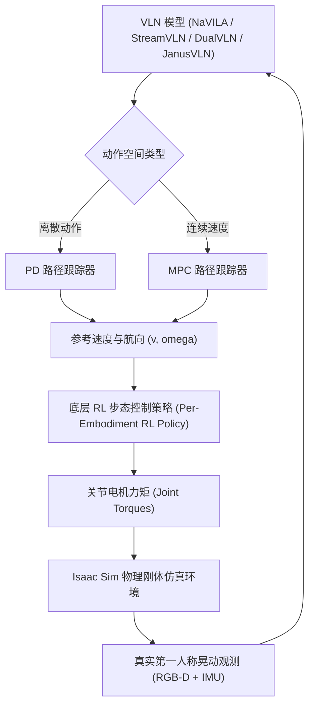
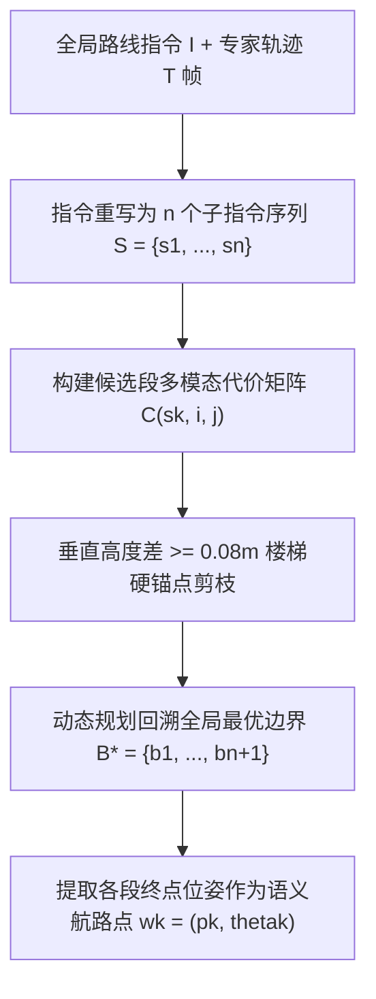
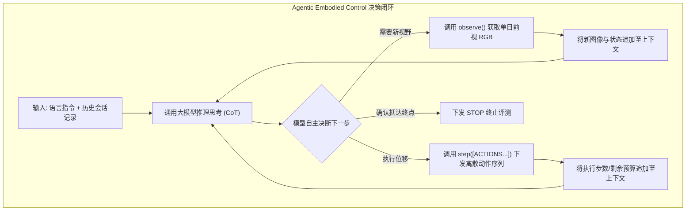
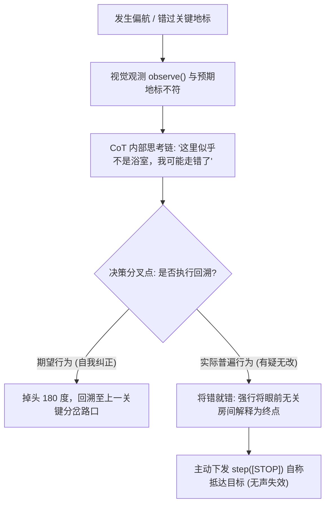

> 本文是 [VLN经典论文](/VLN-Papers/) 的扩展篇。主篇收录已发表于会议期刊、或已进入性能排行榜的 60 篇工作；本文收录其余论文，以近期预印本为主，按年份倒序排列。

<div id="paper-filter-bar" class="paper-filter-bar"></div>

# 具身导航论文扩展

## 1. HumanoidVLN (2026) {#humanoidvln}
———首个面向多样化双足人形机器人的物理真实 VLN 仿真平台与基准

📄 **Paper**: [arXiv:2608.12860](https://arxiv.org/abs/2608.12860) · [Project Page](https://humanoid-vln.github.io/)

### 精华
1. **打破运动学传送假设**：首次针对双足人形机器人建立基于 NVIDIA Isaac Sim 的全物理仿真评测平台，将高层 VLN 规划与底层强化学习（RL）步态控制相解耦，揭示了传统无物理仿真掩盖的跌倒与步态失稳问题。
2. **多形态硬件异构覆盖**：原生支持 4 款不同尺寸（1.17 m–1.80 m）与下肢自由度（10–12 DoF）的人形机器人，适配离散（PD 跟踪器）与连续（MPC 跟踪器）两种动作空间。
3. **可通行性筛选与 3DGS 重建**：构建 87 个高保真 3D 室内场景，硬性筛选可通行面积 $\ge 100\text{ m}^2$，结合改进的无偏深度与法线一致性 3DGS 流程生成高精度物理碰撞网格。
4. **多智能体指令协同生成（MAA）**：设计双生成器、单审查器与重述器的多模型协作流程，通过结构化拓扑路径图对齐与几何确定性仲裁，并辅以人工校验，产出 933 条高质量跨风格指令。
5. **真机强相关性验证**：在 Unitree G1 真机上的 Sim-to-Real 实测表明，仿真与现实的导航误差相关性高达 $r = 0.935$，证明了基于 3DGS 重建与物理仿真的基准具备极高的真机迁移预测力。

---

### 1. 研究背景/问题
现有的视觉语言导航（VLN）基准大多假设智能体为轮式底盘或采用理想化的“运动学传送”（Kinematic Teleportation），完全忽略了双足人形机器人的物理动力学约束。在实际部署中，不同人形机器人的形态差异巨大（身高从 1.17 m 到 1.80 m，下肢自由度 10–12 DoF），且行走时的身体晃动会导致剧烈的视线抖动与动态光照变化；若缺乏物理仿真，常规模型在面对急转弯或复杂地形时极易发生步态失稳乃至跌倒。为此，亟需一个兼顾多样化人形形态、物理真实动力学控制、大面积可通行场景与高质量指令的端到端评测平台。

---

### 2. 主要方法/创新点

<div align="center">
  
<figcaption>HumanoidVLN 物理基准评测流水线：涵盖多样化人形形态、分层控制栈、场景筛选、多模态数据集生成与即插即用评估</figcaption>
</div>

#### ① 整体框架概述
HumanoidVLN 构建在 NVIDIA Isaac Sim 物理仿真引擎之上，整体框架由三大支柱构成：**分层运动控制栈**（负责将高层语义动作转化为真实的足端接触与关节力矩）、**Real2Sim 场景构建流水线**（通过可通行性筛选与 3DGS 重建提供物理碰撞环境）以及**多智能体指令生成流水线（MAA）**（从第一人称抖动视频中自动提取结构化路径并结合人工复核）。

#### ② 逐模块讲解

**1. 分层运动控制架构（Hierarchical Control Stack）**
- **输入**：高层 VLN 模型输出的离散导航动作（前进、左转、右转、停止）或连续线速度/角速度指令。
- **处理**：控制系统划分为两层。**高层路径跟踪器**负责将导航指令转化为参考速度与航向角——对于离散动作模型采用比例-微分（PD）控制器生成平滑航向，对于连续动作模型采用模型预测控制（MPC）跟踪速度曲线；**底层强化学习（RL）步态策略**针对每种人形机器人的动力学参数单独训练，接收参考速度并输出 10–12 个下肢关节的力矩指令。
- **输出**：作用于刚体动力学的关节力矩，驱动双足机器人产生真实步态，并在第一人称相机中产生真实的晃动与俯仰。
- **设计动机**：彻底摒弃传统 VLN 中直接修改坐标的“空间瞬移”，使机器人的质心动力学（CoM）和接触稳定性真正约束路径的可行性。



| 维度 | 传统 VLN 平台（如 Habitat / R2R） | HumanoidVLN 平台 |
|---|---|---|
| 运动机制 | 运动学坐标传送（无质心与接触力学） | 底层 RL 关节力矩驱动（全刚体物理模拟） |
| 机器人形态 | 理想点状/圆柱轮式代理（单一固定高度） | 4 种异构人形机器人（1.17–1.80 m，10–12 DoF） |
| 视觉感知 | 平稳无抖动相机视角 | 真实双足交替步态引起的相机晃动与动态光照 |
| 失败模式 | 仅能检测碰撞或超时 | 可精确定量因急转弯、失稳引起的跌倒率（FR） |

**2. 跌倒判定判据（Fall Rate, FR）**
为了量化物理仿真下的步态稳定性，平台定义了基于躯干高度下降量 $\Delta h$ 与垂直下落速度的跌倒指标：

$$FR = \frac{100}{N} \sum_{i=1}^N \mathbb{I}[F_i = 1]$$

其中当机器人满足以下三项判据之一时判定为跌倒（$F_i = 1$）并立即终止该轮测试：
- $T_1$（动态剧烈跌倒）：$\Delta h \ge 0.5 H_e$ 且向下速度幅度 $> 1.2\text{ m/s}$；
- $T_2$（持续坍塌）：$\Delta h \ge 0.5 H_e$ 且持续时间 $\ge 2\text{ s}$；
- $T_3$（浅层快速下坠）：$0.35 H_e \le \Delta h < 0.5 H_e$ 且向下速度幅度 $> 1.5\text{ m/s}$。

> **举个例子**：以身高 $H_e = 1.80\text{ m}$ 的 Unitree H1 为例：
> 若机器人在转向时踩空失稳，身体在 $0.2\text{ s}$ 内高度下降了 $0.95\text{ m}$（$\Delta h = 0.95 > 0.5 \times 1.80 = 0.90\text{ m}$），下落垂直速度达到 $1.6\text{ m/s} > 1.2\text{ m/s}$，立即触发 $T_1$ 判据判定跌倒；
> 反之，若机器人在避障时主动屈膝下蹲 $0.4\text{ m}$（$\Delta h = 0.4 < 0.35 \times 1.80 = 0.63\text{ m}$），下落速度仅 $0.3\text{ m/s}$，则不会触发任何判据，正常继续导航。

**3. Real2Sim 场景构建与可通行性筛选**
- **大面积可通行筛选**：双足机器人步幅大、转弯半径受限，无法在狭窄杂乱环境中通行。平台从艺术家设计场景和 3DGS 重建场景中筛选出 87 个大场景，强制要求物理碰撞网格计算出的实际可通行面积 $\ge 100\text{ m}^2$（中位数达 $266\text{ m}^2$），覆盖住宅、零售、文化、办公、医疗、健身 6 大领域共 17 种房间类型。
- **高精度 3DGS 重建流水线**：基于 COLMAP 稀疏点云初始化 3D 高斯，并在 gsplat 训练中引入无偏深度渲染（Unbiased Depth Rendering）与深度-法线几何一致性约束（Depth-Normal Consistency），克服传统 3DGS 在无纹理大白墙与细长家具边缘法线破碎的缺陷，最终通过 TSDF 融合提取平滑的物理碰撞网格打包为 USDZ 资产。

<div align="center">
  
<figcaption>多智能体指令生成框架（MAA）：双生成器提取拓扑路径图，审查器基于几何与语义先验仲裁，重述器扩展风格并经人工最终复核</figcaption>
</div>

**4. 多智能体指令生成（MAA）与人工校验**
- **目标地标定位**：利用 Qwen3-VL-30B-A3B 从第一人称视频终点帧识别终止地标与停止条件。
- **双生成器独立解析**：Gemma-4-31B-it 与 InternVL3.5-38B 仅根据第一人称关键帧序列，独立推导结构化拓扑路径图 $R = \langle(a_i, \ell_i, s_i, o_i, m_i)\rangle_{i=1}^n$（分别代表有序动作、地标物体、相对路径左右方位、序数与转角幅度）。
- **审查器仲裁与先验校验**：对比两份拓扑路径图，合并无冲突节点；对于存在冲突的转向或地标，交由 Qwen3-VL-30B-A3B 审查器结合 2D 占用栅格图上的 A* 轨迹、轨迹元数据以及沿途可见的 3D 空间语义场景图（Scene Graph）进行几何与语义一致性仲裁。
- **风格多样化重述与人工复核**：由 GPT-5.5 将验证后的路径转换为 1 条细粒度指令和 3 种风格变体（正式 Formal、自然 Natural、口语 Casual），并要求反向解析出的拓扑路径与原图一致；最后由 3 名专业标注人员进行 100% 逐条复核与纠偏（20% 交叉双审），最终构建出 933 个高质量评测 Episode。

---

### 3. 核心结果/发现

<div align="center">
  
<figcaption>不同 VLN 模型在 4 种人形机器人形态下的跌倒率（FR）热力图对比：连续控制的 DualVLN 稳定性最佳，而高重心 10-DoF 的 H1 跌倒率显著偏高</figcaption>
</div>

1. **显式 3D 空间表征具备更强导航能力**：在四种主流 VLN 模型（NaVILA、StreamVLN、DualVLN、JanusVLN）的零样本评测中，引入显式 3D 空间记忆的 **JanusVLN** 取得了最高的平均成功率（$\text{SR} = 43.55\%$）和路径保真度（$\text{nDTW} = 48.38$）。
2. **离散急转动作诱发高跌倒率**：采用离散动作空间（前进、左转 30°、右转 30°）的模型在转向时会给底层步态带来阶跃扰动。身材最高（1.80 m）、自由度较少（10 DoF）的 Unitree H1 在 NaVILA 和 StreamVLN 下的跌倒率高达 $70.95\%$ 和 $64.52\%$；而采用连续速度输出并搭配 MPC 跟踪器的 **DualVLN** 则表现出最优的动态稳定性，全形态平均跌倒率最低。

<div align="center">
  
<figcaption>Sim-to-Real 真机实测一致性验证：(a) 仿真与真实真机单回合导航误差高度线性相关 (r = 0.935)；(b) 仿真与真实轨迹的 nDTW 相似度分布</figcaption>
</div>

3. **仿真评测高度预测真机表现**：在 Unitree G1 真机上部署 DualVLN 进行 20 个回合的 Sim-to-Real 对比实验，仿真环境与真机实测的导航误差呈现极强的正相关性（Pearson $r = 0.935$，Spearman $\rho = 0.911$），平均导航误差绝对差仅为 $0.68\text{ m}$，成对轨迹相似度达 $78.2 \pm 18.8\text{ nDTW}$，验证了 HumanoidVLN 物理仿真与 3DGS 重建资产的真实迁移价值。

---

### 4. 局限性
目前的评测场景仍受限于静态室内环境，尚未引入动态行人或可交互障碍物；此外，高精度刚体物理仿真的计算开销较高，且指令生成中的人工最终校验环节成为数据大规模扩展的吞吐瓶颈。

---

## 2. Route2Step (2026) {#route2step}
———解耦语义进度与局部执行，通过显式步级接口赋能具身导航纠偏

📄 **Paper**: [arXiv:2608.03143](https://arxiv.org/abs/2608.03143) · [Project Page](https://sisyphus-hxy.github.io/Route2Step/)

### 精华
1. **解耦语义跟踪与物理执行**：将连续视觉语言导航（VLN-CE）分解为负责全局语义进度的指令分析模块（$$\mathcal{M}_{\text{IA}}$$）与负责局部运动控制的动作生成模块（$$\mathcal{M}_{\text{AG}}$$），通过“活动子指令 + 执行状态（Normal/Recovering）”显式接口解耦两者的优化目标与时序感受野。
2. **免人工标注的几何航路点对齐（E-SPA）**：利用融合视觉语义、动作意图、时长正则及垂直楼梯硬锚点的多模态动态规划，自动将路线级演示切分为有序子指令轨迹段，并将各段终点位姿提取为物理空间中的语义航路点。
3. **分层纠偏消除错误耦合**：在固定子指令下采样策略 rollout，将离轨与环回轨迹统一转化为物理接地的“状态级监督”（190K 样本），而将专家动作标签严格限制在反复失败的 Recovering 区间（仅 11.5K 样本），根治了传统 DAgger 将偏离统一归咎于动作预测失误的缺陷。
4. **极高数据效率与即插即用迁移性**：仅用 11.5K 动作监督即超越 200K 传统 DAgger 样本，在 R2R-CE 取得 55.3% SR / 48.2% SPL；预测的活动子指令还能直接注入给 StreamVLN、NaVILA、Uni-NaVid 等冻结模型实现零样本性能跃升。

---

### 1. 研究背景/问题
现有基于多模态大模型（VLM）的具身导航策略通常采用端到端统一架构，直接从全局长指令和视觉历史预测低层控制动作。然而，当智能体在连续环境中偏离参考路径时，这种统一策略无法区分两种本质不同的错误来源：**语义进度错误**（智能体选错了当前活动的子指令）与**局部执行错误**（智能体明确当前子目标但操作失误，如卡在门框）。

传统的 DAgger 纠偏机制为所有离轨状态直接赋予专家下一步动作标签。这种做法虽然能让机器人暂时回到路线上，但并未显式纠正智能体内部紊乱的语义进度估计；智能体依然在错误的子目标下继续决策，导致后续动作持续失准。如何在无需人工密集标注的前提下，将语义进度跟踪与局部执行解耦，并为不同时序层次精准分配纠偏监督，是实现鲁棒长程具身导航的核心瓶颈。

---

### 2. 主要方法/创新点

<div align="center">
  
<figcaption>图 1：Route2Step 将路线级理解与步级局部执行解耦。$\mathcal{M}_{\text{IA}}$ 负责确定当前活跃的子指令，$\mathcal{M}_{\text{AG}}$ 则依据局部观测窗口负责具体执行。</figcaption>
</div>

#### ① 整体框架概述
Route2Step 摒弃了传统的端到端直接预测动作模式，构建了由**离线步级对齐引擎 E-SPA**、**指令分析模块 $$\mathcal{M}_{\text{IA}}$$** 与**动作生成模块 $$\mathcal{M}_{\text{AG}}$$** 组成的分层架构。$$\mathcal{M}_{\text{IA}}$$ 依据全局长指令与全量视觉历史确定“当前处于哪个子步骤且是否需要恢复”，$$\mathcal{M}_{\text{AG}}$$ 则根据显式接口与近期局部观测窗口自回归生成动作块（Action Chunks）。

<div align="center">
  
<figcaption>图 2：Route2Step 整体架构。$\mathcal{M}_{\text{IA}}$ 输出显式接口 $(s_t, m_t)$，$\mathcal{M}_{\text{AG}}$ 结合全局指令、接口与近期观测输出动作块；离线由 E-SPA 引擎提供步级对齐与物理航路点。</figcaption>
</div>

#### ② 显式语义-执行接口（MIA 与 MAG）
系统将导航决策拆分为两个独立优化且具有不同时间感受野的模块：
- **指令分析模块 $$\mathcal{M}_{\text{IA}}$$**：
  $$(s_t, m_t) = \mathcal{M}_{\text{IA}}(I, V_{1:t})$$
  输入全局指令 $I$ 与全局视觉历史 $V_{1:t}$（按幂律采样至多 13 帧历史 + 3 帧最新观测），输出当前活动的子指令 $s_t$（如 `"Exit the bedroom"`）以及二值执行状态 $m_t \in \{\text{Normal}, \text{Recovering}\}$。
- **动作生成模块 $$\mathcal{M}_{\text{AG}}$$**：
  $$a_{t:t+h} = \mathcal{M}_{\text{AG}}(I, s_t, m_t, V_{t-k:t})$$
  输入全局指令 $I$、显式接口 $(s_t, m_t)$ 以及短时局部观测窗口 $V_{t-k:t}$（从最新 40 帧中采样 8 帧），自回归预测至多 3 步基元动作块 $a_{t:t+h} \in \{\text{Forward}, \text{Left}, \text{Right}, \text{Stop}\}$。

两模块均基于 Qwen2.5-VL-3B 构建，中间接口通过自然语言文本序列化传递（例如 `Recovering: go through the white door.`）。**两模块之间不跨接口反传梯度**，彻底杜绝了局部动作更新对全局语义进度估计的隐式破坏。

| 比较维度 | 传统统一端到端策略（Unified DAgger） | Route2Step 分层解耦框架 |
|---|---|---|
| **决策机制** | $(I, V_{1:t}) \to \text{Actions}$（端到端黑盒隐式推理） | $$\mathcal{M}_{\text{IA}}$$ 管进度 $(s_t, m_t)$，$$\mathcal{M}_{\text{AG}}$$ 管执行 $a_{t:t+h}$ |
| **偏离路线后** | 仅赋予专家动作，语义进度易发生错乱漂移 | 物理航路点锁定 $s_t$ 不变，标记 $m_t=\text{Recovering}$ 专注脱困 |
| **时序感受野** | 全局历史与局部动作在同一网络内相互干扰 | $$\mathcal{M}_{\text{IA}}$$ 看宏观历史，$$\mathcal{M}_{\text{AG}}$$ 专看近 8 帧局部视野 |
| **纠偏数据分配** | 全量 200K 状态均强行灌入专家动作标签 | 190K 状态级修正 $$\mathcal{M}_{\text{IA}}$$ + 仅 11.5K 动作级精准纠偏 |

#### ③ E-SPA 离线步级对齐机制
标准 R2R 数据集仅包含路线级全文，缺乏细粒度时间步标注。E-SPA（Energy-minimizing Semantic Path Alignment）通过四维代价动态规划实现无监督步级切分：



候选段 $[i, j]$ 分配给子指令 $s_k$ 的总代价定义为：
$$C(s_k, i, j) = \lambda_{\text{sem}} C_{\text{sem}}(s_k, i, j) + \lambda_{\text{act}} C_{\text{act}}(s_k, i, j) + \lambda_{\text{dur}} C_{\text{dur}}(i, j) + \lambda_{\text{anchor}} C_{\text{anchor}}(s_k, i, j)$$

其中：
1. **语义匹配代价 $C_{\text{sem}}$**：提取 CLIP 归一化特征，通过温度缩放 Softmax 计算负对数似然；
2. **动作一致性代价 $C_{\text{act}}$**：将子指令的离线动作意图与轨迹实际运动向量求距离；
3. **时长正则代价 $C_{\text{dur}}$**：$C_{\text{dur}}(i, j) = (L_{i:j} - T/n)^2$，惩罚偏离均匀步长的切分；
4. **几何锚点约束 $C_{\text{anchor}}$**：检测连续高度变化 $\ge 0.08\text{m}$ 的楼梯区域，作为硬约束分块。

> **举个例子**：一条包含 30 帧的专家轨迹，对应 3 个子指令（理想每段平均长 10 帧）。
> 若某候选切分把第 1 个子指令切在第 1–3 帧（仅 3 帧），其时长惩罚为 $(3 - 10)^2 = 49$；
> 动态规划在全局权衡 CLIP 图像相似度、动作意图与时长代价后，自动将其校准在语义与转弯特征最契合的第 1–9 帧区间，并提取第 9 帧机器人的三维坐标与偏航角作为物理语义航路点 $w_1 = (p_1, \theta_1)$。

<div align="center">
  
<figcaption>图 3：几何接地的分层监督机制。(a) 专家参考路径；(b) 步级对齐提取的语义航路点；(c) 固定子指令的策略 rollout 与专家介入式恢复（蓝色实线为 Normal，红色实线为 Recovering，蓝色虚线为失败探索）。</figcaption>
</div>

#### ④ 几何接地的分层纠偏训练
模型训练分为两阶段：
1. **专家路径初始化**：在对齐的专家轨迹上分别初始化 $$\mathcal{M}_{\text{IA}}$$（标注 $m_t = \text{Normal}$）与 $$\mathcal{M}_{\text{AG}}$$。
2. **固定子指令 Rollout 与选择性专家介入**：
   - 保持当前活动的子指令 $s_k$ 恒定不变，让 $$\mathcal{M}_{\text{AG}}$$ 以温度 0.5 多次采样 rollout；
   - 设定物理完成判定：当进入航路点物理范围（$\lVert p_t - p_k \rVert_2 \le 1.5\text{m}$ 且角度误差 $\le 45^\circ$）视为达标；
   - 若某子指令下多次尝试均告失败，则触发**专家介入**（当偏离距离超阈值时接管引回轨迹）。接管期间标记 $m_t = \text{Recovering}$，引回后交还控制权。整个过程中子目标 $s_k$ 保持不变！

**监督分配法则**：
- **状态级监督（$$\mathcal{D}_S$$，190K 样本）**：所有常规与介入 rollout 的历史观测均用来训练 $$\mathcal{M}_{\text{IA}}$$，让其在各种迷路、环回状态下依然能认清真实语义进度与恢复状态；
- **动作级监督（$$\mathcal{D}_A$$，仅 11.5K 样本）**：仅提取反复失败组中 Recovering 区间的专家动作块训练 $$\mathcal{M}_{\text{AG}}$$，专注于局部避障与脱困。

**损失函数**：
$$\mathcal{L}_{\text{IA}} = -\mathbb{E}_{\mathcal{D}_E \cup \mathcal{D}_S} \left[ \log p_{\theta_{\text{IA}}}(s_t, m_t \mid I, V_{1:t}) \right]$$
$$\mathcal{L}_{\text{AG}} = -\mathbb{E}_{\mathcal{D}_E \cup \mathcal{D}_A} \left[ \log p_{\theta_{\text{AG}}}(a_{t:t+h} \mid I, s_t, m_t, V_{t-k:t}) \right]$$

---

### 3. 核心结果/发现

<div align="center">
  
<figcaption>图 4：在复杂室内真实环境中的实机导航轨迹。观测图像下方标注了 $\mathcal{M}_{\text{IA}}$ 预测的活动子指令，展现长程任务中清晰可解释的语义进度跟踪。</figcaption>
</div>

1. **主榜单表现出色**：在连续环境基准 R2R-CE Val-Unseen 上，Route2Step 在仅使用单目 RGB 且无额外数据预训练的条件下，取得了 **55.3% 成功率（SR）** 与 **48.2% SPL**，较专家基线（48.1% SR / 43.3% SPL）提升了 7.2 个百分点；在 RxR-CE Val-Unseen 亦取得 54.8% SR 与 42.6% SPL。
2. **纠偏监督分配极高能效**：
   - 传统 DAgger 使用 200K 动作监督仅提升至 49.8% SR；
   - Route2Step 采用 190K 状态级修正 + **仅 11.5K 动作级监督** 即跃升至 55.3% SR，动作监督量缩减至 1/17，但效果超出 5.5 个百分点。
3. **偏离状态下语义跟踪准确率跃升**：在 FG-R2R 人工对齐验证集上，面对人为注入的航向偏离、横向绕行、倒车及回环扰动，状态级修正使 $$\mathcal{M}_{\text{IA}}$$ 的严格子指令跟踪准确率从 43.54% 大幅提升至 **54.05%**（+10.51%）。
4. **优于 7B 统一端到端大模型**：使用完全相同训练数据的单体 Qwen2.5-VL-7B 统一策略仅取得 50.7% SR / 44.1% SPL，证明显式分层解耦的结构优势显著优于隐式统一策略。
5. **即插即用的跨策略泛化能力**：将 $$\mathcal{M}_{\text{IA}}$$ 预测的活动子指令作为外部文本提示直接注入冻结的 NaVid、Uni-NaVid、NaVILA 与 StreamVLN，无需任何二次训练，四款模型的 SR 分别直接提升 **+4.9%、+2.5%、+1.1%、+0.6%**。
6. **实机部署验证（Unitree GO2 四足机器人）**：搭载 Intel RealSense D455 单目 RGB，在包含实验室、咖啡馆、居民区、公园及停车场等 9 种跨场景测试中取得 19/33 成功率；在 120 词超长复杂室内任务中取得 3/5 成功（平均完成 5.0/7 个子目标），而基线 StreamVLN 成功率为 0/5（仅推进 2.2/7）。

---

### 4. 局限性
1. 物理语义航路点依赖环境局部连通性假设，当遇到门被完全锁闭或严重遮挡等不可行拓扑时，系统尚缺乏主动重规划全局路线的高层机制。
2. 采用双 3B VLM 独立运行在端侧推理时带来了双倍的前向计算开销，未来可探索多任务权重共享或轻量化蒸馏压缩。

---

## 3. Agentic Embodied Control (2026) {#agentic-embodied-control}
———极简接口下的通用智能体直接掌控具身交互循环，零样本性能比肩工业级训练策略

📄 **Paper**: [arXiv:2607.26148](https://arxiv.org/abs/2607.26148)

### 精华
1. **控制范式的根本反思**：打破具身导航依赖“专门策略训练”或“人工固定工作流/双脑交接状态机”的固有模式，证明冻结权重的通用大模型仅凭代码智能体框架（Harness）和最极简的感知动作接口，即可完全自主掌控交互循环并在零样本下取得顶尖性能。
2. **极简接口下的强大控制力**：在仅提供 $512 \times 512$ 单目 RGB 图像（无深度、无全景、无建图、无位姿反馈）和 4 个离散动作原语（前进 $0.25\text{ m}$、左转 $15^\circ$、右转 $15^\circ$、停止）的前提下，前沿推理模型（Fable-5 / Opus-5）在 R2R-CE 连续导航基准上达到 $70.7\% \sim 78\%$ 成功率，直接比肩工业级规模训练的导航策略。
3. **能力来源的单轴解耦**：消融实验证实**底层基础模型能力起决定性支配作用**（模型切换导致 SR 跨度高达 $5\% \sim 72\%$），而不同通用 Agent Harness 的差异微乎其微（仅 $1.7\% \sim 7.3\%$）。
4. **混合接口的涌现协同**：强制智能体使用路标预测器（Forced Waypoint）反而限制了强模型的微调对齐；而将路标作为可选工具（Hybrid Interface）开放时，智能体自主涌现出“远距离选路标快速巡航 + 目标近处切原语精细微调”的策略，以 $50\%$ 的步数和不足四分之一的耗时达到 $76.7\%$ 成功率。
5. **无声失效与具身落地鸿沟**：深入审计 30 个失败案例发现智能体存在严重的“有疑无改”现象（思考链已察觉偏航却依然执行错误终止）；实体四足机器狗部署表明“推理能力可迁移，但本体感知不可迁移”，缺乏尺寸意识与持久空间记忆是制约长程自主的核心瓶颈。

---

### 1. 研究背景/问题
- **现有具身导航的两大技术路线与控制权外置困境**：
  - **端到端训练策略（Trained Policies）**：如 NaVid、StreamVLN 等，通过海量具身数据训练专用网络，将观测逐帧映射为动作。此类方法对数据分布高度敏感，遇到分布外障碍或未见过的指令时缺乏高层泛化与反思纠错能力。
  - **固定工作流与双脑系统（Fixed Workflows & Dual-Brain）**：如 MapGPT、NavCoT、ABot-N1 等，虽然引入大模型，但将模型严格限制在人类编写的固定流水线中（例如固定先调用深度建图、再调用拓扑规划、再交接给低层控制器）。智能体无法根据当前情境自由决定何时观察、何时多走几步、何时放弃现有假设。
- **核心研究问题**：
  - 能否彻底剔除针对导航任务专门设计的外部脚手架（无外部地图、无深度传感器、无预设启发式搜索、无专用策略网络），**直接将高层交互控制权（Control Authority）完全交由通用推理智能体主导**？
  - 在最极简的单目前视视角与离散动作接口下，通用大模型的具身控制上限究竟有多高？其真正的能力边界与落地卡点何在？

---

### 2. 主要方法/创新点

<div align="center">
  
<figcaption>图 1：具身交互循环控制权归属对比（左）、极简接口交互探针架构（中）以及在 R2R-CE 上与强基线的成功率对比（右）</figcaption>
</div>

#### ① 整体框架概述：智能体自主具身控制（Agentic Embodied Control）
论文提出了一种极简的具身控制探针系统。整个系统由三层完全解耦的组件构成：**通用代码智能体框架（Harness）**、**极简感知动作接口（Interface）** 和 **冻结权重的多模态推理模型（Model）**。智能体在整个交互过程中拥有完全的控制主导权，根据自然语言指令与历史交互记录，自主决定每一轮调用观察工具、步进动作或是终止任务。

#### ② 逐模块深度解析（输入 → 处理 → 输出 → 设计动机）

1. **通用智能体框架层（Harness Layer）**
   - **输入**：用户下达的自然语言导航指令与当前会话的历史调用文本/图像上下文。
   - **处理过程**：直接采用为代码工程设计的通用框架（如开源的 `mini-swe-agent`、Anthropic 的 `Claude Agent SDK` 或 OpenAI 的 `Codex CLI`）。框架仅负责提示词拼接、工具分发执行、维持上下文会话，**不包含任何导航专用状态估计、拓扑图构建或回溯策略**。
   - **输出**：格式化的工具调用请求（Tool Calls）及环境返回结果。
   - **设计动机**：剥离所有围绕导航任务手工定制的外围代码逻辑，确保实验纯粹测试底层模型自身的具身推理与自主决策能力。

2. **极简感知工具 `observe()`**
   - **输入**：智能体在需要确认周围环境时发起无参数调用。
   - **处理过程**：环境渲染并返回当前智能体正前方的单张 $512 \times 512$ 分辨率 RGB 图像。**调用该工具不会推进仿真器时间步或消耗步数预算**。
   - **输出**：单张前视 RGB 图像。无全景视角、无深度图、无目标检测框、无语义分割、无激光点云。
   - **设计动机**：强制智能体摆脱对全景图和深度传感器的依赖，考察模型仅凭单目前视图像序列在脑海中维持空间朝向与地标记忆的能力。

3. **极简动作工具 `step(actions)`**
   - **输入**：一个由四个 Habitat 离散动作原语组成的有序序列列表（如 `["LEFT", "LEFT", "FORWARD", "FORWARD", "FORWARD"]`）。四个原语包括：
     - `FORWARD`：向前移动 $0.25\text{ m}$；
     - `LEFT`：原地左转 $15^\circ$；
     - `RIGHT`：原地右转 $15^\circ$；
     - `STOP`：宣告任务完成并主动终止评测。
   - **处理过程**：底层控制器按顺序执行该动作序列，受到单 episode 最大 500 步离散原语总预算的限制。
   - **输出**：仅返回实际执行的原语数量和剩余可用步数。**不返回任何视觉观察、不返回碰撞信号、不返回位姿或坐标漂移数据**。
   - **设计动机**：允许模型根据对环境的把握自主决定动作粒度（可发单个旋转微调，也可发一串组合前进）；隐藏碰撞与位姿信息以迫使模型必须在执行后主动调用 `observe()`，通过对比前后图像的视差变化来内省推断是否发生碰撞或卡阻。

<div align="center">
  
<figcaption>图 2：R2R-CE 连续环境中一个成功导航 episode 的完整执行日志重构，展现了智能体自主纠偏与空间反思过程</figcaption>
</div>

#### ③ 端到端交互数据流与自主纠偏机制
如图 2 所示，在一个完整的导航测试中（如包含 20 次观察、20 次步进、共 111 个离散原语动作），智能体展现了高度自洽的推理与自适应调整循环：
- **视野建立与转向**：初始观察到面对墙壁，模型推理出“需要转 180 度，即连续调用 12 次 15 度的左转”并批量下发 `L×12`。
- **碰撞与偏航感知**：在执行 `F×5` 后调用 `observe()` 发现视野几乎未变，模型在思考链中写道“我几乎没动，可能是右侧撞到了床角；让我向左偏转一点绕开它”，随即自主下发 `L2 F4` 成功脱困。
- **探索与回退**：误入带有梳妆台的小房间后，模型核对指令发现“原指令并未提及此房间，应直接穿过走廊去浴室”，立即掉头重新对准走廊并最终在距离浴室目标 $2.98\text{ m}$ 处自主执行 `STOP`。

---

#### ④ 难点降维 1：具身控制范式的本质跃迁（Control Authority）

很多读者容易把本工作误解为“又一个用 Prompt 跑 VLN 的零样本方法”。其核心差异在于**控制权归属（Control Authority）与工具调用模式**。

| 控制范式 | 控制权归属 | 核心机制 | 遇到异常/阻碍时的表现 | 代表方法 |
|---|---|---|---|---|
| **端到端策略网络 (Policy)** | 外部环境循环 | 单一神经网络每步输入图像直接映射为动作 | 缺乏高层反思，容易在死胡同里陷入局部震荡 | NaVid, StreamVLN |
| **固定流水线 (Workflow)** | 外部 Python 脚本 | 规则代码硬编码固定流程（建图 → 找路标 → 规划 → 执行） | 流程僵化，无法根据即时困难动态改变观察频率或求助其他工具 | MapGPT, SmartWay |
| **慢快双脑系统 (Dual-Brain)** | 预设交接协议 | 慢速 VLM 规划高层子目标，固定交接给快速动作专家网络 | 交接逻辑与更新频率由人工写死，高层意图常被低层策略失真 | ABot-N1, InternVLA-N1 |
| **智能体自主控制 (Agentic Control)** | **推理模型自身** | 统一由通用大模型自主决定何时感知、走几步、查地图还是选路标 | 模型完全自主掌控重试、绕行、重新定向与提前终止 | **本文方法** |



---

#### ⑤ 难点降维 2：混合动作接口（Hybrid Interface）的协同涌现

强制给智能体绑定路标预测器（Forced Waypoint）往往会削弱强模型的表现；但如果将**离散原语**与**训练好的路标预测器**同时开放给智能体作为可选工具（Hybrid Interface），智能体会自主组合出极具启发性的“粗细协同”策略。

> **举个具体例子**：
> 假设任务是从客厅出发，穿过 10 米长的走廊，进入主卧在床头柜旁停下（总距离约 14 米）。
> - **纯原语模式**：由于每次前进仅 $0.25\text{ m}$，走完 10 米走廊需要模型反复发出 $40$ 次前进原语，并频繁调用 `observe()` 检查走廊两侧门洞，容易因微小角度偏航反复微调，总共消耗约 $90$ 个原语步数与近 $40$ 次模型交互调用（耗时约 $210\text{ s}$）。
> - **强制路标模式**：模型只能从预测器给出的最多 5 个路标点中选择。在开阔走廊中只需 2~3 个路标即可快速通过；但在接近床头柜的最后 $1\text{ 米}$ 狭窄区域，预测器给出的候选点往往不够贴合床边甚至紧贴墙面，导致最终停靠偏离目标或碰撞，在复杂转角处极易超调。
> - **混合模式（Hybrid）**：智能体在前 80% 的长走廊路程中自主连续调用 3~4 次**路标导航**快速巡航；一旦视野中检测到床头柜进入近景，模型立即主动切换为**离散原语工具**，以 $0.25\text{ m}$ 和 $15^\circ$ 的微步精细对齐最终停靠点。
> **结果**：步数从 87 步腰斩至 48 步，调用轮数减少一半，交互耗时从 $210\text{ s}$ 锐减至 $112\text{ s}$，成功率反而从纯原语的 $68.3\%$ 提升到 $76.7\%$！

---

#### ⑥ 难点降维 3：具身智能体的“无声失效”与“有疑无改”

对 30 个失败 episode 的细致追踪揭示了当前通用大模型在具身环境下的深层行为缺陷。

| 失败类别 | 占比 (n=30) | 中位数最终距目标距离 | 典型表现与根本原因 |
|---|---|---|---|
| **A. 错误指代 / 错误分支 (Wrong Referent / Branch)** | $40.0\%$ (12例) | $17.3\text{ m}$ | 指令中包含多个歧义门洞或分岔路，模型在第一步就选错通道并一路走向完全无关的房间。 |
| **B. 停止决策失误 (Stop Decision)** | $23.3\%$ (7例) | $4.9\text{ m}$ | 模型视野中看到了指令中提及的目标物体（如沙发），但该物体是沿途参照物而非最终目的地，模型过早终止（Object-anchored overshoot/undershoot）。 |
| **C. 迷失发散搜索 (Runaway Search)** | $26.7\%$ (8例) | $18.6\text{ m}$ | 错过关键拐角后，模型没有选择掉头回溯，而是在未见区域盲目扩大搜索范围，距离目标越来越远。 |
| **D. 几何碰撞陷阱 (Geometry / Trap)** | $10.0\%$ (3例) | $5.5\text{ m}$ | 因缺乏碰撞反馈，模型在桌椅死角反复前进受阻，但无法从纯视觉中分辨是否卡死。 |



---

### 3. 核心结果/发现

<div align="center">
  
<figcaption>图 3：单轴消融实验结果。(A) 模型能力跨越 5~72 SR；(B) 开源与厂商 Harness 差异仅 2~7 SR；(C) 路标接口对弱模型是救命稻草，但对强模型和密集环境反而带来负面影响</figcaption>
</div>

#### ① R2R-CE 主榜成绩对比
在标准的 R2R-CE val-unseen（rand100 子集）上，极简接口下的通用智能体展现出惊人的零样本表现：
- **顶级表现**：Fable-5 在 Claude Agent SDK 下（最大思考预算）达到 **$78.0\%$ 成功率（SR）** 和 **$65.27\%$ 路径加权成功率（SPL）**；Opus-5 达到 **$70.7 \pm 3.5\%$ SR**。
- **超越同类零样本系统**：大幅领先同样在零样本设置下使用地图、显式记忆与深度工具的 AgenticNav（$55.0\%$ SR）与 Open-Nav（$50.0\%$ SR）。
- **比肩工业级训练策略**：直接逼近并部分超越了在数万小时具身数据上全量训练的专用策略，如 Qwen-RobotNav（全量验证集 $72.0\%$ SR）、NavFM（$77.2\%$ SR）以及 StreamVLN（$64.9\%$ SR）。

#### ② 模型、Harness 与接口的三维解耦发现
1. **模型轴（Model Dominates）**：在固定 Harness 和接口的情况下，仅更换底层 VLM 即可引起 $5\% \sim 72\%$ 的巨大性能跨度（Qwen3.5-4B 仅 $5\%$，GPT-5.6 达 $60\%$，Fable-5 达 $72\%$）。表明具身导航能力本质上是多模态空间推理与长上下文指令跟踪能力的自然涌现。
2. **Harness 轴（Harness is Modest）**：对比轻量开源的 `mini-swe-agent` 与闭源的 `Claude SDK` / `Codex CLI`，在同一模型下性能差异仅在 $1.7\% \sim 7.3\%$ 之间。
3. **思考预算（Reasoning Effort）**：增加模型的思维链计算量（Reasoning Effort）对部分模型有显著收益（Fable-5 从 default 的 $68.3\%$ 飙升至 max effort 的 $78.0\%$，提升 $+9.7\%$），但对小模型收益并不稳健。
4. **路标工具的双刃剑效应**：
   - 在 R2R-CE 上，对于较弱的模型（如 Qwen3.5-4B/9B），路标预测器将成功率从 $5\%/7\%$ 拯救至 $43\%/44\%$；但对于顶尖模型（Fable-5 / Opus-5），强制使用路标带来的提升仅为 $+0.7\% \sim +1.3\%$。
   - 在障碍更密集、路径更复杂的 **VLNVerse** 基准上，强制路标接口反而导致 Sonnet-5 成功率下降 $6\%$（$78\% \rightarrow 72\%$），Fable-5 下降 $4\%$（$84\% \rightarrow 80\%$），且碰撞率激增 4~6 倍。

#### ③ 真实四足机器狗（Unitree Go2）实体部署
在办公楼真实环境中进行的 31 次探索性实验表明：
- **推理能力成功迁移**：智能体能完美理解复杂条件指令（如“如果 $3+4=7$ 则左转，否则右转”）、多阶段“取物并返回”状态追踪，以及通过视觉细微特征（如“走向穿白色鞋子的人”）完成目标锁定。
- **本体感知完全缺失**：由于智能体不知道自身的物理尺寸（长宽与后腿位置），相机刚穿过门框即过早下发左转指令，导致机器狗后躯干直接撞上门框卡死（图 10）；此外，开环步进执行导致偏航角度累计漂移，且跨视角连续过柱子时发生计数混淆（图 11）。

---

### 4. 局限性
- **长程任务的上下文与时间开销暴涨**：在长程基准 RxR-CE 上，纯原语成功率从 $70\%$ 暴跌至 $26\%$；单 episode 交互产生的历史 token 达到 $33\text{k} \sim 169\text{k}$，单次决策中位数耗时超 200 秒，极度缺乏紧凑高效的持久空间记忆与状态整合机制。
- **开环控制与内省纠错闭环缺失**：缺乏本体物理感知与碰撞反馈容易在现实物理世界中发生几何卡死；同时模型内部存在严重的“自疑却盲目终止”行为，亟需建立真正的自我验证与主动回溯探索闭环。

---

## 4. ABot-AgentOS (2026) {#abot-agentos}
———面向具身智能的通用机器人 Agent 操作系统与终身多模态记忆系统

📄 **Paper**: [arXiv:2607.10350](https://arxiv.org/abs/2607.10350) · [Project Page](https://amap-cvlab.github.io/ABot-AgentOS)

---

### 精华

1. **模块化分层解耦架构**：ABot-AgentOS 部署于底层机器人控制器与高层基础 VLM/VLA 模型之间，将高层语义推理、技能执行、多级验证与记忆检索解耦，解决了传统单一模型控制器缺乏显式终止信号与过程漂移的问题。
2. ** Agent Harness 控制闭环**：提出包含全局 Main LLM 规划、 Skill Runner 上下文隔离局部执行以及 Verifier 运行期/技能期/结束期多阶段验证的“推理-执行-验证”闭环，显著降低长程任务中的虚假完成与盲目停滞。
3. **通用多模态图记忆（Universal Multi-modal Graph Memory）**：将语音、图像观察、空间地点、时间关联与任务轨迹转化为强类型的多模态图节点与边，支持基于证据溯源的检索与局部子图抽取。
4. **故障驱动终身自进化（Failure-Driven Lifelong Self-Evolution）**：构建基于 Trace 诊断的故障转 JSON DSL 资产机制，采用严格的后检查门控（Gating），在跨 Split 部署中实现零 ground-truth 泄露的累积式自我进化。
5. **具身基准测试 EmbodiedWorldBench**：推出首个跨室内外复合场景的可执行评测基准，覆盖 16 个场景、4 个难度等级与 200+ 复合任务；并提供了基于文本沙盒与自进化奖励引擎的端到端学生策略蒸馏训练管线。

---

### 1. 研究背景/问题

具身智能（Embodied AI）正在将人工智能从数字世界推向物理世界。近年来，视觉语言模型（VLM）与视觉语言动作（VLA）模型赋予了机器人出色的自然语言理解、视觉场景感知与动作预测能力。然而，在语义理解与可靠的物理执行之间仍存在关键鸿沟：
1. **语义信念与环境事实脱节**：在复杂长程任务中，现有的端到端控制器或简单的 API 调用缺乏显式的中间状态验证与终止信号。机器人可能执行了导航指令但并未移动，或在局部不断碰撞却在语言层面上认为任务正正常推进。
2. **缺少跨形态通用的 Agent 硬件抽象**：现有系统多与特定机器人形态或控制接口高度绑定，难以无缝扩展到人形机器人、四足狗等多样化硬件。
3. **记忆难以持久与溯源自我改进**：缺少能够跨会话持久存储、源头可追溯且能从历史交互故障中自我改善的通用多模态记忆系统。

为此，论文提出了 **ABot-AgentOS**，一个运行在底层控制器之上、解耦高层认知与物理动作的通用机器人 Agent 操作系统。

---

### 2. 主要方法/创新点

ABot-AgentOS 由**边云协同双 LLM 核心**、**Agent Harness 调度闭环**、**通用多模态图记忆**以及**端到端蒸馏训练管线**四大模块协同构成。

<div align="center">
  
<figcaption>ABot-AgentOS 系统整体架构：多源多模态输入通过边云协同双 LLM 核心路由，Agent Harness 闭环调度技能与多级验证，结合通用多模态图记忆与底层控制器</figcaption>
</div>

#### ① 整体框架与边云协同双核心

ABot-AgentOS 在架构设计上区分了边缘轻量模型与云端大模型（Dual-LLM Core）：
- **边缘 Tiny LLM**：部署于机器人端侧，优先处理常规会话、简单工具调用与实时控制指令，降低响应延迟。
- **云端 Large LLM**：当任务涉及长程复杂推理、多步规划或高难度图记忆检索时，由 learned routing 策略自动升级提升至云端大模型处理。

#### ② Agent Harness 闭环控制

Agent Harness 改变了传统单模型控制器的设计，将 Agent 调度划分为三个明确解耦的角色：

<div align="center">
  
<figcaption>Agent Harness 架构细节：Main LLM 负责全局场景感知规划，Skill Runner 隔离局部执行细节，Verifier 提供多阶段实时与终局验证</figcaption>
</div>

1. **Main LLM（语义规划器）**：接收用户指令与记忆上下文，根据当前场景生成可调整的高层计划与显式完成条件。Main LLM 不直接发出每一脚底层的微观动作，而是决定直接调用工具或将子任务委托给 Skill Runner。
2. **Skill Runner（过程执行器）**：作为技能级 Subagent 运行在独立的局部上下文中。它处理局部反复移动、视角微调与碰撞恢复等复杂过程，仅向 Main LLM 返回压缩后的高层执行结果摘要，防止局部细节阻塞 Main LLM 的全局规划。
3. **Verifier（多阶段验证器）**：
   - **运行期验证（Runtime Verification）**：监控轨迹与技能状态，及时识别停滞、局部死循环与频繁碰撞。
   - **技能期验证（Skill Verification）**：核查子任务是否真正达成语义目标，而非仅凭 Tool 返回成功。
   - **结束期验证（Finish Verification）**：在 Main LLM 试图终止任务时，对比初始指令、最终视觉观察与环境事实，防止虚假完成。

#### ③ 通用多模态图记忆与终身自进化

<div align="center">
  
<figcaption>通用多模态记忆架构与离线故障驱动自进化循环：在线写入源头可溯的类型图，离线将失败 Trace 编译为可控 JSON DSL 进化资产</figcaption>
</div>

1. **多模态记忆图（Memory Graph）**：将在线交互中的实体、事件、地点、视觉帧、时间关联与归因链（Provenance）写入强类型的节点与边，取代原始视频流或纯文本日志的堆叠。
2. **混合图检索器（Hybrid Graph Retriever）**：结合语义嵌入、词法匹配、元数据过滤与图边拓扑展开，抽取高质量局部证据子图。
3. **故障驱动终身自进化（Failure-Driven Lifelong Self-Evolution）**：
   - **Split 隔离协议**：在序列 split 部署中，第 $$t$$ 个 split 仅能使用历史已晋级的进化资产 $$A_{<t}$$。
   - **Trace 诊断与资产编译**：在 split 完成后，系统对失败样本进行 Trace 诊断，生成 JSON DSL 格式的候选进化资产（覆盖记忆写入、证据选择、帧选取、时间归一化等阶段）。
   - **严格门控校验（Gating）**：候选资产必须在目标验证集上提升分数且在回归集上不降低性能：
     $$\text{Accept}(a) = \mathbb{I}[\Delta S_{\text{target}}(a) \ge \tau_{\text{gain}} \land \Delta S_{\text{reg}}(a) \ge -\tau_{\text{reg}}]$$
     检验通过后方可晋级为 $$A_{\le t}$$ 供后续 split 使用，实现无标注泄露的累积增长。
4. **边云协同隐私管理**：边缘保留私有记忆（人脸、个人物品等），仅将公共无敏感信息的环境记忆（路障、道路地标）上云分享，隐私分类准确率达 99% 以上。

#### ④ EmbodiedWorldBench 与策略蒸馏训练管线

<div align="center">
  
<figcaption>EmbodiedWorldBench 评测基准概览：涵盖室内外复合场景、NPC 交互与动态事件的 16 个可执行场景与 4 级难度设定</figcaption>
</div>

论文推出了 **EmbodiedWorldBench**，涵盖 16 个室内、室外及混合场景，设 4 个难度等级与 200+ 个涉及导航、NPC 交互、物品搜索与动态事件响应的复合任务。

<div align="center">
  
<figcaption>学生策略端到端训练管线：通过文本沙盒构建环境、自进化奖励引擎生成偏好数据并使用 DPO/SFT 优化边缘部署模型</figcaption>
</div>

为了将云端大模型 Agent Harness 的能力下沉到端侧小模型，论文设计了端到端蒸馏管线：
1. **可控文本沙盒构建**：使用 LLM 自动生成具有可执行状态与复杂逻辑的文本沙盒环境。
2. **自进化奖励引擎**：基于结构化 Trace 生成自动评分与 DPO 偏好对。
3. **SFT + DPO 策略优化**：在沙盒环境中训练部署轻量化 Student Policy。

---

### 3. 核心结果/发现

1. **长程具身执行**：在 EmbodiedWorldBench 初始子集评估中，ABot-AgentOS 相较于单一控制器基线在任务成功率（Success Rate）与目标完成度（Goal Completion）上均取得显著提升，Verifier 机制减少了 35% 以上的早期误终止。
2. **多模态记忆基准全面领先**：
   - **LoCoMo**（长程会话记忆）：Static 版本达到 **87.5**，+Self-evo 提升至 **88.7**（接近人类上限 87.7）。
   - **OpenEQA (EM-EQA)**：8 帧预算下 Static 达到 **59.9**，+Self-evo 提升至 **60.4**（超越 SnapMem 57.2 与 GaussExplorer 57.8）。
   - **Mem-Gallery**：Static 达到 **88.6**，+Self-evo 提升至 **89.0**（在冲突检测 CD 97.5% 与拒绝回答 AR 100% 上表现突出）。
   - **NExT-QA**：Validation Acc@All 达到 **76.5%**（+Self-evo 提升 4.1 点），大幅领先 VideoAgent 等经典视频 Agent。
   - **EgoLifeQA**：单帧检索设置下取得 **66.2%** 平均准确率。
3. **终身自进化的跨任务泛化**：自进化机制在所有 5 个记忆基准上均带来了稳定增量，且性能增益完全来源于对记忆流水线（如时间规范化、关系消歧）的通用改进，而非记忆内容的暴力堆叠。

---

### 4. 局限性

1. **复杂真实物理世界的感知与控制噪声**：目前大规模验证多在可执行仿真或半物理沙盒中进行，面对真实世界的高噪深度感知、抓取失败与网络通信时延仍需更深度的硬件实机调优。
2. **自动化蒸馏依赖文本沙盒**：小模型策略蒸馏目前主要依赖文本状态沙盒环境，未来需要引入多模态视觉观察与更复杂的物理仿真平台（如 Isaac Sim/Habitat）。
3. **记忆自进化需要可信的反馈信号**：离线自进化机制依赖确定性的错误诊断或人类反馈，在开放无监督环境中如何安全界定“回答错误”仍是长远挑战。

---


## 5. NavWAM (2026) {#navwam}
———首个将未来预测、价值评估与动作决策集成于单一具身世界模型的导航模型

📄 **Paper**: [arXiv:2606.13494](https://arxiv.org/abs/2606.13494) · [Project Page](https://dachii-azm.github.io/navwam/)

### 精华
1. **一体化整合**：NavWAM 将传统导航世界模型（NWM）中分离的“未来预测”与“动作规划（如 CEM 搜索）”整合进单一的视频扩散 Transformer 网络中。
2. **共享 Latent Canvas**：将当前状态、目标图像、当前视觉观测、可执行动作 Chunk、未来状态、未来视觉预测和进度价值评估（Value）统一表征为固定 9 帧的潜在画布（Latent Canvas）序列，通过联合去噪实现多任务输出。
3. **消除在线规划开销**：在测试时直接以 Policy 模式进行单次推理去噪即可输出动作 Chunk，避免了传统世界模型繁重的在线轨迹采样与优化，控制频率可达 5Hz，计算量降低数千倍。
4. **提升表征质量**：通过引入未来视觉预测的 dense 自监督重构损失，为动作选择提供了强有力的“未来观测锚定”，显著降低了局部可观测下的策略漂移。

---

### 1. 研究背景/问题
在局部可观测的图像目标导航中，传统的基于规划的导航世界模型（NWM）通过预测动作序列条件下的未来视觉变化来辅助决策。然而，这些方法通常将“世界预测”和“动作选择”分为两个独立的步骤：模型仅作为一个单纯的预测器，而在推理时必须依靠外在的规划算法（如交叉熵方法 CEM）在大量的随机候选动作序列中进行耗时的闭环生成与评分。这导致了巨大的在线计算开销（通常低至 sub-Hz 级别）。为了消除这一瓶颈，本研究致力于构建一个世界动作模型，将未来感知预测、价值估计和连续动作生成直接统一在单个网络表征中。

---

### 2. 主要方法/创新点
<div align="center">
  
<figcaption>传统导航世界模型 (NWM) 与导航世界动作模型 (NavWAM) 的对比示意图</figcaption>
</div>

#### 整体框架
NavWAM 使用预训练的视频世界模型 Cosmos Predict2 (2B) 作为网络底座，将当前观测、图像目标、机器人状态、未来动作序列（Action Chunk）、未来视觉观测和目标进度价值（Goal-Progress Value）融合成一个统一的 9 帧“世界-动作潜在画布（World-Action Latent Canvas）”。通过这种表征，导航任务被建模为在潜在画布上的联合去噪问题。

<div align="center">
  
<figcaption>NavWAM 的 Latent Canvas 帧布局与数据流动</figcaption>
</div>

#### Latent Canvas 帧布局
画布中的 9 个帧被定义如下：
* **帧 0 (Observed)**：Causal VAE temporal pad（全零帧），为时空 VAE 压缩提供边界。
* **帧 1 (Observed)**：当前机器人状态 $s_t = [x_t/100, y_t/100, \psi_t/\pi] \in \mathbb{R}^3$，在局部坐标系中标准化。
* **帧 2 (Observed)**：目标图像 $g$（Image Goal）。
* **帧 3 (Observed)**：当前第一人称视觉观测 $o_t$。
* **帧 4 (Predicted)**：待预测的可执行动作 Chunk $a_{t:t+H-1} \in \mathbb{R}^{3H}$，其中 $H=4$（表示局部航向点增量 $[\Delta x_i, \Delta y_i, \Delta \psi_i]$）。
* **帧 5 (Predicted)**：未来状态预测 $s_{t+H} \in \mathbb{R}^3$。
* **帧 6 & 7 (Predicted)**：未来的两个自车视角图像预测 $o_{t+H-1}, o_{t+H}$。
* **帧 8 (Predicted)**：目标进度估计值 $v_{t+H} \in [0, 1]$。

对于动作、状态、价值等非图像标量/向量，NavWAM 首先对其进行归一化，然后将其在空间网格（Spatial Grid）上进行广播（Broadcast）填充为整帧；解码时则通过空间平均（Spatial Averaging）将对应通道的去噪特征恢复为标量/向量值。

#### 训练目标与混合模式
网络损失函数基于潜在画布上的加权去噪得分匹配：
$$\mathcal{L}_{\text{diff}} = \mathbb{E}_{\sigma, \epsilon} \left[ w(\sigma) \lVert x_0 - F_\theta(x_\sigma, \sigma, c) \rVert_2^2 \right]$$
为了防止低维的动作信号淹没在图像重构的高维像素损失中，动作帧损失被乘以权重系数 $\lambda = 5$ 进行了上采样增强。

在训练阶段，样本被划分为三种不同的条件模式以促使网络联合学习不同的导航子任务（比例为 50/25/25）：
1. **Policy 模式 (50%)**：给定观测帧 0–3，预测帧 4–8。
2. **World-Model 模式 (25%)**：给定观测帧 0–4，预测帧 5–8。训练模型在动作条件下的物理演化预测。
3. **Value 模式 (25%)**：给定观测帧 0–7，预测帧 8（当前轨迹下的目标进度价值）。

#### 目标进度价值设计
价值目标 $v_{t+H}$ 被显式定义为反映机器人局部到终点精度的归一化距离进度：
$$v_{t+H} = \text{clip}\left( 1 - \frac{\lVert p_{\text{end}} - p_t \rVert_2}{d_{\text{max}}}, 0, 1 \right)$$
其中 $p_t$ 为当前 2D 位置，$p_{\text{end}}$ 为目标 2D 位置，$d_{\text{max}}$ 为轨迹最大长度上限。

#### 推理流程
在部署阶段，机器人获取当前图像 $o_t$ 和目标 $g$，在 Policy 模式下运行，通过单次去噪过程直接输出 $$\hat{a}_{t:t+H-1}$$。随后以 Receding-Horizon 的方式执行这组动作 Chunk，执行完毕后重新请求网络，实现大约 5Hz 的高频闭环响应。

---

### 3. 核心结果/发现
<div align="center">
  
<figcaption>GO STANFORD 测试集上 NavWAM、NWM 与 NavWAM w/ FT 的未来图像预测质量对比</figcaption>
</div>

1. **更优的导航表现**：在 GO STANFORD 离线图像目标导航上，NavWAM 在无需推理时 CEM 动作搜索的前提下，其 zero-shot（ATE 0.324）和微调版（ATE 0.192 / RPE 0.070）均优于传统的 NWM（ATE 0.453）。同时，模型保持了卓越的未来视觉预测一致性（Consistency 达 0.635–0.668，明显好于 NWM 的 0.524）。
2. **极其低廉的推理开销**：单次去噪推理代替 CEM 轨迹优化，使得 NavWAM 的 FLOPs 仅为 4.45 TF，推理延迟仅为 205.7 ms，而同底座的 NWM 延迟达 233.8 秒，FLOPs 高达 14,521 TF，推理成本相差数千倍。
3. **多任务监督的作用**：消融实验证明，未来视觉预测监督能够为决策系统带来长程路标锚定，是不可或缺的自监督信号（相比去掉未来图像的策略，ATE 从 0.090 降低到 0.076）。
4. ** Diablo 机器人实机闭环成功率**：在真实室内环境（Office, Storage, Meeting, Hallway）的 24 次部署测试中，NavWAM 取得了 79.2% 的高成功率，远超 OmniVLA (58.3%) 和传统 NWM (16.7%)，证明了极强的鲁棒性。

<div align="center">
  
<figcaption>Diablo 机器人实机运行期间的实测相机画面与预测未来画面对比（H=4）</figcaption>
</div>

---

### 4. 局限性
1. **测试场景局限**：实机评估主要集中在静态的室内环境中，面对含有行人和移动物体的动态障碍物场景未做验证。
2. **目标形态局限**：主要针对图像目标导航（Image-Goal Navigation），对于自然语言指令导航、物体类别导航（Object-Goal）以及具身问答尚未开展系统验证。
3. **长程瓶颈**：面对跨楼层、多房间的大范围、极长程导航场景（需要频繁的子任务规划与重规划），由于上下文帧数限制，依然存在表现衰退的风险。

---


## 6. WorldVLN (2026) {#worldvln}
———Autoregressive World Action Model for Aerial Vision-Language Navigation

📄 **Paper**: [arXiv:2605.15964](https://arxiv.org/abs/2605.15964)

---

### 精华

WorldVLN 将航空 VLN 重新定义为"预测驱动的世界-动作"问题：Agent 不直接从观测映射到动作，而是先在隐空间预测世界状态演化，再从预测的隐表示解码出可执行路径点。其核心启发是：**空间导航本质上是预期性的**，如同人脑预测移动后的状态变化。将视频生成模型的时序先验迁移至导航，并通过 Action-aware GRPO 强化学习直接优化动作后果而非视觉合成质量，这两个设计使 WAM 范式在有限训练步数下超越 VLA 基线 12+ 个百分点。闭环自回归更新（用真实观测替换模型生成的隐状态）解决了长程隐预测的漂移问题。零样本迁移到真实无人机验证了隐式预测架构的潜在泛化能力。

---

### 1. 研究背景/问题

现有 VLA 模型将 VLN 视为从指令和观测到动作的条件映射，虽具备语义理解能力，但缺乏对"Agent 自身动作如何改变世界状态"的显式时序因果建模，导致在空间推理和几何精度上存在明显短板。视频生成模型虽拥有强大的时空先验，但其生成目标（视觉真实性）与 VLN 目标（动作导向的状态预测）之间存在结构性错配：大多数视频骨干以双向方式生成整段视频，而 VLN 需要因果性的"观测—行动—更新"闭环；此外，生成模型的隐表示未被优化为可动作解码的形式。

---

### 2. 主要方法/创新点

**整体框架：** WorldVLN 由三大模块构成——（1）潜空间时空自回归 Transformer（世界骨干）负责预测短时域世界状态转变；（2）动作解码器（Action Decoder）将隐状态转变解码为可执行路径点；（3）两阶段训练框架，先通过监督学习对齐视频先验与导航动态，再通过 Action-aware GRPO 强化学习优化动作后果。

<div align="center">
  
<figcaption>图1：WorldVLN 整体架构。模型从指令和历史观测预测短时域隐状态转变，解码为路径点动作，执行后将真实观测编码回自回归上下文。</figcaption>
</div>

**① 世界骨干（Latent Autoregressive Video Transformer）**

- **输入**：文本编码器输出指令嵌入 $e_\ell = \psi(\ell)$，以及历史真实自中心观测编码后的隐状态序列 $z_{\leq t}$
- **处理**：时空自回归 Transformer 按从粗到细的尺度预测多尺度 token 块（先全局低分辨率，再局部高分辨率），并沿时间维度按片段顺序自回归生成
- **输出**：短时域隐状态预测 $$\hat{z}_{t+1:t+K} \sim p_\theta(\cdot \mid e_\ell, z_{\leq t})$$
- **设计动机**：借用视频生成模型的时序先验而非从头学习，同时将生成架构改造为因果自回归以支持闭环

<div align="center">
  
<figcaption>图6：潜空间时空自回归世界骨干架构。输入图像或历史视频被编码为已知视觉金字塔条件，预测未来目标片段金字塔，多尺度 token 块聚合为输出隐表示。</figcaption>
</div>

**② 动作解码器（Action Decoder）**

- **输入**：世界骨干输出的未来隐表示 $$\hat{z}_{t+1:t+K}$$（紧凑时空表示，编码了视角变化、空间结构变化和运动趋势）
- **处理**：Vision Embedding 模块将隐表示转换为时空嵌入 token；多层 Transformer Block 采用分解时空注意力——时间注意力捕捉跨帧运动演化，空间注意力建模每帧内的几何结构；MLP 动作头将聚合特征回归到连续动作向量
- **输出**：连续路径点动作 $$a_{t:t+K-1} = D_\phi(\hat{z}_{t+1:t+K})$$，对应 UAV 的相对 3D 位移和偏航角变化
- **设计动机**：避免将隐状态解码为视频帧再估计运动（有误差累积），直接从隐表示推理动作更简洁高效

<div align="center">
  
<figcaption>图7：动作解码器架构。世界模型输出隐表示经视觉嵌入转换为时空 token，多层分解时空注意力 Transformer Block 建模动作相关特征，最终由 MLP 回归为连续 UAV 导航动作。</figcaption>
</div>

**③ 闭环自回归更新**

完整推理循环为：
$$
(e_\ell, z_0) \to \hat{z}_{1:K} \to a_{0:K-1} \to o_{1:K} \to z_{1:K} \to \hat{z}_{K+1:2K} \to \cdots
$$
关键在于执行动作后，将**真实观测**重新编码 $z_{t+1:t+K} = E_\text{vid}(o_{t+1:t+K})$ 替换模型预测的隐状态，防止隐预测漂移积累。

**④ 两阶段训练框架**

<div align="center">
  
<figcaption>图2：两阶段训练框架。Stage 1 用指令-视频对监督世界骨干，用视频-轨迹对监督动作解码器。Stage 2 采样多条在线轨迹，用轨迹精度、任务进度和参考策略正则化分配 Segment 级奖励，通过 Action-aware GRPO 更新 WorldVLN。</figcaption>
</div>

**Stage 1 — 监督训练（世界先验对齐）**

世界骨干目标：
$$
\mathcal L_\text{wm} = -\sum \log p_\theta(z_{t+1:t+K} \mid e_\ell, z_{\leq t})
$$

动作解码器目标（通过视频-动作教师模型蒸馏初始化）：
$$
\mathcal L_\text{act} = \sum \lVert D_\phi(E_\text{vid}(o_{t+1:t+K})) - a^*_{t:t+K-1} \rVert
$$

**Stage 2 — Action-aware GRPO（动作后果对齐）**

对每条导航案例采样 $G$ 条在线轨迹，每条包含 $n$ 个自回归决策段，对第 $j$ 段分配奖励：

$$
r^{(i)}_j = \gamma^{j-1}\left(\lambda_\text{traj} r^{(i)}_{\text{traj},j} + \lambda_\text{task} r^{(i)}_{\text{task},j} + \lambda_\text{ref} r^{(i)}_{\text{ref},j}\right)
$$

- **轨迹奖励** $r_\text{traj}$：局部几何监督，衡量预测动作与专家动作的接近程度
- **任务奖励** $r_\text{task}$：全局终点评估，衡量轨迹终点与目标的距离
- **参考奖励** $r_\text{ref}$：KL 正则化，保持更新策略与参考策略（Stage 1 产物）的一致性，防止世界先验退化
- **时序衰减** $\gamma^{j-1}$（$\gamma=0.9$）：早期决策权重更大，因其影响后续更长的动作链

优势归一化后以 GRPO 截断目标更新策略。

---

### 3. 核心结果/发现

**UAV-Flow-Sim（室外）**：WorldVLN 达到 79.12% / 78.02% 平均 SR（固定/开放语言模板），分别比最强基线提升 **13.51 / 12.24 个百分点**。在 Approach（97.62%）、Land（98.15%）、Move（100%）等精细动作上表现尤为突出。

**IndoorUAV-VLA（室内）**：Full-set SR 达 **41.76%**，比最强基线（π0，27.16%）提升 **14.60 个百分点**；Hard 难度下 SR 从 7.55% 提升至 **41.19%**，显示对复杂多步动作组合的强适应能力。

**消融分析**：
- 与 OpenVLA 对比：相同步数下，Stage 1 后的 WorldVLN 已超越 OpenVLA-SFT，表明 WAM 范式学习效率更高
- 自回归 vs 全序列预测：自回归提升 SR 5.7+ 个百分点，隐预测可视化显示全序列预测存在语义漂移，而自回归因持续融合真实观测保持了连贯的视觉空间表示
- Action-aware GRPO：在 Stage 1 接近饱和后额外提升 10+ 个百分点，轨迹可视化显示 RL 后模型能正确执行"环绕"等几何精确动作

**零样本真实机器部署**：在仅用仿真数据训练的情况下，WorldVLN 在 250 mm 轴距四旋翼无人机上实现室内和室外的语言指令跟随，机载 Jetson Orin NX + 远程服务器推理架构验证了实际可部署性。

---

### 4. 局限性

当前实验主要针对短程低时域导航，长距离多阶段 VLN 尚未充分验证；受骨干计算量限制，真实部署仍依赖服务器端推理，无法完全机载运行。

---


## 7. SparseVideoNav (2026) {#sparsevideonav}
———Sparse Video Generation Propels Real-World Beyond-the-View Vision-Language Navigation

📄 **Paper**: [arXiv:2602.05827](https://arxiv.org/abs/2602.05827)

### 精华

SparseVideoNav 最值得借鉴的核心思想：**视频生成模型（VGM）天然具备长视野预测能力**，可以替代 LLM 作为导航的"大脑"，彻底解决 LLM 短视野导致的短视行为。**稀疏化**（sparse video generation）是兼顾长预测视野与计算效率的关键设计——不需要预测连续帧，只需关键时间戳处的帧即可提供有效导航指引。**四阶段渐进式训练**（T2V→I2V→历史注入→扩散蒸馏→动作学习）将大规模预训练视频模型迁移到导航领域，是一套通用的 VGM 适配范式。**Diffusion Distillation** 将推理步数从 50 步压缩到 4 步（9.6× 加速），使实时部署成为可能。此外，**Q-Former + Video-Former** 的历史压缩策略解耦了推理延迟与历史长度的关系，保证了稳定的推理效率。

---

### 1. 研究背景/问题

现有视觉-语言导航（VLN）系统依赖 LLM，受限于短视野监督（4-8步），在 Beyond-the-View Navigation（BVN）任务中表现欠佳：智能体需要在没有逐步指引的情况下，仅凭高层语义指令（如"找一张桌子并停在旁边"）定位远处不可见目标，LLM-based 方法因此频繁出现意外转向和死路困陷。简单延长监督视野会破坏 LLM 训练稳定性，而视频生成模型天然对齐长视野语言理解，成为解决 BVN 的关键突破口。

---

### 2. 主要方法/创新点

<div align="center">
  
<figcaption>
SparseVideoNav 概览：视频生成模型提供稀疏预见（Sparse Video Foresight），相较 LLM-based 基线（StreamVLN、InternVLA-N1、UniNavid）在 BVN 任务上大幅领先，推理速度提升 27×
</figcaption>
</div>

**核心思路：** 利用视频生成模型（VGM）预测未来稀疏帧序列作为导航预见，将预测视野延伸到 20 秒（20s × 4FPS = 80帧），而非 LLM 仅能处理的 4-8 步。稀疏间隔设为 3 时（sparse interval = 3），在预测视野与视觉保真度之间取得最优平衡。

**整体架构：**

<div align="center">
  
<figcaption>
SparseVideoNav 整体架构（上）与四阶段训练流程（下）。VGM backbone 接收当前观测、历史帧和语言指令，生成稀疏视频 latents，DiT-based action head 基于生成的未来预见和语言指令预测连续动作
</figcaption>
</div>

架构由三个核心组件构成：
- **VGM Backbone**（Wan 2.1-1.3B）：接收当前帧、历史嵌入（h_T）和语言指令（umT5），输出未来稀疏视频 latents
- **Former 模块**：Q-Former 处理时间维度历史压缩，Video-Former 处理空间维度，联合生成固定维度的历史嵌入，使推理延迟不随历史长度增长
- **DiT Action Head**：以生成的稀疏未来 latents 和语言指令为条件，通过 cross-attention 预测连续动作序列（DDIM 重建）

**四阶段训练流程：**

1. **Stage 1 — T2V → I2V 适配**：保留 Wan 的 flow matching 目标，将文本到视频模型适配为图像条件的视频生成（Image-to-Video），引入稀疏帧监督，以稀疏 chunk latents `[c_{T+1}, c_{T+2}, c_{T+5}, c_{T+8}, ..., c_{T+20}]` 作为训练目标

2. **Stage 2 — 历史注入**：在 Wan backbone 每个 transformer block 中新增 cross-attention block，注入历史信息 h_T（Q-Former + Video-Former 编码）；新增层以零初始化保留预训练生成先验

3. **Stage 3 — Diffusion Distillation**：采用 PCM（Phased Consistency Models）进行蒸馏，以 history-injected I2V 模型为 teacher，训练结构相同的 student 模型，将推理步数从 N=50 压缩至 M=4，实现 9.6× 推理加速，同时保持视觉保真度

4. **Stage 4 — 动作学习**：冻结蒸馏后的 I2V 模型，采用逆动态范式（inverse dynamics paradigm），利用 DA3 对生成的稀疏未来帧重新标注动作标签，确保动作监督与合成动态精确对齐；训练 DiT action head 以去噪方式预测连续动作

**数据采集：** 使用手持 DJI Osmo Action 4（RockSteady+ 稳像）采集 140 小时真实室外导航视频，处理为约 13,000 条轨迹（均值 140 帧 × 4FPS），使用 DA3 估计相机位姿提取连续动作标签；语言指令由人工专家标注——构建了目前最大规模的真实世界 VLN 数据集。

---

### 3. 核心结果/发现

<div align="center">
  
<figcaption>
SparseVideoNav 在零样本 BVN 部署中的视频生成结果分析。模型从当前帧（T）预测未来稀疏帧序列至 T+20，跨室内（找桌子）、室外（找空调）、户外（找垃圾桶）多种场景
</figcaption>
</div>

<div align="center">
  
<figcaption>
消融研究：a) 数据扩展随规模持续提升 FVD；b) 稀疏设计带来 1.7× 推理加速；c) Diffusion Distillation 带来 9.6× 推理加速；d) Former 历史压缩保持稳定推理延迟（无 Former 时 +54.9% 随历史长度增长）
</figcaption>
</div>

**零样本真实世界性能：**
- SparseVideoNav 在 6 种真实场景（室内 Room/Lab、室外 Yard/Park、夜间 Square/Mountain）上全面超越所有 LLM-based 基线
- **IFN 任务**平均成功率 **50.0%**（vs StreamVLN 35.0%、UniNavid 10.0%）
- **BVN 任务**平均成功率 **25.0%**（vs 所有基线几乎为 0%，StreamVLN 仅 10.0%）
- 夜间场景成功率 **17.5%**（LLM 基线在夜间 BVN 全部失败）

**效率提升：**
- 推理延迟 **9.8s** vs 基线 **21.6s**（**27×** 加速对比未优化版本）
- Stage 1+2 训练时间 **32h** vs 从头训练 **64h**（**2×** 加速）
- 稀疏设计带来 **1.7×** 推理加速，Distillation 带来 **9.6×** 加速

**鲁棒性：** 在训练高度（1m）与部署高度（50cm）不一致时仍能正确导航，展示出对相机高度变化的强鲁棒性；能够动态规避行人障碍（emergent ability，非显式训练）。

---

### 4. 局限性

当前 140 小时数据集相较于网络规模数据仍然有限，数据扩展是进一步提升的关键方向；推理延迟（9.8s）仍略高于现有 LLM-based 导航范式（StreamVLN），加速蒸馏与 VGM 量化是未来研究的重要课题。

---


## 8. FantasyVLN (2026) {#fantasyvln}
———统一多模态Chain-of-Thought推理用于视觉-语言导航

📄 **Paper**: [arXiv:2601.13976](https://arxiv.org/abs/2601.13976)

**精华**
这篇论文展示了如何通过统一框架整合文本、视觉和多模态CoT推理模式,值得借鉴的点包括:(1) 训练时使用CoT监督、推理时直接预测的隐式推理范式,避免了显式CoT的token膨胀问题;(2) 使用预训练VAR模型将想象的视觉观测压缩到紧凑潜在空间,大幅降低序列长度;(3) 通过跨模态对齐约束统一不同推理模式,学习模态不变的推理表示;(4) 门控机制实现单一模型灵活切换多种推理模式。这种设计在保持推理能力的同时实现了实时导航,为具身智能任务提供了实用的解决方案。

**研究背景/问题**
现有VLN方法面临关键挑战:纯文本CoT缺乏空间理解且容易过拟合稀疏标注;多模态CoT通过生成想象的视觉观测引入严重的token膨胀,导致推理延迟增加数个数量级,无法实现实时导航。这在长时域、多阶段导航场景中尤为突出。

<div align="center">
  
<figcaption>
FantasyVLN系统概览:整合文本和视觉CoT推理模式,联合建模语义规划和空间理解
</figcaption>
</div>

**主要方法/创新点**

FantasyVLN提出了统一的隐式推理框架,核心创新包括:

**1. Compact Visual CoT (CompV-CoT)**
- 使用预训练的Visual AutoRegressor (VAR)模型将想象的视觉观测编码到紧凑潜在空间
- VAR采用next-scale预测范式,256×256图像仅需30个视觉token即可精确重建,压缩比达1/2185
- 训练时VLM直接生成VAR潜在表示,推理时无需显式VAR解码,大幅提升效率

**2. 统一多模态CoT (UM-CoT)框架**
- 通过二元门控信号 gT 和 gV 控制文本和视觉推理的激活
- 四种推理模式:(a) Non-CoT (gT=0, gV=0) 直接预测动作;(b) T-CoT (gT=1, gV=0) 生成文本推理步骤;(c) V-CoT (gT=0, gV=1) 生成压缩视觉想象;(d) MM-CoT (gT=1, gV=1) 联合生成文本-视觉推理
- 单一模型共享参数,通过数据混合实现端到端联合训练

<div align="center">
  
<figcaption>
统一多模态CoT推理框架:支持四种推理模式,训练时使用CoT监督,推理时直接动作预测
</figcaption>
</div>

**3. 跨模态对齐约束 (Cross-Mode Alignment)**
- 将Non-CoT模式的动作预测作为软监督信号,对齐所有CoT变体的动作输出
- 交替优化Non-CoT目标和跨模态对齐的联合目标,嵌入多样化推理模式到统一潜在策略
- 防止不同推理模式间的冲突,学习一致的模态不变表示

**4. 隐式推理机制**
- 训练时:联合学习文本、视觉和多模态CoT模式
- 推理时:采用Non-CoT模式直接指令到动作映射,无需生成显式CoT序列
- 借鉴Aux-Think的"train-with-CoT, infer-without-CoT"范式,模型隐式保留推理感知表示

**训练细节**
- 基础模型:Qwen2.5-VL (7B参数)
- 数据:LH-VLN训练集18,554个导航轨迹切片(每5步一个切片)
- T-CoT标注:使用Qwen-VL-Max生成,包含语义规划、视觉描述、动作规划和视觉想象四部分
- 优化:LoRA微调,AdamW优化器,学习率1e-4,64×H20 GPUs,DeepSpeed ZeRO-2

<div align="center">
  
<figcaption>
不同VAR scale对ISR性能的影响:scale 4达到最佳平衡
</figcaption>
</div>

<div align="center">
  
<figcaption>
VAR模型在不同scale下的图像重建质量对比:scale越高,重建质量越好,但token数量也越多
</figcaption>
</div>

**核心结果/发现**

**导航精度 (LH-VLN benchmark)**
- SR (成功率): 2.44% (所有基线中最佳)
- ISR (独立成功率): 11.01% (显著优于所有方法)
- CSR (条件成功率): 9.64%
- CGT (加权CSR): 8.99%
- 显著超越次优方法Aux-Think (仅T-CoT): SR提升3.75×,ISR提升3.5×

**推理效率**
- APS (每秒动作数): 1.03,与WorldVLA (1.02)和Aux-Think (0.97)相当
- 比显式CoT方法CoT-VLA (0.19 APS)快5.4×,推理延迟降低一个数量级
- 隐式推理每次预测仅解码单个token,而显式CoT需生成3k-5k个token

**训练效率**
- FantasyVLN在few thousand迭代内快速收敛,token预测准确率达到1.0
- WorldVLA (像素级V-CoT)需10k+迭代才能达到0.5准确率,且训练不稳定
- CompV-CoT通过潜在空间推理提供更强梯度信号和更稳定的学习动态

<div align="center">
  
<figcaption>
FantasyVLN与WorldVLA的训练效率对比:CompV-CoT快速收敛,像素级V-CoT训练缓慢且不稳定
</figcaption>
</div>

**消融实验**
- 各推理模式贡献:结合任何CoT模式与Non-CoT都能提升性能,四模式联合训练效果最佳
- VAR scale选择:scale 4最优(ISR 7.41%),更小scale信息不足,更大scale冗余
- 跨模态对齐:关键组件,移除后SR从2.44%降至0,ISR从11.01%降至2.39%
- 显式vs隐式推理:隐式推理在多模态设置下表现最佳(MM-CoT隐式:SR 2.44 vs 显式0.98)

**局限性**
该方法在LH-VLN这种小规模数据集(18k轨迹切片)上训练,显式CoT容易过拟合并产生累积误差;在更大规模数据集上的表现有待验证。此外,绝对成功率仍较低(SR 2.44%),表明长时域多阶段导航仍是极具挑战性的任务。


---


## 9. LoGoPlanner (2025) {#logoplanner}
——定位接地的端到端导航策略：把度量尺度的视觉几何"植入"规划

📄 **Paper**: [arXiv:2512.19629](https://arxiv.org/abs/2512.19629)

**研究背景/问题**

现有"端到端"导航虽把感知、建图、规划合并，**却仍依赖独立的定位模块（SLAM / 视觉里程计）做自状态估计**，而定位模块需要精确的相机-底盘外参标定，泛化性差、在足式机器人抖动场景尤其不稳定。根因在于这些规划器大多只处理单帧或短片段，缺乏对长时序历史的总结能力，短期估计会随时间累积漂移；单帧感知也缺乏稳健度量推理所需的几何记忆，重建往往是局部或尺度模糊的。本文目标：仅用 RGB-D 观测，实现**无需任何外部定位模块**的点目标（point-goal）导航。

<div align="center">
  
<figcaption>三种规划范式对比：(a) 传统模块化逐模块分解引入级联误差；(b) 现有端到端仍依赖显式定位模块；(c) LoGoPlanner 把隐式状态估计与度量感知几何整合进策略，实现完全端到端规划。</figcaption>
</div>

**主要方法/创新点**

LoGoPlanner 在一个统一网络里端到端协同三大部分：**(A) 度量感知视觉几何学习**——以预训练视频几何骨干 VGGT 为底，注入深度尺度先验，通过局部点 / 相机位姿两个 auxiliary head 产生世界点嵌入；**(B) 定位接地的导航策略**——解耦相机与底盘位姿，用 state query / geometric query 通过 cross-attention 把隐式状态与几何聚合成统一规划上下文；**(C) Diffusion 策略头**——以规划上下文为条件对噪声动作迭代去噪，输出无碰撞轨迹。整条链路把"定位"和"建图"从显式模块降格为网络内部的隐式特征，规划误差是唯一最终优化目标。

<div align="center">
  
<figcaption>整体架构：ViT 对图像 patch 注入尺度先验后送入视频几何骨干，微调出度量尺度预测；query-based 设计让自状态与环境几何分别由 state/geometric query 隐式聚合；末端挂一个被 detach 的 diffusion 策略头生成可行、无碰撞轨迹。</figcaption>
</div>

1. **度量尺度注入（Metric-aware Geometry）**：VGGT 原生只给相对尺度重建，无法对齐规划轨迹。作者用一个轻量 ViT 把深度图编码成几何 token，在 patch 级与语义 token 融合，经带 RoPE 的 transformer decoder 得到带度量尺度的逐帧特征：

   $$t_i^{metric} = \text{Attention}_{\text{RoPE}}((t_i^I, t_i^D), pos)$$

   再分支到**局部点 head**（由针孔模型监督相机系 3D 点）与**相机位姿 head**（解码相机到世界变换，世界系定义在最后一帧底盘系）。两个 head 的中间特征拼接后经 context fusion 与点云解码器，输出**以机器人当前位置为原点的稠密度量尺度点云**，覆盖被遮挡与后视区域。

2. **相机/底盘外参解耦**：感知绑定相机视角、控制执行在底盘坐标系。把相机位姿与底盘位姿拆成两个独立预测任务，假设相机相对底盘无 yaw 旋转，由位姿特征额外预测底盘位姿与当前帧相对目标，相机位姿经固定外参 $$T_{b,i}=T_{c,i}\cdot T_{ext}$$ 换算。训练时在任意相机高度（0.25–1.25 m）与俯仰角（0°–30°）下构造数据，赋予跨本体鲁棒性。

3. **Query-based 隐式聚合（借鉴 UniAD）**：state query 从位姿 token 抽自状态、geometric query 从世界点 token 抽环境几何，与目标 embedding 拼接送 transformer decoder 得规划上下文 query $$Q_P$$。**关键**：不把上游预测的外参/点云显式喂下游，避免级联误差，最终优化目标始终是轨迹规划误差。

4. **Diffusion 策略头**：以 $$Q_P$$ 为条件，从高斯噪声对动作块 $$\{(\Delta x_t,\Delta y_t,\Delta\theta_t)\}$$ 迭代去噪，生成可行、无碰撞轨迹。

训练采用**两阶段**：阶段一微调几何模型 decoder 与 task head（注入深度尺度先验，监督度量点云与外参）；阶段二冻结骨干 decoder，联合训练 diffusion head 与 task head。

**核心结果/发现**

- **仿真（InternScenes 40 个未见场景）**：在**完全无外部定位**条件下，Home SR 57.3 / SPL 52.4、Commercial SR 67.1 / SPL 63.9，**超过使用 oracle 定位的 ViPlanner**——相对 ViPlanner，Home SR 提升 27.3 个百分点、SPL 提升 21.3%。
- **真实世界（3 平台 × 各 20 条轨迹，免 VO/SLAM 直接部署）**：TurtleBot（办公）SR 85% (17/20)、Unitree Go2（家居）70% (14/20)、Unitree G1（工业）50% (10/20)，全面优于 iPlanner（10/15/0%）与 ViPlanner（50/45/0%）；四足平台相机抖动下仍能准确自定位并避障。

<div align="center">
  
<figcaption>办公 / 家居 / 工业三类真实场景、不同机器人平台上的可视化。绿色曲线为规划轨迹，蓝色与灰色点云分别为当前帧与上一帧的障碍物。</figcaption>
</div>

- **消融（关键模块）**：Odometry / Goal / Point Cloud 三个 auxiliary task 逐项叠加，Home SR 从纯端到端的 49.5 提升到 51.3 → 52.4 → 57.3，证明点云监督带来超出 2D 语义的空间关系、显著提升避障。
- **消融（几何骨干）**：DepthAnything（单帧）→ Video DepthAnything → VGGT†（无度量尺度）→ VGGT（注入尺度先验）逐级提升；注入尺度先验后 PE 从 0.87 降到 0.55（Home），说明**度量尺度监督对真实部署是必需的**。

<div align="center">
  
<figcaption>重建结果可视化：第一行为真值场景点云，第二行为预测点云；点云以最后一帧底盘为坐标原点、按度量尺度预测。</figcaption>
</div>

**关键创新：**
1. **把"定位"吸收进网络**：用长时序视觉几何骨干做隐式自状态估计，免标定、免外部 SLAM/VO，跨本体跨视角直接部署。
2. **相对尺度→绝对度量尺度**：注入深度先验校正 VGGT 的尺度模糊，得到可对齐规划坐标系的稠密点云。
3. **隐式特征条件化而非显式传递**：用 auxiliary task 把几何/位姿能力蒸馏成隐式特征供 diffusion 头条件化，切断级联误差，以规划误差为唯一优化目标。

**局限性**

受限于可用导航场景数量较少（约 2k），真实环境下的重建质量仍不理想；作者正在度量尺度的真实世界数据集上继续训练，以提升实际部署性能。

---


## 10. VL-Nav (2025) {#vl-nav}
——实时零样本 Vision-Language 导航系统，融合像素级视觉-语言特征与启发式空间推理

📄 **Paper**: [arXiv:2502.00931](https://arxiv.org/abs/2502.00931)

**精华**

这篇论文展示了如何将像素级 vision-language 特征与启发式探索策略结合，实现高效的零样本导航。值得借鉴的核心思想包括：(1) 使用 Gaussian 混合模型将像素级 VL 特征转换为空间分布，而非依赖单一图像级相似度分数；(2) 引入 instance-based target points 模拟人类搜索行为，允许机器人接近并验证潜在目标；(3) 通过 rolling occupancy grid 和 partial frontier detection 优化计算开销，使系统能在低功耗平台上实时运行；(4) 结合 distance weighting 和 unknown-area heuristic 避免反复移动，提升大规模环境中的导航效率；(5) 证明了模块化方法在真实世界中的泛化能力优于端到端学习方法。

**研究背景/问题**

当前的 vision-language navigation 系统面临三大挑战：难以解释像素级 vision-language 特征、在不同环境中泛化能力差、无法在低功耗平台上实时运行。现有方法如 VLFM 依赖计算密集型模型且仅使用单一图像级相似度分数进行目标选择，限制了其利用细粒度 vision-language 线索的能力。

**主要方法/创新点**

<div align="center">
  
<figcaption>
VL-Nav 系统架构总览：整合了 VL 模块、地图模块和 HVL 空间推理
</figcaption>
</div>

VL-Nav 提出了一个针对低功耗机器人优化的 vision-language navigation 框架，在 Jetson Orin NX 上实现 30 Hz 实时性能。核心创新在于 **Heuristic-Vision-Language (HVL) 空间推理**，将像素级 vision-language 特征与启发式探索策略相结合。

**Rolling Occupancy Map**：系统维护一个动态 2D 占用栅格地图，每个单元格标记为 free (0)、unknown (-1) 或 occupied (100)。与传统固定大小全局栅格不同，VL-Nav 采用 rolling grid，仅在新传感器数据需要时动态扩展，降低内存使用和 BFS/cluster 计算开销。更新过程包括：(1) 根据需要扩展地图；(2) 清除前向 FOV 内的过时障碍物；(3) 膨胀新障碍物；(4) 使用 raycasting 将 unknown cells 标记为 free。

**Frontier-based 与 Instance-based Target Points**：系统生成两类候选目标点。Frontier-based points 通过 partial frontier detection 在前向楔形区域内识别，仅测试满足角度和距离约束的单元格，并使用 BFS 聚类。Instance-based target points (IBTP) 来自 vision-language 检测器周期性报告的候选实例中心，保留置信度高于阈值 τdet 的检测结果。IBTP 模拟人类搜索行为：看到可能匹配的目标时会靠近确认，而非忽略中间检测结果。

<div align="center">
  
<figcaption>
VL Scoring 示意图：像素级开放词汇检测结果通过 Gaussian 混合模型和 FOV 加权转换为空间分布
</figcaption>
</div>

**HVL 空间推理**：这是 VL-Nav 的核心创新。对每个候选目标 g，系统计算 HVL score。VL Score 使用 Gaussian 混合模型将像素级 vision-language 特征转换为机器人水平 FOV 上的分布。假设开放词汇检测模型识别出 K 个可能方向，每个由 (μk, σk, αk) 参数化，其中 μk 表示 FOV 内的平均偏移角度，σk 编码检测的角度不确定性（固定为 0.1），αk 是基于置信度的权重。VL score 计算为：

S_VL(g) = Σ(k=1 to K) αk * exp(-1/2 * ((Δθ - μk)/σk)²) * C(Δθ)

其中 C(Δθ) = cos²(Δθ/(θ_fov/2) * π/2) 是视野置信度项，降低大角度偏移检测的权重。

Heuristic Cues 包括两个启发式项：(1) Distance Weighting: S_dist(g) = 1/(1+d(xr,g))，使较近目标获得更高分数，减少能量消耗和不必要的徘徊；(2) Unknown-Area Weighting: S_unknown(g) = 1 - exp(-k*ratio(g))，其中 ratio(g) 是局部 BFS 中 unknown cells 与可达 cells 的比率，鼓励探索可能揭示大量未知空间的目标。

最终 HVL score 为：S_HVL(g) = w_dist * S_dist(g) + w_VL * S_VL(g) * S_unknown(g)。系统优先选择 instance-based goals（基于 VL score），若无则选择得分最高的 frontier goal（基于 HVL score）。

**Path Planning**：选定 HVL goal 后，系统使用 FAR Planner 进行 point-goal 路径规划，以多边形表示障碍物并实时更新可见性图，支持部分未知环境中的高效重规划。局部规划器将 FAR Planner 的路径点细化为短时域速度命令，确保对新障碍物的快速反应。
<div align="center">
  
<figcaption>
四种不同规模和语义复杂度的真实世界实验环境
</figcaption>
</div>

**核心结果/发现**

<div align="center">
  
<figcaption>
不同环境中的轨迹对比和检测结果，展示 VL-Nav 相比 Classical 和 VLFM 方法的优势
</figcaption>
</div>

VL-Nav 在四个真实世界环境（Hallway、Office、Apartment、Outdoor）上进行了全面评估，每个环境具有不同的语义复杂度（High、Medium、Low）和规模（Big、Mid、Small）。主要发现包括：

- **整体性能**：VL-Nav 达到 86.3% 的总体成功率 (SR)，比先前方法提升 44.15%。在所有四个环境中，VL-Nav 的 SR 和 SPL（Success weighted by Path Length）均为最高。
- **Instance-based Target Points 的影响**：去除 IBTP 后性能显著下降，特别是在复杂环境（Apartment 和 Office）中，证明了允许机器人接近并验证潜在检测结果的重要性。
- **Heuristics 的贡献**：去除启发式项后 SR 和 SPL 均下降，特别是在大规模环境中，表明 distance weighting 和 unknown-area heuristic 对提升效率至关重要。
- **相比 VLFM**：VL-Nav 在所有环境中均超越 VLFM，特别是在语义复杂（Apartment）和开放区域（Outdoor）环境中，优势更加明显，证明了像素级 VL 特征和 HVL 空间推理的有效性。
- **环境规模影响**：经典 Frontier Exploration 在大规模环境中性能急剧下降（Big 环境中 SR 仅 36.7%），而 VL-Nav 保持鲁棒（82.3% SR），证明了其在各种规模环境中的适应能力。
- **语义复杂度影响**：所有方法在语义更丰富的环境中表现更好，因为结构化室内空间提供了更强的检测和分割线索。VL-Nav 能够充分利用语义上下文，在高复杂度环境中获得更显著的优势。
- **实时性能**：VL-Nav 在 Jetson Orin NX 上以 30 Hz 运行，通过选择高效的 YOLO-World 模型变体（256×320 输入，标准 GPU runtime）和 rolling occupancy grid 实现了真实世界部署的可行性。

**局限性**

系统在处理包含隐藏对象引用和特定文本注释的复杂语言描述时存在困难。此外，系统依赖于手动定义的阈值（如光照条件等），这些阈值可能无法在不同环境和场景中很好地泛化，需要进一步研究自适应或基于学习的阈值调整方法。

---


## 11. GaussNav (2025) {#gaussnav}
——Gaussian Splatting for Visual Navigation

📄 **Paper**: [arXiv:2403.11625](https://arxiv.org/abs/2403.11625) · 🏛️ **IEEE TPAMI 2025**

**研究背景/问题**

Instance ImageGoal Navigation (IIN)要求智能体在未探索环境中定位并导航至目标图像所描绘的特定对象实例，需要跨视角识别目标对象同时忽略干扰物。现有基于BEV地图的导航方法缺乏详细纹理表示，难以胜任实例级任务，无法保留场景的实例感知特征，不足以区分同类别的多个对象。

**主要方法/创新点**

GaussNav首次将3D Gaussian Splatting（3DGS）引入具身视觉导航，提出语义高斯地图表示：

<div align="center">
  
<figcaption>
GaussNav整体框架：前沿探索→语义高斯构建→高斯导航
</figcaption>
</div>

**前沿探索（Frontier Exploration）：**
- 智能体同时维护探索地图和障碍地图，探索地图标记已探索区域，障碍地图标记场景中的障碍物
- 检测探索地图轮廓并排除障碍地图区域，将最近的前沿点设为路径点，迭代覆盖整个环境

**语义高斯构建（Semantic Gaussian Construction）：**

*几何重建：*
- **3DGS简化表示**：每个高斯由9个参数特征化：RGB颜色向量c、质心µ∈R³、半径r、不透明度o∈[0,1]、类别标签l
- **可微渲染**：通过alpha合成渲染RGB、深度和轮廓图像，支持新视角合成（NVS）
- **关键帧检索机制**：针对导航场景帧间重叠有限问题，存储历史帧并周期性渲染评估PSNR，优先优化低保真帧，采用两阶段优化（p1=30迭代新视点，p2=60迭代关键帧视点）

<div align="center">
  
<figcaption>
语义高斯构建流程：高斯密集化与语义高斯更新交替进行
</figcaption>
</div>

*语义特征注入：*
- **实例分割**：使用Mask-RCNN为每个高斯分配语义标签
- **特征优化**：通过特征splatting渲染逐像素语义特征，优化特征损失以鼓励实例内一致性和实例间可分性
- **高斯聚类**：基于语义标签和3D位置聚类高斯，将场景中的对象分割为不同语义类别下的不同实例

**高斯导航（Gaussian Navigation）：**

<div align="center">
  
<figcaption>
高斯导航流程：分类器→渲染描述性图像→匹配与定位→路径规划
</figcaption>
</div>

- **分类器**：使用ResNet50对目标图像分类预测语义标签ˆlg，显著缩小搜索空间（如场景CrMo8WxCyVb从648个潜在观测减少到33个）
- **匹配与定位**：
  - 为每个候选实例通过NVS生成描述性图像（nv=1/3/5，θ=±15°/±30°水平和垂直旋转）
  - 使用DISK提取关键点和特征描述符，通过LightGlue匹配，选择匹配关键点数最多的候选对象
  - 使用DBSCAN聚类去除语义分割误差导致的离群点，精确定位目标实例
- **路径规划**：将语义高斯转换为点云并体素化投影到2D BEV网格，使用FMM生成最短距离场并规划路径

**创新要点：**
- 统一几何、语义和实例感知特征的地图表示，首次将3DGS应用于具身视觉导航
- 通过渲染描述性图像直接定位目标对象，无需额外探索或验证步骤
- 关键帧检索机制有效缓解导航场景中的遗忘和表面空洞问题

**核心结果/发现**

- **HM3D数据集性能**：SPL从0.347大幅提升至0.578（提升66.6%），成功率达72.5%，显著超越所有基线方法
- **效率优势**：运行帧率超过20 FPS，在模块化方法中效率最高，搜索空间优化显著（如CrMo8WxCyVb场景从648个观测点减少至33个）
- **消融实验验证**：
  - 移除分类器导致Success降至37.5%，SPL降至29.1%，但使用分类器后匹配时间减少2.5倍
  - 移除匹配模块Success降至44.4%，SPL降至35.3%
  - NVS对识别成功率有益，GT NVS可进一步提升性能（Success从72.3%升至74.7%）
  - 使用GT匹配模块Success提升至85.0%，GT目标定位Success达94.6%
- **渲染质量分析**：在HM3D验证集上PSNR最高可达40，深度渲染误差接近零，但部分高纹理场景重建质量欠佳
- **跨场景泛化**：在36个验证场景中表现稳定，语义高斯可视化展示了对多种场景复杂度和对象组成的鲁棒性

**局限性**

当前方法在高纹理环境中重建质量欠佳，导致NVS可能产生孔洞等伪影。错误源分析显示匹配失败和目标定位不准确仍有改进空间。语义高斯不适合直接路径规划，需转换为2D BEV网格，增加了计算开销。

---


## 12. NAVCON (2024) {#navcon}
——— 认知启发与语言落地的首个大规模 Vision-Language Navigation 概念数据集

📄 **Paper**: [arXiv:2412.13026](https://arxiv.org/abs/2412.13026)

### 精华

1. 提出了首个基于认知科学与语言学理论的视觉语言导航（VLN）概念数据集 NAVCON，包含对 R2R 和 RxR 约 30,000 条指令的 23.6 万个高层导航概念标注。
2. 定义了四种核心导航概念：定位自身（SIT）、移动路径（MOVE）、改变方向（CD）和改变区域（CR），构成了完备的导航语言原语。
3. 利用 RxR 的时间戳信息，通过 Habitat 模拟器实现了 270 万帧图像/视频片段与导航概念词组的跨模态时间对齐。
4. 基于该语料库微调的轻量级序列标注模型 NCC，达到了 96.53% 的概念和文本跨度预测准确率，展现出极强的泛化与落地潜力。
5. 这一工作为打破 VLN 端到端黑盒设计提供了结构化的语义解析工具，有助于提高跨模态对齐的可解释性与实时运行效率。

---

### 1. 研究背景/问题

传统的视觉语言导航（VLN）模型多采用黑盒端到端架构，存在视觉与文本 token 对齐不平衡、缺乏可解释性等问题。此外，现有的句法解析方法过于依赖外部嘈杂的依存句法分析器，导致在下游机器人导航任务中泛化性能差、可解释性低。因此，如何定义完备的导航概念并实现低成本、高精度的细粒度文本-视频对齐，是实现可信、透明且高效的具身智能体导航的关键瓶颈。

---

### 2. 主要方法/创新点

NAVCON 提出了一套完整的视觉-语言导航概念自动化构建与标注流水线，实现了自然语言指令到核心导航概念（标签 + 文本跨度）以及视频片段的端到端对齐。

<div align="center">
  
<figcaption>NAVCON 导航概念和视频剪辑生成的处理步骤总览</figcaption>
</div>

#### ① 整体框架概述
整个构建框架由**导航概念定义**、**语言概念提取与人工评估**以及**视频剪辑对齐与时序窗口微调**三个核心阶段组成。它通过自然语言处理管线提取指令中的动作谓词及修饰词组，并与 Habitat 模拟器导出的智能体第一视角视频流进行多模态时序关联。

#### ② 逐模块讲解
- **导航概念定义模块**：
  - **输入**：无标注的导航指令文本。
  - **处理**：基于动物与人类大脑空间建图的认知科学研究（如海马区位置细胞、边缘系统头部方向细胞、内嗅皮层边界细胞和自主运动系统），系统定义了四种核心导航概念：
    - **定位自身（Situate Yourself, SIT）**：标识当前所处的位置与环境特征（如 "standing in front of that pillar"）。
    - **移动路径（Move along a Path, MOVE）**：表示沿特定物理通道的位移（如 "step into this area with a large pool"）。
    - **改变方向（Change Direction, CD）**：描述朝向的转动（如 "turn around from the bench"）。
    - **改变区域（Change Region, CR）**：刻画越过物理边界进入新空间的动作（如 "enter the room that is in front of you"）。
  - **输出**：导航概念的分类体系。
  - **设计动机**：提供符合认知科学、且覆盖主流 VLN 指令所需的完备导航语言原语。

- **语言概念提取管线**：
  - **输入**：来自 R2R 和 RxR 数据集的 30,815 条训练指令。
  - **处理**：利用 Stanza constituency parser 等 NLP 工具进行分词、词干化、词性标注与句法分析。首先检索出 348 个候选根动词，通过人工筛选保留 81 个无歧义映射到上述四大概念的导航根动词；然后提取这 81 个根动词的所有句法子节点，形成代表导航概念的完整谓词短语。
  - **输出**：236,316 个自动生成的“银标（silver）”导航概念短语标注（包含概念类别与对应的文本跨度）。
  - **设计动机**：降低人工标注的成本，同时利用 constituency trees 保证提取出的概念词组的句法完整性（包含修饰语和地标名词）。

- **视频剪辑对齐与微调模块**：
  - **输入**：带有单词级时间戳的 RxR 导航指令、 Matterport 3D 场景以及智能体运动轨迹姿态（pose traces）。
  - **处理**：利用 Habitat 模拟器以 10 倍下采样率渲染智能体视角图像（320x240 像素），提取了 760 万帧图像。通过 RxR 词级时间戳，将提取的语言概念短语在时序上投影到对应的智能体运动视频剪辑中。针对 RxR 部分单词时间戳不准导致动作未开始或已结束的对齐偏移问题，引入了时序窗口微调策略：将每个剪辑的提取时间窗口向后延伸视频总长度的 5%。
  - **输出**：270 万帧已实现概念-视频对齐的图像数据，覆盖 19,074 条指令。
  - **设计动机**：解决跨模态细粒度对齐的时间错位问题，提供大规模的高质量视频-语言导航原语对齐数据。

<div align="center">
  
<figcaption>NAVCON 概念与视频剪辑对齐示例（时间从左至右推移）</figcaption>
</div>

#### ③ 训练目标与分类器
基于生成的银标数据集，论文训练了一个**导航概念分类器 (Navigation Concept Classifier, NCC)**。模型基于轻量级的 `distilbert-base-uncased`，在输入端接收分词后的指令，在输出端使用 BIO 格式进行 Token 级别分类（共 5 类：SIT、MOVE、CD、CR 的 B/I 标记，以及 O 外部词）。训练采用标准的交叉熵损失函数进行序列标注：
$$\mathcal{L} = -\sum_{i=1}^{N} \sum_{j=1}^{C} y_{i,j} \log p_{i,j}$$
其中 $N$ 为序列长度，$C$ 为分类类别数（$C=9$，包括 B- 和 I- 标记及 O），$y_{i,j}$ 为真实标签，$p_{i,j}$ 为预测概率。

---

### 3. 核心结果/发现

- **数据集特征**：NAVCON 概念分布中，MOVE（移动路径）占比最大，达 42%；SIT（定位自身）占 28%；CD（改变方向）占 22%；CR（改变区域）占 9%。

<div align="center">
  
<figcaption>NAVCON 数据集中导航概念的分布统计情况</figcaption>
</div>

- **标注质量评估**：人工评估表明，银标概念分类正确率达 95.82%，对应的文本跨度覆盖正确率达 95.49%，漏检率低于 4%。在引入时序窗口延伸 5% 后，视频剪辑的精确对齐率从 73.63% 大幅提升至 88.62%。
- **NCC 分类器表现**：NCC 分类器在 unseen 测试集上表现极佳，实现概念类别与文本跨度 100% 完美匹配（Exact Match）的比例高达 96.53%。
- **LLM 少样本泛化能力**：使用 GPT-4o 进行 3-shot 上下文学习（In-Context Learning）进行概念提取，在 unseen 数据上实现了 82.12% 的 Exact Match，说明该导航概念对 LLM 具有高度的可学习性与泛化性。

---

### 4. 局限性

1. **解析器依赖性**：对语言概念的提取极度依赖 Stanza constituency parser 的句法解析准确率，句法树错误会直接导致概念跨度提取不完整。
2. **多模态对齐误差**：视频-文本对齐质量受限于原始 RxR 数据集 word-timestamp 标注的准确性，尽管采用了窗口延展，仍有约 11% 的视频片段对齐不完整。

---


## 13. CONDVLN (2026) {#condvln}
———首个基于分层3D场景图的视觉语言导航条件分支诊断基准与神经符号探针

📄 **Paper**: [arXiv:2608.17318](https://arxiv.org/abs/2608.17318)

### 精华
1. **研究痛点**：传统视觉语言导航（VLN）评测高度依赖“固定目标点的线性路径跟随”，无法评估现实中极其普遍的条件分支决策（如“若厨房有花则去客厅，否则去卧室”），导致感知、空间定位与符号逻辑推理的失败原因相互混淆。
2. **核心构建**：提出首个基于分层 3D 场景图的程序化条件基准 **CONDVLN**，跨 AI2-THOR、Matterport3D、Gibson 和 ReplicaCAD 四大环境生成了超 11,500 条真值可验证、复杂度可控（逻辑深度 $d$ 与分支链长 $\ell$）的条件导航任务。
3. **诊断指标**：设计分支选择准确率（BSA）与条件成功率（CSR），克服了传统成功率（SR）对“走错分支但误打误撞到达某处”无法甄别的盲区，支持对中间子目标完成度的细粒度归因。
4. **评测发现**：SOTA 视觉语言模型（如 NaVid、NaVILA）在条件分支任务中几乎崩溃（CSR 接近 0%），而具显式推理结构的 Open-Nav 与 VLN-Zero 表现更佳，表明端到端黑盒训练在结构化条件决策上存在严重缺陷。
5. **解耦探针**：提出神经符号 Oracle 诊断探针，将条件判定与底层动作执行解耦，在复杂嵌套与长分支链场景下带来高达 2 倍的性能提升，为神经符号与具身导航的结合指明了方向。

---

### 1. 研究背景/问题
现有的具身视觉语言导航基准（如 R2R、RxR 等）主要关注智能体能否根据指令到达单一且固定的目标位置。然而，在真实的家庭与物理环境中，人类的导航指令往往强依赖于环境状态的动态观测（例如：“如果餐桌上有咖啡杯，就走到洗碗机旁的吧台凳；否则走到浴室水槽下方的照明灯处”）。现有评测不仅缺乏对条件分支结构的显式控制，也无法厘清智能体在失败时究竟是卡在视觉感知、目标定位、空间运动还是高层逻辑决策上。

---

### 2. 主要方法/创新点

<div align="center">
  
<figcaption>CONDVLN 基准总体架构与流程：从多源环境构建分层 3D 场景图，程序化生成多级嵌套与链式条件指令，并基于分支选择准确率（BSA）和条件成功率（CSR）实现全自动诊断评估。</figcaption>
</div>

CONDVLN 框架由**分层 3D 场景图构建**、**程序化条件指令合成**、**VLN-CE 兼容仿真适配**、**细粒度诊断指标（BSA/CSR）**以及**神经符号 Oracle 诊断探针**五大核心模块组成，整体实现了逻辑复杂度可控、真值可溯源的端到端评估闭环。

#### 模块一：多源环境统一与分层 3D 场景图构建（Scene Hierarchy & Spatial-Semantic Graph）
- **输入**：来自 AI2-THOR、ReplicaCAD（合成仿真数据）以及 Matterport3D、Gibson（真实物理扫描数据）的异构几何与语义标注。
- **处理**：
  1. **统一房间层级抽象**：将不同数据源统一解析为以房间为顶层、包含物体实例集合的符号化层级结构。每个物体 $o_i$ 记录语义标签 $\ell_i$ 与 3D 中心坐标 $c_i = (x_i, y_i, z_i)$，并优先提取 3D 轴对齐包围盒（AABB），缺失时以包围球半径作为几何兜底。
  2. **回退几何距离计算**：计算同房间内物体对 $(o_i, o_j)$ 的空间位移 $\delta_{i \to j} = c_j - c_i$，并按优先级回退选择距离度量：
     $$d_{ij}^{\text{used}} \in \{ d_{ij}^{\text{AABB}}, d_{ij}^{\text{sphere}}, d_{ij}^{\text{center}} \}$$
     其中 AABB 表面距离 $d_{ij}^{\text{AABB}} = \sqrt{\Delta_x^2 + \Delta_y^2 + \Delta_z^2}$ 能精确捕捉物体的表面外轮廓，包围球表面距离 $d_{ij}^{\text{sphere}} = \max(0, \lVert \delta_{i \to j} \rVert_2 - (r_i + r_j))$ 作为平滑近似，中心点欧氏距离 $d_{ij}^{\text{center}} = \lVert \delta_{i \to j} \rVert_2$ 作为最终兜底。
  3. **规范方位与语义谓词生成**：将水平方位角离散化为 8 个罗盘扇区（东、东北、北等），俯仰角离散化为 3 个垂直区间（上、平级、下），组合生成三维相对方位谓词；同时基于硬阈值生成贴近自然语言的语义空间谓词（如 `near`、`far from`、`higher than`、`lower than`、`above`、`below`）。
- **输出**：带可追溯几何属性（包含中心距、AABB 距离、方位扇区等）的有向空间语义场景图。
- **设计动机**：消除各模拟器之间坐标系与标注粒度的壁垒，为后续逻辑生成提供唯一、可精确判真伪的客观物理事实底座。

#### 模块二：程序化条件指令合成与对象采样（Programmatic Conditional Instruction Synthesis）
- **输入**：已构建的 3D 场景图与其空间谓词。
- **处理**：
  1. **正负条件采样机制**：从场景图中采样有效实体作为真实分支的参考物体；同时从该场景其他房间中采样存在、但当前参考房间中缺失的物体类别，构造具有明确客观真伪的负分支条件（False Branch）。
  2. **同名物体空间消歧**：当房间内存在多个同类物体（如多盏台灯）时，自动引入场景图关系谓词限定（如“床边的台灯”）实现唯一指向，无法消除歧义的样本直接滤除。
  3. **逻辑模板实例化**：将场景图谓词映射进 `IF [condition] THEN [action] ELSE [action]` 的基础骨架中，并支持多层级嵌套与多分支串联。
- **输出**：自然语言条件指令文本及其对应的先验真值分支、目标点与子目标序列。
- **设计动机**：确保每条指令在 3D 空间中都有明确无误的真值，使评测系统完全掌握地面真值（Ground Truth）决策路径。

#### 模块三：复杂度分类与 VLN-CE 仿真适配（Complexity Taxonomy & Episode Realization）
为了系统化诊断不同维度的推理瓶颈，CONDVLN 沿**逻辑深度（Depth $d$）**和**分支链长（Chain Length $\ell$）**两个正交维度定义了 6 种指令复杂度层级：

| 复杂度类别 | 逻辑深度 $d$ | 分支链长 $\ell$ | 逻辑结构形式 | 典型示例 |
|---|---|---|---|---|
| **Simple** | 1 | 1 | 单层 IF-ELSE | 若厨房有花则去客厅，否则去卧室 |
| **Nested** | 2 | 1 | IF 内部嵌套 IF | 若厨房有花，（若花在桌上则去客厅，否则去阳台）；否则去卧室 |
| **Deep Nested** | 3 | 1 | 三级深度嵌套 | 多层条件逐级判定深入 |
| **Chain** | 1 | 2 | IF / ELSE IF / ELSE | 若厨房有花去客厅，否则若有咖啡机去书房，否则去卧室 |
| **Long Chain** | 1 | 3 | 多分支串联链 | 3 个以上顺序排他条件分支 |
| **Nested Chain** | 2 | 2 | 嵌套 + 链式组合 | 复合高层复杂决策 |

> **降维装置：条件指令的状态机流转**
> 
> ```mermaid
> graph TD
>     Start["起始观测"] --> Q1{"条件 A: 厨房是否有花?"}
>     Q1 -- "True (分支1)" --> Q2{"条件 B (深度 d=2): 花是否在桌上?"}
>     Q1 -- "False (分支2)" --> Q3{"条件 C (链长 l=2): 是否有咖啡机?"}
>     Q2 -- "True" --> T1["目标1: 客厅沙发"]
>     Q2 -- "False" --> T2["目标2: 阳台花架"]
>     Q3 -- "True" --> T3["目标3: 书房书桌"]
>     Q3 -- "False" --> T4["目标4: 卧室床头"]
> ```

所有任务均被转换为标准 VLN-CE / Habitat-Sim 的 JSON 格式，包含起点坐标、朝向、真值测地线最短路径（Geodesic Shortest Path）与多阶段子目标航点，现有模型无需改造仿真环境即可直接评测。

#### 模块四：条件推理诊断指标（BSA & CSR）
传统的成功率（SR）只在乎最终停靠点是否接近目标，无法辨别智能体是“正确理解了条件并前往目标”还是“由于感知漂移误打误撞停在了某个目标附近”。为此，CONDVLN 提出了两个专用诊断指标：

1. **分支选择准确率（Branch Selection Accuracy, BSA）**：
   衡量智能体沿着正确条件分支前进了多远。设当前真值分支对应的有序子目标序列为 $G_i = (g_{i,1}, \dots, g_{i,m_i})$，智能体按序在容差半径 $\tau$ 内到达的最长前缀长度为 $k_i$，则单样本得分为：
   $$BSA_i = \frac{k_i}{m_i} \quad (m_i > 0)$$
   整体评测集得分为所有样本的平均值 $BSA = \frac{1}{\lvert I \rvert} \sum_{i \in I} BSA_i$。该指标允许给出部分完成的分数。
2. **条件成功率（Conditional Success Rate, CSR）**：
   衡量严格意义上的条件导航完成度。要求智能体不仅要完整经历分支的所有子目标（$BSA_i = 1$），还必须在最终目标点取得 Habitat 标准导航成功（$\text{Success}(i) = 1$）：
   $$CSR_i = \mathbf{1}[BSA_i = 1 \land \text{Success}(i) = 1]$$
   整体评测集得分为 $CSR = \frac{1}{\lvert I \rvert} \sum_{i \in I} CSR_i$。

> **举个例子**：
> 设某任务真值分支包含 2 个顺序航点（走廊拐角 $g_1$、客厅门 $g_2$）和终点（沙发 $g_3$），即 $m_i = 2$。
> - **情况 A（完全正确）**：智能体依次经过 $g_1, g_2$ 并停在 $g_3$，则 $k_i=2, BSA_i=1.0, \text{Success}(i)=1 \implies CSR_i=1, SR_i=1$；
> - **情况 B（半途迷失）**：智能体经过 $g_1$ 后迷路未到 $g_2$ 且未到 $g_3$，则 $k_i=1, BSA_i=0.5, CSR_i=0, SR_i=0$；
> - **情况 C（误打误撞/走错分支）**：智能体直接走错走向卧室分支，但卧室里恰好有一张同名沙发，智能体停在卧室沙发旁——此时传统 $SR_i=1$ 会误判为成功，但由于其完全未访问正确分支的子目标（$k_i=0, BSA_i=0$），新指标精确诊断出 $CSR_i=0$！

#### 模块五：神经符号 Oracle 诊断探针（Neurosymbolic Branch-Selection Oracle Model）
为了探究现有智能体究竟是受阻于“前段条件逻辑推理”还是“后段空间运动导航”，作者构建了一个神经符号 Oracle 探针：

| 对比维度 | 端到端黑盒智能体（NaVid / NaVILA 等） | 神经符号 Oracle 探针（Oracle + VLN-Zero） |
|---|---|---|
| **指令输入形式** | 原始条件文本（含 IF-ELSE / 嵌套 / 链式逻辑） | 由真值元数据线性化重写后的纯路径指令（如“先到 $g_1$，再到 $g_2$，最后到 $g_b$”） |
| **条件分支决策** | 由神经网络隐式端到端猜测与判断 | 符号化先验自动解析，剥离分支选择负担 |
| **底层执行器** | 保持不变 | 保持完全不变（使用相同的 VLN 导航模型） |
| **诊断作用** | 测量包含逻辑、感知与控制的混合表现 | 作为理论上限探针，严格量化逻辑分支选择错误导致的性能损失 |

---

### 3. 核心结果/发现
论文在 AI2-THOR、ReplicaCAD、Gibson 和 Matterport3D 四个数据集上评测了四类主流 VLN 模型（NaVid、NaVILA、Open-Nav、VLN-Zero）以及 Oracle 探针，得出以下关键结论：

1. **端到端大模型在条件分支上性能普遍崩溃**：
   - 通用端到端 VLM 导航模型（如 NaVid、NaVILA）在各大环境中的条件成功率极低（NaVILA 在所有数据集上的 CSR 均为 0.0%，NaVid 在 Gibson 与 MP3D 上 CSR 也接近 0%）。这表明目前单纯依靠预训练视觉语言模型的隐式端到端微调，根本无法泛化到具备显式逻辑分支的 3D 决策任务。
2. **显式结构与大语言模型推理带来显著优势**：
   - 具备显式推理架构的模型表现大幅领先：Open-Nav 凭借 LLM 零样本思维链（Chain-of-Thought）规划，在 ReplicaCAD 上取得了 33.3% 的 CSR 和 39.2% 的 BSA；VLN-Zero 依托显式 3D 场景图表征，在 AI2-THOR 上取得了 21.0% 的 CSR 和 31.5% 的 BSA。这证实结构化表征与符号规划对条件具身决策至关重要。
3. **逻辑深度与分支链长扩展造成持续性能衰减**：
   - 随着嵌套深度从 $d=1$ 增加到 $d=3$，或分支链长从 $\ell=1$ 扩展到 $\ell=3$，所有端到端模型的 BSA 与 CSR 均单调骤降。
   - 神经符号 Oracle 探针在高复杂度下优势尤为明显：在 $d=3, \ell=1$ 和 $d=1, \ell=2$ 等高难度配置下，Oracle 相比未解耦的基线模型展现出超过 2 倍的性能提升（例如在 $d=1, \ell=2$ 下 Oracle 取得 24.63% CSR，而 Open-Nav 仅为 11.51%），证明将符号条件判定与底层导航动作正交解耦是攻克复杂任务的有效路径。

---

### 4. 局限性
CONDVLN 目前仅支持 VLN-CE 兼容的室内离散/连续仿真环境，评测质量受限于原始点云扫描与几何标注的噪点；此外，几何谓词生成依赖固定的人工阈值，且 Oracle 探针使用的是真值元数据而非在线感知构建的场景图。

---

# 参考资料

## 论文

1. **HumanoidVLN** (2026). 首个面向多样化双足人形机器人的物理真实 VLN 仿真平台与基准. arXiv: [2608.12860](https://arxiv.org/abs/2608.12860)
2. **Route2Step** (2026). 解耦语义进度与局部执行，通过显式步级接口赋能具身导航纠偏. arXiv: [2608.03143](https://arxiv.org/abs/2608.03143)
3. **Agentic Embodied Control** (2026). 极简接口下的通用智能体直接掌控具身交互循环，零样本性能比肩工业级训练策略. arXiv: [2607.26148](https://arxiv.org/abs/2607.26148)
4. **ABot-AgentOS** (2026).
5. **NavWAM** (2026).
6. **WorldVLN** (2026).
7. **SparseVideoNav** (2026).
8. **FantasyVLN** (2026).
9. **LoGoPlanner** (2025).
10. **VL-Nav** (2025).
11. **GaussNav** (2025).
12. **NAVCON** (2024).
13. **CONDVLN** (2026). 首个基于分层3D场景图的视觉语言导航条件分支诊断基准与神经符号探针. arXiv: [2608.17318](https://arxiv.org/abs/2608.17318)


<script>
(function () {
  var TAG_MAP = [
    { m: 'HumanoidVLN',              t: ['数据集', '强化学习', '实机部署', '高斯表示'] },
    { m: 'Route2Step',               t: ['双系统', '连续环境', '实机部署'] },
    { m: 'Agentic Embodied Control', t: ['Agentic', '零样本', '连续环境', '实机部署'] },
    { m: 'ABot-AgentOS',             t: ['Agentic', '拓扑图', '实机部署'] },
    { m: 'NavWAM',                   t: ['世界模型', '扩散模型', '连续环境', '实机部署'] },
    { m: 'WorldVLN',                 t: ['世界模型', '强化学习', '端到端', '实机部署'] },
    { m: 'SparseVideoNav',           t: ['端到端', '扩散模型', '世界模型'] },
    { m: 'FantasyVLN',               t: ['世界模型', '数据增强', '连续环境', 'CoT'] },
    { m: 'LoGoPlanner',              t: ['端到端', '扩散模型', '连续环境', '实机部署'] },
    { m: 'VL-Nav',                   t: ['端到端', '零样本', '实机部署'] },
    { m: 'NAVCON',                   t: ['数据集', '连续环境', '离散环境'] },
    { m: 'GaussNav',          t: ['SLAM', '高斯表示'] },
    { m: 'CONDVLN',               t: ['数据集', '连续环境', '拓扑图'] },
  ];

  // 另一篇文章的论文清单。两篇的 .paper-section 各自只在本页存在，
  // 所以这些条目不参与显示/隐藏，只在结果面板里作为跨页链接列出。
  // 由 vln-paper-insert/scripts/sync_remote.py 生成，勿手工编辑。
  var REMOTE_PAGE = { url: '/VLN-Papers/', label: '主篇' };
  var REMOTE_PAPERS = [
    { n: '1. R2R (2018)', a: 'r2r', t: ['离散环境', '数据集'] },
    { n: '2. VLN-CE (2020)', a: 'vln-ce', t: ['数据集', '连续环境', '基础工作'] },
    { n: '3. DUET (2022)', a: 'duet', t: ['拓扑图', '端到端', '离散环境'] },
    { n: '4. NoMaD (2023)', a: 'nomad', t: ['端到端', '扩散模型', '零样本', '实机部署'] },
    { n: '5. VLFM (2023)', a: 'vlfm', t: ['SLAM', '零样本', '实机部署'] },
    { n: '6. R2RIE-CE & IEDL (2024)', a: 'r2rie-ce-iedl', t: ['连续环境', '数据集'] },
    { n: '7. NaVid (2024)', a: 'navid', t: ['端到端', '连续环境', '实机部署', '零样本'] },
    { n: '8. NavGPT-2 (2024)', a: 'navgpt-2', t: ['Agentic', '拓扑图', '离散环境', 'CoT'] },
    { n: '9. DualVLN/InternVLN (2025)', a: 'dualvln', t: ['双系统', '扩散模型', '连续环境', '实机部署'] },
    { n: '10. NavDP (2025)', a: 'navdp', t: ['端到端', '扩散模型', '连续环境', '零样本', '实机部署'] },
    { n: '11. ODYSSEY (2025)', a: 'odyssey', t: ['Agentic', '实机部署'] },
    { n: '12. PanoNav (2025)', a: 'panonav', t: ['Agentic', '零样本', '离散环境'] },
    { n: '13. VLN-R1 (2025)', a: 'vln-r1', t: ['端到端', '强化学习', '连续环境'] },
    { n: '14. StreamVLN (2025)', a: 'streamvln', t: ['端到端', '加速优化', '连续环境', '实机部署'] },
    { n: '15. NavFoM (2025)', a: 'navfom', t: ['端到端', '连续环境'] },
    { n: '16. MapNav (2025)', a: 'mapnav', t: ['拓扑图', 'SLAM', '加速优化', '连续环境'] },
    { n: '17. Open-Nav (2025)', a: 'open-nav', t: ['Agentic', '零样本', '连续环境'] },
    { n: '18. Skill-Nav (2025)', a: 'skill-nav', t: ['端到端', '强化学习', '实机部署'] },
    { n: '19. VLN-Imagine (2025)', a: 'vln-imagine', t: ['数据增强', '离散环境'] },
    { n: '20. VLN-PE (2025)', a: 'vln-pe', t: ['数据集', '连续环境', '基础工作'] },
    { n: '21. Goal2Pixel (2025)', a: 'goal2pixel', t: ['端到端', '连续环境', '实机部署', '加速优化'] },
    { n: '22. AstraNav-World (2025)', a: 'astranav-world', t: ['世界模型', '扩散模型', '端到端', '连续环境', '实机部署'] },
    { n: '23. CorrectNav (2025)', a: 'correctnav', t: ['端到端', '连续环境', '实机部署'] },
    { n: '24. VLingNav (2026)', a: 'vlingnav', t: ['双系统', '连续环境', 'CoT'] },
    { n: '25. Slow4fast-VLN (2026)', a: 'slow4fast-vln', t: ['双系统', '拓扑图', '离散环境'] },
    { n: '26. DGNav (2026)', a: 'dgnav', t: ['拓扑图', 'SLAM', '连续环境'] },
    { n: '27. Hydra-Nav (2026)', a: 'hydra-nav', t: ['双系统', '强化学习'] },
    { n: '28. 3DGSNav (2026)', a: 'nav-3dgs', t: ['SLAM', '高斯表示', '零样本', '实机部署'] },
    { n: '29. BudVLN (2026)', a: 'budvln', t: ['端到端', '强化学习', '连续环境'] },
    { n: '30. CausalNav (2026)', a: 'causalnav', t: ['Agentic', '拓扑图'] },
    { n: '31. AgentVLN (2026)', a: 'agentvln', t: ['Agentic', '连续环境', '实机部署'] },
    { n: '32. VLN-Cache (2026)', a: 'vln-cache', t: ['加速优化'] },
    { n: '33. SysNav (2026)', a: 'sysnav', t: ['Agentic', '拓扑图'] },
    { n: '34. R³: Run, Ruminate, and Regulate (2026)', a: 'r3', t: ['双系统', '加速优化', 'CoT'] },
    { n: '35. Uncertainty-Aware Gaussian Map for VLN (2026)', a: 'uncertainty-aware-gaussian-map', t: ['高斯表示', '拓扑图', '离散环境'] },
    { n: '36. GSMem (2026)', a: 'gsmem', t: ['Agentic', '高斯表示', '零样本'] },
    { n: '37. AwareVLN (2026)', a: 'awarevln', t: ['端到端', '连续环境', '实机部署', '数据增强', 'CoT'] },
    { n: '38. Dual-Anchoring (2026)', a: 'dual-anchoring', t: ['端到端', '世界模型', '连续环境', '实机部署'] },
    { n: '39. WAM-Nav (2026)', a: 'wam-nav', t: ['世界模型', '扩散模型', '零样本', '实机部署'] },
    { n: '40. JanusVLN (2026)', a: 'janusvln', t: ['双系统', '连续环境', '实机部署', '加速优化'] },
    { n: '41. HSGM (2026)', a: 'hsgm', t: ['Agentic', '拓扑图', '零样本', '连续环境', 'BEV'] },
    { n: '42. OneVLA (2026)', a: 'onevla-a-unified-framework-for-embodied-tasks', t: ['端到端', '扩散模型', '连续环境', '实机部署'] },
    { n: '43. CA-VLN (2026)', a: 'ca-vln', t: ['Agentic', '拓扑图', '离散环境'] },
    { n: '44. RynnBrain (2026)', a: 'rynnbrain', t: ['基础工作'] },
    { n: '45. EvoMemNav (2026)', a: 'evomemnav', t: ['Agentic', '拓扑图', '零样本'] },
    { n: '46. OmniNav (2026)', a: 'omninav', t: ['双系统', 'Agentic', 'CoT', '扩散模型', '实机部署'] },
    { n: '47. Qwen-RobotNav (2026)', a: 'qwen-robotnav', t: ['Agentic', '端到端', '连续环境', '实机部署'] },
    { n: '48. GA-VLN (2026)', a: 'ga-vln', t: ['端到端', '连续环境', '实机部署', '加速优化', 'BEV'] },
    { n: '49. SEDualVLN (2026)', a: 'sedualvln', t: ['双系统', '扩散模型', '连续环境', '实机部署'] },
    { n: '50. Robostral Navigate (2026)', a: 'robostral-navigate', t: ['端到端', '强化学习', '连续环境', '加速优化'] },
    { n: '51. LocalNav (2026)', a: 'localnav', t: ['拓扑图', '强化学习', '实机部署', '加速优化'] },
    { n: '52. ABot-N1 (2026)', a: 'abot-n1', t: ['双系统', 'CoT', '强化学习', '实机部署'] },
    { n: '53. ReflectVLN (2026)', a: 'reflectvln', t: ['双系统', 'Agentic', 'CoT', '连续环境'] },
    { n: '54. TuckerNav (2026)', a: 'tuckernav', t: ['连续环境', '加速优化'] },
    { n: '55. AgenticNav (2026)', a: 'agenticnav', t: ['Agentic', '零样本', '连续环境', '实机部署'] },
    { n: '56. MemVLN (2026)', a: 'memvln', t: ['端到端', '连续环境', '加速优化'] },
    { n: '57. X-NavDP (2026)', a: 'x-navdp', t: ['端到端', '扩散模型', '连续环境', '零样本', '实机部署'] },
    { n: '58. Image2Sim (2026)', a: 'image2sim', t: ['世界模型', '数据增强', '高斯表示', '连续环境', '实机部署', '零样本'] },
    { n: '59. DecoVLN (2026)', a: 'decovln', t: ['端到端', '连续环境', '实机部署', '加速优化', '纠错'] },
    { n: '60. TAMP-Nav (2026)', a: 'tamp-nav', t: ['CoT', '强化学习', '连续环境', '实机部署'] },
  ];

  var ALL_TAGS = ['双系统', '端到端', 'Agentic', 'CoT', '扩散模型', '拓扑图', 'SLAM', '高斯表示',
                  '强化学习', '零样本', '世界模型', '数据增强',
                  '连续环境', '离散环境', '实机部署', '加速优化', '数据集', '基础工作', 'BEV'];

  var activeTags = [];
  var resultsPanel = null;

  function getTagsForTitle(text) {
    for (var i = 0; i < TAG_MAP.length; i++) {
      if (text.indexOf(TAG_MAP[i].m) !== -1) return TAG_MAP[i].t;
    }
    return null;
  }

  function toggleTag(tag) {
    var idx = activeTags.indexOf(tag);
    if (idx === -1) activeTags.push(tag);
    else activeTags.splice(idx, 1);
    updateFilter();
  }

  // AND logic: paper must have ALL selected tags
  function sectionMatches(sectionTags) {
    return activeTags.every(function (t) {
      return sectionTags.indexOf(t) !== -1;
    });
  }

  function updateFilter() {
    var sections = document.querySelectorAll('.paper-section');
    var bar = document.getElementById('paper-filter-bar');
    var matchedSections = [];

    // Update button active states
    bar.querySelectorAll('.filter-btn').forEach(function (btn) {
      var t = btn.getAttribute('data-tag');
      if (t === '__all__') {
        btn.classList.toggle('active', activeTags.length === 0);
      } else {
        btn.classList.toggle('active', activeTags.indexOf(t) !== -1);
      }
    });

    // Show/hide sections (AND logic)
    sections.forEach(function (s) {
      var sectionTags = s.getAttribute('data-tags').split(',');
      var visible = activeTags.length === 0 || sectionMatches(sectionTags);
      s.classList.toggle('hidden', !visible);
      if (visible) matchedSections.push(s);
    });

    // 另一篇的匹配项：只列出，不参与本页的显示/隐藏
    var matchedRemote = REMOTE_PAPERS.filter(function (p) {
      return activeTags.length === 0 || sectionMatches(p.t);
    });

    // Update count（两篇合计）
    var totalAll = sections.length + REMOTE_PAPERS.length;
    var matchedAll = matchedSections.length + matchedRemote.length;
    var countEl = bar.querySelector('.filter-count');
    if (countEl) {
      countEl.textContent = activeTags.length === 0
        ? '共 ' + totalAll + ' 篇'
        : matchedAll + ' / ' + totalAll + ' 篇';
    }

    // Update results panel
    updateResultsPanel(matchedSections, matchedRemote);
  }

  function updateResultsPanel(matchedSections, matchedRemote) {
    if (!resultsPanel) return;
    if (activeTags.length === 0) {
      resultsPanel.style.display = 'none';
      return;
    }
    resultsPanel.style.display = 'block';
    var list = resultsPanel.querySelector('.results-list');
    list.innerHTML = '';

    matchedSections.forEach(function (s) {
      var h2 = s.querySelector('h2');
      if (!h2) return;
      var li = document.createElement('li');
      var a = document.createElement('a');
      a.href = '#' + h2.id;
      // 主题会在标题末尾插一个 '#' 锚链，去掉它，否则和跨页条目显示不一致
      a.textContent = h2.textContent.trim().replace(/#$/, '').trim();
      li.appendChild(a);
      list.appendChild(li);
    });

    // 另一篇的匹配论文：跳到对应页面的锚点
    matchedRemote.forEach(function (p) {
      var li = document.createElement('li');
      li.className = 'results-remote';
      var a = document.createElement('a');
      a.href = REMOTE_PAGE.url + '#' + p.a;
      a.textContent = p.n;
      li.appendChild(a);
      var badge = document.createElement('span');
      badge.className = 'results-badge';
      badge.textContent = REMOTE_PAGE.label;
      li.appendChild(badge);
      list.appendChild(li);
    });
  }

  function buildFilterBar() {
    var bar = document.getElementById('paper-filter-bar');
    if (!bar) return;

    var label = document.createElement('span');
    label.className = 'filter-label';
    label.textContent = '筛选：';
    bar.appendChild(label);

    var allBtn = document.createElement('button');
    allBtn.className = 'filter-btn active';
    allBtn.setAttribute('data-tag', '__all__');
    allBtn.textContent = '全部';
    allBtn.addEventListener('click', function () {
      activeTags = [];
      updateFilter();
    });
    bar.appendChild(allBtn);

    ALL_TAGS.forEach(function (tag) {
      var btn = document.createElement('button');
      btn.className = 'filter-btn';
      btn.setAttribute('data-tag', tag);
      btn.textContent = tag;
      btn.addEventListener('click', function () { toggleTag(tag); });
      bar.appendChild(btn);
    });

    var count = document.createElement('span');
    count.className = 'filter-count';
    bar.appendChild(count);

    // Results panel injected right after filter bar
    resultsPanel = document.createElement('div');
    resultsPanel.className = 'paper-filter-results';
    resultsPanel.style.display = 'none';
    var rLabel = document.createElement('span');
    rLabel.className = 'results-label';
    rLabel.textContent = '匹配论文：';
    var rList = document.createElement('ul');
    rList.className = 'results-list';
    resultsPanel.appendChild(rLabel);
    resultsPanel.appendChild(rList);
    bar.insertAdjacentElement('afterend', resultsPanel);
  }

  function wrapSections() {
    var entry = document.querySelector('.entry');
    if (!entry) return;

    var children = Array.from(entry.childNodes);
    var newChildren = [];
    var wrapper = null;

    children.forEach(function (node) {
      var isEl = node.nodeType === 1;
      var tagName = isEl ? node.tagName : null;

      if (tagName === 'H1') {
        if (wrapper) { newChildren.push(wrapper); wrapper = null; }
        newChildren.push(node);
      } else if (tagName === 'H2') {
        if (wrapper) { newChildren.push(wrapper); wrapper = null; }
        var paperTags = getTagsForTitle(node.textContent);
        if (paperTags) {
          wrapper = document.createElement('div');
          wrapper.className = 'paper-section';
          wrapper.setAttribute('data-tags', paperTags.join(','));
          wrapper.appendChild(node);
          var row = document.createElement('div');
          row.className = 'paper-tags-row';
          paperTags.forEach(function (t) {
            var span = document.createElement('span');
            span.className = 'paper-tag';
            span.textContent = t;
            span.addEventListener('click', function () { toggleTag(t); });
            row.appendChild(span);
          });
          wrapper.appendChild(row);
        } else {
          newChildren.push(node);
        }
      } else {
        if (wrapper) wrapper.appendChild(node);
        else newChildren.push(node);
      }
    });

    if (wrapper) newChildren.push(wrapper);

    while (entry.firstChild) entry.removeChild(entry.firstChild);
    newChildren.forEach(function (n) { entry.appendChild(n); });
  }

  document.addEventListener('DOMContentLoaded', function () {
    wrapSections();
    buildFilterBar();
    updateFilter();
  });
})();
</script>


<!-- 图片后台预取：打开页面时不加载任何图片（靠 loading="lazy"），
     页面 load 完成后在浏览器空闲时按文档顺序静默预取全部图片填入缓存，
     使读者滚动到任意位置时图片已就位，既不卡开头也不必等待。 -->
<script>
(function () {
  var CONCURRENCY = 3;

  function prefetchAll() {
    // 尊重"流量节省"设置与极慢网络，此时不做预取
    var conn = navigator.connection;
    if (conn && (conn.saveData || /(^|-)2g$/.test(conn.effectiveType || ''))) return;

    var nodes = document.querySelectorAll('img[loading="lazy"]');
    var urls = [], seen = {};
    for (var i = 0; i < nodes.length; i++) {
      var u = nodes[i].src;
      if (u && !seen[u]) { seen[u] = 1; urls.push(u); }
    }
    if (!urls.length) return;

    var next = 0;
    function pump() {
      if (next >= urls.length) return;
      var probe = new Image();
      probe.onload = probe.onerror = pump;   // 无论成败都继续下一张
      probe.src = urls[next++];
    }
    for (var k = 0; k < CONCURRENCY && k < urls.length; k++) pump();
  }

  function schedule() {
    if (window.requestIdleCallback) requestIdleCallback(prefetchAll, { timeout: 2000 });
    else setTimeout(prefetchAll, 500);
  }

  if (document.readyState === 'complete') schedule();
  else window.addEventListener('load', schedule);
})();
</script>