> 本文是 [VLN 论文精读：指令跟随篇](/VLN-Papers/) 的扩展篇，收录 35 篇工作与目标导航性能排行榜，侧重目标导航、运动控制、移动操作及其他增补研究。主篇精选 55 篇工作，以指令跟随 VLN 的代表性方法、评测基准与相关基础工作为主；两篇按研究重点与阅读脉络安排，不以是否发表作为唯一分篇依据。

<div id="paper-filter-bar" class="paper-filter-bar"></div>

# 目标导航性能排行榜 {#goal-nav-leaderboard}

> ⚠️ **不同基准不可直接混比**：目标导航只给目标（物体类别、目标图像或坐标），不给路线描述，与主篇的指令跟随 VLN 是两类任务，指令跟随的排行榜见主篇 [性能排行榜](/VLN-Papers/)。本篇按目标形式分表，编号接主篇指令跟随的 ①–③：④ 封闭类别物体目标、⑤ 开放词汇物体目标、⑥ 图像目标、⑦ 点目标、⑧ 多模态目标与自建基准。表内再按基准分组，组间以粗线分隔，各组的场景、类别与成功判定不同（HM3D v1 与 v2 也不同），SR 只在组内比较；ObjectNav 类基准不定义 NE / OSR。
>
> **读表**：「范式」列中，**训练**指在导航数据上训练或微调过模型；**免训练**指不训练任何导航模型，由现成的大模型、检测分割模型与规则 / 规划模块组合而成（调用现成的点目标低层控制器不影响归类）。灰色行是非标准口径（如只评测了验证集子集），不参与加粗；加粗为同一基准内非灰色行的最优值，只有一行的基准不加粗。筛选栏可按范式、输入配置、是否开源筛选，也可以隐藏灰色行。

<div id="lb-filter-bar" class="lb-filter-bar"></div>

## ④ 封闭类别物体目标 · ObjectNav（HM3D · MP3D · Gibson）

封闭类别物体导航：给出物体类别，在未见过的场景中找到任一实例并在其附近停下

| 模型 | 年份 | 基准 | 范式 | 基模 | SR ↑ | SPL ↑ | 开源 |
|:-----|:----:|:----:|:----:|:----:|:----:|:----:|:----:|
| [Hydra-Nav (单目)](#hydra-nav) | 2026 | HM3D-v2 | 训练 | Qwen2.5-VL-7B | **84.8** | 41.1 | 否 |
| [AECNav (单目)](#aecnav) | 2026 | HM3D-v2 | 免训练 | DeepSeek-V4-Flash | 84.7 | **45.3** | 否 |
| [VLingNav (单目)](#vlingnav) | 2026 | HM3D-v2 | 训练 | LLaVA-Video-7B | 83.0 | 40.5 | 否 |
| [SysNav (单目)](#sysnav) | 2026 | HM3D-v2 | 免训练 | Gemini-2.5-Flash | 80.8 | 37.2 | [是](https://github.com/zwandering/SysNav) |
| [LightNav-0 (单目)](/VLN-Papers/#lightnav-0) | 2026 | HM3D-v2 | 训练 | Qwen3-VL-4B | 77.2 | 41.5 | [是](https://github.com/lightorigins/LightNav-0) |
| [HarnessVLN (单目)](/VLN-Papers/#harnessvln) | 2026 | HM3D-v2 | 免训练 | GPT-5.6-luna | 76.0 | 37.9 | 否 |
| [Qwen-RobotNav (单目)](/VLN-Papers/#qwen-robotnav) | 2026 | HM3D-v2 | 训练 | Qwen3-VL-4B | 75.6 | 30.6 | 否 |
| [3DGSNav (单目)](#nav-3dgs) | 2026 | HM3D-v2 | 免训练 | Gemini 3 Pro + GLM-4.5V | 75.0 | 44.2 | 否 |
| [Qwen-RobotNav (单目)](/VLN-Papers/#qwen-robotnav) | 2026 | HM3D-v2 | 训练 | Qwen3-VL-8B | 71.2 | 33.0 | 否 |
| [EvoMemNav (单目)](#evomemnav) | 2026 | HM3D-v2 | 免训练 | Qwen-8B | 63.8 | 39.4 | 否 |
| [3DGSNav (单目)](#nav-3dgs) | 2026 | HM3D-v1 | 免训练 | Gemini 3 Pro + GLM-4.5V | **80.0** | **51.8** | 否 |
| [VLingNav (单目)](#vlingnav) | 2026 | HM3D-v1 | 训练 | LLaVA-Video-7B | 79.1 | 42.9 | 否 |
| [SysNav (单目)](#sysnav) | 2026 | HM3D-v1 | 免训练 | Gemini-2.5-Flash | 63.7 | 30.5 | [是](https://github.com/zwandering/SysNav) |
| [EvoMemNav (单目)](#evomemnav) | 2026 | HM3D-v1 | 免训练 | Qwen-8B | 59.2 | 33.6 | 否 |
| [VLFM (单目)](#vlfm) | 2023 | HM3D-v1 | 免训练 | – | 52.5 | 30.4 | [是](https://github.com/rai-opensource/vlfm) |
| [PanoNav (全景)](#panonav) <span class="lb-flag">200 条子集</span> | 2025 | HM3D（未注明版本） | 免训练 | Qwen2.5-VL + DeepSeek-V3 | 43.5 | 23.7 | 否 |
| [Hydra-Nav (单目)](#hydra-nav) | 2026 | MP3D | 训练 | Qwen2.5-VL-7B | **64.0** | **29.6** | 否 |
| [VLingNav (单目)](#vlingnav) | 2026 | MP3D | 训练 | LLaVA-Video-7B | 58.9 | 26.5 | 否 |
| [Qwen-RobotNav (单目)](/VLN-Papers/#qwen-robotnav) | 2026 | MP3D | 训练 | Qwen3-VL-4B | 52.2 | 16.0 | 否 |
| [AECNav (单目)](#aecnav) | 2026 | MP3D | 免训练 | DeepSeek-V4-Flash | 51.3 | 25.9 | 否 |
| [SysNav (单目)](#sysnav) | 2026 | MP3D | 免训练 | Gemini-2.5-Flash | 50.7 | 18.1 | [是](https://github.com/zwandering/SysNav) |
| [Qwen-RobotNav (单目)](/VLN-Papers/#qwen-robotnav) | 2026 | MP3D | 训练 | Qwen3-VL-8B | 48.8 | 17.7 | 否 |
| [3DGSNav (单目)](#nav-3dgs) | 2026 | MP3D | 免训练 | Gemini 3 Pro + GLM-4.5V | 43.6 | 21.3 | 否 |
| [VLFM (单目)](#vlfm) | 2023 | MP3D | 免训练 | – | 36.4 | 17.5 | [是](https://github.com/rai-opensource/vlfm) |
| [VLFM (单目)](#vlfm) | 2023 | Gibson | 免训练 | – | 84.0 | 52.2 | [是](https://github.com/rai-opensource/vlfm) |

注：HM3D-v1 为 Habitat 2022 挑战赛的 val（2000 条 / 20 场景 / 6 类），HM3D-v2 为 2023 挑战赛的 val（1000 条 / 36 场景 / 6 类），两者场景与标注不同。VLFM 原文只写 HM3D，但给出的 2000 条 / 20 场景 / 6 类与 v1 一致；Hydra-Nav 原文也未写版本，但其 Table 2 的基线 WMNav 取 72.2，与 WMNav 原文的 HM3D-v2 成绩一致，据此归入 v2；PanoNav 原文未写明版本，单列一组。PanoNav 只从 HM3D val 随机抽取 200 条评测，列为灰色。Hydra-Nav 取原文 Table 2 的 IRFT（Stage 3）结果。Qwen-RobotNav 取 arXiv v3，4B / 8B 两个尺寸分列；LightNav-0 取 arXiv v2 数字（v1 的 HM3D-v2 为 79.5 / 43.7）。

## ⑤ 开放词汇物体目标 · HM3D-OVON

开放词汇物体导航；除注明外均为 val-unseen，标 † 的行原文未写明划分

| 模型 | 年份 | 范式 | 基模 | SR ↑ | SPL ↑ | 开源 |
|:-----|:----:|:----:|:----:|:----:|:----:|:----:|
| [Hydra-Nav (单目)](#hydra-nav) | 2026 | 训练 | Qwen2.5-VL-7B | **66.3** | **37.4** | 否 |
| [HarnessVLN (单目)](/VLN-Papers/#harnessvln) | 2026 | 免训练 | GPT-5.6-luna | 59.3 | 36.6 | 否 |
| [OmniNav (多目)](/VLN-Papers/#omninav) | 2026 | 训练 | Qwen2.5-VL-3B | 59.2 | 33.2 | [是](https://github.com/amap-cvlab/OmniNav) |
| [AECNav (单目)](#aecnav) | 2026 | 免训练 | DeepSeek-V4-Flash | 57.3 | 30.5 | 否 |
| [SysNav (单目)](#sysnav)<sup>†</sup> | 2026 | 免训练 | Gemini-2.5-Flash | 54.9 | 26.1 | [是](https://github.com/zwandering/SysNav) |
| [Qwen-RobotNav (单目)](/VLN-Papers/#qwen-robotnav) | 2026 | 训练 | Qwen3-VL-4B | 53.1 | 20.9 | 否 |
| [Qwen-RobotNav (单目)](/VLN-Papers/#qwen-robotnav) | 2026 | 训练 | Qwen3-VL-8B | 51.2 | 24.0 | 否 |
| [VLingNav (单目)](#vlingnav) | 2026 | 训练 | LLaVA-Video-7B | 50.1 | 24.6 | 否 |
| [LightNav-0 (单目)](/VLN-Papers/#lightnav-0) | 2026 | 训练 | Qwen3-VL-4B | 47.0 | 24.2 | [是](https://github.com/lightorigins/LightNav-0) |
| [AstraNav-World (多目)](/VLN-Papers/#astranav-world)<sup>†</sup> | 2025 | 训练 | Qwen2.5-VL-3B | 45.7 | 28.7 | [是](https://github.com/amap-cvlab/AstraNav-World) |
| [NavFoM (多目)](/VLN-Papers/#navfom) | 2025 | 训练 | Qwen2-7B | 45.2 | 31.9 | 否 |
| [JanusVLN (单目)](/VLN-Papers/#janusvln)<sup>†</sup> | 2026 | 训练 | Janus-Pro-7B | 44.9 | 31.7 | [是](https://github.com/MIV-XJTU/JanusVLN) |
| [LocalNav-Claude (单目)](#localnav) | 2026 | 免训练 | Claude Sonnet 4.6 | 39.7 | 19.7 | 否 |
| [LocalNav-Qwen (单目)](#localnav) | 2026 | 训练 | Qwen3.5-4B | 34.5 | 17.2 | 否 |

注：† SysNav、AstraNav-World 与 JanusVLN 原文只给出一列 HM3D-OVON 结果，未写明划分；NavFoM 为四视角设定（单视角为 43.6 / 31.3）；OmniNav 为启用慢思考系统的 OmniNav*。LocalNav-Claude 是直接用 Claude Sonnet 4.6 做决策的免训练版本，LocalNav-Qwen 是用 Claude 轨迹做 SFT 蒸馏的 Qwen3.5-4B。

## ⑥ 图像目标 · HM3D-IIN / Image-Goal

以一张图像给出目标：HM3D-IIN 为实例图像导航（给出目标物体的照片，找到同一个实例），Image-Goal 给出在目标位置拍摄的图像

| 模型 | 年份 | 基准 | 范式 | 基模 | SR ↑ | SPL ↑ | 开源 |
|:-----|:----:|:----:|:----:|:----:|:----:|:----:|:----:|
| [GaussNav (单目)](#gaussnav) | 2025 | HM3D-IIN | 训练 | – | **72.5** | **57.8** | [是](https://github.com/XiaohanLei/GaussNav) |
| [VLingNav (单目)](#vlingnav) | 2026 | HM3D-IIN | 训练 | LLaVA-Video-7B | 60.8 | 37.4 | 否 |
| [WAM-Nav (单目)](#wam-nav) | 2026 | Clutter/Intern (Image-Goal) | 训练 | – | **50.2** | **48.2** | 否 |
| [NavDP (单目)](#navdp) | 2025 | Clutter/Intern (Image-Goal) | 训练 | – | 43.4 | 41.4 | [是](https://github.com/InternRobotics/NavDP) |

注：Clutter/Intern 为 ClutterScenes（Easy / Hard）与 InternScenes（Home / Commercial）四组场景的平均；WAM-Nav 与 NavDP 均为端到端扩散 / 世界模型策略，高频输出轨迹。NavDP 的行取自 WAM-Nav 原文（arXiv v2）Table 3 的基线复现，NavDP 原文未报告该基准。

## ⑦ 点目标 · Point-Goal

以相对起点的坐标给出目标，不涉及语义识别，主要考察避障与局部路径规划

| 模型 | 年份 | 基准 | 范式 | 基模 | SR ↑ | SPL ↑ | 开源 |
|:-----|:----:|:----:|:----:|:----:|:----:|:----:|:----:|
| [WAM-Nav (单目)](#wam-nav) | 2026 | Clutter/Intern (Point-Goal) | 训练 | – | **80.4** | **78.0** | 否 |
| [NavDP (单目)](#navdp) | 2025 | Clutter/Intern (Point-Goal) | 训练 | – | 77.8 | 74.8 | [是](https://github.com/InternRobotics/NavDP) |

注：Clutter/Intern 的场景构成与 NavDP 行的来源同表 ⑥。只有一篇论文报告的点目标基准（IsaacLab 40-Scenes、ABotN-PointBench）列在表 ⑧。

## ⑧ 多模态目标与自建基准

多模态长程目标（GOAT-Bench），以及目前只有一篇论文报告的自建基准

| 模型 | 年份 | 基准 | 范式 | 基模 | SR ↑ | SPL ↑ | 开源 |
|:-----|:----:|:----:|:----:|:----:|:----:|:----:|:----:|
| [GSMem (单目)](#gsmem) | 2025 | GOAT-Bench | 免训练 | GPT-4o | **67.2** | **46.9** | 否 |
| [EvoMemNav (单目)](#evomemnav) | 2026 | GOAT-Bench | 免训练 | Qwen-8B | 59.6 | 38.9 | 否 |
| [X-NavDP (单目)](/VLN-Papers/#x-navdp) | 2026 | IsaacLab 40-Scenes (Point-Goal) | 训练 | – | 84.28 | 77.19 | [是](https://github.com/InternRobotics/NavDP) |
| [ABot-N1 (三相机)](/VLN-Papers/#abot-n1) | 2026 | ABotN-PointBench (Indoor) | 训练 | Qwen-3.5-4B + 2B | 95.4 | 93.7 | 否 |
| [ABot-N1 (三相机)](/VLN-Papers/#abot-n1) | 2026 | ABotN-PointBench (Outdoor) | 训练 | Qwen-3.5-4B + 2B | 92.9 | 91.4 | 否 |
| [ABot-N1 (三相机)](/VLN-Papers/#abot-n1) | 2026 | Short-Horizon OVON | 训练 | Qwen-3.5-4B + 2B | 84.9 | 51.8 | 否 |
| [ABot-N1 (三相机)](/VLN-Papers/#abot-n1) | 2026 | ABotN-POIBench | 训练 | Qwen-3.5-4B + 2B | 77.3 | 72.6 | 否 |

注：GOAT-Bench 为 val-unseen，一个 episode 内依次给出类别、文字描述或图像形式的多个目标。IsaacLab 40-Scenes 为 X-NavDP 的点目标评测；ABotN-PointBench、Short-Horizon OVON 与 ABotN-POIBench 为 ABot-N1 的自建设定，PointBench 室内用零碰撞成功率（SR<1col），室外用三次碰撞内成功率（SR<3col），两者判定不同；POIBench 以到达入口 2 m 内为成功。自建基准各只有一行，不加粗，也不宜与其他表的数字比较。

# 具身导航论文扩展

## 1. VLFM (2023) {#vlfm}
——Vision-Language Frontier Maps for Zero-Shot Semantic Navigation

📄 **Paper**: [arXiv:2312.03275](https://arxiv.org/abs/2312.03275) · 🏛️ **ICRA 2024**

**研究背景/问题**
零样本语义导航要求机器人在未见环境中高效定位目标对象，现有方法（如ESC、SemUtil）依赖物体检测器将视觉线索转化为文本后再用LLM/BERT进行语义推理，存在计算瓶颈且无法充分利用视觉-语言联合表征。如何直接从RGB观测中提取语义价值以指导前沿探索成为关键挑战。

**主要方法/创新点**

VLFM提出语言驱动的前沿价值图框架，实现端到端视觉-语义推理：

<div align="center">
  
<figcaption>
VLFM系统架构：初始化、语义前沿探索、目标导航三阶段流程
</figcaption>
</div>

**核心机制：**

1. **前沿航点生成（Frontier Waypoint Generation）**
   - 利用深度和里程计构建2D占用地图，识别已探索与未探索区域边界作为前沿候选点
   - 每个前沿中点作为潜在导航航点

2. **价值图生成（Value Map Generation）**
   - 使用预训练BLIP-2视觉-语言模型直接从RGB图像计算语义价值分数
   - 文本提示："Seems like there is a <target object> ahead"
   - 输出余弦相似度分数并投影到俯视图价值图（双通道：语义分数+置信度分数）

<div align="center">
  
<figcaption>
价值图生成流程：BLIP-2计算语义分数并投影到俯视图
</figcaption>
</div>

1. **置信度加权更新（Confidence-Weighted Averaging）**
   - 置信度分数基于像素相对光轴位置：$c_{i,j} = \cos^2(\theta/(\theta_{fov}/2) \times \pi/2)$
   - 重叠区域的语义值更新：$v_{i,j}^{new} = (c_{i,j}^{curr}v_{i,j}^{curr} + c_{i,j}^{prev}v_{i,j}^{prev})/(c_{i,j}^{curr} + c_{i,j}^{prev})$
   - 置信度更新偏向高置信值：$c_{i,j}^{new} = ((c_{i,j}^{curr})^2 + (c_{i,j}^{prev})^2)/(c_{i,j}^{curr} + c_{i,j}^{prev})$

<div align="center">
  
<figcaption>
置信度评分机制：光轴附近像素置信度最高，边缘递减
</figcaption>
</div>

1. **物体检测与导航**
   - YOLOv7用于COCO类别，Grounding-DINO用于开放词汇检测
   - Mobile-SAM提取目标轮廓，确定最近点作为目标航点
   - 使用VER训练的PointNav策略执行航点导航（纯几何理解，不依赖语义）

**关键创新：**
- 直接视觉-语义推理：绕过物体检测器，BLIP-2直接从RGB生成语义分数
- 空间化价值表征：将语义价值映射到俯视图网格，支持前沿选择
- 置信度驱动融合：动态平衡当前观测与历史信息

**核心结果/发现**
- **基准测试表现**：在Gibson、HM3D、MP3D三个数据集上均达到SOTA零样本性能
  - Gibson：SPL 52.2%、SR 84.0%（相比SemUtil提升+11.7% SPL、+14.7% SR）
  - HM3D：SPL 30.4%、SR 52.5%（相比ESC提升+8.1% SPL、+13.3% SR）
  - MP3D：SPL 17.5%、SR 36.4%（相比ESC提升+3.3% SPL、+7.7% SR）
- 超越部分有监督方法：在Gibson和MP3D数据集上优于SemExp、PONI等ObjectNav训练方法
- **消融实验**：置信度加权平均（Weighted avg.）在所有数据集上均优于简单替换（Replacement）和无权平均（Unweighted avg.）
- **真实世界部署**：成功在Boston Dynamics Spot机器人上部署，在办公楼环境中高效导航至未见目标对象，所有模型（BLIP-2、GroundingDINO、MobileSAM、ZoeDepth）实时运行于RTX 4090 MaxQ笔记本

**局限性**
仅支持单层楼导航（缺少z坐标里程计导致价值图重置困难），HM3D和MP3D中14.6%和9.6%的跨楼层任务失败；假定目标物体在默认相机高度可见，未来可探索主动相机控制、操作式搜索（如打开抽屉）及可复用的语义地图表征以支持长时程多任务规划。


## 2. NoMaD (2023) {#nomad}
——目标掩码扩散策略实现统一导航

📄 **Paper**: [arXiv:2310.07896](https://arxiv.org/abs/2310.07896) · 🏛️ **ICRA 2024**

**研究背景/问题**

传统机器人导航系统通常为探索（exploration）和目标导航（goal-conditioned navigation）分别训练独立的策略模型，这不仅增加了系统复杂度，也限制了跨任务的知识共享和泛化能力。NoMaD（Nomadic Multi-task Agent with Diffusion，伯克利，ICRA2024 Best Paper）提出通过统一的扩散策略框架，使用目标掩码机制同时建模任务特定行为（目标导向）和任务无关行为（探索），实现单一策略胜任多种导航任务。

**主要方法/创新点**

<div align="center">
  
<figcaption>
NoMaD目标掩码扩散策略框架
</figcaption>
</div>

### 核心思路

通过统一的扩散策略，同时建模任务特定和任务无关行为

### 两个关键组件

**目标掩码（Goal Masking）**
- 通过二值掩码控制策略是否关注目标图像，实现任务条件的灵活切换
- **训练时**：目标掩码以50%概率随机设置，使模型同时学习目标导向行为和探索行为
- **推理时**：根据任务需要设置掩码（探索时掩盖目标，导航时提供目标）

**扩散策略（Diffusion Policy）**
- 利用扩散模型生成多模态、无碰撞的动作序列
- 从随机噪声逐步迭代生成预测动作序列
- 动作分布既可在无目标条件下表达探索行为，也可在提供目标条件下收敛到目标导向行为

### 统一框架设计

- 通过Transformer编码视觉观测并结合扩散模型生成未来动作序列
- 同时支持任务特定行为（目标导向）和任务无关行为（探索）
- 使用大规模多样化数据集（GNM和SACSoN）进行端到端监督训练

<div align="center">
  
<figcaption>
NoMaD目标掩码机制示意图
</figcaption>
</div>

**核心结果/发现**

- **探索未知环境**：成功率达到98%，平均碰撞数仅0.2，超过最优基线Subgoal Diffusion约25%，且参数量仅为其1/15
- **目标导航**：在已知环境的目标导航任务中，成功率与最优基线相当，但计算资源需求更少
- **计算效率**：比现有方法计算效率提升约15倍，是首个成功在物理机器人上部署的目标条件动作扩散模型
- **统一策略优势**：联合训练能够学习共享表示和环境可操作性，单一策略即可胜任多种行为
- **编码器选择**：ViNT编码器配合注意力目标掩码效果最佳，成功率98%，碰撞数最少
- **多场景验证**：在6个复杂的室内外环境中表现优异

**局限性**

NoMaD的视觉编码器选择对性能影响较大，需要仔细调优以达到最佳效果。虽然ViT编码器具有更大的容量和表达能力，但其训练优化难度较高，收敛速度相对较慢。此外，目标掩码机制的随机采样比例（训练时50%）是一个关键超参数，在不同场景下可能需要针对性调整。尽管在多个室内外环境中表现优异，但在极端复杂、高度动态的场景（如密集人流、快速变化的障碍物）下的鲁棒性仍有进一步提升空间。

---


## 3. NAVCON (2024) {#navcon}
——— 认知启发与语言落地的首个大规模 Vision-Language Navigation 概念数据集

📄 **Paper**: [arXiv:2412.13026](https://arxiv.org/abs/2412.13026)

### 精华

1. 提出了首个基于认知科学与语言学理论的视觉语言导航（VLN）概念数据集 NAVCON，包含对 R2R 和 RxR 约 30,000 条指令的 23.6 万个高层导航概念标注。
2. 定义了四种核心导航概念：定位自身（SIT）、移动路径（MOVE）、改变方向（CD）和改变区域（CR），构成了完备的导航语言原语。
3. 利用 RxR 的时间戳信息，通过 Habitat 模拟器实现了 270 万帧图像/视频片段与导航概念词组的跨模态时间对齐。
4. 基于该语料库微调的轻量级序列标注模型 NCC，达到了 96.53% 的概念和文本跨度预测准确率，展现出极强的泛化与落地潜力。
5. 这一工作为打破 VLN 端到端黑盒设计提供了结构化的语义解析工具，有助于提高跨模态对齐的可解释性与实时运行效率。

---

### 1. 研究背景/问题

传统的视觉语言导航（VLN）模型多采用黑盒端到端架构，存在视觉与文本 token 对齐不平衡、缺乏可解释性等问题。此外，现有的句法解析方法过于依赖外部嘈杂的依存句法分析器，导致在下游机器人导航任务中泛化性能差、可解释性低。因此，如何定义完备的导航概念并实现低成本、高精度的细粒度文本-视频对齐，是实现可信、透明且高效的具身智能体导航的关键瓶颈。

---

### 2. 主要方法/创新点

NAVCON 提出了一套完整的视觉-语言导航概念自动化构建与标注流水线，实现了自然语言指令到核心导航概念（标签 + 文本跨度）以及视频片段的端到端对齐。

<div align="center">
  
<figcaption>NAVCON 导航概念和视频剪辑生成的处理步骤总览</figcaption>
</div>

#### ① 整体框架概述
整个构建框架由**导航概念定义**、**语言概念提取与人工评估**以及**视频剪辑对齐与时序窗口微调**三个核心阶段组成。它通过自然语言处理管线提取指令中的动作谓词及修饰词组，并与 Habitat 模拟器导出的智能体第一视角视频流进行多模态时序关联。

#### ② 逐模块讲解
- **导航概念定义模块**：
  - **输入**：无标注的导航指令文本。
  - **处理**：基于动物与人类大脑空间建图的认知科学研究（如海马区位置细胞、边缘系统头部方向细胞、内嗅皮层边界细胞和自主运动系统），系统定义了四种核心导航概念：
    - **定位自身（Situate Yourself, SIT）**：标识当前所处的位置与环境特征（如 "standing in front of that pillar"）。
    - **移动路径（Move along a Path, MOVE）**：表示沿特定物理通道的位移（如 "step into this area with a large pool"）。
    - **改变方向（Change Direction, CD）**：描述朝向的转动（如 "turn around from the bench"）。
    - **改变区域（Change Region, CR）**：刻画越过物理边界进入新空间的动作（如 "enter the room that is in front of you"）。
  - **输出**：导航概念的分类体系。
  - **设计动机**：提供符合认知科学、且覆盖主流 VLN 指令所需的完备导航语言原语。

- **语言概念提取管线**：
  - **输入**：来自 R2R 和 RxR 数据集的 30,815 条训练指令。
  - **处理**：利用 Stanza constituency parser 等 NLP 工具进行分词、词干化、词性标注与句法分析。首先检索出 348 个候选根动词，通过人工筛选保留 81 个无歧义映射到上述四大概念的导航根动词；然后提取这 81 个根动词的所有句法子节点，形成代表导航概念的完整谓词短语。
  - **输出**：236,316 个自动生成的“银标（silver）”导航概念短语标注（包含概念类别与对应的文本跨度）。
  - **设计动机**：降低人工标注的成本，同时利用 constituency trees 保证提取出的概念词组的句法完整性（包含修饰语和地标名词）。

- **视频剪辑对齐与微调模块**：
  - **输入**：带有单词级时间戳的 RxR 导航指令、 Matterport 3D 场景以及智能体运动轨迹姿态（pose traces）。
  - **处理**：利用 Habitat 模拟器以 10 倍下采样率渲染智能体视角图像（320x240 像素），提取了 760 万帧图像。通过 RxR 词级时间戳，将提取的语言概念短语在时序上投影到对应的智能体运动视频剪辑中。针对 RxR 部分单词时间戳不准导致动作未开始或已结束的对齐偏移问题，引入了时序窗口微调策略：将每个剪辑的提取时间窗口向后延伸视频总长度的 5%。
  - **输出**：270 万帧已实现概念-视频对齐的图像数据，覆盖 19,074 条指令。
  - **设计动机**：解决跨模态细粒度对齐的时间错位问题，提供大规模的高质量视频-语言导航原语对齐数据。

<div align="center">
  
<figcaption>NAVCON 概念与视频剪辑对齐示例（时间从左至右推移）</figcaption>
</div>

#### ③ 训练目标与分类器
基于生成的银标数据集，论文训练了一个**导航概念分类器 (Navigation Concept Classifier, NCC)**。模型基于轻量级的 `distilbert-base-uncased`，在输入端接收分词后的指令，在输出端使用 BIO 格式进行 Token 级别分类（共 5 类：SIT、MOVE、CD、CR 的 B/I 标记，以及 O 外部词）。训练采用标准的交叉熵损失函数进行序列标注：
$$\mathcal{L} = -\sum_{i=1}^{N} \sum_{j=1}^{C} y_{i,j} \log p_{i,j}$$
其中 $N$ 为序列长度，$C$ 为分类类别数（$C=9$，包括 B- 和 I- 标记及 O），$y_{i,j}$ 为真实标签，$p_{i,j}$ 为预测概率。

---

### 3. 核心结果/发现

- **数据集特征**：NAVCON 概念分布中，MOVE（移动路径）占比最大，达 42%；SIT（定位自身）占 28%；CD（改变方向）占 22%；CR（改变区域）占 9%。

<div align="center">
  
<figcaption>NAVCON 数据集中导航概念的分布统计情况</figcaption>
</div>

- **标注质量评估**：人工评估表明，银标概念分类正确率达 95.82%，对应的文本跨度覆盖正确率达 95.49%，漏检率低于 4%。在引入时序窗口延伸 5% 后，视频剪辑的精确对齐率从 73.63% 大幅提升至 88.62%。
- **NCC 分类器表现**：NCC 分类器在 unseen 测试集上表现极佳，实现概念类别与文本跨度 100% 完美匹配（Exact Match）的比例高达 96.53%。
- **LLM 少样本泛化能力**：使用 GPT-4o 进行 3-shot 上下文学习（In-Context Learning）进行概念提取，在 unseen 数据上实现了 82.12% 的 Exact Match，说明该导航概念对 LLM 具有高度的可学习性与泛化性。

---

### 4. 局限性

1. **解析器依赖性**：对语言概念的提取极度依赖 Stanza constituency parser 的句法解析准确率，句法树错误会直接导致概念跨度提取不完整。
2. **多模态对齐误差**：视频-文本对齐质量受限于原始 RxR 数据集 word-timestamp 标注的准确性，尽管采用了窗口延展，仍有约 11% 的视频片段对齐不完整。

---


## 4. LoGoPlanner (2025) {#logoplanner}
——定位接地的端到端导航策略：把度量尺度的视觉几何"植入"规划

📄 **Paper**: [arXiv:2512.19629](https://arxiv.org/abs/2512.19629) · 🏛️ **ICRA 2026**

**研究背景/问题**

现有"端到端"导航虽把感知、建图、规划合并，**却仍依赖独立的定位模块（SLAM / 视觉里程计）做自状态估计**，而定位模块需要精确的相机-底盘外参标定，泛化性差、在足式机器人抖动场景尤其不稳定。根因在于这些规划器大多只处理单帧或短片段，缺乏对长时序历史的总结能力，短期估计会随时间累积漂移；单帧感知也缺乏稳健度量推理所需的几何记忆，重建往往是局部或尺度模糊的。本文目标：仅用 RGB-D 观测，实现**无需任何外部定位模块**的点目标（point-goal）导航。

<div align="center">
  
<figcaption>三种规划范式对比：(a) 传统模块化逐模块分解引入级联误差；(b) 现有端到端仍依赖显式定位模块；(c) LoGoPlanner 把隐式状态估计与度量感知几何整合进策略，实现完全端到端规划。</figcaption>
</div>

**主要方法/创新点**

LoGoPlanner 在一个统一网络里端到端协同三大部分：**(A) 度量感知视觉几何学习**——以预训练视频几何骨干 VGGT 为底，注入深度尺度先验，通过局部点 / 相机位姿两个 auxiliary head 产生世界点嵌入；**(B) 定位接地的导航策略**——解耦相机与底盘位姿，用 state query / geometric query 通过 cross-attention 把隐式状态与几何聚合成统一规划上下文；**(C) Diffusion 策略头**——以规划上下文为条件对噪声动作迭代去噪，输出无碰撞轨迹。整条链路把"定位"和"建图"从显式模块降格为网络内部的隐式特征，规划误差是唯一最终优化目标。

<div align="center">
  
<figcaption>整体架构：ViT 对图像 patch 注入尺度先验后送入视频几何骨干，微调出度量尺度预测；query-based 设计让自状态与环境几何分别由 state/geometric query 隐式聚合；末端挂一个被 detach 的 diffusion 策略头生成可行、无碰撞轨迹。</figcaption>
</div>

1. **度量尺度注入（Metric-aware Geometry）**：VGGT 原生只给相对尺度重建，无法对齐规划轨迹。作者用一个轻量 ViT 把深度图编码成几何 token，在 patch 级与语义 token 融合，经带 RoPE 的 transformer decoder 得到带度量尺度的逐帧特征：

   $$t_i^{metric} = \text{Attention}_{\text{RoPE}}((t_i^I, t_i^D), pos)$$

   再分支到**局部点 head**（由针孔模型监督相机系 3D 点）与**相机位姿 head**（解码相机到世界变换，世界系定义在最后一帧底盘系）。两个 head 的中间特征拼接后经 context fusion 与点云解码器，输出**以机器人当前位置为原点的稠密度量尺度点云**，覆盖被遮挡与后视区域。

2. **相机/底盘外参解耦**：感知绑定相机视角、控制执行在底盘坐标系。把相机位姿与底盘位姿拆成两个独立预测任务，假设相机相对底盘无 yaw 旋转，由位姿特征额外预测底盘位姿与当前帧相对目标，相机位姿经固定外参 $$T_{b,i}=T_{c,i}\cdot T_{ext}$$ 换算。训练时在任意相机高度（0.25–1.25 m）与俯仰角（0°–30°）下构造数据，赋予跨本体鲁棒性。

3. **Query-based 隐式聚合（借鉴 UniAD）**：state query 从位姿 token 抽自状态、geometric query 从世界点 token 抽环境几何，与目标 embedding 拼接送 transformer decoder 得规划上下文 query $$Q_P$$。**关键**：不把上游预测的外参/点云显式喂下游，避免级联误差，最终优化目标始终是轨迹规划误差。

4. **Diffusion 策略头**：以 $$Q_P$$ 为条件，从高斯噪声对动作块 $$\{(\Delta x_t,\Delta y_t,\Delta\theta_t)\}$$ 迭代去噪，生成可行、无碰撞轨迹。

训练采用**两阶段**：阶段一微调几何模型 decoder 与 task head（注入深度尺度先验，监督度量点云与外参）；阶段二冻结骨干 decoder，联合训练 diffusion head 与 task head。

**核心结果/发现**

- **仿真（InternScenes 40 个未见场景）**：在**完全无外部定位**条件下，Home SR 57.3 / SPL 52.4、Commercial SR 67.1 / SPL 63.9，**超过使用 oracle 定位的 ViPlanner**——相对 ViPlanner，Home SR 提升 27.3 个百分点、SPL 提升 21.3%。
- **真实世界（3 平台 × 各 20 条轨迹，免 VO/SLAM 直接部署）**：TurtleBot（办公）SR 85% (17/20)、Unitree Go2（家居）70% (14/20)、Unitree G1（工业）50% (10/20)，全面优于 iPlanner（10/15/0%）与 ViPlanner（50/45/0%）；四足平台相机抖动下仍能准确自定位并避障。

<div align="center">
  
<figcaption>办公 / 家居 / 工业三类真实场景、不同机器人平台上的可视化。绿色曲线为规划轨迹，蓝色与灰色点云分别为当前帧与上一帧的障碍物。</figcaption>
</div>

- **消融（关键模块）**：Odometry / Goal / Point Cloud 三个 auxiliary task 逐项叠加，Home SR 从纯端到端的 49.5 提升到 51.3 → 52.4 → 57.3，证明点云监督带来超出 2D 语义的空间关系、显著提升避障。
- **消融（几何骨干）**：DepthAnything（单帧）→ Video DepthAnything → VGGT†（无度量尺度）→ VGGT（注入尺度先验）逐级提升；注入尺度先验后 PE 从 0.87 降到 0.55（Home），说明**度量尺度监督对真实部署是必需的**。

<div align="center">
  
<figcaption>重建结果可视化：第一行为真值场景点云，第二行为预测点云；点云以最后一帧底盘为坐标原点、按度量尺度预测。</figcaption>
</div>

**关键创新：**
1. **把"定位"吸收进网络**：用长时序视觉几何骨干做隐式自状态估计，免标定、免外部 SLAM/VO，跨本体跨视角直接部署。
2. **相对尺度→绝对度量尺度**：注入深度先验校正 VGGT 的尺度模糊，得到可对齐规划坐标系的稠密点云。
3. **隐式特征条件化而非显式传递**：用 auxiliary task 把几何/位姿能力蒸馏成隐式特征供 diffusion 头条件化，切断级联误差，以规划误差为唯一优化目标。

**局限性**

受限于可用导航场景数量较少（约 2k），真实环境下的重建质量仍不理想；作者正在度量尺度的真实世界数据集上继续训练，以提升实际部署性能。

---


## 5. VL-Nav (2025) {#vl-nav}
——实时零样本 Vision-Language 导航系统，融合像素级视觉-语言特征与启发式空间推理

📄 **Paper**: [arXiv:2502.00931](https://arxiv.org/abs/2502.00931) · 🏛️ **IROS 2026**

**精华**

这篇论文展示了如何将像素级 vision-language 特征与启发式探索策略结合，实现高效的零样本导航。值得借鉴的核心思想包括：(1) 使用 Gaussian 混合模型将像素级 VL 特征转换为空间分布，而非依赖单一图像级相似度分数；(2) 引入 instance-based target points 模拟人类搜索行为，允许机器人接近并验证潜在目标；(3) 通过 rolling occupancy grid 和 partial frontier detection 优化计算开销，使系统能在低功耗平台上实时运行；(4) 结合 distance weighting 和 unknown-area heuristic 避免反复移动，提升大规模环境中的导航效率；(5) 证明了模块化方法在真实世界中的泛化能力优于端到端学习方法。

**研究背景/问题**

当前的 vision-language navigation 系统面临三大挑战：难以解释像素级 vision-language 特征、在不同环境中泛化能力差、无法在低功耗平台上实时运行。现有方法如 VLFM 依赖计算密集型模型且仅使用单一图像级相似度分数进行目标选择，限制了其利用细粒度 vision-language 线索的能力。

**主要方法/创新点**

<div align="center">
  
<figcaption>
VL-Nav 系统架构总览：整合了 VL 模块、地图模块和 HVL 空间推理
</figcaption>
</div>

VL-Nav 提出了一个针对低功耗机器人优化的 vision-language navigation 框架，在 Jetson Orin NX 上实现 30 Hz 实时性能。核心创新在于 **Heuristic-Vision-Language (HVL) 空间推理**，将像素级 vision-language 特征与启发式探索策略相结合。

**Rolling Occupancy Map**：系统维护一个动态 2D 占用栅格地图，每个单元格标记为 free (0)、unknown (-1) 或 occupied (100)。与传统固定大小全局栅格不同，VL-Nav 采用 rolling grid，仅在新传感器数据需要时动态扩展，降低内存使用和 BFS/cluster 计算开销。更新过程包括：(1) 根据需要扩展地图；(2) 清除前向 FOV 内的过时障碍物；(3) 膨胀新障碍物；(4) 使用 raycasting 将 unknown cells 标记为 free。

**Frontier-based 与 Instance-based Target Points**：系统生成两类候选目标点。Frontier-based points 通过 partial frontier detection 在前向楔形区域内识别，仅测试满足角度和距离约束的单元格，并使用 BFS 聚类。Instance-based target points (IBTP) 来自 vision-language 检测器周期性报告的候选实例中心，保留置信度高于阈值 τdet 的检测结果。IBTP 模拟人类搜索行为：看到可能匹配的目标时会靠近确认，而非忽略中间检测结果。

<div align="center">
  
<figcaption>
VL Scoring 示意图：像素级开放词汇检测结果通过 Gaussian 混合模型和 FOV 加权转换为空间分布
</figcaption>
</div>

**HVL 空间推理**：这是 VL-Nav 的核心创新。对每个候选目标 g，系统计算 HVL score。VL Score 使用 Gaussian 混合模型将像素级 vision-language 特征转换为机器人水平 FOV 上的分布。假设开放词汇检测模型识别出 K 个可能方向，每个由 (μk, σk, αk) 参数化，其中 μk 表示 FOV 内的平均偏移角度，σk 编码检测的角度不确定性（固定为 0.1），αk 是基于置信度的权重。VL score 计算为：

S_VL(g) = Σ(k=1 to K) αk * exp(-1/2 * ((Δθ - μk)/σk)²) * C(Δθ)

其中 C(Δθ) = cos²(Δθ/(θ_fov/2) * π/2) 是视野置信度项，降低大角度偏移检测的权重。

Heuristic Cues 包括两个启发式项：(1) Distance Weighting: S_dist(g) = 1/(1+d(xr,g))，使较近目标获得更高分数，减少能量消耗和不必要的徘徊；(2) Unknown-Area Weighting: S_unknown(g) = 1 - exp(-k*ratio(g))，其中 ratio(g) 是局部 BFS 中 unknown cells 与可达 cells 的比率，鼓励探索可能揭示大量未知空间的目标。

最终 HVL score 为：S_HVL(g) = w_dist * S_dist(g) + w_VL * S_VL(g) * S_unknown(g)。系统优先选择 instance-based goals（基于 VL score），若无则选择得分最高的 frontier goal（基于 HVL score）。

**Path Planning**：选定 HVL goal 后，系统使用 FAR Planner 进行 point-goal 路径规划，以多边形表示障碍物并实时更新可见性图，支持部分未知环境中的高效重规划。局部规划器将 FAR Planner 的路径点细化为短时域速度命令，确保对新障碍物的快速反应。
<div align="center">
  
<figcaption>
四种不同规模和语义复杂度的真实世界实验环境
</figcaption>
</div>

**核心结果/发现**

<div align="center">
  
<figcaption>
不同环境中的轨迹对比和检测结果，展示 VL-Nav 相比 Classical 和 VLFM 方法的优势
</figcaption>
</div>

VL-Nav 在四个真实世界环境（Hallway、Office、Apartment、Outdoor）上进行了全面评估，每个环境具有不同的语义复杂度（High、Medium、Low）和规模（Big、Mid、Small）。主要发现包括：

- **整体性能**：VL-Nav 达到 86.3% 的总体成功率 (SR)，比先前方法提升 44.15%。在所有四个环境中，VL-Nav 的 SR 和 SPL（Success weighted by Path Length）均为最高。
- **Instance-based Target Points 的影响**：去除 IBTP 后性能显著下降，特别是在复杂环境（Apartment 和 Office）中，证明了允许机器人接近并验证潜在检测结果的重要性。
- **Heuristics 的贡献**：去除启发式项后 SR 和 SPL 均下降，特别是在大规模环境中，表明 distance weighting 和 unknown-area heuristic 对提升效率至关重要。
- **相比 VLFM**：VL-Nav 在所有环境中均超越 VLFM，特别是在语义复杂（Apartment）和开放区域（Outdoor）环境中，优势更加明显，证明了像素级 VL 特征和 HVL 空间推理的有效性。
- **环境规模影响**：经典 Frontier Exploration 在大规模环境中性能急剧下降（Big 环境中 SR 仅 36.7%），而 VL-Nav 保持鲁棒（82.3% SR），证明了其在各种规模环境中的适应能力。
- **语义复杂度影响**：所有方法在语义更丰富的环境中表现更好，因为结构化室内空间提供了更强的检测和分割线索。VL-Nav 能够充分利用语义上下文，在高复杂度环境中获得更显著的优势。
- **实时性能**：VL-Nav 在 Jetson Orin NX 上以 30 Hz 运行，通过选择高效的 YOLO-World 模型变体（256×320 输入，标准 GPU runtime）和 rolling occupancy grid 实现了真实世界部署的可行性。

**局限性**

系统在处理包含隐藏对象引用和特定文本注释的复杂语言描述时存在困难。此外，系统依赖于手动定义的阈值（如光照条件等），这些阈值可能无法在不同环境和场景中很好地泛化，需要进一步研究自适应或基于学习的阈值调整方法。

---


## 6. GaussNav (2025) {#gaussnav}
——Gaussian Splatting for Visual Navigation

📄 **Paper**: [arXiv:2403.11625](https://arxiv.org/abs/2403.11625) · 🏛️ **IEEE TPAMI 2025**

**研究背景/问题**

Instance ImageGoal Navigation (IIN)要求智能体在未探索环境中定位并导航至目标图像所描绘的特定对象实例，需要跨视角识别目标对象同时忽略干扰物。现有基于BEV地图的导航方法缺乏详细纹理表示，难以胜任实例级任务，无法保留场景的实例感知特征，不足以区分同类别的多个对象。

**主要方法/创新点**

GaussNav首次将3D Gaussian Splatting（3DGS）引入具身视觉导航，提出语义高斯地图表示：

<div align="center">
  
<figcaption>
GaussNav整体框架：前沿探索→语义高斯构建→高斯导航
</figcaption>
</div>

**前沿探索（Frontier Exploration）：**
- 智能体同时维护探索地图和障碍地图，探索地图标记已探索区域，障碍地图标记场景中的障碍物
- 检测探索地图轮廓并排除障碍地图区域，将最近的前沿点设为路径点，迭代覆盖整个环境

**语义高斯构建（Semantic Gaussian Construction）：**

*几何重建：*
- **3DGS简化表示**：每个高斯由9个参数特征化：RGB颜色向量c、质心µ∈R³、半径r、不透明度o∈[0,1]、类别标签l
- **可微渲染**：通过alpha合成渲染RGB、深度和轮廓图像，支持新视角合成（NVS）
- **关键帧检索机制**：针对导航场景帧间重叠有限问题，存储历史帧并周期性渲染评估PSNR，优先优化低保真帧，采用两阶段优化（p1=30迭代新视点，p2=60迭代关键帧视点）

<div align="center">
  
<figcaption>
语义高斯构建流程：高斯密集化与语义高斯更新交替进行
</figcaption>
</div>

*语义特征注入：*
- **实例分割**：使用Mask-RCNN为每个高斯分配语义标签
- **特征优化**：通过特征splatting渲染逐像素语义特征，优化特征损失以鼓励实例内一致性和实例间可分性
- **高斯聚类**：基于语义标签和3D位置聚类高斯，将场景中的对象分割为不同语义类别下的不同实例

**高斯导航（Gaussian Navigation）：**

<div align="center">
  
<figcaption>
高斯导航流程：分类器→渲染描述性图像→匹配与定位→路径规划
</figcaption>
</div>

- **分类器**：使用ResNet50对目标图像分类预测语义标签ˆlg，显著缩小搜索空间（如场景CrMo8WxCyVb从648个潜在观测减少到33个）
- **匹配与定位**：
  - 为每个候选实例通过NVS生成描述性图像（nv=1/3/5，θ=±15°/±30°水平和垂直旋转）
  - 使用DISK提取关键点和特征描述符，通过LightGlue匹配，选择匹配关键点数最多的候选对象
  - 使用DBSCAN聚类去除语义分割误差导致的离群点，精确定位目标实例
- **路径规划**：将语义高斯转换为点云并体素化投影到2D BEV网格，使用FMM生成最短距离场并规划路径

**创新要点：**
- 统一几何、语义和实例感知特征的地图表示，首次将3DGS应用于具身视觉导航
- 通过渲染描述性图像直接定位目标对象，无需额外探索或验证步骤
- 关键帧检索机制有效缓解导航场景中的遗忘和表面空洞问题

**核心结果/发现**

- **HM3D数据集性能**：SPL从0.347大幅提升至0.578（提升66.6%），成功率达72.5%，显著超越所有基线方法
- **效率优势**：运行帧率超过20 FPS，在模块化方法中效率最高，搜索空间优化显著（如CrMo8WxCyVb场景从648个观测点减少至33个）
- **消融实验验证**：
  - 移除分类器导致Success降至37.5%，SPL降至29.1%，但使用分类器后匹配时间减少2.5倍
  - 移除匹配模块Success降至44.4%，SPL降至35.3%
  - NVS对识别成功率有益，GT NVS可进一步提升性能（Success从72.3%升至74.7%）
  - 使用GT匹配模块Success提升至85.0%，GT目标定位Success达94.6%
- **渲染质量分析**：在HM3D验证集上PSNR最高可达40，深度渲染误差接近零，但部分高纹理场景重建质量欠佳
- **跨场景泛化**：在36个验证场景中表现稳定，语义高斯可视化展示了对多种场景复杂度和对象组成的鲁棒性

**局限性**

当前方法在高纹理环境中重建质量欠佳，导致NVS可能产生孔洞等伪影。错误源分析显示匹配失败和目标定位不准确仍有改进空间。语义高斯不适合直接路径规划，需转换为2D BEV网格，增加了计算开销。

---


## 7. NavDP (2025) {#navdp}
——只用仿真数据训练，零样本迁移到真实机器人的导航扩散策略

📄 **Paper**: [arXiv:2505.08712](https://arxiv.org/abs/2505.08712) · 🏛️ **ICRA 2026** · [Code](https://github.com/InternRobotics/NavDP)

> 一句话概括：NavDP 用**纯仿真数据**训练一个端到端导航网络，靠"**扩散模型生成多条候选轨迹 + Critic 打分选最安全的一条**"这一组合，做到**零样本 sim-to-real**、并能直接换装到 TurtleBot / Unitree Go2 / G1 / Galaxea R1 等不同形态的机器人上，全程不需要地图、不需要任何真机训练数据。

**研究背景/问题**

机器人要在动态、非结构化的开放世界里导航，理想状态是"换个机器人、换个场景都能直接用"。但现有两条路线都有硬伤：

- **传统模块化方法**（感知 → 建图 → 定位 → 规划）：系统延迟大、模块间误差层层累积，且要反复手调超参数；
- **学习型方法**：受限于真实数据稀缺。靠真机遥操作采数据又慢又贵，难以 scale up。

NavDP（上海 AI Lab）的破题思路是**全面拥抱仿真数据**——仿真场景可以无限生成、自带"上帝视角"的特权信息（全局最优路径、全局 ESDF 距离场）。导航任务的物理交互远少于机械臂操作（manipulation），sim-to-real gap 本就更小，配合域随机化与高真实感渲染就能进一步弥合。问题随之变成两点：(1) 如何把仿真里的特权信息有效"蒸馏"进策略？(2) 如何保证策略在没见过的真实场景里**安全**？NavDP 的答案分别是**模仿学习生成轨迹**和**对比式 Critic 评估轨迹**。

**NavDP 在双系统框架中的定位**：NavDP 扮演快慢双系统（Fast-Slow System）里的 **System 1**——负责高频、实时的局部避障与路径规划，可无缝挂到 VLM 驱动的 System 2（负责语义理解、任务分解、长期记忆）之下，构成完整的开放世界导航能力。本文专注 System 1。

<div align="center">
  
<figcaption>NavDP 全貌：左上的可扩展数据引擎（海量仿真场景 + 按本体规划 + 域随机化 + 并行渲染）产出训练数据 → 中间的导航扩散策略（无任何真机数据，同时学"生成轨迹"与"评估轨迹"）→ 右侧推理时先生成多条候选再选出安全轨迹 → 底部展示零样本迁移到多种真实机器人。</figcaption>
</div>

**主要方法/创新点**

NavDP 由两大支柱组成：**(A) 可扩展的仿真数据引擎**，负责高效造数据；**(B) 统一的策略 Transformer**，在一个共享网络里同时学"生成轨迹"（Actor 头）和"评估轨迹安全性"（Critic 头）。下面逐一拆解。

**(A) 可扩展仿真数据引擎（DataEngine）**

目标是把"造导航数据"做到又快又多样。流程是：

1. **场景与本体建模**：机器人简化为半径 $r_b=0.25\text{m}$ 的圆柱 + 两轮差速模型；为模拟不同机器人，**随机化机器人高度**（0.25–1.25 m）与**相机俯仰角**（−30°–0°），并提供两套相机 FOV（RealSense D435i 与 Zed 2）。高于相机配置高度的物体不计为障碍——这让"矮机器人能钻、高机器人要绕"成为数据里天然存在的常识。
2. **生成无碰撞轨迹**：把场景网格体素化（0.05 m）算出可通行区的 **ESDF（欧氏符号距离场）**；A\* 规划初始路径后，对每个路径点在局部做贪心搜索**把它推离障碍更远**，最后用三次样条插值平滑成连续轨迹。
3. **域随机化 + 并行渲染**：用 BlenderProc 渲染照片级 RGB-D，并施加**光照 / 纹理 / 视角**三类随机化提升多样性。

效率上达到 **2500 条轨迹 / GPU / 天**，比真机采集快约 **20×**；最终数据集覆盖 **3154 个场景、约 1627 km、452 小时、4000 万张图片**（见论文 Table I），在规模与多样性上全面超越以往导航数据集。

**(B) 统一策略 Transformer（一个网络，两个任务）**

<div align="center">
  
<figcaption>网络架构：多模态 RGB-D 融合 + 目标编码作为 Key/Value，轨迹经 Action Encoding 作为 Query，送入共享的 Transformer Decoder，再分出 Actor 头（预测扩散噪声 = 生成轨迹）与 Critic 头（预测安全分 = 评估轨迹）。两个任务**共享全部权重**，仅靠不同的 Query 与注意力掩码区分。</figcaption>
</div>

**① 多模态编码（输入怎么进网络）**
- **RGB**：取最近 $N=8$ 帧，用预训练并**冻结**的 DepthAnything 编码器，每帧抽 256 个 patch token（带入时序信息）。
- **深度**：只取**单帧**深度，用一个**从零训练**的 ViT 编码（为对齐绝对物理尺度，利于轨迹生成）；因深度图有 sim-to-real gap，只保留 (0.1 m, 5 m) 范围。
- **融合压缩**：用带可学习 query 的轻量 transformer decoder，把 $(N+1)\times 256$ 个 token 压缩成 $N\times 16$ 个紧凑 token，降低后续计算量。
- **目标编码**：遵循 PointGoal 定义，目标是相对当前位姿的 2D 坐标 $(x_g, y_g)$，经 MLP 投影到同一维度；**无目标（NoGoal）探索任务**则用全零张量当目标嵌入。

**② Actor 头——扩散式轨迹生成**
把专家轨迹按 DDPM 加噪，网络学习**预测被注入的噪声**，推理时从高斯噪声反复去噪得到一条由 $M=24$ 个密集路径点构成的轨迹。扩散过程天然能建模专家演示的**多模态分布**（同一处可能有"左绕"和"右绕"两条都对的路）。训练同时覆盖 PointGoal 与 NoGoal 两种目标，损失为两者噪声预测 MSE 的加权和（默认各 0.5）。

**③ Critic 头——对比式轨迹评估（本文最关键创新）**
这是 NavDP 区别于普通扩散策略的灵魂。纯模仿学习只见过"正确轨迹"，无法判断一条轨迹有多危险。NavDP 借用强化学习里的 **Critic 价值函数**思想：利用仿真里现成的全局 ESDF，给任意轨迹打一个"安全分"。具体地，对增广后的轨迹 $\hat\tau$，其在第 $m$ 个路径点上的 ESDF 值记作 $$d_{\hat\tau}^{m}$$，标签价值定义为：

$$V(\hat\tau) = \gamma \cdot \sum_{m=0}^{M}(d_{\hat\tau}^{m+1} - d_{\hat\tau}^{m}) + \lambda \cdot \frac{1}{M}\sum_{m=0}^{M}\mathbb{I}(d_{\hat\tau}^{m} < d_{safe})$$

直观理解：第一项奖励"越走离障碍越远"的趋势，第二项惩罚"靠得太近（小于安全阈值 $d_{safe}=0.5\text{m}$）"的路径点。训练时把专家轨迹做**随机旋转增广**，人为造出"碰撞 / 不碰撞"的对比样本喂给 Critic，让它学会区分安全与危险行为。

> **关键 insight**：仿真专家轨迹因超参难调，常有轻微"贴边"现象。Critic 的真正价值不只是过滤碰撞，而是从一批候选里挑出**安全裕度最大**的那条，从而系统性提升 sim-to-real 的鲁棒性。

**④ 推理流程：先生成、再选择**
推理时 NavDP 先用 Actor 头**一次性生成一批候选轨迹**，再用 Critic 头给每条打分，**选出价值最高（最安全）的一条**执行。这就是"扩散生成多样性 + Critic 把关安全性"的两阶段闭环。下图把预测轨迹投影回图像、按 Critic 分值上色，蓝色=危险、红色=安全，直观展示 Critic 学到的空间常识：

<div align="center">
  
<figcaption>不同机器人（Unitree G1 / Go2 / Galaxea R1）上的候选轨迹可视化：颜色由 Critic 价值决定，越蓝风险越高、越红越安全。即使存在行人干扰、运动模糊、光照变化，NavDP 仍能选出安全路径。</figcaption>
</div>

**训练配置**：整个网络**单阶段联合训练** Actor + Critic 两个损失之和；扩散步数 10、预测路径点 $M=24$、RGB 历史 $N=8$、安全阈值 0.5 m，用 32 张 A100、batch 2048 训练。

**核心结果/发现**

- **PointGoal 点目标导航**：仿真中 SR 67.2 / SPL 62.6，比此前最强的 ViPlanner（60.9 / 58.6）高 **+6.3% SR**；真机跨本体平均 SR 76.7%，比 ViPlanner（53.3%）高 **+23.4%**，在 TurtleBot 9/10、Go2 7/10、G1 7/10 上全面领先。
- **NoGoal 无目标探索**：仿真平均无碰撞时长是 NoMaD 的 **2.9×**、探索面积 **3.1×**；真机探索时长达 **3.8×**，展现极强的零样本泛化与避障一致性。
- **三类失败模式对比**（Fig. 4）：iPlanner/ViPlanner 用单帧输入导致**时序不一致**（相机过了障碍但机体没过，路径突变引发碰撞）、对**深度噪声敏感**、被**带洞的不规则障碍几何"骗"**而试图穿墙；NavDP 凭多帧时序 + Critic 把关都能稳健处理。
- **消融实验**（Table V，验证三组因素）：
  - **RGB-D 融合不可或缺**：去掉深度 −10.3% SR，去掉 RGB −5.1% SR，单帧替代多帧 −2.8% SR。
  - **Critic 是安全性的关键**：同权重下改用随机选轨迹（去掉 Critic 选择）−7.8% SR；去掉对比轨迹增广 −3.0% SR（家居场景）。
  - **NoGoal 是有用的辅助任务**：联合训练 NoGoal 让 PointGoal 反而 +2.1% SR / +1.8% SPL。
- **域随机化对跨本体至关重要**（Q5 / Fig. 6）：若只用矮机器人（< 0.5 m）数据训练，高个子 Galaxea R1 学不会"绕开桌子"的策略，成功率从 **90% 暴跌到 20%**（−70%），而矮个子 Go2 基本不受影响——证明**跨本体数据的多样性**才是泛化的根本。

<div align="center">
  
<figcaption>跨本体数据消融：场景 B 中矮机器人 Go2 可"钻桌底"、高机器人 Galaxea R1 必须"绕行"。缺少跨本体训练数据时，R1 学不到绕行策略，成功率从 90% 跌到 20%。</figcaption>
</div>

**局限性与未来方向**

NavDP 性能高度依赖高质量仿真数据；扩散模型多步去噪虽带来轨迹多样性，但相比直接回归计算开销更大。作者点明三个未来方向：

1. **显式本体信息编码**：当前仅从数据分布隐式学习运动约束，无法明确感知自身体型；理想系统应能判断"这条缝我过不去"，即把机器人几何参数作为显式条件引入决策。
2. **运动技能与路径规划联合设计**：当前避障默认"只能行走绕行"；在极端地形（需跳跃 / 跨越）下，规划器应结合自身运动能力上限做更合理的通过 / 绕行决策。
3. **高效后训练 + 语言目标 + 全局记忆**：探索后训练策略提升真机表现，把目标扩展到自然语言指令，并引入全局记忆支持长时探索。

---


## 8. PanoNav (2025) {#panonav}
——Mapless Zero-Shot Object Navigation

📄 **Paper**: [arXiv:2511.06840](https://arxiv.org/abs/2511.06840) · 🏛️ **AAAI 2026 (Poster)**

**研究背景/问题**

现有目标导航方法大多依赖深度传感器或预建地图来构建2.5D场景表示，限制了在真实环境中的适用性和泛化能力。零样本目标导航要求机器人识别和导航到超出预定义类别范围的对象，现有方法在开放词汇场景中表现有限。无地图方法通常只基于当前观测进行决策，忽略历史轨迹信息，容易陷入局部死锁。

**主要方法/创新点**

PanoNav是一个无地图、仅使用RGB图像的零样本目标导航框架，包含两个核心模块：

<div align="center">
  
<figcaption>
PanoNav框架整体架构
</figcaption>
</div>

**全景场景解析（Panoramic Scene Parsing）：**

*局部方向解析：*
- **点阵图像增强**：将每个RGB图像转换为点阵图像，通过Scaffold方法增强平面位置理解，与RGB图像共同作为MLLM输入
- **空间关系图构建**：MLLM利用几何距离关系和平面位置关系，构建空间关系图，生成每个方向的详细描述（物体存在、空间关系、房间类型等）

<div align="center">
  
<figcaption>
全景场景解析模块：从RGB输入到局部方向描述
</figcaption>
</div>

*全局全景总结：*
- **环境整体感知**：对机器人周围环境进行整体分析，识别环境中存在的物体类型和当前房间类型（如厨房、走廊）
- **隐式自我定位**：通过全局总结提供隐式自我定位信息，帮助机器人理解其在更大环境中的位置

**动态记忆引导决策（Dynamic Memory-guided Decision-Making）：**

- **动态有界记忆队列**：存储最近的全局场景总结，队列长度固定，当队列满时新元素加入会移除最旧元素
- **决策过程**：
  - 记忆队列未满时：决策仅基于当前的局部描述和全局总结
  - 记忆队列满时：决策结合当前信息和历史记忆信息，避免重复探索已访问区域
- **动作选择**：决策结果包括导航方向和是否找到目标的标志，由运动控制器执行相应动作

<div align="center">
  
<figcaption>
动态记忆引导决策机制
</figcaption>
</div>

**任务设置：**
- **观测数据**：每个时间步获取六个方向的RGB图像（间隔60度），形成全景视图，不依赖深度传感器或GPS
- **动作空间**：停止、前进（0.25米）、左转/右转（30度）、抬头/低头
- **任务目标**：在未见过的环境中根据语言指令找到目标对象，并导航至目标位置

**核心结果/发现**

- **性能优势**：在HM3D数据集上，PanoNav的成功率（SR）达到43.5%，SPL达到23.7%，显著优于PixNav（SR=37.9%，SPL=20.5%）和ZSON（SR=25.5%，SPL=12.6%），甚至超过部分依赖地图和闭词汇表的方法
- **死锁避免**：在高度欺骗性环境中，通过动态记忆机制实现48.0%成功率和19.2% SPL，逃离局部区域的逃逸率达82.0%
- **消融实验验证**：
  - 全景视图的重要性：仅使用三视图时性能显著下降（SR=19.5%，SPL=9.97%）
  - 解耦解析与决策的优势：解耦方法（SR=43.5%，SPL=23.7%）优于直接从MLLM输出决策（SR=38.5%，SPL=22.57%）
  - 动态记忆的关键作用：移除动态记忆后性能大幅下降（SR=38.5%，SPL=22.57%）

**局限性**

虽然PanoNav显著提升了无地图零样本导航性能，但未来仍需探索利用多模态信息（如语音、手势等）构建更强大的记忆队列，以进一步提高无地图目标导航的鲁棒性和泛化能力。

---


## 9. ODYSSEY (2025) {#odyssey}
——Open-World Quadrupeds Exploration and Manipulation for Long-Horizon Tasks

📄 **Paper**: [arXiv:2508.08240](https://arxiv.org/abs/2508.08240) · 🏛️ **AAAI 2026**

**研究背景/问题**

在动态、非结构化环境中，机器人需要将移动性、操作和实时感知紧密结合才能执行复杂任务。现有研究大多局限于桌面场景，未能解决移动平台特有的感知受限和执行器范围有限的问题，且在开放世界环境中的泛化能力不足。

**主要方法/创新点**

ODYSSEY提出了一个统一的移动操作框架，包含分层规划和全身控制两大核心模块：

<div align="center">
  
<figcaption>
ODYSSEY框架整体架构
</figcaption>
</div>

**长期任务规划器：**
- **全局任务级规划**：融合RGB和LiDAR流构建场景的空-语义表示，利用预训练基础模型将实例图映射到场景中
- 使用GPT-4.1将自然语言指令分解为原子动作序列（导航、抓取、放置等），并输出粗略目标航路点
- 航路点投影到2D占用图，通过局部搜索确定无碰撞目标姿态

**局部操作：**
- 使用腕部安装的深度观测数据指导视觉-语言模型生成精确末端执行器姿态
- Qwen2.5-VL-72B-Instruct模型根据RGB观测和文本描述推断任务相关接触点
- 根据目标物体主轴和表面法线施加几何约束，确定末端执行器朝向

<div align="center">
  
<figcaption>
两阶段全身控制策略训练流程
</figcaption>
</div>

**全身控制策略：**
- 单一网络将观测向量（运动指令、末端执行器目标、地面高度图、重力向量、本体感知状态等）映射到目标动作
- **两阶段训练**：第一阶段固定机械臂关节训练运动；第二阶段控制全部18个关节，采用地形不变末端执行器采样策略
- 引入步态奖励、频率奖励和末端执行器跟踪项，运用领域随机化增强适应性

**模拟基准测试：**
- 构建包含50个刚体物体、15个容器、30个关节结构、10个可拖动物体的多样化资产库
- 基准测试包括10个真实场景（室内家居、超市、餐厅、室外庭院等）
- 长期任务包含246个室内和58个室外变化，涉及抓取、重新定向、容器放置、关节操作等多种技能

<div align="center">
  
<figcaption>
与基线方法的性能对比
</figcaption>
</div>

**核心结果/发现**

- **短期任务**：在ARNOLD基准测试上优于PerAct基线，仅依赖单个自我中心摄像头实现更强的泛化能力，在未见数据集上性能保持稳定
- **长期任务**：在8个长期移动操作任务上实现40%以上整体成功率，每个原子技能类别保持60%以上成功率，展现出可靠的协调能力
- **低层策略**：在基座速度跟踪方面优于RoboDuet基线，末端执行器姿态跟踪性能相当，且在不同地形上具有更强的适应性
- **Sim-to-Real迁移**：成功在Unitree Go2+Arx5平台上实现现实世界部署，在"导航到抓取"和"抓取和放置"任务中验证了框架的实用性

**局限性**

模型在物体几何形状的空间推理方面存在局限，导致夹爪对齐不佳和细长手柄或部分遮挡物品的定位不准确。此外，抓取小物体时偶尔失败，主要由于末端执行器跟踪和视觉感知精度不足。

---


## 10. Skill-Nav (2025) {#skill-nav}
———Enhanced Navigation with Versatile Quadrupedal Locomotion via Waypoint Interface

📄 **Paper**: [arXiv:2506.21853](https://arxiv.org/abs/2506.21853) · 🏛️ **Vicinagearth (Springer) 2025**

### 精华

Skill-Nav 的核心贡献在于用 **waypoint（路标点）** 作为高层规划器与低层运动控制器之间的接口，相比速度命令接口，waypoint 对追踪误差更不敏感，且天然兼容 LLM 和经典路径规划算法。两阶段训练策略（WP-Fixed 先学技能、WP-Random 再强化泛化）解决了单阶段训练的跌步或过度跳跃问题，值得在其他层级化机器人控制任务中借鉴。Teacher-Student 蒸馏架构通过在 Student 训练时引入膨胀虚拟障碍（inflated virtual obstacles），使 Student 策略在不接触特权信息的条件下保持安全导航能力。

---

### 1. 研究背景/问题

四足机器人通过 RL 已能完成极限 parkour 等高难度运动，但将丰富的运动技能集成到长距离导航任务中仍未充分探索。现有方法大多以速度命令为接口，高层规划器难以精确跟踪，且与多样化通用规划工具（LLM、A\*）耦合困难。

---

### 2. 主要方法/创新点

<div align="center">
  
<figcaption>
Skill-Nav 整体架构：高层规划器（经典方法或 LLM）生成 waypoint 序列，低层运动策略执行跳跃、攀爬、绕行等多样运动技能
</figcaption>
</div>

**Waypoint 接口设计**

Skill-Nav 以 2D 相对位置（相对于机器人 base frame 的坐标）作为 waypoint 命令替代速度命令。高层规划器通过 $\mathcal{W} = \mathcal{H}(\mathbf{M}, p_e, p_s)$ 生成从起点到终点的 waypoint 序列，$\mathcal{H}$ 可以是 A\* 算法或 LLM，$\mathbf{M}$ 为粗粒度环境信息（如占用地图或房间布局）。

**两阶段训练策略**

<div align="center">
  
<figcaption>
训练流程：Teacher 策略依次在 WP-Fixed 和 WP-Random 场景训练，利用特权信息（地形扫描点、深度图等）；Student 策略通过行为蒸馏从 Teacher 中学习，仅使用历史本体感知和深度图
</figcaption>
</div>

- **WP-Fixed 场景**（技能学习）：障碍物按行排列，waypoint 预置。策略从零开始学习攀爬箱体、跨越间隙、越过护栏等基础运动技能。设计 $r_{\text{reach}} = n_p/(t + \epsilon)$ 鼓励机器人快速到达更多 waypoint，同时引入 $r_{\text{stay}}$ 使机器人在到达 waypoint 后等待下一条指令。

- **WP-Random 场景**（泛化增强）：障碍物以矩阵形式随机分布，waypoint 根据机器人位置和偏航角动态选取。引入修改后的 $r_{\text{track}}$，当速度方向与 waypoint 方向余弦相似度 $< 0.1$ 时给予 $-1$ 惩罚，鼓励机器人向目标前进。Student 训练时在深度图中加入虚拟膨胀障碍，使学生策略保持安全距离。

**双规划器高层架构**

- **经典规划（A\*）**：输入仅含墙体标注的占用地图，输出连续路径点序列，以 0.5–3m 间隔采样为 waypoint 输入低层控制器。
- **LLM 规划**：向 LLM 提供任务描述、粗粒度地形图、机器人运动能力（最高攀爬 0.45m、最大跨越 0.7m 间隙）等信息，由 LLM 生成 waypoint 索引序列（以 GPT-4 验证）。

---

### 3. 核心结果/发现

<div align="center">
  
<figcaption>
Omni-traverse 任务中各方法的位置访问热图：本方法（Ours）覆盖更广的区域，展现出更强的多方向运动能力
</figcaption>
</div>

<div align="center">
  
<figcaption>
仿真（LLM 规划）和真实世界（A* 规划）中机器人导航快照，成功穿越复杂地形
</figcaption>
</div>

- **Single-traverse 任务**：在有无高障碍物场景中，Skill-Nav 均达到 SR=1.00、ATD=15.8m，是唯一在两种条件下均成功的方法。
- **Omni-traverse 任务**：SR=0.89、ATD=8.2m，超越所有对比方法（RMA SR=0.00，Extreme Parkour SR=0.44/0.28）。
- **消融分析**：仅 WP-Fixed 训练（Ours-s1）因 waypoint 分布规则，泛化能力差；仅 WP-Random 训练（Ours-s2）导致过度跳跃步态，实际部署困难；两阶段结合效果最优。
- **真实机器人部署**：在 Unitree AlienGo 上成功验证，可应对深度相机未检测到的低矮障碍，并在受到外力干扰后恢复平衡继续导航。

---

### 4. 局限性

高层规划器（尤其是 LLM）可能生成位于间隙中央或箱体边缘等异常 waypoint，低层控制器难以从这类极端位置恢复；未来工作将设计边缘无碰撞低层控制器，并探索运动与导航的端到端统一策略。


## 11. FantasyVLN (2026) {#fantasyvln}
———统一多模态Chain-of-Thought推理用于视觉-语言导航

📄 **Paper**: [arXiv:2601.13976](https://arxiv.org/abs/2601.13976)

**精华**
这篇论文展示了如何通过统一框架整合文本、视觉和多模态CoT推理模式,值得借鉴的点包括:(1) 训练时使用CoT监督、推理时直接预测的隐式推理范式,避免了显式CoT的token膨胀问题;(2) 使用预训练VAR模型将想象的视觉观测压缩到紧凑潜在空间,大幅降低序列长度;(3) 通过跨模态对齐约束统一不同推理模式,学习模态不变的推理表示;(4) 门控机制实现单一模型灵活切换多种推理模式。这种设计在保持推理能力的同时实现了实时导航,为具身智能任务提供了实用的解决方案。

**研究背景/问题**
现有VLN方法面临关键挑战:纯文本CoT缺乏空间理解且容易过拟合稀疏标注;多模态CoT通过生成想象的视觉观测引入严重的token膨胀,导致推理延迟增加数个数量级,无法实现实时导航。这在长时域、多阶段导航场景中尤为突出。

<div align="center">
  
<figcaption>
FantasyVLN系统概览:整合文本和视觉CoT推理模式,联合建模语义规划和空间理解
</figcaption>
</div>

**主要方法/创新点**

FantasyVLN提出了统一的隐式推理框架,核心创新包括:

**1. Compact Visual CoT (CompV-CoT)**
- 使用预训练的Visual AutoRegressor (VAR)模型将想象的视觉观测编码到紧凑潜在空间
- VAR采用next-scale预测范式,256×256图像仅需30个视觉token即可精确重建,压缩比达1/2185
- 训练时VLM直接生成VAR潜在表示,推理时无需显式VAR解码,大幅提升效率

**2. 统一多模态CoT (UM-CoT)框架**
- 通过二元门控信号 gT 和 gV 控制文本和视觉推理的激活
- 四种推理模式:(a) Non-CoT (gT=0, gV=0) 直接预测动作;(b) T-CoT (gT=1, gV=0) 生成文本推理步骤;(c) V-CoT (gT=0, gV=1) 生成压缩视觉想象;(d) MM-CoT (gT=1, gV=1) 联合生成文本-视觉推理
- 单一模型共享参数,通过数据混合实现端到端联合训练

<div align="center">
  
<figcaption>
统一多模态CoT推理框架:支持四种推理模式,训练时使用CoT监督,推理时直接动作预测
</figcaption>
</div>

**3. 跨模态对齐约束 (Cross-Mode Alignment)**
- 将Non-CoT模式的动作预测作为软监督信号,对齐所有CoT变体的动作输出
- 交替优化Non-CoT目标和跨模态对齐的联合目标,嵌入多样化推理模式到统一潜在策略
- 防止不同推理模式间的冲突,学习一致的模态不变表示

**4. 隐式推理机制**
- 训练时:联合学习文本、视觉和多模态CoT模式
- 推理时:采用Non-CoT模式直接指令到动作映射,无需生成显式CoT序列
- 借鉴Aux-Think的"train-with-CoT, infer-without-CoT"范式,模型隐式保留推理感知表示

**训练细节**
- 基础模型:Qwen2.5-VL (7B参数)
- 数据:LH-VLN训练集18,554个导航轨迹切片(每5步一个切片)
- T-CoT标注:使用Qwen-VL-Max生成,包含语义规划、视觉描述、动作规划和视觉想象四部分
- 优化:LoRA微调,AdamW优化器,学习率1e-4,64×H20 GPUs,DeepSpeed ZeRO-2

<div align="center">
  
<figcaption>
不同VAR scale对ISR性能的影响:scale 4达到最佳平衡
</figcaption>
</div>

<div align="center">
  
<figcaption>
VAR模型在不同scale下的图像重建质量对比:scale越高,重建质量越好,但token数量也越多
</figcaption>
</div>

**核心结果/发现**

**导航精度 (LH-VLN benchmark)**
- SR (成功率): 2.44% (所有基线中最佳)
- ISR (独立成功率): 11.01% (显著优于所有方法)
- CSR (条件成功率): 9.64%
- CGT (加权CSR): 8.99%
- 显著超越次优方法Aux-Think (仅T-CoT): SR提升3.75×,ISR提升3.5×

**推理效率**
- APS (每秒动作数): 1.03,与WorldVLA (1.02)和Aux-Think (0.97)相当
- 比显式CoT方法CoT-VLA (0.19 APS)快5.4×,推理延迟降低一个数量级
- 隐式推理每次预测仅解码单个token,而显式CoT需生成3k-5k个token

**训练效率**
- FantasyVLN在few thousand迭代内快速收敛,token预测准确率达到1.0
- WorldVLA (像素级V-CoT)需10k+迭代才能达到0.5准确率,且训练不稳定
- CompV-CoT通过潜在空间推理提供更强梯度信号和更稳定的学习动态

<div align="center">
  
<figcaption>
FantasyVLN与WorldVLA的训练效率对比:CompV-CoT快速收敛,像素级V-CoT训练缓慢且不稳定
</figcaption>
</div>

**消融实验**
- 各推理模式贡献:结合任何CoT模式与Non-CoT都能提升性能,四模式联合训练效果最佳
- VAR scale选择:scale 4最优(ISR 7.41%),更小scale信息不足,更大scale冗余
- 跨模态对齐:关键组件,移除后SR从2.44%降至0,ISR从11.01%降至2.39%
- 显式vs隐式推理:隐式推理在多模态设置下表现最佳(MM-CoT隐式:SR 2.44 vs 显式0.98)

**局限性**
该方法在LH-VLN这种小规模数据集(18k轨迹切片)上训练,显式CoT容易过拟合并产生累积误差;在更大规模数据集上的表现有待验证。此外,绝对成功率仍较低(SR 2.44%),表明长时域多阶段导航仍是极具挑战性的任务。


---


## 12. SparseVideoNav (2026) {#sparsevideonav}
———Sparse Video Generation Propels Real-World Beyond-the-View Vision-Language Navigation

📄 **Paper**: [arXiv:2602.05827](https://arxiv.org/abs/2602.05827)

### 精华

SparseVideoNav 最值得借鉴的核心思想：**视频生成模型（VGM）天然具备长视野预测能力**，可以替代 LLM 作为导航的"大脑"，彻底解决 LLM 短视野导致的短视行为。**稀疏化**（sparse video generation）是兼顾长预测视野与计算效率的关键设计——不需要预测连续帧，只需关键时间戳处的帧即可提供有效导航指引。**四阶段渐进式训练**（T2V→I2V→历史注入→扩散蒸馏→动作学习）将大规模预训练视频模型迁移到导航领域，是一套通用的 VGM 适配范式。**Diffusion Distillation** 将推理步数从 50 步压缩到 4 步（9.6× 加速），使实时部署成为可能。此外，**Q-Former + Video-Former** 的历史压缩策略解耦了推理延迟与历史长度的关系，保证了稳定的推理效率。

---

### 1. 研究背景/问题

现有视觉-语言导航（VLN）系统依赖 LLM，受限于短视野监督（4-8步），在 Beyond-the-View Navigation（BVN）任务中表现欠佳：智能体需要在没有逐步指引的情况下，仅凭高层语义指令（如"找一张桌子并停在旁边"）定位远处不可见目标，LLM-based 方法因此频繁出现意外转向和死路困陷。简单延长监督视野会破坏 LLM 训练稳定性，而视频生成模型天然对齐长视野语言理解，成为解决 BVN 的关键突破口。

---

### 2. 主要方法/创新点

<div align="center">
  
<figcaption>
SparseVideoNav 概览：视频生成模型提供稀疏预见（Sparse Video Foresight），相较 LLM-based 基线（StreamVLN、InternVLA-N1、UniNavid）在 BVN 任务上大幅领先，推理速度提升 27×
</figcaption>
</div>

**核心思路：** 利用视频生成模型（VGM）预测未来稀疏帧序列作为导航预见，将预测视野延伸到 20 秒（20s × 4FPS = 80帧），而非 LLM 仅能处理的 4-8 步。稀疏间隔设为 3 时（sparse interval = 3），在预测视野与视觉保真度之间取得最优平衡。

**整体架构：**

<div align="center">
  
<figcaption>
SparseVideoNav 整体架构（上）与四阶段训练流程（下）。VGM backbone 接收当前观测、历史帧和语言指令，生成稀疏视频 latents，DiT-based action head 基于生成的未来预见和语言指令预测连续动作
</figcaption>
</div>

架构由三个核心组件构成：
- **VGM Backbone**（Wan 2.1-1.3B）：接收当前帧、历史嵌入（h_T）和语言指令（umT5），输出未来稀疏视频 latents
- **Former 模块**：Q-Former 处理时间维度历史压缩，Video-Former 处理空间维度，联合生成固定维度的历史嵌入，使推理延迟不随历史长度增长
- **DiT Action Head**：以生成的稀疏未来 latents 和语言指令为条件，通过 cross-attention 预测连续动作序列（DDIM 重建）

**四阶段训练流程：**

1. **Stage 1 — T2V → I2V 适配**：保留 Wan 的 flow matching 目标，将文本到视频模型适配为图像条件的视频生成（Image-to-Video），引入稀疏帧监督，以稀疏 chunk latents `[c_{T+1}, c_{T+2}, c_{T+5}, c_{T+8}, ..., c_{T+20}]` 作为训练目标

2. **Stage 2 — 历史注入**：在 Wan backbone 每个 transformer block 中新增 cross-attention block，注入历史信息 h_T（Q-Former + Video-Former 编码）；新增层以零初始化保留预训练生成先验

3. **Stage 3 — Diffusion Distillation**：采用 PCM（Phased Consistency Models）进行蒸馏，以 history-injected I2V 模型为 teacher，训练结构相同的 student 模型，将推理步数从 N=50 压缩至 M=4，实现 9.6× 推理加速，同时保持视觉保真度

4. **Stage 4 — 动作学习**：冻结蒸馏后的 I2V 模型，采用逆动态范式（inverse dynamics paradigm），利用 DA3 对生成的稀疏未来帧重新标注动作标签，确保动作监督与合成动态精确对齐；训练 DiT action head 以去噪方式预测连续动作

**数据采集：** 使用手持 DJI Osmo Action 4（RockSteady+ 稳像）采集 140 小时真实室外导航视频，处理为约 13,000 条轨迹（均值 140 帧 × 4FPS），使用 DA3 估计相机位姿提取连续动作标签；语言指令由人工专家标注——构建了目前最大规模的真实世界 VLN 数据集。

---

### 3. 核心结果/发现

<div align="center">
  
<figcaption>
SparseVideoNav 在零样本 BVN 部署中的视频生成结果分析。模型从当前帧（T）预测未来稀疏帧序列至 T+20，跨室内（找桌子）、室外（找空调）、户外（找垃圾桶）多种场景
</figcaption>
</div>

<div align="center">
  
<figcaption>
消融研究：a) 数据扩展随规模持续提升 FVD；b) 稀疏设计带来 1.7× 推理加速；c) Diffusion Distillation 带来 9.6× 推理加速；d) Former 历史压缩保持稳定推理延迟（无 Former 时 +54.9% 随历史长度增长）
</figcaption>
</div>

**零样本真实世界性能：**
- SparseVideoNav 在 6 种真实场景（室内 Room/Lab、室外 Yard/Park、夜间 Square/Mountain）上全面超越所有 LLM-based 基线
- **IFN 任务**平均成功率 **50.0%**（vs StreamVLN 35.0%、UniNavid 10.0%）
- **BVN 任务**平均成功率 **25.0%**（vs 所有基线几乎为 0%，StreamVLN 仅 10.0%）
- 夜间场景成功率 **17.5%**（LLM 基线在夜间 BVN 全部失败）

**效率提升：**
- 推理延迟 **9.8s** vs 基线 **21.6s**（**27×** 加速对比未优化版本）
- Stage 1+2 训练时间 **32h** vs 从头训练 **64h**（**2×** 加速）
- 稀疏设计带来 **1.7×** 推理加速，Distillation 带来 **9.6×** 加速

**鲁棒性：** 在训练高度（1m）与部署高度（50cm）不一致时仍能正确导航，展示出对相机高度变化的强鲁棒性；能够动态规避行人障碍（emergent ability，非显式训练）。

---

### 4. 局限性

当前 140 小时数据集相较于网络规模数据仍然有限，数据扩展是进一步提升的关键方向；推理延迟（9.8s）仍略高于现有 LLM-based 导航范式（StreamVLN），加速蒸馏与 VGM 量化是未来研究的重要课题。

---


## 13. WorldVLN (2026) {#worldvln}
———Autoregressive World Action Model for Aerial Vision-Language Navigation

📄 **Paper**: [arXiv:2605.15964](https://arxiv.org/abs/2605.15964)

---

### 精华

WorldVLN 将航空 VLN 重新定义为"预测驱动的世界-动作"问题：Agent 不直接从观测映射到动作，而是先在隐空间预测世界状态演化，再从预测的隐表示解码出可执行路径点。其核心启发是：**空间导航本质上是预期性的**，如同人脑预测移动后的状态变化。将视频生成模型的时序先验迁移至导航，并通过 Action-aware GRPO 强化学习直接优化动作后果而非视觉合成质量，这两个设计使 WAM 范式在有限训练步数下超越 VLA 基线 12+ 个百分点。闭环自回归更新（用真实观测替换模型生成的隐状态）解决了长程隐预测的漂移问题。零样本迁移到真实无人机验证了隐式预测架构的潜在泛化能力。

---

### 1. 研究背景/问题

现有 VLA 模型将 VLN 视为从指令和观测到动作的条件映射，虽具备语义理解能力，但缺乏对"Agent 自身动作如何改变世界状态"的显式时序因果建模，导致在空间推理和几何精度上存在明显短板。视频生成模型虽拥有强大的时空先验，但其生成目标（视觉真实性）与 VLN 目标（动作导向的状态预测）之间存在结构性错配：大多数视频骨干以双向方式生成整段视频，而 VLN 需要因果性的"观测—行动—更新"闭环；此外，生成模型的隐表示未被优化为可动作解码的形式。

---

### 2. 主要方法/创新点

**整体框架：** WorldVLN 由三大模块构成——（1）潜空间时空自回归 Transformer（世界骨干）负责预测短时域世界状态转变；（2）动作解码器（Action Decoder）将隐状态转变解码为可执行路径点；（3）两阶段训练框架，先通过监督学习对齐视频先验与导航动态，再通过 Action-aware GRPO 强化学习优化动作后果。

<div align="center">
  
<figcaption>图1：WorldVLN 整体架构。模型从指令和历史观测预测短时域隐状态转变，解码为路径点动作，执行后将真实观测编码回自回归上下文。</figcaption>
</div>

**① 世界骨干（Latent Autoregressive Video Transformer）**

- **输入**：文本编码器输出指令嵌入 $e_\ell = \psi(\ell)$，以及历史真实自中心观测编码后的隐状态序列 $z_{\leq t}$
- **处理**：时空自回归 Transformer 按从粗到细的尺度预测多尺度 token 块（先全局低分辨率，再局部高分辨率），并沿时间维度按片段顺序自回归生成
- **输出**：短时域隐状态预测 $$\hat{z}_{t+1:t+K} \sim p_\theta(\cdot \mid e_\ell, z_{\leq t})$$
- **设计动机**：借用视频生成模型的时序先验而非从头学习，同时将生成架构改造为因果自回归以支持闭环

<div align="center">
  
<figcaption>图6：潜空间时空自回归世界骨干架构。输入图像或历史视频被编码为已知视觉金字塔条件，预测未来目标片段金字塔，多尺度 token 块聚合为输出隐表示。</figcaption>
</div>

**② 动作解码器（Action Decoder）**

- **输入**：世界骨干输出的未来隐表示 $$\hat{z}_{t+1:t+K}$$（紧凑时空表示，编码了视角变化、空间结构变化和运动趋势）
- **处理**：Vision Embedding 模块将隐表示转换为时空嵌入 token；多层 Transformer Block 采用分解时空注意力——时间注意力捕捉跨帧运动演化，空间注意力建模每帧内的几何结构；MLP 动作头将聚合特征回归到连续动作向量
- **输出**：连续路径点动作 $$a_{t:t+K-1} = D_\phi(\hat{z}_{t+1:t+K})$$，对应 UAV 的相对 3D 位移和偏航角变化
- **设计动机**：避免将隐状态解码为视频帧再估计运动（有误差累积），直接从隐表示推理动作更简洁高效

<div align="center">
  
<figcaption>图7：动作解码器架构。世界模型输出隐表示经视觉嵌入转换为时空 token，多层分解时空注意力 Transformer Block 建模动作相关特征，最终由 MLP 回归为连续 UAV 导航动作。</figcaption>
</div>

**③ 闭环自回归更新**

完整推理循环为：
$$
(e_\ell, z_0) \to \hat{z}_{1:K} \to a_{0:K-1} \to o_{1:K} \to z_{1:K} \to \hat{z}_{K+1:2K} \to \cdots
$$
关键在于执行动作后，将**真实观测**重新编码 $z_{t+1:t+K} = E_\text{vid}(o_{t+1:t+K})$ 替换模型预测的隐状态，防止隐预测漂移积累。

**④ 两阶段训练框架**

<div align="center">
  
<figcaption>图2：两阶段训练框架。Stage 1 用指令-视频对监督世界骨干，用视频-轨迹对监督动作解码器。Stage 2 采样多条在线轨迹，用轨迹精度、任务进度和参考策略正则化分配 Segment 级奖励，通过 Action-aware GRPO 更新 WorldVLN。</figcaption>
</div>

**Stage 1 — 监督训练（世界先验对齐）**

世界骨干目标：
$$
\mathcal L_\text{wm} = -\sum \log p_\theta(z_{t+1:t+K} \mid e_\ell, z_{\leq t})
$$

动作解码器目标（通过视频-动作教师模型蒸馏初始化）：
$$
\mathcal L_\text{act} = \sum \lVert D_\phi(E_\text{vid}(o_{t+1:t+K})) - a^*_{t:t+K-1} \rVert
$$

**Stage 2 — Action-aware GRPO（动作后果对齐）**

对每条导航案例采样 $G$ 条在线轨迹，每条包含 $n$ 个自回归决策段，对第 $j$ 段分配奖励：

$$
r^{(i)}_j = \gamma^{j-1}\left(\lambda_\text{traj} r^{(i)}_{\text{traj},j} + \lambda_\text{task} r^{(i)}_{\text{task},j} + \lambda_\text{ref} r^{(i)}_{\text{ref},j}\right)
$$

- **轨迹奖励** $r_\text{traj}$：局部几何监督，衡量预测动作与专家动作的接近程度
- **任务奖励** $r_\text{task}$：全局终点评估，衡量轨迹终点与目标的距离
- **参考奖励** $r_\text{ref}$：KL 正则化，保持更新策略与参考策略（Stage 1 产物）的一致性，防止世界先验退化
- **时序衰减** $\gamma^{j-1}$（$\gamma=0.9$）：早期决策权重更大，因其影响后续更长的动作链

优势归一化后以 GRPO 截断目标更新策略。

---

### 3. 核心结果/发现

**UAV-Flow-Sim（室外）**：WorldVLN 达到 79.12% / 78.02% 平均 SR（固定/开放语言模板），分别比最强基线提升 **13.51 / 12.24 个百分点**。在 Approach（97.62%）、Land（98.15%）、Move（100%）等精细动作上表现尤为突出。

**IndoorUAV-VLA（室内）**：Full-set SR 达 **41.76%**，比最强基线（π0，27.16%）提升 **14.60 个百分点**；Hard 难度下 SR 从 7.55% 提升至 **41.19%**，显示对复杂多步动作组合的强适应能力。

**消融分析**：
- 与 OpenVLA 对比：相同步数下，Stage 1 后的 WorldVLN 已超越 OpenVLA-SFT，表明 WAM 范式学习效率更高
- 自回归 vs 全序列预测：自回归提升 SR 5.7+ 个百分点，隐预测可视化显示全序列预测存在语义漂移，而自回归因持续融合真实观测保持了连贯的视觉空间表示
- Action-aware GRPO：在 Stage 1 接近饱和后额外提升 10+ 个百分点，轨迹可视化显示 RL 后模型能正确执行"环绕"等几何精确动作

**零样本真实机器部署**：在仅用仿真数据训练的情况下，WorldVLN 在 250 mm 轴距四旋翼无人机上实现室内和室外的语言指令跟随，机载 Jetson Orin NX + 远程服务器推理架构验证了实际可部署性。

---

### 4. 局限性

当前实验主要针对短程低时域导航，长距离多阶段 VLN 尚未充分验证；受骨干计算量限制，真实部署仍依赖服务器端推理，无法完全机载运行。

---


## 14. NavWAM (2026) {#navwam}
———首个将未来预测、价值评估与动作决策集成于单一具身世界模型的导航模型

📄 **Paper**: [arXiv:2606.13494](https://arxiv.org/abs/2606.13494) · [Project Page](https://dachii-azm.github.io/navwam/)

### 精华
1. **一体化整合**：NavWAM 将传统导航世界模型（NWM）中分离的“未来预测”与“动作规划（如 CEM 搜索）”整合进单一的视频扩散 Transformer 网络中。
2. **共享 Latent Canvas**：将当前状态、目标图像、当前视觉观测、可执行动作 Chunk、未来状态、未来视觉预测和进度价值评估（Value）统一表征为固定 9 帧的潜在画布（Latent Canvas）序列，通过联合去噪实现多任务输出。
3. **消除在线规划开销**：在测试时直接以 Policy 模式进行单次推理去噪即可输出动作 Chunk，避免了传统世界模型繁重的在线轨迹采样与优化，控制频率可达 5Hz，计算量降低数千倍。
4. **提升表征质量**：通过引入未来视觉预测的 dense 自监督重构损失，为动作选择提供了强有力的“未来观测锚定”，显著降低了局部可观测下的策略漂移。

---

### 1. 研究背景/问题
在局部可观测的图像目标导航中，传统的基于规划的导航世界模型（NWM）通过预测动作序列条件下的未来视觉变化来辅助决策。然而，这些方法通常将“世界预测”和“动作选择”分为两个独立的步骤：模型仅作为一个单纯的预测器，而在推理时必须依靠外在的规划算法（如交叉熵方法 CEM）在大量的随机候选动作序列中进行耗时的闭环生成与评分。这导致了巨大的在线计算开销（通常低至 sub-Hz 级别）。为了消除这一瓶颈，本研究致力于构建一个世界动作模型，将未来感知预测、价值估计和连续动作生成直接统一在单个网络表征中。

---

### 2. 主要方法/创新点
<div align="center">
  
<figcaption>传统导航世界模型 (NWM) 与导航世界动作模型 (NavWAM) 的对比示意图</figcaption>
</div>

#### 整体框架
NavWAM 使用预训练的视频世界模型 Cosmos Predict2 (2B) 作为网络底座，将当前观测、图像目标、机器人状态、未来动作序列（Action Chunk）、未来视觉观测和目标进度价值（Goal-Progress Value）融合成一个统一的 9 帧“世界-动作潜在画布（World-Action Latent Canvas）”。通过这种表征，导航任务被建模为在潜在画布上的联合去噪问题。

<div align="center">
  
<figcaption>NavWAM 的 Latent Canvas 帧布局与数据流动</figcaption>
</div>

#### Latent Canvas 帧布局
画布中的 9 个帧被定义如下：
* **帧 0 (Observed)**：Causal VAE temporal pad（全零帧），为时空 VAE 压缩提供边界。
* **帧 1 (Observed)**：当前机器人状态 $s_t = [x_t/100, y_t/100, \psi_t/\pi] \in \mathbb{R}^3$，在局部坐标系中标准化。
* **帧 2 (Observed)**：目标图像 $g$（Image Goal）。
* **帧 3 (Observed)**：当前第一人称视觉观测 $o_t$。
* **帧 4 (Predicted)**：待预测的可执行动作 Chunk $a_{t:t+H-1} \in \mathbb{R}^{3H}$，其中 $H=4$（表示局部航向点增量 $[\Delta x_i, \Delta y_i, \Delta \psi_i]$）。
* **帧 5 (Predicted)**：未来状态预测 $s_{t+H} \in \mathbb{R}^3$。
* **帧 6 & 7 (Predicted)**：未来的两个自车视角图像预测 $o_{t+H-1}, o_{t+H}$。
* **帧 8 (Predicted)**：目标进度估计值 $v_{t+H} \in [0, 1]$。

对于动作、状态、价值等非图像标量/向量，NavWAM 首先对其进行归一化，然后将其在空间网格（Spatial Grid）上进行广播（Broadcast）填充为整帧；解码时则通过空间平均（Spatial Averaging）将对应通道的去噪特征恢复为标量/向量值。

#### 训练目标与混合模式
网络损失函数基于潜在画布上的加权去噪得分匹配：
$$\mathcal{L}_{\text{diff}} = \mathbb{E}_{\sigma, \epsilon} \left[ w(\sigma) \lVert x_0 - F_\theta(x_\sigma, \sigma, c) \rVert_2^2 \right]$$
为了防止低维的动作信号淹没在图像重构的高维像素损失中，动作帧损失被乘以权重系数 $\lambda = 5$ 进行了上采样增强。

在训练阶段，样本被划分为三种不同的条件模式以促使网络联合学习不同的导航子任务（比例为 50/25/25）：
1. **Policy 模式 (50%)**：给定观测帧 0–3，预测帧 4–8。
2. **World-Model 模式 (25%)**：给定观测帧 0–4，预测帧 5–8。训练模型在动作条件下的物理演化预测。
3. **Value 模式 (25%)**：给定观测帧 0–7，预测帧 8（当前轨迹下的目标进度价值）。

#### 目标进度价值设计
价值目标 $v_{t+H}$ 被显式定义为反映机器人局部到终点精度的归一化距离进度：
$$v_{t+H} = \text{clip}\left( 1 - \frac{\lVert p_{\text{end}} - p_t \rVert_2}{d_{\text{max}}}, 0, 1 \right)$$
其中 $p_t$ 为当前 2D 位置，$p_{\text{end}}$ 为目标 2D 位置，$d_{\text{max}}$ 为轨迹最大长度上限。

#### 推理流程
在部署阶段，机器人获取当前图像 $o_t$ 和目标 $g$，在 Policy 模式下运行，通过单次去噪过程直接输出 $$\hat{a}_{t:t+H-1}$$。随后以 Receding-Horizon 的方式执行这组动作 Chunk，执行完毕后重新请求网络，实现大约 5Hz 的高频闭环响应。

---

### 3. 核心结果/发现
<div align="center">
  
<figcaption>GO STANFORD 测试集上 NavWAM、NWM 与 NavWAM w/ FT 的未来图像预测质量对比</figcaption>
</div>

1. **更优的导航表现**：在 GO STANFORD 离线图像目标导航上，NavWAM 在无需推理时 CEM 动作搜索的前提下，其 zero-shot（ATE 0.324）和微调版（ATE 0.192 / RPE 0.070）均优于传统的 NWM（ATE 0.453）。同时，模型保持了卓越的未来视觉预测一致性（Consistency 达 0.635–0.668，明显好于 NWM 的 0.524）。
2. **极其低廉的推理开销**：单次去噪推理代替 CEM 轨迹优化，使得 NavWAM 的 FLOPs 仅为 4.45 TF，推理延迟仅为 205.7 ms，而同底座的 NWM 延迟达 233.8 秒，FLOPs 高达 14,521 TF，推理成本相差数千倍。
3. **多任务监督的作用**：消融实验证明，未来视觉预测监督能够为决策系统带来长程路标锚定，是不可或缺的自监督信号（相比去掉未来图像的策略，ATE 从 0.090 降低到 0.076）。
4. ** Diablo 机器人实机闭环成功率**：在真实室内环境（Office, Storage, Meeting, Hallway）的 24 次部署测试中，NavWAM 取得了 79.2% 的高成功率，远超 OmniVLA (58.3%) 和传统 NWM (16.7%)，证明了极强的鲁棒性。

<div align="center">
  
<figcaption>Diablo 机器人实机运行期间的实测相机画面与预测未来画面对比（H=4）</figcaption>
</div>

---

### 4. 局限性
1. **测试场景局限**：实机评估主要集中在静态的室内环境中，面对含有行人和移动物体的动态障碍物场景未做验证。
2. **目标形态局限**：主要针对图像目标导航（Image-Goal Navigation），对于自然语言指令导航、物体类别导航（Object-Goal）以及具身问答尚未开展系统验证。
3. **长程瓶颈**：面对跨楼层、多房间的大范围、极长程导航场景（需要频繁的子任务规划与重规划），由于上下文帧数限制，依然存在表现衰退的风险。

---


## 15. Agentic Embodied Control (2026) {#agentic-embodied-control}
———极简接口下的通用智能体直接掌控具身交互循环，零样本性能比肩工业级训练策略

📄 **Paper**: [arXiv:2607.26148](https://arxiv.org/abs/2607.26148)

### 精华
1. **控制范式的根本反思**：打破具身导航依赖“专门策略训练”或“人工固定工作流/双脑交接状态机”的固有模式，证明冻结权重的通用大模型仅凭代码智能体框架（Harness）和最极简的感知动作接口，即可完全自主掌控交互循环并在零样本下取得顶尖性能。
2. **极简接口下的强大控制力**：在仅提供 $512 \times 512$ 单目 RGB 图像（无深度、无全景、无建图、无位姿反馈）和 4 个离散动作原语（前进 $0.25\text{ m}$、左转 $15^\circ$、右转 $15^\circ$、停止）的前提下，前沿推理模型（Fable-5 / Opus-5）在 R2R-CE 连续导航基准上达到 $70.7\% \sim 78\%$ 成功率，直接比肩工业级规模训练的导航策略。
3. **能力来源的单轴解耦**：消融实验证实**底层基础模型能力起决定性支配作用**（模型切换导致 SR 跨度高达 $5\% \sim 72\%$），而不同通用 Agent Harness 的差异微乎其微（仅 $1.7\% \sim 7.3\%$）。
4. **混合接口的涌现协同**：强制智能体使用路标预测器（Forced Waypoint）反而限制了强模型的微调对齐；而将路标作为可选工具（Hybrid Interface）开放时，智能体自主涌现出“远距离选路标快速巡航 + 目标近处切原语精细微调”的策略，以 $50\%$ 的步数和不足四分之一的耗时达到 $76.7\%$ 成功率。
5. **无声失效与具身落地鸿沟**：深入审计 30 个失败案例发现智能体存在严重的“有疑无改”现象（思考链已察觉偏航却依然执行错误终止）；实体四足机器狗部署表明“推理能力可迁移，但本体感知不可迁移”，缺乏尺寸意识与持久空间记忆是制约长程自主的核心瓶颈。

---

### 1. 研究背景/问题
- **现有具身导航的两大技术路线与控制权外置困境**：
  - **端到端训练策略（Trained Policies）**：如 NaVid、StreamVLN 等，通过海量具身数据训练专用网络，将观测逐帧映射为动作。此类方法对数据分布高度敏感，遇到分布外障碍或未见过的指令时缺乏高层泛化与反思纠错能力。
  - **固定工作流与双脑系统（Fixed Workflows & Dual-Brain）**：如 MapGPT、NavCoT、ABot-N1 等，虽然引入大模型，但将模型严格限制在人类编写的固定流水线中（例如固定先调用深度建图、再调用拓扑规划、再交接给低层控制器）。智能体无法根据当前情境自由决定何时观察、何时多走几步、何时放弃现有假设。
- **核心研究问题**：
  - 能否彻底剔除针对导航任务专门设计的外部脚手架（无外部地图、无深度传感器、无预设启发式搜索、无专用策略网络），**直接将高层交互控制权（Control Authority）完全交由通用推理智能体主导**？
  - 在最极简的单目前视视角与离散动作接口下，通用大模型的具身控制上限究竟有多高？其真正的能力边界与落地卡点何在？

---

### 2. 主要方法/创新点

<div align="center">
  
<figcaption>图 1：具身交互循环控制权归属对比（左）、极简接口交互探针架构（中）以及在 R2R-CE 上与强基线的成功率对比（右）</figcaption>
</div>

#### ① 整体框架概述：智能体自主具身控制（Agentic Embodied Control）
论文提出了一种极简的具身控制探针系统。整个系统由三层完全解耦的组件构成：**通用代码智能体框架（Harness）**、**极简感知动作接口（Interface）** 和 **冻结权重的多模态推理模型（Model）**。智能体在整个交互过程中拥有完全的控制主导权，根据自然语言指令与历史交互记录，自主决定每一轮调用观察工具、步进动作或是终止任务。

#### ② 逐模块深度解析（输入 → 处理 → 输出 → 设计动机）

1. **通用智能体框架层（Harness Layer）**
   - **输入**：用户下达的自然语言导航指令与当前会话的历史调用文本/图像上下文。
   - **处理过程**：直接采用为代码工程设计的通用框架（如开源的 `mini-swe-agent`、Anthropic 的 `Claude Agent SDK` 或 OpenAI 的 `Codex CLI`）。框架仅负责提示词拼接、工具分发执行、维持上下文会话，**不包含任何导航专用状态估计、拓扑图构建或回溯策略**。
   - **输出**：格式化的工具调用请求（Tool Calls）及环境返回结果。
   - **设计动机**：剥离所有围绕导航任务手工定制的外围代码逻辑，确保实验纯粹测试底层模型自身的具身推理与自主决策能力。

2. **极简感知工具 `observe()`**
   - **输入**：智能体在需要确认周围环境时发起无参数调用。
   - **处理过程**：环境渲染并返回当前智能体正前方的单张 $512 \times 512$ 分辨率 RGB 图像。**调用该工具不会推进仿真器时间步或消耗步数预算**。
   - **输出**：单张前视 RGB 图像。无全景视角、无深度图、无目标检测框、无语义分割、无激光点云。
   - **设计动机**：强制智能体摆脱对全景图和深度传感器的依赖，考察模型仅凭单目前视图像序列在脑海中维持空间朝向与地标记忆的能力。

3. **极简动作工具 `step(actions)`**
   - **输入**：一个由四个 Habitat 离散动作原语组成的有序序列列表（如 `["LEFT", "LEFT", "FORWARD", "FORWARD", "FORWARD"]`）。四个原语包括：
     - `FORWARD`：向前移动 $0.25\text{ m}$；
     - `LEFT`：原地左转 $15^\circ$；
     - `RIGHT`：原地右转 $15^\circ$；
     - `STOP`：宣告任务完成并主动终止评测。
   - **处理过程**：底层控制器按顺序执行该动作序列，受到单 episode 最大 500 步离散原语总预算的限制。
   - **输出**：仅返回实际执行的原语数量和剩余可用步数。**不返回任何视觉观察、不返回碰撞信号、不返回位姿或坐标漂移数据**。
   - **设计动机**：允许模型根据对环境的把握自主决定动作粒度（可发单个旋转微调，也可发一串组合前进）；隐藏碰撞与位姿信息以迫使模型必须在执行后主动调用 `observe()`，通过对比前后图像的视差变化来内省推断是否发生碰撞或卡阻。

<div align="center">
  
<figcaption>图 2：R2R-CE 连续环境中一个成功导航 episode 的完整执行日志重构，展现了智能体自主纠偏与空间反思过程</figcaption>
</div>

#### ③ 端到端交互数据流与自主纠偏机制
如图 2 所示，在一个完整的导航测试中（如包含 20 次观察、20 次步进、共 111 个离散原语动作），智能体展现了高度自洽的推理与自适应调整循环：
- **视野建立与转向**：初始观察到面对墙壁，模型推理出“需要转 180 度，即连续调用 12 次 15 度的左转”并批量下发 `L×12`。
- **碰撞与偏航感知**：在执行 `F×5` 后调用 `observe()` 发现视野几乎未变，模型在思考链中写道“我几乎没动，可能是右侧撞到了床角；让我向左偏转一点绕开它”，随即自主下发 `L2 F4` 成功脱困。
- **探索与回退**：误入带有梳妆台的小房间后，模型核对指令发现“原指令并未提及此房间，应直接穿过走廊去浴室”，立即掉头重新对准走廊并最终在距离浴室目标 $2.98\text{ m}$ 处自主执行 `STOP`。

---

#### ④ 难点降维 1：具身控制范式的本质跃迁（Control Authority）

很多读者容易把本工作误解为“又一个用 Prompt 跑 VLN 的零样本方法”。其核心差异在于**控制权归属（Control Authority）与工具调用模式**。

| 控制范式 | 控制权归属 | 核心机制 | 遇到异常/阻碍时的表现 | 代表方法 |
|---|---|---|---|---|
| **端到端策略网络 (Policy)** | 外部环境循环 | 单一神经网络每步输入图像直接映射为动作 | 缺乏高层反思，容易在死胡同里陷入局部震荡 | NaVid, StreamVLN |
| **固定流水线 (Workflow)** | 外部 Python 脚本 | 规则代码硬编码固定流程（建图 → 找路标 → 规划 → 执行） | 流程僵化，无法根据即时困难动态改变观察频率或求助其他工具 | MapGPT, SmartWay |
| **慢快双脑系统 (Dual-Brain)** | 预设交接协议 | 慢速 VLM 规划高层子目标，固定交接给快速动作专家网络 | 交接逻辑与更新频率由人工写死，高层意图常被低层策略失真 | ABot-N1, InternVLA-N1 |
| **智能体自主控制 (Agentic Control)** | **推理模型自身** | 统一由通用大模型自主决定何时感知、走几步、查地图还是选路标 | 模型完全自主掌控重试、绕行、重新定向与提前终止 | **本文方法** |

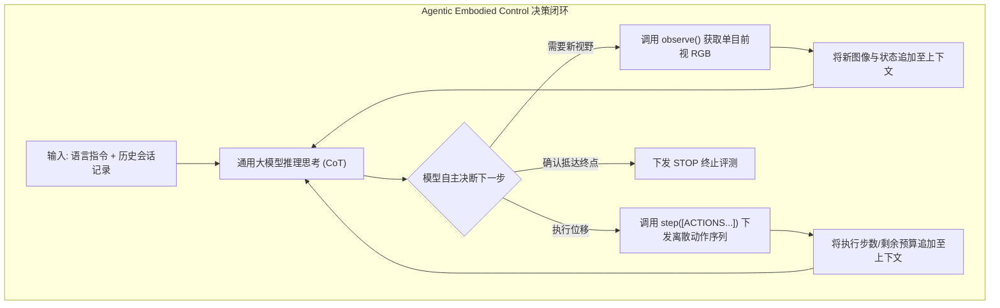
```mermaid
graph TD
    subgraph "Agentic Embodied Control 决策闭环"
        A["输入: 语言指令 + 历史会话记录"] --> B["通用大模型推理思考 (CoT)"]
        B --> C{"模型自主决断下一步"}
        C -- "需要新视野" --> D["调用 observe() 获取单目前视 RGB"]
        C -- "执行位移" --> E["调用 step([ACTIONS...]) 下发离散动作序列"]
        C -- "确认抵达终点" --> F["下发 STOP 终止评测"]
        D --> G["将新图像与状态追加至上下文"]
        E --> H["将执行步数/剩余预算追加至上下文"]
        G --> B
        H --> B
    end
```

---

#### ⑤ 难点降维 2：混合动作接口（Hybrid Interface）的协同涌现

强制给智能体绑定路标预测器（Forced Waypoint）往往会削弱强模型的表现；但如果将**离散原语**与**训练好的路标预测器**同时开放给智能体作为可选工具（Hybrid Interface），智能体会自主组合出极具启发性的“粗细协同”策略。

> **举个具体例子**：
> 假设任务是从客厅出发，穿过 10 米长的走廊，进入主卧在床头柜旁停下（总距离约 14 米）。
> - **纯原语模式**：由于每次前进仅 $0.25\text{ m}$，走完 10 米走廊需要模型反复发出 $40$ 次前进原语，并频繁调用 `observe()` 检查走廊两侧门洞，容易因微小角度偏航反复微调，总共消耗约 $90$ 个原语步数与近 $40$ 次模型交互调用（耗时约 $210\text{ s}$）。
> - **强制路标模式**：模型只能从预测器给出的最多 5 个路标点中选择。在开阔走廊中只需 2~3 个路标即可快速通过；但在接近床头柜的最后 $1\text{ 米}$ 狭窄区域，预测器给出的候选点往往不够贴合床边甚至紧贴墙面，导致最终停靠偏离目标或碰撞，在复杂转角处极易超调。
> - **混合模式（Hybrid）**：智能体在前 80% 的长走廊路程中自主连续调用 3~4 次**路标导航**快速巡航；一旦视野中检测到床头柜进入近景，模型立即主动切换为**离散原语工具**，以 $0.25\text{ m}$ 和 $15^\circ$ 的微步精细对齐最终停靠点。
> **结果**：步数从 87 步腰斩至 48 步，调用轮数减少一半，交互耗时从 $210\text{ s}$ 锐减至 $112\text{ s}$，成功率反而从纯原语的 $68.3\%$ 提升到 $76.7\%$！

---

#### ⑥ 难点降维 3：具身智能体的“无声失效”与“有疑无改”

对 30 个失败 episode 的细致追踪揭示了当前通用大模型在具身环境下的深层行为缺陷。

| 失败类别 | 占比 (n=30) | 中位数最终距目标距离 | 典型表现与根本原因 |
|---|---|---|---|
| **A. 错误指代 / 错误分支 (Wrong Referent / Branch)** | $40.0\%$ (12例) | $17.3\text{ m}$ | 指令中包含多个歧义门洞或分岔路，模型在第一步就选错通道并一路走向完全无关的房间。 |
| **B. 停止决策失误 (Stop Decision)** | $23.3\%$ (7例) | $4.9\text{ m}$ | 模型视野中看到了指令中提及的目标物体（如沙发），但该物体是沿途参照物而非最终目的地，模型过早终止（Object-anchored overshoot/undershoot）。 |
| **C. 迷失发散搜索 (Runaway Search)** | $26.7\%$ (8例) | $18.6\text{ m}$ | 错过关键拐角后，模型没有选择掉头回溯，而是在未见区域盲目扩大搜索范围，距离目标越来越远。 |
| **D. 几何碰撞陷阱 (Geometry / Trap)** | $10.0\%$ (3例) | $5.5\text{ m}$ | 因缺乏碰撞反馈，模型在桌椅死角反复前进受阻，但无法从纯视觉中分辨是否卡死。 |

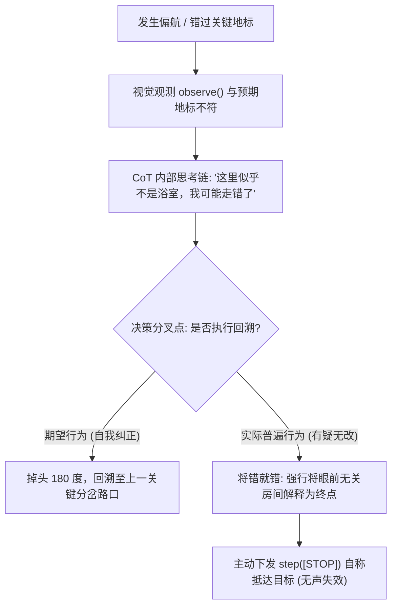
```mermaid
graph TD
    A["发生偏航 / 错过关键地标"] --> B["视觉观测 observe() 与预期地标不符"]
    B --> C["CoT 内部思考链: '这里似乎不是浴室，我可能走错了'"]
    C --> D{"决策分叉点: 是否执行回溯?"}
    D -- "期望行为 (自我纠正)" --> E["掉头 180 度，回溯至上一关键分岔路口"]
    D -- "实际普遍行为 (有疑无改)" --> F["将错就错: 强行将眼前无关房间解释为终点"]
    F --> G["主动下发 step([STOP]) 自称抵达目标 (无声失效)"]
```

---

### 3. 核心结果/发现

<div align="center">
  
<figcaption>图 3：单轴消融实验结果。(A) 模型能力跨越 5~72 SR；(B) 开源与厂商 Harness 差异仅 2~7 SR；(C) 路标接口对弱模型是救命稻草，但对强模型和密集环境反而带来负面影响</figcaption>
</div>

#### ① R2R-CE 主榜成绩对比
在标准的 R2R-CE val-unseen（rand100 子集）上，极简接口下的通用智能体展现出惊人的零样本表现：
- **顶级表现**：Fable-5 在 Claude Agent SDK 下（最大思考预算）达到 **$78.0\%$ 成功率（SR）** 和 **$65.27\%$ 路径加权成功率（SPL）**；Opus-5 达到 **$70.7 \pm 3.5\%$ SR**。
- **超越同类零样本系统**：大幅领先同样在零样本设置下使用地图、显式记忆与深度工具的 AgenticNav（$55.0\%$ SR）与 Open-Nav（$50.0\%$ SR）。
- **比肩工业级训练策略**：直接逼近并部分超越了在数万小时具身数据上全量训练的专用策略，如 Qwen-RobotNav（全量验证集 $72.0\%$ SR）、NavFM（$77.2\%$ SR）以及 StreamVLN（$64.9\%$ SR）。

#### ② 模型、Harness 与接口的三维解耦发现
1. **模型轴（Model Dominates）**：在固定 Harness 和接口的情况下，仅更换底层 VLM 即可引起 $5\% \sim 72\%$ 的巨大性能跨度（Qwen3.5-4B 仅 $5\%$，GPT-5.6 达 $60\%$，Fable-5 达 $72\%$）。表明具身导航能力本质上是多模态空间推理与长上下文指令跟踪能力的自然涌现。
2. **Harness 轴（Harness is Modest）**：对比轻量开源的 `mini-swe-agent` 与闭源的 `Claude SDK` / `Codex CLI`，在同一模型下性能差异仅在 $1.7\% \sim 7.3\%$ 之间。
3. **思考预算（Reasoning Effort）**：增加模型的思维链计算量（Reasoning Effort）对部分模型有显著收益（Fable-5 从 default 的 $68.3\%$ 飙升至 max effort 的 $78.0\%$，提升 $+9.7\%$），但对小模型收益并不稳健。
4. **路标工具的双刃剑效应**：
   - 在 R2R-CE 上，对于较弱的模型（如 Qwen3.5-4B/9B），路标预测器将成功率从 $5\%/7\%$ 拯救至 $43\%/44\%$；但对于顶尖模型（Fable-5 / Opus-5），强制使用路标带来的提升仅为 $+0.7\% \sim +1.3\%$。
   - 在障碍更密集、路径更复杂的 **VLNVerse** 基准上，强制路标接口反而导致 Sonnet-5 成功率下降 $6\%$（$78\% \rightarrow 72\%$），Fable-5 下降 $4\%$（$84\% \rightarrow 80\%$），且碰撞率激增 4~6 倍。

#### ③ 真实四足机器狗（Unitree Go2）实体部署
在办公楼真实环境中进行的 31 次探索性实验表明：
- **推理能力成功迁移**：智能体能完美理解复杂条件指令（如“如果 $3+4=7$ 则左转，否则右转”）、多阶段“取物并返回”状态追踪，以及通过视觉细微特征（如“走向穿白色鞋子的人”）完成目标锁定。
- **本体感知完全缺失**：由于智能体不知道自身的物理尺寸（长宽与后腿位置），相机刚穿过门框即过早下发左转指令，导致机器狗后躯干直接撞上门框卡死（图 10）；此外，开环步进执行导致偏航角度累计漂移，且跨视角连续过柱子时发生计数混淆（图 11）。

---

### 4. 局限性
- **长程任务的上下文与时间开销暴涨**：在长程基准 RxR-CE 上，纯原语成功率从 $70\%$ 暴跌至 $26\%$；单 episode 交互产生的历史 token 达到 $33\text{k} \sim 169\text{k}$，单次决策中位数耗时超 200 秒，极度缺乏紧凑高效的持久空间记忆与状态整合机制。
- **开环控制与内省纠错闭环缺失**：缺乏本体物理感知与碰撞反馈容易在现实物理世界中发生几何卡死；同时模型内部存在严重的“自疑却盲目终止”行为，亟需建立真正的自我验证与主动回溯探索闭环。

---

## 16. CONDVLN (2026) {#condvln}
———首个基于分层3D场景图的视觉语言导航条件分支诊断基准与神经符号探针

📄 **Paper**: [arXiv:2608.17318](https://arxiv.org/abs/2608.17318)

### 精华
1. **研究痛点**：传统视觉语言导航（VLN）评测高度依赖“固定目标点的线性路径跟随”，无法评估现实中极其普遍的条件分支决策（如“若厨房有花则去客厅，否则去卧室”），导致感知、空间定位与符号逻辑推理的失败原因相互混淆。
2. **核心构建**：提出首个基于分层 3D 场景图的程序化条件基准 **CONDVLN**，跨 AI2-THOR、Matterport3D、Gibson 和 ReplicaCAD 四大环境生成了超 11,500 条真值可验证、复杂度可控（逻辑深度 $d$ 与分支链长 $\ell$）的条件导航任务。
3. **诊断指标**：设计分支选择准确率（BSA）与条件成功率（CSR），克服了传统成功率（SR）对“走错分支但误打误撞到达某处”无法甄别的盲区，支持对中间子目标完成度的细粒度归因。
4. **评测发现**：SOTA 视觉语言模型（如 NaVid、NaVILA）在条件分支任务中几乎崩溃（CSR 接近 0%），而具显式推理结构的 Open-Nav 与 VLN-Zero 表现更佳，表明端到端黑盒训练在结构化条件决策上存在严重缺陷。
5. **解耦探针**：提出神经符号 Oracle 诊断探针，将条件判定与底层动作执行解耦，在复杂嵌套与长分支链场景下带来高达 2 倍的性能提升，为神经符号与具身导航的结合指明了方向。

---

### 1. 研究背景/问题
现有的具身视觉语言导航基准（如 R2R、RxR 等）主要关注智能体能否根据指令到达单一且固定的目标位置。然而，在真实的家庭与物理环境中，人类的导航指令往往强依赖于环境状态的动态观测（例如：“如果餐桌上有咖啡杯，就走到洗碗机旁的吧台凳；否则走到浴室水槽下方的照明灯处”）。现有评测不仅缺乏对条件分支结构的显式控制，也无法厘清智能体在失败时究竟是卡在视觉感知、目标定位、空间运动还是高层逻辑决策上。

---

### 2. 主要方法/创新点

<div align="center">
  
<figcaption>CONDVLN 基准总体架构与流程：从多源环境构建分层 3D 场景图，程序化生成多级嵌套与链式条件指令，并基于分支选择准确率（BSA）和条件成功率（CSR）实现全自动诊断评估。</figcaption>
</div>

CONDVLN 框架由**分层 3D 场景图构建**、**程序化条件指令合成**、**VLN-CE 兼容仿真适配**、**细粒度诊断指标（BSA/CSR）**以及**神经符号 Oracle 诊断探针**五大核心模块组成，整体实现了逻辑复杂度可控、真值可溯源的端到端评估闭环。

#### 模块一：多源环境统一与分层 3D 场景图构建（Scene Hierarchy & Spatial-Semantic Graph）
- **输入**：来自 AI2-THOR、ReplicaCAD（合成仿真数据）以及 Matterport3D、Gibson（真实物理扫描数据）的异构几何与语义标注。
- **处理**：
  1. **统一房间层级抽象**：将不同数据源统一解析为以房间为顶层、包含物体实例集合的符号化层级结构。每个物体 $o_i$ 记录语义标签 $\ell_i$ 与 3D 中心坐标 $c_i = (x_i, y_i, z_i)$，并优先提取 3D 轴对齐包围盒（AABB），缺失时以包围球半径作为几何兜底。
  2. **回退几何距离计算**：计算同房间内物体对 $(o_i, o_j)$ 的空间位移 $\delta_{i \to j} = c_j - c_i$，并按优先级回退选择距离度量：
     $$d_{ij}^{\text{used}} \in \{ d_{ij}^{\text{AABB}}, d_{ij}^{\text{sphere}}, d_{ij}^{\text{center}} \}$$
     其中 AABB 表面距离 $d_{ij}^{\text{AABB}} = \sqrt{\Delta_x^2 + \Delta_y^2 + \Delta_z^2}$ 能精确捕捉物体的表面外轮廓，包围球表面距离 $d_{ij}^{\text{sphere}} = \max(0, \lVert \delta_{i \to j} \rVert_2 - (r_i + r_j))$ 作为平滑近似，中心点欧氏距离 $d_{ij}^{\text{center}} = \lVert \delta_{i \to j} \rVert_2$ 作为最终兜底。
  3. **规范方位与语义谓词生成**：将水平方位角离散化为 8 个罗盘扇区（东、东北、北等），俯仰角离散化为 3 个垂直区间（上、平级、下），组合生成三维相对方位谓词；同时基于硬阈值生成贴近自然语言的语义空间谓词（如 `near`、`far from`、`higher than`、`lower than`、`above`、`below`）。
- **输出**：带可追溯几何属性（包含中心距、AABB 距离、方位扇区等）的有向空间语义场景图。
- **设计动机**：消除各模拟器之间坐标系与标注粒度的壁垒，为后续逻辑生成提供唯一、可精确判真伪的客观物理事实底座。

#### 模块二：程序化条件指令合成与对象采样（Programmatic Conditional Instruction Synthesis）
- **输入**：已构建的 3D 场景图与其空间谓词。
- **处理**：
  1. **正负条件采样机制**：从场景图中采样有效实体作为真实分支的参考物体；同时从该场景其他房间中采样存在、但当前参考房间中缺失的物体类别，构造具有明确客观真伪的负分支条件（False Branch）。
  2. **同名物体空间消歧**：当房间内存在多个同类物体（如多盏台灯）时，自动引入场景图关系谓词限定（如“床边的台灯”）实现唯一指向，无法消除歧义的样本直接滤除。
  3. **逻辑模板实例化**：将场景图谓词映射进 `IF [condition] THEN [action] ELSE [action]` 的基础骨架中，并支持多层级嵌套与多分支串联。
- **输出**：自然语言条件指令文本及其对应的先验真值分支、目标点与子目标序列。
- **设计动机**：确保每条指令在 3D 空间中都有明确无误的真值，使评测系统完全掌握地面真值（Ground Truth）决策路径。

#### 模块三：复杂度分类与 VLN-CE 仿真适配（Complexity Taxonomy & Episode Realization）
为了系统化诊断不同维度的推理瓶颈，CONDVLN 沿**逻辑深度（Depth $d$）**和**分支链长（Chain Length $\ell$）**两个正交维度定义了 6 种指令复杂度层级：

| 复杂度类别 | 逻辑深度 $d$ | 分支链长 $\ell$ | 逻辑结构形式 | 典型示例 |
|---|---|---|---|---|
| **Simple** | 1 | 1 | 单层 IF-ELSE | 若厨房有花则去客厅，否则去卧室 |
| **Nested** | 2 | 1 | IF 内部嵌套 IF | 若厨房有花，（若花在桌上则去客厅，否则去阳台）；否则去卧室 |
| **Deep Nested** | 3 | 1 | 三级深度嵌套 | 多层条件逐级判定深入 |
| **Chain** | 1 | 2 | IF / ELSE IF / ELSE | 若厨房有花去客厅，否则若有咖啡机去书房，否则去卧室 |
| **Long Chain** | 1 | 3 | 多分支串联链 | 3 个以上顺序排他条件分支 |
| **Nested Chain** | 2 | 2 | 嵌套 + 链式组合 | 复合高层复杂决策 |

> **降维装置：条件指令的状态机流转**
> 
> ```mermaid
> graph TD
>     Start["起始观测"] --> Q1{"条件 A: 厨房是否有花?"}
>     Q1 -- "True (分支1)" --> Q2{"条件 B (深度 d=2): 花是否在桌上?"}
>     Q1 -- "False (分支2)" --> Q3{"条件 C (链长 l=2): 是否有咖啡机?"}
>     Q2 -- "True" --> T1["目标1: 客厅沙发"]
>     Q2 -- "False" --> T2["目标2: 阳台花架"]
>     Q3 -- "True" --> T3["目标3: 书房书桌"]
>     Q3 -- "False" --> T4["目标4: 卧室床头"]
> ```

所有任务均被转换为标准 VLN-CE / Habitat-Sim 的 JSON 格式，包含起点坐标、朝向、真值测地线最短路径（Geodesic Shortest Path）与多阶段子目标航点，现有模型无需改造仿真环境即可直接评测。

#### 模块四：条件推理诊断指标（BSA & CSR）
传统的成功率（SR）只在乎最终停靠点是否接近目标，无法辨别智能体是“正确理解了条件并前往目标”还是“由于感知漂移误打误撞停在了某个目标附近”。为此，CONDVLN 提出了两个专用诊断指标：

1. **分支选择准确率（Branch Selection Accuracy, BSA）**：
   衡量智能体沿着正确条件分支前进了多远。设当前真值分支对应的有序子目标序列为 $G_i = (g_{i,1}, \dots, g_{i,m_i})$，智能体按序在容差半径 $\tau$ 内到达的最长前缀长度为 $k_i$，则单样本得分为：
   $$BSA_i = \frac{k_i}{m_i} \quad (m_i > 0)$$
   整体评测集得分为所有样本的平均值 $BSA = \frac{1}{\lvert I \rvert} \sum_{i \in I} BSA_i$。该指标允许给出部分完成的分数。
2. **条件成功率（Conditional Success Rate, CSR）**：
   衡量严格意义上的条件导航完成度。要求智能体不仅要完整经历分支的所有子目标（$BSA_i = 1$），还必须在最终目标点取得 Habitat 标准导航成功（$\text{Success}(i) = 1$）：
   $$CSR_i = \mathbf{1}[BSA_i = 1 \land \text{Success}(i) = 1]$$
   整体评测集得分为 $CSR = \frac{1}{\lvert I \rvert} \sum_{i \in I} CSR_i$。

> **举个例子**：
> 设某任务真值分支包含 2 个顺序航点（走廊拐角 $g_1$、客厅门 $g_2$）和终点（沙发 $g_3$），即 $m_i = 2$。
> - **情况 A（完全正确）**：智能体依次经过 $g_1, g_2$ 并停在 $g_3$，则 $k_i=2, BSA_i=1.0, \text{Success}(i)=1 \implies CSR_i=1, SR_i=1$；
> - **情况 B（半途迷失）**：智能体经过 $g_1$ 后迷路未到 $g_2$ 且未到 $g_3$，则 $k_i=1, BSA_i=0.5, CSR_i=0, SR_i=0$；
> - **情况 C（误打误撞/走错分支）**：智能体直接走错走向卧室分支，但卧室里恰好有一张同名沙发，智能体停在卧室沙发旁——此时传统 $SR_i=1$ 会误判为成功，但由于其完全未访问正确分支的子目标（$k_i=0, BSA_i=0$），新指标精确诊断出 $CSR_i=0$！

#### 模块五：神经符号 Oracle 诊断探针（Neurosymbolic Branch-Selection Oracle Model）
为了探究现有智能体究竟是受阻于“前段条件逻辑推理”还是“后段空间运动导航”，作者构建了一个神经符号 Oracle 探针：

| 对比维度 | 端到端黑盒智能体（NaVid / NaVILA 等） | 神经符号 Oracle 探针（Oracle + VLN-Zero） |
|---|---|---|
| **指令输入形式** | 原始条件文本（含 IF-ELSE / 嵌套 / 链式逻辑） | 由真值元数据线性化重写后的纯路径指令（如“先到 $g_1$，再到 $g_2$，最后到 $g_b$”） |
| **条件分支决策** | 由神经网络隐式端到端猜测与判断 | 符号化先验自动解析，剥离分支选择负担 |
| **底层执行器** | 保持不变 | 保持完全不变（使用相同的 VLN 导航模型） |
| **诊断作用** | 测量包含逻辑、感知与控制的混合表现 | 作为理论上限探针，严格量化逻辑分支选择错误导致的性能损失 |

---

### 3. 核心结果/发现
论文在 AI2-THOR、ReplicaCAD、Gibson 和 Matterport3D 四个数据集上评测了四类主流 VLN 模型（NaVid、NaVILA、Open-Nav、VLN-Zero）以及 Oracle 探针，得出以下关键结论：

1. **端到端大模型在条件分支上性能普遍崩溃**：
   - 通用端到端 VLM 导航模型（如 NaVid、NaVILA）在各大环境中的条件成功率极低（NaVILA 在所有数据集上的 CSR 均为 0.0%，NaVid 在 Gibson 与 MP3D 上 CSR 也接近 0%）。这表明目前单纯依靠预训练视觉语言模型的隐式端到端微调，根本无法泛化到具备显式逻辑分支的 3D 决策任务。
2. **显式结构与大语言模型推理带来显著优势**：
   - 具备显式推理架构的模型表现大幅领先：Open-Nav 凭借 LLM 零样本思维链（Chain-of-Thought）规划，在 ReplicaCAD 上取得了 33.3% 的 CSR 和 39.2% 的 BSA；VLN-Zero 依托显式 3D 场景图表征，在 AI2-THOR 上取得了 21.0% 的 CSR 和 31.5% 的 BSA。这证实结构化表征与符号规划对条件具身决策至关重要。
3. **逻辑深度与分支链长扩展造成持续性能衰减**：
   - 随着嵌套深度从 $d=1$ 增加到 $d=3$，或分支链长从 $\ell=1$ 扩展到 $\ell=3$，所有端到端模型的 BSA 与 CSR 均单调骤降。
   - 神经符号 Oracle 探针在高复杂度下优势尤为明显：在 $d=3, \ell=1$ 和 $d=1, \ell=2$ 等高难度配置下，Oracle 相比未解耦的基线模型展现出超过 2 倍的性能提升（例如在 $d=1, \ell=2$ 下 Oracle 取得 24.63% CSR，而 Open-Nav 仅为 11.51%），证明将符号条件判定与底层导航动作正交解耦是攻克复杂任务的有效路径。

---

### 4. 局限性
CONDVLN 目前仅支持 VLN-CE 兼容的室内离散/连续仿真环境，评测质量受限于原始点云扫描与几何标注的噪点；此外，几何谓词生成依赖固定的人工阈值，且 Oracle 探针使用的是真值元数据而非在线感知构建的场景图。

---

## 17. ReMEmbR (2024) {#remembr}
———基于检索增强长程时空记忆的机器人导航问答与物理目标生成

📄 **Paper**: [arXiv:2409.13682](https://arxiv.org/abs/2409.13682) · 🏛️ **ICRA 2025** · [Project Page](https://nvidia-ai-iot.github.io/remembr)

### 精华
1. **长程时空记忆解耦**：针对移动机器人在数十分钟至数小时连续作业中面对的庞大历史数据，提出将记忆构建（Memory Building）与查询推理（Querying）阶段解耦，解决传统多模态大模型面对超长上下文时的显存爆炸与计算延迟难题。
2. **多模态时空向量库**：在运行过程中在线调用轻量级视频多模态模型（VILA）对连续视频片段生成底层事件描述字幕，并将文本嵌入、三维度量坐标 $(x, y, z)$ 与时间戳统一存入向量数据库，以紧凑表征记录环境动态。
3. **Agent 迭代多跳检索**：查询阶段引入大语言模型作为决策状态机，根据空间、时间或描述性问题自适应发起多路函数调用（文本/位置/时间检索）进行多步迭代搜寻与剪枝，在最小化推理上下文的同时保证线索完整性。
4. **度量可执行目标生成**：突破传统具身问答仅输出自然语言文本的限制，支持直接输出空间精确三维坐标，与 ROS 2 Nav2 等经典移动底盘导航栈无缝衔接并驱动物理导航。
5. **端到端真机实测闭环**：在搭载 Jetson Orin 的 Nova Carter 机器人上实现端侧轻量 VLM 字幕提取、语音识别与向量检索，在 25 分钟真实办公区巡航后成功执行开放语义问答与导航寻物。

---

### 1. 研究背景/问题
- **长程历史表征的扩展性困境**：机器人在长时间巡航中会观察到大量动态事件与非静态物体，现有多模态长上下文模型（如 1M+ 上下文）计算成本随历史增长线性或二次方膨胀，而传统场景图或度量语义地图又难以记录时间维度演化。
- **具身问答缺乏物理可执行性**：现有具身问答基准（如 OpenEQA）多局限于 30 秒至 1-2 分钟的短视频，且输出多为定性文字回答（如“在茶水间桌子上”），机器人无法直接解析为底层导航系统可用的度量坐标目标。

---

### 2. 主要方法/创新点

<div align="center">
  
<figcaption>ReMEmbR 系统总体框架：由在线记忆构建（Memory Building）与多跳查询推理（Querying）两阶段解耦构成，右侧为 NaVQA 数据集问答类型与真机部署链路</figcaption>
</div>

#### ① 整体框架概述
ReMEmbR（Retrieval-augmented Memory for Embodied Robots）由**在线记忆构建阶段**与**查询推理阶段**两大核心子系统构成：前者在机器人巡航期间持续将传感器流压缩转化为带时空元数据的多模态向量库；后者在接收到用户自然语言提问时，由 LLM-Agent 驱动多轮时空检索函数，提炼最小必要记忆子集并生成回答或导航目标坐标。

<div align="center">
  
<figcaption>机器人长时间连续运行积累长程历史，ReMEmbR 支持对时空动态信息的高效聚合与物理度量级目标定位</figcaption>
</div>

#### ② 逐模块讲解

**1. 在线记忆构建模块（Memory Building）**
- **输入**：前视单目相机连续视频帧 $H_I$、机器人局部定位坐标 $H_P = (x, y, z)$（来源于激光雷达里程计、GPS 或 AMCL）、时间戳 $H_T$。
- **处理**：每累计 $t=3$ 秒的连续观测（以 2 FPS 采样 6 帧），调用视频多模态模型 VILA（训练端采用 VILA1.5-13B，端侧部署采用量化版 VILA-3B）生成局部语义事件字幕 $L_{i:i+t}$；随后利用轻量文本编码器 `mxbai-embed-large-v1` 生成句向量 $E(L_{i:i+t})$。
- **输出**：向多模态向量数据库 $V$ 中实时插入一条结构化元组 $$\langle E(L_{i:i+t}), (x,y,z)_{i:i+t}, t_{i:i+t} \rangle$$。
- **设计动机**：问答提问在任务前不可预测，必须在没有先验 Query 的前提下构建通用且信息密集的时空表征；向量数据库支持千万级向量的高效近似最近邻（ANN）检索。

**2. 状态机查询智能体模块（Querying Agent）**
- **输入**：用户提问 $Q$（涵盖空间位置、时间点/时长、环境描述）以及历史累积已检索的上下文 $R_{0:i}$。
- **处理**：LLM-Agent 作为决策状态机，根据当前线索自适应调用以下三类时空检索函数生成检索子集：
  - 文本检索 $f_l(\text{object})$：在向量库中基于余弦相似度匹配语义相关的最相近 $m$ 条片段；
  - 空间位置检索 $f_p((x, y, z))$：根据度量坐标半径检索邻近 $m$ 条历史轨迹片段；
  - 时间范围检索 $f_t(\text{"HH:MM:SS"})$：按时间戳窗口抓取对应时刻前后的 $m$ 条片段。
- **输出**：若当前记忆足以回答提问，输出格式化 JSON 字典（包含文本解析、$(x, y, z)$ 三维坐标、时间戳或持续时间）；若信息不足则携带补充线索进入下一轮迭代检索（最多 3 轮）。

#### ③ 最优历史子集采样形式化
对于一段长达 $K$ 分钟的完整历史 $H_{1:K}$，直接计算后验概率 $p(A \mid Q, H_{1:K})$ 计算量过大。ReMEmbR 将其形式化为寻找最小充分历史子集 $$R^* \subseteq H_{1:K}$$ 的最优采样问题：

$$p(A \mid H_{1:K}, Q) = p(A \mid R^*, Q) \approx p(A \mid R, Q)$$

$$R^* = \arg\min_R \lvert R \rvert \quad \text{s.t.} \quad \arg\max_A p(A \mid R, Q) = \arg\max_{A'} p(A' \mid H, Q)$$

通过向量库采样策略 $F: V \to R$，LLM-Agent 仅需处理规模极小的子集 $R$，使长程推理在常数级时间内完成。

#### ④ 难点降维：记忆表征范式对比与多步检索

| 维度 | 全量长上下文（如 Gemini 1.5M） | 单次向量检索 RAG | ReMEmbR 迭代 Agent |
|---|---|---|---|
| 计算与显存开销 | 随视频时长线性/二次方膨胀，超 10 分钟易 OOM | 固定单次向量检索，开销低 | 3 步以内多路检索，常数级开销（~25s） |
| 时空多跳推理 | 全量信息在上下文内，但注意力易在长序列中迷失 | 仅匹配文本相似度，无法做空间邻近或时间回溯关联 | 状态机自适应组合文本、坐标、时间多路函数逐层收敛 |
| 输出物理可执行性 | 仅输出语言文本，难以准确生成度量坐标 | 通常仅提供文本片段 | 结构化输出 $(x,y,z)$ 坐标，直连 Nav2 导航底盘 |

> **举个例子**：机器人在大楼巡航 20 分钟（产生约 400 个 3 秒视频片段，全量输入需处理数十万 token）。
> 用户提问：“我在 5 分钟前丢的红色工牌在哪？”
> - 朴素单次 RAG 只检索“红色工牌”，若机器人在第 2 分钟和第 15 分钟都在桌边看见过工牌，单次文本检索极易混淆时间线并提取错误坐标；
> - ReMEmbR 的 Agent 第一轮调用 $f_l(\text{"红色工牌"})$ 获取相关候选片段，第二轮依据提问调用 $f_t(\text{"当前时间-5分钟"})$ 缩小时间窗口，两轮仅抓取 6 个关键片段（约 600 token），精准锁定 $(x,y,z)$ 坐标，Token 消耗降低 99% 以上。

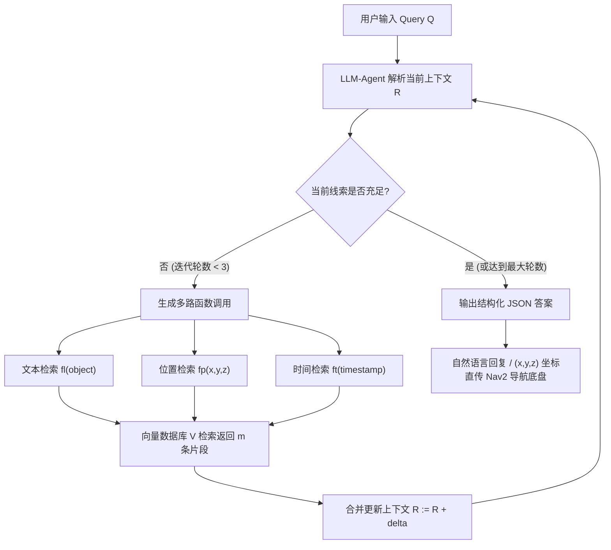
```mermaid
graph TD
    A["用户输入 Query Q"] --> B["LLM-Agent 解析当前上下文 R"]
    B --> C{"当前线索是否充足?"}
    C -- "否 (迭代轮数 < 3)" --> D["生成多路函数调用"]
    D --> D1["文本检索 fl(object)"]
    D --> D2["位置检索 fp(x,y,z)"]
    D --> D3["时间检索 ft(timestamp)"]
    D1 & D2 & D3 --> E["向量数据库 V 检索返回 m 条片段"]
    E --> F["合并更新上下文 R := R + delta"]
    F --> B
    C -- "是 (或达到最大轮数)" --> G["输出结构化 JSON 答案"]
    G --> H["自然语言回复 / (x,y,z) 坐标直传 Nav2 导航底盘"]
```

#### ⑤ NaVQA 评测基准构建

<div align="center">
  
<figcaption>NaVQA 评测数据集：涵盖短（<2min）、中（2-7min）、长（>7min）三种时程分布，覆盖空间坐标、时间点/时长及描述性三大类问答任务</figcaption>
</div>

基于真实室外/室内多天气大规模巡航数据集 CODa（Clearpath Husky 机器人采集），构建了包含 210 个专家标注样本的 NaVQA 基准，分为三种时长区间（短 <2min、中 2-7min、长 >7min），涵盖二值判断（32%）、空间坐标定位（34%）、时间点（14%）、时长统计（4%）及开放描述（16%）。

---

### 3. 核心结果/发现

<div align="center">
  
<figcaption>随视频时长增长的总体正确率变化趋势：多帧全量 VLM 在中长视频面临显存爆炸（OOM），而 ReMEmbR 在长视频上保持显著更高的准确率</figcaption>
</div>

- **长程视频问答性能全面领先**：在大于 7 分钟的长视频序列上，基于 GPT-4o 的 ReMEmbR 达到 **0.65** 的描述问答准确率、**46.25m** 的空间定位误差与 **3.6s** 的时间误差，显著超越全量字幕输入 Baseline（56.0m 空间误差、8.0s 时间误差），而多帧全量 VLM（Multi-Frame VLM）在中长视频上均因显存溢出（OOM）无法运行。
- **常数级极低查询延迟**：在 21.5 分钟的长视频上，ReMEmbR 单个问题平均响应时间仅约 **25 秒**，且耗时基本不随视频总时长增长；相比之下，多帧 VLM 即使在 5.5 分钟的短视频上也需要高达 90 秒。
- **多步迭代检索是性能关键**：消融实验表明，若退化为单次检索（1-call RAG），整体正确率由 0.61 骤降至 0.50（长视频），证实复杂时空多跳推理对迭代检索闭环的依赖。
- **细粒度时间分段至关重要**：采用 3 秒视频片段字幕（2 FPS）的整体正确率为 0.61，而粗粒度 12 秒片段字幕（0.5 FPS）跌至 0.38，说明时间分辨率下降会严重丢失关键瞬态信息。

<div align="center">
  
<figcaption>Nova Carter 移动机器人真实办公场景部署：25 分钟巡航记忆构建后，成功响应“带我去视野好的地方”、“去拿薯片”等开放语义导航指令</figcaption>
</div>

- **真机端侧闭环验证**：在 Nova Carter 机器人上搭载 Jetson Orin 32GB、3D LiDAR、量化版 VILA-3B 与 Whisper ASR，先执行 25 分钟自主巡航建图构建记忆库，随后测试模糊语义指令。例如面对“带我去风景好的地方”，Agent 自动检索大落地窗、绿植与开阔空间对应的坐标并由 Nav2 导航直达大厅。

---

### 4. 局限性
- **重复记忆稀释与冗余膨胀**：机器人静止或重复在同一区域巡航时，向量库会不断写入相似片段，长期运行可能稀释关键有效信息的检索精度。
- **轻量感知模型的细粒度歧义**：受限于边缘端算力，采用 3B 级别量化视觉字幕模型时存在物体混淆现象（如将银色饮水机描述为“银色机器”，导致被误识别为苏打水售卖机）。

---

## 18. SuperMap (2026) {#supermap}
———面向视觉-语言导航的实时 4D 时空语义 SLAM 与动态场景图系统

📄 **Paper**: [RSS 2026](https://www.roboticsproceedings.org/rss22/p052.pdf) · [Project Page](https://superodometry.com/supermap) · [Code（待发布）](https://github.com/superxslam/SuperMap) · 🏛️ **RSS 2026**

### 精华

1. 针对动态环境中开放词表语义建图存在的实例漂移与陈旧语义累积问题，提出了首个面向视觉-语言导航（VLN）的实时、开放词表、实例级 4D 时空语义 SLAM 系统 SuperMap。
2. 架构上融合了高频几何 SLAM（SuperOdometry）与异步 2D 开放词表感知（GroundingDINO + SAM2），通过 3D 到 2D 的运动补偿先验解决了机器人剧烈运动下的跨帧实例关联难题。
3. 提出了基于几何一致性的三态深度残差判别与概率占据更新机制，能够敏锐检测环境变动（如物体新增、搬移与移除），并利用贝叶斯语义融合抑制单帧误检。
4. 构建了包含空间几何拓扑边与时序演化边的 4D 动态场景图，将复杂的 3D 点云与时序视频流抽象为紧凑的符号化结构，为多模态大模型（VLM）提供了原生、高效的查询接口。
5. 全系统在搭载 Intel i9 与 RTX 4090 的移动机器人板载端以 10 Hz 位姿估计、5 Hz 场景图更新的速率全实时运行，在 ScanNet 语义基准及真实场景动态导航中显著超越现有方案。

---

### 1. 研究背景/问题

移动机器人在人类真实环境中执行诸如“去白板旁边的显示器”或“回到刚才在植物旁的椅子处”等开放词表导航任务时，面临着剧烈且持续的环境动态变化。现有的语义建图方法大多假设静态环境或依赖离线全场景重构（如 ConceptGraphs、HOV-SG），而传统动态 SLAM 系统多局限于闭集先验或仅关注短期人体移动，无法持续追踪物体在视野外的长期搬移与生灭演化。这导致多模态基础模型（VLM）间歇性、视点敏感的 2D 预测直接投影到 3D 地图时极易发生实例 ID 碎片化与语义陈旧，阻碍了下游语言引导导航的可靠空间推理。

---

### 2. 主要方法/创新点

<div align="center">
  
<figcaption>SuperMap 4D 时空 SLAM 概览：能够实时追踪短期人体运动与长期环境变动（如垃圾桶移除、推车进入），并维护一致的 4D 时空场景图</figcaption>
</div>

#### ① 整体框架概述

SuperMap 是一个完全运行在机器人板载计算平台上的 4D 时空 SLAM 系统，整体由**几何层（在线 3D 重建）**、**实例层（时空实例关联与概率更新）**以及**拓扑层（4D 场景图构建与 VLM 交互）**三大核心模块协同构成。几何层提供高频精准的度量位姿与致密几何；实例层利用 3D 先验进行运动补偿跟踪并动态剔除失效物体；拓扑层则将度量地图抽象为携带空间拓扑与生命周期轨迹的 4D 场景图，供大语言/多模态模型高效解析。

<div align="center">
  
<figcaption>SuperMap 系统架构图：自底向上分为在线 3D 重建几何层、时空对象更新实例层以及面向 VLM 的 4D 场景图拓扑层</figcaption>
</div>

#### ② 逐模块讲解

- **几何层（在线 3D 稠密重建）**：
  - **输入**：同步的 LiDAR 点云、RGB 图像与高频 IMU 数据流。
  - **处理**：采用 SuperOdometry 作为激光-视觉-惯性（LVI）里程计骨干网络，在世界坐标系 $W$ 下以 10 Hz 实时解算机器人的 6-DoF 位姿 $T_{WB}^{(t)}$ 与相机位姿 $P_t = T_{WC}^{(t)} = T_{WB}^{(t)} \cdot T_{BC}$，并输出着色的致密 3D 几何点云。
  - **输出**：高精度机器人轨迹 $P_{1:T}$ 与致密 3D 观测数据 $Q_t = \{C_t, D_t\}$。
  - **设计动机**：为后续 2D 语义到 3D 空间的物理反投影、时序运动补偿以及全局地图一致性提供物理锚定基础。

- **实例层（时空实例关联与动态一致性维护）**：
  - **输入**：当前帧 RGB 图像 $C_t$、深度观测 $D_t$ 以及历史全局地图 $M_{t-1}$ 中的 3D 物体实例集合。
  - **处理**：
    1. **2D 开放词表检测与分割**：利用 GroundingDINO 进行开词表边界框检测，SAM2 进行实例掩码提取。
    2. **3D 到 2D 运动补偿混合跟踪**：将历史地图中物体实例的 3D 质心 $X_i$ 通过当前相机位姿 $P_t$ 投影到像平面，获得预测像素质心 $\hat c_i(t) = \pi(K \cdot P_t^{-1} \cdot X_i)$，以此作为卡尔曼滤波的状态转移先验，取代传统的线性运动假设。
    3. **几何一致性三态判别与占据更新**：计算地图点 $X_k$ 的投影深度 $d_{proj} = \lVert T_{CW} X_k \rVert_z$ 与当前传感器实测深度 $D(u)$ 的残差 $\Delta d = d_{proj} - D(u)$，严格区分可见（Observable）、被遮挡（Unobservable）与已消失（Disappeared），并对消失点执行对数几率（log-odds）占据惩罚。
    4. **贝叶斯语义融合**：维护物体类别的多项式置信度分布，结合检测器混淆矩阵进行递归更新，自动滤除单帧偶发误分类。
  - **输出**：时空一致的全局 3D 实例级语义地图 $M_t = \{ O_t^j \} _{j=1}^{N_t}$。
  - **设计动机**：解决剧烈视角变化下的实例 ID 漂移，并在长时运行中自主识别并剔除已搬走/消失的物体残影。

- **拓扑层（4D 场景图构建与 VLM 接口）**：
  - **输入**：全局实例集合及其 3D 空间包围盒、质心与时序轨迹。
  - **处理**：构建图结构 $G = (V, E_S, E_T)$。节点 $V$ 代表物体实例；空间边 $E_S$ 根据空间几何谓词（如 $On$、$Beside$、$Under$）自动建立；时序边 $E_T$ 串联同一实例在不同时间步的演化轨迹。
  - **输出**：结构化的 4D 动态场景图，以及经过文本序列化（Serialization）的子图 Prompt。
  - **设计动机**：将海量稠密点云降维为富含语义与空间/时序关系的紧凑拓扑结构，降低多模态大模型的计算开销与幻觉。

#### ③ 端到端数据流

一个完整的环境观测帧从传感器输入到最终生成导航动作的流经路径如下：
LiDAR 与相机采集多模态数据 $\to$ 几何层实时解算位姿 $P_t$ 并生成局部点云 $\to$ 异步开放词表模块提取 2D 掩码 $\to$ 结合历史 3D 质心投影进行 3D-2D 跨模态关联，分配/更新唯一实例 ID $\to$ 深度残差几何校验分类点云状态，更新点占据率与语义分布 $\to$ 动态刷新 4D 场景图的空间谓词边与时序边 $\to$ 将相关局部子图序列化为结构化文本注入 VLM $\to$ VLM 解析指令并在 `<answer>` 标签中输出目标实例 ID $\to$ 解析器从场景图中检索对应的 3D 物理质心坐标作为航点（Waypoint），驱动底盘导航控制器。

#### ④ 核心公式与更新机制

- **3D 到 2D 投影先验**：
  $$\hat c_i(t) = \pi\left(K \cdot P_t^{-1} \cdot X_i\right)$$
  其中 $X_i$ 为实例在地图中的 3D 质心，$K$ 为相机内参，$\pi(\cdot)$ 为透视投影函数。

- **几何一致性深度残差三态分类**：
  定义投影深度残差 $\Delta d = d_{proj} - D(u)$，其中 $d_{proj} = \lVert T_{CW} X_k \rVert_z$ 为地图点在相机系下的预期深度，$D(u)$ 为对应像素 $u = \pi(X_k)$ 处的传感器实测深度。状态判别准则为：
  $$s_k^{(t)} = \begin{cases} \text{Observable (可见)}, & \text{if } \lvert \Delta d \rvert \le \tau_\epsilon \\ \text{Unobservable (被遮挡/位于表面后方)}, & \text{if } \Delta d > \tau_\epsilon \\ \text{Disappeared (已消失/位于表面前方)}, & \text{if } \Delta d < -\tau_\epsilon \end{cases}$$

- **对数几率占据更新（Log-Odds Update）**：
  $$L(o_k \mid Q_{1:t}) = L(o_k \mid Q_{1:t-1}) + \text{logit}(P(o_k \mid Q_t))$$
  对于判定为 Disappeared 的点，给予负几率惩罚以快速从全局地图中修剪陈旧几何。

- **贝叶斯语义融合更新**：
  $$P(L_j = c \mid z_{1:t}) = \eta \cdot P(z_t \mid L_j = c) \cdot P(L_j = c \mid z_{1:t-1})$$
  其中 $P(z_t \mid L_j = c)$ 为开集检测器的经验混淆矩阵，$\eta$ 为归一化常数。

- **空间拓扑边几何谓词（以 $On$ 关系为例）**：
  $$\text{On}(A, B) \iff \left(z_A^{\min} \approx z_B^{\max}\right) \land \left(\text{IoU} _{xy}(B_A, B_B) > \gamma\right)$$

#### ⑤ 难点降维装置

##### 装置 A — 最小具体例子（深度残差判定与运动补偿）

> **举个例子**：假设地图中记录了一个垃圾桶的 3D 质心在世界坐标系下为 $(2.0, 0.0, 0.5)\text{m}$。
> 1. **运动补偿**：当机器人底盘剧烈右转 $30^\circ$ 时，纯 2D 线性卡尔曼滤波预测的像平面位置偏差超过 120 像素导致跟踪丢失；而 SuperMap 利用高频位姿 $P_t$ 直接将 3D 质心投影到当前帧，像素坐标误差瞬间收敛到 3 像素以内，精准锁定关联。
> 2. **深度残差三态判定**：设深度阈值 $\tau_\epsilon = 0.1\text{m}$，该垃圾桶原本预期的投影深度为 $d_{proj} = 2.0\text{m}$。
>    - **场景 1（被遮挡）**：有人走过挡住了垃圾桶，传感器测得前方人体深度 $D(u) = 1.2\text{m}$，残差 $\Delta d = 2.0 - 1.2 = +0.8\text{m} > 0.1\text{m}$，系统判定为 `Unobservable`（被遮挡），保留该垃圾桶记忆且不执行误删。
>    - **场景 2（被搬走）**：保洁人员将垃圾桶移走，传感器直接测得后方墙壁深度 $D(u) = 3.5\text{m}$，残差 $\Delta d = 2.0 - 3.5 = -1.5\text{m} < -0.1\text{m}$，系统判定为 `Disappeared`（已消失），触发 log-odds 负惩罚，几帧内将垃圾桶从当前活跃地图中剔除并记录时序生灭事件。

##### 装置 B — 自制 Mermaid 流程图（4D 动态场景图与 VLM 闭环控制）

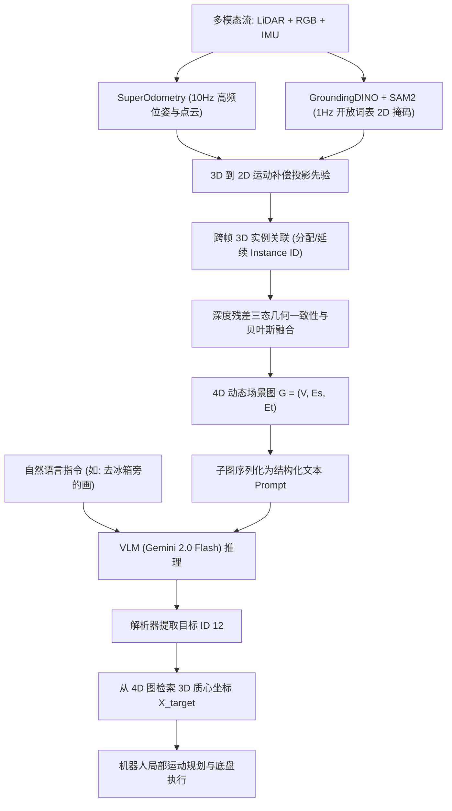
```mermaid
graph TD
    A["多模态流: LiDAR + RGB + IMU"] --> B["SuperOdometry (10Hz 高频位姿与点云)"]
    A --> C["GroundingDINO + SAM2 (1Hz 开放词表 2D 掩码)"]
    B --> D["3D 到 2D 运动补偿投影先验"]
    C --> D
    D --> E["跨帧 3D 实例关联 (分配/延续 Instance ID)"]
    E --> F["深度残差三态几何一致性与贝叶斯融合"]
    F --> G["4D 动态场景图 G = (V, Es, Et)"]
    G --> H["子图序列化为结构化文本 Prompt"]
    I["自然语言指令 (如: 去冰箱旁的画)"] --> J["VLM (Gemini 2.0 Flash) 推理"]
    H --> J
    J --> K["解析器提取目标 ID <answer>12</answer>"]
    K --> L["从 4D 图检索 3D 质心坐标 X_target"]
    L --> M["机器人局部运动规划与底盘执行"]
```

##### 装置 C — Before / After 核心机制对比表

| 评估维度 | 传统 3D 场景图（如 ConceptGraphs / HOV-SG） | 传统语义 SLAM（如 Kimera / OVO-SLAM） | 本文方案 SuperMap |
|---|---|---|---|
| **建图模式** | 离线全局扫描后批处理（需数分钟至数小时） | 在线实时运行（10-30 Hz） | **完全板载在线实时运行（10 Hz 位姿 / 5 Hz 场景图）** |
| **词表灵活性** | 开放词表（SAM + CLIP 聚类） | 闭集预定义类别（固定 CNN） | **开放词表（GroundingDINO + SAM2 结合）** |
| **动态环境适配** | 假设静态环境，动态物体导致重影与鬼影 | 仅过滤短期运动人流，忽略长期环境变动 | **统一建模短期移动与长期物体搬移/生灭** |
| **实例维护机制** | 简单的空间重叠启发式，长程易碎片化 | 仅维护局部特征点或几何面元 | **3D 运动补偿 + 深度残差一致性 + 贝叶斯融合** |
| **下游推理接口** | 静态图结构查询，无法感知物体历史轨迹 | 仅提供度量占有栅格或闭集语义网格 | **4D 时空动态图 + VLM 结构化 Prompt 闭环控制** |

---

### 3. 核心结果/发现

<div align="center">
  
<figcaption>真实动态环境中的时空一致性定性评估：在物体新增（水桶、推车、安全警示牌）与消失（椅子、植物、垃圾桶）事件中，系统均保持了长期稳定的 3D 实例关联与 ID 一致性</figcaption>
</div>

1. **ScanNet 基准评测大幅领先**：
   - **类别级语义分割**：SuperMap 取得 **55.48%** 的准确率（Acc），大幅超越对象级基准 ConceptGraphs（31.05%）、ConceptFusion（34.10%）和 HOV-SG（35.17%）。
   - **实例级 3D 分割（mAP）**：在椅子（Chair）、窗户（Window）、冰箱（Refrigerator）和沙发（Sofa）等典型家具类别上，SuperMap 的 $\text{mAP} _{50}$ 分别达到 **63.76%**、**42.20%**、**62.50%** 和 **33.35%**，而依赖全局点云聚类的 HOV-SG 与 ConceptGraphs 得分接近于 0。

2. **长周期真实动态环境时空变化检测**：
   - 在长达 10 分钟、涵盖 $30\text{m} \times 20\text{m}$ 复杂室内场景的真实机器人实验中，SuperMap 在 6 类目标物体的出现与消失测试中均取得了出色的检测召回率与变化召回率（水桶与椅子达到 **1.000** 满分召回）。
   - 对比基线 DualMap 因 2D 分割不稳定导致 3D 边界框频繁被过滤，物体检测召回率接近 0；而 Khronos 则因推理瓶颈出现严重丢帧与语义退化。

<div align="center">
  
<figcaption>4D 场景图输入与原始视频输入在 VLM 空间/时序推理上的对比：场景图输入在空间拓扑消歧与历史轨迹回溯上均展现出更高的可靠性与抗幻觉能力</figcaption>
</div>

3. **VLM 空间逻辑与时序推理优势**：
   - 相比于直接将原始视频帧送入 VLM（Gemini 2.0 Flash），基于 SuperMap 序列化 4D 场景图输入的方案在**空间度量逻辑**（如根据植物与锥桶的相对位置精确定位灭火器）与**时序历史回溯**（沿时序边 $E_T$ 追溯背包移动轨迹并找回遗落物品）任务中显著降低了多模态大模型的空间透视畸变与长时序幻觉。

<div align="center">
  
<figcaption>真机端到端在线视觉-语言导航实验：机器人根据场景图中的空间关系精准区分 4 块外观一致的白板，并准确完成多跳空间关系检索导航</figcaption>
</div>

4. **消融实验与系统吞吐量**：
   - 消融验证表明，缺少 2D 跟踪器时 $F_1$ 从 0.6308 降至 0.5780；缺少贝叶斯语义融合时 $F_1$ 骤降至 0.5201；缺少几何一致性更新时 $F_1$ 降至 0.5764，证实了三者协同对消除检测噪声的关键作用。
   - 运行速率方面，位姿估计稳定在 **10 Hz**，2D 开放词表感知运行在 **1 Hz**（异步处理），3D 地图更新为 **3 Hz**，4D 场景图维护维持在 **5 Hz**，实现完全板载流畅运行。

---

### 4. 局限性

SuperMap 在应对极高速度运动目标（如奔跑的行人或飞速抛掷物体）时的稠密轨迹追踪能力仍然受限；此外，当前的 2D 开放词表检测依然依赖于给定的 prompt 候选词表，未来需进一步集成自动化的开世界物体自主发现机制以实现全无先验部署。

---

## 19. GSMem (2026) {#gsmem}
———3D Gaussian Splatting 作为具身探索与推理的持久空间记忆

📄 **Paper**: [arXiv:2603.19137](https://arxiv.org/abs/2603.19137)

---

### 精华

GSMem 的核心洞察是将 3D Gaussian Splatting（3DGS）作为一种具备"事后重新观察"能力（post-hoc re-observability）的持久空间记忆，使 agent 无需物理回访即可从任意最优视点重新渲染已探索区域，从根本上突破了离散检测失败导致记忆永久缺失的固有瓶颈。双层检索机制（对象级场景图 + 语义级 CLIP 语言场）互为补充：场景图提供结构化定位，语言场在检测缺失时兜底召回，两者共同驱动最优视点渲染为 VLM 提供高保真视觉证据。混合探索策略将 VLM 语义相关性与基于 Fisher 信息矩阵迹近似的 3DGS 几何信息增益动态结合，在任务导向探索与全局覆盖之间自适应切换，兼顾效率与鲁棒性。将连续辐射场引入具身导航记忆是一次重要范式转移，其"写入即可重渲染"的特性对长时导航任务尤为关键。

---

### 1. 研究背景/问题

具身导航要求 agent 在未知环境中主动探索并持续积累空间知识。现有方法依赖两类表示：离散的 3D 场景图（如 ConceptGraphs）因依赖检测模块，目标漏检将导致不可恢复的记忆空洞；基于视图快照的方法（如 3D-Mem）则因视角固定、稀疏，无法从最优视角重新观察已探索区域，给 VLM 推理提供的视觉证据质量受限。上述方法均缺乏 post-hoc re-observability：agent 被锁定在初始探索时的固定观测中，无法如人类一样"从新角度回忆"过去场景。

---

### 2. 主要方法/创新点

**整体框架概览**

GSMem 在主动探索过程中实时维护三个并行结构：3DGS 几何与外观地图、每个 Gaussian 附带的 CLIP 语言嵌入场、对象级场景图。查询到来时，多层检索-渲染机制定位相关区域并渲染最优视点图像，VLM 据此推理；当没有 frontier 提供足够语义线索时，切换至基于信息增益的几何探索。

<div align="center">
  
<figcaption>GSMem 系统概览：agent 在真实探索路径（黄线）之外，可通过 3DGS 记忆直接"事后重新观察"任意已探索区域（紫线），无需物理导航回访</figcaption>
</div>

**3DGS 建图与在线语言场**

每个 3D Gaussian $$g_i$$ 额外携带 32 维语言嵌入（由 768 维 CLIP 特征经自编码器压缩得到）。为避免高维语言特征的优化开销，提出"权重一致逆聚合"：forward 渲染中 2D 像素特征由 3D Gaussian alpha-blending 生成，逆向时以完全相同的混合权重将 2D CLIP 特征反向分配给各 Gaussian，实现零优化开销的在线语义更新：

$$\mathbf{f}_i^t = \frac{W_i^{t-1}\mathbf{f}_i^{t-1} + \sum_{k \in \mathcal{T}_t} \sum_p w_{i,p,k}^t \mathbf{f}_{p,k}^{2D}}{W_i^t}$$

同时维护对象级场景图（含 3D 位置、语义标签、最高置信度检测视角）、TSDF 地图和 frontier 地图。

**多层检索-渲染机制**

<div align="center">
  
<figcaption>多层检索-渲染机制：对象级检索（场景图）与语义级检索（3DGS 语言场）并行定位 ROI，随后通过最优视点选择与 3DGS 渲染为 VLM 提供高保真视觉证据</figcaption>
</div>

给定任务查询，同时触发两条互补检索路径：
- **对象级检索**：VLM 对场景图全部对象按语义相关性排序，选 top-$K_\text{obj}$ 候选作为 ROI
- **语义级检索**：将查询编码为 CLIP 嵌入，在语言场中以余弦相似度 $> \tau_\text{clip}$ 召回相关 Gaussian，经 KD-Tree 聚类后保留 top-$K_\text{cluster}$ 个空间连贯群组作为 ROI

对每个 ROI，在水平圆形轨迹上均匀采样 108 个候选视点（36 方位角 × 3 仰角），经两阶段打分筛选：Phase 1 以能见度分 $S_\text{vis}$（TSDF 光线投射）+ 投影面积分 $S_A$（高斯惩罚鼓励适当观察距离）选出 top-10；Phase 2 进一步以 3DGS 不透明度分 $S_\text{opa}$ 评估实际渲染质量，综合分 $S_\text{final} = S_\text{vis} + S_A + S_\text{opa}$ 选出最优视点。最终通过单步扩散模型提升渲染图像质量后送入 VLM 推理。

**混合探索策略**

<div align="center">
  
<figcaption>混合探索策略：当任一 frontier 的语义相关性超过阈值时优先导向任务目标；否则切换至基于 3DGS 信息增益（不确定性热力图）的几何覆盖探索</figcaption>
</div>

对每个候选 frontier 计算两类分数：
- **语义相关分** $s_i^\text{sem} \in [0,1]$：VLM 评估 frontier 观测图像与任务查询的相关程度
- **几何覆盖分** $s_i^\text{geo}$：基于 Fisher 信息矩阵（FIM）的信息增益，以 T-optimality 代理近似为 FIM 增量的迹 $$s_i^\text{geo} \approx \text{Tr}(\mathbf{I}_i)$$，可直接由渲染 Jacobian 计算，无需真值监督

探索决策规则：

$$i^* = \begin{cases} \arg\max_i \, s_i^\text{sem}, & \text{if } \max_i s_i^\text{sem} > \tau_s \\ \arg\max_i \, s_i^\text{geo}, & \text{otherwise} \end{cases}$$

---

### 3. 核心结果/发现

**Active Embodied QA (A-EQA) on OpenEQA**（63 个 HM3D 场景，184 问题，GPT-4o 作为 VLM）：

| 方法 | LLM-Match ↑ | LLM-Match SPL ↑ |
|------|------------|----------------|
| Explore-EQA | 46.9 | 23.4 |
| ConceptGraphs w/ Frontier | 47.2 | 33.3 |
| 3D-Mem | 52.6 | 42.0 |
| **GSMem (Ours)** | **55.4** | **43.8** |

**GOAT-Bench 多模态长时导航**（36 场景 val-unseen，2600+ subtasks）：

| 方法 | SR ↑ | SPL ↑ |
|------|------|-------|
| TANGO | 32.1 | 16.5 |
| MTU3D | 47.2 | 27.7 |
| 3D-Mem | 62.9 | 44.7 |
| **GSMem (Ours)** | **67.2** | **46.9** |

GSMem 在长时导航任务中的优势比 A-EQA 更显著（SR +4.3 vs LLM-Match +2.8），验证了持久记忆对长时累积任务的特殊价值。消融研究显示：去除 CLIP 语言场 −4.5 SR、去除最优视点选择 −2.7 SR、去除混合探索时 SPL 下降 −4.1，表明几何覆盖策略对探索效率贡献显著。

<div align="center">
  
<figcaption>案例对比（3D-Mem vs GSMem）：(a-c) 3D-Mem 因检测漏报（白色长袍、无花果树）或语义误检（白色门被识别为冰箱）导致错误，GSMem 通过语义场检索正确定位；(d) 视角受限时，GSMem 通过最优视点重渲染成功识别悬挂衣物</figcaption>
</div>

---

### 4. 局限性

当前系统依赖 RGB-D 输入，深度噪声或高遮挡场景将影响 3DGS 建图质量，进而降低检索与渲染精度；单步扩散增强引入额外推理延迟，实时部署（当前约 1.2 s/step）仍有优化空间。

---


## 20. Qwen-Drive (2026) {#qwen-drive}
———首个不改动 VLM 架构、统一 3D 感知/问答/轨迹规划的端到端自动驾驶基础模型

📄 **Paper**: [arXiv:2609.00111](https://arxiv.org/abs/2609.00111) · [Code](https://github.com/QwenLM/Qwen-Drive-1.0) · [Model](https://huggingface.co/Qwen/Qwen-Drive-1.0-4B)

---

### 精华

- **无侵入架构统一三大驾驶能力**：在完全冻结且不修改通用视觉语言模型（VLM）主干的前提下，通过外挂轻量化 BEV 感知头与基于扩散变换器（DiT）的规划专家，首次在一套框架内原生统一 3D 感知、驾驶视觉问答与未来运动轨迹规划。
- **解耦感知探针与隐式空间表征倒逼**：提出双流特征融合的 BEV 感知头，低层通过深度网络将图像投影构建 3D 体素空间，高层抽取 VLM 语义特征并经由 BEV Transformer 融合，作为探针不仅输出可解释的 3D 检测、占用与矢量地图，更通过双流反向传播驱动通用 VLM 掌握精确 3D 几何常识。
- **GQA 键值缓存驱动的连续流匹配规划**：规划专家无需将轨迹离散化为自回归文本 Token，而是直接跨模块复用 VLM 内部 8 层分组查询注意力（GQA）的 Key-Value 缓存作为交叉条件，借助流匹配（Flow Matching）在连续空间内一步到位解码平滑且符合动力学物理特性的时空航点。
- **首创连续流匹配策略梯度强化学习**：突破传统扩散/流模型难以接入不可微驾驶环境指标的瓶颈，在最后 3 步积分区间引入正交低频余弦子空间扰动与分数恢复项（Restoring Score），结合组内无评论家相对优势，在连续扩散流形上直接优化碰撞、通行规则与体感舒适度指标。
- **零灾难性遗忘且多基准登顶**：通过混合驾驶与通用图文数据的四阶段递进式训练，模型在获得行业领先 3D 几何与规划能力（NAVSIM PDMS 达 90.7，WOD-E2E RFS 达 7.91）的同时，通用多模态问答基准分毫未损。

---

### 1. 研究背景/问题

现有的自动驾驶视觉语言模型（VLM）面临两难困境：若直接改造大模型主干去输出离散坐标或自回归生成决策，往往导致严重的灾难性遗忘并破坏其原生的通用视觉推理与指令遵循能力；而若仅依靠多模态大模型输出高层文本解释，又缺乏对 3D 物理环境的精确几何感知与可执行的连续运动学控制。

为此，阿里云 Qwen 团队与华中科技大学联合推出了 **Qwen-Drive-1.0**，旨在探索兼顾“通用多模态理解能力”与“专用端到端自动驾驶几何规划能力”的统一基座。其核心动机在于：在**完全不改动预训练 VLM 架构与参数格式**的前提下，利用外挂探针模块抽取通用特征中的 3D 空间结构，并通过连续流匹配与强化学习，实现端到端 3D 感知、常识推理与闭环轨迹规划的深度协同。

---

### 2. 主要方法/创新点

<div align="center">
  
<figcaption>Qwen-Drive-1.0 整体统一多任务架构：共享视觉编码器与 VLM 主干支持文本生成，外挂 BEV 感知头与规划专家分别负责 3D 几何预测与未来轨迹生成</figcaption>
</div>

#### 2.1 整体框架概述

Qwen-Drive-1.0 整体由三个核心协同模块构成：
1. **共享多模态骨干（Shared VLM Backbone）**：采用标准 Qwen3.5-4B 架构与原生 Vision Encoder，接收多视角环视图像、连续视频帧或单张通用图像，负责场景语义表征与多轮对话问答；
2. **BEV 感知探针（BEV Perception Head）**：外挂轻量化空间解码模块，融合视觉编码器底层纹理特征与 VLM 顶层语义特征，显式解码自车坐标系下的 3D 目标检测、3D 语义占用（Semantic Occupancy）及高精矢量地图分割；
3. **规划专家（Planning Expert）**：包含 11 亿参数（32 层）的扩散变换器（Diffusion Transformer, DiT），跨模块直接读取 VLM 中缓存的键值表征（KV Cache）作为先验条件，通过流匹配生成未来 5 秒（10Hz，共 50 个航点）的平滑自车轨迹。

在输入序列化上，模型依据下游任务特性设计了两种无冗余标签排序策略：
- **问答任务（帧优先，Frame-Major）**：按时步遍历视角，即 `frame: 0 <FRONT VIEW> <image> ... frame: 1 ...`，便于大模型跨视角对齐单帧全局环境；
- **规划任务（视角优先，View-Major）**：按视角遍历时步，即 `<FRONT VIEW> frame: 0 <image> frame: 1 <image> ...`，将同一摄像头的连续历史观测紧密相邻排列，显著增强对动态障碍物时序速度与运动变化的感知。

---

#### 2.2 外挂双流 BEV 感知探针与自制架构解析

为验证预训练 VLM 内部是否已内隐具备 3D 空间结构，并为驾驶决策提供可显式质检的几何输出，论文设计了不修改大模型主干的 BEV 感知头。

<div align="center">
  
<figcaption>外挂模块精细结构：(a) 双流特征融合的 BEV 感知头；(b) 基于 VLM 分组查询注意力（GQA）键值缓存交叉条件的规划专家 DiT</figcaption>
</div>

模块内部的数据流向与空间投影机制如下：
- **输入**：当前时刻 $N_v$ 个环视相机画面（如 6 视角或 8 视角）及内外参标定矩阵。
- **处理过程（双流融合）**：
  1. **低层几何流**：从 Vision Encoder 提取尚未进入大模型的低层图像特征 $F_v$。通过轻量化深度子网络预测沿视线的离散深度分布 $D_i$，按经典视线投射原理将特征分散到 3D 空间中，构建带有高度维度的 3D 体素特征体 $V(p) = \sum_{i \in \Omega(p)} D_i(u_i, v_i, d_i) F_v^i(u_i, v_i)$；
  2. **高层语义流**：图像 Token 完整经过 VLM 运算后，抽取顶层富含全图上下文语义的特征 $F_m$。经由特征金字塔（FPN）上采样生成多尺度语义图；
  3. **BEV 平面聚合**：将 3D 体素 $V$ 沿高度坍缩压平作为几何先验查询 $\bar{V}$，送入 BEV Transformer。通过在 BEV 网格上交替执行自注意力与对多尺度 $F_m$ 的可变形跨注意力（Deformable Cross-Attention），输出融合了几何深度与高层语义的自车坐标系 BEV 表征 $B$。
- **输出**：三路专用解码头并行输出——DETR 风格的可变形注意力解码器预测 3D 目标检测框；三维 UNet 结合初始体素 $V$ 预测体素级 3D 语义占用；轻量卷积头输出局部 $400 \times 200$ 网格的栅格化矢量地图元素。

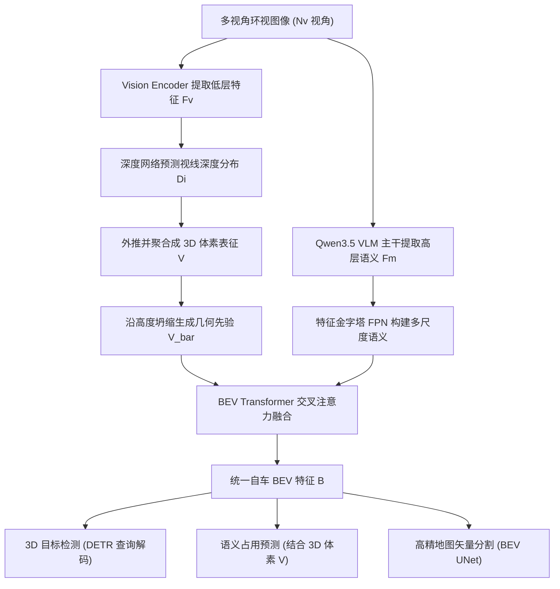
```mermaid
graph TD
    A["多视角环视图像 (Nv 视角)"] --> B["Vision Encoder 提取低层特征 Fv"]
    A --> C["Qwen3.5 VLM 主干提取高层语义 Fm"]
    B --> D["深度网络预测视线深度分布 Di"]
    D --> E["外推并聚合成 3D 体素表征 V"]
    E --> F["沿高度坍缩生成几何先验 V_bar"]
    C --> G["特征金字塔 FPN 构建多尺度语义"]
    F --> H["BEV Transformer 交叉注意力融合"]
    G --> H
    H --> I["统一自车 BEV 特征 B"]
    I --> J["3D 目标检测 (DETR 查询解码)"]
    I --> K["语义占用预测 (结合 3D 体素 V)"]
    I --> L["高精地图矢量分割 (BEV UNet)"]
```

- **感知目标函数**：总感知损失联合监督检测、占用与地图分割：
  $$L_{perc} = L_{det} + L_{occ} + L_{map}$$
  其中 $L_{det}$ 采用匈牙利匹配下的 Focal 损失与 $\ell_1$ 边界框回归；$L_{occ}$ 结合类别平衡 Focal、几何/语义亲和度损失与 Lovász-softmax 损失；$L_{map}$ 采用 Focal 与 Lovász 损失。在反向传播时，感知损失不仅更新 BEV 头，更通过 $F_m$ 为 VLM 与视觉编码器注入强大的 3D 空间监督信号。

---

#### 2.3 基于流匹配（Flow Matching）的规划专家

传统自动驾驶方案要么采用级联感知预测模块，信息瓶颈严重；要么强行让语言模型输出离散的轨迹 Token，不仅推理缓慢，而且容易违反车辆物理运动学约束。

| 维度 | 传统端到端感知规划 (如 UniAD) | 纯自回归语言模型规划 (如 DriveVLM / EMMA) | 本文 Qwen-Drive-1.0 架构 |
|---|---|---|---|
| 主干模型架构 | 专用 CNN/BEV 网络，无通用推理与常识理解能力 | 修改或全量微调 VLM，易出现灾难性遗忘与泛化退化 | 冻结原生预训练 VLM 架构，无侵入式外挂扩展 |
| 规划轨迹表示 | 稠密感知结果级联输入二次低层轨迹优化器 | 文本或离散网格 Token 自回归逐点解码 | 32 层连续扩散变换器（DiT）结合流匹配解码 |
| 几何常识交互机制 | 仅依赖预测框几何交互，缺乏深层语义推理 | 纯靠离散语言提示推导坐标，动力学平滑度差 | 跨模块直接复用 VLM 8 层 GQA 键值缓存与动力学状态 |
| 策略后训练能力 | 仅支持模仿学习或简单的代价函数打分 | 离散强化学习（PPO）难以平滑探索连续控制流形 | 连续流匹配策略梯度（低频余弦子空间扰动与分数恢复） |

- **输入与条件注入**：
  规划目标建模为条件连续轨迹生成：
  $$\tau \sim p(\tau \mid s, \ell, \tau_{hist}, n, e, r)$$
  其中 $$\tau = \{ (x_k, y_k, \theta_k) \} _{k=1}^{50}$$ 为未来 5 秒内 50 个时间步的纵向位置、横向位置及朝向角。输入的传感器图像经过 VLM 主干计算后，模型提取 VLM 中全部 8 个分组查询注意力（GQA）层中带有旋转位置编码（RoPE）的 Key 和 Value 缓存（KV Cache）。DiT 的 32 层分为 8 组（每组 4 层），每组直接与对应 GQA 层的 KV 拼接执行联合跨注意力交互；自车历史轨迹 $$\tau_{hist}$$、导航意图 $n$（如左转、直行）、当前自车物理状态 $e$（速度与加速度）及流时间步 $t$ 则通过自适应层归一化（AdaLN）注入到每个 DiT 块中。
- **流匹配训练目标**：
  采用端点预测形式的流匹配（Flow Matching），并引入一阶与二阶时间差分惩罚抑制轨迹抖动：
  $$L_{plan} = L_{fm} + 0.1 L_{\Delta 1} + 0.05 L_{\Delta 2}$$
  其中 $L_{fm}$ 为预测流场速度与真实流速度之间的均方误差；$L_{\Delta 1}$ 和 $L_{\Delta 2}$ 为 Huber 正则项，分别惩罚轨迹速度与加速度的突变，确保输出轨迹严格满足车辆乘坐舒适性与动力学连续性。推理时仅需 10 步欧拉积分器即可快速解出确定性平滑轨迹。

---

#### 2.4 连续流匹配的策略梯度强化学习（Flow Matching RL）

**难点剖析**：基于模仿学习（SFT）训练的规划专家只能逼近人类单条演示轨迹，但人类驾驶演示可能存在次优解，且无法直接感知碰撞风险、越界率与行车通行效率等不可微环境指标。然而，标准的策略梯度强化学习（如 PPO/GRPO）依赖动作概率 $\log \pi(a \mid s)$，而流匹配在推理时使用的是确定性的 10 步常微分方程（ODE）欧拉积分，不存在可以直接求导的似然分布。

针对该挑战，Qwen-Drive-1.0 提出了一套**作用于连续扩散/流积分过程的平滑策略梯度优化算法**：
1. **尾部注入受控随机性**：10 步欧拉积分（步长 $\Delta t = 0.1$）中，前 7 步保持纯确定性积分以锁定大局决策；仅在最后 3 个积分时步 $W = \{7, 8, 9\}$ 引入受控随机扰动。因为终点处的扰动能直接映射到轨迹形变上，既保证了探索的多样性，又避免了前期扰动被后续积分衰减抵消；
2. **正交余弦低频子空间投影**：若在 50 个航点上添加独立高斯噪声，会产生杂乱无章的高频震颤毛刺，使模型学不到有意义的规避行为。因此，扰动被严格限制在前 $M=6$ 阶正交余弦基底 $\Phi \in \mathbb{R}^{50 \times 6}$ 构成的平滑低频子空间内（$\Phi^\top \Phi = I_M$），使得随机变动表现为平滑的变道微调或前后纵向车距拉伸；
3. **分数恢复机制（Restoring Score）**：随机探索可能导致中间轨迹偏离高概率密度流形，算法利用高斯条件概率推导解析恢复分数项：
   $$s_\theta(\tau^{(k)}, t_k) = -\frac{\tau^{(k)} - t_k \hat{\tau} _1^{(k)}}{(1 - t_k)^2}$$
   并将单步均值修正为 $\mu^{(k)} = \tau^{(k)} + v_\theta \Delta t + \frac{\sigma_k^2}{2} s_\theta$，像虚拟阻尼器一样将轨迹状态持续拉向预训练流场中心；
4. **组内相对优势折扣优化**：同一个环境并发采样 $G=8$ 条轨迹候选，依据不可微指标（NAVSIM 的 PDMS、Waymo 的 RFS 及位移误差 ADE）计算奖励，通过组内标准化优势值 $A_i = \frac{R_i - \bar{R}}{\sigma_R + \epsilon_R}$ 结合时间折扣因子 $\gamma = 0.6$ 进行策略梯度回传：
   $$L_{rl} = -\frac{1}{G \lvert W \rvert} \sum_{i=1}^G \sum_{w=0}^{\lvert W \rvert - 1} \gamma^{\lvert W \rvert - 1 - w} A_i \log \pi_\theta\left(\tau_i^{(k_w+1)} \,\middle\vert\, \tau_i^{(k_w)}\right)$$


> **举个例子**：假设规划专家用 10 步欧拉积分（$K=10$）从纯噪声去噪生成 5 秒（50 个航点）的轨迹。
> 1. **前 7 步（时步 0 到 6）**：完全遵循确定性流场速度积分滑行，不引入任何额外噪声，保留预训练学到的宏观驾驶意图；
> 2. **后 3 步（时步 7 到 9，集合 $W=\{7,8,9\}$）**：由于越靠近终点微小扰动对实际轨迹影响越直接，此时注入探索随机性。但为了防止 50 个航点各自随机抖动变成"锯齿折线"，扰动被严格限制在 6 个平滑的正交余弦波形基底（$\Phi \in \mathbb{R}^{50 \times 6}$）构成的低频子空间内；
> 3. **防漂移拉回**：注入高斯扰动后，中间状态可能会偏离预训练流线，算法通过条件高斯分布反推一个恢复分数项 $s_\theta = -\frac{\tau - t \hat{\tau} _1}{(1-t)^2}$，像一根橡皮筋把扰动点稳稳拽回安全流形中心；
> 4. **无价值网络优势估计**：同一个驾驶场景并发采样 $G=8$ 组完整轨迹，每条轨迹根据驾驶表现计算非可微奖励（如 NAVSIM 的碰撞与合规综合得分 PDMS），通过组内相对优势 $A_i = \frac{R_i - \bar{R}}{\sigma_R}$ 计算折扣策略梯度，实现针对连续扩散流的强化学习更新。

---

#### 2.5 四阶段递进式训练配方

<div align="center">
  
<figcaption>四阶段递进式训练流程：从感知头预热、多任务联合表征微调，到规划专家预训练与策略梯度强化学习</figcaption>
</div>

为了平衡多任务学习冲突并避免灾难性遗忘，论文提出了清晰的四阶段递进式训练流程：
- **Stage 1（感知头预训练）**：完全冻结视觉编码器与 VLM 主干，仅以感知损失 $L_{perc}$ 预训练外挂的 BEV 感知头，使其快速建立从图像到 3D 体素与 BEV 坐标系的投影与解码先验；
- **Stage 2（感知与 VQA 联合对齐微调）**：解冻视觉编码器、VLM 与 BEV 感知头，将 3D 感知数据、309 万驾驶图文数据（多视角图文、视频时序数据）与通用视觉语言数据按比例混合，以 $L_{perc} + L_{ntp}$ 联合训练。BEV 头学习率设为 VLM 的 20 倍，既让大模型表征融入 3D 物理空间理解，又牢固锁死通用问答与常识推理能力；
- **Stage 3（规划专家预训练，SFT）**：冻结 Stage 2 训练完毕的全部多模态表征，仅训练外挂的 11 亿参数规划专家 DiT，以端到端流匹配损失 $L_{plan}$ 学习各驾驶数据集的演示轨迹；
- **Stage 4（规划专家强化学习，RL）**：在 NAVSIM、Waymo E2E 与 PhysicalAI-AV 上构建多源混合奖励，通过上述流匹配策略梯度直接后训练优化规划专家，最终得到性能优异的 Qwen-Drive-1.0-RL。

---

### 3. 核心结果/发现

<div align="center">
  
<figcaption>Qwen-Drive-1.0 在驾驶场景问答、通用视觉问答、3D 感知与运动规划四大维度的综合性能雷达图</figcaption>
</div>

#### 3.1 3D 感知性能探测

在 nuScenes 与 OpenScene 验证集上的多任务统一评测表明：
- **3D 目标检测与地图分割领先**：在 nuScenes 上取得 43.95% mAP 与 42.83% NDS，BEV 矢量地图分割 mIoU 达到 60.99%；在跨城市、跨时段的 OpenScene 验证集上，检测 mAP 达到 38.65%，地图分割 mIoU 达 57.07%；
- **空间表征隐式激发**：消融实验显示，如果不在 Stage 2 进行联合训练（仅在 Stage 1 冻结主干训练外挂头），感知指标会大幅落后（nuScenes mAP 仅 36.46%），证明通用 VLM 本身并未直接暴露显式 3D 坐标，而 Stage 2 的联合反向传播成功将 3D 几何特征注入到了 VLM 的深层表征中。

#### 3.2 通用视觉理解零遗忘与驾驶场景问答登顶

- **通用能力分毫未损**：在包含 MMBench（87.07%）、MMStar（75.87%）、MMMU（72.67%）、RealWorldQA（78.95%）等 11 个通用多模态基准评测中，Qwen-Drive-1.0-SFT 平均得分达到 66.82%，与未经驾驶微调的原生通用 Qwen3.5-4B 基座（67.40%）基本持平，成功攻克了具身驾驶微调中常见的灾难性遗忘难题；
- **驾驶 VQA 全面超越行业大模型**：在 LingoQA 上达到 77.80%（大幅领先 32B 参数的 Cosmos-Reason2 的 72.00%），在 VLADBench 上达到 66.52%（领先 InternVL3.5-8B 的 54.47%），在 WaymoQA（74.47%）和 SURDS（66.13%）上也均位列榜首。

#### 3.3 运动规划全场景领先（开环、伪闭环与仿真闭环）

<div align="center">
  
<figcaption>动态道路场景轨迹规划定性可视化：(a) WOD-E2E 与 PhysicalAI-AV 上的开环预测；(b) AlpaSim 仿真器中的闭环长时程轨迹追踪</figcaption>
</div>

- **NAVSIM 伪闭环测试刷新纪录**：在 NAVSIM v1.1 navtest 榜单上，Qwen-Drive-1.0-RL 的驾驶综合评分（PDMS）达到 **90.7**（无碰撞率 98.3%，可行驶区域合规率 96.8%，舒适度满分 100.0%），显著领先 TransFuser（84.0）、DRAMA（85.5）和 Hydra-MDP（86.5）；强化学习后训练相比纯模仿学习（86.8）带来高达 +3.9 分的质的飞跃；
- **Waymo E2E 测试集登顶**：在权威的 Waymo 真实世界端到端规划基准（WOD-E2E）测试集上，Qwen-Drive-1.0-RL 取得 **7.91** 的评分官反馈得分（RFS，接近人类真实驾驶员的 8.13 分），3 秒与 5 秒平均位移误差（ADE）分别低至 1.19 米与 2.67 米，在公开排行榜中击败了 MindVLA-U1（7.87）和 AutoVLA（7.56）；在验证集上 RFS 更达 8.45，超越人类基准分；
- **AlpaSim 闭环多场景长时程仿真验证**：在英伟达 916 个复杂长时程闭环场景评测中，Qwen-Drive-1.0-RL 的出险率（Close Encounter Rate）与冲出道路率（Off-Road Rate）均维持在低位，最终 AlpaSim 得分达 0.37，验证了模型在动态交互博弈中的闭环安全性与敏捷避障能力。

---

### 4. 局限性

虽然 Qwen-Drive-1.0 在多任务统一上取得了突破，但其 BEV 感知头与规划专家目前仍作为外挂分支独立接入 VLM，感知输出的显式几何图元（如 3D 边界框与占用网格）未能反向作为结构化提示直接反馈给大语言模型进行多步思维链符号推理；此外，闭环仿真在面对密集动态博弈长尾极端工况时，对突发侵入车辆的让行决策仍存在偶发保守倾向。

---

## 21. CGFM-Nav (2026) {#cgfm-nav}
——— 耦合显式关系图记忆与隐式连续语义场的终身多模态具身导航

📄 **Paper**: [arXiv:2608.29114](https://arxiv.org/abs/2608.29114)

### 精华
1. **图-场双重认知表征**：提出认知图场记忆（Cognitive Graph-Field Memory, CGFM），将离散的物体语义拓扑图与连续的 2D 语义-边界扩散场在同一体系中耦合，分别对应人类导航中的"精准回溯记忆"与"模糊空间直觉"。
2. **直觉引导的高效探索**：当图中未检索到目标时，无需盲目漫游，而是将图中的语义证据反向投影为空间扩散场，优先引导机器人探索语义相关度最高的未知边界（Frontier），大幅缩减终身导航搜索开销。
3. **闭环抑制与图更新**：通过多视角验证机制（YES / NO-UNCERTAIN / NO-CONFIRMED）动态更新节点状态；被排除的误检候选在当前子任务中物理掩码其语义场贡献，从底层消除了大模型的重复重试与死锁。
4. **轻量开源模型超越云端 GPT-4o**：在 GOAT-Bench 终身多模态导航基准上，采用开源本地可部署的 Qwen3-VL-8B，整体成功率达到 63.0%，超越了搭载云端 GPT-4o 的基线 MSGNav（60.0%），证明结构化图场记忆能有效弥补基础模型的能力差距。

---

### 1. 研究背景/问题
在面向家庭与复杂环境的终身开放词表具身导航（Lifelong Open-Vocabulary Embodied Navigation）中，机器人需要在未建模场景中连续执行多个跨模态目标（类别、自然语言描述或参考图像）的导航子任务，并跨子任务保留历史地图记忆。
现有基于大语言模型/多模态大模型（LLM/VLM）的导航方法主要存在两项核心瓶颈：
1. **显式记忆与无目标探索的脱节**：离散物体场景图擅长对已知物体进行精准检索与拓扑回溯，但一旦目标不存在于当前记忆中，智能体便退化为几何前沿点（Frontier）的随机探索，缺乏空间语义直觉引导。
2. **多模态目标下的重试幻觉与上下文开销**：随着时间推移，不断扩大的场景图导致 VLM 上下文窗口严重膨胀；且当目标发生混淆时，缺乏对失败尝试的显式抑制机制，导致智能体反复前往同一错误物体。

---

### 2. 主要方法/创新点

<div align="center">
  
<figcaption>图 1：CGFM 认知图场记忆机制概览。离散物体场景图作为显式关系记忆支持精准召回；连续语义-边界场作为隐式直觉偏置指引高效探索。</figcaption>
</div>

#### ① 整体框架概述
CGFM-Nav 整体采用免微调（Training-Free）架构，主要由**感知与图构建（Perception & Graph）**、**语义-边界场构建（Semantic-Frontier Field）**、**自适应子图筛选（Subgraph Selection）**、**带决策记忆的 VLM 推理（VLM Reasoning）**以及**动作执行与多视角闭环验证（Action & Verification）**五个模块协作构成。系统在已知目标与未知探索之间形成无缝切换与持续更新的闭环。

<div align="center">
  
<figcaption>图 2：CGFM-Nav 系统架构图。RGB-D 输入构建多模态场景图并投影生成语义场；VLM 基于筛选子图与决策日志下发动作，验证结果驱动闭环记忆更新。</figcaption>
</div>

#### ② 逐模块讲解

**1. 感知与多模态场景图构建（Perception & Graph Memory）**
- **输入**：机器人搭载的连续 RGB-D 传感器帧。
- **处理**：利用 YOLOv8-World 和 SAM 进行开放词表目标检测与精确像素分割；使用 CLIP 提取各个目标的外观特征。以增量方式构建持久多模态场景图 $$\mathcal{G}_t = (\mathcal{V}_t, \mathcal{E}_t)$$。
- **输出**：节点 $$v_i = (c_i, p_i, z_i, \mathcal{I}_i)$$，分别存储物体类别 $c_i$、3D 空间坐标 $p_i$、视觉语义特征 $z_i$ 以及历史多视角观测图像集合 $$\mathcal{I}_i$$；边 $$\mathcal{E}_t$$ 记录物体间的空间拓扑与关系。
- **设计动机**：特别对每个节点追加了目标验证统计（验证次数、所属子任务、判别结果与多视角反馈日志）。

**2. 连续语义-边界场构建（Semantic-Frontier Field Construction）**
- **输入**：当前多模态场景图 $$\mathcal{G}_t$$、任务目标描述 $q$ 以及 2D 占用栅格地图。
- **处理**：
  1. 计算图节点与目标 $q$ 的 CLIP 相似度，减去背景基线得到净相关度分数 $s_i(q)$。
  2. 对已被当前子任务确认排除的节点进行验证掩码（置为 0），不向场中扩散能量。
  3. 将各有效物体视为空间点源，其语义影响沿无障碍自由空间的测地线距离（Geodesic Distance）呈指数衰减：$w_i(x) = \exp(-d(x, p_i)/\tau)$。
  4. 对每个栅格单元 $x$，聚合局部贡献最大的 $K_s$ 个物体，生成连续语义场：
     $$S_t(x \mid q) = \sum_{i \in \mathrm{Top}K_s(x)} s_i(q) w_i(x)$$
  5. 提取自由空间与未知区域交界处的几何前沿点集合 $$\mathcal{C}_t = \{f_1, \dots, f_M\}$$，计算每个前沿点的探索得分 $U_t(f \mid q)$：在小邻域内平均语义场强度，并除以机器人到该前沿点的测地导航代价。
- **输出**：赋有语义探索优先级的连续热力图与前沿点评分排序。

> **举个例子（卡点降维装置 A：语义场与前沿点计算）**：
> 假设任务是"找到婴儿车（stroller）"，机器人在客厅构建了包含 3 个物体的场景图：
> - 物体 A（折叠椅）：此前导航过去验证失败，记录为 `NO-CONFIRMED`，验证掩码直接将其净得分置为 $s_A(q) = 0$，不再扩散任何语义能量；
> - 物体 B（餐桌）：与婴儿车相关度低，减去背景基线后 $s_B(q) = 0$；
> - 物体 C（婴儿奶瓶）：与婴儿车语义强关联，计算得 $s_C(q) = 0.8$。
> 
> 现在未探索区域有两个前沿候选点：
> - 前沿点 1（靠近物体 C，离物体 1 米，衰减权重 $w=0.7$；离机器人 2 米）：局部语义场为 $0.8 \times 0.7 = 0.56$；结合距离代价后探索得分高达 $0.56 / 2 = 0.28$；
> - 前沿点 2（靠近厨房，离物体 C 远，衰减后 $w \approx 0$；离机器人仅 1 米）：局部语义场为 0，探索得分几乎为 0。
> 
> 即使机器人从没见过婴儿车，也能在连续语义场的牵引下，精准偏向物体 C 周围的未知走廊，而非盲目探索厨房。

**3. 语义引导子图筛选（Semantic-Guided Subgraph Selection）**
- **输入**：全量场景图 $$\mathcal{G}_t$$ 与目标 $q$。
- **处理**：直接复用场计算中的 CLIP 相关度，挑选正相关节点及其一阶邻居构成语义种子集 $$\mathcal{V}_{seed}$$；其余节点压缩为残差图 $$\hat{\mathcal{G}}_{res}$$，交由 VLM 进行基于常识的补充挑选。经剪枝后形成紧凑的关键子图 $$\tilde{\mathcal{G}}_t$$。
- **输出**：向大模型输入的轻量化结构化提示信息。

**4. 带决策记忆的 VLM 推理（VLM Reasoning with Decision Memory）**
- **输入**：目标 $q$、关键子图 $$\tilde{\mathcal{G}}_t$$ 以及决策记忆 $$\mathcal{D}_t$$（按时间记录的已尝试候选点、目的地类型与简短推理摘要）。
- **处理**：VLM 做出三类决策之一：选定物体节点 $v_i$、选定历史图像 $I_{i,j}$、或下达探索指令 `EXPLORE`。
- **输出**：离散高层决策指令 $d_t$。

**5. 动作分流与闭环多视角验证（Action & Verification）**
- **输入**：决策指令 $d_t$ 与语义边界场。
- **处理与流向**：
  - 若为已知物体/图像：直接下发坐标，导航到达后调用 VLM 进行多视角观测验证（返回 `YES`、`NO-UNCERTAIN` 或 `NO-CONFIRMED`）；
  - 若为 `EXPLORE`：若存在前沿点则选择得分最高者；若无前沿点但存在未完全探索的语义峰值，则导航至语义地图最高响应中心；若均无则报告失败。
  - 验证成功的物体进入下一子任务；确认失败的物体记录节点掩码并阻断其场扩散；不确定的物体生成额外视角重新辨识。

#### ③ 读者视角：闭环状态与决策流转图（卡点降维装置 B）

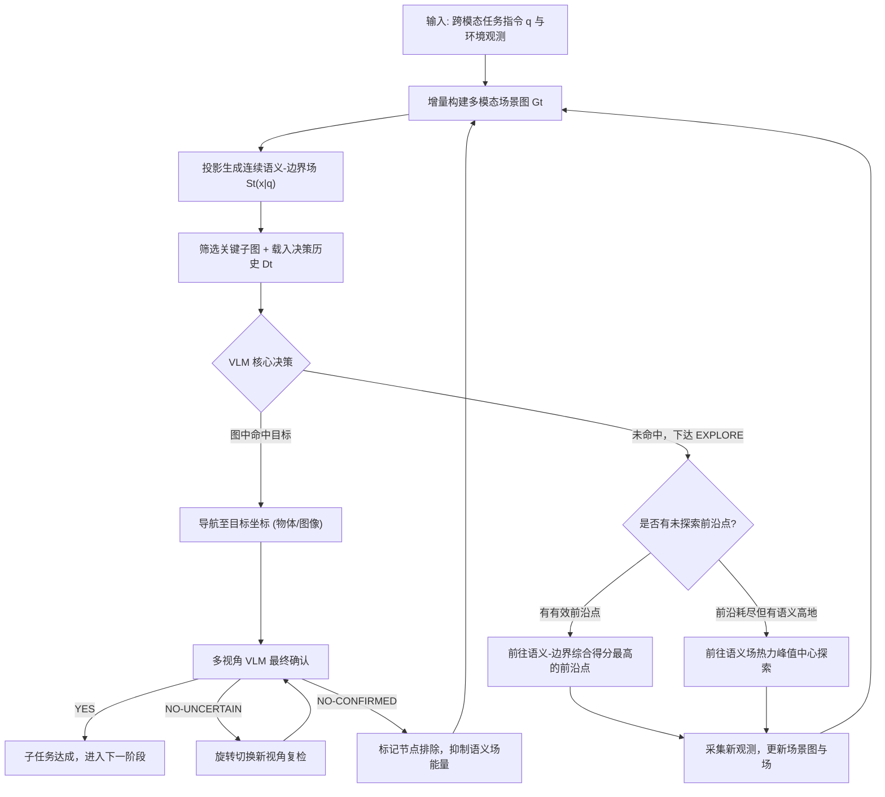
```mermaid
graph TD
    A["输入: 跨模态任务指令 q 与环境观测"] --> B["增量构建多模态场景图 Gt"]
    B --> C["投影生成连续语义-边界场 St(x|q)"]
    C --> D["筛选关键子图 + 载入决策历史 Dt"]
    D --> E{"VLM 核心决策"}
    
    E -- "图中命中目标" --> F["导航至目标坐标 (物体/图像)"]
    F --> G["多视角 VLM 最终确认"]
    G -- "YES" --> H["子任务达成，进入下一阶段"]
    G -- "NO-UNCERTAIN" --> I["旋转切换新视角复检"]
    I --> G
    G -- "NO-CONFIRMED" --> J["标记节点排除，抑制语义场能量"]
    J --> B
    
    E -- "未命中，下达 EXPLORE" --> K{"是否有未探索前沿点?"}
    K -- "有有效前沿点" --> L["前往语义-边界综合得分最高的前沿点"]
    K -- "前沿耗尽但有语义高地" --> M["前往语义场热力峰值中心探索"]
    L --> N["采集新观测，更新场景图与场"]
    M --> N
    N --> B
```

#### ④ 核心差异：与经典基线 MSGNav 的机制对比（卡点降维装置 C）

| 机制维度 | 经典基线 MSGNav | 本文 CGFM-Nav |
|---|---|---|
| **探索指引方式** | 纯几何边界探索或无向随机漫游 | 场景图证据反向投影为连续语义场，赋能前沿点语义偏置 |
| **子图提示筛选** | 规则全量检索或纯文本 LLM 过滤 | 复用场相关度的语义种子集 + 残差图 VLM 常识补充 |
| **错误重试抑制** | 依赖短期文本上下文中塞入的历史日志 | 节点级物理验证掩码，彻底切断错误物体在场中的引力 |
| **部署模型门槛** | 严重依赖昂贵且高延迟的云端 GPT-4o | 本地开源轻量 Qwen3-VL-8B 即可超越云端大模型性能 |

#### ⑤ 训练与推理设定
- **无需训练（Training-Free）**：全框架为纯零样本推理架构，感知模块采用预训练的 YOLOv8-World + SAM + CLIP，决策推理与多视角验证采用开源轻量级的 Qwen3-VL-8B-Instruct。
- **终身记忆保留**：在同一个场景的多个子任务之间，场景图及其验证掩码完全保留；跨子任务仅重置短期决策日志并按新目标重构语义场。

---

### 3. 核心结果/发现
在极具挑战性的终身跨模态导航基准 **GOAT-Bench**（包含 36 个未见场景、278 个多模态子任务，涵盖类别、语言描述及参考图像目标）上的评测结果表明：

1. **同基座显著提升**：在均使用开源 **Qwen3-VL-8B** 的公平对比下，CGFM-Nav 相比 MSGNav：
   - 整体成功率（SR）从 **53.2% 提升至 63.0%**（+9.8%）；
   - 路径长度加权成功率（SPL）从 **30.0% 提升至 39.6%**（+9.6%）；
   - 尤其在类别目标（SR: 63.6% → **72.7%**）和语言目标（SR: 48.4% → **61.5%**）上取得大幅跃升。
2. **轻量端侧逆袭云端旗舰**：搭载本地 8B 参数多模态模型的 CGFM-Nav，在整体 SR（**63.0%** vs 60.0%）、类别 SR（**72.7%** vs 63.6%）以及语言 SR（**61.5%** vs 57.2%）上全面超越了基于云端闭源旗舰 **GPT-4o** 的 MSGNav，验证了优质环境认知表征对大模型底座差距的弥补效应。
3. **图像目标依赖细粒度匹配**：在图像目标子任务中，由于缺少类别层面的泛化常识，更多依赖底层像素特征的点对点匹配，虽然 CGFM-Nav 比同基座基线提升明显（SR: 46.6% → 53.4%），但相比 GPT-4o 仍有微弱差距，表明图像目标对 VLM 自身的细粒度跨视角特征提取能力提出了更高要求。

---

### 4. 局限性
1. 当前验证仍局限于 GOAT-Bench 仿真环境，尚未在真实物理轮式机器人上完全验证传感器噪声、动态行人遮挡及里程计漂移等非理想因素下的长期鲁棒性。
2. 图像目标的表征与搜索仍受限于全局 CLIP 特征的粒度，缺少专门面向物体实例外观精细对齐的局部特征检索机制。

---

## 22. CanonNav (2026) {#canonnav}
——— 解耦相机几何与导航行为的跨平台视觉扩散导航策略

📄 **Paper**: [arXiv:2608.30242](https://arxiv.org/abs/2608.30242)

### 精华
1. **相机几何与行为解耦**：提出相机几何规范化（Canonicalization），通过单应重投影消除相机内参和俯仰角差异，并通过安装高度归一化将物理轨迹映射至视角不变空间，彻底解决了跨机器人平台演示数据中视觉观测与轨迹映射纠缠的病态问题。
2. **显式局部规划监督（Scope-of-Reach, SoR）**：针对传统模仿学习只学到专家动作却遗漏中间规划意图的缺陷，提出局部可达范围（SoR）表征，利用离线生成的 BEV 伪标签显式监督智能体在被遮挡或复杂地形下"往何处推进"。
3. **碰撞感知流形约束**：利用离线可通行性估计器构建度量符号距离场（SDF），在扩散策略的去噪轨迹上直接反向传播碰撞惩罚损失与航点可行性损失，实现端到端安全轨迹生成。
4. **单目 RGB 匹敌并超越深度图方案**：仅依靠单目 RGB 输入进行推理，在 CitySim 室外与 AWS Hospital 室内多相机配置下大幅超越 ViNT、NoMaD、LiMo 等 RGB 基线，并在长距离复杂拐弯场景下成功率反超依赖实时 RGB-D 深度输入的 NavDP。

---

### 1. 研究背景/问题
利用离散跨平台专家示范进行大规模模仿学习（Imitation Learning）是推动机器人自主视觉导航的重要路线。然而，充分利用跨平台异构数据面临两大根本症结：
1. **相机几何的病态纠缠**：不同机器人底盘（如四足机器狗、低矮扫地机、轮式移动车）搭载的相机高度、内参及俯仰倾角各异。相同的图像投影可能对应截然不同的地面物理轨迹；若强行让策略从 RGB 隐式推断相机几何，在数学上属于严重不适定的欠约束问题。
2. **专家示范中规划意图的隐式性**：专家轨迹仅展示了最终执行的平滑路径，而没有解释"为什么选择向该局部空旷区域过渡"以及"两侧边缘有多危险"。纯模仿学习在遇到障碍物遮挡、必须转弯绕行等未直达目标的复杂场景时，极易退化或发生撞击。

---

### 2. 主要方法/创新点

<div align="center">
  
<figcaption>图 1：CanonNav 研究动机。(a) 跨平台相机几何差异导致图像与物理轨迹的映射严重不一致；(b) 传统模仿学习缺失局部推进区域识别与安全边界等中间规划决策监督。</figcaption>
</div>

#### ① 整体框架概述
CanonNav 提出了由**相机几何规范化（Canonicalization）**、**多任务扩散策略网络（Policy Inference）**以及**离线规划安全监督（Training-Time Planning Supervision）**构成的闭环系统。在训练阶段利用预训练可通行性模型离线提取 BEV 伪标签提供密集监督；在部署阶段无需任何离线模型与深度传感器，仅凭单目 RGB 图像和相对目标即可输出无碰撞轨迹。

<div align="center">
  
<figcaption>图 2：CanonNav 整体架构。(a) 观测与目标转换至规范化几何空间；(b) DINOv3 骨干网络提取特征，扩散模型输出高度归一化轨迹、航点通行率与 SoR；(d) 离线 BEV 碰撞图与 SDF 提供安全和局部推进监督。</figcaption>
</div>

#### ② 逐模块讲解

**1. 相机几何规范化（Camera Geometry Canonicalization）**
- **内参与俯仰角消除**：设相机外参简化为安装高度 $h$ 与俯仰角 $R_{pitch}$，内参为 $K$。给定预设的正向基准虚拟相机内参 $\tilde{K}$，将原始图像 $I_t$ 投影重映射至无倾角正向视野 $$\tilde{I}_t$$：
  $$(\tilde{u}, \tilde{v}, 1)^\top \propto \tilde{K} R_{pitch}^{-1} K^{-1} (u, v, 1)^\top$$
- **高度归一化轨迹（Height-Normalized Trajectory）**：在正向基准相机下，地面物理点 $(x, y)$ 投影为 $$\tilde{u} = \tilde{c}_x - \tilde{f}_x \frac{y}{x}$$，$$\tilde{v} = \tilde{c}_y - \tilde{f}_y \frac{h}{x}$$。可以看出像素位置完全取决于横纵比 $y/x$ 与高距比 $h/x$。将物理轨迹点 $(x, y)$ 归一化为 $(\tilde{x}, \tilde{y}) = (x/h, y/h)$，投影公式转化为：
  $$\tilde{u} = \tilde{c}_x - \tilde{f}_x \frac{\tilde{y}}{\tilde{x}}, \quad \tilde{v} = \tilde{c}_y - \tilde{f}_y \frac{1}{\tilde{x}}$$
  该归一化彻底剥离了相机高度 $h$ 的干扰，使所有平台的轨迹分布在同一视锥几何下对齐。

> **举个例子（卡点降维装置 A：为什么高度归一化能消除底盘差异？）**：
> 设基准虚拟相机焦距 $$\tilde{f}_y = 500$$，主点 $$\tilde{c}_y = 250$$：
> - **低矮扫地机器人**：相机高度 $h_1 = 0.2\text{ m}$，前方 $1.0\text{ m}$ 处的路面障碍物（$x_1 = 1.0\text{ m}$），其高距比为 $h_1 / x_1 = 0.2 / 1.0 = 0.2$；
> - **高大巡检轮式车**：相机高度 $h_2 = 1.0\text{ m}$，前方 $5.0\text{ m}$ 处的路面障碍物（$x_2 = 5.0\text{ m}$），其高距比为 $h_2 / x_2 = 1.0 / 5.0 = 0.2$。
> 
> 在两个机器人的正向图像中，这两个物理距离完全不同的地面点，计算出的像素行位置 $\tilde{v} = 250 - 500 \times 0.2 = 150$ **完全一模一样**！
> 若直接模仿米制坐标，策略网络面对相同的视觉外观却要预测 $1.0\text{ m}$ 和 $5.0\text{ m}$ 的矛盾动作。而经过高度归一化后，两者的无量纲目标距离均为 $\tilde{x} = x/h = 5.0$！策略网络只需要学习这一统一分布，控制时再乘以各自的物理安装高度 $h$，即可无缝泛化。

**2. 规划监督与 Scope-of-Reach (SoR)**
- **SoR 局部可达范围建模**：将局部推进区域建模为 2D 鸟瞰图高斯分布 $\mathcal{S} = \mathcal{N}(\mu, \operatorname{diag}(\sigma^2))$，网络预测其高度归一化参数 $(\tilde{\mu}, \tilde{\sigma}) = (\mu/h, \sigma/h)$。
- **离线安全伪标签生成**：
  1. 使用预训练 ViTA 在离线训练集中提取图像可通行掩码；
  2. 投影到地面生成局部 BEV 碰撞图 $M_{coll}$，并转换为度量符号距离场 $M_{sdf}$；
  3. 将专家轨迹进入碰撞区或视野边界前的最后一个可行航点提取为局部推进目标 $$s^*$$。
- **三重 SoR 损失函数**：
  $$L_{prog} = \lambda_{pred} L_{pred} + \lambda_{neg} L_{neg} + \lambda_{cons} L_{cons}$$
  - $L_{pred}$：负对数似然结合 Smooth-L1 拟合目标点 $$\tilde{s}^*$$；
  - $L_{neg} = \iint M_{coll}(x, y) \mathcal{S}(x, y) dx dy$：对高斯概率落入碰撞障碍区的积分惩罚；
  - $L_{cons}$：采用 Soft-min 约束生成轨迹的去噪航点至少有一个穿越预测的 SoR 区域。

**3. 连续碰撞感知安全损失（Safety Supervision）**
- 从加噪轨迹 $$\tilde{\tau}_k$$ 经过单步反解得到无噪航点估计 $$\hat{\tau}_0 = \{\hat{p}_i\}$$；
- 度量碰撞惩罚损失 $L_{coll}$：
  $$c_i = \operatorname{softplus}\left(\frac{d_{safe} - M_{sdf}(h \hat{p}_i)}{\eta}\right), \quad L_{coll} = \frac{1}{\gamma} \log \sum_{i=1}^N \exp(\gamma c_i)$$
- 航点可通行性分支 $L_{trav}$：双线性采样图像特征预测航点生存概率 $$\hat{q}_i$$。

#### ③ 读者视角：数据流与训练/推理分离图（卡点降维装置 B）

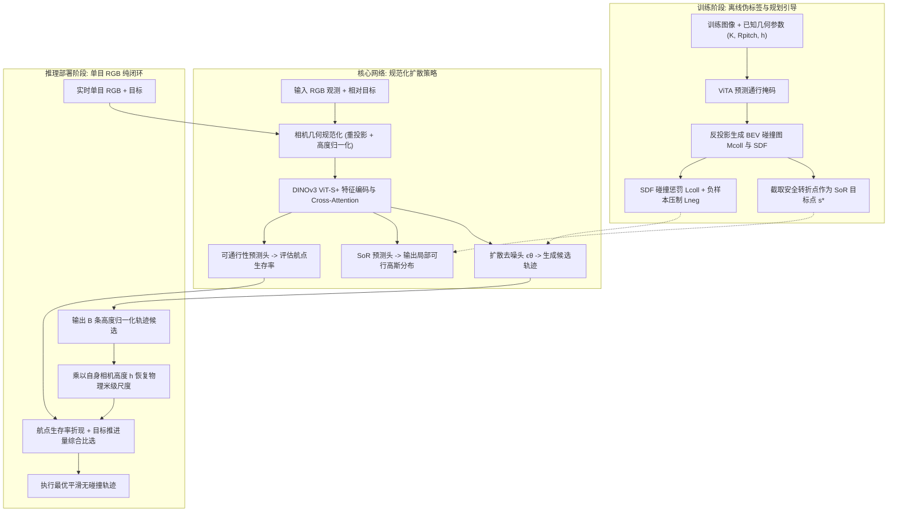
```mermaid
graph TD
    subgraph "训练阶段: 离线伪标签与规划引导"
        T1["训练图像 + 已知几何参数 (K, Rpitch, h)"] --> T2["ViTA 预测通行掩码"]
        T2 --> T3["反投影生成 BEV 碰撞图 Mcoll 与 SDF"]
        T3 --> T4["截取安全转折点作为 SoR 目标点 s*"]
        T3 --> T5["SDF 碰撞惩罚 Lcoll + 负样本压制 Lneg"]
    end

    subgraph "核心网络: 规范化扩散策略"
        N1["输入 RGB 观测 + 相对目标"] --> N2["相机几何规范化 (重投影 + 高度归一化)"]
        N2 --> N3["DINOv3 ViT-S+ 特征编码与 Cross-Attention"]
        N3 --> N4["扩散去噪头 ϵθ -> 生成候选轨迹"]
        N3 --> N5["SoR 预测头 -> 输出局部可行高斯分布"]
        N3 --> N6["可通行性预测头 -> 评估航点生存率"]
    end

    subgraph "推理部署阶段: 单目 RGB 纯闭环"
        P1["实时单目 RGB + 目标"] --> N2
        N4 --> P2["输出 B 条高度归一化轨迹候选"]
        P2 --> P3["乘以自身相机高度 h 恢复物理米级尺度"]
        P3 & N6 --> P4["航点生存率折现 + 目标推进量综合比选"]
        P4 --> P5["执行最优平滑无碰撞轨迹"]
    end

    T4 -.-> N5
    T5 -.-> N4
```

#### ④ 核心机制对比：CanonNav vs 主流导航基线（卡点降维装置 C）

| 机制维度 | 传统纯模仿基线 (ViNT / NoMaD) | 深度图规划基线 (ViPlanner / NavDP) | 本文 CanonNav |
|---|---|---|---|
| **跨平台几何处理** | 强行输入原图，靠海量随机增强隐式适配 | 需精确配准的 RGB-D 几何对齐 | 显式重投影 + 高度归一化空间解耦 |
| **中间规划意图** | 纯轨迹扩散去噪，缺失局部转折引导 | 依赖实时深度图重构代价地图 | 提出 SoR 显式建模局部推进分布 |
| **碰撞回避机制** | 缺乏显式负反馈，易切内弯刮蹭障碍物 | 需在线高帧率深度传感器计算碰撞 | 离线 SDF 反向梯度约束生成轨迹 |
| **部署传感器门槛** | 单目 RGB（但抗几何扰动极差） | 强依赖实时稠密 RGB-D 传感器 | 纯单目 RGB 即可达到超高安全性 |

---

### 3. 核心结果/发现
在 **CitySim（室外复杂园区）** 与 **AWS Hospital（室内复杂走廊病房）** 两个极具代表性的高难度仿真环境，以及真实物理车（Clearpath Husky 差速轮式车）上进行评测：

1. **跨相机几何泛化断层领先**：在相机高度从 $0.4\text{ m}$ 变化至 $1.0\text{ m}$、俯仰角从 $-15^\circ$ 变化至 $+15^\circ$ 的剧烈配置偏移下，ViNT 与 NoMaD 的成功率普遍暴跌 20%~40%，而 CanonNav 在所有几何扰动下的成功率下降幅度（$\Delta\text{SR}$）均控制在极小区间内。
2. **长距离复杂拐角超越 RGB-D 方案**：在 $20\text{ m}$ 超长子目标导航任务中，即便面对遮挡严重的 U 形拐弯，CanonNav 仅使用单目 RGB 就取得了 **86.4%** 的成功率与 **0.89** 次碰撞率，显著超越了搭载实时稠密深度的 NavDP（SR 71.2%，碰撞率 2.21）和 ViPlanner（SR 39.3%）。
3. **真实世界零样本迁移零事故**：在包含反光玻璃幕墙、狭窄树丛台阶和户外异形走廊的实机测试中，CanonNav 在所有测试中均保持零碰撞，轨迹曲率与人类示教路径吻合度极高。

---

### 4. 局限性
1. 几何规范化依赖机器人自身已知的安装参数（相机内参 $K$、静态安装高度 $h$ 与俯仰角 $R_{pitch}$），若机器人在越野颠簸路面上发生剧烈动态俯仰震荡，静态规范化假设会引入瞬时投影误差。
2. 离线伪标签质量受限于 ViTA 可通行性分割模型在极端光照（如暴雨、强逆光）下的初始分割精度。

---

## 23. LookStep (2026) {#lookstep}
——— 基于语言前瞻推演与事件驱动记忆的高效端到端视觉语言导航

📄 **Paper**: [arXiv:2609.02350](https://arxiv.org/abs/2609.02350) · [Code](https://github.com/kunyang-YU/LookStep)

### 精华
1. **语言中心未来状态前瞻（LC-FSM）**：打破传统 VLN 仅监督下一步单一专家动作（Next-step prediction）的范式，通过轻量级语言标签显式预测所有候选动作的前瞻后果（如提前撞墙、完成转向、错误路线），以极高的数据利用率实现反事实决策推演。
2. **事件驱动自适应滚动记忆（EDRM）**：无需外部复杂的 3D 几何建图或占用庞大显存的全量历史堆叠，由多模态大模型在推理过程中自主判断当前观测是否构成关键事件（`<memory_write>keep/drop</memory_write>`）并赋予语义角色，以有界内存实现长程上下文维护。
3. **极高显存与数据利用效率**：在不依赖外部几何工具或海量额外预训练数据的情况下，推理显存控制在 **19.7 GB**（约为同类方法的一半），显存利用效率（SR/GB）达到 **2.52**，显著领先 JanusVLN（1.19）与 StreamVLN（1.95）。
4. **同等设定下刷新连续环境 SOTA**：在最具挑战性的连续环境视觉语言导航基准 **R2R-CE** 未见验证集（Val-Unseen）上取得 **49.7%** 的成功率，全面超越了使用相同数据量与训练预算的现有主流方法。

---

### 1. 研究背景/问题
连续环境视觉语言导航（VLN-CE）要求具身智能体仅凭自然语言长程指令和连续车载相机观测到达指定目的地。基于多模态大语言模型（MLLM）的现有导航策略主要受制于两大效率瓶颈：
1. **训练层面的数据饥渴与弱监督**：传统行为克隆（Behavior Cloning）仅将专家当前执行的单一动作作为监督信号，模型无法知晓"为什么不选择其他动作"以及"备选动作会导致何种危险后果"，导致训练需要数百万级的大规模专家轨迹支持。
2. **推理层面的显存爆炸与关键帧遗失**：长程导航必须依赖历史状态；但全量保存历史视频帧会导致显存线性暴增，而固定窗口截断或均匀抽帧容易漏掉"推开房门"、"走下楼梯"等决定性的转折事件；引入外部 3D 建图工具又大幅增加了计算延迟与部署复杂度。

---

### 2. 主要方法/创新点

<div align="center">
  
<figcaption>图 1：LookStep 在 R2R 数据集上的显存效率与性能对比。无需额外预训练数据，在仅需 19.7 GB 显存的条件下实现了 2.52 的超高单位显存成功率（SR/GB）。</figcaption>
</div>

#### ① 整体框架概述
LookStep 是一个统一的端到端 MLLM 导航框架，不依赖外部 3D 传感器或独立建图模块。系统通过统一的结构化文本生成序列，在自回归解码中同步完成三大核心任务：**事件驱动记忆管理（Event-Driven Memory Management）**、**语言中心未来状态建模（Language-Centric Future State Modeling）**与**最终动作下发（Action Prediction）**。

<div align="center">
  
<figcaption>图 2：LookStep 系统架构与语言标签机制。自回归生成任务宏观进度、各动作推演后果、记忆写入判定与语义角色，最后闭环输出动作并维护有界滚动记忆。</figcaption>
</div>

#### ② 逐模块讲解

**1. 语言中心未来状态建模（Language Centric Future State Modeling, LC-FSM）**
- **输入**：自然语言导航指令 $I$、当前相机观测 $x_t$ 以及有界历史记忆 $O_{t-1}$。
- **结构化推演标签设计**：
  - **宏观导航进度**：`<progress>early / mid / late</progress>`，令模型对当前所处指令阶段具备显式感知；
  - **候选动作后果全集**：对当前可用的离散候选动作（如前进、左转、右转、停止），分别生成粗粒度的自然语言后果标签：
    $$\langle \mathrm{outcomes} \rangle \; \langle \mathrm{forward} \rangle \dots \langle /\mathrm{forward} \rangle \; \langle \mathrm{turn\_left} \rangle \dots \langle /\mathrm{turn\_left} \rangle \dots \langle /\mathrm{outcomes} \rangle$$
    例如：`<forward>premature_forward</forward>`（过早前进，撞墙）、`<turn_left>finish_turn</turn_left>`（完成转向，正对门洞）、`<stop>too_early</stop>`（过早停止）。
- **信息论设计动机**：作者在理论上证明，引入专家未来状态标签能够显著提升观测与专家动作之间的条件互信息下界；通过反事实后果语言建模，使单个样本提供多维度的对抗性判别监督。

> **举个例子（卡点降维装置 A：候选动作反事实推演）**：
> 设指令为："穿过楼梯左侧的门洞并在那里等待"。
> 机器人目前刚走到楼梯前，面临 4 个动作候选：
> - **传统 BC 监督**：标签为 `turn_left`。损失函数仅惩罚这一项的负对数似然，模型对于"为什么不能右转"没有任何梯度反馈；
> - **LookStep 语言前瞻**：模型自回归生成：
>   ```xml
>   <progress>late</progress>
>   <outcomes>
>     <forward>premature_forward</forward> <!-- 警示：此时直行将撞到楼梯扶手 -->
>     <turn_left>finish_turn</turn_left>    <!-- 确认：左转可正对目标门洞 -->
>     <turn_right>wrong_turn</turn_right>   <!-- 警示：右转将进入死胡同走廊 -->
>     <stop>too_early</stop>                <!-- 警示：尚未穿过门洞，不可停下 -->
>   </outcomes>
>   ```
>   模型在推理下一步动作前，已在语言语义空间内完成了对环境物理约束的"沙盒推演"，极大降低了盲目试错率。

**2. 事件驱动滚动记忆（Event Driven Rolling Memory, EDRM）**
- **输入**：当前帧与全局任务上下文。
- **处理**：将历史状态的维护转化为在线免微调的测试时记忆自适应（Test-Time Adaptation）：
  - `<event>`：识别当前帧所发生的关键具身事件（如 `turn_left_finishing`、`doorway_crossing`）；
  - `<memory_write>`：自主裁决是否写入历史记忆缓冲区（`keep` 写入，`drop` 丢弃）；
  - `<memory_role>`：指定该帧的长期索引角色（如 `turn_end` 转向结束锚点、`landmark` 关键地标）。
- **有界滚动更新**：记忆队列保持固定长度 $K$（仅容纳极少数关键帧），新关键帧写入时若队列溢出，则遵循先进先出或基于角色优先级的滚动替换，将长程轨迹的显存占用严格锁定在常量上限。

#### ③ 读者视角：单步推理与记忆流转自制流程图（卡点降维装置 B）

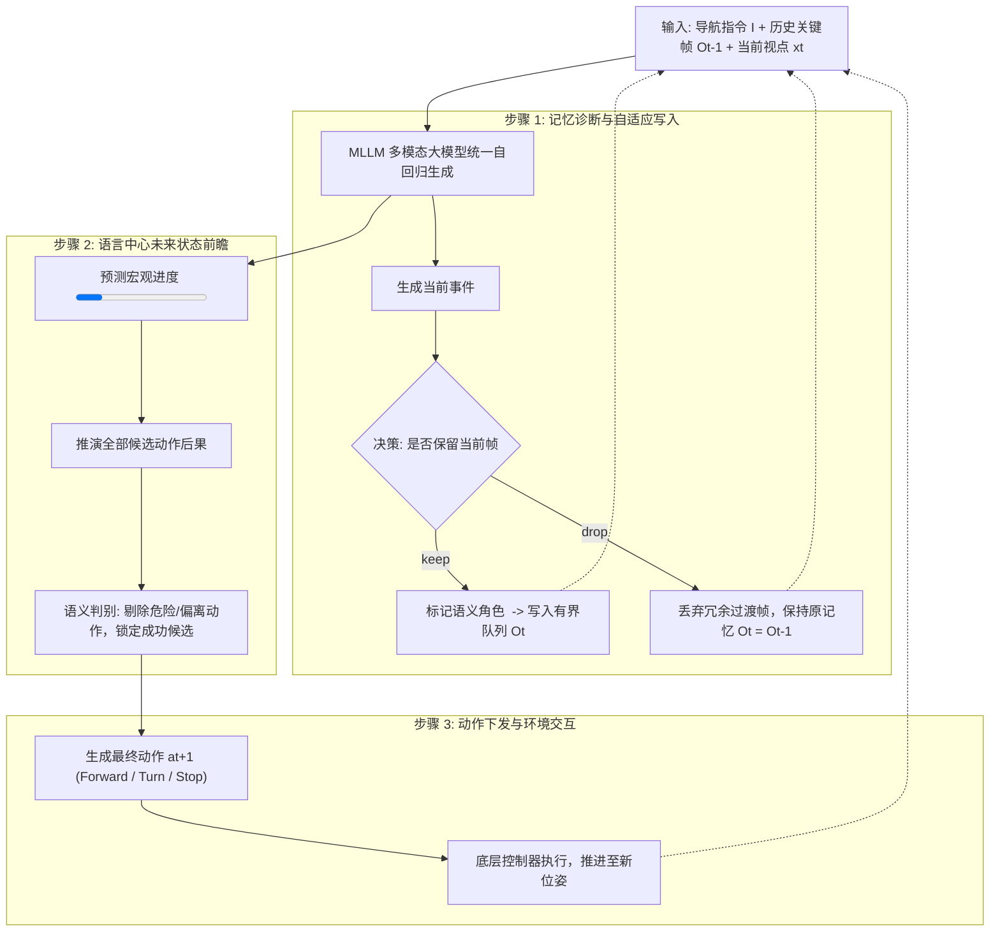
```mermaid
graph TD
    A["输入: 导航指令 I + 历史关键帧 Ot-1 + 当前视点 xt"] --> B["MLLM 多模态大模型统一自回归生成"]
    
    subgraph "步骤 1: 记忆诊断与自适应写入"
        B --> M1["生成当前事件 <event>"]
        M1 --> M2{"决策: 是否保留当前帧 <memory_write>"}
        M2 -- "keep" --> M3["标记语义角色 <memory_role> -> 写入有界队列 Ot"]
        M2 -- "drop" --> M4["丢弃冗余过渡帧，保持原记忆 Ot = Ot-1"]
    end
    
    subgraph "步骤 2: 语言中心未来状态前瞻"
        B --> P1["预测宏观进度 <progress>"]
        P1 --> P2["推演全部候选动作后果 <outcomes>"]
        P2 --> P3["语义判别: 剔除危险/偏离动作，锁定成功候选"]
    end
    
    subgraph "步骤 3: 动作下发与环境交互"
        P3 --> ACT["生成最终动作 at+1 (Forward / Turn / Stop)"]
        ACT --> ENV["底层控制器执行，推进至新位姿"]
    end
    
    M3 -.-> A
    M4 -.-> A
    ENV -.-> A
```

#### ④ 机制对比：LookStep vs 主流连续环境 VLN 方案（卡点降维装置 C）

| 机制维度 | 传统视频帧堆叠方案 (如 StreamVLN) | 外置建图方案 (如 MapNav / g3D-LF) | 本文 LookStep |
|---|---|---|---|
| **历史记忆维护** | 滑动窗口截断或均匀固定间隔抽帧 | 维护稠密 2D/3D 拓扑图或体素网格 | 模型自主按事件触发写入并标注角色 |
| **动作监督信号** | 仅监督单一专家离散动作 | 依赖地图启发式几何航点规划 | 结构化语言推演所有候选动作的未来后果 |
| **运行时显存** | 随轨迹长度增加，或高达 40 GB+ | 需额外运行 SLAM/3D 模块，显存与计算重 | 严格恒定限制在 19.7 GB，消费级显卡可跑 |
| **额外训练数据** | 普遍依赖数百万额外多模态轨迹 | 需预先离线抽取 3D 几何特征 | 0 额外预训练数据，纯标准数据集训练 |

#### ⑤ 训练与推理细节
- **骨干网络**：采用统一的开源视觉-语言模型架构，在标准 R2R-CE / RxR-CE 训练集上使用标准自回归因果语言建模损失（Cross-Entropy）端到端微调。
- **测试期推理**：单步推理中，模型顺次吐出记忆标签、前瞻标签与最终动作，随后直接解析动作 token 驱动机器人移动，无需调用外部渲染器或几何求解器。

---

### 3. 核心结果/发现
在连续环境视觉语言导航的核心基准 **R2R-CE** 与 **RxR-CE** 未见验证集（Val-Unseen）上进行了全面对比评估：

1. **同等训练设定下夺冠 SOTA**：在不借助任何额外训练数据（0 External Data）的前提下：
   - R2R-CE Val-Unseen 成功率（SR）达到 **49.7%**，路径长度加权成功率（SPL）达到 **45.5%**；
   - 全面碾压了传统模型（如 HPN+DN 36.0%、CMA 41.0%、VLN-BERT 44.0%、Sim2Sim 43.0%）；
   - 性能匹敌甚至逼近了使用了千万级额外无监督轨迹预训练的超大模型方案（如 NaVILA 49.7%）。
2. **极高的单位显存效率**：如图 1 所示，LookStep 运行显存仅为 **19.7 GB**，其内存效率指标（SR / GB）达到 **2.52**，大幅高于同类先进 MLLM 方法 JanusVLN（1.19）和 StreamVLN（1.95）。
3. **真实物理机部署验证**：在室内复杂多房间真实机器人实验中（图 3 与图 7），即使遇到指令描述与实际光照视角不完全匹配的情况，智能体依靠准确的角色记忆与动作前瞻，依然展现出了平滑进出房门、准确识别转弯终点的稳健能力。

---

### 4. 局限性
1. 候选动作的前瞻状态目前采用离散化语言标签（如 `premature_forward`、`wrong_turn`）进行粗粒度描述，难以刻画毫米级的连续角速度与线速度动力学细节。
2. 记忆的写入和剔除完全依赖 MLLM 自身的语义判断，当遇到极端视觉退化（如全黑暗光、强反光）导致误判事件角色时，可能会错误丢弃关键帧。

---

## 24. NavMCP (2026) {#navmcp}
———首个将导航基础模型（NFM）脚手架化封装为智能体执行器的长程具身导航框架

📄 **Paper**: [arXiv:2608.30396](https://arxiv.org/abs/2608.30396)

### 精华
1. **核心洞察**：长程物理世界交互面临“高层宏观推理”与“底层微观闭环”难以兼备的两难困境，现有视觉语言模型（VLM）长程动作漂移严重，而导航基础模型（NFM）虽具备优秀的局部具身执行能力，却受限于单次回合、缺乏跨轮次持久任务状态。
2. **范式突破**：NavMCP 打破了将导航模型简单视作黑盒单步工具（Episodic Tool Interface）的传统做法，提出首个将 NFM 作为长程具身智能体物理执行层的脚手架（Scaffolding）协议体系，在不微调任何底层模型的前提下实现长程闭环探索。
3. **架构机制**：构建“意图（Intent）- 观测（Observation）- 记忆（Memory）”三通道协议，分别解决指令与意图脱节、沿途关键观测丢失、跨调用记忆断层三大鸿沟，把一次性航点规划转变为可累积、可追溯的具身认知过程。
4. **决策哲学**：引入基于证据链的非对称仲裁机制，不仅记录“看到了什么”，更显式沉淀“排除了哪些区域”的否定证据（Negative Evidence），让智能体具备有目的的非单调假设检验探索能力。
5. **迁移启示**：在三大具身问答基准（HM-EQA、MT-HM3D、EXPRESS-Bench）上全面刷新最强成绩，并在宇树 Unitree Go2 四足机器人上实现超 50 米超长程真实环境探索，证明将领域基础模型与通用大模型分层脚手架化是通向物理智能体的重要路径。

---

### 1. 研究背景/问题
具身问答（Embodied Question Answering, EQA）与真实物理环境搜索要求智能体在大型未知场景中长程探索以收集视觉证据。现有方法陷入了两难架构分歧：若让通用大模型（VLM）直接预测底层动作或局部航点，在长时程、大跨度场景中会频繁发生轨迹漂移、死锁与执行脆弱；若引入专用导航基础模型（Navigation Foundation Model, NFM，如 Qwen-RobotNav、Uni-NaVid 等），传统智能体仅将其封装为常规的单次回合工具（Episodic Tool Call）——向导航模型发送单句指令，底层跑完后仅返回终点状态与最终单张视野。

这种传统的单回合接口在长程证据收集场景中存在严重的**回合间隙（Episodic Interface Gap）**：
1. **指令与意图不匹配（Mismatch between instruction and intent）**：高层 VLM 关注“要验证什么信息/找什么线索”，而底层导航模型需要具体的路径指令，单句路线命令无法传达搜索预算与语义边界；
2. **中间观测丢失（Intermediate observation loss）**：目标物体可能在机器人经过走廊或门缝的途中一闪而过，仅返回终止视角会丢弃整条轨迹中的海量高价值感知线索；
3. **缺乏跨调用累积（Lack of cross-call accumulation）**：单次调用结束后底层执行记忆清空，高层若缺乏结构化记忆账本，无法记录“哪些房间已完全排查”，导致重复搜索或盲目兜圈。在 HM-EQA 基准上，退化为传统单回合接口直接带来 14.9% 的剧烈性能断崖。

---

### 2. 主要方法/创新点

<div align="center">
  
<figcaption>NavMCP 系统整体架构：高层 VLM 智能体通过意图通道向导航基础模型（NFM）派发子目标，NFM 在非特权自车视角下自主完成闭环运动，沿途轨迹数据经由观测通道转化为带来源引用的旅程证据，并在记忆通道中维护动态更新的 EQA 上下文状态。</figcaption>
</div>

#### ① 整体框架概述
NavMCP（Navigation Model Context Protocol）采用双层分工架构：**高层 VLM 智能体充当“推理大脑”**，负责任务目标分解、证据需求推断、搜索区域规划与何时终止并回答；**底层 NFM（以 Qwen-RobotNav 为代表）充当“物理执行肢体”**，负责在非特权第一人称 RGB 视角与自建局部拓扑图下完成避障与鲁棒的闭环航点跟踪。二者通过解耦且紧密协同的三通道协议门控交互，既拓展了 VLM 的物理动作视野，又拓展了 NFM 的长程推理视野。

#### 难点降维：传统工具调用 vs NavMCP 三通道协议

| 维度 | 传统工具调用（Episodic Interface） | NavMCP 脚手架协议（本文方案） |
|---|---|---|
| **意图表达 (Intent)** | 单句控制指令（如 "向左转走向主卧"），缺乏预算约束与搜索模式区分 | 结构化语义调用 `(mode, goal, budget, constraints)`，区分物体搜索与指令导航双模式 |
| **观测反馈 (Observation)** | 仅返回最终终点终止状态与末帧图像，沿途关键视觉信息全部丢失 | 沿轨迹等步长采样关键帧序列，由轨迹摘要器生成带关键帧来源引用的旅程简报（Journey Artifact） |
| **跨轮记忆 (Memory)** | 依赖原始交互对话上下文，面对长序列很快超出窗口且极易遗忘否定线索 | 显式维护三元状态 $C_t = (H_t, E_t, U_t)$，结构化沉淀正负证据账本，安全压缩原始工具轨迹 |
| **决策准则 (Arbitration)** | 仅凭单次视线是否看到目标直接草率回答 | 基于 `analyze_status` 的三阶段非对称仲裁：证实需直接图像支持，证伪需区域全覆盖证据 |

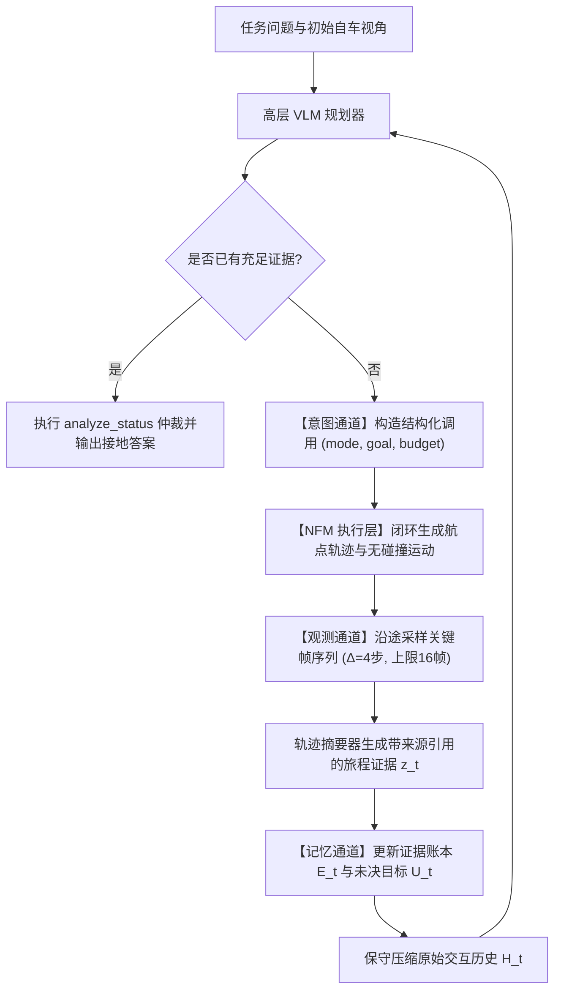
```mermaid
graph TD
    A["任务问题与初始自车视角"] --> B["高层 VLM 规划器"]
    B --> C{"是否已有充足证据?"}
    C -- "是" --> D["执行 analyze_status 仲裁并输出接地答案"]
    C -- "否" --> E["【意图通道】构造结构化调用 (mode, goal, budget)"]
    E --> F["【NFM 执行层】闭环生成航点轨迹与无碰撞运动"]
    F --> G["【观测通道】沿途采样关键帧序列 (Δ=4步, 上限16帧)"]
    G --> H["轨迹摘要器生成带来源引用的旅程证据 z_t"]
    H --> I["【记忆通道】更新证据账本 E_t 与未决目标 U_t"]
    I --> J["保守压缩原始交互历史 H_t"]
    J --> B
```

#### ② 逐模块讲解：NavMCP 三通道核心机制

##### 1. 意图通道（Intent Channel）：从证据需求到结构化导航调用
高层智能体在推断出缺失的信息后，无需编写底层的电机指令或细微航点，而是通过协议门控发出结构化语义导航调用：
$$\text{Call} _t = (\text{mode}, \text{sub\_goal}, \text{budget}, \text{constraints})$$
- **双模式解耦**：
  - `navigate_to_object`（物体目标导航模式）：输入具体的物体类别名称或指代对象，底层 NFM 自主进行语义驱动的局部探索与逼近；
  - `navigate_by_instruction`（视觉语言导航模式）：输入包含区域、路径或拓扑地标的高级自然语言指令（如“穿过走廊进入尽头的卧室”）。
- **预算与边界约束**：通过 `budget` 控制底层最大步数，避免底层模型陷入局部死循环；通过 `constraints` 提供语义避障建议。底层执行器仅依赖本体自车 RGB 观测、位姿估计与探索过程中实时构建的拓扑占据图，无需预知场景真值或特权几何信息。

<div align="center">
  
<figcaption>NavMCP 三通道脚手架内部流转逻辑：意图通道负责任务语义对齐，观测通道负责将时空轨迹映射为带置信度与图源标签的结构化感知证据，记忆通道负责支撑跨多轮交互的持久化证据账本更新。</figcaption>
</div>

##### 2. 观测通道（Observation Channel）：从动态轨迹到来源锚定证据
底层执行器完成一次单模态导航后，输出原始轨迹记录 $r_t = (s_t, b_t, \ell_t, p_t, K_t)$，其中 $s_t$ 为完成标志，$b_t$ 为停止原因，$\ell_t$ 为行走总路径长度，$p_t$ 为最终位姿，$K_t = \{I_{t,1}, \dots, I_{t,n}\}$ 为沿途关键帧集合。
- **关键帧等距采样**：为兼顾视觉覆盖率与上下文成本，系统每隔 $\Delta = 4$ 步采样一张自车视野帧，单次调用上限截断为 $M = 16$ 帧。
- **VLM 轨迹摘要器（Trajectory Summarizer）**：将这批关键帧输入轻量多模态描述器，提取结构化旅程证据：
  $$z_t = (q_t, R_t, O_t, P_t, D_t)$$
  其中 $q_t$ 记录子目标达成状态；$R_t$ 总结途经房间与区域过渡；$O_t$ 提取显著观测物体；$P_t$ 记录规划拓扑线索（如发现未探索的楼梯口、虚掩的房门）；$D_t$ 记录不确定性与执行异常。
- **来源锚定元组（Source Grounding）**：$O_t$ 与 $R_t$ 中的每一个物体或区域提及，都强制绑定一个五元组标签 $(n, i, v, h, c)$（名称、所属关键帧索引、视角方位、相对空间提示、置信度）。严禁摘要器无依据脑补未观察到的状态。

##### 3. 记忆通道（Memory Channel）：跨调用证据账本与保守上下文压缩
为解决多轮调用引起的上下文爆炸，NavMCP 维持显式三元 EQA 上下文状态：
$$C_t = (H_t, E_t, U_t)$$
- **证据账本 $E_t$**：记录带有来源索引的正面证据（Positive Evidence，如“在主卧床头柜发现点亮的台灯，来源帧 keyframe_3”）、否定证据（Negative Evidence，如“书房全景视野排查完毕，未发现打印机”）。账本由 `write_notebook` 维护，采用 FIFO 队列上限保留 100 条去重记录，在每轮推理时直接注入 Prompt 头部。
- **未决目标池 $U_t$**：维护尚未证实或存在模糊推断的待查目标，指导下一次意图通道的派发。
- **保守上下文压缩策略**：仅当关键感知信息已被提炼外化至 $E_t$ 与 $U_t$ 并打上关键帧引用后，系统才允许将上一轮冗长的原始工具执行日志与中间视觉图替换为极简占位符。这保证了长时程交互中即使发生上下文截断，核心决策链条也完全不受破坏。

#### 难点降维：Journey Analysis 沿途捕获与非对称仲裁具体实例

> **举个具体例子**：
> 机器人在回答“床头柜上的台灯是否开着？”这一问题时，意图通道发出 `navigate_by_instruction("穿过走廊进入主卧")`，底层连续移动了 16 步。
> 1. **传统工具调用**：底层走完停在主卧衣柜前，仅返回最后一帧衣柜图像。智能体完全错过床头柜，判断“未找到台灯”，不得不盲目再次寻找。
> 2. **NavMCP 观测通道**：按 $\Delta=4$ 采样 4 张关键帧。在第 2 张关键帧（机器人正路过主卧半开的房门）中，画面右侧门缝内隐约捕捉到床头柜与灯罩。VLM 轨迹摘要器提炼出证据元组：`("台灯", frame_2, "右侧门缝", "主卧床旁", "uncertain")`，直接写入未决目标 $U_t$。
> 3. **非对称仲裁机制**：下一轮规划器调用 `analyze_status`，激活专门的局部验证。此时系统遵守**非对称证据法则**：
>    - **证实（Positive）**：必须依赖无歧义的高清直接视觉证据（调用 `zoom_in_object` 放大查看该台灯发光状态）；
>    - **证伪（Negative）**：若要得出“房间里没有台灯”的否定结论，必须提供全景 360 度扫描且覆盖该房间所有死角的证据链。严禁将“仅仅没看到”武断视为“物体不存在”。

<div align="center">
  
<figcaption>Explore-EQA 任务实录（寻找黑色小沙发）：智能体在长程探索中连续排查 5 个房间并沉淀否定证据，避免走回头路；中间距目标距离曲线呈现出理性的非单调特征（先拉大距离以系统性排除其他区域，随后精准收敛至目标角落）。</figcaption>
</div>

#### ③ 辅助感知工具集与验证协议
为在最终决策前消除歧义，NavMCP 向智能体暴露了细粒度视觉感知工具库：
- **阅读型工具（Reader Tools）**：
  - `look_around`：调用全景四方向相机获取 360 度环视感知与场景可行拓扑；
  - `analyze_status`：三阶段证据仲裁器，输入当前全景、历史关键帧与记事本，输出证据充足度与缺失类型；
  - `zoom_in_object`：对候选目标裁剪放大，进行细粒度属性（开关状态、文字、细小部件）精细判别；
  - `review_image`：调取归档的历史关键帧重新审视。
- **探测型工具（Detector Tools）**：
  - `detect_objects_360`、`detect_objects`：基于开放词表检测器与 SAM 进行目标定位与计数；
  - `estimate_depth`：基于 Depth-Anything 进行度量级深度与可接触距离估计。

#### 难点降维：等效探索步数（Equivalent Agent Steps）补偿计算

在具身导航评估中，传统 Frontier 探索基线（如 Explore-EQA、FAST-EQA）以瞬移方式移动，其单步决策位移被严格限制在 3 米以内。而 NFM 一次闭环调用可能自主移动十余米。如果直接把 NFM 一次长程调用仅计为 1 步，会对传统基线造成严重的评测不公；但如果把底层物理控制周期全都算作高层步数，又无法体现 NFM 闭环执行对高层大模型调用开销的节省。

为此，论文以 3 米为基础换算单元，设计了**等效智能体步数（Equivalent Agent Steps）**：
$$n_{\text{eq}} = H + \sum_{k=1}^K \max\left(0, \left\lceil \frac{L_k}{3\text{ m}} \right\rceil - 1\right), \quad \hat{n} _{\text{eq}} = \frac{n_{\text{eq}}}{N}$$
其中 $H$ 为高层 VLM 实际调用次数，$K$ 为 NFM 调用总次数，$L_k$ 为第 $k$ 次 NFM 实际运动轨迹的物理弧长，$N = \lfloor \sqrt{A \times 3} \rfloor$ 为基于场景可通行面积 $A$ 的理论总预算步数。

> **手算算例**：
> 设某场景总步数预算 $N = 50$ 步。智能体在高层共调用了 $H = 3$ 次 VLM：
> - 第 1 次调用 NFM 移动了 2.5 米：由于 $L_1 \le 3\text{m}$，$\lceil 2.5/3 \rceil - 1 = 0$，补偿 0 步；
> - 第 2 次调用 NFM 穿过长走廊，移动了 8.2 米：$\lceil 8.2/3 \rceil - 1 = 3 - 1 = 2$ 步补偿；
> - 第 3 次调用 NFM 跨房间搜索，移动了 11.0 米：$\lceil 11.0/3 \rceil - 1 = 4 - 1 = 3$ 步补偿。
> 
> 最终等效总步数 $n_{\text{eq}} = 3 + (0 + 2 + 3) = 8$ 步，归一化步数消耗：
> $$\hat{n} _{\text{eq}} = \frac{8}{50} = 0.16$$
> 这种换算既严谨补偿了长程物理位移，又真实体现出 NavMCP 相比传统单步探索将高层大模型交互频次削减了 70% 以上。

---

### 3. 核心结果/发现

#### ① 三大 EQA 基准全面超越 SOTA
在三大基准测试中，NavMCP 均取得了显著的突破性领先（采用 Qwen3.6-Plus 智能体与 Qwen-RobotNav-8B 执行器）：
- **HM-EQA（500 道多选问答）**：NavMCP 达到 **76.7%** 准确率，大幅超越此前最强方法 FAST-EQA（69.2%）达 **7.5 个百分点**。同时归一化高层探索步数仅为 **0.15**，较 FAST-EQA 的 0.65 减少了 77% 的高层大模型调用，兼具极高精度与极致能效。
- **MT-HM3D（多目标跨房间复杂问答）**：准确率达到 **54.4%**，领先 FAST-EQA（50.5%）3.9 个百分点。
- **EXPRESS-Bench（2,044 道长程自由形式问答）**：自由形式问答评测中，LLM 打分达到 **79.27**，路径勘探效率加权指标 $E_{\text{path}}$ 达到 **33.96**，大幅领先 Fine-EQA（63.95 / 25.58）与 ToolEQA（65.77 / 25.82）。

#### ② 严格控制变量下的全系统对齐测试（HM-EQA，固定 Qwen3.5-397B-A17B）
为消除大模型底座差异带来的影响，论文在统一使用开源 Qwen3.5-397B-A17B 作为决策智能体、统一初始状态、统一预算与感知工具的前提下进行了重测：
- Explore-EQA：57.6%
- ToolEQA：60.8%
- FAST-EQA：63.5%
- **NavMCP + Qwen-RobotNav-8B**：**74.0%**（领先基准 10.5 ～ 16.4 个百分点）。

#### ③ 双层分工互补性消融（Architecture Ablation）
- **固定底层 NFM，变化高层智能体**：
  - 无智能体（仅凭初始视角盲猜）：38.2%
  - 单轮被动 Agent（仅拍摄单次全景）：58.4%
  - 传统反应式 Agent（固定探索循环）：62.0%
  - 完整 NavMCP 脚手架（Qwen3.5）：**74.0%**（Qwen3.6-Plus 进一步达到 76.7%）。
  - *结论*：再强大的底层导航模型，缺乏高层自适应假设检验与记忆沉淀，也无法胜任复杂具身推理。
- **固定高层智能体，变化底层导航执行器**：
  - NavMCP + Random Walk（随机游走）：60.9%
  - NavMCP + Frontier Exploration（传统前沿点探测）：65.3%
  - NavMCP + StreamVLN：69.3%
  - NavMCP + Qwen-RobotNav-4B：73.3%
  - NavMCP + Qwen-RobotNav-8B：**74.0%**
  - *结论*：高层智能体无法弥补底层脆弱的物理执行，更强的语言条件闭环导航器能将高层语义需求转化为更高质量的时空观测。

#### ④ 协议通道消融实验（Protocol Ablation on HM-EQA）
- **直接退化为传统单次回合工具接口（Episodic Interface）**：性能暴跌 **14.9 个百分点**（74.0% $\to$ 59.1%），直接证实了回合间隙对长程物理交互的致命性；
- **退化为终点观测返回（Terminal-only Observation）**：性能损失 **5.9 个百分点**（降至 68.1%），证实沿途关键帧与过程观测对证据收集至关重要；
- **移除记忆通道的 EQA 上下文账本**：性能损失 **4.6 个百分点**（降至 69.4%）；
- **移除 VLM 旅程分析（Journey Analysis）**：性能损失 **4.4 个百分点**（降至 69.6%）；
- **稀疏化关键帧采样（从 4 步/16 帧变为 8 步/8 帧）**：性能损失 **2.8 个百分点**（降至 71.2%）。

<div align="center">
  
<figcaption>宇树 Unitree Go2 四足机器人真实环境实测：面对长达 50 米以上跨越多个功能区的超长程探索任务，NavMCP 引导机器狗将高层目标分解为以地标为锚点的渐进子目标，成功率达 78.3%，相对反应式基线展现出巨大优势。</figcaption>
</div>

#### ⑤ 真实机器人部署：宇树 Unitree Go2 物理验证
在真实办公大楼环境中，面对非结构化障碍、测距漂移与传感噪声，对单房间（Low）、跨房间（Medium）与超 20 米大尺度多区域（High）三级难度进行了实机测试（固定 Qwen3.6-Plus）：
- **单房间级（Low，20 回合）**：Reactive 80%，Frontier 70%，**NavMCP 90%**；
- **跨房间级（Medium，20 回合）**：Reactive 骤降至 35%，Frontier 60%，**NavMCP 保持 85%**；
- **超 20 米大范围探索（High，20 回合）**：Reactive 彻底崩溃为 **0%**，Frontier 仅为 **15%**，而 **NavMCP 依然保持高达 60% 的成功率**！
- **总体真机成功率**：NavMCP 达到 **78.3%**，相比 Frontier（48.3%）和 Reactive（38.3%）呈现压倒性优势，证明任务时程越长、环境越复杂，分层脚手架的优势越明显。

---

### 4. 局限性
1. **高层模型计算开销与响应时延**：NavMCP 依赖大参数量 VLM（如 Qwen3.6-Plus 或 397B 级模型）进行每轮多模态旅程分析与证据仲裁，高层大模型的推理延迟较传统轻量启发式算法更高，未来需探索端侧小模型或强化学习蒸馏方案；
2. **多视角采样下的物体重复与计数歧义**：沿途多个关键帧或不同相机视角多次拍到同一物体时，VLM 在密集小物体计数任务中仍偶发重复去重失误（Cross-view duplication error）；
3. **动态环境与非稳态物理干扰**：当前测试主要在相对静态的室内大场景展开，在包含剧烈动态人流穿行或光照突变的极具挑战性现实场景中，底层 NFM 的局部死锁与恢复机制仍有进一步提升空间。

---

## 25. OccPlanner (2026) {#occplanner}
———把一个没有深度的像素，"顶"回局部 3D 占用栅格里再规划

📄 **Paper**: [arXiv:2608.14160](https://arxiv.org/abs/2608.14160)

---

### 精华

1. 像素目标只有方向、没有深度和可通行性，OccPlanner 的解法是**两段式条件注入**——先让目标与时序视觉上下文对齐拿到粗方向，再与局部 3D 占用几何对齐落到可行点位；消融显示单独注入占用特征几乎无增益，补上顺序交互后 cluttered-hard 的 SR 从 75.55% 跳到 84.92%。
2. 显式的局部 3D 占用**不是当地图用的**，而是作为几何先验的中间监督，让扩散策略在吐轨迹之前先"知道"哪里是墙。
3. L3ROcc 的核心洞察是把体素分成 occupied / observed-free / **unknown** 三态而非二值——"没看见"和"确实是空的"必须分开，否则策略会把遮挡区当通路。
4. 因此单目 RGB 视频就能反向生成占用监督，数据来源从"必须有 3D 标注的仿真器"放宽到"任何导航视频"，真机仅用 829 条样本微调即见效。
5. 开环指标与闭环成功率**不同向**——base model 开环 IoU/FDE 最好，闭环却明显低于完整模型，提醒别拿开环 proxy 选模型。

---

### 1. 研究背景/问题

导航目标的指定方式有度量坐标（PointGoal）、语义类别（ObjectGoal）、目标照片（ImageGoal）和自然语言（VLN）几种，而**像素目标**直接在当前相机视野里点一个点作为终点，不需要预建地图、也不需要度量坐标——对真机部署最友好。

但一个像素**既不含深度、也不含可通行性**：策略必须同时完成"这个点在 3D 里的哪个位置"和"怎么绕开障碍走过去"两件事。现有像素目标方法（PixNav、SSM-PixNav）直接在图像空间做条件，Goal2Pixel 预测可导航像素再反投影成航点；另一边的学习型局部规划器（iPlanner、ViPlanner、NavDP、LoGoPlanner）则从度量目标出发生成轨迹。**两条线是断开的**——连续的像素目标规划始终没有和显式的局部 3D 占用推理结合起来。

---

### 2. 主要方法/创新点

<div align="center">
  
<figcaption>OccPlanner 与 L3ROcc 总览。(a) L3ROcc 把单目 RGB 导航视频转成可见性感知的局部占用与轨迹监督；(b) OccPlanner 把连续的像素目标轨迹生成条件化在 RGB-D 上下文与局部 3D 占用之上</figcaption>
</div>

#### ① 卡点降维：像素目标到底难在哪

先把四种目标形式摆在一起，就能看清 PixelGoal 的"便宜"是拿什么换的：

| 目标形式 | 给了什么 | 缺了什么 | 代价 |
|---|---|---|---|
| PointGoal（度量坐标） | 精确的 3D 位置 | — | 需要预建地图或全局定位 |
| ObjectGoal（"找沙发"） | 语义类别 | 具体实例与位置 | 需要语义地图 + 探索 |
| ImageGoal（一张目标照片） | 目标外观 | 目标在哪、有多远 | 跨视角匹配，长程易失败 |
| **PixelGoal（像素坐标）** | **目标在当前视野里的方向** | **深度、可通行性** | **不用地图，但要自己把像素顶回 3D** |

最后一行就是这篇论文要付的那笔账：省掉了地图，就得把"深度 + 可通行性"这两样东西从模型内部补出来。OccPlanner 的答案是——用一个**学出来的局部 3D 占用分支**来补。

#### ② 整体框架

系统由两半组成：**L3ROcc** 是离线数据生成流水线，负责把单目 RGB 导航视频变成局部占用监督；**OccPlanner** 是在线策略，由三个模块构成——共享 RGB-D 几何编码器负责抽时空上下文，占用分支负责显式预测局部 3D 占用并压成紧凑 token，目标感知轨迹分支负责把像素目标依次与上下文、与占用几何对齐，最后交给扩散去噪生成连续轨迹。

#### ③ L3ROcc：从单目视频反向生成占用监督

<div align="center">
  
<figcaption>L3ROcc 数据生成流水线：π³ 重建共享场景几何与相机运动，经度量对齐与机器人中心变换后，通过体素化和射线推理生成可见性感知的局部占用标注</figcaption>
</div>

**输入**：一段单目 RGB 导航视频。

**处理**分四步：

1. **RGB 几何重建**——均匀采样 K 帧送进 π³，得到共享坐标系 3D 点、局部 pointmap、稀疏相机位姿和置信度图。滤掉低置信点、用局部 pointmap 去掉深度边缘伪影，再体素下采样得到紧凑的共享场景点云。稀疏位姿用三次样条插值平移、SLERP 插值旋转，补齐到每一个视频时间戳。
2. **度量与机器人中心对齐**——单目重建天然尺度不确定。有参考位姿时，用重建轨迹与参考轨迹对齐恢复场景级尺度；没有参考位姿时直接换用具备度量能力的 π³ 变体。每个时刻把缩放后的共享几何变换到当前局部坐标系，再用相机到底盘的外参对齐机器人朝向，得到机器人中心几何与对齐后的视线射线。
3. **可见性感知占用生成**——把机器人中心几何体素化成候选占用栅格，然后沿射线做 ray marching（借鉴 Occ3D）。
4. **输出**：稀疏可见占用 + 打包的可见性掩码 + 对齐的轨迹元数据。

**卡点降维 —— 三态标注为什么是关键**：

> **举个例子**：把一条射线上的体素排成一列，编号 1→6，机器人在 0 处往前看，假设第 3 个体素被桌子占住了。ray marching 走一遍的结果是：
>
> - 体素 1、2 → **observed free**（射线确实穿过去了，是空的）
> - 体素 3 → **visible occupied**（第一个命中点，这才是真障碍）
> - 体素 4、5、6 → **unknown**（被桌子挡住，压根没看见）
>
> 关键在第三行。朴素做法会把 4~6 标成自由空间——因为点云里那儿本来就没有点——策略学完就会以为桌子后面能走。三态标注把"没看见"和"确实是空的"分开，模型才不会把遮挡区当通路。如果射线一路没有命中，则整条路径上的体素全部标为 observed free。

**设计动机**：占用监督传统上依赖带 3D 真值的仿真器。L3ROcc 把门槛降到"一段 RGB 视频 + 相机外参"，这正是后面真机只靠 829 条样本就能微调的前提。

#### ④ OccPlanner 主架构

<div align="center">
  
<figcaption>OccPlanner 架构。共享 RGB-D 几何编码器抽取时空上下文；占用分支预测局部 3D 占用并把近地面几何压成占用 token；轨迹分支顺序融合目标-上下文与目标-占用信息，形成目标感知状态供扩散生成连续轨迹</figcaption>
</div>

**模块 1 · 共享 RGB-D 几何编码器**

- **输入**：RGB-D 观测历史，共 8 帧 224×224。
- **处理**：RGB 流用 π³ 自带的 DINOv2 编码器，深度流沿用 LoGoPlanner 的做法，只取 DepthAnythingV2 的 ViT-S 骨干（轻量）。两路 patch 对齐后拼接、线性投影成融合的 RGB-D token，再经过 π³ 的"视角内自注意力 / 全局自注意力"交替堆叠，产出每帧潜特征，解码成时空几何特征。
- **输出**：时空几何特征同时供占用分支和轨迹分支使用——**两个分支共享同一套几何底座**，这是参数效率的来源。
- 每帧几何特征被压成一个场景 token，最新一帧的潜特征额外压成当前观测 token，合起来构成时序局部上下文 $$U_{ctx}$$。

**模块 2 · 占用分支**

- **输入**：最新一帧的几何特征。
- **处理**：按主流 3D 占用方法的套路，先做 2D-to-3D lifting，再过 3D 卷积解码器，得到体素 logits 与稠密占用特征体。由于**避障主要取决于近地面几何**，从占用特征体里切出近地面切片投影成特征图，展平成地面平面记忆 $$M_{gnd}$$，再用可学习的占用 query 做 cross-attention 抽成紧凑占用 token：

$$Z_{occ} = \mathrm{CrossAttn}(Q_{occ};\, M_{gnd})$$

- **输出**：占用 token（供轨迹分支条件化）+ 体素 logits（受 L3ROcc 的可见性感知监督）。
- **设计动机**：不把整个占用体直接塞给规划器——那既贵又稀释信号；只留避障真正要用的近地面几何。

**模块 3 · 目标感知轨迹分支**

- **目标编码**：与 NavDP 的掩码式像素目标表示不同，这里把归一化像素坐标用多频 Fourier 特征编码投影成目标 token，再加到可学习的 goal query 上。
- **两段式目标条件化**（本文核心）：

$$\tilde z_e = \mathrm{CrossAttn}(q_g;\, U_{ctx}), \qquad z_e = \mathrm{CrossAttn}(\tilde z_e;\, Z_{occ})$$

- **目标感知状态解码**：把目标 token、场景 token 序列、ego-goal 表征一起送进状态解码器，得到目标感知状态 token。

**卡点降维 —— 为什么非得分两步？**

一次性把目标、上下文、占用全拼在一起喂给 Transformer，直觉上信息量是一样的。但消融说明不是：

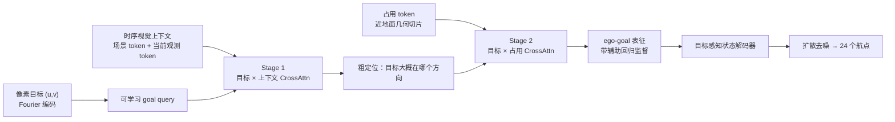
```mermaid
graph LR
    G["像素目标 (u,v)<br/>Fourier 编码"] --> Q["可学习 goal query"]
    CTX["时序视觉上下文<br/>场景 token + 当前观测 token"] --> S1
    Q --> S1["Stage 1<br/>目标 × 上下文 CrossAttn"]
    S1 --> ZE1["粗定位：目标大概在哪个方向"]
    OCC["占用 token<br/>近地面几何切片"] --> S2
    ZE1 --> S2["Stage 2<br/>目标 × 占用 CrossAttn"]
    S2 --> ZE["ego-goal 表征<br/>带辅助回归监督"]
    ZE --> DEC["目标感知状态解码器"]
    DEC --> DIFF["扩散去噪 → 24 个航点"]
```

顺序的意义在于：**Stage 1 先把"目标在哪"定下来，Stage 2 才问"那条路能不能走"**。反过来或者并行，占用特征不知道该关注哪片区域，就退化成一堆无差别的几何信息。表中 `w/o Occ. Feature`（单阶段、只有 ego-goal）在 cluttered-hard 上是 81.57%，而 `w/o Two-Stage`（单阶段、ego-goal 与占用都有）反而掉到 75.55%——**占用特征在缺少顺序交互时是负收益**。补上两段式后回到 84.92%。

#### ⑤ 训练目标

三项联合优化：

$$L = \lambda_{occ} L_{occ} + \lambda_{traj} L_{traj} + \lambda_{ego} L_{ego}$$

- $$L_{occ}$$：体素 logits 与 L3ROcc 标注之间的 focal loss，提供显式几何监督。
- $$L_{traj}$$：DDPM / Diffusion Policy 框架下的去噪损失。给定真值动作序列 $$A_0$$，第 $\ell$ 步的带噪序列为

$$A_\ell = \sqrt{\bar\alpha_\ell}\, A_0 + \sqrt{1 - \bar\alpha_\ell}\,\epsilon, \qquad \epsilon \sim \mathcal N(0, I)$$

  条件上下文由扩散时间步 token、目标感知状态、时序上下文、ego-goal 表征、占用 token 拼成，去噪网络预测注入噪声，用 SmoothL1 对齐。
- $$L_{ego}$$：**辅助 ego-goal 回归**——从 ego-goal 表征预测目标在机器人坐标系下的位置，只在训练时用。这一项是把"像素顶回 3D"这件事显式教给模型的地方，消融里它是单阶段条件下增益最大的组件（cluttered-easy/hard 分别 +20.23 和 +15.30 个百分点）。

#### ⑥ 推理流程

8 帧 RGB-D + 一个像素目标进去，几何编码器与占用分支各跑一次，轨迹分支构造条件上下文后做 **10 步**反向去噪，输出 **24 个未来航点**组成的连续轨迹。闭环执行时世界坐标系下的目标固定不变，每步重新投影回当前相机视野作为新的像素目标。

---

### 3. 核心结果/发现

**评测设置**：训练用 InternData-N1（20 万+ 条轨迹，差速底盘 + 顶置 RGB-D，机器人高度与相机俯仰随机化）。评测在 InternScenes 的 **60 个未见场景**（20 home、20 commercial、10 cluttered-easy、10 cluttered-hard），每场景采 50 对 3–5 m 与 50 对 5–8 m 起止点，共 **6000 条闭环 episode**。成功判据是停在目标 0.5 m 以内。对比 NavDP（适配到同一像素目标接口）与 PixNav。

**闭环成功率（SR %）**

| 方法 | 距离 | Home | Commercial | Cluttered-Easy | Cluttered-Hard |
|---|---|---|---|---|---|
| NavDP | 3–5 m | 35.79 | 29.58 | 32.61 | 33.72 |
| PixNav | 3–5 m | 21.23 | 21.91 | 24.89 | 21.31 |
| **OccPlanner** | 3–5 m | **71.29** | **47.47** | **92.97** | **92.82** |
| NavDP | 5–8 m | 24.98 | 19.07 | 19.43 | 19.77 |
| PixNav | 5–8 m | 19.63 | 11.90 | 14.20 | 14.44 |
| **OccPlanner** | 5–8 m | **69.90** | **45.17** | **86.20** | **84.92** |

几个值得注意的点：

- **5–8 m 四类场景平均 SR 从 NavDP 的 20.81% 提到 71.55%**，且在 cluttered 场景增益最大（19.43→86.20、19.77→84.92），说明显式局部占用在复杂几何下的收益最明显。
- **长程几乎不掉点**：OccPlanner 从 3–5 m 到 5–8 m 只掉 1~8 个百分点，而 PixNav 掉得很厉害——论文查了失败案例，PixNav 成功的 episode 几乎全是近似直线的路径，需要大幅绕行的基本都失败，这也解释了它的 SR 与 SPL 为何在报告精度下完全重合。
- **Commercial 是短板**（45.17%），明显低于其他三类。

<div align="center">
  
<figcaption>四类未见仿真场景下的定性规划结果。每例上方是带像素目标（红点）的 RGB 观测，下方是预测的局部占用与生成轨迹（红线）</figcaption>
</div>

**消融（5–8 m，cluttered 场景；开环用 1496 条 InternData-N1 留出样本）**

| 变体 | 两段式 | Ego-Goal | 占用特征 | C-Easy SR | C-Hard SR | IoU | FDE |
|---|:---:|:---:|:---:|---|---|---|---|
| Base Model | — | — | — | 66.60 | 72.42 | **50.79** | **0.18** |
| w/o Two-Stage | — | ✓ | ✓ | 84.34 | 75.55 | 43.61 | 0.28 |
| w/o Ego-Goal | — | — | ✓ | 64.11 | 60.25 | 45.60 | 0.24 |
| w/o Occ. Feature | — | ✓ | — | 79.88 | 81.57 | 38.03 | 0.23 |
| **Full Model** | ✓ | ✓ | ✓ | **86.20** | **84.92** | 46.01 | 0.19 |

- **Ego-Goal 是单阶段下增益最大的组件**（+20.23 / +15.30 个百分点）。
- **两段式交互把 cluttered-hard 从 75.55% 推到 84.92%，DTG 从 0.87 m 降到 0.56 m**。
- **开环指标会骗人**：Base Model 的 IoU (50.79) 和 FDE (0.18) 都是全场最好，闭环 SR 却落后完整模型近 20 个百分点。开环 proxy 不能代表闭环导航能力。

**真机（Unitree Go2，开环）**

<div align="center">
  
<figcaption>Unitree Go2 上的真机开环对比。上排为仿真训练模型的零样本预测，下排为真机微调后的预测。微调让局部占用预测更稠密、空间上更连贯，同时保持轨迹平滑</figcaption>
</div>

在堆满箱子、椅子、柜子和窄通道的办公室里录 RGB-D 序列。零样本的仿真训练模型已能捕捉粗略障碍几何、生成朝向目标的轨迹；用 L3ROcc 处理额外录制的机器人视频得到 **829 条真实样本**微调后，占用预测在家具与通道边界处明显更稠密、更连贯。

**实现细节**：4×H100 训练 30 epoch，Adam，单卡 batch 8（全局 32），bfloat16 混合精度，梯度裁剪 1.0；学习率在前 10000 步从 $1\times10^{-4}$ 线性衰减到 $5\times10^{-5}$ 后固定，约 48 小时。

---

### 4. 局限性

真机评测**只做了开环定性对比**，没有闭环物理部署，且局限于静态室内场景——动态障碍推理完全没有涉及。此外 commercial 场景的 SR（45.17%）明显落后于 cluttered 场景，说明大空间、弱几何约束的环境下，近地面占用提供的信号不足以支撑长程目标定位。

---

## 26. Harness Robotic OS (2026) {#harness-robotic-os}
———把四足巡检从「导航栈」升级为「具身智能体运行时」

📄 **Paper**: [arXiv:2609.11225](https://arxiv.org/abs/2609.11225)

---

### 精华

这篇的真问题不是「怎么导航得更准」，而是「怎么让一堆现成模块在同一份上下文里协同、留痕、可回滚」——把系统集成本身当成研究对象。最值得借鉴的是它立的那道硬边界：实时控制回路（SLAM / 规划 / 控制）与认知回路（智能体编排 / 记忆 / 反思）分属两层，智能体只能「编排技能」而不能直接下发运动指令，于是推理出错也烧不穿到电机。记忆按「保留期限」而不是按「数据类型」切成 working / episodic / semantic 三层，检索由任务意图、空间位置、场景语义共同条件化，避免把整段运维史塞进每次推理上下文。自进化被刻意做成「离线候选 → 安全门 → 版本灰度 → 可回滚」，而不是在线改模型，这是长期运行的机器人能被审计的前提。但要清醒：认知运行时（语音 / 记忆 / 自进化）在本文只有协议没有数字，真正跑出实测的仍是那套经典导航加 VLM 巡检的流水线。

---

### 1. 研究背景/问题

住宅物业巡检要覆盖道路、消防通道、楼栋出入口、设备房、垃圾房等大范围公共空间，人工巡逻在频次、一致性和可追溯性上都受限于人力与个人经验。四足机器人能爬坡越坎、钻窄道，是合适的载体，但「会走」不等于「能巡检」——还需要持续定位、全局任务规划、反应式避障、场景级隐患理解、人机交互，以及与工单系统的对接。

作者指出当前落地系统的通病是把这些能力做成一堆松耦合模块：传感器驱动、导航算法、视觉语言服务、操作界面、企业应用各自持有状态，靠点对点适配器互通，由此产生三个缺口——**语义任务意图与机器人位姿 / 观测 / 执行状态脱节**、**历史任务经验没有被系统性保留与检索**、**提示词 / 工具策略 / 任务图 / 技能的改动难以评估、溯源与安全回滚**。

---

### 2. 主要方法/创新点

#### 2.1 整体框架：四个平面 + 一条自进化环

HROS 把系统分成四层：**Robot Runtime**（硬件抽象：边缘算力、多模态传感、连接与 I/O、四足执行）、**Embodied Autonomy Skills**（把 SLAM、感知、全局规划、局部运动封装成有状态、可复用的「技能」）、**Cognitive Agent Runtime**（智能体编排、分层记忆、多模态推理、技能与工具调度，以及自进化闭环）、**Interaction and Operations**（语音与多模态 I/O、巡检任务控制台、企业闭环）。四层之间不是调用栈而是绑定关系：每个技能把自己的输入时间戳、执行状态、置信度或失败码、输出引用上报到共享上下文总线，认知层据此监控进度，**但不进入实时控制回路**。

<div align="center">
  
<figcaption>HROS 四层架构。深色实线是运行时数据流，双向箭头是智能体与技能的绑定，虚线是自进化通路，绿线是安全门——只有过了安全门的候选版本才能回到技能运行时</figcaption>
</div>

**卡点降维｜「具身智能体运行时」到底比普通导航栈多了什么**

| 维度 | 常规四足巡检系统 | HROS |
|---|---|---|
| 状态归属 | 各模块自持状态，靠任务专用适配器点对点互通 | 共享上下文总线，物理状态与智能体推理同源 |
| 历史经验 | 跑完即弃，最多留一份日志 | working / episodic / semantic 三级记忆，按意图加位置条件检索 |
| 变更治理 | 改提示词或技能直接上线，出事靠人肉回滚 | 候选版本走离线回归加安全门加版本灰度，可溯源可回滚 |
| 控制权边界 | 上层可直接下发运动指令 | 智能体只能编排技能，运动指令必须过 robot-runtime 接口 |

#### 2.2 Robot Runtime：Vbot 四足平台

物理层用 Vbot 四足作为传感、算力、通信与移动的载体：双目相机、16 线激光雷达、IMU、GNSS 与 4G/5G，边缘计算机为地平线 RDK S100P（6 核 ARM Cortex-A78AE + 128 TOPS Nash BPU），机上跑感知与智能体服务。机器人控制器通过 HROS 的 robot-runtime 接口暴露运动指令与状态反馈——**这层隔离的设计动机就是防止上层智能体绕过校验直接发底层执行器指令**。

#### 2.3 Embodied Autonomy Skills：四个有状态技能

这一层是全文唯一有实测数字的部分，四个模块全是现成开源件的工程化组合：

- **状态估计 · Fast-LIO2**：输入激光雷达点云与 IMU，紧耦合估计 6-DoF 位姿并增量建图，输出先验点云地图与在线位姿。三种工作模式——建图（现场勘测阶段）、在线定位（日常巡逻，实时扫描配准到先验地图）、重定位（跟踪退化或重启后恢复位姿）。设计动机是一个**共享地图坐标系**：住宅巡逻会在不同光照、不同场景外观下反复重访同一资产，只有把每张图像、每个航点、每次隐患事件、每份报告都绑到这个坐标系，HROS 才能做空间相关的记忆检索与跨任务对比。
- **局部感知 · Hobot-Stereo**：输入同步双目图像，输出稠密近场深度并与激光雷达障碍表示融合。设计动机是激光稀疏采样对近场矮障碍、细结构、遮挡边界表达不足。深度点先变换到地图系，按距离与置信度过滤后插入 EGO-Planner 消费的局部体素表示；**双目是补充而非替代**，不确定观测按保守处理，长时间未被重复观测就从局部地图过期删除。

<div align="center">
  
<figcaption>两套互补的环境表示。左：Fast-LIO2 在共享任务坐标系下建出的全局三维点云图，用于重定位与任务规划；右：Hobot-Stereo 的稠密深度（左上）、融合点云（右上）、RGB 输入（左下）、局部鸟瞰几何（右下），补齐激光在近场的缺口</figcaption>
</div>

- **任务规划 · PCT-Planner**：物业巡检是**覆盖型任务**而非单次起点到终点的查询，路线必须串起策略定义的视点（消防设施、设备房入口、垃圾收集点）且全程可通行。PCT-Planner 在三维先验点云图上算无碰路段，任务层按巡检策略排序并把结果存成可复用的任务模板。运行时全局路线只是**参考**而非直接运动指令，进度用「当前路段 + 当前航点 + 已完成视点 + 剩余巡检动作」表示——这样编排器可以暂停、恢复、重排非安全关键任务，而完全不碰局部控制器。

<div align="center">
  
<figcaption>PCT-Planner 在先验点云图上生成的全局巡检路线，串联 8 个巡检航点，作为任务模板存档复用</figcaption>
</div>

- **运动智能 · EGO-Planner**：输入全局参考路线、当前位姿、融合后的障碍表示，输出动力学可行的局部轨迹，再转成受速度、净空、连续性约束的四足控制指令。三种行为——标称跟踪、局部重规划（行人、违停车辆、保洁设备等临时遮挡时生成短绕行）、恢复（无可行局部轨迹时停机并上报**带类型的失败码**，交由任务层决定等待、重试还是呼叫操作员）。

<div align="center">
  
<figcaption>EGO-Planner 在遛狗行人前方优化出的局部可通行走廊（蓝色区域），全局路线只给方向，让路的决策由局部规划器完成</figcaption>
</div>

#### 2.4 Cognitive Agent Runtime（一）：接地的语音交互

流式 ASR 把语音转成带时间戳的意图假设，**但不直接执行**——要先用当前机器人位姿、活动任务、可见场景、权限策略做接地（grounding），有歧义或涉及安全的指令必须显式确认。TTS 回报任务受理、导航进度、发现的隐患、恢复动作、完成状态。设计动机是让文本、语音、图像、企业消息进同一个多模态任务接口，而不是各自散在独立应用里。

#### 2.5 Cognitive Agent Runtime（二）：分层记忆

记忆按**保留期限**切三层：working 存短程信息（当前任务、近期对话、机器人状态、局部观测、待返回的工具调用）；episodic 存按时间索引的任务片段（轨迹、决策、观测、隐患事件、失败与恢复结果）；semantic 存稳定的场地知识（地图分区、资产标识、巡检规则、历史缺陷、物业处置流程）。检索由任务意图、空间位置、场景语义、执行状态共同条件化。

**卡点降维｜三层各装什么、检索到底怎么发生**

> **举个例子**：机器人第 7 次巡检 3 号楼配电房门口，画面里地上有个纸箱。
>
> - **working memory** 装「此刻」：当前任务 ID、刚才那句「去 3 号楼看看」、当前位姿、最近两帧观测、还没返回的 Qwen3-VL 调用。任务结束即清。
> - **episodic memory** 装「哪一次」：第 3 次巡检在同一位置判过「杂物堆放」，人工复核改判为「临时快递件」；第 5 次因行人挡路触发过一次局部重规划。带时间戳，按次索引。
> - **semantic memory** 装「这地方一贯如此」：配电房属消防重点区域，规则是门前 1 米内不得堆物，历史缺陷记录里它是高频点位。不随单次任务变。
>
> 检索不是把三层全灌进上下文，而是拿「意图=巡检 + 位置=配电房 + 场景语义=地面有箱子」去条件化召回：semantic 给出适用规则，episodic 给出「上次这类箱子被人判成快递件」，working 给出当前画面。于是这次就有机会不再误报——而这正是论文说要用 Recall@5 与任务完成率去量的东西，只是**数字还没给**。

#### 2.6 Cognitive Agent Runtime（三）：安全门把守的自进化

自进化被明确定义为「经验到更新」的**受治理流程**，而不是在线改模型。每次任务结束把执行轨迹与人工反馈写入经验缓冲区；反思与评估阶段做成败打分、失败归因、一致性检查，产出候选更新（记忆条目、提示词、工具选择策略、任务图、可复用技能）；候选版本在离线回归用例与安全规则上评估，带溯源记录，过了安全门才走版本化灰度上线。

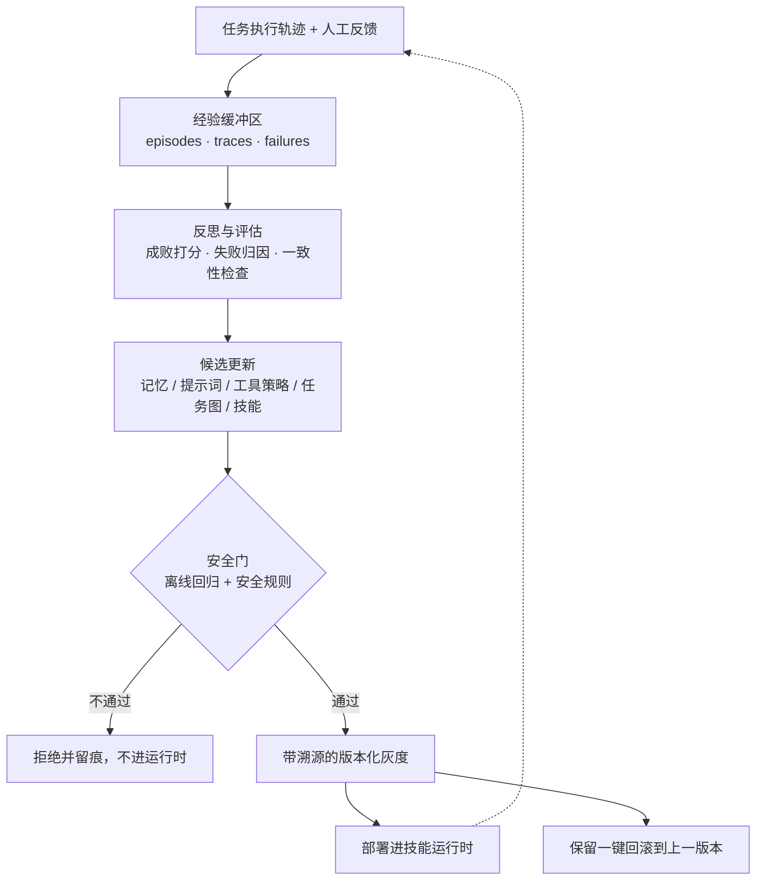
```mermaid
graph TD
    A["任务执行轨迹 + 人工反馈"] --> B["经验缓冲区<br/>episodes · traces · failures"]
    B --> C["反思与评估<br/>成败打分 · 失败归因 · 一致性检查"]
    C --> D["候选更新<br/>记忆 / 提示词 / 工具策略 / 任务图 / 技能"]
    D --> E{"安全门<br/>离线回归 + 安全规则"}
    E -- "不通过" --> F["拒绝并留痕，不进运行时"]
    E -- "通过" --> G["带溯源的版本化灰度"]
    G --> H["部署进技能运行时"]
    G --> I["保留一键回滚到上一版本"]
    H -.-> A
```

注意这张图里 **F 与 I 两个节点才是真正的设计主张**：任何候选更新都有一条「被拒绝且留痕」的路径，任何已上线版本都有一条「回退」的路径。论文把这条边界称为长期运行机器人保持可复现、可审计所必需的东西。

#### 2.7 端到端：从图像到工单的证据链

巡检推理流水线按「观测 → 解释 → 校验 → 上报 → 复核」组织。OpenClaw 选定与航点关联的图像，绑上位姿、时间戳、航点、任务 ID、适用巡检策略，再调 Qwen3-VL；返回的描述被解析进一个**受约束的事件 schema**（隐患类别、严重度、证据、位置、建议处置动作）。目标类别分两组——安全类（设备房周边堆物、消防通道占用、地面积水、线缆裸露）与环卫类（垃圾桶满溢、地面污渍、散落垃圾落叶、公共区域异常堆积）。

只有 schema 校验通过的事件才进入运营流水线。系统保留原始图像、模型原始响应、解析后字段、投递状态，打上位置与区域标签后生成结构化报告，经钉钉 / 飞书适配器路由给责任人做复核与派单。**人工修正以带标签的反馈形式回写，而不是静默覆盖原结果**——既保证后续评估与记忆更新有料，又保住了可审计、可回放的记录。这个设计同时把多模态推理挡在安全关键的运动回路之外。

#### 2.8 关于「训练目标」

这篇没有训练环节，全系统由现成组件拼装，没有可学习参数也没有损失函数。全文唯一的公式是语音实验的词错率定义：

$$\text{WER} = (S + D + I) / N$$

其中 $S$、$D$、$I$ 分别是替换、删除、插入错误数，$N$ 为参考词总数。

---

### 3. 核心结果/发现

在真实住宅小区部署的系统级测量（Table 1）：

| 分组 | 子系统 | 指标 | 结果 |
|---|---|---|---|
| 导航与运动 | 任务执行 | 航点可达率 | 100% |
| | Fast-LIO2 | 室外定位误差 | < 10 cm |
| | EGO-Planner | 障碍响应时延 | < 200 ms |
| 语义巡检 | Qwen3-VL | 垃圾满溢检出率 | 95% |
| | Qwen3-VL | 消防通道占用检出率 | 95% |
| | Qwen3-VL | 车道占用检出率 | 90% |
| | Qwen3-VL | 地面积水检出率 | 88% |
| | Qwen3-VL | 公共设施损坏检出率 | 85% |
| | 巡检推理 | 隐患误报率 / 漏检率 | 均 < 5% |
| 运营闭环 | 钉钉 / 飞书适配器 | 告警投递成功率 | 99% |
| | HROS 报告 | 结构化报告生成准确率 | 99% |
| 现场运行 | 机器人平台 | 连续续航 | > 3 h |
| | 端到端任务 | 全覆盖单次巡检耗时 | ≤ 60 min |

几点值得注意的：

- **检出率随视觉类别下降得很规律**：垃圾满溢与消防通道占用 95%，公共设施损坏只有 85%。作者归因于设施损坏这一类的视觉形态多样性远大于前两类——这与「隐患由空间与运营上下文定义、而非仅由物体身份定义」的立论是自洽的。
- **续航 3 h 对单次任务 60 min，留出了跑多轮的余量**，这是能排班的前提。
- **最重要的一条反而是没有数字的那部分**：论文 §5.6 为语音交互、分层记忆、安全门自进化写了完整的受控实验协议（WER、接地意图准确率、确认准确率、P95 端到端时延；Recall@5、时空接地准确率、上下文 token 缩减率、陈旧记忆错误率；任务成功率变化、回归率、安全规则违反率、安全门拒绝率、回滚成功率、**要求安全门逃逸率为零**），但 Table 1 里这三块一个数都没有，原文自陈「数值需待相应受控试验完成后才报告」。也就是说，**HROS 的认知运行时目前是一份架构主张与一套评测设计，实证的是它下面那层经典导航加 VLM 巡检的流水线**。

---

### 4. 局限性

作者列了四条：长期地图维护（停车格局、施工、植被、季节变化需要增量建图、变化检测与多会话地图管理）、开放世界隐患识别（更宽的隐患分类体系需要更多样的标注数据、校准置信度与歧义处理）、智能体评测与安全（记忆与自进化机制需要专门基准衡量检索质量、适配收益、回归风险与回滚可靠性，之后才谈得上在生产环境放开自动更新）、人机协作（户外噪声下的 ASR 鲁棒性、安全关键指令的确认设计、操作员负荷、与门禁广播报警数字孪生的集成）。

补一句读这篇时最该带着的判断：它是一篇**系统与架构论文**，导航与感知全部采用现成开源件，真正的新意在于层间边界与治理流程的设计；而这套设计里最有主张的三块（语音接地、分层记忆、安全门自进化）恰恰还停在协议阶段，尚未提供可比较的实验证据。

---

## 27. EgoPathBench (2026) {#egopathbench}
———把「导航决策」压成第一人称图上的一串编号，对错交给场景几何裁定

📄 **Paper**: [arXiv:2609.16610](https://arxiv.org/abs/2609.16610)

---

### 精华

把「整合式空间智能」这个虚概念落成一个可判定的动作：在当前第一人称图上，从编号好的可见路点里挑出一条有序路线，对错由场景几何直接判，不需要跑完整导航系统。关键设计是「同图、同编号、两套可行性图」——质点 agent 与 0.6 m 机身 agent 共享观测和动作词表，只换可通行图，从而把「具身约束」这一个变量单独隔离出来测量。评测不比对是否模仿专家轨迹，而看所选动作的几何后果（候选是否可行、每条相邻边是否合法、末点是否落进目标域），参考路线只用来证明「有解」，不是唯一答案。五个诊断口径拆开后暴露出真正的瓶颈既不是输出格式也不是第一步，而是中间边——首步合法率 88–96%，整条路线合法率在具身任务上掉到 5–7%。同一套几何标注顺手产出 31,852 条带 Spatial CoT 的训练数据，微调 Qwen3.5-4B 后本榜 3.9→38.9，三个外部空间基准也全部上涨。

---

### 1. 研究背景/问题

现有空间智能基准（SpatialVLM、VSI-Bench、3DSRBench、EmbSpatial-Bench 等）测的是孤立判断：两个物体谁左谁右、距离多远、什么朝向。但导航决策要求把目标识别、动作后果评估、距离估计、路径规划**同时**做对，这些孤立能力加起来不等于整合能力。另一端，完整导航系统的成败又被建图、定位、记忆、控制、重规划层层稀释，测不出基础 VLM 本身的空间决策水平。

EgoPathBench 卡在中间：给一张第一人称 RGB、一个自然语言目标、一组画在图上的编号路点，问 VLM 能不能直接输出一条几何上可行、目标上一致的路线。

<div align="center">
  
<figcaption>同一个第一人称场景：「房间里有沙发吗」「茶几在沙发前面吗」这类识别与局部关系问题都答对了，但要求规划一条到茶几的路线时输出 [1,7,23] 却违反了路线与目标条件（右图红线）。这正是论文要测的能力缺口</figcaption>
</div>

---

### 2. 主要方法/创新点

<div align="center">
  
<figcaption>EgoPathBench 构建流水线：选场景与第一人称视角、选目标、生成可见路点，再分别构建质点与具身两套导航图、目标域和几何校验过的参考路线；这些固化的场景标注之后才用来生成图文问题与 Spatial CoT，产出 2 个可通行性任务 + 3 个路线规划任务</figcaption>
</div>

#### ① 整体框架概述

EgoPathBench 由三件东西组成：一个**统一的动作接口**（图像 + 编号路点 + 语言目标 → 一个 JSON 编号数组）、一套**离线固化的场景标注**（可见路点、两套可行性图、目标域、参考路线）、一个**按顺序执行的几何判定器**。模型全程只看得到 RGB 图和提示词，判分却发生在与这张图配准的 3D 场景里——这就是所谓「动作有明确后果」。

#### ② 逐模块讲解

**模块 1：任务接口与动作词表**

- **输入**：一张第一人称 RGB，上面叠了编号圆点；一段自然语言任务。
- **处理**：模型要把显示 ID 与场景位置对应起来，判断哪些能走、怎么串成一条路。
- **输出**：一个 JSON 数组。两个可通行性任务输出**无序集合**，三个路线任务输出从指定起点出发的**有序序列**。
- **设计动机**：五个任务共用一套输入输出协议，差异只来自目标规格、agent 几何、评分约束，因此跨任务、跨模型可以直接比。

五个任务的分工：

| 任务 | 目标规格 | Agent | 输出 | 评分约束 | 基准题数 |
|---|---|---|---|---|---|
| Point Traversability | 无 | 质点 | ID 集合 | 逐候选可通行分类 | 146 |
| Embodied Traversability | 无 | 0.6 m 机身 | ID 集合 | 逐候选机身可行分类 | 146 |
| Point Path | 显式物名 | 质点 | 有序路线 | 合法 ID、指定起点、合法边、可接受终点 | 309 |
| Embodied Path | 显式物名 | 0.6 m 机身 | 有序路线 | 上面全部 + 机身宽度下的边合法性 | 309 |
| Intent Path | 意图 + 视觉线索 | 0.6 m 机身 | 有序路线 | 意图消歧后的终点 + 具身路线合法性 | 201 |

**模块 2：场景、视角与目标筛选**

- **输入**：InternScenes 归一化后的可仿真室内资产（原始扫描来自 3RScan、ScanNet、ARKitScenes、Matterport3D）。
- **处理**：在可通行空间里采样第一人称相机，剔除镜头紧邻处被挡住的视角；再用视锥投影、观测距离、投影尺寸、可见表面证据四道过滤筛目标实例，把出画、太小、被重度遮挡的目标去掉。
- **输出**：一条「场景–视角」记录，绑定相机参数、场景几何、保留的目标与 RGB 观测。
- **设计动机**：后面所有路点和路线标注都挂在这条记录上，保证图像里看到的和几何里算的是同一件事。

**模块 3：路点与几何标签**

- **输入**：保留下来的视角。
- **处理**：往图里投两类标记——地面动作候选，以及选中的物体/结构表面位置（作为**不可通行负样本**）。用深度、射线可见性、标记间距三重检查，保证每个显示 ID 对应一个独立的场景位置，且不会互相重叠或被前景挡住。
- **输出**：每个候选带 ID、图像投影坐标、场景三维坐标。
- **设计动机**：负样本的存在让「把所有编号都选上」这种偷懒策略失效——可通行性任务混了可行地面点、对宽度敏感的地面点、可见表面负样本三类。

**模块 4：成对路线构造（本文最核心的控制变量设计）**

- **输入**：一条场景–视角记录 + 一个目标。
- **处理**：起点锚在图像底部附近的可见地面；在目标足迹周围生成可行终点区域；然后**分别**在质点自由空间和具身自由空间里搜索，把连续路径稀疏化成路点，再投影回当前图像。
- **输出**：一对共享目标、起点、视角、候选空间，但分别通过各自 agent 几何校验的参考路线。
- **设计动机**：Point Path 和 Embodied Path 之间**只差 agent 几何这一个变量**。模型在两者上的差距，就是纯粹的「具身约束理解能力」。

**卡点降维 · 两套可行性图到底差在哪**

同一张图、同一组编号、同一个目标，为什么标签会不一样？

| 维度 | Point Agent（质点） | Embodied Agent（0.6 m 直径机身） |
|---|---|---|
| 观测与编号 | 一张 RGB，一套显示 ID | 完全相同，不换图也不换编号 |
| 节点可行性 | 只要落在几何连通的自由空间 | 还要求该点周围有足够 clearance 容下机身 |
| 边合法性 | 两点之间几何直连即可 | 用 0.30 m 名义半径做扫掠走廊检查，整条走廊不能撞 |
| 典型后果 | 家具之间的窄缝、半开的门算可通行 | 同一批点被判不可行，路线必须绕远 |
| 榜单落差 | Point Path 最高 SR 35.9% | Embodied Path 最高 SR 2.9% |

一句话：**同一个视觉上看着合理的动作，在两种 agent 模型下后果完全不同**——这就是论文反复强调的「相同的视觉选择，几何后果不同」。

**模块 5：问题文本与 Spatial CoT**

- **输入**：已经固定下来的目标身份、可见路点、目标域、参考路线。
- **处理**：显式目标任务直接点名物体；Intent Path 则先从当前视角可见物体里构造候选宇宙，用关系、属性、颜色、距离线索生成描述，再**回代验证**这段描述在当前视角下能唯一锁定那个固定目标，否则丢弃。训练集额外由 GPT-5.5 把「目标 + 候选 + 可行性标签 + 合法边 + 参考路线」口语化成 Spatial CoT 推理文本，导出前再与形式化标注对账。
- **设计动机**：语言生成**始终在几何真值下游**，改措辞不会改目标和路线几何。Intent Path 就是从已接受的 Embodied Path 实例派生的，只换语言规格。

#### ③ 端到端数据流

整条流水线最反直觉的一点是顺序：**几何先固化，语言最后长上去**。

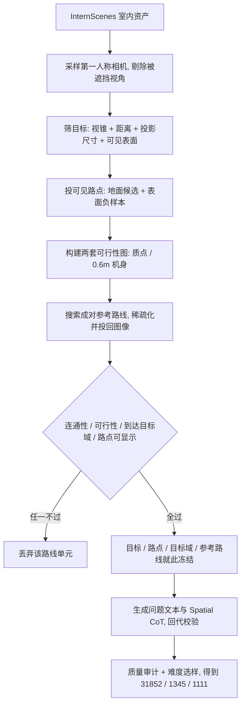
```mermaid
graph TD
    A["InternScenes 室内资产"] --> B["采样第一人称相机, 剔除被遮挡视角"]
    B --> C["筛目标: 视锥 + 距离 + 投影尺寸 + 可见表面"]
    C --> D["投可见路点: 地面候选 + 表面负样本"]
    D --> E["构建两套可行性图: 质点 / 0.6m 机身"]
    E --> F["搜索成对参考路线, 稀疏化并投回图像"]
    F --> G{"连通性 / 可行性 / 到达目标域 / 路点可显示"}
    G -- "任一不过" --> H["丢弃该路线单元"]
    G -- "全过" --> I["目标 / 路点 / 目标域 / 参考路线就此冻结"]
    I --> J["生成问题文本与 Spatial CoT, 回代校验"]
    J --> K["质量审计 + 难度选样, 得到 31852 / 1345 / 1111"]
```

#### ④ 评测指标（这篇论文的「损失函数」）

没有训练损失，但有一套严格的打分定义。可通行性用**平衡准确率**和 **F1**：

$$
\mathrm{BA} = \frac{\mathrm{TPR} + \mathrm{TNR}}{2}, \qquad
F_1 = \frac{2PR}{P + R}
$$

路线任务用三个逐级收紧的口径。记 $V_i$ 表示第 i 条预测可解析、ID 合法、起点正确、且每条相邻边都合法；$S_i$ 在此之上再要求终点可接受：

$$
\mathrm{VPR} = \frac{1}{N}\sum_i V_i, \qquad
\mathrm{SR} = \frac{1}{N}\sum_i S_i, \qquad
\mathrm{SPL} = \frac{1}{N}\sum_i S_i \cdot \frac{\ell_i}{\max(\ell_i,\, p_i)}
$$

其中 $\ell_i$ 是到可接受目标的最短合法参考长度，$p_i$ 是预测路线长度——失败路线 SPL 直接记 0。总分是五个任务的等权宏平均：

$$
\mathrm{EgoPathScore} = \frac{100}{5}\Big[ (2\mathrm{BA}_{PT} - 1) + (2\mathrm{BA}_{ET} - 1) + \mathrm{SR}_{PP} + \mathrm{SR}_{EP} + \mathrm{SR}_{IP} \Big]
$$

**卡点降维 · 为什么 BA 要写成 2BA − 1**

> **举个例子**：假设一个模型对「这个点能不能走」完全瞎猜，可行类和不可行类各命中一半，那么 BA = 0.5。
> 如果直接把 BA 平均进总分，这个瞎猜模型白拿 50 分；而三个路线任务上真实模型的成功率普遍只有 0–5%，两项「送分题」会把总分整个带偏，榜单就变成了在比谁的可通行性分类更准。
> 换成 2BA − 1 之后：瞎猜 → 2×0.5 − 1 = 0，全对 → 2×1.0 − 1 = 1。这叫 chance-adjusted，把随机基线拉回零点，和成功率（瞎猜几乎必然是 0，全对是 1）统一了量纲。
> 代回榜首 Gemini 3.1 Pro 手算一遍：(2×0.765 − 1) + (2×0.727 − 1) + 0.359 + 0.029 + 0.040 = 1.412，再 ÷5 ×100 = 28.2，就是表里的 28.3。

#### ⑤ 判定流程（评测器怎么一步步扣分）

**卡点降维 · VPR、SR、SPL 究竟卡在哪一环**

这三个指标不是三个独立分数，而是**同一条判定链上的三个不同深度**。评测器严格按顺序走，一旦某一环失败就直接判负，后面的检查不再执行：

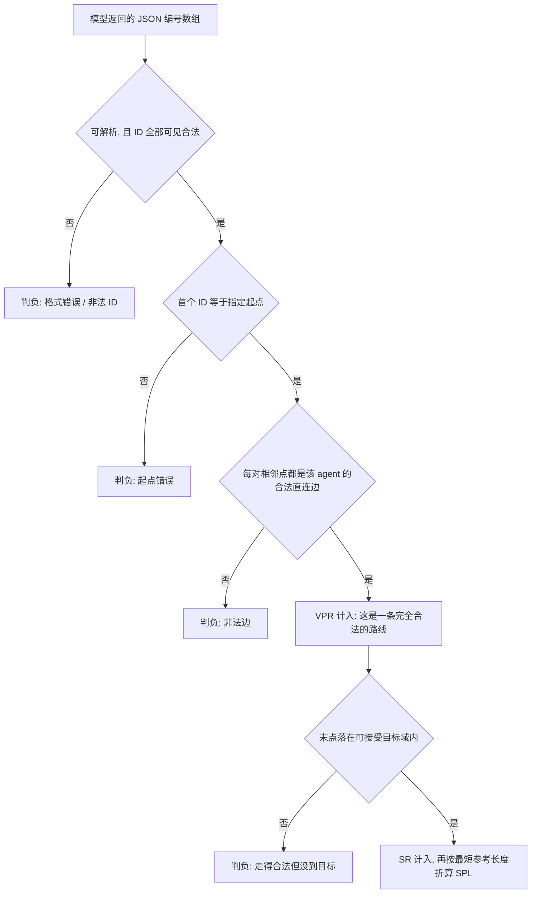
```mermaid
graph TD
    A["模型返回的 JSON 编号数组"] --> B{"可解析, 且 ID 全部可见合法"}
    B -- "否" --> X1["判负: 格式错误 / 非法 ID"]
    B -- "是" --> C{"首个 ID 等于指定起点"}
    C -- "否" --> X2["判负: 起点错误"]
    C -- "是" --> D{"每对相邻点都是该 agent 的合法直连边"}
    D -- "否" --> X3["判负: 非法边"]
    D -- "是" --> E["VPR 计入: 这是一条完全合法的路线"]
    E --> F{"末点落在可接受目标域内"}
    F -- "否" --> X4["判负: 走得合法但没到目标"]
    F -- "是" --> G["SR 计入, 再按最短参考长度折算 SPL"]
```

所以 **VPR 减 SR 的差值 = 路走得合法但走错了地方**，而 **1 减 VPR = 路线本身就不合法**。论文后面全部的诊断分析都建立在这个分解上。

顺带说明提示词协议：所有任务的用户提示都会明确「图中是编号候选点」「从显示 ID 1 出发」「机身直径 0.6 m」，并要求只返回一个 JSON 数组。每次评测用 8,192 token 完成预算、temperature 0、top-p 1。

---

### 3. 核心结果/发现

**（1）九个基础 VLM 的榜单：最高分只有 28.3**

| 模型 | EgoPath Score | Point Trav. BA/F1 | Embodied Trav. BA/F1 | Point Path VPR/SR/SPL | Embodied Path VPR/SR/SPL | Intent Path VPR/SR/SPL |
|---|---|---|---|---|---|---|
| Gemini 3.1 Pro | **28.3** | 76.5 / 79.0 | 72.7 / 56.2 | 63.7 / **35.9** / 28.7 | 9.1 / **2.9** / 2.4 | 10.4 / **4.0** / 3.3 |
| GPT-5.5 | 27.3 | 74.1 / 77.1 | **77.3** / **62.5** | 60.5 / 31.1 / 24.8 | 5.5 / 1.3 / 1.3 | 9.0 / 1.5 / 1.4 |
| Claude Opus 4.8 | 25.6 | **77.9** / 74.3 | 73.5 / 59.6 | **66.0** / 21.0 / 16.7 | **12.0** / 1.6 / 1.5 | **14.4** / 2.5 / 2.2 |
| MiniMax M3 | 21.8 | 77.0 / 76.2 | 68.7 / 52.8 | 50.8 / 13.3 / 8.7 | 5.5 / 1.9 / 1.7 | 9.0 / 2.5 / 2.3 |
| Qwen 3.6 | 16.4 | 67.4 / 72.1 | 64.8 / 49.1 | 49.2 / 15.2 / 10.9 | 2.6 / 1.0 / 0.9 | 5.0 / 1.5 / 1.3 |
| Mistral L3 | 15.8 | 65.2 / 70.8 | 68.5 / 52.5 | 35.6 / 11.0 / 5.8 | 0.3 / 0.0 / 0.0 | 3.5 / 0.5 / 0.5 |
| Llama 4 | 14.9 | 66.8 / 66.5 | 66.0 / 49.8 | 36.2 / 8.7 / 5.9 | 1.9 / 0.0 / 0.0 | 2.0 / 0.0 / 0.0 |
| Kimi K2.6 | 9.7 | 60.2 / 69.8 | 57.8 / 44.2 | 40.5 / 11.7 / 8.2 | 1.3 / 0.7 / 0.5 | 1.5 / 0.5 / 0.4 |
| Grok 4.3 | 1.4 | 52.3 / 58.4 | 50.0 / 35.8 | 18.4 / 2.6 / 1.2 | 5.2 / 0.0 / 0.0 | 3.5 / 0.0 / 0.0 |

两个读法：**逐点判断远强于整体成图**——可通行性 BA 都在 60–78%，但 Point Path SR 最高只有 35.9%；**具身约束是断崖**——同一个模型从 Point Path 到 Embodied Path，SR 从 35.9% 掉到 2.9%，直接掉一个数量级。

**（2）失败到底发生在哪一步**

<div align="center">
  
<figcaption>九个 VLM 汇总的路线诊断（%）：输出可评测率 96% 以上说明格式不是瓶颈；首边合法率 88–96% 说明「第一步走哪」也不是瓶颈；但整条路线合法率在具身任务上跌到 4.8% / 6.5%，联合成功率只剩 1.0% / 1.4%</figcaption>
</div>

拆开来看非常清楚：

- **输出协议不是瓶颈**：96.3–96.8% 的输出都是可评测的路线。
- **首步不是瓶颈**：96.0% / 90.4% / 88.0% 的预测第一条边是合法的。
- **终点定位很弱**：目标一致的终点率只有 28.9%（Point）、4.8%（Embodied）、5.2%（Intent）。模型可能认出了目标物在哪，却找不到一个紧邻它且对该 agent 可行的终端路点。
- **真正的病灶是中间边**：整条路线合法率掉到 46.8% / 4.8% / 6.5%。在「首边合法」的预测里，有 51.3% / 94.7% / 92.7% 在后面某条边上违规。

更狠的一组控制实验：即使**同时**限定首边合法**且**终点正确，仍有 42.2%（Point）、75.8%（Embodied）、69.4%（Intent）的路线中间挂掉。把题目减半到路点更稀疏的一半上，比例几乎不变（42.8% / 76.6% / 67.3%），说明不是「图上点太密看花眼」。而且在只需一条边的具身/意图题上违规率已经是 90.6% / 88.4%，三条边以上才升到 94.0% / 92.4%——**问题不在长程累积，而在对 agent 几何的基本理解**。

**（3）人类参照**

<div align="center">
  
<figcaption>同题对照的五任务雷达图：人类（粗绿线）EgoPath Score 54.2，最强 VLM 在这批题上只有 28.6，且优势覆盖全部五个轴而非集中在某一项</figcaption>
</div>

在随机抽取的 50 题（每任务 10 题）同接口对照上，人类 EgoPath Score 54.2 对最强 VLM 的 28.6；三个路线任务的平均有效路径率 70.0% 对 26.7%，平均成功率 46.7% 对 13.3%。论文明确说明这是**探索性同接口参照，不是人类天花板估计**。

**（4）基准本身是否可信**

- **依赖配对视觉输入**：去掉图像或换成不匹配的路点叠加层，路线 SR 全面塌到接近 0（GPT-5.5 的 Point Path SR 从 30.0% 掉到 0.0% / 10.0%），说明模型确实在看图而不是只靠提示词猜。
- **非法边有真实几何后果**：对 5,563 条含非法边的预测各抽一条边，沿 0.30 m 扫掠走廊按 0.05 m 采样查深度与物体索引渲染，88.7% 能找到明确注册的障碍物证据。
- **结论对离散化不敏感**：改机身半径（0.25 / 0.35 m）、占据栅格（0.04 / 0.06 m）、目标环（0.05 / 0.15 m），九模型排序的 Spearman ρ 全部等于 1.0。把总分里的 SR 换成 SPL、或先按任务族内平均再等权，排序同样不变。

**（5）训练资源确实有用**

用 LoRA（rank 8、alpha 16、冻结视觉塔、两阶段 1e-4 到 5e-5）在 31,852 条带 Spatial CoT 的训练集上微调 Qwen3.5-4B：

| 设置 | Score | Point Trav. BA/F1 | Emb. Trav. BA/F1 | Point Path VPR/SR/SPL | Emb. Path VPR/SR/SPL | Intent Path VPR/SR/SPL |
|---|---|---|---|---|---|---|
| Qwen3.5-4B base | 3.9 | 54.6 / 55.6 | 54.9 / 33.1 | 9.1 / 0.7 / 0.1 | 0.3 / 0.0 / 0.0 | 0.0 / 0.0 / 0.0 |
| + EgoPathBench SFT | **38.9** | 89.3 / 89.2 | 83.4 / 71.2 | 77.0 / 31.4 / 28.6 | 34.9 / 7.1 / 6.9 | 44.8 / 10.4 / 10.0 |

一个 4B 模型微调后拿到 38.9 分，**超过了榜首的 Gemini 3.1 Pro（28.3）**，且 Embodied Path SR 7.1% 是全表最高。更值得注意的是外部迁移全部为正：

| 外部基准 | 设置 | Base | SFT | Δ |
|---|---|---|---|---|
| VSI-Bench Route Planning | Full | 29.38 | 33.51 | **+4.13** |
| VSI-Bench Route Planning | Debiased | 20.18 | 24.56 | **+4.38** |
| SpatialEval-VTQA | Full | 61.8 | 71.4 | **+9.6** |
| 3DSRBench | Full | 58.0 | 59.4 | **+1.4** |

说明学到的不是「刷这个榜的输出格式」，而是可迁移的空间决策能力。

---

### 4. 局限性

人类参照只有 50 题、单名志愿者，论文自己定性为探索性对照而非人口层面的能力上限；场景全部来自 InternScenes 归一化的重建资产并经 Blender 渲染，与真实相机噪声、动态障碍、光照变化之间仍有分布差距。此外，任务形态是**单张静态第一人称图上的一次性决策**，不涉及探索、记忆与重规划，因此高分并不直接等价于闭环导航能力；场景后果审计中还有 11.3% 的非法边在辅助渲染下给不出明确障碍证据（论文认为这是证据不足而非标签错误）。

---

## 28. VLingNav (2026) {#vlingnav}
——Embodied Navigation with Adaptive Reasoning and Visual-Assisted Linguistic Memory

📄 **Paper**: [arXiv:2601.08665](https://arxiv.org/abs/2601.08665)
<div align="center">
  
<figcaption>
VLingNav 整体架构概述，展示了AdaCoT推理和VLingMem记忆模块。
</figcaption>
</div>

**精华**

该论文提出了VLingNav框架，通过自适应链式思考（AdaCoT）和视觉辅助语言记忆（VLingMem）赋予具身智能体认知能力，实现了高效且可解释的具身导航。其核心亮点在于动态推理机制和跨模态记忆，使其在各种具身导航基准测试中达到SOTA性能，并展示了强大的零样本迁移能力和跨任务泛化能力，为资源受限机器人平台上的智能导航提供了启发。

**研究背景/问题**

当前的具身导航VLA模型在复杂、长周期任务中缺乏明确的推理能力和持久性记忆，难以泛化到不同环境和任务变体。现有模型多为被动式系统，缺少自适应推理机制，并且依赖有限的上下文窗口，导致在复杂场景下无法有效规划和避免重复探索。

**主要方法/创新点**

本文提出了VLingNav，一个以语言驱动的VLA框架，旨在通过两个核心组件赋予具身智能体认知能力：

<div align="center">
  
<figcaption>
VLingNav 整体架构。
</figcaption>
</div>

1.  **自适应链式思考 (Adaptive Chain-of-Thought, AdaCoT)**：
受人类双进程理论启发，AdaCoT机制在必要时动态触发显式推理，使智能体能够根据任务复杂性在快速、直观执行和缓慢、深思熟虑的规划之间灵活切换。这解决了现有CoT方法中推理频率固定导致效率低下的问题。

<div align="center">
  
<figcaption>
VLingNav的自适应CoT标注流程图。
</figcaption>
</div>

2.  **视觉辅助语言记忆 (Visual-Assisted Linguistic Memory, VLingMem)**：
为了处理长周期的空间依赖性，VLingMem构建了一个持久的、跨模态的语义记忆，使智能体能够回忆过去的观察结果，防止重复探索，并推断动态环境中的移动趋势，从而确保在长时间交互中的连贯决策。


**训练数据和策略**：
- **Nav-AdaCoT-2.9M数据集**：构建了目前最大的具身导航数据集，包含推理标注和自适应CoT标注。
- **在线专家引导强化学习 (Online Expert-guided RL)**：在模仿学习（SFT）之后引入了在线专家引导RL阶段，使模型能够获得更鲁棒、自探索的导航行为，超越监督演示的局限性。

<div align="center">
  
<figcaption>
在线后训练的混合rollout过程。
</figcaption>
</div>

**核心结果/发现**
- VLingNav在多项具身导航基准测试（如ObjectNav, EVT, ImageNav）上实现了最先进的性能。
- 在HM3Dv1 ObjectNav上，SR和SPL显著优于Uni-NaVid，展现了强大的探索和记忆能力。
- 在HM3D OVON上，VLingNav在所有测试拆分中均表现最佳，证明了其强大的跨领域泛化能力。
- 在EVT-Bench上，VLingNav在单目标跟踪和分心跟踪任务中均达到SOTA性能，尤其在复杂混乱场景中优势明显。
- 在Image Goal Navigation上，VLingNav的成功率和导航效率显著高于UniGoal，表明其先进的推理和规划能力。
- 在真实世界机器人平台上实现了零样本迁移，成功执行了未见过的导航任务，展示了强大的真实世界泛化和实用性。

**局限性**
- 当前模型主要依赖单目自我中心观测，这限制了其感知能力。未来工作可以探索多视角观测以提高导航效率。
- 模型采用单系统架构，限制了预测频率，可能影响在高度动态环境中的快速决策和障碍物处理。未来可升级为双系统结构以支持高频动作输出。
- 当前方法仅使用基于MPC的路点控制器，缺乏更灵活的运动模型，未来可集成更多运动能力。


---


## 29. Hydra-Nav (2026) {#hydra-nav}
——Object Navigation via Adaptive Dual-Process Reasoning

📄 **Paper**: [arXiv:2602.09972](https://arxiv.org/abs/2602.09972)

---

**精华**

Hydra-Nav 最值得借鉴的核心思想是：将"慢思考"（CoT 推理）与"快行动"（低级反应控制）统一在**单个 VLM** 内，避免了多模型架构的碎片化问题。其关键创新在于通过 **Iterative Rejection Fine-Tuning (IRFT)** 让模型自主学习"何时触发推理"，而非固定频率触发，从而在成功率与推理开销之间取得最优平衡。三阶段课程训练（空间-动作对齐 → 记忆-推理集成 → 自适应推理）的渐进式设计，为构建具身导航智能体提供了可复用的训练范式。新提出的 SOT 指标（Success weighted by Operation Time）将推理延迟纳入评估，比 SPL 更贴近实际部署需求，值得在其他具身任务中推广使用。

---

**研究背景/问题**

Object goal navigation 要求机器人仅凭自我中心感知在真实环境中主动探索并定位目标物体。当前 VLM-based 方法存在两大核心缺陷：（1）时空推理能力不足，导致对已探索区域的记忆维护失效，引发重复探索；（2）在每步推理（chain-of-thought）的做法带来大量不必要的计算开销，而在关键"停滞点"又未能及时触发推理。现有双系统架构（slow-fast paradigm）依赖独立模型，存在架构割裂和切换灵活性不足的问题。

---

**主要方法/创新点**

Hydra-Nav 将高层规划与低层元动作统一在**单一 VLM**（基于 Qwen2.5-VL-7B）内，通过输出特殊 transition token `obs` 自主触发从快系统到慢系统的切换。

<div align="center">
  
<figcaption>
Hydra-Nav 整体架构：慢系统负责全局时空推理与高层规划，快系统负责低级元动作的高效执行，通过特殊 token obs 自适应切换。
</figcaption>
</div>

**双过程系统（Dual-process System）**

- **慢系统（Slow system）**：接收目标指令、当前全景观测（4 张 90° 间隔 RGB 图）和结构化长期记忆，生成 CoT 推理文本与高层计划，随后输出第一个元动作。
- **快系统（Fast system）**：基于上一慢系统的对话历史，利用 KV-caching 仅编码最新自我中心帧，自回归解码低级原子动作（MoveAhead 0.25m、TurnLeft/Right 30°），避免重复处理完整历史上下文。
- **自适应切换机制**：当智能体完成子目标或当前观测与现有计划矛盾时，输出 `obs` 触发全景扫描，构建新的地标节点并更新长期记忆，随后重新进入慢系统。

<div align="center">
  
<figcaption>
推理期间的上下文组织方式：短期记忆为交错图像-动作对，遇到 obs token 时更新记忆并清空短期上下文。
</figcaption>
</div>

**三阶段课程训练（Curriculum Training Pipeline）**

**Stage 1 — 空间-动作对齐（Spatial-Action Alignment）**

使用 A* planner 在 HM3D、MP3D、OVON 训练集上生成 **500K 条轨迹**（20.1B tokens），训练 Qwen2.5-VL-7B 学习基本导航动作执行。每条轨迹格式化为多轮对话，通过单次前向-反向传播完成梯度计算。

**Stage 2 — 推理-记忆集成（Reasoning-Memory Integration）**

<div align="center">
  
<figcaption>
Stage 2 数据合成流程：左侧为启发式路点选择的轨迹生成策略，右侧为用 Qwen3-VL-235B-Thinking 合成高质量推理文本的流程。
</figcaption>
</div>

- 使用启发式路点选择策略生成包含探索行为的轨迹（而非仅最短路径），每条轨迹选取分数最高的两个探索路点。
- 将轨迹分段（固定长度 16 步），在每段开头插入长期记忆和推理文本，段尾插入 `obs` token。
- 推理文本合成：先用 Qwen3-VL-235B-Thinking 对历史图像进行记忆摘要，再结合当前视图与"未来正确视图"（信息泄漏防止）生成前瞻性规划文本。
- 共生成 **565K 条混合样本（8.3B tokens）**，同时混入 VQA 数据防止过拟合。

**Stage 3 — 自适应推理（Adaptive Reasoning via IRFT）**

定义两类**停滞点（Stagnation Points）**：
1. **重复探索**：智能体在过去 $T_{stag}=20$ 步内回到距离 $\delta_{stag}=0.5$m 内的位置。
2. **缺乏进展**：在随机时间窗口 $\Delta t \sim \mathcal{U}(20,35)$ 内到目标距离未缩短。

IRFT 流程：在快系统模式下运行，于停滞点触发慢系统；对失败轨迹（超时或目标误识别）进行"拒绝-修复"——找到干预时间戳 $$t^*$$，用 A* 最优路径替换后续轨迹，重新合成修正段的推理文本；使用最新 checkpoint 迭代执行，每轮生成约 60K 条轨迹（4.5B tokens）。

---

**核心结果/发现**

<div align="center">
  
<figcaption>
多轮 IRFT 训练过程中 SR 和 SOT 在 HM3D、MP3D、OVON Val-Unseen 上的提升曲线。
</figcaption>
</div>

**与 SOTA 对比（Table 2）：**

| Benchmark | 指标 | Hydra-Nav-IRFT | 第二名 | 提升 |
|-----------|------|----------------|--------|------|
| HM3D Val  | SR   | **84.8%**      | 73.7%  | +11.1% |
| MP3D Val  | SR   | **64.0%**      | 46.6%  | +17.4% |
| OVON Val-Unseen | SR | **66.3%** | 45.2%  | +21.1% |

**SOT 指标分析（Table 5）：**

- Hydra-Nav-IRFT 推理触发比例仅 **3.0%**（HM3D），而 VLMnav/Nav-R²/WMNav 均为 100%。
- SOT 得分：Hydra-Nav-IRFT **24.0**（HM3D）vs Nav-R² 1.9（最高 SR 竞争者），提升约 12×。
- 说明频繁推理虽提高 SR，但严重拖累效率；自适应推理是实际部署的关键。

**消融实验关键发现：**
- 记忆模块对 SPL 提升显著（无记忆 SPL=13.9 vs 有记忆 28.8），说明长期空间记忆是路径效率的核心。
- 探索性轨迹数据 vs 最短路径数据：SR 下降 25.4%（HM3D），说明探索能力对高成功率不可或缺。
- Co-training with VQA 防止导航专有数据过拟合，维持泛化性（SR: 69.1→72.9，HM3D）。

<div align="center">
  
<figcaption>
真实世界导航演示：机器人成功定位 Box、Trash Can、Oven，零样本迁移无需真实环境微调。
</figcaption>
</div>

---

**局限性**

评估仅在 Habitat 模拟器（HM3D/MP3D/OVON）中进行，缺乏在 Isaac Sim 等更高保真度仿真环境中的验证；当前框架专为 object navigation 设计，向移动操作等更复杂具身任务的扩展有待探索。


---


## 30. 3DGSNav (2026) {#nav-3dgs}
———用主动 3DGS 记忆增强 VLM 空间推理，实现零样本目标导航

📄 **Paper**: [arXiv:2602.12159](https://arxiv.org/abs/2602.12159)

---

### 精华

3DGSNav 最值得借鉴的核心思想：
1. **将 3DGS 作为持久记忆**替代语义地图/文字描述，让 VLM 直接"看"到几何连续的场景，而非依赖中间抽象层，从而释放 VLM 本身的视觉空间推理能力。
2. **主动感知（Active Perception）+ 自由视角优化**：代理不被动旋转扫描，而是通过不透明度场（opacity field）主动定位视觉盲区，再利用 3DGS Novel View Synthesis 渲染最优视角——这种"按需生成观测"的模式可推广到其他需要视角控制的具身任务。
3. **结构化视觉提示（Structured Visual Prompts）+ CoT 融合**：在渲染图像上叠加注释（gaze point、未探索区域标注），配合 Chain-of-Thought，让 VLM 的长程规划推理能力得到充分激活，无需额外训练。
4. **实时检测 + VLM 重验证（Re-verification）**：先用轻量检测器初筛候选目标，再用 VLM 主动切换视角确认——分两阶段解耦效率与可靠性，是目标确认模块的通用设计范式。

---

### 研究背景/问题

现有零样本目标导航（ZSON）方法通常将环境转换为语义地图或文字描述，导致高层决策被低层感知精度所制约，VLM 的视觉空间推理能力无法充分发挥。如何让 VLM 直接基于高质量视觉观测进行空间推理，而非依赖降维后的语义抽象，是本文解决的核心问题。

---
div align="center">
  
<figcaption>
3DGSNav 整体架构：该系统通过主动感知，利用机器人位姿和 RGB-D 观测数据构建面向导航的环境表示。自由视角优化与结构化视觉提示引导基于 VLM（视觉语言模型）的零样本导航规划，而在线物体检测与视角重验证技术则实现了高效的目标定位。
</figcaption>
</div>

### 主要方法/创新点

3DGSNav 是一个基于 3D Gaussian Splatting 的 ZSON 框架，核心由三个模块组成：

### 1. 主动感知（Active Perception）模块
- 使用虚拟相机渲染全景不透明度场（panoramic opacity field），定量估计当前观测完整性
- 利用 **DBSCAN** 聚类低不透明度区域，识别视觉盲区，计算最优俯仰角 θ* 和偏航角 ϕ*，驱动真实相机主动补偿缺失视角
- 避免机械旋转带来的定位误差与冗余观测

### 2. 自由视角规划（Free-Viewpoint Planning）模块
- **前沿点提取与聚类**：在 3DGS 空间构建探索地图，提取 frontier points（已探索与未探索边界），通过距离场 + 分水岭分割（watershed segmentation）自适应聚类冗余前沿点，选代表性点降低 VLM 分析开销
- **引导轨迹（Guidance Trajectory）**：基于 Dijkstra + 指数惩罚障碍物距离的代价函数，为每个前沿点生成安全路径，作为自由视角优化的参考基准
- **虚拟视角初始化**：利用轨迹曲率 κ 和距离 d 加权得分选最优初始位置，确保既不过近（优化不稳定）也不过远（信息量低）
- **多约束视角优化**：最小化复合损失函数 ℒ = λ_opa·ℒ_opa + λ_vis·ℒ_vis + λ_cos·ℒ_cos + λ_traj·ℒ_traj，包含：
  - **Opacity Loss**：控制可见/不可见区域比例
  - **Ray Occlusion Loss**：确保虚拟相机视线直达前沿点（无遮挡）
  - **Cosine Loss**：约束视角方向与前沿点方向一致
  - **Trajectory Loss**：约束相机位置在轨迹附近

### 3. 结构化视觉提示 + VLM 推理
- 渲染 Bird's-Eye View（BEV）+ 多个前沿点的 First-Person Views（FPVs）
- 在图像上叠加结构化注释：注视点（gaze point）、未观测区域表示（unobserved region）
- 配合 **Chain-of-Thought（CoT）提示**，驱动 planner VLM（Gemini 3）对候选前沿点进行空间语义推理，选择最优探索目标

### 4. 实时检测 + VLM 主动重验证（Re-verification）
- 导航过程中使用轻量实时检测器（**YOLOE**）初步筛选候选目标
- 当检测置信度不足时，action-decision VLM（**GLM-4.1V-Thinking**）主动切换视角——将所选动作投影回 3DGS 渲染新视角，获取更具判别力的观测，完成目标二次确认
- 有效降低漏检率和误停率

---

### 核心结果/发现

div align="center">
  
<figcaption>
 Gemini3-Pro 与 Qwen3-235b-Thinking 在 ZSON 任务中的自我解释对比：
</figcaption>
</div>

- 在 **HM3D**、**MP3D**、**Gibson** 等多个 ObjectNav 标准 benchmark 上取得 SOTA 或竞争性性能
- 消融实验验证：自由视角优化、结构化注释、CoT、Re-verification 模块均对最终 Success Rate 有显著贡献
- 不同 VLM（Gemini 3、GPT-4V、GLM-4.1V 等）可灵活替换，框架具备良好兼容性
- 在四足机器人真实环境实验中成功复现（定位厕所等目标），验证了 sim-to-real 迁移能力
- Runtime 分析显示主动感知显著优于被动旋转扫描，探索效率更高

---

### 局限性

3DGS 的在线增量重建和自由视角优化带来一定计算开销，在计算资源受限的嵌入式平台上实时性仍有挑战；此外，真实场景的动态物体、运动模糊和视觉感知噪声会影响 3DGS 质量，进而影响导航可靠性。

---


## 31. SysNav (2026) {#sysnav}
———Multi-Level Systematic Cooperation Enables Real-World, Cross-Embodiment Object Navigation

📄 **Paper**: [arXiv:2603.06914](https://arxiv.org/abs/2603.06914) · [Project Page](https://cmu-vln.github.io/) · [Code](https://github.com/zwandering/SysNav)

### 精华

SysNav 将 ObjectNav 重新定义为系统级问题，将语义推理、导航规划、运动控制三层彻底解耦，值得借鉴。核心洞见是：VLM 不应被用于细粒度的 frontier 级别决策，而应限制在房间级别的高层规划，从而在推理能力与空间可靠性之间取得最佳平衡。三层场景图（Room→Viewpoint→Object）为 VLM 提供了结构化上下文，是 VLM 高效推理的关键基础设施。Early-stop 和 Room-query 两种 VLM 调用模式按需触发，有效避免了 VLM 的冗余调用。该系统在三种机器人平台上部署，验证了模块化设计对跨平台泛化的价值。

---

### 1. 研究背景/问题

Object Navigation（ObjectNav）要求机器人在未知室内环境中自主找到目标物体，需同时处理复杂空间结构、长程规划和语义理解。现有方法将 ObjectNav 作为单一策略学习问题，端到端模型难以兼顾多个子挑战；而过度依赖 VLM 进行 frontier 级别决策会因 VLM 缺乏精确 3D 空间理解而导致频繁回溯和低效行为。

---

### 2. 主要方法/创新点

<div align="center">
  
<figcaption>
SysNav 在多种真实环境和跨平台机器人上实现楼宇级别长程 ObjectNav
</figcaption>
</div>

SysNav 是一个三层解耦的 ObjectNav 系统，各层专注于不同粒度的子问题：

**高层——语义推理（Semantic Reasoning）**

构建三层场景图表示 $\mathcal{R}$：
- **Room Node** $v^r$：通过点云垂直分布拟合墙面并划分独立房间，每个节点存储房间类别、2D 顶视图和代表性 RGB 图像
- **Viewpoint Node** $v^v$：在覆盖范围发生显著变化时新增，存储位置、覆盖区域和全景图像，实现高效语义存储
- **Object Node** $v^o$：使用开放词汇检测（YOLOv8x + SAM2）实例化，每个节点存储类别、置信度、3D 点云、bounding box 及自属性

边类型包括：Room-Room（门道连通）、Room-Viewpoint（包含关系）、Room-Object（包含关系）、Viewpoint-Object（可见性）、Object-Object（空间约束，按需添加）。

VLM Reasoning 组件（Gemini-2.5-flash）基于上述场景图进行语义推理，提供房间级别导航指导。

**中层——基于房间的导航（Room-based Navigation）**

<div align="center">
  
<figcaption>
SysNav 系统架构：高层语义推理、中层房间导航、低层运动控制三层解耦
</figcaption>
</div>

将房间作为最小语义规划单元，在房间内使用高效经典探索算法，仅在房间切换时调用 VLM：

- **In-room Exploration**：两级规划（局部 + 全局），以覆盖分数 $w_{cov}(c_i) = \lvert \mathcal S_{cov}(c_i) \cap \hat{\mathcal S} \rvert$ 选取位姿候选，用 TSP 生成探索路径，滚动窗口机制协调局部与全局计划
- **Early-stop 模式**：进入新房间时，VLM 根据上下文信息 $\mathcal C_{es}$（房间属性、已观测物体、任务目标）判断是否提前终止当前房间探索并切换到新房间
- **Room-query 模式**：当前房间探索完毕仍未找到目标时，VLM 基于未探索房间信息 $\mathcal C_{rq}$ 推理最可能包含目标的下一个房间

**低层——基础自主（Base Autonomy）**

设计跨平台基础自主模块，将路径点转换为各平台（轮式机器人、四足 Unitree Go2、人形 Unitree G1）的具体运动控制指令，包含路径点跟随、碰撞回避和地形可通行性分析。

---

### 3. 核心结果/发现

<div align="center">
  
<figcaption>
SysNav 在轮式、四足、人形三种机器人平台上的真实环境定性结果
</figcaption>
</div>

**仿真基准**（4个benchmark，与 SOTA 对比）：
- HM3D-v1：SR **63.7%**，SPL **30.5%**（大幅领先次优 ApexNav 的 59.6%/33.0%）
- HM3D-v2：SR **80.8%**，SPL **37.2%**（次优 ApexNav 76.2%/38.0%）
- MP3D：SR **50.7%**，SPL **18.1%**
- HM3D-OVON：SR **54.9%**，SPL **26.1%**（次优 MTU3D 40.8%/12.1%，提升 14.1%/6.5%）

**真实环境**（190 次实验，对比 VLFM 和 InstructNav）：
- Hard 设置（目标在不同房间）：SR **97.5%**，SPT **71.8**，AT **67.6s**（Hard setting SR 较次优提升 61.1%，SPT 提升 51.1%，AT 减少 29.8s）
- 导航效率较现有 ObjectNav 基线提升 **4-5×**

---

### 4. 局限性

仿真中 SPL 提升幅度小于 SR，原因是面向真实场景设计的严格覆盖策略在仿真中会造成轻微过度覆盖；此外，多房间布局对系统的额外挑战有限，因为中等难度场景中障碍物更密集反而会降低速度。


---


## 32. WAM-Nav (2026) {#wam-nav}
———非对称隐空间「世界-动作」联合建模，用一个 DiT 统一三类视觉导航

📄 **Paper**: [arXiv:2606.04907](https://arxiv.org/abs/2606.04907) — WAM-Nav: Asymmetric Latent World-Action Modeling for Unified Visual Navigation

### 精华

- 把"想象未来画面"与"生成动作"塞进**同一个共享 DiT** 里联合扩散，而不是先想象再用逆动力学解算动作的解耦式 pipeline，从根上消除了模块间的状态-动作错配与误差累积。
- 核心 insight 是**非对称视界（asymmetric horizon）**：动作用长视界（$H_{act}=24$）保证轨迹连续，视觉前瞻只用极短视界（$H_{vis}=1$）。因为导航的视角变化剧烈，长自回归视觉 rollout 既慢又容易误差爆炸，短视界恰好提供可靠的近未来几何约束。
- 视觉前瞻全部在 **Stable Diffusion VAE 的隐空间**里预测（不解码成像素），让"未来感知"以低成本反过来约束动作生成（视觉速度匹配损失惩罚动作-场景不一致）。
- **双流上下文条件（DSCC）**：视觉记忆流管空间避障，自我运动历史流管运动学动量（平滑性），用运动 token 去 query 视觉空间，兼顾几何安全与轨迹顺滑。
- **统一目标对齐**：把 Image-Goal / Point-Goal / No-Goal 都编码成"视觉语义查询 $g_V$ + 几何查询 $g_G$"两路互补 embedding，一个策略零样本支持三类任务且性能均衡，无需切换架构。

---

### 1. 研究背景/问题

视觉导航要在复杂几何与物理约束下生成平滑、无碰撞的轨迹。现有范式各有硬伤：**反应式端到端策略**（GNM/ViNT/NoMaD）直接把观测映射到动作，缺乏预测性推理，在杂乱环境里容易陷入局部最优和碰撞；**模块化解耦的世界模型方法**（先想象未来子目标，再用逆动力学/轨迹打分）虽有前瞻能力，但预测与决策分离训练，带来高延迟和累积误差。已有的「世界-动作模型」在机器人操作上验证了联合建模的价值，但其自回归生成范式在导航大视角变化下实时性差、误差累积严重。此外多数方法只支持单一目标类型，换任务就得重新设计训练；即便 NavDP 支持多目标，其单模态对齐也导致跨任务性能不均衡。

---

### 2. 主要方法/创新点

<div align="center">
  
<figcaption>图 1：WAM-Nav 范式与性能概览。(a) 与纯反应式映射（①）、解耦模块化 pipeline（②）相比，WAM-Nav（③ Joint Modeling）在统一框架内联合建模动作生成与隐空间视觉前瞻；(b) 在 Image-Goal / Point-Goal / No-Goal 三类任务上对比主流基线均取得领先。</figcaption>
</div>

**① 整体框架概述**

如图 2，WAM-Nav 由三个核心组件构成：(1) **统一目标对齐（Unified Goal Alignment）**，把异构目标投影到统一空间，产出视觉语义查询 $g_V$ 与几何查询 $g_G$；(2) **双流上下文条件（DSCC）**，分别编码序列视觉观测和自我运动历史，经目标调制后融合成紧凑条件上下文 $C$；(3) **非对称动作-前瞻生成（Asymmetric Action-Foresight Generation）**，以 $C$ 为条件，用一个共享 DiT 通过非对称去噪同时生成未来动作轨迹与隐空间视觉前瞻。

<div align="center">
  
<figcaption>图 2：WAM-Nav 整体架构。异构导航目标被显式路由为视觉语义查询 gV 与轨迹几何查询 gG，二者调制历史 RGB-D 序列与相对自我运动轨迹，合成紧凑条件上下文 C；共享 DiT 在 C 的条件下非对称联合生成未来控制动作与隐空间视觉前瞻。</figcaption>
</div>

**② 逐模块讲解**

**模块一：统一目标对齐（Unified Goal Alignment）**
- **输入**：一个目标 $g$，可能是目标图像（Image-Goal）、相对坐标（Point-Goal）或空目标（No-Goal）。
- **处理**：先用模态专属特征提取器 $E_\phi(\cdot)$ 把 $g$ 转成基础 embedding $e_g$（图像目标用从零训练的 ViT，相对坐标用正弦位置编码，无目标用 masked 零状态）；再通过两个可学习线性映射 $\psi_V,\psi_G$ 投到两路功能 token 空间：$g_V=\psi_V(e_g)$、$g_G=\psi_G(e_g)$。
- **输出**：视觉语义查询 $g_V$（用于视觉记忆检索）与几何查询 $g_G$（用于轨迹级方向引导）。
- **设计动机**：与 NavDP 等"把所有任务都重写成 point-goal"的做法不同，本设计**保留模态特异性信息**，又提供统一接口，从而在三类目标上性能均衡。

**模块二：双流上下文条件 DSCC（Dual-Stream Contextual Conditioning）**
仅靠视觉条件会因缺乏显式动量约束而生成抖动、运动学不一致的轨迹。DSCC 在 $t-k+1$ 到 $t$ 的滑动窗口上融合两条流：

- **目标调制视觉记忆流**：历史 RGB 观测 $O_t$ 经 DINOv2 编码成记忆张量 $V$；用视觉查询 $g_V$ 对每个 patch token 算缩放点积相关性分数 $$\alpha=\sigma\!\left(\tfrac{g_V V^\top}{\sqrt D}\right)$$，再残差强化与目标相关的空间 token：$$\tilde V = V + \alpha \odot V$$。输出：被目标"点亮"的视觉空间记忆。
- **轨迹感知运动历史流**：把执行过的位姿序列 $S_t$ 转成**坐标无关的相对位移与朝向变化** $$\tilde S_t=\{(\Delta x_i,\Delta y_i,\Delta\theta_i)\}$$（在当前自我中心坐标系下，见 Algorithm 1），经因果 Transformer 编码为 $H$；再用几何目标 $g_G$ 通过 cross-attention query 出一个浓缩的运动学向量 $$o_{kin}=\mathrm{CrossAttn}(g_G,H,H)$$。输出：相对目标方向的历史运动连续性摘要。
- **跨注意力条件融合**：用运动学 token $o_{kin}$ 去偏置一组可学习 query $Q_c$，再用多层 Transformer Decoder 让"运动动量"主动 query "目标调制后的视觉空间"：$$C=\mathrm{TransformerDecoder}\big(Q_c+\phi(o_{kin}),\,\tilde V,\,\tilde V\big)$$。输出：统一条件上下文 $C$，同时编码几何安全（避障）与执行平滑（动量）。

**模块三：非对称动作-前瞻生成（Asymmetric Action-Foresight Generation）**
这是全文最关键的设计。在 $C$ 条件下，模型联合建模：长视界动作轨迹 $A_t=\{a_t,\dots,a_{t+H_{act}-1}\}$ 与短视界隐空间视觉前瞻 $$Z_{t+1:t+H_{vis}}=\{z_{t+1},\dots,z_{t+H_{vis}}\}$$，其中 $H_{vis}\le H_{act}$。未来视觉状态 $z_i=\mathcal E(o_i)$ 由预训练 SD-VAE 压成 $N$ 个隐 patch 的紧凑网格。

- **训练用 flow-matching**：把高斯先验 $(A_0,Z_0)$ 到数据流形的概率路径建成直线，任意流时刻 $\tau$ 的插值态为 $A_\tau=(1-\tau)A_0+\tau A_1$、$Z_\tau=(1-\tau)Z_0+\tau Z_1$，目标速度场 $u_A=A_1-A_0$、$u_Z=Z_1-Z_0$。
- **共享 DiT**：$A_\tau$ 与 $Z_\tau$ 被 token 化后拼接，送入多层 DiT。每个 block 内两类异构 token 先做**共享 self-attention**（让动作路径与视觉表征逐层交换时空约束），再各自 cross-attend 到条件 $C$，时间步 $\tau$ 经 adaLN 注入，回归联合速度场 $\hat u_A,\hat u_Z=f_\theta(A_\tau,Z_\tau,\tau,C)$。共享参数让隐空间前瞻成为"感知接地"的约束，通过视觉速度匹配损失惩罚动作-场景不一致。
- **为何非对称**：操作类 WAM 的未来视觉变化局部、以物体为中心；而导航涉及大幅自我中心视角变化，长自回归视觉 rollout 会同时带来推理延迟和累积视觉误差，反而误导动作。故采用"动作长视界保连续 + 视觉短视界给可靠近未来几何约束"的非对称设计。

<div align="center">
  
<figcaption>图 5：共享 DiT block 结构（堆叠 N 次）。带噪动作 token 与隐空间视觉前瞻 token 各经独立 adaLN 分支调制，经共享 self-attention 早期耦合，再通过共享的 cross-attention 与 FFN（仅做流特异性调制）接地到条件上下文 C，最终投影出 û_A 与 û_Z。</figcaption>
</div>

**③ 端到端数据流**：单步样本流经路径为——目标 $g$ → 对齐成 $g_V,g_G$；历史观测 $O_t$、运动历史 $S_t$ → 经 DSCC 双流调制融合成 $C$；高斯噪声 $(A_0,Z_0)$ → 在 $C$ 条件下经共享 DiT 的 10 步 Euler 积分去噪 → 输出执行动作轨迹 $A_t$ 与隐空间未来观测 $Z_{t+1}$。

**④ 训练目标**：端到端最小化联合损失
$$\mathcal L_{total}=\mathbb E\big[\lVert\hat u_A-u_A\rVert_2^2+\lambda_{img}\lVert\hat u_Z-u_Z\rVert_2^2\big]+\lambda_{align}\mathcal L_{align}$$
其中第一项为动作流速度回归，第二项为视觉前瞻速度匹配（$\lambda_{img}=0.25$），第三项 $\mathcal L_{align}$ 为对称对比 InfoNCE 损失（$\lambda_{align}=0.1$），通过最大化跨空间投影的互信息保证多目标模态一致性。训练时 DINOv2 ViT-S/14 与 SD-VAE 冻结，目标图像编码器、融合解码器、因果运动编码器与共享 DiT 从零训练。

**⑤ 推理流程**：采用 receding-horizon 控制循环。与 NavDP 一致，每步在当前 $C$ 下采样 16 条候选轨迹，按 NoMaD 做法选第一条执行；flow-matching ODE 求解器跑 10 步 Euler 积分，平衡生成质量与实时性。

---

### 3. 核心结果/发现

**主结果（零样本，IsaacSim，ClutterScenes + InternScenes，6000 episodes）**：WAM-Nav 在三类任务上平均最优——Image-Goal 达 **50.2% SR / 48.2% SPL**（较 NavDP 提升 **15.7%** SR），Point-Goal **80.4% SR / 78.0% SPL**（提升 **3.3%**），No-Goal 探索面积 **171.1 m²**。

<div align="center">
  
<figcaption>图 3：Image-Goal 导航定性对比。相比 NavDP（红线，常在逼近障碍后才反应、轨迹突变），WAM-Nav（绿线）借短视界隐空间前瞻提前预判几何约束、轨迹更平滑且主动避障；其在压缩隐空间生成的视觉前瞻解码后仍与真值（GT）高度一致。</figcaption>
</div>

- **效率（Q3）**：推理延迟 0.26s，每决策仅 0.7 TFLOPs（NavDP 1.3、NWM 8.3），可训练参数与 NavDP 相当；避免了 NWM 那种 1.43s 的多候选视觉 rollout，满足实时导航。
- **消融（Q4）**：纯隐空间前瞻把 SR 从 42.1%→45.7%；纯运动轨迹在 ClutterScenes 有益但在语义更复杂的 InternScenes 反而下降；两者结合最佳（50.2% SR）——印证 DSCC 设计：运动历史稳定轨迹生成、隐空间前瞻提供安全所需几何约束。
- **非对称视界验证**：$H_{vis}=1$ 最佳（50.2 SR），随视觉视界拉长（4/8/24）性能单调下降（直至 30.4 SR），强力支撑"视觉前瞻应给近未来约束而非长自回归 rollout"的核心动机。
- **耦合架构**：完全共享 DiT 优于解耦/部分共享变体，说明隐空间前瞻在直接通过共享表征正则化动作生成时最有用。
- **跨本体 & 真实世界**：单策略零样本迁移到 Dingo 轮式、Unitree G1/H2 人形机器人均稳定领先 NavDP；真实部署（G1 + RealSense D455，会议室/仓库/大厅/停车场四场景）平均 **85% 成功率**，验证有效的 sim-to-real 零样本迁移。难度越高（长程）相对 NavDP 优势越大（Hard 子集 +7.6% SR）。

---

### 4. 局限性

真实部署发现两类失败：(1) 相机高度与视野受限，对近场低矮障碍感知弱，易漏看导致碰撞或避障延迟；(2) 当前策略未显式建模机器人本体形状，轨迹规划只保证相机能通过，导致身体与侧方障碍碰撞。未来方向：自适应视角控制、以及融入多形态本体的 embodiment-aware 训练。

---


## 33. EvoMemNav (2026) {#evomemnav}
——— 零样本具身导航中基于轻量化图先验与多视图反思的高效自进化细粒度拓扑记忆框架

📄 **Paper**: [arXiv:2606.03509](https://arxiv.org/abs/2606.03509v1) · [Code（待发布）](https://github.com/caicaiya123/EvoMemNav)

### 精华

1. **纯视觉记忆设计**：提出视觉-语义记忆图（VSMGraph），将原始视觉视图（View）作为一等公民（first-class）存储在图节点中，避免了传统检测中心化场景图的信息压缩与噪声积累，且无需高昂的 3D 重建开销。
2. **预算受限的粗到细决策（Budgeted Coarse-to-Fine）**：将决策分解为粗阶段（Explore，过滤并路由至前沿或锚点）和细阶段（Search+Verify，仅针对短名单进行 VLM 决策和多视图 Stop 验证），在降低 VLM 延迟与 Token 数的同时，解决了同类多实例歧义和过早停止（premature stop）问题。
3. **反思驱动的自进化记忆（RDCMA）**：设计了一种无需训练的在线先验更新机制，在子任务结束后通过评估轨迹事件与停止结果，更新附着于图节点上的轻量级目标条件先验（Episode-STM 和 Scene-LTM），指导后续决策。
4. **开箱即用且高效通用**：在 GOAT-Bench 和 HM3D 上取得显著的 SR/SPL 提升，相比 3D-Mem 表现更佳，同时 VLM 调用次数减少了 41%，总耗时缩短了 39%，且无需任何权重训练或微调。

---

### 1. 研究背景/问题

在长程零样本具身导航（Zero-Shot Embodied Navigation）中，建立能够支撑长期规划的记忆系统至关重要。然而，现有的记忆表征方案存在以下局限性：
1. **基于检测器的场景图（Detector-centric Scene Graphs）**：将观测压缩成稀疏的对象节点，会丢弃纹理、空间布局等细粒度视觉线索，且检测器的错误（如类别噪声）会在下游推理中累积，导致决策失误。
2. **基于 3D 重建的记忆方法（3D-reconstruction-based Memory）**：在运行时会产生高昂的计算和存储开销，且与只能直接推理图像的强大 VLM 不兼容。
3. **基于图像的拓扑图缓存（Image-based Topological Graphs）**：缺乏房间、前沿或可达性的结构化组织，容易在同类别物体的多实例场景中混淆，导致在错误的实例前过早停下（Premature Stop），且记忆缺乏演进能力，失败教训无法复用。

---

### 2. 主要方法/创新点

#### 整体框架概述
EvoMemNav 由三个核心部分构成：构建于 occupancy grid 上的层次化拓扑记忆图（VSMGraph）、双阶段“粗到细”导航控制器（Coarse-to-Fine Policy）以及无训练的反思驱动在线自进化先验模块（RDCMA）。系统在每个时间步接收 posed RGB-D 观测，更新拓扑图；导航决策时，由粗决策进行候选过滤并导航，随后利用 VLM 进行细粒度的精确路由与多视图 Stop 验证；子任务结束时，反思机制将结果写回图中的轻量化统计量（STM/LTM），以指导未来的导航。

<div align="center">
  
<figcaption>EvoMemNav 核心理念与流程总览（VSMGraph、粗到细导航决策、反思写入）</figcaption>
</div>

<div align="center">
  
<figcaption>EvoMemNav 详细框架：包含基于图像的 VSMGraph 拓扑记忆图、受预算限制的“粗到细”导航决策系统，以及反思驱动的在线自进化先验写入策略</figcaption>
</div>

#### 逐模块讲解

**① 视觉-语义记忆图 (VSMGraph) 构建**
- **输入**：posed RGB-D 观测流 $I_t = \langle I_t^{rgb}, I_t^{depth}, p_t \rangle$ 和作为度量支撑的二维占用网格（occupancy grid）$M_t$。
- **处理**：在线在占用网格上添加沿着机器人运动轨迹的视图节点，并根据无碰撞路径建立可达性边（navigability edges）。通过轻量级目标检测模型（YOLOv8-World & SAM）维护一个 3D 目标候选缓存 $O_{map}$，但它仅用于给视图节点添加“目标可见性”的弱标签（visibility edges），并不用于压缩图像信息。视图节点被划分为：
  - **锚点视图 (Anchor Views)** $V_{A,t}$：富含物体观测的已探索区域，存储原始图像、位姿及可见的目标弱标签。
  - **前沿视图 (Frontier Views)** $V_{F,t}$：位于探索边界的未探索区域，连接至最近的已探索视图，代表可探索的前沿方向。
  同时，利用 CLIP 提取房间类别对每个视图进行分类 $\rho_v$，形成“房间-视图-物体”（Room-View-Object）的层次化拓扑图。
- **输出**：图结构 $G_t = (R_t, V_t, O_t, E_t)$。
- **设计动机**：以原始视图作为一等公民记忆，完全保留细粒度细节供 VLM 进行直接的图像级分析验证，避免检测误差引起的硬分类错误；同时，利用拓扑边和房间类别软标签加速检索。

<div align="center">
  
<figcaption>VSMGraph 构建过程：基于拓扑关系和房间-视图-物体层次化结构组织视觉信息</figcaption>
</div>

**② 预算受限的粗到细导航决策（Coarse-to-Fine Policy）**
- **输入**：多模态目标 $g$、当前拓扑图 $G_t$。
- **处理**：
  - **粗阶段 (Explore - 候选压缩与路由)**：从大量的锚点和前沿视图中过滤，仅保留最相关的 Top-K 个候选（锚点候选集 $C_t^A$ 预算限制为 $K_A$，前沿候选集 $C_t^F$ 预算限制为 $K_F$）。候选通过房间类别关联和轻量目标命中进行初步筛选。如果锚点集为空，则直接路由至前沿；若不为空，则进入细阶段。
  - **细阶段 (Search+Verify - 局部选择与验证)**：将过滤后的候选池 $C_t = C_t^A \cup C_t^F$ 输入给 VLM（Qwen3-VL-8B），VLM 只需对这个精简的短名单进行单步推理：
    $$a_t, \sigma_t = \text{VLM}(g, C_t)$$
    其中 $a_t$ 是选择的目标点，$\sigma_t \in \{\text{certain}, \text{uncertain}, \text{unknown}\}$ 为置信度。若 VLM 选择锚点视图但置信度不足（`uncertain`/`unknown`），系统会强制降级为前沿探索以避免盲目决策。
  - **验证步骤 (Verify - 多视图停止验证)**：当智能体抵达选择的锚点视图时，不立即停止，而是调用 VLM 结合智能体在当前位置的多角度视图进行最终的多视图 Stop 验证，返回 `STOP` 或 `RESELECT`。如果判定为 `RESELECT`，则将当前锚点拉入冷却队列并重新回到粗阶段，防止由于局部视野限制而产生的过早停止错误。
  - **恢复机制 (Recover)**：如果检测到死锁或多次冷却，会触发 Recover 机制，强制智能体进行一段时间的纯前沿探索。
- **输出**：下一个运动路径终点或 `STOP` 指令。
- **设计动机**：用粗筛选控制 VLM 的计算开销（避免对全图检索的 Token 爆炸），同时在局部进行多视角图像级的细粒度对比，提高多实例判别的准确度。

**③ 反思驱动在线记忆自适应 (RDCMA)**
- **输入**：历史子任务的运动轨迹事件（如常去的房间、探索受阻的前沿、环路检测等）以及多视图验证结果（STOP / RESELECT）。
- **处理**：任务结束时，将结果以目标条件签名 $s_g$（类别或模态）归纳为轻量化统计先验，写回图结构中附着于对应的房间/视图/前沿节点：
  - **短时记忆 (Episode-STM)**：缓存当前 episode 内的避障与路径惩罚信息，避免在一个任务中反复打转，在 episode 结束时重置。
  - **长时记忆 (Scene-LTM)**：记录房间中特定物体的支持概率（例如，厨房更容易有冰箱）和特定锚点的停止可靠度，长效留存，跨子任务复用。
  在 Explore 阶段，这些先验以“加权平局决胜（tie-breakers）”的方式调整过滤后的候选排序，指导探索方向；在 Verify 阶段，作为 hint 输入给 VLM 提示当前区域此前是否曾被成功验证过。
  通过指数衰减（exponential decay）来淘汰陈旧先验，且仅保留 Top-K 项并对冲突先验进行抑制。
- **输出**：图附着的记忆先验。
- **设计动机**：实现非参数化的轻量自适应，使得智能体在未知的终身学习任务中能够随着时间“越走越聪明”，越熟悉当前环境，导航成功率越高。

<div align="center">
  
<figcaption>反思驱动在线记忆自适应 (RDCMA) 的运作原理</figcaption>
</div>

---

### 3. 核心结果/发现

1. **GOAT-Bench 终身多模态导航**：
   在 GOAT-Bench VAL-UNSEEN 验证集上，EvoMemNav 取得了 **59.6% SR** 和 **38.9% SPL** 的最佳结果（见下表），大幅领先于先前的图像级拓扑记忆方法 3D-Mem（42.6% SR / 22.8% SPL）和 MSGNav（52.0% SR / 29.6% SPL）。
   
| 方法 | 类别 | 是否无需训练 | SR (%) ↑ | SPL (%) ↑ |
|---|---|---|---|---|
| SenseAct-NN Monolithic [20] | 单体学习型 | ❌ | 12.3 | 6.8 |
| CLIP on Wheels [20] | 模块化零样本 | ✓ | 16.1 | 10.4 |
| Modular GOAT [20] | 模块化零样本 | ✓ | 24.9 | 17.2 |
| TANGO [28] | 模块化零样本 | ✓ | 32.1 | 16.5 |
| 3D-Mem [46] | 模块化拓扑 | ✓ | 42.6 | 22.8 |
| MSGNav [17] | 模块化拓扑 | ✓ | 52.0 | 29.6 |
| **EvoMemNav (Ours)** | **模块化拓扑 (自进化)** | **✓** | **59.6** | **38.9** |

2. **HM3D ObjectGoal 导航**：
   在纯目标导航（ObjectGoal）的 HM3D 任务上，EvoMemNav 在 HM3Dv1（59.2% SR / 33.6% SPL）和 HM3Dv2（63.8% SR / 39.4% SPL）上均创下或逼近了免训练方法的最高水准。
   
3. **消融实验与效率分析**：
   - 相比于完全不带有 coarse 筛选的拓扑 baseline，加入 VSMGraph 使 SR 提升了 7.2%，而粗筛选（Coarse）模块直接带来了 **+11.6%** 的巨大 SR 跃升，是性能提升的主要因素。
   - 反思模块 RDCMA 使整体 SR 进一步提升了 4.0%（从 60.8% 提升至 64.8%），并且这种增益在第 3 至第 5 个子任务（Mid subtasks）中最为明显，说明随着记忆在场景中的不断写入和演进，智能体表现越发稳健。
   - 相比于 3D-Mem，得益于粗阶段的决策短名单机制，VLM 调用次数从 10.7 次降至 6.5 次（减少 39%），单次子任务的耗时从 102.2s 骤降至 58.7s（降低 42.5%），实现了性能与效率的完美兼顾。

---

### 4. 局限性

1. **多模态目标识别依然受限于感知模块**：尽管使用 VSMGraph 规避了下游推理对目标检测框的绝对依赖，但粗筛选阶段生成 soft tags 仍需依靠 YOLOv8-World 和 SAM 等 2D 检测器。在极其嘈杂或低光照环境下，若检测标签完全丢失或偏离，可能导致过滤时的 Top-K 列表中漏掉正确的锚点，从而拖累粗筛选的准确性。
2. **反思先验的表达与检索粒度仍可优化**：目前的 RDCMA 先验写入是通过对离散的 CLIP 房间类型和停止事件做简单的支持度与错误率计数来实现的。对于极其复杂、分布非常离散的房间结构或者开箱即用的大规模开放世界，简单的图计数可能会面临记忆冲突问题，未来可考虑融入基于小规模向量嵌入的非参数化情境记忆检索。

---


## 34. LocalNav (2026) {#localnav}
———基于知识蒸馏与具身强化学习的端侧轻量化三维场景图目标导航框架

📄 **Paper**: [arXiv:2606.27871](https://arxiv.org/abs/2606.27871)

### 精华
1. 本文提出了 LocalNav，一个将前沿云端大模型（如 Claude 3.5 Sonnet）的复杂空间-语义推理能力蒸馏到端侧轻量化 4B VLM（Qwen3.5-4B）的框架，实现完全本地化运行，摆脱云端依赖。
2. 在在线构建的三维拓扑场景图（Scene Graph）基础上，采用仅 500 条高质量云端模型导航轨迹进行监督微调（SFT），将 4B 小模型的导航成功率（SR）大幅度提升。
3. 引入具身可验证奖励强化学习（E-RLVR）与 Token 生成长度正则化奖励，对小模型的输出动作 and CoT 链长度进行压缩与规范，减少了 72.1% 的输出 Token 冗余。
4. 结合 llama.cpp 的 4-bit 量化（IQ4-XS），在 Jetson Orin AGX 边缘计算平台上实现了累计 82.8% 的推理延迟降低，将单回合运行时间从 305.2 秒压缩至 52.5 秒。
5. 整个系统是模块化解耦的，高层 VLM 负责语义推理和宏观决策，低层 PointGoal 导航策略负责避障与运动控制，并在 Unitree 机器狗和手持设备上进行了实车验证。

---

### 1. 研究背景/问题
- **开放词汇目标导航（Open-Vocabulary ObjectNav）**：传统的导航算法通常局限于训练时定义的封闭类群，而引入视觉语言模型（VLM）可以利用其强大的开集感知和语义推理能力，指导机器人进行复杂目标搜索。
- **云端依赖与高延迟问题**：目前性能优异 VLM 导航方案（如基于 GPT-4o 或 Claude 3.5 Sonnet）多依赖云端 API 交互。这不仅对网络连接提出了严苛要求，还引入了巨大的通信延迟和隐私泄露风险。
- **本地部署与自回归生成的计算瓶颈**：尽管 2B-7B 级别的轻量级 VLM 理论上可在端侧（如英伟达 Jetson 平台）部署，但其零样本的语义导航能力极差（SR 仅 21%）。此外，小模型在生成高层决策指令时常伴随大量的思维链（CoT）冗余，使得自回归解码（Token Generation）成为端侧运行的主要延迟瓶颈（占 93.3% 运行时间）。

---

### 2. 主要方法/创新点

<div align="center">
  
    <figcaption>LocalNav 框架概述：通过 SFT 从云端前沿 VLM 蒸馏，并使用具身可验证奖励强化学习（E-RLVR）对动作与 Token 长度进行优化，实现端侧高效部署。</figcaption>
</div>

#### ① 整体框架概述
LocalNav 系统由三维拓扑场景图（Scene Graph）构建模块、高层 VLM 决策规划器以及低层 PointGoal 运动规划策略三大核心模块构成。高层 VLM 通过结合环境 360° 拼接全景图（含物体 ID 投影）与文本形式的场景图节点列表，选择宏观语义动作（导航、探索、寻找新房间或停止）；低层运动策略则负责执行点对点三维路径规划与运动避障。

<div align="center">
  
    <figcaption>LocalNav 系统架构：实时构建三维场景图（SG），将 PoV 内的物体 ID 投影至图像中，与文本场景描述一同输入 VLM。VLM 决策后通过低层规划器（PointGoal Policy）控制机器人执行动作。</figcaption>
</div>

#### ② 逐模块讲解

- **3D 拓扑场景图（Scene Graph）构建**
  - **输入**：传感器获取的 RGB-D 深度图、机器人里程计（Odometry），以及预训练的目标检测分割模型（如 Mask2Former）提供的物体类别标签（或仿真环境中的真实标注）。
  - **处理**：利用开源 Hydra 框架在线构建和维护一个包含 Room 节点和 Object 节点的三维场景拓扑图。该图提供明确的拓扑连接结构和物体空间位置，充当机器人的显式空间记忆。
  - **输出**：在决策点为 VLM 组装两种模态的信息：
    1. **文本 Prompt**：当前所在 Room、已探索/未探索 Room 列表、已知物体类别与空间 ID。
    2. **图像 Prompt**：将当前视场角（PoV）内场景图物体 ID 直接投影叠加在 360° 全景图上（类似于 Set-of-Mark 提示），完成符号 ID 与像素区域的对齐锚定。
  - **设计动机**：显式三维场景图提供了非连续的抽象状态空间，能将机器人高频运动与 VLM 的低频决策解耦，降低计算开销，并具有极佳的可解释性。

- **监督微调（SFT）知识蒸馏**
  - **输入**：在 Habitat 仿真器环境（HM3D OVON 数据集）中使用 privileged action space（特权最短路径导航）获取的、由 Claude 3.5 Sonnet、GPT-4o/5.4、Gemini 3.1 Pro 引导并成功完成任务的原始推理轨迹日志（包含图像对和拓扑状态），约 500 条样本。
  - **处理**：将高层前沿 VLM（Teacher）的推理决策行为作为标签，对本地轻量级 VLM 学生模型（Qwen3.5-4B）进行监督微调。
  - **输出**：微调后的 Local VLM，初步具备在当前三维拓扑图上选择合理宏观动作的能力。
  - **设计动机**：小模型直接在 ObjectNav 上表现差。利用前沿模型的推理痕迹进行行为克隆（Behavior Cloning），能以极小的数据量（~500 样本）快速赋予小模型开集场景推理与决策的常识。

- **具身可验证奖励强化学习（E-RLVR）动作优化**
  - **输入**：SFT 后的小 VLM 模型，在 Habitat 仿真环境中的闭环交互回放轨迹。
  - **处理**：基于 LoRA 参数高效微调，应用 Group Relative Policy Optimization (GRPO) 算法。在每个决策点，生成 `N = 4` 个独立的动作补全并复制当前仿真环境状态进行并行轨迹 rollout。
  - **输出**：优化动作准确率并压缩了 CoT 冗余的 Local VLM 权重。
  - **设计动机**：SFT 训练的模型输出字数较多，且在推理时可能会出现空间记忆幻觉或无用的重复打转。E-RLVR 采用“实践中学习”的方法，结合仿真环境中的可验证反馈来调整模型行为。

<div align="center">
  
    <figcaption>E-RLVR 在 Habitat 中的训练循环：对同一状态生成 4 个独立动作补全，并行在独立的环境分支中运行，并通过最终计算的奖励来更新策略。</figcaption>
</div>

#### ③ 训练目标与损失函数
在 E-RLVR 阶段，模型通过并行 rollout 轨迹的相对优势更新，所采用的累加奖励函数定义如下：
$$R_{tot} = R_{done} + R_{nav} + R_{exp} + R_{brev}$$
其中各项公式的定义及作用为：
- **终点可验证奖励 $$R_{done}$$**：
  $$R_{done} = \begin{cases} 1.0 & \text{若执行 done() 且机器人距离目标物体符合成功阈值} \\ -1.0 & \text{若执行 done() 但未成功（误报）} \\ 0.0 & \text{执行其他动作} \end{cases}$$
  用于惩罚妄动终止和奖励正确归航。
- **导航进步奖励 $$R_{nav}$$**：
  $$R_{nav} = \begin{cases} \Delta d & \text{当目标物体已被收入场景图且机器人向其靠近} \\ 0 & \text{其他情况} \end{cases}$$
  `\Delta d` 代表向目标移动的归一化距离增量，鼓励快速缩短与目标的距离。
- **探索拓展奖励 $$R_{exp}$$**：
  $$R_{exp} = \begin{cases} 0.0 & \text{若目标 G 已在场景图中} \\ \lambda_{found} & \text{当目标 G 首次被收入场景图} \\ \Delta n & \text{发现新拓扑节点的归一化增量} \end{cases}$$
  激励机器人在目标未知时探索未知区域。
- **输出长度惩罚（Brevity Reward）$$R_{brev}$$**：
  $$R_{brev} = \begin{cases} 1.0 & L \le L_t \\ 1 - 2 \frac{L - L_t}{L_m - L_t} & L_t < L < L_m \\ -1.0 & L \ge L_m \end{cases}$$
  其中 `L` 为生成动作的 Token 字符长度，`L_t` 为目标理想短字数，`L_m` 为最大字数。该惩罚以线性惩罚模型过度长篇大论，迫使其精简 CoT 思维链，只保留最核心的空间推理，在保障 SR 的同时极大削减 Token 生成的计算量。

#### ④ 推理与量化部署流程
为了在低算力移动机器人平台上运行，作者将 E-RLVR 微调后的模型通过 `llama.cpp` 进行量化。经 Pareto 前沿评估，选择了 `IQ4-XS`（4-bit 量化）格式，使 Token 生成速度从 17.68 tok/s 提升至 39.43 tok/s，在保留模型推理精确性的同时，突破了端侧 GPU 的内存和带宽限制。

---

### 3. 核心结果/发现
- **SFT 蒸馏来源评估**：在 HM3D OVON 测试集上，采用不同前沿模型作为教师，微调后的 Qwen3.5-4B 表现出差异。使用 Claude 3.5 Sonnet 蒸馏 of 4B 模型最为优秀，SR 从 Base 的 21% 跃升至 **47%**，甚至超过了混合源蒸馏（41%）。
- **E-RLVR 的双重优化作用**：SFT 训练后的模型虽强但冗余较多（平均输出 535.2 个 Token，单回合耗时 305.2 秒）。叠加 E-RLVR 训练后，输出 Token 数直降 **72.1%** 至 149.36，使得在 Jetson Orin AGX 上的物理推理延迟降低 **71.8%**（下降至 86.0 秒），且成功率甚至微幅上升至 **49%**。
- **量化联合提速**：最终“SFT + E-RLVR + 4-bit 量化 (IQ4-XS)”的完整路线，使推理吞吐量翻倍（~39.43 tok/s），在 Jetson Orin AGX 端侧将物理运行时间大幅缩减 **82.8%**（仅耗时 **52.5 秒**），而成功率仅微弱损耗 2% 左右。
- **Benchmark 对比**：在 HM3D OVON 标准评测（含低层 PointGoal 执行误差）中，基于云端 Claude 3.5 Sonnet 的高层方案取得了 **39.7% SR**，而完全本地化运行的 Qwen3.5-4B-Claude 学生模型取得了 **34.5% SR**，与前沿云端模型的性能差距缩窄至仅 5.2%，处于端侧部署方案的业界领先水平。

<div align="center">
  
    <figcaption>真实世界部署测试：机器人在真实公寓中执行多目标连续导航任务，右侧显示机器人的视场 PoV 视角、高层 VLM 规划器的宏观决策与动作输出。</figcaption>
</div>

---

### 4. 局限性
- **时空语义局限性**：拓扑场景图目前难以融合动态/瞬时或具有多重语义组合的属性（例如无法区分“普通椅子”与“坐了人的椅子”），必须依赖机器人反复触发 VLM 进行稠密视觉验证。
- **三维感知依赖**：对于物体分割检测的精度（如 Mask2Former）和三维重建算法（如 Hydra）的鲁棒性高度敏感，感知模块的误检或漏检会直接导致场景图拓扑结构崩塌，进而引发 VLM 决策链错误。

---


## 35. AECNav (2026) {#aecnav}
———把"找物体"改写成"攒证据"：一次编码、按需分割、对数几率累积信念

📄 **Paper**: [arXiv:2608.10817](https://arxiv.org/abs/2608.10817) · [Project Page](https://basaermi.github.io/aecnav-website/)

### 精华

- 目标确认不该是"单帧分数过阈值就停"，而应是"多视角证据的累加"：借用占据栅格的 log-odds 加法更新，让一致的观测能把置信度推高到任何单帧都达不到的水平。
- 负证据和正证据同样重要：相似干扰物（confuser）得分更高、以及"该看到却没看到"（miss），都应主动扣减信念，而不只是"不加分"。
- 一个共享骨干（C-RADIOv4）同时服务场景打分、patch 定位与实例分割，既消除多模型语义不一致，又省去重复编码；昂贵的分割头再用几乎免费的 patch 相似度做门控。
- 前沿选择要同时考虑"方向对不对 + 沿途能看到多少新区域 + 走过去要多远"；信息增益若没有路程代价约束，会把机器人引向空旷大区域白白消耗步数。
- 训练-free 管线在精度上反超训练方法的同时，单 episode 耗时比 VLFM 还快 2.2 倍，说明"少做无用功"本身就是精度来源。

---

### 1. 研究背景/问题

零样本开放词汇物体导航（ZSON）要求机器人在陌生环境中找到任意语言描述的物体。现有基于价值地图的方法存在三个瓶颈：前沿选择与目标确认使用互不相干的多套视觉模型（CLIP/BLIP-2 + GroundingDINO/MobileSAM），造成重复编码与高延迟；目标确认靠单帧阈值或"平均化"融合，难以区分真目标与外观相似的干扰物；前沿选择只看语义相关度，忽略到达代价与可获得的新信息量，在语义线索弱时容易在远处低收益前沿之间来回摆动。

---

### 2. 主要方法/创新点

<div align="center">
  
<figcaption>AECNav 概览：左侧为导航器需回答的三个问题（高效感知、弱线索下的有效探索、干扰物下的准确识别）；右上为 HM3D-v2 上成功率–单 episode 耗时的权衡；右下为去掉任一模块带来的成功率下降</figcaption>
</div>

<div align="center">
  
<figcaption>AECNav 框架：证据门控感知用共享 C-RADIOv4 编码器打分并仅在可能看到目标时触发 SAM3；证据整合把检测反投影成 3D 簇，并用目标/干扰物/缺失三类证据更新 log-odds 信念；主动证据获取综合语义相关度、信息增益与路径代价选择前沿，直到某个簇被确认</figcaption>
</div>

**① 整体框架概述**

AECNav 把 ZSON 重新表述为"证据驱动的感知→决策"问题，由三个模块闭环构成：**证据门控感知**（Evidence-Gated Perception）负责用一次前向提取所有语义线索，并决定要不要跑昂贵的分割；**证据整合**（Evidence Consolidation）把分割结果变成 3D 候选簇，并为每个簇维护一个"它是不是目标"的累积信念；**主动证据获取**（Active Evidence Acquisition）在信念不足以停下时，挑选"最值得去看一眼"的前沿。底层运动交给 VLFM 同款预训练 PointNav 策略。

下面是读者版的数据流（一次决策循环）：

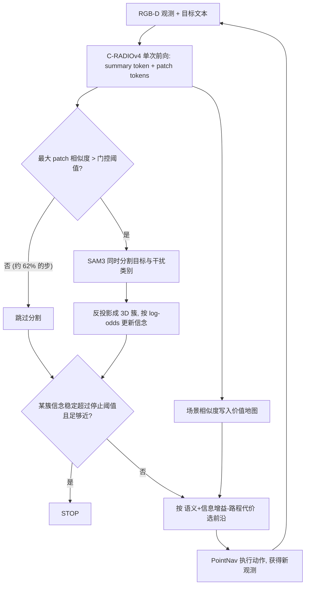
```mermaid
graph TD
    A["RGB-D 观测 + 目标文本"] --> B["C-RADIOv4 单次前向: summary token + patch tokens"]
    B --> C["场景相似度写入价值地图"]
    B --> D{"最大 patch 相似度 > 门控阈值?"}
    D -- "否 (约 62% 的步)" --> G["跳过分割"]
    D -- "是" --> E["SAM3 同时分割目标与干扰类别"]
    E --> F["反投影成 3D 簇, 按 log-odds 更新信念"]
    G --> H{"某簇信念稳定超过停止阈值且足够近?"}
    F --> H
    H -- "是" --> I["STOP"]
    H -- "否" --> J["按 语义+信息增益-路程代价 选前沿"]
    C --> J
    J --> K["PointNav 执行动作, 获得新观测"]
    K --> A
```

**② 逐模块讲解**

**模块 1：证据门控感知**

- **输入**：当前 RGB 图像 $I_t$、目标类别名 $g$。
- **处理**：C-RADIOv4 编码器 $E$ 一次前向输出 summary token $z_t^{\text{sum}}$（整幅图的全局语义）与 $N$ 个 patch token $z_t^{\text{patch}}$（每个局部区域的语义）。目标名只用 SigLIP2 文本塔编码一次得到 $e_g$ 并缓存整个 episode。
  - 场景相关度：summary token 经 SigLIP2 adaptor $f$ 对齐到文本空间，$\sigma_t^{\text{scene}} = \cos(f(z_t^{\text{sum}}), e_g)$，再按深度和位姿投影到俯视价值地图 $V_t$，作为"哪个方向可能有目标"的持久先验。
  - 局部目标指示：同一个 adaptor 作用到每个 patch 上，取最大值 $\sigma_t^{\text{patch}} = \max_i \cos(f(z_{t,i}^{\text{patch}}), e_g)$——直觉上就是"画面里最像目标的那一小块有多像"。
  - 门控：只有 $\sigma_t^{\text{patch}} > \tau_{\text{gate}}$（取 0.08）时，才把**已算好的**特征送进 SAM3 mask decoder 做实例分割，否则整步跳过分割。
- **输出**：价值地图更新；以及（可能有的）带目标分与干扰分的实例分割结果。
- **设计动机**：旧方法用 BLIP-2 打场景分、YOLO/GroundingDINO 做检测、MobileSAM 做分割，三套编码语义不一致且重复计算。共享骨干让所有阶段"看同一份表征"；而门控判断复用已算好的 patch 相似度，几乎零成本，却能跳过 60% 以上的 SAM3 调用。

**模块 2：证据整合（核心卡点）**

- **输入**：SAM3 输出的实例 mask、深度、位姿；每个实例带目标分 $s_g$ 与最高干扰分 $s_{\text{conf}}$（干扰类别由 LLM 离线为每个目标生成至多 3 个，如 couch 的干扰物为 chair / daybed / chaise lounge，并跨 episode 缓存）。低于 $\tau_{\text{det}}=0.4$ 的检测直接丢弃。
- **处理**：实例反投影成 3D 点云，若与最近观测到的某簇距离小于 0.75 m 就融合进去，否则新建簇。每个簇 $C_k$ 维护一个标量**对数几率信念**——可以理解为"支持它是目标的证据分"，0 表示中立，正数偏向是目标，负数偏向不是：

$$
l(C_k) = \log \frac{P(C_k = g)}{1 - P(C_k = g)}
$$

每次观测按加法更新并截断在 $[-4, 4]$ 内：

$$
l(C_k) \leftarrow l(C_k) + \Delta l^{\text{sem}}(C_k) + \Delta l^{\text{miss}}(C_k)
$$

  - **语义项**（对被检测命中的簇）：比较目标分与干扰分，谁明显占优就朝谁的方向推，差距在中性边界 $\delta=0.10$ 内则不动：

$$
\Delta l^{\text{sem}}(C_k) =
\begin{cases}
+\alpha_{\text{sem}} \, \rho_k \, \text{logit}(\tilde s_g), & s_g \ge s_{\text{conf}} + \delta \\
-\alpha_{\text{sem}} \, \rho_k \, \text{logit}(\tilde s_{\text{conf}}), & s_{\text{conf}} \ge s_g + \delta \\
0, & \text{otherwise}
\end{cases}
$$

  其中 $\tilde s_g, \tilde s_{\text{conf}}$ 是重标定后的分数（保证过了 $\tau_{\text{det}}$ 的检测 logit 非负），$\rho_k \in [0,1]$ 是新实例与簇的空间重叠度，$\alpha_{\text{sem}}=0.7$。

  - **缺失项**（对信念为正、且落在视野内却没被检测到的簇）："该看见却没看见"本身就是反证：

$$
\Delta l^{\text{miss}}(C_k) = -\alpha_{\text{miss}} \, v_k \, \text{logit}(1 - s_{\text{miss}})
$$

  $v_k$ 是簇的 3D 点落在当前视锥内的比例，$s_{\text{miss}}=0.2083$ 是由统计估计的单帧漏检率，$\alpha_{\text{miss}}=0.3$。视野外的簇不受影响。
- **输出**：每个簇的累积信念。当某簇信念超过 $\tau_{\text{stop}}=1.0$，机器人朝它走并持续更新；只有在连续 5 帧中至少 2 帧超过阈值、且距离簇 0.5 m 以内时才真正 STOP。
- **设计动机**：ApexNav 也做时序融合，但它是**平均**——置信度永远不会超过最强那一帧，而且模糊视角和决定性视角权重相同。log-odds 的**加法**让一致观测复利累积；干扰项和缺失项则让错误假设被主动"撤销"。

> **举个例子**（取 $\rho_k = 1$，假设重标定后分数即为下文数值）：
> - **真目标**：连续 3 帧看到同一把沙发，每帧 $\tilde s_g = 0.8$，$\text{logit}(0.8) = \ln 4 \approx 1.39$，每帧加 $0.7 \times 1.39 \approx 0.97$。3 帧后信念 $\approx 2.91$，稳稳超过 $\tau_{\text{stop}} = 1.0$。若用平均法，置信度始终停在 0.8，"看得再多也不会更确定"。
> - **干扰物**：找 chair 时看到沙发，目标分 0.47、干扰分 0.86（Fig. 4 真机数据），干扰分高出 $\delta$ 以上，若 $\tilde s_{\text{conf}} = 0.8$ 则该簇扣 0.97，直接变成负信念，机器人不会被它吸走。
> - **误检撤回**：某帧把远处杂物误检成垃圾桶，信念升到 +0.97。走近后它完整落在视野内（$v_k = 1$）却连续没被检测到，每帧扣 $0.3 \times \text{logit}(0.79) \approx 0.3 \times 1.34 \approx 0.40$；仅 1 帧后信念就降到 0.57、跌破停止阈值，机器人被"释放"回去继续探索；3 帧后变为 −0.23。

**模块 3：主动证据获取**

- **输入**：价值地图 $V_t$、占据栅格（1000×1000，0.05 m/格）、当前前沿集合。
- **处理**：对每个前沿 $f$ 计算复合效用（三项先在当前前沿集合内做 min-max 归一化，使尺度可比）：

$$
U_t(f; g) = \tilde S_t(f; g) + \lambda_{\text{info}} \, \tilde G_t(f) - \lambda_{\text{dist}} \, \tilde C_t(f)
$$

  - $S_t$：与 VLFM 相同，聚合前沿附近的价值地图值——"这个方向像不像有目标"。
  - $G_t$：在占据栅格上用 BFS 求到前沿的最短可通行路径 $\pi_t(f)$，沿路径每 0.75 m 采样一个视点（朝向沿路径切线，终点朝向附近未知区域），在 79° 水平视场内每 5° 射一条光线、最远 5 m，碰到已知障碍即停；所有光线扫过的**未知格子**并集就是信息增益 $G_t(f) = \lvert U_t \cap \text{Vis}(\pi_t(f)) \rvert$。关键在于它统计的是"**一路上**能看到多少新东西"，而不只是终点。
  - $C_t$：路径长度 $\lvert \pi_t(f) \rvert$。
- **输出**：效用最高的前沿，交给 PointNav 执行。
- **设计动机**：纯语义排序只说明"往哪边可能有"，不管"去那里能新看到多少、要走多远"。弱语义线索时，这正是来回摆动、步数浪费的根源。

| 维度 | 传统做法（VLFM / ApexNav 等） | AECNav |
|---|---|---|
| 视觉编码 | 场景打分、检测、分割各用一套模型 | 一个 C-RADIOv4 前向，多个 adaptor 头共享 |
| 分割调用 | 每步都跑 | patch 相似度门控，跳过约 62.5% |
| 目标确认 | 单帧阈值，或多帧平均 | 3D 簇级 log-odds 累加，含干扰物与漏检负证据 |
| 前沿选择 | 语义价值（ApexNav 弱线索时退回几何） | 语义 + 沿途信息增益 − 路径代价 |

**③ 端到端数据流**

一步决策的完整路径为：RGB-D 进入 C-RADIOv4 → summary token 更新价值地图、patch 相似度决定是否触发 SAM3 → 若触发，SAM3 以"目标 + LLM 生成的干扰类别"为提示分割 → 实例反投影并入 3D 簇、更新 log-odds 信念（视野内未命中的正信念簇扣 miss 分）→ 若某簇满足"稳定 + 足够近"则 STOP，若只是超阈值则朝它导航，否则按复合效用选前沿 → PointNav 输出 MOVE_FORWARD（0.25 m）/ TURN（30°）等离散动作 → 新观测回到开头。

**④ 训练目标**

完全 training-free：没有任何损失函数或微调，所有组件（C-RADIOv4 + SigLIP2/SAM3 adaptor、DeepSeek-V4-Flash 生成的干扰类别、预训练 PointNav）均直接复用，只有少量阈值与权重超参。

**⑤ 推理流程**

默认超参：$\tau_{\text{gate}}=0.08$，$\tau_{\text{det}}=0.4$，信念范围 $[-4,4]$，$(\alpha_{\text{sem}}, \alpha_{\text{miss}})=(0.7, 0.3)$，$\lambda_{\text{info}}=\lambda_{\text{dist}}=1.0$，C-RADIOv4（SO400M）输入 672×672。LLM 只在离线阶段为每个目标类别生成一次干扰类别，推理时没有在线 LLM 调用，这是它比 SG-Nav / InstructNav 快一到两个数量级的原因之一。

---

### 3. 核心结果/发现

**主结果**（全部为 training-free，与训练方法同表比较）：

| 基准 | AECNav SR / SPL | 此前最佳 | 提升 |
|---|---|---|---|
| HM3D-v2 | 84.7 / 45.3 | TrajRAG 78.1 / 40.2 | SR +6.6，SPL +5.1 |
| MP3D | 51.3 / 25.9 | WMNav 45.4 / 17.2 | SR +5.9，SPL +8.7 |
| HM3D-OVON | 57.3 / 30.5 | MSGNav 48.3 / 27.0 | SR +9.0 |

开放词汇最难的 HM3D-OVON 上提升最大，与"类别越多、相似干扰物越多，log-odds 抗干扰越有用"的设计相吻合。

**效率**（HM3D-v2 前 100 个 episode）：AECNav 平均 108.63 步、24.39 s/episode；VLFM 53.36 s，ApexNav 177.97 s，SG-Nav 超过 1400 s。步数比第二名 ASCENT 少 33%，耗时比 VLFM 快 2.2 倍。

**感知管线分析**：把 BLIP-2 + YOLOv7 + MobileSAM 换成 C-RADIO，SR 从 75.9 升到 84.7、延迟从 0.402 降到 0.248 s/step；再加门控（$\tau_{\text{gate}}=0.08$）跳过 62.5% 的 SAM3 调用，延迟降到 0.178 s/step 且精度不掉，整体比多模型基线快 2.3 倍。

**消融**：
- 去掉证据整合（检测到就直接走过去）掉得最多：SR −12.8。
- 仅保留目标分的 log-odds 累积就已达 81.9 SR（比无累积高 10 个点）——**累积本身是主要收益来源**；干扰项再 +1.8，缺失项再 +1.3，两者修复的是互不重叠的错误类型，合计到 84.7。
- 去掉主动证据获取：SR −2.9，SPL −3.5。

<div align="center">
  
<figcaption>信息增益权重与路径代价权重的扫描：单独加入路径代价项即显著提升；单独加入信息增益几乎无效（81.9 vs 81.8），必须与代价项搭配；任一权重过大都会伤害性能</figcaption>
</div>

一个反直觉的发现：**信息增益单独使用几乎没用**。没有代价约束时，它总偏爱视野开阔的大区域，把机器人派去长途远行，既耗步数又偏离语义有希望的区域；只有与路径代价配对，它才成为有效的"性价比"信号。

**真机**：Unitree Go2 + RealSense D455，4 个室内场景、8 个开放词汇目标（含"饮水机""咖啡机"等标准词表外类别，椅子实验刻意放了沙发和长凳作干扰），40 次中成功 38 次（95%），单次决策 197.4 ms（约 5 Hz）。

<div align="center">
  
<figcaption>Unitree Go2 真机实验：上排找椅子时，干扰分连续两次压过目标分，两张沙发被拒绝；下排找垃圾桶时，远处误检在走近后因漏检证据被撤回，机器人继续探索并找到真目标</figcaption>
</div>

---

### 4. 局限性

干扰类别依赖 LLM 离线生成的固定小集合（至多 3 个），若真实干扰物不在列表中，负证据就无法生效；方法大量依赖手调阈值与权重（门控阈值、漏检率先验、停止窗口等）。真机实验规模较小（40 次），两次失败分别来自前视相机从未看到的角落和大空旷区域的步数耗尽，说明探索策略在这两类场景仍有盲区。

---

# 参考资料

## 论文引用

1. **VLFM** (2023). Vision-Language Frontier Maps for Zero-Shot Semantic Navigation. arXiv: [2312.03275](https://arxiv.org/abs/2312.03275) · ICRA 2024 · Code: [rai-opensource/vlfm](https://github.com/rai-opensource/vlfm)
2. **NoMaD** (2023). 目标掩码扩散策略实现统一导航. arXiv: [2310.07896](https://arxiv.org/abs/2310.07896) · ICRA 2024
3. **NAVCON** (2024). 认知启发与语言落地的首个大规模 Vision-Language Navigation 概念数据集. arXiv: [2412.13026](https://arxiv.org/abs/2412.13026)
4. **LoGoPlanner** (2025). 定位接地的端到端导航策略：把度量尺度的视觉几何"植入"规划. arXiv: [2512.19629](https://arxiv.org/abs/2512.19629) · ICRA 2026
5. **VL-Nav** (2025). 实时零样本 Vision-Language 导航系统，融合像素级视觉-语言特征与启发式空间推理. arXiv: [2502.00931](https://arxiv.org/abs/2502.00931) · IROS 2026
6. **GaussNav** (2025). Gaussian Splatting for Visual Navigation. arXiv: [2403.11625](https://arxiv.org/abs/2403.11625) · IEEE TPAMI 2025
7. **NavDP** (2025). 只用仿真数据训练，零样本迁移到真实机器人的导航扩散策略. arXiv: [2505.08712](https://arxiv.org/abs/2505.08712) · ICRA 2026 · Code: [InternRobotics/NavDP](https://github.com/InternRobotics/NavDP)
8. **PanoNav** (2025). Mapless Zero-Shot Object Navigation. arXiv: [2511.06840](https://arxiv.org/abs/2511.06840) · AAAI 2026 (Poster)
9. **ODYSSEY** (2025). Open-World Quadrupeds Exploration and Manipulation for Long-Horizon Tasks. arXiv: [2508.08240](https://arxiv.org/abs/2508.08240) · AAAI 2026
10. **Skill-Nav** (2025). Enhanced Navigation with Versatile Quadrupedal Locomotion via Waypoint Interface. arXiv: [2506.21853](https://arxiv.org/abs/2506.21853) · Vicinagearth (Springer) 2025
11. **FantasyVLN** (2026). 统一多模态 Chain-of-Thought 推理用于视觉-语言导航. arXiv: [2601.13976](https://arxiv.org/abs/2601.13976)
12. **SparseVideoNav** (2026). Sparse Video Generation Propels Real-World Beyond-the-View Vision-Language Navigation. arXiv: [2602.05827](https://arxiv.org/abs/2602.05827)
13. **WorldVLN** (2026). Autoregressive World Action Model for Aerial Vision-Language Navigation. arXiv: [2605.15964](https://arxiv.org/abs/2605.15964)
14. **NavWAM** (2026). 首个将未来预测、价值评估与动作决策集成于单一具身世界模型的导航模型. arXiv: [2606.13494](https://arxiv.org/abs/2606.13494)
15. **Agentic Embodied Control** (2026). 极简接口下的通用智能体直接掌控具身交互循环，零样本性能比肩工业级训练策略. arXiv: [2607.26148](https://arxiv.org/abs/2607.26148)
16. **CONDVLN** (2026). 首个基于分层 3D 场景图的视觉语言导航条件分支诊断基准与神经符号探针. arXiv: [2608.17318](https://arxiv.org/abs/2608.17318)
17. **ReMEmbR** (2024). 基于检索增强长程时空记忆的机器人导航问答与物理目标生成. arXiv: [2409.13682](https://arxiv.org/abs/2409.13682) · ICRA 2025
18. **SuperMap** (2026). 面向视觉-语言导航的实时 4D 时空语义 SLAM 与动态场景图系统. RSS 2026 · Code（待发布）: [superxslam/SuperMap](https://github.com/superxslam/SuperMap)
19. **GSMem** (2026). 3D Gaussian Splatting 作为具身探索与推理的持久空间记忆. arXiv: [2603.19137](https://arxiv.org/abs/2603.19137)
20. **Qwen-Drive** (2026). 首个不改动 VLM 架构、统一 3D 感知/问答/轨迹规划的端到端自动驾驶基础模型. arXiv: [2609.00111](https://arxiv.org/abs/2609.00111)
21. **CGFM-Nav** (2026). 耦合显式关系图记忆与隐式连续语义场的终身多模态具身导航. arXiv: [2608.29114](https://arxiv.org/abs/2608.29114)
22. **CanonNav** (2026). 解耦相机几何与导航行为的跨平台视觉扩散导航策略. arXiv: [2608.30242](https://arxiv.org/abs/2608.30242)
23. **LookStep** (2026). 基于语言前瞻推演与事件驱动记忆的高效端到端视觉语言导航. arXiv: [2609.02350](https://arxiv.org/abs/2609.02350)
24. **NavMCP** (2026). 首个将导航基础模型（NFM）脚手架化封装为智能体执行器的长程具身导航框架. arXiv: [2608.30396](https://arxiv.org/abs/2608.30396)
25. **OccPlanner** (2026). 把一个没有深度的像素，"顶"回局部 3D 占用栅格里再规划. arXiv: [2608.14160](https://arxiv.org/abs/2608.14160)
26. **Harness Robotic OS** (2026). 把四足巡检从「导航栈」升级为「具身智能体运行时」. arXiv: [2609.11225](https://arxiv.org/abs/2609.11225)
27. **EgoPathBench** (2026). 把「导航决策」压成第一人称图上的一串编号，对错交给场景几何裁定. arXiv: [2609.16610](https://arxiv.org/abs/2609.16610)
28. **VLingNav** (2026). Embodied Navigation with Adaptive Reasoning and Visual-Assisted Linguistic Memory. arXiv: [2601.08665](https://arxiv.org/abs/2601.08665) · Project Page: [wsakobe/VLingNav-web](https://github.com/wsakobe/VLingNav-web)
29. **Hydra-Nav** (2026). Object Navigation via Adaptive Dual-Process Reasoning. arXiv: [2602.09972](https://arxiv.org/abs/2602.09972)
30. **3DGSNav** (2026). 用主动 3DGS 记忆增强 VLM 空间推理，实现零样本目标导航. arXiv: [2602.12159](https://arxiv.org/abs/2602.12159)
31. **SysNav** (2026). Multi-Level Systematic Cooperation Enables Real-World, Cross-Embodiment Object Navigation. arXiv: [2603.06914](https://arxiv.org/abs/2603.06914) · Code: [zwandering/SysNav](https://github.com/zwandering/SysNav)
32. **WAM-Nav** (2026). 非对称隐空间「世界-动作」联合建模，用一个 DiT 统一三类视觉导航. arXiv: [2606.04907](https://arxiv.org/abs/2606.04907)
33. **EvoMemNav** (2026). 零样本具身导航中基于轻量化图先验与多视图反思的高效自进化细粒度拓扑记忆框架. arXiv: [2606.03509v1](https://arxiv.org/abs/2606.03509v1) · Code（待发布）: [caicaiya123/EvoMemNav](https://github.com/caicaiya123/EvoMemNav)
34. **LocalNav** (2026). 基于知识蒸馏与具身强化学习的端侧轻量化三维场景图目标导航框架. arXiv: [2606.27871](https://arxiv.org/abs/2606.27871)
35. **AECNav** (2026). 把"找物体"改写成"攒证据"：一次编码、按需分割、对数几率累积信念. arXiv: [2608.10817](https://arxiv.org/abs/2608.10817)


<script>
(function () {
  var TAG_MAP = [
    { m: 'NAVCON',                   t: ['数据集', '连续环境', '离散环境'] },
    { m: 'LoGoPlanner',              t: ['端到端', '扩散模型', '连续环境', '实机部署'] },
    { m: 'VL-Nav',                   t: ['端到端', '零样本', '实机部署'] },
    { m: 'GaussNav',                 t: ['SLAM', '高斯表示'] },
    { m: 'FantasyVLN',               t: ['世界模型', '数据增强', '连续环境', 'CoT'] },
    { m: 'SparseVideoNav',           t: ['端到端', '扩散模型', '世界模型'] },
    { m: 'WorldVLN',                 t: ['世界模型', '强化学习', '端到端', '实机部署'] },
    { m: 'NavWAM',                   t: ['世界模型', '扩散模型', '连续环境', '实机部署'] },
    { m: 'Agentic Embodied Control', t: ['Agentic', '零样本', '连续环境', '实机部署'] },
    { m: 'CONDVLN',                  t: ['数据集', '连续环境', '拓扑图'] },
    { m: 'ReMEmbR',               t: ['Agentic', '实机部署', '数据集', '连续环境'] },
    { m: 'SuperMap',              t: ['SLAM', '拓扑图', '零样本', '实机部署', 'Agentic'] },
    { m: 'GSMem',             t: ['Agentic', '高斯表示', '零样本'] },
    { m: 'Qwen-Drive',            t: ['端到端', '扩散模型', '强化学习', '连续环境'] },
    { m: 'CGFM-Nav',              t: ['拓扑图', 'Agentic', '零样本'] },
    { m: 'CanonNav',              t: ['扩散模型', '连续环境', '实机部署'] },
    { m: 'LookStep',              t: ['端到端', '连续环境', '加速优化', '实机部署'] },
    { m: 'NavMCP',                t: ['Agentic', '零样本', '实机部署', '连续环境'] },
    { m: 'OccPlanner',            t: ['扩散模型', '端到端', '数据增强', '连续环境'] },
    { m: 'NavDP',             t: ['端到端', '扩散模型', '连续环境', '零样本', '实机部署'] },
    { m: 'Harness Robotic OS',    t: ['Agentic', '实机部署', 'SLAM'] },
    { m: 'EgoPathBench',          t: ['数据集', '零样本', 'CoT', '连续环境'] },
    { m: 'VLingNav',          t: ['双系统', '连续环境', 'CoT'] },
    { m: 'Hydra-Nav',         t: ['双系统', '强化学习'] },
    { m: '3DGSNav',           t: ['SLAM', '高斯表示', '零样本', '实机部署'] },
    { m: 'SysNav',            t: ['Agentic', '拓扑图'] },
        { m: 'WAM-Nav',               t: ['世界模型', '扩散模型', '零样本', '实机部署'] },
        { m: 'EvoMemNav',             t: ['Agentic', '拓扑图', '零样本'] },
        { m: 'LocalNav',              t: ['拓扑图', '强化学习', '实机部署', '加速优化'] },
    { m: 'AECNav',                t: ['零样本', 'Agentic', '实机部署', '加速优化'] },
    { m: 'PanoNav',           t: ['Agentic', '零样本', '离散环境'] },
    { m: 'ODYSSEY',           t: ['Agentic', '实机部署'] },
    { m: 'Skill-Nav',         t: ['端到端', '强化学习', '实机部署'] },
    { m: 'VLFM',              t: ['SLAM', '零样本', '实机部署'] },
    { m: 'NoMaD',             t: ['端到端', '扩散模型', '零样本', '实机部署'] },
  ];

  // 另一篇文章的论文清单。两篇的 .paper-section 各自只在本页存在，
  // 所以这些条目不参与显示/隐藏，只在结果面板里作为跨页链接列出。
  // 由 vln-paper-insert/scripts/sync_remote.py 生成，勿手工编辑。
  var REMOTE_PAGE = { url: '/VLN-Papers/', label: '主篇' };
  var REMOTE_PAPERS = [
    { n: '1. R2R (2018)', a: 'r2r', t: ['离散环境', '数据集'] },
    { n: '2. VLN-CE (2020)', a: 'vln-ce', t: ['数据集', '连续环境', '基础工作'] },
    { n: '3. DUET (2022)', a: 'duet', t: ['拓扑图', '端到端', '离散环境'] },
    { n: '4. R2RIE-CE & IEDL (2024)', a: 'r2rie-ce-iedl', t: ['连续环境', '数据集'] },
    { n: '5. NaVid (2024)', a: 'navid', t: ['端到端', '连续环境', '实机部署', '零样本'] },
    { n: '6. NavGPT-2 (2024)', a: 'navgpt-2', t: ['Agentic', '拓扑图', '离散环境', 'CoT'] },
    { n: '7. DualVLN/InternVLN (2025)', a: 'dualvln', t: ['双系统', '扩散模型', '连续环境', '实机部署'] },
    { n: '8. VLN-R1 (2025)', a: 'vln-r1', t: ['端到端', '强化学习', '连续环境'] },
    { n: '9. StreamVLN (2025)', a: 'streamvln', t: ['端到端', '加速优化', '连续环境', '实机部署'] },
    { n: '10. NavFoM (2025)', a: 'navfom', t: ['端到端', '连续环境'] },
    { n: '11. MapNav (2025)', a: 'mapnav', t: ['拓扑图', 'SLAM', '加速优化', '连续环境'] },
    { n: '12. Open-Nav (2025)', a: 'open-nav', t: ['Agentic', '零样本', '连续环境'] },
    { n: '13. VLN-Imagine (2025)', a: 'vln-imagine', t: ['数据增强', '离散环境'] },
    { n: '14. VLN-PE (2025)', a: 'vln-pe', t: ['数据集', '连续环境', '基础工作'] },
    { n: '15. Goal2Pixel (2025)', a: 'goal2pixel', t: ['端到端', '连续环境', '实机部署', '加速优化'] },
    { n: '16. AstraNav-World (2025)', a: 'astranav-world', t: ['世界模型', '扩散模型', '端到端', '连续环境', '实机部署'] },
    { n: '17. CorrectNav (2025)', a: 'correctnav', t: ['端到端', '连续环境', '实机部署'] },
    { n: '18. Slow4fast-VLN (2026)', a: 'slow4fast-vln', t: ['双系统', '拓扑图', '离散环境'] },
    { n: '19. DGNav (2026)', a: 'dgnav', t: ['拓扑图', 'SLAM', '连续环境'] },
    { n: '20. CausalNav (2026)', a: 'causalnav', t: ['Agentic', '拓扑图'] },
    { n: '21. AgentVLN (2026)', a: 'agentvln', t: ['Agentic', '连续环境', '实机部署'] },
    { n: '22. VLN-Cache (2026)', a: 'vln-cache', t: ['加速优化'] },
    { n: '23. R³: Run, Ruminate, and Regulate (2026)', a: 'r3', t: ['双系统', '加速优化', 'CoT'] },
    { n: '24. AwareVLN (2026)', a: 'awarevln', t: ['端到端', '连续环境', '实机部署', '数据增强', 'CoT'] },
    { n: '25. Dual-Anchoring (2026)', a: 'dual-anchoring', t: ['端到端', '世界模型', '连续环境', '实机部署'] },
    { n: '26. JanusVLN (2026)', a: 'janusvln', t: ['双系统', '连续环境', '实机部署', '加速优化'] },
    { n: '27. HSGM (2026)', a: 'hsgm', t: ['Agentic', '拓扑图', '零样本', '连续环境', 'BEV'] },
    { n: '28. OneVLA (2026)', a: 'onevla-a-unified-framework-for-embodied-tasks', t: ['端到端', '扩散模型', '连续环境', '实机部署'] },
    { n: '29. CA-VLN (2026)', a: 'ca-vln', t: ['Agentic', '拓扑图', '离散环境'] },
    { n: '30. RynnBrain (2026)', a: 'rynnbrain', t: ['基础工作'] },
    { n: '31. OmniNav (2026)', a: 'omninav', t: ['双系统', 'Agentic', 'CoT', '扩散模型', '实机部署'] },
    { n: '32. Qwen-RobotNav (2026)', a: 'qwen-robotnav', t: ['Agentic', '端到端', '连续环境', '实机部署'] },
    { n: '33. GA-VLN (2026)', a: 'ga-vln', t: ['端到端', '连续环境', '实机部署', '加速优化', 'BEV'] },
    { n: '34. SEDualVLN (2026)', a: 'sedualvln', t: ['双系统', 'Agentic', '连续环境'] },
    { n: '35. Robostral Navigate (2026)', a: 'robostral-navigate', t: ['端到端', '强化学习', '连续环境', '加速优化'] },
    { n: '36. ABot-N1 (2026)', a: 'abot-n1', t: ['双系统', 'CoT', '强化学习', '实机部署', '数据集'] },
    { n: '37. ReflectVLN (2026)', a: 'reflectvln', t: ['双系统', 'Agentic', 'CoT', '连续环境'] },
    { n: '38. TuckerNav (2026)', a: 'tuckernav', t: ['连续环境', '加速优化'] },
    { n: '39. AgenticNav (2026)', a: 'agenticnav', t: ['Agentic', '零样本', '连续环境', '实机部署'] },
    { n: '40. MemVLN (2026)', a: 'memvln', t: ['端到端', '连续环境', '加速优化'] },
    { n: '41. X-NavDP (2026)', a: 'x-navdp', t: ['扩散模型', '强化学习', '连续环境', '实机部署'] },
    { n: '42. Image2Sim (2026)', a: 'image2sim', t: ['世界模型', '数据增强', '高斯表示', '连续环境', '实机部署', '零样本'] },
    { n: '43. DecoVLN (2026)', a: 'decovln', t: ['端到端', '连续环境', '实机部署', '加速优化', '纠错'] },
    { n: '44. TAMP-Nav (2026)', a: 'tamp-nav', t: ['CoT', '强化学习', '连续环境', '实机部署'] },
    { n: '45. LightNav-0 (2026)', a: 'lightnav-0', t: ['端到端', '连续环境', '实机部署', '强化学习', '零样本', 'CoT', '数据集'] },
    { n: '46. Uncertainty-Aware Gaussian Map for VLN (2026)', a: 'uncertainty-aware-gaussian-map', t: ['高斯表示', '拓扑图', '离散环境'] },
    { n: '47. HarnessVLN (2026)', a: 'harnessvln', t: ['Agentic', '零样本', '实机部署', '拓扑图'] },
    { n: '48. GroundingVLN (2026)', a: 'groundingvln', t: ['双系统', 'CoT', '强化学习', '连续环境', '实机部署', '数据集'] },
    { n: '49. GPT-6-Astra (2026)', a: 'gpt-6-astra', t: ['Agentic', '零样本', '连续环境'] },
    { n: '50. BudVLN (2026)', a: 'budvln', t: ['端到端', '强化学习', '连续环境'] },
    { n: '51. Route2Step (2026)', a: 'route2step', t: ['双系统', '连续环境', '实机部署'] },
    { n: '52. PROSPECT (2026)', a: 'prospect', t: ['端到端', '世界模型', '连续环境', '实机部署'] },
    { n: '53. MacroAction-VLN (2026)', a: 'macroaction-vln', t: ['拓扑图', '强化学习', '连续环境'] },
    { n: '54. HumanoidVLN (2026)', a: 'humanoidvln', t: ['数据集', '强化学习', '实机部署', '高斯表示'] },
    { n: '55. AdaGeoVLN (2026)', a: 'adageovln', t: ['端到端', '连续环境', '实机部署', '加速优化'] },
  ];

  var ALL_TAGS = ['双系统', '端到端', 'Agentic', 'CoT', '扩散模型', '拓扑图', 'SLAM', '高斯表示',
                  '强化学习', '零样本', '世界模型', '数据增强',
                  '连续环境', '离散环境', '实机部署', '加速优化', '数据集', '基础工作', 'BEV'];

  var activeTags = [];
  var resultsPanel = null;

  function getTagsForTitle(text) {
    for (var i = 0; i < TAG_MAP.length; i++) {
      if (text.indexOf(TAG_MAP[i].m) !== -1) return TAG_MAP[i].t;
    }
    return null;
  }

  function toggleTag(tag) {
    var idx = activeTags.indexOf(tag);
    if (idx === -1) activeTags.push(tag);
    else activeTags.splice(idx, 1);
    updateFilter();
  }

  // AND logic: paper must have ALL selected tags
  function sectionMatches(sectionTags) {
    return activeTags.every(function (t) {
      return sectionTags.indexOf(t) !== -1;
    });
  }

  function updateFilter() {
    var sections = document.querySelectorAll('.paper-section');
    var bar = document.getElementById('paper-filter-bar');
    var matchedSections = [];

    // Update button active states
    bar.querySelectorAll('.filter-btn').forEach(function (btn) {
      var t = btn.getAttribute('data-tag');
      if (t === '__all__') {
        btn.classList.toggle('active', activeTags.length === 0);
      } else {
        btn.classList.toggle('active', activeTags.indexOf(t) !== -1);
      }
    });

    // Show/hide sections (AND logic)
    sections.forEach(function (s) {
      var sectionTags = s.getAttribute('data-tags').split(',');
      var visible = activeTags.length === 0 || sectionMatches(sectionTags);
      s.classList.toggle('hidden', !visible);
      if (visible) matchedSections.push(s);
    });

    // 另一篇的匹配项：只列出，不参与本页的显示/隐藏
    var matchedRemote = REMOTE_PAPERS.filter(function (p) {
      return activeTags.length === 0 || sectionMatches(p.t);
    });

    // Update count（两篇合计）
    var totalAll = sections.length + REMOTE_PAPERS.length;
    var matchedAll = matchedSections.length + matchedRemote.length;
    var countEl = bar.querySelector('.filter-count');
    if (countEl) {
      countEl.textContent = activeTags.length === 0
        ? '共 ' + totalAll + ' 篇'
        : matchedAll + ' / ' + totalAll + ' 篇';
    }

    // Update results panel
    updateResultsPanel(matchedSections, matchedRemote);
  }

  function updateResultsPanel(matchedSections, matchedRemote) {
    if (!resultsPanel) return;
    if (activeTags.length === 0) {
      resultsPanel.style.display = 'none';
      return;
    }
    resultsPanel.style.display = 'block';
    var list = resultsPanel.querySelector('.results-list');
    list.innerHTML = '';

    matchedSections.forEach(function (s) {
      var h2 = s.querySelector('h2');
      if (!h2) return;
      var li = document.createElement('li');
      var a = document.createElement('a');
      a.href = '#' + h2.id;
      // 主题会在标题末尾插一个 '#' 锚链，去掉它，否则和跨页条目显示不一致
      a.textContent = h2.textContent.trim().replace(/#$/, '').trim();
      li.appendChild(a);
      list.appendChild(li);
    });

    // 另一篇的匹配论文：跳到对应页面的锚点
    matchedRemote.forEach(function (p) {
      var li = document.createElement('li');
      li.className = 'results-remote';
      var a = document.createElement('a');
      a.href = REMOTE_PAGE.url + '#' + p.a;
      a.textContent = p.n;
      li.appendChild(a);
      var badge = document.createElement('span');
      badge.className = 'results-badge';
      badge.textContent = REMOTE_PAGE.label;
      li.appendChild(badge);
      list.appendChild(li);
    });
  }

  function buildFilterBar() {
    var bar = document.getElementById('paper-filter-bar');
    if (!bar) return;

    var label = document.createElement('span');
    label.className = 'filter-label';
    label.textContent = '筛选：';
    bar.appendChild(label);

    var allBtn = document.createElement('button');
    allBtn.className = 'filter-btn active';
    allBtn.setAttribute('data-tag', '__all__');
    allBtn.textContent = '全部';
    allBtn.addEventListener('click', function () {
      activeTags = [];
      updateFilter();
    });
    bar.appendChild(allBtn);

    ALL_TAGS.forEach(function (tag) {
      var btn = document.createElement('button');
      btn.className = 'filter-btn';
      btn.setAttribute('data-tag', tag);
      btn.textContent = tag;
      btn.addEventListener('click', function () { toggleTag(tag); });
      bar.appendChild(btn);
    });

    var count = document.createElement('span');
    count.className = 'filter-count';
    bar.appendChild(count);

    // Results panel injected right after filter bar
    resultsPanel = document.createElement('div');
    resultsPanel.className = 'paper-filter-results';
    resultsPanel.style.display = 'none';
    var rLabel = document.createElement('span');
    rLabel.className = 'results-label';
    rLabel.textContent = '匹配论文：';
    var rList = document.createElement('ul');
    rList.className = 'results-list';
    resultsPanel.appendChild(rLabel);
    resultsPanel.appendChild(rList);
    bar.insertAdjacentElement('afterend', resultsPanel);
  }

  function wrapSections() {
    var entry = document.querySelector('.entry');
    if (!entry) return;

    var children = Array.from(entry.childNodes);
    var newChildren = [];
    var wrapper = null;

    children.forEach(function (node) {
      var isEl = node.nodeType === 1;
      var tagName = isEl ? node.tagName : null;

      if (tagName === 'H1') {
        if (wrapper) { newChildren.push(wrapper); wrapper = null; }
        newChildren.push(node);
      } else if (tagName === 'H2') {
        if (wrapper) { newChildren.push(wrapper); wrapper = null; }
        // 只有「N. 论文名」形式的标题才是论文章节；排行榜等标题（如「① R2R-CE」）
        // 会子串命中 TAG_MAP 里的 'R2R'，不能被包成论文章节参与筛选
        var paperTags = /^\s*\d+\.\s/.test(node.textContent) ? getTagsForTitle(node.textContent) : null;
        if (paperTags) {
          wrapper = document.createElement('div');
          wrapper.className = 'paper-section';
          wrapper.setAttribute('data-tags', paperTags.join(','));
          wrapper.appendChild(node);
          var row = document.createElement('div');
          row.className = 'paper-tags-row';
          paperTags.forEach(function (t) {
            var span = document.createElement('span');
            span.className = 'paper-tag';
            span.textContent = t;
            span.addEventListener('click', function () { toggleTag(t); });
            row.appendChild(span);
          });
          wrapper.appendChild(row);
        } else {
          newChildren.push(node);
        }
      } else {
        if (wrapper) wrapper.appendChild(node);
        else newChildren.push(node);
      }
    });

    if (wrapper) newChildren.push(wrapper);

    while (entry.firstChild) entry.removeChild(entry.firstChild);
    newChildren.forEach(function (n) { entry.appendChild(n); });
  }

  document.addEventListener('DOMContentLoaded', function () {
    wrapSections();
    buildFilterBar();
    updateFilter();
  });
})();
</script>


<!-- 图片后台预取：打开页面时不加载任何图片（靠 loading="lazy"），
     页面 load 完成后在浏览器空闲时按文档顺序静默预取全部图片填入缓存，
     使读者滚动到任意位置时图片已就位，既不卡开头也不必等待。 -->
<script>
(function () {
  var CONCURRENCY = 3;

  function prefetchAll() {
    // 尊重"流量节省"设置与极慢网络，此时不做预取
    var conn = navigator.connection;
    if (conn && (conn.saveData || /(^|-)2g$/.test(conn.effectiveType || ''))) return;

    var nodes = document.querySelectorAll('img[loading="lazy"]');
    var urls = [], seen = {};
    for (var i = 0; i < nodes.length; i++) {
      var u = nodes[i].src;
      if (u && !seen[u]) { seen[u] = 1; urls.push(u); }
    }
    if (!urls.length) return;

    var next = 0;
    function pump() {
      if (next >= urls.length) return;
      var probe = new Image();
      probe.onload = probe.onerror = pump;   // 无论成败都继续下一张
      probe.src = urls[next++];
    }
    for (var k = 0; k < CONCURRENCY && k < urls.length; k++) pump();
  }

  function schedule() {
    if (window.requestIdleCallback) requestIdleCallback(prefetchAll, { timeout: 2000 });
    else setTimeout(prefetchAll, 500);
  }

  if (document.readyState === 'complete') schedule();
  else window.addEventListener('load', schedule);
})();
</script>

<script src="/js/leaderboard.js"></script>
