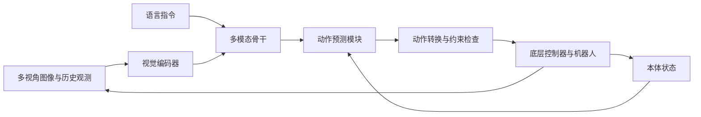
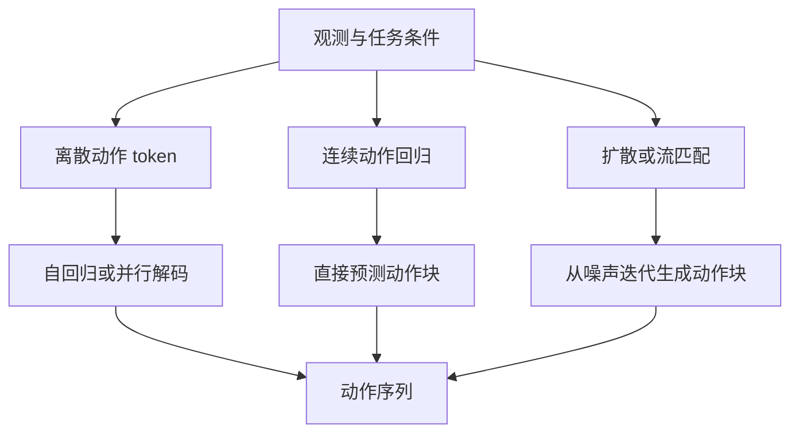

# 引言

视觉-语言-动作（Vision-Language-Action，VLA）模型研究一个具体问题：**机器人能否结合视觉观察与语言指令，直接生成可执行的动作，并在环境变化后持续修正行为？** 这要求模型同时解决“目标是什么”“物体在哪里”和“接下来如何运动”，语言理解正确只是其中一步。

[RT-1](https://arxiv.org/abs/2212.06817) 展示了大规模多任务机器人策略的潜力；[RT-2](https://arxiv.org/abs/2307.15818) 将预训练视觉语言模型的知识迁移到动作预测。此后的研究沿几条相互交叉的路线展开：改善动作表示与生成、扩大跨机器人数据、增强时序记忆与任务分解，以及利用交互反馈改进策略。这些路线可以组合使用，不能简单理解为新架构依次淘汰旧架构。

本文以**机器人操作及移动操作**为主，兼顾支撑 VLA 的动作策略、世界模型和数据工具。ACT、Diffusion Policy、UMI、UniSim 与 VLA 密切相关，但分别承担策略学习、数据采集或环境预测的角色，阅读时需要区分。文中比较以各论文的实验设置为边界；基准成功率、演示视频和真实部署可靠性提供的是不同层次的证据。逐篇方法、图示及实验局限集中在配套的 [VLA 论文精读](/VLA-Papers/)。

<figure class="survey-intro-figure">
  
  <figcaption>图：VLA 将视觉观测、语言指令与本体状态转化为动作预测；执行后获取新观测，形成持续修正的闭环。</figcaption>
</figure>

# 1. VLA核心技术体系

## 1.1 什么是VLA？

VLA 是以视觉观测和语言任务为条件的动作预测模型。常见输入还包括关节状态、夹爪状态、多相机图像与历史观测；输出通常是末端位姿增量、关节目标或一段动作序列，再由机器人控制器执行。它不必直接输出电机电流，也不必在一个网络中完成所有规划与安全检查。

用条件策略可以概括这一过程：

$$
A_t \sim \pi_\theta(\cdot \mid o_{\leq t},\ell,s_t),\qquad
A_t=(a_t,\ldots,a_{t+H-1})
$$

其中，$o$ 表示观测，$\ell$ 表示指令，$s_t$ 表示本体状态，$H$ 是动作块长度。$H=1$ 对应单步预测；$H>1$ 对应动作分块。预测整块动作后，系统可以只执行其中一部分，再依据新观测重新规划。

  
<figcaption>OpenVLA：从预训练视觉语言表示到机器人动作预测。</figcaption>

| 概念 | 主要输出 | 与 VLA 的关系 |
|---|---|---|
| VLM | 文本、语义表示或结构化描述 | 可作为 VLA 的预训练骨干；能描述动作不等于能控制机器人 |
| VLA | 受视觉和语言条件约束的动作 | 将任务语义映射到机器人的动作空间 |
| ACT / Diffusion Policy | 动作序列 | 提供动作分块和连续分布建模方法；原始方法不以大规模 VLM 为必要组成 |
| 世界模型 | 未来观测、状态或潜在表示 | 可辅助预测、规划和数据生成，需要额外机制转化为可执行策略 |
| 机器人系统 | 感知、规划、控制和执行的完整闭环 | VLA 是其中的策略组件，仍依赖标定、驱动、控制器和运行时监测 |

## 1.2 VLA系统架构

### 从输入到闭环执行

```mermaid
flowchart LR
    O["多视角图像与历史观测"] --> E["视觉编码器"]
    L["语言指令"] --> B["多模态骨干"]
    E --> B
    S["本体状态"] --> A["动作预测模块"]
    B --> A
    A --> C["动作转换与约束检查"]
    C --> R["底层控制器与机器人"]
    R --> O
    R --> S
```

**视觉编码器**决定如何提取物体、空间与场景特征。OpenVLA 融合 DINOv2 和 SigLIP 表示；多相机模型还需要处理视角对应、时间同步和遮挡。编码器数量本身不能决定效果，输入分辨率、预训练目标和数据覆盖同样重要。

**多模态骨干**融合任务语义与观测。部分模型直接微调 VLM 预测动作 token，部分模型让 VLM 为专门的动作专家提供条件。所谓 System 2 / System 1 通常描述语义处理与动作生成的分工，不能据此假定模型一定具有显式任务规划器或固定的运行频率。

**动作预测模块**需要同时处理动作维度、时间相关性与多解性。例如绕过障碍物可以有多条合理路径，直接平均不同演示可能产生不可执行的动作。动作生成方式与是否使用语言推理、是否分层，是不同的设计维度。

### 动作块如何形成闭环

动作块的长度 $H$ 是**一次预测覆盖多少步**；真正决定重新观察速度的是每次执行的步数 $k$，其中 $1\leq k\leq H$。策略可以预测较长轨迹以保持动作连贯，却只执行前 $k$ 步便重新观察。这样做增加了推理调用，也缩短了依赖旧画面的时间。

<figure class="vla-process-figure" aria-label="一个动作块的闭环执行顺序">
  <ol class="vla-process-steps">
    <li><strong>观察</strong>相机图像、本体状态和任务指令进入策略。</li>
    <li><strong>预测</strong>策略生成长度为 H 的候选动作块。</li>
    <li><strong>执行</strong>控制器只执行前 k 步，并检查约束。</li>
    <li><strong>再观察</strong>取得新状态，保留或改写后续动作。</li>
  </ol>
  

    
<strong>动作块示意</strong>预测 H = 8 步，先执行 k = 2 步

    
a₁a₂a₃a₄a₅a₆a₇a₈

    
<strong>已执行，获取新观测</strong>剩余动作根据新观测重新评估

  

  <figcaption>一次闭环循环：预测长度 H 与实际执行长度 k 是两个不同的设计量，反馈从机器人返回下一轮观测。</figcaption>
</figure>

以 $H=8$、$k=2$ 为示意，策略每次预测八步、执行两步后重规划。若推理和通信耗时超过执行两步的时间，机器人仍可能等待新动作；异步推理、动作缓冲或快速编辑策略能减少停顿，但必须检查新观测到来时，剩余动作是否仍然有效。[Real-Time EXPO-FT](/VLA-Papers/#5-35-real-time-expo-ft-2026) 的慢速提议与快速编辑，正是针对动态环境中的这一时效问题。

### 动作表示与生成方式

```mermaid
flowchart TB
    C["观测与任务条件"] --> T["离散动作 token"]
    C --> R["连续动作回归"]
    C --> D["扩散或流匹配"]
    T --> T1["自回归或并行解码"]
    R --> R1["直接预测动作块"]
    D --> D1["从噪声迭代生成动作块"]
    T1 --> A["动作序列"]
    R1 --> A
    D1 --> A
```

| 方法 | 代表工作 | 主要价值 | 需要权衡的问题 |
|---|---|---|---|
| 离散化单步动作 | RT-2、OpenVLA | 复用 token 预测接口 | 量化精度、序列长度与串行解码延迟 |
| 压缩动作序列为 token | FAST、ActionPiece | 利用时间冗余并保持动作间的物理关系 | 压缩误差、关系保真、词表与解码策略 |
| 连续动作回归 / 潜变量策略 | ACT、OpenVLA-OFT 中的回归方案 | 一次输出动作块，部署路径直接 | 多解动作的建模、训练目标与动作平滑性 |
| 扩散策略 | Diffusion Policy | 建模多模态连续动作分布 | 采样步数与闭环延迟 |
| 流匹配动作专家 | π₀ | 将 VLM 条件与连续动作生成结合 | 积分步数、模型大小及异步执行配置 |

动作分块可以减少逐步预测的调用开销，但块越长，执行期间使用的观测可能越陈旧。生成方式与控制频率之间不存在一一对应关系。相关方法见 [ACT](https://arxiv.org/abs/2304.13705)、[Diffusion Policy](https://arxiv.org/abs/2303.04137)、[FAST](https://arxiv.org/abs/2501.09747) 和 [π₀](https://arxiv.org/abs/2410.24164)。

### 统一策略与层级系统

| 组织方式 | 工作方式 | 适用考虑 | 主要局限 |
|---|---|---|---|
| 直接动作策略 | 从观测和任务预测动作 | 接口简单，便于联合训练 | 长任务进度与失败原因可能隐含在表示中 |
| 显式层级系统 | 高层产生子任务或子目标，低层执行 | 便于任务组合、监督和重新规划 | 高低层接口会引入信息损失与延迟 |
| 联合训练的层级表示 | 在模型内学习子任务与动作的关联 | 可以共享语义知识和动作数据 | 需要检验中间表示是否真正改善闭环行为 |

端到端训练与层级结构并不互斥；有可读的中间文本也不意味着解释忠实。比较架构时，应关注错误恢复、任务完成时间和中间决策的可干预性，而不只看是否输出思维链。

## 1.3 VLA与传统机器人控制的区别

VLA 改变的是任务到动作的学习方式。运动学、轨迹跟踪和反馈控制仍然是多数实际系统的组成部分。

| 维度 | 模块化系统的典型做法 | VLA 策略的典型做法 | 实际取舍 |
|---|---|---|---|
| 任务描述 | 状态机、规则或目标位姿 | 自然语言与视觉条件 | 语言更灵活，但含糊指令需要澄清或约束 |
| 感知与动作关联 | 显式几何、规划和控制接口 | 从演示中学习关联 | 学习策略减少部分手工建模，也依赖数据覆盖 |
| 新任务适配 | 调整规则、轨迹与参数 | 微调策略、增加示范或提示 | 两种方案都需要验证迁移成本 |
| 调试 | 检查各模块误差 | 分析数据、表征和闭环失败 | 可观测日志与模块化接口仍有价值 |
| 执行约束 | 由规划器、控制器施加 | 常需外部控制器和约束层 | 学习策略不自动保证可达性、稳定性或安全性 |

在固定产线和高精度重复任务中，传统方案可能更易验证、成本更低。VLA 的研究价值主要体现在任务和场景变化较多时，能否以更少的专门设计获得可迁移的行为能力；这一优势需要用具体实验说明。

## 1.4 VLA任务分类

任务复杂度、操作对象和动作接口是相互独立的维度。一次“拿起杯子”也包含很多控制步，不能把单个语义任务等同于单步动作。

| 维度 | 典型类型 | 核心难点 | 建议观察的指标 |
|---|---|---|---|
| 时间跨度 | 短技能、多阶段、长时程任务 | 历史记忆、进度判断、失败恢复 | 整任务成功率、连续子任务数、恢复次数 |
| 交互对象 | 刚体、可变形物体、工具与接触操作 | 遮挡、形变和接触状态估计 | 抓取稳定性、最终状态误差、接触失败 |
| 动作接口 | 末端位姿、关节目标、速度或力相关命令 | 坐标系、单位、控制器匹配 | 跟踪误差、延迟、约束触发率 |
| 场景范围 | 桌面、双臂协作、移动操作 | 视角变化、可达性与导航操作耦合 | 跨场景性能、任务用时、人工干预 |
| 泛化条件 | 新物体、新布局、新任务、新机器人 | 训练分布与部署分布的差异 | 各种分布变化下分别报告成功率 |

动作向量的维数也不能直接等同于机械臂自由度。例如“3 维平移 + 3 维旋转 + 夹爪”描述的是动作接口，不代表模型输出七个关节角。

## 1.5 主流VLA模型横向对比汇总

下表按**研究问题与技术取舍**比较代表工作，不将不同机器人、数据和评测协议下的分数拼成统一排名。逐篇实验和图示见 [配套论文精读](/VLA-Papers/)。

| 工作 | 核心问题 | 主要设计 | 阅读时关注的边界 |
|---|---|---|---|
| [RT-1](/VLA-Papers/#5-1-rt-1-2022) | 多任务机器人策略能否随数据规模扩展 | 语言条件 Transformer 与动作离散化 | 不等同于在预训练大规模 VLM 上微调 |
| [RT-2](/VLA-Papers/#5-2-rt-2-2023) | 网络视觉语言知识能否帮助操作 | 将动作编码为 token 并联合训练 | 语义泛化不等同于获得未训练的运动技能 |
| [OpenVLA](/VLA-Papers/#5-9-openvla-2024) | 如何复现并适配通用 VLA | 双视觉编码器、7B 骨干与开源微调流程 | 原版与 OFT 等后续训练方案应分开比较 |
| [π₀](/VLA-Papers/#5-10-pi0-2024) | 如何生成高频连续动作块 | VLM 与流匹配动作专家 | 区分动作执行频率和策略更新频率 |
| [π₀.5](/VLA-Papers/#5-11-pi05-2025) | 如何泛化到新的家庭环境 | 异构数据联合训练与高低层预测 | 未见环境不代表任意未见任务都可完成 |
| [π*₀.₆](/VLA-Papers/#5-12-pi06-2025) | 如何利用执行经验改进策略 | RECAP 与专家干预数据 | 要计入交互、奖励标注和人工纠正成本 |
| [GR00T](/VLA-Papers/#5-18-gr00t-2025) | 通用机器人模型如何结合数据与工具链 | 视觉语言模块和动作专家分工 | 明确模型版本、机器人适配与训练数据范围 |
| [ACoT-VLA](/VLA-Papers/#5-13-acot-vla-2026) | 中间动作意图能否辅助执行 | 动作空间中的结构化推理 | 需要中间表示消融和额外推理成本比较 |
| [InternVLA-A1.5](/VLA-Papers/#5-18-internvla-a1.5-2026) | 空间定位与未来预测如何辅助动作 | 空间与前瞻监督 | 检查监督数据成本和各任务的收益 |
| [ZR-0](/VLA-Papers/#5-29-zr-0) | 如何共享跨机器人语义表示 | 密集 ECoT 监督、推理时跳过 ECoT 生成 | 跳过文本生成不等于整个策略零延迟 |
| [RoboTTT](/VLA-Papers/#5-30-robottt) | 如何利用长历史而不持续扩大注意力缓存 | 快权重作为循环状态 | 测试时更新记忆不等同于在线奖励优化 |
| [S²-VLA](/VLA-Papers/#5-31-s-vla) | 如何随任务阶段调整特征融合 | 状态空间引导的自适应注意力 | 在统一长任务协议下验证收益 |
| [TurboVLA](/VLA-Papers/#5-28-turbovla) | 如何降低视觉语言动作融合成本 | 轻量编码与直接跨模态交互 | 报告硬件、精度、动作块和延迟口径 |
| [LingBot-VLA 2.0](/VLA-Papers/#5-32-lingbot-vla-20-2026) | 如何扩展至多任务和整身机器人 | 约 6 万小时混合预训练、整身动作接口与未来预测 | 分开报告平台的进度、成功率与数据成本 |
| [τ₀-VLA](/VLA-Papers/#5-33-tau0-vla-2026) | 哪些高层决定值得花更多推理算力 | 执行记忆与世界模型引导的子任务搜索 | 区分层级分解收益和额外搜索收益 |
| [ActionPiece](/VLA-Papers/#5-34-actionpiece-2026) | 动作 token 是否保留局部物理关系 | 物理排序一致性指标与量化监督 | 适用范围是离散自回归动作表示 |
| [Real-Time EXPO-FT](/VLA-Papers/#5-35-real-time-expo-ft-2026) | 如何对推理延迟做快速闭环修正 | 慢速 VLA 提议与快速编辑策略、在线 RL | 真机动态短任务和在线数据上限的边界 |
| [Bee](/VLA-Papers/#5-36-bee-2026) | 如何将人工纠正用于在线策略改进 | 按动作维度调整人类纠正约束 | 计入预收集纠正和训练中人工接管 |

若目的是复现，应优先确认权重、数据处理、训练配置与评测代码是否匹配。代码公开、权重公开、数据公开和允许商业使用是不同条件，须分别查看对应版本的仓库与许可证。

## 1.6 架构演进与发展趋势

### 技术演进的几条主线

| 主线 | 代表工作 | 改变了什么 | 尚未解决什么 |
|---|---|---|---|
| 语义知识迁移 | RT-2、OpenVLA | 将视觉语言预训练引入动作学习 | 语义理解与精确物理执行之间仍有差距 |
| 动作序列建模 | ACT、Diffusion Policy、π₀、FAST、ActionPiece | 从逐步输出扩展到动作块，并检验离散化关系保真 | 快速扰动下的闭环反应与时延补偿 |
| 跨机器人学习 | RT-X、OpenVLA、GR00T、LingBot-VLA 2.0 | 共享不同平台的数据和部分表示 | 动作接口、传感配置及具身差异 |
| 长时程决策 | π₀.5、RoboTTT、S²-VLA、τ₀-VLA | 引入子任务、记忆、阶段表示或世界模型搜索 | 可靠判断成功、发现失败并恢复 |
| 从经验中改进 | π*₀.₆ / RECAP、Real-Time EXPO-FT、Bee | 利用执行数据、奖励和人工纠正优化策略 | 交互成本、实时延迟、奖励质量与旧技能保持 |

这些进展分别作用于表示、动作生成、数据和训练机制。例如 TTT 是处理历史的一种方式，Flow Matching 是生成动作分布的一种方式，两者可以共存。

### 四类学习信号的分工

把训练数据都称为“规模”会掩盖它们提供的监督不同。互联网图文帮助识别物体和理解指令；机器人演示把观测连接到动作；合成环境和未来预测增加可探索的状态；执行后的奖励与人工纠正指出策略实际失败在哪里。增加某一类数据，不能自动替代另一类信号。

<figure class="vla-signal-figure" aria-label="四类数据与反馈分别提供的学习信号">
  
<strong>图文与语言</strong>物体、关系和目标语义<small>缺少可执行的接触动作</small>

  
<strong>机器人示范</strong>观测到动作的对应关系<small>受任务与具身覆盖限制</small>

  
<strong>仿真与预测</strong>扰动、结果和候选未来<small>需验证与真实动力学一致</small>

  
<strong>部署反馈</strong>失败、恢复与策略改进<small>有交互、标注和接管成本</small>

  <figcaption>监督来源决定模型能学到什么，也决定尚需哪类闭环证据。</figcaption>
</figure>

[RT-2](/VLA-Papers/#5-2-rt-2-2023) 更直接地检验视觉语言知识向动作任务的迁移；[RT-X](/VLA-Papers/#5-3-rt-x-2023) 与 [LingBot-VLA 2.0](/VLA-Papers/#5-32-lingbot-vla-20-2026) 关注跨具身演示的规模与接口；[τ₀-VLA](/VLA-Papers/#5-33-tau0-vla-2026) 把未来预测用于高层候选选择；[RECAP](/VLA-Papers/#5-12-pi06-2025) 与 [Bee](/VLA-Papers/#5-36-bee-2026) 则使用执行经验或人工纠正。它们解决的训练瓶颈不同，比较时应同时记录新增的数据与计算预算。

### 世界模型的作用与验证

世界模型可以提供未来视觉子目标、候选动作结果或合成训练轨迹。[UniSim](/VLA-Papers/#5-8-unisim-2024) 展示了学习式交互环境的研究路径；[τ₀-VLA](/VLA-Papers/#5-33-tau0-vla-2026) 则将预测结果用于高层子任务搜索。但视觉上合理的生成结果可能缺少正确的接触、质量、摩擦和因果响应。评价时需要进一步验证：预测是否受动作正确控制、能否提高下游策略，以及收益是否迁移到真实环境。

研究趋势可以归纳为三个待验证的问题：更多语义监督能否改善动作而非只改善解释？更长历史能否减少可观测性不足导致的失败？部署反馈能否在可接受成本下提升整任务可靠性？对这些问题的回答，应来自受控比较和闭环实验。

## 1.7 VLA开源生态

VLA 的复现依赖模型、数据、工具与硬件共同配合。

| 层次 | 代表资源 | 主要用途 | 使用前需核对 |
|---|---|---|---|
| 模型 | [OpenVLA](https://github.com/openvla/openvla)、[openpi](https://github.com/Physical-Intelligence/openpi) | 推理、微调与策略适配 | 权重版本、输入接口、归一化统计与许可证 |
| 数据 | [Open X-Embodiment](https://robotics-transformer-x.github.io/) | 多数据源机器人预训练 | 采样混合、动作单位、坐标系、语言标注与授权 |
| 工具 | [LeRobot](https://github.com/huggingface/lerobot) | 记录、训练、评估和部署 | 数据格式版本、支持的策略与机器人驱动 |
| 仿真 | [Genesis](https://github.com/Genesis-Embodied-AI/Genesis)、[ManiSkill](https://github.com/haosulab/ManiSkill) | 环境交互、数据生成与评测 | 物理设置、传感器模型和真实迁移差距 |
| 硬件与采集 | [ALOHA](https://tonyzhaozh.github.io/aloha/)、[UMI](https://umi-gripper.github.io/) | 遥操作或手持示范采集 | 工作空间、标定、时间同步与复现成本 |

统一文件格式只解决数据接入的一部分问题。不同数据源即使都采用 RLDS，也可能使用不同动作语义和控制频率。跨机器人训练仍需要动作转换、归一化、采样平衡和质量筛选。开放权重也不意味着预训练数据与完整训练过程均已公开。

## 1.8 训练范式：从预训练到部署反馈

一个 VLA 训练样本通常至少包含观测、任务条件、本体状态和随后执行的动作；有些数据还提供子任务文本、未来观测、奖励或人工纠正。**这些额外字段决定可以训练什么目标**：只有图文对齐数据时，模型能学习语义，却不能直接学习某台机器人的夹爪命令；只有成功演示时，模型会模仿分布内动作，却很难知道偏离轨迹后如何恢复。

| 阶段 | 输入与监督 | 主要得到什么 | 需要单独验证什么 |
|---|---|---|---|
| 视觉语言预训练 | 图像、文本、问答等 | 物体、关系与任务语义 | 接入动作训练后是否保留理解能力 |
| 机器人动作预训练 | 多任务轨迹、状态与动作 | 通用动作先验和部分跨场景迁移 | 数据混合、动作接口和跨具身负迁移 |
| 目标任务适配 | 少量特定机器人示范或专家数据 | 对夹爪、视角、接触和目标状态的精确适配 | 新任务收益是否以旧任务遗忘为代价 |
| 部署反馈改进 | 失败轨迹、奖励、纠正与接管 | 恢复能力与现场分布适应 | 交互次数、人工成本和安全边界 |

这些阶段是分析框架，不是所有模型都必须依次执行的固定流水线。[RT-2](/VLA-Papers/#5-2-rt-2-2023) 重点检验视觉语言知识迁移，[OpenVLA](/VLA-Papers/#5-9-openvla-2024) 提供开放的跨机器人动作训练和适配路径，[π₀.5](/VLA-Papers/#5-11-pi05-2025) 将不同来源的数据用于多阶段任务，而 [RECAP](/VLA-Papers/#5-12-pi06-2025) 与 [Bee](/VLA-Papers/#5-36-bee-2026) 分别研究执行经验和人类纠正如何继续改进策略。

### 动作接口通常比损失函数更先出错

训练前要把动作定义写成可执行契约：输出是关节目标、末端绝对位姿还是位姿增量？旋转用欧拉角、轴角还是其他表示？夹爪的开闭值和单位是什么？一个动作覆盖多长物理时间？不同机器人可以共享策略骨干，但归一化统计、坐标变换与控制器适配往往需要分别处理。把某数据集的“相对末端位移”直接解释为另一平台的“绝对关节目标”，得到的失败不能归因于 VLA 架构。

示范通常按时间窗口切成 $(o_t,\ell,s_t,A_t)$。同一轨迹上相邻窗口高度相关，按帧随机分配训练与测试集会让测试画面近似出现在训练中；划分应在轨迹、物体、场景或采集会话层面进行。动作块标签还必须与相机时间戳、控制频率和执行时实际的重规划间隔一致。否则离线损失很低，闭环仍可能因几帧错位而抓空。

### 怎样判断新训练阶段真正有效

比较“加入预训练”“加入未来预测”或“加入在线反馈”时，先固定骨干、目标任务数据、动作接口与评测初始状态，再只改变对应监督或训练阶段。除了目标任务成绩，还应检查语言理解、旧机器人任务和扰动下的性能是否下降。对于线上方法，横轴至少要包含机器人交互量和人工介入量；只比较最终成功率，会把更多数据或更长训练带来的收益误记为算法收益。

## 1.9 具身智能学习与入门路线

以能够复现、解释和诊断一个闭环任务为目标，学习路径可以分成四步：

1. **理解数据与控制接口**：从已有数据或仿真开始，检查图像、状态、动作与时间戳；确认单位、坐标系和归一化。先能回放一条正确轨迹，再训练策略。
2. **建立行为克隆基线**：使用 ACT 或 Diffusion Policy 跑通固定任务，记录成功率、任务用时及失败类型。验证改变初始状态、光照或物体位置后会发生什么。
3. **引入语言条件与预训练模型**：选择与设备和数据接口相符的 OpenVLA 或 openpi 配置，比较从头训练、冻结骨干与微调的收益。保持数据划分和评测协议一致。
4. **检查真实闭环与泛化**：在具备硬件条件时进行真机验证，覆盖新布局、扰动、失败恢复和人工接管；同时记录推理延迟、执行频率和连续运行表现。

一次练习至少留下数据说明、固定评测集、可复现配置和失败案例。是否达到部署要求取决于具体任务的错误代价与运行约束，不能用统一的“60% 成功率”作为通过标准。

# 2. VLA核心挑战

本章采用问题驱动的组织方式：把方法与可观察的失败联系起来，并说明如何判断改进是否有效。

| 挑战 | 常见失败 | 关键验证 |
|---|---|---|
| 表示与物理接地 | 找对物体却抓不稳；指代与坐标混淆 | 空间、接触和语言扰动实验 |
| 规划与执行 | 子任务遗漏；动作滞后；失败后重复执行 | 闭环延迟、任务完成时间与恢复率 |
| 泛化与适应 | 场景变化失效；新技能覆盖旧技能 | 独立分布变化与持续学习评测 |
| 安全与可靠交互 | 越界动作；误报成功；不合理接管 | 约束触发、拒绝准确性与接管成本 |
| 数据与评测 | 数据泄漏；动作定义不一致；分数不可比 | 数据溯源、划分协议与实验配置 |

## 2.1 多模态对齐与物理世界建模

### 语义正确与动作正确之间的差距

“拿起左边的杯子”同时包含对象识别、参照系、抓取位姿和可达性。VLM 能回答杯子的位置，并不保证动作头能生成正确的接触轨迹。训练需要让语义特征与状态、动作及结果建立对应；评测则要分别改变指令、目标位置和干扰物，避免策略仅凭场景捷径完成任务。

可以用同一任务做三组诊断：只改写“左边杯子”的语言表达，观察是否仍选对目标；保持指令不变、移动杯子与相机，检查目标定位和坐标变换；保持目标不变、改变杯柄朝向或接触条件，检查抓取是否稳定。三组变化分别强调语义、空间与控制，但错误也可能相互传递。记录模型选中的目标、预测动作和最终接触结果，比只报一个整任务成功率更能定位失败环节。

### 空间与接触表示

多视角 RGB、深度、点云、占据表示以及力触觉信号可以补充不同信息，也分别引入标定、噪声和同步成本。[DP3](/VLA-Papers/#5-7-dp3-2024) 和 [SpatialVLA](/VLA-Papers/#5-26-spatialvla) 提供了空间表示的不同思路。比较时应固定数据量与相机配置，判断收益来自表示方法还是额外传感信息。

### 未来预测与物理一致性

预测未来图像或潜在状态可为动作提供训练信号，但像素误差低不等于控制效果好。关键是能否区分候选动作的后果，特别是碰撞、遮挡、滑动和不可逆操作。对世界模型的评价应包含多步误差与下游闭环收益，并检查模型是否在失败状态上仍然可信。

## 2.2 指令跟随、规划与鲁棒实时执行

### 长任务需要进度状态和恢复机制

任务分解只是起点。系统还需要判断子任务何时完成、何时重新观察、失败后从哪里恢复。[π₀.5](/VLA-Papers/#5-11-pi05-2025)、[ACoT-VLA](/VLA-Papers/#5-13-acot-vla-2026) 与 [Harness VLA](/VLA-Papers/#5-27-harness-vla) 分别提供了层级预测、中间动作意图和外部执行管理的例子。对这些系统，应把额外模型调用、重试次数和人工参与一起计入成本。

即使每个子任务的条件成功概率均为 $p$，一个必须连续完成 $N$ 步的任务，在简化假设下也只有 $p^N$ 的成功概率。例如 $p=0.95$、$N=20$ 时约为 36%。这只是说明误差累积的示例；真实任务还受失败相关性和恢复机制影响。

<figure class="vla-reliability-figure" aria-label="单步成功率百分之九十五时，连续任务成功率随步骤数下降的示意图">
  
1 步
<i style="width:95%"></i>
<strong>95%</strong>

  
5 步
<i style="width:77%"></i>
<strong>77%</strong>

  
10 步
<i style="width:60%"></i>
<strong>60%</strong>

  
20 步
<i style="width:36%"></i>
<strong>36%</strong>

  <figcaption>示意计算 0.95 的 N 次方：假设每步独立、必须全部成功、没有重试；不是任何论文或机器人的实测成绩。</figcaption>
</figure>

因此，长任务方法不应只提高“下一步选对”的比例，还要报告**失败能否被发现、局部重试能否继续任务，以及恢复花费多久**。若一次失误就必须从头复位，任务吞吐量可能远低于单段成功率暗示的水平；若可以安全重试，则应把重试次数和人工接管与最终成功率一起报告。

### 区分四种“速度”

| 指标 | 含义 | 常见误读 |
|---|---|---|
| 单次推理延迟 | 从模型输入到输出动作的时间 | 把离线批处理速度当作在线延迟 |
| 策略更新频率 | 每秒依据新观测生成动作计划的次数 | 与动作块内的采样频率混淆 |
| 动作执行频率 | 控制器每秒发送或执行动作的次数 | 认为 50 Hz 执行意味着完整 VLM 每秒推理 50 次 |
| 任务吞吐量 | 单位时间完成的有效任务数 | 忽略重试、复位和人工干预 |

动作分块、并行解码、缓存和异步执行作用于不同环节。[OpenVLA-OFT](https://arxiv.org/abs/2502.19645) 研究微调与动作生成的效率；[FAST](https://arxiv.org/abs/2501.09747) 研究动作序列压缩。论文中的训练加速、动作吞吐量和单次推理加速须分别报告，不能统一写成“快若干倍”。

评估实时性时，应覆盖图像采集、传输、预处理、推理、动作转换与控制器通信的整条链路，并报告高分位延迟。动作块长度、一次执行多少步、是否允许中途更新，都会改变机器人面对扰动的反应能力。

## 2.3 从泛化到持续适应

### 先定义“未见”是什么

| 泛化类型 | 改变的因素 | 应固定或说明的因素 |
|---|---|---|
| 视觉泛化 | 背景、光照、纹理、干扰物 | 任务和动作技能 |
| 空间泛化 | 物体位置、朝向、相机视角 | 工作空间与标定范围 |
| 语义与组合泛化 | 指令表达、物体组合、子任务顺序 | 是否包含新的运动技能 |
| 跨机器人迁移 | 本体、夹爪、传感器、动作接口 | 是否允许适配数据和参数更新 |
| Sim-to-Real | 图像与动力学由仿真转向真实 | 真实数据用量和调参次数 |

“零样本”必须指明相对于哪种变化，以及是否在预训练中见过同类任务。少量目标数据微调、上下文示范和完全无适配部署也应分开报告。

### 适应机制不应混为一谈

离线微调使用事先收集的数据更新参数；持续学习还需检查旧技能是否遗忘；在线强化学习根据交互奖励优化策略；TTT 则可以通过测试时更新内部状态或快权重来利用历史。后者不自动意味着使用奖励学习。[RoboTTT](https://arxiv.org/abs/2607.15275) 将快权重用作历史记忆，而 [RECAP](/VLA-Papers/#5-12-pi06-2025) 关注执行经验带来的策略改进。

比较这些方法时，需要记录适配前后的性能、交互次数、人工纠正、计算成本，以及跨任务迁移或遗忘。只报告适配后的最佳任务成绩，会掩盖额外资源消耗。

## 2.4 安全性、可解释性与可靠交互

语言规则、拒绝输出和可读推理能帮助交互，但不能单独构成物理执行保证。完整系统应区分三个层次：策略是否理解约束，输出动作是否满足工作空间与速度等限制，执行时是否能检测异常并及时停止。

| 层次 | 可以观察什么 | 不能据此直接推断什么 |
|---|---|---|
| 任务理解 | 是否识别歧义、不允许的目标或缺失条件 | 不能推断运动过程始终满足约束 |
| 动作约束 | 限位、可达性、碰撞或速度检查 | 不能推断感知与物理模型完全正确 |
| 运行时监测 | 接触异常、超时、失败检测与接管 | 不能推断每一种未知故障都能被发现 |
| 可解释性 | 子任务、目标位置、中间推理是否可检查 | 不能推断解释忠实反映实际决策原因 |

有价值的评测包括错误接受与错误拒绝、异常检测延迟、约束违反率、人工接管次数，以及恢复后的任务成功率。对中间推理进行删除、替换或干预，才能进一步判断它是否真正影响了动作。

## 2.5 数据构建与基准测试标准

### 数据质量与一致性

多源机器人数据的难点是语义和时间的一致性。需要核对动作使用绝对值还是增量、旋转采用何种表示、夹爪开闭方向、相机与控制时间戳，以及失败轨迹如何标注。按帧随机划分训练集和测试集容易泄漏相邻时刻；更合理的划分单位通常是轨迹、场景、物体或采集会话。

轨迹数、帧数和采集小时数不能直接互换。更长的视频或更高的记录频率并不自动带来更多独立技能。数据比较还应包含任务覆盖、机器人分布、成功与失败样本比例及语言标注质量。

### 读懂基准分数

[LIBERO](https://github.com/Lifelong-Robot-Learning/LIBERO) 的原始任务划分与后续 VLA 常用评测组合需要区分；[SimplerEnv](https://simpler-env.github.io/) 用仿真近似真实评测条件，不能替代真机测试。CALVIN 的连续任务完成表现、LIBERO 的任务成功率和真实机器人的小时级吞吐量测量的是不同能力。

一组可比较的实验至少应交代：

1. **训练条件**：预训练权重、目标任务数据、视角、本体状态及额外监督。
2. **评测协议**：基准版本、任务集合、初始状态、随机种子、每任务试验数与成功判据。
3. **执行条件**：设备、精度、动作块长度、重规划间隔、最长步数与重试预算。
4. **结果统计**：逐任务成绩、汇总方式、方差或置信区间，以及失败类型。
5. **额外成本**：人工干预、外部规划器、奖励标注、微调与在线适应预算。

单任务微调、多任务联合训练和持续学习，即使使用相同环境，也不能直接合并排名。小幅平均分提升应结合重复试验和成本判断其实际意义。

# 3. VLA主流数据集

选择数据资源首先要区分四类对象：**可下载的机器人轨迹、采集工具、可生成数据的仿真环境，以及固定协议的评测基准**。它们解决的问题不同，不能只按“规模”排序。下表使用论文或项目发布时的统计口径；实际训练子集和后续版本可能不同。

| 资源 | 类型 | 代表性规模或范围 | 主要用途 |
|---|---|---|---|
| Open X-Embodiment | 跨机器人数据集合 | 原始项目覆盖 22 种机器人、百万量级轨迹 | 跨机器人预训练 |
| ProcCorpus-60M | 带密集推理标注的训练语料 | 约 6000 万帧、40 万余条轨迹 | 跨机器人语义监督 |
| RT-1 数据 | 真实机器人演示 | 约 13 万条轨迹、700 余种任务 | 多任务操作学习 |
| BridgeData V2 | 真实操作数据 | 60,096 条轨迹、24 个环境 | 语言条件操作与迁移 |
| DROID | 多场景真实操作数据 | 约 7.6 万条轨迹、350 小时、564 个场景 | 场景泛化与预训练 |
| RH20T | 多模态机器人数据 | 视觉、力觉、音频与运动信息 | 接触操作与跨模态学习 |
| ALOHA / UMI | 硬件与示范采集体系 | 按任务、数据发布版本统计 | 双臂或手持示范采集 |
| CALVIN / LIBERO | 仿真数据与评测 | 长任务组合 / 知识迁移 | 可重复的策略比较 |
| MimicGen | 演示扩增系统 | 从少量种子演示生成轨迹 | 数据生成与扩增 |
| SimplerEnv / VLABench | 评测环境与基准 | 真实条件近似 / 语言条件操作 | 泛化诊断与闭环评测 |
| RoboDojo | 仿真与真机统一评测基准 | 42 项仿真任务、18 项真机任务 | 跨模型能力分项比较与公开排行榜 |
| LeRobotDataset | 数据格式与工具 | 随具体社区数据集变化 | 数据记录、读取与训练集成 |
| Ego4D | 人类第一视角视频 | 大规模日常活动视频 | 视觉和交互表征预训练 |

## 3.1 大规模跨机器人数据集

### Open X-Embodiment Dataset

[Open X-Embodiment（OXE）](https://robotics-transformer-x.github.io/) 汇集多个机构的机器人数据，原始项目覆盖 22 种机器人、527 类技能和 160,266 项任务。RT-X 研究在其中选定的数据混合上训练策略，表明跨机器人数据共享可以产生正迁移；不能把集合全部数据量当作每个模型的实际训练量。

  
<figcaption>Open X-Embodiment：跨机构、跨机器人数据共享。来源：RT-X 项目。</figcaption>

OXE 使用 RLDS 组织轨迹，但不同子集的相机、动作定义、控制频率和标注质量仍有差异。使用前应查看实际数据混合配置，记录过滤条件、采样权重和转换方式。OpenVLA 使用的约 97 万条训练轨迹是特定混合口径，不应直接作为 OXE 在所有版本中的固定规模。

### ProcCorpus-60M Dataset

[ZR-0 论文](https://arxiv.org/abs/2606.30552) 报告的 ProcCorpus-60M 包含约 6000 万帧、约 1000 小时及 40 万余条轨迹，96.8% 的帧带有密集 ECoT 标注。其价值在于为跨机器人学习提供场景、目标和任务分解等语义监督。

数据量与可下载范围需要分别核对；实际复现还应检查标注生成成本、错误传播以及是否存在任务或场景重叠。相关模型见 [ZR-0](/VLA-Papers/#5-29-zr-0)。

### RT-1 Dataset

[RT-1](https://arxiv.org/abs/2212.06817) 使用约 13 万条真实机器人演示，覆盖 700 余种任务。它适合说明同一机器人上的多任务数据如何支撑通用策略，也为后续跨机器人训练提供数据来源。读取时应区分机械臂动作、夹爪、底盘与控制模式，不能将全部轨迹统一视作七维机械臂动作。

## 3.2 双臂与灵巧操作数据集

### ALOHA / ACT Dataset

[ALOHA 与 ACT](https://tonyzhaozh.github.io/aloha/) 分别提供双臂遥操作硬件与动作分块算法。数据通常包含多相机图像、本体状态与双臂动作；具体任务、演示数量和采集频率应按对应数据发布记录。ALOHA、Mobile ALOHA 与后续平台的数据协议也需要区分。

这类数据适合研究双臂配合和精细操作。使用时重点核对主从臂标定、相机布局、夹爪状态和关节目标；动作块长度需要与记录频率一起解释。方法详见 [ACT](/VLA-Papers/#5-4-act-2023)。

### UMI (Universal Manipulation Interface) Dataset

[UMI](https://umi-gripper.github.io/) 使用手持夹爪采集示范，并设计策略接口把演示迁移到机器人。其关键不只是减少采集设备，还包括位姿估计、动作表示与延迟匹配。手持轨迹仍需满足执行机器人的可达性和运动约束，不能不经转换直接下发。

UMI 是采集和策略学习框架，具体公开数据按任务组织，详见 [UMI 论文解析](/VLA-Papers/#5-6-umi-2024)。

## 3.3 模拟器数据集

### CALVIN (Composing Actions from Language and Vision)

[CALVIN](https://github.com/mees/calvin) 用语言条件的连续操作任务评测长时程执行。常见结果报告完成连续 1—5 个子任务的成功率，以及平均连续完成任务数（最高为 5）。

必须明确数据划分：**ABC→D** 表示训练只使用 A、B、C 环境，测试在 D；**ABCD→D** 则在训练阶段包含 D 环境数据。两者不能共同用于说明未见环境泛化。连续完成多个指令也不等于模型自主产生了任务分解。

### LIBERO (Lifelong Benchmark for Robot Manipulation)

[LIBERO 代码](https://github.com/Lifelong-Robot-Learning/LIBERO) 与[原论文](https://arxiv.org/abs/2306.03310) 提供 130 个任务和人类遥操作演示，原始数据每任务 50 条，共约 6,500 条。任务分为 Spatial、Object、Goal（各 10 个）和 LIBERO-100；后者再分为 90 个预训练任务和 10 个下游任务。

后续 VLA 常报告 Spatial、Object、Goal 和 Long 的四组结果，其中 Long 对应常用的 LIBERO-10 任务集。引用分数时，应明确使用哪种套件组合，以及数据预处理与初始化协议。

**持续学习指标**：前向迁移（FWT）考察已有知识对后续新任务学习的帮助；后向迁移（BWT）考察学习新任务后旧任务性能的变化，可能为正，也可能因遗忘而为负。原论文实际报告 FWT、负后向迁移 NBT 和学习曲线面积 AUC；NBT 越低，表示遗忘越少。多任务联合训练的平均成功率不能替代持续学习结果。

### RLBench / MetaWorld

[RLBench](https://sites.google.com/view/rlbench) 提供仿真操作任务与演示生成能力；[MetaWorld](https://meta-world.github.io/) 组织多任务与元学习控制问题。它们适合建立受控实验，但并非所有配置都自带与 VLA 一致的图像、语言和动作接口，复用时需要说明转换过程。

### MimicGen

[MimicGen](https://mimicgen.github.io/) 从少量种子示范自动合成更多操作轨迹，主要通过对象相关的轨迹变换、子任务组织与仿真执行实现扩增。生成数量不等于独立技能数量；还需计入场景构建、子任务定义、失败筛选和人工准备成本。

## 3.4 真实世界数据集

### Bridge Dataset (BridgeData V2)

[BridgeData V2](https://rail-berkeley.github.io/bridgedata/) 包含 60,096 条轨迹、24 个环境和 13 类技能。其中 50,365 条来自遥操作，9,731 条来自脚本化抓取放置策略。它提供语言任务标注，并包含物体、相机位姿和工作空间变化。

这类数据适合研究桌面操作与语言条件迁移。比较实验需要说明所用版本、是否包含脚本轨迹及训练测试场景是否重叠。

### RH20T Dataset

[RH20T](https://rh20t.github.io/) 面向多模态机器人技能学习，记录视觉、力觉、音频和运动信息，并提供相应标定资料。它适合研究接触状态、多模态融合和示范迁移。

力/力矩测量与高分辨率指尖触觉图像是不同模态；应按实际数据配置确定可用传感器，不能假定所有轨迹都包含相同的触觉或同步精度。

### DROID Dataset

[DROID](https://droid-dataset.github.io/) 发布时包含约 7.6 万条演示、350 小时交互、564 个场景与 86 类任务，由 50 位采集者参与。其统一平台采用 Franka Panda、两个外部双目相机和一个腕部双目相机。

DROID 强调相同硬件下的场景多样性，适合研究跨环境迁移。官方后续更新了语言标注与部分相机标定，复现时应记录所使用的数据版本。

### LeRobot Dataset (HuggingFace)

[LeRobot](https://github.com/huggingface/lerobot) 提供机器人数据记录与训练工具；LeRobotDataset 是数据组织方式，不是一个固定规模的数据集。实际数据质量、机器人接口、授权和训练测试划分由各数据发布者决定。

## 3.5 人机交互数据集

### Ego4D

[Ego4D](https://ego4d-data.org/) 提供人类第一视角日常活动视频及多类任务标注。它可以帮助学习物体交互与时序表征，但人类视频通常不包含可直接监督机器人的关节命令。用于 VLA 时，需要额外的动作对应、潜在动作学习或机器人数据对齐机制。

## 3.6 评测基准

### SIMPLER / SimplerEnv

[SimplerEnv](https://simpler-env.github.io/) 通过视觉匹配与环境变化设置，在仿真中近似部分真实机器人策略评测条件。研究重点是仿真评估与真实表现之间的一致性，而不是给所有机器人提供统一的固定任务总数。

报告结果时应写明机器人、任务集合、视觉匹配或变化设置。扩展版本的任务和语言协议应单独标注，不能把它们的统计归给原始 SimplerEnv。

### VLABench

[VLABench](https://vlabench.github.io/) 面向语言条件的机器人操作，包含多样任务和场景，用于研究语言理解、常识与执行能力。具体使用的任务划分、指标和生成配置必须随论文或代码版本说明。

### RoboDojo

[RoboDojo](https://robodojo-benchmark.com/) 同时提供 42 项仿真任务和 18 项真机任务，并在[官方排行榜](https://robodojo-benchmark.com/leaderboard)用统一协议比较不同策略。仿真覆盖泛化、记忆、精细操作、长任务和开放指令五类能力。阅读其名次时应区分完整任务成功率（SR）和包含部分进度的 Score，也要区分仿真与真机榜；它们不等同于 LIBERO 或其他基准上的分数。具体协议见[原论文](https://arxiv.org/abs/2607.04434)。

### ManiSkill3 / RoboCasa

[ManiSkill](https://maniskill.ai/) 提供并行仿真、数据与任务工具；[RoboCasa](https://robocasa.ai/) 聚焦厨房操作环境。它们既可以用于数据生成，也可以用于策略评测，但“支持生成多少环境”与“实际评测多少任务”是不同统计。

选择时应从研究问题出发：验证并行训练效率、跨场景变化和长任务操作，需要不同配置。仿真中的良好表现还需通过真实系统的传感、动力学和执行延迟验证。

### 从基准分数到真实能力

评测证据有不同覆盖范围，适合逐层排查问题。离线动作误差能检查标签与动作接口，却不能证明闭环成功；固定仿真任务便于反复对照，但可能依赖场景捷径；扰动测试检验新物体、视角和布局；真机试验才引入真实接触、传感噪声与系统延迟。

<figure class="vla-evidence-figure" aria-label="从离线指标到真机闭环的四层评测证据">
  <ol class="vla-evidence-steps">
    <li><strong>离线回放</strong>动作误差、数据泄漏、接口正确性</li>
    <li><strong>固定仿真</strong>整任务成功率、任务进度、逐任务失败</li>
    <li><strong>分布变化</strong>新布局、新物体、视觉与动力学扰动</li>
    <li><strong>真机闭环</strong>完成率、耗时、恢复、人工干预与安全约束</li>
  </ol>
  <figcaption>上层证据补足下层无法覆盖的风险；前一层成绩不能直接推算后一层结果。</figcaption>
</figure>

例如 RoboDojo 的 **Score** 可以反映未完成任务中的部分进度，**SR** 则要求完整结束；两者的差距有助于发现“做到最后一步却失败”的策略。真机若每任务只试 10 次，一次成败便改变 10 个百分点，更应公开逐任务结果、重复轮次和失败片段，而非只给总均值。[RoboDojo 原论文](https://arxiv.org/abs/2607.04434)与[官方榜单](https://robodojo-benchmark.com/leaderboard)提供了按能力维度拆分的阅读入口。

# 4. VLA的应用场景

VLA 的应用价值取决于任务变化带来的适配收益，能否覆盖数据收集、计算与系统集成成本。论文中的任务展示提供能力证据，生产部署还需要更长周期的可靠性评估。

| 场景 | 值得研究的任务 | VLA 可能提供的价值 | 落地时的关键指标 |
|---|---|---|---|
| 柔性制造 | 多品种分拣、装配前定位、物料搬运 | 通过任务条件与少量适配处理产品变化 | 接触精度、节拍、失败成本和复位时间 |
| 家庭与服务 | 整理、衣物处理、桌面清洁 | 适应物体、布局和指令的变化 | 整任务完成率、恢复率、干预与连续运行时间 |
| 仓储物流 | 变化物品的拣选、装袋与重排 | 减少每种物品的专门策略设计 | 吞吐量、损坏率、长尾物品表现 |
| 移动操作 | 跨区域取放、沿途操作 | 结合语言目标、导航与局部操作 | 到达与操作联合成功率、定位误差和任务用时 |

纯视觉质量检测主要是感知任务；只有当系统根据检测结果产生操作动作时，才进入本文讨论的 VLA 范围。农业、施工等开放环境可作为扩展研究方向，不能直接由桌面实验推断其成熟度。

### 从演示到可用：以仓储拣选为例

“能把物品放进箱子”并不是足够明确的部署目标。研究阶段可以先固定机械臂、相机和物品集合，建立可复现的抓取与放置基线；随后分别引入新包装、遮挡、堆叠和目标箱位置变化，确认性能下降来自感知、抓取还是动作接口。进入现场后，还需统计每小时**有效拣选数**，把识别、尝试、重试、复位、人工接管和损坏都计入同一个任务周期。

这也解释了为什么较高的仿真成功率不一定意味着更高的产线吞吐量。一个策略若需要频繁重试或人工复位，可能在单次试验中表现不错，却不能连续运行。对家庭整理和移动操作，同样应补充任务持续时间、物体与场景变化、恢复策略和人工成本，才能判断通用能力是否真的减少了专门工程工作。

# 5. 论文精读

逐篇的方法、实验、图示和局限已经移至 [VLA 论文精读](/VLA-Papers/)；该页开头提供 [RoboDojo 官方统一榜入口](/VLA-Papers/#vla-ranking-robodojo)和论文内按评测协议区分的[性能分榜](/VLA-Papers/#vla-leaderboard)。独立页面保留原第 5 章编号及论文锚点，方便从本文各处跳转。这里仍按研究问题给出阅读路径。

| 阅读路径 | 代表工作 | 值得追问的问题 |
|---|---|---|
| 基础模型与跨机器人 | [RT-1](/VLA-Papers/#5-1-rt-1-2022) → [RT-2](/VLA-Papers/#5-2-rt-2-2023) → [OpenVLA](/VLA-Papers/#5-9-openvla-2024) → [LingBot-VLA 2.0](/VLA-Papers/#5-32-lingbot-vla-20-2026) | 规模和异构数据怎样转化为任务与具身泛化 |
| 动作生成与表示 | [ACT](/VLA-Papers/#5-4-act-2023)、[π₀](/VLA-Papers/#5-10-pi0-2024)、[ActionPiece](/VLA-Papers/#5-34-actionpiece-2026) | 动作块、生成方式与离散化各自改变了什么 |
| 长任务推理 | [π₀.5](/VLA-Papers/#5-11-pi05-2025)、[RoboTTT](/VLA-Papers/#5-30-robottt)、[τ₀-VLA](/VLA-Papers/#5-33-tau0-vla-2026) | 记忆、子任务与世界模型搜索能否提高闭环成功率 |
| 在线改进与实时执行 | [RECAP](/VLA-Papers/#5-12-pi06-2025)、[Real-Time EXPO-FT](/VLA-Papers/#5-35-real-time-expo-ft-2026)、[Bee](/VLA-Papers/#5-36-bee-2026) | 如何计入机器人交互、人工纠正与延迟成本 |

近期论文的结果仍需按评测协议理解：LingBot-VLA 2.0 的 GM-100、ActionPiece 的 LIBERO、τ₀-VLA 的长任务真机实验，以及在线强化学习的任务成功率，不能直接排序。

---

# 6. 总结与展望

VLA 将视觉语言知识与动作学习连接起来，但通用能力来自数据、表示、动作生成与闭环执行的共同作用。RT-2 和 OpenVLA 说明预训练语义可以帮助机器人操作；ACT、Diffusion Policy、π₀ 与 ActionPiece 表明动作序列及其表示同样关键；τ₀-VLA、Real-Time EXPO-FT 与 Bee 分别把计算、快速反馈和人工纠正投入不同的失败环节。相关论文的完整解析见 [VLA 论文精读](/VLA-Papers/)。

从本文梳理中，可以形成三条研究判断：

1. **结构设计要对应可测量的失败原因。** 增加推理、空间表示或记忆模块之前，应先确认瓶颈来自语义、观测不足、动作精度还是执行延迟，再用消融验证。
2. **泛化能力需要拆开报告。** 新场景、新任务和新机器人是不同问题；跨机器人预训练的收益也不意味着无需任何接口适配。
3. **部署收益应以完整任务计算。** 更高的基准分数或动作吞吐量，只有在重试、复位、人工干预和计算成本可接受时，才转化为实际价值。

| 研究问题 | 值得推进的方向 | 能支持结论的证据 |
|---|---|---|
| 如何处理空间与接触不确定性 | 多视角、空间表示与力触觉融合 | 固定数据预算下的扰动与接触实验 |
| 如何完成更长任务 | 层级决策、历史记忆和失败恢复 | 长任务整段成功率、恢复率及额外延迟 |
| 如何有效利用部署经验 | 纠正数据、奖励学习与持续适应 | 交互成本曲线、新旧任务性能变化 |
| 如何降低数据成本 | 跨机器人共享、示范扩增与合成数据 | 等预算比较以及真实系统迁移效果 |
| 如何建立可信评测 | 版本固定、独立划分、多次试验 | 可复现配置、置信区间与失败案例 |

对于实际研究，清楚解释“在哪种条件下解决了哪类失败”，比不加条件地宣称通用、实时或最优更有价值。这也是从单次演示走向稳定机器人系统时，需要持续回答的问题。

---

# 7. 参考资料

- [LingBot-VLA 2.0: From Foundation to Application](https://arxiv.org/abs/2607.06403) - 多具身数据、整身动作接口与未来预测
- [τ₀-VLA](https://arxiv.org/abs/2608.16885) - 世界模型引导的高层子任务搜索
- [ActionPiece](https://arxiv.org/abs/2609.18487) - 物理关系保真的动作 tokenization
- [Real-Time EXPO-FT](https://arxiv.org/abs/2609.18207) - 实时编辑策略与在线强化学习
- [Bee](https://arxiv.org/abs/2609.27450) - 人工纠正约束下的在线强化学习
- [An Anatomy of Vision-Language-Action Models](https://arxiv.org/abs/2512.11362) - 模块、发展脉络与挑战分类综述
- [VLA-Survey-Anatomy GitHub](https://github.com/SuyuZ1/VLA-Survey-Anatomy) - 上述综述配套项目页面
- [ZR-0: Training Vision-Language-Action Models with Dense Embodied Chain-of-Thought Supervision](https://arxiv.org/abs/2606.30552) - 智谱 AI & 中国人民大学，ProcCorpus-60M
- [RoboTTT: Context Scaling for Robot Policies](https://arxiv.org/abs/2607.15275) - NVIDIA GEAR Lab & Stanford
- [S²-VLA: State-Space Guided Vision-Language-Action Models for Long-Horizon Manipulation](https://arxiv.org/abs/2606.27872) - 华东师大 & 上交 (IJCAI 2026)
- [TurboVLA: Real-Time Vision-Language-Action Model at 32 Hz on an RTX 4090](https://arxiv.org/abs/2607.27205) - 直连 $V+L \to A$ 高频轻量化 VLA
- [Vision-Language-Action Models for Robotics: A Review Towards Real-World Applications](https://vla-survey.github.io/)
- [10 Open Challenges Steering the Future of Vision-Language-Action Models](https://arxiv.org/abs/2511.05936)
- [State of VLA Research at ICLR 2026](https://mbreuss.github.io/blog_post_iclr_26_vla.html) - 研究动态索引，技术结论以原论文为准
- [Muhayyuddin's VLA Repository](https://muhayyuddin.github.io/VLAs/) - 模型、数据与仿真资源索引
- [OpenVLA](https://github.com/openvla/openvla) - 7B参数开源VLA模型
- [π₀ (openpi)](https://github.com/Physical-Intelligence/openpi) - Physical Intelligence Flow Matching VLA
- [Octo](https://octo-models.github.io/) - 通用机器人策略
- [LeRobot](https://github.com/huggingface/lerobot) - Hugging Face机器人学习库
- [RT-2 Blog](https://deepmind.google/blog/rt-2-new-model-translates-vision-and-language-into-action/) - Google DeepMind
- [Open X-Embodiment](https://robotics-transformer-x.github.io/) - 跨机器人数据集合与 RT-X 研究
- [Bridge Dataset](https://rail-berkeley.github.io/bridgedata/) - 60k桌面操作轨迹
- [LIBERO](https://libero-project.github.io/) - 终身机器人学习基准
- [CALVIN](http://calvin.cs.uni-freiburg.de/) - 长时序组合任务基准
- [RLBench](https://sites.google.com/view/rlbench) - 100+仿真操作任务
- [SIMPLER](https://simpler-env.github.io/) - 标准化VLA评测平台

---
