# 一、从 ROS 1 到 ROS 2：范式转移与设计哲学

## 1.1 机器人中间件演化史：为什么必须彻底重构？

**ROS（Robot Operating System）** 诞生于 2007 年斯坦福大学人工智能实验室（STAIR 项目）与 Willow Garage，其初衷是为学术界提供一个开源的机器人软件快速原型平台。随着机器人技术从实验室走向工业自动化、商用服务、自动驾驶以及人形具身智能，ROS 1 的设计局限性日益凸显：

1. **中心化单点故障（Single Point of Failure）**：ROS 1 强依赖运行在固定 IP/端口的 `roscore`（Master 节点）。若 Master 崩溃或发生网络分区，整个机器人系统的节点发现与通信注册将全面瘫痪。
2. **缺乏确定性与硬/软实时支持**：ROS 1 的底层基于标准 TCP/UDP socket，操作系统调度无优先级控制，无法满足工业控制器与底层电机驱动微秒/毫秒级的确定性实时控制需求。
3. **网络适应性差与无原生加密安全机制**：TCPROS/UDPROS 在无线有损网络（Wi-Fi、4G/5G、跨网段）中丢包率高、重连机制脆弱；通信链路为明文传输，无身份认证与访问控制机制。
4. **多机协同与多机器人集群复杂度高**：ROS 1 多机通信需严格配置 `ROS_MASTER_URI` 与 `ROS_IP`，缺少灵活的域隔离与多机发现治理方案。
5. **嵌入式微控制器隔离**：无法直接运行在计算与内存受限的微控制器（MCU/DSP/RTOS）上，通常只能通过脆弱的串口协议（如 `rosserial`）做低效桥接。

为了彻底解决上述工业级落地瓶颈，开源机器人基金会（Open Robotics）决定不进行简单的补丁式迭代，而是基于国际工业标准 **DDS（Data Distribution Service）** 重新设计了 **ROS 2**。

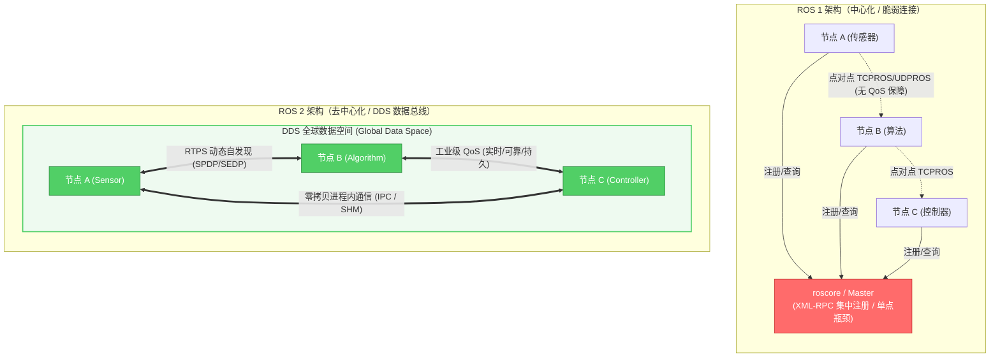

---

## 1.2 ROS 1 vs. ROS 2 全维度核心对比

| 维度 | ROS 1 (Noetic / Melodic) | ROS 2 (Humble / Iron / Jazzy) | 核心价值 / 工业影响 |
| :--- | :--- | :--- | :--- |
| **网络拓扑** | 基于 Master (`roscore`) 集中协调 | 基于 DDS RTPS 的完全分布式去中心化 | 杜绝单点失效，支持大规模集群动态组网 |
| **底层通信** | 自定义 TCPROS / UDPROS 协议 | OMG 工业级 DDS 标准（Fast DDS, Cyclone DDS, Connext 等） | 复用军工/航空级成熟数据分发底座 |
| **服务质量 (QoS)** | 仅支持简单 TCP 可靠传输与 UDP 尽力传输 | 完备的 QoS 策略（Reliability, Durability, History, Deadline 等） | 精准适配传感器高频低延时与控制高可靠需求 |
| **跨进程/进程内通信** | Socket 序列化拷贝；Nodelet 进程内共享（API 割裂） | 统一 Component 容器；原生支持借用指针零拷贝（Zero-Copy IPC） | 极大降低百兆高分辨率点云与 4K 图像传输 CPU 占用 |
| **节点生命周期** | 无状态黑盒；节点各自无序初始化 | 原生受管生命周期节点（Lifecycle Managed Nodes） | 保证传感器驱动、算法、执行器的确定性受控启动顺序与故障降级 |
| **实时性支持** | Linux 通用内核；无实时保证 | 支持 Linux PREEMPT_RT、QNX、VxWorks 等硬实时 OS，内存零动态分配 API | 满足微秒级闭环运动控制需求 |
| **嵌入式支持** | 仅通过 `rosserial` 串口转译 | micro-ROS 原生支持 STM32、ESP32、Zephyr、FreeRTOS | MCU 微控制器无缝作为 First-class ROS 2 节点 |
| **安全机制** | 无安全验证，网络裸奔 | SROS2 规范：DDS-Security 身份鉴权、访问控制列表 (ACL)、TLS/AES 加密 | 满足商业机器人安全合规与抗网络攻击标准 |
| **参数系统** | 全局统一的 Parameter Server | 节点私有独立的 Parameter 实例，支持运行时强类型约束与事件监听 | 避免参数命名空间污染，支持动态重配置拦截 |
| **多平台构建** | 强依赖 Ubuntu Linux / CMake (`catkin`) | 原生支持 Linux, Windows, macOS (`colcon` + `ament`) | 降低跨平台工业软件移植门槛 |

---

## 1.3 ROS 2 发行版演进路线与生命周期

ROS 2 采用与 Ubuntu 协同的固定发布周期：每逢偶数年 5 月发布长期支持版本（**LTS**，支持期 5 年），奇数年 5 月发布标准支持版本（支持期 1 年）。

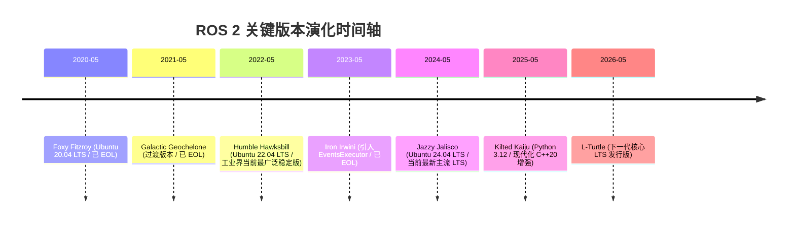

> **选型建议**：
> - **生产/工业级部署**：首选 **ROS 2 Humble**（Ubuntu 22.04）或 **ROS 2 Jazzy**（Ubuntu 24.04），生态包（Nav2, MoveIt 2, ros2_control）支持最为完善。
> - **前沿算法研发**：选用 **Jazzy Jalisco** 或 **Rolling Ridley**，以获取最新的执行器性能优化与 Type Adaptation 硬件加速特性。

---

# 二、ROS 2 分层软件栈与 DDS 中间件底座

## 2.1 软件分层架构剖析

ROS 2 采用极度清晰的模块化分层设计，使上层业务算法与底层传输中间件彻底解耦。

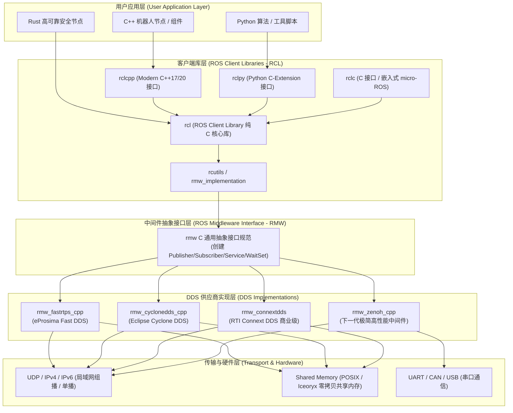

### 关键组件职责：
- **`rcl` (ROS Client Library)**：纯 C 语言编写的公共逻辑层，实现了参数解析、节点图拓扑、日志系统、时钟管理等与语言无关的核心功能，确保 C++、Python 等多语言客户端的行为严格一致。
- **`rmw` (ROS Middleware)**：统一的 C 接口规范，定义了发布、订阅、等待集、QoS 映射等接口，上层完全感知不到底层使用的具体是哪一款 DDS。
- **`rosidl`**：接口定义语言（IDL）生成器，将 `.msg`、`.srv`、`.action` 自动生成为 C、C++、Python 的原生结构体与序列化/反序列化代码。

---

## 2.2 DDS (Data Distribution Service) 核心工作机制

DDS 是对象管理组织（**OMG**）制定的开放标准，其核心是 **以数据为中心的发布-订阅模型（DCPS, Data-Centric Publish-Subscribe）**。

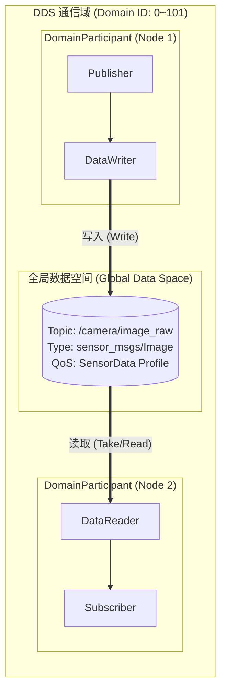

### RTPS 动态自发现协议（Discovery Protocol）
DDS 节点在局域网内启动时，无需 Master 协调即可自动发现彼此，其内部包含两个阶段：
1. **SPDP（Simple Participant Discovery Protocol）**：节点启动后，向预定端口（基于 Domain ID 计算的组播地址 `239.255.0.1`）周期性发送组播心跳包，宣告自身的 Participant GUID、IP 地址与传输端口。
2. **SEDP（Simple Endpoint Discovery Protocol）**：当 Participant 发现彼此后，建立可靠单播连接，互相交换各自包含的 DataWriter / DataReader 详细信息（Topic 名称、数据类型、QoS 配置）。若 QoS 匹配成功，即在底层建立点对点数据通道。

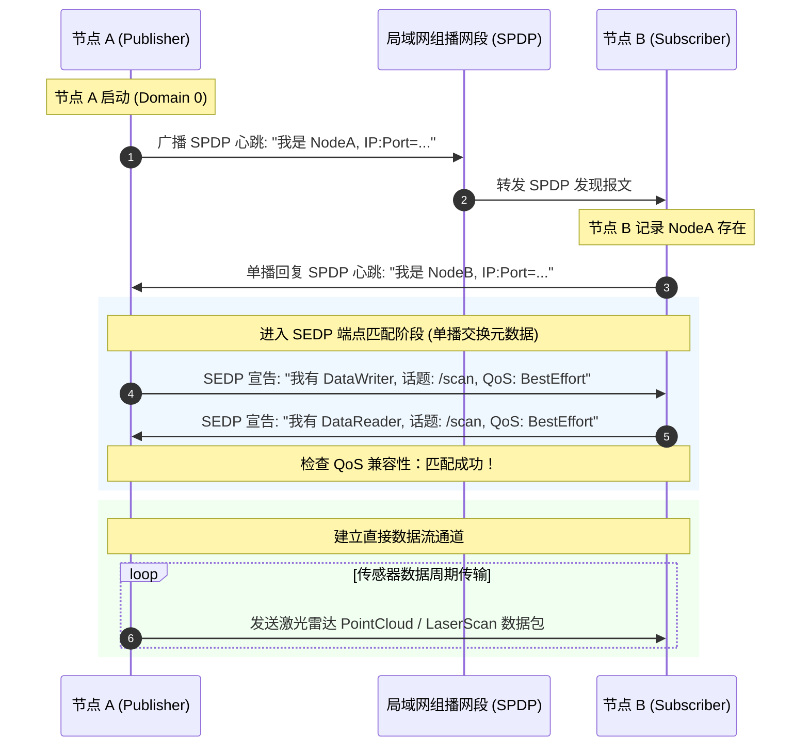

---

## 2.3 主流 RMW 中间件对比与快速切换

| 中间件 (RMW) | 供应商 / 许可 | 优势与核心特性 | 劣势 / 注意事项 | 推荐应用场景 |
| :--- | :--- | :--- | :--- | :--- |
| **Fast DDS** (`rmw_fastrtps_cpp`) | eProsima (Apache-2.0) | ROS 2 官方默认实现；功能完备，内置高性能共享内存 (SHM) 传输，支持 Discovery Server | Wi-Fi 弱网环境下组播丢包易导致发现变慢 | 默认通用机器人开发、单机仿真、高性能单机部署 |
| **Cyclone DDS** (`rmw_cyclonedds_cpp`) | Eclipse (EPL-2.0) | 架构轻量，代码精炼；对 Wi-Fi 抖动网络鲁棒性极佳，吞吐量高，延迟极低 | 共享内存配置较复杂（需配合 Iceoryx） | 自动驾驶、多机分布式系统、无线移动机器人 |
| **Connext DDS** (`rmw_connextdds`) | RTI (商业许可) | 工业/军工级认证，支持安全关键系统（ISO 26262 ASIL-D, DO-178C），调试工具集完备 | 商业收费闭源 | 航空航天、医疗手术机器人、车规级自动驾驶系统 |
| **Zenoh** (`rmw_zenoh_cpp`) | ZettaScale (Apache-2.0) | 放弃复杂 RTPS，采用极简协议；零组播风暴，天然支持跨公网/4G/5G/云边协同通信 | 仍在快速演进中，生态工具链逐步成熟 | 跨广域网（WAN）车云互联、大规模机器人集群管理 |

```bash
# 环境变量动态切换 RMW（无需重新编译代码）
export RMW_IMPLEMENTATION=rmw_cyclonedds_cpp
ros2 run my_pkg my_node

# 验证当前使用的 RMW 实现
ros2 doctor --report | grep middleware
```

---

## 2.4 多机通信与 Domain ID 隔离

为了在同一个局域网交换机下隔离不同机器人或团队的节点，ROS 2 引入了 `ROS_DOMAIN_ID`（范围 **0 ~ 101**，安全推荐范围 **0 ~ 232**）。

```bash
# 在 ~/.bashrc 中配置机器人唯一域 ID
export ROS_DOMAIN_ID=42
export ROS_LOCALHOST_ONLY=0 # 0 表示允许局域网多机通信，1 表示仅本机回环
```

> **DDS 端口计算底层公式**：
> 每个 Domain ID 占用固定区间的 UDP 端口：
> $$\text{Port} = 7400 + 250 \times \text{DomainID} + \text{Offset}$$
> 若同一个网段内多台设备设置了相同的 `ROS_DOMAIN_ID`，它们的节点将自动互联互通。

---

# 三、ROS 2 五大通信原语深度剖析与代码实践

ROS 2 将所有的软件解耦交互抽象为五种通信原语。选择正确的通信方式是系统架构设计的首要原则。

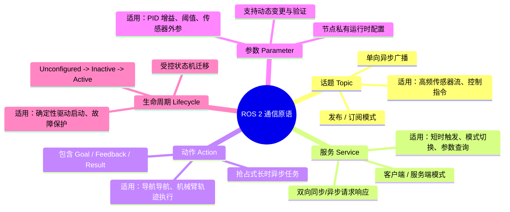

---

## 3.1 五大原语选型决策矩阵

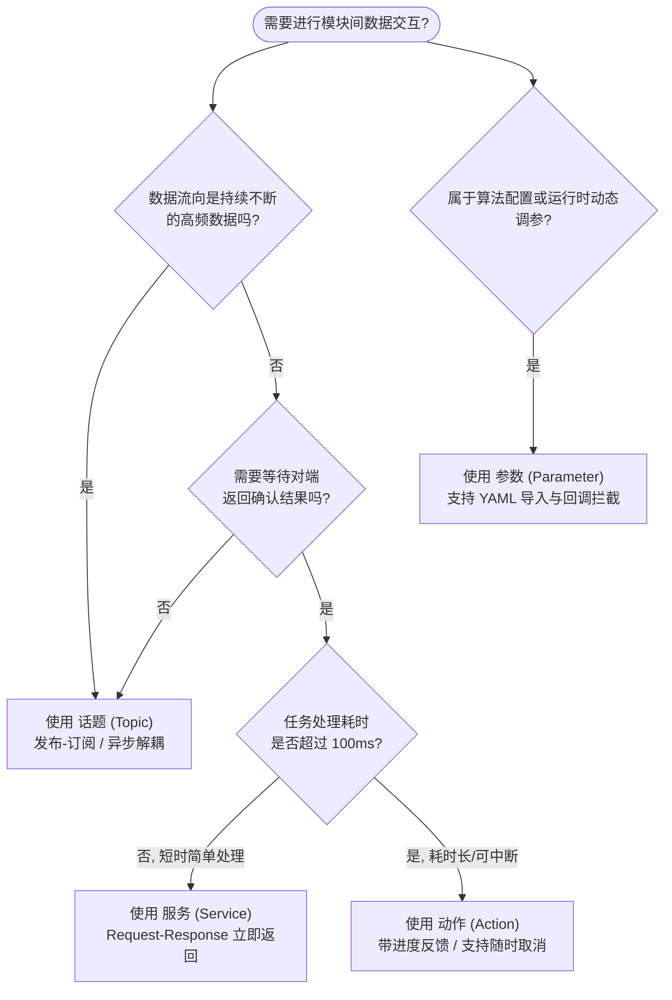

---

## 3.2 话题（Topics）：异步高频数据流

### 通信原理
话题是多对多的发布-订阅（Pub/Sub）通道。发布者将数据推送到 DDS 域中，订阅者根据 QoS 策略接收数据，双方在生命周期与网络拓扑上完全解耦。

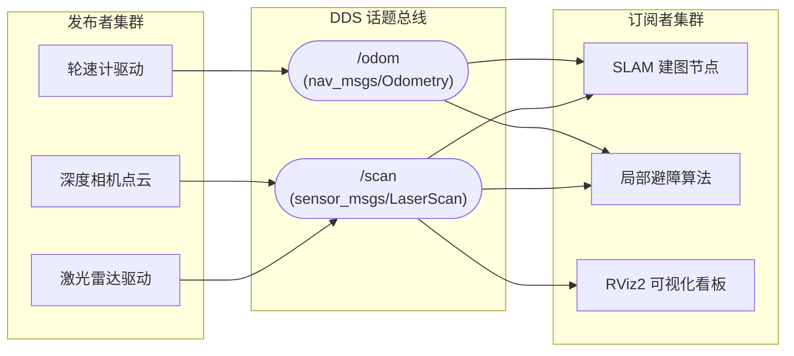

### C++17 工业级实现 (`rclcpp`)

```cpp
#include <chrono>
#include <memory>
#include <string>
#include "rclcpp/rclcpp.hpp"
#include "std_msgs/msg/string.hpp"

using namespace std::chrono_literals;

class RobustPublisher : public rclcpp::Node {
public:
    RobustPublisher() : Node("robust_publisher_node"), count_(0) {
        // 创建传感器专用的 BestEffort QoS
        rclcpp::QoS qos_profile(rclcpp::KeepLast(10));
        qos_profile.best_effort();
        qos_profile.durability_volatile();

        publisher_ = this->create_publisher<std_msgs::msg::String>("/telemetry_data", qos_profile);
        timer_ = this->create_wall_timer(100ms, std::bind(&RobustPublisher::timer_callback, this));
        
        RCLCPP_INFO(this->get_logger(), "高频发布节点已启动 (10Hz)...");
    }

private:
    void timer_callback() {
        auto message = std_msgs::msg::String();
        message.data = "Telemetry Frame #" + std::to_string(count_++);
        publisher_->publish(message);
    }

    rclcpp::TimerBase::SharedPtr timer_;
    rclcpp::Publisher<std_msgs::msg::String>::SharedPtr publisher_;
    size_t count_;
};

int main(int argc, char* argv[]) {
    rclcpp::init(argc, argv);
    rclcpp::spin(std::make_shared<RobustPublisher>());
    rclcpp::shutdown();
    return 0;
}
```

### Python 实现 (`rclpy`)

```python
#!/usr/bin/env python3
import rclpy
from rclpy.node import Node
from rclpy.qos import QoSProfile, ReliabilityPolicy, HistoryPolicy
from std_msgs.msg import String

class RobustSubscriber(Node):
    def __init__(self):
        super().__init__('robust_subscriber_node')
        
        # 定义匹配发布端的 QoS 配置
        qos = QoSProfile(
            history=HistoryPolicy.KEEP_LAST,
            depth=10,
            reliability=ReliabilityPolicy.BEST_EFFORT
        )
        
        self.subscription = self.create_subscription(
            String,
            '/telemetry_data',
            self.listener_callback,
            qos
        )
        self.get_logger().info('订阅节点已就绪，等待遥测数据...')

    def listener_callback(self, msg: String):
        self.get_logger().info(f'收到遥测帧: "{msg.data}"')

def main(args=None):
    rclpy.init(args=args)
    node = RobustSubscriber()
    try:
        rclpy.spin(node)
    except KeyboardInterrupt:
        pass
    finally:
        node.destroy_node()
        rclpy.shutdown()

if __name__ == '__main__':
    main()
```

---

## 3.3 服务（Services）：同步/异步请求-响应

### 通信原理
服务是点对点的客户端-服务端（Client/Server）通信模型。客户端发送 `Request`，服务端计算后返回 `Response`。
> **关键避坑**：在 ROS 2 中，**严禁在默认单线程 Executor 的回调函数中调用同步阻塞服务（如 `client->call()`）**，这会导致线程死锁（Deadlock）！推荐始终使用异步客户端 `call_async()`。

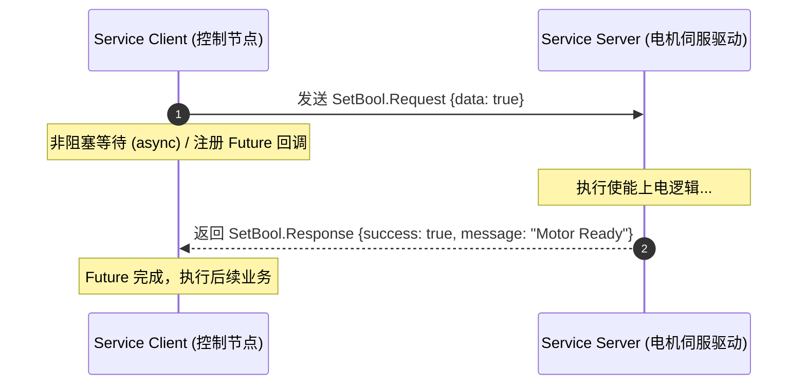

---

## 3.4 动作（Actions）：抢占式长时任务调度

### 通信原理
动作专门用于耗时较长的异步任务（如底盘导航从 A 点移动到 B 点、机械臂执行抓取）。一个 Action 由 3 个底层通信管道组合而成：
1. **Goal 管道（Service）**：客户端请求发送目标，服务端决定接受（Accept）或拒绝（Reject）。
2. **Feedback 管道（Topic）**：服务端在执行任务过程中，持续向客户端推送百分比、当前位姿等进度数据。
3. **Result 管道（Service）**：任务结束时，返回最终执行结果（成功/失败/被抢占）。
4. **Cancel 管道（Service）**：客户端可随时发起取消请求，服务端安全中断当前动作。

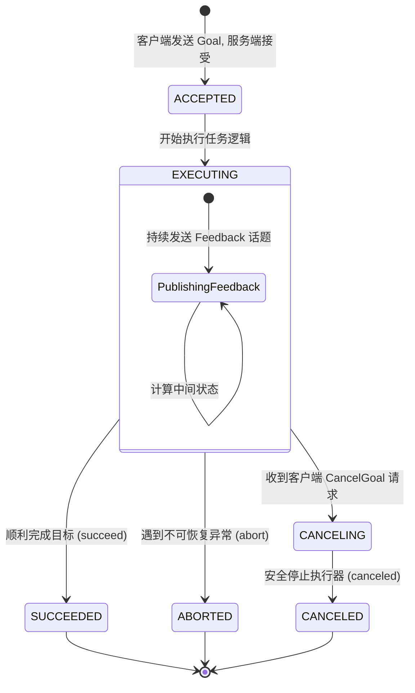

### Action 接口定义 (`nav2_msgs/action/NavigateToPose.action`)
```yaml
# 1. 目标 (Goal)
geometry_msgs/PoseStamped pose
string behavior_tree
---
# 2. 最终结果 (Result)
std_msgs/Empty result
int16 error_code
---
# 3. 实时反馈 (Feedback)
geometry_msgs/PoseStamped current_pose
builtin_interfaces/Duration navigation_time
builtin_interfaces/Duration estimated_time_remaining
int16 number_of_recoveries
float32 distance_remaining
```

---

## 3.5 参数（Parameters）：分布式节点级配置

在 ROS 2 中，参数是**绑定在具体节点实例上**的私有数据项，支持强类型校验、范围约束和动态修改回调拦截。

```cpp
// C++ 声明带描述符与动态校验的参数
rcl_interfaces::msg::ParameterDescriptor desc;
desc.description = "机器人最大线速度限制 (m/s)";
desc.floating_point_range.resize(1);
desc.floating_point_range[0].from_value = 0.0;
desc.floating_point_range[0].to_value = 2.5;
desc.floating_point_range[0].step = 0.05;

this->declare_parameter("max_linear_velocity", 1.0, desc);

// 注册动态参数变更拦截回调 (OnSetParametersCallback)
params_callback_handle_ = this->add_on_set_parameters_callback(
    [this](const std::vector<rclcpp::Parameter> &parameters) {
        rcl_interfaces::msg::SetParametersResult result;
        result.successful = true;
        for (const auto &param : parameters) {
            if (param.get_name() == "max_linear_velocity") {
                if (param.as_double() > 2.0) {
                    result.successful = false;
                    result.reason = "安全保护触发：实车线速度不可超过 2.0 m/s";
                } else {
                    RCLCPP_INFO(this->get_logger(), "速度上限更新为: %.2f", param.as_double());
                }
            }
        }
        return result;
    }
);
```

---

# 四、服务质量策略（QoS）：精细化通信控制

QoS（Quality of Service）是 ROS 2 区别于 ROS 1 最强大的通信特性，允许针对不同的数据流特征精确配置底层的传输行为。

## 4.1 核心 QoS 策略深度解析

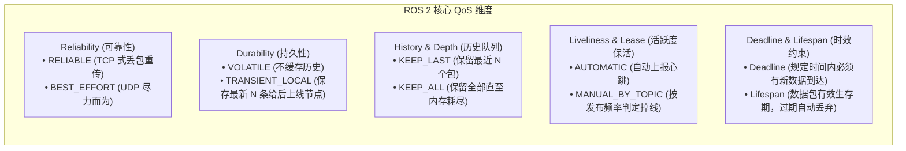

---

## 4.2 QoS 兼容性匹配规则（Compatibility Rules）

> **⚠️ 工业级避坑准则：Request vs. Offer 原则**
> 发布端提供（Offered）的 QoS 服务质量，必须 **大于或等于** 订阅端请求（Requested）的 QoS 质量，否则 DDS 底层将**静默拒绝建立连接**，导致没有任何报错提示却无法接收数据！

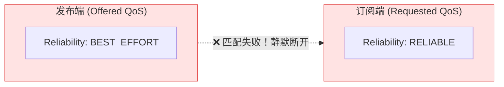

### 核心兼容矩阵：

| 发布者 (Offered) | 订阅者 (Requested) | 匹配结果 | 说明 |
| :--- | :--- | :---: | :--- |
| **RELIABLE** | **RELIABLE** | ✅ **兼容** | 全链路可靠传输（丢包自动重发） |
| **RELIABLE** | **BEST_EFFORT** | ✅ **兼容** | 发布者可提供高保证，订阅者降级接收 |
| **BEST_EFFORT** | **BEST_EFFORT** | ✅ **兼容** | 尽力传输，低延时，允许丢包 |
| **BEST_EFFORT** | **RELIABLE** | ❌ **不兼容** | 订阅者要求可靠，但发布者无法保证，**无法通信** |
| **TRANSIENT_LOCAL** | **VOLATILE** | ✅ **兼容** | 订阅者不需要历史数据，正常接收实时数据 |
| **VOLATILE** | **TRANSIENT_LOCAL** | ❌ **不兼容** | 订阅者需要历史地图，但发布者未缓存，**无法通信** |

---

## 4.3 典型场景标准 QoS 配置模板

| 场景应用 | Reliability | Durability | History (Depth) | 设计考量 |
| :--- | :--- | :--- | :--- | :--- |
| **高频原始相机图像 / 激光雷达** (`/image_raw`, `/scan`) | `BEST_EFFORT` | `VOLATILE` | `KEEP_LAST (1~5)` | 追求极低延迟，丢掉一帧老旧图像无影响，避免队列积压 |
| **底盘控制指令** (`/cmd_vel`) | `RELIABLE` | `VOLATILE` | `KEEP_LAST (10)` | 控制指令必须准确送达，禁止丢帧造成失控 |
| **静态地图 / 参数事件** (`/map`, `/robot_description`) | `RELIABLE` | `TRANSIENT_LOCAL` | `KEEP_LAST (1)` | 类似 ROS 1 的 Latch 机制，后启动的 SLAM/Nav2 节点一上线即可获得全量地图 |
| **高可靠状态报警** (`/emergency_stop`) | `RELIABLE` | `TRANSIENT_LOCAL` | `KEEP_ALL` | 急停与故障事件绝不允许丢失 |

---

# 五、执行器、回调组与零拷贝 IPC 机制

## 5.1 ROS 2 执行器（Executors）调度模型

在 ROS 2 中，回调函数（Timer、Subscription、Service Server、Action）不会自动在后台线程中执行，而是由 **Executor（执行器）** 从底层 WaitSet 中轮询就绪事件并调度执行。

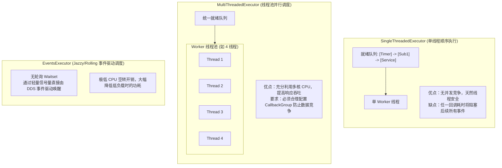

---

## 5.2 回调组（Callback Groups）与死锁防范

为了在 `MultiThreadedExecutor` 中精细控制并发权限，ROS 2 提供了两类回调组：

1. **`MutuallyExclusiveCallbackGroup`（互斥组，默认）**：该组内的所有回调函数在同一时刻只能有一个线程在执行。
2. **`ReentrantCallbackGroup`（可重入组）**：组内的不同回调（甚至同一个回调的多次触发）可以被多个线程并行执行。

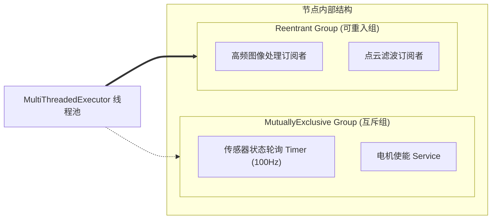

> **经典死锁场景与解决方案**：
> 若在某订阅者回调内部同步等待另一个服务响应，而两者同属于默认的 `MutuallyExclusiveCallbackGroup` 且运行在单线程 Executor 下，订阅者占用线程等待服务，服务由于无法获取线程而永远无法执行，形成**永久死锁**。
> **解法**：
> 1. 将服务与订阅者分配到不同的 `CallbackGroup`。
> 2. 将节点挂载到 `MultiThreadedExecutor` 下。
> 3. 改用非阻塞的 `call_async()`。

---

## 5.3 组件化（Components）与进程内零拷贝通信（IPC）

传统多节点系统采用多进程模型，节点间的数据传递需要经历：**用户态内存 $\to$ 序列化 $\to$ 内核 Socket $\to$ 反序列化 $\to$ 目标用户态内存**，在 4K 图像或 3D 激光点云（每秒数百兆字节）场景下会导致极高的 CPU 与内存带宽开销。

ROS 2 的 **Component（组件）** 技术允许将多个独立开发的 Node 编译为动态链接库（`.so` / `.dll`），并在运行时动态加载进同一个 `ComposableNodeContainer` 进程中。配合 `std::unique_ptr` 传递，实现**指针所有权转移的零拷贝（Zero-Copy IPC）**。

```mermaid
flowchart TB
    subgraph Traditional["传统跨进程通信 (IPC with Serialization)"]
        P1["节点 A (Camera Driver)"] -->|"1. 序列化数据"| K["OS Kernel Socket / DDS"]
        K -->|"2. 跨进程拷贝 + 反序列化"| P2["节点 B (YOLO Detect)"]
    end

    subgraph ZeroCopy["组件化容器 + 借用指针零拷贝 (Zero-Copy Transfer)"]
        subgraph Container["ComposableNodeContainer (单进程空间)"]
            C1["CameraComponent"]
            C2["DetectComponent"]
            C1 ==="直接传递 std::unique_ptr 指针<br/>(耗时 < 1 微秒，零内存拷贝！)"===> C2
        end
    end
```

### C++ 零拷贝发布端规范代码

```cpp
#include "rclcpp/rclcpp.hpp"
#include "sensor_msgs/msg/point_cloud2.hpp"

class ZeroCopyPointCloudPublisher : public rclcpp::Node {
public:
    explicit ZeroCopyPointCloudPublisher(const rclcpp::NodeOptions & options)
    : Node("zero_copy_publisher", options) {
        // 创建发布者，必须传入 NodeOptions 中开启的 IPC 支持
        pub_ = this->create_publisher<sensor_msgs::msg::PointCloud2>("/points", 10);
        timer_ = this->create_wall_timer(33ms, std::bind(&ZeroCopyPointCloudPublisher::publish_cloud, this));
    }

private:
    void publish_cloud() {
        // 使用 unique_ptr 构造独占所有权的消息
        auto cloud_msg = std::make_unique<sensor_msgs::msg::PointCloud2>();
        
        // 填充大型点云数据 buffer ...
        cloud_msg->header.stamp = this->now();
        cloud_msg->header.frame_id = "lidar_frame";
        cloud_msg->width = 1920;
        cloud_msg->height = 1080;
        cloud_msg->data.resize(cloud_msg->width * cloud_msg->height * 16);

        // 使用 std::move 转移所有权，触发底层进程内指针直接交换
        pub_->publish(std::move(cloud_msg));
    }

    rclcpp::Publisher<sensor_msgs::msg::PointCloud2>::SharedPtr pub_;
    rclcpp::TimerBase::SharedPtr timer_;
};
```

---

# 六、受控确定性：生命周期节点（Lifecycle Nodes）

在工业级机器人系统中，节点随意启动可能会引发灾难性事故（如导航算法在激光雷达或底盘驱动尚未完成参数校验与校准前便发布了速度指令）。ROS 2 引入了符合 ISO 标准的 **Lifecycle Node（生命周期受管节点）**。

## 6.1 生命周期有限状态机

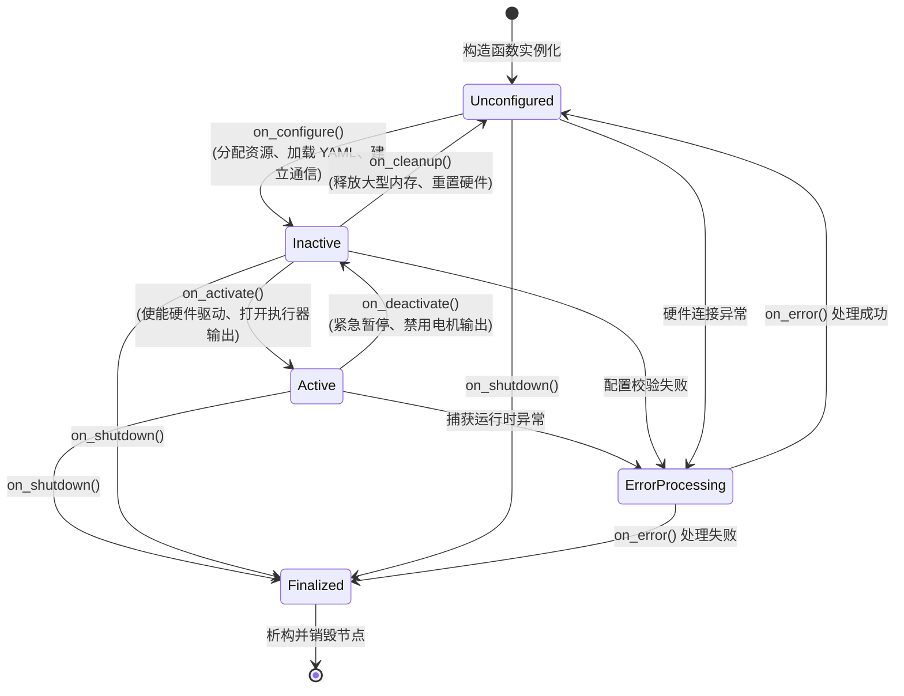

### 核心状态语义：
- **`Unconfigured`（未配置）**：节点已加载，但未读取参数，未连接硬件设备。
- **`Inactive`（非活动）**：配置已加载，Publisher 与 Subscriber 已建立，但 Publisher 处于静默状态（不向 DDS 广播任何消息），执行器被挂起。
- **`Active`（活动状态）**：系统正常运转，所有回调激活，执行主控制循环。
- **`Finalized`（终结状态）**：资源完全释放，准备退出进程。

---

# 七、坐标变换引擎：TF2 深度解析

机器人系统中存在大量的几何坐标系（世界系、底盘系、雷达系、机械臂末端系、相机光学系）。**TF2（Transform Library 2）** 负责维护整个机器人全生命周期内的**时空变换树（Transform Tree）**。

## 7.1 机器人标准坐标系规范（REP 105 & REP 103）

根据 ROS 官方规范 **REP 105**，移动机器人必须严格遵循树状单父级拓扑：

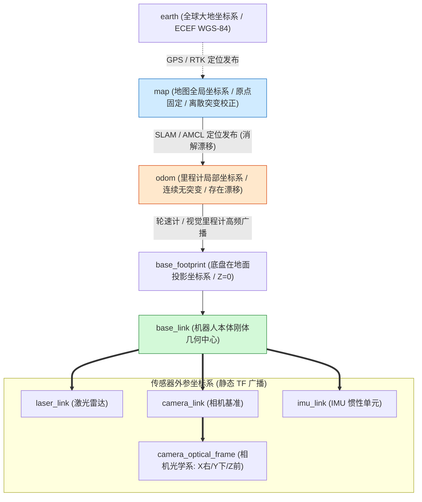

- **REP 103 坐标轴定义约定**：
  - 机器人本体：**FLU（Forward-Left-Up）**：$X$ 轴向前，$Y$ 轴向左，$Z$ 轴向上。
  - 相机光学坐标系：**RDF（Right-Down-Forward）**：$X$ 轴向右，$Y$ 轴向下，$Z$ 轴向前（视线方向）。

---

## 7.2 动态 TF (`/tf`) vs 静态 TF (`/tf_static`)

- **`/tf`（动态变换）**：以固定频率（如 50Hz）广播不断变化的相对位姿（如 `odom -> base_link`）。
- **`/tf_static`（静态外参）**：仅在系统启动或传感器外参标定完成时广播一次，底层采用 `TRANSIENT_LOCAL` QoS 持久化保存，**极大地节约了 CPU 计算与 DDS 广播带宽**。

```cpp
// C++ 监听并查询任意两个坐标系在历史某一时刻的变换关系
#include "tf2_ros/buffer.h"
#include "tf2_ros/transform_listener.h"

auto tf_buffer = std::make_unique<tf2_ros::Buffer>(this->get_clock());
auto tf_listener = std::make_shared<tf2_ros::TransformListener>(*tf_buffer);

try {
    // 阻塞最多 100ms 查询 map 到 laser_link 的最新变换
    geometry_msgs::msg::TransformStamped transform = tf_buffer->lookupTransform(
        "map", "laser_link",
        tf2::TimePointZero,
        std::chrono::milliseconds(100)
    );
    RCLCPP_INFO(this->get_logger(), "雷达在地图上的全局坐标: x=%.2f, y=%.2f",
                transform.transform.translation.x, transform.transform.translation.y);
} catch (const tf2::TransformException & ex) {
    RCLCPP_WARN(this->get_logger(), "TF 变换查询失败: %s", ex.what());
}
```

---

# 八、机器人建模与描述：URDF 与 Xacro

## 8.1 机器人描述体系

- **URDF（Unified Robot Description Format）**：采用 XML 描述机器人的连杆（Link）、关节（Joint）、物理碰撞体与惯性张量。
- **Xacro（XML Macros）**：针对 URDF 不支持变量、宏、包含与数学运算的缺陷演进而来，是现代机器人建模的标准方式。

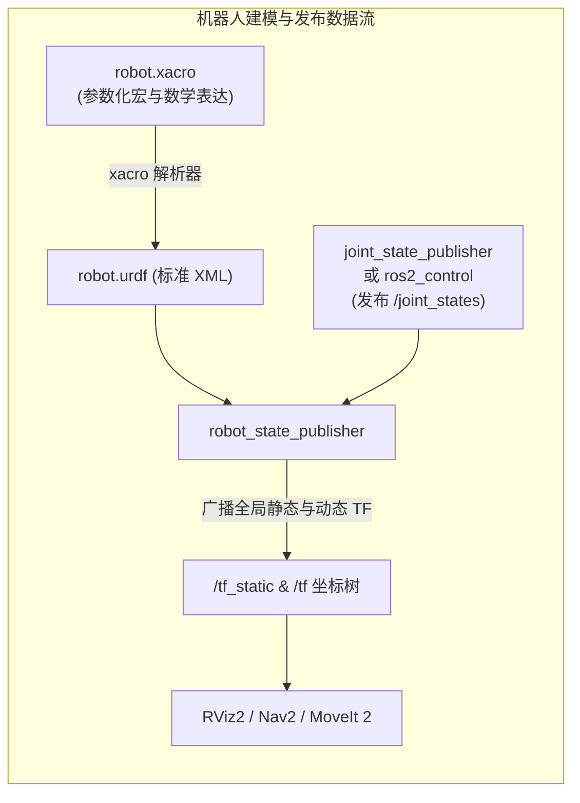

---

## 8.2 工业级 Xacro 参数化宏示例

```xml
<?xml version="1.0"?>
<robot xmlns:xacro="http://www.ros.org/wiki/xacro" name="industrial_diff_bot">

  <!-- 常量定义 -->
  <xacro:property name="wheel_radius" value="0.10" />
  <xacro:property name="wheel_width" value="0.05" />
  <xacro:property name="wheel_mass" value="2.5" />
  <xacro:property name="track_width" value="0.45" />

  <!-- 宏：参数化定义动力驱动轮 -->
  <xacro:macro name="drive_wheel" params="prefix side_sign">
    <link name="${prefix}_wheel_link">
      <visual>
        <origin xyz="0 0 0" rpy="${pi/2} 0 0"/>
        <geometry>
          <cylinder radius="${wheel_radius}" length="${wheel_width}"/>
        </geometry>
        <material name="black"><color rgba="0.1 0.1 0.1 1.0"/></material>
      </visual>
      <collision>
        <origin xyz="0 0 0" rpy="${pi/2} 0 0"/>
        <geometry>
          <cylinder radius="${wheel_radius}" length="${wheel_width}"/>
        </geometry>
      </collision>
      <inertial>
        <mass value="${wheel_mass}"/>
        <inertia ixx="${(wheel_mass/12.0)*(3*wheel_radius*wheel_radius + wheel_width*wheel_width)}" 
                 iyy="${(wheel_mass/12.0)*(3*wheel_radius*wheel_radius + wheel_width*wheel_width)}" 
                 izz="${(wheel_mass/2.0)*(wheel_radius*wheel_radius)}" 
                 ixy="0.0" ixz="0.0" iyz="0.0"/>
      </inertial>
    </link>

    <joint name="${prefix}_wheel_joint" type="continuous">
      <parent link="base_link"/>
      <child link="${prefix}_wheel_link"/>
      <origin xyz="0 ${side_sign * track_width / 2.0} 0" rpy="0 0 0"/>
      <axis xyz="0 1 0"/>
    </joint>
  </xacro:macro>

  <!-- 实例化左右轮 -->
  <xacro:drive_wheel prefix="left" side_sign="1" />
  <xacro:drive_wheel prefix="right" side_sign="-1" />

</robot>
```

---

# 九、ROS 2 现代仿真与数字孪生平台

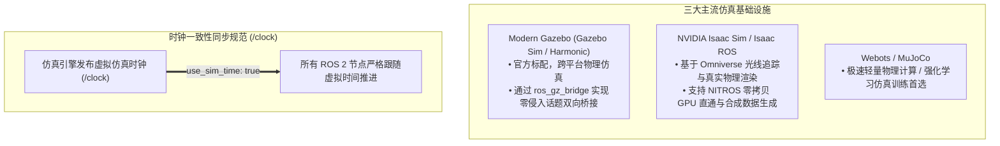

> **仿真时间避坑核心**：
> 在仿真运行或 Rosbag 离线数据回放时，所有算法节点必须显式设置参数：`use_sim_time: true`，否则节点将读取宿主机真实系统时钟，导致 TF 插值因时间戳漂移而发生致命回溯错误（`ExtrapolationException`）。

---

# 十、ROS 2 顶级核心生态栈精讲

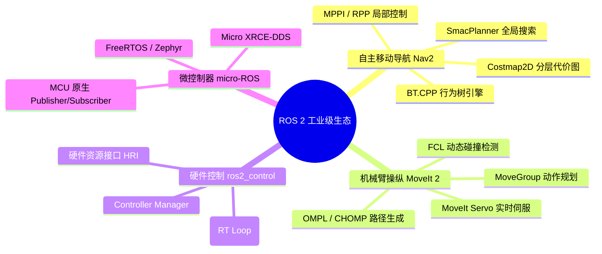

---

## 10.1 Nav2 (Navigation 2) 自主移动导航栈

Nav2 是 ROS 2 官方打造的第二代自主移动机器人导航系统，重构了 ROS 1 navigation 的整体架构，完全基于**行为树（BehaviorTree.CPP）**与**生命周期管理器（LifecycleManager）**实现。

```mermaid
flowchart TB
    subgraph Nav2_Architecture["Nav2 核心架构全景"]
        direction TB
        BT_Nav["Behavior Tree Navigator (任务决策与全局逻辑调度)"]
        
        subgraph Planners["规划层 (Planners)"]
            GP["SmacPlanner (2D / Hybrid-A* / State Lattice)"]
            NavFn["NavFn (Dijkstra / A*)"]
        end

        subgraph Controllers["控制跟踪层 (Controllers)"]
            MPPI["MPPI Controller (模型预测路径积分控制)"]
            RPP["Regulated Pure Pursuit (纯路径跟踪)"]
            DWB["DWB (动态窗口改进版)"]
        end

        subgraph Costmaps["分层代价地图 (Costmap 2D)"]
            StaticL["Static Layer (静态地图层)"]
            ObstacleL["Obstacle / Voxel Layer (实时激光/深度点云障碍)"]
            InflationL["Inflation Layer (安全膨胀半径)"]
            SemanticL["Costmap Filters (禁行区 / 减速区 / 保持车道)"]
        end

        subgraph Recoveries["异常恢复层 (Recovery / Behaviors)"]
            Spin["Spin (原位旋转找路)"]
            BackUp["BackUp (安全倒车)"]
            ClearMap["ClearEntireCostmap (清除幽灵障碍)"]
        end

        BT_Nav --> Planners
        BT_Nav --> Controllers
        BT_Nav --> Recoveries
        Planners & Controllers <===> Costmaps
    end

    GoalIn[/导航目标 /goal_pose/] --> BT_Nav
    SensorsIn[/激光雷达 / 点云 /] --> Costmaps
    Controllers -->|发布线速度与角速度| CmdVel[/cmd_vel 输出到底盘驱动/]
```

### Nav2 核心控制器深度对比：
1. **MPPI（Model Predictive Path Integral）**：当前工业界与学界首选。基于 GPU/CPU 高并发批量采样轨迹进行成本打分，擅长应对复杂的非全向移动机器人、阿克曼差速底盘，具备极强的避障敏捷性。
2. **Regulated Pure Pursuit (RPP)**：专为商用 AGV/AMR 设计，严格依附参考路径，根据路径曲率与障碍物距离自动平滑减速，运行极其稳健。

---

## 10.2 MoveIt 2：现代机械臂运动规划框架

MoveIt 2 专为多自由度机械臂（6-DOF / 7-DOF 串联臂、双臂机器人、人形机器人上半身）提供运动学求解、轨迹规划与实时碰撞检测。

```mermaid
flowchart LR
    subgraph MoveIt2["MoveIt 2 核心模块"]
        MG["MoveGroup 核心调度器"]
        IK["逆运动学求解器<br/>(KDL / TRAC-IK / PickNik Kineo)"]
        Plan["规划器算法库<br/>(OMPL: RRTConnect, BIT* / Pilz 工业直线圆弧)"]
        Coll["环境碰撞检测<br/>(FCL / Bullet 碰撞网格检测)"]
        Servo["MoveIt Servo<br/>(支持手柄 / 视觉闭环的微秒级实时伺服控制)"]
    end

    UserApp["用户应用 / 抓取流水线"] --> MG
    SensorCloud["3D 点云相机 / OctoMap"] --> Coll
    MG --> IK & Plan & Coll
    Servo ==>|"实时关节位置/速度指令"| RosControl["ros2_control 底层驱动"]
```

---

## 10.3 ros2_control：工业级实时硬件抽象与控制层

`ros2_control` 彻底规范了机器人硬件驱动编写标准。它将**实时控制循环（Hard Real-Time Loop，如 1000Hz）** 与 **非实时 ROS 异步通信**完全解耦，确保电机不会因 ROS 消息阻塞而发生失控打飞。

```mermaid
flowchart TB
    subgraph RealTimeLoop["硬实时控制循环 (1000Hz Deterministic Loop)"]
        CM["Controller Manager (控制器管理器)"]
        
        subgraph LoadedControllers["激活的控制器插件"]
            JTC["JointTrajectoryController (轨迹跟踪)"]
            DiffDrive["DiffDriveController (差速底盘)"]
            Effort["EffortControllers (力矩重力补偿)"]
        end

        subgraph HardwareInterface["硬件资源抽象接口 (HRI)"]
            SystemIF["SystemInterface (完整机器人)"]
            ActuatorIF["ActuatorInterface (单轴电机)"]
            SensorIF["SensorInterface (力矩/IMU 传感器)"]
        end

        HardwareDriver["硬件驱动层 (CANopen / EtherCAT / Serial / SocketCAN)"]

        CM --> LoadedControllers
        LoadedControllers --> HardwareInterface
        HardwareInterface -->|"read() / write() 虚函数"| HardwareDriver
    end

    HardwareDriver <===> Motors["物理电机 / 编码器反馈 / 关节驱动器"]
    ROS_Interfaces["ROS 2 话题 / 动作接口 (/joint_trajectory)"] <===> CM
```

---

# 十一、工程实战：构建、系统编排与数据闭环

## 11.1 现代化构建工具：`colcon` 核心命令全集

```bash
# 1. 基础完整构建
colcon build --symlink-install

# 2. 核心加速参数（强烈推荐日常开发使用）：
colcon build \
  --symlink-install \                    # 创建符号链接，修改 Python 代码与配置文件无需重新 build
  --packages-select my_robot_control \   # 仅编译指定包，大幅节约多核编译时间
  --cmake-args -DCMAKE_BUILD_TYPE=Release \ # 开启 Release 优化 (-O3)
  --parallel-workers 8                  # 限制并发编译线程数，防止 100% 满载卡死宿主机

# 3. 编译后必须加载 overlay 环境
source install/setup.bash
```

---

## 11.2 Python Launch 系统高级编排

ROS 2 的 Launch 文件完全采用 Python 编写，具备强大的条件分支、事件监听与参数透传能力。

```python
import os
from ament_index_python.packages import get_package_share_directory
from launch import LaunchDescription
from launch.actions import DeclareLaunchArgument, IncludeLaunchDescription, GroupAction
from launch.conditions import IfCondition
from launch.substitutions import LaunchConfiguration, PythonExpression
from launch_ros.actions import Node, PushRosNamespace

def generate_launch_description():
    pkg_bringup = get_package_share_directory('my_robot_bringup')
    
    # 声明启动参数
    use_sim_time_arg = DeclareLaunchArgument('use_sim_time', default_value='false', description='Use simulation clock')
    enable_rviz_arg = DeclareLaunchArgument('use_rviz', default_value='true', description='Open RViz2')

    # 包含子 launch 文件
    nav2_launch = IncludeLaunchDescription(
        os.path.join(pkg_bringup, 'launch', 'navigation.launch.py'),
        launch_arguments={'use_sim_time': LaunchConfiguration('use_sim_time')}.items()
    )

    # 声明条件启动节点
    rviz_node = Node(
        package='rviz2',
        executable='rviz2',
        name='rviz2',
        arguments=['-d', os.path.join(pkg_bringup, 'rviz', 'default.rviz')],
        parameters=[{'use_sim_time': LaunchConfiguration('use_sim_time')}],
        condition=IfCondition(LaunchConfiguration('use_rviz'))
    )

    return LaunchDescription([
        use_sim_time_arg,
        enable_rviz_arg,
        nav2_launch,
        rviz_node
    ])
```

---

## 11.3 Rosbag2：现代化录制与数据闭环工作流

```bash
# 1. 录制全量话题（排除体积庞大的未压缩原始图像，节约 SSD 带宽）
ros2 bag record -a -x "/camera/(.*)/image_raw" -s mcap -o my_experiment_bag

# 2. 查询录包元信息（帧率、丢包率、时间跨度、消息总数）
ros2 bag info my_experiment_bag.mcap

# 3. 0.5 倍速慢放回放（带仿真时钟发布，方便离线单步调试算法）
ros2 bag play my_experiment_bag.mcap --rate 0.5 --clock 50
```

---

# 十二、工业级多机分布式部署、网络调优与安全规范

## 12.1 Wi-Fi 弱网与多机 DDS 网络深度调优指南

在大规模机器人车队（Fleet Management）与多机协同场景中，Wi-Fi 组播容易出现风暴或丢包。推荐以下调优策略：

```mermaid
flowchart TB
    subgraph MultiRobotFleet["多机通信拓扑与 Discovery Server 架构"]
        DS["DDS 发现服务器 (Discovery Server / 固定 IP:Port)<br/>(消除局域网内任意组播数据包)"]
        R1["机器人 1 (AGV-01)<br/>Fast DDS Client"] -->|TCP/UDP 单播注册| DS
        R2["机器人 2 (AGV-02)<br/>Fast DDS Client"] -->|TCP/UDP 单播注册| DS
        PC["地面站调度中心 (Fleet Central)<br/>Fast DDS Client"] -->|TCP/UDP 单播注册| DS
    end
```

### 1. Linux 内核网络接收/发送缓冲区扩容（防止高并发点云丢包）
```bash
sudo sysctl -w net.core.rmem_max=2147483647
sudo sysctl -w net.core.wmem_max=2147483647
sudo sysctl -w net.ipv4.ipfrag_time=3
sudo sysctl -w net.ipv4.ipfrag_high_thresh=134217728
```

### 2. Fast DDS Discovery Server 生产级启动规范
```bash
# 在调度服务器或主机上启动发现服务器 (ID: 0, 端口 11811)
fastdds discovery -i 0 -p 11811

# 在所有机器人终端配置单播发现环境变量（无需任何组播支持！）
export ROS_DISCOVERY_SERVER="192.168.1.100:11811"
```

---

## 12.2 SROS2：机器人端到端安全防御体系

针对黑客嗅探、未授权节点接入与恶意篡改控制指令（如伪造 `/cmd_vel`），ROS 2 提供了基于 **DDS-Security** 的 **SROS2** 工业级安全套件。

```mermaid
flowchart LR
    subgraph SROS2_Security["SROS2 三大安全防御基石"]
        Auth["1. 身份认证 (Authentication)<br/>基于 X.509 PKI 数字证书，严格验明节点身份"]
        Access["2. 访问控制 (Access Control)<br/>基于 XML 策略签名，精确限制每个 Node 可 Pub/Sub 的 Topic 权限"]
        Crypt["3. 链路加密 (Cryptographic Encryption)<br/>基于 AES-GCM-256 全链路数据加密与防篡改校验"]
    end
```

```bash
# 生成安全根证书密钥库 (Keystore)
ros2 security create_keystore ~/sros2_keystore

# 为特定节点生成独占数字证书与访问策略
ros2 security create_enclave ~/sros2_keystore /my_secure_controller

# 启用安全模式运行节点
export ROS_SECURITY_ENABLE=true
export ROS_SECURITY_STRATEGY=Enforce
export ROS_SECURITY_KEYSTORE=~/sros2_keystore
ros2 run my_robot_pkg controller_node --ros-args --enclave /my_secure_controller
```

---

## 12.3 工业级生产部署：Systemd 守护进程与看门狗

将机器人启动栈托管为 Linux 系统守护服务，实现**开机自启、崩溃自动拉起与日志轮转**：

```ini
# /etc/systemd/system/robot_bringup.service
[Unit]
Description=Autonomous Mobile Robot Auto Bringup Service
After=network.target network-online.target systemd-timesyncd.service
Wants=network-online.target

[Service]
Type=simple
User=robot
Group=robot
Environment="ROS_DOMAIN_ID=42"
Environment="RMW_IMPLEMENTATION=rmw_cyclonedds_cpp"
ExecStart=/bin/bash -c "source /opt/ros/humble/setup.bash && source /home/robot/ros2_ws/install/setup.bash && ros2 launch my_robot_bringup full_system.launch.py"
Restart=always
RestartSec=3
KillSignal=SIGINT
TimeoutStopSec=10

[Install]
WantedBy=multi-user.target
```

```bash
# 加载并使能开机自启
sudo systemctl daemon-reload
sudo systemctl enable robot_bringup.service
sudo systemctl start robot_bringup.service
```

---

# 十三、ROS 2 常用 CLI 命令终极分类速查卡

```bash
# -------------------------------------------------------------
# 1. 节点排查 (Node)
# -------------------------------------------------------------
ros2 node list                                # 列出当前活跃节点
ros2 node info /my_node                       # 打印节点的完整发布、订阅、服务、Action 接口

# -------------------------------------------------------------
# 2. 话题调试 (Topic)
# -------------------------------------------------------------
ros2 topic list -t                            # 列出话题及对应的消息类型
ros2 topic echo /scan --no-arr                # 打印话题内容（截断大型数组，防止刷屏）
ros2 topic hz /scan                           # 实时测量话题发布频率
ros2 topic bw /camera/image_raw               # 测量话题带宽消耗 (MB/s)
ros2 topic delay /odom                        # 测量消息传输延迟 (需包含 header.stamp)
ros2 topic info -v /cmd_vel                   # 打印话题详细 QoS 策略（排查 QoS 匹配失败）
ros2 topic pub /cmd_vel geometry_msgs/msg/Twist "{linear: {x: 0.2}}" -r 10 # 10Hz 发送测试指令

# -------------------------------------------------------------
# 3. 服务与动作调用 (Service & Action)
# -------------------------------------------------------------
ros2 service list -t                          # 列出服务及类型
ros2 service call /reset_odom std_srvs/srv/Empty {} # 触发服务
ros2 action send_goal /navigate_to_pose nav2_msgs/action/NavigateToPose \
  "{pose: {header: {frame_id: 'map'}, pose: {position: {x: 1.0, y: 2.0}}}}" --feedback

# -------------------------------------------------------------
# 4. 参数热更新 (Parameter)
# -------------------------------------------------------------
ros2 param list /planner_node                 # 查看指定节点的参数
ros2 param get /planner_node max_speed        # 读取参数值
ros2 param set /planner_node max_speed 1.5    # 运行时动态修改参数值
ros2 param dump /planner_node > params.yaml   # 导出节点参数为 YAML 文件

# -------------------------------------------------------------
# 5. TF2 坐标变换诊断 (TF2)
# -------------------------------------------------------------
ros2 run tf2_tools view_frames                # 生成 frames.pdf 坐标系全景拓扑图
ros2 run tf2_ros tf2_echo map base_link       # 实时打印两个坐标系间的相对位姿
ros2 run tf2_ros tf2_monitor                  # 监控所有坐标变换的广播频率与延迟

# -------------------------------------------------------------
# 6. 系统自检与包管理 (System & Pkg)
# -------------------------------------------------------------
ros2 doctor --report                          # 扫描网络配置、DDS 状态并输出体检报告
rosdep install --from-paths src --ignore-src -r -y # 一键自动安装工作空间源码缺失的所有系统依赖
```

---

# 十四、总结与权威参考资料

ROS 2 的设计哲学是**以数据为中心（Data-Centric）、高度模块化（Modular）、工业级可靠（Industrial Grade）与确定性实时（Deterministic Real-Time）**。通过标准化的 DDS 传输总线、受管生命周期节点、组件化零拷贝 IPC 以及强大的生态栈（Nav2、MoveIt 2、ros2_control），ROS 2 已经成为现代机器人软件工程师与算法研究员不可或缺的行业标准基础设施。

```mermaid
flowchart LR
    subgraph Mindset["掌握 ROS 2 核心认知模型"]
        direction TB
        M1["DDS 总线解耦底层传输"]
        M2["QoS 精细化掌控通信可靠性"]
        M3["Component 容器实现高性能零拷贝"]
        M4["Lifecycle 节点确保系统确定性启动"]
        M5["Nav2 / MoveIt2 / ros2_control 赋能上层业务"]
        M1 ==> M2 ==> M3 ==> M4 ==> M5
    end
```

---

> ### 📚 权威参考与延伸阅读
> 1. **ROS 2 官方设计白皮书**：[ROS 2 Design Documents (design.ros2.org)](https://design.ros2.org/)
> 2. **ROS 2 官方主线文档**：[ROS 2 Documentation (Humble / Jazzy)](https://docs.ros.org/en/humble/)
> 3. **OMG DDS 核心规范**：[Object Management Group - Data Distribution Service v1.4](https://www.omg.org/spec/DDS/)
> 4. **Nav2 官方架构与实战手册**：[Navigation 2 Architecture & Guides](https://nav2.org/)
> 5. **MoveIt 2 机械臂开发文档**：[MoveIt 2 Documentation](https://moveit.picknik.ai/)
> 6. **ros2_control 控制体系规范**：[ros2_control Framework Documentation](https://control.ros.org/)
> 7. **eProsima Fast DDS 技术手册**：[eProsima Fast DDS User Manual](https://fast-dds.docs.eprosima.com/)
> 8. **ROS Enhancement Proposals (REPs)**：
>    - [REP 103: Standard Units of Measure & Coordinate Conventions](https://www.ros.org/reps/rep-0103.html)
>    - [REP 105: Coordinate Frames for Mobile Robots](https://www.ros.org/reps/rep-0105.html)
>    - [REP 2000: ROS 2 Releases and Target Platforms](https://www.ros.org/reps/rep-2000.html)
>    - [REP 2007: Type Adaptation & Type Masquerading](https://www.ros.org/reps/rep-2007.html)
