# 1. 引言

视觉-语言模型（Vision-Language Model, VLM）是一类能够同时理解图像和文本的多模态模型，是当前人工智能研究的核心方向之一。VLM的核心挑战在于：如何将视觉信号与语言信号有效地对齐和融合，使模型能够在两种模态之间自由地推理和生成。

从早期基于注意力机制的跨模态对齐，到CLIP提出的对比学习范式，再到以LLaVA、Flamingo为代表的"视觉编码器 + 语言模型"架构，VLM的技术路线不断演进。近年来，随着大语言模型能力的跃升，GPT-4V、Gemini、Qwen-VL等闭源或开源模型相继涌现，展现了强大的视觉理解与推理能力。

VLM在医疗图像分析、自动驾驶、机器人感知、内容审核等领域有着广泛的应用前景。视觉理解能力是VLA（视觉-语言-动作）模型和具身智能系统的基础，VLM研究的突破直接推动了下游具身任务的进步。

<div align="center">
  
  <figcaption>图 1.1：视觉-语言模型（VLM）视觉编码、模态对齐与 LLM 跨模态融合架构示意图</figcaption>
</div>

本文围绕三个问题展开：**视觉信息如何进入语言模型，模型如何通过训练学会使用这些信息，以及如何验证它确实看懂了输入。** 第 2～4 章建立原理框架，第 5～7 章连接任务、训练与评测，第 8 章提供代表论文的详细解读。

> 💡 **知识体系与关联阅读**：
> 本篇聚焦于**通用视觉-语言基座模型（2D 图像/视频理解、特征提取架构与多模态对齐训练工程）**。
> 若您关注 **3D 点云、NeRF/3DGS 神经重建、3D 视觉定位与空间几何推理（3D-LLM / Spatial VLM / 具身感知）**，请阅读兄弟篇综述：[《空间智能综述：从三维感知到空间推理》](/Spatial-Intelligence-Survey/)。

<!-- more -->

**阅读导航**

| 阅读目标 | 建议路线 | 重点问题 |
|---|---|---|
| 建立整体认识 | [基本概述](#vlm-basics) → [核心方法](#vlm-methods) → [总结](#vlm-summary) | 对齐、融合与生成分别解决什么问题？ |
| 理解模型内部计算 | [LLM 原理](#llm-principles) → 第 3.8 节 → 第 4.2～4.4 节 | 视觉特征在哪里进入 Transformer？ |
| 训练或微调 VLM | [训练流程](#vlm-training) → 第 6.4～6.6 节 → [评测基准](#vlm-evaluation) | 如何确定冻结策略、学习率与验证指标？ |
| 查阅代表工作 | [论文解读](#vlm-papers) | 每项工作的设计、证据和局限是什么？ |

本文中的评测分数是相应论文或报告的实验记录，不作为实时排行榜；比较时需同时确认模型版本、输入分辨率、视频帧数、提示模板与评测划分。

<a id="vlm-basics"></a>

# 2. VLM 基本概述

## 2.1 什么是VLM？

视觉-语言模型（VLM）是指能够同时处理图像（或视频）与文本两种模态、在视觉和语言之间建立语义对齐的深度学习模型。广义的VLM涵盖从判别式（discriminative）任务到生成式（generative）任务的多种架构，核心目标是让模型"看懂"图像并用语言表达，或根据语言描述理解图像内容。

<div align="center">
  
  <figcaption>图：LLaVA视觉语言模型架构示意图（来源：HuggingFace Blog）</figcaption>
</div>

VLM通常需要解决以下核心问题：
1. **视觉编码**：将图像表示为高质量的特征向量或token序列
2. **模态对齐**：将视觉特征与语言语义空间对齐
3. **跨模态融合**：在推理过程中让视觉与语言信息相互交互
4. **多模态生成**（生成式模型）：基于视觉+语言输入生成连贯的文本输出

## 2.2 核心要素

**以 LLM 为核心、输出文本的生成式 VLM** 通常由三个模块构成。CLIP 一类双编码器模型则分别编码图像和文本，通过相似度完成检索或分类，并不包含用于回答问题的自回归语言解码器。

| 模块 | 职责 | 主流实现方案 |
|------|------|------------|
| **视觉编码器**（Visual Encoder） | 从图像提取特征表示 | CNN（ResNet）→ ViT → CLIP / SigLIP ViT → InternViT；DINOv2 等自监督 ViT 作补充 |
| **连接模块**（Connector / Bridge） | 跨模态对齐与特征融合 | 线性投影（LLaVA）/ Q-Former（BLIP-2）/ 交叉注意力（Flamingo） |
| **语言模型**（Language Model） | 语言理解与文本生成 | OPT / Flan-T5 / LLaMA / Qwen / InternLM 等预训练LLM |

**视觉编码器（Visual Encoder）**：负责从图像中提取特征。主流方案从早期的CNN（ResNet、EfficientNet）演进至基于Transformer的ViT，再到专门为跨模态对齐训练的CLIP视觉编码器。编码器输出的特征形式可以是全局向量、patch-level特征序列或混合表示。

**连接模块（Connector / Bridge）**：这是决定多模态融合策略的关键模块，不同方法在此处差异最大。主要形式包括：线性投影层、交叉注意力机制、Q-Former等。

**语言模型（Language Model）**：负责语言理解与生成，是整个系统的"推理大脑"。现代VLM通常直接复用预训练LLM。

## 2.3 主要挑战

**模态对齐鸿沟**：视觉特征与文本token处于完全不同的语义空间，直接拼接效果不佳，需要精心设计的对齐机制。

**训练数据需求**：高质量的图文对数据稀缺，弱监督的网络爬取数据存在噪声，如何利用海量噪声数据仍是难题。

**细粒度视觉理解**：模型对物体空间关系、属性细节、文字（OCR）等细粒度信息的理解仍不稳定，存在"幻觉"（hallucination）现象。

**计算效率**：高分辨率图像需要大量视觉token，导致推理成本急剧上升；如何在精度与效率之间取得平衡是重要研究方向。

**视频理解扩展**：从图像扩展到视频涉及时序建模，如何高效处理长视频序列是当前挑战。

## 2.4 研究发展趋势

下面按代表工作首次公开的年份归纳技术重心。各条路线长期并存，时间先后不意味着后一类架构替代前一类。


年份以论文首次在 arXiv 公开为准（如 [BLIP-2](https://arxiv.org/abs/2301.12597) 为 2023 年 1 月，[Qwen2.5-VL 技术报告](https://arxiv.org/abs/2502.13923) 为 2025 年 2 月）。2026 年的流式视频方向见第 8.13 节 Mage-VL。

> 🔗 **向 3D 物理空间拓展**：随着 VLM 逐渐从 2D 像素平面迈向具身物理交互，如何将 3D 点云、深度与高斯溅射等几何表征融入 VLM 成为 2024–2026 年的重要技术主线（如 3D-LLM、LLaVA-3D、VGGT 等）。关于 3D 多模态大模型的完整体系，请参见 [《空间智能综述：4.5 空间感知语言模型》](/Spatial-Intelligence-Survey/#45-空间感知语言模型)。

<a id="llm-principles"></a>

# 3. 大语言模型（LLM）运行原理

在第 2 章我们提到，现代 VLM 的“推理大脑”是一个预训练的大语言模型（LLM），视觉编码器与连接模块的全部工作，最终都是为了把图像变成 LLM “看得懂”的输入。因此，在进入多模态融合方法之前，有必要先弄清楚一个纯文本的 LLM 到底是如何工作的：文本是怎样进入模型的、模型内部如何计算、又是怎样一个字一个字地把答案“吐”出来的。理解了这条“文本输入 → 内部计算 → 文本输出”的流水线，再看第 4 章里视觉特征如何“伪装”成 token 注入这条流水线，就会非常自然。

本章以当前主流的 **decoder-only（仅解码器）Transformer** 为对象，沿着数据流向依次拆解：分词（3.2）、嵌入（3.3）、Transformer 解码器堆叠（3.4）、输出层（3.5）、解码采样（3.6）、自回归生成与 KV Cache（3.7），最后说明这条流水线如何被改造为多模态入口（3.8）。

## 3.1 LLM 的本质：自回归的下一个词预测

今天几乎所有主流 LLM（GPT、LLaMA、Qwen、InternLM 等）都是 **decoder-only 的自回归语言模型**。它做的事情本质上只有一件：**给定前面所有的词，预测下一个词**。

把一段文本看作 token 序列 $t_1, t_2, \ldots, t_n$，LLM 用链式法则把整个序列的概率分解为一连串“预测下一个词”的条件概率之积：

$$P(t_1, t_2, \ldots, t_n) = \prod_{i=1}^{n} P(t_i \mid t_1, t_2, \ldots, t_{i-1})$$

训练阶段，模型在海量文本上以**下一个 token 预测**（next-token prediction）为目标，最小化交叉熵损失；推理阶段，模型则反复执行“预测下一个 token → 把它接到输入末尾 → 再预测下一个”的循环，这就是**自回归生成**（autoregressive generation）。

整条文本处理流水线可以概括为下图：


下面逐段拆解这条流水线上的每一个环节。

## 3.2 文本输入（一）：分词 Tokenization

计算机无法直接处理文字，第一步是把字符串切分成模型词表（vocabulary）中的基本单元——**token**，再把每个 token 映射为一个整数 ID。这一步称为**分词**（Tokenization）。

LLM 常采用 **子词分词**（subword tokenization），常见方法包括 BPE（Byte-Pair Encoding）、字节级 BPE 和 Unigram；WordPiece 也是常见的子词方法，但不应把这些算法都视为 BPE 的变体。子词分词在“字符级”与“词级”之间取得平衡：

- 常见词作为一个完整 token（如英文 `the`、中文常用字“猫”）；
- 罕见词被拆成若干子词（如 `tokenization` → `token` + `ization`）；
- 词表规模可控；采用字节级表示或字节回退时，可以进一步降低未登录词（OOV）问题。

举例来说，“一只猫”可能被切为 `一` / `只` / `猫` 三个 token，也可能“一只”被合并为一个 token，具体取决于分词器及其词表。字符数与 token 数没有固定换算比例，估算上下文长度时应使用目标模型的分词器实测。

分词器还会插入若干**特殊 token** 来标记结构，例如句首 `<bos>`、句尾 `<eos>`、填充 `<pad>`，以及对话模板中的角色标记（如 `<|user|>`、`<|assistant|>`）。**这一点对 VLM 至关重要**：VLM 正是通过引入一个特殊的图像占位 token（如 `<image>`），在序列中为视觉特征“预留座位”（详见 3.8 与第 4 章）。

经过分词，输入文本变成一串整数 token ID，例如 `[1, 345, 1820, 9, ...]`，这串整数就是送入模型的真正输入。

## 3.3 文本输入（二）：嵌入与位置编码

整数 ID 本身没有语义，需要先转换为稠密向量。模型维护一张**嵌入矩阵** $E \in \mathbb{R}^{V \times d}$（$V$ 为词表大小，$d$ 为隐藏维度），第 $i$ 个 token 的嵌入向量就是按其 ID 在矩阵中查表得到的那一行：

$$\mathbf{x}_i = E[\,t_i\,], \quad \mathbf{x}_i \in \mathbb{R}^{d}$$

这样，长度为 $n$ 的 token 序列就变成了一个 $n \times d$ 的矩阵，作为 Transformer 的输入。

由于自注意力机制本身**不感知顺序**（对它而言输入是一个无序集合），还必须显式注入**位置信息**。主流方案有两类：

- **绝对位置编码**：早期 Transformer/GPT 把可学习或正弦的位置向量 $$\mathbf{p}_i$$ 直接加到词嵌入上，即 $$\mathbf{x}_i = E[\,t_i\,] + \mathbf{p}_i$$；
- **旋转位置编码（RoPE）**：现代 LLM（LLaMA、Qwen 等）主流方案，不再相加，而是在注意力计算时对 query/key 向量施加与位置相关的旋转，使注意力分数天然编码相对位置。RoPE 直接外推到训练长度之外时效果会下降，但配合位置插值（PI、NTK-aware、YaRN 等）可以较低成本扩展上下文；它也更易推广到多模态的二维/三维位置（VLM 中的 M-RoPE 即源于此，见 6.3 节）。

## 3.4 核心计算：Transformer 解码器堆叠

带位置信息的输入序列会依次穿过 $L$ 个结构相同的 **Transformer 解码器层**（典型 $L$ 从 7B 模型的 32 层到 70B 级模型的 80 层）。每一层包含两个核心子模块，并均配有残差连接（residual）与层归一化（LayerNorm / RMSNorm，现代模型多用 Pre-Norm）：

**① 掩码多头自注意力（Masked Multi-Head Self-Attention）**

注意力让每个 token 根据相关性“看”序列中的其他 token，并加权聚合它们的信息。对查询 $Q$、键 $K$、值 $V$：

$$\text{Attention}(Q, K, V) = \text{softmax}\!\left(\frac{QK^\top}{\sqrt{d_k}} + M\right)V$$

其中 $M$ 是**因果掩码（causal mask）**：它把每个位置对“未来”token 的注意力分数置为 $-\infty$，从而保证位置 $i$ 只能看到 $1 \ldots i$ 的信息。这正是“自回归”在架构上的体现——模型在预测第 $i$ 个 token 时，绝不会偷看答案。“多头”（multi-head）则是把注意力拆成多组并行计算，让不同的头关注不同类型的依赖关系（语法、指代、长距离主题等）。

**② 前馈网络（Feed-Forward Network, FFN）**

注意力之后接一个逐位置的两层 MLP（现代模型常用 SwiGLU 激活），负责对每个 token 的表示做非线性变换与“知识存储”。FFN 通常占据模型大部分参数量。近年来的 **MoE（混合专家）** 架构（如 Qwen3-VL）正是把单个 FFN 替换为多个专家并稀疏激活，从而在不显著增加推理计算的前提下大幅扩展参数容量。

逐层堆叠后，序列中每个位置都得到一个融合了全部上文语义的**最终隐状态** $$\mathbf{h}_i^{(L)} \in \mathbb{R}^{d}$$。其中最后一个位置的隐状态 $$\mathbf{h}_n^{(L)}$$ 浓缩了“在已有上文条件下，下一个词应该是什么”的全部信息。

## 3.5 文本输出（一）：从隐状态到词表概率

要把隐状态变回“词”，需要经过**输出层（LM Head）**——一个线性映射 $W_o \in \mathbb{R}^{V \times d}$（很多模型让它与输入嵌入矩阵 $E$ 共享权重，称为 weight tying）。它把 $d$ 维隐状态投影回 $V$ 维的**logits**（每个词表项一个未归一化分数），再经 softmax 得到下一个 token 的概率分布：

$$P(t_{i+1} \mid t_1, \ldots, t_i) = \text{softmax}\!\left(W_o\, \mathbf{h}_i^{(L)}\right)$$

输出是一个长度为 $V$ 的概率向量，每一维对应词表中一个 token 的“接下来出现”的概率。至此，模型完成了一次完整的“前向传播”，把输入序列变成了对下一个 token 的概率预测。

## 3.6 文本输出（二）：解码策略与采样

拿到概率分布后，如何从中**选出**一个具体的 token，称为**解码（decoding）**或**采样（sampling）**策略。不同策略在“确定性/质量”与“多样性/创造性”之间做权衡：

| 策略 | 做法 | 特点 | 适用场景 |
|------|------|------|---------|
| **贪心解码** Greedy | 每步取概率最大的 token | 完全确定，但易重复、单调 | 抽取式任务、需要可复现 |
| **束搜索** Beam Search | 每步保留得分最高的 $k$ 条候选序列 | 扩大搜索范围，但不保证全局最优；计算开销较高 | 机器翻译、摘要 |
| **温度采样** Temperature | 按 $\tau$ 缩放 logits 后采样 | $\tau$ 越大越随机 | 通用对话、创意写作 |
| **Top-k 采样** | 仅在概率最高的 $k$ 个 token 中采样 | 截断长尾、避免离谱输出 | 常与温度联用 |
| **Top-p（核）采样** Nucleus | 在累计概率达 $p$ 的最小集合中采样 | 动态候选数，质量与多样性兼顾 | 当前最主流 |

其中**温度 $\tau$** 通过缩放 logits 调节分布的“尖锐程度”：

$$P(t) = \frac{\exp(z_t / \tau)}{\sum_{j} \exp(z_j / \tau)}$$

$\tau \to 0^+$ 且最大 logit 唯一时，分布趋于 one-hot，接近贪心解码；$\tau > 1$ 时分布更平缓。组合使用 **温度 + Top-p** 时，常见实现先缩放 logits，再按所得概率分布确定候选集合并采样；处理顺序会影响结果，应以实际推理框架为准。

## 3.7 自回归生成与 KV Cache

单次前向只能预测一个 token。要生成完整回答，模型须**自回归循环**：把刚采样出的 token 接到输入序列末尾，重新前向，预测再下一个，直到采样到结束符 `<eos>` 或达到长度上限。

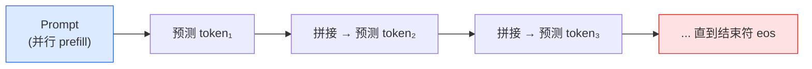

实际推理分为两个阶段：

- **Prefill（预填充）**：把整段 prompt 一次性并行送入模型，计算所有位置的隐状态——这一步可高度并行，速度快；
- **Decode（解码）**：之后每次只新增一个 token，逐步串行生成——这一步是逐 token 的，构成生成延迟的主要部分。

朴素实现中，每生成一个新 token 都要对整条序列重算注意力，计算量随序列长度平方增长，极其浪费。**KV Cache** 是关键优化：由于因果掩码下历史 token 的 Key/Value 不会因新增 token 而改变，可以把它们**缓存**起来，每步只为新 token 计算一次 Q/K/V，再与缓存的历史 K/V 做注意力。这把每步解码的计算从“重算整条序列”降为“只算一个 token”，是 LLM 实时推理的基石。

KV Cache 也带来**显存与长度的矛盾**。设当前上下文长为 $n$，固定模型维度时，缓存空间随 $n$ 线性增长；使用缓存后，**单步 decode 的注意力计算为 $O(n)$**，而标准全注意力的 prefill 计算为 $O(n^2)$。生成 $m$ 个 token 时，decode 的累计注意力计算约为 $O(mn+m^2)$。因此，图像和视频增加的视觉 token 会同时推高首 token 延迟、后续解码开销与缓存占用，压缩方法见第 4.6 节。

## 3.8 从 LLM 到 VLM：视觉如何接入这条流水线

文本最终以 $d$ 维嵌入序列进入 Transformer，视觉特征也可以转换为这一接口所需的向量。**维度匹配只解决接口问题，图文训练才使语言模型学会利用视觉信息。** 以 LLaVA 的输入拼接路线为例：

1. **视觉编码器**（如 CLIP ViT）把图像编码为一组 patch 特征向量；
2. **连接模块**将视觉特征投影到 LLM 的隐藏维度，得到连续的**视觉 token**；BLIP-2 则先用 Q-Former 提取查询特征，再进行投影；
3. 这些视觉 token 替换掉输入序列中预留的 `<image>` 占位符，与文本 token **拼接成同一条序列**，一起送入 Transformer 解码器。

视觉 token 通常是连续特征，并不是分词器词表里的文字 ID。模型通过自注意力读取它们，再自回归生成文本。另一条路线是 Flamingo：视觉特征保留在独立序列中，由插入 LLM 层间的交叉注意力读取，不必拼入文本输入序列。连接方式、视觉编码器、训练数据和优化目标共同决定多模态能力。

<a id="vlm-methods"></a>

# 4. 实现多模态的核心方法

本章按设计问题组织方法，**各节不是互斥的模型类别**：对比学习和指令微调描述训练目标，Q-Former 与交叉注意力描述连接结构，高分辨率与视频处理则描述输入表示。同一个模型可以组合多种方法。

| 设计维度 | 主要选择 | 解决的问题 | 阅读位置 |
|---|---|---|---|
| 图文表示学习 | 对比损失、匹配损失、条件生成损失 | 图像与文字如何建立对应关系？ | 4.1 |
| 视觉信息接入 | 层间交叉注意力、查询压缩、线性或 MLP 投影 | 视觉特征在哪里、以多少 token 进入 LLM？ | 4.2～4.4 |
| 指令与输出 | 视觉指令微调、文本回答、图文生成 | 模型遵循什么指令，输出哪些模态？ | 4.4～4.5 |
| 计算预算 | 参数冻结、token 压缩、轻量骨干 | 如何降低训练和推理开销？ | 4.6 |
| 视觉输入 | 视觉编码器、动态分辨率、时序采样 | 如何保留细节、空间关系与事件顺序？ | 4.7～4.8 |

## 4.1 对比学习范式

对比学习（Contrastive Learning）是目前最成功的视觉-语言预训练范式之一，核心思想是：让配对的图文样本在嵌入空间中相互靠近，让不匹配的样本相互远离。

**核心特点**：
- 不依赖人工标注，可直接利用互联网上的海量图文对
- 学习到的视觉特征具有优秀的语义性，可迁移到下游任务
- 训练目标简洁（InfoNCE loss），易于大规模扩展
- 推理时通过计算图文相似度完成零样本分类

*代表性工作*：**CLIP**（OpenAI, 2021）、**ALIGN**（Google, 2021）、**BLIP**（Salesforce, 2022）、**SigLIP**（Google, 2023）

### CLIP（Contrastive Language-Image Pre-training）

CLIP是对比学习范式的奠基性工作。OpenAI从互联网上收集了4亿个图文对（WIT数据集），分别训练图像编码器（ViT或ResNet）和文本编码器（Transformer），通过最大化正样本对相似度、最小化负样本对相似度来对齐视觉与语言空间。

$$\mathcal{L}_{CLIP} = -\frac{1}{N}\sum_{i=1}^{N}\log\frac{\exp(\text{sim}(v_i, t_i)/\tau)}{\sum_{j=1}^{N}\exp(\text{sim}(v_i, t_j)/\tau)}$$

上式只写出了图像到文本方向；完整 CLIP 目标还包含文本到图像方向，并对两者取平均，详见第 8.2 节及 [CLIP 原论文](https://arxiv.org/abs/2103.00020)。

CLIP最大的突破在于**零样本迁移**：通过将类别名嵌入为文本提示（如"a photo of a dog"），无需任何微调即可在ImageNet等基准上取得接近监督学习的性能。

<div align="center">
  
  <figcaption>图：CLIP对比预训练框架（来源：OpenAI）</figcaption>
</div>

**SigLIP**（Sigmoid Loss for Language-Image Pre-Training）将 softmax 对比损失替换为逐对 sigmoid 损失，取消了跨图文对的 softmax 归一化，便于分块计算；它仍使用负样本，跨设备负样本的构造也仍可能需要通信。参见 [SigLIP 原论文](https://arxiv.org/abs/2303.15343)。

---

### BLIP（Bootstrapping Language-Image Pre-training）

BLIP提出了**多目标联合预训练**框架，同时优化三个目标：
- **ITC**（Image-Text Contrastive）：对比对齐，继承CLIP思路
- **ITM**（Image-Text Matching）：判断图文是否匹配（二分类）
- **ITG**（Image-grounded Text Generation）：以图像为条件生成文本

BLIP还引入了**CapFilt**（Caption Filtering）机制：用已有模型对噪声网络数据生成伪标题，再过滤低质量样本，从而实现数据自举（bootstrapping）——以较少的高质量数据提升超大规模噪声数据的效果。

<div align="center">
  
  <figcaption>图：BLIP多目标预训练框架——ITC、ITM、ITG三个目标联合优化（来源：Salesforce Research）</figcaption>
</div>

---

## 4.2 跨模态注意力融合

跨模态注意力（Cross-modal Attention）通过让文本token"关注"（attend to）视觉特征，或让视觉特征关注文本，实现两种模态的深度融合。这种方式允许模型在每一层推理时动态整合两种模态的信息。

**核心特点**：
- 深度融合，视觉与语言在每层特征提取时相互影响
- 对视觉细节的捕捉能力强，适合精细推理
- 参数量较大，但支持强大的多模态上下文建模
- 可扩展到少样本视觉语言学习

*代表性工作*：**Flamingo**（DeepMind, 2022）、**ViLBERT**（2019）、**UNITER**（2020）、**CoCa**（Google, 2022）

### Flamingo

Flamingo是将大规模语言模型成功扩展为强多模态模型的早期里程碑工作。其核心设计包含两个关键模块：

**Perceiver Resampler（感知重采样器）**：将任意数量、任意分辨率的图像特征压缩为固定数量（如64个）的视觉token，解决了可变长度视觉输入与固定格式语言模型之间的接口问题。

**Gated Cross-Attention（门控交叉注意力层）**：在冻结的LLM层之间插入新的交叉注意力层，使语言token可以关注视觉token。门控机制（tanh gating）确保在训练初期新插入的层不破坏原有LLM能力。

$$y = y_{LLM} + \tanh(\alpha) \cdot \text{CrossAttn}(y_{LLM}, X_{visual})$$

Flamingo冻结原始LLM参数，仅训练Perceiver Resampler和Cross-Attention层，实现了高效的多模态扩展，并在少样本（few-shot）视觉问答任务上取得了突破性性能。

<div align="center">
  
  <figcaption>图：Flamingo跨模态注意力架构（来源：DeepMind）</figcaption>
</div>

---

## 4.3 Q-Former桥接范式

Q-Former（Querying Transformer）是BLIP-2提出的创新性连接模块，通过一组可学习的**查询向量（Query Tokens）**作为视觉与语言之间的"信息瓶颈"，提取与语言最相关的视觉特征，再传递给语言模型。

**核心特点**：
- 以少量固定查询token（通常32个）提炼大量视觉patch特征
- 查询token通过self-attention互相交流，通过cross-attention提取视觉信息
- 可以同时连接任意视觉编码器和任意LLM，具有模块化优势
- 训练分两阶段，先对齐视觉-语言，再适配到生成式LLM

*代表性工作*：**BLIP-2**（Salesforce, 2023）、**InstructBLIP**（Salesforce, 2023）

### BLIP-2

BLIP-2将视觉编码器（冻结的 EVA-CLIP ViT-g/14）和大语言模型（冻结的OPT或Flan-T5）通过Q-Former桥接，实现低成本的多模态对齐。Q-Former包含两个共享self-attention层的Transformer模块：一个与视觉编码器交互（image Transformer），另一个与语言目标交互（text Transformer）。

**两阶段训练**：
1. **视觉-语言表示学习**：联合优化ITC+ITM+ITG三个目标，使Q-Former学会从图像中提取与语言相关的视觉特征
2. **视觉-语言生成学习**：将Q-Former输出的视觉查询token投影后拼接到LLM输入，微调Q-Former使其与LLM语义空间对齐

Q-Former仅有188M参数，却能有效"压缩"复杂的视觉信息，大幅降低了视觉-语言联合微调的计算成本。

<div align="center">
  
  <figcaption>图：BLIP-2整体架构——冻结的视觉编码器与LLM之间通过Q-Former桥接（来源：Salesforce Research）</figcaption>
</div>

### InstructBLIP

InstructBLIP在BLIP-2基础上引入**指令感知（instruction-aware）**的Q-Former：将文本指令也输入Q-Former，使查询token能根据当前任务的指令动态地从图像中提取最相关的特征，而非提取固定的通用特征。这一改进显著提升了模型对不同任务指令的泛化能力。

---

## 4.4 视觉指令微调

视觉指令微调（Visual Instruction Tuning）是2023年以来最具影响力的VLM训练范式，核心思想是：使用（图像、指令、回答）三元组格式的对话数据对视觉语言模型进行监督微调，使模型能够遵循多样化的视觉相关指令。

**核心特点**：
- 将图像理解任务统一为对话式问答格式
- 利用GPT-4等强语言模型自动构造高质量指令数据
- 简化了架构：通常仅用线性投影层（MLP）连接视觉编码器与LLM
- 开源生态繁荣，LLaVA系列引领了大量后续工作

*代表性工作*：**LLaVA**（2023）、**LLaVA-1.5**（2023）、**LLaVA-NeXT**（2024）、**MiniGPT-4**（2023）

### LLaVA（Large Language and Vision Assistant）

LLaVA提出了一套极简而有效的视觉指令微调框架：

1. **架构**：使用CLIP ViT-L/14作为视觉编码器，通过一个**线性投影矩阵W**将视觉特征映射到LLM（Vicuna/LLaMA）的词嵌入空间，视觉token与文本token直接拼接后输入LLM
2. **数据构建**：利用GPT-4（纯文本版本），基于图像的字幕和边界框信息生成多轮对话数据、详细描述和复杂推理题，构建了约158K条指令数据
3. **两阶段训练**：先预训练投影层（冻结编码器和LLM），再端到端微调投影层+LLM

$$H_v = W \cdot Z_v, \quad Z_v = f_{CLIP}(X_v)$$

<div align="center">
  
  <figcaption>图：LLaVA视觉指令微调框架（来源：LLaVA项目）</figcaption>
</div>

### LLaVA-1.5 与高分辨率扩展

LLaVA-1.5将线性投影升级为**两层MLP**，并引入更高分辨率的视觉编码器（CLIP ViT-L/14 @ 336px），在多个基准上大幅超越原始LLaVA，同时仍保持简洁的架构。

**LLaVA-NeXT（LLaVA-1.6）**进一步引入**动态高分辨率**技术：将高分辨率图像切分为多个小块（tiles），每块单独编码后拼接，同时保留低分辨率的整体视图，有效提升了对文字（OCR）、细节和图表的理解能力，且无需重新训练视觉编码器。

---

## 4.5 多模态理解与统一生成

“生成式 VLM”与“统一理解和生成模型”需要区分：前者可以读取图像、生成文字回答，但不一定能生成图像；后者进一步支持视觉内容的生成。

| 范围 | 输入与输出 | 代表工作 | 关键区别 |
|---|---|---|---|
| 多模态理解与文本生成 | 图像、视频和文本输入 → 文本或结构化结果 | LLaVA、Qwen2.5-VL、InternVL2 | 连续视觉特征作为条件，输出文本 token |
| 统一图文理解与生成 | 图文输入 → 文本或图像 | Chameleon、Janus / Janus-Pro、Show-o | 需要额外的视觉表示与图像解码机制 |

“原生多模态”也不等于取消视觉编码器或从零训练全部权重。比较模型时，应具体查看输入表示、融合位置、训练过程和输出模态；闭源模型的内部结构只按公开资料描述。

### Gemini

Google DeepMind的Gemini系列是原生多模态模型的代表，从一开始就以多模态为核心设计目标，而非将LLM改造为多模态模型。Gemini能够无缝处理文本、图像、音频、视频和代码，每种模态都有专门的编码模块，通过统一的Transformer骨干进行联合建模。

Gemini 1.5引入了**百万token上下文窗口**，使其能够处理超长文档和长视频（可处理长达1小时的视频），在长上下文多模态理解上树立了新的里程碑。

### Qwen2.5-VL 的输入与结构

Qwen2.5-VL是阿里巴巴推出的高性能开源VLM，在多模态处理技术上有若干创新：

**原生动态分辨率（Native Dynamic Resolution）**：根据图像宽高和像素预算调整输入，避免把所有图像压到同一固定尺寸；实际预处理仍会缩放，并将宽高调整为 28 的倍数，视觉编码器使用 2D-RoPE 表示空间位置。

**窗口注意力（Window Attention）**：在视觉编码器中引入窗口注意力，减少大分辨率图像的计算量。

**时序感知视频理解**：语言模型中的 MRoPE 把时间维度的位置 ID 与帧的绝对时间对齐，并配合动态帧率采样；不同 FPS 的视频因此共享一致的时间尺度。

**Qwen2.5-VL-72B 文档与 OCR 评测摘录**（技术报告 Table 5，同表对照）：

| 基准 | Qwen2.5-VL-72B | GPT-4o | Claude-3.5 Sonnet | InternVL2.5-78B |
|------|----------------|--------|-------------------|---------------|
| DocVQA（test） | **96.4** | 91.1 | 95.2 | 95.1 |
| ChartQA（test Avg.） | 89.5 | 86.7 | **90.8** | 88.3 |
| OCRBench | **885** | 736 | 788 | 854 |

这些结果需要结合评测版本与输入配置解读。Qwen2.5-VL 仍采用 **ViT + MLP merger + Qwen2.5 LLM** 的模块化架构；动态分辨率是输入处理机制，不意味着取消连接模块，也不意味着支持图像生成。结构与实验设置参见 [Qwen2.5-VL 技术报告](https://arxiv.org/html/2502.13923v1)。

### 全模态与推理增强：GPT-4o、o3 与 Gemini 2.5

GPT-4o、o3 与 Gemini 2.5 常作为多模态交互或推理评测的商业模型参照，但不能仅凭输出效果推断其视觉微调流程。理解这类模型时，应区分**感知是否准确、推理是否有效、工具调用是否可靠**；更长的推理过程无法补回输入阶段丢失的视觉细节。开源模型的具体训练机制可结合第 8.10 节 Qwen3-VL 解读。

### 统一理解与生成的解耦架构：Janus / Janus-Pro 与 Chameleon

传统统一多模态生成模型（如早期的 Emu 或 GILL）在统一“图像理解”与“图像生成”时常面临**特征表示冲突**：
- **理解任务（Understanding）**：需要高层次、抽象且语义密集的连续特征表示（如 SigLIP / CLIP 编码器提取的连续向量），以忽略像素级噪声、捕获全局语义；
- **生成任务（Generation）**：需要细粒度、低抽象且像素保真的离散 Token（如 VQ-VAE / VQ-GAN 离散码本）或连续高斯隐变量，以便重建精细纹理与空间结构。

如果强行用单一视觉编码器同时承担理解和生成，容易导致“理解能力退化”或“生成图像画质粗糙”。

**Janus（2024）与 Janus-Pro（2025）**采用**解耦视觉编码（Decoupled Visual Encoding）**：理解和生成使用不同的视觉表示，共享语言模型骨干。参见 [Janus](https://arxiv.org/abs/2410.13848) 与 [Janus-Pro](https://arxiv.org/abs/2501.17811)。

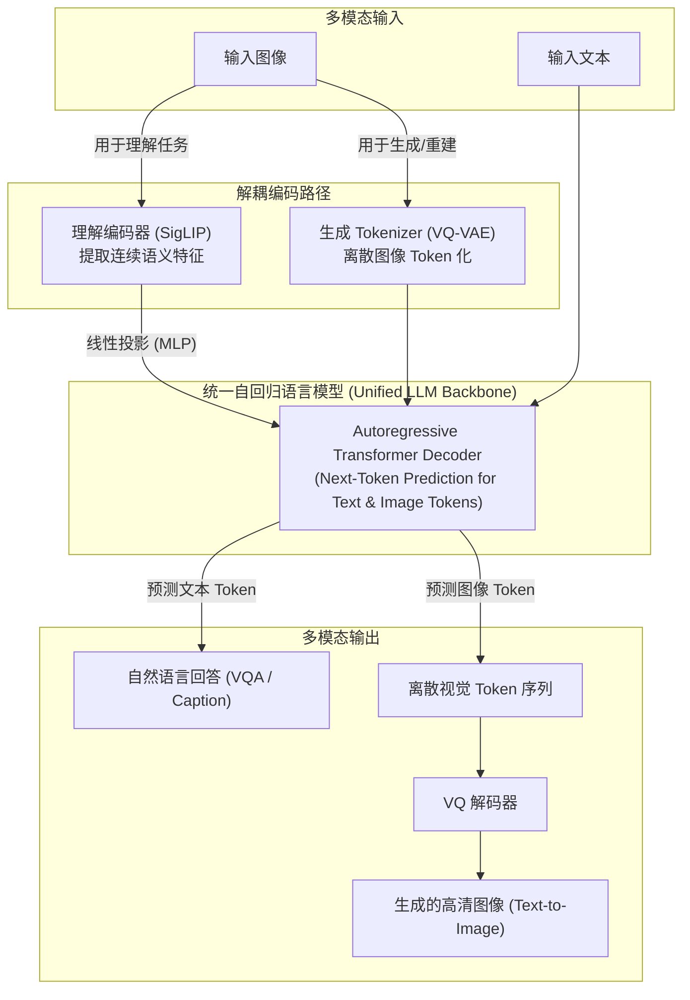

**Janus-Pro 的核心优势**：
1. **解耦输入路径，保留统一 Transformer**：理解任务使用 SigLIP 编码器映射连续特征，生成任务使用离散 VQ Tokenizer；统一自回归语言模型无需修改骨干结构，仅使用标准的 Next-Token 预测损失。
2. **兼顾两类目标**：分别优化理解与生成所需的视觉表示；单项基准的优势不应直接外推为所有场景下的画质或理解能力优势。
3. **与其他路线对照**：[Chameleon](https://arxiv.org/abs/2405.09818) 使用离散图像 token 与文本 token 的早期融合和自回归建模；[Show-o](https://arxiv.org/abs/2408.12528) 结合自回归建模与离散扩散。两者均于 2024 年公开，应作为不同设计路线比较，而非描述为 Janus-Pro 的后续工作。

---

## 4.6 高效多模态对齐方法

随着VLM参数量不断增大，如何以更低的计算成本实现高质量的多模态对齐成为重要研究方向。

**核心特点**：
- 冻结大部分预训练权重，仅微调少量参数
- 通过精心设计的对齐模块弥补视觉与语言之间的语义鸿沟
- 高效利用已有的视觉编码器和LLM的知识

*代表性工作*：**MiniGPT-4**（KAUST, 2023）、**mPLUG-Owl**（阿里达摩院, 2023）、**Otter**（南洋理工, 2023）

### MiniGPT-4

MiniGPT-4证明了极简对齐方案的可行性：仅用一个**线性投影层**连接冻结的BLIP-2视觉编码器（含Q-Former）和冻结的Vicuna（LLaMA微调版），通过两阶段训练——先大规模对齐预训练，再用约 3500 条精选图文描述做指令微调——就在定性示例中展现出详细描述、看图写代码等类似 GPT-4 演示的能力（论文未给出与 GPT-4 的定量对比）。论文还观察到：只做第一阶段时输出常出现重复和不连贯，少量高质量第二阶段数据即可明显改善，说明指令数据的质量对生成可用性影响很大。

### 视觉 Token 压缩

视觉 token 数量直接决定 VLM 的推理成本，压缩技术是高效化的关键：

| 方法 | 原理 | 压缩比 | 代表模型 |
|------|------|--------|---------|
| Pixel Shuffle | 把相邻 $r \times r$ 个 token 重排到通道维后投影 | $r^2$:1（InternVL2 为 4:1，SmolVLM 为 9:1） | InternVL2、SmolVLM |
| TokenPacker | 交叉注意力从密集特征中提取少量高语义 token | 可变 | TokenPacker（2024） |
| 平均池化 | 对相邻 token 取平均 | 可变 | LLaVA-HD |
| Q-Former | 固定32个 Query Token 提炼所有视觉信息 | 高倍 | BLIP-2、InstructBLIP |

### 轻量化 VLM 与端侧部署

随着端侧部署（手机、边缘设备）需求快速增长，在极低参数量下实现有竞争力的多模态理解成为热点。**SigLIP 视觉编码器**（sigmoid 损失在较小 batch 下优于 softmax 对比损失，见 8.6 节）是轻量 VLM 最常见的视觉骨干之一：

- **SmolVLM**（HuggingFace，2024–2025）：256M / 500M / 2.2B 三档，SigLIP + 激进的 Pixel Shuffle（每个 384×384 子图只编码为 81 个 token），2.2B 版 DocVQA 81.6、TextVQA 72.7（[官方博客](https://huggingface.co/blog/smolvlm)）
- **Phi-3.5-Vision**（Microsoft，2024）：约 4.2B 参数（3.8B 语言模型 + CLIP ViT-L），以高质量合成数据与精选 SFT 数据换取小模型的推理和 OCR 能力
- **MobileVLM V2**（2024）：面向手机端设计，使用轻量下采样投影器（LDP）压缩视觉 token，可在移动端 CPU/GPU 上实时推理
- **moondream2**（2024）：约 1.86B 参数，可在低功耗设备本地运行
- **MoE-LLaVA**（2024）：稀疏激活混合专家结构，约 3B 激活参数达到与 LLaVA-1.5-7B 相当的水平
- **Gemma 3**（Google，2025）：4B / 12B / 27B 三档支持图像输入，以 SigLIP 编码器 + Pan & Scan 处理非方形与高分辨率图像

端侧模型的评测分数对分辨率、tile 数和提示模板尤其敏感，跨模型比较应以同一评测框架（如 VLMEvalKit、lmms-eval）重跑的结果为准。

### 视觉嵌入表：Ovis 的结构化对齐

**Ovis**（AIDC-AI）关注的是连接模块本身：LLM 的文本 token 通过查嵌入表得到向量，而普通 MLP 投影直接输出连续视觉特征，两者结构不对称。Ovis 为视觉侧也引入一张可学习的**视觉嵌入表**：视觉 patch 先被映射为"视觉词表"上的概率分布，再按概率对嵌入表加权求和，得到与文本嵌入结构一致的视觉 token。Ovis2-34B 由 aimv2-1B 视觉编码器与 Qwen2.5-32B-Instruct 组成，同样复用预训练 LLM 并经过多阶段训练；它与 LLaVA、Qwen-VL 的区别在于视觉 token 的生成方式，而不在于是否复用 LLM。

---

## 4.7 视觉特征提取：ViT与视觉编码器的演进

实现高质量多模态融合的前提是强大的视觉表示。VLM中视觉编码器的设计经历了从早期CNN区域特征提取到Transformer全局特征建模，再到大尺度对比学习和动态高分辨率适配的重大转变。

<div align="center">
  
  <figcaption>图 4.7.1：VLM 视觉编码器的演进历程：从 CNN 区域特征到 ViT，再到对比学习对齐与动态高分辨率方案</figcaption>
</div>

**核心演进路线**：
- **CNN时代**（2018-2020）：以 ResNet、EfficientNet 为代表，利用滑动卷积提取网格或区域特征，再与文本编码器拼接。特征偏向局部，且难以适配长序列 Transformer。
- **ViT时代**（2021-2022）：将图像切分为 patch 序列，用 Transformer 进行端到端编码，将视觉和 NLP 架构统一为序列处理任务。
- **CLIP / SigLIP 对比学习时代**（2021至今）：通过在大规模图文对（如 LAION）上进行对比学习训练，使 ViT 具备天然的语言对齐属性，成为现代 VLM 的主流视觉编码器。
- **纯视觉自监督路线**（2021至今）：以 DINO、DINOv2 为代表，摆脱语言标注偏置，通过自蒸馏与掩码重建学习高空间一致性的 patch 特征，适合定位与密集预测。
- **高分辨率与动态切片时代**（2023至今）：支持任意长宽比、高分辨率输入的动态编码方案（如 AnyRes、Naive Dynamic Resolution），以保留细粒度文档及 OCR 信息。

### Vision Transformer（ViT）工作原理

ViT 颠覆了传统的卷积神经网络结构，直接将 Transformer 架构应用于图像处理。其核心是将连续图像离散化为 Token 序列，与文本的 Token 化处理高度契合：

1. **Patch 分割与线性投影**：
   对于输入图像 $$x \in \mathbb{R}^{H \times W \times C}$$，首先将其分割为一系列不重叠的二维图像块 $$\mathbf{x}_p \in \mathbb{R}^{N \times (P^2 \cdot C)}$$，其中 $$(P, P)$$ 是设定的图像块分辨率（如 $14 \times 14$ 或 $16 \times 16$），而 $$N = HW/P^2$$ 是最终生成的序列长度（即 Patch 数量）。
   随后，通过一个可学习的线性投影矩阵 $$E \in \mathbb{R}^{(P^2 \cdot C) \times D}$$ 将每个 patch 映射为 $D$ 维的向量特征。

2. **位置编码与类别标记 (Class Token)**：
   类似于 BERT 的设计，ViT 会在前向传播前拼接一个可学习的类别标记（Class Token）$$x_{cls} \in \mathbb{R}^{1 \times D}$$，其最终输出的状态可直接用于整图分类或全局语义表示。
   由于 Transformer 的自注意力机制不具备空间方向感知，必须加入一维或二维的可学习位置编码 $$E_{pos} \in \mathbb{R}^{(N+1) \times D}$$ 来保留每个图像块的空间相对关系。

   整个序列的初始化数学表达为：
   $$z_0 = [x_{cls}; x_1^p E; x_2^p E; \ldots; x_N^p E] + E_{pos}$$

3. **多层 Transformer 编码**：
   输入序列 $$z_0$$ 经过多层标准的 Multi-Head Self-Attention (MHSA) 和 MLP（多层感知机）计算，每一层都伴随 Layer Normalization (LN) 和残差连接（Residual Connection）。

主流 VLM 的视觉编码器多为在 CLIP 或 SigLIP 目标下训练的 ViT：LLaVA 系列用 CLIP ViT-L/14（约 304M 参数），PaliGemma 与 Qwen3-VL 用 SigLIP / SigLIP 2 的 So400m（约 400M），BLIP-2 用 EVA-CLIP ViT-g/14（约 1B）。

### CLIP 与 SigLIP 视觉编码器：图文对比对齐范式

为什么对比学习训练出的 ViT 会成为 VLM 的绝对主流？因为**在对比学习中，视觉特征已经被“语言化”了**。

#### 1. CLIP 对比损失 (Contrastive Loss)
CLIP（Contrastive Language-Image Pretraining）采用双塔结构（图像编码器与文本编码器），使用对称的 InfoNCE 损失函数进行预训练。在一个包含 $B$ 个图文对的 Batch 内，模型最小化配对图文的距离，并最大化不配对图文的距离：

$$L_{\text{InfoNCE}} = -\frac{1}{2B} \sum_{i=1}^{B} \left( \log \frac{\exp(\text{sim}(I_i, T_i)/\tau)}{\sum_{j=1}^{B} \exp(\text{sim}(I_i, T_j)/\tau)} + \log \frac{\exp(\text{sim}(I_i, T_i)/\tau)}{\sum_{j=1}^{B} \exp(\text{sim}(I_j, T_i)/\tau)} \right)$$

其中 $$sim(I_i, T_i)$$ 表示图像 $i$ 与文本 $i$ 的全局投影特征的余弦相似度，$$\tau$$ 为可学习的温度参数。CLIP 直接监督的是图像级与文本级表示的匹配，并没有显式提供逐 patch、逐词的对应标签。

#### 2. SigLIP 的 Sigmoid 损失优化
虽然 CLIP 取得了巨大成功，但 Softmax 归一化要求计算全局分母，常见实现需要在多卡间全收集（All-Gather）特征并构造完整的 $B \times B$ 相似度矩阵。PaliGemma 等模型所采用的 **SigLIP (Sigmoid Language-Image Pretraining)** 提出用 Sigmoid 损失代替 Softmax，将对比学习转化为逐对的二分类任务：

$$L_{\text{SigLIP}} = -\frac{1}{B} \sum_{i=1}^{B} \sum_{j=1}^{B} \log \sigma \left( y_{ij} (\text{sim}(I_i, T_j) \cdot c + b) \right)$$

其中，当且仅当 $i=j$（正样本对）时 $$y_{ij} = 1$$，否则为 $$-1$$；$$c, b$$ 是可学习的缩放与偏置参数。
- **SigLIP 的优势**：无需对全部图文对进行 softmax 归一化，损失更易分块计算，减少了相关的显存与同步负担。它仍需要负样本和梯度同步；效果也受训练数据、batch 与模型规模影响，不能只归因于损失函数。

### InternViT 与大尺度视觉编码器缩放 (Scaling)

随着大语言模型扩展到数百亿甚至数千亿参数，视觉编码器是否也需要同步放大？InternVL 的出发点是：约 300M 参数的 ViT-L 与 70B 级 LLM 在参数规模上相差两个数量级，可能成为表征瓶颈。

InternVL 系列因此将视觉编码器扩展到 **InternViT-6B**（约 5.9B 参数，InternVL 1.5 起裁掉最后 3 层后约 5.5B），同时保留 **InternViT-300M** 供中小模型使用：
- **更强的细粒度表征**：更大的视觉编码器在文档、图表、密集文字等需要细节的任务上收益更明显；InternViT-6B 在 ImageNet 线性探测、ADE20K 分割等纯视觉任务上也较强。
- **表征可在不同 LLM 间复用**：InternVL2.5 先让 ViT 与较小 LLM 联合训练，再把它接到更大的 LLM 上继续训练而无需重训 ViT（progressive scaling，见 6.4 节）。
- **代价**：6B 视觉编码器显著推高推理成本；Qwen2.5-VL（约 675M ViT）与 Qwen3-VL（SigLIP 2 So400m）说明，靠数据与训练配方而非单纯放大 ViT 也能取得强结果。视觉编码器规模与 LLM 规模之间并没有公认的最优配比。

### 高分辨率与动态切片方案 (Any-Resolution)

传统的 ViT 将输入图像固定缩放为单分辨率（如 $224 \times 224$ 或 $336 \times 336$），但这会严重破坏长宽比，并导致高细粒度图像（如表格、网页截图、PDF 文档）中的小文字完全模糊。为了解决高分辨率输入与 Transformer 计算复杂度之间的矛盾，业界演进出了以下几种主流方案：

#### 1. NaViT (Patch n' Pack)
NaViT 打破了图像必须是固定大小的传统。它支持任意分辨率和长宽比的图像直接输入，通过将不同尺寸图像切出的 patch 进行打包（Packing），塞入同一个 Batch 的固定长度序列中，并在 Transformer 的自注意力计算中应用 Mask 来阻止跨图像的信息泄露。

#### 2. LLaVA-NeXT 动态切片 (AnyRes)
LLaVA-NeXT 采用了一种更为直观的**图像切片（Image Tiling）**策略：
- 根据图像的原始长宽比，动态计算最匹配的切片网格（如 $1 \times 2$, $2 \times 2$, $3 \times 1$ 等，每个子切片大小固定为 $336 \times 336$）。
- 将图像切割为 $N$ 个局部子图，同时将原图等比例缩放为 $336 \times 336$ 的全局缩略图（Thumbnail）。
- 将这 $N+1$ 张子图同时送入同一个共享的 ViT 视觉编码器提取特征。
- 在融合阶段，将各个局部子图的特征按空间相对位置拼接起来（通常会在子图行末插入一个特殊的 `<newline>` token 以帮助 LLM 识别换行），再与全局缩略图特征拼接，一同输入 Connector。

#### 3. Qwen2-VL / Qwen2.5-VL 动态分辨率 (Naive Dynamic Resolution)
Qwen 系列不切 tile，而是让 ViT 直接处理整张变尺寸图像：
- **按原始比例直接 Token 化**：图像在像素预算内缩放到 28 的整数倍宽高，再切成 $14 \times 14$ 的 patch，token 数随图像面积变化；不再额外拼接缩略图。
- **两级位置编码**：ViT 内部用 2D-RoPE 表示 patch 的行列位置，因此不依赖固定尺寸的绝对位置编码；进入 LLM 后再用 M-RoPE 把位置拆成时间、高度、宽度三个分量（见 6.3 节）。
- **Token 压缩（Patch Merger）**：ViT 之后用"归一化层 + 两层 MLP"把相邻 $2 \times 2$ 个视觉 token 合并为 1 个，使 LLM 端的视觉 token 数降为 patch 数的 1/4。

<div align="center">
  
  <figcaption>图 4.7.2：任意分辨率 ViT 动态切片与 Token 拼接机制示意图</figcaption>
</div>

### DINOv2：纯视觉自监督的另一条路线

CLIP / SigLIP 用语言监督训练视觉编码器，[DINOv2](https://arxiv.org/abs/2304.07193)（Meta，TMLR 2024）则**全程不使用文字**：学生网络学习匹配 EMA 教师网络在不同裁剪视图上的输出（图像级 DINO 损失 + patch 级掩码 iBOT 损失），并在精选的 1.42 亿张图像（LVD-142M）上训练。两条路线的特征各有侧重：

| 维度 | CLIP / SigLIP 类编码器 | DINOv2 |
|---|---|---|
| 监督信号 | 图文配对 | 图像自身（自蒸馏 + 掩码建模） |
| 擅长 | 零样本分类、图文检索、与 LLM 语义对接 | 分割、深度估计、对应点匹配等密集任务 |
| 在 VLM 中的用法 | 主流的单一视觉编码器 | 与语言对齐编码器并用，补充空间细节 |

冻结特征 + 线性头的 ADE20K 分割实验中，DINOv2 ViT-g/14 达到 49.0 mIoU，参数量更大的 OpenCLIP ViT-G/14 为 39.3，这说明图文对比目标得到的 patch 特征不一定适合密集预测。因此 Cambrian-1 等工作把 DINOv2 与 SigLIP 特征融合使用。训练细节与完整实验见第 8.11 节，其后继 DINOv3 见第 8.12 节。

---

## 4.8 视频理解：向时序维度扩展

视频理解要求模型同时处理**空间视觉内容**（每帧图像）和**时序动态信息**（帧间变化），是 VLM 能力扩展的重要前沿方向。

**核心挑战**：
- **Token 爆炸**：一段10秒视频（3fps）约30帧，每帧256~1024个 token，总计数千至数万 token，远超 LLM 的高效处理范围
- **时序推理**：模型需理解动作顺序、因果关系、运动轨迹等跨帧语义
- **长视频理解**：数分钟甚至数小时的视频对记忆与检索机制提出极高要求

**VideoLLaMA2**（阿里达摩，2024）引入**时空卷积连接器（Spatiotemporal Convolution Connector）**：对连续帧的 ViT 特征施加 3D 卷积（时间 × 高 × 宽），同时建模帧内空间结构与帧间时序变化，并对时空特征下采样以控制视频 token 数，在 MVBench（时序推理）、EgoSchema（第一人称长视频理解）等基准上相对同期 7B 视频模型取得提升。

**LongVA**（2024）提出**长上下文迁移**（long context transfer）：先只用纯文本把 Qwen2-7B-Instruct 的上下文扩展到 224K，再做常规的图像对齐训练，无需长视频训练数据即可处理约 2000 帧、20 万以上的视觉 token；论文同时提出视觉大海捞针测试 V-NIAH（[arXiv:2406.16852](https://arxiv.org/abs/2406.16852)）。

**Qwen2.5-VL** 通过与绝对时间对齐的 MRoPE 和动态帧率采样支持长视频；**Qwen3-VL** 改用显式文本时间戳与 Interleaved MRoPE，原生上下文达到 256K（30 分钟视频内 Needle-in-a-Haystack 100% 准确率，见 8.10 节）。

**主流视频理解基准**（分数取自 [Qwen2.5-VL 技术报告](https://arxiv.org/abs/2502.13923) Table 8，同表对照）：

| 基准 | 视频长度 | 主要任务 | Qwen2.5-VL-72B | GPT-4o | Gemini 1.5 Pro |
|------|---------|---------|------|------|------|
| Video-MME（无字幕 / 有字幕） | 11 秒～1 小时 | 短中长视频综合理解 | 73.3 / 79.1 | 71.9 / 77.2 | **75.0 / 81.3** |
| MVBench | 以秒级短片为主 | 20 类时序动作推理 | **70.4** | 64.6 | 60.5 |
| EgoSchema | 约 3 分钟 | 第一人称长时推理 | **76.2** | 72.2 | 71.2 |
| LVBench | 平均约 1 小时 | 超长视频理解 | **47.3** | 30.8 | 33.1 |
| MLVU | 3 分钟～2 小时 | 长视频多任务 | **74.6** | 64.6 | — |

# 5. VLM 任务类型

下面按"输入—输出"形式列出 VLM 的常见任务。前六类以单轮感知与理解为主，GUI Agent 则要求模型在环境中连续决策。

## 5.1 图像描述（Image Captioning）

给定图像，生成自然语言描述。是最基础的视觉生成任务，也是VLM训练的常见预训练目标之一。

*代表性数据集*：COCO Captions、nocaps、Flickr30k

## 5.2 视觉问答（Visual Question Answering, VQA）

给定图像和问题，输出答案。分为开放式（生成型）和闭集（分类型）两种形式。

*代表性数据集*：VQA v2、OK-VQA、GQA、ScienceQA

## 5.3 视觉推理（Visual Reasoning）

要求模型对图像进行多步推理，如计数、空间关系判断、因果推断等。

*代表性数据集*：NLVR2、CLEVR、MMStar、MMBench

## 5.4 视觉定位（Visual Grounding / Referring Expression Comprehension）

根据自然语言描述，在图像中定位目标区域（通常输出 2D 边界框 $$[x_1, y_1, x_2, y_2]$$）。

*代表性数据集*：RefCOCO、RefCOCO+、Visual7W

> 📌 **进阶延伸（3D 视觉定位）**：在机器人操控与具身交互场景中，视觉定位已进一步拓展至三维点云与 3D 空间定向包围盒（$$[x, y, z, dx, dy, dz, r, p, y]$$）。相关代表性基准（ScanRefer、EmbodiedScan）与 3D 定位模型，详见 [《空间智能综述：4.5 空间感知语言模型》](/Spatial-Intelligence-Survey/#scanrefer--scanqa)。

## 5.5 文档与图表理解（Document / Chart Understanding）

理解包含文字、表格、图表的复杂文档图像，是近年VLM能力提升的重点方向。

*代表性数据集*：DocVQA、ChartQA、TextVQA、OCRBench

## 5.6 图文检索（Image-Text Retrieval）

给定图像检索相关文本（或反之），是对比学习范式的核心应用场景。

*代表性数据集*：MSCOCO Retrieval、Flickr30k Retrieval

## 5.7 GUI Agent / 多模态智能体（GUI Automation）

VLM 正从"被动理解"演化为"主动执行"：感知屏幕状态、规划操作序列、执行鼠标键盘动作。这要求模型具备四项核心能力——**精确视觉定位**（在截图中定位按钮、输入框等 UI 元素）、**操作序列规划**（将"帮我订机票"分解为具体操作步骤）、**状态追踪**（判断操作是否成功并实现错误恢复）、**跨应用协同**。

**UI-TARS**（字节跳动，2025）是端到端 GUI Agent 的代表工作：只以屏幕截图为输入，在大规模 GUI 截图数据上强化元素识别、定位与动作预测，并在执行前生成显式推理（System 2 式的任务分解与反思），再利用虚拟机中收集的交互轨迹迭代训练。下表摘自 [UI-TARS 论文](https://arxiv.org/abs/2501.12326)：

| 基准 | UI-TARS-72B | 对照模型 |
|------|-----------|--------|
| OSWorld（50 步上限） | **24.6** | Claude Computer Use 22.0 |
| OSWorld（15 步上限） | **22.7** | Claude Computer Use 14.9 |
| AndroidWorld | **46.6** | GPT-4o 34.5 |
| ScreenSpot-Pro（高分辨率专业软件定位） | **38.1** | — |

此后 UI-TARS-1.5 / UI-TARS-2 等版本和更新的通用模型（如 Qwen3-VL-32B 在 OSWorld 上达到 41，见 8.10 节）持续刷新这些数字，因此上表只说明 2025 年初的水平。

其他代表工作：**SeeClick**（2024）专攻 GUI 元素定位，可作轻量级定位骨干；**ShowUI**（2024）用 UI 连接图建模元素间结构关系；**ScreenAgent**（2024）将规划（Planner）、执行（Actor）、验证（Critic）分离为三个专用模块。闭源侧，Claude 3.5 Sonnet（Computer Use，2024）率先开放 API 级电脑操作接口，Gemini 2.0 Flash 将浏览器与 Android 操作原生集成进模型服务。

*代表性基准*：ScreenSpot、OSWorld、AndroidWorld

<a id="vlm-training"></a>

# 6. VLM 训练流程与关键技术

VLM 的训练旨在将视觉的感性认知与语言的理性推理相结合，构建起跨模态的理解和生成能力。与传统的单模态模型训练相比，VLM 的训练往往不是"从头开始"（from-scratch），而是利用已有的强大预训练成果（如预训练的 ViT 视觉编码器和 LLM 大语言模型），重点解决**模态对齐**、**多任务泛化**以及**指令对齐**等核心问题。

这一节我们将详细介绍经典的 VLM 三阶段训练范式（6.1）、偏好对齐技术（6.2）、训练中涉及的关键支撑技术（6.3）；随后转向实操视角——超参数如何设置与调整（6.4）、训练过程中如何监控指标与解读 loss 曲线（6.5）、训练出问题时如何排查（6.6）；最后对 Qwen-VL 系列模型的训练演进路径进行深度案例剖析（6.7）。

---

## 6.1 经典三阶段训练范式 (Three-Stage Training Pipeline)

可以将训练目标概括为**模态对齐 → 多任务预训练 → 指令微调**。这是一种分析框架，不是所有模型都必须执行的固定三阶段配方：LLaVA 与 MiniGPT-4 的原始方案采用两阶段训练，不同模型也会合并或细分阶段。下图展示一种逐步解冻的方案；具体可训练模块与数据规模需以对应配方为准。

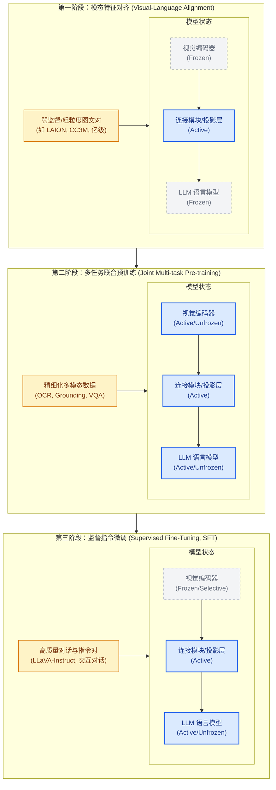

### 1. 第一阶段：模态特征对齐（Pre-training / Alignment）
*   **训练目标**：将视觉特征投影到大语言模型的文本嵌入空间，建立最初步的"语义桥梁"。
*   **参数冻结策略**：**冻结**视觉编码器（Vision Encoder）与大语言模型（LLM），**仅训练**连接模块（Connector / Projection layer，如简单的 MLP 投影层、Q-Former 或 Cross-Attention 层）。
*   **训练数据**：海量、弱监督的短文本图文对（通常为数千万至数亿对），如 LAION-5B、CC3M、CC12M。这一阶段的数据噪音较大，但可以提供宽广的视觉概念覆盖。
*   **核心逻辑**：这一阶段模型主要进行"概念配对"，即让 LLM 认识到图像中的实体与特定的文本 token 存在映射关系。由于 LLM 保持冻结，其原本的语言生成和推理能力不会受到干扰。

### 2. 第二阶段：多任务联合预训练（Joint Pre-training）
*   **训练目标**：提升模型在细粒度视觉任务（如定位、密集文本阅读 OCR、高精度视觉问答等）上的泛化能力，实现深度的跨模态感知。
*   **参数冻结策略**：通常**全部解冻**（Unfreeze），包括视觉编码器、连接模块和 LLM。在某些轻量级微调方案中，也会选择冻结视觉编码器或对其使用 LoRA。
*   **训练数据**：高质量、混合格式的多任务多模态数据集（例如，包含边界框定位 Grounding、密集 OCR 识别、图表解析和长视频描述的混合数据）。
*   **核心逻辑**：通过让视觉编码器也参与参数更新，模型可以根据跨模态任务的要求对视觉表示进行自适应微调（例如，学习识别图像中极小的文字或精确的目标边界）。这使得模型在处理细粒度特征时更加得心应手。

### 3. 第三阶段：监督指令微调（Supervised Fine-Tuning, SFT）
*   **训练目标**：使模型对齐人类的对话习惯、遵循复杂的推理指令，形成类似 Chat 助手的交互式对话能力。
*   **参数冻结策略**：**解冻 LLM 和连接模块**，通常**冻结视觉编码器**（防止在纯文本指令微调和多模态对话训练中出现视觉特征的灾难性遗忘，并保护 LLM 原有的纯文本性能）。
*   **训练数据**：精心清洗的高质量指令跟随数据集（通常在几万到百万级），例如 LLaVA-Instruct、ShareGPT4V，以及通过 GPT-4/GPT-4V 自动生成的复杂多轮对话数据。
*   **核心逻辑**：模型在此阶段学习如何以流畅的语气回答用户的开放式问题，进行多轮追问，并能够安全地拒绝不合理的输入。

---

## 6.2 偏好对齐与后训练 (Preference Alignment & Post-Training)

随着 VLM 被广泛应用于复杂的实际场景，仅通过 SFT 训练的模型仍面临两个严峻问题：**多模态幻觉（Multimodal Hallucination）**（即编造图像中不存在的物体或关系）以及**生成格式失控/对齐不良**。为此，现代 VLM 开始引入后训练（Post-training）偏好对齐技术。

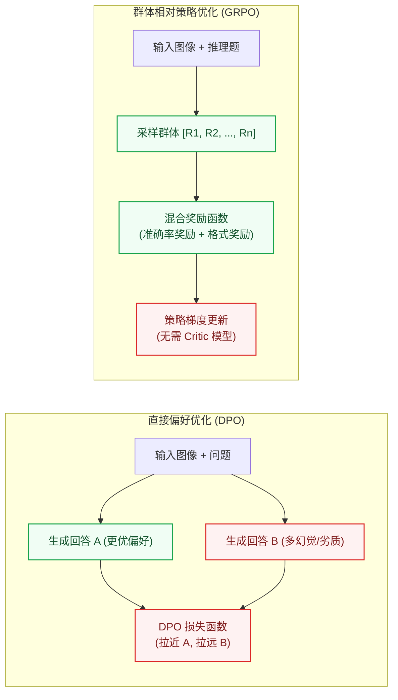

### 1. 直接偏好优化 (Direct Preference Optimization, DPO)
在多模态场景下，研究者会收集或使用强模型（如 GPT-4V）来评判 VLM 自身的输出，从而构建偏好对齐数据集：
- **更优样本 ($y_w$)**：准确描述图像、无幻觉且符合人类偏好的回答。
- **更差样本 ($y_l$)**：包含事实错误、视觉幻觉或格式混乱的回答。

DPO 不单独训练奖励模型，而是直接在偏好对上提高 $y_w$ 相对于 $y_l$ 的对数似然比（以参考模型为基准），从而降低幻觉回答的概率。Qwen2.5-VL 的后训练即采用 SFT + DPO 两步（ViT 冻结）。

### 2. 群体相对策略优化 (Group Relative Policy Optimization, GRPO)
训练推理型模型时，传统的 PPO (Proximal Policy Optimization) 需要一个与策略模型规模相当的 Critic（价值模型）来估计优势，显存与计算开销都很大。

GRPO（出自 DeepSeekMath，后被 DeepSeek-R1 采用）针对每个问题采样一组输出，用组内奖励的均值和标准差对每条输出的奖励做归一化，作为优势估计，从而省去 Critic 模型：
- **奖励函数（Reward Function）**：通常包含**规则奖励**（如数学题、计数题、定位 IoU 的判定结果）和**格式奖励**（如要求模型在 `<think>` 标签中输出推理过程，再给出最终答案）。
- **作用**：只要答案可以自动验证，就能在没有人工 CoT 标注的情况下强化推理行为；它提升的是推理与答案选择，无法补回输入阶段已丢失的视觉信息。

### 3. 视觉推理增强的代表性实践

受 o1/DeepSeek-R1 推理突破的启发，2024-2025 年涌现出一批将结构化思维链与 RLVR（可验证奖励强化学习）应用于 VLM 的工作：

**LLaVA-CoT**（2024，原名 LLaVA-o1）把推理拆成四个显式阶段——摘要（Summary）→ 描述（Caption）→ 推理（Reasoning）→ 结论（Conclusion），在 GPT-4o 生成的 LLaVA-CoT-100k 结构化数据上微调 Llama-3.2-11B-Vision-Instruct；推理时采用**阶段级束搜索**（每个阶段结束时从多个候选中择优），在相近计算量下优于 Best-of-N 与句子级束搜索。论文报告其在多项推理基准上的平均分超过 Gemini-1.5-Pro、GPT-4o-mini 与 Llama-3.2-90B-Vision-Instruct（[arXiv:2411.10440](https://arxiv.org/abs/2411.10440)）。

**R1-V**（2025，开源项目）是较早把 GRPO 用于 VLM 的尝试：在 CLEVR 计数任务上对 Qwen2-VL-2B 做 100 步 GRPO（8 张 A100 约 30 分钟），SuperCLEVR 分布外计数准确率从约 48% 提升到约 82%，超过 72B 基线。**Visual-RFT**（上海交大、上海 AI Lab 等，2025）把可验证奖励扩展到感知任务：检测与定位用 IoU 作奖励，分类用正确性作奖励，在少样本检测、细粒度分类和推理式定位上优于同数据量的 SFT。**MPO**（InternVL2-8B-MPO，2024）用混合偏好优化（偏好损失 + 质量损失 + 生成损失）改善多模态 CoT 推理，同时减少幻觉。

下表给出几项推理相关基准在 2025 年初的参考分数（来自 Qwen2.5-VL 与 InternVL2.5 技术报告，非实时排行）：

| 基准 | 任务类型 | 模型 | 报告分数 |
|------|---------|------------|---------|
| MathVista（testmini） | 数学视觉推理 | Qwen2.5-VL-72B | 74.8 |
| MMStar | 综合多模态理解 | Qwen2.5-VL-72B | 70.8 |
| MMMU（val） | 大学级多学科 | Qwen2.5-VL-72B | 70.2 |
| MMMU（val） | 大学级多学科 | InternVL2.5-78B | 70.1 |

推理增强模型出现后，这些数字又被明显刷新（如 Qwen3-VL-235B-Thinking 的 MathVista 为 85.8，见 8.10 节）。

### 4. 视觉慢思考（Visual Slow Thinking）与多模态测试时计算扩展 (Test-Time Compute)

2025 年起，OpenAI o3 的"thinking with images"、开源侧的 R1-V 类 RLVR 工作以及 Qwen3-VL Thinking 等模型，推动多模态模型**从单次作答（System 1 式快速感知）走向先推理再作答（System 2 式慢思考）**。下图是对这类流程的概念示意，并非某个模型的具体实现。

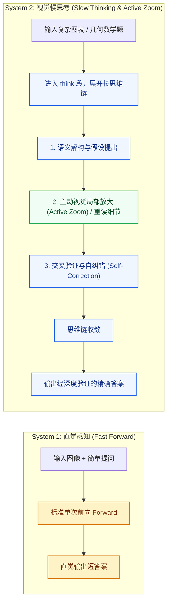

**多模态慢思考的四大核心机制**：
1. **长思维链自主反思（Long Visual CoT）**：
   - 模型在 `<think>` 标签中自主展开多步推理过程，把复杂的视觉问题拆解为子目标（如几何辅助线构造、电路图节点追踪、多栏复杂报表横纵检索）。
   - 在思考过程中若发现初始读数与物理常识矛盾，能在思维链中自主执行回溯（Rollback）与重新计算。
2. **主动视觉局部放大与重采样（Active Visual Zoom / Tool Calling）**：
   - 面对超高分辨率图像或密集细小文字（如 4K 架构图、高密度公式），模型在思考过程中可主动生成针对局部区域的边界框，调用内嵌工具动态裁剪并重新编码该区域的高精特征，再将新特征插回当前思考上下文，以弥补全局下采样造成的细节丢失；前提是模型能正确判断该放大哪里，Qwen3-VL 在 V* 等高分辨率基准上报告了使用工具后的提升（见 8.10 节）。
3. **可验证奖励强化学习（RLVR for Multimodal Reasoning）**：
   - 依赖 GRPO 等强化学习框架，利用数学、几何证明、代码生成及确定性坐标等**客观可验证的奖励**（答案精确匹配、IoU 等）进行试错优化，不需要大量人工编写的 CoT 标注，模型即可学到反思、回看等推理行为。
4. **测试时计算扩展（Test-Time Scaling）**：
   - 通过在推理阶段分配更多计算预算（生成更长的思维 Token 链、并行采样多条思考路径并借助多数投票或 PRM 过程奖励模型进行重排序），在数学与图表推理等任务上换取更高准确率；代价是延迟与推理成本随之上升，且对以感知为主的任务收益有限。

---

## 6.3 核心技术关键点 (Key Training Technologies)

要想让 VLM 训练既高效又精确，离不开一系列底层架构与算法的支撑：

### 1. 原生动态分辨率 (Naive Dynamic Resolution)
早期的 VLM（如 LLaVA-1.0）通常强行将不同宽高比的图像裁剪并缩放为固定的方形像素（如 $224 \times 224$ 或 $336 \times 336$）。这导致长条形图片被拉伸变形、细小物体失真，且高分辨率图像信息丢失严重，无法识别小字（OCR）。

**动态分辨率方案**有两条主流实现（细节见 4.7 节）：
- **切片式**（LLaVA-NeXT 的 AnyRes、InternVL 的 Dynamic High Resolution）：按宽高比选择网格，把图像切成若干固定尺寸的 tile 分别编码，并额外保留一张低分辨率缩略图。
- **原生式**（Qwen2-VL 的 Naive Dynamic Resolution）：ViT 直接编码整张变尺寸图像，依靠 2D-RoPE 表示位置，不切 tile、也不需要缩略图。下图即这一路线。
- 两者训练时都要处理变长的视觉 token 序列，通常配合序列打包（packing）与按样本的注意力掩码。


### 2. 多模态旋转位置编码 (Multimodal Rotary Position Embedding, M-RoPE)
在传统的 LLM 中，RoPE 是一维的（只对文本顺序编码）。但在多模态输入下，图像包含二维空间坐标（高度 $H$、宽度 $W$），视频则包含三维空间+时间坐标（时间 $T$、高度 $H$、宽度 $W$）。

**M-RoPE** 的解决方案：
- 将旋转位置编码解耦为时间、高度、宽度三个维度。
- 对于文本，仅在 1D 维度上递增；对于图像中的视觉 token，其位置编码表示为 $(h, w)$ 组合；对于视频，位置编码表示为 $(t, h, w)$ 组合。
- 在训练中，这使得模型即使在处理极长的视频或极高分辨率的拼接图片时，也能够清晰辨别不同帧、不同像素块之间的相对时序和空间物理关系。

---

## 6.4 训练超参数实战指南 (Hyperparameter Tuning in Practice)

论文中的超参数表往往只告诉你"最终用了什么值"，但实践中更有价值的是：**为什么是这些值？当自己的算力、数据与论文不同时，该往哪个方向调？**本节把 VLM 训练中最关键的几组超参数逐一拆解。

### 1. 第一原则：分模块差异化学习率

连接模块、ViT 与 LLM 的初始化和训练历史不同，**应分别检查它们是否需要不同学习率**。分模块设置是常见起点，统一学习率也可以有效；判断依据是冻结策略、梯度稳定性与验证表现。下表的数值是部分配方的量级参考，不是通用最优值：

| 模块 | 初始化来源 | 典型峰值学习率 | 设置依据 |
|------|-----------|---------------|---------|
| 连接模块（Projector / Q-Former） | 随机初始化 | 1e-3（对齐阶段）→ 1e-5~2e-5（后续阶段） | 随机参数离收敛点远，需要大步长快速收敛 |
| LLM 主干 | 预训练 LLM | 1e-5 ~ 2e-5 | 保护已有语言能力，防止灾难性遗忘 |
| ViT 视觉编码器 | CLIP / SigLIP 预训练 | 2e-6 ~ 1e-5（约为 LLM 的 1/5~1/10） | 对比学习得到的视觉特征空间极其精细，大学习率几步就可能破坏 patch 语义结构 |

一个实用的直觉：**学习率应与"参数当前的质量"成反比**。对齐阶段投影层的学习率（1e-3）是 SFT 阶段 LLM 学习率（2e-5）的 50 倍，正是因为前者从零开始、后者只需"轻微修正"。"ViT 学习率低于 LLM"有明确出处：LLaVA-OneVision 论文写明视觉编码器学习率取 LLM 的 1/5（2e-6 vs 1e-5），NVILA 给出的区间更宽（比 LLM 低 5~50 倍）。Qwen-VL 还对 ViT 使用**逐层学习率衰减**（layer-wise lr decay 0.95；初代 InternVL 用 0.9）：越靠近输入的层学到的特征越通用，越应该少动。有趣的是 InternVL2.5 反其道而行——为保持配方简单，刻意全模型统一学习率。两条路线都能训出强模型，说明核心收益来自"随机新模块 vs 预训练主干"的区分，ViT 内部是否再细分属于锦上添花。

<div align="center">
  
  <figcaption>图：三阶段训练中各模块的差异化学习率调度（示意图，数值为社区典型量级；每个阶段内部均为线性 warmup + 余弦衰减）</figcaption>
</div>

### 2. 三份训练配方对照

**LLaVA-1.5 官方配置**（官方仓库 `scripts/v1_5/pretrain.sh` 与 `finetune.sh`）是社区使用最广的起点配方：

| 超参数 | 阶段一：对齐预训练 | 阶段二：指令微调（SFT） |
|--------|------------------|------------------------|
| 可训练参数 | 仅 MLP 投影层 | 投影层 + LLM 全参数 |
| 全局 batch size | 256 | 128 |
| 峰值学习率 | **1e-3** | **2e-5** |
| 学习率调度 | 余弦衰减，warmup ratio 0.03 | 余弦衰减，warmup ratio 0.03 |
| 训练轮数 | 1 epoch（558K 图文对） | 1 epoch（665K 指令数据） |
| weight decay | 0 | 0 |
| 优化器 / 精度 | AdamW / bf16 | AdamW / bf16 |
| 最大序列长度 | 2048 | 2048 |
| 梯度裁剪 | max_norm = 1.0（HF 默认） | max_norm = 1.0（HF 默认） |
| DeepSpeed | ZeRO-2 + gradient checkpointing | ZeRO-3 + gradient checkpointing |

一个值得注意的细节：原版 LLaVA 预训练学习率是 2e-3，1.5 把线性投影换成两层 MLP 后将其**减半为 1e-3**（论文明言"because of the MLP projector"）——连接模块表达能力增强后，学习率反而要相应收缩。LLaVA-NeXT 在解冻 ViT 时为 vision tower 单独设置 **2e-6** 的学习率（基础学习率 2e-5 的 1/10），这一惯例被后续大量开源工作沿用。

**Qwen-VL 的三阶段配置**（论文 arXiv:2308.12966 附录 Table 8）则代表"工业级大规模训练"的取向：

| 超参数 | 阶段一：预训练 | 阶段二：多任务预训练 | 阶段三：SFT |
|--------|--------------|--------------------|------------|
| 可训练模块 | ViT + 连接模块（LLM 冻结） | 全部解冻 | LLM + 连接模块（ViT 冻结） |
| 峰值学习率 | 2e-4 | 5e-5 | 1e-5 |
| 最小学习率 | 1e-6 | 1e-5 | 1e-6 |
| 全局 batch size | 30720 | 4096 | 128 |
| 训练步数 | 50k | 19k | 8k |
| ViT 逐层学习率衰减 | 0.95 | 0.95 | —（ViT 冻结） |
| 图像分辨率 | 224×224 | 448×448 | 448×448 |
| 优化器 | AdamW（β₁=0.9，β₂=0.98，eps=1e-6） | 同左 | 同左 |
| weight decay | 0.05 | 0.05 | 0.05 |
| 梯度裁剪 | 1.0 | 1.0 | 1.0 |

对比这两份配方可以看出：**训练数据规模决定正则强度与超参形态**。LLaVA 用几十万精选数据训 1 epoch，weight decay 设 0、batch 一两百即可；Qwen-VL 一阶段要消化 14 亿噪声图文对，batch 飙到 30720、weight decay 提到 0.05，并把 AdamW 的 β₂ 从默认的 0.999 调低到 0.98（GPT-3/LLaMA/OPT 等纯文本预训练更激进，普遍用 0.95）——二阶矩估计对梯度分布变化反应更快，可降低大 batch 训练中 loss 尖刺的风险。另外注意 batch size 随阶段骤降（30720 → 4096 → 128），与数据从十亿级噪声图文对收缩到 35 万精标指令完全同步。

**InternVL2.5 的渐进复用配方**（技术报告 arXiv:2412.05271）代表另一种思路——复用已经训练充分的 InternViT，换取较低的总 token 消耗：

| 超参数 | 阶段 1：MLP 预热 | 阶段 1.5：ViT 增量学习（可选） | 阶段 2：全模型指令微调 |
|--------|-----------------|---------------------|-------------------|
| 可训练模块 | 仅 MLP 连接层（ViT + LLM 冻结） | ViT + MLP（LLM 冻结） | 全部参数 |
| 峰值学习率 | **2e-4** | **1e-5** | **2e-5 ~ 4e-5**（大模型取小值） |
| 模块间学习率 | **统一**（无逐层衰减倍率） | **统一** | **统一** |
| 学习率调度 | 余弦衰减 | 余弦衰减 | 余弦衰减 |
| 图像输入 | 动态高分辨率（448×448 tile） | 动态高分辨率 | 动态高分辨率（单图 6～12 个 tile，多图/文档最多 24～36 个） |
| 优化器 / 精度 | AdamW / bf16 | AdamW / bf16 | AdamW / bf16 |
| 78B 累计 token | — | — | 全部阶段合计约 **1200 亿** |

InternVL2.5 与前两份配方有两处明显差异。**第一，全程统一学习率**——各可训练模块共享同一 lr，不施加 LLaVA-NeXT 式的"ViT lr = 基础 lr 的 1/10"乘子，也不做 Qwen-VL 式的逐层衰减（decay = 0.95）；阶段 1.5 靠整体调低学习率来避免 ViT 遗忘。**第二，较低的 token 消耗**——78B 模型合计约 1200 亿 token，约为 Qwen2-VL（1.4 万亿）的 1/10。关键是**渐进扩展（progressive scaling）**：先让 ViT 与较小的 LLM 联合训练（阶段 1.5），再把训好的 ViT 直接接到更大的 LLM 上，跳过阶段 1.5；报告认为视觉特征是通用表示，可以被不同 LLM 读取。阶段 1 冻结 ViT 与 LLM、只训 MLP，也是为了用较少数据先建立稳定的接口。**从头联合训练大规模数据（Qwen2-VL）与复用已训练组件（InternVL2.5）是两种并存的思路。**

### 3. batch size 与学习率的联动

显存不足时，先区分单卡 micro-batch 与全局有效 batch。通过梯度累积保持全局 batch 不变时，无需仅因单卡 batch 变化而调整学习率；全局 batch 改变后，则应重新验证学习率。下面两种缩放规则可用作候选初值：

$$\eta' = \eta \cdot \frac{B'}{B} \;\text{（线性缩放规则，适用于 SGD）}, \qquad \eta' = \eta \cdot \sqrt{\frac{B'}{B}} \;\text{（平方根缩放规则，适用于 Adam/AdamW）}$$

- 线性规则常用于 SGD，平方根规则用于分析特定条件下的自适应优化器缩放。它们都有适用假设，不能仅按优化器名称机械套用；全局 batch、训练步数、warmup 与其他优化器参数需要一起考虑。
- 等效全局 batch = 单卡 batch × 梯度累积步数 × GPU 数。Transformer 使用 LayerNorm（无 BatchNorm），**梯度累积与直接增大 batch 在数学上基本等价**，是显存受限时维持原配方有效性的首选手段——LLaVA 官方 README 就明确要求换 GPU 数量时通过梯度累积保持全局 batch 不变。
- 例：将全局 batch 从 128 改为 32，原学习率为 2e-5 时，平方根规则给出 1e-5，可将其加入学习率搜索范围，而不是直接认定为最优值。
- 缩放公式只是**初值参考**。按 [Deep Learning Tuning Playbook](https://github.com/google-research/tuning_playbook) 的建议，应结合资源效率选择 batch，并重新调节与之相关的超参数。

### 4. warmup、衰减与 epoch 数

**为什么必须 warmup？**训练初期 Adam 的二阶矩估计只基于极少数样本，极不可靠；同时随机初始化的投影层会向预训练权重回传"垃圾梯度"。线性 warmup 让模型在学习率很小的阶段先把最离谱的参数修正掉，再进入全速学习。常用设置：微调用 **warmup ratio 0.03**（即总步数的 3%，LLaVA 系全线如此），预训练用**固定步数**（Qwen-VL 500 步、LLaMA 2000 步）。

**衰减到哪里？**应直接检查调度器配置。以本节列出的 Qwen-VL 配方为例，三个阶段的最小/峰值学习率比分别为 0.005、0.2 和 0.1，并非统一取 10%。训练末期 loss 下降可能与学习率衰减有关，是否继续训练应结合验证集和下游评测判断。

**训几个 epoch？**可从公开配方的训练轮数或 token 预算起步，再根据验证表现调整。过拟合出现的时间取决于数据量、重复率、质量和模型容量，不存在固定的“第 2～3 轮”界限；重复高质量数据与引入新数据之间，也需要通过实验比较。

### 5. 数据配比：防止文本能力退化

多模态训练会天然侵蚀 LLM 的纯文本能力——VILA 的消融显示，只用图文对训练会让纯文本任务精度**下跌 17% 以上**。常用对策有两个：

1. **混入纯文本数据**：比例从 LLaVA-1.5 的约 6%（665K 指令数据中含 40K ShareGPT 纯文本对话），到 MM1 预训练配比中的 10%（45% 图文交错 + 45% 图文对 + 10% 纯文本），再到 Qwen2.5-VL SFT 阶段的 50%（约 200 万条数据中纯文本与多模态各半）。VILA 的"joint SFT"实验最有说服力：混入 100 万条 FLAN 纯文本指令后，MMLU 恢复到与纯文本微调持平，**视觉任务成绩反而同步提升**。
2. **逐 token 损失重加权**：多模态样本的序列远长于纯文本样本，朴素的逐 token 平均会让多模态梯度主导训练。Qwen3-VL 的 square-root reweighting（对每样本的 token 数做平方根归一化）正是针对这一问题（见 8.10 节）。

任务类型内部的配比同样有讲究：Cambrian-1 的消融发现单一数据源的样本数以 25 万~35 万为上限最优；OCR 数据占比与 OCR 能力成正比，但占比过高会损害通用 VQA——**配比要对着自己的评测目标调**。

### 6. 调参工作流：先小后大

学习率是所有超参数中**敏感度最高**的一个，调参预算应优先花在学习率上：

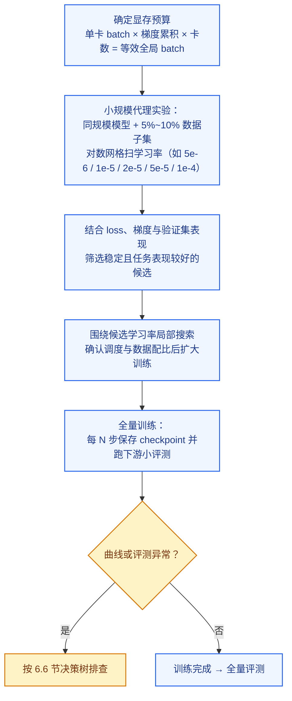

"学习率优先"有经典出处——Goodfellow《Deep Learning》第 11 章："如果只有时间调一个超参数，那就调学习率。"另外注意一个陷阱：标准参数化下，**小模型扫出的最优学习率不能直接搬到大模型**（最优点会随模型宽度漂移），所以上面的代理实验建议用同规模模型在数据子集上做。若确实需要跨规模迁移超参数，μP / μTransfer（Yang et al., 2022）通过修改参数化使最优学习率随宽度保持稳定——微软用 4000 万参数的代理模型调参后迁移到 6.7B 的 GPT-3，效果超过原版，而调参开销仅占预训练总算力的 7%。

### 7. 显存不够时的工程开关

| 手段 | 原理 | 代价 |
|------|------|------|
| 梯度累积 | 分多次前后向累积梯度，维持有效 batch | 需保持损失归一化、梯度裁剪和参数更新时机一致；吞吐需实测 |
| Gradient Checkpointing | 少存储中间激活，反向传播时重算 | 以额外计算换取显存，开销取决于重算范围 |
| DeepSpeed ZeRO-2 / ZeRO-3 | ZeRO-2 分片优化器状态和梯度，ZeRO-3 进一步分片参数 | 收益与卡数、精度和激活占用有关，同时引入通信开销 |
| LoRA / QLoRA | 训练低秩增量；QLoRA 还量化冻结主干 | 效果取决于任务、目标层和秩；仍有激活与计算开销 |
| 序列打包（packing） | 多条短样本拼成一条长序列，消除 padding 浪费 | 需正确处理注意力掩码与位置编码 |
| 降低分辨率 / tile 数 | 直接减少视觉 token 数量 | OCR、细粒度任务明显掉点 |

---

## 6.5 训练监控与 Loss 曲线解读 (Monitoring & Reading Loss Curves)

VLM 训练动辄几天到几周，**及时从曲线中读出问题**远比事后补救便宜。本节回答两个问题：盯什么、怎么读。

### 1. 盯什么：四个必看面板

| 指标 | 看什么 | 异常信号 |
|------|--------|---------|
| 训练 loss（平滑后） | 整体趋势是否持续下降 | 尖刺、平台期、上升 |
| 梯度范数（grad norm） | 是否稳定在窄带内 | 持续抬升、频繁触顶裁剪阈值 |
| 学习率 | 调度曲线是否符合预期 | warmup / 衰减配置错误 |
| 验证 loss + 下游评测 | 能力是否真的在提升 | train/val 分叉、评测得分饱和或回落 |

<div align="center">
  
  <figcaption>图：VLM 训练监控面板——① 训练 loss 永远看平滑曲线；② grad norm 是尖刺的先行指标；③ 学习率核对调度配置；④ 下游评测提供 loss 之外的真信号（示意图，数据为模拟生成）</figcaption>
</div>

三条实践建议：

- **永远看平滑后的 loss**（EMA 或滑动窗口均值）：逐 step 的原始 loss 受各 batch 难度差异影响，噪声很大，盯着原始值容易疑神疑鬼。
- **按数据源拆分 loss**：把 caption、OCR、grounding、纯文本等各数据源的 loss 分开记录。"总 loss 正常但 OCR loss 不降"这类问题，混在一起根本看不出来。
- **记录 token 级准确率**作为 loss 的补充：即预测下一 token 的 top-1 命中率，对 SFT 阶段尤其直观（HF TRL 的 SFTTrainer 默认就记录 mean_token_accuracy），可以发现"loss 在降但命中率不涨"的退化。

**补充：平滑系数（Smoothing Factor）怎么选**

EMA 的更新公式为 $$\hat{L}_t = \alpha \cdot \hat{L}_{t-1} + (1-\alpha) \cdot L_t$$，其中 $$\alpha \in (0,1)$$ 越大曲线越平滑。EMA 等效的"记忆窗口"约为 $$\frac{1}{1-\alpha}$$ 步——这是连接 EMA 与滑动窗口两种视角的桥梁：

| α（EMA 衰减系数） | 等效滑动窗口 | 适用场景 |
|------------------|------------|---------|
| 0.9 | ~10 步 | 短 SFT（总步数 < 1K）；训练速度快、想快速发现尖刺 |
| 0.95 | ~20 步 | 中等规模 SFT（1K~5K 步）；TensorBoard 的经验推荐值 |
| 0.99 | ~100 步 | 大规模预训练（5K~50K 步）；最常用的"生产"默认值 |
| 0.999 | ~1000 步 | 超长预训练（> 100K 步，如 LLaMA 预训练）；smoothed 曲线几乎只显示趋势 |

**工具默认值与推荐调整**：TensorBoard 的 Smoothing 滑块默认值为 **0.6**（等效窗口仅 2.5 步），对几千步的 VLM 训练曲线噪声太大——实践中推荐调到 **0.95~0.99**。Weights & Biases 在 UI 上不默认平滑，可在 "Smoothing" 下拉框中手动选 EMA 并设定系数。

**两侧权衡**：α 过大（过度平滑）→ 真实尖刺被掩盖、问题发现滞后，无法作为 grad norm 的早期预警补充；α 过小（平滑不足）→ 曲线抖动不止，难以判断下降趋势与平台期。经验法则：**平滑后曲线"细节模糊但趋势清晰"时即为合适**，若周期性尖刺在平滑曲线上还清晰可见，再增大 α 约 0.01~0.02。

### 2. 健康的 loss 曲线长什么样

**先做初始值 sanity check**。语言模型从随机初始化开始训练时，第一步的 loss 应约等于词表大小的自然对数（等价于均匀分布预测下的交叉熵）：

$$\mathcal{L}_0 \approx \ln |V|$$

例如 LLaMA 词表 32K 对应约 10.4，Qwen 词表 152K 对应约 11.9。**VLM 对齐阶段由于 LLM 已经预训练过，初始 loss 通常只有 4~6**——如果看到初始 loss 接近 ln(词表大小)，几乎可以断定预训练权重没有正确加载，这是最值得熟记的 debug 技巧之一。

**形态上**，健康的 loss 是幂律下降——前期快、后期慢，在双对数坐标下近似直线；训练末期随学习率余弦衰减还会小幅下探。三个阶段的曲线各有特点：

<div align="center">
  
  <figcaption>图：三阶段训练的典型 loss 曲线形态——阶段一起点较高、陡降后受冻结 LLM 上限约束收敛于 ~2.0；阶段二因新增更难任务起点回升、随后缓慢幂律下降；阶段三 SFT 数据格式统一，loss 绝对值最低（示意图，数据为模拟生成）</figcaption>
</div>

三个常见误读：

- **跨阶段比较 loss 没有意义**：阶段二的 loss 高于阶段一终点不代表"练坏了"，只是数据分布变了（新增 OCR、grounding 等更难的任务）。
- **loss 绝对值没有统一标准**：不同词表、不同数据、不同 loss mask 策略下的 loss 不可横向比较；要比就比同配置下的相对变化。
- **loss 永远降不到 0**：Chinchilla 的拟合公式中，自然语言存在约 1.69 nats 的不可约熵项——后期曲线趋平既有学习率衰减的因素，也有数据本身信息熵下限的因素，"看起来不动了"不等于没在学（对数坐标下看仍是直线下降）。

### 3. 四种异常模式与处置

<div align="center">
  
  <figcaption>图：四种典型的 loss 曲线异常模式——(a) 学习率过大/过小的形态对比；(b) 良性与恶性 loss 尖刺；(c) 过早进入平台期；(d) 多 epoch 过拟合时 train/val 分叉（示意图，数据为模拟生成）</figcaption>
</div>

| 现象 | 可能原因 | 处置 |
|------|---------|------|
| 快速下探后高位震荡（图 a 红线） | 学习率过大 | 学习率降 2~5 倍 |
| 下降极慢、远未收敛（图 a 蓝线） | 学习率过小、warmup 过长 | 学习率升 2~5 倍 |
| 尖刺后数百步内自行恢复（图 b 绿线） | 个别坏 batch / 极难样本 | 良性，继续观察；频繁出现则需清洗数据 |
| 尖刺后持续上升、发散（图 b 红线） | 学习率过大放大了坏 batch 的冲击；fp16 数值溢出；Adam 二阶矩状态被污染 | 回退到尖刺前的 checkpoint 并跳过该数据段续训（PaLM 的标准做法）；或降学习率、调低 β₂、收紧梯度裁剪 |
| 过早进入平台期（图 c） | 学习率衰减过快；数据重复/多样性不足；可训练参数太少（如只训投影层却期望学会 OCR） | 检查调度器配置；数据去重；解冻更多参数 |
| train 持续降、val 回升（图 d） | 过拟合（SFT 训多个 epoch 的典型现象） | 减少 epoch、提前停止、扩充数据多样性 |
| loss 变为 NaN / Inf | fp16 上溢或下溢；学习率过大；损坏样本（空图像、超长文本） | 换 bf16；降学习率；定位并剔除坏样本 |

关于 loss 尖刺，大模型训练史上有不少公开经验可以借鉴：**PaLM-540B** 全程遇到约 20 次尖刺，标准操作是回退到尖刺前约 100 步的 checkpoint、跳过其后 200~500 个 batch 再续训——把同一批数据从更早的 checkpoint 重放并**不会**复现尖刺，说明尖刺是"参数状态 × 特定数据"的组合事件，而非单纯的坏数据；**OPT-175B** 两个月训练中手动重启 35 次，期间把梯度裁剪阈值从 1.0 收紧到 0.3；**GLM-130B** 定位到尖刺主因是 embedding 层梯度异常（比其他层大几个数量级），通过将该层梯度缩小到 0.1 倍显著减少了尖刺；PaLM、Falcon、OLMo 2 还使用 **z-loss**（系数 1e-4）正则项抑制 logits 漂移。VLM 在第二阶段的大规模联合训练中最容易遇到这类问题。

### 4. grad norm：尖刺的先行指标

梯度范数往往比 loss 更早暴露问题：

- **健康形态**：warmup 结束后稳定在相对窄的区间（如 0.2~1.0），并随训练缓慢下降；
- **预警信号**：grad norm 先于 loss 持续抬升——这通常是发散的前兆，此时降学习率还来得及。"先行指标"有正式出处：GLM-130B 训练日志明确记录"崩溃通常滞后于 grad norm 尖峰"，OLMo 2 论文也写道 loss 尖刺"often preceded by spikes in the gradient norm"；
- **梯度裁剪 max_norm=1.0** 是几乎所有大模型训练的标配兜底（PaLM、LLaMA、LLaVA 均为 1.0；OPT 为求稳中途降到 0.3）。但若 grad norm **长期贴着裁剪阈值**，说明学习率设大了——裁剪只应偶尔触发，不应常态化；
- **按模块分组记录**：embedding、attention、FFN、投影层分开记 grad norm，能精确定位问题层——GLM-130B 正是这样发现 embedding 层的梯度异常。VLM 中还要确认冻结边界是否真的冻结（如阶段一中 LLM 与 ViT 的 grad norm 应恒为 0）。

### 5. loss 之外：一定要在训练中跑评测

**loss 低不等于能力强**。SFT 的 loss 衡量的是"复读参考答案的精确度"，与"回答得好不好"只有松散关联；更隐蔽的是，幻觉率可能在 loss 同步下降的同时不降反升（模型学会了更流利地编造）。因此：

- 每隔固定步数（如 500~1000 步）保存 checkpoint，自动跑一组**小而快的评测**：MMBench-dev 子集（综合能力）、POPE（物体幻觉）、TextVQA 子集（OCR）；
- 当评测得分已饱和而 loss 仍在缓降时，继续训练的边际收益已经很低，**提前停止可节约大量算力**；
- 反过来，**val loss 也会"假报警"**：InstructGPT 的 SFT 在 1 个 epoch 后验证 loss 就开始过拟合，但继续训到 16 个 epoch，奖励模型分数与人类偏好评分仍在持续上升——最终按下游指标而非 val loss 选 checkpoint。loss 与能力的分歧在对齐训练中是常态，下游评测才是金标准；
- 评测时必须使用与训练**完全相同的对话模板**（chat template）——模板不一致是"loss 正常但评测分数离谱地低"的最高频原因。

---

## 6.6 常见训练问题排查 (Troubleshooting)

把 6.4、6.5 节的要点收敛为一棵决策树，训练出问题时按图索骥：

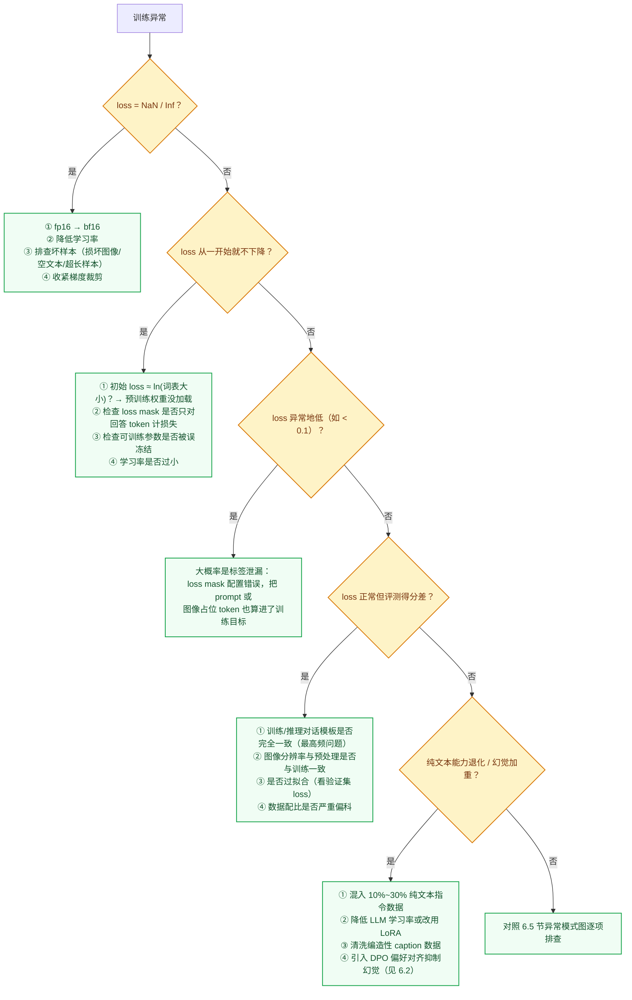

几个高频"暗坑"值得单独强调：

1. **loss mask 错误**是新手最常见的 bug：多模态对话样本中，只有**助手回答部分的 token** 应计入损失；prompt、系统提示、图像占位 token 都必须 mask 掉。把 prompt 算进 loss 会让 loss 虚低，模型学会的是复读问题而非回答问题。
2. **对话模板不一致**：训练时用 `<|im_start|>` 风格、推理时用 `[INST]` 风格，模型表现会莫名其妙地差。务必用同一份代码管理训练与推理的模板。
3. **图像 token 数对不上**：动态分辨率方案中，文本序列里 `<image>` 占位符展开的 token 数必须与视觉编码器实际输出的 token 数严格一致，错位一个就会导致整个序列的标签全部偏移。
4. **评测驱动开发**：不要等训练完才评测。任何配置改动（数据、超参、模板）都应先在小规模代理实验上验证（见 6.4 节调参工作流），确认曲线与小评测正常后再上全量。

---

## 6.7 案例剖析：Qwen-VL系列训练演进 (Case Study: Evolution of Qwen-VL Training)

阿里巴巴开源的 Qwen-VL（通义千问视觉语言模型）系列是被广泛使用的开源 VLM。从 Qwen-VL 到 Qwen2-VL、Qwen2.5-VL，再到 Qwen3-VL，四代模型的技术报告都公开了较完整的训练阶段划分，适合用来观察训练配方的演进。

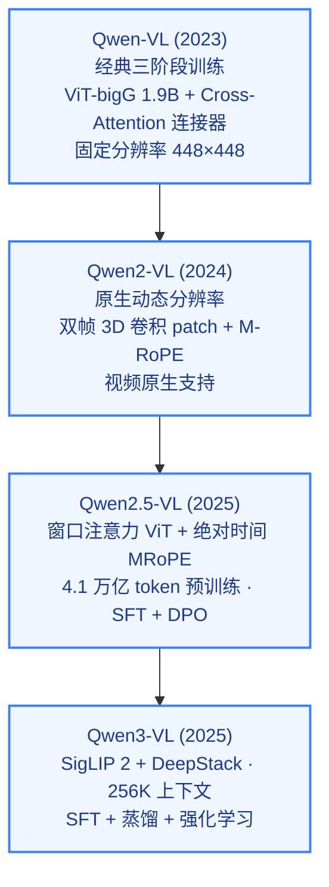

### 1. Qwen-VL (2023)

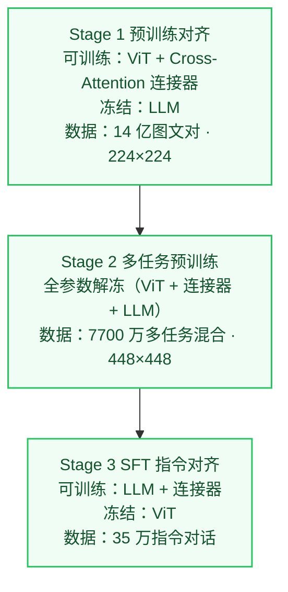

*   **架构特征**：
    - 视觉编码器：ViT-bigG (1.9B 参数)。
    - LLM：Qwen-7B。
    - 连接器：单层 Cross-Attention 模块（用 256 个可学习 query 将 ViT 输出的图像特征压缩为固定 256 个 visual tokens）。
*   **三阶段训练策略**：
    - **Stage 1 (预训练/特征对齐)**：
      - **冻结策略**：**冻结 LLM**，训练 ViT 与 Cross-Attention 连接器（注意与 LLaVA 只训连接器不同：Qwen-VL 从第一阶段起就让 ViT 参与训练，并对 ViT 使用 0.95 的逐层学习率衰减；详细超参数表见 6.4 节）。
      - **训练数据**：14 亿图文对（从 50 亿原始数据清洗而来，保留率 28%）。
      - **目的**：打通图像特征和文本语义的连接通道。
    - **Stage 2 (多任务预训练)**：
      - **冻结策略**：**全参数解冻**，ViT、连接器和 LLM 同时参与训练。
      - **训练数据**：约 7700 万条高质量多任务混合数据（图像描述 19.7M、OCR 24.8M、VQA 3.6M、Grounding 定位类约 21M、纯文本 7.8M 等七类），分辨率提升至 $448 \times 448$。引入边界框坐标标注进行 Grounding（目标定位）训练。
      - **目的**：极大地丰富模型的定位与细粒度感知能力。
    - **Stage 3 (SFT/指令对齐)**：
      - **冻结策略**：**冻结 ViT**，仅更新连接器与 LLM 的参数。
      - **训练数据**：约 35 万条高质量人工标注与强模型生成的指令对话样本。
      - **目的**：提高模型的对话流畅度和多轮追问的连贯性。

### 2. Qwen2-VL (2024)

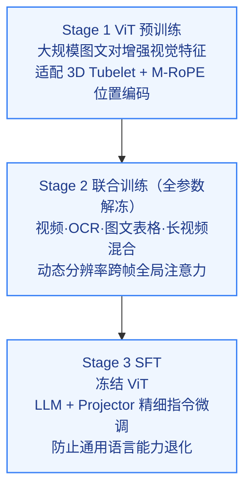

*   **架构升级**：
    - 支持**任意分辨率**的图像输入，引入 **Naive Dynamic Resolution**：ViT 直接编码按比例缩放后的整张图像，不再统一缩放到 448×448。
    - 使用 **3D 卷积**把相邻两帧的 patch 合成时空 token（图像复制为两帧处理），统一图像与视频的输入格式。
    - 引入 **M-RoPE**，把 LLM 中的位置编码拆成时间、高度、宽度三个分量；文本 token 三个分量取相同值，退化为普通 1D RoPE。
*   **训练策略变化**：
    - **Stage 1 (ViT 训练)**：
      - **特征**：只训练 ViT，在大规模图文对上学习与 LLM 衔接的视觉表示（与 Qwen-VL 第一阶段训练 ViT + 连接器的做法一脉相承）。
    - **Stage 2 (全参数联合训练)**：
      - **特征**：解冻全部参数，加入更多样的图文、OCR、图表、视频与交错数据，建立细粒度感知与视频理解能力。
    - **Stage 3 (SFT)**：
      - **特征**：**冻结 ViT**，只微调 LLM（及连接器），数据为多模态与纯文本指令对话。

### 3. Qwen2.5-VL (2025)

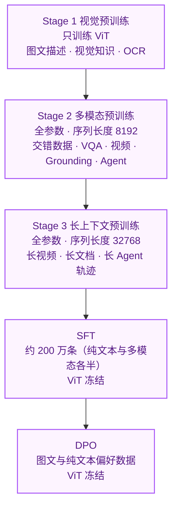

*   **架构升级**：
    - **ViT 重构**：多数层改用窗口注意力，仅 4 层保留全局注意力，使计算量随 patch 数近似线性增长；FFN 与归一化换成与 Qwen2.5 LLM 一致的 SwiGLU + RMSNorm。
    - **绝对时间对齐的 MRoPE**：时间维的位置 ID 与帧的绝对时间对齐，不同采样率的视频共享同一时间尺度，便于回答"某事件发生在第几秒"。
*   **训练变化**：
    - **数据量**：技术报告称预训练数据从约 1.2 万亿 token 扩展到约 4.1 万亿 token。
    - **分阶段拉长序列**：预训练后两阶段的序列长度从 8192 增加到 32768，以覆盖长视频与长文档。
    - **后训练只用 SFT + DPO**：技术报告中的后训练不包含 GRPO 等在线强化学习；SFT 数据约 200 万条，纯文本与多模态各占一半，以保留语言能力。

### 4. Qwen3-VL (2025)

Qwen3-VL 把后训练扩展为 **SFT → 强到弱蒸馏 → 强化学习**，并区分 Instruct 与 Thinking 两类变体：强化学习分为面向数学、代码与逻辑的推理 RL，以及面向指令遵循与格式控制的通用 RL。架构上改用 SigLIP 2 视觉编码器，加入 DeepStack 多层特征注入、Interleaved MRoPE 与文本时间戳，原生上下文扩展到 256K。完整的四阶段预训练与后训练流程见第 8.10 节。

从 Qwen-VL 到 Qwen3-VL，可以看到三个变化方向：**分辨率从固定到原生**，**预训练从短序列到长上下文**，**后训练从 SFT 到偏好优化再到强化学习**。

---

<a id="vlm-evaluation"></a>

# 7. 主流数据集与评测基准

**先区分训练资源与评测工具。** LAION-5B 主要用于图文预训练；COCO 同时包含多种任务的数据与划分；MMBench、MMMU 等用于评估特定能力。数据集规模大，不等于能证明模型能力强。

| 评测目标 | 本章相关基准 | 解读重点 |
|---|---|---|
| 通用理解与知识 | VQA v2、MMBench、MMMU / MMMU-Pro | 感知错误与知识错误需分开分析 |
| 文字、文档与图表 | TextVQA、OCRBench | 核对分辨率、指标量纲与数据划分 |
| 数学与视觉推理 | MathVista、MathVision、ScienceQA | 推理预算、答案抽取方式会影响分数 |
| 视频时序理解 | Video-MME | 核对帧数、字幕条件与视频时长分组 |
| 界面定位与交互 | ScreenSpot、OSWorld | 定位准确率与完整任务成功率并非同一指标 |
| 多语言覆盖 | MVL-SIB | 英文分数高不代表低资源语言同样可靠 |

复现实验时，应记录模型及权重版本、输入预算、提示模板、解码参数、评测脚本版本和样本划分；检查训练与测试数据重叠，并结合失败案例分析，而不只比较总分。

## 7.1 LAION-5B

| 属性 | 内容 |
|------|------|
| 发布年份 | 2022 |
| 规模 | 58.5亿图文对 |
| 场景 | 网络爬取（多语言） |
| 特点 | 公开图文对数据集的代表，2024 年经 CSAM 清理后以 Re-LAION-5B 重新发布 |

LAION-5B由LAION非营利组织发布，从Common Crawl中筛选出图文对，利用CLIP相似度过滤低质量样本。Stable Diffusion、OpenCLIP等开源模型均在此数据集上训练。

---

## 7.2 COCO（Common Objects in Context）

| 属性 | 内容 |
|------|------|
| 发布年份 | 2014（持续更新） |
| 规模 | 约 33 万张图像；Captions 子集约 12 万张（train+val）附 5 条人工描述 |
| 场景 | 日常生活场景 |
| 特点 | VLM标准评测基准，覆盖描述、检索、VQA等多个任务 |

COCO 是 VLM 领域最常用的基础数据集之一：早期视觉语言预训练工作普遍在 COCO Karpathy 划分上报告图像描述（CIDEr）与图文检索（R@1）指标；VQA v2、RefCOCO 等基准也建立在 COCO 图像之上。以 LLM 为核心的新一代 VLM 则更多转向 MMBench、MMMU 等综合基准。

---

## 7.3 VQA v2

| 属性 | 内容 |
|------|------|
| 发布年份 | 2017 |
| 规模 | 约 110 万个问题，约 20 万张 COCO 图像 |
| 场景 | 日常图像 |
| 特点 | 平衡设计消除语言偏置，真正考验视觉理解 |

VQA v2 针对 VQA v1 的语言偏置做了平衡：同一问题配两张相似但答案不同的图像，只靠问题文本猜答案的模型会明显掉分。答案按是非、计数与其他三类统计，每题有 10 个人工答案，评分按与人工答案的一致程度计算。

---

## 7.4 MMBench

| 属性 | 内容 |
|------|------|
| 发布年份 | 2023 |
| 规模 | 3000+题 |
| 场景 | 多样化能力评测 |
| 特点 | 系统性评测VLM在20+能力维度上的表现 |

MMBench 将 VLM 能力分解为感知、推理两大类，再细分为 20 个子能力（如属性识别、空间关系、动作识别等）；它采用 CircularEval——同一道选择题轮换选项顺序多次提问，全部答对才计分，以降低模型偏好某个选项位置带来的虚高。

---

## 7.5 ScienceQA

| 属性 | 内容 |
|------|------|
| 发布年份 | 2022 |
| 规模 | 21208道科学题 |
| 场景 | K-12科学教育（多模态） |
| 特点 | 包含图文混合的多步推理题，附带解题过程注释 |

ScienceQA 要求模型结合图像和文本进行科学领域的多步推理，每题附讲解与解题过程。约一半题目带图像；LLaVA 与 GPT-4 组合在该基准上报告了 92.53% 的准确率，高于论文给出的人类平均水平（88.40%）。

---

## 7.6 TextVQA / OCRBench

| 属性 | 内容 |
|------|------|
| 发布年份 | 2019 / 2023 |
| 规模 | 28,408 张图像（45,336 个问题） / 1,000 个问答对 |
| 场景 | 自然场景文字 / 场景文字、文档、手写、公式等多类 OCR 场景 |
| 特点 | 专门测试模型读取图像中文字的能力（OCR） |

图像中文字的理解（OCR）是VLM的重要能力，TextVQA要求模型读取图像中的文字来回答问题，OCRBench则更系统地测试多种OCR场景，是评测VLM文字理解能力的主流基准。

---

## 7.7 MMMU & MMMU-Pro（大学级多学科多模态理解）

| 属性 | 内容 |
|------|------|
| 发布年份 | 2023 / 2024 |
| 规模 | 11,500 道题（涵盖 6 大领域、30 个学科、183 个细分子领域） |
| 场景 | 大学考试、专业认证、学术图表与图解 |
| 特点 | 专门评估具备专家级领域知识与深度多模态推理能力，MMMU-Pro 进一步过滤纯文本捷径（Text Shortcuts），要求必须深度结合图像推理 |

MMMU（Massive Multi-discipline Multimodal Understanding）被公认为多模态领域的“MMLU”，涵盖艺术设计、商业、科学、医学、人文与工程等学科，包含图表、乐谱、化学分子式、医学影像、工程制图等复杂模态，是目前衡量 GPT-4o、Gemini 2.5 Pro、Qwen2.5-VL/Qwen3-VL 等前沿模型认知上限的关键基准。

---

## 7.8 MathVista & MathVision（多模态数学与几何视觉推理）

| 属性 | 内容 |
|------|------|
| 发布年份 | 2023 / 2024 |
| 规模 | 6,141 / 3,040 道数学视觉题 |
| 场景 | 函数图像、几何证明、统计图表、实物计算 |
| 特点 | 综合评测视觉感知（Fine-grained Perception）与数学逻辑推理（Mathematical Reasoning）的交织能力 |

传统纯文本数学评测（如 GSM8K、MATH）无法检验模型读取图像几何结构与坐标系的能力。MathVista 整合了 28 个现有多模态数据集与 3 个新构造的数据集（IQTest、FunctionQA、PaperQA）；MATH-Vision 则从真实数学竞赛中收集题目，难度更高，要求模型不仅能读出图中数值与几何约束，还要执行严密的代数与几何多步推导，是检验 VLM 视觉推理与长思考（Visual CoT / GRPO）效果的核心标杆。

---

## 7.9 Video-MME（综合长视频多模态评测）

| 属性 | 内容 |
|------|------|
| 发布年份 | 2024 |
| 规模 | 900 段高质量视频，2,700 道多轮问答 |
| 场景 | 6 大视觉领域（知识、影视、体育竞技、艺术表演、生活记录、多语言），细分 30 个子类 |
| 特点 | 涵盖短视频（<2 分钟）、中视频（4–15 分钟）与长视频（30–60 分钟），全部问答由人工标注 |

随着 VLM 的输入从单张图像扩展到连续视频流，Video-MME 填补了全面长视频评测的空白。它同时报告"无字幕"与"有字幕"两种设定，前者更能反映模型从画面中获取信息的能力；比较分数时须确认使用的是哪种设定以及输入帧数。

---

## 7.10 OSWorld & ScreenSpot（GUI Agent 计算机操作与定位基准）

| 属性 | 内容 |
|------|------|
| 发布年份 | 2024 / 2024 |
| 规模 | 369 个 Ubuntu 真实计算机任务（另有 43 个 Windows 任务） / 600+ 张截图、1200+ 条定位指令 |
| 场景 | 真实桌面软件、网页浏览器、多应用协作 |
| 特点 | 从纯文本/静态问答转向真实动态执行环境，闭环评估跨应用点击、输入、滚动与多步工作流完成率 |

随着多模态大模型从“看图说话”走向“Computer Use / GUI Agent”，OSWorld 与 ScreenSpot 成为最常引用的两类基准：ScreenSpot 只考单步定位（给定指令，点中正确的 UI 元素），OSWorld 在虚拟机中执行完整任务并用脚本检查最终状态。两者难度差别很大，定位准确率高不代表多步任务成功率高。

---

## 7.11 MVL-SIB

| 属性 | 内容 |
|------|------|
| 发布年份 | 2025（ACL Findings） |
| 规模 | 205 种语言 |
| 场景 | 多语言图文匹配 |
| 特点 | 覆盖语言最广的多模态基准，同时提供纯文本版本，可精确对比"视觉输入对不同语言的增益" |

MVL-SIB 揭示了多模态的"语言公平性"瓶颈：低资源语言下，即使 GPT-4o 等顶级模型的图文对齐质量也显著下降——高性能 VLM 在英文基准上的领先，并不意味着对全球语言的均等服务能力。

---

## 7.12 评测趋势：从静态 VQA 向交互、时序、多语言扩展

2025 年以来，VLM 评测呈现三个重要趋势：**Agent 导向评测**（将多模态任务与工具调用绑定，统一测试感知-规划-执行能力）、**时序知识新鲜度**（专门构造训练截止后的新闻与稀有知识，测试知识时效性）、**空间与 3D 推理**（多视角场景问答、带空间约束的 3D QA 进入主流）。评测重心正从"静态感知能力"向**"感知-推理-行动一体化"**演进，多语言公平性（MVL-SIB）也成为新的关注维度。

<a id="vlm-papers"></a>

# 8. 经典方法与代表性工作

> 本节大体按时间顺序梳理 VLM 领域的代表工作（DINOv2 / DINOv3 作为视觉编码器专题放在一起）。8.1～8.7 按"架构—训练—结果"展开；8.8 起为较新的论文，统一采用"精华—研究背景—方法—结果—局限"的结构。

## 8.1 ViLBERT（2019）

**论文**：ViLBERT: Pretraining Task-Agnostic Visiolinguistic Representations for Vision-and-Language Tasks
**机构**：Facebook AI Research
**发表**：NeurIPS 2019，作者：Jiasen Lu, Dhruv Batra, Devi Parikh, Stefan Lee

ViLBERT是最早将BERT扩展到视觉语言联合理解的里程碑工作，开创了"视觉语言预训练"研究方向。

> **精华**：ViLBERT 最值得借鉴的思想是**双流 + 协同注意力**设计——两个模态在各自的流中独立处理，仅通过协同注意力层有选择地交换信息，既保留了各模态的独立特性，又实现了深度跨模态交互，避免了过早融合导致的信息损失。其"大规模无标注图文对预训练 + 轻量级任务头微调"范式直接启发了后续几乎所有视觉-语言预训练工作。局限在于视觉特征依赖离线 Faster R-CNN 提取，推理速度慢，且双流架构参数量较大，难以规模化扩展。

### 架构设计：双流协同注意力

ViLBERT采用**双流（Two-Stream）**设计，两种模态在独立的流中处理，再通过协同注意力层相互交换信息：

- **语言流（Linguistic Stream）**：继承BERT-base的12层Transformer，768维隐层，12个注意力头
- **视觉流（Visual Stream）**：6层Transformer，1024维隐层，8个注意力头；以 Faster R-CNN 提取的图像区域特征作为输入（按检测置信度保留 10～36 个区域）
- **协同注意力层（Co-Attentional Transformer Layer）**：两个流通过交换 Key 和 Value 矩阵来实现跨模态信息融合——视觉流的 Query 与语言流的 Key/Value 进行注意力计算（反之亦然），使每个流能够有选择地"关注"另一模态的内容

这种设计的核心优势在于：允许两个流保持各自的模态特性，同时在特定层次进行深度交互，避免了过早融合导致的信息损失。

<div align="center">
  
  <figcaption>图：ViLBERT 双流协同注意力架构——上方为语言流，下方为视觉流，Co-TRM 层负责跨模态信息交换（来源：论文原图）</figcaption>
</div>

### 预训练方案

在 **Conceptual Captions** 数据集（约330万图文对，来自网络爬取并自动过滤的图像描述）上进行预训练，使用三个目标：

1. **遮蔽语言模型（MLM）**：随机遮蔽15%的文本token，预测被遮蔽词
2. **遮蔽图像区域预测**：随机遮蔽15%的图像区域，预测该区域对应的语义类别分布（从Faster R-CNN检测头的softmax输出）
3. **图文对齐预测（Image-Text Alignment）**：将50%的图文对替换为随机不匹配的样本，训练模型判断图文是否语义匹配（二分类）

### 下游任务与结果

ViLBERT 在预训练后通过轻量级微调适配四类下游任务，均取得当时的最好结果：

| 任务 | 数据集 | ViLBERT |
|------|--------|---------|
| 视觉问答（test-dev / test-std） | VQA v2 | 70.55 / 70.92 |
| 视觉常识推理 Q→A / QA→R / Q→AR（test） | VCR | 73.3 / 74.6 / 54.8 |
| 指代表达定位（val） | RefCOCO+ | 72.34 |
| 图像检索 R@1 | Flickr30K | 58.20 |

论文的消融同时显示：相同架构不做预训练时各任务明显下降，说明收益很大程度来自大规模图文预训练。

**历史意义**：ViLBERT直接启发了VisualBERT、UNITER、OSCAR、VinVL等一系列视觉语言预训练工作，奠定了"通用视觉语言表示预训练 + 任务微调"的研究范式。

---

## 8.2 CLIP（2021）

**论文**：Learning Transferable Visual Models From Natural Language Supervision
**机构**：OpenAI
**发表**：ICML 2021，作者：Alec Radford, Jong Wook Kim, Chris Hallacy 等

CLIP 是现代 VLM 体系的基石：LLaVA 系列直接使用 CLIP ViT-L/14，BLIP-2 使用的 EVA-CLIP、PaliGemma 与 Qwen3-VL 使用的 SigLIP 也都沿用了"图文对比预训练视觉编码器"这一思路。

> **精华**：CLIP 的革命性在于用**自然语言监督替代人工标注**——4亿网络图文对 + 对称 InfoNCE 损失，使视觉编码器学到了可直接迁移的语义特征。零样本迁移（通过 prompt engineering 将类别名嵌入文本）是其最具影响力的创新，打破了"必须在目标数据集上微调"的惯性思维。CLIP 及其后继（EVA-CLIP、SigLIP）训练的 ViT 成为开源 VLM 最常用的视觉骨干，说明预训练数据规模与训练目标的选择对表征质量影响很大。局限在于图文对之间的对比目标是"粗粒度"的——整张图对整段描述，难以捕捉细粒度的区域级语义对齐。

### 数据规模：WIT-400M

OpenAI从互联网上构建了 **WIT（WebImageText）** 数据集，通过搜索50万个常见词汇（Wikipedia词汇表）的同义词等方式筛选，最终获得 **4亿个图文对**，覆盖极为多样化的视觉概念，规模远超当时任何公开数据集（如ImageNet的128万张、Conceptual Captions的330万对）。

### 架构设计

CLIP包含两个独立的编码器，共享同一嵌入空间：

**图像编码器**：提供两个系列：
- ResNet系列：RN50、RN101、RN50x4（ResNet-50的约4倍计算量）、RN50x16、RN50x64
- ViT系列：ViT-B/32、ViT-B/16、ViT-L/14（307M参数，24层，1024维，14×14 patch）、ViT-L/14@336px

**文本编码器**：63M参数的Transformer，12层，512维，8个注意力头，最大序列长度76个token（BPE tokenization）；取 `[EOS]` token的最终隐层表示作为文本嵌入

两个编码器的输出分别经过**线性投影层**映射到同一维度的嵌入空间，通过余弦相似度衡量图文匹配程度。

<div align="center">
  
  <figcaption>图：CLIP 对比预训练框架——图像编码器与文本编码器共同学习对齐的嵌入空间（来源：OpenAI）</figcaption>
</div>

### 训练目标

对于一个包含 $N$ 个图文对的 batch，CLIP从 $N \times N$ 的可能配对矩阵中识别出 $N$ 个正确匹配。使用**对称 InfoNCE 损失**（同时对图像到文本和文本到图像两个方向计算）：

$$\mathcal{L} = -\frac{1}{2N}\left[\sum_{i=1}^{N}\log\frac{\exp(s_{ii}/\tau)}{\sum_{j=1}^{N}\exp(s_{ij}/\tau)} + \sum_{i=1}^{N}\log\frac{\exp(s_{ii}/\tau)}{\sum_{j=1}^{N}\exp(s_{ji}/\tau)}\right]$$

其中 $s_{ij} = \text{cos}(v_i, t_j)$ 为图像 $i$ 与文本 $j$ 的余弦相似度，$\tau$ 为**可学习的温度参数**（初始化为 0.07，训练过程中自动调整）。训练使用超大 batch size（**32,768**）以获得充足的负样本对，所有模型训练 32 个 epoch；最大的 ViT-L/14 在 256 块 V100 上训练了 12 天。

### 零样本迁移能力

CLIP最核心的贡献是其**零样本（Zero-Shot）迁移**能力：无需任何目标数据集的训练，仅通过将类别名称嵌入为文本提示（prompt engineering，如 "a photo of a {class name}"），即可通过计算图文相似度完成分类。

在 ImageNet 上的零样本 Top-1 精度：

| 模型 | 参数量 | ImageNet 零样本 Top-1 |
|------|--------|----------------------|
| RN50 | ~102M  | 59.6% |
| RN101 | ~119M | 62.4% |
| ViT-B/32 | ~150M | 63.3% |
| ViT-B/16 | ~150M | 68.3% |
| ViT-L/14 | ~428M | 75.3% |
| **ViT-L/14@336px** | ~428M | **76.2%** |

其中，**ViT-L/14@336px 的 76.2% 与有监督训练的 ResNet-50（76.1%）持平**，而后者需要全部128万张 ImageNet 训练数据。在 27 个分类数据集上，零样本 CLIP 有 16 个超过了"ResNet-50 特征 + 全监督线性分类器"的基线。

### 对后续研究的深远影响

- **视觉骨干标准化**：LLaVA / LLaVA-1.5 使用 CLIP ViT-L/14（@336px），BLIP-2 / InstructBLIP 使用 EVA-CLIP ViT-g/14，图文对比预训练的 ViT 成为 VLM 视觉编码器的默认起点
- **文生图基础**：DALL-E 2 使用 CLIP 图像嵌入作为扩散模型的条件；Stable Diffusion 使用 CLIP 文本编码器
- **开放词汇检测**：ViLD、OWL-ViT、RegionCLIP 等利用 CLIP 的图文对齐能力，把目标检测扩展到训练时未见过的类别
- **跨模态检索**：CLIP 嵌入成为图文检索引擎的核心表示

---

## 8.3 Flamingo（2022）

**论文**：Flamingo: a Visual Language Model for Few-Shot Learning
**机构**：DeepMind
**发表**：NeurIPS 2022，作者：Jean-Baptiste Alayrac, Jeff Donahue, Pauline Luc 等

Flamingo 是较早把 70B 级冻结语言模型扩展为多模态模型、并展示强少样本（in-context）视觉语言能力的代表工作。其核心设计哲学是：**保持 LLM 不变，只添加最小化的视觉接口**。

> **精华**：Flamingo 的核心价值在于**冻结 LLM + 插入视觉接口**的设计哲学——用 Perceiver Resampler 将任意长度的视觉特征压缩为固定的64个 latent token，再通过门控交叉注意力层（tanh 门初始化为0）让语言模型"渐进式"地获得视觉感知能力，完全不破坏原有 LLM 的语言能力。交错图文训练数据使模型天然支持多图上下文（few-shot）输入，这一范式直接启发了后续 BLIP-2、LLaVA 等所有"冻结 LLM + 轻量对齐模块"的路线。局限在于 Perceiver Resampler 的信息压缩会丢失细粒度视觉细节，且闭源限制了其生态发展。

### 核心架构

Flamingo 在冻结的 Chinchilla LLM（70B）基础上插入两个新模块：

**① Perceiver Resampler（感知重采样器）**

图像特征通常包含数百至数千个空间位置（取决于分辨率），而 LLM 对输入长度非常敏感。Perceiver Resampler 通过**可学习的 latent 向量**将任意长度的视觉特征压缩为固定数量（**64个**）的视觉表示：

- 64个 latent 向量通过 **self-attention** 相互交流
- 通过 **cross-attention** 从图像特征（含位置编码的 2D patch 特征）提取信息
- 支持任意分辨率的图像输入和任意帧数的视频输入（不同帧的特征被拼接后一同压缩）

**② Gated Cross-Attention Dense（GXATTN）层**

在冻结 LLM 的 Transformer 层之间按固定间隔插入新的跨模态注意力层（Flamingo-80B 为每 7 层插入一次）：

- 语言 token 作为 Query，Perceiver Resampler 输出的64个视觉 latent 向量作为 Key/Value
- **门控机制**：$y = y_{\text{LLM}} + \tanh(\alpha) \cdot \text{CrossAttn}(y_{\text{LLM}}, X_{\text{visual}})$，其中 $\alpha$ 初始化为 **0**，确保训练初期新层对 LLM 输出无影响，避免破坏原有语言能力
- 仅 GXATTN 层和 Perceiver Resampler 的参数参与训练（原始 LLM 参数完全冻结）

<div align="center">
  
  <figcaption>图：Flamingo 整体架构——视觉编码器经 Perceiver Resampler 压缩后，通过门控交叉注意力层注入冻结的 LLM（来源：论文原图）</figcaption>
</div>

### 训练数据

四类数据混合训练：

| 数据集 | 规模 | 说明 |
|--------|------|------|
| MultiModal MassiveWeb（M3W）| 约 4300 万网页 | 含图文交错内容，用于学习多图上下文 |
| ALIGN | 18 亿图文对 | 网络爬取的图像 alt-text |
| LTIP（Long Text & Image Pairs） | 3.12 亿图文对 | 描述更长、质量更高的图文对 |
| VTP（Video & Text Pairs） | 2700 万视频 | 与文字描述配对的短视频 |

**交错图文数据**是 Flamingo 能够处理多图输入（如对话历史中穿插多张图片）的关键。

### 少样本性能

Flamingo 在 16 个视觉语言基准上以**少样本（Few-Shot）**方式评测（提示中只给少量示例，不做梯度更新）；只用 32 个示例时，它在其中 6 个基准上超过了使用大量标注数据微调的当时最好模型。部分结果如下（Flamingo-80B）：

| 任务 | 0-shot | 4-shot | 32-shot | 微调 SOTA |
|------|--------|--------|---------|----------|
| VQAv2 | 56.3 | 63.1 | 67.6 | 80.2 |
| COCO Captioning（CIDEr） | 84.3 | 103.2 | 113.8 | 143.3 |
| TextVQA | 35.0 | 36.5 | 37.9 | 54.7 |

> **注**：在 VQAv2、COCO、TextVQA 这类标注充足的基准上，少样本结果仍明显低于专门微调的模型；Flamingo 的优势在于只靠少量示例就能适配新任务。TextVQA 分数偏低，也与 Perceiver Resampler 把视觉特征压缩为 64 个 token 时损失小文字细节有关。

---

## 8.4 BLIP-2（2023）

**论文**：BLIP-2: Bootstrapping Language-Image Pre-training with Frozen Image Encoders and Large Language Models
**机构**：Salesforce Research
**发表**：ICML 2023，作者：Junnan Li, Dongxu Li, Silvio Savarese, Steven Hoi

BLIP-2 的核心问题是：在两个已经预训练好的"大模型"（冻结的视觉编码器 + 冻结的 LLM）之间，如何以最低的计算代价建立有效的语义桥梁？

> **精华**：BLIP-2 的核心创新是 **Q-Former 信息瓶颈**——32 个可学习的 Query Token 通过 cross-attention 从冻结的 ViT-g（约 1B）中提取与语言最相关的视觉特征，整个 Q-Former 仅 188M 参数，却能连接 OPT-6.7B、FlanT5-XXL（11B）等冻结 LLM 完成多模态生成任务，极大降低了多模态对齐的计算门槛。两阶段训练（先视觉-语言表示对齐，再生成式语言对齐）的渐进式策略同样值得借鉴。局限在于 Q-Former 固定的 Query Token 数量限制了其处理高分辨率精细图像的能力，且 Q-Former 与 LLM 之间的语义鸿沟需要后续工作（如 InstructBLIP）通过指令感知机制进一步弥合。

### Q-Former：轻量级信息瓶颈

Q-Former（Querying Transformer）是 BLIP-2 的核心创新。它包含两个共享 self-attention 权重的 Transformer 模块：

- **Image Transformer**：通过 cross-attention 从冻结的视觉编码器（EVA-CLIP ViT-g/14，约 1B 参数）提取信息
- **Text Transformer**：处理文本输入，功能类似 BERT

两个模块共享同一套 self-attention 层，但 cross-attention 层仅存在于 Image Transformer 中。**32个可学习的 Query Token** 负责从 ViT 的视觉特征中提取与语言最相关的视觉信息，再通过一个线性投影层连接到 LLM 的输入空间。

Q-Former 整体仅有 **188M 参数**，而 ViT-g 约 1B、OPT-6.7B 有 6.7B、FlanT5-XXL 有 11B——Q-Former 以极小的可训练参数量，成为这些大模型之间的"翻译器"。

<div align="center">
  
  <figcaption>图：BLIP-2 整体框架——冻结的视觉编码器与冻结的 LLM 由 Q-Former 桥接（来源：论文原图）</figcaption>
</div>

<div align="center">
  
  <figcaption>图：Q-Former 内部架构——Image Transformer 与 Text Transformer 共享 Self-Attention 层，32个可学习 Query Token 通过 Cross-Attention 提取视觉特征（来源：论文原图）</figcaption>
</div>

### 两阶段训练

**第一阶段：视觉-语言表示学习**
冻结 ViT-g，训练 Q-Former，联合优化三个目标：
- **ITC（Image-Text Contrastive）**：对齐 Query Token 提取的视觉特征与文本嵌入
- **ITM（Image-Text Matching）**：判断图文是否匹配（利用 bi-directional attention mask）
- **ITG（Image-grounded Text Generation）**：以视觉 Query Token 为条件，自回归生成对应的图像描述

**第二阶段：视觉-语言生成学习**
冻结 LLM（OPT-6.7B 或 FlanT5-XXL），将 Q-Former 输出的32个 Query Token 经线性投影后拼接到 LLM 的文本输入前缀，训练 Q-Former 使其产生的视觉软提示（visual soft prompt）能有效引导 LLM 执行多模态生成任务。

### 结果

在零样本 VQAv2（test-dev）上，BLIP-2（ViT-g + FlanT5-XXL）达到 65.0%，高于 Flamingo-80B 的 56.3%，而可训练参数量只有后者的约 1/54（Q-Former 等约 188M，其余为冻结的预训练权重），大幅降低了多模态训练的计算需求。

---

## 8.5 LLaVA（2023）

**论文**：Visual Instruction Tuning
**机构**：University of Wisconsin-Madison / Microsoft Research
**发表**：NeurIPS 2023，作者：Haotian Liu, Chunyuan Li, Qingyang Wu, Yong Jae Lee

LLaVA 以极简的架构和创新的指令数据构建方法，开创了开源多模态大模型的繁荣生态，发布后迅速成为最具影响力的开源 VLM 之一。

> **精华**：LLaVA 的价值在于证明了**极简架构 + 高质量指令数据**的组合可以超越复杂设计——一个线性投影层（后升级为两层 MLP）足以连接 CLIP 视觉编码器与 LLM，关键在于如何获得高质量的视觉指令数据。用 GPT-4 基于图像标题和边界框文本代理生成多轮对话数据的方法，是一种低成本构建指令数据的范式创新，无需直接人工标注图像。LLaVA-NeXT 引入的动态分辨率切片（tile-based high resolution）被 InternVL 等大量开源 VLM 采用，另一条路线是 Qwen2-VL 的原生分辨率编码。局限在于早期 LLaVA 的线性投影过于简单，存在视觉-语言语义鸿沟，且对高分辨率精细内容（OCR、小目标）的识别能力不足。

### 架构：三件套极简设计

```
图像 → [CLIP ViT-L/14] → 视觉特征 Z_v
                           ↓
                       线性投影 W
                           ↓
                       视觉 token H_v  ──→ [LLM: Vicuna-13B / LLaMA] → 回答
                                         ↑
                                       文本指令 H_q
```

$$H_v = W \cdot Z_v, \quad Z_v = f_{\text{CLIP}}(X_v)$$

仅用**一个线性投影矩阵 $W$** 将 CLIP ViT 输出的视觉特征映射到 LLM 的词嵌入空间。视觉 token 与文本指令直接拼接后输入 LLM，结构极为简洁。

<div align="center">
  
  <figcaption>图：LLaVA 架构——CLIP 视觉编码器通过线性投影层与 LLaMA 语言模型连接，实现视觉指令微调（来源：LLaVA 项目）</figcaption>
</div>

### 指令数据构建：GPT-4辅助生成

LLaVA 的关键创新在于**如何获得高质量的视觉指令数据**。由于直接标注大量图像多轮对话数据成本极高，LLaVA 采用了一个巧妙的方案：

利用 COCO 数据集中已有的**图像标题**（captions）和**边界框信息**（bounding boxes），将这些文本信息作为图像内容的"代理"，交给纯文本输入的 GPT-4（部分数据用 ChatGPT）生成三种类型的指令数据：

1. **对话式（Conversation）**：58K条，模拟用户就图像内容进行多轮问答
2. **详细描述（Detailed Description）**：23K条，对图像进行全面、详细的文字描述
3. **复杂推理（Complex Reasoning）**：77K条，需要结合图像内容进行逻辑推理

合计 **~158K** 条高质量指令数据，构建成本极低（无需人工标注图像），却实现了出色的视觉指令遵循能力。

### 两阶段训练

| 阶段 | 可训练参数 | 目标 | 数据 |
|------|-----------|------|------|
| 预训练（特征对齐） | 仅投影层 W | 对齐视觉特征与 LLM 词嵌入空间 | 595K CC图文对 |
| 微调（指令遵循） | 投影层 W + LLM | 端到端学习视觉指令遵循 | 158K 指令数据 |

### LLaVA-1.5：MLP升级

LLaVA-1.5（2023年底）将线性投影层升级为**两层 MLP**（含 GELU 激活），并将视觉编码器从 ViT-L/14 升级为 **CLIP ViT-L/14@336px**（更高分辨率），在 VQAv2、GQA、TextVQA 等多个基准上大幅超越原始 LLaVA，同时仍保持同等简洁的架构。

### LLaVA-NeXT：动态高分辨率

LLaVA-NeXT（2024年初，也称 LLaVA-1.6）引入**动态分辨率切片**技术：

- 根据图像的原始长宽比，将其切分为 2×2 或 1×3 等不同网格（最多4个小块）
- 每个小块单独用 CLIP ViT 编码（每块336×336），获得更细粒度的局部特征
- 保留一张低分辨率（336px）的整体图像（缩略图），提供全局上下文
- 所有块的特征拼接后送入 LLM

这一设计将有效输入分辨率提升到 **672×672** 或更高，在 TextVQA（OCR理解）、DocVQA（文档理解）和图表理解任务上有显著提升。

---

## 8.6 SigLIP（2023）

**论文**：Sigmoid Loss for Language-Image Pre-Training
**机构**：Google DeepMind
**发表**：ICCV 2023，作者：Xiaohua Zhai, Basil Mustafa, Alexander Kolesnikov, Lucas Beyer

SigLIP 是对 CLIP 对比学习范式的关键改进：用逐对 sigmoid 损失替代 softmax 对比损失，不再需要在整个 batch 上做归一化。SigLIP 及其后继 SigLIP 2 已成为 PaliGemma、SmolVLM、Gemma 3、Qwen3-VL 等模型的视觉编码器。

> **精华**：CLIP 的 softmax 对比损失要求在整个 batch 内归一化，batch 越大效果越好，但也意味着必须在少数超算节点上集中训练。SigLIP 将问题拆解为 $N^2$ 个独立的二元分类——每对图文是否匹配——用 sigmoid 独立计算损失。这样可以按设备分块计算：各设备先算本地正负对，再以环形方式轮换文本特征来覆盖其他设备上的负样本，不必一次性构造完整的全局相似度矩阵，显存更省。实验上，sigmoid 损失在较小 batch（约 16K 以下）时明显优于 softmax 损失；batch 增大到 32K 左右后两者差距缩小，继续增大到百万级收益也很有限。SigLIP So400m（约 4 亿参数、按"形状优化"设计宽深比的 ViT，patch 14）作为视觉骨干被广泛采用；SigLIP 2（2025）进一步引入描述生成解码器、自蒸馏、掩码预测与多分辨率训练。

<div align="center">
  
  <figcaption>图：SigLIP 对比预训练框架——图像编码器与文本编码器学习共享嵌入空间（与 CLIP 框架相同），核心区别在于损失函数从 softmax InfoNCE 改为逐对 sigmoid，使训练无需依赖全局 batch 归一化（来源：论文原图）</figcaption>
</div>

### 核心：Sigmoid 损失替换 Softmax

**CLIP 的 softmax 对比损失**（对称 InfoNCE）：

$$\mathcal{L}_\text{CLIP} = -\frac{1}{2N}\left[\sum_{i}\log\frac{e^{s_{ii}/\tau}}{\sum_j e^{s_{ij}/\tau}} + \sum_{i}\log\frac{e^{s_{ii}/\tau}}{\sum_j e^{s_{ji}/\tau}}\right]$$

每个样本的归一化分母依赖所选 batch 内的候选文本或图像。使用跨设备负样本时，通常需要收集或交换特征；具体通信方式由实现决定。

**SigLIP 的 sigmoid 损失**：

$$\mathcal{L}_\text{SigLIP} = -\frac{1}{N}\sum_{i,j} \log \sigma\!\left(z_{ij} \cdot (2 y_{ij} - 1)\right)$$

其中 $z_{ij} = c \cdot \langle v_i, t_j\rangle + b$，$c$ 为可学习的正缩放系数，$b$ 为可学习偏置；$y_{ij} = 1$ 当 $i=j$，否则为 $0$。每对图文的损失独立计算，不需要跨样本 softmax 归一化；但要利用其他设备上的负样本，仍需在设备间交换特征。这里按 batch 大小 $N$ 归一化，与第 4.7 节一致；按 $N^2$ 平均会改变整体损失及梯度尺度。

### 实验结果

论文的主要结论集中在"batch size 与损失函数"的关系上：

- **小 batch 更占优**：batch 低于约 16K 时，sigmoid 损失的零样本精度明显高于 softmax 对比损失；两者差距随 batch 增大而缩小。
- **batch 并非越大越好**：batch 在 32K 左右时效果基本饱和，扩大到百万级几乎没有额外收益，因此不必追求超大 batch。
- **低成本训练**：与 Locked-image Tuning（冻结预训练图像编码器、只训文本编码器，即 SigLiT）结合，仅用 4 块 TPUv4、训练 2 天即可达到 84.5% 的 ImageNet 零样本精度。
- **偏置项的作用**：由于负样本对远多于正样本对，可学习偏置 $b$ 需初始化为较大的负值（论文取 -10），让训练初期的预测接近"不匹配"先验，避免早期梯度被大量负样本主导。

### 影响与后续

SigLIP 系列编码器已被多个开源 VLM 采用：

- **PaliGemma**（Google，2024）：直接以 SigLIP-SO/400M 作为视觉骨干，与 Gemma-2B 结合
- **SmolVLM**（HuggingFace，2024–2025）：SigLIP 视觉编码器 + Pixel Shuffle 压缩，提供 256M / 500M / 2.2B 端侧版本
- **Qwen3-VL**（阿里，2025）：视觉编码器升级为 **SigLIP 2**，8B 及以上版本使用 SigLIP2-SO-400M
- **SigLIP 2**（Tschannen et al., 2025）在 sigmoid 损失之外加入基于解码器的描述生成与定位预训练（LocCa）、自蒸馏与掩码预测等目标，并提供支持原生宽高比的 NaFlex 变体，改善定位、密集特征与多语言能力

---

## 8.7 InternVL2（2024）

**论文**：InternVL2 以[技术博客](https://internvl.github.io/blog/2024-07-02-InternVL-2.0/)形式发布（2024.07），核心技术来自 InternVL（CVPR 2024 Oral，InternViT-6B 的训练）与 InternVL 1.5（[arXiv:2404.16821](https://arxiv.org/abs/2404.16821)，动态高分辨率与 Pixel Shuffle）
**机构**：上海人工智能实验室（Shanghai AI Laboratory）
**作者**：Zhe Chen, Weiyun Wang, Hao Tian, Wenhai Wang, Jifeng Dai 等

InternVL2 是 2024 年中期综合性能最强的开源 VLM 系列之一，最大的 76B 版本在文档、图表等基准上超过了当时的 GPT-4V。

> **精华**：InternVL2 的核心洞察是**扩大视觉编码器规模是提升多模态理解能力的关键杠杆**——InternViT-6B（5.9B参数）是 CLIP ViT-L（307M）的约19倍，能提取更丰富的细粒度视觉特征，在文档、图表、数学题图等精细理解任务上优势尤为明显。Pixel Shuffle 压缩（4:1）将高分辨率 tile 的 token 从1024压缩至256，高效降低 LLM 输入长度的同时保留视觉细节。模型系列从 1B 到 76B：26B 以上使用 InternViT-6B，8B 及以下使用 InternViT-300M，并搭配不同来源的语言骨干，覆盖从端侧到服务器的部署需求。局限在于 InternViT-6B 推理成本较高，小模型改用 300M 编码器后细粒度能力有所折损。

### 核心：InternViT-6B 超大视觉编码器

InternVL2 大模型的关键差异化在于使用了 **InternViT-6B**（最初约 **5.9B 参数**；InternVL 1.5 起去掉最后 3 层，约 5.5B）：

- **架构**：48 层（后为 45 层）ViT，隐层维度 **3200**，patch size 14×14，InternVL 1.5 起输入分辨率为 448×448
- **训练策略**：InternVL 先在大规模网络图文对上做对比学习，再以 QLLaMA 作为语言中间件做生成式训练，使 InternViT-6B 与语言模型逐步对齐；它在 ImageNet 线性探测、ADE20K 分割等纯视觉任务上也表现很强
- **与 CLIP ViT-L 的对比**：CLIP ViT-L 仅有 307M 参数，InternViT-6B 参数量是其约19倍，能提取更丰富的细粒度视觉特征

<div align="center">
  
  <figcaption>图：InternVL2 模型家族概览——从1B到76B的完整系列，共享 InternViT 视觉编码器，替换不同规模的语言骨干（来源：InternVL 官方博客）</figcaption>
</div>

### 动态高分辨率处理

InternVL2 训练时最多使用 12 个 448×448 tile，测试时可零样本扩展到 40 个 tile（约 **4K 分辨率**），流程如下：

1. **自适应切片**：根据输入图像分辨率和长宽比，从预定义的网格中选择最接近的一种，把图像切成若干 448×448 tile，并额外保留 1 张整体缩略图
2. **独立编码**：每个子图通过 InternViT-6B 独立编码，产生 $(448/14)^2 = 1024$ 个 token
3. **Pixel Shuffle 压缩**：将2×2的4个相邻 token 合并为1个，将每张子图的 token 从1024压缩至 **256**（4:1压缩比），显著降低 LLM 的输入长度

### 模型规格与语言骨干

InternVL2 家族通过替换语言骨干，提供从端侧到服务器端的完整模型系列：

| 模型 | 视觉编码器 | 语言骨干 | 总参数 |
|------|-----------|---------|-------|
| InternVL2-1B | InternViT-300M | Qwen2-0.5B-Instruct | 约1B |
| InternVL2-2B | InternViT-300M | InternLM2-1.8B | 约2B |
| InternVL2-4B | InternViT-300M | Phi-3-Mini-3.8B | 约4B |
| InternVL2-8B | InternViT-300M | InternLM2.5-7B | 约8B |
| InternVL2-26B | InternViT-6B | InternLM2-20B | 约26B |
| InternVL2-40B | InternViT-6B | Nous-Hermes-2-Yi-34B | 约40B |
| InternVL2-Llama3-76B | InternViT-6B | Hermes-2-Theta-Llama-3-70B | 约76B |

### 评测结果

InternVL2-Llama3-76B 与同期商业模型的对比（数值取自 InternVL2 官方博客）：

| 基准 | InternVL2-76B | GPT-4V | GPT-4o | Gemini 1.5 Pro |
|------|--------------|--------|--------|----------------|
| MMBench（EN） | **86.5** | 81.0 | 83.4 | 73.9 |
| DocVQA | **94.1** | 87.2 | 92.8 | 86.5 |
| ChartQA | **88.4** | 78.1 | 85.7 | 81.3 |
| MathVista | **65.5** | 58.1 | 63.8 | 57.7 |

InternVL2 的成功验证了**扩大视觉编码器规模**（相较于 CLIP ViT-L）在提升多模态理解能力方面的有效性，尤其在需要细粒度视觉理解的任务（文档、图表、数学题图）上优势明显。

### InternVL2.5 演进（2024年底）

InternVL2.5 基本沿用 InternVL2 的架构，主要改进在训练与数据：采用**渐进扩展（progressive scaling）**——在小 LLM 上训好的 ViT 可直接复用到大 LLM；训练时加入随机 JPEG 压缩增强与按回答长度的损失重加权；并严格过滤指令数据中的重复、异常样本。InternVL2.5-78B 在 MMMU 验证集上达到 70.1%，是首个超过 70% 的开源 VLM。其训练配方（MLP 预热 → ViT 增量学习 → 全模型指令微调，全程统一学习率、总计约 1200 亿 token）详见 6.4 节。

<div align="center">
  
  <figcaption>图：InternVL 模型家族演进——从 InternVL2 到 InternVL2.5，视觉编码器规模与语言骨干持续扩大（来源：InternVL 官方）</figcaption>
</div>

---

## 8.8 InternVL3.5（2025）

——开源多模态模型的全面升级：推理能力、通用性与推理效率三管齐下

📄 **Paper**: [arXiv:2508.18265](https://arxiv.org/abs/2508.18265)

### 精华

- 推理能力的提升不一定要靠单一的强化学习算法堆到底：**离线RL（MPO）做"暖场"再用在线RL（GSPO）精修**的级联策略，比单独跑在线RL更省算力、效果更好，且对模型规模和稀疏度（dense/MoE）都稳定有效。
- 视觉token的压缩率可以是**输入自适应**的，而不是固定写死：用一致性蒸馏训练模型本身先学会"在不同压缩率下输出一致"，再单独训一个轻量路由器按patch语义内容选压缩率，比按图像宽高切分的传统Dynamic High Resolution更细粒度。
- 多模态推理效率的瓶颈往往不是计算量本身，而是**视觉编码器和语言模型的计算特性不匹配**（视觉强并行、语言强自回归依赖历史state）导致互相阻塞；把两者解耦部署到不同GPU/Server上做异步流水线，能直接换来可观的吞吐提升，且分辨率越高收益越大。
- 这两项效率手段（动态压缩率 + 解耦部署）几乎是**正交可叠加**的：单独DvD最高2.01×加速，叠加ViR后能到4.05×，说明"省token"和"省调度阻塞"是两类不同的瓶颈，值得同时治理。
- 大规模文本数据与多模态数据按约1:2.5～1:3.5混合的原生预训练策略，是开源MLLM在纯文本任务（GAOKAO、MMLU-Pro等）上逼近商业模型的重要前提，提醒"多模态化"不应以牺牲语言能力为代价。

---

### 1. 研究背景/问题

当前开源MLLM在文本任务、复杂推理任务和Agent任务上与GPT-5等商业模型仍有明显差距，社区已尝试用RL方法缩小差距，但稳定、高效、可扩展的MLLM强化学习框架仍是开放问题。同时，长视觉上下文和高分辨率理解带来的计算成本持续上升，已成为实际部署的核心瓶颈。InternVL3.5即针对"推理能力"和"推理效率"这两个相对独立但同等重要的维度同时发力。

---

### 2. 主要方法/创新点

InternVL3.5沿用InternVL系列的"ViT–MLP–LLM"范式（语言模型基于Qwen3 / GPT-OSS，视觉编码器为InternViT-300M / InternViT-6B），并在此基础上引入三项核心技术：**Cascade RL**（提升推理能力）、**Visual Resolution Router, ViR**（降低视觉token开销）、**Decoupled Vision-Language Deployment, DvD**（解耦部署提升推理吞吐）。

<div align="center">
  
<figcaption>图：InternVL3.5整体架构。(a) 数据预处理：基于预定义宽高比将图像切分为448×448的tile加缩略图；(b) 整体模型架构：ViT编码视觉tile，经MLP Projector接入Qwen3/GPT-OSS语言模型；(c) Connector架构：InternVL3.5-Flash在标准Pixel Shuffle基础上新增Visual Resolution Router，按patch语义内容动态选择1/4或1/16的压缩率。</figcaption>
</div>

**① 整体框架概述**：系统由三个核心模块构成——视觉编码器（InternViT）将动态切分后的图像tile编码为视觉token；Vision-Language Connector通过Pixel Shuffle和MLP Projector把视觉token压缩并投影到语言模型的embedding空间；语言模型（Qwen3 / GPT-OSS）负责融合视觉token与文本token并自回归生成回复。InternVL3.5-Flash在Connector中额外引入ViR，使视觉token的压缩率可以按patch内容动态调整而非固定不变。

**② 训练流程（四阶段递进）**：

<div align="center">
  
<figcaption>图：InternVL3.5训练流程，依次为原生预训练、监督微调、Cascade RL（含MPO与GSPO两个子阶段）、ViCO（含一致性训练与路由器训练，用于产出InternVL3.5-Flash）。</figcaption>
</div>

- **原生预训练（~250B token）**：联合更新全部参数，文本数据与多模态数据混合比例约1:2.5，最大序列长度32K。损失采用对每个样本做"平方根加权"的NTP loss（权重 $w_i=1/N^{0.5}$，$N$为样本内计算损失的token数），避免长/短回复带来的偏置；同时引入随机JPEG压缩增强真实场景鲁棒性。
- **监督微调（SFT，~130B token）**：复用InternVL3的指令数据保证覆盖面，新增"Thinking模式"的长链推理数据（由大模型采样rollout后严格过滤思维清晰度、冗余度、格式一致性），并加入GUI交互、具身交互、SVG理解生成等能力扩展数据。
- **Cascade RL（核心创新）**：分两个互补子阶段。**离线RL阶段**用Mixed Preference Optimization（MPO）做高效"暖机"，损失为偏好损失（DPO）、质量损失（BCO）、生成损失（LM loss）的加权和：
  $$\mathcal{L}_{MPO} = w_p \mathcal{L}_p + w_q \mathcal{L}_q + w_g \mathcal{L}_g$$
  离线RL把rollout采集和参数更新解耦，训练效率高且能为下一阶段保证高质量rollout。**在线RL阶段**用GSPO（不带参考模型约束）在自身采样的rollout上精修输出分布，优势函数定义为同query下多个响应reward的标准化值：
  $$\hat A_i = \frac{r(x,y_i) - \mathrm{mean}\{r(x,y_i)\}_{i=1}^G}{\mathrm{std}\{r(x,y_i)\}_{i=1}^G}$$
  重要性采样比取每个token概率比的几何平均（即整段响应级别的比值）：
  $$s_i(\theta) = \left(\frac{\pi_\theta(y_i\mid x)}{\pi_{\theta_{old}}(y_i\mid x)}\right)^{1/|y_i|}$$
  级联设计的优势：(1) 离线阶段rollout采集与更新解耦，缓解reward hacking，且更强的MPO模型能让后续GSPO训练更稳定；(2) 离线阶段的rollout可在多个模型间共享，分摊在线RL的采样成本；(3) 经MPO预热的模型在GSPO阶段只需更少步数即可达到更高性能上限。
- **ViCO（构建InternVL3.5-Flash）**：分两步。**一致性训练**：冻结一个以InternVL3.5初始化的参考模型（固定用1/4压缩率推理），让policy模型在1/4或1/16两种压缩率下（均匀采样）的输出分布向参考模型对齐，最小化KL散度：
  $$\mathcal{L}_{ViCO} = \mathbb{E}_{\xi\sim R}\left[\frac{1}{N}\sum_{i=1}^N \mathrm{KL}\big(\pi_{\theta_{ref}}(y_i\mid y_{<i},I)\,\|\,\pi_{\theta_{policy}}(y_i\mid y_{<i},I_\xi)\big)\right]$$
  **路由器训练**：冻结整个MLLM主干，只训练ViR这个二分类器。先计算每个patch在低/高压缩率下的loss比值 $$r_i = \mathcal{L}_{ViCO}(y_i\mid I_{1/16}) / \mathcal{L}_{ViCO}(y_i\mid I_{1/4})$$，再用滑动窗口历史值的k百分位作动态阈值 $\tau$，按 $r_i$ 是否超过 $\tau$ 生成0/1标签训练路由器，使其学会判断"哪些patch压缩了也不掉性能"。最终InternVL3.5-Flash可减少50%视觉token，性能几乎不掉（DocVQA等高分辨率任务保持~100%原性能）。

**③ Decoupled Vision-Language Deployment（DvD）**：

<div align="center">
  
<figcaption>图：DvD解耦部署示意图。(a) 原始部署：ViT、MLP、LLM在同一服务器上串行执行，因体量与计算特性差异巨大导致严重的相互阻塞；(b) DvD：ViT+MLP部署在独立的视觉服务器，LLM部署在语言服务器，二者异步并行，视觉特征以BF16通过TCP（可选RDMA）单向传输，三阶段流水线重叠执行。</figcaption>
</div>

动机：视觉编码器高度可并行且不依赖长程历史state，语言模型则因自回归特性对内存带宽和延迟更敏感；二者放在同一服务器上会相互阻塞，分辨率/视觉模型越大阻塞越严重。DvD把视觉子系统（批处理图像产生紧凑特征embedding）与语言子系统（融合文本上下文做decoding）拆分到独立服务器，让视觉计算与LLM的prefilling/decoding重叠执行，同时也便于独立优化两侧的硬件成本，新增视觉模块也无需改动语言服务器。

**训练目标小结**：预训练/SFT阶段为加权NTP loss；Cascade RL阶段为MPO的三项加权损失（公式见上）和GSPO的clip目标；ViCO阶段为KL一致性损失+路由器的交叉熵损失。

**推理流程**：默认不开启test-time scaling；针对推理类benchmark额外提供两种TTS手段——**Deep Thinking**（开启Thinking模式做分步推理）和**Parallel Thinking**（用VisualPRM-v1.1作为critic在多个候选回答中做Best-of-N选择），二者可与Cascade RL叠加进一步提升推理分数。

---

### 3. 核心结果/发现

- **整体能力**：InternVL3.5-241B-A28B 在通用、推理、文本、Agent 四大类 35 个 benchmark 上取得开源模型中的最高综合分；其中通用多模态类综合分 74.1，与 GPT-5 的 74.0 持平，全部类别合计与 GPT-5 的差距收窄到 3.9%。
- **推理能力提升显著**：相比上一代InternVL3，同等规模下推理类benchmark平均提升超10分；MMMU上8B/241B模型分别达到73.4/77.7。Cascade RL的逐阶段消融显示：SFT后的Instruct模型已大幅超过InternVL3（如8B提升+9.3%），MPO阶段再提供最高+3.5%的平均增益，完整Cascade RL相比SFT基线最高带来+16.0%（如2B模型推理任务+12.2%，241B模型+6.5%）增益，且训练效率上仅需GSPO一半的GPU时数即可取得更优效果（8B模型：Cascade RL耗时~5.8K GPU小时综合分60.3，对比GSPO两轮~11.0K GPU小时综合分仅58.2）。
- **效率提升可叠加**：DvD单独最高带来2.01×（241B模型）/1.97×（38B模型）的吞吐加速，且分辨率越高加速越明显（448→1344分辨率下38B模型加速比从1.19×提升到1.97×）；在DvD基础上叠加ViR后总加速比最高达4.05×（38B模型，1344分辨率）。ViR带来的视觉token减半几乎不损失性能（InternVL3.5-Flash在DocVQA、InfoVQA等高分辨率任务上保持原模型~100%的分数）。
- **versatility**：在SGP-Bench（SVG理解）、ScreenSpot/OSWorld-G（GUI grounding）、VSI-Bench/ERQA/SpaCE-10/OmniSpatial（具身/空间推理）等agentic任务上均取得开源模型中的领先表现，验证了模型在GUI交互和具身智能方向的潜力。

---

### 4. 局限性

论文未设置独立的局限性章节，但在结果分析中指出：HallusionBench（幻觉评测）等任务上InternVL3.5仍落后于部分开源/商业模型，表明视觉幻觉问题尚未被现有训练策略充分解决，需要进一步改进；此外当前TTS仅在推理类benchmark上验证有效，对一般感知/理解类任务的增益尚不明显。

---

<a id="qwen25-vl"></a>

## 8.9 Qwen2.5-VL（2025）
——Native Resolution, Dynamic FPS, Temporal-Aware Vision-Language Model

📄 **Paper**: [arXiv:2502.13923](https://arxiv.org/abs/2502.13923)

### 精华

Qwen2.5-VL 将动态分辨率、动态 FPS 采样与时间感知位置编码结合起来：根据输入和预算保留视觉细节，用时间信息表达视频事件的位置，并以窗口注意力和特征合并控制计算开销。“动态分辨率”并非完全不缩放，“时间感知”也不等于保证定位正确；两者是支持这些能力的机制。

---

### 1. 研究背景/问题

主流 VLM（如 LLaVA 系列）在视觉编码时通常把图像缩放到固定分辨率，视频则以固定帧率截帧，导致细节信息丢失、时序理解不准确。此外，早期 ViT 在 VLM 中直接沿用图像预训练结构，缺乏对视频时序建模的原生支持，也没有与 LLM 位置编码体系的深度融合。Qwen2.5-VL 从视觉编码器架构和位置编码设计两个方面改进这些问题。

---

### 2. 主要方法/创新点

**① 整体框架概述**

Qwen2.5-VL 由视觉编码器、MLP 视觉语言 merger 与 Qwen2.5 语言模型组成；MRoPE 是语言模型处理多模态位置的机制，不能替代 merger 作为连接模块。

<div align="center">
  
<figcaption>Qwen2.5-VL 整体架构：视觉编码器处理变长图像与视频输入，merger 压缩并投影视觉特征，语言模型结合 MRoPE 读取空间与时间信息。</figcaption>
</div>

**② Vision Encoder — 重构后的 ViT**

- **输入**：按像素预算和尺寸约束预处理的图像；视频按采样配置得到帧序列
- **处理**：
  - **Window Attention**（局部注意力）：多数层在局部窗口内计算注意力，降低视觉编码开销
  - **Full Attention**（全局注意力）：四个层扩大空间交互范围，不应直接理解为所有视频帧之间的全局注意力
  - **时空 patch 与空间合并**：相邻两帧参与时空 patch 编码，merger 再合并相邻的 2×2 空间特征；不是把两张完整视频帧压成一个 token
  - **SwiGLU FFN + RMSNorm**：替代原始 ViT 的 GELU FFN + LayerNorm，提升效率与稳定性
- **输出**：变长视觉 token 序列（图像约几百至千余 token，视频按帧数和 FPS 动态调整）
- **设计动机**：窗口注意力让 ViT 的计算量随 patch 数近似线性增长，缓解高分辨率下全局 self-attention 的 $$O(n^2)$$ 开销；双帧 3D 卷积 patch 让视频 token 数减半

**③ MRoPE（Multimodal Rotary Position Embedding）**

传统 1D RoPE 无法表达图像的二维空间位置或视频的时间戳信息。MRoPE 将旋转位置编码扩展为三通道：

- **图像**：高度和宽度分量表达空间位置，同一图像的时间 ID 保持一致
- **视频**：在 H、W 之外，时间维度 ID 对齐帧的**绝对时间戳**（而非帧序号），使模型能感知"这一帧发生在第 $t$ 秒"

这让模型在视频 QA 任务中具备精确的时刻定位能力（moment retrieval），而不只是判断事件的相对顺序。

**④ 动态分辨率与动态 FPS**

- 图像按尺寸约束和像素预算预处理，token 数随处理后的图像面积变化
- 视频支持不同 FPS 输入，模型无需假设固定帧率；低帧率视频不会因插值引入伪影

<div align="center">
  
<figcaption>Qwen2.5-VL-72B 与同量级纯语言模型（Llama-3.1-70B、Qwen2-72B、Qwen2.5-72B 等）在纯文本基准（MMLU-Pro、GPQA、MATH、GSM8K、HumanEval、MultiPL-E、IFEval 等）上的对比，用于检验多模态训练后语言能力的保留情况。</figcaption>
</div>

<div align="center">
  
<figcaption>Qwen2.5-VL-72B 与 Claude-3.5-Sonnet、GPT-4o、Qwen2-VL-72B 等在视觉基准（MMMU、AndroidWorld、Video-MME、InfoVQA、DocVQA、MMStar、MMBench、MathVista 等）上的对比；Qwen2.5-VL-72B 在多数基准上领先，但并非每项都最高。</figcaption>
</div>

**⑤ 训练目标**

预训练与 SFT 均采用自回归语言建模目标：

$$\mathcal{L} = -\sum_{t} \log P(y_t \mid y_{<t}, x_{\text{visual}}, x_{\text{text}})$$

视觉 token 和文本 token 统一进入 LM Decoder 做 next-token prediction；视觉 token 位置不计入损失，SFT 阶段只对回答部分计算 loss。SFT 之后再用 DPO 做偏好对齐，后训练阶段 ViT 保持冻结。

---

### 3. 核心结果/发现

以下为 72B 版本的报告结果：

- **DocVQA**：96.4，高于 Claude-3.5-Sonnet（95.2）和 GPT-4o（91.1）；OCRBench 885
- **Video-MME**（有字幕）：79.1，高于 GPT-4o（77.2），低于 Gemini-1.5-Pro（81.3）；LVBench 47.3，明显高于两者
- **MathVista**：74.8，高于 GPT-4o（63.8）与 Claude-3.5-Sonnet（67.7）
- **纯文本基准**：MMLU-Pro 71.2、MATH 83.0、GSM8K 95.3、HumanEval 87.8，与同规模纯语言模型处于同一水平，说明多模态训练后语言能力保留较好
- 提供 3B / 7B / 32B / 72B 多档模型，3B 面向端侧部署

---

### 4. 局限性

从架构与输入预算可以推断：稀疏采样可能漏掉短暂事件，较低分辨率可能丢失小文字，长视频也会增加语言模型的上下文开销。这些是部署时应验证的风险，不能仅凭视觉编码器的 Full Attention 层数判定时序能力。变长输入还需要在批处理时管理 padding、像素预算与显存。

---

<a id="qwen3-vl"></a>

## 8.10 Qwen3-VL（2025）
——长上下文、分层视觉融合与推理增强

📄 **Paper**: [arXiv:2511.21631](https://arxiv.org/abs/2511.21631v2)

### 精华

这篇论文展示了如何构建一个全面的视觉-语言模型系列，值得借鉴的核心思想包括：
1. **平衡文本和多模态能力**：通过square-root reweighting确保多模态训练不损害文本能力，甚至在某些文本任务上超越纯文本模型
2. **渐进式上下文扩展**：采用四阶段预训练(8K→32K→256K)，逐步扩展上下文窗口，而不是一步到位
3. **架构优化的实用主义**：Interleaved MRoPE、DeepStack、文本时间戳等创新都针对实际问题（长视频理解、视觉-语言对齐、时序定位）
4. **分层式后训练**：区分non-thinking和thinking变体，针对不同应用场景优化
5. **全栈式能力整合**：将感知(grounding)、推理(reasoning)和行动(agentic)能力统一到单一模型框架中

### 1. 研究背景/问题

现有的视觉-语言模型在发展过程中面临几个关键挑战：一是多模态训练往往会损害底层LLM的语言能力；二是长上下文支持不足，难以处理长文档和长视频；三是在STEM推理、文档理解、视频理解等专业任务上性能参差不齐；四是缺乏统一的框架整合感知、推理和决策能力。Qwen3-VL旨在系统性地解决这些问题。

### 2. 主要方法/创新点

<div align="center">
  
<figcaption>
Qwen3-VL整体架构：集成视觉编码器和语言模型解码器处理文本、图像和视频等多模态输入。视觉编码器支持动态原生分辨率，通过DeepStack机制将多层视觉特征注入到LLM的对应层中。采用Interleaved MRoPE编码位置信息，并引入文本时间戳标记捕获视频的时序结构
</figcaption>
</div>

Qwen3-VL提出了一个完整的视觉-语言模型系列，包括4个dense模型(2B/4B/8B/32B)和2个MoE模型(30B-A3B/235B-A22B)，均原生支持256K token的交错式上下文：

| 类型 | 规模 | 说明 |
|------|------|------|
| Dense | 2B / 4B / 8B / 32B | 标准密集模型，每个规模均提供 thinking/non-thinking 双变体 |
| MoE | 30B-A3B | 混合专家路由，3B 激活参数 |
| MoE | 235B-A22B | 旗舰规模，22B 激活参数，兼顾质量与延迟 |

**架构创新**：

1. **Interleaved MRoPE** - 针对Qwen2.5-VL中MRoPE频谱不平衡的问题，将时间(t)、水平(h)、垂直(w)维度交错分布在低频和高频频段，显著改善长视频理解能力

2. **DeepStack跨层融合** - 从ViT的多个层提取视觉特征，通过轻量级残差连接路由到LLM的对应层，增强多层次视觉-语言对齐，不增加额外上下文长度

3. **显式视频时间戳** - 用文本token(如`<3.0 seconds>`)标记视频帧组，替代Qwen2.5-VL中的绝对时间位置编码，提供更简单直接的时序表示，支持seconds和HMS两种格式

4. **视觉编码器升级为 SigLIP-2** - 支持动态输入分辨率：旗舰版（8B/32B/MoE）使用 SigLIP2-SO-400M，小型版（2B/4B）使用 SigLIP2-Large（300M）；视觉-语言连接器为两层 MLP，将 2×2 patch 特征压缩为单个 token

**训练策略**：

**预训练**分为四个阶段：
- S0 (67B tokens, 8K): 仅训练merger层进行视觉-语言对齐
- S1 (~1T tokens, 8K): 全参数多模态预训练，混合VL数据和文本数据
- S2 (~1T tokens, 32K): 长上下文预训练，增加文本数据比例和视频/agent数据
- S3 (100B tokens, 256K): 超长上下文适应，聚焦长视频和长文档理解

**后训练**包含三个阶段：
1. SFT - 分为32K和256K两个阶段，提供non-thinking和thinking两个变体
2. Strong-to-Weak蒸馏 - 用text-only数据微调LLM backbone，显著提升推理能力
3. 强化学习 - 分为Reasoning RL（数学、代码、逻辑推理等）和General RL（指令遵循、格式控制等），使用SAPO算法

**数据优化**：

- **高质量caption** - 使用Qwen2.5-VL-32B对web图像重新标注，基于视觉embedding聚类增强稀疏概念覆盖
- **交错文本-图像** - 收集多模态文档，用domain classifier过滤低质量内容，构建256K长序列
- **知识数据** - 覆盖12+语义类别（动物、植物、地标等），采用importance-based采样平衡长尾分布
- **OCR扩展** - 从10种语言扩展到39种语言，合成3000万高质量样本
- **Grounding归一化** - 统一采用 `[0, 1000]` 归一化坐标系统，支持2D/3D grounding和counting
- **视频数据** - 密集caption合成（short-to-long策略）和时空grounding数据
- **STEM数据** - 6M图表caption + 60M+ K-12/本科习题 + 12M长CoT推理样本
- **Agent数据** - GUI感知（描述、grounding）+ 自进化轨迹生成框架

**优化技巧**：

- **Square-root reweighting** - 对per-token loss进行平方根归一化，平衡文本和多模态数据贡献
- **分层式训练** - 预训练阶段逐步扩展上下文，后训练阶段区分thinking/non-thinking模式

### 3. 核心结果/发现

**综合性能**：
- 在多模态reasoning任务上（MMMU、MathVista、MathVision等），Qwen3-VL-235B-A22B-Thinking达到SOTA水平
- 在文本任务上超越或持平纯文本模型（如DeepSeek V3、Qwen3-235B），证明多模态训练未损害语言能力
- 小模型(2B/4B/8B)表现出色，8B模型在很多任务上接近Qwen2.5-VL-72B

**旗舰模型（235B-A22B）与 Gemini 2.5 Pro 对比（摘自技术报告的多模态评测结果，每行最高分加粗）：**

| 基准 | 类别 | Qwen3-VL-235B Thinking | Qwen3-VL-235B Instruct | Gemini 2.5 Pro Thinking |
|------|------|----------------------|----------------------|------------------------|
| MMMU | 综合多模态 | 80.6 | 78.7 | **81.3** |
| MathVista_mini | 视觉数学 | **85.8** | 84.9 | 82.7 |
| MathVision | 视觉数学 | **74.6** | 66.5 | 73.5 |
| MMBench-EN | 通用 VQA | 88.8 | **89.3** | 83.8 |
| RealWorldQA | 真实场景 | 81.3 | 79.2 | **82.8** |
| MMStar | 开放域 QA | **78.7** | 78.4 | 77.5 |
| DocVQA_test | 文档理解 | 96.5 | **97.1** | 94.0 |
| ChartQA_test | 图表理解 | **90.3** | **90.3** | 83.3 |
| OCRBench | OCR | 875 | **920** | 866 |
| Video-MME w/o sub | 视频理解 | 79.0 | — | **85.1** |

**长上下文能力**：
- Needle-in-a-Haystack评估：256K token（30分钟视频）内100%准确率，外推到1M token（2小时视频）仍保持99.5%准确率
- MMLongBench-Doc：57.0%准确率，SOTA表现

**领域专项**：
- **OCR/文档**：OCRBench 920分，支持39种语言，32/39语言准确率>70%
- **2D/3D Grounding**：RefCOCO 91.9%，ODinW-13 48.6 mAP，3D grounding在SUNRGBD上超越Gemini-2.5-Pro 5.2点
- **视频理解**：MLVU 84.3%，在部分长视频基准上超过 Gemini-2.5-Pro；Video-MME（无字幕）仍低于 Gemini-2.5-Pro（见上表）
- **GUI Agent**：ScreenSpot Pro 62.0%；报告称 32B 版本在 OSWorld、AndroidWorld 上分别达到 41 和 63.7
- **Fine-grained Perception**：使用工具后V* 93.7%，HRBench4K 85.4%
- **STEM推理**：MathVista 85.8%(thinking)，MathVision 74.6%，MMMU 80.6%

**思考模式收益**：
- Thinking模式在推理密集型任务上带来显著提升（如AIME-25：89.7% vs 74.7%，HMMT-25：77.4% vs 57.4%）
- 在以感知为主的任务上 Instruct 模式反而更好（如 OCRBench 920 vs 875、DocVQA 97.1 vs 96.5），说明需要按应用场景选择模式

### 4. 局限性

论文未明确指出局限性，但从架构和实验设计可推断：训练成本较高（四阶段预训练+三阶段后训练），对于资源受限的场景可能难以复现；虽然支持256K上下文，但在超长序列(>256K)上仍需YaRN外推；thinking模式虽然提升推理能力，但会增加推理延迟和成本。

---

<a id="dinov2"></a>

## 8.11 DINOv2（2023）

**论文**：DINOv2: Learning Robust Visual Features without Supervision
**机构**：Meta AI Research
**发表**：TMLR 2024（arXiv 2023.04），作者：Maxime Oquab, Timothée Darcet, Théo Moutakanni 等

📄 **Paper**: [arXiv:2304.07193](https://arxiv.org/abs/2304.07193)

DINOv2 代表了与 CLIP/SigLIP 不同的视觉编码器训练路线——**全程无语言监督**，仅用图像自身的结构信息学习视觉表示。其 patch 级特征在语义分割、深度估计等密集预测任务上明显优于同类图文对比模型，常被用作 VLM 的辅助视觉编码器。

> **精华**：DINOv2 的核心价值在于**不依赖文字描述也能学到通用的视觉语义**。CLIP 的视觉特征为匹配整段文字而优化，图文描述很少提及的空间细节不会被直接监督；DINOv2 通过学生-教师自蒸馏与掩码 patch 预测，让 patch 特征具有更好的空间语义一致性——冻结特征加线性头即可做分割。局限在于它不含语言对齐，无法直接用于零样本图文检索或分类，接入 VLM 时仍需连接模块与图文训练。

### 训练方法：学生-教师自蒸馏

DINOv2 使用**自蒸馏（Self-Distillation）**框架，无需任何标注数据：

- **学生网络（Student）**：参数由梯度下降更新
- **教师网络（Teacher）**：参数为学生网络的**指数移动平均（EMA）**，不接受梯度，充当"稳定的伪标签生成器"

$$\theta_{\text{teacher}} \leftarrow m \cdot \theta_{\text{teacher}} + (1 - m) \cdot \theta_{\text{student}}$$

其中动量 $m$ 从 0.994 按余弦调度逐步增大到 1。

**多尺度裁剪策略**：
- 每张图像裁剪出 **2 个全局视图**（覆盖原图较大区域，224×224）和**若干局部视图**（覆盖较小区域，98×98）
- 教师网络只处理全局视图，学生网络处理全部视图
- 训练目标：学生网络在局部视图上的输出，要与教师网络在全局视图上的输出一致

这一**局部-全局一致性**目标要求网络从局部内容推断整体语义，是 DINO 系特征具有良好语义一致性的主要来源。

### 训练目标

DINOv2 在 DINO（2021）与 iBOT（2022）的基础上组合了以下组件：

| 组件 | 作用 | 操作粒度 |
|------|------|---------|
| **DINO loss**（自蒸馏交叉熵） | 对齐学生与教师的 `[CLS]` 输出分布 | 图像级 |
| **iBOT loss**（掩码 patch 蒸馏） | 学生预测被遮蔽 patch 在教师端的输出，学习 patch 级语义 | Patch 级 |
| **KoLeo 正则** | 让一个 batch 内的特征在超球面上分布更均匀，防止坍缩 | 批次级 |
| **Sinkhorn-Knopp 中心化**（借自 SwAV） | 替代 DINO 的教师输出中心化，稳定伪标签分布 | 批次级 |

iBOT 的掩码预测提供了显式的 patch 级监督，这是 DINOv2 密集特征强于原版 DINO 的重要原因之一。训练末期还有一个短暂的 518×518 高分辨率阶段，以改善小物体与像素级任务的表现。

### 数据策略：LVD-142M 精选数据集

数据质量对自监督学习至关重要。DINOv2 专门构建了 **LVD-142M**（1.42 亿张图像）：

1. **去重**：对原始爬取数据做 copy-detection，移除近似重复图像
2. **检索式筛选**：以 ImageNet-22K、Google Landmarks 等精选数据集的图像为种子，用自监督特征在网络图像池中检索相近图像，扩充到与种子分布一致的规模
3. **全程无人工标注**：筛选只依赖图像特征的相似度，不使用文字或标签

> 同样 1.42 亿张图像，精选的 LVD-142M 在多数下游任务上优于未筛选的网络图像，说明在这一规模上，数据分布与质量比单纯堆数量更重要。

### 模型规格

| 模型 | 参数量 | 层数 | 隐层维度 | 注意力头 | Patch Size |
|------|--------|------|---------|---------|-----------|
| ViT-S/14 | 21M | 12 | 384 | 6 | 14×14 |
| ViT-B/14 | 86M | 12 | 768 | 12 | 14×14 |
| ViT-L/14 | 300M | 24 | 1024 | 16 | 14×14 |
| **ViT-g/14** | **1.1B** | 40 | 1536 | 24 | 14×14 |

ViT-g/14 从头自监督训练，S/B/L 三个较小模型由 ViT-g 蒸馏得到。全部使用 14×14 的 patch，比 B/16、B/32 等配置提供更密的 patch token。

### 核心结果：密集预测上的优势

以下结果均为**冻结骨干网络**、只训练轻量任务头的设定（论文 Table 10、11）。

**语义分割（ADE20K，mIoU）**：

| 模型 | 参数量 | 线性头 | 线性头 + 多尺度 |
|------|--------|-------|----------------|
| OpenCLIP ViT-G/14 | 1.8B | 39.3 | 46.0 |
| DINOv2 ViT-S/14 | 21M | 44.3 | 47.2 |
| DINOv2 ViT-L/14 | 300M | 47.7 | **53.1** |
| DINOv2 ViT-g/14 | 1.1B | **49.0** | 53.0 |

即使是 21M 参数的 DINOv2 ViT-S/14，线性分割也高于 1.8B 参数的 OpenCLIP ViT-G/14。

**单目深度估计（NYUd，RMSE ↓）**：

| 模型 | 线性头（最后一层） | 线性头（4 层拼接） | DPT 解码头 |
|------|------|--------|--------|
| OpenCLIP ViT-G/14 | 0.541 | 0.510 | 0.414 |
| DINOv2 ViT-B/14 | 0.399 | 0.362 | 0.317 |
| DINOv2 ViT-L/14 | 0.384 | 0.333 | 0.293 |
| DINOv2 ViT-g/14 | **0.344** | **0.298** | **0.279** |

**涌现的语义分组**：不使用任何分割标注，对 patch 特征做 PCA，前几个主成分就能把前景物体与其部件区分开，且同类物体在不同图像中的对应部件颜色一致：

<div align="center">
  
  <figcaption>图：DINOv2 的 patch 特征 PCA 可视化——第一主成分自然对应前景物体（来源：DINOv2 论文）</figcaption>
</div>

### DINOv2 vs CLIP：两条路线的对比

| 维度 | CLIP ViT-L/14 | DINOv2 ViT-L/14 |
|------|--------------|----------------|
| 训练监督 | 图文对比（语言监督） | 纯图像自蒸馏（无语言） |
| 特征粒度 | 图像级对齐为主 | Patch 级语义更细腻 |
| ImageNet 分类 | 零样本 75.3% | 需训练分类头（线性探测 86.3%） |
| 密集预测 | 冻结特征表现一般 | 分割、深度估计明显更好 |
| 图文检索 | 原生支持 | 不支持（无语言对齐） |
| VLM 中的角色 | 主流视觉骨干（直接用于图文对齐） | 辅助编码器，补充空间与几何细节 |

**核心结论**：CLIP 的视觉特征为"与文字匹配"的图像级语义而优化，DINOv2 的特征为"纯视觉"的 patch 级语义而优化。两者可以互补。

### 在 VLM 中的应用

- **Cambrian-1**（NYU，2024）：系统比较了 20 多种视觉编码器，并提出空间视觉聚合器（Spatial Vision Aggregator），融合 SigLIP、CLIP、DINOv2、ConvNeXt 等多个编码器的特征；实验显示自监督编码器在视觉中心（vision-centric）基准上有独特价值
- **多编码器 VLM**：Prismatic VLMs、Eagle 等工作将 DINOv2 与 SigLIP 特征按通道拼接，改善定位与空间关系类任务
- **具身与 3D 方向**：DINOv2 特征广泛用于机器人策略与 3D 重建的视觉前端，详见[《空间智能综述》](/Spatial-Intelligence-Survey/)

---

## 8.12 DINOv3（2025）
——自监督视觉大模型的规模化与局部特征修复：从互联网图像到地理空间数据

📄 **Paper**: [arXiv:2508.10104](https://arxiv.org/abs/2508.10104)

### 精华
- 自监督学习（SSL）在规模化（Scaling）时面临密集（dense）特征退化的瓶颈，DINOv3 通过引入 **Gram Anchoring**（Gram 锚定）正则化成功解决了这一难题。
- Gram Anchoring 作用于特征相似度矩阵（Gram 矩阵），通过约束学生模型的特征相似度结构逼近具有良好局部一致性的早期教师模型，在不改变特征本身的全局辨别力的同时，大幅提升局部特征的一致性。
- 通过引入 **Rotary Positional Embeddings (RoPE-box)** 抖动和混合分辨率的**高分辨率自适应阶段**，DINOv3 实现了无缝适配极高分辨率（如 4096×4096）和任意宽高比的推理。
- 提出了一种**单教师多学生（Single-Teacher Multiple-Students）的蒸馏方案**，将 7B 大模型的知识高效压缩至 ViT-S/B/L 等实用小模型中，保留了优异的局部特征表达。
- 验证了通用自监督学习在地理空间数据（SAT-493M 卫星图像）上的广泛适用性，在树冠高度预测等密集预测任务中显著刷新了 SOTA。

---

### 1. 研究背景/问题
- **密集特征退化问题**：自监督学习（SSL）通过无标注数据训练视觉编码器具有极佳的泛化性。然而，在将模型参数（如 ViT）和数据规模扩大到 7B 参数和数十亿张图像时，模型虽然在全局任务（如图像分类）上持续提升，但其密集/局部特征（如用于分割和深度估计）却在训练中后期发生严重退化。
- **根本原因**：分析表明，随着长周期训练的进行，局部 patch 特征与 CLS token 的相似度逐渐升高，导致局部特征逐渐失去局部特异性，Cosine 相似度图变得模糊、多噪点。

---

### 2. 主要方法/创新点

<div align="center">
  
<figcaption>DINOv3 线性评估表现的演进、密集预测任务上的相对提升以及在自然与航拍图像上的 PCA 特征图可视化</figcaption>
</div>

#### ① 整体框架概述
DINOv3 继承自 DINOv2，基于自监督 ViT 架构进行规模化扩展。整个预训练由两个阶段构成：第一阶段（Initial Pre-training）在大规模多源数据集（Web 图像 LVD-1689M、检索数据及常规数据集混合）上进行 1M 步的常规 SSL 训练；第二阶段（Refinement Step）引入 **Gram Anchoring**（Gram 锚定）损失，利用包含良好密集特征的早期教师模型作为引导，修复并在中后期稳定密集特征的表达。

#### ② 逐模块讲解
- **网络骨干（Backbone）**：将模型扩展至 7B 参数（ViT-7B），包含 40 个 Block，嵌入维度为 4096，前馈网络（FFN）使用 SwiGLU 激活，隐藏维度为 8192，注意力头数 32，头维度 128。
- **位置编码（Positional Embeddings）**：采用了 **Rotary Position Embedding (RoPE)**。在训练中，通过 RoPE-box 抖动（Jittering）机制，将 patch 相对坐标 box 从 $$[-1, 1]$$ 随机缩放至 $$[-s, s]$$（其中 $$s \in [0.5, 2]$$），增强了模型对不同分辨率和宽高比的适应性。
- **分类头（Heads）**：包含 global DINO head (MLP: 8192-8192-512，具有 256k 个原型) 和 local iBOT head (MLP: 8192-8192-384，具有 96k 个原型)。

#### ③ 端到端数据流
- **训练数据流**：输入图像首先生成 2 个全局 Crop（分辨率为 256×256）和 8 个局部 Crop（分辨率为 112×112）。这些 Crop 输入到 ViT-7B 学生模型中。教师模型（由学生模型的指数移动平均 EMA 更新而来）仅处理全局 Crop。通过计算学生与教师在全局/局部表征上的差异（DINO 损失和 iBOT 损失）来优化参数。
- **Gram 锚定数据流**：在 refinement 阶段，除常规损失外，将全局 Crop 同时输入学生网络与 Gram 教师网络（选择早期 200k 步的教师网络，或定期更新的 EMA 教师）。计算学生模型和 Gram 教师模型的 patch 特征 Gram 矩阵，通过二者的 F-范数距离更新学生，从而在保证全局特征的辨别力下恢复局部特征的平滑与一致性。

#### ④ 训练目标与损失函数
在 refinement 阶段，模型最终的优化目标为：
$$L_{Ref} = w_D L_{DINO} + L_{iBOT} + w_{DKL} L_{Koleo} + w_{Gram} L_{Gram}$$
其中 $L_{Gram}$（Gram 锚定损失）被定义为：
$$L_{Gram} = \lVert X_S \cdot X_S^\top - X_G \cdot X_G^\top \rVert_F^2$$
这里 $X_S$ 和 $X_G$ 分别为学生模型和 Gram 教师模型经过 $L_2$ 归一化后的 $P \times d$ 维局部特征矩阵（$P$ 为 patch 数量，$d$ 为特征通道数）。为了进一步利用高分辨率特征的平滑度，DINOv3 提出了 $L_{HRef}$，即让 Gram 教师接收两倍分辨率（512×512）的图像输入，并将输出的特征图通过双三次插值降采样对齐学生的分辨率后计算 Gram 矩阵。

<div align="center">
  
<figcaption>常规长周期自监督预训练中，CLS 与局部 patch 相似度上升以及密集任务表现退化（中、右）的关联性分析</figcaption>
</div>

<div align="center">
  
<figcaption>不同输入分辨率下计算的 Gram 矩阵，以及不同 Gram 教师与分辨率的消融研究结果</figcaption>
</div>

<div align="center">
  
<figcaption>使用 Gram 锚定微调前后，图像局部 patch Cosine 相似度图的定性对比（在 1024×1024 分辨率下评估）</figcaption>
</div>

<div align="center">
  
<figcaption>引入 Gram 锚定（LRef 与 LHRef）之后，模型在 PASCAL VOC、ADE20k 与 ObjectNet 基准上的性能演进曲线</figcaption>
</div>

#### ⑤ 推理流程与分辨率自适应
推理时，主干网络完全冻结，只输出 dense patch features 用于下游任务。为了更好地处理极高分辨率，DINOv3进行 10k 步的高分辨率自适应，利用包含全局和局部各种尺寸 Crop 的混合分辨率 batch 进行微调，期间同样施加 Gram 锚定损失以维持多分辨率下的一致性，使得模型能直接支持 4096×4096 及更高分辨率的稳定推理。

<div align="center">
  
<figcaption>高分辨率自适应前（Pre-HR）后（Post-HR）模型在分类、分割和分割跟踪任务上随推理分辨率提升的表现对比</figcaption>
</div>

---

### 3. 核心结果/发现

<div align="center">
  
<figcaption>DINOv3 家族与其它自监督/弱监督模型在不同基准（分割、匹配、分类）上的表现对比</figcaption>
</div>

- **主流密集与全局视觉任务**：使用冻结的 vision backbone，DINOv3-7B 在 COCO 目标检测上达到了 66.1 mAP，在 ADE20k 语义分割上达到了 63.0 mIoU，均超越了传统的微调和弱监督模型。在 ObjectNet 等全局鲁棒性分类任务上也极具竞争力。
- **蒸馏家族性能**：通过单教师多学生蒸馏，将 7B 知识性能迁移至 ViT-S/B/L 等。ViT-L（0.3B 参数）表现非常接近 7B 教师模型，在保持小模型极高运行速度的同时继承了大模型的局部特征品质。
- **地理空间地球观测任务**：
  - 将 DINOv3 用于 SAT-493M 卫星图像（4.93 亿张 512×512 图像）上训练得到 **DINOv3 Sat**，并配合 DPT 解码器用于树冠高度预测。
  - DINOv3 Sat 7B 在 SatLidar1M 验证集（MAE 从 2.4 降低至 2.2）、SatLidar1M 测试集（MAE 从 3.4 降至 3.2）、以及 Open Canopy（MAE 从 2.42 降至 2.02）上均刷新了 SOTA，相比 Tolan 等模型具有更加清晰的树木边缘和准确的高度预测。
  - 在 GEO-Bench 的 12 项分类和分割任务中，冻结的 DINOv3 仅使用 RGB 输入，就超越了利用 Sentinel-2/Landsat 所有波段（6+ bands）的专门模型（如 Prithvi-v2、DOFA）以及针对特定任务的微调方法。

<div align="center">
  
<figcaption>DINOv3 Geospatial 7B 模型与 Tolan 等方法在 Open Canopy 树冠高度预测任务上的定性对比</figcaption>
</div>

---

### 4. 局限性
- **两阶段依赖**：尽管 Gram Anchoring 能有效修复局部特征的一致性，但该方法依然依赖于两阶段训练，需要先获得早期具备良好密集特征的中间模型作为 Gram 教师。
- **模型开销与边端部署**：7B 参数模型在单卡和边缘设备上的微调和推理开销较大，实际部署极度依赖于蒸馏后的小模型（如 ViT-L/B/S）。

---

<a id="mage-vl"></a>

## 8.13 Mage-VL（2026）
——编解码器原生的流式多模态基础模型

📄 **Paper**: [arXiv:2607.24904](https://arxiv.org/abs/2607.24904)　**机构**：Microsoft　**项目页**：[microsoft.github.io/Mage/vl](https://microsoft.github.io/Mage/vl/)

### 精华
1. **直面多模态的 Moravec 悖论**：标准 VLM 擅长离线的复杂视觉推理，却难以高效完成连续视频流上的简单实时感知；论文据此提出编解码器原生（Codec-Native）的流式多模态模型 Mage-VL（论文称是首个此类模型）。
2. **编解码器驱动稀疏化**：提出 Mage-ViT 视觉编码器，利用视频编解码器（HEVC/DCVC-RT）中的运动矢量（MV）与残差能量自适应提取高动态信息区域，将视觉 Token 消耗降低 75% 以上。
3. **双系统事件响应**：借鉴生物脑机制设计轻量化 System 1 事件门控与因果 System 2 解码器，实现主动式流式事件感知与实时解说，推理速度提升高达 3.5×。
4. **无需文本对的视觉预训练**：Mage-ViT 仅基于约 5.6 亿张无标签图片与 1.0 亿无标签视频帧，通过聚类判别目标从头训练，性能即超越在数十亿图文对上训练的顶尖编码器。
5. **AI4AI 与 Zero-Vision 范式**：建立了代码-Prompt 联合优化的 AI4AI 数据管线，并提出跳过视觉 SFT 的 Zero-Vision SFT 范式，直接解锁多模态强化学习（RL）的 Agentic 能力。

---

### 1. 研究背景/问题
标准视觉语言模型（VLM，如 Qwen-VL、InternVL 等）遭遇了多模态领域的“Moravec 悖论”：模型虽然擅长复杂的静态离线视觉推理（如几何求解、代码阅读），但在面对连续视频流时，依赖固定帧率（如 1–2 fps）的均匀帧采样与全图 Token 化，导致静态背景重复计算、动态高频事件遗漏，且计算开销随视频时长急剧膨胀。

核心矛盾在于物理世界的感知是连续且事件驱动的，而现有 VLM 的视觉编码器大多基于大规模静态网页图片预训练。为了解决流式交互的实时性与高算力消耗问题，需要从视觉前端到语言解码器全面重构流式感知范式。

---

### 2. 主要方法/创新点

<div align="center">
  
<figcaption>Mage-VL 总体架构与编解码器原生 Token 筛选开销对比</figcaption>
</div>

#### ① 整体框架概述
Mage-VL 是一个统一的多模态流式基础模型，包含三大核心组件：
1. **Mage-ViT 编解码器原生视觉编码器**：自适应提取视频编解码流中的运动与残差信息，生成稀疏补丁画布（Canvas）；
2. **多模态投影层（MLP Projector）**：将保留了 3D 旋转位置编码（3D RoPE）的视觉 Token 映射至语言模型空间；
3. **生物启发双系统流式解码器**：包含低开销的 System 1 事件门控（Event Gate）与 System 2 因果语言解码器，实现主动响应与流式解说。

#### ② 逐模块讲解

##### 1. Mage-ViT 视觉编码器与编解码驱动补丁化（Codec-Driven Patchifier）
- **输入**：连续视频帧序列（16×16 像素补丁网格）。
- **处理**：利用传统编解码器（HEVC/H.265）或神经编解码器（DCVC-RT）提取每帧的显著性张量 $\mathbf S \in \mathbb R^{T \times H \times W}$。对于 HEVC，$\mathbf S$ 为 P 帧运动矢量幅值与残差能量的加权组合；对于 DCVC-RT，$\mathbf S$ 由负对数似然比特估计直接给出。编码器保留所有 I 帧补丁作为锚点，并在指定的 Token 预算 $B$ 下筛选 P 帧中显著性最高的 Top-$k$ 补丁，拼接为紧凑画布输入 24 层 ViT。
- **输出**：包含密集 I 帧与稀疏 P 帧的高效视觉特征序列。
- **设计动机**：编解码器的比特分配天然反映了视觉运动与空间变化，在视觉前端直接裁剪冗余背景，无需语言模型重复计算。

<div align="center">
  
<figcaption>Mage-ViT 的编解码器驱动补丁化机制（支持传统 HEVC 与神经编解码器 DCVC-RT）</figcaption>
</div>

##### 2. 视觉-语言投影层与共享 3D 位置编码
- **输入**：Mage-ViT 输出的变长视觉 Token 序列。
- **处理**：通过双层 MLP 映射维度。由于 Mage-ViT 在未裁剪的原始网格上应用共享 3D 旋转位置编码（3D RoPE），即使大量背景补丁被丢弃，保留的补丁仍精准维持其原始的时空坐标关系。
- **输出**：对齐至 LLM 文本 Token 维度的视觉嵌入。

##### 3. System 1 事件门控与 System 2 因果语言解码器
- **输入**：时间滑动窗口内的视觉特征与自然语言 Prompt。
- **处理**：轻量级 System 1 门控预测器对滑动窗口的视觉特征进行二分类概率估计 $p_{\mathrm{speak}}$。若 $p_{\mathrm{speak}} \ge \tau$（阈值 $\tau=0.5$），触发 SPEAK 信号；System 2 语言解码器被激活并生成针对当前事件的自然语言解说。若 $p_{\mathrm{speak}} < \tau$，保持 SILENT 状态，无需激活完整的 LLM 生成。
- **输出**：事件驱动的实时解说文本或静音指令。
- **设计动机**：避免每一帧都调用庞大的 LLM，大幅降低连续流式感知的常驻计算功耗。

<div align="center">
  
<figcaption>Mage-VL 的双系统主动流式感知框架（System 1 门控与 System 2 解码器）</figcaption>
</div>

#### ③ 端到端数据流与流式训练监督
在训练阶段，利用带时间戳的高密度视频字幕（Timestamped Captions）自动构建流式监督信号。视频被划分为多个窗口，在字幕起始点标注为 SPEAK 目标，其余静止或背景时间段标注为 SILENT 目标，协同训练门控分类损失与语言生成交叉熵损失。

<div align="center">
  
<figcaption>基于带时间戳视频字幕自动构建主动流式监督信号的过程</figcaption>
</div>

#### ④ 训练目标与损失函数
1. **Mage-ViT 聚类判别预训练损失**：
   抽取 MetaCLIP 特征进行 K-means 聚类建立视觉概念原型，使用带负采样的聚类判别目标进行优化：
   $$\mathcal L_{\mathrm{vit}} = -\log \frac{\exp(\mathbf z \cdot \mathbf c_+ / t)}{\exp(\mathbf z \cdot \mathbf c_+ / t) + \sum_{j=1}^r \exp(\mathbf z \cdot \mathbf c_j^- / t)}$$
   其中 $\mathbf z$ 为 Mage-ViT 输出特征，$\mathbf c_+$ 为正例原型中心，$\mathbf c_j^-$ 为负例原型中心。

2. **Mage-VL 联合流式损失**：
   由 System 1 的二分类门控交叉熵损失 $\mathcal L_{\mathrm{gate}}$ 与 System 2 的自回归语言生成损失 $\mathcal L_{\mathrm{lm}}$ 加权组成：
   $$\mathcal L_{\mathrm{total}} = \mathcal L_{\mathrm{lm}} + \lambda \mathcal L_{\mathrm{gate}}$$

#### ⑤ 推理流程
在连续流式视频推断中，Mage-ViT 增量接收视频编解码流，打包稀疏画布输入 Projector；System 1 门控逐帧判断事件触发概率。仅在检测到显著事件或用户主动提问时唤醒 System 2 语言解码器，以较低的常驻计算量实现主动的流式交互。

#### ⑥ 直观理解

##### 例子：编解码原生的 Token 预算
> **举个例子**：一段 64 帧的视频，每帧切成 16×16 = 256 个补丁（数字为示意）。
> - **稠密逐帧编码**：64 帧全部编码需要 $64 \times 256 = 16384$ 个补丁；若改为均匀抽 8 帧（2048 个补丁），token 省下来了，但抽帧间隔里的短暂动作可能被漏掉。
> - **Mage-VL 编解码原生做法**：保留 1 个 I 帧的全部 256 个补丁作为锚点，其余 63 个 P 帧按运动矢量幅值与残差能量计算显著性 $\mathbf S$，在总预算 $B = 4096$ 内挑选 Top-$k$ 补丁（平均每个 P 帧约 61 个）。相比稠密编码减少 75% 的补丁，同时每一帧都保留了运动最显著的区域。

##### 流程图：双系统的触发与响应
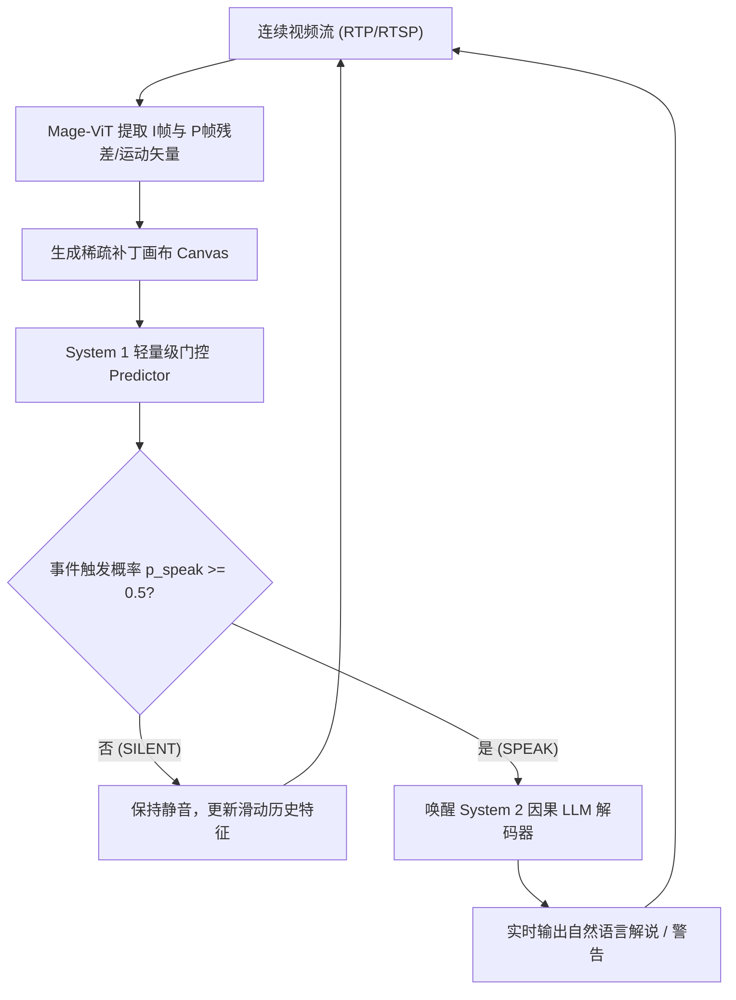

##### 对比：均匀采样 VLM 与 Mage-VL

| 比较维度 | 传统均匀采样 VLM (如 Qwen-VL) | Mage-VL (本文方法) |
|---|---|---|
| **视觉采样机制** | 固定帧率 (1–2 fps) 均匀抽取整帧 | 编解码器原生 (I帧锚点 + P帧运动/残差 Top-k 补丁) |
| **Token 消耗** | 随帧数线性剧增，背景冗余度高 | 视觉 Token 减少 **75%+**，时空特征高度紧凑 |
| **流式响应机制** | 被动等待 User Query 触发全量推理 | **System 1 门控 (低功耗) + System 2 解码 (主动唤醒)** |
| **流式推理加速** | 算力瓶颈大，难以实时运行 | 整体端到端推理速度提升高达 **3.5×** |

---

### 3. 核心结果/发现

#### 1. 基准评测表现
- **静态图像与常规视频**：Mage-VL-4B 在静态多模态任务上全面对齐 Qwen3-VL-4B，并在视频理解与 2D/3D 空间推理上表现优异，综合性能大幅超越 15B 规模的 Phi-4-reasoning-vision 强基线。
- **流式感知与推理效率**：在 VSI-Bench 及 StreamingBench 等流式视频基准上取得 SOTA 表现，同时端到端推理获得最高 **3.5×** 的墙上时间（Wall-clock）加速。

#### 2. 七大核心实证发现（Empirical Findings）
1. **Finding 1（预训练数据效率）**：大规模 Web 文本对并非 VLM 视觉编码器所必需。Mage-ViT 仅基于 5.6 亿张无标签图片与 1.0 亿视频帧通过聚类判别从头训练，性能即可追平或超越在几十亿图文对上训练的顶级编码器。
2. **Finding 2（变分辨率缩放）**：变分辨率预训练能实现随分辨率和 Token 预算增加而单调提升的连续扩展能力。
3. **Finding 3（长视频 SFT 冗余）**：密集视频字幕预训练使得模型天然具备长视频 QA 能力，无需专门的长视频 VideoQA SFT 数据。
4. **Finding 4（运动与空间协同）**：动态视频训练与 2D/3D 空间智能具有显著协同效应，训练视频动作能反哺静态空间推理。
5. **Finding 5（编解码原生效率）**：编解码原生输入显著提升视频表征效率，相比均匀采样在相同 Token 预算下取得更高精度与 3.5× 加速。
6. **Finding 6（AI4AI 数据管线）**：AI 驱动的 Prompt-代码联合优化能够显著增强下游性能（如 InfoVQA +5.62，OCRBench +3.80）。
7. **Finding 7（Zero-Vision SFT 范式）**：跨过视觉 SFT 阶段、直接在纯文本轨做 SFT 后接多模态 RL，能够成功解锁模型的 Agentic 工具调用与强化学习能力。

---

### 4. 局限性
1. **神经编解码器集成成本**：虽然模型原生支持 DCVC-RT 等神经编解码器，但在边缘设备上提取实时神经概率密度的计算开销仍需优化。
2. **复杂 Agent 任务差距**：在未经多模态 RL 强化学习调优的原始基线版本中，模型在极复杂的长时间多步 Agent 决策任务上相比最顶尖闭源模型仍存在一定能力差距。

---


<a id="vlm-summary"></a>

# 9. 总结

理解一个 VLM，可以沿着**输入表示 → 跨模态接入 → 训练目标 → 输出与评测**这条路径检查，而不必把所有模型排成单一的架构演进链。

1. **输入表示决定能保留什么信息**：视觉编码器、分辨率、切片和视频采样影响细节与时序覆盖；后续推理无法可靠恢复已丢失的证据。
2. **连接方式决定如何使用视觉信息**：MLP 投影、Q-Former 和层间交叉注意力分别在实现成本、压缩程度与融合位置上做出不同取舍，不存在脱离任务的统一优胜者。
3. **训练决定接口能否转化为能力**：图文对齐、多任务训练、指令微调与偏好优化解决不同问题；训练阶段数和冻结策略应服从数据、初始化与预算。
4. **评测决定结论是否成立**：准确率之外，还需关注幻觉、细粒度定位、视频时序、纯文本能力保留，以及延迟和显存成本。

开展实验时，可先确定目标任务及评测集，再选输入预算与模型结构；复现一份完整配方后，每次改变少量变量，并用验证结果判断收益。单个排行榜分数或模型规模，不能替代这一过程。

VLM 与具身系统的联系，可以继续结合[空间智能与 3D 几何感知](/Spatial-Intelligence-Survey/)以及[视觉-语言-动作（VLA）策略](/VLA-Survey/)阅读：视觉语言理解提供感知与语义基础，几何建模和动作学习进一步处理空间约束与闭环执行。
