# 1. 引言：具身智能的"神经中枢"

在通往 AGI 的征途中，**强化学习（Reinforcement Learning, RL）** 是机器人（Robot）实现物理世界自主决策的核心引擎。当 RL 遇见**具身智能（Embodied AI）**，它不再仅仅是处理数字信号、征服 Atari 游戏，而是要驱动一个拥有物理躯体的实体，在复杂的三维空间中感知、规划并完成任务。

> **核心命题**：传统 RL 关注"最大化分值"，具身 RL 必须同时兼顾**样本效率**、**动作平滑度**与**物理安全**三重约束。这使得算法的选择与工程权衡远比游戏场景复杂。

强化学习与监督学习有本质区别：

| 维度 | 监督学习 | 强化学习 |
| :--- | :--- | :--- |
| **数据来源** | 人工标注的独立同分布数据 | 智能体与环境交互产生的时序数据 |
| **反馈信号** | 即时的正确标签 | 延迟的稀疏奖励 |
| **上限** | 人类标注水平 | 可超越人类（如 AlphaGo） |
| **核心挑战** | 泛化性 | 探索-利用权衡、信用分配 |

<div align="center">
  
  <figcaption>图 1.1：具身强化学习（Embodied RL）状态感知、闭环策略决策与物理环境交互全景示意图</figcaption>
</div>

本文将系统梳理具身智能中的核心 RL 算法，从数学基础到前沿方法，希望为读者构建完整的知识体系。

---

# 2. 理论基础：马尔可夫决策过程（MDP）

所有 RL 算法都建立在 **马尔可夫决策过程（Markov Decision Process, MDP）** 这一统一框架之上。

## 2.1 MDP 的四元组定义

一个 MDP 由四元组 $\langle S, A, P, R \rangle$ 定义：

- **状态空间 $S$**：所有可能状态的集合，如机器人的关节角度、位置等。
- **动作空间 $A$**：智能体可以执行的动作集合（离散或连续）。
- **状态转移概率 $P$**：在状态 $s$ 执行动作 $a$，转移到 $s'$ 的概率：

$$
P(s' | s, a) = p(s_{t+1} = s' \mid s_t = s, a_t = a)
$$

- **奖励函数 $R$**：在状态 $s$ 采取动作 $a$ 后获得的即时奖励：

$$
R(s, a) = \mathbb{E}[r_{t+1} \mid s_t = s, a_t = a]
$$

**马尔可夫性质**保证了"当前状态已包含所有历史信息"，即 $p(s_{t+1}|s_t, a_t) = p(s_{t+1}|s_0, a_0, \ldots, s_t, a_t)$。

## 2.2 策略、价值函数与 Bellman 方程

**策略（Policy）** $\pi(a|s)$ 是给定状态 $s$ 时，选择动作 $a$ 的概率分布。RL 的目标是找到最优策略 $\pi^*$，最大化期望累积奖励（回报）。

**折扣回报**定义为：

$$
G_t = r_{t+1} + \gamma r_{t+2} + \gamma^2 r_{t+3} + \cdots = \sum_{k=0}^{\infty} \gamma^k r_{t+k+1}
$$

其中 $\gamma \in [0, 1)$ 是折扣因子，表示对未来奖励打折扣。

**状态价值函数** $V_\pi(s)$ 是从状态 $s$ 出发，按策略 $\pi$ 执行所能获得的期望回报：

$$
V_\pi(s) = \mathbb{E}_\pi\left[G_t \mid s_t = s\right] = \mathbb{E}_\pi\left[\sum_{k=0}^{\infty} \gamma^k r_{t+k+1} \mid s_t = s\right]
$$

**动作价值函数（Q 函数）** $Q_\pi(s, a)$ 在状态 $s$ 执行动作 $a$ 后，再按策略 $\pi$ 的期望回报：

$$
Q_\pi(s, a) = \mathbb{E}_\pi\left[G_t \mid s_t = s, a_t = a\right]
$$

两者通过 **Bellman 方程** 递推：

$$
V_\pi(s) = \sum_a \pi(a|s) \sum_{s'} P(s'|s,a)\left[R(s,a) + \gamma V_\pi(s')\right]
$$

$$
Q_\pi(s, a) = \sum_{s'} P(s'|s,a)\left[R(s,a) + \gamma \sum_{a'} \pi(a'|s') Q_\pi(s', a')\right]
$$

## 2.3 两类核心问题：有模型 vs 免模型

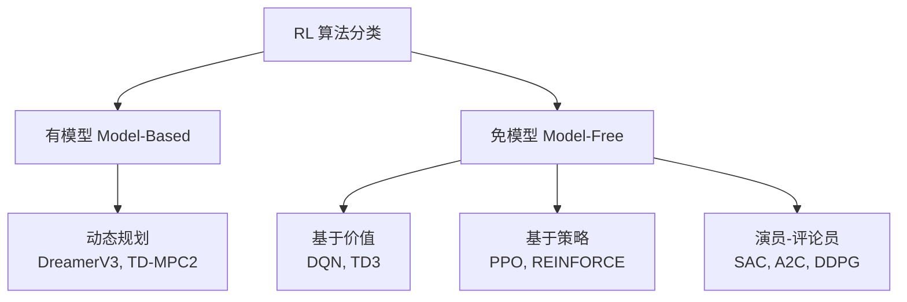

- **有模型 RL**：智能体学习环境的状态转移模型 $P(s'|s,a)$，再利用该模型进行规划，**样本效率高**但依赖模型精度。
- **免模型 RL**：直接与真实环境交互学习策略，不显式建模环境，**更通用**但需要大量样本。

---

# 3. 算法演进全景图 🗺️

具身 RL 的算法演进可分为四个代际：

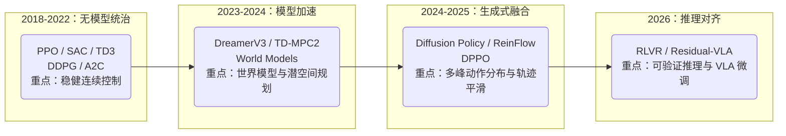

---

# 4. 策略梯度：算法的数学根基

## 4.1 策略梯度定理

所有基于策略的 RL 算法都源自同一个核心公式——**策略梯度定理**：

$$
\nabla \bar{R}_\theta = \mathbb{E}_{\tau \sim p_\theta(\tau)}\left[R(\tau) \nabla \log p_\theta(\tau)\right]
$$

其中 $$\bar{R}_\theta = \mathbb{E}_{\tau \sim p_\theta(\tau)}[R(\tau)]$$ 是期望累积奖励，$\tau = (s_1, a_1, s_2, a_2, \ldots)$ 是一条轨迹。

**直觉**：如果一条轨迹带来了高奖励，就增大它发生的概率；反之降低概率。

实际计算时，将梯度分解到每个时间步：

$$
\nabla \bar{R}_\theta \approx \frac{1}{N} \sum_{n=1}^N \sum_{t=1}^{T_n} \left(\sum_{t'=t}^{T_n} \gamma^{t'-t} r_{t'}^n - b\right) \nabla \log p_\theta(a_t^n | s_t^n)
$$

其中 $b$ 是基线（baseline），用于降低梯度估计的方差。一个自然的选择是用价值函数 $V_\pi(s)$ 作为基线，即引入**优势函数（Advantage Function）**：

$$
A(s_t, a_t) = Q_\pi(s_t, a_t) - V_\pi(s_t)
$$

优势函数衡量"在状态 $s_t$ 采取动作 $a_t$，比平均水平好多少"。实际中用 TD 残差近似：

$$
A(s_t, a_t) \approx r_t + \gamma V_\pi(s_{t+1}) - V_\pi(s_t)
$$

## 4.2 探索与利用的权衡

具身智能中，**探索-利用窘境（Exploration-Exploitation Dilemma）**尤为突出：

- **探索（Exploration）**：尝试未知动作，可能获得更大奖励，也可能损坏机器人。
- **利用（Exploitation）**：执行已知最优动作，但可能陷入局部最优。

常见探索策略：
- **$\varepsilon$-greedy**：以 $\varepsilon$ 概率随机动作，以 $1-\varepsilon$ 概率选最优动作。
- **熵正则化（Entropy Regularization）**：SAC 的核心思想，最大化策略熵以鼓励探索。
- **参数噪声（Parameter Noise）**：在网络参数中加入噪声（TD3/DDPG 使用动作噪声）。

---

# 5. 演员-评论员（Actor-Critic）框架

**演员-评论员（Actor-Critic, A-C）** 是现代具身 RL 算法的基础结构，融合了策略梯度（演员）和价值估计（评论员）。

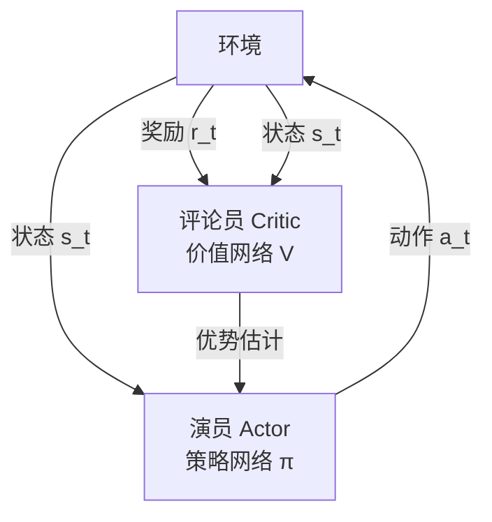

**优势演员-评论员（A2C）** 的梯度更新：

$$
\nabla_\theta J(\theta) \approx \frac{1}{N}\sum_{n=1}^N \sum_t \left(r_t^n + \gamma V_w(s_{t+1}^n) - V_w(s_t^n)\right) \nabla_\theta \log \pi_\theta(a_t^n | s_t^n)
$$

评论员的损失函数（均方误差）：

$$
\mathcal{L}(w) = \mathbb{E}\left[\left(r_t + \gamma V_w(s_{t+1}) - V_w(s_t)\right)^2\right]
$$

**A3C（Asynchronous Advantage Actor-Critic）** 进一步使用多个并行工作进程异步更新全局网络，显著提升了样本效率和训练速度——类比《火影忍者》中鸣人用影分身同时修行的思路。

---

# 6. PPO：具身控制的基石算法 🛡️

**近端策略优化（Proximal Policy Optimization, PPO）** 是目前 OpenAI 默认的 RL 算法，也是 Isaac Lab 等具身仿真平台最常用的算法。其设计目标是在保持策略更新稳定性的同时，提升采样效率。

## 6.1 从同策略到异策略：重要性采样

策略梯度是**同策略（On-Policy）**算法——每次更新参数后必须重新采样数据，样本利用率极低。

**重要性采样（Importance Sampling）** 允许用旧策略 $$\pi_{\theta'}$$ 采集的数据训练新策略 $\pi_\theta$：

$$
\mathbb{E}_{x \sim p}[f(x)] = \mathbb{E}_{x \sim q}\left[f(x)\frac{p(x)}{q(x)}\right]
$$

将其应用到策略优化：

$$
J^{\theta'}(\theta) = \mathbb{E}_{(s_t, a_t) \sim \pi_{\theta'}}\left[\frac{p_\theta(a_t|s_t)}{p_{\theta'}(a_t|s_t)} A^{\theta'}(s_t, a_t)\right]
$$

其中 $$\frac{p_\theta(a_t|s_t)}{p_{\theta'}(a_t|s_t)}$$ 是**重要性权重（Importance Weight）**，修正了两个分布间的差异。

> **关键约束**：若 $\pi_\theta$ 与 $$\pi_{\theta'}$$ 差距过大，重要性权重方差爆炸，估计失准。这正是 PPO 要解决的问题。

## 6.2 TRPO：约束优化的前身

**信任区域策略优化（TRPO）** 将 KL 散度作为硬约束：

$$
\max_\theta \; J^{\theta'}(\theta), \quad \text{s.t.} \;\; \mathrm{KL}(\theta, \theta') < \delta
$$

TRPO 理论上保证了每次更新的策略改进，但求解带约束的优化问题计算代价高昂。

## 6.3 PPO-Penalty：自适应 KL 惩罚

**PPO-Penalty**（PPO1）将约束项合并进目标函数：

$$
J_{\mathrm{PPO}}^{\theta^k}(\theta) = J^{\theta^k}(\theta) - \beta \cdot \mathrm{KL}(\theta, \theta^k)
$$

并使用**自适应 $\beta$** 动态调节 KL 散度惩罚强度：

- 若 $$\mathrm{KL}(\theta, \theta^k) > \mathrm{KL}_{\max}$$：增大 $\beta$（惩罚过大更新）
- 若 $$\mathrm{KL}(\theta, \theta^k) < \mathrm{KL}_{\min}$$：减小 $\beta$（允许更大更新）

## 6.4 PPO-Clip：裁剪机制（最常用）

**PPO-Clip**（PPO2）更简洁，直接通过裁剪约束概率比率：

$$
J_{\mathrm{PPO2}}^{\theta^k}(\theta) \approx \sum_{(s_t, a_t)} \min\left(r_t(\theta) A^{\theta^k}(s_t, a_t),\; \mathrm{clip}(r_t(\theta),\, 1-\varepsilon,\, 1+\varepsilon) A^{\theta^k}(s_t, a_t)\right)
$$

其中 $$r_t(\theta) = \frac{p_\theta(a_t|s_t)}{p_{\theta^k}(a_t|s_t)}$$ 是概率比率，$\varepsilon$ 通常取 0.1 或 0.2。

**裁剪机制直觉**：

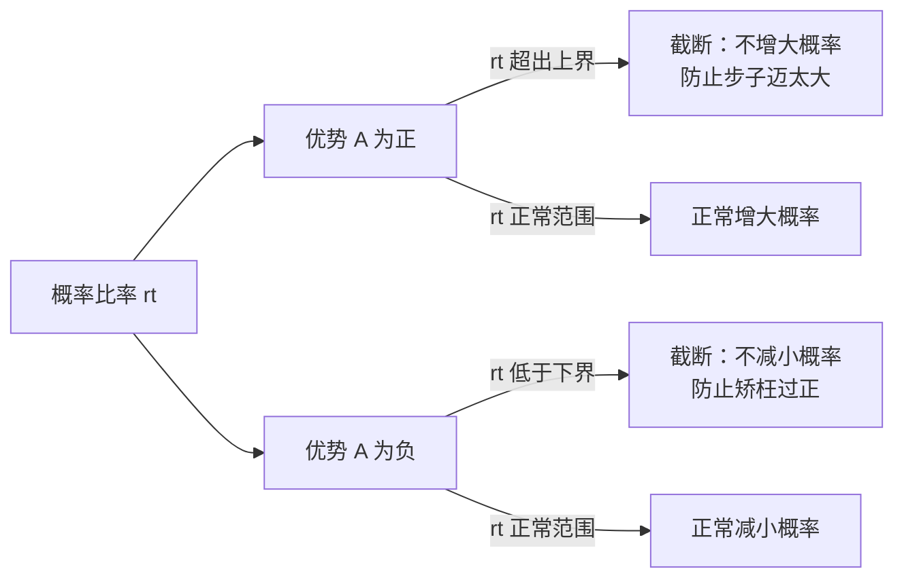

**为什么 PPO 适合具身控制？**

1. **稳定性高**：裁剪保证每次策略更新幅度有限，避免机械臂突然做出危险动作。
2. **并行友好**：Isaac Lab 等平台可以运行数千个并行仿真环境，PPO 的同策略特性与之天然契合。
3. **实现简单**：相较 TRPO，PPO 实现难度低，超参数少。

---

# 7. DDPG → TD3 → SAC：连续动作控制的演进

机器人控制通常涉及**连续动作空间**（如关节力矩、速度），DQN 等离散方法无法直接处理，因此催生了针对连续控制的系列算法。

## 7.1 DDPG：深度确定性策略梯度

**深度确定性策略梯度（DDPG）** 是将 DQN 扩展到连续动作空间的开创性工作，也是 TD3、SAC 的直接前身。

**核心设计**：

| 组件 | 名称 | 作用 |
| :--- | :--- | :--- |
| 演员 $\mu_\theta(s)$ | 策略网络 | 输出确定性连续动作 |
| 评论员 $Q_w(s, a)$ | Q 网络 | 评估演员输出动作的价值 |
| 目标网络 | Slow-updating targets | 稳定 Q-target 计算 |
| 经验回放 | Replay Buffer | 打破数据相关性，实现异策略训练 |

**演员更新**（最大化 Q 值）：

$$
\nabla_\theta J \approx \nabla_a Q_w(s, a)\big|_{a=\mu_\theta(s)} \cdot \nabla_\theta \mu_\theta(s)
$$

**评论员更新**（TD 误差最小化）：

$$
y = r + \gamma Q_{\bar{w}}(s', \mu_{\bar{\theta}}(s')), \quad \mathcal{L}(w) = \mathbb{E}\left[(Q_w(s,a) - y)^2\right]
$$

其中 $$Q_{\bar{w}}, \mu_{\bar{\theta}}$$ 是目标网络的参数，每 $C$ 步软更新：$\bar{w} \leftarrow \tau w + (1-\tau)\bar{w}$。

为了鼓励探索，训练时对动作添加噪声（如 OU 噪声或高斯噪声）。

**DDPG 的问题**：Q 值容易过高估计，导致策略被破坏，对超参数极度敏感。

## 7.2 TD3：三大关键改进

**双延迟深度确定性策略梯度（TD3）** 通过三个技巧系统性解决了 DDPG 的不稳定问题：

### 技巧一：截断双 Q 学习（Clipped Double Q-Learning）

学习两个独立的 Q 网络 $$Q_{\phi_1}, Q_{\phi_2}$$，计算 Q-target 时取最小值：

$$
y = r + \gamma (1-d) \min_{i=1,2} Q_{\phi_i,\mathrm{targ}}(s', a'_{\mathrm{TD3}})
$$

使用最小值而非最大值，系统性地抑制了 Q 值过高估计。

### 技巧二：延迟策略更新（Delayed Policy Updates）

评论员每更新 2 次，演员才更新 1 次。实验表明：Q 网络先收敛再更新策略，能显著提升稳定性。

### 技巧三：目标策略平滑（Target Policy Smoothing）

在目标动作中加入截断噪声：

$$
a'_{\mathrm{TD3}}(s') = \mathrm{clip}\left(\mu_{\bar{\theta}}(s') + \mathrm{clip}(\epsilon, -c, c),\; a_{\mathrm{low}},\; a_{\mathrm{high}}\right), \quad \epsilon \sim \mathcal{N}(0, \sigma)
$$

平滑 Q 函数对动作的响应曲面，降低策略对 Q 误差的敏感性。

**TD3 在灵巧手操作任务（Dexterous Manipulation）上表现优异**，是机械臂精细控制的常用基线。

## 7.3 SAC：最大熵强化学习 🎨

**软演员-评论员（Soft Actor-Critic, SAC）** 是目前连续控制领域最强的免模型算法之一，其核心在于**最大熵强化学习（Maximum Entropy RL）**框架。

### 最大熵目标

SAC 不仅最大化累积奖励，同时最大化策略的**熵（Entropy）**：

$$
\pi^* = \arg\max_\pi \mathbb{E}\left[\sum_t \gamma^t \left(r_t + \alpha \mathcal{H}(\pi(\cdot|s_t))\right)\right]
$$

其中 $\mathcal{H}(\pi(\cdot|s_t)) = -\mathbb{E}[\log \pi(a|s_t)]$ 是策略熵，$\alpha > 0$ 是温度参数，控制探索程度。

**熵最大化的好处**：
- **鼓励探索**：策略分布更均匀，避免过早收敛到局部最优。
- **鲁棒性强**：在多峰奖励环境中，能保持多种可行策略。
- **样本高效**：异策略训练 + 经验回放。

### SAC 的演员更新

演员目标是最大化 Q 值同时最大化熵：

$$
\mathcal{L}(\phi) = \mathbb{E}_{s_t, \tilde{a}_t \sim \pi_\phi}\left[\alpha \log \pi_\phi(\tilde{a}_t | s_t) - \min_{i=1,2} Q_{\theta_i}(s_t, \tilde{a}_t)\right]
$$

注意 SAC 使用双 Q 网络取最小值（同 TD3），有效抑制过估计。

### 自动温度调节

SAC 可以自动调节温度参数 $\alpha$，通过最小化：

$$
\mathcal{L}(\alpha) = \mathbb{E}_{\tilde{a}_t \sim \pi_t}\left[-\alpha \log \pi_t(\tilde{a}_t|s_t) - \alpha \bar{\mathcal{H}}\right]
$$

其中 $\bar{\mathcal{H}}$ 是目标熵（通常设为 $-\dim(A)$），无需手动调参。

### PPO vs SAC vs TD3 对比

| 特性 | PPO | SAC | TD3 |
| :--- | :---: | :---: | :---: |
| **策略类型** | 随机性 | 随机性 | 确定性 |
| **同/异策略** | 同策略 | 异策略 | 异策略 |
| **连续动作** | ✓ | ✓ | ✓ |
| **离散动作** | ✓ | △ | ✗ |
| **样本效率** | 中 | 高 | 高 |
| **超参敏感度** | 低 | 低 | 中 |
| **具身应用** | 行走/跑步 | 灵巧手操作 | 精细组装 |

---

# 8. 有模型 RL：潜空间的"预知梦" 🧠

无模型 RL 需要与真实环境反复交互，样本效率低。**有模型 RL（Model-Based RL）** 让智能体学习环境的内部模型，在"脑海中"模拟练习，大幅减少真实环境的交互次数。

## 8.1 世界模型（World Models）：V-M-C 三部曲

David Ha 和 Jürgen Schmidhuber 在 2018 年 NeurIPS 提出了经典的世界模型框架，由三个模块组成：

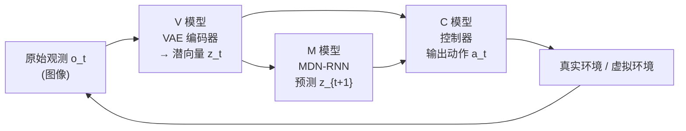

**V 模型（Variational Autoencoder）**：视觉感知模块，将高维图像压缩为低维潜向量 $z_t$，提取环境的本质特征。

**M 模型（MDN-RNN）**：记忆模块，根据当前潜向量 $z_t$、隐状态 $h_t$ 和动作 $a_t$ 预测下一时刻潜向量的概率分布：

$$
P(z_{t+1} | a_t, z_t, h_t)
$$

使用混合密度网络（MDN）输出多峰分布，捕捉环境的随机性。

**C 模型（Controller）**：控制器，将 $z_t$ 和 $h_t$ 拼接后直接映射为动作：

$$
a_t = W_c [z_t \; h_t] + b_c
$$

控制器参数少（线性层），用进化策略（CMA-ES）优化，避免反向传播穿越整个世界模型。

**运作流程**：

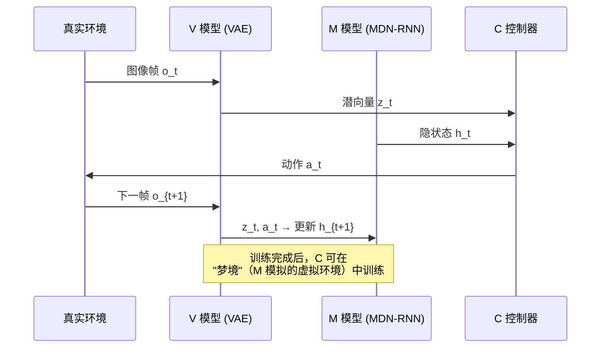

**关键洞察**：训练完成后，可以**完全在 M 模型构建的虚拟世界中训练 C 控制器**，无需与真实环境交互，大幅提升训练效率。

> **生成模型 ≠ 世界模型**。世界模型必须具备**动作条件下的未来状态预测能力**，即给定动作输入，能预测下一个状态。仅能生成图像的模型不满足此条件。

## 8.2 DreamerV3：潜空间的"梦境修炼"

**DreamerV3** 是目前最先进的世界模型之一，在具身 RL 中实现了显著的样本效率提升。

**核心机制**：

1. **RSSM（循环状态空间模型）**：将环境状态分解为确定性部分 $h_t$（LSTM 隐状态）和随机部分 $z_t$（VAE 潜向量）：

$$
h_t = f_\phi(h_{t-1}, z_{t-1}, a_{t-1})
$$

2. **梦境训练（Dreaming）**：在潜空间中展开完整轨迹，无需与真实环境交互：

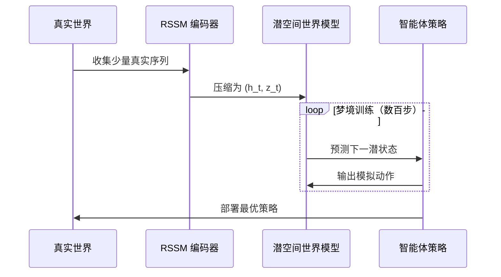

3. **无量纲化奖励（Symlog）**：使用 $\mathrm{symlog}(x) = \mathrm{sign}(x) \cdot \ln(|x|+1)$ 处理奖励，支持跨任务迁移而无需任务特定超参。

**DreamerV3 的成就**：
- 首个单一超参设置，无需任何调参，在 Atari、DMC、Crafter、Minecraft 等 7 个领域同时达到 SOTA。
- 在 Minecraft 中首次从零学会挖钻石（需要 14 步连续决策）。

## 8.3 TD-MPC2：潜空间的模型预测控制

**TD-MPC2** 将**时序差分（TD）**与**模型预测控制（MPC）** 在潜空间中统一，尤其擅长**长程操作任务**。

**核心思路**：在潜空间中进行短视野的有限步规划，结合 TD 学习估计长远价值，兼顾规划深度与计算效率。适用场景：机器人从"抓取"到"组装"等多步骤操作任务。

---

# 9. 扩散策略：从"生图"到"生动作" 🌊

## 9.1 Diffusion Policy

**扩散策略（Diffusion Policy）** 将图像生成领域（Stable Diffusion）的核心思想迁移到机器人动作生成：将目标动作轨迹视为"从高斯噪声逐步去噪"的过程。

**为什么需要扩散策略？**

传统策略网络输出动作的均值，无法处理**多峰动作分布（Multi-Modal Distribution）**。例如：

- 桌上有两个可选的杯子，最优策略是"选左"或"选右"，均值策略会徘徊在中间——两个都拿不到。
- 扩散模型天然能表示多峰分布，可以果断选择其中一个。

**前向过程（加噪）**：

$$
q(x_k | x_{k-1}) = \mathcal{N}(x_k;\; \sqrt{1 - \beta_k}\, x_{k-1},\; \beta_k I)
$$

**反向过程（去噪，学习目标）**：

$$
p_\theta(x_{k-1} | x_k) = \mathcal{N}(x_{k-1};\; \mu_\theta(x_k, k),\; \Sigma_\theta(x_k, k))
$$

训练时，网络学习预测每步的噪声 $$\epsilon_\theta$$，推理时从随机噪声出发，迭代去噪得到平滑的动作轨迹。

**扩散策略的优势**：

| 维度 | 传统策略网络 | 扩散策略 |
| :--- | :--- | :--- |
| **分布表达** | 单峰高斯 | 任意多峰 |
| **轨迹平滑度** | 一般 | 极高（去噪过程天然平滑） |
| **推理速度** | 快（单次前向） | 慢（需 K 步迭代） |
| **适用场景** | 简单操作 | 复杂抓取、双臂协作 |

## 9.2 ReinFlow：扩散策略 + 强化学习

**ReinFlow** 在 Diffusion Policy 的基础上引入强化学习微调，解决了纯行为克隆（BC）泛化性不足的问题：

- 先用专家演示数据训练扩散策略（模仿学习阶段）
- 再用 RL 奖励信号对扩散策略进行微调（强化学习阶段）

这类似于 LLM 的 SFT → RLHF 两阶段训练范式，是当前机器人模仿学习的主流框架之一。

## 9.3 DPPO：扩散链内的 PPO 约束

**DPPO（Diffusion Policy with PPO）** 将 PPO 的截断重要性权重机制直接嵌入扩散策略的逐步去噪过程，解决了扩散策略做在线强化学习时训练不稳定的问题。

**核心思路**：将 $K$ 步去噪链视为一个 $K$ 步 MDP——每步去噪输出视为一个"子动作"，并对每步的策略更新施加 PPO-Clip 约束，防止迭代更新中分布漂移过大。

**与 ReinFlow 的区别**：

| 维度 | ReinFlow | DPPO |
| :--- | :--- | :--- |
| **训练范式** | BC 预训练 → RL 微调（两阶段） | 扩散链内直接在线 RL（端到端） |
| **约束粒度** | 整体策略层面 | 每步去噪步骤层面 |
| **适用场景** | 有充足演示数据 | 演示数据有限、需纯在线探索 |

---

# 10. 稀疏奖励：具身 RL 的"死亡陷阱"

具身智能的奖励设计远比游戏环境困难。机器人大多数时间得不到任何奖励（如"拧螺丝"任务中，只有最终拧紧才有 +1 奖励），导致梯度消失、训练停滞。

## 10.1 奖励塑形（Reward Shaping）

人工设计**辅助奖励**来引导智能体行为，最常用但需要领域知识：

| 辅助奖励类型 | 具体例子 | 效果 |
| :--- | :--- | :--- |
| **接近性奖励** | 末端执行器距目标距离越近奖励越大 | 快速引导，但可能陷入局部解 |
| **接触力奖励** | 正确接触力范围内给奖励 | 适合精细操作 |
| **姿态正确性** | 物体朝向符合要求时给奖励 | 防止奇异构型 |
| **生存奖励** | 每步存活 +0.001 | 激励机器人持续探索 |

> **陷阱警告**：设计不当的奖励可能导致"奖励欺骗（Reward Hacking）"——智能体找到超出预期的捷径最大化奖励，而不是真正完成任务。

## 10.2 内在好奇心模块（ICM）

**好奇心驱动奖励**是一种与任务无关的内在奖励，鼓励智能体探索"难以预测"的新状态：

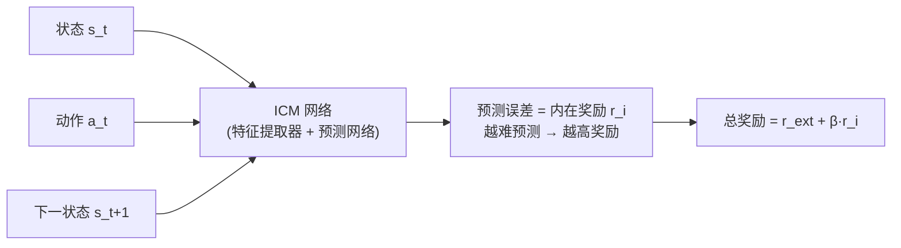

ICM 包含两个子网络：
1. **正向模型（Forward Model）**：给定 $(s_t, a_t)$ 预测 $$\hat{s}_{t+1}$$，预测误差作为内在奖励。
2. **逆向模型（Inverse Model）**：给定 $(s_t, s_{t+1})$ 预测动作 $$\hat{a}_t$$，用于训练特征提取器，过滤与智能体无关的噪声（如背景树叶飘动）。

## 10.3 课程学习（Curriculum Learning）

将任务从易到难递进式安排，让智能体逐步掌握复杂技能：


**逆向课程生成（Reverse Curriculum Generation）** 是一种自动化方法：从目标状态出发，逐步采样"距离目标 $k$ 步"的初始状态，自动构建难度递增的课程。

## 10.4 HER：后见之明的奖励重标记

**Hindsight Experience Replay（HER）** 是处理稀疏奖励的经典技术：即使一次任务失败（如机械臂没有放到指定位置），也可以将"机械臂实际到达的位置"作为假想目标，从失败轨迹中学习。

> **关键洞察**：失败的经验并非无用——用实际结果重新标记目标后，失败轨迹变成"成功经验"，有效缓解了奖励稀疏问题。

---

# 11. 2026 尖端：逻辑推理与残差学习 ⚡

## 11.1 RLVR：可验证奖励的强化学习

**RLVR（Reinforcement Learning from Verifiable Rewards）** 的核心思想：将**可形式化验证的物理常识**作为奖励信号，而非依赖稀疏的任务成功奖励。

**什么是"可验证奖励"？**

- 传统奖励："完成抓取任务" → 稀疏，延迟
- RLVR 奖励："杯子当前是否垂直（角度误差 < 5°）" → 可即时验证，密集

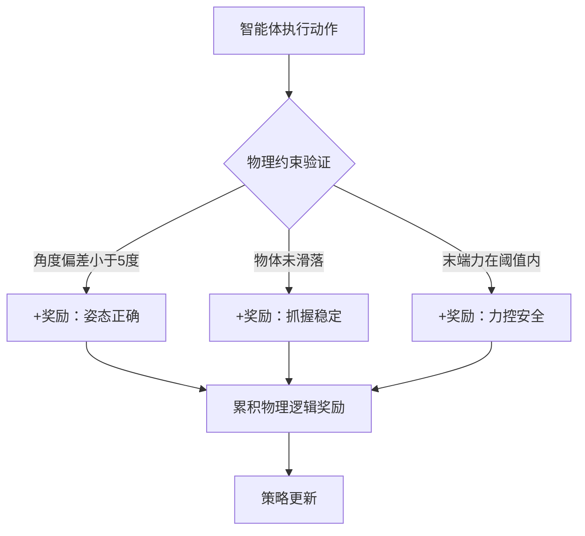

RLVR 的本质是让机器人掌握**物理推理能力**：不只是记住"怎么做"，而是理解"为什么这么做"。这对于长程多步骤任务（如"拿出冰箱里的牛奶倒入杯子"）尤为关键。

## 11.2 Residual-VLA：大模型 + 残差微调

**残差 VLA（Residual Vision-Language-Action）** 架构针对的是"如何高效将通用 VLA 大模型适配到特定机器人"的问题。

**问题背景**：
- VLA 大模型（如 RT-2、π0）拥有强大的常识和泛化能力，但动作精度不足。
- 全量微调代价高昂且可能破坏预训练知识。

**残差架构设计**：

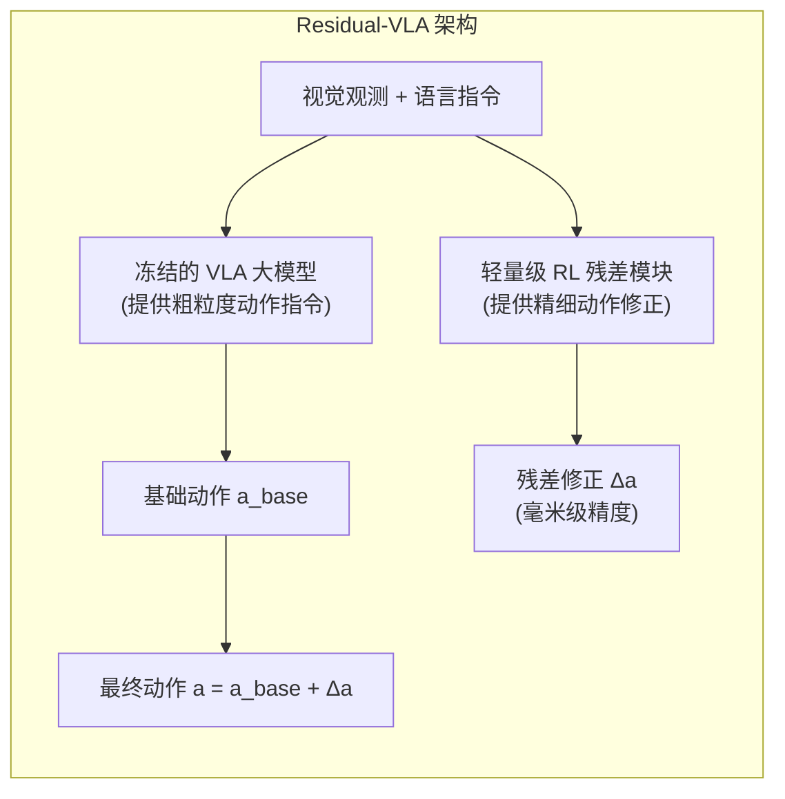

- **VLA 大模型（冻结）**：提供任务理解和粗粒度动作规划，类比"大脑皮层"。
- **RL 残差模块（可训练）**：对大模型输出的动作进行实时精细修正，类比"小脑"。

**核心优势**：
1. 仅训练小型残差网络（参数量 << VLA），**极速适配**新场景（数小时 vs 数天）。
2. **保护预训练知识**：冻结大模型避免灾难性遗忘。
3. **通用性强**：同一 VLA 骨干可搭配不同残差模块适配不同机器人平台。

---

# 12. 主流仿真环境与评测基准 🧪

具身 RL 算法的训练与评测高度依赖仿真平台。不同平台在**物理引擎精度**、**并行效率**和**任务类型**上各有侧重，选对平台事半功倍。

## 12.1 连续控制标准基准

### MuJoCo / DeepMind Control Suite

| 属性 | 内容 |
| :--- | :--- |
| **物理引擎** | MuJoCo（接触力精确，适合精细操作） |
| **主要任务** | HalfCheetah、Ant、Humanoid、Hopper 等经典连续控制 |
| **适用算法** | SAC、TD3（异策略）；PPO（同策略） |
| **特点** | 学术界算法横向对比的黄金标准 |

**DeepMind Control Suite（DMControl）** 在 MuJoCo 基础上扩充了 Cartpole、Walker、Cheetah 等任务，并支持**像素观测模式**，是 DreamerV3 等世界模型算法的主要评测场景。

**OpenAI Gymnasium**（前身 OpenAI Gym）是当前最通用的 RL 环境接口标准，几乎所有主流 RL 库（Stable-Baselines3、CleanRL）都基于其 `Env` 接口。

## 12.2 大规模并行仿真平台

### Isaac Lab / Isaac Gym（NVIDIA）

| 属性 | 内容 |
| :--- | :--- |
| **物理引擎** | PhysX（GPU 加速） |
| **并行规模** | 单 GPU 可运行 **4096+ 个并行环境** |
| **主要任务** | 四足行走、双足奔跑、灵巧手操作（Shadow Hand、Allegro） |
| **适用算法** | PPO（同策略与大规模并行天然契合） |
| **特点** | 具身 RL 学术与工业界标准平台，NVIDIA Omniverse 生态 |

Isaac Lab 是 Isaac Gym 的下一代继任者，基于 USD 场景格式，支持更真实的渲染与传感器仿真，是当前训练四足/双足机器人策略的主流选择。

## 12.3 操作任务专用环境

### RoboSuite / robomimic

**RoboSuite** 是斯坦福大学发布的机器人操作仿真框架，基于 MuJoCo，提供多种机械臂型号（Franka、UR5、Sawyer）与操作任务（搬运、组装、拧瓶盖）。**robomimic** 在其基础上提供大规模演示数据集与"模仿学习 + RL"联合训练的标准评测流程，是 Diffusion Policy、ReinFlow 等操作类算法的主要评测基准。

### MetaWorld

| 属性 | 内容 |
| :--- | :--- |
| **任务数量** | **50 个**机器人操作任务 |
| **设计目标** | 多任务学习与零样本迁移评测 |
| **适用算法** | SAC、MT-SAC（多任务 SAC） |
| **特点** | 任务统一接口，支持 zero-shot 跨任务评测 |

## 12.4 评测指标

| 指标 | 含义 | 主要使用场景 |
| :--- | :--- | :--- |
| **成功率（Success Rate）** | 完成任务的 episode 比例 | 操作、导航类任务 |
| **归一化回报（Normalized Return）** | 相对专家策略的得分比 | MuJoCo 连续控制 |
| **样本效率（Sample Efficiency）** | 达到目标性能所需的环境交互步数 | 算法横向对比 |
| **实时因子（Real-time Factor）** | 仿真速度与真实时间之比 | 评估训练吞吐量 |

---

# 13. 开发者指南：算法选择矩阵 🛠️

如果你正在开发具身智能项目，可按以下维度进行算法选型：

| 任务类型 | 推荐算法 | 核心理由 | 难度系数 |
| :--- | :--- | :--- | :---: |
| **四足/双足行走** | **PPO** | 稳定性最高，无惧电机限制；Isaac Lab 原生支持 | ⭐⭐ |
| **机械臂精细组装** | **SAC / TD3** | 异策略 + 样本高效；SAC 自动调参更友好 | ⭐⭐⭐ |
| **灵巧手抓取** | **SAC** | 熵正则化鼓励多样动作，应对多峰操作分布 | ⭐⭐⭐⭐ |
| **长程导航与操作** | **TD-MPC2** | 潜空间规划适合多步序列决策 | ⭐⭐⭐⭐ |
| **多任务/泛化操作** | **Diffusion Policy + ReinFlow** | 动作轨迹自然平滑，能处理多目标冲突 | ⭐⭐⭐⭐⭐ |
| **VLA 大模型微调** | **Residual-RL** | 保护预训练知识的同时快速适配特定场景 | ⭐⭐⭐⭐ |
| **稀疏奖励环境** | **SAC + ICM / HER** | 内在奖励 + 经验重用缓解奖励稀疏 | ⭐⭐⭐⭐⭐ |

**选型决策树**：

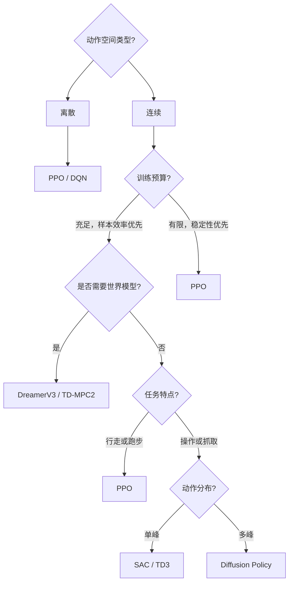

---

# 14. 经典论文深度解析 📚

为了帮助读者系统把握强化学习从经典理论到具身智能前沿的完整演进脉络，本章精选 **12 篇里程碑经典与前沿突破论文** 进行深度解析。每篇论文均按标准化结构展开：【精华提炼】、【研究背景/问题】、【主要方法/创新点】、【核心结果/发现】以及【局限性分析】。

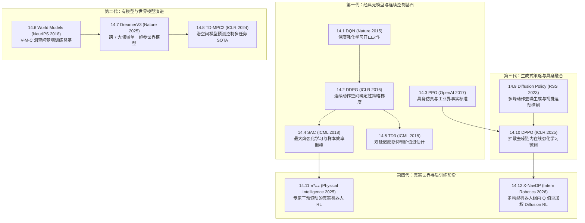

---

## 14.1 DQN (2015)
———人类水平控制：深度强化学习开创之作

📄 **Paper**: [Nature 2015 (Vol 518, pp 529–533)](https://www.nature.com/articles/nature14236)  
💻 **Code**: [DeepMind / DQN](https://github.com/deepmind/dqn)

### 精华
1. **历史性突破**：首次证明了深度神经网络可以直接从原始高维视觉像素（Raw Pixels）端到端学习策略，在无需人工设计特征的情况下在 49 款 Atari 2600 游戏中达到甚至超越人类专家水平。
2. **经验回放（Experience Replay）**：提出维护循环回放缓冲区打散时序样本之间的强自相关性，将非独立同分布（Non-i.i.d.）的时序数据转化为平稳的随机批量样本。
3. **目标 Q 网络（Target Network）**：解耦当前动作评估与目标估计网络权重，周期性冻结目标参数 $\theta^-$，从根源上消除了 Bootstrapping 带来的训练震荡与发散。
4. **统一架构泛化**：同一套 CNN 网络架构、同一套超参数设置通吃所有不同规则、不同视觉表征的 Atari 游戏。
5. **奠定现代 DRL 范式**：将深度表示学习（Representation Learning）与强化学习（RL）深度融合，开启了现代深度强化学习黄金十年。

---

### 1. 研究背景/问题

在 2015 年之前，经典强化学习多局限于低维手工特征状态空间（如特征工程构造的位置、速度或线性基函数）。当面对直接以视频帧为输入的复杂控制任务时，传统非线性函数近似器（如浅层神经网络）与 Q-Learning 结合极易出现发散或不稳定现象，主要痛点在于：
- **数据相关性过强**：连续时间步采集的转移对 $(s_t, a_t, r_t, s_{t+1})$ 具有高度时间关联性，违背 SGD 随机梯度的 i.i.d. 独立同分布假设；
- **非平稳目标陷阱**：计算 TD 目标 $y = r + \gamma \max_{a'} Q(s', a'; \theta)$ 时，目标值直接依赖正在被更新的参数 $\theta$，导致训练如同“在移动的靶心上射箭”，极易陷入正反馈发散。

---

<div align="center">
  
  <figcaption>图 14.1：DQN 评测的 Atari 2600 经典游戏截图（Pong, Breakout, Space Invaders, Beam Rider, Seaquest）</figcaption>
</div>

### 2. 主要方法/创新点

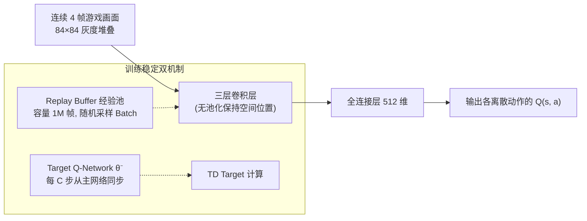

#### ① 状态表征与预处理
- 针对视频动态性，将最近连续 4 帧灰度图像堆叠为 $84 \times 84 \times 4$ 的张量作为当前状态输入 $s_t$，有效解决了单帧画面无法推断小球飞行速度与方向的马尔可夫性缺失问题。

#### ② 经验回放机制（Experience Replay）
- 维护容量为 $N = 10^6$ 的经验池 $\mathcal{D} = \{e_1, e_2, \ldots, e_N\}$，每个转移元组为 $e_t = (s_t, a_t, r_t, s_{t+1})$。
- 每次参数更新时从 $\mathcal{D}$ 中均匀随机抽取 Mini-batch 进行梯度下降，彻底打破时序相关性，并大幅提升数据复用率。

#### ③ 目标网络与损失函数
- 引入延迟更新的目标网络参数 $\theta^-$，损失函数定义为：

$$
\mathcal{L}_i(\theta_i) = \mathbb{E}_{(s, a, r, s') \sim U(\mathcal{D})}\left[ \left( r + \gamma \max_{a'} Q(s', a'; \theta_i^-) - Q(s, a; \theta_i) \right)^2 \right]
$$

- 目标网络参数每隔固定步数 $C$（如 10,000 步）直接从当前网络复制更新：$\theta_i^- \leftarrow \theta_i$。

---

### 3. 核心结果/发现

- 在 49 款 Atari 游戏中，DQN 在超过 **一半以上（29款）** 的游戏中得分超越人类专业测试员，在 Breakout、Pong、Space Invaders 等游戏中展现出超人类的反射与策略组合（如主动在 Breakout 砖块上方挖隧道反弹）。
- 消融实验证明：去除 Experience Replay 导致多数游戏性能断崖式下跌甚至无法收敛；去除 Target Network 导致 Q 值估计发生严重发散。

---

### 4. 局限性

1. **仅适用于低维离散动作**：通过 $\max_{a'} Q(s', a')$ 选择动作，计算开销随动作维度指数爆炸，无法直接用于机械臂连续关节角度控制。
2. **Q 值系统性过高估计（Overestimation Bias）**：$\max$ 算子导致噪声被正向累积，促使后续 Double DQN 的诞生。
3. **样本效率较低**：通常需要数千万帧环境交互才能学成一个游戏，难以直接部署在物理硬件磨损严苛的真实机器人上。

---

## 14.2 DDPG (2016)
———连续控制基石：深度确定性策略梯度

📄 **Paper**: [ICLR 2016](https://arxiv.org/abs/1509.02971)  
💻 **Code**: [OpenAI Baselines / DDPG](https://github.com/openai/baselines)

### 精华
1. **连续动作突破**：首次成功将 DQN 的深度表示与 Experience Replay / Target Network 机制无缝拓展至**高维连续动作空间**。
2. **确定性策略梯度（DPG）落地**：Actor 直接输出确定性动作向量 $\mu(s|\theta^\mu)$，消除了在高维连续动作空间中求积分采样的高方差问题。
3. **软更新目标网络（Polyak Averaging）**：提出 $\theta' \leftarrow \tau \theta + (1-\tau)\theta'$（$\tau \ll 1$）微量平滑更新目标网络，大幅改善连续控制中的训练稳定性。
4. **探索噪声注入**：通过在确定性动作上叠加 Ornstein-Uhlenbeck (OU) 过程时序相关噪声，实现连续物理系统中的平滑探索。
5. **具身机械控制里程碑**：在 MuJoCo 连续物理仿真（机械臂搬运、双足行走、车辆驾驶）中展现出强劲的端到端力矩控制能力。

---

### 1. 研究背景/问题

DQN 虽在离散游戏上取得巨大成功，但机器人操作、多足步态控制等现实物理世界任务均属于高维连续动作空间（如 $N$ 个电机的实时力矩或角度）。若将连续动作空间离散化（Discretization），动作维度将面临**维度灾难（Curse of Dimensionality）**（例如 7 自由度机械臂每个关节细分 10 个 bin，离散动作数高达 $10^7$）。因此，亟需一种能够直接在连续动作空间进行端到端优化且具备高样本效率的深度离线强化学习算法。

---

<div align="center">
  
  <figcaption>图 14.2：DDPG 求解的 MuJoCo 与物理仿真连续控制环境示例（机械臂抓取、双足行走、车辆驾驶等）</figcaption>
</div>

### 2. 主要方法/创新点

```mermaid
graph TD
    S["状态 s_t"] --> Actor["Actor 策略网络 μ(s|θ^μ)<br/>直接输出确定性动作 a"]
    Actor --> Noise["+ 探索噪声 (OU / 高斯)"] --> ActReal["执行动作 a_t"]
    S --> Critic["Critic 价值网络 Q(s, a|θ^Q)<br/>评估状态-动作对价值"]
    ActReal --> Critic
    Critic -->|∇_a Q(s, a)| Grad["链式法则计算策略梯度"]
    Grad --> Actor
```

#### ① Actor-Critic 架构与确定性更新
- **Actor 策略更新**：利用链式法则最大化 Critic 评估的动作价值：

$$
\nabla_{\theta^\mu} J \approx \frac{1}{N} \sum_i \nabla_a Q(s, a; \theta^Q)\Big|_{s=s_i, a=\mu(s_i;\theta^\mu)} \cdot \nabla_{\theta^\mu} \mu(s; \theta^\mu)\Big|_{s=s_i}
$$

- **Critic 价值更新**：最小化贝尔曼残差均方误差：

$$
y_i = r_i + \gamma Q'\left(s_{i+1}, \mu'(s_{i+1}; \theta^{\mu'}); \theta^{Q'}\right), \quad \mathcal{L}(\theta^Q) = \frac{1}{N} \sum_i \left( Q(s_i, a_i; \theta^Q) - y_i \right)^2
$$

#### ② Polyak 软更新
- 摒弃了 DQN 的定期硬拷贝，采用步进软更新：

$$
\theta^{Q'} \leftarrow \tau \theta^Q + (1-\tau)\theta^{Q'}, \quad \theta^{\mu'} \leftarrow \tau \theta^\mu + (1-\tau)\theta^{\mu'} \quad (\tau = 0.001)
$$

---

### 3. 核心结果/发现

- 在 MuJoCo 动力学环境的 20+ 个连续控制基准（Cartpole、Reacher、Cheetah、Humanoid 等）中，DDPG 使用完全相同的超参数与网络架构成功学会稳定控制。
- 验证了像素输入控制的可行性：直接输入 RGB 像素帧，DDPG 依然能够学会操控机械臂完成抓取对准。

---

### 4. 局限性

1. **对超参数极度敏感**：学习率、噪声尺度稍有偏差便容易导致策略崩溃。
2. **严重的 Q 值过高估计**：单 Critic 结构在确定性策略连续更新中过度追求局部最大值，容易导致 Q 网络发散（催生了 TD3）。

---

## 14.3 PPO (2017)
———具身控制事实标准：近端策略优化算法

📄 **Paper**: [arXiv:1707.06347 (OpenAI)](https://arxiv.org/abs/1707.06347)  
💻 **Code**: [OpenAI Baselines / PPO](https://github.com/openai/baselines)

### 精华
1. **工程与理论的完美平衡**：在 TRPO 严格理论信任域数学基础之上，提出**Clipped Surrogate Objective（裁剪代理目标）**，免去了二阶共轭梯度与海森矩阵计算，实现一阶优化器下的极高稳定性。
2. **限制策略破坏性更新**：通过将概率比率 $r_t(\theta)$ 限制在 $[1-\epsilon, 1+\epsilon]$ 区间，从根源上杜绝了因为单次不良 Batch 梯度过大而导致策略不可逆“崩溃”的灾难。
3. **多 Epoch 数据复用**：打破传统同策略（On-policy）每步采样仅能更新一次梯度的极大浪费，允许在同一批 Rollout 经验上安全运行多个 Epoch 的 Mini-batch SGD。
4. **广阔的适用场景**：从 Atari 离散游戏、MuJoCo 连续控制，到四足机器人步态（ANYmal / Unitree）、人形机器人甚至 LLM 的 RLHF 对齐，成为工业界默认基线。
5. **天然契合 GPU 大规模并行**：配合 Isaac Lab 等物理引擎的大规模向量化仿真环境，可实现数千个环境并行的超高速端到端策略训练。

---

### 1. 研究背景/问题

策略梯度算法（如 REINFORCE、A2C）普遍面临**样本效率低下**与**训练极易崩溃**两大难题：
- **同策略更新瓶颈**：策略一旦更新，历史采集的数据即刻失效，必须全部丢弃重新采样；
- **步长极其敏感**：标准策略梯度中，如果某一步参数更新步长稍大，导致策略进入极差的性能死区（Blind Zone），新策略采出的样本质量极低，导致后续梯度无法恢复，训练彻底失败。
TRPO 虽通过二阶 KL 散度约束解决了稳定性，但计算 Fisher 信息矩阵逆极为昂贵，难以推广。

---

<div align="center">
  
  <figcaption>图 14.3：PPO 裁剪代理目标 L^CLIP 示意图：在优势为正（左）和优势为负（右）时分别通过截断防止过激更新</figcaption>
</div>

### 2. 主要方法/创新点

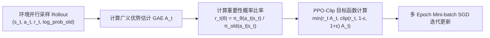

#### ① 裁剪代理目标函数（Clipped Surrogate Objective）
PPO-Clip 的核心损失函数形式简洁优雅：

$$
L^{\mathrm{CLIP}}(\theta) = \hat{\mathbb{E}}_t \left[ \min\left( r_t(\theta)\hat{A}_t,\; \mathrm{clip}(r_t(\theta), 1-\epsilon, 1+\epsilon)\hat{A}_t \right) \right]
$$

其中 $r_t(\theta) = \frac{\pi_\theta(a_t|s_t)}{\pi_{\theta_{\mathrm{old}}}(a_t|s_t)}$。裁剪逻辑如下：
- 当优势 $\hat{A}_t > 0$（动作好于平均）：目标随 $r_t$ 增加，但当 $r_t > 1+\epsilon$ 时被截断，防止策略因单个好样本过分贪婪；
- 当优势 $\hat{A}_t < 0$（动作差于平均）：目标随 $r_t$ 减小，但当 $r_t < 1-\epsilon$ 时被截断，防止梯度过激修正。

#### ② 联合目标与 GAE（广义优势估计）
在实际具身控制工程中，通常联合优化策略损失、Critic 价值损失与策略熵正则化项：

$$
L_t^{\mathrm{CLIP+VF+S}}(\theta) = \hat{\mathbb{E}}_t \left[ L_t^{\mathrm{CLIP}}(\theta) - c_1 \left( V_\theta(s_t) - V_t^{\mathrm{targ}} \right)^2 + c_2 \mathcal{H}(\pi_\theta(\cdot|s_t)) \right]
$$

---

### 3. 核心结果/发现

- 在 MuJoCo 连续控制基准中，PPO 在几乎所有基准测试（HalfCheetah、Hopper、Walker2d、Ant）中均全面压制 A2C、TRPO 与 CEM，且实现代码量减少一个数量级。
- 成为 OpenAI 内部训练复杂具身系统（如 OpenAI Five DOTA 2 智能体、Shadow Dactyl 机械手解魔方）的核心基石算法。

---

### 4. 局限性

1. **样本效率仍低于离线算法（Off-policy）**：虽支持少量 Epoch 内部复用，但本质仍为同策略范式，无法像 SAC / TD3 一样无限制利用历史 Buffer 中的百万级转移数据。
2. **超参数 $\epsilon$ 与学习率调度仍需调试**：在部分长程精细操作中可能陷入局部较差的保守策略。

---

## 14.4 SAC (2018)
———最大熵强化学习巅峰：软演员-评论员算法

📄 **Paper**: [ICML 2018](https://arxiv.org/abs/1801.01290)  
💻 **Code**: [rail-berkeley / softlearning](https://github.com/rail-berkeley/softlearning)

### 精华
1. **最大熵强化学习（Maximum Entropy RL）**：将策略熵 $\mathcal{H}(\pi(\cdot|s))$ 显式引入优化目标，促使智能体在最大化累积回报的同时尽可能采取多样的动作分布。
2. **极佳的探索能力与鲁棒性**：面对多峰分布奖励与物理扰动，最大熵策略能够保留所有具有相近价值的动作分支，避免过早收敛于局部次优极值点。
3. **异策略高样本效率**：结合 Replay Buffer、双 Q 网络（Double Q-Learning）与软策略迭代，样本利用率较 PPO 提升数倍至数十倍。
4. **自动温度调节（Auto-tuning Temperature）**：后续版本引入拉格朗日乘子自适应调节温度系数 $\alpha$，完全免去人工手动调节熵权重的繁琐调试。
5. **具身机械臂与灵巧手首选**：真实世界机械臂组装、旋转物体、接触丰富（Contact-rich）物理任务中最流行、最稳健的算法之一。

---

### 1. 研究背景/问题

传统强化学习追求确定性最优策略 $\pi^* = \arg\max \mathbb{E}[R]$。然而在复杂的物理世界中，确定性策略存在显著脆弱性：
- **易陷入局部极值**：探索一旦过早停止，机器人将永远无法发现更优的行为路径；
- **抗扰动能力差**：环境微小的物理变化（如摩擦力改变、碰撞扰动）即可导致策略失效；
- **离线连续算法不稳定**：DDPG 经常因超参数选择不当而发生 Q 值崩溃。

---

<div align="center">
  
  <figcaption>图 14.4：SAC 在 MuJoCo 连续控制基准（HalfCheetah, Hopper, Walker2d, Ant, Humanoid）上的训练收敛曲线对比</figcaption>
</div>

### 2. 主要方法/创新点

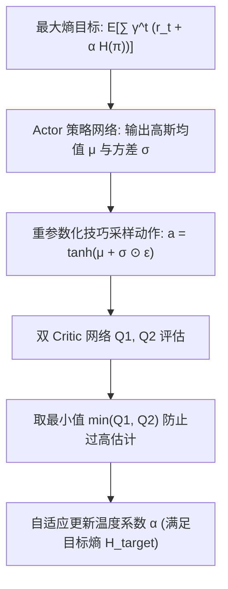

#### ① 最大熵目标函数
$$
J(\pi) = \sum_{t=0}^T \mathbb{E}_{(s_t, a_t) \sim \rho_\pi} \left[ r(s_t, a_t) + \alpha \mathcal{H}(\pi(\cdot|s_t)) \right]
$$

#### ② 软 Bellman 方程与软价值迭代
- **Soft Q-Function 目标**：

$$
y = r + \gamma \mathbb{E}_{s' \sim p, a' \sim \pi}\left[ \min_{j=1,2} Q_{\bar{\theta}_j}(s', a') - \alpha \log \pi_\phi(a'|s') \right]
$$

- **Actor 更新目标**（采用重参数化技巧 $a_\phi(s, \epsilon) = \tanh(\mu_\phi(s) + \sigma_\phi(s) \odot \epsilon)$，$\epsilon \sim \mathcal{N}(0, I)$）：

$$
J_\pi(\phi) = \mathbb{E}_{s \sim \mathcal{D}, \epsilon \sim \mathcal{N}}\left[ \alpha \log \pi_\phi(a_\phi(s, \epsilon)|s) - \min_{j=1,2} Q_{\theta_j}(s, a_\phi(s, \epsilon)) \right]
$$

#### ③ 自动调节温度系数 $\alpha$
通过构造受限优化问题，动态调整 $\alpha$ 以维持策略熵不低于期望目标熵 $\bar{\mathcal{H}} = -\dim(\mathcal{A})$：

$$
J(\alpha) = \mathbb{E}_{s \sim \mathcal{D}, a \sim \pi}\left[ -\alpha \log \pi(a|s) - \alpha \bar{\mathcal{H}} \right]
$$

---

### 3. 核心结果/发现

- 在 MuJoCo 连续控制基准（Humanoid、Ant、HalfCheetah）中，SAC 在收敛速度与最终性能上显著超越 DDPG、PPO 与 TD3。
- **真机零样本鲁棒性**：在真实 Minitaur 四足机器人行走实验中，直接在真实机器人上仅需 **2 小时** 交互即可从零学会稳定步态，且能抵抗外力踢踹扰动。

---

### 4. 局限性

1. **计算复杂度相对较高**：每个 Step 需要多次采样与两个 Critic + 目标 Critic 的前向与反向传播。
2. **多峰分布表示受限**：虽然比单高斯策略更好，但输出基于高斯变换（Squashed Gaussian），对于复杂的多目标不相交分布（如绕过障碍物左或右）依然无法完美覆盖。

---

## 14.5 TD3 (2018)
———双延迟确定性策略梯度：攻克价值函数近似误差

📄 **Paper**: [ICML 2018](https://arxiv.org/abs/1802.09477)  
💻 **Code**: [sfujim / TD3](https://github.com/sfujim/TD3)

### 精华
1. **揭示连续控制中的过高估计（Overestimation）机制**：首次系统性证明在连续动作空间的 Actor-Critic 算法中，值函数逼近误差会导致严重的累积高估，进而诱导 Actor 陷入亚优区域。
2. **截断双 Q 学习（Clipped Double Q-Learning）**：独立训练两个 Q 网络，在计算 TD Target 时取两者较小值，以轻微的低估偏差彻底消除恶性高估。
3. **延迟策略更新（Delayed Policy Updates）**：降低 Actor 与目标网络的更新频率（每更新 2 次 Critic 才更新 1 次 Actor），确保 Critic 逼近更平稳准确后再更新策略。
4. **目标策略平滑正则化（Target Policy Smoothing）**：在计算目标动作时向目标值中注入经过截断的随机高斯噪声，强化 Q 函数在动作维度的连续平滑性。
5. **极其纯粹坚固的基线**：在确定性策略连续控制任务中树立了工业级高精度基准。

---

### 1. 研究背景/问题

在离散 Q-Learning 中，最大化操作 $\max_a Q(s, a)$ 会引入正向估计偏差（Double DQN 已予以证明）。而在连续控制的 DDPG 中，由于使用梯度上升搜索最大动作值，Critic 会持续给出偏高的 Q 估计。这些高估误差在时间差分展开中不断传递累积，导致 Actor 盲目追逐虚假的高价值动作峰值，最终引发训练震荡崩溃。

---

<div align="center">
  
  <figcaption>图 14.5：DDPG（红线）在训练中 Q 值严重偏离真实累积回报并发生恶性高估，而 TD3（蓝线）的价值估计始终与真实 Returns 紧密重合</figcaption>
</div>

### 2. 主要方法/创新点

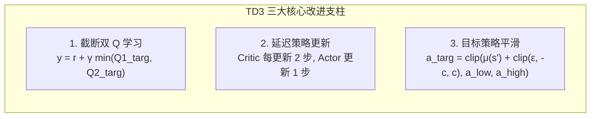

#### ① 截断双 Q 学习机制
训练两个独立的 Critic 参数 $\theta_1, \theta_2$：

$$
y = r + \gamma \min_{i=1,2} Q_{\theta_i'}\left(s',\; \tilde{a}'\right)
$$

取两者的极小值，迫使 Q 函数即使存在逼近误差也不会向正无穷方向失控发散。

#### ② 目标策略平滑
在计算下个状态的动作时注入截断高斯噪声：

$$
\tilde{a}' = \mathrm{clip}\left( \mu_{\phi'}(s') + \mathrm{clip}(\epsilon, -c, c),\; a_{\mathrm{low}},\; a_{\mathrm{high}} \right), \quad \epsilon \sim \mathcal{N}(0, \sigma)
$$

这基于物理常识：相近的动作在物理世界上应产生相似的价值回报，阻止 Actor 利用 Critic 表面上的窄尖锐高值漏洞。

---

### 3. 核心结果/发现

- 在 MuJoCo 7 项经典连续控制基准中，TD3 的稳定性和最终回报大幅超越 DDPG，并且在大部分连续控制指标上与 SAC 打成平手。
- Q 值估计追踪实验表明：DDPG 的估计 Q 值在几万步后迅速高出真实累计回报 2~5 倍，而 TD3 的估计曲线始终与真实 Returns 高度贴合。

---

### 4. 局限性

1. **确定性策略缺乏内生探索机制**：探索完全依赖外部附加的动作空间噪声（如高斯随机噪声），在长程稀疏奖励环境中容易探索受阻。
2. **超参数仍有调优空间**：延迟步数与噪声截断范围需根据系统物理特性设定。

---

## 14.6 World Models (2018)
———潜空间的预知梦：V-M-C 架构与有模型 RL 奠基

📄 **Paper**: [NeurIPS 2018](https://arxiv.org/abs/1803.10122)  
💻 **Code**: [worldmodels.github.io](https://worldmodels.github.io/)

### 精华
1. **认知科学架构（V-M-C 范式）**：提出由**视觉编码器（V）**、**记忆动力学（M）** 与 **轻量控制器（C）** 构成的三位一体智能体大脑，首次实现完全在神经网络生成的“梦境（Dream）”中训练策略。
2. **视觉降维感知（V 模型）**：利用 Variational Autoencoder (VAE) 将复杂的原始图像帧压缩为低维连续潜变量 $z_t$，过滤背景无关冗余。
3. **时序动力学预测（M 模型）**：采用 MDN-RNN（混合密度循环神经网络）自回归建模动作条件下的潜状态转移分布 $P(z_{t+1} \mid z_t, a_t, h_t)$，完美捕捉物理环境的随机性。
4. **极简控制器（C 模型）**：控制器仅为单层线性映射网络（参数仅上千），使用进化策略（CMA-ES）在梦境中极速优化，完全免去穿透世界模型的长程反向传播求导。
5. **开启世界模型新纪元**：奠定了随后 Dreamer 系列、MuZero 以及具身物理模拟世界模型的理论与架构基础。

---

### 1. 研究背景/问题

传统 Model-Free RL（如 DQN、PPO）把环境当成不可知的黑盒，需要反复同物理世界或高精度仿真器交互数百万步，**样本效率极低**。人类大脑则拥有强大的世界模型内部表征：能够凭借过往经验在脑海中“预演”未来可能发生的情景并做出决策。核心问题在于：**能否训练一个紧凑的生成式神经网络模型来模拟环境的时空演化，并让智能体完全在潜空间的梦境中完成策略进化？**

---

<div align="center">
  
  <figcaption>图 14.6：World Models 完整数据流：图像经 V 压缩为潜向量 z_t，与 M 模型的循环隐状态 h_t 拼接输入 C 控制器生成动作 a_t</figcaption>
</div>

### 2. 主要方法/创新点

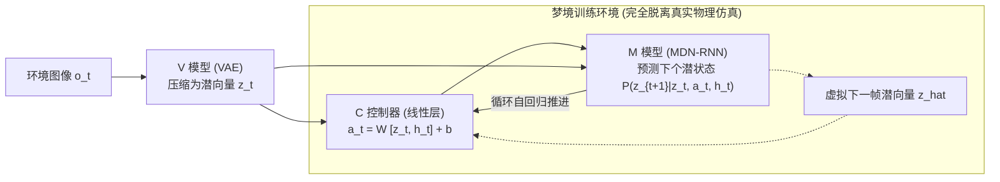

#### ① V 模型：空间压缩（Vision）
- 训练 VAE 编码器 $q_\phi(z_t|o_t)$ 与解码器 $p_\psi(o_t|z_t)$，将 $64 \times 64 \times 3$ 图像压缩为 32 维高斯潜向量 $z_t$。

#### ② M 模型：时间预测（Memory）
- 采用带有混合高斯输出层（Mixture Density Network）的 RNN 建模环境转移：

$$
P(z_{t+1} \mid z_t, a_t, h_t) = \sum_{k=1}^K \pi_k(h_t) \mathcal{N}\left(z_{t+1};\; \mu_k(h_t), \Sigma_k(h_t)\right)
$$

- 引入温度参数 $\tau$ 控制梦境环境的随机性与不确定性。

#### ③ C 模型：策略控制（Controller）
- 控制器参数少至几百到上千个权重，仅以当前 $z_t$ 和 RNN 隐状态 $h_t$ 作为输入输出动作 $a_t$。使用 CMA-ES（协方差矩阵自适应进化策略）直接优化累积梦境分数。

---

### 3. 核心结果/发现

- **CarRacing-v0 赛车基准**：完全在 MDN-RNN 梦境中训练的控制器，直接部署到真实赛道中获得了 **906 ± 21** 的高分，不仅通过了该基准，更超越了以往所有 Model-Free 强化学习方法。
- **VizDoom 游戏**：在复杂的末日射击游戏中，智能体在“虚构的梦境场景”中学会了敏捷躲避火球攻击。

---

### 4. 局限性

1. **分步解耦训练缺乏端到端协同**：V、M、C 三者独立训练，VAE 编码特征未考虑下游奖励相关性，可能遗漏细小关键物体。
2. **梦境幻觉（Adversarial Exploitation）**：控制器容易找到 M 模型在潜空间动力学上的不合理漏洞，在梦境中获得虚假高分但在真机上失效。

---

## 14.7 DreamerV3 (2023/2025)
———通用世界模型里程碑：掌握跨领域多尺度控制

📄 **Paper**: [Nature 2025 / arXiv:2301.04104 (Google DeepMind)](https://arxiv.org/abs/2301.04104)  
💻 **Code**: [danijar / dreamerv3](https://github.com/danijar/dreamerv3)

### 精华
1. **首个跨领域无调参通用世界模型**：在完全固定的超参数设置下，同一套算法通吃 7 大异构领域（Atari、DMC 连续控制、Crafter 2D 生存、Minecraft 3D 沙盒、BSuite、Memory 任务等）。
2. **Symlog 变换与无量纲化**：提出对称对数变换 $\mathrm{symlog}(x) = \mathrm{sign}(x)\ln(|x|+1)$ 处理输入特征、价值网络及损失函数，彻底解决了跨任务数量级跨度极大的奖励梯度缩放难题。
3. **离散潜变量 RSSM（循环状态空间模型）**：将世界模型的随机潜状态表示为离散的 Categorical 向量组，有效阻止信息坍缩并增强对非线性突变动力学的表达能力。
4. **Minecraft 零样本挖钻石奇迹**：在没有任何人类专家演示数据、完全依靠稀疏奖励与潜空间世界模型探索的前提下，首次从零学会采集木材、制作工作台、挖掘铁矿直到合成钻石（需 14 步深度依赖链）。
5. **具身智能通用模拟底座**：展现了世界模型作为通用具身基础规划器（Generalist Embodied Planner）的巨大潜力。

---

### 1. 研究背景/问题

传统 Model-Based RL 在特定任务（如低维物理控制）表现良好，但当面对视觉复杂多变、奖励尺度从 0.001 到 100,000 不等的极端异构任务时，极易因超参数敏感、梯度爆炸或表示坍缩而失效。核心挑战在于：**是否存在一种鲁棒的世界模型学习机制，无需针对不同环境单独调整超参数或网络架构，即可实现通用多模态物理动力学表征与长程决策？**

---

<div align="center">
  
  <figcaption>图 14.7：DreamerV3 训练流水线：(a) 真实经验学习 RSSM 世界模型；(b) 潜空间展开轨迹；(c) 在想象中优化 Actor-Critic 策略</figcaption>
</div>

### 2. 主要方法/创新点

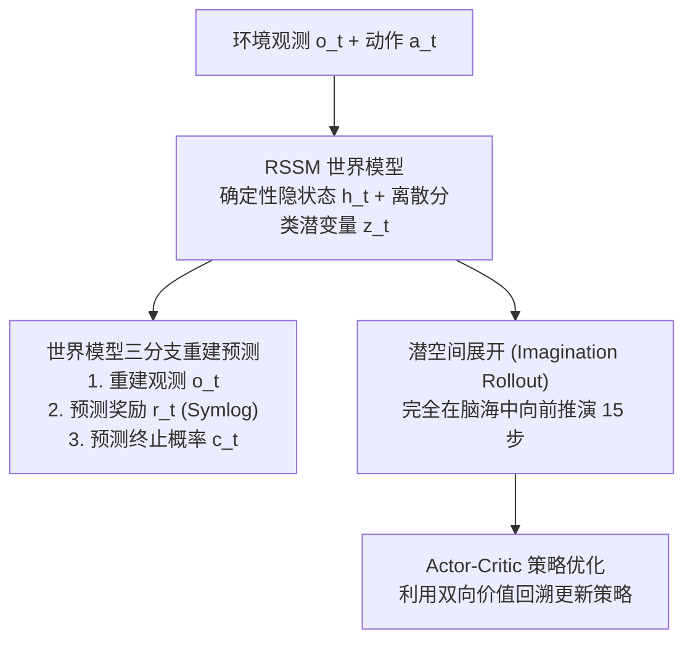

#### ① 稳健的表征学习与 RSSM
RSSM 结合了循环神经网络的确定性路径与离散潜变量的随机采样路径：
- 确定性隐状态：$h_t = f_\phi(h_{t-1}, z_{t-1}, a_{t-1})$；
- 离散随机潜变量：$z_t \sim q_\phi(z_t \mid h_t, o_t)$，由 32 个 32 类的离散 Categorical 分布构成（利用 Straight-Through 梯度估计器回传）。

#### ② Symlog 变换与两步缩放损失
为了消除奖励幅度的巨大差异，DreamerV3 对所有回归目标引入 $\mathrm{symlog}$ 转换，并在价值更新中采用指数移动平均的百分位数进行自适应归一化：

$$
\mathrm{symlog}(x) = \mathrm{sign}(x) \ln(|x| + 1)
$$

---

### 3. 核心结果/发现

- **7 大领域综合压制**：在单一超参设置下，在 Atari 50 游戏、DMC Proprio / DMC Visual、Crafter、Minecraft 等全部基准上均刷新 SOTA。
- **Minecraft 钻石里程碑**：在无人干预下于 1 亿环境步内成功挖掘到钻石（收集木头 $\to$ 木镐 $\to$ 石头 $\to$ 石镐 $\to$ 铁矿 $\to$ 熔炼 $\to$ 铁镐 $\to$ 钻石），成为强化学习史上的里程碑事件。

---

### 4. 局限性

1. **计算开销依然可观**：RSSM 循环展开与图像级自回归重建需要较强的 GPU 显存与计算算力支撑。
2. **精细局部物理接触建模不足**：面对毫米级接触装配等细粒度机器人力控任务，潜空间的视觉生成仍存在平滑模糊效应。

---

## 14.8 TD-MPC2 (2024)
———潜空间模型预测控制：长程多任务具身决策 SOTA

📄 **Paper**: [ICLR 2024](https://arxiv.org/abs/2310.16828)  
💻 **Code**: [nicklashansen / tdmpc2](https://github.com/nicklashansen/tdmpc2)

### 精华
1. **TD 学习与 MPC 统一框架**：在潜空间中将**模型预测控制（MPC 局部短视野规划）** 与 **时序差分（TD 价值函数长远评估）** 紧密统一，兼具在线局部寻优精度与长程全局视野。
2. **无需像素级重构的高效潜世界模型**：抛弃了昂贵的逐像素图像解码重建损失，直接在潜空间中通过自监督时序预测 + 奖励/终止/Q值多任务辅助头端到端训练，极大节约计算与显存。
3. **单策略统一掌握百种具身技能**：采用单一 Transformer/MLP 架构与固定超参数，在涵盖机械臂操作、双足多足移动、灵巧手操控的 **104 项任务（DMControl、MetaWorld、ManiSkill、MyoSuite）** 上实现单网络统一训练。
4. **模型规模化扩展律（Scaling Law）**：首次系统探索了具身有模型强化学习中的参数规模扩展特性（从 1M 到 300M+ 参数），展现出随着模型规模增长其泛化与多任务迁移能力的稳步提升。
5. **极速在线推理规划**：利用 MPPI（模型预测路径积分）在潜空间进行数千条轨迹的并行采样与评估，毫秒级输出高质量控制指令。

---

### 1. 研究背景/问题

传统的有模型 RL（如 World Models、Dreamer）大多依赖显式重构图像或潜空间完全展开，计算昂贵且容易被背景视觉细节干扰。而经典的纯 Model-Free 算法又缺乏应对未见环境的在线实时规划能力。核心痛点在于：**如何设计一种无需图像重构、既能在线规划又能结合长远价值预估的高性能潜空间控制算法，并让单一模型统一掌握数百种异构具身机器人任务？**

---

<div align="center">
  
  <figcaption>图 14.8：TD-MPC2 架构图：包含编码器、潜动力学模型、奖励预测、双 Q 价值头与策略先验，支持联合多任务训练与在线 MPPI 潜空间推演</figcaption>
</div>

### 2. 主要方法/创新点

```mermaid
graph TD
    A["当前观测 o_t"] --> B["潜编码器 z_t = h_θ(o_t)"]
    B --> C["MPPI 潜空间快速采样推演 (H=3 步)"]
    C --> D["潜动力学预测: z_{t+1} = d_θ(z_t, a_t)"]
    D --> E["即时奖励头 r_θ(z, a) + 终端价值头 Q_θ(z, a)"]
    E --> F["加权合成最优动作 a_t* 并向机器人下发"]
```

#### ① 紧凑的隐式世界模型
模型由编码器 $h_\theta$、潜动力学模型 $d_\theta$、即时奖励头 $R_\theta$、Q 价值头 $Q_\theta$ 与先验策略头 $\pi_\theta$ 构成。损失函数完全由任务相关信号驱动：

$$
\mathcal{L}_{\mathrm{total}}(\theta) = \sum_{t=0}^H \lambda^t \left( \mathcal{L}_R(s_t, a_t) + \mathcal{L}_Q(s_t, a_t) + \mathcal{L}_{\mathrm{dyn}}(s_{t+1}, d_\theta(s_t, a_t)) \right)
$$

#### ② 潜空间模型预测路径积分（MPPI）
在推理时，算法在潜空间从当前状态 $z_t$ 出发，结合先验策略 $\pi_\theta$ 采样 $N$ 条长为 $H$ 的候选动作序列，评估其期望回报：

$$
G(\tau) = \sum_{k=0}^{H-1} \gamma^k \hat{R}(z_k, a_k) + \gamma^H \min_{j=1,2} \hat{Q}_j(z_H, a_H)
$$

基于回报权重对候选序列进行 Softmax 加权迭代，输出最优第一步动作 $a_t^*$。

---

### 3. 核心结果/发现

- **百任务大一统**：TD-MPC2 在包含 104 个任务的基准集合中以单套模型取得了比以往任务专用基线更高的平均成功率与样本效率。
- **扩展性验证**：随着参数从 1M 扩大到 317M，多任务干扰问题显著减轻，模型展现出明显的 Positive Transfer（正向迁移）。

---

### 4. 局限性

1. **短视野规划依赖 Critic 准确性**：如果终端 Q 价值头存在局部偏差，短视野 MPC 规划易被误导。
2. **对环境局部突变敏感**：若遭遇大幅越界观测，未见过的潜特征可能导致动力学推演产生漂移。

---

## 14.9 Diffusion Policy (2023)
———动作生成的范式变革：基于扩散模型的视觉运动策略

📄 **Paper**: [RSS 2023 / arXiv:2303.04137](https://diffusion-policy.cs.columbia.edu/)  
💻 **Code**: [columbia-ai-robotics / diffusion_policy](https://github.com/real-stanford/diffusion_policy)

### 精华
1. **打破单峰动作假设**：首次将条件扩散概率模型（Denoising Diffusion Probabilistic Models, DDPM）引入机器人视觉运动策略，完美解决了传统策略网络无法表达多峰动作分布（Multi-Modal Distributions）的根本痛点。
2. **动作分块与时序连续性（Action Chunking）**：策略一次性预测未来 $T_a$ 步时域连续的动作轨迹块（Action Chunk），天然保证了机器人关节运动的极佳平滑度与物理可行性。
3. **退火去噪保证高精度**：去噪过程类似于梯度场优化，逐步消除动作不确定性，在毫米级高精度装配与长程接触任务中表现亮眼。
4. **统一两大主干架构**：系统提出了基于 **CNN-based (U-Net)** 与 **Time-Series Transformer** 的两种条件去噪主干网络，适配不同计算与时序依赖场景。
5. **重塑机器人策略学习**：成为 2023 年以来机器人操作（Robotic Manipulation）与模仿学习/强化学习微调领域的绝对主流技术范式。

---

### 1. 研究背景/问题

人类在执行机器人操作任务时，往往存在多种同样有效但完全互斥的行为选择（例如：抓取杯子把手或杯身、从左侧绕过障碍或从右侧绕过）。传统基于 MSE 损失的 MLP 策略网络在面对多模态专家数据时，会强行输出所有可能动作的“数学平均值”，导致机器人输出悬空或撞击的无效动作。虽然 GMM（高斯混合模型）能部分缓解，但在高维连续动作空间中极易面临数值不稳定与模式坍缩。

---

<div align="center">
  
  <figcaption>图 14.9：Diffusion Policy 整体架构：输入观测视界 T_o，预测时序动作块 T_p，执行前 T_a 步动作并滚动闭环更新</figcaption>
</div>

### 2. 主要方法/创新点

```mermaid
graph LR
    A["视觉观测序列 O_t (当前+历史帧)"] --> C["条件注入 (FiLM / Cross-Attention)"]
    B["标准高斯噪声 A_k ~ N(0, I)"] --> D["条件 U-Net / Transformer 去噪网络"]
    C --> D
    D -->|K 步反向迭代去噪| E["平滑无碰撞动作轨迹块 A_0 = [a_t, a_{t+1}, ..., a_{t+Ta}]"]
```

#### ① 条件扩散过程与损失函数
- 目标是将随机高斯噪声序列 $A^K \sim \mathcal{N}(0, I)$ 转换为符合专家分布的动作轨迹块 $A^0 \in \mathbb{R}^{T_a \times D_a}$。
- 训练损失为简单的去噪误差均方损失：

$$
\mathcal{L}_{\mathrm{Diffusion}}(\theta) = \mathbb{E}_{k, A^0, \epsilon, O_t}\left[ \left\lVert \epsilon - \epsilon_\theta(A^k, k, O_t) \right\rVert^2 \right]
$$

其中 $A^k = \sqrt{\bar{\alpha}_k} A^0 + \sqrt{1 - \bar{\alpha}_k} \epsilon$。

#### ② 滚动时域控制（Receding Horizon Planning）
每次预测未来 $T_p$ 步动作，但在实际执行时仅向底层控制器发送前 $T_a$ 步（$T_a < T_p$），并在下一控制循环中重新基于最新观测闭环去噪，兼顾长程前瞻与实时扰动纠偏。

---

### 3. 核心结果/发现

- 在包含真实机器人与仿真（RoboMimic、Push-T、Kitchen）的 11 项高难度操作任务中，Diffusion Policy 相比以往的 LSTM-GMM、IBC（隐式行为克隆）以及 BET 平均成功率绝对提升 **46.9%**。
- 在多峰分流实验中，Diffusion Policy 能 100% 果断选择一条合理分支，完全消除了均值策略在分支中线处的徘徊失控。

---

### 4. 局限性

1. **推理计算延迟较高**：标准 DDPM 需要 16~100 次网络前向传播才能生成一条轨迹，在低算力边缘端部署需依赖 DDIM 或 Consistency Models 进行加速压缩。
2. **纯模仿学习对分布外缺乏自愈能力**：若脱离训练轨迹分布，仍需结合强化学习进行在线交互探索微调。

---

## 14.10 DPPO (2025)
———扩散策略强化微调：去噪链内的在线策略优化

📄 **Paper**: [ICLR 2025](https://arxiv.org/abs/2409.00588)  
💻 **Code**: [jannerm / dppo](https://github.com/jannerm/dppo)

### 精华
1. **打通扩散策略与在线 RL**：首次提出将多步扩散去噪过程视作一个多步马尔可夫决策过程（MDP），在去噪链内部直接施加 PPO-Clip 约束，实现了扩散策略从专家模仿到在线强化学习的端到端跃迁。
2. **解决概率密度求导难题**：规避了以往穿透扩散去噪长链导致的梯度爆炸或消失问题，将反向去噪的每一步高斯转移直接显式化计算对数概率 $\log p_\theta(x_{k-1}|x_k)$。
3. **保留多峰性的同时持续进化**：相比传统 RL 算法微调后策略迅速坍缩为单峰，DPPO 能够完美保持扩散模型固有的多峰探索能力，并在高难度奖励下探索出超越演示的更优解。
4. **广泛适用于离线预训练到在线微调**：支持先利用专家数据进行 BC 预训练初始化，再通过在线交互进行 RL 对齐。
5. **标杆性算法**：为后续基于 Flow Matching / Diffusion 的具身具象基础策略（如 π0、GRPO 扩散等）提供了坚实的理论与算法参考。

---

### 1. 研究背景/问题

Diffusion Policy 在模仿学习上效果惊艳，但完全依赖人类演示数据。当演示数据质量参差不齐或机器人遭遇未曾见过的复杂环境时，需要通过**强化学习在线交互试错**来进一步提升上限。然而，将传统 RL 应用于扩散策略存在理论死结：
- 扩散模型的动作生成是一个多步随机微分/差分方程，无法直接输出显式的单步动作对数概率 $\log \pi(a|s)$；
- 如果直接将最终输出 $a_0$ 视为黑盒并用标准策略梯度更新，穿透 $K$ 步的反向传播求导会引发严重的数值不稳定。

---

<div align="center">
  
  <figcaption>图 14.10：DPPO 将扩散去噪链建模为内层 MDP 子决策步，外层推进环境真实时间步并接收外部奖励</figcaption>
</div>

### 2. 主要方法/创新点

```mermaid
graph TD
    A["状态观测 s"] --> B["扩散去噪链: x_K → x_{K-1} → ... → x_0 (Action)"]
    B --> C["将每步去噪视为子步 MDP 决策"]
    C --> D["计算每步局部高斯概率比率 r_k(θ)"]
    D --> E["在链内施加 PPO-Clip 代理约束"]
    E --> F["联合优势更新去噪网络权重"]
```

#### ① 去噪链的 MDP 映射
DPPO 将包含 $K$ 步去噪的生成过程建模为一个增广 MDP，在每个去噪时间步 $k$，转移概率服从各向同性高斯分布：

$$
p_\theta(x_{k-1} \mid x_k, s) = \mathcal{N}\left(x_{k-1};\; \mu_\theta(x_k, k, s), \sigma_k^2 I\right)
$$

由于每步转移均有解析形式，可以直接计算参数更新前后的局部重要性权重：

$$
r_k(\theta) = \frac{p_\theta(x_{k-1} \mid x_k, s)}{p_{\theta_{\mathrm{old}}}(x_{k-1} \mid x_k, s)}
$$

#### ② 链内 PPO-Clip 目标
将全局优势估计 $\hat{A}(s, a)$ 赋予去噪链，在每一步上去噪损失与主干网络联合优化，避免了端到端穿越整个计算图的不可导问题。

---

### 3. 核心结果/发现

- 在 RoboMimic 和 Gym-MuJoCo 基准测试中，DPPO 微调后的策略在任务成功率上相较纯 BC 扩散策略大幅提升 **20%~40%**。
- 在演示数据匮乏（Sub-optimal Demonstrations）情况下，DPPO 成功突破了演示数据的上限，学会了速度更快、路径更短的全新操作动作。

---

### 4. 局限性

1. **训练时间开销较大**：每个在线 Rollout 均需要执行完整多步去噪链的向前与向后梯度追踪。
2. **对环境奖励函数设计敏感**：仍需合理的密集或稀疏奖励以引导探索方向。

---

## 14.11 π*₀.₆ (2025)
———从专家干预中进化：真实机器人策略强化学习

📄 **Paper**: [Physical Intelligence (2025)](https://www.physicalintelligence.company/blog/pistar06)  
💻 **Project**: [Physical Intelligence Research](https://www.physicalintelligence.company/)

### 精华
1. **专家干预强化学习（Learning from Interventions with RL）**：针对真实物理世界中机器人自主探索极易撞坏硬件、脱离安全范围的致命难题，构建了人类专家“实时干预纠偏”与“自主强化学习”深度耦合的后训练体系。
2. **消除行为克隆的分布偏移**：传统 DAgger 仅对干预轨迹进行监督拟合，而 $\pi^*_{0.6}$ 利用强化学习价值函数将“被干预”视为负反馈惩罚、“成功自主完成”视为正奖励，主动纠正策略的不良前兆行为。
3. **真实世界大规模在线闭环**：在包括双臂折叠衣物、清理杂乱桌面、精密装配等多台实体机器人上实现了连续数十小时的在线 RL 强化后训练。
4. **VLA 大模型的具身对齐范式**：验证了从大规模离线预训练（$\pi_0$）到专家在环强化微调（$\pi^*_{0.6}$）是具身智能通往工业级极高可靠性（99%+ 成功率）的必由之路。
5. **软硬件安全边界守护**：设计了力矩限制与急停安全保护层，使高强度物理试错在现实环境中具备工业可用性。

---

### 1. 研究背景/问题

将 RL 应用于真实世界物理机器人一直面临三大天然壁垒：
- **安全与硬件损耗**：无约束的随机探索会导致机械臂剧烈碰撞损坏设备或环境；
- **重置成本高昂（Reset Problem）**：操作失败后掉落的物体无法在没有人类协助的情况下自动复原；
- **演示数据难以覆盖长尾边缘工况**：纯模仿学习在面对未见过的复杂打结衣物或散落物体时极易停滞或动作变形。

---

<div align="center">
  
  <figcaption>图 14.11：π*₀.₆ 专家干预与强化学习联合后训练体系概览</figcaption>
</div>

### 2. 主要方法/创新点

```mermaid
graph LR
    A["机器人自主执行 VLA 策略"] --> B{"人类专家实时监控"}
    B -->|无风险/正常| C["机器人继续自主运行<br/>(+ 累积自主执行正奖励)"]
    B -->|即将碰撞/陷入困境| D["专家介入操纵杆干预接管"]
    D --> E["记录干预切入点与纠偏轨迹<br/>(- 干预惩罚 + 纠偏样本)"]
    C --> F["Off-Policy RL 混合更新策略与 Critic 价值网络"]
    E --> F
```

#### ① 干预感知马尔可夫建模
- 当人类没有接管时，动作为机器人自主生成 $a_t \sim \pi_\theta$；当人类踩下踏板或推动摇杆接管时，动作为专家指令 $a_t = a_t^E$。
- **奖励设计**：自主完成任务给予高额正奖励，每次引发人类干预则施加干预惩罚项 $r_{\mathrm{int}} < 0$，激励策略在保持任务进度的同时最小化对人类接管的依赖。

#### ② 混合策略优化机制
策略同时利用干预前后的状态转移数据更新 Critic 评估网络，使得 Critic 能敏锐预判“哪些潜在危险姿态将导致人类干预”，从而在底层自发规避危险动作。

---

### 3. 核心结果/发现

- 在极具挑战性的**折叠多材质复杂衣物**与**清理装箱**任务中，$\pi^*_{0.6}$ 经过数天的干预 RL 后训练，任务连续无故障成功率从预训练模型的 **65% 飙升至 98% 以上**。
- **抗干扰自愈能力**：当人类中途恶意打乱被折叠的衣服时，策略能自主感知状态倒退并自动重新执行前序展开动作，展现出强大的闭环恢复力。

---

### 4. 局限性

1. **依赖高强度人类专家在环（Human-in-the-Loop）**：训练过程需要专业操作员在旁待命接管，人力成本依然较高。
2. **多机泛化调度复杂**：不同操作员的接管风格差异可能引入噪声标签。

---

## 14.12 X-NavDP (2026)
———多构型机器人通用视觉导航：组内 Q 值重加权 Diffusion RL 框架

📄 **Paper**: [arXiv:2607.28560 (Intern Robotics 2026)](https://arxiv.org/abs/2607.28560)  
💻 **Code**: [InternRobotics / NavDP](https://github.com/InternRobotics/NavDP)

### 精华
1. **破解扩散导航策略的 RL 微调瓶颈**：针对传统扩散策略微调在全局 Minibatch 归一化下低收益状态梯度被淹没的问题，提出了**组内 Q 值重加权匹配（Group Q-Score Reweighted Matching, GQRM）**，实现高效稳健的扩散策略强化后训练。
2. **自引导轨迹扰动（Self-Bootstrapped Perturbation）**：利用模型无目标分支与坐标翻转组合，在保留轨迹先验与时序平滑性的同时生成侧向、倒车与绕行等高价值探索动作，实现死胡同零样本自救。
3. **轻量化构型 FiLM 调制（Embodiment Modulation）**：通过在 Transformer 解码器中注入机器人构型 Embedding，用**单套网络权重同时统一控制轮式、四足与人形（Dingo / Go2 / G1）**三种动力学差异极大的异构机器人。
4. **闭环时域引导（RTC Guidance）**：推理部署时在去噪步中引入前序时序平滑梯度，彻底消除了连续滚动推演中的航点抖动。
5. **复杂未见环境自救率飞跃**：在 IsaacLab 仿真与真机死胡同自救实验中将成功率由 10% 提升至 65%，仅需 12 小时并行强化学习训练。

---

### 1. 研究背景/问题

基于模仿学习的扩散视觉导航策略（如 NavDP、NoMaD）具备优异的开阔场景寻路能力，但由于专家数据均来自全局最优规划器，存在两大核心缺陷：
- **无局部自救能力**：面对长障碍、死胡同（Dead-End）等受困场景时，仅有局部视场的机器人由于从未在专家数据中见过“倒车/退后绕行”，极易卡死或持续碰撞；
- **构型盲目（Embodiment-Blind）**：无法适配轮式（不可横移）、四足（全向移动）、人形机器人（质心摆动与转弯半径）的不同物理约束。

---

<div align="center">
  
  <figcaption>图 14.12：X-NavDP 整体框架：多构型机器人自引导扰动与组内 Q 值重加权强化后训练</figcaption>
</div>

### 2. 主要方法/创新点

```mermaid
graph TD
    A["局部 RGB-D + PointGoal + 机器人 ID"] --> B["构型 FiLM 模块注入 Robot Embedding"]
    B --> C["自引导扰动策略采样同状态候选组 G(s)"]
    C --> D["Twin Critics 评估候选组轨迹 Q(s, a)"]
    D --> E["同状态组内归一化计算优势值 Q_tilde_G"]
    E --> F["保留 Top-k 正优势动作指数重加权优化"]
    F --> G["优化 Diffusion 去噪网络 + RTC 闭环引导执行"]
```

#### ① 组内 Q 值重加权（GQRM）
针对同状态采样出的动作候选组 $G(s)$，强制在组内计算均值与标准差：

$$
\bar{Q}_G(s) = \mathbb{E}_{a_0 \sim \pi_{\mathrm{old}}}[Q(s, a_0)], \quad \sigma_G(s) = \sqrt{\mathbb{E}[(Q(s, a_0) - \bar{Q}_G(s))^2]}
$$

$$
\tilde{Q}_G(s, a_0) = \mathrm{clip}\left( \frac{c (Q(s, a_0) - \bar{Q}_G(s))}{\sigma_G(s) + \varepsilon},\; -h,\; h \right)
$$

**优势**：即使在陷入死胡同、所有动作绝对回报均为负值的极端困难状态下，GQRM 依然能敏锐识别出“相对较好”的倒车脱困轨迹并赋予极高梯度权重。

#### ② 自引导扰动探索机制
利用模型自身的 Goal-Agnostic 预测结合伯努利符号向量 $\mathbf{s} = ((-1)^{B_1}, (-1)^{B_2})$ 进行外推合成：

$$
\tau_{\mathrm{mixed}} = \mathbf{s} \odot (\tilde{\tau}_{\mathrm{pointgoal}} + \lambda \tilde{\tau}_{\mathrm{nogoal}})
$$

---

### 3. 核心结果/发现

- **仿真与真机大跨步提升**：在 IsaacLab 40 个未见测试场景中，平均成功率从 **61.20% 提升至 84.28%**。在 Unitree G1 人形机器人上成功率从 **50.70% 提升至 84.50%**。
- **真机死胡同脱困**：在真实物理死胡同测试中，未微调模型 100% 碰撞受困，而 X-NavDP 展现出平滑的倒车转向自愈能力，脱困成功率达 **65%**。

---

### 4. 局限性

1. **依赖高质量的 Twin Critic 价值评估**：若仿真中的碰撞与距离奖励塑形不够精细，可能影响对最优倒车轨迹的判别。
2. **高频端侧计算要求**：多构型 FiLM 调制与 RTC 去噪引导对边缘计算芯片的推理吞吐量有一定要求。

---

# 15. 结语

强化学习在具身智能领域的演进，映射了整个 AI 发展的轨迹：

- **无模型时代（DQN / PPO / SAC / TD3）**：奠定了离散与连续动作空间深度策略学习的数学基石，攻克了策略方差与价值高估问题。
- **世界模型时代（World Models / DreamerV3 / TD-MPC2）**：打破了对海量真实物理采样的绝对依赖，实现了潜空间自监督物理动力学演化与长程规划。
- **生成式时代（Diffusion Policy / DPPO / X-NavDP）**：从根本上重塑了动作空间的分布表征，以扩散去噪机制完美化解了多峰连续控制与时序平滑矛盾。
- **真实与后训练时代（π\*₀.₆ / RLVR / Residual-VLA）**：打通了专家干预、可验证物理常识与 VLA 大模型的端到端强化对齐闭环。

每一代算法都在前人基础上攻克新的理论与工程瓶颈。随着物理世界感知、多模态基础模型与高保真并行仿真的进一步融合，强化学习正驱动具身机器人从“模式复刻”加速跨越至“物理世界的自主认知与通用行动”。

---

*本文由 Tingde Liu 整理撰写，参考 [EasyRL（Datawhale）](https://github.com/datawhalechina/easy-rl)、OpenAI Spinning Up、Berkeley Deep RL 及上述里程碑论文资料，系统聚焦强化学习算法全景与具身前沿演进。*
