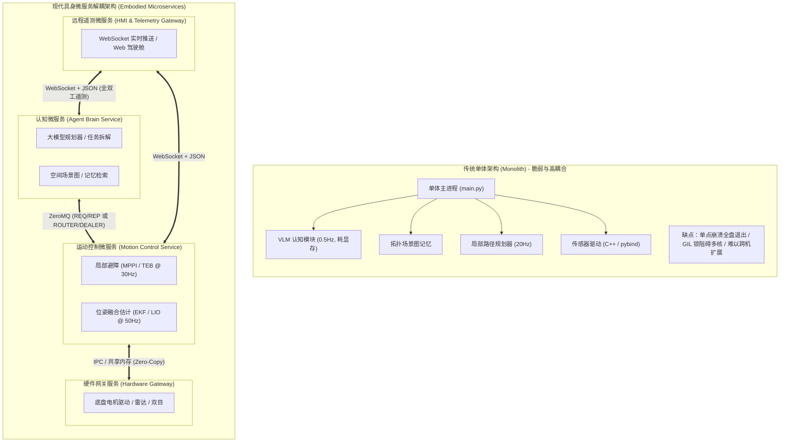
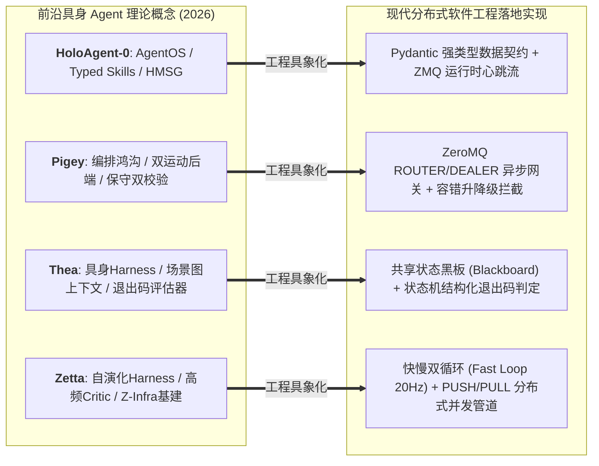
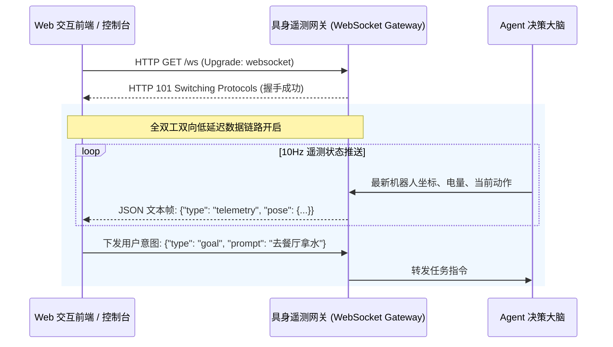
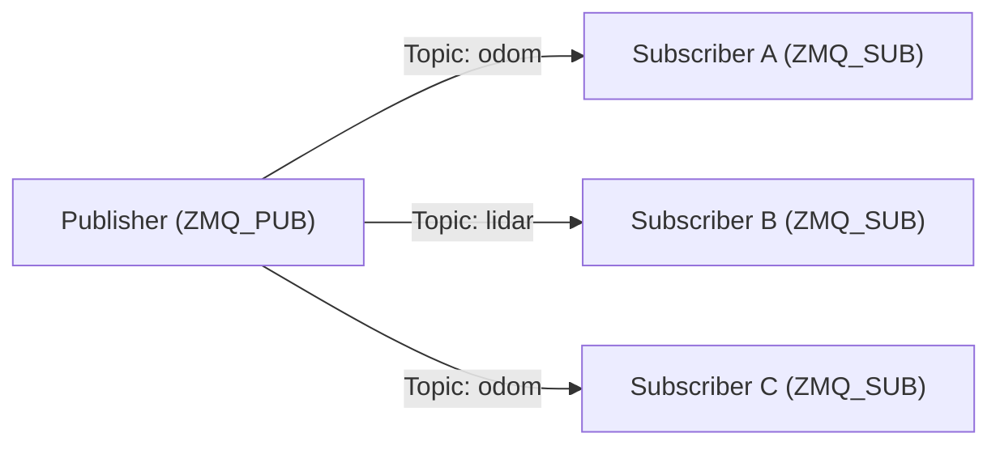
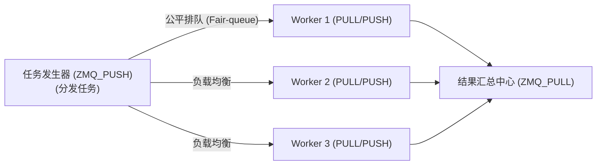
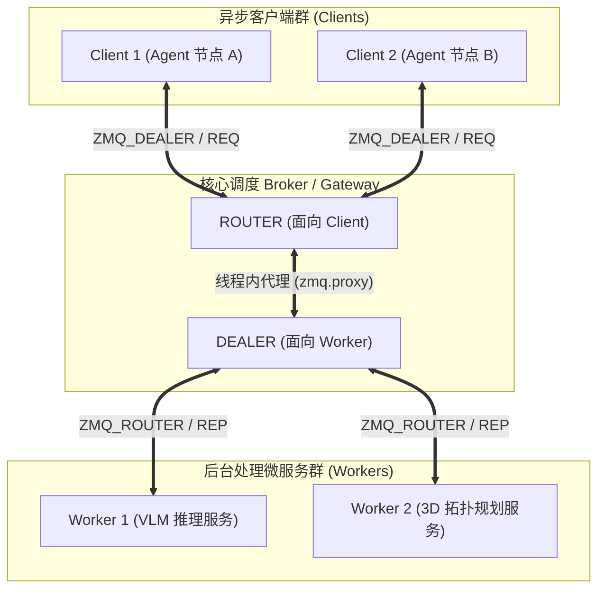
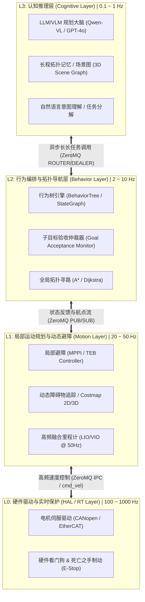
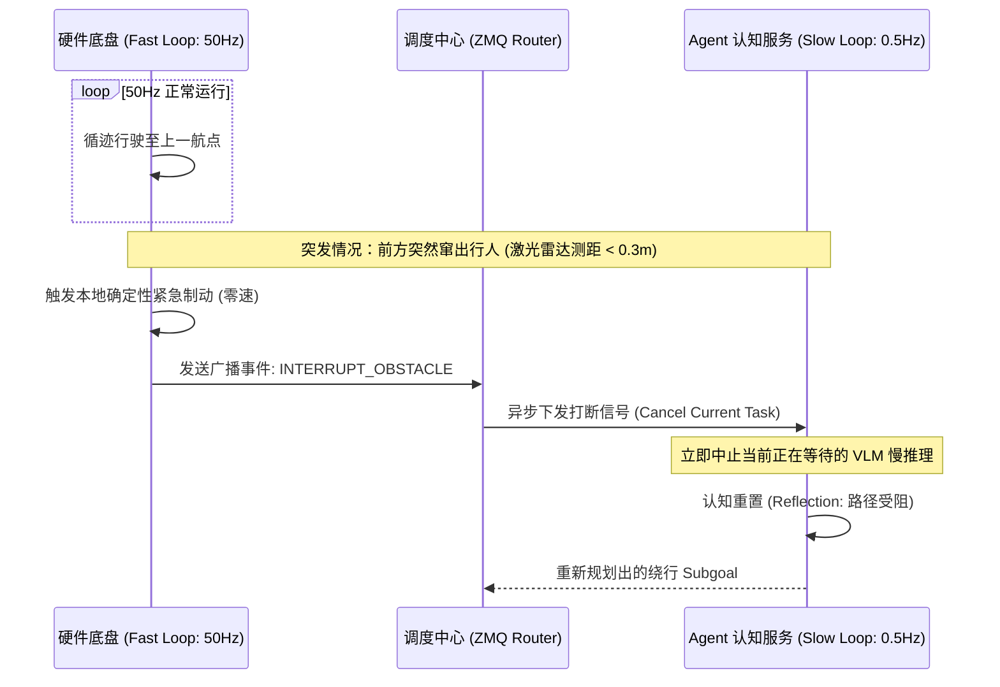
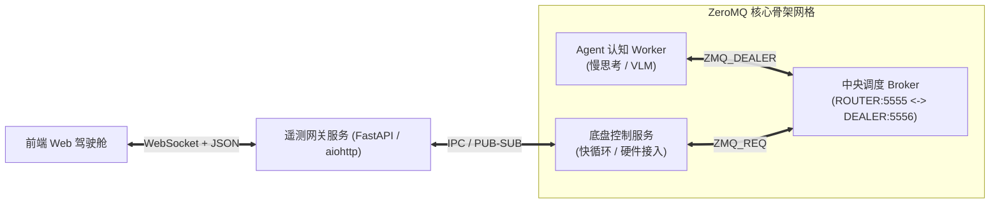

> 💡 **理论与工程配套阅读指引**：  
> 本文是前沿论文精读博客 [《Embodied Agent 经典论文》](/Embodied-Agent-Papers/) 的**底层软件系统工程与分布式架构配套实战指南**。  
> 论文篇聚焦于 **HoloAgent-0、Pigey、Thea、Zetta** 等 2026 年代表性工作所确立的算法理论与闭环机制（如 AgentOS 运行时、Typed Skills、SceneGraph as Context、Evaluation as Exit Codes、双运动后端编排与自演化高通量基建 Z-Infra）；  
> 本文则从**计算机分布式系统、微服务解耦、ZeroMQ 通信模式、WebSocket 实时网络与快慢双循环**的底层软件工程视角，深度剖析如何将上述论文中的顶层理论转化为真正高内聚、低延迟、高可靠的生产级工业软件代码。

---

# 一、引言：具身智能系统的“工程断层”

在过去的几年中，学术界在**具身导航（VLN/VLA）**与**大语言/多模态模型（LLM/VLM）**领域取得了突破性进展。然而，当算法研究者试图将这些模型组装为一个真正能跑在物理世界或复杂动态仿真环境中的**“通用具身导航智能体（Agentic Embodied Agent）”**时，往往会遭遇巨大的**“工程断层”**：

1. **学术实验代码的单体陷阱（Monolithic Trap）**：绝大部分开源科研代码是一个巨大的单体 Python 脚本，以同步阻塞的 `while` 循环为主轴。一旦接入高分辨率相机、高频激光雷达和需要数秒推理的 VLM，整个程序立即陷入严重的卡顿、丢帧与资源死锁。
2. **多时钟域与异构计算冲突**：大模型（VLM/LLM）的认知决策属于**“慢思考”**（0.1~2 Hz，耗时 0.5s~3s，概率性推理）；而底层运动避障与电机驱动属于**“快反射”**（20~1000 Hz，强实时性，确定性物理闭环）。强行将两者揉在同一个进程中，势必导致“思考时底盘失控撞墙”或“为保底盘而频繁打断思考”。
3. **软硬件崩溃的爆炸半径（Blast Radius）**：传感器驱动发生野指针异常（SegFault），或者 PyTorch 算子发生 CUDA Out of Memory (OOM)，会导致整个控制主系统瞬间殉爆退出，无法提供任何故障降级和安全托底。

为了构建真正稳定、可扩展、生产级的通用具身导航系统，机器人学与分布式软件工程正在经历一场**向微服务与分布式解耦架构的范式转移**。

---

# 二、分布式与微服务架构在具身系统中的演进

## 2.1 传统单体控制器 vs 具身分布式微服务



在具身微服务架构中，系统按**业务职责边界（Bounded Context）**与**执行时钟频率**被严格拆分为多个独立自治的子服务进程：
* **进程级故障隔离**：传感器进程崩溃可被守护进程（systemd/Supervisor）秒级拉起，不会导致认知大脑断电；VLM 显存溢出被熔断捕获，底层运动控制器依然持续保持防撞驻车控制。
* **语言与运行环境解耦**：认知大脑可用 Python 快速调用主流 AI 框架；底层运动控制与避障可用现代化 C++ 或 Rust 榨干硬件性能；中间无缝通过标准协议通信。
* **物理部署灵活性**：所有服务既可在同一台物理机（工控机）上通过 IPC 运行，也可以将大脑移至边缘工作站或云端，底盘端仅保留轻量级网关，系统对外调用方式完全保持透明。

---

# 三、前沿理论落地映射：2026 四大具身 Agent 工作的工程实现

在 [《Embodied Agent 经典论文》](/Embodied-Agent-Papers/) 中，学术界提出了多项具有里程碑意义的理论框架与机制设计。很多工程师读完论文后觉得思想非常前沿，但困惑于**“在具体写代码和搭建系统时，这些理论到底对应什么软件模式？”**。

本节系统拆解 **HoloAgent-0、Pigey、Thea、Zetta** 四大工作在现代软件系统中的具体实现映射。



---

## 3.1 HoloAgent-0 落地映射：Typed Skills 与分层场景图 (HMSG) 的工程解耦

[HoloAgent-0](/Embodied-Agent-Papers/#holoagent-0) 的核心洞察在于：**物理世界动作连续且不可逆，不能将底层工具视为黑盒函数，必须制定带前置约束与持续心跳状态流的类型化技能（Typed Skills）**。

### 1. 软件工程映射：Pydantic 强类型契约与心跳状态广播
* **Command Schema 实现**：利用 Python 现代框架的 `Pydantic` 定义命令的强类型参数与预期前置条件（Preconditions）。
* **Runtime Status Stream 实现**：传统 API 只返回二值化布尔值（成功/失败），而 HoloAgent-0 要求高频广播当前动作的细粒度心跳（`progress`、`confidence`、`failure_mode`、`recoverability`）。在分布式架构中，这一状态流通过 **ZeroMQ PUB/SUB** 或 **ROS 2 Action Feedback** 进行广播，上层调度器订阅该流，以非阻塞方式监控物理进度。

### 2. 分层多模态场景图（HMSG）的工程缓存架构
HoloAgent-0 将环境垂直解耦为“楼层（Floor）- 房间（Room）- 视角（View）- 物体（Object）”四层，特别是引入“视角层（View）”阻断盲目调用大模型：
* **工程存储结构**：在软件工程中，这对应于一个**层次化内存图数据库（In-Memory Graph Store）**。楼层与房间以轻量级关系字典维护，视角层缓存历史关键帧的 6-DoF 位姿与轻量级特征向量（如 SigLIP 嵌入）。
* **快慢两级过滤**：
  1. **快检索（Fast Filter）**：在本地内存中对几百个候选视角的 CLIP 向量进行余弦相似度批计算（耗时 $< 2\text{ms}$），快速筛选出 Top-K 候选视角；
  2. **慢验证（Slow Reasoner）**：仅将这 Top-K 个视角的高清图片通过异步 RPC 发送给远端 VLM 进行最终裁决，从而将网络带宽占用降低 90%，避免多模态 Token 爆炸。

---

## 3.2 Pigey 落地映射：编排鸿沟与双运动后端调度

[Pigey](/Embodied-Agent-Papers/#pigey) 指出具身智能的核心瓶颈在于缺乏统筹感知、规划、校验与恢复的闭环编排架构，并提出了**几何规划（TAMP）与端到端神经策略（$\pi_{0.5}$）互补双后端**。

### 1. 软件工程映射：基于 ZeroMQ ROUTER/DEALER 的动态路由网关
在系统架构层面，Pigey 的编排器本质上是一个**微服务调度网关（Orchestrator Broker）**：
* 编排器大脑（Frontier VLM）作为客户端，底层运动策略（TAMP 求解器、VLA 策略服务）作为无状态的后台 Worker。
* 编排器发出一个抽象原子动作后，网关根据目标物体属性（刚性 vs 柔性/接触密集）动态将任务派发至对应的运动 Worker。

### 2. 保守双重物理校验（Conservative Dual Verification）的中间件拦截器
Pigey 强行将原本开环的“抓-放（Pick-and-Place）”动作拆解为独立的 `Pick` 与 `Drop`，中间插入传感器（`is_grasped`）与腕部相机双重校验：
* **软件拦截器模式（Interceptor Pattern）**：在 RPC 客户端配置后置拦截器（Post-execution Interceptor），无论底层运动控制微服务上报成功与否，拦截器必须强制调取机械臂末端传感器状态；若校验不通过，直接拦截后续步骤，在网关层就地触发重试或策略升级（TAMP $\to$ VLA），从系统层面杜绝复合误差渗透。

---

## 3.3 Thea 落地映射：SceneGraph as Context 与 Evaluation as Exit Codes

[Thea](/Embodied-Agent-Papers/#thea) 将软件工程中的“代码 Agent Harness 范式”迁移至具身物理世界，指出必须补齐物理世界缺失的两大信号基础设施：**SceneGraph as Context（场景图即上下文）** 与 **Evaluation as Exit Codes（评估器即退出码）**。

### 1. SceneGraph as Context $\leftrightarrow$ 状态黑板与动态上下文注水
在软件系统中，大模型的长程对话上下文窗口如果持续灌入高频原始视频流，数轮交互就会发生 OOM 与注意力弥散。
* **工程实现**：系统在后台由一个独立的感知微服务持续聚合传感器数据，维护一份带锁的**结构化状态黑板（State Blackboard）**。
* 每轮 Agent 推理前，黑板将复杂的 3D 点云与位姿提炼为一段极简的 Markdown/JSON 简报（Scene Graph Brief，仅包含当前关键物体、空间拓扑关系与可见性），按轮次注入 Agent 提示词中；Agent 只有在需要精细操作时，才通过特定的 Tool 接口主动按需查询某物体的局部点云，实现极致的上下文瘦身。

### 2. Evaluation as Exit Codes $\leftrightarrow$ 微服务退出码与状态图异常捕获
在传统代码中，Linux 进程以 `Exit Code 0` 表示成功，非零表示错误，并输出 `stderr` 调用栈。Thea 在具身物理世界中通过独立的视觉评估微服务模拟了这一机制：
* 动作执行完毕后，Harness 强制调用独立 Evaluator 微服务，该微服务返回带有结构化归因的三态退出码：
  ```json
  {
    "exit_code": 1,
    "status": "FAILURE",
    "failure_category": "GRASP_SLIP",
    "diagnostic_trace": "目标物体因法向量偏移未稳固夹持，距目标偏离 4.2cm",
    "recoverable": true
  }
  ```
* Agent 框架的状态图（StateGraph）捕获到非零退出码后，状态机自动跳转至异常分支，将 `diagnostic_trace` 反馈给认知大脑，引导大模型进行精准针对性重试，而非盲目重跑。

---

## 3.4 Zetta 落地映射：高频在线裁判 (Critic) 与高通量基建 Z-Infra

[Zetta](/Embodied-Agent-Papers/#zetta) 提出了面向自演化具身智能的高频微观在线纠偏架构，并揭示了**“高频运行时裁判（Runtime Critics $C$）”**与**“软硬件解耦高通量基建 Z-Infra”**的关键价值。

### 1. 高频在线裁判 $\leftrightarrow$ 快循环 20Hz 实时监控与任务打断
Zetta 指出，事后反思（Post-hoc Reflection）无法归因高频连续控制失败，必须在毫秒级发现物体滑脱的瞬间立即挂起动作并介入就地微恢复：
* **工程对应**：这正是本指南第四章所推导的**双循环异步调度架构（Dual-Loop Runtime）**。底盘/机械臂的快循环以 20~50Hz 运行高频 Critic，一旦检测到滑脱或碰撞风险，毫秒级向调度中心发送 `INTERRUPT` 事件，在物理层面实施紧急悬停并打断慢速规划。

### 2. 高通量并发基建 Z-Infra $\leftrightarrow$ ZeroMQ PUSH/PULL 分布式并发管道
为了实现高达 35.1 episodes/min 的高通量自演化采样，Z-Infra 将多节点物理环境（仿真环境）与模型计算资源池彻底物理隔离解耦：
* **工程对应**：通过 **ZeroMQ Pattern 3: PUSH/PULL 流水线模式**，任务分发器（Ventilator）将海量任务种子以负载均衡方式推入 Worker 集群，Worker 并发 Rollout 产生海量轨迹，再通过汇聚 Sink 节点集中写入轨迹存储池，彻底解决多 GPU 推理卡死单核 CPU 的算力瓶颈。

---

### 具身论文理论与分布式软件工程对照总表

| 2026 论文代表作 | 核心理论 / 机制概念 | 传统算法视角理解 | 现代分布式系统 / 软件架构对应实现 |
| :--- | :--- | :--- | :--- |
| **HoloAgent-0** | **Typed Skills** | 带有参数约束的机器人动作接口 | **Pydantic 强类型数据契约 + ROS 2/ZMQ 运行时状态心跳广播流** |
| **HoloAgent-0** | **HMSG 分层场景图** | 楼层-房间-视角-物体的四层几何拓扑 | **两级缓存架构**：轻量级内存拓扑图 (Fast) + 视角层异步 VLM 鉴别 (Slow) |
| **Pigey** | **编排鸿沟与控制解耦** | 语言大脑管大方向，冻结策略管小碎步 | **ZeroMQ ROUTER/DEALER 微服务网关**：异步调度 TAMP 与 VLA 冻结后端 |
| **Pigey** | **保守双重物理校验** | 抓取后看眼相机、读下夹爪传感器 | **中间件拦截器（Interceptor）**：物理状态阻断空夹爪投递，驱动升降级 |
| **Thea** | **SceneGraph as Context** | 符号化场景图替代高维图像序列 | **状态黑板模式（Blackboard）**：后台异步更新，按轮次生成精炼 Markdown 简报 |
| **Thea** | **Evaluation as Exit Codes** | 独立视觉模型充当裁判裁决动作成功 | **结构化退出码与错误诊断协议**：驱动状态机（StateGraph）条件路由与重试 |
| **Zetta** | **高频在线裁判 (Critic)** | 毫秒级监控动作异常并在就地拉起恢复 | **快慢双循环调度（Dual-Loop）**：20Hz 避障监视线程毫秒级打断慢速 Agent 推理 |
| **Zetta** | **高通量基建 Z-Infra** | 异构计算多进程解耦并发 | **ZeroMQ PUSH/PULL 管道模式**：环境模拟与 GPU 推理池的横向扩展流式分发 |

---

# 四、多层通信协议矩阵：WebSocket, JSON, REST 的定位与考量

在设计分布式具身系统时，选择恰当的通信协议是保证通信吞吐与降低延迟的第一要务。

## 4.1 协议全景与特征横评

| 协议 / 格式 | 通信范式 | 传输层 | 优势 | 局限性 / 性能瓶颈 | 具身智能中的最佳定位 |
| :--- | :--- | :--- | :--- | :--- | :--- |
| **WebSocket + JSON** | 双向全双工长连接 | TCP | 浏览器原生支持，协议握手后头开销极小，跨语言跨网络通用性极高 | JSON 为文本序列化，打包/解包 CPU 消耗大，传输大数组效率低下 | **远程人机交互、Web 遥测控制台、可视化大屏、移动端遥控** |
| **HTTP / REST (JSON)** | 一问一答无状态短连接 | TCP | 标准成熟，极易调试 | 每次请求头冗余，延迟高，无法做服务端连续低延迟推送 | **低频业务调用**（如设备注册、下载离线大地图） |
| **ZeroMQ (ZMQ)** | 消息队列/多通信模式 | TCP / IPC / inproc | 极致轻量、亚毫秒延迟、无中心 Broker、支持高级拓扑模式 | 纯底层套接字库，无内置序列化格式，需用户自选数据载荷 | **机载系统多进程骨架、Agent 内部各子系统高频互联** |
| **gRPC + Protobuf** | 强类型双向流 RPC | HTTP/2 (TCP) | 强类型接口定义，编译期安全，序列化体积小且快 | 不适合动态弱网环境，缺少多对多广播与灵活拓扑模式 | **大模型推理服务化调用、跨语言服务标准契约** |
| **共享内存 (Zero-Copy)** | 内存直接映射指针访问 | 本机物理内存 | 零数据复制，延迟纳秒级，吞吐受限于硬件物理带宽 | 仅限同物理机通信，需要额外的同步通知信号机制 | **4K 相机未压缩图像、激光雷达高密点云传输** |

---

## 4.2 WebSocket + JSON 深入拆解与工程规范

### 1. 工作机制
WebSocket 在建立连接时利用 HTTP 进行一次标准的握手协商（包含 `Upgrade: websocket` 与 `Connection: Upgrade` 请求头）。握手成功后，底层 TCP 连接被复用并保持长连接，协议状态切换为全双工二进制/文本帧（Frame）传输，后续数据通信彻底去掉了庞大的 HTTP Header（基础帧头仅占 2~10 字节）。



### 2. 为什么具身系统广泛使用 WebSocket + JSON？
* **浏览器生态原生支持**：任何前端（React/Vue/Three.js）无需安装任何驱动插件，即可直接建立 WebSocket 连接，渲染 3D 轨迹地图、相机画面或接收遥测日志。
* **事件驱动与双向通知**：不仅客户端可以发命令，服务端也可以在发生突发事件（如碰撞告警、子任务完成）时主动且即时推送到前端。

### 3. 致命缺陷与“反模式（Anti-Pattern）”
> **警惕：严禁在实时高频传感器传输中滥用 JSON！**  
> 一帧 1080P RGB 图像约 6.2MB。若将其 Base64 编码为 JSON 字符串传输：
> 1. 数据体积膨胀约 **33%**，达到 8.2MB；
> 2. CPU 在对 6MB 数据进行 Base64 与 JSON 字符串解析时，耗时可达 **20~50ms**，直接耗尽单核 CPU 算力！  
> **工程规范**：WebSocket 传输传感器流时，必须使用**二进制帧（Binary Message）**传输已编码的压缩流（如 JPEG、H.264/WebRTC），而 JSON 仅用于传输轻量级控制指令与状态遥测元数据。

---

# 五、ZeroMQ 核心设计模式与工程深度剖析

**ZeroMQ (ØMQ, 0MQ, ZMQ)** 并不是传统意义上的重型消息中间件（如 RabbitMQ 或 Kafka，它没有中心化的 Broker 服务器进程），而是一个**“嵌入式的网络并发库与智能套接字（Sockets on Steroids）”**。它将底层 TCP、进程间通信（IPC）以及线程内通信（inproc）抽象为统一的 API，在内存中直接管理消息收发队列，具备亚毫秒级的极限延迟。

在具身智能系统中，ZeroMQ 提供了四大经典模式（Patterns）。

---

## 5.1 Pattern 1: REQ/REP (Request-Reply 严格应答模式)

这是最容易理解但最容易踩坑的模式。


### 核心机制与底层状态机
* **严格交替（Lockstep）**：REQ 必须遵循严格的“发送 $\to$ 接收”顺序；REP 必须遵循“接收 $\to$ 发送”顺序。
* **致命陷阱（死锁风险）**：
  如果 Client 发出了一个请求，而 Server 在处理过程中发生崩溃或者网络短暂丢包，Client 的 `socket.recv()` 会永久阻塞卡死！此时即使重启 Server，Client 也无法再发新请求（因为其内部状态机依然停留在“等待 Reply”状态，强行再次 `send()` 会直接抛出 `zmq.error.ZMQError: Operation cannot be accomplished in current state`）。
* **工业解决方案（Lazy Pirate 模式）**：
  使用 `zmq.Poller` 设置超时机制。一旦等待超时，**直接关闭销毁当前 Socket，新建一个 Socket 重新连接**，并执行指数退避重试。

---

## 5.2 Pattern 2: PUB/SUB (Publish-Subscribe 单向发布订阅模式)

适用于**高频数据流分发**（如底盘里程计广播、相机图像广播、传感器读数广播）。



### 关键工程细节
1. **慢订阅者问题（Slow Joiner）**：
   ZMQ 的连接建立在后台线程异步执行。如果 Publisher 在 `bind()` 之后立刻 `send()`，早期的前几条消息**必然全部丢失**。
   *解法*：在关键系统中，订阅端先通过一个轻量级 REQ 向发布端上报“就绪”，发布端再开始广播。
2. **主题过滤（Topic Filtering）**：
   SUB 必须显式通过 `socket.setsockopt_string(zmq.SUBSCRIBE, "odom")` 订阅特定前缀，默认什么都收不到。过滤操作在收端或发端内核态高效完成。
3. **高水位线 (High Water Mark, HWM)**：
   若消费者处理变慢，ZMQ 不会无限把消息堆在内存中导致 OOM。当队列达到 `ZMQ_RCVHWM` 阈值（默认 1000 条），新进入的消息会被**静默丢弃**。对于实时传感器流，这恰恰是期望的降级特性。

---

## 5.3 Pattern 3: PUSH/PULL (Pipeline 流水线/扇出汇聚模式)

适用于**高吞吐并行计算与流水线任务拆解**（如 Z-Infra 基建中环境采样与并发 Rollout 分发）。



### 具身智能落地场景：分布式感知切片并行处理
* 任务发生器（Ventilator）将当前全景相机采集的 360° 点云切分为 4 个局部区域点云。
* 通过 PUSH 套接字，ZeroMQ 会以**严格的负载均衡（Fair-queueing Round-Robin）**轮询分发给 4 个独立的 Worker 进程（每个 Worker 独占一张 GPU 进行目标检测与语义特征提取）。
* 计算完毕后，Worker 通过 PUSH 发送给 Sink 汇聚节点，Sink 将 4 个区域的语义结果缝合为一张统一的 3D 拓扑图。
* **特点**：单向流动，没有确认包，效率极高；新增 Worker 进程即可实现无缝横向扩展。

---

## 5.4 Pattern 4: ROUTER/DEALER (异步非阻塞路由代理模式)

这是构建**复杂微服务网关与 Agent 异步调度核心的最强杀手锏**，彻底终结了 REQ/REP 的阻塞与死锁问题，也是落地 Pigey 与 Thea 闭环编排的核心通信骨架。



### 核心机制剖析
* **ROUTER 的信封路由机制（Envelope Addressing）**：
  当一个 ROUTER 收到消息时，它会自动在消息前插入一个**隐式的帧（Connection Identity）**，标明这条消息究竟来自哪个客户端。当回复时，ROUTER 根据该 Identity 帧精确把数据路由回去。
* **全双工与非阻塞**：
  无论是 ROUTER 还是 DEALER，都可以自由地无序并发收发消息。Client 发起请求后无需原地卡死等待，可以继续处理其他任务，待结果通过异步事件就绪时再处理。

---

# 六、分层架构与系统解耦之道

在具身框架中，软件架构必须按照**“控制周期（频率）”**与**“确定性（Determinism）”**进行严格的分层解耦：



### 1. 认知层与控制层的解耦契约（Subgoal vs Twist）
* **错误做法**：让 VLM 预测底盘轮速（如直接输出 `linear_v=0.3, angular_w=0.1`）。一旦模型推理停顿 2 秒，底盘就失去控制指令或维持旧速度猛撞障碍物。
* **正确做法**：认知层只输出**语义子目标（Subgoal）**（如“穿过厨房推拉门，到达水槽前 $[x, y, \text{yaw}]$”）。底盘运动由 L1 局部控制器以 30Hz 闭环执行。

### 2. 状态黑板与事件总线（Blackboard Pattern）
整个系统维护一个去中心化或轻量同步的**状态黑板**：
* 传感器与定位服务持续把全局位姿、电量、避障报警写进黑板。
* 行为树与 Agent 大脑按需从黑板中提取上下文，而不用互相发起同步函数调用。

---

# 七、快慢双循环异步调度与任务打断设计

具身智能系统最具挑战性的工程问题是：**如何让大模型慢速思考的同时，机器人具备毫秒级反应外界突发变化的能力？**



### 核心实现：Python `asyncio` 任务包裹与强力打断

在 Agent 进程中，必须使用 `asyncio.Task` 管理慢速思考：

```python
import asyncio
from typing import Optional

class EmbodiedAgentController:
    def __init__(self):
        self.thinking_task: Optional[asyncio.Task] = None

    async def on_new_observation(self, obs):
        """当需要进行长程认知规划时"""
        # 将长耗时推理放入独立异步 Task
        self.thinking_task = asyncio.create_task(self._slow_vlm_reasoning(obs))
        try:
            action = await self.thinking_task
            self.execute_subgoal(action)
        except asyncio.CancelledError:
            print("[系统日志] 收到紧急中断信号！Agent 慢思考已被安全剥离并丢弃。")
            # 立即清理残余状态，准备重试

    def on_emergency_interrupted(self):
        """底层硬件通过 ZMQ 抛来紧急制动中断"""
        if self.thinking_task and not self.thinking_task.done():
            self.thinking_task.cancel() # 毫秒级打断任务
```

---

# 八、分布式具身系统的工程容错与高可用设计

在真实世界的机器人运行环境中，**网络丢包、无线漫游切换、服务崩溃是常态**。一个具备工业可用性的系统必须配置四道防线：

### 1. 死亡之手失步保护 (Dead-man's Switch)
底盘执行器接收到的每一个速度指令（`cmd_vel`），其有效生命周期（TTL）必须被硬性限制为 **200ms**。如果由于网络断开或上层规划器崩溃，导致 200ms 内没有新的速度包注入，底盘微控制器会**自动受控线性刹车至零速**，坚决杜绝“失控疯跑”。

### 2. 双向心跳检测 (Heartbeat)
跨机器或跨进程部署时，Worker 与 Broker 之间必须每隔 500ms 发送一个包含时间戳的 Ping/Pong 心跳帧。若连续 3 个周期丢失心跳，立即判定对应服务离线，启动重连机制或报警。

### 3. 熔断器 (Circuit Breaker) 与指数退避 (Exponential Backoff with Jitter)
当远端大模型云端 API 发生 503 错误或网络闪断时，不得在紧凑循环中高频重试。必须采用带随机抖动的指数退避：
$$T_{\text{wait}} = \min(T_{\max}, \; T_{\text{base}} \times 2^{\text{retry\_count}}) + \text{Uniform}(0, \delta)$$
同时，若 30 秒内失败率超过 50%，熔断器自动跳闸，直接切入本地离线轻量规划模式。

---

# 九、全链路工程落地实战：ZeroMQ + WebSocket 微服务框架

以下给出一个完整的、工业级模式的最小可运行微服务框架骨架，包含：
1. **ZMQ 消息交换中心（Broker - ROUTER/DEALER 模式）**；
2. **Agent 慢思考认知微服务（Worker）**；
3. **底盘快循环网关（Client & Driver）**；
4. **WebSocket + JSON 实时遥测服务端（HMI Gateway）**。



### 9.1 模块 1：ZMQ 核心调度 Broker (`broker.py`)

```python
# broker.py
"""
生产级 ZeroMQ 异步中间件 Broker：解耦多客户端与多后端处理微服务
采用 Pattern 4: ROUTER (面向客户端) <==> DEALER (面向后端 Worker)
"""
import zmq

def run_broker():
    context = zmq.Context()
    
    # 面向客户端（底盘/控制器）的套接字 (ROUTER)
    frontend = context.socket(zmq.ROUTER)
    frontend.bind("tcp://*:5555")
    
    # 面向后端工作服务（Agent/VLM）的套接字 (DEALER)
    backend = context.socket(zmq.DEALER)
    backend.bind("tcp://*:5556")
    
    print("[Broker] 调度中心启动成功: Frontend=5555 (ROUTER), Backend=5556 (DEALER)")
    
    # zmq.proxy 会在底层高效转发所有数据包（包括信封身份路由帧），零 CPU 浪费
    try:
        zmq.proxy(frontend, backend)
    except KeyboardInterrupt:
        print("[Broker] 正在平滑退出...")
    finally:
        frontend.close()
        backend.close()
        context.term()

if __name__ == "__main__":
    run_broker()
```

---

### 9.2 模块 2：Agent 慢思考认知微服务 (`agent_worker.py`)

```python
# agent_worker.py
"""
认知计算 Worker 微服务：负责执行需要耗时思考的 VLM 规划
采用 ZMQ_DEALER 连接 Broker 的 Backend 端
"""
import zmq
import json
import time

def run_agent_worker(worker_id: str = "agent-vlm-01"):
    context = zmq.Context()
    socket = context.socket(zmq.DEALER)
    socket.setsockopt_string(zmq.IDENTITY, worker_id)
    socket.connect("tcp://127.0.0.1:5556")
    
    print(f"[{worker_id}] 认知计算服务已接入 Broker，等待任务分配...")
    
    while True:
        # 接收多帧消息：[Client_ID, 空帧, 载荷数据]
        msg_parts = socket.recv_multipart()
        client_id = msg_parts[0]
        payload = json.loads(msg_parts[-1].decode("utf-8"))
        
        print(f"[{worker_id}] 收到来自 Client {client_id.hex()} 的长程规划请求: {payload.get('instruction')}")
        
        # 模拟大模型推理耗时 (例如 1.2 秒慢思考)
        time.sleep(1.2)
        
        # 生成子目标决策
        decision = {
            "status": "success",
            "worker_id": worker_id,
            "subgoal": {"x": 2.5, "y": -1.2, "yaw": 1.57},
            "thought": "检测到前方走廊通畅，先前往转角处标记点。"
        }
        
        # 原路回传，保留 Client_ID 信封以便 Broker 路由回客户端
        socket.send_multipart([client_id, b"", json.dumps(decision).encode("utf-8")])

if __name__ == "__main__":
    run_agent_worker()
```

---

### 9.3 模块 3：底盘快循环与控制端 (`base_client.py`)

```python
# base_client.py
"""
底盘与运动控制器端：运行高频控制与避障，按需异步向 Agent 申请长程子目标
采用 Lazy Pirate 容错模式
"""
import zmq
import json
import time

def request_subgoal_safe(socket, poller, request_data, timeout_ms=3000):
    """带超时检测的请求函数，杜绝 REQ/REP 死锁"""
    socket.send_json(request_data)
    
    socks = dict(poller.poll(timeout_ms))
    if socks.get(socket) == zmq.POLLIN:
        return socket.recv_json()
    else:
        print("[警告] 请求认知服务超时！可能 Worker 故障或网络阻塞。")
        return None

def run_base_controller():
    context = zmq.Context()
    socket = context.socket(zmq.REQ)
    socket.connect("tcp://127.0.0.1:5555")
    
    poller = zmq.Poller()
    poller.register(socket, zmq.POLLIN)
    
    print("[BaseController] 底盘控制与接入端已启动...")
    
    # 模拟向 Agent 申请一次长程规划
    req = {
        "instruction": "去客厅茶几处寻找钥匙",
        "current_pose": {"x": 0.0, "y": 0.0, "yaw": 0.0},
        "timestamp": time.time()
    }
    
    print("[BaseController] 发送规划请求，同时快循环保持 20Hz 避障监视...")
    result = request_subgoal_safe(socket, poller, req, timeout_ms=2500)
    
    if result:
        print(f"[BaseController] 成功获得新 Subgoal: {result['subgoal']}, 开始驱动电机执行！")
    else:
        print("[BaseController] 触发安全降级：执行原地防撞悬停。")
        
    socket.close()
    context.term()

if __name__ == "__main__":
    run_base_controller()
```

---

### 9.4 模块 4：WebSocket + JSON 遥测监控服务 (`telemetry_server.py`)

```python
# telemetry_server.py
"""
基于 FastAPI / WebSocket 的全双工远程人机交互服务
负责向 Web 驾驶舱推送高频遥测状态，接收 Web 端人工打断或高阶命令
运行命令: uvicorn telemetry_server:app --port 8000
"""
from fastapi import FastAPI, WebSocket, WebSocketDisconnect
import asyncio
import json
import time

app = FastAPI()

class ConnectionManager:
    def __init__(self):
        self.active_connections: list[WebSocket] = []

    async def connect(self, websocket: WebSocket):
        await websocket.accept()
        self.active_connections.append(websocket)

    def disconnect(self, websocket: WebSocket):
        self.active_connections.remove(websocket)

    async def broadcast_json(self, data: dict):
        for connection in self.active_connections:
            await connection.send_json(data)

manager = ConnectionManager()

@app.websocket("/ws/telemetry")
async def websocket_telemetry_endpoint(websocket: WebSocket):
    await manager.connect(websocket)
    print(f"[WebSocket] 远程控制台已连接: {websocket.client}")
    try:
        while True:
            # 接收前端下达的交互指令（如人工介入、暂停、急停）
            data = await websocket.receive_text()
            cmd = json.loads(data)
            print(f"[WebSocket] 收到驾驶舱指令: {cmd}")
            if cmd.get("action") == "EMERGENCY_STOP":
                print(">>>>> 【最高级别警告】Web 前端触发紧急制动！ <<<<<")
    except WebSocketDisconnect:
        manager.disconnect(websocket)
        print("[WebSocket] 远程控制台已断开。")

@app.on_event("startup")
async def start_telemetry_broadcaster():
    """后台异步协程：以 10Hz 频率持续广播机器人的位姿与遥测数据"""
    async def broadcast_loop():
        x = 0.0
        while True:
            telemetry_data = {
                "type": "TELEMETRY",
                "timestamp": time.time(),
                "battery": 88.5,
                "current_pose": {"x": round(x, 2), "y": 1.2, "yaw": 0.5},
                "status": "NAVIGATING"
            }
            await manager.broadcast_json(telemetry_data)
            x += 0.05
            await asyncio.sleep(0.1) # 10Hz
            
    asyncio.create_task(broadcast_loop())
```

---

# 十、主流通信中间件全景对比与技术选型矩阵

在构建不同规模的具身导航框架时，如何挑选最合适的技术组合？

```mermaid
graph TD
    Root{具身系统通信场景需求}
    
    Root -->|场景 A: Web 可视化 / 手机端遥控 / 云端大屏| C1[<b>首选: WebSocket + JSON</b><br/>跨平台零门槛 / 原生浏览器支持]
    Root -->|场景 B: 机载内部微服务 / Python与C++解耦 / 弱网集群| C2[<b>首选: ZeroMQ (ROUTER/DEALER)</b><br/>无单点 Broker / 亚毫秒延迟 / 极致轻量]
    Root -->|场景 C: 工业级标准机器人生态 / Nav2 / 复杂硬件驱动| C3[<b>首选: ROS 2 (DDS)</b><br/>生态完备 / TF2 坐标树 / 原生生命周期管理]
    Root -->|场景 D: 跨网段端-边-云互通 / 跨路由 WiFi 漫游| C4[<b>首选: Zenoh</b><br/>轻量穿透 NAT / 统一Pub-Sub与Storage]
    Root -->|场景 E: 单机多进程千万级点云 / 4K 视觉流传输| C5[<b>首选: 共享内存 (Zero-Copy)</b><br/>Iceoryx / POSIX shm / 避免 CPU 复制耗尽]
```

### 工业级最佳实践组合建议：
1. **控制核心骨干**：底盘电机驱动与激光建图采用 **ROS 2 (DDS)**；
2. **AI 与 Agent 调度层**：采用 **ZeroMQ (ROUTER/DEALER)** 桥接 Python 大模型进程与 ROS 2 C++ 节点，杜绝 ROS 2 Python 客户端（rclpy）的执行器性能瓶颈；
3. **前端人机交互与云端大屏**：采用 **WebSocket + JSON** 作为开放通信协议，实现跨平台轻量级控制。

---

# 十一、总结与参考资料

## 11.1 总结

构建通用的 Agentic 具身导航框架，本质上是一场**理论设计与软件架构的严密咬合**：
* 顶层依托 **HoloAgent-0 的 Typed Skills、Pigey 的双后端编排、Thea 的 Harness 退出码与 Zetta 的自演化高频 Critic** 构建严谨的认知闭环；
* 底层依托 **ZeroMQ 的 ROUTER/DEALER 高并发网关、WebSocket+JSON 的全双工遥测通信、以及异步双循环的任务打断机制** 筑牢坚固的工程底座。

唯有跨越理论与工程之间的断层，前沿的具身智能算法才能真正安全、稳定、敏捷地在物理世界中穿行。

## 11.2 参考资料与关联阅读

1. **配套理论论文精读**：[《Embodied Agent 经典论文》](/Embodied-Agent-Papers/)
2. **HoloAgent-0**: HoloAgent: A Closed-Loop Embodied Agent Operating System with Hierarchical Spatial Memory. arXiv: [2606.23565](https://arxiv.org/abs/2606.23565) (2026)
3. **Pigey**: Addressing the Orchestration Gap in Generalist Robots via Physical Agency. arXiv: [2607.21725](https://arxiv.org/abs/2607.21725) (2026)
4. **Thea**: Towards the Harness of Embodied Agents. arXiv: [2608.11246](https://arxiv.org/abs/2608.11246) (2026)
5. **Zetta**: An Efficient Closed-Loop Embodied Harness for Self-Evolving Physical Intelligence. arXiv: [2608.16590](https://arxiv.org/abs/2608.16590) (2026)
6. **ZeroMQ Guide**: [zguide.zeromq.org](https://zguide.zeromq.org/) - Pieter Hintjens.
