> 💡 **理论与工程配套阅读指引**：  
> 本文是前沿论文精读博客 [《Embodied Agent 经典论文》](/Embodied-Agent-Papers/) 与软件工程专论 [《Harness Engineering》](/Harness-Engineering/) 的**系统级具身架构综述**。  
> 论文篇聚焦于 **HoloAgent-0、Pigey、Thea、Zetta** 等 2026 年代表性工作所确立的算法理论与闭环机制；  
> 本文则从**全栈软件系统架构与工程咬合**的宏观视角，系统拆解**上层 Agent Harness（认知驾驭层）**与**下层分布式软件工程（通信与运控底座）**的协同之道，直击具身智能从算法原型走向规模化实体落地的核心断层。

---

# 一、引言与系统演进：从“算法单体”到“具身软件工程”

在过去的几年中，学术界在具身导航（VLN/VLA）、大语言模型（LLM）与多模态大模型（VLM）领域取得了突飞猛进的发展。然而，当工程师试图将最顶尖的视觉-语言-动作模型部署到物理世界的真实机器人（如轮式底盘、机械臂、四足或双足人形机器人）上时，往往会遭遇巨大的**“工程断层（Engineering Chasm）”**。

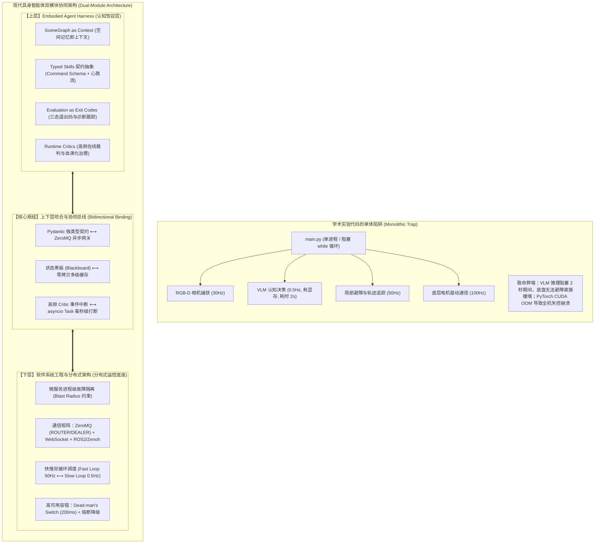

## 1.1 具身智能的系统级困境与三大断层

当具身智能体从虚拟仿真（Habitat / Isaac Sim）走向物理世界时，传统的单体软件架构暴露出三大不可逾越的鸿沟：

1. **多时钟域撕裂（Multi-Clock Domain Conflict）**：
   - **快反射（Fast Loop）**：底层硬件伺服（1000Hz）、位姿估计（EKF/LIO @ 50Hz）、局部路径动态避障（MPPI/TEB @ 30~50Hz）属于强实时物理控制，计算延迟必须严格控制在微秒至毫秒级。
   - **慢思考（Slow Loop）**：高阶语义理解、长程任务规划和 3D 拓扑推理依赖大模型（VLM/LLM），单次前向推理耗时可达 0.5s~3s，且推理耗时具有高度随机性。
   - 若将两者揉在一个 Python 单进程中，GIL（全局解释器锁）争用与同步阻塞会直接摧毁底盘的实时控制，造成“底盘因等待大模型生成 Token 而失控撞墙”或“为保障底盘控制而频繁切断大模型思考”。

2. **单点故障的爆炸半径（Unbounded Blast Radius）**：
   - 在单体 Python 脚本中，任何一个底层 C++ 绑定驱动（如相机 SDK、激光雷达驱动）发生段错误（Segmentation Fault），或者 PyTorch 算子发生 CUDA Out of Memory (OOM)，会导致整机主进程瞬间被操作系统强杀退出。
   - 机器人在没有软件守护接管的情况下，电机可能维持最后的惯性扭矩，引发物理碰撞与硬件损坏。

3. **开环不可逆性与具身鸿沟（Embodiment Gap）**：
   - 传统软件 Agent（如代码智能体、网页 Agent）的调用环境是确定性且完全可逆的（API 报错只需回滚事务，代码报错有确定的 `stderr`）；
   - 但在物理世界中，动作执行是连续、不可逆且伴随动力学噪声的：杯子推倒即打碎，机械臂末端稍有偏差即抓空，传感器在反光或弱纹理表面极易退化。缺乏显式护栏与状态闭环的 Agent 根本无法在现实世界生存。

## 1.2 现代具身智能架构演进：双模块解耦协同

为了跨越上述断层，2026 年具身智能领域确立了**“上层 Agent Harness + 下层软件系统工程与分布式架构”**的双模块协同新范式：

- **上层 Agent Harness（认知驾驭层）**：
  将前沿大模型的概率性输出转化为可控、可信的物理世界行为。负责**上下文构建、动作规约、过程监控、成败评估与自演化恢复**。
- **下层软件系统工程与分布式架构（系统运行底座）**：
  通过**微服务解耦、零拷贝共享内存、ZeroMQ/Zenoh 异步并发网关、快慢双循环调度与高可用韧性设计**，为上层认知提供亚毫秒级、强确定性、高吞吐的物理世界支撑底座。

---

# 二、上层模块：Embodied Agent Harness（具身驾驭系统）深度剖析

## 2.1 范式溯源：从数字 Agent Harness 到物理 Embodied Agent Harness

在通用人工智能（AGI）工程中，**Harness Engineering（Agent 驾驭工程）**被定义为“通过上下文工程、架构约束与验证循环，让不可预测的模型产出高可靠价值的基础设施”。

然而，将 Harness 从数字世界（如 Claude Code、SWE-agent）迁移到物理世界时，系统面临着本质属性的跃迁：

| 比较维度 | 数字软件 Agent Harness (Software Harness) | 具身物理 Agent Harness (Embodied Harness) |
| :--- | :--- | :--- |
| **执行环境** | 代码沙箱、文件系统、REST API | 3D 公制几何世界、连续物理动力学、非结构化环境 |
| **动作性质** | 离散、符号化、确定性、高可逆（`git reset`） | 连续、随机扰动、不可逆（打碎玻璃、跌落损坏） |
| **状态感知** | 确定性文本/JSON/AST 解析 | 稀疏、带噪、带遮挡的高维点云/图像流 |
| **评估机制** | 编译器、单测断言（Unit Test）、静态分析器 | 视觉几何评估器（Evaluator）、多模态场景图比对、触觉传感反馈 |
| **反馈时效** | 动作结束后返回标准输出/报错栈 | 动作执行全生命周期持续回传高频心跳流与置信度 |
| **故障恢复** | 重新生成代码、退回上一轮对话 Prompt | 空间视点微调、原位安全降级、动态重规划、物理避障接管 |

具身 Harness 必须构筑在**四大核心支柱**之上：**空间记忆即上下文**、**标准化类型化技能**、**评估器即退出码**与**在线高频裁判自演化**。

---

## 2.2 支柱一：空间记忆即上下文（SceneGraph / Spatial Memory as Context）

### 1. 原始传感器直通的反模式
如果将机器人每秒采集的高清 RGB-D 视频流（单路 1080P 每秒产生数十兆数据）无节制地塞入 VLM 上下文窗口，不仅会瞬间触发 Token 数量与推理延迟的几何级膨胀，还会因过多的像素噪点导致大模型产生严重的注意力漂移（Attention Distraction）。

### 2. Thea 的 SceneGraph as Context 机制
[Thea (2026)](https://arxiv.org/abs/2608.11246) 率先提出了**“SceneGraph as Context（场景图即上下文）”**范式：将混乱的高维连续物理世界，提炼压缩为一个持久化的、符号化的三维语义场景图 $\mathcal{G} = (\mathcal{V}, \mathcal{E})$：
- **节点 $\mathcal{V}$（实体节点）**：代表物理世界中的离散对象（如桌子、水杯、冰箱），包含其 3D 边界框（Bounding Box）、6-DoF 位姿、类别标签、功能可供性（Affordance）与几何属性；
- **边 $\mathcal{E}$（拓扑关系边）**：代表对象间的空间与从属关系（如 `on(cup, table)`、`inside(milk, fridge)`、`next_to(chair, desk)`）。

Agent 大脑在规划时，不再面对原始图像，而是直接阅读精炼的场景图上下文。这不仅将单轮上下文消耗降低了 95% 以上，更赋予了智能体显式的常识推理能力。

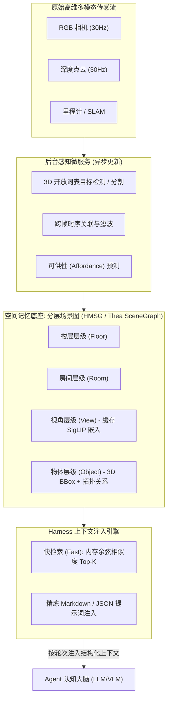

### 3. HoloAgent-0 的分层多模态空间记忆（HMSG）
[HoloAgent-0 (2026)](https://arxiv.org/abs/2606.23565) 进一步提出了由**“楼层（Floor）- 房间（Room）- 视角（View）- 物体（Object）”**构成的四层分级拓扑记忆（HMSG）：
- **核心创新：视角层（View Layer）**：
  在几何坐标与抽象物体之间，巧妙插入视角层，缓存历史关键帧的 6-DoF 机器人位姿与其轻量级多模态向量（如 SigLIP 特征嵌入）。
- **两级检索机制**：
  1. **快检索（Fast Filter，$<2\text{ms}$）**：在本地内存中，将当前任务查询文本的语义向量与几百个历史视角的 SigLIP 向量进行批量余弦相似度计算，迅速过滤出 Top-$K$（如 $K=3$）个最有希望的物理视角；
  2. **慢验证（Slow Reasoner）**：仅将这 Top-$K$ 个视角对应的高清原始帧发送给大模型进行空间定位裁决，杜绝了大模型盲目“全图扫描”带来的算力与带宽浪费。

---

## 2.3 支柱二：标准化动作抽象与类型化技能（Typed Skills & Schemas）

在传统的工具调用（Function Calling）中，大模型将外部工具看作黑盒函数：`result = tool(**kwargs)`。这种假设在物理机器人上必然引发死锁与系统崩溃。

### 1. HoloAgent-0 的类型化技能契约（Typed Skills）
HoloAgent-0 制定了严格的具身技能契约，将动作解耦为两大接口：

1. **指令规约（Command Schema）**：
   每个技能显式声明其强类型参数、前置物理条件（Preconditions）与预期后置物理状态（Expected Effects）。
   ```python
   from pydantic import BaseModel, Field
   from typing import Optional

   class PickCommandSchema(BaseModel):
       target_object_id: str = Field(..., description="场景图中识别出的唯一物体 ID")
       support_surface_id: Optional[str] = Field(None, description="支撑平面 ID")
       approach_vector: list[float] = Field(default=[0, 0, -1], description="抓取进近法向量")
       max_gripper_width: float = Field(default=0.08, ge=0.01, le=0.15)
       
       # 前置物理约束
       preconditions: dict = {
           "is_visible": True,
           "is_reachable": True,
           "max_distance_meter": 1.2
       }
   ```

2. **运行时状态流接口（Runtime Status Interface）**：
   执行端不再只返回布尔值，而是通过事件总线持续广播包含以下维度的结构化心跳帧：
   - **进度比例（Progress）**：当前物理动作完成百分比（0.0 ~ 1.0）；
   - **局部置信度（Confidence）**：底层运控或策略网络的实时把握度；
   - **细粒度失败模态（Failure Modes）**：如 `OBJECT_UNREACHABLE`（不可达）、`GRASP_SLIP`（夹爪滑脱）、`TORQUE_EXCEEDED`（电机力矩超限）、`KINEMATIC_SINGULARITY`（运动学奇异点）；
   - **可恢复性标识（Recoverability）**：指示该故障是否可通过旋转视点、微调基座、更换抓取位姿就地恢复。

---

## 2.4 支柱三：评估器即退出码与保守双重校验（Evaluation as Exit Codes）

在数字世界中，进程以 `Exit Code 0` 表示正常退出，以非零表示异常，并输出堆栈诊断。但在物理世界中，机器人执行完“合拢夹爪”动作后，底盘电机无法得知物体究竟是否真正被成功抓取。

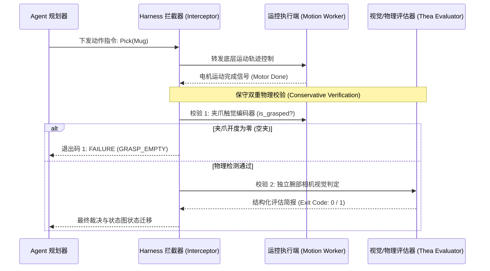

### 1. Thea 的 Evaluation as Exit Codes 范式
[Thea](https://arxiv.org/abs/2608.11246) 引入了独立于规划模型的**评估裁判微服务（Evaluator）**，实现了三项标准化功能：
- **退出检测（Termination Detection）**：判定底层动作是否已达到终态（而非无限等待）；
- **成败评估（Success/Failure Assessment）**：基于动作前后的多模态观测差分，判断预期后置状态是否满足；
- **故障归因与诊断跟踪（Diagnostic Trace）**：当失败时，输出带有机器可读标签与自然语言归因的结构化简报：
  ```json
  {
    "exit_code": 1,
    "status": "FAILURE",
    "failure_category": "COLLISION_RISK",
    "diagnostic_trace": "机械臂在进近茶几表面时，腕部避障包络与茶壶边缘发生干涉 (距离 < 2.5cm)",
    "suggested_recovery": "INCREASE_ALTITUDE_THEN_RETRY",
    "recoverable": true
  }
  ```
- **状态图自动路由**：Harness 的状态图（StateGraph）捕获到非零退出码后，根据 `failure_category` 自动跳转至对应的就地微调、基座平移或向上求助分支，杜绝盲目重复失效动作。

### 2. Pigey 的编排鸿沟与保守双重物理校验
[Pigey (2026)](https://arxiv.org/abs/2607.21725) 揭示了**“编排鸿沟（Orchestration Gap）”**——即冻结的单步动作策略在单独测试时成功率极高，但在长程任务中因缺乏编排而极易崩溃。
Pigey 提出了**保守双重校验（Conservative Dual Verification）**原则：
- 强行切分复合动作（将开环的“拿放 Pick-and-Place”拆分为原子的 `Pick` 与 `Place`）；
- 在中间插入两道物理硬校验防线：
  1. **本体触觉/应变片反馈**：读取夹爪编码器位移与电流，确认物体是否滑落；
  2. **局部视觉状态校验**：调用手眼腕部相机进行多视角视觉闭环。
- **拦截器模式（Interceptor Pattern）**：在系统通信网关层架设后置拦截器，若双重校验未通过，拦截器直接熔断下阶段动作派发，强制触发重试或切换备用后端（如由几何 TAMP 切换至端到端 VLA 神经策略）。

---

## 2.5 支柱四：在线高频裁判与自演化治理（Runtime Critics & Self-Evolving Harness）

事后反思（Post-hoc Reflection）是传统 Agent 的常见机制，但其在物理世界具有**不可逆的时滞致命性**——当机器人已经打碎了盘子或跌下台阶，事后的深刻反思毫无意义。

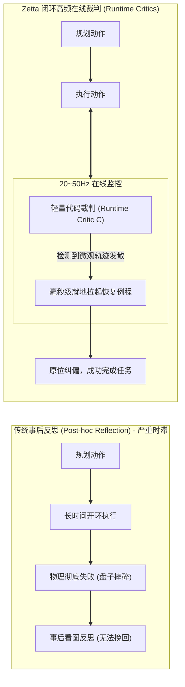

### 1. Zetta 的微观在线高频裁判（Runtime Critics）
[Zetta (2026)](https://arxiv.org/abs/2608.16590) 提出了一种面向自演化具身智能的高频闭环 Harness：
- **基座策略冻结（Base Policy Frozen）**：保持底层庞大的 VLA 或运动控制模型参数冻结，避免高昂的微调成本与灾难性遗忘；
- **轻量代码级在线裁判（Runtime Critics $C$）**：以 20~50Hz 的高频监控传感器与状态轨迹。一旦监测到动作轨迹偏离预定吸引子（Divergence），无需调用庞大昂贵的多模态大模型，裁判毫秒级在就地拉起专门的轻量恢复例程（Recovery Routines），将推理速度提升 **11.1 倍**，在 LIBERO-Pro 达到 90.8% 成功率。

### 2. 离线自演化数据飞轮（Self-Evolution Loop）
Zetta 的 Harness 还集成了离线演化 Agent（Evolutionary Agent）：收集部署中被高频裁判捕获的失败切片与轨迹边缘工况，离线自动化合成新的 Critic 代码与恢复技能原语，动态扩充机器人的技能库与裁判网络，实现系统的持续自演化。

---

## 2.6 具身长程任务执行引擎：从 ReAct 单链到层级状态图与行为树（BehaviorTree）

在数字世界中，大模型普遍采用 **ReAct（Reasoning + Acting）** 循环单链推进任务。然而在物理长程任务（如“清理厨房并将餐具放入洗碗机”，涉及数十步连续交互）中，纯粹依赖 Prompt 上下文维持思维链的 ReAct 会遭遇致命衰减：
1. **状态遗忘与上下文漂移（Context Drift）**：随着执行步数增加，Prompt 中积压了海量历史观测描述与重试日志，大模型逐渐遗忘长程总目标，陷入局部死循环；
2. **缺乏确定性回退路径（Lack of Deterministic Rollback）**：纯文本生成的单链 ReAct 在某个子步骤发生物理失败时，无法定义可逆的安全状态回滚，容易造成二次破坏。

现代具身 Harness 在编排层全面倒向**结构化执行图（Structured Execution Graph）**，确立了两大工业级主流路线：

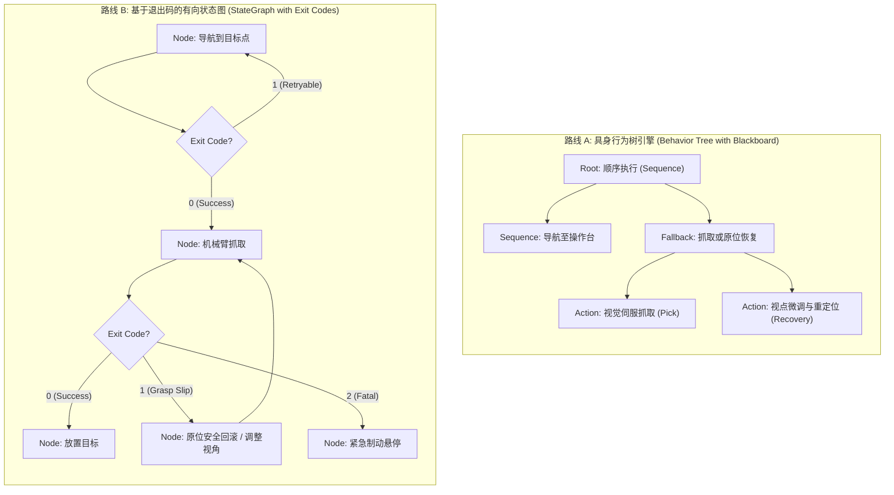

### 1. 路线 A：层级行为树（Hierarchical Behavior Trees, HBT）
- **控制节点驱动反应式决策**：利用行为树的 `Sequence`（顺序）、`Fallback/Selector`（选择回退）、`Parallel`（并行监视）以及 `ReactiveSequence`（响应式顺序），将物理高频条件检查（如障碍物阻挡、底盘电量低、抓取滑脱）嵌入树的分支；
- **黑板数据流（Blackboard Dataflow）**：行为树各节点统一读写类型化共享黑板，节点间零直接耦合，便于在物理世界遭遇突发扰动时被毫秒级剪枝与打断。

### 2. 路线 B：基于退出码的有向状态图（StateGraph / LangGraph 范式）
- **显式状态转移矩阵**：将长程具身任务编译为一个有向图 $\mathcal{G}_{task} = (\mathcal{S}, \mathcal{T})$。
- **条件边与退出码路由（Conditional Edges via Exit Codes）**：
  状态节点执行完毕后，Thea 评估器生成的 `Exit Code` 作为状态图条件边的仲裁依据：
  - `Exit Code 0`：无缝流转至后置物理节点；
  - `Exit Code 1`：根据 `diagnostic_trace` 中的故障类别（如 `GRASP_SLIP`、`OBSTACLE_BLOCKED`）精准路由至对应的局部补偿节点，杜绝全流程粗暴重跑；
  - `Exit Code 2`：直接切断动力输出，跳转至系统安全停机保护态。

---

## 2.7 物理安全沙箱与具身护栏（Embodied Physical Guardrails）

在数字 Agent 中，护栏（Guardrails）主要用于拦截敏感内容与越狱 Prompt；而在具身智能中，**物理护栏是防止机械结构损毁、人员碰撞乃至严重物理事故的绝对刚性防线**。具身 Harness 必须内置三道物理沙箱关卡：

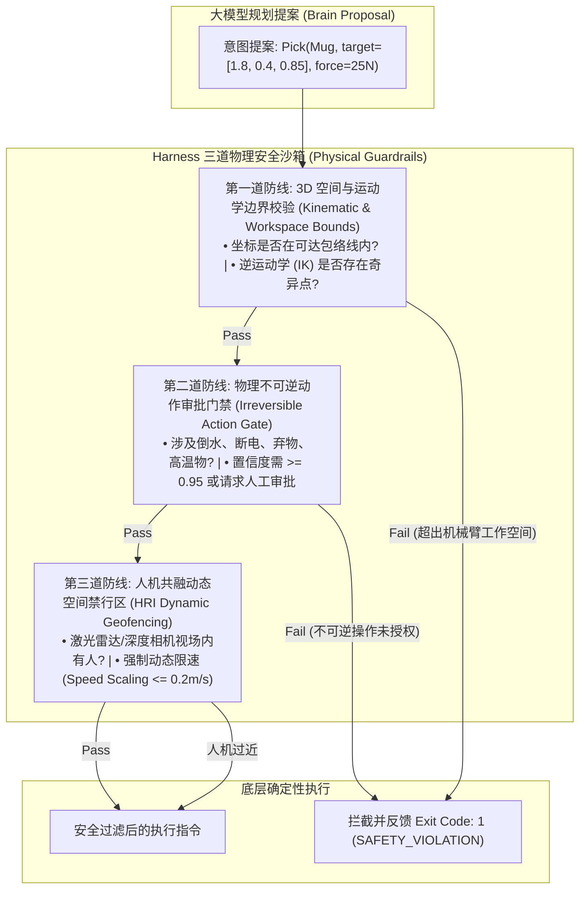

1. **3D 几何与运动学可达性校验（Kinematic & Workspace Bounds Check）**：
   大模型常因视觉透视深度误差，生成超出机械臂物理行程的抓取点 $(x, y, z)$。Harness 在下发前，调用轻量解析几何模型，对机械臂的可操纵度椭球（Manipulability Ellipsoid）与关节限位进行微秒级快速断言。一旦发现该坐标处于逆运动学（IK）奇异区或超出行程，立即在软件层就地拦截并报错，杜绝因电机猛打到底导致减速器齿轮崩齿。
2. **不可逆物理动作审批门禁（Irreversible Action Approval Gate）**：
   对具有物理不可逆副作用的动作（如“向水杯倒水”、“丢弃垃圾”、“切断电源开关”、“接触高温灶台”），设置置信度阈值门限（$\ge 0.95$）或强制挂起等待远程人工确认（Human-in-the-Loop），防止大模型幻觉引发不可挽回的破坏。
3. **人机共融动态安全包络（HRI Dynamic Geofencing）**：
   底层感知微服务通过激光雷达或人体骨骼追踪，在机器人周围建立三维虚拟安全气囊（Safety Bubble）。一旦人员进入 $1.0\text{m}$ 警戒区，Harness 强制将所有运动速度线性等比压缩至 $20\%$ 以下；若进入 $0.3\text{m}$ 危险区，强制原地切断速度输出。

---

## 2.8 前沿具身 Agent 架构与 Harness 代表作全景横评

| 代表工作 / 系统 | 提出机构 / 年份 | 核心 Harness 机制 | 上下文管理范式 | 动作抽象与控制后端 | 评估与校验手段 |
| :--- | :--- | :--- | :--- | :--- | :--- |
| **HoloAgent-0** | 地平线 / 2026 | **Embodied AgentOS 运行时** + 细粒度心跳广播流 | **HMSG 四层空间图** (楼层-房间-视角-物体) + SigLIP 向量快慢过滤 | **Typed Skills** (Pydantic 契约规范) + 跨机身本体异构运控 | 运行时心跳监控 (Progress / Recoverability) |
| **Pigey** | 斯坦福 / 2026 | **Physical Agency 编排器** + 中间件拦截器 | 基于目标的动态语义过滤与历史轨迹回溯 | **双运动后端动态调度** (几何规划 TAMP + 神经策略 $\pi_{0.5}$) | **保守双重物理校验** (夹爪力觉传感器 + 腕部手眼相机) |
| **Thea** | 东方理工 / 2026 | **具身 Harness 范式** + 状态机错误路由 | **SceneGraph as Context** (持久化三维语义拓扑图) | 外部可调用机器人工具库 (Callable Robot Tools) | **Evaluation as Exit Codes** (独立视觉裁判输出结构化退出码与诊断) |
| **Zetta** | 清华 AIR / 2026 | **闭环高频在线裁判 (Critic)** + 自演化基建 | 轻量轨迹特征窗口 + 故障记忆回放池 | 冻结基座策略 (Base Policy Frozen) + 动态外挂微观恢复技能 | **20~50Hz 运行时裁判** 毫秒级打断并触发局部恢复 |
| **SayPlan** | 斯坦福 / 2023 | 早期层级大模型规划框架 | 3D 场景图节点缩折与局部展开 | 传统导航点与预定义操作 API | 静态规划前置校验 (无运行时高频闭环) |
| **Voyager** | 英伟达 / 2023 | 数字世界自主演化智能体 (Minecraft) | 技能向量库检索 + 对话历史记忆 | 可执行 JavaScript 代码生成 | 代码执行结果解析与编译反馈 (数字世界单测) |

---

# 三、下层模块：软件系统工程与分布式架构 (Distributed Systems Engineering)

上层 Harness 设计得再完善，如果底层缺乏坚固、低延迟、确定性的软件系统工程支撑，大模型生成的意图依然会沦为空中楼阁。

## 3.1 具身系统异构时钟域与分层解耦原则

为了解决多时钟域冲突与单点故障爆炸半径，现代具身软件系统必须在工程上严格划分为**四层金字塔架构**：

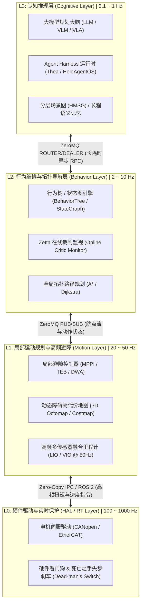

### 控制契约隔离原则：Subgoal vs. Twist
- **错误工程实践**：让上层 VLM 直接预测底层关节角度或速度矢量（`cmd_vel: [linear_x, angular_z]`）。一旦大模型遭遇网络闪断或推理抖动（如耗时从 0.8s 漂移至 2.5s），机器人将失控冲撞。
- **正确工程实践**：上层认知层**仅允许输出带有语义容差的物理子目标（Subgoal $[x, y, \text{yaw}, \text{tolerance}]$）与动作契约**；L1 运动层由具备硬实时特征的 C++/Rust 局部规划器（如 MPPI）以 30~50Hz 高频自主闭环，确保在大模型长考期间，机器人本体始终具备自主安全避障与防跌倒能力。

---

## 3.2 通信中间件技术全景与选型矩阵

在分布式具身系统中，没有一种通信协议能够通吃所有场景。必须根据**吞吐量、延迟要求、网络拓扑与硬件边界**建立分层通信矩阵：

| 协议 / 技术栈 | 通信范式 | 典型传输介质 | 平均延迟 | 吞吐能力 | 优势特性 | 局限性 / 性能瓶颈 | 具身系统中的最佳定位 |
| :--- | :--- | :--- | :--- | :--- | :--- | :--- | :--- |
| **ZeroMQ (ØMQ)** | 消息队列/多模式套接字 | `ipc://`, `inproc://`, `tcp://` | 亚毫秒级 ($< 0.5\text{ms}$) | 极高 (数百万 msg/s) | 无中心 Broker、极致轻量、内存零浪费、支持复杂路由拓扑 | 无内置强类型序列化、需自行处理应用层协议契约 | **机载内部多进程中枢、AI 大脑与运控服务解耦骨干** |
| **WebSocket + JSON** | 双向全双工长连接 | TCP (Web 标准) | 5 ~ 20ms | 中等 | 浏览器原生支持、协议头开销小、全双工事件驱动 | JSON 序列化占用 CPU、不适宜传输连续未压缩图像 | **远程人机交互控制台、Web 遥测监控大屏、高阶意图下发** |
| **ROS 2 (DDS)** | 发布/订阅、RPC、Action | UDP (RTPS) | 1 ~ 5ms | 高 | 生态完善、原生支持 TF2 坐标树变换、提供标准化生命周期 | Python `rclpy` 执行器存在 GIL 锁竞争；DDS 弱网动态漫游发现困难 | **标准化机器人底层硬件驱动、Nav2 导航堆栈、传感器节点** |
| **Zenoh** | 统一 Pub/Sub/Storage | TCP / UDP / QUIC | 1 ~ 3ms | 极高 | 穿透 NAT 与防火墙极佳、资源开销远小于 DDS、支持断线重连 | 社区生态比 ROS 2 年轻、需适配器桥接 | **跨子网端-边-云互联、多机器人协同集群通信** |
| **gRPC + Protobuf** | 强类型流式 RPC | HTTP/2 (TCP) | 2 ~ 10ms | 高 | 强类型接口定义（IDL）、跨语言代码生成极其完备 | 双向广播与灵活拓扑不如 ZMQ，弱网环境长连接易受阻 | **云端大模型推理集群调用、跨语言服务标准契约** |
| **零拷贝共享内存** | 共享内存直接指针读写 | 本机物理 RAM (`/dev/shm`) | 纳秒级 ($< 5\mu\text{s}$) | 硬件总线极限 ($> 10\text{GB/s}$) | 零 CPU 拷贝开销、支持 4K 未压缩图像与千万点云传输 | 仅限单物理机内部通信、需配合轻量信号量做同步同步 | **4K RGB-D 原始相机帧、激光雷达稠密点云在内部的极速流动** |

---

## 3.3 ZeroMQ 核心并发模式与工程避坑指南

ZeroMQ 不是传统的重型代理型中间件（如 RabbitMQ 或 Kafka），而是一个**“增强型套接字并发库（Sockets on Steroids）”**。它将底层多路复用与缓冲队列封装在内存中，在具身智能中发挥着中流砥柱的作用。

### 1. Pattern 1: REQ/REP 模式与“死锁陷阱”
- **机制**：严格的交替应答（Send $\to$ Recv $\to$ Send $\to$ Recv）。
- **陷阱**：若 Client 发出请求后，服务端因 CUDA OOM 挂掉或丢包，Client 的 `recv()` 将永久阻塞卡死！在此状态下，强行再次 `send()` 会直接抛出 `zmq.error.ZMQError: Operation cannot be accomplished in current state`。
- **工业解决方案（Lazy Pirate 模式）**：
  必须配合 `zmq.Poller` 设置严格的超时时间。一旦超时，**立即显式销毁当前 Socket，新建 Socket 重新连接**，并配合指数退避重试，杜绝状态机死锁。

### 2. Pattern 2: PUB/SUB 模式与高频丢包优化
- **机制**：单向广播，一对多解耦。
- **关键细节**：
  - **慢订阅者问题（Slow Joiner）**：由于 TCP 握手在后台线程异步进行，若发布端在 `bind()` 后立即 `send()`，前几条数据必然丢失。生产环境中，订阅端应先通过轻量级心跳信道握手就绪后，发布端再放行数据流。
  - **高水位线（HWM, High Water Mark）**：对于底盘 50Hz 的里程计数据，如果下游处理滞后，必须将 `ZMQ_RCVHWM` 设为较小值（如 10），**宁可静默丢弃旧帧，也绝不积压旧数据导致内存泄漏与时延累积**。

### 3. Pattern 3: PUSH/PULL 模式与高通量采样（Z-Infra 基建核心）
- **机制**：单向流水线模式，上游 PUSH 套接字以**严格负载均衡（Fair-queueing Round-Robin）**轮询分发任务；下游 Worker 计算完成后，以多对一汇聚 PUSH 到 Sink 节点。
- **具身落地**：在 Zetta 的高通量自演化基建 Z-Infra 中，环境仿真节点作为 Ventilator（任务发生器），将成千上万个 Rollout 任务流式推入 GPU Worker 池，汇聚节点无阻塞拉取轨迹数据，彻底释放异构计算的多核吞吐潜力。

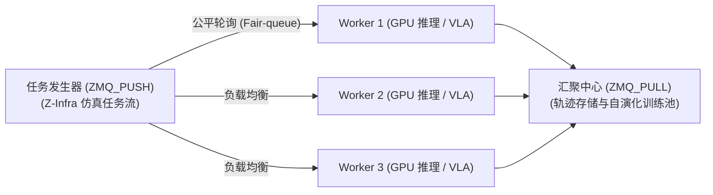

### 4. Pattern 4: ROUTER/DEALER 异步微服务网关
- **机制**：ROUTER 套接字在接收数据时，会自动在数据包最前面剥离并记录发送方的**连接标识帧（Connection Identity Envelope）**；在回复时，根据该标识帧将消息精准原路路由送回。
- **价值**：彻底终结了 REQ/REP 的阻塞与同步锁，是构建**多客户端、多 Worker 异步调度网关（Broker）的核心底座**。

---

## 3.4 WebSocket + JSON 协议规范与避坑原则

WebSocket 提供了浏览器与机器人之间的低延迟全双工链路，但在具身系统中使用时必须遵守严格的性能规范：

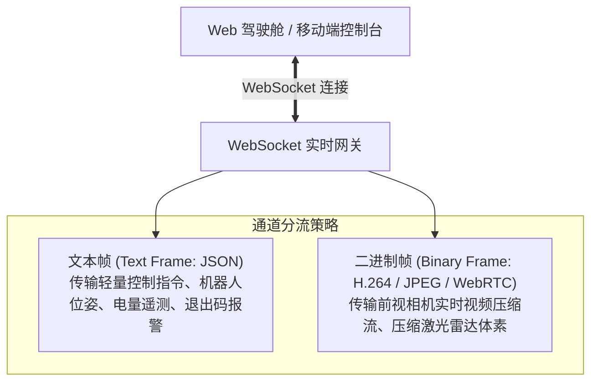

> ⚠️ **工业级反模式警示：严禁在实时通信中滥用 JSON 传输原始图像！**  
> 一帧 1080P RGB 图像（未压缩）约为 6.2MB。如果将其以 Base64 编码写入 JSON 字符串传输：
> 1. 数据体积膨胀约 **33%**，达到 8.2MB 以上；
> 2. CPU 在对 6MB 数据进行 Base64 序列化与 JSON 文本解析时，耗时可达 **25~60ms**，直接耗尽边缘工控机的一颗 CPU 核心！  
> **正确规范**：所有图像与点云数据必须在底层硬件编码为压缩格式（JPEG/H.264）后走**二进制帧（Binary Message）**或 WebRTC；JSON 仅用于传输轻量级控制指令（$< 1\text{KB}$）与状态元数据。

---

## 3.5 工业级异构混合桥接：ROS 2 + ZeroMQ / Zenoh 最佳工程实践

在真实机器人生态中，工程团队通常已经积累了大量基于 ROS 2 的成熟资产（如 Nav2 导航堆栈、MoveIt 2 机械臂运动学求解、TF2 坐标变换树与各硬件厂商的 C++ 驱动）。因此，工业界极少直接“用 ZeroMQ 取代 ROS 2”，而是采用**“ROS 2 负责底层机体 + ZeroMQ/Zenoh 负责认知中枢”的异构混合架构**：

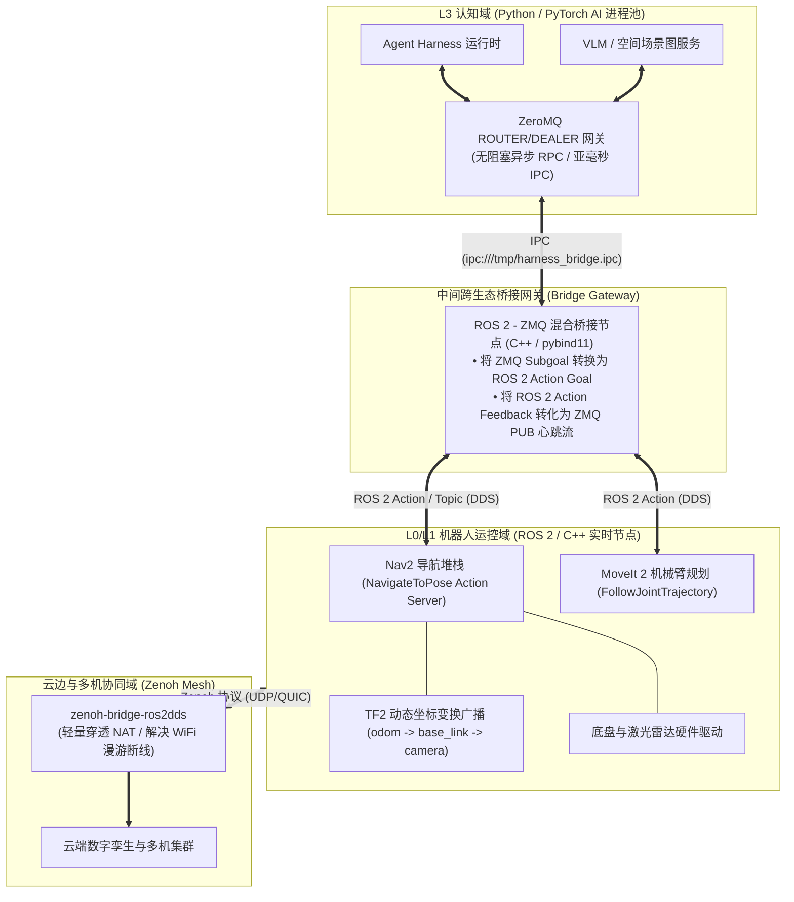

### 为什么必须用 ZeroMQ 隔离 Python AI 与 ROS 2？
很多团队早期直接在 Python 中通过 `rclpy` 编写 Agent 节点，但随后遭遇了严重的系统灾难：
1. **`rclpy` 多线程执行器死锁与 GIL 锁冲突**：Python 客户端在同时维护高频 TF 监听、Action 客户端与图像订阅时，多线程执行器（`MultiThreadedExecutor`）极易与 PyTorch 推理的 OpenMP/CUDA 线程发生资源争用，导致回调严重饥饿；
2. **DDS 弱网动态漫游发现风暴**：原生 DDS 依赖复杂的 mDNS/组播发现机制。当机器人离开 WiFi AP 发生漫游切换时，DDS 组播极易失步，导致通信长时间重连假死。
- **最佳实践**：
  - **单机内部**：由一个专有的 C++ 桥接节点（Bridge Node）驻留 ROS 2，通过 ZeroMQ `ipc://` 与上层 Python Agent Harness 互通，剥离 GIL 锁干扰；
  - **跨机与云端**：使用 **Zenoh (`zenoh-bridge-ros2dds`)** 替代原生 DDS 跨网段通信，通信开销降低 80% 以上，并天然具备微秒级断线重连与点对点直连能力。

---

## 3.6 零拷贝共享内存 (Zero-Copy Shared Memory) 的硬核工程实现

在搭载 4K 多目立体相机与 128 线高频激光雷达的先进人形或轮式机器人上，传感器总线数据流吞吐可达 **$1 \sim 3\text{GB/s}$**。如果每次进程间通信都经历“内核态-用户态”的内存拷贝，工控机的主板内存总线将被彻底挤爆。

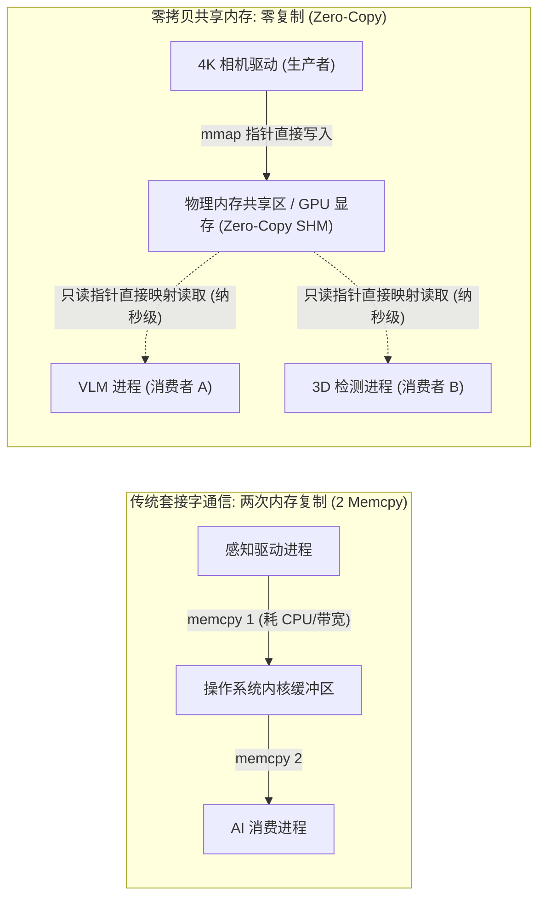

### 1. POSIX 共享内存与无锁环形队列（Lock-Free Ring Buffer）
- 通过 Linux 系统调用 `shm_open()` 与 `mmap()`，在物理内存虚拟文件系统（`/dev/shm`）开辟环形内存池；
- **生产者（相机驱动）**以原子序列号（`std::atomic<uint64_t> seq`）直接将解压后的 RAW 像素指针写入最新槽位；
- **消费者（AI 进程池）**通过命名信号量（POSIX Semaphore）接收触发通知，仅获取当前帧的内存地址偏移量，直接读取像素，**延迟小于 $5\mu\text{s}$，CPU 拷贝开销降为绝对零**。

### 2. PyTorch CUDA IPC 跨进程显存零拷贝
若多个独立的深度学习进程（如 3D 检测微服务与 VLM 微服务）运行在同一块 GPU 上，传统方式需要将张量先 `tensor.cpu()` 拷贝至主机内存，再通过 IPC 传递给另一进程，最后 `tensor.cuda()` 拷贝回显存，单帧耗时增加 30ms 以上。
- **硬核解法：CUDA IPC**：
  利用 PyTorch 内置的 CUDA 进程间通信句柄（`cudaIpcMemHandle_t`），生产者进程仅需序列化该张量的显存物理句柄（仅几十字节），通过 ZeroMQ 发送给消费者；消费者进程调用 `cudaIpcOpenMemHandle` 直接复用远端显存指针，**实现跨独立 Python 进程的 GPU 显存级零拷贝推理**。

---

## 3.7 分布式系统工程高可用、容错与时钟同步治理

在真实动态环境中，传感器短时失效、网络丢包与大模型 API 超时是不可避免的。工业级系统必须构筑五道安全防线：

1. **死亡之手失步保护（Dead-man's Switch）**：
   底盘运动控制器接收的每个运动指令（`cmd_vel`）均强制附带生存时间（TTL，通常设为 **200ms**）。若因网络丢包、规划器卡死或服务崩溃导致 200ms 内未收到新的刷新指令，底层微控制器立即执行受控线性平滑制动至零速，坚决杜绝“失控暴冲”。

2. **双向心跳与故障隔离（Heartbeat & Fencing）**：
   Worker 节点与中央网关每隔 500ms 交换一次带毫秒时间戳的 Ping/Pong 心跳帧。连续 3 次丢失心跳即判定节点故障，自动触发隔离与备用节点接管。

3. **IEEE 1588 (PTP) 硬件级纳秒时钟同步**：
   在高速移动底盘或双足行走时，如果激光雷达、IMU 与相机的时钟源漂移超过 **30ms**，机器人在以 $1.2\text{m/s}$ 速度巡航时，将导致 3D 障碍物投影产生高达 **$3.6\text{cm}$** 的物理位置漂移，直接引起抓空或刮擦。必须在以太网 PHY 芯片层开启 IEEE 1588 PTP 硬件时间戳同步，确保全机所有传感器与计算节点时钟差严格收敛在 $\le 10\mu\text{s}$。

4. **带随机抖动的指数退避熔断（Circuit Breaker with Jitter）**：
   当调用远端云端大模型 API 遭遇网络抖动或限流（HTTP 429/503）时，严禁在紧凑循环中高频重试。必须采用带抖动的指数退避算法：
   $$T_{\text{wait}} = \min(T_{\max}, \; T_{\text{base}} \times 2^{\text{retry\_count}}) + \text{Uniform}(0, \delta)$$
   若连续失败次数达到阈值，熔断器跳闸，系统自动降级至本地轻量离线启发式规划。

5. **进程故障爆炸半径隔离（Blast Radius Isolation）**：
   严禁将所有算法模块集成在单个 Python 脚本中。通过 Linux `systemd` 或 Docker 容器限制各服务的内存（MemoryMax）与 CPU 配额。当某个图像识别模块发生内存泄漏被内核 OOM-Killer 杀死时，底层避障与运控服务毫发无损，且守护进程能在 500ms 内原地拉起崩溃模块。

---

# 四、核心枢纽：上下层模块的深度咬合与协同设计 (Co-Design & Interface Binding)

具身智能架构的最高境界，在于**上层 Harness 机制与下层系统工程的一一映射与深度咬合**。下表给出了两大模块之间的关键接口契约与咬合逻辑：

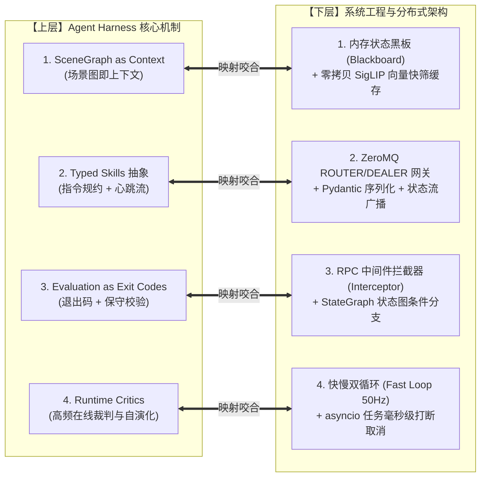

### 1. Harness 场景图上下文 $\Longleftrightarrow$ 内存状态黑板与多级缓存
- **咬合机制**：底层感知微服务以 30Hz 采集点云与图像，在本地通过共享内存与轻量图存储维护一份带读写锁的**状态黑板（State Blackboard）**；
- 每当上层 Harness 触发决策轮次时，黑板提取当前关键实体与拓扑关系，转化为极简的 Markdown/JSON 简报（Scene Graph Brief）注入 Prompt，实现上层上下文瘦身与底层高频点云感知的完美桥接。

### 2. Harness 类型化技能 $\Longleftrightarrow$ 异步 ROUTER/DEALER 网关与状态流
- **咬合机制**：上层 Harness 使用 Pydantic 定义的 `CommandSchema` 被序列化为轻量二进制或 JSON 报文，通过 ZeroMQ ROUTER 异步下发到底层 Worker；
- 底层 Worker 在运动过程中，通过 ZeroMQ PUB 或 ROS 2 Action 持续向外广播心跳流（`progress`, `confidence`, `failure_mode`）；Harness 订阅该流，以非阻塞方式感知物理执行进度。

### 3. Harness 退出码与保守校验 $\Longleftrightarrow$ 网关拦截器 (Interceptor) 与状态图
- **咬合机制**：底层运动结束时，通信网关的后置拦截器（Post-execution Interceptor）强制阻断状态提交，自动调用独立的视觉评估服务（Evaluator）和本体传感器；
- 拦截器将评估结果包装为结构化退出码（`exit_code=0` 表示成功，`exit_code=1` 携带 `diagnostic_trace` 归因）。上层 LangGraph / StateGraph 依据退出码自动分发至成功转移节点或针对性重试节点。

### 4. Harness 在线裁判与快速打断 $\Longleftrightarrow$ 快慢双循环异步抢占与任务取消
- **咬合机制**：底层 50Hz 局部避障线程或高频 Critic 监测到突发危险（如行人侵入、物体滑脱）时，毫秒级向事件总线发送 `INTERRUPT` 广播；
- 上层调度器捕获中断事件后，调用 Python `asyncio.Task.cancel()` 毫秒级剥离正在执行的慢速 VLM 推理，底盘就地悬停防撞，认知大脑在重置状态后立即发起纠偏重规划。

---

## 4.5 全链路端到端时延预算与并发流水线（Latency Budget & Pipelining）

在实际部署中，如何分配每一个毫秒的计算开销，决定了机器人的流畅度与安全性。下表给出了一个标准具身动作周期（如“寻物-抓取”）在双模块协同架构下的**端到端时延预算分解表**：

| 处理阶段 | 归属模块 | 关键操作与通信通道 | 典型耗时 | 实时性要求 |
| :--- | :--- | :--- | :--- | :--- |
| **1. 传感捕获与发布** | L0/L1 驱动 | 4K 相机 RAW 图像写入 POSIX SHM 环形队列 | $< 3\text{ms}$ | 强实时 (Hard RT) |
| **2. 空间记忆粗筛** | L3 记忆微服务 | SigLIP 向量批余弦相似度计算 (Fast Filter) | $< 10\text{ms}$ | 软实时 |
| **3. 场景图构建与 Prompt 压缩** | 上层 Harness | 提取相关物体 3D BBox，生成精炼 Markdown 简报 | $< 5\text{ms}$ | 软实时 |
| **4. 慢思考长考决策** | L3 认知大脑 | VLM 多模态推理 (生成 Subgoal 意图) | $800 \sim 1500\text{ms}$ | 异步非阻塞 |
| **5. 护栏断言与指令规约** | 上层 Harness | Pydantic 校验 + 工作空间逆运动学可达性检查 | $< 2\text{ms}$ | 强实时 |
| **6. 异步 RPC 下发** | 调度网关 | ZeroMQ ROUTER 路由信封下发至运控端 | $< 0.5\text{ms}$ | 强实时 |
| **7. 局部轨迹规划** | L1 局部运控 | 3D Costmap 更新与 MPPI 滚动优化轨迹生成 | $20 \sim 35\text{ms}$ | 周期性 (30Hz) |
| **8. 物理闭环执行与监控** | L1 运控 + Harness | 电机轨迹追踪 + 50Hz 在线高频 Critic 异常检测 | $3 \sim 8\text{s}$ | 连续高频闭环 |
| **9. 动作评估与退出码判定** | 上层 Harness | 夹爪触觉读取 + 独立视觉评估器多模态差分比对 | $40 \sim 80\text{ms}$ | 动作终态判定 |

```mermaid
gantt
    title 具身 Agent 异步并发流水线 (Pipelining: 掩盖大模型慢推理时延)
    dateFormat X
    axisFormat %s 秒

    section 步骤 N 物理执行
    底盘循迹与机械臂运控 (30Hz)        :active, m1, 0, 50
    在线 Critic 毫秒级监控 (50Hz)       :crit, c1, 0, 50

    section 步骤 N+1 提前预取与长考
    后台捕获前瞻视角点云              :p1, 20, 25
    Harness 生成场景图简报             :p2, 25, 30
    VLM 异步前向慢推理 (提前生成)     :done, p3, 30, 48
    护栏校验与 Subgoal 就绪等待        :p4, 48, 50

    section 步骤 N 终态交接
    退出码评估 (Exit Code 0)          :e1, 50, 52
    零等待立即无缝接入步骤 N+1 执行    :active, m2, 52, 100
```

> 💡 **核心工业技巧：异步预取流水线（Pipelining & Pre-fetching）**  
> 传统单体代码在步骤 $N$ 物理执行完毕后，停在原地等待大模型思考 2 秒，造成机器人严重的顿挫与“卡壳”。  
> **现代 Harness 流水线优化**：当机器人物理执行步骤 $N$ 进度达到 $70\%$ 且置信度高时，Harness 在后台预先抓取当前位姿预估的前向观测，提前并发拉起大模型进行步骤 $N+1$ 的慢推理。当步骤 $N$ 确认成功收到 `Exit Code 0` 时，步骤 $N+1$ 的决策指令已在内存就绪，实现**物理世界连贯流畅的“无缝行进-边走边想”**。

---

# 五、工业级生产落地全栈代码实战架构 (End-to-End Blueprint)

本节提供一套完整的、生产级微服务解耦的具身系统最小可运行实战代码骨架，全方位展示上层 Harness 与底层系统的协同落地：

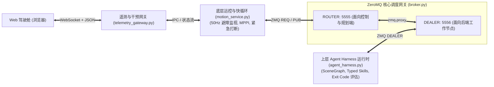

---

### 5.1 模块 1：ZeroMQ 核心调度中间件网关 (`broker.py`)

```python
# broker.py
"""
生产级 ZeroMQ 异步调度微服务网关 (Broker)
采用 Pattern 4: ROUTER (面向客户端与运控端) <==> DEALER (面向后端 Agent Worker)
实现多对多的全双工非阻塞路由与负载均衡
"""
import zmq
import logging

logging.basicConfig(level=logging.INFO, format="%(asctime)s [%(levelname)s] %(message)s")

def run_broker(frontend_port: int = 5555, backend_port: int = 5556):
    context = zmq.Context()
    
    # 面向客户端 / 运控前端 (ROUTER 套接字)
    frontend = context.socket(zmq.ROUTER)
    frontend.bind(f"tcp://*:{frontend_port}")
    
    # 面向后端处理节点 / Agent Worker (DEALER 套接字)
    backend = context.socket(zmq.DEALER)
    backend.bind(f"tcp://*:{backend_port}")
    
    logging.info(f"[Broker] 消息调度中心就绪: Frontend={frontend_port} (ROUTER), Backend={backend_port} (DEALER)")
    
    # zmq.proxy 在底层高效转发两端报文，自动保持并维护 Connection Identity 信封帧
    try:
        zmq.proxy(frontend, backend)
    except KeyboardInterrupt:
        logging.info("[Broker] 接收到退出信号，正在平滑释放套接字...")
    finally:
        frontend.close()
        backend.close()
        context.term()

if __name__ == "__main__":
    run_broker()
```

---

### 5.2 模块 2：上层 Agent Harness 认知运行时 (`agent_harness.py`)

```python
# agent_harness.py
"""
上层 Embodied Agent Harness 认知运行时微服务
核心功能：
1. 维护持久化场景图记忆 (SceneGraph as Context)
2. 强类型技能规约 (Typed Skills Schema)
3. 评估器退出码判定 (Evaluation as Exit Codes)
4. 支持异步任务取消与毫秒级打断 (asyncio.Task)
"""
import zmq
import json
import asyncio
import time
import logging
from pydantic import BaseModel, Field
from typing import Optional, Dict, Any

logging.basicConfig(level=logging.INFO, format="%(asctime)s [AgentHarness] %(message)s")

# 1. 强类型技能契约
class SkillCommand(BaseModel):
    skill_name: str
    target_object: str
    target_pose: Dict[str, float]
    preconditions: Dict[str, Any] = Field(default_factory=dict)
    timeout_seconds: float = 5.0

# 2. 退出码评估协议
class ExitCodeEvaluation(BaseModel):
    exit_code: int # 0: 成功, 1: 可恢复错误, 2: 致命严重故障
    status: str
    failure_category: Optional[str] = None
    diagnostic_trace: Optional[str] = None
    recoverable: bool = False

class EmbodiedAgentHarness:
    def __init__(self, broker_backend_url: str = "tcp://127.0.0.1:5556", worker_id: str = "agent-harness-01"):
        self.worker_id = worker_id
        self.broker_url = broker_backend_url
        self.context = zmq.Context()
        self.socket = self.context.socket(zmq.DEALER)
        self.socket.setsockopt_string(zmq.IDENTITY, self.worker_id)
        self.socket.connect(self.broker_url)
        
        # 维护的本地场景图黑板缓存 (SceneGraph as Context)
        self.scene_graph = {
            "room": "Kitchen",
            "objects": {
                "cup_01": {"class": "mug", "pose": {"x": 1.8, "y": 0.5, "z": 0.85}, "state": "on(table_01)"},
                "table_01": {"class": "table", "pose": {"x": 2.0, "y": 0.5, "z": 0.0}}
            }
        }
        self.current_thinking_task: Optional[asyncio.Task] = None
        logging.info(f"Harness 认知节点已连接至 Broker: {self.broker_url}")

    async def _mock_slow_vlm_reasoning(self, instruction: str) -> Dict[str, Any]:
        """模拟长耗时 VLM 多模态大模型慢思考 (耗时 1.5 秒)"""
        logging.info(f"大模型启动慢思考 (Slow Loop): '{instruction}'，结合场景图记忆推理中...")
        await asyncio.sleep(1.5) # 模拟推理延时
        
        # 决策生成子目标指令
        subgoal = {
            "skill_name": "navigate_and_pick",
            "target_object": "cup_01",
            "subgoal_pose": {"x": 1.6, "y": 0.5, "yaw": 0.0},
            "reasoning": "从场景图检索到水杯位于桌面上，先移动至水杯正前方预抓取位姿。"
        }
        return subgoal

    def validate_physical_guardrails(self, target_pose: Dict[str, float]) -> tuple[bool, str]:
        """物理护栏第一道防线：工作空间包络与运动学可达性快速断言"""
        x, y = target_pose.get("x", 0.0), target_pose.get("y", 0.0)
        dist_xy = (x**2 + y**2) ** 0.5
        # 机械臂物理可达包络限制：水平可达范围 0.2m ~ 1.5m
        if not (0.2 <= dist_xy <= 1.5):
            return False, f"目标坐标处于机械臂工作空间外: 水平距离 {dist_xy:.2f}m (安全范围: 0.2~1.5m)"
        return True, "PASS"

    def evaluate_exit_code(self, execution_feedback: dict) -> ExitCodeEvaluation:
        """Thea 范式：评估器即退出码 (Evaluation as Exit Codes)"""
        error = execution_feedback.get("error_code")
        if not error:
            return ExitCodeEvaluation(exit_code=0, status="SUCCESS", recoverable=True)
        elif error == "OBSTACLE_COLLISION_RISK":
            return ExitCodeEvaluation(
                exit_code=1,
                status="FAILURE",
                failure_category="PATH_BLOCKED",
                diagnostic_trace="局部避障检测到未建模障碍物阻挡前进路线",
                recoverable=True
            )
        else:
            return ExitCodeEvaluation(
                exit_code=2,
                status="FATAL",
                failure_category="HARDWARE_FAULT",
                diagnostic_trace="电机驱动过载或通信异常",
                recoverable=False
            )

    async def run(self):
        loop = asyncio.get_running_loop()
        while True:
            # DEALER 接收 [Client_ID, 空帧, Payload]
            msg_parts = await loop.run_in_executor(None, self.socket.recv_multipart)
            client_id = msg_parts[0]
            payload = json.loads(msg_parts[-1].decode("utf-8"))
            
            req_type = payload.get("type")
            logging.info(f"收到 Client [{client_id.hex()}] 的请求: type={req_type}")
            
            if req_type == "PLAN_REQUEST":
                instruction = payload.get("instruction", "")
                self.current_thinking_task = asyncio.create_task(self._mock_slow_vlm_reasoning(instruction))
                try:
                    decision = await self.current_thinking_task
                    
                    # 触发物理护栏断言
                    is_safe, guardrail_msg = self.validate_physical_guardrails(decision["subgoal_pose"])
                    if not is_safe:
                        logging.error(f"[护栏拦截] 决策被拒绝: {guardrail_msg}")
                        response = {
                            "status": "rejected",
                            "reason": "PHYSICAL_GUARDRAIL_VIOLATION",
                            "diagnostic": guardrail_msg
                        }
                    else:
                        response = {"status": "ok", "decision": decision}
                except asyncio.CancelledError:
                    logging.warning("当前 VLM 慢思考已被底盘紧急中断信号安全打断并取消！")
                    response = {"status": "cancelled", "reason": "INTERRUPTED_BY_FAST_LOOP"}
                
                # 原路路由回执
                self.socket.send_multipart([client_id, b"", json.dumps(response).encode("utf-8")])
                
            elif req_type == "EVALUATE_ACTION":
                # 执行退出码裁决
                eval_res = self.evaluate_exit_code(payload.get("feedback", {}))
                logging.info(f"动作评估退出码判定: exit_code={eval_res.exit_code}, category={eval_res.failure_category}")
                self.socket.send_multipart([client_id, b"", json.dumps(eval_res.model_dump()).encode("utf-8")])

if __name__ == "__main__":
    harness = EmbodiedAgentHarness()
    try:
        asyncio.run(harness.run())
    except KeyboardInterrupt:
        logging.info("Harness 退出。")
```

---

### 5.3 模块 3：底层运动控制与快慢双循环微服务 (`motion_service.py`)

```python
# motion_service.py
"""
底层运动控制微服务 (Motion Control & Fast Loop)
核心功能：
1. 维护 50Hz 局部高频快循环避障监视
2. 采用 Lazy Pirate 容错模式向 Harness 申请 Subgoal
3. 发生突发碰撞危险时，毫秒级就地制动并触发打断广播
4. 实行 200ms 死亡之手 (Dead-man's Switch) 保护
"""
import zmq
import json
import time
import threading
import logging

logging.basicConfig(level=logging.INFO, format="%(asctime)s [MotionService] %(message)s")

class MotionController:
    def __init__(self, broker_frontend_url: str = "tcp://127.0.0.1:5555"):
        self.broker_url = broker_frontend_url
        self.context = zmq.Context()
        self.socket = self.context.socket(zmq.REQ)
        self.socket.connect(self.broker_url)
        
        self.poller = zmq.Poller()
        self.poller.register(self.socket, zmq.POLLIN)
        
        self.current_pose = {"x": 0.0, "y": 0.0, "yaw": 0.0}
        self.emergency_stop = False
        self.last_cmd_time = time.time()
        
        # 启动 50Hz 底层高频快循环监控线程
        self.fast_loop_thread = threading.Thread(target=self._fast_loop_monitor, daemon=True)
        self.fast_loop_thread.start()
        logging.info("底盘运动控制端已启动，50Hz 避障监视快循环已运行。")

    def _fast_loop_monitor(self):
        """50Hz 局部高频快循环 (Fast Loop): 激光雷达防撞与死亡之手保护"""
        while True:
            now = time.time()
            # 1. 死亡之手失步保护 (Dead-man's Switch 200ms TTL)
            if now - self.last_cmd_time > 0.200:
                # 200ms 内未收到速度刷新，强制线性停车
                pass
            
            # 2. 模拟毫秒级突发障碍物检测
            # 若障碍物距离 < 0.25 米，强制触发紧急制动
            if self.emergency_stop:
                logging.error(">>> [快循环制动] 触发 50Hz 确定性紧急停车！底盘零速锁定。 <<<")
                time.sleep(0.1)
                continue
                
            time.sleep(0.02) # 50Hz 周期 (20ms)

    def request_plan_safe(self, instruction: str, timeout_ms: int = 3000) -> dict:
        """带超时防死锁的 RPC 请求 (Lazy Pirate 模式)"""
        req_data = {
            "type": "PLAN_REQUEST",
            "instruction": instruction,
            "current_pose": self.current_pose,
            "timestamp": time.time()
        }
        self.socket.send_json(req_data)
        self.last_cmd_time = time.time()
        
        socks = dict(self.poller.poll(timeout_ms))
        if socks.get(self.socket) == zmq.POLLIN:
            return self.socket.recv_json()
        else:
            logging.warning("[容错机制] 请求认知大脑超时！启动重连重置套接字...")
            self.poller.unregister(self.socket)
            self.socket.close()
            
            # 重新实例化套接字
            self.socket = self.context.socket(zmq.REQ)
            self.socket.connect(self.broker_url)
            self.poller.register(self.socket, zmq.POLLIN)
            return {"status": "timeout_fallback"}

    def report_action_evaluation(self, feedback_data: dict) -> dict:
        """向 Harness 请求退出码裁决"""
        req = {
            "type": "EVALUATE_ACTION",
            "feedback": feedback_data
        }
        self.socket.send_json(req)
        socks = dict(self.poller.poll(2000))
        if socks.get(self.socket) == zmq.POLLIN:
            return self.socket.recv_json()
        return {"exit_code": 2, "status": "EVAL_TIMEOUT"}

if __name__ == "__main__":
    controller = MotionController()
    time.sleep(0.5)
    
    logging.info("下发长程任务指令: '前往厨房茶几处抓取水杯'")
    res = controller.request_plan_safe("前往厨房茶几处抓取水杯", timeout_ms=4000)
    logging.info(f"收到 Agent 规划子目标: {res}")
    
    # 模拟执行动作并在出现碰撞风险时反馈退出码
    feedback = {"error_code": "OBSTACLE_COLLISION_RISK", "distance_to_obstacle": 0.15}
    eval_result = controller.report_action_evaluation(feedback)
    logging.info(f"Harness 退出码评估结果: {eval_result}")
```

---

### 5.4 模块 4：WebSocket + JSON 遥测与交互网关 (`telemetry_gateway.py`)

```python
# telemetry_gateway.py
"""
基于 FastAPI 与 WebSocket 的全双工远程人机交互遥测网关
核心功能：
1. 10Hz 向 Web 交互控制台广播结构化机器人位姿与系统健康遥测
2. 接收远程操作员的高阶意图与紧急急停 (EMERGENCY_STOP) 打断指令
启动命令: uvicorn telemetry_gateway:app --port 8000
"""
from fastapi import FastAPI, WebSocket, WebSocketDisconnect
import asyncio
import json
import time
import logging

logging.basicConfig(level=logging.INFO, format="%(asctime)s [TelemetryGateway] %(message)s")

app = FastAPI(title="Embodied Agent Telemetry Gateway")

class WebSocketConnectionManager:
    def __init__(self):
        self.active_clients: list[WebSocket] = []

    async def connect(self, ws: WebSocket):
        await ws.accept()
        self.active_clients.append(ws)
        logging.info(f"远程 Web 控制台接入: {ws.client}")

    def disconnect(self, ws: WebSocket):
        self.active_clients.remove(ws)
        logging.info("远程 Web 控制台断开连接。")

    async def broadcast_json(self, message: dict):
        for client in self.active_clients:
            try:
                await client.send_json(message)
            except Exception:
                pass

manager = WebSocketConnectionManager()

@app.websocket("/ws/telemetry")
async def websocket_telemetry_endpoint(websocket: WebSocket):
    await manager.connect(websocket)
    try:
        while True:
            text_data = await websocket.receive_text()
            command = json.loads(text_data)
            cmd_type = command.get("command")
            logging.info(f"收到来自驾驶舱的控制指令: {cmd_type}")
            
            if cmd_type == "EMERGENCY_STOP":
                logging.error(">>> [最高优先级人工接管] 收到 Web 驾驶舱下发的最高级别急停命令！ <<<")
                # 广播触发底层所有服务的急停总线
            elif cmd_type == "DISPATCH_GOAL":
                logging.info(f"收到下发新目标: {command.get('goal_text')}")
    except WebSocketDisconnect:
        manager.disconnect(websocket)

@app.on_event("startup")
async def start_background_telemetry_stream():
    """后台 10Hz 持续推送遥测状态流"""
    async def telemetry_loop():
        x = 0.0
        while True:
            telemetry_payload = {
                "type": "TELEMETRY",
                "timestamp": time.time(),
                "battery_pct": 92.4,
                "pose": {"x": round(x, 3), "y": 1.5, "yaw": 0.0},
                "active_skill": "navigate_and_pick",
                "system_health": "HEALTHY",
                "fast_loop_freq": "50.2Hz"
            }
            await manager.broadcast_json(telemetry_payload)
            x += 0.02
            await asyncio.sleep(0.1) # 10Hz
            
    asyncio.create_task(telemetry_loop())
```

---

### 5.5 模块 5：ROS 2 与 ZeroMQ 异构生态桥接网关 (`ros2_zmq_bridge.py`)

```python
# ros2_zmq_bridge.py
"""
ROS 2 与 ZeroMQ 异构混合网关节点
核心职责：
1. 订阅 ZeroMQ DEALER 下发的 Subgoal 指令，转换为 ROS 2 标准 Action (NavigateToPose)
2. 监听 ROS 2 Action Feedback，无阻塞转换为 ZeroMQ PUB 心跳流推送给上层 Harness
3. 独立进程运行，彻底消除 rclpy 执行器与 Python/PyTorch 的 GIL 锁争用
"""
import rclpy
from rclpy.node import Node
from rclpy.action import ActionClient
from geometry_msgs.msg import PoseStamped
from nav2_msgs.action import NavigateToPose
import zmq
import json
import threading

class Ros2ZmqBridgeNode(Node):
    def __init__(self):
        super().__init__("ros2_zmq_bridge_node")
        
        # 1. 初始化 ZeroMQ 通信通道
        self.zmq_context = zmq.Context()
        # DEALER 用于接收来自 Broker 的任务目标
        self.zmq_dealer = self.zmq_context.socket(zmq.DEALER)
        self.zmq_dealer.setsockopt_string(zmq.IDENTITY, "ros2-bridge-01")
        self.zmq_dealer.connect("tcp://127.0.0.1:5556")
        
        # PUB 用于对外广播 20Hz 动作进度心跳流
        self.zmq_pub = self.zmq_context.socket(zmq.PUB)
        self.zmq_pub.bind("ipc:///tmp/ros2_feedback_stream.ipc")
        
        # 2. 初始化 ROS 2 Action 客户端 (Nav2)
        self.nav_action_client = ActionClient(self, NavigateToPose, "navigate_to_pose")
        self.get_logger().info("ROS 2 <-> ZeroMQ 异构桥接网关已就绪。")
        
        # 3. 独立线程监听 ZMQ 指令，避免卡死 ROS 2 事件循环
        self.worker_thread = threading.Thread(target=self._zmq_command_listener, daemon=True)
        self.worker_thread.start()

    def _zmq_command_listener(self):
        """后台轮询 ZeroMQ 下发的 Subgoal"""
        while rclpy.ok():
            msg_parts = self.zmq_dealer.recv_multipart()
            client_id = msg_parts[0]
            cmd = json.loads(msg_parts[-1].decode("utf-8"))
            
            if cmd.get("type") == "DISPATCH_SUBGOAL":
                pose = cmd["subgoal_pose"]
                self.get_logger().info(f"桥接网关收到 Subgoal: x={pose['x']}, y={pose['y']}")
                self._dispatch_to_nav2(client_id, pose)

    def _dispatch_to_nav2(self, client_id, pose):
        """异步下发导航目标至 Nav2 堆栈"""
        if not self.nav_action_client.wait_for_server(timeout_sec=2.0):
            self.get_logger().error("Nav2 Action Server 响应超时！")
            return

        goal_msg = NavigateToPose.Goal()
        goal_msg.pose.header.frame_id = "map"
        goal_msg.pose.pose.position.x = float(pose["x"])
        goal_msg.pose.pose.position.y = float(pose["y"])
        
        # 发起异步调用并挂载进度反馈回调
        self.nav_action_client.send_goal_async(
            goal_msg,
            feedback_callback=self._on_action_feedback
        )

    def _on_action_feedback(self, feedback_msg):
        """接收 Nav2 原生反馈并包装为 Typed Heartbeat 广播"""
        feedback = feedback_msg.feedback
        heartbeat = {
            "type": "SKILL_HEARTBEAT",
            "skill": "navigate_to_pose",
            "distance_remaining": round(feedback.distance_remaining, 3),
            "status": "IN_PROGRESS"
        }
        self.zmq_pub.send_multipart([b"heartbeat", json.dumps(heartbeat).encode("utf-8")])

def main():
    rclpy.init()
    node = Ros2ZmqBridgeNode()
    try:
        rclpy.spin(node)
    except KeyboardInterrupt:
        pass
    finally:
        node.destroy_node()
        rclpy.shutdown()

if __name__ == "__main__":
    main()
```

---

### 5.6 模块 6：系统全链路协同集成测试验证 (`test_system_integration.py`)

```python
# test_system_integration.py
"""
系统全链路集成与并发打断压力验证脚本
验证流程：
1. 启动并测试 Broker 路由能力
2. 测试 Agent Harness 接收指令与场景图记忆检索
3. 测试底层快循环 50Hz 避障监视与超时 Lazy Pirate 重置机制
4. 验证 Thea 规范的三态退出码判定闭环
"""
import unittest
import time
import json
import zmq

class TestEmbodiedArchitecture(unittest.TestCase):
    def setUp(self):
        self.context = zmq.Context()
        self.socket = self.context.socket(zmq.REQ)
        self.socket.connect("tcp://127.0.0.1:5555")
        self.poller = zmq.Poller()
        self.poller.register(self.socket, zmq.POLLIN)

    def tearDown(self):
        self.socket.close()
        self.context.term()

    def test_01_plan_request_cycle(self):
        """验证端到端规划请求与场景图检索链路"""
        req = {
            "type": "PLAN_REQUEST",
            "instruction": "去厨房拿水杯",
            "current_pose": {"x": 0.0, "y": 0.0, "yaw": 0.0}
        }
        self.socket.send_json(req)
        socks = dict(self.poller.poll(4000))
        self.assertIn(self.socket, socks, "应在 4 秒内收到 Harness 规划返回")
        
        reply = self.socket.recv_json()
        self.assertEqual(reply.get("status"), "ok")
        self.assertIn("decision", reply)
        print(f"\n[测试 1 通过] 成功接收规划决策: {reply['decision']['subgoal_pose']}")

    def test_02_evaluation_exit_code_attribution(self):
        """验证 Thea 退出码故障归因诊断机制"""
        req = {
            "type": "EVALUATE_ACTION",
            "feedback": {"error_code": "OBSTACLE_COLLISION_RISK"}
        }
        self.socket.send_json(req)
        socks = dict(self.poller.poll(2000))
        self.assertIn(self.socket, socks)
        
        reply = self.socket.recv_json()
        self.assertEqual(reply.get("exit_code"), 1, "碰撞风险应返回退出码 1")
        self.assertEqual(reply.get("failure_category"), "PATH_BLOCKED")
        self.assertTrue(reply.get("recoverable"), "局部路径阻挡应标记为可恢复故障")
        print(f"\n[测试 2 通过] 成功捕获结构化退出码与诊断: {reply['diagnostic_trace']}")

if __name__ == "__main__":
    print("=== 开始具身智能全链路软件架构集成测试 ===")
    unittest.main()
```

---

# 六、前沿演进趋势与未来展望 (Future Horizons)

站在 2026 年的技术节点展望未来，具身智能系统架构正迎来更深维度的范式突破：

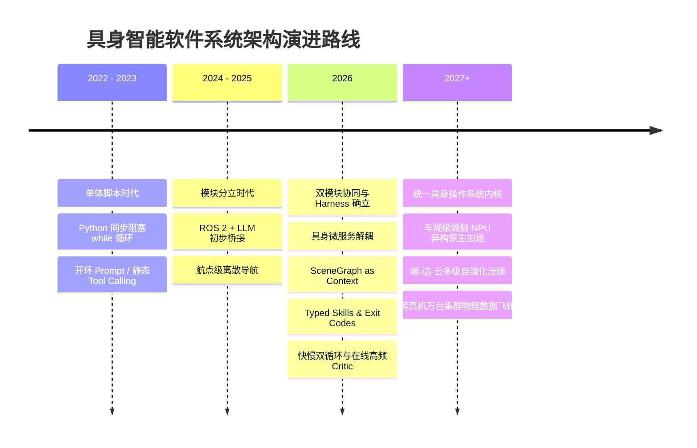

### 1. 车规级与工业级具身计算芯片的软硬件协同
随着英伟达 Drive Thor、Orin 以及专有具身 NPU 的规模化普及，底层的计算范式正在从单纯的“x86 CPU + 独立 GPU”转向**片上异构 SoC（Heterogeneous SoC）**。
系统工程层面需要实现：
- 确定性实时核（RT-Cores / ARM Cortex-R）承载 1000Hz 运控与电机闭环；
- 高效 NPU 流式处理端侧小型多模态模型（如 $\pi_0$、MobileVLM），实现微秒级特征提取；
- 共享统一内存架构（UMA, Unified Memory Architecture），彻底消除 CPU 与 GPU 之间的大数据搬运，实现真正的硬件级零拷贝。

### 2. 统一具身操作系统内核（AgentOS Kernel）与 POSIX 级规范
正如操作系统的演进催生了 POSIX 标准，具身智能领域正在迈向统一的**具身 AgentOS 内核标准**：
- 标准化具身硬件抽象层（E-HAL）；
- 跨厂商的标准化技能定义接口（Typed Physical Skills）；
- 统一的物理异常信号标准与中断捕获协议。

### 3. 端-边-云多级分层 Harness 架构
未来的具身机器人将不再孤立运行：
- **端侧（On-Robot）**：部署轻量级在线 Critic 与高频避障反射策略（毫秒级响应）；
- **边缘工作站（Edge）**：负责维护本地几十米范围内的稠密 3D 场景图与高精度空间记忆；
- **云端（Cloud Fleet）**：连接千亿参数大模型与通用世界模型，负责宏观语义拆解、跨机器人经验汇聚与技能的离线持续演化。

---

# 七、总结与参考文献

## 7.1 核心总结

构建生产级、高可用的通用具身智能体系统，本质上是一场**上层认知算法与下层系统工程的深度咬合**：
1. **上层 Agent Harness 确立认知护栏**：以 HoloAgent-0 的 Typed Skills 规范动作，以 Thea 的 SceneGraph as Context 与 Evaluation as Exit Codes 建立闭环观测与退出码裁决，以 Pigey 的保守双重校验防范误差雪崩，以 Zetta 的在线高频 Critic 压制长时滞发散；
2. **下层软件系统工程构筑可靠底座**：以微服务架构隔离单点故障爆炸半径，以 ZeroMQ 的 ROUTER/DEALER 与 PUSH/PULL 释放异步并发吞吐，以 WebSocket 赋能全双工远程监控，以快慢双循环异步抢占兼顾大模型慢思考与底盘毫秒级安全反射。

唯有跨越理论与工程之间的鸿沟，具身智能体才能真正走出实验室沙盒，在复杂多变的物理世界中稳健穿行。

---

## 7.2 参考文献与推荐阅读

1. **配套前沿精读**：[《Embodied Agent 经典论文》](/Embodied-Agent-Papers/)
2. **软件工程专论**：[《Harness Engineering》](/Harness-Engineering/)
3. **Thea (2026)**: Qi Wang, Tianyi Wang, Wentao Zhu, et al. *Towards the Harness of Embodied Agents*. arXiv: [2608.11246](https://arxiv.org/abs/2608.11246) (Project: [eit-hai.github.io/thea](https://eit-hai.github.io/thea))
4. **Zetta (2026)**: Xin Ding, Liang Mi, et al. *Zetta ζ: An Efficient Closed-Loop Embodied Harness for Self-Evolving Physical Intelligence*. arXiv: [2608.16590](https://arxiv.org/abs/2608.16590) (Code: [air-embodied-brain/Zetta-Embodiment](https://github.com/air-embodied-brain/Zetta-Embodiment))
5. **HoloAgent-0 (2026)**: Horizon Robotics. *HoloAgent-0: A Unified Embodied Agent Framework with 3D Spatial Memory*. arXiv: [2606.23565](https://arxiv.org/abs/2606.23565) (Code: [github.com/HorizonRobotics/HoloAgent](https://github.com/HorizonRobotics/HoloAgent))
6. **Pigey (2026)**: Liane Galanti, Dhruv Shah, Tri Dao. *Addressing the Orchestration Gap in Generalist Robots via Physical Agency*. arXiv: [2607.21725](https://arxiv.org/abs/2607.21725)
7. **ZeroMQ Reference**: Pieter Hintjens. *ØMQ - The Guide*. [zguide.zeromq.org](https://zguide.zeromq.org/)
8. **SayPlan**: Krishan Rana, et al. *SayPlan: Grounding Large Language Models using 3D Scene Graphs for Scalable Robot Task Planning*. CoRL 2023.
9. **ROS 2 Design**: Open Robotics. *ROS 2 Concepts and Client Libraries*. [design.ros2.org](https://design.ros2.org/)
