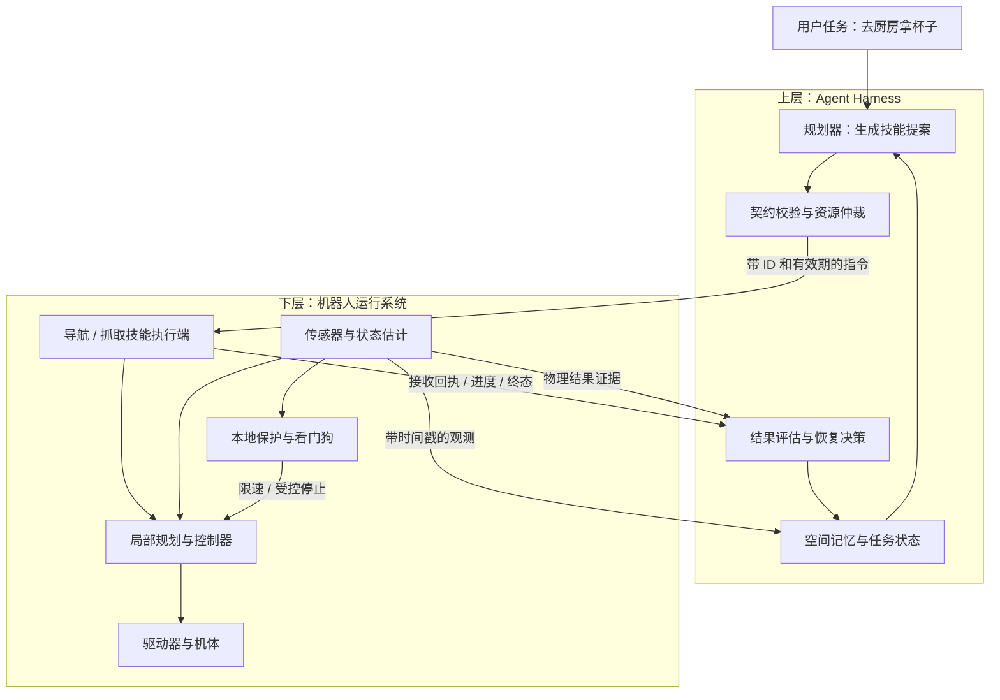
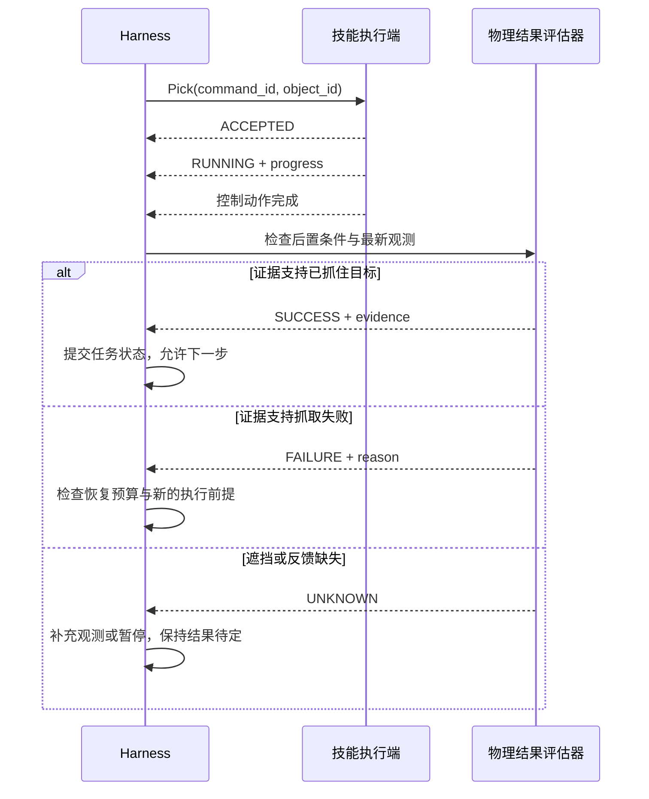
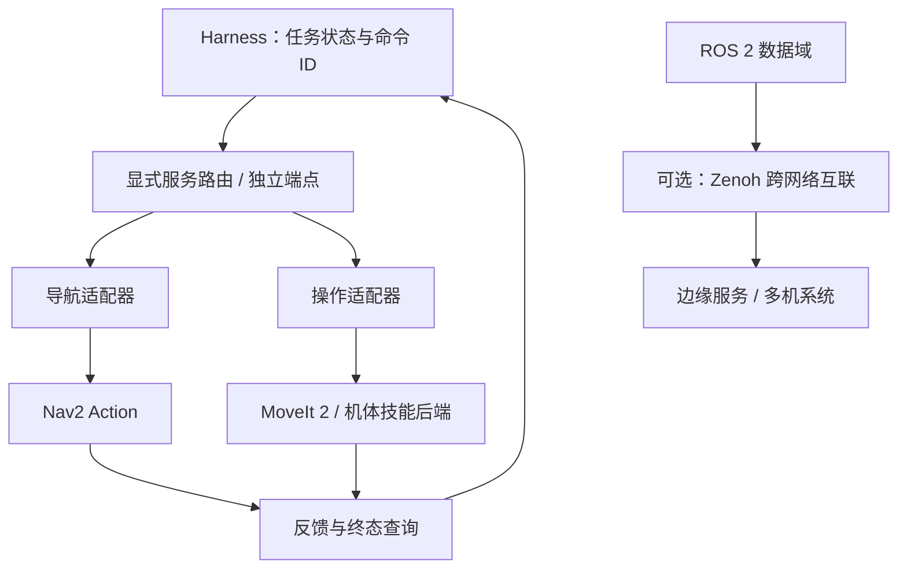
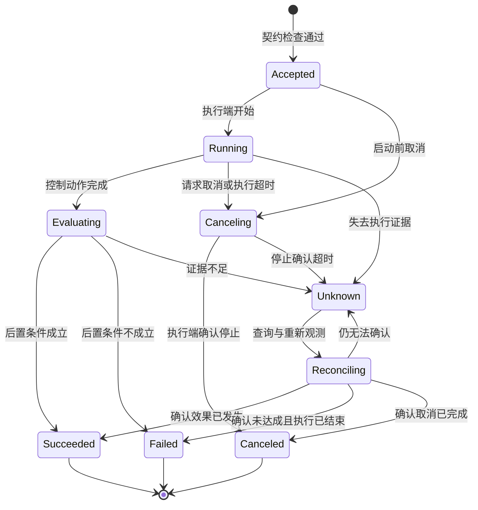
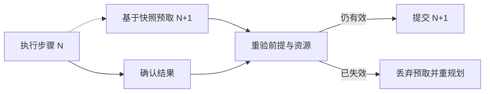

**具身 Agent Harness 要解决的核心问题，是让模型提出的任务意图，在有噪声、有时延、可能失败的物理世界中形成可追踪的执行闭环。** 模型负责理解与规划，Harness 管理上下文、技能调用和结果判断，机器人运行系统负责执行、反馈及本地保护。

本文沿着“上层 Harness → 下层运行系统 → 两者之间的接口契约”展开。以“去厨房拿杯子”为例：场景图帮助定位杯子，技能接口描述导航与抓取，执行端报告进度，评估器确认杯子是否拿到；若通信中断或出现障碍，机器人仍需在本地处理。

> **阅读范围与证据边界**：论文机制以链接的原文为依据；分层方式、消息字段、状态机和代码示例属于本文的工程归纳，不是统一行业标准。文中的频率与时间预算若标为示例，仅用于说明设计方法，不能直接视为硬件性能或安全参数。
>
> 配套阅读：[《Embodied Agent 经典论文》](/Embodied-Agent-Papers/) 聚焦论文细节，[《Harness Engineering》](/Harness-Engineering/) 讨论通用 Agent 工程。本文侧重二者在机器人系统中的连接方式。

# 1. 引言：从模型能力到系统闭环


*图 1｜从模型能力到系统闭环：以机器人取杯子为例，展示任务意图、技能执行、观测评估与本地保护的关系。AI 生成的概念示意图。*

## 1.1 三个需要分别处理的问题

**不同模块的时间尺度不同。** 语义规划可能需要数百毫秒至数秒，而局部控制与伺服有各自的更新周期。若在控制回调里同步等待模型推理，控制链路就会受到推理时延影响。问题在于阻塞关系、资源争用和调度方式，不能简单归结为“Python 单进程必然失控”。

**不同故障的影响范围不同。** 本地扩展的段错误可能终止所在进程；CUDA 内存不足通常先表现为运行时异常，并不等于操作系统必然杀死整机主进程。拆分进程可以限制部分故障传播，但共享 GPU、内存、供电与通信链路仍可能形成共同故障点。

**执行反馈不等于任务成功。** “夹爪闭合完成”只说明控制动作结束，不能证明目标物体已经稳定抓住。软件操作同样可能有不可逆副作用；具身场景更突出的问题是观测不完整、接触状态不确定，以及动作发生后难以恢复原状。

因此，系统至少需要回答三组问题：

| 问题 | 主要责任方 | 需要保留的证据 |
| :--- | :--- | :--- |
| 现在应该做什么，依据是否仍有效？ | 规划器与 Harness | 任务目标、世界状态版本、目标对象引用 |
| 指令是否被接收，正在执行还是已经停止？ | 技能执行端 | 指令 ID、生命周期状态、序列号、控制器反馈 |
| 预期物理效果是否发生，下一步能否继续？ | 评估器与编排器 | 后置条件、观测证据、失败原因与恢复预算 |

## 1.2 双层视角与独立的本地保护

本文将系统归纳为两个协同部分：**上层 Harness 管理任务语义与执行闭环；下层运行系统管理资源、通信和机体控制。** 这是职责划分，不要求部署成两个进程，也不要求同时引入所有中间件。


```mermaid
flowchart TB
    User["用户任务：去厨房拿杯子"] --> Planner
    subgraph Harness["上层：Agent Harness"]
        Memory["空间记忆与任务状态"] --> Planner["规划器：生成技能提案"]
        Planner --> Gate["契约校验与资源仲裁"]
        Eval["结果评估与恢复决策"] --> Memory
    end
    subgraph Runtime["下层：机器人运行系统"]
        Skills["导航 / 抓取技能执行端"] --> Control["局部规划与控制器"]
        Control --> Body["驱动器与机体"]
        Sensors["传感器与状态估计"] --> Control
        Sensors --> Protection["本地保护与看门狗"]
        Protection -->|"限速 / 受控停止"| Control
    end
    Gate -->|"带 ID 和有效期的指令"| Skills
    Skills -->|"接收回执 / 进度 / 终态"| Eval
    Sensors -->|"物理结果证据"| Eval
    Sensors -->|"带时间戳的观测"| Memory
```

上图中，本地保护不需要先等待规划器作出判断。上层可以请求停止，但保护动作的执行和确认必须在对应的控制链路中完成。即使使用多进程和异步通信，硬实时性质仍取决于操作系统、调度、内存分配和最坏情况执行时间等条件。[ROS 2 实时系统设计说明](https://design.ros2.org/articles/realtime_background.html)

# 2. 上层 Harness：把意图变成可验证的技能调用

## 2.1 空间记忆：保存对象，也保存证据的新鲜度

规划器不必在每一轮读取全部历史图像。一个实用做法是用结构化记忆检索候选对象，再按需读取相关图像、几何信息和最近的执行记录。

[Thea §4.1](https://arxiv.org/html/2608.11246v1#S4.SS1) 将持久场景图作为上下文，提供对象引用、位置及关系查询。[HoloAgent-0 §4.3](https://arxiv.org/html/2606.23565v1#S4.SS3) 沿用 FSR-VLN 的楼层—房间—视角—物体层级作为记忆索引，支持由粗到细的目标定位与视觉验证。这些设计说明了结构化记忆的用途，但不意味着可以完全取消原始视觉观测。

场景图可写作 $\mathcal{G}_t=(\mathcal{V}_t,\mathcal{E}_t)$：节点描述对象，边描述空间关系。工程上还应为记录附加以下信息：

| 字段 | 用途 | 缺失时的典型问题 |
| :--- | :--- | :--- |
| `object_id` | 跨帧引用同一对象 | 两个外观相似的杯子被混为一谈 |
| `frame_id`、单位、位姿 | 说明坐标含义 | 把地图坐标当作机械臂基座坐标 |
| `observed_at`、`world_version` | 判断依据是否过时 | 按旧位置抓取已被移动的物体 |
| 观测来源与不确定性 | 支持复核 | 把低质量检测当作确定事实 |
| 可见性与失效条件 | 触发重新观察 | 把“暂时没看见”当作“物体不存在” |

**场景图是估计，不是真值数据库。** “杯子位于桌上”只能支持候选目标选择；是否可达、是否能抓稳，应在执行前用当前位姿和局部观测重新检查。相似度分数也不能直接当作抓取成功概率。


```mermaid
flowchart LR
    Obs["图像 / 深度 / 位姿"] --> Map["关联与融合"]
    Map --> Memory["场景图 + 关键帧 + 版本"]
    Memory --> Retrieve["按任务检索候选对象"]
    Retrieve --> Verify["按需视觉复核"]
    Verify --> Context["规划上下文"]
    Context --> Dispatch["执行前重验关键前提"]
    Dispatch -->|"依据已失效"| Obs
```

## 2.2 类型化技能：参数正确只是第一步

[HoloAgent-0 §3.1](https://arxiv.org/html/2606.23565v1#S3.SS1) 将技能接口分为结构化命令与运行时状态，覆盖目标引用、预期效果、进度、失败模式和可恢复性。本文据此将技能契约分为三个层次：

1. **语法契约**：字段类型、必填项、枚举、数值范围。可用 Pydantic、Protobuf 或 ROS 消息定义实现。
2. **物理契约**：坐标变换、工作空间、碰撞约束、资源占用、传感器健康与授权条件。需要执行端结合实时状态检查。
3. **生命周期契约**：接收、执行、取消、终态与结果查询。必须说明超时、重复指令和服务重启的处理方式。

下面是本文设计的导航命令示意，并非某篇论文的原始接口：

```json
{
  "schema_version": 1,
  "command_id": "nav-00042",
  "robot_id": "robot-01",
  "skill": "navigate_to_pose",
  "target": {
    "frame_id": "map",
    "x_m": 1.6,
    "y_m": 0.5,
    "yaw_rad": 0.0,
    "position_tolerance_m": 0.15
  },
  "world_version": 42,
  "start_within_ms": 500,
  "execution_timeout_ms": 10000
}
```

这里的 `start_within_ms` 必须定义计时起点。例如由可信接入端接收时启动本地计时，并在转发时扣减已消耗预算；若需要判断网络中滞留的旧消息，还需结合发送时间、时钟误差界限或会话租约。不能在每次重试时重新获得完整有效期。

`execution_timeout_ms` 则限制一次技能执行的等待时间。它与底层速度指令的看门狗周期不同：机器人执行一个十秒导航目标时，局部控制器仍应持续生成短有效期的控制指令。

## 2.3 执行评估：区分控制终态、物理结果和恢复策略

[Thea §4.2](https://arxiv.org/html/2608.11246v1#S4.SS2) 的 “Evaluation as Exit Codes” 是一种接口类比。论文评估器区分 `process`、`success`、`failure`，并返回证据与失败原因；它并未规定通用的 `0=成功、1=可恢复、2=致命` 数字协议。本文建议将三种信息分别表示：

| 信息层次 | 示例 | 由谁判断 |
| :--- | :--- | :--- |
| 控制生命周期 | `RUNNING`、`CANCELING`、`STOPPED` | 技能执行端及控制器 |
| 物理后置条件 | 已满足、未满足、证据不足 | 评估器 |
| 后续策略 | 继续、补充观测、有限重试、求助 | Harness 编排器 |

例如，夹爪编码器、电流或力觉可以提供接触证据，视觉可以提供物体位置证据，但任何单一信号都可能失真。多源校验是可采用的工程策略，不能仅凭夹爪开度就断言抓取成功，也不能假定两种传感器的错误相互独立。


```mermaid
sequenceDiagram
    participant H as Harness
    participant E as 技能执行端
    participant V as 物理结果评估器
    H->>E: Pick(command_id, object_id)
    E-->>H: ACCEPTED
    E-->>H: RUNNING + progress
    E-->>H: 控制动作完成
    H->>V: 检查后置条件与最新观测
    alt 证据支持已抓住目标
        V-->>H: SUCCESS + evidence
        H->>H: 提交任务状态，允许下一步
    else 证据支持抓取失败
        V-->>H: FAILURE + reason
        H->>H: 检查恢复预算与新的执行前提
    else 遮挡或反馈缺失
        V-->>H: UNKNOWN
        H->>H: 补充观测或暂停，保持结果待定
    end
```

`UNKNOWN` 是本文对工程接口的扩展，表示证据不足，不能解释为成功或直接重做。任务状态只在证据满足条件时推进；感知系统仍应继续更新失败后的真实世界变化。

[Pigey](https://arxiv.org/abs/2607.21725) 通过高层编排器组合已有策略或参数化技能，跟踪结果并恢复失败，用“编排鸿沟”描述冻结策略单独执行与进入闭环后的能力差异。对系统设计的启发是：把“执行一个动作”与“判断是否可以继续”分别实现。具体传感器组合、后置拦截器和错误码应按机体设计，不宜统称为论文规定的双重校验标准。

## 2.4 运行时监控与经验更新：分开三个时间尺度

[Zetta](https://arxiv.org/abs/2608.16590) 在冻结基础策略的条件下，引入代码形式的运行时 Critic、恢复技能与验证后更新，覆盖动作、rollout 和演化迭代三个时间尺度。论文报告 LIBERO-Pro 90.8%、RoboCasa 93.6%，以及相对 RPent 的 11.1 倍推理加速；这些结果对应其评测设置与 rollout 预算，不能换算成所有真机上的固定监控频率。[实验原文](https://arxiv.org/html/2608.16590v1#S4)

部署时可将职责分为：

- **快速保护**：依据速度、距离、力矩、状态有效期等信号采取限速或停止，由本地控制链路承担。
- **任务监控**：判断是否长期无进展、目标是否丢失、动作是否偏离预期，并请求取消或重新规划。
- **经验更新**：从失败记录提出新的规则或恢复技能，经过回放、仿真与适用条件验证后发布。

“在线学习到了一个恢复策略”不等于“可以立即让它接管任何机器人”。更新需要版本号、适用机体、资源权限和回退方式；不能让新生成的代码绕过原有执行约束。

## 2.5 长程编排：行为树、状态图与模型循环

行为树适合组织重复检查、技能执行和局部恢复；状态图适合显式管理任务阶段、条件转移与历史记录；模型循环适合处理开放式任务分解。三者可以组合，选择取决于需要怎样解释和恢复执行过程。

例如，“导航成功 → 抓取 → 评估 → 放置”可由状态图维护。抓取内部再由行为树执行“观察 → 对准 → 接近 → 闭合”，模型只在目标含糊或恢复方案耗尽时重新参与。

编排器必须设置**最大重试次数、任务总时间预算和无进展检测**。物理恢复是从当前状态出发的补偿动作，不是数据库式回滚。行为树中的恢复节点成功，也只表示恢复动作完成；若要重新抓取，必须明确回到抓取节点，避免把恢复成功误当作任务成功。

## 2.6 动作护栏：校验什么，在哪里执行

| 检查层 | 主要内容 | 失败后的处理 |
| :--- | :--- | :--- |
| 提案接入 | 技能权限、参数、对象引用、请求有效期 | 拒绝提案并给出可解释原因 |
| 执行前 | 最新坐标变换、可达性、碰撞约束、资源锁 | 补充观测、重新规划或等待资源 |
| 执行中 | 状态过期、障碍接近、力矩异常、控制超时 | 本地控制器限速或进入对应停止流程 |
| 执行后 | 后置条件、物体状态、结果证据 | 继续任务或进入恢复分支 |

固定的“置信度 ≥ 0.95”不能替代物理约束；统一的“距离 0.3 米立即断电”也不适用于所有机体。移动底盘、持物机械臂和双足机器人需要不同的停止策略，直接切断动力有时会造成掉物或失稳。

## 2.7 代表工作：比较机制及其适用边界

| 工作 | 关注点 | 可借鉴的机制 | 阅读时需要保留的边界 |
| :--- | :--- | :--- | :--- |
| [HoloAgent-0](https://arxiv.org/abs/2606.23565) | 异构技能与空间记忆的组织 | AgentOS、类型化技能、ROS 2 命令/状态接口 | 部分系统能力以真机演示呈现，不等于全部任务都有统一基准 |
| [Pigey](https://arxiv.org/abs/2607.21725) | 冻结策略的编排能力 | 子目标分解、结果检查、失败恢复 | 编排收益受策略能力与任务设置影响 |
| [Thea](https://arxiv.org/abs/2608.11246) | 状态可读性与结果可验证性 | 场景图上下文、独立评估器 | 评估器也可能误判，结构化输出不是正确性保证 |
| [Zetta](https://arxiv.org/abs/2608.16590) | 执行中的监控及 Harness 演化 | Critic、恢复技能、验证后更新 | 仿真成绩、推理加速和真机保护时延是不同指标 |
| [SayPlan（2023）](https://sayplan.github.io/) | 大规模环境中的语言任务规划 | 3D 场景图检索、路径规划与迭代重规划 | 场景图规划不等于完整运行时保护系统 |
| [Voyager（2023）](https://voyager.minedojo.org/) | Minecraft 中的持续技能积累 | 自动课程、可执行技能库、反馈改进 | 数字环境中的技能复用不能直接证明物理部署可靠性 |

这些工作提供了不同的系统构件。下面的运行架构是本文对工程问题的归纳，不是上述项目共同采用的实现。

# 3. 下层运行系统：时间、资源与通信

## 3.1 按职责和时间尺度拆分

下表中的频率只是帮助理解的示例范围。硬实时意味着必须满足截止时间，不能由语言、进程数量或“运行在 50 Hz”直接推出。

| 层次 | 主要工作 | 示例更新方式 | 对上层故障的处理 |
| :--- | :--- | :--- | :--- |
| 任务规划层 | 语言理解、任务分解、记忆检索 | 事件触发或约 0.1–1 Hz | 超时后保留当前受控任务状态 |
| 技能编排层 | 状态图、资源仲裁、结果检查 | 事件触发，必要时周期检查 | 拒绝失效任务，发起取消与对账 |
| 局部控制层 | 轨迹跟踪、局部规划、避障 | 例如 20–100 Hz | 上层断开时执行约定的继续或停止策略 |
| 驱动与伺服层 | 电机控制、硬件保护 | 例如 100–1000 Hz 或更高 | 按机体配置处理指令过期与故障 |

高层语言规划器适合输出子目标或技能调用。VLA 策略则可以作为技能后端生成动作或动作块，由对应控制器跟踪；因此不能把“所有模型都只能输出航点”当作通用规则。关键是明确每种输出的有效期、接管方式和约束执行位置。

拆分进程应服务于故障隔离和资源治理。对一个小型原型，模块化单进程也可能足够；出现阻塞回调、GPU 资源争用或独立重启需求后，再把对应模块移到独立进程。

## 3.2 先区分三类数据，再选择中间件

**控制面**传递技能请求、取消和结果查询，关心身份、顺序、去重与确认。**状态面**传递位姿、进度和健康信息，通常更关心新鲜度。**数据面**传递图像、点云和张量，关心带宽、拷贝次数及缓冲区寿命。

| 技术 | 适合承担的工作 | 需要额外设计或验证的部分 |
| :--- | :--- | :--- |
| ZeroMQ | 自定义进程间消息、异步请求、流水线任务 | 消息模式、路由、结果保留、去重、重连及访问控制 |
| ROS 2 / DDS | 驱动、坐标变换、机器人 Topic / Service / Action | QoS、执行器、发现范围、资源调度与部署网络 |
| Zenoh | 跨网络的数据分发、ROS 2 互联 | 拓扑、路由器、访问控制、重连及版本兼容 |
| WebSocket | 浏览器遥测、交互与高阶任务下发 | 身份认证、慢客户端、发送队列与应用确认 |
| gRPC / Protobuf | 跨语言服务、结构化请求与流 | 截止时间、取消传播、重试条件与服务端执行状态 |
| 共享内存 | 同机大块图像、点云、张量的传递 | 数据布局、同步、所有权、生命周期和崩溃回收 |

不应脱离消息大小、进程拓扑和硬件条件，为这些技术排列固定的“平均延迟榜”。选型时先测应用实际负载下的吞吐、p95/p99 时延、队列深度和故障恢复行为，再决定是否增加一个通信层。

## 3.3 ZeroMQ：四种模式及容易混淆的语义

### 3.3.1 REQ/REP：超时之后仍需处理请求状态

默认 REQ 套接字要求发送和接收交替进行。等待超时后直接再次发送，可能遇到状态机错误。Lazy Pirate 模式的一种处理方式是关闭旧套接字、重新建立连接并重试。[ZeroMQ 可靠请求指南](https://zguide.zeromq.org/docs/chapter4/)

但**客户端超时不能证明服务端未执行**。对导航、抓取等有副作用的请求，必须保留相同的 `command_id` 查询原状态；只有执行端能够去重且恢复条件满足时，才能安全重投。关闭时还需明确 `LINGER` 策略：放弃未发消息与等待发送完成是不同选择。

### 3.3.2 PUB/SUB：适合可丢状态，不承担唯一的终态通知

订阅建立有传播时间，慢订阅者也可能丢消息。HWM 限制排队数量，但不保证“自动丢弃旧消息、只保留最新值”。若业务只需要最新位姿，可在应用层合并状态；使用 `ZMQ_CONFLATE` 时要注意它不支持 multipart 消息的完整保留。[套接字选项说明](https://libzmq.readthedocs.io/en/latest/zmq_setsockopt.html)

动作终态需要结果查询或可重放记录。即使漏掉一次 `SUCCEEDED` 广播，上层也应能按指令 ID 查询。停止请求同样不能只依赖一条没有确认的 PUB 消息。

### 3.3.3 PUSH/PULL：轮询分发不等于感知任务负载

PUSH 在可用下游之间分发，PULL 从上游公平接收。它适合相同类型任务的并行处理，但没有自动提供任务确认、工作窃取、失败重投或“恰好执行一次”。任务耗时差异较大时，应显式维护 Worker 可用状态与任务归属。[套接字模式说明](https://libzmq.readthedocs.io/en/latest/zmq_socket.html)

### 3.3.4 ROUTER/DEALER：路由信封与服务选择是两回事

ROUTER 接收时将来源路由标识加入消息帧，发送时使用首帧选择目标连接；DEALER 允许异步收发。它们提供消息路由基础，不会自动识别“这是规划请求，应交给规划器”。[ROUTER 与 DEALER 语义](https://libzmq.readthedocs.io/en/latest/zmq_socket.html)

尤其要避免把能力不同的规划 Worker 和 ROS 桥接 Worker 放进普通 `ROUTER → DEALER` 代理的同一个后端池。透明代理会分发消息，不会按 JSON 的 `skill` 字段选择服务。可以使用独立端点，或实现带服务注册与能力路由的应用层 Broker。

REQ 客户端会引入空分隔帧，DEALER 客户端的信封不一定相同。Worker 应按明确的线协议解析并保留回复信封，不能只取首帧、末帧后假设中间结构永远一致。

常用的 REQ、REP、ROUTER、DEALER、PUB、SUB 套接字不应被多个线程并发操作。让单个线程或事件循环拥有套接字；异步 Python 可使用 `zmq.asyncio`，避免把阻塞接收放进线程池后，又在事件循环中操作同一套接字。[线程说明](https://libzmq.readthedocs.io/en/latest/zmq.html)、[PyZMQ asyncio 接口](https://pyzmq.readthedocs.io/en/latest/api/zmq.asyncio.html)

## 3.4 WebSocket：遥测与远程操作的应用语义

浏览器连接可承载轻量 JSON 状态与高阶指令。大图像适合二进制传输或单独的视频链路；WebRTC 是另一套实时通信机制，不是 WebSocket 的二进制帧格式。

一帧 $1920\times1080$、每像素 3 字节的未压缩 RGB 图像约为 $6.22\text{MB}$，Base64 编码后约为 $8.29\text{MB}$，尚未计入 JSON 等开销。这是数据量计算；序列化需要多少毫秒，必须在目标机器上测量。

网关应为每个客户端设置有界发送队列。遥测可以合并为最新状态，关键告警和指令回执则应有独立保留策略。一个慢浏览器不应阻塞所有客户端的广播。

远程“停止”按钮应显示“请求已提交”“执行端已接收”“停止已确认”等阶段。WebSocket 发送成功只说明消息进入通信流程，不代表机器人已经停下；底层保护也不能依赖浏览器始终在线。

## 3.5 ROS 2 与 Zenoh：保留已有机器人能力

若系统已经使用 Nav2、MoveIt 2 和 TF2，可以直接让 Harness 调用 ROS 2 接口；只有出现明确的资源隔离、语言边界或部署需求时，才需要再引入 ZeroMQ 桥接。独立进程能隔离 Python 解释器状态，但不能消除 CPU、GPU 和内存带宽的争用。

ROS 2 Action 已提供目标、反馈、取消与结果接口，适合持续时间较长的技能。桥接时应维护 `command_id ↔ goal UUID`，处理目标拒绝、执行结果和取消终态；“取消请求被接受”仍不等于动作已进入 `CANCELED`。[ROS 2 Action 设计](https://design.ros2.org/articles/actions.html)


```mermaid
flowchart TB
    H["Harness：任务状态与命令 ID"] --> Route["显式服务路由 / 独立端点"]
    Route --> N["导航适配器"]
    Route --> M["操作适配器"]
    N --> Nav["Nav2 Action"]
    M --> Arm["MoveIt 2 / 机体技能后端"]
    Nav --> Feedback["反馈与终态查询"]
    Arm --> Feedback
    Feedback --> H
    ROS["ROS 2 数据域"] --> Zenoh["可选：Zenoh 跨网络互联"]
    Zenoh --> Fleet["边缘服务 / 多机系统"]
```

Zenoh 与 ROS 2 的结合至少有两条不同路径：[`zenoh-bridge-ros2dds`](https://github.com/eclipse-zenoh/zenoh-plugin-ros2dds) 桥接使用 DDS 的 ROS 2 系统；[`rmw_zenoh`](https://github.com/ros2/rmw_zenoh) 则作为 ROS 2 的 RMW 实现。需要按发行版和部署拓扑选择，不能笼统描述为“所有 Zenoh 方案都必须桥接 DDS”。

DDS 发现机制也不等于 mDNS。组播、静态发现和发现服务器等配置需要结合具体实现讨论。跨子网与无线漫游问题应测量和配置，不能把 NAT 穿透、微秒级重连或固定比例的性能提升当作协议固有保证。

## 3.6 共享内存：少一次复制，多一份生命周期责任

共享内存可以减少同机进程之间的大块数据复制，但并不保证整个感知链路零拷贝。相机缓冲区写入共享区、图像解码、格式转换、上传 GPU，都可能继续发生复制。

一个帧描述符可包含 `buffer_id`、`offset`、`shape`、`dtype`、`stride`、时间戳及 generation。进程间传递的是可解释的句柄和偏移，不能把一个进程中的原始指针直接交给另一个进程使用。


```mermaid
flowchart LR
    Producer["生产者取得空闲槽位"] --> Write["写入帧与元数据"]
    Write --> Publish["发布完成标记 / generation"]
    Publish --> Read["消费者校验并读取"]
    Read --> Release["释放引用或确认消费"]
    Release --> Reuse["满足回收条件后复用槽位"]
    Reuse --> Producer
```

仅有一个递增序列号并不足以避免读到半帧：还需要正确的内存可见性与所有权协议。读写重叠时，应采用锁、引用计数或经过验证的环形缓冲方案。使用信号量通知也不意味着整个实现是无锁的。

GPU 张量共享还涉及设备同步与生产者寿命。PyTorch 多进程文档强调 CUDA 子进程启动方式及共享张量的存活约束；将句柄经 ZeroMQ 发出去只是元数据传递，不能代替这些约束。[PyTorch 多进程最佳实践](https://docs.pytorch.org/docs/2.14/notes/multiprocessing.html)

## 3.7 故障、时钟和恢复预算

**看门狗应靠近受保护的控制链路。** 高层规划请求不应刷新底层速度指令的有效期。监控时间间隔应使用本地单调时钟；日志时间与跨设备传感时间则需要说明各自的时钟来源。

**心跳只说明某条链路仍有响应。** 进程能回复 Ping，不代表相机帧在更新、控制循环有进展或 GPU 推理能完成。健康检查应分别覆盖进程存活、数据新鲜度、技能进展和控制器状态。

**故障接管需要隔离旧执行者。** 心跳丢失只能提示怀疑故障。新控制者接管前，应使用租约或 fencing token 等机制，使旧控制者恢复连接后无法继续发出有效指令，避免双主控制。

**重试、退避和熔断是不同机制。** 重试需要判断操作是否可重复；退避限制请求频率；熔断在一段时间内阻止继续调用失败服务。可采用 full jitter 形式：

<div style="overflow-x: auto;" markdown="1">

$$
T_{\mathrm{wait}} \sim \mathrm{Uniform}\left(0,\min(T_{\max},T_{\mathrm{base}}2^k)\right)
$$

</div>

重试仍受任务总预算约束。停止、求助或降级到已验证行为都是可能的终点，不应无限重试。

**时间同步预算来自任务误差容限。** 例如，匀速平移 $1.2\text{m/s}$ 时，$30\text{ms}$ 的时间偏差对应约 $3.6\text{cm}$ 位移误差；这只是忽略旋转、外参及运动变化的近似。是否需要硬件时间戳、PTP 或硬件触发，应由传感器与运动条件决定，不能统一承诺所有节点达到固定微秒精度。

# 4. 上下层接口：把执行闭环接完整

## 4.1 用指令账本连接控制面与状态面

建议为每条指令保留以下最小记录：指令 ID 与内容摘要、执行机体、接收时间、当前生命周期、最新事件序号、结果证据和控制权代次。

同一 ID、相同内容的重复请求返回原状态；同一 ID、不同内容的请求应被拒绝。状态事件用序列号去重，终态不因迟到的进度消息而退回 `RUNNING`。服务重启后，应先查询控制器并恢复账本，再判断能否接收新任务。

单纯把去重表放在内存中只能覆盖进程存活期间。需要跨崩溃恢复时，要设计持久记录、结果保留期、控制器对账以及指令提交与执行之间的故障窗口。

## 4.2 取消、停止和结果未知


```mermaid
stateDiagram-v2
    [*] --> Accepted: 契约检查通过
    Accepted --> Running: 执行端开始
    Accepted --> Canceling: 启动前取消
    Running --> Evaluating: 控制动作完成
    Running --> Canceling: 请求取消或执行超时
    Canceling --> Canceled: 执行端确认停止
    Canceling --> Unknown: 停止确认超时
    Running --> Unknown: 失去执行证据
    Evaluating --> Succeeded: 后置条件成立
    Evaluating --> Failed: 后置条件不成立
    Evaluating --> Unknown: 证据不足
    Unknown --> Reconciling: 查询与重新观测
    Reconciling --> Succeeded: 确认效果已发生
    Reconciling --> Failed: 确认未达成且执行已结束
    Reconciling --> Canceled: 确认取消已完成
    Reconciling --> Unknown: 仍无法确认
    Succeeded --> [*]
    Failed --> [*]
    Canceled --> [*]
```

Python 的 `asyncio.Task.cancel()` 请求在协程中注入取消异常，并不是抢占式地终止任意计算。阻塞扩展、线程池中的工作或远端推理可能继续运行；取消等待也不会自动向机器人发送停止命令。[Python asyncio 取消语义](https://docs.python.org/3/library/asyncio-task.html)

因此应分开实现：取消不再需要的推理、向执行端请求停止、等待停止证据、处理未确认状态。进入 `UNKNOWN` 后应阻止冲突的新动作，直到对账完成或按机体策略完成接管。

## 4.3 快照、资源锁与预取失效

一次规划应记录它依赖的对象、位姿及世界状态版本。预取步骤 $N+1$ 可以与步骤 $N$ 的执行重叠，但只有在 $N$ 的结果确认、关键前提仍成立、所需资源可用后，才能提交新动作。

全局版本变化就拒绝计划是一种保守而简单的实现；规模更大时可只检查相关对象、区域和资源的版本，避免无关变化使全部计划失效。机械臂、底盘、夹爪及共同工作区还需要明确的资源仲裁，防止两个技能同时接管同一执行器。


```mermaid
flowchart LR
    Execute["执行步骤 N"] --> Result["确认结果"]
    Execute -.-> Prefetch["基于快照预取 N+1"]
    Prefetch --> Check["重验前提与资源"]
    Result --> Check
    Check -->|"仍有效"| Commit["提交 N+1"]
    Check -->|"已失效"| Replan["丢弃预取并重规划"]
```

## 4.4 分开测量决策时延与保护时延

模型决策慢，不一定阻塞局部控制；通信平均很快，也不能证明保护链路在最坏情况下足够快。需要分别记录：

| 链路 | 主要组成 | 应观察的指标 |
| :--- | :--- | :--- |
| 任务决策 | 观测、检索、推理、校验、排队 | p50/p95/p99、超时率、计划失效率 |
| 技能响应 | 指令接收、资源等待、控制器接入 | 接收延迟、启动延迟、反馈间隔 |
| 本地保护 | 采样、检测、调度、执行器响应 | 可验证的时延上界、超期次数、停止行为 |
| 结果确认 | 终态接收、补充观测、评估 | 误报成功率、漏检率、待定结果比例 |

对理想化的匀速移动底盘，可用下式理解保护预算的组成：

<div style="overflow-x: auto;" markdown="1">

$$
d_{\mathrm{stop}} \approx vT_{\mathrm{reaction}} + \frac{v^2}{2a_{\mathrm{brake}}} + d_{\mathrm{margin}}
$$

</div>

其中反应时间包含采样、检测、调度和执行器响应。该式假设后续制动减速度恒定，不适用于直接设定人机安全距离；真实系统还要考虑载荷、地面、制动特性和测量误差。

## 4.5 可观测性：记录能解释失败的因果链

每次任务至少关联 `task_id`、`command_id`、计划版本、状态事件序号、传感帧引用、模型与配置版本。记录关键时间点：提案产生、执行端接收、实际开始、取消请求、停止确认和结果评估。

这样才能区分“规划错了”“目标依据过时”“消息没送达”“执行器未响应”“评估器误判”。只保留一条 `success=false` 无法支撑恢复设计，也无法比较优化是否有效。

# 5. 可运行示例：验证技能生命周期

## 5.1 示例范围

下面用一个无硬件依赖的 Python 状态机演示四件事：**重复指令不重复启动、过期依据不被接收、取消需要停止确认、结果缺失不被当作成功。** 它是本文的教学实现，只模拟一个导航技能；没有连接真实电机，也没有实现网络、看门狗或碰撞检查。

示例采用单线程顺序事件和内存账本。调用方在同一本地单调时钟域内给出 `now`，便于注入时间；实际进程可用 `time.monotonic()`，不能把不同机器的单调时钟数值直接相减。`deadline` 仅表示最晚启动时间，持续执行的超时由外部调度器触发取消。

保存为 `harness_demo.py`，使用 Python 3.10 或更高版本运行：

```python
from dataclasses import dataclass, replace
from math import isfinite


@dataclass(frozen=True)
class Command:
    command_id: str
    world_version: int
    deadline: float
    x_m: float
    y_m: float
    frame_id: str = "map"


@dataclass
class Record:
    command: Command
    state: str = "ACCEPTED"
    reason: str = ""
    stop_deadline: float | None = None


class Harness:
    def __init__(self, world_version: int):
        self.world_version = world_version
        self.records: dict[str, Record] = {}
        self.starts = 0

    def submit(self, command: Command, now: float) -> str:
        old = self.records.get(command.command_id)
        if old is not None:
            if old.command != command:
                raise ValueError("COMMAND_ID_CONFLICT")
            return old.state  # 原请求的状态；不会刷新 deadline
        if not command.command_id or command.frame_id != "map":
            raise ValueError("INVALID_ID_OR_FRAME")
        if not all(isfinite(v) for v in
                   (command.x_m, command.y_m, command.deadline, now)):
            raise ValueError("NON_FINITE_VALUE")
        if command.world_version != self.world_version:
            raise ValueError("STALE_WORLD")
        if now >= command.deadline:
            raise ValueError("EXPIRED_COMMAND")
        # 单机体、单资源示例；UNKNOWN 也占用资源，等待外部对账。
        terminal = {"SUCCEEDED", "FAILED", "CANCELED", "REJECTED"}
        if any(r.state not in terminal for r in self.records.values()):
            raise ValueError("RESOURCE_BUSY")
        self.records[command.command_id] = Record(command)
        return "ACCEPTED"

    def start(self, command_id: str, now: float) -> str:
        r = self.records[command_id]
        if r.state != "ACCEPTED":
            return r.state
        # 排队期间世界可能变化，所以启动前再检查。
        if (not isfinite(now) or now >= r.command.deadline
                or r.command.world_version != self.world_version):
            r.state, r.reason = "REJECTED", "PRECONDITION_CHANGED"
        else:
            r.state = "RUNNING"
            self.starts += 1  # 模拟向控制器提交一次目标
        return r.state

    def finish(self, command_id: str, achieved: bool | None) -> str:
        r = self.records[command_id]
        if r.state != "RUNNING":
            return r.state  # 迟到结果不能覆盖取消流程或终态
        if achieved is True:
            r.state, r.reason = "SUCCEEDED", "POSTCONDITION_CONFIRMED"
        elif achieved is False:
            r.state, r.reason = "FAILED", "POSTCONDITION_NOT_MET"
        else:
            r.state, r.reason = "UNKNOWN", "MISSING_EVIDENCE"
        return r.state

    def cancel(self, command_id: str, now: float,
               stop_timeout: float = 1.0) -> str:
        if not isfinite(now) or not isfinite(stop_timeout) or stop_timeout <= 0:
            raise ValueError("INVALID_STOP_TIMEOUT")
        r = self.records[command_id]
        if r.state == "ACCEPTED":
            r.state, r.reason = "CANCELED", "NEVER_STARTED"
        elif r.state == "RUNNING":
            # 真实适配器在这里提交停止请求；此处仅模拟状态变化。
            r.state = "CANCELING"
            r.stop_deadline = now + stop_timeout
        return r.state  # 重复取消不会延长停止确认预算

    def confirm_stopped(self, command_id: str) -> str:
        r = self.records[command_id]
        if (r.state == "CANCELING" or
                (r.state == "UNKNOWN" and r.reason == "STOP_UNCONFIRMED")):
            r.state, r.reason = "CANCELED", "STOP_CONFIRMED"
        return r.state

    def tick(self, now: float) -> None:
        for r in self.records.values():
            if (r.state == "CANCELING" and r.stop_deadline is not None
                    and now >= r.stop_deadline):
                r.state, r.reason = "UNKNOWN", "STOP_UNCONFIRMED"


def expect_error(code, action):
    try:
        action()
    except ValueError as exc:
        assert str(exc) == code, (code, str(exc))
    else:
        raise AssertionError(f"expected {code}")


def demo():
    h = Harness(world_version=7)
    c = Command("nav-1", 7, deadline=10.0, x_m=1.6, y_m=0.5)
    assert h.submit(c, now=0.0) == "ACCEPTED"
    assert h.start(c.command_id, now=0.1) == "RUNNING"
    assert h.submit(c, now=0.2) == "RUNNING"
    assert h.start(c.command_id, now=0.3) == "RUNNING"
    assert h.starts == 1
    expect_error("COMMAND_ID_CONFLICT",
                 lambda: h.submit(replace(c, x_m=2.0), now=0.4))
    assert h.finish(c.command_id, achieved=True) == "SUCCEEDED"
    assert h.finish(c.command_id, achieved=False) == "SUCCEEDED"

    expect_error("STALE_WORLD", lambda: h.submit(
        replace(c, command_id="old", world_version=6), now=1.0))
    expect_error("EXPIRED_COMMAND", lambda: h.submit(
        replace(c, command_id="late", deadline=1.0), now=1.0))

    c2 = replace(c, command_id="nav-2")
    h.submit(c2, now=1.0)
    h.start(c2.command_id, now=1.1)
    assert h.cancel(c2.command_id, now=2.0) == "CANCELING"
    h.cancel(c2.command_id, now=2.5)  # 不把期限延至 3.5
    assert h.finish(c2.command_id, achieved=True) == "CANCELING"
    h.tick(now=3.0)
    assert h.records[c2.command_id].state == "UNKNOWN"
    expect_error("RESOURCE_BUSY", lambda: h.submit(
        replace(c, command_id="conflict"), now=3.1))
    assert h.confirm_stopped(c2.command_id) == "CANCELED"

    c3 = replace(c, command_id="nav-3")
    h.submit(c3, now=4.0)
    h.world_version = 8
    assert h.start(c3.command_id, now=4.1) == "REJECTED"

    c4 = replace(c, command_id="nav-4", world_version=8)
    h.submit(c4, now=5.0)
    h.start(c4.command_id, now=5.1)
    assert h.finish(c4.command_id, achieved=None) == "UNKNOWN"
    print("PASS: dedup, stale/expired rejection, cancel/stop, unknown result")


if __name__ == "__main__":
    demo()
```

运行 `python harness_demo.py` 后应输出一行 `PASS: ...`。这里的断言验证协议行为，不是对真实机器人的安全或实时性测试。`achieved` 和停止确认由模拟事件提供；接入真实系统后必须由相应的控制器和观测证据产生。

## 5.2 接入真实系统时补齐哪些接口

| 示例入口 | 实际适配职责 |
| :--- | :--- |
| `submit` | 解析与运行时类型校验、权限检查、持久去重、资源仲裁 |
| `start` | 用最新状态检查前提，提交 Action Goal，处理接受或拒绝 |
| `finish` | 分别读取控制终态与物理后置条件，保留证据引用 |
| `cancel` | 按指令 ID 发送取消或停止请求，记录确认期限 |
| `confirm_stopped` | 验证目标对应的停止完成证据；不能由“发送成功”触发 |
| `tick` | 调度执行超时和确认超时；底层看门狗仍独立运行 |

Python 类型注解本身不执行网络输入校验。接入外部消息时，还要检查字段类型、数值范围、协议版本和消息大小。示例未实现 `UNKNOWN` 的完整对账、持久存储及多资源并发；这些应在加入通信适配器前明确。

ROS 适配器还需正确设置时间戳、坐标系和有效的四元数，处理 `send_goal_async` 的接受结果与 `get_result_async` 的终态。ZeroMQ 适配器则需处理信封、请求关联、超时、重连和结果查询。二者都不应在接收循环里长时间等待模型推理，以免阻塞取消和状态处理。

## 5.3 故障注入比“正常跑通”更有价值

| 注入条件 | 期望行为 | 验证位置 |
| :--- | :--- | :--- |
| 重复提交同一指令 | 返回原状态，不重复启动 | 示例中的 `starts == 1` |
| 同一 ID 携带不同目标 | 拒绝请求 | 示例中的冲突检查 |
| 指令过期或排队后状态改变 | 执行前拒绝 | 示例中的有效期与版本检查 |
| 停止确认迟到或丢失 | 进入待定状态，阻止冲突动作 | 示例中的取消超时检查 |
| 动作结束但观测缺失 | 不标记成功 | 示例中的 `achieved=None` |
| 进程在指令发送后崩溃 | 重启后先对账，不盲目重发 | 需真实进程与持久账本测试 |
| 推理占满 CPU/GPU | 检查控制周期及保护时延是否超期 | 需目标硬件负载测试 |
| 遥测消费者长时间阻塞 | 队列有界，其他客户端不被拖住 | 需网关集成测试 |

# 6. 评估方法与后续研究问题

## 6.1 如何判断 Harness 的改动有效

任务成功率是必要指标，但不能独立解释改进来源。建议在固定基础策略、任务分布和计算预算后，分别比较是否启用空间记忆、结果评估、恢复策略和运行时监控。

同时记录：完成时间、模型调用数、恢复次数、人工介入率、误报成功率、结果待定率、控制超期次数，以及服务故障后的恢复行为。若成功率提高的代价是重试次数和执行时间大幅增加，需要把这一取舍呈现出来。

跨论文表格适合比较机制，性能排名则要求相同任务、评测协议和预算。仿真成功率、真机成功率、推理时延和 rollout 吞吐不能合并成一个“系统先进程度”分数。

## 6.2 值得继续研究的方向

**跨机体技能契约。** 同一个 `pick` 在不同夹爪、传感器和控制器上具有不同前置条件与失败模式。接口复用需要机体能力描述与语义一致性验证，而不仅是统一字段名。

**不确定结果下的任务恢复。** 断网后机器人可能已完成动作，也可能仍在执行。如何用有限观测恢复任务状态，比一味提高重试速度更关键。

**可验证的 Harness 更新。** 新 Critic 和恢复技能应携带适用条件、回放证据与版本边界。研究重点包括覆盖率、误触发成本、跨任务迁移，以及更新失败后的回退。

**端、边、云的任务分配。** 本地控制与保护留在机器人侧；大规模记忆、规划和经验汇聚可按网络与算力条件分布部署。断连时哪些技能继续、哪些停止，应成为协议的一部分。

这些是开放问题与设计方向，不是已经确立的统一 AgentOS 标准，也不是对某一年技术必然落地的预测。

# 7. 总结与参考资料

## 7.1 架构落地的检查顺序

一个具身 Harness 是否形成闭环，可以沿同一条指令检查：**它依据什么观测产生，谁有权执行，如何确认正在运行，谁判断效果，超时后如何停止，重启后如何恢复事实。** 空间记忆、技能契约、评估器、通信与控制系统分别回答其中一部分。

落地时可先打通一个技能的完整生命周期，再扩展多技能编排与空间记忆；用故障注入验证重复请求、状态过期和取消行为后，再依据实测瓶颈引入异步流水线、共享内存或更多服务。这样每一层优化都有可观察的收益与边界。

## 7.2 论文与项目

1. Zhou et al. **HoloAgent-0: A Unified Embodied Agent Framework with 3D Spatial Memory**（2026）. [论文](https://arxiv.org/abs/2606.23565)
2. Galanti, Shah, Dao. **Addressing the Orchestration Gap in Generalist Robots via Physical Agency**（Pigey，2026）. [论文](https://arxiv.org/abs/2607.21725)
3. Wang et al. **Towards the Harness of Embodied Agents**（Thea，2026）. [论文](https://arxiv.org/abs/2608.11246) · [项目](https://eit-hai.github.io/thea)
4. Ding et al. **Zetta ζ: An Efficient Closed-Loop Embodied Harness for Self-Evolving Physical Intelligence**（2026）. [论文](https://arxiv.org/abs/2608.16590)
5. Rana et al. **SayPlan: Grounding Large Language Models using 3D Scene Graphs for Scalable Robot Task Planning**（2023）. [项目与论文入口](https://sayplan.github.io/)
6. Wang et al. **Voyager: An Open-Ended Embodied Agent with Large Language Models**（2023）. [项目与论文入口](https://voyager.minedojo.org/)

## 7.3 工程文档

1. ZeroMQ：[Socket 模式](https://libzmq.readthedocs.io/en/latest/zmq_socket.html)、[Socket 选项](https://libzmq.readthedocs.io/en/latest/zmq_setsockopt.html)、[可靠请求模式](https://zguide.zeromq.org/docs/chapter4/)。
2. ROS 2：[Action 设计](https://design.ros2.org/articles/actions.html)、[实时系统设计背景](https://design.ros2.org/articles/realtime_background.html)。
3. Zenoh：[`zenoh-plugin-ros2dds`](https://github.com/eclipse-zenoh/zenoh-plugin-ros2dds)、[`rmw_zenoh`](https://github.com/ros2/rmw_zenoh)。
4. Python 与 PyZMQ：[协程取消](https://docs.python.org/3/library/asyncio-task.html)、[`zmq.asyncio`](https://pyzmq.readthedocs.io/en/latest/api/zmq.asyncio.html)。
5. PyTorch：[多进程最佳实践](https://docs.pytorch.org/docs/2.14/notes/multiprocessing.html)。

核对日期：2026-09-28。论文机制以所链接版本为准，库接口需结合实际安装版本阅读。
