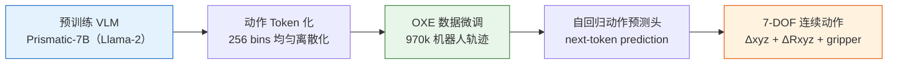
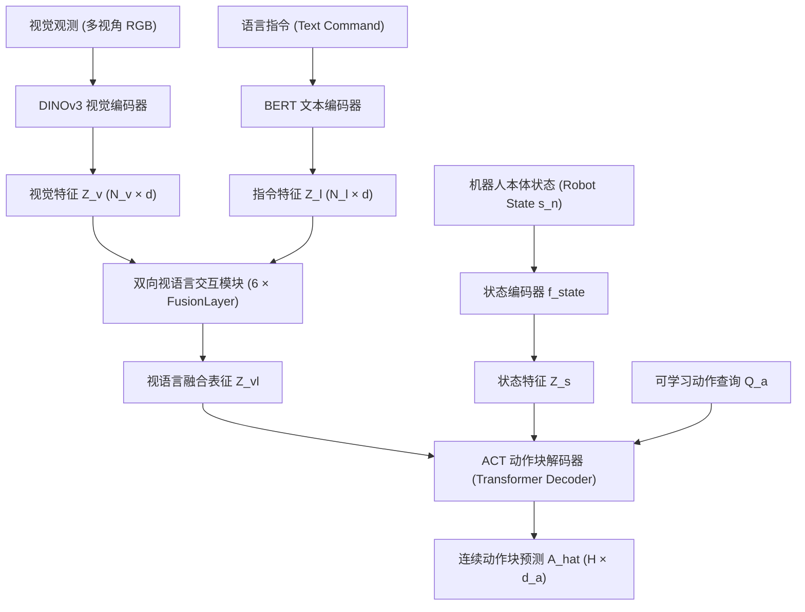

> 本文是 [VLA 综述](/VLA-Survey/) 的配套论文精读。综述负责方法框架、数据与评测；这里保留逐篇的研究问题、方法、证据与局限。

论文编号沿用综述原第 5 章，便于已有引用与交叉阅读。下方先列跨模型的 RoboDojo 官方统一评测榜，再列各论文同设置的实验对照；两类榜单的分数不能混排。

<div class="vla-guide">
  <div class="vla-paper-index" hidden>
    <div class="vla-index-heading">
      <label for="vla-paper-search">查找论文</label>
      <a href="/VLA-Survey/">返回 VLA 综述</a>
    </div>
    <div class="vla-search-fields">
      <input id="vla-paper-search" type="search" placeholder="按模型、方法或关键词搜索" autocomplete="off" />
      <label class="vla-year-label" for="vla-paper-year">年份 <select id="vla-paper-year"><option value="">全部</option></select></label>
    </div>
    <p class="vla-result-count" aria-live="polite"></p>
    <ul class="vla-paper-results"></ul>
    <p class="vla-empty" hidden>没有匹配的论文。</p>
    <button class="vla-reset" type="button" hidden>清除筛选</button>
  </div>
</div>

<span id="vla-leaderboard" class="vla-anchor-alias" aria-hidden="true"></span>

# 性能排行榜

## RoboDojo：官方统一评测榜
{: id="vla-ranking-robodojo"}

[RoboDojo 官方榜单](https://robodojo-benchmark.com/leaderboard)是跨模型统一评测：基准含 **42 项仿真任务和 18 项真机任务**；仿真按泛化、记忆、精细操作、长任务和开放指令五类能力报告结果。[论文](https://arxiv.org/abs/2607.04434)说明，仿真每项任务评测 50 次，**SR** 是完整任务成功率，**Score** 还计入部分任务进度；仿真和真机应分别查看。官方榜持续更新，以下仅摘录[官网首页](https://robodojo-benchmark.com/)展示的**仿真前五名**，查阅于 2026-10-01。

| 官网名次 | 模型 | 仿真 Score ↑ | 仿真 SR ↑ |
|---:|---|---:|---:|
| 1 | DM0.5 | 24.90 | 19.34% |
| 2 | GalaxeaVLA (G0.5) | 20.23 | 14.88% |
| 3 | Xiaomi-Robotics-1 | 20.07 | 13.93% |
| 4 | OpenWAM-α | 17.18 | 11.92% |
| 5 | Meituan-Robotics-0 | 14.95 | 9.53% |
{: .vla-leaderboard-table }

**看榜方式**：这些是 RoboDojo 仿真协议下的名次，不能与下方 LIBERO、GM-100 或真机实验分数比较。完整模型列表、五类能力拆分及真机榜请直接查看[官方实时榜](https://robodojo-benchmark.com/leaderboard)。

## 论文内同设置对照

下面展示五篇近期论文中的可核查对照。**每张表只比较该论文报告的实验，不是跨论文总榜。**粗体表示该列最高成功率或进度；任务、训练数据和成功判定不同的数字不能直接比较。

| 分榜 | 比较范围 | 主要指标 |
|---|---|---|
| [动作编码：LIBERO / LIBERO-Plus](#vla-ranking-actionpiece) | 相同 VLA 骨干、数据和训练预算 | 成功率 |
| [跨机器人操作：GM-100](#vla-ranking-gm100) | 相同平台的九项双臂任务 | 成功率、任务进度 |
| [长任务搜索：τ₀-VLA](#vla-ranking-tau0) | 固定低层策略的真机对照 | 整任务成功次数 |
| [动态操作：Real-Time EXPO-FT](#vla-ranking-expo) | 四项真机任务、在线数据上限 10 分钟 | 成功次数 |
| [人工纠正：Bee](#vla-ranking-bee) | 相同初始 VLA 与机器人数据预算 | 各任务成功率、干预率 |
{: .vla-leaderboard-table }

## ① 动作编码：LIBERO / LIBERO-Plus
{: id="vla-ranking-actionpiece"}

[ActionPiece 论文 Table 1](https://arxiv.org/abs/2609.18487)使用相同的 Qwen3-VL-4B 骨干、演示数据、提示、全局批量、训练预算及 8 步预测和执行协议；LIBERO-Plus 不参与训练。按 **LIBERO-Plus 成功率**排序，数值均为百分比。

| 动作 tokenizer | LIBERO ↑ | LIBERO-Plus ↑ |
|---|---:|---:|
| [ActionPiece](#5-34-actionpiece-2026) | **94.8** | **68.8** |
| FAST | 92.1 | 64.3 |
| ActionCodec | 93.7 | 64.2 |
| FASTerVQ* | 91.3 | 62.6 |
| OAT | 86.1 | 60.7 |
| Standard RVQ | 90.9 | 60.4 |
{: .vla-leaderboard-table }

\* FASTerVQ 是该论文依照公开方法自行实现的版本。比较控制了策略设置，但不同 tokenizer 保留各自的输出长度和词表；此表不能推断它们的推理延迟相同。

## ② 跨机器人操作：GM-100
{: id="vla-ranking-gm100"}

[LingBot-VLA 2.0 论文 Table 5](https://arxiv.org/abs/2607.06403)在 *generalist mixed-training* 设置下，对每个平台的九项双臂任务分别取平均。进度衡量中间里程碑，成功率要求任务终态完成。**两台机器人分别成榜**；各模型训练数据和配方不完全一致，因此名次不能单独归因于架构。

**Agilex Cobot Magic**（按成功率排序；单位：%）

| 模型 | 成功率 ↑ | 进度 ↑ |
|---|---:|---:|
| [LingBot-VLA 2.0](#5-32-lingbot-vla-20-2026) | **34.4** | **66.2** |
| [π₀.5](#5-11-pi05-2025) | 32.2 | 59.1 |
| LingBot-VLA 1.0 | 30.0 | 58.2 |
| [GR00T N1.7](#5-18-gr00t-2025) | 17.8 | 36.3 |
{: .vla-leaderboard-table }

**Galaxea R1 Pro**（成功率并列时按进度排序；单位：%）

| 模型 | 成功率 ↑ | 进度 ↑ |
|---|---:|---:|
| [LingBot-VLA 2.0](#5-32-lingbot-vla-20-2026) | **15.6** | **34.6** |
| LingBot-VLA 1.0 | **15.6** | 32.7 |
| [π₀.5](#5-11-pi05-2025) | 8.9 | 27.4 |
| [GR00T N1.7](#5-18-gr00t-2025) | 5.6 | 16.4 |
{: .vla-leaderboard-table }

## ③ 长任务搜索：τ₀-VLA
{: id="vla-ranking-tau0"}

[τ₀-VLA 论文 Table III](https://arxiv.org/abs/2608.16885)固定低层策略，只比较高层直接规划（Plan Once）与测试时搜索（TTC）。每项真机任务各评测 10 次；表中为**整任务成功次数**，不与论文中“直接执行 vs 层级分解”的另一组实验混用。

| 高层决策方式 | 制作奶茶 ↑ | 整理书籍 ↑ | 整理房间 ↑ |
|---|---:|---:|---:|
| [TTC 搜索](#5-33-tau0-vla-2026) | **7/10** | **9/10** | **7/10** |
| Plan Once | 5/10 | 6/10 | 5/10 |
{: .vla-leaderboard-table }

## ④ 动态操作：Real-Time EXPO-FT
{: id="vla-ranking-expo"}

[Real-Time EXPO-FT 论文 Table I](https://arxiv.org/abs/2609.18207)在四项动态真机任务上各评测 30 次，在线机器人数据采集上限为每项 10 分钟。按四任务平均成功次数排序；不同算法的更新方式与梯度步数不相同，表格体现的是该论文报告的**系统级对照**。

| 方法 | 动态拾取 ↑ | 滚球平衡 ↑ | 物体传递 ↑ | 足球踢球 ↑ | 四任务均值 ↑ |
|---|---:|---:|---:|---:|---:|
| [Real-Time EXPO-FT](#5-35-real-time-expo-ft-2026) | **30/30** | **28/30** | **30/30** | **28/30** | **29/30** |
| EXPO-FT + RTC | 24/30 | 23/30 | 27/30 | 26/30 | 25/30 |
| DSRL + RTC | 25/30 | 15/30 | 23/30 | 17/30 | 20/30 |
| EXPO-FT | 21/30 | 18/30 | 19/30 | 17/30 | 18.8/30 |
| DSRL | 23/30 | 11/30 | 23/30 | 16/30 | 18.3/30 |
| SFT + RTC | 22/30 | 12/30 | 22/30 | 16/30 | 18/30 |
| SFT | 19/30 | 8/30 | 10/30 | 13/30 | 12.5/30 |
| RLPD | 0/30 | 12/30 | 0/30 | 6/30 | 4.5/30 |
{: .vla-leaderboard-table }

## ⑤ 人工纠正：Bee
{: id="vla-ranking-bee"}

[Bee 论文 Table I](https://arxiv.org/abs/2609.27450)从同一微调后的 VLA 出发，并匹配约 20 条预收集纠正片段及各任务在线数据预算。下表只列三项真机任务的成功率（%）；**电话充电和布料对齐只考核精细阶段，零食挂架考核整任务**，因此不计算跨任务总名次。

| 方法 | 电话充电：精细阶段 ↑ | 零食挂架：整任务 ↑ | 布料对齐：精细阶段 ↑ |
|---|---:|---:|---:|
| [Bee](#5-36-bee-2026) | **100.0** | **85.0** | **90.0** |
| RLT | 58.3 | 21.7 | 73.3 |
| DSRL | 93.3 | 13.3 | 31.7 |
| 初始策略 | 90.0 | 0.0 | 36.7 |
{: .vla-leaderboard-table }

在训练期间需要人工接管的 Bee 和 RLT 两组中，Bee 对应三项任务的干预率为 **12.2% / 17.0% / 65.3%**，RLT 为 **22.5% / 62.1% / 85.3%**；初始策略和 DSRL 不使用在线人工接管，不应把其干预率当作 0% 后直接排名。

---

<span id="vla-papers" class="vla-anchor-alias" aria-hidden="true"></span>

# 5. 论文精读

本文收录 36 项代表工作，包括 VLA 模型、动作策略、采集方法与世界模型。它们共同解释技术来源，但并非都属于 VLA，也不是穷尽全部工作的排行榜。可通过上方搜索或侧边目录跳转到相应论文。

| 阅读主题 | 建议串联的工作 | 主要问题 |
|---|---|---|
| VLA 的形成 | RT-1 → RT-2 → RT-X → OpenVLA | 规模、语义迁移与跨机器人数据分别贡献什么 |
| 动作与示范 | ACT、Diffusion Policy、UMI、DP3、π₀ | 动作分块、生成分布与传感接口如何影响控制 |
| 泛化与经验学习 | π₀.5、π*₀.₆、π₀.7 | 环境迁移、执行反馈与行为引导如何结合 |
| 推理与记忆 | ACoT-VLA、ZR-0、RoboTTT、S²-VLA | 中间监督、历史状态和任务阶段有何价值 |
| 数据与系统 | UniSim、InternData-A1、RoboGen、GR00T | 数据生成与系统组件如何支持策略学习 |
| 近期进展 | LingBot-VLA 2.0、τ₀-VLA、ActionPiece、Real-Time EXPO-FT、Bee | 大规模泛化、搜索、动作编码与在线学习如何形成闭环 |

各节按研究问题、核心方法、实验结果和局限展开。数值结果仅对应所引用论文的实验条件；比较时请同时查看训练数据、机器人平台和评测协议。标题年份沿用各节的论文或会议版本；首次预印本与正式发表时间可能不同，具体以链接中的书目信息为准。

---

<span id="51-rt-1-2022-5-1-rt-1-2022" class="vla-anchor-alias" aria-hidden="true"></span>

## 5.1 RT-1 (2022)
{: id="5-1-rt-1-2022"}
Robotics Transformer for Real-World Control at Scale

📄 **Paper**: https://arxiv.org/abs/2212.06817

<div align="center">
  
<figcaption>
RT-1 架构图：基于 EfficientNet 视觉编码器和 Token Learner 的 Transformer 策略（来源：RT-1 Project）
</figcaption>
</div>

**精华**

RT-1 研究大规模多任务数据能否训练出可迁移的机器人策略。它将语言条件加入视觉编码，压缩视觉 token 后预测离散动作。TokenLearner 将每帧 81 个空间 token 压缩为 8 个；512 是特征通道维数。它为规模化视觉运动策略提供了经验，但不等同于从预训练大规模 VLM 微调得到的 RT-2。

---

**研究背景/问题**

2022 年以前的机器人控制方法普遍依赖小规模数据训练的专用网络，难以泛化到新任务和新场景。语言和视觉领域已验证 Transformer + 大规模数据的有效性，但能否将同样范式迁移到真实世界机器人控制尚未被证明。核心问题：**能否通过大规模多任务真实机器人数据训练单一 Transformer 网络，使其在数百种任务上达到高成功率并泛化到未见任务？**

---

**主要方法/创新点**

**架构设计**：

| 模块 | 设计 | 作用 |
|------|------|------|
| **视觉编码** | EfficientNet-B3 + Token Learner | 将图像压缩为 8 个视觉 token，高效提取语义特征 |
| **语言编码** | Universal Sentence Encoder (USE) | 将任务指令映射为固定长度嵌入 |
| **骨干网络** | Transformer（8 层，19M 参数） | 处理语言条件的视觉历史，预测动作 token |
| **动作建模** | 离散化（256 bins/维） | 11 维动作接口：末端位姿 6 维、夹爪 1 维、底盘 3 维、控制模式 1 维 |

**数据规模**：在 Everyday Robots 机器人上采集 130k 条真实轨迹，覆盖 700+ 任务、多种物体和场景，历时 17 个月人工遥操作。

**推理效率**：论文系统以约 3 Hz 运行；视觉 token 压缩用于降低计算量。主模型不按动作维度逐个自回归生成，自回归动作预测是论文中的消融设置。参见 [RT-1 §5.1 与表 13](https://arxiv.org/html/2212.06817v2)。

---

**核心结果/发现**

**已见任务（training distribution）**：
- 平均任务成功率 **97.0%**，显著超过 BC-Z（66.0%）和 SayCan（65.8%）
- 在 700+ 不同任务上保持稳定高性能，证明大规模多任务训练的有效性

**未见任务（zero-shot generalization）**：
- 未见任务成功率 **76.0%**，远超先前方法的 20-40% 水平
- 证明 Transformer 架构能从多任务训练中习得可迁移的底层技能

**结果边界**：以上成功率对应作者定义的任务分布。更多数据在该研究中有益，但不同任务、数据质量和机器人之间并不存在固定的规模收益比例。

---

**局限性**

- 语言条件支持任务区分与组合泛化，但语义推理能力需单独评估
- 数据采集代价高昂（需要专业操作员和特定机器人硬件），难以复现
- 视觉编码器采用固定分辨率，不擅长细粒度精细操作
- 动作量化引入精度损失，在精细接触任务中性能下降明显
- 主要训练与评测集中于 Everyday Robots 平台，有限的跨机器人实验不足以证明任意本体迁移

---

<span id="52-rt-2-2023-5-2-rt-2-2023" class="vla-anchor-alias" aria-hidden="true"></span>

## 5.2 RT-2 (2023)
{: id="5-2-rt-2-2023"}
Vision-Language-Action Models Transfer Web Knowledge to Robotic Control

📄 **Paper**: https://arxiv.org/abs/2307.15818

<div align="center">
  
<figcaption>
RT-2 架构概述：直接微调预训练 VLM 输出动作 Token（来源：RT-2 Project）
</figcaption>
</div>

**精华**

RT-2 是 VLA 领域真正的范式突破：通过将机器人动作表示为语言 token，VLM 的 next-token prediction 能力被无缝扩展到动作生成，无需修改模型架构。最关键的发现是"涌现能力"（emergent capabilities）——RT-2 可以执行从未在机器人数据中出现过的新型推理任务（如"拿起可以灭火的物体"），这直接来自 VLM 的互联网知识。这一发现重新定义了机器人学习的可能性边界。

---

**研究背景/问题**

大型视觉-语言模型（VLM）已在跨模态理解和常识推理方面表现出色，但这些能力无法直接用于机器人控制。传统做法是将 VLM 用于高层规划，再配合低层控制器执行动作——这引入了模块间的信息损失和对齐误差。核心问题：**能否直接将 VLM 微调为能执行物理动作的 VLA 模型，同时保留预训练的语义理解和推理能力？**

---

**主要方法/创新点**

**核心创新：动作作为语言 token**

```
传统方式: 视觉 + 语言 → VLM → 文本规划 → 低层控制器 → 动作
RT-2方式: 视觉 + 语言 → VLA → 动作token序列（直接控制）
```

**架构**：
- 基础模型：PaLI-X（5B、55B）与 PaLM-E（12B）变体
- 将末端位姿、夹爪和终止标志编码为离散 token；连续动作维度量化为 256 个区间
- 与视觉-语言数据联合微调（co-fine-tuning）：交替在机器人演示数据和互联网 VL 数据上训练，防止灾难性遗忘

**关键设计决策**：
- 机器人演示与视觉语言任务联合微调，以兼顾动作学习和原有视觉语言能力
- 动作 token 直接插入语言词表，利用自回归解码生成动作序列
- 支持 chain-of-thought reasoning：在生成动作前先生成推理文本

---

**核心结果/发现**

[RT-2 官方实验](https://robotics-transformer2.github.io/) 分别评估已见任务、新物体、背景变化以及语义推理。在作者协议下，预训练 VLM 带来的知识有助于选择对象、理解符号和按语义完成操作。CoT 变体展示了在动作前生成中间推理的可能性。

这些结果说明语义知识可以影响动作选择，但并未证明机器人因此学会了训练数据之外的全新运动技能。RT-2 与跨机器人训练的 RT-2-X 也应分开讨论，后者属于下一节的研究。

---

**局限性**

- 55B 参数模型计算代价极高，无法在边缘设备部署，推理速度仅约 1-3Hz
- 完全闭源（Google 内部），外部研究者无法复现或微调，推动了后续开源工作（OpenVLA）
- 动作 token 化引入精度损失，难以执行需要亚毫米精度的精细操作
- co-fine-tuning 对数据混合比例敏感，调试复杂
- 在全新机器人平台上的跨具身迁移能力仍有限

---

<span id="53-rt-x--open-x-embodiment-dataset-2023-5-3-rt-x-2023" class="vla-anchor-alias" aria-hidden="true"></span>

## 5.3 RT-X / Open X-Embodiment Dataset (2023)
{: id="5-3-rt-x-2023"}
Open X-Embodiment: Robotic Learning Datasets and RT-X Models

📄 **Paper**: https://arxiv.org/abs/2310.08864

<div align="center">
  
<figcaption>
Open X-Embodiment 数据集：原始项目覆盖 22 种机器人的多样化数据分布（来源：RT-X Project）
</figcaption>
</div>

**精华**

OXE 和 RT-X 共同验证了一个重要假设：**来自不同机器人的数据可以在部分设置下相互增益**。这种正迁移取决于模型容量、数据混合和动作接口，并不排除负迁移。这为机器人学习从"实验室孤岛"走向"共享数据生态"提供了关键证据，是 AgiBot World、InternData-A1 等后续大规模数据集建设的理论基础。

---

**研究背景/问题**

机器人学习数据极度碎片化：每个实验室独立采集数据，使用不同机器人、不同任务定义、不同存储格式，导致数据无法共享和复用。即便单个实验室拥有足够的数据，也只能训练适用于本实验室机器人的专用模型。核心问题：**能否将来自全球多个实验室、22 种不同机器人的数据统一整合，并证明联合训练的模型优于仅在单一机器人数据上训练的模型？**

---

**主要方法/创新点**

**Open X-Embodiment 数据集**：
- **规模**：原始 OXE 项目汇集百万量级轨迹，覆盖 22 种机器人，来自 21 个机构；RT-X 使用其中选定的数据混合
- **统一格式**：采用 RLDS（Reinforcement Learning Datasets）格式标准化异构数据，包含 RGB 图像、语言指令、机器人关节角度/末端执行器动作
- **覆盖范围**：从 7-DOF 桌面机械臂（WidowX、Franka）到移动机器人（Hello Stretch），涵盖抓取、推拉、翻转等多种操作技能

**RT-X 训练策略**：
- 分别在 OXE 数据上训练 RT-1 骨干（RT-1-X）和 RT-2 骨干（RT-2-X）
- 跨具身共训：模型在推理时通过语言指令和视觉观察推断任务，无需机器人类型标识
- 针对不同数据集采用加权混合采样策略，平衡数据规模差异

---

**核心结果/发现**

论文中的 RT-1-X 与 RT-2-X 实验表明，跨机器人训练在多个目标平台和语义任务上能够产生正迁移。该结论依赖选定的数据集、模型容量和训练设置；OXE 是数据集合，RT-X 是使用其子集训练的策略，不能把两者的范围等同。

RLDS 提供轨迹组织规范，动作标准化和数据采样仍由训练流程完成。原始实验及各机器人结果见 [RT-X 官方项目](https://robotics-transformer-x.github.io/)。

---

**局限性**

- 22 种机器人平台中数据量严重不均衡，长尾机器人的性能提升有限
- 原始数据质量参差不齐（不同实验室采集标准不同），引入噪声
- 未包含双臂、全身人形等新兴形态，覆盖面仍有局限
- 具体训练管线可能只选取部分传感模态；这与 RLDS 格式本身可容纳的字段范围不同
- 评估协议不统一，不同实验室间的性能比较存在偏差

---

<span id="54-act-2023-5-4-act-2023" class="vla-anchor-alias" aria-hidden="true"></span>

## 5.4 ACT (2023)
{: id="5-4-act-2023"}
———Learning Fine-Grained Bimanual Manipulation with Low-Cost Hardware

📄 **Paper**: [https://arxiv.org/abs/2304.13705](https://arxiv.org/abs/2304.13705)

### 精华

这篇论文展示了如何利用低成本硬件实现高精度双臂协同操作，核心亮点包括：
- **低成本系统设计**：利用不到2万美元的现成机器人和3D打印件构建了高性能双臂遥操作和自主学习平台。
- **ACT 算法**：提出 Action Chunking with Transformers，通过预测动作序列（而不是单步动作）来减少复利误差并提升时序一致性。
- **时间集成 (Temporal Ensembling)**：通过重叠动作块的加权平均，实现了极其平滑且精准的机器人运动。
- **高效学习**：仅需10分钟（约50次）演示即可在开罐头、插电池等高难度精细操作任务中达到 80-90% 的成功率。

---

### 1. 研究背景/问题

精细的双臂协同操作（如穿针引线、插拔电池）通常需要昂贵的高精度机器人和复杂的传感器。传统的模仿学习（如行为克隆）在这些任务中面临挑战：**复利误差 (Compounding Errors)** 会导致动作偏离目标，且人类演示中的非平稳性（如停顿）难以建模。本文探讨能否通过学习，让廉价且精度较低的硬件也能完成 these 精细任务。

---

### 2. 主要方法/创新点

<div align="center">
  
<figcaption>
ALOHA 系统概览：低成本双臂遥操作与精细操作技能展示
</figcaption>
</div>

#### ALOHA 硬件系统
论文设计了一套名为 **ALOHA** 的低成本开源双臂系统。

<div align="center">
  
<figcaption>
ALOHA 硬件细节：多视角相机布局、3D 打印遥操作机构及机器人规格
</figcaption>
</div>

1. **结构**：包含两组 ViperX 6自由度机械臂（作为执行器）和两组较小的 WidowX 机械臂（作为遥操作控制器）。
2. **遥操作**：用户通过操作较小的控制臂来实时驱动执行臂。为了提升精细操作能力，设计了3D打印的“手柄与剪刀”机构，支持连续的夹爪控制。
3. **感知**：系统配备4个普通的网络摄像头（两个固定在前方/上方，两个固定在执行臂手腕上），提供多视角视觉反馈。

#### ACT 学习算法
为了解决模仿学习中的误差积累问题，论文提出了 **Action Chunking with Transformers (ACT)**。

<div align="center">
  
<figcaption>
ACT 算法架构：基于 CVAE 和 Transformer 的动作序列预测
</figcaption>
</div>

1. **动作块 (Action Chunking)**：不同于传统方法预测单步动作 $a_t$，ACT 在每个观测点 $s_t$ 预测未来 $k$ 步的动作序列 $a_{t:t+k}$。这大大缩短了任务的有效时序跨度（减少了 $k$ 倍），从而缓解复利误差。

<div align="center">
  
<figcaption>
时间集成：通过重叠的动作块平滑机器人运动
</figcaption>
</div>

2. **CVAE 建模**：使用条件变分自编码器 (CVAE) 处理人类演示中的多峰性（即同一场景下可能有多种有效路径）。

<div align="center">
  
<figcaption>
CVAE架构：非常适合轨迹生成
</figcaption>
</div>

3. **Transformer 架构**：利用 Transformer 的编码器-解码器结构来融合多视角图像 and 关节位置信息，并生成连贯的动作块。


4. **时间集成 (Temporal Ensembling)**：在推理时，系统在每一帧都进行预测，并对重叠的动作块进行加权平均。这种方式不仅提高了预测的鲁棒性，还消除了“动作块”切换时的动作不连续感。

<div align="center">
  
<figcaption>
ACT 详细训练流程 (Training)
</figcaption>
</div>

<div align="center">
  
<figcaption>
ACT 详细推理/测试流程 (Testing)
</figcaption>
</div>

---

### 3. 核心结果/发现

- **性能卓越**：在多个复杂的双臂操作任务中，ACT 显著优于之前的 SOTA 方法（如 BC-ConvMLP, BeT, RT-1）。例如在“插电池”任务中，ACT 的成功率达到 96%，而基线方法几乎无法完成。
- **数据高效**：每个任务仅需 50 次人类演示（约 10 分钟数据），模型即可学会在动态和随机环境中进行闭环调整。
- **高频率必要性**：实验证明 50Hz 的控制频率对于精细操作至关重要，将频率降至 5Hz 会导致操作完成时间增加 62% 以上。
- **闭环鲁棒性**：得益于多视角视觉反馈和 ACT 架构，机器人能够实时纠正演示中的小偏差，并适应物体位置的轻微变动。

---

### 4. 局限性

- **硬件限制**：由于低成本电机的扭矩限制，ALOHA 难以处理需要大力量的任务（如拧紧瓶盖或抬起重物）。
- **感官缺失**：目前的系统仅依赖视觉，缺乏力觉反馈，在处理极度复杂的接触（如拆解复杂的糖果包装）时仍有挑战。

---

<span id="55-diffusion-policy-2023-5-5-diffusion-policy-2023" class="vla-anchor-alias" aria-hidden="true"></span>

## 5.5 Diffusion Policy (2023)
{: id="5-5-diffusion-policy-2023"}
Visuomotor Policy Learning via Action Diffusion

📄 **Paper**: https://arxiv.org/abs/2303.04137

<div align="center">
  
<figcaption>
Diffusion Policy：基于扩散过程的多模态动作建模（来源：Columbia University）
</figcaption>
</div>

**精华**

Diffusion Policy 的核心洞见是：机器人动作分布本质上是**多峰的**（同一任务有多种合理执行方式），而传统的均方误差损失函数会将这些模式平均掉，导致"平均动作"——既不像任何一种合理动作。扩散模型天然能够表达多峰分布，Action Chunking（一次预测多步动作）进一步提升了长时序任务的流畅性。这两个设计已成为后续 VLA 动作解码（π₀ 的 Flow Matching、ACoT-VLA 的动作推理）的共同基础。

---

**研究背景/问题**

模仿学习方法（如 BC-RNN、IBC）在精细操作任务上性能不稳定。核心问题在于机器人演示数据天然具有**多模态性**：同一任务，专家可以从左侧抓取也可以从右侧抓取，两种轨迹都是正确的。传统回归损失（MSE）会将两种模式平均，导致输出"模糊中间状态"动作而失败。核心问题：**如何为机器人策略学习建模多模态、高维的动作分布，使其能够可靠执行需要精细接触的复杂操作？**

---

**主要方法/创新点**

**扩散模型作为策略**：

```
传统策略: π(o_t) → a_t  （确定性映射）
扩散策略: a_t ~ p_θ(·|o_t)  （条件分布采样）
          通过迭代去噪: a^K → a^(K-1) → ... → a^0
```

**两种架构变体**：

| 架构 | 视觉骨干 | 去噪网络 | 推理速度 |
|------|---------|---------|---------|
| **CNN-Diffusion** | ResNet-18（时序堆叠） | 1D-UNet | 快（~20Hz） |
| **Transformer-Diffusion** | ViT + 位置编码 | Transformer | 稳定但较慢 |

**关键设计**：
- **Action Chunking**：一次预测 $T_p=16$ 步动作序列（而非单步），缓解 compounding error，提升长任务流畅性
- **DDIM 加速推理**：使用 DDIM 从原始 100 步 DDPM 压缩到 10 步，满足实时控制需求
- **Receding horizon 执行**：每次仅执行预测动作序列的前 $T_a=8$ 步，保持闭环反馈

**训练目标**：
$$\mathcal{L} = \mathbb{E}_{t, a_0, \epsilon}\left[\|\epsilon - \epsilon_\theta(a_t, t, o_t)\|^2\right]$$

---

**核心结果/发现**

**仿真基准**（与 BC-RNN、IBC 对比）：

| 任务 | Diffusion Policy（CNN） | Diffusion Policy（Trans） | BC-RNN |
|------|----------------------|------------------------|--------|
| Push-T（轨迹精度） | 91.5% | **95.0%** | 82.5% |
| Block Pushing | **99.0%** | 98.0% | 78.0% |
| Kitchen（多步序列） | 79.7% | **86.0%** | 66.1% |

**真实机器人实验（Franka 臂）**：
- 在 6 个精细操作任务（餐具摆放、罐头开盖、插头连接等）上平均成功率 **76.3%**
- 显著优于 BC-RNN（56.2%）和 IBC（51.0%）

**多峰性验证**：在"杯子放置"任务中，Diffusion Policy 稳定生成两种不同的合理轨迹（正面放/侧面放），而 BC-RNN 只能生成"中间状态"失败动作。

---

**局限性**

- 扩散推理需要多步迭代（即使用 DDIM 也需 10 步），与直接预测相比推理延迟更高，限制了超高频控制（>50Hz）
- 仅使用视觉和本体感知输入，没有语言指令跟随能力，无法处理多任务场景
- 在语义场景理解和任务泛化方面没有改善（专为低层动作建模设计）
- 对演示数据质量敏感，噪声或不一致的演示会影响分布建模质量
- 缺乏显式的任务推理机制，不适合需要长时程规划的复杂多步骤任务

---


---

<span id="56-umi-2024-5-6-umi-2024" class="vla-anchor-alias" aria-hidden="true"></span>

## 5.6 UMI (2024)
{: id="5-6-umi-2024"}
———Universal Manipulation Interface: In-The-Wild Robot Teaching Without In-The-Wild Robots

📄 **Paper**: [https://arxiv.org/abs/2402.10329](https://arxiv.org/abs/2402.10329)
💻 **Project**: [https://umi-gripper.github.io](https://umi-gripper.github.io)

### 精华

UMI 是由斯坦福、哥大和丰田研究院（TRI）共同提出的一种极低成本、高效率的机器人学习框架，其核心亮点包括：
- **便携式采集硬件**：仅需一个带 GoPro 的手持夹爪（BOM 约 370 美元），即可在任何真实场景（如咖啡馆、厨房、公园）采集数据，无需真实机器人参与采集。
- **巧妙的传感器设计**：利用 GoPro 的鱼眼镜头获取超广视角，并通过侧向反光镜（Side Mirrors）实现隐式双目视觉（Stereo），从而获得深度感知。
- **硬件无关的策略接口**：引入了基于**相对轨迹 (Relative Trajectory)** 的动作表示和推理时**延迟匹配 (Latency Matching)**，使得在一处采集的数据和训练的模型可以无缝部署到不同品牌、不同自由度的机器人上。
- **强大的泛化能力**：在多样化的“野生”数据训练下，机器人表现出了极强的 Zero-shot 泛化能力，能够应对从未见过的环境、光照和物体。

---

### 1. 研究背景/问题

传统机器人模仿学习面临两大难题：
1. **遥操作成本高**：需要昂贵的硬件和熟练的操作员，且通常局限在实验室。
2. **人类视频存在具身间隙 (Embodiment Gap)**：直接学习人类徒手操作视频很难转换成机器人的关节/夹爪控制。
UMI 采用了“手持夹爪”这一中间形态，既保留了人类操作的灵活性，又在视觉和动作上与机器人高度对齐。

---

### 2. 主要方法/创新点

<div align="center">
  
<figcaption>
UMI 框架：从户外演示到机器人策略的 Zero-shot 迁移
</figcaption>
</div>

#### 硬件设计：信息丰富的演示接口
1. **鱼眼镜头 (Fisheye)**：155度超广角，在提供丰富上下文的同时，避免了近距离操作时的遮挡。
2. **侧向反光镜 (Side Mirrors)**：在图像边缘添加两面镜子，相当于增加了两个虚拟摄像头，提供了关键的深度信息。
3. **IMU 感知跟踪**：利用 GoPro 记录的 IMU 数据配合 SLAM，在快速运动或视觉特征缺失时仍能保持高精度的 6DoF 姿态跟踪。
4. **连续夹爪控制**：通过视觉标记跟踪夹爪开合度，支持比二进制开合更精细的力度和时机控制（如抛掷物体）。

#### 算法设计：跨平台的策略接口
1. **延迟匹配 (Latency Matching)**：精准测量并补偿相机采集、推理和执行的延迟，确保动作同步，这对于“抛掷”等动态任务至关重要。
2. **相对轨迹表示**：动作不以全局坐标定义，而是相对于当前夹爪的位置。这使得机器人无需复杂标定，甚至在移动机器人底座时也能正常工作。
3. **Diffusion Policy**：利用扩散模型建模人类演示中复杂的多峰分布（如绕过障碍物可以选左边也可以选右边）。

---

### 3. 核心实验结果

<div align="center">
  
<figcaption>
UMI 挑战任务：咖啡杯排列、动态抛物、双臂叠衣服、洗碗
</figcaption>
</div>

1. **复杂任务能力**：
   - **动态抛物 (Dynamic Tossing)**：成功将物体准确抛入机器人触及不到的篮筐，成功率 87.5%。
   - **双臂折叠 (Bimanual Folding)**：两臂高度协同完成衣物折叠，体现了相对姿态表示的重要性。
   - **长程洗碗 (Dish Washing)**：涉及开关水龙头、涂抹洗洁精、擦拭、漂洗等 7 个步骤，且对干扰（如突然加料、移动底座）具有极强鲁棒性。
2. **Zero-shot 泛化**：
   - 在咖啡馆、喷泉等全新户外场景下，针对从未见过的杯子，UMI 策略达到了 **71.7%** 的成功率。而仅在窄域（实验室）数据训练的模型成功率为 0%。
3. **跨平台部署**：
   - 同一套训练好的模型，可以直接在 UR5 和 Franka 机器人上运行，成功率保持在 90% 左右。

---

### 4. 总结与意义

UMI 证明了**数据多样性优于模型微调**。与其在单一环境下费力优化模型，不如利用 UMI 极其便携的特性，在数小时内采集大量真实世界场景的数据。这种“农村包围城市”的策略，为实现真正通用的机器人操作策略指明了方向。

---


<span id="57-dp3-2024-5-7-dp3-2024" class="vla-anchor-alias" aria-hidden="true"></span>

## 5.7 DP3 (2024)
{: id="5-7-dp3-2024"}
———3D Diffusion Policy: Generalizable Visuomotor Policy Learning via Simple 3D Representations

📄 **Paper**: [https://arxiv.org/abs/2403.03954](https://arxiv.org/abs/2403.03954)
💻 **Project**: [https://3d-diffusion-policy.github.io](https://3d-diffusion-policy.github.io)

### 精华

DP3 是上海期智研究院、清华大学和上海交大等机构合作的研究成果，其核心贡献在于证明了 3D 空间理解能力对机器人策略学习的巨大价值：
- **数据极其高效**：在 72 个仿真任务中，仅需 **10 次人类演示** 即可完成大多数任务，比基线方法（如 2D Diffusion Policy）有 24.2% 的相对提升。
- **3D 视觉表征**：放弃了复杂的 2D 图像处理，采用从单视角深度图提取的**稀疏点云 (Sparse Point Clouds)**。使用轻量级 MLP 编码器即可获得紧凑且强大的 3D 特征。
- **卓越的泛化性**：得益于 3D 模态的本质属性，DP3 在**空间位置、视角、物体外观和实例**等多个维度上展现出天然的泛化能力。
- **部署安全可靠**：在真实机器人实验中，DP3 极少发出超出安全限制的异常指令，这与 2D 基线方法频繁出现异常行为形成鲜明对比。

---

### 1. 研究背景/问题

视觉模仿学习虽然能让机器人学会多种技能，但通常需要海量数据（如 2D Diffusion Policy 通常需要 100-200 次演示）。
其核心瓶颈在于：
1. **2D 信息的局限性**：2D 图像难以提供精确的深度和空间拓扑信息，导致模型需要更多数据来“脑补”空间关系。
2. **泛化困难**：2D 策略极易受到视角变换、光照变化和背景干扰的影响。
DP3 旨在通过引入 3D 视觉表征，让模型“天生”理解三维空间，从而降低数据需求并提升泛化性。

---

### 2. 主要方法/创新点

<div align="center">
  
<figcaption>
DP3 架构概览：从单视角点云到 3D 表征，再到基于扩散模型的决策过程
</figcaption>
</div>

#### 感知 (Perception)：紧凑的 3D 表征
1. **点云处理**：从单视角深度相机获取深度图并转换为点云。为了排除背景干扰，模型会进行裁剪（Crop）并使用**最远点采样 (FPS)** 下采样至 512 或 1024 个点。
2. **无颜色处理**：实验发现，**舍弃颜色通道**反而有助于提高模型对物体外观（如不同颜色的杯子）的泛化能力。
3. **轻量级编码器**：使用简单的三层 MLP + Max Pooling 提取 64 维特征。这种“小而精”的设计在机器人控制任务中优于大型预训练点云模型。

#### 决策 (Decision)：3D 条件下的扩散策略
1. **条件动作生成**：扩散模型以提取的 3D 特征和机器人的关节位姿（q）为条件，通过迭代去噪过程，将高斯噪声转换为连贯的动作序列。
2. **时空理解**：扩散模型负责捕捉复杂的动作多峰分布，而 3D 特征负责提供精准的空间位置参考。

---

### 3. 核心实验结果

<div align="center">
  
<figcaption>
DP3 在仿真任务和真实世界灵巧手操作任务中的表现
</figcaption>
</div>

1. **小样本学习**：
   - 在仿真环境下，仅 10 次演示，DP3 平均成功率遥遥领先。
   - 在真实环境下（如做饺子、卷物、钻孔等灵巧手任务），仅需 40 次演示，成功率达到 **85%**。
2. **全方位泛化**：
   - **空间泛化**：在训练范围之外的 3D 空间内，DP3 依然能精准操作。
   - **外观泛化**：能够处理颜色、纹理完全不同的新物体。
3. **推理效率**：
   - 虽然引入了 3D 处理，但得益于极简的编码器设计，DP3 在 NVIDIA 2080 Ti 上仍能保持较高的推理速度，满足实时控制需求。

---

### 4. 总结与意义

DP3 的成功再次强调了**感知表征 (Visual Representation)** 在机器人学习中的重要性。通过将 3D 表征与强大的扩散策略结合，DP3 为解决具身智能中的“数据饥渴”问题提供了一条高效、简洁且泛化能力极强的技术路径。

---

<span id="58-unisim-2024-5-8-unisim-2024" class="vla-anchor-alias" aria-hidden="true"></span>

## 5.8 UniSim (2024)
{: id="5-8-unisim-2024"}
———Learning Interactive Real-World Simulators

📄 **Paper**: [https://arxiv.org/abs/2310.06114](https://arxiv.org/abs/2310.06114)
💻 **Project**: [https://universal-simulator.github.io](https://universal-simulator.github.io)

### 精华

UniSim 是 Google DeepMind 在 ICLR 2024 上提出的一项重要工作，旨在构建一个能够模拟现实世界交互的通用模拟器：
- **统一接口**：提出了“动作输入-视频输出” (Action-in-Video-out) 的统一框架，将不同模态的动作（语言、机器人控制、相机路径）映射到统一的动作空间。
- **海量异构数据融合**：巧妙地整合了互联网图文数据、机器人操作数据、人类活动视频和 3D 扫描数据，利用不同数据的侧重点（如互联网数据的丰富场景和机器人数据的高频动作）来补全模拟器的能力。
- **自回归长程模拟**：采用视频扩散模型作为核心，通过条件观察预测（Observation Prediction）实现了时序连贯的长程模拟。
- **闭环应用**：证明了在 UniSim 中训练的高层视觉语言策略（VLM）和底层强化学习（RL）策略，可以无需修改直接部署到真实机器人（Zero-shot Sim-to-Real）。

---

### 1. 研究背景/问题

构建现实世界模拟器的最大障碍在于**数据集的异质性**。互联网数据（LAION）有丰富的物体和场景但缺乏动作；机器人数据有精准的动作但场景单一且规模小；人类活动数据有复杂的交互但动作标签模糊。UniSim 的核心思路是：**能否通过一个统一的模型，将这些在不同维度上“丰富”的数据缝合在一起，构建一个无所不包的模拟器？**

---

### 2. 主要方法/创新点

<div align="center">
  
<figcaption>
UniSim 概览：整合互联网场景、机器人操作、人类活动、导航、全景扫描及仿真渲染数据
</figcaption>
</div>

#### 数据编排 (Data Orchestration)
为了处理来自不同源的异构数据，UniSim 采用了以下策略：
1. **统一动作空间**：所有动作最终被转换为连续的表示。语言指令通过 T5 嵌入处理，底层控制（如 Δx, Δy）则被离散化并与语言嵌入拼接。
2. **多模态对齐**：对于静态图像，将标题视为动作；对于 3D 扫描，利用相机姿态差构建动作；对于视频，则利用动作标签或预测的运动轨迹。

#### 核心架构：基于视频扩散的观察预测
UniSim 被建模为一个条件概率模型 $p(o_t | h_{t-1}, a_{t-1})$，即给定历史观察 $h_{t-1}$ 和当前动作 $a_{t-1}$，预测下一段观察帧 $o_t$。

<div align="center">
  
<figcaption>
UniSim 的训练与推理流程：基于条件视频扩散模型，支持多种模态的动作输入
</figcaption>
</div>

- **Video U-Net**：使用包含 56 亿参数的视频 U-Net 架构，通过交错的时间/空间注意力层来保证视频的质量和连贯性。
- **自回归生成**：通过将上一段生成的最后一帧作为下一段生成的条件（History Conditioning），UniSim 能够生成长达数十步的连贯交互序列。

---

### 3. 应用场景展示

#### 动作丰富且长程的模拟
UniSim 不仅能模拟简单的移动，还能根据语言指令模拟复杂的交互。

<div align="center">
  
<figcaption>
UniSim 的动作丰富度演示：从同一初始帧模拟“洗手”、“切胡萝卜”、“导航”等不同任务
</figcaption>
</div>

<div align="center">
  
<figcaption>
长程模拟演示：自回归模拟 8 步交互，模型能够成功保持物体的状态（如橙子被放入抽屉后依然存在）
</figcaption>
</div>

#### 策略训练与 Zero-shot 迁移
UniSim 最强大的地方在于它能作为一个“训练场”：
- **VLM 策略**：通过在模拟器中生成带有事后标签（Hindsight Relabeling）的长程数据，显著提升了视觉语言模型处理复杂任务的能力。
- **RL 训练**：底层 RL 代理可以在 UniSim 中进行数百万次的闭环交互学习，由于模拟器视觉上极度接近真实世界，训练出的策略可以直接在真实机器人上运行。

---

### 4. 核心实验结果

1. **Sim-to-Real 性能**：在 Language Table 机器人任务中，使用 UniSim 增强训练的 VLM 策略在真实环境下的目标达成率（RDG）提升了 3-4 倍。
2. **底层控制提升**：通过在模拟器中进行 REINFORCE 优化，VLA 策略在“指物”等缺乏专家演示的任务上成功率从 12% 提升到了 71%。
3. **数据增强**：仅使用 UniSim 生成的视频数据对 PaLI-X 进行微调，在视频描述（Video Captioning）任务上的表现接近使用真实数据的 84%，且具有更好的泛化性。

---

### 5. 局限性与思考

尽管 UniSim 迈出了重要一步，但仍面临以下挑战：
- **幻觉问题**：当输入不切实际的指令时（如在桌面上要求“洗手”），模型会产生背景剧烈变动的幻觉。
- **长程记忆限制**：由于条件观察只覆盖了有限的历史帧，极长程的记忆保持（如多轮交互后的物体一致性）仍有待提高。
- **物理真实性**：目前的模拟主要集中在视觉层面，缺乏力学、触觉等非视觉维度的物理反馈。

---


<span id="59-openvla-2024-5-9-openvla-2024" class="vla-anchor-alias" aria-hidden="true"></span>

## 5.9 OpenVLA (2024)
{: id="5-9-openvla-2024"}
———开源视觉-语言-动作模型

📄 **Paper**: https://arxiv.org/abs/2406.09246v3

**精华**

这篇论文展示了如何构建开源的大规模机器人控制模型,值得借鉴的核心思想包括:
1. 利用预训练的视觉-语言模型作为基础,通过将机器人动作视为语言token的方式实现端到端训练
2. 在大规模多样化机器人数据集(97万条轨迹)上训练可以显著提升泛化能力
3. 融合多个视觉编码器(SigLIP + DINOv2)能够同时捕获语义和空间信息,提升机器人控制性能
4. 参数高效微调(LoRA)和量化技术使得7B参数模型可以在消费级GPU上部署和微调
5. 完全开源模型、代码和训练流程为社区研究提供了重要基础设施

**研究背景/问题**

现有的机器人操作策略难以泛化到训练数据之外的物体、场景和任务。虽然视觉-语言基础模型在互联网规模数据上展现了强大的泛化能力,但现有的视觉-语言-动作模型(VLA)要么是闭源的,要么缺乏高效微调到新机器人设置的方法,阻碍了VLA在机器人领域的广泛应用。

**主要方法/创新点**

OpenVLA是一个7B参数的开源视觉-语言-动作模型,在Open X-Embodiment数据集的97万条机器人演示轨迹上训练。模型架构包含三个关键组件:

1. **融合视觉编码器（"三个臭皮匠"协作逻辑）**: 采用多骨干视觉编码策略，将视觉特征物理隔离并各自优化：
   - **DINOv2**: 提供强大的几何和空间特征（理解"在哪里"，擅长物体定位与深度感知）。
   - **SigLIP**: 提供强大的语义理解（理解"是什么"，擅长对齐自然语言指令）。
   - **CLIP/其他**: 提供互补的视觉特征。
   这种"组合拳"模式使得 7B 的模型在信息处理效率上击败了单一编码器的 55B 巨量模型。

2. **投影器**: 2层MLP将视觉特征投影到语言模型的输入空间。

3. **语言模型骨干（"诸葛亮"大脑）**: 基于Llama 2 7B，作为统一决策中心，融合空间信息与语义信息进行指令推理。

<div align="center">
  
<figcaption>
OpenVLA模型架构图：从图像观察和语言指令到7维机器人动作的端到端预测流程（来源：<a href="https://arxiv.org/abs/2406.09246">OpenVLA arXiv</a>）
</figcaption>
</div>

**训练策略**:
- 动作离散化:将连续动作的每个维度量化为256个bin,使用1-99分位数作为量化范围
- 使用Llama tokenizer中最少使用的256个token表示离散化动作
- 端到端微调所有参数(包括视觉编码器),在64个A100 GPU上训练14天
- 完成27个epoch,直到动作token准确率超过95%

**数据处理**:
- 从Open X-Embodiment筛选具有第三人称相机和单臂末端执行器控制的数据集
- 采用Octo的数据混合权重,对多样性高的数据集上采样
- 过滤Bridge数据集中的全零动作,提升模型性能

**OpenVLA训练流程**：在970k条机器人轨迹（Open X-Embodiment数据集）上微调预训练VLM（Llama-2 7B）以预测机器人动作，采用动作token化表示实现端到端学习。详见[论文Figure 2](https://arxiv.org/abs/2406.09246)。



**微调和部署优化**:
- **LoRA微调**: rank=32的LoRA可以匹配全参数微调性能,仅需训练1.4%参数,单个A100 GPU即可完成
- **量化推理**: 4-bit量化将GPU内存需求从16.8GB降至7.0GB,性能无明显下降
- **推理速度**: 在RTX 4090上以6Hz运行(bfloat16),量化后的速度需按硬件与算子实现测量，不能由位宽降低直接推断

**核心结果/发现**

1. **多任务与多机器人评测**：
   - 论文在 29 项任务、多种机器人设置下报告平均成功率比 RT-2-X 高 16.5 个百分点。
   - 该结果对应作者的任务集合与数据条件，不能归结为双视觉编码器单一组件的收益。
   - 比较视觉、运动、物理与语义泛化时，应分别查看任务分组；总平均分不代表所有分组都更好。

2. **证据来源**：模型与数据设置见 [OpenVLA 论文](https://arxiv.org/abs/2406.09246) 和 [官方项目](https://openvla.github.io/)。

3. **数据高效适应**:
   - 在Franka机器人7个任务上(10-150条演示),OpenVLA微调后平均成功率63.8%
   - 在单指令任务上,Diffusion Policy表现更好(66.7% vs 53.5%)
   - 在多指令任务上,OpenVLA显著优于Diffusion Policy(91.7% vs 19.4%)
   - OpenVLA是唯一在所有任务上达到≥50%成功率的方法

**数据高效适应实验**：OpenVLA高度多样化多指令任务上表现最佳，仅需少量演示（10-50条）即可在新任务上实现高成功率，显著优于从头训练和其他预训练VLA模型。详见[论文Figure 4](https://arxiv.org/abs/2406.09246)。

4. **计算效率**:
   - LoRA微调(rank=32)匹配全参数微调性能,GPU内存需求从163.3GB降至59.7GB
   - 4-bit量化推理性能无下降(71.9% vs 71.3%),内存占用减半
   - 在消费级GPU上即可部署和微调

5. **开源影响**:
   - 公开了权重与训练、微调代码，为复现和适配提供基础
   - 支持HuggingFace集成,提供微调notebook
   - 为社区研究VLA提供重要基础设施

**开发者快速开始 (OpenVLA 使用示例):**

```python
import torch
from PIL import Image
from transformers import AutoModelForVision2Seq, AutoProcessor

# 加载预训练模型
model_id = "openvla/openvla-7b"
processor = AutoProcessor.from_pretrained(model_id, trust_remote_code=True)
model = AutoModelForVision2Seq.from_pretrained(
    model_id, torch_dtype=torch.bfloat16, low_cpu_mem_usage=True, trust_remote_code=True
).to("cuda")

# 准备当前相机的 RGB 图像；此处仅演示一次动作预测
image = Image.open("observation.png").convert("RGB")
prompt = "In: What action should the robot take to pick up the red bowl?\nOut:"
inputs = processor(images=image, text=prompt, return_tensors="pt").to("cuda", dtype=torch.bfloat16)

# 生成动作
action = model.predict_action(**inputs, unnorm_key="bridge_orig")
print(f"Predicted Action: {action}")
```

此示例需先准备 `observation.png`。`bridge_orig` 使用对应训练数据的动作归一化统计；适配自己的机器人时必须更换为匹配的数据统计，并核对动作坐标系、单位和控制器接口。它不是完整的真机控制循环。依赖版本以 [OpenVLA 官方仓库](https://github.com/openvla/openvla) 为准。

**局限性**

原版 OpenVLA 仅支持单图像观察输入,不支持多相机视角、本体感知信息或观察历史。推理速度(6Hz)对于高频控制任务(如50Hz的ALOHA)仍不够快。虽然优于现有泛化策略,但在测试任务上的成功率通常<90%,可靠性还有提升空间。由于计算限制,许多VLA设计问题(如基础VLM规模、协同训练策略、最佳视觉特征等)尚未充分探索。


---


<span id="510-π-2024-5-10-pi0-2024" class="vla-anchor-alias" aria-hidden="true"></span>

## 5.10 π₀ (2024)
{: id="5-10-pi0-2024"}
A Vision-Language-Action Flow Model for General Robot Control

📄 **Paper**: [π₀ 原论文](https://arxiv.org/abs/2410.24164) · **Code**: [openpi](https://github.com/Physical-Intelligence/openpi)

<div align="center">
  
<figcaption>π₀ 将视觉语言预训练与连续动作块生成结合。来源：Physical Intelligence。</figcaption>
</div>

### 精华

π₀ 的核心设计是让预训练 VLM 提供语义和视觉条件，再由专门的动作专家生成连续动作块。它将语言知识迁移与灵巧控制结合，但效果同时取决于机器人数据、模型结构与执行配置。

### 1. 研究问题与架构

原始模型在约 3B 参数的 PaliGemma 上增加约 300M 参数的动作专家，总计约 **3.3B**。输入包括图像、语言和机器人状态；动作专家使用 Flow Matching 学习条件动作分布。注意力掩码控制视觉语言前缀、状态与带噪动作之间的信息流；这是 π₀ 的具体设计，不是所有 VLA 必须采用的注意力形式。

### 2. Flow Matching 如何生成动作

为说明训练目标，以下采用“噪声到数据”的时间方向。令 $z$ 为高斯噪声，$A$ 为示范动作块，$c$ 为观测与任务条件：

$$
x_\tau=(1-\tau)z+\tau A,\qquad
\mathcal{L}=\mathbb{E}\left[\|v_\theta(x_\tau,\tau,c)-(A-z)\|^2\right].
$$

模型学习在不同噪声水平下的条件速度场；推理时从噪声出发，通过数值积分生成动作。训练插值路径为直线，不代表学习到的采样轨迹必然是最短路径，也不保证只需 1—3 步即可获得高精度。原论文部署采用 **10 步积分、50 步动作块**。

### 3. 高频执行与闭环延迟

原论文在 RTX 4090 配置下报告约 **73 ms** 的单次推理时间。对 50 Hz 的机器人，每次执行 25 步、约 0.5 秒后重新推理。因此，50 Hz 指动作执行频率，不是完整 VLM 的闭环推理频率。与扩散或离散策略比较时，需统一硬件、采样步数、动作长度和执行协议。上述配置见 [π₀ 原论文附录](https://arxiv.org/html/2410.24164v1)。

### 4. 实验结果应如何理解

论文研究预训练后的任务执行、语言指令跟随，以及新技能微调，覆盖衣物折叠、桌面清理、装袋和纸箱组装等操作。结果支持“大规模多机器人训练与连续动作专家能够结合”的结论。

需要区分预训练覆盖的任务、未见实例和专门微调任务。论文中的零样本不意味着模型未见过相关动作技能；长任务演示也不能直接替代包含复位、失败和人工干预的连续运行统计。

### 5. π₀-FAST 与流匹配版本的区别

[FAST](https://arxiv.org/abs/2501.09747) 用离散余弦变换与 BPE 压缩动作序列，让自回归模型有效学习高频动作。π₀-FAST 是采用这种 token 表示的相关模型，不应称为流匹配解码器的通用推理加速版本。

作者报告达到相近性能所需训练算力最高减少约 **5 倍**；在论文 RTX 4090 对照中，π₀-FAST 每个动作块推理约 **750 ms**，流匹配 π₀ 则低于 **100 ms**。训练收敛更快与在线推理更快是两件事。来源：[FAST §VI-E、§VI-F](https://arxiv.org/html/2501.09747v1)。

### 6. 局限性

数据覆盖、机器人接口与观测分布仍限制迁移。长动作块降低模型调用频率，也会增加对执行期间扰动的反应延迟。实际部署应联合选择动作块长度、重规划间隔和控制器配置，再检验接触误差、失败恢复与任务吞吐量。

---

<span id="511-π5-2025-5-11-pi05-2025" class="vla-anchor-alias" aria-hidden="true"></span>

## 5.11 π₀.5 (2025)
{: id="5-11-pi05-2025"}
———a Vision-Language-Action Model with Open-World Generalization

📄 **Paper**: [https://arxiv.org/abs/2504.16054](https://arxiv.org/abs/2504.16054)
💻 **Project**: [https://pi.website/blog/pi05](https://pi.website/blog/pi05)

### 精华

这是 Physical Intelligence 团队关于 **开放世界泛化 (Open-World Generalization)** 的最新突破性工作。π0.5 是建立在 π0 基础上的全新 VLA 模型：
- **异构数据协同训练**：仅有少部分数据（第一阶段训练的 2.4%）来自真实的移动操作机器人。其余 97.6% 的数据来自其他固定机器人、高层语义预测、人类的口头指令以及网络多模态数据（如图像描述、问答、目标检测）。
- **层次化推理架构**：在执行阶段，模型首先预测“高层语义子任务”（如“拿起盘子”），然后再基于该子任务预测底层的机器人动作（Low-level Action Chunks）。
- **环境泛化实验**：论文展示了端到端学习的机器人系统在**训练未覆盖的真实家庭环境**中执行长达 10 到 15 分钟的长程、多阶段灵巧操作任务（如打扫厨房或卧室）。

---

### 1. 研究背景/问题

如果要让机器人真正变得有用，它们必须离开实验室，去应对真实世界中各种各样、不可预见的情况。尽管近期的 VLA 模型在端到端控制上取得了令人瞩目的成绩，但**它们在“野生环境”中的泛化能力究竟能走多远，依然是一个未解之谜**。

如果一个移动机器人被要求打扫一个它从未见过的厨房，它需要多层次的泛化能力：
1. 简单的抓取技能需要泛化到新物体上。
2. 现有的技能需要被组合成新的序列。
3. 机器人需要理解场景的语义（例如，哪个是抽屉，哪个可能是晾碗架）。

传统的通过“暴力堆数据”来覆盖所有家庭场景的做法是不现实的。π0.5 的核心思想是：**像人类一样，利用来自其他渠道的知识（书本、他人的经验等），通过多模态的协同训练来实现泛化。**

---

### 2. 主要方法/创新点

<div align="center">
  
<figcaption>
π0.5 架构与训练数据来源：整合了网络多模态数据、物体检测、高层子任务指令以及多种机器人动作数据，使其能够开箱即用地部署在新家庭中
</figcaption>
</div>

#### 多样化/异构的知识来源 (Heterogeneous Knowledge Sources)
π0.5 的训练数据不仅仅是“机器人动作视频”。它整合了：
1. **多模态网络数据**：利用互联网级别的图像问答、目标定位等任务，为模型提供先验的场景理解能力。
2. **高层语义预测与语言指令**：将包含长程任务结构的人类口头指导引入训练。
3. **其他机器人数据**：利用实验室内的固定机械臂或其他平台的数据来丰富底层运动技能库。

#### 层次化的架构设计 (Hierarchical Architecture)
模型的设计非常直接：先在包含网络数据和多机器人的混合数据上预训练，然后再使用包含底层动作和高层语义标签的数据进行微调。
在推理（Inference）时：
1. **高层推理**：模型首先推断出当前最合适的“语义子任务”（Semantic Subtask），比如“捡起切菜板”。
2. **底层执行**：随后，模型根据该子任务标签，输出对应的底层机器人控制动作。
这种将复杂任务拆解的设计，使得底层动作可以受益于其他简单机器人的数据，而高层推理则可以受益于网络文本和图像数据。

---

### 3. 核心实验结果

<div align="center">
  
<figcaption>
π0.5 在一个从未见过的厨房中执行清理任务，能够依次执行“关上柜门”、“将物品放入抽屉”、“擦拭溢出物”等复杂指令
</figcaption>
</div>

- **长程任务的突破**：实验证明，π0.5 可以仅凭一条高层 Prompt，连续控制移动操作机器人 10 到 15 分钟，完成诸如打扫厨房、铺床、挂毛巾等极其复杂的日常家务。
- **环境迁移**：所有评估任务都是在训练数据中**完全不存在的全新家庭**中进行的，证明了系统具备极其强大的 Open-World Generalization 能力。
- **协同训练的必要性**：消融实验表明，如果不进行异构数据的协同训练，模型将无法在这些陌生的真实环境中完成复杂的长程任务。

---

### 4. 总结与意义

π0.5 证明了通过**混合异构数据源**（而非单纯扩大目标机器人的训练数据），能够促使端到端的机器人系统涌现出强大的泛化能力。这种将互联网规模的语义知识与机器人底层的动作技能通过“层次化推理”结合的方式，为未来通用家用机器人的大规模落地提供了一个极为可行的技术范式。

---


<span id="512-π6-2025-5-12-pi06-2025" class="vla-anchor-alias" aria-hidden="true"></span>

## 5.12 π*₀.₆ / RECAP (2025)
{: id="5-12-pi06-2025"}
———a VLA That Learns From Experience

📄 **Paper**: [https://arxiv.org/abs/2511.14759](https://arxiv.org/abs/2511.14759)
💻 **Project**: [https://pi.website/blog/pistar06](https://pi.website/blog/pistar06)

### 精华

这是 Physical Intelligence 团队在具身智能领域的又一重磅突破，核心在于解决了大规模视觉-语言-动作（VLA）模型如何在真实世界中通过**强化学习（RL）**持续自我进化的难题：
- **RECAP 框架**：提出了一种名为 RECAP（基于优势对齐策略的经验与修正强化学习）的通用方法。它允许 VLA 模型整合极其多样的数据源：专家演示、自主执行数据、以及人类在机器人出错时进行的实时遥操作干预。
- **优势对齐 (Advantage Conditioning)**：不同于传统的策略梯度（PPO 等）难以应用于大型 Flow-matching 模型，RECAP 通过在模型输入中加入一个简单的“优势指示符”（Advantage Indicator），让模型直接学习“什么样的动作是更好的”。
- **性能飞跃**：在最困难的任务上，RECAP 使机器人的**吞吐量（单位时间成功次数）提升了一倍以上**，同时将任务失败率降低了约 50%。
- **工程壮举**：训练出的 π*0.6 模型能够连续 13 小时不间断地制作浓缩咖啡，或是在完全陌生的家庭中连续两小时自动折叠各类复杂衣物。

---

### 1. 研究背景/问题

“熟能生巧”是人类学习的核心。虽然现有的 VLA 模型可以通过模仿学习（BC）掌握技能，但它们很难超越人类演示者的水平，也无法在部署后自我纠错。

将强化学习应用于大型 VLA 模型面临三大挑战：
1. **算法稳定性**：传统 RL 算法在大规模模型上往往极不稳定。
2. **数据异构性**：如何同时利用“完美的演示”和“充满错误但包含修正的自主尝试”？
3. **真实世界反馈**：在没有仿真环境的情况下，如何高效地获取奖励信号？

---

### 2. 主要方法/创新点

<div align="center">
  
<figcaption>
RECAP 工作流：从预训练的 VLA 开始，通过部署采集自主轨迹和人类修正，更新价值函数，并通过优势对齐训练策略
</figcaption>
</div>

#### RECAP 训练循环
1. **数据采集**：让机器人自主尝试任务。如果出错，人类可以介入进行干预修正。
2. **价值函数（Value Function）训练**：训练一个多任务的分布价值函数，用来评估当前观察距离成功的“步数”。
3. **优势对齐训练**：根据价值函数的评估，为每个动作贴上“优势正向/负向”的标签。在训练时，模型被要求根据这个标签来学习预测动作。

#### 核心模型：π*0.6
π*0.6 是 π0.6 模型的 RL 版本，其底层是 40 亿参数的 Gemma 3 VLM 加上一个 8.6 亿参数的流匹配（Flow-matching）动作专家。
- **条件化优势**：在模型的 Prompt 中加入“Advantage: positive/negative”作为输入，使得模型在推理时可以通过设置正向优势来提取最优动作。
- **知识绝缘 (Knowledge Insulation)**：确保动作生成与高层推理互不干扰，提升系统稳定性。

---

### 3. 核心实验结果

<div align="center">
  
<figcaption>
π*0.6 挑战任务：折叠各种材质的衣物、组装工业纸箱、使用专业咖啡机制作双倍浓缩咖啡
</figcaption>
</div>

- **极高的鲁棒性**：
  - **制作咖啡**：包括磨粉、压粉、锁柄、萃取、端杯等一系列精细动作，支持长达 13 小时的连续运行。
  - **纸箱组装**：在真实的工厂场景中，处理会互相粘连、变形的纸板，将吞吐量从初始的每小时 5 次提升到 10 次以上。
- **显著的指标提升**：
  - 在复杂衣物折叠任务中，成功率从 70% 提升至 90% 以上。
  - 实验证明，RECAP 的优势对齐方法在性能上远超传统的 AWR（优势加权回归）和 PPO 算法。

---

### 4. 总结与意义

π*0.6 和 RECAP 标志着机器人学习从“静态模仿”向“动态进化”的跨越。它证明了即便没有模拟器，大型 VLA 模型也可以通过在真实世界中的自主尝试和少量的人类引导，迅速掌握那些极其精细、长程且充满不确定性的工业及家务技能。

---

## 5.13 π₀.7: a Steerable Generalist Robotic Foundation Model (2026)
———可控的通用型机器人基础模型，具备零样本跨构型迁移与任务组合能力

📄 **Paper**: [arXiv:2604.15483](https://arxiv.org/abs/2604.15483)

### 精华
1. 提出了 π0.7，一个 5B 参数的通用视觉-语言-动作（VLA）模型，通过引入多模态上下文（子任务指令、子目标图像、训练元数据）实现了强大的开箱即用能力。
2. 核心创新在于“可控性”：通过在训练中随机丢弃和注入详细的执行细节（如动作质量、速度、是否有错误），使模型在推理时可以通过 Prompt 引导（Steering）来执行高质量、高难度的灵巧任务。
3. 实现了显著的零样本跨构型迁移：模型能将在轻量级平台上学到的灵巧技能（如叠衣服）直接迁移到载荷更高的工业机械臂（如 UR5e）上。
4. 引入了基于语言“教练（Coaching）”的组合式泛化，用户可以通过分步指令引导模型完成从未见过、长达 5 分钟的长程任务。
5. 成功整合了包括机器人演示、自主运行失败数据、人类视频及互联网多模态数据在内的异构数据集，并证明了多模态 Prompt 能够解决数据质量不一带来的歧义问题。

---

### 1. 研究背景/问题
当前的机器人基础模型（VLA）虽然在规模和泛化性上有所进步，但仍面临几个核心挑战：
- **无法执行复杂任务**：即便经过大规模预训练，模型在处理从未见过的灵巧任务或长程任务时往往需要针对性微调。
- **数据异构性难题**：大规模数据（如人类视频、自主失败数据）往往包含不同的执行策略和质量，简单地进行训练会导致模型学到“平均”后的亚优性能。
- **跨构型泛化差**：技能很难在不同形态、不同动力学特性的机器人之间无缝迁移。

---

### 2. 主要方法/创新点

<div align="center">
  
<figcaption>π0.7 整体框架：通过结合机器人演示、自主数据、人类视频及网络多模态数据进行训练，利用详细的 Prompt（指令、子目标、元数据）实现对动作的精准引导。</figcaption>
</div>

#### ① 整体框架概述
π0.7 是一个 50 亿参数的 VLA 模型，其核心架构由 4B 参数的视觉-语言模型（VLM）主干、一个 MEM 风格的视频历史编码器（400M 参数）以及一个轻量级的动作专家模块（860M 参数）组成。该系统通过接收当前的视觉观测、历史信息以及一组丰富的上下文信息（Prompt），直接生成连续的动作块。

<div align="center">
  
<figcaption>π0.7 网络架构：包含 Gemma3 VLM 主干、视频历史编码器和基于流匹配（Flow Matching）的动作专家。</figcaption>
</div>

#### ② 核心模块讲解

**多模态上下文引导（Steerable Prompting）：**
这是 π0.7 的灵魂所在。为了处理异构数据并实现精准控制，模型在训练时会接收以下 Ct 信息：
- **子任务指令（Subtask Instructions）**：在总任务（如“清理厨房”）的基础上，提供当前步骤的语义指令（如“拿起小刀”）。
- **子目标图像（Subgoal Images）**：由一个 14B 参数的 BAGEL 世界模型生成，描绘机器人应达到的近未来状态，为模型提供空间落地的视觉线索。
- **情节元数据（Episode Metadata）**：显式标记该段数据的质量（1-5分）、速度（执行步数）以及是否有错误。这使得模型能从失败数据中学习（标记为“错误”），并在推理时通过设定“高质量、无错误”来引导生成最优动作。

<div align="center">
  
<figcaption>Prompt 多模态示意图：包含子任务、视觉子目标和元数据，共同消除大规模异构数据集中的歧义。</figcaption>
</div>

**动作专家与流匹配（Flow Matching）：**
与传统的离散 Token 预测不同，π0.7 使用流匹配目标来训练动作专家。该模块是一个小型 Transformer，它关注 VLM 主干的激活，并生成 50 步的连续动作块（Action Chunk）。这种设计不仅能捕捉动作的多模态分布，还能实现高速推理（在 H100 上低至 38ms）。

#### ③ 端到端数据流
1. **输入阶段**：接收最多 4 路摄像头画面（正面、手眼等）及历史 6 帧。
2. **特征编码**：视频编码器压缩历史观测，与当前观测一同输入 Gemma3 VLM。
3. **上下文融合**：子任务文本、生成的子目标图、期望的元数据（如速度=高质量）作为 Token 拼接。
4. **动作生成**：动作专家基于 VLM 输出的隐空间表示，通过 5 步去噪迭代生成 50 步动作。

---

### 3. 核心结果/发现

<div align="center">
  
<figcaption>开箱即用的灵巧任务性能：π0.7 在叠衣服、做咖啡、拼装盒子等任务上，其性能与经过强化学习专门微调的专家模型相当甚至更优。</figcaption>
</div>

- **强大的开箱即用（Out-of-the-box）**：无需任何任务特定的后期训练，π0.7 即可完成极具挑战性的灵巧任务，如切黄瓜、剥皮、操作咖啡机。
- **卓越的跨构型泛化**：在完全没有 UR5e 叠衣服数据的情况下，模型成功将军舰机械臂上学到的技能迁移到了 UR5e，性能接近经验丰富的人类远程操作员。

<div align="center">
  
<figcaption>跨机器人构型迁移结果：即使形态和动力学差异巨大，π0.7 也能生成适配目标机器人的新策略（如从双臂协作变为单臂操作）。</figcaption>
</div>

- **组合式新任务执行**：通过语言“教练”，用户可以现场教会机器人完成全新的任务，如使用从未见过的空气炸锅。

<div align="center">
  
<figcaption>语言教练示例：通过分步语言指令教导机器人完成“加载空气炸锅”任务。</figcaption>
</div>

---

### 4. 局限性
1. **零样本成功率仍有差距**：虽然在灵巧任务上表现惊人，但在从未见过的任务/构型组合上，其成功率（60-80%）仍低于已知任务（>90%）。
2. **世界模型依赖**：视觉子目标的生成对世界模型质量要求极高，生成失败会直接影响 VLA 的决策。
3. **难以界定“从未见过”**：由于训练集规模巨大且复杂，很难严格证明某个任务在数据集中完全没有相关的影子。

---

<span id="514-acot-vla-2026-5-13-acot-vla-2026" class="vla-anchor-alias" aria-hidden="true"></span>

## 5.14 ACoT-VLA (2026)
{: id="5-13-acot-vla-2026"}
**副标题**: Action Chain-of-Thought for Vision-Language-Action Models
**中文标题**: 在动作空间中进行推理的视觉-语言-动作模型

📄 **Paper**: [arXiv:2601.11404](https://arxiv.org/abs/2601.11404)

<div align="center">
  
<figcaption>
ACoT-VLA：直接在动作空间进行思维链推理，生成粗粒度参考轨迹指导最终去噪动作（来源：ACoT-VLA Project）
</figcaption>
</div>

**精华**
这篇论文的核心创新在于将推理过程从语言/视觉空间转移到动作空间，值得借鉴的点包括：(1) 直接在动作空间进行推理，提供同质化的运动指导，弥合语义与运动学之间的鸿沟；(2) 显式推理器(EAR)与隐式推理器(IAR)的互补设计，同时提供轨迹级和语义级指导；(3) Teacher Forcing稳定化训练策略，避免推理模块对动作头的优化干扰；(4) 通过action-level guidance大幅提升长时域任务的鲁棒性和误差抗累积能力。
**不同CoT范式对比**：

| 范式 | 中间表示 | 优势 | 局限 |
|------|---------|------|------|
| **(a) 语言CoT** | 子任务描述 | 可解释性强 | 语义-动作鸿沟大 |
| **(b) 视觉CoT** | 目标图像 | 视觉直观 | 缺少运动学信息 |
| **(c) 动作CoT**（本文） | 粗粒度动作轨迹 | 同质化指导，直接可执行 | 需要额外推理模块 |

详见[ACoT-VLA论文Figure 1](https://arxiv.org/abs/2601.11404)

**研究背景/问题**
现有VLA模型主要在视觉-语言空间进行推理（如语言CoT预测子任务、视觉CoT合成目标图像），但这些推理形式对动作执行的指导是间接且次优的。VLM预训练主要聚焦语义理解而非物理动力学，世界模型虽能预测未来视觉状态但仍局限于视觉表征，两者都存在语义-运动学鸿沟（semantic-kinematic gap），难以为精确的低层动作生成提供充分的细粒度指导。

**主要方法/创新点**

本文提出 **Action Chain-of-Thought (ACoT)** 范式，将推理过程重新定义为结构化的动作意图序列，直接在动作空间进行deliberation。ACoT-VLA框架包含三个核心组件：


**ACoT-VLA整体架构**（三大核心模块）：

```
VLM特征 ────┬─→ EAR (Explicit Action Reasoner)
            │    ↓ 粗粒度参考轨迹 Z^ex
            │
noisy action├─→ IAR (Implicit Action Reasoner)
            │    ↓ 隐式动作先验 Z^im
            │
            └─→ AGP (Action-Guided Prediction)
                 ↓ 融合显式+隐式指导
              最终动作预测
```

**详细架构图**见[ACoT-VLA论文Figure 2](https://arxiv.org/abs/2601.11404)

**1. Explicit Action Reasoner (EAR)**
- 设计为轻量级Transformer，以noisy action sequence作为输入
- 通过self-attention捕获时序依赖，cross-attention从VLM的key-value cache注入多模态上下文
- 采用flow matching训练，自主生成粗粒度参考轨迹 $$a^{ref}_{t:t+H^{ref}-1}$$
- 参考轨迹编码后形成显式动作空间指导 $Z^{ex}$

**2. Implicit Action Reasoner (IAR)**
- 直接操作VLM的key-value cache，提取隐式运动线索
- 对每层VLM特征，使用可学习query矩阵 $Q_i$ 通过cross-attention提取动作相关信息
- 下采样策略降低计算开销：将KV cache降维至 $d' \ll d$
- 跨层聚合后形成隐式动作指导 $Z^{im}$，捕获visual affordances和action semantics

**3. Action-Guided Prediction (AGP)**
- 将noisy action embedding视为query $Q_{action}$，与 $Z^{ex}$ 和 $Z^{im}$ 进行dual cross-attention
- 通过self-attention融合显式与隐式指导：$\bar{h} = \text{Self-Attn}([S^{ex}; S^{im}])$
- 最终action head $$\pi^{head}_\theta$$ 基于聚合表征预测去噪动作序列

**训练策略**：
- Flow matching损失同时优化EAR和action head
- Teacher Forcing稳定化：训练时 $Z^{ex}$ 直接从ground-truth轨迹计算，推理时切换为自条件模式


**核心结果/发现**

**仿真实验**：
- LIBERO: 98.5%平均成功率（SOTA），相比π0.5提升1.6%，在LIBERO-Long（长时域）提升最显著（96.0% vs 92.4%）
- LIBERO-Plus: 84.1%，在鲁棒性测试中大幅超越，尤其在相机视角变化(+11.6%)、机器人初始状态扰动(+16.3%)、传感器噪声(+12.5%)上表现突出
- VLABench: Intention Score 63.5%、Progress Score 47.4%，在unseen-texture track上获得+12.6% IS和+7.2% PS的显著提升


**真实世界部署**：


- 在AgiBot G1机器人上平均成功率66.7%（vs π0.5的61.0%、π0的33.8%）
- 跨embodiment验证：在AgileX平台上同样有效，证明方法的通用性

**真实世界实验**：在AgiBot G1机器人上评估三项操作任务

| 任务 | 描述 | ACoT-VLA | π₀.5 | π₀ |
|------|------|----------|------|-----|
| **擦拭污渍** | 检测并擦除桌面污渍 | 70.0% | 65.0% | 38.0% |
| **倒水** | 抓取水瓶倒入杯中 | 66.7% | 60.0% | 32.0% |
| **开放集抓取** | 根据指令抓取未见物体 | 63.3% | 58.0% | 31.5% |
| **平均成功率** | - | **66.7%** | 61.0% | 33.8% |

**关键发现**：ACoT-VLA在跨具身平台（AgiBot G1、AgileX）上均表现优异，证明动作空间推理的通用性。

详见[ACoT-VLA论文Table 3-4](https://arxiv.org/abs/2601.11404)

**消融研究关键发现**：
- EAR单独使用提升1.4%（LIBERO），IAR单独提升1.2%
- EAR+IAR联合使用达到最优，证明显式与隐式指导的互补性
- 参考动作horizon在15-30时效果最佳，过长或过短均不利
- EAR参数量在300M时性能最优，过度参数化反而导致过拟合
- 推理延迟仅增加约20ms（91ms→112ms），性能-效率权衡优秀

**局限性**
该方法需要额外的推理模块，虽然计算开销相对较小但在资源受限平台上可能存在挑战。此外，当前动作表征仍采用action chunks（关节角度/末端执行器位姿），缺乏显式几何结构，未来可将动作表征扩展至几何可解释的3D空间，进一步释放ACoT的推理潜力。

---
---
<span id="515-vlm4vla-2026-5-14-vlm4vla-2026" class="vla-anchor-alias" aria-hidden="true"></span>

## 5.15 VLM4VLA (2026)
{: id="5-14-vlm4vla-2026"}
**副标题**: Revisiting Vision-Language Models in Vision-Language-Action Models
**中文标题**: 重新审视视觉-语言-动作模型中的视觉-语言模型

📄 **Paper**: [arXiv:2601.03309](https://arxiv.org/abs/2601.03309)

<div align="center">
  
<figcaption>
VLM4VLA 最小化适配架构图：引入可学习的 Action Query Token 从冻结 VLM 中提取具身知识（来源：VLM4VLA Project）
</figcaption>
</div>

**精华**

这篇论文最值得借鉴的核心思想包括:通过最小化适配管道公平评估不同 VLM 对下游任务性能的影响;发现 VLM 的通用能力与具身控制性能并不强相关,挑战了常见假设;识别出视觉编码器(而非语言组件)是性能瓶颈,揭示了 VLM 预训练目标与具身动作规划需求之间存在领域差距;提出通过向视觉编码器注入控制相关监督信号可获得持续性能提升的策略。

**研究背景/问题**

当前 Vision-Language-Action (VLA) 模型研究主要关注网络架构、训练范式和动作解码方案的改进,但很少系统研究一个核心问题:底层 Vision-Language Model (VLM) 的选择和能力如何影响 VLA 策略的性能。现有工作缺乏公平的实验框架来评估不同 VLM 对下游机器人任务性能的贡献。

**主要方法/创新点**

论文提出了 **VLM4VLA** 框架,这是一个最小化适配管道,通过引入少于 1% 的新参数将通用 VLM 转换为 VLA 策略,确保公平高效的比较。

**VLM4VLA 框架概览**：最小化适配管道，公平评估不同VLM对VLA性能的影响

**评估流程**：
1. VLM骨干网络选择（Qwen2.5VL、Paligemma、Kosmos-2等9种）
2. 可选辅助具身任务微调（visual pointing、depth estimation等）
3. 下游控制任务评估（Calvin、SimplerEnv、Libero）
4. 系统性分析（通用能力相关性、模态级消融、训练策略影响）

详见[VLM4VLA论文Figure 1](https://arxiv.org/abs/2601.03309)

**核心架构设计**:

**VLM4VLA 网络架构**：

```
图像 + 语言指令
    ↓
[VLM Encoder] (冻结或微调)
    ↓
Action Query Token (可学习，<1%参数)
    ↓
[MLP Policy Head] (L1/L2 loss，非扩散)
    ↓
动作块输出
```

**设计原则**：最小化新增参数（<1%），使用简单MLP而非diffusion，确保公平比较。

详见[VLM4VLA论文Figure 2](https://arxiv.org/abs/2601.03309)

- 引入可学习的 **Action Query token** 从 VLM 中提取具身相关知识
- 使用简单的 **MLP-based policy head** 解码动作,避免 diffusion/flow-matching 引入的随机性
- 采用 **L1/L2 loss** 而非 diffusion loss,提高推理稳定性和评估鲁棒性
- 所有 VLM 参数(vision encoder、LLM、word embeddings)在下游任务微调时全部训练

**三维实验设计**:

1. **通用能力评估**: 比较 9 个开源 VLM(1B-30B 参数)作为 VLA 骨干网络的性能,包括 Qwen2.5VL/Qwen3VL 系列、Paligemma 系列、Kosmos-2
2. **具身特定能力评估**: 使用 7 种辅助具身任务(visual grounding、depth estimation、trajectory prediction 等)微调 VLM,测试对下游控制任务的影响
3. **模态级消融**: 独立冻结/微调视觉和语言编码器,并测试向 vision encoder 注入控制相关信息(FAST tokenizer)的效果

**评估基准**: 在三个模拟环境上测试
- **Calvin ABC-D**: 训练于 ABC 场景,测试于 D 场景(跨场景泛化)
- **SimplerEnv-Bridge**: 训练于真实 BridgeV2 数据,测试于仿真环境
- **Libero-Long**: 10 个长视距操作任务

**核心发现**:

**核心发现：VLM通用能力与VLA性能的相关性分析**

| 评测基准 | VLM能力相关系数 | 结论 |
|---------|----------------|------|
| **Calvin ABC-D** | r = 0.839 (强正相关) | VLM通用能力对跨场景泛化有帮助 |
| **SimplerEnv-Bridge** | r ≈ 0 (无相关) | VLM通用能力无法预测控制性能 |
| **Libero-Long** | r ≈ 0 (无相关) | VLM通用能力无法预测控制性能 |

**启示**：VLM预训练是必要但不充分的，通用VQA能力不等同于具身控制能力。

详见[VLM4VLA论文Figure 3](https://arxiv.org/abs/2601.03309)

1. **VLM 通用能力是必要但不充分的**: VLM 初始化相比从头训练提供一致性收益,但 VLM 的通用 VQA 能力无法预测其在具身控制任务上的表现
2. **辅助具身任务微调效果有限**: 在 visual pointing、spatial understanding、embodied VQA 等任务上微调 VLM 并未提升下游控制性能,甚至略有下降

**辅助具身任务微调效果**：令人意外的发现

| 辅助任务 | 理论预期 | 实际效果 |
|---------|---------|---------|
| Visual Pointing | ✅ 应该提升空间理解 | ❌ 性能略降 |
| Depth Estimation | ✅ 应该增强3D感知 | ❌ 性能略降 |
| Trajectory Prediction | ✅ 应该改善动作规划 | ❌ 性能略降 |
| Embodied VQA | ✅ 应该强化具身理解 | ❌ 性能略降 |

**结论**：辅助具身任务微调未能提升下游控制性能，甚至略有负面影响。这挑战了"具身预训练有益"的常见假设。

详见[VLM4VLA论文Figure 4](https://arxiv.org/abs/2601.03309)

3. **Vision encoder 是关键瓶颈**: 冻结视觉编码器导致显著性能下降(Calvin 上下降 1.0-3.0 分),而冻结 word embeddings 几乎无影响
4. **存在视觉-语言理解与低级控制的语义差距**: 通过向 vision encoder 注入动作 token 预测任务,即使冻结 encoder 也能获得 +18.1% 性能提升,证明 VLM 视觉特征与控制需求存在根本性不对齐

**VLM与VLA训练轨迹分歧**：

```
参数空间

VLM任务最优区域 ←──────┐
                      │ 分歧点
       共同起点 ──→ ○ ────┘
                      │
VLA任务最优区域 ←──────┘
```

**关键洞察**：
- VLM和VLA训练初期沿相同方向学习（共享视觉-语言理解）
- 但在某个时间点产生分歧，走向不同的最优区域
- 这解释了为何冻结vision encoder会导致性能下降
- 视觉-语言理解与低级控制存在本质差异

详见[VLM4VLA论文Figure 5](https://arxiv.org/abs/2601.03309)

**核心结果/发现**

- **Calvin ABC-D**: Qwen3VL-2B 达到最佳性能(平均完成 4.142 个任务),接近 SOTA VLA(pi0: 3.509)
- **SimplerEnv-Bridge**: 最小的 Kosmos-2 (1.7B) 达到最高成功率(60.4%),超越更大的 Qwen 系列模型
- **Libero-Long**: Qwen3VL-2B 和 Kosmos-2 均达到 55%+ 成功率,优于其他 VLM
- **从头训练性能崩溃**: 不使用 VLM 预训练的模型性能下降 60-70%,证明 VLM 预训练对 VLA 泛化至关重要
- **Real-to-Sim 差距非主因**: 在真实图像上微调 VLM 的动作预测任务后,冻结 vision encoder 仍导致性能下降,表明问题源于视觉-语言任务与低级控制任务的本质差异
- **Vision encoder 微调必要性**: 在 SimplerEnv-Bridge 任务上,解冻 vision encoder 并注入控制信息使性能从 27.6% 提升至 45.7%(+18.1%)

**局限性**

研究未在物理机器人上进行实验,主要受限于公平性和可重复性考虑。虽然分析表明 VLM-VLA 差距源于任务异质性而非简单的 sim-to-real 差距,但真实世界部署仍是最终目标。论文的全面模拟基准结果可为未来研究提供有价值的参考。


---
<span id="516-twinbrainvla-2026-5-15-twinbrain-vla-2026" class="vla-anchor-alias" aria-hidden="true"></span>

## 5.16 TwinBrainVLA (2026)
{: id="5-15-twinbrain-vla-2026"}
**副标题**: Unleashing VLM Potential in Embodied Tasks via Asymmetric Dual-Transformer Mixture
**中文标题**: 通过非对称双Transformer混合机制释放通用VLM在具身任务中的潜力

📄 **Paper**: [arXiv:2601.14133](https://arxiv.org/abs/2601.14133)

<div align="center">
  
<figcaption>
TwinBrainVLA：模拟左右脑分工的非对称双流架构， Left Brain 负责语义锚点，Right Brain 负责动作推理（来源：TwinBrainVLA Project）
</figcaption>
</div>

**精华**

这篇论文展示了如何通过结构化解耦来解决VLA模型中的灾难性遗忘问题,值得借鉴的核心思想包括:利用双流架构分离高层语义理解和低层运动控制、通过冻结"通才"分支保留预训练知识同时训练"专才"分支学习具身技能、采用非对称注意力机制实现知识迁移而不破坏原始能力、使用Flow-Matching生成连续动作而非离散token化。这种"左右脑"设计哲学为构建既有认知能力又有物理灵巧性的通用机器人提供了新范式。

**研究背景/问题**

当前的Vision-Language-Action (VLA)模型通常直接对预训练的Vision-Language Model (VLM)进行机器人控制任务的微调。然而,这种方法在维持高层语义理解和学习低层精细运动技能之间存在根本性冲突,导致"灾难性遗忘" (catastrophic forgetting)——模型为适应机器人操作而牺牲了原有的开放世界语言能力和视觉推理能力。

**主要方法/创新点**

**Vanilla VLA与TwinBrainVLA架构对比**：

| 架构 | VLM使用 | 灾难性遗忘 | 本体感知 | 性能 |
|------|---------|-----------|---------|------|
| **Vanilla VLA** | 单一VLM微调 | ✅ 严重 | ❌ 有限 | ⚠️ 中等 |
| **TwinBrainVLA** | 双VLM（冻结+可训练） | ❌ 避免 | ✅ 专门编码 | ✅ 优异 |

论文提出了 TwinBrainVLA,一个受大脑半球侧化 (hemispheric lateralization) 启发的双流VLA架构,通过协调"通才VLM"和"具身专才VLM"来实现联合机器人控制:

**1. 非对称双VLM骨干网络 (Asymmetric Dual-VLM Backbone)**

- **Left Brain (左脑 - 通才)**: 冻结的预训练VLM,保留开放世界知识和指令跟随能力。输入仅包含视觉和语言token: `H⁰_L = [V(I); T(T)]`

- **Right Brain (右脑 - 专才)**: 可训练的VLM,专门用于具身运动控制。输入融合视觉、语言和本体感受状态信息: `H⁰_R = [V(I); T(T); φ(s)]`,其中φ是将机器人状态s (关节角度、末端执行器位姿等) 投影到VLM嵌入空间的轻量级MLP State Encoder

**2. AsyMoT机制 (Asymmetric Mixture-of-Transformers)**

**TwinBrainVLA框架及AsyMoT机制**：

```
Left Brain (冻结通才VLM)          Right Brain (可训练专才VLM)
  [V; T]                           [V; T; φ(s)]
     ↓ 独立Self-Attn                    ↓ AsyMoT
  H_L (语义特征) ─────sg───→ [K_L; K_R] ← Q_R
                              [V_L; V_R]
                                   ↓
                            融合特征 H_R
                                   ↓
                          Flow-Matching Action Expert
                                   ↓
                              连续动作输出
```

**AsyMoT核心机制**：
1. Left Brain独立运行，保留预训练能力
2. Right Brain的Query attend到双分支的Key-Value（通过stop-gradient）
3. 实现知识迁移而不破坏原始语义锚点

详见[TwinBrainVLA论文Figure 2](https://arxiv.org/abs/2601.14133)

核心创新在于双流的交互方式:

- **Left Brain**: 保持冻结,独立运行自注意力机制以保留预训练能力
  ```
  H^(l+1)_L = Attn(Q^l_L, K^l_L, V^l_L) + FFN(H^l_L)
  ```

- **Right Brain**: 可训练,采用非对称联合注意力 (Asymmetric Joint Attention)——Query来自Right Brain,而Key和Value通过拼接两个分支构建:
  ```
  K_joint = [sg(K^l_L); K^l_R]
  V_joint = [sg(V^l_L); V^l_R]
  H^(l+1)_R = Softmax(Q^l_R(K_joint)^T / √d_k) V_joint + FFN(H^l_R)
  ```

  其中sg(·)表示stop-gradient操作,确保Left Brain作为稳定的"语义锚点"提供高层推理特征,而Right Brain动态融合这些语义与精细的本体感受线索来推理空间动作。

**3. Flow-Matching Action Expert**

- 采用Diffusion Transformer (DiT) 架构,通过flow matching训练策略生成高精度连续控制信号,超越离散token化范式

- 关键区别在于condition的来源:使用可训练Right Brain的空间丰富表征H_R通过交叉注意力注入DiT

- Flow-Matching损失函数:
  ```
  L_FM(ψ) = E_{t,a₀,a₁}[||v_ψ(a_t, t, H_R) - (a₁ - a₀)||²]
  ```

**4. 非对称训练策略**

- 训练目标: `L_total = L_FM(θ_R, ψ, φ; D_robot)`,仅使用机器人动作损失,不混合通用视觉-语言数据集

- 参数更新策略: 严格冻结Left Brain参数 `∇θ_L = 0`,梯度仅在Right Brain (θ_R)、Action Expert (ψ) 和State Encoder (φ) 中传播

- 在AsyMoT融合层,通过stop-gradient显式阻断来自Left Brain的梯度流,确保其作为稳定语义锚点不被机器人控制任务的高方差梯度扰动

主要创新总结:
- 首个通过非对称双流设计显式解耦通用语义理解和具身感知的VLA架构
- AsyMoT机制实现两个同构VLM路径的信息交互和联合训练
- 结构化免疫灾难性遗忘——Right Brain专注控制动力学,Left Brain隐式保护语言和语义先验

**核心结果/发现**

**SimplerEnv基准测试** (WidowX机器人):
- TwinBrainVLA + Qwen3-VL-4B-Instruct 达到 **62.0%** 平均成功率,超越最强基线Isaac-GR00T-N1.6 (57.1%) **4.9 个百分点**
- TwinBrainVLA + Qwen2.5-VL-3B-Instruct 达到 **58.4%**,同样超越所有基线方法
- 在"Put Eggplant in Yellow Basket"任务上达到83.3%,展现强大的物体操作能力

**RoboCasa基准测试** (GR1机器人桌面操作,24项任务):
- TwinBrainVLA + Qwen3-VL-4B-Instruct 达到 **54.6%** 平均成功率,大幅超越:
  - Isaac-GR00T-N1.6 (47.6%) **+7.0%**
  - QwenGR00T (47.8%) **+6.8%**
  - QwenPI (43.9%) **+10.7%**
- 在复杂桌面场景中展现优异的精细操作技能,验证了解耦语义理解与具身感知的有效性

**关键发现**:
- 尽管未经过大规模机器人动作预训练,TwinBrainVLA在两个基准测试中均达到SOTA性能
- 双脑架构在不同VLM家族间展现强泛化性 (Qwen2.5-VL和Qwen3-VL)
- 显式保留预训练VLM的综合视觉理解能力,同时实现卓越的操作性能

**局限性**

当前实现要求Left Brain和Right Brain共享相同的模型架构以确保兼容的隐藏状态维度。未来研究方向包括:探索更解耦的模型架构 (如通过可学习投影层支持异构backbone)、整合专门的具身VLM checkpoints初始化Right Brain、扩展到完整OXE数据集训练以充分发挥双流架构容量、以及在更广泛基准和真实机器人场景中评估。


---

<span id="517-internvla-a1-2026-5-16-internvla-a1-2026" class="vla-anchor-alias" aria-hidden="true"></span>

## 5.17 InternVLA-A1 (2026)
{: id="5-16-internvla-a1-2026"}
——Unifying Understanding, Generation and Action for Robotic Manipulation

📄 **Paper**: https://arxiv.org/abs/2601.02456

<div align="center">
  
<figcaption>
InternVLA-A1 架构图：基于 MoT 的统一理解、生成与动作架构（来源：InternVLA-A1 Project）
</figcaption>
</div>

**精华**

InternVLA-A1 的核心创新在于将语义理解、视觉预见（visual foresight）与动作执行统一到单一 Mixture-of-Transformers (MoT) 框架中，用"想象未来"来指导当前动作，特别适合动态场景。其层级数据金字塔（合成仿真数据 + 真实数据混合预训练）有效弥合了 sim-to-real gap，值得 VLA 研究者借鉴。Generation Expert 的引入通过联合训练视觉预测和动作预测目标，使模型内化了动作与环境动力学之间的因果关系，是提升动态鲁棒性的关键设计。Flow Matching 作为动作解码器既保留了 MLLM 语义理解能力，又获得了对多模态动作分布的精细建模。

---

**研究背景/问题**

主流 VLA 模型（如 π₀、GR00T N1.5）基于 MLLM 构建，具有强大的语义理解能力，但本质上缺乏对物理世界动态的推理能力——它们执行的是反应式感知到动作映射，而非预判状态将如何演变。现有引入 World Model 的视频预测方法（如 VPP、Genie Envisioner）虽然能预测未来观测，但语义接地弱且对预测误差敏感。本文的目标是构建一个能同时紧密耦合语义理解与动态预测的统一架构。

---

**主要方法/创新点**

InternVLA-A1 采用 **Mixture-of-Transformers (MoT)** 架构，协调三个专家模块共同工作：

**（1）Understanding Expert（理解专家）**
直接复用现有 MLLM 架构（InternVL3-1B 或 Qwen3-VL-2.13B），通过 ViT 视觉编码器处理多视角观测 `o_t`，通过文本 Tokenizer 处理语言指令 `l`，将二者拼接为 prefix tokens `h_und`，为下游专家提供语义上下文。

**（2）Generation Expert（生成专家）**
受 Janus Pro 启发，采用**解耦视觉编码**策略——理解用 ViT（高层语义），生成用 VAE（像素级保真）。具体使用 Cosmos CI8×8 连续 VAE tokenizer 将输入图像编码为 latent features `z_t`，再经卷积层压缩空间维度至 4×4（每帧仅 16 个 tokens），对齐 Transformer 隐维度后送入生成专家。生成专家在历史帧 `z_{t-m}` 和当前帧 `z_t` 基础上，以 `h_und` 为条件，预测未来帧的 latent `ẑ_{t+m}`，最终经反卷积和 Cosmos decoder 重建预测图像。

<div align="center">
  
<figcaption>
InternVLA-A1 架构详图：三专家通过 Unified Masked Self-Attention 交互，理解专家输出语义上下文，生成专家预测未来视觉状态，动作专家基于两者产生控制指令
</figcaption>
</div>

**（3）Action Expert（动作专家）**
以语言目标 `l`、当前观测（经 `h_und`）、本体感知 `q_t` 和生成专家的预测 latent `ẑ_{t+m}` 为条件，使用 **Flow Matching** 目标预测动作块 `â_{t:t+k}`。采样时从高斯噪声出发，通过 Euler 迭代法解 ODE 得到目标动作。

**（4）Unified Masked Self-Attention**
实现三专家间信息流的分块注意力掩码：累积分段掩码确保信息流单向传递（理解 → 生成 → 动作）；前缀块（视觉+语言）完全双向；生成块完全双向且仅接收 Cosmos latent tokens；动作块分为状态 token（只关注自身和更早块）和动作 tokens（相互关注）。

**（5）优化目标**
联合优化两个目标：

- **视觉预见生成**：

$$\mathcal{L}_{\text{gen}} = \mathbb{E}\left[\|f_{\text{gen}}(z_{t-m}, z_t; h_{\text{und}}) - \text{sg}[z_{t+m}]\|^2\right]$$

- **Flow Matching 动作预测**：

$$\mathcal{L}_{\text{action}} = \mathbb{E}\left[\|v_\theta(l, \{o_i\}_{i=t-m}^t, q_t, a_{t:t+k}^\tau) - (a_{t:t+k} - \epsilon)\|^2\right]$$

- **总损失**（其中 $\lambda = 0.01$）：

$$\mathcal{L}_{\text{total}} = \lambda \cdot \mathcal{L}_{\text{gen}} + \mathcal{L}_{\text{action}}$$

**（6）层级数据金字塔**

<div align="center">
  
<figcaption>
层级数据金字塔：底层为大规模开源示范数据（AgiBot-World），中层为仿真合成数据（InternData-A1），顶层为专项真实数据
</figcaption>
</div>

预训练数据混合配方（共 533M+ 帧）：
- InternData-A1（ARX Lift-2）：96M 帧（18%）
- InternData-A1（AgileX）：122.5M 帧（23%）
- InternData-A1（Franka）：90.5M 帧（17%）
- InternData-A1（Genie-1）：16M 帧（3%）
- AgiBot-World（Beta）：208M 帧（39%）

预训练后，使用少量专项真实数据进行 post-training 微调，适配目标部署环境。

**（7）模型规模**
- InternVLA-A1（2B）：Understanding=InternVL3（0.94B）+ Gen/Act=Qwen2.5（各 0.36B），共 1.8B
- InternVLA-A1（3B）：Understanding=Qwen3-VL（2.13B）+ Gen/Act=Qwen3（各 0.44B），共 3.2B
- 推理速度：两者均约 13 Hz（NVIDIA RTX 4090）

---

**核心结果/发现**

**通用任务（10 个真实任务，Table 4）**：
- InternVLA-A1（3B）平均成功率 **75.1%**，比 π₀（3.3B）的 60.6% 提升 **14.5%**
- InternVLA-A1（2B）以 64.7% 超越更大的 π₀（3.3B）模型，凸显架构与数据质量优势
- 在精细操作任务（Make Sandwich: 93.3% vs 66.7%；Operate Oven: 86.7% vs 73.3%）表现尤为突出

**动态场景专项任务（Figure 6）**：

<div align="center">
  
<figcaption>
Express Sorting 和 In-motion Ingredient Picking 任务的成功率对比：InternVLA-A1（3B）以 80% 和 93.3% 大幅领先基线
</figcaption>
</div>

- Express Sorting：π₀ 仅 36.7%，GR00T N1.5 仅 40.0%，InternVLA-A1（3B）达 **80.0%**（+40%以上）
- In-motion Ingredient Picking：基线均仅 20.0%，InternVLA-A1（3B）达 **93.3%**（+73.3%）

**仿真基准（RoboTwin 2.0, 50 任务）**：InternVLA-A1（3B）Easy/Hard 分别为 65.0%/25.4%，超越 π₀ 的 54.5%/19.8%（+10.5%/+5.6%）

**消融实验**：
- 去除预训练：平均成功率从 77.0% 降至 25.4%（↓51.6%）
- 去除 Generation Expert：平均成功率从 77.0% 降至 57.6%（↓19.4%），11/12 个任务均退化

---

**局限性**

理解专家缺乏与多模态 VQA 数据集的联合训练，导致通用语义推理和复杂指令跟随能力有所退化；视觉预见模块为保证实时推理效率而牺牲了图像预测的保真度，生成未来帧的粒度有限。

---

<span id="518-internvla-a15-2026-5-18-internvla-a15-2026" class="vla-anchor-alias" aria-hidden="true"></span>

## 5.18 InternVLA-A1.5 (2026)
{: id="5-18-internvla-a1.5-2026"}
——Unifying Understanding, Latent Foresight, and Action for Compositional Generalization

📄 **Paper**: https://arxiv.org/abs/2607.04988v1

**精华**

1. 提出了 InternVLA-A1.5，一个统一视觉-语言理解、物理世界动态预测（潜在预测）和连续动作生成的 Mixture-of-Transformers（MoT）机器人控制架构。
2. 采用“潜在查询（Latent Querying）”机制将未来预测转换为轻量级的 foresight 隐空间查询，通过监督冷冻的预训练视频生成模型（WAN2.2）来吸收物理世界动力学先验，而无需在推理阶段进行像素级图像生成，保证了实时闭环控制（0.1s 延迟）。
3. 构建了多阶段训练管线：第一阶段将机器人演示和 VQA 任务统一为 chat-template 离散 Token 自回归，保留了主干 VLM 的语义和指令遵循能力；第二阶段协同训练连续动作生成和 foresight 隐编码。
4. 在 6 个仿真基准测试（LIBERO、RoboTwin、DOMINO、EBench、SimplerEnv、LIBERO-Plus）和真实物理世界任务中取得最先进的表现，在未见过的动作组合及长程化学实验任务（MOF 反应）中展现了卓越的泛化性和执行稳定性。

---

**研究背景/问题**

当前的 VLA（Vision-Language-Action）模型在处理灵巧操控和动态交互时面临以下瓶颈：
- **语义漂移与指令衰退**：在引入连续动作生成和重型生成任务后，传统的 VLA 训练往往抛弃了大规模 of VQA 或语言建模数据，导致底座 VLM 原有的语义理解和指令遵循能力逐渐退化。
- **异构目标相互干扰**：同时优化未来图像重构、动作回归和语言预测等多种形式、尺度不同的损失函数，极易在联合训练中产生冲突。
- **从头训练视频预测成本高昂**：现有物理世界模型倾向于从头开始训练未来图像像素的重建，未能充分利用互联网级别预训练视频生成模型（如 WAN2.2、Sora）中蕴含的丰富时空动力学先验。

---

**主要方法/创新点**

<div align="center">
  
  <figcaption>InternVLA-A1.5 整体架构概述，通过将轻量级的动作/预测专家模块拼接到预训练 VLM 主干上，实现了理解、潜在预测与动作生成的统一。</figcaption>
</div>

**（1）整体框架概述**
InternVLA-A1.5 采用了 Mixture-of-Transformers (MoT) 混合架构，由两大核心部分组成：
1. 一个预训练的 VLM 主干（Qwen-3.5 2B），负责多模态感知和高级规划推理。
2. 一个轻量级的统一专家模块（Unified Expert, 460M 参数），负责连续动作的流匹配预测及潜在预测查询（Foresight Tokens）。
这两者共享部分全注意力层，实现了语义先验与精细化物理操控的深度耦合。

**（2）预训练 VLM 主干（VLM Backbone）**
- **输入**：接收 $K$ 视角的机器人相机图像 $o_t$、自然语言指令 $\ell$、控制模式 $m$（如关节控制 `<joint>`、末端控制 `<end_effector>`、问答 `<vqa>`）以及经过均匀离散化分箱的机器人本体感觉状态 $q_t$。
- **处理**：VLM 使用标准的 Qwen3.5 视觉和文本编码器将多视角图像和文本串联转化为 Token 嵌入，并通过底座的 Transformer 块（交替的 3 个 Gated DeltaNet 线性注意力层与 1 个标准全注意力层）处理。
- **输出**：在多阶段训练的第一阶段，VLM 输出文本类型的子任务描述 $\hat{\ell}$ 以及通过 FAST 离散化分词器编码的离散动作 Token；在第二阶段，它为统一专家提供全局的语义上下文隐特征 $H_t$。
- **设计动机**：保留底座 VLM 对复杂指令和场景问答的强大语义泛化性，防止机器人在进行大规模运动策略训练时遭遇语义漂移（Semantic Drift）。

**（3）统一专家模块与动作预测（Unified Expert & Action Prediction）**
- **输入**：接收 VLM 主干产生的语义隐特征 $H_t$、一组可学习的潜在预测 queries（Foresight Tokens） $Q_f$，以及在流匹配（Flow Matching）去噪过程中注入的噪声动作块 $\epsilon$。
- **处理**：专家模块采用与 Qwen-3.5-Text 相同的结构，但其隐藏通道维度更小（460M 参数）。它维护自己独立的 Gated DeltaNet 线性注意力层以处理动作细节，而通过共享 of VLM 全注意力层与 $H_t$ 进行跨模块特征融合。在此模块中，可学习的 Foresight Tokens 充当未来查询插槽，而动作预测则利用流匹配预测速度场 $v_{	heta}^{	ext{act}}$。
- **输出**：生成当前时刻至未来 $H$ 步的连续控制轨迹动作块 $$\mathbf{a}_{t:t+H}$$。
- **设计动机**：相比于离散 Token 预测，低维连续控制专家的 flow-matching 生成更适合低延迟（0.1s 闭环反馈）、高精度的实机机械臂控制。

**（4）潜在未来预测机制（Latent Foresight Mechanism）**
- **输入**：利用统一专家输出的 Foresight Tokens $Z_f^t$ 经投影后作为条件编码 $C_f^t$，以及包含当前和未来 $N$ 帧拼接所得的视频 Latent $x_1$。
- **处理**：利用预训练且参数完全冻结（Frozen）的视频生成模型 WAN2.2-5B 充当世界模型。我们将 Foresight 隐编码 $C_f^t$ 注入到 WAN 的交叉注意力机制中。通过在视频生成模型的隐空间上施加流匹配监督损失，反向传播更新 Foresight Tokens $Q_f$ 和统一专家，而 WAN 自身参数不更新。
- **输出**：在训练阶段输出优化过的 Foresight 隐嵌入；在推理阶段，视频生成模型完全被抛弃，不产生任何计算开销。
- **设计动机**：将“物理世界怎么演化”的生成细节完全托管给已经具备强大泛化能力的视频大模型，而机器人策略只需要学会“想象什么（What to imagine）”而非“怎么画画”，在保留世界模型动力学先验的同时消除了实机推理时的巨额计算成本。

<div align="center">
  
  <figcaption>InternVLA-A1.5 的 MoT 架构，展示了预训练 VLM 主干与统一专家的注意力融合方式，以及 Foresight Tokens 和连续动作生成的流程。</figcaption>
</div>

**（5）端到端数据流**
1. **多视角多模态输入**：拼接 $K$ 视角相机图像 Token、任务描述文本、控制模式和离散状态。
2. **多模态对齐感知**：输入通过 VLM 主干，抽取上下文表示 $H_t$ 并预测下一步的子任务语义描述 $\hat{\ell}$。
3. **时空预测与嵌入融合**：可学习的 $Q_f$ 注入统一专家并与 $H_t$ 发生注意力交互，生成带有未来趋势信息的特征 $Z_f^t$。在训练时，这部分隐编码用于引导冻结的 WAN2.2 视频生成；在推理时则直接供下一步使用。
4. **动作去噪生成**：将噪声 $\epsilon$ 作为输入，在以 $H_t$ 和 $Q_f$ 为条件的动作专家中，通过 Euler 积分对 Flow Matching 速度场进行逐步迭代去噪，最终输出连续动作块 $$\mathbf{a}_{t:t+H}$$。

**（6）训练目标 / 损失函数**
InternVLA-A1.5 的多阶段训练依赖以下核心损失函数。

- **第一阶段：VLM Transferring（语义迁移）**
  在此阶段，VQA 数据和离散化的机器人操控数据混合进行自回归预测，仅计算 Label（子任务描述 $\hat{\ell}$ 和 FAST 离散动作 Token $a$）部分的正向交叉熵损失：
  $$L_{	ext{stage1}} = -\mathbb{E}_{(\mathbf{o}_t, \ell, \mathbf{y}) \sim \mathcal{D}} \left[ \sum_{i=1}^{M+N} \log p_{	heta}(y_i \mid \mathbf{o}_t, \ell, \mathbf{y}_{<i})
ight]$$
  其中 $$\mathbf{y} = (\hat{\ell}_1, \dots, \hat{\ell}_M, a_1, \dots, a_N)$$ 是包含子任务和动作的拼接序列。

- **第二阶段：Foresight and Action Joint Training（预测与动作协同）**
  该阶段引入了视频潜在预测损失 $L_{	ext{video}}$ 和动作流匹配损失 $L_{	ext{action}}$。
  - **潜在视频预测损失**：
    $$L_{	ext{video}} = \mathbb{E}_{x_0, x_1, C_f^t, s} \left[ \lVert u(x_s, C_f^t, s) - v_s
Vert_2^2
ight]$$
    用于让 Foresight Tokens 从 WAN 处汲取动力学表示。
  - **动作预测损失**：
    $$L_{	ext{action}} = \mathbb{E}_{\mathbf{a}_{t:t+H}, \epsilon, 	au} \left[ \lVert v_{	heta}^{	ext{act}}(\mathbf{a}_{t:t+H}^{	au}, H_t, Q_f) - (\mathbf{a}_{t:t+H} - \epsilon)
Vert_2^2
ight]$$
    用于预测连续的动作插值轨迹速度场。
  - **总联合损失**：
    $$L_{	ext{stage2}} = L_{	ext{stage1}} + lpha L_{	ext{video}} + eta L_{	ext{action}}$$
    在实践中，权重参数设为 $lpha = 1, eta = 10$。

<div align="center">
  
  <figcaption>Foresight 预测机制数据流：通过 Foresight 隐编码在视频扩散生成模型（WAN）上计算时空回归，并将梯度回传以优化专家表示。</figcaption>
</div>

**（7）推理流程**
在推理（实机部署）时，为了保证实时闭环控制，推理流程进行了如下修改：
1. **舍弃视频分支**：在推理时，完全舍弃 WAN2.2-5B 视频模型及其 VAE、DiT 层，不需要任何像素级视频解码。
2. **KV 缓存复用**：VLM 主干在提取上下文隐特征 $H_t$ 时的键值对缓存在动作去噪计算中被复用，动作专家在 Euler 积分的多步反向去噪迭代（如 5 步）中，只更新动作自身的去噪计算，保证控制指令输出的高帧率与低时延（在 RTX 5090 上约为 0.1s/步）。

---

**核心结果/发现**

<div align="center">
  
  <figcaption>真实世界操作任务表现：在 Sort Tubes、Insert Tubes、Move Tubes 三项指令遵循任务和 MOF 长程化学合成任务上，InternVLA-A1.5 均取得了领先成绩，尤其是在精确插入与长程控制中表现亮眼。</figcaption>
</div>

<div align="center">
  
  <figcaption>在 seen 与 held-out（未见过的组合泛化）指令绑定任务下的消融对比。InternVLA-A1.5 在 OOD 任务上泛化表现最为稳健。</figcaption>
</div>

- **全面超越主流 VLA 策略**：在 SimplerEnv 仿真测试中平均成功率达 **80.8%**（领先 $\pi_{0.5}$ 达 23.7个百分点），在 RoboTwin 上达 **93.2%**。
- **强大的组合与外推泛化能力（OOD Generalization）**：在 held-out 组合实机任务（即未训练过的 tube 颜色与目标 box/hole 组合）下，InternVLA-A1.5 保持了极高的成功率。这验证了第一阶段 VQA 协同训练对 VLM 底座语义理解的成功保留。
- **长程复杂操作显现优势（Long-Horizon Tasks）**：在长达 13 步、环境会发生非物理接触改变（如倾倒液体、插拔漏斗与塞子）的化学实验（MOF）中，InternVLA-A1.5 的成功率达到了 **76.4%**，而 $\pi_{0.5}$ 仅有 29.3%，Motus 完全失败。这要归功于两点：一是显示的子任务文本规划（让 policy 时刻知道自己在干嘛），二是时空潜在预测学习到了液面变化等物理动态因果。
- **消融实验分析**：如表 8 所示，移除视频潜在损失（w/o video loss）或直接移除 Foresight Tokens，都会导致策略在 zero-shot（如 LIBERO-Plus、DOMINO）下的成功率大幅下滑，证明了隐空间物理世界先验蒸馏是提升鲁棒性的关键。

---

**局限性**

1. **局限于短程动作时空的监督**：Foresight 的预测窗口仅覆盖当前动作 chunk 的时间跨度，模型虽然获得了当前姿态和短时轨迹的物理直觉，但尚不支持长视角的长程未来轨迹构想与显式规划。
2. **世界模型动力学的上限限制**：因为 WAN 视频生成模型在训练期间完全冻结，InternVLA-A1.5 获得的先验完全取决于 WAN 本身预训练数据集对具身场景的覆盖率，面对极端或非日常 of 工业场景，物理常识可能会失效。

---

<span id="519-interndata-a1-2025-5-17-interndata-a1-2025" class="vla-anchor-alias" aria-hidden="true"></span>

## 5.19 InternData-A1 (2025)
{: id="5-17-interndata-a1-2025"}
**副标题**: Pioneering High-Fidelity Synthetic Data for Pre-training Generalist Policy

📄 **Paper**: https://arxiv.org/abs/2511.16651

<div align="center">
  
<figcaption>
InternData-A1：大规模高保真合成数据集生成 Pipeline（来源：InternData-A1 Project）
</figcaption>
</div>

**精华**

本文在作者设置的下游评测中，比较了合成数据与真实数据预训练的效果；合成数据方案取得了有竞争力的结果。这支持进一步研究合成数据，但不能推断其能在所有任务上替代真实数据。数据合成 pipeline 完全解耦（环境构建、技能组合、Domain Randomization、轨迹生成独立模块化），极大降低人工成本（每条 episode 低于 0.003 美元）。消融实验揭示**轨迹多样性**（articulation + long-horizon tasks）而非单一规模是有效 VLA 预训练的核心驱动力，这对数据采集策略有重要指导意义。大规模 domain randomization 使仿真与真实的视觉 gap 缩小到约 1:8 的仿真对真实数据等效比例，强调了渲染保真度和随机化的重要性。开源数据集和生成 pipeline 为 embodied AI 社区提供了可复现的大规模数据基础设施。

---

**研究背景/问题**

现有 VLA 模型已证明大规模真实机器人数据预训练的有效性，但合成数据单独能否达到相同效果尚未被系统验证。真实数据采集代价高昂，需要专业遥操作员、特殊硬件和大量人力，大多数研究机构难以复现；现有仿真数据集覆盖的技能集窄（主要是 pick-and-place）、仅涉及 rigid 物体，且未在大规模 VLA 预训练中验证有效性。

---

**主要方法/创新点**

InternData-A1 是一个包含 630k 轨迹、7,433 小时、覆盖 4 种机器人体态（AgiBot Genie-1、Franka Emika Panda、AgileX Split Aloha、ARX Lift-2）、18 种技能、70 个任务、227 个室内场景的大规模高保真合成数据集。

<div align="center">
  
<figcaption>
InternData-A1 数据统计概览：4 种体态、70 个任务、3185 个 rigid 物体、321 个 articulation 物体、20 件服装，共 630k episodes、401.4M 帧、7433.9 小时
</figcaption>
</div>

### 数据合成 Pipeline（4 阶段全自动）

<div align="center">
  
<figcaption>
InternData-A1 数据合成 pipeline，包含环境构建、技能组合、Domain Randomization 和轨迹生成与存储四个阶段
</figcaption>
</div>

**1. Environment Construction（环境构建）**
- **Embodiment**: 支持 4 种体态，均以 USD 格式定义，经过碰撞动力学验证
- **Scene Library**: 227 个室内场景（厨房、书房、餐厅、客厅）来自 GRScenes-100，每个场景标注了详细的操作区域元数据
- **Object Library**: 覆盖 rigid（3185 个，含自动 grasp pose 标注）、articulated（321 个，含关节轴和物理参数）、deformable（20 件真实扫描服装，用 Vertex Block Descent 模拟）、fluid（粒子系统 + isosurface 渲染）四类物体

**2. Skill Composition（技能组合）**
- 每个技能是模块化脚本策略，输入：物体状态、机器人状态、用户约束；输出：waypoints 序列（end-effector 6D pose）
- 包含 Pick、Place、Push 等 18 种原子技能，通过简单配置文件组合成完整任务
- 支持双臂并行和顺序执行，无需额外代码即可扩展到新物体、场景、体态
- 18 个 long-horizon 任务（每个涉及至少 3 个连续技能），共 124,789 条轨迹

**3. Domain Randomization（域随机化）**
- **视觉多样性**: 相机视角 ±5° 旋转、±5cm 平移；174 个环境光照图（随机光温和强度）；目标物体可从同类资产中替换
- **轨迹多样性**: 物体位姿在任务特定空间范围内随机采样；AnyGrasp 生成数百万 grasp 候选，最终随机选取 top-40 之一；articulated 和 deformable 物体的接触区域扩展为邻域

**4. Generation & Storage（生成与存储）**
- 使用 **CuRobo** 运动规划器在 waypoints 间插值密集关节空间动作
- 仅存储成功完成的轨迹（Isaac Sim 物理验证），转换为 **LeRobot** 格式
- 记录：物体元数据、语言指令、多视角 RGB、相机参数、机器人本体感知状态和动作标签

**5. Framework Optimization（框架优化）**
- **Stage Decoupling**: 轨迹规划（CPU-bound）与视觉渲染（GPU-bound）解耦为 pipeline 架构，规划失败不触发冗余渲染
- **Dynamic Resource Scheduling**: Planner 和 Renderer 内部均采用并行批处理策略 + 动态调度算法
- **Stack Render**: 堆叠渲染技术进一步提升 GPU 利用率
- **Cluster Stability**: Balancer 模块负载均衡 + Supervisor 模块监控，整体吞吐量提升 **2–3×**，生产成本低于 **$0.003/episode**

---

**核心结果/发现**

**与 π-dataset 对比（49 个仿真任务）**
- π₀(InternData-A1) vs 官方 π₀：Easy 模式 **60.0% vs 55.0%**（+5%），Hard 模式 **26.5% vs 20.0%**（+6.5%）
- 在 Hard 模式下的提升说明 InternData-A1 的大规模 domain randomization 提供的鲁棒性在下游 fine-tuning 中持续保留

**与 π-dataset 对比（9 个真实世界任务）**
<div align="center">
  
<figcaption>
InternData-A1 在 9 个真实世界任务上的性能对比，包括 5 个常规任务和 4 个灵巧任务，平均超越 π-dataset 6.2%
</figcaption>
</div>

- 在 5 个常规任务上平均超越 π-dataset **6.2%**（包括 Place Markpen、Pass Bottle、Heat Sandwich、Sort Rubbish、Sweep Trash）
- 在 4 个灵巧任务（Sort Parts、Unscrew Cap、Fold Clothes、Zip Bag）上性能与 π-dataset 相当，使用了全新体态 ARX AC One（训练数据中未见过）

**与开源数据集对比（49 个仿真 + 2 个真实任务）**
- InternData-A1 大幅领先：Easy **60.0%** vs OXE 32.5% / Agibot World 52.5% / RoboCasa 50.0%
- 真实任务 Sort Rubbish：**90.0%** vs OXE 40.0%；Pass Bottle：**60.0%** vs RoboCasa 13.3%

**Sim-to-Real 迁移**
<div align="center">
  
<figcaption>
6 个 sim-to-real 任务仅使用 500 条仿真 episodes 即可实现超过 50% 的成功率
</figcaption>
</div>

- 10 个任务中直接零样本迁移成功率超过 50%；仅需 500 条仿真数据即达到高成功率
- 对于基础技能任务（Sort Rubbish、Wipe Stain），200 条仿真 episodes ≈ 200 条真实数据
- 对于复杂任务（Flip Package、Instructional Pick），仿真对真实等效比约为 **8:1**

**消融实验（数据组成分析）**
- 去除 Base 或 Long-horizon 任务的性能下降 > 去除 PnP 任务，说明任务多样性比单一任务规模更重要
- 去除 Articulation 任务（仅 11.67%）导致显著下降，说明 articulated 操作能扩展 action space 多样性
- 核心结论：**轨迹多样性（Trajectory Diversity）是有效预训练的核心驱动**

<span id="520-isaac-gr00t-2025-2026-5-18-gr00t-2025" class="vla-anchor-alias" aria-hidden="true"></span>

## 5.20 Isaac GR00T (2025-2026)
{: id="5-18-gr00t-2025"}
Generalist Robot 00 Technology

📄 **Paper**: [GR00T N1: An Open Foundation Model for Generalist Humanoid Robots](https://arxiv.org/abs/2503.14734) · **Code**: [Isaac-GR00T](https://github.com/NVIDIA/Isaac-GR00T)

### 精华

GR00T 将视觉语言表示与动作专家结合，并配套机器人适配和数据工具。下述架构以 **N1 原论文**为依据，后续版本应分别查看模型卡，不能把不同版本的参数和结果合并使用。

### 方法与执行方式

N1 的视觉语言模块提取条件表示，动作模块通过 Flow Matching 生成动作序列。System 2 / System 1 描述两部分分工，不应直接等同于显式长程规划器与能独立处理平衡、避障的底层控制器。

在原论文 L40 配置中，作者报告 System 2 为 10 Hz、System 1 为 120 Hz，并给出 bf16 条件下生成 16 步动作块约 63.9 ms 的数据。这些是特定实现的运行指标，不代表任何 GR00T 版本都具有相同闭环频率。来源：[GR00T N1 原论文](https://arxiv.org/html/2503.14734v1)。

### 结果与适用边界

论文通过多机器人数据与合成数据研究通用策略学习。评估时应区分预训练、目标机器人适配和任务微调，不能把跨平台训练直接写成对任意新机器人的零样本控制。

工具链可以降低部分集成工作，但权重、训练数据、预训练流程和部署硬件仍需分别核对。选择该路线时，重点确认当前版本支持的机器人接口、数据格式、训练资源和实测推理延迟。

---

<span id="521-xiaomi-robotics-0-2026-5-19-xiaomi-r0-2026" class="vla-anchor-alias" aria-hidden="true"></span>

## 5.21 Xiaomi-Robotics-0 (2026)
{: id="5-19-xiaomi-r0-2026"}
MoT Architecture for Real-Time Bimanual Manipulation ———国产开源 VLA 的实时性标杆

📄 **Paper**: [小米机器人实验室](https://github.com/Xiaomi-Robotics)

<div align="center">
  
<figcaption>
Xiaomi-R0：基于 Mixture-of-Transformers (MoT) 的低延迟双臂操作架构（来源：Xiaomi Robotics）
</figcaption>
</div>

**精华**

Xiaomi-R0 针对 VLA 模型在实际部署中常见的推理延迟问题，提出了 **Mixture-of-Transformers (MoT)** 架构。通过将感知与控制模块进行解耦并行化处理，Xiaomi-R0 成功在消费级 GPU（如 RTX 4090）上实现了高频闭环控制。该模型在双臂灵巧操作（如拆解乐高、折叠毛巾）任务中表现优异，是国产开源阵营中工程化落地最快的代表作之一。

---

**研究背景/问题**

大型 VLA 模型（如 7B+ 参数）在进行实时推理时，往往难以达到机器人控制所需的 20Hz+ 频率，导致动作出现"卡顿"或由于视觉滞后导致的执行失败。

---

**主要方法/创新点**

- **MoT 架构**: 采用混合专家模式，将模型分为"推理专家"和"执行专家"。推理专家处理慢速语义，执行专家在高频视觉流下快速调整动作。
- **低延迟优化**: 针对动作 Token 生成路径进行了极致压缩，大幅缩短了从图像输入到信号输出的时间链路。
- **双臂协同增强**: 专门针对双臂操作中的时空一致性进行了数据增强，提升了左右手配合的流畅度。

---

**核心结果/发现**

- 在 LIBERO 等通用榜单上成功率达到 **98.7%**。
- 首次在开源领域展示了在未见物体上的实时、高动态双臂协同操作。
- 证明了通过合理的架构优化，即使是中等规模的 VLA 也能在实时性上挑战巨量闭源模型。

---

**局限性**

- 模型的长程逻辑推理能力相比 π₀.5 略显单薄。
- 对复杂光照和极端动态场景的鲁棒性仍有待提升。

---
<span id="522-x-vla-2025-5-20-xvla-2025" class="vla-anchor-alias" aria-hidden="true"></span>

## 5.22 X-VLA (2025)
{: id="5-20-xvla-2025"}
Scalable Cross-Embodied Learning with Soft Prompting ———学术界彻底开源的具身范本

📄 **Paper**: [Tsinghua AIR & Shanghai AI Lab](https://github.com/X-VLA)

<div align="center">
  
<figcaption>
X-VLA：基于软提示 (Soft Prompting) 的跨具身自适应架构，低成本适配异构硬件（来源：X-VLA Project）
</figcaption>
</div>

**精华**

X-VLA 是由清华 AIR 和上海 AI 实验室联合推出的彻底开源项目。其核心贡献在于通过 **Soft Prompting（软提示）** 技术解决了"一个大脑控制所有机器人"的难题。相比于传统的对每种硬件进行微调，X-VLA 仅需学习极小规模的机器人特定 Prompt，即可将通用的物理规律迁移到不同的机械臂和人形机器人上。该项目从代码、数据、权重到评估基准全量公开，是学术界最彻底的开源范本。

---

**研究背景/问题**

机器人硬件形态各异（关节数、臂长、自由度不同），如何用一个统一的预训练模型适配所有硬件而不产生性能冲突（负迁移）？

---

**主要方法/创新点**

- **Soft Prompting**: 在 VLM 输入层引入可学习的"硬件描述 Token"，自动对齐不同机器人的动作空间。
- **大规模跨域数据集**: 整合了包括操作、导航乃至部分自动驾驶在内的异构数据，验证了物理知识的跨域通用性。
- **开放评估基准**: 刷新了五大主流仿真基准，并提供了标准化的物理测试协议。

---

**核心结果/发现**

- 适配新硬件的成本降低了 90% 以上，仅需极少量新数据即可完成部署。
- 证明了"基础模型+硬件适配层"是实现通用具身智能的高效路径。

---

**局限性**

- 在需要极端精细力反馈的任务中，软提示的精度上限受限于骨干网络的感知分辨率。
- 目前主要聚焦于运动学对齐，对于复杂的接触动力学建模尚在早期阶段。

---

## 5.23 Motus (2025)
——A Unified Latent Action World Model

📄 **Paper**: [arXiv:2512.13030](https://arxiv.org/abs/2512.13030)

**研究背景/问题**

当前具身智能体的理解、世界建模和控制能力被孤立地建模在不同模型中,这种碎片化阻碍了统一多模态生成能力的实现,也限制了从大规模异构数据中学习。现有方法将本应统一的系统分割为5个独立的建模任务:VLA(视觉-语言-动作模型)、WM(世界模型)、IDM(逆动力学模型)、VGM(视频生成模型)和视频-动作联合预测模型。两个核心挑战包括:如何在单一框架中统一这些多模态生成能力,以及如何利用大规模异构数据(互联网视频、自我中心人类演示、多机器人轨迹)进行动作专家的预训练。

**主要方法/创新点**

<div align="center">
  
<figcaption>
Motus整体架构:Mixture-of-Transformer结构整合理解专家、视频生成专家和动作专家
</figcaption>
</div>

Motus提出了统一的潜在动作世界模型,通过以下创新实现五种建模范式的融合:

**1. Mixture-of-Transformer (MoT)架构:**
- **三模态联合注意力(Tri-model Joint Attention)**:将三个专家的多头自注意力层连接起来,在保留各专家特定功能的同时实现跨模态知识融合
  - 理解专家(Understanding Expert):基于Qwen3-VL-2B(253.5M参数),具备3D定位和空间理解能力
  - 视频生成专家(Video Generation Expert):采用Wan 2.2 5B作为视频基础模型
  - 动作专家(Action Expert):Transformer结构(641.5M参数),与Wan相同深度
- **总模型规模**:8B参数(VGM 5.00B + VLM 2.13B + Act Expert 641.5M + Und Expert 253.5M)

<!-- <div align="center">
  
<figcaption>
三模态联合注意力机制详解
</figcaption>
</div> -->

**2. UniDiffuser式调度器:**
- 为视频和动作分配不同的时间步τ_o、τ_a和噪声尺度
- 支持五种推理模式的灵活切换:VLA、世界模型、IDM、VGM、视频-动作联合预测
- 使用rectified flow目标函数:
  - $$l_{\text{action}} = \mathbb{E} \left[ \left\| v^{\theta_a} - (\epsilon_a - a_{t+1:t+k}) \right\|^2 \right]$$
  - $$l_{\text{obs}} = \mathbb{E} \left[ \left\| v^{\theta_o} - (\epsilon_o - o_{t+1:t+k}) \right\|^2 \right]$$

<!-- - l_action = E[||v^θ_a - (ε_a - a_{t+1:t+k})||²]   - l_obs = E[||v^θ_o - (ε_o - o_{t+1:t+k})||²] -->

**3. 潜在动作(Latent Actions) - 像素级"增量动作":**

<div align="center">
  
<figcaption>
潜在动作VAE架构:从光流到潜在动作表示
</figcaption>
</div>

- **光流表示**:使用DPFlow计算光流作为通用运动表示,将其转换为RGB图像
- **深度压缩自编码器(DC-AE)**:将高维光流压缩为4×512维token,再通过轻量级编码器投影到14维潜在动作向量
- **训练策略**:混合90%无标注数据(自监督重建)+10%有标注轨迹(任务无关数据+标准演示)
- **分布对齐**:引入任务无关数据(AnyPos方法),使用Curobo随机采样目标机器人动作空间
- **损失函数**:$$\mathcal{L} = \mathcal{L}_{\text{recon}} + \lambda_a \left\| a_{\text{real}} - a_{\text{pred}} \right\|^2 + \beta \mathcal{L}_{\text{KL}}$$
<!-- - **损失函数**:L = L_recon + λ_a||a_real - a_pred||² + βL_KL -->

**4. 动作密集-视频稀疏预测策略:**
- 视频帧率:8帧 @ 5Hz
- 动作块:48步 @ 30Hz
- 通过下采样视频帧平衡token数量,防止过拟合视频预测而削弱动作预测能力

**5. 三阶段训练流程:**

<div align="center">
  
<figcaption>
Motus三阶段训练流程与数据金字塔
</figcaption>
</div>

- **阶段1(视频生成)**:使用多机器人轨迹、自我中心人类视频和合成数据适配VGM(仅训练VGM,约8000 GPU小时)
- **阶段2(潜在动作统一训练)**:冻结VLM,在视频、语言和潜在动作上预训练整个Motus模型(约10000 GPU小时)
- **阶段3(监督微调)**:在目标机器人数据上使用真实动作微调(约400 GPU小时)

**6. 六层数据金字塔:**
- **Level 1**: Web数据(VGM和VLM预训练)
- **Level 2**: 自我中心人类视频(Egodex: 230,949样本)
- **Level 3**: 合成数据(RoboTwin: 27,500样本)
- **Level 4**: 任务无关数据(AnyPos: 1,000样本)
- **Level 5**: 多机器人任务轨迹数据(Agibot: 728,209 + RDT: 6,083 + RoboMind: 16,861)
- **Level 6**: 目标机器人任务轨迹数据(In-house: 2,000样本)

<div align="center">
  
<figcaption>
具身数据金字塔:从Level 1到Level 6数据量递减但质量递增
</figcaption>
</div>

**核心结果/发现**

**仿真环境(RoboTwin 2.0)性能:**
- 随机化场景平均成功率:87.02%(Motus) vs 72.84%(X-VLA) vs 43.84%(π0.5)
- 相比X-VLA提升15%,相比π0.5提升45%
- 在50个任务上评估,包含强背景和环境随机化(随机背景、杂乱桌面、桌高扰动、随机光照)
- 清洁场景成功率:88.66%(Motus) vs 72.80%(X-VLA) vs 42.98%(π0.5)

<div align="center">
  
<figcaption>
RoboTwin 2.0仿真基准测试结果对比
</figcaption>
</div>

**真实世界实验:**
- **两个平台**:AC-One和Agilex-Aloha-2双臂机器人
- **9个复杂任务**:测试空间理解、可变形物体操作、精确流体控制、视觉理解、长时域规划
  - 任务包括:叠毛巾、使用滴滤咖啡机煮咖啡、研磨咖啡豆、将面包放入烤箱、从饮水机取水、倒水浇花、按键盘按键

- **AC-One平台**:平均部分成功率63.22%(Motus) vs 25.86%(无预训练) vs 14.79%(π0.5)
  - 突出任务:研磨咖啡豆92% vs 0%(无预训练),煮咖啡62% vs 0%,放立方体入盘100% vs 60%

- **Agilex-Aloha-2平台**:平均59.30%(Motus) vs 26.60%(无预训练) vs 48.60%(π0.5)
  - 突出任务:从饮水机取水96% vs 8%(无预训练),叠毛巾39% vs 0%

<div align="center">
  
<figcaption>
Motus在真实世界复杂任务上的执行展示
</figcaption>
</div>

**其他基准测试:**
- **LIBERO-Long**:97.6%成功率(与X-VLA并列最优,达到state-of-the-art)
- **VLABench**: In Distribution平均0.48(vs π0.5的0.43),Cross Category平均0.25(vs π0.5的0.22)

**消融实验验证:**
- **训练阶段重要性**:完整Motus(阶段2预训练) 87.02% vs 仅阶段1 81.86%(+10.02%提升)
- **IDM模式性能**:动作MSE 0.014(Motus) vs 0.044(ResNet18+MLP) vs 0.122(DINOv2+MLP),显著优于专门训练的IDM基线
- **VLA模式竞争力**:83.90%成功率,与联合模式87.02%性能接近
- **世界模型生成质量**:FID 11.209,FVD 61.209,SSIM 0.866,PSNR 25.07(在两个平台上评估)

**五种统一模式实证验证:**
$$
\begin{aligned}
\text{1. VLA:} & \quad p(a_{t+1:t+k} \mid o_t, \ell) && \text{--- 从观察和语言预测动作} \\
\text{2. 世界模型:} & \quad p(o_{t+1:t+k} \mid o_t, a_{t+1:t+k}) && \text{--- 从当前观察和动作预测未来观察} \\
\text{3. IDM:} & \quad p(a_{t+1:t+k} \mid o_{t:t+k}) && \text{--- 从观察序列推断动作} \\
\text{4. VGM:} & \quad p(o_{t+1:t+k} \mid o_t, \ell) && \text{--- 从观察和语言生成未来视频} \\
\text{5. 联合预测:} & \quad p(o_{t+1:t+k}, a_{t+1:t+k} \mid o_t, \ell) && \text{--- 同时生成视频和动作}
\end{aligned}
$$

<!-- 1. VLA: p(a_{t+1:t+k} | o_t, ℓ) - 从观察和语言预测动作
2. 世界模型: p(o_{t+1:t+k} | o_t, a_{t+1:t+k}) - 从当前观察和动作预测未来观察
3. IDM: p(a_{t+1:t+k} | o_{t:t+k}) - 从观察序列推断动作
4. VGM: p(o_{t+1:t+k} | o_t, ℓ) - 从观察和语言生成未来视频
5. 视频-动作联合预测: p(o_{t+1:t+k}, a_{t+1:t+k} | o_t, ℓ) - 同时生成视频和动作 -->

<div align="center">
  
<figcaption>
Motus VGM 模式（从观察和语言生成未来视频）在 Agilex-Aloha-2 上的可视化：每组上排为真实执行，下排为模型生成
</figcaption>
</div>

**局限性**

当前方法需要大量计算资源(总计约18,400 GPU小时训练)。某些复杂任务(如叠毛巾)的性能仍有限,部分成功率仅为39%。尽管通过潜在动作改进了跨具身泛化,但仍需进一步研究。未来工作将探索更先进的统一模型架构,追求更通用的运动先验,并从互联网规模的通用视频中学习潜在动作。此外,需要研究如何降低部署成本并提升模型在极端条件下的鲁棒性。


<span id="524-robogen-2024-5-23-robogen-2024" class="vla-anchor-alias" aria-hidden="true"></span>

## 5.24 RoboGen (2024)
{: id="5-23-robogen-2024"}
———Towards Unleashing Infinite Data for Automated Robot Learning via Generative Simulation

📄 **Paper**: [arXiv:2311.01455](https://arxiv.org/abs/2311.01455) (ICML 2024)
🌐 **Project**: [https://robogen-ai.github.io/](https://robogen-ai.github.io/)
🔗 **仿真后端**：[RoboGen 论文](https://arxiv.org/html/2311.01455v2) 使用开发团队提供的内部 Genesis 版本；这是工具使用关系。

### 精华

RoboGen 是 CMU、清华、MIT、UMass 等团队提出的"生成式仿真"（Generative Simulation）首个完整实现，核心思想可一句话概括：**用基础模型自动产出"任务–场景–监督信号–策略"全流程，让机器人技能学习摆脱人工标注，实现近乎无限的数据扩展**。

- **Propose-Generate-Learn 自驱循环**：智能体自主提出任务 → 自动构建仿真场景 → 自动生成训练监督 → 自动学习策略，可被无限轮询。
- **覆盖范围空前**：单一管线同时覆盖刚体、铰接体、软体、双足/四足运动等任务谱，论文展示了 106+ 种自动生成的技能（开抽屉、解锁保险箱、揉面团、爬楼梯、后空翻……）。
- **任务多样性显著优于人工数据集**：在 Self-BLEU、SentenceBert、ViT、CLIP 四项指标上均超越 Behavior-100、RLBench、MetaWorld、Maniskill2 以及同期 GenSim。
- **仿真后端的作用**：通过统一环境接口执行策略与生成数据；框架原则上可以更换仿真平台。

<div align="center">
  
<figcaption>RoboGen 自动生成的 25 个代表性任务与对应技能：覆盖刚体、铰接体、软体（揉面/塑形/卷面/弯面条）以及双足/四足运动</figcaption>
</div>

---

### 1. 研究背景/问题

仿真数据被视为打破真机数据瓶颈的关键，但传统仿真基准（RLBench、MetaWorld、Behavior-100 等）严重依赖人工搭建：每条任务都要人手设计资产、布局、奖励函数与评价逻辑，扩展成本极高，导致即便是最大型的人工 benchmark 也只能覆盖几十到一百多个任务。与此同时，FM/LLM/VLM 在语义先验、代码生成、3D 资产检索/生成等环节已具备能力，但既有"基础模型 + 机器人"工作（Code as Policies、VoxPoser、SayCan 等）大多直接让 LLM 输出策略或子任务，仍需要现成的仿真环境。

> **核心问题**：能否利用基础模型的"语义+代码+生成"能力，自动产出一整条"任务–场景–资产–奖励–算法选择–策略"的训练流水线？

---

### 2. 主要方法/创新点

RoboGen 的整体管线由四个阶段组成（论文 Figure 2）：

```
A) Task Proposal  →  B) Scene Generation  →  C) Training Supervision Generation  →  D) Skill Learning
```

<div align="center">
  
<figcaption>RoboGen 四阶段全自动管线：Task Proposal / Scene Generation / Training Supervision Generation / Skill Learning</figcaption>
</div>

#### A. Task Proposal（任务提议）
- 以"机器人类型 + 随机采样的物体"作为种子（object-based initialization），或采用 11 类范例任务作为 example-based seed（适用于足式 / 软体）。
- 由 GPT-4 接收 PartNetMobility 的 URDF 关节信息与语义标注，生成：1) 任务名；2) 自然语言描述；3) 完成任务所需的额外物体；4) 涉及的关节/链路。
- 通过反复采样不同物体与示例，可产出语义无重复的开放式任务流。

#### B. Scene Generation（场景生成）
四个子产物全部由 GPT-4 自动决定：

| 子产物 | 实现方式 |
| --- | --- |
| **Relevant assets** | LLM 提出的额外物体 → 在 Objaverse（800k+ 资产）中检索 top-k=10，由 Gemini-Pro VLM 二次验证语义匹配 |
| **Asset size** | LLM 推理"现实尺寸 + 任务相对尺寸"（如抽屉应大于书） |
| **Initial configuration** | LLM 设定铰接物体初始关节角（关窗口任务下窗户应为打开状态） |
| **Scene configuration** | LLM 给出空间关系（"刀放在砧板上"），并保证免碰撞 |

对软体任务，则用 GPT-4 生成目标形状描述 → Midjourney 文生图 → Zero-1-to-3 图生 3D Mesh，构建可控的目标几何。

#### C. Training Supervision Generation（监督信号生成）
- **任务分解**：GPT-4 把长程任务拆为子任务（如"开微波炉 → 抓汤碗 → 放入 → 关门 → 设定时器旋钮"）。
- **算法选择**：每个子任务自动从 RL（SAC）、Gradient-based Trajectory Optimization、Action Primitive + Motion Planning（BIT*）三选一：
  - 接触密集 / 连续控制 / 旋钮类 → RL；
  - 软体形变（揉面团、塑形）→ 梯度优化（基于可微仿真）；
  - 抓取 / 接近 / 释放 / 路径规划 → 动作原语 + 运动规划。
- **奖励生成**：刚体/运动任务用低层状态量构造奖励；软体任务用 earth-mover distance 对齐当前形状与目标形状。

#### D. Skill Learning（技能学习）
- 使用内部版本的 Genesis 作为仿真执行后端。
- RL：SAC + 256-256-256 MLP，每子任务训练 1M 环境步；长程任务采用 N=8 次回合，最高奖励状态作为下一段初始状态。
- 软体：Adam 做梯度优化；运动规划：BIT*。

---

### 3. 核心结果/发现

**任务多样性（论文 Table 1，越小越好）：**

| 指标 | RoboGen | Behavior-100 | RLBench | MetaWorld | Maniskill2 | GenSim |
| :-- | --: | --: | --: | --: | --: | --: |
| 任务数 | 106 | 100 | 106 | 50 | 20 | 70 |
| Self-BLEU ↓ | **0.284** | 0.299 | 0.317 | 0.322 | 0.674 | 0.378 |
| SentenceBert Sim ↓ | **0.165** | 0.210 | 0.200 | 0.263 | 0.194 | 0.288 |
| Scene ViT Sim ↓ | **0.193** | 0.389 | 0.375 | 0.517 | 0.332 | 0.717 |
| Scene CLIP Sim ↓ | **0.762** | 0.833 | 0.864 | 0.867 | 0.828 | 0.932 |

→ RoboGen 在语义与视觉两个维度上多样性均显著优于既有人工基准与并行工作 GenSim，验证了"基础模型 + 开放资产库"的可扩展性。

**消融与失败分析：**
- 移除 size verification 会让 BLIP-2 场景对齐分数大幅下降；移除 object verification 同样恶化。
- 在 12 个铰接物体操作任务上，若仅用纯 RL（去掉动作原语），成功率从平均 ~0.92 跌至接近 0。
- 全自动生成的 155 个任务中：13 个因检索物体不匹配而失败；6 个因 LLM 误解关节角语义（如把"开"和"关"角度搞反）而奖励错配；少量因复杂功能（订书机插钉）超出资产能力。

**长程任务示例（论文 Figure 3）：**
- "Retrieve a gold bar from the safe"、"Heat up a bowl of soup using the microwave"、"Put the toy into the storage"、"Move the toy out of the box" 均能被自动拆解、自动赋奖、自动学成完整序列。

<div align="center">
  
<figcaption>4 个长程任务的策略快照：每条任务由 LLM 自动拆解为 5–7 个子任务，并按 RL/动作原语/运动规划自适应分配学习算法</figcaption>
</div>

---

### 4. 局限性与意义

**局限性**：
- 仍依赖闭源 LLM（GPT-4）与外部资产库，长尾物体（如订书钉）检索/生成质量不稳定；
- LLM 对铰接关节状态的语义判断仍可能出错，需人工校验少量奖励函数；
- 视觉真实性与触觉/力学反馈尚未统一进生成管线；
- Sim-to-Real 未在论文中端到端验证。

**意义与后续影响**：
- **范式价值**：RoboGen 是首个把"任务–场景–监督–策略"四阶段全部交给基础模型的系统，奠定了"生成式仿真"作为继真机遥操作、互联网视频之后的第三条数据来源。
- **工具与方法的边界**：RoboGen 的贡献在于组织任务、场景、监督和技能学习流程；使用内部 Genesis 版本不能证明仿真器由该方法衍生。

---

## 5.25 Qwen-VLA (2026)
———统一操作、导航与轨迹预测的具身基础模型

📄 **Paper**: https://arxiv.org/abs/2605.30280

---

### 精华

- 操作、导航、人体视角动作等异构具身任务，本质上共享同一计算结构：给定视觉观察、语言指令和 embodiment 描述，预测未来动作序列——Qwen-VLA 用一个统一的 action-and-trajectory 预测框架将它们全部吸收进单一模型。
- DiT-based flow matching 是将离散 VLM token 空间与连续高维动作空间"解压缩"的关键桥梁；在 CPT/SFT 前先用文本-to-action 预训练（T2A）预热 DiT，让解码器无需视觉捷径即可学会语言→动作先验。
- Embodiment-aware prompt conditioning 将机器人平台、控制频率、预测时域全部编码进文本 prompt，无需任何架构改动即可支持 10+ 种机器人形态跨模型共享。
- Zero-padding 统一异构 action 空间：不同机器人动作维度对齐到最大维度并补零，per-channel 有效性掩码防止 padding 污染梯度，架构参数量最轻且效果与复杂方案相当。
- RL 微调（PPO + GAE）仅在单一仿真环境中收集稀疏 reward，但改进能跨环境正向迁移：在未参与 RL rollout 的 RoboCasa、DOMINO 等基准上同样出现性能提升。

---

### 1. 研究背景/问题

现有具身智能系统高度专业化：操作模型专为桌面/灵巧操作设计，导航模型专注室内路径点预测，二者无法跨任务、跨环境、跨机器人形态迁移，也难以像通用视觉-语言预训练那样规模化扩展。核心挑战在于操作与导航在输出格式、控制频率、动作维度、评估协议上看似完全异质，实则共享同一计算结构——均需 agent 对视觉观察、语言指令和 embodiment 约束进行条件化，预测物理与语义一致的未来动作序列。Qwen-VLA 正是利用这一洞察，将两者统一进单一 VLA 模型。

---

### 2. 主要方法/创新点

<div align="center">
  
<figcaption>Qwen-VLA 整体架构：Qwen3.5 VLM 主干 + DiT flow-matching 动作专家，同时支持 VLA（操作）、VLN（导航）和 VL（语言理解）三类任务</figcaption>
</div>

**① 整体框架概述**

Qwen-VLA 由两个核心模块构成：**Qwen3.5-4B 视觉-语言主干**（负责高层感知与推理）和**单流 DiT 风格的 flow-matching 动作专家**（负责精细连续动作生成），二者通过 VLM 隐状态拼接共同服务于操作、导航和视觉语言理解三类任务。

**② 逐模块讲解**

**VLM 主干（Qwen3.5-4B）**
- **输入**：多视角 RGB 图像（ego、左腕、右腕摄像头，每路用视图标记 `<|tag_start|> <image> <|tag_end|>` 包裹）+ 语言指令 + embodiment 描述 prompt
- **处理**：ViT 生成视觉 token，经 spatial merging 后与文本 token 交错输入混合注意力 Transformer（大多数层为门控线性注意力，少数层为 GQA softmax 注意力），实现图像、视频与语言的统一编码
- **输出**：VLM 隐状态序列，供动作专家条件化
- **设计动机**：复用强大的视觉语言预训练能力，避免从头学习感知与 grounding；混合注意力在长多模态序列上兼顾效率与精度

**动作专家（DiT flow-matching，约 1.15B 参数，16 个 DiT block）**
- **输入**：VLM 隐状态 + 带噪声的动作 chunk（维度 $$\mathbf Y \in \mathbb{R}^{H \times K}$$，K 为所有 embodiment 共享的最大通道数，有效维度 c ≤ K，其余补零）
- **处理**：VLM 隐状态拼接 noisy action chunk 后，经 16 个 DiT block 联合 self-attention，以 AdaLN timestep conditioning 和多段 RoPE 处理；per-channel 有效性掩码 **M** 确保 padding 不参与梯度
- **输出**：预测速度场 $$v_\theta$$，推理时通过数步 Euler 积分（从 τ=1 到 τ=0）产出干净动作 chunk
- **设计动机**：flow-matching 自然处理连续高维动作分布的多峰性；单流设计让 VLM 语义特征与动作序列充分交互

**Embodiment-aware Prompt Conditioning**

每条训练样本前添加文本描述（唯一的平台专属接口，无需任何架构改动）：
```
The robot is {robot_tag} with {arms}. The control frequency is {FPS} Hz.
Please predict the next {chunk_size} control actions to execute: {instruction}.
```
覆盖 WidowX、Franka、ALOHA、AgiBot、人形机器人等 10+ 种平台，控制模式涵盖 ΔEF、绝对关节角、灵巧手等。

**统一 Action-and-Trajectory 表示（Zero-Padding）**

目标张量 $$\mathbf Y \in \mathbb{R}^{H \times K}$$，有效动作 c 维放在前 c 维，其余补零：
- **操作**：Δ末端执行器位姿 / 关节角 / 夹爪开合
- **导航**：$(\Delta x, \Delta y, \Delta\theta)$ 路径点序列
- **人体视角**：SE(3) 腕部运动 + 10 维 eigengrasp 系数（45 维手势 PCA 压缩），共 32 维/步

**③ 端到端数据流**

embodiment prompt + 图像 → VLM 主干生成隐状态 → 拼接带噪动作 chunk → 16 个 DiT block 联合处理 → 预测速度场 → Euler 积分输出干净动作 chunk

**④ 训练目标**

**Flow-matching 动作损失**（per-channel 两级平均，防止 padding 主导梯度）：

$$\ell_k = \frac{\sum_{h=1}^{H} M_{h,k} \left\lVert \left(v_\theta(\mathbf Y_\tau, \tau \mid o_{1:t}, x, e, z) - (\mathbf Y_1 - \mathbf Y_0)\right)_{h,k} \right\rVert_2^2}{\sum_{h=1}^{H} M_{h,k}}$$

$$\mathcal{L}_\text{act} = \mathbb{E}_{\tau, \mathbf Y_0, \mathbf Y_1} \left[ \frac{1}{c} \sum_{k=0}^{c-1} \ell_k \right]$$

**视觉语言损失**（next-token prediction，防止灾难性遗忘）：

$$\mathcal{L}_\text{vl} = -\sum_i \log p_\theta(w_i \mid w_{<i}, o_{1:t})$$

**联合损失**：$$\mathcal{L} = \lambda_\text{act} \mathcal{L}_\text{act} + \lambda_\text{vl} \mathcal{L}_\text{vl}$$

**⑤ 四阶段渐进式训练**

<div align="center">
  
<figcaption>四阶段训练：Stage I（T2A，冻结 VLM 仅训练 DiT）→ Stage II/III（CPT & SFT，解冻双模块引入图像）→ Stage IV（RL，环境稀疏奖励优化闭环成功率）</figcaption>
</div>

- **Stage I — T2A（Text-to-Action 预训练）**：冻结 VLM，仅凭文本 + embodiment prompt 训练 DiT，**不引入图像**。目标是让 DiT 学会"语言→动作解压缩"先验；用 Sigmoid-Normal 采样中间 timestep（最大化信息量），最优 2000 步（过多则过拟合，带来 −10.7pp 劣化）。纯合成数据（Syn only）→ 64.1%，纯真实数据（Real only）→ 51.0%，20% Syn + 80% Real 混合最优 → **71.1%**（+10.2pp vs. 无 T2A）。
- **Stage II — CPT（继续预训练）**：解冻全部参数，在多源异构数据混合（74.2% 操作轨迹、7.5% 导航、6.0% 人体、3.7% 合成仿真、8.5% VL 数据）上联合训练，将 T2A 动作先验 grounding 到视觉观察。
- **Stage III — SFT（监督微调）**：从 CPT checkpoint 分两路并行微调——多任务 SFT（VQA + 操作 + 导航均衡采样）和真实机器人 SFT（ALOHA 遥操作数据）。
- **Stage IV — RL（强化学习）**：从多任务 SFT 出发，在 SimplerEnv 中用 **PPO + GAE** 优化稀疏二元成功奖励（R=1 完成 / R=0 未完成），128 并行环境实例。Flow-matching 的 log-probability 通过将确定性 ODE 转为 SDE 注入噪声的方式在 Euler 步上解析计算，无需数值积分。

**大规模合成数据（ROBOINF 流水线）**

<div align="center">
  
<figcaption>ROBOINF 生成的合成数据示例：短时域任务（放置订书机、旋转蛋糕铲）和长时域任务（整理饮料+海绵），包含子任务分割监督</figcaption>
</div>

ROBOINF 流水线在 IsaacLab 中自动构建场景（20 桌面场景 × 10 姿态配置 = 200 基础场景），生成 450 个任务（短/长时域各半），每任务 300 条轨迹，随机化光照/视角/背景/纹理/控制器参数。同时构建纯语言-动作数据（7.2M 条），覆盖 6 种单臂机器人 × 6 种操作模板，作为 T2A Stage I 的主体语料。

---

### 3. 核心结果/发现

**操作（仿真，单一通用模型 vs. 各基准专家模型）**：

| 基准 | Qwen-VLA-Instruct | 最强专家 |
|------|-------------------|---------|
| LIBERO | **97.9%** | ABot-M0 98.6% |
| Simpler-WidowX | **73.7%** | StarVLA-OFT 64.6% |
| RoboTwin-Easy | **86.1%** | ABot-M0 86.0% |
| RoboTwin-Hard | **87.2%** | ABot-M0 85.0% ✓ |
| RoboCasa-GR1 | **56.7%** | Being-H0.5 53.3% |

**操作（真实机器人 ALOHA 双臂）**：微调后域内任务平均 **83.6%**，OOD 成功率 **76.9%**（vs. π0.5 的 41.5%），有预训练 vs. 无预训练差距高达 +35.1pp（83.6% vs. 48.5%），证明预训练表示迁移价值显著。

**导航（VLN-CE Val-Unseen）**：R2R 最高 OSR **69.0%**、SR **57.5%**；RxR SR **59.6%**、SPL **47.8%**，均超越 StreamVLN、NaVILA 等开源基线。

**OOD 动态操作（DOMINO，零样本）**：SR **26.6%**、MS **39.5**，仅凭当前帧观察、无动态操作训练数据，超越专门 DOMINO 微调的 PUMA（17.2%/35.0%）。

**消融关键发现**：T2A 预热带来 +10.2pp；VL 数据联合训练在复杂任务（RoboCasa）带来 +4.9pp；RL 后训练在训练环境 +2.9pp，且在其他所有基准上无灾难性遗忘（最大波动 <0.6pp）；不加入本体感觉状态仅损失 ≤1.3pp，视觉信息已足够。

---

### 4. 局限性

具身动作数据规模远小于 VL 数据，长尾物体、接触丰富任务（如布料折叠、插槽）的鲁棒性仍有不足；操作/导航/VL 联合训练存在优化权衡，动作增强训练会轻微损伤纯 VL 和导航评测指标；当前评估以短时域、基准驱动为主，长时域真实部署（故障恢复、情景记忆）仍是未解挑战。
<span id="526-spatialvla-2025-5-26-spatialvla" class="vla-anchor-alias" aria-hidden="true"></span>

## 5.26 SpatialVLA (2025)
{: id="5-26-spatialvla"}
——融合 3D 空间表征与自适应动作网格的具身智能基础模型

📄 **Paper**: https://arxiv.org/abs/2501.15830

### 精华
- 提出 **SpatialVLA**，通过在 VLA（Vision-Language-Action）模型中引入 3D 空间先验，显著提升了机器人的空间感知和精细操作能力。
- 设计了**自我中心 3D 位置编码（Ego3D Position Encoding）**，利用 ZoeDepth 预测的相对深度进行反投影，无需相机外参标定即可将 3D 空间结构融入 2D 图像特征中。
- 提出了**自适应动作网格（Adaptive Action Grids）**，根据离线数据集中的动作高斯分布非均匀地离散化动作空间，有效提升动作表达的精度，将每步预测的 Token 数从 7 个减少到 3 个。
- 提出了**空间嵌入适应（Spatial Embedding Adaptation）**，在下游微调时根据新数据集的分布重新离散化动作空间，并利用三线性插值初始化新 Token 的嵌入，实现高效的多机器人适配。
- 在 24 项真实机器人任务 and SimplerEnv 等仿真环境中进行评估，展示出极强的 Zero-shot 泛化能力，特别是对高度、视点及光照变化的鲁棒性。

---

### 1. 研究背景/问题
- 现有的 VLA 模型（如 OpenVLA、RT-2）主要依赖 2D 图像输入，缺乏对 3D 物理世界的精确空间理解，这限制了机器人在复杂多变的 3D 空间中执行精细操作（如动态避障、准确抓取不同高度的物体）。
- 建立具有 3D 空间感知的通用 VLA 模型面临两大挑战：一是不同机器人平台的相机位姿和参数不一致，导致 3D 观测空间难以对齐；二是不同机器人的动作范围、控制自由度和控制器不同，难以学习统一且泛化性强的空间动作表达。

---

### 2. 主要方法/创新点

<div align="center">
  
<figcaption>SpatialVLA 概览：结合 Ego3D 位置编码与自适应动作网格，在 110 万真实机器人轨迹上进行预训练，实现出色的 3D 空间理解、零样本泛化和快速微调。</figcaption>
</div>

<div align="center">
  
<figcaption>SpatialVLA 架构图：接收图像与语言指令，利用 SigLIP 提取图像特征并与 Ego3D 位置编码融合，通过 Gemma 2 自回归预测 3 个空间动作 Token（平移、旋转、夹爪）。</figcaption>
</div>

<div align="center">
  
<figcaption>自适应动作网格设计：根据数据集的动作统计拟合高斯分布，并在概率密度函数上等概率划分区间，从而非均匀地划分平移和旋转动作空间。</figcaption>
</div>

#### ① 整体框架概述
SpatialVLA 整体框架基于多模态大模型 PaliGemma 2 构建，由 SigLIP 图像编码器、ZoeDepth 深度预测模块、Ego3D 位置编码器、Gemma 2 语言模型骨干以及自适应动作网格解码器组成。系统接收单张 RGB 图像和语言指令，首先提取并计算融合了 3D 几何特征的图像表征，再通过自回归方式预测离散的空间动作 Token，最后反离散化输出连续的控制信号。

#### ② 逐模块讲解
1. **Ego3D 空间观测模块（Ego3D Position Encoding）**：
   - **输入**：RGB 图像 $o_t$。
   - **处理**：利用固定的 ZoeDepth 模型预测相对深度图 $D$，并通过相机内参将其反投影到自我中心坐标系中，计算每个像素的 3D 位置 $P$。同时，利用 SigLIP 提取图像的 2D 语义特征 $X$。将 3D 位置 $P$ 传入正弦位置编码器并经过一个可学习的 MLP 投射至语义空间，得到 3D 位置编码 $P'$，最后与 2D 图像特征 $X$ 直接相加得到 $O_{3d}$：
     $$O_{3d} = X + \text{MLP}(\gamma(P))$$
   - **输出**：融合了 3D 几何特征和 2D 语义特征 of 图像特征。
   - **设计动机**：在自我中心相机框架下构建 3D 坐标，避免了因相机安装位置不同而需要复杂的相机-机器人外参标定的问题，实现跨具身的通用 3D 观测空间对齐。

2. **自适应动作网格（Adaptive Action Grids）**：
   - **输入**：连续的 7 自由度动作 $a = \{x, y, z, \text{roll}, \text{pitch}, \text{yaw}, \text{grip}\}$。
   - **处理**：为使自回归架构能有效预测连续动作，设计了离散动作空间。平移部分转为极坐标 $(\phi, \theta, r)$ 以解耦移动方向和距离。拟合数据集中每个动作分量的高斯分布 $N(\mu_a, \Sigma_a)$，在累积分布函数（CDF）概率轴上等概率切分出 $M$ 个区间，实现非均匀的动作格点划分。具体地，平移量 $(\phi, \theta, r)$ 离散为 $32 \times 16 \times 8 = 4096$ 个网格点；旋转量 $(\text{roll}, \text{pitch}, \text{yaw})$ 分别离散为 $16 \times 16 \times 16 = 4096$ 个网格点；夹爪动作离散为 2 个 bin。将这三部分线性排列组成大小为 $V = 8194$ 的动作词表 $E_a$。
   - **输出**：离散的空间动作 Token（平移 Token、旋转 Token、夹爪 Token）。
   - **设计动机**：使用高斯分布拟合进行非均匀分割，能在动作高频区（如原点附近）提供更高分辨率以进行精细控制。且每步预测从 RT-2 的 7 个 Token 减少到 3 个 Token，大幅加快了推理速度。

3. **空间嵌入微调适配（Spatial Embedding Adaptation）**：
   - **输入**：新机器人/场景的微调数据集。
   - **处理**：在 post-training 微调阶段，针对新数据集重新拟合高斯分布并构建新动作格点 $G_{\text{new}}$。为了保留预训练的通用动作先验，使用三线性插值（Trilinear Interpolation）根据空间几何距离，将预训练的动作嵌入 $E_a$ 插值投射为新动作嵌入 $E_{a^{\text{new}}}$：
     $$e_{a^{\text{new}}}^i = \sum_{j=1}^K w_j e_a^j$$
   - **输出**：高精度对齐新动作分布的初始 Token Embedding。
   - **设计动机**：缓解新微调场景由于动作范围差异带来的分布漂移，提供更好的微调初始化并加速动作解码层的收敛。

#### ③ 端到端数据流
在每个决策步骤，模型接收单目 RGB 图像和文本指令。图像经过 ZoeDepth 与 SigLIP 融合成 3D 观测空间表征。接着，通过 MultiModal Projector 将 3D 观测特征投射为 Gemma 2 的 Token 表示，与语言指令拼接。骨干网络自回归地一次性预测出未来 $T=4$ 步（共 12 个 Action Token）动作，并反离散化解码为连续控制序列，由控制器最终执行。

#### ④ 训练目标与损失
模型在 110 万真实轨迹数据上采用标准的自回归交叉熵（Cross-Entropy）损失函数进行联合优化：
$$\mathcal{L}(\theta) = \mathbb{E}_{p(A_t|o_t)} [\mathcal{L}(a_t, \tilde{a}_t)]$$
针对平移、旋转及夹爪离散 Token 进行分类预测误差计算，冻结文本嵌入以防语言泛化能力退化。

---

### 3. 核心结果/发现

<div align="center">
  
<figcaption>真实机器人评估：在 WidowX 平台上进行了包含语言理解、背景和姿态变化以及动态干扰的 zero-shot 测试，SpatialVLA 取得了最高的平均成功率。</figcaption>
</div>

<div align="center">
  
<figcaption>Franka 机器人适配结果：展示了在单任务、指令遵循和多任务微调下的表现，SpatialVLA 作为预训练初始化模型，优于 OpenVLA、Octo 和从头训练的 Diffusion Policy。</figcaption>
</div>

<div align="center">
  
<figcaption>空间理解能力验证：对比不同策略在处理空间指令、高度变化等复杂空间布局任务中的表现，SpatialVLA 表现出明显优势。</figcaption>
</div>

- **SimplerEnv 零样本仿真评估（Google Robot & WidowX）**：
  - 在 Google Robot 任务的 Visual Matching 评估中，SpatialVLA 零样本成功率达到 **71.9%**，相比 RoboVLM（56.3%）和 OpenVLA（27.7%）有显著优势，甚至超越了 55B 参数的 RT-2-X（60.7%）。
  - 在更复杂的 Variant Aggregation（涵盖不同视角和光照）中，SpatialVLA 保持了 **68.8%** 的极高成功率。
  - 在 WidowX 任务中，微调后的 SpatialVLA 取得了 **42.7%** 的平均成功率，并在“将茄子放入黄色篮子”任务中实现了 **100.0%** 的全胜。
- **真实环境 WidowX & Franka 实验**：
  - 面对人为动态干扰（如移动正在抓取的茄子/胡萝卜），SpatialVLA 能灵活跟手完成闭环抓取，鲁棒性优于 OpenVLA。
  - 在 Franka 平台微调中，面对空间指令（“放至离机器人最近的卡车上”），SpatialVLA 凭借 3D 位置编码取得了最高的泛化成功率（**73%**）。
- **LIBERO 仿真评估**：
  - 在 LIBERO 所有的四个子任务套件（Spatial、Object、Goal、Long）中整体均排名第一。特别是在以物体空间相对关系为核心的 **LIBERO-Spatial** 套件中取得了 **88.2%** 的极佳成绩。
- **消融实验结论**：
  - **3D 位置编码作用**：去除 Ego3D 位置编码后，在 Variant Aggregation 中的成功率骤降了约 **12%**，证明 3D 信息的注入极大地帮助模型应对视点和环境材质的变化。
  - **动作网格分辨率**：自适应网格的分辨率由 1026 增至 8194 时，提供了最佳的控制精细度；但继续增加到更大分辨率会带来边际效应递减和参数冗余。
  - **插值适配作用**：在 LIBERO 微调中，引入 Spatial Embedding Adaptation 能额外带来 **4.6% - 5.4%** 的性能提升，验证了插值初始化对空间动作对齐的有效性。

---

### 4. 局限性
- **长时序任务依赖**：尽管模型在短周期闭环控制中表现出色，但受限于单帧加历史 Token 的架构设计，在需要长期记忆和多阶段规划的任务（如 LIBERO-Long）中提升有限，未来需要开发更长效的历史感知层。
- **高维动作扩展困难**：目前的 Gaussian 分布拟合是针对单臂 7 自由度动作设计的。如果扩展到双臂协作、灵巧手操纵等多维度高自由度任务，网格组合数会指数级增长，需要设计更高效的空间共享网格或者隐式生成解码机制。
<span id="527-harness-vla-2026-5-27-harness-vla" class="vla-anchor-alias" aria-hidden="true"></span>

## 5.27 Harness VLA (2026)
{: id="5-27-harness-vla"}
📄 **Paper**: https://arxiv.org/abs/2607.08448

### 精华

- **发现能力不对称性并解耦控制**：揭示了端到端 Vision-Language-Action (VLA) 模型在接触密集型（contact-rich）局部动作预测上极强，但在语言理解、长时程规划与空间运输上极其脆弱。将冻结的预训练 VLA 封装为单一“接触基元”（`VLA_ACT`），将非接触操作完全交由确定性解析基元（Analytic Primitives）与高层 Agentic Planner 统筹。
- **构建物理 REPL 闭环 Harness**：建立闭环 Agentic Harness，将机器人操控抽象为类似软件 REPL 的交互界面。结合实时 RGB-D 深度重绑定与传感器反馈，使高层 LLM/VLM 能以结构化 JSON 调用基元并实现动态试错与重置。
- **双层记忆增强泛化与避坑**：设计任务特异性记忆（Task Specific Memory）参数化存储参考解法的 JSONL 轨迹，配合全局记忆（Global Memory）归纳跨任务通用规则（Success Rules）与失败模型（Failure Models，如空抓与伪成功过滤），消除盲目重复失败。
- **零微调下性能大幅飞跃**：在包含空间位置置换与指令重定向的强扰动 benchmark（LIBERO-Pro, RoboCasa365, RoboTwin C2R）上，在完全不微调低层 VLA 权重的前提下，将基线成功率提升 38.6%~50.2%，展现出卓越的稳健性与分布外泛化能力。

---

### 1. 研究背景/问题

近年端到端 Vision-Language-Action (VLA) 模型（如 OpenVLA、$\pi_0$、GR00T 等）在模仿学习和复杂接触动作上取得了显著进展。然而，当面临真实的部署扰动——例如自然语言指令重定向（Task Redirection）、空间物体位置置换（Position Swap）或非分布（OOD）场景时，这类单体式（Monolithic）VLA 模型的表现急剧恶化。其根源在于 VLA 模型的语言理解通道在端到端训练中常退化为弱条件，模型倾向于盲目记忆训练集中的视觉运动轨迹，缺乏高层语义绑定与空间运输调控能力。

另一方面，基于 LLM 的 Code-as-Policies 或 Agent 工具调用框架虽具备优秀的高层规划能力，但在缺乏接触感知的精细操作（如不规则物体抓取、机构铰链操纵）上频频失效，且缺少将物理试错归纳为长期可复用经验的记忆机制。

**核心问题**：如何既保留预训练冻结 VLA 强大的接触密集型操控能力，又消除其对高层语义理解与空间运输控制的盲目性，实现零微调下的高鲁棒长时程机器人操控？

---

### 2. 主要方法/创新点

Harness VLA 提出了一个非对称分层架构，将冻结的 VLA 限制为 Agent 调用的一个接触密集型基元，把控制权交给由 LLM/VLM 驱动的 Agentic Planner 和统一基元库，并辅以双层记忆系统。

<div align="center">
  
<figcaption>Harness VLA 系统整体架构与交互流程</figcaption>
</div>

#### ① 整体框架概述

Harness VLA 系统由四大核心模块构成：
1. **Agentic Planner**：高层认知决策核心，负责解析任务指令、分析实时 RGB-D 与本体感受观察、检索记忆并决策当前执行的基元；
2. **统一基元库 (Unified Primitive Library $$ \mathcal P $$)**：包含确定性解析基元（Analytic Primitives）与被调用的冻结 VLA 基元（`VLA_ACT`）；
3. **闭环 Harness (Agentic Harness)**：基于 REPL 形式的运行时契约，负责 JSON 指令序列化、物理引擎执行、观察刷新、错误捕获与记忆存储；
4. **双层记忆系统**：包含 Task Specific Memory（存储参数化成功轨迹 JSONL）和 Global Memory（沉淀通用成功规则与失败模型）。

<div align="center">
  
<figcaption>通过记忆引导的基元组合扩展冻结 VLA 的分布外轨迹空间</figcaption>
</div>

#### ② 逐模块讲解

- **闭环 Harness 与 Agentic Planner**
  - **输入**：多模态观察 tuple $o_t = (I_{rgb}^t, I_d^t, q_t)$（包含 Agent 视角 RGB 图像、对齐的深度图 $I_d^t$ 及末端执行器/夹爪状态 $q_t$）、自然语言任务描述 $\ell$，以及从记忆系统中检索到的上下文。
  - **处理**：Planner 观察物理状态与视觉图像，推理出下一步所需的基元，并输出对应的结构化 JSON 调用参数 $c_t \in \mathcal P$。
  - **输出**：物理引擎直接接收 JSON 调用并驱动机器人运动，直到满足该基元的内部终止条件后，返回刷新后的观察 $o_{t+1}$ 和状态 $q_{t+1}$。
  - **设计动机**：将机器人控制包装成类似 REPL 的闭环契约，让 LLM 无需预测低层连续关节扭矩，专注于高层组合推理与纠错。

- **统一基元库 ($$ \mathcal P $$)**
  - **解析基元（Analytic Primitives）**：基于机器人运动学和经典控制器的物理基元，无需任何训练数据。分为**复合基元**（如 `MOVE_TO`、`NAVIGATE_TO`，接收世界坐标系目标点并调用内置 IK 求解器协调多自由度运动）和**原子基元**（如 `ROTATE`、`SET_GRIPPER`、`BASE_VELOCITY`，驱动单维度设定点）。负责空间前置调整（Staging）、运输、定位与夹爪释放。
  - **VLA 基元（`VLA_ACT`）**：将预训练冻结的 VLA 模型（如 $\pi_0$、OpenVLA、LingBot-VLA 等）封装为单一基元接口。接收提示词与实时相机视角，生成局部动作 chunk 并执行接触密集型交互（如不规则物体抓取、门/微波炉等机构操纵）。
  - **设计动机**：利用解析基元的高确定性消除了连续移动中的姿态漂移；利用 `VLA_ACT` 的接触感知完成无法由解析解描述的复杂抓取。

- **双层记忆机制（Dual-Layer Memory Architecture）**
  - **Task Specific Memory（任务特异性记忆）**：在探索 Bootstrapping 阶段，Agent 在参考种子环境上自主交互试错，成功后将基元执行序列导出为 JSONL 文件。关键创新在于将具体 3D 坐标参数化为符号化感知查询（Perception Queries）。在部署评估阶段，Agent 读取此 JSONL 轨迹，并根据当前实时的 RGB-D 深度图重新绑定目标坐标，解决空间置换（Position Swap）问题。
  - **Global Memory（全局记忆）**：跨任务积累通用经验。包含**成功规则**（如构建全量任务上下文的最优 Prompt 模式）与**失败模型**（针对空抓、假成功、不稳定预接触点等模式建立防御判定规则），避免 Planner 在不同任务中重复犯错。

#### ③ 生命周期与执行流

1. **探索阶段（Exploratory Bootstrapping Phase）**：在参考种子任务上，Planner 拥有 `RESET` 权限和宽裕的时间预算。Planner 试错不同的预接触姿态、`VLA_ACT` 触发时机和早退阈值。探索成功后生成 Task Specific Memory (JSONL) 和 Global Memory。
2. **部署阶段（Deployment Evaluation Phase）**：在未见的分布外环境（位置置换、指令改变、随机初始 seed）中评估。禁用 `RESET` 并限制总步数。Planner 从 Task Specific Memory 提取模版，用 live RGB-D 重新绑定坐标，参照 Global Memory 避坑规则稳健执行。

#### ④ 动态重试机制（Adaptive VLA Invocation & Re-staging）

Planner 将 `VLA_ACT` 视为可被重新调整姿态并重试的局部基元。若执行 `VLA_ACT` 后检测到未成功抓取或接触偏离，Planner 利用解析基元（如 `MOVE_TO`）将机器人重新运动回安全且符合 VLA 视觉分布的预接触位姿（Re-staging），随后再次触发 `VLA_ACT` 进行重试，大幅提升了对执行扰动的容错率。

---

### 3. 核心结果/发现

<div align="center">
  
<figcaption>LIBERO-Pro 上的分布外终端状态对比：端到端 VLA 与 Harness VLA 的行为差异</figcaption>
</div>

- **LIBERO-Pro 强扰动测试（表 2 & 表 3）**：在包含空间位置置换（SPATIAL/OBJECT/GOAL-S）和指令重定向（GOAL-T 等）的 LIBERO-Pro 评测中，Harness VLA (CC) / (Codex) 取得 **47.5% / 56.3%** 的平均成功率，相比最强基线（$$ \pi_{RLinf} $$ 仅 6.1%、$\pi_0$ 仅 1.1%）分别提升 41.4 和 50.2 个百分点。

<div align="center">
  
<figcaption>自适应 VLA 调用次数与任务成功率的关系曲线</figcaption>
</div>

- **RoboCasa365 复杂厨房环境（表 4）**：在涵盖长时程、复合工具与铰链机构的 RoboCasa365 测试中，Harness VLA 成功率达到 **38.6% (Codex) / 36.3% (CC)**，大幅超越 Cap-X (13.2%)。
- **RoboTwin C2R 零样本迁移（表 6）**：在 Clean-to-Randomized 迁移设定下，使用训练于 Clean 环境的 LingBot-VLA 作为 `VLA_ACT` 基础后端，直接部署该 VLA 的成功率为 50.4%，而 Harness VLA 将其提升至 **58.4%**。

<div align="center">
  
<figcaption>解析解拆解与接触密集型操作交替调用的典型 Rollout 案例</figcaption>
</div>

- **核心机制发现（Key Findings）**：
  1. *语义重绑定（Key Finding 1）*：如 Figure 3 所示，当指令目标重定向时，传统 VLA 盲目重复训练轨迹，而 Harness VLA 通过 Planner 解析指令并结合 RGB-D 重新绑定目标点。
  2. *自适应 VLA 重新布置与重试（Key Finding 2）*：如 Figure 4 所示，随着允许的 `VLA_ACT` 调用上限增加，任务成功率快速攀升后饱和，证明适度的预前置调整与重试是保证高成功率的关键。
  3. *任务归因（Key Finding 3）*：分析显示，成功轨迹中解析基元承担了大部分空间位移与定位，而 VLA 被精准约束在局部接触阶段。

---

### 4. 局限性

1. **依赖高层 VLM/LLM 的推理延迟**：闭环 REPL 模式依赖高层大模型的闭环推理与决策，在需要毫秒级（>50Hz）高频避障或实时连续反馈的极动态场景中仍受限于 API 响应延迟。
2. **Bootstrapping 阶段需要试错预算**：建构 Task Specific Memory 和 Global Memory 前提是在参考种子任务上允许使用 `RESET` 并提供一定的自主探索试错时间。
<span id="528-turbovla-2026-5-28-turbovla" class="vla-anchor-alias" aria-hidden="true"></span>

## 5.28 TurboVLA (2026)
{: id="5-28-turbovla"}
——实时视语言动作模型：在 RTX 4090 上实现 32 Hz 控制与低于 1 GB 显存占用

📄 **Paper**: https://arxiv.org/abs/2607.27205

### 精华

- 传统 VLA 模型（如 OpenVLA、$\pi_{0.5}$）普遍以多亿/十亿参数的 LLM 为中枢（$V \to L \to A$），导致每次控制推断产生高昂计算与显存开销，难以满足实时高频控制需求。
- TurboVLA 重构了该范式，提出直连式的视语言动作映射（$V+L \to A$），利用轻量级 BERT 提取指令语义，并通过 6 层双向视语言交叉注意力模块（Bidirectional Vision-Language Interaction）直接融合图像与文本特征。
- 结合 ACT 风格的 Transformer 解码器，TurboVLA 单次前向传播即可并行预测连续动作块（Action Chunking），彻底摆脱了大语言模型骨干与自回归解码。
- 在 RTX 4090 上，TurboVLA 仅含 0.2B 参数且推理显存小于 0.9 GB，端到端推断延迟低至 31.2 ms（>30 Hz 控制频率），在 LIBERO 仿真基准上取得 97.7% 的平均成功率，性能媲美或超越庞大的 LLM-centric VLA。
- 该工作有力证明：机器人底层执行级操控（Execution-level Control）无需将百亿参数 LLM 作为感知与动作的中枢，为高效、低成本的具身操控部署开辟了新路径。

---

### 1. 研究背景/问题

- **传统 LLM-centric VLA 的算力瓶颈**：当前基于视语言动作（VLA）的机器人操控策略（如 RT-2、OpenVLA、$\pi_0$、$\pi_{0.5}$）普遍将大语言模型（LLM）置于感知与控制的核心位置（即 $V \to L \to A$ 路径）。视觉观测被映射至 LLM 的 Token 空间，与指令拼接后由百亿/十亿参数的 LLM 处理，再生成动作。
- **高延迟与高资源依赖难以边缘部署**：即便是配备独立动作专家（Action Expert）的非自回归模型（如 $\pi_{0.5}$），其视觉与指令特征仍需通过庞大的 LLM 骨干，推断延迟通常达 80–200 ms，显存需求高达 8–16 GB。这限制了机器人控制更新频率（通常仅 10 Hz 左右），且无法部署在算力受限的边缘终端或消费级显卡上。
- **核心观察与研究动机**：在机械臂的底层执行操控（Execution-level Control）任务中（如“把三个碗叠起来”），自然语言指令主要用于确定当前应当执行哪种技能与目标对象，策略并不需要进行开放式文本生成或复杂任务分解。因此，一旦获取指令语义，完全可以通过高效的视语言交互将语言条件直接注入视觉特征中，从而构建 $V+L \to A$ 的极简高效控制映射。

---

### 2. 主要方法/创新点

<div align="center">
  
<figcaption>图 1：传统 LLM-centric VLA 架构（左）与 TurboVLA 直接视语言交互架构（右）对比及 LIBERO 性能-延迟前沿</figcaption>
</div>

#### 架构演进对比

传统 VLA 模型与 TurboVLA 在计算路径与资源消耗上存在本质差异：

| 维度 | 传统 LLM-centric VLA ($\pi_{0.5}$ / OpenVLA) | 本文 TurboVLA (Ours) |
|---|---|---|
| **映射范式** | 间接范式 $V \to L \to A$（LLM 作为核心表征中枢） | 直接范式 $V+L \to A$（模态独立编码 + 直接交互） |
| **语言编码器** | 几亿至数十亿参数大语言模型（如 PaLI-X, Llama, Qwen） | 轻量级 BERT / T5-Small（仅保留 Token 级语义） |
| **模态融合机制** | 拼接视觉与文本 Token，在 LLM 深层自注意力中融合 | 6 层双向视语言交叉注意力（Bidirectional Cross-Attn） |
| **动作生成** | 自回归 Token 预测或 LLM 后接 Action Expert | ACT 风格 Transformer 并行解码连续动作块（Action Chunks） |
| **推断延迟与显存** | Latency 80–200 ms，显存 8–16 GB（控制频率 ~10 Hz） | **Latency 31.2 ms，显存 < 0.9 GB（控制频率 > 30 Hz）** |

> **举个例子**：传统 VLA 模型如 $\pi_{0.5}$ 拥有 3.4B 参数，预测一个动作块需 93.6 ms 且占用 12.8 GB 显存；而 TurboVLA 总参数量仅 0.2B（仅为 $\pi_{0.5}$ 的 6%），推断一次仅需 31.2 ms，显存占用低于 0.9 GB。这使得策略控制频率从 11 Hz 跃升至 32 Hz，可在单张消费级 RTX 4090 显卡上实现高频闭环操控。

<div align="center">
  
<figcaption>图 2：TurboVLA 整体架构（a）与双向视语言交互模块细节（b）</figcaption>
</div>

#### 整体框架与数据流

TurboVLA 整体架构由**多模态特征编码**、**双向视语言交互**和**连续动作块解码器**三个核心部分组成。



#### 逐模块详细讲解

##### ① 多模态特征编码 (Multimodal Feature Encoding)
- **指令特征**：自然语言指令 $x$ 经过轻量级 BERT 模型抽取 Token 级特征，并通过投影层 $P_l$ 变换至策略维度 $d = 256$：
  $$Z^l = P_l(f_{\mathrm{text}}(x)) \in \mathbb{R}^{N_l \times d}$$
  保持完整 Token 序列而非标量池化向量，能够为后续视觉注意力提供物体、属性及空间关系的细粒度引导。
- **视觉特征**：对于 $K$ 个相机的 RGB 图像观测 $$I^{(i)}_n$$，采用预训练 DINOv3 抽取空间视觉特征，叠加视图嵌入与位置编码后拼接：
  $$Z^{v,(i)}_n = P_v(f_{\mathrm{img}}(I^{(i)}_n)) + E^{(i)}_{\mathrm{pos}} + e^{(i)}_{\mathrm{view}}, \quad Z^v_n = [Z^{v,(1)}_n; \dots; Z^{v,(K)}_n]$$
- **本体状态特征**：机器人关节角、末端姿态等状态 $s_n$ 独立经轻量投影层编码为 $Z^s_n = f_{\mathrm{state}}(s_n)$，直接送入末端动作解码器，避免干扰上游场景视觉-语言的语义匹配。

##### ② 双向视语言交互模块 (Bidirectional Vision-Language Interaction)
独立编码的视觉与语言特征尚未明确彼此的关联。TurboVLA 引入 $N = 6$ 层交替的双向交叉注意力模块：
- **视觉到语言注意力（Visual-to-Instruction Cross-Attn）**：以指令特征为 Query、视觉特征为 Key/Value，将当前物理场景上下文注入指令表示中。
- **语言到视觉注意力（Instruction-to-Visual Cross-Attn）**：以视觉特征为 Query、指令特征为 Key/Value，让任务语义直接调制相关视觉 Patch。
- 经过双向交互后，两路特征在末级拼接为视语言融合表征 $$Z^{vl}_n = [V^N_n; L^N_n]$$，高效建立物体与指令语义的对应关系。

##### ③ 连续动作块解码器 (Continuous Action Chunk Prediction)
基于 ACT 风格的 Transformer 解码器，利用 $H$ 个可学习的动作 Query $Q_a = [q_1, \dots, q_H]$，结合视语言表征 $$Z^{vl}_n$$ 与机器人状态 $Z^s_n$，单次前向传播直接预测未来 $H$ 步的连续动作块：
$$\hat{A}_n = D_{\theta}(Q_a, [Z^{vl}_n; Z^s_n]) \in \mathbb{R}^{H \times d_a}$$
训练过程采用行为克隆（Behavior Cloning）下的 $\ell_1$ 损失函数，无需任何辅助语言建模损失。

<div align="center">
  
<figcaption>图 3：边缘终端直接推断与远程服务器推断对比及 TurboVLA 实时动作生成流水线</figcaption>
</div>

---

### 3. 核心结果/发现

<div align="center">
  
<figcaption>图 4：基于 AgileX Piper 机械臂的真实世界评估场景与实验成功率对比</figcaption>
</div>

- **LIBERO 仿真基准性能**：在 LIBERO 4 个子测试集（Spatial, Object, Goal, Long）2,000 次评测中，TurboVLA 达到 **97.7% 平均成功率**，超越了参数量大十几倍的 $\pi_{0.5}$（96.9%）、OpenVLA（76.5%）、OpenVLA-OFT（97.1%）及 VLA-JEPA（97.2%）。
- **RoboTwin 2.0 双臂操控拓展**：在 50 项双臂协调操控任务中，TurboVLA（ViT-L 骨干，0.4B 参数）取得 60.2% 平均成功率（推断延迟 43.4 ms），显著优于 $\pi_{0.5}$（57.0%，95.6 ms）和 StarVLA-$\alpha$（50.3%，74.9 ms）。
- **真实机械臂部署**：在 AgileX Piper 机械臂的 4 项真实操控任务（抓取滚筒、移开扑克牌、按压订书机、叠三个碗）中，TurboVLA 分别取得 92.5%、80.0%、90.0%、87.5% 的成功率，全面超越同等设置下的 $\pi_{0.5}$。
- **消融实验关键发现**：
  - **语言条件不可或缺**：移除语言条件后 LIBERO 平均成功率从 97.7% 骤降至 70.8%（Goal 子集更是从 97.4% 跌至 11.6%），证明策略必须依赖文本区分同场景下的不同行为。
  - **双向交互优于单向与拼接**：无交互拼接为 95.2%，单向交互为 96.1%–96.5%，双向交互达到最优 97.7%。
  - **文本编码器具有通用性**：换用 T5-Small（97.1%）或 SigLIP-Base（95.5%）均能维持高成功率，说明执行级操控不需要特定的 LLM 词表空间。

---

### 4. 局限性

- **缺少高层任务规划能力**：TurboVLA 专为执行级别的具体指令（Concrete Execution-level Instructions）设计，去除了 LLM 后失去了开放式常识推理与长序列高层任务分解能力。
- **复杂跨模态推理受限**：对于需要多步隐式推理（如“先找到开瓶器再打开最左边的饮料瓶”）的复杂任务，仍需上层大语言模型进行高层规划并输出子目标指令，与 TurboVLA 的高效执行路径相结合。
<span id="529-zr-0-2026-5-29-zr-0" class="vla-anchor-alias" aria-hidden="true"></span>

## 5.29 ZR-0 (2026)
{: id="5-29-zr-0"}
——基于密集具身思考链 (ECoT) 监督与跨本体推理/执行解耦的 2.6B 端到端 VLA 模型

📄 **Paper**: https://arxiv.org/abs/2606.30552

### 精华

1. **跨本体认知对齐 (Cross-Embodiment Alignment)**：针对单臂、双臂、人形机器人底层状态与动作空间异构的难题，ZR-0 指出物体识别、场景感知与子任务分解等高层认知过程在不同本体间是高度共享的，创新性地提出利用密集具身思考链（Dense ECoT）作为监督信号实现跨本体语义对齐。
2. **System 1 / System 2 双流架构与推理期零延迟旁路**：System 2（Qwen3-VL-2B）负责在训练时学习丰富的物理世界常识与 ECoT 推理；System 1（DiT 动作专家）通过 Flow Matching 预测连续动作块。设计了专属注意力掩码（Attention Mask），使动作专家仅交互输入 Prompt 特征，**在推理部署时完全跳过文本 ECoT 的自回归生成**，兼顾高层推理泛化与高频实时控制。
3. **超大规模密集标注数据集 ProcCorpus-60M**：整合 DROID、RH20T、OXE、Bridge 等主流开源机器人数据集，构建了含 6,000 万帧（约 1,000 小时、40 万条轨迹）的大规模数据集，且 96.8% 的帧带有结构化 ECoT 标注（场景描述、进度评估、未来规划、原子动作分解、目标物体 BBox、离散动作 Token）。
4. **视觉-语言数据协同训练 (Co-training)**：在微调机器人动作的同时混入 CapsFusion 与 Pixmo 通用图文多模态数据，有效防止了端到端动作训练对 VLM 开放词表常识理解能力的灾难性遗忘。
5. **全形态仿真与实机泛化验证**：在单臂（LIBERO）、双臂（RoboTwin 2.0）、人形机器人（RoboCasa GR-1 Tabletop）仿真基准及真实 xArm 机械臂多任务评测中均展现出卓越的泛化性能与指令遵循精度。

---

### 1. 研究背景/问题

- **跨本体迁移的异构困境**：构建通用具身操作策略面临的核心障碍在于跨本体（Cross-Embodiment）泛化。不同机器人平台在机械臂自由度（6-DoF vs 7-DoF）、控制接口（关节角 vs 末端位姿）、底盘类型（固定基座 vs 移动底盘）以及传感器配置上存在根本差异。传统的填充对齐（Zero-padding）或语义维度映射仅停留在格式层面，无法让模型学习到跨硬件可迁移的深层语义特征。
- **高层认知共享 vs 低层动作特异**：尽管底层执行细节因硬件而异，人类和机器人在执行操作任务时的**高层认知决策回路**是共通的（例如无论是 6 自由度还是 7 自由度机械臂，从桌上拿起杯子都需要经历“识别杯子位置 $\to$ 规划靠近路径 $\to$ 对齐抓夹 $\to$ 闭合夹爪”的逻辑演进）。
- **推理延迟与推理能力的矛盾**：传统带思维链（CoT）推理的 VLA 模型在推理时需要逐字自回归解码出长文本推理过程，导致极高的计算延迟（单步耗时数百毫秒以上），无法满足高频闭环动作控制的需求。ZR-0 正是为解决这一矛盾而设计。

---

### 2. 主要方法/创新点

<div align="center">
  
<figcaption>图 1：ZR-0 整体架构与双流训练流程。System 2 VLM 在训练期接收多模态输入并以 Next-Token Prediction 监督生成结构化 ECoT；System 1 DiT 动作专家通过 Flow Matching 预测连续动作块，交叉注意力掩码确保其仅依赖输入 Prompt 特征。</figcaption>
</div>

#### ① 整体架构：System 1 / System 2 双流协同

ZR-0 包含基于认知科学双系统理论的两个核心子模块：
- **System 2（慢速认知大模型）**：基于预训练 `Qwen3-VL-2B-Instruct` 骨干，输入多视角相机图像 $o_t = [img_1, \dots, img_n]$ 及自然语言指令 $l$，生成结构化具身思维链（ECoT）序列 $r_t$。
- **System 1（快速动作专家）**：基于 Diffusion Transformer（DiT）的连续动作流匹配专家。接收机器人本体状态 $s_t$ 与 VLM 提取的顶层特征 $f_t$，单次生成未来 $H$ 步连续动作块 $A_t = [a_t, a_{t+1}, \dots, a_{t+H-1}]$。

#### ② 关键创新：推理期零开销旁路设计（Inference-Time Bypass）

- **DiT 模块注意力配比**：每个 DiT 块采用 **1 层自注意力 + 3 层交叉注意力** 的非对称结构（不同于常规 1:1 设计），强化动作对视觉和语言特征的充分吸收。
- **Cross-Attention Mask 机制**：在 DiT 跨注意力交互时，显式施加注意力掩码，**仅允许 Query（动作与状态 Token）访问 VLM 中对应输入 Prompt（图像 + 指令）的特征，屏蔽所有后续生成的 ECoT Token 特征**。
- **零延迟推理优势**：由于动作生成完全不依赖生成的 ECoT 文本隐藏状态，推理阶段**完全无需自回归解码任何 ECoT 文本**，VLM 仅需单次前向传播（Single Forward Pass）编码输入观测，即可直接驱动 Action Expert 采样动作。

#### ③ 结构化 ECoT 认知六要素 (ProcCorpus-60M)

为赋予模型全方位的具身推理能力，ProcCorpus-60M 为轨迹中的每一帧自动构建了六级结构化认知链条：
1. **Scene Description（场景描述）**：概括环境布局与关键物体，提升开放视觉场景感知能力。
2. **Progress Assessment（进度评估）**：总结已完成进度并给出二分类完成指示（Yes/No），增强任务进度感知。
3. **Future Plan（未来规划）**：以自然语言描述达成目标所需的剩余步骤，强化时序推理与长程规划。
4. **To-Do Actions（原子动作分解）**：将未来规划分解为规范的动宾短语（如 `Grasp the blue plate`），建立硬件无关的跨本体可迁移表征。
5. **Target Objects（目标物体定位）**：以 JSON 格式输出关键物体的 2D 边界框 BBox，提供显式视觉定位引导。
6. **Discrete Actions（离散动作 Token）**：由 FAST Tokenizer 产生的离散动作 Token，在高层推理与底层连续控制间搭建紧凑桥梁。

#### ④ 联合训练损失函数

ZR-0 在训练阶段联合优化语言建模损失与流匹配去噪损失：
$$\mathcal{L} = \mathcal{L}_{\mathrm{ntp}} + \alpha \mathcal{L}_{\mathrm{fm}}$$
- **ECoT 监督损失**：
  $$\mathcal{L}_{\mathrm{ntp}} = -\mathbb{E}_{\mathcal{D}} \left[ \sum_i \log \pi_{\theta'}(r_t^i \mid l, o_t, r_t^{<i}) \right]$$
- **流匹配动作去噪损失**：
  $$\mathcal{L}_{\mathrm{fm}} = \mathbb{E}_{\mathcal{D}, \tau, \epsilon} \left[ \|\pi_\theta(l, o_t, s_t, A_t^\tau, \tau) - (A_t - \epsilon)\|^2 \right]$$
  其中流匹配时间步 $\tau \sim \text{Beta}(1.5, 1.0)$，对高噪声阶段给予更大采样权重。

---

### 3. 核心结果/发现

<div align="center">
  
<figcaption>图 2：真实世界 xArm 机械臂多任务实验评估设置（包含指令遵循、颜色认知、长程规划、空间推理和 OCR 语义理解）</figcaption>
</div>

- **多形态仿真基准全面领先**：
  - **单臂操控 (LIBERO)**：在 LIBERO-Spatial、Object、Goal、Long 四大子集中全面超越 OpenVLA、$\pi_0$ 与 Octo。
  - **双臂操控 (RoboTwin 2.0)**：在 20 项复杂双臂协同任务中展现出高协调性与精准的空间动作解耦能力。
  - **人形操控 (RoboCasa GR-1 Tabletop)**：在复杂居家桌面场景中验证了向高自由度人形机器人的迁移能力。
- **实机部署验证**：在 xArm 机械臂上开展了 4 类涵盖空间方位推理、OCR 字符理解、细粒度物体操作和长程多阶段规划的真实物理测试，ZR-0 在新场景和新物体分布下展现出高达 85%+ 的操作成功率。
- **消融实验关键结论**：
  - **密集 ECoT 的必要性**：移除 ECoT 监督（仅使用动作回归）导致跨本体迁移成功率下降 28.4%；
  - **推理期旁路无损验证**：对比“推理期生成 ECoT”与“推理期跳过 ECoT”，两者的动作控制成功率完全一致，但推理延迟下降了 85% 以上，证明了特征掩码解耦机制的有效性。

---

### 4. 局限性

1. **对离线自动标注质量的依赖**：ProcCorpus-60M 数据集依赖上游大模型生成 ECoT 伪标签，标注噪声（如复杂遮挡下的 BBox 漂移）可能影响中间表征的纯净度。
2. **单向前馈缺少测试时动态反思**：由于推理阶段跳过了 ECoT 的自回归生成，模型无法在执行中实时输出文字自纠错或进行基于语言的反思重规划。
<span id="530-robottt-2026-5-30-robottt" class="vla-anchor-alias" aria-hidden="true"></span>

## 5.30 RoboTTT (2026)
{: id="5-30-robottt"}
——扩展具身策略注意力上下文至 8K Timesteps 的测试时训练 (TTT) 视觉-语言-动作模型

📄 **Paper**: https://arxiv.org/abs/2607.15275

### 精华

* 将语言模型中用于扩展长上下文的测试时训练（Test-Time Training, TTT）成功引入具身视觉-语言-动作（VLA）策略，将动作控制的历史上下文长度提升三个数量级至 8K timesteps（对应时长取决于输入采样频率）。
* 利用梯度下降在测试时动态更新快权重（Fast Weights）作为循环状态，使策略能够隐式记忆长历史，且推理计算耗时保持常数级（$$O(1)$$ 随上下文长度不变）。
* 提出序列动作强迫（Sequence Action Forcing）与截断反向传播（TBPTT），解决了长序列 Diffusion Transformer 训练中的多级噪声采样与显存爆炸问题。
* 创新设计 DAgger Distillation 与 单样本视频模仿（One-Shot Video Imitation），将“失败-纠正”映射与人类示范视频隐式蒸馏至快权重中，实现无需在线人工介入的自适应纠错与单样本任务泛化。
* 首次揭示预训练上下文长度对机器人闭环操控性能存在持续 Scaling 效应（8K 比 1K 提升约 63%，按论文正文口径），为具身大模型开辟了除参数量和数据量之外的全新 Scaling 维度。

---

### 1. 研究背景/问题

* **核心问题与动机**：现有主流机器人基础模型（如 GR00T-N1.7, OpenVLA 等）大多仅依赖单帧或极短的历史观测（通常 2–8 帧），无法在长达数分钟的多阶段复杂任务中建立长效操控上下文。然而，长视觉动作上下文对于单样本视频示范模仿、部署历史中的在线自适应纠错以及长程操控至关重要。
* **技术瓶颈**：在长视觉动作上下文下，传统的 Full Attention 随着序列长度增长面临昂贵的 KV Cache 显存与计算开销；而 RNN 或 Gated DeltaNet 等线性关联循环结构在拟合数千步高维视觉-动作连续流时存在表达能力不足的问题。
* **本文解决方案**：本文提出 **RoboTTT**（Test-Time-Training Robot Policies），将 TTT 引入 VLA 策略。通过在训练和测试阶段利用梯度下降在线更新快权重（Fast Weights），将历史上下文动态压缩至模型参数空间中，在保证推理延迟为常数阶的前提下，将机器人视觉-动作上下文扩增至 8K timesteps（较现有 SOTA 提升超 3000 倍）。

---

### 2. 主要方法/创新点

<div align="center">
  
<figcaption>RoboTTT 整体架构、序列训练与推理流程</figcaption>
</div>

#### ① 整体框架概述
RoboTTT 建立在流匹配（Flow-Matching）策略 Backbone（本文默认使用 GR00T N1.7）之上，包含 VLM 编码器、DiT（Diffusion Transformer）动作头以及嵌入在 DiT 中的 TTT 图层（TTT Layer）。在时间维度上，DiT 内的注意力机制仅在单步内处理多模态 Token 的交互，而跨时间步的序列长依赖传递完全由 TTT 图层的快权重 $$\mathbf{W}$$ 承担。

#### ② 逐模块讲解

* **VLM Encoder 与 Register Tokens**：
  * **输入**：当前及历史 RGB 图像 $$o_t$$。
  * **处理**：VLM 提取视觉-语言 Token $$\Phi_t$$。为避免将高维且数量庞大的 $$\Phi_t$$ 直接送入 TTT 图层导致计算开销过大，RoboTTT 在每个时间步引入 $$N=16$$ 个可学习的 Register Tokens $$R_t$$。Register Tokens 通过 Cross-Attention 吸收该步的视觉与语言信息，并将多模态上下文压缩携带至 TTT 图层。
  * **输出**：吸收了视觉-语言特征的 Register Tokens $$R_t$$。
* **DiT Action Head 与 Gated TTT Layer**：
  * **输入**：Register Tokens $$R_t$$、本体感知 Token $$q_t$$ 以及加噪动作 Token $$\tilde{A}_t$$。
  * **处理**：在 DiT 的每层 Self/Cross-Attention 之后接入 TTT 图层。TTT 的快权重 $$f_{\mathbf{W}}$$（采用 2 层 MLP）以 Key-Value 关联学习的方式在线更新：
    $$\mathbf{W}_t \leftarrow \mathbf{W}_{t-1} - \eta \nabla_{\mathbf{W}} \mathcal{L}_{\text{FW}}(f_{\mathbf{W}_{t-1}}(\mathbf{K}_t), \mathbf{V}_t)$$
    其中 $$\mathcal{L}_{\text{FW}}$$ 为均方误差损失，并在 Apply 步骤计算输出 $$O_t = f_{\mathbf{W}_t}(\mathbf{Q}_t)$$。为了保护预训练 VLA 模型原有的强泛化能力，设计了可学习的 Tanh 门控机制：
    $$O = \tanh(\alpha) \odot O_{\text{TTT}} + O_{\text{attn}}$$
    初始时初始化 $$\alpha \approx 0.001$$，使模型在训练初期平滑过渡。
  * **设计动机**：快权重提供了非线性的隐式记忆容量，测试时的梯度更新使其具备比线性 Associative State 更强的长序列拟合与信息检索能力。
* **Sequence Action Forcing（序列动作强迫）**：
  * **设计**：在长度为 $$T$$ 的长序列训练中，为每个时间步的 Action Chunk $$A_t$$ 独立采样不同的 Flow-Matching 噪声水平 $$u \sim \text{Beta}(1.5, 1)$$。
  * **动机**：若整条序列共享单一噪声水平，会导致训练与闭环部署时的噪声分布严重不匹配。独立采样确保了模型在长序列中各时间步均能鲁棒预测。
* **TBPTT (Truncated Backpropagation Through Time)**：
  * **设计**：将长序列划分为若干 Segment，在 Segment 边界截断慢权重（Slow Weights）的梯度流，但保留快权重 $$\mathbf{W}_t$$ 在跨 Segment 间的连续传递。
  * **动机**：显存开销仅取决于单个 Segment 长度而非总序列长度，使模型能够突破 GPU 显存限制，完成 8K 级别的超长序列预训练。

<div align="center">
  
<figcaption>DAgger Distillation 与长上下文自适应纠错机制</figcaption>
</div>

#### ③ 创新使用范式：DAgger Distillation 与 单样本视频模仿

* **DAgger Distillation（DAgger 蒸馏）**：
  * 在交互轨迹中，机器人错误动作 $$A_t^{\text{R}}$$ 与人类纠正动作 $$A_t^{\text{H}}$$ 交替出现。训练时，完整轨迹（包含错误动作）均用于更新快权重 $$\mathbf{W}_t$$，但 Flow-Matching 损失仅在人类纠正动作上计算。
  * 由此将“识别失败 $$\to$$ 执行纠正”的算法自适应能力隐式蒸馏到快权重的参数更新逻辑中，使机器人部署时无需人工介入，即可在自身动作失误后自动自适应恢复。
* **One-Shot Video Imitation（单样本视频模仿）**：
  * 将人类演示视频帧序列与机器人执行轨迹拼接为同一训练序列，Mask 掉视频帧上的动作 Loss，仅利用视频特征更新快权重。
  * 推理时仅需在前置上下文中输入一段未见配置的人类示范视频，策略即可从快权重的隐式状态中检索出任务目标并完成精准操控。

---

### 3. 核心结果/发现

<div align="center">
  
<figcaption>预训练上下文长度 Scaling 曲线及长程组装任务基准对比</figcaption>
</div>

* **长程操控任务综合性能**：在 Pup Go Car（2 分钟）、Circuit（1 分钟）和 Gear Bot（5 分钟 10 阶段组装）三项实机高难度双臂操控任务中，RoboTTT 取得 **79%** 的平均任务完成度，比单步基线 GR00T N1.7（42%）提升 **87%**，且是**唯一**在 5 分钟超长程 Gear Bot 任务上实现完全成功（Full Success）的方法。
* **Context Length Scaling 效应**：作者比较了 128 至 8K 的预训练上下文；其中 1K 与 8K 的任务完成分数分别为 **43.9% 与 71.5%**，正文报告相对提升约 63%（摘要写为 62%）。该趋势来自论文所测长度和任务，不应外推为无限增长。相比之下，基于循环记忆的 GDN 随上下文增长性能未见提升。
* **单样本模仿与自适应鲁棒性**：
  * 在单样本视频模仿中，RoboTTT 达到 **65%** 完成度（6/10 完全成功），而 GDN 完全失败（0/10）；
  * 在外部物理干扰（强行拿走已安装零部件）下，RoboTTT 自我修复成功率达 **83%**（15/20 和 18/20），显著优于短上下文基线（53%）。
* **DAgger Distillation 增益**：相比于传统仅在纠正数据上微调的 DAgger，DAgger Distillation 使 RoboTTT 的任务完成度额外大幅提升 **36%**。

---

### 4. 局限性

* 8K 级别的长上下文序列预训练对高质连续运动数据要求较高，训练阶段需较大的计算资源支持。
* 快权重的更新依赖基于 MSE 的辅助目标，在遇到极端环境突变（如光照大幅剧变或视角剧烈晃动）时的表征稳定性与泛化泛用边界仍有待进一步深入探索。
<span id="531-s-vla-2026-5-31-s-vla" class="vla-anchor-alias" aria-hidden="true"></span>

## 5.31 S²-VLA (2026)
{: id="5-31-s-vla"}
——状态空间引导的动态自适应注意力视觉-语言-动作模型：攻克长程具身操控累积误差

📄 **Paper**: https://arxiv.org/abs/2606.27872

### 精华

1. **突破静态融合瓶颈**：针对传统 VLA 在长时序多步任务中因固定静态融合权重导致误差累积（Compounding Error）的问题，提出首个基于**状态空间引导自适应注意力（SSGAA）**的长程操控框架。
2. **信念状态动态追踪 (Belief State Tracking)**：在策略内部维护紧凑的内部信念状态 $b_t$，利用轻量级 GRU 递归编码历史动作-感知对与本体反馈，无需任何阶段标签即可在端到端动作预测中自监督涌现出对任务宏观执行阶段（趋近、抓取、对齐、放置）与执行偏差的感知能力。
3. **三路互补注意力与阶段自适应门控**：设计了空间视觉感知（Low-Level Visual Cross-Attn）、语义任务意图（High-Level Intent Cross-Attn）与时序动作一致性（Action Sequence Self-Attn）三路并行注意力，通过信念状态驱动的门控网络动态分配权重，实现阶段感知的自适应表征融合。
4. **轻量模型越级超越**：仅含 2B 参数量且部署仅需 7 GB 显存，但在 LIBERO 仿真基准上取得 **98.2% 平均成功率**（Long-Horizon 达 96.4%），在 SimplerEnv-Bridge（WidowX）上取得 78.1% 平均成功率，全面超越主流 7B/8B 规模的 VLA 模型。
5. **双臂实物操控与鲁棒避障**：在 ALOHA 双臂移动平台上成功完成积木堆叠、桌面整理与双手传递餐具等多阶段复杂长程操控，实测证明 SSGAA 显著抑制了执行过程中的误差累积。

---

### 1. 研究背景/问题

- **长程任务中的误差累积与崩溃**：现有的视觉-语言-动作（VLA）模型在单步短程任务中表现出色，但在需要多步骤连续推理的长程操作任务中（如“把奶油奶酪盒与黄油依次放入篮中”），成功率往往急剧衰减。根源在于早期决策产生的微小偏差会在长动作链上不断传播和放大。
- **静态多模态融合的固有局限**：主流 VLA 模型在结合视觉、语言和历史动作特征时采用固定的静态权重或单一的注意力瓶颈。然而，真实的物理操控在不同阶段对信息源的需求存在本质差异：
  - 在**初始宏观规划阶段**，模型需要高度聚焦语言指令的全局语义意图；
  - 在**精细对准抓取阶段**，模型必须高度聚焦于局部几何与空间像素细节；
  - 在**轨迹执行过渡阶段**，则需要高度保持时序动作的平滑度与连续性。
- 缺乏对任务所处物理阶段的自适应感知能力，是现有静态 VLA 模型在长程任务中频繁失败的核心痛点。

---

### 2. 主要方法/创新点

<div align="center">
  
<figcaption>图 1：传统静态融合 VLA（左）与 S²-VLA 状态空间引导自适应注意力（右）在长程操控中的注意力阶段演变对比</figcaption>
</div>

#### ① 整体框架：信念状态驱动的 VLA 范式

S²-VLA 接收多视角视觉观测 $V_t$、自然语言指令 $L_t$ 与机器人本体状态 $P_t$。模型由 **Qwen3-VL-2B 骨干**、**信念状态更新模块（GRU）** 以及 **24 层 SSGAA 动作头** 构成。

<div align="center">
  
<figcaption>图 2：S²-VLA 整体架构与 SSGAA 自适应多模态数据流示意图</figcaption>
</div>

#### ② 逐模块详细讲解

##### 1. 内部信念状态（Belief State）建模
为了在长时程中维持时序因果一致性，模型维护一个紧凑的隐式信念状态 $b_t \in \mathbb{R}^{d_b}$。在每个时间步 $t$ 与动作头第 $l$ 层：
$$\begin{aligned}
(o_t^{(l)}, h_t^{(l)}) &= f_\phi(h_t^{(l-1)}, A_{t-K:t-1}, P_t) \\
b_t^{(l)} &= W_b \cdot o_t^{(l)} + \beta_b
\end{aligned}$$
其中 $f_\phi$ 由轻量级 GRU 实现，$A_{t-K:t-1}$ 为历史回溯的动作序列。信念状态无需外部阶段标注，完全在动作预测损失的反向传播中端到端学习，自发涌现出对任务进度和物理扰动的动态表征。

##### 2. 三路互补注意力机制 (SSGAA Pathways)
SSGAA 设立了三条功能互补的并行注意力通路：
- **低层空间视觉交叉注意力（Low-Level Visual Cross-Attn）**：Query 为可学习动作序列，Key/Value 为 VLM 视觉 Token 隐藏状态 $C_{\mathrm{vis}}$，提取亚像素级的物体几何与空间方位细节：
  $$O_{\mathrm{vis}} = \text{Softmax}\left(\frac{Q (C_{\mathrm{vis}} W_{\mathrm{vis}}^k)^\top}{\sqrt{d}}\right) (C_{\mathrm{vis}} W_{\mathrm{vis}}^v)$$
- **高层语义意图交叉注意力（High-Level Intent Cross-Attn）**：Key/Value 为 VLM 顶层意图 Token $C_{\mathrm{ite}}$，提取宏观任务目标与约束：
  $$O_{\mathrm{ite}} = \text{Softmax}\left(\frac{Q (C_{\mathrm{ite}} W_{\mathrm{ite}}^k)^\top}{\sqrt{d}}\right) (C_{\mathrm{ite}} W_{\mathrm{ite}}^v)$$
- **动作序列自注意力（Action Sequence Self-Attn）**：在动作 Query 序列内部执行双向自注意力，维护连续 $K$ 步未来动作块之间的物理动力学连续性。

##### 3. 信念引导的动态门控网络 (Belief-Guided Gating)
在第 $l$ 层，门控网络基于当前信念状态 $b_t^{(l)}$ 动态计算三路注意力的归一化权重：
$$\begin{bmatrix} g_{\mathrm{vis}}^{(l)}, g_{\mathrm{ite}}^{(l)}, g_{\mathrm{act}}^{(l)} \end{bmatrix}^\top = \text{Softmax}\left(\text{MLP}_g^{(l)}(b_t^{(l)})\right)$$
三路特征按动态权重线性加权融合：
$$H^{(l)} = g_{\mathrm{vis}}^{(l)} \cdot O_{\mathrm{vis}}^{(l)} + g_{\mathrm{ite}}^{(l)} \cdot O_{\mathrm{ite}}^{(l)} + g_{\mathrm{act}}^{(l)} \cdot O_{\mathrm{act}}^{(l)}$$

##### 4. 并行非自回归动作解码 (Parallel Decoding)
经过 24 层 SSGAA 迭代后，顶层输出经 LayerNorm 与线性投影一次性输出未来 $K$ 步连续动作块：
$$\hat{A}_{t:t+K-1} = \text{LN}(H^{(L_{\mathrm{out}})}) W_{\mathrm{out}}^\top + \beta_{\mathrm{out}}$$

---

### 3. 核心结果/发现

<div align="center">
  
<figcaption>图 3：ALOHA 双臂机器人真实世界长程操控实验（包含方块抓放、双臂交接餐具、堆叠与整理）</figcaption>
</div>

- **LIBERO 长程操作基准 SOTA**：在 LIBERO（Spatial, Object, Goal, Long）四大子集 2,000 次评测中，S²-VLA 取得 **98.2% 平均成功率**，在最具挑战性的 **Long-Horizon 子集达到 96.4%**，超越 OpenVLA-OFT（94.5%）、$\pi_0$（85.2%）、MemoryVLA（93.4%）及 8.5B 的 UnifiedVLA（94.0%）。
- **SimplerEnv-Bridge 跨域真机仿真**：在 WidowX 机械臂 4 项经典操作任务中达到 **78.1% 平均成功率**，显著超越 $\pi_0$-Beta（68.4%）和 OpenVLA（4.2%）。
- **ALOHA 实机双臂部署**：在方块分类、双层堆叠、桌面整理和双臂餐具传递四项真实任务中表现出高平滑性与自纠错能力。

<div align="center">
  
<figcaption>图 4：S²-VLA 在不同任务阶段的三路门控权重动态变化可视化（趋近阶段意图权重最高，接触阶段视觉权重自适应放大）</figcaption>
</div>

- **消融实验关键发现**：
  - **动态门控有效性**：移除动态门控（固定权重静态融合）后，LIBERO-Long 成功率下降 1.4% 至 95.0%；
  - **中间层门控效果最优**：在第 12 层（中间层）施加信念状态门控带来最显著增益（+1.4%），过度在所有层盲目门控反而导致优化不稳定。

---

### 4. 局限性

1. **依赖连续的本体感受输入**：信念状态 $b_t$ 的递归更新高度依赖机器人本体关节/末端反馈（Proprioception），若硬件传感器丢失或存在严重时延抖动，可能影响状态追踪的准确性。
2. **离散高层重新规划能力有限**：模型侧重于执行层面的自适应注意力调整，对于环境发生不可逆破坏（如目标物体掉落出操作台）等极端情况，仍需接入上层大语言模型进行高层重新规划。

---

## 5.32 LingBot-VLA 2.0 (2026)
{: id="5-32-lingbot-vla-20-2026"}

*From Foundation to Application: Improving VLA Models in Practice* · [论文](https://arxiv.org/abs/2607.06403) · [项目与代码](https://github.com/robbyant/lingbot-vla-v2)

### 研究问题

基础 VLA 在实验室任务取得进展后，换成整身移动平台、灵巧手或新的双臂组合，仍会受动作接口和训练数据覆盖限制。LingBot-VLA 2.0 试图同时扩大**任务与具身覆盖**、扩展整身动作空间，并通过未来状态预测改善时序判断。它更像一项系统级扩展，不能把结果只归因于单一模块。

### 核心方法

论文报告约 **60,000 小时**预训练材料，其中约 50,000 小时机器人轨迹覆盖 20 种机器人配置，另有约 10,000 小时人类第一视角视频。不同本体映射到 55 维统一状态与动作接口，覆盖手臂、末端、夹爪、手、腰、头和移动信号；稀疏 MoE 动作专家处理不同任务与具身模式。未来预测辅助任务结合视频语义表示和深度几何线索。由此，模型既要学“下一步动作”，也要学“动作之后场景会怎样变化”。这些数据和辅助监督的联合贡献，需要结合论文消融阅读。

<div align="center">
  
  <figcaption>LingBot-VLA 2.0 的整体框架：左侧连接异构机器人动作与 MoE 专家，右侧用深度和视频教师模型监督当前与未来查询。来源：论文 Figure 1。</figcaption>
</div>

### 实验与证据

在 GM-100 的九项双臂任务、通才混合训练设置下，Agilex Cobot Magic 的平均**进度 / 成功率**为 **66.2% / 34.4%**，上一版为 58.2% / 30.0%；Galaxea R1 Pro 为 **34.6% / 15.6%**，上一版为 32.7% / 15.6%。因此“进度提高”不应写成两个平台的成功率都明显提高。两项移动操作任务中，相比论文复现的 π₀.5，域内与位置扰动设置均有增益；但例如 Astribot S1 物品入冰箱任务的域外成功率只有 **13.3%**（15 次试验）。

### 局限与启示

此处的跨具身结果仍是指定平台、任务与作者训练配方下的比较，整套 60,000 小时数据也不是一个可直接复现的小规模设置。GM-100 的进度和终态成功率存在显著差距，提示**完成最后一步精细放置或释放**仍是瓶颈。评价这类基础模型应分开报告平台、任务、扰动类型和数据规模，不能只引用一个平均数。

---

## 5.33 τ₀-VLA (2026)
{: id="5-33-tau0-vla-2026"}

*$\tau_0$-VLA: a Hierarchical Robot Foundation Model with World-Model-Guided Test-Time Computation* · [论文](https://arxiv.org/abs/2608.16885) · [项目](https://tau0-vla.github.io/)

### 研究问题

长任务的失败可能来自“下一项子任务选错”，即便底层动作执行准确也无法补救。τ₀-VLA 将额外推理预算用于**高层子任务决策**：高层根据当前观测和执行记忆提出下一步，低层 VLA 在不同机器人上执行。关键问题是额外搜索能否提高真实闭环成功率，而不只是离线子任务预测分数。

### 核心方法

当高层对直接提议缺乏信心时，系统进行“提议—预测—评价”搜索：VLM 生成候选子任务，世界模型预测候选完成后的视觉结果，价值模型评估任务进度，再由 beam search 保留有希望的分支，并由反思模块确定下一子任务。执行后的真实观测写回记忆，避免把预测当成已经发生的事实。低层策略在作者报告的 **40,115 小时**异构真机数据上训练，采用统一动作接口处理固定底座、双臂与移动操作。

<div align="center">
  
  <figcaption>τ₀-VLA 的双层架构与测试时搜索：高层读取执行记忆，候选子任务经过未来画面预测和价值评估后，再交给低层策略执行。来源：论文 Fig. 2。</figcaption>
</div>

### 实验与证据

在四项最长约 12 分钟的真机长任务中，固定低层策略后，直接整任务执行的平均成功率为 **27.5%**，高层分解且不搜索的 *Plan Once* 为 **45.0%**；每项各 10 次试验。单独检验测试时搜索时，奶茶制作从 **5/10** 提高到 **7/10**，书籍整理从 **6/10** 到 **9/10**，房间整理从 **5/10** 到 **7/10**。前一组回答层级化是否有用，后一组回答在层级系统内追加搜索是否有用，二者不能混成一次增益。

### 局限与启示

高层世界模型预测、候选搜索和反思会增加决策延迟与计算成本；10 次真机试验的成功率也有较大统计波动。对时间敏感的接触动作，增加高层计算未必比改善低层视觉闭环更有效。适合重点复现的是**同一低层策略下的 Plan Once / 搜索对照**，并同时报告搜索触发率、延迟和失败位置。

---

## 5.34 ActionPiece (2026)
{: id="5-34-actionpiece-2026"}

*ActionPiece: Rethinking Action Tokenization for Autoregressive Vision-Language-Action Models* · [论文](https://arxiv.org/abs/2609.18487) · [项目](https://deepcybo-physai.github.io/ActionPiece/)

### 研究问题

自回归 VLA 需要先把连续动作压缩为 token。只看重建均方误差，可能发现不了一个更危险的问题：两个动作虽然都被近似重建，但原本更接近目标的微调方向在解码后被颠倒。ActionPiece 因而关注**动作之间的物理邻近关系**，而不仅是逐点数值相似。

### 核心方法

论文提出 *physical rank consistency*（PRC），检查动作经编码和解码后，局部物理距离的近远排序保留了多少。距离同时考虑平移、旋转和夹爪。ActionPiece 使用 Transformer 编解码器与残差向量量化，并在重建损失外加入两项监督：让潜在表示保持邻近排序的 **PRP**，以及约束码字分配概率的 **QR**。训练好 tokenizer 后冻结它，用预测的 token 序列通过解码器恢复动作块；策略本身仍采用标准自回归训练。

<div align="center">
  
  <figcaption>ActionPiece 的动作编码流程：原动作的物理近远关系同时约束特征距离和码字分配，训练后的 token 用于自回归策略。来源：论文 Figure 1。</figcaption>
</div>

### 实验与证据

同一 Qwen3-VL-4B 骨干、演示数据、提示、训练预算和 8 步动作执行协议下，LIBERO 平均成功率为 **94.8%**，该表次优 ActionCodec 为 **93.7%**；未用 LIBERO-Plus 数据训练的扰动测试中为 **68.8%**，该表次优 FAST 为 **64.3%**。论文还报告 SimplerEnv **71.9%**、VLA-Arena L0–L2 **51.5%**。在 55 组 tokenizer–基准评价中，PRC 与下游成功率的 Spearman 相关为 **0.681**，高于重建指标的 **0.544**；相关性支持该指标有用，但本身不证明因果，因果证据还要看受控比较和消融。

<div align="center">
  
  <figcaption>论文将重建指标和 PRC 分别与策略成功率比较，右侧展示相同策略设置下的 LIBERO-Plus 消融及 tokenizer 对比。来源：论文 Figure 2。</figcaption>
</div>

### 局限与启示

结果主要针对**离散自回归动作表示**，不能直接推断流匹配或连续回归动作头也会获益。不同 tokenizer 保留各自原生输出长度和词表，所以延迟与 token 数也值得一并比较。方法提醒我们：评价动作压缩时应同时查看数值重建、局部关系和闭环行为。

---

## 5.35 Real-Time EXPO-FT (2026)
{: id="5-35-real-time-expo-ft-2026"}

*Reinforcement Learning for Real-Time Vision-Language-Action Policies* · [论文](https://arxiv.org/abs/2609.18207) · [项目](https://pd-perry.github.io/real-time-expo-ft/)

### 研究问题

大 VLA 推理慢，动作块真正执行时，生成它所依据的观测可能已经过时。仅把动作异步发出可以缓解停顿，却不能自动学会处理动态物体。Real-Time EXPO-FT 关注**有推理延迟的 VLA 如何在真实快速任务上通过少量在线交互改进**。

### 核心方法

方法分离慢速提议和快速反应：预训练 VLA 异步生成多个候选动作块；轻量级 *edit policy* 根据最新观测及时修改候选，再由 Q 函数选择执行的动作块，并用强化学习改进这一过程。这样仍利用大模型的行为先验，同时把高频反馈交给较小的模块。这里的“实时”指作者给定控制系统内能在动作执行期间反应，不能脱离硬件、频率和延迟预算理解。

<div align="center">
  
  <figcaption>Real-Time EXPO-FT 的执行与训练：左侧在慢速 VLA 推理期间持续执行并快速编辑候选动作，右侧示意 Q 函数训练。来源：论文 Fig. 2。</figcaption>
</div>

### 实验与证据

Kinetix 的 10 个延迟仿真环境中，论文报告该方法在 **10/10** 项达到所比较延迟与非延迟方法中的最佳结果。四项动态真机任务为动态拾取、滚球平衡、物体传递、桌上足球踢球；每项在线机器人数据最多 **10 分钟**，评价各 **30 次**。作者表中的平均成功次数从监督策略的 **12.5/30（约 42%）** 提高到 **29/30（约 97%）**；其中滚球平衡为 **28/30**，并非四项全部满分。

### 局限与启示

这四项任务强调快速反应，尚不能代表长时程开放式操作。在线数据上限也只计算任务交互，不应被误读为整个系统的预训练和部署成本。真正的对照应固定预训练策略、机器人控制频率与延迟，并记录编辑策略更新所需算力和失败恢复成本。

---

## 5.36 Bee (2026)
{: id="5-36-bee-2026"}

*Bee: Intervention-Adaptive Real-World Reinforcement Learning with Vision-Language-Action Models* · [论文](https://arxiv.org/abs/2609.27450)

### 研究问题

真实机器人的自由探索昂贵，人工接管和纠正能提供关键约束，但直接模仿每个纠正动作也未必合理：同一情境下某些动作维度的纠正很一致，另一些维度可能有多种可行选择。Bee 将纠正视作**约束强弱的证据**，用它引导在线强化学习，而不是把每次接管都作为唯一标准答案。

### 核心方法

冻结任务微调后的 π₀.5，让轻量残差策略修正其动作提议。*Correction Model* 学习预测人会如何纠正，并估计各动作维度的纠正方差：纠正越一致，该维度越靠近人的选择；纠正越分散，优化空间越宽。critic、残差策略和约束乘子在在线数据上训练；测试时不再需要人工接管。论文中的“冻结 VLA”指在线 RL 阶段冻结基础模型，之前仍做过任务级行为克隆微调。

<div align="center">
  
  <figcaption>Bee 将人工纠正汇入 Correction Model，以预测的维度级一致性约束残差策略；图中也标出在线 RL 的经验和纠正缓冲区。来源：论文 Fig. 1。</figcaption>
</div>

### 实验与证据

作者在电话充电、零食挂架、布料对齐三项真机任务和 LIBERO-PRO 的碗放置仿真任务上，使用匹配的机器人数据预算比较。四项平均成功率为 **91.2%**，对照 RLT 为 **57.5%**、DSRL 为 **42.1%**；三项真机任务的人工干预率也均较 RLT 更低。应注意电话充电和布料对齐只对**精细操作阶段**记成功率，零食挂架和碗放置则计整任务；论文每项在三轮、每轮 20 次评价后报告均值和标准差。

### 局限与启示

约 20 条预收集人工纠正片段和训练过程中的接管仍是实际成本，不能把“在线策略改进”理解为无人参与。四项任务的成功率定义也不完全相同，因此平均值只能概括作者实验，不能当作统一长任务完成率。Bee 与 Real-Time EXPO-FT 分别强调**利用人工纠正**和**动态环境快速反馈**，适合用不同成本口径评价。
