# 1. Introduction
{: id="1-引言"}

Deep learning (Deep Learning) is a machine learning method with multi-layer neural network as the core. AlexNet's breakthrough in the ImageNet Challenge in 2012 accelerated the popularity of deep learning in fields such as computer vision, natural language processing, speech recognition, and scientific computing. Representative systems such as GPT, BERT, Stable Diffusion, and AlphaFold are also built on deep neural networks.

The power of deep learning lies in its ability to automatically learn multi-level abstract feature representations from raw data (pixels, words, signals) without the need for manual feature engineering. However, training a high-performance deep network is not easy - problems such as vanishing gradients, overfitting, and learning rate adjustment have long troubled researchers, which has given rise to a set of systematic training techniques.

<figure class="survey-intro-figure">
  
<figcaption>Figure: deep learning learns representations from data and completes tasks. CNN, RNN, and Transformer are optional and composable architectures; the target and parameter updates below are part of the training process.</figcaption>
</figure>

To understand deep learning, you need to grasp two levels at the same time: **architecture design** (how to build the network) and **training method** (how to effectively optimize the network). Both are indispensable. If you only know how to stack network layers like building blocks without understanding what problem each training technique solves, you will often fall into the dilemma of "adding Dropout will only make it worse" or "replacing Adam will not improve anything".

This article aims to systematically sort out the core principles and key technologies of deep learning, and provide a searchable map for learning, reproduction, and research. The full text is developed according to the following context:

- **§2–3 Basics**: machine learning three-step framework, neurons and backpropagation
- **§4 Architecture**: The main line of evolution of MLP → CNN → RNN/LSTM → Transformer, and supplemented by graph neural network (GNN)
- **§5 Training optimization**: optimizer, learning rate scheduling, initialization, normalization, residual connection
- **§6 Loss and regularization**: Selection of various types of Loss, Dropout, data augmentation, AdamW
- **§7 Method classification summary**: Map all techniques to the "three steps × two goals" coordinate system
- **§8 Benchmark**: MNIST/CIFAR/ImageNet/GLUE/MMLU/HumanEval/Long Context and other classic reviews
- **§9 Efficient training and inference**: Engineering-level optimization technologies such as mixed precision, gradient clipping/checkpointing, and Flash Attention
- **§10 Model compression and adaptation**: MoE, LoRA/PEFT, quantification, knowledge distillation and other deployment-oriented lightweight methods
- **§11 Cutting-edge architecture and large models**: RLHF, generative model (AE/VAE/GAN), diffusion model, Mamba/SSM, LLM and other major paradigms in recent years

**Reading Suggestion**: Beginners can read in the order of §2–§6; when training the model, give priority to §5–§7 and §9; when focusing on large models, focus on reading §4.3, §10 and §11. The accuracy, parameter count and year in the article are used to illustrate the historical context and are affected by the model version, data processing and evaluation protocol. When reproducing the experiment, the original paper or official report should prevail.

---

# 2. Overview of deep learning basics
{: id="2-深度学习基础概述"}

## 2.1 What is deep learning?
{: id="21-什么是深度学习"}

Deep learning is a branch of machine learning, using **Artificial Neural Network (ANN)** as the foundation model. "Deep" usually means that the model contains multiple layers of nonlinear transformations; it does not have a fixed layer threshold that applies to all tasks. Stacking multiple layers enables the network to extract increasingly abstract features layer by layer.

The basic computing unit of a neural network is **neuron (Neuron)**:

$$a = f\left(\sum_i w_i x_i + b\right)$$

Here, $x_i$ is the input, $w_i$ is the weight, $b$ is the bias, and $f$ is the activation function. Multiple neurons are stacked into layers, and multiple layers are connected in series to form a deep network, which ultimately forms a complex mapping function from input to output.

<div align="center">
  
Schematic diagram of<figcaption>multi-layer neural network: input layer (left) → hidden layer (middle) → output layer (right)</figcaption>
</div>

### Universal Approximation Theorem
{: id="通用近似定理universal-approximation-theorem"}

One of the important theoretical basis for the expressive ability of neural network is **universal approximation theorem** (Cybenko 1989, Hornik 1991):

> When conditions such as continuity and non-polynomial activation functions are met, a **single hidden layer feedforward network** can approximate any continuous function with arbitrary accuracy on a compact set as long as the width is sufficient.

This conclusion answers the fundamental question of "Why can neural networks work?", but there are also two key limitations that must be clarified:

|Limit|meaning|
|:---|:---|
|**only guarantees existence**|The theorem only says "there is a set of parameters that can be approximated", and there is no guarantee that SGD can learn this set of parameters.|
|**width may be large**|A large number of neurons may be required to achieve target accuracy in a single hidden layer; for some functions, deepening is more efficient than simply widening|
|**only guarantees fitting, not generalization**|Perfect fit on the training set does not equal good performance on the validation set — this is where the generalization problem comes from|

 **The advantage of depth** : Theoretically (Telgarsky 2016 ) There is a class of functions that deep networks can express with far fewer units than shallow networks. It should be noted that the theorem describes the expression ability and parameter efficiency. It does not guarantee that the optimization process will find these parameters, nor does it directly guarantee the generalization performance.

### Three major driving factors for the explosion of deep learning
{: id="深度学习爆发的三大驱动因素"}

|factors|content|representative event|
|:---|:---|:---|
|**algorithm breaks through**|ReLU activation function alleviates vanishing gradients; residual connection makes hundred-layer network trainable| AlexNet 2012, ResNet 2015 |
|**Data explosion**|The Internet generates massive annotated data; the more data in deep learning, the better the performance.|ImageNet: 1.2 million images|
|**Computing power revolution**|GPU parallel computing compresses training time from weeks to hours| NVIDIA GPU + CUDA |

## 2.2 Machine learning three-step framework
{: id="22-机器学习三步骤框架"}

Any machine learning method can be broken down into three steps. Understanding this framework is the basis for all subsequent training techniques:

1. **Step 1 - Define Loss Function (loss function)**: Measure the difference between the model output and the correct answer, that is, "how to judge good or bad"
2. **Step 2 - Determine the function search space (Model Architecture)**: Select the network structure and delineate the scope of candidate functions, that is, "where to search"
3. **Step 3 - Optimization**: Find the optimal function that minimizes Loss in the search space, that is, "how to search efficiently"

The ultimate goal of training is to find a function whose Loss is low on the **training set (Training Set)** and remains low on the **validation set (Validation Set)**. Whether the training error can be reduced mainly reflects **Optimization**, and the gap between training error and verification error reflects **Generalization**; the two will affect each other in practice.

## 2.3 Two core goals
{: id="23-两大核心目标"}

Deep learning training techniques are divided into two categories according to the problems they solve:

|target|Symptoms|meaning|Typical method|
|:---|:---|:---|:---|
| **Optimization** |Training Loss cannot be reduced|Problem with optimization process| Adam, Skip Connection, Batch Norm |
| **Generalization** |Training Loss is low, validation Loss is high|overfitting (Overfitting)|Dropout, Data Augmentation, regularization|

> **Judgment Principle**: First look at the training Loss, and then look at the gap between the training and validation curves. When the training loss cannot be reduced, check the learning rate, initialization, normalization and data pipeline first; when the training loss is already low but the validation loss is significantly higher, then consider regularization and data augmentation. Actual problems may involve both types of factors.

## 2.4 Development Timeline
{: id="24-发展时间线"}

```mermaid
flowchart LR
    subgraph G1990 ["1990s laying foundation"]
        A["LeNet 1998<br/>CNN laying foundation"] --> B["Backpropagation<br/>Popularize"]
    end
    subgraph G2012 ["2012-2014 break out"]
        C["AlexNet 2012<br/>ImageNet breakthrough"] --> D["Dropout 2014"]
        D --> E["Adam 2014"]
    end
    subgraph G2015 ["2015-2017 deepen"]
        F["ResNet 2015<br/>Skip Connection"] --> G["BN 2015"]
        G --> H["AdamW 2017"]
    end
    subgraph G2018 ["2018-2022 pre-training"]
        I["BERT/GPT 2018<br/>pre-training paradigm"] --> J["Transformer<br/>Dominate"]
        J --> R["RoPE 2021<br/>Rotational position encoding"]
        R --> K["LoRA 2021<br/>Efficient fine-tuning of parameters"]
    end
    subgraph G2022 ["2022 so far large model"]
        L["Chinchilla<br/>2022 Scaling Laws"] --> M["ChatGPT 2022<br/>RLHF Alignment"]
        M --> N["Flash Attn 2/3<br/>2023-2024"]
    end
    B --> C
    E --> F
    H --> I
    K --> L
```

## 2.5 Main abbreviation
{: id="25-主要缩写"}

- **ANN**: Artificial Neural Network
- **MLP**: Multi-Layer Perceptron
- **CNN**: Convolutional Neural Network
- **RNN**: Recurrent Neural Network
- **LSTM**: Long Short-Term Memory (long short-term memory network)
- **SGD**: Stochastic Gradient Descent
- **BN**: Batch Normalization
- **LN**: Layer Normalization
- **LR**: Learning Rate
- **PEFT**: Parameter-Efficient Fine-Tuning
- **SFT**: Supervised Fine-Tuning
- **RLHF**: Reinforcement Learning from Human Feedback (reinforcement learning from human feedback)

---

# 3. Neural network basics
{: id="3-神经网络基础"}

## 3.1 Multi-layer perceptron
{: id="31-多层感知机"}

**Multi-Layer Perceptron (MLP)** is the most basic form of neural network. It consists of an input layer, several hidden layers (Hidden Layer) and an output layer. Each layer is fully connected (Fully Connected):

$$h^{(l)} = f\left(W^{(l)} h^{(l-1)} + b^{(l)}\right)$$

Fully connected means that each neuron in layer $l$ is connected to all neurons in layer $l-1$, and the parameter count is the product of the number of neurons in the two layers. When the input dimension is extremely large (for example, the color image of 1000×1000 has 3 million dimensions after expansion), the number of fully connected parameters will exceed billions, which is not only difficult to train, but also extremely easy to overfitting. Specialized architectures such as CNN were proposed to solve this problem.

## 3.2 Activation function
{: id="32-激活函数"}

Activation functions introduce nonlinearity to neural networks, allowing them to fit complex functions. Without nonlinear activation, a multi-layer network is equivalent to a single-layer linear model.

|activation function|formula|Output range|Advantages|Disadvantages|Applicable scenarios|
|:---|:---|:---:|:---|:---|:---|
| Sigmoid | $\frac{1}{1+e^{-x}}$ | (0, 1) |The output can be interpreted as a probability|Vanishing gradient; non-zero center|Two classification output layer|
| Tanh | $\tanh(x)$ | (-1, 1) |zero center output|Vanishing gradient still exists|RNN hidden layer (earlier)|
| **ReLU** | $\max(0, x)$ | [0, ∞) |Simple calculation; effectively alleviates vanishing gradients|Dead Neuron Question|CNN/MLP hidden layer (currently the most commonly used)|
| Leaky ReLU | $\max(0.01x, x)$ | (-∞, ∞) |Solve Dead Neuron|The slope needs to be adjusted|Improved replacement for ReLU|
| GELU | $x \cdot \Phi(x)$ | (-∞, ∞) |Smooth; excellent performance|The calculation is slightly more complicated|Transformer (BERT, GPT) comes standard|
| SiLU/Swish | $x \cdot \sigma(x)$ | (-∞, ∞) |Self-gated; similar to GELU| — |Large language models such as LLaMA and Qwen|

<div align="center">
  
  
  
<figcaption>Left: Sigmoid | Middle: Tanh | Right: ReLU (currently the most commonly used)</figcaption>
</div>

The success of **ReLU (Rectified Linear Unit)** lies in the fact that the gradient in the positive area is always 1, which effectively alleviates the vanishing gradient problem of deep networks and enables stable training of networks with dozens or even hundreds of layers.

## 3.3 Backpropagation algorithm
{: id="33-反向传播算法"}

**Backpropagation** is the core algorithm for training neural networks. Based on the chain rule, the gradient of Loss for each parameter is transferred from the output layer back to the input layer layer by layer:

$$\frac{\partial \mathcal{L}}{\partial W^{(l)}} = \frac{\partial \mathcal{L}}{\partial h^{(l)}} \cdot \frac{\partial h^{(l)}}{\partial W^{(l)}}$$

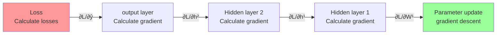

The Computation Graph automatically records the forward calculation path, and during back propagation the gradient is transferred along the path in the opposite direction. PyTorch's `autograd` mechanism is based on this principle. Users only need to define forward calculations, and the framework automatically completes gradient calculations.

### A minimal numerical example of backpropagation
{: id="一个最小反向传播数值例子"}

Consider the simplest single hidden layer network: $y = w_2 \cdot \sigma(w_1 \cdot x)$, with loss $\mathcal{L} = \frac{1}{2}(y - t)^2$. Set $x=1, w_1=0.5, w_2=0.8, t=0.5$, activate $\sigma$ and take Sigmoid.

**forward**:

$$z_1 = w_1 x = 0.5, \quad a_1 = \sigma(0.5) \approx 0.622, \quad y = w_2 a_1 \approx 0.498, \quad \mathcal{L} \approx 2\times 10^{-6}$$

**reverse** (chain rule stepwise backtracking):

$$\frac{\partial \mathcal{L}}{\partial y} = y - t \approx -0.002$$

$$\frac{\partial \mathcal{L}}{\partial w_2} = \frac{\partial \mathcal{L}}{\partial y} \cdot a_1 \approx -0.00124$$

$$\frac{\partial \mathcal{L}}{\partial a_1} = \frac{\partial \mathcal{L}}{\partial y} \cdot w_2 \approx -0.0016$$

$$\frac{\partial \mathcal{L}}{\partial z_1} = \frac{\partial \mathcal{L}}{\partial a_1} \cdot a_1(1-a_1) \approx -0.000376$$

$$\frac{\partial \mathcal{L}}{\partial w_1} = \frac{\partial \mathcal{L}}{\partial z_1} \cdot x \approx -0.000376$$

**observes**: the gradient $\partial \mathcal{L}/\partial w_2 \approx 10^{-3}$ near the output, the gradient $\partial \mathcal{L}/\partial w_1 \approx 10^{-4}$ near the input - even though there are only 2 layers, the gradients are attenuated by $\sim 3$ times. **Every additional layer in the deep network requires one more multiplication of $\sigma'(\cdot) \leq 0.25$**. This is the source of the vanishing gradient.

### Three variations of gradient descent
{: id="梯度下降的三种变体"}

There are three forms of gradient descent depending on the number of samples used per update:

|Variants|Number of samples used per update|Advantages|Disadvantages|
|:---|:---:|:---|:---|
|**Batch GD** (full batch)|the entire training set|Accurate gradient and stable convergence trajectory|The cost of one iteration is huge and big data cannot be utilized|
|**SGD** (random)| 1 |Minimal memory usage, gradient noise can escape saddle point|Severe convergence oscillation and low hardware utilization|
| **Mini-batch SGD** |$B$ (usually 32–4096)|Taking into account both efficiency and stability; compatible with GPU parallelism|Need to adjust the batch size super parameter|

**Modern deep learning almost all uses Mini-batch SGD**. The "SGD" spoken in the industry usually refers to the mini-batch version. The choice of batch size directly affects training stability, hardware utilization and final generalization - large batches converge quickly but generalization is slightly worse (Keskar et al., 2017 "On Large-Batch Training"), which is an important parameter adjustment dimension.

---

# 4. Classic network architecture
{: id="4-经典网络架构"}

## 4.1 Convolutional Neural Network
{: id="41-卷积神经网络"}

**Convolutional Neural Network (CNN)** is a standard architecture for processing grid-shaped data (images, time series signals). CNN imposes two key constraints on MLP:

**Receptive Field (receptive field)**: Each neuron only observes a local area of the input (such as the kernel of 3×3), rather than the entire image. Local patterns (edges, textures) in images can be detected using only local perception, without the need for a global view.

**Parameter Sharing (parameter sharing)**: Similar neurons in different positions share the same set of parameters (filter/convolution kernel). The same pattern (such as a horizontal edge) appearing anywhere in the image should be processed by the same detector - this constraint brings **translation equivariance (Translation Equivariance)**; only after pooling or global aggregation, the model will obtain a certain translation invariance.

### Core hyperparameters of convolutional layers
{: id="卷积层的核心超参数"}

|hyperparameters|meaning|Typical values|influence|
|:---|:---|:---:|:---|
| **Kernel Size** $k$ |Convolution kernel space size|3×3 (mainstream), 5×5, 7×7|Receptive field size; 3×3 is standard since VGG|
| **Stride** $s$ |Convolution sliding step size|1 (regular), 2 (downsampling)|When the step size is larger than 1, the space size is reduced and pooling is replaced.|
| **Padding** $p$ |edge padding pixels| "same" / "valid" |"same" maintains the output size, "valid" does not pad|
| **Dilation** $d$ |void rate|1 (conventional), 2, 4|Expand the receptive field without increasing parameters (DeepLab semantic segmentation)|
| **Channels** $C$ |Number of output feature maps| 64/128/256/512 |The number of channels in the same layer determines feature diversity|

**output space size formula**:

$$\text{out} = \left\lfloor \frac{\text{in} + 2p - d(k-1) - 1}{s} \right\rfloor + 1$$

Regular convolution ($d=1$) simplifies to $\text{out} = \lfloor (\text{in} + 2p - k)/s \rfloor + 1$.

### Special convolution
{: id="特殊卷积"}

|Type|core idea|representative model|function|
|:---|:---|:---|:---|
|**1×1 Convolution**|Linear combination of channels point by point| NiN, ResNet bottleneck |Change the number of channels, reduce dimensions and increase dimensions, and increase nonlinearity|
| **Depthwise Separable** |Depth convolution (channel-by-channel) + 1×1 point-by-point convolution| MobileNet, EfficientNet |The amount of parameters and calculations is reduced to $\sim 1/k^2$|
| **Dilated / Atrous** |The convolution kernel has "holes"| DeepLab |Expand the receptive field without adding parameters, suitable for dense prediction|
| **Transposed Conv** |Inverse convolution implements upsampling| FCN, GAN Generator |Upsampling for segmentation, generation tasks|
| **Grouped Conv** |Channel group independent convolution| AlexNet, ResNeXt |Reduce the amount of calculation and enhance feature diversity|

### Pooling layer (Pooling)
{: id="池化层pooling"}

Pooling is done on the feature map **Downsampling** , reduce the spatial size, expand the receptive field, and provide certain translation invariance. Pooling layer **No parameters to learn** .

|method|Operation|scene|
|:---|:---|:---|
| **Max Pooling** |Get the maximum value in the window|Extract the most significant features, the middle layer of CNN is most commonly used|
| **Average Pooling** |Take the mean within the window|Smooth feature, commonly used in early networks|
| **Global Average Pooling (GAP)** |Take the average of the entire feature map|**replaces the fully connected layer**, significantly reducing parameters (at the end of GoogLeNet and ResNet)|
| **Adaptive Pooling** |Specify output size and automatically calculate kernel|Adapt to different input resolutions|

> The meaning of **GAP**: The fully connected layer of VGG-16 occupies the 123M parameters (accounting for the total parameters 89%); this part can be omitted directly after switching to GAP. This is because the parameters of ResNet and EfficientNet are much smaller than those of VGG one of the key reasons.

A typical CNN consists of alternating convolutional layers (extracting features) and pooling layers (downsampling), finally followed by a fully connected layer or GAP output prediction. The following is the structure of LeNet-5 (LeCun, 1998), the foundational work of CNN:

<div align="center">
  
<figcaption>LeNet-5 architecture (LeCun et al., 1998): convolutional layer → pooling layer → convolutional layer → pooling layer → fully connected layer</figcaption>
</div>

### CNN architecture evolution comparison
{: id="cnn-架构演进对比"}

|model|Year|Parameter quantity| ImageNet Top-1 |key innovation|
|:---|:---:|:---:|:---:|:---|
| LeNet-5 | 1998 | ~60K | — (MNIST) |The foundation of CNN, convolution + pooling structure|
| AlexNet | 2012 | 60M | ~56.5% |GPU training, ReLU, Dropout|
| VGG-16 | 2014 | 138M | ~71.5% |Unified 3×3 convolution, deeper network|
| GoogLeNet | 2014 | 6.8M | ~69.8% |Inception module, greatly reducing parameters|
| ResNet-50 | 2015 | 25M | ~76.0% |Residual connections make extremely deep networks trainable|
| ResNet-152 | 2015 | 60M | ~77.8% |The error rate of Top-5 reported in classic papers is about 3.57%|
| SENet-154 | 2017 | ~115M | ~82.7% |Channel Attention (Squeeze-Excitation)|
| EfficientNet-B0 | 2019 | 5.3M | 77.1% |Compound scaling (NAS searches for optimal ratio)|
| EfficientNet-B7 | 2019 | 66M | 84.4% |Parameter efficiency is the best|
| ViT-B/16 | 2020 | 86M | ~81.8% |Pure Transformer for images|
| ConvNeXt-XL | 2022 | 350M | ~87.8% |CNN absorbs Transformer design concept|

> Key Insight: **ResNet-50 (25M parameters) outperforms VGG-16 (138M parameters)** with only 18%; **EfficientNet-B0 (5.3M) reaches the same accuracy as VGG**, and the number of parameters is only 4%. More parameters ≠ higher performance, architectural design is crucial.

### ResNet residual block structure
{: id="resnet-残差块结构"}

<div align="center">
  
<figcaption>ResNet residual block (He et al., 2016): output = F(x) + x, identity mapping allows the gradient to flow directly back to the shallow layer</figcaption>
</div>

---

## 4.2 Recurrent Neural Network and LSTM
{: id="42-循环神经网络与-lstm"}

**Recurrent Neural Network (RNN)** is specially designed to process sequence data and passes information between time steps through the hidden state $h_t$:

$$h_t = f(W_h h_{t-1} + W_x x_t + b)$$

RNN uses the same set of parameters **** $W_h, W_x$ at each time step, making it naturally adaptable to variable-length sequences. The following figure shows the "unfolding" of RNN in the time dimension:

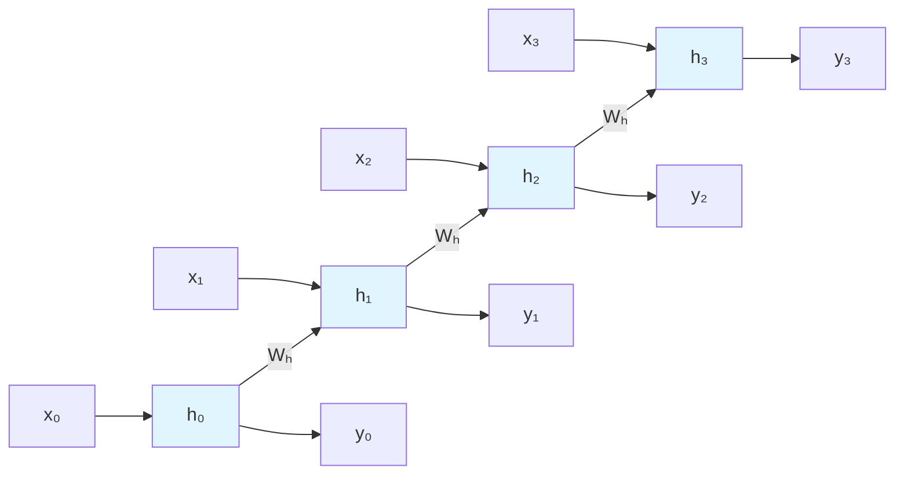

However, standard RNN faces serious **long-range dependencies** problem: when the gradient is backpropagated in the time dimension, the matrix $W_h$ needs to be multiplied $T$ times. When the maximum singular value of $W_h$ $< 1$, gradients decay exponentially with sequence length (**vanishing gradients**), $> 1$ exponentially explodes (**exploding gradients**), making it difficult for the model to remember distant contexts.

**LSTM (Long Short-Term Memory, Hochreiter & Schmidhuber, 1997)** solves this problem by introducing **gating mechanism (Gating Mechanism)**:

<div align="center">
  
<figcaption>LSTM chain structure (Colah, 2015): Cell state (top horizontal line) runs through the entire sequence, carrying long-term memory</figcaption>
</div>

LSTM maintains two states: hidden state $h_t$ (short-term memory) and cell state $c_t$ (long-term memory).

**Internal data flow of a single LSTM cell**:

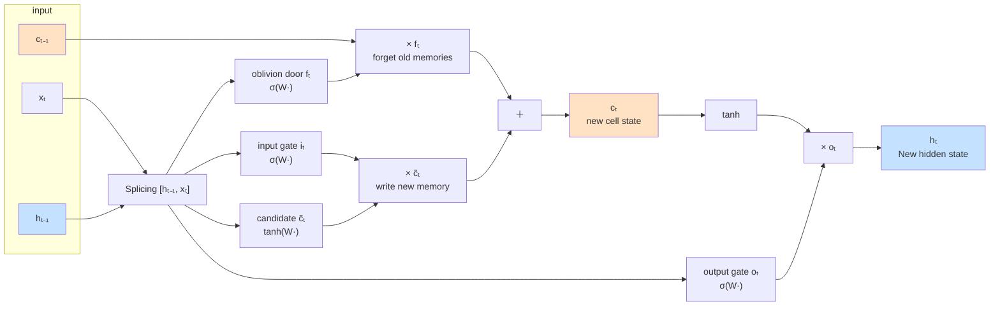

**cell status update formula**:

$$c_t = f_t \odot c_{t-1} + i_t \odot \tilde{c}_t$$

|components|formula|function|
|:---|:---|:---|
|Forgotten Door $f_t$| $\sigma(W_f [h_{t-1}, x_t] + b_f)$ |Decide how much historical cell state to forget|
|Input gate $i_t$| $\sigma(W_i [h_{t-1}, x_t] + b_i)$ |Decide how much new information to write|
|Candidate value $$\tilde{c}_t$$| $\tanh(W_c [h_{t-1}, x_t] + b_c)$ |Calculate new information to be written|
|Output gate $o_t$| $\sigma(W_o [h_{t-1}, x_t] + b_o)$ |Decide how many cell states to use as output|

**Why can gating alleviate vanishing gradients?** Cell state update $c_t = f_t \odot c_{t-1} + \ldots$ is a **additive** path (compare to RNN's multiplicative recursion $h_t = f(Wh_{t-1} + \ldots)$). When forgetting gate $f_t \approx 1$, $c_{t-1}$ is passed to $c_t$ with almost no attenuation, and the gradient can remain stable when back propagating along the cell state - similar to ResNet's skip connection, but occurring in the time dimension rather than the depth dimension.

### GRU: a simplified version of LSTM
{: id="grulstm-的简化版"}

**Gated Recurrent Unit (GRU, Cho et al., 2014)** simplifies the 3 gates of LSTM into 2 gates, and merges the cell state and hidden state:

$$r_t = \sigma(W_r [h_{t-1}, x_t]) \quad \text{(reset gate)}$$

$$z_t = \sigma(W_z [h_{t-1}, x_t]) \quad \text{(update gate)}$$

$$\tilde{h}_t = \tanh(W_h [r_t \odot h_{t-1}, x_t])$$

$$h_t = (1-z_t) \odot h_{t-1} + z_t \odot \tilde{h}_t$$

|Dimensions| LSTM | GRU |
|:---|:---:|:---:|
|Number of gates| 3(f, i, o)| 2(r, z)|
|Number of states| 2(h, c) | 1(h) |
|Number of parameters (same hidden layer dimensions)|4 set of weights|3 set weight|
|Convergence speed|slower|faster|
|Long-range dependency modeling|Stronger (cell state protection)|Slightly weak but enough|
|Engineering scene|Long sequences, complex tasks|Short sequence, limited resources|

**Empirical conclusion**: Chung et al., 2014 System experiments show that GRU and LSTM have equivalent performance on most tasks. GRU has fewer parameters and faster training, and is more commonly used in short and medium sequence tasks (conversation, emotion classification); LSTM still has advantages in tasks that require strict long-term memory (machine translation of long sentences, speech recognition).

### Bidirectional RNN
{: id="双向-rnnbidirectional-rnn"}

The standard RNN can only utilize the information of **past** (from left to right). But for many tasks (named entity recognition, sentiment analysis, reading comprehension), the context of **and future** is equally critical - for example, to determine whether "bank" is "bank" or "river bank", you need to look at the following words.

**Bidirectional RNN (Schuster & Paliwal, 1997)** runs RNN in two directions at the same time, output splicing:

$$\overrightarrow{h}_t = \text{RNN}_\text{fwd}(x_t, \overrightarrow{h}_{t-1}), \quad \overleftarrow{h}_t = \text{RNN}_\text{bwd}(x_t, \overleftarrow{h}_{t+1})$$

$$h_t = [\overrightarrow{h}_t; \overleftarrow{h}_t]$$

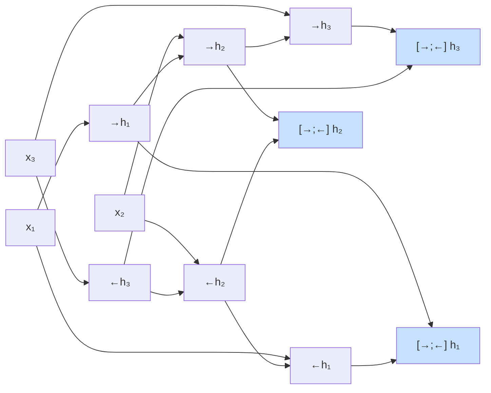

**Limitations**: Bidirectional RNN must see the entire sequence to calculate, **cannot be used for autoregressive generation tasks** (no future information when generating the next word). Therefore:
- **is suitable for**: sequence annotation, classification, NER, and reading comprehension (BiLSTM-CRF was the mainstream solution for NER in the years 2016–2018)
- **is not suitable for**: Decoder side of language model and machine translation

BERT's MLM (Masked Language Model) can be seen as Transformer's generalization of "bidirectional modeling" - ensuring that bidirectional attention does not leak the target through mask.

### Teacher Forcing: Key techniques for training sequence generative models
{: id="teacher-forcing训练序列生成模型的关键技巧"}

There is a subtle choice when training a Seq2Seq / RNN Decoder - what is the input when decoding step $t$?

|Strategy|Enter step $t$|Advantages|Disadvantages|
|:---|:---|:---|:---|
| **Teacher Forcing** |**real label** $y_{t-1}$|Stable training and fast convergence|Training-inference distribution is inconsistent (inference uses its own predictions)|
| **Free Running** |**model prediction** $$\hat{y}_{t-1}$$|completely consistent with the reasoning|In the early stages of training, the model prediction is very poor, errors cascade, and it is difficult to converge.|
| **Scheduled Sampling** |Sample true or predicted by probability $p$ (Bengio et al., 2015)|Compromise plan, gradual switch|Need to adjust schedule hyperparameters|

Problems with **Teacher Forcing**——**Exposure Bias**: The model has never "seen" its own wrong predictions during training. Once a certain step of prediction is biased during inference, it will go further and further wrong (the prototype of error accumulation/hallucination).

**Modern solution**:
- **Scheduled Sampling**: Gradually mixed into model prediction in the later stage of training
- **Minimum Risk Training / REINFORCE**: directly use the overall quality of the generated sequence as the training signal
- **Transformer + Causal Masking**: Compute all positions in parallel at once (see §4.3). It is still essentially Teacher Forcing, but the efficiency is much higher than RNN stepwise recursion.

*Representative work*: GRU (2014, a simplified version of LSTM), Seq2Seq (2014), Attention + LSTM (2015), Bidirectional LSTM (proposed by 2005, BiLSTM-CRF 2016 widely used)

---

## 4.3 Transformer
{: id="43-transformer"}

**Transformer** (Vaswani et al., 2017) has completely changed NLP and even the entire deep learning landscape. It completely abandons loops and convolutions, and only directly models the global dependence between any two positions in the sequence through the **self-attention mechanism (Self-Attention)**.

<div align="center">
  
<figcaption>Self-Attention architecture: Query, Key, Value After linear projection, the attention weight is calculated through scaling dot product and weighted summation is performed to obtain the output</figcaption>
</div>

### Core Mechanism: Scaled Dot-Product Attention
{: id="核心机制缩放点积注意力"}

$$\text{Attention}(Q, K, V) = \text{softmax}\left(\frac{QK^T}{\sqrt{d_k}}\right)V$$

- **Query (Q)**: represents "what am I looking for" (such as the current word).
- **Key (K)**: stands for "what characteristics do I have" (used to match Q).
- **Value (V)**: represents "the information I want to transmit" (the content after successful matching).
- **$\sqrt{d_k}$ Scaling**: When the dimension is large, the dot product result may be extremely large, causing softmax to enter a region with extremely small gradients. Scaling keeps gradients stable.

**A specific example: the sentence "The cat sat on the mat"**

Let's say the model is processing the verb "sat" and it needs to find "who sat down" (the subject). The weights below are for visual illustration only and are not the output of a real model:

| Token |Q(What are you looking for?)|K(What am I?)|V (What can I offer?)|
|:---|:---|:---|:---|
| The |determiner context|qualifier|No substantive information|
| **cat** | — |**noun, singular, biological**|**"cat" semantic vector**|
| **sat** |**Find a singular noun subject that can do an action**|past tense verb|"sit" action semantics|
| on |positional prepositional complement|preposition|positional relationship|
| the |determiner context|qualifier|No substantive information|
| mat |noun, singular, object|noun, singular, object|"mat" semantic vector|

- The dot product of Q**of**sat and K**of**cat is the largest (matching "singular noun subject"), and the attention weight after softmax is $\approx 0.7$
- There is also a certain match (noun) between Q**of**sat and K**of**mat, but the semantic role is wrong and the weight is $\approx 0.15$
- The final output of sat $\approx 0.7 \cdot V_\text{cat} + 0.15 \cdot V_\text{mat} + \ldots$ - **mainly absorbs the semantics of cat**

This is how Attention works: **each token broadcasts a "query", all tokens respond with "How many do I match", and finally the aggregated information** is weighted by the degree of match. Q/K/V are generated from three different linear projections $W_Q, W_K, W_V$ from the same input, this flexibility allows the model to learn a variety of complex information routing patterns.

### Multi-Head Attention
{: id="多头注意力multi-head-attention"}

Map the input to $h$ different subspaces to calculate the attention separately, and then splice the results:
$$\text{MultiHead}(Q,K,V) = \text{Concat}(head_1, \ldots, head_h) W^O$$
**Intuition**: Different "heads" can focus on different information at the same time (for example, one head focuses on grammatical relationships and the other on semantic relationships).

<div align="center">
  
Schematic diagram of the<figcaption>multi-head attention mechanism (Multi-Head Attention) architecture. The left is scaling dot product attention, and the right is multi-head attention</figcaption>
</div>

### Attention variants: MHA → MQA → GQA → MLA
{: id="attention-变体mha--mqa--gqa--mla"}

As the context of large models becomes longer, the GPU memory usage of KV Cache (which caches K and V of all historical tokens during inference) becomes a bottleneck. For this reason, the multi-head structure of Attention has evolved into multiple variants, the core of which are **reducing the number of K/V heads** to compress the KV Cache:

|Variants|Year|K/V number of heads|KV Cache vs. MHA|representative model|
|:---|:---:|:---:|:---:|:---|
| **MHA**(Multi-Head Attention)| 2017 |Each Q head independent K/V (total $h$ group)| 100% |Original Transformer, GPT-2|
| **MQA**(Multi-Query Attention)| 2019 |All Q heads share 1 group K/V| $1/h$ | PaLM, Falcon |
| **GQA**(Grouped-Query Attention)| 2023 |Q header grouping, K/V shared within the group (total $g$ group, $1 < g < h$)| $g/h$ | **LLaMA-2/3, Mixtral, Qwen** |
| **MLA**(Multi-head Latent Attention)| 2024 |K/V low-rank compression to latent space| $\sim 5-13\%$ | DeepSeek-V2/V3 |

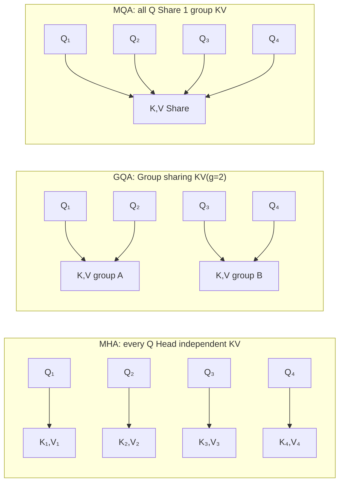

**Why GQA is often used**: MQA presses K/V to the 1 group, which may cause quality loss; MHA's KV Cache is larger. GQA is a compromise between quality and GPU memory - e.g. LLaMA-2 70B uses 8 groups, 64 Q heads, and the KV Cache is about MHA's 1/8; Actual gains still depend on model and task.

**MLA's innovation**: DeepSeek uses a low-rank matrix to compress K/V into a $\sim$128-dimensional latent space. Only the latent vector is cached during inference, and the complete K/V is restored when needed. GPU memory has significant advantages in extremely long contexts.

### Key components
{: id="关键组件"}

**1. Positional Encoding**

Why does **need position encoding?**
The core of Transformer - the self-attention mechanism is **permutation equivariant (Permutation Equivariant) when there is no position encoding.**: The order of input tokens changes, and the output will also be rearranged in the same way. When calculating $O = \sum \alpha_i V_i$, the model has no additional clues to determine the order, so the sentences "you hit me" and "I hit you" cannot be reliably distinguished, and position information must be injected.

<div align="center">
  
<figcaption>absolute position encoding</figcaption>
</div>

**Absolute position encoding: Sinusoidal design**
The original Transformer constructs a position vector using predefined sine and cosine functions:
$$PE_{(pos, 2i)} = \sin\left(\frac{pos}{10000^{2i/d_{model}}}\right)$$
$$PE_{(pos, 2i+1)} = \cos\left(\frac{pos}{10000^{2i/d_{model}}}\right)$$

<div align="center">
  
<figcaption>position encoding method</figcaption>
</div>

<div align="center">
  
<figcaption>position coding visualization: different dimensions correspond to sine and cosine waves of different periods, forming a unique position fingerprint</figcaption>
</div>

<div align="center">
  
<figcaption>multi-frequency pointer (1): The low dimension corresponds to the high-frequency pointer ("second hand"), which completes one revolution every few Tokens</figcaption>
</div>

<div align="center">
  
<figcaption>multi-frequency pointer (2): high-dimensional corresponding low-frequency pointer ("hour hand"), together forming a precise positioning fingerprint</figcaption>
</div>

**Intuition: multi-frequency pointer (Clock Hands)**
We can think of each pair of $(\sin, \cos)$ as a "pointer" on a two-dimensional plane.
- **low dimension ($i$ is small)**: high frequency, the pointer rotates extremely fast. Similar to the "second hand" of a clock, a few Tokens will complete a circle.
- **high dimension ($i$ is large)**: low frequency, pointer rotation is extremely slow. Similar to the "hour hand", it may take tens of thousands of Tokens to make one revolution.
Transformer is like observing a dashboard composed of dozens of pointers with different rotation speeds, thereby accurately locking the absolute position of the current Token in the sequence.

**Mathematical properties: Modeling relative position**
The subtlety of the author's choice of sine and cosine functions is that it allows the model to be expressed through linear transformations **relative position** . According to the angle formula of trigonometric functions, there is an equation that is only related to the relative distance $r$ The relevant transformation matrix $M_r$ , making:
$$PE_{pos+r} = M_r \cdot PE_{pos}$$
This means that the model can more easily capture the distance information between two words instead of just the absolute coordinates when calculating Attention.

**RoPE Position coding: Rotary Position Embedding design**

Absolute position encoding adds position information to the Input Embedding, which indirectly affects Attention; ALiBi forcibly subtracts the distance deviation from the Attention Score. RoPE chose another path: **directly encodes the position information into the vector itself** in a rotational manner before doing the inner product of Q and K.

<div align="center">
  
<figcaption>RoPE Position encoding: Each two dimensions are a group. According to the position m rotation mθ angle, the position information is encoded as the rotation amount</figcaption>
</div>

**Core idea: Use rotation instead of addition**

For each two dimensions of the vector ($d_0, d_1$), RoPE treats it as a vector on a two-dimensional plane, and then rotates the corresponding angle according to the location of the token $m$:

$$\text{K}^{(m)} = R(m\theta) \cdot \text{K}, \quad \text{Q}^{(m)} = R(m\theta) \cdot \text{Q}$$

The rotation matrix is a standard two-dimensional rotation matrix:

$$R(\alpha) = \begin{pmatrix} \cos\alpha & -\sin\alpha \\ \sin\alpha & \cos\alpha \end{pmatrix}$$

For the $d$-dimensional vector, all dimensions are grouped into two groups, a total of $d/2$ groups, each group uses a different base angle $\theta_i$:

$$\theta_i = 10000^{-2i/d}, \quad i = 0, 1, \ldots, \frac{d}{2}-1$$

This design is in line with Sinusoidal PE - different dimensions correspond to different frequencies, low dimensions rotate quickly and high dimensions rotate slowly, which together form a unique position fingerprint.

**RoPE How to naturally encode relative position?**

When Q is at position $m$ and K is at position $n$, the inner product of the two is:

$$\langle \text{Q}^{(m)}, \text{K}^{(n)} \rangle = \text{Q}^T \cdot R((m-n)\theta) \cdot \text{K}$$

The inner product result **only relies on the relative distance $m-n$** rather than the absolute coordinates. This is the neat thing about RoPE - there is no need to explicitly model relative distances like in Relative PE, the geometric nature of the rotation guarantees this automatically.

<div align="center">
  
The relative position properties of<figcaption>RoPE: Q and K rotate synchronously, and the inner product only depends on the relative distance m-n and has nothing to do with the absolute position</figcaption>
</div>

**Geometric Proof of Translation Invariance**

Assume that "cat" is at position 1 and "fish" is at position 3, calculate the Attention value $A$. Now insert 100 unrelated tokens in front, "cat" changes to position 101, and "fish" changes to position 103. The relative distance between the two **remains unchanged** (still 2), and the rotation angle $(m-n)\theta$ in the inner product remains unchanged, so the Attention value is still equal to $A$.

The geometry is more intuitive: Q rotates $N\theta$, K rotates $N\theta$, both rotate synchronously, and the inner product (the cosine of the included angle) remains unchanged.

Compatibility of **with engineering acceleration**

RoPE only modified Q and K itself. The calculation process of Attention is exactly the same as the original version, so it is naturally compatible with all Attention acceleration technologies:
- **Flash Attention**: directly available without modifying the operator;
- **KV Cache**: Directly cache the rotated $\text{K}^{(m)}$, read it out and use it without injecting the position again.

This is also one of the key engineering reasons why RoPE ultimately won - it is not only effective, but also perfectly compatible with the entire engineering ecosystem.

> **Common misunderstandings clarified**
>
> Many people think that RoPE guarantees "the farther the distance between Q and K, the smaller the Attention" like ALiBi. **Actually RoPE does not guarantee this** - rotation will produce a periodic oscillation pattern, and Attention fluctuates in a zigzag manner with distance.
>
> This is an advantage: RoPE allows the model to learn "although distant, but still highly relevant" Attention patterns (such as long-range dependence), while ALiBi hard suppresses long-range attention.


**Evolution of position encoding**:

|Plan|core idea|Features|representative model|
|:---|:---|:---|:---|
| **Absolute PE** |Sine and cosine may be learnable Embedding|Simple, but poor extrapolation (cannot handle sequences longer than trained)|BERT, original Transformer|
| **Relative PE** |Modeling the relative distance between $i$ and $j$|Focus on distances rather than absolute coordinates| T5 |
| **ALiBi** |Subtract distance bias from Attention Score|Extrapolation is extremely strong and calculation is extremely simple| MPT, Bloom |
| **RoPE** |Rotate $Q, K$ by a specific angle (rotation position embedded)|Taking into account relative position information and engineering compatibility, it has been widely used| LLaMA, Qwen, Gemma |

**2. Point-wise feedforward network (Point-wise FFN)**
After each attention layer, a fully connected block (usually $d_{model} \to 4d_{model} \to d_{model}$) is followed to introduce nonlinear transformation:
$$\text{FFN}(x) = \text{max}(0, xW_1 + b_1)W_2 + b_2$$

**3. Residual connection and normalization (Add & Norm)**
Each sub-layer uses residual connections and cooperates with layer normalization (LayerNorm). There are currently two mainstream layouts:
- **Post-LN** (original version): First calculate the sub-layer and then add the residual to make LN. Good performance but difficult to train at deep level.
- **Pre-LN** (commonly used in modern large models): Do LN first and then calculate the sub-layer, which is usually easier to train stably; whether Warmup is needed still depends on the model, optimizer and training settings.

### The difference between Encoder and Decoder
{: id="encoder-与-decoder-的差异"}

Transformer uses an encoder-decoder architecture. The core difference between the two is the **masking (Masking)**:
- **Encoder**: Bidirectional attention, each word can see all words in the sequence.
- **Decoder**: Use **Masked Self-Attention** to ensure that only the first $t-1$ words can be seen when generating the $t$ word (to prevent information leakage); it also contains **Cross-Attention**, used to pay attention to the output of the Encoder.

The specific form of **causal mask (Causal Mask)** - a lower triangular matrix of $n \times n$ (taking the sequence length 4 as an example):

| | $k_1$ | $k_2$ | $k_3$ | $k_4$ |
|:---:|:---:|:---:|:---:|:---:|
| $q_1$ | ✓ | −∞ | −∞ | −∞ |
| $q_2$ | ✓ | ✓ | −∞ | −∞ |
| $q_3$ | ✓ | ✓ | ✓ | −∞ |
| $q_4$ | ✓ | ✓ | ✓ | ✓ |

**implements**: before softmax, set the attention score of the mask position to $-\infty$ (actually use a large negative number such as `-1e9`), and after softmax, the weight of these positions becomes 0. This ensures the causality of "the $t$ token can only see the position of $\leq t$", and also realizes parallelization of Teacher Forcing during training - no longer recursive step by step like RNN, but forward prediction of the next token at all positions at once.

### Attention visualization: What did the model really learn?
{: id="attention-可视化模型真的学到了什么"}

One of the greatest charms of Attention is **Interpretability** ——The attention weight of each head in each layer can be directly visualized as a heat map, revealing the "attention mode" of the model. Typical findings:

|attention pattern|Example|explain|
|:---|:---|:---|
|**refers to digestion head**|The attention of "it" in "The cat ... it was hungry" points to "cat"|Certain headers specialize in handling pronominal reference|
|**Syntax header**|Verbs focus on their subjects and objects; adjectives focus on the noun they modify.|Implicitly learned grammatical dependencies|
|**position head**|Each token focuses on the immediately preceding or following one|Capturing local bigram patterns|
|**delimiter header**|All tokens focus on [SEP] or punctuation|Equivalent to "global information pool"|
|**Redundant head**|Similar in height to other heads|Reasons why Attention Head Pruning works|

Tools such as BertViz (Vig, 2019) and attention-flow (Abnar & Zuidema, 2020) can interactively display these patterns. Clark et al., 2019 "What Does BERT Look At?" systematically analyzed BERT's 144 headers and found that a large number of **headers capture clearly interpretable syntax/semantic functions** - this is important evidence that Transformer transcends the "black box" label.

<div align="center">
  
<figcaption>Transformer architecture (Vaswani et al., 2017 "Attention Is All You Need")</figcaption>
</div>

### RNN vs Transformer comparison
{: id="rnn-与-transformer-对比"}

|Dimensions| RNN/LSTM | Transformer |
|:---|:---|:---|
|**calculation method**|Sequential recursion, cannot be parallelized|Fully parallel computing, extremely high hardware utilization|
|**long-range dependence on**|Decays exponentially with distance, making it difficult to capture very long text|The distance between any two positions is always 1, no information loss|
|**Context scope**|local context|global context|
|**Inductive bias**|Strong (timing correlation)|Weak (fully connected), more data training is needed|
|**GPU memory complexity**| $O(n \cdot d^2)$ |$O(n^2 \cdot d)$, GPU memory is under heavy pressure under long sequences.|

*Representative work*: BERT (2018, pure Encoder), GPT series (2018-to date, pure Decoder), T5 (2019, Encoder-Decoder), ViT (2020, treat image blocks as sequences).

### Vision Transformer (ViT): Transformer enters the visual field
{: id="vision-transformervittransformer-进入视觉领域"}

**ViT (Vision Transformer, Dosovitskiy et al., 2020)** proved for the first time that pure Transformer can **directly defeat CNN** in processing image tasks with sufficient data, ending the nearly ten-year dominance of CNN in the field of vision.

**Core Design**: Treat images as "sentences"

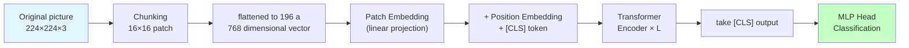

**Key steps**:

1. **Patch Split**: Cut the $224 \times 224$ image into $14 \times 14 = 196$ patches of $16 \times 16$
2. **Patch Embedding**: Each patch is flattened into a $16 \times 16 \times 3 = 768$ dimensional vector, and the token is obtained through linear projection
3. **[CLS] Token**: Add a learnable "[CLS]" token before the sequence, and its final output is used for classification
4. **Position Embedding**: Add learnable position encoding (ViT uses learnable PE instead of Sinusoidal)
5. **Transformer Encoder**: Standard Transformer stack, usually 12–32 layers
6. **classification head**: take [CLS] output and connect to MLP

### Inductive Bias and Data Requirements for ViT
{: id="vit-的归纳偏置与数据需求"}

|Contrast Dimensions| CNN | ViT |
|:---|:---|:---|
|**induction bias**|Strong (locality, translation invariance)|Weak (almost no a priori assumptions)|
|**small data performance**|Excellent (bias helps fast convergence)|Difference (requires massive data to make up)|
|**Big data performance**|Saturates faster|Continue to improve, eventually surpassing CNN|
|**Feeling Wild**|The shallow layer is small and the deep layer gradually expands.|The first level is the global|

**Empirical conclusion (ViT original paper)**:
- Data < 1M (such as ImageNet-1k): ViT is significantly worse than ResNet
- Data ~14M (ImageNet-21k): ViT ties ResNet
- Data ~300M (JFT-300M): ViT significantly outperforms

This verifies a core principle of deep learning: **less inductive bias × more data = more flexible architecture and higher upper limit**.

### The evolution of ViT
{: id="vit-的演进"}

|model|Year|key innovation|
|:---|:---:|:---|
| **ViT** | 2020 |The pioneering work of pure Transformer for image processing|
| **DeiT** | 2020 |Distillation strategy + data augmentation, training on ImageNet-1k can achieve SOTA|
| **Swin Transformer** | 2021 |Hierarchical window attention, reintroducing local inductive bias; taking into account efficiency and generalization|
| **MAE** | 2021 |Mask self-supervised pre-training (random mask 75% patch), ViT pre-training new paradigm|
| **DINOv2** | 2023 |self-supervised ViT reaches the level of general vision foundation model|
| **SigLIP / CLIP** | 2021-2023 |ViT serves as an image encoder for image-text comparison learning, driving multi-modal large models.|

ViT not only replaces CNN as the visual backbone, but more importantly **allows images and text to share the same Transformer architecture** - this is the basis for large multi-modal models such as CLIP, LLaVA, and GPT-4V to unify vision and language in a concise way.

---

## 4.4 Graph Neural Network (GNN)
{: id="44-图神经网络gnn"}

CNN processes grid data and RNN/Transformer processes sequences, but in reality a large amount of data is a **graph (Graph)** structure - a user-item bipartite graph of social networks, molecular structures, knowledge graphs, and recommendation systems. This type of data has a variable number of nodes, no fixed order, and an uncertain number of neighbors. The regular structure assumptions of CNN/RNN no longer hold true. **Graph Neural Network (GNN)** is specially designed for this type of non-Euclidean data.

### Core mechanism: Message Passing
{: id="核心机制消息传递message-passing"}

The unified paradigm of GNN is **neighborhood aggregation**: each node repeatedly "collects neighbor information → aggregates → updates its own representation". The update of layer $l$ can be written as:

$$h_v^{(l+1)} = \sigma\!\left( W^{(l)} \cdot \text{AGG}\big(\{ h_u^{(l)} : u \in \mathcal{N}(v) \}\big) + B^{(l)} h_v^{(l)} \right)$$

Here, $$\mathcal{N}(v)$$ is the neighbor set of node $v$, $\text{AGG}$ is the aggregation function (sum/mean/maximum/attention weighting) of **permutation-invariant**, and $\sigma$ is nonlinear. After stacking $L$ layers, each node can perceive the subgraph structure within $L$ hops - this is the same as CNN expanding the receptive field layer by layer.

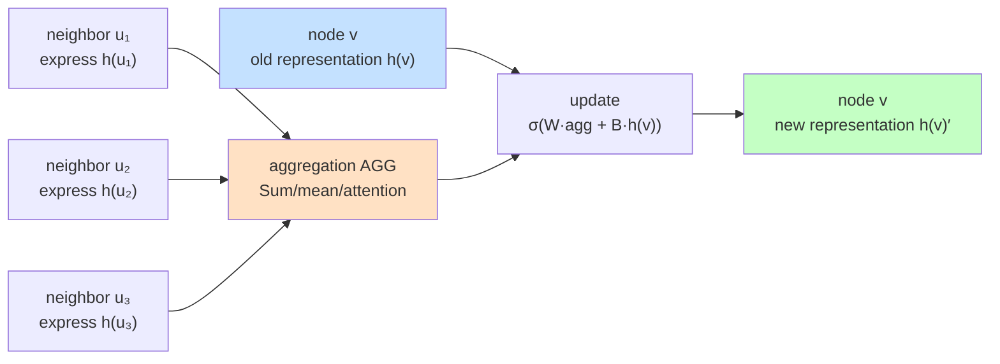

### Classic GNN comparison
{: id="经典-gnn-对比"}

|model|Year|Aggregation method|Key features|
|:---|:---:|:---|:---|
| **GCN**(Kipf & Welling)| 2017 |degree normalized weighted sum|First-order approximation of spectral graph convolution, the most classic baseline|
| **GraphSAGE**(Hamilton et al.)| 2017 |Sampling Neighbors + Mean/Pooling|**Inductive**, can generalize to unseen nodes, suitable for large graphs|
| **GAT**(Veličković et al.)| 2018 |Attention Weighted Neighbors|Introducing attention and adaptively assigning weights to each neighbor|
| **GIN**(Xu et al.)| 2019 |Sum + MLP|Theoretically, it reaches the discriminant upper bound of WL graph isomorphism test and has the strongest expressive power.|

### Task types and core challenges
{: id="任务类型与核心挑战"}

GNN Three types of tasks: **node level** (node classification, such as determining the topic of a paper in a citation network), **edge level** (link prediction, such as recommendation system), **graph level** (whole graph classification, such as molecular property prediction).

> **Main challenge - Over-smoothing**: When the number of layers is too deep, all nodes express convergence and lose discriminability. Therefore, GNN usually only uses the 2–4 layer, which is much shallower than CNN/Transformer. Residual connections, jump knowledge (JKNet), PairNorm, etc. are common mitigation methods.

The relationship between **and Transformer**: **Transformer can be regarded as GNN** defined on a fully connected graph - each token is a node, and self-attention aggregates all other nodes with attention weight. GAT's neighbor attention has the same origin as Transformer's self-attention. In recent years, **Graph Transformer** (such as Graphormer) has migrated position coding and global attention to graphs, achieving SOTA in graph-level tasks such as molecules.

*Representative work*: GCN (2017), GraphSAGE (2017), GAT (2018), GIN (2019), Graphormer (2021); applications cover AlphaFold (protein residue contact graph), drug discovery, traffic prediction and recommendation systems.

---

# 5. Training optimization technology
{: id="5-训练优化技术"}

## 5.1 Gradient Descent and Optimizer
{: id="51-梯度下降与-optimizer"}

The updated formula of the standard **gradient descent** is:

$$\theta_{t+1} = \theta_t - \eta \cdot g_t$$

Here, $\eta$ is the learning rate, and $g_t$ is the gradient of Loss to the parameters. In this way, all parameters share the same learning rate. However, in the actual loss surface, the gradients in different directions are very different, and it is difficult to take into account the fixed learning rate. This gave rise to the adaptive optimizer.

### Momentum method: rolling down a hill like a ball
{: id="动量法像小球一样滚下山"}

**Momentum** (Polyak 1964, re-developed by Sutskever et al., 2013 in deep learning) simulates the inertia of a small ball rolling down a hillside in physics:

$$v_t = \beta \cdot v_{t-1} + g_t \quad \text{(velocity accumulation)}$$

$$\theta_{t+1} = \theta_t - \eta \cdot v_t$$

in $\beta \in [0, 1)$ is the momentum coefficient (typical value $0.9$ ),  $v_t$ is gradient **exponential moving average** ——Equivalent to "inertia".

**Physical intuition**:

|scene|Ordinary SGD| Momentum SGD |
|:---|:---|:---|
|**canyon type loss** (one side is steep and one side is flat)|Oscillating back and forth between steep walls, progressing extremely slowly|The shock is accumulated and offset, leaving only the net movement along the bottom, **accelerating forward**|
|**flat area** (small gradient)|Very small steps, almost stagnant|The speed accumulates multi-step small gradients, **continues to move forward**|
|**Saddle Point** (saddle point)|Stagnation near zero gradient|Momentum helps escape saddle points|
|**sharp local minimum**|easy to fall into|Momentum may carry the optimizer past shallow local minima|

**Nesterov Accelerated Gradient (NAG)** is an improved version of momentum: it first "takes a step ahead" according to the current momentum and calculates the gradient at the predicted position, making the inertia more sensitive to the upcoming slope - "look-ahead momentum".

$$v_t = \beta \cdot v_{t-1} + \nabla \mathcal{L}(\theta_t - \eta\beta v_{t-1})$$

Enabled in PyTorch via `torch.optim.SGD(momentum=0.9, nesterov=True)`.

### Optimizer evolution
{: id="优化器演进"}

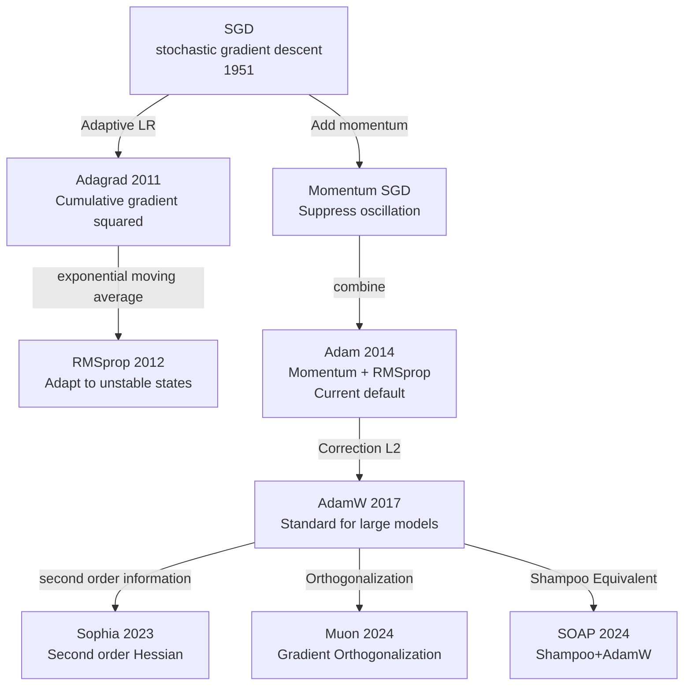

### Comparison of mainstream optimizers
{: id="主流优化器对比"}

|optimizer|Year|momentum|Adaptive LR|Core features|Applicable scenarios|
|:---|:---:|:---:|:---:|:---|:---|
| SGD | — | ✗ | ✗ |Simple, sensitive to LR|CV fine tuning (combined with scheduling)|
| Momentum SGD | — | ✓ | ✗ |Suppress oscillation and cross the saddle|CV training|
| Adagrad | 2011 | ✗ | ✓ |Sparse feature friendly, LR decreases monotonically|NLP sparse scenario|
| RMSprop | 2012 | ✗ | ✓ |Exponential moving average, adapted to non-stationary conditions|RNN training|
| **Adam** | 2014 | ✓ | ✓ | Momentum + RMSprop |Selected by default for most tasks|
| **AdamW** | 2017 | ✓ | ✓ |Adam + Correct Weight Decay|Standard large language model pre-training|
| Sophia | 2023 | ✓ | ✓ |Second-order Hessian estimate|LLM pre-training (paper statement about 2× acceleration)|
| Muon | 2024 | ✓ | ✗ |Gradient Orthogonalization|Small and medium-sized pre-training|
| SOAP | 2024 | ✓ | ✓ |Shampoo equivalent + AdamW|Large batch LLM training|

> Note: The acceleration ratio of Sophia/Muon/SOAP comes from the experimental results of the original paper under specific settings. The actual performance varies greatly due to model size, data distribution, and hyperparameter tuning. In the production environment, AdamW is still the most empirically stable default choice.

**Adam’s core formula** (Kingma & Ba, 2014):

$$m_t = \beta_1 m_{t-1} + (1-\beta_1)g_t \quad \text{(first moment)}$$

$$v_t = \beta_2 v_{t-1} + (1-\beta_2)g_t^2 \quad \text{(second moment)}$$

$$\hat{m}_t = \frac{m_t}{1-\beta_1^t}, \qquad \hat{v}_t = \frac{v_t}{1-\beta_2^t}$$

$$\theta_{t+1} = \theta_t - \frac{\eta}{\sqrt{\hat{v}_t}+\epsilon}\hat{m}_t$$

Standard hyperparameters: $\beta_1=0.9$, $\beta_2=0.999$, $\epsilon=10^{-8}$. Adam's $m_t$ is responsible for the direction (can cross the saddle point); $v_t$ is responsible for the size (adaptive adjustment of the learning rate of each parameter). The two complement each other and jointly solve the two core problems of gradient descent.

## 5.2 Learning rate scheduling
{: id="52-学习率调度"}

There is a contradiction between a fixed learning rate that is too large (oscillation) and too small (too slow). Standard solution for large language model training: **Warmup + Cosine Decay**

|training phase|Relative LR|Description|
|:---:|:---:|:---|
|Starting point (step 0)| 0 |Linear heating from zero|
|Warmup ends|1.0 (peak value)|Reach target learning rate|
|mid-training| ~0.5 |Cosine decay through half way|
|end of training| ~0.05 |Close to zero, the parameters slowly "land"|

|stage|Description|purpose|
|:---|:---|:---|
|**Warmup (preheat)**|In the first few steps, LR increases linearly from 0 to the target value.|Let Adam's $m_t$/$v_t$ accumulate accurate statistics to avoid initial instability|
|**Cosine Decay (cosine decay)**|LR drops to close to 0 according to the cosine curve|Let the parameters "land" slowly to avoid continuous oscillation near the optimal point|

### Other commonly used schedulers
{: id="其他常用调度器"}

|Scheduler|Curve characteristics|Applicable scenarios|
|:---|:---|:---|
| **StepLR** |Multiply LR by $\gamma$ every $k$ epoch (e.g. 0.1)|CV classic training (ResNet original paper 30/60/90 epoch reduced to 10×)|
| **MultiStepLR** |descend the ladder at the specified epoch list|Manual version of StepLR, precise control|
| **ExponentialLR** |$\eta_t = \eta_0 \cdot \gamma^t$, proportional attenuation in each step|Scenes that require smooth attenuation|
| **ReduceLROnPlateau** |Validation set Loss stagnated and dropped to LR after $p$ epochs|Adaptive; no need to know the total epochs in advance|
| **Cosine Annealing Warm Restart** |The cosine decays to 0 and then "restarts" back to high LR, with period increment (SGDR)|Escape from local optimality and integrate multiple checkpoints|
| **1Cycle**(Leslie Smith, 2018) |First rise and then fall + Momentum reversely changes synchronously|CV fast training (recommended by FastAI)|
| **Warmup + Linear Decay** |Linear decay after warmup|BERT original paper, GLUE fine-tuning commonly used|
|**Warmup + Cosine** (currently mainstream)|Cosine decay after warm-up|**Large language model pre-training standard**|

**selection principle**:

- **trains from scratch CNN**: StepLR or Cosine Annealing (Warm Restart for long training)
- **fine-tuned pretrained model**: Warmup + Linear/Cosine (low peak LR, usually $1-5 \times 10^{-5}$)
- **LLM pre-training**: Warmup + Cosine (peak LR $\sim 3 \times 10^{-4}$, Warmup accounts for 0.5–2%)
- **validation set available and uncertain number of epochs**: ReduceLROnPlateau
- **Rapid Prototyping/Competition**: 1Cycle (Smith said it can achieve "super-convergence" effect)

## 5.3 Parameter initialization
{: id="53-参数初始化"}

Different initial parameters $\theta_0$ may lead to convergence to different local optimal solutions.

**Xavier initializes** (Glorot & Bengio, 2010, suitable for symmetric activation such as Sigmoid/Tanh):

$$W \sim \mathcal{N}\left(0, \frac{2}{n_{in}+n_{out}}\right)$$

This method takes into account the variance stability of forward activation and reverse gradient, and is the default choice for symmetric activation functions.

**Kaiming initializes** (He et al., 2015, suitable for ReLU activation):

$$W \sim \mathcal{N}\left(0, \frac{2}{n_{in}}\right)$$

ReLU will set half of the input to zero, and Xavier's variance assumption no longer holds, so Kaiming amplifies the variance 2 times to compensate. This initialization keeps the activation value variance stable in the early stages of dozens of layers of ReLU network training, preventing it from exploding or disappearing.

**Selection Principle**: Sigmoid/Tanh commonly used Xavier, ReLU and its variants commonly used Kaiming; the actual initialization also needs to be combined with the residual structure, normalization and framework default implementation.

**pre-training as initialization (Pre-training)**: train on large-scale data first, and then transfer parameters to the target task. Improve Optimization (better starting point) and Generalization (learn common features) at the same time.

## 5.4 Normalization method
{: id="54-归一化方法"}

**Normalization (Normalization)** forces the output of each layer of the network to be within a reasonable range, making the loss surface flatter and the learning rate easier to adjust.

### Comparison of normalization methods
{: id="归一化方法对比"}

|method|Year|normalized dimensions|Depends on Batch|Applicable scenarios|representative model|
|:---|:---:|:---|:---:|:---|:---|
| **Batch Norm (BN)** | 2015 |Cross-sample, same feature dimension| ✓ |CNN image classification| ResNet, EfficientNet |
| **Layer Norm (LN)** | 2016 |Single sample, all features| ✗ |Transformer, sequence model|BERT, GPT series|
| Group Norm | 2018 |Single sample, group features| ✗ |Small batch CV (target detection)| Mask R-CNN |
| Instance Norm | 2017 |Single sample, single channel| ✗ |Image style transfer| StyleGAN |
| **RMSNorm** | 2019 |One sample (rms scaling)| ✗ |LLM efficient training|LLaMA, Qwen et al.|

**Batch Normalization(BN, Ioffe & Szegedy, 2015)**: 

$$\hat{x} = \frac{x - \mu_{batch}}{\sqrt{\sigma_{batch}^2 + \epsilon}}, \quad y = \gamma\hat{x} + \beta$$

Here, $\gamma, \beta$ is a learnable scaling and translation parameter, which gives the model the ability to "cancel normalization".

#### Key differences between BN training and inference
{: id="bn-训练与推理的关键差异"}

BN behaves differently during training and inference, which is the most common pitfall in engineering practice:

|stage|$\mu, \sigma^2$ Source|behavior|
|:---|:---|:---|
|**training**|Current mini-batch real-time calculation|The mean variance of each batch is slightly different, and noise is introduced to regularize; `running_mean`/`running_var` (exponential moving average) is updated at the same time|
|**reasoning**|Training accumulated `running_mean`/`running_var`|It has nothing to do with batch, ensuring that the same input will get the same output|

> **Common bug**: In PyTorch, `model.eval()` will automatically enable running stats when switching to inference mode; if you forget to call it, the current batch statistics will still be used during inference, resulting in randomization of the output when batch size=1.

#### Limitations of BN and the necessity of LN
{: id="bn-的局限与-ln-的必要性"}

BN has three fatal shortcomings, which correspond to the three reasons why Transformer chose LN:

|question|BN performance|LN performance|
|:---|:---|:---|
|**Batch too small**|The statistics become noisy and become unstable in extremely small batches.|It has nothing to do with batch, batch=1 is also available|
|**sequence length change**|Different samples have different lengths, padding pollution statistics|Each sample is independently normalized|
|**distributed training**|Batch statistics need to be synchronized across devices (SyncBN)|Fully local computation, no communication overhead|

**Layer Normalization(LN, Ba et al., 2016)**: 

$$\hat{x}_i = \frac{x_i - \mu_{layer}}{\sqrt{\sigma_{layer}^2 + \epsilon}}$$

Layer normalization normalizes **across the feature dimensions of each sample**, independently of batch size and sequence length. This is why it is standard in Transformers.

**normalized dimension compared to intuition** (taking the 4D feature map with shape [N, C, H, W] as an example):

|method|normalized range|Across samples?|Cross channel?|
|:---|:---|:---:|:---:|
| **BN** |In the (N, H, W) dimension, for each C individually| ✓ | ✗ |
| **LN** |In the (C, H, W) dimension, for each N individually| ✗ | ✓ |
| **Instance Norm** |On (H, W), each (N, C) individually| ✗ | ✗ |
| **Group Norm** |Group C and normalize within the group| ✗ |part|

**RMSNorm** (2019): Remove mean normalization and only retain variance scaling:

$$\text{RMSNorm}(x) = \frac{x}{\sqrt{\frac{1}{d}\sum_i x_i^2 + \epsilon}} \cdot \gamma$$

Typically slightly less computationally expensive than LN, and similar in many language models; adoption depends on architecture and training recipe.

## 5.5 Residual connection
{: id="55-残差连接"}

Deep networks (100+ layers) face the coexistence problem of gradient vanishing **and exploding gradients**. **Skip Connection/Residual Connection** (He et al., ResNet, 2015):

$$\text{output} = F(x) + x$$

That is, the input $x$ (identity mapping) is directly superimposed on the original transformation $F(x)$. Even if the effect of $F(x)$ is weak, the gradient can still flow directly back to the shallow layer through the constant path, which greatly alleviates the vanishing gradients and enables stable training of extremely deep networks such as ResNet-152.

### Variants of residual connections
{: id="残差连接的变体"}

After ResNet, the residual connection developed multiple variants, each weighing "identity degree" and "information density":

|Variants|Year|core formula|Features|
|:---|:---:|:---|:---|
| **Highway Network** | 2015 | $y = T(x) \odot F(x) + (1-T(x)) \odot x$ |Control the residual scale with gate $T$; the predecessor of ResNet|
| **ResNet v1** | 2015 | $y = \text{ReLU}(F(x) + x)$ |Original residual block, activation **after residual addition**|
| **ResNet v2(Pre-activation)** | 2016 |$y = F(x) + x$, BN/ReLU is inside $F$|The activation is placed **before the residual**, the gradient flows back more purely, and the >1000 layer is supported|
| **DenseNet** | 2017 | $x_l = H_l([x_0, x_1, \ldots, x_{l-1}])$ |Each layer is spliced **with all previous** layers to maximize feature reuse.|
| **ResNeXt** | 2017 | ResNet + Grouped Conv |Multipath (cardinality) thinking, fewer parameters and higher performance|

Key insights of **Pre-activation ResNet (v2)**: ReLU in `ReLU(F(x)+x)` of the original ResNet will truncate part of the gradient; v2 moves BN-ReLU inside $F$, the residual path is completely identity mapping, and the gradient penetrates losslessly. This enables stable training of ResNet-1001 (1001 layer!). Transformer's Pre-LN layout is essentially a generalization of the same idea.

**DenseNet offers a counterintuitive result**: each layer concatenates all preceding layers, which seems likely to cause an explosion in parameter count. Feature reuse allows each layer to remain narrow (often with a growth rate of only 32 channels), so the total parameter count can be smaller than that of a ResNet of the same depth. The trade-off is high GPU memory use because many intermediate activations must be retained.

Skip Connection has become a standard component of almost all architectures in modern deep learning (ResNet, Transformer, U-Net, Diffusion UNet). What is improved is **Optimization** - it does not solve "whether deep networks can express complex functions" (shallow layers can also do so), but "whether deep networks can be trained by SGD".

---

# 6. Loss function and regularization
{: id="6-损失函数与正则化"}

## 6.1 Loss function
{: id="61-损失函数"}

Loss function (Loss Function) is the first step of the three-step framework of machine learning, which defines "how to measure the quality of the model." Choosing an appropriate loss function is crucial for model training.

### Mean Squared Error (MSE)
{: id="均方误差mse"}

**Mean Squared Error (MSE)** is suitable for **regression task**, which measures the mean difference between the predicted value and the true value:

$$\mathcal{L}_{MSE} = \frac{1}{N}\sum_{i=1}^N (y_i - \hat{y}_i)^2$$

- Advantages of ****: differentiable everywhere, simple gradient calculation; heavier penalty for larger errors (square amplification effect)
- **Disadvantages**: Extremely sensitive to outliers; gradients may explode when the prediction error is large

### Mean Absolute Error (MAE)
{: id="平均绝对误差mae"}

$$\mathcal{L}_{MAE} = \frac{1}{N}\sum_{i=1}^N |y_i - \hat{y}_i|$$

- **Advantages**: More robust to outliers (linear penalty instead of square)
- **Disadvantages**: Not differentiable at $$y_i = \hat{y}_i$$ (need to use Huber Loss to compromise)

### Huber Loss
{: id="huber-loss"}

$$\mathcal{L}_{Huber} = \begin{cases} \frac{1}{2}(y-\hat{y})^2 & |y-\hat{y}| \leq \delta \\ \delta|y-\hat{y}| - \frac{1}{2}\delta^2 & |y-\hat{y}| > \delta \end{cases}$$

Use MSE (smooth and differentiable) when the error is small, use MAE (anti-outlier) when the error is large, and $\delta$ controls the switching threshold. Regression branch commonly used for object detection.

### Cross-Entropy loss (Cross-Entropy)
{: id="交叉熵损失cross-entropy"}

**Cross-Entropy Loss (Cross-Entropy Loss)** is suitable for **classification tasks**, including image classification and language model (the nature of the next token prediction is multi-classification).

**The first step**: Convert the logits output by the network into probability distribution through **Softmax**:

$$p_i = \frac{e^{z_i}}{\sum_j e^{z_j}}$$

**The second step**: Calculate the cross entropy with the real label (take the logarithmic probability of the real category, add a negative sign):

$$\mathcal{L}_{CE} = -\sum_i \hat{p}_i \log p_i = -\log p_{y^*}$$

Here, $y^*$ is the real category, and $$\hat{p}_i$$ is the one-hot label.

> **Why not use accuracy as Loss?** The accuracy is a step function. When the parameters change slightly, the Loss is almost always zero, the gradient cannot be calculated, and Gradient Descent cannot be performed. Cross-Entropy is differentiable everywhere, and the smaller the value, the higher the Accuracy.

**numerical stability**: In actual implementation, Softmax and Cross-Entropy are combined (LogSoftmax + NLLLoss) to avoid $e^{z_i}$ numerical overflow.

### Label Smoothing
{: id="label-smoothing标签平滑"}

**Label Smoothing** (Szegedy et al., 2016, widely popularized by Inception-v3 with the original Transformer) is a simple but powerful regularization trick for Cross-Entropy.

**motivation**: one-hot label requires the model to predict the correct category 1.0, the others are 0 - this forces the model to push the logit to infinity to fully fit, resulting in **overconfidence** (overconfidence), generalization Poor, distillation effect is weak.

**approach**: soften the hard label $$\hat{p}_i$$ to:

$$\hat{p}_i^{\text{LS}} = \begin{cases} 1 - \epsilon & i = y^* \\ \epsilon/(K-1) & i \neq y^* \end{cases}$$

Here, $K$ is the number of categories, and $\epsilon$ is the smoothing coefficient (typical value $0.1$). The expected probability of the correct class drops to $0.9$, and the remaining $0.1$ is evenly distributed to other classes.

**effect**:
- Suppress model overconfidence, **calibration (calibration) is better** - that is, the actual accuracy when predicting 90% is also close to 90%
- Slightly improved generalization (approximately <span style="white-space: nowrap;">0.2–0.5%</span> higher Top-1 accuracy on ImageNet)
- Improve teacher soft label quality for knowledge distillation (soft distribution carries more information than one-hot)

**Note**: Label Smoothing will lose a small amount of confidence information, which needs to be weighed in tasks that require confidence selection (active learning, rejection).

### Binary Cross-Entropy (BCE)
{: id="二元交叉熵binary-cross-entropybce"}

Two classification tasks (using Sigmoid for the output layer):

$$\mathcal{L}_{BCE} = -[y \log \hat{p} + (1-y)\log(1-\hat{p})]$$

### Focal Loss
{: id="focal-loss"}

**Focal Loss** (Lin et al., 2017, proposed in RetinaNet) is specially designed for **scenes with serious imbalance in the** category - for example, there are far more background boxes than foreground boxes in target detection (1: 1000), and there are few positive samples in medical images.

Standard Cross-Entropy still gives a non-negligible loss for easy classification samples (prediction probability $p \to 1$), and a large number of easy samples will "swamp" the gradient of a small number of difficult samples. Focal Loss is multiplied by a **modulation factor** $(1-p)^\gamma$ in front of CE:

$$\mathcal{L}_{Focal} = -\alpha(1-p)^\gamma \log p$$

- **$\gamma$ (focusing parameter, typical value 2)**: When $p \to 1$ $(1-p)^\gamma \to 0$, almost no gradient is generated; when $p \to 0$ (difficult sample) the factor approaches 1, gradient is normal
- **$\alpha$ (class balancing, typical value 0.25)**: Static adjustment of positive and negative class weights

**Effect**: For the first time, RetinaNet allowed a single-stage detector to equal the accuracy of the two-stage Faster R-CNN, and Focal Loss played an important role. Since then, it has been widely used in long-tail classification, anomaly detection, and medical image segmentation.

### KL divergence
{: id="kl-散度"}

**KL Divergence (Kullback-Leibler Divergence)** measures the difference between two probability distributions, often used in knowledge distillation and variational autoencoders (VAE):

$$\mathcal{L}_{KL}(P \| Q) = \sum_i P(i) \log \frac{P(i)}{Q(i)}$$

#### Mathematical relationship between cross entropy and KL divergence
{: id="交叉熵与-kl-散度的数学关系"}

Cross-Entropy and KL divergence are not two independent losses; **Different perspectives of the same quantity** : 

$$\text{CE}(P, Q) = H(P) + \text{KL}(P \| Q)$$

where $H(P) = -\sum_i P(i) \log P(i)$ is the entropy of the true distribution $P$.

**infers**: When $P$ is a one-hot hard tag, $H(P) = 0$, so **CE $\equiv$ KL**. So in standard classification tasks, "minimizing Cross-Entropy" and "minimizing KL divergence" are exactly equivalent.

**Practical differences**:
- Hard label (one-hot): using CE, simple calculation
- Soft labels (distillation, Label Smoothing, RLHF reference strategy): Use KL, because when $H(P) \neq 0$, CE contains a non-optimizable constant term, KL more cleanly measures the "distance from the target distribution"

### Contrastive/Triplet Loss
{: id="对比学习损失contrastive--triplet-loss"}

**Metric Learning (Metric Learning)** The goal is to learn an embedding space so that "similar samples" are close and "heterogeneous samples" are far away. Two types of classic losses:

**Contrastive Loss** (Hadsell et al., 2006): Given a pair of samples $(x_i, x_j)$, the labels $y=1$ represent the same type and $y=0$ the heterogeneous one:

$$\mathcal{L}_{\text{contrastive}} = y \cdot d(x_i, x_j)^2 + (1-y) \cdot \max(0, m - d(x_i, x_j))^2$$

Here, $d$ is the embedding distance (usually Euclidean), and $m$ is the margin hyperparameter.

**Triplet Loss** (Schroff et al., 2015, FaceNet): Given a triplet (anchor $a$, positive $p$, negative $n$):

$$\mathcal{L}_{\text{triplet}} = \max(0, d(a, p) - d(a, n) + m)$$

The intuition is that "the distance + margin between the positive sample and the anchor point is smaller than the distance between the negative sample and the anchor point". FaceNet achieves 99.63% accuracy on LFW with its learned face embeddings.

**InfoNCE (Contrastive Predictive Coding, Oord et al., 2018)**: The mainstream form of modern contrastive learning, one positive sample performs softmax on $N-1$ negative samples:

$$\mathcal{L}_{\text{InfoNCE}} = -\log \frac{\exp(\text{sim}(q, k^+)/\tau)}{\sum_{i=0}^{N-1} \exp(\text{sim}(q, k_i)/\tau)}$$

where $\tau$ is the temperature coefficient. **SimCLR, MoCo, CLIP** are all based on InfoNCE - this type of loss drove the explosion of self-supervised representation learning in 2020–2023.

> **InfoNCE is essentially Cross-Entropy** of $N$ classification - positive samples are the only "correct category", and negative samples are "other categories". This once again confirms the universality of CE.

### Loss function selection quick check
{: id="损失函数选择速查"}

|Task type|Recommended loss function|Description|
|:---|:---|:---|
|Regression (no outliers)| MSE |Smooth gradient and fast convergence|
|Regression (with outliers)| Huber Loss |Balance smoothness and robustness|
|Two categories| Binary Cross-Entropy |With Sigmoid output layer|
|Multiple categories| Cross-Entropy |With Softmax output layer|
|language model| Cross-Entropy |Next token prediction = multi-class|
|distribution matching|KL divergence|VAE, knowledge distillation, RLHF KL constraints|
|Object detection (box regression)| Smooth L1 / IoU Loss |Alignment detection task characteristics|
|Severe imbalance of categories| Focal Loss |Object detection, long tail classification, medical images|
|Metric Learning/Face Recognition| Triplet Loss, ArcFace |Learning a discriminative embedding space|
|self-supervised means learning|InfoNCE (Comparative Learning)| SimCLR, MoCo, CLIP |

## 6.2 Dropout
{: id="62-dropout"}

**Dropout** (Srivastava et al., 2014): Set $p$ as the dropout rate, set the neuron output to zero with probability $p$ during training, and divide the retained activation by $1-p$ (inverted dropout). Turn off Dropout during inference and use the full network directly, so no additional scaling is required.

<div align="center">
  
<figcaption>Dropout means: randomly discarding neurons (×) during training, which is equivalent to integrating a large number of subnetworks</figcaption>
</div>

Intuition: forcing the network to predict correctly even in the absence of some neurons, preventing excessive co-adaptation between neurons, is equivalent to training a large number of sub-networks with different structures at the same time and obtaining the integration effect.

**Timing of use**: When there is a clear gap between training and verification errors, Dropout can be used as a regularization option; if the training Loss itself cannot be reduced, the optimization settings should be checked first. Too strong Dropout may further slow down convergence.

## 6.3 Data augmentation
{: id="63-数据增强"}

**Data Augmentation** Artificially expands the amount of data by applying semantic-preserving transformations to training samples:

|method|field|core idea|Year|
|:---|:---:|:---|:---:|
|Flip/Crop/Color Dithering|image|Classic manual enhancement, keeping semantics unchanged| — |
| **Mixup** |Universal|The two samples are mixed in proportion, and the labels are mixed simultaneously.| 2018 |
| **CutMix** |image|Cut and paste areas, mix labels proportionally to area| 2019 |
| **AutoAugment** |image|Reinforcement learning searches for optimal reinforcement strategies| 2019 |
| **RandAugment** |image|Random sampling enhancement, only 2 hyperparameters, a simplified version of AutoAugment| 2020 |
| **AugMix** |image|Multi-chain enhanced mixing + Jensen-Shannon consistency loss to improve distribution robustness| 2020 |
| Time Stretch / Pitch Shift |Voice|Change speed and tone while keeping the content the same| — |
|Synonym replacement / back translation|text|Semantic equivalent rewriting| — |

**Mixup** Formula: $\tilde{x} = \lambda x_i + (1-\lambda)x_j$, $\tilde{y} = \lambda y_i + (1-\lambda)y_j$

**Note**: Data augmentation transformations must maintain label semantics. If the task is to determine the direction of the bird's head, left and right flipping is not possible; if the task is speaker identification, speaker switching is not possible.

**Timing of use**: Data augmentation is usually used to improve generalization and distribution robustness, but the enhancement intensity must match the task. If the Training Loss cannot be reduced, you should first confirm that the enhancement does not destroy the label semantics, and then check the optimization settings.

## 6.4 L2 regularization and AdamW
{: id="64-l2-正则化与-adamw"}

**L2 regularization (Weight Decay)** adds the L2 norm penalty of the parameters in Loss to make the optimization bias toward solutions with smaller absolute values of parameters (more "simple" functions):

$$\mathcal{L}' = \mathcal{L}_{data} + \lambda \sum_i \theta_i^2$$

**AdamW** (Loshchilov & Hutter, 2017) fixed a common error in adding L2 regularization to Adam: the traditional method merges the regularization gradient with the ordinary gradient and then scales them uniformly by Adam, causing the regularization effect to be "diluted" by the adaptive learning rate. AdamW instead directly performs Weight Decay on the parameters, and then performs Adam update:

```
θ = θ × (1 - lr × λ)       # Weight Decay Acts directly on parameters (without adaptive term scaling)
θ = θ - lr × Adam_update    # Adam Normal update
```

AdamW is the current standard optimizer for large language model training, and is usually used with gradient clipping.

## 6.5 Semi-supervised learning and self-supervised learning
{: id="65-半监督学习与自监督学习"}

In real scenarios, labeled data is scarce and unlabeled data is cheap. **Semi-supervised learning (Semi-supervised Learning)** and **self-supervised learning (Self-supervised Learning)** are the two mainstream paths for utilizing unlabeled data.

### Core idea
{: id="核心思想"}

|method|representative work|core mechanism|
|:---|:---|:---|
| **Entropy Minimization** | Grandvalet 2005 |The model is required to predict unlabeled samples as certain as possible (low entropy), implying the assumption that "category boundaries should be far away from high-density areas"|
| **Pseudo-Labeling** | Lee 2013 |Use the current model predictions to pseudo-label unlabeled samples, and include those with high confidence into training|
|**Consistency regularization**| Π-Model 2016, Mean Teacher 2017 |Applying different perturbations (enhancement, dropout) to the same sample requires consistent output|
| **FixMatch** | Sohn et al. 2020 |Weakly enhanced predictions serve as pseudo-labels to supervise strongly enhanced predictions; the current mainstream paradigm of SSL|
|**Comparative learning**| SimCLR 2020, MoCo 2020 |Zoom in on representations of different views of the same image, zoom out on different images|
|**mask modeling**| BERT 2018, MAE 2021 |Randomly cover part of the input and require the model to predict the covered content|

### Relationship to modern large models
{: id="与现代大模型的关系"}

The pre-training of large language models is essentially the largest self-supervised learning - "predicting the next token" (Causal LM) or "predicting the masked token" (Masked LM) on massive unlabeled texts, and then adapting to downstream tasks through fine-tuning (SFT, RLHF) with a small amount of labeled data. The success of the **Pre-training + Fine-tuning** paradigm makes "scarcity of annotated data" no longer the main bottleneck for the implementation of deep learning.

---

# 7. Method classification summary
{: id="7-方法分类汇总"}

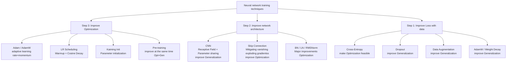

Comparison table of objectives of each method:

|method|Improvement steps|target|Remarks|
|:---|:---|:---|:---|
| Adagrad / RMSprop |Step 3| Optimization |Adaptive learning rate predecessor|
| Adam |Step 3| Optimization |Current default optimizer|
| LR Scheduling |Step 3| Optimization |Warmup+Cosine is standard for large models|
| Kaiming Init |Step 3| Optimization |Standard initialization of ReLU networks|
| Pre-training |Step 3| Opt + Gen |Both are improved at the same time, the core of modern large models|
| CNN |Step 2| Opt + Gen |Improving sample efficiency through inductive bias|
| Skip Connection |Step 2| Optimization |Making deep networks trainable|
| Batch Norm |Step 2| Optimization(+Gen)|Depends on batch statistics|
| Layer Norm |Step 2| Optimization(+Gen)|Transformer comes standard|
| Cross-Entropy |step one|Make Opt feasible|Standard loss for classification/generation tasks|
| Dropout |step one| Generalization |Noise regularization during training phase|
| Data Augmentation |step one| Generalization |Need to maintain label semantics|
| L2 Reg / AdamW |Step 1/3| Generalization |Prefer functions with smaller parameter values|
| Semi-supervised |step one| Generalization |Leverage unlabeled data|

### 7.1 Training troubleshooting quick check
{: id="71-训练排错速查"}

When encountering a training abnormality, first determine the problem based on the curve, and then choose to make changes. By changing only a few factors at a time and recording the data, random seeds, and evaluation protocols, the results can be easily compared.

|phenomenon|Priority check|Changes to try|
|:---|:---|:---|
|Training Loss almost never drops|Data and labels, learning rate, initialization, and whether the gradient is zero|Reduce or increase the learning rate, check normalization and activation functions, and test overfitting with a small data set first|
|Loss quickly becomes NaN or spikes violently|Learning rate, mixed precision overflow, exploding gradients|Use BF16/loss scaling, turn on gradient clipping, and check for abnormal samples|
|Training Loss is low but validation Loss is high|Data volume, data partitioning, label leakage, overfitting|Enhance data, add weight decay or dropout, and reduce model capacity|
|Both training and validation are poor|Representation capabilities, input preprocessing, task definition or annotation quality|Increase the number of model or training steps, improve features and labels, and confirm that the evaluation indicators are reasonable.|
|Training is slow or GPU memory is insufficient|Sequence length, batch size, data loading and operator utilization|Mixed precision, gradient accumulation, checkpointing, Flash Attention or efficient fine-tuning of parameters|

---

# 8. Commonly used experimental benchmarks
{: id="8-常用实验基准"}

Benchmarks are tools for measuring progress. This section sorts out classic benchmarks by field - MNIST/ImageNet for CV, GLUE/MMLU for NLP, as well as tasks such as coding, mathematical reasoning, and long context. The models, data, prompts and evaluation scripts of different papers may be different. The scale and historical results in the table are suitable for establishing concepts and should not be directly used as cross-paper rankings.

## 8.1 Computer Vision Benchmark
{: id="81-计算机视觉基准"}

### MNIST
{: id="mnist"}

|Properties|content|
|------|------|
|Release year| 1998 |
|scale|70,000 image of handwritten digits (28×28, grayscale)|
|Number of categories|10 (digital 0-9)|
|SOTA accuracy|>99.8% (basically saturated)|
|Features|The most classic entry-level benchmark, suitable for verifying basic methods|

### CIFAR-10 / CIFAR-100
{: id="cifar-10--cifar-100"}

|Properties| CIFAR-10 | CIFAR-100 |
|------|------|------|
|Release year| 2009 | 2009 |
|scale|60,000 color images (32×32)|60,000 color images (32×32)|
|Number of categories| 10 | 100 |
|Applicable|regularization, data augmentation, network architecture verification|fine-grained classification|

The effects of Dropout, Batch Normalization, ResNet, and Data Augmentation have been extensively verified on this benchmark.

### ImageNet(ILSVRC)
{: id="imagenetilsvrc"}

|Properties|content|
|------|------|
|Release year| 2010 |
|scale|1.2 million training images, 50,000 validation images|
|Number of categories| 1,000 |
|Features|Deep learning industrial-grade benchmark, the main battlefield in the development history of CNN|

**ImageNet Top-1 Accuracy evolution (see table in Section 4)**: AlexNet (56.5%) → VGG (71.5%) → ResNet (76.0%) → EfficientNet (84.4%). These numbers come from classic models and training recipes from different eras, and are mainly used to illustrate the evolution of the architecture.

## 8.2 Natural Language Processing Benchmark
{: id="82-自然语言处理基准"}

### GLUE / SuperGLUE
{: id="glue--superglue"}

|benchmark|publish|Number of tasks|Purpose|
|:---|:---:|:---:|:---|
| GLUE | 2018 | 9 |Comprehensive evaluation of NLU tasks such as text classification, reasoning, and similarity|
| SuperGLUE | 2019 | 8 |A more difficult version after GLUE saturation, covering more challenging NLU tasks|

BERT (2018) achieved leading results on GLUE when it was released; as the benchmark gradually became saturated, the researchers subsequently launched the more difficult SuperGLUE.

### MMLU(Massive Multitask Language Understanding)
{: id="mmlumassive-multitask-language-understanding"}

|Properties|content|
|------|------|
|Release year| 2021 |
|scale|57 subjects, about 16,000 multiple choice questions|
|Cover|Mathematics, law, medicine, history, computer science, etc.|
|Purpose|Evaluate LLM’s breadth of knowledge and reasoning ability|
|human level|About 89.8% (Expert)|

MMLU is suitable for observing the knowledge coverage and multi-disciplinary reasoning of the model, but the scores will be affected by prompts, calibration methods and training data contamination, and the evaluation protocol should be fixed when comparing.

### Language model perplexity (Perplexity)
{: id="语言模型困惑度perplexity"}

Penn Treebank (PTB)/WikiText is the standard benchmark for traditional language models. The evaluation index is **perplexity (PPL)** - the lower the better, indicating that the model is more certain in predicting the next token. PPL is still suitable for comparing language models under the same corpus, word segmentation and modeling goals, but it cannot represent knowledge, code or reasoning ability alone.

### Code Competency Benchmark
{: id="代码能力基准"}

To evaluate LLM coding ability, it is required for almost all cutting-edge model releases.

|benchmark|publish|scale|Task form|Evaluation method|
|:---|:---:|:---|:---|:---|
| **HumanEval** | 2021 (OpenAI) |Question 164|Python function completion|Unit test pass@1|
| **MBPP** | 2021 (Google) |Question 974|Python basic questions|Unit testing|
| **HumanEval+** | 2023 |Extends HumanEval|Add additional 80× test case|More stringent pass@1|
| **LiveCodeBench** | 2024 |Continuous updates|LeetCode latest questions|Prevent training data pollution|
| **SWE-bench** | 2023 |Question 2294|Real GitHub repository bug fix|Run the test suite|
| **SWE-bench Verified** | 2024 |Question 500|Manual validation subset|More reliable reviews|

**Usage Suggestions**: HumanEval/MBPP is suitable for testing function-level code generation, and SWE-bench is closer to real warehouse repair; when reporting results, the number of sampling times, test set version and whether tool calls are allowed should also be stated.

### Mathematical Reasoning Benchmark
{: id="数学推理基准"}

|benchmark|publish|difficulty|Features|
|:---|:---:|:---|:---|
| **GSM8K** | 2021 |Elementary school application questions|Question 8.5K, examining multi-step arithmetic reasoning|
| **MATH** | 2021 |Competition level (AMC/AIME)|12.5K question, Mathematics Olympiad style|
| **AIME** |Updated annually|American Mathematics Invitational Competition|Prevent training pollution, the main battlefield of cutting-edge models|
| **Putnam** | — |College Mathematics Competition|Extreme difficulty, testing top reasoning|

GSM8K is more focused on basic multi-step arithmetic, while MATH and AIME have higher requirements for competition mathematical reasoning. As model capabilities improve, training data contamination, sampling strategies, and answer verification methods will significantly affect performance, and you cannot just look at a single score.

### Long context benchmark
{: id="长上下文基准"}

As the context window expands from 2K→32K→128K→1M, simple perplexity can no longer reflect the long context capability of the model, and special benchmarks have emerged:

|benchmark|publish|Evaluation form|focus|
|:---|:---:|:---|:---|
| **Needle-in-a-Haystack** | 2023 |Hide a key piece of information in a long document and require model recall|Positioning accuracy varies with position and length|
| **LongBench** | 2023 |21 tasks, 6 categories (QA, abstract, code, etc.)|Multi-dimensional comprehensive evaluation|
| **RULER** | 2024 |13 kinds of synthesis tasks, the difficulty can be controlled and expanded|Multiple capabilities for testing long contexts|
| **∞BENCH** | 2024 |Average 200K tokens|Test real ultra-long scenes|
| **LOFT** | 2024 |Long document RAG, tool call|Real Agent Scenario|

**Usage Suggestions**: Needle-in-a-Haystack mainly tests positioning capabilities and cannot replace real long document Q&A. Actual evaluation should also focus on location, document length, question type, retrieval interference, and accuracy of answer citations.

---

# 9. Efficient training and inference
{: id="9-高效训练与推理"}

## 9.1 Mixed precision training
{: id="91-混合精度训练"}

Modern GPUs support FP16/BF16 operations. Mixed-precision training completes forward propagation and gradient calculations with low precision (saving GPU memory 50%, accelerating calculations 2-3×), and performs parameter updates with FP32 (ensuring numerical stability).

|Format|Exponent bit|mantissa digits|Advantages|Disadvantages|
|:---:|:---:|:---:|:---|:---|
| FP32 | 8 | 23 |most stable|GPU memory usage is large|
| FP16 | 5 | 10 |Fast|The numerical range is small and easy to overflow.|
| **BF16** | 8 | 7 |The numerical range is the same as FP32, stable|Slightly less accurate than FP16|

**BF16** (Brain Float 16) has wider index bits (8 bits vs 5 of FP16) bits), with a larger numerical range, and has become the preferred low-precision format for large language model training.

## 9.2 Gradient Clipping
{: id="92-gradient-clipping梯度裁剪"}

Occasional exploding gradientss (loss spikes) during large model training can lead to training crashes. Gradient clipping prevents this problem by limiting the upper bound on the L2 norm of the gradient:

$$g \leftarrow g \cdot \min\left(1, \frac{\tau}{\|g\|_2}\right)$$

The usual threshold is $\tau = 1.0$, which is the standard companion to AdamW.

## 9.3 Gradient Checkpointing
{: id="93-梯度检查点gradient-checkpointing"}

During training, backpropagation requires all intermediate activation values in the forward process to calculate gradients - under deep networks, the activation value GPU memory can occupy several times the parameters themselves, becoming the main overhead of GPU memory for large model training.

**Gradient checkpointing** (Chen et al., 2016) retains activations only at selected checkpoint layers. During backpropagation, it recomputes the missing intermediate activations with another forward pass, trading approximately 33% additional computation for activation memory on the order of $O(\sqrt{N})$.

|Project|Standard training|gradient checkpoint|
|:---|:---:|:---:|
|Activate GPU memory| $O(N)$ | $O(\sqrt{N})$ |
|Forward computation| 1× | 1× |
|Reverse calculation amount| 1× |~2× (recalculate forward)|

The use of gradient checkpoints in combination with mixed precision, ZeRO, and tensor parallelism is a standard GPU memory optimization method for training large models with hundreds of billions of parameters (`gradient_checkpointing=True` for HuggingFace Transformers, `torch.utils.checkpoint` for PyTorch).

## 9.4 Flash Attention
{: id="94-flash-attention"}

The bottleneck of **standard attention** is that the $N \times N$ attention matrix needs to be written to GPU HBM GPU memory. The GPU memory complexity is $O(N^2)$, which is extremely expensive for long sequences.

|version|Year|Relative to standard attention acceleration|key innovation|
|:---:|:---:|:---:|:---|
| Flash Attention 1 | 2022 | 2–4× |IO-aware block calculation, GPU memory $O(N)$|
| Flash Attention 2 | 2023 | 4–9× |Improved parallelization and warp partitioning, reaching 70% A100 FLOP/s|
| Flash Attention 3 | 2024 | 6–18×(vs FA1)|For H100 Hopper architecture; asynchronous pipeline; FP8 support, up to 75% H100 FLOP/s (approximately 1.2 PFLOP/s)|

Flash Attention reduces GPU memory traffic and accelerates computation while retaining **exact attention** rather than approximating it. Availability depends on hardware, sequence length, and kernel implementation.

---

# 10. Model compression and adaptation
{: id="10-模型压缩与适配"}

## 10.1 Mixture-of-Experts (MoE)
{: id="101-混合专家模型moe"}

 **Mixture of Experts(MoE)** The core idea: split a large FFN into $N$ independent "expert", led by an **Router/Gating Network** Select top- for each token $k$ Experts perform calculations. Only activating some experts means - **The number of parameters is huge, but only a small part of them is used each time.** .

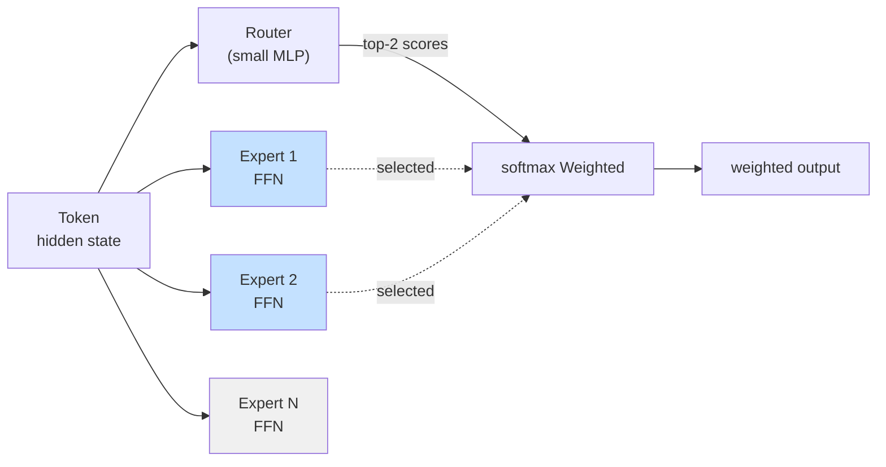

### Core indicators
{: id="核心指标"}

|indicator|meaning|Example (Mixtral 8×7B)|
|:---|:---|:---:|
|**Total parameters**|The sum of all expert parameters| 47B |
|**activation parameter count**|Parameters actually calculated each time forward| 13B |
|**Total number of experts**| $N$ | 8 |
| **Top-k** |Number of experts activated per token| 2 |

### Representative work
{: id="代表性工作"}

|model|Year|Total parameters|activation parameters|expert structure|
|:---|:---:|:---:|:---:|:---|
| Switch Transformer | 2021 | 1.6T | — |top-1 routing|
| GShard | 2020 | 600B | — |top-2 routing|
| **Mixtral 8×7B** | 2023 | 47B | 13B |8 expert, top-2|
| **DeepSeek-V3** | 2024 | 671B | 37B |256 Sharing Expert + Fine-grained Routing|

**Key challenges**: **Load balancing** (preventing all tokens from flooding to a few experts) - usually adding auxiliary losses or capacity constraints to avoid overloading a few experts. The statistical calibers of total parameters and activated parameters are not uniform. When comparing across models, the routing strategy and FFN scale should be viewed at the same time.

## 10.2 Parameter efficient fine-tuning (PEFT)
{: id="102-参数高效微调peft"}

As the number of pretrained model parameters expands to tens or hundreds of billions, **Full Fine-tuning** GPU memory and storage costs tend to be high. **Parameter-Efficient Fine-Tuning(PEFT)** Only train a very small number of additional parameters (usually < 1% ), which can approximate the full parameter fine-tuning effect.

### Comparison of mainstream PEFT methods
{: id="主流-peft-方法对比"}

|method|Year|Trainable parameter ratio|core idea|Features|
|:---|:---:|:---:|:---|:---|
| **Adapter** | 2019 | ~3% |Insert small bottleneck MLP at each layer|Introduce additional calculations during inference|
| **Prefix Tuning** | 2021 | <1% |Add a learnable "soft prompt" before typing|The original model is not changed; the effect is sensitive to the task|
| **Prompt Tuning** | 2021 | <0.1% |Add soft prompt only in Embedding layer|The lightest weight; only works well on very large models|
| **LoRA** | 2021 | 0.1–1% |Injecting low-rank updates into the weight matrix $\Delta W = BA$|Widely used strong baseline|
| **QLoRA** | 2023 |Same as LoRA|4bit quantization bottom model + LoRA fine-tuning|Can fine-tune the 65B model on a single 24GB GPU|
| **DoRA** | 2024 |Slightly more than LoRA|Decompose the weight into direction + amplitude and update them separately|Better quality than LoRA in low-rank settings|

### LoRA core formula
{: id="lora-核心公式"}

For pretrained weight $W_0 \in \mathbb{R}^{d \times k}$, LoRA freezes $W_0$ and only trains low-rank decomposition $B \in \mathbb{R}^{d \times r}, A \in \mathbb{R}^{r \times k}$ ($r \ll \min(d,k)$, typical $r=8, 16, 64$):

$$W = W_0 + \Delta W = W_0 + BA$$

Forward calculation: $h = W_0 x + BAx$.

**Advantages**:
- **trains**: only $B, A$ requires gradients and optimizer state, GPU memory requirements drop to $\sim 1/100$
- **storage**: One task only needs to save $BA$ (MB level), a set of base molds can load LoRA for hundreds of tasks
- **inference**: $BA$ can be merged into $W_0$, with zero inference overhead
- **switching task**: load different LoRA weights to switch scenes in seconds

LoRA/QLoRA are common strong baselines for open source large model fine-tuning, but the best solution still depends on the task, base model, quantization method and available GPU memory.

## 10.3 Model quantization (Quantization)
{: id="103-模型量化quantization"}

**quantization** compresses the model weights (and activations) from FP16/BF16 to INT8/INT4 or even lower bit width, with a small loss of accuracy in exchange for **model size reduced to 1/4~1/8, inference speed improvement 2-4×**.

### Quantization types
{: id="量化类型"}

|Type|When to quantify|Representation method|Features|
|:---|:---|:---|:---|
| **PTQ**(Post-Training Quantization)|After training is completed| GPTQ, AWQ, SmoothQuant |No retraining required, completed in a few hours|
| **QAT**(Quantization-Aware Training)|Simulate quantization during training| LSQ, DoReFa |Highest accuracy, requires retraining|
|**Mixed precision**|Key layers retain high accuracy|Most deployment scenarios|Engineering trade-offs|

### Modern quantization methods
{: id="现代量化方法"}

|method|Year|bit width|core idea|
|:---|:---:|:---:|:---|
| **GPTQ** | 2022 | INT4/INT3 |Minimize quantization error layer by layer (second-order method)|
| **AWQ** | 2023 | INT4 |Activation awareness: Protect weights that have a large impact on the output from being quantized|
| **SmoothQuant** | 2023 | W8A8 |"Migrate" activated outliers to weights to reduce the difficulty of quantification|
| **bitsandbytes** | 2022 | INT8/NF4 |HuggingFace ecological standard library, supports QLoRA|
| **FP8** | 2022 | FP8 |H100 hardware native support, universal for training and inference|

**Experience**: INT4 can often significantly reduce GPU memory usage, but the quality loss depends on the model, calibration data, quantization granularity and inference kernel; latency, throughput and accuracy should be measured on the target task before deployment.

## 10.4 Knowledge Distillation
{: id="104-知识蒸馏knowledge-distillation"}

**Knowledge Distillation** (Hinton et al., 2015) migrates the capabilities of a large "teacher" model to a small "student" model, allowing the small model to achieve performance close to that of the large model during deployment.

### Core idea: Soft labels are more informative than hard labels
{: id="核心思想软标签比硬标签信息更丰富"}

The one-hot hard label only tells students "This picture is a cat"; while the **soft probability distribution** output by the teacher model can tell students: "This picture 90% is a cat, 8% is a dog, 1% is a fox, 0% is a car"—the relative relationship between these categories ("A dog is closer to a cat than a fox") implies the teacher's knowledge.

**Distillation loss**:

$$\mathcal{L}_{KD} = \alpha \cdot \mathcal{L}_{CE}(y^*, p_s) + (1-\alpha) \cdot T^2 \cdot \mathcal{L}_{KL}(p_t^{(T)} \| p_s^{(T)})$$

Here:
- $p_t^{(T)} = \text{softmax}(z_t / T)$ is the output softened by temperature $T$ for teachers (the distribution is smoother at $T > 1$)
- $p_s^{(T)}$ is the softened output corresponding to the student
- $\alpha$ Balancing hard label supervision and soft label distillation

### Three Paradigms of Distillation
{: id="蒸馏的三种范式"}

|paradigm|Migrate content|representative work|
|:---|:---|:---|
|**Response-based** (output distillation)|final logits distribution| Hinton 2015, DistilBERT |
|**Feature-based** (middle layer distillation)|Hidden layer activation, attention map| FitNets, TinyBERT |
|**Relation-based** (relationship distillation)|Relationship between samples, relationship between layers| RKD, CRD |

### Representative work
{: id="代表性工作-1"}

|model|Year|teacher → student|Effect|
|:---|:---:|:---|:---|
| **DistilBERT** | 2019 |BERT-base → 6 layer|Parameters minus 40%, retaining 97% performance|
| **TinyBERT** | 2019 |BERT → 4 layer|Parameter minus 87%, speed 9×|
| **MobileBERT** | 2020 |BERT-large → compact model|Mobile reasoning|
| **MiniLM** | 2020 |BERT → Small Transformer|Distilled attention and hidden representation|

In LLM, distillation can act on logits, hidden representations, preference data, or generate trajectories. It is often used in combination with quantization, pruning, or parameter sharing, but the capability gap between the teacher model and the student model, data distribution, and generation temperature all affect the final effect.

---

# 11. Cutting-edge architecture and large models
{: id="11-前沿架构与大模型"}

## 11.1 Reinforcement Learning from Human Feedback (RLHF)
{: id="111-人类反馈强化学习rlhf"}

**RLHF (Reinforcement Learning from Human Feedback)** is the key to the success of ChatGPT - aligning the pretrained large model from "speaking" to "understanding instructions and in line with human preferences".

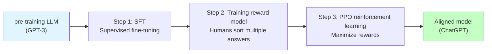

### Three-stage process
{: id="三阶段流程"}

|stage|data|target|
|:---|:---|:---|
| **SFT**(Supervised Fine-Tuning)|Human-written (prompt, quality answer) pairs|Teach models basic instruction following abilities|
|**Reward Model Training**|Human sorting of multiple responses to the same prompt|Learn a model that scores answers|
|**PPO reinforcement learning**|Use SFT model to generate answers, RM scoring, PPO policy optimization|Let the model output maximize the RM reward|

### Alternatives to RLHF
{: id="rlhf-的替代方案"}

|method|Year|Relative to RLHF|
|:---|:---:|:---|
| **DPO**(Direct Preference Optimization)| 2023 |Skip RM and PPO and directly perform closed-form optimization on preference data; training is simple and stable|
| **IPO / KTO** | 2023 |DPO variant, more robust|
| **RLAIF** | 2023 |Replacing humans with labeling preferences with AI (like Claude)|
| **Constitutional AI** | 2022 |Anthropic proposes using a set of "constitutional" principles to guide model self-criticism|

> DPO has become a common preference optimization method because the training process is simple and there is no need to separately train the reward model. PPO, DPO, rejection sampling, and other methods can also be used in combination; the specific training process of closed-source models is often not fully disclosed.

## 11.2 Generative model: from AE to GAN
{: id="112-生成模型从-ae-到-gan"}

The discriminative model learns $$p(y\mid x)$$ (given input prediction label), and the **generative model** learns the data distribution $$p(x)$$ itself, so it can sample new samples "out of nothing". There are four major families of deep generative models, which continue to evolve along the trade-off of "sampling quality/training stability/latent space controllability": **autoencoder (AE) → variational autoencoder (VAE) → generative adversarial network (GAN) → diffusion model** (detailed in the next section).

### Autoencoder (AE)
{: id="自编码器autoencoder-ae"}

The encoder $f$ compresses the input into a low-dimensional latent vector $z$, the decoder $g$ reconstructs $\hat{x}$, and the training target is the reconstruction error $$\mathcal{L} = \|x - g(f(x))\|^2$$. AE is good at **dimensionality reduction / denoising / representation learning**, but the latent space has no probability constraints and irregular distribution. **cannot randomly sample from it to generate new samples** - it is essentially a compressor, not a real generative model.

### Variational Autoencoder (VAE, Kingma & Welling 2013)
{: id="变分自编码器vaekingma--welling-2013"}

VAE adds probabilistic structure to the latent space: the encoder outputs a distribution $$q_\phi(z\mid x)$$ (instead of a single point) and constrains it to be close to the prior $$p(z)=\mathcal{N}(0,I)$$. Training to maximize **evidence lower bound (ELBO)**:

$$\mathcal{L}_{\text{ELBO}} = \mathbb{E}_{q_\phi(z|x)}[\log p_\theta(x|z)] - D_{KL}\big(q_\phi(z|x)\,\|\,p(z)\big)$$

The former term is the reconstruction term, and the latter term is the regular term that pulls the latent distribution toward the prior. Through the **reparameterization trick** $$z = \mu + \sigma \odot \epsilon$$ ($$\epsilon \sim \mathcal{N}(0,I)$$), the sampling can be differentiated and the gradient can be returned. After training, it can be generated by directly sampling from the prior $$p(z)$$. VAE sampling is stable, the latent space is continuous and interpolable, but the generated image is blurry.

### Generative Adversarial Network (GAN, Goodfellow et al. 2014)
{: id="生成对抗网络gangoodfellow-et-al-2014"}

GAN uses **to counter the game** to bypass the explicit likelihood: the generator $G$ maps noise into false samples, and the discriminator $D$ learns to distinguish between true and false, and the two alternately optimize a minimax objective:

$$\min_G \max_D \ \mathbb{E}_{x \sim p_{\text{data}}}[\log D(x)] + \mathbb{E}_{z \sim p_z}[\log(1 - D(G(z)))]$$

Image generated by GAN **Sharp and high quality** (StyleGAN’s faces are almost lifelike), but training is known for being unstable—— **mode collapse** , the game is difficult to converge and requires a lot of techniques (WGAN, spectral normalization, etc.) to stabilize it.

### List of four major families
{: id="四大家族一览"}

|family|latent variable|training objectives|sampling|Stability|Typical shortcomings|
|:---|:---|:---|:---|:---:|:---|
| **AE** |certainty|reconstruction error|✗ Cannot generate|high|latent space irregularities|
| **VAE** |Probability (Gaussian)|ELBO (Rebuild + KL)|One step, quick|high|Generate partial blur|
| **GAN** |noise → sample|against minimax|One step, quick|**low**|model collapse|
| **Diffusion** |Gradually add noise|Denoising regression|Multi-step iteration, slow|high|Slow reasoning|

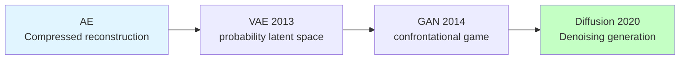

The diffusion model combines the training stability of VAE and the high quality of GAN, and has become the mainstream of current generative modeling - the next section will expand.

## 11.3 Diffusion Models
{: id="113-扩散模型diffusion-models"}

**Diffusion model** is the most successful generative paradigm in deep learning in recent years, driving epoch-making work such as Stable Diffusion, DALL-E 3, Midjourney, and Sora. It is another pillar of deep generative modeling alongside Transformer.

### Core idea: noise addition and denoising
{: id="核心思想加噪与去噪"}

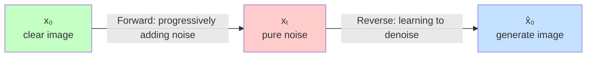

**forward process (Forward / Diffusion)**: gradually add Gaussian noise to the real data, and after $T$ steps (usually 1000) it becomes an approximate standard normal distribution:

$$q(x_t | x_{t-1}) = \mathcal{N}(x_t; \sqrt{1-\beta_t} \cdot x_{t-1}, \beta_t I)$$

Since the properties are deducible, $x_t$ can be obtained from $x_0$ in one step: $$x_t = \sqrt{\bar{\alpha}_t} \cdot x_0 + \sqrt{1-\bar{\alpha}_t} \cdot \epsilon$$, where $$\bar{\alpha}_t = \prod_{s=1}^t (1-\beta_s)$$.

**Reverse process (Reverse / Denoising)**: Train a neural network $$\epsilon_\theta(x_t, t)$$ to predict the noise added at each step. The training loss is:

$$\mathcal{L} = \mathbb{E}_{t, x_0, \epsilon}\left[\|\epsilon - \epsilon_\theta(x_t, t)\|^2\right]$$

 **reasoning** , sampled from the standard normal distribution $x_T$ , then use $$\epsilon_\theta$$ Gradually remove noise, $T$ After the step, the generated sample is obtained.

### Why are diffusion models more successful than GANs?
{: id="为什么扩散模型比-gan-成功"}

|Dimensions| GAN | Diffusion |
|:---|:---|:---|
|**Training stability**|Two network games, easy mode collapse|Single network returns, very stable|
|**Sample diversity**|Mode collapse (only a few sample types are generated)|Coverage data distribution is complete|
|**generates quality**|Single sampling quality is high but training is unstable|Typically achieves higher quality and wider coverage|
|**Inference speed**|Single forward (fast)|Multi-step iteration (slow)|
|**controllable generation**|Conditional control is more complex|Natural Adaptation Classifier-Free Guidance|

### Representative work
{: id="代表性工作-2"}

|model|Year|key innovation|
|:---|:---:|:---|
| **DDPM** | 2020 |Modern revival of diffusion models, concise training objectives|
| **DDIM** | 2020 |Deterministic sampling, the number of inference steps changes from 1000 → 50|
| **Classifier-Free Guidance** | 2022 |Conditional control possible without classifier|
| **Latent Diffusion / Stable Diffusion** | 2022 |Diffusion in VAE latent space, computing power reduced 10×|
| **DALL-E 2** | 2022 |CLIP + Diffusion, text-to-image breakthrough|
| **Imagen** | 2022 |Large-scale text encoder + cascade diffusion|
| **ControlNet** | 2023 |Precise pose/edge/depth control|
| **SDXL** | 2023 |Open source SOTA image generation|
| **Sora** | 2024 |Video diffusion model, DiT architecture|
| **Stable Diffusion 3 / Flux** | 2024 | Rectified Flow + MMDiT |

### From UNet to DiT: Transformerization of Diffusion Networks
{: id="从-unet-到-dit扩散网络的-transformer-化"}

The early diffusion model uses **UNet** (encoder-decoder CNN with skip connection) as the denoising network. 2022 appeared **DiT (Diffusion Transformer, Peebles & Xie, 2022)** years later, using Transformer to replace UNet - Sora, Stable Diffusion 3 all use DiT. This once again confirms the trend of Transformer unifying multiple fields.

## 11.4 State space model and Mamba
{: id="114-状态空间模型与-mamba"}

Transformer's attention mechanism affects sequence length $N$ The computational and GPU memory complexity of $O(N^2)$ , which is extremely expensive when processing long sequences. **State Space Model (SSM)** Provides an alternative architectural route with linear complexity.

### SSM Basics: Continuous-Time Linear Dynamic Systems
{: id="ssm-基础连续时间线性动力系统"}

SSM originates from cybernetics and maps the input sequence $x(t)$ to the output sequence $y(t)$ through the hidden state $h(t)$:

$$h'(t) = Ah(t) + Bx(t)$$
$$y(t) = Ch(t)$$

Here, $A \in \mathbb{R}^{N \times N}$ is the state transition matrix, and $B, C$ is the projection matrix. After discretization (step size $\Delta$, zero-order preservation), the recursive form is obtained:

$$h_t = \bar{A} h_{t-1} + \bar{B} x_t, \quad y_t = C h_t$$

Among them $\bar{A} = e^{\Delta A}$, $\bar{B} = (\Delta A)^{-1}(e^{\Delta A} - I) \cdot \Delta B$.

**SSM combines the advantages of RNN and CNN**:

|role|equivalent form|Advantages|
|:---|:---|:---|
|**during training**|Equivalent to 1D convolution ($y = x * k$, $k$ is the convolution kernel)|Fully parallelized|
|**during inference**|Equivalent to recursion (RNN style)|GPU memory $O(1)$, constant time step|

### S4: Structured state space sequence model
{: id="s4结构化状态空间序列模型"}

**S4** (Gu et al., 2021) is the first practical deep SSM: restricting the matrix $A$ to **HiPPO initialized diagonal plus low rank (DPLR)** The structure makes long sequence training efficient and feasible, significantly surpassing Transformer on long sequence benchmarks such as Long Range Arena.

Limitations of S4: The $A, B, C$ matrix is fixed for all time steps (**time-invariant**) and cannot dynamically choose which information to focus on or ignore based on the input content - essentially a static filter.

### Mamba: Selective state space model (2023)
{: id="mamba选择性状态空间模型2023"}

The core innovation of **Mamba** (Gu & Dao, 2023) is **selectivity (Selectivity)**: convert $B, C$ and step size $\Delta$ Designed for **input-dependent**:

$$\Delta, B, C = \text{Linear}(x_t)$$

This allows the model to dynamically adjust the state update and forgetting speed according to the content of the current token; under common parameterization, $\Delta$ will affect the state decay and input injection intensity after discretization, and cannot be simply equated to a fixed "memory switch".

**hardware-aware parallel scan**: directly performs a parallel prefix scan on the recursion of $h_t = \bar{A} h_{t-1} + \bar{B} x_t$, and the entire process is completed in the GPU SRAM to avoid frequent writing back to HBM. The GPU memory complexity is $O(N)$, and the training speed is comparable to Transformer.

**Mamba block structure** (each layer):

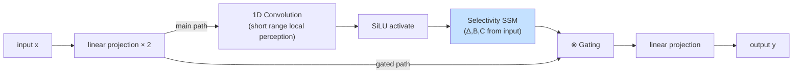

### Mamba 2(2024)
{: id="mamba-22024"}

**Mamba 2** (Dao & Gu, 2024) introduces **State Space Duality (SSD)**, showing that Mamba’s selective SSM is a structured special case of linear attention. This enables optimization and implementation within a unified framework:

- Use matrix multiplication block (tensor cores) instead of scanning, faster than Mamba 1 **2–8×**
- Expand the state size to larger dimensions and improve model capacity

### Transformer vs Mamba comparison
{: id="transformer-vs-mamba-对比"}

|Dimensions| Transformer | Mamba |
|:---|:---:|:---:|
|Sequence complexity (calculation)| $O(N^2)$ | $O(N)$ |
|Sequence complexity (GPU memory)|$O(N^2)$ (attention matrix)|$O(N)$ (activated)|
|Reasoning KV Cache|$O(N)$ (grows with context)|$O(1)$ (fixed size in hidden state)|
|Training parallelism|Fully parallel|Parallel scan (nearly parallel)|
|Global dependency modeling|Explicit attention (strong)|Implicit state transfer (optional)|
|Long sequence performance|significant decrease|keep linear|
|in-context retrieval|Very strong|Relatively weak (lossy state compression)|

### Representative work
{: id="代表性工作-3"}

|model|Year|Key innovations/applications|
|:---|:---:|:---|
| **S4** | 2021 |Structured SSM, Long Range Arena SOTA|
| **H3** | 2022 |SSM + Attention hybrid, language task|
| **Mamba** | 2023 |Selective SSM + hardware-aware algorithm, language modeling competition Transformer|
| **Mamba 2** | 2024 |SSD unified framework, 2–8× acceleration|
| **Vision Mamba / VMamba** | 2024 |Vision Mamba, image classification/segmentation|
| **MambaByte** | 2024 |Byte-level language modeling, no tokenizer|
| **Jamba** | 2024 |Mamba + Transformer alternating layer (AI21 Labs), 47B parameters|
| **Zamba** | 2024 |Small-scale Mamba-Transformer hybrid, inference efficiency SOTA|
| **RWKV** | 2023 |RNN-like linear attention, Transformer training paradigm + RNN inference|
| **RetNet** | 2023 |Recursive attention proposed by Microsoft, training parallelism + reasoning recursion|

> **Current situation and prospects**: Mamba and SSM series are currently the most popular Transformer alternative architectures, demonstrating competitive performance in fields such as language, vision, and genomics. However, pure SSM is still weaker than Transformer in terms of general reasoning and in-context learning capabilities. The mainstream trend is **Mamba + Transformer hybrid architecture** (such as Jamba, Zamba) to take into account long sequence efficiency and global reasoning capabilities.

## 11.5 Deep learning and large language model
{: id="115-深度学习与大语言模型"}

Deep learning (especially Transformer) is the technical foundation of large language models (LLM). **The division of labor between this article and the LLM training review is as follows**:

|This article focuses on|LLM training review attention|
|:---|:---|
|General deep learning principles and classic architecture|End-to-end details of the LLM engineering stack|
|CNN / RNN / Transformer basic mechanism| Scaling Laws(Chinchilla, Kaplan)|
|Optimizer, normalization, regularization general methods|Pre-training data engineering and course learning|
|MoE / PEFT / Quantification / RLHF concept introduction|3D Parallel (DP / TP / PP), ZeRO, FSDP|
|Mainstream Benchmark Overview|Long context training (YaRN, NTK interpolation)|
|Basic knowledge distillation of ideas|KV Cache optimization, Continuous Batching, PagedAttention, Speculative Decoding|

For specific engineering details of LLM pretraining/finetuning/inference, see:

> **[Overview of LLM training technology](https://tingdeliu.github.io/LLM-Training-Survey/)**
>
> Covers topics such as Scaling Laws, distributed training, hybrid parallelism, KV Cache, GQA/MQA internal implementation, long context extrapolation, inference acceleration, etc.

---

# 12. Summary
{: id="12-总结"}

There is only one main thread running through the whole text: **machine learning three-step framework (Loss → Architecture → Optimization) × two core goals (Optimization vs Generalization)**. Each training technique accurately falls on a certain grid on this 3×2 coordinate system. For details, see the method classification summary table in Section 7.

**Core conclusion**:

> The training technique of deep learning is not that the more the better, but to **the right medicine** - Look at the training Loss first: if it cannot be reduced, it is an Optimization problem, do not add Dropout; low training Loss and high verification Loss are a Generalization problem, only then consider data augmentation and regularization. This is the basic skill for efficient alchemy, and it is also the judgment principle repeatedly emphasized in this article.
