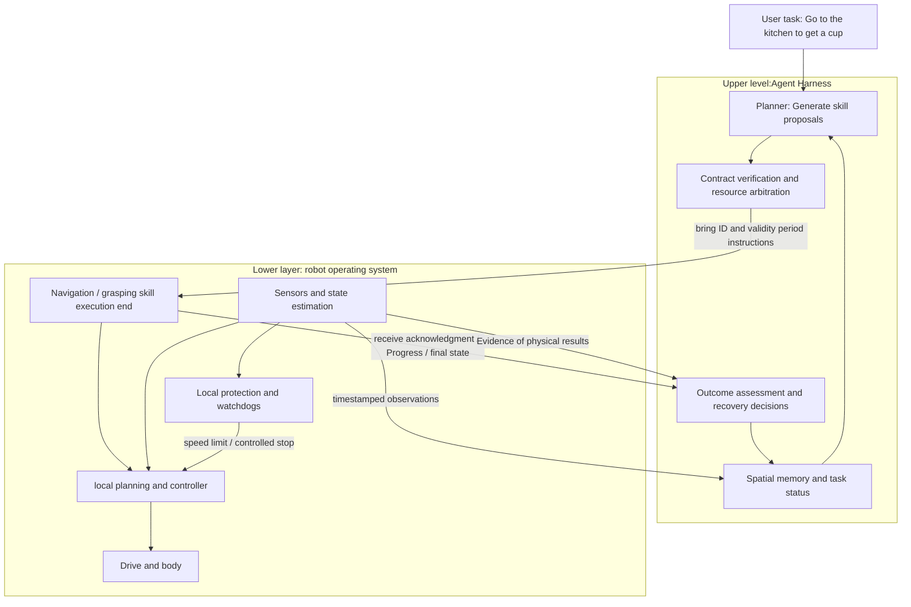
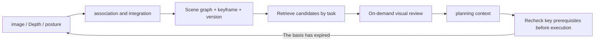
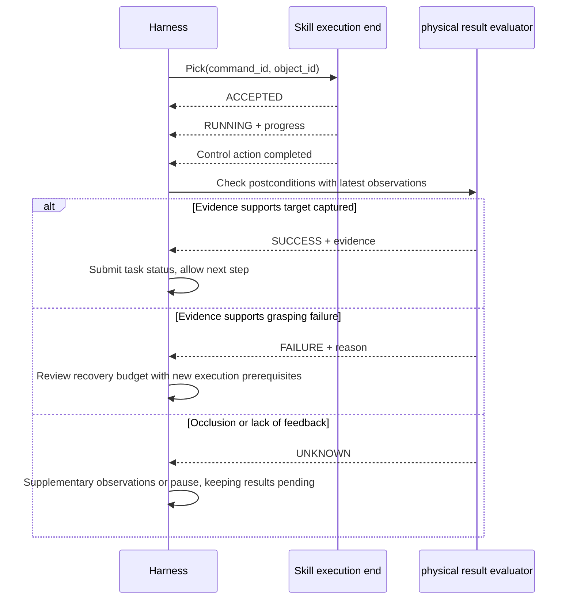
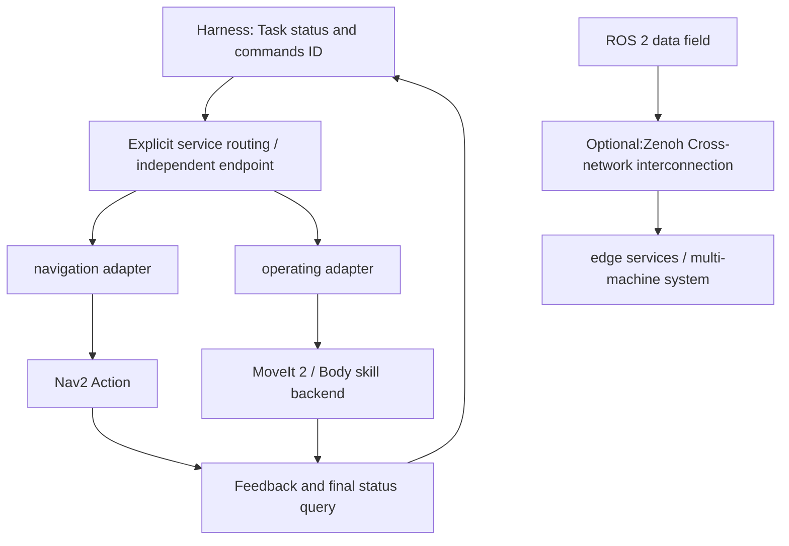
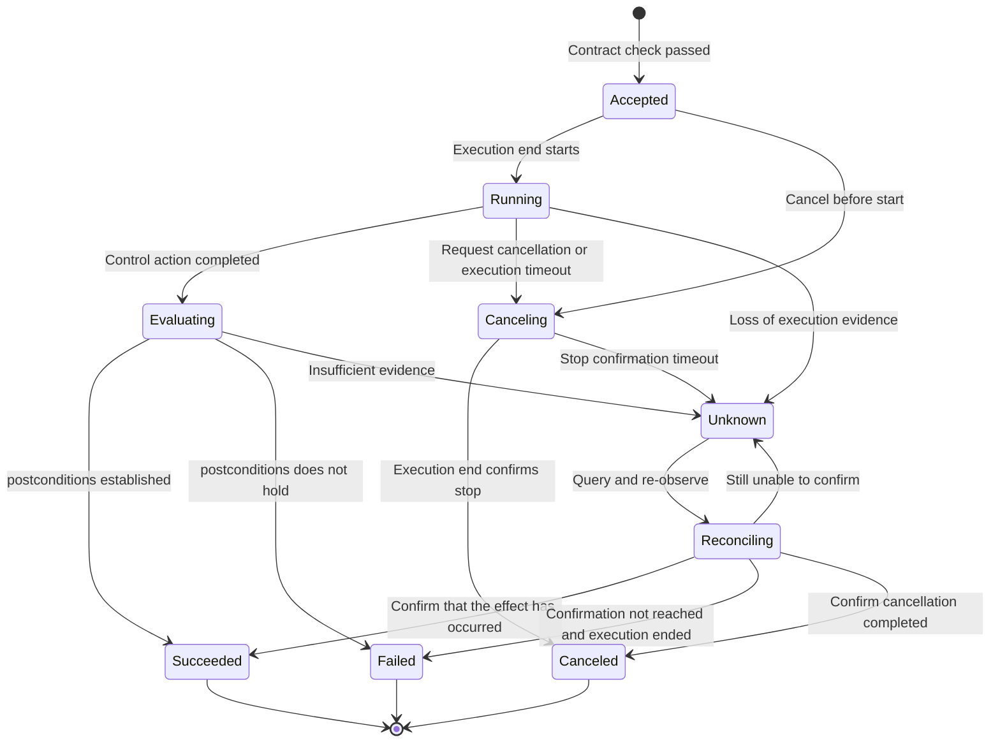
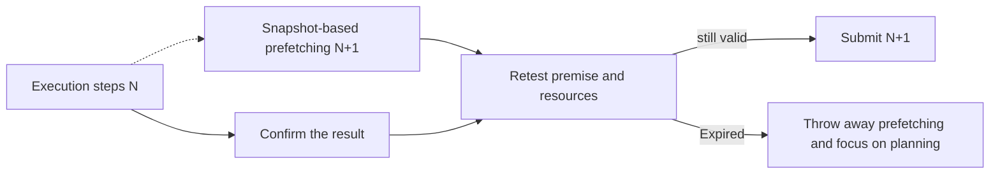

**An embodied-agent harness turns model-generated task intentions into a traceable execution loop in a physical world with noise, latency, and failures.** The model handles understanding and planning; the harness manages context, skill calls, and outcome evaluation; the robot runtime handles execution, feedback, and local protection.

This article unfolds along the lines of "upper-layer Harness → lower-layer operating system → interface contract between the two". Take "go to the kitchen to get a cup" as an example: the Scene graph helps locate the cup, the skill interface describes navigation and grasping, the execution end reports the progress, and the evaluator confirms whether the cup has been obtained; if communication is interrupted or an obstacle occurs, the robot still needs to process it locally.

> **Reading scope and evidence boundary**: The paper mechanism is based on the linked original text; the hierarchical approach, message fields, state machines and code examples belong to the engineering summary of this article and are not a unified industry standard. If the frequency and time budgets in this article are marked as examples, they are only used to illustrate the design method and cannot be directly regarded as hardware performance or safety parameters.
>
> Companion reading:  focuses on the details of the paper,  discusses general Agent engineering. This article focuses on how the two are connected in the robot system.

# 1. Introduction: From model capabilities to system closed-loop
{: id="1-引言从模型能力到系统闭环"}

<figure class="survey-intro-figure">
  
<figcaption> Figure 1 | Taking "go to the kitchen to get a cup" as an example, the upper layer organizes planning, skill calling and result evaluation, while the lower layer locally closes perception, control and execution. The two layers exchange instructions, acknowledgment and observation evidence through the interface contract; local protection takes effect independently, and the success of the task still needs to be confirmed based on observation.</figcaption>
</figure>

## 1.1 Three issues that need to be dealt with separately
{: id="11-三个需要分别处理的问题"}

**The time scales of different modules are different.** Semantic planning may take hundreds of milliseconds to several seconds, and local control and servo have their own update cycles. If you wait for model inference synchronously in the control callback, the control link will be affected by the inference delay. The problem lies in the blocking relationship, resource contention and scheduling methods. It cannot be simply reduced to "Python single process will inevitably lose control".

**Different faults have different impact ranges.** A locally extended segmentation fault may terminate the process; insufficient CUDA memory usually manifests as a runtime exception first, which does not mean that the operating system will necessarily kill the main process of the entire machine. Splitting the process can limit the propagation of some faults, but sharing GPU, memory, power and communication links can still create common points of failure.

**execution feedback does not equal task success.** "Clamp closing completed" only indicates that the control action is completed, but does not prove that the target object has been stably grasped. Software operations may also have irreversible side effects; the more prominent problems of embodied scenes are incomplete observations, uncertain contact status, and difficulty in restoring the original state after the action occurs.

Therefore, the system needs to answer at least three sets of questions:

|question|Mainly responsible party|Evidence that needs to be retained|
| :--- | :--- | :--- |
|What should be done now, and is the basis still valid?|Planners and Harness|Mission goal, world state version, target object reference|
|Has the command been received, is it being executed or has it been stopped?|Skill execution end|Instruction ID, life cycle status, serial number, controller feedback|
|Does the expected physical effect occur and can the next step be continued?|evaluator and orchestrator|postconditions, observational evidence, failure reasons and recovery budget|

## 1.2 Two-layer perspective and independent local protection
{: id="12-双层视角与独立的本地保护"}

This article summarizes the system into two collaborative parts: **upper Harness management task semantics and execution closed-loop; lower operating system management resources, communication and body control.** This is the division of responsibilities. It does not require deployment into two processes, nor does it require the introduction of all middleware at the same time.



In the above figure, local protection does not need to wait for the planner to make a decision first. The upper layer can request to stop, but the execution and confirmation of the protection action must be completed in the corresponding control link. Even with multiple processes and asynchronous communication, the hard real-time nature still depends on conditions such as operating system, scheduling, memory allocation, and worst-case execution time. [ROS 2 real-time system design instructions](https://design.ros2.org/articles/realtime_background.html)

# 2. Upper Harness: Turn intentions into verifiable skill calls
{: id="2-上层-harness把意图变成可验证的技能调用"}

## 2.1 Spatial memory: saves objects and also saves the freshness of evidence
{: id="21-空间记忆保存对象也保存证据的新鲜度"}

The planner does not have to read the entire historical image at each round. A practical approach is to use structured memory to retrieve candidate objects, and then read related images, geometric information and recent execution records on demand.

[Thea §4.1](https://arxiv.org/html/2608.11246v1#S4.SS1) uses the persistent Scene graph as a context to provide object reference, position and relationship queries. [HoloAgent-0 §4.3](https://arxiv.org/html/2606.23565v1#S4.SS3) follows FSR-VLN’s floor-room-perspective-object hierarchy as the memory index, supporting target positioning and visual verification from coarse to fine. These designs illustrate the usefulness of structured memory, but do not mean that raw visual observations can be completely eliminated.

The Scene graph can be written as $$\mathcal{G}_t=(\mathcal{V}_t,\mathcal{E}_t)$$: nodes describe objects and edges describe spatial relationships. The project should also add the following information to the record:

|Field|Purpose|Typical issues when missing|
| :--- | :--- | :--- |
| `object_id` |Reference the same object across frames|Two cups that look similar are confused|
|`frame_id`, unit, pose|Explain the meaning of coordinates|Treat map coordinates as robot arm base coordinates|
| `observed_at`, `world_version` |Determine whether the basis is outdated|Grasping objects that have been moved according to their old positions|
|Observation sources and uncertainties|Support review|Treat low-quality testing as a sure fact|
|Visibility and failure conditions|trigger rewatch|Treat "not seen yet" as "object does not exist"|

**Scene graph is an estimate, not a true value database.** "The cup is on the table" can only support candidate target selection; whether it is reachable and whether it can be grasped firmly should be rechecked with the current pose and local observations before execution. The similarity score cannot be directly used as grasping success probability.



## 2.2 Typed skills: Correct parameters are only the first step
{: id="22-类型化技能参数正确只是第一步"}

[HoloAgent-0 §3.1](https://arxiv.org/html/2606.23565v1#S3.SS1) Separates the skill interface into structured commands and runtime state, covering target references, expected effects, progress, failure modes, and recoverability. Based on this, this article divides skill contracts into three levels:

1. **Syntax contract**: field type, required items, enumeration, value range. Implementation can be done with Pydantic, Protobuf or ROS message definitions.
2. **Physical contract**: coordinate transformation, work space, collision constraints, resource occupation, sensor health and authorization conditions. The execution side needs to be combined with real-time status checking.
3. **life cycle contract**: reception, execution, cancellation, final status and result query. The handling of timeouts, repeated instructions, and service restarts must be described.

The following is a diagram of the navigation commands designed in this article, which is not the original interface of a certain paper:

```json
{
  "schema_version": 1,
  "command_id": "nav-00042",
  "robot_id": "robot-01",
  "skill": "navigate_to_pose",
  "target": {
    "frame_id": "map",
    "x_m": 1.6,
    "y_m": 0.5,
    "yaw_rad": 0.0,
    "position_tolerance_m": 0.15
  },
  "world_version": 42,
  "start_within_ms": 500,
  "execution_timeout_ms": 10000
}
```

`start_within_ms` here must define the timing starting point. For example, local timing is started when the trusted access end receives the message, and the consumed budget is deducted when forwarding; if old messages remaining in the network need to be determined, the sending time, clock error limit, or session lease need to be combined. The full validity period cannot be reacquired on each retry.

`execution_timeout_ms` limits the waiting time for a skill execution. It is different from the watchdog cycle of the underlying speed command: when the robot executes a ten-second navigation target, the local controller should still continue to generate short-validity control commands.

## 2.3 Execution Assessment: Distinguish Control End States, Physical Results, and Recovery Strategies
{: id="23-执行评估区分控制终态物理结果和恢复策略"}

[Thea §4.2](https://arxiv.org/html/2608.11246v1#S4.SS2)’s “Evaluation as Exit Codes” is an interface analogy. The paper evaluator distinguishes between `process`, `success`, and `failure`, and returns evidence and failure reasons; it does not specify a general `0=success, 1=recoverable, 2=fatal` digital protocol. This article recommends expressing three types of information separately:

|information level|Example|Who judges|
| :--- | :--- | :--- |
|Control life cycle| `RUNNING`, `CANCELING`, `STOPPED` |Skill execution terminal and controller|
|physical postconditions|Satisfied, not satisfied, insufficient evidence|evaluator|
|follow-up strategy|Continue, supplementary observations, limited retry, seek help|Harness orchestrator|

For example, gripper encoders, electrical current, or force sense can provide evidence of contact, and vision can provide evidence of object position, but any single signal can be distorted. Multi-source verification is an engineering strategy that can be adopted. It cannot be concluded that grasping is successful based on the gripper opening alone, nor can it be assumed that the errors of the two sensors are independent of each other.



`UNKNOWN` is an extension of the engineering interface in this article, indicating insufficient evidence and cannot be interpreted as a success or a direct redo. The task state only advances when the evidence meets the conditions; the perception system should still continue to update the real-world changes after failure.

[Pigey](https://arxiv.org/abs/2607.21725) Combine existing strategies or parameterized skills through a high-level orchestrator to track results and recover from failures. The "orchestration gap" is used to describe the difference in capabilities between the frozen strategy being executed alone and after entering a closed-loop. The inspiration for system design is to implement "executing an action" and "determining whether it can continue" separately. The specific sensor combination, rear interceptor and error code should be designed according to the airframe and should not be collectively referred to as the double verification standard specified in the paper.

## 2.4 Runtime monitoring and experience update: separate three time scales
{: id="24-运行时监控与经验更新分开三个时间尺度"}

[Zetta](https://arxiv.org/abs/2608.16590) Under the condition of freezing the basic strategy, the runtime critic, recovery skills and post-verification updates in the form of code are introduced, covering the three time scales of action, rollout and evolution iteration. The paper reports LIBERO-Pro 90.8%, RoboCasa 93.6%, and an 11.1x inference acceleration relative to RPent; these results correspond to its evaluation settings and rollout budget and cannot be converted to fixed monitoring frequencies on all real robots. [Original text of experiment](https://arxiv.org/html/2608.16590v1#S4)

During deployment, responsibilities can be divided into:

- **Fast protection**: Speed limit or stop based on signals such as speed, distance, torque, status validity period, etc., which is borne by the local control link.
- **Task monitoring**: Determine whether there is no progress for a long time, whether the goal is lost, whether the action deviates from expectations, and request cancellation or replanning.
- **Experience update**: Propose new rules or recovery skills from failure records, and release them after verification of playback, simulation and applicable conditions.

"Learning a recovery strategy online" does not mean "can immediately let it take over any robot." The update requires a version number, applicable body, resource permissions and rollback method; the newly generated code cannot be allowed to bypass the original execution constraints.

## 2.5 Long-range orchestration: behavior tree, state chart and model loop
{: id="25-长程编排行为树状态图与模型循环"}

Behavior trees are suitable for organizing repeated inspections, skill execution and partial recovery; state charts are suitable for explicit management of task phases, conditional transitions and history records; model loops are suitable for handling open-ended task decomposition. The three can be combined, and the choice depends on how the execution needs to be interpreted and restored.

For example, "Navigation successful → grasping → evaluation → placement" can be maintained by a state diagram. Grasping is internally performed by the behavior tree "observation → alignment → approach → closing", and the model only re-engages when the goal is ambiguous or the recovery solution is exhausted.

The orchestrator must set the **maximum number of retries, the total task time budget, and the no-progress detection**. Physical recovery is a compensatory action based on the current state, not a database-style rollback. The success of the recovery node in the behavior tree only means that the recovery action is completed; if you want to grasp again, you must clearly return to the grasping node to avoid mistaking recovery success for task success.

## 2.6 Action guardrails: what to check and where to execute it
{: id="26-动作护栏校验什么在哪里执行"}

|Check layer|Main content|What to do after failure|
| :--- | :--- | :--- |
|Proposal access|Skill permissions, parameters, object references, request validity period|Reject the proposal with explainable reasons|
|before execution|Latest coordinate transformation, reachability, collision constraints, resource locks|Supplement observations, re-plan or wait for resources|
|Executing|Status expired, obstacle approaching, torque abnormality, control timeout|The local controller speed limits or enters the corresponding stop process.|
|after execution|postconditions, object state, result evidence|Continue the task or enter the recovery branch|

The fixed "confidence ≥ 0.95" cannot replace physical constraints; the uniform "power off immediately at a distance of 0.3 meters" does not apply to all machines. Mobile chassis, object-holding manipulators, and bipedal robots require different stopping strategies. Directly cutting off power sometimes causes objects to fall or become unstable.

## 2.7 Representation work: comparison mechanisms and their applicable boundaries
{: id="27-代表工作比较机制及其适用边界"}

|work|focus|Mechanisms that can be learned from|Boundaries that need to be preserved when reading|
| :--- | :--- | :--- | :--- |
| [HoloAgent-0](https://arxiv.org/abs/2606.23565) |Heterogeneous skills and the organization of Spatial memory|AgentOS, typed skills, ROS 2 command/status interface|Some system capabilities are presented in real robot demonstrations, which does not mean that all tasks have a unified baseline.|
| [Pigey](https://arxiv.org/abs/2607.21725) |Freeze policy orchestration capabilities|Sub-goal decomposition, result checking, failure recovery|orchestration benefits are affected by policy capabilities and task settings|
| [Thea](https://arxiv.org/abs/2608.11246) |Status readability and result verifiability|Scene graph context, independent evaluator|The evaluator may also misjudge, and structured output is not a guarantee of correctness.|
| [Zetta](https://arxiv.org/abs/2608.16590) |Execution monitoring and Harness evolution|Critic, recovery skills, updates after verification|Simulation performance, inference acceleration and real robot protection latency are different indicators|
| [SayPlan(2023)](https://sayplan.github.io/) |Language task planning in large-scale environments|3D Scene graph retrieval, path planning and iterative re-planning|Scene graph planning does not equal complete runtime protection system|
| [Voyager(2023)](https://voyager.minedojo.org/) |Continuous skill accumulation in Minecraft|Automated courses, executable skills library, feedback improvements|Skill reuse in digital environments does not directly prove physical deployment reliability|

These efforts provide different system building blocks. The following operating architecture is a summary of the engineering issues in this article, and is not an implementation commonly used by the above projects.

# 3. Underlying operating system: time, resources and communication
{: id="3-下层运行系统时间资源与通信"}

## 3.1 Split by responsibility and time scale
{: id="31-按职责和时间尺度拆分"}

The frequencies in the table below are only example ranges to aid understanding. Hard real-time means a deadline must be met that cannot be derived directly from the language, the number of processes, or "runs at 50 Hz".

|level|main work|Example update method|Handling upper layer faults|
| :--- | :--- | :--- | :--- |
|mission planning layer|Language understanding, task decomposition, memory retrieval|Event triggered or about 0.1–1 Hz|Retain the current controlled task status after timeout|
|Skill orchestration layer|State diagram, resource arbitration, result checking|Event trigger, check periodically if necessary|Reject invalid tasks and initiate cancellation and reconciliation|
|local control layer|Trajectory tracking, local planning, obstacle avoidance|For example 20–100 Hz|Execute the agreed continue or stop policy when the upper layer is disconnected|
|Drive and servo layer|Motor control, hardware protection|e.g. 100–1000 Hz or higher|Handle instruction expiration and failures according to machine configuration|

High-level language planners are suitable for outputting subgoals or skill calls. The VLA strategy can be used as a skill backend to generate actions or action blocks, which are tracked by the corresponding controller; therefore, "all models can only output waypoints" cannot be regarded as a general rule. The key is to clarify the validity period of each output, how to take over and where the constraints are executed.

Splitting processes should serve fault isolation and resource governance. For a small prototype, a modular single process may also be sufficient; when blocking callbacks, GPU resource contention, or the need for independent restarts arise, the corresponding modules can be moved to independent processes.

## 3.2 First distinguish three types of data, and then select middleware
{: id="32-先区分三类数据再选择中间件"}

**Control plane** transmits skill requests, cancellations and result queries, and cares about identity, sequence, deduplication and confirmation. **status plane** conveys pose, progress and health information, and is usually more concerned with freshness. **data plane** transfers images, point clouds and tensors, caring about bandwidth, number of copies and buffer life.

|Technology|Suitable for the job|Parts that require additional design or verification|
| :--- | :--- | :--- |
| ZeroMQ |Customized inter-process messages, asynchronous requests, and pipeline tasks|Message mode, routing, result retention, deduplication, reconnection and access control|
| ROS 2 / DDS |Drive, coordinate transformation, robot Topic / Service / Action|QoS, executor, discovery scope, resource scheduling and deployment network|
| Zenoh |Data distribution across networks, ROS 2 interconnection|Topology, routers, access control, reconnection and version compatibility|
| WebSocket |Browser telemetry, interaction and high-level task delivery|Authentication, slow client, send queue and application confirmation|
| gRPC / Protobuf |Cross-language services, structured requests and streams|Deadline, cancellation propagation, retry conditions and server execution status|
|shared memory|Transfer of large blocks of images, point clouds, and tensors on the same machine|Data layout, synchronization, ownership, lifecycle and crash recovery|

There should be no fixed "average latency ranking" for these technologies regardless of message size, process topology, and hardware conditions. When selecting, first test the throughput, p95/p99 latency, queue depth and fault recovery behavior under the actual load of the application, and then decide whether to add a communication layer.

## 3.3 ZeroMQ: Four modes and confusing semantics
{: id="33-zeromq四种模式及容易混淆的语义"}

### 3.3.1 REQ/REP: Request status still needs to be processed after timeout
{: id="331-reqrep超时之后仍需处理请求状态"}

The default REQ socket requires alternating sending and receiving. If you send it again directly after waiting for timeout, you may encounter a state machine error. One way to deal with Lazy Pirate mode is to close the old socket, re-establish the connection and try again. [ZeroMQ Reliable Request Guide](https://zguide.zeromq.org/docs/chapter4/)

However, **client timeout does not prove that the server did not execute**. Requests with side effects such as navigation and grasping must retain the same `command_id` query original state; only when the execution end can remove duplicates and the recovery conditions are met, they can be re-routed safely. When closing, you also need to clarify the `LINGER` policy: giving up unsent messages and waiting for the sending to complete are different options.

### 3.3.2 PUB/SUB: Suitable for throwable state, does not bear the sole final state notification
{: id="332-pubsub适合可丢状态不承担唯一的终态通知"}

Subscription establishment has propagation time, and slow subscribers may also lose messages. HWM limits the number of queued messages, but does not guarantee "automatically discarding old messages and retaining only the latest values". If the business only needs the latest pose, the status can be merged at the application layer; when using `ZMQ_CONFLATE`, please note that it does not support the complete retention of multipart messages. [Socket option description](https://libzmq.readthedocs.io/en/latest/zmq_setsockopt.html)

Action final state requires result query or replayable recording. Even if a `SUCCEEDED` broadcast is missed, the upper layer should be able to query by command ID. Stop requests also cannot rely solely on an unacknowledged PUB message.

### 3.3.3 PUSH/PULL: Polling distribution is not equal to perceived task load
{: id="333-pushpull轮询分发不等于感知任务负载"}

PUSH is distributed among available downstreams and PULLs are received fairly from upstreams. It is suitable for parallel processing of the same type of tasks, but does not automatically provide task confirmation, work stealing, failed re-rolling, or "exactly once execution". When task time-consuming differences are large, Worker availability status and task ownership should be explicitly maintained. [Socket mode description](https://libzmq.readthedocs.io/en/latest/zmq_socket.html)

### 3.3.4 ROUTER/DEALER: Routing envelope and service selection are two different things
{: id="334-routerdealer路由信封与服务选择是两回事"}

ROUTER adds the source route identifier to the message frame when receiving, and uses the first frame to select the target connection when sending; DEALER allows asynchronous reception and reception. They provide the basis for message routing and do not automatically identify "this is a planning request and should be handed off to the planner". [ROUTER and DEALER semantics](https://libzmq.readthedocs.io/en/latest/zmq_socket.html)

In particular, avoid putting planning workers and ROS bridge workers with different capabilities into the same backend pool of the ordinary `ROUTER → DEALER` agent. The transparent proxy distributes the message and does not select the service by the `skill` field of the JSON. You can use standalone endpoints, or implement an application layer broker with service registration and capability routing.

REQ clients introduce null-delimited frames, and DEALER clients' envelopes are not necessarily the same. The worker should parse and retain the reply envelope according to the clear wire protocol. It cannot just take the first frame and the last frame and assume that the intermediate structure will always be consistent.

Commonly used REQ, REP, ROUTER, DEALER, PUB, and SUB sockets should not be operated concurrently by multiple threads. Let a single thread or event loop own the socket; asynchronous Python can use `zmq.asyncio` to avoid putting blocking receive into the thread pool and then operating the same socket in the event loop. [Thread description](https://libzmq.readthedocs.io/en/latest/zmq.html), [PyZMQ asyncio interface](https://pyzmq.readthedocs.io/en/latest/api/zmq.asyncio.html)

## 3.4 WebSocket: Application Semantics of Telemetry and Remote Operations
{: id="34-websocket遥测与远程操作的应用语义"}

Browser connections can carry lightweight JSON state and high-level instructions. Large images are suitable for binary transmission or a separate video link; WebRTC is another real-time communication mechanism, not WebSocket's binary frame format.

A frame of $1920\times1080$, 3 bytes per pixel uncompressed RGB image is approximately $6.22\text{MB}$, Base64 encoded is approximately $8.29\text{MB}$, not counting overhead such as JSON. This is a data volume calculation; how many milliseconds it takes to serialize must be measured on the target machine.

The gateway should set up bounded send queues for each client. Telemetry can be merged into the latest status, and critical alarms and command acknowledgment should have independent retention policies. A slow browser should not block broadcasts for all clients.

The remote "Stop" button should display "Request Submitted", "Execution End Received", "Stop Confirmed" and other stages. The successful sending of WebSocket only means that the message has entered the communication process, but does not mean that the robot has stopped; the underlying protection cannot rely on the browser to always be online.

## 3.5 ROS 2 and Zenoh: Retain existing robot capabilities
{: id="35-ros-2-与-zenoh保留已有机器人能力"}

If the system already uses Nav2, MoveIt 2 and TF2, you can directly let Harness call the ROS 2 interface; only when there are clear resource isolation, language boundaries or deployment requirements, you need to introduce ZeroMQ bridging. Independent processes isolate Python interpreter state but do not eliminate contention for CPU, GPU, and memory bandwidth.

ROS 2 Action already provides target, feedback, cancellation and result interfaces, which are suitable for skills with a long duration. `command_id ↔ goal UUID` should be maintained during bridging to handle target rejection, execution results and cancellation final status; "cancel request accepted" still does not mean that the action has entered `CANCELED`. [ROS 2 Action Design](https://design.ros2.org/articles/actions.html)



There are at least two different paths for the combination of Zenoh and ROS 2: [`zenoh-bridge-ros2dds`](https://github.com/eclipse-zenoh/zenoh-plugin-ros2dds) bridges the ROS 2 system using DDS; [`rmw_zenoh`](https://github.com/ros2/rmw_zenoh) is implemented as an RMW for ROS 2. It needs to be selected by distribution and deployment topology, and cannot be generally stated as "all Zenoh scenarios must bridge DDS".

The DDS discovery mechanism is also not equivalent to mDNS. Configurations such as multicast, static discovery, and discovery servers need to be discussed in conjunction with specific implementations. Cross-subnet and wireless roaming issues should be measured and configured, and NAT penetration, microsecond reconnections, or fixed-ratio performance improvements should not be considered inherent guarantees in the protocol.

## 3.6 Shared memory: one less copy and one more life cycle responsibility
{: id="36-共享内存少一次复制多一份生命周期责任"}

Shared memory can reduce the copying of large blocks of data between processes on the same machine, but it does not guarantee zero copy of the entire sensing link. Copies may continue to occur as camera buffers are written to the shared area, image decoded, format converted, uploaded to the GPU.

A frame descriptor can contain `buffer_id`, `offset`, `shape`, `dtype`, `stride`, timestamp and generation. Interpretable handles and offsets are passed between processes, and the original pointer in one process cannot be directly given to another process for use.


Merely having an incremented sequence number is not enough to avoid half-frame reads: correct memory visibility and ownership protocols are also required. When reads and writes overlap, locking, reference counting, or a proven ring buffering scheme should be used. Using semaphore notifications also does not mean that the entire implementation is lock-free.

GPU tensor sharing also involves device synchronization and producer lifetime. The PyTorch multi-process documentation emphasizes the CUDA sub-process startup method and the survival constraints of shared tensors; sending handles through ZeroMQ is only metadata transfer and cannot replace these constraints. [PyTorch multi-process best practices](https://docs.pytorch.org/docs/2.14/notes/multiprocessing.html)

## 3.7 Failures, Clocks and Recovery Budgets
{: id="37-故障时钟和恢复预算"}

The **watchdog should be located close to the protected control link.** The high-level planning request should not refresh the validity period of the low-level speed command. The monitoring time interval should use the local monotonic clock; the log time and cross-device sensing time need to indicate their respective clock sources.

The **heartbeat only indicates that a certain link is still responding. The fact that the** process can reply to ping does not mean that the camera frame is being updated, the control loop is progressing, or the GPU inference can be completed. Health checks should cover process survival, data freshness, skill progress, and controller status respectively.

**fault takeover requires isolation of the old executor.** Heartbeat loss can only indicate a suspected fault. Before the new controller takes over, mechanisms such as leases or fencing tokens should be used to prevent the old controller from continuing to issue valid instructions after restoring the connection to avoid dual-master control.

**Retry, backoff and circuit breaker are different mechanisms.** Retries need to determine whether the operation is repeatable; backoff limits the frequency of requests; circuit breaker prevents continued calls to failed services for a period of time. Can take full jitter form:

<div style="overflow-x: auto;" markdown="1">

$$
T_{\mathrm{wait}} \sim \mathrm{Uniform}\left(0,\min(T_{\max},T_{\mathrm{base}}2^k)\right)
$$

</div>

Retries are still subject to the total budget of the task. Stopping, calling for help, or downgrading to verified behavior are all possible endpoints and should not be retried indefinitely.

**time synchronization budget comes from task error tolerance.** For example, when $1.2\text{m/s}$ is translated at a constant speed, the time deviation of $30\text{ms}$ corresponds to a displacement error of about $3.6\text{cm}$; this is only an approximation that ignores rotation, external parameters and motion changes. Whether hardware timestamps, PTP or hardware triggering is required should be determined by the sensor and motion conditions, and fixed microsecond accuracy cannot be promised to all nodes.

# 4. Upper and lower layer interfaces: complete the execution of closed-loop
{: id="4-上下层接口把执行闭环接完整"}

## 4.1 Use the instruction ledger to connect the control plane and status plane
{: id="41-用指令账本连接控制面与状态面"}

It is recommended to keep the following minimum records for each instruction: instruction ID and content summary, execution body, reception time, current life cycle, latest event sequence number, result evidence and control generation.

Repeated requests with the same ID and the same content will return to the original status; requests with the same ID and different content should be rejected. Status events are deduplicated with sequence numbers, and the final status is not returned to `RUNNING` due to late progress messages. After the service is restarted, the controller should be queried and the ledger restored before determining whether it can receive new tasks.

Simply placing the deduplication table in memory can only cover the lifetime of the process. When recovery across crashes is required, design for persistent records, result retention periods, controller reconciliation, and failure windows between instruction submission and execution.

## 4.2 Cancellation, discontinuation and unknown consequences
{: id="42-取消停止和结果未知"}



Python's `asyncio.Task.cancel()` request injects a cancellation exception into the coroutine, rather than preemptively terminating arbitrary computations. Blocking extensions, work in the thread pool, or remote inference may continue to run; canceling the wait will not automatically send a stop command to the robot. [Python asyncio cancellation semantics](https://docs.python.org/3/library/asyncio-task.html)

Therefore, they should be implemented separately: canceling inferences that are no longer needed, requesting stop from the execution side, waiting for stop evidence, and handling unconfirmed status. After entering `UNKNOWN`, new conflicting actions should be blocked until the reconciliation is completed or the takeover is completed according to the aircraft policy.

## 4.3 Snapshot, resource lock and prefetch failure
{: id="43-快照资源锁与预取失效"}

A plan should record the objects, poses and world state versions it depends on. Prefetch step $N+1$ can overlap with the execution of step $N$, but the new action can only be submitted after the results of $N$ are confirmed, the key prerequisites are still true, and the required resources are available.

Rejecting the plan when the global version changes is a conservative and simple implementation; when the scale is larger, only the versions of relevant objects, areas and resources can be checked to avoid irrelevant changes that invalidate the entire plan. The robotic arm, chassis, gripper and common workspace also require clear resource arbitration to prevent two skills from taking over the same executor at the same time.



## 4.4 Separate measurement of decision delay and protection delay
{: id="44-分开测量决策时延与保护时延"}

Model decision-making is slow and does not necessarily block local control; communication is fast on average and does not prove that the protection link is fast enough in the worst case. Need to record separately:

|link|Main components|Indicators to watch|
| :--- | :--- | :--- |
|mission decision|Observation, retrieval, inference, verification, queuing|p50/p95/p99, timeout rate, planned failure rate|
|Skill response|Instruction reception, resource waiting, controller access|Reception delay, start delay, feedback interval|
|local protection|Sampling, detection, scheduling, executor response|Verifiable upper bound on latency, number of expirations, and stop behavior|
|Result confirmation|Final state reception, supplementary observation, and evaluation|False alarm success rate, missed detection rate, and pending result ratio|

For an ideal chassis moving at a constant speed, the composition of the protection budget can be understood as follows:

<div style="overflow-x: auto;" markdown="1">

$$
d_{\mathrm{stop}} \approx vT_{\mathrm{reaction}} + \frac{v^2}{2a_{\mathrm{brake}}} + d_{\mathrm{margin}}
$$

</div>

The reaction time includes sampling, detection, scheduling and executor response. This formula assumes that the subsequent braking deceleration is constant and is not suitable for directly setting the human-machine safety distance; the real system also needs to consider the load, ground, braking characteristics and measurement errors.

## 4.5 Observability: Documenting the causal chain that explains the failure
{: id="45-可观测性记录能解释失败的因果链"}

Each task is associated with at least `task_id`, `command_id`, plan version, status event serial number, sensor frame reference, model and configuration version. Record key time points: proposal generation, execution end reception, actual start, cancellation request, stop confirmation and result evaluation.

Only in this way can we distinguish between "wrong planning", "outdated target basis", "message not delivered", "executor not responding" and "evaluator misjudgment". Keeping only one `success=false` cannot support the recovery design, nor can it be compared whether the optimization is effective.

# 5. Runnable example: Validating skill lifecycle
{: id="5-可运行示例验证技能生命周期"}

## 5.1 Example scope
{: id="51-示例范围"}

The following uses a Python state machine without hardware dependencies to demonstrate four things: **repeated instructions will not be started repeatedly, expired basis will not be received, cancellation requires stop confirmation, and missing results will not be regarded as success.** It is the teaching implementation of this article and only simulates a navigation skill; no real motors are connected, and no network, watchdog or collision check is implemented.

The example uses a single-threaded sequential event and memory ledger. The caller provides `now` in the same local monotonic clock domain to facilitate time injection; the actual process can use `time.monotonic()`, and the monotonic clock values ​​of different machines cannot be directly subtracted. `deadline` only indicates the latest start time, and the timeout of continuous execution is canceled by the external scheduler.

Save as `harness_demo.py` and run with Python 3.10 or higher:

```python
from dataclasses import dataclass, replace
from math import isfinite


@dataclass(frozen=True)
class Command:
    command_id: str
    world_version: int
    deadline: float
    x_m: float
    y_m: float
    frame_id: str = "map"


@dataclass
class Record:
    command: Command
    state: str = "ACCEPTED"
    reason: str = ""
    stop_deadline: float | None = None


class Harness:
    def __init__(self, world_version: int):
        self.world_version = world_version
        self.records: dict[str, Record] = {}
        self.starts = 0

    def submit(self, command: Command, now: float) -> str:
        old = self.records.get(command.command_id)
        if old is not None:
            if old.command != command:
                raise ValueError("COMMAND_ID_CONFLICT")
            return old.state  # The status of the original request; will not be refreshed deadline
        if not command.command_id or command.frame_id != "map":
            raise ValueError("INVALID_ID_OR_FRAME")
        if not all(isfinite(v) for v in
                   (command.x_m, command.y_m, command.deadline, now)):
            raise ValueError("NON_FINITE_VALUE")
        if command.world_version != self.world_version:
            raise ValueError("STALE_WORLD")
        if now >= command.deadline:
            raise ValueError("EXPIRED_COMMAND")
        # Single body, single resource example;UNKNOWN It also takes up resources and waits for external reconciliation.
        terminal = {"SUCCEEDED", "FAILED", "CANCELED", "REJECTED"}
        if any(r.state not in terminal for r in self.records.values()):
            raise ValueError("RESOURCE_BUSY")
        self.records[command.command_id] = Record(command)
        return "ACCEPTED"

    def start(self, command_id: str, now: float) -> str:
        r = self.records[command_id]
        if r.state != "ACCEPTED":
            return r.state
        # The world may change while queuing, so check again before launching.
        if (not isfinite(now) or now >= r.command.deadline
                or r.command.world_version != self.world_version):
            r.state, r.reason = "REJECTED", "PRECONDITION_CHANGED"
        else:
            r.state = "RUNNING"
            self.starts += 1  # Simulate submitting a target to the controller once
        return r.state

    def finish(self, command_id: str, achieved: bool | None) -> str:
        r = self.records[command_id]
        if r.state != "RUNNING":
            return r.state  # Late results cannot cover the cancellation process or final state
        if achieved is True:
            r.state, r.reason = "SUCCEEDED", "POSTCONDITION_CONFIRMED"
        elif achieved is False:
            r.state, r.reason = "FAILED", "POSTCONDITION_NOT_MET"
        else:
            r.state, r.reason = "UNKNOWN", "MISSING_EVIDENCE"
        return r.state

    def cancel(self, command_id: str, now: float,
               stop_timeout: float = 1.0) -> str:
        if not isfinite(now) or not isfinite(stop_timeout) or stop_timeout <= 0:
            raise ValueError("INVALID_STOP_TIMEOUT")
        r = self.records[command_id]
        if r.state == "ACCEPTED":
            r.state, r.reason = "CANCELED", "NEVER_STARTED"
        elif r.state == "RUNNING":
            # The real adapter submits a stop request here; only state changes are simulated here.
            r.state = "CANCELING"
            r.stop_deadline = now + stop_timeout
        return r.state  # Repeat cancellations will not extend the stop confirmation budget

    def confirm_stopped(self, command_id: str) -> str:
        r = self.records[command_id]
        if (r.state == "CANCELING" or
                (r.state == "UNKNOWN" and r.reason == "STOP_UNCONFIRMED")):
            r.state, r.reason = "CANCELED", "STOP_CONFIRMED"
        return r.state

    def tick(self, now: float) -> None:
        for r in self.records.values():
            if (r.state == "CANCELING" and r.stop_deadline is not None
                    and now >= r.stop_deadline):
                r.state, r.reason = "UNKNOWN", "STOP_UNCONFIRMED"


def expect_error(code, action):
    try:
        action()
    except ValueError as exc:
        assert str(exc) == code, (code, str(exc))
    else:
        raise AssertionError(f"expected {code}")


def demo():
    h = Harness(world_version=7)
    c = Command("nav-1", 7, deadline=10.0, x_m=1.6, y_m=0.5)
    assert h.submit(c, now=0.0) == "ACCEPTED"
    assert h.start(c.command_id, now=0.1) == "RUNNING"
    assert h.submit(c, now=0.2) == "RUNNING"
    assert h.start(c.command_id, now=0.3) == "RUNNING"
    assert h.starts == 1
    expect_error("COMMAND_ID_CONFLICT",
                 lambda: h.submit(replace(c, x_m=2.0), now=0.4))
    assert h.finish(c.command_id, achieved=True) == "SUCCEEDED"
    assert h.finish(c.command_id, achieved=False) == "SUCCEEDED"

    expect_error("STALE_WORLD", lambda: h.submit(
        replace(c, command_id="old", world_version=6), now=1.0))
    expect_error("EXPIRED_COMMAND", lambda: h.submit(
        replace(c, command_id="late", deadline=1.0), now=1.0))

    c2 = replace(c, command_id="nav-2")
    h.submit(c2, now=1.0)
    h.start(c2.command_id, now=1.1)
    assert h.cancel(c2.command_id, now=2.0) == "CANCELING"
    h.cancel(c2.command_id, now=2.5)  # Do not extend the deadline until 3.5
    assert h.finish(c2.command_id, achieved=True) == "CANCELING"
    h.tick(now=3.0)
    assert h.records[c2.command_id].state == "UNKNOWN"
    expect_error("RESOURCE_BUSY", lambda: h.submit(
        replace(c, command_id="conflict"), now=3.1))
    assert h.confirm_stopped(c2.command_id) == "CANCELED"

    c3 = replace(c, command_id="nav-3")
    h.submit(c3, now=4.0)
    h.world_version = 8
    assert h.start(c3.command_id, now=4.1) == "REJECTED"

    c4 = replace(c, command_id="nav-4", world_version=8)
    h.submit(c4, now=5.0)
    h.start(c4.command_id, now=5.1)
    assert h.finish(c4.command_id, achieved=None) == "UNKNOWN"
    print("PASS: dedup, stale/expired rejection, cancel/stop, unknown result")


if __name__ == "__main__":
    demo()
```

Running `python harness_demo.py` should output a line of `PASS: ...`. The assertions here verify protocol behavior and are not a security or real-time test of a real robot. `achieved` and stop confirmation are provided by simulated events; after being connected to the real system, they must be generated by the corresponding controller and observation evidence.

## 5.2 Which interfaces should be completed when connecting to the real system?
{: id="52-接入真实系统时补齐哪些接口"}

|Example entry|Actual adaptation responsibilities|
| :--- | :--- |
| `submit` |Parsing and runtime type verification, permission checking, persistent deduplication, resource arbitration|
| `start` |Check the premise with the latest status, submit the Action Goal, handle acceptance or rejection|
| `finish` |Read the control final state and physical postconditions respectively, and retain the evidence reference|
| `cancel` |Send cancellation or stop request by order ID, record confirmation period|
| `confirm_stopped` |Verify stop completion evidence corresponding to the target; cannot be triggered by "send successfully"|
| `tick` |Scheduling execution timeout and confirmation timeout; the underlying watchdog still runs independently|

Python type annotations themselves do not perform network input validation. When accessing external messages, the field type, value range, protocol version and message size must also be checked. The example does not implement the complete reconciliation, persistent storage and multi-resource concurrency of `UNKNOWN`; these should be clarified before adding the communication adapter.

The ROS adapter also needs to correctly set the timestamp, coordinate system and valid quaternion, and handle the acceptance result of `send_goal_async` and the final state of `get_result_async`. The ZeroMQ adapter handles envelopes, request correlation, timeouts, reconnects, and result queries. Neither should wait for long periods of time in the receive loop for model inference to avoid blocking cancellation and status processing.

## 5.3 Fault injection is more valuable than “normal run-through”
{: id="53-故障注入比正常跑通更有价值"}

|Injection conditions|expected behavior|Verify location|
| :--- | :--- | :--- |
|Submit the same instruction repeatedly|Return to original state without repeated startup|`starts == 1` in the example|
|The same ID carries different targets|Deny request|Conflict checking in example|
|The status changes after the instruction expires or is queued|reject before execution|Validity and version checking in the example|
|Stop acknowledgments being late or lost|Enter the pending state to prevent conflicting actions|Cancel timeout check in example|
|Action ended but observations missing|Not marked as successful|`achieved=None` in the example|
|Process crashes after command is sent|Reconcile accounts first after restarting, do not blindly reissue|Requires real process and persistent ledger testing|
|Inference takes up CPU/GPU|Check whether the control cycle and protection delay have expired|Target hardware load testing required|
|Telemetry consumer blocked for long time|The queue is bounded and other clients will not be held back.|Gateway integration testing required|

# 6. Assessment methods and follow-up research questions
{: id="6-评估方法与后续研究问题"}

## 6.1 How to judge whether Harness changes are effective
{: id="61-如何判断-harness-的改动有效"}

Task success rate is a necessary metric but cannot independently explain the source of improvement. It is recommended that after fixing the basic strategy, task distribution and computing budget, compare whether to enable Spatial memory, result evaluation, recovery strategy and runtime monitoring respectively.

Also recorded: completion time, number of model calls, number of recoveries, manual intervention rate, false positive success rate, result pending rate, number of control overdues, and recovery behavior after service failure. If the cost of increasing the success rate is a significant increase in the number of retries and execution time, this trade-off needs to be presented.

Cross-paper tables lend themselves to comparison mechanisms, while performance rankings require identical tasks, evaluation protocols, and budgets. Simulation success rate, real robot success rate, inference latency, and rollout throughput cannot be combined into a "system sophistication" score.

## 6.2 Directions worthy of continued research
{: id="62-值得继续研究的方向"}

**cross-embodiment skill contract.** The same `pick` has different preconditions and failure modes on different grippers, sensors and controllers. Interface reuse requires body capability description and semantic consistency verification, not just unified field names.

**Task recovery under uncertain results.** After the network is disconnected, the robot may have completed the action or may still be executing it. How to restore the task status with limited observation is more critical than blindly improving the retry speed.

**Verifiable Harness update.** New critic and recovery skills should carry applicable conditions, replay evidence and version boundaries. Research focuses include coverage, false triggering costs, cross-task migration, and rollback after failed updates.

**Task allocation for devices, edges, and clouds.** Local control and protection remain on the robot side; large-scale memory, planning and experience aggregation can be distributed and deployed according to network and computing power conditions. Which skills continue and which stop when disconnected should be part of the agreement.

These are open issues and design directions. They are not established unified AgentOS standards, nor are they predictions that the technology will inevitably be implemented in a certain year.

# 7. Summary and references
{: id="7-总结与参考资料"}

## 7.1 Inspection sequence for architecture implementation
{: id="71-架构落地的检查顺序"}

Whether an embodied Harness forms a closed-loop can be checked along the same instruction: **On what observation is it generated, who has the authority to execute it, how to confirm that it is running, who judges the effect, how to stop after timeout, and how to restore the facts after restarting.** Spatial memory, skill contract, evaluator, communication and control system answer some of them respectively.

When implementing, you can first open up the complete life cycle of a skill, and then expand multi-skill orchestration and Spatial memory; use fault injection to verify repeated requests, status expiration, and cancellation behaviors, and then introduce asynchronous pipelines, shared memory, or more services based on measured bottlenecks. In this way, each layer of optimization has observable benefits and boundaries.

## 7.2 Papers and projects
{: id="72-论文与项目"}

1. Zhou et al. **HoloAgent-0: A Unified Embodied Agent Framework with 3D Spatial Memory** (2026). [Paper](https://arxiv.org/abs/2606.23565)
2. Galanti, Shah, Dao. **Addressing the Orchestration Gap in Generalist Robots via Physical Agency** (Pigey, 2026). [Paper](https://arxiv.org/abs/2607.21725)
3. Wang et al. **Towards the Harness of Embodied Agents** (Thea, 2026). [Paper](https://arxiv.org/abs/2608.11246) · [Project](https://eit-hai.github.io/thea)
4. Ding et al. **Zetta ζ: An Efficient Closed-Loop Embodied Harness for Self-Evolving Physical Intelligence** (2026). [Paper](https://arxiv.org/abs/2608.16590)
5. Rana et al. **SayPlan: Grounding Large Language Models using 3D Scene Graphs for Scalable Robot Task Planning** (2023). [Project and Paper Portal](https://sayplan.github.io/)
6. Wang et al. **Voyager: An Open-Ended Embodied Agent with Large Language Models** (2023). [Project and paper entry](https://voyager.minedojo.org/)

## 7.3 Engineering Documentation
{: id="73-工程文档"}

1. ZeroMQ: [Socket mode](https://libzmq.readthedocs.io/en/latest/zmq_socket.html), [Socket option](https://libzmq.readthedocs.io/en/latest/zmq_setsockopt.html), [Reliable request mode](https://zguide.zeromq.org/docs/chapter4/).
2. ROS 2: [Action design](https://design.ros2.org/articles/actions.html), [Real-time system design background](https://design.ros2.org/articles/realtime_background.html).
3. Zenoh: [`zenoh-plugin-ros2dds`](https://github.com/eclipse-zenoh/zenoh-plugin-ros2dds), [`rmw_zenoh`](https://github.com/ros2/rmw_zenoh).
4. Python and PyZMQ: [Coroutine cancellation](https://docs.python.org/3/library/asyncio-task.html), [`zmq.asyncio`](https://pyzmq.readthedocs.io/en/latest/api/zmq.asyncio.html).
5. PyTorch: [Multi-process best practices](https://docs.pytorch.org/docs/2.14/notes/multiprocessing.html).

Verification date: 2026-09-28. The mechanism of the paper is subject to the linked version, and the library interface needs to be read in conjunction with the actual installed version.
