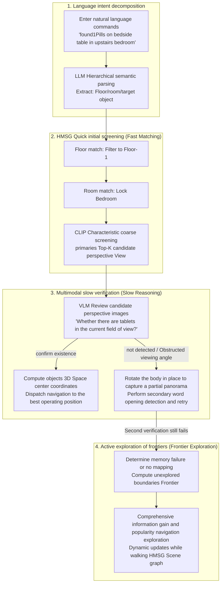
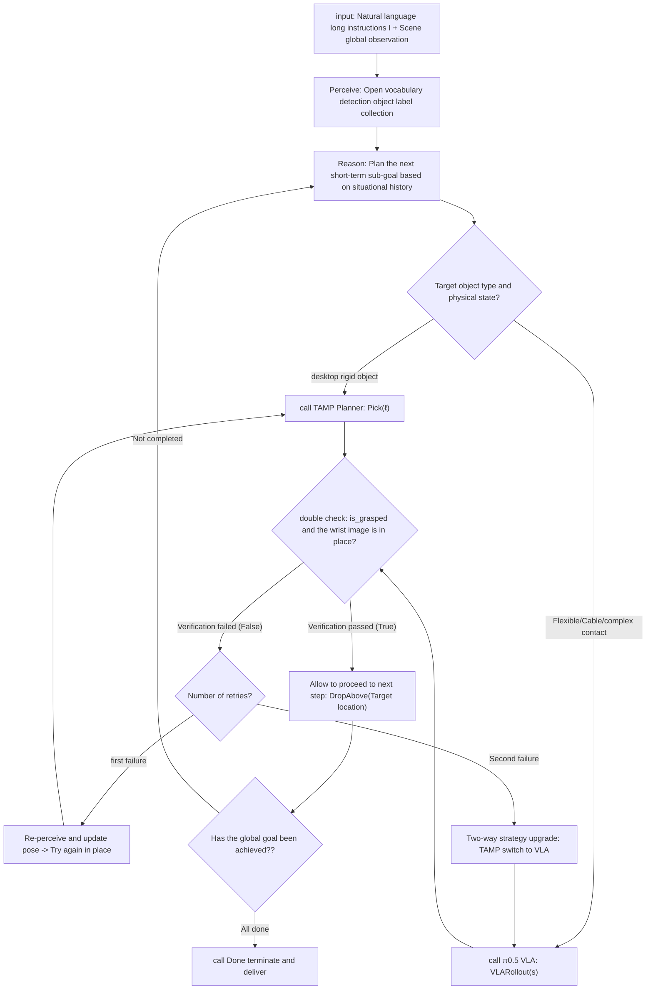
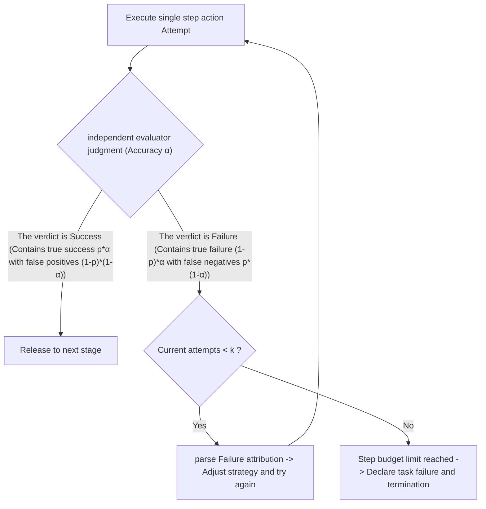
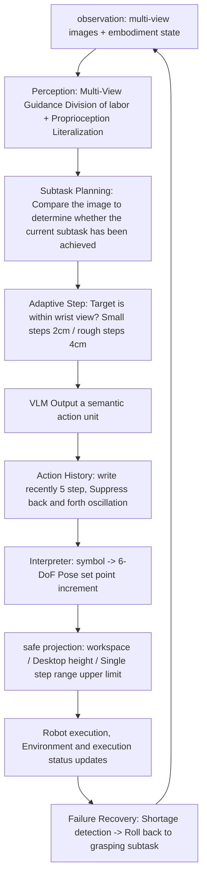
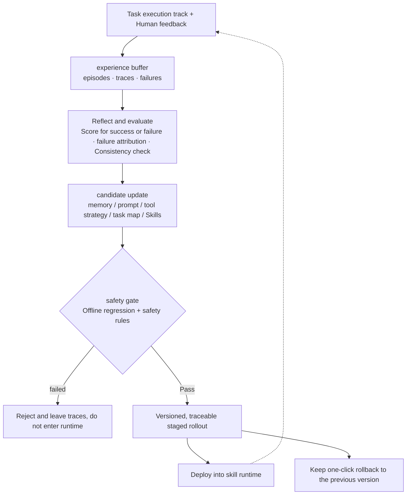

> This collection accompanies  and the architecture guide . It provides detailed readings of representative embodied-agent papers and recent advances.

# Embodied Agents: Paper Readings
{: id="具身智能体论文精读"}

This article focuses on a common problem: how robots organize perception, planning, execution, verification, and recovery into a closed-loop that can sustainably operate. The ten papers examine runtimes, orchestration, evaluation, evolution mechanisms, action interfaces, training objectives, general AgentOS, inspection-system governance, navigation-session handovers, and navigation-tool orchestration. The experiments cover simulation environments, text-interaction environments, and real robots. The SuperNav entry provides a brief introduction and links to the full reading in the extended VLN collection.

|Paper|Main entry points|representative verification|
|---|---|---|
| [HoloAgent-0](#holoagent-0) |AgentOS, typed skills and hierarchical Spatial memory|HM3D, ScanNet, real heterogeneous robots|
| [Pigey](#pigey) |inference time physical orchestration, TAMP/VLA dual backend and double verification|LIBERO-PRO, DROID real robot|
| [Thea](#thea) |Scene graph context and evaluator exit code|L1–L3 long-horizon real robot tasks, cross-embodiment deployment|
| [Zetta](#zetta) |High-frequency judge, recovery action library and offline self-evolution|LIBERO-Pro, concurrent sampling infrastructure|
| [Show-Harness](#show-harness) |Semantic action unit and embodiment interpreter|Franka, AgileX, simulation and real robot generalization|
| [SPACE](#space) |Skill-guided adaptive action chunking and reinforcement learning| ALFWorld, ScienceWorld |
| [ABot-AgentOS](#abot-agentos) |Dual LLM, Agent Harness, and Lifelong Multimodal Memory|EmbodiedWorldBench, memory benchmark|
| [Harness Robotic OS](#harness-robotic-os) |Patrol runtime, hierarchical memory and self-evolution governance|Real community navigation and inspection; cognitive operation needs to be controlled and verified|
| [NavHarness](#navharness) | Cross-session search handovers, memory processing, recovery, and two-stage verification | GOAT-Bench, IR2R-CE, and continuous deployment across 36 houses in simulation |
| [SuperNav](#supernav) | Readable navigation skills, visual-point tools, and task-context management | Single-object, multi-object, and demand-driven navigation; HM3D; Unitree Go2 deployment |

The filter bar below supports multiple tag combinations; when multiple tags are selected at the same time, the page will only retain papers that meet these tags.

## 1. HoloAgent-0 (2026)
{: id="holoagent-0"}
——Unified embodied agent closed-loop operating system: decoupling heterogeneous physical skills, using layered 3D multi-modal Spatial memory as the physical anchor

📄 **Paper**: [arXiv:2606.23565](https://arxiv.org/abs/2606.23565) · [Code](https://github.com/HorizonRobotics/HoloAgent)

---

### Key takeaways
{: id="精华"}

- **closed-loop embodied runtime architecture**: Proposes the Embodied AgentOS operating system for physical robots, which reconstructs task planning from a single open-loop text generation to a continuous closed-loop of "observation-retrieval-action-monitoring", effectively filling the execution uncertainty of the physical world.
- **Standardized Typed Skills Abstract (Typed Skills)**: Developed action specifications including structured parameters, preconditions and runtime heartbeat status flow, unified encapsulation of VLA grasping, whole body movement control and active navigation, shielding the underlying differences of heterogeneous embodiment controllers.
- **Hierarchical multi-modal Scene graph (HMSG)**: Constructs a four-layer topology structure consisting of floor, room, view and object, cleverly introduces the "view layer" to act as a bridge between geometric coordinates and appearance reasoning, supporting efficient spatial retrieval that mixes speed and slowness.
- **Open Vocabulary 3D Dynamic Semantic Mapping**: Fusion of multi-camera neural depth estimation and multi-scale SigLIP features, combined with 3D instance back-projection correlation algorithm, to achieve local lightweight incremental refresh when physical changes occur in the environment.
- **real robot heterogeneous full-stack deployment verification**: Completed deployment on Unitree G1 humanoid, R1 humanoid and dual-arm mobile chassis, comprehensively refreshing industry indicators on ScanNet semantic mapping and HM3D/real robot long-horizon navigation benchmarks.

---

### 1. Background and problem
{: id="1-研究背景问题"}

Large language model agents in the digital world rely on structured codes or software interfaces, with deterministic input and output, transparent state transitions, and reversible trial and error costs; however, in the physical world, the robot's action execution is continuous, irreversible, and highly dependent on the specific body configuration. Due to perceptual degradation, sensor noise, and dynamic changes, robots often go to the wrong room due to outdated environmental memory, or long-horizon tasks are interrupted and crash due to incomplete feedback from the controller. This system-level obstacle is called the "Embodiment Gap." Current embodied intelligence research often separates VLA operation strategies, 3D spatial representation, whole-body motion control, and active navigation into single-point algorithm modules. There is a lack of a unified operating system runtime to schedule heterogeneous skills, maintain a persistent 3D space base, and drive fault recovery based on real-time heartbeat evidence.

---

### 2. Methods and innovations
{: id="2-主要方法创新点"}

#### ① Overview of the overall framework
{: id="-整体框架概述"}

HoloAgent-0 organizes long-term embodied tasks into a self-Closed-loop systems project. The overall architecture includes three core coupling layers and a monitoring and verification layer, and implements strongly typed communication through the ROS2 topic bus:
- **Embodied AgentOS runtime layer**: receives human natural language intentions, combines spatiotemporal memory to compile instructions into a skill graph with dependencies (Skill Graph), and is responsible for resource scheduling, execution status monitoring and autonomous re-planning during the execution period.
- **Embodied Skill Layer**: Abstracts the underlying heterogeneous algorithms and controllers into typed skills (Typed Skills) with a unified interface, covering voice interaction, open vocabulary perception, autonomous navigation (HoloNavi), double-arm operation (HoloBrain) and whole-body movement (HoloMotion).
- **Embodied Memory Layer**: Maintains three-dimensional metric geometry, topological navigation relationships, open vocabulary 3D semantic voxel maps, and hierarchical multimodal Scene graphs (HMSG) composed of floors, rooms, perspectives, and objects, while recording the temporal trajectory of task progress.
- **Monitoring & Verification Layer (Monitoring & Verification Layer)**: Real-time monitoring of the heartbeat, confidence and error modes of skill execution, providing multi-modal interactive feedback to users, and waking up AgentOS for dynamic re-planning when unrecoverable faults occur.

  
<figcaption>HoloAgent-0 closed-loop End-to-end runtime architecture overview</figcaption>

#### ② Embodied skill layer and Typed actions abstraction (Typed Skills)
{: id="-具身技能层与类型化动作抽象typed-skills"}

In traditional large model tool calls, agents usually treat the underlying tools as black-box functions, but this can easily lead to deadlocks on physical robots. To this end, HoloAgent-0 proposes a structured skill abstract contract:
1. **Command Schema**: Each skill explicitly declares the name, strongly typed input parameters, preconditions (Preconditions) and expected physical post-state (Expected Effects). For example, operational skill `pick(object=mug, support=table)` declares pre-geometric anchoring requirements for grasping objects and support planes.
2. **Runtime Status Interface**: The execution end no longer just returns a binary completion identifier, but continuously broadcasts structured tracking data including progress ratio, success status, fine-grained failure modes (such as object inaccessibility, grip slippage, collision risk, and posture singularity), algorithm confidence, execution delay, and whether the failure is recoverable (Recoverability) through the ROS2 status topic.

##### Stuck Point Dimensionality Reduction 1: Digital Software Tool Calling vs. Embodied Typed Skills (Typed Skills)
{: id="卡点降维-1数字软件工具调用-vs-具身类型化技能typed-skills"}

|Compare dimensions|Traditional digital agent tool calling (Software Tool Calling)|HoloAgent-0 Embodied Typed Skill|
|---|---|---|
|**calling property**|Synchronous or short-term asynchronous API, with determined input and output and clear semantic boundaries|The physical world is a continuous and time-consuming process that is susceptible to interference from dynamic noise, occlusion and sensor drift.|
|**feedback granularity**|Only the final execution result or standard error code is returned|Continuously publish runtime heartbeat stream (including progress percentage, local confidence and collision risk)|
|**failure mode**|Single error code (such as HTTP 404/500), usually no physical side effects|Subdivide recoverable and non-recoverable modes (such as robot arm joint limit, grip slip, target loss)|
|**recovery mechanism**|Simple fixed number of exception retries (Retry) or text error return|Explicitly expose recoverability, driving AgentOS rotation perspective recheck, navigation fine-tuning or re-planning|

> **Specific execution flow example**:
> The robot received the instruction "Put the yellow towel on the table into the laundry basket."
> 1. AgentOS issues instructions `pick(object="yellow towel", support="desk")` through the ROS2 topic;
> 2. The HoloBrain operation backend takes over control and continues to return the status stream `{progress: 40%, status: "in_progress", confidence: 0.88}` when the robotic arm moves to the pre-grasping pose;
> 3. When the gripper is closed, the tactile and posture feedback detects an empty grip, and the status flow is immediately reported `{progress: 75%, status: "failed", failure_mode: "grasp_slip", recoverability: "recoverable"}`;
> 4. AgentOS captures that recoverability is true and does not mechanically repeat blind grasping. Instead, it automatically schedules the perception backend to perform viewpoint fine-tuning and mask re-evaluation, updates the 3D bounding box of the target object, and then reinitiates grasping closed-loop.

For different body postures, HoloAgent-0 is connected to four specialized backends:
- **HoloNavi space navigation**: responsible for target search and path cruising in a wide range of environments;
- **HoloBrain embodied operation**: Based on the general VLA large model, it generates the end posture trajectory of both arms and end clamps, and can autonomously complete delicate operations such as grasping, placing, pouring water, and folding clothes;
- **HoloMotion full body motion**: supports trajectory tracking mode (for human-computer interaction actions such as waving, bowing, shaking hands, dancing, etc.) and speed control mode (for omnidirectional walking, steering, emergency obstacle avoidance and recovery after falling);
- **Cross-Embodiment Coordination**: Multiple heterogeneous robots divide labor through a shared 3D Spatial memory base and a unified step state flow. For example, a wheeled mobile chassis first inspects and builds maps and marks the target location, and the humanoid robot then accurately performs complex desktop operations.

  
<figcaption>HoloAgent-0 A real closed-loop implementation case on a diversified robot platform (operation control, object finding, multi-machine collaboration, long-distance folding)</figcaption>

#### ③ Spatial memory and open vocabulary 3D semantic mapping
{: id="-空间记忆与开放词表-3d-语义建图"}

Spatial memory provides a unified metric three-dimensional physical base for robot perception and action:
- **Unified geometry base**: Decoupled sensor hardware configuration, supporting not only metric mapping (such as FAST-LIVO) where lidar, IMU and cameras are tightly coupled, but also pure visual multi-camera GeoFlow-SLAM++ system. GeoFlow-SLAM++ uses a 3D basic model to directly predict dense depth from multi-view RGB images, and builds high-quality metric maps without a hardware depth camera through multi-camera two-stage optical flow matching, point and surface geometry optimization, and loop bag-of-word retrieval.
- **Open vocabulary semantic projection**: The online mapping module seamlessly upgrades the universal semantics of the 2D basic model to the 3D point cloud and voxel grid.

  
<figcaption>HoloAgent-0 Open Vocabulary 3D Semantic Mapping and Dynamic Scene Adaptation Framework</figcaption>

##### Stuck Point Dimensionality Reduction 2: Three-Scale SigLIP Semantic Feature Fusion and 3D Instance Continuous Association
{: id="卡点降维-2三尺度-siglip-语义特征融合与-3d-实例持续关联"}

When upgrading 2D features to 3D space, if only a single cropped area feature is extracted, the environmental context is easily lost; if full image features are extracted, the discrimination of small objects will be diluted. HoloAgent-0 designed a multi-scale feature weighted fusion formula for this purpose:

$$d = \sum_{i=0}^2 w_i \odot d_i$$

Here, $d_i \in \mathbb R^d$ and $w_i \in \mathbb R^d$ are feature fusion weights, and $\odot$ represents the Hadamard product.

> **A small example of hand-calculated feature fusion and projection correlation**:
> Assume that the feature dimension is simplified to 3 dimensions, and a water glass is detected in the current key frame:
> 1. Extract SigLIP embedding vectors at three scales:
>    - Full image context feature $d_0 = [0.2, 0.8, 0.1]$ (records large scene information such as kitchen and workbench);
>    - SAM2 precise segmentation mask feature $d_1 = [0.9, 0.1, 0.3]$ (highlighting the material and shape of the water cup);
>    - Minimum external rectangular frame feature $d_2 = [0.7, 0.4, 0.2]$ (supplementary handle and tabletop contact edge details);
> 2. Assume that the corresponding feature balance weight vectors are $w_0 = [0.2, 0.2, 0.2]$, $w_1 = [0.5, 0.5, 0.5]$, and $w_2 = [0.3, 0.3, 0.3]$;
> 3. The final object vector after element-by-element fusion is:
> $d = (0.2 \times [0.2, 0.8, 0.1]) + (0.5 \times [0.9, 0.1, 0.3]) + (0.3 \times [0.7, 0.4, 0.2]) = [0.70, 0.33, 0.23]$. This vector combines macroscopic scene attribution with local appearance details.
> 4. **cross-view 3D instance association**: When a new frame is collected after the robot is displaced, the system back-projects the maintained 3D instance point cloud $V_{t-1}$ back to the current camera plane through the external parameter matrix to obtain the projection prediction mask $\tilde m_j$. The system calculates the intersection ratio $\operatorname{IoU}(m_k, \tilde m_j)$ of $\tilde m_j$ and the current new segmentation mask $m_k$. If the intersection ratio is greater than 0.5, it is considered to be the same object and the unique instance ID is reused; if there is no overlap, a new 3D independent instance is opened.

  
<figcaption> Cross-time frame 3D instance back-projection matching and continuous ID tracking mechanism</figcaption>

#### ④ Hierarchical multi-modal Scene graph (HMSG) and fast and slow hybrid retrieval mechanism
{: id="-分层多模态场景图hmsg与快慢混合检索机制"}

In order to take into account both spatial range and fine-grained perception, HMSG vertically decouples environmental information into a four-layer topology:
1. **Floor**: records the vertical height range and the overall semantics of the floor, and delineates the vertical range in coarse granularity;
2. **Room layer (Room)**: Contains 2D polygon geometric boundaries, point clouds and room type CLIP vectors to define the functional space;
3. **perspective layer (View)**: **, the core innovation layer of**HMSG. Record the 6-DoF rigid body pose, RGB-D image frame and local panoramic descriptor at the historical sampling location of the robot;
4. **Object layer (Object)**: Maintain 3D Oriented BBox, point cloud clusters and fused instance SigLIP features.

  
<figcaption> Hierarchical multimodal Scene graph (HMSG) four-layer structure (floor-room-view-object) and level and topological edge association</figcaption>

The traditional Scene graph points directly across the room to discrete objects, resulting in the robot's lack of perception of the real observation angle and occlusion conditions. Blindly calling the time-consuming multi-modal model (VLM) when facing a large space will cause a computing power collapse. The "View" in HMSG naturally retains the visual links (Visibility Links) between the observer's perspective and objects, allowing the system to quickly screen out a very small number of relevant perspectives on metric geometry, and then call VLM specifically for high-quality visual identification.

#### ⑤ HoloNavi target navigation pipeline
{: id="-holonavi-目标导航流水线"}

Based on HMSG, the HoloNavi navigation system connects tasks into three interlocking execution loops:
1. **Hierarchical Object Navigation**: Use semantic analysis to match floor, room and object candidates, and use hierarchical CLIP similarity to quickly prune the irrelevant search space;
2. **Online Verification Loop**: When the robot reaches the candidate viewpoint, the real-time camera image is submitted to the open word detector and VLM for double verification. If the initial determination fails, the robot automatically rotates in place at multiple angles to collect the surrounding perspective for a second recheck, confirms the true coordinates of the target and then navigates to a safe operating distance;
3. **Frontier Exploration Loop**: If the initial search of HMSG fails or the online verification fails again, the system immediately switches to Frontier Exploration mode. Comprehensive scoring is performed based on the information gain expectation, task semantic relevance, traversability and dynamic constraints of the candidate frontier points, guiding the robot to explore unknown areas and continue to perform incremental mapping and target sniffing while traveling.

  
<figcaption> HoloNavi object target navigation whole process: hierarchical semantic matching, online multi-view verification and cutting-edge incremental exploration</figcaption>

#### ⑥ Dynamic spatiotemporal memory adaptive incremental update (Dynamic Memory Update)
{: id="-动态时空记忆自适应增量更新dynamic-memory-update"}

The real world is constantly evolving. HoloAgent-0 defines three types of core events that trigger memory refresh:
- **Perception conflict event**: The new sensor data and the existing map are significantly offset in spatial geometry or color;
- **skill operation result event**: The robot performs grasping placement (such as picking up a water cup) to cause the object to break away from the original support surface, or navigation is blocked and new obstacles are exposed;
- **Human explicit feedback event**: The user issued error correction instructions for room naming or object attributes through voice.

When performing an update, the memory layer first uses the current observation to perform robust relocation in the existing geometric map, locally clears out-of-date point clouds and voxels that cause conflicts, and integrates new features into the local geometry. The semantic layer updates the bounding box of the affected 3D instance, and HMSG **only performs an in-situ topology update** on the affected local subgraph (recalculates the room and visual angle to which the object belongs), without having to bear the high cost of reconstructing the entire global Scene graph.

  
<figcaption> Comparison of adaptive refresh of local scene memory in dynamic environment (in-situ update of local map and Scene graph subgraph after desktop object moves)</figcaption>

---

### 3. Results and findings
{: id="3-核心结果发现"}

- **HM3D-ObjNav simulation benchmark navigation performance jumps**: Under the standard simulation benchmark without hardware noise, HoloAgent-Nav equipped with AgentOS closed-loop achieved a success rate (SR) of **82.6%** and **42.8% path length weighted success rate (SPL)** is significantly ahead of existing representative navigation solutions in the industry, such as MSGNav (74.1% SR / 33.4% SPL), WMNav (72.2% SR / 33.3% SPL) and FSR-VLN in open-loop state (80.8% SR / 41.0% SPL), confirming that the closed-loop monitoring and retry re-planning mechanism can significantly improve the completion rate of complex tasks while ensuring path efficiency.
- **Excellent robustness of long-distance navigation in real physical apartments**: In the multi-target search evaluation of real indoor apartments, HoloAgent-Nav achieved a real arrival rate of **97.70%** under the most stringent Top-1@1.0m hit standard, and the Top-5 arrival rate reached **98.90%**; for comparison, the well-known baseline OK-Robot in the same scenario has only 60.92%, HOV-SG only 51.72%, and MobilityVLA only 34.48%. What’s even more striking is that the scores of HoloAgent-Nav under different judgment thresholds of 1.0m, 2.0m and 3.0m are completely consistent, indicating that the successful samples all accurately approach the core operating area within 1.0m, showing extremely robust position and orientation docking accuracy.
- **High-quality open vocabulary 3D semantic mapping**: On the ScanNet data set, HoloAgent-Memory achieved **31.58% mIoU** and **61.58% in online (Online) computing mode Frequency-weighted accuracy (f-Acc)**, the performance clearly overwhelms other online mapping algorithms (such as Open-Fusion's 18.02% mIoU, Concept-Graph's 16.29% mIoU), and even approaches the large model mapping algorithm of offline computing, providing a solid and accurate high-quality semantic index base for upper-layer agents.
- **real robot multi-morphological complex long-distance composite tasks**: Successfully completed on the Unitree G1/R1 bipedal humanoid and two-arm mobile platform including "finding objects from the bedroom", "multi-machine voice collaborative dance guidance" and the extremely challenging "long-distance mobile laundry folding" (covering autonomous cruising from the mobile chassis to the target workstation, flexible clothing sorting and grasping with both arms) , table tiles to fine folding) and many other closed-loop tasks.

---

### 4. Limitations
{: id="4-局限性"}

- At present, the basic model of robot embodiment is still unable to seamlessly cover the complete action spectrum from large-scale spatial navigation, precise dual-arm operation to whole-body torque-level motion control with a single model. The system's cross-embodiment migration of different physical configurations still relies on engineered controller bridging and dynamics tuning.
- The industry still lacks an end-to-end unified long-horizon real robot evaluation benchmark covering operation, multi-modal navigation and whole-body dynamic interaction. For large-scale complex architectural scenes, there is still room for further improvement in the delay of long-term cross-view feature fusion and fine-grained geometric reconstruction accuracy.

## 2. Pigey (2026)
{: id="pigey"}
———Addressing the Orchestration Gap in Generalist Robots via Physical Agency

📄 **Paper**: [arXiv:2607.21725](https://arxiv.org/abs/2607.21725)

---

### Key takeaways
{: id="精华-1"}

- **reveals the “Orchestration Gap” of embodied intelligence**: It is pointed out that the main bottleneck of current general-purpose robots is not the lack of low-level motion control capabilities, but the lack of a closed-loop orchestration architecture that can coordinate perception, planning, verification and recovery; a single end-to-end model is easily overfitted and blindly executed when directly prompted, resulting in greatly limited performance.
- **Pure inference time closed-loop physical agent (no need for any new training)**: Build a closed-loop orchestrator Pigey driven by the Frontier Visual Language Model (Frontier VLM), decompose complex long-term instructions into short-term sub-goals, and only call the frozen motion strategy of the underlying organization through high-level perception and tools, without retraining or fine-tuning low-level weights at all.
- **Geometric Programming (TAMP) and Neural Strategy ($\pi_{0.5}$) Complementary Dual Backend**: Combining deterministic tasks with motion planning (TiP ToP) and end-to-end visual motion strategy ($\pi_{0.5}$) are decoupled and integrated - rigid objects use grab-and-place planning with geometric certainty, and deformable objects, contact-intensive operations, or planning are seamlessly upgraded to VLA.
- **sensor and wrist vision conservative double verification mechanism**: Split the open-loop "grab-and-release" atomic action, and use the gripper width sensor (`is_grasped`) combined with the wrist camera image to perform strict conservative verification after grasping; if grasping is not stable, immediately retry or upgrade in place, eliminating the compound error of "empty gripper delivery" from the source.
- **out-of-distribution and real robot long-term task performance leap**: The frozen $\pi_{0.5}$-LIBERO zero-sample success rate soared from 12.8% to 53.3% on the strong perturbation benchmark LIBERO-PRO; it reached 97.3% in 30 complex long-term evaluations of the real DROID robotic arm The overall success rate (baseline $\pi_{0.5}$ is only 16.7%).

---

### 1. Background and problem
{: id="1-研究背景问题-1"}

With the development of large models and robotics technology, the field of robotics generally tends to build huge single vision-language-action (VLA) models, hoping to integrate high-level semantic understanding, common sense reasoning, space planning, successful detection, abnormality recovery and underlying millimeter-level motor control into the same neural network through large-scale pre-training. However, this monolithic end-to-end paradigm faces practical bottlenecks that are difficult to overcome:

1. **Instruction sensitivity and semantic degradation**: In the end-to-end strategy, high-level natural language instructions often degrade into weak prior conditions, and the model can easily fall into the mechanical memory of specific training trajectories and completely lose its ability to adjust when faced with scene disturbances (such as target displacement, occlusions, and the target is occupied);
2. **open-loop execution and compound errors**: Existing code-as-policies or traditional task and motion planning (TAMP) often rely on one-time offline generation and are in an open-loop blind running state during the execution phase; once grasping slippage or collision occurs in the middle, the system still advances mechanically according to the predetermined trajectory, and ultimately fails completely;
3. **Lack of orchestration capabilities**: True physical versatility requires the system to have a "Physical Agency" - not only knowing "what to do", but also observing "whether it was done or not" during execution, and actively retrying, bypassing obstacles or changing means when it fails.

**Core question**: Without retraining or fine-tuning the underlying motion strategy at all, can the full potential of the pre-trained frozen strategy be unleashed and bridge the "orchestration gap" of general-purpose robots through only a closed-loop physical orchestration framework at inference time?

---

### 2. Methods and innovations
{: id="2-主要方法创新点-1"}

The core idea of Pigey is to decouple **control and orchestration**: the bottom layer only retains two frozen motion executors (TAMP planner and $\pi_{0.5}$ VLA), and the upper layer consists of cutting-edge VLM (such as multi-modal cutting-edge large models such as Claude/GPT) to form a closed-loop decision-making brain, running "Perceive"→ The physical execution cycle of "Reason → Action → Verify".

  
<figcaption>Pigey closed-loop physical Agent system architecture: Frontier VLM acts as an orchestrator to coordinate perception, reasoning, execution and double verification, routing down to the frozen TAMP and VLA motion backend</figcaption>

#### ① Overview of the overall framework
{: id="-整体框架概述-1"}

As a closed-loop embodied intelligence Agent, Pigey maintains the global context history $h$ after receiving the global long instruction $I$ (for example: "A child is visiting - put the toys on the plate and put the dangerous items in the box"). In each step of interaction, VLM only selects and calls a structured tool (Tool Call), obtains real feedback from the physical world sensors and cameras, and updates the internal state accordingly until all sub-goals are achieved and terminated by calling `Done`.

The system splits the complex responsibilities originally undertaken by a single large model into clear module chains:
- **Open vocabulary target perception and spatial anchoring**: Use the open vocabulary detector to lock objects and their labels in the scene to limit the vocabulary space of high-level planning;
- **Task-level long-term memory**: Maintain the list of completed operations, current gripper holdings and remaining items on the desktop;
- **Geometry and Neural Dual Motion Backend**: Rigid catch-and-release analytically verifiable TAMP, irregular/contact-intensive operation VLA;
- **Conservative double verification and two-way upgrading and downgrading engine**: Sensor signals and visual judgments support each other, driving retry, troubleshooting and strategy switching.

  
<figcaption>Pigey’s physical reasoning capabilities demonstrated in real robot dog/robot arm scenarios: deductive reasoning, safety common sense, obstacle elimination, long-term scene memory and spatial geometry stacking</figcaption>

#### ② Explain module by module
{: id="-逐模块讲解"}

- **Perception and target semantic anchoring (Perceive & Grounding)**
  - **Input**: multi-view camera images (main view and wrist view) and underlying robot joint status.
  - **Processing**: Call the open vocabulary detector to generate a set of object candidates with bounding boxes and semantic labels. These detection tags strictly constitute Pigey's "controlled vocabulary" (Vocabulary), and the parameters of all grasping or placement operations must directly reference the detection tags.
  - **output**: structured scene perception dictionary, including object label list, local high-resolution image of the wrist and current gripper status.
  - **Design motivation**: To prevent the language model from inventing the names of unseen objects out of thin air in physical interactions, connect high-level fuzzy concepts (such as "dangerous goods", "vegetarian food", "smallest container") directly to specific entities that have been positioned in the physical scene.

- **Decoupled complementary dual-motion backends (Frozen Motor Backends)**
  - **TAMP geometric backend (`Pick(ℓ)` / `DropAbove(ℓ)`)**: built based on the TiPToP framework, responsible for spatial collision-free motion planning and six-degree-of-freedom geometric grasping pose generation. Pigey performed a key refactoring - forcibly cutting Pick-and-Place, which was originally packaged as a single open-loop execution, into two independent tool calls, and inserting physical verification between grasping and placement.
  - **VLA neural backend (`VLARollout(s)`)**: encapsulates frozen pre-training $\pi_{0.5}$ closed-loop visual action control model, receiving short plain text sub-action description $s$ (such as `“grasp the cable”`), directly outputs continuous high-frequency end displacement and clamping jaw opening and closing.
  - **collaborative mechanism**: Conventional rigid objects tiled on the desktop call TAMP first to obtain extremely high trajectory certainty; stacked objects, easily deformable objects (such as cables, plush toys), or objects in deep containers are directly solved by VLA with compliant control characteristics.

- **Conservative Dual Verification**
  - **input**: the Boolean quantity `is_grasped` read by the displacement sensor embedded in the gripper, and the hand-eye (wrist) camera snapshot after the action is completed.
  - **processing**: The hardware sensor is used to confirm whether the physical clamping gap is within the clamping threshold; the leading edge VLM simultaneously observes the wrist camera to determine whether the target object in the field of view has been moved away from its original position and is in the center of the clamping jaw.
  - **conservative synthesis rule**: Both adopt the most pessimistic strategy - even if the motion backend report is completed, as long as `is_grasped == False` or the visual display target is still on the table, the step will be immediately judged as a failure and subsequent actions will be cancelled.

#### ③ Dimensionality reduction and decision flow diagram of stuck points
{: id="-卡点降维与决策流图"}

Readers in the field of embodied intelligence are often confused: **Why is the single end-to-end model (such as $\pi_0$ / $\pi_{0.5}$) still unable to perform simple catch and release with perturbation after large-scale pre-training? What exactly did Pigey’s closed-loop orchestration change?**

We dismantle its inner mechanism through the self-made Mermaid decision flow chart and comparison table:

To further see Pigey’s subversion of the traditional robot control paradigm, the comparison table is as follows:

|Dimensions|End-to-end single VLA (such as $\pi_{0.5}$ / OpenVLA)|open-loop code planning (Code-as-Policies / TiPToP)|closed-loop physical agent (Pigey article)|
|---|---|---|---|
|**Control division of labor**|Language understanding, planning, verification and motion control are all coupled into a single large model|LLM generates complete Python code or action plan, and the underlying open-loop is completed|Frontier VLM is only responsible for closed-loop orchestration and verification, and all actions are delegated to the freezing strategy|
|**execution mode**|Step autoregressive, lack of reflection on macro task status|One-time planning, "blind" to object slippage and environmental changes during execution|Each tool call must undergo double verification by sensors and vision, and dynamic closed-loop advancement|
|**Abnormal recovery**|Extremely poor (after catching the air, continue to place the air gripper later)|None (planning failure or execution interruption directly throws an exception and crashes)|Native support for obstacle removal, replacement and re-grabbing, TAMP and VLA two-way upgrading and downgrading|
|**Training cost**|Tens of thousands of hours of real robot trajectory re-fine-tuning/post-training are required|No training required, but relies on an ideal simulation environment|**Zero fine-tuning**, fully utilizing ready-made frozen pre-trained models and classic planners|

> **gives an example (target displacement and empty recovery)**:
> Suppose the task is "put the red cup into the tray".
> - **single VLA / open-loop planning**: calculate the grasping trajectory and execute placement directly and coherently. If the cup is bumped and slips when the robotic arm reaches down, the robotic arm will still close the empty gripper and move it to the top of the tray to release it, thinking that the "mission is completed", and ultimately failing completely.
> - **Pigey closed-loop processing**:
>   1. Execute `Pick(red_cup)`;
>   2. After the robotic arm is closed, the gripper width sensor returns to `is_grasped = False`, and the wrist image detects that the cup is still in place;
>   3. Pigey intercepts the subsequent `DropAbove` action and records grasping failure;
>   4. Trigger `Perceive` to re-detect the precise coordinates of the cup after displacement, update the grasping posture and try again; if the cup is still not grasped correctly the second time, the backend is actively upgraded to `VLARollout` with supple fault tolerance to implement tactile grasping, ultimately ensuring that the cup is securely placed on the plate.

---

### 3. Results and findings
{: id="3-核心结果发现-1"}

The paper conducted a system comparative evaluation on the simulation benchmark LIBERO-PRO and the DROID workbench based on the real Franka robotic arm, which fully verified the multiplication effect of inference time physical orchestration on model capabilities.

#### ① LIBERO-PRO simulation benchmark evaluation
{: id="-libero-pro-仿真基准评测"}

LIBERO-PRO is the industry's most difficult perturbation test benchmark for complex long-term desktop operations. It introduces six rigorous perturbation suites, including object position swap (Obj. swap), target attribute swap (Goal swap), and spatial geometry perturbation (Spatial swap/task).

  
<figcaption>LIBERO-PRO Success rate comparison under six major perturbation suites: keeping the underlying frozen weight completely unchanged, only changing the inference orchestration mechanism</figcaption>

- The performance of the original SOTA VLA of **has seriously declined.**: When running directly with the open-loop prompt, even the current top $\pi_{0.5}$-LIBERO has an average success rate of only **12.8%**, and directly returns to zero in multiple tasks, proving that the end-to-end strategy has seriously overfitted the training set trajectory.
- **Pigey achieves SOTA breakthrough**: Under a zero-sample setting that does not use task-specific memory at all and does not fine-tune any weights, Pigey increases the average success rate of the freezing strategy to **53.3%**. Compared with the original strategy, it achieves a performance improvement of more than 4 times, significantly exceeding the code generation baseline. CaP-Agent0 (18.2%).

#### ② Real robot arm (DROID) capability test
{: id="-真实机械臂droid能力测试"}

In the real robot experiment, the research team set up 30 rigorous long-term tasks in 8 core competency dimensions, including common sense reasoning, conditional logic, spatial reasoning, obstacle clearance safety reasoning, active error recovery, and long-term memory recovery.

  
<figcaption> Type 8 capability probe success rate (%) on the real robot arm DROID: The bottom layer all runs the same π0.5-DROID weight</figcaption>

  
<figcaption> real robot long-term execution and single-frame inference chain demonstration: identifying non-vegetarian food in the vegetarian selection task and placing it in the bowl in sequence</figcaption>

- **comprehensive success rate 97.3% vs 16.7%**: $\pi_{0.5}$-DROID under direct prompts was almost completely wiped out on tasks requiring common sense reasoning, multi-step logic and spatial geometry (success rates were all 0%), with an overall success rate of only 16.7%; while Pigey relied on closed-loop common sense orchestration With backtracking verification, it achieved 100% perfect scores in most categories, with a total success rate as high as **97.3%**.
- **real robot abnormal recovery record**: When the placed target is occupied by foreign objects (such as debris in the coffee cup), Pigey can independently reason out the cascade recovery logic of "first remove the debris, place it next to it, and then put the target object in"; when the blind box blocks the target, it can infer that the target is under the box and actively lift the box to retrieve the object.

---

### 4. Limitations
{: id="4-局限性-1"}

1. **relies on cutting-edge large models for visual understanding and reasoning delay**: Since the cloud or high-specification VLM needs to be called after each key action for visual reflection and decision-making, the overall task execution rhythm is limited by API communication and reasoning throughput, and the interaction delay is higher than that of a single end-to-end model;
2. **The physical limit of the underlying action strategy cannot be exceeded**: Although the orchestrator can greatly repair logic and grasping timing errors, if both underlying motion backends (TAMP solver and $\pi_{0.5}$) cannot generate valid end trajectories due to singular points, collision deadlocks, or physical deformation distortion, it is still difficult for the upper-layer Agent to complete physical contact out of thin air.

---

## 3. Thea (2026)
{: id="thea"}
———Towards the Harness of Embodied Agents

📄 **Paper**: [arXiv:2608.11246](https://arxiv.org/abs/2608.11246) · [Code](https://github.com/EIT-HAI/Thea) · [Project Page](https://eit-hai.github.io/thea)

---

### Key takeaways
{: id="精华-2"}

- **Migrating the "Code Agent Harness Paradigm" to the Embodied Physical World**: Analogous to the successful essence of Claude Code and Codex in software engineering, it lies in the test feedback closed-loop (Harness) rather than the single model itself. It is pointed out that the key to realizing complex long-term tasks with embodied intelligence also lies in building a closed-loop Harness infrastructure that connects the physical reality.
- **Complements the two missing signal infrastructures in the physical world**: The software world naturally has "reading world status" (file tree/AST) and "judging action results" (exit code/error call stack), while the physical world has neither. Thea innovatively proposed two cornerstone mechanisms, **SceneGraph as Context** (Scene graph is context) and **Evaluation as Exit Codes** (evaluator is exit code), to realize physical closed-loop.
- **Strict reliability theory establishes the theoretical bound of evaluation accuracy $\alpha$**: Mathematically proves that the success rate of long-term tasks open-loop exponentially decays with the number of steps $n$ ($P_{\text{open}} = \prod p_i \to 0$); the error correction upper limit of closed-loop Harness strictly depends on the independent evaluator The judgment accuracy rate is $\alpha$ ("The upper limit of Harness is determined by its judge").
- **Cross-platform portability of decoupled models and embodiments**: Defines the standardized embodiment Profile and Tool abstract contracts, the model (LLM/VLM) and the hardware embodiment (bipedal humanoid Unitree G1, bionic humanoid Astribot S1, double-arm wheeled AgileX Cobot Magic) are bidirectionally pluggable and replaceable, and a single set of architectures is deployed aCross-embodiments.
- **long-term compound task performance jumped significantly**: In the real physics evaluation of multi-stage complex tasks (L1~L3), as the task complexity and number of steps increased, the success rate of traditional end-to-end strategies (ACT, $\pi_{0.5}$, LingBot-VLA) dropped sharply to 30%~40%, while Thea still maintained the highest difficulty level at L3 Ultra-high success rate of **87%**.

---

### 1. Background and problem
{: id="1-研究背景问题-2"}

The explosion of coding agents (Coding Agents, such as Claude Code, SWE-agent) has completely changed software engineering. The success of this type of system does not rest on the Superman model of "writing perfect code at once", but on the **test and retry closed-loop mechanism (Harness)** composed of the compiler, testing framework and Git - the agent runs the test after writing the code, captures stack errors, reflects on modifications and iterates repeatedly until the test passes.

When researchers attempted to translate this efficient Harness paradigm to the physical world, they encountered an essential structural gap. The foundational support that has taken decades to build up in the software world is all missing in the physical world:
1. **state cannot be "read" natively**: The code world has clear file systems and type symbols; while the sensors of physical robots only spit out chaotic and unstructured high-dimensional continuous point clouds and image pixels, which large models cannot directly use as accurate inferable context;
2. **action cannot be "determined" natively**: If an error occurs in the running program, a clear non-zero exit code (Exit Code) and stack trace (Stack Trace) will be returned immediately; but in reality, if the robotic arm reaches out to grasp, loses its hand, or collides, the physical world is silent. It will neither return a status code nor actively notify that "the action has ended", resulting in infinite accumulation of errors during open-loop execution.

**Core question**: How to build a set of embodied Harness in the physical world that can provide "persistent readable state" and "accurate exit code determination", so that high-level language/multi-modal models can reliably orchestrate underlying heterogeneous motion strategies and achieve closed-loop self-healing for long-term tasks?

---

### 2. Methods and innovations
{: id="2-主要方法创新点-2"}

Thea built an embodied closed-loop Harness that decouples the cutting-edge decision-making model (Model) from the diverse robot embodiment (Body) orchestration, and closed the embodied control loop through structured context evolution, standardized tool interfaces, and independent post-evaluators.

  
<figcaption>Thea Embodied Harness system panorama: Completely decouple the model (Model) and embodiment (Body), establish a perception-action-verification closed-loop through callable tools (Tool), Scene graph context (Scene graph) and independent evaluator (Evaluator), and verify it on three different embodiments</figcaption>

#### ① Overview of the overall framework
{: id="-整体框架概述-2"}

In the Thea architecture, embodied agent consists of four core components:
1. **model (Model)**: high-level large language/visual language model, only responsible for understanding tasks, reading dynamic context, and output structured tool calls;
2. **embodiment and tool layer (Body & Tools)**: Unify the underlying mobile navigation, robotic arm grasping, and skill strategies (such as ACT, diffusion strategy, $\pi_0$) into a standardized Tool with pre-check (Pre-hook) and post-trigger (Post-hook);
3. **Scene graph context (SceneGraph as Context)**: Precipitate a persistent, symbolic Scene graph with 3D bounding boxes and topological relationships from the continuous perceptual flow, analogous to the file system in software engineering;
4. **exit code evaluator (Evaluation as Exit Codes)**: an independent visual evaluator triggered by the system structure after each action, returning a three-state execution verdict (Success/Failure/In-progress) and failure attribution.

  
<figcaption>SceneGraph as Context: Fusion of the sensor’s continuous multi-modal observation and the action results confirmed by the evaluator into a unified symbol Scene graph, generating a streamlined briefing (Brief) that is refreshed and injected into the context in rounds, and supports on-demand in-depth query</figcaption>

#### ② Explain module by module
{: id="-逐模块讲解-1"}

- **SceneGraph as Context (readability of world state)**
  - **Input**: RGB image, depth map, LiDAR point cloud, and robot pose reported by the underlying odometer.
  - **processing**: The system uses the perception pipeline to discretize the continuous physical space into a dynamic graph structure containing the object center coordinates, 3D bounding box, visible confidence and spatial topological relationships (such as `on(bowl, table)`, `near(robot, table)`, `holding(gripper, cup)`); only after passing through the evaluator Only the action results that are confirmed to be truly successful (Confirmed) will be written into the topological relationship changes of the graph.
  - **output**: Before each round of decision-making, the graph is refined into a high-level structured brief (Scene graph brief) and pushed into the refreshed context (Refreshed context); the model can also call tools on demand through reference ID (Ref-keyed queries) to query the historical high-definition snapshots and detailed geometric properties of a specific object.
  - **Design motivation**: Completely solve the problem of context being overwhelmed by massive continuous video/image tokens in long-term multi-round interactions, and give large models the ability to understand scenes similar to "reading the project code structure tree".

- **Evaluation as Exit Codes (Judgment of action results)**
  - **trigger mechanism**: Harness forces structured triggering through the built-in post-hook after each operation is executed, depriving the underlying execution strategy of the right to "self-evaluate and boast".
  - **Processing**: evaluator It only receives the visual observation at the current moment and the post-condition declared by the tool, which is completely independent of the high-level decision-making model; it outputs three-state judgments - `Success` (success), `Failure` (failure with detailed causal explanation, such as "not grasped due to end offset", "target blocked by drawer"), `In-progress` (the action is still progressing for a long time and has not timed out).
  - **output**: Package the verdict and failure attribution into the exit code response and inject the conversation history for the decision-making model to perform targeted retry or solution switching.

  
<figcaption>Evaluation as Exit Codes Trigger timing: The model calls the Tool execution strategy. After the execution is completed, the Harness post hook actively triggers the independent Evaluator, and outputs a three-state judgment with the failure reason and feeds it back to the model</figcaption>

#### ③ Dimensionality reduction and theoretical derivation of stuck points
{: id="-卡点降维与理论推导"}

**stuck point 1: How do software Harness and embodied physical Harness correspond?**

|Dimensions|Software Engineering Agent (such as Claude Code / SWE-agent)|Traditional robot control (single VLA/teaching playback)|Embodied Physics Harness (Thea)|
|---|---|---|---|
|**status carrier**|File system directory tree, AST, text code|Instantaneous single frame/multi frame continuous camera image pixels|**SceneGraph as Context** (persistent 3D topology symbol Scene graph)|
|**action output**|Terminal Shell Commands, File Editing Patch|Continuous joint angles/end 6-DoF track points|Semantic Tool encapsulated as standardized pre/post Hook (such as `grasp(ref)`)|
|**Execution feedback**|Operating system return code (Exit 0 / 1), Stack Trace|There is no feedback. Once the action is over, you will blindly proceed to the next step.|**Evaluation as Exit Codes** (three-state decision + structured failure diagnosis reason)|
|**Error correction mechanism**|Read the error log, rewrite the code and recompile|There is no way to correct the error. After catching a short shot, I will run through the subsequent long sequence empty-handed.|Read in the failure attribution, fine-tune the pose and try again or actively search for hidden targets|

**stuck point 2: Why is it said that "the upper limit of Harness is determined by its evaluator accuracy $\alpha$"?**

In a long-term multi-step embodied task, assuming a task contains $n$ sequential stages, the single-step success rate is $p_i$.
- In traditional open-loop mode, task success requires that every step must succeed:
  $$ P_{\text{open}} = \prod_{i=1}^n p_i $$
- When $n$ is large (such as $n=5$), even if the single-step success rate is as high as $p=0.8$, the total success rate will quickly degrade to $0.8^5 \approx 32.8\%$.

Thea introduces a detect-retry loop with a maximum retry count of $k$. The evaluator makes a correct judgment with an accuracy of $\alpha$ and a wrong judgment with an accuracy of $1-\alpha$. The paper strictly proves that because the evaluator has **false negatives** (misjudgment of true success as failure, resulting in redundant retries that damage the results) and **false positives** (misjudgment of failure as success, resulting in downward penetration of errors), the net pass reliability of each step of the system is directly determined by $\alpha$ Locked:

> **gives an example (specific number of reliability doubling)**:
> Assume a long-term delivery task of $n=5$ steps, and the success rate of the underlying strategy at each step is $p=0.8$:
> - **open-loop running**: the total success rate is only $0.8^5 = 32.8\%$;
> - **Thea closed-loop (evaluator precision $\alpha=0.95$, allowed to retry $k=3$ times)**: The effective reliability of a single step under retry and precise release jumps to $97.6\%$, and the total success rate of the entire 5-step task reaches $0.976^5 \approx 88.5\%$ achieves a task-level reliability gain of nearly 3 times that of !

---

### 3. Results and findings
{: id="3-核心结果发现-2"}

Thea has carried out comprehensive real-life physical experimental verification on diverse hardware platforms (Unitree G1 humanoid robot, Astribot S1 flexible humanoid robot, AgileX Cobot Magic wheeled dual-arm collaborative robot).

  
<figcaption> Comparison of task success rates across different difficulty levels (L1 basic operations, L2 spatial combination, L3 long-term long-distance multi-stage interaction): As the number of task steps increases, the baseline model drops off a cliff, while Thea maintains excellent robustness</figcaption>

#### ① Absolute advantages that scale with task complexity
{: id="-随任务复杂度扩展的绝对优势"}

The evaluation divided the tasks into three levels: L1, L2, and L3 according to time course and stage complexity, and compared mainstream single or layered baselines such as ACT, $\pi_{0.5}$, LingBot-VLA-V2, CaP-X, and SayCan:
- **L1 base layer (short-term single step)**: There is not much difference between each baseline and Thea, and the success rate is between 80% and 95%;
- **L2 Advanced level (including space rearrangement and multi-step dependency)**: The single strategy begins to experience trajectory drift and short-sucking disorder, the success rate drops to 55%~80%, Thea reaches **90%**;
- **L3 Ultimate layer (cross-room long-distance navigation + drawer opening retrieval + target object grasping and delivery)**: Single model (such as $\pi_{0.5}$, LingBot) plummeted to **40%** due to accumulated error, SayCan Due to the lack of fine-grained geometry and closed-loop verification, it is only 53%, while Thea maintains a success rate of **87%** with closed-loop retries and Scene graph memory.

  
The diverse physical intelligent behaviors that emerged driven by<figcaption>Thea: (a) autonomously draw power across rooms and deliver power banks; (b) actively open drawers for hierarchical retrieval when the target is not seen; (c) fine-tune the pose for secondary grasping based on the failure reasons fed back by the evaluator; (d) actively initiate human-machine dialogue to negotiate alternatives when the target drink is out of stock; (e) a single set of Harness across three completely different robots Seamless migration</figcaption>

#### ② Advanced physical behaviors emerging from closed-loop
{: id="-闭环涌现出的高级物理行为"}

Thanks to the dynamic closed-loop orchestration of tools by the general Harness architecture, the robot exhibits several high-order emergent behaviors that could not be achieved by the previous single model:
- **Active Perception**: When the power bank is not retrieved in the Scene graph, the model actively plans the detection link of "navigate to the counter → call the drawer pull tool → tilt the wrist camera to observe the inner layer of the drawer";
- **Targeted fault diagnosis and correction (Diagnosed Recovery)**: When the grasping can slips due to too far distance, the evaluator returns `“Fail: target slipped due to hand clearance offset”`, and the model actively generates `reposition(base, delta=[-0.05, 0])` in the next round. After adjusting the micro distance of the base, grasping is successful again;
- **Human-computer collaborative interaction (User Clarification)**: When the user requests the delivery of specific mineral water but only juice and tea are available on the desktop, the Agent autonomously suspends physical execution and asks the user questions to negotiate alternatives through the mobile phone interface.

---

### 4. Limitations
{: id="4-局限性-2"}

1. **Scene graph maintenance computational overhead and latency bottleneck**: As the indoor exploration space continues to expand, the computational overhead of 3D instance point cloud segmentation and real-time topology map merging increases significantly, which may lead to significant lags in round decision-making;
2. **Risk of misjudgment of the evaluator under three-dimensional occlusion and extreme deformation**: The evaluator relies on visual feedback from a single perspective or a hand-eye camera. Misjudgment may still occur under strong reflection, small object occlusion or extreme lighting conditions. Once a misjudgment occurs, it will directly limit the final reliability of the system.

---

## 4. Zetta (2026)
{: id="zetta"}
———An Efficient Closed-Loop Embodied Harness for Self-Evolving Physical Intelligence

📄 **Paper**: [arXiv:2608.16590](https://arxiv.org/abs/2608.16590) · [Project Page](https://air-embodied-brain.github.io/zetta)

---

### Key takeaways
{: id="精华-3"}

- **proposes an embodied closed-loop Harness for self-evolution physical intelligence**: Aiming at the dilemma that end-to-end single VLA/WAM lacks micro-correction during execution and traditional post-hoc reflection (Post-hoc Reflection) is difficult to attribute high-frequency physical interactions, a self-evolution system Zetta is built that integrates high-frequency online judgeing, in-situ exception recovery and offline skill distillation.
- **Structured evolvable Harness abstraction ($H = \{C, R, T\}$)**: Keep the underlying motion strategy frozen with the high-level orchestration commander, and define Harness decoupling as a runtime judge collection $C$, a recovery action library $R$, and a heterogeneous toolset $T$. The physical trial and error experience is directly distilled into parameterized code modules, which evolve autonomously with the interaction rounds.
- **Top-down minimal intervention hierarchical causal diagnosis**: Establish the core principle of "if the high-level logic can be solved, never change the underlying parameters", conduct top-down investigation according to priority (evaluation → judge → status → planning → recovery → parameters) to prevent generalization collapse caused by overfitting to a single use case.
-  **Discovering the Robotic "Aha Moment" of Embodied Physical Intelligence** : Reveals the objective law of the nonlinear transition of embodied self-evolution - the initial repair of the appearance keeps the performance at a low plateau. Once the root cause is located and the key "judge-recovery" closed-loop mechanism is evolved, the task success rate shows an instant vertical increase (such as a sudden surge from 10% to 95%).
- **High-throughput infrastructure with decoupled software and hardware Z-Infra**: Design a multi-node heterogeneous concurrent infrastructure, decouple the environment from the model computing pool, achieve an effective sampling throughput of up to 35.1 episodes/min (20.6 times improvement), and significantly shorten the inference delay by 91%, strongly supporting large-scale closed-loop self-evolution.

---

### 1. Background and problem
{: id="1-研究背景问题-3"}

Although Vision-Language-Action (VLA) and World Action Model (WAM) have made significant progress in large-scale data pre-training, they are still highly fragile when deployed in the physical world. The root cause is: **The physical environment is a continuous system** that evolves at high frequency at the millisecond level. If an object slips slightly, the desktop reaction force is unbalanced, or a small contact disturbance is not sensed and corrected at the moment of occurrence, it will quickly trigger a compound error cascade, eventually leading to the collapse of the global task.

In order to overcome this bottleneck, in recent years, academic circles have tried to introduce multi-modal Agents for "Post-hoc Reflection". However, traditional reflection mechanisms face insurmountable theoretical and engineering obstacles in embodied physical scenarios:
1. **Credit Assignment Problem (Credit Assignment Problem)**: A long-term operation failure involves hundreds or thousands of continuous control steps. Afterwards, the large model is asked to reflect in detail. The model cannot accurately infer which tiny declination angle of the wrist in the few seconds caused the disaster;
2. **Lack of on-site online verification environment**: The corrective hypothesis generated by post-mortem reflection can only be tested after the next complete re-run, which is extremely inefficient and easily misleading;
3. **Patching causes over-fitting (Over-Parameterized Repair)**: In the past, manual tuning or simple parameter tuning often forcibly modified the underlying control parameters for specific failed use cases, which not only destroyed the global semantic understanding and generalization distribution of the base VLA, but also caused catastrophic performance degradation in unseen environments and new random seeds.

**Core question**: How to build an embodied closed-loop Harness that does not need to modify the underlying policy parameters, can achieve high-frequency micro online correction, and can automatically sublimate failed physical experience and continue to evolve autonomously?

---

### 2. Methods and innovations
{: id="2-主要方法创新点-3"}

Zetta proposes a dual-loop physical intelligence system that integrates online high-frequency governance **and offline autonomous evolution**. Together with the hardware-decoupled high-throughput concurrent infrastructure Z-Infra, it achieves self-propagation and robust evolution of physical strategies.

  
<figcaption>Zetta self-evolution Embodied Harness Panorama: High-frequency running time, the judge leads the online action error correction loop, offline evolution Agent clusters failure trajectories and distills reusable skills, and cooperates with the decoupled infrastructure Z-Infra to drive throughput doubling and "aha moment"</figcaption>

#### ① Overall framework and double-loop operating mechanism
{: id="-整体框架与双环运行机制"}

Zetta clearly divides the system into two immutable entities and a core evolution carrier:
- **Two immutable entities**: underlying action strategy $\pi$ (frozen VLA/WAM parameters, $\nabla_\theta = 0$) and high-level orchestration Agent $A_{orch}$ (multimodal decision operator, constant decision logic);
- **core evolution carrier Harness ($H = \{C, R, T\}$)**:
  - **Runtime Critics ($C$)**: A high-frequency monitoring function that runs higher than the low-level action strategy, continuously scans real-time trajectory fragments and generates proposals with fault evidence and status suggestions $$P_t = \langle e_t, \hat{\sigma}_t \rangle$$;
  - **Recovery Action Library (Recovery Playbook, $R$)**: A collection of parameterized micro-actions targeting specific fault causal mechanisms;
  - **Heterogeneous Toolset ($T$)**: motion planner, 6-DoF grasping generator (GraspGen) and placement stabilizer.

The operation of the system is divided into **online parallel Rollout** and **offline Reflection & Evolve evolution cycle**:

  
<figcaption>Zetta evolution framework three-stage process: online concurrent collection of success and failure trajectories, offline update through failure portrait clustering (Phase I), hierarchical causal diagnosis and repair (Phase II), and cross-task generalization merging (Phase III) Harness</figcaption>

#### ② Explain module by module
{: id="-逐模块讲解-2"}

- **Phase I: Failure Profiling**
  - **input**: a collection of failed trajectories collected concurrently by multiple threads, and the corresponding nominal success reference trajectory (Nominal baseline).
  - **processing**: Slice the failed trajectories according to the physical stages of task advancement (pre-contact approach, grasping closure, spatial transportation, placement and release), and use the successful trajectories as the benchmark to cluster common instability modes.
  - **outputs**: a structured failure portrait list, pinpointing the common stage distribution of multiple failures.

- **Phase II: Hierarchical causal diagnosis and minimal intervention repair (Diagnosis & Repair)**
  - **Top-down diagnostic level**: Strictly follow the six-level priority investigation:
    $$ \text{Evaluation} \to \text{Critic} \to \text{State} \to \text{Planning} \to \text{Recovery} \to \text{Parameter} $$
  - **Design Motivation**: Give priority to solving problems by adding pre-aligned critics at high levels or calling geometric planning tools; it is strictly prohibited to directly dive into tampering with the joint stiffness of the underlying motor or fine-tune the low-level weights to maximize the broad generalization of the base model.
  - **Validation Guard**: Each code-level fix patch generated must be retested in-place on the same random seed that caused the failure, and submission is only allowed if it passes validation (Validate Passed).

- **Phase III: Harness Generalization and Merger (Harness Generalization)**
  - **processing**: Promote the specific seed patch that has passed verification into a universal judge and recovery logic with abstract parameters, perform conflict-free merging across use cases, package and generate versioned $H_{merged}$, and hot-reload it to the online environment.

  
<figcaption> Record of judge-recovery cascade intervention in a single rollout: when an object is detected to be off during transportation, re-approach is immediately triggered, when an invalid posture is detected, GraspGen is called to generate the posture, and in the final stage, smooth placement recovery is called</figcaption>

#### ③ Card point dimensionality reduction and self-made architecture diagram
{: id="-卡点降维与自制架构图"}

**stuck point 1: Why can’t physical interaction be solved by post-mortem reflection? How exactly does Zetta's microscopic closed-loop work?**

We clearly present the decoupled collaboration of Zetta's online millisecond-level interception and offline minute-level self-evolution through the Mermaid double-loop mechanism diagram:

```mermaid
graph TD
    subgraph Online ["Online high-speed execution loop (millisecond level)"]
        Obs["Real-time sensor observations s_t"] --> Policy["freeze action strategy π (VLA)"]
        Policy --> Action["Predictive control actions a_t"]
        Action --> Critic{"High frequency runtime judge C Monitor"}
        Critic -- "Nominal normal (Nominal)" --> Exec["Physical execution of actions"]
        Critic -- "trigger exception (Slip/Collision)" --> Intervene["Suspend action, call Recovery R"]
        Intervene --> Tool["Toolset T (Such as GraspGen / Re-approach)"]
        Tool --> Exec
        Exec --> StatusCheck{"determine the Episode Is it over??"}
        StatusCheck -- "Not over" --> Obs
        StatusCheck -- "success/failed" --> Buffer["Save to track storage pool"]
    end

    subgraph Offline ["Offline evolving self-healing loop (Minute level)"]
        Buffer --> Cluster["Phase I: Failure trajectory clustering and stage slicing"]
        Cluster --> Diagnosis["Phase II: top-down causal diagnosis (E -> C -> S -> P -> R)"]
        Diagnosis --> Patch["Synthesis reusable Critic / Recovery Skill code"]
        Patch --> Test{"Validation guard: Original failed seed retest verification"}
        Test -- "Verification passed" --> Generalize["Phase III: Abstract and merge to generate a new version H_merged"]
        Generalize --> Online
    end
```

**stuck point 2: What is the "Aha Moment" of embodied physical intelligence?**

In the process of embodied self-evolution, many readers easily mistakenly believe that the success rate of the strategy will increase uniformly and linearly with the amount of interactive data. Zetta reveals a very physically inspiring phenomenon:

|Evolution stage|Repair strategy type|typical behavior|Success rate performance|essential reason|
|---|---|---|---|---|
|**Round 0 (initial)**|Pure Freeze VLA open-loop run|Grabbing air, sliding, and hard collision between the end and the table|0% ~ 15% (very low)|Lack of any physical interaction feedback|
|**Round 1 (Initial exploration)**|**Symptomatic Fixes** (Symptomatic Fixes)|Relax the time budget, increase the number of retries, and increase the clamping jaw closing threshold|5% ~ 15% (**stagnation plateau period**)|The root cause of physical failure has not been touched, and errors still occur during transportation.|
|**Round 2 (moment of enlightenment)**|**Root-Cause Repair** (Root-Cause Repair)|Evolved `Pre-grasp Staging` (front space posture alignment) and `Grasp Retention Critic` (slip-off high-frequency interception)|**instantly soared to 90% ~ 95%**|Completely solves the line of sight obstruction and initial normal vector misalignment when the robotic arm reaches down.|

> **Give an example (the epiphany deduction of putting a red wine bottle into a deep dish)**:
> The task requires a robotic arm to place an upright red wine bottle smoothly onto a plate.
> - **Stage 1 (Pure VLA)**: Pounces directly towards the bottleneck, frequently knocking over wine bottles due to reflection and perspective deviation, the success rate is only 5%;
> - **Phase 2 (Trying to cure the symptoms)**: Evolution Agent tries to make the robot arm quickly retreat after grasping fails and increase the speed to try again. However, the bottle has been knocked crooked, and the next descent will inevitably miss the target again. The success rate is always hovering around 10%;
> - **Stage 3 (Aha Moment)**: Evolution Agent finally discovered the fundamental contradiction through causal diagnosis - "The bottle body is slender. If a pre-aligned posture is not established from the side, direct dive will inevitably touch the mouth of the bottle." So Zetta automatically synthesized two collaborative mechanisms:
>   1. `Pregrasp Staging`: The robotic arm first hovers 5cm directly in front of the bottle and flattens the wrist;
>   2. `Retention Critic`: Monitor the terminal inclination angle in real time during the lifting process, and immediately decelerate and fine-tune it once it slips.
> After the patch is loaded, the success rate of this task changes from **10% jumps to 90%** , truly crossing the physical bottleneck!

---

### 3. Results and findings
{: id="3-核心结果发现-3"}

Zetta conducted system evaluations on the international common embodied operation benchmark LIBERO-Pro and the RoboCasa kitchen long-term benchmark, and conducted comprehensive comparisons with the latest end-to-end baselines and Agent systems.

  
The "Aha Moment" of physical intelligence on<figcaption>LIBERO-Pro: The initial temporary fix caused the performance to stagnate for a long time. Once the root cause is located and the key judge-recovery mechanism is generated, the success rate increases sharply</figcaption>

#### ① Excellent task success rate and self-evolution scalability
{: id="-卓越的任务成功率与自演化扩展性"}

- **LIBERO-Pro simulation benchmark**: In the most challenging perturbation test, the success rate of the pure $\pi_{0.5}$ strategy was only 34.5%, while Zetta went through several rounds of autonomous closed-loop evolution and finally significantly increased the success rate to **90.8%**;
- **RoboCasa virtual kitchen benchmark**: In the complex long-term hinge cabinet door opening, kitchen appliance operation and item organization tasks, the success rate of the base model GR00T is 73.6%. After Zetta's independent evolution, it reaches the ultra-high level of **93.6%**;
- **Endless evolutionary gains**: Experiments have proven that with the accumulation of concurrent rollout experience pool, the self-evolution curve continues to rise, completely breaking the performance deadlock of traditional fixed strategies under data bottlenecks.

  
<figcaption> Cross-task zero-sample skills transfer verification: The pre-grasping, grasping retention and retry skill stacks precipitated in the source task (Goal-T8 red wine bottle operation) are implemented on the unseen target tasks (Goal-T2, T6, S3) without fine-tuning plug-and-play migration</figcaption>

#### ② Zero-sample cross-task skill transfer
{: id="-零样本跨任务技能迁移"}

The Critic and Recovery skills learned through evolution on a single task are not islands of overfitting, but have strong physical versatility:
- In the alignment approach, drop re-grab and buffer placement skill stack evolved on RoboCasa's `PnP-Stove` (stove pick and place), when the zero sample is migrated to the sink (`PnP-Sink`) task, the success rate jumps directly from 58% to **82%**; from 62% to **80%** when migrating to cabinets (`PnP-Cabinet`); from 72% to when migrating to toasters (`PnP-Toaster`) **90%**.

#### ③ Qualitative changes in engineering efficiency brought about by Z-Infra
{: id="-z-infra-带来的工程效率质变"}

- **throughput increased by 20.6 times**: By decoupling environment simulation nodes and model inference resource pools, Z-Infra increased the effective trajectory sampling throughput from 1.7 episodes/min to **35.1 episodes/min** under 64 concurrency, significantly ahead of the existing baseline. 7.7~12.8 times;
- **delay is significantly reduced by 91%**: The end-to-end decision-making delay is reduced by 91% (up to 11.1 times faster), completely eliminating the delay shackles of large model Agents participating in physical real-time closed-loop from the engineering base.

---

### 4. Limitations
{: id="4-局限性-3"}

1. **relies on the resetability of the emulator or digital twin.**: Offline autonomous evolution requires multiple in-place replays and patch verifications for failed random seeds. Currently, it performs most smoothly in simulation and high-precision digital twin environments with resettable characteristics. It is still risky to carry out independent trial and error in purely realistic physical scenarios with completely irreversible damage;
2. **Search boundary for automatic synthesis of high-frequency critic code**: When faced with highly nonlinear, non-rigid and extremely complex fluid or cloth operations, the automatically generated heuristic critic and recovery action space are difficult to exhaust all dynamic physical boundaries.

---

## 5. Show-Harness (2026)
{: id="show-harness"}
———Just a VLM Agent Can Play Robots

📄 **Paper**: [arXiv:2609.10522](https://arxiv.org/abs/2609.10522) · [Project Page](https://showlab.github.io/Show-Harness)

---

### Key takeaways
{: id="精华-4"}

- **proposed Embodied Harness's "semantic action unit" interface**: rewrite the robot control into a set of discrete, interpretable semantic symbols (`MV_FWD` / `ROTATE_CW` / `GRASP`...), VLM only spits out one symbol at each step, and then the embodiment The dedicated interpreter deterministically completes a small segment of real motion - the semantics of **are left to the model, and the metrics are left to the interpreter**. The two sides are completely decoupled, and the model is therefore always responsible for fine-grained physical decisions.
- **The same interface feeds the computing power of both ends at the same time**: Closed-source cutting-edge VLM can directly start the robot with zero samples (Cross-Task 89.0%); 2B open source small model can learn the same set of action vocabulary (86.0%) using rank-64 LoRA and single card H200 within two hours of fine-tuning. The key lies in the semantic action prediction based on the VLM native vocabulary. **does not add action headers and does not add special token**.
- **"Symbol + Increment" brings no-retraining adaptability**: When changing the accuracy, only the interpreter step size is changed (2 cm→1 cm, ZS 60%→80%), when changing the robot, only the interpreter is changed, and the unseen 90° rotation relies on extrapolation of 15° unit combinations repeated 6 times (70% vs $\pi_{0.5}$'s 20%), the model parameters remain unchanged throughout the process.
- **reveals that the real source of interface effectiveness is "plain text convention" rather than symbol name**: 2×2 ablation shows that arbitrary symbols A–F are paired with direction conventions and still 95%, while only giving symbols without conventions plummets to 5%; the direction mapping inferred by the model's own trial is only 23.3% correct (16.7% random), and the left and right directions on the confusion matrix mirror each other in large areas.
- **GUMI: A data acquisition interface that exposes action words lists as web page buttons**: Human keyboard, computer-use agent clicks on the same web page, and universal VLM directly predicts symbols. The three share the same action space; no dedicated remote operation hardware is required, and one demonstration can train semantic action strategies and continuous control strategies at the same time, and naturally supports cross-embodiment reuse and human-computer hybrid acquisition.

---

### 1. Background and problem
{: id="1-研究背景问题-4"}

The basic VLM has actually installed most of the knowledge required for robot operation (recognizing objects, judging spatial relationships, and dismantling long-horizon targets), but this knowledge does not fall on the joints. The existing two paths have their own costs: VLA fine-tunes VLM into a continuous action regressor, and the semantics are compressed into an uninterpretable "pixel → driver" mapping. When changing tasks, environments, or embodiments, data must be collected again; hierarchical/skill library-based agents allow VLM to only issue sub-goals or adjust skills, and the physical implementation is left to the downstream controller. The model "says it but does not see how to do it", and each intermediate representation is tied to a carefully engineered grounding pipeline.

The author's judgment is: what is missing is not model capacity, but a **It is both friendly to VLM semantics and detailed enough to directly control the physical action space.** .

---

### 2. Methods and innovations
{: id="2-主要方法创新点-4"}

  
<figcaption>Show-Harness uses a set of semantic action interfaces to connect the cutting-edge VLM to different robot embodiments: the model only outputs symbols such as MV_RIGHT, and the action interpreter is responsible for the safety boundary and step size, and then translates them into the underlying instructions of the respective embodiments</figcaption>

#### ① Overview of the overall framework
{: id="-整体框架概述-3"}

Show-Harness consists of three parts: **semantic action interface** (action vocabulary faced by the model $$\mathcal A$$), **embodiment interpreter** (deterministically translate symbols into robot motion), **Embodied Harness Plug-in loop** (organizes perception-reasoning-action into a configurable closed-loop). In addition, it is equipped with **GUMI** - a data collection interface that exposes the same set of action words as web buttons. One sentence summarizes the data flow: multi-view images and embodiment states are first organized into context by the perception plug-in. The reasoning plug-in splits the task into visually verifiable sub-tasks and determines the step size for this step. Based on this, VLM spits out **and a** semantic action unit. The interpreter converts it into a small displacement, and the execution results are reflowed into the next observation.

#### ② Semantic action interface: The model only needs to recognize 11 symbols
{: id="-语义动作接口模型只需要认-11-个符号"}

The action word list $$\mathcal A$$ is a compact set of semantic units:

- **translates**: `MV_FWD` / `MV_BACK`, `MV_LEFT` / `MV_RIGHT`, `MV_UP` / `MV_DOWN`, the direction is defined relative to the currently selected reference perspective;
- **rotates**: `ROTATE_CW` / `ROTATE_CCW`, each with a rotating axis ($x$ / $y$ / $z$);
- **jaws and termination**: `GRASP`, `RELEASE`, `DONE`.

The author deliberately designed this vocabulary list around three properties:

1. **Incremental** - Each unit only causes a small and local physical change. The advantage is that the model always "stands in the loop": it can see the effect of its previous step from the next frame and rely on continuous fine-tuning to approach accuracy, rather than planning an entire trajectory in one go.
2. **is interpretable and embodiment-agnostic** - the actions are symbols rather than numerical targets, the underlying control related to the embodiment is pushed to the downstream interpreter, and the space faced by the model is therefore fully reusable between different robots.
3. **Vision can be anchored** - the direction is defined relative to the observable perspective, and spatial reasoning can be directly mapped to action selection.

#### ③ embodiment interpreter: how symbols become real displacements
{: id="-本体解释器符号如何变成真实位移"}

Each decision $$a_t \in \mathcal A$$ is handed over to the embodiment-specific interpreter $$g_E$$, which maintains a 6-DoF Cartesian pose set point $$s_t = (\mathbf x_t, Q_t)$$ and updates it as follows:

$$s_{t+1} = \Pi_E\big(\mathbf x_t + \sigma_t R_E d_a,\ \exp(\theta_t [R_E r_a]_\times)\, Q_t\big)$$

Here, $$d_a$$ and $$r_a$$ respectively encode the translation direction and rotation axis (translation unit $$r_a = 0$$, rotation unit $$d_a = 0$$, and $$r_a \in \{\pm e_x, \pm e_y, \pm e_z\}$$); $$\sigma_t$$, $$\theta_t$$ It is the calibrated translation/rotation increment; $$R_E$$ maps the semantic direction to the motion coordinate system of the embodiment $E$; $$[\cdot]_\times$$ is the antisymmetric matrix operator; the projection $$\Pi_E$$ enforces the workspace, desktop height and single-step amplitude limits, and out-of-bounds actions are blocked before execution. The gripper unit skips pose updates and is directly mapped to opening and closing commands.

> **gives an example (a complete landing process of MV_RIGHT)**: VLM spits out `MV_RIGHT`. The interpreter's current set point position is $$\mathbf x_t = (0.40,\ 0.00,\ 0.25)$$ m. Look up the table and get $$d_a = +e_y$$, $$r_a = 0$$; Franka's $$R_E$$ maps "right relative to the reference perspective" to the base system $$+y$$; the target has entered the wrist field of view, so use the fine step size $$\sigma_t = 0.02$$ m. The new position is $$(0.40,\ 0.02,\ 0.25)$$, and the posture does not move. $$\Pi_E$$ Check again: not out of the workspace and not lower than the desktop → Release. When he landed on the bottom floor, Franka used impedance control to follow the Cartesian set point, AgileX inverse kinematics + joint target flow, and the simulator issued an operating space command - the same `MV_RIGHT`, which was "2 cm to the right" on the three systems. For a new robot, the only thing that needs to be written is this interpreter.

#### ④ Differences from the existing two routes
{: id="-和现有两条路线的差别"}

This step is the argument of the whole article, which can be best understood with a table:

|Dimensions| VLA(π0.5 / GR00T) |Layering/skill library agent| Show-Harness |
|---|---|---|---|
|What does VLM output?|Continuous Action Blocks (Regression/Diffusion/Flow Matching)|Subtask description or skill invocation|a semantic action unit|
|Who is responsible for fine-grained physics decisions?|Model, but suppressed into unexplainable perceptual→driven mapping|Downstream controller or VLA, process invisible to model|The model itself, and you can see the results at every step|
|What should I change when replacing a robot?|Re-collect data + re-fine-tune|Rewrite skill library and grounding pipeline|Just change an interpreter|
|What should be changed to improve accuracy requirements?|Supplement a batch of fine motor data for retraining|Depends on underlying controller capabilities|Interpreter step size changed from 2 cm to 1 cm|

#### ⑤ Embodied Harness: How nine plug-ins are strung together in one step
{: id="-embodied-harness九个插件如何串成一步"}

  
<figcaption>Show-Harness architecture: three sections of configurable plug-ins: perception-reasoning-action form a closed-loop around the central VLM. Pink is the reasoning flow, green is the action flow, and the dotted box is the optional plug-in  that is enabled on demand.</figcaption>

The perception and reasoning plug-in processes the original observation into a "refined context" $$c_t = \Phi_{\mathcal P}(\ell, o_t, h_t)$$ ($\ell$ is a language command, $o_t$ is a multi-perspective observation, and $h_t$ is an interaction history), and VLM selects the action $$a_t = \pi(c_t)$$ on this context. The division of labor among the nine plug-ins is as follows:

**Perception (Perception)**
- **Multi-View Guidance**: Tells VLM how to use each camera - global first/third person perspective for scene-level context, wrist perspective for detailed evidence of close alignment.
- **Proprioception**: Translate the internal state of the robot into short text, including the height of the gripper from the table, how far it will go in a single step, phased prompts (descend first if it is still too high), contact status and the opening and closing status of the gripper.

**Reasoning**
- **Subtask Planning**: First let VLM act as the planner to split the instructions into ordered subtasks. Each subtask has a **available image to directly check the completion criterion of**; during execution, each step will be compared with the current image to determine whether it has been achieved. If it is not achieved, it will continue to be done. If it is achieved, it will be announced to advance.
- **Situated Planning** (default off): Suspend **for the branch decision** that currently lacks information, and come back to solve it after the relevant evidence becomes visible during execution. It is suitable for conditional tasks such as "Which of the three cups is the block hidden in?" to avoid planning all branches at the beginning.
- **Action Chunking**: When the target is still far away and fine-grained feedback is not needed, VLM is allowed to spit out a small series of actions at a time for open-loop execution, reducing the frequency of model calls.
- **Adaptive Step**: Use a 2 cm fine step when the target appears in the wrist field of view, otherwise use a 4 cm coarse step.
- **Visual Prompt** (off by default): Use a dedicated model call to convert the linguistically difficult-to-define goal of "grasping the cup handle" into a visual mark on the image, and subsequent inferences are directly anchored to this mark.

**Action (Action)**
- **Action History**: Bring the last 5 actions into the next step context, and attach a usage tip "Don't swing back and forth between opposite directions" to provide lightweight memory for stepping.
- **Failure Recovery**: Automatically detect grasping, reset the gripper state and roll back to the corresponding grasping subtask to start again.

The order of these plug-ins in one-step interaction is as follows:

#### ⑥ The same interface, two usages
{: id="-同一个接口两种用法"}

**ZS mode (frontier VLM zero sample as agent)**: The closed-source frontier model does not require any fine-tuning and controls the robot directly through the harness. The advantage is that as subsequent models become stronger, the robot's capabilities will automatically increase accordingly.

**FT mode (fine-tuned open source small model)**: The same set of action words can also be used to train small models. Given the demo $$\mathcal D$$ collected with the same action space, the policy minimizes the token-level cross-entropy of the target unit:

$$\min_{\theta}\ \mathcal L(\theta) = -\sum_{(\ell, o, h, a) \in \mathcal D} \log \pi_\theta\big(a \mid \Phi_{\mathcal P_{\min}}(\ell, o, h)\big)$$

The $$\mathcal P_{\min}$$ here is deliberately trimmed to the thinnest context (leaving only instructions, multi-perspective observations and a small piece of action history) for the purpose of controlled comparison. The key is: **semantic actions are** predicted using VLM’s own native vocabulary. There are no additional action heads and no special tokens, so a rank-64 LoRA (freezing the visual encoder and multi-modal projection layer, only updating about 3% of parameters) is enough. Qwen3.5-2B can be trained on a single H200 in less than 2 hours, 24GB Level graphics cards can also run.

#### ⑦ GUMI: Turn the action vocabulary into a web page
{: id="-gumi把动作词表变成一个网页"}

  
<figcaption>GUMI interface: Each semantic action unit corresponds to a button with a key. People can use the keyboard to "play" the robot, and the computer-use agent can also directly operate the same web page. Each arm has a set of keys and supports action queuing and submission</figcaption>

Because the action space is discrete and can be directly manipulated by humans, the author conveniently made it into a graphical interface GUMI. Each unit is mapped to a button with a shortcut key: a human can control it with a keyboard, a computer-use agent can click on the same web page, and a general-purpose VLM agent can directly predict the symbols. Each step of GUMI records the pair of "pre-execution observation + selected semantic action" $$(o_t, a_t)$$, which is naturally a trainable sample; and because the implementation of the interpreter is deterministic, the same rollout can also leave underlying instructions and tracks incidentally - **A demonstration can simultaneously train the semantic action strategy and the continuous control strategy**.

Compared with acquisition pipelines that rely on dedicated teleoperation hardware or simulation-specific control, GUMI does not require any special hardware and supports single-step control, action queuing, single-arm, and hybrid acquisition where humans intervene to correct during agent rollout; the same batch of demonstrations can be reused between different embodiments that implement the same set of units, and also supports remote acquisition (people do not have to stay with the robot).

---

### 3. Results and findings
{: id="3-核心结果发现-4"}

**Experimental setup**: Two real robots - 7-DoF Franka Research 3 (one RealSense D435 external view facing the workbench + one wrist D405) and two-arm AgileX (two 6-DoF arms, one shared self-view + one per wrist, three Orbbec Dabai DC1 in total). The task is 5 objects (squares, bananas, tennis balls, teddy bears, chess pieces) × 2 containers (plates, bowls) = 10 catch-and-place tasks, each task has 10 random placement trials, and the upper limit of a single episode is 50 steps before the timeout fails. The FT mode demo only covers cubes, bananas, and tennis balls, leaving teddy bears and chess pieces as OOD. ZS uses Gemini-3.1 Pro by default (medium thinking effort), and FT uses Qwen3.5-2B by default. The demo has a total of 164 real robot episodes (7.8K decision steps) + 230 simulation episodes (13.5K steps, from ManiSkill and RoboLab).

The three levels of generalization of **are significantly ahead of** (success rate, average):

|generalization level| π0.5 | GR00T | Harness-VLA | Goal-VLA | CaP-X | RATS | **ZS** | **FT** |
|---|---|---|---|---|---|---|---|---|
|Cross-Task (10 tasks)| 39.0 | 35.0 | 50.0 | 13.0 | 44.0 | 57.0 | **89.0** | **86.0** |
| Cross-Environment | 40.0 | 34.0 | 63.8 | 15.0 | 52.5 | 65.0 | **100.0** | **88.0** |
| Cross-Embodiment | 41.0 | 36.0 | 49.0 | 11.0 | 43.0 | 52.0 | **93.0** | **87.0** |

A few points worth mentioning separately: The advantage is also true for the teddy bears and chess pieces that **has not appeared in the fine-tuning data** (ZS is 10/10 on the chess piece task, π0.5 is only 1/10); **sim-to-real** In one item, FT, which only uses simulation demonstration training, gets 13/20, while π0.5 and GR00T, which also only feed simulation data, get 0/20; when **crosses embodiment**, ZS only needs to change an interpreter, and FT directly evaluates each after joint training on the data of both arms.

  
<figcaption> Capability analysis: The upper four boxes are physical adaptability (fine control, rotation extrapolation, action combination, workspace offset), and the lower three boxes are multi-arm collaboration and semantic adaptability (inference-intensive tasks, video in-context learning)</figcaption>

**Physical adaptability - change the interpreter instead of retraining the model**

- **Fine control**: Block stacking and latch tasks, only adjusting the interpreter step size from 2 cm to 1 cm, without moving the interface and not retraining, ZS increased from 60% to 80%, FT increased from 40% to 65%; π0.5 trained with the same batch of demonstrations was only 15%, and an additional batch of fine motion data was required to reach 60%.
- **action combination**: Synthesizing two orthogonal translation units into one diagonal displacement is only a matter of the interpreter - ZS has −26% steps per episode, FT −24%, and the success rate has only dropped slightly from 94%/84% to 92%/82%.
- **Rotation Extrapolation**: See example below.
- **workspace offset**: expanded from the core 25% area (S@1) to 90% close to the boundary (S@3), ZS 98%→92%, FT 88%→82% only declined slightly, and π0.5 collapsed from 48% to 24%.
- **Multi-arm collaboration**: On both AgileX arms, the joint action prediction of "clearing the table" is 90% (0 collisions), while the two independent single-arm agents each manage only 70% (1 collision); the gap in "passing bananas" that requires handover is even greater - joint 70% (0 collisions) versus independent 30% (3 collisions).

> **as an example (rotation extrapolation)**: Each `ROTATE_CW` only rotates 15°. In the training demonstration, the carrot only swung through 0° and 45°, but during the test it swung to an unseen 90° - the model does not need to have "seen 90°", as long as it vomits 6 `ROTATE_CW` in a row, it will be in place. FT gets 70% at 90°, while the π0.5 of direct regression to continuous action is only 20%: the angle of the regression output is locked by the training distribution, while the incremental unit can be extrapolated by repeated combinations. By the way, if the rotation unit is removed from the vocabulary, the success rates at 45° and 90° drop to 50% and 10% respectively.

**Semantic adaptability—preserving VLM’s instruction following flexibility**

- **Reasoning-intensive task** (find out which of the three inverted cups hides the square, arrange the scattered letters to form "SHOW"): ZS opens Situated Planning and gets 85%, FT and π0.5 run alone only 10% and 0%; feed them the same subtask instructions generated by Gemini, FT rises to 70%, π0.5 still only has 5%.
- **video in-context learning**: It is required to collect three objects in the order in the demonstration video. When there is no demonstration, ZS only gets 20% (the order is not clear in the first place). After giving a human or robot demonstration video, both sources are 20/20; FT gets 90% from both sources under the condition of the task outline extracted by the same planner.

  
<figcaption> Ablation of nine plug-ins (real robot Franka + Gemini-3.1 Pro zero sample): The default plug-in leaves one method behind, Visual Prompt and Situated Planning are superimposed on the default configuration and evaluated in special scenarios. The complete configuration baseline is 96%</figcaption>

**plug-in ablation** (complete configuration 96%):

- **Multi-View Guidance**: Drops to 58% only for global view - wrist view is almost a necessity for fine alignment of small objects.
- **Proprioception**: Removed and dropped to 68%. Compact signals such as gripper height and contact status provide reliable guidance when appearance or depth makes visual judgment slip.
- **Subtask Planning**: Removed and dropped to 60%. A typical failure is **dragging the object toward the plate without lifting it** - this problem disappears only after the operation sequence is broken into stages that are locally valid and can be verified by images.
- **Action Chunking**: Turning it off is still 96% but requires 32 model calls; forcing chunk throughout the process reduces the calls to 20 times (-38%) but drops to 74%. Conclusion supports **selective chunk**: compresses redundant handling segments and retains fine-grained feedback before and after contact.
- **Adaptive Step**: Only 82% of fine steps are used (38 steps, easy to overshoot), only 70% of coarse steps are used (22 steps, easy to overshoot), and 96% of adaptive switching is based on target visibility (30 steps).
- **Visual Prompt**: Basically ineffective in regular tasks (96% vs 94%), support it to be turned off by default; but in "grasping the cup handle" it improved from 40% to 85%. Note that just drawing the mark without language alignment is 35% - **The gain comes from explicitly aligning the language instructions with the marked interaction points, not the mark itself**.
- **Situated Planning**: Zero impact on regular tasks, hidden object search increased from 35% to 85%.
- **Action History**: After removal, it dropped to 76%, and the number of steps increased from 30 to 39. Most of the failures were oscillations between opposite actions.
- **Failure Recovery**: Removed and dropped to 72%. The main failure mode is undetected empty gripping, and then the empty gripper is used to continue through the rest of the process.

  
2×2 ablation of<figcaption> action space representation: the horizontal axis is whether there is a clear text agreement, the vertical axis is the semantic name or an arbitrary symbol; the right side is the direction mapping confusion matrix detected by the model under setting (D), with a large area mirrored in the left and right directions</figcaption>

**The most interesting group of ablation - what exactly does the action symbol rely on grounding**. The author fixed the rest of the harness unchanged and only changed the representation of the six translation units to do a 2×2 comparison:

| |There is an express agreement|No express agreement|
|---|---|---|
|**semantic name** (`MV_LEFT`…)|(A) **100%**, 25 steps|(B) 90%, 34 steps|
|**Any symbol** (A–F)|(C) **95%**, 27 steps|(D) **5%**, 49 steps|

The reading is: **The convention provides most of the grounding, and the semantic name is just a useful prior**. Any symbol is paired with a clear description of "where this symbol will move the end" (C), which is almost the same as the default configuration; conversely, only semantic names are given without conventions (B), although it can still be used, but the efficiency is significantly reduced. In setting (D), the model can only test it by itself - spitting out an unknown symbol, comparing observations before and after, and guessing its effect - only 1 episode was successful out of 20 episodes, and the inferred mapping was only 23.3% correct (randomly 16.7%), and the left and right directions on the confusion matrix mirrored each other in large areas. **It is unreliable to rely solely on visual changes to deduce action semantics. Writing the agreement into prompt is the key.**

  
<figcaption> Left: The distribution of different frontier VLM and thinking effort on the success rate-number of steps plane; Right: In the chess cannon placement task, the ability is divided into planning and fine-grained alignment. The bottleneck is obviously in the latter</figcaption>

**backbone model and thinking budget**: Zero-sample performance generally follows the capabilities of the underlying model (Gemini-3.1 Pro > GPT-5.6-sol > Opus 5 > GPT-5.6-luna > Gemini-3.6 Flash). To improve thinking effort, **mainly reduces the number of redundant interaction steps**. The improvement in success rate is limited, but the wall clock time increases significantly (GPT-5.6-sol reaches 3.4×). The command following of all models is very stable, and more than 98% of the responses can produce legal action units. Taking the chess cannon placement task apart, **planning is not the bottleneck of** (the plan correct of the three models are all 80–95%). The errors are concentrated in fine grasping and placement (place correct is only 70/30/15); additionally given the target bounding box, it can be mentioned further, indicating that explicit visual grounding clues are of great value.

**Fine-tuning backbone scale**: 2B is already very strong, and the larger backbone mainly has gains in fine tasks such as stacking and latching; the 1B-level model will do too many local fine-tuning near the target, resulting in a significantly longer set length; but the small model can outperform the large model in tasks such as tennis that require timely correction of moving objects. Overall 2B is a balance between accuracy and responsiveness.

  
<figcaption> real robot qualitative results: new objects, background changes, lighting changes, cluttered scenes, spatial reasoning (putting letters to spell "SHOW") and arm coordination (opening drawers and placing cups) are all completed by the same set of action interfaces</figcaption>

---

### 4. Limitations
{: id="4-局限性-4"}

1. **embodiment has limited coverage**: Currently, it has only been verified on single-arm (Franka) and double-arm (AgileX) operations equipped with parallel grippers. It is still unknown to extend it to embodiments with higher degrees of freedom and more complex contact patterns such as dexterous hands and humanoids;
2. **Single sensing mode**: The sensing side only has vision and embodiment states, lacks tactile and force feedback, and is still short of fine physical interactions that require intensive contact and compliant control.

---

## 6. SPACE (2026)
{: id="space"}
———Learn from programmed skills when to act continuously and when to stop and observe

📄 **Paper**: [arXiv:2609.02042](https://arxiv.org/abs/2609.02042)

---

### Key takeaways
{: id="精华-5"}

- The key to **action blocks is boundaries**: Outputting multiple actions at once can reduce large model calls, but the strategy also needs to learn which actions can be executed continuously, and when it should stop to obtain new observations.
- **uses skill structure to provide supervision**: SPACE summarizes compound skills and sub-skills from success trajectories, converts sub-skill call boundaries into action block boundaries, and supplements the time structure that terminal rewards are difficult to provide directly.
- **has skills during training and takes direct action during deployment**: Skill calls are expanded into ordinary action block samples and trained together with data independently sampled by the strategy. The final strategy does not need to access the skill library.
- **Simultaneously compares the entire trajectory with the local state**: The trajectory-level advantage measures the final result, and the block-aware step-level advantage compares the returns discounted by decision round under the same anchor point observation, so that the learning signal takes into account both success and decision-making efficiency.
- **The benefits have a clear experimental scope**: In the text interaction settings of ALFWorld and ScienceWorld, SPACE improves 7.0–31.3 percentage points compared with the baseline with the highest success rate in each setting, and reduces LLM decision rounds.

---

### 1. Background and problem
{: id="1-研究背景问题-5"}

ReAct-style agents usually only generate one atomic action per round, read environmental feedback after execution, and then call a large model to determine the next step; deterministic routines in long-term tasks therefore require multiple model calls. Directly changing to output a variable-length action sequence at once, and then using standard reinforcement learning training may not necessarily lead to good learning: the paper observed phenomena such as single action collapse, excessively long action blocks leading to a decrease in success rate, and multi-action PPO training being unstable. The authors attribute the core difficulty to action block boundary learning—sparse terminal rewards lack supervision that directly signals “this is the time to pause and re-observe.”

  
<figcaption> allows the output of multiple actions and does not guarantee effective chunking; different backbone models exhibit single-action collapse and over-commitment respectively</figcaption>

---

### 2. Methods and innovations
{: id="2-主要方法创新点-5"}

  
<figcaption> Successfully generated programmed skills from trajectories. Skill calls were expanded into original action blocks and trained together with directly sampled action blocks; only the action block strategy was retained during testing</figcaption>

SPACE (Skill-guided Policy with Adaptive Chunk Execution) consists of two layers of programmed skills **, hybrid trajectory sampling and skill expansion, and block-aware policy optimization**. Skills provide reusable task decomposition, the expansion process converts the decomposition into training samples, and joint optimization absorbs this structure into a strategy that directly outputs action blocks.

#### ① Action block interface: Reduce the number of decisions and retain necessary feedback boundaries
{: id="-动作块接口减少决策次数保留必要的反馈边界"}

First write several actions at a time, and then execute them sequentially by the executor. This is action chunking (Action Chunking). The strategy generates $u_i=(a_{i,1},\dots,a_{i,L_i})$ based on the interaction history $h_i$ of the $i$ round, where $1\leq L_i\leq K$; the executor stops execution when the block is completed or encounters an invalid action, and then enters the next LLM decision, experimental setting $K=6$.

|Dimensions|single action strategy|Simple multi-action RL| SPACE |
|---|---|---|---|
|Output per round|an atomic action|Variable length atomic action sequence|Variable length atomic action sequence|
|How to determine boundaries|Fixed segmentation after each action|Mainly relies on task reward learning|Demonstration of adding sub-skill boundary formation|
|training data|Atomic motion trajectory|Autonomously generated action block trajectories|Autonomous action blocks and skill expansion action blocks|
|test interface|single action|action block|Action block, no skill call|

> **Take an example (mechanism diagram)**: If the location of the refrigerator is known, you can first output "walk to the refrigerator and open the refrigerator", wait for feedback to confirm what objects are inside, and then decide which object to take. If objects that have not yet been confirmed to exist are also written into the same block in advance, it may fail due to lack of mid-way feedback; it is this kind of trade-off that boundary learning aims to solve.

#### ② Two levels of procedural skills: turning successful experiences into divisible routines
{: id="-两层程序化技能把成功经验变成可切分的例程"}

 **input** is the trajectory of successful interaction. The large model divides it into sub-task stages, generating a composite skill responsible for scheduling, and several sub-skills (Subskills) that complete local routines; each sub-skill contains behavior descriptions, parameter modes and executable functions, and the composite skill also records an ordered sequence of sub-skill calls. The generated code is checked for syntax, compilability and function signature, and then standardized and deduplicated according to the Abstract Syntax Tree (AST). **output** to the skill library.

The two-layer structure provides a specific basis for segmentation: the composite skill is responsible for the sequence of "find the object first, then heat it, then place it". Each sub-skill call corresponds to an action block, and block boundaries are formed between calls. These bounds are training demonstrations taken from the program structure and do not imply that they have been proven to be optimal bounds for all states.

**Cold start and update**: Appendix A.2 clearly uses the initial skills of manual sorting, 3 for ALFWorld and 5 for ScienceWorld, and serves as a few sample examples for subsequent skill induction. The search prioritizes the matching task category, and selects the top 3 composite skills based on the UCB-style score that combines the success rate and the number of uses; when there is no corresponding category, 7 sub-skills that are as diverse as possible are retrieved based on the description semantic similarity. During training, skills are regularly summarized from new success trajectories, with a maximum of 20 composite skills for each type, and entries with zero long-term success rate are cleared.

#### ③ Mixed sampling and skill expansion: convert code calls into deployment interfaces
{: id="-混合采样与技能展开把代码调用转换为部署接口"}

The training is based on **track** mixed two modes. The trajectory of proportion $\rho_{\mathrm{prim}}$ adopts Primitive-Chunk Mode, and the strategy directly outputs action chunks to form the same strategy data $\mathcal D_{\mathrm{on}}$; the remaining trajectories adopt Skill-Augmented Mode, and the strategy receives the retrieved skills and can output original action chunks or call skills.

In order for the deployment strategy to output only atomic action sequences, skill enhancement trajectories are expanded via Skill-to-Chunk Expansion:

- Already the output of the original action block, leave it as is.
- Calling a sub-skill is converted into a set of "current history, action blocks output by this sub-skill".
- Call a compound skill and expand it into multiple groups of samples along the order of its sub-skill calls; the history of the latter sample contains the feedback after the execution of the previous action block.

> **Take an example (only demonstrates segmentation)**: A composite skill call executes 3 sub-skills in sequence, which produce 2, 3, and 2 atomic actions respectively. After expansion, three action block samples with lengths 2, 3, and 2 are obtained. Each sample is matched with the history at the corresponding boundary; these 7 actions will not be merged into one block. The policy thus learns both the action content and the block end position.

These expanded samples form hetero-strategy data $\mathcal D_{\mathrm{off}}$. The "different strategies" here refer to samples that have been executed and rewritten by skills, rather than raw data directly collected by the deployment strategy through the same interface; they are continuously generated during the training process and do not necessarily come from a fixed pre-collected data set.

The default original action block sampling ratio is 0.5 in ALFWorld and 0.75 in ScienceWorld; the 8 tracks per task in the former can be divided into 4 direct sampling and 4 skill-enhanced sampling, while the latter is 6 and 2. The two-way samples are finally aligned to the same interface, so the trained policy does not need to retrieve skills or execute skill functions.

#### ④ Block-aware credit allocation: compare the entire trajectory with the same state separately
{: id="-块感知信用分配整条轨迹与相同状态分别比较"}

To judge whether an action deserves to be learned more or less, SPACE simultaneously looks at "what is the result of the entire trajectory" and "how is the subsequent performance under the same observation", that is, Chunk-Aware Two-Level Advantages. Let $M_\tau$ be the number of decision rounds in the unified action block representation, $r(\tau)$ be the terminal reward, the sampling group with the same task and initial conditions is recorded as $\mathcal G$, and the trajectory-level advantage is:

$$
A_{\tau}^{\mathrm{traj}}=\frac{r(\tau)-\mu_{\mathcal G}}{\sigma_{\mathcal G}+\epsilon}.
$$

For the $i$ action block, first calculate the reward of **discount according to** remaining decision round, and then broadcast it to each action in the block:

$$
G_{\tau,i}=\gamma_c^{M_\tau-i}r(\tau).
$$

Then take the anchor state key $z_{\tau,i,j}$ observed before the action is executed, form a set $H(z)$ of action occurrence positions sharing the same anchor point, and normalize it by the return mean and standard deviation of the set:

$$
A_{\tau,i,j}^{\mathrm{step}}=
\frac{G_{\tau,i}-\mu_{H(z_{\tau,i,j})}}
{\sigma_{H(z_{\tau,i,j})}+\epsilon},
\qquad
A_{\tau,i,j}=A_{\tau}^{\mathrm{traj}}+\lambda_{\mathrm{step}}A_{\tau,i,j}^{\mathrm{step}}.
$$

> Take **as an example (set your own value and ignore the stable term)**: Two successful trajectories take one action at the same anchor point, and the terminal rewards are both 1, but then 1 and 3 rounds of decision-making are required respectively; taking $\gamma_c=0.9$, the corresponding rewards are 0.9 and 0.729. If the anchor point group only has these two samples, calculated based on the overall standard deviation, the mean is 0.8145, the standard deviation is 0.0855, and the step advantages are +1 and −1 respectively. This local signal biases paths with fewer subsequent decisions; the raw rewards of actions within the same block are the same, but the final advantage can still be different if the anchor comparison group is different.

This is a method of assigning credit based on relative returns within a group, and one cannot claim that it accurately identifies the causal contribution of each action. The problem statement in the article uses success/failure terminal rewards, while the actual training in ScienceWorld uses scaled task scores according to Appendix A.2, and cuts negative values ​​to 0. Abstract settings and specific implementations should be distinguished.

#### ⑤ Joint training goals and inference process
{: id="-联合训练目标与推理流程"}

The original action block trajectory uses PPO-style clipping targets. Let $p_\theta(a_{\tau,i,j})$ abbreviated strategy generate the probability of this action under the conditions of history $h_i$ and previous actions in the block, $q_{\tau,i,j}=p_\theta(a_{\tau,i,j})/p_{\mathrm{old}}(a_{\tau,i,j})$ is the probability ratio of the old and new strategies, then:

$$
\mathcal L_{\mathrm{on}}=-\mathbb E_{\tau\sim\mathcal D_{\mathrm{on}}}
\left[\sum_{i=1}^{M_\tau}\sum_{j=1}^{\ell_i}
\min\left(q_{\tau,i,j}A_{\tau,i,j},
\operatorname{clip}(q_{\tau,i,j},1-\varepsilon,1+\varepsilon)A_{\tau,i,j}\right)\right].
$$

This term increases the probability of favorable actions while limiting the scope of strategy updates; consistent with the original presentation, the KL regular term is omitted here. The skill expansion data uses advantage-weighted self-imitation targets:

$$
\mathcal L_{\mathrm{off}}=-\mathbb E_{\tau\sim\mathcal D_{\mathrm{off}}}
\left[\sum_{i=1}^{M_\tau}\sum_{j=1}^{\ell_i}
w(A_{\tau,i,j})\log p_\theta(a_{\tau,i,j})\right],
\qquad w(A)=\operatorname{clip}(A,0,w_{\max}).
$$

This item retains the imitation weights of positive dominant samples and limits excessive weights, distilling the action blocks and their boundaries obtained by skill expansion into the strategy. The overall goal is:

$$
\mathcal L(\theta)=\mathcal L_{\mathrm{on}}(\theta)+\lambda_{\mathrm{off}}\mathcal L_{\mathrm{off}}(\theta).
$$

When implemented, the advantage of each atomic action is broadcast to the output token corresponding to that action. By default, 16 tasks are sampled per training step, 8 trajectories per task, the learning rate is $10^{-6}$, the history length is 5, and both backbone models run in no-thinking mode.

The end-to-end process is: hybrid sampling → unfold skill trajectories → calculate two-level advantages → joint update strategy → regularly update the skill library from successful trajectories. During testing, the loop is directly in the manner of "interaction history → variable-length action block → sequential execution → new feedback". LLM is not re-invoked in the middle of the block; the skill library and its retrieval and execution components no longer participate in reasoning.

---

### 3. Results and findings
{: id="3-核心结果发现-5"}

 **Main results (Table 1, Table 2)** : SR is the success rate, and round is the average number of LLM decisions per episode. Select each setting uniformly in the table below **Baseline with the highest success rate** Compare and avoid piecing together the success rates of different baselines with the lowest rounds.

|Environment / Backbone / Partition|compare baseline|Baseline SR → SPACE SR|Gain (percentage points)|Baseline round → SPACE round|
|---|---|---|---|---|
| ALFWorld / Qwen3-4B / Seen |GiGPO (SR alongside Multi-action GRPO)| 85.2% → 99.2% | +14.0 | 15.9 → 3.7 |
| ALFWorld / Qwen3-4B / Unseen | Multi-action GRPO | 81.3% → 96.9% | +15.6 | 20.9 → 4.4 |
| ALFWorld / Llama-3.1-8B-Instruct / Seen | GiGPO | 89.1% → 96.1% | +7.0 | 14.5 → 5.0 |
| ALFWorld / Llama-3.1-8B-Instruct / Unseen | GiGPO | 83.6% → 94.5% | +10.9 | 18.8 → 5.2 |
| ScienceWorld / Llama-3.1-8B-Instruct / Seen | GiGPO | 35.9% → 67.2% | +31.3 | 10.2 → 5.2 |
| ScienceWorld / Llama-3.1-8B-Instruct / Unseen | GiGPO | 34.4% → 61.7% | +27.3 | 10.1 → 5.8 |

For example, Qwen3-4B's ALFWorld Unseen decision rounds are reduced by approximately **78.9%**. In comparison, Llama's Multi-action GRPO itself only requires 5.4/5.5 rounds, and SPACE is 5.0/5.2 rounds. The main advantage is that the success rate is increased from 71.1%/65.6% to 96.1%/94.5%; it cannot be generalized to all multi-action baselines as a 70% reduction in rounds.

  
<figcaption>Qwen3-4B’s ALFWorld Unseen success rate curve, the number of actions per round of the two backbones, and the change in strategy entropy; in the later stages of SPACE, 3–4 actions per round were roughly maintained</figcaption>

**Action Block Behavior**: Qwen3-4B's Multi-action GRPO is close to one action per round, and Llama-3.1-8B-Instruct tends to about 5–6 actions per round but with a lower success rate. SPACE resulted in an intermediate granularity of about 3–4 actions in these experiments while maintaining a higher success rate; this range is an experimental observation and cannot be relied upon as a universal optimal block length.

**component ablation (Table 3, ALFWorld/Llama-3.1-8B-Instruct)**:

|training configuration|Seen SR / round|Unseen SR / round|
|---|---|---|
|Complete SPACE| 96.1% / 5.0 | 94.5% / 5.2 |
|Remove skills| 86.7% / 5.8 | 88.3% / 5.7 |
|Remove block-aware advantages| 90.6% / 5.6 | 89.1% / 7.0 |

Removing either component reduces the success rate and increases the number of decision rounds, supporting the complementary role of skill-bound supervision and block-aware optimization.

  
<figcaption> The left picture counts ALFWorld’s training sampling LLM rounds, not the number of tokens; the right picture compares ScienceWorld’s original action block sampling ratio, the decision round of 0.75 is the lowest, and the success rate of 0.875 is higher</figcaption>

**efficiency indicators need to differentiate between calibers**: In Figure 3(a), SPACE reaches the final performance of Multi-action GRPO at the 40th training step, corresponding to about 26.6% of the training steps stated in the paper overview; Figure 4(a) counts **sampling LLM in another backbone setting In round**, it takes 43.60K times for SPACE to achieve GRPO performance, and the entire GRPO process is 564.54K times, which is about 7.72% (a reduction of 92.28%). The entire SPACE process is 104.46K times; these values ​​cannot be directly regarded as total tokens, GPU time or end-to-end training costs.

Trade-off of **sampling ratio**: In Figure 4(b), $\rho_{\mathrm{prim}}=0.75$ corresponds to a success rate of 64.5% and 5.51 rounds; 0.875 corresponds to 66.4% and 6.84 rounds. The author chose 0.75 as a compromise between success rate and efficiency. However, the statement in the text that "the success rate is also higher" is inconsistent with the value in the figure. Here, the illustration is based on the data shown in the figure.

**Search during test (Table 4)**: On the difficult validation subset of ScienceWorld, the Best-of-N search takes $N=8$, the GRPO success rate increases from 33.3% to 37.5% (+4.2 percentage points), and SPACE increases from 52.1% to 60.4% (+8.3 percentage points); the average LLM calls after adding search were 74.9 and 48.3 respectively. Single action candidates use 3-step environment look-ahead scoring, and action block candidates use complete block execution scoring. Therefore, this result depends on the evaluation conditions that enable candidate environment look-ahead, and it does not mean that the two environment simulation costs are the same.

---

### 4. Limitations
{: id="4-局限性-5"}

1. **is only verified in the text interactive environment**: The experiment only covers the text settings of ALFWorld and ScienceWorld. ScienceWorld also excludes tasks with optimal solutions exceeding 100 environmental steps. Visual input, continuous control and real robots scenarios have not been verified;
2. **relies on manual cold start skills and skill induction process**: The method requires manual cold start skills, and continues to summarize and execute skills during training; the main efficiency indicator of the paper is the LLM decision round, and the end-to-end training acceleration including these additional processes cannot be directly inferred based on this.

---

## 7. ABot-AgentOS (2026)
{: id="abot-agentos"}
——Universal robot Agent operating system and lifelong multi-modal memory system for embodied intelligence

📄 **Paper**: [arXiv:2607.10350](https://arxiv.org/abs/2607.10350) · [Project Page](https://amap-cvlab.github.io/ABot-AgentOS)

---

### Key takeaways
{: id="精华-6"}

1. **Modular layered decoupling architecture**: ABot-AgentOS is deployed between the underlying robot controller and the high-level basic VLM/VLA model, decoupling high-level semantic reasoning, skill execution, multi-level verification and memory retrieval, solving the problems of lack of explicit termination signals and process drift in traditional single-model controllers.
2. **Agent Harness control closed-loop**: Propose a "reasoning-execution-verification" closed-loop that includes global Main LLM planning, Skill Runner context-isolated local execution, and Verifier run-time/skill-time/end-time multi-stage verification, which significantly reduces false completion and blind stagnation in long-term tasks.
3. **Universal Multi-modal Graph Memory**: Converts speech, image observation, spatial location, time association and task trajectory into strongly typed multi-modal graph nodes and edges, supporting retrieval and local subgraph extraction based on evidence traceability.
4. **Failure-Driven Lifelong Self-Evolution (Failure-Driven Lifelong Self-Evolution)**: Build a fail-to-JSON DSL asset mechanism based on Trace diagnosis, adopt strict post-check gating, and achieve cumulative self-evolution with zero ground-truth leakage in cross-Split deployment.
5. **Embodied WorldBench**: Launches the first executable evaluation benchmark across indoor and outdoor composite scenes, covering 16 scenes, 4 difficulty levels and 200+ composite tasks; and provides an end-to-end student policy distillation training pipeline based on text sandbox and self-evolution reward engine.

---

### 1. Background and problem
{: id="1-研究背景问题-6"}

Embodied AI (Embodied AI) is pushing artificial intelligence from the digital world to the physical world. In recent years, the visual language model (VLM) and the visual language action (VLA) model have given robots excellent natural language understanding, visual scene perception and action prediction capabilities. However, a critical gap remains between semantic understanding and reliable physical execution:
1. **Semantic beliefs are disconnected from environmental facts**: In complex long-term tasks, existing end-to-end controllers or simple API calls lack explicit intermediate state verification and termination signals. The robot may have executed the navigation instructions but not moved, or it may have continuously collided locally but thought the task was progressing normally at the language level.
2. **lacks cross-modality universal Agent hardware abstraction**: Existing systems are mostly highly bound to specific robot forms or control interfaces, and are difficult to seamlessly extend to diverse hardware such as humanoid robots and four-legged dogs.
3. **Memory is difficult to persist and trace back to self-improvement**: There is a lack of a general multi-modal memory system that can be persistently stored across sessions, traceable to origin, and self-improved from historical interaction failures.

To this end, the paper proposes **ABot-AgentOS**, a universal robot Agent operating system that runs on the underlying controller and decouples high-level cognition and physical actions.

---

### 2. Methods and innovations
{: id="2-主要方法创新点-6"}

ABot-AgentOS is scheduled by **edge cloud in collaboration with dual LLM cores** and **Agent Harness closed-loop**, **general multi-modal graph memory** and **end-to-end distillation training pipeline** are composed of four modules.

  
<figcaption>ABot-AgentOS overall system architecture: multi-source multi-modal input through edge cloud collaboration dual LLM core routing, Agent Harness closed-loop scheduling skills and multi-level verification, combined with universal multi-modal graph memory and underlying controller</figcaption>

#### ① Overall framework and edge cloud collaboration dual core
{: id="-整体框架与边云协同双核心"}

ABot-AgentOS distinguishes between edge lightweight model and cloud large model (Dual-LLM Core) in architectural design:
- **Edge Tiny LLM**: Deployed on the robot end side, it prioritizes regular conversations, simple tool calls and real-time control instructions to reduce response delays.
- **Cloud Large LLM**: When the task involves long-term complex reasoning, multi-step planning or difficult graph memory retrieval, the learned routing strategy is automatically upgraded to cloud large model processing.

#### ② Agent Harness closed-loop control
{: id="-agent-harness-闭环控制"}

Agent Harness changes the design of traditional single-model controllers and divides Agent scheduling into three clearly decoupled roles:

  
<figcaption>Agent Harness Architecture details: Main LLM is responsible for global scene awareness planning, Skill Runner isolates local execution details, and Verifier provides multi-stage real-time and final verification</figcaption>

1. **Main LLM (Semantic Planner)**: Receives user instructions and memory context, and generates adjustable high-level plans and explicit completion conditions based on the current scenario. Instead of directly emitting micro-actions for each foot, the Main LLM decides to call tools directly or delegate subtasks to a Skill Runner.
2. **Skill Runner (process executor)**: Runs in an independent local context as a skill-level Subagent. It handles complex processes such as local repeated movements, perspective fine-tuning, and collision recovery, and only returns compressed high-level execution result summaries to the Main LLM to prevent local details from blocking the Main LLM's global planning.
3. **Verifier (multi-stage verifier)**:
   - **Runtime Verification (Runtime Verification)**: Monitor the trajectory and skill status, and promptly identify stagnation, local infinite loops and frequent collisions.
   - **Skill Verification**: Verify whether the subtask actually achieves the semantic goal, rather than just relying on Tool to return success.
   - **Finish Verification**: When Main LLM attempts to terminate the task, compare the initial instructions, final visual observation and environmental facts to prevent false completion.

#### ③ Universal multi-modal graph memory and lifelong self-evolution
{: id="-通用多模态图记忆与终身自进化"}

  
<figcaption> Universal multi-modal memory architecture and offline fault-driven self-evolution loop: write source-traceable type graphs online, and compile failed Traces into controllable JSON DSL evolution assets offline</figcaption>

1. **Multimodal Memory Graph (Memory Graph)**: Write entities, events, locations, visual frames, time associations and attribution chains (Provenance) in online interactions into strongly typed nodes and edges, replacing the stack of original video streams or plain text logs.
2. **Hybrid Graph Retriever**: combines semantic embedding, lexical matching, metadata filtering and graph edge topology expansion to extract high-quality local evidence subgraphs.
3. **Failure-Driven Lifelong Self-Evolution (Failure-Driven Lifelong Self-Evolution)**:
   - **Split isolation protocol**: In the sequence split deployment, the $$t$$ split can only use the evolution asset $$A_{<t}$$ that has been promoted in history.
   - **Trace diagnosis and asset compilation**: After the split is completed, the system performs Trace diagnosis on the failed sample and generates candidate evolution assets in JSON DSL format (covering the stages of memory writing, evidence selection, frame selection, time normalization, etc.).
   - **Strict gating verification (Gating)**: The candidate asset must improve the score on the target verification set and not reduce the performance on the regression set:
     $$\text{Accept}(a) = \mathbb{I}[\Delta S_{\text{target}}(a) \ge \tau_{\text{gain}} \land \Delta S_{\text{reg}}(a) \ge -\tau_{\text{reg}}]$$
After passing the inspection, it can be upgraded to $$A_{\le t}$$ for subsequent split use, achieving cumulative growth without label leakage.
4. **Edge-cloud collaborative privacy management**: Private memories (faces, personal items, etc.) are retained at the edge, and only public environmental memories (roadblocks, road landmarks) without sensitive information are shared on the cloud, with a privacy classification accuracy of over 99%.

#### ④ EmbodiedWorldBench and policy distillation training pipeline
{: id="-embodiedworldbench-与策略蒸馏训练管线"}

  
<figcaption>EmbodiedWorldBench evaluation benchmark overview: 16 executable scenarios and 4-level difficulty settings covering indoor and outdoor composite scenes, NPC interactions and dynamic events</figcaption>

The paper launched **EmbodiedWorldBench**, covering 16 indoor, outdoor and mixed scenes, with 4 difficulty levels and 200+ composite tasks involving navigation, NPC interaction, item search and dynamic event response.

  
<figcaption> Student policy end-to-end training pipeline: build environment through text sandbox, self-evolution reward engine to generate preference data and use DPO/SFT to optimize edge deployment model</figcaption>

In order to transfer the capabilities of the large cloud model Agent Harness to the small on-device model, the paper designed an end-to-end distillation pipeline:
1. **Controllable text sandbox construction**: Use LLM to automatically generate a text sandbox environment with executable status and complex logic.
2. **self-evolution reward engine**: Generate automatic scoring and DPO preference pairs based on structured Trace.
3. **SFT + DPO policy optimization**: Training and deploying lightweight Student Policy in a sandbox environment.

---

### 3. Results and findings
{: id="3-核心结果发现-6"}

1. **Long-range embodied execution**: In the initial subset evaluation of EmbodiedWorldBench, ABot-AgentOS achieved significant improvements in task success rate (Success Rate) and goal completion (Goal Completion) compared with the single controller baseline, and the Verifier mechanism reduced early false terminations by more than 35%.
2. **multi-modal memory benchmark is fully ahead of**:
   - **LoCoMo** (long-horizon session memory): Static version reaches **87.5**, +Self-evo improves to **88.7** (close to the human upper limit of 87.7).
   - **OpenEQA (EM-EQA)**: Static reaches **59.9** under 8 frame budget, +Self-evo improves to **60.4** (surpassing SnapMem 57.2 and GaussExplorer 57.8).
   - **Mem-Gallery**: Static reaches **88.6**, +Self-evo improves to **89.0** (on conflict detection CD 97.5% with reject answer AR 100% outstanding performance).
   - **NExT-QA**: Validation Acc@All reaches **76.5%** (+Self-evo increased by 4.1 points), significantly ahead of classic video agents such as VideoAgent.
   - **EgoLifeQA**: Obtained the average accuracy of **66.2%** under single frame retrieval settings.
3. **Cross-task generalization of lifelong self-evolution**: The self-evolution mechanism brings stable increments on all 5 memory benchmarks, and the performance gain comes entirely from general improvements to the memory pipeline (such as time normalization, relationship disambiguation), rather than indiscriminate accumulation of memory content.

---

### 4. Limitations
{: id="4-局限性-6"}

1. **Perception and control of noise in the complex real physical world**: At present, large-scale verification is mostly carried out in executable simulation or semi-physical sandbox. In the face of high-noise depth perception, grasping failure and network communication delay in the real world, more in-depth hardware real robot tuning is still needed.
2. **Automated distillation relies on text sandbox**: Small model strategy distillation currently mainly relies on the text state sandbox environment. In the future, multi-modal visual observation and more complex physical simulation platforms (such as Isaac Sim/Habitat) need to be introduced.
3. **Memory self-evolution requires a credible feedback signal**: The offline self-evolution mechanism relies on deterministic error diagnosis or human feedback. How to safely define "answer errors" in an open unsupervised environment is still a long-term challenge.

---

## 8. Harness Robotic OS (2026)
{: id="harness-robotic-os"}
——Upgrade the four-legged inspection from "navigation stack" to "embodied agent runtime"

📄 **Paper**: [arXiv:2609.11225](https://arxiv.org/abs/2609.11225)

---

### Key takeaways
{: id="精华-7"}

The real question of this article is not "how to navigate more accurately", but "how to make a bunch of ready-made modules collaborate, leave traces, and be rollable in the same context" - taking system integration itself as the research object. The most worthy reference is the hard boundary it establishes: the real-time control loop (SLAM/planning/control) and the cognitive loop (agent orchestration/memory/reflection) belong to two layers. The agent can only "orchestrate skills" but cannot directly issue movement instructions, so if the reasoning goes wrong, the motor will not be burned. The memory is divided into three layers: working / episodic / semantic based on "retention period" rather than "data type". The retrieval is jointly conditioned by task intention, spatial location, and scene semantics to avoid stuffing the entire operation and maintenance history into each reasoning context. Self-evolution is deliberately made into "offline candidate → safety gate → staged rollout → rollback" instead of changing the model online. This is a prerequisite for long-running robots to be audited. But be clear: Cognitive runtime (speech/memory/self-evolution) in this article only has protocols and no numbers. What really outperforms the actual test is the classic navigation plus VLM inspection pipeline.

---

### 1. Background and problem
{: id="1-研究背景问题-7"}

Residential property inspections must cover a wide range of public spaces such as roads, fire escapes, building entrances and exits, equipment rooms, and garbage rooms. Manual patrols are limited by manpower and personal experience in terms of frequency, consistency, and traceability. Quadruped robots can climb hills and climb narrow roads, making them a suitable carrier. However, "being able to walk" does not mean "being able to perform inspections" - it also requires continuous positioning, global task planning, reactive obstacle avoidance, scene-level understanding of hidden dangers, human-computer interaction, and connection with the work order system.

The author points out that a common problem in current deployed systems is that these capabilities are made into a bunch of loosely coupled modules: sensor drivers, navigation algorithms, visual language services, operating interfaces, and enterprise applications each hold state and rely on point-to-point adapters to communicate, resulting in three gaps - **Semantic task intent and robot pose/observation/ Execution status is out of line**, **Historical task experience is not systematically retained and retrieved**, **Prompt words/tool strategies/task maps/skill changes are difficult to evaluate, trace and safely roll back**.

---

### 2. Methods and innovations
{: id="2-主要方法创新点-7"}

#### 2.1 Overall framework: four planes + a self-evolution ring
{: id="21-整体框架四个平面--一条自进化环"}

HROS divides the system into four layers: **Robot Runtime** (Hardware abstraction: edge computing, multi-modal sensing, connectivity and I/O, quadruped execution), **Embodied Autonomy Skills** (Encapsulate SLAM, perception, global planning, and local motion into stateful, reusable "skills"), **Cognitive Agent Runtime** (Agent orchestration, hierarchical memory, multimodal reasoning, skill and tool scheduling, and self-evolution closed-loop), **Interaction and Operations** (Voice and multi-modal I/O, inspection task console, enterprise closed-loop). The four layers are not call stacks but binding relationships: each skill reports its own input timestamp, execution status, confidence or failure code, and output reference to the shared context bus, and the cognitive layer monitors the progress accordingly. **but does not enter the real-time control loop** .

  
<figcaption>HROS four-layer architecture. The dark solid line is the runtime data flow, the bidirectional arrow is the binding between the agent and the skill, the dotted line is the self-evolution path, and the green line is the safety gate - only the candidate version that has passed the safety gate can return to the skill runtime</figcaption>

**stuck point dimensionality reduction｜What exactly does "embodied agent runtime" have more than ordinary navigation stack**

|Dimensions|Regular four-legged inspection system| HROS |
|---|---|---|
|Status ownership|Each module maintains its own state and relies on task-specific adapters to communicate point-to-point.|Shared context bus, physical state and agent reasoning have the same origin|
|historical experience|Throw it away after running, leaving at most one log|working / episodic / semantic third-level memory, retrieval based on intention plus location conditions|
|Change governance|Change the prompt or skill and go online directly. If something goes wrong, rely on human resources to roll it back.|Candidate version goes offline and returns with security gate and staged rollout, which can be traced and rolled back|
|control boundary|The upper layer can directly issue motion instructions|Agents can only use orchestration skills, and movement instructions must pass the robot-runtime interface.|

#### 2.2 Robot Runtime: Vbot quadruped platform
{: id="22-robot-runtimevbot-四足平台"}

The physical layer uses Vbot quadrupeds as the carrier of sensing, computing power, communication and mobility: binocular cameras, 16-line lidar, IMU, GNSS and 4G/5G. The edge computer is Horizon RDK S100P (6-core ARM Cortex-A78AE + 128 TOPS Nash BPU), which runs perception and intelligent agent services on the machine. The robot controller exposes motion instructions and status feedback through the robot-runtime interface of HROS - **. The design motivation of this layer of isolation is to prevent the upper-layer agent from bypassing the verification and directly sending the bottom-layer executor instruction**.

#### 2.3 Embodied Autonomy Skills: Four stateful skills
{: id="23-embodied-autonomy-skills四个有状态技能"}

This layer is the only part of the entire text that has actual measured numbers. The four modules are all engineered combinations of off-the-shelf open source software:

- **state estimation · Fast-LIO2**: Input lidar point cloud and IMU, tightly coupled to estimate 6-DoF pose and incremental mapping, and output a priori point cloud map and online pose. Three working modes - mapping (on-site survey phase), online positioning (daily patrol, real-time scanning and registration to a priori map), and relocation (tracking degradation or restoring pose after restart). The design motivation is a **shared map coordinate system**: residential patrols will repeatedly revisit the same asset under different lighting and different scene appearances. Only by tying each image, each waypoint, each hidden danger event, and each report to this coordinate system can HROS perform spatially related memory retrieval and cross-task comparison.
- **Local Perception · Hobot-Stereo**: Inputs synchronized binocular images, outputs dense near-field depth and fuses it with lidar obstacle representation. The design motivation is that laser sparse sampling cannot adequately express short obstacles, fine structures, and occlusion boundaries in the near field. The depth points are first transformed into the map system, filtered by distance and confidence, and then inserted into the local voxel representation consumed by EGO-Planner; **binocular is a supplement rather than a replacement for**. Uncertain observations are treated conservatively and are deleted from the local map if they have not been observed repeatedly for a long time.

  
<figcaption> Two sets of complementary environment representations. Left: Global three-dimensional point cloud map built by Fast-LIO2 in the shared mission coordinate system, used for relocation and mission planning; Right: Hobot-Stereo's dense depth (upper left), fused point cloud (upper right), RGB input (lower left), local bird's-eye geometry (lower right), filling the laser gap in the near field</figcaption>

- **Task Planning · PCT-Planner**: Property inspection is a **coverage task** rather than a single query from the starting point to the end point. The route must connect the strategically defined viewpoints (firefighting facilities, equipment room entrances, garbage collection points) and be passable throughout. PCT-Planner calculates collision-free sections on the three-dimensional prior point cloud map. The task layer is sorted according to the inspection strategy and saves the results as a reusable task template. The global route at runtime is just **reference** instead of direct motion instructions. The progress is represented by "current road segment + current waypoint + completed viewpoint + remaining inspection actions" - in this way, the orchestrator can pause, resume, and reschedule non-safety-critical tasks without touching the local controller at all.

  
<figcaption>PCT-Planner generates a global inspection route on a priori point cloud map, connects 8 inspection waypoints, and archives and reuses it as a task template</figcaption>

- **Motion Intelligence · EGO-Planner**: Input the global reference route, current pose, and fused obstacle representation, output a dynamically feasible local trajectory, and then convert it into quadruped control instructions constrained by speed, clearance, and continuity. Three behaviors - nominal tracking, local re-planning (generating short detours when temporary obstructions such as pedestrians, illegally parked vehicles, cleaning equipment, etc.), recovery (stopping when there is no feasible local trajectory and reporting a failure code **with type**, leaving it to the task layer to decide whether to wait, retry or call the operator).

  
<figcaption>EGO-Planner optimizes the partially passable corridor (blue area) in front of the dog walking pedestrian. The global route only gives direction, and the decision to give way is completed by the local planner</figcaption>

#### 2.4 Cognitive Agent Runtime (1): Grounded Voice Interaction
{: id="24-cognitive-agent-runtime一接地的语音交互"}

Streaming ASR converts speech into a time-stamped intent hypothesis, **, but does not directly execute** - it must first be grounded with the current robot pose, active tasks, visible scenes, and permission policies. Ambiguous or security-related instructions must be explicitly confirmed. TTS reports task acceptance, navigation progress, discovered hidden dangers, recovery actions, and completion status. The design motivation is to allow text, voice, images, and enterprise messages to enter the same multi-modal task interface, rather than being scattered in independent applications.

#### 2.5 Cognitive Agent Runtime (2): Hierarchical memory
{: id="25-cognitive-agent-runtime二分层记忆"}

The memory is divided into three layers according to the **retention period**: working stores short-range information (current tasks, recent conversations, robot status, local observations, tool calls to be returned); episodic stores task fragments indexed by time (trajectories, decisions, observations, hidden danger events, failure and recovery results); semantic stores stable site knowledge (map partitions, asset identification, inspection rules, historical defects, property disposal processes). Retrieval is jointly conditioned by task intention, spatial location, scene semantics, and execution status.

**stuck point dimensionality reduction｜What are installed in each of the three layers and how does the retrieval occur?**

> **Take** as an example: The robot inspected the door of the power distribution room in Building 3 for the seventh time, and there was a cardboard box on the ground in the screen.
>
> - **working memory** Install "at this moment": the current task ID, the sentence just now "Go to Building 3 and have a look", the current pose, the last two frames of observation, and the Qwen3-VL call that has not yet been returned. Cleared when the task is over.
> - **episodic memory** "Which time" was installed: The third inspection was judged as "stuff pile" at the same location, and manual review was changed to "temporary express delivery"; the fifth time a partial replanning was triggered due to pedestrians blocking the road. Timestamped, indexed.
> - **semantic memory** Installation "This place has always been like this": The power distribution room is a key fire protection area. The rule is that no objects should be piled within 1 meter in front of the door. It is a high-frequency point in the historical defect record. Does not change with a single task.
>
> The retrieval is not to pour all three layers into the context, but to use "intent = inspection + location = distribution room + scene semantics = there are boxes on the ground" to conditional recall: semantic gives the applicable rules, episodic gives "the last time this kind of box was judged as express delivery", and working gives the current screen. So this time there is a chance to stop false positives - and this is what the paper says to use Recall@5 and task completion rate to measure, but the **number has not yet been given to**.

#### 2.6 Cognitive Agent Runtime (3): Self-evolution of security gate guarding
{: id="26-cognitive-agent-runtime三安全门把守的自进化"}

Self-evolution is clearly defined as "experience to update" **Governed process** , instead of changing the model online. At the end of each task, the execution trace and manual feedback are written into the experience buffer; in the reflection and evaluation phase, success or failure scoring, failure attribution, consistency checks are performed, and candidate updates (memory entries, prompts, tool selection strategies, task diagrams, reusable skills) are produced; candidate versions are evaluated on offline regression use cases and safety rules, with traceability records, and versioned grayscale is launched after passing the safety gate.

Note that the two nodes **F and I in this picture are the real design proposition**: any candidate update has a "rejected and left traces" path, and any online version has a "rollback" path. The paper calls this boundary what is necessary to keep long-running robots reproducible and auditable.

#### 2.7 End-to-end: Evidence chain from image to work order
{: id="27-端到端从图像到工单的证据链"}

The inspection and reasoning pipeline is organized according to "observation → interpretation → verification → reporting → review". OpenClaw selects the image associated with the waypoint, binds the pose, timestamp, waypoint, task ID, applicable inspection strategy, and then calls Qwen3-VL; the returned description is parsed into a **constrained event schema** (hazard category, severity, evidence, location, recommended disposal action). The target categories are divided into two groups - safety category (stacks around the equipment room, occupied fire escapes, water accumulation on the ground, exposed cables) and sanitation category (overflowing trash cans, stains on the ground, scattered garbage and leaves, abnormal accumulation in public areas).

Only events that pass schema verification will enter the operation pipeline. The system retains the original image, original response of the model, parsed fields, and delivery status. It generates a structured report after labeling the location and area, and routes it to the responsible person for review and dispatch via the DingTalk/Feishu adapter. **Manual corrections are written back in the form of tagged feedback instead of silently overwriting the original results** - which not only ensures that subsequent evaluations and memory updates are informed, but also maintains auditable and replayable records. This design also keeps multimodal reasoning out of safety-critical motion loops.

#### 2.8 About "Training Objectives"
{: id="28-关于训练目标"}

There is no training link in this article. The entire system is assembled from ready-made components. There are no learnable parameters and no loss functions. The only formula in the whole article is the definition of word error rate in the speech experiment:

$$\text{WER} = (S + D + I) / N$$

Here, $S$, $D$, and $I$ are the number of substitution, deletion, and insertion errors respectively, and $N$ is the total number of reference words.

---

### 3. Results and findings
{: id="3-核心结果发现-7"}

System-level measurements deployed in a real residential complex (Table 1):

|Group|Subsystem|indicator|result|
|---|---|---|---|
|Navigation and Movement|Task execution|Waypoint accessibility rate| 100% |
| | Fast-LIO2 |Outdoor positioning error| < 10 cm |
| | EGO-Planner |Obstacle response delay| < 200 ms |
|Semantic inspection| Qwen3-VL |Garbage overflow detection rate| 95% |
| | Qwen3-VL |Fire exit occupancy detection rate| 95% |
| | Qwen3-VL |Lane occupancy detection rate| 90% |
| | Qwen3-VL |Ground water detection rate| 88% |
| | Qwen3-VL |Damage detection rate of public facilities| 85% |
| |Inspection reasoning|Hidden danger false alarm rate/missed detection rate|All < 5%|
|Operation closed-loop|DingTalk/Feishu Adapter|Alarm delivery success rate| 99% |
| |HROS report|Structured report generation accuracy| 99% |
|Live operation|Robot platform|Continuous battery life| > 3 h |
| |end-to-end tasks|Full coverage of single inspection time| ≤ 60 min |

A few points worth noting:

- The detection rate of **decreases regularly with visual categories.**: 95% of garbage overflows and fire escape passages are occupied, and only 85% of public facilities are damaged. The author attributes the diversity of visual forms in the category of facility damage to be much greater than the first two categories - this is consistent with the argument that "hazards are defined by spatial and operational context, rather than just by the identity of the object."
- **has a battery life of 3 hours. For a single mission of 60 minutes, there is room for multiple rounds of**, which is a prerequisite for scheduling.
- The most important thing about **is the part without numbers**: Paper §5.6 wrote a complete controlled experimental protocol for voice interaction, hierarchical memory, and security door self-evolution (WER, grounding intention accuracy, confirmation accuracy, P95 end-to-end delay; Recall@5, spatiotemporal grounding accuracy, context token Reduction rate, stale memory error rate; change in task success rate, regression rate, safety rule violation rate, safety gate rejection rate, rollback success rate, **requires a safety gate escape rate of zero (**), but there are no numbers in these three blocks in Table 1. The original text states that "the values need to be reported after the corresponding controlled test is completed." In other words, the cognitive runtime of **HROS is currently an architectural proposal and a set of evaluation designs. What is demonstrated is the layer of classic navigation and VLM inspection pipeline** below it.

---

### 4. Limitations
{: id="4-局限性-7"}

The author listed four items: long-term map maintenance (parking patterns, construction, vegetation, and seasonal changes require incremental mapping, change detection, and multi-session map management), open world hazard identification (a wider hazard classification system requires more diverse annotation data, calibration confidence, and ambiguity processing), and agent evaluation and security (memory and self-evolution) Mechanisms need to be specifically benchmarked to measure retrieval quality, adaptation benefits, regression risk and rollback reliability before we can talk about releasing automatic updates in production environments), human-machine collaboration (ASR robustness under outdoor noise, confirmation design of safety-critical instructions, operator load, integration with access control broadcast alarm digital twins).

One additional sentence that should be taken into account when reading this article: it is a **system and architecture paper**. Navigation and perception all use off-the-shelf open source software. The real novelty lies in the design of inter-layer boundaries and governance processes; and the three most promising pieces of this design (voice grounding, layered memory, and safety gate self-evolution) are still in the protocol stage, and no comparable experimental evidence has yet been provided.

---

## 9. NavHarness (2026)
{: id="navharness"}
———Passing search evidence to fresh navigation sessions to accumulate and revise experience across tasks

📄 **Paper**: [arXiv:2609.34276](https://arxiv.org/abs/2609.34276) · [Code](https://github.com/billzhao1030/NavHarness) · [Project Page](https://billzhao1030.github.io)

**Navigation index**: [NavHarness in the extended VLN collection](/en/VLN-Papers-Extended/#navharness).

---

### Key takeaways
{: id="精华-8"}

NavHarness offers a transferable idea: keep maps, searched places, evidence-backed conclusions, and remaining search options outside the conversation so that a fresh reasoning session can continue the work.
During recovery, the robot stays in place and retains its remaining budget; only the conversation changes and the search plan is reconsidered, with the handover distinguishing a visited place from one ruled out by evidence.
Memory access is interleaved with observation and action, allowing the model to investigate earlier records and revise conclusions using new views rather than retrieving only at the start.
Independent pre-stop verification gives the current search one opportunity to correct its stopping decision, while post-stop certification improves the record inherited by the next task.
Continuous-deployment experiments further show that, even after maps and task records are retained, organizing experience into source-linked house knowledge brings additional benefits, although incorrect certification can propagate through memory.

---

### 1. Background and problem
{: id="1-研究背景问题-8"}

General-purpose multimodal models can already use observation and movement tools for individual navigation tasks, but a household robot must receive new goals from the previous task's endpoint and reuse explored space and search experience.
A longer conversation can retain outdated goals and observations, while a fresh conversation loses searched regions, unchecked places, and failure leads; navigation therefore needs a mechanism that preserves evidence across sessions while allowing earlier conclusions to be reexamined.
The paper studies continuous navigation without navigation-specific training, with language, object-category, or image goals, focusing on how experience crosses task, recovery-attempt, and run boundaries.

---

### 2. Methods and innovations
{: id="2-主要方法创新点-8"}

  
<figcaption>Original Figure 2: the outer orchestrator advances navigation sessions and handles recovery, pre-stop verification, post-stop certification, and memory retention. One task can involve multiple sessions sharing the same task budget.</figcaption>

**① Overall framework: the reasoning session searches, while the outer orchestrator manages handovers.**

NavHarness combines a multi-turn multimodal navigation session, external spatial and task memory, a task-boundary orchestrator, and separate verification and consolidation sessions.
The navigation session reads goals and memory, observes the environment, and invokes tools; the orchestrator decides whether to continue, replace the conversation, or close the task while retaining physical state and external records.

The paper calls a sequence of tasks in one house a **run**, the pursuit of one goal a **task**, and a continuous search for that goal an **attempt**, supported by one **session**. The orchestrator advances a session in **hops**, each a bounded block of model interactions; multiple hops can belong to the same conversation.

**② Memory tiers: changing the conversation does not mean forgetting the house.**

The three tiers can be understood as information in the current conversation, a working archive shared by tasks, and house notes available to later runs.
A new task receives its goal and references to available files; the navigation session first reads the previous task's handover, the task index, and house notes, then opens detailed records as the search develops to determine subsequent observations and actions.
This preserves experience without inserting every earlier conversation wholesale into the new prompt.

| Memory tier | What it stores | Who updates it and when it is used |
|---|---|---|
| Active context | Current goal, reasoning, observations, and retrieved information | Maintained by the navigation session; replaced at task closure or recovery |
| Working memory | Per-floor occupancy grids, named places and photographs, task index, handovers, and checking records | Continuously recorded by navigation tools and the orchestrator; reused across tasks and attempts |
| Long-term memory | House index, overview, room notes, navigation skills, and separately saved maps and place records | The four textual notes are updated only by consolidation; later runs read them again |

**The tiers describe use and lifetime, rather than three disjoint databases.** A map can serve as working memory in the current run and be saved for reuse in the next; consolidating textual notes neither converts the map into text nor changes its geometry.
The **ledger** indexes each closed task's goal, status, and named places, while detailed handovers and verdicts remain in separate files for source-level investigation. A navigation session can read earlier tasks but cannot overwrite their records, the orchestrator's verdicts, or house notes.

  
<figcaption>Original Figure 1: maps, places, and search experience from task 1 are read again by the fresh session for task 2. Memory access, observation, and action jointly form a closed loop.</figcaption>

**③ Spatial tools and online search: remembering where to go also requires knowing how to get there.**

The spatial module receives RGB-D observations, estimates pose with **ORB-SLAM3**, and projects depth into per-floor occupancy grids representing known free space, obstacles, and unexplored areas.
The navigation session uses `get_map` to inspect the map, `mark` to save named places with photographs from at most four headings, and `preview_path` to run A* through known free cells and inspect the route and its length. A route preview does not automatically move the robot; the session still chooses the next action.
Map updates pause when tracking is lost to avoid writing unreliable poses into spatial memory. Robot positions, markers, and routes use SLAM estimates rather than simulator ground-truth poses.

The execution module receives lists of forward 0.25 m or left/right 15° actions and returns new observations, collisions, and remaining budget; each `step` accepts at most 12 actions.
Each coarse action is split into five 0.05 m or 3° sub-motions to provide sufficiently continuous images for SLAM. This is the shared motion interface, rather than an additional learned low-level navigation policy.
The session alternates observations, map queries, record access, and movement. When a house note conflicts with the current view, it can inspect the original record and supply evidence for correction.

**④ Structured recovery handovers: telling the next attempt which searches remain worth pursuing.**

Recovery lets a fresh conversation reconsider the plan while inheriting evidence from the preceding search.
A session can request recovery, or a configured turn threshold can trigger assessment; the orchestrator considers exploration progress, tracking status, and earlier attempts before approving recovery and selecting whether location, route, floor, or house interpretation needs reassessment.
The outgoing session then writes a **recovery note** with movement disabled. Its search observations and process become a handover containing searched places, evidence-supported exclusions, a reliable landmark, untried options, and uncertainties. The fresh session reads it and continues the same goal from the current physical location.

> **Minimal example, for explanation rather than experimental data:** while looking for a mirror, the old session enters a bathroom and inspects only the wall above the basin; it has not checked behind the door.
> Writing "no mirror found in the bathroom" can incorrectly suggest that the entire room has been ruled out. A structured handover instead records "basin wall checked, target absent; behind the door unchecked and still worth searching."
> If the task started with 500 steps and used 420, recovery leaves 80 steps. The new session receives neither another 500 steps nor a reset to the initial robot position.

The controlled GOAT-Bench experiments use 500 movement or turning actions and 200 navigation-model turns per task, with at most one recovery and an 80-turn fallback threshold. Observation and memory tools have no movement-step charge, and recovery shares both remaining task allowances.

When location needs reassessment, a separate **wake-up session** compares surrounding views with saved place photographs and supplies a location brief to the fresh navigator.
Recognizing a familiar room differs from recovering metric alignment with the map: the former supplies semantic orientation, while the latter still depends on SLAM. Recovery itself neither moves the robot nor clears stored observations.

**⑤ Two-stage completion checks: correcting the current stop and improving later memory.**

Before ending its search, the navigator writes a **task handover** covering the goal, searched places, outcome evidence, and unfinished searches, then supplies its own completion assessment.
A separate judge session receives the goal, four views at the stopping location, sampled earlier images, the map, and execution records, using at most 12 frames. It sees neither the navigation conversation nor the navigator's self-assessment, has no tools, and returns an evidence-backed `complete`, `incomplete`, or `unknown` verdict.
By default, all roles use the same model; the conversations and evidence interfaces are separate, which does not make navigator and judge errors independent.

| Stage | When it runs | Its effect |
|---|---|---|
| Pre-stop verification | Before STOP | A definite verdict contradicting the navigator's claim on the first check returns counter-evidence to the current session, allowing further search |
| Post-stop certification | After the task actually ends | Records the final assessment for later tasks without changing the completed task's score |

**Each task receives only one pre-stop correction opportunity, and recovery does not reset it.** An `unknown` verdict permits closure, and a repeated closure request is honored. If the action-step count does not change between the checks, certification reuses the previous verdict.
The orchestrator keeps the navigator's completion claim separate from the judge's verdict and reserves environment truth for evaluation. Certification is therefore not ground truth, nor does a certified goal validate every spatial description in the handover.

**⑥ Cross-run consolidation: retaining detailed records while creating accessible knowledge entry points.**

At run end, a separate **consolidation session** reads the ledger, handovers, and existing house notes. Using file tools, it organizes routes, failed searches, corrections, and open questions into four updated files: the index, house overview, room notes, and navigation skills.
It can write only these house notes, has no navigation tools, and cannot change the map or overwrite source task records. Skills must be supported by the journal, and notes should preserve sources and distinguish certified outcomes from the navigator's interpretations, although these content requirements still depend on the model following instructions.
The next run can read the overview for search guidance and open detailed records when needed, preventing failure leads omitted by consolidation from becoming permanently inaccessible.

**⑦ End-to-end flow and training objective.**

A task follows "goal and file references → read memory → observe, query, and act → write a recovery handover and replace the conversation when needed → request closure and verification → STOP and certification → update the ledger and save spatial state." Consolidation runs after the full task sequence ends.
In benchmark evaluations, memory carries only within the same GOAT-Bench episode or IR2R-CE tour; every new episode or tour starts with empty memory. Cross-run house-knowledge reuse is evaluated separately through continuous deployment.

**No model parameters are updated, and no new navigation training loss is introduced.** Consolidation updates external notes, as expressed in the paper's Equation (11):

$$
D_h^{+}=C_\theta(D_h,L_K).
$$

Here, $D_h$ denotes existing house notes, $L_K$ the task-sequence records, and $C_\theta$ a consolidation model with fixed parameters. It produces notes for later inference rather than writing experience into model weights through gradients.

---

### 3. Results and findings
{: id="3-核心结果发现-8"}

**Evaluation scope.** GOAT-Bench Val-Unseen contains 36 scenes, 360 episodes, and 2,669 subtasks; IR2R-CE also uses Val-Unseen.
**s-SR** measures individual-task success, **e-SR** the fraction of sequences with every task completed, and **SPL** combines success with path efficiency. The table uses the three-seed means from Tables 1 and 2, with success gains in percentage points.

| Dataset and reasoning model | Independent-session s-SR | NavHarness s-SR | s-SR gain | NavHarness SPL | NavHarness e-SR |
|---|---:|---:|---:|---:|---:|
| GOAT-Bench · Qwen3.8-27B | 41.4% | 71.7% | +30.3 | 48.2 | 14.4% |
| GOAT-Bench · GPT-4o | 43.5% | 78.3% | +34.8 | 57.1 | 26.9% |
| GOAT-Bench · Opus 5 | 58.9% | 81.5% | +22.6 | 55.0 | 28.6% |
| GOAT-Bench · GPT-6 Astra | 65.1% | **83.7%** | +18.6 | **62.3** | **36.9%** |
| IR2R-CE · GPT-6 Astra | 68.4% | **85.9%** | +17.5 | **76.1** | **27.8%** |

GPT-6 Astra's IR2R-CE t-nDTW rises from 56.8 to 64.2; the paper reports that its results exceed the previous methods in both benchmark tables.
Under the 278-subtask protocol used by some prior methods, the GPT-4o version achieves 77.6% s-SR, compared with HIMM's 72.8% and 3D-Mem's 69.1%. Its 78.3% full-split result should not be treated as the same evaluation scope.
**Gains over independent sessions include the full system—mapping, recovery, and completion checks—and cannot all be attributed to memory.** Controls with matched models and task budgets provide more specific evidence about the mechanisms.

**Cross-task memory and recovery evidence, using Opus 5 on the full benchmark.**

| Control | s-SR | Change from full NavHarness |
|---|---:|---:|
| Full NavHarness | 81.5% | — |
| One long conversation for all tasks | 54.9% | −26.6 percentage points |
| No cross-task memory, with within-task mechanisms retained | 66.8% | −14.7 percentage points |
| Clear the map after each task, keep task records | 68.9% | −12.6 percentage points |
| Hide earlier task records, keep the map | 71.8% | −9.7 percentage points |
| No recovery, unchanged task budget | 71.1% | −10.4 percentage points |
| Recovery with a length-matched ordinary summary | 73.2% | −8.3 percentage points |
| No pre-stop verification | 76.1% | −5.4 percentage points |
| No post-stop certification | 79.0% | −2.5 percentage points |

The ordinary-summary and structured-handover conditions use the same recovery triggers and budgets; their 8.3-point difference supports the value of how handover information is organized.
These interventions remove different mechanisms with interacting effects, so their losses cannot be summed into component contributions. Removing all cross-task memory, for example, has a smaller loss than the sum of removing maps and records separately.

**Agent-directed memory access has its own control.** Appendix Table 12 retains the same initial memory, mapping, record writing, recovery, and completion checks, but replaces historical-text access with scheduled BM25 retrieval: at task start, after recovery, and every 10 navigation turns, it supplies at most 5 original excerpts within 2,000 tokens.
Allowing the model to choose when and what to retrieve and to pursue follow-up queries raises s-SR from 74.5% to 81.5%, a paired gain of **+7.0 percentage points, 95% CI [+5.9, +8.2]**, and SPL from 49.0 to 55.0. This control changes timing, selection, and follow-up together, so it does not isolate the superiority of one retrieval algorithm.

**Certification improves record accuracy without becoming ground truth.** In Appendix Table 16, among claimed completions, four-view certification agrees with environment truth on 90.7%, compared with 82.6% for accepting every claim. False completions still accepted account for 5.2% of all completion claims, and true completions incorrectly rejected account for 4.1%.

**Continuous deployment: consolidation adds value beyond retained maps and task records.**

  
<figcaption>Original Figure 3: continuous deployment with Opus 5 across 36 houses. Both conditions retain maps and task records; only run-end consolidation differs. The curves show performance over task progress, with pooled scores and paired gains on the right.</figcaption>

The authors concatenate 10 GOAT-Bench tours per house, relocate the robot to prescribed starts at tour boundaries to model resumption after shutdown, and keep mapping and task-record retention, recovery, verification, and budgets fixed while disabling consolidation in the control.
Consolidation raises pooled s-SR from **72.8% to 80.5%**, a paired gain of **+7.7 percentage points, 95% CI [+6.3, +9.1]**; SPL rises from **36.5 to 44.3**, a gain of **+7.8, 95% CI [+6.5, +9.2]**.
**Memory can prompt additional evidence gathering or misdirect a search.** In Appendix Case 10, house notes retain the open question of whether two refrigerator descriptions refer to the same appliance. After completing its task, the navigator inspects both sides, records the answer, and passes it through consolidation to help a later task recognize a dark goal photograph.
Case 14 shows the opposite risk: a note mentioning only one mirror initially misleads the session. After recovery, it reexamines the goal image and retrieves a failed task's lead about an unchecked location behind a door. The search succeeds, but its SPL is 0.08, below the no-consolidation control's 0.38.
These cases explain recorded decisions rather than estimating the frequency of mechanisms across houses; the entire step difference between conditions cannot be attributed to a single note.

---

### 4. Limitations
{: id="4-局限性-8"}

The evaluations cover static scanned scenes and finite task sequences, without testing long-term adaptation on real robots or under object motion and layout changes. SLAM drift, cross-run coordinate misalignment, and loop-closure corrections not propagated into existing occupancy cells can undermine old-map reuse, while repeated large-model calls introduce substantial latency.
The judge can still accept false completions or reject true ones, incorrect records can become consolidated house knowledge, and goal certification does not validate every spatial or procedural description. The system also requires sufficiently capable multi-turn multimodal reasoning; the tested Qwen3.5-4B and 9B models struggle with this navigation setting.

---

## 10. SuperNav (2026)
{: id="supernav"}
———A general navigation agent organized through navigation skills, visual-point tools, and context management

📄 **Paper**: [arXiv:2610.12126](https://arxiv.org/abs/2610.12126) · [Project Page](https://zju3dv.github.io/SuperNav/)

SuperNav is an embodied-agent harness evaluated primarily through navigation. A general-purpose MLLM interprets requests and selects destinations, while readable Navigation Skills, visual-point tools, goal-progress records, and context management organize search, target rechecking, and failure recovery into a continuing loop; geometric or learned motion backends execute the movements. Its transferable idea is how skills, tools, and execution feedback sustain physical interaction, making it relevant to embodied-agent frameworks. The decision-making MLLM receives no navigation-specific fine-tuning, while the learned executor is trained on navigation trajectories.

**Full analysis and experimental results**: [SuperNav: methods, evaluation protocols, and performance comparisons in the extended VLN collection](/en/VLN-Papers-Extended/#supernav).

---

# References
{: id="参考资料"}

## Paper citations
{: id="论文引用"}

1. **HoloAgent-0** (2026). HoloAgent: A Closed-Loop Embodied Agent Operating System with Hierarchical Spatial Memory. arXiv: [2606.23565](https://arxiv.org/abs/2606.23565) · Code: [HorizonRobotics/HoloAgent](https://github.com/HorizonRobotics/HoloAgent)
2. **Pigey** (2026). Addressing the Orchestration Gap in Generalist Robots via Physical Agency. arXiv: [2607.21725](https://arxiv.org/abs/2607.21725)
3. **Thea** (2026). Towards the Harness of Embodied Agents. arXiv: [2608.11246](https://arxiv.org/abs/2608.11246) · Code: [EIT-HAI/Thea](https://github.com/EIT-HAI/Thea) · Project Page: [eit-hai.github.io/thea](https://eit-hai.github.io/thea)
4. **Zetta** (2026). An Efficient Closed-Loop Embodied Harness for Self-Evolving Physical Intelligence. arXiv: [2608.16590](https://arxiv.org/abs/2608.16590) · Project Page: [air-embodied-brain.github.io/zetta](https://air-embodied-brain.github.io/zetta)
5. **Show-Harness** (2026). Show-Harness: Just a VLM Agent Can Play Robots. arXiv: [2609.10522](https://arxiv.org/abs/2609.10522) · Project Page: [showlab.github.io/Show-Harness](https://showlab.github.io/Show-Harness)
6. **SPACE** (2026). Act More, Decide Less: Skill-Guided Adaptive Action Chunking for Long-Horizon LLM Agents. arXiv: [2609.02042](https://arxiv.org/abs/2609.02042)
7. **ABot-AgentOS** (2026). Universal robot Agent operating system and lifelong multi-modal memory system for embodied intelligence. arXiv: [2607.10350](https://arxiv.org/abs/2607.10350) · Project Page: [ABot-AgentOS](https://amap-cvlab.github.io/ABot-AgentOS)

8. **Harness Robotic OS** (2026). Upgrade the quadruped inspection from "navigation stack" to "embodied agent runtime". arXiv: [2609.11225](https://arxiv.org/abs/2609.11225)
9. **NavHarness** (2026). NavHarness: Towards Lifelong Embodied Navigation. arXiv: [2609.34276](https://arxiv.org/abs/2609.34276) · Code: [billzhao1030/NavHarness](https://github.com/billzhao1030/NavHarness) · Project Page: [billzhao1030.github.io](https://billzhao1030.github.io)
10. **SuperNav** (2026). SuperNav: An Agentic Navigation System for Any Task in Any Scene. arXiv: [2610.12126](https://arxiv.org/abs/2610.12126) · Full analysis: [Extended VLN collection](/en/VLN-Papers-Extended/#supernav)

