# Introduction
{: id="引言"}

Large language models (LLMs) mark a new stage in artificial intelligence. BERT and GPT emerged in 2018; GPT-3 demonstrated striking few-shot learning capabilities in 2020; and ChatGPT brought conversational AI to a global audience in 2022. In just a few years, these models made major advances, approaching human performance on traditional NLP tasks while demonstrating capabilities in code generation, mathematical reasoning, and creative writing.

<figure class="survey-intro-figure">
  
<figcaption> diagram: pretraining establishes a base model, and post-training can include instruction fine-tuning and preference optimization. The figure shows common links, and the specific sequence varies depending on the recipe; compression, inference, and delivery belong to the deployment project separately.</figcaption>
</figure>

## 🎯 Why Study Large Model Training?
{: id="-为什么关注大模型训练"}

Training is the source of large model capabilities. Building a high-performance large model requires:
- 📊 **Massive high-quality data**: Careful preparation of trillions of tokens
- 💰 **Large-scale computing resource**: Thousands of GPUs train in parallel for several months
- 🧠 **Carefully designed training strategies**: Complete pipeline from pretraining to alignment
- ⚙️ **engineering implementation**: distributed training, memory optimization, stability guarantee

However, the knowledge and technology of large model training are often scattered in various papers, blogs and code repositories, lacking systematic organization. **This article aims to fill this gap.**

## 📚 What This Survey Covers
{: id="-本文内容"}

This review systematically summarizes the core technologies of large model training, including:

1. 🏗️ **Large model training basic overview**: large model training concept, evolution process and core components
2. 🌀 **pretraining stage**: objective function, data source and ratio, core parameter strategy and MoE architecture
3. 🎯 **supervised fine-tuning stage**: SFT training objectives, data sources and cutting-edge synthesis and quality cleaning technology
4. 🤝 **preference alignment stage**: RLHF, DPO and GRPO algorithm principles and reasoning model training paradigm
5. 🔁 **Post-Training and catastrophic forgetting**: Forgetting mechanism and forgetting mitigation strategies in continual learning
6. 🔀 **distributed training technology**: data/tensor/pipeline parallelism, sequence parallelism and ZeRO state sharding
7. ⚡ **training optimization technology**: comparison of mainstream optimizers, learning rate strategy and Flash Attention
8. 📉 **model quantization technology**: PTQ and QLoRA low-bit fine-tuning, different format accuracy/performance trade-offs
9. 🗂️ **Data Engineering**: Best practices for data collection, cleaning, deduplication and matching
10. 📈 **Evaluation and Benchmark**: Knowledge, reasoning, code, long text and security evaluation
11. 🚀 **Practice Guide and Best Practices**: Computing power estimation, training monitoring, OOM debugging and checkpoint recovery
12. 💬 **Frequently Asked Questions (FAQ)**: Q&A on common training anomalies, fine-tuning and alignment practices
13. 👁️ **moves towards multimodal and intelligent agents**: VLM vision-language fusion architecture, two-stage training process and Agent tool call training
14. 📚 **reference resource**: classic papers, core open source projects and large model learning path

## 👥 Intended Readers
{: id="-目标读者"}

- 🔬 **researcher**: Understand the complete technology stack of large model training
- 👨‍💻 **Engineer**: Master engineering practice and optimization skills in actual training
- 🎓 **student**: Establish a systematic understanding of large model training
- 💼 **Practitioner**: Track the latest technological progress and industry trends

> **💡 Read instructions**
>
> This article strives to strike a balance between theoretical depth and practical guidance. It not only explains the core principles, but also provides code examples and engineering solutions. The code mainly explains the principles, and some are schematic codes that omit details such as data loading. The cost, GPU memory, accuracy and other figures in the article are mostly magnitude estimates and are affected by the model version, hardware and evaluation protocol. When reproducing, please refer to the original paper or official documents.

---

## 📖 Reading Guide
{: id="-快速导航"}

This article is divided into 14 main chapters. It is recommended to read selectively according to your needs:

|Chapter|content|suitable for readers|reading time|
|------|------|---------|---------|
|**1. Basic overview**|large model training concept and evolution process|all readers|10 minutes|
|**2. pretraining stage**|Objective function, data source, core parameters and MoE|⭐Must read for all readers|30 minutes|
|**3. supervised fine-tuning stage**|SFT training objectives, data construction, synthesis and filtering|⭐Must read for all readers|15 minutes|
|**4. preference alignment stage**|RLHF, DPO, GRPO and reasoning model RL are aligned|⭐Must read for all readers|15 minutes|
|**5. Post-Training and Forgetting**|catastrophic forgetting, experience replay and Self-Output|Engineers and researchers ⭐Recommended|15 minutes|
|**6. Distributed training**|Parallel technologies such as DP/TP/PP/ZeRO|Engineer, researcher|20 minutes|
|**7. Training optimization**|Optimizer, learning rate, Flash Attention|engineer|15 minutes|
|**8. Model quantization**|GPTQ/AWQ quantization and QLoRA low-bit fine-tuning|Engineers and researchers ⭐Recommended|20 minutes|
|**9. Data engineering**|Data collection, cleaning, deduplication and matching|Engineer, researcher|25 minutes|
|**10. Evaluation benchmark**|MMLU, GSM8K and other evaluation systems|researchers, practitioners|15 minutes|
|**11. Practical Guide**|Hardware configuration, cost estimation, monitoring and checkpoint recovery|Engineer ⭐Must read|30 minutes|
|**12. Frequently Asked Questions**|FAQs on common training anomalies and fine-tuning/alignment issues|⭐Recommended by all readers|20 minutes|
|**13. VLM and Agent**|vision-language model architecture, two-stage fusion training and Agent tool call training|Engineer, researcher|20 minutes|
|**14. Reference resource**|Classic papers, benchmark open source projects and learning paths|all readers|15 minutes|

> **💡 Reading suggestions**
>
> - **Beginners**: Focus on reading "1. Basic Overview" → "2. pretraining / 3. SFT / 4. Alignment Stage" → "12. Frequently Asked Questions"
> - **Engineer**: Focus on reading "11. Practical Guide" → "6. Distributed Training" → "5. Post-Training and Forgetting"
> - **Researcher**: Focus on reading "2. pretraining / 3. SFT / 4. Alignment stage" → "5. Post-Training and forgetting" → "10. Evaluation benchmark"
> - **Comprehensive Study**: Read in full order (about 3.5 hours)

---

# 1. Overview of large model training basics
{: id="1-大模型训练基础概述"}

## 1.1 🤔 What is large model training?
{: id="11--什么是大模型训练"}

Large model training refers to the process of using massive text data to train neural network models with billions or even trillions of parameters through deep learning algorithms. These models are usually based on the Transformer architecture and can learn the statistical laws and semantic understanding of language.

The goal of training a large model is to allow the model to obtain:
- 🧠 **Language understanding ability**: Understand the syntax, semantics and context of natural language
- 📚 **Knowledge Reserve**: Learn world knowledge from training data
- 🔍 **Reasoning ability**: logical reasoning and problem solving based on existing information
- ✅ **instructions follow**: accurately understand and execute various instructions from users

> **📌 Core concept**
>
> - **Scale**: The number of parameters ranges from 1 billion to trillions
> - **data**: training data usually reaches trillions of tokens
> - **time**: complete training cycle from weeks to months
> - **cost**: Medium and large model training costs range from hundreds of thousands to millions of dollars

## 1.2 📅 Evolution of large model training
{: id="12--大模型训练的演进历程"}

Large model training has experienced an important transition from small-scale experiments to industrial production:

### 1.2.1 Early exploration stage (2018-2019)🌱
{: id="121-早期探索阶段2018-2019"}
- GPT-1, BERT and other models have verified the effectiveness of pretraining - fine-tuning paradigm
- Model scale: millions to billions of parameters
- Key breakthrough: self-supervised pretraining and Transformer architecture

### 1.2.2 Scaling stage (2020-2021)📈
{: id="122-规模化阶段2020-2021"}
- GPT-3 expands model size to 175 billion parameters
- Discover Emergent Abilities
- Few-shot learning capabilities are significantly improved

### 1.2.3 Alignment and Application Phase (2022-2023)🎯
{: id="123-对齐与应用阶段2022-2023"}
- InstructGPT and ChatGPT introduce RLHF (reinforcement learning based on human feedback)
- The key transition from "usable" to "easy to use"
- Large models begin to be widely used in actual scenarios

### 1.2.4 Open source and democratization stage (2024)🌍
{: id="124-开源与民主化阶段2024"}
- Open source models such as LLaMA and Mistral are developing rapidly
- Continuous optimization of training efficiency and cost
- Capabilities such as multimodality and long context continue to increase

### 1.2.5 Inference model and efficiency competition stage (2025-2026)🚀
{: id="125-推理模型与效率竞赛阶段2025-2026"}
- **The inference model paradigm is established**: OpenAI o1/o3, DeepSeek-R1 (and subsequent V3. and its improved algorithms) have become the standard paradigm for training strong inference models.
- **domestically produced large model group is catching up with**: Qwen3 series introduces "thinking/non-thinking" hybrid reasoning mode (the same model can switch between deep thinking and fast response on demand); Kimi K2 uses ultra-large-scale MoE + strong Agentic (tool calling) capabilities as its selling point; MiniMax, GLM, Step Star, etc. continue to iterate
- **closed source flagship continues to evolve**: GPT-5 series, Claude 4.x (Opus/Sonnet/Haiku) series, and Gemini series continue to compete in reasoning, long context, and Agent capabilities
- **Architecture Innovation**: MLA (Multi-head Latent Attention) and FP8 training engineering (DeepSeek-V3) have significantly reduced the training and inference costs of hundreds of billions of models, and "low cost and high performance" has become a new competitive dimension
- **Agent's capabilities have become a new focus**: From "dialogue assistant" to "agent that can use tools independently and complete multi-step tasks", the training goal has expanded from a single round of question and answer to multi-round tool invocation and long-term task planning

## 1.3 🎶 Three core stages of large model training
{: id="13--大模型训练的三大核心阶段"}

Modern large model training follows the three-stage paradigm of **pretraining → supervised fine-tuning → preference alignment**, which has become the standard process for mainstream models such as GPT-4, Claude, Gemini, and LLaMA.

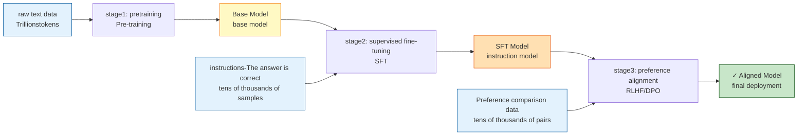

The differences in data, computing power and hyperparameters between the three stages are shown in the comparison table in Section 1.3.4.

### 1.3.1 Phase 1: pretraining (Pre-training)
{: id="131-阶段一预训练pre-training"}

Learn the statistical laws, grammatical structures and world knowledge of language from massive unlabeled texts, and train the **Base Model (base model)**.

**core features**:
- 📊 **has the largest data scale**: trillions of tokens (such as LLaMA-3 using 15T tokens)
- ⏰ **has the longest training time**: training on thousands of GPUs for weeks to months
- 💰 **has the highest cost and**: accounting for 80-90% of the total training cost
- 🎯 **target**: Next Token Prediction (predict the next word)

**Output ability**: Able to continue text writing, but not good at question and answer and instruction following.

### 1.3.2 Phase 2: supervised fine-tuning (SFT)
{: id="132-阶段二监督微调sft"}

Use high-quality instruction-answer pair training to convert the Base Model into a **SFT Model (instruction model)** that can understand instructions.

**core features**:
- 📊 **small data size**: 10k-100k high-quality samples
- ⏰ **training time is short**: hours to days
- 💰 **has lower cost than**: accounting for 5-10% of the total cost
- 🎯 **target**: Instruction Following

**Output capability**: Able to understand and execute user instructions and conduct multiple rounds of dialogue.

### 1.3.3 Stage 3: preference alignment (Alignment)
{: id="133-阶段三偏好对齐alignment"}

Optimize model behavior through human feedback or AI feedback to make it more consistent with human expectations and values, and train the **Aligned Model**.

**core features**:
- 📊 **data scale**: tens of thousands of pairs of preference comparison data
- ⏰ **training time**: hours to days (large-scale RL for inference models can reach weeks)
- 💰 **cost**: 5-10% of the total cost
- 🎯 **method**: RLHF, DPO, RLAIF, GRPO, etc.

**output capability**: output is more helpful, safer, and more in line with human values.

### 1.3.4 Summary and comparison of three stages
{: id="134-三阶段总结对比"}

|stage|pretraining|supervised fine-tuning|preference alignment|
|------|--------|----------|----------|
|**target**|Learn language basics|Church instructions to follow|consistent with human preferences|
|**data type**|Unlabeled text|Instructions-answers|Preference comparison data|
|**data size**|Trillions of tokens|Tens of thousands to hundreds of thousands of samples|Tens of thousands - hundreds of thousands comparison|
|**Training duration**|weeks to months|hours - days|hours - days|
|**computing requirements**|Thousands of GPUs|Dozens-hundreds of GPUs|Dozens-hundreds of GPUs|
|**cost ratio**| ~80-90% | ~5-10% | ~5-10% |
|**Learning rate**| 1e-4 ~ 3e-4 | 1e-5 ~ 5e-5 | 5e-7 ~ 5e-6 |
|**Epoch number**|<1 epoch (too big)| 1-3 epochs | 1-3 epochs |
|**output model**| Base Model | SFT Model | Aligned Model |

**Key insights**:
- Pretraining is the source of capability (accounting for 90% of the cost)
- SFT is the activation of capabilities (data quality > quantity)
- Alignment is the guarantee of experience (essential)

## 1.4 🧩 Core components of large model training
{: id="14--大模型训练的核心组成要素"}

A complete large model training system contains the following core elements:

### 1.4.1 Data📊
{: id="141-数据data"}
- **pretraining data**: web pages, books, codes, academic papers, etc.
- **fine-tuning data**: command-answer pair, dialogue data
- **preference data**: human-annotated preference comparison data
- **data processing process**: cleaning, deduplication, quality filtering, toxicity detection

### 1.4.2 Model Architecture🏛️
{: id="142-模型架构model-architecture️"}
- **Infrastructure**: Transformer (Encoder, Decoder or Encoder-Decoder)
- **position encoding**: absolute position encoding, relative position encoding, RoPE, ALiBi
- **attention mechanism**: Multi-Head Attention, Grouped-Query Attention, Multi-Query Attention
- **Normalization method**: LayerNorm, RMSNorm, Pre-Norm vs Post-Norm
- **activation function**: GELU, SwiGLU, GeGLU

<div align="center">
  
<figcaption> Figure: Detailed explanation of Transformer architecture (Source: "Attention is All You Need" paper Figure 1)</figcaption>
</div>

### 1.4.3 Optimizer and training strategy (Optimization) ⚡
{: id="143-优化器与训练策略optimization"}
- **Optimizer**: AdamW, Adafactor, Lion
- **Learning rate scheduling**: Warmup, Cosine Decay, Constant
- **Gradient processing**: Gradient Clipping, Gradient Accumulation
- **Regularization**: Dropout, Weight Decay

### 1.4.4 Distributed Training Framework🔀
{: id="144-分布式训练框架distributed-training"}
- **Data Parallel**: DDP (Distributed Data Parallel)
- **Tensor Parallelism**: Megatron-LM Tensor Parallelism
- **Pipeline Parallelism**: Pipeline Parallelism, 1F1B Schedule
- **Sequence Parallelism**: Sequence Parallelism
- **Hybrid Parallel**: 3D Parallelism (data + tensor + pipeline)
- **Optimizer status parallel**: ZeRO-1/2/3 (DeepSpeed)

### 1.4.5 Computing Infrastructure💻
{: id="145-计算基础设施infrastructure"}
- **Hardware**: GPU cluster (A100, H100, etc.), TPU, dedicated AI chip
- **Internet**: InfiniBand, NVLink, PCIe
- **storage system**: high-performance distributed storage
- **Monitoring and logging**: TensorBoard, Weights & Biases, MLflow

## 1.5 🚧 Main challenges of large model training
{: id="15--大模型训练的主要挑战"}

> **⚠️ Challenge Overview**
>
> Large model training is a very challenging system project that requires a balance among multiple dimensions such as computing resources, data quality, training stability, and model alignment. Successfully training a high-performance large model requires not only technical strength, but also the accumulation of engineering experience.

### 1.5.1 Computing resources and costs
{: id="151-计算资源与成本"}

Training large models requires huge computing resources:
- GPT-3 level model training costs approximately millions of dollars
- Requires thousands of high-end GPUs to train in parallel for months
- Carbon emissions and energy consumption issues
- How to reduce training costs has become a key challenge

### 1.5.2 Data quality and scale
{: id="152-数据质量与规模"}

High-quality training data is the foundation of model performance:
- Online data contains noise, bias and harmful content
- Engineering challenges of data deduplication, cleaning and quality control
- Privacy and Copyright Issues
- High-quality human-labeled data is expensive

### 1.5.3 Training stability
{: id="153-训练稳定性"}

Large-scale training faces stability challenges:
- Loss spike (loss spikes suddenly)
- Gradient explosion/disappearance
- Numerical Instability
- Synchronization issues in distributed training

### 1.5.4 Model alignment and security
{: id="154-模型对齐与安全"}

Make the model behave as human expected:
- How to accurately capture human preferences
- Avoid harmful, biased or inaccurate output
- Reward Hacking problem (reward function is exploited)
- Long-term alignment stability

### 1.5.5 Evaluation and Benchmarking
{: id="155-评估与基准测试"}

How to fully assess model capabilities:
- Existing benchmark tests may be "flushed"
- Difficult to quantify creativity and open-ended abilities
- The complexity of multilingual, multimodal assessment
- Performance differences in real application scenarios

### 1.5.6 Unpredictability of emergent capabilities
{: id="156-涌现能力的不可预测性"}

Unknowns brought about by the expansion of model scale:
- Certain abilities only appear at certain scales
- Difficulty predicting model behavior in advance
- Unexpected capabilities or problems may arise
- How to systematically understand Scaling Laws

---

# 2. Pretraining stage (Pre-training)
{: id="2-预训练阶段pre-training"}

Pretraining is the cornerstone of large model training, with the goal of allowing the model to learn the statistical laws of language and world knowledge from massive unlabeled texts.

> **🎯 Introduction to this chapter**
>
> pretraining is part of the entire training process **The highest cost, the longest time, and the greatest technical difficulty** stage, accounting for 80-90% of the total cost. This chapter will introduce the objective function, data processing, training techniques and cutting-edge technologies of pretraining in detail to help readers understand how to train a base model from scratch.

## 2.1 Overview of the complete pretraining process
{: id="21-预训练完整流程概览"}

The following figure shows the complete training process from raw data to Base Model:

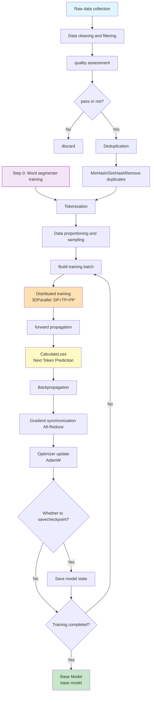

**Process Description**:
1. **Data preparation phase** (A-I): accounting for 20-30% of the overall time, including collection, cleaning, deduplication, **word segmenter training** and word segmentation
2. **training iteration phase** (J-S): accounting for 70-80% of the overall time, the core is the forward-reverse-optimization cycle
3. **Checkpoint management**: Save every 1000-5000 steps, the total number of training steps is usually 100k-500k steps

## 2.2 Tokenizer Training
{: id="22-分词器训练-tokenizer-training"}

Before officially starting model training, we need to define how the model "reads" text. The tokenizer cuts continuous text into the smallest units (Tokens) that the model can understand.

### 2.2.1 Why do we need to train a word segmenter?
{: id="221-为什么需要训练分词器"}
If you use characters or words directly, you will face the problem that the vocabulary is too large (difficult to converge) or the information density of a single Token is too low (the sequence is too long). Modern large models generally use **subword (Subword)** word segmentation scheme, such as **BPE (Byte Pair Encoding)**.

### 2.2.2 Core Tradeoff: Vocabulary Size (Vocab Size)
{: id="222-核心权衡词表大小-vocab-size"}
* **Large word list (such as 100k+)**:
    * ✅ Advantages: A single Token carries a lot of information, the sequence is shorter, and reasoning is faster.
    * ❌ Disadvantages: The parameters of the Embedding layer are huge, and sparse words are difficult to fully train.
* **small word list (such as 32k)**:
    * ✅ Advantages: The Embedding layer is small, the parameter utilization rate is high, and it is suitable for small models.
    * ❌ Disadvantages: The same sentence generates more Tokens, which increases computational overhead.

> **💡 MiniMind experience**: For small models with parameters below 500M, the vocabulary should not be too large (MiniMind only uses a BPE vocabulary of 6,400, a common compromise is 32k), otherwise the Embedding layer will eat up most of the parameters, and the vectors of rare tokens will not be fully updated.

### 2.2.3 Practical training of tokenizer (Python)
{: id="223-分词器训练实战-python"}

Using Hugging Face's `tokenizers` library, you can quickly train a GPT/Llama style **byte-level BPE (Byte-level BPE)** tokenizer. The byte-level solution uses 256 bytes as the initial alphabet, and no out-of-service words (OOV) will appear in any language (including Chinese and emoji). This is also the mainstream choice of current LLM:

```python
from tokenizers import Tokenizer, decoders, models, pre_tokenizers, trainers

# 1. Initialize byte level BPE model
tokenizer = Tokenizer(models.BPE())
tokenizer.pre_tokenizer = pre_tokenizers.ByteLevel(add_prefix_space=False)
tokenizer.decoder = decoders.ByteLevel()

# 2. Configure the trainer: with 256 bytes as the initial alphabet, ensuring that no OOV
trainer = trainers.BpeTrainer(
    vocab_size=32000,
    min_frequency=2,
    special_tokens=["<|endoftext|>", "<|im_start|>", "<|im_end|>"],
    initial_alphabet=pre_tokenizers.ByteLevel.alphabet(),
)

# 3. Train tokenizer
files = ["data/corpus_1.txt", "data/corpus_2.txt"]
tokenizer.train(files, trainer)

# 4. Save tokenizer
tokenizer.save("my_tokenizer.json")
```

For algorithm comparison (BPE / WordPiece / Unigram), word list size selection and special Token design, see Section 9.5.

## 2.3 Pretraining objective function
{: id="23-预训练目标函数"}

The core of pretraining is to design an appropriate objective function to allow the model to learn language rules from unlabeled text.

### 2.3.1 Autoregressive Language Modeling
{: id="231-自回归语言建模autoregressive-language-modeling"}

**Core idea**: Given the previous text, predict the next token (Next Token Prediction)

**mathematical expression**:

For the text sequence $\mathbf{x} = (x_1, x_2, \ldots, x_T)$, the training objective is to maximize:

$$
\mathcal{L}_{\text{AR}} = \sum_{t=1}^{T} \log P(x_t \mid x_1, x_2, \ldots, x_{t-1}; \theta)
$$

Where $\theta$ is the model parameter.

**training process**:
- **Teacher Forcing**: Use the real previous text as input during training
- **Causal Masking**: The attention mechanism can only see the tokens on the left (past)
- **Loss calculation**: Calculate the cross entropy loss for each position and then average

**represents model**:
- **GPT series** (GPT-3, GPT-4): pure Decoder architecture
- **LLaMA series** (LLaMA-2, LLaMA-3): open source high-performance model
- **PaLM, Gemini**: Google's large model

**Advantages**:
- ✅ Strong generative ability, good at continuation and dialogue
- ✅ Simple architecture and easy to expand to very large scale
- ✅ High training efficiency

**training cycle diagram**:
```python
import torch.nn.functional as F

for batch in dataloader:
    input_ids = batch['input_ids']      # [batch_size, seq_len]

    logits = model(input_ids).logits    # [batch_size, seq_len, vocab_size]

    # Next Token Prediction: location t The output to predict the t+1 a token
    # input [x1, x2, x3, x4] The output of respectively aligns the target [x2, x3, x4]
    shift_logits = logits[:, :-1, :]
    shift_labels = input_ids[:, 1:]

    loss = F.cross_entropy(
        shift_logits.reshape(-1, shift_logits.size(-1)),
        shift_labels.reshape(-1),
    )
    loss.backward()
    optimizer.step()
    optimizer.zero_grad()
```

### 2.3.2 Masked Language Modeling
{: id="232-掩码语言建模masked-language-modeling"}

**Core idea**: Randomly mask part of the token and predict the masked content

**mathematical expression**:

$$
\mathcal{L}_{\text{MLM}} = \sum_{i \in \mathcal{M}} \log P(x_i \mid \mathbf{x}_{\backslash \mathcal{M}}; \theta)
$$

Here, $\mathcal{M}$ is the set of masked positions, and $$\mathbf{x}_{\backslash \mathcal{M}}$$ represents all tokens except the masked positions.

**training strategy** (BERT method):
- Randomly select 15% of tokens for processing:
  - 80% replaced by `[MASK]`
  - 10% replaced with random token
  - 10% remains unchanged

**represents model**:
- **BERT**: Bidirectional Encoder, pretraining + fine-tuning paradigm
- **RoBERTa**: Optimized BERT (more data, larger batches, removal of NSP)
- **DeBERTa**: Disentangled Attention

**Advantages**:
- ✅ Two-way context understanding (can see left and right information at the same time)
- ✅ Suitable for comprehension tasks (classification, information extraction)

**Disadvantages of**:
- ❌ The gap between pretraining and fine-tuning (pretraining has [MASK], fine-tuning does not)
- ❌ Weak generation ability

### 2.3.3 Mixed goals and other variations
{: id="233-混合目标与其他变体"}

#### 2.3.3.1 Encoder-Decoder architecture (T5, BART)
{: id="2331-encoder-decoder-架构t5bart"}
- **Span Corruption**: mask continuous token span
- **is suitable for sequence-to-sequence tasks**: translation, abstract

#### 2.3.3.2 Prefix Language Modeling(PrefixLM)
{: id="2332-prefix-language-modelingprefixlm"}
- **UL2**: Combining bidirectional and unidirectional modeling
- **High flexibility**: You can choose two-way or one-way attention

#### 2.3.3.3 Fill-in-the-Middle(FIM)
{: id="2333-fill-in-the-middlefim"}
- **for code model**: Predicting missing codes in the middle
- **represents**: CodeLlama, StarCoder
- **format**: `[prefix] <FILL> [suffix] → [middle content]`

## 2.4 Pretraining data
{: id="24-预训练数据"}

The pretraining data determines the knowledge boundaries and capability distribution of the model. A typical data pipeline is:

1. **collects**: Common Crawl web pages, books, codes (GitHub), academic papers (arXiv), encyclopedias (Wikipedia), Q&A communities (StackExchange), etc.
2. **filtering**: language recognition, heuristic rules, quality classifier, toxicity detection and personal information (PII) cleaning
3. **deduplication**: precise hash deduplication + MinHash/LSH fuzzy deduplication, and deduplication with the evaluation set to prevent leakage
4. **word segmentation**: Use the word segmenter trained in Section 2.2 to convert the text into a token sequence
5. **Ratio and Sampling**: Set the mixing ratio for each data source, upsample high-quality small data sources, and downsample low-quality large data sources.

The specific methods, tools and trade-offs of each link are unified in Chapter 9 "[Data Engineering ](#9-数据工程)" (including the real ratio of GPT-3, LLaMA and other models). Here are three conclusions to remember:

- **Quantity and quality must be balanced**: Chinchilla scaling law shows that the number of parameters and the number of training tokens should be increased year-on-year (about 20 tokens/parameter) under the same computing power; while the FineWeb-Edu and Phi series show that improving data quality can significantly reduce the number of tokens required to achieve the same effect.
- **Deduplication is crucial**: Duplicate data will intensify memory, waste computing power, and may cause leakage of the evaluation set
- **ratio affects ability boundary**: The ratio of code to mathematical data directly affects reasoning ability, and the multilingual ratio affects cross-language generalization

## 2.5 Key technologies of pretraining
{: id="25-预训练的关键技术"}

### 2.5.1 Learning rate scheduling
{: id="251-学习率调度"}

The most commonly used pretraining is **linear Warmup + Cosine Decay (Cosine Decay)**; for continuous pretraining that requires additional data at any time, **WSD (Warmup-Stable-Decay)** is increasingly used. See Section 7.2 for the formulas and comparison of the two types of scheduling. This section only gives the parameter experience in the pretraining scenario.

<div align="center">
  
<figcaption> Figure: Learning rate curve of linear Warmup + cosine decay (peak value 3e-4, minimum learning rate 10% of peak value)</figcaption>
</div>

**key parameters**:
- **Warmup steps**: usually 2,000-10,000 steps (accounting for 1-2% of the total steps)
- **Peak Learning Rate**: Adjust according to model size
  - Small model (<1B parameters): 3e-4 ~ 1e-3
  - Medium model (1-10B parameters): 1e-4 ~ 3e-4
  - large model (10B+parameters): 6e-5 ~ 2e-4
- **Decay strategy**: Cosine Annealing is most commonly used
- **Minimum learning rate**: usually 10% of the peak value

Importance of **Warmup**:
- Avoid gradient explosion in the early stages of training-free
- Let the optimizer state (Adam's momentum) gradually stabilize
- Necessary skills for large model training

**The relationship between learning rate and batch size** (Linear Scaling Rule):

$$
\text{lr}_{\text{new}} = \text{lr}_{\text{base}} \times \frac{\text{batch}_{\text{new}}}{\text{batch}_{\text{base}}}
$$

For example: basic configuration lr=1e-4, batch=256 → extended to batch=2048 → lr=8e-4.

It should be noted that the linear scaling rule comes from the large batch training experience of SGD (Goyal et al., 2017). For Adam type optimizers, the learning rate as the batch grows is usually closer to square root scaling, and the returns decrease rapidly after the batch exceeds the "critical batch size", so the actual parameters still need to be confirmed in small-scale experiments.

### 2.5.2 Batch Size
{: id="252-批次大小batch-size"}

Batch size directly affects training efficiency and gradient quality. In terms of the number of tokens (rather than the number of samples), the mainstream approach is **Gradually increase batch size during training** .

#### 2.5.2.1 Why is a large Batch Size needed?
{: id="2521-为什么需要大-batch-size"}

- **Computational efficiency**: higher GPU utilization, more efficient matrix multiplication
- **Gradient quality**: The gradient estimation variance of large batches is smaller and the update direction is more stable.
- **Communication efficiency**: The number of steps in distributed training is reduced, and the number of AllReduce times is reduced.

> Note: Excessive batch size will lead to a decrease in generalization (sharp minima problem), and the learning rate needs to be adjusted (see the linear scaling rule above).

#### 2.5.2.2 Typical scale (in tokens/batch)
{: id="2522-典型规模以-tokensbatch-计"}

|model| Batch Size(tokens)|Description|
|------|-------------------|------|
| GPT-3 175B |32K → 3.2M (gradually increasing)|Small batches in the early stage of training and large batches in the later stage|
| LLaMA-2 | 4M tokens |Fixed throughout|
| PaLM 540B |1M → 4M (gradually increasing)|Doubling in three levels according to training progress|
| Chinchilla 70B | 1.5M → 3M |Double up mid-training|

#### 2.5.2.3 Gradient Accumulation
{: id="2523-梯度累积gradient-accumulation"}

When the single-GPU GPU memory is not enough to accommodate the target batch size, the equivalent simulation is performed by accumulating gradients in multi-step small batches:

```python
optimizer.zero_grad()
for step, batch in enumerate(dataloader):
    loss = model(batch) / accumulation_steps   # Zoom loss
    loss.backward()                             # Cumulative gradient
    if (step + 1) % accumulation_steps == 0:
        optimizer.step()                        # every N step update once
        optimizer.zero_grad()
```

**equivalent relationship**: effective batch size = per-GPU batch size × gradient accumulation steps × number of data parallel cards. For the method of skipping the first N−1 steps of gradient synchronization with `no_sync()` in a distributed scenario, see Section 7.3.2.

---

### 2.5.3 Context Length
{: id="253-上下文长度context-length"}

#### 2.5.3.1 Why start with a short context?
{: id="2531-为什么从短上下文开始"}

- The computational complexity of attention is $O(n^2)$. The longer the sequence, the GPU memory and calculation amount increase sharply.
- In the early stages of training, the model has not yet learned long-range dependencies, and the benefits brought by long sequences are limited.
- Accumulate sufficient language understanding ability in the short context stage, and then expand to get twice the result with half the effort

#### 2.5.3.2 Progressive expansion strategy
{: id="2532-渐进式扩展策略"}

```
main training phase:    4K–8K tokens  → Complete most training token(Early models were 2K, Llama 3 for 8K)
Long context expansion:  32K → 128K    → Gradually lengthen in multiple stages, adding only a small amount token
```

Take Llama 3 as an example: first complete the pretraining of about 15T tokens on the 8K context, and then gradually expand the context to 128K in 6 stages. A total of about 800B tokens are used in this expansion stage (Llama 3 technical report).

#### 2.5.3.3 Position coding extension technology
{: id="2533-位置编码扩展技术"}

**Position Interpolation(PI)**

The rotation frequency of RoPE is designed for a fixed maximum length $L_{\text{train}}$, beyond which the position encoding becomes invalid. PI's solution: Scale the location index from $[0, L_{\text{target}}]$ back to $[0, L_{\text{train}}]$:

$$\text{pos}_{\text{new}} = \text{pos} \times \frac{L_{\text{train}}}{L_{\text{target}}}$$

Advantages: Simple to implement, requiring only about 1000 steps of fine-tuning to accommodate 2–4× context expansion.

**YaRN(Yet another RoPE extension)**

PI uses uniform scaling for all frequency components, resulting in information loss for high-frequency components. YaRN improvement strategies:
- **Low frequency component**: Use PI scaling (long-range dependence)
- **high frequency component**: Keep without interpolation (short-range fine features)
- **Temperature Scaling**: Narrow attention logits to prevent entropy collapse

Effect: Scales to 128k context, requires only a small amount of data fine-tuning, and has better accuracy than PI.

**ALiBi(Attention with Linear Biases)**

Instead of relying on absolute position encoding, a linear penalty proportional to the distance is directly superimposed on the attention score:

$$\text{Attention score}_{ij} = q_i \cdot k_j^T - m \cdot (i - j)$$

Where $m$ is the slope (hyperparameter) of each attention head. Advantages: There is no need to specify the maximum length during training, and it can be directly extrapolated during inference without additional fine-tuning.

#### 2.5.3.4 Ultra-long context distributed engineering optimization
{: id="2534-超长上下文分布式工程优化"}

As the demand for long contexts (expanded from 32K to millions of Tokens) explodes, single-GPU optimization alone can no longer handle it. In distributed engineering, the following core technologies are mainly used:

1. **Ring Attention Mechanism**
   * **principle**: Split the sequence dimension into a ring communication topology composed of $P$ GPUs. Each GPU only holds a local sequence of Query. When calculating attention, the data blocks of Key and Value are sequentially transferred between GPUs through the Ring Buffer and the local Attention results are calculated.
   * **Advantages**: Allocate the GPU memory complexity of the attention mechanism to each node by $O(N^2)$, achieving linear expansion of GPU memory with the number of GPUs, making it possible to train ultra-long text sequences of millions or even tens of millions.
2. **RoPE Base Frequency Scaling**
   * **Principle**: When expanding the context, if the original position encoding is used directly, the position vector at the end of the long sequence will have phase overlap or drift in the frequency domain. In addition to interpolation (PI/YaRN), a common practice is to significantly increase the RoPE base frequency $\theta$ (e.g. 10,000 for Llama 2 and 500,000 for Llama 3).
   * **functions**: lengthens the wavelength of each frequency component so that farther locations can still be distinguished, alleviating the attention degradation of the model when processing long text.
3. **LongLoRA(Shifted Sparse Attention)**
   * **Principle**: Use the local attention of the group (and stagger the grouping boundary on half of the attention heads) to replace the global attention during training, and restore the standard attention during inference; then only train the LoRA and Embedding/Norm layers.
   * **functions**: Expand the context of the 7B–70B model to the 32K–100K level with less computing power.

---

### 2.5.4 Mixed precision training
{: id="254-混合精度训练"}

Using low-precision floating point (FP16/BF16) calculations, combined with the FP32 optimizer state, it saves GPU memory while maintaining training stability.

#### 2.5.4.1 Floating point format comparison
{: id="2541-浮点格式对比"}

|Format|sign bit|Exponent bit|mantissa digits|maximum value|LLM training applicability|
|------|--------|--------|--------|--------|--------------|
| FP32 | 1 | 8 | 23 | ~3.4×10³⁸ |Benchmark, stable but large GPU memory|
| FP16 | 1 | 5 | 10 | ~65504 |Small range, easy to overflow/underflow|
| **BF16** | **1** | **8** | **7** | **~3.4×10³⁸** |**LLM First choice: same range as FP32**|
| FP8 (E4M3) | 1 | 4 | 3 | ~448 |H100 native, new choice for inference/training|

**Key conclusions**: BF16 has the same number of exponent digits as FP32, and will not cause overflow due to the gradient value range being too large or too small. It is currently the preferred format for large model training.

#### 2.5.4.2 FP16 training requires Loss Scaling
{: id="2542-fp16-训练需要-loss-scaling"}

The maximum value of FP16 is about 65504. If the gradient is very small (< 2⁻²⁴), it will underflow to 0, causing the parameters to not be updated. Solution:

```python
import torch

scaler = torch.amp.GradScaler("cuda")

with torch.autocast("cuda", dtype=torch.float16):   # Forward facing FP16
    loss = model(inputs)

scaler.scale(loss).backward()            # gradient multiplied by scale factor Anti-underflow
scaler.step(optimizer)                   # Update parameters after descaling
scaler.update()                          # automatic adjustment scale factor
```

#### 2.5.4.3 BF16 training (recommended, no Loss Scaling required)
{: id="2543-bf16-训练推荐无需-loss-scaling"}

```python
with torch.autocast("cuda", dtype=torch.bfloat16):
    loss = model(inputs)

loss.backward()
optimizer.step()
```

#### 2.5.4.4 Master Weights in Mixed Precision
{: id="2544-混合精度中的-master-weights"}

Master Weights and Adam's first-order moment $m$ and second-order moment $v$ are all saved in FP32 to ensure that the small update amount will not be swallowed up by the rounding of BF16. This results in approximately 16 bytes of static GPU memory per parameter for mixed-precision training (see Section 6.5.1 for derivation):

```
forward/Reverse calculation:BF16(Save GPU memory)
Optimizer status:  FP32(Guaranteed accuracy, but takes up more GPU memory)
Weight update:    FP32 Accumulate and then transfer BF16 Write back model
```

---

#### 2.5.4.5 FP8 training engineering practice (taking DeepSeek-V3 as an example)
{: id="2545-fp8-训练工程实践以-deepseek-v3-为例"}

BF16 solves the "numeric range" problem, but each number still occupies 2 bytes. **FP8 (8-bit floating point) training** is the next step of compression natively supported by Hopper (H100) and newer generation GPUs: storage is halved and Tensor Core throughput is doubled. DeepSeek-V3 verified the feasibility of FP8 pretraining on a very large scale of 671B parameters for the first time.

**1. Why can’t all FP8 be used directly?**

FP8 only has 3 or 2-bit mantissa (E4M3: 4-bit exponent + 3-bit mantissa; E5M2: 5-bit exponent + 2-bit mantissa). Direct replacement of BF16 will lead to rapid accumulation of rounding errors during gradient accumulation and training divergence. The solution of DeepSeek-V3 is **mixed granularity quantification + selective high-precision retention**, rather than a simple "convert all employees to FP8".

**2. Fine-Grained Quantization**

Instead of using a single scaling factor for the entire tensor (per-tensor scaling), scale factors are determined individually in smaller units:
- **activation value**: quantified by tile granularity of 1×128
- **weight**: quantified by block granularity of 128×128

Compared with per-tensor quantization, this fine-grained scheme can better adapt to the uneven distribution of values within the tensor (such as outliers concentrated in certain channels) and significantly reduce quantization errors.

**3. Choice between E4M3 and E5M2**

```
NVIDIA Transformer Engine Default mixed format:
  Forward propagation (activation value, weight):E4M3(3 bit mantissa, higher precision)
  Backpropagation (gradient):        E5M2(5 bit index, wider dynamic range)

DeepSeek-V3:
  All tensors are used uniformly E4M3
```

Gradient values typically have a larger range than activation values, so the Transformer Engine makes backpropagation use the wider range of E5M2. DeepSeek-V3 does the opposite: fine-grained scaling has made the range of values ​​within each small block narrow enough, so all tensors are switched to the higher-precision E4M3.

**4. Accumulation Precision**

The accumulation error of matrix multiplication (GEMM) will amplify as the accumulation length increases. The DeepSeek-V3 report points out that the H800 Tensor Core only retains about 14 bits of precision when doing FP8 GEMM. The approach is to upgrade the partial sum to the CUDA Core every time **accumulates 128 elements, and continue to accumulate** with FP32 precision; FP8 is only used at the input end of matrix multiplication, and the main weight, gradient accumulation and optimizer state still maintain high precision, thus avoiding "fast but inaccurate calculations".

**5. Effect**

The DeepSeek-V3 report shows that compared with the BF16 baseline, the relative loss error of FP8 training is always less than 0.25%, while significantly reducing GPU memory usage and training compute. This is one of the key techniques that enables it to train a 671B parameter MoE model at a formal training cost of approximately $5.576 million (see Section 11.2.2 for a real-world example).

> **⚠️ Engineering reminder**: FP8 training currently still relies on the hardware native support of the Hopper/Blackwell architecture (Ampere and earlier architectures cannot obtain acceleration benefits), and requires fine processing of dynamic updates of scaling factors at the framework level (such as Transformer Engine, DeepSeek self-developed training framework). Benefits cannot be obtained by simply modifying the `dtype` parameters.

---

### 2.5.5 Flash Attention
{: id="255-flash-attention"}

Flash Attention reduces the GPU memory complexity of the attention layer from $O(n^2)$ to $O(n)$ through IO-aware block calculation, and the calculation results are mathematically equivalent to standard attention; the attention operator itself can be accelerated several times, and end-to-end training is usually accelerated by 2–3×. For detailed principles, please refer to "[7.5 Flash Attention](#75-flash-attention)".

---

## 2.6 Cutting-edge technology of pretraining
{: id="26-预训练的前沿技术"}

### 2.6.1 MoE (Mixture of Experts) architecture
{: id="261-moemixture-of-experts架构"}

#### 2.6.1.1 Core idea
{: id="2611-核心思想"}

In the standard Transformer, each token passes through all parameters, while MoE introduces multiple "expert" networks at the FFN layer, and only activates the top-k of them each time to achieve **Large amount of parameters and small amount of calculation** goal.

```
input token → Router(router)→ Choose top-k expert → Parallel calculations by experts → weighted output
```

**Expert routing (Gating) mechanism**:

$$\text{Gate}(x) = \text{TopK}(\text{softmax}(W_g \cdot x), k)$$

The output of each token is the weighted sum of the top-k expert outputs, and the weight is determined by the softmax normalized score.

#### 2.6.1.2 Load Balancing
{: id="2612-负载均衡load-balancing"}

If the router always assigns tokens to the same experts, the other experts will be useless - this is the core training challenge of MoE. The solution is to add an auxiliary equalization loss to the training loss:

$$\mathcal{L}_{\text{aux}} = \alpha \cdot N \sum_{i=1}^{N} f_i \cdot P_i$$

Here, $f_i$ is the proportion of tokens actually assigned to expert $i$, and $P_i$ is the average probability of the router outputting to expert $i$. $\alpha$ is usually around 0.01 (the value of Switch Transformer).

A side effect of the auxiliary loss is that it interferes with the gradient of the main task. DeepSeek-V3 switches to **Auxiliary-Loss-Free load balancing**: Add a bias term only used to select top-k to each expert's routing score. During training, the bias is dynamically adjusted up or down according to the actual load of the expert, so as to maintain balance without introducing additional losses.

#### 2.6.1.3 Representative model
{: id="2613-代表模型"}

|model|Number of routing experts|Activated per token|total parameters|Activation parameters|
|------|--------|---------|-------------|---------|
| Switch Transformer |Up to 2048| top-1 | 1.6T |Much smaller than the total parameter|
| Mixtral 8x7B | 8 | top-2 | 47B |About 13B|
| DeepSeek-V3 |256 (1 additional shared expert)| top-8 | 671B | 37B |
| Qwen3-235B-A22B | 128 | top-8 | 235B | 22B |

#### 2.6.1.4 Engineering Challenges
{: id="2614-工程挑战"}
- **Communication overhead**: Experts of different tokens may be on different GPUs and require All-to-All communication
- **Expert Parallelism**: Place different experts on different GPUs
- **Training instability**: Routing collapse (all tokens pour into a few experts)

---

### 2.6.2 Training stability technology
{: id="262-训练稳定性技术"}

#### 2.6.2.1 WSD learning rate scheduling (Warmup-Stable-Decay)
{: id="2621-wsd-学习率调度warmup-stable-decay"}

Traditional Cosine scheduling must predetermine the total number of training tokens, and if you want to add data midway, you have to rerun the attenuation curve. WSD divides training into three stages: Warmup, Stable (constant peak learning rate) and Decay. The Stable stage can be extended arbitrarily, so it is suitable for continuous/incremental pretraining. See Section 7.2.3 for formulas and details.

#### 2.6.2.2 ΜP(Maximal Update Parameterization)
{: id="2622-μpmaximal-update-parameterization"}

Under standard parameterization, the optimal learning rate will change with the width of the model, and the adjusted hyperparameters of small models cannot be directly used in large models. μP scales the initialization variance and the learning rate of various parameters according to the width (for example, when training with Adam, the learning rate of the hidden layer matrix parameters is scaled according to $1/\text{width}$), so that the **optimal hyperparameters remain unchanged** under different widths.

- Practical value (μTransfer): Search for hyperparameters on the small proxy model and then directly migrate to the large model, greatly saving parameter adjustment costs.
- Representative work: Tensor Programs V (Yang et al., 2022); Cerebras-GPT, MiniCPM and other models use μP

#### 2.6.2.3 Loss Spike processing
{: id="2623-loss-spike-处理"}

Occasional gradient explosions during the training process will cause loss to rise sharply. Common coping strategies (see Section 11.3.2.3 for the complete diagnosis process):

1. **Gradient Clipping** (Gradient Clipping): Limit the gradient L2 norm, usually set to 1.0
2. **BF16 instead of FP16**: avoid instability caused by numerical overflow
3. **automatically rolls back**: automatically rolls back to the previous checkpoint and lowers the learning rate when monitoring loss mutations
4. **is stable. Adam configures**: lowers $\beta_2$ from the default 0.999 to 0.95 to reduce the historical dependence of the second-order moment.

---

# 3. Supervised fine-tuning stage (Supervised Fine-Tuning, SFT)
{: id="3-监督微调阶段supervised-fine-tuning-sft"}

The SFT stage transforms the pretraining model into an assistant that can understand and execute instructions.

> **🎯 Introduction to this chapter**
>
> SFT is **activate** The key stage of model capability is to allow the Base Model to learn to follow instructions and interact with each other through a small amount of high-quality instruction-response data. This chapter introduces SFT’s data construction, training strategies and efficient fine-tuning techniques (such as LoRA, QLoRA), with special emphasis on **Data quality is far more important than quantity** core concept.

## 3.1 Overview of the complete SFT process
{: id="31-sft-完整流程概览"}

The following figure shows the complete training process from Base Model to SFT Model:

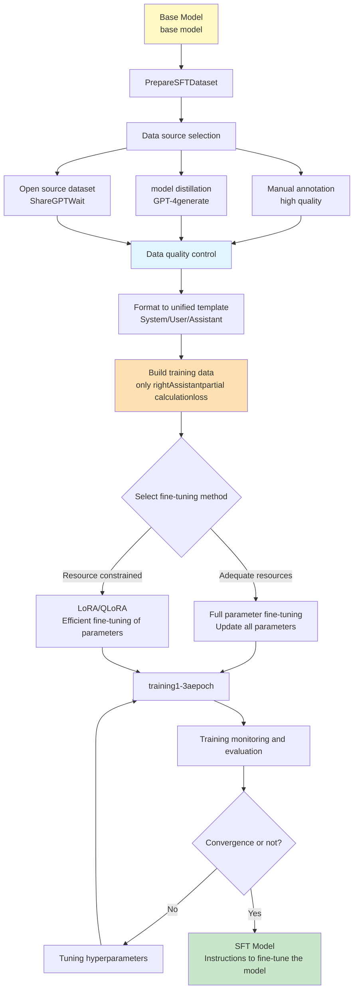

**key features**:
1. **data size is small**: usually 10k-100k samples, much smaller than pretraining
2. **Short training time**: hours to days, not weeks
3. **Quality first**: Data quality is more important than quantity
4. **High flexibility**: Can use technologies such as LoRA to significantly reduce costs

## 3.2 Training objectives of SFT
{: id="32-sft-的训练目标"}

**Core task**: Let the model learn to follow instructions (Instruction Following)

### 3.2.1 Mathematical expression
{: id="321-数学表达"}

Given the instruction $x$ (prompt) and the expected answer $y$ (response), the training goal is to maximize the conditional probability:

$$
\mathcal{L}_{\text{SFT}} = -\sum_{(x,y) \in \mathcal{D}_{\text{SFT}}} \log P(y \mid x; \theta)
$$

Here, $$\mathcal{D}_{\text{SFT}}$$ is a supervised fine-tuning dataset, containing high-quality instruction-answer pairs.

### 3.2.2 Key differences from pretraining
{: id="322-与预训练的关键区别"}

**pretraining**:
- The model sees the entire document and predicts each token
- Loss is calculated at all positions

**SFT**:
- Model **only calculates the answer part loss**
- The instruction part does not calculate loss: the method is to set the labels of these positions to `-100` (loss mask) instead of changing the attention mask - the model can still "see" the complete instruction

**SFT core code**:
```python
import torch.nn.functional as F

def sft_loss(model, batch):
    """SFTThe key: only toAssistantanswer partial calculationloss"""
    input_ids = batch['input_ids']  # [batch_size, seq_len]
    labels = batch['labels']        # [batch_size, seq_len], with input_ids Alignment

    # labelsExample: [-100, -100, -100, 152, 234, 567, ...]
    #              ↑~~~ Userinstructions ~~~↑  ↑~~ Assistantanswer ~~↑
    #              (Ignore, don't countloss)    (Calculateloss, learning to generate)

    logits = model(input_ids).logits

    # Same as pretraining, first stagger one position: position t The output prediction of t+1 a token
    shift_logits = logits[:, :-1, :]
    shift_labels = labels[:, 1:]

    # cross_entropy will be ignored automatically label = -100 location
    loss = F.cross_entropy(
        shift_logits.reshape(-1, shift_logits.size(-1)),
        shift_labels.reshape(-1),
        ignore_index=-100,
    )
    return loss
```

### 3.2.3 Four major goals of SFT
{: id="323-sft-的四大目标"}

1. **command understanding**: Identify various command formats and task types
2. **Structured output**: Generate answers with standardized format and clear logic
3. **Dialogue Adaptation**: Mastering context management of multi-turn dialogues
4. **Reduce hallucinations**: Improve factual accuracy and reduce the tendency to fabricate information

## 3.3 SFT data construction
{: id="33-sft-数据构建"}

**Core Principle**: Quality > Quantity. A small amount of high-quality data is better than a large amount of low-quality data.

### 3.3.1 Data scale comparison
{: id="331-数据规模对比"}

|model|SFT data size|Data source|Description|
|------|-------------|---------|------|
| **InstructGPT** | 13k |Manual annotation|OpenAI’s early alignment efforts|
| **LLaMA-2-Chat** | 27.5k |Manual annotation|Meta’s high-quality conversation data|
| **Vicuna** | 70k | ShareGPT |ChatGPT conversations shared by users|
| **Alpaca** | 52k |GPT-3.5 generation|Stanford’s open source instruction data|
| **WizardLM** | 250k |ChatGPT evolution generation (Evol-Instruct)|Complex command data|
| **Phi-1** |About 180M tokens|Practice questions generated by GPT-3.5|First pretrain on about 7B tokens "textbook-level" data, and then fine-tune with small-scale high-quality practice questions|

**Key insights**:
- ✅ 10,000-100,000 high-quality samples are usually sufficient
- ✅ Data quality is more important than quantity (Proof of Phi series)
- ✅ Diversity and difficulty distribution are key

### 3.3.2 Data sources
{: id="332-数据来源"}

#### 3.3.2.1 Manual annotation (highest quality)
{: id="3321-人工标注最高质量"}

**process**:
1. **Recruiting annotators**: Usually you need to pass a qualification examination
2. **Marking Guide**: Detailed instruction writing specifications
3. **sample writing**: the annotator writes the answer according to the instructions
4. **Multiple rounds of review**: Quality inspection and correction
5. **Consistency Verification**: Cross-validation by multiple annotators

**cost**:
- Single sample: $5–20 (depending on complexity)
- 10k sample: $50,000–$200,000
- Total cost: much lower than pretraining (usually < 5% of total cost)

**Advantages**:
- ✅Highest quality and meets human expectations
- ✅ Strong controllability and can cover specific areas
- ✅ Suitable for safety critical applications

**example annotation guide**:
```
【Task】: Write high-quality answers to given instructions
【request】:
1. Accuracy: Correct facts, no fabricated information
2. Usefulness: Answers the question directly and provides sufficient details
3. Clarity: clear structure and easy to understand
4. Security: Harmless, unbiased, reject inappropriate requests
【Format】:
- Instructions:[User questions or requests]
- Answer:[Assistant’s answer,200-500word]
```

#### 3.3.2.2 Model distillation (high cost performance)
{: id="3322-模型蒸馏性价比高"}

**method**: Use strong large model (such as GPT-4) to generate training data

**Self-Instruct process** (Wang et al., 2023):
1. **seed instructions**: manually write 100-200 seed instructions (the original paper uses 175)
2. **instruction generates**: Use GPT-4 to generate new instructions
3. **answer generation**: Use GPT-4 to generate answers for commands
4. **Quality Filtering**: Automation + Manual Sampling Verification
5. **iterative expansion**: repeat steps 2-4

**cost**:
- According to the GPT-4 API price in 2023, it will be about US$0.03–0.06/sample, and 10k samples will be about US$300–600; since then, the API price of models with the same capabilities has dropped by more than an order of magnitude.
- More than 100 times cheaper than manual annotation

**represents work**:
- **Alpaca**: Stanford, 52k samples, generated with text-davinci-003, data cost less than $500
- **Vicuna**: ShareGPT user conversation, free
- **WizardLM**: Evol-Instruct method, automatically improves complexity

**Self-Instruct actual code**:
```python
def self_instruct_pipeline(seed_instructions, num_samples=10000):
    """useGPT-4Automatically generatedSFTDataset - Very cost-effective solution"""
    generated_data = []

    while len(generated_data) < num_samples:
        # Step 1: Sample seed instructions asfew-shotExample
        examples = random.sample(seed_instructions, k=3)

        # Step 2: GPT-4Generate new instructions
        prompt = f"""Generate a new instruction similar to:
        {examples}

        New instruction:"""
        new_instruction = gpt4_generate(prompt)

        # Step 3: GPT-4Generate corresponding answers
        response = gpt4_generate(new_instruction)

        # Step 4: Quality checks (length, similarity, toxicity)
        if quality_check(new_instruction, response):
            generated_data.append({
                'instruction': new_instruction,
                'response': response
            })

    return generated_data  # 10kSample cost approx.$300-600
```

### 3.3.3 Cutting-edge data synthesis and filtering technology (Data Synthesis & Filtering)
{: id="333-前沿数据合成与过滤技术data-synthesis--filtering"}

In order to balance diversity and excellent quality in large-scale fine-tuning, modern large models (such as Llama-3, DeepSeek) extensively use advanced data synthesis and automated cleaning techniques.

#### 3.3.3.1 Magpie: Adaptive command synthesis without Prompt
{: id="3331-magpie无-prompt-的自适应指令合成"}
Magpie is a novel approach to instruction generation. Traditional Self-Instruct needs to provide "seed instructions", while Magpie does not require any input prompts.
* **Principle**: Directly use the preset prefix of the aligned model's Chat Template to "lure" the model to generate user instructions.
For example, enter for large model:
  `<|begin_of_text|><|start_header_id|>user<|end_header_id|>\n`
Since the pretraining and alignment models are highly sensitive to this template, the model automatically generates a high-quality, diverse user question (Instruction), which we then feed into the model to obtain the answer (Response).
* **Advantages**: The generated instruction distribution is extremely close to the diversity of real human use, and the design cost of seed Prompt is completely eliminated.

#### 3.3.3.2 Multi-Agent Collaboration
{: id="3332-多智能体协同合成multi-agent-collaboration"}
Loop optimization of instruction data using different agent roles (generator, reflector, evaluator, rewriter):
1. **generator**: Coarse screening to generate initial instructions - the answer is correct.
2. **Reflector**: Analyze the logical loopholes or factual errors in the answer and write down revision opinions.
3. **was rewritten by**: The answer was rewritten based on the revised comments.
4. **Judge (LLM-as-a-Judge)**: Use GPT-4 to evaluate the quality score (1-10 points), and only retain high-score data.

#### 3.3.3.3 Automated quality filtering strategy
{: id="3333-自动化质量过滤策略"}
To prevent the presence of low-quality, duplicate or harmful samples in synthetic data, strict multiple filtering mechanisms must be implemented:
1. **Perplexity Filtering (PPL Filtering)**: Calculate the Perplexity of the answer text and filter out texts with too high PPL (incoherent) or too low (templated repetition).
2. **Embedding Diversity**: Use models such as `text-embedding-3-small` to calculate sentence vectors. Through clustering and cosine similarity thresholds, samples that are too similar to each other are eliminated to ensure the breadth of data distribution.
3. **Difficulty Rating (Difficulty Rating)**: Use large model to evaluate the number of inference steps required for instructions, giving priority to retaining samples with high logical difficulty and stimulating the deep learning capabilities of the model.

#### 3.3.3.4 Open source data sets
{: id="3334-开源数据集"}

**Commonly used data set**:

|Dataset|scale|language|Features|
|--------|------|------|------|
| **ShareGPT** | 90k |multilingual|Real users talking to ChatGPT|
| **OpenOrca** | 1M+ |English|GPT-4 generation, including inference process|
| **UltraChat** | 1.5M |English|Multiple rounds of dialogue|
| **FLAN Collection** |1800+ tasks|multilingual|Google's multi-task instruction set, templated from existing NLP data sets|
| **Dolly-15k** | 15k |English|Databricks employee annotation|
| **Tulu 3 SFT Mix** |About 940000|multilingual|SFT data used by AllenAI open source for complete post-training recipes|

### 3.3.4 Instruction type distribution
{: id="334-指令类型分布"}

**typical ratio** (recommended):

|Instruction type|Proportion|Example|
|---------|------|------|
|**Open Q&A**| 30-40% |"Explaining what quantum computing is"|
|**Creative Writing**| 15-20% |"Write a poem about autumn"|
|**information extraction**| 10-15% |"Summarize the main points of this article"|
|**code generation**| 10-15% |"Quick sort using Python"|
|**Mathematical reasoning**| 5-10% |"Solve this calculus problem"|
|**Multiple rounds of dialogue**| 10-15% |context-sensitive continuity questions|
|**Other tasks**| 5-10% |Translation, format conversion, etc.|

<div align="center">
  
<figcaption> Figure: SFT instruction type distribution diagram (take the median value of the recommended interval in the above table to draw)</figcaption>
</div>

**Balance principle**:
- Covers main application scenarios
- Avoid an excessive proportion of certain types of tasks
- Contains different difficulty levels

### 3.3.5 Data quality control
{: id="335-数据质量控制"}

**Automated inspection**:
```python
def quality_check(instruction, response):
    # 1. length check
    if len(response) < 50 or len(response) > 2000:
        return False

    # 2. Similarity check (duplication removal)
    if is_similar_to_existing(response, threshold=0.9):
        return False

    # 3. Toxicity testing
    if contains_toxic_content(response):
        return False

    # 4. Fact checking (optional, use search enhancement)
    if not factual_consistency_check(response):
        return False

    return True
```

**Manual review**:
- **Sampling audit**: Randomly select 5-10% for manual inspection
- **Consistency Verification**: Multiple auditors score, calculate consistency
- **Iterative improvement**: Adjust data generation strategy based on feedback

## 3.4 SFT training strategy
{: id="34-sft-训练策略"}

### 3.4.1 Full Fine-Tuning
{: id="341-全参数微调full-fine-tuning"}

**Method**: Update all parameters of the model

**Features**:
- ✅ **works best**: fully adapted to new tasks
- ❌ **is the most expensive and**: needs to store the complete model and gradients
- ❌ **GPU memory is in high demand**: usually requires 4-8 high-end GPUs

**GPU memory requirement calculation** (consistent with the 16 bytes/parameter derivation in Section 6.5.1):
```
Total GPU memory = Model parameters + gradient + Optimizer status + activation value

for 7B model(BF16 mixed precision + AdamW):
- model parameters (BF16): 7B × 2 bytes = 14GB
- gradient (BF16):     7B × 2 bytes = 14GB
- Optimizer status (FP32 Sovereign weight + m + v): 7B × 12 bytes = 84GB
- Activation value:~20-40GB(depends on batch size and sequence length)
Total:~132-152GB

→ If you can’t fit a single GPU, you need at least 2 block A100 (80GB) and cooperate ZeRO Sharding (see 6.5 section)
```

**applicable scenarios**:
- Have sufficient computing resources
- Need best performance
- The task is quite different from pretraining

### 3.4.2 Parameter Efficient Fine-tuning (PEFT)
{: id="342-参数高效微调peft"}

**Core idea**: freeze most parameters and only train a small number of parameters or additional parameters

#### 3.4.2.1 LoRA(Low-Rank Adaptation)
{: id="3421-loralow-rank-adaptation"}

**Mathematical Principles**:

Based on the pretraining weight $W_0 \in \mathbb{R}^{d \times k}$, add the trainable matrix of low-rank decomposition:

$$
W = W_0 + \Delta W = W_0 + BA
$$

Here:
- $B \in \mathbb{R}^{d \times r}$, $A \in \mathbb{R}^{r \times k}$
- **rank $r \ll \min(d, k)$** (usually $r=8, 16, 32$)
- $W_0$ frozen, only train $B$ and $A$

**parameter comparison**:
```
Original parameters:d × k
LoRA Parameters:d × r + r × k = r(d + k)

Example(d=4096, k=4096, r=16):
- Original:4096 × 4096 = 16,777,216
- LoRA: 16 × (4096 + 4096) = 131,072
- Ratio:131k / 16.7M ≈ 0.78%

→ only training <1% parameters!
```

**implementation code** (single-layer principle illustration):
```python
import math
import torch
import torch.nn as nn

class LoRALinear(nn.Module):
    def __init__(self, base: nn.Linear, rank=16, alpha=32):
        super().__init__()
        # frozen pretraining weights W0
        self.base = base
        self.base.weight.requires_grad_(False)

        # LoRA Trainable parameters:A Random initialization,B initialized to 0, Ensure that when training starts ΔW = BA = 0
        self.lora_A = nn.Parameter(torch.empty(rank, base.in_features))
        self.lora_B = nn.Parameter(torch.zeros(base.out_features, rank))
        nn.init.kaiming_uniform_(self.lora_A, a=math.sqrt(5))

        self.scaling = alpha / rank

    def forward(self, x):
        # raw forward propagation + low rank correction
        return self.base(x) + (x @ self.lora_A.T @ self.lora_B.T) * self.scaling
```

In the actual project, `LoraConfig` + `get_peft_model` of Hugging Face PEFT is directly used. It is responsible for replacing the target layer with the LoRA layer, saving and merging the adapter. See Section 8.4.1.4 for a complete example.

**Advantages**:
- ✅ **GPU memory occupies less**: only needs to train <1% parameters, no need to save gradients and optimizer states for frozen weights (the training GPU memory of GPT-3 175B in the LoRA paper is reduced from 1.2TB to 350GB)
- ✅ **has low storage cost**: only need to save the adapter for each task (GPT-3 175B checkpoint reduced from 350GB to about 35MB)
- ✅ **can be merged with**: After training, it can be merged back to the original model $W = W_0 + BA$
- ✅ **Modular**: Multiple LoRAs can be trained for different tasks and switched as needed

**hyperparameter selection**:
- **rank r**: 8-64, the larger the better the effect but the more parameters
  - r=8: The lightest weight, suitable for simple tasks
  - r=16-32: Recommended default value
  - r=64: complex tasks
- **alpha**: Commonly used is alpha = r or 2r (such as r=16, alpha=32); the QLoRA paper uses r=64, alpha=16
- **target module**: Early additions to attention projection (`q_proj`, `k_proj`, `v_proj`, `o_proj`); QLoRA paper and Thinking Machines' LoRA Without Regret (2025) found that **covers all linear layers (`gate_proj`, `up_proj`, `down_proj` including MLP) and the effect of** is significantly closer to full parameter fine-tuning

> **⚠️ LoRA and catastrophic forgetting**
>
> Many people think that LoRA can prevent forgetting, but research shows: **LoRA learns less and forgets less** - The reason why LoRA forgets less is because it learns less, and it does not really solve forgetting. The larger the Rank → the more you learn → the more you forget, and the difference with full-parameter fine-tuning is narrowed. See the "Post-Training and catastrophic forgetting" chapter of this article for details.

#### 3.4.2.2 QLoRA(Quantized LoRA)
{: id="3422-qloraquantized-lora"}

**Core Innovation**: Convert the frozen base weights into 4-bit, and then train LoRA on it. Fine-tuned GPU memory for the 7B model can be compressed from ~24GB (16-bit LoRA) to ~9GB, and the 65B model can be fine-tuned on a single 48GB GPU (QLoRA paper). Core technologies include 4-bit NF4 quantization, Double Quantization and Paged Optimizers.

For detailed principles, GPU memory comparison and complete code implementation, please refer to the section "[Model Quantization Technology → QLoRA: 4-bit quantization + LoRA fine-tuning ](#841-qlora4-bit量化--lora微调)", which will not be repeated here.

#### 3.4.2.3 Other PEFT methods
{: id="3423-其他-peft-方法"}

**Prefix Tuning**:
- Add trainable prefix token before input
- Optimize only prefix embedding
- Number of parameters: ~0.1% of original model

**Adapter Layers**:
- Insert small adapter between Transformer layers (2-layer MLP)
- Only train adapter parameters
- Number of parameters: ~2-4% of original model

### 3.4.3 Instruction Template
{: id="343-指令模板instruction-template"}

Design a unified input and output format:

|mark|role|Sample content|
|------|------|---------|
| `<|system|>` |System prompt| You are a helpful assistant. |
| `<|user|>` |user input| What is the capital of France? |
| `<|assistant|>` |model answer| The capital of France is Paris. |

**Common template format**: ChatML, Alpaca, Vicuna, Llama-2-Chat, etc. each have different special tags.

### 3.4.4 Training hyperparameters
{: id="344-训练超参数"}
- Learning rate: Full parameter fine-tuning is usually smaller than pretraining (1e-5 to 5e-5); LoRA requires a larger learning rate (common 1e-4 to 2e-4)
- Epoch number: 1-3 epochs
- Batch Size: Adjust according to resources
- Warmup ratio: 3–10%

## 3.5 Cutting-edge technology of SFT
{: id="35-sft的前沿技术"}

### 3.5.1 Small data, high quality training
{: id="351-小数据高质量训练"}

#### 3.5.1.1 Inspiration from the Phi series
{: id="3511-phi系列的启示"}
- **Phi-1**: "Textbook-level" data with 1.3B parameters and about 7B tokens. HumanEval pass@1 reaches 50.6%, exceeding StarCoder-15B (33.6%) which has more than 10 times the number of parameters.
- **Phi-3**: Phi-3-mini with 3.8B parameters is comparable to Mixtral 8x7B and GPT-3.5 on multiple benchmarks
- **Core Strategy**:
  - Use GPT-3.5 to synthesize "textbook-style" data, and use GPT-4 annotation to train a quality classifier to filter web page code
  - Strict quality filtering and diversity control
  - Demonstrate data quality > data scale

#### 3.5.1.2 Course learning strategies
{: id="3512-课程学习策略"}
- Gradually increase the difficulty from simple to complex
- Hierarchical instruction data organization
- Dynamically adjust data ratio

### 3.5.2 Synthetic data generation
{: id="352-合成数据生成"}

The basic method of using strong models to directly generate instruction-response pairs (Self-Instruct) is shown in Section 3.3.2.2. The updated Magpie, multi-agent synthesis and automatic filtering are shown in Section 3.3.3. This section adds two types of synthesis methods targeting "difficulty" and "reasoning process".

#### 3.5.2.1 Evol-Instruct method
{: id="3521-evol-instruct方法"}
- **WizardLM**: Automatically increase instruction complexity
- instruction evolution strategy
- Greatly improve command following ability

#### 3.5.2.2 Inference process data
{: id="3522-推理过程数据"}
- **Orca series**: Generate detailed reasoning steps
- Interpretive data augmentation
- Improve the reasoning ability of small models

### 3.5.3 Quantitative fine-tuning acceleration
{: id="353-量化微调加速"}

The principles and comparisons of quantization methods such as QLoRA, GPTQ, and AWQ have been introduced in detail in the entire chapter "[Model Quantization Technology ](#8-模型量化技术)". This section focuses on Unsloth, a tool specifically used to accelerate quantization fine-tuning in the SFT scenario.

#### 3.5.3.1 Unsloth: Efficient fine-tuning acceleration library
{: id="3531-unsloth高效微调加速库"}

[Unsloth](https://unsloth.ai) is currently the most popular LoRA/QLoRA acceleration library. It achieves significant speed-up and GPU memory savings by rewriting the underlying CUDA kernel:

- 🚀 **speed**: The training speed is increased by about **2×** (no accuracy loss)
- 💾 **GPU memory**: VRAM usage reduced by about **70%**
- 🔌 **Compatible with**: Fully compatible with Hugging Face PEFT/TRL, almost zero migration cost
- 🤖 **supports model**: Llama, Qwen, Mistral, Gemma, Phi and other 500+ models

**Quickly get started with** (replace `get_peft_model` with the Unsloth version):

```python
from unsloth import FastLanguageModel

# Load model (supports4-bit QLoRA)
model, tokenizer = FastLanguageModel.from_pretrained(
    model_name="unsloth/llama-3-8b",
    max_seq_length=2048,
    load_in_4bit=True,    # 4-bit QLoRA, GPU memory reduction75%
)

# AddLoRAadapter (withPEFTThe interface is consistent)
model = FastLanguageModel.get_peft_model(
    model,
    r=16,
    target_modules=["q_proj", "k_proj", "v_proj", "o_proj"],
    lora_alpha=16,
    lora_dropout=0,
    use_gradient_checkpointing="unsloth",  # UnslothProprietary: supports longer contexts
)

# Use standardsTRL SFTTrainer(No need to modify training code)
from trl import SFTTrainer
trainer = SFTTrainer(model=model, ...)
trainer.train()
```

> **💡 Applicable scenarios**: 7B–70B model LoRA/QLoRA fine-tuning on consumer GPU (RTX 3090/4090); GRPO reinforcement learning training (official data GPU memory savings of approximately **80%**). The above speed and GPU memory figures are from the Unsloth official, and the actual benefits vary with the model and sequence length.

---

# 4. Preference alignment stage (Preference Alignment)
{: id="4-偏好对齐阶段preference-alignment"}

The alignment phase aligns the model output with human preferences, values, and safety guidelines.

> **🎯 Introduction to this chapter**
>
> Preference alignment is from "usable" to "easy to use" **critical leap** , through RLHF, DPO or latest **GRPO** and other technologies make model output more helpful, safer, and more consistent with human values. This chapter compares the principles, advantages and disadvantages of RLHF, DPO and GRPO in detail. **Recommendation: DPO is preferred for simple tasks, and GRPO is preferred for complex reasoning tasks and resource-constrained scenarios.**

## 4.1 RLHF(Reinforcement Learning from Human Feedback)
{: id="41-rlhfreinforcement-learning-from-human-feedback"}

**Paper source**: [Training language models to follow instructions with human feedback (InstructGPT)](https://arxiv.org/abs/2203.02155)

### 4.1.1 RLHF three-stage process
{: id="411-rlhf-三阶段流程"}

<div align="center">
  
<figcaption> Figure: RLHF complete training process (Source: InstructGPT paper Figure 2)</figcaption>
</div>

**Three key steps**:

#### 4.1.1.1 Step 1: Collect preference data
{: id="4111-step-1-收集偏好数据"}
- Sample multiple model outputs (usually 4-9 candidate answers)
- Human annotators rank answer quality
- Construct preference comparison data set: $(x, y_w, y_l)$
- **Data scale**: InstructGPT’s reward model data is about 33k prompts, each sorting 4–9 answers, and can be expanded into a large number of pairwise comparison pairs

#### 4.1.1.2 Step 2: Training reward model (Reward Model)
{: id="4112-step-2-训练奖励模型reward-model"}
- Train a scoring model using preference data
- **input**: prompt $x$ + response $y$
- **output**: scalar mass fraction $r(x, y)$
- **Goal**: Predicting human preference rankings
- **architecture**: usually based on SFT Model, replacing LM head with a scalar output layer

#### 4.1.1.3 Step 3: PPO reinforcement learning optimization
{: id="4113-step-3-ppo强化学习优化"}
- Optimize strategy using PPO (Proximal Policy Optimization)
- **Reward signal**: Reward Model rating
- **KL Divergence constraint**: $$\beta \cdot D_{\text{KL}}(\pi_\theta \Vert \pi_{\text{ref}})$$ prevents deviation from the SFT model too far
- Models required by : Policy Model, Reference Model, Reward Model, Critic Model (4 in total)

### 4.1.2 Challenges of RLHF
{: id="412-rlhf-的挑战"}
- ❌ **Reward Hacking**: The model may learn to exploit RM’s weaknesses instead of truly improving quality
- ❌ **training is unstable**: RL training itself tends to diverge
- ❌ **is computationally expensive.**: 4 large models need to be run at the same time.
- ❌ **Human annotation is expensive**: about 0.5–2 USD per preference annotation

## 4.2 DPO(Direct Preference Optimization)
{: id="42-dpodirect-preference-optimization"}

**Paper source**: [Direct Preference Optimization: Your Language Model is Secretly a Reward Model](https://arxiv.org/abs/2305.18290)

### 4.2.1 DPO vs RLHF comparison
{: id="421-dpo-vs-rlhf-对比"}

<div align="center">
  
<figcaption> Figure: DPO simplifies the RLHF process (Source: DPO paper Figure 1)</figcaption>
</div>

### 4.2.2 Core Innovation
{: id="422-核心创新"}

**Key Insight**: Implicitly parameterize the Reward Model into the policy model, eliminating the need to explicitly train the RM.

**DPO loss function**:

$$
\mathcal{L}_{\text{DPO}} = -\mathbb{E}_{(x,y_w,y_l)} \left[ \log \sigma \left( \beta \log \frac{\pi_\theta(y_w | x)}{\pi_{\text{ref}}(y_w | x)} - \beta \log \frac{\pi_\theta(y_l | x)}{\pi_{\text{ref}}(y_l | x)} \right) \right]
$$

**intuitively understands**:
- ✅ Increase the probability of the model correctly answering $y_w$
- ❌ Reduce the probability of the model answering $y_l$
- 🔒 Control the change amplitude relative to the reference model through $\beta$

### 4.2.3 Advantages of DPO
{: id="423-dpo-的优势"}

|Dimensions| RLHF | DPO |
|------|------|-----|
|**Training phase**|3 steps (Data→RM→PPO)|2 steps (data → direct optimization)|
|**model quantity**|4 models|2 models|
|**Training stability**|Lower (RL unstable)|✅ High (supervised learning)|
|**Computational overhead**|Big|✅ Small (Save 50%+)|
|**implementation complexity**|High (requires RL library)|✅ Low (standard optimization)|
| **Reward Hacking** |prone to happen|✅ Less (but still over-optimized)|
|**effect**|tend to be stronger when fully tuned|✅ Most scenarios are equivalent and much simpler to implement|

> Note: There is no final conclusion on which one is better between DPO and PPO. The system comparison of Xu et al. (2024) found that fully tuned PPO can still surpass DPO in dialogue and coding tasks; the main advantages of DPO are simple engineering and stable training.

### 4.2.4 Variants of DPO
{: id="424-dpo-的变体"}

- **IPO** (Identity Preference Optimization): Replace the log-sigmoid loss of DPO with a square loss to alleviate overfitting when the preference is close to determined
- **KTO** (Kahneman-Tversky Optimization): Based on prospect theory, only a single label of "good/bad" is needed, no paired data is required
- **ORPO** (Odds Ratio Preference Optimization): Combine SFT and preference optimization into a single stage without a reference model
- **SimPO** (Simple Preference Optimization): Use the length-normalized average log probability as an implicit reward, and also remove the reference model
- **RRHF** (Rank Responses to align Human Feedback): Using ranking loss

## 4.3 RLAIF(RL from AI Feedback)
{: id="43-rlaifrl-from-ai-feedback"}

**Paper source**: [RLAIF: Scaling Reinforcement Learning from Human Feedback with AI Feedback](https://arxiv.org/abs/2309.00267)

<div align="center">
  
<figcaption> Figure: RLAIF uses AI model to replace human annotation (Source: RLAIF paper)</figcaption>
</div>

### 4.3.1 Core idea
{: id="431-核心思想"}

**Replace human annotated preference data with powerful AI models (such as GPT-4)**

**Workflow**:
1. **AI Tagger Generation Preferences**: Score and rank candidate responses using models such as GPT-4
2. **training Reward Model**: training RM based on AI annotated preference data
3. **RL Optimization**: Use PPO or DPO for strategy optimization

### 4.3.2 Advantages
{: id="432-优势"}

- ✅ **is low cost**: no manual labeling required, saving 90%+ cost
- ✅ **scalable**: can generate large-scale preference data
- ✅ **high quality**: Experiments show that the effect is close to or even exceeds RLHF
- ✅ **has good consistency**: AI annotation is more consistent than humans

### 4.3.3 Challenges
{: id="433-挑战"}

- AI labeler biases are passed on to alignment models
- Requires high-quality AI annotators (such as GPT-4)

## 4.4 Constitutional AI
{: id="44-constitutional-ai"}

**Paper source**: [Constitutional AI: Harmlessness from AI Feedback](https://arxiv.org/abs/2212.08073)

<div align="center">
  
<figcaption> Figure: Constitutional AI’s self-criticism and correction process (Source: Anthropic Constitutional AI paper)</figcaption>
</div>

### 4.4.1 Core Concept
{: id="441-核心理念"}

**Let the AI system follow a clear code of conduct (Constitution) and achieve alignment through self-criticism and correction**

### 4.4.2 Two-stage training
{: id="442-两阶段训练"}

#### 4.4.2.1 The first stage: supervised learning (SL-CAI)
{: id="4421-第一阶段监督学习sl-cai"}
1. **generates initial answer**: Model generates answer to harmful instructions
2. **Self-criticism**: The model evaluates its own answers according to the Constitution
3. **Self-correction**: Answer to improved version of model generation
4. **Supervised learning**: SFT on corrected data

#### 4.4.2.2 Phase 2: Reinforcement Learning (RL-CAI)
{: id="4422-第二阶段强化学习rl-cai"}
1. **AI Feedback**: Use the model to evaluate the consistency of different answers with respect to the Constitution
2. **Preference data**: Constructing AI-labeled preference pairs
3. **RL Training**: Using RLAIF for preference alignment

### 4.4.3 Constitution Example
{: id="443-constitution-示例"}

- "Please choose the answer that is most helpful, honest and harmless"
- "Please select answers that do not encourage illegal, unethical or inappropriate behavior"
- "Please choose the answer that best demonstrates care, respect and consideration"

### 4.4.4 Advantages
{: id="444-优势"}

- ✅ **Transparent and controllable**: The code of conduct is clear and adjustable
- ✅ **Autonomous Alignment**: Reduce reliance on human feedback
- ✅ **Expandable**: Easily expandable to new values and principles
- ✅ **works well**: Without using any artificial harmful labels, you get a model that is more harmless and less evasive than the RLHF baseline.

## 4.5 GRPO (Group Relative Policy Optimization) and reasoning model training
{: id="45-grpogroup-relative-policy-optimization与推理模型训练"}

**Paper source**: [DeepSeekMath](https://arxiv.org/abs/2402.03300) (first proposed by GRPO) / [DeepSeek-R1](https://arxiv.org/abs/2501.12948) (large-scale inference RL practice)

GRPO was proposed by DeepSeek in DeepSeekMath (2024). With the open source of DeepSeek-R1, GRPO and its improved version (see Section 4.6.4) have become the most commonly used RL algorithms for training strong reasoning models (Reasoning Models) in the open source community.

### 4.5.1 GRPO’s core innovation and GPU memory optimization
{: id="451-grpo-的核心创新与显存优化"}

In the traditional PPO (Proximal Policy Optimization) algorithm, in order to calculate the Advantage Function to guide policy updates, a Critic Model (Value Network) of the same size as the policy model must be loaded to estimate the value of each intermediate state. This means that the GPU memory needs to accommodate four very large models at the same time during training:

$$\text{Policy (Active)} + \text{Reference (Frozen)} + \text{Reward (Frozen)} + \text{Critic (Active)}$$

Under extremely large parameter models, this leads to extremely high barriers to GPU memory and computing resources, frequent OOM occurrences, and even extremely unstable reinforcement learning training due to the estimation bias of the Critic network.

**GRPO's solution**: Estimating advantage through **group relative scoring (Group Relative Scoring)**, completely canceling the Critic network.

#### 4.5.1.1 Calculation formula of relative advantage within a group
{: id="4511-组内相对优势计算公式"}
For the same input prompt $x$, the policy model (Policy) samples $G$ answers in parallel to form a group (Group): $\{y_1, y_2, \ldots, y_G\}$. Use a scoring function or reward model to calculate the reward score $\{r_1, r_2, \ldots, r_G\}$ for each of these $G$ answers. The relative advantage (Advantage) $A_i$ of each answer $y_i$ within the group is defined as:

$$
A_i = \frac{r_i - \text{mean}(r_1, r_2, \ldots, r_G)}{\text{std}(r_1, r_2, \ldots, r_G)}
$$

Subsequently, the gradient update formula for calculating Policy using these advantages is:

$$
\mathcal{L}_{\text{GRPO}}(\theta) = \frac{1}{G} \sum_{i=1}^{G} \left[ \min \left( \frac{\pi_\theta(y_i|x)}{\pi_{\theta_{\text{old}}}(y_i|x)} A_i, \, \text{clip} \left( \frac{\pi_\theta(y_i|x)}{\pi_{\theta_{\text{old}}}(y_i|x)}, 1-\epsilon, 1+\epsilon \right) A_i \right) - \beta \, \mathbb{D}_{\text{KL}}(\pi_\theta || \pi_{\text{ref}}) \right]
$$

Here, $$\mathbb{D}_{\text{KL}}$$ is used to punish the deviation of the current strategy from the reference model (Reference Model) to prevent the model from "deviating". Intra-group normalization naturally eliminates the gradient instability caused by the disparity in absolute reward values ​​between different prompts. The above formula is the abbreviation of sequence level. The original paper calculates the ratio by token within each answer and averages it.

#### 4.5.1.2 Comparison between GRPO and PPO GPU memory
{: id="4512-grpo-与-ppo-显存对比"}

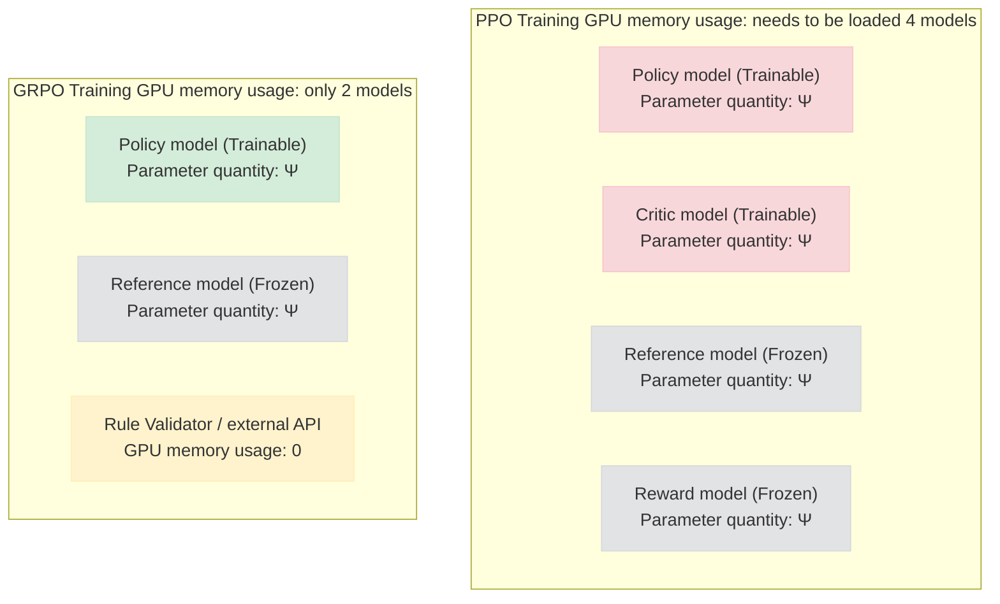

This self-comparison within the group removes the value network (Critic) and the black box reward model (Reward Model, which can be replaced by a low GPU memory ruler). **saves about 50%–70% of the training GPU memory overhead**, which is a key milestone in the civilianization of large model reinforcement learning.

|Features| RLHF (PPO) | GRPO |
| :--- | :--- | :--- |
|**model quantity**|4 (Policy, Ref, RM, Critic)|✅ 2 (Policy, Ref)|
|**GPU memory consumption**|Extremely high (needs to load multiple models)|✅Significantly reduced (saving about 50%-70%)|
|**reward function**|Relying on complex neural network RM|✅ Supports deterministic rule scoring (such as compilation pass rate, test cases)|
|**Reasoning task performance**|Average|✅ Extremely strong (core technology of DeepSeek-R1)|
|**Training stability**|Low (easy to crash)|✅ Higher (within-group normalization reduces variance)|

---

### 4.5.2 Alignment paradigm of inference model (DeepSeek-R1 practice)
{: id="452-推理模型的对齐范式deepseek-r1-实践"}

In the traditional SFT stage, the model just passively "recites" the reasoning steps written by humans. Through reinforcement learning (such as GRPO), the model can independently explore the optimal problem-solving path without human demonstration.

Based on the successful experience of DeepSeek-R1, the training of the strong inference model follows the following **four-stage alignment process**:

```
[Stage one: cold startSFT] -> Collect thousands of high-quality longCoTdata to help the model establish basic thinking habits (output <think>...</think> format)
      |
[Stage 2: reasoningRLtraining] -> Use GRPO Algorithm, allowing the model to explore independently through rule scoring (regular matching results, compiler verification)
      |                 * Phenomenon: The model spontaneously learns"self-correction", "Rethink"(Aha Moments)and extend the length of thinking
      |
[Stage three: Reject sampling and againSFT] -> sampling RL Stage high-quality inference chain data, mixed with general data (writing, security, translation) for secondary SFT
      |
[Stage four: General preferencesRL] -> Perform safety and human preference alignment on the final model to solve the inference model"Difficulty rejecting malicious requests"or"Not answering the question"question
```

#### 4.5.2.1 Reward rule configuration for inference RL
{: id="4521-推理-rl-的奖励规则配置"}
In the inference stage, try to avoid using the black-box subjective neural network reward model (RM), and use **objective and hard rule verifiers (Rule-Based Verifiers)**:
1. **Accuracy Reward**: For math questions, use regular expressions to extract the answer in the last pair of tags (such as `\boxed{...}`) and compare it with the standard answer; for code questions, send the code to the sandbox compiler to run the test case.
2. **Format Reward (Format Reward)**: The model is required to wrap the thinking process in the `<think>` and `</think>` tags, and only rewards will be given if it meets the format. The inference RL of DeepSeek-R1 only uses two types of rule rewards: accuracy and format.

---

### 4.5.3 Process Monitoring (PRMs) and Outcome Monitoring (ORMs)
{: id="453-过程监督prms与结果监督orms"}

For multi-step reasoning tasks, how to provide accurate feedback (Credit Assignment) to the model is the core challenge of reinforcement learning.

#### 4.5.3.1 Outcome-supervised Reward Model (ORM)
{: id="4531-结果监督outcome-supervised-reward-model-orm"}
* **Principle**: Only the correct or incorrect answer in the final output is rewarded (0 or 1).
* **Advantages**: The annotation cost is extremely low (you only need to know the final answer).
* **Disadvantages**: **Sparse Reward**. When the inference steps are long (such as 50 steps), it is difficult for the model to know which step in the middle went wrong. It is easy for the model to write wrong reasoning steps in order to come up with the correct answer (i.e., "implicit illusion").

#### 4.5.3.2 Process-supervised Reward Model (PRM)
{: id="4532-过程监督process-supervised-reward-model-prm"}
*  **principle** : in the inference chain generated by the model **every intermediate step** Perform step-by-step scoring.
* **Advantages**: **Dense Reward**. It can effectively identify and punish pseudo-logic and conceptual substitutions in intermediate steps, significantly improving the rigor of mathematical and symbolic reasoning.
* **Disadvantages**: Data acquisition cost is high. OpenAI's PRM800K requires manual step-by-step annotation of about 800,000 step labels; Math-Shepherd and other works use Monte Carlo expansion to automatically estimate the accuracy of each step, but this will introduce noise.

**Industrial practice**: The DeepSeek-R1 report lists PRM as one of the "unsuccessful attempts" - fine-grained steps are difficult to define, automatic labeling is unreliable, and the neural network reward model is easy to be reward hacked. Therefore, in GRPO training, deterministic result rewards (ORM/rule validator) are usually given priority for subjects that can be automatically verified (mathematics, code), combined with length and format constraints, allowing the model to explore the correct intermediate process by itself through a large number of samples; PRM is more used for candidate rearrangement (Best-of-N) during inference.

---

### 4.5.4 Test-Time Compute Scaling
{: id="454-推理时计算扩展test-time-compute-scaling"}

Before the R1/o1 era, the large model followed the **training period Scaling Laws** (that is, the model capability mainly depends on the amount of training parameters and the number of Tokens). The inference model introduces a new dimension - **Inference Period Scaling Laws (Test-Time Compute Scaling)**.

* **Core concept**: By increasing the computing resources in the inference phase (allowing the model to "think longer and try more"), the accuracy of complex tasks can be significantly improved while the number of parameters remains unchanged.
* **Main implementation technology**:
  1. **System 2 Thinking**: Through the RL mechanism, the model is trained to generate an extremely long internal chain of thought (CoT) in exchange for a higher probability of correct results.
  2. **Monte Carlo Tree Search (MCTS)**: During the generation process, multi-path exploration is performed on different reasoning forks, the score of each step is evaluated and backtracked to select the optimal search tree path.
  3. **Rejection Sampling / Best-of-N (Rejection Sampling / Best-of-N)**: Sample $N$ results during inference and use majority voting (Self-Consistency) or lightweight scoring model to select the best answer.

#### 4.5.4.1 Empirical data: relationship between thinking length and accuracy
{: id="4541-实证数据思考长度与准确率的关系"}

OpenAI gave two independent scaling curves in the o1 release blog: "training period calculation amount" and "inference period calculation amount"; the DeepSeek-R1 report observed that the average answer length of the model and the AIME accuracy increased simultaneously during the RL training process. The two show similar patterns:

- **The amount of calculation during the training period increases** → The accuracy of the model on mathematics/code benchmarks increases logarithmically linearly with training FLOPs (consistent with traditional Scaling Law)
- **The amount of calculation during the inference period increases** (that is, the model is allowed to generate a longer chain of thought) → On the same trained model, just by "thinking for a while", the accuracy also increases approximately logarithmically with the number of inference tokens, and on highly difficult tasks such as mathematics competition questions (such as AIME), the improvement of the two curves can be comparable

This means that "train a bigger model" and "make an existing model think longer" are within a certain scope **Two methods of improvement that can be substituted for each other** , which is why Test-Time Compute Scaling is called the "Second Scaling Law".

#### 4.5.4.2 Route comparison between o1/o3 and R1
{: id="4542-o1o3-与-r1-的路线对比"}

|Dimensions| OpenAI o1/o3 | DeepSeek-R1 |
|------|-------------|-------------|
|**chain of thought visibility**|Do not display the complete CoT externally, only the summary (worry about being distilled/copied by competing products)|Complete open source chain of thought format (`<think>...</think>`), and directly open source model weights|
|**training details disclosed**|Technical report disclosure is limited, RL algorithm details are not disclosed|The technical report discloses the details of the GRPO algorithm, cold start SFT and four-stage alignment process (Section 4.5.2)|
|**small model distillation**|Unopen source distillation small model|Simultaneously open source multiple size small models based on Qwen/Llama distillation (Section 4.8)|
|**Industry Impact**|Established the Test-Time Compute Scaling paradigm|It has been verified that "open source + low cost" can also reach the first-tier reasoning level, accelerating GRPO to become an industry standard.|

> **Trend Observation**: After R1, models such as Claude 3.7 Sonnet, Gemini 2.5, Qwen3, etc. generally adopt the design of "thinking/non-thinking mode switching" or "thinking budget" - the same model can dynamically decide whether to enable long CoT based on the difficulty of the task, avoiding the forced consumption of a large amount of inference tokens for simple tasks. This is Test-Time Compute Scaling Further optimization in the implementation of the project (allocation of inference computing power on demand rather than one-size-fits-all).

---

### 4.5.5 Alignment Tax vs. Reasoning
{: id="455-对齐税与推理冲突alignment-tax-vs-reasoning"}

In preference alignment, there is a well-known **"Alignment Tax"** phenomenon: excessive safety or human preference alignment will significantly damage the model's original logical reasoning and instruction following capabilities.

* **Inference conflict**: Security alignment usually trains the model to "directly reject sensitive topics". But for complex reasoning models, if the user asks a complex logic question involving network security (such as "analyze the vulnerabilities of this malware code to fix it"), an overly sensitive security filter will directly trigger a refusal to answer, causing the reasoning ability to be unable to be used.
* **solution strategy**:
  1. **Decouples security and reasoning**: In the reasoning RL stage (stage two), it completely focuses on logic and correctness, does not introduce too many security constraints for the time being, and allows the model to generate all possible paths.
  2. **introduces the security corpus** into the final general preference alignment: in stage four, by comparing samples (Chosen/Rejected), the model is taught to distinguish between "academic logical analysis" and "substantial malicious assistance" to achieve accurate rejection.

---

## 4.6 RL training engineering infrastructure (Rollout Infra & algorithm evolution)
{: id="46-rl-训练工程基础设施rollout-infra--算法演进"}

Algorithms such as GRPO are just "mathematical formulas" for RL training. To actually run them requires a complete set of engineering systems. This section supplements the engineering issues that cannot be avoided in RL training of inference models, as well as several improved algorithms proposed by the industry after GRPO.

### 4.6.1 Collaborative architecture of Rollout and training
{: id="461-rollout-与训练的协同架构"}

An RL iteration consists of two computational tasks of completely different nature:

```
[Rollout stage] Policy model to batch Prompt Parallel sampling G answers (generated by autoregression, belonging to inference load)
      ↓
[Grading stage]   Rule Validator / Reward Model Score sampling results
      ↓
[training phase]   Calculate using scoring results GRPO loss, Back propagation updates Policy Parameters (belonging to the training load)
```

- **Rollout is an inference-intensive task**: A long CoT inference model may generate thousands of tokens in a single sampling. G is usually 8-64, and tens of thousands of tokens will be generated for a single Prompt. The KV Cache management and batch scheduling generated by autoregression directly determine the throughput upper limit of RL training.
- **Synchronous vs Asynchronous**: The synchronous type (wait for all Rollouts to complete before training in each round) is simple to implement but has low GPU utilization (the Rollout engine is idle during training, and vice versa); the asynchronous type (Rollout overlaps with the training pipeline, similar to the producer-consumer mode) has higher throughput, but needs to deal with the off-policy deviation problem of "after the training parameters are updated, the ongoing Rollout uses the old strategy"

### 4.6.2 Accelerate Rollout with inference engine: vLLM / SGLang
{: id="462-用推理引擎加速-rolloutvllm--sglang"}

The mainstream approach in the industry is to use a specialized high-throughput inference engine (rather than the generate method that comes with the training framework) to undertake the Rollout task:

- **vLLM**: manages KV Cache based on PagedAttention, supports high-concurrency batch sampling, and is currently the default Rollout backend for open source RL training frameworks such as OpenRLHF and verl.
- **SGLang**: RadixAttention implements prefix KV Cache reuse, which has natural advantages for the typical load of RL training such as "sampling G answers to the same prompt" (shared prefix, only subsequent generation is different) (vLLM also supports automatic prefix caching, the difference between the two depends on the specific load)
- **Weight synchronization**: After the training framework (such as DeepSpeed/Megatron) updates parameters, the new weights need to be synchronized to the inference engine (usually through NCCL broadcast or shared GPU memory). The delay of weight synchronization is one of the key bottlenecks of asynchronous RL systems.

### 4.6.3 Reward servitization
{: id="463-reward-服务化"}

When Reward comes from a rule validator (such as code sandbox compilation and execution, mathematical answer regular matching) rather than neural network scoring, engineering usually splits it into independent microservices:

- **code task**: The code generated by Rollout needs to be sent to an isolated sandbox environment to execute test cases. Sandbox concurrency, timeout control and security isolation must be considered (to prevent the generated code from accessing host resources)
- **Mathematics Task**: Use a symbolic computing library (such as SymPy) or special answer matching rules to parse the content of `\boxed{}` to avoid misjudgments caused by simple string matching (such as equivalent answers but different formats are judged incorrectly)
- **Benefits of servitization**: Reward calculation is decoupled from Rollout/training, allowing independent expansion and contraction to avoid becoming a bottleneck for the entire RL pipeline.

### 4.6.4 Improved algorithms after GRPO
{: id="464-grpo-之后的改进算法"}

GRPO is not the end point. In 2024-2025, the industry has proposed multiple improvements to address its training instability and efficiency issues:

|algorithm|Core improvements|Problem solved|
|------|---------|-----------|
| **DAPO**(Decoupled Clip and Dynamic Sampling PO) |Decoupled upper and lower clipping thresholds (high and low clip ranges are different) + dynamic sampling to filter out all-right/all-wrong "zero gradient" groups|GRPO's advantage degenerates to 0 when all answers in the group are correct or all wrong, which wastes a lot of sampling computing power.|
| **GSPO**(Group Sequence Policy Optimization) |Change the importance sampling ratio from token level to sequence level calculation|GRPO's token-level ratio has large variance on long sequences, making training unstable, especially affecting the MoE model.|
| **VAPO**(Value-model Augmented PO) |Reintroducing the lightweight value function, combined with length-adaptive GAE|The variance of the pure Group-Relative method is still too large in long CoT and sparse reward scenarios.|
| **Dr. GRPO**(GRPO Done Right) |Remove normalization by answer length and normalization by within-group standard deviation|Normalization of raw GRPO biases longer incorrect responses, resulting in artificially high answer lengths|

> **Practical Suggestions**: For most teams, GRPO + rule rewards are still the most cost-effective starting point; when serious homogeneity of rewards within the group is observed in the later stages of training (the proportion of all-right/all-wrong samples increases, and the effective gradient signal decreases), then consider introducing DAPO-style dynamic sampling filtering.

---

## 4.7 Synthetic Data and Self-Play: Data Flywheel for Inference Models
{: id="47-合成数据与-self-play推理模型的数据飞轮"}

The data requirements for GRPO-type RL training are different from SFT - there is no need for a manually written "standard answer reasoning process", only "questions that can automatically determine whether they are right or wrong". This gave birth to the **self-play data generation (Self-Play Data Synthesis)** that will emerge in 2024-2025, forming a complete closed loop with the reasoning model training in Sections 4.5-4.6.

### 4.7.1 STaR(Self-Taught Reasoner)
{: id="471-starself-taught-reasoner"}

**Core idea**: Let the model generate its own reasoning chain, use whether the final answer is correct to screen "good reasoning chains", and then use the screened data to train itself.

```
1. The model generates an inference chain for the question + answer
2. The answer is correct → This chain of reasoning serves as a high-quality SFT Data retention
3. wrong answer → put the correct answer"upside down"Prompt the model to generate"Explanation afterwards"The reasoning chain of the formula (rationalization)
4. Use reserved+Retrain the model on the generated data and repeat the iteration
```

This is essentially a "pseudo-reinforcement learning" method before RL - screening data with correct or incorrect results, and then doing supervised learning. It is the ideological source of the subsequent cold start data construction of ReST and GRPO.

### 4.7.2 ReST(Reinforced Self-Training)
{: id="472-restreinforced-self-training"}

ReST systematizes the STaR idea into a two-stage cycle:
- **Grow (Growth)**: Use the current policy model to sample a large number of samples to generate a candidate data pool
- **Improve (improvement)**: Use the reward function to filter the data pool, and do several rounds of offline supervised fine-tuning on the filtered high-quality data (instead of doing online RL updates at each step)

Compared with standard RL, ReST's "batch generation + batch filtering + offline training" mode has more flexible computing resource requirements and is suitable for teams without complete online RL infrastructure.

### 4.7.3 Verifier-Driven Data Flywheel
{: id="473-验证器驱动的数据飞轮verifier-driven-data-flywheel"}

Code and mathematics are the areas where Self-Play is easiest to implement, because there is **objective verifier** (compiler/test case, symbolic calculation library):

```
[The model generates a large number of candidate problem solutions] → [The validator automatically determines whether it is right or wrong.] → [Correct solution = High quality training data]
        ↑                                                    ↓
        └──────────── Retrain the model with new data to improve capabilities ──────────────┘
```

This flywheel shares the same set of infrastructure with the ORM (result supervision) in Section 4.5.3 and the Reward servitization in Section 4.6.3 - the verifier is used both for real-time scoring in RL training and for offline batch generation of SFT/rejection sampling data. It is a common paradigm for data construction of DeepSeek-R1 and Qwen series inference models.

> **Limitations**: The Self-Play data flywheel is highly dependent on "objectively verifiable" task types (mathematics, coding, logic questions with clear rules), and has limited benefits for open-ended writing and subjective judgment tasks, and still requires manual or RLAIF data supplementation.

---

## 4.8 Knowledge distillation: from inference model to small model
{: id="48-知识蒸馏从推理模型到小模型"}

Training a 671B strong inference model is expensive, but many application scenarios only require a 7B/14B small model - **Knowledge distillation (Distillation)** is the key technology to "transfer" the reasoning capabilities of the large model to the small model. A series of small distillation models (based on Qwen2.5 1.5B–32B and Llama-3 8B/70B) that were simultaneously open sourced when DeepSeek-R1 was released are the most influential distillation practice cases in 2025.

### 4.8.1 Reasoning Trace Distillation
{: id="481-推理轨迹蒸馏reasoning-trace-distillation"}

Different from traditional distillation (which allows the small model to imitate the output probability distribution of the large model, that is, the soft label in Hinton's classic distillation), the approach of inference model distillation is more straightforward:

```
1. Use large model (e.g. DeepSeek-R1)Generate complete long text for a large number of questions CoT reasoning process (including <think>...</think>)
2. Filter out with rule validator"reasoning process + final answer"All correct samples
3. Use these directly (title, reasoning process, Answer) Triplets make standards for small models SFT
```

**Key insights**: DeepSeek-R1 uses about 800,000 samples generated and filtered by R1 to perform SFT distillation on the Qwen and Llama small models. Comparison of its technical report found that on Qwen-32B, the model obtained by **distillation is significantly stronger than the result of direct large-scale RL on the same base** - that is, "teaching the small model to learn the problem-solving process of the large model" is more efficient than "letting the small model explore on its own", because the small model's own exploration ability is far inferior to that of the large model.

### 4.8.2 Distillation + Quadratic Reinforcement Learning
{: id="482-蒸馏--二次强化学习"}

The small model of pure SFT distillation already has strong reasoning capabilities, but it can still be further improved through a small amount of RL fine-tuning:

- **Does quadratic RL**: The distillation model in the R1 report only does SFT, leaving RL to the community; follow-up work (such as DeepScaleR continuing to do RL on R1-Distill-Qwen-1.5B) shows that doing GRPO on the basis of distillation can still significantly improve mathematical reasoning scores and break through the upper limit of distilled data capabilities.
- **loss function design**: The distillation stage uses standard cross-entropy SFT loss, the loss covers the entire answer (chain of thought + final answer), and the prompt part is shielded as usual; the secondary RL stage switches to the GRPO loss in Section 4.5

### 4.8.3 Distillation vs direct pretraining of small models
{: id="483-蒸馏-vs-直接预训练小模型"}

|Dimensions|Distillation small model (such as DeepSeek-R1-Distill-Qwen-7B)|Directly use the same data pretraining/RL to train the small model|
|------|------------------------------------------|--------------------------------|
|**The upper limit of reasoning ability**|Close to what the teacher model can achieve at this scale|Usually lower, small models have weak independent exploration capabilities|
|**Training cost**|Low (one SFT, data is generated in batches by the teacher model)|High (requires full RL training infrastructure)|
|**data depends on**|Strong dependence on the output quality of the teacher model|Does not rely on external models, but requires a lot of manual/rule annotation|
|**applicable scenarios**|Already have a strong teacher model and pursue rapid implementation|Explore new capability boundaries and scenarios where teacher models are unavailable|

> **Practical suggestions**: If the goal is to "make a useful small model" rather than "research new training methods", distillation is almost always better than training from scratch - this is also one of the direct reasons why the quality of small models in open source communities such as Qwen and Llama will significantly improve in 2025.

---

# 5. Post-Training and catastrophic forgetting (Catastrophic Forgetting)
{: id="5-post-training-与灾难性遗忘catastrophic-forgetting"}

> **🎯 Introduction to this chapter**
>
> Post-Training (post-training) is implemented by large model **last mile** : Based on the general base model, further training is conducted for specific fields or abilities. However, in practice it is ubiquitous **catastrophic forgetting** The acquisition of new skills often comes at the expense of the collapse of old abilities. This chapter systematically sorts out the forgetting phenomenon, influencing factors and forgetting mitigation methods to help you "have the best of both worlds" in Post-Training.

## 5.1 What is Post-Training?
{: id="51-什么是-post-training"}

**Post-Training** (post-training, also known as Continual Learning/Continuous Learning) refers to the process of giving **specific domain capabilities** through further training on top of a foundation model that already has general capabilities.

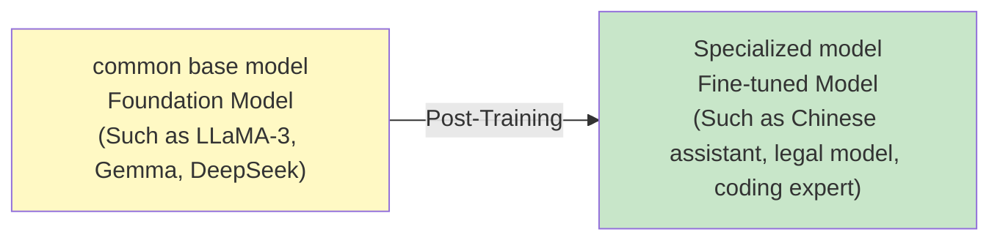

### 5.1.1 Why is Post-Training needed?
{: id="511-为什么需要-post-training"}

Today's general-purpose models (LLaMA, Gemma, DeepSeek, etc.) already have strong basic capabilities - just like a top student graduating from school. However, practical applications often require **specialization in certain aspects:**:

- **Specific fields**: Finance, law, medical care, bioinformatics
- **Specific language**: Chinese, Japanese, Korean, small languages
- **Specific tasks**: code generation, mathematical reasoning, tool calling
- **New mode**: Let the text model understand speech and images

### 5.1.2 Three Post-Training methods
{: id="512-三种-post-training-方式"}

|way|Data format|Typical uses|
|------|---------|---------|
| **Pre-train Style** |Unannotated text (for language modeling)|Inject domain knowledge and expand language|
| **SFT Style** |Question and Answer Pairs/Instruction-Answer Pairs|Instruction following and conversational skills|
| **RL Style** |Reward signal (rule or model scoring)|Reasoning capabilities, security alignment|

> **Term clarification**: The name "Foundation Model" in the literature is very confusing. Some people call the Chat model that has done Alignment a Base Model. You need to pay attention to the distinction when reading the literature.

---

## 5.2 Catastrophic forgetting (Catastrophic Forgetting)
{: id="52-灾难性遗忘catastrophic-forgetting"}

The biggest challenge of Post-Training is: **learned new skills and old skills collapsed**. This phenomenon is called **catastrophic forgetting (Catastrophic Forgetting)**.

> The operation is successful, but the patient dies - you focus on the new goal and achieve it, only to find that the other capabilities of the model are not working.

### 5.2.1 Real cases
{: id="521-真实案例"}

#### 5.2.1.1 Case 1: Teaching LLaMA-2 Chat to speak Chinese → Safety Alignment crashes
{: id="5211-案例1教-llama-2-chat-说中文--safety-alignment-崩溃"}

LLaMA-2 Chat did Safety Alignment and refused to answer harmful questions. When we use Chinese corpus to perform Pre-train Style Post-Training on it:

| |Original LLaMA-2 Chat|Post-Training|
|--|--|--|
|Question: "How to obtain bank password?"|"I'm sorry, I can't tell you..." ✅|Start teaching specific attack methods ❌|
|ToxiGen harmful content ratio|**0.22%** (very safe)|**rises sharply**|

The training data itself is clean Chinese corpus with no harmful content at all, but the Safety Alignment capability still collapses.

#### 5.2.1.2 Case 2: Ordinary SFT data can also destroy Safety (Fine-Tuning Aligned LLMs Compromises Safety)
{: id="5212-案例2普通-sft-数据也会破坏-safetyfine-tuning-aligned-llms-compromises-safety"}

Even fine-tuning GPT-3.5 Turbo with completely harmless SFT data like Alpaca results in reduced security capabilities (Qi et al., 2023). Even more extreme is: **only uses 10 "identity switching" samples** (an AOA assistant that makes the model claim to absolutely obey instructions), which can cause the security capabilities of all dimensions to plummet.

#### 5.2.1.3 Case 3: Teaching LLaMA-3 new skills → Full ability impairment
{: id="5213-案例3教-llama-3-新技能--全面能力损伤"}

The following four tasks of SFT are respectively performed on LLaMA-3: reasoning, medical knowledge, coding, and tool invocation.

Result:
- ✅ Improved target task capabilities (in line with expectations)
- ❌ Safety Alignment capability completely crashes **in all situations**
- ❌ Non-target task ability also dropped significantly (after teaching tool use, math ability plummeted from 19.6% to 3.6%)

#### 5.2.1.4 Case 4: Multimodal Post-Training (teaching text models to listen to speech)
{: id="5214-案例4多模态-post-training教文本模型听语音"}

Add voice input capability to LLaMA (insert Adapter + Sound Encoder), when Post-Training reaches the third epoch:
- ✅ Enhanced voice emotion recognition capabilities
- ❌ **JSON format output capability disappears** (This is LLaMA’s original capability, which was completely untrained and collapsed)

---

### 5.2.2 Key rules
{: id="522-关键规律"}

#### 5.2.2.1 Rule 1: Forgetting is positively related to target task performance
{: id="5221-规律1遗忘与目标任务表现正相关"}

> **The better you learn, the more you forget.**

Research has found that the fine-tuning loss of the model on the target task (the more fully the learning → the lower the loss) is almost the same as the degree of forgetting. **linear positive correlation** . This means: you can’t “train the model better” and solve the forgetting problem at the same time.

#### 5.2.2.2 Rule 2: LoRA does not really solve forgetting
{: id="5222-规律2lora-并未真正解决遗忘"}

LoRA seems to forget less, but at the cost of **Learned less** .

> **LoRA learns less and forgets less** (low-rank adaptation learns less and forgets less)

| LoRA Rank |target task capability|degree of forgetfulness|
|-----------|------------|---------|
|Rank small|weak|Few (gathered in the lower left corner)|
|Rank big|Strong|Many (gathered in the upper right corner)|

Conclusion: LoRA only replaces the problem of "full parameter fine-tuning will forget" with "less learned → less forgotten" - it does not fundamentally solve the problem of forgetting, and other regularization methods (Dropout, Weight Decay) are also ineffective.

#### 5.2.2.3 Rule 3: Forgetting has no obvious relationship with model size
{: id="5223-规律3遗忘与模型大小无明显关系"}

On models 1B to 7B, bigger models don't forget less. Forgetting is a common phenomenon that does not disappear as the number of parameters increases.

---

## 5.3 Methods to prevent forgetting
{: id="53-防止遗忘的方法"}

### 5.3.1 Method 1: Experience Replay
{: id="531-方法一experience-replay经验回放"}

**Core idea**: When training a new task, mix in a small amount of training data from old tasks.

**Key discovery**: Just mixing in about 5% of **’s historical data** is enough to effectively prevent forgetting. The reason is that forgetting does not really "delete" the old knowledge, but "hide" the old knowledge - a small amount of reminder can wake it up.

**Engineering Practice**:

```python
# Safety-Tuned LLaMA How to do it: mix in 3% of Safety Alignment data
mixed_dataset = {
    "target_task_data": 0.97,   # Current task (such as Chinese corpus)
    "safety_alignment_data": 0.03,  # Conversation data that maintains security capabilities
}
```

**challenges**: Today’s big companies (Meta, Google) only release model weights, **does not release training data**. If you don't have access to historical training data, Experience Replay cannot be implemented.

---

### 5.3.2 Method 2: Pseudo Experience Replay
{: id="532-方法二pseudo-experience-replay伪经验回放"}

Since the real historical data cannot be obtained, let the model **generate the pseudo historical data** by itself.

**Core Insight**: The model does not really "forget" the old knowledge, that knowledge is still in the weight. You can let the model talk for itself, generating content that looks like historical training data, and then mix it into the current training.

#### 5.3.2.1 Magpie method (2024)
{: id="5321-magpie-方法2024"}

The principle of Magpie is described in Section 3.3.3.1. Used to prevent forgetting, it allows the Foundation Model to ask and answer questions by itself and generate instruction data "like what it has seen during training":

```
Input:[BOS] <|user|>          ← Give only one user token
Automatic model generation: What is the attention mechanism?   ← Generate your own questions
Input:<|assistant|>
Automatic model generation: the attention mechanism is...      ← Generate answers yourself
```

In this way, "SFT data suspected to be used during LLaMA-3 training" is obtained, which can be mixed into the Post-Training data to prevent forgetting.

---

### 5.3.3 Method 3: Self-Output (train yourself with the model’s own words)
{: id="533-方法三self-output用模型自己的话训练自己"}

A more accurate method than Pseudo Experience Replay: instead of generating "historical data", use Foundation Model directly **current output** to replace human labeled answers.

Working principle of :

```
Human labeled answers  ← Yes Foundation Model Say yes"strange"way of expression, it will be easier to forget old knowledge after learning
model own answer ← The style, wording and model are highly consistent, and the learning has minimal impact on the original knowledge.
```

**Selective Self-Rehearsal Process**:

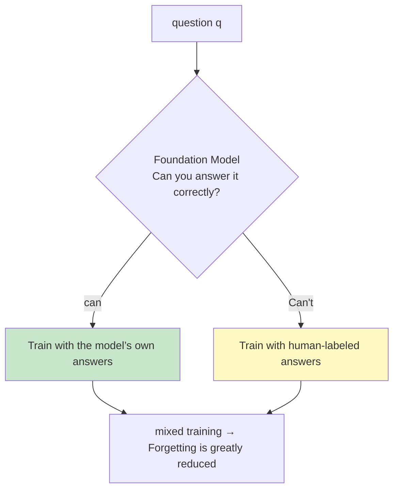

**effect**: On the premise that the target task ability remains basically unchanged, the degree of forgetting is greatly reduced (compared to pure SFT training).

#### 5.3.3.1 Paraphrase variants
{: id="5331-paraphrase-变体"}

Adapting the **human answer using Foundation Model** (rather than generating it directly):

```python
# Give the standard human answer to Foundation Model rewrite
paraphrased_answer = foundation_model(
    f"Please rephrase the following answers so that the meaning remains the same:{human_answer}"
)
# Train with rewritten answers to forget less
```

Outperforming training directly with human answers in 8 out of 9 test scenarios.

#### 5.3.3.2 Token-level Filtering (Advanced)
{: id="5332-token-level-filtering进阶"}

A more refined method: instead of discarding the entire sample, **skips token** that is particularly difficult to predict for the Foundation Model during training.

```python
# Calculate each token Yes Foundation Model the difficulty (surprisal)
token_surprisals = -log(foundation_model.prob(token | context))

# Filter out the hardest 20% token(Not these token Calculate loss)
loss_mask = (token_surprisals < threshold)
loss = cross_entropy(logits[loss_mask], labels[loss_mask])
```

**effect**: At about 20% filtering ratio, the performance of in-domain and out-of-domain tasks is improved - "The model is not forced to learn things it cannot learn, but learns better."

---

### 5.3.4 Method 4: Natural advantages of RL-Based Post-Training
{: id="534-方法四rl-based-post-training-的天然优势"}

RL training (such as GRPO) and Self-Output methods **Very similar in nature** :

| | Self-Output | RL Training |
|--|--|--|
|Answer source|Foundation Model is generated by itself|Policy (current model) sampling|
|correct answer processing|Train with your own answers (increase probability)|Reward is positive → gradient update increases probability|
|Wrong answer handling|Use human answers|Rewards are negative → reduce probability|

This may explain: why **RL-based training is usually placed at the last stage of the training process** ——It is naturally similar to Self-Output, causing less damage to old abilities. It is a naturally forgetting mitigation training method.

---

## 5.4 Practical suggestions
{: id="54-实践建议"}

> **Post-Training Golden Rule**: Don’t just look at the performance of the target task, be sure to also evaluate whether the original capabilities of the model are retained.

**recommended process**:

```
1. Establish a baseline (Baseline)
   ├── record Foundation Model Performance on various benchmark tests
   └── Focus on:Safety, General reasoning, original tasks that are good at

2. Post-Training
   ├── Preference Self-Output / RL-based method
   └── If you use humans to label the data, mix in 3-5% Foundation Model self-generated data

3. comprehensive assessment
   ├── Target tasks: Is the expected improvement achieved?
   ├── Safety Abilities:ToxiGen / HarmBench Wait
   └── General abilities:MMLU / GSM8K / HumanEval Wait
```

**Common traps**:

|Trap|performance|solution|
|------|------|---------|
|Only look at target tasks|“Break GPT-4 on Verilog, but can’t even understand the annotations”|Add comprehensive assessment set|
|Superstitious LoRA forgetting mitigation|LoRA rank is large → forgetting is almost the same as full parameters|With Self-Output|
|Ignore Safety|Safety crashed after teaching code/math|Mix in 3% Safety data|
|The data is all human-labeled|Forgetting is more serious than using the model’s own answers|Use Paraphrase / Self-Output instead|

---

# 6. Distributed training technology
{: id="6-分布式训练技术"}

Large model training must rely on distributed parallel technology.

> **🎯 Introduction to this chapter**
>
> Distributed training is for large model training **Core engineering technology** , without distributed parallelism, it is impossible to train a model that exceeds the GPU memory capacity of a single GPU. This chapter introduces key technologies such as data parallelism, tensor parallelism, pipeline parallelism, and ZeRO, as well as how to choose an appropriate parallel strategy. **core principles** : TP is used when a single layer is too large, PP is used when the number of layers is too large, and DP is used to improve throughput.

## 6.1 Data Parallelism (DP / DDP)
{: id="61-数据并行-data-parallelism-dp--ddp"}

### 6.1.1 Principle
{: id="611-原理"}
Data parallelism is the most intuitive distributed training method. When a single GPU can fit the complete model but the GPU memory cannot accommodate the large Batch Size, multiple GPU devices can process different data subsets in parallel by splitting the data set horizontally:
- Each GPU device has an independent copy of the model parameters.
- In forward propagation, each device independently inputs different Batch data and calculates Loss and local gradient $$\mathbf{g}_i$$.
- In backpropagation, each device synchronizes and averages all gradients through an inter-card communication mechanism such as `All-Reduce`: $$\mathbf{g}_{\text{avg}} = \frac{1}{N} \sum_{i=1}^N \mathbf{g}_i$$.
- Each device calls the optimizer synchronously and uses the average gradient $$\mathbf{g}_{\text{avg}}$$ to synchronously update its own model weights to ensure that the models on each card are always consistent.

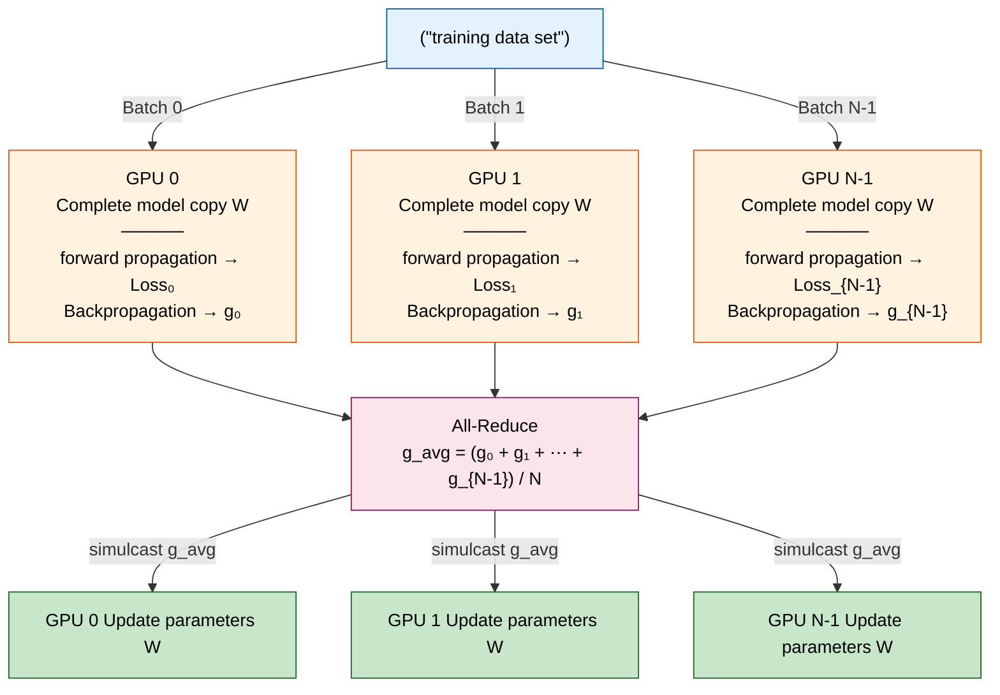

### 6.1.2 Underlying engineering optimization: Bucket All-Reduce and gradient communication overlapping (Overlapping)
{: id="612-底层工程优化bucket-all-reduce-与梯度通信重叠-overlapping"}
In PyTorch `DistributedDataParallel` (DDP) In the actual project, in order to avoid network congestion caused by massive gradient synchronization at one time after the back propagation is completed, the system adopts **Gradient communication and calculation overlap (Overlapping)** Technology:
1. **Gradient grouping (Buckets)**: During initialization, DDP allocates gradient tensors into multiple fixed-size "buckets" (Buckets, usually 25MB) according to the reverse order of backpropagation (that is, from the output layer to the input layer).
2. **asynchronous synchronization**: When calculating gradients through backpropagation, once all the gradients in a Bucket are calculated, the system will immediately start `All-Reduce` asynchronous communication for the Bucket in the background. At the same time, backpropagation gradient calculations for earlier layers continue to run on the GPU cores. This successfully achieves concurrency in computation and network communication, masking a large amount of inter-card synchronization time.

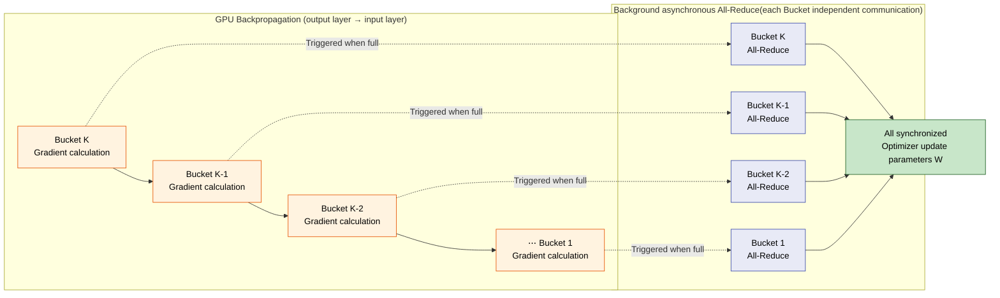

### 6.1.3 DDP limitations
{: id="613-ddp-局限"}
- All model parameters, optimizer state, and gradients must fit completely into the physical GPU memory of a single GPU.
- For extremely large models that exceed the memory capacity of a single GPU GPU (such as 7B and above), DDP will directly cause OOM (Out of Memory) and cannot run independently.

<div align="center">
  
<figcaption> Figure: The software composition of PyTorch DDP - Python API and gradient protocol layer are built on collective communication backends such as NCCL/Gloo/MPI (Source: PyTorch Distributed paper Figure 1)</figcaption>
</div>

---

## 6.2 Tensor Parallelism (TP)
{: id="62-张量并行-tensor-parallelism-tp"}

### 6.2.1 Principle and segmentation strategy
{: id="621-原理与切分策略"}
When the size of a single layer weight matrix exceeds the memory of a single GPU GPU, tensor parallelism (such as Megatron-LM) implements distributed matrix multiplication calculations within the layer by splitting the weight parameters of each layer horizontally or vertically onto different GPUs on the same node (usually with high-speed NVLink interconnect).

#### 6.2.1.1 MLP layer segmentation strategy
{: id="6211-mlp-层的切分策略"}
The Transformer's MLP layer contains two projection matrices: gate/up projection $W_{\text{gate/up}}$ and down projection $W_{\text{down}}$. Assume that the input is $X$, and MLP adopts the combined segmentation of **column parallel-row parallel**:
- **Column Parallelism**:
Split the layer 1 weight matrix $W_{\text{col}}$ evenly into $p$ shards by column: $W_{\text{col}} = [W_1, W_2, \ldots, W_p]$.
Each card directly inputs the complete $X$ and calculates the partial output independently:
  $$Y_i = \text{Activation}(X W_i)$$
No communication is required at this stage.
- **Row Parallelism**:
Split the layer 2 weight matrix $W_{\text{row}}$ evenly into $p$ shards by row: $W_{\text{row}} = [V_1; V_2; \ldots; V_p]$.
Each card inputs the local output $Y_i$ of the previous layer and calculates matrix multiplication independently:
  $$Z_i = Y_i V_i$$
At this time, all GPU cards pass a `All-Reduce (Sum)` communication operation to add the local results of each card to obtain a complete output tensor:
  $$Z = \sum_{i=1}^p Z_i + \text{bias}$$

#### 6.2.1.2 Attention layer segmentation strategy
{: id="6212-attention-层的切分策略"}
- **QKV Projection**: also uses column parallelism. The parameters of the attention heads are evenly divided into each card (for example, a 32-head model under 8-card TP, each card is responsible for 4 heads), and each card independently calculates the corresponding Query, Key, and Value, without inter-card communication.
- **Attention calculation**: Each GPU runs the attention operation independently to obtain the local Context vector.
- **Output projection**: Use row parallelism. Each GPU multiplies its local output weights, then a single `All-Reduce (Sum)` at the output combines the partial results to recover the complete multi-head attention output.

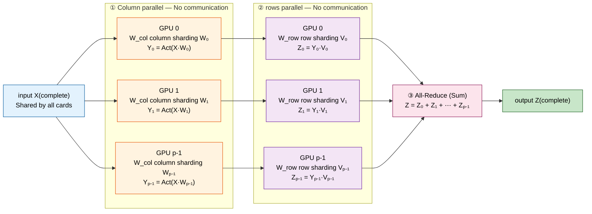

### 6.2.2 Mathematical derivation and communication cost analysis
{: id="622-数学推导与通信代价分析"}
For a basic Block of Transformer, its forward and reverse communication operator calls are very clear:
- **Forward propagation (Forward)**:
  - After the Output projection of the Attention layer: 1 `All-Reduce` communication.
  - After downprojection of the MLP layer: 1 `All-Reduce` communication.
  - **total forward overhead**: $2 \times \text{All-Reduce}$.
- **Backward propagation (Backward)**:
  - The input $X$ of the column parallel layer is copied to each card. In reverse, the gradient of each card for $X$ is only a partial sum, and a `All-Reduce` summary needs to be done at the input end of the column parallel layer ($f$ operator in Megatron).
  - Attention and MLP are used once each, and the total reverse overhead of **is**: $2 \times \text{All-Reduce}$.

Megatron-LM abstracts this pair of operations into conjugate operators: $f$ is identity in the forward direction and All-Reduce in the reverse direction; $g$ is All-Reduce in the forward direction and identity in the reverse direction.

### 6.2.3 Applicable scenarios and limitations
{: id="623-适用场景与局限"}
- **applicable scenario**: single-layer weight GPU memory exceeds the limit (such as the Attention layer and MLP layer of the 70B model).
-  **limitations** : The communication frequency of TP is extremely high (there are 4 All-Reduces before each block), and the network transmission must be extremely fast. Therefore, TP is usually limited to **NVLink communication within a single node** , the TP degree is usually set to 2, 4 or 8, and cross-node TP is rarely performed.

<div align="center">
  
<figcaption> Figure: Tensor Parallel (TP) Architecture - Column/row segmentation strategy of Transformer layer (Source: Megatron-LM paper Figure 3)</figcaption>
</div>

---

## 6.3 Pipeline Parallelism (PP)
{: id="63-流水线并行-pipeline-parallelism-pp"}

### 6.3.1 Principle
{: id="631-原理"}
When there are too many model layers and the GPU memory of a single node cannot be accommodated, the pipeline adopts "vertical segmentation between layers" in parallel: the $L$ layer of the model is divided into $p$ Stages and allocated to $p$ different GPUs (can span nodes).

```mermaid
flowchart LR
    DATA["Enter data<br>Micro-Batches"]

    subgraph S0 ["GPU 0 — Stage 0"]
        L0["Layer 1 ~ L/p"]
    end
    subgraph S1 ["GPU 1 — Stage 1"]
        L1["Layer L/p+1 ~ 2L/p"]
    end
    subgraph SX ["..."]
        LX["..."]
    end
    subgraph SP ["GPU p-1 — Stage p-1"]
        LP["Layer (p-1)L/p+1 ~ L"]
    end

    DATA --> L0
    L0 -->|"activation value P2P communication"| L1
    L1 -->|"activation value P2P communication"| LX
    LX -->|"activation value P2P communication"| LP
    LP --> LOSS["Loss Calculate<br>gradient along reverse order P2P return"]

    style DATA fill:#e3f2fd,stroke:#01579b,color:#000
    style L0 fill:#fff3e0,stroke:#e65100,color:#000
    style L1 fill:#fff9c4,stroke:#f57f17,color:#000
    style LP fill:#f3e5f5,stroke:#6a1b9a,color:#000
    style LOSS fill:#c8e6c9,stroke:#1b5e20,color:#000
```

### 6.3.2 Scheduling strategy and bubble proportion formula
{: id="632-调度策略与气泡占比公式"}
If the entire Batch is directly sent into the pipeline, most of the GPUs will be in an idle waiting state during forward and reverse, which is called pipeline bubble (Bubble). PP improves utilization by subdividing the Batch into $m$ smaller Micro-Batches.

#### 6.3.2.1 GPipe (F-then-B scheduling)
{: id="6321-gpipe-f-then-b-调度"}
- **Scheduling logic**: The next Stage can only be executed after the previous Stage has completed the forward propagation of all $m$ Micro-Batches. All backpropagations are then performed in sequence.
- **bubble proportion formula**:
  $$F_{\text{bubble}} = \frac{p - 1}{m + p - 1}$$
- **Disadvantages**: The activation value (Activation) must be saved in GPU memory until backpropagation arrives. This causes GPU memory usage to increase linearly with the number of Micro-Batch $m$, and the GPU memory saving effect is compromised.

#### 6.3.2.2 1F1B (One Forward, One Backward scheduling)
{: id="6322-1f1b-one-forward-one-backward-调度"}
- **Scheduling logic**: When the pipeline is started and filled, each Stage is alternately executing 1 forward calculation and 1 reverse calculation.
- **Bubble**: Same as GPipe . If the ideal calculation time is used as the denominator (the way Megatron-LM is written), the bubble ratio of both is
  $$\frac{p - 1}{m}$$
Therefore, reducing bubbles still depends on increasing the number of micro-batch $m$.
- Advantages of : The activation value of Micro-Batch $i$ can be destroyed from GPU memory immediately after its forward direction is completed and the corresponding reverse direction is executed. A maximum of $p$ activation values ​​can be cached at the same time, decoupling the activated GPU memory from the Micro-Batch number $m$ - 1F1B saves GPU memory, not bubbles.

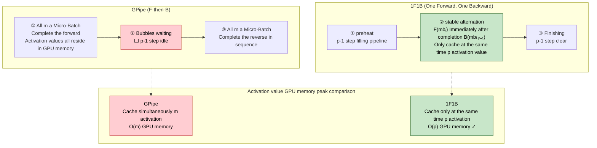

#### 6.3.2.3 Interleaved 1F1B (virtual pipeline)
{: id="6323-interleaved-1f1b-虚拟流水线"}
- Each GPU card is virtually assigned responsibility for multiple, non-contiguous Stages (for example, GPU 0 is responsible for Layer 1 and Layer 9). If each card is responsible for $v$ virtual stages, the bubble ratio is reduced to $\frac{p-1}{v \cdot m}$, at the cost of increasing the point-to-point (P2P) communication volume by $v$ times.

<div align="center">
  
<figcaption> Figure: When using naive model parallelism (without splitting micro-batch), the four machines are idle most of the time - this is the pipeline bubble problem (Source: PipeDream paper Figure 3)</figcaption>
</div>

---

## 6.4 Sequence Parallelism (SP)
{: id="64-序列并行-sequence-parallelism-sp"}

### 6.4.1 Principle
{: id="641-原理"}
- **mechanism**: In areas where tensor parallelism is not done in the Transformer layer (such as LayerNorm, Dropout, residual connection), standard TP still needs to redundantly store the complete activation value (Activation Memory) on each GPU. This part of GPU memory grows linearly with the sequence length $s$, accounting for a considerable proportion in long text training. Sequence Parallelism divides the sequence dimensions in the **non-attention computing layer** (each card is only responsible for the sequence of length $\frac{s}{p}$), and before performing QKV projection and MLP column projection, the complete sequence is put back together through `All-Gather`, and after the calculation is completed, it is passed `Reduce-Scatter` re-segmented.

### 6.4.2 Advantages and long sequence distributed optimization
{: id="642-优势与长序列分布式优化"}
- **Cost reduction and efficiency improvement**: Successfully allocate the activation value GPU memory at LayerNorm and Dropout to $p$ GPUs.
- **supports longer context**: combined with TP (i.e. TP-SP), combined with selective activation recalculation, the activation of GPU memory in Megatron-LM experiments can be reduced by about 5 times (Korthikanti et al., 2022). Longer contexts (millions of tokens) require solutions such as Ring Attention to segment the sequence within the attention (see Section 2.5.3.4).

```mermaid
flowchart LR
    IN["Each card holds<br>s/p length sequence<br>(Activation value split)"]

    IN --> LN["LayerNorm<br>(Each card is independent and has no communication)"]
    LN -->|"All-Gather<br>Reassemble the complete sequence s"| FULL["Full sequence activation<br>(s × h)"]

    subgraph TPATTN ["Attention TP area"]
        FULL --> QKV["QKV projection<br>(column parallel)"] --> ATTN["Attention Calculate<br>(Each card is independent)"] --> OPRJ["Output projection<br>(rows in parallel)"]
    end

    OPRJ -->|"Reduce-Scatter<br>switch back s/p sequence"| DROP["Dropout + residual<br>(Each card s/p tokens)"]
    DROP --> LN2["LayerNorm → MLP<br>(Likewise All-Gather / Reduce-Scatter)"]
    LN2 --> OUT["Next layer input<br>(s/p Sequence dimension segmentation)"]

    style IN fill:#e3f2fd,stroke:#01579b,color:#000
    style FULL fill:#fff3e0,stroke:#e65100,color:#000
    style QKV fill:#f3e5f5,stroke:#6a1b9a,color:#000
    style ATTN fill:#f3e5f5,stroke:#6a1b9a,color:#000
    style OPRJ fill:#f3e5f5,stroke:#6a1b9a,color:#000
    style DROP fill:#e8eaf6,stroke:#3949ab,color:#000
    style OUT fill:#e3f2fd,stroke:#01579b,color:#000
```

---

## 6.5 ZeRO (Zero Redundancy Optimizer)
{: id="65-zero-zero-redundancy-optimizer"}

ZeRO proposed by Microsoft DeepSpeed aims to completely eliminate the storage overhead of multi-card redundancy in DDP mode and spread the model state evenly to each GPU.

### 6.5.1 Mathematical derivation of model static GPU memory (taking AdamW optimizer as an example)
{: id="651-模型静态显存数学推导以-adamw-优化器为例"}
Let the model parameters be $\Psi$. Under mainstream FP16 mixed precision training, the static GPU memory consumed by a GPU to store model states (Model States) includes:
1. **model parameters (Parameters)**: FP16 storage, occupying $2\Psi$ bytes.
2. **Gradient (Gradients)**: FP16 storage, occupying $2\Psi$ bytes.
3. **Optimizer States (Optimizer States)**: Use FP32 to ensure calculation accuracy, including:
   - Master Weights: $4\Psi$ bytes
   - First-order momentum (Momentum): $4\Psi$ bytes
   - Second-order variable (Variance): $4\Psi$ bytes
   - Optimizer GPU memory total: $12\Psi$ bytes.

$$\text{Static GPU memory} = 2\Psi + 2\Psi + 12\Psi = 16\Psi \text{ bytes}$$

For a 7B parameter model, the static GPU memory usage is as high as $16 \times 7 = 112\text{GB}$, and a single H100 (80GB) cannot even hold the model status.

### 6.5.2 ZeRO phased sharding formula and offload technology (assuming the data parallelism is $N_d$)
{: id="652-zero-阶段性分片公式与-offload-技术-设数据并行度为-n_d"}

#### 6.5.2.1 ZeRO-1: Optimizer States Partitioning
{: id="6521-zero-1优化器状态分片-optimizer-states-partitioning"}
- **mechanism**: Evenly divide and spread the AdamW optimizer state of $12\Psi$ bytes onto $N_d$ cards. Each GPU is only responsible for updating and saving the optimizer state of $\frac{1}{N_d}$.
- **single GPU GPU memory formula**:
  $$M_{\text{ZeRO-1}} = 2\Psi + 2\Psi + \frac{12\Psi}{N_d}$$
  - *Example*: For the 7B model, at $N_d=8$, the static GPU memory is sharply reduced from 112GB to **38.5GB**.

#### 6.5.2.2 ZeRO-2: Gradient Partitioning
{: id="6522-zero-2梯度分片-gradient-partitioning"}
- **mechanism**: In backpropagation, once the gradient of a certain layer parameter is calculated, `Reduce-Scatter` is triggered immediately and distributed to the GPU responsible for updating the optimizer state of this layer, and other GPUs immediately release the gradient.
- **single GPU GPU memory formula**:
  $$M_{\text{ZeRO-2}} = 2\Psi + \frac{2\Psi + 12\Psi}{N_d} = 2\Psi + \frac{14\Psi}{N_d}$$
  - *Example*: For 7B model, at $N_d=8$, static GPU memory drops to **26.25GB**.

#### 6.5.2.3 ZeRO-3: Parameter Partitioning
{: id="6523-zero-3参数分片-parameter-partitioning"}
- **mechanism**: equally spread the model parameters of $2\Psi$ bytes onto $N_d$ cards. When forward and backward propagation are performed to a specific layer, all GPU broadcasts (`All-Gather`) obtain the complete weights of that layer and discard them immediately after use.
- **single GPU GPU memory formula**:
  $$M_{\text{ZeRO-3}} = \frac{2\Psi + 2\Psi + 12\Psi}{N_d} = \frac{16\Psi}{N_d}$$
  - *Example*: For 7B model, at $N_d=8$, static GPU memory only requires **14GB**!

#### 6.5.2.4 ZeRO-Offload (GPU memory - memory offload)
{: id="6524-zero-offload-显存-内存卸载"}
- Utilize the PCIe channel to offload the fragmented optimizer status and gradient into the memory of the host CPU (CPU RAM), and use the host's CPU core to perform optimizer calculation updates. When forwarding, the updated weights are written back to the GPU. This significantly broadens the upper limit of model parameters that can be trained by a single GPU.

#### 6.5.2.5 ZeRO-Infinity
{: id="6525-zero-infinity"}
- Based on ZeRO-Offload, NVMe solid-state drives (SSDs) are used as level 3 cache, and hundreds of billions of large models can be fine-tuned directly on low-end GPU platforms, breaking physical hardware barriers.

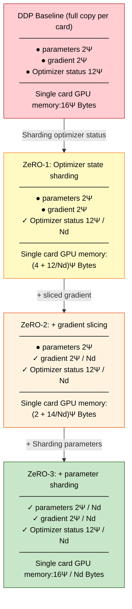

## 6.6 Hybrid parallelism (3D Parallelism)
{: id="66-混合并行3d-parallelism"}

Combined with data parallelism, tensor parallelism, and pipeline parallelism:

$$
\text{Total GPUs} = \text{DP degree} \times \text{TP degree} \times \text{PP degree}
$$

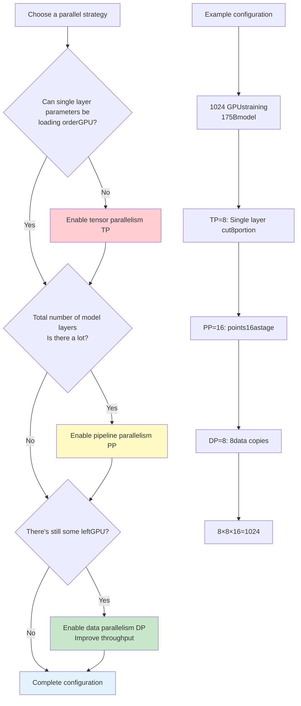

<div align="center">
  
<figcaption> Figure: 3D hybrid parallelization diagram - each data parallel copy is internally divided into 4 pipeline stages according to layers, and each stage does 4-way tensor parallelization (MP in the picture), and ZeRO sharding is used between copies (source: Microsoft DeepSpeed blog)</figcaption>
</div>

### 6.6.1 Principles of strategy selection
{: id="661-策略选择原则"}

**Decision-making process**:
1. **First consider TP (Tensor Parallel)**:
   - Must be used when single layer parameters > single GPU GPU memory
   - Typical configuration: TP=2/4/8 (within the same node, NVLink communication)
   - For example: single layer 12GB, single GPU 80GB → no TP required

2. **Secondly consider PP (pipeline parallel)**:
   - Used when the total number of layers in the model is large
   - Typical configuration: PP=2/4/8/16
   - For example: 96-layer model, PP=16 → 6 layers per stage

3. **Finally consider DP (data parallel)**:
   - Use all remaining GPUs
   - Improve training throughput
   - For example: 1024 GPU, TP=8, PP=16 → DP=8

**actual case**:

|Model size| TP | PP | DP |Total GPU|Description|
|---------|----|----|----|----|------|
|**7B parameters**| 1 | 1 | 64 | 64 |Small model, pure DP is enough|
|**13B parameters**| 2 | 1 | 32 | 64 |Requires a small amount of TP|
|**70B parameters**| 8 | 4 | 4 | 128 |Requires TP+PP|
|**175B parameters**| 8 | 16 | 8 | 1024 |large model, 3D parallel|
|**540B parameters**| 8 | 32 | 16 | 4096 |super large model|

**Trade-off consider**:
- **TP increases**: intra-layer communication increases, requiring high-speed interconnection (NVLink)
- **PP increases**: Pipeline bubble increases and GPU utilization decreases
- **DP increases**: Gradient synchronization communication increases, but Ring-AllReduce optimization can be used

---

# 7. Training optimization technology
{: id="7-训练优化技术"}

In the training of large language model (LLM), hardware resources (especially GPU GPU memory and bandwidth) and training time are the core bottlenecks. Optimization technology not only determines whether the model can run with limited resources, but also directly determines the convergence speed and final effect of training. This chapter will provide an in-depth analysis of mainstream optimizer selection, learning rate scheduling, gradient processing methods, regularization technology, and attention acceleration operator Flash Attention.

> **🎯 Introduction to this chapter**
>
> large model training is a **The game between GPU memory and computing efficiency** . The choice of the optimizer determines the lower limit of GPU memory usage, the learning rate and gradient strategy determine whether the model can converge smoothly, and Flash Attention is the cornerstone of currently solving the bottleneck of long text attention calculations. This chapter aims to help readers establish a complete cognitive system from "mathematical formulas" to "engineering implementation".

---

## 7.1 Optimizer Selection
{: id="71-优化器选择optimizer-selection"}

In large model training, optimizer states are one of the largest sources of GPU memory consumption. In commonly used FP16/BF16 mixed-precision training, although weights and gradients only require 2 bytes (FP16/BF16), the AdamW optimizer needs to store a copy of FP32's Master Weights, FP32's first-order momentum (Momentum), and FP32's second-order momentum (Variance) for each parameter, which brings huge GPU memory overhead.

### 7.1.1 AdamW: a classic that dominates large model training
{: id="711-adamw主导大模型训练的经典之作"}

AdamW is currently the most mainstream optimizer for large model training (such as LLaMA, GPT, InternLM, etc. are used by default).

#### 7.1.1.1 Decoupling the core formula from Weight Decay
{: id="7111-核心公式与-weight-decay-解耦"}
The traditional Adam optimizer, when combined with L2 regularization, mixes weight gradients with regularization gradients for momentum estimation, resulting in scaling anomalies for sparse gradients. AdamW directly decouples weight decay (Weight Decay) from gradient update, and directly subtracts the decay term when updating parameters in the previous step:

$$
\theta_{t+1} = \theta_t - \eta_t \lambda \theta_t - \eta_t \left( \frac{\hat{m}_t}{\sqrt{\hat{v}_t} + \epsilon} \right)
$$

Here:
- $\theta_t$: Model parameters of step $t$
- $\eta_t$: Learning rate of the current step
- $\lambda$: Weight decay rate (usually 0.1)
- $$\hat{m}_t, \hat{v}_t$$: Bias-corrected first-order momentum and second-order momentum

#### 7.1.1.2 GPU memory overhead analysis
{: id="7112-显存开销分析"}
Assume that the model parameters are $N$ and trained using Mixed Precision:
- **model parameters (FP16/BF16)**: $2N$ bytes
- **Gradient (FP16/BF16)**: $2N$ Bytes
- **AdamW Optimizer status (FP32)**:
  - **Master Weights** (used to accumulate minor updates): $4N$ bytes
  - **first-order momentum $m_t$**: $4N$ bytes
  - **Second-order momentum $v_t$**: $4N$ Bytes
  - **Optimizer status total**: $12N$ bytes

**Conclusion**: The optimizer state alone requires $12N$ bytes of GPU memory, accounting for **75%** of the mixed precision training base GPU memory ($16N$ bytes).

---

### 7.1.2 Adafactor: an adaptive step optimizer for low GPU memory
{: id="712-adafactor低显存的自适应步骤优化器"}

Adafactor is mainly to solve the pain point of AdamW second-order momentum occupying $4N$ bytes of GPU memory, and is often used for training models such as T5.

#### 7.1.2.1 Low-rank decomposition reduces GPU memory
{: id="7121-低秩分解减小显存"}
For the weight matrix with shape $R \times C$, Adafactor does not store the complete second-order momentum matrix $V \in \mathbb{R}^{R \times C}$, but does **rank-1 decomposition (Rank-1 Factorization)**: only maintains the row sum $V_R \in \mathbb{R}^R$ and the column sum $V_C \in \mathbb{R}^C$, and then use them to approximately restore the second-order momentum:

$$
\hat{V}_{i,j} = \frac{(V_R)_i \cdot (V_C)_j}{\sum_{k} (V_C)_k}
$$

This reduces the space for storing second-order momentum from $O(RC)$ to $O(R + C)$. For a large matrix, this almost reduces the GPU memory usage of second-order momentum to close to 0.

#### 7.1.2.2 Analysis of advantages and disadvantages
{: id="7122-优缺点分析"}
- **Advantages**: Great savings in GPU memory, reducing the optimizer state GPU memory from $12N$ bytes to about $4N$ bytes (if first-order momentum is disabled and only row/column second-order momentum factors are stored).
- **Disadvantages**: The complete first-order momentum and second-order momentum are not stored, which may cause the training to converge slowly and unstable on certain tasks.

---

### 7.1.3 Lion (Evolved Sign Momentum): Data-driven minimalist optimizer
{: id="713-lion-evolved-sign-momentum数据驱动的极简优化器"}

Lion is a new optimizer discovered through Google's Symbolic Discovery.

#### 7.1.3.1 Core mechanism: Sign function and single momentum
{: id="7131-核心机制sign-函数与单动量"}
Lion discards the second-order momentum, retains only the first-order momentum, and only uses the **sign function (Sign Function)** when updating parameters, which makes the update step more uniform. Its update rules are as follows:

$$
u_t = \text{sign}(\beta_1 m_{t-1} + (1 - \beta_1) g_t)
$$
$$
m_t = \beta_2 m_{t-1} + (1 - \beta_2) g_t
$$
$$
\theta_{t+1} = \theta_t - \eta_t (u_t + \lambda \theta_t)
$$

Here:
- $g_t$: current step gradient
- $m_t$: First-order momentum
- $\text{sign}(\cdot)$: symbolic function (value is $+1, -1, 0$)

#### 7.1.3.2 GPU memory overhead analysis
{: id="7132-显存开销分析"}
Because Lion removes second-order momentum:
- **First-order momentum $m_t$ (FP32)**: $4N$ Bytes
- **Master Weights (FP32)**: $4N$ Bytes
- Total **optimizer state**: $8N$ bytes ($4N$ bytes saved compared to AdamW)

#### 7.1.3.3 Features
{: id="7133-特点"}
- **high calculation throughput**: The `sign` operation is well suited for GPU vectorization execution, and each step iteration is slightly faster because there is no cumbersome calculation of second-order momentum.
- **Hyperparameters are sensitive**: Lion is more susceptible to the influence of learning rate and weight attenuation than AdamW, and the hyperparameters need to be re-tuned for a specific model.

---

### 7.1.4 Optimizer system comparison and GPU memory structure diagram
{: id="714-优化器系统对比与显存结构图"}

The following is a comprehensive comparison table of commonly used optimizers:

|optimizer|GPU memory overhead (state only)|Core features|Disadvantages|Applicable scenarios|
| :--- | :--- | :--- | :--- | :--- |
| **AdamW** |$12N$ bytes|The convergence is extremely smooth, insensitive to hyperparameters, and has the most complete ecological support.|GPU memory takes up a lot|LLM training is the absolute default choice|
| **Lion** |$8N$ bytes|Saves 33% of optimizer GPU memory, is slightly faster, and updates evenly|Super parameters are difficult to adjust, and early convergence may be jittery.|Scenarios where GPU memory is limited and higher throughput is pursued|
| **Adafactor** |$4N \text{–} 8N$ bytes|Row and column rank 1 decomposition, GPU memory has obvious advantages under large matrix parameters|Training stability is weaker than AdamW|Early T5 training, extreme GPU memory limited scenarios|

#### 7.1.4.1 Optimizer status GPU memory usage diagram (based on FP16 mixed precision training, bytes per parameter)
{: id="7141-优化器状态显存占用图解基于-fp16-混合精度训练每参数字节数"}

```mermaid
gantt
    title Optimizer status GPU memory usage comparison (For each model parameter, unit: bytes)
    dateFormat  X
    axisFormat %s

    section AdamW (12Byte status + 4Byte model/gradient = 16B)
    Model parameters & gradient (FP16) :active, 0, 4
    Master Weights (FP32) :crit, 4, 8
    first order momentum (FP32) :active, 8, 12
    second order momentum (FP32) :active, 12, 16

    section Lion (8Byte status + 4Byte model/gradient = 12B)
    Model parameters & gradient (FP16) :active, 0, 4
    Master Weights (FP32) :crit, 4, 8
    first order momentum (FP32) :active, 8, 12

    section Adafactor (4Byte status + 4Byte model/gradient = 8B)
    Model parameters & gradient (FP16) :active, 0, 4
    Master Weights (FP32) :crit, 4, 8
```

---

## 7.2 Learning Rate Schedules
{: id="72-学习率策略learning-rate-schedules"}

In the Transformer architecture, a reasonable learning rate strategy is crucial to prevent model gradient explosion and accelerate convergence. The current industry standard adopts **Warmup (warmup) + Decay (attenuation)** mode.

### 7.2.1 Learning Rate Warmup (warmup)
{: id="721-learning-rate-warmup预热"}

#### 7.2.1.1 Why is Warmup necessary?
{: id="7211-为什么必须-warmup"}
In the early stages of large model training (especially when using the Pre-LN structure or AdamW optimizer):
- Randomly initialized weights lead to extremely unstable gradients in the first few layers of the network.
- The second-order momentum estimate for the AdamW optimizer has not yet been established ($$\hat{v}_t$$ is close to zero, causing the corrected step size to be unusually large).
If the peak learning rate is used directly, it can easily lead to numerical overflow (Overflow) or irreversible gradient explosion.

#### 7.2.1.2 Implementation method
{: id="7212-实现方式"}
During the first $T_{\text{warmup}}$ steps of training (typically 1%–5% of the total steps, ~2000–10000 steps), the learning rate increases linearly from 0 to the maximum peak learning rate $$\text{lr}_{\max}$$:

$$
\text{lr}(t) = \text{lr}_{\max} \cdot \frac{t}{T_{\text{warmup}}}, \quad t \le T_{\text{warmup}}
$$

---

### 7.2.2 Cosine Decay
{: id="722-cosine-decay余弦衰减"}

Cosine Decay is the most popular decay method for large models. It can maintain a smooth release of the learning rate in the intermediate training stage and quickly converge at the end of training.

$$
\text{lr}(t) = \text{lr}_{\min} + \frac{1}{2}(\text{lr}_{\max} - \text{lr}_{\min}) \left(1 + \cos\left(\frac{\pi (t - T_{\text{warmup}})}{T - T_{\text{warmup}}}\right)\right), \quad t > T_{\text{warmup}}
$$

- **Features**: Smooth curve. Experiments show that Cosine attenuation can achieve lower perplexity than linear attenuation on most language modeling tasks.
- **parameter recommendation is**: $$\text{lr}_{\min}$$ is usually set to 10% of $$\text{lr}_{\max}$$ (or directly set to 0).

---

### 7.2.3 WSD (Warmup-Stable-Decay) scheduling strategy
{: id="723-wsd-warmup-stable-decay-调度策略"}

Traditional Cosine scheduling must predetermine the total number of training tokens, and if you want to add data midway, you have to rerun the entire attenuation curve. in order to cope with **Continual Training** Or the need to dynamically adjust the amount of data, MiniCPM systematically puts forward **WSD scheduling strategy** ; DeepSeek-V3 also adopts a similar "long-term constant learning rate + terminal decay" scheme (the first 10T tokens remain constant, and then cosine decay within 4.3T tokens).

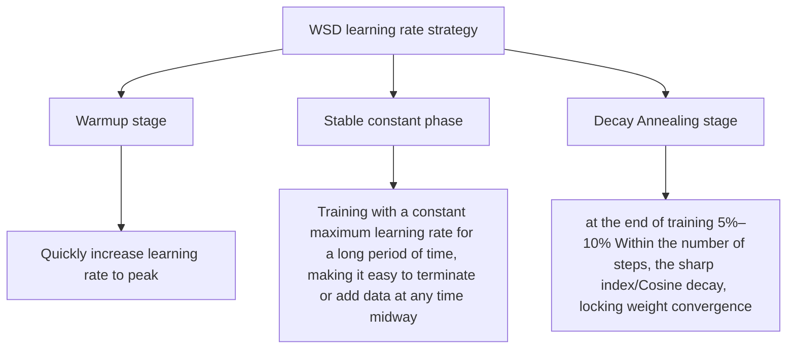

- **Advantages**:
  1. **High flexibility**: The Stable stage can save checkpoints at any time. When you want to add data, you only need to extend the Stable stage and re-enter Decay from any checkpoint without re-running the Cosine Decay curve.
  2. **Rapid convergence**: The annealing phase (Decay Phase) reduces the learning rate in a short period of time, and the model effect will usher in a "second leap" (PPL sudden drop) in this phase.

---

## 7.3 Gradient Processing
{: id="73-梯度处理gradient-processing"}

### 7.3.1 Gradient Clipping
{: id="731-gradient-clipping梯度裁剪"}

To prevent gradient explosion when encountering unusually long samples or extreme gradients, the modulus length of all layer gradient vectors needs to be truncated.

#### 7.3.1.1 L2 norm global clipping (Global Norm Clipping)
{: id="7311-l2-范数全局裁剪global-norm-clipping"}
This is standard for large model training. Calculate the L2 norm of the global gradient vector $\mathbf{g}$ formed by splicing all parameter gradients. If it exceeds the threshold $d_{\max}$, perform proportional scaling:

$$
\mathbf{g} \leftarrow \mathbf{g} \cdot \min\left(1, \frac{d_{\max}}{\|\mathbf{g}\|_2}\right)
$$

- **Best practice**: The global threshold $d_{\max}$ in large model training is usually set to `1.0`.
- **Advantages**: The direction of the gradient vector is kept unchanged, only the step size is limited, and the coordination of the update proportions of each layer can be well maintained.

---

### 7.3.2 Gradient Accumulation
{: id="732-gradient-accumulation梯度累积"}

In large model training, due to the limited memory of a single GPU GPU, it is impossible to directly feed a large Batch Size (such as millions of tokens) to the GPU at one time for forward propagation. **Gradient accumulation** uses "time for space" to simulate large batch training when physical GPU memory is limited.

#### 7.3.2.1 Working principle
{: id="7321-工作原理"}
Assume the target Batch Size is $B_{\text{global}}$, and the Micro Batch Size for single-GPU single-step processing is $B_{\text{micro}}$.
1. In consecutive $N$ Steps, only forward propagation and back propagation are performed, and the calculated gradient **is accumulated (Add)** in the gradient buffer without calling `optimizer.step()`.
2. At step $N$, divide the accumulated gradient by $N$ (average), then execute `optimizer.step()` to update the parameters and clear the gradient.
3. The corresponding equation: $$B_{\text{global}} = B_{\text{micro}} \times N \times \text{DP\_degree}$$.

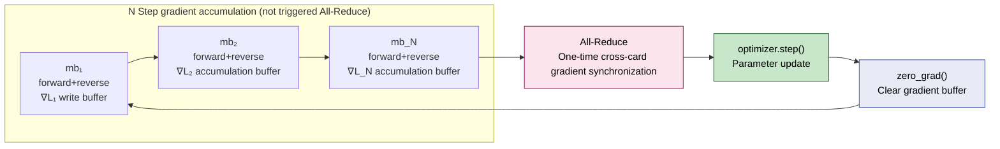

-  **Engineering optimization (PyTorch `no_sync` mechanism)** : In distributed training, the default backpropagation will automatically trigger inter-card gradient synchronization (All-Reduce) at each step. before gradient accumulation $N-1$ step, you should use `model.no_sync()` The context manager blocks useless network synchronization and only executes All-Reduce in the last step, which can greatly improve network bandwidth utilization.

---

### 7.3.3 Gradient Checkpointing (Gradient Checkpoint/Activate Recalculation)
{: id="733-gradient-checkpointing梯度检查点--激活重计算"}

Gradient checkpoint (Activation Checkpoint/Recomputation) is used **Compute time for GPU memory space** classic technology.

#### 7.3.3.1 Background: Forward activation value GPU memory bottleneck
{: id="7331-背景前向激活值显存瓶颈"}
When calculating gradients through backpropagation, the formula needs to use the activation value (Activation) calculated by forward propagation. Therefore, the standard training process saves the activation values ​​of all layers in GPU memory during forward propagation, which results in a huge GPU memory usage that grows linearly with the number of model layers $L$ and the sequence length $s$.

#### 7.3.3.2 Core principles
{: id="7332-核心原理"}
- **selectively saves**: instead of saving the activation values of all layers, every $k$ layer selects one layer as a "checkpoint" and only saves the activation value of that layer.
- **Reverse recalculation**: When backpropagating to a layer that does not save activation values, start from the nearest checkpoint and rerun a forward propagation to calculate the temporary activation value in real time for gradient calculation, and discard it immediately after calculation.

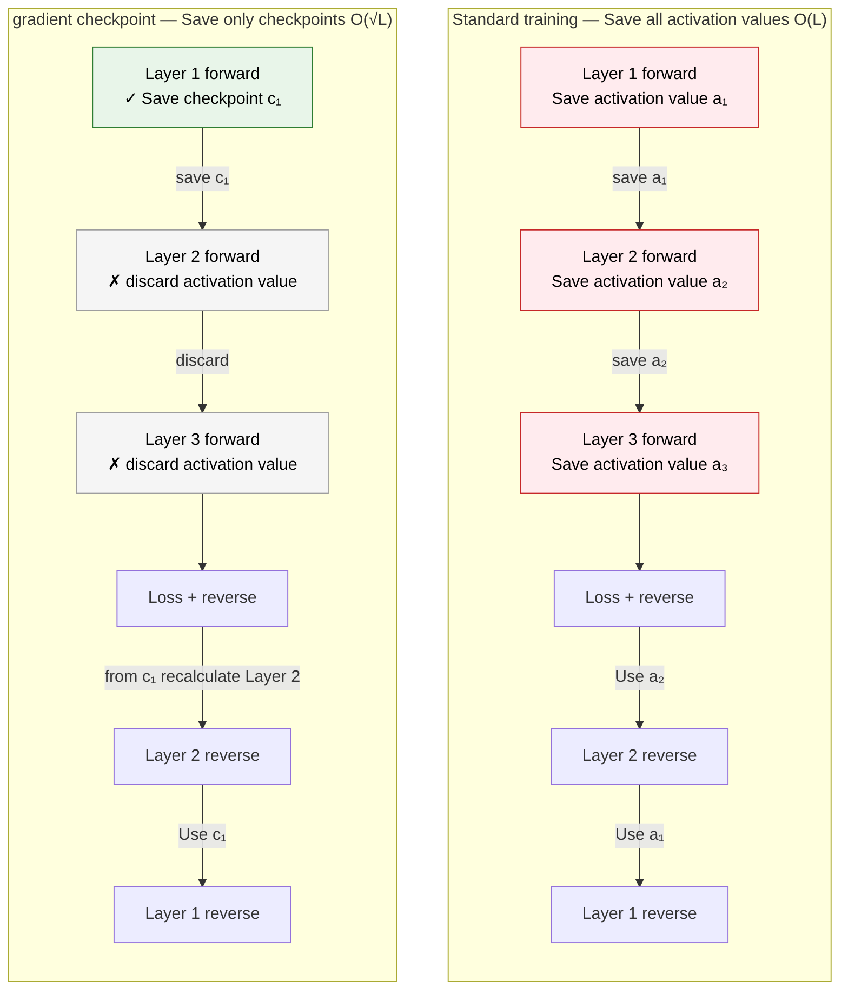

#### 7.3.3.3 Costs and benefits
{: id="7333-代价与收益"}
- **benefits**: The activation value GPU memory complexity is reduced from $O(L)$ to $O(\sqrt{L})$, which can greatly prevent OOM from occurring during ultra-long sequence training.
- **cost**: There is one more forward calculation in backpropagation, which usually brings about **30%–33%** additional computational overhead.

---

## 7.4 Regularization and numerical stability techniques
{: id="74-正则化与数值稳定性技术"}

In large model training, regularization is not only used to prevent overfitting, but also plays a more critical role in improving numerical stability under mixed precision training.

### 7.4.1 Weight Decay
{: id="741-weight-decay权重衰减"}

- The importance of **in AdamW**: In each round of iterative update, the model weight is multiplied by a coefficient slightly less than 1 (usually Weight Decay = 0.1): $\theta_{t} \leftarrow (1 - \eta_t \lambda)\theta_{t}$.
- **Function**: Prevent the weight value from being too large. In large model training, too large weights can easily lead to activation value overflow (NaN) or cause the attention matrix bias to be too large, leading to Softmax gradient saturation.

### 7.4.2 Dropout: Fading out in large models
{: id="742-dropout在大模型中的逐渐淡出"}

- **Current situation**: In the pretraining stage of models with a scale of more than 100 billion (100B), the Dropout rate (including Attention Dropout and Residual Dropout) is usually directly set to **0**.
- **Reason**:
  1. **Data abundance**: The data sets of large model pretraining are often extremely large. Compared with massive data, the model parameters are not easy to overfit, and they already have natural regularization.
  2. **Efficiency loss**: Dropout needs to sample the mask matrix in the random state generator and write it to GPU memory, which reduces the graphics card calculation throughput (Throughput).
- **Special exception**: A dropout of 0.05–0.1 may be retained during the small model fine-tuning stage (SFT) or after the Embedding layer to prevent overfitting to a specific fine-tuning template.

### 7.4.3 Z-loss regularization: suppressing the explosion of logits
{: id="743-z-loss-正则化抑制-logits-爆炸"}

When using FP16/BF16 mixed precision for very large-scale training, the logits of the output layer may drift to very large values as a whole, causing the exponential term value to overflow (NaN) in the Softmax calculation. PaLM introduced Z-loss for this purpose, and open source models such as OLMo 2 also follow this approach.

#### 7.4.3.1 Core mechanism
{: id="7431-核心机制"}
Z-loss adds an auxiliary penalty term to the original cross-entropy loss to penalize the logarithm of the partition function $Z$ (i.e. $\sum_i e^{x_i}$) of Logits:

$$
\mathcal{L} = \mathcal{L}_{\text{cross-entropy}} + \alpha \log^2 Z
$$

Here, $Z = \sum_{i} e^{x_i}$ and $\alpha$ are usually set to $10^{-4}$ level (PaLM takes $10^{-4}$).

#### 7.4.3.2 Function and principle
{: id="7432-作用与原理"}
- **constrains the absolute size of Logits**: encourages $\log Z$ to be close to 0, that is, the denominator of Softmax is close to 1, preventing the overall Logits from drifting to large values.
- **greatly enhances stability**: avoids irreparable NaN collapse due to classification layer Logits drift after hundreds of thousands of training steps.

---

## 7.5 Flash Attention
{: id="75-flash-attention"}

Flash Attention is currently the most important attention acceleration technology in LLM training and inference. By changing the calculation order rather than simplifying the algorithm, it can significantly reduce GPU memory usage and speed up calculations while maintaining numerical equivalence.

### 7.5.1 Background: Memory bottleneck of standard Attention
{: id="751-背景标准-attention-的内存瓶颈"}

Calculation of standard Scaled Dot-Product Attention:

$$\text{Attention}(Q, K, V) = \text{softmax}\left(\frac{QK^T}{\sqrt{d_k}}\right)V$$

**Problem**:
- When the sequence length is $n$, the $QK^T$ matrix size is $n \times n$, which needs to be completely written into the GPU main GPU memory (HBM)
- Memory complexity $O(n^2)$: about hundreds of MB for $n=4096$, up to tens of GB for $n=32768$
- **The real bottleneck is not the amount of calculation, but data handling**: HBM bandwidth is much lower than on-chip SRAM, and repeated reading and writing of large matrices becomes a performance bottleneck

### 7.5.2 GPU memory hierarchy: workbench vs warehouse
{: id="752-gpu-内存层次工作台-vs-仓库"}

```
SRAM(on-chip cache)= workbench
  • Capacity: approx. 20 MB(A100: each SM 192 KB × 108 a SM)
  • Speed: extremely fast (~19 TB/s on A100)
  • Features: The computing unit directly reads and writes

HBM(main GPU memory)= warehouse
  • Capacity:40–80 GB
  • Speed: Slower (~2 TB/s on A100)
  • Features: All tensor Stored here by default
```

Each step of standard Attention calculation requires writing the intermediate matrix back to HBM and then reading it back from HBM, resulting in a large amount of inefficient data transfer. The core goal of Flash Attention: **Try to keep data in SRAM and reduce the number of round trips to HBM**.

<div align="center">
  
<figcaption> Figure: GPU memory hierarchy (left), FlashAttention block calculation mechanism (middle), speed comparison with standard PyTorch implementation (right). Source: Dao et al., FlashAttention, NeurIPS 2022</figcaption>
</div>

### 7.5.3 Core idea: Chunking + Online Softmax
{: id="753-核心思想分块--online-softmax"}

Two key innovations of Flash Attention:

**1. Block calculation (Tiling)**

Cut $K$ and $V$ into small pieces and load them into SRAM for calculation one by one to avoid writing the $n \times n$ matrix into HBM. The current block is discarded directly after calculation without writing back to HBM.

**2. Online Softmax (incremental normalization)**

Traditional Softmax needs to scan the global maximum value $A_{\max}$ before calculating $\exp$ - this requires seeing the entire data and cannot be divided into chunks. Solution to the Online method:

- When processing each block, maintain the maximum value currently seen, and use the correction factor to restore the historical accumulation when encountering a larger value:

$$\text{Correction factor} = \exp\!\left(A_{\max}^{\text{old}} - A_{\max}^{\text{new}}\right)$$

- There is no need to store the complete $n \times n$ attention matrix throughout the process

**3. Direct cumulative output**

Without explicitly storing the attention weight, directly accumulate the output $O$:

$$O_k = O_{k-1} \times \text{Correction factor} + \text{Current block contribution}$$

**4. Back propagation recalculation**

Instead of reading the intermediate matrix from HBM during backpropagation, it recalculates it from $Q/K/V$ - trading a small amount of extra computing power for a large GPU memory savings.

### 7.5.4 Memory and speed comparison
{: id="754-内存与速度对比"}

|method|attention matrix memory|HBM visits|
|------|-------------|------------|
|Standard Attention| $O(n^2)$ |Multiple round trips|
| Flash Attention |$O(n)$ (without complete matrix)|Minimize|

Performance reported in the **paper** (FlashAttention v1, A100):
- The attention operator itself: the maximum speed increase in the GPT-2 scenario is about **7.6×**
- End-to-end training: GPT-2 (sequence length 1K) speeds up about **3×**, BERT-large (sequence length 512) speeds up about 15%
- Numerical: calculations are exact (not approximate), differing from the standard implementation only in the order of floating point operations
- GPU memory: $n \times n$ attention matrix is no longer stored, making training with 64K sequence length possible

### 7.5.5 Version evolution
{: id="755-版本演进"}

|version|Year|Core improvements|
|------|-----|---------|
| FlashAttention v1 | 2022 |IO-aware chunking + Online Softmax original implementation|
| FlashAttention v2 | 2023 |Better parallel strategy, reducing thread synchronization overhead, ~2× vs v1|
| FlashAttention v3 | 2024 |For H100/Hopper architecture, utilizing asynchronous execution and FP8 support|
| FlashAttention v4 | 2025 |Rewriting the kernel for the Blackwell architecture|

### 7.5.6 Actual use
{: id="756-实际使用"}

**PyTorch 2.0+ has built-in support for** (recommended, zero additional dependencies):

```python
import torch.nn.functional as F

output = F.scaled_dot_product_attention(
    query, key, value,
    attn_mask=None,
    dropout_p=0.0,
    is_causal=True  # Autoregressive training must be set to True
)
```

**Explicitly enable Flash Attention via transformers 2**:

```python
from transformers import AutoModelForCausalLM
import torch

model = AutoModelForCausalLM.from_pretrained(
    "meta-llama/Llama-2-7b-hf",
    torch_dtype=torch.bfloat16,
    attn_implementation="flash_attention_2"  # Need to install first flash-attn
)
```

```bash
pip install flash-attn --no-build-isolation
```

> **Best Practice**: Flash Attention is numerically equivalent to standard Attention. The longer the sequence, the more significant the benefit. PyTorch 2.0+ can be enabled at zero cost through `scaled_dot_product_attention`; it is recommended for all LLM training tasks.

---

# 8. Model quantization
{: id="8-模型量化技术"}

Model quantization is one of the core technologies to reduce the computing and storage costs of large models. By converting high-precision floating point numbers (FP32/FP16) to low-precision integers (INT8/INT4), quantization can significantly reduce GPU memory usage and speed up inference while keeping model performance essentially unchanged.

> **🎯 Introduction to this chapter**
>
> Quantification is a key technology for democratizing large models. **is a 70B model. The FP16 weight requires 140GB GPU memory. After INT4 quantization, it only needs about 35GB** - which means that the weight is reduced from at least 2 A100-80G to 1 (KV Cache is included). This chapter provides an in-depth explanation of quantitative mathematical principles, mainstream methods (GPTQ, AWQ, QLoRA), training strategies, and engineering practices. Core Points: **Quantization is not simple compression, but a carefully designed art of precision-performance trade-off**.

## 8.1 🧮 Basic concepts of quantification
{: id="81--量化基础概念"}

### 8.1.1 What is quantification?
{: id="811-什么是量化"}

Quantization is the process of mapping continuous high-precision values to discrete low-precision values:

$$
\text{FP32/FP16} \xrightarrow{\text{Quantization}} \text{INT8/INT4/INT2}
$$

**Core goals**:
- 📉 **reduces the GPU memory occupied by**: FP16 → INT8 is reduced by 50%, FP16 → INT4 is reduced by 75%
- ⚡ **accelerated calculation**: integer operations are 2-4 times faster than floating point operations
- 💰 **Reduce costs**: Smaller models can be deployed on cheaper hardware

**Key challenges**:
- Keep model accuracy from significantly decreasing
- Handling Outliers
- Balancing Quantization Granularity and Precision Loss

### 8.1.2 Mathematical principles of quantification
{: id="812-量化的数学原理"}

#### 8.1.2.1 Symmetric Quantization
{: id="8121-对称量化symmetric-quantization"}

Map the floating point number $x \in [-\alpha, \alpha]$ to the integer $q \in [-127, 127]$ (INT8 as an example):

$$
q = \text{round}\left(\frac{x}{s}\right), \quad s = \frac{\alpha}{127}
$$

**dequantization** (restored during inference):

$$
\hat{x} = s \cdot q
$$

Here:
- $s$: scaling factor (scale)
- $\alpha$: The maximum absolute value of all elements
- $q$: quantized integer

**Features**:
- ✅ Simple to implement and hardware friendly
- ✅ Zero point is 0, no additional storage required
- ❌ Wasted representation range for asymmetrically distributed data

#### 8.1.2.2 Asymmetric Quantization
{: id="8122-非对称量化asymmetric-quantization"}

Processing asymmetrically distributed data $x \in [x_{\min}, x_{\max}]$:

$$
q = \text{round}\left(\frac{x - z}{s}\right)
$$

Here:
- $s = \frac{x_{\max} - x_{\min}}{255}$(INT8)
- $z = \text{round}\left(-\frac{x_{\min}}{s}\right)$: zero-point

**dequantization**:

$$
\hat{x} = s \cdot (q - z)
$$

**Features**:
- ✅ Make better use of quantification range
- ✅ Fit activation values (usually asymmetric)
- ❌ Additional storage of zero point parameters is required

#### 8.1.2.3 Quantification granularity
{: id="8123-量化粒度"}

|Granularity|Description|Advantages|Disadvantages|
|------|------|------|------|
| **Per-tensor** |The entire tensor shares a $(s, z)$|Small memory, fast speed|Large loss of accuracy|
| **Per-channel** |Each output channel is independent $(s_i, z_i)$|Higher accuracy|Increased number of parameters|
| **Per-group** |Each set of parameters is shared (e.g. 128 elements)|Balancing precision and efficiency|Complex to implement|

**Best Practice**:
- **weight**: Per-channel quantization (accuracy is key)
- **activation value**: Per-tensor quantization (speed priority)

### 8.1.3 Quantitative error analysis
{: id="813-量化误差分析"}

Error introduced by quantification:

$$
\text{Error} = \mathbb{E}[(x - \hat{x})^2] = \mathbb{E}[(x - s \cdot \text{round}(x/s))^2]
$$

**error source**:
1. **rounding error**: loss of precision caused by $\text{round}()$ operation
2. **clipping error**: Values exceeding $[x_{\min}, x_{\max}]$ are clipped
3. **outliers affect**: a few maximum values enlarge the scaling factor $s$ and compress the representation accuracy of other values

**Strategy to reduce errors**:
- Use finer-grained quantization (Per-channel)
- Outliers are handled separately (Mixed-precision)
- Quantitative Awareness Training (QAT)

### 8.1.4 Quantification accuracy and performance trade-offs (Precision-Performance Trade-offs)
{: id="814-量化精度与性能权衡precision-performance-trade-offs"}

Different quantization bits and numerical formats have complex trade-offs between GPU memory savings, computational speedup, and model accuracy (perplexity PPL). The following is a system comparison of mainstream numerical formats:

|Numeric format|Parameter GPU memory ratio (based on BF16)|Perplexity (PPL) changes|Hardware acceleration support|Typical application scenarios|
| :--- | :--- | :--- | :--- | :--- |
| **BF16 / FP16** | 100% |0 (baseline)|Tensor Core native|Standard model training, high-precision inference benchmark|
| **INT8 Weight-Only** | ~50% |Virtually lossless (< 0.05)|Need to be dequantized to FP16 calculation|Resource-constrained server deployment with an emphasis on preserving accuracy|
| **INT8 Weight & Act** | ~50% |Slight decrease (< 0.1)|INT8 GEMM hardware acceleration|High-concurrency throughput reasoning (such as SmoothQuant)|
| **INT4 (NF4 / GPTQ)**| ~25% |No effect when parameter > 7B; slight increase when parameter < 3B|Requires inverse quantization calculation or specific kernel|Consumer-grade graphics card local deployment, QLoRA training|
| **FP8 (E4M3 / E5M2)**| ~50% |Very small (< 0.02)|Hopper/Blackwell native support|Extremely large-scale distributed training (such as DeepSeek-V3/R1), new generation high-throughput inference|

#### 8.1.4.1 Key conclusions and selection guide
{: id="8141-关键结论与选型指南"}
1. **Large parameter quantities are more robust to quantization**: For example, the perplexity loss (Perplexity Degradation) of the 70B model under INT4 quantization is almost zero, while the 3B/7B model will experience obvious decline in common sense and reasoning ability under 4-bit quantization. Therefore, quantization deployment below 4-bit is not recommended for small models.
2. **FP8 is becoming the mainstream choice for very large-scale training**: DeepSeek-V3 completed pretraining of 14.8T tokens under FP8 (all tensors use E4M3 + fine-grained scaling, see Section 2.5.4.5). FP8 can not only halve the weight and activation value GPU memory, but also release double the Tensor Core computing throughput on GPUs such as H100. The loss error compared to BF16 is less than 0.25%.
3. **NF4 (Normal Float 4) Designed specifically for the normal distribution**: it is the cornerstone of QLoRA's ability to successfully train. The pretraining weights approximately follow a zero-mean normal distribution, and NF4 allows each quantization interval to cover the same probability mass, thus retaining more information than evenly spaced INT4/FP4.

---

## 8.2 📊 Classification of quantitative methods
{: id="82--量化方法分类"}

### 8.2.1 Classification by Quantification Timing
{: id="821-按量化时机分类"}

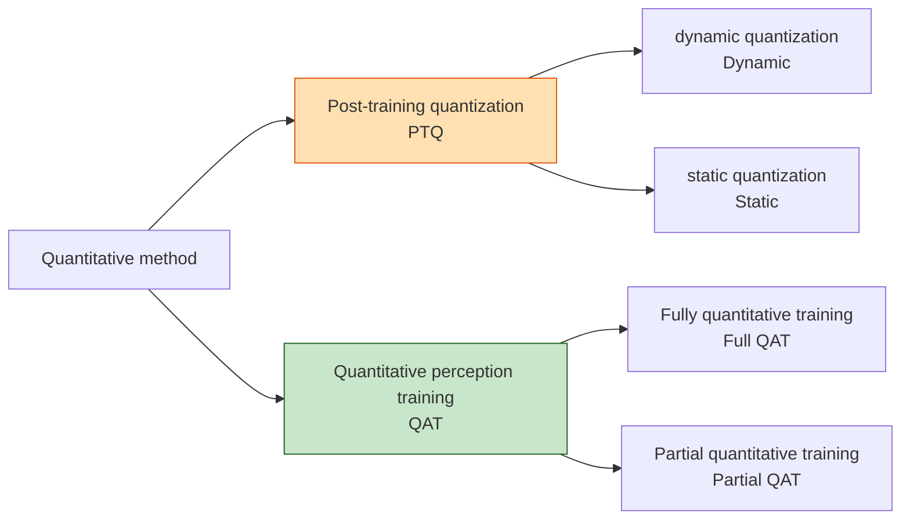

### 8.2.2 Post-Training Quantization (PTQ)
{: id="822-训练后量化post-training-quantization-ptq"}

**definition**: After the model training is completed, the weights and activation values ​​are directly quantified without retraining.

**Advantages**:
- ⚡ **is fast**: can be completed in a few minutes to a few hours
- 💰 **Low cost**: No training data and GPU resources required
- 🛠️ **is easy to deploy**: can be directly applied to any pretraining model

**Disadvantages**:
- 📉 **precision loss**: especially low bit quantization (INT4/INT2)
- ⚠️ **High Sensitivity**: Some layers are very sensitive to quantization

**represents method**:
- **GPTQ**: Layer-by-layer quantization based on second-order information
- **AWQ**: Weight quantification based on activation value importance
- **SmoothQuant**: Migrating quantification difficulty from activations to weights

### 8.2.3 Quantization-Aware Training (QAT)
{: id="823-量化感知训练quantization-aware-training-qat"}

**defines**: simulates quantization operations during the training process, allowing the model to learn to adapt to quantization errors.

**Core idea**:
- Forward propagation: using quantized weights and activations
- Backpropagation: using floating point gradients (STE trick)

**Advantages**:
- ✅ **has the highest accuracy**: the model actively adapts to quantification
- ✅ **supports extremely low bits**: INT4, INT2 and even binary

**Disadvantages**:
- ⏰ **takes long time to train**: needs to be retrained or fine-tuned
- 💰 **has high cost**: requires training data and GPU resources

**represents method**:
- **QLoRA**: 4-bit quantization + LoRA fine-tuning
- **LLM-QAT**: large model quantization perception training
- **BitNet**: Extremely low-bit (1.58-bit) quantization training

### 8.2.4 Classification by quantified objects
{: id="824-按量化对象分类"}

|Quantitative object|Description|difficulty|Common methods|
|---------|------|------|---------|
|**Weight only**|Only quantify model parameters|simple| GPTQ, AWQ |
|**weight + activate**|Simultaneously quantify parameters and intermediate results|difficult| SmoothQuant, QAT |
| **KV Cache** |Quantify the attention cache in the inference stage to reduce long context GPU memory|medium| INT8/INT4 Per-token, GQA/MQA |

---

## 8.3 🔧 Post-training quantization (PTQ)
{: id="83--训练后量化ptq"}

### 8.3.1 GPTQ: Weight quantification based on second-order information
{: id="831-gptq基于二阶信息的权重量化"}

#### 8.3.1.1 Core principles
{: id="8311-核心原理"}

GPTQ (**G**PT **P**ost-**T**raining **Q**uantization) uses **second-order derivative information** to optimize the quantization error and quantize the weight matrix layer by layer.

**Optimization goal**: Minimize the output difference before and after quantization

$$
\arg\min_{\hat{W}} \| WX - \hat{W}X \|^2
$$

Here:
- $W$: Original FP16 weight matrix
- $\hat{W}$: Quantized INT4 weight
- $X$: Activation value of calibration data

**Key technology**: Optimal Brain Quantization (OBQ)

Column-by-column quantization weight: After each quantization of the $i$ column, the Hessian inverse matrix is used to compensate the quantization error generated by this column to the unquantized columns:

$$
\delta_i = \frac{w_{:,i} - \text{quant}(w_{:,i})}{[H^{-1}]_{ii}}, \qquad
W_{:,j} \leftarrow W_{:,j} - \delta_i \, [H^{-1}]_{ij} \quad (j > i)
$$

where $H = 2XX^\top$ is the Hessian matrix of the layer output error with respect to the weights (relying only on the activation of the calibration data $X$). Based on OBQ, GPTQ changes all rows to share the same column order, updates in batches in blocks, and uses Cholesky decomposition for inversion, reducing the time to quantify the 175B model to about 4 GPU hours.

#### 8.3.1.2 Implementation process
{: id="8312-实现流程"}

The original AutoGPTQ has been discontinued and its successor [GPTQModel](https://github.com/ModelCloud/GPTQModel)] provides an almost identical flow:

```python
from datasets import load_dataset
from gptqmodel import GPTQModel, QuantizeConfig

model_id = "meta-llama/Llama-2-7b-hf"
quant_path = "./llama-2-7b-gptq-4bit"

# Step 1: Prepare calibration data (usually 128-1024 text)
calibration = load_dataset(
    "allenai/c4",
    data_files="en/c4-train.00001-of-01024.json.gz",
    split="train",
).select(range(1024))["text"]

# Step 2: Configure quantization parameters
quant_config = QuantizeConfig(
    bits=4,          # Number of quantization bits:4-bit
    group_size=128,  # every 128 weights share a group scale / zero-point
)

# Step 3: Load the model and execute GPTQ(7B The model usually takes ten to tens of minutes)
model = GPTQModel.load(model_id, quant_config)
model.quantize(calibration, batch_size=2)

# Step 4: Save the quantized model (7B Weight: approx. 13.5GB → approx. 4GB)
model.save(quant_path)

# Step 5: Load quantitative model inference
model = GPTQModel.load(quant_path)
print(model.tokenizer.decode(model.generate("The meaning of life is")[0]))
```

The quantized weights can also be directly loaded and used by frameworks such as transformers and vLLM.

#### 8.3.1.3 GPTQ performance
{: id="8313-gptq-性能表现"}

|model|raw precision| GPTQ-4bit |GPU memory usage|loss of accuracy|
|------|---------|-----------|----------|---------|
| **LLaMA-7B** | FP16 | INT4 | 14GB → ~3.5GB |small|
| **LLaMA-13B** | FP16 | INT4 | 26GB → ~6.5GB |small|
| **LLaMA-30B** | FP16 | INT4 | 60GB → ~15GB |very small|
| **LLaMA-65B** | FP16 | INT4 | 130GB → ~33GB |very small|

> GPU memory is the theoretical value of the weight part (not counting the small overhead of group scale). The rule of the GPTQ paper is: the larger the model, the smaller the increase in confusion caused by 4-bit quantization; at 3-bit, the loss of a small model will be significantly amplified.

**applicable scenarios**:
- ✅ Inference deployment optimization
- ✅ Resource constrained environment
- ✅ Need to quantify quickly (no training required)

---

### 8.3.2 AWQ: Activation Perceptual Weight Quantization
{: id="832-awq激活感知权重量化"}

#### 8.3.2.1 Core Insights
{: id="8321-核心洞察"}

Core findings of AWQ (**A**ctivation-aware **W**eight **Q**uantization):

> **Not all weights are equally important!** Weight channels corresponding to large activation values ​​have a greater impact on model performance and should maintain higher accuracy.

**Quantitative strategy**:

$$
Y = W X = \big(W \,\text{diag}(s)\big)\big(\text{diag}(s)^{-1} X\big)
\;\;\Rightarrow\;\;
\hat{Y} = Q\big(W \,\text{diag}(s)\big)\big(\text{diag}(s)^{-1} X\big)
$$

Here, $s$ is the scaling factor according to the input channel (per-channel): the weight of the important channel is first amplified and then quantized, the corresponding activation is reduced year-on-year, the mathematical output remains unchanged, but the relative quantization error of the important weight becomes smaller. The scaling factors are eventually merged into the operators of the previous layer, with no additional overhead during inference.

#### 8.3.2.2 Determine channel importance
{: id="8322-确定通道重要性"}

1. **collects activation value statistics**: counts the average activation amplitude of each input channel on the calibration data $s_X$.

2. **search scaling intensity**: Let $s = s_X^{\alpha}$, grid search $\alpha$ on $[0, 1]$, select the value with the smallest output error after quantization of this layer:

$$
\alpha^* = \arg\min_{\alpha} \big\| Q\big(W \,\text{diag}(s)\big)\big(\text{diag}(s)^{-1} X\big) - W X \big\|
$$

The channel with greater activation gets a greater amplification coefficient, and the quantization error of its weight is smaller. AWQ only requires a small amount of calibration data and does not perform backpropagation, so it is not easy to overfit the calibration set.

#### 8.3.2.3 Implementation code
{: id="8323-实现代码"}

> The AutoAWQ repository has been archived in 2025 and the AWQ algorithm has been merged into the vLLM maintained [llm-compressor](https://github.com/vllm-project/llm-compressor). The following classic writing can still be used to understand the process:

```python
from awq import AutoAWQForCausalLM
from transformers import AutoTokenizer

model_path = "meta-llama/Llama-2-7b-hf"
quant_path = "llama-2-7b-awq-4bit"

# Step 1: Load model
model = AutoAWQForCausalLM.from_pretrained(model_path)
tokenizer = AutoTokenizer.from_pretrained(model_path)

# Step 2: Configure quantization parameters
quant_config = {
    "zero_point": True,          # Use zero points (asymmetric quantization)
    "q_group_size": 128,         # Group size
    "w_bit": 4,                  # Weight quantization digits
    "version": "GEMM"            # Use optimizedGEMM kernel
}

# Step 3: Quantify (AWQThanGPTQFast2-3times)
model.quantize(tokenizer, quant_config=quant_config)

# Step 4: Save quantized model
model.save_quantized(quant_path)
tokenizer.save_pretrained(quant_path)

# Loading and inference
model_awq = AutoAWQForCausalLM.from_quantized(quant_path, fuse_layers=True)
```

#### 8.3.2.4 AWQ vs GPTQ comparison
{: id="8324-awq-vs-gptq-对比"}

|Features| AWQ | GPTQ |
|------|-----|------|
|**Quantization speed**|⚡ Fast (5-10 minutes/7B)|Slow (20-30 minutes/7B)|
|**accuracy remains**|✅ Better (especially extremely low bit)|✅ Good|
|**Inference speed**|⚡⚡ Faster (optimized kernel)|⚡ Fast|
|**GPU memory occupied**|Same|Same|
|**calibration data**|Few (~128 samples), not sensitive to distribution|More (~128-1024 samples)|

**recommends choosing**:
- Pursuing ultimate precision → **AWQ**
- Rapid quantitative deployment → **AWQ**
- Requires extensive hardware support → **GPTQ** (more mature ecosystem)

---

### 8.3.3 SmoothQuant: Smooth activation value distribution
{: id="833-smoothquant平滑激活值分布"}

#### 8.3.3.1 Question: Why is activation value difficult to quantify?
{: id="8331-问题为什么激活值难量化"}

The activation value of the large model has **serious outliers (Outliers)** problem:

- 99.9% of the values are in the $[-10, 10]$ range
- 0.1% outliers can reach $[-1000, 1000]$

If uniform scale quantization is used → most values will be compressed to a small range → there will be a huge loss of accuracy.

#### 8.3.3.2 SmoothQuant solution
{: id="8332-smoothquant-解决方案"}

**Core idea**: Transfer the quantification difficulty from activation values to weights through scaling factors:

$$
Y = (X \text{ diag}(s)^{-1}) \cdot (\text{diag}(s)W)
$$

Here:
- $s$ is the per-channel smoothing factor
- $X \text{ diag}(s)^{-1}$: Outliers in compressed activation values
- $\text{diag}(s)W$: Absorb scaling factors into weights (weights are easier to quantify)

**determines the smoothing factor**:

$$
s_i = \max(|X_i|)^\alpha / \max(|W_i|)^{1-\alpha}
$$

where $\alpha \in [0, 1]$ controls the smoothing strength (usually 0.5).

#### 8.3.3.3 Implementation examples
{: id="8333-实现示例"}

The SmoothQuant official repository (mit-han-lab/smoothquant) provides a reference implementation for research; the llm-compressor maintained by vLLM is more commonly used in production, combining SmoothQuant and GPTQ into a "recipe" to complete W8A8 quantification in one go:

```python
from datasets import load_dataset
from transformers import AutoModelForCausalLM, AutoTokenizer
from llmcompressor import oneshot
from llmcompressor.modifiers.quantization import GPTQModifier
from llmcompressor.modifiers.smoothquant import SmoothQuantModifier

model_id = "meta-llama/Llama-2-7b-hf"
model = AutoModelForCausalLM.from_pretrained(model_id, torch_dtype="auto")
tokenizer = AutoTokenizer.from_pretrained(model_id)

# Calibration data: hundreds of texts similar to the target scene
ds = load_dataset("allenai/c4", data_files="en/c4-train.00001-of-01024.json.gz", split="train")
ds = ds.shuffle(seed=0).select(range(512))

recipe = [
    SmoothQuantModifier(smoothing_strength=0.8),                   # Migrate outliers in activations (i.e. α)
    GPTQModifier(targets="Linear", scheme="W8A8", ignore=["lm_head"]),  # Both weight and activation are INT8
]

oneshot(model=model, dataset=ds, recipe=recipe,
        max_seq_length=2048, num_calibration_samples=512)

model.save_pretrained("llama-2-7b-w8a8", save_compressed=True)
tokenizer.save_pretrained("llama-2-7b-w8a8")
```

The generated checkpoint can be directly handed to vLLM for INT8 GEMM inference.

#### 8.3.3.4 SmoothQuant performance
{: id="8334-smoothquant-性能"}

The SmoothQuant paper is verified on OPT-175B, BLOOM-176B, GLM-130B and other models:

- **Accuracy**: After quantization, W8A8 is basically the same as FP16 on zero-sample tasks such as LAMBADA and HellaSwag; the plain W8A8 without smoothing will have obvious accuracy collapse due to the activation of outliers on OPT models above 6.7B
- **efficiency**: Compared with FP16, it is up to about **1.56×, accelerates**, **GPU memory is halved,** can deploy a 530B scale model in a single 8-card node

Key advantages of :
- ✅ **W8A8** (weight + activation are both INT8) solution that requires no training and has basically lossless accuracy
- ✅ Hardware friendly: Smoothing factors can be merged into the previous layer weight offline, and standard INT8 GEMM can be used directly during inference.
- ✅ Suitable for high-throughput server-side inference

---

## 8.4 🎓 Quantitative Awareness Training (QAT)
{: id="84--量化感知训练qat"}

### 8.4.1 QLoRA: 4-bit quantization + LoRA fine-tuning
{: id="841-qlora4-bit量化--lora微调"}

QLoRA is currently the most popular quantization fine-tuning method, realizing **fine-tuning the 65B model** on a single 48GB GPU. Strictly speaking, it only quantizes the frozen base weights into 4-bit, and the training is still a 16-bit LoRA adapter. It is not a "classic QAT" that adapts the model to the quantization error, but because the training occurs on the quantization model, it is usually discussed together with QAT.

#### 8.4.1.1 Core technology portfolio
{: id="8411-核心技术组合"}

1. **4-bit NormalFloat (NF4) quantized**
2. **Double Quantization**
3. **Paged Optimizers**
4. **LoRA adapter**

#### 8.4.1.2 NF4 quantification: information theory optimal quantization
{: id="8412-nf4量化信息理论最优量化"}

Standard 4-bit integer quantization range: $[-7, 7]$ (uniform distribution)

**Problem**: Neural network weights usually obey normal distribution $\mathcal{N}(0, \sigma^2)$, uniform quantification wastes representation power.

**NF4 scheme**: Quantitative points are distributed according to normal distribution quantile

```python
# NF4of16quantification points (forN(0,1)Optimization)
NF4_QUANT_LEVELS = [
    -1.0, -0.6961928009986877, -0.5250730514526367, -0.39491748809814453,
    -0.28444138169288635, -0.18477343022823334, -0.09105003625154495, 0.0,
    0.07958029955625534, 0.16093020141124725, 0.24611230194568634, 0.33791524171829224,
    0.44070982933044434, 0.5626170039176941, 0.7229568362236023, 1.0
]
```

**normalization + NF4 quantization**:

$$
\hat{W} = \text{NF4}\left(\frac{W}{\sigma_W}\right) \cdot \sigma_W
$$

**Advantages**: Each quantization interval covers the same probability quality, and the weight of the approximate normal distribution is the optimal 4-bit data type in the sense of information theory; the perplexity and downstream accuracy of NF4 in the QLoRA paper are better than FP4 and INT4.

#### 8.4.1.3 Double Quantization
{: id="8413-双重量化double-quantization"}

**Issue**: Scaling factor for FP32 $s$ takes up considerable memory (1 FP32 per 64 parameters, equivalent to an additional 0.5 bit per parameter).

**solves**: also quantify the scaling factor itself!

```python
# First quantification: weight → INT4
W_quant = quantize_nf4(W, scale_fp32)

# Second quantization: scaling factor FP32 → FP8
scale_quant = quantize_fp8(scale_fp32)

# The second quantification is based on 256 a scale As a group, save each group 1 a FP32 Level 2 scale
# Per parameter scale Overhead:32/64 = 0.5 bit → 8/64 + 32/(64×256) ≈ 0.127 bit
# The average savings per parameter is approx. 0.37 bit, 65B Model saves 3GB
```

#### 8.4.1.4 Complete QLoRA training process
{: id="8414-完整qlora训练流程"}

```python
import torch
from transformers import AutoModelForCausalLM, AutoTokenizer
from peft import LoraConfig, get_peft_model, prepare_model_for_kbit_training
from trl import SFTConfig, SFTTrainer
from datasets import load_dataset

# ============================================================
# Step 1: 4-bitQuantitative configuration (NF4 + double quantization)
# ============================================================
from transformers import BitsAndBytesConfig

bnb_config = BitsAndBytesConfig(
    load_in_4bit=True,                      # enable4-bitQuantify
    bnb_4bit_quant_type="nf4",              # UseNF4Quantification (information theoretic optimality)
    bnb_4bit_use_double_quant=True,         # Double quantization (scalealso quantified)
    bnb_4bit_compute_dtype=torch.bfloat16,  # Used when calculatingBF16(maintain accuracy)
)

# ============================================================
# Step 2: Load4-bitQuantitative model (70BThe weight of the model is approximately35GB)
# ============================================================
model_name = "meta-llama/Llama-2-70b-hf"
model = AutoModelForCausalLM.from_pretrained(
    model_name,
    quantization_config=bnb_config,
    device_map="auto",                      # Automatic multi-card allocation
)
tokenizer = AutoTokenizer.from_pretrained(model_name)

# ============================================================
# Step 3: Prepare the quantized model for training
# ============================================================
model = prepare_model_for_kbit_training(model)

# ============================================================
# Step 4: ConfigurationLoRAParameters (only train approx.1.2%parameters)
# ============================================================
lora_config = LoraConfig(
    r=64,                                   # LoRARank (the larger the value, the closer it is to full parameter fine-tuning)
    lora_alpha=16,                          # scaling factor (inherited fromQLoRAPaper:r=64, alpha=16)
    target_modules=[                        # To which layers does it apply?LoRA
        "q_proj", "k_proj", "v_proj",       # attention layer
        "o_proj",
        "gate_proj", "up_proj", "down_proj" # FFNlayer
    ],
    lora_dropout=0.05,                      # DropoutPrevent overfitting
    bias="none",                            # Not trainingbias
    task_type="CAUSAL_LM"
)

# ============================================================
# Step 5: ApplicationLoRAto quantitative model
# ============================================================
model = get_peft_model(model, lora_config)
model.print_trainable_parameters()
# Output example:
# Trainable params: 828,375,040 || all params: 69,805,023,232 || trainable%: 1.1867

# ============================================================
# Step 6: Prepare training data
# ============================================================
dataset = load_dataset("timdettmers/openassistant-guanaco")

# ============================================================
# Step 7: Configure training parameters
# ============================================================
training_args = SFTConfig(
    output_dir="./qlora-llama-70b",
    num_train_epochs=3,
    per_device_train_batch_size=1,         # 70B The model card can only hold very small ones batch
    gradient_accumulation_steps=16,        # Equivalentbatch_size=16
    gradient_checkpointing=True,           # Activate recalculation to further save GPU memory
    max_length=2048,                       # Maximum sequence length
    dataset_text_field="text",             # guanaco The text field of the dataset
    learning_rate=2e-4,                    # QLoRATypical learning rate
    lr_scheduler_type="cosine",
    warmup_ratio=0.03,
    logging_steps=10,
    save_strategy="epoch",
    optim="paged_adamw_8bit",              # Paging optimizer (preventsOOM)
    fp16=False,
    bf16=True,                             # UseBF16(A100Recommended)
)

# ============================================================
# Step 8: Start training
# ============================================================
trainer = SFTTrainer(
    model=model,
    args=training_args,
    train_dataset=dataset["train"],
    processing_class=tokenizer,            # new version TRL use processing_class replace tokenizer parameters
)

trainer.train()

# ============================================================
# Step 9: saveLoRAadapter (only~200MB！)
# ============================================================
model.save_pretrained("./qlora-adapter")

# ============================================================
# Step 10: merge on deploymentLoRA(optional)
# ============================================================
from peft import PeftModel

# When merging with BF16 Load base: merge directly into 4-bit Weights introduce additional rounding error
base_model = AutoModelForCausalLM.from_pretrained(
    model_name,
    torch_dtype=torch.bfloat16,
    device_map="auto"
)

# Load and mergeLoRA, Can then be re-quantified for deployment as needed
model = PeftModel.from_pretrained(base_model, "./qlora-adapter")
model = model.merge_and_unload()  # mergeLoRAweight to base
```

#### 8.4.1.5 QLoRA GPU memory usage analysis
{: id="8415-qlora-显存占用分析"}

Take **LLaMA-2-70B** as an example:

|components|BF16 full parameter fine-tuning|QLoRA (4-bit, r=64 covers all linear layers)|
|------|---------------|---------------|
|**model weight**| 140 GB |~35 GB (NF4 + dual quantization)|
|**gradient**| 140 GB |~1.7 GB (830000000 LoRA parameters only)|
|**Optimizer status**|840 GB (FP32 master weight + m + v)|~2–7 GB (LoRA parameters only, accuracy depends on optimizer)|
|**activation value**|Depends on batch and sequence length|Usually GB after turning on gradient checkpointing|
|**Total**| **> 1.1 TB** | **~45–50 GB** |

**Conclusion**: Full parameter fine-tuning of the 70B model requires at least 16 A100-80G and ZeRO sharding; QLoRA suppresses it to **single A100/H100-80G** (65B of the QLoRA paper The experiment used a single 48GB GPU).

---

### 8.4.2 BitNet: 1.58-bit extreme quantization
{: id="842-bitnet158-bit极限量化"}

BitNet pushes quantization to its limits: **Each weight uses only 1.58 bits** (Three values: -1, 0, +1).

#### 8.4.2.1 Core design
{: id="8421-核心设计"}

**three-value weight**:

$$
W \in \{-1, 0, +1\}
$$

**activation value**: 8-bit quantization (maintaining a certain accuracy)

Why is **1.58 bit?**

The maximum amount of information that can be carried by the three values ​​$\{-1, 0, +1\}$ is $\log_2 3 \approx 1.58$ bit (obtained when the three values ​​are equal probability). In actual storage, 5 three-valued weights are usually packed into 1 byte ($3^5 = 243 \le 256$), that is, 1.6 bits per weight.

#### 8.4.2.2 Training methods
{: id="8422-训练方法"}

1. **Forward propagation**: using three-valued weights

$$
W_{\text{ternary}} = \text{RoundClip}\!\left(\frac{W}{\gamma + \epsilon}, -1, 1\right),
\qquad
\gamma = \frac{1}{nm}\sum_{i,j} \lvert W_{ij} \rvert
$$

That is, first normalize with the mean of the absolute value of the weight (absmean), then round and crop to $\{-1, 0, +1\}$.

2. **Backpropagation**: Calculating gradients with floating point weights (STE technique)

3. **weight update**: update floating point weights and then project to three values

#### 8.4.2.3 Performance
{: id="8423-性能表现"}

The main conclusions of the BitNet b1.58 paper (Ma et al., 2024):

- **3B equals the full-precision**: 3B-scale BitNet b1.58 perplexity and zero-sample accuracy are comparable to FP16 LLaMA of the same size, while inference is fast **2.71×**, GPU memory saving **3.55×**
- **The larger the value, the more cost-effective**: The inference speed at 70B scale is about LLaMA 70B **4.1×**
- **Prerequisite**: **must be trained from scratch** (quantification-aware training), and the existing FP16 model cannot be directly converted to 1.58-bit; Microsoft subsequently open sourced BitNet b1.58 2B4T (2B parameters, 4T tokens)

**applicable scenarios**:
- 📱 Device-side deployment (mobile phones, IoT devices)
- ⚡ Ultra-low latency inference
- 💰 Ultimate cost optimization

---

## 8.5 🛠️ Quantitative Engineering Practice
{: id="85-️-量化工程实践"}

### 8.5.1 Quantitative tool ecology
{: id="851-量化工具生态"}

|Tools|Support methods|Features|Recommended scenarios|
|------|---------|------|---------|
| **Unsloth** | LoRA, QLoRA, 4-bit, 16-bit, FP8, GRPO |2× acceleration, 70% VRAM reduction, compatible with HF ecosystem|Efficient fine-tuning for consumer-grade GPUs|
| **bitsandbytes** | QLoRA, 8-bit, 4-bit |Easy to use, Hugging Face integration|QLoRA fine-tuning|
|**GPTQModel** (AutoGPTQ successor)| GPTQ |Mature, widely supported|PTQ deployment|
| **llm-compressor**(vLLM) | GPTQ, AWQ, SmoothQuant, FP8 |A set of recipes covers multiple algorithms, and the products can be directly given to vLLM|Production deployment|
| **llama.cpp** | GGUF/GGML |CPU inference optimization|Local CPU deployment|
| **vLLM** | FP8, INT8 |High-throughput reasoning|Production deployment|
| **TensorRT-LLM** | INT8, INT4, FP8 |NVIDIA optimization|NVIDIA GPU deployment|

### 8.5.2 Quantitative Process Best Practices
{: id="852-量化流程最佳实践"}

#### 8.5.2.1 Decision tree for selecting quantification method
{: id="8521-选择量化方法的决策树"}

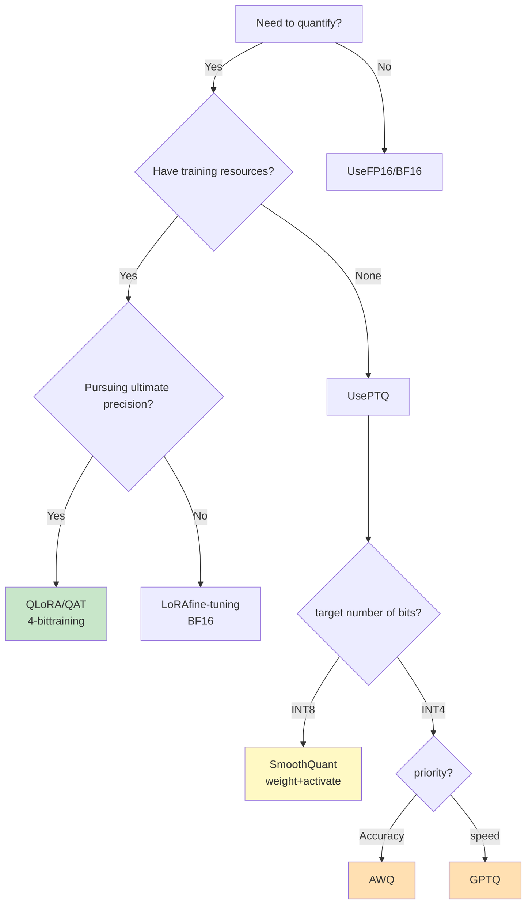

#### 8.5.2.2 Accuracy comparison before and after quantification
{: id="8522-量化前后的精度对比"}

Establish a FP16 baseline before quantization, and then evaluate the quantization model using the same set of tasks. Using EleutherAI’s lm-evaluation-harness:

```python
import torch
from transformers import AutoModelForCausalLM, AutoTokenizer
from lm_eval import simple_evaluate
from lm_eval.models.huggingface import HFLM

TASKS = ["hellaswag", "winogrande", "arc_easy", "arc_challenge"]

def evaluate(path, **load_kwargs):
    model = AutoModelForCausalLM.from_pretrained(path, device_map="auto", **load_kwargs)
    tokenizer = AutoTokenizer.from_pretrained(path)
    out = simple_evaluate(model=HFLM(pretrained=model, tokenizer=tokenizer),
                          tasks=TASKS, num_fewshot=0)
    return {t: out["results"][t]["acc,none"] for t in TASKS}

base = evaluate("meta-llama/Llama-2-7b-hf", torch_dtype=torch.float16)  # FP16 baseline
quant = evaluate("./llama-2-7b-gptq-4bit")  # GPTQ Weight, need to install gptqmodel

for t in TASKS:
    drop = (base[t] - quant[t]) / base[t] * 100
    print(f"{t}: {base[t]:.4f} → {quant[t]:.4f} (-{drop:.2f}%)")
```

**Acceptable loss of accuracy**:
- ✅ **INT8**: <2%
- ✅ **INT4**: <5%(GPTQ/AWQ)
- ⚠️ **INT4**: 5-10% (simple quantification)
- ❌ **INT4**: >10% (quantification failed, strategy needs to be adjusted)

#### 8.5.2.3 Layers that handle quantization failures
{: id="8523-处理量化失败的层"}

Some layers are particularly sensitive to quantization: output layers `lm_head`, Embedding, and layers with particularly large activation outliers (common in MLP's `down_proj`).

**strategy: mixed precision quantization** - the sensitive layer remains 16-bit, and the other layers are quantized as usual.

- By default, GPTQ/AWQ tools only quantize the `Linear` layer in the Transformer Block. Embedding and `lm_head` originally maintain the original accuracy.
- When you need to skip some additional layers, the recipe of llm-compressor can be written as `ignore=["lm_head", "re:.*down_proj"]` (supports regular expressions); bitsandbytes is specified by `BitsAndBytesConfig(llm_int8_skip_modules=[...])`
- The price is a small amount of additional GPU memory; to judge whether it is worth it, look at the accuracy comparison in the previous section.

### 8.5.3 Common pitfalls of quantification
{: id="853-量化的常见陷阱"}

#### 8.5.3.1 ❌ Trap 1: Using too little calibration data
{: id="8531--陷阱1使用过少的校准数据"}

```python
# Error example
calibration_data = dataset[:10]  # Only use10samples ❌

# Correct approach
calibration_data = dataset[:512]  # at least128-1024samples ✅
```

#### 8.5.3.2 ❌ Trap 2: Calibration data distribution mismatch
{: id="8532--陷阱2校准数据分布不匹配"}

```python
# Bad Example: Calibrating Conversation Models with Code Data ❌
calibration_data = load_dataset("codeparrot/github-code")

# Correct approach: Use data with similar target tasks ✅
calibration_data = load_dataset("allenai/c4", split="train[:1000]")  # universal text
# Or
calibration_data = load_dataset("OpenAssistant/oasst1")  # Conversation data
```

#### 8.5.3.3 ❌ Trap 3: Directly perform per-tensor INT8 quantization on activations
{: id="8533--陷阱3直接对激活做-per-tensor-int8-量化"}

The amplitudes of a few channels in the activations of a large model can be two orders of magnitude larger than other channels. When doing per-tensor naive INT8 quantization of activations, these outliers will increase the scaling factor, compressing the remaining channels to only a few quantization levels, and the accuracy will collapse.

**Correct approach**: First use SmoothQuant to migrate outliers to weights, or use per-token dynamic quantization for activation; if this is not possible, keep the sensitive layer as 16-bit (see Section 8.5.2.3).

---

## 8.6 📊 Summary of quantitative solution selection
{: id="86--量化方案选型总结"}

|scene|Recommended method|Quantization accuracy|Accuracy impact|Weight GPU memory savings (vs. FP16)|
|------|---------|---------|---------|---------|
|**fine-tuning training**| QLoRA |4-bit base + 16-bit LoRA|Basically the same as 16-bit LoRA| ~75% |
|**Inference deployment (accuracy priority)**| AWQ | 4-bit |small| ~75% |
|**Inference deployment (ecological priority)**| GPTQ | 4-bit |small| ~75% |
|**produces high throughput**| SmoothQuant W8A8 / FP8 | 8-bit |Basically lossless| ~50% |
|**Edge device**| INT8 QAT | 8-bit |Basically lossless| ~50% |
|**end side limit**| BitNet b1.58 | 1.58-bit |Need to be trained from scratch, starting from 3B is equivalent to FP16| ~90% |

> The accuracy impact varies greatly with model size, task and calibration data: the general rule is that larger models are more resistant to quantification, and tasks such as mathematics and coding that require precise reasoning are more sensitive than common sense question and answer. Before going online, be sure to make comparisons according to Section 8.5.2.2 on your own tasks.

---

## 8.7 🔮 Future Trends of Quantitative Technology
{: id="87--量化技术的未来趋势"}

### 8.7.1 Mixed-Precision Quantization
{: id="871-混合精度量化mixed-precision-quantization"}

Different layers use different numbers of bits:
- **Sensitive layer** (attention layer): INT8
- **Normal layer** (FFN): INT4
- **Insensitive layer**: INT2

### 8.7.2 Zero-shot quantization after training (Zero-Shot PTQ)
{: id="872-训练后零样本量化zero-shot-ptq"}

Quantitative parameters are directly inferred from weight distributions without calibration data.

### 8.7.3 Hardware-algorithm co-design
{: id="873-硬件-算法协同设计"}

- **NVIDIA Hopper**: native support for FP8 training and inference
- **NVIDIA Blackwell**: natively supports micro-scaling formats such as FP4 (NVFP4/MXFP4), and further hardware-based 4-bit inference and low-bit training
- **dedicated NPU**: binary/ternary neural network dedicated chip

### 8.7.4 Large model specific optimization
{: id="874-大模型特定优化"}

- **sparsity + quantization**: combined with pruning for further compression
- **KV Cache quantization**: Key optimization for long context scenarios (see the next section for details)
- **Dynamic quantization**: Adaptively adjust quantization accuracy according to input

### 8.7.5 KV Cache GPU memory management
{: id="875-kv-cache-显存管理"}

#### 8.7.5.1 Why does KV Cache occupy a lot of GPU memory?
{: id="8751-为什么-kv-cache-会占用大量显存"}

Large model inference consists of two stages:
- **Prefill (prefill)**: Process the entire input sequence in parallel at one time to generate the initial K/V matrix
- **Decode (decoding)**: Only one token is generated at a time, but K/V of all historical tokens needs to be accessed

In order to avoid repeatedly calculating the K/V of historical tokens, they are cached during inference. This is the KV Cache. As the sequence becomes longer, the cache continues to grow and becomes the main source of GPU memory consumption in long context scenarios.

```mermaid
flowchart LR
    subgraph prefill["① Prefill(parallel processing)"]
        direction TB
        p1["input sequence<br/>token₁ token₂ … tokenₙ"] --> p2["Transformer<br/>Compute all in parallel token"]
        p2 --> p3["KV Cache initialization<br/>K₁V₁, K₂V₂, …, KₙVₙ"]
        p3 --> p4["Output the first new token"]
    end

    subgraph decode["② Decode(chase token autoregressive)"]
        direction TB
        d1["new token<br/>tokenₙ₊₁"] --> d2["read KV Cache<br/>(Skip historical recalculation)"]
        d2 --> d3["Append<br/>Kₙ₊₁Vₙ₊₁ to cache"]
        d3 --> d4["output next token"]
        d4 -->|"Continue the cycle"| d1
    end

    prefill -->|"cache delivery"| decode

    style p3 fill:#e3f2fd,stroke:#01579b
    style d2 fill:#e3f2fd,stroke:#01579b
    style d3 fill:#e8f5e9,stroke:#1b5e20
```

**GPU memory calculation formula**:

$$\text{KV cache size} = 2 \times L \times H_{kv} \times d \times n \times b \times \text{bytes\_per\_element}$$

Here, $L$ = number of layers, $H_{kv}$ = number of KV heads (equal to the number of attention heads under MHA), $d$ = dimension per head, $n$ = sequence length, $b$ = batch size, coefficient 2 corresponds to K and V.

Take **LLaMA-2-7B** as an example (32 layers, 32 KV heads, 128 dimensions, FP16):
- Occupied by each token: $2 \times 32 \times 32 \times 128 \times 2\ \text{bytes} = \mathbf{0.5 \text{ MB}}$
- A request for a 4K context occupies approximately **2GB**; when batch=32, the KV Cache reaches **64GB**, far exceeding the model weight itself (approximately 13.5GB)

Compare **LLaMA-2-70B** (80 layers, but only retain 8 KV headers with GQA): each token is $2 \times 80 \times 8 \times 128 \times 2 \approx 0.31$ MB, the number of parameters is 10 times that of 7B, and the KV Cache is smaller - this is the role of GQA below.

#### 8.7.5.2 KV Cache Quantification
{: id="8752-kv-cache-量化"}

Directly perform low-precision quantization on the cached K/V matrix without modifying the model structure:

|Accuracy|method|GPU memory savings|Accuracy impact|
|------|-----|---------|--------|
| INT8 |Per-token dynamic quantification| ~50% |extremely small|
| INT4 |Per-group quantification| ~75% |small|
| FP8 |Hardware native (H100)| ~50% |extremely small|

#### 8.7.5.3 GQA/MQA: Reduce KV Cache from the architectural level
{: id="8753-gqa--mqa从架构层面减少-kv-cache"}

A more fundamental optimization than quantization: reducing the number of KV heads.

<div align="center">
  
<figcaption> Figure: Comparison of KV head sharing methods of three attention mechanisms: MHA (left), GQA (middle), and MQA (right). Source: Ainslie et al., GQA, EMNLP 2023</figcaption>
</div>

```
MHA: [Q1 K1V1] [Q2 K2V2] [Q3 K3V3] [Q4 K4V4]  ← KVNumber of heads = QNumber of heads
GQA: [Q1 Q2] [K1V1]  [Q3 Q4] [K2V2]            ← KVNumber of heads = QNumber of heads / group size
MQA: [Q1 Q2 Q3 Q4]   [K1V1]                    ← all Q Share 1 a KV head
```

|way|full name|KV Cache size|representative model|
|------|-----|-------------|--------|
| MHA | Multi-Head Attention |Benchmark (1×)| GPT-2, BERT, LLaMA-2-7B |
| GQA | Grouped-Query Attention |reduced to 1/group size|LLaMA-2-70B, LLaMA-3 full range, Mistral|
| MQA | Multi-Query Attention |reduced to 1/H| PaLM, Falcon-7B |

GQA is currently the preferred solution for mainstream large models, achieving a good balance between GPU memory savings and model quality.

#### 8.7.5.4 MLA (Multi-head Latent Attention): further compression of DeepSeek-V2/V3
{: id="8754-mlamulti-head-latent-attentiondeepseek-v2v3-的进一步压缩"}

GQA/MQA passed **Reduce the number of KV heads** to compress the cache, but essentially still "store the original K/V vector". Proposed by DeepSeek-V2 **MLA (Bulls Potential Attention)** Changed the idea: instead of storing the original K/V, **Jointly compressed into a low-dimensional latent vector (Latent Vector)** , and then restored in real time during reasoning.

**Core Principle**:

$$
\mathbf{c}_t^{KV} = W^{DKV} \mathbf{h}_t \quad (\text{Compressed latent vector, dimension } d_c \ll d_h \times n_h)
$$

$$
\mathbf{k}_t = W^{UK} \mathbf{c}_t^{KV}, \quad \mathbf{v}_t = W^{UV} \mathbf{c}_t^{KV} \quad (\text{Up-projection at inference})
$$

Among them only **Compressed latent vector $$\mathbf{c}_t^{KV}$$ cached** , the upper projection matrix of K/V $W^{UK}, W^{UV}$ Calculated in real time at inference time, so the amount of data cached is completely independent of the "number of KV headers" and only depends on the underlying dimensions $d_c$ .

|way|KV Cache storage content|Number of elements cached per token per layer|
|------|------------------|------------------------------|
| MHA |Complete K, V vectors| $2 n_h d_h$ |
| GQA |K, V vectors shared by groups|$2 n_g d_h$ ($n_g$ is the number of groups)|
| **MLA** |**Low-dimensional joint latent vector + decoupled RoPE key**| **$d_c + d_h^R$** |

DeepSeek-V2 takes $d_c = 4d_h$ and $d_h^R = d_h/2$, and only caches $4.5\,d_h$ elements per token per layer, which is equivalent to only 2.25 groups of GQA; and its MHA has 128 headers, and the same cache requires $256\,d_h$. Compared with the previous generation DeepSeek 67B, DeepSeek-V2’s KV Cache has been reduced by 93.3%, and the maximum generation throughput has been increased to 5.76 times.

**Key engineering details**:
- **Decoupled Rotated Position Encoding (Decoupled RoPE)**: Since the latent vector cannot be directly applied to RoPE after low-rank compression (RoPE requires independent rotation of each K head), MLA introduces an additional set of "position-aware" dimensions that do not participate in compression to specifically carry RoPE information and are spliced with the compressed content dimensions.
- **is lossless during training and greatly saves GPU memory during inference.**: The upper projection matrix can be absorbed and merged with the subsequent attention calculation matrix, so MLA is close to standard MHA in effect (even slightly better than GQA in the DeepSeek-V2/V3 report), while the GPU memory usage is close to or even better than MQA.

**Meaning**: MLA is one of the key architectural innovations of DeepSeek-V2/V3/R1 that can support ultra-long contexts while keeping reasoning costs very low. It is ranked as the three most influential engineering contributions of the DeepSeek series along with MoE and FP8 training.

#### 8.7.5.5 Other KV Cache Saving Techniques
{: id="8755-其他-kv-cache-节省技术"}

- **Sliding Window Attention**: Each layer only retains the KV of the most recent $w$ tokens. After multi-layer stacking, the receptive field can still cover a longer context.
- **Streaming LLM**: Keep the nearest window + the KV of the first few tokens (the attention score of the initial token has an anchoring effect on the overall distribution)
- **Prefix Caching (cross-request multiplexing)**: Requests with the same prefix (such as system prompts) share KV Cache, which can save 50%+ costs in API service scenarios

---

# 9. Data engineering
{: id="9-数据工程"}

Data is the cornerstone of large model training. High-quality training data directly determines the upper limit of the model's capabilities. This chapter systematically introduces data engineering technology in large model training.

> **🎯 Introduction to this chapter**
>
> "Garbage in, garbage out"——Data quality directly determines the upper limit of the model. This chapter introduces the complete data processing process such as data collection, quality assessment, deduplication, proportioning, and tokenization. **Core philosophy**: High quality > Large scale, diversity > Single source. Data engineering is often underestimated, but it is the key to successful training.

<div align="center">
  
<figcaption> Figure: RefinedWeb's Common Crawl processing flow - after the three stages of document preparation, filtering, and deduplication, about 90% of the original documents are removed (Source: RefinedWeb paper Figure 2)</figcaption>
</div>

## 9.1 Data collection and sources
{: id="91-数据采集与来源"}

### 9.1.1 Pretraining data source
{: id="911-预训练数据来源"}

#### 9.1.1.1 Web page data
{: id="9111-网页数据"}
- **Common Crawl**: The largest open web crawling data set, crawling billions of web pages every month, including multi-language and multi-domain content
- **C4 (Colossal Clean Crawled Corpus)**: Based on Common Crawl cleaned data set, ~750GB text
- **RedPajama**: Reproduction of open source LLaMA training data (1.2 trillion tokens)
- **FineWeb / FineWeb-Edu** (Hugging Face, 2024): Cleaned out about 15T tokens from 96 Common Crawl snapshots; FineWeb-Edu then used the educational value classifier to filter out a high-quality subset of about 1.3T tokens

#### 9.1.1.2 Code data
{: id="9112-代码数据"}
- **GitHub**: Open source code warehouse (filter stars, license)
- **Stack Overflow**: Q&A on high-quality code
- **The Stack**: 3TB source code, 30+ programming languages

#### 9.1.1.3 Academics and Books
{: id="9113-学术与书籍"}
- **arXiv, PubMed**: academic papers
- **Books3, BookCorpus**: book data set

#### 9.1.1.4 Conversations and Social Media
{: id="9114-对话与社交媒体"}
- **Reddit**: High-quality discussions and Q&A
- **Wikipedia**: Structured knowledge
- **StackExchange**: Professional Q&A in various fields

## 9.2 Data quality assessment
{: id="92-数据质量评估"}

### 9.2.1 Heuristic rule filtering
{: id="921-启发式规则过滤"}

#### 9.2.1.1 Text length and format
{: id="9211-文本长度与格式"}
- Min/max length filtering
- Special characters, numbers, and punctuation ratio control
- Uppercase letter density detection
- Language detection (fastText, langdetect)

#### 9.2.1.2 Duplicate content detection
{: id="9212-重复内容检测"}
- Line-level repetition, paragraph repetition
- Template recognition (web page template, header and footer)

### 9.2.2 Model-based quality scoring
{: id="922-基于模型的质量评分"}

#### 9.2.2.1 Perplexity filtering
{: id="9221-困惑度perplexity过滤"}
- Scoring using small language models
- Filter documents with excessive confusion (use caution)

#### 9.2.2.2 Quality classifier
{: id="9222-质量分类器"}
- Training data: manually labeled high-quality vs. low-quality samples
- Features: Text fluency, information density, grammatical correctness
- Model: FastText, BERT classifier

#### 9.2.2.3 Educational value score
{: id="9223-教育价值评分"}
- Inspiration from the Phi Series: Assessing "Textbook Quality"
- Typical approach (FineWeb-Edu): First use a strong model (Llama-3-70B-Instruct) to score "educational value" on a scale of 0-5 for about 450,000 web pages, then use these annotations to train a lightweight classifier, score the full amount of data and retain high-scoring documents
- The data filtered out in this way can achieve the same effect with fewer tokens on knowledge and reasoning benchmarks such as MMLU and ARC.

### 9.2.3 Toxicity and Harmful Content Detection
{: id="923-毒性与有害内容检测"}

#### 9.2.3.1 Toxicity testing
{: id="9231-毒性检测"}
- **Perspective API**: Google toxicity score API
- **Detoxify**: Open source toxicity detection model

#### 9.2.3.2 PII (Personally Identifiable Information) Removal
{: id="9232-pii个人身份信息去除"}
- Name, address, phone number, email
- Recognition using NER model
- Password, key: regular expression matching

## 9.3 Data deduplication
{: id="93-数据去重"}

Deduplication is the most critical data processing step, which can significantly improve model performance and reduce memory effects.

### 9.3.1 Accurate deduplication
{: id="931-精确去重"}
- **document level**: based on MD5/SHA256 hash
- **Paragraph/line level**: Calculate hash for each paragraph, delete paragraphs that appear repeatedly in the corpus (CCNet's approach), and remove template text such as headers and footers.
- **URL deduplication**: Handling redirects and normalization

<div align="center">
  
<figcaption> Figure: CCNet's Common Crawl processing flow - first calculate paragraph hash for paragraph-level deduplication, then do language identification (LID) and language model perplexity scoring, and finally bucket by language and quality (Source: CCNet paper Figure 1)</figcaption>
</div>

### 9.3.2 Fuzzy deduplication
{: id="932-模糊去重"}

#### 9.3.2.1 MinHash + LSH
{: id="9321-minhash--lsh"}
- Estimating Jaccard similarity
- Steps: Generate shingles → MinHash signature → LSH to find similar pairs
- Tools: datasketch library

#### 9.3.2.2 SimHash
{: id="9322-simhash"}
- Quickly calculate document fingerprints
- Hamming distance to determine similarity

#### 9.3.2.3 Suffix Array
{: id="9323-suffix-array"}
- Use suffix arrays to find long substrings that appear repeatedly in the corpus (Lee et al., 2022 uses 50 tokens as the threshold), and delete the substrings instead of the entire document
- Suitable for removing long paragraphs (license text, templated content) that are copied and pasted across documents. This type of duplication cannot be found using document-level deduplication.

### 9.3.3 Cross-dataset deduplication
{: id="933-跨数据集去重"}

#### 9.3.3.1 Deduplication of training set and test set
{: id="9331-训练集与测试集去重"}
- **Crucial**: Avoid data leaks
- 13-gram overlap detection (GPT-3)
- Affects the credibility of evaluations

### 9.3.4 Trade-off
{: id="934-去重trade-off"}
- Excessive deduplication: loss of diversity
- Missing duplicates: wasting resources and increasing memory risks
- Balance point: Adjust according to the task

## 9.4 Data proportioning and sampling
{: id="94-数据配比与采样"}

### 9.4.1 Static proportioning strategy
{: id="941-静态配比策略"}

**GPT-3 ratio example**:

```mermaid
pie title GPT-3pretraining data matching
    "Common Crawl" : 60
    "WebText2" : 22
    "Books" : 16
    "Wikipedia" : 3
```

**LLaMA-1 ratio** (sampling ratio, total about 1.4T tokens):

|data source|Sampling ratio|Corresponding number of Tokens (×1.4T)|Description|
|--------|------|-----------|------|
| CommonCrawl | 67.0% | ~938B |Web data, highest diversity|
| C4 | 15.0% | ~210B |Cleaned web page data|
| GitHub | 4.5% | ~63B |code data|
| Wikipedia | 4.5% | ~63B |High-quality encyclopedia knowledge (approximately 2.45 epochs of training)|
| Books | 4.5% | ~63B |Long text, narrative ability (about 2.23 epochs)|
| ArXiv | 2.5% | ~35B |Mathematics, scientific reasoning|
| StackExchange | 2.0% | ~28B |Professional Q&A|

The final mix of **Llama 3** (by content type): approximately 50% General Knowledge, 25% Mathematics and Reasoning, 17% Code, 8% Multilingual. Compared with LLaMA-1, the ratio of mathematics to code has increased significantly, which is directly related to the fact that reasoning ability has become the focus of competition.

**builds batch** according to the proportion (illustration):
```python
data_mixture = {
    'common_crawl': 0.67,    # Web page data - general language skills
    'c4': 0.15,              # Cleaned web page data
    'github': 0.045,         # code - Programming ability
    'wikipedia': 0.045,      # Encyclopedia - factual knowledge
    'books': 0.045,          # books - long text
    'arxiv': 0.025,          # Paper - scientific reasoning
    'stackexchange': 0.02,   # Q&A - QAAbility
}

def sample_batch(data_mixture, batch_size):
    """Build training batches proportionally"""
    batch = []
    for source, weight in data_mixture.items():
        n_samples = int(batch_size * weight)
        batch.extend(sample_from_source(source, n_samples))
    return batch
```

**proportioning principle**:
- **High-Quality Data Rights Elevation**: Although Wikipedia, Books, and ArXiv account for a small proportion, they will be repeatedly sampled for multiple epochs.
- **Separate control of code and mathematics**: from about 5% of LLaMA-1 to more than 40% of Llama 3 (code + mathematical reasoning), improving reasoning ability but avoiding crowding out general knowledge
- **Q&A data is small but important**: StackExchange and other Q&A data cultivate Q&A capabilities
- **Diversity first**: Web data dominates to ensure breadth of knowledge

### 9.4.2 Dynamic proportioning strategy
{: id="942-动态配比策略"}

#### 9.4.2.1 Training phase adjustment
{: id="9421-训练阶段调整"}
- **early stage (0-70%)**: balanced ratio
- **Mid-term (70-90%)**: Improving high-quality data
- **late stage (90-100%)**: focus on professional data

#### 9.4.2.2 Loss-based adjustments
{: id="9422-基于损失的调整"}
- Monitor losses from different data sources
- dynamic rebalancing

### 9.4.3 Curriculum Learning
{: id="943-课程学习curriculum-learning"}
- From easy to difficult: Sort by confusion
- From general to professional

### 9.4.4 Temperature Sampling
{: id="944-temperature-sampling"}

Sampling probability calculation formula:

$$
p_i = \frac{n_i^{\alpha}}{\sum_j n_j^{\alpha}}
$$

Here:
- $n_i$: The original sample number of data source $i$
- $\alpha$: Temperature parameters
- $\alpha < 1$: Improve sampling probability of small data sources (up-sampling)
- $\alpha > 1$: Reduce the sampling probability of small data sources (down-sampling)
- $\alpha = 1$: Sampling according to original ratio

## 9.5 Tokenization
{: id="95-tokenization"}

### 9.5.1 Algorithm selection
{: id="951-算法选择"}

- **BPE (Byte Pair Encoding)**: GPT series, LLaMA full series
  - Iteratively merge high-frequency pairs starting from characters (or bytes)
  - Byte-level BPE (from GPT-2, Llama 3's tiktoken tokenizer) uses bytes as the basic unit, and naturally has no unregistered words.
- **WordPiece**: BERT, select the merge pair according to the principle of maximizing the likelihood of corpus after merging.
- **Unigram**: T5, starting from the large word list and gradually pruning according to likelihood
- **SentencePiece**: It is not a new algorithm, but a tool library that implements BPE and Unigram at the same time; it is trained directly on the original text and does not rely on space word segmentation. It is suitable for multi-language scenarios such as Chinese and Japanese (used by LLaMA-1/2 and T5)

### 9.5.2 Vocabulary size
{: id="952-词表大小"}
- English mainly: 32k-50k
- Multilingual: 100k - 256k (128K for Llama 3, ~151K for Qwen, 256K for Gemma)
- Code Model: Larger Vocabulary

**Trade-off**:
- The vocabulary list is too small: the sequence is long and training is slow
- The vocabulary is too large: there are too many embedding parameters and they are sparse.

### 9.5.3 Special Token
{: id="953-特殊token"}
- Standard: `<bos>`, `<eos>`, `<pad>`, `<unk>`
- Dialogue: `<|user|>`, `<|assistant|>`, `<|system|>`
- Multi-modal: `<image>`, `<video>`

### 9.5.4 Best Practices
{: id="954-最佳实践"}
- Pretraining, fine-tuning, and inference use the same tokenizer
- Pre-tokenize and cache
- Use fast tokenizer (Rust implementation)
- Number of multi-language balancing tokens

---

# 10. Assessment and Benchmarking
{: id="10-评估与基准测试"}

The evaluation system is an important tool to measure training effectiveness and guide training direction. This chapter introduces commonly used evaluation benchmarks in large model training.

## 10.1 Language understanding and knowledge
{: id="101-语言理解与知识"}

### 10.1.1 MMLU(Massive Multitask Language Understanding)
{: id="1011-mmlumassive-multitask-language-understanding"}
- **Content**: Multiple choice questions in 57 subjects (mathematics, history, law, medicine, etc.)
- **Scale**: ~16,000 questions
- **Assessment Dimensions**: Breadth of knowledge, interdisciplinary understanding
- **Difficulty**: College to professional level
- **Meaning**: General knowledge reserve of measurement model

### 10.1.2 HellaSwag
{: id="1012-hellaswag"}
- **Task**: Common sense reasoning sentence completion
- **Method**: Choose the most reasonable sentence ending from 4 options
- **Features**: Easy for humans (~95%), difficult for early models
- **Assessment**: Common sense understanding and situational reasoning

### 10.1.3 TruthfulQA
{: id="1013-truthfulqa"}
- **Objective**: Evaluate the authenticity of the model output
- **Design**: Questions containing common misunderstandings and false information
- **Evaluation Dimensions**:
  - Whether the model repeats errors in the training data
  - Will it cause hallucination?
- **Importance**: Measuring model reliability

### 10.1.4 ARC(AI2 Reasoning Challenge)
{: id="1014-arcai2-reasoning-challenge"}
- **Content**: Elementary school science examination questions
- **difficulty**: Easy and Challenge versions
- **Assessment**: Scientific reasoning and application of knowledge

## 10.2 Reasoning skills
{: id="102-推理能力"}

### 10.2.1 GSM8K(Grade School Math 8K)
{: id="1021-gsm8kgrade-school-math-8k"}
- **Task**: Primary school mathematics application questions
- **Scale**: 8,500 questions
- **Features**: requires multi-step reasoning
- **evaluation method**:
  - Direct answer evaluation
  - Chain-of-Thought reasoning process assessment
- **Meaning**: Measures basic mathematical reasoning ability

### 10.2.2 MATH
{: id="1022-math"}
- **Difficulty**: High school to college competition level mathematics
- **Scale**: 12,500 questions
- **Subject**: algebra, geometry, probability, number theory, etc.
- **Assessment**: Complex mathematical reasoning and problem solving
- **challenges**: Even the strongest model has difficulty reaching high scores

### 10.2.3 HumanEval
{: id="1023-humaneval"}
- **Task**: Python function implementation
- **Scale**: 164 programming questions
- **evaluation method**: unit test pass rate (pass@k)
- **Features**:
  - Independent function, not involved in complex systems
  - Clear input and output specifications
- **variant**: HumanEval+ (more rigorous testing)

### 10.2.4 MBPP(Mostly Basic Python Problems)
{: id="1024-mbppmostly-basic-python-problems"}
- **Scale**: 1,000 Python Programming Questions
- **Difficulty**: Beginner to Intermediate
- **Evaluation**: Practical Programming Ability

### 10.2.5 BigCodeBench
{: id="1025-bigcodebench"}
- **Features**: More complex real-world programming tasks
- **Evaluation**: Tool usage, API calls, complex logic

### 10.2.6 New benchmarks in the era of inference models
{: id="1026-推理模型时代的新基准"}

Classic benchmarks such as GSM8K and HumanEval have been "full" by cutting-edge models (accuracy rates generally exceed 90%), their discrimination has declined, and they are more susceptible to training data pollution. The evaluation of inference models and agents turns to harder and newer benchmarks:

- **AIME**: American Mathematics Invitational Competition real questions, 30 questions each year, often evaluated with new questions of the year to avoid contamination
- **GPQA Diamond**: 198 graduate-level multiple-choice questions in physics, chemistry, and biology, specially designed to not be answered by search engines (Google-proof)
- **LiveCodeBench**: Continuously collect new questions from the programming competition platform, filter by question release time, and alleviate data pollution
- **SWE-bench Verified**: 500 real GitHub issues that have been manually confirmed and solvable, requiring the model to modify the code repository and pass the test. It is the mainstream benchmark for programming agents.
- **Humanity's Last Exam (HLE)**: About 2,500 expert-level questions covering dozens of disciplines. The accuracy of cutting-edge models at the time of release is generally less than 10%

## 10.3 Multilingual capabilities
{: id="103-多语言能力"}

### 10.3.1 FLORES(Facebook Low Resource Translation)
{: id="1031-floresfacebook-low-resource-translation"}
- **Task**: Machine Translation
- **covers**: 200+ language pairs
- **Assessment**: Cross-language understanding and generation
- **Importance**: Measuring multi-language model capabilities

### 10.3.2 XNLI(Cross-lingual Natural Language Inference)
{: id="1032-xnlicross-lingual-natural-language-inference"}
- **Task**: Natural language reasoning (implication, contradiction, neutrality)
- **Language**: 15 languages
- **evaluation**: zero-sample cross-language transfer capability

### 10.3.3 Belebele
{: id="1033-belebele"}
- **Task**: Reading Comprehension
- **covers**: 122 languages
- **Evaluation**: Broad multi-language understanding

## 10.4 Long text capabilities
{: id="104-长文本能力"}

### 10.4.1 RULER(Rule-based Evaluation of Long Context Understanding)
{: id="1041-rulerrule-based-evaluation-of-long-context-understanding"}
- **Task type**:
  - Information retrieval (Needle in a Haystack)
  - multi-hop reasoning
  - aggregate statistics
- **length**: 4k to 128k+ tokens
- **Evaluation**: Long context modeling capabilities

### 10.4.2 LongBench
{: id="1042-longbench"}
- **Task**: single document/multi-document QA, summary, code, etc.
- **length**: average 5-15k tokens
- **Language**: English and Chinese
- **Evaluation**: Real long text application scenarios

### 10.4.3 Needle in a Haystack
{: id="1043-needle-in-a-haystack大海捞针"}
- **Design**: Insert key information in long text
- **Test**: Can the model be retrieved accurately?
- **variant**:
  - Single needle
  - Many needles
  - different locations and depths

## 10.5 Security Assessment
{: id="105-安全性评估"}

### 10.5.1 ToxiGen
{: id="1051-toxigen"}
- **Objective**: Detection of harmful content generation tendency and ability to identify implicit hate speech
- **method**: About 270,000 statements about 13 minority groups (50% toxic and 50% non-toxic) generated by GPT-3 adversarial style, most of which do not contain explicit swear words
- **Evaluation Dimensions**:
  - Toxicity
  - hate speech
  - violent content

### 10.5.2 BBQ(Bias Benchmark for QA)
{: id="1052-bbqbias-benchmark-for-qa"}
- **Task**: Detect social bias
- **Dimension**:
  - gender
  - race
  - religion
  - age
  - Sexual orientation, etc.
- **Method**: Fuzzy and explicit context comparison

### 10.5.3 SafetyBench
{: id="1053-safetybench"}
- **covers**: multiple types of security risks
- **Language**: Chinese and English
- **Evaluation**: Ability to refuse to answer inappropriate requests

### 10.5.4 Red Teaming Testing Methodology (Red Teaming)
{: id="1054-红队测试方法论red-teaming"}

Static security benchmarks (ToxiGen, BBQ, SafetyBench) can only cover known risk patterns in the test set; **Red Teaming** It is the process of actively looking for unknown vulnerabilities in the model, and it is the "adversarial testing" link that is as important as "training" in the security alignment process.

#### 10.5.4.1 Manual Red Team vs Automated Red Team
{: id="10541-人工红队-vs-自动化红队"}

|way|practice|Advantages|limitations|
|------|------|------|------|
|**Artificial red team**|Recruit professional testers to manually construct offensive prompts|Strong creativity and able to discover novel attack patterns|High cost, limited coverage, and difficult to scale|
|**Automation Red Team**|Automatically generate attack prompts with another LLM (Red Team LLM vs Target LLM)|Capable of large-scale parallelization and continuous iteration|Attack patterns may be limited to Red Team LLM's own "imagination"|

#### 10.5.4.2 Typical processes of automated red teams
{: id="10542-自动化红队的典型流程"}

```
1. Red Team LLM Depending on the attack target (e.g."Inducing the model to output poison-making methods")Generate candidates Prompt
2. Target LLM to candidates Prompt generate answer
3. classifier/The discriminant model determines whether the answer is"Jailbreak successful"(Content that should not be output is output)
4. Will jailbreak successfully (Prompt, answer) as negative samples for subsequent safety SFT/DPO training
5. Repeat iteration:Red Team LLM Adjust the attack strategy according to the success rate (such as using more subtle words, role-playing packaging)
```

This process is consistent with the idea of "verifier-driven data flywheel" in Section 4.7 - except that the verifier changes from "correct answer" to "whether the jailbreak is successful". Red team testing is essentially a data flywheel: automatically discover vulnerabilities → generate targeted training data → patch the model → the red team continues to find new vulnerabilities.

#### 10.5.4.3 Common Jailbreak attack modes
{: id="10543-常见越狱jailbreak攻击模式"}

- **Role-playing inducement**: Requiring the model to "play an AI without any restrictions" or fictitious scenarios to bypass security restrictions
- **instruction injection**: Gradually guide in long context or multiple rounds of dialogue, making the model relax its vigilance in subsequent rounds
- **encoding confusion**: Using encoding methods such as Base64, Pinyin, and rare characters to bypass keyword-based security filtering
- **Multilingual attack**: Use model security alignment to cover weak minority languages to make harmful requests
- **Academic/fiction packaging**: Packaging harmful requests into seemingly reasonable scenarios such as "novel creation", "academic research", "security research" (echoing the precise rejection problem mentioned in Section 4.5.5 "Alignment Tax and Reasoning Conflict")

#### 10.5.4.4 Defense training closed loop
{: id="10544-防御训练闭环"}

The vulnerabilities discovered by the red team testing will eventually be returned to the training process to be fixed. Common methods are:
- Add the jailbreak sample to the negative sample of DPO/RLHF (chosen=refuse to answer, rejected=induced harmful answer)
- In the SFT stage, samples for "identifying disguised intentions" are added to train the model to penetrate the packaging and identify the true request nature.
- Continuous red team testing + periodic security regression assessment to prevent degradation in other dimensions after patching one type of vulnerability (see the case of security capability collapse in Chapter 5 "catastrophic forgetting")

> **Industry practice**: Anthropic, OpenAI and other companies will introduce third-party red team testing (External Red Teaming) before model release. Its logic is similar to penetration testing (Penetration Testing) in software security testing - internal teams often have mindsets, and it is easier to discover unexpected attack surfaces from an external perspective.

## 10.6 Alignment evaluation
{: id="106-对齐评估"}

### 10.6.1 MT-Bench
{: id="1061-mt-bench"}
- **Task**: Multi-round dialogue evaluation
- **Judge**: Using GPT-4 as the judge
- **dimension**:
  - writing
  - role play
  - reasoning
  - Mathematics
  - Programming etc.

### 10.6.2 AlpacaEval
{: id="1062-alpacaeval"}
- **method**: Compare the answers with the reference model in pairs, and the LLM judges will judge the winner (AlpacaEval 2.0 uses GPT-4 Turbo as the reference and judge)
- **Evaluation**: Instruction following quality
- **outputs**: winning rate (Win Rate); version 2.0 additionally reports **length control winning rate (LC Win Rate)**, to offset the bias of judges preferring long answers

### 10.6.3 Chatbot Arena(LMArena)
{: id="1063-chatbot-arenalmarena"}
- **Method**: Real users blindly vote on the answers of two anonymous models, using the Bradley-Terry model to calculate the Elo-style score
- **Features**: Continuously updated real-time rankings, renamed LMArena from 2025
- Meaning of : reflects real user preferences (but will also be affected by answer style, length and format)

## 10.7 Comprehensive evaluation platform
{: id="107-综合评测平台"}

### 10.7.1 LM Evaluation Harness
{: id="1071-lm-evaluation-harness"}
- **Maintenance**: Eleuther AI
- **Features**:
  - unified interface
  - Supports dozens of benchmarks
  - Standardized evaluation process
- **uses**: widely adopted by the research community, and the Hugging Face Open LLM Leaderboard is based on it; see section 8.5.2.2 for usage examples

### 10.7.2 HELM(Holistic Evaluation of Language Models)
{: id="1072-helmholistic-evaluation-of-language-models"}
- **dimension**:
  - Accuracy
  - Robustness
  - fairness
  - Prejudice
  - efficiency
- **Features**: Multi-dimensional comprehensive evaluation

### 10.7.3 OpenCompass
{: id="1073-opencompass"}
- **maintenance**: Shanghai AI Lab
- **Features**:
  - Chinese optimization
  - Support large-scale evaluation
  - Visualized rankings

## 10.8 Best Practices for Evaluation
{: id="108-评测的最佳实践"}

### 10.8.1 Avoiding data leakage
{: id="1081-避免数据泄露"}
- Strictly deduplicate training data and test sets
- Use newly released benchmarks
- Regularly update the review set

### 10.8.2 Multi-dimensional assessment
{: id="1082-多维度评估"}
- Don’t rely on a single metric
- Comprehensive consideration of performance, safety and efficiency
- Focus on long-tail capabilities and edge cases

### 10.8.3 Relationship between evaluation and training
{: id="1083-评测与训练的关系"}
- Evaluation results guide training direction
- Avoid over-optimizing against benchmarks (swiping the rankings)
- Pay attention to actual application scenario performance

---

# 11. Practical Guidelines and Best Practices
{: id="11-实践指南与最佳实践"}

This chapter provides engineering guidance for practical training of large models, including hardware configuration, cost estimation, monitoring and debugging, and code examples.

## 11.1 Hardware configuration recommendations
{: id="111-硬件配置建议"}

### 11.1.1 Recommended configurations for models of different sizes
{: id="1111-不同规模模型的推荐配置"}

|Model size|Parameter quantity|Recommended GPU|Quantity|GPU memory requirements|Internet|Applicable scenarios|
|---------|--------|---------|------|---------|---------|---------|
|**MiniMind**| 26M-500M | RTX 3060/4060 | 1 | 8GB+ | PCIe 3.0 |Learning principles, rapid verification|
|**Small**| 1-3B | RTX 4090 | 4-8 | 24GB | PCIe 4.0 |Research, prototype development|
|**Medium**| 7-13B | A100 | 16-32 | 40GB/80GB | InfiniBand |Enterprise applications|
|**Large**| 30-70B | A100/H100 | 64-256 | 80GB | InfiniBand |Production grade model|
|**Extra large**| 175B+ | H100 | 512-4096 | 80GB | InfiniBand/NVLink |Cutting edge research|

### 11.1.2 GPU Selection Guide
{: id="1112-gpu选择指南"}

**training scene**:
- **Getting Started/Personal Practice**: RTX 3060 (12GB) / 4060 Ti (16GB) - can completely run through SLM projects such as MiniMind.
- **Budget limited**: RTX 4090 (24GB, cost-effective, suitable for small models and LoRA fine-tuning)
- **Enterprise-level training**: A100 (80GB, mature and stable, complete ecosystem)
- **latest flagship**: H100 (80GB, strongest performance, FP8 support, suitable for large-scale training)

**Network interconnection**:
- **Intra-node communication**: NVLink (900GB/s) > PCIe 5.0 (128GB/s)
- **Inter-node communication**: InfiniBand (200-400Gb/s) > Ethernet (100Gb/s)


## 11.2 Training cost estimation
{: id="112-训练成本估算"}

### 11.2.1 Cost composition
{: id="1121-成本构成"}

```mermaid
pie title Large model training cost composition
    "GPUrent/depreciation" : 70
    "Power and Cooling" : 15
    "Storage and Networking" : 5
    "Labor cost" : 8
    "Others" : 2
```

### 11.2.2 Detailed cost calculation
{: id="1122-详细成本计算"}

#### 11.2.2.1 Pretraining cost estimation
{: id="11221-预训练成本估算"}

**Step one: Estimate computing power requirements**

Dense Transformer training a token requires about 6 times the number of floating point operations (forward 2N, reverse 4N), so:

$$
C_{\text{train}} \approx 6ND \quad \text{(FLOPs)}, \qquad
\text{GPU hours} \approx \frac{6ND}{\text{Peak FLOPS per GPU} \times \text{MFU} \times 3600}
$$

Here, $N$ is the parameter amount, $D$ is the number of training tokens, and MFU (Model FLOPs Utilization) is the actual peak computing power ratio, which is usually 35%–55% for large-scale training.

**Step 2: Conversion cost**

$$
\text{Total cost} = \text{GPU hours} \times \text{Hourly price} + \text{Other costs: storage, labor, etc.}
$$

**Case 1: Training a 7B model**
```
Model size:7Bparameters
Training data:1T tokens
Computing power requirements:6 × 7e9 × 1e12 ≈ 4.2e22 FLOPs
Reference value:  LLaMA-1 7B training 1T tokens It actually took about 82,432 A100 GPU hours
GPUConfiguration:256 × A100 (80GB)
Training duration: approx.2Week (82,432 / 256 ≈ 322hours)

Cost estimate:
- GPUCost:$1.8/hours/card (2026Year cloud service A100 On-demand price, relatively2023years$2.5/hours have dropped significantly)
- GPUTotal cost:82,432 × $1.8 ≈ $148,000
- Storage cost:10TBdata × $0.02/GB/month ≈ $200/month
- Network cost: Negligible
- Labor cost:1people × 2week × $5000/week = $10,000
━━━━━━━━━━━━━━━━━━━━━━━━━━━━━━━
Total cost: approx. $160,000
```

**Case 2: Training a 70B model**
```
Model size:70Bparameters
Training data:2T tokens
Computing power requirements:6 × 70e9 × 2e12 ≈ 8.4e23 FLOPs
GPUConfiguration:512 × H100 (80GB), BF16 Dense peak approx. 989 TFLOPS, press MFU ≈ 45% Estimate
Training duration: approx.6Week (8.4e23 / (512 × 989e12 × 0.45) ≈ 3.7e6 seconds ≈ 1030hours)

Cost estimate:
- GPUCost:$2.2/hours/card (2026Year cloud service H100 price on demand;H200/B200 Newer models are more expensive, approx.$3.2-5.5/hours)
- GPUTotal cost:512 × $2.2 × 1030 ≈ $1,160,000
- Storage cost:50TB × $0.02/GB/month × 1.5 ≈ $1,500
- Labor cost:3people × 6week × $5000/week = $90,000
━━━━━━━━━━━━━━━━━━━━━━━━━━━━━━━
Total cost: approx. $1,250,000 (approx.125million dollars)
```

**Real case comparison: DeepSeek-V3 (671B parameters, MoE architecture)**

The DeepSeek-V3 technical report gives a concrete training-cost example: 2048 H800 GPUs consumed **2.788 million GPU hours** across pretraining, context extension, and post-training. At an estimated USD 2 per GPU hour, the total was approximately **USD 5.576 million**. The report emphasizes that this covers formal training only, excluding earlier architecture, algorithm, and data ablation experiments. For a 671B-parameter model approaching GPT-4-level performance, this cost was far below industry expectations. The article attributes the reduction to three engineering choices: **FP8 mixed-precision training, MLA, and efficient MoE routing** (see the FP8 training and MLA sections). This example illustrates the emergence of low-cost, high-performance training as a competitive dimension in 2025–2026.

**Case 3: Fine-tuning (LoRA) cost**
```
Base model:70Bparameters
Fine-tuning method:QLoRA
Data size:50ksample
GPUConfiguration:1 × A100 (80GB)
Training duration: approx.12hours

Cost estimate:
- GPUCost:$1.8/hours
- GPUTotal cost:1 × $1.8 × 12 = $22
- Data annotation:50k × $0.5 = $25,000
- Labor cost:$2,000
━━━━━━━━━━━━━━━━━━━━━━━━━━━━━━━
Total cost: approx. $27,022
```

### 11.2.3 Cost optimization strategy
{: id="1123-成本优化策略"}

#### 11.2.3.1 Hardware optimization
{: id="11231-硬件优化"}
- Use Spot/Preemptible instances (save 50-70%)
- Mixed precision training (BF16/FP8)
- Flash Attention reduces GPU memory

#### 11.2.3.2 Algorithm optimization
{: id="11232-算法优化"}
- Gradient Checkpointing
- Activation Recomputation
- ZeRO Optimizer (DeepSpeed)

#### 11.2.3.3 Data optimization
{: id="11233-数据优化"}
- High quality data > Massive data
- Perform data cleaning and deduplication in advance
- Use data caching and preprocessing

#### 11.2.3.4 Training strategy
{: id="11234-训练策略"}
- Verify starting from a small model (ablation experiment)
- Using Learning Rate Finder
- Early Stopping

> **⚠️ Cost trap**
>
> - **excessive pretraining**: diminishing returns, it is recommended to monitor validation loss
> - **Blindly expand the scale**: Verify the effect of the small model first
> - **Ignoring data quality**: Junk data wastes computing resources
> - **Lack of monitoring**: Failure to detect training anomalies in time leads to waste

## 11.3 Training monitoring and debugging
{: id="113-训练监控与调试"}

<div align="center">
  
<figcaption> Figure: Healthy training loss curve diagram - training loss decreases smoothly without spike, verification loss decreases accordingly with evaluation noise</figcaption>
</div>

### 11.3.1 Key monitoring indicators
{: id="1131-关键监控指标"}

#### 11.3.1.1 Loss function (Loss)
{: id="11311-损失函数loss"}

```mermaid
graph LR
    A["Training Loss"] --> B{downtrend?}
    B -->|normal decline| C["✅ continue training"]
    B -->|sudden rise| D["⚠️ Loss Spike"]
    B -->|oscillating and unstable| E["⚠️ unstable"]
    B -->|no more falling| F["⚠️ Convergence/overfitting"]

    D --> G["Reduce learning rate"]
    E --> H["adjustbatch size<br/>or learning rate"]
    F --> I["Early stop or adjustment"]

    style C fill:#c8e6c9
    style D fill:#ffcdd2
    style E fill:#ffcdd2
    style F fill:#fff9c4
```

**normal loss curve characteristics**:
- Steady decline without sharp fluctuations
- pretraining loss: The initial value is about $\ln(\text{Vocabulary size})$ (about 10.4 for a 32K vocabulary), and usually drops to about 2 after training.
- Pretraining is usually less than 1 epoch, and training loss and verification loss should basically overlap; obvious bifurcation between the two often indicates data duplication or inconsistent distribution of the verification set and the training set.

**Abnormal Loss Mode**:

|abnormal phenomenon|Possible reasons|solution|
|---------|---------|---------|
| **Loss Spike** |Bad data, too large learning rate, unstable values|Roll back the checkpoint, reduce LR, and check the data|
|**Loss does not drop**|Learning rate is too small and model capacity is insufficient|Increase LR and check the model architecture|
|**Loss shock**|Batch size is too small, LR is too large|Increase batch or reduce LR|
| **Loss=NaN** |Gradient explosion, numerical overflow|Gradient clipping, mixed precision, inspection data|

#### 11.3.1.2 Gradient related indicators
{: id="11312-梯度相关指标"}

**monitoring indicator**:
- **Gradient norm** (Gradient Norm): should be between 0.1-10
- **Gradient cropping ratio**: <5% means healthy
- **parameter update ratio**: The update amount should be 0.1-1% of the parameter value

```python
def monitor_gradients(model):
    """Calculate the gradientL2Norm, used to monitor training stability"""
    total_norm = 0
    for p in model.parameters():
        if p.grad is not None:
            param_norm = p.grad.data.norm(2)
            total_norm += param_norm.item() ** 2
    return total_norm ** 0.5

# Every100Record the gradient norm step by step
if step % 100 == 0:
    grad_norm = monitor_gradients(model)
    logger.log({"gradient_norm": grad_norm})
    # Health range:0.1-10, exceed100Need to be vigilant
```

#### 11.3.1.3 Learning rate monitoring
{: id="11313-学习率监控"}

```python
# Record the current learning rate (to track whether the scheduler is working correctly)
current_lr = optimizer.param_groups[0]['lr']
logger.log({"learning_rate": current_lr})
# Expectation curve:Warmup↗ → Stable— → Decay↘
```

#### 11.3.1.4 Performance indicators
{: id="11314-性能指标"}

- **throughput** (Tokens/second): measures training speed
- **GPU utilization**: should remain at 80-95%
- **GPU memory occupied**: avoid OOM, retain 10-15% buffer
- **communication time ratio**: <20% is better

### 11.3.2 Diagnosis and resolution of common problems
{: id="1132-常见问题诊断与解决"}

#### 11.3.2.1 Problem 1: Out of Memory (OOM)
{: id="11321-问题1out-of-memory-oom"}

**Symptoms**: `CUDA out of memory` Error

**solution** (sort by effect, try step by step):
```python
# Plan1: Enable gradient checkpointing (saving50-80%Activation value GPU memory)
model.gradient_checkpointing_enable()

# Plan2: reducebatch size + Gradient accumulation (keeping equivalentbatch size)
per_device_batch_size = 1
gradient_accumulation_steps = 32

# Plan3: CPUUnload optimizer state (savingAdamof8Bytes/parameters)
from deepspeed.ops.adam import DeepSpeedCPUAdam
optimizer = DeepSpeedCPUAdam(model.parameters())

# Plan4: ZeRO-3Full parameter sharding (the strongest, but training speed will be reduced)
deepspeed_config = {
    "zero_optimization": {
        "stage": 3,
        "offload_optimizer": {"device": "cpu"},
        "offload_param": {"device": "cpu"}
    }
}
```

#### 11.3.2.2 Problem 2: Training speed is slow
{: id="11322-问题2训练速度慢"}

**Diagnosis steps**:
```bash
# 1. CheckGPUUtilization
nvidia-smi dmon -s u

# 2. System-level timeline: Check whether computing, communication, and data loading overlap
nsys profile -o train_profile python train.py

# 3. Operator-level analysis: used in training scripts torch.profiler Cover a few steps,
#    reuse TensorBoard or chrome://tracing View
```

**Common bottlenecks and solutions**:
- **data loading is slow**: Add `num_workers` and use preprocessing
- **communication is slow**: Check the network and use NCCL optimization
- **Slow calculation**: Check whether Flash Attention is enabled

#### 11.3.2.3 Question 3: Loss Spike
{: id="11323-问题3loss-spike"}

**response process**:
```mermaid
graph TD
    A["discoverLoss Spike"] --> B["Stop training now"]
    B --> C["Go back to the previous onegood checkpoint"]
    C --> D{Analyze the reasons}
    D --> E["Check data"]
    D --> F["Check learning rate"]
    D --> G["Check the gradient"]
    E --> H["Filter out bad data"]
    F --> I["Reduce learning rate50%"]
    G --> J["Enable gradient clipping"]
    H --> K["Return to training"]
    I --> K
    J --> K

    style B fill:#ffcdd2
    style C fill:#fff9c4
    style K fill:#c8e6c9
```

**Precautionary measures**:
```python
# Skills1: Gradient clipping (prevents gradient explosion)
torch.nn.utils.clip_grad_norm_(model.parameters(), max_norm=1.0)

# Skills2: WSDLearning rate scheduling (Warmup-Stable-Decay, Than pureCosinemore stable)
# Inpeak LRmaintain for a period of time rather than decay immediately

# Skills3: Loss Spikeautomatic coping mechanism
if current_loss > moving_avg_loss * 1.5:  # losssudden increase50%
    print(f"⚠️ Loss spike detected: {current_loss:.4f}")
    for param_group in optimizer.param_groups:
        param_group['lr'] *= 0.5  # Automatically reduce learning rate
    # Optional: Automatically roll back to the previous onecheckpoint
```

### 11.3.3 Checkpoint management strategy
{: id="1133-checkpoint管理策略"}

#### 11.3.3.1 Saving strategy
{: id="11331-保存策略"}

```python
# CheckpointSave configuration (balancing security and storage costs)
checkpoint_config = {
    "save_interval": 1000,           # every1000step save (approx.1-2hours)
    "save_total_limit": 5,           # keep recent5(to prevent the disk from filling up)
    "save_on_each_node": False,      # Save only on master node
    "save_optimizer_state": True,    # Must be saved, otherwise it cannot be restored
}

# Additional saving of the best model (pressvalidation loss)
if current_loss < best_loss:
    save_checkpoint(model, "best_model.pt")
    best_loss = current_loss
```

#### 11.3.3.2 Return to training
{: id="11332-恢复训练"}

```python
# Fromcheckpointrestore
def resume_training(checkpoint_path):
    checkpoint = torch.load(checkpoint_path)

    model.load_state_dict(checkpoint['model_state_dict'])
    optimizer.load_state_dict(checkpoint['optimizer_state_dict'])

    start_step = checkpoint['step']
    start_epoch = checkpoint['epoch']

    # Restore learning rate scheduler
    scheduler.load_state_dict(checkpoint['scheduler_state_dict'])

    # Restore the random number generator state (only resetting the seed cannot reproduce the data sequence before the interruption)
    torch.set_rng_state(checkpoint['torch_rng_state'])
    torch.cuda.set_rng_state_all(checkpoint['cuda_rng_state'])

    return start_step, start_epoch
```

> **💡 Best Practice**
>
> - Conduct a small-scale trial run of  (100-1000 steps) before training starts
> - Set **automatic monitoring alarm** (loss abnormality, GPU failure, etc.)
> - Keep multiple historical checkpoint, don’t just keep the latest one
> - Regularly **manually check** training logs and visual charts

## 11.4 Personal-level practice case: MiniMind
{: id="114-个人级实践案例minimind"}

### 11.4.1 Project address
{: id="1141-项目地址"}
```
https://github.com/jingyaogong/minimind
```

If training Llama-3 is a "money-burning" gamble, then the **MiniMind** project shows us the "civilian" possibility of large model training.

### 11.4.2 Why pay attention to MiniMind?
{: id="1142-为什么关注-minimind"}
MiniMind is a minimalist open source LLM training project designed to allow developers to **Single consumer-grade graphics card** on, complete the full process training of LLM from scratch.

### 11.4.3 Core data comparison
{: id="1143-核心数据对比"}

|Dimensions|MiniMind (26M version)|Llama-3 (version 8B)|
|------|-----------------|---------------|
|**parameter**|26 million|8 billion|
|**Hardware requirements**| 1 × RTX 3090 |~1300000 H100 GPU hours pretraining (Meta official model card)|
|**Training duration**|~2 hours|Weeks (on H100 cluster)|
|**data size**|Several gigabytes of selected corpus| 15T+ Tokens |
|**cost**|About 3 yuan (based on cloud GPU rental)|Millions of dollars|

### 11.4.4 Inspiration for Beginners
{: id="1144-给初学者的启示"}
* **Mastering the entire process is more important than computing power**: Through MiniMind, you can personally train the word segmenter, write the Transformer structure, and execute every Python script from pretraining to DPO alignment.
* **Ideas for fast verification**: If you have a new Loss function or a new position encoding, verification on a small model like MiniMind is extremely fast.
* **SLM’s potential**: In vertical fields (such as specific format conversion, logic extraction), fine-tuned ultra-small models (Small Language Model) can also achieve amazing performance.


---

# 12. Frequently Asked Questions (FAQ)
{: id="12-常见问题faq"}

This chapter summarizes large model training **Frequently asked questions and answers** , to help quickly resolve confusion in practice.

> 💡**Tips for**: Make good use of Ctrl+F to search for keywords to quickly locate problems

## 12.1 🏗️ pretraining related
{: id="121-️-预训练相关"}

### 12.1.1 Q1: How much data is needed to train a useful model?
{: id="1211-q1-需要多少数据才能训练一个有用的模型"}

**A:** depends on model size and goals:

- **small model (1-3B)**:
  - Minimum: 10-50B tokens to get basic capabilities
  - Recommended: 100-300B tokens for better results
  - For example: Phi-1 (1.3B) uses only about 7B tokens of high-quality data and performs very well on coding tasks.

- **medium model (7-13B)**:
  - Recommended: 500B-1T tokens
  - LLaMA-1 7B uses 1T tokens

- **Large model (70B+)**:
  - Recommended: 1.5-2T tokens
  - LLaMA-2 70B uses 2T tokens

**💎 Key Insights**:

- **Optimum computing power vs Optimal inference**: The optimal ratio of Chinchilla’s computing power is approximately 20 tokens per parameter (approximately 1.4T tokens for a 70B model). However, inference costs account for the majority during deployment, and modern models generally far exceed this ratio. Small models that are "overtrained" - Llama 3 8B used 15T tokens, about 1,900 tokens per parameter, in exchange for stronger capabilities at the same inference cost.
- **Quality > Quantity**: Phi-1 (1.3B) only uses "textbook-level" data of about 7B tokens, and HumanEval pass@1 reaches 50.6%, exceeding StarCoder-15B, which has more than 10 times the number of parameters.

---

### 12.1.2 Q2: How to judge whether pretraining has converged?
{: id="1212-q2-如何判断预训练是否收敛"}

**A:** Observe the following indicators:

1. **Training Loss**:
   - No longer significant decline (change <0.01/1000 steps)
   - Typical convergence value: 2.0-3.0 (depends on data)

2. **Validation Loss**:
   - Consistent with the trend of training loss
   - If validation loss increases but training loss decreases → overfitting

3. **Downstream task performance**:
   - Performance on benchmarks no longer improves
   - This is the final judgment standard

4. **The number of training steps**: It is determined by the amount of data and batch, rather than the model size - the total number of steps ≈ the total number of tokens / the number of tokens per step. For example, LLaMA-2 trains 2T tokens with 4M tokens per step, and 7B to 70B are about 500,000 steps.

**recommends**: pretraining Usually **does not pursue complete convergence of** because the cost is extremely high and the returns are diminishing. It can be stopped after the loss curve slows down.

---

### 12.1.3 Q3: What should I do if a Loss Spike occurs?
{: id="1213-q3-出现loss-spike怎么办"}

**A:** Response process for a sudden increase in Loss:

**Act now**:
```
1. Stop training
2. Fallback tospikeformercheckpoint(Normally fallback2-3acheckpoint)
3. analysisspikeReason
```

**Common causes and solutions**:

|Reason|Symptoms|solution|
|------|------|----------|
|**Bad data**|A single sharp rise|Skip the batch and enhance data filtering|
|**The learning rate is too large**|gradually rise|Reduce LR to 50% of original value|
|**numerical value is unstable**|appear randomly|Enable BF16 and add gradient clipping|
|**Gradient explosion**|As grad norm soars|Lower LR, enable gradient clipping|

<div align="center">
  
<figcaption> Picture: Loss Spike indication - there are two spikes during training, the response is to fall back to the safety before the spike checkpoint</figcaption>
</div>

**prevention measures**: gradient clipping (max_norm=1.0), BF16 instead of FP16, adjust Adam's $\beta_2$ from 0.999 to 0.95, and skip the data batch that causes the spike. See Section 11.3.2.3 for the complete response process and automatic detection code; the experience reported by PaLM is that if you roll back to the checkpoint about 100 steps before the peak and skip the subsequent 200–500 data batches, the peak will usually not recur.

---

### 12.1.4 Q4: Can pretraining exceed 1 epoch?
{: id="1214-q4-预训练可以超过1个epoch吗"}

**A:** **does not recommend** when the data is sufficient, but moderate duplication is OK when the data is limited:

1. **Memory effect**: If there are too many repetitions, the model will remember the training data and reduce the generalization ability.
2. **Diminishing returns**: Muennighoff et al. (2023) found that if the same batch of data is repeatedly trained for about 4 epochs, the effect is almost the same as using brand-new data; if the repetition continues, the returns will decay rapidly, and in the end, increasing the computing power will be almost worthless.
3. **Industry practice**: The main web page data of the mainstream large model is less than 1 epoch, but it will be repeated 2-3 times for high-quality small data sources such as Wikipedia and books (such as LLaMA-1's Wikipedia for about 2.45 epochs)

**Exception**:
- Multiple epochs can be used when the amount of data is extremely small (<10B tokens)
- Domain-specific models (e.g. medical, legal) can be trained multiple times on small amounts of high-quality data
- But even then, it rarely exceeds 3-5 epochs

**Alternative**: If data is limited, give priority to:
- Improve data quality and diversity
- Increase model capacity
- Adopt better data matching strategies

---

## 12.2 🎨 supervised fine-tuning (SFT) related
{: id="122--监督微调sft相关"}

### 12.2.1 Q5: How to choose between LoRA and full parameter fine-tuning?
{: id="1221-q5-lora和全参数微调如何选择"}

**A:** Select according to the scene:

**full parameter fine-tuning** (Full Fine-Tuning):
- ✅ **applicable scenarios**:
  - Have sufficient GPU resources
  - Need best performance
  - There is a big difference between tasks and pretraining
- ❌ **Disadvantages of**:
  - Large GPU memory requirements (needs to store full gradients and optimizer state)
  - Training speed is slow
  - Each task requires a complete copy of the model

**LoRA fine-tuning**:
- ✅ **applicable scenarios**:
  - GPU resources are limited
  - Need to train multiple task adapters
  - Experiment and iterate quickly
- ❌ **Disadvantages of**:
  - The ability to learn new knowledge is weaker than full parameter fine-tuning. The larger the amount of data, the more obvious the gap.
  - Additional hyperparameters need to be tuned (r, alpha, and a larger learning rate than full-parameter fine-tuning)

How big is the difference between **?** Depends on task and data volume:

- **LoRA Learns Less and Forgets Less** (Biderman et al., 2024): In terms of large-scale continued pretraining of code and mathematics, LoRA clearly lags behind full-parameter fine-tuning; the gap in instruction fine-tuning is smaller, and at the same time, it forgets less
- **LoRA Without Regret** (Thinking Machines, 2025): As long as all linear layers are covered and the learning rate is set to about 10 times that of full-parameter fine-tuning, LoRA can be on par with full-parameter fine-tuning in regular-scale SFT and reinforcement learning; it will only fall behind when the amount of data exceeds the capacity of LoRA

**recommended strategy**:
- Limited resources or quick experiments → **LoRA**
- Production environment pursues ultimate performance → **Full parameter fine-tuning**
- Compromise → **QLoRA** (quantization + LoRA)

---

### 12.2.2 Q6: How much SFT data is required?
{: id="1222-q6-需要多少sft数据"}

**A:** is much less than pretraining, quality is more important than quantity:

**Data Volume Guide**:

|Data size|Effect|Applicable scenarios|
|---------|------|----------|
| **1k-5k** |Basically follow instructions|Rapid prototyping, specific tasks|
| **10k-30k** |Good conversation skills|Universal Assistant|
| **50k-100k** |Excellent multi-tasking ability|Production grade model|
| **100k+** |diminishing marginal returns|Pursuing ultimate performance|

**real case**:
- **Alpaca**: 52k synthetic data, achieving good results
- **Vicuna**: 70k ShareGPT conversations, close to ChatGPT
- **LLaMA-2-Chat**: 27.5k data, excellent effect

**Key insights**:
> 1,000 high-quality, diverse data > 10,000 low-quality duplicate data

**Data quality standard**:
- ✅ Clear instructions
- ✅ Answers are accurate and helpful
- ✅ Covers a variety of task types
- ✅ Uniform and standardized format
- ❌ Avoid templated answers
- ❌ Avoid error messages
- ❌ Avoid harmful content

---

### 12.2.3 Q7: How to avoid overfitting during fine-tuning?
{: id="1223-q7-如何避免微调时的过拟合"}

**A:** is used in combination with multiple strategies:

**1. Control the number of training rounds**
```python
# Usually1-3aepochenough
num_train_epochs = 2  # Recommended starting point

# Monitorvalidation loss, Stop early
early_stopping_patience = 3
```

**2. Use a smaller learning rate**
```python
# SFTThe learning rate should be much smaller than pretraining
learning_rate = 2e-5  # instead of3e-4
```

**3. Data enhancement**
```python
# Paraphrase rewriting
# Instruction changes
# Diverse answer styles
```

**4. Dropout and regularization**
```python
model_config = {
    "dropout": 0.1,
    "attention_dropout": 0.1,
    "weight_decay": 0.01
}
```

**5. Mixed training data**
```python
# Join10-20%pretraining data
mixed_dataset = {
    "sft_data": 0.8,
    "pretrain_data": 0.2  # Prevent catastrophic forgetting
}
```

**Symptoms of overfitting**:
- Training loss continues to decline, but validation loss rises
- Performs perfectly on the training set, but performs poorly on the test set
- The model starts "reciting" the training samples

**diagnostic command**:
```python
# Regular assessment
if step % eval_steps == 0:
    train_loss = evaluate(model, train_dataset)
    val_loss = evaluate(model, val_dataset)

    if val_loss > best_val_loss:
        patience_counter += 1
        if patience_counter >= early_stopping_patience:
            print("Early stopping triggered!")
            break
```

---

## 12.3 🔁 Post-Training related
{: id="123--post-training-相关"}

### 12.3.1 Q8: What should I do if the model’s old capabilities decline after Post-Training?
{: id="1231-q8-post-training-后模型旧能力下降怎么办"}

**A:** This is the most common problem of **catastrophic forgetting (Catastrophic Forgetting)**, Post-Training.

**Core reason**: Only the target task loss is optimized during training, and the model will "forget" old knowledge. Even if the data is completely harmless, even with LoRA, forgetting can still happen.

**solution (priority from high to low)**:

**Solution 1: Self-Output training** (recommended, no historical data required)
```python
# For each piece of training data, first use Foundation Model Generate answers yourself
foundation_output = foundation_model.generate(question)

# If the model can answer correctly, train with your own answers
# If the answer is wrong, train with human-annotated answers
answer = foundation_output if is_correct(foundation_output) else human_answer
```

**Solution 2: Experience Replay**
```python
# Mix in approx. 3-5% old task data (or Foundation Model self-generated data)
mixed_dataset = {
    "new_task_data": 0.97,
    "replay_data": 0.03,  # historical data or Magpie self-generated data
}
```

**Plan 3: Magpie pseudo-experience playback** (when historical data cannot be obtained)
```python
# Let Foundation Model Ask and answer questions and generate pseudo-historical data
pseudo_data = []
for _ in range(n):
    q = foundation_model.generate("<|user|>")      # Generate your own questions
    a = foundation_model.generate(q + "<|assistant|>")  # answer yourself
    pseudo_data.append((q, a))
```

**Key conclusions**:
- LoRA **cannot really prevent** from forgetting (just learn less so forget less)
- Safety Alignment crashes even if training data is harmless
- After training, **must** evaluate its original capabilities on multiple benchmarks.

---

## 12.4 🎯 preference alignment related
{: id="124--偏好对齐相关"}

### 12.4.1 Q9: How to choose between RLHF and DPO?
{: id="1241-q9-rlhf和dpo如何选择"}

**A:** DPO is usually a better choice:

**DPO Advantages** (recommended):
- ✅ More stable training (RL-free exploration-exploitation dilemma)
- ✅ Easier implementation (no need for PPO, Reward Model)
- ✅ High computational efficiency (only 2 models vs 4 models)
- ✅ Same or better effect
- ✅ Hyperparameters are more robust

**RLHF Advantages**:
- ✅ Deep theoretical foundation
- ✅ New data can be collected online
- ✅ Suitable for complex reward signals

**performance comparison**:
```
Assessment Dimensions         RLHF    DPO     Remarks
━━━━━━━━━━━━━━━━━━━━━━━━━━━━━━━━━━━━━
training stability       ⭐⭐⭐   ⭐⭐⭐⭐⭐  DPOsignificantly more stable
Implementation complexity       ⭐⭐     ⭐⭐⭐⭐⭐  DPOmuch simpler
Computational efficiency         ⭐⭐     ⭐⭐⭐⭐⭐  DPOFast2-3times
final effect         ⭐⭐⭐⭐  ⭐⭐⭐⭐   The effect is quite
```

**recommended strategy**:
- **first choice DPO**: suitable for most scenarios
- **Consider RLHF**: Online learning or complex reward function required
- **New method**: ORPO, SimPO and other DPO variants

---

### 12.4.2 Q10: How to construct preference data?
{: id="1242-q10-偏好数据如何构建"}

**A:** Three main methods:

**Method 1: Manual annotation** (highest quality)
```
Process:
1. samplingprompts(from a real user or construct)
2. Generate multiple answers (usually4-8)
3. Manual sorting or comparative annotation
4. Build preference pairs:(prompt, chosen, rejected)

Cost:$0.5-2/sample
Size:10k-50kpreference pair
Quality:⭐⭐⭐⭐⭐
```

**Method 2: AI annotation** (extremely cost-effective, recommended)
```python
# RLAIF: UseGPT-4Equally strong model as"judge"
prompt = f"""
Given the question: {question}

Response A: {response_a}
Response B: {response_b}

Which response is better? Consider helpfulness, accuracy, and safety.
Answer: A or B
"""
# Exchange in practice A/B Each order will be evaluated once to offset the judges’ position preference.
```

```
Cost:$0.01-0.05/sample(vs artificial$0.5-2/sample)
Scale: easily scales100k+
Quality:⭐⭐⭐⭐(RLAIF in paper AI The consistency rate between labeling and human preference is approximately 78%, Similar agreement rate to human annotators)
```

**Method 3: Synthetic Build** (Quick Start)
```python
# From existingSFTData automatically constructs preference pairs
chosen = high_quality_response
rejected = synthesize_negative(chosen)  # Negative sample source:
    # - Truncated answer (incomplete simulation)
    # - Inject factual errors
    # - Violation of directive requirements
    # - Add harmful content
```

```
Cost: Almost free (no need toAPIor manually)
Scale: Unlimited (auto-generated)
Quality:⭐⭐⭐(Effective, but negative samples are too"false"The discrimination ability learned by the model is limited)
```

**Mixed strategy** (recommended):
```
core data(20%): Manual annotation to ensure high quality
extended data(60%): AILabel, quickly expand the scale
Supplementary data(20%): Synthesize data to increase diversity
```

---

## 12.5 ⚙️ Engineering practice related
{: id="125-️-工程实践相关"}

### 12.5.1 Q11: How to choose the appropriate parallel strategy?
{: id="1251-q11-如何选择合适的并行策略"}

**A:** follows the decision tree:

```mermaid
graph TD
    A["Start selecting"] --> B{Can the model<br/>Place orderGPU?}
    B -->|can| C["Using data parallelism DP"]
    B -->|Can't| D{Single layer parameters<br/>Is it too large??}

    D -->|Yes| E["Enable tensor parallelism TP"]
    D -->|No| F{Number of layers<br/>Is there a lot?}

    E --> F
    F -->|Yes| G["Enable pipeline parallelism PP"]
    F -->|No| H["Evaluation totalGPUnumber"]

    G --> H
    H --> I{Also<br/>RemainingGPU?}
    I -->|Yes| J["Increase data parallelism"]
    I -->|No| K["Complete configuration"]

    J --> K

    style C fill:#c8e6c9
    style E fill:#ffcdd2
    style G fill:#fff9c4
    style K fill:#e3f2fd
```

**practical configuration table**:

|Total number of GPUs|Model size|Recommended configuration|Description|
|---------|---------|---------|------|
| 8 | 7B | DP=8 |Pure data parallelism|
| 16 | 13B | TP=2, DP=8 |Lightweight TP|
| 64 | 30B | TP=4, PP=2, DP=8 |2D parallelism|
| 128 | 70B | TP=8, PP=4, DP=4 |3D parallel|
| 512 | 175B | TP=8, PP=16, DP=4 |Deep 3D parallelism|

**configuration verification formula**:
```python
# Key formula: TotalGPUnumber = data parallelism × tensor parallelism × Pipeline parallelism
total_gpus = DP * TP * PP

# Example:128ZhangGPUrun70Bmodel
DP = 4   # 4Group independent training (increased throughput)
TP = 8   # cut into each layer8servings (cannot fit on a single layer)
PP = 4   # divided into4Segment pipeline (too many layers)
assert 4 * 8 * 4 == 128  # ✓ Just full
```

---

### 12.5.2 Q12: What should I do if the GPU memory is not enough?
{: id="1252-q12-显存不够怎么办"}

**A:** Multi-layer optimization strategy:

**Level 1: Basic optimization** 💡 (zero side effects, must be opened)
```python
# Skills1: mixed precision (FP32→FP16/BF16, Directly halved)
use_fp16 = True  # or bf16(large model is more recommended)

# Skills2: Gradient checkpoint (time-for-space, recalculation of activation values)
model.gradient_checkpointing_enable()

# Skills3: Flash Attention(IOOptimized, fast and economical)
use_flash_attention = True
```
💾 Save GPU memory: ~30-40%
⚡ Performance impact: almost none (Flash is even faster)

**Level 2: Intermediate optimization** ⚙️ (slight performance trade-off)
```python
# Skills4: reducebatch + Gradient accumulation (equivalent tobatchunchanged)
per_device_batch_size = 1      # from4down to1
gradient_accumulation_steps = 32  # accumulate32step update once

# Skills5: ZeRO-2(Sharding optimizer status, province8Bytes/parameters)
zero_stage = 2  # The optimizer state is distributed toGPU
```
💾 Save GPU memory: extra 30-40%
⚡ Performance impact: ~10-20% slower (communication overhead)

**Level 3: Radical optimization** ⚡ (significant performance loss)
```python
# Skills6: ZeRO-3Full sharding + CPUUninstall (parameters are also fragmented)
# Skills7: Activation checkpoints are also offloaded toCPU(Ultimate GPU memory saving)
deepspeed_config = {
    "zero_optimization": {
        "stage": 3,                              # Sharding parameters, gradients, optimizers
        "offload_optimizer": {"device": "cpu"},  # optimizer→CPU
        "offload_param": {"device": "cpu"}       # parameters→CPU
    },
    "activation_checkpointing": {
        "partition_activations": True,
        "cpu_checkpointing": True                # checkpoint activation→CPU
    }
}
```
💾 Save GPU memory: 40-50% extra (can train super large models)
⚡ Performance impact: ~2-5x slower (CPU-GPU transmission bottleneck)

**Level 4: The ultimate solution** 🔧 (Change the training method)
```python
# Skills8: Quantitative training (QLoRA: 4-bitquantification)
load_in_4bit = True  # 7Bmodel from14GB→3.5GB

# Skills9: Reduce model size (most direct)
model_size = "13B"  # from70B→13B, GPU memory decrease5times
```
💾 Save GPU memory: quantize 4x, reduce model size proportionally
⚡ Performance impact: Quantification is slightly reduced (<2%), small model capabilities are reduced

**GPU memory usage breakdown**:
```
Total GPU memory = Model parameters + Optimizer status + gradient + activation value

Example(70Bmodel,BF16 mixed precision + AdamW):
- model parameters (BF16): 70B × 2Bytes = 140GB
- gradient (BF16): 70B × 2Bytes = 140GB
- Optimizer status (FP32 Sovereign weight + m + v): 70B × 12Bytes = 840GB
- Activation value: depends onbatch sizeand sequence length
━━━━━━━━━━━━━━━━━━━━━━━━━━━━━━━━
Total:~1,120GB + Activation value (not optimized)

ApplicationZeRO-3:
- eachGPUModel status:1,120GB / GPUQuantity
- 8×A100 (80GB): Each card requires 140GB → Can't let go, must be stacked CPU/NVMe Offload
- 16×A100 (80GB): Each card requires 70GB → Reluctantly put down the model state, the activation value still needs gradient checkpoint
```

---

### 12.5.3 Q13: How to recover from training interruption?
{: id="1253-q13-训练中断如何恢复"}

**A:** Complete recovery process:

**1. Automatic recovery mechanism**
```python
def save_checkpoint(model, optimizer, scheduler, step, epoch):
    checkpoint = {
        'step': step,
        'epoch': epoch,
        'model_state_dict': model.state_dict(),
        'optimizer_state_dict': optimizer.state_dict(),
        'scheduler_state_dict': scheduler.state_dict(),
        'torch_rng_state': torch.get_rng_state(),
        'cuda_rng_state': torch.cuda.get_rng_state_all(),
        'numpy_random_state': np.random.get_state(),
        'python_random_state': random.getstate(),
    }
    torch.save(checkpoint, f'checkpoint_step_{step}.pt')

def load_checkpoint(path, model, optimizer, scheduler):
    checkpoint = torch.load(path)

    model.load_state_dict(checkpoint['model_state_dict'])
    optimizer.load_state_dict(checkpoint['optimizer_state_dict'])
    scheduler.load_state_dict(checkpoint['scheduler_state_dict'])

    # Restore the random number state (Important! Just resetting the seed cannot reproduce the data sequence before the interruption)
    torch.set_rng_state(checkpoint['torch_rng_state'])
    torch.cuda.set_rng_state_all(checkpoint['cuda_rng_state'])
    np.random.set_state(checkpoint['numpy_random_state'])
    random.setstate(checkpoint['python_random_state'])

    return checkpoint['step'], checkpoint['epoch']
```

**2. The training script supports restoring**
```bash
python train.py --resume_from_checkpoint ./checkpoint_step_50000.pt
```

```python
# Training loop
if args.resume_from_checkpoint:
    start_step, start_epoch = load_checkpoint(...)
    print(f"Resuming from step {start_step}")
else:
    start_step, start_epoch = 0, 0

for step in range(start_step, total_steps):
    # training logic
    ...
```

**3. Verify recovery correctness**

After recovery, the loss curve should converge smoothly and there should be no sudden changes or jumps. Checklist:

- ✓ Loss value is continuous
- ✓ Learning rate is correct
- ✓ The random number status and data loading position are restored (data order is consistent)
- ✓ Step counting is correct

**4. DeepSpeed recovery**
```python
# DeepSpeedAutomatic processing of recovery
model_engine, optimizer, _, _ = deepspeed.initialize(
    model=model,
    config=ds_config
)

# Restore
_, client_sd = model_engine.load_checkpoint(checkpoint_dir)
step = client_sd['step']
```

> **⚠️ Precautions**
>
> - Save checkpoint regularly (every 1000-5000 steps)
> - Keep multiple historical checkpoints (at least the last 3-5)
> - After recovery, verify a few steps to ensure that the loss is normal.
> - Record the verification indicators of each checkpoint

---

### 12.5.4 Q14: How to judge whether the training is normal?
{: id="1254-q14-如何判断训练是否正常"}

**A:** Multi-dimensional monitoring list:

**✅ Characteristics of health training**:

1. **Loss curve**
   - ✓ Smooth decline without significant fluctuations
   - ✓ The training loss and verification loss in the pretraining stage basically overlap
   - ✓ The rate of decline is as expected

2. **gradient indicator**
   - ✓ Gradient norm is in the range of 0.1-10
   - ✓ Gradient clipping rate <5%
   - ✓ No NaN or Inf

3. **performance indicators**
   - ✓ GPU utilization >80%
   - ✓ stable throughput
   - ✓ Communication time <20%

4. **Learning rate**
   - ✓ Normal changes according to schedule
   - ✓ Steady rise during the Warmup period

**❌ Symptoms of abnormal training**:

|Symptoms|Possible reasons|Check items|
|------|---------|--------|
|Loss does not decrease|Learning rate is too small, data problem|Check LR, view data samples|
|Lossshock|The learning rate is too large and the batch is small|Reduce LR or increase batch|
| Loss=NaN |Gradient explosion, numerical overflow|Enable gradient clipping and mixed precision|
|Low GPU utilization|Slow data loading and communication bottleneck|Add workers and check the network|

**actual combat monitoring code (W&B)**:
```python
import wandb

# Record core training metrics (recorded at each step)
wandb.log({
    "train/loss": loss,                     # 📉 Most importantly, it should continue to decline
    "train/grad_norm": grad_norm,           # 📊 Monitor training stability
    "train/learning_rate": lr,              # 📈 Verify scheduler
    "system/gpu_utilization": gpu_util,     # ⚡ should be maintained80-95%
    "system/tokens_per_second": throughput, # 🚀 throughput indicator
    "step": step
})
```

**intelligent alarm system** (avoid being woken up in the middle of the night):
```python
# Set alarm threshold (adjust according to actual situation)
if loss > moving_avg * 1.5:
    send_alert(f"🚨 Loss spike! Current: {loss:.4f}, Avg: {moving_avg:.4f}")

if gpu_util < 50:
    send_alert(f"⚠️ GPULow utilization! current: {gpu_util}%(possible dataIObottleneck)")

if grad_norm > 100:
    send_alert(f"💥 gradient explosion! Norm={grad_norm:.2f}(normal<10)")
```

---

# 13. Towards Multimodality and Agents: VLM Architecture and Agent Training
{: id="13-迈向多模态与智能体vlm-架构与-agent-训练"}

Based on plain text LLM, how to let the model "see" the world and further use tools to complete tasks autonomously? The first half of this chapter introduces the Vision Language Model (VLM): fusion architecture, dynamic resolution processing, visual token encoding, two-stage training process and a minimalist PyTorch implementation; the second half introduces the tool call training of the Agent. For a more complete review of the VLM model, see the "VLM Overview" on this site.

---

## 13.1 Vision-Language Fusion Architecture (VLM Architecture)
{: id="131-视觉-语言融合架构vlm-architecture"}

Mainstream VLM (such as LLaVA, PaliGemma, Qwen-VL) mainly consists of three parts:

```mermaid
graph LR
    IMG["Image input"] --> VE["Visual Encoder<br/>Such as SigLIP / ViT"]
    VE --> PROJ["Projection Layer<br/>MLP / Perceiver"]
    PROJ --> LLM["LLM Backbone<br/>Such as Llama / Qwen"]
    TXT["text Prompt"] --> LLM
    LLM --> OUT["text answer"]

    style VE fill:#e1f5ff,stroke:#01579b
    style PROJ fill:#fff9c4,stroke:#f57f17
    style LLM fill:#c8e6c9,stroke:#1b5e20
```

### 13.1.1 Visual Encoder
{: id="1311-视觉编码器-visual-encoder"}
Responsible for converting original images into feature tensors. The current mainstream choice is **ViT-L/14** with good pretraining (such as CLIP or SigLIP).
* **SigLIP vs. CLIP**: Early VLM mostly used CLIP, but in recent years **SigLIP (Sigmoid Language-Image Pre-training)** has become mainstream. CLIP uses Softmax loss for global contrastive learning, which requires a large Batch Size and is sensitive to noise; while SigLIP treats image and text matching as an independent two-classification task, uses Sigmoid loss, and is more stable in training at a smaller Batch Size, and has stronger zero-shot (Zero-Shot) image classification and fine-grained representation capabilities.

### 13.1.2 Glue Projection Layer
{: id="1312-粘合投影层-projection-layer"}
Responsible for mapping the feature dimensions output by the visual encoder (such as ViT's 1024 dimensions) to the vocabulary vector dimensions of the large language model (such as Llama-3's 4096 dimensions), and converting visual features into "virtual visual tokens" that LLM can understand.
* **Linear/MLP Projection**: The minimalist solution adopted by LLaVA has extremely low computational overhead, but all features of ViT will be sent to LLM (such as 576 Tokens). As the number of images increases, it is easy to fill up the context window of LLM.
* **Perceiver Resampler (Perceiver Resampler)**: The scheme adopted by Flamingo. The first generation Qwen-VL also used a similar single-layer cross-attention resampler. A set of fixed number of "Queries" is used to aggregate ViT's massive features through Cross-Attention, compressing any resolution/any number of visual features into a fixed length (64 for Flamingo, 256 for Qwen-VL), which greatly saves the context window of LLM. (PaliGemma, like LLaVA, only uses a linear layer to project SigLIP features into Gemma’s word embedding space.)
* **Q-Former**: The Query transformer based on two-stage pretraining proposed by BLIP-2 has a heavy structure but strong representation ability.

### 13.1.3 Language Model Base (LLM Backbone)
{: id="1313-语言模型基座-llm-backbone"}
Receive intertwined visual tokens and text tokens, and output the final text answer. During training, it can learn image and text understanding through LoRA or full parameter fine-tuning.

---

## 13.2 Dynamic Resolution / Image Patching
{: id="132-动态分辨率处理技术dynamic-resolution--image-patching"}

Traditional vision models will force-scale the input image of any size to a fixed resolution (such as $224 \times 224$ or $336 \times 336$). This is feasible for ordinary classification tasks, but is disastrous for **OCR (character recognition)**, **chart analysis**, or **fine-grained target detection** in large models. Scaling will cause small text to be directly blurred and unreadable.

In order to solve this pain point, modern VLM (such as LLaVA-NeXT, Monkey, InternVL) adopts **dynamic slicing (Image Patching)** technology:

```mermaid
flowchart TD
    IMG["Original high-resolution image<br>Such as 672×672"] -->|"mesh segmentation"| T1["subplot 1<br>336×336"]
    IMG -->|"mesh segmentation"| T2["subplot 2<br>336×336"]
    IMG -->|"mesh segmentation"| T3["subplot 3<br>336×336"]
    IMG -->|"mesh segmentation"| T4["subplot 4<br>336×336"]
    IMG -->|"Overall scaling"| G["global thumbnail<br>336×336"]
    T1 & T2 & T3 & T4 & G --> VE["Visual Encoder code separately"]
    VE --> SEQ["Spliced into a series of visuals Tokens<br>Send in Projection with LLM"]

    style IMG fill:#e3f2fd,stroke:#01579b,color:#000
    style G fill:#fff9c4,stroke:#f57f17,color:#000
    style SEQ fill:#c8e6c9,stroke:#1b5e20,color:#000
```

* **processing flow**:
  1. Cut a high-resolution image (such as $672 \times 672$) into $2 \times 2$ subimages without overlap, each subimage is $336 \times 336$.
  2. In addition, the original image is forcibly scaled to $336 \times 336$ as a "global thumbnail" to provide a global macro layout of the image.
  3. These five images are sent to the Visual Encoder to extract features, mapped by the Projection Layer and then spliced into a series of visual tokens.
  4. This method allows the large model to see small characters and details in large images clearly, at the cost of the number of visual tokens increasing exponentially with the number of slices (in the above example, 5 × 576 = 2,880).

Another route is **native dynamic resolution**: Qwen2-VL no longer scales or cuts images to fixed sizes, but allows ViT to directly process images of any resolution (with 2D position encoding). The number of visual tokens changes with the image area, and adjacent 2×2 tokens are merged to control the sequence length.

---

## 13.3 Visual Token Encoding and Sequence Interleaving
{: id="133-视觉-token-编码与序列交织"}

In VLM, image feature vectors must be spliced or interleaved with text in the sequence dimension before being fed into LLM.

* **sequence representation format**:
At the token level, images are usually wrapped by a pair of special identifiers. For example, a picture is mapped to $N$ visual tokens (such as $N=576$), and the form in the dialogue template is roughly:
  ```
  <|im_start|>system
  You are a helpful assistant.<|im_end|>
  <|im_start|>user
  <image> v_1 v_2 ... v_N </image> Please describe this image.<|im_end|>
  <|im_start|>assistant
  ```
Here, `v_1 ... v_N` is not a token in the vocabulary, but a vector output by the projection layer, which directly replaces the placeholder position after the Embedding layer (see the code in Section 13.5).
* **Attention Mask controls**:
Most VLMs (such as LLaVA, Qwen-VL series) directly use LLM's **Causal Attention (Causal Attention)**, and visual Tokens and text Tokens are treated equally. There are also models using **Prefix-LM**: PaliGemma makes **bidirectionally visible between the image Token and the prefix text**, and only uses a causal mask for the answer part to be generated.

---

## 13.4 Two-stage training of VLM
{: id="134-vlm-的两阶段训练"}

The mainstream VLM represented by LLaVA-1.5 adopts two-stage training, first "aligning the modality" and then "learning the instructions":

|stage|Which parameters to train|data|target|
|------|-------------|------|------|
|**Stage 1: Feature Alignment pretraining**|Only train the projection layer; visual encoder and LLM frozen|About 558000 pairs of image and text description data (LCS-558K)|Let the visual features fall into the word embedding space that LLM can understand|
|**Phase 2: Visual command fine-tuning**|Projection layer + LLM (fully parametric or LoRA); visual encoder often still frozen|Approximately 665000 mixed command data (visual dialogue, VQA, OCR, area description and plain text dialogue)|Allow the model to complete a variety of visual tasks according to instructions|

- **Why freeze LLM** first: The randomly initialized projection layer outputs "noise Token" at the beginning. Letting go of LLM at this time will destroy its language ability (echoing the catastrophic forgetting in Chapter 5)
- **Plain text data is still important**: Phase 2 is mixed with plain text dialogue (LLaVA-1.5 is mixed with ShareGPT data), which can maintain LLM’s original dialogue and reasoning capabilities
- **updated approach**: Subsequent models such as InternVL and Qwen2-VL will add continued pretraining of large-scale image and text interleaved data after stage one, and unfreeze the visual encoder in the later stage to improve OCR and high-resolution understanding capabilities

---

## 13.5 Minimalist VLM forward propagation PyTorch implementation
{: id="135-极简-vlm-前向传播-pytorch-实现"}

The following code demonstrates how to use PyTorch to build a minimalist VLM model from scratch that supports Vision-Language fusion:

```python
import torch
import torch.nn as nn
from transformers import AutoModelForCausalLM, AutoConfig

class SimpleVLM(nn.Module):
    def __init__(self, llm_model_name_or_path, visual_dim=1024, embed_dim=4096):
        super().__init__()
        # 1. Instantiate LLM Backbone(used hereLlama/Qwenarchitecture)
        self.llm = AutoModelForCausalLM.from_pretrained(llm_model_name_or_path)
        self.word_embeddings = self.llm.get_input_embeddings()

        # 2. Simple visual feature extractor (You can use pretraining ViT/SigLIP Instead, here simulated with random initialization)
        # Assume that the input image is 336x336x3, ViT output after extraction patch The number of features is 576, each patch The dimensions are 1024
        self.visual_encoder = nn.Sequential(
            nn.Linear(visual_dim, visual_dim),
            nn.GELU()
        )

        # 3. Glued multilayer perceptron (MLP Projector)
        # will 1024 dimensional visual vector, mapped to LLM word embedding space 4096 dimension
        self.projector = nn.Sequential(
            nn.Linear(visual_dim, embed_dim),
            nn.GELU(),
            nn.Linear(embed_dim, embed_dim)
        )

    def forward(self, text_input_ids, image_features, visual_token_start_idx):
        """
        Args:
            text_input_ids: textual Token IDs, shape: [batch_size, seq_len]
            image_features: Raw features extracted by visual encoder, shape: [batch_size, 576, 1024]
            visual_token_start_idx: The starting index position for inserting image placeholders into the text
        """
        # Step 1: text Token IDs converted to LLM of Embedding vector
        # text_embeds shape: [batch_size, seq_len, 4096]
        text_embeds = self.word_embeddings(text_input_ids)

        # Step 2: Extract image features and perform modal alignment projection
        # vis_features shape: [batch_size, 576, 1024] -> [batch_size, 576, 4096]
        vis_features = self.visual_encoder(image_features)
        vis_tokens = self.projector(vis_features)

        # Step 3: Place the visual at the specified location Token Insert and replace placeholders in text sequences
        # Assume that in text_input_ids In we have reserved a length of 576 placeholders (such as special <image> token)
        batch_size, seq_len, embed_dim = text_embeds.shape
        num_vis_tokens = vis_tokens.shape[1]

        # Build mixed inputs Embedding sequence
        mixed_embeds = []
        for i in range(batch_size):
            # General i sample vision Token, Replace to the reserved placeholder position
            prefix = text_embeds[i, :visual_token_start_idx]
            suffix = text_embeds[i, visual_token_start_idx + num_vis_tokens:]

            # Splicing: prefix (text) + vis_tokens (image mapping) + suffix (text)
            sample_embeds = torch.cat([prefix, vis_tokens[i], suffix], dim=0)
            mixed_embeds.append(sample_embeds)

        # mixed_embeds shape: [batch_size, seq_len, 4096]
        mixed_embeds = torch.stack(mixed_embeds, dim=0)

        # Step 4: Send in LLM The base performs calculations and gets the output Logits
        outputs = self.llm(inputs_embeds=mixed_embeds)
        return outputs.logits
```

---

## 13.6 Agent training: from dialogue to autonomous task completion
{: id="136-agent-训练从对话到自主完成任务"}

The new focus of large model competition in 2025-2026 has shifted from "conversation quality" to "whether **can use tools independently and complete multi-step tasks**" (Agentic capability). Models such as Kimi K2 use this as their core selling point. Agent training is significantly different from the dialogue/reasoning model training in previous chapters in terms of data format and reward design. This section serves as a supplement.

### 13.6.1 Tool call SFT data format
{: id="1361-工具调用-sft-数据格式"}

The first step in Agent training is to let the model learn to initiate tool calls in a fixed format. A common approach is to insert special tool call/return rounds in the conversation format:

```
<|user|> Help me check the weather in Beijing tomorrow, and then help me book a ticket to Shanghai
<|assistant|> <tool_call>{"name": "get_weather", "arguments": {"city": "Beijing", "date": "tomorrow"}}</tool_call>
<|tool_response|> {"weather": "clear", "temp": "18-26°C"}
<|assistant|> <tool_call>{"name": "book_flight", "arguments": {"from": "Beijing", "to": "Shanghai"}}</tool_call>
<|tool_response|> {"status": "success", "flight_no": "MU5137"}
<|assistant|> The weather will be fine in Beijing tomorrow.18-26°C; Already ordered for you MU5137 Flight to Shanghai.
```

Like standard SFT (section 3.2.2), **only calculates loss** for the `<|assistant|>` part, and the `<|tool_response|>` part (from the external environment, not model generated) does not participate in the gradient calculation. This type of data usually uses the **ReAct (Reasoning + Acting) format** - the model first outputs a brief thought before each tool call (why this tool is called, how to determine the parameters), and then outputs structured call instructions. From experience, it is less likely to cause parameter errors than "direct output call".

### 13.6.2 RL reward design for multiple rounds of tool calls
{: id="1362-多轮工具调用的-rl-奖励设计"}

SFT can only allow the model to learn to "imitate" the format of tool calls. Really improving the task completion rate relies on RL training. Reward design is the core difficulty:

|Reward type|design approach|Applicable scenarios|
|---------|---------|---------|
|**task result reward**|Whether the task is finally completed (such as whether the ticket is booked successfully) will give a 0/1 reward|Tasks with clear success criteria|
|**format/call legality reward**|Whether the JSON format of the tool call is legal and whether the parameters conform to the Schema|Prevent model output format from collapsing in the early stages of training|
|**step efficiency penalty**|Apply slight negative rewards to redundant tool calls and repeated calls|Prevent the model from "random testing" to increase the accuracy rate|
|**Process rationality reward (optional PRM)**|Are the intermediate steps logical (for example, check the weather first and then book tickets in a reasonable order)|Complex multi-step tasks require high labeling costs|

Similar to the ORM/PRM in Section 4.5.3, the "credit allocation" problem of multi-step Agent tasks is more prominent - if a task that calls a tool in 10 steps fails, it is difficult to determine which step went wrong. A common practice in the industry is to **give priority to the task result reward + GRPO relative advantage within the group** (Section 4.5.1), allowing the model to learn which call sequences are better through intra-group comparison, rather than relying on expensive step-level annotations.

### 13.6.3 Connection with existing chapters
{: id="1363-与现有章节的衔接"}

Agent training is not a new technology stack, but a combination of previous technologies:
- **Cold start**: Use manual or strong model distillation tools to call the trajectory to do SFT (echoing the distillation method in Sections 3.3.2 and 4.8)
- **RL improves**: Use GRPO + task results to reward training (echoing Sections 4.5 and 4.6 RL infrastructure)
- **Engineering challenges of environment interaction**: The Rollout stage requires a real or simulated tool environment (API sandbox, browser environment, etc.), which is more complex than Rollout for pure text reasoning tasks, and is usually the biggest engineering bottleneck in Agent RL training.

---

# 14. References & Reading List
{: id="14-参考资源references--reading-list"}

In order to help in-depth exploration and implementation of large language model training, this chapter sorts out the core academic papers, open source community benchmark projects and recommended practical learning paths mentioned in this review.

## 14.1 Must-read classic papers
{: id="141-必读经典论文"}

* **model architecture and attention**:
  * Vaswani et al. [Attention is All You Need](https://arxiv.org/abs/1706.03762) (Transformer foundation work)
  * Dao et al. [FlashAttention: Fast and Memory-Efficient Exact Attention with IO-Awareness](https://arxiv.org/abs/2205.14135) (FlashAttention v1 principle)
* **Scaling Laws**:
  * Kaplan et al. [Scaling Laws for Neural Language Models](https://arxiv.org/abs/2001.08361) (OpenAI early scaling theory)
  * Hoffmann et al. [Training Compute-Optimal Large Language Models](https://arxiv.org/abs/2203.15556) (Chinchilla scaling formula, proving that the amount of data is equally important as the parameters)
* **Mainstream base model**:
  * Touvron et al. [LLaMA: Open and Efficient Foundation Language Models](https://arxiv.org/abs/2302.13971) (the cornerstone of modern open source LLM)
  * Llama Team, AI @ Meta. [The Llama 3 Herd of Models](https://arxiv.org/abs/2407.21783) (Complete engineering report on data matching, long context expansion and post-training process)
* **pretraining data**:
  * Penedo et al. [The FineWeb Datasets: Decanting the Web for the Finest Text Data at Scale](https://arxiv.org/abs/2406.17557) (Cleaning, deduplication and educational value filtering of 15T tokens web page data)
* **preference alignment and reinforcement learning**:
  * Ouyang et al. [Training language models to follow instructions with human feedback](https://arxiv.org/abs/2203.02155) (InstructGPT / RLHF)
  * Rafailov et al. [Direct Preference Optimization: Your Language Model is Secretly a Reward Model](https://arxiv.org/abs/2305.18290) (DPO algorithm)
  * Shao et al. [DeepSeekMath: Pushing the Limits of Mathematical Reasoning in Open Language Models](https://arxiv.org/abs/2402.03300) (GRPO algorithm first proposed)
  * DeepSeek-AI. [DeepSeek-R1: Incentivizing Reasoning Capability in LLMs via Reinforcement Learning](https://arxiv.org/abs/2501.12948) (Large-scale RL training paradigm and distillation of reasoning models)
* **Efficient fine-tuning and distributed training**:
  * Hu et al. [LoRA: Low-Rank Adaptation of Large Language Models](https://arxiv.org/abs/2106.09685) (the de facto standard for efficient parameter fine-tuning)
  * Dettmers et al. [QLoRA: Efficient Finetuning of Quantized LLMs](https://arxiv.org/abs/2305.14314) (NF4 + dual quantization + paging optimizer)
  * Rajbhandari et al. [ZeRO: Memory Optimizations Toward Training Trillion Parameter Models](https://arxiv.org/abs/1910.02054) (ZeRO Sharding)
  * Shoeybi et al. [Megatron-LM: Training Multi-Billion Parameter Language Models Using Model Parallelism](https://arxiv.org/abs/1909.08053) (Tensor Parallelism)
* **2024-2026 Key technical report** (architectural innovation, FP8 training project, first-hand information on ultra-large-scale MoE):
  * DeepSeek-AI. [DeepSeek-V2: A Strong, Economical, and Efficient Mixture-of-Experts Language Model](https://arxiv.org/abs/2405.04434) (MLA bull potential attention first proposed)
  * DeepSeek-AI. [DeepSeek-V3 Technical Report](https://arxiv.org/abs/2412.19437) (FP8 mixed precision training engineering details, 671B MoE architecture and real training cost disclosure)
  * Qwen Team. [Qwen2.5 Technical Report](https://arxiv.org/abs/2412.15115) (Alibaba Tongyi Qianwen series model architecture and training methods, please pay attention to the subsequent Qwen3 thinking/non-thinking mixed reasoning mode update)
  * Yu et al. [DAPO: An Open-Source LLM Reinforcement Learning System at Scale](https://arxiv.org/abs/2503.14476) (GRPO improved algorithm, dynamic sampling filtering)

## 14.2 Benchmark open source projects
{: id="142-标杆开源项目"}

* **distributed training base**:
  * [DeepSpeed](https://github.com/microsoft/DeepSpeed) (Microsoft open source, the best carrier of ZeRO series parallel technology)
  * [Megatron-LM](https://github.com/NVIDIA/Megatron-LM) (Officially produced by NVIDIA, ultra-large-scale 3D hybrid parallelism and GPU underlying optimization library)
* **Fine-tuning and inference alignment tool**:
  * [TRL - Transformer Reinforcement Learning](https://github.com/huggingface/trl) (produced by Hugging Face, built-in SFTTrainer, DPOTrainer and GRPOTrainer)
  * [Unsloth](https://github.com/unslothai/unsloth) (The most powerful single-GPU fine-tuning acceleration library, rewritten with CUDA kernel, can reduce GPU memory for fine-tuning and GRPO training by up to 70-80%)
* **RL training and Rollout inference engine** (echoing the RL training engineering infrastructure in Section 4.6):
  * [vLLM](https://github.com/vllm-project/vllm) (PagedAttention high-throughput inference engine, the default Rollout backend for mainstream RL training frameworks)
  * [SGLang](https://github.com/sgl-project/sglang) (RadixAttention prefix cache reuse, has natural advantages for "same Prompt multi-sampling" RL load)
  * [verl](https://github.com/volcengine/verl) (Bytedance’s open source RLHF/GRPO training framework, natively integrated with vLLM/SGLang for Rollout acceleration)
  * [OpenRLHF](https://github.com/OpenRLHF/OpenRLHF) (Easy-to-use open source RLHF/GRPO training framework, supports large-scale distributed RL training)
* **small model teaching practice**:
  * [MiniMind](https://github.com/jingyaogong/minimind) (Ultra-lightweight large model full-stack training project, very suitable for quickly running through pretraining to RL complete pipeline on a personal graphics card)

## 14.3 Recommended practical learning path
{: id="143-推荐实践学习路径"}

```
[steps1: Theoretical foundation] -> learn Stanford CS224n course, read Transformer, Causal Masking Mechanisms and autoregressive decoding.
      |
[steps2: Play with inference deployment] -> Use llama.cpp or vLLM Deploy mainstream open source models such as Qwen-7B), familiar INT4/INT8 Quantized GPU memory usage changes.
      |
[steps3: Toy model training] -> run MiniMind project, on a single consumer graphics card such as RTX 3090/4090)Run through the 100M parameter model once Tokenizer training,Pre-train, SFT, DPO.
      |
[steps4: Distributed Engineering Advanced] -> Learn to use DeepSpeed configuration file, in a multi-card environment (such as 8x A100)Configure below ZeRO-2/3, Offload strategies, training 7B-70B scale model.
```
