# Introduction
{: id="引言"}

Python engineering turns research code into a project that others can install, run, and maintain. This guide covers environments and dependencies, project organization, quality checks, and build delivery, with particular attention to platform and reproducibility boundaries in AI and robotics.

<figure class="survey-intro-figure">
  
<figcaption>Figure: To turn a research script into an installable project, you need to clarify the environment and dependencies, organize the code and interfaces, establish quality checks, and complete building and delivery; reproducibility also depends on the platform, data, and operating conditions. </figcaption>
</figure>

# 1. From research scripts to installable projects
{: id="一从研究脚本到可安装项目"}

## 1.1 Problems to be solved in this article
{: id="11-本文要解决的问题"}

Most AI and robotics projects begin with a single `train.py`. It runs well on your machine. Three months later, the situation often looks like this:

|Stage|Typical symptoms|Root cause layer|
| --- | --- | --- |
|Hand it to a colleague for reproduction|`ModuleNotFoundError`, or different accuracy after installing dependencies|Environment and dependency declarations|
|Change to a server with a GPU|`torch.cuda.is_available()` returns `False`|GPU dependency stack layering|
|Want to be imported by another project|Can only rely on `sys.path.append("../..")`|Project structure and installation method|
|Add CI|Passes locally but fails in CI, or vice versa|Reproducibility boundaries|
|Return to maintain it six months later|Afraid to upgrade any package|Missing lockfile and tests|

These symptoms have a common cause: **the code was never organized as an installable project**. It remained a collection of files that happened to run.

The goal is concrete: **turn research scripts into a Python project that others can install, run, and maintain**. This guide is neither a Python language tutorial nor a tool encyclopedia; it leaves out unrelated topics such as web frameworks, asynchronous programming paradigms, and metaprogramming.

## 1.2 Example projects throughout the text
{: id="12-贯穿全文的示例项目"}

To keep examples consistent, the guide uses one project throughout: `navkit`, a small waypoint navigation library. It deliberately includes the key elements of a real project:

- A package that can be imported (the library side)
- A command line entry (application side)
- A configuration file (requires path and priority processing)
- A set of tests (need to distinguish whether GPU is required or not)
- An optional PyTorch feature (required to handle CUDA dependency)

Each chapter adds a capability to `navkit`; Chapter 9 brings the complete workflow together.

The target is a repository that anyone can prepare for development with three commands:

```bash
git clone https://github.com/example/navkit && cd navkit
uv sync                 # Create environment + Install exactly by lockfile
uv run pytest           # Run test
```

Notice that this requires **no** `conda create`, `pip install -r requirements.txt`, `export PYTHONPATH=`, or instruction to install torch manually first. Each implicit setup convention removed reduces the chance of reproduction failure.

## 1.3 Reading methods
{: id="13-阅读方式"}

The guide follows one organizing principle: **give one default workflow in the main text, with alternatives explained briefly alongside it**.

The technology options for the default path are:

```
Python 3.12+  ·  uv Management environment and dependency  ·  src Layout  ·  hatchling build
Ruff Check and format  ·  pytest test  ·  GitHub Actions run CI
```

This combination suits **new projects whose dependencies are primarily Python packages**. Projects already tied closely to conda, or required to run inside a ROS 2 workspace, need the boundary discussions in §4.9 and §8.4. **Migrating to uv alone does not resolve those constraints.**

All configuration blocks in this article that can be copied directly have applicable conditions noted at the beginning. Version baseline at time of writing: Python 3.14.7 (current stable version, 3.15 in RC Stage), uv 0.11.x.

---

# 2. Environment and interpreter boundaries: Which Python is currently running?
{: id="二环境与解释器边界当前到底跑的是哪个-python"}

Most cases of “installed but cannot import” have the same cause: **the interpreter used to install the package differs from the interpreter running the code**. This chapter explains which interpreter is running and where it searches for packages.

## 2.1 What exactly happens during an import?
{: id="21-一次导入到底发生了什么"}

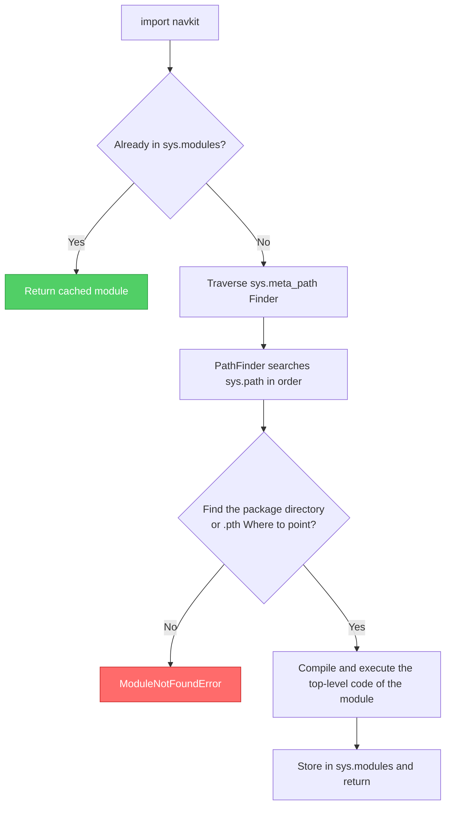

There are only two main points:

1. **`sys.path` is ordered: the first matching package wins.** An installed release can therefore be shadowed by a source copy with the same name in the current directory.
2. **`sys.path` is not fixed.** Its first entry depends on how Python starts, as the next section explains.

## 2.2 How is sys.path assembled?
{: id="22-syspath-是怎么被拼出来的"}

**There is no "universal sys.path sequence"**. The first item depends on how you start Python, which is where a lot of weird problems come from:

|Startup mode|First entry|Practical consequences|
| --- | --- | --- |
| `python script.py` |**The script directory** (not the current working directory)|A neighboring `.py` file with the same name can shadow an installed package|
| `python -m pkg.mod` |**Current working directory**|When running in the project root directory, the source tree will be found first.|
|`python -c "..."` / interactive|**Current working directory**|Same as above|
| `pytest` |Depends on rootdir and importmode configuration, see §5.4|It is easiest to "test the source code instead of installing the product"|
|Jupyter kernel|The directory where the **Notebook file is located**|This is often not the same as your current directory in the terminal.|

After finishing the first item, the remaining order is roughly:

```
The first item (see table above, available -P or PYTHONSAFEPATH=1 close)
  → PYTHONPATH Items in environment variables
  → standard library zip, Standard library directory,lib-dynload
  → site Module added site-packages
      └── Among them .pth The file can be appended with a path (editable installation is hidden here)
```

> **The `-P` switch for Python 3.11+ is worth remembering.** `python -P script.py` (or set `PYTHONSAFEPATH=1`) will prevent the script directory or the current directory from being added to `sys.path`. When you suspect that "the wrong copy has been imported", run `-P` once and the problem will appear immediately.

This single command is enough for troubleshooting:

```bash
python -c "import sys, navkit; print(sys.executable); print(navkit.__file__)"
```

The first output line identifies **the running interpreter**; the second identifies **the imported code**. Together, they expose most environment mismatches.

## 2.3 The truth about venv: it only does three things
{: id="23-venv-的真相它只做了三件事"}

Virtual environment is often regarded as some kind of magic container, but it is actually very simple:

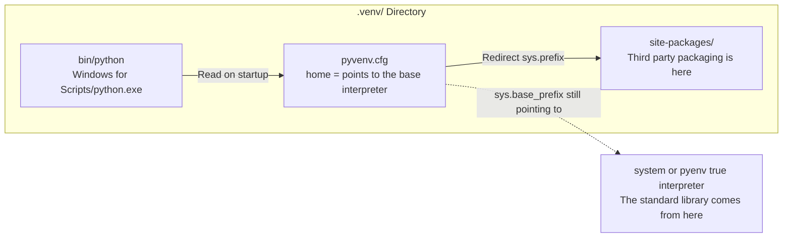

1. Put a `pyvenv.cfg`, and the `home` inside points to the real basic interpreter;
2. Provide a `python` executable that reads `pyvenv.cfg` when it starts, points `sys.prefix` to venv itself, and `sys.base_prefix` still points to the base interpreter (the **standard library is shared and not copied**);
3. So `site-packages` is resolved into venv, and the third-party package is isolated.

A very useful inference is drawn from this: **`activate` is not necessary**. What the activation script basically does is "put the bin directory of venv at the front of `PATH` and set `VIRTUAL_ENV`". Directly calling the absolute path is completely equivalent and more reliable in scripts, cron, systemd, and CI:

```bash
.venv/bin/python -m pytest          # Linux / macOS
.venv\Scripts\python.exe -m pytest  # Windows
```

When using uv, `uv run pytest` will automatically select the right interpreter, even this step is saved.

> **Always use `python -m pip install` rather than bare `pip install`.** Bare `pip` selects the first executable on `PATH`, which may belong to a different interpreter. `python -m pip` installs for the interpreter you explicitly selected.

## 2.4 Responsibility layering of pyenv/venv/conda/uv
{: id="24-pyenv--venv--conda--uv-的职责分层"}

These tools address different layers and are not mutually exclusive alternatives. The diagram shows their main responsibilities; their capabilities overlap.

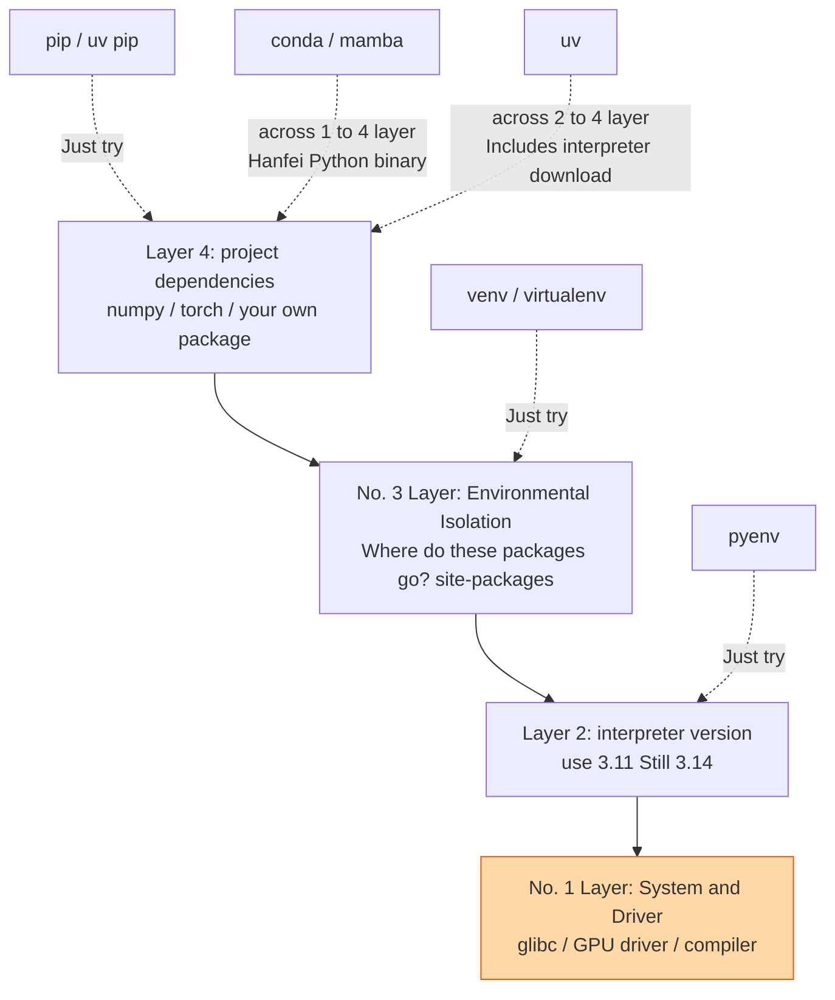

|Tools|Main responsibilities|Installs an interpreter?|Manages non-Python binaries?|
| --- | --- | --- | --- |
| `pip` |Install Python packages|No|Only the part that has been packaged into the wheel can be installed.|
|`venv` (standard library)|Isolate site-packages|No|No|
| `pyenv` |Install and switch interpreter versions|Yes (local compilation)|No|
| `conda` / `mamba` |Environment + package + some system libraries|Yes|**Yes** (independent binary distribution system)|
| `uv` |Environment + package + interpreter + project workflow|Yes (download precompiled version)|Only the part that has been packaged into the wheel can be installed.|

**uv is the default workflow because it covers layers 2, 3, and 4.** A single `uv sync` ensures an appropriate interpreter, creates a venv, and installs dependencies from the lockfile. That is why the three commands in §1.2 suffice.

The orange layer in the diagram remains outside that workflow: **none of these Python tools manages layer 1, the system libraries and drivers**. GPU drivers, glibc, and the system ROS 2 installation require separate handling in Chapter 8.

## 2.5 PEP 668: Why does system Python refuse you to install the package?
{: id="25-pep-668系统-python-为什么拒绝你装包"}

Executing `pip install requests` on a newer Ubuntu/Debian/Fedora, you'll run into:

```
error: externally-managed-environment
× This environment is externally managed
```

This is not a bug. [PEP 668](https://peps.python.org/pep-0668/) allows distributions to place a `EXTERNALLY-MANAGED` mark file in the interpreter directory, stating that "**, the Python site-packages, is handled by the system package manager (apt/dnf). Please do not write** in it for the installer."

The reason is very practical: there are a number of tools in the system (including some components of apt itself) that depend on a specific version of the Python library. If you upgrade a public dependency, it may directly crash the system tools.

**Change the environment rather than bypassing the marker.**

|scene|what to do|
| --- | --- |
|Do project development|Create a virtual environment (`uv venv` / `uv sync`) - Default answer|
|Install a global command line tool (ruff, httpie)|`uv tool install ruff`, installed into an independent environment and exposed commands|
|Run a tool temporarily|`uvx ruff check .` (leave no trace)|
|You really need to change the system environment|Use `apt install python3-xxx` instead of pip|

`--break-system-packages` This flag takes its name from its documentation: **It really breaks system packages**. Don't put it in any documentation or Dockerfile templates.

## 2.6 Notebook, IDE and terminal: three interpreter inconsistencies
{: id="26-notebookide-与终端三处解释器不一致"}

This is one of the most frequent confusions in this field: **"I have installed it in the terminal, but I can't import it into Notebook."**

The root cause is that Jupyter's **kernel and front-end are decoupled**. The environment you activate in the terminal and the kernel actually connected to the Notebook are completely different things:

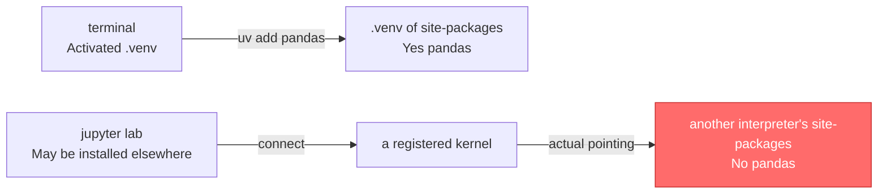

**Diagnosis** - run in the Notebook cell (do not run in the terminal):

```python
import sys
print(sys.executable)     # The interpreter actually used by the kernel
print(sys.prefix)         # What environment does it think it is in?
```

Compare the output of this line with the output of `uv run python -c "import sys; print(sys.executable)"` in the terminal. Inconsistency is the answer.

**fixes** - register the project environment as a kernel:

```bash
uv add --group dev ipykernel
uv run python -m ipykernel install --user --name navkit --display-name "Python (navkit)"
```

Then switch to `Python (navkit)` in the upper right corner of the Notebook.

> **A common mistake is `!pip install pandas` in a notebook.** The `!` delegates to the system shell and selects `pip` from `PATH`, which may differ from the kernel interpreter. If installation inside the notebook is necessary, use `%pip install pandas`, which targets the current kernel.

The situation of VS Code is similar: it has an independent "Python interpreter" selection (`Ctrl+Shift+P` → *Python: Select Interpreter*), which is two sets of states from the environment you activate in the integrated terminal. The debugger uses the former and the terminal uses the latter.

## 2.7 Additional pitfalls of Windows and WSL
{: id="27-windows-与-wsl-的额外坑"}

Actual measurement on this machine - `where python` on this machine points to:

```
C:\Users\<user>\AppData\Local\Microsoft\WindowsApps\python.exe
```

This is not Python, but **Microsoft Store’s application execution alias**: a stub program that pops you up to the store page when not installed. The phenomenon it causes is that `python --version` has no output or behaves inexplicably.

Solution: *Settings → Application → Advanced Application Settings → Application Execution Alias*, turn off `python.exe` and `python3.exe`. If you use uv to manage the interpreter, this stub should not appear in front of `PATH`.

A few remaining Windows/WSL differences:

|Difference| Linux / macOS | Windows |
| --- | --- | --- |
|venv executable file| `.venv/bin/python` | `.venv\Scripts\python.exe` |
|path separator| `:` | `;` |
|File name case|Case-sensitive|**Case-insensitive**: `import Navkit` may succeed on Windows but fail on Linux|
|symbolic link|Available by default|Developer mode is required, otherwise uv will degrade to copy or hard link|

> **crossing WSL boundaries is a pure trap.** Do not build a venv under `/mnt/c/...`, and do not let Python in WSL use `.venv` on the Windows side. The binary formats are different (ELF vs. PE), file system performance is an order of magnitude worse, and line endings and permission semantics are inconsistent. When **developing in WSL, put the repository in its native filesystem** (such as `~/code/navkit`), and open it with VS Code's Remote-WSL.

---

# 3. Project structure and project statement
{: id="三项目结构与项目声明"}

The directory tree and `pyproject.toml` describe two sides of the same project: **how files are arranged on disk**, and **which files the installer should place in site-packages**.

## 3.1 First classify: application, library, experiment repository
{: id="31-先分类应用库实验仓库"}

Before starting to create the directory, first answer a question: Which of the three categories does this repository **belong to?** It determines almost all subsequent decisions.

|Dimensions|Application/Service|Publishable library|Experimental repository|
| --- | --- | --- | --- |
|Deliverables|A running environment that can run|A package installed in someone else’s environment|reproducible experimental records|
|dependency version strategy|**Pinned** (the more precise, the better)|**Ranges** (declare compatible versions)|Locking + recording experiment metadata|
|Do you want to submit lockfile?|**Yes**|**required, but only for development/CI**|**Yes**|
|version number|Common dates or Git descriptions|Strictly semantic version|Often not needed|
|Typical example|Robot host computer and inference services|`navkit` is referenced as dependency|Code repository for a certain paper|

**The most common mistake: your lockfile does not constrain downstream users.**

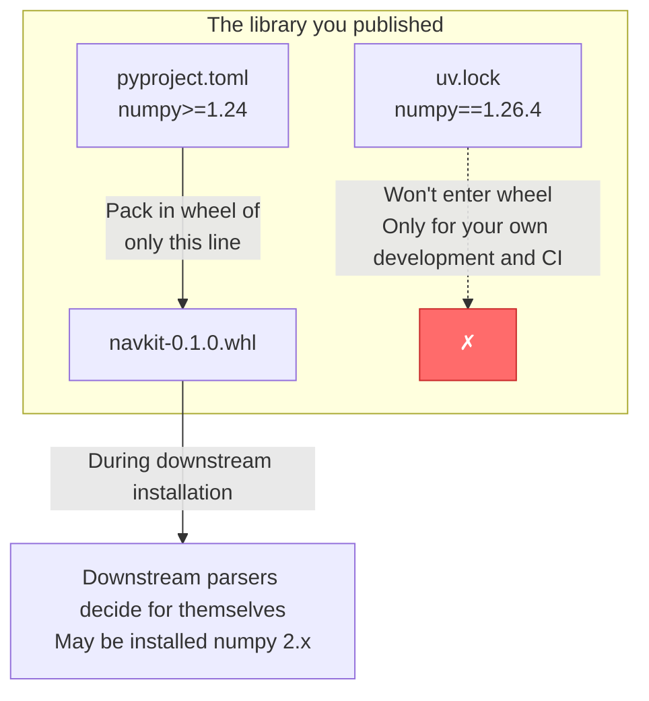

A library declares compatible version ranges in **`pyproject.toml`**, while an application records exact versions in **its lockfile**. Pinning a library dependency to `numpy==1.26.4` can create conflicts for downstream users; leaving an application unlocked gives up reproducibility.

`navkit` has both library and application sides - this is very common. The method is: declare the loose range in `pyproject.toml` (the service library side), and submit `uv.lock` (the service development and CI side) at the same time. The two do not conflict.

## 3.2 Src layout vs flat layout
{: id="32-src-布局-vs-扁平布局"}

There is only one difference between the two layouts: the **package directory is not in the repository root directory**.

```
flat layout                          src Layout
navkit/                          navkit/
├── navkit/          ← package         ├── src/
│   └── __init__.py              │   └── navkit/      ← package
├── tests/                       │       └── __init__.py
└── pyproject.toml               ├── tests/
                                 └── pyproject.toml
```

The difference seems insignificant, but the consequences are not small. Recall §2.2: When **you run `python -m ...` or `pytest` in the project root directory, the current directory becomes the first entry** of `sys.path`.

- **flat layout**: `navkit/` is in the root directory, so `import navkit` hits the **source tree**, not the one you just installed.
- **src layout**: There is only `src/` in the root directory. `import navkit` cannot find anything in the root directory and can only go to site-packages.

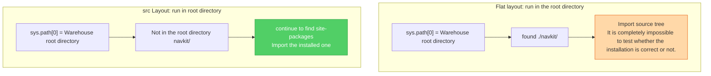

 **But you have to say it accurately** , here are two common over-promotions:

1. **The src layout does not guarantee that tests exercise the final wheel.** Editable installation (§3.6) points back to `src/` through mechanisms such as `.pth`, so imports still read source code. The layout prevents accidental imports through the working directory; it does not eliminate differences between source and packaged artifacts.
2. **To verify that wheel is really complete**, the only reliable way is to install it in a clean environment after building, see §7.3. For example, if the package data files (`.yaml`, `.pyi`) are missing, this is the only way to catch them.

**Use a src layout for new projects.** It has negligible cost and eliminates a whole class of import problems.

## 3.3 Directory tree of navkit
{: id="33-navkit-的目录树"}

```
navkit/
├── src/
│   └── navkit/
│       ├── __init__.py          # Disclosure of packages API, Control what is exposed to the outside world
│       ├── py.typed             # Empty file, declares that this package has type annotation (PEP 561)
│       ├── cli.py               # Command line entry
│       ├── planner.py           # Core algorithm
│       ├── geometry.py
│       ├── models/              # Optional torch Function
│       │   ├── __init__.py
│       │   └── policy.py
│       └── data/
│           └── default_params.yaml   # package data file, with wheel Distribute together
├── tests/
│   ├── conftest.py              # Share fixture
│   ├── test_planner.py
│   └── gpu/
│       └── test_policy.py       # need GPU, Skip by default
├── configs/                     # Runtime configuration, not distributed with the package
│   └── default.yaml
├── scripts/                     # One-time script, not part of the package
│   └── convert_dataset.py
├── docs/
├── .github/workflows/ci.yml
├── .gitignore
├── .pre-commit-config.yaml
├── pyproject.toml               # Project Statement + Tool configuration
├── uv.lock                      # lockfile, submitted to the repository
└── README.md
```

A few conventions that are easily overlooked:

- **`configs/` and `src/navkit/data/` are two different things**. The former is a runtime configuration that users can change and does not enter wheel; the latter is the default value that comes with the package and must be distributed with wheel (§3.7 explains how to read it).
- The contents of **`scripts/` are not part of the package**. They are one-off tools, do not let the code in `src/navkit/` import them.
- **`py.typed` is an empty file**, but without it, the downstream type checker will directly ignore all type annotations in your package.
- **Keep datasets and model weights out of Git.** Add `data/`, `*.ckpt`, `*.pth`, and `outputs/` to `.gitignore`; use the versioning approaches discussed in §8.6.

## 3.4 Pyproject.toml block-by-block comparison
{: id="34-pyprojecttoml-逐区块对照"}

`pyproject.toml` is often called the “single source of truth,” but that is imprecise. It does not record the resolved lock state (`uv.lock`), system libraries or GPU drivers (§8.1), or runtime configuration.

It is better understood as **the central declaration of a Python project and its tool configuration**. Compare the complete `navkit` configuration below with its directory tree.

```toml
# Applicable:Python 3.12+ · uv 0.11.x · src Layout · pure Python package
# ---------- 1. Build system: who turns source code into wheel ----------
[build-system]
requires = ["hatchling"]              # dependency required only when building (PEP 518)
build-backend = "hatchling.build"     # build backend interface (PEP 517)

# ---------- 2. Project metadata: will be entered wheel, Can be seen downstream ----------
[project]
name = "navkit"
version = "0.1.0"
description = "Waypoint navigation toolkit"
readme = "README.md"
requires-python = ">=3.12"            # Constrains the interpreter versions available downstream
license = "MIT"
authors = [{ name = "Tingde Liu" }]

dependencies = [                      # Runtime dependencies, loose interval (PEP 508 Grammar)
    "numpy>=1.24",
    "pyyaml>=6.0",
    "typer>=0.12",
]

[project.optional-dependencies]       # Optional function, for downstream use navkit[torch] Installation
torch = ["torch>=2.4"]

[project.scripts]                     # Command line entry generated after installation
navkit = "navkit.cli:app"

# ---------- 3. development dependency: not scored wheel, Cannot be seen downstream (PEP 735)----------
[dependency-groups]
dev = ["ruff>=0.6", "mypy>=1.11", "pre-commit>=3.8"]
test = ["pytest>=8.0", "pytest-cov>=5.0"]

# ---------- 4. Tool configuration: It has nothing to do with packaging, it just borrows this file for storage ----------
[tool.hatch.build.targets.wheel]
packages = ["src/navkit"]             # tell hatchling wrapped in src/ below

[tool.ruff]
line-length = 100
```

The four blocks **have completely different ownerships. Confusing them is a common source of errors:**

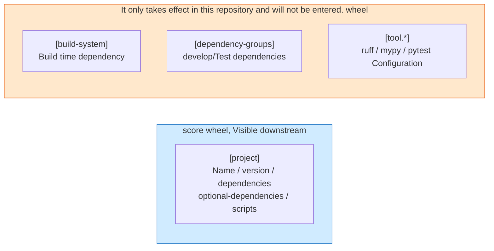

Each PEP covers a distinct responsibility:

| PEP |what problem does it solve|Where does it fall in the configuration?|
| --- | --- | --- |
| [PEP 517](https://peps.python.org/pep-0517/) |Define the calling interface between the front end and the back end| `build-backend` |
| [PEP 518](https://peps.python.org/pep-0518/) |Declare which dependencies are required for build| `[build-system] requires` |
| [PEP 621](https://peps.python.org/pep-0621/) |Unify project metadata fields|`[project]` whole block|
| [PEP 660](https://peps.python.org/pep-0660/) |Let the backend support editable installation|Backend behavior, no corresponding field (§3.6)|
| [PEP 735](https://peps.python.org/pep-0735/) |Develop standard writing methods for dependency grouping| `[dependency-groups]` |
| [PEP 440](https://peps.python.org/pep-0440/) |Legal format and sorting rules of version numbers|The value of `version`|
| [PEP 508](https://peps.python.org/pep-0508/) |Syntax of dependency string (including environment tags)|`dependencies` each item|
| [PEP 561](https://peps.python.org/pep-0561/) |Declaration package contains type annotation|`py.typed` file|

## 3.5 Build frontends and backends: who does what?
{: id="35-构建前端与后端谁在干什么"}

This is the most confusing set of concepts for beginners. In fact, the division of labor is very clear:

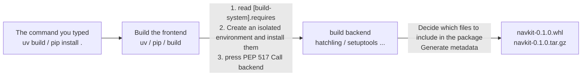

- **Frontend** (uv, pip, build): prepares the environment and calls the backend; it does not determine how to build the package.
- **Backend** (hatchling, setuptools, etc.): really determines which files are included in the package and how to generate metadata.

When selecting a back-end model, just choose one according to the actual situation of the project:

|backend|When to choose it|
| --- | --- |
| **hatchling** |**The default choice for pure Python packages** - less configuration, src layout available out of the box|
| setuptools |Migration of old projects may require some historical plug-ins|
| flit-core |Extremely simple file package|
| maturin |Contains Rust extension (PyO3)|
| scikit-build-core |Contains C/C++/CUDA extensions via CMake|

`navkit` is pure Python, using hatchling. **Projects with native extensions require additional work** (cross-compilation, ABI compatibility, manylinux build images). This article only explains the compatibility rules at the product level in §7.2, and the complete extension build workflow is not carried out.

## 3.6 Editable installation: principles and pitfalls
{: id="36-可编辑安装原理与陷阱"}

When developing you don't want to have to rebuild the installation every time you change a line of code. editable installation (`pip install -e .`, or what uv does automatically) solves this problem.

Its implementation is not mysterious - insert a `.pth` file (or a dynamic finder) into site-packages and connect the real path of `src/navkit` to `sys.path`:

```
.venv/lib/python3.12/site-packages/
├── __editable__.navkit-0.1.0.pth      →  point to /home/you/navkit/src
└── navkit-0.1.0.dist-info/            →  Metadata (version, dependency, entry point)
```

So `import navkit` directly reads your source code, and the changes will take effect.

**Three traps you must know:**

1. **Reinstall after changing `pyproject.toml`.** New dependencies, entry points, and file-inclusion rules do not automatically take effect: `.pth` connects paths, but installation metadata is recorded at install time. `uv sync` handles this in the uv workflow; otherwise, rerun `pip install -e .`.
2. **The newly added subpackage may not be recognized.** Different backends have different `.pth` strategies: some connect the entire `src/` directory (new sub-packages are automatically visible), and some use precise mapping (must be reinstalled). If you encounter "The newly created module cannot be imported", reinstall it first.
3. **Editable installation cannot verify packaging correctness.** It bypasses the decision about which files enter the wheel. The `default_params.yaml` in §3.3 may remain readable even if omitted from `[tool.hatch.build]`. **This is why the clean-environment check in §7.3 is essential.**

## 3.7 Import, working directory and resource path
{: id="37-导入工作目录与资源路径"}

**An iron rule: Never use relative paths to read data files in packages.**

The following writing method is extremely common in research code and is also extremely fragile:

```python
# ✗ Error demonstration
with open("src/navkit/data/default_params.yaml") as f:   # dependency current working directory
    params = yaml.safe_load(f)

# ✗ equally vulnerable —— installed as zip Or it will hang if you use a special loader.
HERE = os.path.dirname(os.path.abspath(__file__))
with open(os.path.join(HERE, "data/default_params.yaml")) as f:
    ...
```

The first way of writing can only be used when "it happens to be started from the root directory of the repository": switch to IDE to start, `cd` elsewhere, or install it on someone else's machine, it will become invalid immediately.

 **Correct approach** It uses the standard library `importlib.resources` , it is located according to the package name and has nothing to do with the working directory and installation form:

```python
# ✓ Recommended:Python 3.9+
from importlib.resources import files
import yaml

def load_default_params() -> dict:
    resource = files("navkit.data").joinpath("default_params.yaml")
    return yaml.safe_load(resource.read_text(encoding="utf-8"))
```

At the same time, confirm that this file is actually included in the packaging configuration (hatchling includes non-Python files in the directory specified by `packages` by default, but the subdirectory of `__init__.py` that is missing may not be regarded as a package):

```toml
[tool.hatch.build.targets.wheel]
packages = ["src/navkit"]
```

**As for the user-modifiable runtime configuration** (`configs/default.yaml`), it does not belong to the package and is handled completely differently - the path is passed in through command line parameters or environment variables, see §6.1 for details.

## 3.8 Circular import: first check whether it is a design problem
{: id="38-循环导入先看是不是设计问题"}

```
navkit/planner.py  →  import navkit.geometry
navkit/geometry.py →  import navkit.planner     ← ImportError
```

Python starts executing `planner.py`, reaches `import geometry`, executes `geometry.py`, and encounters `import planner` again. At this point, `planner` already exists in `sys.modules`, but **its initialization is incomplete** and the required name does not yet exist.

Three solutions, **priority from high to low**:

|Plan|practice|Applicable scenarios|
| --- | --- | --- |
|**1. Extract a shared layer** (preferred)|Move shared definitions into `navkit/types.py`; both modules depend on it|Usually the best option: circular imports often signal incorrect layering|
|**2. Import** only for type annotations|Wrapped with `if TYPE_CHECKING:`, it will not be executed at runtime.|Loops created purely for type annotation|
|3. Delay import into function|Put `import` into the function body|Temporary workaround may mask design issues|

How to write option 2:

```python
from __future__ import annotations
from typing import TYPE_CHECKING

if TYPE_CHECKING:                  # Only the type checker will take this branch
    from navkit.planner import Planner

def describe(planner: "Planner") -> str:   # The annotation is a string and is not evaluated at runtime.
    return f"planner with {len(planner.waypoints)} waypoints"
```

> Option 3 can save the emergency, but it hides the fact that "there are loops between modules". **If you find yourself using option 3 over and over again, it’s probably option 1 that you should be doing.**

---

# 4. Dependency management and uv workflow
{: id="四依赖管理与-uv-工作流"}

## 4.1 Panorama of tools: which layer of problems each solves
{: id="41-工具全景各自解决哪一层问题"}

`pip → pip-tools → Poetry/PDM → uv` This arrangement makes it easy for people to mistakenly think that they are similar products that are eliminated in sequence. In fact, their scope of responsibilities differs greatly, and coexistence is the norm:

|Tools|Which layer to solve|Is there a cross-platform lockfile?|What projects are suitable for|Migration costs|
| --- | --- | --- | --- | --- |
| `pip` + `requirements.txt` |Just install|**No** (handwritten list is not lockfile )|Minimalist script| — |
| `pip-tools` |Lock dependencies for pip|Yes, but **generates** separately according to the platform|Already have a pip process and just want to add a lockfile?|low|
| `Poetry` |environment + dependency + packaging|Yes (`poetry.lock`)|Mature project, the team is already familiar with it|Medium|
| `PDM` |Same as above, keep up with the standards|Yes|Want to use PEP standard features|Medium|
| `conda` / `mamba` |Environment + Python and non-Python binaries|Yes (`environment.yml` needs to be exported)|dependency A large number of non-Python binaries|high|
| **`uv`** |**interpreter + environment + dependency + packaging**|Yes (`uv.lock`, **cross-platform**)|**New projects primarily using Python**|low to medium|

**The "cross-platform lockfile" column is the key difference.** `pip-tools` The generated `requirements.txt` is bound to the platform and Python version of the machine on which it was generated - when generated on Linux, Windows colleagues cannot use it. `uv.lock` records the complete set of **resolution results**, including branches corresponding to each Python version on each platform, so one file is common to the entire team.

## 4.2 Two sets of uv workflows: don’t mix them
{: id="42-uv-的两套工作流不要混用"}

This is the easiest pitfall for uv. **Be sure to distinguish first** . uv provides two sets of commands with completely different semantics:

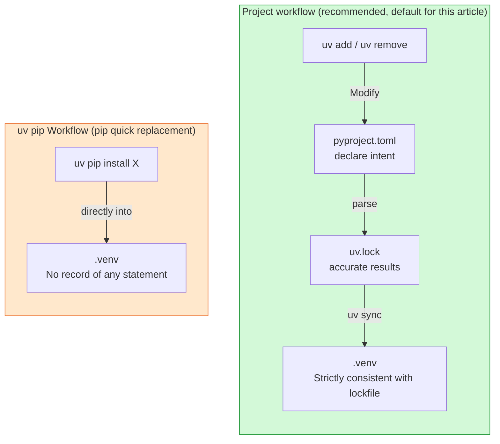

| |Project workflow|`uv pip` Workflow|
| --- | --- | --- |
|Commands| `uv add` / `uv sync` / `uv run` | `uv pip install` / `uv pip compile` |
|Does it change `pyproject.toml`?|**Yes**|**No**|
|Will `uv.lock` be updated?|**Yes**|**No**|
|Positioning|Manage "project declared dependencies"|"Faster pip", manages packages temporarily installed into the environment|
|when to use|**Default choice**|Migration transition period, one-off tools installed in CI, and old repositories that do not want to introduce locks|

**Mixing workflows creates undeclared dependencies.** A package installed with `uv pip install some-pkg` can be used by your code without appearing in `pyproject.toml`. A colleague running `uv sync` cannot reproduce that environment, and your own next `uv sync` will remove the extra package.

> **Rule: Only use one set in a project.** All the rest of this article will use the project workflow.

## 4.3 Precise semantics of uv sync
{: id="43-uv-sync-的精确语义"}

This article deserves to be taken out separately - the following is the original official description of uv 0.11.18:

> By default, an exact sync is performed: uv removes packages that are not declared as dependencies of the project. Use the `--inexact` flag to keep extraneous packages.

**`uv sync` performs an exact synchronization by default**, removing packages that the project has not declared.

This is a feature, not a bug - it ensures "environment state == lockfile state" and eliminates environment drift. But if you don’t know this, you’ll be confused like “Why do things I manually install disappear every time?”

There are two exceptions to be aware of:

- Add `--inexact` to reserve additional packages;
- With `--no-build-isolation`, uv **does not remove extraneous packages**, to avoid deleting build dependencies.

|what you want to do|correct command|
| --- | --- |
|Make the environment strictly match lockfile|`uv sync` (default)|
|Keep manually installed extra packages| `uv sync --inexact` |
|Make a package an official dependency of the project|`uv add <pkg>` - Do not use `uv pip install`|

## 4.4 Commands corresponding to daily tasks
{: id="44-日常任务对应命令"}

Instead of listing the full set of commands (that's a matter of official documentation), we only give the mapping from tasks to commands:

```bash
# ---- Start ----
uv init --package navkit          # Create a new project skeleton (--package generate src layout)
uv python install 3.12            # Download the interpreter on demand, no need pyenv
uv sync                           # build .venv + Install by lockfile (default includes dev group)

# ---- Change dependency ----
uv add "numpy>=1.24"              # Add runtime dependency and automatically update pyproject + lock
uv add --group test pytest        # Add to test dependency group
uv add --optional torch "torch>=2.4"   # Add to optional features extras
uv remove numpy

# ---- Run things (no need to manually activate the environment)----
uv run pytest                     # Execute in project environment
uv run python -m navkit.cli
uv run --group test pytest        # Temporarily bring a dependency group

# ---- Upgrade ----
uv lock --upgrade-package numpy   # Only upgrade one package (the first choice for daily use)
uv lock --upgrade                 # Upgrade all to the latest within the allowable range (cautious)

# ---- CI and deployment ----
uv sync --locked                  # Assert that lockfile is the latest, and report an error directly if it expires (CI preferred)
uv sync --frozen                  # Directly based on lockfile, without checking whether it matches pyproject consistent
uv sync --no-dev                  # Production environment, no development dependency installed

# ---- Project-agnostic tools ----
uv tool install ruff              # Install command line tools globally
uvx ruff check .                  # Run once temporarily without leaving any traces
```

**`--locked` and `--frozen` are different.** The following table describes their semantics in uv 0.11.18:

|parameters|Semantics|Where to use|
| --- | --- | --- |
| `--locked` |**Requires an up-to-date lockfile**. If the lockfile is missing or needs to be updated, directly report an error and exit.|**Preferred for CI** - can catch "changed `pyproject` but forgot to re-lock"|
| `--frozen` |Does not check whether the lockfile is consistent with `pyproject`. **Installs directly from the lockfile.**|Deploy images and offline environments|

Without either flag, uv **automatically re-resolves dependencies** when the project declaration and lockfile disagree. CI may then test different dependencies from your local environment. Use `--locked` to make that drift an explicit build failure.

## 4.5 Differences between four dependencies
{: id="45-四种依赖的区别"}

Cramming everything into a `dependencies` list is a common problem when research code. The result is that in order to run inference, users are forced to install pytest, ruff and a complete set of documentation tools.

How to separate dependencies in `navkit`:

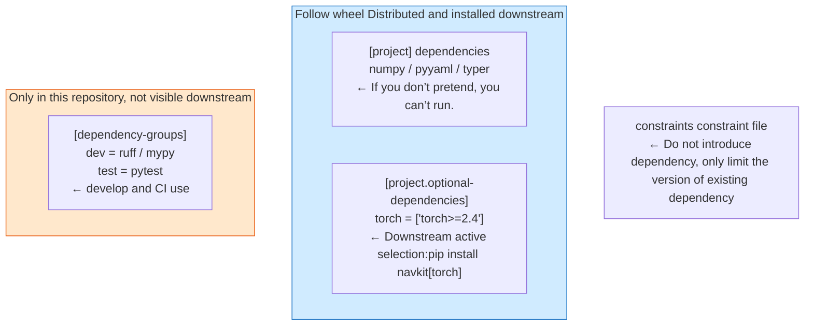

|Category|where to write|Visible to downstream users|Judgment criteria|
| --- | --- | --- | --- |
|runtime dependency| `[project] dependencies` | ✅ |If you don’t install it, the core functions will fail.|
|optional features| `[project.optional-dependencies]` | ✅ |Only some users need it (GPU, visualization)|
|development dependency| `[dependency-groups]` | ❌ |Only required by developers and CI|
|constraint file| `constraints.txt` | ❌ |No new dependencies are added, only upper and lower version limits are set for existing dependencies.|

**Extras are user-facing feature switches** (`pip install navkit[torch]`); **dependency groups are development toolkits**, unavailable through downstream package installation. Ruff belongs in a development group, while optional torch functionality belongs in an extra.

## 4.6 Lockfile: What can be guaranteed and what cannot be guaranteed
{: id="46-锁文件能保证什么不能保证什么"}

A lockfile alone does not guarantee reproducibility. **Its guarantees apply to specific dimensions**, so assigning a single general “reproducibility level” is misleading:

|Dimensions|`requirements.txt` (handwritten)|`pip-tools` compiled product| `poetry.lock` | `uv.lock` |
| --- | --- | --- | --- | --- |
|Record the exact version of a direct dependency|It depends on how you write it| ✅ | ✅ | ✅ |
|Record **exact transitive dependency versions**|❌ Often omitted| ✅ | ✅ | ✅ |
|Record the hash value (tamper-proof)|Need to add manually|Optional `--generate-hashes`| ✅ | ✅ |
|**Cross-platform universal**| ❌ |❌ One copy per platform| ✅ | ✅ |
|Common across Python versions| ❌ | ❌ |part| ✅ |
|Record which index the dependency comes from| ❌ |part| ✅ | ✅ |

**No lockfile can lock the following conditions.** Document these limits explicitly for the team:

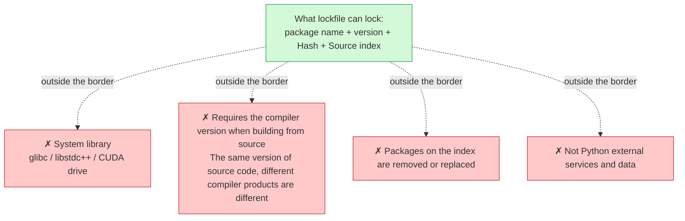

Specifically for `uv.lock`, there are three conditions for use:

1. **lockfile is subject to `requires-python`.** If the lock is resolved under `>=3.12`, it cannot be installed on a machine with Python 3.10.
2. The platform branch in the **lockfile depends on the assumptions made during resolution.** A certain package does not have a wheel on aarch64, and the lockfile will not be changed for you - when you get to that machine, you can only build it from source code, or it will fail directly.
3. **`uv.lock` is the uv proprietary format**. Do not edit it manually, and do not expect other tools to read it (unless exported, see the next section).

## 4.7 PEP 751: Generic lockfile taking shape
{: id="47-pep-751正在成形的通用锁文件"}

The situation of mutual incompatibility between various lockfiles is being resolved by [PEP 751](https://peps.python.org/pep-0751/) - it defines a tool-neutral `pylock.toml` format, which is currently accepted.

Implementation progress as of mid-2026:

|Tools|generate|Installation|
| --- | --- | --- |
| uv | ✅ `uv export --format pylock.toml` |✅ Can be installed via `uv pip install`|
| pip |⚠️ `pip lock` (from 25.1, experimental)|⚠️ `pip install -r pylock.toml` (starting at 26.1, experimental)|
| PDM | ✅ | ✅ |

**For current use, take a conservative approach:**

- **`uv.lock` continues to be the main lockfile** (with stronger cross-platform capabilities and is a first-class citizen of uv);
- When you need to hand over dependency to downstream (auditing, SBOM, other build systems) that does not use UV, use `uv export` to export `pylock.toml` or `requirements.txt`;
- **Don't regard `pylock.toml` as the only source of truth now** - both ends of the pip side are still in experimental status, and it is known that extras and dependency groups are not supported yet.

## 4.8 Why is uv fast?
{: id="48-uv-为什么快"}

uv is faster, but attributing all of that improvement to Rust misses the point. Each of its four stages is optimized, and **the gains are distributed unevenly**:

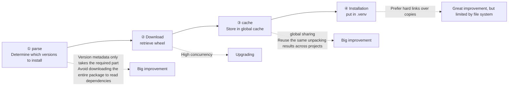

Boundaries to note:

- **Linking in step 4 depends on the platform and filesystem.** A hard link requires that the cache directory be on the same file system as `.venv`. When crossing disks, Docker layers, and WSL boundaries, it will fall back to copying, and the speed advantage will be greatly reduced. This is also a common answer to "Why is my uv not so fast in Docker" - see §7.5 for the solution.
- **Step 1 loses its advantage** when you encounter a package that does not have a wheel and must be built from source code, because you have to actually execute the build.
- The specific implementation details evolve with the version. **is subject to the behavior of the version you actually use** (the benchmark of this article is uv 0.11.x).

## 4.9 Migrating from old projects
{: id="49-从旧项目迁移"}

Most readers do not start from an empty directory, but have a repository with conda, pip, and `sys.path` hack mixed in. The first step in **migration is not to change the command, but to understand the current situation first.**

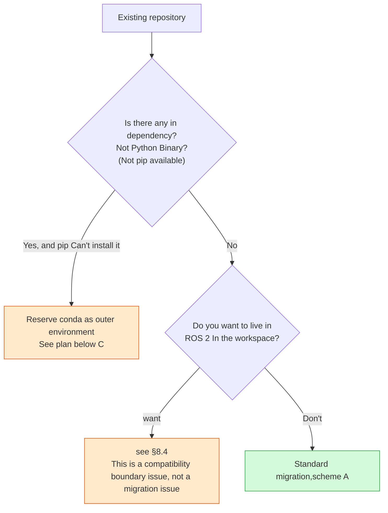

**Solution A: Standard migration** (pure Python dependency)

```bash
# 1. First solidify the current situation as a fallback baseline
python -m pip freeze > /tmp/before.txt

# 2. Generate project skeleton (do not overwrite existing files)
uv init --package --no-workspace

# 3. Move the direct dependency into pyproject —— Note that it is "direct dependency", not freeze All output of
uv add numpy pyyaml typer
uv add --group test pytest

# 4. Analyze and build environment
uv sync

# 5. Control verification
uv run python -m pip freeze > /tmp/after.txt
diff /tmp/before.txt /tmp/after.txt
```

**Step 3 is the critical point.** Do not copy the entire `pip freeze` output into `dependencies`: it includes transitive dependencies. Declare **the packages your code actually imports** and leave transitive resolution to the resolver. `uv pip compile` or `pipdeptree` can help inspect the dependency tree.

**Plan B: Just want faster pip** (without introducing lockfile, used during the transition period)

```bash
uv venv
uv pip install -r requirements.txt     # Semantics and pip Same, just much faster
```

This has negligible migration cost and is easy to reverse, but **it is only a transitional workflow** and does not resolve reproducibility.

**Solution C: Keep conda as outer layer**

conda is responsible for non-Python binaries, uv or pip is responsible for Python packages, see next section.

## 4.10 Is there still a place for conda?
{: id="410-conda-还有没有位置"}

Yes, conda still has a role. However, “conda is irreplaceable for certain dependencies” is too absolute and is often supported with misleading examples.

A more accurate statement is:

> The value of **conda lies in the unified management of Python and non-Python binary dependencies.** It is especially suitable for teams that already have a conda environment, as well as projects that depend on its binary ecosystem (conda-forge). Adoption depends on the availability of the required dependency on PyPI, the target platform, and the team's existing processes.

Several examples that are often mistakenly cited are worth clarifying one by one:

|dependency|Common claim|actual situation|
| --- | --- | --- |
|CUDA runtime required by PyTorch|"Must conda install cudatoolkit"|**Not required**. PyTorch's CUDA wheel has packaged the required runtime into `nvidia-*` dependency, which is directly available from pip/uv (§8.2)|
| Open3D |"Only conda"|There is an official wheel on PyPI|
| PCL |"Only conda"|It is essentially a C++ library. The distribution of Python bindings varies between platforms and needs to be tested according to the platform.|
|Complete CUDA Toolkit (including `nvcc`)|"conda can be installed"|conda-forge does provide it, but **you don't need it at all if you're just running precompiled packages** (§8.3)|

**To judge the process**, ask yourself three questions in order:

1. Is there a wheel available on PyPI for what I need? → If yes, there is no need for conda.
2. Can the required non-Python binaries be given to the container image or system package manager? → If possible, use them first (the boundaries are clearer).
3. Is the team already using conda? → Yes, then the **migration cost itself is a valid reason to retain conda**.

**If you do want to mix**, there is only one rule worth remembering:

> **Let conda manage the outer environment (interpreter and non-Python binaries), and pip/uv manage Python packages. Avoid having both manage the same package.**

```bash
conda create -n navkit python=3.12 <Someone only conda Some binary packages>
conda activate navkit
uv pip install -e .        # Note: use uv pip Workflow, not uv sync
```

Here **you must use `uv pip`** - `uv sync` will create and take over its own `.venv`, which bypasses the conda environment you just built. This is the actual meaning of the distinction between "two sets of workflows" in §4.2.

The opposite approach (first pip installation, then conda installation of the same package) will cause the two sets of metadata to overwrite each other, and the environment will enter an irreparable state. When **Rebuilding such an environment is faster than repairing it.**

---

# 5. Quality and testing: the same process from local inspection to CI
{: id="五质量与测试从本地检查到-ci-的同一条流程"}

**Local development and CI should run exactly the same checks.** Different commands or configurations eventually lead to repeated “passes locally, fails in CI” problems.

The implementation is to define the checks in `pyproject.toml` and `.pre-commit-config.yaml`, and adjust them both locally and in CI:

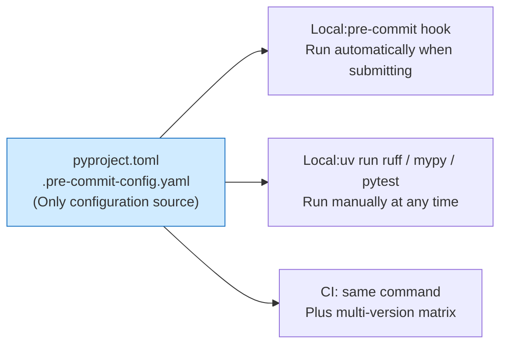

## 5.1 Ruff: Checking and Formatting
{: id="51-ruff检查与格式化"}

Ruff is implemented in Rust and is one to two orders of magnitude faster than traditional tools. **One tool handles both linting and formatting**, avoiding conflicts between separate checkers and formatters.

**Regarding the statement "Ruff replaces flake8 + isort + black", it needs to be said accurately**: Ruff covers most of the common rules and formatting behaviors of these tools, but it is not a bit-by-bit equivalent replacement——

- Some flake8 plug-in rules have no corresponding implementation yet;
- The formatting results differ from black in a few edge cases;
- When migrating an old repository with a large number of `# noqa`, you need to check the correspondence between the rule numbers.

**For new projects, use Ruff directly without any reason to hesitate.** For old projects, run it first to see the diff scale before making a decision.

```toml
# Applicable:Ruff 0.6+ · append to pyproject.toml
[tool.ruff]
line-length = 100
src = ["src", "tests"]        # let isort The rules correctly distinguish the first party/Third party package

[tool.ruff.lint]
select = [
    "E", "W",    # pycodestyle
    "F",         # pyflakes: Import not used, name not defined
    "I",         # isort: Import sorting
    "UP",        # pyupgrade: Use new syntax
    "B",         # flake8-bugbear: Common pitfalls (variable default parameters, etc.)
    "SIM",       # flake8-simplify
    "PTH",       # It is recommended to use pathlib replace os.path
    "RUF",       # Ruff own rules
]
ignore = ["E501"]             # handed over by the president formatter Take care, don’t report again

[tool.ruff.lint.per-file-ignores]
"tests/*" = ["S101"]          # Allowed in testing assert
```

Daily use:

```bash
uv run ruff check --fix .     # Check and fix automatically
uv run ruff format .          # Format
```

> **`B` This set of rules has the highest value for research code**. It can catch mutable default arguments (`def f(x=[])`), closure capture in loops, etc. These are the most insidious types of bugs in numerical code. They will not report errors, but will only make the results quietly incorrect.

## 5.2 Progressive typing
{: id="52-渐进式类型化"}

**Do not try to add type annotations to the entire repository at once.** That is a losing battle - the costs are concentrated in the early Stage, but the benefits take a long time to appear, and are usually abandoned when the completion level is 30%.

The correct strategy is layered defense:

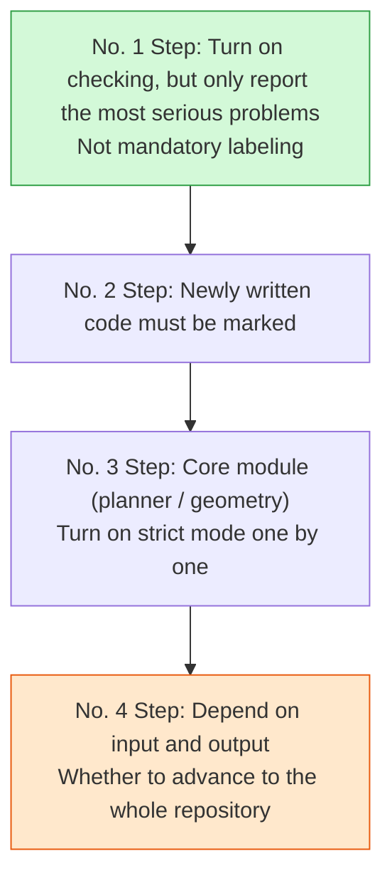

```toml
# Applicable:mypy 1.11+
[tool.mypy]
python_version = "3.12"
files = ["src", "tests"]
# No. 1 Step: Start gently
warn_unused_ignores = true
warn_redundant_casts = true
warn_return_any = true
ignore_missing_imports = true      # No error will be reported when the third-party package has no type annotation

# No. 3 Step: Tighten the organized modules individually
[[tool.mypy.overrides]]
module = ["navkit.planner", "navkit.geometry"]
disallow_untyped_defs = true
strict_equality = true
```

**mypy or pyright?** Simply put:

| | mypy | pyright / Pylance |
| --- | --- | --- |
|Positioning|Reference implementation closely following the typing PEPs|Fast speed, good built-in experience in VS Code|
|Suggestions|Use it in **CI** (the result is stable and reproducible)|Use it **in the editor** (real-time feedback)|

Using both is a reasonable combination: pyright supplies immediate editor feedback, while mypy performs the final check in CI.

> A practical reminder for numerical code: `numpy` and `torch` have limited type annotation coverage, and the tensor shape is something that the type system cannot control. The benefit of **type checking in this type of code mainly comes from the function boundary (what type of objects the input and output are), not from the inside of the array.** Don’t expect it to help you catch shape mismatches.

## 5.3 Pre-commit: run checks before committing
{: id="53-pre-commit把检查前移到提交时"}

```yaml
# .pre-commit-config.yaml
repos:
  - repo: https://github.com/pre-commit/pre-commit-hooks
    rev: v4.6.0
    hooks:
      - id: trailing-whitespace
      - id: end-of-file-fixer
      - id: check-yaml
      - id: check-added-large-files       # Prevent model weights from being submitted incorrectly
        args: ["--maxkb=1024"]
      - id: check-merge-conflict

  - repo: https://github.com/astral-sh/ruff-pre-commit
    rev: v0.6.9
    hooks:
      - id: ruff
        args: ["--fix"]
      - id: ruff-format

  - repo: https://github.com/astral-sh/uv-pre-commit
    rev: 0.4.20
    hooks:
      - id: uv-lock                        # pyproject Automatically update lockfile if changed
```

```bash
uv run pre-commit install        # Install the hook, only once
uv run pre-commit run --all-files   # Run it all for the first time
```

> **`check-added-large-files` is particularly useful in this area.** Once `.ckpt` is submitted to Git history, the repository volume will permanently increase - subsequent cleanup requires rewriting the history, which is extremely costly. This hook is one of the few "install it and never think about it again" benefits.

## 5.4 Pytest: three really important mechanisms
{: id="54-pytest三个真正重要的机制"}

pytest has many functions, but for research projects, **mastering the following three things is enough to cover 90% of the scenarios**.

### Configuration and import mode
{: id="配置与导入模式"}

```toml
# Applicable:pytest 8.0+
[tool.pytest.ini_options]
testpaths = ["tests"]
addopts = "-ra --strict-markers --import-mode=importlib"
markers = [
    "slow: Tests that take a long time",
    "gpu: need CUDA Equipment",
]
```

`--import-mode=importlib` deserves special mention - it allows pytest to use the standard import mechanism to find the test module, and **no longer inserts the path** into `sys.path`. Coupled with the src layout, this ensures that "the test imports the installed package." This is the test-side solution to the problem in §3.2.

`--strict-markers` allows misspelled tags to report errors directly instead of silently ignoring them as unknown tags.

### Fixture scope
{: id="fixture-的作用域"}

Fixtures are pytest’s central abstraction: **declare what a test needs rather than constructing it manually inside the test**. Scope determines how often that setup is recreated:

|Scope|Creation frequency|Typical uses|
| --- | --- | --- |
|`function` (default)|Each test function|Temporary directory, Mutable test data|
| `module` |each test file|Small read-only dataset|
| `session` |Once per test session|**Load model weights and start simulator**|

```python
# Tests/conftest.py —— in this file fixture Visible to all tests in the same directory and subdirectories
import pytest
import numpy as np
from navkit.planner import Planner

@pytest.fixture(scope="session")
def heavy_model():
    """Only load once for the entire round of testing —— Yes AI The scope of the project is critical."""
    return load_pretrained("checkpoints/policy.pt")

@pytest.fixture
def planner() -> Planner:
    """Each test gets a new instance without contaminating each other."""
    return Planner(waypoints=np.zeros((4, 2)))

@pytest.fixture
def tmp_config(tmp_path):
    """tmp_path Yes pytest Built-in fixture, Automatically create and clean temporary directories."""
    cfg = tmp_path / "config.yaml"
    cfg.write_text("max_speed: 1.5\n", encoding="utf-8")
    return cfg
```

> **`conftest.py` is hierarchical.** Fixtures in `tests/conftest.py` are available to all tests; fixtures in `tests/gpu/conftest.py` are limited to that subtree. Keep GPU fixtures there so ordinary tests remain independent.

### Parameterization
{: id="参数化"}

```python
import pytest
from navkit.geometry import normalize_angle

@pytest.mark.parametrize(
    "raw, expected",
    [
        (0.0, 0.0),
        (3.5 * 3.14159, -0.5 * 3.14159),
        (-3.5 * 3.14159, 0.5 * 3.14159),
    ],
)
def test_normalize_angle(raw, expected):
    assert normalize_angle(raw) == pytest.approx(expected, abs=1e-5)
```

**Always use `pytest.approx`** for floating point results, do not use `==`. This is not a matter of style in numerical code, it is a matter of correctness.

## 5.5 Test layering: Make most verifications GPU-free
{: id="55-测试分层让大部分验证不需要-gpu"}

The tests of research projects often cannot be run on CI because they "require GPU/require data set/require simulator", and eventually degenerate to the point where no one runs them.

The **solution is layered** so that the expensive parts can be skipped individually:

```python
# tests/gpu/conftest.py
import pytest

def pytest_collection_modifyitems(config, items):
    """Not available CUDA , all tests in this directory will be automatically skipped."""
    try:
        import torch
        has_cuda = torch.cuda.is_available()
    except ImportError:
        has_cuda = False
    if has_cuda:
        return
    skip = pytest.mark.skip(reason="need CUDA Equipment")
    for item in items:
        item.add_marker(skip)
```

So three layers are formed:

|level|command|Where to run|Target duration|
| --- | --- | --- | --- |
|Quick unit testing| `uv run pytest -m "not slow and not gpu"` |Per commit, CI full matrix|< 30 seconds|
|Full CPU test| `uv run pytest -m "not gpu"` |PR before merge|few minutes|
|GPU integration testing| `uv run pytest tests/gpu` |Machines with GPUs/nightly tasks|no limit|

**The benefit:** CI can perform 90% of verification without a GPU, instead of disabling the entire suite because one `import torch` fails.

## 5.6 Coverage and multi-version matrix
{: id="56-覆盖率与多版本矩阵"}

```toml
[tool.coverage.run]
source = ["src/navkit"]
branch = true

[tool.coverage.report]
exclude_lines = [
    "pragma: no cover",
    "if TYPE_CHECKING:",          # This branch is never executed when running
    "raise NotImplementedError",
]
```

```bash
uv run pytest --cov --cov-report=term-missing
```

> **Don’t treat coverage as a KPI.** It can only tell you which code **has never been executed** - that is valuable information; it cannot tell whether the executed code has been actually verified. Focusing on the uncovered rows listed in `--cov-report=term-missing` is much more useful than staring at percentages.

**Multiple Python version tests** used to be the domain of tox / nox. With uv, it becomes very simple to do matrix testing locally:

```bash
for v in 3.12 3.13 3.14; do
  uv run --python $v --isolated pytest -m "not gpu"
done
```

`--isolated` allows each version to use an independent environment without interfering with each other. The full test matrix is still left to CI (§7.6), and this loop locally is used for quick self-checking before pushing.

---

# 6. Configuration, logs and command line
{: id="六配置日志与命令行"}

When research code, these three things usually look like this: configuration relies on changing constants in the source code, logging relies on `print`, and command lines rely on `sys.argv[1]`. All three can run, and they all collapse at the same time when the project grows.

## 6.1 Configuration: First determine the priority chain
{: id="61-配置先确定优先级链"}

Before choosing a tool, make sure of one thing: **When the same parameter appears in multiple places, who has the final say?** . This order should be fixed and public:

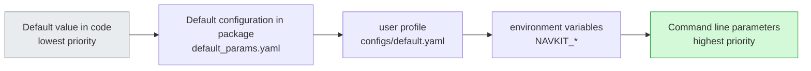

**Configuration closer to the point of use has higher priority.** This lets you override a parameter for an experiment without editing a file.

Implemented with `pydantic-settings`, which comes with environment variable reading and type checking:

```python
# src/navkit/config.py
from pathlib import Path
from pydantic import Field
from pydantic_settings import BaseSettings, SettingsConfigDict

class NavConfig(BaseSettings):
    model_config = SettingsConfigDict(
        env_prefix="NAVKIT_",      # NAVKIT_MAX_SPEED=2.0 will automatically overwrite max_speed
        env_file=".env",
        extra="forbid",            # Misspelled fields will be reported directly as errors and will not be silently ignored.
    )

    max_speed: float = Field(default=1.0, gt=0, description="maximum speed m/s")
    goal_tolerance: float = Field(default=0.25, gt=0)
    output_dir: Path = Field(default=Path("outputs"))
```

> **`extra="forbid"` is the most valuable line in this configuration.** Without it, `NAVKIT_MAXSPEED` (missing the underscore) will be silently ignored, and you'll spend half an hour wondering if there's something wrong with the code. With it, an error will be reported immediately when the program starts.

**pydantic-settings or Hydra?**

| | pydantic-settings | Hydra / OmegaConf |
| --- | --- | --- |
|Strengths|Type checking, environment variables, IDE completion|Configuration combination, multi-group experimental scan (multirun)|
|suitable for|**General configuration of applications and libraries**|**Large-scale experiment management**|
|cost|Not good at configuring combinations|The learning curve is steep, `sys.argv` is taken over, and debugging is a little troublesome.|

**The judgment standard is very simple.**: Do you need to "run 20 sets of hyperparameter combinations with one command"? Use Hydra if you need it, use pydantic-settings if you don't. `navkit` belongs to the latter.

**Path processing** emphasizes again the distinction in §3.7:

```python
# Package default value —— use importlib.resources, Has nothing to do with the working directory
from importlib.resources import files
defaults = yaml.safe_load(files("navkit.data").joinpath("default_params.yaml").read_text())

# User configuration —— The path is passed in by the user, and the code does not make any assumptions.
def load_user_config(path: Path | None) -> dict:
    if path is None:
        return {}
    return yaml.safe_load(path.read_text(encoding="utf-8"))
```

## 6.2 Log: Why can’t I use print?
{: id="62-日志为什么不能用-print"}

The problem with `print` is not that it is “not professional enough”, but that it cannot do three specific things:

1. **Lacks severity levels** - debugging information and errors are mixed together, and the production environment cannot only look at the important ones;
2. **Cannot be disabled by callers** - `print` in the library will pollute the caller's output, and the caller has no right to intervene;
3. **Lacks diagnostic context** - there is no timestamp, module name, and line number, so the problem cannot be located.

The logging responsibilities of the **library and the application are completely different**. This is the most easily mistaken point:

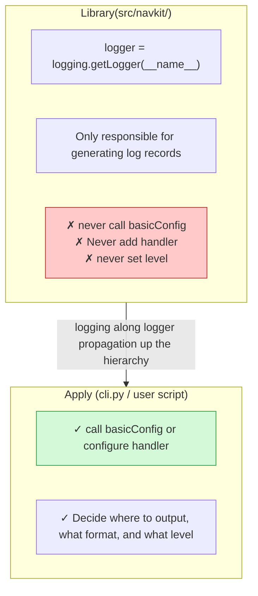

The reason is that the **propagation mechanism**: The records generated by the `navkit.planner` logger will be automatically transmitted upward to `navkit` and then to the root logger. The **configuration is only done once at the root and takes effect globally.** If the library itself is configured with a handler, the caller will see repeated output and cannot close it.

```python
# Src/navkit/planner.py —— The correct way to write the library
import logging

logger = logging.getLogger(__name__)      # The name is automatically "navkit.planner"

def plan(waypoints):
    logger.debug("Start planning, waypoint number %d", len(waypoints))   # Pay attention to use %s lazy formatting
    if len(waypoints) < 2:
        logger.warning("waypoint insufficient 2 , unable to plan")
        return None
    ...
```

```python
# Src/navkit/cli.py —— Correct way to write application
import logging

def setup_logging(verbose: bool) -> None:
    logging.basicConfig(
        level=logging.DEBUG if verbose else logging.INFO,
        format="%(asctime)s | %(levelname)-8s | %(name)s:%(lineno)d | %(message)s",
    )
    logging.getLogger("matplotlib").setLevel(logging.WARNING)   # Suppress noisy third-party libraries
```

> **Use `logger.debug("x = %s", x)` rather than `logger.debug(f"x = {x}")`.** The first formats the string only when that log level is enabled, which can matter when logging every training step.

## 6.3 Command line: typer
{: id="63-命令行typer"}

```python
# src/navkit/cli.py
from pathlib import Path
from typing import Annotated
import typer
from navkit.config import NavConfig
from navkit.planner import Planner

app = typer.Typer(help="Waypoint navigation toolkit")

@app.command()
def plan(
    waypoints: Annotated[Path, typer.Argument(help="waypoint file path"),
    max_speed: Annotated[float | None, typer.Option(help="Override the maximum speed in the configuration") = None,
    verbose: Annotated[bool, typer.Option("--verbose", "-v")] = False,
) -> None:
    """Plan a trajectory based on the waypoint file."""
    setup_logging(verbose)
    cfg = NavConfig()
    if max_speed is not None:          # The command line has the highest priority, see §6.1
        cfg.max_speed = max_speed
    Planner.from_file(waypoints, cfg).run()

if __name__ == "__main__":
    app()
```

In conjunction with `[project.scripts]` in §3.4, the command `navkit plan ...` will be available after installation.

|Tools|when to use|
| --- | --- |
|`argparse` (standard library)|Don’t want to introduce dependency, or only have one or two parameters|
| **`typer`** |**Default choice**: generates argument parsing and help text from type annotations|
| `click` |The bottom layer of typer; use it directly when you need fine control|

> **entry point function should be thin.** `cli.py` only does "parse parameters → assemble configuration → call core logic". The real algorithm stays in `planner.py`, so that it can be called from the command line and imported by other Python code - this is exactly how "library and application at the same time" in §3.1 are implemented.

---

# 7. Build, Delivery and CI
{: id="七构建交付与-ci"}

## 7.1 Two products: wheel and sdist
{: id="71-两种产物wheel-与-sdist"}

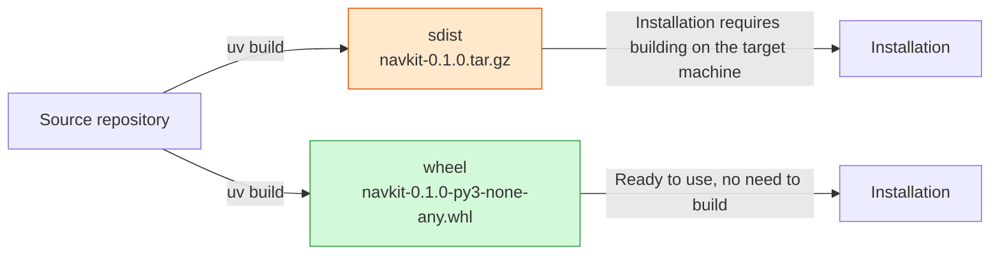

| |sdist (source distribution)|wheel (binary distribution)|
| --- | --- | --- |
|essence|Packaged source code|Pre-built installation products|
|When installing|**requires executing build** on the target machine|Just unzip it|
|With native extensions|The target machine must have a compiler and header files|No compilation environment required|
|function|Guaranteed, auditable, support for unpopular platforms|The actual source of daily installations|

**Both will be released.** wheel covers common platforms, and sdist ensures that unpopular platforms (or users who need to compile by themselves) still have a way to go.

## 7.2 Three tags in the file name
{: id="72-文件名里的三段-tag"}

`navkit-0.1.0-py3-none-any.whl` is a machine-readable compatibility declaration. Its last three components identify:

```
navkit - 0.1.0 - py3      - none     - any
  package name   version    Python tag  ABI tag   Platform tag
```

Each tag constrains a different dimension:

|segment|answer what question|Value example|
| --- | --- | --- |
| **Python tag** |What kind/version of interpreter is needed?|`py3` (any Python 3), `cp312` (CPython 3.12)|
| **ABI tag** |Requirements for the interpreter binary interface|`none` (no native extension), `cp312` (bound to this version of ABI), `abi3` (stable ABI)|
|**platform tag**|Operating system and CPU architecture| `any`, `manylinux_2_28_x86_64`, `win_amd64`, `macosx_11_0_arm64` |

The pure Python package is `py3-none-any` - no matter the three dimensions, one distribution can serve all platforms. Packages with native extensions will be like `cp312-cp312-manylinux_2_28_x86_64`, and one needs to be produced for each "Python version × platform" combination.

**Two high-frequency misunderstandings must be clarified:**

> **Misunderstanding 1: `manylinux` = "Common to all Linux".**
> No. The meaning of `manylinux_2_28` is "**requires glibc ≥ 2.28**", which is a lower bound with a clear value. Systems older than this version cannot be installed; Alpine using musl is completely different (corresponding to `musllinux`). This is the reason why "everything installed by pip in the Alpine image must be compiled on-site".
>
> **Also: `manylinux` only constrains the C runtime and does not promise any GPU driver compatibility.** Whether the CUDA code in a manylinux wheel can run depends on the driver version of the target machine (§8.1) and has nothing to do with this tag.

> **Misunderstanding 2: `abi3` = "Common to all Python".**
> No. `abi3` means that the extension only uses the **stable ABI subset** of CPython, so it can run on the declared minimum CPython version **and later versions**. It still binds CPython (PyPy does not apply) and is lower bounded.

## 7.3 Build and verify in a clean environment
{: id="73-构建并在干净环境里验证"}

This step is the homework left behind in §3.6 - **editable installation cannot verify the correctness of the packaging, only this step can.**

```bash
# 1. Build two products
uv build                      # The product falls on dist/

# 2. Install in a new, isolated environment wheel
uv venv /tmp/verify --python 3.12
uv pip install --python /tmp/verify dist/navkit-0.1.0-py3-none-any.whl

# 3. Key verification: Import from a place that is "not a repository directory"
cd /tmp
/tmp/verify/bin/python -c "import navkit; print(navkit.__file__)"
/tmp/verify/bin/python -c "from navkit.config import load_default_params; print(load_default_params())"
/tmp/verify/bin/navkit --help
```

**Do not omit `cd /tmp` in step 3.** Checking from the repository root can place the source tree on `sys.path` (§2.2), hiding packaging problems.

Typical problems that can be caught in this step:

- The package data file (`default_params.yaml`) was not entered into the wheel;
- `py.typed` is missing;
- `[project.scripts]` The entry point is written incorrectly and the command cannot be generated;
- A certain sub-package is missing `__init__.py` and is not recognized as a package by the backend.

> For a stricter check, run `twine check dist/*` to verify PyPI metadata requirements. Checking before upload is easier than changing the version after a failed release.

## 7.4 Publishing: Give priority to trusted publishing
{: id="74-发布优先用可信发布"}

The traditional approach is to generate a PyPI API token and store it in CI secrets. **The problem with this solution is that the token is valid for a long time** : Once leaked, it will be available until you manually revoke it.

**Trusted Publishing** uses a different approach: register which GitHub repository and workflow may publish `navkit` on PyPI. CI exchanges a short-lived identity credential for a temporary token, so **the repository stores no long-lived publishing key**.

There are two things to distinguish (the easiest thing to get confused here):

| |Identity and permissions|upload action|
| --- | --- | --- |
|Where to configure|**PyPI project settings page** + CI workflow `permissions: id-token: write`|A command in the workflow|
|Who decides whether to send it or not?|Registration rules on the PyPI side| — |
|Common misunderstandings|I thought it would be ready if I changed the upload command.|`uv publish` only performs the upload, it is not responsible for establishing trust relationships|

```yaml
# .github/workflows/release.yml
name: release
on:
  release:
    types: [published]

jobs:
  publish:
    runs-on: ubuntu-latest
    environment: pypi           # Optional, match environment protection rules
    permissions:
      id-token: write           # Required: Allow workflow acquisition OIDC Credentials
    steps:
      - uses: actions/checkout@v4
      - uses: astral-sh/setup-uv@v3
      - run: uv build
      - run: uv publish         # No need token, The certificate is provided by the above id-token provide
```

> **Test the workflow on TestPyPI first.** **The same version number** can only be uploaded once on PyPI, and cannot be reused after deletion. When it is first released, it is better to test the waters with a pre-release version like `0.1.0rc1` than to overturn the official version number.

## 7.5 Docker: Make the dependency layer truly cached
{: id="75-docker让依赖层真正被缓存"}

The problem with the simple writing method is: `COPY . /app` is placed before dependency installation, so changing one line of code to **will invalidate all dependency layer caches**, and torch will be reinstalled every time it is built.

The correct approach is **Split dependency installation and project installation into two layers** : 

```dockerfile
# Applicable:uv 0.11.x · Submitted uv.lock · need BuildKit(Docker 23+ enabled by default)
FROM python:3.12-slim-bookworm

# From the official distroless Mirroring uv, Crucified versions to ensure reproducible
COPY --from=ghcr.io/astral-sh/uv:0.11.18 /uv /uvx /bin/

# The cache mount is not on the same file system as the target environment, and the hard link is not available —— Explicitly changed to copy,
# Otherwise, a screen of warnings will be displayed every time you build (for the principle, see §4.8)
ENV UV_LINK_MODE=copy \
    UV_COMPILE_BYTECODE=1

WORKDIR /app

# ---- No. 1 Layer: only install dependencies ----
# Use bind mount instead COPY, Prevent these two files from entering the mirror layer;
# --no-install-project Indicates not to pretend at this time navkit itself
RUN --mount=type=cache,target=/root/.cache/uv \
    --mount=type=bind,source=uv.lock,target=uv.lock \
    --mount=type=bind,source=pyproject.toml,target=pyproject.toml \
    uv sync --locked --no-install-project --no-dev

# ---- No. 2 Layer: the installation item itself ----
# Only this layer will become invalid due to source code changes, and the dependency layer above remains cached.
COPY . /app
RUN --mount=type=cache,target=/root/.cache/uv \
    uv sync --locked --no-dev

ENV PATH="/app/.venv/bin:$PATH"
ENTRYPOINT ["navkit"]
```

Three key points, each corresponding to a real pit:

1. **`UV_LINK_MODE=copy`** - Responds to "hard links require the same file system" mentioned in §4.8. The cache mount is an independent file system. If this variable is not set, a full warning will be generated.
2. **`--no-install-project`** – This is the key to layering. Without it, there would be no difference between the two layers, and the dependency cache would be useless.
3. **`--locked`** - Consistent with CI (§4.4). Fail the build when the lockfile is out of date, instead of silently installing a different version.

> **Caching does not establish correctness.** A cached dependency layer is cached, which only means "`uv.lock` and `pyproject.toml` have not changed". It does not verify that the environment is correct - that is the responsibility of the clean install verification step in §7.3, and the two cannot replace each other.

## 7.6 GitHub Actions
{: id="76-github-actions"}


```yaml
# .github/workflows/ci.yml
name: ci
on:
  push:
    branches: [main]
  pull_request:

jobs:
  lint:
    runs-on: ubuntu-latest
    steps:
      - uses: actions/checkout@v4
      - uses: astral-sh/setup-uv@v3
        with:
          enable-cache: true
      - run: uv sync --locked          # Lockfile fails when it expires
      - run: uv run ruff check .
      - run: uv run ruff format --check .
      - run: uv run mypy

  test:
    runs-on: ${{ matrix.os }}
    strategy:
      fail-fast: false                 # If one combination dies, it will not affect other combinations to continue running.
      matrix:
        os: [ubuntu-latest, windows-latest]
        python: ["3.12", "3.13", "3.14"]
    steps:
      - uses: actions/checkout@v4
      - uses: astral-sh/setup-uv@v3
        with:
          enable-cache: true
      - run: uv sync --locked --python ${{ matrix.python }}
      - run: uv run pytest -m "not gpu" --cov    # CI None GPU, see §5.5

  build:
    runs-on: ubuntu-latest
    steps:
      - uses: actions/checkout@v4
      - uses: astral-sh/setup-uv@v3
      - run: uv build
      - run: uvx twine check dist/*
      - uses: actions/upload-artifact@v4
        with:
          name: dist
          path: dist/
```


Several deliberate designs:

- **`lint` and `test` are separate jobs**. Format problems can be reported within a few seconds without waiting for the complete matrix to be run.
- **`fail-fast: false`** - The default value `true` will kill the remaining tasks when the first combination fails, so you can only see "Windows fails", but you don't know if Linux also fails. For cross-platform matrices, this default is almost always wrong.
- **`-m "not gpu"`** – GitHub’s standard runner does not have a GPU. GPU testing is offloaded to a self-hosted runner or nightly task.

## 7.7 Version number and dependency security
{: id="77-版本号与依赖安全"}

Regarding the **version number**, different strategies are adopted according to the classification in §3.1:

|Project type|Suggestions|
| --- | --- |
|Publishable library|Strict [Semantic version ](https://semver.org/lang/zh-CN/), manually maintained in `pyproject.toml`|
|Application/Service|Date version (`2026.9.1`) or describe directly with Git|
|Experimental repository|No version number is required, **uses commit hash to identify** (§8.6)|

If you want to avoid the trouble of "synchronizing code changes and version number changes", you can derive the version number from the Git tag:

```toml
[build-system]
requires = ["hatchling", "hatch-vcs"]
build-backend = "hatchling.build"

[project]
dynamic = ["version"]        # Statement version Dynamically provided by the backend

[tool.hatch.version]
source = "vcs"               # from git tag read
```

**Dependency security**, add a routine check:

```bash
uvx pip-audit                       # Check current dependencies against known vulnerability libraries
```

```yaml
  audit:
    runs-on: ubuntu-latest
    steps:
      - uses: actions/checkout@v4
      - uses: astral-sh/setup-uv@v3
      - run: uv sync --locked
      - run: uvx pip-audit
```

> Academic projects often feel that vulnerability scanning is irrelevant. But once code **is deployed on a real robot or external service, security becomes directly relevant** - and that is usually discovered later in the project. The cost of a regular run is close to zero.

---

# 8. Special practices for AI and robotics projects
{: id="八ai-与机器人项目的特殊实践"}

The content in the first seven chapters applies to any Python project. This chapter deals with problems unique to this field - almost all of them occur in the orange area **at the bottom of the picture** in §2.4: the system and driver layer that Python tools cannot manage.

## 8.1 GPU dependency stack: who manages each layer?
{: id="81-gpu-依赖栈谁管哪一层"}

"`torch.cuda.is_available()` returns False" is difficult to check because the GPU dependency is a **four-layer structure**, and pip/uv can only touch one of the layers:

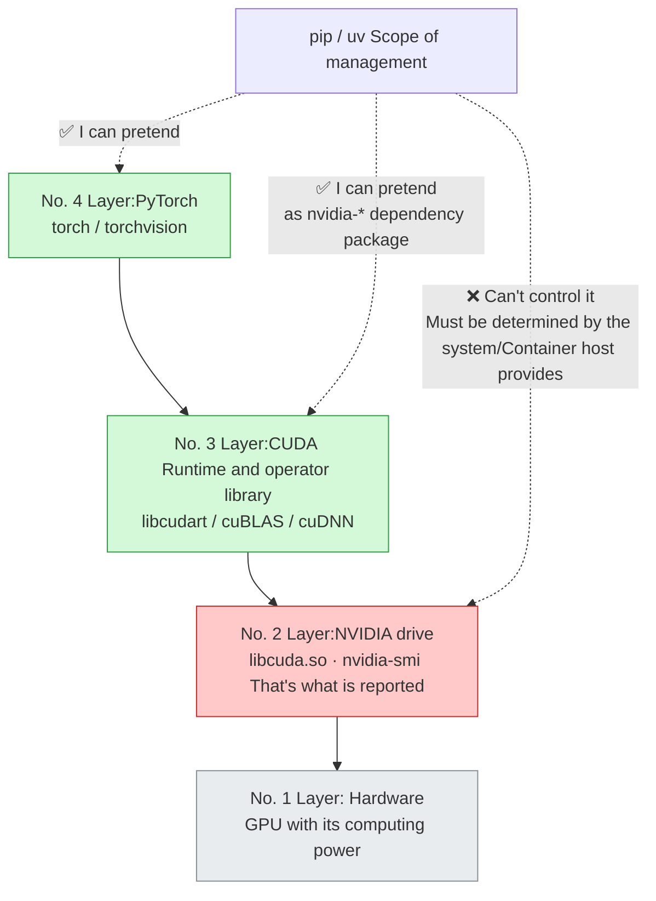

**This picture clarifies a widespread misunderstanding.** Modern PyTorch's CUDA wheel **includes layer 3** - they are automatically installed as dependencies in the form of `nvidia-cuda-runtime-cu12`, `nvidia-cudnn-cu12`, etc. Therefore:

> If **you only want to run PyTorch, there is no need to install CUDA Toolkit in the system, and there is no need to use conda to install `cudatoolkit`.** You only need a new enough **driver**.

Driver backward compatibility: **The newer driver can run the older CUDA runtime**, but not vice versa. Therefore, it is usually safe to upgrade the driver, but most of the time the "CUDA version mismatch" error message is that the driver is too old.

**A reading issue that must be clarified:**

```bash
nvidia-smi        # Display in the upper right corner "CUDA Version: 12.6"
nvcc --version    # may show 12.1, It is also possible that the command does not exist at all
```

The meanings of these two numbers **are completely different, and the inconsistency is normal**:

|command|what is reported|
| --- | --- |
|`nvidia-smi` → `CUDA Version`|The highest CUDA runtime version supported by the **driver**, not the installed runtime|
| `nvcc --version` |The version of CUDA Toolkit in the system ( **Only required when compiling** ) |
| `torch.version.cuda` |The CUDA version **PyTorch was built for**; inspect this when troubleshooting|

Three rounds of troubleshooting:

```bash
uv run python -c "import torch; print(torch.__version__, torch.version.cuda, torch.cuda.is_available())"
nvidia-smi --query-gpu=driver_version --format=csv
```

If `torch.version.cuda` outputs `None`, it means that you are installing the **CPU version** - this is the most common situation. See the next section for the solution.

## 8.2 Use uv to precisely control the source of torch
{: id="82-用-uv-精确控制-torch-的来源"}

CPU and CUDA variants of torch **have the same package name**. The difference is only in the source index. Without any configuration, you get the default version on PyPI - usually the CUDA version on Linux, but it may be the CPU version on other platforms or under certain version combinations, and it is completely out of your control.

**Explicitly declare the index to make this matter certain.** The following TOML is based on the uv documentation:

```toml
# Applicable:uv 0.11.x · target CUDA 13.0 · Linux with Windows use CUDA, macOS fall back to PyPI
[project]
dependencies = ["torch>=2.11.0", "torchvision>=0.26.0"]

[[tool.uv.index]]
name = "pytorch-cu130"
url = "https://download.pytorch.org/whl/cu130"
explicit = true       # Key: Only explicitly named packages are fetched from here, and the rest go as usual. PyPI

[tool.uv.sources]
torch = [
  { index = "pytorch-cu130", marker = "sys_platform == 'linux' or sys_platform == 'win32'" },
]
torchvision = [
  { index = "pytorch-cu130", marker = "sys_platform == 'linux' or sys_platform == 'win32'" },
]
```

**`explicit = true` This line cannot be omitted.** Without it, uv will regard this index as a candidate source for all packages - there are a batch of mirror packages with the same name in PyTorch's index, which may pull your `numpy` and the like from there, causing the resolution results to be inexplicable.

Commonly used index URLs:

|target|URL suffix|
| --- | --- |
| CUDA 11.8 | `/whl/cu118` |
| CUDA 12.6 | `/whl/cu126` |
| CUDA 12.8 | `/whl/cu128` |
| CUDA 13.0 | `/whl/cu130` |
| ROCm 7.2 | `/whl/rocm7.2` |
|CPU version| `/whl/cpu` |

**To support both CPU and GPU installations in one repository**, use mutually exclusive extras:

```toml
[project.optional-dependencies]
cpu  = ["torch>=2.11.0", "torchvision>=0.26.0"]
cu130 = ["torch>=2.11.0", "torchvision>=0.26.0"]

[tool.uv]
conflicts = [
  [{ extra = "cpu" }, { extra = "cu130" }],   # Declare the two to be mutually exclusive and prohibit simultaneous installation.
]
```

```bash
uv sync --extra cpu      # Notebook,CI
uv sync --extra cu130    # training server
```

> **After changing the index configuration, re-resolve the dependencies.** index changes may not automatically trigger lockfile updates - delete `uv.lock` and then `uv sync` if necessary. This is a common reason why the configuration is changed but the old stuff is still installed.

## 8.3 Running precompiled packages vs compiling custom CUDA extensions
{: id="83-运行预编译包-vs-编译自定义-cuda-扩展"}

These are two **completely different scenarios**. The requirements are very different. Confusing them will lead to a lot of wasted effort (such as installing CUDA Toolkit in order to run inference):

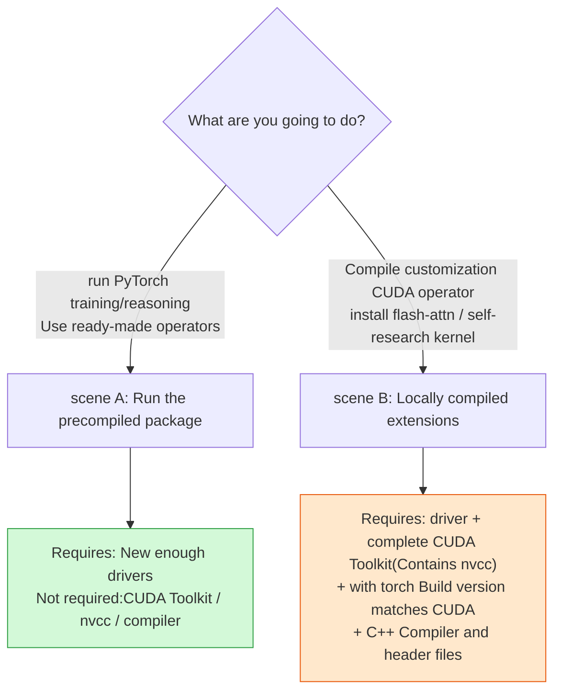

| |Scenario A: Running the precompiled package|Scenario B: Locally compiled extension|
| --- | --- | --- |
|Typical operations|Direct training after `uv sync`| `pip install flash-attn --no-build-isolation` |
|Requires `nvcc`| ❌ | ✅ |
|Requires system CUDA Toolkit| ❌ | ✅ |
|CUDA version requirements|Just the driver is new enough|Toolkit version must match `torch.version.cuda` |
|Build/install time|few minutes|Ten minutes to several hours|
|Suggestions|**Default path**|Try to find the official precompiled wheel first|

**Scenario B There is a pitfall** that you must know: packages like `flash-attn` need `import torch` to obtain compilation parameters when building. By default, PEP 517 executes the build in the **isolated build environment**. There is no torch in that environment, so the build fails. Therefore, the installation instructions of such packages always include `--no-build-isolation` - it allows the build process to directly use the current environment (torch is already in it).

Corresponds to uv:

```toml
[tool.uv]
# Declare that these packages are not built using an isolated environment
no-build-isolation-package = ["flash-attn"]
```

> Recall §4.3: When **uses `--no-build-isolation`, `uv sync` will not delete the redundant package** (for fear of accidentally deleting the build dependency). This means that the environment of such projects will gradually drift away from the strict state of the lockfile - it is worthwhile to rebuild the environment periodically.

## 8.4 Compatibility boundaries between ROS 2 and virtual environment
{: id="84-ros-2-与虚拟环境的兼容边界"}

"Python in ROS 2 cannot be installed into venv" This sentence mixes several different problems into one sentence, making it impossible to start troubleshooting. **There are three independent constraints**. It will be clear when you take them apart one by one.

```mermaid
flowchart TB
    C1["constraint 1: interpreter version must match<br/>ROS 2 Release binding specific Python small version"]
    C2["constraint 2: C extension band ABI label<br/>_rclpy_pybind11.cpython-312-....so"]
    C3["constraint 3: ROS Pass PYTHONPATH Inject<br/>Its priority is higher than venv of site-packages"]
    C1 --> R["Can you be there? venv inside import rclpy"]
    C2 --> R
    C3 --> S["venv Will the bag inside be damaged? ROS The package of the same name is masked"]
    style C2 fill:#ffc9c9,stroke:#c92a2a
    style C3 fill:#ffe8cc,stroke:#e8590c
```

**Constraints 1 and 2: why `import rclpy` fails**

`rclpy` is not a pure Python package, it comes with a C extension. This extension has an ABI tag embedded in its file name:

```
_rclpy_pybind11.cpython-312-x86_64-linux-gnu.so
                        ↑ can only be CPython 3.12 Load
```

If your venv is using Python 3.13, this `.so` will not be recognized as a loadable module at all - the error is the famous one:

```
ModuleNotFoundError: No module named 'rclpy._rclpy_pybind11'
```

**This error is misleading**: It looks like "the package is not installed", but it is actually "the interpreter version is wrong".

> **Corollary: The Python version of venv must be consistent with the one used by the ROS 2 distribution** (for example, Jazzy on Ubuntu 24.04 corresponds to Python 3.12). This also means that **do not let uv download a separate interpreter to create this venv** - it should be explicitly created based on the system interpreter.

**Constraint 3: `--system-site-packages` only addresses visibility**

One of the things `ros2 setup.bash` does is to append the ROS site-packages directory to `PYTHONPATH`. Recall the sequence of §2.2:

```
sys.path[0] → PYTHONPATH → standard library → venv of site-packages
                  ↑                        ↑
            ROS The package is here           Your bag is here (further back)
```

**PYTHONPATH takes precedence over venv site-packages.** The consequence is is: if ROS comes with a `numpy`, and you install another version in venv, the **code actually imports the ROS version**. This explains "I obviously installed a new version of numpy, but it is still an old version when running."

The `--system-site-packages` flag only allows venv to see the **site-packages of the** system interpreter - it deals with visibility issues. **can neither solve the version mismatch nor change the priority of PYTHONPATH**.

**Feasible working methods**, sorted by recommendation:

|Plan|practice|Applicable|
| --- | --- | --- |
|**A. Don’t use venv, use container**|The entire ROS 2 workspace is put into the Docker image, and the dependency is fixed in the image.|**recommends** - the clearest boundary and the best reproducibility|
|**B. Version aligned venv**|Use the system interpreter to build venv, the version is consistent with ROS, add `--system-site-packages`|When you need to install a small amount of pure Python dependencies on the host machine|
|C. Complete separation|ROS node only communicates. The algorithm runs in an independent process/independent environment and uses topic or IPC communication.|When algorithm dependency seriously conflicts with ROS dependency|

Specific commands for option B:

```bash
source /opt/ros/jazzy/setup.bash
# Explicitly use the system interpreter, do not let uv Download the one that comes with it
uv venv --python /usr/bin/python3 --system-site-packages .venv
uv pip install -e .        # Pay attention to use uv pip Workflow (§4.2), Don't use uv sync
```

`uv sync` is not appropriate here - it will create and take over its own `.venv`, bypassing the one you just carefully configured. This is exactly the same as conda mixing in §4.10.

> **Plan C deserves serious consideration.** When your algorithm uses torch 2.x + the new version of numpy, and the ROS distribution is locked on the old dependency, instead of fighting dependency resolution, it is better to accept the fact that "they should be two processes." This is also the hierarchical decoupling idea discussed in the two articles of this blog  and .

## 8.5 Environment reproducible ≠ Experiment reproducible
{: id="85-环境可复现--实验可复现"}

This is the most important thing to realize in research projects: **lock dependencies and set up seeds, and there are still two layers** away from "experimental reproducible".

```mermaid
flowchart TB
    L1["No. 1 Layer: dependency reproducible<br/>The package is exactly the same"] --> L2["No. 2 Layer: input reproducible<br/>Data, configuration, and random seeds are consistent"]
    L2 --> L3["No. 3 Layer: Compute reproducible<br/>The same input produces the same value"]
    L3 --> L4["No. 4 Layer: Conclusion reproducible<br/>Indicator differences are within the acceptable range"]

    T1["uv.lock"] -.-> L1
    T2["Data version + Configuration snapshot + seed"] -.-> L2
    T3["Deterministic operator settings<br/>Fixed hardware and library versions"] -.-> L3
    T4["Multiple sub-repetitions + Report variance"] -.-> L4
    style L1 fill:#d3f9d8,stroke:#2f9e44
    style L3 fill:#ffe8cc,stroke:#e8590c
    style L4 fill:#ffc9c9,stroke:#c92a2a
```

**Every layer has things it cannot lock:**

|layer|Tools can do it|Tools can't do it|
| --- | --- | --- |
|1 dependency|Accurate to version and hash|System libraries, drivers, compilers (§4.6)|
|2 input|Seeds, configuration snapshots|If the data set itself is modified, the seed is meaningless.|
|3 Computation|Enable deterministic operators|**Results can change on a different GPU model**|
|4 Conclusions|Statistics over repeated runs|Identical values from a single run|

**Layer 2: set all relevant seeds**

```python
import os, random
import numpy as np
import torch

def seed_everything(seed: int) -> None:
    os.environ["PYTHONHASHSEED"] = str(seed)   # Must take effect before the interpreter is started to be fully effective
    random.seed(seed)
    np.random.seed(seed)
    torch.manual_seed(seed)
    torch.cuda.manual_seed_all(seed)
```

> The multi-process workers of **DataLoader need to be handled separately.** Each worker is an independent process and has its own random state. Seed each worker with `worker_init_fn`, and pass an explicit `generator` to DataLoader, otherwise the data order or augmentation results of multi-process loading will still not be reproducible.

**Layer 3: the cost of deterministic computation**

```python
torch.use_deterministic_algorithms(True)     # When encountering an operator that does not have a deterministic implementation, an error will be reported directly.
torch.backends.cudnn.benchmark = False       # Turn off automatic algorithm selection (it will vary from machine to machine)
# Certain cuBLAS The operation also needs to be set before the process starts:
# export CUBLAS_WORKSPACE_CONFIG=:4096:8
```

Three costs and boundaries that **must know:**

1. **Execution becomes slower.** There is usually a performance penalty for turning off `cudnn.benchmark` and using deterministic operator implementations.
2. **Some operators have no deterministic implementation. When determinism** is turned on, they will throw exceptions directly instead of silently degrading - this is by design, you have to decide what to do.
3. **Cross-hardware reproducibility remains limited.** Different GPU architectures, different cuDNN versions, and different parallel reduction orders will produce floating point differences. **"Reproducible on the same machine" and "Reproducible on another machine" are two goals with completely different difficulties**. The latter is basically unreachable in deep learning.

There is another one that is easy to ignore: **TF32**. On newer NVIDIA GPUs, PyTorch may default to using TF32 for matrix multiplication - it is faster, but less accurate than FP32. This will make your numerical results inconsistent when changing machines. To achieve strict alignment, you need to turn it off explicitly.

**Layer 4: report results honestly**

Metrics from a single run do not constitute conclusions. **Run 3–5 seeds and report the mean and standard deviation** - if your improvement is less than the variance between seeds, it is not a conclusion.

## 8.6 Experiment artifact management
{: id="86-实验产物管理"}

Code and dependencies are only half the reproducible part. **The other half is: what was used and what was produced during this run.**

Save metadata for every run:

```python
# src/navkit/provenance.py
import json, platform, subprocess, sys
from datetime import datetime, timezone
from pathlib import Path

def dump_provenance(out_dir: Path, config: dict) -> None:
    """Record the complete source information of this run and put it together with the results."""
    meta = {
        "timestamp": datetime.now(timezone.utc).isoformat(),
        "git_commit": _git("rev-parse", "HEAD"),
        "git_dirty": bool(_git("status", "--porcelain")),   # Uncommitted changes are a red flag
        "python": sys.version,
        "platform": platform.platform(),
        "config": config,
    }
    try:
        import torch
        meta["torch"] = {
            "version": torch.__version__,
            "cuda": torch.version.cuda,
            "gpu": torch.cuda.get_device_name(0) if torch.cuda.is_available() else None,
        }
    except ImportError:
        pass
    (out_dir / "provenance.json").write_text(
        json.dumps(meta, indent=2, ensure_ascii=False), encoding="utf-8"
    )

def _git(*args: str) -> str:
    try:
        return subprocess.check_output(["git", *args], text=True).strip()
    except Exception:
        return "unknown"
```

> **`git_dirty` This field is worth more than all other fields combined.** What it answers is "Is the code corresponding to this result the same commit in the repository?" The results of running with uncommitted changes cannot be traced after half a year - with this flag, you at least know that the result is not fully traceable.

Supporting storage conventions:

|Artifact|Storage|Commit to Git?|
| --- | --- | --- |
|code|repository| ✅ |
|dependency lock| `uv.lock` | ✅ |
|Configuration snapshot|Save with output directory|❌(The original configuration template is entered, but the snapshot is not)|
|Model weights|Object Storage / Git LFS / Special Tools| ❌ |
|Dataset|External storage, **record version identification**| ❌ |
|Run metadata| `outputs/<run_id>/provenance.json` | ❌ |

## 8.7 High frequency troubleshooting table
{: id="87-高频故障排查表"}

This table is indexed by **symptom**, not by tool. If you encounter a problem, start here, which is faster than searching for error messages.

|Symptoms|What to check first|Common causes and sources|
| --- | --- | --- |
|`ModuleNotFoundError`, but it is obviously installed| `python -c "import sys; print(sys.executable)"` |Packaging and running are not the same interpreter (§2.2)|
|Import successful but behaves like old version| `print(mod.__file__)` |Imported a copy of the source code or a package with the same name on PYTHONPATH (§2.2, §8.4)|
|Runs from the project root but fails elsewhere|Check for `sys.path.append` or relative paths|Flat layout and dependence on the current directory (§3.2, §3.7)|
|Changed `pyproject.toml` does not take effect|Have you reinstalled|The metadata of editable installation is fixed (§3.6)|
|The newly created submodule cannot be imported.|Try reinstalling|Path mapping strategy for editable installation (§3.6)|
| `externally-managed-environment` |Is it running system Python?|PEP 668 Protection (§2.5)|
|It cannot be imported into Notebook, but it can be imported into the terminal.|Print `sys.executable` in cell|The kernel points to another environment (§2.6)|
|Packages installed manually disappear after `uv sync`|Did you use `uv pip install`?|Exact synchronization is the default (§4.3)|
|CI and local installation of different versions|Have you added `--locked` to CI?|lockfile drift masked by automatic re-resolution (§4.4)|
|`.so` loading failed / `undefined symbol`|Expand ABI tags in filenames|interpreter version or ABI mismatch (§7.2, §8.4)|
|`torch.cuda.is_available()` is False|`torch.version.cuda` Is it `None`|Installed as CPU version (§8.2)|
|`torch.version.cuda` OK but still False|Can `nvidia-smi` be run through?|Driver is missing or too old (§8.1)|
|GPU is not visible in the container|Is there `--gpus all` at startup?|The driver is provided by the host, and the container only transmits it transparently (§8.1)|
| `No module named 'rclpy._rclpy_pybind11'` |Python version of venv|Inconsistent with ROS 2 distribution version (§8.4)|
|Same seed, two machines have different results|GPU model, cuDNN version, TF32|Not reproducible across hardware (§8.5)|
|Docker build reinstalls dependencies every time|Is the dependency layer separated from the source layer?|Missing `--no-install-project` layer (§7.5)|

---

# 9. Implementation Checklist and Decision Tree
{: id="九落地清单与决策树"}

## 9.1 Decision tree: first decide which path you want to take
{: id="91-决策树先确定你走哪条路"}

```mermaid
flowchart TB
    Q0{"This is a new project<br/>Or do you already have a repository?"}
    Q0 -->|"new project"| N1{"Do you want to publish it for others to use?"}
    Q0 -->|"Already have a repository"| E1{"Can the current dependency<br/>All by pip Get?"}

    N1 -->|"to publish"| NA["Library: Relaxed dependency interval<br/>Strictly semantic version<br/>§3.1 + §7.4"]
    N1 -->|"Personal use/service"| NB["Application: Lock dependency<br/>date or Git version number"]
    NA --> P["All go §9.2 scratch list"]
    NB --> P

    E1 -->|"can"| M1["Plan A: Standard migration<br/>§4.9"]
    E1 -->|"Can't, wrong Python binary"| M2{"Can you hand it over?<br/>Container or system package manager?"}
    M2 -->|"can"| M1
    M2 -->|"Can't"| M3["Reserve conda as outer layer<br/>uv pip tube Python package<br/>§4.10"]

    E1 -->|"to live in ROS 2 in workspace"| M4["Not a migration issue<br/>It’s a compatibility boundary issue → §8.4"]

    style P fill:#d3f9d8,stroke:#2f9e44
    style M3 fill:#ffe8cc,stroke:#e8590c
    style M4 fill:#ffe8cc,stroke:#e8590c
```

## 9.2 Create new from scratch: ten-minute checklist
{: id="92-从零新建十分钟清单"}

```bash
# 1. Skeleton (--package generate src layout)
uv init --package navkit && cd navkit

# 2. Fixed interpreter version
uv python pin 3.12

# 3. Dependency classification declaration (§4.5)
uv add "numpy>=1.24" "pyyaml>=6.0" "typer>=0.12"
uv add --group dev ruff mypy pre-commit
uv add --group test pytest pytest-cov

# 4. Put §5.1 / §5.2 / §5.4 of [tool.*] Config stick in pyproject.toml

# 5. Install hook
uv run pre-commit install

# 6. Verify that the entire link can run through
uv run ruff check . && uv run mypy && uv run pytest

# 7. Build and verify in a clean environment (§7.3)—— don't skip
uv build && uv venv /tmp/verify && \
  uv pip install --python /tmp/verify dist/*.whl && \
  cd /tmp && /tmp/verify/bin/python -c "import navkit; print(navkit.__file__)"
```

Submitted to Git: `pyproject.toml`, **`uv.lock`**, `.pre-commit-config.yaml`, `.github/workflows/`, `src/`, `tests/`.
Not submitted: `.venv/`, `outputs/`, `data/`, `*.ckpt`, `__pycache__/`.

## 9.3 Modify old projects: do it in sequence, don’t modify it all at once
{: id="93-改造旧项目按顺序做不要一次全改"}

Migration often fails because too many things change at once, making the cause hard to identify. Follow this sequence so **each step can be verified and rolled back independently**:

|Step|Action|Verification|Can you stop after this step?|
| --- | --- | --- | --- |
| 1 |Add `pyproject.toml` to declare direct dependency| `uv sync` followed by one run of the main workflow | ✅ |
| 2 |Submit `uv.lock`|Colleagues can reproduce `uv sync`|✅ **The biggest profit step**|
| 3 |Change the src layout and delete all `sys.path.append`|It can still run if you change the directory| ✅ |
| 4 |Access Ruff (first only `check`, not `--fix`)|Check the size of the diff before deciding whether to fully format it.| ✅ |
| 5 |Complement the minimum test set (cover the main process first)| `uv run pytest` | ✅ |
| 6 |Connect to CI and add `--locked`|You can see the results on PR| ✅ |
| 7 |Complementary type annotation (only for new code and core modules)| `uv run mypy` | ✅ |

> **If you can do only one step, do step 2.** Committing the lockfile offers the highest return for a single change: one command lets colleagues install the same dependency environment, addressing half the symptoms in the opening table.

## 9.4 Self-check list
{: id="94-自查清单"}

**Project structure**

- [ ] Use src layout, packaged under `src/<name>/`
- [ ] There is no `sys.path.append` in the code
- [ ] Use `importlib.resources` to read the data files in the package without using relative paths.
- [ ] Include `py.typed` (if type annotation is included)

**dependency**

- [ ] Runtime dependencies / optional features / development dependencies are separated (§4.5)
- [ ] Libraries declare compatible ranges; applications lock dependencies (§3.1)
- [ ] `uv.lock` submitted
- [ ] Only use one set of workflows for one project, do not mix `uv add` and `uv pip install`

**quality**

- [ ] Local and CI run the same set of commands
- [ ] `--locked` is used in CI
- [ ] Test layering, machines without GPU can run most
- [ ] Floating point assertion uses `pytest.approx`

**delivered**

- [ ] Verified installation in a clean environment after building (§7.3)
- [ ] The dependency layer in Dockerfile is separated from the source layer.
- [ ] Publish with Trusted Publishing, there is no long-term token in the repository

**AI / Robot specialization**

- [ ] torch's index source is explicitly declared and does not rely on default behavior
- [ ] recorded `provenance.json` (including `git_dirty`)
- [ ] Know which level of "environmental reproducible" you are at, and state it truthfully in your paper/report
- [ ] ROS 2 project: Match the Python version of venv to the distribution, or simply use a container

---

# Appendix A: Performance and Concurrency (Short Version)
{: id="附录-a性能与并发简版"}

Performance optimization is a separate subject. This appendix covers only the parts directly connected to project engineering: integrating profilers and choosing a concurrency model.

## A.1 Measure first, then optimize
{: id="a1-先测量再优化"}

```bash
uv add --group dev py-spy memray

# Hang on a running process to sample, no code changes or restarting required
uv run py-spy top --pid <PID>
uv run py-spy record -o profile.svg --pid <PID>      # Generate flame graph

# Memory analysis
uv run memray run -o out.bin scripts/train.py
uv run memray flamegraph out.bin
```

|Tools|Positioning|when to use|
| --- | --- | --- |
|`cProfile` (standard library)|Function-level runtime statistics|Take a quick look at the hot spots|
| **`py-spy`** |Sampling type, **can attach to a running process**|**The training is stuck and the online process is slowed down**——The most practical|
| `scalene` |Distinguish between CPU/GPU/memory and be able to distinguish between Python and native code runtime|Want to know whether time is spent on Python or the underlying library?|
| `memray` |Memory allocation tracking|Problems such as DataLoader memory continues to grow|

>  **`py-spy` The value is particularly high in this field** , because the training task has often been running for several hours, and you cannot restart it and add a profiler. It can be directly attached to the process for sampling.

## A.2 Concurrency model selection
{: id="a2-并发模型选型"}

The widely circulated rule - "CPU-intensive uses multi-process, I/O-intensive uses asynchronous" - **is too rough for AI projects and often gives wrong conclusions**.

Many AI computations execute outside Python. **NumPy matrix operations, PyTorch operators, and image-decoding libraries release the GIL** while running native code. Threads can therefore be effective for those workloads:

```mermaid
flowchart TB
    Q{"The time of this code<br/>Where is the main money spent?"}
    Q -->|"pure Python Loops and object operations"| A["multi-process<br/>GIL It is indeed a bottleneck"]
    Q -->|"NumPy / torch / Image decoding<br/>Work inside native libraries"| B["Multi-threading is enough<br/>These libraries release the GIL"]
    Q -->|"Wait for network or disk"| C["asyncio or thread pool"]
    Q -->|"GPU Calculate"| D["single process + Asynchronous pipeline<br/>Instead, multiple processes will compete for GPU memory."]
    style B fill:#d3f9d8,stroke:#2f9e44
    style D fill:#d3f9d8,stroke:#2f9e44
```

**Actual bottlenecks** are more common than this picture, usually the following engineering problems:

|phenomenon|real reason|processing direction|
| --- | --- | --- |
|GPU utilization goes up and down|Data loading can’t keep up|Adjust DataLoader’s `num_workers`, `prefetch_factor`|
|Increasing the worker count makes execution slower|Thread pool nesting - BLAS in each worker has opened full core threads|Limit `OMP_NUM_THREADS` in worker|
|Multi-process gets stuck when starting / GPU memory doubles|Interaction between process startup mode (`fork` and `spawn`) and CUDA|The CUDA scenario uses `spawn`. Note that the child processes will create their own CUDA contexts.|
|Memory grows slowly with training|The worker copied a large object or the cache was not released.|`memray` positioning; consider `persistent_workers`|

**"Thread pool nesting" is worth remembering.** You open 8 DataLoader workers, and NumPy in each worker opens BLAS threads with the full number of physical cores by default - the actual number of threads is a product relationship, and the CPU is all doing context switching. The solution is to set an explicit upper limit:

```bash
export OMP_NUM_THREADS=1        # in DataLoader worker In this scenario, it should usually be set to 1
```

## A.3 Current status of GIL and free-threading
{: id="a3-gil-与-free-threading-的现状"}

The content of this section changes rapidly with the version. **Please refer to the Python version you actually use**. Here is the status at the time of writing (September 2026):

- **Python 3.13** first provides a free-threaded build, labeled **experimental**.
- **[PEP 779](https://peps.python.org/pep-0779/) was accepted in June 2025**, with the effect of removing the "experimental" label for free-threaded builds starting from **Python 3.14**. This corresponds to **Phase 2 of the three-phase plan [PEP 703](https://peps.python.org/pep-0703/): Officially supported, but still optional, build**.
- The third phase, making it the default build, **has not arrived and has no confirmed timetable**.
- One of the hard conditions for accepting PEP 779 is that the single-threaded performance regression does not exceed 15%, and by 3.14 the gap has narrowed to **5–10%**.

**So, the accurate statement is:**

> ❌ "Python no longer has a GIL"
> ✅ "Python 3.14 and later provides **officially supported, optional** free-threaded build; the default build still has GIL"

Get the free-threaded interpreter with uv:

```bash
uv python install 3.14+freethreaded
uv venv --python 3.14+freethreaded
# NOTE: The executable file for this variant comes with t suffix (python3t), to distinguish it from regular builds
```

**Should AI and robotics projects adopt it now?** A cautious trial is reasonable, for three reasons:

1. The **C extension must explicitly declare support.** Undeclared extensions, when loaded on a free-threaded interpreter, cause the interpreter to re-enable the GIL - so you pay the single-threaded performance penalty without gaining the parallelism benefits.
2. **The degree of support for the core dependencies in this field (torch, numpy and their entire native dependency chain) needs to be measured** according to the version and cannot be assumed.
3. **As noted above, heavy computation in these libraries already releases the GIL** - that is, the marginal benefit of free-threading for typical AI workloads is likely to be much smaller than for pure Python services.

This is worth watching, but **do not rush to adopt it in production projects**.

---

# References
{: id="参考资料"}

**standard (PEP)**

- [PEP 440](https://peps.python.org/pep-0440/) — Version Identification and Dependency Specification
- [PEP 508](https://peps.python.org/pep-0508/) — dependency string syntax
- [PEP 517](https://peps.python.org/pep-0517/) / [PEP 518](https://peps.python.org/pep-0518/) — build backend interface and build dependency
- [PEP 561](https://peps.python.org/pep-0561/) — Distribution type information
- [PEP 621](https://peps.python.org/pep-0621/) — `pyproject.toml` Project Metadata
- [PEP 660](https://peps.python.org/pep-0660/) — editable installation
- [PEP 668](https://peps.python.org/pep-0668/) — Externally managed environment tag
- [PEP 703](https://peps.python.org/pep-0703/) / [PEP 779](https://peps.python.org/pep-0779/) — Optional GIL and free-threading support standards
- [PEP 735](https://peps.python.org/pep-0735/) — dependency group
- [PEP 751](https://peps.python.org/pep-0751/) — Generic lockfile format `pylock.toml`

**tool documentation**

- [uv documentation ](https://docs.astral.sh/uv/) — especially [PyTorch integration ](https://docs.astral.sh/uv/guides/integration/pytorch/) and [Docker integration ](https://docs.astral.sh/uv/guides/integration/docker/) two pages
- [Ruff](https://docs.astral.sh/ruff/) · [pytest](https://docs.pytest.org/) · [mypy](https://mypy.readthedocs.io/)
- [Python Packaging User Guide](https://packaging.python.org/) — The authoritative entrance to packaging specifications
- [Python 3.14 release notes ](https://docs.python.org/3/whatsnew/3.14.html)
- [Python Free-Threading Guide](https://py-free-threading.github.io/) — Ecosystem support tracking

**Related to this site**

-  — Engineering Practice on the ROS 2 Side
-  — Distributed systems and hierarchical decoupling

---

> The default path in this article (uv + src layout + Ruff + pytest) is suitable for newly created projects based on Python dependency. If your project is deeply bound to conda (§4.10) or must live in the ROS 2 workspace (§8.4), please give priority to the boundary discussions in those two sections - **They are not problems that can be solved by "changing tools"**.
>
> Version baseline at time of writing: Python 3.14.7, uv 0.11.x. For conclusions regarding version behavior, please refer to the version you actually use.
