# Introduction
{: id="引言"}

ROS 2 organizes functions such as sensing, planning, and control into cooperating nodes, and provides a foundation for communication, scheduling, and system integration. Understanding how nodes exchange data, and what the client, executor, and middleware are each responsible for, is the starting point for reading this architectural guide.

<figure class="survey-intro-figure">
  
<figcaption> Figure: ROS 2 uses nodes to organize robot software, and uses topics, services and actions to establish collaboration; client and executor, RMW interface and middleware implementation respectively bear different responsibilities. </figcaption>
</figure>

# 1. From ROS 1 to ROS 2: Paradigm Shift and Design Philosophy
{: id="一从-ros-1-到-ros-2范式转移与设计哲学"}

## 1.1 The evolution history of robot middleware: Why must it be completely reconstructed?
{: id="11-机器人中间件演化史为什么必须彻底重构"}

**ROS (Robot Operating System)** was born in 2007 between the Stanford University Artificial Intelligence Laboratory (STAIR project) and Willow Garage. Its original intention was to provide an open source robot software rapid prototyping platform for the academic community. As robotics technology moves from the laboratory to industrial automation, commercial services, autonomous driving, and humanoid embodied intelligence, the design limitations of ROS 1 have become increasingly prominent:

1. **Centralized single point of failure (Single Point of Failure)**: ROS 1 strong dependency `roscore` (Master node) running on fixed IP/port. If the Master crashes or a network partition occurs, the node discovery and communication registration of the entire robot system will be completely paralyzed.
2. **lacks determinism and hard/soft real-time support**: The bottom layer of ROS 1 is based on standard TCP/UDP sockets. The operating system has no priority control for scheduling and cannot meet the microsecond/millisecond level deterministic real-time control requirements of industrial controllers and underlying motor drivers.
3. **Poor network adaptability and no native encryption security mechanism**: TCPROS/UDPROS has a high packet loss rate and fragile reconnection mechanism in wireless lossy networks (Wi-Fi, 4G/5G, cross-segment); the communication link is plain text transmission, and there is no identity authentication and access control mechanism.
4. **Multi-machine collaboration and multi-robot clusters are highly complex**: ROS 1 multi-machine communication requires strict configuration `ROS_MASTER_URI` and `ROS_IP`, and lacks flexible domain isolation and multi-machine discovery management solutions.
5. **embedded microcontroller isolation**: cannot run directly on microcontrollers (MCU/DSP/RTOS) with limited computing and memory, and can usually only be inefficiently bridged through fragile serial port protocols (such as `rosserial`).

In order to completely solve the above-mentioned industrial-level implementation bottleneck, the Open Robotics decided not to carry out simple patch iterations, but redesigned **ROS 2** based on the international industrial standard **DDS (Data Distribution Service)**.

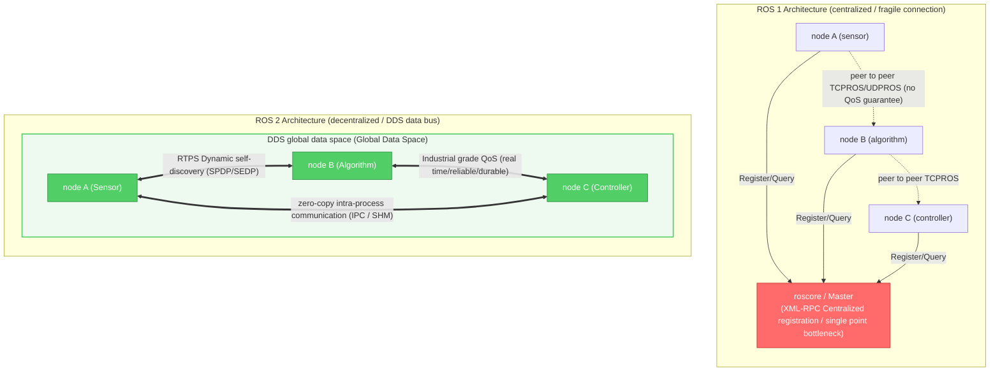

---

## 1.2 ROS 1 vs. ROS 2 full-dimensional core comparison
{: id="12-ros-1-vs-ros-2-全维度核心对比"}

|Dimensions| ROS 1 (Noetic / Melodic) | ROS 2 (Humble / Iron / Jazzy) |Core Values/Industrial Impact|
| :--- | :--- | :--- | :--- |
|**Network topology**|Centralized coordination based on Master (`roscore`)|Fully distributed decentralization based on DDS RTPS|Eliminate single points of failure and support large-scale cluster dynamic networking|
|**Underlying communication**|Custom TCPROS / UDPROS protocol|OMG industrial grade DDS standard (Fast DDS, Cyclone DDS, Connext, etc.)|Reuse military/aerospace grade mature data distribution base|
|**Quality of Service (QoS)**|Only supports simple TCP reliable transmission and UDP best-effort transmission|Complete QoS policy (Reliability, Durability, History, Deadline, etc.)|Precisely adapts to the requirements of high-frequency, low-latency sensors and high-reliability control|
|**Cross-process/intra-process communication**|Socket serialization copy; Nodelet intra-process sharing (API split)|Unified Component container; native support for borrowing pointers zero-copy (Zero-Copy IPC)|Greatly reduces the CPU usage of hundreds-of-megabytes high-resolution point-cloud and 4K image transmission|
|**node lifecycle**|Stateless black box; nodes are initialized out of order.|Native managed lifecycle node (Lifecycle Managed Nodes)|Ensure deterministic controlled startup sequence and fault degradation of sensor drivers, algorithms, and executors|
|**real-time support**|Linux general-purpose kernel; no real-time guarantees|Support hard real-time OS such as Linux PREEMPT_RT, QNX, VxWorks, etc., with zero memory dynamic allocation API|Meet microsecond-level closed-loop motion control requirements|
|**embedded support**|Only through `rosserial` serial port translation|micro-ROS natively supports STM32, ESP32, Zephyr, and FreeRTOS|MCU microcontroller seamlessly acts as a first-class ROS 2 node|
|**Safety mechanism**|No security verification, naked network|SROS2 Specification: DDS-Security Authentication, Access Control List (ACL), TLS/AES Encryption|Meet commercial robot security compliance and cyber attack resistance standards|
|**parameter system**|Globally unified Parameter Server|Node is a private and independent Parameter instance that supports runtime strong type constraints and event monitoring.|Avoid parameter namespace pollution and support dynamic reconfiguration interception|
|**Multi-platform build**|Strong dependency Ubuntu Linux / CMake (`catkin`)|Native support for Linux, Windows, macOS (`colcon` + `ament`)|Lowering the threshold for cross-platform industrial software migration|

---

## 1.3 ROS 2 distribution evolution route and lifecycle
{: id="13-ros-2-发行版演进路线与生命周期"}

ROS 2 adopts a fixed release cycle in collaboration with Ubuntu: a long-term support version (**LTS**, support period 5 years) is released in May of even-numbered years, and a standard support version is released in May of odd-numbered years (support period 1 year).

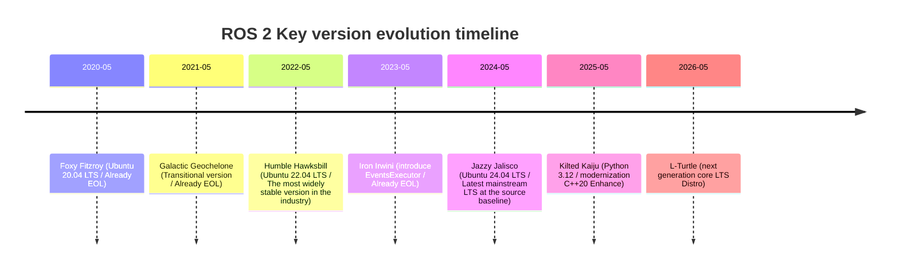

> **Selection Suggestions**:
> - **Production/industrial grade deployment**: Preferred **ROS 2 Humble** (Ubuntu 22.04) or **ROS 2 Jazzy** (Ubuntu 24.04), the ecosystem package (Nav2, MoveIt 2, ros2_control) has the most complete support.
> - **cutting-edge algorithm research and development**: Choose **Jazzy Jalisco** or **Rolling Ridley** to get the latest executor performance optimization and Type Adaptation hardware acceleration features.

---

# 2. ROS 2 layered software stack and DDS middleware base
{: id="二ros-2-分层软件栈与-dds-中间件底座"}

## 2.1 Analysis of software layered architecture
{: id="21-软件分层架构剖析"}

ROS 2 adopts an extremely clear modular layered design to completely decouple the upper-layer application algorithm from the underlying transmission middleware.

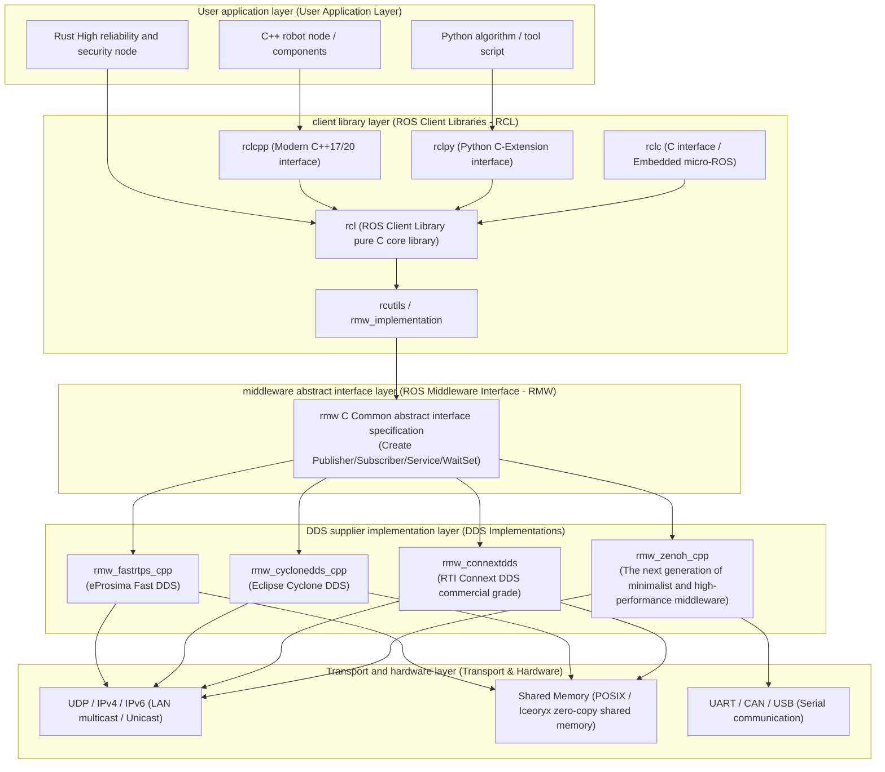

### Key component responsibilities:
{: id="关键组件职责"}
- **`rcl` (ROS Client Library)**: A common logic layer written in pure C language, which implements language-independent core functions such as parameter analysis, node graph topology, log system, clock management, etc., ensuring that the behavior of multi-language clients such as C++ and Python is strictly consistent.
- **`rmw` (ROS Middleware)**: A unified C interface specification that defines interfaces such as publishing, subscription, waiting set, QoS mapping, etc. The upper layer is completely unaware of the specific DDS used by the lower layer.
- **`rosidl`**: Interface Definition Language (IDL) generator, which automatically generates `.msg`, `.srv`, and `.action` into native structures and serialization/deserialization codes in C, C++, and Python.

---

## 2.2 DDS (Data Distribution Service) core working mechanism
{: id="22-dds-data-distribution-service-核心工作机制"}

DDS is the Object Management Organization ( **OMG** ), the core of which is **Data-Centric Publish-Subscribe Model (DCPS, Data-Centric Publish-Subscribe)** .

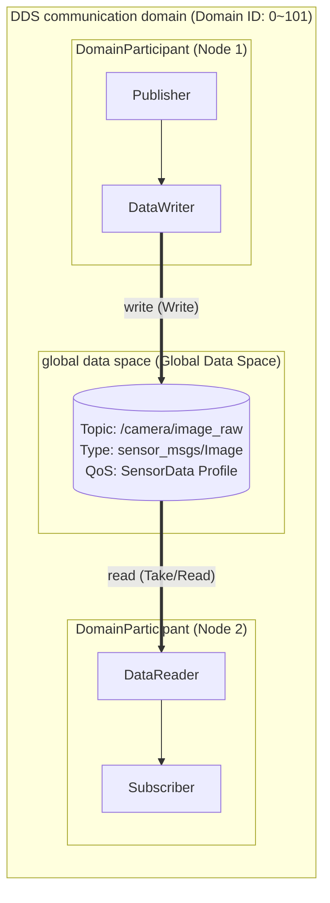

### RTPS dynamic self-discovery protocol (Discovery Protocol)
{: id="rtps-动态自发现协议discovery-protocol"}
When DDS nodes are started in the LAN, they can automatically discover each other without Master coordination. It contains two Stages:
1. **SPDP (Simple Participant Discovery Protocol)**: After the node starts, it periodically sends multicast heartbeat packets to the predetermined port (the multicast address `239.255.0.1` calculated based on the Domain ID) to announce its Participant GUID, IP address and transmission port.
2. **SEDP (Simple Endpoint Discovery Protocol)**: When Participants discover each other, they establish a reliable unicast connection and exchange the DataWriter / DataReader details (Topic name, data type, QoS configuration) contained in each other. If the QoS matching is successful, a point-to-point data channel is established at the bottom layer.

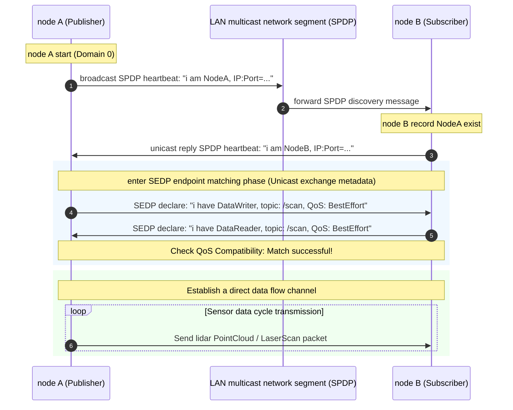

---

## 2.3 Comparison and quick switching of mainstream RMW middleware
{: id="23-主流-rmw-中间件对比与快速切换"}

|middleware (RMW)|Supplier/Licensing|Advantages and core features|Disadvantages/Notes|Recommended application scenarios|
| :--- | :--- | :--- | :--- | :--- |
| **Fast DDS** (`rmw_fastrtps_cpp`) | eProsima (Apache-2.0) |ROS 2 official default implementation; complete functions, built-in high-performance shared memory (SHM) transmission, and supports Discovery Server|Multicast packet loss in a weak Wi-Fi network environment can easily lead to slow discovery|Default general robot development, stand-alone simulation, high-performance stand-alone deployment|
| **Cyclone DDS** (`rmw_cyclonedds_cpp`) | Eclipse (EPL-2.0) |The architecture is lightweight and the code is refined; it is extremely robust to Wi-Fi jitter networks, has high throughput and extremely low latency.|Shared memory configuration is more complex (requires Iceoryx)|Autonomous driving, multi-machine distributed systems, wireless mobile robots|
| **Connext DDS** (`rmw_connextdds`) |RTI (commercial license)|Industrial/military grade certification, support for safety-critical systems (ISO 26262 ASIL-D, DO-178C), complete debugging toolset|Commercial charging closed source|Aerospace, medical surgical robots, automotive grade autonomous driving systems|
| **Zenoh** (`rmw_zenoh_cpp`) | ZettaScale (Apache-2.0) |Abandon complex RTPS and adopt a minimalist protocol; zero multicast storm, naturally supporting cross-public network/4G/5G/cloud-edge collaborative communication|Still evolving rapidly, the ecosystem tool chain is gradually maturing.|Cross-wide area network (WAN) vehicle-cloud interconnection and large-scale robot cluster management|

```bash
# Dynamic switching of environment variables RMW(No need to recompile code)
export RMW_IMPLEMENTATION=rmw_cyclonedds_cpp
ros2 run my_pkg my_node

# Verify currently using RMW realize
ros2 doctor --report | grep middleware
```

---

## 2.4 Multi-machine communication and Domain ID isolation
{: id="24-多机通信与-domain-id-隔离"}

In order to isolate nodes of different robots or teams under the same LAN switch, ROS 2 introduced `ROS_DOMAIN_ID` (range **0 ~ 101**, security recommended range **0 ~ 232**).

```bash
# In ~/.bashrc Configure the robot's unique domain in ID
export ROS_DOMAIN_ID=42
export ROS_LOCALHOST_ONLY=0 # 0 Indicates that multi-machine communication on the LAN is allowed.1 Indicates only local loopback
```

> **DDS Port calculation underlying formula**:
> Each Domain ID occupies a fixed range of UDP ports:
> $$\text{Port} = 7400 + 250 \times \text{DomainID} + \text{Offset}$$
> If multiple devices in the same network segment are set with the same `ROS_DOMAIN_ID`, their nodes will automatically communicate with each other.

---

# 3. In-depth analysis and code practice of the five major communication primitives of ROS 2
{: id="三ros-2-五大通信原语深度剖析与代码实践"}

ROS 2 abstracts all software decoupled interactions into five communication primitives. Choosing the correct communication method is the first principle of system architecture design.

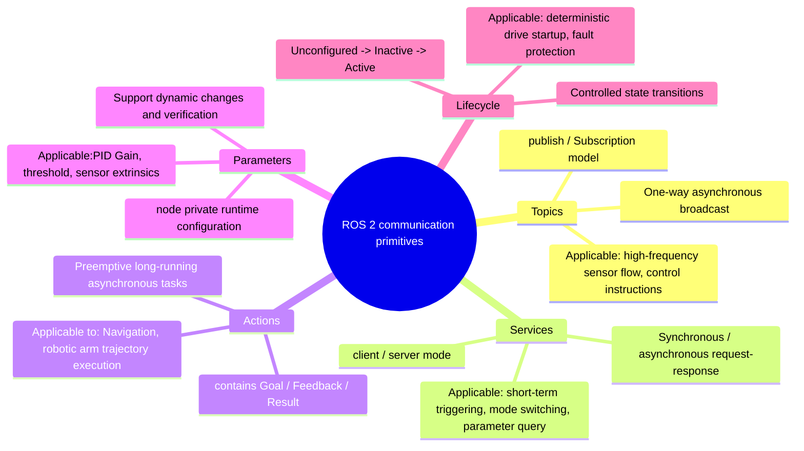

---

## 3.1 Five primitive selection decision matrix
{: id="31-五大原语选型决策矩阵"}

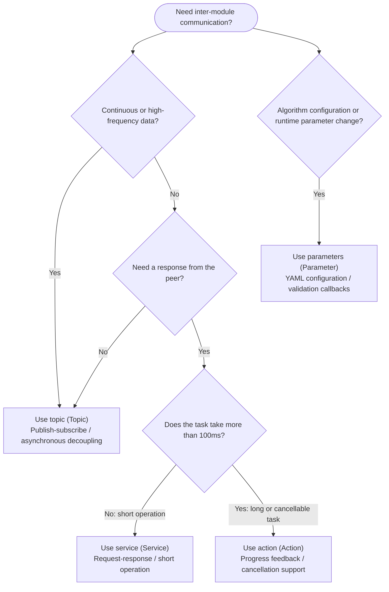

---

## 3.2 Topic (Topics): Asynchronous high-frequency data flow
{: id="32-话题topics异步高频数据流"}

### Communication principles
{: id="通信原理"}
topic is a many-to-many publish-subscribe (Pub/Sub) channel. The publisher pushes the data to the DDS domain, and the subscriber receives the data according to the QoS policy. The two parties are completely decoupled in lifecycle and network topology.

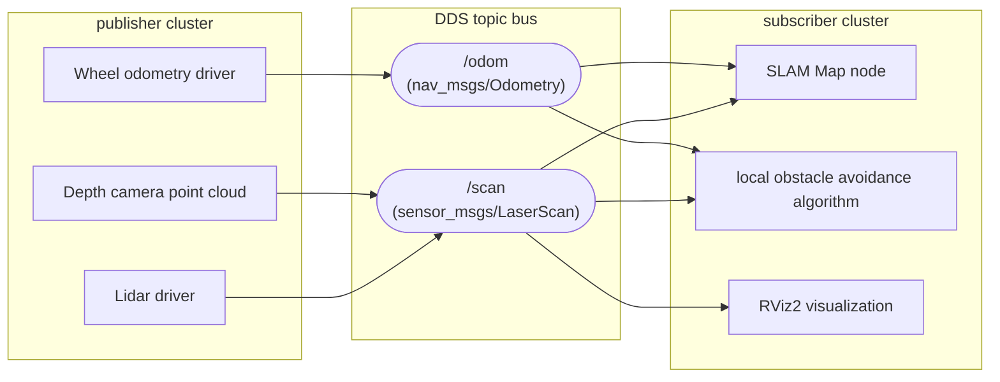

### C++17 industrial-grade implementation (`rclcpp`)
{: id="c17-工业级实现-rclcpp"}

```cpp
#include <chrono>
#include <memory>
#include <string>
#include "rclcpp/rclcpp.hpp"
#include "std_msgs/msg/string.hpp"

using namespace std::chrono_literals;

class RobustPublisher : public rclcpp::Node {
public:
    RobustPublisher() : Node("robust_publisher_node"), count_(0) {
        // Create sensor-specific BestEffort QoS
        rclcpp::QoS qos_profile(rclcpp::KeepLast(10));
        qos_profile.best_effort();
        qos_profile.durability_volatile();

        publisher_ = this->create_publisher<std_msgs::msg::String>("/telemetry_data", qos_profile);
        timer_ = this->create_wall_timer(100ms, std::bind(&RobustPublisher::timer_callback, this));
        
        RCLCPP_INFO(this->get_logger(), "High-frequency publisher node has been started (10Hz)...");
    }

private:
    void timer_callback() {
        auto message = std_msgs::msg::String();
        message.data = "Telemetry Frame #" + std::to_string(count_++);
        publisher_->publish(message);
    }

    rclcpp::TimerBase::SharedPtr timer_;
    rclcpp::Publisher<std_msgs::msg::String>::SharedPtr publisher_;
    size_t count_;
};

int main(int argc, char* argv[]) {
    rclcpp::init(argc, argv);
    rclcpp::spin(std::make_shared<RobustPublisher>());
    rclcpp::shutdown();
    return 0;
}
```

### Python implementation (`rclpy`)
{: id="python-实现-rclpy"}

```python
#!/usr/bin/env python3
import rclpy
from rclpy.node import Node
from rclpy.qos import QoSProfile, ReliabilityPolicy, HistoryPolicy
from std_msgs.msg import String

class RobustSubscriber(Node):
    def __init__(self):
        super().__init__('robust_subscriber_node')
        
        # Definition matching publisher QoS Configuration
        qos = QoSProfile(
            history=HistoryPolicy.KEEP_LAST,
            depth=10,
            reliability=ReliabilityPolicy.BEST_EFFORT
        )
        
        self.subscription = self.create_subscription(
            String,
            '/telemetry_data',
            self.listener_callback,
            qos
        )
        self.get_logger().info('The subscribing node is ready, waiting for telemetry data...')

    def listener_callback(self, msg: String):
        self.get_logger().info(f'telemetry frame received: "{msg.data}"')

def main(args=None):
    rclpy.init(args=args)
    node = RobustSubscriber()
    try:
        rclpy.spin(node)
    except KeyboardInterrupt:
        pass
    finally:
        node.destroy_node()
        rclpy.shutdown()

if __name__ == '__main__':
    main()
```

---

## 3.3 Services: synchronous/asynchronous request-response
{: id="33-服务services同步异步请求-响应"}

### Communication principles
{: id="通信原理-1"}
The service is a point-to-point client-server (Client/Server) communication model. The client sends `Request`, and the server returns `Response` after calculation.
> **Key avoidance pit**: In ROS 2, **is strictly prohibited from calling synchronous blocking services (such as `client->call()`)** in the callback function of the default single-threaded Executor, which will cause thread deadlock (Deadlock)! It is recommended to always use the asynchronous client `call_async()`.

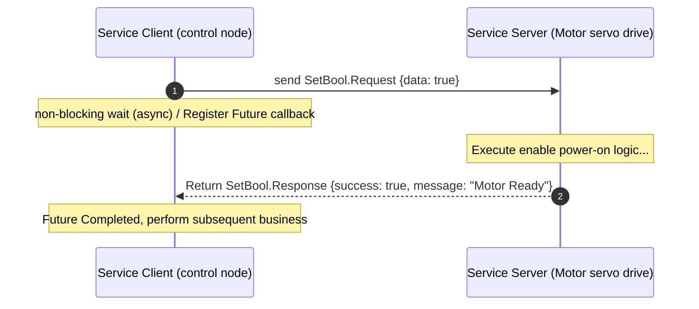

---

## 3.4 Actions: Preemptive long-term task scheduling
{: id="34-动作actions抢占式长时任务调度"}

### Communication principles
{: id="通信原理-2"}
Actions are designed for long-term asynchronous tasks (such as chassis navigation to move from point A to point B, robotic arm performing a grab). An Action is composed of 3 underlying communication channels:
1. **Goal channel (Service)**: The client sends a goal request, and the server decides to accept (Accept) or reject (Reject).
2. **Feedback channel (Topic)**: During the execution of the task, the server continues to push progress data such as percentage and current pose to the client.
3. **Result channel (Service)**: When the task ends, the final execution result (success/failure/preempted) is returned.
4. **Cancellation channel (Service)**: The client can initiate a cancellation request at any time, and the server can safely interrupt the current action.

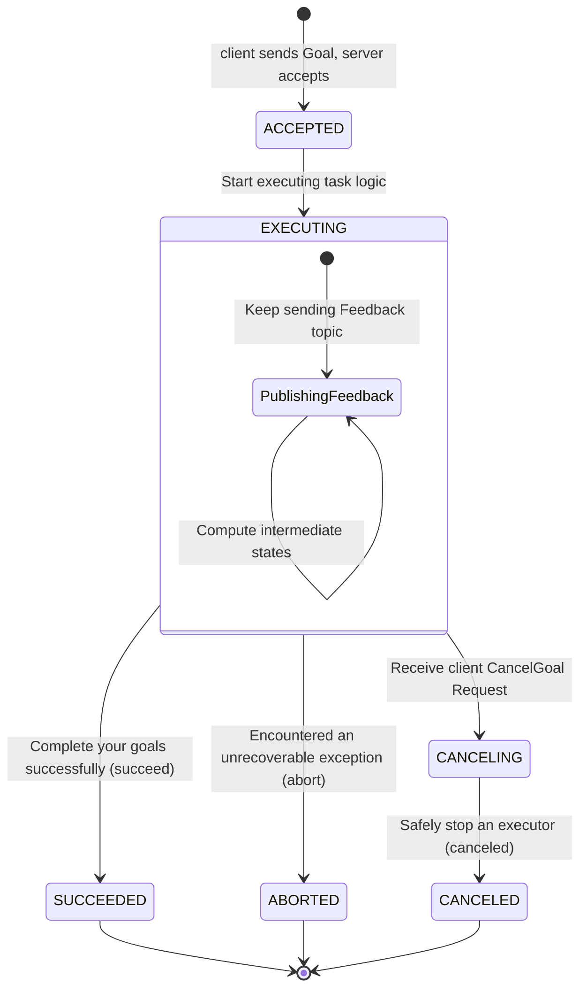

### Action interface definition (`nav2_msgs/action/NavigateToPose.action`)
{: id="action-接口定义-nav2_msgsactionnavigatetoposeaction"}
```yaml
# 1. Target (Goal)
geometry_msgs/PoseStamped pose
string behavior_tree
---
# 2. Final result (Result)
std_msgs/Empty result
int16 error_code
---
# 3. Real time feedback (Feedback)
geometry_msgs/PoseStamped current_pose
builtin_interfaces/Duration navigation_time
builtin_interfaces/Duration estimated_time_remaining
int16 number_of_recoveries
float32 distance_remaining
```

---

## 3.5 Parameters: distributed node-level configuration
{: id="35-参数parameters分布式节点级配置"}

In ROS 2, parameters are **private data items bound to a specific node instance**, supporting strong type verification, range constraints and dynamic modification callback interception.

```cpp
// C++ Declare parameters with descriptors and dynamic verification
rcl_interfaces::msg::ParameterDescriptor desc;
desc.description = "Robot maximum linear speed limit (m/s)";
desc.floating_point_range.resize(1);
desc.floating_point_range[0].from_value = 0.0;
desc.floating_point_range[0].to_value = 2.5;
desc.floating_point_range[0].step = 0.05;

this->declare_parameter("max_linear_velocity", 1.0, desc);

// Register dynamic parameter change interception callback (OnSetParametersCallback)
params_callback_handle_ = this->add_on_set_parameters_callback(
    [this](const std::vector<rclcpp::Parameter> &parameters) {
        rcl_interfaces::msg::SetParametersResult result;
        result.successful = true;
        for (const auto &param : parameters) {
            if (param.get_name() == "max_linear_velocity") {
                if (param.as_double() > 2.0) {
                    result.successful = false;
                    result.reason = "Safety protection trigger: the actual vehicle line speed cannot exceed 2.0 m/s";
                } else {
                    RCLCPP_INFO(this->get_logger(), "The speed cap is updated to: %.2f", param.as_double());
                }
            }
        }
        return result;
    }
);
```

---

# 4. Quality of Service Strategy (QoS): Refined Communication Control
{: id="四服务质量策略qos精细化通信控制"}

QoS (Quality of Service) is the most powerful communication feature that distinguishes ROS 2 from ROS 1, allowing the underlying transmission behavior to be accurately configured for different data flow characteristics.

## 4.1 In-depth analysis of core QoS policies
{: id="41-核心-qos-策略深度解析"}

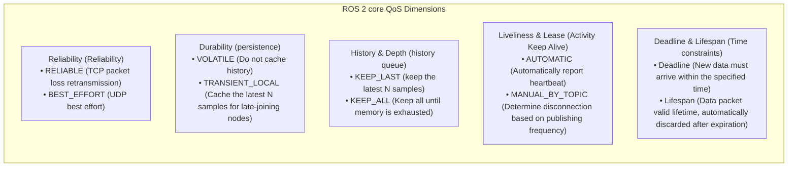

---

## 4.2 QoS Compatibility Matching Rules (Compatibility Rules)
{: id="42-qos-兼容性匹配规则compatibility-rules"}

> **⚠️ Industrial grade pit avoidance guidelines: Request vs. Offer principle**
> The QoS service quality offered by the publisher must be **greater than or equal to the QoS quality requested by the subscriber**. Otherwise, the DDS layer will **silently refuse to establish the connection**, resulting in the inability to receive data without any error message!

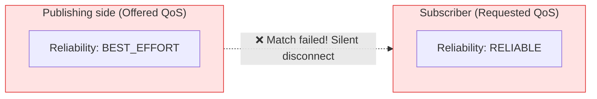

### Core compatibility matrix:
{: id="核心兼容矩阵"}

|publisher (Offered)|subscriber (Requested)|Match results|Description|
| :--- | :--- | :---: | :--- |
| **RELIABLE** | **RELIABLE** |✅ **Compatible**|Reliable transmission across the entire link (automatic retransmission of lost packets)|
| **RELIABLE** | **BEST_EFFORT** |✅ **Compatible**|The publisher can provide high guarantee, and the subscriber accepts a weaker guarantee|
| **BEST_EFFORT** | **BEST_EFFORT** |✅ **Compatible**|Best effort transmission, low latency, packet loss allowed|
| **BEST_EFFORT** | **RELIABLE** |❌ **Incompatible**|The subscriber requires reliability, but the publisher cannot guarantee it. **cannot communicate**|
| **TRANSIENT_LOCAL** | **VOLATILE** |✅ **Compatible**|The subscriber does not require historical data and can receive real-time data normally.|
| **VOLATILE** | **TRANSIENT_LOCAL** |❌ **Incompatible**|Subscriber requires historical map, but publisher is not cached, **cannot communicate**|

---

## 4.3 Typical scenario standard QoS configuration template
{: id="43-典型场景标准-qos-配置模板"}

|Scenario application| Reliability | Durability | History (Depth) |design considerations|
| :--- | :--- | :--- | :--- | :--- |
|**high frequency raw camera image / lidar** (`/image_raw`, `/scan`)| `BEST_EFFORT` | `VOLATILE` | `KEEP_LAST (1~5)` |Pursuing extremely low latency, discarding an old image has no impact and avoids queue backlog|
|**Chassis control command** (`/cmd_vel`)| `RELIABLE` | `VOLATILE` | `KEEP_LAST (10)` |Control instructions must be delivered accurately, and frame loss causing loss of control is prohibited.|
|**static map / parameter event** (`/map`, `/robot_description`)| `RELIABLE` | `TRANSIENT_LOCAL` | `KEEP_LAST (1)` |Similar to the Latch mechanism of ROS 1, the SLAM/Nav2 node started later can obtain the full map as soon as it goes online.|
|**high reliability status alarm** (`/emergency_stop`)| `RELIABLE` | `TRANSIENT_LOCAL` | `KEEP_ALL` |Emergency stop and failure events must never be lost|

---

# 5. Executor, callback group and zero-copy IPC mechanism
{: id="五执行器回调组与零拷贝-ipc-机制"}

## 5.1 ROS 2 executor (Executors) scheduling model
{: id="51-ros-2-执行器executors调度模型"}

In ROS 2, callback functions (Timer, Subscription, Service Server, Action) are not automatically executed in background threads. Instead, **Executor (executor)** polls the ready event from the underlying WaitSet and schedules execution.

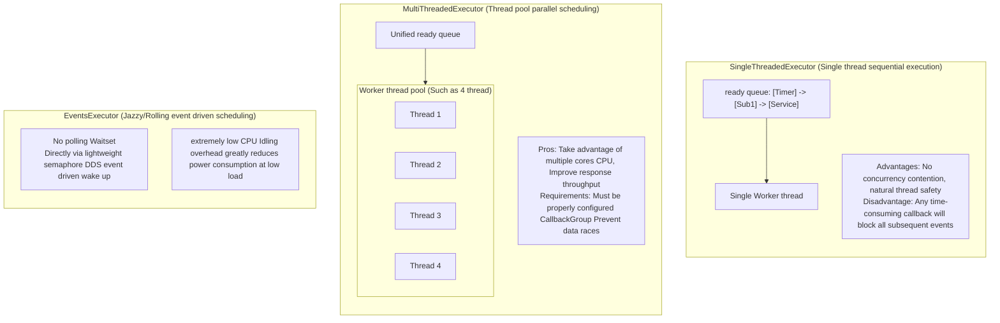

---

## 5.2 Callback group (Callback Groups) and deadlock prevention
{: id="52-回调组callback-groups与死锁防范"}

In order to finely control concurrent permissions in `MultiThreadedExecutor`, ROS 2 provides two types of callback groups:

1. **`MutuallyExclusiveCallbackGroup` (mutually exclusive group, default)**: All callback functions in this group can only be executed by one thread at the same time.
2. **`ReentrantCallbackGroup` (reentrant group)**: Different callbacks within the group (even multiple triggers of the same callback) can be executed in parallel by multiple threads.

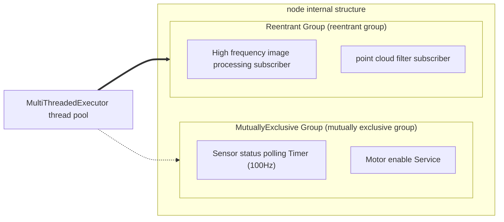

> **Classic deadlock scenario and solution**:
> If a subscriber callback is synchronously waiting for another service response, and both belong to the default `MutuallyExclusiveCallbackGroup` and run under a single-threaded Executor, the subscriber occupies the thread to wait for the service, and the service can never be executed because it cannot obtain the thread, forming a **permanent deadlock**.
> **solution**:
> 1. Assign the service and subscriber to different `CallbackGroup`.
> 2. Mount node under `MultiThreadedExecutor`.
> 3. Use non-blocking `call_async()` instead.

---

## 5.3 Components and intra-process zero-copy communication (IPC)
{: id="53-组件化components与进程内零拷贝通信ipc"}

Traditional multi-node systems adopt a multi-process model, and data transfer between nodes requires: **user-mode memory $\to$ serialization $\to$ kernel Socket $\to$ deserialization $\to$ target user-mode memory**, in 4K Image or 3D laser point cloud scenarios (hundreds of megabytes per second) result in extremely high CPU and memory bandwidth overhead.

ROS 2's **Component (component)** technology allows multiple independently developed Nodes to be compiled into dynamic link libraries (`.so` / `.dll`) and dynamically loaded into the same `ComposableNodeContainer` process at runtime. Together with `std::unique_ptr`, this enables **zero-copy IPC by transferring pointer ownership**.

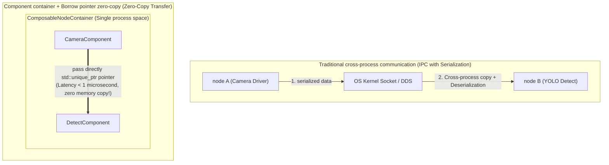

### C++ zero-copy publisher example
{: id="c-零拷贝发布端规范代码"}

```cpp
#include "rclcpp/rclcpp.hpp"
#include "sensor_msgs/msg/point_cloud2.hpp"

class ZeroCopyPointCloudPublisher : public rclcpp::Node {
public:
    explicit ZeroCopyPointCloudPublisher(const rclcpp::NodeOptions & options)
    : Node("zero_copy_publisher", options) {
        // Create publisher, must be passed in NodeOptions opened in IPC support
        pub_ = this->create_publisher<sensor_msgs::msg::PointCloud2>("/points", 10);
        timer_ = this->create_wall_timer(33ms, std::bind(&ZeroCopyPointCloudPublisher::publish_cloud, this));
    }

private:
    void publish_cloud() {
        // Use unique_ptr Construct exclusive ownership message
        auto cloud_msg = std::make_unique<sensor_msgs::msg::PointCloud2>();
        
        // Populate large point cloud data buffer ...
        cloud_msg->header.stamp = this->now();
        cloud_msg->header.frame_id = "lidar_frame";
        cloud_msg->width = 1920;
        cloud_msg->height = 1080;
        cloud_msg->data.resize(cloud_msg->width * cloud_msg->height * 16);

        // Use std::move Transfer ownership, triggering direct exchange of underlying intra-process pointers
        pub_->publish(std::move(cloud_msg));
    }

    rclcpp::Publisher<sensor_msgs::msg::PointCloud2>::SharedPtr pub_;
    rclcpp::TimerBase::SharedPtr timer_;
};
```

---

# 6. Controlled startup: lifecycle nodes
{: id="六受控确定性生命周期节点lifecycle-nodes"}

In industrial-grade robot systems, random startup of nodes may cause catastrophic accidents (such as the navigation algorithm issuing speed instructions before the lidar or chassis drive has completed parameter verification and calibration). ROS 2 introduces the ISO-standard **Lifecycle Node (lifecycle managed node)**.

## 6.1 Lifecycle finite state machine
{: id="61-生命周期有限状态机"}

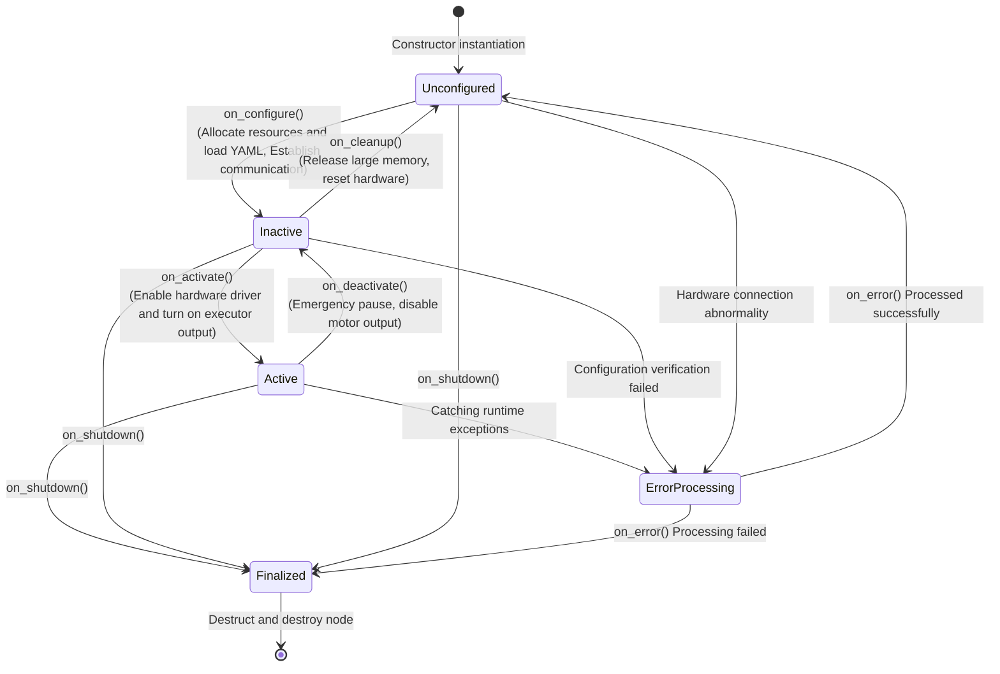

### Core state semantics:
{: id="核心状态语义"}
- **`Unconfigured` (not configured)**: The node is loaded, but the parameters are not read and the hardware device is not connected.
- **`Inactive` (inactive)**: The configuration is loaded, the Publisher and Subscriber are established, but the Publisher is in a silent state (does not broadcast any messages to DDS), and the execution is suspended.
- **`Active` (active state)**: The system is operating normally, all callbacks are activated, and the main control loop is executed.
- **`Finalized` (terminal status)**: Resources are completely released and the process is ready to exit.

---

# 7. Coordinate transformation engine: TF2 in-depth analysis
{: id="七坐标变换引擎tf2-深度解析"}

There are a large number of geometric coordinate frames in the robot system (world, base, lidar, end-effector, and camera optical frames). **TF2 (Transform Library 2)** is responsible for maintaining the **space-time transformation tree (Transform Tree)** within the entire robot lifecycle.

## 7.1 Robot standard coordinate frame specification (REP 105 & REP 103)
{: id="71-机器人标准坐标系规范rep-105--rep-103"}

According to the official ROS specification **REP 105**, mobile robots must strictly follow the tree-like single-parent topology:

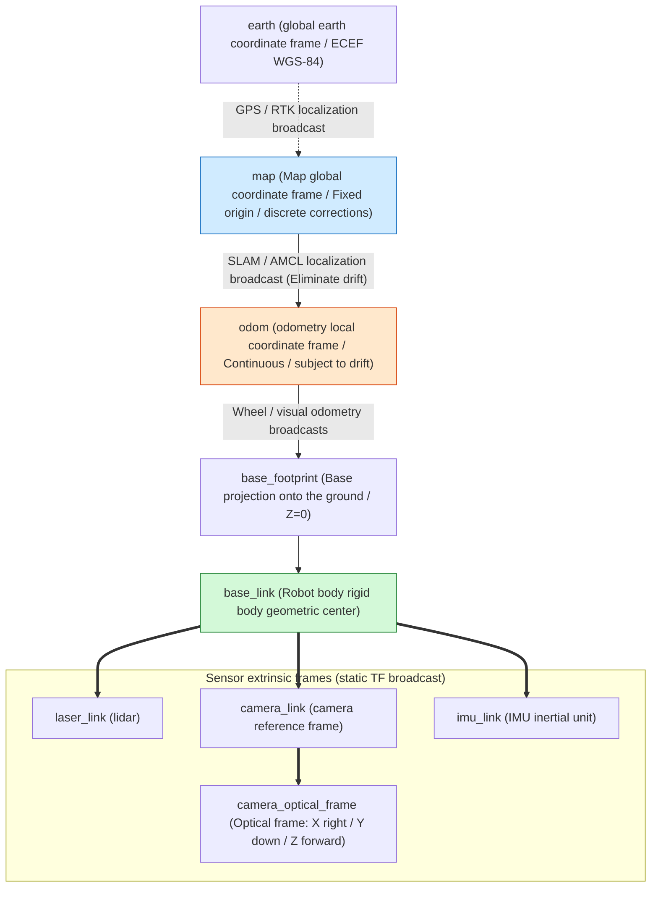

- **REP 103 Coordinate axis definition convention**:
  - Robot body: **FLU (Forward-Left-Up)**: $X$ axis is forward, $Y$ axis is to the left, $Z$ axis is upward.
  - Camera optical coordinate frame: **RDF (Right-Down-Forward)**: $X$ axis is to the right, $Y$ axis is downward, and $Z$ axis is forward (sight direction).

---

## 7.2 Dynamic TF (`/tf`) vs static TF (`/tf_static`)
{: id="72-动态-tf-tf-vs-静态-tf-tf_static"}

- **`/tf` (dynamic transformation)**: Broadcast the changing relative pose (such as `odom -> base_link`) at a fixed frequency (such as 50Hz).
- **`/tf_static` (static extrinsics)**: only broadcast once when the system starts or the sensor extrinsic calibration is completed. The bottom layer uses `TRANSIENT_LOCAL` QoS for persistent storage. **greatly saves CPU calculation and DDS broadcast bandwidth**.

```cpp
// C++ Monitor and query the transformation relationship between any two coordinate frames at a certain moment in history
#include "tf2_ros/buffer.h"
#include "tf2_ros/transform_listener.h"

auto tf_buffer = std::make_unique<tf2_ros::Buffer>(this->get_clock());
auto tf_listener = std::make_shared<tf2_ros::TransformListener>(*tf_buffer);

try {
    // Most blocked 100ms Query map Arrive laser_link latest transformation of
    geometry_msgs::msg::TransformStamped transform = tf_buffer->lookupTransform(
        "map", "laser_link",
        tf2::TimePointZero,
        std::chrono::milliseconds(100)
    );
    RCLCPP_INFO(this->get_logger(), "Radar global coordinates on the map: x=%.2f, y=%.2f",
                transform.transform.translation.x, transform.transform.translation.y);
} catch (const tf2::TransformException & ex) {
    RCLCPP_WARN(this->get_logger(), "TF Transform query failed: %s", ex.what());
}
```

---

# 8. Robot modeling and description: URDF and Xacro
{: id="八机器人建模与描述urdf-与-xacro"}

## 8.1 Robot description system
{: id="81-机器人描述体系"}

- **URDF (Unified Robot Description Format)**: Use XML to describe the robot's links, joints, physical collision bodies and inertia tensors.
- **Xacro (XML Macros)**: Evolved from the defect that URDF does not support variables, macros, inclusions and mathematical operations, it is the standard way of modeling modern robots.

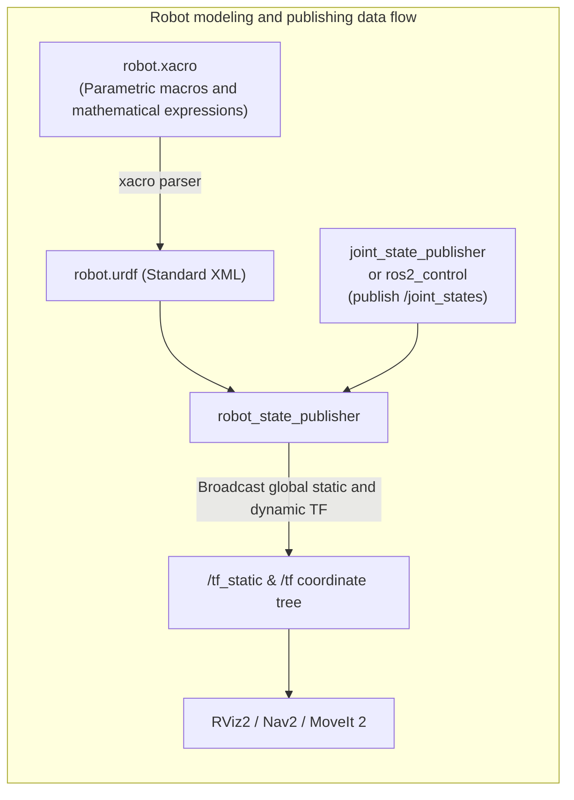

---

## 8.2 Industrial Xacro parameterized macro example
{: id="82-工业级-xacro-参数化宏示例"}

```xml
<?xml version="1.0"?>
<robot xmlns:xacro="http://www.ros.org/wiki/xacro" name="industrial_diff_bot">

  <!-- constant definition -->
  <xacro:property name="wheel_radius" value="0.10" />
  <xacro:property name="wheel_width" value="0.05" />
  <xacro:property name="wheel_mass" value="2.5" />
  <xacro:property name="track_width" value="0.45" />

  <!-- Macro: Parameterized definition of power drive wheels -->
  <xacro:macro name="drive_wheel" params="prefix side_sign">
    <link name="${prefix}_wheel_link">
      <visual>
        <origin xyz="0 0 0" rpy="${pi/2} 0 0"/>
        <geometry>
          <cylinder radius="${wheel_radius}" length="${wheel_width}"/>
        </geometry>
        <material name="black"><color rgba="0.1 0.1 0.1 1.0"/></material>
      </visual>
      <collision>
        <origin xyz="0 0 0" rpy="${pi/2} 0 0"/>
        <geometry>
          <cylinder radius="${wheel_radius}" length="${wheel_width}"/>
        </geometry>
      </collision>
      <inertial>
        <mass value="${wheel_mass}"/>
        <inertia ixx="${(wheel_mass/12.0)*(3*wheel_radius*wheel_radius + wheel_width*wheel_width)}" 
                 iyy="${(wheel_mass/12.0)*(3*wheel_radius*wheel_radius + wheel_width*wheel_width)}" 
                 izz="${(wheel_mass/2.0)*(wheel_radius*wheel_radius)}" 
                 ixy="0.0" ixz="0.0" iyz="0.0"/>
      </inertial>
    </link>

    <joint name="${prefix}_wheel_joint" type="continuous">
      <parent link="base_link"/>
      <child link="${prefix}_wheel_link"/>
      <origin xyz="0 ${side_sign * track_width / 2.0} 0" rpy="0 0 0"/>
      <axis xyz="0 1 0"/>
    </joint>
  </xacro:macro>

  <!-- Instantiate left and right wheels -->
  <xacro:drive_wheel prefix="left" side_sign="1" />
  <xacro:drive_wheel prefix="right" side_sign="-1" />

</robot>
```

---

# 9. ROS 2 modern simulation and digital twin platform
{: id="九ros-2-现代仿真与数字孪生平台"}

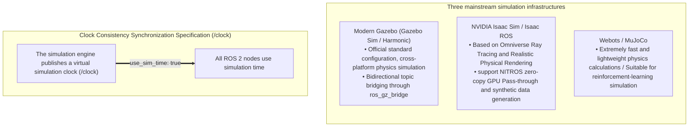

> **Simulation-time requirement**:
> During simulation running or Rospackage offline data playback, all algorithm nodes must explicitly set the parameter: `use_sim_time: true`, otherwise the node will read the real system clock of the host, resulting in a TF extrapolation error (`ExtrapolationException`) in TF interpolation due to timestamp drift.

---

# 10. Core ROS 2 ecosystem stacks
{: id="十ros-2-顶级核心生态栈精讲"}

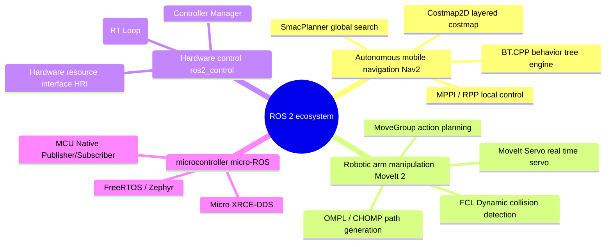

---

## 10.1 Nav2 (Navigation 2) autonomous mobile navigation stack
{: id="101-nav2-navigation-2-自主移动导航栈"}

Nav2 is the second generation of autonomous mobile robot navigation system officially built by ROS 2. It reconstructs the overall architecture of ROS 1 navigation and is completely implemented based on **behavior tree (BehaviorTree.CPP)** and **lifecycle manager (LifecycleManager)**.

```mermaid
flowchart TB
    subgraph Nav2_Architecture["Nav2 Core architecture panorama"]
        direction TB
        BT_Nav["Behavior Tree Navigator (Task decision-making and global logical scheduling)"]
        
        subgraph Planners["planning level (Planners)"]
            GP["SmacPlanner (2D / Hybrid-A* / State Lattice)"]
            NavFn["NavFn (Dijkstra / A*)"]
        end

        subgraph Controllers["Control tracking layer (Controllers)"]
            MPPI["MPPI Controller (Model Predictive Path Integral Control)"]
            RPP["Regulated Pure Pursuit (Regulated path following)"]
            DWB["DWB (Improved version of dynamic window)"]
        end

        subgraph Costmaps["Layered costmaps (Costmap 2D)"]
            StaticL["Static Layer (static map layer)"]
            ObstacleL["Obstacle / Voxel Layer (real time laser/Depth Point Cloud Obstacle)"]
            InflationL["Inflation Layer (Safety inflation radius)"]
            SemanticL["Costmap Filters (restricted area / deceleration zone / lane keeping)"]
        end

        subgraph Recoveries["exception recovery layer (Recovery / Behaviors)"]
            Spin["Spin (Rotate in situ to find path)"]
            BackUp["BackUp (Safe reversing)"]
            ClearMap["ClearEntireCostmap (Clear ghost obstacles)"]
        end

        BT_Nav --> Planners
        BT_Nav --> Controllers
        BT_Nav --> Recoveries
        Planners & Controllers <===> Costmaps
    end

    GoalIn[/Navigation target /goal_pose/] --> BT_Nav
    SensorsIn[/lidar / point cloud /] --> Costmaps
    Controllers -->|"Publish linear velocity and angular velocity"| CmdVel[/cmd_vel Output to chassis driver/]
```

### Nav2 core controller in-depth comparison:
{: id="nav2-核心控制器深度对比"}
1. **MPPI (Model Predictive Path Integral)**: The current first choice in industry and academia. Cost scoring is based on GPU/CPU high-concurrency batch sampling trajectories. It is good at dealing with complex nonholonomic mobile robots and Ackermann and differential-drive bases, and has strong obstacle avoidance agility.
2. **Regulated Pure Pursuit (RPP)**: Designed specifically for commercial AGV/AMR, it strictly adheres to the reference path, automatically decelerates smoothly according to the path curvature and obstacle distance, and operates extremely robustly.

---

## 10.2 MoveIt 2: Modern robotic arm motion planning framework
{: id="102-moveit-2现代机械臂运动规划框架"}

MoveIt 2 is designed to provide kinematics solution, trajectory planning and real-time collision detection for multi-degree-of-freedom robotic arms (6-DOF / 7-DOF serial manipulators, dual-arm robots, humanoid robot upper bodies).

```mermaid
flowchart LR
    subgraph MoveIt2["MoveIt 2 core module"]
        MG["MoveGroup core scheduler"]
        IK["Inverse kinematics solver<br/>(KDL / TRAC-IK / PickNik Kineo)"]
        Plan["Planner algorithm library<br/>(OMPL: RRTConnect, BIT* / Pilz Industrial linear arc)"]
        Coll["Environment collision detection<br/>(FCL / Bullet Collision mesh detection)"]
        Servo["MoveIt Servo<br/>(Joystick / visual feedback / microsecond-scale servo control)"]
    end

    UserApp["User application / manipulation pipeline"] --> MG
    SensorCloud["3D point cloud camera / OctoMap"] --> Coll
    MG --> IK & Plan & Coll
    Servo ==>|"Real-time joint positions/speed command"| RosControl["ros2_control Low-level driver"]
```

---

## 10.3 Ros2_control: real-time hardware abstraction and control layer
{: id="103-ros2_control工业级实时硬件抽象与控制层"}

`ros2_control` completely standardizes the robot hardware driver writing standards. It completely decouples **real-time control loop (Hard Real-Time Loop, such as 1000Hz)** and **non-real-time ROS asynchronous communication** to ensure that the motor will not fly out of control due to ROS message blocking.

```mermaid
flowchart TB
    subgraph RealTimeLoop["Hard real-time control loop (1000Hz Deterministic Loop)"]
        CM["Controller Manager (controller manager)"]
        
        subgraph LoadedControllers["Activated controller plugin"]
            JTC["JointTrajectoryController (Tracking)"]
            DiffDrive["DiffDriveController (Differential chassis)"]
            Effort["EffortControllers (Torque / gravity compensation)"]
        end

        subgraph HardwareInterface["Hardware Resource Abstraction Interface (HRI)"]
            SystemIF["SystemInterface (complete robot)"]
            ActuatorIF["ActuatorInterface (Single axis motor)"]
            SensorIF["SensorInterface (Torque/IMU sensor)"]
        end

        HardwareDriver["Hardware driver layer (CANopen / EtherCAT / Serial / SocketCAN)"]

        CM --> LoadedControllers
        LoadedControllers --> HardwareInterface
        HardwareInterface -->|"read() / write() virtual function"| HardwareDriver
    end

    HardwareDriver <===> Motors["physical motor / Encoder feedback / joint driver"]
    ROS_Interfaces["ROS 2 topic / action interface (/joint_trajectory)"] <===> CM
```

---

# 11. Engineering practice: construction, system orchestration and data closed loop
{: id="十一工程实战构建系统编排与数据闭环"}

## 11.1 Modern build tools: `colcon` complete set of core commands
{: id="111-现代化构建工具colcon-核心命令全集"}

```bash
# 1. Completely built foundation
colcon build --symlink-install

# 2. Core acceleration parameters (strongly recommended for daily development use):
colcon build \
  --symlink-install \                    # Create symbolic link, modify Python Code and configuration files do not need to be re- build
  --packages-select my_robot_control \   # Only compile specified packages, greatly saving multi-core compilation time
  --cmake-args -DCMAKE_BUILD_TYPE=Release \ # turn on Release Optimize (-O3)
  --parallel-workers 8                  # Limit the number of concurrent compilation threads to prevent 100% Full load freezes the host machine

# 3. Must be loaded after compilation overlay environment
source install/setup.bash
```

---

## 11.2 Advanced orchestration of Python Launch system
{: id="112-python-launch-系统高级编排"}

The Launch file of ROS 2 is entirely written in Python and has powerful conditional branching, event monitoring and parameter forwarding capabilities.

```python
import os
from ament_index_python.packages import get_package_share_directory
from launch import LaunchDescription
from launch.actions import DeclareLaunchArgument, IncludeLaunchDescription, GroupAction
from launch.conditions import IfCondition
from launch.substitutions import LaunchConfiguration, PythonExpression
from launch_ros.actions import Node, PushRosNamespace

def generate_launch_description():
    pkg_bringup = get_package_share_directory('my_robot_bringup')
    
    # Declare startup parameters
    use_sim_time_arg = DeclareLaunchArgument('use_sim_time', default_value='false', description='Use simulation clock')
    enable_rviz_arg = DeclareLaunchArgument('use_rviz', default_value='true', description='Open RViz2')

    # Contains launch File
    nav2_launch = IncludeLaunchDescription(
        os.path.join(pkg_bringup, 'launch', 'navigation.launch.py'),
        launch_arguments={'use_sim_time': LaunchConfiguration('use_sim_time')}.items()
    )

    # Declaring conditions to start node
    rviz_node = Node(
        package='rviz2',
        executable='rviz2',
        name='rviz2',
        arguments=['-d', os.path.join(pkg_bringup, 'rviz', 'default.rviz')],
        parameters=[{'use_sim_time': LaunchConfiguration('use_sim_time')}],
        condition=IfCondition(LaunchConfiguration('use_rviz'))
    )

    return LaunchDescription([
        use_sim_time_arg,
        enable_rviz_arg,
        nav2_launch,
        rviz_node
    ])
```

---

## 11.3 Rospackage2: Modern recording and data closed-loop workflow
{: id="113-rosbag2现代化录制与数据闭环工作流"}

```bash
# 1. Record the entire topic (excluding bulky uncompressed original images to save SSD bandwidth)
ros2 bag record -a -x "/camera/(.*)/image_raw" -s mcap -o my_experiment_bag

# 2. Query the recorded packet information (frame rate, packet loss rate, time span, total number of messages)
ros2 bag info my_experiment_bag.mcap

# 3. 0.5× slow playback (released with simulation clock, convenient for offline single-step debugging algorithm)
ros2 bag play my_experiment_bag.mcap --rate 0.5 --clock 50
```

---

# 12. Industrial-grade multi-machine distributed deployment, network tuning and security specifications
{: id="十二工业级多机分布式部署网络调优与安全规范"}

## 12.1 Lossy Wi-Fi and multi-machine DDS network in-depth tuning guide
{: id="121-wi-fi-弱网与多机-dds-网络深度调优指南"}

In large-scale robot fleet (Fleet Management) and multi-machine collaboration scenarios, Wi-Fi multicast is prone to storms or packet loss. The following tuning strategies are recommended:

```mermaid
flowchart TB
    subgraph MultiRobotFleet["Multi-machine communication topology and Discovery Server Architecture"]
        DS["DDS discovery server (Discovery Server / Fixed IP:Port)<br/>(Eliminate arbitrary multicast packets within the LAN)"]
        R1["robot 1 (AGV-01)<br/>Fast DDS Client"] -->|"TCP/UDP Unicast registration"| DS
        R2["robot 2 (AGV-02)<br/>Fast DDS Client"] -->|"TCP/UDP Unicast registration"| DS
        PC["Ground station dispatch center (Fleet Central)<br/>Fast DDS Client"] -->|"TCP/UDP Unicast registration"| DS
    end
```

### 1. Linux kernel network receive/send buffer expansion (to prevent high-concurrency point cloud packet loss)
{: id="1-linux-内核网络接收发送缓冲区扩容防止高并发点云丢包"}
```bash
sudo sysctl -w net.core.rmem_max=2147483647
sudo sysctl -w net.core.wmem_max=2147483647
sudo sysctl -w net.ipv4.ipfrag_time=3
sudo sysctl -w net.ipv4.ipfrag_high_thresh=134217728
```

### 2. Fast DDS Discovery Server Production Level Launch Specification
{: id="2-fast-dds-discovery-server-生产级启动规范"}
```bash
# Start the discovery server on the dispatch server or host (ID: 0, port 11811)
fastdds discovery -i 0 -p 11811

# Configure unicast discovery environment variables on all robot endpoints (without any multicast support!)
export ROS_DISCOVERY_SERVER="192.168.1.100:11811"
```

---

## 12.2 SROS2: Robot end-to-end security defense system
{: id="122-sros2机器人端到端安全防御体系"}

For hacker sniffing, unauthorized node access and malicious tampering control instructions (such as forged `/cmd_vel`), ROS 2 provides the **SROS2** industrial-grade security suite based on **DDS-Security**.

```mermaid
flowchart LR
    subgraph SROS2_Security["SROS2 Three cornerstones of security defense"]
        Auth["1. Identity authentication (Authentication)<br/>Based on X.509 PKI Digital certificate to strictly verify node identity"]
        Access["2. access control (Access Control)<br/>Based on XML policy signature, Limit topic publish/subscribe permissions per node"]
        Crypt["3. Link encryption (Cryptographic Encryption)<br/>Based on AES-GCM-256 Full-link data encryption and tamper-proof verification"]
    end
```

```bash
# Generate a secure root certificate keystore (Keystore)
ros2 security create_keystore ~/sros2_keystore

# Generate an exclusive digital certificate and access policy for a specific node
ros2 security create_enclave ~/sros2_keystore /my_secure_controller

# Enable safe mode to run node
export ROS_SECURITY_ENABLE=true
export ROS_SECURITY_STRATEGY=Enforce
export ROS_SECURITY_KEYSTORE=~/sros2_keystore
ros2 run my_robot_pkg controller_node --ros-args --enclave /my_secure_controller
```

---

## 12.3 Production deployment: systemd daemon and watchdog
{: id="123-工业级生产部署systemd-守护进程与看门狗"}

Host the robot startup stack as a Linux system daemon service to realize **auto-start at boot, automatic restart after a crash and log rotation**:

```ini
# /etc/systemd/system/robot_bringup.service
[Unit]
Description=Autonomous Mobile Robot Auto Bringup Service
After=network.target network-online.target systemd-timesyncd.service
Wants=network-online.target

[Service]
Type=simple
User=robot
Group=robot
Environment="ROS_DOMAIN_ID=42"
Environment="RMW_IMPLEMENTATION=rmw_cyclonedds_cpp"
ExecStart=/bin/bash -c "source /opt/ros/humble/setup.bash && source /home/robot/ros2_ws/install/setup.bash && ros2 launch my_robot_bringup full_system.launch.py"
Restart=always
RestartSec=3
KillSignal=SIGINT
TimeoutStopSec=10

[Install]
WantedBy=multi-user.target
```

```bash
# Load and enable auto-start at boot
sudo systemctl daemon-reload
sudo systemctl enable robot_bringup.service
sudo systemctl start robot_bringup.service
```

---

# 13. ROS 2 CLI command reference
{: id="十三ros-2-常用-cli-命令终极分类速查卡"}

```bash
# -------------------------------------------------------------
# 1. Node troubleshooting (Node)
# -------------------------------------------------------------
ros2 node list                                # List currently active nodes
ros2 node info /my_node                       # Print node's complete publications, subscriptions, services,Action interface

# -------------------------------------------------------------
# 2. Topic debugging (Topic)
# -------------------------------------------------------------
ros2 topic list -t                            # List topics and corresponding message types
ros2 topic echo /scan --no-arr                # Print topic content (truncate large arrays to prevent screen refresh)
ros2 topic hz /scan                           # Real-time measurement of topic publication frequency
ros2 topic bw /camera/image_raw               # Measure topic bandwidth consumption (MB/s)
ros2 topic delay /odom                        # Measuring message transmission latency (Need to include header.stamp)
ros2 topic info -v /cmd_vel                   # Print topic details QoS Strategy (troubleshooting QoS match failed)
ros2 topic pub /cmd_vel geometry_msgs/msg/Twist "{linear: {x: 0.2}}" -r 10 # 10Hz Send test command

# -------------------------------------------------------------
# 3. Service and action calls (Service & Action)
# -------------------------------------------------------------
ros2 service list -t                          # List services and types
ros2 service call /reset_odom std_srvs/srv/Empty {} # Trigger service
ros2 action send_goal /navigate_to_pose nav2_msgs/action/NavigateToPose \
  "{pose: {header: {frame_id: 'map'}, pose: {position: {x: 1.0, y: 2.0}}}}" --feedback

# -------------------------------------------------------------
# 4. Parameter hot update (Parameter)
# -------------------------------------------------------------
ros2 param list /planner_node                 # View the parameters of the specified node
ros2 param get /planner_node max_speed        # Read parameter value
ros2 param set /planner_node max_speed 1.5    # Dynamically modify parameter values at runtime
ros2 param dump /planner_node > params.yaml   # The export node parameters are YAML File

# -------------------------------------------------------------
# 5. TF2 Coordinate transformation diagnosis (TF2)
# -------------------------------------------------------------
ros2 run tf2_tools view_frames                # generate frames.pdf coordinate frame panoramic topology map
ros2 run tf2_ros tf2_echo map base_link       # Print the relative pose between two coordinate frames in real time
ros2 run tf2_ros tf2_monitor                  # Monitor the broadcast frequency and delay of all coordinate transformations

# -------------------------------------------------------------
# 6. System self-test and package management (System & Pkg)
# -------------------------------------------------------------
ros2 doctor --report                          # Scan network configuration,DDS Status and output physical examination report
rosdep install --from-paths src --ignore-src -r -y # Automatically install all system dependencies where the workspace source code is missing with one click
```

---

# 14. Summary and authoritative reference materials
{: id="十四总结与权威参考资料"}

The design philosophy of ROS 2 is **Data-Centric, highly modular, Industrial Grade reliable and Deterministic Real-Time**. Through the standardized DDS transmission bus, managed lifecycle node, componentized zero-copy IPC, and powerful ecosystem stack (Nav2, MoveIt 2, ros2_control), ROS 2 has become an indispensable industry standard infrastructure for modern robot software engineers and algorithm researchers.

```mermaid
flowchart LR
    subgraph Mindset["Core ROS 2 concepts"]
        direction TB
        M1["DDS Bus decoupling underlying transmission"]
        M2["QoS Refined control of communication reliability"]
        M3["Component Containers enable high-performance zero-copy"]
        M4["Lifecycle node ensures that the system starts deterministically"]
        M5["Nav2 / MoveIt2 / ros2_control Support application logic"]
        M1 ==> M2 ==> M3 ==> M4 ==> M5
    end
```

---

> ### 📚 Authoritative references and further reading
> {: id="-权威参考与延伸阅读"}
> 1. **ROS 2 official design white paper**: [ROS 2 Design Documents (design.ros2.org)](https://design.ros2.org/)
> 2. **ROS 2 official mainline document**: [ROS 2 Documentation (Humble / Jazzy)](https://docs.ros.org/en/humble/)
> 3. **OMG DDS core specification**: [Object Management Group - Data Distribution Service v1.4](https://www.omg.org/spec/DDS/)
> 4. **Nav2 Official Architecture and Practical Manual**: [Navigation 2 Architecture & Guides](https://nav2.org/)
> 5. **MoveIt 2 robot arm development document**: [MoveIt 2 Documentation](https://moveit.picknik.ai/)
> 6. **ros2_control framework documentation**: [ros2_control Framework Documentation](https://control.ros.org/)
> 7. **eProsima Fast DDS Technical Manual**: [eProsima Fast DDS User Manual](https://fast-dds.docs.eprosima.com/)
> 8. **ROS Enhancement Proposals (REPs)**: 
>    - [REP 103: Standard Units of Measure & Coordinate Conventions](https://www.ros.org/reps/rep-0103.html)
>    - [REP 105: Coordinate Frames for Mobile Robots](https://www.ros.org/reps/rep-0105.html)
>    - [REP 2000: ROS 2 Releases and Target Platforms](https://www.ros.org/reps/rep-2000.html)
>    - [REP 2007: Type Adaptation & Type Masquerading](https://www.ros.org/reps/rep-2007.html)
