# 1. Introduction: The "nerve center" of embodied intelligence
{: id="1-引言具身智能的神经中枢"}

On the journey to AGI, **reinforcement learning (RL)** is the core engine for robots to realize autonomous decision-making in the physical world. When RL meets **embodied intelligence (Embodied AI)**, it is no longer just processing digital signals and conquering Atari games, but driving an entity with a physical body to perceive, plan and complete tasks in a complex three-dimensional space.

> **Core proposition**: Traditional RL focuses on "maximizing scores", whereas embodied RL must simultaneously account for **sample efficiency**, **action smoothness**, and **physical safety**. This makes algorithm selection and engineering trade-offs far more complex than game scenarios.

There are essential differences between reinforcement learning and supervised learning:

|Dimensions|supervised learning|reinforcement learning|
| :--- | :--- | :--- |
|**data source**|Manually labeled independent and identically distributed data|Time series data generated by the interaction between the agent and the environment|
|**feedback signal**|Instant correct labeling|Delayed sparse reward|
|**upper limit**|human annotation level|Can surpass humans (such as AlphaGo)|
|**Core Challenge**|generalization|Explore-exploit trade-offs, credit assignment|

<figure class="survey-intro-figure">
  
<figcaption>Figure: The agent affects the environment through actions, receives new observations and rewards, and uses interactive experience to improve the policy; optimization goals usually consider long-term returns, and parameters may not continue to be updated during deployment.</figcaption>
</figure>

This article is developed in the order of "theoretical basis → model-free control → world model → diffusion policy → sparse reward and post-training → simulation evaluation". Readers can first read Sections 2–7 to establish the main line of the algorithm, and then jump to Sections 10–13 according to the task type; Section 14 provides a consistent analysis of representative papers to facilitate further in-depth analysis.

<!-- more -->

---

# 2. Theoretical basis: Markov decision process (MDP)
{: id="2-理论基础马尔可夫决策过程mdp"}

All RL algorithms are built on the unified framework of the **Markov Decision Process (MDP)**.

## 2.1 Quadruple definition of MDP
{: id="21-mdp-的四元组定义"}

An MDP is defined by the quadruple $\langle S, A, P, R \rangle$:

- **state space $S$**: The set of all possible states, such as the joint angles and positions of the robot.
- **action space $A$**: The set of actions (discrete or continuous) that the agent can perform.
- **state transition probability $P$**: The probability of executing action $a$ in state $s$ and transferring to $s'$:

$$
P(s' | s, a) = p(s_{t+1} = s' \mid s_t = s, a_t = a)
$$

- **reward function $R$**: Instant reward obtained after taking action $a$ in state $s$:

$$
R(s, a) = \mathbb{E}[r_{t+1} \mid s_t = s, a_t = a]
$$

**Markov property** guarantees that "the current state contains all historical information", that is, $p(s_{t+1}\mid s_t, a_t) = p(s_{t+1}\mid s_0, a_0, \ldots, s_t, a_t)$.

## 2.2 Policy, value function and Bellman equation
{: id="22-策略价值函数与-bellman-方程"}

**Policy** $\pi(a\mid s)$ is the probability distribution of selecting action $a$ when given state $s$. The goal of RL is to find the optimal policy $\pi^*$ that maximizes the expected cumulative reward (return).

**discounted return** is defined as:

$$
G_t = r_{t+1} + \gamma r_{t+2} + \gamma^2 r_{t+3} + \cdots = \sum_{k=0}^{\infty} \gamma^k r_{t+k+1}
$$

Here, $\gamma \in [0, 1)$ is the discount factor, which means discounting future rewards.

The **state price value function** $V_\pi(s)$ is the expected return that can be obtained starting from the state $s$ and executing the policy $\pi$:

$$
V_\pi(s) = \mathbb{E}_\pi\left[G_t \mid s_t = s\right] = \mathbb{E}_\pi\left[\sum_{k=0}^{\infty} \gamma^k r_{t+k+1} \mid s_t = s\right]
$$

**action price value function (Q function)** $Q_\pi(s, a)$ After executing action $a$ in state $s$, the expected return according to policy $\pi$:

$$
Q_\pi(s, a) = \mathbb{E}_\pi\left[G_t \mid s_t = s, a_t = a\right]
$$

The two are recursively deduced through the **Bellman equation**:

$$
V_\pi(s) = \sum_a \pi(a|s) \sum_{s'} P(s'|s,a)\left[R(s,a) + \gamma V_\pi(s')\right]
$$

$$
Q_\pi(s, a) = \sum_{s'} P(s'|s,a)\left[R(s,a) + \gamma \sum_{a'} \pi(a'|s') Q_\pi(s', a')\right]
$$

## 2.3 Two types of core issues: model-based vs. model-free
{: id="23-两类核心问题有模型-vs-免模型"}

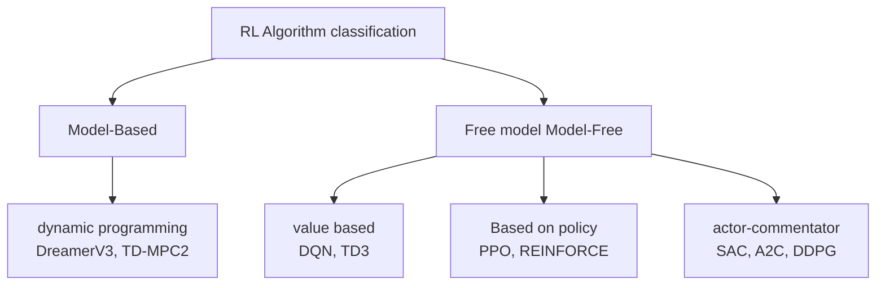

- **has model RL**: state transition model $$P(s'\mid s,a)$$ of the agent learning environment. This model is then used for planning, which usually has higher sample efficiency, but depends on model accuracy.
- **model-free RL**: directly interacts with the environment to learn strategies without explicitly modeling the environment. It is usually easier to migrate to complex tasks, but requires more interactive data.

---

# 3. Panorama of algorithm evolution 🗺️
{: id="3-算法演进全景图-️"}

The algorithm evolution of embodied RL can be divided into four generations:

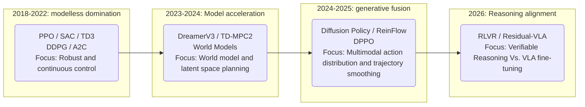

---

# 4. Policy gradient: the mathematical foundation of the algorithm
{: id="4-策略梯度算法的数学根基"}

## 4.1 Policy gradient theorem
{: id="41-策略梯度定理"}

All policy-based RL algorithms are derived from the same core formula - **policy gradient theorem**:

$$
\nabla \bar{R}_\theta = \mathbb{E}_{\tau \sim p_\theta(\tau)}\left[R(\tau) \nabla \log p_\theta(\tau)\right]
$$

Here, $$\bar{R}_\theta = \mathbb{E}_{\tau \sim p_\theta(\tau)}[R(\tau)]$$ is the expected cumulative reward, and $\tau = (s_1, a_1, s_2, a_2, \ldots)$ is a trajectory.

**Intuition**: If a trajectory brings high rewards, increase the probability of its occurrence; otherwise, reduce the probability.

During actual calculation, the gradient is decomposed into each time step:

$$
\nabla \bar{R}_\theta \approx \frac{1}{N} \sum_{n=1}^N \sum_{t=1}^{T_n} \left(\sum_{t'=t}^{T_n} \gamma^{t'-t} r_{t'}^n - b\right) \nabla \log p_\theta(a_t^n | s_t^n)
$$

Here, $b$ is the baseline, used to reduce the variance of gradient estimation. A natural choice is to use the value function $V_\pi(s)$ as the baseline, that is, introduce the **advantage function**:

$$
A(s_t, a_t) = Q_\pi(s_t, a_t) - V_\pi(s_t)
$$

The advantage function measures "how much better than average it is to take action $a_t$ in state $s_t$." In practice, TD residual approximation is used:

$$
A(s_t, a_t) \approx r_t + \gamma V_\pi(s_{t+1}) - V_\pi(s_t)
$$

## 4.2 The trade-off between exploration and exploitation
{: id="42-探索与利用的权衡"}

Among embodied intelligence, the **Exploration-Exploitation Dilemma** is particularly prominent:

- **Exploration**: Try unknown actions, you may get greater rewards, or you may damage the robot.
- **Exploitation**: Execute known optimal actions, but may fall into local optima.

Common exploration strategies:
- **$\varepsilon$-greedy**: Random action with $\varepsilon$ probability, and select the optimal action with $1-\varepsilon$ probability.
- **Entropy regularization (Entropy Regularization)**: The core idea of SAC is to maximize policy entropy to encourage exploration.
- **Parameter Noise (Parameter Noise)**: Add noise to the network parameters (TD3/DDPG uses action noise).

---

# 5. Actor-Critic Framework
{: id="5-演员-评论员actor-critic框架"}

**Actor-Critic (A-C)** is the basic structure of modern embodied RL algorithms, integrating policy gradient (actor) and value estimation (critic).

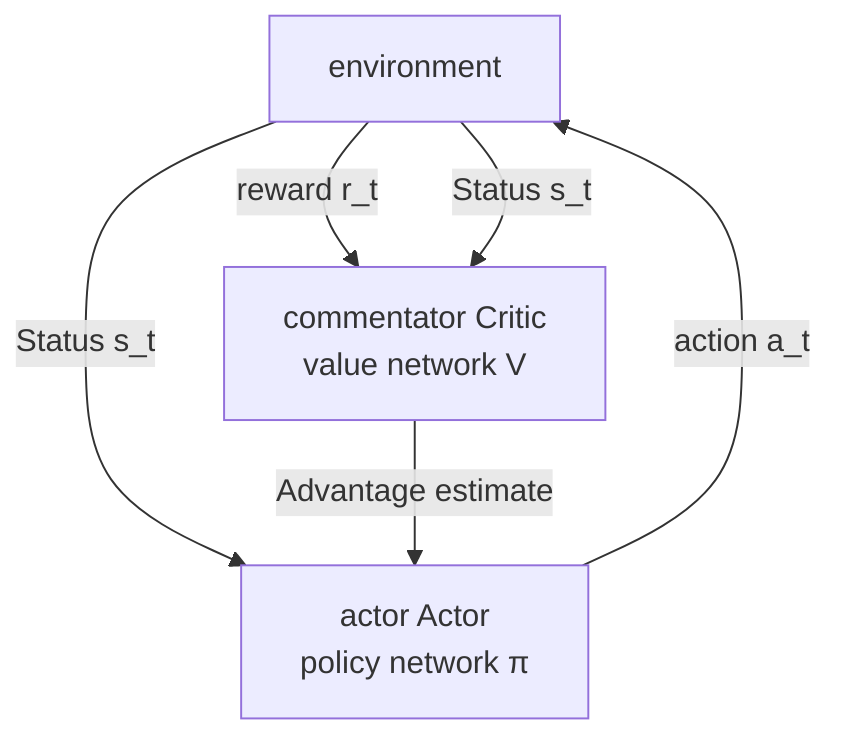

**Advantage Actor-Commentator (A2C) Gradient update for**:

$$
\nabla_\theta J(\theta) \approx \frac{1}{N}\sum_{n=1}^N \sum_t \left(r_t^n + \gamma V_w(s_{t+1}^n) - V_w(s_t^n)\right) \nabla_\theta \log \pi_\theta(a_t^n | s_t^n)
$$

Reviewer's loss function (mean squared error):

$$
\mathcal{L}(w) = \mathbb{E}\left[\left(r_t + \gamma V_w(s_{t+1}) - V_w(s_t)\right)^2\right]
$$

**A3C (Asynchronous Advantage Actor-Critic)** further uses multiple parallel work processes to asynchronously update the global network, significantly improving sample efficiency and training speed - analogous to the idea of ​​Naruto using shadow clones to practice at the same time in "Naruto".

---

# 6. PPO: the cornerstone algorithm of embodied control 🛡️
{: id="6-ppo具身控制的基石算法-️"}

**Proximal Policy Optimization (PPO)** is a policy optimization algorithm widely used in engineering practice, and is also a common baseline for embodied simulation platforms such as Isaac Lab. Its design goal is to improve sample utilization and training stability while maintaining the stability of policy updates.

## 6.1 From on-policy to off-policy learning: importance sampling
{: id="61-从同策略到异策略重要性采样"}

Policy gradient is the **same-policy (On-Policy)** algorithm - data must be resampled after each parameter update, and the sample utilization rate is extremely low.

**Importance Sampling** allows the old policy to be used $$\pi_{\theta'}$$ The data collected to train the new policy $\pi_\theta$:

$$
\mathbb{E}_{x \sim p}[f(x)] = \mathbb{E}_{x \sim q}\left[f(x)\frac{p(x)}{q(x)}\right]
$$

Apply this to policy optimization:

$$
J^{\theta'}(\theta) = \mathbb{E}_{(s_t, a_t) \sim \pi_{\theta'}}\left[\frac{p_\theta(a_t|s_t)}{p_{\theta'}(a_t|s_t)} A^{\theta'}(s_t, a_t)\right]
$$

Here, $$\frac{p_\theta(a_t\mid s_t)}{p_{\theta'}(a_t\mid s_t)}$$ is the **importance weight (Importance Weight)**, which corrects the difference between the two distributions.

> **key constraint**: If the gap between $\pi_\theta$ and $$\pi_{\theta'}$$ is too large, the variance of the importance weight will explode and the estimation will be inaccurate. This is exactly what a PPO is meant to solve.

## 6.2 TRPO: the predecessor of constrained optimization
{: id="62-trpo约束优化的前身"}

**Trust Region Policy Optimization (TRPO)** takes KL divergence as a hard constraint:

$$
\max_\theta \; J^{\theta'}(\theta), \quad \text{s.t.} \;\; \mathrm{KL}(\theta, \theta') < \delta
$$

TRPO theoretically guarantees policy improvement with each update, but solving constrained optimization problems is computationally expensive.

## 6.3 PPO-Penalty: Adaptive KL Penalty
{: id="63-ppo-penalty自适应-kl-惩罚"}

**PPO-Penalty** (PPO1) incorporates the constraints into the objective function:

$$
J_{\mathrm{PPO}}^{\theta^k}(\theta) = J^{\theta^k}(\theta) - \beta \cdot \mathrm{KL}(\theta, \theta^k)
$$

And use **adaptive $\beta$** to dynamically adjust the KL divergence penalty intensity:

- If $$\mathrm{KL}(\theta, \theta^k) > \mathrm{KL}_{\max}$$: increase $\beta$ (punishment for excessive update)
- If $$\mathrm{KL}(\theta, \theta^k) < \mathrm{KL}_{\min}$$: reduce $\beta$ (allow larger updates)

## 6.4 PPO-Clip: clipping mechanism (most commonly used)
{: id="64-ppo-clip裁剪机制最常用"}

**PPO-Clip** (PPO2) is more concise, constraining the probability ratio directly through clipping:

$$
J_{\mathrm{PPO2}}^{\theta^k}(\theta) \approx \sum_{(s_t, a_t)} \min\left(r_t(\theta) A^{\theta^k}(s_t, a_t),\; \mathrm{clip}(r_t(\theta),\, 1-\varepsilon,\, 1+\varepsilon) A^{\theta^k}(s_t, a_t)\right)
$$

Here, $$r_t(\theta) = \frac{p_\theta(a_t\mid s_t)}{p_{\theta^k}(a_t\mid s_t)}$$ is the probability ratio, and $\varepsilon$ usually takes 0.1 or 0.2.

**Intuitive clipping mechanism**:

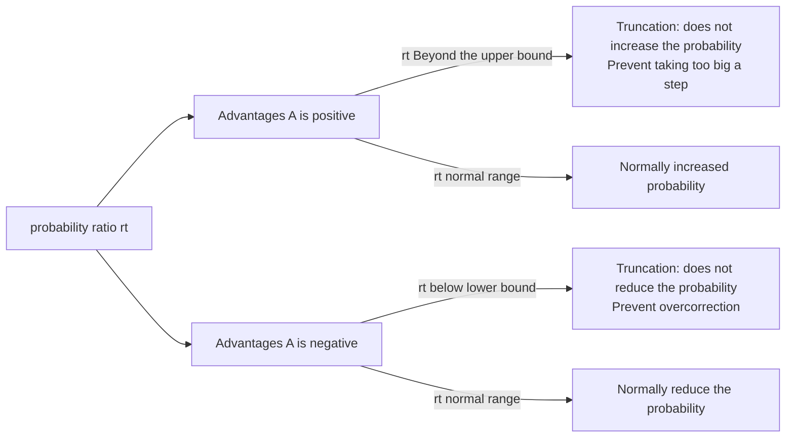

**Why is PPO suitable for embodied control?**

1. **High stability**: Tailoring ensures that each policy update is limited in scope, preventing the robot arm from suddenly making dangerous movements.
2. **Parallel-friendly**: Platforms such as Isaac Lab can run thousands of parallel simulation environments, and the same-policy characteristics of PPO are a natural fit.
3. **is simple to implement**: Compared with TRPO, PPO is less difficult to implement and has fewer hyperparameters.

---

# 7. DDPG → TD3 → SAC: The evolution of continuous motion control
{: id="7-ddpg--td3--sac连续动作控制的演进"}

Robot control usually involves **continuous action space** (such as joint torque, speed), which cannot be directly processed by discrete methods such as DQN, thus giving rise to a series of algorithms for continuous control.

## 7.1 DDPG: Deep deterministic policy gradient
{: id="71-ddpg深度确定性策略梯度"}

**Deep deterministic policy gradient (DDPG)** is a pioneering work extending DQN to continuous action space, and is also the direct predecessor of TD3 and SAC.

**core design**:

|components|Name|function|
| :--- | :--- | :--- |
|Actor $\mu_\theta(s)$|policy network|Output deterministic continuous action|
|Commentator $Q_w(s, a)$|Q network|Evaluate the value of an actor's output actions|
|target network| Slow-updating targets |Stable Q-target calculation|
|experience replay| Replay Buffer |Break data correlation and achieve off-policy training|

**actor update** (maximizing Q value):

$$
\nabla_\theta J \approx \nabla_a Q_w(s, a)\big|_{a=\mu_\theta(s)} \cdot \nabla_\theta \mu_\theta(s)
$$

**Commentator updates** (TD error minimized):

$$
y = r + \gamma Q_{\bar{w}}(s', \mu_{\bar{\theta}}(s')), \quad \mathcal{L}(w) = \mathbb{E}\left[(Q_w(s,a) - y)^2\right]
$$

Where $$Q_{\bar{w}}, \mu_{\bar{\theta}}$$ is the parameter of the target network, softly updated every $C$ step: $\bar{w} \leftarrow \tau w + (1-\tau)\bar{w}$.

To encourage exploration, noise (such as OU noise or Gaussian noise) is added to the actions during training.

Problems with **DDPG**: The Q value is easily overestimated, causing the policy to be destroyed and is extremely sensitive to hyperparameters.

## 7.2 TD3: Three key improvements
{: id="72-td3三大关键改进"}

**Double delay deep deterministic policy gradient (TD3)** systematically solves the instability problem of DDPG through three techniques:

### Tip 1: Clipped Double Q-Learning
{: id="技巧一截断双-q-学习clipped-double-q-learning"}

Learn two independent Q networks $$Q_{\phi_1}, Q_{\phi_2}$$, and take the minimum value when calculating Q-target:

$$
y = r + \gamma (1-d) \min_{i=1,2} Q_{\phi_i,\mathrm{targ}}(s', a'_{\mathrm{TD3}})
$$

Using minimum values instead of maximum values systematically suppresses Q overestimation.

### Tip 2: Delayed Policy Updates
{: id="技巧二延迟策略更新delayed-policy-updates"}

For every commentator's update 2 times, the actor was updated 1 times. Experiments show that the Q network converges first and then updates the policy, which can significantly improve stability.

### Tip 3: Target Policy Smoothing
{: id="技巧三目标策略平滑target-policy-smoothing"}

Add truncation noise to the target action:

$$
a'_{\mathrm{TD3}}(s') = \mathrm{clip}\left(\mu_{\bar{\theta}}(s') + \mathrm{clip}(\epsilon, -c, c),\; a_{\mathrm{low}},\; a_{\mathrm{high}}\right), \quad \epsilon \sim \mathcal{N}(0, \sigma)
$$

Smooth the response surface of the Q function to actions and reduce the sensitivity of the policy to Q errors.

 **TD3 performs well on dexterous manipulation tasks** , is a common baseline for fine control of robotic arms.

## 7.3 SAC: maximum entropy reinforcement learning 🎨
{: id="73-sac最大熵强化学习-"}

**Soft Actor-Critic (SAC)** is currently one of the most powerful model-free algorithms in the field of continuous control. Its core lies in the **maximum entropy reinforcement learning (Maximum Entropy RL)** framework.

### Maximum entropy goal
{: id="最大熵目标"}

SAC not only maximizes the cumulative reward, but also maximizes the **entropy (Entropy)** of the policy:

$$
\pi^* = \arg\max_\pi \mathbb{E}\left[\sum_t \gamma^t \left(r_t + \alpha \mathcal{H}(\pi(\cdot|s_t))\right)\right]
$$

Here, $\mathcal{H}(\pi(\cdot\mid s_t)) = -\mathbb{E}[\log \pi(a\mid s_t)]$ is the policy entropy, and $\alpha > 0$ is the temperature parameter, which controls the degree of exploration.

**Benefits of entropy maximization**:
- **encourages exploration of**: strategies are more evenly distributed and avoid premature convergence to local optimality.
- **is highly robust**: in a multi-peak reward environment, it can maintain a variety of feasible strategies.
- **sample efficient**: off-policy training + experience replay.

### SAC actor and critic updates
{: id="sac-的演员更新"}

The actor goal is to maximize Q-value while maximizing entropy:

$$
\mathcal{L}(\phi) = \mathbb{E}_{s_t, \tilde{a}_t \sim \pi_\phi}\left[\alpha \log \pi_\phi(\tilde{a}_t | s_t) - \min_{i=1,2} Q_{\theta_i}(s_t, \tilde{a}_t)\right]
$$

Note that SAC uses a double Q network to obtain the minimum value (same as TD3), effectively suppressing overestimation.

### Automatic temperature regulation
{: id="自动温度调节"}

SAC can automatically adjust the temperature parameter $\alpha$ by minimizing:

$$
\mathcal{L}(\alpha) = \mathbb{E}_{\tilde{a}_t \sim \pi_t}\left[-\alpha \log \pi_t(\tilde{a}_t|s_t) - \alpha \bar{\mathcal{H}}\right]
$$

Here, $\bar{\mathcal{H}}$ is the target entropy (usually set to $-\dim(A)$), and there is no need to manually adjust parameters.

### PPO vs SAC vs TD3 comparison
{: id="ppo-vs-sac-vs-td3-对比"}

|Features| PPO | SAC | TD3 |
| :--- | :---: | :---: | :---: |
|**Policy type**|randomness|randomness|certainty|
|**On-policy/off-policy**|on-policy|off-policy|off-policy|
|**Continuous action**| ✓ | ✓ | ✓ |
|**Discrete action**| ✓ | △ | ✗ |
|**sample efficiency**|in|high|high|
|**Super parameter sensitivity**|low|low|in|
|**Embodied application**|walking/running|Dexterous hand operation|Fine assembly|

---

# 8. Model-based RL: "precognitive dream" in latent space 🧠
{: id="8-有模型-rl潜空间的预知梦-"}

Model-free RL requires repeated interactions with the real environment and has low sample efficiency. **Model-Based RL (Model-Based RL)** allows the agent to learn the internal model of the environment and simulate exercises "in the mind", greatly reducing the number of interactions in the real environment.

## 8.1 World Models: V-M-C Trilogy
{: id="81-世界模型world-modelsv-m-c-三部曲"}

David Ha and Jürgen Schmidhuber proposed the classic world model framework in NeurIPS in 2018, which consists of three modules:

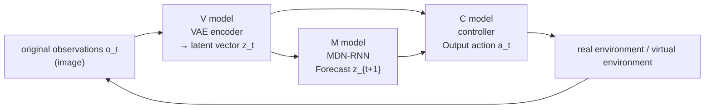

**V model (Variational Autoencoder)**: Visual perception module, compresses high-dimensional images into low-dimensional latent vectors $z_t$, and extracts essential features of the environment.

**M model (MDN-RNN)**: memory module, predicts the probability distribution of the latent vector at the next moment based on the current latent vector $z_t$, hidden state $h_t$ and action $a_t$:

$$
P(z_{t+1} | a_t, z_t, h_t)
$$

Use Mixed Density Networks (MDN) to output multimodal distributions that capture the randomness of the environment.

**C model (Controller)**: Controller, splicing $z_t$ and $h_t$ directly mapped into actions:

$$
a_t = W_c [z_t \; h_t] + b_c
$$

The controller has few parameters (linear layer) and is optimized with an evolutionary policy (CMA-ES) to avoid backpropagation across the entire world model.

**operation process**:

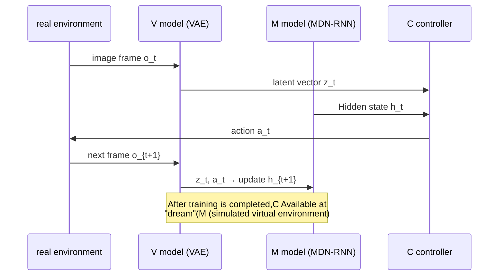

 **key insights** : After training is completed, you can **Train C controllers entirely in a virtual world built with M models** , no need to interact with the real environment, greatly improving training efficiency.

>  **Generative model ≠ world model** . The world model must have **Future state prediction ability under action conditions** , that is, given action input, the next state can be predicted. Models that can only generate images do not meet this condition.

## 8.2 DreamerV3: "Dream Practice" in Latent Space
{: id="82-dreamerv3潜空间的梦境修炼"}

**DreamerV3** is one of the representative methods of world model reinforcement learning, demonstrating high sample efficiency and cross-task robustness on a variety of control tasks.

**Core mechanism**:

1. **RSSM (Cyclic State Space Model)**: Decompose the environment state into a deterministic part $h_t$ (LSTM hidden state) and a stochastic part $z_t$ (VAE latent vector):

$$
h_t = f_\phi(h_{t-1}, z_{t-1}, a_{t-1})
$$

2. **Dreaming**: Unfold the complete trajectory in the latent space without interacting with the real environment:

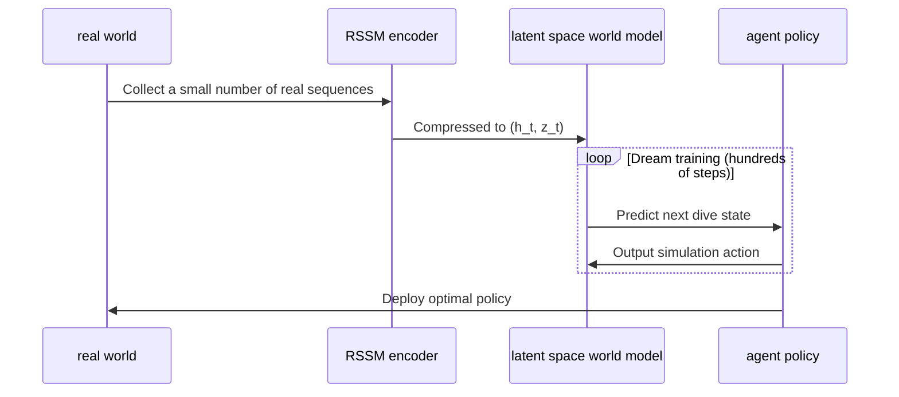

3. **Dimensionless rewards (Symlog)**: Use $\mathrm{symlog}(x) = \mathrm{sign}(x) \cdot \ln(\lvert x\rvert+1)$ to handle rewards, supporting cross-task migration without task-specific hyperparameters.

Achievements of **DreamerV3**:
- The first single hyperparameter setting, no need for any parameter adjustment, in Atari, DMC, Crafter, Minecraft, etc. 7 reached SOTA in several fields at the same time.
- Learn to mine diamonds from scratch for the first time in Minecraft (requires 14 consecutive decisions).

## 8.3 TD-MPC2: Model predictive control of latent space
{: id="83-td-mpc2潜空间的模型预测控制"}

**TD-MPC2** Combine **timing difference (TD)** and **model predictive control (MPC)** Unified in latent space, especially good at **long-range operation tasks**.

The core idea of **is**: perform short-view finite-step planning in the latent space, combine TD learning to estimate long-term value, and take into account planning depth and computational efficiency. Applicable scenarios: Multi-step operation tasks of robots from "grasping" to "assembly".

---

# 9. Diffusion policy: from "image generation" to "action generation" 🌊
{: id="9-扩散策略从生图到生动作-"}

## 9.1 Diffusion Policy
{: id="91-diffusion-policy"}

**Diffusion Policy** Migrate the core idea of ​​the image generation field (Stable Diffusion) to robot action generation: treat the target action trajectory as a process of "stepwise denoising from Gaussian noise".

**Why is a diffusion policy needed?**

The traditional policy network outputs the mean value of the action and cannot handle the **multi-modal action distribution (Multi-Modal Distribution)**. For example:

- There are two optional cups on the table. The optimal policy is "choose left" or "choose right". The mean policy will hover in the middle - neither can be obtained.
- Diffusion models can naturally represent multimodal distributions, and one can be chosen decisively.

**forward process (noise added)**:

$$
q(x_k | x_{k-1}) = \mathcal{N}(x_k;\; \sqrt{1 - \beta_k}\, x_{k-1},\; \beta_k I)
$$

**reverse process (denoising, learning target)**:

$$
p_\theta(x_{k-1} | x_k) = \mathcal{N}(x_{k-1};\; \mu_\theta(x_k, k),\; \Sigma_\theta(x_k, k))
$$

During training, the network learns to predict the noise $$\epsilon_\theta$$ at each step. During inference, it starts from random noise and iteratively denoises to obtain a smooth action trajectory.

Advantages of **diffusion policy**:

|Dimensions|traditional policy network|diffusion policy|
| :--- | :--- | :--- |
|**distributed expression**|Unimodal Gaussian|Any number of peaks|
|**track smoothness**|Average|Extremely high (the denoising process is naturally smooth)|
|**Inference speed**|Fast (single forward)|Slow (requires K iterations)|
|**applicable scenarios**|Simple operation|Complex grasping, two-arm collaboration|

## 9.2 ReinFlow: diffusion policy + reinforcement learning
{: id="92-reinflow扩散策略--强化学习"}

**ReinFlow** introduces reinforcement learning fine-tuning on the basis of Diffusion Policy to solve the problem of insufficient generalization of pure behavioral cloning (BC):

- First use expert demonstration data to train the diffusion policy (imitation learning stage)
- Then use the RL reward signal to fine-tune the diffusion policy (reinforcement learning stage)

This is similar to the SFT → RLHF two-stage training paradigm of LLM, which is one of the current mainstream frameworks for robot imitation learning.

## 9.3 DPPO: PPO constraints within diffusion chain
{: id="93-dppo扩散链内的-ppo-约束"}

**DPPO (Diffusion Policy with PPO)** directly embeds the truncated importance weighting mechanism of PPO into the gradual denoising process of the diffusion policy, solving the problem of unstable training when the diffusion policy does online reinforcement learning.

**core idea**: Treat the $K$ step denoising chain as a $K$ step MDP - the denoising output of each step is regarded as a "sub-action", and PPO-Clip constraints are imposed on the policy update of each step to prevent excessive distribution drift during iterative updates.

The difference between **and ReinFlow**:

|Dimensions| ReinFlow | DPPO |
| :--- | :--- | :--- |
|**training paradigm**|BC pre-training → RL fine-tuning (two stages)|Direct online RL within the diffusion chain (end-to-end)|
|**Constraint granularity**|overall strategic level|Level of each denoising step|
|**applicable scenarios**|There is sufficient demonstration data|Demo data is limited and needs to be explored purely online|

---

# 10. Sparse Rewards: The "Death Trap" of Embodied RL
{: id="10-稀疏奖励具身-rl-的死亡陷阱"}

Designing rewards for embodied intelligence is far more difficult than game environments. The robot does not receive any reward most of the time (for example, in the "Tightening the Screw" task, only the final tightening is rewarded with +1), causing gradients to disappear and training to stagnate.

## 10.1 Reward Shaping
{: id="101-奖励塑形reward-shaping"}

Manually design **auxiliary reward** to guide agent behavior, which is most commonly used but requires domain knowledge:

|Auxiliary reward type|Specific examples|Effect|
| :--- | :--- | :--- |
|**Proximity reward**|The closer the end effector is to the target, the greater the reward.|Boots quickly, but may get stuck in local solutions|
|**Contact force reward**|Give rewards within the correct contact force range|Suitable for delicate operations|
|**posture correctness**|Give rewards when the object's orientation meets the requirements|Prevent strange configurations|
|**Survival Reward**|Survive each step +0.001|Encourage robots to continue exploring|

> **Trap warning**: Improperly designed rewards can lead to "reward hacking" - the agent finds shortcuts beyond expectations to maximize rewards, rather than actually completing the task.

## 10.2 Intrinsic Curiosity Module (ICM)
{: id="102-内在好奇心模块icm"}

**Curiosity-driven reward** is a task-independent intrinsic reward that encourages agents to explore "unpredictable" new states:

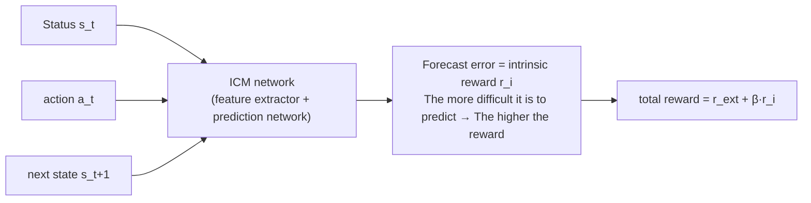

ICM consists of two subnetworks:
1. **Forward Model**: Given $(s_t, a_t)$ prediction $$\hat{s}_{t+1}$$, the prediction error serves as an intrinsic reward.
2. **Inverse Model**: Given $(s_t, s_{t+1})$ predicted action $$\hat{a}_t$$, it is used to train the feature extractor and filter noise irrelevant to the agent (such as background leaves fluttering).

## 10.3 Curriculum Learning
{: id="103-课程学习curriculum-learning"}

Arrange tasks progressively from easy to difficult, allowing the agent to gradually master complex skills:

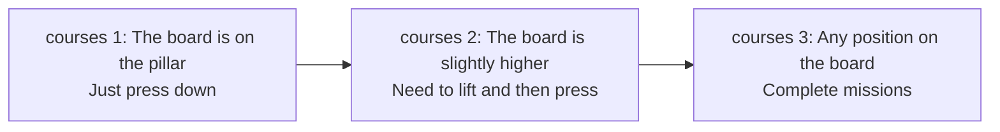

**Reverse Curriculum Generation** is an automated method: starting from the target state, gradually sampling the initial state "$k$ steps away from the target", and automatically constructing courses with increasing difficulty.

## 10.4 HER: Hindsight Experience Replay
{: id="104-her后见之明的奖励重标记"}

**Hindsight Experience Replay (HER)** is a classic technology for processing sparse rewards: even if a task fails (such as the robotic arm not being placed at the specified location), the "actually reached position of the robotic arm" can be used as an imaginary target to learn from the failure trajectory.

> **Key Insight**: Failure experience is not useless - after re-marking the goal with actual results, the failure trajectory becomes "successful experience", effectively alleviating the reward sparse problem.

---

# 11. 2026 Frontier Direction: Logical Reasoning and Residual Learning ⚡
{: id="11-2026-前沿方向逻辑推理与残差学习-"}

## 11.1 RLVR: reinforcement learning with verifiable rewards
{: id="111-rlvr可验证奖励的强化学习"}

**RLVR (Reinforcement Learning from Verifiable Rewards)** can incorporate **formally verifiable physical constraints** into the reward design to supplement sparse task success signals. For embodied tasks, this direction still needs to be combined with real dynamics, sensor noise and safety constraints to verify its effectiveness.

**What is a "verifiable reward"?**

- Traditional rewards: "Complete grasping tasks" → sparse, delayed
- RLVR reward: "Is the cup currently vertical (angle error < 5°)" → can be verified instantly, intensive

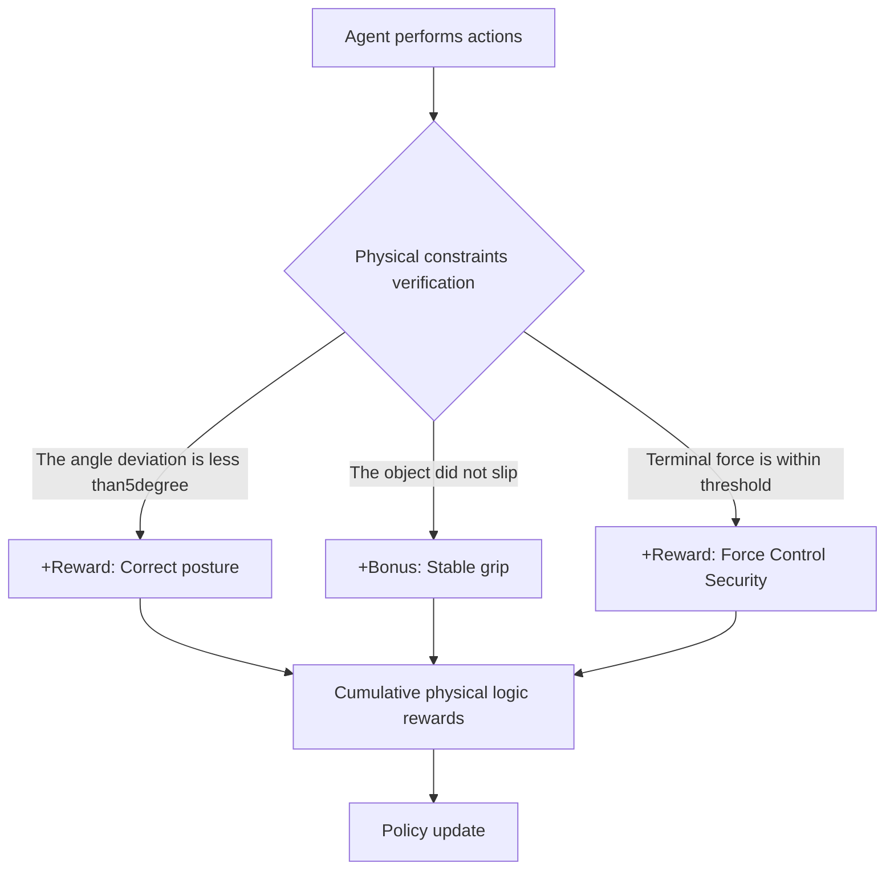

The essence of RLVR is to let robots master **physical reasoning ability** : Not just remembering "how", but understanding "why". This is especially critical for long, multi-step tasks like "take milk from the refrigerator and pour it into a cup."

## 11.2 Residual-VLA: large model + residual fine-tuning
{: id="112-residual-vla大模型--残差微调"}

**Residual VLA (Residual Vision-Language-Action)** architecture is aimed at the problem of "how to efficiently adapt a general VLA large model to a specific robot".

**Problem Background**:
- VLA large models (such as RT-2, π0) have strong common sense and generalization capabilities, but lack movement accuracy.
- Full fine-tuning is expensive and may destroy pretrained knowledge.

**residual architecture design**:

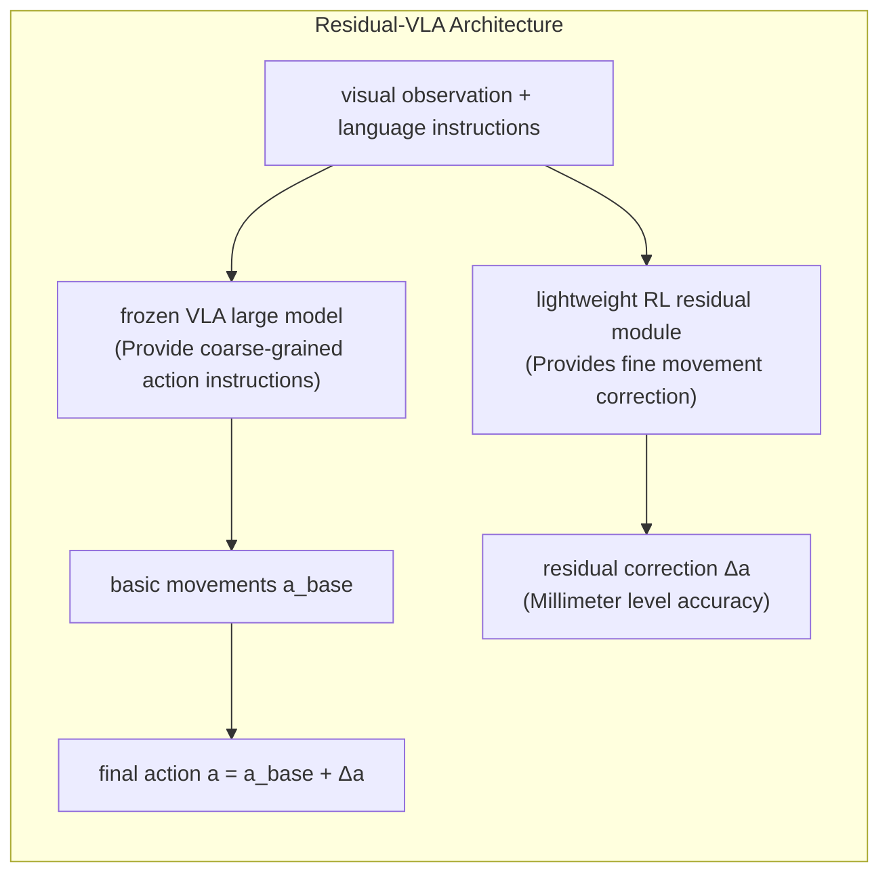

- **VLA large model (frozen)**: Provides task understanding and coarse-grained action planning, analogous to the "cerebral cortex".
- **RL Residual module (trainable)**: Perform real-time fine correction of the actions output by the large model, analogous to the "cerebellum".

**Core Advantages**:
1. Only small residual networks (number of parameters << VLA) are trained, and **can adapt to** new scenarios extremely quickly (hours vs days).
2. **Protect pretrained knowledge**: Freeze large models to avoid catastrophic forgetting.
3. **is highly versatile.**: The same VLA backbone can be used with different residual modules to adapt to different robot platforms.

---

# 12. Mainstream simulation environment and evaluation benchmark 🧪
{: id="12-主流仿真环境与评测基准-"}

The training and evaluation of embodied RL algorithms are highly dependent on simulation platforms. Different platforms have different emphasis on **physics engine accuracy**, **parallel efficiency** and **task type**. Choosing the right platform will get twice the result with half the effort.

## 12.1 Continuous Control Standard Benchmark
{: id="121-连续控制标准基准"}

### MuJoCo / DeepMind Control Suite
{: id="mujoco--deepmind-control-suite"}

|Properties|content|
| :--- | :--- |
|**physics engine**|MuJoCo (precise contact force, suitable for delicate operations)|
|**Main tasks**|Classic continuous controls such as HalfCheetah, Ant, Humanoid, Hopper, etc.|
|**applicable algorithm**|SAC, TD3 (off-policy); PPO (on-policy)|
|**Features**|The gold standard for horizontal comparison of algorithms in academia|

**DeepMind Control Suite (DMControl)** expands Cartpole, Walker, Cheetah and other tasks based on MuJoCo, and supports **pixel observation mode**, which is the main evaluation scenario for world model algorithms such as DreamerV3.

**OpenAI Gymnasium** (formerly OpenAI Gym) is currently the most common RL environment interface standard, and almost all mainstream RL libraries (Stable-Baselines3, CleanRL) are based on its `Env` interface.

## 12.2 Large-scale parallel simulation platform
{: id="122-大规模并行仿真平台"}

### Isaac Lab / Isaac Gym(NVIDIA)
{: id="isaac-lab--isaac-gymnvidia"}

|Properties|content|
| :--- | :--- |
|**physics engine**|PhysX (GPU accelerated)|
|**Parallel scale**|A single GPU can run **4096+ parallel environments**|
|**Main tasks**|Walking on four legs, running on two legs, dexterous hand operation (Shadow Hand, Allegro)|
|**applicable algorithm**|PPO (on-policy is naturally compatible with large-scale parallelism)|
|**Features**|Embodied RL academic and industrial standard platform, NVIDIA Omniverse ecosystem|

Isaac Lab is the next-generation successor of Isaac Gym. It is based on the USD scene format and supports more realistic rendering and sensor simulation. It is the current mainstream choice for training quadruped/biped rorobot policies.

## 12.3 Dedicated environment for operation tasks
{: id="123-操作任务专用环境"}

### RoboSuite / robomimic
{: id="robosuite--robomimic"}

**RoboSuite** is a robot manipulation simulation framework released by Stanford University. Based on MuJoCo, it provides a variety of robot arm models (Franka, UR5, Sawyer) and operation tasks (carrying, assembly, bottle cap screwing). Based on it, **robomimic** provides a standard evaluation process for large-scale demonstration data sets and "imitation learning + RL" joint training. It is the main evaluation benchmark for operational algorithms such as Diffusion Policy and ReinFlow.

### MetaWorld
{: id="metaworld"}

|Properties|content|
| :--- | :--- |
|**Number of tasks**|**50** robot manipulation tasks|
|**Design Goals**|Multi-task learning and zero-sample transfer evaluation|
|**applicable algorithm**|SAC, MT-SAC (Multi-tasking SAC)|
|**Features**|Unified task interface supports zero-shot cross-task evaluation|

## 12.4 Evaluation indicators
{: id="124-评测指标"}

|indicator|meaning|Main usage scenarios|
| :--- | :--- | :--- |
|**Success Rate**|The proportion of episodes in which tasks are completed|Operation and navigation tasks|
|**Normalized Return**|Score ratio relative to expert policy|MuJoCo continuous control|
|**Sample Efficiency**|Number of environmental interaction steps required to achieve target performance|Algorithm horizontal comparison|
|**Real-time Factor**|Simulation speed to real time ratio|Evaluate training throughput|

---

# 13. Developer Guide: Algorithm Selection Matrix 🛠️
{: id="13-开发者指南算法选择矩阵-️"}

If you are developing an embodied intelligence project, you can select algorithms according to the following dimensions:

|Task type|Recommendation algorithm|core rationale|Difficulty factor|
| :--- | :--- | :--- | :---: |
|**Quadruped/bipedal walking**| **PPO** |Highest stability, no fear of motor limitations; native support from Isaac Lab| ⭐⭐ |
|**precision assembly of robotic arm**| **SAC / TD3** |Different strategies + sample efficiency; SAC automatic parameter adjustment is more friendly| ⭐⭐⭐ |
|**deft hand grasping**| **SAC** |Entropy regularization encourages diverse actions and copes with multimodal operation distribution| ⭐⭐⭐⭐ |
|**Long-range navigation and operation**| **TD-MPC2** |Latent space planning is suitable for multi-step sequence decision-making| ⭐⭐⭐⭐ |
|**Multitasking/generalization operation**| **Diffusion Policy + ReinFlow** |The action trajectory is natural and smooth, and can handle multi-target conflicts| ⭐⭐⭐⭐⭐ |
|**VLA Large model fine-tuning**| **Residual-RL** |Protect pre-training knowledge while quickly adapting to specific scenarios| ⭐⭐⭐⭐ |
|**Sparse reward environment**| **SAC + ICM / HER** |Intrinsic reward + experience reuse alleviates reward sparsity| ⭐⭐⭐⭐⭐ |

**selection decision tree**:

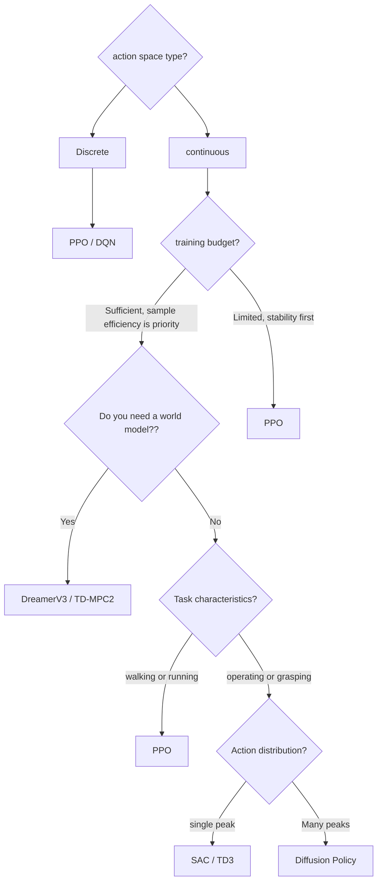

---

# 14. In-depth analysis of classic papers 📚
{: id="14-经典论文深度解析-"}

In order to help readers systematically grasp the complete evolution of reinforcement learning from classic theory to the frontier of embodied intelligence, this chapter selects **12 Milestone classics and cutting-edge breakthrough papers** Conduct in-depth analysis. Each paper is developed according to a standardized structure: [Key takeaways], [Background and problem], [Method and innovations], [Results and findings] and [Limitations analysis].

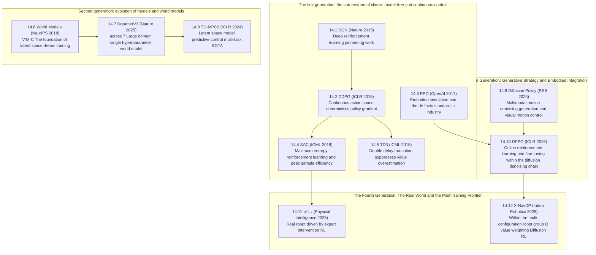

---

## 14.1 DQN (2015)
{: id="141-dqn-2015"}
——Human-level control: a pioneering work in deep reinforcement learning

📄 **Paper**: [Nature 2015 (Vol 518, pp 529–533)](https://www.nature.com/articles/nature14236)  
💻 **Code**: [DeepMind / DQN](https://github.com/deepmind/dqn)

### Key takeaways
{: id="精华"}
1. **Historic breakthrough**: For the first time, it was proven that deep neural networks can learn strategies end-to-end directly from raw high-dimensional visual pixels (Raw Pixels), reaching or even surpassing the level of human experts in the 49 Atari 2600 game without the need for manual design of features.
2. **experience replay (Experience Replay)**: It is proposed to maintain the circular replay buffer to break up the strong autocorrelation between time series samples, and convert non-independent and identically distributed (Non-i.i.d.) time series data into stationary random batch samples.
3. **Target Q Network (Target Network)**: Decouples the current action evaluation and target estimation network weights, periodically freezes the target parameters $\theta^-$, and eliminates the training oscillation and divergence caused by Bootstrapping from the root.
4. **unified architecture generalization**: The same set of CNN network architecture and the same set of hyperparameter settings take over all Atari games with different rules and different visual representations.
5. **establishes the modern DRL paradigm**: Deeply integrating deep representation learning (Representation Learning) and reinforcement learning (RL), ushering in the golden decade of modern deep reinforcement learning.

---

### 1. Background and problem
{: id="1-研究背景问题"}

Before 2015 years ago, classical reinforcement learning was mostly limited to low-dimensional hand-crafted feature state spaces (such as position, velocity or linear basis functions constructed by feature engineering). When faced with complex control tasks that directly use video frames as input, the combination of traditional nonlinear function approximators (such as shallow neural networks) and Q-Learning is prone to divergence or instability. The main pain points are:
- **data correlation is too strong**: The transfers collected at consecutive time steps have a high degree of time correlation for $(s_t, a_t, r_t, s_{t+1})$, violating the i.i.d. independent and identically distributed assumption of SGD stochastic gradient;
- **non-stationary target trap**: When calculating the TD target $y = r + \gamma \max_{a'} Q(s', a'; \theta)$, the target value directly depends on the parameter $\theta$ being updated, causing training to be like "shooting an arrow on a moving bullseye" and easily falling into positive feedback divergence.

---

<div align="center">
  
<figcaption>picture 14.1: Atari 2600 classic game screenshots (Pong, Breakout, Space Invaders, Beam Rider, Seaquest) reviewed by DQN</figcaption>
</div>

### 2. Methods and innovations
{: id="2-主要方法创新点"}

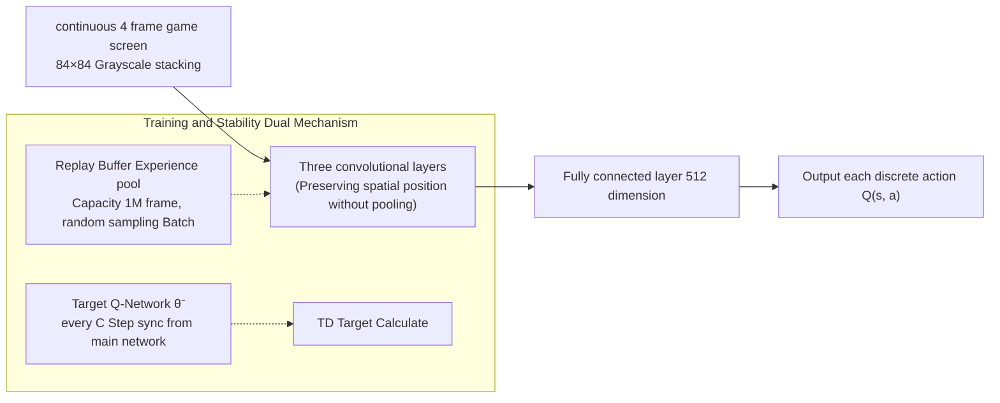

#### ① State representation and preprocessing
{: id="-状态表征与预处理"}
- In view of the dynamic nature of the video, the recent continuous 4 frame grayscale image is stacked into a tensor of $84 \times 84 \times 4$ as the current state input $s_t$, which effectively solves the problem of lack of Markov properties in which the ball's flight speed and direction cannot be inferred from a single frame.

#### ② experience replay mechanism (Experience Replay)
{: id="-经验回放机制experience-replay"}
- Maintain experience pool $\mathcal{D} = \{e_1, e_2, \ldots, e_N\}$ with capacity $N = 10^6$, and each transition tuple is $e_t = (s_t, a_t, r_t, s_{t+1})$.
- Each time the parameters are updated, Mini-batch is uniformly and randomly selected from $\mathcal{D}$ for gradient descent, which completely breaks the timing correlation and greatly improves the data reuse rate.

#### ③ Target network and loss function
{: id="-目标网络与损失函数"}
- Introducing the target network parameter $\theta^-$ with delayed update, the loss function is defined as:

$$
\mathcal{L}_i(\theta_i) = \mathbb{E}_{(s, a, r, s') \sim U(\mathcal{D})}\left[ \left( r + \gamma \max_{a'} Q(s', a'; \theta_i^-) - Q(s, a; \theta_i) \right)^2 \right]
$$

- The target network parameters are directly copied and updated from the current network every fixed number of steps $C$ (such as 10,000 steps): $\theta_i^- \leftarrow \theta_i$.

---

### 3. Results and findings
{: id="3-核心结果发现"}

- Across 49 Atari games, DQN outperformed professional human testers in **more than half (29 games)**. It demonstrated superhuman reactions and tactics in games such as Breakout, Pong, and Space Invaders, including digging a tunnel through the bricks in Breakout to keep the ball bouncing above them.
- ablation experiments have proven that: removing Experience Replay causes the performance of most games to drop off a cliff or even fail to converge; removing Target Network leads to serious divergence in Q value estimates.

---

### 4. Limitations
{: id="4-局限性"}

1. **is only applicable to low-dimensional discrete actions**: When selecting an action through $\max_{a'} Q(s', a')$, the computational cost explodes exponentially with the action dimension, and it cannot be directly used for continuous joint angle control of the robotic arm.
2. Systematic overestimation of **Q value (Overestimation Bias)**: The $\max$ operator causes noise to be accumulated in a positive direction, prompting the birth of subsequent Double DQN.
3. **Low sample efficiency**: It usually requires tens of millions of frames of environment interaction to learn a game, and it is difficult to directly deploy it on a real robot with severe physical hardware wear and tear.

---

## 14.2 DDPG (2016)
{: id="142-ddpg-2016"}
——The cornerstone of continuous control: deep deterministic policy gradient

📄 **Paper**: [ICLR 2016](https://arxiv.org/abs/1509.02971)  
💻 **Code**: [OpenAI Baselines / DDPG](https://github.com/openai/baselines)

### Key takeaways
{: id="精华-1"}
1. **continuous action breakthrough**: For the first time, DQN’s deep representation and Experience Replay / Target Network mechanism were successfully extended to **high-dimensional continuous action space**.
2. **Deterministic policy gradient (DPG) is implemented in**: Actor directly outputs the deterministic action vector $\mu(s\mid\theta^\mu)$, eliminating the high variance problem of integral sampling in high-dimensional continuous action space.
3. **soft update target network (Polyak Averaging)**: Proposed $\theta' \leftarrow \tau \theta + (1-\tau)\theta'$ ($\tau \ll 1$) micro-smooth update target network, greatly improving training stability in continuous control.
4. **Exploration Noise Injection**: Enable smooth exploration in continuous physical systems by superimposing Ornstein-Uhlenbeck (OU) process timing-correlated noise on deterministic actions.
5. **Embodied Machinery Control Milestone**: Demonstrated strong end-to-end torque control capabilities in MuJoCo continuous physical simulation (robot arm handling, bipedal walking, vehicle driving).

---

### 1. Background and problem
{: id="1-研究背景问题-1"}

Although DQN has achieved great success in discrete games, real-world physical world tasks such as robot manipulation and multi-legged gait control all belong to high-dimensional continuous action spaces (such as the real-time torque or angle of $N$ motors). If the continuous action space is discretized (Discretization), the action dimension will face the **curse of dimensionality (Curse of Dimensionality)** (for example, each joint of the 7 degree-of-freedom robotic arm is subdivided into 10 bins, and the number of discrete actions is as high as $10^7$). Therefore, there is an urgent need for a deep off-policy reinforcement learning algorithm that can directly perform end-to-end optimization in continuous action space and has high sample efficiency.

---

<div align="center">
  
<figcaption>Figure 14.2: DDPG solved MuJoCo and physical simulation continuous control environment examples (robot grasping, bipedal walking, vehicle driving, etc.)</figcaption>
</div>

### 2. Methods and innovations
{: id="2-主要方法创新点-1"}

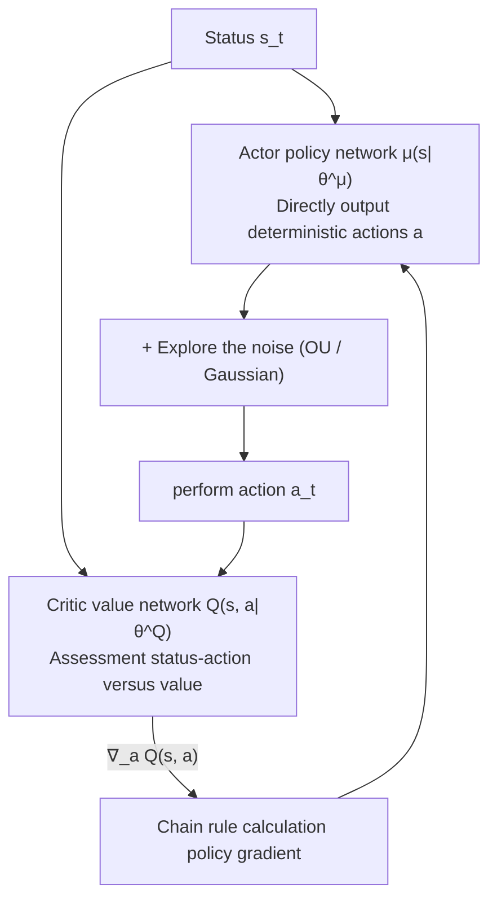

#### ① Actor-Critic architecture and deterministic update
{: id="-actor-critic-架构与确定性更新"}
- **Actor policy update**: Using the chain rule to maximize the action value evaluated by Critic:

$$
\nabla_{\theta^\mu} J \approx \frac{1}{N} \sum_i \nabla_a Q(s, a; \theta^Q)\Big|_{s=s_i, a=\mu(s_i;\theta^\mu)} \cdot \nabla_{\theta^\mu} \mu(s; \theta^\mu)\Big|_{s=s_i}
$$

- **Critic value update**: Minimize Bellman residual mean square error:

$$
y_i = r_i + \gamma Q'\left(s_{i+1}, \mu'(s_{i+1}; \theta^{\mu'}); \theta^{Q'}\right), \quad \mathcal{L}(\theta^Q) = \frac{1}{N} \sum_i \left( Q(s_i, a_i; \theta^Q) - y_i \right)^2
$$

#### ② Polyak soft update
{: id="-polyak-软更新"}
- Abandoned periodic hard copies of DQN in favor of incremental soft updates:

$$
\theta^{Q'} \leftarrow \tau \theta^Q + (1-\tau)\theta^{Q'}, \quad \theta^{\mu'} \leftarrow \tau \theta^\mu + (1-\tau)\theta^{\mu'} \quad (\tau = 0.001)
$$

---

### 3. Results and findings
{: id="3-核心结果发现-1"}

- On 20+ consecutive control benchmarks (Cartpole, Reacher, Cheetah, Humanoid, etc.) in the MuJoCo dynamics environment, DDPG successfully learned stable control using the exact same hyperparameters and network architecture.
- The feasibility of pixel input control is verified: by directly inputting RGB pixel frames, DDPG can still learn to control the robotic arm to complete grasping alignment.

---

### 4. Limitations
{: id="4-局限性-1"}

1. **is extremely sensitive to hyperparameters**: Slight deviations in learning rate and noise scale can easily lead to policy collapse.
2. **Severe overestimation of Q value**: The single critic structure excessively pursues local maximum values in the continuous update of deterministic strategies, which easily leads to the divergence of the Q network (which gave birth to TD3).

---

## 14.3 PPO (2017)
{: id="143-ppo-2017"}
——The de facto standard for embodied control: proximal policy optimization algorithm

📄 **Paper**: [arXiv:1707.06347 (OpenAI)](https://arxiv.org/abs/1707.06347)  
💻 **Code**: [OpenAI Baselines / PPO](https://github.com/openai/baselines)

### Key takeaways
{: id="精华-2"}
1. **The perfect balance of engineering and theory**: Based on the strict theoretical trust domain mathematics of TRPO, the **Clipped Surrogate Objective** is proposed, which eliminates the need for second-order conjugate gradient and Hessian matrix calculations and achieves extremely high stability under the first-order optimizer.
2. **limit policy destructive update**: By limiting the probability ratio $r_t(\theta)$ to the $[1-\epsilon, 1+\epsilon]$ interval, the disaster of irreversible "collapse" of the policy due to a single bad batch gradient being too large is fundamentally eliminated.
3. **Multi-Epoch data reuse**: Breaking the traditional on-policy which only updates the gradient once for each sampling step, it allows to safely run multiple Epoch Mini-batch SGD on the same batch of Rollout experience.
4. **has a wide range of applicable scenarios**: from Atari discrete games, MuJoCo continuous control, to quadruped robot gait (ANYmal / Unitree), humanoid robots and even LLM's RLHF alignment, becoming the default baseline in the industry.
5. **is naturally compatible with GPU large-scale parallelism**: With the large-scale vectorized simulation environment of physics engines such as Isaac Lab, it can achieve ultra-high-speed end-to-end policy training in parallel with thousands of environments.

---

### 1. Background and problem
{: id="1-研究背景问题-2"}

Policy gradient algorithms (such as REINFORCE, A2C) commonly face **Sample inefficiency** and **Training is prone to collapse** Two big problems:
- **is the same as policy update bottleneck**: Once the policy is updated, the historically collected data will become invalid immediately and must be discarded and resampled;
- **The step size is extremely sensitive**: In the standard policy gradient, if the parameter update step size of a certain step is slightly larger, the policy will enter the extremely poor performance dead zone (Blind Zone). The quality of the samples taken by the new policy is extremely low, resulting in the subsequent gradient being unable to recover and the training completely failing.
Although TRPO solves the stability problem through the second-order KL divergence constraint, calculating the Fisher information matrix inverse is extremely expensive and difficult to generalize.

---

<div align="center">
  
<figcaption>Figure 14.3: PPO clipping agent target L^CLIP schematic diagram: Preventing excessive updates by truncation when the advantage is positive (left) and negative (right)</figcaption>
</div>

### 2. Methods and innovations
{: id="2-主要方法创新点-2"}

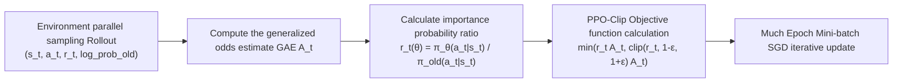

#### ① Clipped Surrogate Objective
{: id="-裁剪代理目标函数clipped-surrogate-objective"}
The core loss function of PPO-Clip is simple and elegant in form:

$$
L^{\mathrm{CLIP}}(\theta) = \hat{\mathbb{E}}_t \left[ \min\left( r_t(\theta)\hat{A}_t,\; \mathrm{clip}(r_t(\theta), 1-\epsilon, 1+\epsilon)\hat{A}_t \right) \right]
$$

Among them $r_t(\theta) = \frac{\pi_\theta(a_t\mid s_t)}{\pi_{\theta_{\mathrm{old}}}(a_t\mid s_t)}$. The cutting logic is as follows:
- When the advantage is $$\hat{A}_t > 0$$ (the action is better than average): the target increases with $r_t$, but is truncated when $r_t > 1+\epsilon$, preventing the policy from being too greedy due to a single good sample;
- When advantage $$\hat{A}_t < 0$$ (action worse than average): The target decreases with $r_t$, but is truncated when $r_t < 1-\epsilon$, preventing gradient overcorrection.

#### ② Joint target and GAE (generalized advantage estimation)
{: id="-联合目标与-gae广义优势估计"}
In actual embodied control engineering, policy loss, critic value loss and policy entropy regularization terms are usually jointly optimized:

$$
L_t^{\mathrm{CLIP+VF+S}}(\theta) = \hat{\mathbb{E}}_t \left[ L_t^{\mathrm{CLIP}}(\theta) - c_1 \left( V_\theta(s_t) - V_t^{\mathrm{targ}} \right)^2 + c_2 \mathcal{H}(\pi_\theta(\cdot|s_t)) \right]
$$

---

### 3. Results and findings
{: id="3-核心结果发现-2"}

- In the MuJoCo continuous control benchmark, PPO completely suppresses A2C, TRPO and CEM in almost all benchmarks (HalfCheetah, Hopper, Walker2d, Ant), and achieves an order of magnitude less code.
- It has become the core cornerstone algorithm for OpenAI’s internal training of complex embodied systems (such as the OpenAI Five DOTA 2 agent and the Shadow Dactyl robot to solve the Rubik’s Cube).

---

### 4. Limitations
{: id="4-局限性-2"}

1. **Sample efficiency remains lower than that of off-policy algorithms**: PPO permits limited reuse across a few epochs but remains on-policy. It cannot reuse millions of historical transitions from a replay buffer as SAC or TD3 can.
2. **hyperparameters $\epsilon$ and learning rate scheduling still need to be debugged**: In some long-range fine operations, it may fall into a locally poor conservative policy.

---

## 14.4 SAC (2018)
{: id="144-sac-2018"}
———Maximum entropy reinforcement learning pinnacle: soft actor-commentator algorithm

📄 **Paper**: [ICML 2018](https://arxiv.org/abs/1801.01290)  
💻 **Code**: [rail-berkeley / softlearning](https://github.com/rail-berkeley/softlearning)

### Key takeaways
{: id="精华-3"}
1. **Maximum Entropy reinforcement learning (Maximum Entropy RL)**: Explicitly introduce the policy entropy $\mathcal{H}(\pi(\cdot\mid s))$ into the optimization goal, prompting the agent to take as diverse action distributions as possible while maximizing cumulative returns.
2. **Excellent exploration ability and robustness**: In the face of multi-modal distribution rewards and physical disturbances, the maximum entropy policy can retain all action branches with similar values and avoid premature convergence to local sub-optimal extreme points.
3. **Different strategies and high sample efficiency**: Combining Replay Buffer, Double Q network (Double Q-Learning) and soft policy iteration, the sample utilization rate is improved several times to dozens of times compared with PPO.
4. **Auto-tuning Temperature**: The subsequent version introduced the Lagrange multiplier to adaptively adjust the temperature coefficient $\alpha$, completely eliminating the tedious debugging of manual adjustment of entropy weight.
5. **The first choice for embodied robotic arms and dexterous hands**: one of the most popular and robust algorithms for real-world robotic arm assembly, rotating objects, and contact-rich physics tasks.

---

### 1. Background and problem
{: id="1-研究背景问题-3"}

Traditional reinforcement learning pursues deterministic optimal policy $\pi^* = \arg\max \mathbb{E}[R]$. However, in the complex physical world, deterministic strategies have significant vulnerabilities:
- **is easy to fall into local extrema**: Once the exploration stops prematurely, the robot will never be able to discover a better behavior path;
- **Poor anti-disturbance ability**: Small physical changes in the environment (such as friction changes, collision disturbances) can cause the policy to fail;
- **Offline continuous algorithm is unstable**: DDPG often causes Q-value collapse due to improper hyperparameter selection.

---

<div align="center">
  
<figcaption>Figure 14.4: Comparison of training convergence curves of SAC on the MuJoCo continuous control benchmark (HalfCheetah, Hopper, Walker2d, Ant, Humanoid)</figcaption>
</div>

### 2. Methods and innovations
{: id="2-主要方法创新点-3"}

```mermaid
graph TD
    A["Maximum entropy goal: E["∑ γ^t (r_t + α H(π))"]"] --> B["Actor policy network: Output Gaussian mean μ and variance σ"]
    B --> C["Re-parameterized skill sampling actions: a = tanh(μ + σ ⊙ ε)"]
    C --> D["double Critic network Q1, Q2 Assessment"]
    D --> E["Take the minimum value min(Q1, Q2) Prevent overestimation"]
    E --> F["Adaptive update temperature coefficient α (Meet the target entropy H_target)"]
```

#### ① Maximum entropy objective function
{: id="-最大熵目标函数"}
$$
J(\pi) = \sum_{t=0}^T \mathbb{E}_{(s_t, a_t) \sim \rho_\pi} \left[ r(s_t, a_t) + \alpha \mathcal{H}(\pi(\cdot|s_t)) \right]
$$

#### ② Soft Bellman equation and soft value iteration
{: id="-软-bellman-方程与软价值迭代"}
- **Soft Q-Function target**:

$$
y = r + \gamma \mathbb{E}_{s' \sim p, a' \sim \pi}\left[ \min_{j=1,2} Q_{\bar{\theta}_j}(s', a') - \alpha \log \pi_\phi(a'|s') \right]
$$

- **Actor updates target** (using heavy parameterization technique $a_\phi(s, \epsilon) = \tanh(\mu_\phi(s) + \sigma_\phi(s) \odot \epsilon)$, $\epsilon \sim \mathcal{N}(0, I)$):

$$
J_\pi(\phi) = \mathbb{E}_{s \sim \mathcal{D}, \epsilon \sim \mathcal{N}}\left[ \alpha \log \pi_\phi(a_\phi(s, \epsilon)|s) - \min_{j=1,2} Q_{\theta_j}(s, a_\phi(s, \epsilon)) \right]
$$

#### ③ Automatically adjust temperature coefficient $\alpha$
{: id="-自动调节温度系数-alpha"}
By constructing a restricted optimization problem, $\alpha$ is dynamically adjusted to maintain the policy entropy not lower than the expected target entropy $\bar{\mathcal{H}} = -\dim(\mathcal{A})$:

$$
J(\alpha) = \mathbb{E}_{s \sim \mathcal{D}, a \sim \pi}\left[ -\alpha \log \pi(a|s) - \alpha \bar{\mathcal{H}} \right]
$$

---

### 3. Results and findings
{: id="3-核心结果发现-3"}

- In the MuJoCo continuous control benchmarks (Humanoid, Ant, HalfCheetah), SAC significantly surpasses DDPG, PPO and TD3 in terms of convergence speed and final performance.
-  **real robot zero-sample robustness** : In the real Minitaur quadruped robot walking experiment, only **2 Hour** Through interaction, you can learn a stable gait from scratch and be able to resist disturbance from external kicks.

---

### 4. Limitations
{: id="4-局限性-3"}

1. The computational complexity of **is relatively high.**: Each step requires multiple sampling and forward and backward propagation of two Critic + target Critic.
2. **Multimodal distribution represents restricted**: Although it is better than the single Gaussian policy, the output is based on Gaussian transformation (Squashed Gaussian), which still cannot perfectly cover complex multi-objective disjoint distributions (such as bypassing obstacles to the left or right).

---

## 14.5 TD3 (2018)
{: id="145-td3-2018"}
——Double-delay deterministic policy gradient: conquering value function approximation error

📄 **Paper**: [ICML 2018](https://arxiv.org/abs/1802.09477)  
💻 **Code**: [sfujim / TD3](https://github.com/sfujim/TD3)

### Key takeaways
{: id="精华-4"}
1. **reveals the overestimation mechanism in continuous control**: It is the first systematic proof that in the Actor-Critic algorithm of continuous action space, the value function approximation error will lead to serious cumulative overestimation, thereby inducing the Actor to fall into the suboptimal region.
2. **Clipped Double Q-Learning**: Train two Q networks independently, take the smaller value of the two when calculating TD Target, and completely eliminate malignant overestimation with a slight underestimation bias.
3. **Delayed Policy Updates**: Reduce the update frequency of the Actor and the target network (update the Actor 1 times for every 2 Critic update) to ensure that the Critic approach is more stable and accurate before updating the policy.
4. **Target Policy Smoothing regularization (Target Policy Smoothing)**: Inject truncated random Gaussian noise into the target value when calculating the target action to enhance the continuous smoothness of the Q function in the action dimension.
5. **Extremely pure and robust baseline**: sets an industrial high-precision benchmark in deterministic policy continuous control tasks.

---

### 1. Background and problem
{: id="1-研究背景问题-4"}

In discrete Q-Learning, the maximization operation $\max_a Q(s, a)$ introduces a positive estimation bias (demonstrated by Double DQN). In the continuously controlled DDPG, due to the use of gradient ascent to search for the maximum action value, Critic will continue to give high Q estimates. These overestimation errors are continuously transferred and accumulated in the time difference expansion, causing the Actor to blindly chase false high-value action peaks, and ultimately trigger a training shock collapse.

---

<div align="center">
  
<figcaption>Figure 14.5: During training, the Q value of DDPG (red line) seriously deviates from the true cumulative returns and viciously overestimates, while the value estimate of TD3 (blue line) always closely coincides with the true Returns</figcaption>
</div>

### 2. Methods and innovations
{: id="2-主要方法创新点-4"}

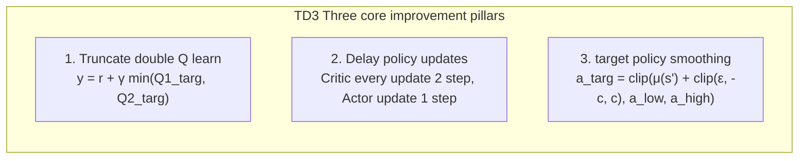

#### ① Truncate the double Q learning mechanism
{: id="-截断双-q-学习机制"}
Train two independent critic parameters $\theta_1, \theta_2$:

$$
y = r + \gamma \min_{i=1,2} Q_{\theta_i'}\left(s',\; \tilde{a}'\right)
$$

Taking the minimum value of the two forces the Q function not to diverge out of control in the direction of positive infinity even if there is an approximation error.

#### ② Target policy smoothing
{: id="-目标策略平滑"}
Inject truncated Gaussian noise when calculating the action for the next state:

$$
\tilde{a}' = \mathrm{clip}\left( \mu_{\phi'}(s') + \mathrm{clip}(\epsilon, -c, c),\; a_{\mathrm{low}},\; a_{\mathrm{high}} \right), \quad \epsilon \sim \mathcal{N}(0, \sigma)
$$

This is based on common sense in physics: similar actions should yield similar value returns in the physical world, preventing actors from exploiting narrow, sharp, high-value vulnerabilities on the Critic surface.

---

### 3. Results and findings
{: id="3-核心结果发现-4"}

- In MuJoCo 7 classic continuous control benchmarks, TD3's stability and final return significantly surpassed DDPG, and tied with SAC on most continuous control indicators.
- The Q value estimation tracking experiment shows that the estimated Q value of DDPG is quickly 2~5 times higher than the real cumulative returns after tens of thousands of steps, while the estimated curve of TD3 is always highly consistent with the real Returns.

---

### 4. Limitations
{: id="4-局限性-4"}

1. **Deterministic policy lacks endogenous exploration mechanism**: Exploration completely relies on external additional action space noise (such as Gaussian random noise), and exploration is easily blocked in a long-range sparse reward environment.
2. There is still room for tuning **hyperparameters**: The number of delay steps and noise cutoff range need to be set according to the physical characteristics of the system.

---

## 14.6 World Models (2018)
{: id="146-world-models-2018"}
——Precognitive dream in latent space: V-M-C architecture and the foundation of model-based RL

📄 **Paper**: [NeurIPS 2018](https://arxiv.org/abs/1803.10122)  
💻 **Code**: [worldmodels.github.io](https://worldmodels.github.io/)

### Key takeaways
{: id="精华-5"}
1. **cognitive science architecture (V-M-C paradigm)**: proposed by **visual encoder (V)**, **memory dynamics (M)** and The trinity intelligent brain composed of **lightweight controller (C) and** realizes the training policy completely in the "Dream" generated by the neural network for the first time.
2. **Visual dimensionality reduction perception (V model)**: Use Variational Autoencoder (VAE) to compress complex original image frames into low-dimensional continuous latent variables $z_t$, filtering background irrelevant redundancy.
3. **Time series dynamics prediction (M model)**: Use MDN-RNN (Mixed Density Recurrent Neural Network) autoregressive modeling of latent state transition distribution under action conditions $P(z_{t+1} \mid z_t, a_t, h_t)$, perfectly capturing the randomness of the physical environment.
4. **Minimalist Controller (C Model)**: The controller is only a single-layer linear mapping network (only a few thousand parameters), using the evolutionary policy (CMA-ES) to optimize quickly in the dream world, completely eliminating the long-range backpropagation derivation that penetrates the world model.
5. **opens a new era of world models**: laid the theoretical and architectural foundation for subsequent Dreamer series, MuZero and embodied physics simulation world models.

---

### 1. Background and problem
{: id="1-研究背景问题-5"}

Traditional Model-Free RL (such as DQN, PPO) treats the environment as an unknowable black box and needs to repeatedly interact with the physical world or high-precision simulator for millions of steps. **Sample efficiency is extremely low** . The human brain has a powerful internal representation of the world model: it can "rehearse" possible future scenarios in the mind and make decisions based on past experience. The core issue is: **Is it possible to train a compact generative neural network model to simulate the spatiotemporal evolution of the environment, and allow the agent to complete its policy improvement entirely in the dream state of latent space?** 

---

<div align="center">
  
<figcaption>Figure 14.6: World Models complete data flow: the image is compressed by V into a latent vector z_t, and is spliced with the cyclic hidden state h_t of the M model to input the C controller to generate the action a_t</figcaption>
</div>

### 2. Methods and innovations
{: id="2-主要方法创新点-5"}

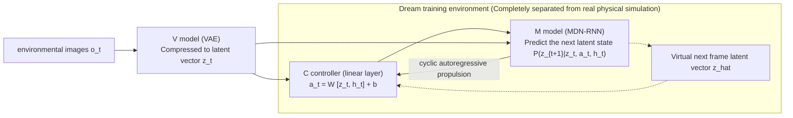

#### ① V model: space compression (Vision)
{: id="-v-模型空间压缩vision"}
- Train the VAE encoder $q_\phi(z_t\mid o_t)$ and decoder $p_\psi(o_t\mid z_t)$ to compress the $64 \times 64 \times 3$ image into the 32 dimensional Gaussian latent vector $z_t$.

#### ② M model: Time prediction (Memory)
{: id="-m-模型时间预测memory"}
- Using RNN with a mixed Gaussian output layer (Mixture Density Network) to model environment transfer:

$$
P(z_{t+1} \mid z_t, a_t, h_t) = \sum_{k=1}^K \pi_k(h_t) \mathcal{N}\left(z_{t+1};\; \mu_k(h_t), \Sigma_k(h_t)\right)
$$

- The temperature parameter $\tau$ is introduced to control the randomness and uncertainty of the dream environment.

#### ③ C model: Policy control (Controller)
{: id="-c-模型策略控制controller"}
- The controller parameters range from hundreds to thousands of weights, and only use the current $z_t$ and RNN hidden state $h_t$ as input and output actions $a_t$. Cumulative dream scores are directly optimized using CMA-ES (Covariance Matrix Adaptive Evolution Strategy).

---

### 3. Results and findings
{: id="3-核心结果发现-5"}

- **CarRacing-v0 Racing Benchmark**: A controller completely trained in the MDN-RNN dreamland, deployed directly to the real track and obtained **906 ± 21** With a high score, it not only passed this benchmark, but also surpassed all previous Model-Free reinforcement learning methods.
- **VizDoom Game**: In a complex doomsday shooter, an agent learns to dodge fireball attacks with agility in a "fictional dream scenario."

---

### 4. Limitations
{: id="4-局限性-5"}

1. **Step-by-step decoupled training lacks end-to-end collaboration**: V, M, and C are trained independently. The VAE encoding features do not consider the downstream reward correlation and may miss small key objects.
2. **Dream illusion (Adversarial Exploitation)**: The controller easily finds unreasonable loopholes in the latent space dynamics of the M model, and obtains false high scores in the dream but fails on the real robot.

---

## 14.7 DreamerV3 (2023/2025)
{: id="147-dreamerv3-20232025"}
——Universal world model milestone: mastering cross-domain multi-scale control

📄 **Paper**: [Nature 2025 / arXiv:2301.04104 (Google DeepMind)](https://arxiv.org/abs/2301.04104)  
💻 **Code**: [danijar / dreamerv3](https://github.com/danijar/dreamerv3)

### Key takeaways
{: id="精华-6"}
1. **The first cross-domain universal world model with fixed hyperparameters**: Under completely fixed hyperparameter settings, the same set of algorithms takes over 7 Large heterogeneous fields (Atari, DMC continuous control, Crafter 2D survival, Minecraft 3D Sandbox, BSuite, Memory tasks, etc.).
2. **Symlog transformation and dimensionless**: The symmetric logarithmic transformation $\mathrm{symlog}(x) = \mathrm{sign}(x)\ln(\lvert x\rvert+1)$ is proposed to process the input features, value network and loss function, and completely solves the problem of reward gradient scaling with a huge span of orders of magnitude across tasks.
3. **Discrete latent variable RSSM (Cyclic State Space Model)**: Represents the stochastic latent state of the world model as a discrete Categorical vector group, effectively preventing information collapse and enhancing the ability to express nonlinear mutation dynamics.
4. **Minecraft diamond mining without expert demonstrations**: Without any human expert demonstration data and relying entirely on sparse rewards and latent space world model exploration, for the first time, you can learn to collect wood, make a workbench, mine iron ore and synthesize diamonds from scratch (requiring 14 steps of deep dependency chain).
5. **embodied intelligence universal simulation base**: demonstrates the great potential of the world model as a generalist embodied planner.

---

### 1. Background and problem
{: id="1-研究背景问题-6"}

Traditional Model-Based RL performs well in specific tasks (such as low-dimensional physical control), but when faced with extremely heterogeneous tasks with complex and varied vision and reward scales ranging from 0.001 to 100,000, it can easily fail due to hyperparameter sensitivity, exploding gradients, or representation collapse. The core challenge is: **Is there a robust world model learning mechanism that can achieve universal multi-modal physical dynamics representation and long-range decision-making without individually adjusting hyperparameters or network architecture for different environments?**

---

<div align="center">
  
<figcaption>Figure 14.7: DreamerV3 training pipeline: (a) real experience learning RSSM world model; (b) latent space expansion trajectory; (c) optimizing Actor-Critic policy in imagination</figcaption>
</div>

### 2. Methods and innovations
{: id="2-主要方法创新点-6"}

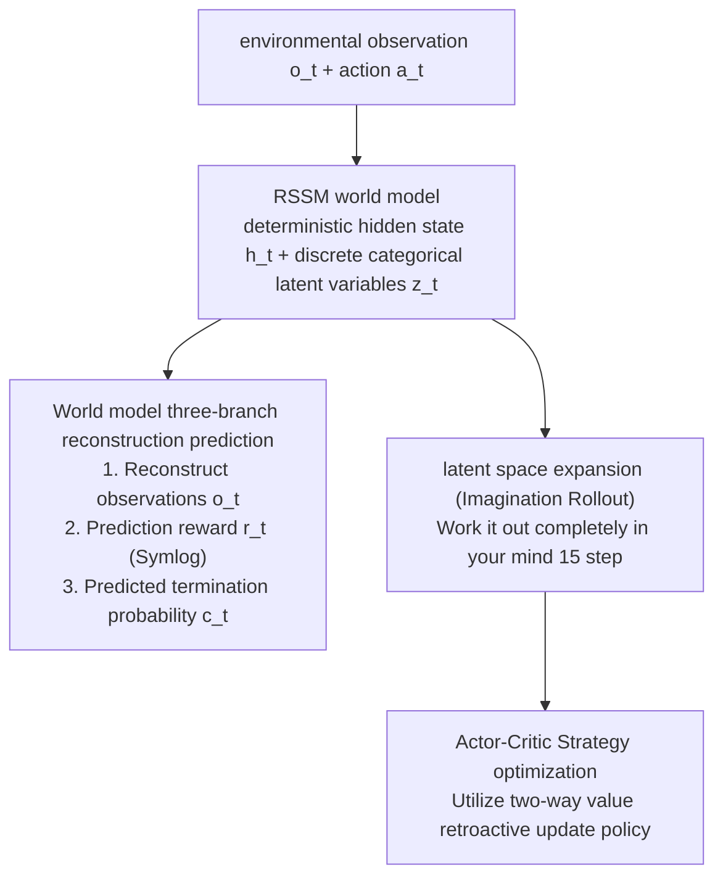

#### ① Robust representation learning and RSSM
{: id="-稳健的表征学习与-rssm"}
RSSM combines the deterministic paths of recurrent neural networks with the randomly sampled paths of discrete latent variables:
- Deterministic hidden state: $h_t = f_\phi(h_{t-1}, z_{t-1}, a_{t-1})$;
- Discrete random latent variable: $z_t \sim q_\phi(z_t \mid h_t, o_t)$, consisting of 32 discrete Categorical distributions of class 32 (returned using the Straight-Through gradient estimator).

#### ② Symlog transformation and two-step scaling loss
{: id="-symlog-变换与两步缩放损失"}
To eliminate large differences in reward magnitudes, DreamerV3 introduces the $\mathrm{symlog}$ transformation for all regression targets and adaptive normalization using the percentile of an exponential moving average in value updates:

$$
\mathrm{symlog}(x) = \mathrm{sign}(x) \ln(|x| + 1)
$$

---

### 3. Results and findings
{: id="3-核心结果发现-6"}

- **Strong results across 7 domains**: Under a single hyperparameter setting, refresh SOTA on all benchmarks such as Atari 50 games, DMC Proprio/DMC Visual, Crafter, Minecraft, etc.
- **Minecraft Diamond Milestone**: Successfully mined diamonds within 100 million environment steps without human intervention (collected wood $\to$ Wooden Pickaxe $\to$ Stone $\to$ Stone Pickaxe $\to$ iron ore $\to$ smelting $\to$ iron pick $\to$ diamond), becoming a milestone event in the history of reinforcement learning.

---

### 4. Limitations
{: id="4-局限性-6"}

1. **The computational overhead is still considerable**: RSSM loop unrolling and image-level autoregressive reconstruction require strong GPU GPU memory and computing power support.
2. **Insufficient fine local physical contact modeling**: Facing fine-grained robot force control tasks such as millimeter-level contact assembly, the visual generation of latent space still has a smooth blur effect.

---

## 14.8 TD-MPC2 (2024)
{: id="148-td-mpc2-2024"}
——Latent space model predictive control: long-range multi-task embodied decision-making SOTA

📄 **Paper**: [ICLR 2024](https://arxiv.org/abs/2310.16828)  
💻 **Code**: [nicklashansen / tdmpc2](https://github.com/nicklashansen/tdmpc2)

### Key takeaways
{: id="精华-7"}
1. **TD learning and MPC unified framework**: **model predictive control (MPC local short-view planning)** and **temporal difference (TD value function long-term evaluation)** in latent space Tightly unified, it combines online local optimization accuracy with long-range global vision.
2. **An efficient latent world model that does not require pixel-level reconstruction**: Abandoning the expensive pixel-by-pixel image decoding and reconstruction loss, it directly assists head-to-end training through self-supervised timing prediction + reward/termination/Q value multi-task in the latent space, greatly saving computing and GPU memory.
3. **Single policy to unifiedly master hundreds of embodied skills**: Using a single Transformer/MLP architecture and fixed hyperparameters, **104 covers robotic arm operation, bipedal and multi-legged movement, and dexterous hand control. Single network unified training is implemented on tasks (DMControl, MetaWorld, ManiSkill, MyoSuite)**.
4. **model scaling law (Scaling Law)**: For the first time, the parameter scale scaling characteristics (from 1M to 300M+ parameters) in embodied model reinforcement learning are systematically explored, showing the steady improvement of its generalization and multi-task migration capabilities as the model scale increases.
5. **Extremely fast online inference planning**: Use MPPI (Model Prediction Path Integral) to conduct parallel sampling and evaluation of thousands of trajectories in the latent space, and output high-quality control instructions in milliseconds.

---

### 1. Background and problem
{: id="1-研究背景问题-7"}

Traditional model-based RL (such as World Models, Dreamer) mostly relies on explicit reconstruction of images or complete expansion of the latent space, which is computationally expensive and easily disturbed by background visual details. The classic pure Model-Free algorithm lacks online real-time planning capabilities for unseen environments. The core pain point is: **How to design a high-performance latent space control algorithm that does not require image reconstruction, can be both online planning and combined with long-term value estimation, and allows a single model to uniformly master hundreds of heterogeneous embodied robot tasks?**

---

<div align="center">
  
<figcaption>diagram 14.8: TD-MPC2 architecture diagram: includes encoder, latent dynamics model, reward prediction, double Q value head and policy prior, supports joint multi-task training and online MPPI latent space deduction</figcaption>
</div>

### 2. Methods and innovations
{: id="2-主要方法创新点-7"}

```mermaid
graph TD
    A["current observation o_t"] --> B["latent encoder z_t = h_θ(o_t)"]
    B --> C["MPPI Latent space fast sampling deduction (H=3 step)"]
    C --> D["latent dynamics prediction: z_{t+1} = d_θ(z_t, a_t)"]
    D --> E["Instant bonus head r_θ(z, a) + terminal value head Q_θ(z, a)"]
    E --> F["Weighted synthesis of optimal actions a_t* and send it to the robot"]
```

#### ① Compact implicit world model
{: id="-紧凑的隐式世界模型"}
The model consists of the encoder $h_\theta$, latent dynamics model $d_\theta$, immediate reward head $R_\theta$, Q value head $Q_\theta$ and a priori policy head $\pi_\theta$. The loss function is driven entirely by task-related signals:

$$
\mathcal{L}_{\mathrm{total}}(\theta) = \sum_{t=0}^H \lambda^t \left( \mathcal{L}_R(s_t, a_t) + \mathcal{L}_Q(s_t, a_t) + \mathcal{L}_{\mathrm{dyn}}(s_{t+1}, d_\theta(s_t, a_t)) \right)
$$

#### ② Latent space model prediction path integral (MPPI)
{: id="-潜空间模型预测路径积分mppi"}
During reasoning, the algorithm starts from the current state $z_t$ in the latent space, combines the prior policy $\pi_\theta$ to sample $N$ candidate action sequences with length $H$, and evaluates its expected return:

$$
G(\tau) = \sum_{k=0}^{H-1} \gamma^k \hat{R}(z_k, a_k) + \gamma^H \min_{j=1,2} \hat{Q}_j(z_H, a_H)
$$

Perform Softmax weighted iteration on the candidate sequence based on the return weight, and output the optimal first step action $a_t^*$.

---

### 3. Results and findings
{: id="3-核心结果发现-7"}

- **Unification of 100 tasks**: TD-MPC2 achieved a higher average success rate and sample efficiency with a single model in the benchmark set containing 104 tasks than previous task-specific baselines.
- **Scalability Verification**: As the parameters expand from 1M to 317M, the multi-task interference problem is significantly reduced, and the model shows obvious Positive Transfer.

---

### 4. Limitations
{: id="4-局限性-7"}

1. **Short horizon planning relies on Critic accuracy**: If there is a local deviation in the terminal Q value header, short horizon MPC planning is easily misled.
2. **is sensitive to local mutations in the environment.**: If large out-of-bounds observations are encountered, unseen latent features may cause drift in the dynamic deduction.

---

## 14.9 Diffusion Policy (2023)
{: id="149-diffusion-policy-2023"}
————Paradigm change in action generation: visual motion policy based on diffusion model

📄 **Paper**: [RSS 2023 / arXiv:2303.04137](https://diffusion-policy.cs.columbia.edu/)  
💻 **Code**: [columbia-ai-robotics / diffusion_policy](https://github.com/real-stanford/diffusion_policy)

### Key takeaways
{: id="精华-8"}
1. **breaks the unimodal action assumption**: For the first time, the conditional diffusion probability model (Denoising Diffusion Probabilistic Models, DDPM) is introduced into the robot visual motion policy, which perfectly solves the fundamental pain point of the traditional policy network being unable to express multi-modal action distributions (Multi-Modal Distributions).
2. **Action Chunking and Timing Continuity (Action Chunking)**: Strategy to predict the future at one time $T_a$ Time domain continuous action trajectory blocks (Action Chunk) naturally ensure the excellent smoothness and physical feasibility of robot joint motion.
3. **annealing denoising ensures high accuracy**: The denoising process is similar to gradient field optimization, gradually eliminating motion uncertainty, and performs well in millimeter-level high-precision assembly and long-range contact tasks.
4. **unifies two main backbone architectures**: The system proposes **CNN-based (U-Net)** and **Time-Series Transformer** Two conditions for denoising the backbone network, adapting to different computing and timing-dependent scenarios.
5.  **Reinventing robot policy learning** :become 2023 It has been the absolute mainstream technology paradigm in the field of robotic manipulation and imitation learning/reinforcement learning fine-tuning since 2000.

---

### 1. Background and problem
{: id="1-研究背景问题-8"}

When humans perform robot manipulation tasks, there are often multiple equally valid but completely mutually exclusive behavioral options (for example: grasping the handle or body of a cup, bypassing obstacles from the left or bypassing from the right). When facing multi-modal expert data, the traditional MLP policy network based on MSE loss will forcibly output the "mathematical average" of all possible actions, causing the robot to output invalid actions such as hanging or hitting. Although GMM (Gaussian Mixture Model) can partially alleviate it, it is prone to numerical instability and mode collapse in high-dimensional continuous action space.

---

<div align="center">
  
<figcaption>Figure 14.9: Diffusion Policy overall architecture: input observation horizon T_o, predict timing action block T_p, execute the first T_a steps of action and roll closed-loop update</figcaption>
</div>

### 2. Methods and innovations
{: id="2-主要方法创新点-8"}

```mermaid
graph LR
    A["visual observation sequence O_t (current+history frame)"] --> C["conditional injection (FiLM / Cross-Attention)"]
    B["Standard Gaussian noise A_k ~ N(0, I)"] --> D["Conditions U-Net / Transformer denoising network"]
    C --> D
    D -->|K step backward iterative denoising| E["Smooth collision-free motion track blocks A_0 = [a_t, a_{t+1}, ..., a_{t+Ta}]"]
```

#### ① Conditional diffusion process and loss function
{: id="-条件扩散过程与损失函数"}
- The goal is to convert the random Gaussian noise sequence $A^K \sim \mathcal{N}(0, I)$ into an action trajectory patch $A^0 \in \mathbb{R}^{T_a \times D_a}$ that conforms to the expert distribution.
- The training loss is a simple denoising error mean square loss:

$$
\mathcal{L}_{\mathrm{Diffusion}}(\theta) = \mathbb{E}_{k, A^0, \epsilon, O_t}\left[ \left\lVert \epsilon - \epsilon_\theta(A^k, k, O_t) \right\rVert^2 \right]
$$

Among them $$A^k = \sqrt{\bar{\alpha}_k} A^0 + \sqrt{1 - \bar{\alpha}_k} \epsilon$$.

#### ② Rolling time domain control (Receding Horizon Planning)
{: id="-滚动时域控制receding-horizon-planning"}
Each time, $T_p$ actions are predicted in the future, but during actual execution, only the previous $T_a$ steps ($T_a < T_p$) are sent to the underlying controller, and in the next control cycle, closed-loop denoising is based on the latest observations again, taking into account long-range look-ahead and real-time disturbance correction.

---

### 3. Results and findings
{: id="3-核心结果发现-8"}

- In 11 difficult operation tasks involving real robots and simulations (RoboMimic, Push-T, Kitchen), Diffusion Policy has absolutely improved the average success rate **46.9%** compared to previous LSTM-GMM, IBC (implicit behavioral cloning) and BET.
- In multi-peak splitting experiments, Diffusion Policy can 100% Decisively choosing a reasonable branch completely eliminates the out-of-control wandering of the mean policy at the center line of the branch.

---

### 4. Limitations
{: id="4-局限性-8"}

1. **has high inference calculation delay**: Standard DDPM requires 16~100 times of network forward propagation to generate a trajectory. Deployment at the edge with low computing power requires DDIM or Consistency Models for accelerated compression.
2. **Pure imitation learning lacks self-healing ability for out-of-distribution**: If it is separated from the training trajectory distribution, it still needs to be combined with reinforcement learning for online interactive exploration and fine-tuning.

---

## 14.10 DPPO (2025)
{: id="1410-dppo-2025"}
———Diffusion policy enhanced fine-tuning: online policy optimization within the denoising chain

📄 **Paper**: [ICLR 2025](https://arxiv.org/abs/2409.00588)  
💻 **Code**: [jannerm / dppo](https://github.com/jannerm/dppo)

### Key takeaways
{: id="精华-9"}
1. **connects diffusion policy with online RL**: For the first time, it is proposed to treat the multi-step diffusion denoising process as a multi-step Markov decision process (MDP), directly applying PPO-Clip constraints within the denoising chain, realizing the end-to-end transition of the diffusion policy from expert imitation to online reinforcement learning.
2. **solves the problem of derivation of probability density**: It avoids the problem of exploding gradients or disappearance caused by long chains of penetration diffusion denoising in the past, and directly explicitly calculates the logarithmic probability of each Gaussian transfer step in reverse denoising $\log p_\theta(x_{k-1}\mid x_k)$.
3. **retains multimodality while continuing to evolve**: Compared with the traditional RL algorithm, where the policy quickly collapses into a single peak after fine-tuning, DPPO can perfectly maintain the inherent multimodal exploration capabilities of the diffusion model, and explore better solutions beyond the demonstration under high difficulty rewards.
4. **is widely suitable for offline pre-training to online fine-tuning**: supports BC pre-training initialization using expert data first, and then RL alignment through online interaction.
5. **Benchmarking Algorithm**: Provides a solid theoretical and algorithmic reference for subsequent embodied basic strategies based on Flow Matching/Diffusion (such as π0, GRPO diffusion, etc.).

---

### 1. Background and problem
{: id="1-研究背景问题-9"}

Diffusion Policy is amazingly effective in imitation learning, but it relies entirely on human demonstration data. When the quality of demonstration data is uneven or the robot encounters a complex environment it has never seen before, it needs to be passed **reinforcement learning online interactive trial and error** to further increase the upper limit. However, there are theoretical deadlocks in applying traditional RL to diffusion strategies:
- The action generation of the diffusion model is a multi-step stochastic differential/difference equation, and the explicit single-step action logarithmic probability $\log \pi(a\mid s)$ cannot be directly output;
- If the final output $a_0$ is directly treated as a black box and updated with standard policy gradient, backpropagation derivation through $K$ steps will cause severe numerical instability.

---

<div align="center">
  
<figcaption>Figure 14.10: DPPO models the diffusion denoising chain as an inner MDP sub-decision step, and the outer layer advances the real time step of the environment and receives external rewards</figcaption>
</div>

### 2. Methods and innovations
{: id="2-主要方法创新点-9"}

```mermaid
graph TD
    A["status observation s"] --> B["Diffusion denoising chain: x_K → x_{K-1} → ... → x_0 (Action)"]
    B --> C["Treat each denoising step as a sub-step MDP decision making"]
    C --> D["Compute local Gaussian probability ratio at each step r_k(θ)"]
    D --> E["applied within the chain PPO-Clip agency constraints"]
    E --> F["Combined advantages to update denoising network weights"]
```

#### ① MDP mapping of denoising chain
{: id="-去噪链的-mdp-映射"}
DPPO models the generation process containing $K$ step denoising as an augmented MDP. At each denoising time step $k$, the transition probability obeys an isotropic Gaussian distribution:

$$
p_\theta(x_{k-1} \mid x_k, s) = \mathcal{N}\left(x_{k-1};\; \mu_\theta(x_k, k, s), \sigma_k^2 I\right)
$$

Since each transfer step has an analytical form, the local importance weight before and after parameter update can be calculated directly:

$$
r_k(\theta) = \frac{p_\theta(x_{k-1} \mid x_k, s)}{p_{\theta_{\mathrm{old}}}(x_{k-1} \mid x_k, s)}
$$

#### ② In-chain PPO-Clip target
{: id="-链内-ppo-clip-目标"}
The global advantage estimate $\hat{A}(s, a)$ is assigned to the denoising chain, and the denoising loss is jointly optimized with the backbone network at each step to avoid the non-differentiable problem of end-to-end traversing the entire calculation graph.

---

### 3. Results and findings
{: id="3-核心结果发现-9"}

- In the RoboMimic and Gym-MuJoCo benchmark tests, the DPPO fine-tuned policy significantly improved the task success rate compared to the pure BC diffusion policy **20%~40%**.
- In the case of lack of demonstration data (Sub-optimal Demonstrations), DPPO successfully broke through the upper limit of demonstration data and learned new operating actions with faster speed and shorter paths.

---

### 4. Limitations
{: id="4-局限性-9"}

1. **The training time overhead is large**: Each online Rollout needs to perform forward and backward gradient tracking of the complete multi-step denoising chain.
2. **is sensitive to the design of the environment reward function**: Reasonable dense or sparse rewards are still needed to guide the direction of exploration.

---

## 14.11 Π*₀.₆ (2025)
{: id="1411-π-2025"}
——— Evolution from expert intervention: real robot policy reinforcement learning

📄 **Paper**: [Physical Intelligence (2025)](https://www.physicalintelligence.company/blog/pistar06)  
💻 **Project**: [Physical Intelligence Research](https://www.physicalintelligence.company/)

### Key takeaways
{: id="精华-10"}
1. **Expert intervention reinforcement learning (Learning from Interventions with RL)**: Aiming at the fatal problem of robots autonomously exploring the real physical world that is very easy to crash the hardware and leave the safe range, a post-training system is constructed that is deeply coupled with "real-time intervention correction" and "autonomous reinforcement learning" of human experts.
2. **eliminates the distribution shift of behavioral clones**: The traditional Dagger only performs supervised fitting of intervention trajectories, while $\pi^*_{0.6}$ uses the reinforcement learning value function to treat "being intervened" as a negative feedback penalty and "successful autonomous completion" as a positive reward to proactively correct the bad precursor behaviors of the policy.
3. **Real-world large-scale online closed-loop**: Realized dozens of hours of continuous online RL post-intensification training on multiple physical robots including folding clothes with both arms, cleaning messy desktops, precision assembly, etc.
4. The embodied alignment paradigm of **VLA large model**: It is verified that from large-scale offline pre-training ($\pi_0$) to expert-in-the-loop enhanced fine-tuning ($\pi^*_{0.6}$), embodied intelligence is the only way to achieve industrial-grade extremely high reliability (99%+ success rate).
5. **Software and hardware security boundary guard**: Designed with torque limit and emergency stop safety protection layers, making high-intensity physical trial and error industrially usable in real environments.

---

### 1. Background and problem
{: id="1-研究背景问题-10"}

Applying RL to real-world physical robots has always faced three natural barriers:
- **Safety and hardware loss**: Unconstrained random exploration can cause violent collisions of the robotic arms to damage equipment or the environment;
- **High reset cost (Reset Problem)**: Objects dropped after operation failure cannot automatically recover without human assistance;
- **demonstration data is difficult to cover long-tail edge working conditions**: Pure imitation learning is easily stagnant or deformed when faced with unseen complex knotted clothing or scattered objects.

---

<div align="center">
  
<figcaption>Figure 14.11: π*₀.₆ Overview of the training system after the combination of expert intervention and reinforcement learning</figcaption>
</div>

### 2. Methods and innovations
{: id="2-主要方法创新点-10"}

```mermaid
graph LR
    A["Robot autonomous execution VLA Strategy"] --> B{"Real-time monitoring by human experts"}
    B -->|no risk/normal| C["Robots continue to operate autonomously<br/>(+ Accumulated positive rewards for autonomous execution)"]
    B -->|about to collide/stuck in trouble| D["Expert intervention joystick intervention takes over"]
    D --> E["Record intervention entry points and correction trajectories<br/>(- intervention punishment + Correction sample)"]
    C --> F["Off-Policy RL Hybrid update policy with Critic value network"]
    E --> F
```

#### ① Intervention-aware Markov modeling
{: id="-干预感知马尔可夫建模"}
- When the human does not take over, the action is generated autonomously by the robot $a_t \sim \pi_\theta$; when the human steps on the pedal or pushes the rocker to take over, the action is expert instruction $a_t = a_t^E$.
- **reward design**: high positive rewards are given for completing tasks independently, and intervention penalty items $r_{\mathrm{int}} < 0$ are imposed every time human intervention is triggered. The incentive policy minimizes dependence on human takeover while maintaining task progress.

#### ② Mixed policy optimization mechanism
{: id="-混合策略优化机制"}
The policy also uses the state transition data before and after intervention to update the Critic evaluation network, allowing Critic to keenly predict "which potentially dangerous postures will lead to human intervention", thereby spontaneously avoiding dangerous actions at the bottom.

---

### 3. Results and findings
{: id="3-核心结果发现-10"}

- In the extremely challenging **folding multi-material complex clothing** and **cleaning and packing** tasks, $\pi^*_{0.6}$ After several days of intervention RL post-training, the task's continuous failure-free success rate increased from the pretrained model's **65% surged to 98% above**.
- **Anti-interference self-healing ability**: When humans maliciously disrupt the folded clothes, the policy can autonomously sense the state regression and automatically re-execute the pre-sequence unfolding action, demonstrating strong closed-loop resilience.

---

### 4. Limitations
{: id="4-局限性-10"}

1. **relies on high-intensity human experts in the loop (Human-in-the-Loop)**: The training process requires professional operators to be on standby to take over, and labor costs are still high.
2. **Multi-machine generalization scheduling is complex**: The differences in takeover styles of different operators may introduce noise labels.

---

## 14.12 X-NavDP (2026)
{: id="1412-x-navdp-2026"}
——Universal visual navigation for multi-configuration robots: Intra-group Q-value weighted Diffusion RL framework

📄 **Paper**: [arXiv:2607.28560 (Intern Robotics 2026)](https://arxiv.org/abs/2607.28560)  
💻 **Code**: [InternRobotics / NavDP](https://github.com/InternRobotics/NavDP)

### Key takeaways
{: id="精华-11"}
1. **cracks the RL fine-tuning bottleneck of diffusion navigation policy**: To solve the problem of traditional diffusion policy fine-tuning being submerged in low-profit state gradients under global Minibatch normalization, **Group Q-Score Reweighted Matching (Group Q-Score Reweighted Matching, GQRM)**, to achieve efficient and robust diffusion policy post-intensification training.
2. **Self-Bootstrapped Perturbation (Self-Bootstrapped Perturbation)**: Using a combination of model targetless branches and coordinate flipping, it can generate high-value exploration actions such as sideways, reversing and detours while retaining the trajectory prior and timing smoothness, and achieve zero-sample self-rescue in dead ends.
3. **Lightweight configuration FiLM modulation (Embodiment Modulation)**: By injecting the robot configuration Embedding into the Transformer decoder, a single set of network weights **is used to simultaneously control wheeled, quadrupedal and humanoid (Dingo / Go2 / G1)** three heterogeneous robots with greatly different dynamics.
4. **Closed-loop time domain guidance (RTC Guidance)**: The pre-order timing smoothing gradient is introduced in the denoising step during inference deployment, completely eliminating waypoint jitter in continuous rolling deduction.
5. **Complex unseen environment self-rescue rate leaps forward**: In the IsaacLab simulation and real robot dead-end self-rescue experiment, the success rate is improved from 10% to 65%, requiring only 12 hours of parallel reinforcement learning training.

---

### 1. Background and problem
{: id="1-研究背景问题-11"}

Diffusion visual navigation strategies based on imitation learning (such as NavDP and NoMaD) have excellent pathfinding capabilities in open scenes. However, because the expert data comes from the global optimal planner, there are two core flaws:
- **has no local self-rescue ability.**: When faced with long obstacles, dead-ends and other trapped scenes, robots with only a partial field of view are very easy to get stuck or continue to collide because "reversing/backing around" has never been seen in expert data;
- **Configuration Blind (Embodiment-Blind)**: Unable to adapt to the different physical constraints of wheeled (not transverse), quadruped (omnidirectional movement), and humanoid robots (center of mass swing and turning radius).

---

<div align="center">
  
<figcaption>Figure 14.12: X-NavDP overall framework: multi-configuration robot self-guided perturbation and intra-group Q value reweighted enhanced training</figcaption>
</div>

### 2. Methods and innovations
{: id="2-主要方法创新点-11"}

```mermaid
graph TD
    A["local RGB-D + PointGoal + robot ID"] --> B["configuration FiLM module injection Robot Embedding"]
    B --> C["Self-guided perturbation policy samples same-state candidate groups G(s)"]
    C --> D["Twin Critics Evaluate candidate group trajectories Q(s, a)"]
    D --> E["Normalized calculation of advantage value within the same status group Q_tilde_G"]
    E --> F["Reserve Top-k Positive dominant action index reweighted optimization"]
    F --> G["Optimize Diffusion denoising network + RTC Closed-loop guided execution"]
```

#### ① In-group Q value reweighting (GQRM)
{: id="-组内-q-值重加权gqrm"}
For the action candidate group $G(s)$ sampled from the same state, the mean and standard deviation are forced to be calculated within the group:

$$
\bar{Q}_G(s) = \mathbb{E}_{a_0 \sim \pi_{\mathrm{old}}}[Q(s, a_0)], \quad \sigma_G(s) = \sqrt{\mathbb{E}[(Q(s, a_0) - \bar{Q}_G(s))^2]}
$$

$$
\tilde{Q}_G(s, a_0) = \mathrm{clip}\left( \frac{c (Q(s, a_0) - \bar{Q}_G(s))}{\sigma_G(s) + \varepsilon},\; -h,\; h \right)
$$

**Advantages**: Even in an extremely difficult state where the absolute returns of all actions are negative when stuck in a dead end, GQRM can still keenly identify the "relatively good" reversing escape trajectory and assign extremely high gradient weights.

#### ② Self-guided disturbance exploration mechanism
{: id="-自引导扰动探索机制"}
Use the model's own Goal-Agnostic prediction combined with the Bernoulli symbol vector $\mathbf{s} = ((-1)^{B_1}, (-1)^{B_2})$ for extrapolation synthesis:

$$
\tau_{\mathrm{mixed}} = \mathbf{s} \odot (\tilde{\tau}_{\mathrm{pointgoal}} + \lambda \tilde{\tau}_{\mathrm{nogoal}})
$$

---

### 3. Results and findings
{: id="3-核心结果发现-11"}

- **simulation and real robot greatly improved**: In IsaacLab 40 unseen test scenarios, the average success rate increased from **61.20% to 84.28%**. The success rate on the Unitree G1 humanoid robot increased from **50.70% to 84.50%**.
- **real robot escapes from dead end**: In the real physical dead end test, the non-fine-tuned model 100% was trapped in a collision, but X-NavDP showed smooth reverse steering self-healing ability, and the escape success rate was up to **65%**.

---

### 4. Limitations
{: id="4-局限性-11"}

1. **relies on high-quality Twin Critic value evaluation**: If the collision and distance reward shaping in the simulation are not precise enough, it may affect the judgment of the optimal reversing trajectory.
2. **High-frequency end-side computing requirements**: Multi-configuration FiLM modulation and RTC denoising guidance have certain requirements for the inference throughput of edge computing chips.

---

# 15. Conclusion
{: id="15-结语"}

The evolution of reinforcement learning in the field of embodied intelligence maps the entire AI development trajectory:

- **Model-free era (DQN / PPO / SAC / TD3)**: It lays the mathematical foundation for deep policy learning in discrete and continuous action spaces, and overcomes the problems of policy variance and value overestimation.
- **World Model Era (World Models / DreamerV3 / TD-MPC2)**: Breaks the absolute dependence on massive real physical sampling, and realizes latent space self-supervised physical dynamics evolution and long-term planning.
- **Generative Era (Diffusion Policy / DPPO / X-NavDP)**: Fundamentally reshape the distribution representation of the action space, and use the diffusion denoising mechanism to perfectly resolve the contradiction between multi-modal continuous control and timing smoothing.
- **Real and post-training era (π\*₀.₆ / RLVR / Residual-VLA)**: Opens up the end-to-end enhanced alignment closed loop of expert intervention, verifiable physical common sense and VLA large model.

Each generation of algorithms builds on its predecessors to overcome new theoretical and engineering bottlenecks. With the further integration of physical world perception, multi-modal foundation models and high-fidelity parallel simulation, reinforcement learning is driving embodied robots to accelerate their transition from "pattern reproduction" to "autonomous cognition and universal action in the physical world".

---

*This article was compiled and written by Tingde Liu, with reference to [EasyRL (Datawhale) ](https://github.com/datawhalechina/easy-rl), OpenAI Spinning Up, Berkeley Deep RL and the above-mentioned milestone paper materials. The system focuses on the panoramic and embodied front evolution of reinforcement learning algorithms. *
