# 1. Introduction
{: id="1-引言"}

## 1.1 Why do we need autonomous navigation?
{: id="11-为什么需要自主导航"}

Imagine a warehouse robot moving between shelves, picking up goods precisely, and avoiding forklifts and pedestrians that suddenly appear. Or consider a self-driving car traveling safely for hundreds of kilometers in complex traffic. Both depend on a carefully designed **autonomous navigation system**.
<figure class="survey-intro-figure">
  
<figcaption>Figure: Traditional navigation revolves around the target position, combines sensing localization, map planning and local control, and corrects motion through sensor feedback; the actual system can adopt different module divisions and map forms.</figcaption>
</figure>
The core problems solved by autonomous navigation can be simply summarized into three problems:

1. **Where am I?** (Localization)
2. **What is around me?** (Perception and mapping)
3. **How should I move?** (Planning and control)

These three issues are intertwined and together constitute a complete robot navigation loop.

## 1.2 Navigation Algorithm Stack Overview
{: id="12-导航算法栈概览"}

In a complete robot navigation system, sensor data passes through successive processing layers before driving the actuators. The following diagram shows the overall data flow of the navigation algorithm stack:

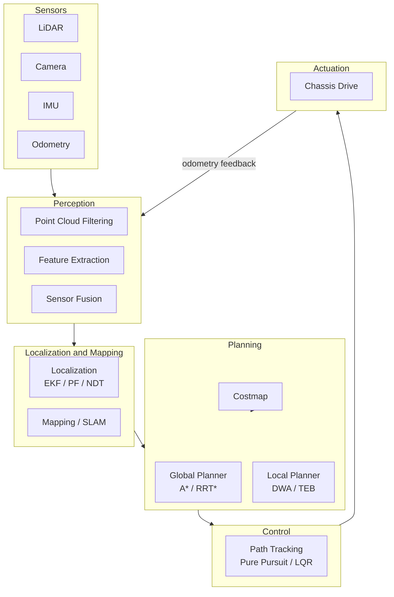

<div align="center">
  
<figcaption>Figure: Traditional robot navigation flow chart: mapping and localization (SLAM) based on data collected by sensors, and automatic navigation (planning + control) in the constructed environmental map</figcaption>
</div>


## 1.3 Traditional navigation vs. learning navigation
{: id="13-传统导航-vs-学习型导航"}

Before the rise of deep learning, robot navigation mainly relied on **modular, interpretable traditional algorithm stacks**. Each module has clear responsibilities and can be independently debugged and optimized. This article will systematically introduce the core components of this algorithm stack.

| Dimension | Traditional navigation | End-to-end deep learning navigation |
|------|---------|-----------------|
| Interpretability | ✅ Strong, each module can be analyzed | ❌ Weak, black box decision-making |
| Generalization | ❌ Weak, relies on prior map | ✅ Strong, can be migrated to new scenarios |
| Language Understanding | ❌ Does not support natural language instructions | ✅ Supports (VLN/VLA) |
| Debugging difficulty | ✅ Low, module independent debugging | ❌ High, end-to-end traceability is difficult |
| Computing requirements | ✅ Low, can run on embedded | ❌ High, requires GPU |
| Safety and reliability | ✅ Predictable behavior | ❌ There is a risk of out-of-distribution generalization |
| Dynamic obstacle processing | Local planning module can handle | Dependent on training data coverage |

> **This article focuses on the traditional algorithm stack**. For information about end-to-end learning navigation (VLN/VLA), please refer to this site [VLN Survey](/en/VLN-Survey/) Series.

---

# 2. Perception
{: id="2-感知perception"}

Perception is the "eyes" of the navigation system. Sensors collect raw data and process it to provide reliable input for localization, mapping and planning.

## 2.1 Sensor types and characteristics
{: id="21-传感器类型与特性对比"}

| Sensor | Output data | Accuracy | Robustness to lighting | Cost | Typical frequency | Typical application |
|--------|---------|------|--------|------|---------|---------|
| **2D LiDAR** | Polar coordinate point set | High (cm level) | ✅ Strong | Medium | 10–40 Hz | Indoor mobile robot |
| **3D LiDAR** | Point Cloud (xyz+intensity) | High | ✅ Strong | High | 10–20 Hz | Autonomous driving |
| **RGB-D camera** | Color image + depth image | Medium (cm–dm level) | ❌ Weak (outdoor) | Low | 30–90 Hz | Indoor short range |
| **Monocular camera** | RGB image | Low (requires calibration) | ❌ Weak | Very low | 30–120 Hz | Visual odometry |
| **Stereo camera** | Left and right RGB image | Medium | ❌ Weak | Low–medium | 30–60 Hz | Visual SLAM |
| **IMU** | Angular velocity + linear acceleration | Short-term high | ✅ Strong | Extremely low | 100–1000 Hz | Pose estimation, fusion |
| **wheel odometry** | Encoder pulse | Medium (easy to accumulate errors) | ✅ Strong | Very low | 50–200 Hz | Short-term displacement estimate |
| **GPS/RTK** | Longitude and latitude coordinates | Normal 1–5m, RTK cm level | ✅ Strong | Medium–High | 1–10 Hz | Outdoor global localization |

### LiDAR
{: id="激光雷达lidar"}

LiDAR calculates distance by emitting laser pulses **and measuring the return time** (Time of Flight, ToF). It can work under any lighting conditions and output accurate spatial point cloud (Point Cloud).

**2D LiDAR** (such as Hokuyo UTM-30LX, SICK TiM) scans and outputs a polar coordinate point set on a plane each time, which is suitable for indoor flat environments. **3D LiDAR** (such as Velodyne VLP-16, Ouster OS1) outputs a complete three-dimensional point cloud through multi-line rotation scanning, which is the core sensor for autonomous driving perception.

### Depth Camera/RGB-D
{: id="深度相机depth-camera--rgb-d"}

RGB-D cameras (such as Intel RealSense D435, Microsoft Kinect) simultaneously acquire color images and the depth value of each pixel through the **structured light** or **time-of-flight (ToF)** principle. The main limitations are: strong outdoor light will interfere with structured light, and the detection range is limited (usually 0.3–6m).

<div align="center">
  <video src="/images/robotics_navigation/Depth_Camera.mp4" autoplay loop muted playsinline width="70%"></video>
<figcaption>Figure: Depth camera acquisition depth map visualization</figcaption>
</div>

### IMU and wheel odometry
{: id="imu-与轮式里程计"}

**An IMU (inertial measurement unit)** combines gyroscopes, which measure angular velocity, and accelerometers, which measure linear acceleration. Its output rate is high (100–1000 Hz), but errors **accumulate through integration** over time, causing drift.

<div align="center">
  
<figcaption>Figure: IMU</figcaption>
</div>

**wheel odometry** calculates displacement through wheel encoders, and has good accuracy on flat roads, but will produce **cumulative errors** on slippery or uneven roads.

The common features of both are: high short-term accuracy, long-term use requires fusion and correction with other sensors.


## 2.2 Perception Data Processing
{: id="22-感知数据处理"}

### Point cloud filtering
{: id="点云滤波"}

Raw point clouds usually contain noise and irrelevant points and require preprocessing:

**Voxel Grid Filter**: Divide the point cloud space into regular small cubes (voxels), and replace the points in each voxel with the centroid. This not only retains the overall shape of the point cloud, but also greatly reduces the point cloud density and improves the subsequent processing speed.

<div align="center">
  
<figcaption>Figure: Voxel filtering effect - the original dense point cloud (left) is obtained by voxel downsampling to obtain a uniform sparse point cloud (right)</figcaption>
</div>

**Radius Outlier Removal**: For each point, check the number of neighboring points within its radius r. If the number of adjacent points is less than the threshold, the point is considered to be noise and deleted. Suitable for removing isolated noise.

<div align="center">
  
<figcaption>Figure: Radius filtering effect - isolated points (red) with insufficient neighborhood points are identified as noise and deleted</figcaption>
</div>

**Pass Through Filter**: Directly intercept the point cloud of the area of interest, for example, only retain points within the 0.1m to 2m height range above the ground.

### Rectangle Fitting Detection
{: id="矩形拟合检测rectangle-fitting-detection"}

**obstacle bounding-box estimation based on LiDAR point cloud**: Fit the clustered obstacle point cloud to a minimum bounding rectangle (Minimum Bounding Rectangle) to estimate the length, width, orientation and center position of the obstacle. This is a classic method for obstacle perception in autonomous driving and is often used for vehicle detection.

<div align="center">
  
  <video src="/images/robotics_navigation/point_cloud_rectangle_fitting.mp4" autoplay loop muted playsinline width="38%" style="margin:4px"></video>
<figcaption>Figure: Point cloud rectangular fitting - clustered point cloud (left) fitted to the minimum bounding rectangle (right moving picture)</figcaption>
</div>

### Feature extraction
{: id="特征提取"}

In visual SLAM and camera calibration, feature extraction is crucial:

- **corner feature** (Corner): such as **FAST** (extremely fast), **Harris** (classic)
- **descriptor** (Descriptor): such as **ORB** (rotation invariant + binary, fast), **SIFT** (scale/rotation invariant, high accuracy but slow)
- **Line Characteristics** (Line): for structured indoor environments (corridors, walls)

<div align="center">
  
<figcaption>Figure: Corner feature detection - the corner points (intersection points) in the image are the key matching elements of visual SLAM</figcaption>
</div>

## 2.3 Sensor Extrinsic Calibration
{: id="23-传感器外参标定"}

When a system uses multiple sensors, it is necessary to know the **Relative pose** (extrinsic parameters, Extrinsic Parameters) to convert data from different sensors to the same coordinate frame.

**Estimation of extrinsic parameters based on UKF**: Online estimation of extrinsic parameters using **unscented Kalman filter (UKF)**. Compared with the offline calibration of the calibration target, this method can dynamically estimate and correct the extrinsic parameters during the movement of the robot, which is suitable for scenarios where the sensor installation position may change slightly.

<div align="center">
  <video src="/images/robotics_navigation/sensor_auto_calibration.mp4" autoplay loop muted playsinline width="75%"></video>
<figcaption>Figure: Sensor online automatic calibration process - dynamic estimation and correction of extrinsic parameters between sensors during robot movement</figcaption>
</div>

### Sensor Time Synchronization
{: id="传感器时间同步"}

In addition to spatial calibration (extrinsic parameters) of multi-Sensor frames, **Time synchronization** Also crucial. If the data timestamps of different sensors are not aligned, it will cause the data to be "out of sync" - for example using 0.1 The IMU attitude seconds ago is used to process the laser point cloud of the current frame, and the error cannot be ignored when the robot is moving at high speed.

<div align="center">
  
<figcaption>Figure: Time synchronization</figcaption>
</div>

**Hardware trigger synchronization (Hardware Trigger)**: All sensors are sampled at the same time through circuit signals. For example, the PPS (pulses per second) signal from GPS acts as a master clock, triggering camera shutters and LiDAR scans. This is the most accurate method, with time errors as low as microseconds, but requires dedicated hardware circuit support.

**Software timestamp interpolation (Software Interpolation)**: When hardware triggering is not feasible, timestamp each sensor data packet through a high-precision system clock (such as NTP/PTP), and then align the data by timestamp at the software layer. A common practice is to align the IMU data to the nearest laser frame time by linear interpolation.

**The impact of misaligned timestamps on SLAM**: The robot continues to move during one frame of laser scanning (approximately 100 ms). If the IMU timestamp is not used for **motion compensation (Motion Distortion Correction)**, the scanning point cloud will appear **distortion (Distortion)** - the first half frame and the second half frame point cloud are misaligned, seriously affecting the scanning matching accuracy. Tightly coupled solutions such as LIO-SAM solve this problem through IMU pre-integration.

## 2.4 Sensor Fusion
{: id="24-传感器融合"}

A single sensor often has limitations, and fusing multiple sensors can make up for each other's weaknesses.

**EKF (Extended Kalman Filter) fusion**: Unified fusion of sensor data of different frequencies and different error characteristics (such as IMU high-frequency attitude + GPS low-frequency position + odometry displacement). EKF proceeds alternately through the **prediction step** (predicting the state using the motion model) and the **update step** (correcting the prediction using sensor observations).

**UKF (unscented Kalman filter) fuses**: EKF uses first-order linearization to approximate the nonlinear system, while UKF uses **Sigma point sampling** to more accurately approximate the mean and covariance of the nonlinear transformation, with higher accuracy in high nonlinear scenarios.

**EKF Sensor fusion data flow** (taking multi-sensor robot as an example):

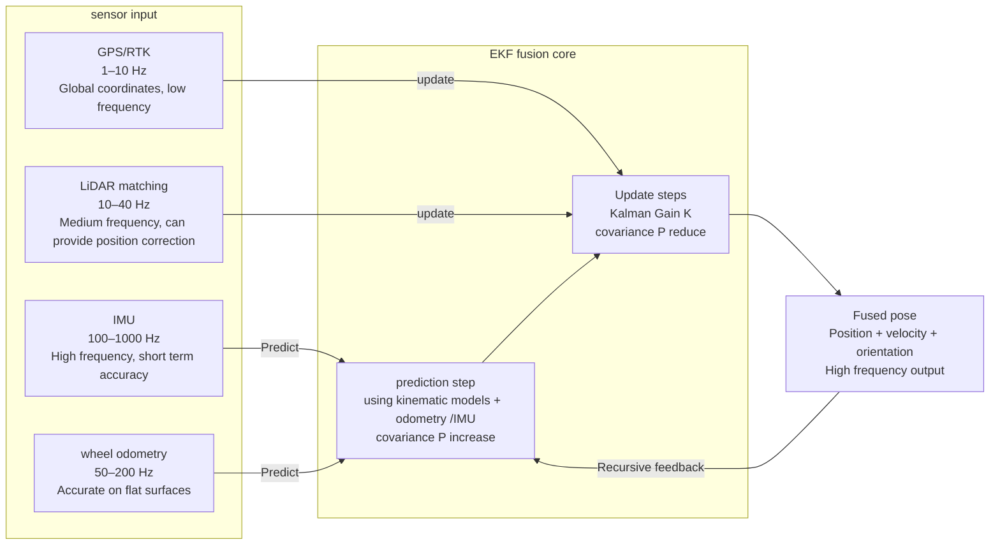

---

# 3. Localization
{: id="3-定位localization"}

Localization solves the problem of "where am I": given a map, the robot needs to estimate its position and orientation in the map in real time (i.e. **pose Pose = position + orientation**).

## 3.1 Problem Definition
{: id="31-问题定义"}

Localization problems can be divided into two categories:

- **Global Localization (Global Localization)**: The robot does not know the initial position and needs to determine its own pose from scratch. The most difficult, particle filtering is good at dealing with this type of problem.
- **Pose Tracking**: The approximate initial pose is known and is continuously corrected during movement. EKF/UKF specializes in dealing with these types of issues.
- **kidnapped robot problem (Kidnapped Robot Problem)**: The robot was suddenly moved to an unfamiliar location during motion and needs to be repositioned.

## 3.2 EKF Localization
{: id="32-ekf-定位"}

**Intuitive understanding**: Imagine you are walking blindfolded, estimating your position based on step count and turning angle (this is "prediction"); every time you take off the blindfold and glance at a landmark on the map, you use the landmark position to correct your estimate (this is "update"). EKF (Extended Kalman Filter) does the mathematical version of this.

**state vector**: $\mathbf{x} = [x, y, \theta]^T$ (position + orientation)

**two steps to**:

1. **Prediction step** (Predict): Use motion models (such as odometry data) to predict the pose at the next moment, while the error covariance increases (uncertainty increases):

$$\hat{\mathbf{x}}_{t|t-1} = f(\mathbf{x}_{t-1}, \mathbf{u}_t)$$

2. **update step** (Update): Use sensor observations (such as LiDAR to see road signs) to correct the prediction, and the error covariance is reduced (uncertainty is reduced):

$$\mathbf{x}_t = \hat{\mathbf{x}}_{t|t-1} + \mathbf{K}_t (\mathbf{z}_t - h(\hat{\mathbf{x}}_{t|t-1}))$$

Here, $$\mathbf{K}_t$$ is the **Kalman gain**, which determines whether to believe the prediction or the observation.

**Intuitive understanding of Kalman gain K**: Imagine that your friend tells you "You are now at the entrance of the library", but your step count estimates that you are inside the library. Who should you trust? The size of K determines this trade-off:

- **K → 1 (trust the observation)**: When the sensor noise is low and the prediction uncertainty is large → the observation correction weight is large
- **K → 0 (believe the prediction)**: When the sensor noise is high → less correction, mainly relying on the motion model

$$\mathbf{K}_t = \mathbf{P}_{t|t-1} \mathbf{H}^T (\mathbf{H} \mathbf{P}_{t|t-1} \mathbf{H}^T + \mathbf{R})^{-1}$$

Here, $\mathbf{P}$ is the prediction uncertainty (the larger → the larger K → the more confident the sensor), and $\mathbf{R}$ is the sensor noise (the larger → the smaller K → the more confident the prediction). The figure below shows the change of the uncertainty ellipse in the prediction → update process:

<div align="center">
  
<figcaption>Figure: EKF uncertainty ellipse change - the ellipse increases after the prediction step (uncertainty increases), the ellipse shrinks after the update step (sensor correction)</figcaption>
</div>

**applicable scenarios**: known map, known initial position, low non-linear system. The calculation efficiency is high and suitable for real-time operation.

<div align="center">
  <video src="/images/robotics_navigation/extended_kalman_filter_localization.mp4" autoplay loop muted playsinline width="75%"></video>
<figcaption>Figure: EKF localization simulation - the robot (blue) moves along the trajectory, the green ellipse is the uncertainty estimate, and the red is the EKF localization result</figcaption>
</div>

## 3.3 UKF Localization
{: id="33-ukf-定位"}

**Difference from EKF**: EKF uses Taylor expansion to make a first-order linear approximation of nonlinear functions, and the error is larger in highly nonlinear systems. UKF (Unscented Kalman Filter) approximates the probability distribution after nonlinear transformation through the carefully selected **Sigma point set**, without the need for derivatives and with higher accuracy.

**Sigma point sampling**: Extract $2n+1$ Sigma points from the current mean and covariance, propagate through the nonlinear function, and recalculate the mean and covariance.

✅ Higher accuracy than EKF, especially suitable for scenes with strong nonlinearity in motion models
❌ The computational cost is slightly larger than that of EKF (about 2–3 times that of EKF)

<div align="center">
  <video src="/images/robotics_navigation/ekf_vs_ukf_comparison.mp4" autoplay loop muted playsinline width="80%"></video>
<figcaption>Figure: EKF vs UKF comparison simulation - the pose estimation of UKF (right) converges more accurately in high non-linear scenarios</figcaption>
</div>

## 3.4 Particle Filter Localization
{: id="34-粒子滤波定位particle-filter"}

**Intuition**: Use thousands of "particles" (each particle represents a possible pose hypothesis) to represent the probability distribution of the robot's position. Each particle moves according to the motion model (adding random noise), and then each particle is given a score (weight) based on the sensor observation. The closer the particle is to the real observation, the higher the weight. Finally, **resampling (Resampling)** is used to eliminate particles with low weight and copy particles with high weight.

<div align="center">
  <video src="/images/robotics_navigation/particle_filter_localization.mp4" autoplay loop muted playsinline width="75%"></video>
<figcaption>Figure: particle filtering localization simulation - initial particles are uniformly distributed (global localization), gradually converging to the true position with movement and observation</figcaption>
</div>

**AMCL (Adaptive Monte Carlo Localization)**: The widely used particle filtering localization package in ROS supports adaptive particle number (reducing particles after localization convergence saves calculation).

The following figure shows the three core stages of the MCL algorithm:

<div align="center">
  
<figcaption>Figure: Three stages of particle filtering (MCL) - ① Particle diffusion after motion update, ② Observation weighting (large particles = high weight), ③ After resampling, particles are concentrated near the real position</figcaption>
</div>

**MCL algorithm flow**:

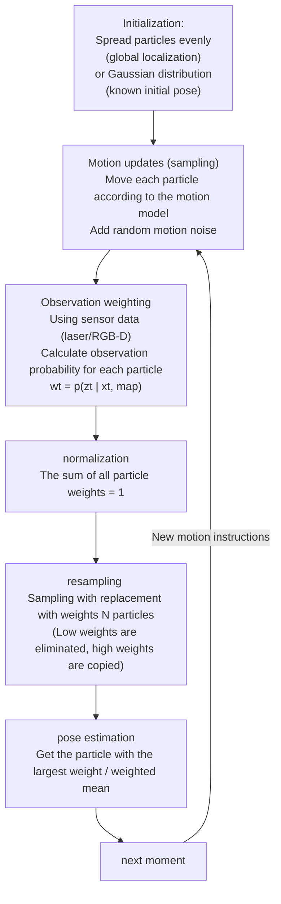

**resampling details**: Naive random resampling will introduce **particle diversity loss** (the same particle is copied multiple times). **system resampling (Systematic Resampling)** takes a random starting point within $[0, 1/N]$, and then samples N times at even intervals, ensuring that each interval is sampled exactly once, effectively avoiding diversity loss, and the computational complexity is still $O(N)$.

**AMCL Adaptive particle number (KLD sampling)**: Fixed particle number is a waste of calculation (there is no need for so many particles after localization convergence), and it is unsafe (too few particles during initialization may miss the true position). **KLD Sampling** Dynamically calculates the required number of particles based on the state space volume covered by the current particle set: the more fully the state space is explored (the more grids are covered), the fewer particles are needed. A typical range in AMCL is 100–5000 particles.

✅ Supports **global localization** (multi-hypothesis parallel, can handle kidnapped robot problem)
✅ Friendly to nonlinear systems, no need for linearization
❌ When the number of particles is large, the calculation overhead is high
❌ Efficiency decreases in high-dimensional state space (curse of dimensionality)


## 3.5 Localization based on scan matching
{: id="35-基于扫描匹配的定位"}

Scan matching is another type of localization idea: directly align the current LiDAR scan with the reference map (or previous frame scan) to solve the pose transformation.

### NDT (Normal Distributions Transform)
{: id="ndt正态分布变换normal-distributions-transform"}

**idea**: Divide the reference point cloud space into regular grids, and the points in each grid are represented by **normal distribution** (mean + covariance). The probability of the currently scanned point cloud in these normal distributions is the matching score, and the matching probability is maximized by optimizing the pose.

✅ Robust to point cloud density changes
✅ High computational efficiency (especially three-dimensional scenes)
✅ It is one of the mainstream methods of automatic driving localization (HDMap-based Localization)

<div align="center">
  
<figcaption>Figure: NDT matching principle - alignment diagram of the reference map (grid + normal distribution) and the current scanned point cloud</figcaption>
</div>

### ICP (Iterative Closest Point)
{: id="icp迭代最近点iterative-closest-point"}

**Idea**: Match the current point cloud with the nearest point pair in the target point cloud, calculate the rigid body transformation (rotation + translation) that minimizes the distance between the matching point pairs, and then iterate and repeat until convergence.

✅ Simple and intuitive, high accuracy (after convergence)
❌ Sensitive to initial pose, easy to fall into local optimum
❌ The calculation complexity is high, and the real-time performance is affected by the point cloud density.
❌ prone to degeneracy in repetitive structures such as corridors

<div align="center">
  
<figcaption>Figure: ICP iteration process - the green current frame point cloud is gradually aligned with the red reference point cloud, and the distance between the nearest point pairs is reduced in each iteration</figcaption>
</div>

## 3.6 Comparison of localization methods
{: id="36-定位方法对比汇总"}

| Method | Applicable scenarios | Global localization | Computational overhead | Nonlinear processing | ROS support |
|------|---------|---------|---------|-----------|---------|
| **EKF** | Known initial pose, low nonlinearity | ❌ | Low | First-order approximation | `robot_localization` |
| **UKF** | Known initial pose, medium to high nonlinearity | ❌ | Medium | Sigma point approximation | `robot_localization` |
| **particle filtering /AMCL** | Global localization, unknown initial pose | ✅ | Medium–High | No approximation | `amcl` |
| **NDT** | Autonomous driving, high-precision map localization | Requires initialization | Medium | — | `ndt_cpu` |
| **ICP** | Fine registration, short range matching | ❌ | Medium – High | — | `pcl_ros` |

<div align="center">
  <video src="/images/robotics_navigation/ekf_ukf_pf_comparison.mp4" autoplay loop muted playsinline width="85%"></video>
<figcaption>Figure: EKF / UKF / particle filtering Comparative simulation of three localization methods - Comparison of accuracy and convergence speed in the same scenario</figcaption>
</div>

---

# 4. Mapping & SLAM
{: id="4-建图mapping--slam"}

**SLAM (simultaneous localization and mapping, Simultaneous Localization and Mapping)** solves a "chicken or egg" problem: localization requires a map, and mapping requires knowing the location. The goal of SLAM is to complete localization and mapping at the same time when **has no prior map**.

## 4.1 Map Representations
{: id="41-地图表示形式"}

Different scenarios require different map representations:

### Binary Occupancy Grid Map
{: id="二值占据栅格地图binary-occupancy-grid-map"}

Divide the environment space into squares of equal size (usually 5–20 cm/square), and store a probability value in each square, indicating whether the square is occupied (obstructed = 1, passable = 0, unexplored = 0.5). This is the most commonly used map format in indoor robot navigation and is directly supported by ROS `map_server`.

<div align="center">
  <video src="/images/robotics_navigation/binary_grid_map_construction.mp4" autoplay loop muted playsinline width="60%" style="margin:4px"></video>
<figcaption>Figure: Binary occupation grid map construction process</figcaption>
</div>

<div align="center">
  
<figcaption>Figure: Finished map - white = passable, black = obstacle, gray = unexplored</figcaption>
</div>

### Costmap
{: id="代价地图costmap"}

Based on the occupied grid, the area around the obstacle **Inflation** Create a cost layer: the closer you are to the obstacle, the higher the cost. In this way, the robot will automatically maintain a safe distance from obstacles during path planning without additional collision checks. ROS Navigation Stack `costmap_2d` Supports multi-layer costmap (static layer + obstacle layer + inflation layer).

<div align="center">
  <video src="/images/robotics_navigation/cost_grid_map_construction.mp4" autoplay loop muted playsinline width="55%" style="margin:4px"></video>
<figcaption>Figure: costmap build</figcaption>
</div>

<div align="center">
  
<figcaption>Figure: Finished product costmap - blue = low cost, red = high cost (near obstacles)</figcaption>
</div>

### Potential Field Map
{: id="势场地图potential-field-map"}

The target point is regarded as the "lowest point of potential energy", the obstacles are regarded as the "repulsive force source", and the entire space forms a potential energy field. The robot can find the path by moving in the direction of gradient descent. Intuitively, it is similar to a ball rolling naturally to the lowest point on an incline. Main disadvantage: easy to fall into local minimum (Local Minimum).

<div align="center">
  
<figcaption>Figure: Potential field map - the target (blue trough) produces attractive force, the obstacle (red peak) produces repulsive force, and the gradient direction points to the direction of robot movement</figcaption>
</div>

### NDT Map
{: id="ndt-地图ndt-map"}

The normal distribution transformation map mentioned above is suitable for high-precision autonomous driving scenarios. Each grid stores the statistical distribution of the point cloud instead of the original points, greatly compressing the storage space while maintaining localization accuracy.

<div align="center">
  
<figcaption>Figure: EA-NDT processing flow visualization: display of the intermediate stages from semantic segmentation point cloud to H-Map.</figcaption>
</div>

<div align="center">
  <video src="/images/robotics_navigation/ndt_map_construction.mp4" autoplay loop muted playsinline width="65%"></video>
<figcaption>Figure: NDT map construction</figcaption>
</div>

### OctoMap (octree 3D map)
{: id="octomap八叉树三维地图"}

**OctoMap** is the de facto standard for 3D robot mapping and is directly supported by the `octomap_server` package in ROS. The core idea: use **octree (Octree)** to recursively subdivide the three-dimensional space. Each leaf node represents a voxel (Voxel) and stores the **occupation probability** of the voxel.

**spatial subdivision principle**:

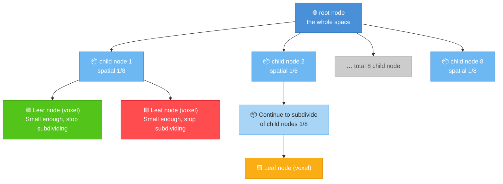

> 🟩 Free voxels 🟥 Occupied voxels 🟨 Unknown voxels Dark nodes = can still be subdivided

The voxel size (resolution) is typically set to 5–20 cm and can be adjusted as needed.

**Occupancy probability update** (Bayesian update): Each time the light from the laser/depth sensor passes through a voxel, update the logarithmic probability of occupancy (Log-Odds) of the voxel:

$$L(n) = L(n-1) + \log\frac{P(\text{occ}|\text{hit})}{1 - P(\text{occ}|\text{hit})}$$

After accumulating multiple observations, the voxels are classified as: **occupied (occupied)**, **free (free)**, **unknown (unknown)**.

**Memory efficiency**: OctoMap only stores occupied and free nodes, and unknown spaces do not occupy memory. Large-scale indoor scenes (200m², 10cm resolution) usually only require tens of MB, which is far better than directly storing the 3D occupancy grid.

| Properties | OctoMap | Original point cloud |
|------|---------|---------|
| Memory | Low (sparse octree) | High (12–24 bytes per point) |
| probability update | ✅ | ❌ |
| Unknown area representation | ✅ | ❌ |
| Multi-resolution query | ✅ | ❌ |
| ROS support | `octomap_server` | `sensor_msgs/PointCloud2` |

✅ Three-dimensional obstacle perception (drone obstacle avoidance, robotic arm grabbing planning)
✅ Supports dynamic updates (probability decays after obstacles are removed)
❌ Does not retain color/semantic information (needs to be extended to ColorOctoMap / SemanticOctoMap)

### Topological Map
{: id="拓扑地图topological-map"}

All the aforementioned maps (occupancy grid, NDT, OctoMap) are **metric maps (Metric Map)** - accurately recording the geometric information of the space. The **topological map** is completely different: it abstracts the environment into the graph structure of **nodes (locations) + edges (connected relationships)**, and does not care about precise geometry.

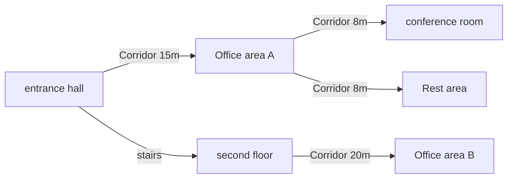

**node** usually corresponds to a semantic location (room, doorway, corridor intersection), **edge** records the reachability relationship between adjacent nodes (sometimes with distance/direction information).

| Comparison dimension | Metric map | Topological map |
|---------|---------|---------|
| represents the granularity | centimeter-level precise coordinates | node/edge (semantic) |
| Storage overhead | Large (increases linearly with area) | Extremely small |
| Path planning | Raster search (A*) | Graph search (Dijkstra) |
| Applicable scale | Indoor small scene (<100m) | Building, multi-floor, park |
| Localization accuracy | High | Low (can only be positioned to node granularity) |

**Hybrid scheme in practical applications**: Most actual systems use **topological-metric hybrid map (Hybrid Topological-Metric Map)**: The topology layer does high-level path planning across rooms (selecting which nodes to pass through), and the metric layer does fine local navigation and obstacle avoidance near each node. A typical implementation is the `topological_navigation` package of ROS.

## 4.2 SLAM Problem Overview
{: id="42-slam-问题概述"}

The input of SLAM is a sensor data stream (laser scan sequence/image sequence + odometry), and the output is:

1. **Trajectory**: Robot historical motion path
2. **Map**: Spatial representation of the environment

The SLAM system is usually divided into two parts: **front-end (Front-end)** and **back-end (Back-end)**:

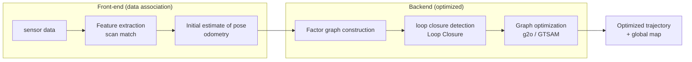

> **SLAM vs. Pure localization (Localization)**: SLAM is "locating while building a map" and is suitable for the first exploration of **unknown environment**. Once the map is built and saved, subsequent deployment only requires **pure localization** on the known map - input sensor data and output the robot's position in the known map, without maintaining or updating the map. The computational cost of pure localization is much lower than that of SLAM: the laser solution uses **AMCL** (adaptive Monte Carlo localization, particle filtering) or **NDT to position**, and the vision solution uses **Relocalization (Relocalization)**. In actual product deployment, the vast majority of robots are in "pure localization mode", and SLAM is only started during the mapping phase or when there are major changes in the environment.

## 4.3 LiDAR SLAM
{: id="43-激光-slam"}

### Cartographer(Google)
{: id="cartographergoogle"}

[Project homepage](https://github.com/cartographer-project/cartographer)

Google's open source LiDAR SLAM system supports 2D and 3D mapping. Core idea:

- **submap (Submap)**: Insert scanned data into local submaps in segments, and each submap maintains its own consistency
- **scan matching**: A new scan is coming, first use CSM (correlative scan matching) to give an initial pose, and then use Ceres Solver for fine optimization
- **loop closure detection**: When the robot returns to the previously explored area, loop closure is detected through brute force search matching to eliminate accumulated errors.

✅ Supports real-time 2D/3D mapping
✅ Excellent effects for large-scale indoor scenes
✅ ROS 2 has perfect support (`cartographer_ros`)

<div align="center">
  
<figcaption>Figure: Cartographer map construction flow chart</figcaption>
</div>

### GMapping
{: id="gmapping"}

[Project home page](https://github.com/ros-perception/slam_gmapping)

2D LiDAR SLAM based on particle filtering, each particle maintains an independent grid map and pose estimate. Using **Rao-Blackwellized particle filtering**, the SLAM problem is decomposed into conditionally independent localization and mapping parts.

✅ Simple to implement, suitable for small indoor scenes
✅ Good real-time performance
❌ Large scenes require large particle numbers and high memory overhead
❌ Does not support 3D mapping

<div align="center">
  
<figcaption>Figure: GMapping map construction</figcaption>
</div>


### LOAM(LiDAR Odometry and Mapping)
{: id="loamlidar-odometry-and-mapping"}

Ji Zhang et al. proposed it in 2014, which is a milestone work in 3D LiDAR SLAM. Core idea:

- Extract **edge line feature** (Edge) and **plane feature** (Planar) from point cloud
- Use these two types of features to perform **scan matching** and estimate inter-frame poses
- Separate two threads, high-frequency odometry (Odometry) and low-frequency mapping (Mapping), to run in parallel.

<div align="center">
  
<figcaption>Figure: LOAM software system</figcaption>
</div>

[Author project homepage](https://leijiezhang001.github.io/LOAM/)


### LeGO-LOAM
{: id="lego-loam"}

[Project homepage](https://github.com/RobustFieldAutonomyLab/LeGO-LOAM)

A lightweight version of LOAM, specially optimized for **ground mobile robot**. Using ground segmentation, only features extracted from ground points and non-ground points are used, which greatly reduces the amount of calculation and can run in real time on embedded platforms (such as Jetson).

<div align="center">
  
<figcaption>Figure: LeGO-LOAM system</figcaption>
</div>

### LIO-SAM
{: id="lio-sam"}

[Project homepage](https://github.com/TixiaoShan/LIO-SAM)

**tightly couples** laser inertial odometry, and jointly optimizes LiDAR and IMU data under the **factor graph** framework. Point cloud deskewing and initial pose estimation are provided through IMU pre-integration, and then laser matching is used for correction. The accuracy and robustness are better than the loosely coupled scheme.

<div align="center">
  
<figcaption>Figure: LIO-SAM system</figcaption>
</div>

**LIO-SAM tightly coupled architecture** (IMU pre-integration + LiDAR factor graph):

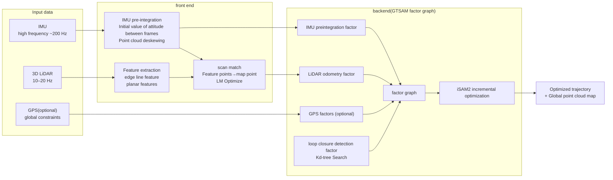

## 4.4 Visual SLAM
{: id="44-视觉-slam"}

Visual SLAM uses cameras instead of LiDAR, which is cheaper but more sensitive to light.

### ORB-SLAM3
{: id="orb-slam3"}

Currently one of the most mature visual SLAM systems, supporting **monocular / stereo / RGB-D / fisheye camera + IMU**.

[Project homepage](https://github.com/UZ-SLAMLab/ORB_SLAM3)

**key technology**:
- Feature extraction: **ORB (Oriented FAST and Rotated BRIEF)** descriptor, fast and rotation-invariant
- Tracking: The current frame matches the map point, and PnP is used to find the pose.
- Local mapping: maintain a local map and perform Bundle Adjustment optimization
- loop closure detection: Appearance similarity detection based on **bag of words model (Bag of Words, BoW)**

**ORB-SLAM3 three-thread architecture**:

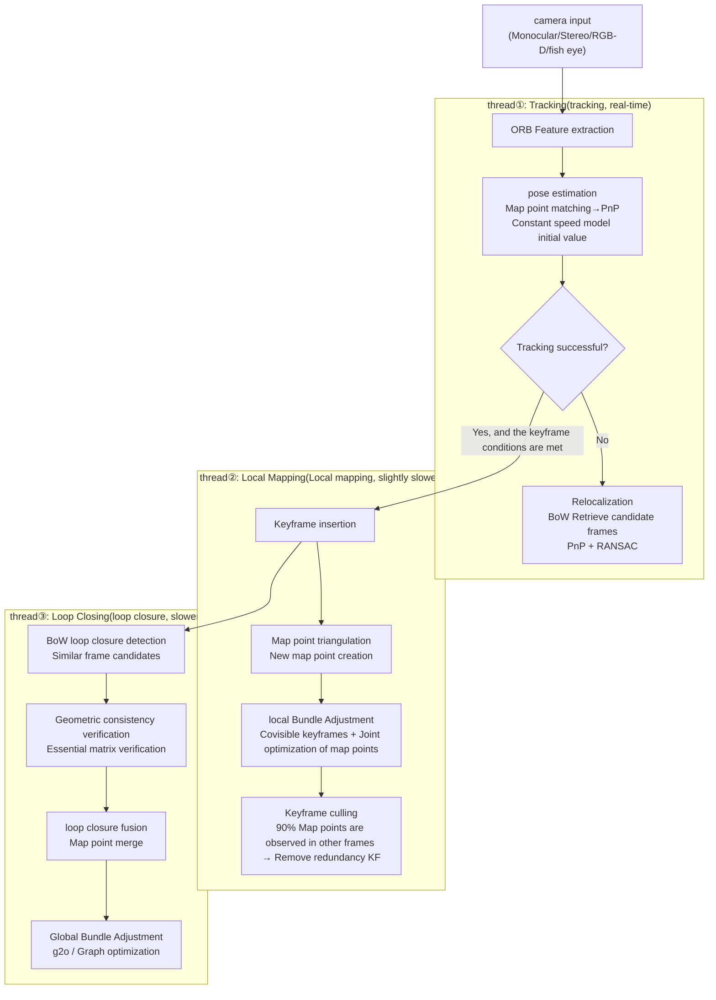

**keyframe selection strategy**: ORB-SLAM3 does not insert keyframes in every frame, but is triggered according to the following conditions: ① The time from the previous keyframe exceeds the threshold; ② The number of map points that can be observed in the current frame drops below the threshold (tracking becomes weak); ③ There are not too many keyframes to be processed in the local map (to avoid backlog). This strategy ensures that keyframes are evenly distributed in space and time, avoiding redundancy.

**Map point management**: Each map point records which key frames it was observed in, and the ORB descriptor in each frame (the average is taken as the representative descriptor). Map points are divided into **local map point** (seen in recent key frames) and **global map point** (complete history). During tracking, only local map points are used for matching (fast), and during BA optimization, only Covisible keyframess are optimized (local BA).

**Relocation after loss of tracking**: When continuous frame tracking fails, the system enters **relocation mode**: ① Use the BoW vector of the current frame to retrieve similar frames in the key frame database; ② Use PnP+RANSAC to verify geometric consistency for candidate frames; ③ After finding the matching frame, restore the pose and reinitialize tracking. BoW retrieval is extremely fast (O(1) magnitude) and can be completed within milliseconds.

✅ High accuracy and supports multiple camera types
✅ Strong closed-loop detection capabilities in large-scale scenarios
❌ Pure vision can easily lose tracking in low light/fast motion

### VINS-Mono / VINS-Fusion
{: id="vins-mono--vins-fusion"}

[VINS-Mono](https://github.com/HKUST-Aerial-Robotics/VINS-Mono) | [VINS-Fusion](https://github.com/HKUST-Aerial-Robotics/VINS-Fusion)

The **visual-inertial SLAM** system is open sourced by the Hong Kong University of Science and Technology. The camera and IMU are tightly coupled, and the pose is jointly estimated through **nonlinear optimization (sliding window BA)**. VINS-Fusion further supports stereo and GPS fusion and is a common solution in the fields of autonomous driving and drones.

✅ Tight coupling, high precision
✅ Better robustness to camera pure rotation and weak texture scenes
✅ Support online extrinsic parameters calibration

<div align="center">
  
<figcaption>Figure: Visual Inertial System (VINS) with Stereo Vision</figcaption>
</div>


### DSO (direct sparse odometry)
{: id="dso直接稀疏里程计"}

[Project homepage](https://github.com/JakobEngel/dso)

 **direct method** A representative work that directly minimizes the grayscale of image pixels without extracting feature points. **Photometric Error** .

Comparison with **feature method** (ORB-SLAM3):

| Comparison dimension | Feature method (ORB-SLAM3) | Direct method (DSO) |
|---------|---------------|-----------|
| depends on texture | requires corner features | arbitrary image gradient |
| Weak texture scene | ❌ Easy to fail | ✅ Relatively better |
| motion blur | ❌ Difficulty in feature extraction | ❌ Also degeneracy |
| Computational cost | Medium | Large |
| Map density | Sparse point cloud | Semi-dense point cloud |

### RTAB-Map(Real-Time Appearance-Based Mapping)
{: id="rtab-mapreal-time-appearance-based-mapping"}

[Project homepage](https://github.com/introlab/rtabmap)

Open sourced by IntRoLab, it is currently the most widely used **multi-modal graph optimization SLAM** system in the ROS ecosystem. It also supports RGB-D cameras, stereo cameras and 3D LiDAR input, and outputs occupied grid maps and dense point cloud maps.

**Core design: Appearance-based memory management**

The most unique feature of RTAB-Map is its **online memory management mechanism (Memory Management)**: The system divides key frames into "Working Memory (WM)" and "Long-Term Memory (LTM)". When the number of nodes in WM exceeds the upper limit, the node that has not been accessed for the longest time is transferred to LTM (similar to memory paging in the operating system). During loop closure detection, only search within WM to ensure real-time performance; after loop closure is detected, relevant nodes are awakened from LTM to participate in optimization. This mechanism enables RTAB-Map to maintain real-time (>1 Hz) operation during large-scale long-term mapping.

**key technology module**:

- **Appearance loop closure detection**: Extract SURF/ORB features from key frames based on the Bag of Words model (BoW) and calculate the similarity between frames; when the threshold is exceeded, geometric verification is triggered (PnP + RANSAC)
- **graph optimization backend**: Use g2o/GTSAM to globally optimize the pose graph to eliminate cumulative drift
- **multi-sensor front end**:
  - RGB-D mode: ICP point cloud matching + visual odometry (VO)
  - Laser Mode: ICP/NDT Scan Match
  - Stereo mode: Parallax depth estimation + VO
- **output map**: 2D occupancy grid map (can be used directly in ROS Navigation Stack) + 3D color point cloud

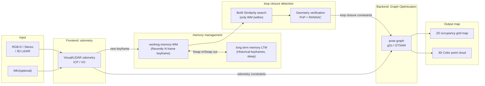

✅ Multi-sensor support, RGB-D/stereo/LiDAR can be used in one system
✅ Output standard occupation grid map and seamlessly connect with ROS Navigation Stack
✅ Online memory management, suitable for long-term large-scale mapping
✅ Built-in 3D point cloud map, which can be used for downstream tasks such as crawling and 3D reconstruction
❌ The default parameters consume high memory for large scenes, and parameters such as `Mem/STMSize` need to be tuned.
❌ Pure visual mode has reduced reliability in weak texture/low light environments

### Dense Visual Mapping
{: id="稠密视觉建图dense-visual-mapping"}

ORB-SLAM3 and DSO output **sparse/semi-dense point cloud**, which cannot be directly used for downstream tasks such as capture planning and three-dimensional reconstruction. Dense mapping systems output complete three-dimensional surface models at the cost of higher computational effort.

#### TSDF Map Representations
{: id="tsdf-地图表示"}

**Truncated Signed Distance Function (TSDF)** is the core map representation of dense mapping. Divide the space into a grid of voxels, with each voxel storing:

- **SDF value**: Signed distance of this voxel to the nearest surface (positive = outside of surface, negative = inside, zero = surface)
- **Weight**: Confidence of cumulative observations

$$\text{TSDF}(v) = \text{clip}\left(\frac{d(v)}{\delta},\ -1,\ 1\right)$$

Here, $\delta$ is the truncation distance, and $d(v)$ is the distance from the voxel center to the nearest surface. After the multi-frame depth map is fused, the triangular mesh is extracted at TSDF=0 through the **Marching Cubes algorithm**, which is the reconstructed three-dimensional surface.

#### KinectFusion
{: id="kinectfusion"}

Introduced by Microsoft Research in 2011, KinectFusion was the first system for **real-time dense reconstruction using an RGB-D camera**, running entirely on the GPU.

**process**:

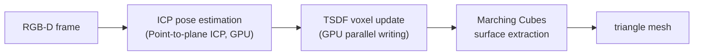

- **front-end**: Use **GPU point-to-plane ICP** to estimate camera pose in real time (no feature extraction, directly align the depth map point cloud)
- **Mapping**: Project the depth map along the light direction and update the TSDF voxels (GPU parallel, extremely fast)
- **Limitations**: The map resolution is fixed, and the scene size is limited by GPU memory (usually within 3m³); there is no loop closure detection, and long-term drift is obvious

#### ElasticFusion
{: id="elasticfusion"}

ICCV 2015, based on KinectFusion, adds the **elastic deformation (Elastic Deformation)** mechanism, uses **Surfel (directed surface element)** to replace the voxel storage map, and supports non-rigid global optimization:

- **Surfel map**: Each Surfel stores location, normal vector, color, radius, and confidence
- **Elastic loop closure**: After detecting loop closure, instead of rigidly translating the map, non-rigid elastic deformation is applied to the map to smoothly align historical frames.
- **effect**: suitable for medium-scale indoor scenes (single room), the reconstruction quality is much better than KinectFusion

#### Dense visual mapping comparison
{: id="稠密视觉建图对比"}

| system | map representation | loop closure | scene scale | applicable scene |
|------|---------|------|---------|---------|
| KinectFusion | TSDF voxel | ❌ | Small (3m³) | Desktop-level reconstruction |
| ElasticFusion | Surfel | ✅ (Elastic) | Medium (Single Room) | Indoor Fine Reconstruction |
| RTAB-Map | Point Cloud + Occupation Raster | ✅ | Large (Multiple Rooms) | Navigation + Coarse Reconstruction |
| ORB-SLAM3 | Sparse point cloud | ✅ | Large | Positioned mainly |

### Neural Implicit SLAM
{: id="神经隐式-slamneural-implicit-slam"}

Since 2021, NeRF and 3D Gaussian Splatting introduced SLAM, bringing a new map representation paradigm - instead of using discrete voxels or point clouds, **neural networks are used to implicitly encode the geometry and appearance of the** scene.

#### NeRF Basics Review
{: id="nerf-基础回顾"}

**Neural Radiation Field (NeRF)** Use an MLP to map spatial coordinates and viewing direction into color and volume density:

$$(\mathbf{c}, \sigma) = F_\theta(\mathbf{x}, \mathbf{d})$$

The pixel color is obtained through volume rendering (Volume Rendering) integration, the photometric loss is calculated by comparing with the real image, and the network weight is optimized by backpropagation. The optimized network serves as an "implicit map" of the scene, allowing new views to be rendered from any perspective.

#### IMAP(2021)
{: id="imap2021"}

The first system to use NeRF for real-time SLAM. Simultaneously optimize camera pose and scene representation with a single MLP:

- **tracking**: fixed network weights, optimizing the current frame pose (minimizing rendering error)
- **Mapping**: Fixed pose, optimized network weights (update implicit map with historical keyframes)
- **Limitations**: The capacity of a single MLP is limited, and details of large scenes are lost; the speed is slow and cannot be real-time

#### NICE-SLAM(2022)
{: id="nice-slam2022"}

Introduce **Multi-Resolution Feature Grid** to replace a single MLP and solve the capacity bottleneck of iMAP:

- Three layers of feature grids: coarse, medium and fine, respectively capture geometric information at different scales
- Local update: only update the currently observed grid area to avoid global forgetting
- Faster than iMAP, suitable for medium-sized indoor scenes (TUM, Replica datasets)

#### 3D Gaussian Splatting SLAM(2023-2024)
{: id="3d-gaussian-splatting-slam2023-2024"}

**3DGS-SLAM** Use **three-dimensional Gaussian ellipsoid (3D Gaussian)** to replace NeRF's volume density field, and the rendering speed is increased by more than 100 times (real-time rendering >30 fps), spawned a number of real-time SLAM systems:

| System | Map representation | Real-time | Features |
|------|---------|-------|------|
| **MonoGS** (2024) | 3D Gaussian | ✅ | Monocular camera, geometry-aware tracking |
| **SplaTAM** (2024) | 3D Gaussian | ✅ | RGB-D, explicit density control |
| **Gaussian-SLAM** | 3D Gaussian + submap | ✅ | Large scene submap stitching |

Comparison between **NeRF/3DGS SLAM and traditional SLAM**:

| Dimensions | Traditional SLAM (ORB-SLAM3) | NeRF-SLAM | 3DGS-SLAM |
|------|----------------------|-----------|-----------|
| Map representation | Sparse point cloud | Implicit MLP | 3D Gaussian ellipsoid |
| New perspective rendering | ❌ | ✅ (slow) | ✅ (real time) |
| Localization accuracy | High | Medium | Medium |
| Mapping speed | Real-time | Slow (offline) | Near real-time |
| Memory | Low | Medium | High (large number of Gaussians) |
| Downstream tasks | Navigation | Vision generation, simulation | Vision generation, simulation |

> **Outlook**: Neural implicit SLAM currently lags behind traditional SLAM in terms of localization accuracy and real-time performance, but the high-quality renderable map it outputs has unique value for the visual perception and simulation data generation of embodied AI (embodied AI), and is a current research hotspot.

## 4.5 SLAM backend optimization
{: id="45-slam-后端优化"}

The SLAM front-end gives an initial estimate of the pose for each frame, but due to noise accumulation, the error will become larger and larger after a long run. The goal of backend optimization is global consistency.

### Bundle Adjustment (BA) intuitive understanding
{: id="bundle-adjustmentba直觉理解"}

**Bundle Adjustment (beam adjustment method)** is the core of visual SLAM back-end optimization. The goal is to **simultaneously adjust the camera pose and the position of the three-dimensional map point** so that the **reprojection error of all map points across all camera frames is minimized**.


<div align="center">
  
<figcaption>Figure: Beam adjustment method</figcaption>
</div>

**Intuitive analogy**: Imagine you have multiple photos of the same scene taken from different angles, and the initial 3D coordinates (with errors) of the landmarks in the scene. BA is to simultaneously fine-tune the camera position/orientation of each photo, as well as the 3D coordinates of each landmark, so that the sum of the deviations between the "projection point of the landmark calculated based on the camera parameters" and the "actually seen feature point position in the photo" is minimized.

$$\min_{\{P_i\}, \{X_j\}} \sum_{i,j} \| u_{ij} - \pi(P_i, X_j) \|^2$$

Here, $P_i$ is the camera pose, $X_j$ is the 3D coordinate of the map point, $u_{ij}$ is the observed image coordinate, and $\pi(\cdot)$ is the projection function.

**Local BA vs. Global BA trade-offs**:
- **Local BA** (ORB-SLAM3 real-time optimization): Only optimize the latest Covisible keyframess and their observed map points, the computational cost is small, and it can run in real time (millisecond level). Disadvantage: Global drift cannot be eliminated by local BA.
- **Global BA** (triggered after loop closure): Optimize all key frames and map points of the entire map, with good global consistency. Disadvantages: The amount of calculation is proportional to the map size. Large scenes may take seconds or even minutes. It can only be executed offline or once after loop closure detection is triggered.

### Factor Graph and graph optimization
{: id="因子图factor-graph与图优化"}

Model the SLAM problem as a **factor graph**: nodes (variables) represent robot poses and map points, and edges (factors) represent sensor constraints (such as relative poses between adjacent frames, loop closure constraints). The solution process is to find the variable estimate that minimizes the sum of all constrained errors.

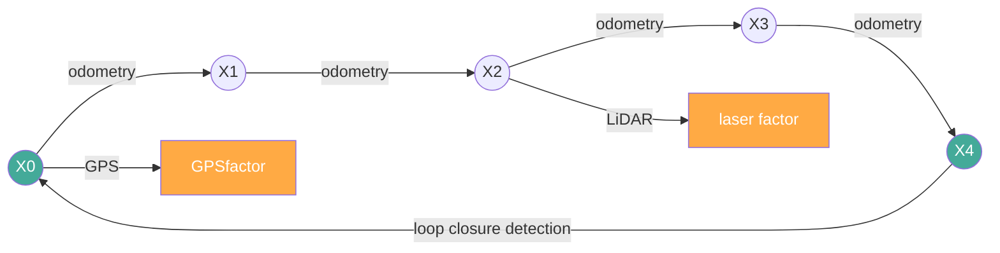

### Loop Closure Detection
{: id="回环检测loop-closure-detection"}

The task of loop closure detection: determine whether the robot has returned to the place it has explored before, so as to add loop closure constraints to eliminate accumulated errors. The entire process is divided into two stages: **appearance retrieval** (quick recall of candidate frames) and **geometry verification** (elimination of false recalls).

<div align="center">
  
<figcaption>Figure: loop closure detection two-stage process</figcaption>
</div>

<div align="center">
  
<figcaption>Figure: loop closure detection rendering</figcaption>
</div>

#### Stage 1: Appearance retrieval - Bag of Words model
{: id="阶段一外观检索--词袋模型bag-of-words"}

The most mainstream loop closure retrieval scheme in visual SLAM is implemented by the **DBoW2 / DBoW3** library (the ORB-SLAM series and RTAB-Map are all based on this).

**(1) offline: building a visual dictionary**

Extract ORB / BRIEF descriptors on a large number of images, and use **k-means clustering** (usually a hierarchical k-ary tree) to quantize the high-dimensional descriptor space into $K$ "visual words". The dictionary is solidified once training is completed and does not need to be updated during runtime.

```
original descriptor space (128dimensional floating point or 256bit binary)
        ↓  Hierarchical k-means
Visual dictionary (tree structure, leaf nodes = visual word)
```

**(2) Online: Image → BoW Vector**

Extract the ORB descriptor for each key frame, and convert each descriptor **quantize** to the nearest visual word, count the word frequency, and weight it to get a sparse vector:

$$
v_i = \left[ \text{tf-idf}(w_1),\ \text{tf-idf}(w_2),\ \ldots,\ \text{tf-idf}(w_K) \right]$$

Here, TF-IDF weight $= \text{tf}(w, f) \times \log\frac{N}{n_w}$, $N$ is the total number of frames in the database, and $n_w$ is the number of frames containing the word $w$. Common words (such as edge corners) have low weights, and rare words (such as unique textures) have high weights.

**(3) candidate frame retrieval**

When a new keyframe arrives, use its BoW vector to compare **cosine similarity** with all frames in the database, and select the Top-K frames as loop closure candidates. Since the vectors are sparse and the dictionary lookup table is $O(1)$, the retrieval speed is extremely fast (on the order of milliseconds).

> **Key limitations**: BoW is a pure appearance method, similar lighting/scenes will produce **false recalls** (false positive), so it must be geometrically verified.

---

#### Phase 2: Geometric consistency verification - RANSAC
{: id="阶段二几何一致性验证--ransac"}

For each candidate frame recalled by BoW, verify whether the **3D geometry between the current frame and the candidate frame is self-consistent**.

**(1) feature point matching**

For the current frame and the candidate frame, do **brute-force matching (Brute-Force Matching)** based on the ORB descriptor, and obtain a batch of corresponding point pairs $\{(p_i, p_i')\}$.

**(2) RANSAC estimated essential matrix / homography matrix**

Since matching point pairs contain a large number of **Outlier** (Mismatching caused by occlusion and repeated textures), directly solving with all points will result in wrong geometric relationships. RANSAC’s approach:

```
Repeat N Times:
  1. Randomly sample the minimum set of points (the essential matrix requires 5 point, the homography matrix requires 4 points)
  2. Solve with minimum point set E or H matrix
  3. Statistically satisfied E/H interior points of (inlier)Quantity
Return the solution with the largest number of interior points
```

**essential matrix $E$** (pure rotation + translation scene, no plane assumption) satisfies the epipolar constraint:

$$p'^T E\, p = 0, \quad E = t^\wedge R$$

Here, $R$ is the rotation matrix, and $t^\wedge$ is the antisymmetric matrix of the translation vector.

**(3) inlier threshold judgment**

- Number of interior points $\geq$ Threshold (such as 30) → **Confirm loop closure**, calculate the relative pose of the current frame relative to the candidate frame $T_{loop}$, and add it as a constraint to the pose graph
- Insufficient inliers → **rejects candidate**, no loop closure is generated this time

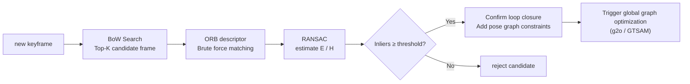

---

#### Loop closure detection for LiDAR SLAM
{: id="激光-slam-的回环检测"}

LiDAR SLAM has no image and cannot use BoW. The following solutions are commonly used:

| method | principle | representative system |
|------|------|----------|
| **ICP Violent search** | Traverse historical subgraphs, ICP verification matching | Cartographer |
| **Kd-tree distance search** | GPS/odometry a priori constraint search range, then ICP verification | LIO-SAM |
| **Scan Context** | Encode point clouds into 2D descriptors (top-view polar histogram), fast retrieval + rotation invariant | SC-LIO-SAM |

**Scan Context** is the mainstream solution for laser loop closure detection in recent years: project the 3D point cloud onto a top-view polar coordinate grid, record the maximum height value for each grid, and generate a fixed-size 2D matrix as a "point cloud fingerprint". The similarity between two frames is rotationally invariant via column shift search, and the retrieval speed is much faster than frame-by-frame ICP.

### Main backend optimization libraries
{: id="主要后端优化库"}

- **g2o (General Graph Optimization)**: General graph optimization library, used by ORB-SLAM2/3
- **GTSAM (Georgia Tech Smoothing and Mapping)**: factor graph optimization library, used by LIO-SAM
- **iSAM2 (Incremental Smoothing and Mapping 2)**: Incremental optimization algorithm in GTSAM, supporting real-time updates without re-optimizing the entire graph each time

## 4.6 Laser vs. Visual SLAM comparison
{: id="46-激光-vs-视觉-slam-对比"}

| Comparison dimension | LiDAR SLAM | Visual SLAM |
|---------|---------|---------|
| Sensor cost | High (hundreds to tens of thousands of yuan) | Low |
| Accuracy | High (cm level) | Medium (depends on the scene) |
| Light dependence | No | Yes (difficulty in low light/overexposure) |
| Map type | Point cloud/occupied raster | Sparse point cloud/semi-dense |
| Dynamic obstacle handling | Normal | Difficult |
| Corridor degeneracy problem | Easy (lack of geometric constraints) | Texture dependent |
| represents the algorithm | Cartographer, LIO-SAM | ORB-SLAM3, VINS-Mono |
| Typical applications | Indoor robot, autonomous driving | Drone, handheld device |

> **RTAB-Map** spans two columns: it supports laser and visual dual-mode input, and its accuracy and applicable scenarios are between the two. It is the most comprehensive out-of-the-box solution in the ROS ecosystem.

## 4.7 SLAM degeneracy scenarios and actual deployment challenges
{: id="47-slam-退化场景与实际部署挑战"}

SLAM systems often perform well in laboratory environments, but encounter various degeneracy scenarios in real deployments, resulting in localization failures or map errors. Understanding these scenarios and selecting algorithms accordingly is the key to engineering.

<div align="center">
  
<figcaption>Figure: Troublesome scene</figcaption>
</div>

### 4.7.1 Geometric Degeneracy
{: id="471-几何退化geometric-degeneracy"}

**Corridor degeneracy** (Corridor Degeneracy): LiDAR SLAM faces severe challenges in long corridors. The walls on both sides of the corridor are highly symmetrical, and the characteristics of the laser point cloud along the corridor direction are almost the same, resulting in the displacement **along the corridor direction being unable to be constrained** (the normal direction constraint of scan matching is missing). The performance is as follows: drifting along the corridor and good horizontal localization.

**Countermeasures**:
- Combined with IMU or wheel odometry to constrain movement along corridors
- Supplementary constraints with ceiling and floor structures using 3D LiDAR
- LIO-SAM's IMU pre-integration provides constraints in the degeneracy direction

**Open outdoor degeneracy**: In environments that lack three-dimensional structures such as large parking lots and fields, the laser point cloud is sparse and NDT/ICP convergence is difficult. **Countermeasure**: Fusion of GPS global constraints.

### 4.7.2 Dynamic environment challenges
{: id="472-动态环境挑战"}

SLAM assumes that the environment is static, but in reality pedestrians, vehicles, and moving furniture will cause dynamic interference:

- **Fake map point**: Dynamic obstacles are incorrectly built into the static map
- **tracking failure**: A large number of dynamic objects cause scan matching failure
- **loop closure false detection**: BoW recalls wrong keyframes after scene layout changes

**Countermeasures**:
- Point cloud dynamic object filtering (based on motion consistency detection)
- Semantic segmentation filters point clouds for dynamic categories (pedestrians, vehicles)
- Using Motion Segmentation in Visual SLAM

### 4.7.3 Light and weather effects (visual SLAM)
{: id="473-光照与天气影响视觉-slam"}

Visual SLAM is extremely sensitive to light:

| Scenario | Impact on eigenmethod | Impact on direct method |
|------|------------|------------|
| Low light (night) | ORB feature extraction failed | Photometric error calculation is unstable |
| Overexposure (backlight) | Feature descriptor is unstable | The gradient in the saturated area is zero |
| Fast motion | Motion blur, feature blur | Optical flow assumption violation |
| Rain/fog | Features obscured | Visibility reduced |

**Countermeasures**:
- Visual-Inertial SLAM (VINS-Mono/ORB-SLAM3 IMU mode): IMU maintains short-term localization when feature tracking fails
- HDR camera or active lighting (structured light) adapts to lighting changes
- Event Camera is immune to motion blur and is a current research hotspot

### 4.7.4 Long-term map maintenance and scene changes
{: id="474-长期地图维护与场景变化"}

Long-term deployment faces the problem of map aging: seasonal changes (falling leaves, snow), renovations, furniture movement, etc. will make the original map invalid.

**Mitigation strategies**:
- **Incremental map update**: When the sensor observation is inconsistent with the existing map beyond the threshold, a local map update is triggered
- **Multiple map management** (ORB-SLAM3 support): Create new submaps when scene switching or tracking is lost, merge after recovery
- **Semantic Map**: Replace original points with semantic labels (door/wall/column), semantic features are more stable than geometric features

### 4.7.5 Embedded platform computing constraints
{: id="475-嵌入式平台计算约束"}

Robots are often equipped with embedded platforms (Jetson Nano / Xavier / Orin) with limited computing power, and a complete SLAM system requires higher computing power:

| Component | CPU computing power requirement | GPU acceleration feasibility |
|------|-----------|------------|
| ORB feature extraction | Medium (SIMD can be accelerated) | ✅ (CUDA ORB) |
| LiDAR Scan Match (NDT/ICP) | High | Partial (PCL GPU) |
| Bundle Adjustment | Extremely High | ✅ (g2o CUDA) |
| loop closure detection (BoW search) | Low | Unnecessary |
| particle filtering (AMCL 500 particles) | low | unnecessary |

**Practical suggestions**:
- Prioritize the use of lightweight systems: LeGO-LOAM (embedded friendly), AMCL (low computing power localization)
- Front-end (feature extraction, scan matching) should be accelerated on GPU as much as possible
- Back-end optimization can run at reduced frequency (10 Hz front-end + 1–2 Hz back-end BA)
- Use iSAM2 incremental optimization to avoid full-graph re-optimization

> **Note**: More details in the real deployment of visual SLAM (scenario adaptability research related to TITS 2026) will be added later.

## 4.8 Summary of commonly used datasets
{: id="48-常用数据集汇总"}

| Dataset | Sensor | Scenario | Main purpose | Address |
|--------|-------|------|---------|------|
| **KITTI** | LiDAR+stereo+GPS/IMU | Outdoor road | Visual/LiDAR odometry, 3D target detection | kitti.is.tue.mpg.de |
| **TUM** | RGB-D | Indoor | RGB-D SLAM evaluation | vision.in.tum.de |
| **EuRoC** | Stereo+IMU | Indoor Drone | VIO evaluation | rpg.ifi.uzh.ch |
| **nuScenes** | 6 cameras + laser + radar + GPS/IMU | Outdoor roads | Autonomous driving perception | nuscenes.org |
| **Newer College** | 3D LiDAR + IMU | Outdoor Campus | 3D LiDAR SLAM | ori.ox.ac.uk |
| **Hilti SLAM** | Multi-laser+camera+IMU | Construction site | Multi-sensor SLAM evaluation | hilti-challenge.com |

---

# 5. Path Planning
{: id="5-路径规划path-planning"}

Path planning solves the problem of "how should I go": find a collision-free path from the starting point to the end point in a known (or locally known) map.

## 5.1 Global Path Planning: Search Methods
{: id="51-全局路径规划搜索类"}

The search algorithm searches for the optimal path on the **discretized grid map**.

### Dijkstra's algorithm
{: id="dijkstra-算法"}

**idea**: Starting from the starting point, like ripples spreading, gradually explore all reachable nodes in the order of **cost from small to large** until the end point is found. Guaranteed to find the path with the least cost (optimality).

✅ Guaranteed optimal solution
❌ No directionality, large number of nodes to expand on a large map, low efficiency
❌ Time complexity $O(V \log V + E)$, $V$ is the number of nodes, $E$ is the number of edges

<div align="center">
  <video src="/images/robotics_navigation/dijkstra_search.mp4" autoplay loop muted playsinline width="46%" style="margin:4px"></video>
  <video src="/images/robotics_navigation/dijkstra_navigate.mp4" autoplay loop muted playsinline width="46%" style="margin:4px"></video>
<figcaption>Figure: Dijkstra search process (left) and navigation results (right) - expansion nodes spread in concentric circles with no directionality</figcaption>
</div>

### A* (A-Star) algorithm
{: id="aa-star算法"}

**idea**: Add the **heuristic function h(n)** (estimate the cost from the current node to the end point, usually using Euclidean distance or Manhattan distance) based on Dijkstra, so that the search has a clear direction and priority is given to exploring nodes that "look closer to the end point".

$$f(n) = g(n) + h(n)$$

Here, $g(n)$ is the actual cost from the starting point to the node $n$, and $h(n)$ is the estimated value of the heuristic function.

✅ Guaranteed optimal solution (when $h(n)$ does not overestimate the actual cost)
✅ Much faster than Dijkstra (directional search)
❌ The amount of calculation in high-dimensional space (such as 3D) is still large

**Selection of heuristic function h(n)**: Different heuristic functions are suitable for different movement constraints:

| Heuristic function | Formula | Applicable scenario | Properties |
|---------|------|---------|------|
| **Manhattan distance** | $\|dx\| + \|dy\|$ | Only allows movement in the 4 direction (up, down, left and right) | Admissible for 4-connected movement |
| **Euclidean distance** | $\sqrt{dx^2 + dy^2}$ | Allows movement in any direction | Admissible for movement in any direction |
| **Octile distance** | $\max(\|dx\|,\|dy\|) + (\sqrt{2}-1)\min(\|dx\|,\|dy\|)$ | Allow 8 direction movement (including diagonal) | Tighter than Euclidean in 8 directions (faster search) |

> **Admissibility**: $h(n)$ Never overestimate the true cost and ensure that A* finds the optimal solution. If $h(n) = 0$, A* reduces to Dijkstra (the slowest and optimal). The larger $h(n)$, the faster it is, but it may be overestimated and lose optimality.

The following figure shows the search process of A* on the 10×10 grid:

<div align="center">
  
<figcaption>Figure: A* search diagram - gray (evaluated closed set) / orange (open set to be evaluated) / green (optimal path), obstacles (dark) are bypassed</figcaption>
</div>

<div align="center">
  <video src="/images/robotics_navigation/astar_search.mp4" autoplay loop muted playsinline width="46%" style="margin:4px"></video>
  <video src="/images/robotics_navigation/astar_navigate.mp4" autoplay loop muted playsinline width="46%" style="margin:4px"></video>
<figcaption>Figure: A* search process (left) and navigation results (right) - directional, expansion nodes are concentrated in the target direction</figcaption>
</div>

### Bidirectional A*
{: id="双向-abidirectional-a"}

Search in both directions from the start and end points simultaneously, stopping when the two search wavefronts meet. The average number of search nodes is about half that of one-way A*, which is suitable for situations where the start and end points are far apart.

<div align="center">
  <video src="/images/robotics_navigation/astar_bidirectional_search.mp4" autoplay loop muted playsinline width="46%" style="margin:4px"></video>
  <video src="/images/robotics_navigation/astar_bidirectional_navigate.mp4" autoplay loop muted playsinline width="46%" style="margin:4px"></video>
<figcaption>Figure: Two-way A* search (left, both ends are expanded simultaneously) and navigation results (right)</figcaption>
</div>

### Hybrid A*
{: id="hybrid-a混合-a"}

**Problem with standard A***: Pathfinding on the grid, ignoring the kinematic constraints of the vehicle. A car cannot move sideways, it has a minimum turning radius.

Improvement of **Hybrid A***: Discretize the continuous state space of the vehicle ($x, y, \theta$), consider executable steering operations (such as arcs with different curvatures) when expanding each node, and ensure that the generated path is suitable for vehicles with nonholonomic constraints (differential wheeled/Ackermann ) **is actually feasible**.

✅ Generate kinematic feasible paths
✅ Suitable for parking scenes and narrow passages
❌ The computational cost is larger than standard A*
❌ Need to be combined with post-processing smoothing such as Reeds-Shepp curve

<div align="center">
  <video src="/images/robotics_navigation/astar_hybrid_search.mp4" autoplay loop muted playsinline width="46%" style="margin:4px"></video>
  <video src="/images/robotics_navigation/astar_hybrid_navigate.mp4" autoplay loop muted playsinline width="46%" style="margin:4px"></video>
<figcaption>Figure: Hybrid A* search (left) and navigation results (right) - generating a smooth feasible path that takes into account vehicle kinematic constraints</figcaption>
</div>

### A* algorithm engineering optimization
{: id="a-算法工程优化"}

In actual engineering applications (such as autonomous driving or mobile robots), the paths generated by the original A* often have problems such as redundant nodes and sharp corners. Mainstream optimization strategies include:

1. **adaptive heuristic function weight**:
Introduce the dynamic weight coefficient $\lambda$ to make the heuristic function change with the position:
   $$f(n) = g(n) + (1 + \lambda \cdot \frac{d_{to\_end}}{d_{total}})h(n)$$
Increase the weight when approaching the starting point to increase the search speed (similar to greedy search); decrease the weight when approaching the end point to ensure the optimality of the path.

2. **Path Simplification (Douglas-Peucker Algorithm)**:
The raw paths produced by A* often contain a large number of collinear redundant nodes. The **Douglas-Peucker (DP)** algorithm can eliminate unnecessary intermediate points while maintaining the path topological characteristics, greatly simplifying the path description, and improving the efficiency of subsequent trajectory smoothing.

3. **Quadratic smoothing (B-spline curve)**:
For the streamlined key points, use **B-Spline** or fifth-order polynomial for fitting. This converts the polygonal path of A* into a continuous, higher-order differentiable smooth arc, ensuring that it adheres to the dynamic constraints of the chassis (such as centripetal acceleration limits).

<div align="center">
  
<figcaption>Figure: A* path optimization process - original raster path (left) → DP simplified key points (middle) → B-spline smooth trajectory (right)</figcaption>
</div>


<div align="center">
  
<figcaption>Figure: Before optimization, the A* algorithm has dense search points (Fig. 2a) and many path turning points; after optimization, not only the number of search points is reduced sharply (Fig. 2b), but the path is also simpler and smoother, and the search efficiency and path quality are both improved.</figcaption>
</div>

### Fast Marching Method (FMM)
{: id="fast-marching-method快速行进法fmm"}

**Idea**: FMM was proposed by J.A. Sethian in 1996, which models the path planning problem as a **wavefront propagation** problem. Propagate the "time wavefront" from the target point to the surroundings, record the shortest time $T(\mathbf{x})$ for the wave to arrive at each grid, and construct a global **arrival time field**; during planning, gradient descent in the $-\nabla T$ direction from the starting point can be used to obtain the global optimal path.

<div align="center">
  
<figcaption>Figure: FMM planning process - velocity potential field W(x) (left, low speed near obstacles) → arrival time field T(x) (middle, low cost in blue area) → gradient descent path (right)</figcaption>
</div>

**Eikonal Equation**:

$$|\nabla T(\mathbf{x})| = \frac{1}{F(\mathbf{x})}$$

Here, $T(\mathbf{x})$ is the minimum time (path cost) for the wave to reach the point $\mathbf{x}$ from the target, $F(\mathbf{x}) > 0$ is the **propagation speed of the point** - free space $F=1$, near the edge of the obstacle $F \to 0$, through Costmap's distance transform assignment naturally incorporates terrain costs.

**core algorithm steps (narrow-band propagation, Dijkstra-like)**:

1. **initializes**: target point $T_{goal}=0$, all other nodes $T=\infty$; add the target point to the min-heap
2. **pops up the top of the** heap (the current smallest node $T$), marked as "determined"
3. For each undetermined neighbor, use the **Eikonal update formula** to calculate the candidate arrival time:

Assume $T_h = \min(T_{left}, T_{right})$, $T_v = \min(T_{up}, T_{down})$ (take the determined minimum value in adjacent directions), then:

   $$T_{new} = \begin{cases} \dfrac{T_h + T_v + \sqrt{2/F^2 - (T_h - T_v)^2}}{2} & \text{if } |T_h - T_v| < 1/F \\ \min(T_h, T_v) + \dfrac{1}{F} & \text{otherwise (one-sided update)} \end{cases}$$

4. If $T_{new}$ is smaller, insert (or update) the neighbor into the min-heap
5. Repeat steps 2–4 until the heap is empty

**path extraction**: starting from the starting point, perform gradient descent along the $-\nabla T$ direction. Since the Eikonal equation guarantees that the $T$ field **is monotonic and has no local minimum**, the gradient descent will definitely converge to the target point and generate the global optimal path.

✅ Path **naturally smooth**: continuous wave front propagation, no raster aliasing
✅ **is built once, and the whole picture can be checked.**: After the $T$ field is built, any starting point can be directly gradient-descent, which is suitable for querying the same target multiple times.
✅ Naturally integrate **non-uniform terrain cost** through $F(\mathbf{x})$ (slope, ground type, etc.)
✅ **is the global optimal** (continuous space meaning), and there is no local minimum problem of the traditional potential field method.
❌ Heuristic function cannot be used to accelerate, **must traverse the entire map**, $O(N \log N)$ ($N$ is the total number of rasters)
❌ **single-end single-end** planning that is not suitable for very large maps (A* is faster)
❌ When the resolution is low, the gradient descent path is still slightly jagged and needs to be smoothed by post-processing.

Comparison between **and other algorithms**:

| Comparison dimensions | FMM | Dijkstra | A* |
|---------|-----|----------|----|
| Core model | Continuous Eikonal equation | Discrete graph search | Discrete graph + heuristic function |
| Path smoothness | Natural smoothness | Sawtooth | Sawtooth (post-processing required) |
| Single planning speed | Slow (full picture) | Slow (full picture) | Fast (directional) |
| Multi-end query | ✅ (one build) | needs to be run repeatedly | needs to be run repeatedly |
| Non-uniform cost | ✅ ($F$ field) | ✅ (Edge weight) | ✅ (Edge weight) |

**Typical applications**: terrain path planning (rover non-uniform ground), ROS `navfn` full-grid potential field construction, image distance transformation and skeleton extraction, computer graphics geodesic distance calculation.


### Fast Marching Square(FM²)
{: id="fast-marching-squarefm"}

FM² was proposed by Garrido et al. (2006) on the basis of FMM. The core idea is **twice in series with FMM**. By constructing a velocity field proportional to the distance to the obstacle, the wavefront can automatically "bypass" the dangerous area and plan a natural and safe smooth path.

<div align="center">
  
<figcaption>Figure: FM² planning process - original binary map (first left) → Dilated Map (second left) → arrival time field T(x) (second right) → safe path (first right), the path is naturally far away from the edge of the obstacle</figcaption>
</div>

**Two-stage algorithm**:

1. **first stage - construct velocity field $W(\mathbf{x})$**: run with all **obstacle grids** as the source point ($T=0$) FMM, obtain the **arrival time distance field** from each point in the whole graph to the nearest obstacle; normalize the distance field as the velocity field:

   $$W(\mathbf{x}) = f\!\left(d_{\text{obs}}(\mathbf{x})\right), \quad W \in (0,\,1]$$

The closer to the obstacle, the smaller the $W(\mathbf{x})$ (the lower the speed); the $W \to 1$ is at the center of the free space.

2. **Second stage - path planning**: Run FMM again with the target point as the source point and $W(\mathbf{x})$ as the propagation speed, and calculate the arrival time field $T(\mathbf{x})$; the path is obtained by descending along the $-\nabla T$ gradient from the starting point.

**Why the path is naturally safe**: near obstacles $W$ low → slow wave propagation → $T$ value high → automatically detours to $W$ large (away from obstacles) "high-speed zone" during gradient descent, maintaining a safety margin without any post-processing.

✅ The velocity field **inherently encodes path safety**, without the need to expand obstacles or set safety radius parameters
✅ Both FMMs ensure global optimality and smooth paths
✅ Applicable to any dimensional space (also applicable to high-dimensional planning of robotic arms)
❌ Two full-graph FMMs, twice as much calculation as standard FMM
❌ The velocity field may suppress the velocity too low in a narrow channel, resulting in an overly conservative path

**Main variants**:

| variant | improvement |
|------|-------|
| **FM²\*** | In the second stage, the target heuristic function is added, and the wavefront propagates in a directional manner to reduce unnecessary full-graph expansion and improve the speed |
| **FMDirectional** | Fixed the problem of FM² having too large safety margin in open spaces, making the path closer to the obstacle passable area |
| **Fast Marching Learning (FML)** | Use historical path experience to modify the velocity field to achieve trajectory recurrence and planning acceleration |


## 5.2 Global Path Planning: Sampling Methods
{: id="52-全局路径规划采样类"}

The sampling algorithm constructs a path by **random sampling**. It does not require explicit rasterization of the map and is suitable for high-dimensional space and complex geometric constraint scenarios.

### RRT (Rapidly-exploring Random Tree)
{: id="rrt快速随机扩展树rapidly-exploring-random-tree"}

**Idea**: Grow a tree from the starting point, randomly pick a point each time, find the nearest node on the tree, extend a small step towards the random point, and join the tree if there is no collision. A path is found when a node of the tree is close enough to the end.

**Core steps**:

1. Initialization: tree $\mathcal{T}$ with starting point only $x_{start}$
2. **randomly samples** $x_{rand} \sim \mathcal{U}(\mathcal{X})$ (sometimes $p_{goal} \approx 5\%$ directly samples the end point with a certain probability to accelerate convergence)
3. **Nearest neighbor** $x_{near} = \arg\min_{x \in \mathcal{T}} \|x - x_{rand}\|$
4. **step** $x_{new} = x_{near} + \delta \cdot \frac{x_{rand} - x_{near}}{\|x_{rand} - x_{near}\|}$, where $\delta$ is the step size (step_size)
5. **collision detection**: If $x_{near} \to x_{new}$ has no obstacle, then $x_{new}$ will be added to the tree with the edge weight of $\delta$
6. Repeat until $\|x_{new} - x_{goal}\| < \epsilon$

Key parameter `step_size`: If it is too large, it will fail to cross the obstacle. If it is too small, the convergence will be extremely slow. It is usually taken as 1%–5% of the diagonal of the map.

✅ Naturally handle high-dimensional space (robotic arm planning)
✅ No rasterization required
❌ **does not guarantee optimality** (the path found is usually more tortuous)
❌ The final path requires additional smoothing (commonly used B-Spline or Shortcut smoothing)

<div align="center">
  <video src="/images/robotics_navigation/rrt_search.mp4" autoplay loop muted playsinline width="46%" style="margin:4px"></video>
  <video src="/images/robotics_navigation/rrt_navigate.mp4" autoplay loop muted playsinline width="46%" style="margin:4px"></video>
<figcaption>Figure: RRT random tree expansion process (left) and planned path (right) - path twists and turns, non-optimal</figcaption>
</div>

### RRT*
{: id="rrt"}

The improved version of RRT adds two key steps to the standard RRT: **nearest neighbor Choose Parent** and **Rewiring**.

**Choose Parent**: Rather than selecting the nearest neighbor directly, consider the nodes in the radius-$r$ neighborhood $$\mathcal{X}_{near}$$ and choose the parent with the **lowest cost from the start**:

$$x_{parent} = \arg\min_{x \in \mathcal{X}_{near}} \left[ \text{cost}(x) + d(x, x_{new}) \right]$$

**Rewiring**: After adding $x_{new}$, check every node $x_{near}$ in $$\mathcal{X}_{near}$$. If routing through $x_{new}$ reduces the cost of reaching $x_{near}$, remove the old parent edge of $x_{near}$ and make $x_{new}$ its new parent.

The search radius $r$ shrinks with the number of sampling points $n$: $r(n) = \gamma \left(\frac{\log n}{n}\right)^{1/d}$ ($d$ is the spatial dimension), ensuring asymptotic optimization while controlling the amount of calculation.

✅ Asymptotic optimality (the more paths sampled, the better)
✅ Shares the same sampling framework as RRT, easy to implement
❌ Each time a new node is added, it needs to traverse the neighbor set, and the single-step time complexity $O(\log n)$ is higher than that of RRT's $O(1)$
❌ The convergence speed is slow, and the sampling time may not be enough during real-time planning.

<div align="center">
  <video src="/images/robotics_navigation/rrt_star_search.mp4" autoplay loop muted playsinline width="46%" style="margin:4px"></video>
  <video src="/images/robotics_navigation/rrt_star_navigate.mp4" autoplay loop muted playsinline width="46%" style="margin:4px"></video>
<figcaption>Figure: RRT* search process (left, path continues to be optimized after reconnection) and planned path (right) - smoother than RRT</figcaption>
</div>

### Bidirectional RRT*
{: id="双向-rrtbidirectional-rrt"}

Grow an RRT* tree ($$\mathcal{T}_a$$, $$\mathcal{T}_b$$) from the starting point $x_{start}$ and the end point $x_{goal}$. Each iteration alternately expands the two trees:

1. Perform one-step RRT* expansion on $$\mathcal{T}_a$$ to obtain the new node $x_{new}$
2. Try connecting $x_{new}$ to its nearest node $x_{b,near}$ in $$\mathcal{T}_b$$ with a collision-free path
3. If the connection is successful, merge the two sub-paths to obtain the candidate complete path; retain the complete path with the smallest cost
4. The roles of the two trees are reversed ($$\mathcal{T}_a \leftrightarrow \mathcal{T}_b$$) and continued iterative optimization

The advantage of **comes from**: two trees "grow in opposite directions", which effectively avoids the blind diffusion of one-way trees in a wide space. The search volume is reduced from $O(r^d)$ to $O(2 \cdot (r/2)^d)$, and the convergence speed is about one order of magnitude faster than one-way RRT*.

<div align="center">
  <video src="/images/robotics_navigation/rrt_star_bidirectional_search.mp4" autoplay loop muted playsinline width="46%" style="margin:4px"></video>
  <video src="/images/robotics_navigation/rrt_star_bidirectional_navigate.mp4" autoplay loop muted playsinline width="46%" style="margin:4px"></video>
<figcaption>Figure: Bidirectional RRT* search (left, red and blue trees meet) and planned path (right)</figcaption>
</div>

### Informed RRT*
{: id="informed-rrt"}

Further improvement: When an initial solution $c_{best}$ is found, the sampling is limited to the **elliptical area**. The two foci of this ellipse are $x_{start}$ and $x_{goal}$, the major semi-axis is $a = c_{best}/2$, and the minor semi-axis is:

$$b = \frac{1}{2}\sqrt{c_{best}^2 - \|x_{goal} - x_{start}\|^2}$$

**Intuition**: Only points within the ellipse can make the path cost lower than $c_{best}$ (the definition of the ellipse is exactly the sum of the distances to the two focal points $\leq c_{best}$). As the path continues to be optimized, $c_{best}$ decreases, the ellipse continues to shrink, and the sampling becomes more and more "accurate" to avoid wasting sampling in invalid areas.

When sampling, the uniform random point $x_{ball} \sim \mathcal{U}(\mathcal{B}^d)$ within the standard circle is mapped to the elliptical coordinate frame through affine transformation: $x_{rand} = C \cdot L \cdot x_{ball} + x_{center}$, where $C$ is the rotation matrix (making the main axis of the ellipse align with the $x_{start} \to x_{goal}$ direction), $L = \text{diag}(a, b, \ldots, b)$.

<div align="center">
  <video src="/images/robotics_navigation/informed_rrt_star_search.mp4" autoplay loop muted playsinline width="46%" style="margin:4px"></video>
  <video src="/images/robotics_navigation/informed_rrt_star_navigate.mp4" autoplay loop muted playsinline width="46%" style="margin:4px"></video>
<figcaption>Figure: Informed RRT* search (left, elliptical sampling area shrinks as the path improves) and planned path (right)</figcaption>
</div>

## 5.3 Local path planning (dynamic obstacle avoidance)
{: id="53-局部路径规划动态避障"}

Global planning assumes that the map is static, but in reality there will be dynamic obstacles (pedestrians, other robots). Local planning re-plans in real time during robot movement to handle dynamic obstacles.

### DWA (Dynamic Window Approach)
{: id="dwa动态窗口法dynamic-window-approach"}

**idea**: Sampling the speed command $(v, \omega)$ in the **reachable speed window** (limited by acceleration) around the current speed of the robot, predict each trajectory with the motion model, according to **target direction + speed + Obstacle distance** is comprehensively scored, and the optimal speed command is selected for execution.

Construction of **dynamic window**: Velocity space $(v, \omega)$ needs to satisfy three constraints at the same time, and take the intersection:

- **speed limit**: $v \in [v_{min}, v_{max}]$, $\omega \in [\omega_{min}, \omega_{max}]$
- **dynamic window** (acceleration limit): $$v \in [v_c - \dot{v}_{max} \cdot \Delta t,\ v_c + \dot{v}_{max} \cdot \Delta t]$$, $\omega$ similar
- **Accessibility constraint**: The distance to the nearest obstacle on the trajectory $> 0$ (and the robot can brake before reaching the obstacle)

**scoring function**:

$$G(v, \omega) = \sigma\bigl(\alpha \cdot \text{heading}(v,\omega) + \beta \cdot \text{dist}(v,\omega) + \gamma \cdot \text{velocity}(v,\omega)\bigr)$$

The meaning of the three components:
- $\text{heading}$: The angle difference between the end of the trajectory and the direction of the target point (the smaller, the better, to encourage the robot to turn to the target)
- $\text{dist}$: Minimum distance from the nearest obstacle on the trajectory (the bigger the better, encourage staying away from obstacles)
- $\text{velocity}$: Line speed $v$ itself (bigger is better, encourages fast forwarding)
- $\sigma(\cdot)$ is the normalization function, $\alpha, \beta, \gamma$ is the weight

✅ Fast calculation (ms level), suitable for real-time obstacle avoidance
✅ ROS `dwa_local_planner` works right out of the box
❌ Speed search space is limited and easy to fail in narrow channels
❌ Only considers short-term trajectories (about 1–3 s) and cannot handle obstacles that require "detours"

**Improved variant: Fuzzy DWA (Fuzzy DWA)**
The evaluation weight of traditional DWA ($\alpha, \beta, \gamma$) is fixed, making it difficult to balance "high-speed driving" and "narrow obstacle avoidance". **fuzzy DWA** introduces a fuzzy inference engine, taking the **target distance** and **nearest obstacle distance** as inputs to dynamically adjust the sampling weight. For example: when the obstacle is very close, greatly increase $\beta$ (obstacle avoidance weight) and reduce $\gamma$ (speed weight) to make the obstacle avoidance behavior smoother and less stiff.

<div align="center">
  
<figcaption>Figure: Dynamic window method</figcaption>
</div>

### TEB (Timed Elastic Band)
{: id="teb时间弹性带timed-elastic-band"}

**Idea**: Treat the path as a "rubber band", and add the time dimension to become a "timed elastic band". TEB models the local planning problem as a **sparse nonlinear least squares optimization**:

**State representation**: the path is represented by a series of pose sequences with timestamps $$\mathcal{B} = \{x_i, \Delta T_i\}_{i=1}^{n}$$, where $x_i = (p_x, p_y, \theta)$ and $\Delta T_i$ are the time intervals between adjacent waypoints.

**Optimization goal** (weighted sum of multiple constraints):

$$\min_{\mathcal{B}} \sum_k \gamma_k f_k(\mathcal{B})$$

The meaning of each constraint item:

| constraint item | meaning |
|--------|------|
| $f_{short}$ | The shortest path length (the smallest sum of waypoint distances) |
| $f_{obs}$ | Obstacle distance constraint (all waypoints are away from obstacles $> d_{min}$) |
| $f_{kin}$ | Kinematic feasibility (nonholonomic constraints: curvature $\leq \kappa_{max}$, minimum turning radius) |
| $f_{vel}$ | Speed constraint ($v \leq v_{max}$, $\omega \leq \omega_{max}$) |
| $f_{acc}$ | Acceleration constraint ($\|\dot{v}\| \leq a_{max}$, $\|\dot{\omega}\| \leq \alpha_{max}$) |

The optimization uses the **g2o sparse graph optimization framework**: each waypoint is a node and each constraint is an edge. Levenberg–Marquardt or Gauss-Newton is used to iteratively solve the problem. Usually 10–30 times iterations can converge.

✅ Generate smooth, kinematically feasible trajectories
✅ Support dynamic obstacles (obstacles are also modeled as nodes in the graph)
✅ Support reverse (allow $v < 0$)
❌ The computational cost is larger than that of DWA, about 50–200 ms
❌ Parameter tuning is complicated (constraint weights $\gamma_k$ interact with each other)
❌ Sensitive to the quality of the initial path. When the global planning result is poor, the local area may fall into the local optimum.

<div align="center">
  
<figcaption>Figure: Timed Elastic Band</figcaption>
</div>

### Potential Field Method
{: id="势场法potential-field-method"}

The simplest and most intuitive method of local obstacle avoidance: end point generation **attractive force field** , obstacles are generated **repulsive force field** , the robot moves downward along the gradient direction of the potential field.

**attractive force potential** (parabolic shape, the farther away from the target, the greater the attractive force):

$$U_{att}(q) = \frac{1}{2} k_{att} \cdot d^2(q, q_{goal})$$

**repulsive force potential** (effective when $d(q, O) < Q^*$ away from the obstacle):

$$U_{rep}(q) = \begin{cases} \dfrac{1}{2} k_{rep} \left(\dfrac{1}{d(q,O)} - \dfrac{1}{Q^*}\right)^2 & \text{if } d(q,O) \leq Q^* \\ 0 & \text{otherwise} \end{cases}$$

The resultant force received by the robot is a negative gradient: $F(q) = -\nabla U_{att}(q) - \nabla U_{rep}(q)$, and it moves in the direction of the resultant force.

The cause of the **local minimum**: In an obstacle-dense area, the attractive force direction at a certain point is exactly the same size and opposite to the repulsive force direction, the gradient is zero, and the robot falls into a "false end point".

**Mitigation method**: random disturbance (Random Walk), increasing the potential weight of the global target, combined with global planning to lead the way, etc.

✅ Simple to implement and extremely fast to calculate (O (number of obstacles))
✅ Can generate continuous force instructions, suitable for direct coupling with the controller
❌ **local minimum problem** (the robot may be stuck at the equilibrium point of attractive force and repulsive force)
❌ The repulsive forces on both sides of the obstacle in a narrow passage are superimposed. The resultant force is perpendicular to the direction of the passage and the robot cannot pass.
❌ When approaching the target, the attractive force approaches zero. If there is still repulsive force, the robot may not reach the end point.

<div align="center">
  <video src="/images/robotics_navigation/potential_field_demo.mp4" autoplay loop muted playsinline width="65%"></video>
<figcaption>Figure: potential field method obstacle avoidance demonstration - the robot moves along the attractive force / repulsive force, and may stagnate when encountering a local minimum</figcaption>
</div>

### MPPI (Model Predictive Path Integral)
{: id="mppi模型预测路径积分"}

**Model Predictive Path Integral idea**: It is a random variant of **model predictive control (MPC)**. At the current moment, forward sample **a large number of random control sequences** (through GPU parallel sampling), use the motion model to simulate the future state of each trajectory, calculate the **information-theoretic weighted average** according to the trajectory cost as the current control output, and then repeat the receding horizon.

<div align="center">
  <video src="/images/robotics_navigation/mppi_path_tracking.mp4" autoplay loop muted playsinline width="75%"></video>
<figcaption>Figure: MPPI path tracking simulation - GPU parallel sampling of a large number of trajectories (translucent lines), weighted average to obtain optimal control</figcaption>
</div>

**algorithm flow**:

1. Current control sequence $U = \{u_0, u_1, \ldots, u_{T-1}\}$, sampled disturbance sequence $K$ $\epsilon^{(k)} \sim \mathcal{N}(0, \Sigma)$
2. For each trajectory $k$, parallel forward simulation $T$ steps are performed to calculate the cost:
   $$S^{(k)} = \sum_{t=0}^{T-1} \left[ c(x_t^{(k)}) + \lambda \, u_t^\top \Sigma^{-1} \epsilon_t^{(k)} \right] + \phi(x_T^{(k)})$$
Here, $c(x_t)$ is the state cost (collision penalty, path deviation, etc.), $\phi$ is the terminal cost, and $\lambda$ is the temperature parameter.
3. Calculate the **exponential weight** of each trajectory (the lower the cost, the greater the weight):
   $$w^{(k)} = \frac{\exp\!\left(-\frac{1}{\lambda} S^{(k)}\right)}{\sum_{j=1}^K \exp\!\left(-\frac{1}{\lambda} S^{(j)}\right)}$$
4. Weighted average update control sequence: $u_t \leftarrow u_t + \sum_k w^{(k)} \epsilon_t^{(k)}$
5. Execute $u_0$, move the sliding window forward one step, repeat

**Temperature parameter $\lambda$** controls the "exploration-exploitation" trade-off: when $\lambda \to 0$, almost only the trajectory with the lowest cost is used (greedy), when $\lambda \to \infty$, all trajectories are equally weighted (purely random).

✅ No need to solve the optimal control problem (just forward simulation, no gradient)
✅ Naturally supports nonlinear systems and non-convex cost functions (such as step costs of collisions)
✅ GPU parallel sampling ($K$ up to $10^3 \text{–} 10^4$), can handle complex obstacle distribution
❌ A relatively accurate motion model is required (accumulation of simulation errors will lead to trajectory deviation)
❌ The amount of calculation is large, and a GPU is usually required to achieve real-time control frequency ($\geq 10$ Hz)

**Parameter Setting Guide**:

The core parameters of MPPI can be divided into three groups: **sampling scale**, **exploration intensity**, and **cost design**.

**① Sampling scale: $K$ (number of trajectories) × $T$ (number of prediction steps) × $dt$ (step size)**

The three jointly determine the computational cost and planning quality, and are the first parameters that need to be determined.

| Parameter | Nav2 Default value | Physical meaning | Adjustment direction |
|------|-----------|---------|---------|
| $K$ (`batch_size`) | 2000 | Total number of trajectories per parallel sampling | GPU When the computing power is sufficient, try to increase it (4000–8000), and the trajectory diversity will be better |
| $T$ (`time_steps`) | 56 | The number of forward prediction steps for each trajectory | Increase when the scene is complex (narrow roads, sharp turns); high-speed scenes also need to increase |
| $dt$ (`model_dt`) | 0.05 s | Time interval for each step | Total prediction window $= T \times dt$, usually maintained 2–5 s is suitable |

> **experience**: First fix $dt = 0.05$ s, set $T \times dt$ to 1.5 times the time required for the robot to pass the longest obstacle corridor at maximum speed, and then decide $K$ based on the GPU computing power.

**② Exploration intensity: $\lambda$ (temperature) and $\Sigma$ (noise covariance)**

$\Sigma$ determines the amplitude of trajectory perturbation, and $\lambda$ determines the degree to which high-cost trajectories are suppressed.

| Parameter | Nav2 Default value | Problem when too small | Problem when too large |
|------|-----------|------------|------------|
| $\lambda$ (`temperature`) | 0.3 | Only trusts a very small number of low-cost trajectories, poor noise robustness | All trajectories have approximately equal weights, controlling random jitter |
| $\sigma_v$ (`vx_std`) | 0.5 m/s | Trajectories are clustered near the current speed and detours cannot be explored | Too many high-speed/reverse trajectories and the control is not smooth |
| $\sigma_\omega$ (`wz_std`) | 0.5 rad/s | Insufficient steering exploration, narrow obstacle avoidance is easy to fail | Trajectory is scattered, output control frequently turns sharply |

> **adjustment idea**: $\sigma_v, \sigma_\omega$ is first set to 30%–50% of the speed upper limit, and then the coverage of the trajectory bundle (trajectory bundle) is observed through simulation. If the trajectories are all piled together, the noise will be increased, and if the trajectories are extremely divergent, the noise will be reduced. $\lambda$ is adjusted between 0.1–1.0, using a small value (more conservative) for scenes with dense obstacles, and a large value (smoother) for open scenes.

**③ Critics (cost evaluator) - Nav2 MPPI's cost plugin system**

Nav2's `nav2_mppi_controller` splits the cost function $c(x_t)$ into a set of **pluggable critic plug-ins**. Each critic independently calculates a score, and the final weighted sum is:

$$c(x_t) = \sum_i w_i \cdot \text{Critic}_i(x_t)$$

Each Critic can be switched individually through `enabled: true/false`, and `weight` controls its proportion in the total cost. Nav2’s built-in Critics are as follows:

| Critic | Default weight | Scoring criterion | Typical adjustment scenario |
|--------|---------|---------|------------|
| **ObstaclesCritic** | 10.0 | Entering the obstacle area is punished according to the costmap value (LETHAL/INSCRIBED gives extremely high punishment) | Increase when obstacle avoidance ability is weak; decrease appropriately in open scenes |
| **CostCritic** | 3.81 | Based on costmap **continuous gradient** score, better than ObstaclesCritic More "soft" | Used together with ObstaclesCritic to provide smooth repulsive force |
| **GoalCritic** | 5.0 | Penalty The distance between the end point of the predicted trajectory and the navigation target | Dominates the behavior when approaching the target; it can be reduced when far away from the target |
| **GoalAngleCritic** | 3.0 | Penalizes the deviation between the robot's direction and the target direction | Increase when precise alignment is required after reaching the target |
| **PathAlignCritic** | 14.0 | Penalizes the trajectory for deviating from the global path (lateral deviation) | Increase when accurate road following is required; reduce dynamic obstacle avoidance scenarios |
| **PathFollowCritic** | 4.0 | Encourage the trajectory to advance in the direction of the global path (forward follow-up) | Increase when the robot repeatedly spins in place |
| **PathAngleCritic** | 2.0 | Penalizes the angle difference between the robot's orientation and the tangent direction of the path | Increases when the robot walks sideways or understeers |
| **PreferForwardCritic** | 5.0 | Penalize reverse motion ($v_x < 0$) | Scenes that allow reversing (parking) can be disabled or set 0 |
| **TwirlingCritic** | 10.0 | Penalty for continuous rotation in place (oversteer) | Increase this weight when the robot keeps spinning in front of obstacles |

**Relative weighting**: The sum of the weights of the obstacle class (ObstaclesCritic + CostCritic) should usually be **greater than the** path tracking class (PathAlignCritic + PathFollowCritic), otherwise the robot will crash into dynamic obstacles in order to follow the path.

**Recommended tuning sequence**:

1. **Retain only ObstaclesCritic + CostCritic**, and adjusts it so that the robot can bypass obstacles without colliding.
2. **Add PathAlignCritic + PathFollowCritic** and adjusts the robot to follow the global path
3. **Add GoalCritic + GoalAngleCritic** to ensure the correct pose when reaching the goal
4. **Join** TwirlingCritic / PreferForwardCritic on demand to fix specific motion defects
5. **Do not adjust multiple weights at the same time**. Only change one at a time, and observe changes in behavior before continuing.

**Example YAML configuration**:
```yaml
FollowPath:
  plugin: "nav2_mppi_controller::MPPIController"
  batch_size: 2000
  time_steps: 56
  model_dt: 0.05
  vx_std: 0.5
  wz_std: 0.5
  temperature: 0.3
  critics:
    - plugin: "nav2_mppi_controller::ObstaclesCritic"
      enabled: true
      weight: 10.0
    - plugin: "nav2_mppi_controller::PathAlignCritic"
      enabled: true
      weight: 14.0
    - plugin: "nav2_mppi_controller::GoalCritic"
      enabled: true
      weight: 5.0
    - plugin: "nav2_mppi_controller::TwirlingCritic"
      enabled: true
      weight: 10.0
```


### Whole-Body Collision Checking
{: id="全身碰撞检测whole-body-collision-checking"}

The previous DWA / TEB / potential field method / MPPI all approximate the robot as a point **or a circle**, and then expand the obstacles according to a fixed radius. This approximation is accurate for circular chassis (sweepers, circular AGVs); but for **quadruped robots, forklifts, and long-strip AGV**, any value for the inflation radius is wrong:

| How to find the inflation radius | Collision model occupation | 0.50 m wide door | Consequences |
|---|---|---|---|
| ① According to **width** $r = 0.16$ m | diameter 0.31 m | Passage allowed | Once turned inside the door, the actual lateral area 0.70 m → **missed detection and hit the wall** |
| ② According to **length** $r = 0.35$ m | diameter 0.70 m | Passage rejected | Obviously you can pass by walking straight → **Too conservative, take the long way around** |
| ③ **Orientation-aware twin cylinders** | Go straight 0.31 m / Turn around 0.70 m | You can pass by going straight, but turning is rejected | Neither missed detection nor conservative |

(The example body is 0.70 m × 0.31 m, which is close to the body size of Unitree Go2)

**idea**: Use a small number of geometric primitives **to cover the robot body**, so that the collision area changes with the orientation. A common practice on quadruped robots is **double cylinder coverage**: place two vertical cylinders along the longitudinal axis of the body, and pre-expand **the occupancy map according to the cylinder radius and upper and lower clearance**, so whole-body collision checking **reduces to querying the voxels** where the two circle centers are located. The two point queries are almost the same as the point model, but the accuracy is close to the rectangular model.

<div align="center">
  
<figcaption>Figure: Dual cylindrical footprint towards perception. (a) The robot body is covered by two vertical cylinders with longitudinal offset and clearance parameters; (b) Along the B-spline control points, collision detection is simplified to querying the transformed circle center in the inflated occupancy map</figcaption>
</div>

**key parameters**:

| Parameter | Meaning | Value selection |
|---|---|---|
| $d_{off}$ | Longitudinal offset of the center of the cylinder relative to the center of the robot body | The two cylinders must cover the front and rear ends of the robot body, usually the length of the robot body 1/4 |
| $d_{xy}$ | Horizontal clearance (cylinder radius) | Slightly larger than the half width of the robot body, leaving a margin for localization error |
| $d_{up}$ | Upward clearance | Maximum vertical height covering the body and overhead sensor + Safety margin, used to distinguish **overhead obstacles that really block the road** and **tabletops/shelves with sufficient clearance** |
| $d_{down}$ | Downward clearance | Nominal center height of robot body minus $d_{step}$ |
| $d_{step}$ | The maximum step height that can be crossed | is determined by the body's movement ability, and obstacles lower than this value are excluded from the expansion area |

The pair of $d_{up}$ and $d_{down}$ is something that the 2.5D elevation map cannot do: the elevation map flattens the tabletop into a "terrain", and it is impossible to express whether you can get under the table; and the upper and lower clearances clearly distinguish between "there is something above your head but it is high enough" and "there is something under your feet but it is low enough".

**Where does orientation come from?** Including yaw as an optimization variable increases the state dimension and solver complexity. A less expensive approach **derives orientation** from the local tangent of the position trajectory:

$$\psi_i = \mathrm{atan2}\!\left(\mathbf e_y^\top (Q_{i+1} - Q_{i-1}),\; \mathbf e_x^\top (Q_{i+1} - Q_{i-1})\right)$$

Here, $Q_i$ is the B-spline control point, and $Q_{i+1} - Q_{i-1}$ is the finite difference approximation of the local motion direction.

> **Why this can be done**: The heading of the quadruped robot can be decoupled from the direction of movement, but aligning the body with the direction of movement can exactly minimize the lateral projection in the narrow channel - this is not only the most natural behavior during execution (the controller can just track the trajectory tangent), but also makes the collision detection consistent with the actual execution, without any additional yaw control variables.

**3D planning of ground robot: z-direction gradient suppression**

Directly optimizing ground robots as "flying 3D rigid bodies" will lead to an absurd result: the planner found **Jump over the obstacle** The path is the shortest, so lift the trajectory upwards. This is fine for drones, but completely unfeasible for ground robots that must be supported by contact.

The correct approach is to avoid obstacles **Mainly occurs in the horizontal direction** , the vertical direction only follows the terrain trend:

1. **Height regularization initialization** - first use polynomial to generate the initial path, and then redistribute the height linearly between the starting point and the local target according to **cumulative horizontal arc length**. The $xy$ projection remains unchanged, and the $z$ becomes a linear profile along the horizontal travel distance, serving as a stable vertical baseline before optimization.
2. **Projection A\* Guide** - After detecting the collision segment, the detour path is not searched in the complete 3D grid, but is limited to a **inclined search surface** that is interpolated from the height of the two end points. Each search node is only represented by "horizontal grid coordinates + interpolated height", the search space is reduced from 3D to 2.5D, and it naturally fits the terrain slope.
3. **z Gradient suppression** - suppress the vertical component during optimization and update, and convert all repulsive force into lateral deformation.

<div align="center">
  
<figcaption>Figure: Projected rebound deformation on staircase terrain. Blue is the highly regularized polynomial initialization, providing a nominal vertical profile; green is the optimized B-spline, which circumvents obstacles through horizontal deformation under the guidance of the red rebound gradient to avoid unnecessary vertical oscillations</figcaption>
</div>

Without this step, the 3D planner would give a short path "flying over the obstacle" in the stair scene; with it, the trajectory retains the climbing tendency induced by the stair while avoiding the obstacle laterally.

**Local map boundaries and dead-end recovery**

During long-distance navigation, the robot only maintains one **Robot-centered sliding occupancy map** (A fixed-size circular buffer, when the map is translated, only the replaced address is replaced and the overlapping area is retained to achieve zero copy). This brings up an old problem that DWA/TEB also encounters: **The local planner gets stuck when a subgoal falls behind a newly observed obstacle, or simply outside the map boundaries.** .

The boundary fallback strategy converts "planning failure" into "bounded recovery actions":

1. Temporarily add a layer outside the rolling map boundary **One-pixel wide virtual free layer** , is only used to generate hypothesis paths and is not considered an executable free space;
2. If the target is unreachable within the map, A\* search is allowed to enter the virtual layer;
3. Take the boundary voxel **where the** hypothesis path leaves the rolling map as the fallback target and replace the original local target;
4. Generate final paths with full-body collision detection withwithin the actual rolling map.

<div align="center">
  
<figcaption>Figure: Projection A* guidance and boundary fallback. (a) When the target is reachable within the rolling map, the final path bypasses the occupied voxels; (b) In the case of a dead end, assuming that the path is allowed to enter the virtual free layer outside the map boundary, the voxels leaving the boundary are selected as the fallback target, forming a bounded recovery movement</figcaption>
</div>

The effect is: the robot will not shake in place in a dead end. Instead, it will walk towards the edge of the map and include the new area for observation, and the next round of re-planning will naturally get out of trouble.

✅ The collision accuracy is close to the rectangular/polygon model, and the cost is close to the point model (only 2 voxels are checked for each detection point)
✅ The upper and lower clearances can clearly distinguish between overhead obstacles and low obstacles that can be crossed, which is not possible with the 2.5D elevation map.
✅ Orientation is induced by the trajectory tangent and does not increase optimization variables
✅ Sliding map + boundary fallback, the memory is bounded and you can get out of trouble under long-distance navigation
❌ The double cylinder is still a conservative coverage and is not accurate enough for a more irregularly shaped body (a mobile platform with a robotic arm)
❌ Relying on dense point cloud and high-frequency odometry (typical configuration is 3D LiDAR + LIO), pure 2D LiDAR platform cannot be used
❌ Compared with the pure 2D costmap of DWA/TEB, the memory and update overhead of 3D occupancy grids are significantly higher

> **When is it needed?** Robot aspect ratio > 2 , and exist in the working environment **Narrow passages of the same magnitude as the body size** or **overhead suspension structure** (tables, shelves, pipes). If it is a round chassis running in an open room, isotropic expansion is enough, and adding this machinery will only increase the cost.

**Representative implementation**: SCAN-Planner ([arXiv:2606.19555](https://arxiv.org/abs/2606.19555), [code](https://github.com/wuyi2121/SCAN-Planner)) was validated on Unitree Go2 with Livox Mid-360 and FAST-LIO2, with all modules running in real time on Jetson Orin NX. Simulation comparisons used MARSIM (40 m × 20 m, 100–500 random obstacles, 50 trials per group):

| Method | Success Rate ↑ | Collision Rate ↓ | SPL ↑ |
|---|---|---|---|
| EGO-Planner-2D | 0.96 | 0.04 | 0.88 |
| EGO-Planner-3D | 0.76 | 0.24 | 0.75 |
| CMU-Planner | 0.92 | 0.08 | 0.86 |
| ART-Planner | 0.44 | 0.56 | 0.31 |
| **SCAN-Planner** | **1.00** | **0.00** | **0.95** |

The long-range real robot test includes cross-floor inspection of a three-story office building (149 m / 251 s) and campus-scale last-mile delivery (367 m / 589 s, global routing is provided by a commercial navigation map, and local planning is undertaken by this method).

## 5.4 Costmap hierarchy
{: id="54-代价地图costmap层次结构"}

> **ROS1 vs ROS2**: The `costmap_2d` plug-in has the same architecture in the two versions (layered overlay, layer plug-in with the same name), and the namespace writing method of configuring YAML is slightly different. Nav2 adds two new layers, `VoxelLayer` (3D voxel barrier) and `SpeedLimitLayer` (regional speed limit), and the rest of the concepts are exactly the same.

`costmap_2d` adopts **layered superposition** architecture, multi-layer costmaps are merged in order, and finally the **maximum cost value** of each grid cell is taken:

| Layer name | Function | Typical update frequency |
|------|------|------------|
| **Static layer** (StaticLayer) | Read the occupancy grid map generated by SLAM and initialize the impassable area | Extremely low (one-time load at startup) |
| **Obstacle layer** (ObstacleLayer) | Subscribe to laser/point cloud, use ray-casting to mark/clear obstacle grids | High (synchronized with sensor frame rate, approx. 10–20 Hz) |
| **Voxel layer** (VoxelLayer, Nav2) | 3D voxel aware, filtered floor/ceiling and projected to 2D | High |
| **inflation layer** (InflationLayer) | The outward expansion cost gradient of the LETHAL lattice decays from 253 to 0 | from near to far Updated with obstacle layer |
| **Custom layer** | Prohibited areas, semantic annotations, speed limit areas, etc. | Customized |

<div align="center">
  
<figcaption>Figure: costmap hierarchical structure - static layer + obstacle layer + inflation layer superposition, the maximum value of each layer is used to generate the final costmap</figcaption>
</div>

### Cost Values
{: id="代价值定义"}

Each grid cell stores a uint8 (0–255) cost value, with the following meaning:

| Cost value | Symbolic constant | Meaning |
|--------|---------|------|
| **0** | FREE | Free space, passable |
| **1–252** | — | Inflation gradient (the closer to the obstacle, the larger), the planner will try to avoid high-cost areas |
| **253** | INSCRIBED | When the robot center is here, its footprint **must** be in contact with the obstacle (equal to the inscribed circle just touching the edge) |
| **254** | LETHAL | The obstacle itself (or the direct projection of the obstacle grid) |
| **255** | UNKNOWN | Unknown area that has not been observed by sensors |

### Footprint (robot footprint)
{: id="footprint机器人轮廓"}

Footprint is the 2D polygon footprint of the robot in the XY plane and is the basis for costmap to calculate the dangerous area. From this two radii are derived:

- **Inscribed circle radius** $r_{ins}$: The maximum circle radius that can fit into the footprint. When the robot center distance is $\leq r_{ins}$, **must collide with**, corresponding to the INSCRIBED (253) cost
- **circumscribed circle radius** $r_{circ}$: the minimum circle radius that can cover the footprint. When the robot center is between $(r_{ins}, r_{circ}]$ and the obstacle, **may collide with** (depending on the orientation)

Configuration example:
```yaml
# Round robot (simple)
robot_radius: 0.22

# Non-circular robot (polygonal footprint)
footprint: [[-0.25, -0.20], [-0.25, 0.20], [0.25, 0.20], [0.25, -0.20]]
```

### Inflation layer cost formula
{: id="膨胀层代价公式"}

$$\text{cost}(d) = \begin{cases} 254 & d \leq 0 \text{ (obstacle cell)} \\ 253 & 0 < d \leq r_{ins} \text{ (inside inscribed radius: collision)} \\ 253 \cdot e^{-k(d - r_{ins})} & r_{ins} < d \leq r_{inf} \text{ (inflation gradient)} \\ 0 & d > r_{inf} \end{cases}$$

Here, $d$ is the distance to the nearest obstacle, $r_{inf}$ is `inflation_radius`, and $k$ is `cost_scaling_factor`.

**parameter intuition**:
- `inflation_radius` The bigger the obstacle is, the wider the "influence range" of the obstacle is, and the narrow channel is more difficult to pass, but the path is safer
- The larger `cost_scaling_factor` is → the steeper the penalty attenuation. The penalty for being close to an obstacle is high but decreases quickly when moving away.
- **recommended value**: `inflation_radius` = $r_{ins}$ + 0.1–0.3 m (safety margin depends on localization accuracy and speed)

### Global costmap vs local costmap
{: id="全局代价地图-vs-局部代价地图"}

Two sets of costmaps are configured independently and serve different planners:

| Comparison item | Global costmap | Local costmap |
|--------|------------|------------|
| **Range** | The entire map (or large area) | Small window around the robot (such as 4 m × 4 m) |
| **follows the robot** | No (fixed in `map` frame) | Yes (Rolling Window, always centered on the robot) |
| **Included layers** | Static layer + obstacle layer (optional) + inflation layer | Obstacle layer + inflation layer (no static layer required) |
| **update frequency** | low (static layer is almost unchanged) | high (real-time sensor driver) |
| **Service object** | Global planner (A*, Navfn) | Local planner (DWA, TEB, MPPI) |
| **Main functions** | Provides a collision-free global path skeleton | Avoids dynamic obstacles in real time and executes smoothly |

> **Key difference**: The local costmap does not load the static layer, because the static layer is a globally consistent large map, and loading it into a small window will miss the "known obstacles" outside the window. Local maps only trust real-time data within the current sensor field of view.

## 5.5 Comparison of Planning Algorithms
{: id="55-规划算法对比汇总"}

| algorithm | type | optimality | completeness | Computation speed | applicable scenario |
|------|------|--------|--------|---------|---------|
| **Dijkstra** | Search (Global) | ✅ Optimal | ✅ | Slow | Small-scale grid map |
| **A*** | Search (Global) | ✅ Best | ✅ | Medium | Indoor Navigation, Autonomous Driving |
| **Hybrid A*** | Search (Global) | Approximate | ✅ | Moderate | nonholonomic constraints vehicle (autonomous parking) |
| **FMM** | Search (Global) | ✅ Optimal (Continuous) | ✅ | Slow (Full grid) | Non-uniform terrain, multi-start query, smooth path requirements |
| **RRT** | sampling (global) | ❌ | probabilistically complete | fast | High-dimensional space, robotic arm |
| **RRT*** | sampling (global) | asymptotically optimal | probabilistically complete | medium | High-dimensional space |
| **DWA** | Local | Local optimal | ❌ | Extremely fast | Indoor mobile robot real-time obstacle avoidance |
| **TEB** | Local | Local optimal | ❌ | Medium | Complex local environment requires smooth trajectory |
| **potential field method** | local | ❌ | ❌ | extremely fast | Simple scene, assisted guidance |
| **MPPI** | Sampling (local) | asymptotically optimal | probabilistically complete | medium (GPU acceleration) | Nonlinear dynamics, off-road unmanned vehicle, dynamic obstacle avoidance |

---

# 6. Path Tracking
{: id="6-路径跟踪path-tracking"}

Path planning gives an ideal path, and the task of the **path tracking controller** is to make the robot actually follow this path. Due to the presence of noise, model errors and external interference in the real world, the controller needs to calculate corrections in real time.

## 6.1 Pure Pursuit Control
{: id="61-纯追踪控制"}

Pure Pursuit Control (Pure Pursuit) **Intuition**: Imagine you are driving, staring at a target point at a fixed distance ahead (**Lookahead distance $L_d$**), and constantly adjusting the steering wheel to turn towards it. That’s the thinking behind Pure Pursuit.

**core formula**:

$$\delta = \arctan\left(\frac{2L\sin\alpha}{L_d}\right)$$

Here:
- $\delta$ = Front wheel angle (control amount)
- $L$ = wheelbase
- $\alpha$ = The angle between the target point direction and the vehicle heading
- $L_d$ = Lookahead distance (usually the distance traveled within 1–2 times the current speed)

<div align="center">
  
<figcaption>Figure: Pure Pursuit geometric relationship - the center of the rear axle is the reference point, draw a circle with the lookahead distance $L_d$ as the radius, the intersection with the reference path is the target point T, the angle α determines the front wheel rotation angle δ</figcaption>
</div>

✅ Extremely simple to implement
✅ Robust to path noise (natural smoothing effect)
❌ The lookahead distance requires manual parameter adjustment
❌ Large tracking error at high speed (pure geometric control, ignoring dynamics)

**Lookahead distance $L_d$ Parameter adjustment practice suggestions**:

$L_d$ is the only key parameter that needs to be adjusted for Pure Pursuit, which has a great impact on performance:

| $L_d$ Settings | Behavioral characteristics | Applicable scenarios |
|-----------|---------|---------|
| **Too small** (< 0.5m @ 1m/s) | The steering is too aggressive and oscillates frequently | — |
| **Moderate** | Smooth tracking, slight path error | General navigation |
| **Too large** (> 3m @ 1m/s) | Take the "big curve" to cut the angle, the straight effect is good but the turning error is large | High-speed straight |

**Speed Adaptive Parameter** (Adaptive Pure Pursuit): Use $L_d = k \cdot v$, where the typical $k$ value is:
- Indoor robot (up to 1 m/s): $k \approx 1.5 \text{–} 2.0$
- Warehousing AGV (up to 2 m/s): $k \approx 1.0 \text{–} 1.5$
- Autonomous driving (up to 30 km/h): $k \approx 0.5 \text{–} 1.0$

Another practical tip: Set the **minimum value** of $L_d$ (such as 0.3 m) to avoid oscillation caused by the lookahead distance approaching zero at low speeds.

<div align="center">
  <video src="/images/robotics_navigation/pure_pursuit_path_tracking.mp4" autoplay loop muted playsinline width="75%"></video>
<figcaption>Figure: Pure Pursuit path tracking simulation - the vehicle looks ahead at the lookahead point and smoothly tracks the reference path</figcaption>
</div>

## 6.2 Adaptive tracking control
{: id="62-自适应追踪控制"}

Adaptive Pursuit Control (Adaptive Pure Pursuit) will lookahead distance $L_d$ with speed **dynamic association** :

$$L_d = k \cdot v$$

Here, $k$ is the proportional coefficient, and $v$ is the current speed. When the speed is fast, the lookahead is longer (stable), and when the speed is slow, the lookahead is shorter (accurate). This solves the problem of large differences in the performance of fixed lookahead distances at different speeds.

<div align="center">
  <video src="/images/robotics_navigation/adaptive_pure_pursuit_path_tracking.mp4" autoplay loop muted playsinline width="75%"></video>
<figcaption>Figure: Adaptive Pure Pursuit path tracking - lookahead distance is dynamically adjusted with speed, and performance is stable at each speed range</figcaption>
</div>

## 6.3 Rear wheel feedback control
{: id="63-后轮反馈控制"}

Rear Wheel Feedback uses the center point **of the rear axle of the vehicle** as the tracking reference point (rather than the front axle or center of gravity) to directly eliminate the lateral error and heading error of the rear wheel on the reference path. Rear Wheel Feedback has a stricter mathematical convergence guarantee than Pure Pursuit.

<div align="center">
  <video src="/images/robotics_navigation/rear_wheel_feedback_tracking.mp4" autoplay loop muted playsinline width="75%"></video>
<figcaption>Figure: Rear wheel feedback control path tracking simulation - the rear axle is used as the reference point, the lateral error converges faster</figcaption>
</div>

## 6.4 Stanley Controller
{: id="64-stanley-控制器"}

The control law proposed by the Stanford University autonomous driving team (for the DARPA Challenge) is based on the **front axle midpoint**:

$$\delta = \psi_e + \arctan\left(\frac{k \cdot e}{v}\right)$$

Here:
- $\psi_e$ = heading error
- $e$ = Lateral deviation of front axle to path
- $k$ = Gain coefficient
- $v$ = current speed

The first term corrects the heading deviation, and the second term corrects the lateral deviation. The faster the speed, the smaller the lateral error correction (to avoid high-speed sharp turns).

✅ Better accuracy than Pure Pursuit
✅ Good accuracy at low speed (parking)
❌ At extremely low speed, the $\arctan(k \cdot e / v)$ item tends to be saturated and needs to be processed.
❌ Does not explicitly consider path curvature

<div align="center">
  <video src="/images/robotics_navigation/stanley_path_tracking.mp4" autoplay loop muted playsinline width="75%"></video>
<figcaption>Figure: Stanley controller path tracking simulation - correcting heading error and lateral deviation at the same time, with higher accuracy at turns</figcaption>
</div>

## 6.5 LQR path tracking
{: id="65-lqr-路径跟踪"}

**Linear Quadratic Regulator** models the path tracking problem as **optimal control problem**. Under the vehicle linearization model, LQR solves the optimal control law that minimizes the following cost function:

$$J = \sum_{t=0}^{\infty} \left( \mathbf{e}_t^T \mathbf{Q} \mathbf{e}_t + u_t^T \mathbf{R} u_t \right)$$

Here, $$\mathbf{e}_t$$ is the tracking error (lateral deviation and heading error), $u_t$ is the control input (steering angle), and $\mathbf{Q}$ and $\mathbf{R}$ are weight matrices. Larger $\mathbf{Q}$ weights prioritize reducing tracking error; larger $\mathbf{R}$ weights prioritize smoother control.

✅ Theoretically optimal and high accuracy
✅ System response is smooth
❌ Rely on accurate linearization model
❌ $\mathbf{Q}$, $\mathbf{R}$ matrix parameter adjustment requires experience

<div align="center">
  <video src="/images/robotics_navigation/lqr_path_tracking.mp4" autoplay loop muted playsinline width="75%"></video>
<figcaption>Figure: LQR path tracking simulation - the optimal control law minimizes the tracking error and the response is smooth and stable</figcaption>
</div>

## 6.6 Comparison of Path Tracking Algorithms
{: id="66-路径跟踪算法对比汇总"}

| Controller | Tracking accuracy | Computational cost | Number of parameters | Applicable speed | Typical application |
|--------|---------|--------|---------|---------|---------|
| **Pure Pursuit** | Low–Medium | Very Low | 1 ($L_d$) | Low – Medium | Simple indoor robot |
| **Adaptive Pure Pursuit** | Medium | Very Low | 1 ($k$) | Full speed range | General mobile robot |
| **Stanley** | Medium–High | Low | 1 ($k$) | Low–High | Autonomous Driving |
| **Rear wheel feedback** | Medium – High | Low | Low | Full speed range | Differential wheeled robot |
| **LQR** | High | Medium | 2 ($\mathbf{Q}$, $\mathbf{R}$) | Low–High | Autonomous driving, high-precision robot |

---

# 7. Robot Kinematic Models
{: id="7-机器人运动学模型kinematic-models"}

All algorithms for path planning and motion control, their speed constraints, trajectory curvature, and control variables are based on specific kinematic models. Different chassis structures correspond to completely different state equations, which directly determine which planning/tracking algorithms are available and how constraints are modeled. This chapter systematically sorts out three types of mainstream models.

---

## 7.1 Differential Drive Model
{: id="71-差分驱动模型differential-drive"}

### Mechanical configuration
{: id="机构特征"}

The differential drive chassis consists of two independent drive wheels (left wheel $\omega_L$, right wheel $\omega_R$) and a number of passive caster wheels. Steering is achieved through the difference in speed between the two wheels. Typical platforms: TurtleBot, Husky, indoor mobile robot.

<div align="center">
  
<figcaption> differential drive Chassis structure diagram: left and right wheels are driven independently, $r$ is the wheel radius, $2b$ is the track width</figcaption>
</div>

### Kinematic equations
{: id="运动学方程"}

Assume that the wheel radius is $r$, and the track width (distance between the wheel centers) is $2b$, then:

$$v = \frac{r(\omega_R + \omega_L)}{2}, \quad \omega = \frac{r(\omega_R - \omega_L)}{2b}$$

The robot's state $\mathbf{q} = [x, y, \theta]^\top$ in the world frame satisfies:

$$\dot{x} = v\cos\theta, \quad \dot{y} = v\sin\theta, \quad \dot{\theta} = \omega$$

Written in matrix form:

$$\dot{\mathbf{q}} = \begin{bmatrix} \cos\theta & 0 \\ \sin\theta & 0 \\ 0 & 1 \end{bmatrix} \begin{bmatrix} v \\ \omega \end{bmatrix}$$

The control input is the linear velocity $v$ and the angular velocity $\omega$. The rotation speed of each wheel is obtained through inverse kinematics solution:

$$\omega_R = \frac{v + b\omega}{r}, \quad \omega_L = \frac{v - b\omega}{r}$$

### Constraints and Properties
{: id="约束与特性"}

| Property | Description |
|------|------|
| **Degrees of freedom** | 2 ($v$, $\omega$), nonholonomic constraints (cannot translate laterally) |
| **Turning radius** | $R = v / \omega$, optional $0$ (rotate in place) |
| **The instantaneous rotation center** | is located on the extension line connecting the two wheels. $\omega_L = -\omega_R$ rotates in place on the axis |
| **Speed constraint** | $\vert v \vert \le v_{\max}$, $\vert\omega\vert \le \omega_{\max}$, each wheel speed does not exceed the hardware upper limit |

### Impact on planning algorithms
{: id="对规划算法的影响"}

- **DWA**: The speed sampling space is the $(v, \omega)$ two-dimensional rectangle, which can support rotation in place without minimum turning radius constraints.
-  **TEB** : Can be directly constrained $v$ ,  $\omega$ and its derivative (acceleration), the differential model optimization has a high degree of freedom.
- **Pure Pursuit / LQR**: Usually $\omega$ is used as the control output to directly control the angular velocity.

---

## 7.2 Ackermann Steering Model
{: id="72-阿克曼转向模型ackermann-steering"}

### Mechanical configuration
{: id="机构特征-1"}

The Ackermann chassis is designed after the steering geometry of a car: rear-wheel drive, front-wheel steering; the two front wheels rotate around their respective steering knuckles. Ideally, the four-wheel instantaneous rotation centers are collinear, eliminating tire sideslip. Typical platforms: Autonomous passenger cars, AgileX Scout, Jackal (Small 4WD/Ackermann hybrid).

<div align="center">
  
<figcaption> Ackermann steering geometry: the instantaneous rotation centers of the four wheels are collinear, and the inner and outer wheel rotation angles are different to eliminate sideslip</figcaption>
</div>

### Geometric relations
{: id="几何关系"}

Suppose the wheelbase (center distance between front and rear axles) is $L$, and the equivalent front wheel angle is $\delta$, then the turning radius is:

$$R = \frac{L}{\tan\delta}$$

The actual front wheel angles inside and outside satisfy (complete Ackermann condition):

$$\cot\delta_{out} - \cot\delta_{in} = \frac{W}{L}$$

Here, $W$ is the track width. In practice, a single equivalent front-wheel steering angle $\delta$ is commonly used.

### Kinematic equations (bicycle model approximation)
{: id="运动学方程自行车模型近似"}

Merge the front and rear wheels into a single wheel to get the classic **bicycle model**:

<div align="center">
  
<figcaption> bicycle model simplified: wheelbase $L$, front wheel angle $\delta$, rear wheel as reference point</figcaption>
</div>

$$\dot{x} = v\cos\theta, \quad \dot{y} = v\sin\theta, \quad \dot{\theta} = \frac{v\tan\delta}{L}$$

The control inputs are longitudinal speed $v$ and front wheel angle $\delta$, curvature $\kappa = \tan\delta / L$.

Discretization (forward Euler, step $\Delta t$):

$$\begin{aligned}
x_{k+1} &= x_k + v_k \cos\theta_k \cdot \Delta t \\
y_{k+1} &= y_k + v_k \sin\theta_k \cdot \Delta t \\
\theta_{k+1} &= \theta_k + \frac{v_k \tan\delta_k}{L} \cdot \Delta t
\end{aligned}$$

### Constraints and Properties
{: id="约束与特性-1"}

| Property | Description |
|------|------|
| **degrees of freedom** | 2 ($v$, $\delta$), nonholonomic constraints |
| **Minimum turning radius** | $R_{\min} = L / \tan\delta_{\max}$, cannot rotate in place |
| **Curvature continuity** | The turning angle change rate is limited by the steering actuator, and the path must have continuous curvature ($C^1$) |
| **High-speed stability** | The tire slip angle cannot be ignored at high speed and needs to be expanded to a dynamic model |

### Impact on planning algorithms
{: id="对规划算法的影响-1"}

- **Hybrid A\***: Taking $(x, y, \theta)$ as the state, use Ackermann's equation of motion to expand the nodes to generate a continuous path with curvature, which can be tracked directly.
- **TEB**: Ackermann mode needs to be turned on to constrain the upper limit of $\lvert\delta\rvert \le \delta_{\max}$ and $\dot{\delta}$, and the minimum curvature radius of the trajectory is limited.
- **Pure Pursuit / Stanley**: Output front wheel angle $\delta$, which is a tracking control law specially derived for Ackermann vehicles.
- **MPC**: Using the bicycle model as the prediction model, constraining $\delta$ and $\dot{\delta}$, it is suitable for high-speed and accurate tracking.

---

## 7.3 Omnidirectional (Holonomic) Model
{: id="73-全向轮模型omnidirectional--holonomic"}

### Mechanical configuration
{: id="机构特征-2"}

The omnidirectional chassis uses a special wheel structure (Mecanum wheels or omnidirectional wheels) to achieve independent translation in any direction within the plane without rotating the robot body. Typical structure:

| Configuration | Number of wheels | Features |
|------|------|------|
| **Three-wheel omnidirectional** | 3 | The wheels form 120°, with simple structure and good ground adaptability |
| **four-wheel Mecanum** | 4 | The roller and the axle are in 45°, most commonly used in industrial warehousing |
| **four-wheel omnidirectional (90° roller)** | 4 | roller vertical axle, steering torque weaker than Mecanum |

Typical platforms: warehousing AMR (Amazon Kiva class), laboratory mobile operation robot (HSR, TIAGo).

<div align="center">
  
<figcaption> four-wheel Mecanum chassis layout: rollers and axles are in 45°, left front/right rear are in the same direction, right front/left rear are in opposite directions</figcaption>
</div>

### Four-wheel Mecanum kinematic equations
{: id="四轮-mecanum-运动学方程"}

Assume that the four-wheel layout is a rectangle, the half wheelbase is $l_x$ (longitudinal), $l_y$ (transverse), the wheel radius is $r$, and the angle between the roller and the wheel axle is $45°$, then the inverse kinematics (robot speed → wheel speed):

$$\begin{bmatrix} \omega_1 \\ \omega_2 \\ \omega_3 \\ \omega_4 \end{bmatrix} = \frac{1}{r} \begin{bmatrix} 1 & -1 & -(l_x+l_y) \\ 1 & 1 & (l_x+l_y) \\ 1 & 1 & -(l_x+l_y) \\ 1 & -1 & (l_x+l_y) \end{bmatrix} \begin{bmatrix} v_x \\ v_y \\ \omega_z \end{bmatrix}$$

Wheel number convention: $\omega_1$=left front, $\omega_2$=right front, $\omega_3$=left rear, $\omega_4$=right rear.

For forward kinematics (wheel speed → robot speed), take the pseudo-inverse of the upper matrix ($\frac{1}{4}$ times transposed at full rank):

$$\begin{bmatrix} v_x \\ v_y \\ \omega_z \end{bmatrix} = \frac{r}{4} \begin{bmatrix} 1 & 1 & 1 & 1 \\ -1 & 1 & 1 & -1 \\ -\frac{1}{l_x+l_y} & \frac{1}{l_x+l_y} & -\frac{1}{l_x+l_y} & \frac{1}{l_x+l_y} \end{bmatrix} \begin{bmatrix} \omega_1 \\ \omega_2 \\ \omega_3 \\ \omega_4 \end{bmatrix}$$

State equation in the world frame (including heading angle $\theta$):

$$\dot{\mathbf{q}} = \begin{bmatrix} \cos\theta & -\sin\theta & 0 \\ \sin\theta & \cos\theta & 0 \\ 0 & 0 & 1 \end{bmatrix} \begin{bmatrix} v_x \\ v_y \\ \omega_z \end{bmatrix}$$

### Three-wheel omnidirectional kinematics equations
{: id="三轮全向运动学方程"}

<div align="center">
  
<figcaption> three-wheel omnidirectional chassis: the three wheels are evenly distributed 120°, $d$ is the distance from the wheel center to the chassis center</figcaption>
</div>

The three wheels form $120°$. Let the installation angle of the $i$ wheel be $\phi_i = 120°(i-1)$:

$$\omega_i = \frac{1}{r}\left(-\sin\phi_i \cdot v_x + \cos\phi_i \cdot v_y + d \cdot \omega_z\right), \quad i=1,2,3$$

Here, $d$ is the distance from the wheel to the center of the chassis. Inverse solution:

$$\begin{bmatrix} v_x \\ v_y \\ \omega_z \end{bmatrix} = \frac{2r}{3} \begin{bmatrix} -\sin\phi_1 & -\sin\phi_2 & -\sin\phi_3 \\ \cos\phi_1 & \cos\phi_2 & \cos\phi_3 \\ \frac{1}{2d} & \frac{1}{2d} & \frac{1}{2d} \end{bmatrix} \begin{bmatrix} \omega_1 \\ \omega_2 \\ \omega_3 \end{bmatrix}$$

### Constraints and Properties
{: id="约束与特性-2"}

| Property | Description |
|------|------|
| **Degrees of freedom** | 3 ($v_x$, $v_y$, $\omega_z$), holonomic motion |
| **Lateral translation** | Can be arbitrarily traversed, without lateral constraints, and has the highest degree of freedom in path planning |
| **Terrain adaptability** | Mecanum The rollers are in contact with the ground, and the ground is uneven and slips seriously |
| **odometry accuracy** | Roller slippage causes significant error in wheel odometry, requiring fusion of IMU/laser |
| **Loading capacity** | Weaker than differential/Ackermann, roller contact stress concentration |

### Impact on planning algorithms
{: id="对规划算法的影响-2"}

- **Global planning**: Standard A\* / Dijkstra can be used directly to plan on the grid map. The path has no curvature constraints and can be reached in any direction.
- **DWA**: The velocity space is expanded to $(v_x, v_y, \omega_z)$ three dimensions, or equivalently to $(v, \theta_{vel}, \omega_z)$, with a larger sampling space.
- **path tracking**: No complex tracking control law is required, simple PID can be used to control the three channels $x$, $y$ and $\theta$ respectively, and are independently decoupled.
- **MPC**: The prediction model is linear (ignoring slip), the constraint is the upper limit of each wheel speed, and the design is simpler than Ackermann.

---

## 7.4 Comprehensive comparison of three types of models
{: id="74-三类模型综合对比"}

| Comparison dimensions | differential drive | Ackermann steering | omnidirectional wheels (Mecanum) |
|----------|----------|------------|-------------------|
| **Constraint type** | Nonholonomic (2-DoF) | Nonholonomic (2-DoF) | Holonomic (3-DoF) |
| **Rotate in place** | Support | Not support | Support |
| **Lateral translation** | Not supported | Not supported | Supported |
| **Minimum turning radius** | 0 | $L/\tan\delta_{\max}$ | 0 |
| **Path curvature requirement** | Low | Requires continuous curvature | Unconstrained |
| **High-speed stability** | Medium | High (mature automotive solution) | Low (slip) |
| **odometry accuracy** | High | Medium (tire slip) | Low (roller slip) |
| **Adaptation planning algorithm** | DWA, TEB, Pure Pursuit | Hybrid A\*, TEB (Ackermann), Stanley, MPC | A\*, DWA(3D), PID decoupling |
| **Typical application scenarios** | Indoor service robot | Autonomous driving, outdoor vehicles | Warehousing AMR, mobile operation |

> **Engineering Selection Principles**: Differential priority for indoor narrow roads (flexible turning, low cost); priority for outdoor high-speed Ackermann (good stability, mature tire model); omnidirectional wheels for storage/operation scenarios that require lateral movement (high efficiency, but need to compensate for slippage).

---

# 8. Motion Control
{: id="8-运动控制motion-control"}

Path tracking (Chapter 6) solves the geometric problem of "which direction to go in", while **motion control** solves the dynamic problem of "how to accurately execute these instructions" - the system model, physical constraints, disturbance suppression and optimality need to be considered. This chapter introduces the model-based control methods commonly used in robot navigation.

## 8.1 PID control
{: id="81-pid-控制"}

PID (Proportional-Integral-Derivative) is the most widely used controller in engineering and is the basis for understanding more complex control algorithms.

**control law**:

$$u(t) = K_p e(t) + K_i \int_0^t e(\tau)\,d\tau + K_d \frac{de(t)}{dt}$$

Here, $e(t)$ is the error (such as lateral deviation or heading error), and the three items are:
- **P (proportional)**: The larger the current error, the greater the correction; the response is fast but may overshoot.
- **I (integral)**: eliminate steady-state error (accumulated historical error); an excessive integral gain can cause oscillation
- **D (derivative)**: predict error trend, suppress overshoot; sensitive to noise

**discrete form** (used in actual code):

$$u_k = K_p e_k + K_i \sum_{j=0}^{k} e_j \Delta t + K_d \frac{e_k - e_{k-1}}{\Delta t}$$

<div align="center">
  
<figcaption>Figure: PID controller structure - P/I/D three-way parallel calculation, weighted summation output control quantity u(t), y(t) through feedback and the difference between the set value r(t) to obtain the error e(t)</figcaption>
</div>

✅ Simple implementation, intuitive parameter adjustment
✅ No system model required (pure empirical parameter adjustment)
❌ Fixed parameters, difficult to adapt to nonlinear and time-varying systems
❌ Unable to explicitly handle constraints (such as maximum speed, maximum steering angle)

## 8.2 Fuzzy PID control (Fuzzy PID)
{: id="82-模糊-pid-控制fuzzy-pid"}

Fuzzy PID is a direct evolution of PID: it retains the feedback loop structure of PID and introduces **Fuzzy Inference System** right $K_p, K_i, K_d$ Three gains are made **Online self-tuning** , allowing the controller to automatically adapt to different working conditions.

### System structure
{: id="系统结构"}

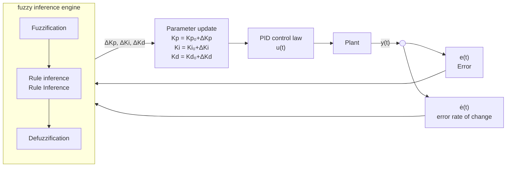

### Fuzzification
{: id="模糊化fuzzification"}

Map the continuous error $e$ and error change rate $\dot{e}$ to 7 linguistic variables (fuzzy sets):

| Symbol | Meaning |
|------|------|
| **NB** | Negative Big |
| **NM** | Negative Medium |
| **NS** | Negative Small |
| **ZO** | Zero |
| **PS** | Positive Small |
| **PM** | Positive Medium |
| **PB** | Positive Big |

Each linguistic variable corresponds to a **membership function** (usually a triangle or trapezoidal function). The continuous input value is calculated through the membership degree to obtain the "degree of ownership" of each linguistic variable.

### Fuzzy rules (Rule Base)
{: id="模糊规则rule-base"}

The rule form is **IF** $e$ is A **AND** $\dot{e}$ is B **THEN** $\Delta K_p$ is C. Taking $\Delta K_p$ as an example, the typical rule table (7 × 7):

| $e$ \ $\dot{e}$ | NB | NM | NS | ZO | PS | PM | PB |
|---------|----|----|----|----|----|----|-----|
| **NB** | PB | PB | PM | PM | PS | ZO | ZO |
| **NM** | PB | PB | PM | PS | PS | ZO | NS |
| **NS** | PM | PM | PM | PS | ZO | NS | NS |
| **ZO** | PM | PM | PS | ZO | NS | NM | NM |
| **PS** | PS | PS | ZO | NS | NS | NM | NM |
| **PM** | PS | ZO | NS | NM | NM | NM | NB |
| **PB** | ZO | ZO | NM | NM | NM | NB | NB |

**Rule Intuition**: When the error is large (NB/PB), the proportional gain needs to be increased ($\Delta K_p$ takes PB) and pulled back quickly; when the error approaches zero (ZO), the proportion should be reduced and the differential should be increased to prevent overshoot. The rule table design logic of $\Delta K_i$ and $\Delta K_d$ is similar but the goals are different.

### Defuzzification
{: id="去模糊化defuzzification"}

The most commonly used **center of gravity method (Centroid Method)**:

$$\Delta K_p = \frac{\sum_j \mu_j \cdot c_j}{\sum_j \mu_j}$$

Here, $\mu_j$ is the activation intensity of rule $j$, and $c_j$ is the central value of the corresponding output fuzzy set. Finally, the accurate $\Delta K_p$, $\Delta K_i$, and $\Delta K_d$ increments are obtained, which are superimposed on the basic value:

$$K_p = K_{p0} + \Delta K_p, \quad K_i = K_{i0} + \Delta K_i, \quad K_d = K_{d0} + \Delta K_d$$

### Core differences from fixed PID
{: id="与固定-pid-的核心差异"}

| Scenario | Fixed PID | Fuzzy PID |
|------|---------|---------|
| Large error startup stage | Gain is fixed, may overshoot | Automatically increases $K_p$, quickly zooms in |
| is approaching the target stage | Integral saturation causes oscillation | Automatically decreases $K_i$, increases $K_d$, and brakes smoothly |
| Load mutation/nonlinear disturbance | Need to manually adjust the gain again | Fuzzy rule automatic compensation |

✅ **does not require an accurate model**: purely empirical rule driven, suitable for nonlinear systems that are difficult to model
✅ **is computationally efficient**: a fuzzy inference only requires table lookup + interpolation, µs level, suitable for embedded platforms
✅ **is highly robust**: the suppression of parameter perturbations and external disturbances is better than fixed gain PID
❌ The rule table requires domain experience design, and the number of rules increases exponentially with the input dimension (7×7=49 items/gain)
❌ Lack of rigorous proof of optimality and stability (compare LQR/MPC)

## 8.3 MPC (Model Predictive Control)
{: id="83-mpc模型预测控制model-predictive-control"}

MPC is currently one of the most popular methods in autonomous driving and high-precision robot control. **core idea** : In each control cycle, based on the current state and system model, solve a **finite-horizon optimization problem** , output an optimal control sequence, but only execute the first step, and then solve it again in the next cycle - that is, " **receding-horizon optimization with feedback correction** ".

<div align="center">
  
<figcaption>Figure: MPC receding horizon - at the current moment k, predict N steps forward to obtain the optimal control sequence; only execute the first step u_k, and re-optimize with the new state in the next cycle to achieve rolling feedback</figcaption>
</div>

**optimization problem form**:

$$\min_{u_0, \ldots, u_{N-1}} \sum_{k=0}^{N-1} \left( \mathbf{x}_k^T \mathbf{Q} \mathbf{x}_k + u_k^T \mathbf{R} u_k \right) + \mathbf{x}_N^T \mathbf{P} \mathbf{x}_N$$

$$\text{s.t.} \quad \mathbf{x}_{k+1} = f(\mathbf{x}_k, u_k), \quad \mathbf{x}_k \in \mathcal{X}, \quad u_k \in \mathcal{U}$$

Here:
- $N$ = Prediction Horizon, typical value 10–30 steps
- $\mathbf{Q}, \mathbf{R}$ = weight matrix of state error and control quantity ($\mathbf{Q}$ is large → priority is given to reducing tracking error; $\mathbf{R}$ is large → priority is given to reducing control amplitude)
- $\mathcal{X}, \mathcal{U}$ = state constraints and control constraints (such as maximum speed, maximum steering angle)
- $\mathbf{P}$ = terminal cost matrix (to ensure closed-loop stability)

✅ **explicitly handles constraints**: physical constraints such as speed upper limit and acceleration limit are directly written into optimization constraints
✅ **multi-step forward-looking**: predict the future $N$ steps, slow down in advance before the bend, instead of waiting until the curvature increases before reacting
✅ **unified framework**: path tracking, speed planning, and soft obstacle avoidance can be processed in the same optimization problem
❌ Large amount of calculation, requiring efficient QP/NLP solver (OSQP, CasADi+IPOPT)
❌ Rely on accurate system model, model mismatch will affect performance
❌ Complex parameter adjustment ($N$, $\mathbf{Q}$, $\mathbf{R}$, constraint boundaries, terminal sets)

**Linear MPC vs. Nonlinear MPC (NMPC)**:

| Type | Model | Solver | Computational cost | Typical scenario |
|------|------|--------|--------|---------|
| **Linear MPC** | Linear kinematic model | QP (OSQP) | Medium | Low-speed AGV, mobile robot |
| **Nonlinear MPC** | Complete nonlinear model | NLP (CasADi+IPOPT) | High | High-speed autonomous driving, UAV |

## 8.4 Comparison of Controllers
{: id="84-控制器对比汇总"}

| controller | requires model | processing constraints | computational cost | accuracy | typical application |
|--------|---------|---------|--------|------|---------|
| **PID** | No | No | Very low | Medium | Embedded chassis, simple scene |
| **Fuzzy PID** | No | No | Low | Medium–High | Nonlinear perturbation, embedded platform |
| **LQR** | Yes (linear) | No (soft constraints) | Medium | High | High precision path tracking |
| **Linear MPC** | Yes (Linear) | Yes | Medium–High | High | Low-speed robot, AGV |
| **Nonlinear MPC** | Yes (nonlinear) | Yes | High | Extremely high | High-speed autonomous driving, drone |

---

# 9. Full Navigation Stack Integration
{: id="9-完整导航栈集成"}

## 9.1 Coordinate frame and TF tree
{: id="91-坐标系与-tf-树"}

Data exchange between each module of the navigation stack (sensor, localization, planning, control) requires clear "which coordinate frame this pose/point is relative to." ROS uses the **TF2** library to uniformly manage this transformation tree.

### Four core coordinate frames
{: id="四个核心坐标系"}

| Coordinate system | ROS frame name | Semantics | Publisher |
|--------|----------|------|---------|
| World/map frame | `map` | Globally consistent fixed system, the origin is usually the starting point of mapping | SLAM / AMCL localization node |
| Odometry frame | `odom` | Taking the starting point as the origin, the odometry is obtained by integrating, **is continuous but will drift** | wheel odometry / IMU Fusion Node |
| Robot body frame | `base_link` | Fixed in the center of the chassis | Robot driver / URDF |
| Sensor frame | `lidar_link`, etc. | fixedly connected to each sensor installation position | URDF static TF |

**TF The relationship between the tree structure and each module**:

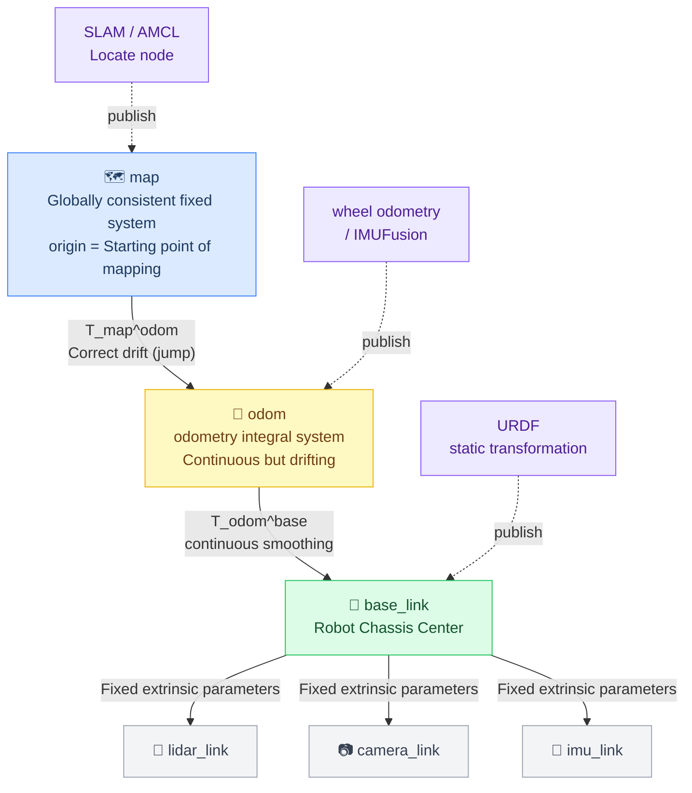

<div align="center">
  
<figcaption>Figure: XYZ axes of three core coordinate frames - map (blue point) is fixed at the global origin, odom (orange point) drifts with odometry, base_link (green point) follows the movement of the robot and has a yaw angle θ; the Z axis is vertical to the outside of the paper (right-hand coordinate frame)</figcaption>
</div>

### Why are `map` and `odom` separated?
{: id="为什么-map-和-odom-要分开"}

- **`odom` ensures continuity**: odometry integral will not jump and the controller can track smoothly
- **`map` ensures global consistency**: SLAM loop closure or AMCL correction will update `map→odom` but does not affect the continuity of `odom→base_link`
- If merged into one system, each localization correction will cause the pose to jump instantaneously, causing the controller to become unstable.

`map→odom` This transformation is exactly the output **of the** localization node, which corrects the accumulated drift of odometry in real time.

### Homogeneous transformation matrix
{: id="齐次变换矩阵"}

The transformation between coordinate frames is represented by the $4\times4$ homogeneous matrix ($SE(3)$ elements):

$$T_{A}^{B} = \begin{bmatrix} R_{3\times3} & t_{3\times1} \\ \mathbf{0}^T & 1 \end{bmatrix}, \quad p^B = T_A^B \cdot p^A$$

**chain transformation**: $T_{map}^{base} = T_{map}^{odom} \cdot T_{odom}^{base}$

**inverse transformation**: $T_B^A = \left(T_A^B\right)^{-1} = \begin{bmatrix} R^T & -R^T t \\ \mathbf{0}^T & 1 \end{bmatrix}$

The plane navigation degeneracy is $SE(2)$, and the pose $(x, y, \theta)$ corresponds to:

$$T = \begin{bmatrix} \cos\theta & -\sin\theta & x \\ \sin\theta & \cos\theta & y \\ 0 & 0 & 1 \end{bmatrix}$$

**Debugging Tips**: `ros2 run tf2_tools view_frames` can export the current TF tree as PDF; `ros2 run tf2_ros tf2_echo map base_link` can print the transformation between two frames in real time.

## 9.2 ROS1 Navigation Stack architecture
{: id="92-ros1-navigation-stack-架构"}

`move_base` of ROS 1 provides a classic navigation stack integration solution:

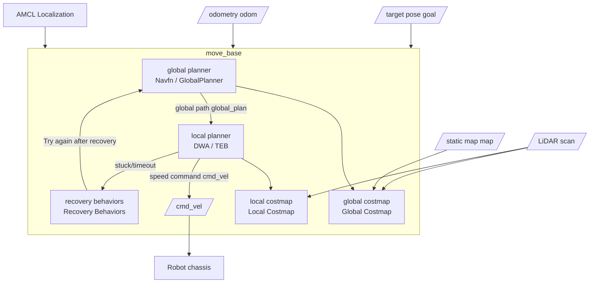

### Move_base state machine
{: id="move_base-状态机"}

`move_base` has a four-state machine inside:

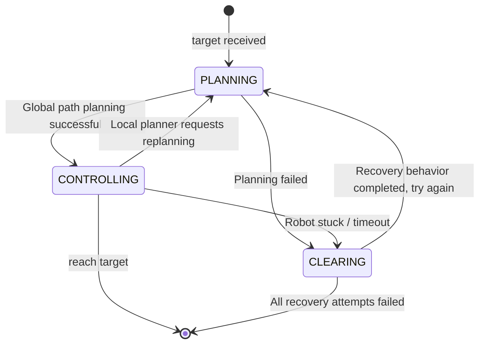

- **PLANNING**: Call the global planner to generate a global path from the current location to the target (low frequency, by default only triggered when a new target or local planning request is received)
- **CONTROLLING**: Call the local planner to continuously generate `cmd_vel` at a frequency of about 10–20 Hz and track the global path
- **CLEARING**: Enter when global or local planning fails, execute the recovery behavior list in sequence, and return to PLANNING to try again after execution.

### Recovery Behaviors
{: id="恢复行为链recovery-behaviors"}

`move_base` The default `recovery_behaviors` is executed in sequence:

| Step | Behavior | Nature | Trigger reason |
|------|------|------|---------|
| ① | `conservative_reset` | Clear local costmap obstacles outside 3 m radius | Sensor noise mislabels distant free areas |
| ② | `rotate_recovery` | Rotate in place 360°, reconstruct costmap with new sensor data | costmap expired or robot attitude estimation error |
| ③ | `aggressive_reset` | Clear all **outside the footprint** local costmap obstacles | Still unable to find the path after conservative clearing |
| ④ | `rotate_recovery` | Rotate again 360° | Re-perceive the environment after aggressive clearing |

After all failures `move_base` publishes the `aborted` result and stops.

**Typical topic interface**:

| Topic | Direction | Description |
|------|------|------|
| `/move_base/goal` | Input | Navigation target pose (ActionLib) |
| `/map` | Input | Static map |
| `/scan` | Input | LiDAR data |
| `/odom` | Input | odometry |
| `/amcl_pose` | Input | Localization result |
| `/cmd_vel` | Output | Speed command (linear speed + angular speed) |
| `/move_base/result` | Output | Navigation result (succeeded / aborted / preempted) |

**Frequency difference between two costmaps**: The global costmap is updated slowly (only updated when the static layer changes), and the local costmap is updated frequently (synchronized with the sensor frame rate, about 5–20 Hz), ensuring real-time obstacle avoidance without wasting computing resources.

## 9.3 Nav2 (ROS 2) architecture
{: id="93-nav2ros-2架构"}

Nav2 is the navigation stack of ROS 2. Compared with `move_base`, the core change is to replace the hard-coded state machine with the **behavior tree**, which decouples the navigation logic from the code to a configurable XML file.

### Five major server architectures
{: id="五大服务器架构"}

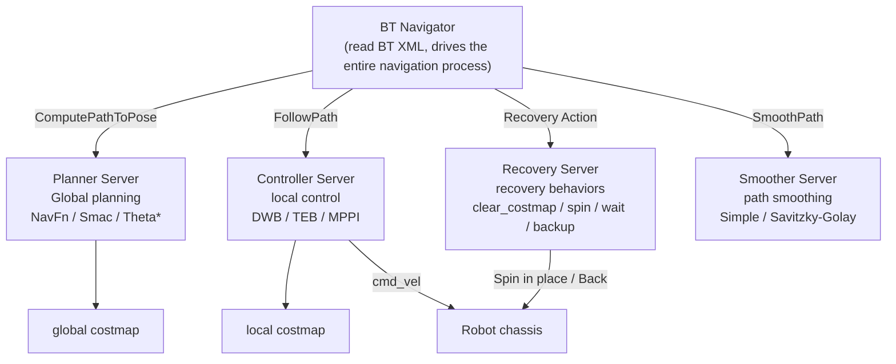

Each Server is an independent ROS 2 node that communicates through the Action interface. Plug-ins can be replaced independently without affecting other modules.

### Lifecycle Nodes
{: id="生命周期节点lifecycle-nodes"}

All Nav2 nodes implement the ROS 2 life cycle interface, and the state transition is as follows:

```
Unconfigured → Inactive → Active → Deactivating → Inactive → Finalized
```

- **Unconfigured → Inactive** (`configure`): Load parameters, initialize plug-in, do not receive data
- **Inactive → Active** (`activate`): Start subscribing to topics, publishing data, and entering normal working status
- **Active → Inactive** (`deactivate`): Stop processing and retain resources (can be quickly reactivated)
- The startup sequence is managed uniformly by `nav2_lifecycle_manager` to avoid race conditions caused by out-of-order initialization of nodes.

### Behavior tree (BT) default navigation flow
{: id="行为树bt默认导航流程"}

Simplified logic of Nav2 default BT (`navigate_w_replanning_and_recovery.xml`):

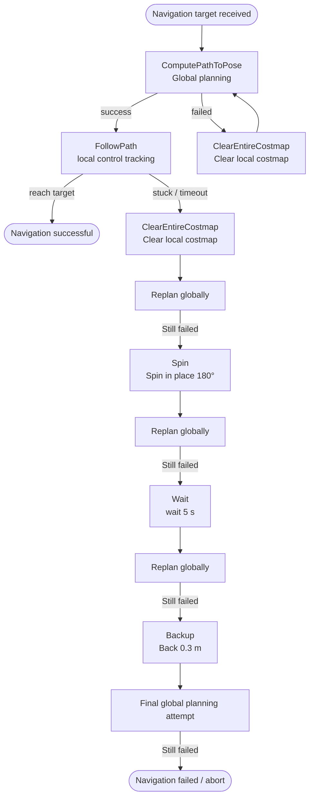

### Detailed explanation of failure recovery chain
{: id="失败恢复链详解"}

| Recovery behavior | Parameters (default value) | Principle | Applicable scenarios |
|---------|-------------|------|---------|
| **ClearEntireCostmap** | The clearing range is configurable | Send a clearing request to the Costmap service to erase all marks on the obstacle layer and force the next sensor scan to rebuild | False sensor detections, dynamic obstacle left but not cleared from costmap |
| **Spin** | `target_yaw: 1.57 rad` (adjustable) | Rotate the target angle in place at the maximum allowed angular speed, continuously update the costmap during the period, and eliminate the blind zone of the viewing angle | The robot fell into a local blind spot and the costmap was contaminated by old data |
| **Wait** | `duration: 5.0 s` | Stop publishing `cmd_vel`, wait for the specified time and then plan again | Dynamic obstacles (pedestrians) temporarily block the road, waiting for them to move away by themselves |
| **Backup** | `backup_dist: 0.30 m`, `backup_speed: 0.025 m/s` | Publish negative linear speed to the rear, slowly retreat the specified distance (the rear must be clear of obstacles) | The front of the robot is caught by an obstacle and needs to make room for re-planning |

Design logic of **execution sequence**:
- First `ClearEntireCostmap` (the lightest, only changes data, does not move)
- `Spin` again (re-perceive the surrounding environment)
- Then `Wait` (make way for dynamic obstacles)
- Finally `Backup` (physical escape, highest risk, placed last)

After each recovery step, the global planning is re-triggered. As long as one step is successful, the recovery chain will be jumped out and navigation will continue. After all failures, BT returns `FAILURE`, and Action Server publishes `aborted` results.

**Custom recovery behavior**: Implement the `nav2_core::Recovery` interface, register it in the `recovery_server.plugins` list of `nav2_params.yaml`, and then add the corresponding node in BT XML.

### Common recovery trigger timings (real robot experience)
{: id="常见恢复触发时机实机经验"}

The trigger sources of the recovery chain can be divided into the following four categories, corresponding to different root causes and treatment directions:

**① The local map is temporarily unfeasible**

Sensor noise or instantaneous occlusion "blocks" the local costmap, `FollowPath` cannot find the legal speed (`follow_path_error`), and directly triggers recovery:

| Root cause | Typical phenomenon | Recommended treatment |
|------|---------|---------|
| Glass/mirror reflection | The laser produces a false obstacle point cloud in front of the glass, and "ghost obstacles" appear on the local map | First execute `ClearEntireCostmap` to clear false alarms and rebuild the map; or filter the glass reflection points |
| The flow of people/carts momentarily blocks the road | Pedestrians walk into the sensor field of view, and part of the path is instantly blocked | `Wait` Wait for the dynamic obstacle to leave; if triggered frequently, the size can be increased `controller_patience` |
| Point cloud noise spurts | Single frame noise points mark the grid that should be free | Turn down `obstacle_range` or turn on point cloud filtering (`min_obstacle_height` filters ground reflection) |

**② Progress check failed (robot stuck)**

The robot shakes slightly in place but the cumulative displacement is not enough to exceed the threshold (Nav2 default: displacement within 10 s < 0.5 m). BT's `GoalReached` or progress check node determines that it is stuck, triggering recovery:

| Root cause | Typical phenomenon | Recommended treatment |
|------|---------|---------|
| Narrow doorway/close to wall | The robot is close to the wall, and the expansion cost prevents it from moving forward, but the path planning still gives a path close to the wall. | Increase `inflation_radius` to make the global planning automatically stay away from the wall; or increase `min_obstacle_dist` (TEB) |
| Local optimum in the corner | The robot is clamped by obstacles on three sides, with high costs on the front, rear, left and right, oscillation and jitter | `Backup` Back up to make room; if it happens frequently, check whether `enable_homotopy_class_planning` is turned on |
| The progress threshold is too strict | The robot is decelerating reasonably but is misjudged as stuck | Relax appropriately `progress_checker_distance` (Nav2) or `oscillation_distance` (move_base) |

**③ TF / timing problem**

`map→odom→base_link` The transformation is temporarily unavailable (TF timeout) or the timestamp is inconsistent. The controller cannot obtain a consistent state estimate, and recovery is triggered after continuous planning failure:

| Root cause | Typical phenomenon | Recommended treatment |
|------|---------|---------|
| AMCL localization is lost | particle filtering diverges, `map→odom` transition jumps or stops publishing | Check laser data quality; increase `max_particles`; provide better initial pose |
| odometry delay | `odom→base_link` timestamp lags behind controller expectations, TF query timeout | Check chassis driver release frequency (recommended $\geq$ 50 Hz); troubleshooting `transform_tolerance` Configuration |
| Node startup race | SLAM / AMCL is not ready yet, the navigation stack has received the target | Use `nav2_lifecycle_manager` to ensure that all dependent nodes are Active before accepting the target |

**④ The global path is feasible but the local dynamics is not feasible**

The path given by the global planning (A\* / Smac) is geometrically collision-free, but the local planner (DWA / MPPI) is constrained by speed, acceleration and obstacles, and cannot give a safe control sequence that satisfies the constraints in a short time:

| Root cause | Typical phenomenon | Recommended treatment |
|------|---------|---------|
| The global path is too tight. | The global path cut angle passes through the edge of the expansion area, and the DWA sampling speed all hits the inflation layer. | Increase the global costmap `inflation_radius` to force the global path to be more central; or increase `path_distance_bias` |
| The corner is too sharp | Smac/Navfn gives 90° sharp turn, but `minimum_turning_radius` does not allow | to increase `minimum_turning_radius`; or switch to Smac Hybrid A\* that supports kinematic constraints |
| Difficulty in convergence near the goal | Obstacle penalties, attitude constraints, and noise conflict with each other when approaching the goal, the controller stops-and-go, and eventually times out and enters recovery | Increase `goal_dist_tol` (Nav2 Controller) to relax the arrival determination; check whether the target point is within the expansion zone |
| MPPI Critics Weight conflict | `ObstaclesCritic` and `GoalCritic` have similar weights, causing oscillation near obstacles | Reduce the weight of `GoalCritic` or increase it `ObstaclesCritic`; enable `TwirlingCritic` inhibit rotation |

## 9.4 Parameter Tuning Key Points
{: id="94-参数调优要点"}

Tuning a navigation stack means **coordinating its modules**: an upstream parameter error can appear as a downstream failure. Tune in the order costmap → global planner → local planner → recovery behaviors.

### Costmap
{: id="代价地图costmap-1"}

| Parameter | Position | Typical value | Symptoms of too small | Symptoms of too large |
|------|------|--------|-----------|-----------|
| `inflation_radius` | Global & local | Robot radius + 0.1–0.3 m | Path is against the wall, collision risk | The narrow passage is blocked and there is no path |
| `cost_scaling_factor` | Global & local | 3.0–5.0 | Smooth cost gradient, does not exclude obstacles | The robot completely stagnated in the expansion zone |
| `obstacle_range` | Local obstacle layer | 2.5–4.0 m | Near obstacles are ignored | Distant false alarm obstacle pollution cost map |
| `raytrace_range` | Local obstacle layer | 3.0–5.0 m | The cost is not cleared after the dynamic obstacle leaves | The clearing range is too large and the legal obstacles are mistakenly cleared |
| `update_frequency` | Partial | 5–10 Hz | Costmap update lags, obstacle avoidance is slow | CPU usage is too high |
| `publish_frequency` | Partial | Same as update | Rviz Visualization delay, debugging difficulty | — |

> **Core Principles**: `inflation_radius` $\geq$ The radius of the inscribed circle of the robot. Otherwise, the LETHAL area does not cover the robot's footprint, and the path planner will treat inaccessible points as passable.

### Global Planner
{: id="全局规划器global-planner"}

**Navfn / NavFn(A\* / Dijkstra)**:

| Parameter | Typical value | Description |
|------|--------|------|
| `use_astar` | `true` | Enable A* (about 2–5 × faster than Dijkstra), it is recommended to enable |
| `allow_unknown` | `false` | Whether it is allowed to travel through unknown areas; open exploration scene settings `true` |
| `default_tolerance` | 0.0–0.5 m | Allowable deviation when the end point is on an obstacle; too large will cause the robot to "arrive early" |
| `planner_frequency` | 0.0 (on demand) or 1–2 Hz | 0.0 = Only replan when new goals are received or partial planning fails, saving CPU |

**Smac Planner(Nav2 Hybrid A\*)**:

| Parameter | Typical value | Description |
|------|--------|------|
| `minimum_turning_radius` | 0.2–0.5 m | Minimum turning radius, matched with robot kinematics |
| `angle_quantization_bins` | 72 | Angle discretization accuracy (72 = 5° resolution), the larger the path, the smoother the path but the more memory |
| `analytic_expansion_ratio` | 3.5 | Analyze the extended frequency; the larger it is, the faster it will find the end point but the path quality is slightly worse |
| `max_iterations` | 1000000 | Prevent infinite planning in complex scenarios; report planning failure after triggering |

### Local Planner/Controller
{: id="局部规划器local-planner--controller"}

**DWA(`dwa_local_planner` / Nav2 DWB)**:

| Parameter | Typical value | Symptoms of too small | Symptoms of too large |
|------|--------|-----------|-----------|
| `max_vel_x` | 0.3–1.0 m/s | Robot is too slow | Insufficient braking distance, collision |
| `min_vel_x` | 0.0–0.1 m/s | — | The robot cannot stop |
| `max_rot_vel` | 0.5–1.5 rad/s | Slow steering, poor corner tracking | Spin in place, dizzy |
| `acc_lim_x` | 1.0–2.5 m/s² | Slow start/brake | Rapid acceleration and deceleration, odometry pulley slipping |
| `sim_time` | 1.5–3.0 s | Short-sighted, unable to bypass | Large amount of calculation, reduced control frequency |
| `path_distance_bias` | 32.0 | Do not follow the path, roam freely | Failed to bypass dynamic obstacles for following the path |
| `goal_distance_bias` | 20.0 | Don’t stop when you are almost to the goal | Eager to get to the end, ignoring the path in the middle |
| `occdist_scale` | 0.02 | Driving against the wall | Completely stagnant near obstacles |

**TEB(`teb_local_planner`)**:

| Parameter | Typical value | Description |
|------|--------|------|
| `max_vel_x` / `max_vel_theta` | Same as DWA | Speed upper limit |
| `min_obstacle_dist` | 0.2–0.4 m | The minimum distance between the path point and the obstacle; less than this value is a constraint violation |
| `inflation_dist` | 0.5–0.8 m | soft constraint area, the cost increases sharply after exceeding; set to `inflation_radius` 1.2–1.5× |
| `dt_ref` | 0.3–0.4 s | Timed Elastic Band reference time step; the smaller the path points, the denser the accuracy, but the calculation is slow |
| `max_samples` | 500 | g2o Maximum number of iterations; if too few, the optimization will not converge |
| `enable_homotopy_class_planning` | `true` | Enable multi-topology path search (surround obstacles and select the best from both sides). It is strongly recommended to enable | in complex environments

### Recovery behavior (Recovery/move_base)
{: id="恢复行为recovery--move_base"}

| Parameter | Position | Typical value | Description |
|------|------|--------|------|
| `conservative_reset_dist` | move_base | 3.0 m | The radius of conservative clearing; too small is insufficient to clear the scope, and too large will miss a large area |
| `clearing_rotation_allowed` | move_base | `true` | allows rotation recovery; pure straight-moving robots (AGV) need to set `false` |
| `oscillation_timeout` | move_base | 10.0 s | Determine the timeout time for the robot to oscillate in place; enter CLEARING after triggering |
| `oscillation_distance` | move_base | 0.2 m | If the displacement is less than this value and exceeds timeout, it will be judged as oscillation |

### Nav2 core global parameters
{: id="nav2-核心全局参数"}

| Parameter | File | Typical value | Description |
|------|------|--------|------|
| `controller_frequency` | nav2_params.yaml | 20 Hz | Frequency of local controller publishing cmd_vel |
| `planner_patience` | — | 5.0 s | Enter recovery after global planning times out |
| `controller_patience` | — | 15.0 s | Enter recovery after local control timeout |
| `recovery_behavior_enabled` | — | `true` | If the robot gets stuck and reports failure directly after shutdown, it is suitable for safety priority scenarios |

### Tuning sequence suggestions
{: id="调优顺序建议"}

```
① costmap: adjust first inflation_radius, Confirm no collision
       ↓
② Global planning: Confirm that you can A Arrive B find path
       ↓
③ Local planning: first adjust the upper speed limit, and then sim_time, Final tune bias weight
       ↓
④ Recovery behavior: After triggering recovery, observe whether the robot can get out of trouble and adjust timeout/distance threshold
       ↓
⑤ Overall joint debugging: in reality/Run the complete navigation in the simulation scene and observe the lag/Oscillation/Too many detours and other issues
```

---

# 10. Traditional navigation vs. end-to-end deep learning navigation
{: id="10-传统导航-vs-端到端深度学习导航"}

| Comparison dimension | Traditional navigation stack (SLAM+A*+DWA) | End-to-end deep learning (VLN/VLA) |
|---------|----------------------|----------------------|
| **map depends on** | requires pre-built map (or real-time SLAM) | does not require a priori map |
| **Command form** | Coordinate target point (x, y, θ) | Natural language ("Go to the kitchen") |
| **Generalization ability** | Weak (the map needs to be rebuilt when changing the environment) | Strong (cross-scenario generalization) |
| **Interpretability** | ✅ Strong (each module is traceable) | ❌ Weak (black box network) |
| **Computing resources** | Can run on CPU | requires GPU |
| **Dynamic scene** | Local planning processing (DWA/TEB) | Implicit learning (depending on training data) |
| **Safety guarantees** | ✅ Collision detection is explicitly controllable | ❌ Safety boundary is difficult to guarantee |
| **Common sense reasoning** | ❌ None (pure geometry) | ✅ Support (such as LLM reasoning) |
| **Development and debugging** | Independent debugging of each module | End-to-end training, difficult to locate problems |
| **Long-term stability** | ✅ Strong behavioral certainty | ❌ Out-of-distribution scenarios may fail |
| **Typical representative** | ROS Nav Stack, Nav2 | VLN-BERT, NavGPT, VoxPoser |

**Practical suggestions**:
- Factory, warehousing, medical, etc. **Structured and high safety requirements** Scenario → Traditional Navigation Stack
- Family services, guided tours, etc. **Unstructured, need to understand natural language** Scenario → Learning Navigation
- **Hybrid architecture** is becoming a trend: using the traditional navigation stack to handle low-level safety and precise control, and using VLM/LLM to handle high-level semantic understanding and task decomposition

---

# 11. Common Open-Source Tools and Frameworks
{: id="11-常用开源工具与框架汇总"}

### Sensor drivers and processing
{: id="传感器驱动与处理"}

| Tool | Function | Link |
|------|------|------|
| **PCL (Point Cloud Library)** | Point cloud processing algorithm library (filtering, segmentation, matching, features) | pcl.org |
| **Open3D** | Point cloud and 3D data processing, Python friendly | open3d.org |
| **OpenCV** | Image processing and feature extraction | opencv.org |

### Localization
{: id="定位"}

| Tool | Function | ROS package |
|------|------|--------|
| **robot_localization** | EKF/UKF Multi-sensor fusion | `robot_localization` |
| **AMCL** | particle filtering adaptive Monte Carlo localization | `amcl` |
| **NDT_CPU** | NDT scan match | `ndt_cpu` |

### SLAM
{: id="slam"}

| Tool | Type | Features |
|------|------|------|
| **Cartographer** | 2D LiDAR/3D | by Google, production available |
| **GMapping** | 2D LiDAR | Lightweight, suitable for indoor use |
| **LIO-SAM** | LiDAR + IMU | High precision, GTSAM backend |
| **LOAM / LeGO-LOAM** | 3D LiDAR | Classic, ground robot optimized version |
| **ORB-SLAM3** | Visual + IMU | Supports multiple cameras, high accuracy |
| **VINS-Mono/Fusion** | Visual + IMU | Drone/Mobile Navigation |
| **RTAB-Map** | RGB-D/stereo/laser | Multi-modal, ROS out-of-the-box, built-in memory management |
| **hdl_graph_slam** | 3D LiDAR | graph optimization, support NDT/ICP |

### Path planning
{: id="路径规划"}

| Tool | Function |
|------|------|
| **OMPL (Open Motion Planning Library)** | Sampling planning algorithm library (RRT*, PRM*, etc.) |
| **Moveit!** | Robot arm motion planning (integrated OMPL) |
| **NavFn / GlobalPlanner** | ROS Global Planning (Dijkstra/A*) |
| **DWA Local Planner** | ROS dynamic window method local planning |
| **TEB Local Planner** | ROS timed elastic band local planning |
| **Smac Planner** | Nav2 built-in Hybrid A* planner |

### Simulation
{: id="仿真"}

| Tool | Function |
|------|------|
| **Gazebo** | ROS default physical simulator, supports sensor simulation |
| **Isaac Sim (NVIDIA)** | GPU accelerated ray tracing simulation, synthetic data generation |
| **CARLA** | Special simulator for autonomous driving, urban scene |
| **Webots** | Cross-platform open source robot simulation |

---

# 12. Summary and outlook
{: id="12-小结与展望"}

## What This Survey Covers
{: id="本文回顾"}

This article systematically sorts out the five core modules of the traditional robot navigation algorithm stack:

1. **Perception**: LiDAR/camera/IMU each has its own advantages and disadvantages, and sensor fusion (EKF/UKF) is the key to improving robustness
2. **localization**: EKF/UKF is suitable for real-time pose tracking, particle filtering (AMCL) supports global localization, and NDT/ICP provides accurate scan matching
3. **Mapping/SLAM**: LiDAR SLAM (Cartographer, LIO-SAM) has high accuracy and is available around the clock; visual SLAM (ORB-SLAM3, VINS-Mono) is low-cost but sensitive to light; RTAB-Map spans multiple modes and can be used out of the box; factor graph back-end optimization is currently mainstream
4. **Path planning**: A*/Hybrid A* is used for global planning, DWA/TEB is used for local dynamic obstacle avoidance, and costmap is the "common language" of both
5. **path tracking**: Pure Pursuit / Stanley is a geometric method, simple to implement, suitable for low-speed scenarios
6. **Motion control**: PID is the foundation, LQR provides optimal linear control, MPC can explicitly handle constraints and multi-step lookahead, and fuzzy PID is more robust under nonlinear disturbances

## Outlook
{: id="展望"}

The traditional navigation algorithm stack has become quite mature after decades of development, but it still faces challenges:

- **Corridor degeneracy, dynamic scenes, unstructured terrain**: Putting forward higher requirements for SLAM robustness
- **Multi-robot collaborative SLAM**: Trade-off between distributed mapping and communication efficiency
- **Lack of semantic understanding**: The traditional algorithm lacks the semantic ability of "this is the kitchen", limiting its application in daily service scenarios

The current research trend is the hybrid architecture **of "traditional navigation + large model"**: retaining the safety and reliability of the traditional navigation stack, introducing LLM/VLM in the task planning and semantic understanding layer, and building a next-generation robot system that can understand human intentions and act autonomously in the complex real world.

> For vision-language navigation (VLN) and VLA foundation models, see the [VLN Survey](/en/VLN-Survey/) and [VLA Survey (Chinese)](/VLA-Survey/) series.

---

*References: Thrun et al. "Probabilistic Robotics" (2005); LaValle "Planning Algorithms" (2006); ROS Navigation Wiki; Cartographer Paper (ICRA 2016); LIO-SAM (IROS 2020); ORB-SLAM3 (T-RO 2021); VINS-Mono (T-RO 2018); Hybrid A* (IJRR 2010); TEB Local Planner (IROS 2013)*; http://www.autolabor.cn/usedoc/m1/navigationKit/development/slamintro; https://github.com/ShisatoYano/AutonomousVehicleControlBeginnersGuide;Embodied Intelligence Research Community;
