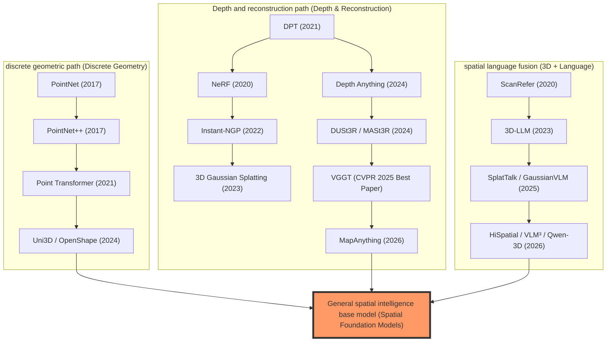
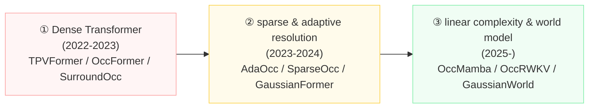
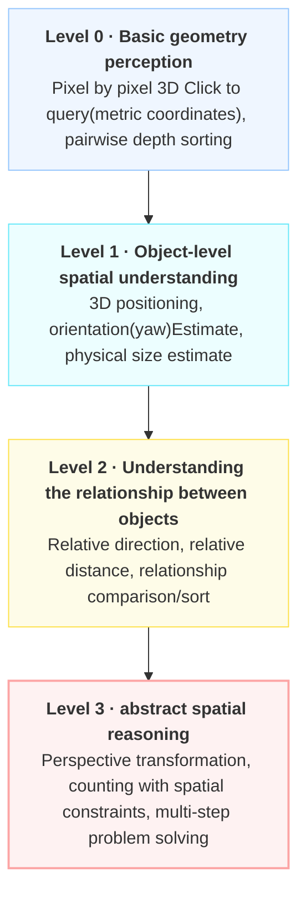
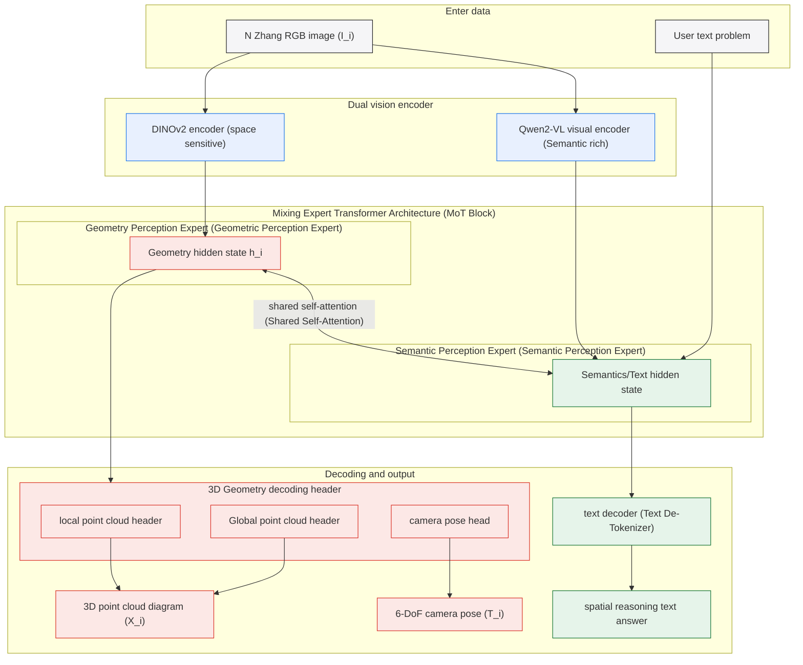
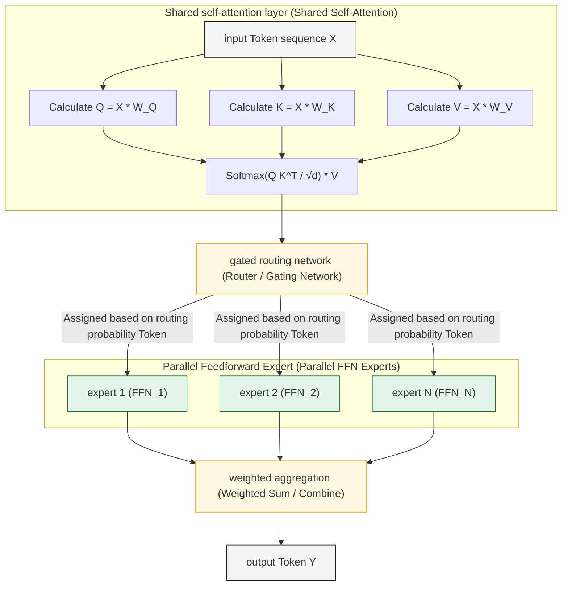
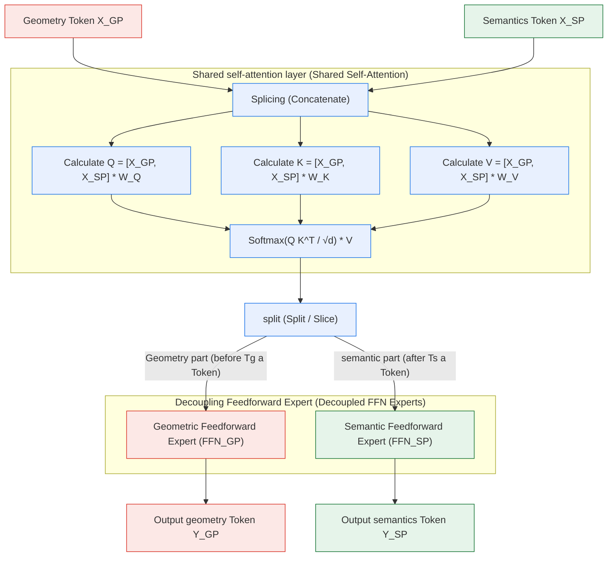
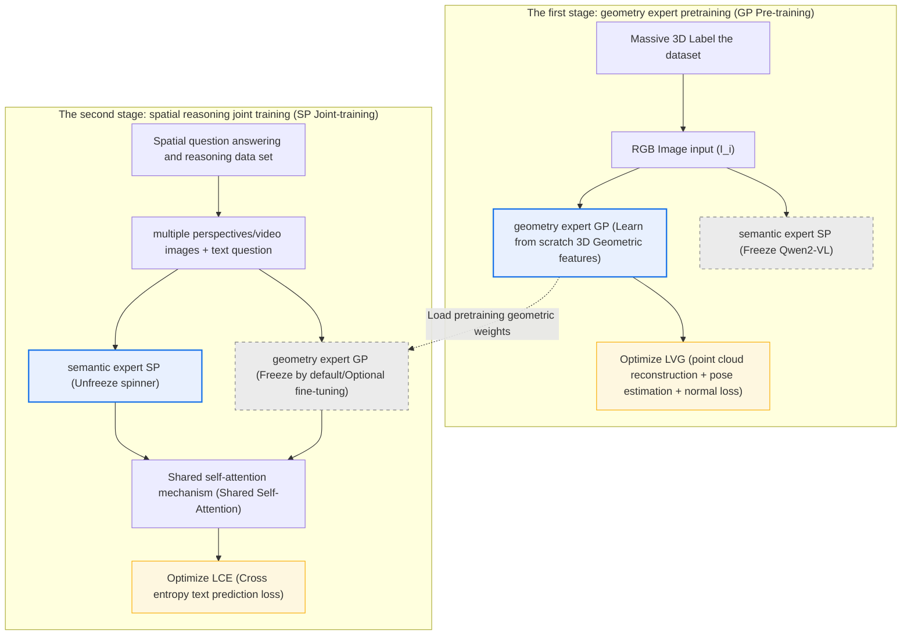
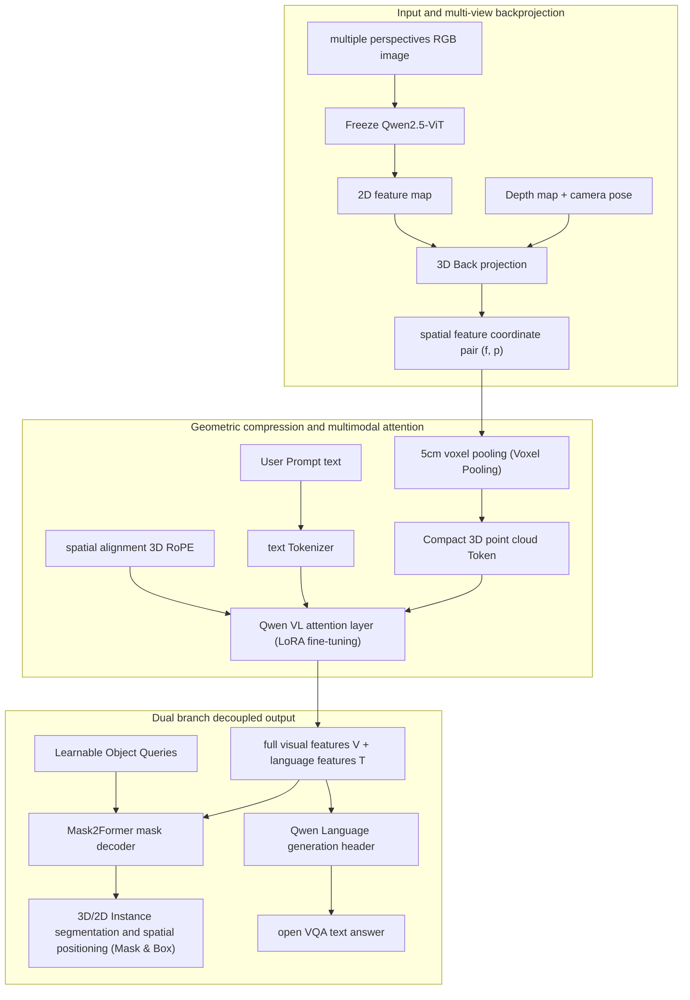

# 1. Introduction
{: id="1-引言"}

<figure class="survey-intro-figure">
  
<figcaption> Figure: Spatial intelligence connects three-dimensional perception, spatial representation, relational reasoning and action. The four blocks are interrelated capability divisions. Algorithms can be used in combination and do not represent a single technology evolution path.</figcaption>
</figure>

Spatial intelligence is the ability of AI systems to perceive, understand, reason about, and interact with the three-dimensional physical world. Like the spatial cognition that humans develop from infancy, it encompasses object shapes, scene layouts, spatial relationships, and dynamic changes. As a foundation of embodied AI, the field has advanced rapidly with deep learning, neural rendering, and large multimodal models.

From the perspective of application value, spatial intelligence Across multiple high-value fields: in **autonomous driving**, accurate three-dimensional perception and dynamic object detection are the prerequisites for safe driving; in **robot control**, six degrees of freedom The spatial understanding determines the grasping success rate of the robotic arm; in the **augmented reality and virtual reality (AR/VR)**, real-time high-quality three-dimensional reconstruction and spatial anchoring are the keys to the immersive experience; in the **embodied In the AI agent**, spatial memory and three-dimensional scene graph are the basis for task planning and navigation.

The core challenges facing spatial intelligence research come from the inherent complexity of 3D data: the scarcity and expense of 3D annotated data, the diversity of representations between point clouds/voxels/implicit expressions, the time variability of real-world dynamic scenes, and the cross-modal fusion problem of 3D geometry and semantic understanding. In recent years, from NeRF to 3D Gaussian Splatting (3DGS), from PointNet to Point Transformer, from monocular depth estimation to spatial reasoning VLM, the field of spatial intelligence is experiencing rapid iteration of technology paradigms.

This article aims to systematically review the research progress of spatial intelligence and provide a reference for learning and researching spatial intelligence.

> 💡 **knowledge system and related reading**:
> This article focuses on **three-dimensional geometric perception, neural three-dimensional reconstruction (NeRF/3DGS) and spatial reasoning (3D-LLM / Spatial VLM / embodied perception)**.
> If you are interested in the **universal multimodal large model base (ViT encoder evolution, cross-modal Projector/Q-Former alignment, multimodal pretraining and post-training full process)**, please read the review of the base: .

# 2. Spatial intelligence basic overview
{: id="2-空间智能基本概述"}

## 2.1 What is spatial intelligence?
{: id="21-什么是空间智能"}

Spatial intelligence is a multi-level capability system, from low-level geometric perception to high-level spatial reasoning, which can be divided into the following four levels:

1. **Spatial Perception (Spatial Perception)**: Obtain three-dimensional geometric information, including depth estimation, point cloud acquisition and processing, and three-dimensional shape reconstruction.
2. **Spatial Reconstruction**: Establish a three-dimensional model of the scene from multi-view images or sensor data, including SLAM, MVS, NeRF, 3DGS and other technologies.
3. **Spatial Understanding**: Semantic analysis of 3D scenes, including 3D object detection, 3D instance segmentation, scene graph generation and visual grounding.
4. **spatial reasoning (Spatial Reasoning)**: High-order cognition in three-dimensional space, including spatial relationship judgment (Is object A to the left of B?), perspective transformation reasoning, and language-guided three-dimensional interaction.

These four levels constitute the complete capability stack of spatial intelligence: perception provides raw data for reconstruction, reconstruction provides a geometric basis for understanding, and understanding provides semantic context for reasoning.

## 2.2 Perceptual hardware basics
{: id="22-感知硬件基础"}

The source of spatial intelligence is a variety of sensors, and hardware characteristics directly determine the selection of algorithms and the upper limit of perception:

|Sensor type|Principle|Advantages|limitations|Application scenarios|
|:-----------|:-----|:-----|:-----|:---------|
|**Lidar (LiDAR)**|Laser Time of Flight (ToF)|Extremely high precision, immune to light interference, direct 3D|High cost, sparse point cloud, no color|Autonomous driving, terrain mapping|
|**RGB-D camera**|Structured light/local ToF|Pixel-level alignment, high indoor accuracy|Outdoors are susceptible to interference and have limited range.|Robot navigation, AR/VR|
|**Stereo vision (Stereo)**|Binocular disparity calculation|Low cost, suitable for indoor and outdoor use|Depends on texture, poor low light performance|Industrial vision, obstacle avoidance|
|**Monocular camera**|perspective projection|Extremely cheap and easy to deploy|There is scale ambiguity and a priori needs to be learned.|Consumer electronics, wide area surveillance|
|**event camera**|Pixel-level brightness changes|Extremely high dynamic range, low latency|Low spatial resolution and heterogeneous output|High-speed motion capture, drones|

## 2.3 Core elements and technical system
{: id="23-核心要素与技术体系"}

The technical system of spatial intelligence revolves around **three-dimensional representation**. The mainstream forms are compared as follows:

|Representation|Features|Hardware adaptation|Represent technology|
|:---------|:-----|:---------|:---------|
|point cloud (Point Cloud)|Sparse, unordered, direct collection| LiDAR, RGB-D | PointNet, Point Transformer |
|Voxel Grid|Regular, dense, and memory intensive|global modeling| VoxNet, OccNet |
|Mesh|Patch representation, suitable for rendering|3D scanning| Marching Cubes |
|Implicit Field|Continuous, differentiable, memory efficient|multi-view images| NeRF, SDF |
|3D Gaussian|Explicit, fast rendering, optimizable|multi-view images| 3DGS |
|Depth Map|Pixel-aligned, computationally friendly|Monocular/Binocular| Monocular Depth Estimation |

## 2.4 Evaluation Index Cheat Sheet
{: id="24-评价指标速查表"}

|Dimensions|indicator|meaning|Applicable tasks|
|:-----|:-----|:-----|:---------|
|**Geometric accuracy**| CD (Chamfer Distance) |average euclidean distance between point sets|point cloud registration, shape reconstruction|
| | EMD (Earth Mover's Distance) |Bulldozer distance between two distributions|Shape generation, point cloud generation|
| | AbsRel / RMSE |Absolute error and root mean square error of depth prediction|Depth estimation|
|**Understanding accuracy**| mIoU (Mean IoU) |The average intersection ratio between the prediction area and the true value area|Semantic/instance segmentation, occupancy prediction|
| | mAP (Mean Average Precision) |Average precision mean (recall/precision at multiple thresholds)|3D object detection|
|**Reasoning/Dialogue**| CIDEr / BLEU-4 |Co-occurrence similarity between generated text and reference answers| 3D Captioning / 3D VQA |
| | EM (Exact Match) |The proportion of answers that match exactly|3D Visual Q&A|
|**Reconstruction quality**| PSNR / SSIM |Peak signal-to-noise ratio and structural similarity of rendered images|Perspective synthesis (NeRF/3DGS)|

## 2.5 Research trends and convergence paths
{: id="25-研究趋势与汇聚路径"}



**Key Milestones**:
- **2015–2017**: PointNet lays the foundation for deep learning directly on the unordered point cloud, opening a new era of three-dimensional deep learning.
- **2018–2020**: VoxelNet, SECOND, and PointPillars promote the commercialization of autonomous driving LiDAR perception; the proposal of NeRF completely changes the three-dimensional reconstruction technology paradigm.
- **2021–2022**: The Transformer architecture is introduced into three-dimensional perception (Point Transformer, DETR3D, BEVFormer), and the performance is greatly improved; Instant-NGP compresses the NeRF training time to the second level.
- **2023**: 3D Gaussian Splatting achieves real-time high-quality rendering; 3D-LLM and EmbodiedScan combine language models with three-dimensional scene understanding.
- **2024–2025**: Depth Anything, SpatialVLM, DUST3R, Uni3D and other works have promoted the formation of base models of spatial perception; VGGT (CVPR 2025 Best Paper) simultaneously outputs camera parameters, depth, point maps and point trajectories with a single feedforward, marking that spatial intelligence has officially entered a new stage of "feedforward three-dimensional base model".
- **2026**: Spatial intelligence has entered a new stage of "hierarchical cognition, native text fine-tuning and forward metric mapping". **HiSpatial** (CVPR 2026) builds hierarchical spatial cognition from geometry to abstract reasoning; **VLM³** (2026) demonstrates that universal VLM can natively master high-precision 3D through focal length unification and plain text SFT Geometry; **MapAnything** (2026) enables multi-source arbitrary sensor forward metric map reconstruction; **Qwen-3D** and **SparseOccVLA** promote 3D Space occupancy prediction is deeply coupled with embodied decision-making.

## 2.6 Camera model and projection geometry basis
{: id="26-相机模型与投影几何基础"}

One of the mathematical foundations of spatial intelligence is the **pinhole camera model (Pinhole Camera Model)**, which accurately describes how points in the three-dimensional world are projected onto the two-dimensional image plane through the center of the lens. Understanding camera projection is a necessary prerequisite for understanding SfM, stereo vision, NeRF pose input, and VGGT camera parameter output.

<div align="center"><figcaption> Figure: Decomposition of camera projection matrix P = K · R<sup>T</sup> · [Id | -X₀], combine the external parameters (rotation R, projection center X₀) with the internal parameter matrix K Explicit separation. (Source: Author LUH Photogrammetric Computer Vision courseware)</figcaption></div>

### Pinhole camera projection
{: id="针孔相机投影"}

Given a homogeneous point $$\widetilde{\mathbf{X}}_w = (X, Y, Z, 1)^T$$ in the world coordinate system, its image homogeneous coordinate $\widetilde{\mathbf{x}} = (u, v, 1)^T$ is given by the complete projection matrix $P \in \mathbb{R}^{3\times4}$:

$$\lambda \begin{pmatrix} u \\ v \\ 1 \end{pmatrix} = P \, \widetilde{\mathbf{X}}_w = K [R \mid \mathbf{t}] \begin{pmatrix} X \\ Y \\ Z \\ 1 \end{pmatrix}$$

Here, $\lambda$ is the scale factor (depth), $K$ is the internal parameter matrix, and $[R \mid \mathbf{t}]$ is the external parameter (rotation + translation).

**Intrinsic Matrix** $K$ describes the optical and geometric characteristics of the camera:

$$K = \begin{pmatrix} f_x & s & c_x \\ 0 & f_y & c_y \\ 0 & 0 & 1 \end{pmatrix}$$

- $f_x, f_y$: Horizontal/vertical focal length in pixels, for square pixels $f_x = f_y = f$
- $(c_x, c_y)$: principal point, that is, the intersection of the optical axis and the image plane
- $s$: pixel tilt coefficient (usually zero for modern cameras)

**external parameters (Extrinsic Parameters)** $[R \mid \mathbf{t}]$: rotation matrix $R \in SO(3)$ and translation vector $\mathbf{t} \in \mathbb{R}^3$ describe the pose of the camera coordinate system relative to the world coordinate system.

### Lens distortion model
{: id="镜头畸变模型"}

Real lenses have non-linear distortion and need to be corrected after projection. The most commonly used **radial distortion (Radial Distortion)**:

$$\begin{cases} x_d = x(1 + k_1 r^2 + k_2 r^4 + k_3 r^6) \\ y_d = y(1 + k_1 r^2 + k_2 r^4 + k_3 r^6) \end{cases}, \quad r^2 = x^2 + y^2$$

Here, $(x, y)$ is the normalized camera coordinate, and $k_1, k_2, k_3$ is the radial distortion coefficient (negative values produce barrel distortion, and positive values produce pincushion distortion). **tangential distortion** is caused by lens installation eccentricity, and an additional parameter $p_1, p_2$ is introduced.

### Camera calibration
{: id="相机标定"}

The goal of **camera calibration** is to estimate $K$ and distortion parameters from known three-dimensional to two-dimensional corresponding points.

- **direct linear transformation (DLT)**: linearize $P\widetilde{\mathbf{X}} = \lambda\widetilde{\mathbf{x}}$ to $A\mathbf{p} = 0$, and solve the 11 degrees of freedom of $P$ through SVD. At least 6 point pairs are required, which is the most basic calibration method.
- **Zhang calibration method** (Zhang, TPAMI 2000): Using a multi-pose plane checkerboard, first estimate the homography matrix $H$ under each posture, then use multiple $H$ constraints to decompose the internal reference $K$, and finally use Levenberg-Marquardt Nonlinear optimization jointly refines the internal and external participation distortion coefficients. It has been integrated into OpenCV `calibrateCamera()` and is currently the most mainstream practical calibration method.

---

## 2.7 Rotation representation
{: id="27-旋转表示"}

Three-dimensional rotation is the core mathematical tool of spatial intelligence. From the camera pose of NeRF/3DGS to the orientation of the robot's end effector, rotation is everywhere. **Lie group $SO(3)$** (Special Orthogonal Group) is an algebraic structure of rotation, and different parameterization methods have their own trade-offs:

|express|Number of parameters|degrees of freedom|Advantages|limitations|
|:-----|:------|:------|:-----|:-----|
|Rotation matrix $R \in SO(3)$| 9 | 3 |The operation is straightforward and the combination is simple|Need to satisfy orthogonal constraint $RR^T=I,\det R=1$; redundant|
|Euler angle $(\phi,\theta,\psi)$| 3 | 3 |Intuitive and easy to set manually|**Gimbal Lock** problem, unstable interpolation|
|Shaft angle $(\mathbf{n}, \theta)$| 4 | 3 |The physical meaning is clear (rotation around an axis)|Not suitable for gradient optimization; $\theta$ is strange when close to 0|
|Quaternion $\mathbf{q}=(w,x,y,z)$| 4 | 3 |Smooth interpolation (SLERP), no singularity, numerical stability|There is double coverage ($\mathbf{q}$ and $-\mathbf{q}$ represent the same rotation)|

**universal joint lock**: Euler angle In a specific configuration (such as pitch angle $\theta=\pm 90°$), the two rotation axes coincide, resulting in the loss of one degree of freedom. This is the main reason why Euler angle interpolation must be avoided in 3D animation and robot control.

**unit quaternion rotation**: The quaternion $\mathbf{q} = w + x\mathbf{i} + y\mathbf{j} + z\mathbf{k}$ of $\|\mathbf{q}\|=1$ corresponds to the unique rotation, rotation point $\mathbf{p}$:
$$\mathbf{p}' = \mathbf{q} \otimes \mathbf{p} \otimes \mathbf{q}^{-1}$$

The orientation of each Gaussian ellipsoid in 3DGS is parameterized with quaternions (to ensure the continuity of gradient optimization on rotating manifolds), and the camera extrinsic parameters output by VGGT are also represented using quaternions. **Rodrigues The formula** provides a conversion bridge between the rotation matrix and the axis angle, and is a commonly used differential tool in SfM and Bundle Adjustment:
$$R = I + \sin\theta [\mathbf{n}]_\times + (1-\cos\theta) [\mathbf{n}]_\times^2$$

Here, $$[\mathbf{n}]_\times$$ is the antisymmetric matrix of the rotation axis $\mathbf{n}$.

---

# 3. Task classification system
{: id="3-任务分类体系"}

**1. Geometry perception class**: with the core of obtaining and processing three-dimensional geometric information. Typical tasks include monocular/binocular **depth estimation**, **point cloud registration** (ICP, RANSAC), **normal vector estimation**, etc.

**2. Three-dimensional reconstruction class**: Recover the three-dimensional structure of the scene from image sequences or sensor data. Includes **SfM**, **MVS**, **SLAM**, **Neural Implicit Reconstruction (NeRF, 3DGS)**, etc.

**3. Three-dimensional detection and recognition class**: Locate and classify objects in three-dimensional space. Including **3D object detection**, **3D instance/semantic segmentation**, **3D scene graph generation**.

**4. Spatial understanding and reasoning category**: Establishing high-level understanding at the three-dimensional semantic level. Including **three-dimensional visual grounding**, **three-dimensional visual question answering**, **spatial relationship reasoning**.

**5. Embodied spatial navigation class**: using spatial intelligence in the context of active exploration by agents. Including **goal-driven navigation**, **three-dimensional semantic map construction**, **spatial memory network**.

---

# 4. Spatial intelligence technology evolution paradigm
{: id="4-空间智能技术演进范式"}

## 4.1 Discrete geometric representation and point cloud processing
{: id="41-离散几何表示与点云处理"}

### PointNet
{: id="pointnet"}
**PointNet** (Qi et al., CVPR 2017) is the first deep neural network to learn end-to-end directly on an unordered 3D point cloud, completely changing the research paradigm of 3D deep learning. Its core design idea is to maintain **substitution invariance** for any arrangement of point sets, and learn the input alignment transformation through T-Net, thereby improving the robustness to rigid body transformation.

**core design**:
- A shared MLP is applied independently to each point to map the point coordinates into a high-dimensional feature space.
- Use **symmetry function (max pooling)** to aggregate global features and naturally solve the disorder problem.
- T-Net (Transformer Network) learns the alignment transformation ($3\times3$) and feature alignment transformation ($64\times64$) of the input point cloud to improve rotation robustness.

**Core Features**:
- No voxelization is required, the original point cloud is processed directly, and the calculation is efficient.
- It can be used for three types of tasks: classification, part segmentation, and semantic segmentation.
- It established the basic paradigm of point cloud deep learning "point independent processing + symmetric aggregation".

<div align="center">
  
<figcaption>PointNet network architecture: Apply shared MLP to each point independently to extract features, obtain global feature vectors through Max Pooling symmetric aggregation, and T-Net learns alignment transformations for input point coordinates (3×3) and feature space (64×64) respectively.</figcaption>
</div>

---

### PointNet++
{: id="pointnet-1"}
**PointNet++** (Qi et al., NeurIPS 2017) aims at the defect that PointNet cannot capture local geometric structures and introduces a hierarchical local feature learning mechanism.

**Core design**:
- **Farthest Point Sampling (FPS)**: Recursively select the point farthest from the selected point set to obtain a spatially uniformly distributed sampling subset.
- **Ball Query Grouping**: Taking the sampling point as the center, collect local point sets in the spherical neighborhood.
- **Hierarchical PointNet**: Apply PointNet on local point sets to extract local features, and then aggregate them again on higher-level local areas, analogous to the receptive field of CNN expanding layer by layer.
- **Multi-scale grouping (MSG)**: Aggregates features in spherical domains of different radii to enhance the robustness to point cloud density changes.

**core features**:
- It solves the problem of PointNet's insufficient perception of local geometric information.
- Adaptively handle non-uniform point cloud density.
- It established the point cloud learning standard paradigm of "sampling + grouping + aggregation", and subsequent work (DGCNN, Point Transformer, etc.) was expanded under this framework.

<div align="center">
  
<figcaption>PointNet++ Hierarchical feature learning: through repeated stacking of FPS sampling → Ball Query grouping → PointNet local feature extraction, the receptive field is expanded layer by layer; the segmentation task additionally uses interpolation upsampling to transfer features back to the original point set.</figcaption>
</div>

---

### DGCNN
{: id="dgcnn"}
**DGCNN** (Dynamic Graph CNN, Wang et al., TOG 2019) introduces graph neural network (GNN) into point cloud processing. Different from constructing a fixed k-nearest neighbor graph in Euclidean space, DGCNN dynamically updates the k-NN graph in the **feature space** to capture point pair relationships that are semantically similar but not necessarily spatially adjacent.

The **EdgeConv** operation computes edge features between each point and its k nearest neighbors:
$$e_{ij} = h_\Theta(x_i,\ x_j - x_i)$$
Obtain new node features by aggregating edge features. After each layer of EdgeConv, the graph structure is recomputed (dynamically updated) in the feature space, allowing the network to retain both local and non-local geometric information.

**core features**:
- Dynamic graph structures capture semantic associations rather than relying solely on spatial proximity.
- EdgeConv operates simply and efficiently, and is easy to integrate into various point cloud architectures.

<div align="center">
  
<figcaption>DGCNN architecture and EdgeConv operation: dynamically construct a k-NN graph in the feature space (recalculated at each layer), calculate the edge features of the center point and neighbors and then aggregate them; multi-layer EdgeConv stacking followed by Max Pooling to obtain the global descriptor.</figcaption>
</div>

---

### Point Transformer
{: id="point-transformer"}
**Point Transformer v1** (Zhao et al., ICCV 2021) introduces self-attention mechanism into point cloud processing. Its **vector self-attention** assigns independent attention weights to each feature dimension (different from scalar attention), and introduces position encoding to capture local geometric relationships:
$$y_i = \sum_{x_j \in \mathcal{N}(x_i)} \rho\!\left(\gamma\!\left(\phi(x_i) - \psi(x_j) + \delta\right)\right) \odot \left(\alpha(x_j) + \delta\right)$$
Here, $\delta$ is the point position encoding, $\rho$ is the softmax normalization, and $\gamma$ is the relationship network. **Point Transformer v2** (Wu et al., NeurIPS 2022) introduces grouped vector attention and multi-head mechanisms, achieving the best performance at the time on benchmarks such as ScanNet semantic segmentation.

**core features**:
- Transformer-based local self-attention captures fine-grained local geometric features.
- The position encoding design makes the network explicitly aware of the point cloud geometry.
- The standard architecture of point cloud Transformer has been established, and the subsequent Point Transformer v3 (2024) will further pretrain on large-scale data.

<div align="center">
  
<figcaption>Point Transformer Vector self-attention: assign independent attention weights to each feature dimension (different from scalar attention), position encoding δ is based on neighbor point coordinate difference learning, while injecting attention weights and value vectors to capture local geometric relationships.</figcaption>
</div>

---

### Three-dimensional perception base model (2024–2026 latest progress)
{: id="三维感知基础模型20242026-最新进展"}
**Uni3D** (Zhou et al., ICLR 2024) is the first large-scale unified 3D perception base model. Through comparative pretraining on more than 10 million 3D objects, Uni3D has learned universal 3D point cloud features across categories and data sets, and has made breakthrough progress in tasks such as zero-shot 3D understanding and cross-modal retrieval (point cloud ↔ image ↔ text).

**OpenShape** (Liu et al., NeurIPS 2023) uses text-3D shape pairs for large-scale multimodal contrastive learning, transfers CLIP's open vocabulary understanding capabilities to the 3D field, and supports zero-shot 3D classification (about 85% top-1 accuracy on ModelNet40, no 3D training data required).

**Point-BERT** (Yu et al., CVPR 2022) and **Point-MAE** (Pang et al., ECCV 2022) introduce BERT/MAE self-supervised pretraining into the point cloud field to promote the formation of three-dimensional perception base models.

---

## 4.2 Dense geometry perception and depth estimation
{: id="42-密集几何感知与深度估计"}

### DPT
{: id="dpt"}
**DPT** (Dense Prediction Transformer, Ranftl et al., ICCV 2021) introduces the visual Transformer (ViT) into the dense prediction task (depth estimation and semantic segmentation), and integrates the patch token feature maps of each layer of ViT into the decoder to achieve high-resolution dense output.

DPT training uses **scale-invariant loss (Scale-Invariant Loss)**:
$$\mathcal{L}_{si} = \frac{1}{n}\sum_i d_i^2 - \frac{\lambda}{n^2}\left(\sum_i d_i\right)^2$$
Here, $$d_i = \log \hat{y}_i - \log y_i$$ is the difference between the logarithm of the predicted value and the true value, and $\lambda$ controls the weight of the global scale penalty term. This loss is insensitive to absolute scale and adapts to the inherent scale ambiguity of monocular depth estimation.

**Core Features**:
- For the first time, pure ViT feature extraction is used in depth estimation, taking advantage of large receptive fields to capture global scene structure.
- Multi-scale feature fusion captures different levels of depth information from coarse to fine.
- Strong cross-dataset generalization in relatively deep zero-shot transfer.

<div align="center">
  
<figcaption>DPT architecture: Use ViT as the backbone to extract multi-layer patch tokens, restore the spatial resolution through the Reassemble operation to obtain multi-scale feature maps, and then gradually upsample and fuse them through the Fusion decoder to output high-resolution dense depth predictions.</figcaption>
</div>

---

### Depth Anything Series
{: id="depth-anything-系列"}
**Depth Anything** (Yang et al., CVPR 2024) is the most representative base model for monocular depth estimation so far. Its core innovation lies in the large-scale **semi-supervised data engine**: using 1.5 million annotated images as seeds, using the teacher model to generate pseudo labels for 62 million unlabeled images, and then using strong data enhancement to perform forced generalization training on the student model, breaking through the bottleneck of annotated data.

**Depth Anything V2** (NeurIPS 2024) further introduces high-quality synthetic data (Hypersim, Virtual KITTI) to improve fine-grained depth prediction, and provides an absolute scale (Metric Depth) version, which is suitable for application scenarios that require real depth values such as robot navigation.

**Core Features**:
- DINOv2 serves as the backbone network to provide powerful semantic priors.
- The zero-sample generalization ability is significantly better than the previous generation model, and the performance is stable in unseen scenes.
- Detail quality (edge sharpness, thin structures) is significantly improved in the V2 version.

<div align="center">
  
<figcaption>Depth Anything semi-supervised data engine: train the teacher model with 1.5 million labeled images, generate pseudo labels for 62 million unlabeled images, and then train the student model with strong data enhancement (color distortion, CutMix, etc.) to force it to learn a more robust depth prior.</figcaption>
</div>

---

### Marigold
{: id="marigold"}
**Marigold** (Ke et al., CVPR 2024) introduces the diffusion model into depth estimation, using the image prior contained in Stable Diffusion to achieve powerful zero-sample depth estimation by fine-tuning on a small amount of real depth data. The core insight is: Pretraining: Rich scene geometry priors are encoded in the diffusion model, which can be efficiently transferred to the depth estimation task without large-scale retraining.

**core features**:
- A generative depth estimation framework based on diffusion models to generate depth maps through multi-step denoising.
- SOTA performance can be achieved with only fine-tuning on a small amount of labeled data.
- The generated depth map has rich details and clear boundaries, especially in weak/repeated texture areas.

<div align="center">
  
<figcaption>Marigold inference process: Encode RGB images into Stable Diffusion latent space, generate depth map latent variables through iterative denoising steps, and finally decode into relative depth maps.</figcaption>
</div>

---

### Classic stereo vision and dense matching
{: id="经典立体视觉与密集匹配"}

Before the emergence of deep learning methods, **stereo vision (Stereo Vision)** was the mainstream method for recovering depth from images. Understanding its principles will help you grasp which classic pain points are solved by methods such as Depth Anything and Marigold.

### Epipolar geometry
{: id="对极几何"}

**Epipolar Geometry** describes the geometric constraint relationship of the same scene in two images, which is the theoretical basis of stereo matching. Given the corresponding points $$\mathbf{x}_1$$ and $$\mathbf{x}_2$$ (homogeneous coordinates) in two images, they satisfy:

$$\mathbf{x}_2^T F \mathbf{x}_1 = 0$$

Here, $F \in \mathbb{R}^{3 \times 3}$ (rank 2) is the **fundamental matrix (Fundamental Matrix)**, which contains the relative pose and internal reference information of the two cameras. If the internal parameters of the two cameras $K_1, K_2$ are known, the corresponding essential matrix (Essential Matrix) **is**:

$$E = K_2^T F K_1 = [\mathbf{t}]_\times R$$

$E$ only encodes the extrinsic rotation $R$ and the (normalized) translation direction $\mathbf{t}$, and the relative pose can be recovered through SVD decomposition. Epipolar constraints reduce the two-dimensional search space to one-dimensional search on the **epipolar line (Epipolar Line)**, which is the core acceleration method of all stereo matching algorithms.

 <div align="center">  <figcaption> Figure: Epipolar geometry. The projection centers X₀′, X₀″ and the object point</figcaption></div>

### Stereo Correction and Parallax Depth
{: id="立体纠正与视差深度"}

After **stereo correction (Stereo Rectification)** is performed on the image pair, the optical axes of the two cameras are parallel, the epipolar line becomes a horizontal scan line, and the corresponding point is only displaced in the horizontal direction - **Parallax (Disparity)** $d = u_L - u_R$. From similar triangles:

$$Z = \frac{f \cdot B}{d}$$

in $f$ is the focal length, $B$ for **Baseline** (Binocular distance), $Z$ for depth. The greater the parallax, the closer the distance; the parallax tends to zero, and the depth tends to infinity - this is the existence of monocular depth estimation. **scale ambiguity** geometric nature.

<div align="center"><figcaption> picture: epipolar image generation (stereoscopic correction). The original image plane is reprojected to a common plane parallel to the baseline through two homography transformations H′, H″, so that the epipolar lines are aligned as horizontal scan lines. (Source: Author LUH Photogrammetric Computer Vision courseware)</figcaption></div>

### Semi-global matching (SGM)
{: id="半全局匹配sgm"}

**SGM** (Semi-Global Matching, Hirschmüller, TPAMI 2008) is a representative algorithm of classic dense disparity estimation and is still the industrial baseline in the fields of autonomous driving and aerial survey. The core idea is to approximate the pixel-by-pixel cost minimization problem as a one-dimensional path integral along multiple directions, and integrate the local matching cost and global smoothness constraints:

$$E(D) = \sum_{\mathbf{p}} \left( C(\mathbf{p}, D_\mathbf{p}) + \sum_{\mathbf{q} \in N_\mathbf{p}} P_1 T[|D_\mathbf{p} - D_\mathbf{q}| = 1] + P_2 T[|D_\mathbf{p} - D_\mathbf{q}| > 1] \right)$$

Here, $C(\mathbf{p}, d)$ is the matching cost of pixel $\mathbf{p}$ under the parallax $d$, and $P_1, P_2$ is the penalty term for small/large parallax jump respectively. SGM approaches global energy minimization with a linear complexity close to $O(WH)$ through path accumulation in 8 directions (Left/Right/Top/Bottom and diagonal).

<div align="center"><figcaption> plot: SGM cost aggregation energy function (Hirschmüller, PAMI 2008). The first item is the pixel-by-pixel matching cost, and the second and third items impose penalties P₁ and P₂ respectively on small (1 pixel) and large parallax jumps to achieve local smoothing constraints. (Source: Author LUH Photogrammetric Computer Vision courseware)</figcaption></div>

**Census transformation** is a commonly used matching cost for SGM. It encodes the size relationship between each position in the pixel neighborhood and the center pixel as a binary string, and then uses the Hamming distance to measure the similarity. It is naturally robust to illumination changes and avoids the defect of being sensitive to absolute brightness when directly using pixel grayscale difference (SAD/SSD).

Limitations of **SGM** is what drives the rise of deep learning methods (such as Depth Anything, Marigold):
- The matching cost in textureless areas (white walls, uniform floors) degrades, resulting in large "holes";
- Transparent/reflective objects violate the Lambertian assumption and the classical cost function fails;
- The parameter ($P_1, P_2$) needs to be manually adjusted according to the scene, and the generalization is weak;
- The stereo method must rely on calibrated binocular cameras and cannot be used in monocular scenes.

---

## 4.3 Neural 3D reconstruction: from implicit to explicit
{: id="43-神经三维重建从隐式到显式"}

### Classic SfM/MVS pipeline
{: id="经典-sfmmvs-管线"}

Before neural rendering came along, **Structure from Motion (SfM)** It is a standard framework for reconstructing 3D scenes from unconstrained image sets. Understanding the classic pipeline is the prerequisite for understanding the "revolutionary" end-to-end feedforward methods such as DUSt3R and VGGT.

**Classic SfM Process**:

1. **feature extraction**: **SIFT** (Scale-Invariant Feature Transform, Lowe, IJCV 2004) detects scale space extreme points through difference of Gaussians (DoG) and extracts 128 The dimensional Histogram of Oriented Gradients (HOG) descriptor achieves scale, rotation and illumination invariance and is the most robust image matching feature in the past two decades.
2. **feature matching + RANSAC**: Perform descriptor nearest neighbor matching on image pairs, use **RANSAC (Random Sample Consensus)** robust estimation basic matrix $F$, and automatically eliminate mismatches (outliers) by iterative random sampling.
3. **Relative pose estimation**: Recover the rotation $R$ and translation direction $\mathbf{t}$ between the two cameras from the essential matrix $$E = [\mathbf{t}]_\times R$$ through SVD decomposition (4 candidate solutions, the unique solution is determined through the positive depth constraint).
4. **Triangulation (Triangulation)**: After the poses of the two cameras are known, linear least squares (DLT) is used to restore the 3D point coordinates $\mathbf{X}$ for the matching point pairs, and solve the system of equations $$\mathbf{x}_i \times (P_i \mathbf{X}) = 0$$.
5. **Incremental reconstruction**: Using the best matching image pair as a seed, new images are registered into the reconstructed point cloud through PnP+RANSAC, and the sparse 3D structure is continuously expanded.
6. **Bundle Adjustment (BA)**: Jointly optimize all camera poses $$\{R_i, \mathbf{t}_i\}$$ and 3D point coordinates $\{X_j\}$, minimizing **reprojection error**:
$$\min_{\{R_i,\mathbf{t}_i\},\{X_j\}} \sum_{i,j} \rho\!\left(\left\|\mathbf{x}_{ij} - \pi(R_i X_j + \mathbf{t}_i)\right\|^2\right)$$
Here, $\pi(\cdot)$ is the perspective projection, and $\rho(\cdot)$ is the robust kernel function (Huber). BA is the core of SfM accuracy and is usually implemented with Ceres Solver.
7. **dense reconstruction (MVS)**: Based on the sparse SfM pose, the dense depth map is restored pixel by pixel through algorithms such as **PatchMatch MVS**, and then fused into a dense point cloud or voxel.

**COLMAP** (Schönberger & Frahm, CVPR 2016) is currently the most mainstream open source SfM+MVS system. It integrates the entire process mentioned above. Works such as DUST3R and VGGT all use COLMAP reconstruction results as the pose accuracy evaluation benchmark (AUC@5°/10°/20°).

**Classic The core limitations of SfM** are the fundamental driving forces behind the neural rendering revolution:
- **is extremely slow**: BA for large scenes takes hours or even days;
- **sparse output**: The final point cloud is sparse, and you need to run MVS again to get the dense result;
- **Weak texture failure**: SIFT features are sparsely matched in low texture areas (white walls, sky);
- **has no semantics**: pure geometric pipeline, unable to perceive object categories and semantic relationships;
- **scene independent**: cannot be generalized across scenes, and the complete pipeline needs to be re-run for each new scene.

---

### NeRF
{: id="nerf"}
**NeRF** (Neural Radiance Fields, Mildenhall et al., ECCV 2020) is one of the most influential works in the field of 3D vision in recent years. NeRF uses a fully connected network $F_\Theta: (\mathbf{x}, \mathbf{d}) \to (\mathbf{c}, \sigma)$ to map the three-dimensional coordinates $\mathbf{x}$ and viewing direction $\mathbf{d}$ into color $\mathbf{c}$ and volume density $\sigma$, and synthesizes the image through a differentiable volume rendering equation:
$$\hat{C}(\mathbf{r}) = \int_{t_n}^{t_f} T(t)\,\sigma\!\left(\mathbf{r}(t)\right)\mathbf{c}\!\left(\mathbf{r}(t),\mathbf{d}\right)\mathrm{d}t$$
Where $T(t) = \exp\!\bigl(-\int_{t_n}^{t}\sigma(\mathbf{r}(s))\,\mathrm{d}s\bigr)$ is the cumulative transmittance along the ray. Supervised network training with photometric loss of reconstructed images versus real images (MSE/SSIM).

**Core Features**:
- Fully implicit continuous representation, memory efficient, capable of rendering at any resolution.
- Differentiable rendering enables end-to-end optimization without explicit 3D supervision.
- High-quality new perspective synthesis, good at detailed textures and specular reflections.
- Limitations: slow training (several hours/scene), only representing static scenes, and no generalization between different scenes.

<div align="center">
  
<figcaption>NeRF rendering principle: Use Coarse MLP to estimate the density distribution after uniform sampling along the camera ray, then sample the importance of high-density areas and send it to Fine MLP. Finally, the pixel color is obtained by integrating the volume rendering equation, and the luminosity loss of the real image is back-propagated to optimize the network weight.</figcaption>
</div>

**Important extensions**: Mip-NeRF (processing aliasing), Mip-NeRF 360 (unbounded scenes), Instant-NGP (hash encoding, accelerated to second level), Block-NeRF (large-scale urban scenes).

---

### 3D Gaussian Splatting
{: id="3d-gaussian-splatting"}
**3D Gaussian Splatting** (Kerbl et al., SIGGRAPH 2023) is the most important breakthrough in the field of 3D reconstruction in 2023. **real-time high-quality** rendering has completely changed the field of neural rendering.

3DGS explicitly represents the scene as a set of anisotropic three-dimensional Gaussians, each Gaussian is described by the following parameters:
- Position (mean) $\mu \in \mathbb{R}^3$
- Covariance matrix, decomposed by rotation matrix $R$ and scaling vector $s$: $\Sigma = RSS^TR^T$
- Opacity $\alpha$
- Spherical harmonic (SH) coefficients, describing view-dependent appearance

During rendering, the three-dimensional Gaussian is projected onto the image plane (Splatting), sorted by depth and then $\alpha$-blended to obtain the final pixel color. The adaptive density control mechanism automatically clones or deletes Gaussian elements based on gradient information to achieve automatic calibration of geometric details.

**core features**:
- Explicit representation avoids NeRF's volumetric rendering overhead and enables real-time rendering (>30 FPS @ 1080p).
- Differentiable and supports end-to-end gradient optimization.
- The training speed is much faster than NeRF (minutes) and the rendering quality is higher.
- Limitations: The number of Gaussian primitives is huge (millions) and the storage overhead is large; the modeling of textureless smooth areas is weak.

<div align="center">
  
<figcaption>3D Gaussian Splatting Overview: Initialize Gaussian primitives from SfM sparse point cloud, project three-dimensional Gaussians to the image plane and then sort by depth for alpha-blended rendering, gradient-driven adaptive density control (Clone/Split) to automatically propagate or prune Gaussians.</figcaption>
</div>

---

### End-to-end dense 3D reconstruction (2024–2026)
{: id="端到端稠密三维重建20242026"}

**DUSt3R** (Wang et al., CVPR 2024) proposes a new paradigm of end-to-end dense 3D reconstruction, which unifies the traditional SfM pipeline (feature matching → pose estimation → dense reconstruction) into a single Transformer network: input any image pair (without known camera parameters), directly predict dense point maps (Pointmap), and then fuse multiple maps through global optimization. DUSt3R breaks through the traditional method's reliance on high-overlapping image pairs and remains robust under extreme viewing angle changes.

**MASt3R** (Leroy et al., 2024) adds local feature matching capabilities based on DUSt3R, further improving the robustness and accuracy of multi-view 3D reconstruction, while supporting sparse matching tasks. Together, they represent an important transition from 3D reconstruction to "feedforward base models".

---

### VGGT: Universal 3D Vision Basic Model (2025)
{: id="vggt通用三维视觉基础模型-2025"}

**VGGT** (Visual Geometry Grounded Transformer, Wang et al., **CVPR 2025 Best Paper**, arXiv:2503.11651) is DUSt3R/MASt3R The master of the route is also the first truly "universal three-dimensional visual base model". Its core breakthrough is to use **'s single feedforward Transformer** to simultaneously predict all key three-dimensional attributes **corresponding to a set of images (from a single to hundreds of images)**:

- Camera intrinsics and extrinsics (intrinsics + extrinsics)
- Per-frame metric depth map
- Consistent dense point map (Pointmap) throughout the scene
- 3D point tracks across frames

**Evolution of the feedforward paradigm**: From the traditional SfM/MVS multi-stage geometric pipeline, to the pairwise feedforward + global alignment of DUSt3R/MASt3R, to the unified feedforward of VGGT, the "number of stages" of three-dimensional reconstruction is gradually converging - the following figure visually compares the three paradigms:


**core design**:

- **Unified feedforward architecture**: Completely abandons the global alignment optimization, bundle adjustment and other geometric post-processing steps that the DUSt3R route still relies on - all geometric quantities are directly output by the network at once, without any test-time optimization.
- **Alternating Attention (Alternating Attention)**: The main body of the network is composed of "frame-wise self-attention" and "cross-frame global self-attention" layers alternately stacked. The former extracts local details of a single image, and the latter establishes geometric consistency between multiple views, avoiding the $O(N^2)$ complexity caused by DUSt3R's explicit construction of image pairs, and can be smoothly extended to hundreds of input views.
- **Multi-task joint supervision**: Simultaneously regress camera parameters, depth, point maps and trajectories through multiple lightweight prediction heads, and use confidence weighted loss to adaptively handle dynamic objects and occlusion areas.
- **Large-scale hybrid training**: Joint pretraining on a variety of real and synthetic 3D-annotated data sets (including ScanNet, CO3D, ARKitScenes, MegaDepth, BlendedMVS, etc.) to absorb cross-domain geometric priors.

<div align="center">
  
<figcaption>VGGT architecture overview (Source: Wang et al., CVPR 2025, Fig. 2): DINO patches each frame image into a visual token and attaches a learnable camera token; the main body of the network consists of global self-attention (Global Attention) and frame-by-frame self-attention (Frame Attention) alternately stacked L times; finally the Camera Head outputs the internal and external parameters of the camera, and the DPT Head outputs each frame Depth map, dense point map and tracking features - all geometric quantities are obtained in parallel in one feed-forward, without the need for post-processing such as Bundle Adjustment.</figcaption>
</div>

**Core result**:

- On multiple benchmarks such as **camera pose estimation, multi-view depth estimation, dense point cloud reconstruction, 3D point tracking**, **and** reach SOTA, comprehensively surpassing DUSt3R / MASt3R / MonST3R and other methods that still rely on test-time optimization.
- The inference speed reaches the second level (typically <1s for dozens of images), which is 1–2 orders of magnitude faster than traditional SfM/MVS and optimization-based feedforward methods.
- The output can be directly used as a high-quality prior for downstream tasks (new perspective synthesis, dynamic point tracking, 3DGS initialization, visual SLAM, robot spatial perception), verifying its transferability as a general "3D base model".

**Significance and impact**:

- It marks that 3D reconstruction has officially shifted from the multi-stage geometry pipeline of "first estimate pose - then triangulation - then densification" to a new paradigm of "feedforward base model to generate geometry in one step", which is highly consistent with the development trajectory of NLP/2D vision.
- It promoted the rapid emergence of multi-view/streaming feedforward 3D reconstruction work such as **Fast3R**, **CUT3R**, and formed a "3D Foundation Model" research boom around DUSt3R → VGGT.
- For embodied intelligence and world models, VGGT provides a plug-and-play unified geometric prior, significantly reducing the engineering complexity of the spatial perception module.

---

### MapAnything: A universal metric feed-forward reconstruction model (2026)
{: id="mapanything通用度量级前馈重建模型-2026"}

 **MapAnything** (Keetha et al., Meta Reality Labs & CMU, arXiv:2509.13414) Pushing the "unified feedforward" paradigm of VGGT further **generalization** with **quantification** . VGGT only eats images and outputs up-to-scale geometry, while MapAnything fills two key gaps: **(1)** Flexibly accept any geometric prior (camera internal parameters, pose, depth) as **Optional input** ;  **(2)** direct output **metric-scale** 3D and camera. A single model thus covers uncalibrated SfM, calibrated MVS, monocular/multi-view depth estimation, camera positioning, metric depth completion, etc. **12+ tasks, 64 input combinations** .

<div align="center">
  
<figcaption>MapAnything accepts N images and optionally comes with geometric inputs such as camera pose, internal parameters, and depth. A single feedforward outputs metric-level 3D reconstruction with camera information, uniformly covering 12+ tasks such as camera positioning, SfM, MVS, and metric depth completion.</figcaption>
</div>

**Core Design - Factored Scene Representation**: The key insight of MapAnything is not to directly return to pointmap, but to decompose the geometry of each perspective into four decoupled components - pixel by pixel **ray direction** (equivalent camera calibration), along ray **depth**, **global pose** (quaternion + up-to-scale translation) in the first frame system, and full scene **single metric scale factor** $m$. These factors can be used to restore the local point diagram $$\tilde{L}_i = R_i \cdot \tilde{D}_i$$, the world system point diagram, and the metric three-dimensional $$X_i^{\text{metric}} = m \cdot \tilde{X}_i$$ step by step. This set of factor representations simultaneously serves as the optional input **of** and the final output **of**: fed according to the same parameterization when there is a prior, and degenerates into pure image reconstruction when there is no prior.

<div align="center">
  
<figcaption>MapAnything Architecture Overview: N-channel images and optional geometric inputs are each encoded into a shared latent space and added per view, combined with a learnable scale token and sent to the alternating attention Transformer; a single DPT head decodes the density of each view (ray direction, depth, mask, confidence), the pose head predicts the pose of each view, and the scale token is given by MLP to give the full scene metric scale factor.</figcaption>
</div>

**Architecture Key Points**:
- **multimodal encoder**: image processing uses DINOv2 ViT-G; dense quantities such as ray direction/depth use shallow convolutional encoders; global quantities such as rotation, translation, depth scale, pose scale, etc. use MLP and broadcast to all patches. All modalities are encoded and added per view through LayerNorm to enter the shared latent space.
-  **Alternate Attention Transformer** : Same as VGGT, 16 layers of frame-by-frame/global alternating attention, initialized with DINOv2 and the last 16 layers; reference-view embedding is added to the first-person perspective, and an additional piece can be learned **scale token** Specializes in predicting global metric scales, making scale predictions consistent with geometry **decoupling** ( ablation proves to be the key to universal metric reasoning).
- **Input-probability training (input-probability training)**: During training, each geometric mode (ray, depth, and pose is about 0.5 each) is randomly given according to probability, so that a single general model naturally supports 64 input combinations and can learn from "only up-to-scale annotation" data sets - this is another key to achieving universal metric inference.

**core result**:
- Using only images, it achieves multi-view dense reconstruction SOTA on ETH3D / ScanNet++ v2 / TartanAirV2, surpassing VGGT; the accuracy is further significantly improved after providing internal parameters / pose / sparse depth and other priors (point map rel is as low as 0.01 under full priori).
- Single-view calibration (average angular error 1.06°, better than VGGT 4.00, MoGe-2 1.95), two-view reconstruction, Robust-MVD measurement depth and other benchmarks reach or approach the expert model.
- It uses the same computing power of two dedicated models to train 12+ tasks at a time, but the performance is comparable to or even exceeds that of multiple bespoke expert models, verifying the efficiency of multi-task training; at 2-500 views, the inference speed and peak GPU memory are better than concurrent models such as VGGT and Depth-Anything-3.

<div align="center">
  
<figcaption> Qualitative comparison of MapAnything and VGGT when using only in-the-wild image input (both apply the same normal edge mask and sky mask). MapAnything is significantly more robust to large parallax changes, seasonal differences, textureless surfaces, water bodies, and large scenes.</figcaption>
</div>

**Meaning**: MapAnything expands the feedforward 3D base model route of DUSt3R → VGGT from "pure image, up-to-scale" to "arbitrary geometric prior, metric level", and uses the open source (Apache 2.0 / CC BY-NC) model and training framework to move towards "Universal 3D Reconstruction Backbone" Backbone" takes another step forward.

---

### 3D generation and single image reconstruction
{: id="三维生成与单图重建"}

**Zero-1-to-3** (Liu et al., ICCV 2023) uses a diffusion model to generate a new perspective image at any viewing angle from a single RGB image, providing a new idea for single image 3D reconstruction. **Zero123++** (Shi et al., 2023), **One-2-3-45** (Liu et al., 2024) further improves multi-view consistency and generation speed.

**LRM** (Large Reconstruction Model, Hong et al., ICLR 2024) is a large Transformer-based feedforward 3D reconstruction model that generates 3D NeRF from a single image in seconds, representing a paradigm shift in 3D reconstruction from optimization-based to **feedforward inference**. **CAT3D** (Google DeepMind, 2024) uses a diffusion model to generate multi-view consistent 3D scenes from a very small number of input images (1–3 images), further relaxing the requirements on the number of inputs.

---

### Dynamic scene modeling (4D)
{: id="动态场景建模-4d"}

Static 3DGS has limitations in modeling dynamic scenes. **Dynamic 3D Gaussians** (Luiten et al., 3DV 2024) introduces time trajectories for each Gaussian to track the dynamic movement of particles in multi-frame scenes; **4D Gaussian Splatting** (Wu et al., CVPR 2024) realizes real-time rendering of dynamic scenes through the Gaussian deformation field in the time dimension; **Deformable 3D Gaussians** (Yang et al., CVPR 2024) focuses on non-rigid body deformation modeling, opening a new direction for dynamic modeling of robot interaction scenes.

---

## 4.4 3D object detection and scene understanding
{: id="44-三维目标检测与场景理解"}

### VoxelNet, SECOND and PointPillars
{: id="voxelnet-second-与-pointpillars"}
**VoxelNet** (Zhou & Tuzel, CVPR 2018) is the first end-to-end framework to learn 3D object detection directly from lidar point cloud. It voxels the point cloud, uses a VFE (Voxel Feature Encoding) layer to extract local features in each non-empty voxel, and then completes detection through a three-dimensional convolutional backbone network and RPN, eliminating artificial feature engineering. However, due to the use of conventional dense three-dimensional convolution, its calculation and GPU memory overhead are extremely high, which limits its real-time performance.

<div align="center">
  
<figcaption>VoxelNet Architecture</figcaption>
</div>

**SECOND** (Sparsely Embedded Convolutional Detection, Yan et al., Sensors 2018) Aiming at the high cost of conventional three-dimensional convolution in VoxelNet, **sparse convolution (Sparse Convolution)** and manifold sparse convolution (Submanifold Sparse Convolution), the convolution calculation is only performed on non-empty voxels, which greatly improves the training and inference speed, and improves the angle regression loss function, making the voxel-based method truly of practical value.

<div align="center">
  
<figcaption>SECOND Architecture</figcaption>
</div>

**PointPillars** (Lang et al., CVPR 2019) goes a step further and simplifies voxelization to "Pillar" encoding - compressing the point cloud into a two-dimensional pseudo image along the height direction, thereby replacing 3D convolution (whether dense or sparse) with an efficient 2D CNN, and the inference speed is increased to 62 FPS(GPU). PointPillars achieves an excellent engineering balance between speed and accuracy, becoming the classic industry baseline in autonomous driving LiDAR perception.

**core features**:
- Voxel/columnar encoding converts unordered point clouds into regular feature maps and is compatible with mature 2D/3D CNN frameworks.
- PointPillars drives real-time deployment of 3D inspection systems on embedded hardware.

<div align="center">
  
<figcaption>PointPillars architecture: compress the point cloud into a columnar (Pillar) pseudo-image along the height direction, extract the columnar features through PointNet and scatter them back to the 2D BEV feature map, and then output the three-dimensional bounding box through the 2D CNN backbone network and SSD detection head.</figcaption>
</div>

---

### BEVFormer
{: id="bevformer"}
**BEVFormer** (Li et al., ECCV 2022) is a milestone work in purely visual (no LiDAR) 3D perception. The core idea is to query multi-camera image features into a unified **bird's eye view (BEV)** space through **deformable attention (Deformable Attention)**, and introduce **timing BEV Feature fusion** captures motion information.

**core design**:
- Query is preset on the BEV plane to sample features from multi-view images through spatial cross-attention (avoiding the computational overhead of dense feature transformation).
- Temporal self-attention aligns historical BEV features with the current frame, implicitly encoding speed and motion information.
- It significantly surpassed the previous generation of purely visual methods on the nuScenes data set, triggering a research boom in "pure visual autonomous driving perception".

**Core Features**:
- No need for expensive LiDAR, just a camera to achieve 3D perception close to LiDAR level.
- BEV unified representation supports multi-task joint training such as detection, tracking, and map segmentation.

<div align="center">
  
<figcaption>BEVFormer architecture: Preset grid Query in the BEV plane, project sampling features from multi-camera images to BEV space through spatial cross-attention, and then use temporal self-attention to fuse historical BEV frames to implicitly encode motion information, and finally send it to the detection/segmentation head.</figcaption>
</div>

---

### Semantic occupancy prediction and representation evolution
{: id="语义占用预测与表示演进"}
**Semantic Occupancy Prediction** has received widespread attention in autonomous driving in recent years. Unlike 3D object detection, which outputs a limited number of bounding boxes, occupancy prediction assigns semantic labels to each area (voxel) in the scene, and can more naturally handle arbitrarily shaped special-shaped obstacles and long-tail targets (such as fallen cartons, construction guardrails, hanging cables), and is therefore regarded as the key path to "universal obstacle perception". However, dense voxel representation naturally faces the memory and computing explosion problem of $O(N^3)$. The technological evolution of the entire field is essentially an optimization trajectory that continuously approaches the triangular constraint of "high resolution × low computing power × consistent timing":



**1) Dense Transformer Paradigm (2022–2023)**: **TPVFormer** (Huang et al., CVPR 2023) Extends BEV to Tri-Perspective View, TPV), which approximates 3D space with three orthogonal planes instead of a complete voxel grid, striking a balance between computational efficiency and perceptual integrity; **OccFormer**, **SurroundOcc** further improves the reconstruction quality through 3D/dual attention. This stage established the end-to-end paradigm of "surround image → 3D voxel semantics", but the GPU memory and latency overhead caused by dense attention have become the main bottleneck for real-time deployment on the car side.

**2) Sparse and adaptive resolution representation (2023–2024)**: The core idea is that "good steel is used on the blade", and all voxels are no longer calculated equally. **AdaOcc** (Adaptive-Resolution Occupancy Prediction) introduces an adaptive resolution mechanism - using high resolution in safety-critical regions of interest (ROI) such as near and complex obstacles, and using low resolution in distant open areas to break the trade-off of efficiency and accuracy; **SparseOcc / Fully Sparse Occupancy** pushes sparsity to the extreme, only calculating non-empty areas in the entire pipeline, significantly compressing delays; there is even a work (**Occupancy as Set of Points**) that completely abandons the regular voxel grid and uses point sets to flexibly represent occupancy, which can better characterize thin structures and edges. Inspired by 3DGS, **GaussianFormer** (Wang et al., ECCV 2024)/**GaussianFormer-2** (CVPR 2025) uses a set of 3D Gaussians replace dense voxels and model occupancy with "probabilistic superposition", significantly compressing memory while preserving fine-grained geometry.

**3) Linear Complexity Architecture and Sequential World Model (2025–)**: The quadratic complexity of Transformer becomes an Achilles heel in high-resolution 3D space, and a new generation of work turns to the linear complexity backbone. **OccMamba** (CVPR 2025) is the first network to introduce the state space model (SSM/Mamba) into occupancy prediction. It maintains spatial locality through 3D-to-1D expansion such as Hilbert curve, and cooperates with the hierarchical Mamba module to implement $O(N)$ Complexity; **OccRWKV** uses a linear RNN architecture to explore real-time deployment on the end side. At the same time, occupancy prediction is moving from "single frame perception" to "sequential world model": **GaussianWorld** (CVPR 2025) not only predicts the current occupancy status in streaming input, but also predicts future 3D occupancy evolution, emphasizing timing consistency; facing the occlusion problem, **Collaborative Semantic Occupancy Prediction** uses vehicle-to-vehicle collaboration (V2V) to integrate multi-view features to "see through" occlusion, significantly improving IoU.

> Summary of the evolution of : Occupancy prediction evolves step by step along the lines of "dense computing → adaptive/sparse representation → linear complexity → temporal world model". Behind it is the same main line - pushing the perceptual resolution, computing efficiency and timing prediction capabilities to the new Pareto frontier under the limited computing power of the vehicle.

**3D Scene Graph** organizes spatial semantics from another perspective: representing the scene as a graph structure, nodes representing object instances, and edges representing spatial relationships (above/below, left/right, support, etc.), supporting language query and logical reasoning. **3DSSG** (Wald et al., CVPR 2020) is a representative dataset and baseline work in this direction. Occupancy prediction provides "dense geometry + semantics", and scene graphs provide "sparse structure + relationships". The two often complement each other in embodied navigation and task planning.

---

## 4.5 Spatial-aware language model
{: id="45-空间感知语言模型"}

> 💡 **Architecture background tip**: Spatial-aware language model (3D MLLM / Spatial VLM) is usually extended based on the 2D general multimodal large model (for example, by introducing a 3D geometry encoder, point cloud Tokenizer or spatial position Prompt). For the core mechanism of general multimodal fusion (linear projection/cross-attention/Q-Former) and the complete training tuning pipeline, please refer to the front-end base article:  and .

### ScanRefer & ScanQA
{: id="scanrefer--scanqa"}
**ScanRefer** (Chen et al., ECCV 2020) proposed the **three-dimensional visual grounding (3D Visual Grounding)** task: given a natural language description (such as "the brown chair near the door"), in the three-dimensional point cloud Locate the target object in the scene (output a 3D bounding box). The ScanRefer dataset contains 51,583 verbal descriptions of objects in ScanNet scans and is a core benchmark for 3D verbal localization directions. After ScanRefer, **Nr3D/Sr3D** (Achlioptas et al., 2020) and **ScanQA** (Azuma et al., CVPR 2022) further expanded the evaluation dimensions of three-dimensional language understanding.

<div align="center">
  
<figcaption>ScanRefer 3D visual grounding example: Given a natural language description (such as "brown chair near the door"), the model locates the target in the 3D point cloudscene and outputs the 3D bounding box. It needs to simultaneously understand the spatial relationship clues in the language and resolve ambiguities in the point cloud.</figcaption>
</div>

---

### 3D-LLM
{: id="3d-llm"}
**3D-LLM** (Hong et al., NeurIPS 2023) extends large language models (LLM) to three-dimensional perception tasks for the first time. By injecting 3D point cloud features into the context of LLM (using a 3D feature extractor based on the diffusion model to map the point cloud into a token sequence), 3D-LLM supports multiple types of tasks such as 3D scene question answering, 3D visual grounding, and 3D dialogue, without the need to design dedicated modules for each task.

**Core Features**:
- Migrate the open language understanding capabilities of LLM to three-dimensional scene perception, giving the model three-dimensional perception capabilities.
- Support diverse 3D-language tasks and demonstrate the feasibility of a unified framework.
- Laying the foundation for subsequent three-dimensional multimodal large model (3D MLLM).

<div align="center">
  
<figcaption>3D-LLM framework: Utilizes a 3D feature extractor based on the diffusion model to map the point cloudscene into a token sequence, injects it into the context window of LLM, and supports tasks such as scene question and answer, visual grounding and multi-round dialogue.</figcaption>
</div>

---

### SpatialVLM
{: id="spatialvlm"}
**SpatialVLM** (Chen et al., CVPR 2024) is specifically designed to address the spatial reasoning shortcomings of the vision-language model (VLM). Existing VLMs (such as GPT-4V) perform poorly on quantitative spatial reasoning problems such as "How far is object A from object B?" SpatialVLM performs special fine-tuning of spatial reasoning on VLM by building a large-scale **spatial reasoning question and answer data set** - which uses three-dimensional sensors to automatically generate quantitatively labeled question and answer pairs covering distance estimation, orientation judgment, size comparison and other types.

**Core Features**:
- The first work to systematically improve the quantitative spatial reasoning capabilities of VLM.
- Automated data generation pipelines scale to large scale and do not rely on manual annotation.
- Dramatically improve performance in spatial reasoning-intensive downstream tasks such as robot manipulation.

<div align="center">
  
<figcaption>SpatialVLM data generation pipeline: Use three-dimensional sensor data to automatically generate quantitative spatial reasoning question and answer pairs such as distance estimation, orientation judgment, size comparison, etc., and perform special spatial reasoning fine-tuning on VLM to significantly improve the accuracy of the model on quantitative spatial problems.</figcaption>
</div>

---

### EmbodiedScan
{: id="embodiedscan"}
 **EmbodiedScan** (Wang et al., CVPR 2024) proposed a comprehensive embodied 3D scene understanding benchmark, covering multiple tasks such as 3D object detection, 3D visual grounding, and 3D question answering, emphasizing the understanding of the agent from the perspective of the agent. **Actively explore perspectives** Understand 3D scenes (first-person RGB-D stream input) rather than offline full point cloudscans. EmbodiedScan contains 5000+ scenes and 1.46 million+ instance annotations, making it one of the largest embodied 3D scene understanding datasets currently.

**core features**:
- A unified multi-task embodied 3D understanding framework that is close to the perception mode of real robot deployment.
- Emphasis on real-time, incremental 3D scene understanding rather than offline processing of complete point cloud.
- Introducing multi-granularity spatial language alignment to support fine-grained object-level and scene-level descriptions.

<div align="center">
  
<figcaption>EmbodiedScan framework overview: Taking the first-person RGB-D perspective stream actively explored by the agent as input, it uniformly supports multi-task evaluation such as 3D object detection, 3D visual grounding and scene question and answer.</figcaption>
</div>

---

### Spatial intelligence large model progress (2024–2026)
{: id="空间智能大模型进展20242026"}

**SpatialBot** (Cai et al., 2024) specifically targets robot spatial understanding tasks, integrates depth maps and RGB images, enhances VLM's capabilities in tasks such as object spatial layout and distance estimation, and builds corresponding evaluation benchmarks. **RoboSpatial** (2024) proposed a spatial understanding data set and model for robot control, and systematically studied the relationship between VLM spatial reasoning ability and robot task success rate. **Chat-3D v2** (Wang et al., 2024) supports multi-turn conversational 3D scene understanding through object-aware 3D feature injection, and can answer embodied interaction commands such as "help me find a chair next to the table".

A recent system evaluation of **Gemini 1.5 Pro** and **GPT-4V** shows that current general-purpose VLM still has obvious gaps in quantitative spatial reasoning tasks (metric distance, direction estimation, volume comparison), and there is a systematic deviation compared with human spatial cognitive abilities, which has become spatial intelligence An important driving force for base model research.

---

### Multi-view image-driven 3D scene MLLM and reconstructive supervision
{: id="多视角图像驱动的-3d-场景-mllm-与重建式监督"}

The aforementioned 3D-LLM ([§6.7](#sec-6-7)), PointLLM-V2 ([§6.8](#sec-6-8)) and **point cloud** is the input, and GaussianVLM ([§6.6](#sec-6-6)) and SplatTalk ([§6.3](#sec-6-3)) use **3DGS** as the carrier. But both categories rely on additional 3D reconstruction or scan preprocessing. Another route that is closer to actual deployment is that **directly reuses a large multimodal model (LMM) designed for 2D content. It only takes the multi-view image/video frame with pose as input to**, and injects three-dimensional perception as an implicit capability, eliminating the need for an explicit point cloud. **LLaVA-3D** (2024) "promotes" the 2D patch features to a 3D patch according to the camera pose, and **Video-3D LLM** (2025) binds the video frame to the three-dimensional position encoding. Both of them verify that "video frame + "Pose" can support 3D question answering tasks such as ScanQA and SQA3D.

 **Ross3D** (Reconstructive Visual Instruction Tuning with 3D-Awareness, Wang et al., 2025, arXiv:2504.01901) gives a unique **self-supervision perspective** . It pointed out that the biggest obstacle to adapting 2D LMM to 3D scenes is the scarcity of large-scale 3D visual-linguistic data, so instead of stacking 3D annotations, additionally introduced in the instruction fine-tuning **Two types of 3D perception reconstruction targets** :

- **Cross-view Reconstruction (Cross-view Reconstruction)**: Randomly masks part of the views, forcing the model to aggregate overlapping other view information to restore the masked view, thereby learning the cross-frame geometric correspondence;
- **Global-view Reconstruction**: Aggregate all available perspectives to reconstruct a bird's-eye view (BEV) of the scene, forcing the model to form a globally consistent spatial layout representation.

These two reconstruction heads are trained jointly with text supervision, allowing the model to obtain three-dimensional perception capabilities without changing the input form (still video frame + instructions). Ross3D achieved the current SOTA on multiple 3D scene understanding benchmarks; more importantly, its **semi-supervised experiment** showed that performance can be significantly improved with the help of a large amount of "purely visual, no language annotation" 3D data - this provides a scalable path to alleviate the 3D visual-language data bottleneck, and Depth Anything (§4.2) has the same idea of "using massive unlabeled data to drive base models".

<div align="center">
  
<figcaption>Ross3D’s two types of 3D-aware reconstruction targets (Source: Ross3D official repository Haochen-Wang409/ross3d). Left: Cross-view reconstruction - after masking part of the video frame, the masked view is restored by LLM by aggregating overlapping views; Right: Global view reconstruction - aggregating all views to reconstruct the bird's-eye view (BEV) of the scene. Both reconstructions are jointly trained with text supervision, implicitly injecting 3D perception into a multimodal large model designed for 2D content.</figcaption>
</div>

---

### HiSpatial: Hierarchical 3D spatial understanding (CVPR 2026)
{: id="hispatial分层式三维空间理解-cvpr-2026"}

 **HiSpatial** (Microsoft,  **CVPR 2026** , arXiv:2603.25411) is currently the most systematic benchmark work in the direction of VLM spatial reasoning. Its core proposition is: three-dimensional space understanding should be like human cognitive development **Build step by step** ——Lack of underlying geometric and metric foundations, making high-level abstract reasoning almost impossible to acquire. To this end, it explicitly breaks down spatial understanding into four dependent levels: Level 0 (basic geometric perception) → Level 1 (object-level understanding) → Level 2 (relationships between objects) → Level 3 (abstract reasoning), with an automated data engine without manual annotation (about 5 million images / 2 billion QA) and injection **metric scale dot plot** The RGB-D VLM surpasses Gemini-2.5-Pro ​​and GPT-5 on multiple benchmarks such as SpatialRGPT, QSpatial, and RoboSpatial with only 3B parameters. As the representative work of the main line of "embodiment / VLM spatial reasoning" in this review, **For complete analysis, see [§6.10 ](#sec-6-10)** .

---

### Language Gaussian Splatting (Language Gaussian Splatting)
{: id="语言高斯溅射-language-gaussian-splatting"}
This is the latest research frontier in 2025, which "sprays" semantic features onto 3DGS Gaussian primitives, making the three-dimensional scene both geometrically accurate and semantically queryable. Representative works include **SplatTalk (2025)**, **LangSplatV2 (2025)**, **4D LangSplat (2025)** and **GaussianVLM (2025)**. These works jointly promote the deep integration of three-dimensional scene representation and language interaction.

---

# 5. Mainstream data sets and evaluation benchmarks
{: id="5-主流数据集与评测基准"}

This section organizes commonly used data sets and evaluation benchmarks according to task and application dimensions, and points out the applicable scenarios, common evaluation indicators and usage precautions for each type of data set to facilitate selection and horizontal comparison.

## 5.1 Overview of datasets classified by tasks
{: id="51-按任务分类的数据集概览"}

- Shape and synthetic 3D data (for 3D generation, shape retrieval, point cloud classification)
  - ShapeNet: A large-scale CAD model library with rich categories (~55 categories), commonly used for shape reconstruction, generation and classification baseline testing. The advantage is that the samples are clean and noise-free; the disadvantage is that there is a domain difference from the real perception scene distribution.
  - ModelNet (ModelNet10 / ModelNet40): Classic three-dimensional classification benchmark, ModelNet40 is often used for baseline verification and ablation of point cloud classification.

- Indoor scanning and semantic understanding (for semantic segmentation, instance segmentation, 3D frame tracking, scene graph)
  - ScanNet v2: Real indoor RGB-D scanning, providing frame-by-frame RGB, depth, camera pose, panoramic point cloud and semantic/instance annotation. Suitable for language alignment tasks such as 3D semantic segmentation, scene reconstruction and ScanRefer.
  - Matterport3D/HM3D: High-quality indoor reconstruction with large scale and complex scenes, often used for visual navigation, semantic maps and VLM alignment tasks.
  - S3DIS: indoor point cloudsemantic segmentation benchmark, oriented to semantic reconstruction and segmentation evaluation of large indoor scenes.

- Depth estimation and dense geometry (for monocular/binocular depth and reconstruction quality assessment)
  - NYU Depth V2: Indoor RGB-D depth map and semantic annotation, which has long been used as a standard data set for monocular depth estimation and indoor reconstruction.
  - KITTI Depth/Eigen split: used for outdoor monocular depth estimation and stereo matching evaluation (driving scene).
  - DTU / Tanks and Temples / BlendedMVS / Mip-NeRF360: Evaluation set for new perspective synthesis and multi-view reconstruction in traditional and neural rendering fields.

- Autonomous driving and outdoor 3D sensing (detection, tracking, BEV, occupancy prediction)
  - KITTI 3D / KITTI Odometry: Early autonomous driving benchmark, including LiDAR, stereo/monocular images and pose; suitable for 3D detection and odometry evaluation.
  - nuScenes: A multi-sensor (LiDAR + multi-camera + radar) large-scale data set that supports detection, tracking, scene segmentation and behavior analysis, and is often used for BEV task evaluation.
  - Waymo Open Dataset: A more large-scale autonomous driving benchmark, providing high-density labels, long-tail object categories and rich scene distribution.
  - Argoverse/Lyft Level 5: Industry-level supplementary benchmark, focusing on map-level tasks and trajectory prediction.

- embodied intelligence and navigation (for simulator training, long-term interaction and navigation evaluation)
  - Gibson/Habitat/Replica: Provides a 3D environment and physical interaction interface aligned with real scenes, often used for training and evaluation of navigation, visual navigation (VLN), and goal-driven exploration.
  - Habitat-Matterport/Habitat-Geo: Long-term navigation and semantic tasks for large-scale embodied agents.

- 3D-Language and Q&A (for 3D positioning, 3D VQA, 3D description)
  - ScanRefer: point cloud + language positioning reference, including 3D bounding box and language description, commonly used in 3D Visual Grounding.
  - Nr3D / Sr3D: Nr3D (natural language) and Sr3D (templated language) for 3D referential and localization evaluation.
  - ScanQA/MSR3D/SQA3D: An extended benchmark for 3D visual question answering and embodied scene question answering.

- spatial reasoning and embodied question answering (for Spatial VLM, quantitative measurement and interaction)
  - SpatialRGPT / QSpatial: Specially evaluates VLM quantitative spatial reasoning (such as absolute/relative distance estimation, horizontal orientation judgment, object size comparison), and tests the model's ability to perceive measurement scales.
  - RoboSpatial/RoboRefer: Aiming at the spatial relationship understanding and fine-grained object reference benchmark of robot operation scenarios, it is closely related to the success rate of robotic arm grasping.
  - EmbodiedScan: The first active embodied scene understanding multi-task benchmark based on first-person continuous RGB-D streams, covering 3D detection, 3D localization and scene QA.
  - VSI-Bench/StreamingBench: Evaluation of dynamic spatial state tracking and spatial relationship reasoning under multi-view continuous streaming video.

- 3D generation and synthesis rendering (for new perspective synthesis such as NeRF/3DGS)
  - Synthetic-NeRF / Blender scenes: A synthetic dataset used for rendering and new perspective synthesis to easily reproduce and quantify PSNR/SSIM/LPIPS metrics.
  - Tanks and Temples/DTU: A high-quality real scene benchmark for traditional MVS and new perspective synthesis.

## 5.2 Common evaluation indicators (by task)
{: id="52-常用评测指标按任务"}

- Shape reconstruction/generation: Chamfer Distance (CD), Earth Mover's Distance (EMD)
- point cloud/ semantic segmentation: mean IoU (mIoU), per-class IoU, mAcc
- 3D object detection: mAP (IoU thresholds), Average Translation Error, BEV mAP
- Depth estimation and reconstruction: AbsRel, RMSE, SILog (scale invariant error), PSNR/SSIM/LPIPS (view synthesis)
- Text generation and question answering: CIDEr, BLEU, ROUGE, Exact Match (EM)
- Embodied Navigation: Success Rate (SR), Success weighted by Path Length (SPL), Coverage

## 5.3 Selection suggestions and common pitfalls
{: id="53-选型建议与常见陷阱"}

- Data domain matching: Synthetic CAD data (ShapeNet/ModelNet) is suitable for algorithm design and rapid iteration, but there is a big gap with real sensor noise and occlusion; when studying real perception capabilities, please give priority to real scan sets such as ScanNet/Matterport3D/HM3D.
- Task alignment: If the goal is autonomous driving perception (BEV, tracking), give priority to nuScenes / Waymo / KITTI; if the goal is indoor language understanding and embodied interaction, give priority to ScanRefer / ScanQA / Gibson / Habitat data.
- Annotation consistency: Different data sets may have different category definitions, coordinate systems, and measurement units (such as the scale of Metric depth). Data preprocessing (coordinate transformation, resolution, semantic class mapping) needs to be strictly unified before the experiment.
- Training/testing leaks: When using large-scale pretraining (3D/2D) models, please note that cross-contained scenes/objects in the data set may cause high evaluation, and strict scene-level split should be adopted.

## 5.4 Recommended benchmark combination (researcher/engineer perspective)
{: id="54-推荐基准组合研究者工程师视角"}

- Prototype research (quickly verify algorithm ideas): ModelNet / ShapeNet (small samples, synthesis, fast training)
- Indoor 3D perception and semantics: ScanNet v2 + S3DIS + ScanRefer (semantics + positioning)
- New perspective synthesis and neural rendering: DTU + Tanks&Temples + Mip-NeRF360 (covering synthetic and real scenes)
- End-to-end autonomous driving: nuScenes + Waymo (multiple sensors, diverse scenes, long tail)
- Embodied intelligence and navigation: Habitat/Gibson + Matterport3D (closer to actual deployment scenarios)

## 5.5 Summary: How to choose a benchmark
{: id="55-小结如何选择基准"}

In recent years, with the development of multimodal and large models, 3D data sets have gradually evolved from isolated task benchmarks to **multi-task, cross-modal, embodied interaction** comprehensive benchmarks (such as EmbodiedScan, HM3D extension set). Future priority directions include:
- Annotation scaling (more fine-grained object attributes, physical states and relationship annotations);
- Dynamic scene and timing annotation (4D data set, action/state annotation);
- Open vocabulary/long-tail semantic coverage (weakly supervised data augmentation combined with large model automatic annotation pipeline);
- Annotation interoperability (unified coordinate systems, semantic vocabularies, and measurement suites) for repeatable, comparable measurements across jobs.

---

# 6. In-depth analysis of classic papers
{: id="6-经典论文深度解析"}


## 6.1 NeRF (2020)
{: id="61-nerf-2020"}
———Representing Scenes as Neural Radiance Fields for View Synthesis

📄 **Paper**: [https://arxiv.org/abs/2003.08934](https://arxiv.org/abs/2003.08934)

### Key takeaways
{: id="精华"}

NeRF is a pioneering work in the field of neural rendering (Neural Rendering). Its core contributions and inspirations include:
1. **Implicit scene representation**: Instead of using explicit point clouds or grids, the 3D scene is encoded as the weight of the MLP network to achieve extremely high-precision continuous scene representation.
2. **5D Radiation field function**: By inputting the spatial coordinate $(x, y, z)$ and the observation angle $(\theta, \phi)$, it outputs color and volume density, perfectly capturing the view-related material gloss (such as the Specular effect).
3. **Positional Encoding (Positional Encoding)**: Discovered and solved the problem that deep networks tend to learn low-frequency signals, and map coordinates to high-dimensional space through Fourier transform to restore complex texture details.
4. **Hierarchical volume sampling**: Designed a Coarse-to-Fine sampling strategy, optimized by two MLPs at the same time, focusing computing resources on content areas in the scene, significantly improving rendering efficiency and quality.
5. **End-to-end differentiable volume rendering**: Combined with the classic volume rendering formula, the entire pipeline only needs 2D images with poses for end-to-end training.

---

### 1. Background and problem
{: id="1-研究背景问题"}

View Synthesis is a long-standing problem in computer graphics. Traditional methods (such as discrete voxels, multi-plane images or mesh rendering) often suffer from high storage costs or unnatural rendering when dealing with complex geometric edges and non-Lambertian reflective materials. NeRF aims to enable photorealistic 3D scene reconstruction and perspective synthesis via continuous neural field representation using only sparse 2D images as input.

---

### 2. Methods and innovations
{: id="2-主要方法创新点"}

<div align="center">
  
<figcaption>
NeRF Overview: Optimize continuous 5D neural radiance fields from sparse 2D image sets and render images from new perspectives.
</figcaption>
</div>

NeRF's core pipeline includes the following key technologies:

1. **5D Neural scene representation**:
<div align="center">
  
<figcaption>
NeRF network architecture: The spatial position $x$ first passes through 8 layers of MLP to generate the volume density $\sigma$ and feature vectors, and then combines the viewing direction $d$ to output the viewing angle-related RGB color through an additional layer.
</figcaption>
</div>
By constraining volume density to only depend on position, and color to depend on position and orientation, the model is able to ensure consistent geometry when viewed from different viewing angles, while capturing light and shadow that change with viewing angle.

2. **Differentiable rendering pipeline**:
<div align="center">
  
<figcaption>
NeRF training pipeline: Sampling along rays -> Query MLP -> Volume rendering synthetic pixels -> Calculate loss with ground truth and backpropagate.
</figcaption>
</div>
Use numerical integration to approximate the volume rendering equation, making pixel color a differentiable function of network weights.

3. **captures high frequency details**:
The position encoding $\gamma(p)$ is introduced, mapping the original coordinates to a series of sine and cosine functions:
$$\gamma(p) = \left( \sin(2^0\pi p), \cos(2^0\pi p), \dots, \sin(2^{L-1}\pi p), \cos(2^{L-1}\pi p) \right)$$
This enables MLP to fit high-frequency changing colors and geometric details, avoiding oversmoothed rendering results.

---

### 3. Results and findings
{: id="3-核心结果发现"}

- **Quantitatively and qualitatively surpasses**: In synthetic data sets (such as Lego, Drums) and real scenarios, NeRF's PSNR and SSIM indicators greatly surpassed the then SOTA (such as LLFF, SRN).
<div align="center">
  
<figcaption>
Comparative experiments: NeRF shows significant advantages in recovering complex geometries (e.g., Lego interiors, microscope grids) and non-Lambertian reflections.
</figcaption>
</div>

- **Storage Advantage**: Compared to voxel networks that require several GB of storage, a complex NeRF model only requires about 5MB of network weights to represent the entire scene.

---

### 4. Limitations
{: id="4-局限性"}

The main limitation of NeRF is that training and inference are extremely slow (it takes a day or two to train a single scene and tens of seconds to render a picture). Furthermore, original NeRF is only suitable for static scenes and cannot handle dynamic objects or consistency issues due to lighting changes.

---

## 6.2 3D Gaussian Splatting (2023)
{: id="62-3d-gaussian-splatting-2023"}
———Real-Time Radiance Field Rendering via Differentiable Gaussian Primitives

📄 **Paper**: https://repo-sam.inria.fr/fungraph/3d-gaussian-splatting/

### Key takeaways
{: id="精华-1"}

3DGS proves that explicit, discontinuous scene representation (without neural networks) can also achieve SOTA novel view synthesis quality, breaking the inherent knowledge that NeRF-based implicit continuous representation is a necessary condition for high-quality rendering. Anisotropic covariance (decomposed by rotation matrix R and scaling matrix S $\Sigma = RSS^T R^T$ ) enables each Gaussian to adaptively fit any shape of geometry in the scene, which is the key to high-quality compact representation. The Clone (under-reconstruction) + Split (over-reconstruction) strategy in adaptive density control provides a simple and effective geometry proliferation mechanism that can be transferred to other point cloud optimization scenarios. Tile-based GPU Radix sort sort + $\alpha$ -Blending's rendering pipeline is completely differentiable and implements unlimited gradient return. It is the core of the project to achieve real-time rendering while maintaining training quality.

---

### 1. Background and problem
{: id="1-研究背景问题-1"}

The Neural Radiance Field (NeRF) method achieves high-quality novel view synthesis through volumetric raycasting, but requires a large number of sampling queries, is extremely slow to render (only 0.07 fps for Mip-NeRF360), and takes up to 48 hours to train. Existing fast methods (InstantNGP, Plenoxels) offer improvements in speed but compromise in quality and are unable to achieve true real-time rendering at 1080p resolution (≥30 fps).

---

### 2. Methods and innovations
{: id="2-主要方法创新点-1"}

<div align="center">
  
<figcaption>
3DGS overall pipeline: Initialize 3D Gaussians from SfM sparse point cloud, render the image through projection and differentiable Tile Rasterizer, adjust the number of Gaussians through adaptive density control after gradient return
</figcaption>
</div>

**3D Gaussian represents**

The scene is represented by a set of 3D Gaussian primitives, each Gaussian is described by the following parameters:
- **position (mean)** $\mu \in \mathbb{R}^3$
- **Anisotropic covariance** $\Sigma = RSS^T R^T$, where R is the rotation matrix (parameterized by quaternion q) and S is the scaling matrix (parameterized by vector s)
- **Opacity** $\alpha \in [0,1]$ (sigmoid activation)
- **Spherical harmonic (SH) coefficient** represents the color appearance related to the viewing angle (4 bands, 48 coefficients in total)

The 3D Gaussian function is defined as:

$$G(x) = e^{-\frac{1}{2}x^T \Sigma^{-1} x}$$

**projected from 3D to 2D**

When rendering, the 3D Gaussian is projected to the image plane, and the affine approximated Jacobian J is used to calculate the 2D covariance $\Sigma' = JW\Sigma W^T J^T$ in the camera coordinate system (a 2×2 matrix after removing the third row and column), thereby supporting efficient anisotropic splatting.

**Differentiable Tile-based Rasterizer**

<div align="center">
  
<figcaption>
Adaptive Gaussian density control scheme: under-reconstructed area (top) fills in details by cloning small Gaussians; over-reconstructed area (bottom) splits a large Gaussian into two smaller Gaussians
</figcaption>
</div>

The renderer divides the image into 16×16 Tiles, calculates the number of covered Tiles for each Gaussian and allocates a 64-bit key (the lower 32 bits are the depth, the upper 32 bits are the Tile ID), and performs front-to-back $\alpha$-blending after global sorting through a single GPU Radix Sort:

$$C = \sum_{i \in \mathcal{N}} c_i \alpha_i \prod_{j=1}^{i-1}(1 - \alpha_j)$$

Backpropagation reconstructs the intermediate $\alpha$ value by back-to-front traversal starting from the last point that affected the pixel, without the need to explicitly store a per-pixel blending list, and the memory overhead is only a constant level.

**Adaptive density control**

Perform density control every 100 iterations:
- **under-reconstructed** (position gradient $\lVert \nabla_p L \rVert > \tau_{pos} = 0.0002$, and Gaussian size is small) → **Clone**: copy the Gaussian and move it along the direction of the position gradient
- **over-reconstructs** (large position gradient and large Gaussian volume) → **Split**: replaced by 2 sub-Gaussians that are $\phi=1.6$ times smaller
- Prune the Gaussian of $\alpha < \epsilon_\alpha$ every N=3000 iterations

Training loss combining $$\mathcal{L}_1$$ and D-SSIM:

$$\mathcal{L} = (1-\lambda)\mathcal{L}_1 + \lambda \mathcal{L}_\text{D-SSIM}, \quad \lambda=0.2$$

---

### 3. Results and findings
{: id="3-核心结果发现-1"}

<div align="center">
  
<figcaption>
Speed-quality comparison between 3DGS and the main baseline methods: it only takes 6 minutes to train to achieve the same quality as InstantNGP. After 51 minutes of training, the quality exceeds Mip-NeRF360 (48h training), and the rendering frame rate reaches 93-135 fps.
</figcaption>
</div>

<div align="center">
  
<figcaption>
Comparison of visual quality on multiple datasets such as Mip-NeRF360, Tanks&Temples, and Deep Blending. 3DGS performs well in retaining details and reducing artifacts.
</figcaption>
</div>

- **real-time rendering**: 93-135 fps at 1080p resolution, far exceeding Mip-NeRF360 (0.07 fps)
- **Training efficiency**: 7K iterations (~6min) are comparable to InstantNGP, 30K iterations (~35-45min) surpass Mip-NeRF360 (48h)
- **Mip-NeRF360 dataset** (30K iters): PSNR 27.21, SSIM 0.815, LPIPS 0.214
- **Tanks&Temples**(30K iters): PSNR 23.14, SSIM 0.841, LPIPS 0.183
- **ablation experiment**: Anisotropic covariance, the two densification strategies of Clone/Split, and SH representation all contribute significantly to the final PSNR (see Table 3)
- **model size**: 1-5M Gaussians represents the complete scene, memory usage 200-500 MB

---

### 4. Limitations
{: id="4-局限性-1"}

In areas with insufficient observation of the scene (such as blind spots in the training perspective, strongly reflective/high-gloss surfaces), elongated "splotchy" Gaussian artifacts and popping phenomena caused by depth order jumps may occur; currently, regularization is not added to the optimization, and the learning rate may need to be reduced to converge in very large scenes (such as city level).

---

**SplatTalk, LangSplatV2, 4D LangSplat, GaussianVLM** jointly opened up the emerging direction of **language Gaussian Splatting (Language Gaussian Splatting)**: "spraying" semantic features into 3DGS On the Gaussian basis, through multi-view rendering and distillation, the three-dimensional scene has both geometric accuracy and semantic queryability. Its essence is to migrate the PointPainting idea to 3DGS - attach the language features to the Gaussian sphere and then render and distill it; 3DGS plays the role of **spatial memory** here, aggregating multi-view information and supporting downstream language reasoning, rather than just being used for new perspective synthesis.

## 6.3 SplatTalk (2025)
{: id="sec-6-3"}
{:#sec-6-3}
———Use 3D Gaussian Splatting to do zero-sample 3D visual question answering

📄 **Paper**: [arXiv:2503.06271](https://arxiv.org/abs/2503.06271)

---

### Key takeaways
{: id="精华-2"}

By embedding language features into 3D Gaussian representation, explicit 3D inputs such as point clouds and depth maps can be bypassed, and 3D spatial reasoning can be completed using only multi-view RGB images. Using the visual token after the LLaVA-OV projector (rather than the original image features) as the pseudo-truth value makes the Gaussian semantic features naturally aligned with the LLM latent space. For high-dimensional sparse LLM features, a unified autoencoder is first trained to compress it to a 256-dimensional compact hypersphere, and then jointly optimizes RGB and semantic two-way rendering while maintaining generalization. During inference, language features are directly read from the 3D Gaussian mean, and entropy adaptive sampling is used to select the token set with the largest amount of information, which can improve performance without additional training. Compared with the 2D LMM baseline (LLaVA-OV), the method improves CIDEr by 23% on ScanQA and reaches a competitive level with 3D LMM that requires point cloud input.

---

### 1. Background and problem
{: id="1-研究背景问题-2"}

3D VQA requires the model to understand the spatial positions and relationships of objects within the scene, but existing 3D LMMs rely on expensive 3D inputs such as point clouds and depth maps, while pure 2D LMMs lack explicit 3D representation and are difficult to answer questions about spatial relationships across objects (such as "What is next to the table?"). How to construct a 3D language field that can be directly queried by LLM based only on multi-view RGB images is the core problem solved in this article.

---

### 2. Methods and innovations
{: id="2-主要方法创新点-2"}

SplatTalk's pipeline is divided into three stages: feature autoencoder training, self-supervised 3D-Language Gaussian Splatting training, and 3D VQA inference.

<div align="center">
  
<figcaption> Figure 1: SplatTalk overall pipeline. The multi-view RGB image is encoded into a Visual-Language Feature Map through pretraining 2D VLM, and then a 3D-Language Gaussian Field is constructed through the feedforward 3D Gaussian Splatting model; during inference, the Gaussian language features are directly sent to the LLM to complete 3D VQA.</figcaption>
</div>

<div align="center">
  
<figcaption>Figure 2: SplatTalk detailed architecture. The training feature autoencoder on the left compresses the LLaVA-OV high-dimensional visual token into a 256-dimensional compact hypersphere; the middle jointly trains RGB rendering and language feature rendering (shared Gaussian parameters); the language features are extracted from 3D Gaussian during inference on the right, sampled and sent to LLM.</figcaption>
</div>

**Visual Tokens as pseudo-ground truth features**: Extract visual tokens from LLaVA-OV’s multimodal projector instead of the image encoder raw output. In this way, the features are aligned with the LLM latent space, and the semantic features learned by Gaussian can be directly interpreted by the LLM.

**Feature Dimensionality Reduction**: Compress 3584-dimensional sparse LLM features to a 256-dimensional hypersphere (normalized constraint) through a single global autoencoder, which is significantly better than the lossy scheme of compressing to 3–16 dimensions in previous work, while avoiding the instability of high-dimensional features in CUDA differentiable rendering. The Encoder/Decoder structure is multi-layer linear + BatchNorm + GeLU.

**Joint training of RGB and language**: Based on the FreeSplat feed-forward framework, Gaussian decoder adds a semantic feature prediction head, which is optimized together with RGB rendering parameters. The training loss is the sum of photometric loss (MSE + LPIPS) and semantic loss (MSE + cosine distance): $\mathcal{L} = \lVert I - \hat{I} \rVert^2 + 0.05 \cdot \text{LPIPS} + \lVert F - \hat{F} \rVert^2 + 1 - \cos(F, \hat{F})$

**Mean feature extraction (EM correspondence)**: The semantic feature of each Gaussian during inference $f_i^*$ is defined as the weighted average of its contribution to all view renderings, corresponding to the E-step of the EM algorithm, which theoretically ensures that the scene semantics are captured globally rather than at local points.

**Entropy adaptive sampling**: Calculate the language feature entropy for each Gaussian, giving priority to the top-k Gaussians with the highest entropy (the largest amount of information) and sending them to LLM, which can improve the quality of spatial reasoning without additional training (compared to random sampling, point density sampling, and FPS, all have advantages).

---

### 3. Results and findings
{: id="3-核心结果发现-2"}

<div align="center">
  
<figcaption> Figure 3: ScanQA qualitative comparison (SplatTalk vs LLaVA-OV vs Ground Truth). SplatTalk correctly identified spatial relationships between objects spanning large distances (such as the relative positions of doors and windows), whereas LLaVA-OV frequently made errors on this type of problem.</figcaption>
</div>

**ScanQA (3D indoor QA)**: SplatTalk zero-sample CIDEr 61.7 (vs LLaVA-OV 50.0); after fine-tuning, SplatTalk-3DVQA-FT reaches 77.5 CIDEr / EM@1 22.4 / EM@1-R 38.3, surpassing all Specialists and Generalist 3D LMM baselines (including LEO, Chat-Scene, etc. that rely on point cloud).

**SQA3D (embodied agent state question answering)**: zero-sample EM@1-R 32.2, SplatTalk-3DVQA-FT after fine-tuning is 41.3, reaching the SOTA 2D LMM level and close to point cloud 3D LMM.

**MSR3D (Multimodal Situational Reasoning)**: Zero-sample Overall 41.8, about 1.7 times that of LLaVA-OV (24.0), Spatial class problems 35.8 (vs LLaVA-OV 19.5), leading overall.

**ablation**: Entropy sampling outperforms random/FPS/point density sampling in all metrics; increasing visual context (from 729 tokens to 32,076 tokens) almost doubles EM@1 on MSR3D, indicating that spatial reasoning benefits significantly from more scene context.

---

### 4. Limitations
{: id="4-局限性-2"}

The method relies on FreeSplat's multi-view feedforward inference, which has certain requirements on the number of views and coverage, and is not applicable to single-view scenarios. Counting tasks (Counting) are still shortcomings and may be limited by the object granularity represented by Gaussian and LLM counting capabilities.


## 6.4 LangSplatV2 (2025)
{: id="64-langsplatv2-2025"}
———— Say goodbye to decoders completely: ultra-high-speed 3D language field based on sparse coefficient field

📄 **Paper**: [arXiv:2507.07136](https://arxiv.org/abs/2507.07136)

### Key takeaways
{: id="精华-3"}
LangSplatV2 solves the core pain point of slow inference of 3D language fields at high resolutions. The key breakthrough is to represent 3D Gaussian points as "sparse coefficient combinations" of a "global codebook", thus completely removing the heavy MLP decoder. Coupled with CUDA-optimized sparse Splatting technology, this method achieves an astonishing 450+ FPS rendering speed on the A100 (about 42 times faster than LangSplat), and improves 3D positioning and semantic segmentation accuracy, truly realizing real-time open vocabulary query at ultra-high resolution.

---

### 1. Background and problem
{: id="1-研究背景问题-3"}
Although LangSplat has significantly improved speed compared to previous NeRF methods, its inference speed is only 8.2 FPS (A100) when processing high-resolution images, which is far from real-time requirements. The analysis found that the bottleneck lies in the need to use a heavyweight **MLP decoder** to restore the rendered low-dimensional latent variables to high-dimensional CLIP features. Directly rendering high-dimensional features will lead to memory crashes and a sharp drop in rendering efficiency. This contradiction between "accuracy and speed" limits the application of 3D language fields in real-time robot interaction.

<div align="center">
  
<figcaption>LangSplat The rendering time increases sharply as the feature dimension increases, and low-end graphics cards cannot bear the memory overhead caused by high-dimensional features</figcaption>
</div>

---

### 2. Methods and innovations
{: id="2-主要方法创新点-3"}
The core idea of ​​LangSplatV2 is to use semantic distribution **sparsity** (The unique semantics in a scene are far less than the number of Gaussian points).

* **3D Sparse Coefficient Field (3D Sparse Coefficient Field)**: Instead of learning complete high-dimensional features for each Gaussian point, it learns a shared **global codebook (Global Codebook)** and the **sparse coefficient (Sparse Coefficients)**. Each Gaussian point is only composed of a linear combination of $K$ basis vectors in the codebook ($K=4, L=64$ in the experiment), completely bypassing the MLP decoder.
* **Efficient Sparse Splatting (Efficient Sparse Splatting)**: A specialized CUDA kernel was developed to take advantage of the sparsity of coefficients and perform Alpha-blending only on non-zero channels. This makes the cost of rendering a 1536-dimensional feature map equivalent to rendering extremely low-dimensional features, greatly reducing the computational complexity.

<div align="center">
  
<figcaption>LangSplatV2 architecture: By learning sparse coefficients and global codebooks, high-dimensional feature rendering is converted into low-dimensional coefficient rendering + matrix multiplication</figcaption>
</div>

<div align="center">
  
<figcaption> Efficient sparse Splatting principle: only perform mixed calculations on Top-K non-zero coefficients</figcaption>
</div>

```
============================== stage 1: Offline preprocessing (Data Prep) ==============================

[ input image I] ----> ( SAM split ) ----> [ mask Masks]
(H, W, 3)                                (H, W, 1) x Mobjects
                                            |
                                            v
[ input image I] ----> ( CLIP encoding ) ----> [ Semantic features F_gt]
                                         (H, W, D)  <-- D=512 (True value "target")

============================== stage 2: 3D spatial modeling (Modeling) ==============================

1. global resources (Global):
   [ Codebook B] Dimensions: (L, D)  <-- "Semantic dictionary" for scene sharing,L=512, D=512

2. each 3D Gaussian point i stored parameters (Point-wise):
   [ query vector q_i] Dimensions: (1, d)  <-- used to find the index,d usually smaller (Such as 32)
   [ Other parameters]     Dimensions: (1, 11) <-- Position, rotation, scale, opacity

============================== stage 3: training iteration (Training Loop) ==============================

steps A: Index and weight generation (Sparse Coding)
--------------------------------------
[ q_i (1,d)] x [ B (d,L)]  -->  [ score S (1,L)]  (Calculate the correlation between this point and each benchmark of the dictionary)
                                      |
                                      v (take Top-K, Commonly used K=3)
[ Index Idx (1,K)] <----------- [ Top-K Operation] -----------> [ original weight W (1,K)]
(elected K basis vector number)                                        | (Softmax normalization)
                                                            v
                                                     [ Probability P (1,K)] (and for 1)

steps B: Feature synthesis (Feature Composition)
--------------------------------------
[ P_i (1,K)] ⊙ [ B[Idx_i] (K,D) ]  -->  [ synthetic features F_i (1,D)]
(The basis vector corresponding to the probability dot product)                     (the 3D Final semantic features of Gaussian points)

steps C: differential rendering (Differentiable Rendering)
------------------------------------------
[ all F_i (N,D)] + [ Geometric parameters] --(3DGS Renderer)--> [ Rendering semantic graphs S_render (H,W,D)]

steps D: Loss calculation and return (Loss & Backprop)
---------------------------------------
Calculation error: Loss = || S_render - S_gt ||
    |
    v (gradient back propagation)
1. update Codebook B  ------> Optimize "vocabulary" in the dictionary
2. Update query vector q_i ------> Change which basis vectors the point "tends" to choose (i.e. update index)
3. Update other geometric parameters ------> Optimize the shape and position of objects

============================== stage 4: inference query (Inference) ==============================

user input: "red chair" --> CLIP encoding --> [ text features T (1,D)]
                                            |
[ S_render (H,W,D)] <---(Similarity calculation)--- [ T (1,D)]
          |
          v
[ Semantic heat map (H,W,1)] --> Locate target objects instantly!

```
---

### 3. Results and findings
{: id="3-核心结果发现-3"}
* **speed breaks through**: on the LERF data set, feature rendering reaches 476.2 FPS, and open vocabulary text query reaches 384.6 FPS, which are **42 times higher than LangSplat** and **47 respectively Times**.
* **Accuracy improvement**: Due to direct modeling in CLIP space without encoding and decoding losses, the 3D object positioning accuracy on LERF is increased to 84.1%, and the semantic segmentation IoU is increased to 59.9%, which is significantly better than baselines such as LangSplat and LEGaussian.
* **GPU memory friendly**: Successfully run high-dimensional 3D language field modeling on consumer-grade graphics cards such as RTX 3090/4090.

<div align="center">
  
Comparison of<figcaption>'s 3D object positioning effects on the LERF data set, LangSplatV2's prediction points are more accurate and the boundaries are clearer</figcaption>
</div>

<div align="center">
  
<figcaption> Qualitative comparison of semantic segmentation: The mask generated by LangSplatV2 has less noise and more accurate object contours</figcaption>
</div>

---

### 4. Limitations
{: id="4-局限性-3"}
* **Training cost**: Although inference is extremely fast, the training time (about 3 hours) and training GPU memory (about 21.2 GB) are slightly higher than the original LangSplat due to the need to build and optimize the sparse semantic field.
* **Semantic source limitations**: Its performance upper limit is still limited by the representation capabilities of the pretraining CLIP model and its inherent biases.

---

## 6.5 4D LangSplat (2025)
{: id="65-4d-langsplat-2025"}
———4D Language Gaussian Splatting via Multimodal Large Language Models

📄 **Paper**: https://arxiv.org/abs/2503.10437

---

### Key takeaways
{: id="精华-4"}

1. Use MLLM (Qwen2-VL) to generate frame-by-frame and object-by-object text descriptions, bypassing CLIP's limitations on dynamic semantic understanding - "using language to describe visual changes" is more robust than "using visual models to model changes", and is a key idea conversion for processing temporal semantics.
2. Status Deformable Network constrains semantic features to linear combinations of $K$ state prototypes, forcing semantics to transition smoothly between finite states, avoiding the timing inconsistency problem of unconstrained deformation fields - using "state space projection" to replace "arbitrary deformation" is the core insight of the design.
3. Maintain two semantic fields: time-agnostic (time-invariant) and time-varying (time-varying) at the same time, decouple "what is this" from "what state is it in now", and serve different types of open-vocabulary queries respectively.
4. The three-piece set of visual prompts (contour highlighting + background graying + blurring) effectively guides MLLM to focus on the target object; the global motion description $\mathcal D_i$ as a temporal context can improve the consistency of frame-by-frame captions - this set of prompt engineering design is also transferable to other multimodal video understanding tasks.
5. First, the time-invariant field is used to determine the spatial position ("which object"), and then the time-varying field is used to determine the temporal position ("which frame"). The two-field decoupled query strategy makes the time-sensitive query accuracy significantly exceed the pure CLIP method.

---

### 1. Background and problem
{: id="1-研究背景问题-4"}

LangSplat enables accurate open-vocabulary queries of static scenes by splatting CLIP features onto 3D Gaussian, but cannot handle situations where the state of objects in dynamic scenes changes over time (such as "running dog" vs. "stationary dog"). CLIP is designed for static image and text matching, and it is difficult to capture temporal semantic changes in videos; directly extending 4D-GS into semantic fields faces the difficulty of "how to obtain pixel-aligned object-level temporal features" - existing visual models mainly extract global video-level features, and are cropped with background noise, which is not enough to support accurate spatiotemporal queries.

---

### 2. Methods and innovations
{: id="2-主要方法创新点-4"}

<div align="center">
  
<figcaption> Figure 1: Visualization of the time-varying semantic field learned by 4D LangSplat. The upper half shows the gradual diffusion of coffee (changing color over time), the lower half shows the chicken box switching between on/off states, and the color of time-invariant objects (tabletop, cup) remains stable throughout.</figcaption>
</div>

<div align="center">
  
<figcaption> Figure 2: 4D LangSplat overall frame. The upper part is the Multimodal Object-Wise Video Prompting process (SAM segmentation → MLLM generates captions → LLM extracts embeddings as 2D supervision); the lower part is Status Deformable Network (HexPlane spatiotemporal features → MLP predicts state weights → linear combination state prototype → Splatting supervision).</figcaption>
</div>

**① Overall framework overview**

4D LangSplat consists of three core modules: **Multimodal Object-Wise Video Prompting** module extracts pixel-aligned object-wise language features from videos; **time-invariant semantic field** (CLIP that inherits LangSplat Level 3 semantics) captures semantics that do not change with time; **Status Deformable Network** models time-varying semantic fields. The three together support two types of open-vocabulary queries: time-agnostic and time-sensitive.

**② Explain** module by module

**Multimodal Object-Wise Video Prompting**

- **input**: video frame sequence $V = \{I_1, \ldots, I_T\}$
- **processing**: ① Use SAM + DEVA tracking to obtain the consistent segmentation mask $\{M_1, \ldots, M_n\}$ of $n$ objects in each frame; ② Build a visual prompt

$$\mathcal P_{i,t} = \text{Contour}(M_{i,t}) \cup \text{Gray}(M_{i,t}) \cup \text{Blur}(M_{i,t})$$

Use a red outline to highlight the target, gray out the non-target area, blur the background pixels, retain the background reference and focus on the target; ③ First prompt MLLM to generate the global motion description $\mathcal D_i$ of the object $i$, and then use this as the timing context to generate caption frame by frame.

$$C_{i,t} = \text{MLLM}(\mathcal D_i, \mathcal P_{i,t}, \mathcal T_{frame}, V_t)$$

④ Use fine-tuned e5-mistral-7b to extract sentence embeddings as 2D supervision signals per pixel $\mathbf F_{x,y,t} = \mathbf e_{i,t}$

- **Output**: Pixel-aligned, temporally consistent object-level language embeddings as training labels for time-varying semantic fields
- **Design motivation**: CLIP cannot distinguish dynamic semantic states, while MLLM naturally understands actions, object conditions and temporal changes; text features are better than vision features at capturing dynamic semantics such as "liquid darkening" and "container opening/closing"

**Status Deformable Network**

- **Input**: HexPlane encoded spatiotemporal features (from $(x, y, z, t)$), and $K$ learnable state prototypes $\{\mathbf S_{i,1}, \ldots, \mathbf S_{i,K}\}$
- **processes**: MLP decoder $\phi$ predicts the weight coefficient $w_{i,t,k}$ of each Gaussian point $i$ at time $t$ (satisfying $\sum_{k=1}^K w_{i,t,k} = 1$), and the semantic features are

$$\mathbf f_{i,t} = \sum_{k=1}^{K} w_{i,t,k} \mathbf S_{i,k}$$

MLP is jointly trained with state prototypes while leveraging the spatial and temporal dimensions of HexPlane to ensure that weights are adaptively adjusted over time and space context.

- **Output**: Time-varying semantic features with smooth transitions within finite state space for splatting rendering of semantic fields
- **design motivation**: Directly learning the unconstrained semantic deformation field $\Delta \mathbf f$ will lead to complexity explosion and timing inconsistency; constrain the semantics between $K$ prototypes and model a "state machine-style" smooth transition, which not only reduces learning difficulty but also improves timing consistency.

**③ End-to-end data flow**

Video input → SAM+DEVA segmentation tracking → Visual prompt construction → Qwen2-VL-7B generates frame-by-frame and object-by-object captions → e5-mistral-7b extracts embeddings as 2D supervision → 4D-GS pretraining RGB reconstruction (fixed) → jointly trains time-invariant fields (CLIP third-level semantics) and Status Deformable Network (time-varying semantic fields) on Deformable Gaussian.

**④ Training target**

- Time-invariant semantic field: L2 loss of rendering features and CLIP features (the three semantic granularities are independent)
- Time-varying semantic fields: Rendering features with L2 loss for e5-mistral-7b caption embeddings
- CLIP features and text features are compressed to 3 dimensions and 6 dimensions respectively through autoencoder to reduce GPU memory overhead.

**⑤ Reasoning/Query**

- **time-agnostic query**: only use time-invariant semantic fields, calculate the relevance score with the text query after rendering the feature map, and obtain each frame segmentation mask according to the LangSplat post-processing strategy
- **time-sensitive query**: ① First use the time-invariant field to generate a candidate space mask for the whole frame (determine "which object"); ② Calculate the cosine similarity between the time-varying features and the query frame by frame in the mask area; ③ Take the frame segment whose mean similarity exceeds the mean threshold of the whole video as the relevant time interval, and use the time-invariant mask as the final spatial segmentation result

---

### 3. Results and findings
{: id="3-核心结果发现-4"}

<div align="center">
  
<figcaption>Figure 3: Comparison of frame-level similarity curves for time-sensitive queries. 4D LangSplat (orange) can accurately identify the state switching moment, while the similarity curve of Deformable CLIP (blue) is flat or even misaligned, making it impossible to reliably locate the relevant frame segments.</figcaption>
</div>

<div align="center">
  
<figcaption> Figure 4: Time-sensitive query mask comparison. For "complete cookie" and "empty glass cup" queries, Deformable CLIP has a large number of misjudgments at the state transition frame (especially at the boundary), and the mask of 4D LangSplat is highly consistent with GT.</figcaption>
</div>

**time-sensitive querying** (HyperNeRF dataset):

|method| Acc (%) | vIoU (%) |
|------|---------|----------|
| LangSplat | 54.01 | 22.65 |
| Deformable CLIP | 61.80 | 44.72 |
| Non-Status Field | 87.58 | 68.57 |
| **4D LangSplat (Ours)** | **90.83** | **72.26** |

**time-agnostic querying**(HyperNeRF / Neu3D):

|method| HyperNeRF mIoU | HyperNeRF mAcc | Neu3D mIoU | Neu3D mAcc |
|------|----------------|----------------|------------|------------|
| Feature-3DGS | 36.63 | 74.02 | 34.96 | 87.12 |
| Gaussian Grouping | 50.49 | 80.92 | 49.93 | 95.05 |
| LangSplat | 74.92 | 97.72 | 61.49 | 91.89 |
| **4D LangSplat (Ours)** | **82.48** | **98.01** | **85.11** | **98.32** |

**ablation Key findings**: $\Delta_{sim}=3.32$ is the highest when all three visual prompts are used; adding video-level motion description $\mathcal D_i$ improves +0.87 compared to pure image prompt $\Delta_{sim}$; number of states $K=3$ To achieve the optimal value, if it is too large or too small, it will lead to performance degradation.

---

### 4. Limitations
{: id="4-局限性-4"}

The method relies on the object tracking quality of SAM+DEVA. When tracking fails, the caption feature will be temporally misaligned, affecting the accuracy of the time-varying semantic field. Video inference of Qwen2-VL-7B and embedding extraction of e5-mistral-7b introduce significant pretraining preprocessing overhead, and the overall computational cost is higher than that of purely visual feature methods.


## 6.6 GaussianVLM (2025)
{: id="sec-6-6"}
{:#sec-6-6}
———Scene-centric 3D VLM using Language-aligned Gaussian Splats for Embodied Reasoning

📄 **Paper**: https://arxiv.org/abs/2507.00886

---

### Key takeaways
{: id="精华-5"}

- Embedding language features directly into each 3D Gaussian primitive (rather than detecting objects first and then encoding) enables early modality alignment and completely gets rid of the dependence on object detectors.
- The double sparsifier compresses 40k dense tokens into 128 task-aware scene tokens + 4 ROI tokens, allowing the frozen LLM to efficiently handle dense 3D representations.
- The core value of scene-centric design: Preserving global spatial context enables models to significantly outperform object-centric approaches in embodied tasks (conversation, planning) that require multi-object reasoning.
- Gaussian Splat naturally combines geometry and appearance (color, texture), giving the model the ability to identify fine-grained visual attributes, while point cloud indicates a lack of such information.
- The 3DGS pipeline driven by RGB images opens up the path of easy-to-obtain data → 3D VLM. Compared with the point cloud method LL3DA in the out-of-domain ScanNet++ scenario, the accuracy is improved by **474%**.

---

### 1. Background and problem
{: id="1-研究背景问题-5"}

Current mainstream methods of 3D VLM rely on object detectors to extract object-centric tokens, which introduces detection bottlenecks, limits open vocabulary generalization, and ignores global spatial context and multi-object relationships - which is precisely the core requirement of embodied reasoning (situated QA, planning, multi-turn dialogue). In addition, the Gaussian Splat of each scene contains tens of thousands of primitives, and feeding all dense language features into LLM faces huge computational pressure and requires efficient task-aware compression mechanisms.

---

### 2. Methods and innovations
{: id="2-主要方法创新点-5"}

<div align="center">
  
<figcaption>GaussianVLM supports six types of tasks: Embodied Reasoning, Embodied Planning, Embodied Dialogue, Scene Captioning, Question Answering, and Object Captioning, covering scene-level and object-level understanding.</figcaption>
</div>

**① Overall framework overview**

GaussianVLM consists of three core modules: **(A) Language-aligned Gaussian Backbone** (SceneSplat) encodes 3D scenes into 40k dense language features; **(B) Dual Sparsifier** (Position Guide + Task guidance) compresses dense representation into sparse tokens; **(C) LLM** (OPT-1.3B + LoRA) receives sparse tokens and task text and generates responses.

<div align="center">
  
<figcaption>GaussianVLM complete architecture: The left side shows the overall data flow (3D scene → SceneSplat → Dual sparsifier → LLM), and the right side shows the internal structures of position-guided sparsification (A) and task-guided sparsification (B).</figcaption>
</div>

**② Explain** module by module

**SceneSplat Backbone(3D Vision Module)**
- **input**: 40k Gaussian Splats randomly sampled from the scene (including attributes such as position, color, opacity, covariance, etc.)
- **processes**: Transformer encoder + decoder; the hidden states of different decoder blocks carry features from coarse-grained (block 589) to fine-grained (block 40k).
- **output**: Each Gaussian corresponds to a language feature vector in SigLIP2 space, and the dense feature sequence length is 40k
- **Motivation**: Predict language features directly on the geometry-appearance joint representation to achieve early alignment of language and 3D structure without detector intermediary

**Location-Guided Sparsifier (location-guided sparsifier, Figure A)**
- **input**: 40k dense language features + location coordinates extracted from task prompt `<xyz>`
- **processes**: do a radius search with `<xyz>` as the center (initial 15cm, if it is empty, increase by 15cm until it is not empty), and do Attention Pooling on the selected Gaussian language features
- **output**: 4 ROI tokens, aggregating local area information
- **Motivation**: Provide local fine-grained information for object-level tasks (captioning, grounding) to supplement the shortcomings of global scene tokens; achieve position-sensitive feature extraction without explicit detectors

**Task-Guided Sparsifier (Task Guided Sparsifier, Figure B)**
- **input**: Each SceneSplat decoder layer outputs per-Gaussian features (589 / 2.4k / 40k tokens) + task token (obtained by user prompt through SigLIP2 tokenizer encoding and Attention Pooling)
- **handles**:
  1. **Uniform Downsampling**: Uniformly downsample the features of each layer to 512 tokens
  2. **Depth-wise Cross-Attention**: For each decoder layer after downsampling, use the task token as the query to perform cross-attention on the visual token, and focus on the task-related areas in turn.
  3. **position coding is injected into**: In the final layer, the center coordinates of 512 Gaussians are encoded with learnable Fourier embeddings and added to give the token position awareness.
- **output**: 128 task-aware scene tokens (dynamically distilled from three-layer decoder features)
- **Motivation**: Fixed-grained region-based tokenization cannot dynamically focus on task-related areas; depth-wise CA enables different levels of semantics (global layout vs instance details) to participate in sparseness

**LLM(OPT-1.3B + LoRA)**
- **input**: 4 ROI token + 128 scene token (linearly projected into LLM space) + task text token
- **processing**: autoregressive generation, LoRA fine-tuning, remaining parameters frozen
- **output**: natural language reply (caption, answer, plan, etc.)

**③ End-to-end data flow**

Given a task prompt (such as “What is at <x,y,z>?”) and a 40k Gaussian scene: SceneSplat encoder extracts per-Gaussian language features → Decoder refines layer by layer (589 → 2.4k → 40k tokens) → Position-guided sparsification extracts 4 ROI tokens around `<xyz>` → Task-guided sparsification on three layers The decoder output is cross-attend compressed layer by layer to 128 scene tokens → the two-way tokens and task tokens are spliced and sent to LLM → LLM autoregressively generates a reply.

**④ Training target/loss function**

The main training goal is prefix language modeling (prefixed with task prompt and visual token, autoregressive prediction of reply sequence):

$$\mathcal{L}(\theta, \mathcal{B}) = -\sum_{\{s_\text{prefix},\, s_p\} \in B} \sum_{t=1}^{|s_\mu|} \log p_\theta\!\left(s_\text{gt}^{(t)} \mid s_\text{gt}^{(<t)},\, s_\text{prefix}\right)$$

Two-stage training: **Alignment stage** freezes 3D backbone and LLM tokenizer, trains sparsifier and transformer to achieve cross-modal alignment; **Fine-tuning stage** uses LoRA to adapt LLM and jointly train on multi-task data.

Task-guided sparsifier pretraining uses a contrastive loss, encouraging the sparsifier output $s_i$ to match the SigLIP2 embedding of the corresponding label $l_i$:

$$\mathcal{L}_\text{contrast} = -\log \frac{\exp(s_i^\top l_i / \tau)}{\sum_{j=1}^{N} \exp(s_i^\top l_j / \tau)}$$

Here, the temperature hyperparameter $\tau = 0.07$.

---

### 3. Results and findings
{: id="3-核心结果发现-5"}

**Scene-level tasks (LL3DA protocol, ScanNet)**

|Task| GaussianVLM | LL3DA |promote|
|---|---|---|---|
| Embodied Dialogue CIDEr | **270.1** | 145.9 | +124.2 |
| Embodied Planning CIDEr | **220.4** | 65.1 | +155.3 |
| Scene Captioning CIDEr | 65.8 | **66.4** |Quite|

**Scene-level tasks (LEO protocol, SQA3D)**

|method| EM1 | CIDEr |
|---|---|---|
| LEO | 47.0 | 124.7 |
| **GaussianVLM** | **49.4** | **129.6** |

**Object-level task (LL3DA protocol)**: ScanRefer Sim 59.1 (LL3DA: 55.9), Nr3D METEOR 20.8 (LL3DA: 5.8). Detector-less GaussianVLM is equally competitive on object-level tasks.

**Out-of-domain generalization (ScanNet++, RGB image generation 3DGS)**: GaussianVLM accuracy 24.1% vs LL3DA 4.2%, **improved by 474%**, verified Gaussian Splat Indicates the generalization advantage compared to point cloud in real-world scenarios.

ablation research shows that removing the task-guided sparsifier (switching to a learnable query without text guidance) or removing the depth-wise cross-attention (using only the final decoder output) results in a significant performance drop, proving that these two designs are the main source of performance gains.

<div align="center">
  
Comparison of qualitative results of<figcaption> scene-level tasks: GaussianVLM (left) and LEO/LL3DA baseline (right). GaussianVLM generates more accurate and semantically rich responses on all four tasks: Situated QA, Embodied Planning, Dialogue and Scene Captioning, reflecting the advantages of scene-centric global context understanding.</figcaption>
</div>

---

### 4. Limitations
{: id="4-局限性-5"}

GaussianVLM relies on the 3DGS pipeline to reconstruct the scene. In scenes with uneven lighting or reflective materials, the quality of Gaussian may decrease, affecting the accuracy of language features. Furthermore, for tasks requiring precise location queries (SQA3D "Where" class), it is still weaker than LL3DA with built-in object detectors, which is a limitation of position-guided sparsification radius search.


---

**Evolution of four tasks**:

|Paper|core mission|key innovation|Dense-sparse problem solution|
|:-----|:--------|:--------|:----------------|
| SplatTalk |3D VQA (static)|2D VLM features upgraded to 3DGS|feature autoencoder|
| LangSplatV2 |Real-time language query (static)|Solve the reasoning speed bottleneck|Sparse encoding + global dictionary|
| 4D LangSplat |Dynamic scene query (4D)|MLLM generates temporal text supervision|Dual language field + state deformable network|
| GaussianVLM |Scene Center VQA (Static)|Avoid detector dependencies|Dual path sparsifier (task/location guided)|

## 6.7 3D-LLM: Injecting the 3D World into Large Language Models (2023)
{: id="sec-6-7"}
{:#sec-6-7}
——— Injecting a 3D physical world into a large language model

📄 **Paper**: [https://vis-www.cs.umass.edu/3dllm/](https://vis-www.cs.umass.edu/3dllm/)

### Key takeaways
{: id="精华-6"}
3D-LLM proposes a complete paradigm for injecting the 3D world into large language models (LLMs). Its core lies in leveraging the powerful understanding capabilities of 2D pretraining VLMs to achieve 3D spatial perception through 2D-3D feature alignment and position encoding. By designing three sets of automatic data generation pipelines, a 3D-language dataset containing 300k+ samples was constructed, enabling the model to handle diverse tasks from 3D description to embodied navigation.

---

### 1. Background and problem
{: id="1-研究背景问题-6"}
Although existing LLMs and 2D VLMs have strong common sense reasoning capabilities, they are difficult to understand complex 3D spatial relationships (such as orientation, distance), object physical properties, and environmental layout due to the lack of direct modeling of the 3D physical world. This limits their use in robotic embodied intelligence and photorealistic 3D interactions.

---

### 2. Methods and innovations
{: id="2-主要方法创新点-6"}

The core idea of 3D-LLM is: instead of training a 3D model from scratch, 3D features are mapped into the aligned feature space of 2D pretraining VLMs and a 3D positioning mechanism is introduced.

#### ① 3D-language data generation pipeline
{: id="-3d-语言数据生成管线"}
In order to solve the problem of scarcity of 3D-language data, the author designed three GPT-based data generation methods:
- **Box-Demonstration-Instruction based Prompting**: Input the AABB box of the object in the room and its semantic information, and let GPT generate task decomposition and dialogue.
- **ChatCaptioner based Prompting**: Utilize multi-view ] to conduct Q&A on 3D scenes, and a detailed description is generated by GPT after aggregating the information.
- **Revision based Prompting**: Rewrite and optimize the existing rough 3D description to improve semantic richness.

<div align="center">
  
<figcaption> Figure 1: Three 3D-language data generation pipelines</figcaption>
</div>

#### ② 3D feature extraction and alignment
{: id="-3d-特征提取与对齐"}
The system first renders multi-view images from a 3D scene and extracts features using a pretraining 2D encoder such as CLIP. The 2D features are then mapped back to 3D space in three ways:
- **Direct Reconstruction**: Directly mapped to point cloud based on camera parameters.
- **Feature Fusion**: Fusion of features into a 3D map using tools like gradSLAM.
- **Neural Field**: Build compact 3D representations using a Neural Voxel Field-like approach.

#### ③ 3D-LLM architecture design
{: id="-3d-llm-架构设计"}
- **base model**: Take a mature 2D VLM such as Flamingo or BLIP-2 and freeze its visual encoder and LLM parts.
- **Feature aggregation**: Introduce Perceiver Resampler to map variable-length 3D features into a fixed number of visual tokens.
- **3D positioning mechanism (3D Localization)**:
  - **position encoding**: Add sin/cos position encoding for 3D feature points.
  - **Position Token**: Add several discrete position tokens (such as `<loc123>`) to the vocabulary to represent the coordinates of the AABB box. LLM implements object positioning (Grounding) by outputting these tokens.

<div align="center">
  
<figcaption>Figure 2: Overall architecture of 3D-LLM, including feature extraction and alignment process</figcaption>
</div>

#### ④ Demonstration of multi-tasking capabilities
{: id="-多任务能力展示"}
The 300k+ data generated covers 3D Captioning, Grounding, QA, Task Decomposition, 3D-Assisted Dialog and navigation, etc.

<div align="center">
  
<figcaption> Figure 3: 3D-LLM generated data covering diverse 3D related tasks</figcaption>
</div>

---

### 3. Results and findings
{: id="3-核心结果发现-6"}
- **ScanQA Performance**: In the ScanQA baseline test, 3D-LLM significantly outperforms methods using only 2D views or explicit object representations (BLEU-1 improved by ~9% on the validation set).
- **Multi-task generalization**: The model performs well on unseen 3D Captioning and task decomposition tasks, demonstrating the effectiveness of 3D feature alignment.
- **Qualitative analysis**: The model can provide reasonable navigation path suggestions and task execution steps based on 3D scenes, showing preliminary potential for embodied intelligence.

<div align="center">
  
<figcaption>Figure 4: Qualitative prediction results of 3D-LLM in 3D question answering and scene description tasks</figcaption>
</div>

---

### 4. Limitations
{: id="4-局限性-6"}
- **Computational overhead**: The 3D feature extractor relies on multi-view rendering, which creates a large computational burden during the training phase.
- **Feature fusion bottleneck**: When existing feature mapping methods handle extremely large-scale or extremely finely divided 3D scenes, the compactness and completeness of features still need to be optimized.

---

## 6.8 PointLLM-V2 (2025)
{: id="sec-6-8"}
{:#sec-6-8}
———Empowering large language models to better understand point cloud

📄 **Paper**: [https://github.com/OpenRobotLab/PointLLM](https://github.com/OpenRobotLab/PointLLM) (TPAMI 2025)

### Key takeaways
{: id="精华-7"}
PointLLM-V2 solves the problem of lack of instruction data in the 3D field by introducing the first automated point cloud instruction fine-tuning data generation pipeline. It uses multi-view projection and the powerful visual capabilities of GPT-4o to generate approximately 1.8M high-quality point cloud-text pairs, covering object attributes, geometric features and fine local coordinate perception. The model architecture adopts a simple Tokenizer-Projector-LLM paradigm, which significantly surpasses existing 2D and 3D baselines in object classification and description tasks, and even surpasses the performance of human annotators in description tasks.

---

### 1. Background and problem
{: id="1-研究背景问题-7"}
Although large language models (LLM) have achieved great success in the field of text and images, they are still in their infancy in 3D point cloud understanding. The core bottlenecks are: 1) the lack of large-scale, high-quality point cloud-instruction alignment data; 2) the lack of benchmarks that can evaluate the ability to generate 3D multimodal models. Existing 3D base models mostly rely on text descriptions of synthetic data, which makes it difficult to capture the rich geometric and appearance details in point clouds.

---

### 2. Methods and innovations
{: id="2-主要方法创新点-7"}

#### ① Overall overview
{: id="-整体概览"}
PointLLM-V2 is a multimodal large language model that can understand colorful point clouds. It has strong ability to understand object categories, geometric shapes, and appearance features, and supports fine local coordinate perception.

<div align="center">
  
<figcaption>Figure 1: PointLLM-V2 capability overview</figcaption>
</div>

#### ② Automated data generation pipeline (Data Generation Pipeline)
{: id="-自动化数据生成流水线data-generation-pipeline"}
The authors propose an innovative data generation process to convert 3D point cloud into instruction data understandable by LLM.

<div align="center">
  
<figcaption>Figure 2: Automated data generation pipeline flow chart</figcaption>
</div>

**process details:**
- **Multi-view projection**: Project 3D objects from 20 different perspectives to generate renderings.
- **Anchor point view sampling and annotation**: Use SAM (Segment Anything Model) to generate a mask and select representative points as anchor points.
- **point cloud propagation (Point Propagation)**: Use camera parameters to project the anchor point back into 3D space, and further propagate it to all 20 views to achieve accurate correspondence between 3D coordinates and multi-view pixels.
- **GPT-4o Questioning and filtering**: Input the rendering image into GPT-4o, and combine it with the local description corresponding to the point cloud to generate a question and answer pair. A specialized filtering mechanism is used to remove hallucinatory content and ensure data quality.

#### ③ Model Architecture (Architecture)
{: id="-模型架构architecture"}
PointLLM-V2 adopts a typical end-to-end training architecture.

<div align="center">
  
<figcaption>Figure 3: PointLLM-V2 overall architecture diagram</figcaption>
</div>

- **input**: Color point cloud $P \in \mathbb{R}^{N \times 6}$ containing $N$ points.
- **Point Encoder**: Uses a pretraining point cloud encoder (such as Point-BERT) to convert the point cloud into a feature vector.
- **Projector**: A simple MLP that maps point cloud features to the feature space of LLM.
- **LLM Backbone**: uses Llama-3-8B-Instruct as the core inference engine, receives point cloud token and user command token, and outputs text response.

#### ④ Training strategy
{: id="-训练策略"}
A two-stage training program is adopted:
1. **Feature Alignment Phase**: Freeze the point cloud encoder and LLM, and only train the Projector so that the model learns to align the point cloud features with the language space.
2. **instruction fine-tuning stage**: jointly fine-tune Projector and LLM to enable them to interact following complex human instructions.

---

### 3. Results and findings
{: id="3-核心结果发现-7"}

<div align="center">
  
<figcaption>Figure 4: Overview of the assessment framework</figcaption>
</div>

- **Performance Leap**: PointLLM-V2 achieved SOTA performance on two newly proposed benchmarks: Generative 3D Object Classification and 3D Object Captioning.
- **surpasses human annotation**: In the object description (Captioning) task, GPT-4o evaluation results show that the description quality of PointLLM-V2 is better than human annotation in more than 50% of the samples.
- **Hallucination reduction**: Through high-quality data alignment and filtering, the model's hallucinations in description are significantly reduced, and the score (Hallucination Score) is better than competitors such as 3D-LLM.

---

### 4. Limitations
{: id="4-局限性-7"}
1. **Limited scene understanding**: Currently, training data is mainly concentrated in object-level point cloud, and there is still room for improvement in the understanding of complex indoor/outdoor scenes (Scene-level).
2. **Computational efficiency**: As the size of the point cloud increases (such as exceeding 8192 points), the computing overhead and memory usage will increase significantly.

---

## 6.9 OpenGaussian (2024)
{: id="69-opengaussian-2024"}
——Towards point cloud-level 3D Gaussian open vocabulary understanding

📄 **Paper**: [arXiv:2406.02058](https://arxiv.org/abs/2406.02058)

### Key takeaways
{: id="精华-8"}
1. **point cloud-level understanding**: Different from the previous method of rendering 3D features to 2D pixels for understanding, OpenGaussian achieves true 3D point cloud-level open vocabulary understanding.
2. **3D consistent feature learning**: Using view-independent SAM masks as supervision, instance features with 3D spatial consistency are trained through internal smoothing and inter-contrast loss.
3. **two-level quantization codebook**: Introducing a coarse-to-fine two-level codebook, the coarse level combines position information to resolve remote object feature conflicts, and the fine level refines features, significantly improving feature discriminants.
4. **Correlation without depth testing**: Propose a 3D-2D correlation method based on IoU and feature similarity, which can losslessly correlate 2D CLIP features to 3D Gaussian points without depth testing.
5. **is efficient and lossless**: no additional feature dimensionality reduction or distillation network is required, retaining the strong generalization ability of the original CLIP features.

---

### 1. Background and problem
{: id="1-研究背景问题-8"}
Existing 3D Gaussian Splatting (3DGS)-based open vocabulary methods (such as LangSplat, LEGaussians) mainly focus on the parsing of **2D pixel-level**, that is, by rendering feature maps and matching in 2D space. This method has the following limitations when dealing with 3D point cloud-level tasks (such as object positioning and interaction):
1. **features have weak expressiveness**: Limited by GPU memory and speed, high-dimensional language features often require dimensionality reduction or quantification, resulting in a decrease in discrimination.
2. **2D-3D mapping is inaccurate**: The Alpha-blending rendering process accumulates the values of multiple points and cannot establish an accurate one-to-one mapping between 3D points and 2D pixels.
3. **cannot handle occlusions**: It is difficult to identify occluded object parts by 2D rendering alone.

---

### 2. Methods and innovations
{: id="2-主要方法创新点-8"}

<div align="center">
  
<figcaption>OpenGaussian overall process: (a) instance feature learning, (b) two-level codebook discretization, (c) 3D-2D feature association</figcaption>
</div>

#### ① Overview of the overall framework
{: id="-整体框架概述"}
OpenGaussian gave up the idea of training high-dimensional CLIP features directly in 3D space. It first trains the low-dimensional, 3D consistent **instance feature**, then discretizes it through the **two-level codebook**, and finally uses a novel **association mechanism** to 2D CLIP Features are mapped onto 3D instances, enabling point cloud-level open vocabulary queries.

#### ② 3D consistent instance feature learning (Sec 3.1)
{: id="-3d-一致性实例特征学习-sec-31"}
In order to make the 3D points show consistent object properties under different viewing angles, the author added a low-dimensional feature $f \in \mathbb{R}^6$ to each Gaussian point.
- **Input**: RGB image and view-independent Boolean Mask generated by SAM.
- **processes**: renders 3D features into 2D feature map $M$, and uses mask $B_i$ to calculate:
  - **Intra-mask smoothing loss ($L_s$)**: Forces pixel features within the same mask to be close to their mean to ensure internal consistency of the object.
  - **Inter-mask contrastive loss ($L_c$)**: Increase the distance between mean features of different masks to ensure discriminability between objects.
- **Output**: Continuous instance features with 3D spatial consistency and discriminability.

#### ③ Two-level discretization codebook (Sec 3.2)
{: id="-两级离散化码本-sec-32"}
Continuous features are prone to noise and overlap with remote object features in large scenes.
- **Coarse Level**: Splice the feature $F$ with the 3D coordinate $X$ for clustering. By introducing location information, it is ensured that objects that are far apart in space (even if their features are similar) are classified into different clusters.
- **Fine Level**: Within each coarse cluster, further refine the clustering based on features only.
- **effect**: Ensures that Gaussian points within the same instance have **identical** (rather than just similar) characteristics, greatly improving the robustness of interactive segmentation and positioning.

#### ④ Instance-level 3D-2D feature correlation (Sec 3.3)
{: id="-实例级-3d-2d-特征关联-sec-33"}

<div align="center">
  
<figcaption>3D-2D association mechanism based on IoU and feature similarity</figcaption>
</div>

In order to assign CLIP features to 3D points, the author proposed a correlation method that does not require depth testing (Depth Test):
1. **rendering single instance diagram**: Render the points of a certain 3D instance $i$ individually to the current perspective to obtain $M_i$.
2. **Compute match score $S_{ij}$**: Combining the render mask with the original SAM mask $B_j$ of **IoU**, and the 3D features with the pre-extracted 2D The **distance of the mask feature is**.
3. **Multi-view aggregation**: Associate the 2D CLIP feature with the highest matching score to the 3D instance. This method bypasses complex occlusion processing and achieves lossless transfer of features.

---

### 3. Results and findings
{: id="3-核心结果发现-8"}

<div align="center">
  
Qualitative comparison of<figcaption> on the LERF dataset. OpenGaussian selects objects in 3D space far more accurately than LangSplat and LEGaussians</figcaption>
</div>

1. **SOTA performance**: In the LERF evaluation, the mIoU reached 38.36%, and the accuracy mAcc reached 51.43%, which is a qualitative leap compared to LangSplat (9.66% / 12.41%).
2. **feature distinction**: Through visualization, it is found that OpenGaussian's 3D features have extremely high boundary clarity and semantic consistency, and can accurately distinguish small objects.

<div align="center">
  
<figcaption>3D feature visualization comparison: showing the finer granularity and higher discriminability of OpenGaussian</figcaption>
</div>

---

### 4. Limitations
{: id="4-局限性-8"}
1. **Geometry fixed**: Currently feature learning does not change the geometric properties (position, scaling, etc.) of Gaussian points, and joint optimization can be considered in the future.
2. **codebook hyperparameter**: number of clusters $k$ still needs to be set based on experience and lacks adaptability.
3. **Dynamic scene**: 4D dynamic factors have not been considered yet, and the combination with 4DGS is the future direction.

---

## 6.10 HiSpatial (2026)
{: id="sec-6-10"}
{:#sec-6-10}
———Taming Hierarchical 3D Spatial Understanding in Vision-Language Models

📄 **Paper**: [arXiv:2603.25411](https://arxiv.org/abs/2603.25411) ｜ **Code**: [github.com/microsoft/HiSpatial](https://github.com/microsoft/HiSpatial)(CVPR 2026)

### Key takeaways
{: id="精华-9"}

1. **makes "spatial intelligence" into a testable ability layer**: disassembles three-dimensional space understanding into four levels: Level 0 (geometric perception) → Level 1 (object level) → Level 2 (relationship between objects) → Level 3 (abstract reasoning), and uses ablation experiments to prove "hierarchical dependence" - removing low-level tasks will cause the highest performance to decrease the most **14.51%**. This gives a structural answer to "Why general VLM cannot do quantitative spatial reasoning": what is missing is not the parameters, but the underlying geometric and metric foundation.
2. **metric scale point map as auxiliary mode**: Different from previous work that only uses relative depth, HiSpatial injects metric-scale point map (real scale XYZ) into VLM, allowing the model to directly obtain the 3D information "in meters" instead of relying solely on RGB implicit inference.
3. **Scalable data flywheel**: Use a fully automatic, no manual annotation pipeline to generate **2 billion +** spatial VQA from approximately 5 million images/45 million objects, and open source a subset of 1.2 million images - transforming "space SFT" frees you from the manual annotation bottleneck.
4. **small model versus large model**: With only 3B parameters, it surpasses GPT-5 and Gemini-2.5-Pro on multiple spatial benchmarks, confirming that spatial reasoning is more of a "data and training paradigm" issue than a "parameter scale" issue.

<div align="center">
  
<figcaption> Figure 1 (paper Fig. 1): HiSpatial overview. The left side shows Level 0→3 four-level spatial capabilities (geometric perception/object level/relationship between objects/abstract reasoning) and real-scenario question and answer examples from top to bottom; the upper right is a multi-benchmark performance radar chart (HiSpatial-3B is significantly extended to Gemini-2.5-Pro ​​and GPT-5), and the lower right is "level dependency" ablation - removing low-level training tasks will significantly reduce Level 2/3 performance.</figcaption>
</div>

---

### 1. Background and problem
{: id="1-研究背景问题-9"}

General VLM (GPT-4V/5, Gemini) is used in "How far is object A from B" and "Is the refrigerator on the left or right when viewed from the door?" **Quantitative/egocentric spatial reasoning** Systematically weak. Most of the existing improvements (SpatialVLM, SpatialRGPT, RoboRefer) follow the idea of ​​"automatically generating spatial QA → fine-tuning VLM", but generally use "judging orientation" and "multi-step spatial problem solving" **Mix and train directly at the same difficulty level** , causing the model to lose sight of the other between simple perception and complex reasoning. The starting point of HiSpatial is that spatial cognition is essentially **layered** , you should first lay a solid foundation in geometry and measurement, and then build up relationship understanding and abstract reasoning step by step.

---

### 2. Methods and innovations
{: id="2-主要方法创新点-9"}

**(1) Four-level capability system**: HiSpatial explicitly organizes spatial understanding into four levels, from easy to difficult, with layer-by-layer dependencies, and each level is subdivided into a number of atomic tasks:



**(2) Fully automated data engine**: Without manual annotation, the engine synthesizes **over 2 billion spatial VQA examples** from approximately **5 million images and over 45 million objects** (KosMos-2, Objects365, and CA-1M). It covers free-form questions, multiple-choice questions, and true/false questions; Level 3 questions are solved using GPT rather than templates. The pipeline has three steps. First, MoGe-2 estimates per-pixel point maps; RAM/GroundingDINO/SAM detect and segment objects; OrientAnything-v2 estimates orientation; and Perspective Fields establishes a gravity-aligned world coordinate system to produce structured spatial information. Second, Describe Anything and Qwen2.5/3-VL generate textual referring expressions with VLM verification. Finally, task templates synthesize question–answer pairs at each level:

<div align="center">
  
<figcaption> Figure 2 (paper Fig. 2): The left is the spatial VQA construction pipeline - automatically estimating spatial information from existing 3D annotated data, generating text references and synthesizing massive QA; the right is the hierarchical task system of three-dimensional space understanding, which lists Level 0 (point query/depth sorting), Level 1 (positioning/orientation/size), Level 2 (relative direction/distance/comparison), Level Representative question and answer examples for 3 (Perspective Transformation/Spatial Counting/Problem Solving).</figcaption>
</div>

**(3) RGB-D VLM** with metric point map injection: using PaliGemma-2 (SigLIP Vision Encoder + Gemma-2, ~3B parameters) as base. In addition to RGB, an additional **metric scale 3D point map** is input ($H\times W\times4$: XYZ coordinates + validity mask, provided by MoGe-2 estimation or depth sensor). After sinusoidal position encoding and learnable Conv2D patchify, features aligned with the image patch are obtained, which are spliced and projected with the RGB token into a fusion token. Enter LLM. The key difference is that the **measurement scale** is used instead of relative depth, thereby providing dimensional information such as absolute distance and real object size.

<div align="center">
  
<figcaption> Figure 3 (paper Fig. 3): RGB-D VLM architecture. The metric scale point map (estimate or true value) is encoded by sinusoidal position encoding and Patch Embedding, and the RGB image is encoded by the visual encoder. The two-way features are spliced ​​and sent to the language model through linear projection. Based on this, the model answers spatial questions that require absolute 3D information such as "Which is closer to the camera, the TV or the door?"</figcaption>
</div>

---

### 3. Results and findings
{: id="3-核心结果发现-9"}

With only 3B parameters, HiSpatial leads large closed-source systems in multiple spatial understanding and reasoning benchmarks:

|benchmark|task level| HiSpatial-3B | Gemini-2.5-Pro | GPT-5 |
|:-----|:--------|:------------:|:--------------:|:-----:|
| SpatialRGPT |L1–L2 (quantitative)| **79.28%** | 26.57% | 40.47% |
| QSpatial |L1–L2 (quantitative)| **85.16%** | — | 68.45% |
| EmbSpatial | L1–L3 | **80.71%** | 76.67% | — |
| RoboSpatial | L1–L3 | **86.18%** | 77.24% | — |
| CV-Bench-3D | L1–L2 | **97.58%** | 90.80% | — |
| 3DSRBench | L1–L3 | **63.81%** | 48.47% | — |

- **Hierarchical dependence is demonstrated**: After removing low-level (Level 0–2) training tasks, the performance of high-level tasks drops the most **14.51%** - Without a geometric and metric foundation, abstract reasoning (Level 3) is almost impossible to master. This is the most valuable conclusion of the whole article, turning "stratification" from a narrative into a testable hypothesis.
- **does not sacrifice universal capabilities**: it does not decline but rises on universal VQA such as MMBench (69.67% vs. 49.86% of the base PaliGemma-2), indicating that space-specific training does not damage the universal multimodal capabilities of the base.
- **has more obvious advantages in difficult tasks.**: reaches 47.44% in solving multi-step space problems (vs RoboRefer’s 26.92%), and the abstract reasoning layer has the greatest improvement.

---

### 4. Limitations
{: id="4-局限性-9"}

1. **relies on monocular geometric estimation**: The entire link is built on the quality of MoGe-2 point diagrams. The errors in geometric/metric estimation will be transmitted upward to relationship understanding and abstract reasoning. This paper discusses this briefly.
2. **static image, missing timing**: only processes single frame image input, does not cover video/4D dynamic spatial reasoning (such as the trajectory and collision prediction of moving objects).
3. The "home field" component of the **benchmark**: Most evaluation formats have the same origin as their data engines, which is not completely fair to closed-source models (GPT-5, Gemini) that have not been aligned on such formats. The disparity between 79% vs. 27% should be treated with a discount.
4. **Methodology Incremental Engineering**: The core is "layered data system + metric point diagram + large-scale SFT". Each piece is not the first of its kind. It is more a victory of scaling and system engineering than a paradigm-level breakthrough - but it does provide a reproducible and scalable blueprint for "how to systematically train VLM spatial intelligence".

---

## 6.11 LLaVA-3D (2024)
{: id="611-llava-3d-2024"}
——Easily and efficiently give multimodal large models the ability to perceive three-dimensional space

📄 **Paper**: [arXiv:2409.18125](https://arxiv.org/abs/2409.18125)

### Key takeaways
{: id="精华-10"}
- It is proved that powerful 3D scene understanding can be efficiently achieved by adding 3D position encoding and joint fine-tuning directly on the mature 2D multimodal large model (such as  series] without having to train a 3D encoder from scratch.
- Cleverly using the RGB-D depth map and camera internal and external parameters, the 2D visual features ( Patches) are additively fused with the 3D space absolute coordinates to construct a minimalist "3D Patches" representation.
- The natural affinity of video pretraining multimodal large models (such as LLaVA-Video) on multi-view 3D representation is verified, allowing it to exhibit excellent performance in convergence speed and 3D question answering.
- A lightweight Grounding Decoder structure is designed to decouple high-order semantic reasoning and low-order geometric box prediction, successfully avoiding the problem that LLM is not good at generating precise coordinate text.
- The joint fine-tuning strategy of 2D and 3D data is used to significantly improve 3D spatial intelligence while fully retaining the excellent 2D understanding and dialogue capabilities of the original model.

---

### 1. Background and problem
{: id="1-研究背景问题-10"}
- **Core issue**: The development of existing 3D multimodal large models (3D LMMs) is limited by the scarcity of large-scale 3D visual-language data sets and the lack of a powerful and versatile 3D point cloud pretraining encoder like 2D CLIP.
- **Research motivation**: Real-world embodied intelligence entities mainly rely on multi-view images (Ego-centric images) for observation, but existing 3D LMMs usually rely on complex offline 3D instance segmentation to extract object features, which is a cumbersome process and difficult to apply end-to-end. The author aims to leverage the strong semantic priors of 2D LMM to give the model 3D spatial intelligence in a minimalist and efficient way.

---

### 2. Methods and innovations
{: id="2-主要方法创新点-10"}

<div align="center">
  
<figcaption>LLaVA-3D framework overview, achieving efficient 3D scene understanding, faster convergence speed and inference efficiency</figcaption>
</div>

<div align="center">
  
<figcaption>LLaVA-3D architecture design, including 3D Patch construction, pooling, 3D coordinate encoding and decoding and Grounding Decoder</figcaption>
</div>

**① Overview of the overall framework**
The LLaVA-3D framework is based on improvements to LLaVA-Video and consists of a CLIP image encoder, a 2D-to-3D projection and learnable 3D position encoding layer, a training-free Token compression pooling layer, an LLM backbone network, and a specialized Grounding Decoder. Through the fusion of multi-view features and 3D coordinate encoding, 2D visual tokens are upgraded to 3D Patches. While inputting LLM for semantic reasoning, the Grounding Decoder is used to decode high-precision 3D bounding boxes.

**② Explain** module by module
- Construction of **3D Patch**:
  - **input**: multi-view RGB-D images and camera internal and external parameters.
  - **processing**: The base model (LLaVA-Video) uses the CLIP visual encoder to extract the 2D Patch features of each frame/view and projects them into the LLM embedding space through linear layers. At the same time, each 2D pixel patch is projected into the 3D space according to the corresponding depth map and camera parameters, and its 3D world coordinate $P \in \mathbb{R}^{V \times 3 \times w \times h}$ is obtained. Next, a learnable 3D position encoding layer consisting of two layers of MLP is used to convert the 3D coordinates into a 3D position embedding $P' \in \mathbb{R}^{V \times d \times w \times h}$. Finally, the 3D position embedding and the projected 2D visual token are directly added to output 3D Patches $X'_{3D} = X'_p + P'$.
  - **Design motivation**: While retaining the strong visual-semantic alignment characteristics of 2D CLIP, it gives it explicit 3D spatial geometry information, avoiding the overhead of constructing a heavy three-dimensional point cloud or voxel grid.
- **3D Patch Pooling mechanism**:
  - **Input**: High-density 3D Patches generated from multi-view images (the number of which grows linearly with the number of views).
  - **processing**: In order to reduce the number of Tokens input to LLM, two training-free pooling strategies are introduced:
    1. **Voxelization Pooling (Voxelization Pooling)**: Discretize the 3D space into a three-dimensional grid, perform mean pooling on the 3D Patches that fall within the same occupied voxel, and only retain the Token of the occupied voxel.
    2. **Farthest Point Sampling Pooling (FPS Pooling)**: Use the farthest point sampling algorithm to uniformly sample a fixed number (such as $N$) of representative Tokens from all 3D Patches.
  - **Design motivation**: Effectively reduce the LLM context length, ensure computing efficiency, and at the same time retain the geometry and spatial structure of the scene to the greatest extent through 3D spatial distribution rules.
- Encoding and decoding of **3D coordinates**:
  - **Input**: 3D coordinates included in user instructions (such as dense object description tasks), or hidden states used by LLM to guide predictions.
  - **handles**:
    - **encoding end**: The 3D coordinates in the user instructions are converted into 3D Coordinate Token through the 3D position encoding layer, and are input into LLM together with text tokens and 3D patch tokens to assist space-sensitive text generation.
    - **Decoder (Grounding Decoder)**: It is extremely difficult to directly let LLM output 3D bounding box text coordinates. Therefore, LLaVA-3D designed Grounding Decoder. First sample a set of Instance Queries from 3D Patches via FPS. In each Decoder layer, Instance Queries perform Cross-Attention with 3D Patch features and model local geometry using multi-scale 3D k-NN attention and relative position encoding. Subsequently, the updated Queries are spliced ​​with the Location Token extracted by LLM, using distance-adaptive Self-Attention to capture the relative position, and finally input the Grounding Head to predict the 3D bounding box.
  - **design motivation**: Decouple high-level semantic understanding and low-level bounding box prediction, allowing LLM to focus on text reasoning, and Decoder to focus on three-dimensional geometric prediction, solving the problem of low accuracy when LLM directly predicts coordinates.

**③ End-to-end data flow**
The input multi-view RGB frames and their depth maps are first input into the vision module, and the corresponding 3D Patches are extracted based on the camera projection geometry. Next, perform 3D Patch Pooling as needed to compress the sequence length. The compressed 3D visual token is spliced ​​with the text token, and input into LLM for autoregressive language reasoning. If the current task contains 3D positioning output, the specific position hidden state output by LLM will be sent to the Grounding Decoder together with 3D Patches, and the 3D bounding box will eventually be decoded.

**④ Training target/loss function**
- Training is divided into two phases:
  - **The first stage: Multi-Task Instruction Tuning**: Mixing 3D QA, 3D Captioning and other 3D data (LLaVA-3D-Instruct-86K) with the 2D video fine-tuning data of the original LLaVA-Video. The overall loss includes the text autoregressive loss $$\mathcal{L}_{text}$$ and the 3D bounding box prediction loss (the sum of GIoU loss and $L_1$ box regression loss $$\mathcal{L}_{box}$$):
    $$\mathcal{L} = \mathcal{L}_{text} + \lambda \mathcal{L}_{box}$$
  - **Second stage: Decoder-only Fine-tuning**: Freeze the LLM and position encoding layers, and continue to train the Grounding Decoder only on the 3D visual grounding data for several epochs to accelerate the convergence of the bounding box prediction part.

**⑤ Inference process**
In addition to supporting standard text and image question and answer during inference, the model also supports interactive understanding. Users can click on specific pixels in a 2D image or video frame, and the click position is projected to 3D space through the camera geometry to generate a 3D Coordinate Token, which guides the model to generate a 3D bounding box and detailed description text for a specific object.

<div align="center">
  
<figcaption>LLaVA-3D-Instruct-86K Data distribution and details of mixed 3D corpus</figcaption>
</div>

<div align="center">
  
<figcaption>LLaVA-3D supported click-based three-dimensional question and answer and description interaction example</figcaption>
</div>

---

### 3. Results and findings
{: id="3-核心结果发现-10"}
- **Extremely fast training convergence speed**: Compared with the 3D LMM that trains the 3D encoder from scratch and performs alignment, thanks to the powerful 2D large model prior, the convergence speed of LLaVA-3D on the 3D data set is increased by **3.5 times**.
- **significantly surpasses SOTA** in various 3D tasks:
  - On 3D QA, **ScanQA** (103.1 CIDEr), **SQA3D** (60.1 EM@1) set new records respectively, significantly better than LEO (101.4/50.0) and LL3DA (76.8/-).
  - On 3D Dense Captioning, **Scan2Cap** (84.1 C@0.5) and **MMScan Captioning** (78.8 Overall) reach the state-of-the-art level, in which the description accuracy in the color and design dimensions is improved by 49.5% and 49.5% respectively. 43.3%.
  - On 3D visual grounding, the single-stage mode **ScanRefer** (50.1 Acc@0.25) and **Multi3DRefer** (49.8 Acc@0.25) perform extremely well, approaching the complex two-stage model.
- **retains the original 2D understanding ability**: Joint training makes the model almost consistent with LLaVA-Video in the MVBench (58.1 vs. 58.6) and VideoMME (62.8 vs. 63.3) 2D video tests, effectively avoiding serious forgetfulness.

---

### 4. Limitations
{: id="4-局限性-10"}
- Highly dependent on high-quality RGB-D depth maps and accurate camera calibration parameters. In complex and unknown real-world scenarios, cumulative errors in depth estimation or rough calibration will cause 3D Coordinate mapping to shift, thereby affecting the accuracy of 3D Patches construction.
- The convergence of Grounding Decoder cannot be perfectly solved in the first stage of single-epoch training, and currently requires independent fine-tuning steps in stages.

---

## 6.12 LLaVA-Video (2024, TMLR 2025)
{: id="612-llava-video-2024-tmlr-2025"}
——Use high-quality synthetic data to fine-tune video instructions: LLaVA-Video-178K dataset + SlowFast video representation

📄 **Paper**: [arXiv:2410.02713](https://arxiv.org/abs/2410.02713)

---

### Key takeaways
{: id="精华-11"}

1. **Data quality > Data quantity**: The dense annotation of 178K high-dynamic, unedited videos is better than the sparse annotation of 900K static videos - when training video LMM, choosing a video source with "complete plot and strong temporal dynamics" is more critical than the amount of the video.
2. **Recursive hierarchical subtitle generation** is a transferable paradigm for dense description of videos of any length: recursively generated with three time granularities of 10s/30s/full film. Each layer uses historical description as the context to ensure that characters and events refer to the same across time periods.
3. **dense sampling (1 FPS) is fed to the annotation model**: subtitles with sparse sampling (such as 0.008–0.15 FPS) can only describe large scenes and lose subtle movements, which is one of the sources of hallucinations in downstream models.
4. **SlowFast token allocation**: Apply different spatial pooling rates to video frame groups (slow frame has more tokens, fast frame has less tokens), and stuff up to 3 times the number of frames within the fixed LLM context/GPU memory budget. It is a simple solution to the trade-off of "number of frames vs number of tokens per frame".
5. Use 16 types of question templates to guide GPT-4o to generate QA pairs, which can systematically cover real query distributions such as timing, cause and effect, counting, camera direction, etc., and avoid low-quality duplication of template QA.

---

### 1. Background and problem
{: id="1-研究背景问题-11"}

The development of video LMM is limited by the lack of high-quality video-language instruction data: the video sources of existing data sets (LLaVA-Hound, ShareGPT4Video, etc.) are mostly static and divided into short clips according to scenes, which leads to simplified plots, and the frame sampling during annotation is extremely sparse (average 0.008–0.15 FPS), which cannot capture subtle motion changes, causing the model to produce hallucinations when detailed description is required. This article takes the "synthetic data" route, uses GPT-4o + manual process to build a high-quality video instruction fine-tuning data set, and explores video representation that maximizes the number of frames under limited GPU memory.

---

### 2. Methods and innovations
{: id="2-主要方法创新点-11"}

#### 2.1 LLaVA-Video-178K data set construction
{: id="21-llava-video-178k-数据集构建"}

The entire data synthesis pipeline consists of three links: **dynamic video filtering** (selecting high-dynamic, unedited videos from 10 major video sources), **recursive three-layer detailed subtitle generation** (1 FPS dense sampling + GPT-4o), **16 Question-guided QA generation** (open + multiple choice). The final result is 178K video, 1.3M command samples (178K subtitles, 960K open QA, 196K multi-select QA).

**① Video source and dynamic filtering**

<div align="center">
  
<figcaption> Left: More than 40 existing video-language data sets are actually mainly derived from 10 video sources; Right: Filtering logic for dynamic videos</figcaption>
</div>

- **input**: Top 10 video sources (HD-VILA-100M, InternVid-10M, VidOR, VIDAL/YouTube Shorts, YouCook2, Charades, ActivityNet, Kinetics-700, Sth-sth) summarized after surveying 40+ video-language data sets v2, Ego4D), covering activities, cooking, TV, first-person perspective and other fields.
- **processing**: Use PySceneDetect to count the number of scenes as the "dynamic degree" indicator. The filtering logic includes: sorting by playback volume, number of scenes > 2, duration 5–180s, number of scenes/duration ≤ 0.5 (excluding PPT slideshow videos), resolution > 480p, and 50 samples per category.
- **design motivation**: All except YouCook2 and Kinetics-700 use **uncut original video** - slicing will destroy the continuity of the plot, and the complete plot is the core value that distinguishes video understanding from image understanding.

**② Recursive three-layer detailed subtitle generation**

<div align="center">
  
<figcaption> Three-layer recursive subtitle generation pipeline: level-1 every 10s, level-2 every 30s, level-3 the whole film, each layer is conditioned on historical description</figcaption>
</div>

Densely sample frame at 1 FPS, calling GPT-4o recursively at three time granularities:

- **Level-1 (every 10s)**: Input the frame of the current fragment + historical context (recent level-1 description that has not been summarized + the latest level-2 description), and output the event description of the 10s fragment;
- **Level-2 (every 30s)**: Input the latest three level-1 descriptions + the previous level-2 description, and output the plot summary so far;
- **Level-3 (at the end of the video)**: Input the latest level-2 description + the level-1 description that has not yet been summarized, and output the complete description of the entire video.

**Design motivation**: Different from solutions such as Video ReCap that first describe each paragraph independently and then summarize it, each level-1 description here carries historical context when generated to ensure the correlation of events before and after the timeline (such as identifying the same person across time periods). The following figure ablation shows the role of historical context:

<div align="center">
  
<figcaption> Comparison of subtitles with/without historical context: Characters appearing in different time periods can be correctly identified as the same person when there is historical context</figcaption>
</div>

**③ QA generation guided by 16 types of questions**

<div align="center">
  
<figcaption> Refer to the 16 question types and examples defined by the public video QA benchmark</figcaption>
</div>

- **Input**: Detailed description of each video (level-3) + task definition of the current problem type + 3 in-context examples of the same type.
- **handles**: GPT-4o generates at most one QA pair for each type, and returns None if it cannot be generated; then use sentence-transformer to remove duplicates, and discard invalid answers starting with "does not specify/mention/show", etc.
- **Design motivation**: 16 types of questions (timing, space, causality, counting, attribute changes, camera direction, etc.) refer to the public video QA benchmark definition to ensure coverage of real user query distribution and avoid low-quality and single template-generated QA.

A piece of video data ultimately contains three types of annotations:

<div align="center">
  
<figcaption> data sample: detailed description, open QA, multiple choice QA three types of annotation</figcaption>
</div>

Compared with similar synthetic datasets: LLaVA-Hound 900K videos, but 44% are from static WebVid and only 0.008 FPS annotation; ShareGPT4Video 40K videos are mostly clipped short videos and 0.15 FPS; LLaVA-Video-178K annotates 178K dynamic uncut videos at 1 FPS, and simultaneously covers subtitles, open QA, and multiple selections QA three tasks.

#### 2.2 LLaVA-Video model and SlowFast video representation
{: id="22-llava-video-模型与-slowfast-视频表示"}

The model follows the LLaVA-OneVision architecture: SigLIP visual encoder + two-layer MLP projector + Qwen2 LLM, and is fine-tuned starting from the LLaVA-OneVision single image (SI) stage checkpoint. The core problem is the token budget: when T=100 frame and M=729 tokens per frame, there are a total of 67,600 visual tokens. The 72B model can only fit 8 frames on 128 H100s.

<div align="center">
  
<figcaption>SlowFast video representation: slow frame (take one frame for every s frame) uses smaller pooling to retain more tokens, fast frame uses larger pooling for compression, and is staggered</figcaption>
</div>

- **input**: a video sequence of up to T frames, each frame gets M visual tokens through SigLIP + MLP.
- **processing**: divide the frame into two groups according to stride $s$ - every $s$ frame is evenly selected to form the **slow group**, and $p \times p$ average pooling is applied; the remaining frames Constitute **fast group**, and apply $2p \times 2p$ pooling (the number of tokens is 1/4 of slow). Slow and fast frames are staggered in original chronological order. $s = 1$ degenerates into a common representation of all frame equivalent tokens.
- **output**: The video representation is parameterized by the quad $V = (T, M, s, p)$, and the total number of tokens is

$$
\#\text{tokens} = \lfloor T/s \rfloor \times \frac{M}{p^2} + \left( T - \lfloor T/s \rfloor \right) \times \frac{M}{4p^2}
$$

- **Design motivation**: Unlike LITA and SlowFast-LLaVA, which first compress all frames into very few tokens and then supplement some frames with fine-grained tokens (resulting in some frames being represented twice), each frame in this article only belongs to one group and is not represented repeatedly; compared with all frames allocating tokens equally, up to 3 times the number of frames can be included under the same budget. Use $V = (64, 679, 1, 2)$ for LLaVA-Video-7B and $V = (64, 679, 3, 2)$ for 72B.

**training**: Fine-tuning with 1.1M LLaVA-OneVision image data on LLaVA-Video-178K + four public data sets (ActivityNet-QA, NExT-QA, PerceptionTest, LLaVA-Hound-255K, only taking <3 minutes of video) totaling 1.6M video-language samples; where 92.2% subtitles, 77.4% open QA, and 90.9% multiple-choice QA are new annotations.

---

### 3. Results and findings
{: id="3-核心结果发现-11"}

- **Overall performance**: On 11 video benchmarks, LLaVA-Video-7B surpassed the previous strongest open source LLaVA-OV-7B in 7 of 10 data sets; LLaVA-Video-72B reached a level comparable to commercial Gemini-1.5-Flash (VideoMME 70.5/76.9 w-subs, MLVU 74.4, NExT-QA 85.4).
- **dataset ablation**: Adding LLaVA-Video-178K to the LLaVA-Hound baseline, NExT-QA is improved by 31.9 points (64.4→80.1), VideoMME is improved by 9.1 points (54.1→63.2), and the zero-shot task also benefits significantly.
- **quality vs quantity**: Under equal comparison (900K open QA), LLaVA-Video-178K of 178K video comprehensively exceeds LLaVA-Hound of 900K video (NExT-QA 73.2 vs 39.8), confirming that the quality of video instruction data is more important than quantity; with ShareGPT4Video’s 40K equivalent comparison is also superior.
- The degree of improvement is related to the video source of the benchmark: MLVU, LongVideoBench, VideoMME and other YouTube benchmarks have significantly improved; ActivityNet-QA has improved slightly (most of its questions can be answered by looking at a single frame).

---

### 4. Limitations
{: id="4-局限性-11"}

Videos originate from multiple platforms and inherit the inherent bias of the source platform; QA pairs are generated by GPT-4o, which may be affected by the perspective of the annotator (prompt designer) and produce distribution skew.

---

### Reference
{: id="参考"}

- Paper: [LLaVA-Video: Video Instruction Tuning With Synthetic Data (TMLR 2025)](https://arxiv.org/abs/2410.02713)
- OpenReview: [https://openreview.net/forum?id=EElFGvt39K](https://openreview.net/forum?id=EElFGvt39K)

---

## 6.13 ROSS3D (2025)
{: id="613-ross3d-2025"}
——Replace "heap 3D input" with "reconstructed visual signal" to inject a true 3D spatial sense into 2D LMM

📄 **Paper**: [arXiv:2504.01901](https://arxiv.org/abs/2504.01901)

---

### Key takeaways
{: id="精华-12"}

1. The bottleneck of 3D LMM is not "how much 3D information is stuffed into the input", but the lack of training signals that allow the model to truly learn 3D spatial relationships - this is the most worthy argument of this article.
2. The solution is to include "visual output" into supervision: use a lightweight denoising network to let the LMM's visual token learn to reconstruct the occluded perspective (cross-view) and top view (global-view) instead of just predicting text.
3. The two reconstruction tasks are responsible for different capabilities - cross-view reconstruction strengthens fine-grained cross-view alignment (favorable for visual grounding), global-view reconstruction strengthens global layout understanding (favorable for QA), and the superimposed effects of the two can be superimposed and enhanced.
4. This visual supervision signal does not require text annotation, so it can be directly used for semi-supervised training on unlabeled 3D video data, and the effect can exceed the upper bound of full text supervision, indicating that this is a low-cost path to expand the scale of 3D data.
5. This "reconstructive supervision" idea is universal: by using the objective function of Reconstructive Visual Instruction Tuning (ROSS, ICLR 2025) in 2D and redesigning the input/output transformation according to the task characteristics, it can be migrated to a new mode (3D scene).

---

### 1. Background and problem
{: id="1-研究背景问题-12"}

3D LMM wants to let 2D vision-language model understand 3D scenes, but high-quality 3D vision-language pairing data is extremely scarce, and there is no pretraining 3D point cloud encoder as powerful as CLIP. Existing methods (point cloud feature fusion, 3D patch pooling, multi-view video processing) are only used in **input level** When doing 3D perception design, essentially we still only use text cross-entropy to supervise the visual output, which makes it difficult to correct the inductive bias of the model on 2D data, and the understanding of 3D space is still insufficient.

---

### 2. Methods and innovations
{: id="2-主要方法创新点-12"}

**① Overview of the overall framework**

ROSS3D consists of three parts: video encoder $\mathcal E_\phi$ (extracting multi-view video frame features), large language model $\mathcal P_\theta$ (processing visual token + text instructions, autoregressive output), and denoiser $\mathcal J_\pi$ (a lightweight DiT-based denoising network responsible for "translating" the visual output of the LMM back to the image latent space, thereby supervising the visual output). Cooperation among the three: the video encoder generates a visual prefix token and inputs it to the LLM. The LLM also outputs a "visual token" while generating text. The denoiser uses these visual tokens as conditions to denoise and reconstruct the specified target image (occluded perspective or BEV image).

<div align="center">
  
Comparison between<figcaption> and existing 3D LMM paradigm. (a) (b) (c) is the 3D perception design at the input level (point cloud feature fusion, 3D patch pooling, multi-view video processing), (d) is the core idea of ​​ROSS3D - through two visual reconstruction tasks, cross-view reconstruction (left) and global-view reconstruction (right), 3D perception signals are injected into the supervision of visual output.</figcaption>
</div>

**② Explain** module by module

- **Cross-view reconstruction (fine-grained cross-view modeling)**
  - **input**: Randomly mask out a part of the multi-view video frame $I \in \mathbb R^{M\times H\times W\times 3}$ in proportion to $\gamma$ (default 25%), and replace the masked view features with learnable mask tokens.
  - **processing**: LLM normal autoregressive processing of all visual tokens (including mask token positions), the denoiser is based on the "visual output corresponding to the masked position" as the condition, denoising and restoring the VAE latent encoding of the original images from these perspectives.
  - **output**: reconstructed latent representation from the mask perspective, supervised with diffusion loss $\mathcal L_{3D}^{cross}$.
  - **Design motivation**: Force the model to learn to infer the content of a certain perspective from overlapping information from other perspectives, directly corresponding to tasks such as 3D visual grounding that require precise alignment across perspectives.

- **Global-view reconstruction (global layout understanding)**
  - **input**: also use the video frame after cross-view mask as input (same as $\mathcal T_i$).
  - **processing**: Use 3D reconstruction technology (combining camera extrinsic parameters, intrinsic parameters, and depth) to aggregate the visual information from all viewing angles and render a top-down BEV image as the reconstruction target. The denoiser also denoises and reconstructs this BEV image based on the LLM visual output (the black blank area generated by sparse point cloud rendering will be filtered out and will not be counted as a loss).
  - **output**: Reconstructed latent representation of BEV images, supervised with diffusion loss $\mathcal L_{3D}^{global}$.
  - **Design motivation**: The BEV map naturally brings together the spatial layout of the entire scene, which can enhance the model's understanding of the overall structure of the entire scene, and is most effective for tasks such as 3D QA that require comprehensive scene information.

- **denoiser $\mathcal J_\pi$ (shared architecture, based on DiT)**
  - **input**: noise token $z_t$, visual condition of LLM output $x_{i\le N}$, time step $t$.
  - **processes**: the learnable query $q$ is fused with the visual output $x_{i\le N}$ and time step embedding through cross-attention to obtain the condition $c$, and then passes through N DiT block, LayerNorm, and Linear layers to predict the noise $\epsilon_t$.
  - **output**: predicted noise, used to calculate MSE with the real noise, thereby backpropagating the gradient to optimize the visual output of the LLM.

<div align="center">
  
<figcaption> (a) ROSS3D overall process - the video frame is input to LLM through masking, and the denoiser reconstructs the masked perspective and BEV image respectively based on the visual output; (b) The internal structure of the denoiser, based on DiT, can learn query, visual output and time step information through cross-attention fusion.</figcaption>
</div>

**③ End-to-end data flow**

A 32 frame video of a 3D scene is first randomly masked with a partial perspective of 25%, and the depth map is encoded into a position-aware visual token and input into the video encoder + projector, with the prefix given to LLM; LLM autoregressive generation (part of the position corresponds to the answer to the text command, and part of the position corresponds to the visual output); the visual output position is every $\Delta t=4$ The steps are taken out and sent to the denoiser with shared weights respectively. The original perspective that was masked is reconstructed along the way, and the BEV top view of the entire scene is reconstructed along the way; the text output position is normally supervised by cross-entropy. Three losses (text cross-entropy + cross-view reconstruction + global-view reconstruction) jointly train the same set of LLM parameters.

**④ Training target/loss function**

$\mathcal L_{text} = -\frac{1}{T-N}\sum_{i=N+1}^{T} \log p_\Theta(x_i \vert x_{<i}, v)$ Standard text cross entropy, only supervises text tokens.

$\mathcal L_{3D}^{cross} = \frac{1}{\gamma M}\sum_{j=1}^{M}(1-M_j)\cdot \mathcal D(\mathcal J_\pi \circ \mathcal P_\theta(v), \mathcal F(I_j))$ The reconstruction loss is calculated only for the masked perspective.

$\mathcal L_{3D}^{global} = \mathcal D(\mathcal J_\pi \circ \mathcal P_\theta(v), \mathcal F(I_{BEV}))$ Calculate the loss on the BEV reconstruction target.

The distance metric $\mathcal D$ uses the diffusion denoising process by default: $\mathcal D = \mathbb E_{t,\epsilon}\left[\Vert \mathcal J_\pi(z_t \vert \mathcal P_\theta(v), t) - \epsilon \Vert^2\right]$, where $z_t = \sqrt{\bar\alpha_t} z_0 + \sqrt{1-\bar\alpha_t}\,\epsilon$ and $z_0$ are obtained by the continuous VAE (KL regular) encoding provided by FLUX. The 3D visual grounding task additionally uses the InfoNCE grounding loss (based on the similarity of object-level features to the `<ground>` token).

**⑤ Inference process**

No masking or reconstruction is performed during reasoning, and the denoiser is not involved. LLM directly generates text answers based on autoregression of the complete multi-view video input (greedy decoding is used for QA/captioning; the grounding task selects/sorts candidate boxes through the similarity between the `<ground>` token hidden state and the candidate object features).

---

### 3. Results and findings
{: id="3-核心结果发现-12"}

Based on LLaVA-Video-7B fine-tuning, ROSS3D surpasses the previous SOTA Video-3D-LLM in five ScanNet series 3D benchmarks: SQA3D reaches 63.0 EM (+4.4), ScanQA reaches 107.0 CIDEr (+4.9), Scan2Cap reaches 66.9 ROUGE (+4.6), and ScanRefer reaches 61.1 Acc@0.25 (+3.0), Multi3DRefer reaches 59.6 F1@0.25 (+1.6). ablation experiments have confirmed that "vanilla reconstruction" without 3D awareness has almost no benefit, while cross-view and global-view reconstruction are effective and can be superimposed and enhanced. Both can also be migrated to different input representations (point cloud feature 3D-LLM, video feature Video-3D-LLM) and are effective. The additional training cost is small (only 1.12× increase in speed and 1.02× increase in GPU memory). More importantly, the semi-supervised experiment shows that when $\mathcal L_{3D}$ is applied on 50% text data + 50% unlabeled data, the effect exceeds the 100% full text supervision baseline (103.2 vs 102.1 CIDEr on ScanQA), proving that the visual supervision signal can effectively learn from unlabeled 3D visual data.

---

### 4. Limitations
{: id="4-局限性-12"}

The paper does not specifically discuss the Limitations chapter, but from the design point of view: (1) global-view reconstruction relies on additional 3D reconstruction/rendering processes (generating BEV maps requires depth, external parameters, internal parameters and point cloud rendering), which increases the complexity of data preprocessing; (2) the masking mechanism has the problem of training/test inconsistency, which needs to be alleviated by a smaller mask ratio (25%) and a larger reconstruction interval (every 4 steps). The sensitivity of parameter adjustment still needs to be weighed.

---

### Reference
{: id="参考-1"}

- Paper: [ROSS3D: Reconstructive Visual Instruction Tuning with 3D-Awareness](https://arxiv.org/abs/2504.01901)
- Project Page: [haochen-wang409.github.io/ross3d](https://haochen-wang409.github.io/ross3d)

---

## 6.14 VGGT (2025)
{: id="614-vggt-2025"}
——Use a feed-forward Transformer to simultaneously output camera, depth, point map and point trajectory in one inference

📄 **Paper**: [arXiv:2503.11651 (Visual Geometry Grounded Transformer, CVPR 2025 Best Paper)](https://arxiv.org/abs/2503.11651)

---

### Key takeaways
{: id="精华-13"}

1. **Neural priority, removal of geometric induction bias**: Instead of designing a special structure for 3D tasks, it uses a near-standard large-scale Transformer + massive 3D annotated data to replicate the GPT / DINO / CLIP "universal backbone" paradigm and completely rewrite the traditional 3D reconstruction that requires iterative optimization (SfM / BA / global alignment) into a feed-forward inference.
2. **Alternating-Attention (Alternating-Attention)**: Frame-by-frame self-attention and global self-attention are alternately stacked to achieve a balance between "cross-image information fusion" and "single frame activation normalization" without cross-attention in the whole process; ablation proves that it is better than the two variants of "global attention only" and "cross-attention".
3. **Over-complete multi-task supervision**: Although there is a closed relationship between camera, depth, and point map, they are still explicitly predicted at the same time; multi-task joint training actually improves the overall accuracy.
4. **Counter-intuitive reasoning found**: the point cloud obtained by "depth + camera back-projection" during reasoning is more accurate than the dedicated point map head - decomposing complex tasks into simpler sub-problems brings benefits.
5. **features can be migrated**: pretraining VGGT features can be plug-and-play migrated to downstream tasks such as dynamic point tracking and feed-forward new perspective synthesis, verifying its value as the backbone of the "3D base model".

---

### 1. Background and problem
{: id="1-研究背景问题-13"}

3D reconstruction has long been dominated by "visual geometry + iterative optimization": the classic SfM/MVS pipeline (COLMAP, etc.) relies on feature matching, triangulation and Bundle Adjustment, which is complex and computationally expensive. In recent years, DUSt3R / MASt3R have used feedforward networks to directly regress and align point maps, taking a step towards optimization, but they can only process them at a time. **two images** , multiple images must be fused by pairwise reconstruction + global alignment, which still requires expensive test-time optimization. The core questions to be answered in this article are: **Can a network be powerful enough to directly predict all three-dimensional properties of a set of images in one go, almost completely abandoning geometric post-processing?**

<div align="center">
  
<figcaption>VGGT can simultaneously predict cameras, point maps, depth maps and point trajectories from up to hundreds of images in one feedforward operation, which takes less than 1 second and is often better than methods that require post-processing optimization.</figcaption>
</div>

---

### 2. Methods and innovations
{: id="2-主要方法创新点-13"}

#### ① Overview of the overall framework
{: id="-整体框架概述-1"}

VGGT (about **1.2B parameter**) is composed of a **shared backbone (Alternating-Attention Transformer)** plus four lightweight prediction heads: DINOv2 first Patchify each frame image into a visual token, and the backbone is "frame by frame / "Global" two self-attentions alternately fuse multi-view information, then **Camera Head** outputs camera internal and external parameters, **DPT Head** outputs dense depth maps, point maps and tracking features, **Tracking Head** Then the 2D point trajectory is regressed based on the tracking features. Formally, a network is a map

$$f\,(I_i)_{i=1}^{N} = (g_i, D_i, P_i, T_i)_{i=1}^{N}$$

Map N RGB images into camera parameters $g_i$, depth map $D_i$, point map $P_i$ and tracking features $T_i$ for each frame.

<div align="center">
  
<figcaption>VGGT architecture overview (Fig. 2): DINO patches each frame image into a visual token and attaches a camera token; the subject is alternately stacked L times by global self-attention and frame-by-frame self-attention; the Camera Head outputs camera internal and external parameters, and the DPT Head outputs each frame depth map, dense point map, and tracking features—all geometric quantities are generated in parallel in one feedforward.</figcaption>
</div>

#### ② Explain module by module
{: id="-逐模块讲解"}

**(a) DINOv2 Image Tokenizer**
- **input**: $I \in \mathbb{R}^{3\times H\times W}$ per image.
- **processing**: Use pretraining DINOv2 to Patchify the image into K tokens (K changes with the resolution), and add position encoding. Experiments in the paper show that compared to 14×14 convolution, DINOv2 not only has better performance, but also the training (especially in the early stage) is more stable and less sensitive to learning rate/momentum.
- **outputs**: the image token set $t^I = \bigcup_{i=1}^{N}\{t^I_i\}$ of all frames.
- **Motivation**: Use a self-supervised visual base model to provide strong semantic priors and avoid learning low-level features from scratch.

**(b) camera token and register token enhance**
- **input**: per frame image token $t^I_i$.
- **processing**: append 1 learnable camera token and 4 register tokens to each frame. The key design is - the first frame of **uses a set of independent learnable tokens** (different from other frames), allowing the model to distinguish the "reference frame/world coordinate system origin" from other frames.
- **output**: The spliced token sequence is sent to the trunk.
- **motivation**: All cameras, point maps, and depth maps are defined in the first frame camera coordinate system **of** (the first frame external parameters are fixed to unit rotation $q_1=[0,0,0,1]$ and zero translation). Except for the first frame, the input sequence of the architecture is **with substitution equal to**.

**(c) Alternating-Attention (AA) backbone**
- **input**: all frame (image + camera + register) tokens.
- **handles**: alternately perform two types of self-attention - **frame-by-frame self-attention (Frame Attention)** only does attention between tokens within a single frame; **global self-attention (Global Attention)** does attention among tokens in all frames Jointly do attention. By default, **L=24** layers are stacked alternately (a total of 2L attention layers), and **does not use cross-attention** at all. Each layer is equipped with QKNorm and LayerScale stable training.
- **outputs**: refined image/camera/register output token (register token is discarded after use).
- **Motivation**: Global attention is responsible for cross-view information fusion (implicitly completing multi-view triangulation reasoning), and frame-by-frame attention is responsible for the normalization of token activation within a single frame; the two alternately strike a balance between "fusion" and "stability". ablation shows that AA significantly outperforms both "global attention only" and "cross-attention" variants.

**(d) Camera Head**
- **input**: camera output token $\hat{t}^g_i$ per frame.
- **Processing**: 4 layers of extra self-attention + 1 linear layer.
- **outputs**: camera parameters $g=[q,t,f]$, that is, rotation quaternion $q\in\mathbb{R}^4$, translation $t\in\mathbb{R}^3$, field of view $f\in\mathbb{R}^2$ (assuming the principal point is at the center of the image).
- **Motivation**: Directly obtain internal and external parameters through regression, eliminating PnP/BA.

**(e) DPT dense prediction head**
- **input**: each frame image output token $\hat{t}^I_i$ (take the 4/11/17/23 backbone layer features).
- **processing**: DPT upsampling into dense feature maps, and then mapped separately through 3×3 convolution.
-  **output** : Depth map $D_i$ , dot map $P_i$ , tracking features $T_i$ , and additionally predict **aleatoric uncertainty** picture $\Sigma^D_i$ ,  $\Sigma^P_i$ (Proportional to the model confidence after training). The dot plot is the same as DUSt3R **Point of view remains unchanged** - All 3D points are expressed in the first frame coordinate system.
- **Motivation**: Output the "geometric quantity" and "confidence" together. The confidence goes into loss weighting and can also be used for downstream filtering.

**(f) Tracking Head**
- **input**: DPT output dense tracking feature $T_i$ with query point $y_q$.
- **processes**: using the **CoTracker2** architecture - bilinear sampling of query point features on the query graph feature $T_q$, and correlation with other frame feature maps. After obtaining the correlation map, each frame 2D corresponding point is returned through self-attention.
- **output**: 2D trajectory of query points in all frames. It does not assume the temporal order of the input frames, so it can be used with any unordered image set.

#### ③ End-to-end data flow
{: id="-端到端数据流"}

The flow path of a sample: N pictures → (DINOv2) visual token → (splicing camera/register token, first frame special) → (L times of alternating frame-by-frame/global self-attention) refining token → split to Camera Head (output internal and external parameters) and DPT Head (output depth, point map, tracking features, uncertainty) → Tracking Head data tracking features + query points to generate 2D trajectories. All completed within **one feed forward**.

#### ④ Training objective/loss function
{: id="-训练目标--损失函数"}

Multi-task joint loss:

$$L = L_{camera} + L_{depth} + L_{pmap} + \lambda L_{track}$$

- **camera loss** $L_{camera}$: Use Huber loss to predict camera parameters and true values.
- **Depth loss** $L_{depth}$: Follow the accidental uncertainty weighted loss of DUSt3R, and add the commonly used **gradient term** for monocular depth, and use the prediction uncertainty $\Sigma^D_i$ to weight the depth residual and gradient residual.
- **point map loss** $L_{pmap}$: isomorphic to the depth loss, weighted by the point map uncertainty $\Sigma^P_i$.
- **Tracking loss** $L_{track}$: The distance between each query point prediction and the true 2D corresponding point, and add binary visibility loss (BCE) according to CoTracker2; weight $\lambda=0.05$. Camera/depth/point map are of similar magnitude and do not need to be weighted with each other.

**True value coordinate normalization (key trick)**: First bring all scales to the first frame coordinate system, and then use the "average Euclidean distance of all 3D points to the origin" as the scale to normalize translation, point map and depth. Unlike DUSt3R, VGGT **only normalizes the true value and does not normalize the network prediction** - forcing the model to learn this normalization choice from the data, so as to achieve lossless convergence and avoid additional training instability.

**training configuration**: DINOv2/ViT-L backbone (feature dimension 1024, 16 heads), about 1.2B parameters; AdamW, peak LR 2e-4, cosine scheduling, 8K step warmup, 160K steps in total; each batch randomly selects 2–24 frames, fixed total 48 frames ;The longest side of the image is 518px, the aspect ratio is random; 64 A100 training for 9 days; bfloat16 + gradient checkpoint + gradient clipping. The training data is 17+ indoor and outdoor, synthetic/real datasets such as Co3Dv2, BlendMVS, DL3DV, MegaDepth, ScanNet, HyperSim, Habitat, Aria, etc.

#### ⑤ Inference characteristics: over-complete prediction
{: id="-推理特性过完备预测"}

Camera, depth, and point map are not independent (point map can be derived from depth + camera in closed form, and camera can also be inversely solved by point map PnP). However, during training, all explicit predictions of **by** brought significant gains; during inference, a counter-intuitive discovery was that the point cloud obtained by **using "depth map + camera parameter back-projection" is more accurate than directly using a dedicated point map head** - deconstructing complex tasks (point maps) into simpler sub-problems (depth + camera) brings benefits. If further equipped with Bundle Adjustment, the approximate point/depth map directly predicted by VGGT can be used as a high-quality initialization, eliminating the need for triangulation and iterative refinement, so that VGGT+BA still only takes about 2 seconds.

---

### 3. Results and findings
{: id="3-核心结果发现-13"}

- **camera pose estimation** (RealEstate10K / CO3Dv2, 10 frame): Feedforward version AUC@30 reaches **85.3 / 88.2**, exceeding within 0.2 seconds DUSt3R, MASt3R, VGGSfM and other methods that require 7–10 seconds of post-processing; with BA upgraded to **93.5 / 91.8**. The advantage is greater on Re10K, which has never been trained, to verify generalization.
- **multi-view depth estimation** (DTU): Overall (Chamfer) dropped significantly from 1.741 of DUSt3R to **0.382**, and is close to the MVS method of "known true value camera".
- **point map estimation** (ETH3D): "Depth + Camera" version Overall **0.677**, only 0.2 seconds/scene, significantly better than DUSt3R/MASt3R which takes about 10 seconds for global alignment.
- **Two-view matching** (ScanNet-1500): Although not specifically trained for two views, it still exceeds the SOTA matching method Roma.
- **IMC phototourism**: VGGT+BA achieved SOTA (AUC@10 84.91), surpassing VGGSfMv2, which had been the CVPR'24 IMC champion.
- **Downstream migration**: (1) Feedforward new perspective synthesis (GSO) - without inputting camera parameters and using only 20% of the training data, PSNR 30.41 is comparable to LVSM that requires known cameras; (2) Dynamic point tracking (TAP-Vid) - replaces the CoTracker backbone with VGGT pretraining features, and multiple indicators are comprehensively improved.
- **Efficiency**: Feature backbone processing 1→200 frame, expanded from 0.04 seconds/1.88GB to 8.75 seconds/40.63GB; Camera Head only accounts for about 5% runtime and 2% GPU memory.

<div align="center">
  
Qualitative comparison between<figcaption> and DUSt3R on in-the-wild images: VGGT can correctly reconstruct oil paintings (DUSt3R gives slightly distorted planes), zero-overlap dual-view scenes (DUSt3R fails) and repeated texture scenes; DUSt3R exceeds 32 frames, which means GPU memory overflows, while VGGT is two to three orders of magnitude faster.</figcaption>
</div>

---

### 4. Limitations
{: id="4-局限性-13"}

Fisheye/panoramic images are not supported; in **extreme input rotation** The reconstruction quality decreases; it can only handle slight non-rigid motions, **Large non-rigid deformation** The scenario will fail. The author points out that these can be alleviated by fine-tuning on the target data with almost no changes to the architecture. This is the advantage over the "optimize re-engineering that requires a lot of testing" approach.

---

### Reference
{: id="参考-2"}

- Paper: [VGGT: Visual Geometry Grounded Transformer](https://arxiv.org/abs/2503.11651)
- Code: [github.com/facebookresearch/vggt](https://github.com/facebookresearch/vggt)

---

## 6.15 MapAnything (2026)
{: id="615-mapanything-2026"}
——A feed-forward backbone that unifies 12+ metric-level 3D reconstruction tasks in a single inference

📄 **Paper**: [arXiv:2509.13414](https://arxiv.org/abs/2509.13414)

---

### Key takeaways
{: id="精华-14"}

1. The core idea of **- Factored Scene Representation (Factored Scene Representation)**: Instead of directly returning to pointmap, the multi-view geometry is split into four decoupled components of "ray direction per pixel + depth along ray + global pose per view + single metric scale factor for the whole scene", and then combined to restore a three-dimensional consistent global metric.
2. **factorization simultaneously unifies input and output**: Any available geometric prior (intrinsic parameters/pose/depth) can be fed into the model according to the same set of factor representations, so a single model supports 12+ tasks and 64 input combinations such as SfM, MVS, monocular depth, camera positioning, and depth completion.
3. **Scale decoupling is the key to realizing universal metric inference**: Use a learnable scale token to predict the metric scale factor separately through MLP, so that the model can not only be trained on data sets with "only up-to-scale annotations", but also output accurate scales when there is a metric prior.
4. **Input-probability training (input-probability training)**: Each geometric mode is randomly given with a certain probability during training. A general model can be comparable to or even exceed an expert model specially trained for a single task, and the training compute is more economical.
5. **Migration inspiration**: When a task family shares the underlying physical quantities but has different input conditions, "factorization of the representation + random drop input modality" is an effective paradigm for using a feedforward model to capture the entire family of tasks.

---

### 1. Background and problem
{: id="1-研究背景问题-14"}

Traditional image-based 3D reconstruction is split into a series of independent subtasks such as feature matching, two-view pose, camera calibration, BA, MVS, and monocular depth, which are solved in series. Although recent feedforward methods (DUSt3R, MASt3R, VGGT, π³, etc.) unify some subtasks into one transformer, they still have three major limitations: **(a)** only consumes image input and cannot utilize internal parameters/pose priors commonly seen in robot scenes; **(b)** Multi-prediction coupled pointmaps require expensive post-processing to restore the camera and geometry, and often have redundant branches; **(c)** has a limited number of views, only models simple pinhole cameras, and most of them cannot output metric scale. The core question to be solved in this article is: Can **use a feedforward backbone to directly output metric-level 3D reconstruction and camera from any number of viewing angles + any geometric prior subset?**

<div align="center">
  
<figcaption>MapAnything accepts N images and optionally comes with geometric inputs such as camera pose, internal parameters, depth, etc., and outputs metric-level 3D reconstruction with camera information in a single feedforward, uniformly covering 12+ tasks such as camera positioning, SfM, MVS, and metric depth completion.</figcaption>
</div>

---

### 2. Methods and innovations
{: id="2-主要方法创新点-14"}

<div align="center">
  
<figcaption>MapAnything architecture overview. N-channel images and optional geometric inputs are first encoded into a shared latent space and added per-view, combined with a learnable scale token and then sent to the alternating attention transformer; a single DPT head decodes the dense amount of each view, the pose head predicts the pose of each view, and the scale token is given by MLP to give the full scene metric scale factor.</figcaption>
</div>

#### ① Overview of the overall framework
{: id="-整体框架概述-2"}

MapAnything consists of three parts: **multimodal encoder** uniformly encodes images and geometric priors into the same latent space, **multi-view alternating attention transformer** spreads information between all views, **multiple lightweight prediction heads + scale token** decodes the factorized metric three-dimensional output. Its design motivation is to use a set of "factorized representations" to simultaneously carry optional inputs and final outputs, so that it can not only utilize arbitrary geometric priors, but also degenerate into pure image reconstruction when the priors are missing.

#### ② Factorized representation (cornerstone of method)
{: id="-因子化表示方法基石"}

The model does not directly predict the pointmap, but splits the geometry of each viewing angle $i$ into four components: the local ray direction $R_i$ (equivalent to camera calibration), the up-to-scale depth along the ray $$\tilde{D}_i$$, and the pose of the viewing angle in the first frame coordinate system $$\tilde{P}_i$$ (quaternion $Q_i$ + up-to-scale translation $$\tilde{T}_i$$), and the metric scale factor $m$ of a single **in the full scene**. These factors can be restored step by step: the local point map $$\tilde{L}_i = R_i \cdot \tilde{D}_i$$, the world system up-to-scale point map $$\tilde{X}_i = O_i \cdot \tilde{L}_i + \tilde{T}_i$$ ($O_i$ is the rotation matrix corresponding to $Q_i$), and the final metric three-dimensional $$X_i^{\text{metric}} = m \cdot \tilde{X}_i$$. **Design motivation**: Make "calculation calibration" (ray direction) and "along ray depth" into per-view tasks that can be predicted by a single dense head; extract the scale into independent scalars so that the model can learn from data sets with only up-to-scale annotations.

#### ③ Multi-modal encoder (input → processing → output)
{: id="-多模态编码器输入--处理--输出"}

- **image branch**: Use DINOv2 ViT-G layer 24 normalized patch feature $F_I \in \mathbb{R}^{1536 \times H/14 \times W/14}$. After comparing CroCov2, DUSt3R encoder, RADIO, etc., the author found that DINOv2 is the best in terms of downstream performance, convergence speed and generalization.
- **Dense geometry branch (ray direction, normalized ray depth)**: Use shallow convolutional encoder + pixel-unshuffle (step size 14) to project to the same space and hidden dimension as DINOv2.
- **global non-pixel quantity (rotation, translation direction, depth scale, pose scale)**: Use 4 layers of GeLU-MLP to cast to $\mathbb{R}^{1536}$, and then **broadcasts** to all patches.
- **Key decoupling**: rotation and translation are encoded separately (compatible with the situation where only IMU/GPS have separate priors); depth and pose normalization are separated (it is not assumed that the two are always given in pairs). Since the scale may be extremely large and change dramatically across scenes, log transformation is performed first and then encoded. Scale information is used only if the given pose/depth itself is metric.
- **outputs**: All encoding quantities are processed by LayerNorm → Sum → LayerNorm to obtain the per-view token $F_E \in \mathbb{R}^{1536 \times (HW/256)}$.

#### ④ Multi-perspective alternating attention Transformer
{: id="-多视角交替注意力-transformer"}

Put together the N perspective patch token **Single learnable scale token** After that, a 16-layer alternating-attention transformer (24 heads, latent dimension 1536, MLP ratio 4) is sent and initialized with the last 16 layers of DINOv2 ViT-G. The first-view token adds a fixed reference-view embedding to identify the reference system. The author found that the patch position encoding that comes with DINOv2 is sufficient. **Deliberately not using RoPE** (Thought it would introduce unnecessary bias).

#### ⑤ Factorized output prediction head
{: id="-因子化输出预测头"}

- **single DPT head** decodes N view patch tokens and outputs the density of each view: ray direction $R_i$ (normalized to unit length), up-to-scale ray depth $$\tilde{D}_i$$, non-ambiguous depth category mask $M_i$, point map confidence $C_i$.
- **average pooling convolution pose head** uses N perspective tokens to predict the unit quaternion of each perspective in the first frame system $Q_i$ and up-to-scale translation $$\tilde{T}_i$$.
- **scale token** predicts a scalar through 2 layers of ReLU-MLP, and then indexes it to obtain the metric scale factor $m$. ablation (Table 5a) demonstrates that this **scale decoupled prediction** is the key to achieving universal metric feedforward inference.

#### ⑥ End-to-end data flow
{: id="-端到端数据流-1"}

The flow path of a sample is: N images (and optional geometric prior) → Each modality is encoded and added per view → Scale token → Alternating attention transformer fuses cross-perspective information → DPT head out per-perspective ray/depth/mask/confidence, pose head out per-perspective pose, scale token out $m$ → Restore the global metric three-dimensional point cloud and camera according to the factor formula combination.

#### ⑦ Training goals
{: id="-训练目标"}

The ray direction and quaternion do not depend on the scale and are directly returned (the quaternion is $$\min(\lVert \hat{Q}_i - Q_i \rVert,\ \lVert -\hat{Q}_i - Q_i \rVert)$$ to handle double coverage). For up-to-scale depth, translation, and point maps, DUSt3R's scale normalization is used for scale-invariant supervision, and **log spatial loss** $f_{\log}: x \mapsto (x/\lVert x \rVert)\cdot \log(1+\lVert x \rVert)$ is applied to the depth/point map/scale. To prevent scale gradients from contaminating the geometry, use stop-grad to write the metric norm factor as $z^{\text{metric}} = m \cdot \text{sg}(\tilde{z})$. Total loss (up-adjust global point map, down-adjust mask):

$$\mathcal{L} = 10\,\mathcal{L}_{\text{pointmap}} + \mathcal{L}_{\text{rays}} + \mathcal{L}_{\text{rot}} + \mathcal{L}_{\text{translation}} + \mathcal{L}_{\text{depth}} + \mathcal{L}_{\text{lpm}} + \mathcal{L}_{\text{scale}} + \mathcal{L}_{\text{normal}} + \mathcal{L}_{\text{GM}} + 0.1\,\mathcal{L}_{\text{mask}}$$

Here, the normal loss and multi-scale gradient matching loss $$\mathcal{L}_{\text{GM}}$$ are only applied to the synthetic data set (the real data geometry is rough). All regression terms use adaptive robust loss ($c=0.05,\ \alpha=0.5$).

#### ⑧ Input probability training (let one model take over the entire family of tasks)
{: id="-输入概率训练让一个模型吃下整族任务"}

During training, a priori is given with a total geometric input probability of 0.9, in which the ray direction, ray depth, and pose are each independently given with a probability of 0.5; when selecting the depth, half the probability is given to dense and half is given to 90% random sparse depth; each viewing angle has a probability of 0.95 to have geometric information; for the metric data set, no metric scale is given with a probability of 0.05. This training of **random drop input modality** allows a single model to naturally support 64 input combinations. The model is trained in a two-stage course (64×H200, ~420K steps) on 13 high-quality datasets (~72K scenes of MPSD etc., covering indoor/outdoor/in-the-wild). Open source in two weights: the Apache 2.0 version of 6 datasets and the CC BY-NC version of an additional 7 datasets.

---

### 3. Results and findings
{: id="3-核心结果发现-14"}

- **Multi-view dense reconstruction (2–100 views)**: Using only images, it achieves SOTA on ETH3D / ScanNet++ v2 / TartanAirV2-WB, exceeding VGGT; after adding internal parameters/pose/sparse depth and other priors, the pointmap, pose, depth, and ray errors are further significantly reduced.
- **Two-view reconstruction**: Only image input is SOTA; after adding a prior, it greatly exceeds the only similar two-view method using priors, Pow3R (including its BA variant). Given a full prior (image + internal parameters + pose + depth), the point map rel is as low as 0.01.
- **Single-view calibration**: Although not specifically trained for a single image, the average angular error is 1.06°, which is better than VGGT (4.00), MoGe-2 (1.95), and AnyCalib (2.01).
- **Metric Depth Estimation (Robust-MVD)**: Multi-view image alone exceeds MASt3R-BA and MUST3R; after adding internal parameters/pose, it is equivalent to the expert model.
- **key ablation**: ① Factorized RDP & Scale representation is the key to strong reconstruction performance (better than direct local pointmap, better than π³-style decoupled design); ② **general training ≈ expert training** - training with the same computing power of two dedicated models in one go 12+ Task, the performance is comparable to or even better than three separately customized bespoke models, indicating that multi-task training is efficient; ③ log scaling and alternating attention are crucial for 50-view extrapolation.
- **speed/GPU memory**: Compared with concurrency models such as VGGT and Depth-Anything-3, MapAnything has the best speed and peak GPU memory at 2-500 viewing angles; the mem-efficient variant cycles dense heads in small batches according to viewing angles, substantially reducing GPU memory without losing speed.

<div align="center">
  
<figcaption> Qualitative comparison of MapAnything and VGGT when using only in-the-wild image input (both apply the same normal edge mask and sky mask). MapAnything is significantly more robust to large parallax changes, seasonal differences, textureless surfaces, water bodies, and large scenes.</figcaption>
</div>

---

### 4. Limitations
{: id="4-局限性-14"}

The model does not explicitly model noise/uncertainty in the geometric input; the current architecture does not yet support the situation of "no image in some views" (such as the target view only camera in new perspective synthesis); the input pixels and the output scene representation are one-to-one mapping, which limits the scalability of very large scenes (the scene requires more efficient memory representation and on-demand decoding); the current parameterization does not model dynamic motion/scene flow.

---

### Reference
{: id="参考-3"}

- Paper: [MapAnything: Universal Feed-Forward Metric 3D Reconstruction](https://arxiv.org/abs/2509.13414)
- Project Page: [map-anything.github.io](https://map-anything.github.io)

---

## 6.16 Depth Anything 3 (2025)
{: id="616-depth-anything-3-2025"}
——— Restore consistent three-dimensional geometric space from any viewing angle

📄 **Paper**: [arXiv:2511.10647](https://arxiv.org/abs/2511.10647)

---

### Key takeaways
{: id="精华-15"}

1. **Minimalist modeling that abandons specialized architecture**: DA3 proves that without complex multi-stage/multi-branch pipelines or specialized networks, only a single Plain Transformer (DINOv2) and dual DPT heads can be used to achieve end-to-end joint estimation of pose and depth in any view.
2. **Depth-Ray (Depth-Ray) minimalist representation**: The camera external parameters are implicitly modeled as pixel-by-pixel three-dimensional ray directions and starting points. Through this minimalist representation, the scene geometry and camera motion are perfectly combined, which greatly reduces the optimization difficulty of multi-task learning.
3. **Teacher-Student Distillation Paradigm**: To address the common noise and missing problems in data captured by real-world 3D sensors, the monocular exponential depth teacher model (DA3-Teacher) is first trained on a large-scale synthetic data set to generate high-quality pseudo-depth labels. RANSAC scale-offset alignment technology is used to supervise the student model, which greatly improves the model's three-dimensional detail restoration.
4. **Metric Level and Consistent Reconstruction**: It shows excellent performance beyond VGGT and Pi3 in pose estimation and geometric reconstruction. In addition, the fine-tuned Feed Forward 3D Gaussian Splash (FF-NVS) head can directly produce high-fidelity new perspective renderings, demonstrating its superiority as the backbone of 3D geometry.

---

### 1. Background and problem
{: id="1-研究背景问题-15"}

Traditional 3D geometric reconstruction tasks (such as monocular depth estimation, multi-view stereo vision MVS, structure from motion recovery SfM, visual SLAM, etc.) usually rely on highly specialized independent models or complex cascade architectures. Although some research attempts to unify multi-tasks, their architectures often have branch redundancy, optimization conflicts, and are difficult to directly reuse large-scale pretraining visual base models (such as DINOv2). This article aims to explore:
1. **Is there a minimal set of geometric representation targets** that can simultaneously capture the 3D scene structure and camera relative motion without complex interleaving targets?
2. **Is a plain transformer backbone** without any architectural customization sufficient for this general arbitrary-view geometry restoration task?
DA3 gives a positive answer to these two questions by introducing "Depth-Ray" representation and input adaptive self-attention mechanism.

---

### 2. Methods and innovations
{: id="2-主要方法创新点-15"}

<div align="center">
  
<figcaption>Depth Anything 3 Overall architecture: Based on the Plain Transformer backbone network (such as DINOv2), it supports camera pose condition input, performs intra-view and inter-view interaction through adaptive cross-view attention, and uses dual DPT heads to jointly predict consistent depth and ray maps.</figcaption>
</div>

#### ① Overview of the overall framework
{: id="-整体框架概述-3"}
DA3 mainly consists of three parts: a single DINOv2 Vision Transformer backbone network, a camera condition injection encoder, and a dual prediction head (Dual-DPT Head) that jointly outputs depth maps and ray maps. After inputting an image from any perspective, the network directly feeds forward to generate a pixel-level aligned depth map and ray direction/starting point. Finally, a globally consistent three-dimensional metric point cloud is directly restored through simple pixel-by-pixel calculation. The overall process is minimalist and computationally efficient.

#### ② Depth-Ray implicit pose representation
{: id="-深度-射线depth-ray隐式位姿表征"}
In order to avoid returning the rotation matrix $R_i$ with strict orthogonal constraints, DA3 uses a novel pixel-by-pixel ray map (Ray Map) $M_i \in \mathbb{R}^{H \times W \times 6}$ to implicitly express the camera pose. The ray of each pixel is defined as $r = (t, d)$, where the translation starting point $t \in \mathbb{R}^3$ and the direction vector $d \in \mathbb{R}^3$ are both three-dimensional vectors, and the modulus of the unnormalized direction vector itself also contains the projection scale. Combined with the corresponding depth $D(u, v)$, the three-dimensional point coordinates of the object are directly calculated by the following formula:
$$P = t + D(u, v) \cdot d$$
In the inference stage, if the camera parameters need to be restored explicitly, the camera center $t_c$ is estimated by finding the mean value of the ray starting point, and the homography matrix $H = KR$ with the unit camera ray is established. The direct linear transformation (DLT) algorithm is used to solve and perform RQ decomposition to efficiently separate the camera's internal parameters $K$ and the rotation matrix. $R$.

#### ③ View adaptive alternating self-attention
{: id="-视图自适应交替自注意力"}
In order to adapt to the number of input views ranging from a single image (monocular) to dozens (multiple perspectives), DA3 adopts an input-adaptive Token arrangement strategy. The network is divided into the $L_s$ layer internal attention module (Within-view Attention, which captures single image details) and the $L_g$ layer alternating attention module (which alternately executes Cross-view Attention between all view tokens). Cross-view information exchange is achieved through simple tensor axis replacement. If the input is only a single image, the cross-view module is automatically degraded with no additional overhead.

#### ④ Dual-DPT Head sharing features
{: id="-共享特征的双-dpt-头dual-dpt-head"}

<div align="center">
  
<figcaption>Dual-DPT Head structure: Depth and ray estimation tasks share a high-order feature reassembly module (Reassemble), which is only separated in the final fusion output stage to improve the efficiency and consistency of joint estimation.</figcaption>
</div>

The Dual-DPT header contains a shared Reassemble module with two independent fusion decoding branches. This shared feature channel architecture promotes strong geometric resonance and constraints between depth estimation and ray estimation, while greatly avoiding the redundant calculations and inconsistencies caused by using two complete DPT heads separately.

#### ⑤ Teacher-student distillation and RANSAC alignment
{: id="-教师-学生蒸馏与-ransac-对齐"}
Real-world data (such as LiDAR and COLMAP point clouds) often contain noise and holes. DA3 first uses purely synthetic data sets (including 20 high-quality data sets such as Hypersim and TartanAir) to train a monocular exponential depth teacher model (DA3-Teacher) to predict dense relative depth pseudo-labels for all real multi-view sequences. Then use the RANSAC least squares method to estimate the scale parameter $s$ and the translation parameter $t$, and align them to the true sparse/noisy depth:
$$(s^*, t^*) = \arg\min_{s > 0, t} \sum_{p \in \Omega} m_p \left\lvert s \tilde{D}_p + t - D_p \right\rvert^2$$
Finally, the aligned dense label $D_{T \to M}$ is used to supervise the student network, so that the student model not only inherits the accuracy of the real pose, but also obtains extremely clear depth edge details.

<div align="center">
  
<figcaption>Teacher-supervised ablation comparison: Compared with no Teacher supervision, the model trained using Teacher pseudo-label supervision can capture richer three-dimensional microstructure and edge details.</figcaption>
</div>

#### ⑥ Joint training objectives
{: id="-联合训练目标"}
DA3 uses multi-branch weighted joint supervision for optimization:
$$L = L_D(\hat{D}, D) + L_M(\hat{R}, M) + L_P(\hat{D} \odot d + t, P) + \beta L_C(\hat{c}, v) + \alpha L_{\mathrm{grad}}(\hat{D}, D)$$
For depth edge smoothing, a depth gradient loss is introduced:
$$L_{\mathrm{grad}}(\hat{D}, D) = \lVert \nabla_x \hat{D} - \nabla_x D \rVert_1 + \lVert \nabla_y \hat{D} - \nabla_y D \rVert_1$$

---

### 3. Results and findings
{: id="3-核心结果发现-15"}

<div align="center">
  
<figcaption>Depth Anything 3 teaser: Input any view (with or without pose), and the model reconstructs consistent high-precision geometry and high-fidelity 3D Gaussian splatter performance.</figcaption>
</div>

- **Stronger camera pose estimation**: On the five major evaluation data sets of HiRoom, ETH3D, DTU, 7Scenes and ScanNet++, DA3-Giant's pose AUC index significantly surpasses baselines such as DUSt3R, MapAnything, Pi3, and VGGT. In the ScanNet++ indoor scene, its Auc3 leads VGGT by about 35.7%.
- **Extremely high reconstruction quality and efficiency**: DA3 achieved SOTA reconstruction F1 score with or without camera pose input. And DA3-Large, which has only 0.36B parameters, beats VGGT with 1.19B parameters on multiple benchmarks, and the inference throughput (78 FPS on A100 vs. 34 FPS of VGGT) is more than 2 times faster.
- **Strong generalization to downstream 3DGS**: PSNR/SSIM on DL3DV, Tanks and Temples, and MegaDepth on DL3DV, Tanks and Temples, and MegaDepth in the large-scale feedforward 3D pixel-level Gaussian prediction (FF-NVS) task using a GS-DPT head fine-tuned with DA3 as the prior backbone The rendering quality comprehensively beats the specially designed end-to-end new perspective synthesis model.

<div align="center">
  
Quality comparison of<figcaption> reconstructed point cloud: The point cloud generated by DA3 has an extremely regular structure and almost no background noise. It has higher accuracy and completeness than similar methods.</figcaption>
</div>

<div align="center">
  
Comparison of depth map quality between<figcaption> and other methods (VGGT, Pi3, Fast3R): The depth map predicted by DA3 has clear details and clean semantic boundaries, showing strong geometric fidelity.</figcaption>
</div>

---

### 4. Limitations
{: id="4-局限性-15"}

For scenes with severe non-rigid deformation or large-area dynamic motion, the timing consistency of pixel rays is difficult to be perfectly guaranteed; in addition, because it purely focuses on the reconstruction of physical geometry, the perception of cross-modal advanced semantics and control laws still needs to rely on additional external networks for coupling.

---

### Reference
{: id="参考-4"}

- Paper: [Depth Anything 3: Recovering the Visual Space from Any Views](https://arxiv.org/abs/2511.10647)
- Code: [depth-anything-3.github.io](https://depth-anything-3.github.io)

---

## 6.17 MuM: Multi-View Masked Image Modeling for 3D Vision (2025)
{: id="617-mum-multi-view-masked-image-modeling-for-3d-vision-2025"}
——Multi-view mask image modeling: a self-supervised multi-view geometric feature representation model specially built for 3D vision tasks

📄 **Paper**: [arXiv:2511.17309](https://arxiv.org/abs/2511.17309)

---

### Key takeaways
{: id="精华-16"}

1. MuM (Multi-View Masked Image Modeling) directly extends the single-view masked autoencoder (MAE) to the same scene **Arbitrary multi-view image sequence** , is a self-supervised visual representation model specially designed for geometric tasks such as 3D matching, depth estimation, and 3D reconstruction.
2. Compared with the binocular CroCo model that relies on "maskless reference images", MuM performs a uniform proportion of random masks (75%) for all views in the sequence, uses a lightweight decoder that alternates "intra-frame attention" and "cross-frame global attention" to reconstruct missing pixels, achieving a concise architecture that is symmetrical and does not explicitly anchor the reference frame.
3. This multi-view and single-view hybrid training performance cleverly avoids CroCo's strict dependence on co-visibility and true three-dimensional geometry in data sampling, making the pretraining process more robust and easy to expand.
4. Experiments show that MuM comprehensively surpasses DINOv3 and CroCo v2 in 3D vision downstream tasks such as feed-forward 3D reconstruction, dense feature matching, and relative pose estimation, and the computing resources required for pretraining are only 1/30 of DINOv3 (4,608 A100 hours vs. 161,440 H100 hours).
5. The important inspiration of this work is that for 3D vision that requires high-precision geometric spatial features, simple pixel-level mask reconstruction targets are still more efficient and perform better in geometric feature learning than complex semantic self-supervision (such as the contrastive learning/self-distillation of the DINO series).

---

### 1. Background and problem
{: id="1-研究背景问题-16"}

Self-supervised learning (SSL) has achieved great success in visual representation (such as the DINO series), but the optimization goals of most existing models tend to be high-level semantic understanding, and it is difficult to effectively retain the pixel-level geometric spatial structure, and perform poorly in dense feature matching and three-dimensional reconstruction. To introduce three-dimensional awareness, previous work CroCo proposed a strategy for predicting "cross-view completion", but it was strictly limited to the binocular range and faced the harsh field-of-view overlap sampling bottleneck. How to build a 3D self-supervised representation learning model that is simple, efficient, and can naturally expand to any number of views has become a key challenge in promoting downstream tasks such as feedforward 3D reconstruction to become universal.

---

### 2. Methods and innovations
{: id="2-主要方法创新点-16"}

<div align="center">
  
<figcaption>MuM SSL pretraining flow chart: Multiple input images belonging to the same scene are processed by a unified mask, and features are extracted independently through the ViT-L encoder, and then jointly processed and pixel reconstructed by the lightweight alternating self-attention ViT-B decoder.</figcaption>
</div>

#### ① Overview of the overall framework
{: id="-整体框架概述-4"}
MuM directly generalizes the classic single-image masked autoencoder (MAE) to image sequences containing any number of views. In the pretraining stage, $n$ images belonging to the same scene are independently and symmetrically randomly masked (75%). The remaining visible Tokens are passed through the parameter-shared ViT-L encoder, and then the masked Tokens and visible Tokens of all views are jointly sent to a lightweight ViT-B multi-view decoder. Through the alternate execution of "intra-frame self-attention" and "cross-frame" "Global self-attention" realizes information fusion and multi-view joint pixel reconstruction.

#### ② Explain module by module
{: id="-逐模块讲解-1"}
- **unified mask with ViT-L encoder**:
For the $n$ input image sequence $I = \{I_1, I_2, \dots, I_n\}$ belonging to the same three-dimensional scene, each image is divided into $N$ non-overlapping patches. Set the mask ratio $\gamma = 0.75$ (that is, retain 25% of visible tokens), mask all views independently, and only send visible tokens to the ViT-L encoder (layer number 24, channel width 1024). All views use **exactly the same shared weight** for independent forward calculation in the encoder stage. There is no cross-view information exchange at this stage.

- **Multi-view ViT-B Decoder (Multi-view Decoder)**:
Before entering the decoder, the sequence containing visible Token features and the learnable mask Tokens (Mask Tokens) corresponding to the missing positions are re-spliced in the original spatial order, and modern two-dimensional axial rotation position encoding (Axial RoPE) is added. The decoder is a lightweight ViT-B structure (layer number 6, channel width 768). The core lies in the **alternating attention mechanism (Alternating Attention)** it uses: In each alternating attention block, the model first performs **frame-wise self-attention (Frame-wise). Attention)** (self-attention is only performed between Tokens within a single view, limiting the blind confusion of cross-frame information and conducive to single-frame detail preservation), followed by **global self-attention (Global Attention)** (allowing all Tokens of all views in the sequence to conduct joint self-attention interaction, realizing cross-view geometric constraint propagation and multi-view distance calculation). This symmetrical attention mechanism avoids explicitly specifying or anchoring a "reference frame" like CroCo, and the order of input to the frame satisfies the substitution equivariance.

- **linear prediction head and reconstruction target**:
In the last layer of the decoder, all tokens are input into a simple linear prediction head to regress the normalized RGB pixel value corresponding to each patch. Compared with unnormalized pixels, the reconstruction target is normalized using the local mean and variance of each patch, making the reconstruction more robust to local illumination changes and prompting the model to focus on the recovery of geometric and texture structures.

#### ③ End-to-end data flow
{: id="-端到端数据流-2"}
In the training phase, a sequence length $n \in [2, 24]$ is randomly sampled in each batch (and there is a 10% probability of falling back to the ordinary ImageNet-1K data of single-view $n=1$). After the sequence is sent to the encoder for feature compression, alternating self-attention is used in the decoder to "broadcast" the multi-view unmasked patch information to the masked areas of other views, and cross-view similarity and disparity cues are used to complete the lost texture. Finally, the prediction head outputs the reconstructed image and calculates the loss.

<div align="center">
  
Visualization of<figcaption> data samples and reconstruction results: Even under very severe viewing angle drift and extremely low co-view overlap, MuM is still able to generate consistent and clear pixel-level reconstruction results.</figcaption>
</div>

#### ④ Training objective and loss function
{: id="-训练目标与损失函数"}
MuM's self-supervised pretraining loss is an L2 pixel reconstruction loss defined on the mask region of each view. Formally, for the $i$th image whose mask vector is denoted as $M^i$ (the mask area is 1 and the visible area is 0), the loss function is:
$$L(\theta) = \sum_{i=1}^{n} \lVert M^i \odot (\phi_\theta(\tilde{I}^i) - f(I^i)) \rVert^2$$
Here, $\tilde{I}^i$ represents the visible patch of the $i$th picture, $\phi_\theta$ is the MuM model, and $f(I^i)$ is the normalized real Patch target.
In the distillation fine-tuning of the downstream task, the model learns by supervising the 3D world point coordinates $P$, camera parameters $C$ and depth map $D$ output by supervised VGGT, and the loss function is defined as:
$$L_{\text{distill}}(\theta) = \sum_{i=1}^{n} ( \lVert P_i^t - P_i^s \rVert^2 + \lVert C_i^t - C_i^s \rVert^2 + \lVert D_i^t - D_i^s \rVert^2 )$$
The superscripts $t$ and $s$ represent the teacher model (VGGT) and the student model (MuM-distilled) respectively.

#### ⑤ Reasoning process
{: id="-推理流程"}
When applied to downstream tasks such as feature matching (such as the RoMa framework) or relative pose estimation, we usually **Only keep pretraining good ViT-L encoders** As a frozen geometric feature extractor and discard the decoder part. High-resolution images are directly sent to the encoder to extract local dense features, which can be plug-and-play fed to downstream lightweight prediction heads (such as matching decoders or pose solvers).

<div align="center">
  
Visualization of the global attention map of the query patch in the<figcaption> decoder: In the cross-frame global attention, the value with the highest attention weight accurately falls on the corresponding common-view feature point in another view, verifying that the model has the ability to implicitly learn multi-view geometric correspondence.</figcaption>
</div>

---

### 3. Results and findings
{: id="3-核心结果发现-16"}

1. **Multi-view feedforward reconstruction (Feedforward 3D Reconstruction)**:
   - Freeze Encoder Evaluation: MuM performs well as a freeze encoder on multiple datasets including CO3Dv2, Re10K and MegaDepth. The camera pose estimation AUC@30 on Re10K reaches **50.8%**, far exceeding CroCo v2 (27.7%) and DINOv3 (36.7%). Achieving **73.0%** on MegaDepth (only 59.3% for DINOv3 and 60.7% for CroCo v2).
   - Distillation fine-tuning performance: MuM shows excellent accuracy and completeness on DTU and ETH3D point cloud estimation tasks.
2. **Binocular feature matching (Dense Image Matching)**:
   - In the MegaDepth-1500 dense feature matching evaluation (using Linear Probe), MuM's end-to-end mean square error (EPE) dropped significantly to **10.2** (DINOv3 is 19.0, CroCo v2 is 27.3), and the matching robustness reaches **94.2%**.
   - On ScanNet-1500, EPE reaches **27.9**, which is better than DINOv3 (28.7) and CroCo v2 (39.0).
   - When combined with the RoMa framework for full model training, MuM as a coarse feature encoder achieves a 100-PCK@3px indicator on MegaDepth-1500 of **4.0**, also surpassing the classic DINOv2 (4.6) and DINOv3 (5.2).
3. **Relative Pose Estimation**:
   - Although the evaluation framework is slightly biased towards CroCo v2 with binocular pretraining prior, MuM's AUC@5°/10°/20° on the MegaDepth, Re10K, and BlendedMVS data sets are all better than DINOv3, and are better than or equal to CroCo v2 on most indicators (for example, MegaDepth AUC@5°/10°/20° are respectively **26.7% / 47.0% / 65.0%**, while CroCo v2 is only 13.9% / 30.0% / 48.0%).
4. **Single view task (monocular depth/normal estimation/classification)**:
   - In monocular depth estimation (NYUd/KITTI) and surface normal estimation (NYUv2), MuM exceeds CroCo v2 and MAE, but lags behind DINOv3 with strong semantic priors (such as NYUd depth RMSE: MuM 0.41 vs DINOv3 0.34). This shows that the pixel reconstruction target is beneficial to geometric correspondence, but high-level semantic classification tasks (such as ImageNet image classification) are still dominated by the semantic distillation model (DINOv3) (ImageNet accuracy: DINOv3 86.9% vs MuM 70.8%).

<div align="center">
  
<figcaption> Warp result comparison of Linear Probe dense matching based on frozen features: The transformation field estimated by MuM is smoother and more continuous than CroCo v2 and DINOv3, and the detail alignment is significantly improved.</figcaption>
</div>

---

### 4. Limitations
{: id="4-局限性-16"}

1. The current pixel-level reconstruction loss used by MuM is still weak in describing semantic features. In the future, combining it with a feature self-distillation (Self-Distillation) goal similar to DINOv3 is a promising direction to further improve monocular semantic understanding.
2. Due to limitations in computing resources, this work has not yet been able to further enlarge the pretraining data and network scale, and it has not been able to fully replicate the feedforward reconstruction training scale of VGGT or MapAnything.

---

### Reference
{: id="参考-5"}

- Paper: [MuM: Multi-View Masked Image Modeling for 3D Vision](https://arxiv.org/abs/2511.17309)
- Code: [github.com/davnords/mum](https://github.com/davnords/mum)

---

## 6.18 VLM³: Vision Language Models Are Native 3D Learners (2026)
{: id="618-vlm-vision-language-models-are-native-3d-learners-2026"}
——The first minimalist framework that uses only standard text SFT to allow VLM to master high-precision monocular/multi-ocular 3D spatial understanding capabilities

📄 **Paper**: [arXiv:2605.30561](https://arxiv.org/abs/2605.30561)

---

### Key takeaways
{: id="精华-17"}
1. **De-specialized 3D design**: It is proved that standard VLM (such as ) can become a highly competitive 3D learner by relying only on plain text SFT without any architectural modifications, auxiliary encoders, heavy data augmentation and regression losses.
2. **focal length unification mechanism**: By unifying the image focal length at the input end (scaling to a focal length equivalent to 1000 pixels), it perfectly solves the camera ambiguity problem in traditional monocular 3D understanding.
3. **Efficient Text Pixel Reference**: Normalizes pixel coordinates to the `[0, 2000)` space, avoiding the visual mark (Visual Prompting) rendering overhead of DepthLM, and supporting packaging of multi-point/multi-region queries in a single inference.
4. **Data Mixing and Ratio**: It is pointed out that before model scaling, a reasonable weighted ratio of mixed data sets is crucial for multi-task 3D VLM. Simple data sets that are too small can easily lead to model overfitting during naive scaling.

---

### 1. Background and problem
{: id="1-研究背景问题-17"}
Current 3D spatial understanding (such as monocular depth estimation, pixel matching, camera pose estimation, etc.) still mainly relies on Expert Vision Models. These expert models often employ complex, task-specific network architectures (such as multi-branch decoders, three-dimensional Gaussian processes, etc.), heavy image geometry enhancement, and complex balanced multi-task losses (such as L1/MSE regression loss with confidence weighting, etc.). Although DepthLM demonstrated for the first time the potential of VLM to learn pixel-level metric depth estimation, it still requires visual mark rendering (Visual Prompting) of the image, which is not only computationally expensive, but also difficult to extend to multi-pixel queries and multi-view spatial geometry tasks (such as corresponding point matching, etc.).

The purpose of this article is to explore: Can the **standard VLM match or even surpass expert 3D visual models through text SFT and a unified input/output interface without introducing any specialized architecture, without changing the loss function, and without relying on complex geometric data enhancement?** Research shows that as long as the camera internal parameter ambiguity and efficient pixel reference mechanism are resolved, and a reasonable mixed data ratio is matched, the standard VLM can become a native and highly scalable 3D learner.

---

### 2. Methods and innovations
{: id="2-主要方法创新点-17"}

<div align="center">
  
<figcaption> Figure 1: Comparison of VLM³ minimalist frame diagram and previous 3D space understanding methods</figcaption>
</div>

#### ① Overview of the overall framework
{: id="-整体框架概述-5"}
VLM³ is a minimalist and highly scalable 3D spatial understanding framework. The entire system does not change the model structure and prediction head of standard VLM (such as Qwen3-VL-4B), but unifies all single-view/multi-view 3D space tasks in **Focal Length Unification (Focal Length Unification)**, **Text-based Pixel/Region Reference)** and **Multi-task Data Mixture & Weighting Among the three core designs of**, all fine-grained and coarse-grained 3D spatial tasks are solved end-to-end with an autoregressive text generation method (Next-token Prediction).

#### ② Explain module by module
{: id="-逐模块讲解-2"}

**A. Focal Length Unification module**
* **input**: 2D image input with or without camera intrinsic parameter information. If the unknown source image comes from the Internet, its camera internal parameters are first estimated through the pretraining single-image camera self-calibration model Anycalib.
* **processing**: Scale the image size through bilinear interpolation, so that the equivalent focal length (Focal Length) of the scaled image is accurately unified to 1000 pixels.
* **output**: The image input after the focal length is unified and normalized is sent to the ViT encoder of VLM.
* **Design motivation**: Monocular 3D tasks (such as metric depth estimation) inherently have scale ambiguity (that is, the same picture has different camera focal lengths, and the corresponding physical scales are completely different). Since the Vision Encoder of standard VLM cannot directly perceive internal parameters, if multi-source data training from different cameras is directly mixed in, the model will be seriously confused. The focal length uniformly normalizes all internal parameters, completely eliminating camera internal parameter ambiguity and making hybrid multi-source data set training feasible.

**B. Text-based Pixel/Region Reference module**
* **Input**: Specify the pixel or area to be queried in the text Prompt, such as "How far is the pixel at (x, y) from the camera?".
* **processing**: Independently normalize the resolution of the image to the integer coordinate space of `[0, 2000)` in both the horizontal and vertical directions. Whether it is the input pixel $(x, y)$ or the target matching pixel $(x_2, y_2)$, they are directly represented as textual digital tokens in this space.
* **Output**: The point coordinates or target frame are directly represented in the text Prompt or the corresponding coordinate token is directly generated by the model.
* **Design motivation**: The previous DepthLM used a solution of drawing marks on the image (visual prompting), which meant that every time two different pixel depths were asked, multiple copies of the same image were required and different marks were drawn to input the model, which resulted in extremely expensive training of 16M samples. VLM³ uses the `[0, 2000)` pixel space normalized text coordinate notation method, removes visual mark rendering, supports packaging dozens of questions in a single prompt (such as asking for the depth of 10 pixels at the same time), and reduces the image encoding overhead by several orders of magnitude, making it easily scalable to multi-pixel, multi-task large-scale SFT.

**C. Multi-task data mixing and weighting strategy (Data Mixture and Weighting)**
* **input**: includes multi-dimensional data sets such as monocular metric depth estimation, 3D object spatial relationships, binocular/multi-view pixel matching, two-view camera pose estimation, etc.
* **processing**: Research has found that when the training data scale is expanded from 8M to 32M/80M, if uniform weights (Uniform Weights) are used for each data set for mixed standard training, the model will be extremely overfitted on a smaller simple data set, leading to saturation or even regression of the overall performance. VLM³ introduces a weighting benchmark based on the size of the data set (Dataset-size Based Weighting) and a manually fine-tuned weighting ratio (VLM³ Weighting) to allocate smaller weights to data sets that are prone to overfitting.
* **output**: High-quality, multi-task balanced training set data stream.
* **design motivation**: VLM³ does not rely on traditional complex data enhancement (such as random cropping, brightness and gamma transformation, etc.) or architecture specialization, but found that **data ratio and hybrid scaling** are the decisive factors in improving 3D general capabilities.

#### ③ Task branches and end-to-end data flow
{: id="-任务分支与端到端数据流"}

<div align="center">
  
<figcaption> Figure 2: Four major 3D understanding tasks covered by VLM³ (3D object recognition, metric depth estimation, pixel matching, camera pose estimation)</figcaption>
</div>

1. **Single view metric depth estimation**:
    * **input**: single image + 10 normalized coordinate point query.
    * **model processing**: a single forward propagation, sequentially generating the metric depth of 10 corresponding pixels (in meters, output in text form).
2. **3D Object space geometry understanding**:
    * **Input**: image + object 2D bounding box coordinates `[xMin, yMin, xMax, yMax]` as text reference.
    * **model processing**: Reasoning outputs the relative orientation of the object (such as front, back, left, and right), absolute height, and center 3D distance, etc.
3. **Multi-view pixel matching (Pixel Correspondence)**:
    * **input**: left image and right image + query pixel coordinate $(x_1, y_1)$ in the left image.
    * **model processing**: directly generate the corresponding normalized matching pixel coordinates $(x_2, y_2)$ in the image on the right in text form.
4. **Camera Pose Estimation**:
    * **input**: input two images with similar viewing angles.
    * **model processing**: package prediction and output: ① translation distance (meters); ② translation direction (three-dimensional unit vector $[x, y, z]$); ③ rotation direction (bottom-up Roll, Pitch, Yaw angle, directly expressed by text token).

#### ④ Training objective/loss function
{: id="-训练目标--损失函数-1"}
One of the outstanding features of VLM³ is that **Completely abandons the continuous value regression losses such as L1 and MSE commonly used in 3D prediction.** , nor does it use any task-specific multi-loss balancing weights. Its training only uses the standard autoregressive text cross-entropy loss function (Cross-Entropy Loss):

$$L_{\text{SFT}} = -\sum_{i=1}^M \log P(t_i \mid t_{<i}, I)$$

Here, $t_i$ represents the $i$th generated text token, and $I$ represents the input normalized image. All continuous 3D values ​​(such as depth, three-dimensional vectors, angles) are represented as digital characters at the text level. The model completely fits a high-precision continuous 3D structure through discrete text generation, opening up a new paradigm for autoregressive prediction of 3D information.

#### ⑤ Reasoning process
{: id="-推理流程-1"}
There is no need for any iterative reprojection optimization, multi-level Warp matching or visual mark multi-pass encoding during inference. You only need to input the normalized image and question text into the VLM according to the corresponding task prompt format, and you can directly obtain the 3D space prediction results in one step during autoregressive decoding.

---

### 3. Results and findings
{: id="3-核心结果发现-17"}

<div align="center">
  
<figcaption> Figure 3: Qualitative visual analysis of the VLM³ model under various three-dimensional understanding tasks (point cloud reconstruction and multi-view estimation)</figcaption>
</div>

1. **monocular depth estimation is comparable to the expert model**:
In the evaluation of 9 cross-domain datasets including NuScenes, ETH3D, SUNRGBD, the average accuracy of VLM³-4B $\delta_1$ reached **0.904** , a huge breakthrough compared to the previous strongest DepthLM-7B (0.838), and surpassed or matched heavily optimized expert-level depth estimation models such as MoGe-2 and UnidepthV2 on data sets such as NuScenes and iBims1, and the model size is smaller (only 4B).
2. **Pixel Correspondence performance is amazing**:
The end point average error (EPE) of VLM³-4B is reduced by more than 10 times compared to the Qwen3-VL-4B benchmark model (from **153.28 to 15.37**), and the performance is significantly better than the traditional expert models DKM (41.30) and RoMa (21.88).
3. **camera pose estimation reaches SOTA level**:
The AUC30° indicator on ETH3D and ScanNet++ skyrocketed from 5.4% of baseline VLMs to **94.0%**. While maintaining the standard text generation interface, the performance is close to that of the specially designed camera pose expert model DA3-Giant (94.7%), significantly ahead of VGGT (88.0%) and VGGT (88.0%). DUSt3R (30.6%).
4. Interesting findings on the **model and data scale**:
    * **text coordinates do not lose to vision Prompt**: Comparative experiments under 8M samples show that the depth estimation accuracy using normalized text pixel reference (0.853) is even slightly higher than the solution of rendering markers on the image (0.849), and is extremely efficient.
    * **small model is extremely cost-effective**: Under the same training volume, the 4B model performance (0.904) is stronger than the 8B (0.880) and 32B model (0.873), indicating that under the current data scale, larger VLM models are prone to overfitting on 3D features, and smaller and lighter VLMs It is enough to serve as a high-level 3D native learner.

---

### 4. Limitations
{: id="4-局限性-17"}
1. **is highly sensitive to fine-tuned data ratios**: Since it does not use specialized geometric loss constraints, VLM³ relies heavily on carefully weighted data mixing ratios. If uniform data volume scaling is performed directly, the model is easily overfitted, leading to catastrophic decline in performance.
2. **Multi-view consistency still needs to be enhanced**: For extremely complex or weakly textured large-scale scenes, due to the lack of traditional explicit 3D geometric projection (such as multi-view reprojection error constraints in 3D reconstruction) or strong geometric constraints of 3D point cloud matching loss, there is still a slight gap in strict physical consistency compared with partially customized multi-view expert reconstruction models (such as UFM) (the EPE on TA-WB is 20.21, weaker than UFM’s 12.56).

---

### Reference
{: id="参考-6"}

- Paper: [VLM³: Vision Language Models Are Native 3D Learners](https://arxiv.org/abs/2605.30561)
- Code: [github.com/facebookresearch/VLM3](https://github.com/facebookresearch/VLM3)

---

## 6.19 DepthLM (2025)
{: id="619-depthlm-2025"}
———The first visual language 3D depth estimation model that is as accurate as expert-level pure vision models

📄 **Paper**: [arXiv:2509.25413](https://arxiv.org/abs/2509.25413)

---

### Key takeaways
{: id="精华-18"}
1. **Breaking the dense prediction head/complex loss fetish**: Proven that the vision-language model (VLM) can achieve expert-level absolute depth estimation accuracy with just standard autoregressive text generation and extremely sparse annotation without the need for any specific dense prediction head or complex depth regression/regularization loss.
2. **Visual Prompting solves pixel alignment**: Abandon text coordinate alignment and instead render pixel-level visual markers (such as tiny arrows) directly on the image, which significantly improves VLM's ability to locate specific pixels and accurately reason about their depth.
3. **resampling focal length (Intrinsic-conditioned Augmentation) to remove camera ambiguity**: By scaling the image to a unified focal length ($f_{uni} = 1000$), the absolute scale ambiguity caused by the inconsistency of camera internal parameters across data sets is solved, thus having strong zero-sample generalization capabilities.
4. **The efficiency of extremely sparse supervised fine-tuning (SFT)**: It is found that VLM has extremely low requirements for annotation density. Even if each training image only provides 1 annotation pixel (16M samples), its learned 3D understanding accuracy can already compete with pure visual models, indicating that image diversity is more critical than annotation density.
5. **is naturally resistant to boundary over-smoothing**: Because it is independently predicted pixel by pixel, without any smoothing regularization, the point cloud generated by DepthLM naturally avoids the common boundary flying points and object adhesion phenomena in pure visual models, and the object boundaries are extremely clear.

---

### 1. Background and problem
{: id="1-研究背景问题-18"}
- Although the current vision-language model (VLM) performs well in high-level semantic understanding, even the most advanced models (such as GPT-5, Gemini-2.5-Pro) still face serious bottlenecks in understanding the absolute 3D depth of 2D images, and their accuracy $\delta_1$ is often lower than 0.400, far behind pure vision expert models (such as DepthPro, Metric3Dv2).
- Previous 3D VLM research often required adding additional regression heads, depth prediction branches, or distilled from other pure vision models. But this results in a complex design and prone to accumulation of errors. The author raises the question: Can the **No changes to VLM infrastructure, no modification of standard text generation loss** training VLM into a state-of-the-art absolute depth estimator?

---

### 2. Methods and innovations
{: id="2-主要方法创新点-18"}

<div align="center">
  
<figcaption>Figure 1: Comparison of point cloud and depth estimation accuracy between DepthLM and large models such as GPT-5 and pure visual models</figcaption>
</div>

#### ① Overview of the overall framework
{: id="-整体框架概述-6"}
DepthLM adopts the standard VLM architecture and autoregressive text generation paradigm. The core idea is to eliminate the multi-camera ambiguity of the three-dimensional absolute scale through **camera focal length normalization** at the input end, through **visual prompt rendering** in the image space to guide the model to focus on specific pixels, and then through **extremely sparse text SFT** training model autoregressive output distance value.

<div align="center">
  
<figcaption> Figure 2: DepthLM processing flow: camera focal length unified image scaling, visual mark rendering and standard autoregressive text SFT training</figcaption>
</div>

#### ② Explain module by module
{: id="-逐模块讲解-3"}
- **Camera focal length resampling (Intrinsic-conditioned Augmentation)**:
  - **input**: original input image $I$ and its camera’s focal length intrinsic reference $f_x$, $f_y$.
  - **processing**: In order to solve the three-dimensional scale blur caused by different camera lenses, the model scales and resamples the image according to the preset unified focal length $f_{uni} = 1000$ pixels. The scaled width and height are:
    $$W' = \frac{f_{uni}}{f_x} W$$
    $$H' = \frac{f_{uni}}{f_y} H$$
During training, the scaled images are also randomly cropped (width $1000 \sim 1400$ pixels, height $700 \sim 1200$ pixels) to prevent size overfitting. No clipping is required during the evaluation phase.
  - **output**: image $I'$ normalized in focal length space.
  - **Design motivation**: Directly writing the camera parameter values into text Prompt, or letting the model predict camera rays first, are difficult to effectively converge under the attention mechanism of VLM. Unifying the focal length at the input image level can force VLM to implicitly learn a unified three-dimensional absolute world scale.

- **Visual Prompting**:
  - **input**: normalized image $I'$ and the pixel coordinates of the depth point to be queried.
  - **Processing**: At the target pixel position of the image, render a tiny marker pointing there (usually a 5 pixel wide orange/red arrow, etc.). Match the question in the text prompt: "How many meters is this point from the camera?".
  - **Output**: Input image with visual indicator arrows.
  - **design motivation**: VLM does not have a preset dense pixel grid output space like traditional detection or segmentation tasks. If you directly use text coordinates `(X, Y)` to ask questions, it is extremely difficult for the model to achieve microscopic pixel positioning, resulting in deep inference deviating to adjacent objects. Rendering visual markup reduces complex "pixel-to-language" cross-modal alignment to pure "intra-image markup perception".

#### ③ Training objective/loss function
{: id="-训练目标--损失函数-2"}
- The training process uses standard autoregressive linguistic fine-tuning (SFT). The answer template is set to be uniform: "The point is around X meters away from the camera.", where the value X is rounded to two decimal places.
- **Loss function**: Using only standard cross-entropy language loss (Cross-Entropy Loss), calculated on the predicted answer Tokens:
  $$\mathcal{L}_{SFT} = -\sum_{i} \log P(t_i \mid t_{<i})$$
Experiments show that using the complex GRPO reinforcement learning algorithm and using negative $L_1$ error as Reward for training can achieve similar accuracy, but the computational cost of each sample is 8~16 times that of SFT, so SFT is the optimal choice for large-scale training.

#### ④ Reasoning and multi-task expansion
{: id="-推理与多任务扩展"}
- **single point and point cloud inference**: During inference, you only need to zoom the image, render the target point arrow, and send it to VLM for single point depth inference. If you want to generate a point cloud, you can evenly sample 10K pixels on the image, reason about the depth of these 10K points independently in parallel, and combine it with internal parameter back-projection.
- **Multi-task joint prediction**: Since there is no depth branch bound, DepthLM can jointly train and perform tasks such as principal axis distance prediction (Principal axis distance), absolute distance prediction between two points, arrival time prediction, arrival speed prediction, and camera translation estimation (Pose) between two frame images under the same VLM framework.

<div align="center">
  
<figcaption> Figure 3: Examples of various 3D tasks and their prediction results expanded under the DepthLM unified architecture</figcaption>
</div>

---

### 3. Results and findings
{: id="3-核心结果发现-18"}
-  **Absolute accuracy comparable to purely visual models** : In 8 cross-dataset evaluations (Argoverse2, sunRGBD, ibims1, NYUv2, etc.), DepthLM based on 3B and 7B small-size VLM achieved the best results **0.824** and **0.838** average $\delta_1$ (proportion of errors within 25%), beating DepthPro (0.823) and Metric3Dv2 (0.684), reaching an accuracy comparable to the state-of-the-art UniDepth, while the accuracy of GPT-5 and Gemini-2.5-Pro ​​on this task is both lower than 0.400.
- **extremely sparse annotation requirements**: The study found that when the training data was reduced from multiple points per image to **only 1 point** (but maintaining 16M image diversity), the model performance was almost lossless. This shows that VLM learning 3D spatial sense relies more on scene diversity rather than the annotation density of a single image.
- **Clear three-dimensional object boundaries**: Qualitative point cloud reconstruction analysis shows that DepthLM's point cloud does not have the "blurred boundary" and "flying point" problems caused by smoothing regularization (such as Smoothness Loss) in pure visual expert models. The edge boundaries of objects are very clear (such as thin street light poles, the transition zone between foreground and background), which is very critical for robot obstacle avoidance navigation.
- **Multi-task generalization**: The jointly trained 7B model achieves an average of $\delta_1$ on 6 different 3D tasks of **0.804**, while the untrained Qwen2.5-VL only achieves 0.09, GPT-5 is 0.210.

---

### 4. Limitations
{: id="4-局限性-18"}
- The focus of this article is to explore the feasibility and basic design (visual cues and focal length normalization) of VLM minimalist architecture for three-dimensional understanding. Future research directions include designing better automatic data cleaning and filtering pipelines to introduce larger-scale data, and further improving generalization performance by introducing more complementary 3D auxiliary tasks for multi-task pretraining.

---

### Reference
{: id="参考-7"}

- Paper: [DepthLM: Metric Depth From Vision Language Models](https://arxiv.org/abs/2509.25413)
- Code: [github.com/facebookresearch/DepthLM_Official](https://github.com/facebookresearch/DepthLM_Official)

---

## 6.20 RoboRefer (2025)
{: id="620-roborefer-2025"}
——The first 3D perception reasoning VLM model for multi-step spatial reasoning of robots

📄 **Paper**: [arXiv:2506.04308](https://arxiv.org/abs/2506.04308)

---

### Key takeaways
{: id="精华-19"}
1. **RoboRefer** is proposed, which is the first 3D perception reasoning vision-language model (VLM) for robot multi-step spatial reasoning (Multi-Step Spatial Referring). It can explicitly parse complex spatial instructions step by step and accurately locate target points.
2. In terms of architecture, the **decoupled dual-branch design** is used, and a dedicated depth encoder and projector are introduced to process the depth modality, which avoids modal interference caused by a shared encoder and significantly improves the model's perception accuracy of 3D spatial cues such as distance and near-far relationships.
3. A two-stage training strategy based on **SFT + RFT (reinforcement fine-tuning)** is proposed. The SFT stage introduces deep alignment and spatial enhancement, while the RFT stage uses the GRPO algorithm and designs the metric-sensitive **regularized process reward function (Process Reward Functions)**, which achieves accurate and unsupervised guidance of intermediate inference steps without the need for large model scoring.
4. The **RefSpatial** data set was constructed, containing 2.5 million samples, 20 million question and answer pairs, covering 31 spatial relationships, and supporting up to 5 steps of complex spatial reasoning; at the same time, the **RefSpatial-Bench** benchmark was launched to evaluate complex multi-step spatial reasoning. Positioning.
5. It has been successfully deployed in a closed-loop simulation environment (Open6DOR V2) and a real robot platform (UR5 robotic arm, Unitree G1 bipedal humanoid robot), demonstrating excellent generalization and dynamic adaptive capabilities in navigation and operation tasks.

---

### 1. Background and problem
{: id="1-研究背景问题-19"}
Although the current embodied intelligence robots have basic semantic understanding capabilities with the support of pretraining VLM, they still face the following core limitations when performing tasks in the complex 3D physical world:
- **Insufficient spatial perception accuracy**: Traditional 2D VLM lacks direct 3D depth perception, and existing 3D fusion methods either rely on high-cost 3D reconstruction or input depth maps as RGB-like input into a shared image encoder, which can easily lead to modal interference and reduce the representation ability of the image encoder.
- **lacks multi-step spatial reasoning capabilities**: Existing spatial positioning methods mainly target single-step spatial relationships (such as "locate the red cup"), but in real scenes, human instructions often include multi-step association constraints (such as "put the object between the pen holder and the keyboard, and align it with the cup's logo"). Current VLMs lack explicit chain of thought (CoT) reasoning to parse such long-range, multi-step relative positioning.

In order to fill this gap, this article proposes RoboRefer, which simultaneously overcomes the problems of accurate perception of 3D space and explicit multi-step reasoning through decoupled 3D structure design and process reward-based reinforcement learning training.

---

### 2. Methods and innovations
{: id="2-主要方法创新点-19"}

<div align="center">
  
<figcaption> Multi-step spatial reasoning task and real robot deployment application diagram of RoboRefer</figcaption>
</div>

#### ① Overview of the overall framework
{: id="-整体框架概述-7"}
RoboRefer receives sensor observations containing RGB(D) and a text instruction with multiple spatial constraints. It first explicitly outputs the logical reasoning steps in autoregressive decoding (such as locating each spatial reference anchor point and calculating the relative direction), and then outputs the final target 3D/2D positioning coordinate point. The entire system adopts a format similar to chain of thought when reasoning, reasoning first and then predicting action points.

<div align="center">
  
<figcaption>RoboRefer architecture and SFT+RFT two-stage training process overview</figcaption>
</div>

#### ② Explain module by module
{: id="-逐模块讲解-4"}

**Decoupled dual-branch vision-depth encoder (Decoupled RGB-D Encoder)**
- **Input**: RGB image $I_{\mathrm{RGB}}$ and corresponding depth map $I_{\mathrm{Depth}}$.
- **handles**:
  - **RGB branch**: Extract 2D visual semantic tokens through pretrained visual encoders (such as the SigLIP backbone in NVILA). To ensure that general VQA capabilities do not degrade, the parameters of the RGB encoder remain frozen during depth alignment training.
  - **depth branch**: uses a **independent and dedicated** depth encoder (the structure is mirror-symmetrical to the RGB encoder and initialized by its parameters) to separately extract depth image features. Depth features are then aligned via a dedicated depth projector.
- **outputs**: RGB feature Token and depth feature Token aligned to the text space are generated respectively. After the two are spliced, they are sent to the language model together.
- **design motivation**: It avoids channel interference and performance degradation caused by forcibly feeding depth data into the RGB encoder. While retaining the original common sense question and answer capability of VLM, it significantly enhances the representation accuracy of spatial depth information.

**large language model backbone (LLM Backbone)**
- **input**: spliced multimodal feature Token (RGB + depth) and encoded spatial instruction text.
- **handles**: Autoregressive inference based on the Qwen2 large model backbone, which not only supports traditional VQA, but is also specifically fine-tuned to output explicit inference steps and positioning results.
- **output**: During the RFT stage, the output is normalized into a unified format containing the inference chain `<think> ... </think>` and the final coordinate prediction `<answer> (x, y) </answer>`.

#### ③ Two-stage training strategy and training objectives
{: id="-两阶段训练策略与训练目标"}

**First stage: supervised fine-tuning (Supervised Fine-tuning, SFT)**
The SFT phase consists of two steps:
1. **Depth Alignment**: On the RefSpatial image-depth dataset, only the depth projector is updated to map and align the depth feature space to the text semantic space of the large model.
2. **Spatial Understanding Enhancement**: Release full-parameter fine-tuning, and combine the RefSpatial data set, the instruction fine-tuning data set (LLaVA 1.5, etc.) and the general Referring data set for joint training, allowing the model to initially establish the "cold start" capabilities of 3D depth perception and multi-step reasoning. The formula of its loss function is:
$$\mathcal{L}_{\mathrm{SFT}} = -\mathbb{E}_{(\mathcal{O}, \mathcal{Q}, \mathcal{A}) \sim \mathcal{D}} \sum_{t=1}^T \log \pi_\theta(y_t \mid \mathcal{O}, \mathcal{Q}, y_{<t})$$

**The second stage: Reinforcement Fine-tuning (RFT)**
In order to solve the problem that the SFT model is prone to "rote learning" reasoning trajectories instead of truly generalizing spatial rules, the RFT stage is based on the **GRPO (Group Relative Policy Optimization)** algorithm and uses explicit reasoning data for training.

For input $s = (\mathcal{O}, \mathcal{Q})$, the model samples a set of responses $\{a_1, a_2, ..., a_N\}$. The comprehensive reward obtained for each response $a_i$ is:
$$r_i = R_{\mathrm{OF}}(a_i) + R_P(a_i) + \alpha R_{\mathrm{PF}}(a_i) + \alpha R_{\mathrm{Acc}}(a_i)$$

Here:
- **format reward $R_{\mathrm{OF}}$**: If the model strictly adheres to the structure of `<think> ... </think> <answer> ... </answer>`, it is given 1, otherwise it is 0.
- **Positioning reward $R_P$**: Compare the final predicted point with the Ground-truth coordinates. If the L1 distance is within 50 pixels, give 1, otherwise 0.
- **process format reward $R_{\mathrm{PF}}$**: Force the perception step in the inference step to comply with the `[Perception Type] [Target Object] : [Value]` format (where the perception type is Position, Orientation, or Size, and Value corresponds to normalized coordinates or orientation vectors).
- **step accuracy reward $R_{\mathrm{Acc}}$**: Use regular matching to directly measure the accuracy of positioning each anchor point coordinate in the intermediate reasoning step (such as whether the Position L1 distance is within 50 pixels), thereby providing fine-grained step-level supervision.

Calculate relative advantage by normalizing within-group rewards $A_i$:
$$A_i = \frac{r_i - \mathrm{mean}(\{r_j\})}{\mathrm{std}(\{r_j\})}$$
This updates the policy network and achieves regular unsupervised step-level reward guidance without the need for Process Reward Model (PRM) scoring.

---

### 3. Results and findings
{: id="3-核心结果发现-19"}

<div align="center">
  
<figcaption>RefSpatial Data set composition, three types of data pipelines and spatial relationship statistical distribution</figcaption>
</div>

#### ① Benchmark evaluation results
{: id="-基准评测结果"}
On single-step spatial understanding benchmarks (CV-Bench, BLINK, etc.), RoboRefer-2B-SFT achieved an average success rate of **89.6%**.
In the **RefSpatial-Bench** review containing multi-step complex reasoning:
- SFT-trained RoboRefer significantly outperforms all open source benchmarks.
- After the introduction of RFT (GRPO process reward enhancement), RoboRefer-2B-RFT showed extremely strong logical generalization. Compared with the SFT version, on the unseen (unseen spatial relationship combination) test set, RoboRefer-2B-RFT improved by **9.1%**, and the average accuracy even exceeded **Gemini-2.5-Pro** up to **17.4%**.

#### ② ablation experiment and analysis
{: id="-消融实验与分析"}
- **The necessity of decoupling depth branches**: ablation experiments show that compared with the solution of sharing visual encoders, using independent depth encoders can bring about a **5%** accuracy improvement in spatial understanding, and avoid the degradation of VQA common sense capabilities.
- **Three-source data fusion mechanism**: As shown in the figure above, the RefSpatial data set integrates 2D web page data (enriching perceptual common sense), 3D embodied video (refining indoor depth understanding) and simulation generated data (annotating multi-step CoT inference trajectories). ablation research shows that removing any of these parts can lead to a significant performance decline in the model in certain scenarios (such as outdoor or multi-step inference).

<div align="center">
  
Qualitative demonstration of closed-loop operation and navigation tasks of<figcaption>UR5 robotic arm and G1 humanoid robot in the real world</figcaption>
</div>

#### ③ Real world deployment
{: id="-真实世界部署"}
In real-world environment deployment, RoboRefer is seamlessly integrated into the robot's control logic (such as combining SAM2 for target segmentation and inputting AnyGrasp to predict the grasping posture):
- **Dynamic obstacle avoidance and re-planning**: At an operating frequency of 2.5Hz, in the face of random human interference (such as the sudden removal of the target cup), RoboRefer can quickly update prediction points and guide the robotic arm to achieve closed-loop re-planning and grabbing.
- **Humanoid Bipedal Collaboration**: When deployed on the Unitree G1 bipedal robot, RoboRefer unifies relative positioning in navigation and operation (as shown in the figure below), guiding the robot to autonomously walk to the table, locate objects, and complete grabbing and placing.

---

### 4. Limitations
{: id="4-局限性-19"}
1. **Cumulative error in depth alignment**: Since the model predicts 2D pixel coordinates, the final execution in 3D space is highly dependent on external camera intrinsics and monocular depth estimation models (such as DepthAnything V2). When the camera lens deforms or depth estimates are noisy, the 3D accuracy of positioning can drift.
2. **Computational latency of multi-step inference**: GRPO training of CoT step (content in `<think>` tag) is often longer. In microsecond-level control scenarios that require high-frequency closed-loop feedback, autoregressive text generation will bring significant response delays (running frequency is about 2.5Hz).

---

### Reference
{: id="参考-8"}

- Paper: [RoboRefer: Towards Spatial Referring with Reasoning in Vision-Language Models for Robotics](https://arxiv.org/abs/2506.04308)
- Code: [github.com/zhoues/RoboRefer](https://github.com/zhoues/RoboRefer)

---

## 6.21 Stream3D-VLM (2026)
{: id="621-stream3d-vlm-2026"}
———Online three-dimensional space understanding multimodal large model based on incremental geometric priors

📄 **Paper**: [arXiv:2606.06891](https://arxiv.org/abs/2606.06891) · [Project Page](https://stream3d-vlm.github.io/)

### Key takeaways
{: id="精华-20"}
1. **The first online 3D multimodal large model**: It breaks through the offline limitation of traditional 3D MLLM that complete scenes must be input or pre-edited videos, and realizes real-time 3D space understanding and dynamic interaction directly on the real-time video stream.
2. **Autoregressive Streaming Decision Control**: Model "when to respond" and "when to remain silent" as the following Token prediction task of a large model (introducing `<SEP>` and `<END>` Token), without the need to repeat the encoding history frame, greatly reducing computing latency.
3. **Lightweight geometric prior injection**: Use the monocular video 3D reconstruction model (StreamVGGT) to incrementally extract camera parameters and potential 3D geometric features, and seamlessly integrate them into the 2D visual stream through the cross-attention mechanism, getting rid of the dependence on expensive 3D point cloudsensors.
4. **Geometric Adaptive Voxel Compression (GAVC)**: Aiming at the visual token redundancy problem caused by streaming long videos, through three-dimensional back-projection and three-dimensional space K-Means clustering, redundant voxels in three-dimensional space are adaptively compressed to reduce the KV cache burden while retaining structural integrity.
5. **Million-level streaming 3D QA dataset and benchmark**: Constructed the Stream3D-1M dataset containing 1 million question and answer pairs and the Stream3D-Bench benchmark covering 29 tasks, providing the first systematic evaluation platform for streaming 3D understanding.

---

### 1. Background and problem
{: id="1-研究背景问题-20"}
Existing three-dimensional multimodal large models (3D LMMs) mainly run on **Offline mode** Down. Before they can interact with the user, they must receive a complete 3D scene observation (such as 3D point cloud, Mesh grid) or a pre-edited static video. This "read first, answer later" paradigm cannot meet the needs of practical applications such as embodied intelligence and AR/VR smart glasses. **Streaming real-time interaction** For example, the robot needs to identify and avoid obstacles in real time during movement, estimate the physical size of objects, or actively issue reminders when target objects appear.

Although there are some streaming video large models in the field of 2D video understanding (such as VideoLLM-online), they lack the modeling of the physical geometric structure of the three-dimensional world (such as the three-dimensional distance between objects, physical size, the real three-dimensional trajectory of the camera, etc.). Even if large-scale 3D data fine-tuning is performed on such a 2D streaming large model, its three-dimensional spatial reasoning capability is still weak. Therefore, there is an urgent need to design a device that can take into account both **Streaming real-time decision-making** with **3D spatial geometric modeling** A general three-dimensional multimodal large model.

---

### 2. Methods and innovations
{: id="2-主要方法创新点-20"}

<div align="center">
  
<figcaption> Figure 1. The overall framework diagram of Stream3D-VLM: including three core modules: autoregressive streaming decision-making, VSFI geometric prior fusion and GAVC visual token compression.</figcaption>
</div>

#### ① Overview of the overall framework
{: id="-整体框架概述-8"}
Stream3D-VLM processes streaming video into a temporally ordered frame sequence input. Based on the autoregressive characteristics of the large model, it unifies streaming decision-making (continue to wait or respond immediately) and traditional language generation as the next token prediction task; uses a lightweight visual-spatial feature integration (VSFI) module to inject the online geometry and camera features output from the 3D reconstruction model (StreamVGGT) into 2D visual features; and uses a geometry adaptive voxel compression (GAVC) module in the inference stage to dynamically spatially cluster three-dimensional voxels to achieve lossless visual tokens Compression ensures real-time deployment.

#### ② Explain module by module
{: id="-逐模块讲解-5"}

* **Autoregressive Streaming Control Modeling**
    * **input**: current frame image, historical context, user query.
    * **handles**: Two special decision control tokens are introduced in the large model vocabulary: `<SEP>` (Streaming Continuation, which represents the continuation of streaming, the model remains silent, and continues to read the next frame image) and `<END>` (Response Trigger, which represents a trigger response, the model stops reading new frames and starts outputting text answers).
    * **outputs**: decision Token (`<SEP>` or `<END>`) and text response content.
    * **Design Motivation**: It avoids the high delay of re-inference of the entire history for each new input frame of the offline model, so that the model can think while watching like humans, remain silent and wait when the information is insufficient, and respond immediately when the information is sufficient.

* **Visual-Spatial Feature Integration (VSFI)**
    * **input**: original RGB frame image $I_t$.
    * **handles**:
        1. Use the large model's native 2D visual encoder to extract 2D visual features $$H^{2D}_t$$.
        2. The streaming 3D reconstruction network StreamVGGT is used in parallel to extract the 3D geometric feature $G_t$ and global camera Token $c_t$ corresponding to the current frame.
        3. Utilize a 2-layer MLP to project 3D features into the large model embedding space to align feature dimensions:
        $$H^{3D}_t = \text{MLP}([c_t; G_t])$$
        4. Taking the 2D visual feature $$H^{2D}_t$$ as Query (Q) and the projected 3D geometric feature $$H^{3D}_t$$ as Key (K) and Value (V), they are fused through stacked Cross-Attention blocks, and residual connections are used to retain 2D semantic information:
        $$H^f_t = \text{softmax}\left(\frac{(W_Q H^{2D}_t)(W_K H^{3D}_t)^\top}{\sqrt{d_k}}\right) (W_V H^{3D}_t) + H^{2D}_t$$
    * **output**: Geometrically enhanced visual feature $H^f_t$.
    * **Design motivation**: Dynamically inject the implicit three-dimensional structure prior of the 3D reconstruction model into the 2D image features, so that the model can achieve accurate three-dimensional ranging and spatial perception only with monocular video without the need for real 3D radar/point cloud input.

* **Geometry-Adaptive Voxel Compression (GAVC)**
    * **input**: geometrically enhanced visual features $H^f_t$, depth estimation map $D_t$, camera internal and external parameters $(K_t, E_t)$.
    * **handles**:
        1. **three-dimensional voxel construction**: Project the coordinates of the 2D image block $(u_j, v_j)$ into the three-dimensional space through the depth $D_t(u_j, v_j)$ and camera parameters, and calculate its 3D position $p_{t,j}$. This is fused with features using sinusoidal position encoding to construct voxels with three-dimensional coordinates: $v_{t,j} = H^f_{t,j} + \text{PE}(p_{t,j})$.
        2. **dynamic spatial clustering**: Perform parallel spatial K-Means clustering on three-dimensional point cloud coordinates on the GPU, dividing $N$ voxels into $K$ spatially adjacent clusters.
        3. **Dual attention aggregation**: Within each cluster, the weighted weight $w_j$ is calculated based on feature similarity (cosine similarity) and spatial proximity (Gaussian radial basis function distance), and weighted value aggregation is performed on voxels within the cluster to obtain a compressed visual token representing the cluster.
    * **outputs**: a highly realistic three-dimensional voxel token after spatial compression.
    * **Design motivation**: Streaming reasoning will cause the visual token to grow linearly as the number of frames accumulates. Traditional 2D compression ignores the spatial correlation of three-dimensional scenes (for example, multiple local image patches of a table are spatially connected). GAVC uses 3D geometric proximity to fuse spatially aggregated patches into single voxels, which not only protects the three-dimensional structure, but also greatly reduces the latency and GPU memory usage of long video inference.

#### ③ End-to-end data flow
{: id="-端到端数据流-3"}
While the system is running, the input video frame is streamed at a default speed of 1 FPS. Each frame first obtains depth and camera parameters through the 3D reconstruction module, cross-fuses the 2D image features and 3D geometric features of the current frame, and then inputs them into the GAVC module for 3D space adaptive compression, and then splices them into the KV Cache of the large model. The model autoregressively predicts the next control token at the time step of each frame: if the prediction is `<SEP>`, wait and read the next frame; if the prediction is `<END>`, start the text generation network to output the answer to the user query.

#### ④ Training objective/loss function
{: id="-训练目标--损失函数-3"}
In order for the model to learn "when to respond" and "how to respond" at the same time, a hybrid training loss is used. During the training process, control tokens and text tokens are jointly supervised:
$$L = \lambda L_{stream} + L_{LM}$$
Here, $L_{stream}$ is the average cross-entropy loss for decision control tokens (`<SEP>` and `<END>`), while $L_{LM}$ is the cross-entropy loss generated by the large model standard autoregressive text, and the scaling factor $\lambda$ is empirically set to 2.0.

---

### 3. Results and findings
{: id="3-核心结果发现-20"}

<div align="center">
  
<figcaption> Figure 2. Data generation pipeline process: using the metadata of ScanNet, ScanNet++ and ARKitScenes and GPT-5 verification to build the Stream3D-1M dataset and Stream3D-Bench.</figcaption>
</div>

* **leads** in online spatial understanding: On Stream3D-Bench, Stream3D-VLM 8B achieved an average high score of 58.8%, not only significantly surpassing the existing open source 2D streaming large model (Qwen2.5-VL-7B was only 47.8% after fine-tuning), but also significantly surpassed Commercial multimodal closed-source models such as GPT-4o (28.0%) and GPT-5 (35.0%).
* **Excellent response timing and extremely low latency**: Thanks to GAVC's voxel compression and streaming autoregressive decisions, Stream3D-VLM 8B reaches **86.7%** in response time accuracy (ATA). At the same time, its first word generation delay (TTFT) is only **62ms**, the end-to-end delay is as low as **0.39s**, and its GPU memory usage is 20%~60% lower than other open source baseline large models. It is very suitable for real-time online deployment on machines with limited computing power.
* **Strong offline reasoning and downstream application generalization capabilities**: Even in the traditional static offline 3D inference benchmark (VSI-Bench) and downstream evaluation tasks such as ScanQA (question and answer), ScanRefer (object positioning), Scan2Cap (dense description), Stream3D-VLM still surpasses most explicit point cloud/mesh methods without real point cloud input. Trained offline 3D large models (such as 3D-LLM, LEO, etc.).

---

### 4. Limitations
{: id="4-局限性-20"}
1. **relies on the depth reconstruction front-end module**: The spatial geometry perception of the model relies on the estimation accuracy of the front-end StreamVGGT. When extreme motion blur, severe camera shake, or large textureless areas appear in a video, geometric features may be distorted, thereby affecting the accuracy of ranging and spatial positioning.
2. **lacks decision traceability for multiple rounds of dialogue**: The current streaming decision-making is performed in an autoregressive one-way manner. Once the model predicts `<SEP>` (continues to be silent) in a certain frame and misses the best answer point, it cannot go back and make decisions again. In the future, a soft streaming confidence backtracking mechanism needs to be introduced.

---

## 6.22 MDM: Masked Depth Modeling for Spatial Perception (2026)
{: id="622-mdm-masked-depth-modeling-for-spatial-perception-2026"}
——— Universal three-dimensional space geometry sensing base based on occlusion depth modeling and massive RGB-D data

📄 **Paper**: [arXiv:2601.17895](https://arxiv.org/abs/2601.17895) · [Project Page](https://technology.robbyant.com/lingbot-depth) · [Code](https://github.com/robbyant/lingbot-depth)

---

### Key takeaways
{: id="精华-21"}

1. **Masked Depth Modeling (MDM)**: Treats the common geometric and appearance ambiguities of commercial depth cameras (such as loss of depth caused by specular reflection, low texture, complex lighting, etc.) as a natural masking signal, and uses this to build a self-supervised pretraining task instead of discarding it as noise.
2. **Universal geometric representation base**: By unifying the two major tasks of monocular depth estimation and depth map completion (Depth Completion), based on the ViT-Large backbone network, it achieves extremely strong cross-modal (RGB and Depth) geometric representation alignment, and can output consistent metric depth predictions across the two tasks on the test set.
3. **Massive multimodal data set**: A multimodal RGB-D training set containing 2 million real-world captures and 1 million simulation renderings was constructed. The real data uses multi-camera infrared (IR) stereo matching to generate pseudo-depth supervision, and is combined with 7 public data sets to form a 10 million-scale pretraining corpus.
4. **Plug-and-play perceptual prior**: Demonstrates excellent zero-shot video depth completion consistency without explicit timing supervision, and can be plug-and-play integrated into 3D point tracking (SpatialTrackerV2) and dexterous hand operation strategies (DP3) as a strong geometry-aware prior.
5. **hardware performance surpasses**: On multiple benchmarks of depth completion and metric-level monocular reconstruction, LingBot-Depth is superior to existing commercial RGB-D cameras (such as Orbbec, RealSense and other algorithms that come with the hardware itself) and the classic depth estimation large model in both depth accuracy and pixel coverage.

---

### 1. Background and problem
{: id="1-研究背景问题-21"}

Precise geometric perception of the three-dimensional world (absolute metric scaling, pixel-aligned dense geometry, real-time acquisition) is the cornerstone of embodied intelligence and robotic control. RGB-D cameras are the most feasible low-cost solution to achieve this goal. However, in real-life scenarios, due to hardware limitations, surface materials (such as transparency, strong reflective mirrors) or low texture, the sensor often produces severe local depth data missing (i.e., "holes" in the depth map). Previous work either treated these missing regions as discarded noise or relied on time-consuming iterative optimization at test time or feed-forward alignment of single pairs of images. This paper proposes a paradigm shift: **interprets the missing area caused by the natural failure of the sensor as the "natural Mask"** in occlusion modeling, forcing the model to combine the complete RGB image context in a self-supervised manner, infer and reconstruct the missing metric depth value, and learn a robust spatial geometric representation.

---

### 2. Methods and innovations
{: id="2-主要方法创新点-21"}

<div align="center">
  
<figcaption> Figure 1: Through masked depth modeling (MDM) pretraining, LingBot-Depth is able to repair the depth loss caused by commercial RGB-D sensors due to highly reflective, transparent or textureless surfaces, providing high-quality spatial geometry priors for downstream 3D trajectory tracking and dexterous grasping.</figcaption>
</div>

#### ① Overview of the overall framework
{: id="-整体框架概述-9"}

The MDM (Masked Depth Modeling) framework adopts an Encoder-Decoder structure, uses Vision Transformer (ViT-Large) as the backbone encoder, and combines it with a layered convolution decoder (ConvStack) for dense geometry prediction. Its core process is to extract patch tokens of RGB images and Sensor Depth with missing values ​​respectively, mix them and input them into the ViT encoder to learn cross-modal joint features, and finally discard the depth latent tokens in the decoding stage, and only use RGB tokens and global context to restore a complete and dense absolute metric depth map.

<div align="center">
  
<figcaption>Figure 2: Masked Depth Modeling (MDM) framework architecture. The input RGB image and Sensor Depth with missing values ​​are respectively projected into Tokens, adding spatial and modal position encoding. ViT Encoder extracts the joint representation, then discards the depth latent token, retains only the RGB-related context token, and inputs it into the hierarchical convolution decoder (ConvStack) to reconstruct a dense and complete metric depth map.</figcaption>
</div>

#### ② Explain module by module
{: id="-逐模块讲解-6"}

**(a) Separate Patch Embedding**
- **input**: 3-channel RGB image $I \in \mathbb{R}^{3\times H\times W}$ and single-channel raw depth map $D_{raw} \in \mathbb{R}^{1\times H\times W}$.
- **Processing**: Apply two independent Patch Embedding layers for downsampling projection of both modalities, with patch size set to 14 (following DINOv2 specification). Both the RGB image and the depth map are projected as spatially aligned $N = HW/14^2$ Tokens.
- **outputs**: RGB image token sequence $c_i \in \mathbb{R}^n$ and depth map token sequence $d_i \in \mathbb{R}^n$, where $n$ is the Token embedding dimension (ViT-L is 1024).
- **Design motivation**: The separated Patch embedding layer enables the self-attention layer to directly cross-learn the appearance context of RGB and the local geometry of depth at the grid level, integrating geometric features such as near-far relationships, coplanarity, and spatial continuity.

**(b) Mixed Positional Embeddings**
- **processing**: Since the input consists of two modalities, RGB and Depth, and has spatial correspondence, the model is designed with dual position encoding:
  1. **spatial position coding**: RGB and Depth share a set of learnable 2D spatial position coding, bound to the image coordinate system;
  2. **Modality Embedding**: used to identify the input source, add 1 to the RGB token and add 2 to the Depth token.
- **output**: The final input Token is the summation result of the original projection, spatial position coding, and modal coding, and is then sent to the Attention block.
- **Design motivation**: Help Transformer implicitly perceive the spatial position of pixels, and be able to clearly distinguish which are appearance representations and which are measured rough depths.

**(c) Masking Strategy induced by natural failure**
- **handles**: Implement a high ratio mask (60%–90%) on the depth token before inputting the ViT, while the RGB token remains 100% visible. The Mask strategy is divided into three parts:
  1. **Completely missing area**: Patches with no measured values on the depth map must be 100% masked;
  2. **mixed measurement area**: If the Patch contains some failure values, a higher Mask probability is given (set to 0.75 during training);
  3. **Random Mask Supplement**: If the number of Mask Tokens caused by the above failures is not enough to achieve the target masking rate, fully valid depth Tokens will be randomly selected for masking to ensure that the total Mask rate is maintained at 60%–90%.
- **Design motivation**: The natural missing area of the sensor is often directly related to the difficult three-dimensional appearance (strong reflection, no texture), and has a strong inductive bias. Through this non-random "natural mask" mechanism, the network is forced to reconstruct depth through complex RGB context clues, which significantly improves the network's reasoning ability for geometrically degraded areas.

**(d) ViT-Large Encoder**
- **input**: the splicing sequence of unmasked depth Token and full RGB Token, and 1 global `[cls]` token.
- **Processing**: The input is a ViT-Large encoder containing 24 layers of self-attention blocks.
- **output**: Only the Latent Token output by the final encoding layer is retained for subsequent prediction, and the features of the intermediate layer are no longer mixed (different from multi-layer fusion such as DepthAnythingV2, which greatly simplifies the network design).

**(e) ConvStack decoder**
- **input**: the encoded Latent image Token and the globally broadcast and summed `[cls]` token. The key operation of **is: directly discard all depth Latent Token** before decoding, and only use the context Token associated with RGB to reconstruct the depth.
- **processing**: Using a layered convolution decoding structure (ConvStack) based on MoGe, the feature map is gradually upsampled from low resolution to $16\times$ resolution through residual block and transposed convolution (Kernel size = 2, Stride = 2). At each scale, UV position encoding based on a circular map of image coordinates is injected to maintain scale and layout.
- **output**: Bilinear interpolation restores dense depth prediction $D^{pred}$ to the original resolution.
- **Design motivation**: The shallow Transformer decoder used in vanilla MAE is prone to boundary blur and artifacts in dense geometric reconstruction, while the ConvStack convolutional stacking structure is more suitable for predicting high-fidelity local classification and continuous boundary information, thereby greatly improving the smoothness of reconstruction.

#### ③ Training objective and loss function
{: id="-训练目标与损失函数-1"}

When training the model, the L1 loss is only calculated for effective pixels in the ground-truth depth map to avoid uncalibrated or missing background pixels from interfering with the optimization:

$$L_{depth} = \frac{1}{\sum_i M^{gt}_i} \sum_i M^{gt}_i \lvert d^{pred}_i - d^{gt}_i \rvert$$

Here, $$d^{pred}_i$$ and $$d^{gt}_i$$ respectively represent the predicted depth value and the true depth value of the $i$th pixel, and $$M^{gt}_i \in \{0, 1\}$$ is a binary mask indicating whether the true depth is valid at the $i$th pixel.

---

### 3. Results and findings
{: id="3-核心结果发现-21"}

- **Depth Completion**:
  - On the Protocol 1 (block masking and simulated noise) benchmark, LingBot-Depth showed extremely strong noise robustness, and the RMSE on iBims, NYUv2, and DIODE data sets was reduced compared to the best method at the time (PromptDA) **More than 40%** (For example, RMSE is 0.345 vs. PromptDA 0.607 on iBims Extreme difficulty).
  - In Protocol 2 (sparse SfM input, ETH3D dataset), without complete boundary conditions, RMSE was reduced by **47%** and **38%** indoors and outdoors respectively, verifying its extreme reconstruction capability under sparse geometric input.

- **Monocular Depth Estimation**:
  - In the MoGe-2 architecture, the initialized DINOv2 was replaced with the ViT weight of MDM pretraining. Without modifying the decoder structure, the 10 cross-domain benchmark indicators tested were comprehensively improved. This proves that the encoder trained by Masked Depth has been able to well absorb the metric geometry prior into the semantic token, thereby significantly enhancing the spatial perception upper limit of pure monocular RGB.

<div align="center">
  
<figcaption> Figure 3: Application effect on video depth completion and 3D point tracking: (a) Estimating stable camera trajectory and 3D reconstruction geometry in an indoor scene containing a large area of glass curtain wall; (b) Cooperating with SpatialTrackerV2 to perform robust 3D point trajectory tracking for dynamic objects (scooters, rowing machines, fitness equipment, pull-ups).</figcaption>
</div>

- **Downstream Application 1: Video depth completion and 3D point tracking**:
  - Although MDM is trained only on static images, it exhibits excellent temporal consistency on video sequences. Embedding it as a drop-in depth estimation module into SpatialTrackerV2 (replacing the traditional VGGT front-end) can provide very smooth and accurate depth estimation in scenes with strong interference such as glass surfaces, significantly eliminating trajectory drift and improving the efficiency of 2D/3D trajectory prediction.

- **downstream application 2: embodied dexterous hand grasping**:
  - LingBot-Depth is combined with a 3D diffusion strategy (DP3 architecture) based on point cloud input to perform object grasping on a six-degree-of-freedom Rokae XMate-SR5 robotic arm and dexterous hand (X Hand-1) system. When facing four types of highly reflective/transparent challenging objects, including stainless steel cups, transparent glasses, transparent storage boxes, and toy cars, using the dense point cloud provided by LingBot-Depth, the grabbing success rate is significantly improved compared to the original sensor depth (for example: a transparent storage box cannot establish a point cloud at the original sensor depth, resulting in N/A failure, but after using LingBot-Depth, the grabbing success rate reaches 50%).

<div align="center">
  
<figcaption> Figure 4: Qualitative comparison of grasping experiments. The right side shows the performance of four types of objects: stainless steel cup, glass, storage box and toy car under RGB, original Sensor depth and LingBot-Depth reconstruction depth. It is evident that LingBot-Depth completely eliminates a large number of missing depth values ​​on highly translucent/reflective surfaces and smooths structural features.</figcaption>
</div>

<div align="center">
  
<figcaption> Figure 5: Dexterous hand grasping pose generation on a predicted 3D point cloud (top row) and physically executed by a robotic arm in a physical environment (bottom row).</figcaption>
</div>

---

### 4. Limitations
{: id="4-局限性-21"}

1. **Artifacts on extremely transparent surfaces**: Although the grasping success rate is doubled, there may still be slight geometric shrinkage and edge degradation in the reconstructed depth of LingBot-Depth when facing extremely thin, large-area purely transparent media (such as the edge of a glass at certain angles).
2. **High computing power and latency limitations**: Forward reasoning mainly relies on large-scale ViT-L encoders. When deployed on current embedded robots (such as Jetson Orin), if TensorRT quantization and pruning are not performed, its frame rate performance cannot directly meet the requirements of extremely high dynamic obstacle avoidance.

---

## 6.23 G2VLM (2025)
{: id="623-g2vlm-2025"}
——— Multi-modal large model that integrates 3D geometric reconstruction and spatial semantic reasoning

📄 **Paper**: [arXiv:2511.21688](https://arxiv.org/abs/2511.21688)

---

### Key takeaways
{: id="精华-22"}
* **Bridging 3D reconstruction and spatial semantics**: For the first time, G2VLM deeply combines low-level 3D geometric reconstruction with high-level spatial semantic reasoning in a unified multimodal large model.
* **Decoupled dual-pathway design**: Drawing on the "dual-pathway hypothesis" of human vision, the Mixture-of-Transformer-Experts (MoT) architecture is used to decouple and independently design the geometry perception expert (DINOv2 + 3D geometry decoding head) and the semantic perception expert (Qwen2-VL).
* **Bidirectional interaction of the representation layer**: Introducing a shared self-attention mechanism to enable bidirectional retrieval and depth alignment of the underlying geometric representation and high-level semantic features within the Transformer block.
* **High generalization and scalability**: In the second stage of spatial reasoning joint fine-tuning, even if you choose to freeze geometry experts (only using cheap video/inference data to optimize semantic experts), you can still show excellent performance in downstream advanced spatial reasoning tasks, showing excellent generalization prospects.

---

### 1. Background and problem
{: id="1-研究背景问题-22"}
Existing multimodal large models (VLM) show serious shortcomings in three-dimensional physical world perception and spatial geometric reasoning tasks. In the past, large models mostly "flattened" multiple images or video frames as one-dimensional sequences. Traditional methods also lacked the explicit three-dimensional geometric learning process that can "upsize" 2D features into coherent 3D representations. The specialized 3D-VLM architecture relies heavily on expensive and difficult-to-obtain 3D real-scene scan annotations, resulting in training that cannot be scaled as effectively as general-purpose VLM. How to combine efficient low-level 3D reconstruction priors with universal VLM semantic representations while maintaining excellent scalability is a key threshold for spatial intelligence to move towards universal embodied AI.

---

### 2. Methods and innovations
{: id="2-主要方法创新点-22"}

<div align="center">
  
<figcaption> Figure 1: Tasks supported by G2VLM: interleaved spatial reasoning, monocular depth prediction, 3D point cloud reconstruction and camera pose estimation</figcaption>
</div>

<div align="center">
  
<figcaption> Figure 2: G2VLM overall architecture and expert division: based on hybrid expert (MoT) design, integrating geometric features and semantic representation through shared self-attention</figcaption>
</div>



**① Overview of the overall framework**
G2VLM uses a Mixture-of-Transformer-Experts (MoT) architecture inspired by the neuroscientific dual-stream hypothesis. Its **Geometric Perception Expert** handles 3D geometric reconstruction (the “where” pathway), while its **Semantic Perception Expert** handles multimodal text interaction (the “what” pathway). Shared self-attention at every layer enables information exchange between the two experts.

**② Explain** module by module
* **Geometric Perception Expert (GP)**:
  - **input**: receive $N$ RGB frame, using DINOv2 as a low-level spatial geometric feature encoder.
  - **processes**: the features are first converted to the hidden state $h_i$, and then input into the geometry heads (Geometry Heads, including local point cloud heads, global point cloud heads and camera pose heads) composed of lightweight Transformers.
  - **output**: Output the three-dimensional point cloud $X_i \in \mathbb{R}^{H \times W \times 3}$ with absolute metric scale and the camera 6-DoF relative pose $T_i \in SE(3)$.
  - **Design motivation**: Utilize the spatial continuity prior naturally preserved by DINOv2 in boundary and texture transition layers to accelerate the convergence of low-level reconstruction.
* **Semantic Perception Expert (SP)**:
  - **Input**: User text questions and features from pretraining the Qwen2-VL semantic image encoder.
  - **processing**: using lightweight Qwen2-VL-2B as the base frame, supporting multimodal rotational position encoding (M-RoPE) and dynamic resolution cropping of the input frame.
  - **Output**: Generate text answers to spatial questions.
  - **design motivation**: The ability to directly reuse strong semantic base, giving it the common sense to answer complex positional instructions and long context reasoning.
* **Shared Self-Attention Mechanism (Shared Self-Attention)**:
  - **The physical nature of the mechanism**: In the traditional MoE architecture, each expert is usually independent of each other at the Feed-Forward Network (FFN) layer, and the input Token is only dispatched by the router to a single expert FFN for processing. G2VLM’s **Mixture-of-Transformer-Experts (MoT)** architecture adopts the design of **Shared Self-Attention + Decoupled FFN Experts (Decoupled FFN Experts)**. The essence is: in each Transformer Block, the geometry Token $X_{GP}$ from the "Geometry Perception Expert (GP)" and the semantic/text Token $X_{SP}$ from the "Semantic Perception Expert (SP)" are spliced ​​into the same sequence for global self-attention calculation.
  - **Token interaction process**: As you might expect, **tokens input by different experts will fully conduct cross-expert interaction** when performing self-attention. The Token of the GP channel can attend to the semantic and textual information of the SP channel, and vice versa. This allows the model to cross the expert barrier when calculating $Q, K, V$:
    - **GP Experts obtain high-level semantics** (Geometry Token $\to$ Semantic Token): When reconstructing a specific 3D geometric structure, the network can use high-level semantic labels (such as "desktop", "wall", "reflector") as a priori guidance to improve the smoothness of depth and point cloud predictions.
    - **SP Expert retrieval of underlying 3D geometry** (Semantic Token $\to$ Geometry Token): large language model can directly retrieve and read the absolute metric 3D generated by geometry experts across channels when performing spatial common sense reasoning (such as question and answer "Which one is closer to the camera, the cup or the monitor")? The coordinates hide the state, thereby making **interleaved reasoning (Interleaved Reasoning)** that is consistent with physical facts.
  - Architecture comparison between **MoT and traditional MoE**:

|Dimensions|Traditional MoE (Mixture of Experts)|MoT (Shared Self-Attention) in G2VLM|
| :--- | :--- | :--- |
|**Expert granularity**|Usually only at the FFN (Feed-Forward Network) layer|Expand to entire Transformer Block channel level (decoupled FFN expert)|
|**Token shunt**|Through **Router (gated routing)** dynamic distribution, each Token is only distributed to 1-2 FFN experts|**Dual-channel parallel static shunt**: Geometry Token is sent to the GP channel, and text Token is sent to the SP channel|
|**Self-attention mechanism**|Globally shared self-attention, regardless of channel type|**shares self-attention (Shared Self-Attention)**, but after calculation it will **be shunted to an independent expert FFN**|
|**Design purpose**|Increase the parameter amount and capacity of large model to save computing overhead|Integrate heterogeneous features to promote bidirectional alignment of low-level three-dimensional geometry and high-level spatial semantics|

  - **Comparison diagram of the internal data flow of the block between traditional MoE and G2VLM MoT**:

    * **1. Traditional MoE Block (dynamic allocation of tokens based on gated routing)**:



    * **2. G2VLM MoT Block (based on static Token sequence slice routing, no gated network)**:



**③ Training objective and loss function**
G2VLM adopts **Two-stage decoupled training strategy** , while protecting the accuracy of the underlying 3D physical reconstruction, the strong generalization ability of the large language model (LLM) is used to fit the high-level spatial semantics.

* Detailed comparison of **two-stage training with**:

|training phase|Optimization goal (Objective)|Activate/optimize model parameters|Freeze model parameters|Training loss (Loss)|Main data sets (Datasets)|
| :--- | :--- | :--- | :--- | :--- | :--- |
|**Stage 1: Geometry pretraining** (GP Pre-training)|Training Geometry Perception Experts (GPs) on underlying 3D geometry perception capabilities|Geometry Perception Expert (GP) feature network and 3D geometry decoding head trained from scratch|Semantic Perception Expert (SP) (based on Qwen2-VL-2B) remains frozen|Visual geometry loss $L_{VG}$ (point cloud loss + pose loss + normal loss)|ScanNet, Co3Dv2, MegaDepth and other large-scale 3D annotation sets|
|**The second stage: spatial reasoning joint training** (SP Joint-training)|Optimize the 3D scene question answering and reasoning capabilities of the Semantic Perception Expert (SP)|Semantic Perception Expert (SP); GP is frozen by default (optionally fine-tune GP)|Geometry Perception Expert (GP) (frozen under the default *CE Loss Only* policy)|Cross entropy loss $L_{CE}$ (Language Modeling Loss)|SPAR-7M, Omnispatial, Mindcube, etc. spatial reasoning/question and answer data sets|

* **two-stage training process diagram**:



* **Specific mathematical expression of the loss function**:
  - **Stage 1 geometry loss**: When optimizing the geometry perception expert (GP), the visual geometry loss function $L_{VG}$ is defined as the weighted sum of point cloud reconstruction, camera pose and normal loss:
$$L_{VG} = L_{points} + \lambda_{cam} L_{cam} + \lambda_{normal} L_{normal}$$
Here, the scale-invariant point cloud reconstruction loss $L_{points}$ is calculated as follows:
$$L_{points} = \frac{1}{3NHW} \sum_{i=1}^N \sum_{j=1}^{H \times W} \frac{1}{z_{i,j}} \lVert s^* \hat{x}_{i,j} - x_{i,j} \rVert_1$$
$$s^* = \arg\min_s \sum_{i=1}^N \sum_{j=1}^{H \times W} \frac{1}{z_{i,j}} \lVert s \hat{x}_{i,j} - x_{i,j} \rVert_1$$
Camera loss $L_{cam}$ Huber loss balancing geodesic rotation bias and translation:
$$L_{cam} = \frac{1}{N(N-1)} \sum_{i \neq j} (L_{rot}(i, j) + \lambda_{trans} L_{trans}(i, j))$$
$$L_{rot}(i, j) = \arccos\left(\frac{\text{Tr}(R_{i\leftarrow j}^\top \hat{R}_{i\leftarrow j}) - 1}{2}\right)$$
Surface normal loss $L_{normal}$ ensures local smoothness and consistency of geometry:
$$L_{normal} = \sum_{i=1}^N \sum_{j=1}^{H \times W} \arccos(\hat{n}_{i,j} \cdot n_{i,j})$$
  - **Stage 2 joint training optimization strategy**: In this stage, the semantic experts are unfrozen for joint training. The author compared three fine-tuning strategies:
    1. *CE Loss Only* (default): Cross-entropy (CE) loss fine-tuning for SP experts only, GP experts completely frozen. This strategy can not only fully retain the 3D perception performance learned in the first stage of GP, but also can be trained using massive video and dialogue data without 3D annotations, and has excellent scalability.
    2. *CE + CE Loss* (G2VLM-SR): Two experts optimize through cross-entropy at the same time. This forces GP to be fine-tuned for spatial reasoning. The overall high-level spatial reasoning performs best, but the low-level geometric reconstruction accuracy will decline.
    3. *VG + CE Loss*: Using both geometric supervision $L_{VG}$ and semantic supervision $L_{CE}$. The parameters obtained by training are the most comprehensive, but it is extremely difficult to scale because the joint training stage requires a complex hybrid data set with both 3D labels and semantic question answering.

---

### 3. Results and findings
{: id="3-核心结果发现-22"}

<div align="center">
  
<figcaption> Figure 3: Qualitative visualization display of G2VLM monocular and multi-view 3D scene reconstruction</figcaption>
</div>

<div align="center">
  
<figcaption> Figure 4: Key ablation of G2VLM: (a) Score comparison of single and double encoders on geometry and spatial reasoning; (b) GP experts’ loss convergence speed under different self-attention mask designs</figcaption>
</div>

* **3D reconstruction approximation proprietary model**: Without introducing a special camera token and using a more streamlined global self-attention, G2VLM has achieved an accuracy comparable to SOTA proprietary reconstruction algorithms (such as VGGT, $\pi^3$) on multiple geometric tasks such as monocular depth, and the Abs Rel under Sintel is reduced to 0.297 (better than VGGT’s 0.335).
* **spatial reasoning significantly surpasses the closed-source model**:
  * G2VLM-SR-2B has achieved amazing breakthroughs on mainstream 3D advanced inference benchmarks. The average accuracy score of **SPAR-Bench** reached **54.87**, which not only greatly outperformed the base model Qwen2-VL-2B (24.60 points), but also successfully defeated the larger commercial closed-source large model GPT-4o (36.39). points) and Claude-3.7-Sonnet (21.77 points).
  * It also achieves the best performance among open source models of the same size on MindCube and OmniSpatial.
* **Interaction between low-level geometry and high-level semantics**: The ablation experiment proves that as the reconstruction accuracy (i.e., $L_{VG}$ performance) of the geometry expert in the pretraining stage gradually improves, the spatial reasoning score of the semantic expert after joint fine-tuning shows a strong positive correlation and increases, revealing the positive interplay effect of the underlying 3D geometric features on the existence of advanced spatial intelligence.

---

### 4. Limitations
{: id="4-局限性-22"}
* **Stability of joint training of large parameter models**: There is a problem of convergence instability when fine-tuning low-level visual experts and LLM at the same time under a very large VLM framework such as 7B or 72B, which puts forward higher engineering requirements for the adjustment of the learning rate curve and the ratio of the mixed 3D reconstruction data set.

## 6.24 SparseOccVLA (2026)
{: id="624-sparseoccvla-2026-6-24-sparseoccvla"}
——The first embodied autonomous driving planning model that natively integrates 3D semantic occupancy (Occupancy) and vision-language model (VLM)

📄 **Paper**: https://arxiv.org/abs/2601.06474v2

### Key takeaways
{: id="精华-23"}

- For the first time, the efficient integration of 3D semantic occupancy representation (Semantic Occupancy) and vision-language model (VLM) is achieved, completely getting rid of the dependence on dense visual token or BEV features, and only using sparse occupancy queries (Sparse Occupancy Queries) as a bridge between vision and language.
- A lightweight sparse occupancy encoder (Sparse Occupancy Encoder) is proposed, which uses the SparseBEV structure to perform cross-frame multi-scale feature sampling, predicts three-dimensional coordinates layer by layer from coarse to fine, and uses Chamfer Distance and Focal Loss for supervision. Finally, an occupancy token with high information density is obtained through MLP projection alignment.
- Introducing feature-level distillation loss (Feature-level Distillation), using the pretraining CLIP visual encoder to extract single frame multi-scale features, and calculating the cosine similarity after independent normalization through LayerNorm, shortening the distance between the sparse and unordered point cloud and the language space, effectively solving the problem of slow convergence or collapse in the early stage of LLM training.
- A large language model-guided anchor-diffusion planner (LLM-guided Anchor-Diffusion Planner) is proposed to decouple the classification scoring of trajectory anchors (Trajectory Anchors) from denoising regression. LLM scores the anchor points of K-means clustering based on semantic understanding, and uses this as a condition to guide the Diffusion stage to generate more reasonable control trajectories.
- It has all reached the SOTA level on the three benchmarks of OmniDrive-nuScenes (CIDEr +7%), Occ3D-nuScenes (mIoU +0.51) and nuScenes open-loop trajectory planning, greatly reducing the number of visual tokens (only 300 or 600 tokens) while taking into account geometric perception and high-level semantic reasoning.

---

### 1. Background and problem
{: id="1-研究背景问题-23"}

In the end-to-end planning of autonomous driving, the vision-language model (VLM) is good at high-level logical reasoning, but is limited by Token Explosion and weak spatial-temporal three-dimensional perception capabilities; while semantic occupancy (Semantic Occupancy) provides fine and explicit geometric space representation, but its data is too dense and difficult to directly integrate with VLM. Most existing methods compress features through BEV encoders or Q-Former, which easily loses fine-grained geometry and three-dimensional spatiotemporal continuity in the process. Therefore, how to design an embodied driving planning framework that retains 3D geometric and semantic details while maintaining low token overhead and achieving deep integration with VLM native is an important topic in the field. SparseOccVLA is designed for this purpose.

---

### 2. Methods and innovations
{: id="2-主要方法创新点-23"}

<div align="center">
  
<!-- RENAME: figure_01.png -> SparseOccVLA-overview.png -->
<figcaption>SparseOccVLA overall architecture: including sparse occupancy encoder, large language model backbone and LLM-guided anchor point diffusion planner, only using sparse occupancy query as a bridge between vision and language</figcaption>
</div>

**① Overview of the overall framework**

SparseOccVLA contains three core components: **sparse occupancy encoder (Sparse Occupancy Encoder)**, **unified large language model (Unified Large Language Model)** and **LLM Guided Anchor-Diffusion Planner (LLM-guided Anchor-Diffusion Planner)**. It abandons the traditional dense visual token or BEV features and only builds the only bridge between vision and language through sparse occupancy queries (Sparse Occupancy Queries).

**② Explain** module by module

- **Sparse Occupancy Encoder**:
  - **input**: multi-view, multi-frame RGB image sequence $I$.
  - **processing**: Use ResNet-50 to extract image features, and then use a SparseBEV-like structure to update randomly initialized $N$ three-dimensional occupancy queries through the $L$ layer encoder (Feature Sampling, Adaptive Mixing, Spatial-aware MHSA, FFN) $Q_0$ and three-dimensional coordinate position $P_0$. The number of predicted 3D point cloud points is gradually increased layer by layer, and Chamfer Distance (CD loss) and semantic Focal loss are calculated between the predicted point set and the real sparse occupied point set $G$ at each layer for in-depth supervision.

  <div align="center">
    
  <!-- RENAME: figure_02.png -> SparseOccVLA-occupancy-encoder.png -->
<figcaption> Sparse Occupancy Encoder structure, introduces feature-level distillation branch alignment CLIP features during training, and removes this branch during inference</figcaption></div>

  - **output**: high-dimensional **occupancy token (Occupancy Tokens)** $T_o = \text{MLP}(Q_L + \text{PE}(P_L))$ converted by lightweight MLP aligned connector (Connector).
  - **Feature-level Distillation (Feature-level Distillation)**: In order to overcome the huge alignment gap between the unordered sparse point cloud and the language space and avoid the initial collapse of training-free, the pretraining CLIP-336 visual encoder is used in the training phase to extract single frame features. The occupied Token $T_o$ is projected and interpolated based on its 3D coordinates to obtain the teacher feature $$\hat{T}_o$$. After the two are normalized by independent LayerNorm and the alignment strength limit is relaxed, the distillation loss is calculated using cosine similarity:
    $$L_{\mathrm{distill}} = 1 - \mathrm{cosine}(\mathrm{Norm}_1(T_o), \mathrm{Norm}_2(\hat{T}_o))$$

- **Unified large language model (Unified Large Language Model)**:
  - **input**: sparsely occupied Token $T_o$, global scene Token $T_g$ generated through cross attention, and text Token $T_t$.
  - **processes**: the input Token sequence is spliced and sent to the large language model (Vicuna-7B) for causal autoregressive inference. During inference, the model derives the spatial topology based on the 3D position encoding of occupied tokens.
  - **task implementation**: For **scene understanding**, MLE loss autoregression is used to generate answers; for **occupancy prediction (Forecasting)**, the occupancy Token after LLM inference $T'_o$ performs residual linear fusion with original occupancy query $Q_L$: $$\hat{Q}_o = \text{MLP}([T'_o, Q_L])$$, and integrates Ego vehicle status and spatio-temporal position coding. The forecaster predicts the three-dimensional occupancy grid in the next 3 seconds frame by frame.

- **LLM-guided Anchor-Diffusion Planner**:
  - **input**: $K=18$ trajectory anchors (Trajectory Anchors) $a_k$ obtained through K-means clustering learning.

  <div align="center">
    
  <!-- RENAME: figure_03.png -> SparseOccVLA-diffusion-decoder.png -->
<figcaption> The hierarchical cross-attention structure of the Diffusion Decoder sequentially aligns the three-dimensional occupancy query, ontology vehicle status and decision-making from LLM Token</figcaption></div>

  - **handles**: decoupling planning scoring and denoising regression. First, Scorer is used to score the trajectory anchor points based on the vehicle status and the inference decision Token $T_r$ generated by LLM, using BCE loss supervision (the anchor points closest to the ground-truth are positive samples, and the rest are negative samples). Then, apply Gaussian noise to all anchor points:
    $$\tau_k^i = \sqrt{\bar{\alpha}_i} a_k + \sqrt{1 - \bar{\alpha}_i} \epsilon, \quad \epsilon \sim \mathcal{N}(0, I)$$
And sent to the diffusion decoder for denoising. The Diffusion Decoder stacks multiple layers of hierarchical cross-attention and sequentially aligns the 3D occupancy query $Q_0$, vehicle Ego status and LLM's reasoning decision token to achieve end-to-end denoising trajectory generation. The entire planning network only calculates the $L_1$ trajectory loss for positive samples during training.
  - **output**: During inference, iteratively denoise through DDIM (2 steps), and select the main anchor point denoising result with the highest LLM score as the final output trajectory.

---

### 3. Results and findings
{: id="3-核心结果发现-23"}

- **Scene Understanding**: On the OmniDrive-nuScenes benchmark, SparseOccVLA significantly surpassed previous BEV/Image dense methods with a lightweight overhead of only 300 Occupancy Tokens, among which CIDEr improved by 7% compared to HERMES (0.762 vs 0.741, reaching 0.796 when 600 Tokens are used), demonstrating extremely high semantic and geometric information density in sparse three-dimensional occupancy.
- **Occupancy Forecasting (Occupancy Forecasting)**: In the task of Occ3D-nuScenes predicting mIoU in the next 3 seconds, compared with SparseWorld with the same sparse representation, mIoU improved by 0.51 on average (13.71 vs 13.20), validating LLM Global high-level semantics and temporal common sense greatly enhance future perceptual evolution.
- **Open-loop planning**: In nuScenes open-loop trajectory-planning evaluations, SparseOccVLA achieved a mean L2 error of **0.23 m** and a collision rate of **0.19%**. It substantially outperformed UniAD (0.46 m / 0.37%), VAD (0.37 m / 0.33%), and VLA baselines such as OpenDriveVLA (0.33 m / 0.25%), reaching state-of-the-art results in the reported evaluation.
- **ablation study**: Removing the feature-level distillation constraints will lead to a significant decrease in understanding performance (CIDEr is reduced by 0.8); when the LLM trajectory scoring guidance is removed and only the Planner makes decisions alone, the planning performance (L2 and collision rate) will be severely degraded, indicating the effectiveness of decoupled scoring and denoising.

---

### 4. Limitations
{: id="4-局限性-23"}

- Highly dependent on dense and high-quality 3D semantic occupancy ground truth, obtaining and generating such supervised labels has extremely high annotation costs;
- The verification has only been completed on open-loop autonomous driving planning benchmarks such as nuScenes, and its planning and control stability in a closed-loop simulation environment still needs to be further explored in future work.

## 6.25 GenCeption (2026)
{: id="625-genception-2026-6-25-genception"}
——Video generation model is a general visual learner

📄 **Paper**: https://arxiv.org/abs/2607.09024

### Key takeaways
{: id="精华-24"}
1. This paper proposes **GenCeption**, demonstrating that the **large-scale text-to-video generation model can be used as a general visual representation learner**, in which generative pretraining (similar to next-token prediction in NLP) can endow powerful spatiotemporal priors and image-text alignment capabilities for perception tasks.
2. GenCeption transforms the multi-step iterative denoising diffusion model into **Efficient single-step forward propagation (Feed-Forward) perception model** , avoiding the extremely slow shortcomings of traditional generative reasoning.
3. propose **Unify multiple dense perception tasks (depth, normals, segmentation, camera ray maps, etc.) in continuous pixel space (RGB channels)** The solution directly encodes the task description in the text prompt (Text Prompt) and data representation, achieving a minimalist design of no specific task header/loss function.
4. For the sparse coordinate regression task (2D/3D face/human body key points), a plug-in mechanism of **that can learn Token and 3D Rotation Position Encoding (3D RoPE)** is designed to ensure timing position alignment without destroying the pretraining attention structure.
5. GenCeption demonstrates amazing **Sim-to-Real cross-domain generalization capabilities and data efficiency** while using only synthetic data for fine-tuning. It requires only a few samples to rival or even surpass highly customized professional field models such as DepthAnything 3 and SAM 3.

---

### 1. Background and problem
{: id="1-研究背景问题-24"}
- **Core issue**: Natural language processing has successfully transitioned to the unified general large model era through large-scale autoregressive pretraining. However, computer vision is still stuck in the "special model" stage (such as Depth Anything for geometry, SAM for segmentation), which requires customized network structures, decoding heads, and loss functions for specific tasks. It lacks a universal plug-and-play base that can unify thousands of visual perception tasks.
- **Core motivation**: The author believes that the key to solving the visual general large model is to find a pretraining task similar to "Next-token prediction". Large-scale text-to-video generation (Text-to-Video Generation) just meets three major gold standards: (1) **Spatio-Temporal Evolution (Spatio-Temporal Evolution)**: requires the model to internalize physical laws and 4D geometry; (2) **native alignment of graphics and text (Vision-Language Alignment)**: It is born with the ability to follow instructions; (3) **is massively scalable (Scaled up)**: Video data is unsupervised and has great commercial value and is easy to scale.

---

### 2. Methods and innovations
{: id="2-主要方法创新点-24"}

<div align="center">
  
<figcaption>GenCeption versus traditional dedicated perception models. GenCeption achieves a paradigm shift from "task-specific design" to "based on a unified backbone network, decoding head and loss function, guided only by Text Prompt".</figcaption>
</div>

#### ① Overview of the overall framework
{: id="-整体框架概述-10"}
The core design of GenCeption is extremely streamlined. It reuses the pretraining weights of the text-to-video generation model (WAN 2.1), including VAE encoder-decoder, text encoder and Transformer-based latent space diffusion model (DiT). By reconstructing the original multi-step reverse denoising process into **single-step forward propagation**, and directly mapping different perception tasks to a unified 3-channel continuous pixel space (RGB), an all-round visual perceptron that shares the backbone network, decoder and loss function is realized.

<div align="center">
  
<figcaption>GenCeption overall architecture diagram. The left side shows the input video and task Prompt. Through the pretraining DiT single-step forward propagation, various dense and sparse visual perception results are predicted through the unified VAE decoder or sparse perception Token.</figcaption>
</div>

#### ② Explain module by module
{: id="-逐模块讲解-7"}

* **Single-step forward inference perception (Feed-forward Perception)**
  * **input**: Noise-free video raw Latent representation $x_0$ (extracted from RGB video by VAE encoder) and text Embedding converted by task prompt (e.g. `"output: depth"`).
  * **Processing**: In the conventional video diffusion model, the input is Gaussian noise and denoised through multi-step iterations. GenCeption fixes the denoising time step to $t = 0$ (i.e., the denoising end point) and only performs a single DiT forward inference. Since WAN 2.1 uses the Rectified Flow target for pretraining, its DiT module output is the predicted speed $v = \epsilon - x_0$.
  * **output**: Directly invert the DiT output at the last layer of the network, that is, $-v = x_0 - \epsilon$. Experience shows that this negation operation can make the predicted Latent move closer to the target perceptual video to a great extent.
  * **design motivation**: Completely eliminates the slow iterative sampling process, transforms the generative model into a deterministic forward feature extractor at low cost, and does not modify any intermediate layers of the backbone network at all, ensuring the integrity of its extraction capabilities.

* **Pixel space unification of dense tasks (Unified Dense Task Representation)**
  * **input**: Modulate the text Prompt of different tasks (such as `"Depth"`, `"Normal"`, `"Segmentation"`, `"DensePose"`, etc.).
  * **processes**: All dense sensing results are mapped to a unified 3-channel RGB space, and the value range is specified in $[0, 1]$. For one-dimensional intensive tasks (depth estimation, video segmentation), the contents of the three RGB channels are copied directly; for three-dimensional intensive tasks (surface normals, DensePose mapping), each channel corresponds to a different physical dimension.
  * **Output**: Perceptual result video in RGB image space.
  * **Design motivation**: Just like a large language model formats various heterogeneous data into plain text, GenCeption converts different high-dimensional, multi-task geometries and semantic perceptions into continuous pixel space. This eliminates the need for fine-tuning specific decoding structures and maximizes the reuse of the visual priors of the pretraining model.

* **Camera Raymap "Rothko" encoding (Rothko Raymap for Camera Pose)**
  * **Input**: 6-channel camera ray data (3-channel Ray Origins + 3-channel Ray Directions).
  * **processing**: Propose the "Rothko" encoding of spatial partitioning collage (as shown in the figure below), fill the ray origin (Origins) map in the center of the image, and tile the ray direction (Directions) map around the image, thereby compressing and packaging the 6-channel position matrix data into 3-channel RGB.
  * **outputs**: 3-channel Rothko ray diagram video, and then the continuous pose and trajectory of the camera are obtained through analytical algorithm calculation.
  * **Design motivation**: Convert highly abstract matrix and pose estimation into spatially continuous image rendering perception to ensure the consistency of the decoder.

<div align="center">
  
<figcaption>"Rothko" ray diagram encoding scheme. The 6-channel camera rays (origin and direction) are collaged through the spatial layout and compressed into a 3-channel continuous RGB pixel space to be compatible with the unified VAE decoding head.</figcaption>
</div>

* **Sparse Perception with Learnable Tokens**
  * **input**: In addition to the original video Latents, there are $T$ learnable query tokens (one for each video frame).
  * **processing**: In order to be compatible with the 3D rotation position encoding (3D RoPE) endogenous to pretraining DiT, 3D RoPE is applied to the newly added $T$ Tokens. Its spatial position is initialized as a learnable variable; and at the temporal position, position interpolation is used to scale the frame index so that it is within the temporal boundary of DiT pretraining.
  * **output**: After extraction by the DiT network, the sparse feature coordinates (such as face/human body key points) of each frame $K$ dimension are decoded through the lightweight MLP header.
  * **Design motivation**: Plug-in query Token can better maintain the stability of the pretraining attention mechanism than introducing a new Cross-Attention module, thus avoiding feature distortion.

#### ③ End-to-end data flow
{: id="-端到端数据流-4"}
The input RGB video is encoded by VAE $\rightarrow$ and spliced with task control text Embedding $\rightarrow$. The input DiT is used for single-step forward propagation $\rightarrow$. The dense task features are inverted $-v$ and passed through a unified VAE decoder to generate a target-aware video; sparse tasks are passed through a plug-in Token via a lightweight MLP. Output 2D/3D coordinates.

#### ④ Training objective and loss function
{: id="-训练目标与损失函数-2"}
GenCeption uniformly uses the standard $L_2$ loss function. At the data level, data such as depth maps are normalized by the scale median and nonlinear mapping is performed:
$$d' = \text{clip}(\alpha \log(d+1), 0, 1)$$
This eliminates the scale uncertainty of geometric perception at its source.
- The **intensive task** directly calculates the $L_2$ loss in the latent space of VAE:
  $$L_{\text{dense}} = \lVert \mathbf{z}_{\text{pred}} - \mathbf{z}_{\text{gt}} \rVert_2^2$$
- **sparse task** calculates the $L_2$ loss in the solved output coordinate space:
  $$L_{\text{sparse}} = \lVert \mathbf{p}_{\text{pred}} - \mathbf{p}_{\text{gt}} \rVert_2^2$$

---

### 3. Results and findings
{: id="3-核心结果发现-24"}

<div align="center">
  
<figcaption>GenCeption performance and data efficiency comparison. The left picture shows that it matches or surpasses various existing dedicated SOTA models in multiple visual perception tasks; the right picture shows that it significantly outperforms self-supervised pretraining methods such as V-JEPA and VideoMAE V2 in depth estimation fine-tuning, and the data efficiency is several to hundreds of times higher.</figcaption>
</div>

* **surpasses the dedicated SOTA model**: In normal estimation, depth estimation, camera pose and 3D human key point prediction, although the training set of the corresponding data set is not used for supervised training, GenCeption's prediction accuracy still comprehensively surpasses Lotus-2 (FLUX 12B) and NormalCrafter (SVD 1.5B), and surpasses or equals DepthAnything 3 and D4RT.
* **far outperforms the self-supervised video base**: Under the same premise of controlling the number of fine-tuning samples (7.5k videos), the geometry and depth prediction performance of the GenCeption (1.3B/14B) model is significantly better than VideoMAE V2 (1B) and V-JEPA (0.6B).
* **Extremely high data efficiency**: On the depth estimation task, GenCeption only relies on 7.5k synthetic videos for multi-task fine-tuning, and its performance is comparable to D4RT and VGGT-Ω trained on millions/hundreds of millions of real multi-source data, significantly reducing the data scale required for training $7\times \text{–} 500\times$.
* **Zero-sample generalization and cross-domain capabilities**: Due to inheriting the grand world physics knowledge contained in the pretraining video generation model, GenCeption shows extremely outstanding Sim-to-Real and Out-of-Distribution (OOD) generalization capabilities:
  1. **instance generalization to**: Although training is only performed on the **single-person synthetic video** during fine-tuning, it can be directly inferred on the real scene video **with multiple instances of** and high complexity.
  2. **Category Generalization**: Able to directly and accurately generalize to categories such as animals, dinosaurs, and humanoid robots that do not appear in the training data at all.

<div align="center">
  
<figcaption> zero-sample cross-domain and external distribution generalization results. Although the model is trained entirely on single-person synthetic videos (Synthetic Humans), it can generalize to real scenes containing multiple instances (Real Videos), and can generalize across categories to animals, robots, etc. (Unseen Objects).</figcaption>
</div>

---

### 4. Limitations
{: id="4-局限性-24"}
* **Joint conflict between dense and sparse tasks**: The experiment found that when fine-tuning the dense pixel task and the sparse coordinate task at the same time, the performance of the sparse task will decline significantly, and the associated dense perception task will also be slightly degraded. Analysis shows that plug-in learnable tokens will destroy the original attention weight of DiT without sufficient multi-task fine-tuning data, and have certain conflicts with continuous pixel space reconstruction at the geometric representation level. When fine-tuning, greater care should be taken to design the network backbone to be "zero intrusive".

## 6.26 S-Agent (2026)
{: id="626-s-agent-2026-6-26-s-agent"}
——Spatial tool invocation inspires embodied spatial intelligence reasoning

📄 **Paper**: [arXiv:2606.20515](https://arxiv.org/abs/2606.20515) · [Project Page](https://ropedia.github.io/S-Agent/)

### Key takeaways
{: id="精华-25"}

1. **New paradigm of evidence accumulation**: Remodel continuous multi-view and video spatial reasoning into an active interactive process of "Spatio-Temporal Evidence Accumulation", getting rid of the limitations of traditional VLM that only rely on static single frame images for stateless inference.
2. **Hierarchical spatial tool system**: Build three-level spatial tools and expert systems from low to high (2D visual perception $\rightarrow$ 2D-to-3D geometry improvement $\rightarrow$ spatial knowledge aggregation expert), completely decoupling complex 3D spatial calculations from language model predictions.
3. **Space-time persistent dual memory**: The design Scene Memory tracks cross-frame entity identification and integrates geometric attributes, and the Agent Memory records reasoning trajectories and tool failure feedback to achieve self-consistent continuous derivation and self-correction.
4. **High-quality trajectory distillation**: Automatically generate and filter 51.5K high-quality inference trajectories through the GPT-5.4 teacher model, decouple and export the S-300K data set of 292K samples, and successfully distill the powerful spatial tool calling and reasoning capabilities into an 8B lightweight model (S-Agent-8B).

---

### 1. Background and problem
{: id="1-研究背景问题-25"}

- **Core Issue**: Embodied spatial intelligence in the real physical world requires agents to have geometric understanding and reasoning capabilities in a continuously evolving and multi-view 3D environment. However, existing vision-language models (VLM) and tool-augmented agents are mainly limited to stateless reasoning of static single images and cannot persist object states across perspectives and time dimensions.
- **Key Gap**: VLM is good at qualitative semantic reasoning, but lacks high-fidelity 3D geometric representation and easily relies on text priors rather than solid geometric evidence; at the same time, directly inputting dense 3D geometry (such as depth maps, point clouds, camera poses) into VLM is prone to redundant interference and numerical noise that cannot be directly understood.

---

### 2. Methods and innovations
{: id="2-主要方法创新点-25"}

<div align="center">
  
<figcaption>S-Agent Comparison Overview of Spatial Tool Calling Paradigm and Traditional Static VLM/Spatial Agent</figcaption>
</div>

#### ① Overview of the overall framework
{: id="-整体框架概述-11"}

S-Agent is a spatiotemporal reasoning framework coordinated by VLM. It plays VLM as **Semantic Planner** (Semantic Planner $\pi_{\theta}$), and hands over spatial calculation and perception tasks to **Hierarchical Spatial Tools & Expert** (Hierarchical Spatial Tools & Experts), and accumulate evidence between the inference step and the video frame through **persistent spatiotemporal memory** (Persistent Spatial Memory).

Given problem $q$ and continuous observation image set $\mathcal{F}$, S-Agent maintains two memory states at each inference step $t$: scene memory $$\mathcal{S}_t$$ for storing physical facts and Agent memory $$\mathcal{H}_t$$ for storing inference history. The planner generates an evidence request:
$$r_t = \pi_{\theta}(q, \mathcal{F}, \mathcal{S}_t, \mathcal{H}_t)$$
The tool or expert executes $r_t$ and returns the observation $o_t$, thus updating the memory state:
$$(\mathcal{S}_{t+1}, \mathcal{H}_{t+1}) = \text{Update}(\mathcal{S}_t, \mathcal{H}_t, r_t, o_t)$$

<div align="center">
  
<figcaption>S-Agent system pipeline: hierarchical spatial evidence extraction and flow interaction of persistent dual memory system</figcaption>
</div>

#### ② Explain module by module
{: id="-逐模块讲解-8"}

**1. Level 1: 2D Visual Evidence Acquisition**
- **Input**: original video frame or multi-view image $\mathcal{F}$, and the planner’s target entity request.
- **handles**: including key frame extraction (`TStarKeyframeSearchTool`), VLM target positioning and visibility voting (`vlm_ground_objects`), GroundingDINO open vocabulary detection (`detect_objects_tool`), and lightweight image depth estimation (`depth_estimation_tool`).
- **output**: 2D bounding box (Bounding Box) of the target object, confidence and filtered key frame.

**2. Level 2: 2D-to-3D Geometric Lifting**
- **Input**: Level 1 acquired 2D target area and multi-view images.
- **handles**: Call the 3D metric geometry tool `metric_depth3d_tool` based on Depth-Anything-3 to reconstruct metric depth, 3D space point cloud coordinates, camera pose, and bird's-eye view (BEV) representation from multiple views.
- **Output**: Unify the spatial geometric matrix under a shared 3D metric coordinate system to resolve optical illusions and scale uncertainty.

**3. Level 3: Spatial Knowledge Aggregation Experts**
- **Input**: Level 1 2D observations and Level 2 3D reconstructed geometry.
- **processing and expert division of labor**:
  - **Metric Measurement Expert**: Deterministically calculate the distance from the camera to the object, the absolute distance between objects and the physical size.
  - **Counting Expert**: Perform cross-frame candidate detection frame matching, use NMS to remove duplicates and perform conditional constraint statistics.
  - **Visual Orientation Expert**: Analyzes visual clues such as surfaces, screens, openings, etc. to determine the self-consistent orientation and posture of objects.
  - **Relative Position Expert**: Reasoning about the relative direction (such as left/right, front/back) with the object/camera/azimuth as the reference system in the 3D coordinate system.
  - **Object-Centric View Expert**: Evaluates the spatial distribution of surrounding objects based on the local coordinate system of a specific object.
- **output**: high-level structured spatial knowledge that can be read directly by the VLM planner (such as: "The distance is 1.0m", "The quantity is 3").

**4. Persistent Spatial Memory**
- **Scene Memory $$\mathcal{S}_t$$**: Bind multiple observations of the same entity across perspectives and across frames, maintain the object registry (Object Registry), geometric priors, spatial relationships and frame-level evidence to avoid repeated calculations and entity recognition conflicts.
- **Agent Memory (Agent Memory $$\mathcal{H}_t$$)**: records the planner’s intermediate thoughts (Thought), issued tool requests, tool success/failure feedback and staged conclusions, supporting self-correction and strategy adjustment.

<div align="center">
  
<figcaption>S-300K Data set construction components and tool call statistical distribution</figcaption>
</div>

#### ③ Training-Time Distillation & S-300K
{: id="-训练期轨迹蒸馏training-time-distillation--s-300k"}

To deploy powerful spatial reasoning capabilities into lightweight open source models, S-Agent proposes a trajectory distillation pipeline:
1. **data generation**: Use Qwen3-VL-8B for pre-screening on the SenseNova-SI-800K data set, select 100K difficult questions with unstable student model performance, and use GPT-5.4 driven S-Agent to generate a complete tool call trajectory.
2. **Quality Filtering**: Filter out 51,596 high-quality trajectories based on question types (strict matching of multiple choice question options, numerical question MRA $\ge$ 0.6, and text question specification matching).
3. **trajectory decomposition**: disassembled into 51,596 Final-Answer trajectories, 154,590 Turn-Level planning trajectories, and 86,205 Expert tool calling trajectories, synthesized into 292,391 SFT samples **S-300K** data set.
4. **model fine-tuning**: Use LLaMA-Factory to perform SFT on Qwen3-VL-8B-Instruct on 8$\times$B200 GPU to obtain lightweight spatial Agent **S-Agent-8B**.

---

### 3. Results and findings
{: id="3-核心结果发现-25"}

<div align="center">
  
<figcaption>S-Agent Tool-guided 3D relative position reasoning qualitative example in first-person video occlusion scenario</figcaption>
</div>

- **multi-image spatial reasoning (MMSI-Bench)**: Zero-Shot S-Agent achieved the highest average accuracy of **46.4% and**, surpassing the top closed-source models Gemini 3 Pro (45.2%) and GPT-5.4 (41.9%). The performance is extremely outstanding in the dimensions of camera motion (46.0%), object motion (48.7%) and multi-step reasoning (44.4%). The distillation model S-Agent-8B reaches **41.6%**, which is an improvement of **10.5%** compared to the Qwen3-VL-8B baseline (31.1%).
- **ViewSpatial-Bench**: Zero-Shot S-Agent obtained **60.0%** average accuracy, exceeding GPT-5.4 **14.4%**. It is significantly ahead in both camera relative direction (C-RD, 62.5%) and person relative direction (P-RD, 81.1%). S-Agent-8B reaches **46.8%**.
- **Video 3D spatial reasoning (ReVSI Leaderboard)**: S-Agent achieved an average score of **58.8%**, ranking second on the list (second only to Gemini 3 Pro’s 60.9%), and topped the list in multiple-choice tasks such as relative direction (66.4%) and path planning (66.1%). S-Agent-8B achieved **52.8%**, surpassing many larger models such as InternVL3.5-38B’s 54.1% and its 8B variant.
- **ablation experiment (ViewSpatial)**:
  - Pure VLM baseline was 45.6%;
  - Adding only Level-1 2D visual evidence improves to 49.0%;
  - Directly introducing dense Level-2 3D geometry only slightly increases to 49.8% (because dense point clouds and depth values easily interfere with the VLM planner);
  - When combined with Level-3 space experts, the figure increases significantly to 56.7%;
  - After further opening Scene Memory (58.2%) and Agent Memory, the full version of **60.0%** is reached. This verifies the central role of hierarchical experts and dual memory mechanisms in spatial evidence retrieval.

---

### 4. Limitations
{: id="4-局限性-25"}

1. **Depends on the reliability of the underlying visual perception tools**: If Level-1 detection or Level-2 3D reconstruction (such as Depth-Anything-3) undergoes serious deviations under severe occlusion, low illumination, or extreme scale changes, the expert module may produce erroneous spatial results.
2. **Latency overhead of multiple rounds of calls**: Due to the multi-round VLM planning and collaborative calculation of 2D/3D tools involved, the system has a higher latency during inference compared to Single-Shot prediction, and is currently more suitable for non-real-time complex spatial decision-making and analysis tasks.

---

## 6.27 Qwen-3D (2026)
{: id="627-qwen-3d-2026-6-27-qwen-3d"}
——Universal 3D visual language multimodal large model, using world coordinate system self-attention and bottleneck-free Query mask decoding to unify 2D/3D spatial positioning and reasoning

📄 **Paper**: [arXiv:2608.02980](https://arxiv.org/abs/2608.02980) · [Project Page](https://qwen-3d.github.io/)

### Key takeaways
{: id="精华-26"}
1. **breaks the 3D positioning information bottleneck**: It subverts the traditional 3D-LLM's backward practice of limiting spatial positioning to text coordinate generation or a single `<REF>` special mark. It is the first to losslessly connect the dense multimodal features output by the VLM backbone to the Mask2Former Query mask decoder.
2. **World coordinate system voxel feature pooling**: Use camera pose and depth to back-project multi-view image features to unified three-dimensional world coordinates, and perform 5cm voxel pooling to incorporate cross-view redundancy, supporting single-scene end-to-end ingestion of 90+ frame real sensor RGB-D video streams.
3. **Frequency-aligned 3D RoPE**: Expands 2D multimodal rotation position encoding into a 3D RoPE with uniform frequency distribution in three axes of space, gives the self-attention mechanism native metric perception capabilities, and eliminates point cloud arrangement ambiguity with full bidirectional attention.
4. **2D/3D joint training maintains versatility**: only introduces about 50M trainable parameters (LoRA fine-tuning attention layer + training mask decoder), while 3D positioning and segmentation greatly refresh SOTA, zero loss maintains Qwen2.5-VL's powerful 2D multimodal question answering and grounding capabilities.

---

### 1. Background and problem
{: id="1-研究背景问题-26"}
Multimodal large model (LMM) has made breakthroughs in single image and short video understanding, but faces severe challenges when processing long-term multi-view video streams: on the one hand, it is limited by the quadratic complexity of the attention mechanism and the limited context window; on the other hand, the two-dimensional representation of the image pixel plane lacks spatial metric consistency across views.

The introduction of 3D geometry (depth and camera pose) can naturally compress multi-view observations into a persistent three-dimensional world coordinate system. However, existing 3D-LLM still lags behind dedicated 3D perception models in 3D localization (Visual Grounding) and instance segmentation tasks. The fundamental bottleneck lies in the information loss **of the** decoding mechanism: traditional methods either predict discrete coordinates in text space (lack of continuous geometry awareness and ambiguity), rely on external detectors to generate proposals (limited by detector recall), or only pass information through a single `<REF>` mark (forming a serious feature bottleneck). How to build a general 3D vision-language model that combines long-term geometric compression, native 3D spatial reasoning, and lossless dense mask prediction is the core pain point of current embodiment and spatial intelligence.

---

### 2. Methods and innovations
{: id="2-主要方法创新点-26"}

<div align="center">
  
<figcaption>Figure 1: Paradigm comparison between Qwen-3D and traditional 2D VLM and all-round 2D/3D multi-task capability radar chart</figcaption>
</div>

#### ① Overview of the overall framework
{: id="-整体框架概述-12"}
Qwen-3D is built based on the Qwen2.5-VL base model and consists of three core modules: **geometry-aware scene representation**, **world coordinate system visual-linguistic attention**, and **multi-task dual-branch decoder**:
- **geometric representation module**: back-projects multi-view 2D image features and depth/pose to a unified world coordinate system, and removes view redundancy through voxel pooling;
- **3D RoPE attention module**: Utilizes uniform frequency distribution of 3D rotational position encoding and full bidirectional attention to jointly reason point cloud and text in world space;
- **dual-branch decoding module**: The text branch is responsible for autoregressive open question and answer, and the mask decoding branch directly guides learnable Object Queries with full context features, and directly outputs 2D/3D segmentation masks associated with text spans.

<div align="center">
  
<figcaption>Figure 2: Qwen-3D overall network architecture and end-to-end data flow</figcaption>
</div>

#### ② Detailed explanation module by module
{: id="-逐模块细化讲解"}

**1. Geometry-Aware Scene Representation and voxel compression (Geometry-Aware Scene Representation)**
- **input**: multi-view RGB image sequence, corresponding depth map and camera internal and external parameters.
- **processes**: First, the 2D feature map of each perspective is extracted through the frozen Qwen2.5-VL visual encoder (ViT); then the depth and camera pose are used to back-project (Unproject) the pixel features to the unified world coordinate system to obtain the feature-three-dimensional coordinate pair:
  $$FC = \{ (f_i, p_i) \}_{i=1}^M \quad (f_i \in \mathbb{R}^D, \; p_i \in \mathbb{R}^3)$$
In order to eliminate repeated sampling of the same physical surface in multiple viewing angles, the algorithm divides a 5cm voxel grid in the three-dimensional space and performs mean pooling (Mean-Pooling) on the feature vectors and coordinates falling within the same voxel.
- **Output**: An unordered three-dimensional point feature collection that is compact and preserves spatial geometry:
  $$FC' = \{ (f_j, p_j) \}_{j=1}^{M'} \quad (M' \ll M)$$
- **Design motivation**: Directly inputting multi-view pixels into Transformer will cause GPU memory explosion; voxel pooling greatly compresses multi-view redundancy into persistent geometric structures, allowing the inference period to process up to 90 frames of RGB-D input at one time.

> **gives an example (voxel pooling accounting)**:
> Assuming an indoor scene inputs 90 frame images, each frame generates about 1,000 effective depth pixels, and naive stitching has a total of 90,000 visual tokens. The attention matrix will generate up to $90,000^2 \approx 81$ billion calculations, directly leading to GPU GPU memory exhaustion (OOM);
> After 5cm voxel pooling, multi-view overlapping points are aggregated into a single physical point, the number of tokens is compressed to about 4,000 to 8,000 (a compression ratio of 10 to 20 times), and the amount of attention calculation is reduced to less than the original $\frac{1}{100}$, enabling end-to-end inference of long video streams to be completed within 2 seconds.

**2. 3D rotational position encoding and full bidirectional attention (Geometry-Aware Vision-Language Attention)**
- **input**: voxelized 3D visual feature sequence $FC'$ and user natural language Prompt token sequence:
  $$T = \{ t_k \}_{k=1}^L \quad (t_k \in \mathbb{R}^D)$$
- **handles**:
  - **3D RoPE Build**: Extend Qwen's Multimodal RoPE to encode quaternion component positions:
    $$PE_{3D}(p) = [PE(t); PE(x); PE(y); PE(z)]$$
The text token increments along the sequence timeline $t$ (degrades to standard 1D RoPE), and the point cloud token shares a fixed time ID and uses its actual three-dimensional world coordinate $(x, y, z)$ as the spatial location ID. In terms of channel frequency allocation, high and low frequency bands are evenly allocated to each axis of $x, y, z$, which avoids the distortion of 3D axial spatial resolution caused by the exclusive high frequency of the time axis in traditional multimodal position coding.
  - **Full Bidirectional Attention Replacement**: Replaces 2D VLM’s native Causal Mask with **Full Bidirectional Attention Mask**, allowing all visual and text tokens to interact with each other in a single forward pass.
- **Output**: Contextual visual representation and language representation integrating three-dimensional space geometry and semantic understanding:
  $$V = \{ v_i \}_{i=1}^{M'}, \quad T = \{ t_j \}_{j=1}^L$$
- **Design motivation**: 3D point cloud is essentially an unordered collection, and the pseudo-timing imposed by the causal mask forcibly disrupts the spatial symmetry; full bidirectional attention combined with 3D RoPE enables the model to have accurate world coordinate measurement distance perception.

**3. Bottleneck-free Geometry-Aware Decoding**
- **input**: visual feature $V$, text feature $T$ and $N$ learnable three-dimensional object query vectors output by the backbone network:
  $$Q = \{ q_n \}_{n=1}^N$$
- **handles**:
  - The decoding layer of the Mask2Former architecture is used to alternately perform self-attention between query vectors (Self-Attention) and cross-attention (Cross-Attention) for visual and text features.
  - After decoding, each object Query predicts the **three-dimensional/two-dimensional segmentation mask (Segmentation Mask)** through the dot product with the updated visual token; at the same time, it calculates the **text span correlation score (Language Grounding Score)** through the dot product with the text token.
  - The text generation branch follows the Qwen language header and performs autoregressive Next-Token prediction based on context representation.
- **Output**: 3D point cloudsegmentation mask of the target object, corresponding bounding box (transformed by mask extreme points), and open natural language answer.
- **design motivation**: Abandon the traditional bottleneck design of compressing positioning into a single `<REF>` token or text coordinates, enabling dense prediction tasks to directly leverage the high-dimensional contextual visual semantics extracted by the backbone network.



<div align="center">
  
<figcaption>Figure 3: Structural comparison of four 3D LMM object information decoding paradigms</figcaption>
</div>

#### ③ Comparison of decoding mechanism paradigms
{: id="-解码机制范式对比"}

|decoding paradigm|Representation method|Working principle|Core flaws/strengths|
|---|---|---|---|
|**Text space decoding (Text-space)**| 3D-LLM |Autoregression directly generates bounding box text coordinate strings|3D scenes lack a standardized coordinate system, and text generation has large discrete numerical errors and serious ambiguity.|
|**Two-stage candidate selection (Proposal-selection)**| Video-3D-LLM, LEO, Chat-Scene |First use a 3D detector to generate candidate frames, and then use LLM for scoring and matching.|The positioning ability is stuck between the recall rate of the external detector and the frame quality, making it impossible to recall missed objects.|
|**Special Mark Decoding (Special `<REF>` Token)**| LLaVA-3D, Grounded-3D-LLM, Reason3D |LLM generates a single special `<REF>` tag and feeds it separately to the decoding header|A single token becomes an extremely narrow information bottleneck, and a large amount of backbone fine-grained geometric visual details are lost.|
|**Qwen-3D full feature mask decoding (Ours)**| **Qwen-3D** |Backbone full visual-linguistic context feature direct connection Mask2Former Query decoder|**has no information bottleneck and** supports dense prediction of multiple objects and unified end-to-end 2D/3D segmentation and grounding.|

#### ④ Training goals and implementation details
{: id="-训练目标与实现细节"}
The model uses three multi-task joint loss functions for supervision:
$$L = \alpha_{mask} L_{mask} + \alpha_{textground} L_{textground} + \alpha_{gen} L_{gen}$$
1. **mask loss $L_{mask}$**: Bipartite graph matching between the predicted mask and the real object instance through the Hungarian algorithm (Hungarian Matching), using binary cross entropy (BCE) and Dice Loss to supervise the matching mask;
2. **text span grounding loss $L_{textground}$**: BCE supervises the correspondence between the matching query vector and the corresponding phrase token in the text description, and unmatched queries are suppressed to low probability;
3. **Text generation loss $L_{gen}$**: Calculates token-level cross-entropy only for open-ended question answering and description tasks.

**Efficient parameter fine-tuning strategy**: The full model only introduces about **50M** trainable parameters. The visual encoder (ViT) is completely frozen, the multimodal attention layer is efficiently fine-tuned with LoRA, and the mask decoder is initialized from scratch. Mixed 2D data (RefCOCO, COCO, LLaVA-Instruct, Alpaca) and 3D data (SR3D, NR3D, ScanRefer, ScanNet200, ScanQA, SQA3D) were jointly trained for 200k steps (~3 days) on 8 48GB L40S GPUs. In order to strengthen cross-modal alignment, the training period also uses monocular reconstruction models such as MoGE to upscale 2D images to pseudo-3D in real time with probability $p$.

---

### 3. Results and findings
{: id="3-核心结果发现-26"}

1. **3D visual grounding (3D Referential Grounding) refreshes the record**:
In the real sensor original RGB-D point cloud evaluation (non-artificial grid), Qwen-3D (3B) reached Top-1@0.25 on ScanRefer reaching 53.5%, significantly ahead of previous general multimodal models (LLaVA-3D, Grounded-3D-LLM) on SR3D/NR3D, and defeated proprietary 3D positioning expert models (UniVLG, BUTD-DETR).
2. **3D instance segmentation performance leaps forward**:
On the challenging ScanNet200 instance segmentation benchmark, Qwen-3D achieved 25.3% mAP and 41.5% mAP25. Compared with the only 3D LMM baseline previously involved in this task (Grounded-3D-LLM, 12.1% mAP), Qwen-3D achieved a huge improvement of more than double. For the first time, the general large model has the ability to approach dense 3D segmentation of expert-level models (ODIN, UniVLG).
3. **3D Question Answering and Scene Reasoning (3D VQA)**:
In the ScanQA and SQA3D question and answer lists, Qwen-3D-3B completely surpassed the expert model UniVLG; the 7B variant further refreshed various indicators to the highest in the field.
4. **2D Multi-modal basic capabilities with zero degradation**:
Thanks to the 2D/3D joint training strategy, Qwen-3D achieved high scores of 88.1% / 82.7% / 84.0% and 60.4% in RefCOCO/+/g 2D positioning and RealWorldQA real-world evaluation, respectively, which is comparable to the original Qwen2.5-VL-3B (89.1% / 82.4% / 85.2% / 62.6%) is almost completely consistent, completely overcoming catastrophic forgetting.
5. **ablation experiment key conclusions**:
   - **full features vs `<REF>` Token**: After degenerating the interface into a single `<REF>` token, the accuracy dropped from 53.5% to 39.7% (-13.8%), proving the decisive role of dense full features in 3D geometry decoding;
   - **full bidirectional attention vs causal mask**: the accuracy of full bidirectional attention reaches 53.5%, and the accuracy of causal mask is only 36.4% (-17.1%), confirming the serious drawbacks of causal mask under the disorder of point cloudspace;
   - **frequency aligned 3D RoPE**: The aligned version of 3D RoPE (53.5%) is significantly better than the unaligned Vanilla 3D RoPE (49.9%) and 2D RoPE (53.2%);
   - **Backbone fine-tuning**: Completely freezing the VLM backbone caused the accuracy to plummet to 37.0%, verifying the necessity of LoRA cross-modal spatial attention adaptation.

---

### 4. Limitations
{: id="4-局限性-26"}
1. **Static scene hypothesis**: The current model is based on a single static global coordinate system modeling, and it is difficult to directly handle dynamic and complex 4D scenes that include non-rigid deformation of objects, mobile interactions and topological changes.
2. **Single-step grounding constraint**: The evaluation tasks are mainly limited to single-step positioning and question and answer, and it does not yet have the ability to compare multi-step space-time dependencies and long-range multi-round interactive embodied reasoning planning.
3. **relies on external geometric quality**: the three-dimensional spatial representation is completely built on the externally estimated depth map and camera pose. Pose drift and depth artifacts will directly conduct and limit the final downstream positioning accuracy.

---

# 7. Summary and Outlook
{: id="7-总结与展望"}

Spatial intelligence is one of the core capabilities toward embodied general artificial intelligence. This article systematically sorts out the technical path from basic discrete geometry learning to the latest large model-driven spatial reasoning.

### Spatial intelligence and world models (World Models)
{: id="空间智能与世界模型-world-models"}
In the context of 2025-2026, spatial intelligence is no longer just a component of robotics or autonomous driving, it is becoming **"Physical World Model"** geometric skeleton. Current SOTA models such as GaussianVLM can handle complex spatial question answering, but the real challenge lies in **“Physical Reasoning”** :
- **Causal prediction**: Understand the physical constraints between objects (for example: if the bottom block is removed, how will the top block collapse?).
- **Embodied common sense reasoning**: Understand the material, mass and friction of objects during interaction.

### Future trends
{: id="未来趋势"}
1. **Unified 3D Foundation Models (Spatial Foundation Models)**: Go beyond specific tasks to build a universal perception model that can handle any 3D scene and deeply integrate with language.
2. **Dynamic and temporal spatial intelligence**: From static reconstruction to 4D dynamic perception, capturing the evolution of the physical world in real time.
3. **Closed-loop embodied interaction**: Directly convert spatial reasoning into action instructions, shortening the closed loop from perception to control.

The development of spatial intelligence will open up the "two channels" of perceiving the physical world for general artificial intelligence (AGI), and promote AI to truly move from virtual digital space into three-dimensional physical reality.
